# Linux小课堂：P3：SSH简介及应用

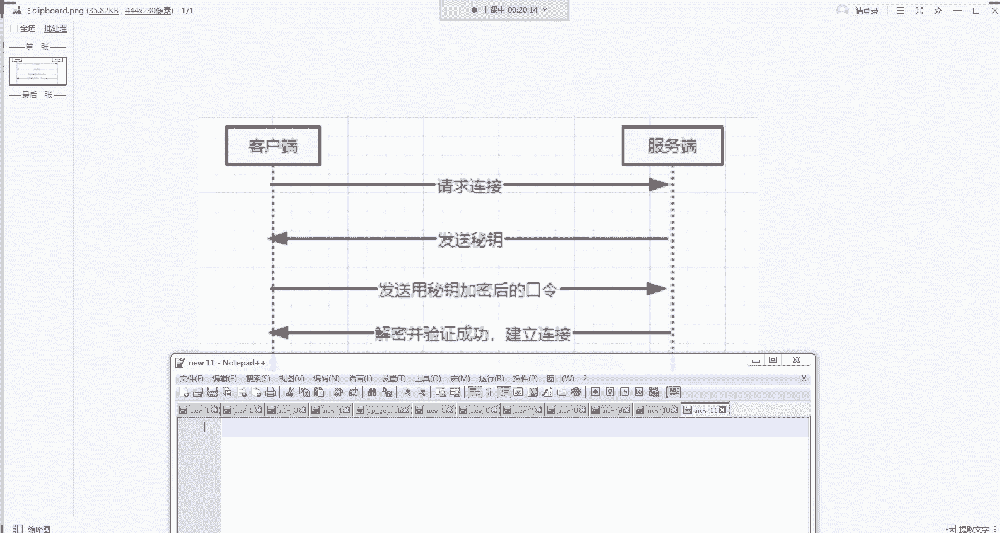

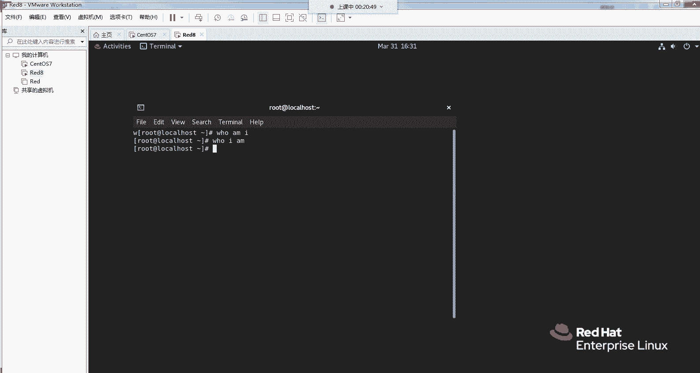

## 概述
在本节课中，我们将要学习SSH（安全外壳协议）的基本概念、工作原理以及实际应用。SSH是连接和管理远程Linux服务器的核心工具，掌握它对于日常运维和开发工作至关重要。我们将从两种主要的身份验证方式讲起，并演示如何配置免密登录以及使用SCP命令进行安全的文件传输。

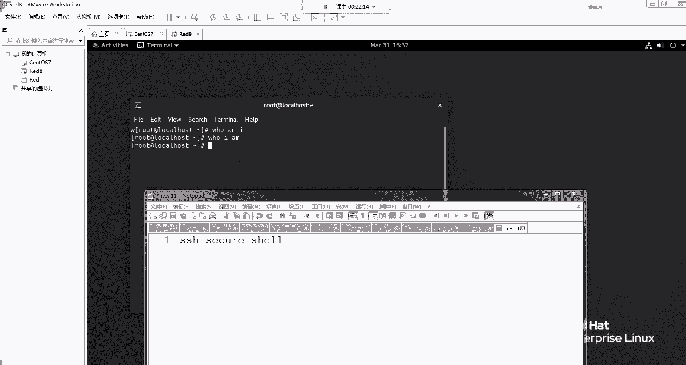

## SSH简介与连接逻辑
上一节我们概述了SSH的重要性，本节中我们来看看SSH具体是什么以及它是如何建立安全连接的。

SSH的全称是 **Secure Shell**，它是一种加密的网络协议，用于在不安全的网络上提供安全的远程登录和其他安全网络服务。

SSH连接主要分为两种验证方式：**密码验证** 和 **密钥对验证**。理解这两种方式的逻辑有助于我们更好地使用和配置SSH。

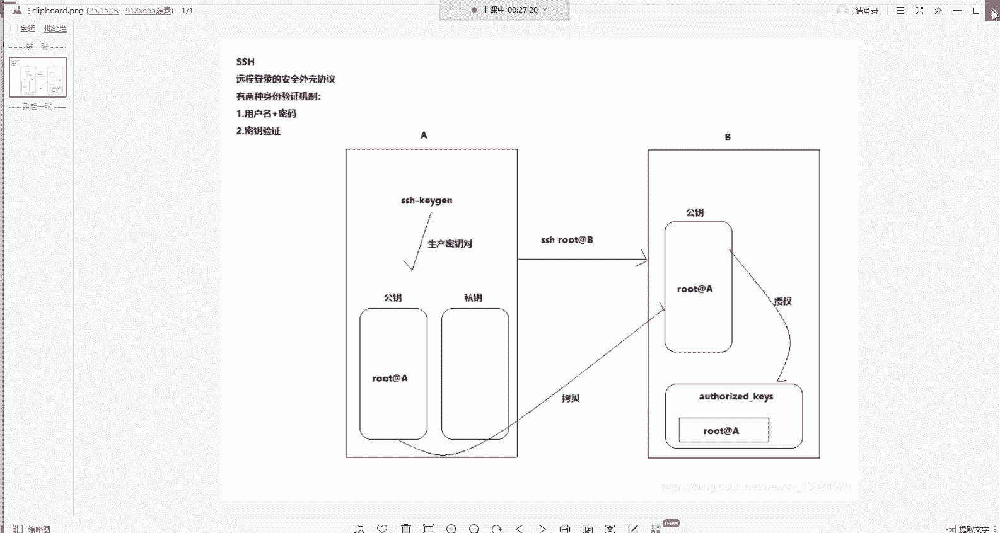

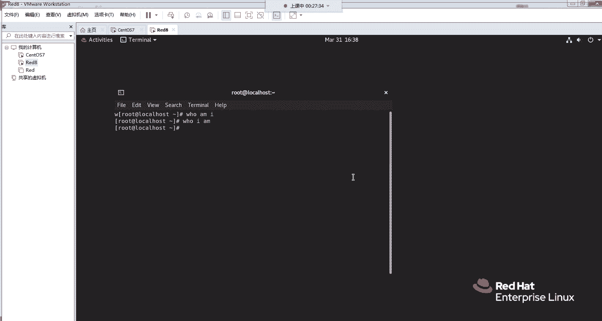

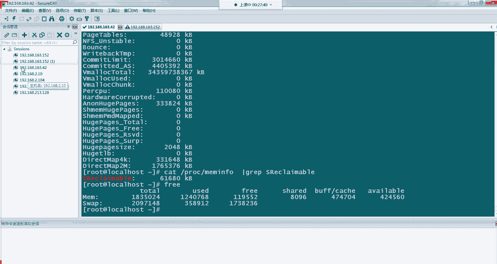

### 密码验证方式
以下是密码验证方式的基本流程：
1.  客户端向服务器发起连接请求。
2.  服务器将自己的公钥发送给客户端。
3.  客户端使用收到的公钥加密登录密码，然后发送回服务器。
4.  服务器用自己的私钥解密，验证密码正确后，建立连接。

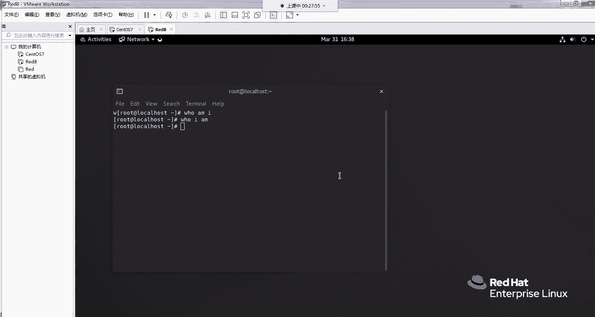

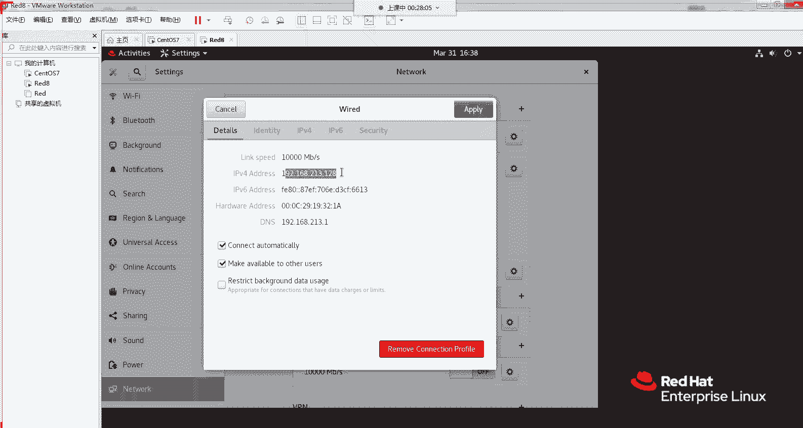

### 密钥对验证方式
密钥对验证比密码验证更安全，以下是其工作流程：
1.  在客户端生成一对密钥：**私钥**（`id_rsa`）和**公钥**（`id_rsa.pub`）。
2.  将公钥内容添加到远程服务器的授权文件（`~/.ssh/authorized_keys`）中。
3.  客户端连接时，服务器会生成一个随机字符串，用存储的公钥加密后发送给客户端。
4.  客户端用本地私钥解密后，将结果发回服务器。
5.  服务器验证结果匹配，则允许登录，无需输入密码。

其核心命令是生成密钥对：
```bash
ssh-keygen -t rsa
```

## 实践操作：配置SSH连接
上一节我们介绍了SSH的两种验证原理，本节中我们通过实际操作来配置这两种连接方式。

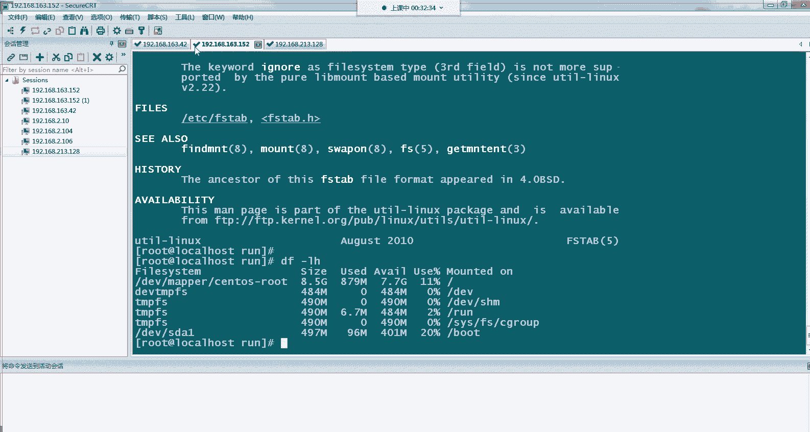

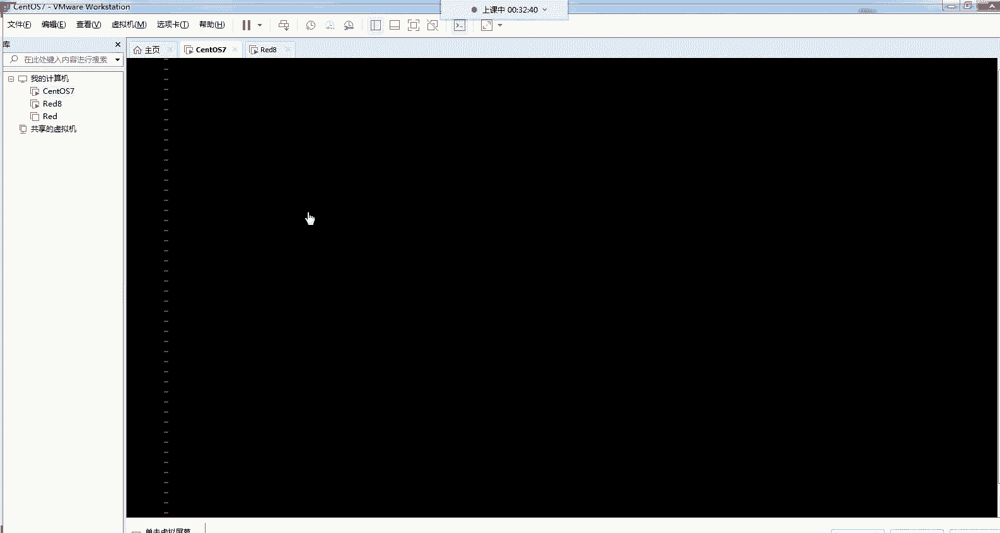

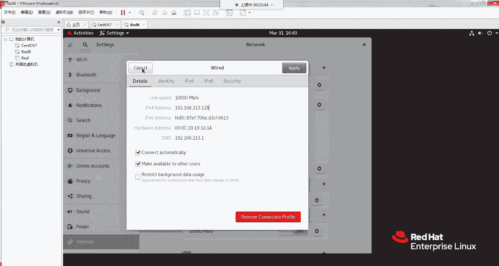

### 密码验证登录
使用密码验证是最直接的方式。在终端或SSH客户端（如Xshell、SecureCRT）中，使用以下命令格式：
```bash
ssh username@remote_server_ip
```
执行命令后，根据提示输入用户密码即可登录。


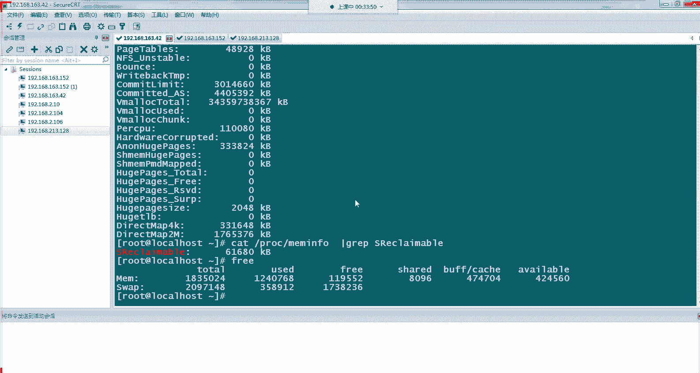

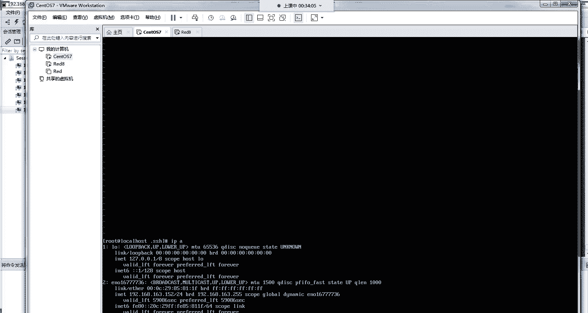

### 配置密钥对免密登录
为了实现更安全、便捷的免密登录，我们需要配置密钥对验证。

以下是配置密钥对免密登录的步骤：
1.  **在客户端生成密钥对**：执行 `ssh-keygen -t rsa` 命令，一路回车使用默认设置即可。
2.  **将公钥部署到服务器**：有两种常用方法。
    *   **方法一：使用 `ssh-copy-id` 命令（推荐）**
        ```bash
        ssh-copy-id username@remote_server_ip
        ```
        根据提示输入服务器密码，公钥会自动上传并配置。
    *   **方法二：手动复制公钥**
        1.  查看并复制客户端公钥内容：`cat ~/.ssh/id_rsa.pub`
        2.  登录服务器，编辑 `~/.ssh/authorized_keys` 文件，将复制的公钥内容粘贴进去并保存。
3.  **测试免密登录**：配置完成后，再次使用 `ssh username@remote_server_ip` 命令，应该可以直接登录，无需输入密码。

## SSH高级应用：SCP安全文件传输
在成功配置SSH连接后，我们可以利用它进行安全的远程文件传输，这是运维工作中的常见需求。

SCP（Secure Copy）是基于SSH协议的文件传输命令，它利用了我们已经建立的SSH安全通道。

以下是SCP命令的基本用法：
*   **将本地文件复制到远程服务器**（推文件）：
    ```bash
    scp local_file.txt username@remote_server_ip:/remote/directory/
    ```
*   **将远程服务器文件复制到本地**（拉文件）：
    ```bash
    scp username@remote_server_ip:/remote/file.txt /local/directory/
    ```
*   **递归复制整个目录**：
    ```bash
    scp -r local_folder username@remote_server_ip:/remote/directory/
    ```

**注意**：如果配置了密钥对免密登录，使用SCP时也无需再输入密码，这在大规模集群运维和自动化脚本中极大地提升了效率。

## 安全建议与总结
本节课我们一起学习了SSH的核心知识与应用。

**核心要点总结**：
1.  SSH是用于安全远程登录的加密协议。
2.  两种主要验证方式：**密码验证** 和更安全的 **密钥对验证**。
3.  使用 `ssh-keygen` 和 `ssh-copy-id` 可以便捷地配置免密登录。
4.  基于SSH的 `scp` 命令可以实现安全的远程文件传输。

**安全建议**：
*   **优先使用密钥对验证**：避免密码被暴力破解的风险。
*   **妥善保管私钥**：私钥文件（`id_rsa`）等同于密码，切勿泄露。
*   **定期更换密钥**：为提升安全性，应定期更新密钥对。
*   **使用强密码**：如果使用密码验证，请设置足够复杂和长的密码。

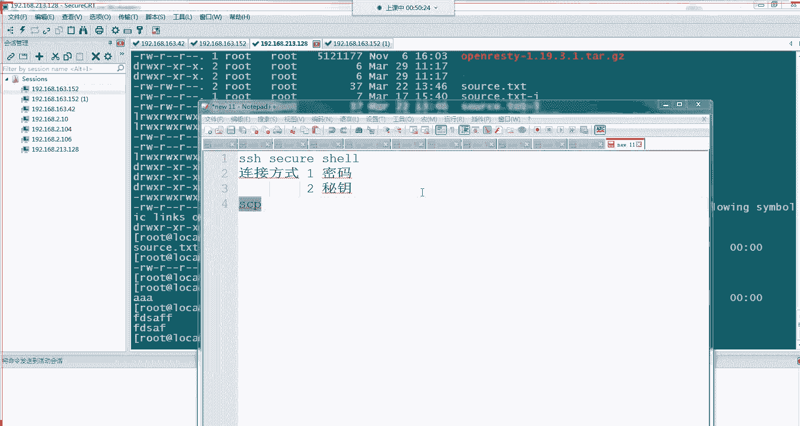

SSH是Linux系统管理和自动化运维的基石，熟练掌握其原理与操作，将为你的技术工作打下坚实的基础。