# Linux小课堂：P6：Web故障排除系列3 - 域名解析与配置冲突排查 🔍

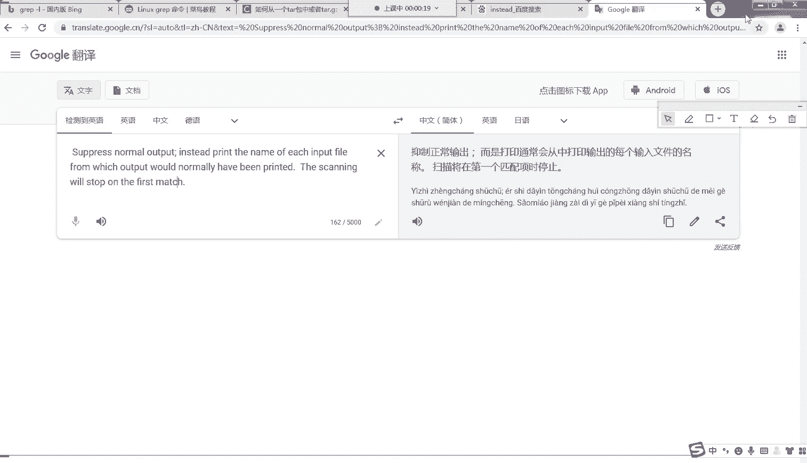

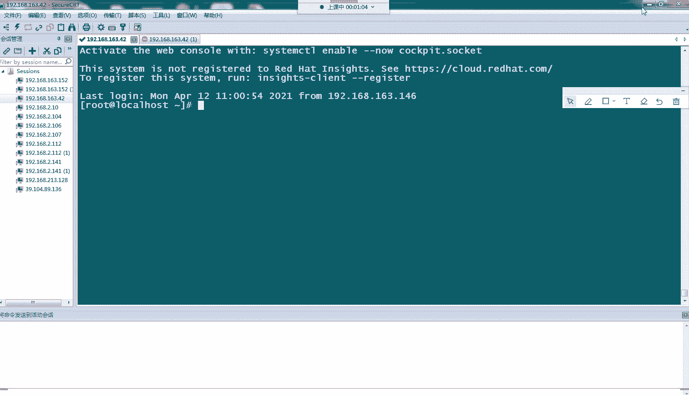


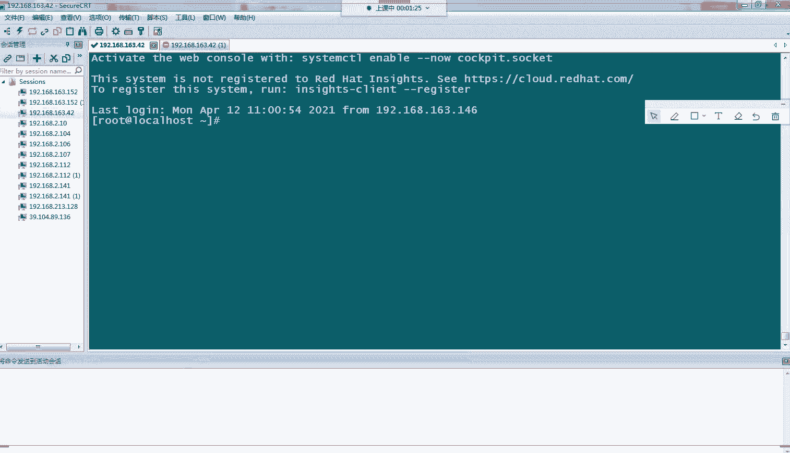

在本节课中，我们将学习两种常见的Web服务访问故障的排查思路：域名解析问题和Nginx配置冲突问题。我们将通过模拟场景，一步步分析问题根源并找到解决方案。

---

## 概述 📋

当用户报告无法访问网站或访问到错误的页面时，作为运维人员，我们需要一套清晰的排查流程。本节课将重点讲解从客户端到服务端的链路排查方法，以及服务器端Nginx配置冲突的识别与解决。

---

## 一、域名解析与网络连通性故障排查 🌐

上一节我们介绍了HTTP状态码相关的故障，本节中我们来看看当用户反馈“网站打不开”时，如何从网络层面进行排查。

完整的排查思路应遵循从用户端到服务端的路径，层层递进。

### 排查步骤

以下是标准的排查流程，建议按顺序执行：

1.  **检查域名解析**
    *   让用户在其本地使用 `nslookup` 命令查询网站域名的IP地址。
    *   **命令示例**：`nslookup www.example.com`
    *   对比解析出的IP是否与服务器配置的公网IP一致。如果不一致，则可能是DNS劫持，需要联系用户所在运营商或通过公司渠道申诉。


2.  **检查网络连通性**
    *   让用户使用 `ping` 命令测试与解析出的IP地址的连通性。
    *   **命令示例**：`ping <解析出的IP地址>`
    *   观察丢包率（loss）。如果丢包率为100%或很高，说明网络链路不稳定或不通，同样需要联系运营商排查。

3.  **检查服务器本地服务状态**
    *   如果前两步均正常，则需登录服务器进行检查。
    *   确认Web服务进程（如Nginx）是否正常运行：`systemctl status nginx` 或 `ps -ef | grep nginx`。
    *   在服务器本地使用 `curl` 命令测试服务是否正常响应。
    *   **命令示例**：`curl -I http://localhost`
    *   如果返回状态码非200（如404、502），则需根据对应错误码进行排查（参考前两节课内容）。

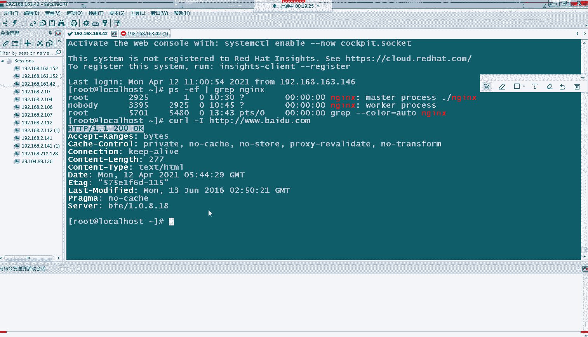

4.  **处理极端情况**
    *   如果上述所有检查均正常，但用户仍无法访问，则可能是用户到服务器之间的中间网络节点存在问题（如特殊劫持），需协调更高级别的网络团队处理。
    *   如果 `nslookup` 完全无法解析出IP，可能是域名解析记录未全球同步或配置错误，需联系域名注册商核查。

### 模拟演示：域名解析失败


通过修改本地 `hosts` 文件，可以模拟域名解析成功与失败的状态。

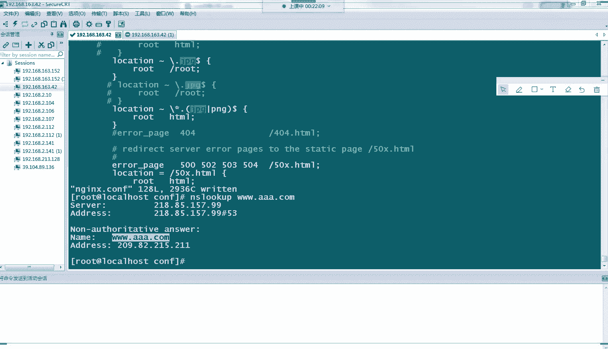

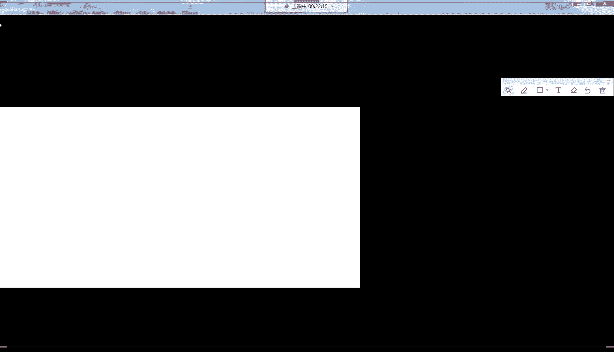

1.  **解析失败状态**：当域名 `www.aa.com` 未被正确解析时，浏览器访问会失败。
2.  **修复解析**：编辑 `hosts` 文件，手动将域名指向正确的服务器IP。
    *   **文件路径**（Linux）: `/etc/hosts`
    *   **文件路径**（Windows）: `C:\Windows\System32\drivers\etc\hosts`
    *   **添加记录**：`<服务器IP> www.aa.com`
3.  **再次访问**：此时浏览器即可正常访问该网站，模拟了解析修复后的效果。


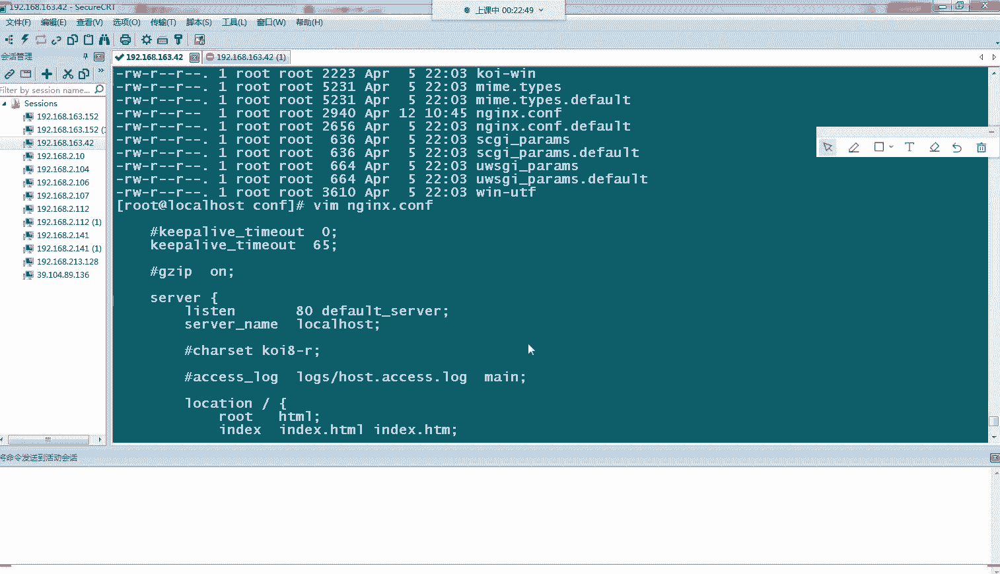

---

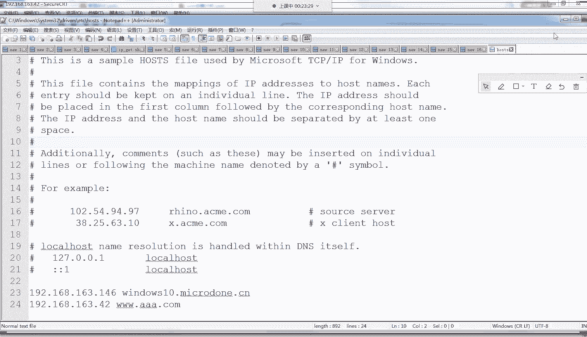

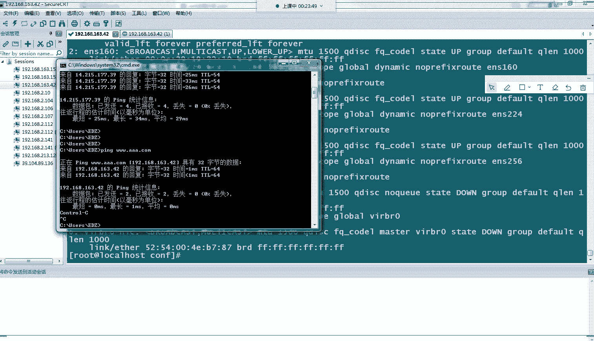

## 二、Nginx配置冲突导致页面错误 🛠️

在确保网络和服务都正常之后，另一种常见故障是：用户访问到的页面内容不是我们期望的最新版本，而是旧的页面。这通常源于Nginx配置文件中的 `location` 规则出现了重叠或冲突。

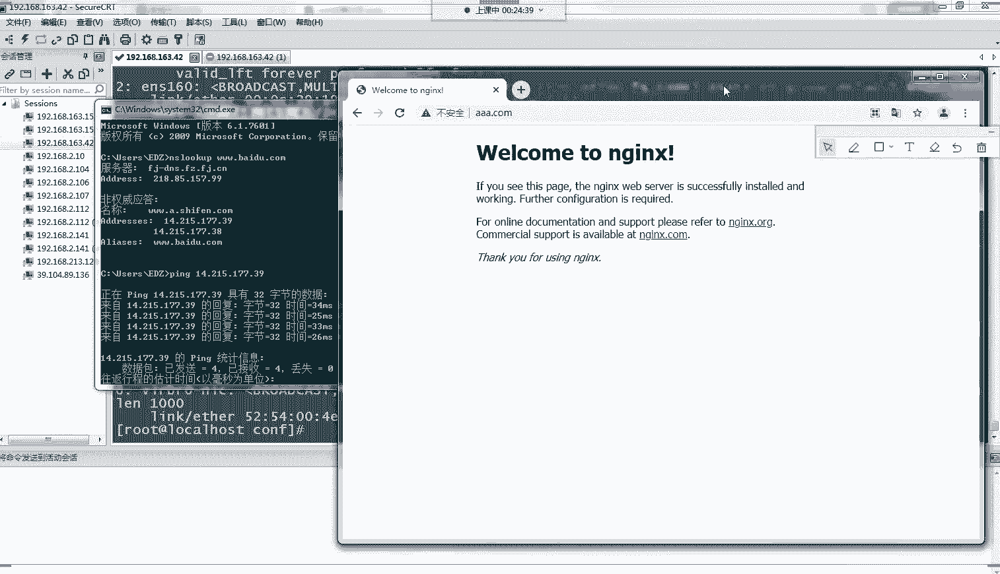

### 问题原理

Nginx在处理请求时，会按照配置文件中的 `location` 规则进行匹配。如果存在多条规则可以匹配同一个请求，则可能产生冲突，最终生效的规则可能并非运维人员所期望的那一条。

### 模拟演示：配置冲突

假设Nginx中有以下两条 `location` 规则：

```nginx
location ~* \.(gif|jpg|png)$ {
    root /usr/share/nginx/html;
}

location ~* \.jpg$ {
    root /usr/share/nginx/root;
}
```

*   **第一条规则**：匹配所有 `.gif`、`.jpg`、`.png` 结尾的请求，到 `/html` 目录寻找文件。
*   **第二条规则**：匹配所有 `.jpg` 结尾的请求，到 `/root` 目录寻找文件。

对于 `test.jpg` 这个请求，两条规则都能匹配。Nginx的匹配存在优先级，通常更精确或先定义的规则可能生效。这可能导致：
1.  用户访问 `test.jpg` 时，实际访问的是 `/root` 目录下的旧文件。
2.  或者因为 `/root` 目录权限问题，直接返回 **403 Forbidden** 错误。
3.  当我们在 `/html` 目录更新了 `test.jpg` 文件后，用户看到的却依然是旧图片。

### 解决方案

1.  **仔细审查配置**：检查所有 `location` 块，找出是否存在匹配范围重叠的规则。
2.  **调整或注释规则**：确定希望哪条规则生效，将冲突的、不需要的规则注释掉或修改其匹配条件。
3.  **重载配置**：修改后，使用 `nginx -s reload` 命令平滑重载配置，使更改生效。

**核心排查思路**：当页面内容不符合预期时，应首先怀疑是配置覆盖问题，仔细比对线上配置文件与预期配置文件之间的差异。

---

## 总结 🎯

本节课中我们一起学习了两种Web服务故障的排查：

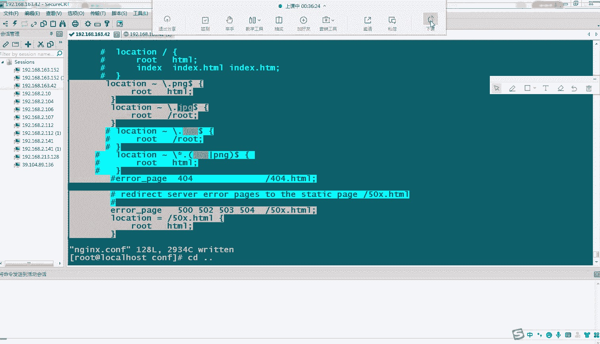

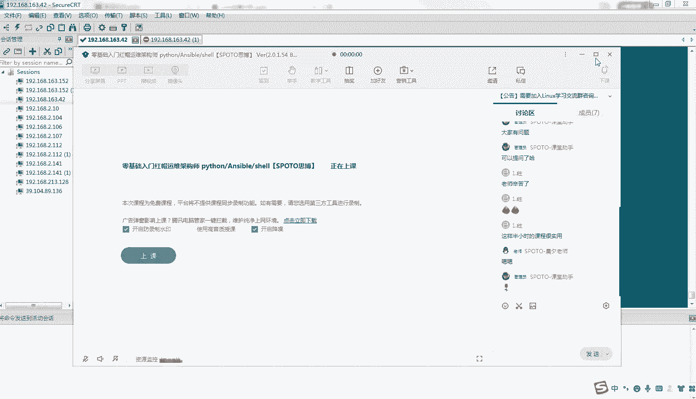

1.  **对于“网站无法访问”**：应采用从客户端到服务端的链路式排查法，依次检查 **域名解析 -> 网络连通 -> 服务状态**。这是处理用户端反馈的通用流程。
2.  **对于“访问到错误页面”**：应重点排查服务器 **Nginx配置文件**，检查是否存在 `location` 规则冲突或覆盖，导致请求被错误地路由到了旧的资源路径。

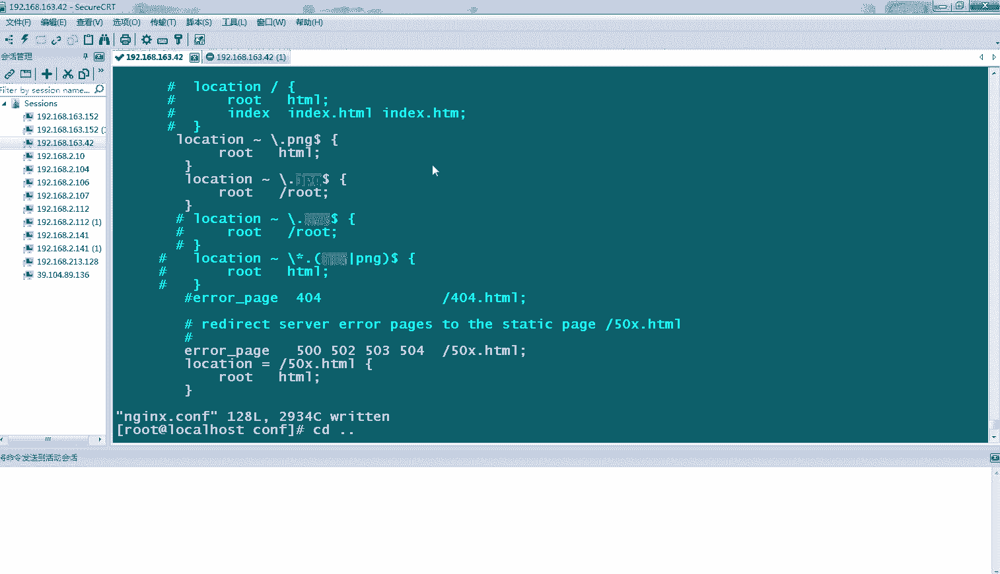


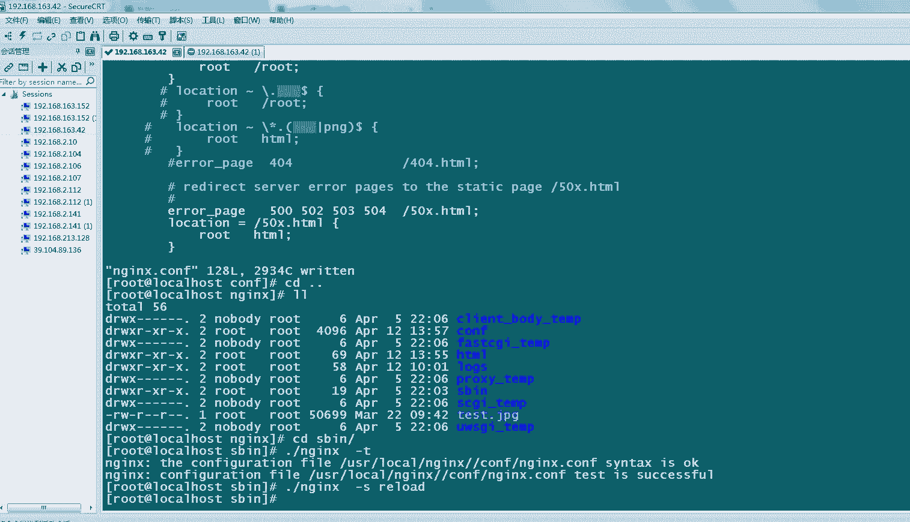

掌握这两种排查思路，能有效解决日常运维中一大部分常见的Web访问故障。