# Linux小课堂：P7：系统状态查看 🔍

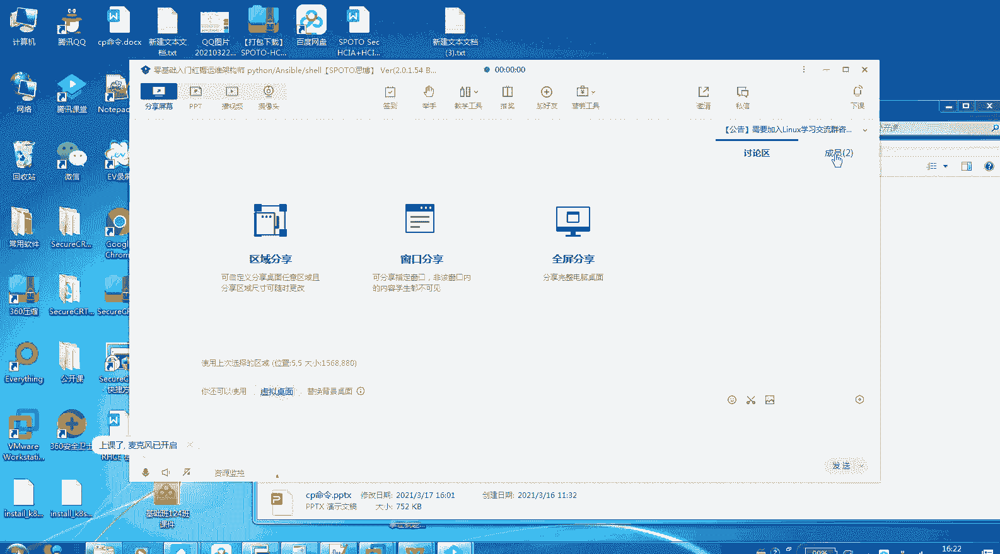

在本节课中，我们将学习如何查看Linux系统的运行状态。掌握这些命令，可以帮助你快速了解系统的负载、内存使用、磁盘空间和网络连接等关键信息，是系统管理和故障排查的基础。

上一节我们介绍了文件操作，本节中我们来看看如何监控系统自身的运行状况。

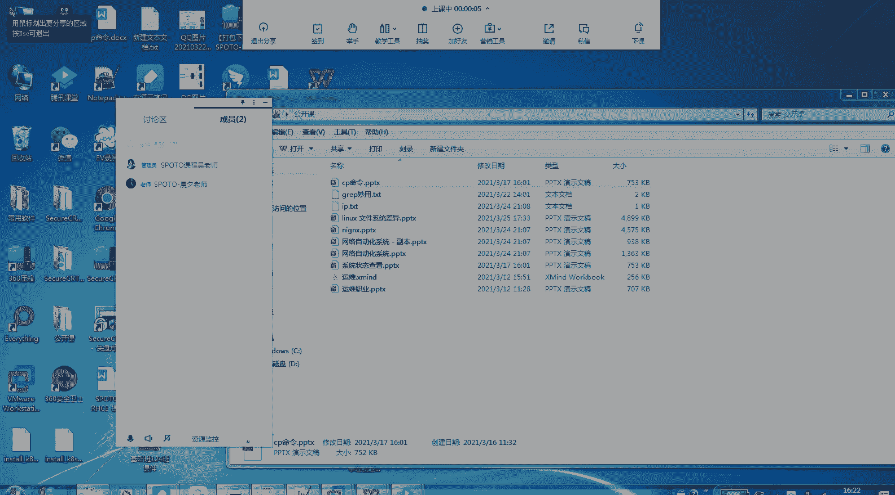

## 1. 查看系统负载与进程

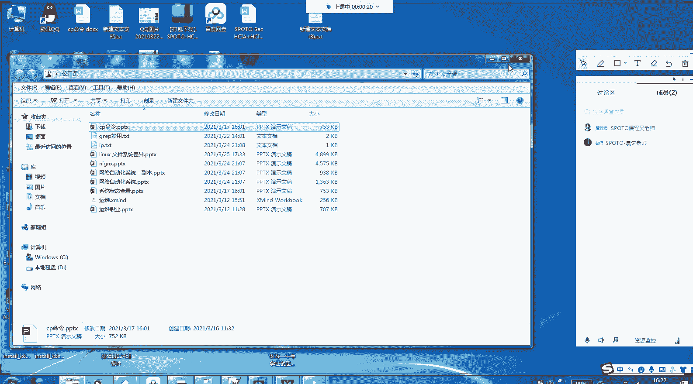

要了解系统当前的整体负载和正在运行的进程，最常用的命令是 `top`。

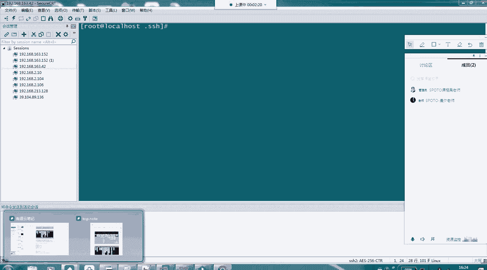

`top` 命令会动态显示系统的进程信息，包括CPU使用率、内存使用率以及每个进程的详细情况。

以下是 `top` 命令运行后的关键信息区域解释：

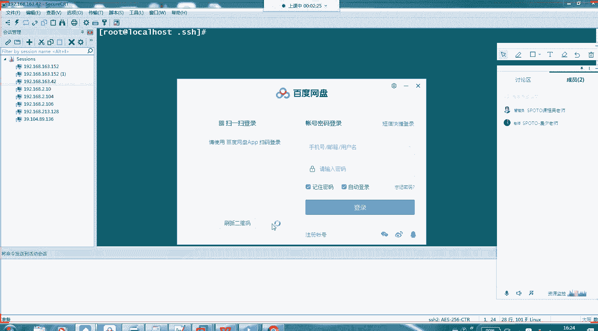

*   **第一行（系统概况）**：显示当前时间、系统运行时间、登录用户数以及系统平均负载（load average）。
*   **第二行（任务概况）**：显示进程总数及其状态（运行、睡眠、停止等）。
*   **第三行（CPU使用率）**：以百分比显示CPU的使用情况，如用户空间、系统空间、空闲等。
*   **第四行（内存使用）**：显示物理内存的总量、使用量、空闲量等。
*   **第五行（交换分区）**：显示交换空间的使用情况。
*   **下方列表**：按CPU使用率排序显示各个进程的详细信息，如PID（进程ID）、用户、CPU占用、内存占用和命令。

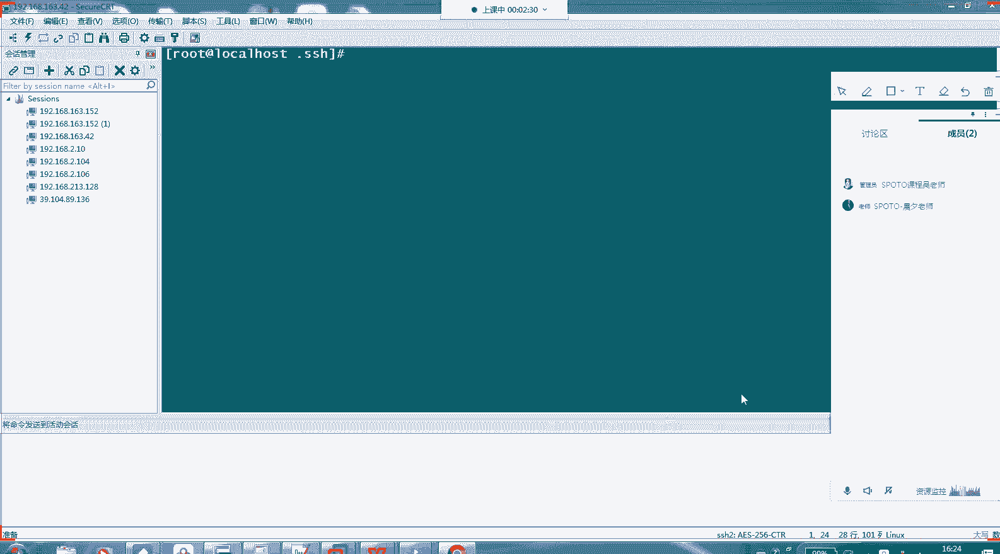

按 `q` 键可以退出 `top` 界面。

## 2. 查看内存使用情况

除了在 `top` 中查看，我们还可以使用 `free` 命令专门查看内存和交换分区的使用情况。

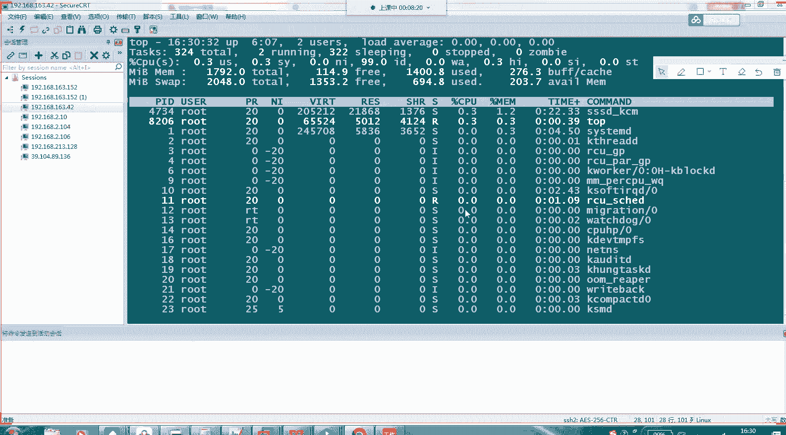

`free` 命令默认以千字节（KB）为单位显示信息。使用 `-h` 参数可以以更易读的单位（如G、M）显示。

以下是 `free -h` 命令输出的列含义：

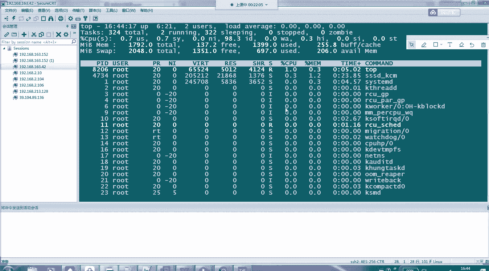

*   **total**：内存总量。
*   **used**：已使用的内存量。
*   **free**：空闲的内存量。
*   **shared**：被共享使用的内存量。
*   **buff/cache**：被缓冲和缓存使用的内存量。这部分内存在需要时可以被释放。
*   **available**：估算的、可供启动新应用程序的内存数量，比 `free` 列的值更实际。

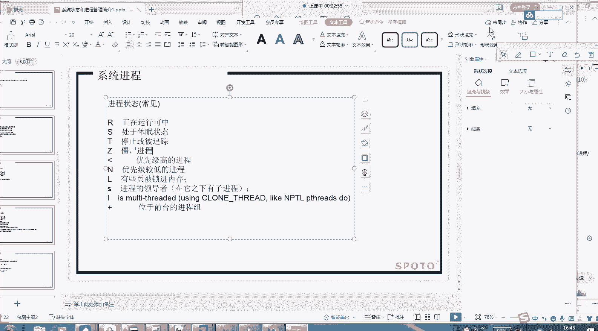

## 3. 查看磁盘空间使用情况

要了解磁盘分区的使用情况，我们需要使用 `df` 命令。

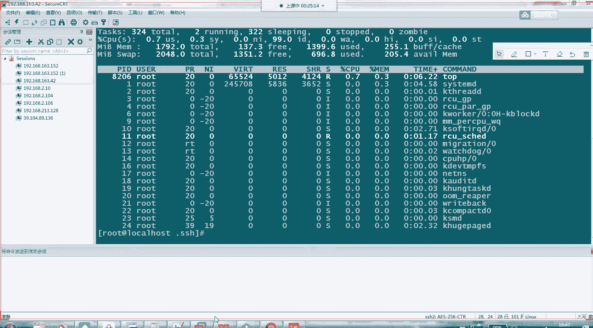

`df` 命令可以报告文件系统的磁盘空间使用情况。

同样，使用 `-h` 参数可以让输出更易读。

以下是 `df -h` 命令输出的列含义：

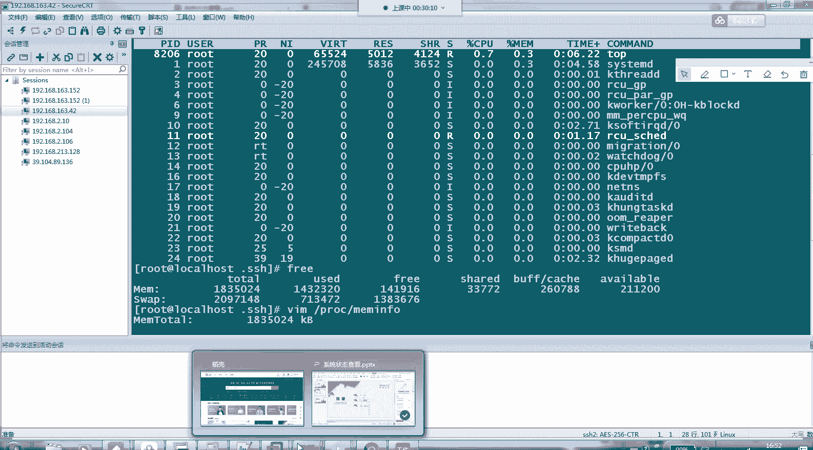

*   **Filesystem**：文件系统（磁盘分区）的设备名。
*   **Size**：分区的总容量。
*   **Used**：已使用的容量。
*   **Avail**：可用的剩余容量。
*   **Use%**：已用空间的百分比。
*   **Mounted on**：该分区被挂载到的目录（挂载点）。

## 4. 查看网络连接信息

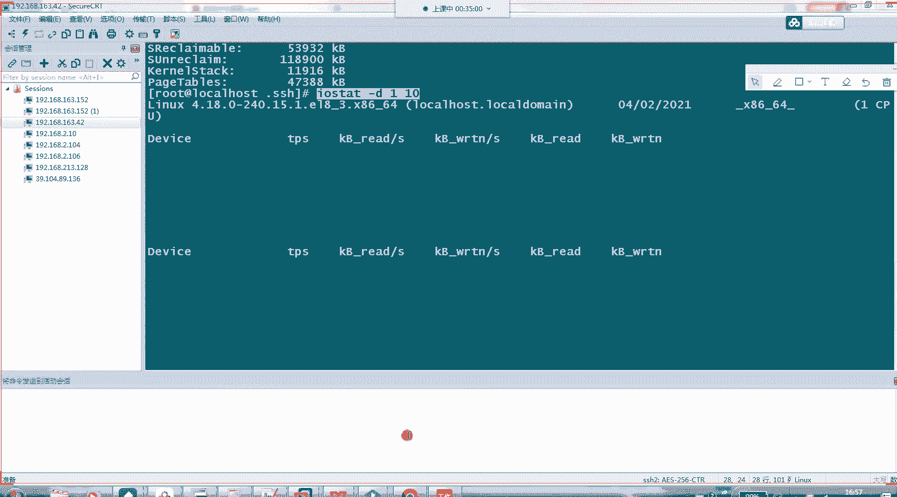

`netstat` 命令是一个功能强大的网络工具，用于显示网络连接、路由表、接口统计等信息。

一个常用的组合是 `netstat -tulnp`，它可以列出所有正在监听的TCP/UDP端口及其对应的进程。

以下是 `netstat -tulnp` 命令参数和输出列的解释：

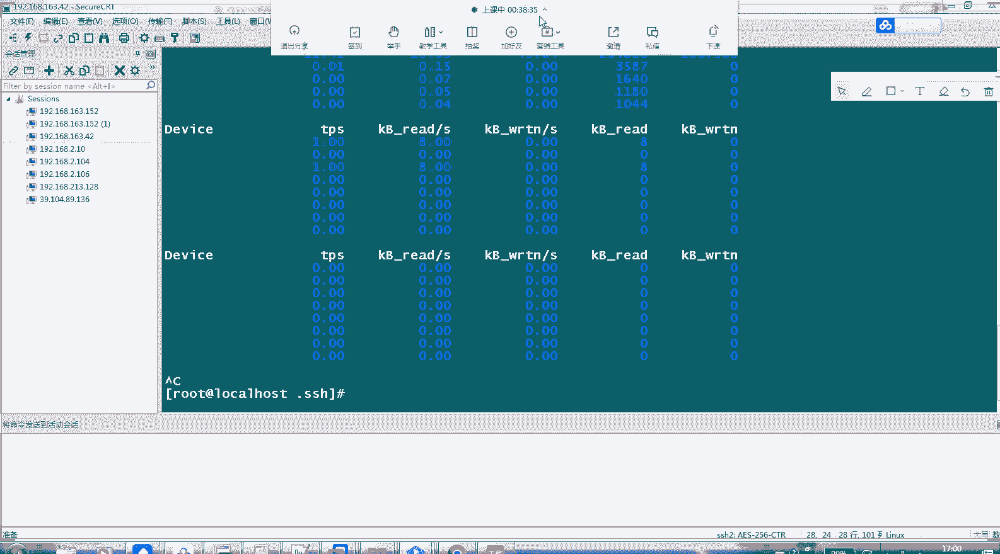

*   **-t**：显示TCP连接。
*   **-u**：显示UDP连接。
*   **-l**：仅显示监听状态的套接字。
*   **-n**：以数字形式显示地址和端口号，不进行域名解析。
*   **-p**：显示占用该端口的进程ID和名称。

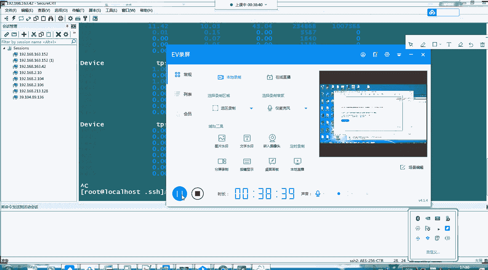

输出列包括协议（Proto）、本地地址（Local Address）、外部地址（Foreign Address）、状态（State）以及进程ID/名称（PID/Program name）。

本节课中我们一起学习了四个查看Linux系统状态的核心命令：`top`（查看进程与负载）、`free`（查看内存）、`df`（查看磁盘）和 `netstat`（查看网络）。熟练运用这些命令，你就能对系统的运行状况了如指掌，为后续的系统管理和优化工作打下坚实基础。