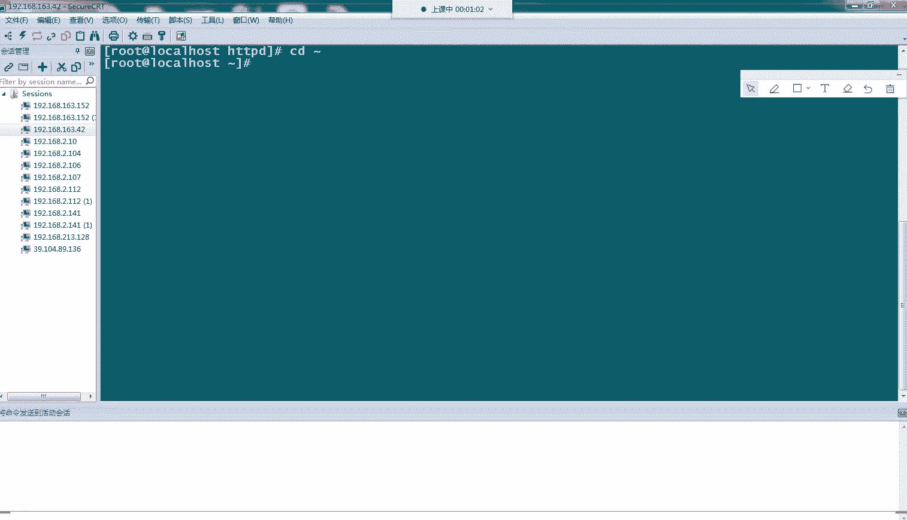
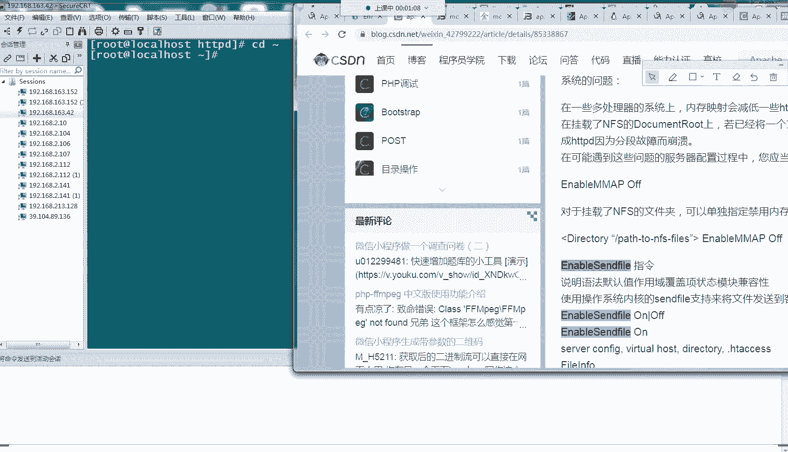
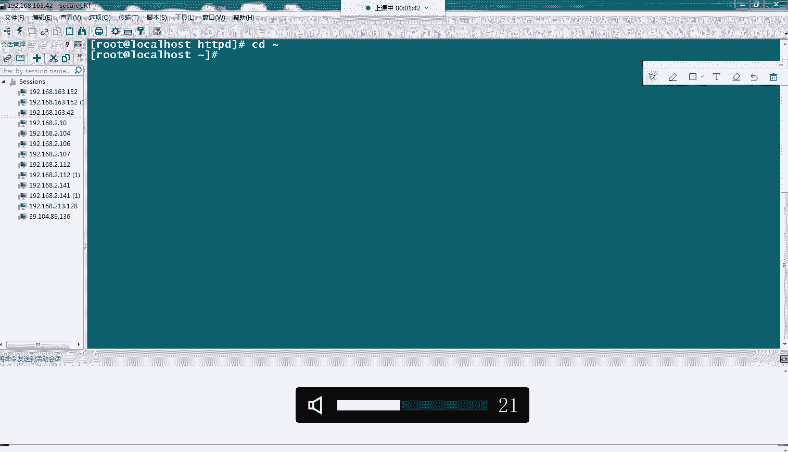
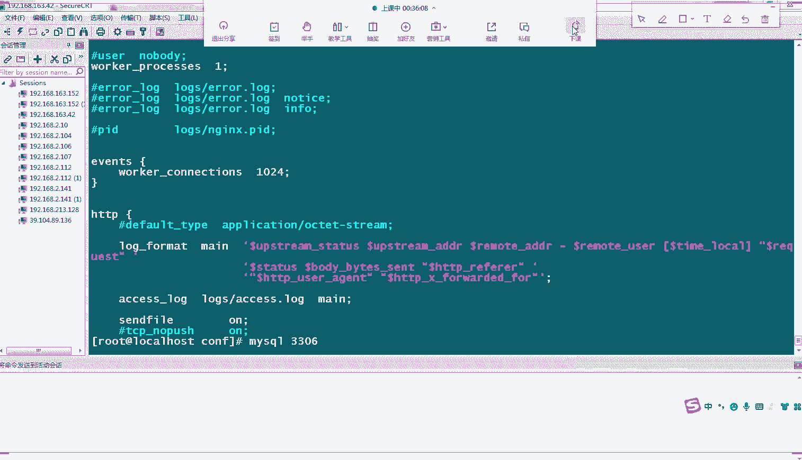
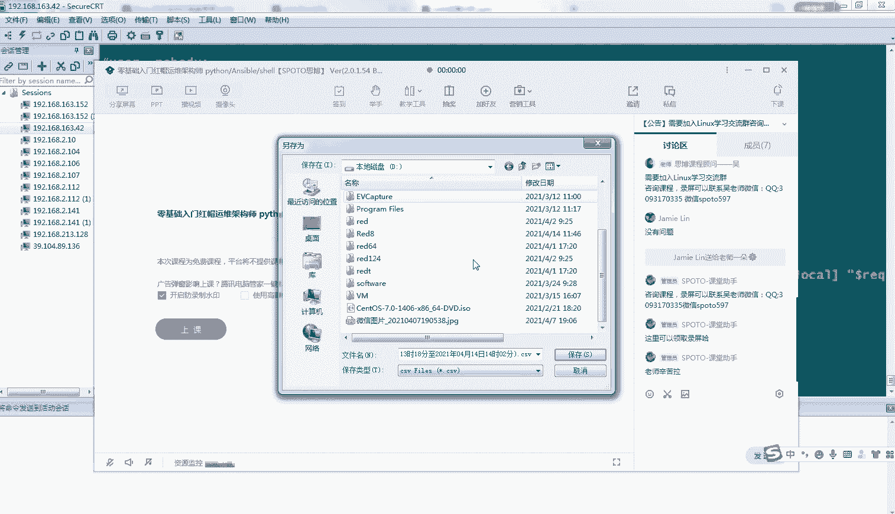

# Linux小课堂：P8：Web故障排除系列4 - Nginx无法启动 🚨







在本节课中，我们将学习导致Nginx服务无法启动的三种常见情况及其解决方法。我们将通过模拟故障场景，分析错误日志，并提供清晰的解决步骤，帮助初学者快速定位并解决问题。

---

## 概述 📋

Nginx作为一款高性能的Web服务器，在启动时可能会遇到各种问题导致服务无法正常运行。本节课将聚焦于三种典型的启动失败场景：端口冲突、IP地址绑定错误以及非root用户权限不足。理解这些场景有助于我们在日常运维中快速排错。


---

## 情况一：端口冲突 ⚠️

上一节我们介绍了Web服务访问异常，本节中我们来看看Nginx启动失败的第一种情况——端口冲突。当Nginx试图绑定的端口（如80端口）已被其他服务占用时，启动就会失败。

以下是端口冲突的排查与解决步骤：

1.  **检查端口占用情况**：使用命令 `netstat -tlnp | grep :80` 查看80端口是否被其他进程占用。
2.  **确认冲突进程**：如果端口被占用，命令输出会显示占用该端口的进程ID和名称。
3.  **解决冲突**：有两种选择：
    *   **停止占用端口的服务**：例如，使用 `systemctl stop httpd` 停止Apache服务。
    *   **修改Nginx监听端口**：编辑Nginx配置文件（如 `/usr/local/nginx/conf/nginx.conf`），将 `listen 80;` 改为其他未被占用的端口（如 `listen 8080;`）。
4.  **重启Nginx**：修改配置后，使用 `nginx -s reload` 重新加载配置或 `systemctl restart nginx` 重启服务。

**核心命令示例**：
```bash
# 检查80端口占用
netstat -tlnp | grep :80

# 修改Nginx配置后测试语法
nginx -t

# 重新加载Nginx配置
nginx -s reload
```

---

## 情况二：IP地址绑定错误 🔍

解决了端口问题后，我们来看第二种情况：IP地址绑定错误。如果Nginx配置文件中指定的监听IP地址在服务器上不存在（网卡未配置该IP），服务将无法启动。

以下是IP地址绑定错误的排查与解决步骤：

1.  **检查服务器IP地址**：使用命令 `ip addr` 或 `ifconfig` 查看服务器当前配置的所有IP地址。
2.  **核对Nginx配置**：检查Nginx配置文件（如 `nginx.conf`）中 `server` 块下的 `listen` 指令。例如，`listen 192.168.1.100:80;` 表示监听特定IP。
3.  **修正IP地址**：
    *   如果配置的IP错误，将其修改为服务器真实的IP地址。
    *   如果想监听所有IP，可以改为 `listen 80;` 或 `listen 0.0.0.0:80;`。
4.  **查看错误日志**：启动失败时，详细错误信息会记录在Nginx错误日志中（通常位于 `/usr/local/nginx/logs/error.log`）。日志中会出现类似 `bind() to 192.168.1.100:80 failed (99: Cannot assign requested address)` 的错误。

**核心概念**：`listen` 指令用于指定Nginx监听的IP和端口。若IP不存在，则绑定失败。

---

## 情况三：非Root用户权限不足 🔐

最后，我们探讨一种特殊情况：使用非root用户启动Nginx并监听1024以下的特权端口（如80端口）时，会因系统权限限制而失败。

以下是权限问题的原理与解决方法：

1.  **理解权限限制**：在Linux系统中，1024以下的端口号被视为“特权端口”，默认只允许root用户绑定。这是系统的安全设计。
2.  **复现问题**：尝试使用普通用户执行 `nginx` 命令启动服务，如果配置监听80端口，会收到 `bind() to 0.0.0.0:80 failed (13: Permission denied)` 的错误。
3.  **标准解决方案**：
    *   **使用Root用户启动主进程**：这是标准的做法。Nginx的主进程（Master Process）需要root权限来绑定特权端口。
    *   **Worker进程以普通用户运行**：在Nginx配置文件中，通过 `user` 指令（例如 `user nginx;`）可以指定工作进程（Worker Process）以非特权用户身份运行，以提高安全性。
4.  **替代方案（不推荐用于生产环境）**：如果需要让普通程序绑定特权端口，可以使用Linux能力机制（如 `setcap` 命令），但这会带来安全风险，应谨慎使用。

**工作流程简述**：
1.  Root用户启动Nginx主进程，成功绑定80端口。
2.  主进程创建多个Worker进程来处理实际请求。
3.  Worker进程根据配置，以普通用户（如 `www-data`, `nginx`）身份运行，实现权限分离。

---

## 总结 🎯

本节课中我们一起学习了导致Nginx无法启动的三种常见故障及其排除方法：

1.  **端口冲突**：通过 `netstat` 或 `ss` 命令检查端口占用，通过停止冲突服务或修改Nginx监听端口来解决。
2.  **IP地址绑定错误**：核对服务器真实IP与Nginx配置中 `listen` 指令指定的IP是否一致，并通过错误日志定位问题。
3.  **非Root用户权限不足**：理解Linux特权端口限制，遵循使用root启动主进程、以普通用户运行Worker进程的最佳实践。





掌握这些排查思路，能够帮助您在面对Nginx启动失败时，有条理地分析问题并快速恢复服务。记住，查看Nginx的错误日志（`error.log`）是获取详细故障信息的最直接途径。