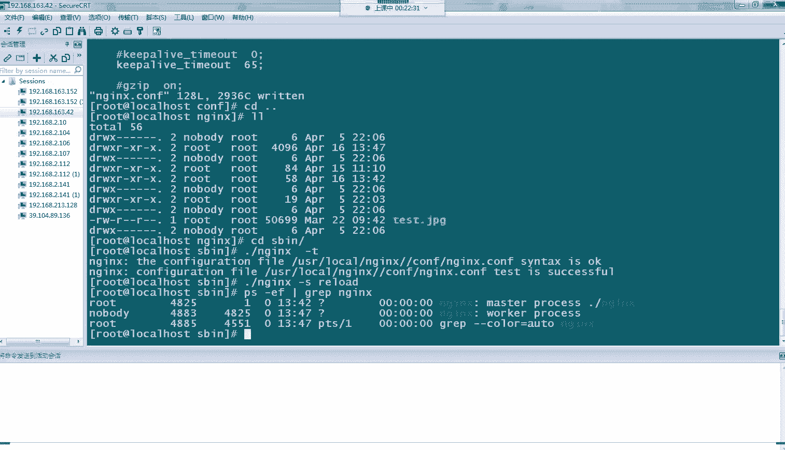
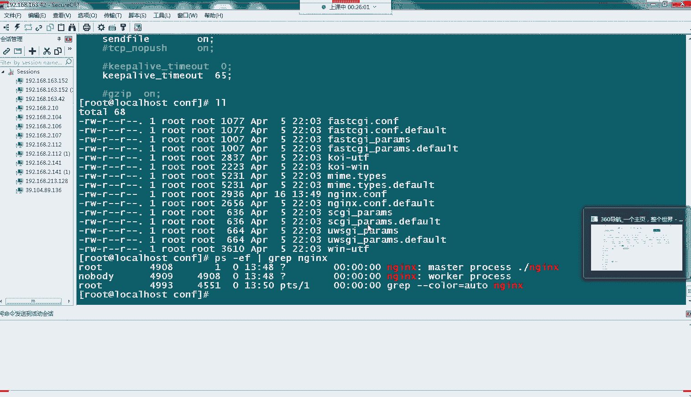
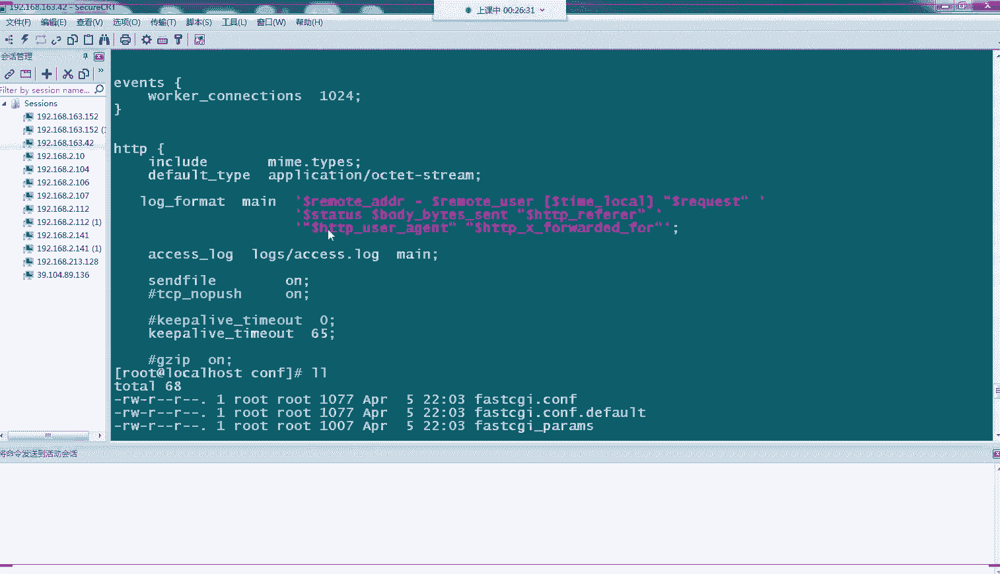
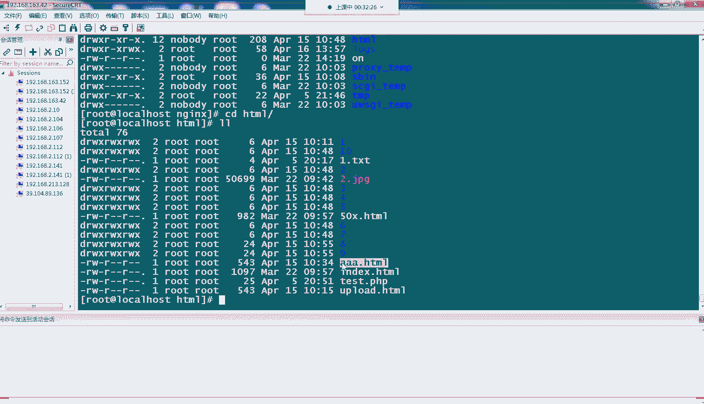
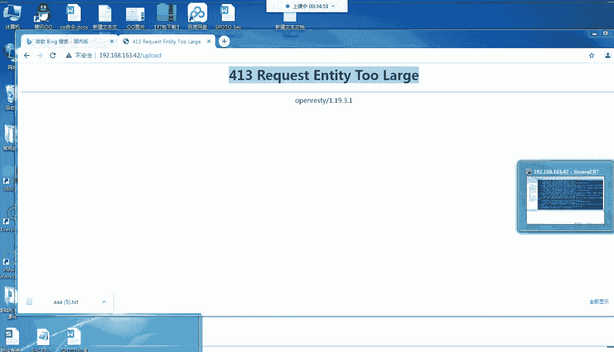
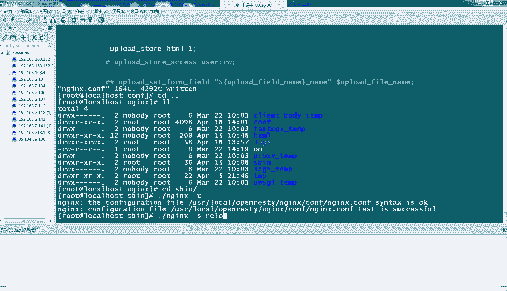
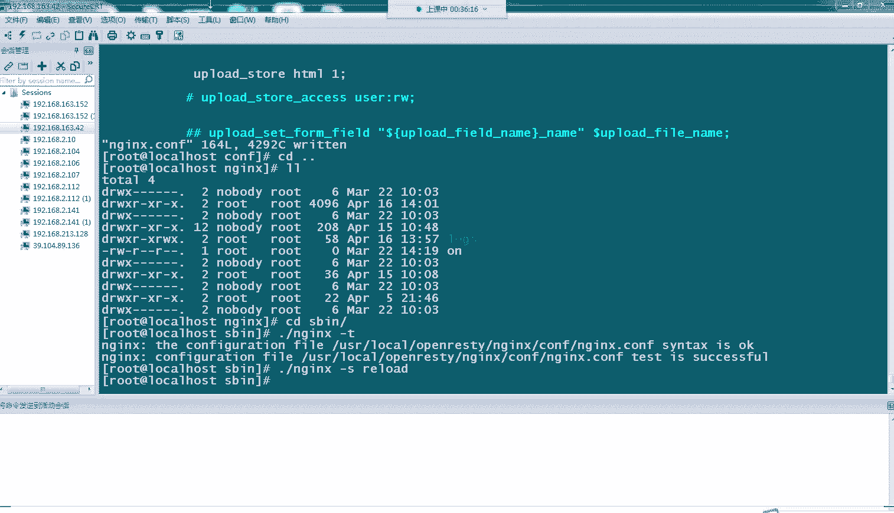
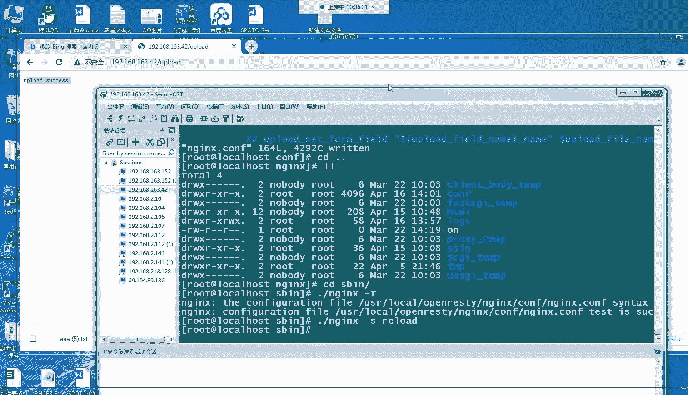
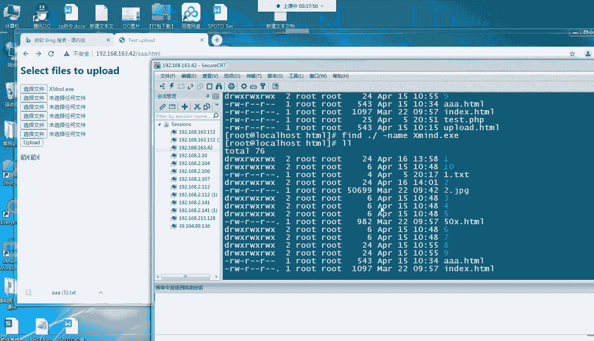

# Linux小课堂：P9：Web故障排除系列5 - 文件上传下载故障 🛠️


在本节课中，我们将学习两种常见的Web服务故障：访问文本文件时浏览器直接下载文件，以及上传大文件时出现413错误。我们将通过实际操作演示问题的原因和解决方法。

## 概述 📋

在之前的课程中，我们介绍了403、404、502等Web访问错误，以及Nginx服务无法启动的常见原因。本节是Web故障排除系列的最后一节，我们将聚焦于文件处理相关的两个问题：文件内容被错误地下载，以及上传大文件时被服务器拒绝。

## 故障一：文件内容被下载而非展示 📄


上一节我们介绍了Nginx服务启动失败的原因，本节中我们来看看文件访问时的一个常见现象。有时，我们希望服务器上的文本文件（如 `.txt`）内容能在浏览器中直接显示，但实际访问时，浏览器却提示下载该文件。

### 问题原因

这种情况通常是因为Nginx无法识别或解析该文件类型。Nginx需要知道如何处理不同类型的文件，才能正确地将文件内容返回给浏览器展示，而不是将其作为二进制流触发下载。


### 解决方法

Nginx通过一个名为 `mime.types` 的配置文件来识别各种文件类型及其对应的处理方式。我们需要确保目标文件类型（如 `.txt`）被包含在此配置中。


以下是解决步骤：

1.  **定位Nginx配置文件**：通常是 `/usr/local/nginx/conf/nginx.conf`。
2.  **检查 `include` 指令**：在配置文件的 `http` 块中，找到类似 `include mime.types;` 的行。这行指令告诉Nginx加载 `mime.types` 文件。
3.  **验证文件类型**：打开 `mime.types` 文件，检查其中是否包含 `text/plain txt;` 这样的映射，这表示 `.txt` 文件应被当作纯文本处理。
4.  **重载配置**：修改并保存配置文件后，使用命令 `nginx -s reload` 使新配置生效。




**核心配置示例**：
在 `nginx.conf` 的 `http` 块中，确保包含以下行：
```nginx
include mime.types;
```
在 `mime.types` 文件中，确保存在：
```
text/plain txt;
```




完成上述步骤后，再次访问 `.txt` 文件，其内容应该就能正常在浏览器中显示了。




## 故障二：上传大文件时报413错误 ⚠️

解决了文件展示问题后，我们来看另一个与文件相关的常见故障。在进行文件上传操作时，特别是上传较大的文件（如几十或上百兆），可能会遇到 **413 Request Entity Too Large** 错误。


### 问题原因

Nginx对客户端请求体（request body）的大小有一个默认限制，这个限制通常较小（例如1MB）。当上传的文件大小超过这个限制时，Nginx就会拒绝该请求并返回413错误。

### 解决方法

我们需要在Nginx配置中调整客户端请求体大小的上限。



以下是解决步骤：

1.  **定位配置位置**：此配置通常设置在处理上传请求的 `location` 块中，例如 `location /upload/`。也可以在 `server` 或 `http` 块中全局设置。
2.  **修改 `client_max_body_size` 参数**：将该参数的值设置为一个能满足业务需求的大小，例如 `120m` 表示120兆字节。
3.  **重载配置**：保存配置文件后，执行 `nginx -s reload` 命令。



**核心配置示例**：
在相应的 `server` 或 `location` 块中添加：
```nginx
client_max_body_size 120m;
```






设置完成后，再次尝试上传大文件，应该就能成功通过了。




## 总结 🎯


本节课中我们一起学习了两个Web服务中与文件处理相关的故障排除技巧。


*   **文件被下载**：问题根源在于Nginx未正确识别文件类型。通过检查并确保 `mime.types` 配置文件被正确引入且包含目标文件类型，即可解决。
*   **上传大文件413错误**：问题在于Nginx的请求体大小限制。通过修改配置文件中的 `client_max_body_size` 参数，将其调整到合适的大小，即可允许上传更大的文件。




掌握这些排查方法，能帮助大家更高效地处理日常工作中遇到的Web服务文件处理异常。本系列的Web故障排除课程到此结束，希望大家能将这些知识灵活运用于实践。