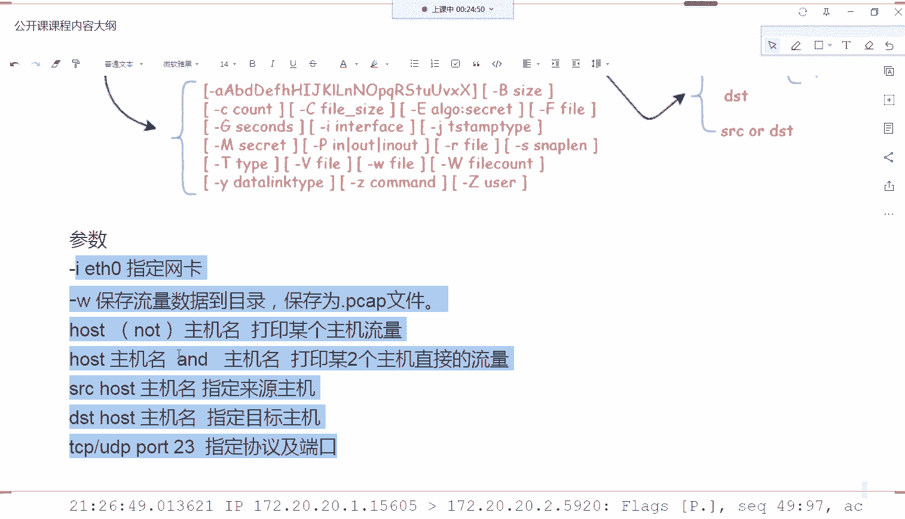
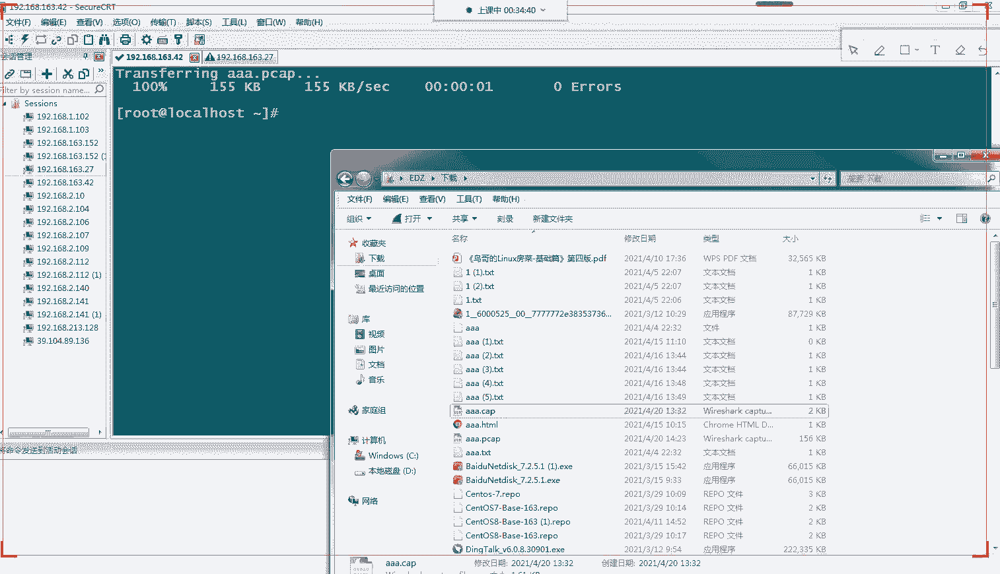

# Linux小课堂30分钟掌握一个小技巧 - P10：Linux午间小课堂10-网络数据抓取 - 思博Linux关关 - BV1i54y1b7rX

好呃，我们现在开始吧啊呃欢迎今天欢迎大家来今天下午的我们的思博的呃五金小课堂啊，我们今天讲的一个课程的一个主题呢是讲我们linux里面啊关于我们网络数据包这一块的如何一个抓取啊。

进行一个简单的一个查看跟分析的一个方法跟方式啊，那linux的话啊，我们的网络层是我们linux服务器运行的一个非常重要的一个基础啊基础的一个网络。啊，没有这个网络的话。

我们的服务器只能算是刚的PCG啊，刚台的呃服务器设备啊，没办法跟我们的一些互联网上的一些其他设备进行一个通讯那这时候的话它的一个功能就显得十分的一个局限了啊。

因为我们现在的互联网是以网络为基础的那我们的服务器也依赖于我们的一个网络啊网络的一个一个通讯的一个功能，才能让我们的这。的服务器发挥更大的一个作用啊。那我们在我们的服务器上面去，嗯。

我们经常要查啊要找一些网络一些数据啊，这个是我们经常在日常工作当中是经常要用到的一个呃。思路啊跟方法啊，那这个要怎么找呢？啊那我们今天就给大家介绍一个工具啊，一个十分强大的一个工具啊。

TCP dump这个工具啊TCP dump的话啊，是呃一个用于截取网络分组啊，并输出分组类的内容的一个工具。它的功能呢是十分强大的啊，它可以呃灵活的截取啊。

有灵活的截取策略啊啊正因为它的一个强大的一个功能的话，让它成为我们这种类似unux系统啊，比如说我们的linux啊或者我们的unux啊。

或者是我们其他一些基于呃unux来进行开发的一些分支系统啊那成为这类系统的话啊，下面一种用于网络分析跟网络排查的一种首选的一个工具啊TCP dump啊支持针对我们那个网络层，也就是我们的商城啊。

我们的呃ISO协议啊ISO汽车模型里面的一个商城啊，网络层啊可以针对一个网络层。一个协议以主机端口，还有呃我们的网络进行一个相关的一些过滤工作啊，提供了一些呃逻辑的一个简单的逻辑的一个呃逻辑语句啊。

那你进行一些过滤啊，比如说去掉你一些呃不必要的一些端口信息啊啊或者是不必要的主机啊，我只希望看到某一些特定的一些端口的一个流量啊，特定的一个主机的一个流量啊，那这个TCP大啊。

都都能够帮我们实现这种功能啊，能够啊帮我们去掉我们不必要的一些呃网络信息啊，那这样那我们真正展现在我们面前的一个信息啊，更加的一个简单啊，是我们真正需要的一些有效的一些信息啊。

那我们来看一下我们TCB大本啊，它这个工具啊，它要怎么用呢？那我们首先要先安装一下我们的TCP大本啊，在我们样包里面可以搜索一下。如果不知道包的名字的话啊，我们可以用我们的样pro啊，就是我们的。让啊。

PI what PRO V VIDDES啊，然后搜索一下我们TCP。WTCP大TUMP这个工具啊，找一下我们哪一个工具包啊，提供了这个我们的TCP大这个命令啊，那就可以搜索出来啊。

那要么安装一下就可以使用我们这个TCP大这个命令了啊，那TCP大的话，它个命令的话，有几个比较重要的一个结构组成啊，第一个就是我们的一个命令啊，我们命令就是TCP大这个命令然后第二部分是我们的一些op。

就是我们的一些可选项啊，这些有很多参数像这边等从A到X啊，还有一些大B呀小C啊大C啊或者E啊，还有一些杠W啊啊杠大W啊，这些呃参数它都有各自的一些功能跟作用啊，它的啊你大家可以看到这边参数非常多啊。

所以说它的个功能啊，提供出来的一个功能是非常强大的啊，这么多参数的话，大家只需要根据各自的一些需要啊去使用对应的一个参数即可啊。那我们一会会介绍一些我们比较常用的一些参数。像我们的杠。参数啊。

我干W参数啊等等这些参数啊，我们在我们的工作当中啊，比较简单的情况下会使用到的一些呃参数啊那第二个部分啊，第三个部分啊，第一个部分是我们的命令。

第二个部分是我们的一个可选项啊第三个部分是我们的一些协议啊，这一协议包括我们的TCPUDPM这是我们的四层协议啊，像我们的三层协议啊IPIPV4啊，还有个IPV6啊，这是我们的三层协议。

然后ARP啊RRP这是我们的一个二层协议，也就是我们的数据链路层协议啊，然后还有一些呃一层协议等等啊，这些都可以通过我们的一些一层是没有协议啊这就是三层协议啊，这几层协议。

我们都可以通过我们的这个呃这个字段pro这个协议字段进行一个筛选啊，因为我们的一个流端口里面它的一个流量。不仅仅包括我们的一些三层四层、二层协议。那我们这时候的话啊，我们要筛选到我们指定的某一层协议啊。

那只需要啊加上这个参数即可，不然的话他会把这个端口里面接受的一个所有一个流量全部打出来啊，不仅包括我们的四层啊，我们的三层，我们的二层都会打出来啊，都会包含在我们的一些呃。呃显示出来的信息里面。

那这时候对我们的一些排查会有一定的干扰工作啊，我们我不需要这些流量，但是可能会刷的比较快，可能呃一下子会刷出来一个十几十几条几百条啊。

上几十条啊那这个对我们的一个排查其实是不大有利的啊那第四个啊第四个啊这是第四个字段啊，第四个字段就是可以选一些我们的一些source就是我们的来源主机啊。

或者是我们的目标主机或者是来源跟目标主机都可以选择啊这三个那这个的话就是能够呃进行一些二次的一些过滤啊，类似于只要我们可能只要排查某一台主机啊，过来的一些流量啊，或者是我们呃从这台主机发出去的一些流量。

它的一个目标IP地址是多少。那我们可以用一些这个啊这个我们的目的啊这个英文单词的一个缩写啊，目的地的一个缩写啊这时候的话就可以进行一些相关的一个过滤啊，也跟我们的一个。这个呃字段的意义其实差不多的啊。

也都是进行一些呃不同层面的一些数据的一些过滤过滤的一个操作啊。那我们第呃这我们的第五个字段，我们的typepe字段啊。我们的type自动这边可以选一些host啊net啊就是选一些我们的一些啊端口号啊。

我们的一些网络类型啊等等啊，我们的host啊，也就我们的一个主机啊，IP也可以在这里写啊，这就是我们一个整个TCP本啊，它的一个命令的一个结构啊，大概这个命令结构是这样子的啊。

那我们来看一下我们这些啊比较常用的一些参数啊，我这里给大家列了一个杠I啊，后面加上一个我们的网卡名，就是我们指定的一个网卡啊，那我们的一个呃服务器上面啊，通常不是不仅仅只有一个网卡啊，可能有三四个网卡。

还有分内网网网卡啊，内网跟外网的一个网卡。那这时候呢我们可以指如果想看是外网的某一张网卡，那我们可以带上这个杠I的参数，我们只要提取啊杠I这个啊我们只要提取这个H0这个网卡上面的一个流量啊。

那其他的一些流量，我们就不需要去获取了啊我们拍它故障的时候可能。跟那些网卡的一些流量没有任何关系啊，那这时候就为我们一个杠癌的一个参所进行一个筛选的一个操作啊。那还有一个是杠W啊。

杠W是保存我们这流量数据到我们的一个目录啊，然后保存为一个点PAP的一个文件啊，这个文件用来干嘛用呢？这个原来文件的话呃。啊，对对，杠I就是interface啊，是interface接口的意思啊。

杠W的话就是保存为一个文件啊，这个文件来干嘛呢？用来我们的一个我们的这个win shop啊工具啊，有我们的个流量工具。哎我在这边找一下啊，昨天刚安装的。A。呃，找不到啊，找一下，稍等一下啊。嗯。哪里啊。

我找一下在哪里。嗯，他装到哪里去了啊？好，没事，一会儿一会儿我们再找啊，他就是用我们的一个呃流量流量工具的一个查看的一个工具啊，去看查看这个流量啊啊，对对对对，这个依旧上面打打的没错啊。

我这个找一下alicing啊。啊，就是这个工具啊，一会儿我们得后可以稍微看一下里面这个里面是什么样的一个样子啊啊我们把这个流量呃数据保存为这个文件以后，可以用我们的这个resh这个工具啊打开。

然后可以看到一些比较详细的一些数据啊。这个在我们的一些网工的一个工作里面啊，是经常用到的一个工具啊。那我们看下面一个啊host啊，hos的话就是代表我们一个主机名啊，那我们经常是用来指定某个主机啊。

比如说啊我们对端的一个主机过来，它的IP啊筛选掉啊，然后这样的话我们只要监控这个IP就行了啊。只要监控对端来的这个啊主机来的流量就可以了。那这样说其他一些流量，我们就不会记录下来，也不会打印出来啊。

那我们如果host啊前面加一个后面加个and，后面再加一个主机名的话，那就是打印两个主机之间的一个流量啊，这包括是呃前面这个主机A主机啊，到我们B主机的一个流量。

以及我们B主机返回给我们A主机的一个流量啊，那这两个流量啊都会打印出来啊，前面这个刚才这个啊可能只会打印我们关于我们某一个主机的一个流量啊，当然也会包含它去的到它的这个一个流流量啊。那我们下面第四个啊。

咱们source啊 source host source host跟我们上面这个一个区别呢，就是我只要打印来源是啊这个hos的主机的一个来源。那不管我们这边呃B主机这边返回给A主机的流量啊。

我们就不用打印出来了，我们只要打印这个来源是呃A主机的一个流量啊，那des host啊就是一个相反的啊，前面这个是打印我们来源主机的那这个打印打印的就是我们B主机啊。

到我们那个这个ho的主机的这个的一个的流量啊，就是我们发出去的一个流量啊，我们从我们本机发送到对端的一个机子，我们只要打印到某一个对端机子的一个流量。那我们这边des这个呃参数啊加上去。

那后下面一个啊就是我们的1个TCP协议啊，比如说我们要打印TCP协议的啊，端口是23端口的一个流量。那我们这时候可以用我们这个命令进行一个呃指定啊。啊，这个这几个参数呢就是我们在我们的公作当中啊。

用的比较经常用到的一些参数，以及我们比较简单的一个应用啊。那我们进行一个给大家进行一个实操，打印一下，看一下一啊它的一个打印式是一个什么样的一种情况啊。我们这时候啊我们看一下我们的主机啊。

我们的网卡网卡，我们打印台是我们的ENS106啊。

呃，TTCPDMP杠I啊，我们指定一个我们的网卡名，我们的网卡名可以在我们的IPA这边可以看到我们的ENS选这个名字就行了啊。

啊，我们可以看啊流量会比较多啊，大家要看到我们指定一个网卡的话，它流量会会刷刷刷刷的出来啊，这边流量是非常多的啊，这里不仅包括对端过来的啊，像我们的。呃，这边找一个啊。

这个啊从这一台到我们本地的一台流量啊，也包括是我们这一台啊去对装的一些流量啊，这对所有的流量都包括了啊，不仅仅是我们的这边SHPH这个是一个SH啊，还有一些UDP协议啊，SDP这种的啊。

包就是包括我们这台这个端口上啊，所有的流量啊，不管是你什么协议啊，什么端口啊，以及是过来还是出去的啊，它的流量都会在这边显示出来啊，这就是我们杠I的一个最基本的一个作用啊。

那我们如果是要进行一个过滤的话，那我们加上一个我们的host啊ho我们加个source host啊来源啊，我们找一个。sourcehouse啊，就这个124吧。啊，T。

DMP杠I我们还是指定我们ENS160啊，我们SOC啊，还是SD啊host然后加上这个大家看到啊，这边刷出来了啊，我给它取消掉啊。

大家看到我们这边现在打打过来的全部是来源是这个IP的一个主机。那其他IP的话都不会打印出来。大家可以很明显的看到啊，前面刷出来的全是我们192。168。163的点124啊这个。

服务器啊这个IP过来的一个流量啊，那这样子的话，我们这边出去的流量去这边124的流量啊就没有打印出来了。大家可以看到啊，是吧？都是到我们这边的一个流量啊。哎，我们可以跟之前对比一下啊。

我们之前这边还有一个local hostlocal SH啊，到我们的其他机子来给流量。那在我们这边的话就没有进打印出来了，这就是我们干source啊一个过滤作用啊。那我们干desest啊。

也给大家看一下，我们看一下，也是到这台的。DS t 啊。啊，看来是目前是没有流量去这一台啊。我们找一个有流量的啊，我们从上面这边。看一下找一个啊，到146啊，146这台应该是有。146。啊。

有有啊烧出来了啊，我好都停掉了，我给它停掉了。大家看到啊，目前的呃筛选过滤以后啊，都是我们从本机发送到146的1个流量啊。那刚才不管啊这去其他机。

其他机子的流量就不会在我们刚才这个过滤条件里面刷出来了啊。这就是我们参数的一个呃简比较简单的一个应用啊，那我们可以可以进行一些。对，协习的一个过滤啊，那我们就把这个同样给它加上去啊。

我们加上我们TCP啊。我们TCP协议啊呃啊。Partt。

我上啊。诶，语法错啊。

我们把这个去掉看一下。はい。看来目前是没有啊。不可能啊。

换一下啊，我看一下。哎，看来是没有啊，没有什么流量。那我们这个先不管啊。

嗯。泡的，我们直接给你泡的开23有没有？这里23的端口啊，看来也没有什么流量啊，到23的没有目前没有什么流量啊，那这个就看不出来，大家可以看到没有流量的话，那这边就会一个呃是一个空的一个情况啊。

没有信息给你显示出来。有的话就相量打印出来的啊。那我们刚才可以看到啊这边流量的话，它有一定的一个格式啊，像这边一个格式啊，那我们把这边一个截取出来了给大家看一下啊这几个格式的一个意思啊。

我们可以看我们下面这边提前做的一个啊，我们这边可以看到第一列啊，第一列就是我们的一个呃时间啊，就是我们的十分秒啊，我们这个流量它的一个到来的一个时间在我们的这个呃刚才刷新出来的一个数据里面啊。

就可以看到第一个啊第二个的话就是我们的一个网络协议啊，这边显的是IPIP协议啊，就是我们的一个商层协议啊，第三个字段啊，就是我们的发送端的一个IP啊，我们的172。20。20。1这个IP啊。

然后它的后面还有一个我们的IP前面是我们。

32位吧，我们的1个IP地址是32位，2进制是32位。所以说我们到这。然后最后一个啊这个是我们的一个端口号，就是对端的一个端口号发过来是从151560号端口发到我们这边来的啊。

那这个的话是第四个啊1234第四列啊是一个方向键啊，就是我们的箭头表示我们数据流量，就是我们20。1这台机子往我们的20。2这台机子进行一个发送啊，那它的一个流量就是从左边到右边了啊。

这就是我们大于号的一个意思啊，那第五列就是我们的1个IP地址啊，跟我们前面一样也是一个IP地址啊，那它这个代表是我们呃当前接收到流量的这个机子啊，它的1个IP地址接收方的1个IP地址啊，这边是20。

2这个IP啊，那后面也一样，它这个端口号代表我们这边啊20。2这台机子，它接收这个流量的一个端口啊，它的端口是5920这个端口啊。啊，第5号的第五个呢是一个默认的个冒号啊，没什么意义啊，第六列啊。

第七列这是第七列的啊，第七列的话就是我们一些呃数据包的一些内容啊，像什么我们的一些标签啊，我们的一些确认号啊，发送号啊，我们的ACK编号啊等等这些啊这一整列大家都在里面啊，这个里面的数据比较杂啊。

这个可能涉及到我们一些网络的一些知识啊，那这大有学过网络的同学可能会比较理解这些一些知识啊，它这些代表的一个意思。那我们可能呃作为纯linux的话，可能大概一个了解一下它大概的一个意思就好啊。

不一定要去深究这个东西。当然你也可以去深究的话，也可以去啊学一学相关的一些网络知识啊，会比较清晰。好，那这就是我们那个呃TCP大板的一个比较简单的一个啊。对对对，三次或手四次灰手。没错啊。

这个也是我们网络层协议层的一些知识啊，也包括这些。啊，那这个的话就是我们一个简单的一个介绍啊，我们TCP dump的一个简单的一个介绍啊。那我们在我们的呃服务器上面啊，一般是可以进行一些简单一些操作。

查看我们流量是否有过来啊，比较简单的一个是看我们流量是否有过来啊，我们的返回流量是否有出去啊。那如果是要更深层的一些啊查找一些故障的话，比如说我们某些包啊。

协议有没有完成啊上次40上次或者4时灰手有没有完成的话，那这个可能就需要借助我们刚才那个 shock一个工具了啊，我们 shock啊 shock啊。

我们练错了啊 shock啊这个工具啊 shock工具啊，把我们这刚才的TCP dump一个流量包打进啊，保存下来以后，通过我们的这个 shock这个页面好像下来了是吧？

啊，这样可以了啊，通过这个Y效工具啊去看查看更详细的一些信息啊，查看我们的一些握手是否有完成啊啊，我们的回报有没有正确回报啊啊等等这些信息都可以通过我们的Y效啊，进行一个简单的一个查看啊。

那我们就给大家稍微看一下我们的Y效是个什么样的一种情况。我们把我们的之前流量包流量啊给它导一份出来啊。

TCP dump啊杠I我们直接打一份ENS160的啊包我们干W啊W是导出来有一个文件啊，我们是AA点AAPACAP啊这个文件。啊，我们用来截取流量。数据流量招包是一样一样的啊一样的。你这个wish的话。

它如果在我们的PCG的话，像我们windows下面可以直接指定网卡啊，网卡的话就可以继续抓取网卡上的一些流量包跟呃数据包啊，可以进行一个查看啊，它也可以进行把其他一些服务器上的一些流量包数据包啊。

导过来啊，直接打开来看一样的一个作用啊。啊，我们这时候看到它正在正在一个输入啊输出啊，那这时候的话它你如果啊要多输出的话，那就多等一会儿。如果是啊觉得可以的话，那就按时候按一个ctrl系，它就会中断了。

那这时候的话就会这边有个提示啊，358个包啊，接收被那个过滤掉啊，通过过滤以后啊，有接收了350个包。那我们把这个文件给它下载下来啊啊。发在啊，我们A点点PA。p c a p 啊。啊，我们是。

Is there。

好，我们下下来，我们看看一下。我们在这边的刷新一下啊。

啊，这个文件啊大家可以看到是我这刚线下S这个AA点PCAP这个文件。那我们把那个Y效给打开。不是。大家可以看到这边可以选择啊，这边会加载。

加载一些呃端口信息啊，你这边就是盖我们这个三依旧美啊，这个所以说的它可以选择一些网卡啊，原来我们P7上面一个抓一个网卡上面一个流量包啊，流量数据那我们可以直接linux上。

我们可以直接把我们数据包导出来，然后直接拖进来啊，拖进来可以看了啊大家可以看到这边比较简单的一个看查看的话，一个是我们的时间啊，这是一个它那个时间啊，按顺序下来啊。好，第二个就是我们这个source。

就是我们的发送包的一个云IP啊，像这边是啊发送过来是163。42啊，163。14146，然后是啊等等这些包。

啊，这个是我们的呃IPV6的一个地址啊。前面这些数字的话，代表是我们的IPV4的一个地址啊，像这些是比较多啊。然后这边还有个26的啊。像这些东西啊，那这时候的话我们这一行这一行就代表啊包来源包啊。

发送包的一个原地址啊，这个包是从哪一个呃IP发送出去的啊。然后第四这一行下一行destination这一行就是代表啊这个包要发往哪一个地方的啊，像这边是发往146的啊，这个是发往142的啊。

这个应该就是一个呃响应啊，这边是146发往要啊，42发往146的啊，46发往142，来回一个响应，这是有个确认啊，ACK啊，大家可以看到这是一个呃完成一次通讯的一个操作啊。好。

后面的话就是我们的一些协议，像我们的SHTCPSHDP啊，这一层协议的话啊就是我们刚才讲到一些类似呃我们刚才图片里面的。这里说的一些协议啊，它这边显示到不单单是我们的一些商城协议。

游客我们一些应用层协议啊，或者是TCP层协议啊，各层协议都显示在这边啊，这边会比较多啊。然后第第四个字段代表我们这个包的一个长度Lance啊，这边是256个字节啊，这边是572个啊，这边是我们那个协议。

这就是包里面的一些简单的一个信息一个介绍啊。那我们点开一个包可以稍微看一下啊。点开这个一个报道，它会看到我们第一层的话就是我们的增程数据增数据帧啊，我们的二层啊。

我们的二层二层的一个信息都在我们的这一边啊，然后下面这一层啊呃这个是不是啊，这个是我们的看一下。增数据增啊，这一层这一层是数据链路层的一个数据，应该是数据链路层的一个数据啊。

然后这一层呢是我们的一些二层的一个数据啊，像我们这个是我们的ARP地址哎。我们的ARP地址啊，我们的网卡m地址m地址啊不叫ARPmac地址啊，说错了啊，这是我的mac地址啊。

然后这是我们的呃source啊来源的一个mac地址啊，这是我们的目的地的一个mac地址啊，这是我们的二层的一些信息啊然大家可以看到可以点开来看一下里面一详细的信息啊啊当然这些信息的话。

可能我们没有学过网络一个同学啊，看这个会比较生硬啊。但是我们可以简单的看一些啊比较呃浅显的一些啊意思啊，大家能看大概能看出来它的一个意思啊，这就是我们二层的一个mac地址信息啊。

它一个交换的一个信息啊下一个啊第三个就是我们的一个IPV4就是我们网络层的一些信息啊，我们这边可以看到source这边也写的163。4啊我们的目的地是163。

146啊后这边这个值代表我们那个协议的个版本号我们现在有IPVIPV6啊，这边是选14就代表我们一个版本号是4啊，我们的头的一个长度是2个。😊，自己自己啊。然后是下面是一些其他一些信息。

像我们那个呃数据的一个总长度啊啊，还有一些呃。协议啊啊我们的TCP协议啊，这是我们的上层啊，我们的网络层再网上我们的应用层的一些协议啊。等等。

这里边还有个详细的写的啊source address啊 destinationestination address啊，这就是我们包里面的一个商层的一个呃数据信息啊。然后再往下就是我们的一个四层。

我们的四层的一个呃包的一个信息，四层里面的一些分装信息啊，像我们这里能看到我们四层的话走的是22端口啊，source走的22端口，然后它用的是我们的呃协议，看一下是TCP还是UDP啊。

这个是TCP协议啊，找的是TCP协议啊，TCP load payload。啊，还有一些其他的一些信息啊。这是我们一些字段啊，我们那个包分装的时候，一些字段的一些设置值啊，嗯大家可以稍微看一下啊。好。

然后再往上层，这一层的话就是我们的应用层上网上的一个协议啊，我们的SH协议啊，这边的SH协议啊，然后它的一些长度啊，它的一些加密的一些啊。包包啊，它的一些奖易的一些结果啊，然后一些呃我们的。

方向啊服务端到我们的客户端啊，这是他的一些描述啊等等啊，那这个就是我们的一个简单包里面的一个呃一些信息的一个展示啊。那这些的话呃在我们的一些linux里面做我们数据分析的一个工具啊，是非啊有用的啊。

大家有时候如果是单单看我们的这个TCB这边啊来源的数据啊，这边刷出来的信息可能还没办法进行一些故障排除的话，可能就要把我们这些数据包导印出来，那拉到我们的这个呃里面进行一个更详细的一些查看啊。

这边可能会查看一些啊，比如说啊这边从source发过来的包到我们这边没有回应了。那这时候的话就可能出现一些流量访问数据就有问题啊。那这时候在我们的这个source里面会有一些不同的颜色进行展示啊。

有可能啊是以我们那种黑色一种状态啊，像那种这种现在目前都是浅蓝色啊，这种都是比较正常的一些包。如果这边看到比一些比较黑色的，比较特殊的一颜色的话，那可能这些包的话，就可能是呃比较有问题的一些呃流量数据。

大家可以重点关注一下啊。那这个就是我们今天给大家介绍的一个TCB大一个简单的一个使用，以及我们啊通过这个啊工具啊，进行一个比较啊更深入的一个分析啊。

查看我们TC啊我们的数据包里面一些数据的一些啊方式跟方法啊，那啊我们的时间现在也差不多了啊，那这个的话工具在我们的日常工作中还是用的比较多的啊。大家如果要呃使用的比较溜的话，那可能要经常去用用。

可能还要再学一学我们像网络的网络方面的一些知识点啊，像我们数据包这些怎么分析啊。那可能对大家以后呃排除我们网络层面一些故障，会有比较大大的一个帮助啊。好。

那我们今天的课程啊就到这里结束了啊啊今天的介绍是比较简单的，给大家介绍一个入门使用啊，好快啊，半个小时试的啊呃，这个东西只是给大家做个科普啊。大家要实深入使用的话，你这个工具还是很强大的啊，很强大。

我想这个三一救门应该自己用过会发现这个东西用起来啊，浅行的用的话也是可以用的。你要深入用的话，那可能也也是可以呃比较难的一个深入啊去学习的，是吧？啊。简单用一下，对不对？

我们呢平时如果只是排除一些简单的故障，可以简单用一下啊，简单用一下，因为这也是一个工具嘛啊啊好嗯那我们今天的课啊就到这里结束了。大家啊今天学完以后可以细去练一练啊。以后在工作中也可以偶尔用一下啊。

不一定说要非常了解，非常深入，也去使用啊，大概有个了解，对自己一个排除故障，有新的一个工具啊，一个方向啊，有个思路啊，也总比呃一头黑一脸黑一呃什么都不知道方向的话会好很多是吧？啊。

那感谢大家来到我们今天的5间小课堂啊，我们这节课就到这里结束了啊，谢谢大家。😊。

