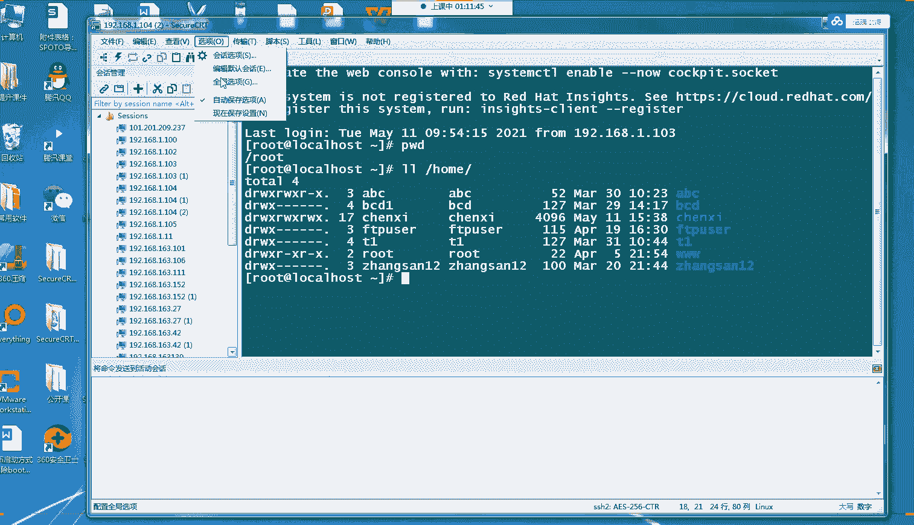

# Linux小课堂30分钟掌握一个小技巧 - P11：Linux午间小课堂11-apache三部曲第一节课 - 思博Linux关关 - BV1i54y1b7rX

能听到我声音，在公屏上帮我打个一吧，我们准备开始上今天的课程。大家能听到吗？喂喂喂。可以听到我声音吗？啊，起点科学。曾同学。啊，行行好啊，欢迎大家来到我们今天的世博的公开课啊。

我们这一次课程会分三个课时啊，首要来讲我们阿帕奇服务的一个安装部署啊，三个比较重要的一个阶段啊，需要三个步骤啊。那我们拿到一个服务器，想在我们那个线上业务来说，我们拿到一个服务器的话。

那肯定是首先啊要想办法能够登上这个服务器啊。第二个那我们需要安装。如果软件的话，我们需要找对应的软件包啊，以及或者去下载我们的个软件啊，去怎么下载一个，这是第二个比较重要的一个步骤啊。

那第三个的话才是真正到最后我们开始安装我们的一个软件啊，像我们一些阿帕奇服务等等这些软件啊。所以说我们这次课程关于我们阿帕奇服务这个安装的话啊，我们就分这三个比较重要的一个阶段给大家介绍一下。

那大家啊有一个比较完整的一个体验啊，从我们啊登。服务器啊，到我们配置我们的一些啊软件包下载的一些配置啊，到最后我们去真正去安装这个软件，然后配置这个软件啊，拉起相对应的一个服务啊。

实现我们真正的一个从0到1的一个过程啊。那在我们那个呃日常工作当中啊，我们服务器的话，基本一般都是在我们的机房啊，或者是在我们的一个呃云平台上面啊，不像我们呃基础班课程一样教大家安装虚拟机啊。

可以在我们本地的PC上面安装啊。那在我们本地PC机安装的话，我们可以直接通过啊那个虚拟机里面啊，我们linux红帽吧它有自带的一个桌面图形化系统啊，可以直接登进去进行一个实践的一个操作啊。

那在我们一个实际的工作当中的话，我们不可能说每台服务器啊，我们都要到我们的服务器面前去操作啊，一则啊服务器距离你比较远。二者啊服务器可能分布会比较广。可能这个服务器在A机房另一个服务器可能在B机房。

那这时候你如果要对我们服务器进行操作的话啊，如果是要到每个服务器去面前去操作的话，那是比较相当的一个麻烦的一个操作啊所以说我们。为了后期啊我们能够比较便捷的远程的操作我们的一个服务器啊。

那我们肯定需要呃进行一些相关的一些配置，用一些软件，能够让我们从远程来访问我们这个服务器啊，就像我们windows系统一样，我们windows平时我们可能都是在本地啊电脑就在我们旁边我们直接打开系统啊。

直接登录我们账号密码就可登到系统啊。那windows的话，它一样也有提供类似的远程登录的一种方式啊，就是我们的远程桌面啊，我们登录的远程桌面的linux的端口是3389啊，那在。

linindux下面的话，我们是没有这一方面啊，不像我们windows分装这么好啊，能够远程登录桌面的一种方式。但是lininux的话，它提供了另一种协议啊，能够让我们远程登录啊，通过我们呃图形化啊。

不通过我们图形化接，而是通过我们字符终端的一种类似的交互方式，能够远程控制我们的一个。linuxux服务器啊，你能够从你家里或者是从你的办公室啊，或者是从你的在外面啊喝咖啡或者是咖啡厅啊。

只要你有一台电脑啊，能够打开我们的一个电脑，通过一些协议软件啊，就能够远程连接到我们啊线上业务的一个服务器啊。那linuxux环境下面啊，它给我们提供这种功能的一种软件啊，就是我们的SH协议啊。

SH协议的话啊，是我们它的一个英文名字叫security需啊，翻译过来中文就是安全撬协议，或者是啊叫安全壳协议啊，它是一种用来做加密访问的，允许你通过这个SH协议啊，进行一个加密访问。

你远程服务器的一个嗯协议啊。它的作用的话，在我们的日常工作当中最主要的一个作用就是登录远程服务器啊。当然除了登录远程服务器的话，我们还有很多的一些操作。比如说我们从远程服务器拉取一些东西。

或者是传送一些东西，也可以通过我们这个SH协议啊，进行一个呃实现这种操作啊。那我们今天这节课的话就主要给大家介绍一下我们SH协议的一个简单的一个应用啊。通过我们今天这节课以后。

大家至少啊对我们SH协议有个比较基本的一个简单的一个认识啊，知道它是怎么一回事啊，怎么配置。然后我们怎么去用这个SH协议啊，让我们的一个工作更加的一个方便啊，便利的操作啊。

那当然啊在呃在配置这个HH协议之前啊，我们是没办法登录的啊，我们没办法远程登录到我们服务器。那这时候的话啊我们一般是在我们安装系统的时候，就安装了这个HH协议啊。但是有些系统可能没有安装的话。

那我们这时候就比较麻烦了。一个是啊可能通过一些呃IG卡。如果是物理级的，可以通过一些IGL卡，它上面有提供一些啊。简单的一个终端啊，你可以上去进行一个命令操作。这时候通过这种方式去安装SH协议啊。

但是另一种方式啊，如果是连这种方式啊I卡都没有，没办法通过远程操作的话，那你这时候就可能就比较麻烦，可能要到我们的服务器面前啊，去做我们的个安装操作啊，就相当于我们要到服务器面前。

把我们的这个SH软件包先装上去啊，服务先拉起来。那这时候的话你的一个SH协议就算是完成了啊。你后期可以基于这个SH协议啊进行一个远程操作了。那我们这边的话就给大家介绍一个比较简单的一个操作啊。

通过我们样方式去安装我们的个SH协议啊。SH协议的话，它是一种命令啊，但它也提供一种命令啊，它的命令的话，是包含在我们这个open这个包里面啊。

我们安装的时候可以通过搜索这个open shareopenH啊这个开头的一个软件包后面加一个新号，把我们相关的一个包啊，给大家进行一个解锁出来进行一个安装啊，那我。

可以操作一下啊。当然大部分情况下，我们的这个HH啊这个协议，它那个软件包都是系统自带已经安装好的。当然啊也不排除一些呃特殊情况。可能这个H协议没有安装啊。那这时候大家可以通过这种方式进行一个安装啊。

或者是呃后期你装好了啊，不小心被某些人给卸掉了。那你也可以通过这种方式再把它安装回来。

我们通过样母方式啊install我们的。OPENH啊，我们加个型号啊，匹配一下你这个开头的一个软件包啊。啊，这边我这边原来的HH包已经装了啊，他会帮我检锁出来一些其他一些相关SH呃。

包的一个呃相关的一个包啊，这些包大家可装可不装。我们的SH现在目前已经装了啊。那如果是没有安装的话，这边会有一个专门的SH啊，open SH这个包啊，当然不是在我们这边的啊，我们这时候点个Y。啊。

就可以安装了啊。虽然我这边啊大家看到可能没有不是我们真正要安装那个包，但是操作步骤啊其实是一样的。它通过样母这种方式啊，它会帮你自动安装。

把它相相应的包以及这个包相依赖的一些东呃其他包或者是内裤也会帮你安装完成。这时候是你就不用操心它，具体还需要啊依赖什么包，还要去首先安安装什么包，这些都不需要操作了啊，只要通过这个一个简单的一个命令。

我们的这个样么int命令啊，就可以进行一个比较快捷啊，方便的一个操作。在我们日常的一个工作当中啊，我们也是经常啊要使用到我们这个样目命令啊，在我们的第二节课啊。

我们后续第二节课会教大家怎么配这个样么的一个原仓库啊，然后通过这个样目，然后在我们更多的一些包，像我们后期会用会用到的阿帕奇的HTTP服务啊这一块啊。啊这个包安装完以后啊。

它就会最后有个complete啊，然后这边会有一个显示信息，你的一个安装的哪些包啊，最后有一个compre看到complete这个呃结果说明你这个包就算安装完成了啊。

那我们这时候啊如果要看到一个配置文件啊，我们HH的一个配置文件是在我们的ATCHH呃，下面的HHD这个confi这个文件啊。

好，我们来打开来看一下啊。啊，上面这几个步骤安装这个大家有没有什么疑问啊，或者是呃对SH这个理解或有什么疑问，没有大家可以啊有疑问的话，可以在我们公屏上打出来啊。我们随时给大家停下给大家做一个解答。

大家都没有什么用好，那我们现在就继续，我们来看我们这个安装好的一个配置文件啊，我们ETCSHD。这就是我们那个一个配置文件啊，它这边有很多啊很多注释啊。那当然里面也有很几个比较关键的一个参数啊。

这边参数很多参数啊这边加井号的这个就是代表我们注释的一个呃解释或者是命令啊，它不生效的啊。如果真正生效的命令像我们的这个port啊，它前面是没有井号的这种注释啊，看过去它颜色有特殊的颜色是黄色开头的啊。

这就代表我们这个命令是生效的一个情况啊，那我们把这些命令啊进行一个归纳给大家画到我们的这个呃文档这边啊，我们的这个笔记这边来了，给大家做个简单的一个介绍啊。

第一个啊就是我们的这个呃password啊这个这个意思啊，这个参数的一个意义代表是允许你使用密码登录啊啊你如果是不使用密码的话，这边要写个no啊。我们这边如果使用密码登录的话要写个y啊。

这时你可以用我们的账号密码来登录我们的一个服务器啊，通过我们HHD这个服务啊，通过SH这个协议啊。

第二个是啊是我们的port啊，port我们默认的1个SH协议啊，它的走的端口是22端口啊。当然你也可以不通过22端口，你可以通过其他一些啊更高的一个端口，几千端口啊，但是配置的话。

大家尽量啊不要配1024以下的端口啊，这1024以下，是我们系统就是保留的一些特殊服务的一个端口啊。那我们如果大家为了安全起见，可以不配我们的22啊，可以配我们的。比如说我们的4000啊。

5000啊或者是1万端口啊，根据你们实际在工作当中的一个呃。部门的一个规划啊，它的一个安全策略来进行一个配置啊。那那下面那个参数啊，大家也看到就是我们的监听地址啊。

监听地址这边是list address啊，那我们这边默认可以不，这边可以加个井号，代表我们监听所有的个地址啊或者是你这时候这有代表4个零也是代表我们监听所有的个地址那代表什么意思呢？什么叫所有的地址呢？

就是我们本台机子上啊，我们这台linux服务器上面它的一个呃IP地址啊，不管是你这个服务器上面有一个IP地址还是两个IP地址啊，那可能大家会有一问为什么有的服务器上面会有多个IP地址呢？

啊在我们的日常的一个工作当中啊，我们的很多服务器经常会有多网卡，不像我们的PC机可能就一张网卡就够上网。我们服务器可能有分内网网卡跟外网网卡有的内网网卡外网网卡还有还进行一个。多多网卡的一个绑定啊。

就是内网内网网卡它有两张啊，外网网卡它也有两张啊，那这种情况啊，它会有一个地址的一个不同啊。所以说我们这边类的话啊，你如果是呃比较简单的一个环境的话，可以就是选我们的0。0。

0就不用去指定我们具体要监听哪一个地址了啊。如果你指定的哪一个地址啊，比如说这边指定的192。168。1。1。那你这时候SHDSHD这个服务啊，他开的就是我们192。168。1。1这个的22端口。

那你其他那你呃从其他的服务器或者是你本地的PCG想登录我们的呃192。168。1。2啊，比如说你这张服务这个服务器上面还有个2的网卡。那这时候的话呃22端口，它就没办法啊监听没办法接受你的请求了。

你只能登录它的192。168。1。1这个IP地址的22端口才能啊登录上来啊。如果是多网卡的话，大家可以就是写个0I，一个减少我们配置的一个。啊，繁琐度啊。第二个的话啊避免你一些错误操作。

导致某些网络可能配置不上来。后面要去排查这些故障的话啊，可能会排查来爬查去啊，发现最后是这么一个简单的一个错误啊，一个简单的一个失误的一个配置，导致你的服务配置啊配置不起来啊，服务登录不上来。

配置可以起来，但是服务登陆不上来啊。那我们讲完第三个啊，我们来看一下我们下一个啊，下一个就是我们的per rootot logging啊，这代表yes啊，yes代表是这个SHD服务。

它允许你使用root账户登录我们的这台linux服务器啊啊如果是n的话，那些root账户就不能登录，那只能用其他一些普通账户登录了。那这个配置的一个作用的话，可能是出于安全一方面的考虑某些企业啊。

某些公司它会有个root权限的一个管控。就是说啊大部分人可能不能用root账户来登录我们这个服务器啊啊，避免我们某些人误操作啊，可能把我们的一些呃跟目录删啦啊这个比较极端的情况啊。

IM杠RF啊像我们的这个比较比较经典的一个玩笑啊IM杠F看。行啊，这个操作啊，怕去某些人去执行这个操作啊，把我们的个目录删了。那这时候的话我们的系统啊就崩溃了。

那这时候就是非常严重的一个线上的一个生产事故啊，所以说呃在管控会比较严的一些企业，他会禁止我们root账户登录啊。

然后是每个人可能都会配置一个单独的一个普通用户的一个账号那你这些某每个人的账号都只能执行自己啊后目录下面的一些文件啊，然后权限进行一个相对应的一个控制啊，避免你误操作或者是误删除啊。

造成一个比较严重的一个生产事故。这时候不单单你要背锅啊，你的部门，里的一些其他同事要背锅，你的领导也要背锅啊，跟着你一起背锅。那这时候就是呃比较可怕的一个事情了啊，背锅还算好了。

如果真正影响到线上那个业务啊，这时候损失的话那那就非常严重了啊。所以说我们操作的时候一定要非常非常注意啊，线上服务器一定要非常小心，小心再小心啊。然后上面这4个啊。

我们的password authentication啊，还有一个portlist啊， permissionmission root logging啊是我们呃SHD里面啊。

我们这这个配置文件里面最重要的几几个嗯配置点啊。这个配置了以后啊，你的一个简单的一个SH登录就算O啊，就算完成了，基本就可以直接登录上我们的一个服务器啊。当然这是最基础的一个配置啊啊，除了这些配置的话。

我们下面还有一些啊其他的一些配置啊，像我们的这个 log facility啊enpri啊，这个代表的一个意思呢是登录的时候，它会记录你的一些登录信息啊，那记录的类型呢是我们这个enpri这种类型啊。

当然还有其他一些类型，我们这个可以就默认使用它这种类型啊就可以了。那根据你的一个需要啊，可以去我们修改相应的一个类型啊。当然这个类型的话，是它这个SHD啊所指定的一些类型可选的啊。

你不能说自己去改自己的想要什么类型就是什么类型啊，你必须根据它给你提供的一个选择去选这个类型啊。然后下面那个chanation啊，这个代表我们是否允许咨询啊想应身份验证啊。

通过我们的PAM或者是这个里面支持的一些身份验证方式啊他的意思是什么呢？就是你登录账号密码的时候，他要呃咨询你这个是不是啊非机器啊非非机器来操作的啊。

避免是一些呃像脚本一样去批量去呃尝试暴力破解我们的身份验证啊，通过多次这个验证，或者是通过我们这个PAM这个框架安全框架的话啊，通讯框架的话去验证你啊，是否是真能操作啊，就像我们的一个。啊。

找回密码的时候，我们QQ经常找回密码的时候，不是要呃写好几个问题嘛啊，回答你你的呃你之前在QQ那边登记的啊，比如说你的一个出生日期是什么时候啊，你最喜欢的明星是谁啊。

这就是相当于我们这个chan的一个作用啊。他的一个通俗的一个理解就是啊使用键盘方式啊进行一个身份验证啊。那我们在下面看这个啊GSAPI authentication啊。

这个等于yes啊表示我们服务器启用那个GSAPI的一个框架啊，它登录的时候客户端啊登录的时候，客户端需要对服务端的IP地址进行一个缓解器啊。如果IP地址没有这个记录的话，那就很容易卡住啊。

我们的很多服务啊，像我们的TCP dump啊，或者是我们的root啊root。RUTE啊root这个ROUTE啊root这个命令啊，你经常需要查一些IP地址的时候啊，或者是跟IP地址相关的时候。

它会去解析这个IP地址啊，对应的一个域名啊，就是比如说我们3W点百度点com啊这个域这个IPIP地址，它反过来解析的域名是什么域名啊。如果是百度点com的话，它会把这个域名打印出来。

或者是啊记录下来等等啊。这些操作。那这样的话，在我们登录的时候就多了一层不必要的一个操作啊。那这时候的话我们其实不需要这个操作啊，我们可以输个呃no啊。

这斜跟路啊一个加快我们的1个SH啊这个登录的一种节奏啊。第二个，避免我们啊。在我们登录的时候卡住了啊，有些可能解析啊出现一些异常啊，这时候就卡住，没有办法登录啊，可能会卡的比较久。

这时候就一个可能呃要等一段时间，或者是啊你这时候不知道它到底有没有正确执行完成，那时候会比较急躁啊。那这时候的话我们就通常在线上服务器会把这个y给它关掉啊，个漏啊，这样子的话会比较好啊。

交互交互起来这个界面感觉会比较好，比较响应，比较快啊，避免我们进行一个误判啊，以为是网络有问题啊，还是些其他的一些情况啊啊，这种这种情况的一个发生。然后下面这个跟我们的上面这个有相关的啊。

这个要代表那是表示用户在退出登录后是否销毁用户的一个凭证啊。然后在我们下面这个USUSAPPAM啊，等于意思就是启用我们的PM这个一个模块啊，它是一种安全框啊框架，安全框架这种接口啊。

那你如果是启用了这种哦，你一个登录的话，你登录我们的服务器的话，它会经过这种安全框架进行一个校验基本的一个验证啊。啊，下一个是叉11for啊，就是叉11代表的是我们的叉windows系统啊。

就是我们linux下面的一些图形化的一些操作系统操作系统啊，类似这种东西啊，是否允许这种操作系统进行一个转发啊。你如果不需要操作系统的话，可以进行一个nose啊，避免我们不需要的一些资源的一个消耗啊。

然后下面这个premod啊，就指定啊是否在每一次交互登录的时候，把我们的这些登录信息打印到我们这个EDC mode文件里面去啊。那我们平时可能不需要的话，就可以把我们这个值啊写个n啊。

那你如果需要记录这些验证信息啊，登录这些信息啊，也可以写个y啊啊进行一个后期的一些登录日志的一些收集啊等等，或者是安全方面的一些校验等等，也可以用啊。那我们再往下看啊。

第四个啊ser systemFTB啊，然后指定一个呃路径啊，这是配置一个外部的一个子系统啊，例如一个文件啊，我们的文件传输FTB的一个守护进程啊。好。

这就是我们SHD里面的一个比较呃几个比较基本的一个配置信息啊。当然你如果还有其他一些配置信息啊，也需要的话可以去看我们的一个呃服务的一个配置的一个man操作文档啊。

我们呢可以通过我们的maSHSHD的config这个方式啊，查看我们的这个SHDconfig它的一些呃说明文档，或者是说帮助文档啊，可以这么叫啊。它上里面里面有比较详细的一些信息啊。

里面会有一些参数告诉你这些参数代表的一个意思啊，大家可以根据自己的一个工作当中实际的一个需求啊。如果是有其他一些额外需求，可以去查查好查找这些文档啊，把相应的一个配置啊加上去就可以了啊。

好，看我们这这个配置信息啊，配置完了以后，那我们这时候呃服务就要去拉起来了啊。那我们在我们的红帽8下面我们启停服务的话，是我们的sTL这个命令啊，那常用的几个操作就是我们的top啊 stop啊啊。

然后跟上我们的一个服务名，我们的SHD的一个服务名的话，它就叫我们的SHD点service啊，这一个值啊，大家如果记不住的后面这个拼音写的话，那我们可以解一个SHD，然后按个table键。

它会自动帮我们搜索啊补齐这个service啊，只要你这个SHD是叫那个服务目录下面啊，它是一个唯一的一个选项，它就会帮你自动补齐。如果是啊有多个选项的话，那它也会把那个多个选项的一个信息啊。

就是有多少个服务给你列出来。在我们的下面。啊，你推保以后在下面会给你列出来啊，列出来这些服务有哪些服务你可以选的。然后这时候你再可以啊根据它那个提示输入相关的一些服务名就可以了啊。啊，除了一个开关啊。

开启动跟关闭的话，我们呃linux下面也有一个啊开机启动的一个操作啊，不用我们每次呃启动服务器的时候都要去执行这个啊star一个命令啊，或者是restar这种命令啊，那我们是随机启动的话。

也是用我们的sstem啊sstem cTL这个命令啊，后面跟上enable啊。或者是diable就是代表是随机启动生效啊。disable代表是不随机启动啊，就是不让这个随机启动生效啊。

那后面跟的也是一样啊，我们的一个服务名啊，那我们可以执行一下这几个命令啊，给大家看一下。

我们这时候啊我们这时候先看一下我们的。把我们的服务给它停掉啊，TEMCTLtop啊SHD啊，大家可以看到我因为这种table的话，它会输出来两个啊，一个是SHD杠。き？K啊点ting啊，这个不好评啊。

然后还有一个是HED点server啊，这时候我们输下点SDserv，它就会自动帮我们补齐啊。那这时候我们停掉啊，哎呀，这时候停掉的话。我们这时候再重启啊，启动它。然。

这时候的话我们的SHGD服务就算拉起来了啊。然后我们第二个啊，我们可以看一下我们的in啊状态。

S O STM。CTL我们的 STT US啊。6S啊。SHD点serv。大家会看到啊，这里这里代表就是我们的一个是否随机启动啊，我们这时候是inA状态啊，我们这时候给它diable掉。

它会有一个remove啊提示信息啊，我们这时再看一下，大家要看到啊这边的一个信息值变成一个diable的一个值了啊，那我们这时候再给它切回我们的enable啊。一样AB而已因A啊。好，那我们再看一下。

它又变回来我们的in这个值了，这就是我们随机启动跟我们不随机启动啊的一个操作方式啊，以及我们去难以查看它的一个这个是否随机启动了啊。

啊，这里还有个参数值刚才是我们star，这边没跟大家说一下，这个star值就代表我们查看这个服务的一个状态啊，它这边会把我们这个服务是否属于激活状态，还有一些是否是随机行动的一个信息啊，都可以列出来。

大家可以在这边看到啊。

那我们呃启动呃服务启动完以后，我们肯定要看一下我们这个服务它是否真的一个起来了。我们可以通过我们PS杠EF啊，然后g。

SHD啊，然后这个命令。啊啊，这个比较多啊，大家会看到啊，这个就是我们启动的这个SHD服务了，他用我们的优色啊SB下面的SHD这个二进制脚本啊去拉取我们相对应的一个服务啊。啊这个看到这条信息了。

就代表我们这个SHD这个服务啊，它是啊正常起来的啊，没有问题的啊。那我们如果需要验证哈我们这个端口啊是否能够通的话，我们可以通过我们的Tnettnet TELNET啊。

或者是我们可以先看一下我们端口有没有拉起来。NE T S TAT T U P。graSHD啊，我们的22在我们的22端口。也可以啊。O啊，大家要看到这一条。啊，是这条啊这条信息啊。

就是我们啊我们这时候HH监听的是0。0。0。0的端啊IP地址啊，它的一个22端口，这个就是我们的一个服务名啊。

我们的PID我们的进程I话就是这个啊这样这两个能看到啊一个看到我们的进程一个看到我们端口起来了。那说明我们的服务就能够起来了啊。

那为了呃以防万一啊我们可以在我们的本地做netnet我们的22端口看一下端口是否能通啊，呃，啊我们的19。2。168啊，这是我的1个IP地址。我都这台机子的1个万网IP地址是104啊22。好。

大家我能看到这样的一个返回啊，就代表我们这个端口是能够通的啊。至少从我们本机来看还是能够通的啊。

好嗯。那到这里的话，大家对我们这个配置跟我们的启动服务啊，有没有什么不理解的或者是疑问的？大家可以在我们公屏上打出来。Okay。都没有是吧啊，那行啊。我们继续啊，那我们这时候服务起起来了。

那我们就要肯定需要用这个东西是吧？啊，那我们要怎么用呢？啊？用之前啊，我们给大家介绍一下我们SH登录啊会有几种方式。一种是我们的密码登录啊，用我们的账号密码登录，还有一种是通过我们的公钥密钥啊。

这种方式登录啊，这种方式配置起来会有一些复杂啊，这个在我们的呃基础班的一个课程里面啊，关于SH这章里面会有一个比较详细的一个讲解跟实操啊。那还有一种方式可能用一些CA证书啊，这种方式就更复杂了啊。

在我们的工作当中可能用的更少啊，大部分情况下，我们用的较多的是我们的个密码登录，还有个是我们的互信啊密互信用我们的公钥私钥这种方式来进行登录啊。那我们今天给大家讲解我们最简单的一种密码登录啊。

密码登录一种逻辑。

然，我们密码登录的话，我看大家看这张图啊，我给大家做了一个简单的一个示意啊。密码登录的话，它那个逻辑就是类似我们这张图像这边讲解的哈，我们客户端就是我们的PC机啊，或者是其他一些服务器啊。

那这边有个服务端啊，服务端就是我们刚才起SHD这个服务的这台linux机子啊。那这时候的话我们服务是拉起来了哈，我们客户端的话要去连接这个服务端啊，那我们时候会先发送一个请求连接啊，输入IP地址。

然后对应的一个端口，然后配置一个相应对应的协议啊，然后像我们的服务端，就是我们刚才拉起SED的这个服务器，发送一个请求，就是说我要连接你这个端口的22端口用的是SED协议啊。

那我们服务端它有起这个服务啊，并且接收到这个请求以后，那它会啊把我们这边服务端啊发送一个密钥啊，给我们的一个客户端啊，客户端啊接收到我们这个密钥以后啊，通过我们这个密钥，把我们要输入那个密码啊。

进行一个加密啊，加密以后把我们这个账号密码，同时发给我们的一个服务端啊，就发回来了。啊，发回来以后，我们的服务端啊，用我们的一个公钥啊去解析去解我们的这个啊他发用密钥这个加密以后发回发回来的一些信息啊。

把这个信息给解出来啊，然后验证里面这个信息啊，它的一个账号密码是不是我这边服务端记录的这个账号密码是否一致啊。比如说客户端这边申请登录的是root账号，然后它的个密码是1234啊。

那服务端这边会把这个发送回来的一个口令啊，就是加密后的一个口令，通过他这个密钥进行解密以后，会查你的一个root账号，它的一个在本地的记录里面啊，是否是啊1234啊，你的发送过来是密码是1234。

你这边记录啊，服务端记录的是否是也是1234啊，如果是的话，让他就是返回一个信息啊，告诉客户端啊，验证成功啊，能够进行连接了。如果是不是的话，那就一样的，也会返回一个信息给我们那个客户端。

告诉我们的客户端啊，你这个账号密码不对啊，那你还要再重新输入账号密码啊，等你真真正输入正确的一个账号密码以后啊，它也才会进行一个连接啊，那。如果是账号密码错误的话。

那一样从这边从头开始继续从请求链接开始啊，继续把我们的一个请求链接发过去。然后这边再发个密钥，啊，这边再发一个加密口令，然后再进行验证啊。这个循环一直在操作啊，直到你的这个。账号密码验证通过了以后啊。

那你这后客户端就能够连接上我们那个服务端了啊。啊，这边的话就是我们一个图形的一个解释啊，这边下面的话是一些啊这个图形解释一个文字性的一个表述啊啊，就是我刚才讲的一些内容。那这个图形解释啊。

我们加密的一个过程啊，大家是否有什么疑问之类的？Okay。大家有疑问的可以在我们公屏上打出来啊，不要呃。羞耻羞羞怯啊。🤧啊后大家如果能到现在都种听懂的话，也帮我打个一吧。

那我知道一下大家是否有真的能够听听明白了，理解清楚了。喂喂，大家能听到我信息吧啊，能听到我声音吗？喂，能听到我声吗？哦，OK啊。好，谢谢我们的名门怪啊，其他同学呢啊都有在的话，大家打个一吧。

我们互动一下吧。不要我都是我一个人在这边讲，我讲的嘴巴口也干掉了。好，行吧，大家如果都没什么疑惑，我们就继续往下走啊。好嗯。那这个就是我们的一个呃密码的一个登录验证方式啊，那我们这时候给大家实操遍啊。

我们这时候退出来啊，我们刚才是属于登录状态的啊，我们这时候新建个连接啊，一样是连接我们的192。168。1。104啊这个。啊，我们这时候用的ID啊，这边只要输两个这个软件的话，只要输两个。

他在已经帮你选好了默认选好的一个SH啊SH协议啊，这是二版本的一个协议啊，会比我们的一版本更加安全高效啊。然我们IP地址这边输一个啊输入我们的一个主机IP地址啊，我们的192。1681。104啊。

你要登录哪一台服务器的话，那这就输我们的哪一台服务机IP地址啊，然后端口这边默认也是22啊，我们刚才开的也是22端口啊，那这时候我如果登录的是账号ro的密码，那这时候就说root如果你登录的其他密码啊。

其他账号啊，说错了，该如果是登录账号root账号的话，这里就输用户名就输root账号啊，如果是登录其他用户的话，比如说我们登录晨曦这个账号，那这时候你就输个程曦啊，我应该可以连接啊，这上面有这个账号啊。

好，大家看到啊，然后这边会有让你输入一个呃密码，我们这时候把我们的一个这个账号的一个在我们服务端提前配置啊，这些账号密码要在我们的服务器那边要提前配置好啊，没有配置好的话。

就不可能出现这种验证登录这种方式啊。然后这时候把我们的密码输进去啊。好好，这密码通过验证完成啊，就是我们的这个呃。完成了一次啊比较完整的一个登录方式啊。我刚才目前登录的是一个程序的一个账号。

大家看到这边啊会有前面啊这里有个大括号啊，这边有个大括号，前面是一个程序，就是我当前登录的一个账号名啊，艾logo host啊，就是我们这台机子啊，然后这有个波浪号。

波浪号代表是我这个程曦账号的一个加目录啊，它登录上来都会在我们默认的一个加目录啊，我们加目普通用户的话，会在我们的号目录下面，在你新建账号的时候会同时生成一个呃对应名字啊。如果你没有配置加目录名的话。

会生成一个对应的账号名字的一个呃加目录的一个文件啊，文件夹啊。然后这边的一个语号啊，这个是美元符号，do了 dollar了符号，这应该是do了吧。do了符号啊，do了符号代表是你这个当前登录的一个账户。

它是一个普通账户啊，不是我们的一个root账户啊，那我们这时候啊就只能在我们当前目录下有权限啊，我们这时候可以操作我们的一些文件啊，我们生成一个文件。

那如果你要切到我们的像我们切到其他账户root账户的话，一个它就会提示一个权限拒绝啊，你没有权限拒绝啊，没有权限进去啊。那我们切回来啊，我们看一下我们那个root账号登录的话是一个什么样的啊。

我们是一样，用这边也是生啊，点击一个连接，然后输入我们的一个root账号。好，点一个连接啊。然，这边会提示啊，这里大家看到我这边用户名现是变成root了啊。我刚才是用程序，我现在是用root账号。

然后一样输入我们的root的账号密码，一样也是我们在服务端提前配置好的一个密码啊。怎么禁止root账号登录啊？就是我们刚才这边这边不是有一个这个吗啊。

permissionionroot loging这个值啊，我刚才在介绍这几个参数的时候，有说过这几个是比较重要的一个参数啊。你如果要不允许肚制账号登录的话，就把这个值改成no啊。

那就root账号没办法登录了。

啊，明门怪看到了吧？

这边这个字啊permission路的loin。那一般来说的话，在小企业里面啊，大家可能不会去进这个root账号啊，在大企业像我们PID企业的话，可能会进我们root账号啊。

小企业的话可能运维人员不不是很多啊，进这种root账号没有什么意义。只要把root账号账号密码把握在我们运维人员的核心核心的运维人员手里啊，你就可以的啊。如果是现的太死的，反而呃人员不多。

管起来反而会更加麻烦啊。这个当然是根据大家的一个呃工作当中实际啊实际的一个工作情况来进行一个限制啊，这个没有一个绝对的一个呃正正确跟错误啊。好，我们回到这边啊，我们继续啊输入我们6个账号啊。好，一样的。

我们密码登录进来以后啊，大家会看到呃，跟我们刚才用晨曦账号登录不一样的是我们这个root这边啊，我们这个时候变成我们的root账号了啊。我们刚才是晨曦啊，然后后面这个也是一样登录我们本台机子啊。

然后这也是啊有个波浪号啊，也是我们在root账号当前的一个加目录啊，我们root账号的一个加目录跟我们普通普通用户的一个加目录会有一些不区区别啊，我们普通用户刚才大家看到呃是在我们的。

ho目录下面是吧啊，我们ho目录下面啊会有一些普通账户的一个加目录。那我们root账户的话，它是直接在我们的跟目录下面啊，这是一个比较大的一个区别啊。大家到时候啊这个要记住啊，两个是不一样的一个地方啊。

那root账号的话，这边是一个井号，代表你有思入的账号是有一个超级管理员的权限啊，权限比较大的啊。普通账号的话，这边就是一个井号了啊。

那这个的话到这里为止啊，我们啊SHD这个服务的一个配置啊，以及我们的一个简单的一个登录啊。因为我们最简单一种账号密码登录方式啊，一种验证方式以及这种配置啊，就呃算是完成了一个操作啊，这到现在的话。

你就可以正常登录我们的一个HHD服务器啊，登录我们的SHD啊这个服务器啊，登录你的远程的linux服务器啊啊，不管是这台服务器在你面前的，还是在你的一个呃远端的1个IDC机房或者是在云机房啊。

那你这时候就相当于。这台机子啊这些机子都在你的面前啊，不管它是否距离你远近啊，你的操作就跟在你本机操作一样啊，没有什么区别了啊，这是也是非常方便啊。在我们的一个工作当中是用的最多的一种方式。

所有呃所有涉足我们IT行业啊，不管你是做运维的，还是做开发的，还是做我们测试的，还是做一些大数据的啊，还是做一些更高级的人工智能的啊。只要它涉及到我们的linux服务器线上服务器啊。

基本都是要掌握这种方式的啊。不掌握的话，你的连录这个IT服务门槛都录不进去啊，进不去啊。所以说这个是大家要呃掌握的一个最基本的一个技能啊。那我们刚才都在讲给我们同学们讲我们这个SHD的一个服务。

怎么使用，怎么配置啊。那使用完以后，那我们肯定要有一个工具去实施啊去连接这个服务器，去应用这个SHD服务，让它能够帮我们去连接到远装的服务器啊。那我们在我们的呃现在的一个呃。

工作当中啊有很多种这种工具啊，像我目前用的这个是security cRT啊，大家看这边左上角这个security cT啊，这个也是能够提供给我们进行一个SHD远程连接的一种啊比较好用的一个一种工具啊。

原来也是最广泛的啊，当然还有一些其他的一些呃工具，像我们的叉啊，呃像我们的一些啊如果是大家有苹果系统的话，可以直接通过苹果系统的一个控制中端它的一个图形化界面啊，直接通过SH啊这个命令啊。

SH这个命令直接连到我们对装的一个服务器啊。那我们普通啊普通用户的话，大部分同学的话可能还是用的是我们的windows系统啊。

可能用的比比较多的还是像我们的呃seity啊 CRRT这种软件或者是插这种软件啊，所以说我这里给大家介绍一下我们这个插这个软件啊，比较重要的几个东西啊，在我们日常工作当中啊，大家最好去配置的这些东西啊。

一个的话在我们的在看到我们这个security啊这边上面标签啊，我们的工具栏标签栏这叫标签栏标签栏上面啊有一个选项这个值啊选项这个值这边有两个东西大家要比较重要去关注一下。一个是我们的绘画选项。

一个是我们的全局选项啊，绘画选项代表什么意思？就是我们当前开的这个窗口啊，我们现在连接到我们刚才SHD那张服务器啊，它的一个连接窗口，就是我们当前绘画选项啊，你所有的配置啊，当前绘画选项配置以后。

你的一个所有配置都会在我们当前选项里面生效啊。当然你如果要。配置更多的让我们所有的一个选项啊，所有的一些绘画以后的连件，或者是像我这边看到的。我这边之前建了很多连件啊，这些连接都让它啊也生效的话。

那你肯定不能用我们的当前绘画选项啊，去一个把这些连接全部打开一遍去配置啊。那我们这时候可以用我们的一个全局选项这么操作啊，全局选项配置完以后。

它会把我们这个选项全部应用到我们这个所有的一个不管是当前的一个连接，还是你之前已经打开的这些连接，保存在我们这边右边这个窗口的这个连件，还是你未来啊要要新建的一些连件啊，它都会应用这些一个全局选项啊。

那全局选项里面的话，我们经常比较关注的一个啊一个颜色啊，颜色这一块。颜色这块的话，主要是针对我们啊CRT连接上服务器以后，它的一些呃。制符啊，像我们这边输就大家看到我们这边目录输出来的啊。

有些这个目录啊文件夹它会有一个颜色的区别啊，不单单是我们那个白色的啊，还有我们背景颜色啊，这几个一个配置啊，都在我们这边啊颜色这块可以进行一个简单的一个配置啊。那这里的话每一块的一个颜色。

它对应的是不同的一个嗯文件类型啊，像我们有的是针对我们的目录类型。像我们有的是针对我们的文件类型啊，有的针对我们的软链接类型啊。你在这边进行一个呃，我们这边又给他关掉了。在这边进行一个配置以后。

它会对应的应用到啊你这个linux打开以后，它输出的一些呃数据应用到这些文件啊，应用到这些颜色啊，那你能够比较清晰的啊直观的看出来啊，就不用去看我们的一些前面的一些属性去看它是否是属于我们目录啊。

还是属于我们文件啊，还是属于我们的软链接啊啊，比较清晰的一个直观展示啊啊，也还有一些可执行文件啊啊，这样子的话，一个能够防止你的一个误操作啊。第二个的话，你在输入其他命令的时候啊。

可以比较准确的输入一些参数啊。因为有些参数。像我们有些命令。它根据针对我们的一些目录跟我们的文件啊，它的一个参数是不一样的啊，有些目录的话，像我们的S我们的CP命令啊，我们的SP命令。

如果是要输入要拷贝我们的目录的话，需要输入我们的杠R参数啊，或者是杠R大R参数。那如果是拷贝文件的话，就。不需要带这个参数啊，你如果不知道这个。呃，目前的这个是文件还是目录的话，那这时候随便输一个。

那就会有一个有可能就会出现一个报错信息啊。那如果是有这个颜色的一个区别的话，那你下一次输这个命令然后就可以直观的知道啊这个我们这个ABC它是一个目录。那我输入参数的时候要带上我们的杠R参数啊。

才能进行一个拷贝的一个操作啊。啊我们这些样大家如果是想对这个颜色啊比较自己去调的话，可以进行点进去以后进行一个颜色的一个更改啊，然后进行1个okK啊操作就OK了啊。如果是大家比较难啊。

不知道哪一种配色方案会比较好的话啊，大家可以呃百度上面也有很多像我这种配色方案啊。大家如果有需要的话，我这边也又找了一个比较好的。我个人认为比较好的一种配色方案，看起来会比较舒服的啊。

大家可以跟参考这种配色方案进行一个修改啊。

那我们进到我们的root目录啊，我们看一下啊，大家看到我们这时候啊这里的文件有好几种颜色啊，大家看到我们的普通文件啊是我们的黑白啊，我们的白色啊，那我们的论链接文件就是我们的这个浅蓝色啊。

我们的图片文件是我们的这个紫色啊，大家一看就可以知道啊，我们的可执行文件啊，这就是我们的一个可执行文件啊，虽然我这边写一个bed啊，但是我们的一个权限是一个X权限啊，是一个可执行文件啊。

这是然后下面有红色的这个是我们的一个压缩包文件啊，压缩文件。大家可以看到我们这个通过这种颜色配色以后，我们非常容易的区别出我们这个文件它是到底是什么类型的文件啊，不用去看我们前面这一行的一个属性啊。

它是呃链接文件啊，还是普通文件啊，还是它是一个可执行文呃可执行文件啊等等这些操作啊。这就是我们CRT啊，给大家带来一个比较简单的一个呃通过颜色进行区分的一种方案啊啊，但除了除了CRT以外。

我们还有一个比较重要的一个啊，在我们那个绘画默认默认绘画里面啊，我们边点这个编辑默认设置啊。

里面会有一个这个日志文件啊，日志文件这个大家会比较重要啊，个人认为比较重要。为什么呢？在我们呃连接我们的日常工作中工作当中，我们连接到线上业务的话，我们的每一步操作啊。

都是非常关键的啊你的每一步操作记录啊，最好都要记录下来啊，避免你后期如果是你操作或什么误操作啊，这时候往回翻的话，如果没有这种日志文件的话，那你就不知道你当初操作的一个命令是什么啊。

导致什么出现了一个什么故障啊，那第二个的话可以进行一个故障的一个数呃责任溯源啊，你如果有配置这个呃日志文件的话，你下次服务器上面出现了一个什么故障啊，到时候别人说这是你配置的啊，这是你写的。

你输入的一个命令啊，那你这时候如果没有这个日志文件的话，你没办法去反驳它去辩驳它。说这个命令不是我做的啊，我没有打过这个命令啊，那你如果有这个。配置文件的话。那你可以把这个配置文件打出来啊。

也就说啊你去找他啊，你说我什么时候输过这个命令啊，那我可以在我们的这个啊日志文件里面找到对应的一个时间段啊。你看我我这几个时间段里面，我输了命令啊，这是我输了一个日志啊命令的一个日志记录啊。

我没有输过这个命令啊。那这时候的话你就可以有一个比较有底气的一个反驳啊。然后把自己的一个责任啊，划分清楚啊，避免被别人诬陷啊，那这这也是我们非常重要的一个日志啊，在我们的日常工作当中啊。呃，这两个的话。

目前我测试了啊，目前是没有什么区别啊，没有什么区别啊没有什么区别。其实我们用覆盖文件其实呃没什么区别啊。我们之前的话这这时候每次都会新生成一个文件啊，所以说你覆盖跟居家就没有什么区别了啊。懂吗？

你大家我等会给大家看一下啊，我大家会看到我这里边有个配置啊啊，这时候我等会给你讲一下这几个配置的一个意思啊。你如果是按我这种配置的话，覆盖跟居家其实没有什么区别了啊。那刚才讲到我们这种责任问题啊。

在我们的日常工作当中啊，尤其像我们运维这种职业的话，它这种是风险啊接触的一个呃风险是比较高的啊。因为所有的一些服务数据都在我们手上啊，最后的一个故障的一个定位的话啊，也是在我们这边定位的啊。

那如果呃在我们工作当中很有可能啊，最后很多责任会推到我们运维头上啊，那他们呃研发里面它是能推就推啊，它尽量是把自己的责任撇清楚了。那你这时候就要有一个比较好的一个呃记录，或者是说比较好的一个。呃。

底气啊去或者是证据去反驳他这种推论啊。那好啊，我们刚才名门怪说这个呃居家跟配啊覆盖啊，那我们来看一下我们这个日式的一个配置啊，大家可以看到我这边把我们的这个配置打出来复制出来。

这个啊。还有我们的媒贴啊，大家看到啊前面这几个的话就不用说了，就是我们的一个目录的一个位置啊。那后面这几个呢第一个啊就是我们的绘画名啊，我们这时候。

还有哪一个绘画，它这边会在对应的绘画下面啊唉。在对应的这个呃log file文件下面生成对应的一个绘画啊，绘画以绘画名进行命名的一个。

文件夹啊，我们来这边这样切过来看啊。

啊，我们所有的这个参数都在我们这下面可以用的啊，这是他提供的一个参数，这些参数都不是我们自己啊去定义的啊，我们都是通过这个它这边来提供的CRD提供的这些啊变量值来进行一个编写的啊，不能是自己写的啊。

那我们是来看我们我这边定义的一个是我们的绘画名啊。那我们如果这时候连接的是192。168。1。104啊，这时候就会生成1个192。168。1。104的一个绘画名称啊。

然后第二个啊这几个应该大家非常简单了解吧啊。这个是连啊，这个是月这个是日啊，我们的年月日啊进行一个。呃，命名啊，然后后面横杠加上我们的十分秒啊，十分秒的一个日志啊，然后后面先这点logg啊。

这就是生成啊当我们登录一个绘画的时候，它会对应的生成一个日志文件啊。那这时候的话就不存在我们的这个覆盖跟追加文件了。因为你每一次啊连接每一次连接的时候，它都会生成一个新的一个文件啊。

然后这是我们那个名字命名的一个规则啊，大家如果是使用我们CT的时候，最好是这样子啊，把我们的命名这个复制好啊，命名好了，然后直接复制到我们这个呃这个框里面去啊，不要去点我们右边这边这个符号啊。

这个符号点的话，那你如果。

再去命名这后面这个几个呃变量的话会有一些问题啊，大家最好是直接在我们的这个呃文档里面，先给它复制好啊，命令好，然后直接复制进去啊。

那还有除了这个我们名字啊，我们的文件名的一个命名以外啊，我们在我们这边还有三个呃比较重要的一个东西啊，大家可以也把我们这个配置加到我们的个呃CT的一个配置里面去啊。一个是我们的连界时啊。

断开时免航时的一个参数啊，我们这时给它复制过来。

这个都是比较优秀的一种呃配置理念啊，大家可以学习一下啊。

大家来看到啊，我这个里面的一个配置也是按我们年月日啊，十分秒啊，然后这里有个start啊，这个配置呢完以后，在我们这个连接的时候啊，我们这时候会在我们的日志里面会打上这个信息啊。

就代表你这个连接是在什么时候开始连接的啊。那这样子的话有一个开头跟结尾的一个区别啊。那下面这个是断开始啊一样的，跟我们这个上面这个相反的啊。

我们连接啊刚才有开始那我们断开这个连接以后也有个时间的一个记录，就知道你这个日志啊这一段的一个操作记录，是在我们哪个区间段啊进行一个操作的啊。

会在我们后期查找这个日志里面的一些操作记录时候会比较好方便啊。对我们自己来说会比较直观的一个操作信息有一个展示啊。那在我们的下一个每一行这边还有一个记录我们的每个小时每个分啊，每个秒啊。

它那个操作记录啊，这个记录以后，就是你敲的每一行命令啊，它会在你。命令前面记录上啊，你几分几十几分几秒敲的这个命令啊，那这样子的话也能够更加精确的知道啊呃，能够你敲着敲的哪一条命令啊。

是在哪一时间啊敲下去的。跟后期如果出现某呃故障的话，时候，那你这时候就可以去定位一下啊，是否你这个命令导致的啊，或者是其他人做了一些简单的一些啊其他一些操作导致的这个故障的啊。

那这个的话就是我们那个CRT的一个简单的一个配置啊，比较优秀的一种配置方案啊。大家当这一块的话有没有什么疑问啊？没有疑问的，大家打个2吧。啊，我们这没有疑问的话，我们就直接回到我们那个目录里面去啊。

我们啊就是回到我们这个生成那个配置文件里面去看一下我们最后生成的一个结果啊，它是长什么样的啊。给大家看一下，有个异响啊。我们这时候把这个关掉。好，大家看到啊这边好多文件啊。

我的每一个连接绘画它都有对应的一个文件啊。我们来找到我们刚才的这个文件啊。这是我们5月11号啊，15点37分打开的啊。好，这个就是我们刚才啊给大家做实验操作的时候。

打开的那个呃CT的1个SH连SHD的一个零件啊，它这时候生成了一个日志文件啊，就是这时候就按我们刚才命名的一个规则啊。呃，这个的话你要看一下，应该是逻辑上市，其实是差不多的。

你要看一下插序那边它的一个是否有提供这一套的这个变量，或者是它的变量名有没有变化啊，基本上我们这几个命名的变量名是比较通用的一种呃命名方式啊，那应该是也可以试试用的啊，你可以去试一下啊。

大家能看到我们呃00月日1分秒这种叫我们lininux命令呃那个linux命令里面啊也经常用到这种啊简写方式啊，应该也是可以的啊，你可以试一下命门管啊，插序这块我没怎么用啊，我用的比较多的CRT这一块。

嗯，他们两个功能其实差不多的啊，呃很多都是通通用的啊，理念上是一样的啊。

可能有些许的一些区别啊。好，我们来看一下，我们打开好以后，我们看到我们第一行这个啊，就是我们刚才配置的一个信息啊，就是我们刚才配置了一个star那一块的一个信息。我们在什么时候打开了这个呃CRT啊。哎。

我们这这一块信息啊。就是这个再切回来啊。这样大家看起来会比较方便啊。Okay。OK那就直接看这边吧啊，这样子就看一半就好了啊。我们看到我们这边啊是刚才5点，今天是5月11号15点37分开始这个操作的啊。

然后后面就开始记录我们所有的一个控制台啊，我们界面那边输出的一些信息啊。我们刚才啊登录了一个呃程曦这个账号，然后我们LL这个信息。我们查看了一些呃我们当前的一个目录啊信息啊。

然后大家看到前面这边会有记录我们当前这个命令执行的一个输出啊，它的一个时间啊，它是输出这边也会有相应的一个时间给大家打印出来啊。然后最后面啊我们这时候最后退出登录了以后。

我们这边会有一个log out啊，这边最最后在我们这边会有个我们最后登录退出的一个时间啊。那这个的话就是我们通过这个我们的自定义，我们日志数据这一块。

配置我们连接断开每行啊每行命令这时候进行一个时间的一个时间戳的一个增加一种操啊操作啊，那我们这个日志更加一个直观啊，更加一个明白的一个显示啊，不然的话没有这些时间戳的话。

你这个日志看起来就只有这些命令啊但时你不知道它到底是什么时候创建的啊，你什么时候连接的啊，什么时候执行的啊，虽然有这个命令啊。

但是你可能最后期去用这个数据去反驳文件人家的时候可能会有一些没有底气或者是力不从心啊，很容易被人家辩驳掉啊，驳辩驳掉了啊那。那现在呢到这里的话。

就是我们给大家今天今天给大家介绍我们的SHD以及我们那个用我们呃CT这种工具去连接我们SHD来登录我们服务器的一些相关的一些知识点啊，跟我们的一些啊操作的一些方法。

以及我们给大家介绍了我们这个CT一些比较优秀的一些配置啊配置方式，有助于大家在我们日常工作当中啊，能够呃比较好的啊用我们这个软件啊，服务我们服务于我们日常的一个工作啊。

那我们今天的一个课题的一个呃知识的个内容啊，就到这里就全部讲完了啊。那大家有没有什么疑问啊。

大家如果是都理解的话，大家打个三吧啊，没有疑问的话，那我们就呃结束今天的一个课程，我们就准备下课了。如果有疑问的话，大家可以在公屏上面打出来。大家没有疑问的就打没有疑问的话，就打个三吧。好啊。

那其他同学没疑问啊，或者是有问题的话，可以可以在我们公屏上面打出来啊。啊，嗯，13同学啊，我们三同学。这斐士同学LED起垫同学都都没问题吧。啊，有问题的话，大家可以打在我们公屏上打一下啊。啊。

给大家10秒钟时间，没有没有疑问的话，那我们就正式下课了啊。我们这节课就到这里结束了啊。那很好啊，那十分感谢大家来我们今天的世博的一个lininux一个公开课啊。

我们这是我们这一次啊阿帕奇的一个三部曲的一个第一个步骤啊。那后面还有两个步骤啊，会教大家另外两个东西啊，一个是我们的呃DNF我们的样目啊，我们配置我们的一些啊下载安装员啊，最后的话会啊安装我们的阿帕奇。

把我们的阿帕奇服务拉起来啊，给大家做一个简单的一个展示啊，从0到1的一个过程啊。在我们的IT里面非常强调从0到1这个概念啊，很多像我们的一些高端的一些职业，要求你有从0到1的一个经验啊，无论是从项目上。

还是从我们的呃运维体系建设上，还是从我们的一些呃编程的一个系统的呃编程上面啊，它都要呃尽量要求你有0到1的一个经验啊，能够突呃比较全面的了解啊。这整个它系统它的一个生长周期。

它的一个呃部署周期的一个过程啊啊，那行，大家没什么问题。我们啊这节课就到这里结束了啊，谢谢大家。我们下一节课再见。

是。