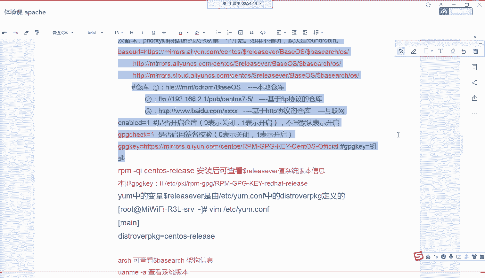

# Linux小课堂30分钟掌握一个小技巧 - P12：Linux午间小课堂12-apache三部曲第二节课 - 思博Linux关关 - BV1i54y1b7rX

喂喂喂。能不能听到我声音？喂，能听到我声音吗？各位同学。能不能听到我声音？啊，可以好啊，谢谢谢谢我们的开心爱同学啊。那我们现在开始我们今天的课程啊。

上一节课也就是昨天的话我们介绍了我们阿话提安装三部曲三部曲里面的第一个啊，教大家啊登如何登录我们的一个服务器远程登录我们的一个服务器啊，通过我们的SH服务啊，登录我们的一个服务器啊。

给大家介绍了一个SH配置文件，它的一个基本的一个简单的一个配置啊，以及它的一个启停服务的一个操作命令啊，还有我们给大家介绍了我们SH登录里面啊，两种验证方式其中的一种啊登录验证方式其中的一种啊。

是用我们的密钥登录啊，它的一个登录逻辑，也给大家做了一个简单的一个介绍啊。然后呢在我们上节课的一个最后啊，我还们还给大家介绍了我们就是应用我们SH协议啊，登录服务器的一个工具啊。

我这边给大家介绍的是我们的CT软件啊，啊后大家也有可有一些同学可能会用一些插啊，或者是我们的mac系统，可以直接用我们mac系统里面的字符终端控制台界面来进行一个登录啊。然后这个CT软件里面啊。

给大家介绍两个比较重要的一个东西，一个是我们的一个日志日志相关的一个东西啊，这个日志是用来干嘛呢？主要是记录我们通过这个插CT软件登录服务器的时候，它的一些一系列操作啊。

它会把这些操作你的操作命令以及输出结果全部保存在一个日志文件里面。那这样保存下来以后，它的有一个什么样的一个作用呢？主要是为了今后啊万一你的服务器啊出现一些故障。

或者是某些人进行了一个误操作导致的一个服务器出现。问题啊，后期的话需要去定位啊，是谁操作了一个什么命令啊，导致一个什么样的一个故障啊，这时候呢会用到这个日子啊会比较重重要啊，一个是能够排查啊，原因。

第二个的话，后续的话，可能啊如果是比较重大的一些故障的话，可能需要追究某些人的一些呃责任啊等等。那这样的话有这个日子的话，就比较好清晰的一个定位是谁操作的啊，一个能够如果不是我们自己操作的啊。

我们也有这个比较啊有利的一个证据啊，能够证明这个我们跟这件事情没有关系啊，能够把我们的呃从这件事情里面啊进行解脱出来啊。那除了这个以外的话，我们还给大家介绍介绍了我们CT里面的一个颜色的一个调配啊。

这个调配的话，它比较呃对我们的日常的一个操作的时候会有一个比较好的一个帮助啊，主要是帮我们区分我们系统上面一些文件啊，或者是一些目录它的一个用颜色进行一个区分啊。

这样的话我们一眼啊扫演我们的屏幕就可以比较清晰的知道啊这几个文件啊，它是是一个什么样的一个区别啊，是目录文件还是我们的一些软链接文件，还是我们的一个可执行文件啊，以及是我们的普通文件啊。

这样的话我们就不用去看它的一个属性还要去查的它的一个可执行读写的一些属性啊，去确定这个文件，它的一个到底是什么类型的一个文件啊，主要给大家介绍了这些东西啊。那我们今天的话我们来讲我们第二个课题啊。

那我们上节课是登录我们的服务器啊。那这节课它我们登录上去了。就要想办法啊去下载安装我们的。一个软件包啊，为我们第三节课啊真正去安装去配置我们的去启我们那个阿帕奇服务器。

配置我们的阿帕奇服务器进行一个呃基础的一个操作啊。那大家想一想啊，在我们的一个win系统上面，大家平时都是怎么安装软件包的呢？啊一般的步骤就是上我们的一些呃官网或者是我们的一些工具啊，工具平台。

像我们的360软件管家这些平台去下载我们的一个软件包啊，然后下载它的EXE啊可执行文件，然后下载下来以后，在我们的呃PC机我们的windows系统上面进行一个双击安装步骤操作啊。

那这个步骤之前啊可能有一些软件包，它需要安装一些依赖的一些呃基础软件像我们需要安装一些C加加软件啊，或者是微软提供的一些基础软件内库软件啊，这些软件都需要安装啊。

那这时候的话我们呃一般来说我们要分别安装这几个软件啊，有的一些呃程序安装包写的比较好的情况下的话，大家可以在我们的呃。可执行文件就是我们目标文件，目标要安装的那个软件里面直接啊点击那个EXE文件。

它会帮我们自动检测啊所需要的一些软呃一代包是哪些，然后会自动帮我们去安装这些一赖包。但有的软件它没有写的这么好。那这时候的话你就要去手动去安装去这些一赖软件，安装完以后。

那才能安装我们最后的一个目标文件啊。那呢在我们的linux系统上面啊，它的一个安装的一个过程跟我们的windows系统也是类似的啊，差不多的啊，也是一样也是一样。我们需要出我们的一些。

官网去下载一些它的一个呃软件安装包啊，然后去安装它的一些依赖包，然后最后才能完成这个软件真正的一个安装啊。但是在winlinux下面的话啊。

跟我们的window下面有稍微有点区别的是我们linux下面有很多软件包的话，它会有一个相互依赖的一个关系啊。比如说我们的A软件，它安装需要依赖我们的B软件啊，B软件安装是需要我们的C软件。

那C软件安装啊，又需要我们的A软件。那这时候的话安装起来就比较麻烦了啊。那我们window下面啊，目前来说我们是比较少看到有出现这种循环安装的一个方式啊。那当然如果是你的一些软件，在linux上面。

它没有这种软件安装的话，也可以提用我们啊红帽提供的IPM安装包，或者是我们编译安装原码编译安装的一种一种方式啊，去安装这种软件包啊。

那这种也是跟我们的windows下面安装的一个操作步骤其实是一模一样的哈，没什么区别啊，只不过它的一个命令或者是执行的方式不大一样。

逻辑其实是一样的但是如果遇到我刚才说的那种互相安装的一种啊互相依赖的这种情况的话，那怎么办呢？那linux下面啊给我们提供了一种比较好的一个解决方案就是用我们的样方式啊，在我们的yM工具啊来进行安装。

那ym工具的话，它能够解决我们软件包循环啊，安装的时候出现软件包依赖循环的一种循环的一种问题啊，能够办自动办理关联啊，相关的一个依赖包啊，并自动安装。这个自动关联相关的依赖包啊。

就相当于我们刚才说的在我们的windows啊系统下面那它的软件啊。一个软件安装的时候，它会帮你自动检测，它所需要的一个依赖包，自动帮你去下载啊。那样m的话它是一个通用的工具啊，它能够也是一样。

能够帮我们实现这种功能啊，它能够让所有的软件。只要你在这个yM语上面啊，它都有相应的一个规则配置啊，那你安装软件的时候，通过这个y目工具安装啊。

它会自动帮你关联你软件所需要的所需要的一个依赖包然后同时安装所有的一些依赖包，以及我们的目标软件啊，那我们在window下面可能是没要看我们的一个安装软件，它的一个配置啊，它的那一个开发人是怎么写的。

写的好就不用啊，我们去单独下载我们的这些依赖包写的不好，那我们就可能就要自己去下载这些依赖包。那样么的话，它就呃相当于一个通用平台，把这些功能啊全部集成到一个平台上面去。你所有的软件啊。

只要符合这种要求，它都会帮你自动做检测，自动做依赖的啊。那样母的话在我们linux上面啊，在我们的系统上面安装的时候，默认就已经带的一个基本的一个工具啊。那在我们的s OS8上面啊。

我们的cent OS8上面，它的样目，我们样目可以改应改变为我们的DNF这个软件了啊，它其实就是我们样母的一个4版本啊，跟我们样目原来样目比来比比起来来说会有一些优势啊，会有一些改进啊。

在我们的cent7或者是我们的红帽7linux啊7或者是呃我们的再往期的6。5版本啊，六的版本，那我们都是大部分使用我们的是样母这种命令啊，那我们在sto OS8啊，我们的红帽8系统上面。

我们既可以用我们的样目啊，也可以用我们的DNF它两个是同一个命令啊，指向是同一个文件。我们可以来看一下啊。

我们的样是在。呃，SB下面好像我看一下是不是在SB下面啊。不是吗？呃，我们找一下啊user bin看一下。啊，大家可以看到在我们的us色病下面啊，我们样目这个命令它指向的是我们DNF这个软件啊。呃。

其实你执行样目或者是执行DNF其实命令都是一样的啊，它的一个操作方式都是一样的，执行的一个软件都是一模一样的啊。所以说在CtelS7或者8上面啊，我这边这台系统上面是我们的CintoS8。3版本啊。

那我们安装的时候既可以用我们的样，也可以用我们的DNF看大家的一个日常的一个操作习惯啊。

那我们呃使用y目软件的话，我们肯定要知道啊我们怎么去用这个样M，怎么配置它的一些呃配置文件啊。那在我们的y目上面，它会有两个配置文件啊。

一个是我们的样目工具自己的一个配置文件啊第二个啊我们要安装一个软件包的话，我们需要给样目配置它的一个仓库啊，原安装包的一个仓库啊，就是在我们的ADCy点IPS点D这个目录下面配置相对应的个样仓库啊。

那这时候的话你才能啊去我们对应的一个服务器上面啊，云端服务器或者是云服务器那边去拿取对应的一个软件包下载下来啊，那我们给大家讲简简单讲解一下我们这两个配置文件啊，它的一个里面的一些简单的一些配置啊。

我们在正常工作当中要怎么去配置这些东西啊。那我们先来看我们的第一个我们的AC啊点fi这个配置文件比较简单啊，大家安装完系统要。可以去不用管这个配置文件啊，默认它的一个配置就行了啊。

那我们看一下这几个它的个简单的一个配置啊，就这几项在我们原始的一个配置文件里面，是只需要这几个项目啊，也只有配置几个项目。当然还有更多的一些配置文件啊配置选项，你可以去查找相关的一些文档。

根据你的一个需求啊，进行一个添加或者是删除操作啊。那第一个的话就是我们的GPGcheck这是我们的一个签名校验啊，是否进行一个签名校验。那这是等于一的话代表是我们安装软件包的时候。

需要对我们的个软件包进行一个签名校验啊，这主要是预防啊我们的一个软件，它的一个发布者，不是一个官方的一个发布者，或者是啊被人篡改过这个包了啊，这个包里面被人植入了一些啊恶意的病毒啊，或者是木马啊。

那通过这个check校验的话啊，能够检测这个包是不是比较纯净的官方发布的啊。那第二个参数啊，install only点limit这个参数啊。

这个参数是在我们的inststore啊PKG这个中列出啊是否要同时安装那一个软件包的个数啊，那通俗的来讲就是保留多少个内核包啊，就这个意思啊。那我们第三个啊c request on remove啊。

这个只是说啊它的一个配置的意意思呢？是说在我们移除软件包的时候啊啊，要不要去清除我们的一个依赖包啊，如果这个依赖包如果不被其他软件包所依赖的话啊，这这个把这些软件包也进行一个一定的移除啊，移除操作啊。

那再往下我们的第四个s if unvalable啊，那这个值的一个意思呢是说啊，如果是设为 true的话，就是有些由于某些原因的话啊，没办法啊，远程连接到我们的个样仓库。那这个是否要进行继续进行运行啊。

在这里进行一个简单的一个设置啊。那这个就是我们样目啊ATC点fi里面一个比较简单的一个配置啊，大家可以不用去动它，不用去管它我们的一个核心配置的还是在我们的这个AC点IPOS点D这下面这个配置文件啊。

上面这个配配置文件，大家可以可以去不用去管它，不用去动它啊，它这个都已经配置好了，我们不需要去啊做什么修改啊。那我们来看第二个啊，我们那个样么仓库啊，这个是我们呃使用样母这个最核心最关键的一个东西啊。

没有配置这下面的一个样么仓库，我们的样M命令就没办法啊去帮我们去安装下载我们的一个软件啊。我们来看一下我们的服务器上面啊。

我们的ETC啊ETC样点。这个DDC点IPOS这个目录啊，在我们刚刚安装系统的时候啊，我们目没有这个C8点IPO跟local点IPO这两个文件，只有我们的reha点IPO这个文件啊。

这个文件里面是空的啊，我们可以看一下。里面只有一个注释啊，没有任何一个样么仓库的一个配置啊。那这时候的话你是没办法用我们的样目软件去安装我们的呃样么我们这个工具去安装我们对应的一个软件包啊。

那这时候的话你就需要配置我们那个样仓库。也就是说你要配置我们可用的这个样仓库，就是类似我们这里配的一个ATC啊OS8IPO这个文件啊，或者是我们logo点IPO这个文件啊。

里面配置的一个样目仓库进行一个配置以后，你才能对应使用对应的一个样目仓库啊。当然这两个文件的名字啊，你可以随便命令。只要请最后后缀为我们点IPO这个类型啊。那这个文件的话，就会被我们的样目那个工具。

我们的命令所识别啊，最后读取到我们的呃样目命令里面去查找它对应的一个仓数仓库啊。那但是命名命名的时候，大家有一个要注意点我们命名的时候，不要跟我们这个原始自带的这个样仓库名进行。啊，重叠了冲突了哈。

这个要大家命名的时候会呃要小心点啊，其他的名字啊，其他的字母大家可以随便命名啊。那样么这个仓库的话啊，我们的这个IPU文件的话要怎么写呢？啊，一种是你可以去我们网上下载对应的一个软件包。第二个啊。

你如果是自建的一个啊样仓库的话啊，那也可以进行一个相关的一个规范性的一个书写以后就可以使用我们这个样仓库了啊。

那我们这里啊给大家画出来了啊，这是我们从我们的呃红包啊，我们的那个阿里云上面下了一个样本仓库啊，它的一个格式的一个缩写啊，格式的一个规范啊。

我们就以这个为标准来进行我们今天的这个样么仓库配置的一个讲解啊。啊啊，我们再来看这个啊我们来看我们这边啊给大家进行啊已经标出标注出来了各个字段的一个意思啊。我们前面这几个字段啊。

前面这都是我们井号开头的啊啊，这些大家应该有学过我们lininux基础的知识啊的同学应该知道啊，井号开头的，在我们的linux里面文件里面大部分的一个意思，就是我们注释的一个意思啊。

这些东西可以是一些是一些说明文件啊，或者是是一些啊注释的一些信息，你可以不用管啊，这些信息的话是不会被我们这个系统啊，它所读取的啊。然后我们来看我们下面啊，第一个我们第一行真正有效的一个数据的一个配置。

第一行啊，在我们的这个位置啊。啊，我们的第一个啊是我们的ID仓库啊，我们ID仓库有一个书写工啊规范，所是我们那个大括号，两个大括号啊，中间书写上你的一个ID啊，仓库ID这个仓库ID你可以自己定义啊。

但是不要跟我们其他仓库ID有个冲突就好了啊。那我们在我们书写这个仓库ID的时候啊，它的一个左右两边是不能有空格的啊。然后这就是我们呃仓库的一个ID信息啊，在我们后面样安装的时候。

它会呃检索出啊这个仓库的一个ID啊，根据呃这个ID来进行检索相对应的一个包啊，并把这个呃信息列啊列在我们的最后啊，我们安搜索出来的包到后面啊，它会有相对应的一个仓库名啊。

告诉你这个包是从哪一个啊仓库里面检索出来的啊。好，那第二个第二行啊，就是我们那个仓库的一个名字啊，这里的话呃。

这里的话他是给我们写的是sOS啊dollre啊然后后面一些呃其他一些意义的其他的一些意思啊啊，这个的话名字可大家也可以自己定义啊。我们看到这边有个doller加re service啊，这里有个变量。

这个变量的一个意思呢是其实代表我们这个系统啊是一个几的一个系统啊。如果大家是呃在我们的七系统上面啊，如果是你这边识别不到，你可以把直接这个名字改成7啊，一般来说我们这种规范。

它都是啊以这种呃系统版本进行一个区分的，可以改成我们七的系统那这样子话大部分情况下，它都能识别的到啊。但是如果是可用的话，我们这个这里就不要去改它了啊，那它自己去获取我们系统的这些变量啊。

然后看我们第二第三个参数啊，我们的faover method啊等于proprior啊，这个值啊这个值的话它有两个选项，一个是run robbbin啊。

跟我们的priority这两个值啊意思是我们当下面我们的这个base uL有多个选择的时候，它是怎么说选择的，是一种们随机选择的话啊。

还是我们的一个呃顺序选择啊那如果是我们的run robin啊run robin这个配置的话，那这个就是我们这下面的一个UL啊，我们样样目命令会随机选择一个进行一个读具去获取它的一个呃仓库包啊。

如果是我们的呃priority的话，则是我们的一个按顺序进行一个选择啊啊，从上往下进行一个顺序的一个选择啊，这就是我们这两个值的一个意义。当然你这个也可以不配啊。如果你后面只有一个选项的话。

一般来说我们也会只配置一个UIL啊，我们自己建的话，可能也只配置一个UL。那这时候的话就上面这个fi file over method这个值的话，它就可以不用配置啊。

然后我们来看我们下一个base U这个啊base U这个值啊是比较关键的，它是指向我们真正仓库你的一个呃数据包的一个地址啊，那我们样么的话，最后要通过这个UI去下载我们的一个软件包啊。

如果这个仓库地址配置错的话，那这时候你的软件包就没办法下载了。所以说这个值还是非常关键的，大家不要配错了啊，那这里的话也呃base U有三种这种写法啊。

一种是我们的HTTB啊协议就是走我们的互联网的呃HTTB砌成协议啊。第二种的话啊是我们的本地仓库形式啊，用我们的fin冒号双斜杠，然后加上我们的本地仓库的一个地址啊。

这里是呃挂在我们的MNTCD弄下面啊，里面的base啊OS这个文件夹里面啊，这就是我们本本地仓库的一种写法。那第三种的话就是我们的本地远程仓库啊，就是我们基于HFTP协议的话啊。

或者是呃你外网的一些FTP服务器啊，它提供这种服务的话，那你如果用我们的FTP协议啊，那也可以在我们这边的配置啊，以这种FTP开头的冒号。然后写上对装的一个服务器的个IP地址啊以及它的一个目录路径啊。

那这时候的话也可以进行一个访问啊。所以说b，它一般会有三种形式啊，一种是本地仓库啊，一种是基于FTP协议的一种仓库啊，还有一种就是我们的基于我们的FHTTB协议的一种仓库。

一般来说我们呃在我们的实际的一个工作当中啊，用的比较多的啊，是我们的呃FHTTP啊，就是我们的汽车协议这个仓库啊，然后我们如果是自己自己做测试做实验，在我们的本地虚拟机做练习的话。

可能会用一些我们的呃这种本地仓。形式啊，直接挂在我们那个呃IISO镜像文件啊，挂在我们的光盘啊。好，大家如果在我们讲解当中有什么疑问或者问题的话，大家也可以提出来啊，我们也给大家进行一个解答跟探讨啊。

嗯。好，那我们来看到我们这个baseUL这边，我们的呃HTTPS这边啊，这边一个是我们的UIL地址啊，这个大家应该能看得懂。然后后面还有几个变量，一个是我们的呃serv啊。

serv跟我们上面这个serv是一个意思了啊。然后后面的话还有个do加上我们的base arch，这个是代表我们的一个平台架构啊。那我们呃大部分情况下，我们的linux系统都是我们的叉86。

我们的叉86-64位的一种架构啊，就是我们的叉。86啊。啊，60位啊，我们的下划线64位啊都是大部分是这种架构啊，比较少是我们其他一种架构，当然也会有其他一种架构。如果大家想看我们自己啊这台服务器。

它的一个架构是什么类型的话，可以用我们的这个r命令啊，H命令啊，H命令可以看出我们这个当前系统啊，它是一个什么样的一个架构啊，这个架构就是我们这边这个base arch这它的一个值啊。

这也是一个变量，它会读取我们系统里面的一个架构啊。如果你不啊不写的话，你可以自己写啊。这64位的啊，后面64位，我们如果是32位的话，就不是后面64了啊。叉86叉86就是我们的CCPU的一个架构。

然后64位是我们的64位还是32位的一个区别啊。对啊，这个能懂吧？这是64位的，你看到后面有64位，就是64位的啊。大部分情况下，我们现在都是64位G系统的，因为32位已经就是淘汰了。

它的支持的一些内存的一些空间会有限制啊，没办法支持太大的一些内存啊。这时候的话我们实际的业务现在已经呃不仅仅是32位能够满足的啊。所以说我们大部分现在都是要64位的。如果各位手里面啊。

或者是我们的企业里面还有32位的一个架构的话，那尽量要尽早淘汰的啊，后期肯定是没办法支撑我们业务的一个发展的啊。好，那这个就是我们的baseUI然这个比较关键的一个解释啊，这个大家一定要呃了解清楚啊。

理解清楚。好，那我们再往看往下看我们下一个字啊，我们的这个enableable，这个的话，大家应该是非常理好理解了。Enable就是是否启用的一个意思啊。

那一的话就代表我们启用这个仓库零的话就代表不启用啊，不启用的话，就是你即便在这边的配置文件配置了这个呃仓库信息啊，但是你这时候设置是不启用。那样目那个命令去读取这个配置文件，然后。

它会忽略你这个配置的这个仓库啊，它就呃无视它。那这时候的话你这个仓库就没有什么作用了啊。所以说大家如果配置了以后要用的话，一定要把我们这个enable设为一啊，表示启用啊。好，再往下啊再往下的话。

我们的这个GPG check check这个跟我们刚才这边啊么这边的个意思是一样的啊，是否进行一个呃签名校验的一种方式啊，您代表是关闭不做签名校验一代表是开启啊那如果是你在平时的一个练习当中啊。

可能去下了些其他的一些语的话啊，不单是我们的这个官方的源或者是我们阿里云这边提供的语源是其他一些语的话，那他如果是没有做好这些签名校验的话啊，你安装的时候会有一些爆错。

那大家为了方便啊能够快速的过过掉以后，大家可以把这个签名校验先关掉啊，那我们的软件先安装安装上去，那你自己先把这个练习这个流程先给它过一遍啊，这个不影响。但是在线上的系统的话啊。

大家操作这个的话要谨慎啊。因为一些非正规的一个软件或者是没有官方授权的签发的一个软件。如果是安装。到我们线上系统的话，那这时候万一如果呃发布这个软件的人不安好心在里面编写了一些木马或者是后门的话。

那大家这个就几乎有可能造成我们的一个信息的一个泄露。我们服务器的一个安全风险问题啊。所以说大家用的时候一定要是小心啊安全这根弦的话，在我们运维里面，这个理念里面要时刻紧绷的啊。

无论是我们呃在平时的一个日常操作啊，是我们的简单操作删除移文件还是移除文呃复制文件或者是改文件权限啊，停服务啊啊，还有一些更多的一些是我们安装一些其他的一些软件未置的软件的时候啊。

这时候的话都要特别注意我们这个安全的一个问题啊。嗯。Oh。好，那我们来看我们下一个值啊，我们的GPK这个值啊，GPK这个值就跟我们的GPT check这个值相关联的啊，上面是要进行是否要进行校验啊。

那下面的话那个这个就就是代表我们这个校验要用哪一个音密药啊，我们哪一个公钥啊，这里它给我们配置了一个公钥啊。他那个阿里云上面那个公钥啊，通过这个公钥啊去校验我们安装的一个这个软件包啊。

是否是呃官方授权的啊，比较纯净的一个软件包啊。那你如果是启用了我这个我们签名校验的话，我们一般都是需要配置我们这个呃公钥的啊。如果没有配置到，可能就会出现一些报错信息啊。啊。

然后这个的话这几个值啊几这这几个参数的话，在我们的一个呃样本仓库的一个配置文件里面啊是比较关键的一个几个参数啊。大家配置了这几个参数以后，那我们的这个样本仓库就算是基本啊配置完成了。

你可以进行一个简单的一个应用了啊，那我们来进行一个简单的一个来实呃实操一下啊，看一下我们的一个样目仓库啊，它这个配置完以后是是一个什么样的一个样子啊。

好啊，那我们来看一下啊，看一下第一个啊，就是我们的这个是我们的cent光啊，我们的阿里云下面啊下载的下载的一个样么仓库啊。

跟我前面这个被就是我们刚才给大家解析的一个样仓库的一个简单的一个配置啊然再往下啊大家看到这边还有一些其他一些仓库名啊，像我们的s plus啊power tool啊，它不同的一个仓库的话。

包含的一些软件包会不一样的啊，所以说大家下载的时候就不要呃轻易的去动里面的这些啊配置啊，在我们没有没有什么问题的情况下，大家就是尽量去不要去修改它。因为有些软件包在不同的一个仓库里面。

你如果把某一些仓库给屏蔽掉了，那极有可能你这个下次安装某些软件的时候，就发现啊别人可以安装啊，但是你这边检测啊，就为什么检测不到相对应的一个软件包啊那个情况。

好。这是我们从啊网上下载下来的一个公有的一个亚母源仓库啊。当然我们刚才还说了，我们可以进行一个手动配置啊，就是挂在我们本地的一个仓库啊。那我们本地仓库的话是在我们的这个啊logo这边啊。

我这边给提前给大家配置了一个logoIPO点啊logo点IPO这个文件啊。好，大家看到我这边配了两个啊我们的一个仓库啊，我们的个仓库ID啊，一个是logo一啊，然后这边名字我前面取了1个ABC啊。

然后这个是启用啊，然后这边的话我的配置的本地UIL啊，本地的L那个bUL是指向我们本地的一个mount啊，我们MNT点base点OS这个位置啊，那我们可以看一下啊。啊，我们这时候有没有挂展啊。

我看一下啊。啊，有挂载啊，大家看到啊，这个是我们的挂载之前之前也挂载下来的一个本地仓库啊。啊，我们看到我们的DVS20啊，这个就是我们这边IOS光啊光盘光驱啊光盘这边挂载的一个呃设备啊。

挂载在我们的MNT下面啊。那我们这时候进我们的MNT下面啊，就可以看到我们的光盘里面的一些文件啊。那我们刚才配置的这两个，一个是我们的APP string啊，一个是我们的base OS啊。

base OS里面主要是我们的系统一些呃核核心的基本的一些呃软件包啊，那我们的APP string的话，主要是我们应用成一些软件包啊，永久挂载的话，一个大家可以通过我们的这个。呃。

firs table ETC first table在里面啊。大家可以看到我这边提前配的这个啊我们的ETC first面啊，这个在我们的这个文件里面配置我们相对应的一个挂载参数以后。

那在你开机启动的时候，它就可以进行一个自动挂载了啊，所以看到了吧那这个挂载的话第一个啊第一个我给大家讲解一下这个参数啊可以第一个的话就是我们的一个设备啊，我们的设备位置啊，我们的或者是我们的ID啊。

你的一个设备位置在哪啊，我们的设备这里是DVS20啊。那第二个的话就是你一个挂载点啊。然后第三个就是你的一个呃文件系统类型啊，我们这时候的呃镜像，我们的ISO这种光盘。

它的一个呃文件类型的话是我们的ISO9660这种文件类型啊，那这个的话就是我们的一个挂载参数。这个参数里面包含一些很多一些参数啊，是否可读写啊，或者是其他一些参数这个参数大家可以去查一下会比较多啊。

我这里就不好讲解了啊，然后第四个啊这里还有个逗号，我们这里还加了一个。参数然l fire参数代表的一个意思呢，就代表如果这个配置啊你配置错了。那你这个系度的时候就会跳过这个配置啊。

然后继续灌在下面的这个配置啊。不然的话，系统会一直卡在这个配置这边，会导致你这个这个系统没办法起来的啊。这个是在我们生生产啊，我们的日常的一个工作当中，生产环境中啊，真实遇到的一种情况啊。

比较呃采购的一个比较大的一个坑啊，之前就是因为啊我们的一个前面的这个。像我们挂了一些其他硬盘啊，硬盘的话，它这个盘符变掉了，那我们这时候找不到这个盘符啊，这个时候就在卡在这个配置这边啊，一直挂不上去。

那这时候的话。你这个系统就没办法拉起来了啊，所以说我们后面加了一个这个参数以后啊，即便是我们这个配置啊关出现了一个问题啊，但是的话我们至少能让我们那个文件系统能够拉起来啊。啊，可以。

我们一会儿看一下free这个文件性怎么看啊。那我们后面的话零代表就是我们的一个呃是否有一个检测啊，还有一个是否进行了呃二次备份等这些意思啊。那你要看这个文件性的话。

是我们可以看我们的呃我们的有个找一下啊SB啊，看一下哪一个命令忘了。呃。您啊稍等一下，我想一下是哪一个。helpy。系。Yes。呃，哦，我们可以就是通过这个命令啊，我买了LT。啊。哎い我们的 at。啊。

大家可以看通过这个DF跟LT这个命令啊，看到我们这一行这一行这一列就是我们的这个文件系统啊，这里是ISO啊ISO9660这个文件系统啊，我们大部分是叉F啊。

这个是呃镜像的话是我们的啊ISO9660这个文件系统啊。okK啊，然后这个就是我们那个挂展啊，我们现在回到我们刚才那边的一个新啊，我们的样目那边的一个呃讲解啊。😊，呃，所以这个能看懂了吧。好啊，O啊。

那我们来回到这边啊，那我们配置完这个base UL以后我们这边还有个GPG key这个值啊，这个key值的话，在我们的本地啊，我们的所有的linux文文件啊。

我们的linux系统里面在我们的这个位置都有相对应的一个啊GPG的一个个key啊，公钥 key啊。大家如果把这个key导入进去导入进去以后啊，那我们安装的时候就不会出现一些提示这个啊没有这个key啊。

这个提示信息啊，错误信息等等。这些啊，那大家可以看一下啊，如果是啊找不到的话，可以我们LL去找一下这个key啊，一般来说我们安装的系统里面都会有这个key啊。好，那这就是我们的一个呃IPU这个文件啊。

它的一个简单的一个配置啊，那这方面配置的话，这这一块的话，大家还有什么疑问没有？

。啊，大家没有疑问的话，打个二吧啊。😊，啊，very还有疑问吗？あと。好啊的好O啊，大家都没疑问。那我们现在啊那我们来看一下我们安装完以后啊，那我们就来进行一个简单的一个命令操作啊。

第一个的话我们安装完肯定呃要安配置完以后，我们要安装我们的一个文件系统的啊。那我们安装的话，最简单的一个命令是用我们的instore啊，那这时候你如果是要安装某些包的话，比如说搜索一些包名啊。

比如说我们的openopEN啊SH。

啊，这个可能已经安装了啊。你可以进行一个检锁啊，检索，就是我们的insall啊，用我们的ins的命，然后跟上我们的一个包包的一个检索名字。你如果不记得这个包的话，那你可以通过这种方式啊。

我们的前缀会加上我们的信号，或者是我们的信号，加上我们的一个前缀啊来进行一个检锁啊匹配啊，要么会帮你匹配啊，啊能够符合你这个要求的一个包名啊，大家能看到我们这时候会匹配出来有三个包啊。

一个是open SH啊，杠CIVS还有个TCAT啊，我们的LDIP啊，这都是我们oppo SH啊相关的一些包啊。那这时候的话你就可以进行一个安装操作了啊，样目insstore啊，然后结束完以后。

这里它会提示啊是否有是否进行一个需要安装啊，它这边结束出来嗯，符合你要求的以后，你如果要安装，那点一个Y啊，我们这一点个Y，那它就开始是一个简单的一个安装了，它会进行一个检查啊，检查你这些包啊。

是否呃完整性啊，或者是你们的这些依赖啊啊，我们这边是没有什么依赖啊，我们这边暂时没有依赖，所以说它没有去做依赖啊，依赖检查，然后检查完以后它会进行一个安装操作了，把你这个包一步步全部安装完成啊。

只要安装OK了，那最后的话它会这里会有一个完毕操作啊，或者是呃如果是这笔是英文的话，就是complete啊，就是我们的COMPCOMPL。P， R， E， T E。D啊comp我应该没有拼错的话啊。

你英文的话就看到我们有个comprete的一个操作啊。那这样的话代表就是你的这个包啊，就算一个安装完成了啊，那这时候就可以进行你一个呃应用了。你平时啊要呃要怎么使用这个软件包啊，就可以进行一个使用。

如果是命令的话，就可以直接执行这个命令啊啊。如果需要进行一些像我们的HTTP阿帕奇的HTTP服务啊，那你可以进行一些它的其它的一个相对应的一个目录下面进行一个简单的一个配置。

然后把服务对应的服务给拉起来了啊。那这个就是我们最简单的一个样本操作啊。那你如果是说不想输这个外的话，那我们可以像刚才一样，在我们的样这个intall后面加个杠外啊杠外啊，那这样子的话。

你的一个命令执行下去以后，它就不会出现这这一层交交互的一个呃界面啊，它会直接帮你跳过这个界面，直接帮你安装完成啊，那这时候的话会在我们的一个日常的一个写脚本的一个呃场景中会比较有需要啊。

因为我们脚本的话，一般都是一个脚本执行下去，那整套流程走完，我们不需要人工进行一个二次介入啊。那你如果是呃需要这种交互的话，那就比较麻烦了啊，所以说它有提供的这种功能啊。那我们平时在我们的工作当中的话。

我们可能。一个如果我们比较确定这个包的话，是我们啊要安装的那我们可以直接加上一个Y。那如果我们不确定的话，我们只是想检索一些呃信息，然后再确定是安装哪一个具体的一个包的话。

那我们就可以通过两步走一个方式，先进行一个inst啊，然后检索相关的一个包啊，然后进行一个杠Y啊，然后呃然后再把我们的一个呃交互界面这是在我们的这个交互界面的时候，输入我们的一个Y操作。

然后完成我们的个具体的一个操作啊。好。那这个就是我们呃inst啊最简单的一个安装的一个命令啊。inst啊，当然我们的一个样本上面还有一些其他一些命令啊，我们也给大家讲解一下啊。

然后第一个的话是我们的一个升级啊，我们的一个upupdate啊，就是我们的样目update。

啊，他会把我们的一些呃这时候阳装的一些软件包进行一个升级操作，它会检测我们的远程的一个样文仓库。你的那边软件包跟我们本地阳装的一个软件包进行一个匹配。如果有新的一个版本的话，它会进行一个升级操作啊。

当然这个升级操作可能会比较耗使啊，我们一般在我们的工作当中会比较少去进行一这种升级升级操作啊，除非有必要啊，非常有必要的时候啊，才会进行这种升升级的一个操作啊。第二个的话，这个升级操作的话啊。

如果是像我们有一些啊应用程序，它对我们的软件包，它有个版本的一个要求啊，那你这时候的话做这个升级操作就要有一个比较慎重啊，慎重的一个态度了啊。呃因为你如果升级了一一次一把它全部升级以后，那其他一些软件。

它依赖的这些软件包版本不对的话，它没办法支持啊，使用调阅那么高的一个版本那这时候就会出现一个生产事故了啊，所以说update这个命令啊，虽然大家啊了解一下。是在操作当中啊，一定要非常慎重。

尤其在我们的一个线上业务时候啊，操作一定要慎重啊，慎重又慎重。

好嗯，第二个的话看到我们呃list的命令啊，我们一样 list的，它可以查看我们所有的一个可用的一个软件包啊啊会比较多啊，我们可以看一下。

我们会呃为了我们能够比较方便显示啊，我们用加个管道服，加个墨啊。啊。啊，他会进行一个解锁，大家稍等一下啊。大家会看到啊，这边会有很多啊，我们呃这边会显示已安装的一个软件包啊等等。

我们这边已经安装了很多啊，我们这边对我们的空格键可以进行一个下滑，然后看一些啊软件包，我们是否需要哪些软件包。那如果是我们啊想查找啊特定的一个软件包，我们可以通过我们gra命令啊。😊。

比如说我们刚才去解束我们的呃oppo SH啊。我们的SH啊这个包。嗯。我们可以通过这个啊这个操作啊去检索我们呃对应的一个软直接去搜索出来。我们一个软件包，就不用像我们刚才这样啊，这里刷出来比较多啊。

就不用像我们刚才这样把所有这个软件包都给它列出来去一个找了啊。我们可以通过这种规本方式搜索特定啊特定的一些软件包。像我们这里啊搜索出来的。

我们的oppo SH这个就是我们昨天昨天我们SH啊那个服务最核心的一个软件包啊，要使用我们SH服务。那肯定要按照我们的这个oppo SH点叉86-6视为这个软件包了啊。啊，那这个SH的啊类似的话。

它的作用的话主要是进行一个检索一个操作啊。像我们在工作当中啊，可能有一些包报名不是特别一个了解啊，或者是我们可能只知道们它那个报名大概的一个名字啊，没办法把我们那个准确的一个啊名字给它列出来啊。

那我们可以通过这种类似的方式进行一个group检索的这种操作啊。啊，找到我们对应的一个软件包以后啊，那我们这时候的话啊我们再把我们那一个啊通过我们刚才呃上一个命令，要么install那个命令。

加上我们这个报名啊，把我们真正需要的一个软件包给它安装下去啊，就可以的啊。

好，那我们呃来看下一个命令啊，我们的y啊c2啊，这个就是它的意思清楚我们本地的一些I。已安装软件包的一些缓存信息啊，包括我们的一些软件包啊。

我们的一些头文件信息啊啊当然这个主要是为了排除一些版本版本差异的一个问题啊。比如说我们很早以前安装的一些软件包啊，在我们本地有些缓存的话，那我们可能检锁的时候会先优先检索我们本地的一个软件包。

那我们后期的话想用我们呃更新的一个软件包啊，原我们的云服务器那边，我们的样么云仓库那边已经配置了一些新的一些软件包啊。那这时候的话我们就需要把我们本地的这个缓存清理掉啊。

然后去拉取我们原装的一个新的一个版本啊，软件包进行一个安装一个操作啊，那这时候就会用到我们的c操作啊，主要是为了避免一些啊软件包的一个版本问题啊差异问题。

导致的一些我们找不到对应的一个版本或者是安装错了。我们一个真正所需要的一个版本信息啊。No。啊，当然啊我们样么缓存的话会有一些特性啊，会有一些优势啊。就刚才我们说的我们的一些样么包括在本地有务缓存。

那这时候的话我们就不需要去远端去拉取了啊，当然这时候的话它一个性能会更高啊，我们就不用走网络层这些通道啊，我们可以进行一个离线操作啊。这些操作啊，那真正的在我们的线上业务里面啊。

我们可能就呃不是很需要这种呃缓存操作啊。因为它带来的一个收益并不是太高啊，我们的线上业务啊，我们的带宽啊，可能就并不是像我们呃以前那样很拘谨啊。我们现在带宽都是很浓余的这些基本的一些消耗对我来说。

对我们来说可能就是无足挂齿了啊，那这时候往这时候的话我们更看重的可能就是我们呃保持我们呃新版本啊，我们要使用最新版本的这种需求啊。那这时候看根据大家呢在我工作当中实一个实际的一个需求情况嘛。

来决定你是否啊要使用我们这个缓存啊。字不要进入缓存啊。好。然后第啊我们来看下一个命令啊，我们的一个仓库列举啊，我们刚才一样配置好多个仓库啊，我们的本地仓库，我们的一个阿里云的一个sW8的一个仓库啊。

那你如果想看我们呃这服务器里面y么识别到了一个几个仓库以后啊，我们可以通过这个y么pro的命令啊查看啊。

啊，大家可以看到啊，我们这时候的仓库啊识别出来的一个是APP string啊，我们的base啊我们的local一loc2啊，它这个仓库就是我们的仓库ID啊。

我们刚才配置的那个大括号这个里面那个仓库啊这个这个里面的一个仓库名字啊那这个就是我们的仓库ID啊，那后面跟的话，就是我们那一个仓库名啊，我们刚才配置个name那个值啊，就是它的一个仓库名啊。

那在这边显示出来的啊，说明说我们这个样命令真正识别到它可以用的一个仓库啊。如果不在这边的话，那说明你这个仓库没有被样识别到，或者是你这个仓库没有启用啊，那在我们的工作当中啊。

你如果是某些仓库被屏蔽掉了以后，那你这时候就这里就看不到了。那你如果要用里面的仓库的一些我包的话，那你这个时候就没办法用啊，你需要去我们那个刚才配置文件里面把我们的这个enable这个值啊给它启用起来。

一那这样的话，它在这边就能够识别到对应的一个仓库名了啊，能够识别到那就可以用里面的一些软件包了。

嗯好。好，那我们像我们来看下一个啊，我们的一个自助缓存啊，y make page啊，这个缓存呢主要是呃帮助我们啊提前去我们的一些语那边啊，拿取一些图文件缓存啊。

这时候的话比较呃能够让我们在下次安装的时候，比较快速的个减锁我们的一个软件包的一个信息啊，就不用啊每次都去我们远远程那边远辅远程服务器那边去解锁相对应的信息啊。

能够加加快我们的一个呃加快我们的一个安装的一个进程啊一个过程啊。好，那我们来看下一个命令啊，这个命令还是跟我们这两个命令还是比较重要的啊。一个是y么 search啊。

样么 search后面跟的是关键字啊关键字还有个是ym provide，后面跟的是我们的一个命令啊，这两个命命令的话，在我们的工作当中有什么作用呢啊，比如说我们要检索某些包啊。

我们检索某些包的一个关键字，我们可以用我们的y search这个命令来进行一个搜索啊。这个有点类似我们刚才有我们的y list，通过我们的gri那种解索操作啊，跟我们这种操作其实是类似的一种操作啊。

当然要么它又自己给我们提供这种操作啊，我们也可以通过样么 search这种方式啊去检索我们刚才对应的一个软件包啊，是否啊还有相关的一个软件包或者是内库之类的啊。

那这时候我们就可以判断我们是否啊需要重新去其他地方去下载这个软件包，还是直接用我们要么这个仓库就可以安装我们的一个软件包了啊。那下一个这个是我们工作当中可能啊最方便啊最经常用的啊。

我们的y provide what provideip config啊，这个是IP config命令啊，你可以换成其他命令啊，这个它的一个作用的话，是根据我们的一些命令去检锁我们对应的一个软件包啊。

那比如说我们在我们的平常的一个工作当中，我们可能要去上网看到一些资料啊，我们看到一些呃方案，可能它做了一些新的一些技术啊啊，那我们要参考他们去做这个实验啊。

那它可能没有提供相对应的一个啊软件包的个名字啊，那是它的一个操作文档流程里面有相对应的一个命令啊，那我们这时候服务器上面又没有这种命令。那我们想知道这个命令它是由哪一个软件包来提供的啊。

我们需要去安装哪一个软件包的话，那我们这时候就要通过我们这个pro啊这个参数啊，然后去检索我们啊对应的一个软件包啊，那这时候的话你才能根据这个检索出来的个软件包。报面去下载对应的一个软件包。

最后才能真正去执行我们这个命令啊。我不知道大家在工作当中有没有遇到这种情况啊，就是你用这个命令啊，可能这台以在另以前在另一台机子上经常用啊，但是换了一台机子以后啊，这个上面比较纯净啊。

什么命令让你之前用那些那些命令都没用啊。但是你可能又忘记了这个命令是哪一个包安装的啊，那这时候怎么办？如果是你这时候又没有呃又不能上外网的话啊，那你这时候又只有本地仓库的话。

那这时候的话呃又不知道它报名啊，那这时候会可能比较茫然啊，那这时候的话可以通过我们这个pro啊，比较方便的去满足你这种呃检索的一个需求啊，我们来操作一下啊。

我们就通过我们这个呃IP confi来检索一下，它是用哪一个包来提供的。

哦，这个复制错了。复制一下。大家看到啊我们IPfi的话，它是由我们这个net这个包来提供的啊，大家看出来我们命令跟我们的报名其实啊有时候差异还是蛮大的啊。

因因为有些包名它可能提供的命令不单单是我们的只像可能不单单提供我们Ifi这个命令可能还有更多的一些命令啊。那这时候的话你想通过我们的一个命令来直接反推我们这个大概的一个报名去拆我们这个报名。

那可能就是比较困难的那这时候的话通过我们这个我它就帮你解锁出来。这个是呃提供这个命令命令的一个可用包当前一个可用包是我们的这个net这个可用包啊，当然它会解索出来啊，个我们这边已经配置了一些仓库啊。

它一哪些仓库会提供这个软件包了，像我们这有配置了一个仓库啊，我们的仓库这边我们的lo仓库这边都有提供相对应的一个软件包啊。Okay。那当然除了这个的话，我们可以查一些其他的一些命令。比如说我们的。

Let' state N， E， T， S， T， A T。哎，这个。T。命令不知道有没打letstead啊，应该没打出这个命令啊。好，它这个let date大家看到啊。

也是我们的这个let two这个来提供的啊，这个就非常多了啊。这个letwo就是我们基础的一个网络命令啊，它提供的一个东西就非常非常多了啊。

好，这个就是我们的这个y provide这个命令啊，这个在我们工作当中啊是。最适用啊实用性最强的一个命令啊，跟我们的inst一样啊，我们要么insstore一样，实用性最强的啊。

那我个人感觉是啊非常有用啊，非常有效的一个命令。不然的话，你每次需要查找啊某根命令，它那个软件包的话，都要上网去百度一下啊，那个是比较魅力的啊，有时候可能要百度几次才能找到啊。

我不知道大家有没有这种经验啊，这种感受啊。😊，好。好，那我们的最后一个啊，我们的一个这个啊这个是我们的。啊这个作用的话就是把我们的一个软件包啊安装到啊直接下载下来，但是不安装啊。

比如说你某些时候可能需要啊下载一个软件包啊，然后复制到其他的一些机子上去。这些机子可能没办法上网的话，那你这时候可以用我们的啊登这个命令啊，把它的一个软件包下载下来。

然后通过啊在其他机址上用我们的IPM命令啊安装这些软件包啊啊这里是我们日常工作当中可能会用到的一些命令啊啊，后面包跟着这个send就是我们的一个报名啊。

我们的一个包是要我们下载哪个包就是跟啊去加上这个值啊，然后再往下这个啊会有一个参数啊，可以带我们的指定路径啊，你要下载到一个指什么路径啊，但是这时候可以啊用我们的这个desR这个命令来进行一个指定啊好。

那我们来给大家介绍我们最后一个命令啊，我们的remove这个操作啊。remove操作的话就是把我们的一个已经安装的一个软件包进行一个移除啊。那我们的移除的时候，这个会有一个比较啊。

慎重的一个地方比较关键的一个地方地方呢是我们remove的话，它会默认啊会帮我们删除一些依赖包啊。这时候你是要慎重的。如果是这些依赖包啊，会涉及到我们其他的一些软件包，它也被依赖的话。

那你如果删除了这些依赖包，那其他软件下次运行的时候就有可能出现问题啊。所以说大家安装啊删除的时候用我们要remove啊进行删除的时候会要慎重要慎重啊，慎至又慎啊。如果它真正如果被其他包有依赖的话。

大家可以我建议大家可以用我们的IPM啊PM命令进行一个删除操作，它里面有一个啊，有个参数可以设置我们啊不删除相关的依赖信息啊。好，那这个的话就到这里的话。

就是我们今天给大家介绍我们样目仓库的一些基本知识啊。那我们这边还有给大家两个链接啊，如果是大家在我们工作当中的话啊，可以直接去下载我们的一个光啊啊官方的或者是我们一些比较大的一些样目云啊。

像我们的清华云或者是我们的阿里云网易云啊，这些地址大家这个下载下来的时候，就是都是比较安全的话，比较可靠的啊，不要啊大家下载这个云的时候，尽量去我们这种大的一个云平台网站。

它有提供这些比较纯净的一个语言啊，不要去下载我们一些位置的一些网站。它的一个配置源的里面的一些啊文件啊。那这时候的话安全性的话，会有一些相对应的一个保障啊。好，那我们今天的话给大家就介绍了我们这么多啊。

我们这边给大家介绍了我们的一个样目源的一个简单的一个配置跟使用啊。那大家如果有什么疑问的话，大家可以提一下，我们这时候还有2分钟的时间啊。大家如果都理解的没什么疑问，大家打个三吧。喂，大家能听到吗？😊。

喂喂喂。能听到吗？喂喂喂。大家能不能听到？啊啊，大家要是都没什么疑问的话，那我们今天这节课啊，我们就给大家介绍到这里啊。那下一节课的话，我们明天啊明天下午也是一样的一个时间。

我们给大家介绍我们的阿话题的一个软件安装，以及一个简单的一个配置啊。最后教呃教怎么起我们这个服务啊，给大家做一个简单的一个展示啊。那如果大家啊都没有什么疑问的话，那我们这节课啊就到这里结束了。

我们就下课了啊。大也欢迎大家加入我们的一个QQ跟微信群啊，我们群里面都是很多同学啊，我们呃新同学或者是老同学啊，他们都是呃学习我们这个linux相关方面的，或者是从事我们相关方面的一个呃专啊进职业啊。

大家有什么疑问可以在里面进行一些探讨啊，或者是呃困难的时候可以在里面进行一个寻求大家一种帮助啊。我们课程的老师也会在里面有看到的话，大家也也会帮助大家啊进行一个简单的一个解答跟疑问啊。

当然我们这边还有一些啊更更多的一些呃关于我们lininux的一个技能，一个职业的一个培训的一个课程啊。大家如果是想了解我们这方面的一个知识的话，可以跟我们那个课程老师了解一下我们这边课程啊。

都有讲哪一些知识啊，是否对你的一个工作啊，是否有真正的一个帮助啊。我想如果大家。来到我们这边学了我们这个课程，要相信啊，大家不会是呃感觉是没有用的啊，一定是物超所值的啊。大家可以稍微了解一下啊。好。

那我们今天的课程就到这里结束了啊，我们下一次再见啊，感谢大家来我们今天的一个呃世博的一个公开课课程啊，谢谢。

