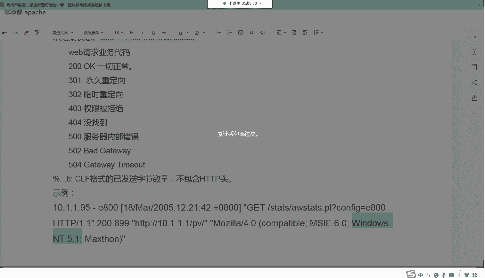
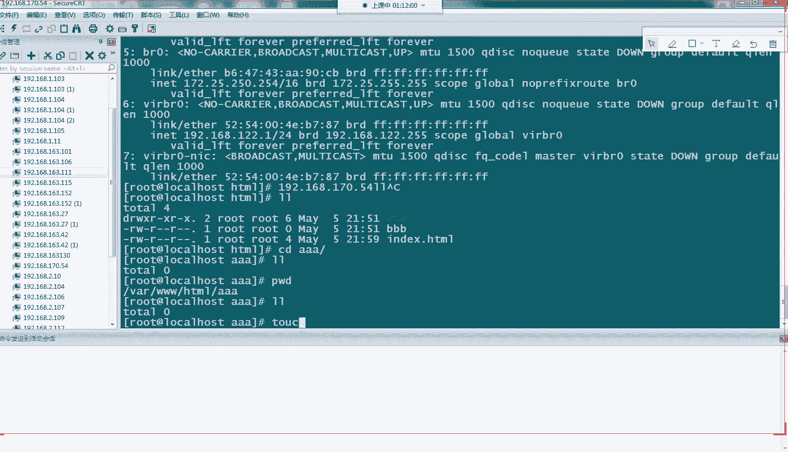

# Linux小课堂30分钟掌握一个小技巧 - P13：Linux午间小课堂13-apache三部曲第三节课 - 思博Linux关关 - BV1i54y1b7rX

我的那个这边的麦克风收音是没有问题的。能不能听到我声音？喂喂喂。呃，在线的同学们呃，能听到我声音，帮我打个一，好不好？喂喂喂喂。Yeah。喂，能听到我声音吗？好啊，谢谢谢谢啊，谢谢我们的吴老师啊。那好。

那我们现在来开始我们今天的课程啊呃很感谢大家啊呃人来了我们今天的直博的一个公开课。今天呢我们的课程啊，依旧是我们阿帕及三部曲里面的一个最后一节课啊。

前面两节课的话给大家介绍了我们那个SH登录的一个配置啊，它的一个呃配置文件的一个简单配置，以及我们啊要怎么去登录啊，用为我们的一个登录软件啊，我们这边给大家介绍了我们的CT软件啊。

当然还有其他一些插效软件啊啊。😊，同时呢也给大家介绍了我们这个CT软件一些比较重要的一些配置信息啊，有助于大家在日常的一个工作当中啊，比较好的记录自己的一个操作记录啊。

为今后啊可能发生的一些故障进行一个定位啊，责任划分的一个作用啊。然后上一节课的话，我们给大家介绍了我们的一个样目安装啊，我们linux下面要怎么安装我们的一个啊软件啊，我们通过我们的样母工具啊。

给大家也介绍了我们样目配置的一些啊基本的一些参数啊，一些配置方法啊。然后通过我们的样目可以安装我们的一些其他的一些所需要的一个服务啊。那我们今天这节课呢啊是我们阿帕奇安装三部曲里面最后一节课。

也是最重要的一节课啊。如何安装我们的一个阿帕奇服务啊。我们阿帕奇服务的话啊，是我们的一个阿帕奇这个组织里面啊，它里面有一个HTTB服务啊，就是我们的word类服务啊。

所以说我们日常称呼我们HTTB服务的时候，经常是叫我们的阿帕奇服务啊，但是大家呃在日常的一个沟通过程中啊，如果是讲阿帕奇服务的话，没有特定的场景下，可能是讲我们的HTTB服务，如果是有特定的场景啊。

可能是只带的是我们的这个阿帕奇组织啊，所以说大家这两个要分分清楚啊，根据特定的一个场景啊，它的阿帕奇可能讲的一个意思是不一样的。

那我们今天讲的这个阿帕奇呢是呃只带我们的一个啊阿帕奇下面的一个HTTB服务。这个服务呢主要是针对我们word业务进行一个。代理转发的一个作用啊。那我们今天来给大家介绍一下我们这阿帕奇服务啊。

我们这HTT服务它是怎样一个安装的啊，它安装的一个步骤，以及它一个配置文件里面一些基础配置啊，它的那些参数的一个意思啊。然后也同时给大家做一个简单的一个释范，进行一个配置啊，然后把我们的个服务拉起来。

最后进行一个验证啊，我们通过我们的一个word，我们的浏览器方式去访问我们拉起来的这个服务啊，最终确认我们这个服务是否有安装完成，安装成功了啊。嗯。好，那我们在我们inux服务器上面啊。

我们要先确定我们这个服务有没有安装。如果没有安装的话，我们需要进行一个安装。那我们呃确认我们在服务器上面是否有安装相关的一个阿帕奇的HTDB服务啊，它有两种方式，一种是通过我们的RPM方式啊。

RPM杠QA的一个方式啊，然后加上我们的一个包名啊，或者是你包头的一个缩写啊呀，包头的一个啊开头的一个名字啊，它可以进行一个相关的一个定位啊，那这时候的话就可以通过我们RPM这个工具啊，它进行一个检锁。

如果你的服务器上面有安装相关的一个呃HDDB的那个RPM包啊，它就会解锁出来啊，就像我这边显示一样，它会把这个包名进行一个完整的一个展示出来啊。那我们的这个IPM是我们红茂提供的一个包的一个管理工具啊。

这个在我们的呃基础班的一个课程里面有专门讲到包管理工具啊，里面涉及到我们的IPM跟我们的样目，还有我们的软件编译三重方式啊。那我们上节课只是给大家介绍了我们呃这个包管理其中的一种样母方式啊。

样目安装的一种方式啊，那PM其实跟我们的样目其实关系是呃很相近的啊，他们的一个功能作用都是差不多的啊。🎼好，那我们可以操作一下这个命令啊，看一下我们这个呃RPM它的一个在我实际服务器当中的一个效果啊。

我们这时候直接把我们的命令复制过去就好了。

我这台机上应该是有安装了我们的HDDB服务啊，正常应该检锁能够检锁的出来啊。好。好，大家可以看到我这时候有解锁出来了啊，这就是我们解锁这个包的一个方式啊，也可以干用我们的杠QA或者是杠I啊。

杠I的话就代表这个包是阳装杠QA是解锁所有的一个包啊，这种方式啊。那另一种方式就是用我们上一节课教大家的我们样方式啊，我们上节课教大家样么是通过查询啊查询我们的一个样包啊，然后进行一个相关的一个安装啊。

当然它也可以通过啊我们的这种样 list加两个杠，然后intallin这个参数啊，来解锁我们这个服务器上面有没有安装相关的一个呃包啊，那我们可以通过这种方式。

后面加个管道服加上一个group进行一个筛选啊，筛选我们HDTB这个关键字啊，这时候就可以解锁出来啊，我们已经安装的这个呃带有HDTB这个关键字的一些包的一些信啊包名啊。

我们这时候也可以操作一下给大家看一下。

大家可以看到啊，这一检索出来匹配起来会比较多啊。那我们真正我们的HTDB服务，它所使用的这个核心的包是我们的这个HTTBD点叉86-6啊下划线64啊，这个包啊。

那下面一包下面的一些呃其他些包是我们HTTB相关的一些辅助的一些包啊，这个可以大家暂时不用关注啊。我们最核心的就是要安装我们这个HTTBBHTTPD这个叉8664位这个包这个包安装完以后。

我们的呃linux服务器上面就有了最核心的一个HTTB服务的一个软件，我们就可以在这个软件里面进行我们相关的一个配置啊，我们的呃配置文件进行一个相关的一个修改定义自定义等等。

然后最后把我们的一个HTTB服务给拉起来啊。

好，我们回到这边啊，然后解锁完我们这个包名包以后，如果你上面有这个包啊能解锁出来这个包啊，说明你这个服务器上面已经有安装这个包了，那这时候就可以忽略掉我们下面这个安装的一个步骤啊。如果是这边解索出来。

没有对应的一个包的话，那大家可以通过我们的上节课教给大家。我们样insstore啊杠外这种方式啊，然后把我们的这个HTDHTTB到包这个啊给它安装上去啊。那我们这时候有安装的话啊，我们也可以再执行一遍。

它会提示我们这个包已经安装了啊，我们可以这样操作。

它会解锁这个包啊，这个是把我们的一些HDB相关包都安装出来啊，检锁出来的啊。哦，我们这时候安装了已经不不单单是我们的HDDB那个核心包了，其他一些辅助包它也安装了呀。

我们这边看到我们没有解锁出来我们这个呃HDDBD杠叉8664位的包啊，说明它已经安装了啊。然后这些检索出来的，需要安装的是我们之前没有安装的一些其他一些跟HDDB相关的一些包啊，当然大家可以不用安装。

也可以安装啊。这个对我们那个服务器来说啊运行来说是影响不大了，只不过你用跟不用的一个问题啊，它软件都在那边而已。好，那我们呃这一次这一个步骤就算要完成了啊，那我们这时候服务器就算安装完成啊。

我们的服务就算安装完成了啊。那安装完成的话，我们呃经常是要去我们开关服务啊，我们要停服，我们要开启服务啊，以及我们相对应的会做一些开机启动啊。

那我们这时候的话也是用我们的这个linux8它自带的一个呃C杠CTL啊TL这个命令啊进行一个操作啊。我们这个TL如果这里加上BD的话，那就代表我们的这个HTTBD这个服务啊，是开机启动啊。

你开机启动方式运行。那这时候的话你如果服务器下次关机重启以后，那这个HTTB服务啊，它会随着这个服务器的一个启动，它会把这个服务给拉起来。如果没有这个配置的话，那它就是没有了不会去启动这个服务。

那你需要在我们服务器启动以后，那进我们的服务器啊执行一个相关的一个操作啊。

相关的一个启动操作啊。好，我们这时候执行一下啊，我们这时候看一下，先看一下我们的一个状态。啊，大家可以看到我们这个纸啊，这个位置啊代表我们的一个服务disable是不属于开机启动状态啊。

那我们至时候如果用我们的inable。然后他就会呃这边我们再回来看一下我们的这个状态值啊，会看到我们这边的一个值改成我们的inab啊，这就代表我们这个HTTB服务啊，现在是属于一个开机启动一个状态啊。

那如果是你要呃手动启动或者手动关闭的话，我们也可以用我们的呃sst呃ss cTL这个命令啊，也是在我们这个sstate的这个参数位置改成我们的startop啊，或者是改成我们的stop这个命令啊。

那我们来先来看一下我们这边服务是否已经拉起来啊。啊，这个是已经拉起来了，我们给它停掉啊，我们用用我们的上文命令。那，这时候我们再来看一下我们的这个服务唉。这个是哦刚才是用我们的另一个方式啊。

我们直接K掉。感就我们刚才启动是用我们的HTDBD啊，它自己自带的一个命令给拉起来的啊。APF。我们刚才是用这个命令来起来的，所以说这边目前是呃用我们的那个你帮我拉起来，没帮我进行一个停止操作。

我们这时候直接用我们的。啊，HTTBD啊杠K stop。命你啊也可以，我们也可以进行一个停止操作啊。大家看到这个镜头没掉了。那你如果要用CTLtop啊star的话啊，也可以拉取我们的HTDB服务。啊。

我们这时看一下我们的一个进程。大家有看到啊，这时候说我们的一个呃HTTPD这个服务就可以拉起来了啊。那我们如果要stop的呀，我们一样可以通过我们的这个命令进行一个stop。好啊。

这就是我们系统啊提供给我们的一些管理我们服务的一种方式啊。这个sCTL啊TR这个命令啊，我们在我们的第一节课我们的SH那个服务时候，有大家给大家介绍了啊。

我们也是通过这个命令去启动跟停止我们的呃SHD这个服务啊，跟我们的CD这个HTTBD也是一样啊，都是通过我们的这个CTL进行一个操控的啊。

我们来回到这边来啊。那讲完了这个呃一种开机启动啊，或者是我们的呃启动服务停止服务的一种方式啊，我们还可以通过我们HTTBD自带的一些呃启动文件啊。

启动的一些执行文件进行一个开关机的一个启动跟停止一个操作啊，那刚才大家有看到我是用到我的这个HTTBD这个命令啊进行一个呃停止跟启动服务的一个操作啊。

那我们至少给大家介绍一下我们这个HTTBD它的一个个比较简单的一个应用啊。那我们这边啊我们在我们的阿帕奇里面啊，我们可以用我们的HTTBD或者是我们的阿帕奇CTL这两个命令啊。

都可以进行我们的一个服务器的开启啊开启开始啊启动跟停止一个操作啊。那这两个有什么区别呢？我们HTTBD这个是一个编译好的一个2进制的一个源代码啊，2进制的一个代码文件啊，那它这个是用我们元写的啊。

我们号编译完成以后，我们这个是没办法进行打开的啊。那我们的这个。阿帕奇CTL这个文件啊，它其实是一个笑尔脚本啊，笑尔脚板里面会去调用我们的这个HTPD这个。呃，软这个软件啊。

然后去调用这个软件去执行那个相关的一个启零服务的一个操作啊。其实大家就可以这么么理解啊，这个软这个阿帕奇CTL这个文件其实最就是在我们HTTBD这个文件之上进行一个二次一个分装啊。

二次代码的一个编写的一个操作而已啊。那我们可以看一下啊，我们可以直接看一下我们这个阿帕奇CTR这个啊它是一个什么样的一个文件啊。

我们这时候它是一个笑文件，所以说我们这时候也可以直接看啊，可以直接打开VI没打开来。那我们先要确定一下我们这个ipad机CTL它在哪一个位置啊。

那我们可以用我们的which啊WHICH这个which置命令啊，这个命令然后加上我们的APPAAC。IPAACHECTR还这个。

名命名好像拼错点啊，早想。加上我们这个命令的一个名字啊。

啊这然后通过这个方式啊， which加上我们命令的一个名字以后，就可以检索出来我们这个命令它是在我们的哪一个目录下面啊。

我们这时候可以看到它检索出来是在我们的user bin阿帕奇这个呃CTR这个文件是在这个位置。那我们可以直己打开来看一下。大家有看到这是一个 beingba啊，这个是需文件啊。那我们这可以看一下。

它这进行了相关的一些配置啊，它的1个HDDB会指向我们的这个优色兵HDDBD下面这个目录啊那真正的话。就是调调用了我们的这个HDDB这个文件啊。

所以说啊我们这时候用这个我用这个app帕奇CTL跟用我们的这个。

呃，HTDBD这个命令啊其实是一模一样的，两个是没什么太大的一个区别。因为它最后执行的一个文件都是同一个文件啊，只不过我们在执行这个呃两个命令的时候，他们的参数会有一些略微的一个不同啊。

这时候大家就要根据呃每一个软件啊，每个文件，它自己提供的一些帮助文件。你根据它的一个信息啊，输入对应的一个参数啊，以它的规则啊，按它提示提示的那种规则方式进行一个呃命令参数的一个输入啊。

不然的话它这个识别会有问题的啊。好那我们下面用我们这个HTTPD这种方式啊，给大家讲解一下这几个参数啊。那我们如果是大家在我们的平时使用当中不知道这个命令，它一个简单的应用的话。

我们大部分命令是可以通过我们的HTD啊就通过我们的命令我们这时是用我们的HTTPD这个命令啊，后面刚跟上一个杠H啊，或者有的命令它会要求是杠杠HELP这两种方式啊，大家可以试一下。

那我们这个HTTBD它是提供这个杠H参数的啊，它的这个干H参数也就是我们那个杠杠Hhel的意思啊，那我们回收一下，可以看到它这里有个几大个简单的一个应用啊，那我们用的最多的是我们这一行杠K这个参数啊。

K参数大家可以看到这里有个star啊啊这几个意思的话，大家应该是比较清晰的一个理解啊，因文会都比较简单，一个就是我们的启动啊我们的一个重启啊我们的优。

优雅启动啊，我们的优雅停止啊，我们的一个停止啊，这几种意思啊。那他这几个意思的话，就是我们的一个在我们的一个应用场景中会有一些不同啊。我们的一个如果是我们正常还没起过服务的话。

我们可以用我们的star方式啊。如果是我们要进行一个配置文件的一个加载而不重启服务的话，可以用我们的graceful这种方式啊，就相当于加载配置文件的一个意思啊。那这个是我们启动服务的相关的啊。

那我们还有一个会用到我们的干T这个参数啊，它会检查我们的语法一个错误的一个问题。比如说你这个配置文件啊，后面有做了一些修改以后，然后那你这时候要去做一个干T的一个检测啊，来检测一下你修改那个啊。文件啊。

它的文件里面是否有一些语法层面的一个错误啊，它这个仅仅只能是检查你一些语法层面的一个错误啊。当然逻辑层面的一些错误，它是没办法检测出来的啊，这时候的话有一个杠T的一个参数。

至少能够帮你提前做一些故障啊错误方面的一个校验啊，避免是说你直接去呃加载这个文件或者重启这个文件，到时候会报错啊，这个是就是一种比较安全的一种操作方式啊。所以说在我们的一个日常的一个运维工作当中啊。

如果是它的一个脚本，它的个启动命令里面有提供相关的一些。检查语法方面的一个错误的一种功能的话，大家在改完这种配置文件以后啊，大家都可以去执行一下这个检查啊，避免一些你可能呃书写方面可能打错了。

或者是遗漏了啊，造成你这种呃启动以后还再回去回溯回去去定位你这个错误啊，如果是有这种语法检测的话，它一般会告诉你啊，在哪一行啊，你的一个语法出现一个错误。那你回到配置文件里面去。

就直接找到这一行的一个位置，然后查找一个相关的一个错误就可以了啊。OKO那我们这个就是我们呃HTDBD这个几个比较关键的一个使用啊，嗯，它的一个参数的一个使用啊。

那这里的话还有几个参数是在我们啊刚才没有讲的一个是我们的干大V啊，它这个可以看到我们的一些版本信息啊，这个版本信息有个比较重要的一些一个作用是可以看到你这个HTDB啊，在编译的时候，它会带的哪些模块啊。

它这边会比较多啊，跟这里的版本信息都会有啊。那我们这这里啊会有看到一般会比较关注这一块啊，这一块就是这个是默认带的一些版本啊，它的一个模块啊，那你如果是有些服务，像我们的呃。

有些SSL啊，我们这些啊模块的话，它在我们编译的时候是我们不会去默认编译的话。那你这时候就要看一下你在这个目前运行的这个HTTB服务里面啊，它是否有编译过，有带过这个SLL这个模块啊。

那这样的话带上来这些模块以后，你才能进行相应的一个模块上面的一些呃参数的一个配置啊。如果没有的话，那你就要重新去编译这个软件包，把这个模块在我们编译的时候加到我们的这个呃执行的文件里面去。那这样子的话。

它下次啊启动的时候才能识别到你配置文件里面写的相对应的一个模块的一个信息啊。啊，这里也可以看到我们的一些版本信息。我们这时候的阿帕奇是2。4。31版本啊，它的一个呃比架构是64位的一个架构啊。

那除了我们这个杠B以外，我们还有个杠F的一个参数啊，指定我们那个文配置文件来启动啊。那我们默认的时候，我们的HTTB会指向我们啊默认安装的一个配置文件目目录啊。

那这时候的话大家大部分情况下都不会去修改修改这个配置文件的一个目录啊。当然有些时候你可能需要啊启动新的一些配置文件，或者是在其他目录下面启动对应的一个配置文件。那你这时候可以加上我们的杠F参数啊。

然后后面指定上你这个配置文件的一个目录啊，那这时候的话它就会调用去你指定着这个F的一个配置文件目录来启动这个参数啊，启动这个服务啊。

啊不会去啊读取你默认安装的那个目录下面的那个HTTBD那个服务啊那个配置文件啊。好嗯，那我们介简单给大家介绍完以后，我们HDDB啊这几个比较常用的一个操作以后，我们来看一下我们的这个配置文件啊。

它是在哪一个位置啊，以及它的一个简单的一个呃里面配置信息的一个讲解啊。那我们HTDB啊，我们这个HTTBD这个服务的它的默认安装的一个配置文件目啊，目录是在我们的ATC啊，我们的HTDBD下面啊。

然后下面有很多呃文件，那我们的配置文件是在我们的下面config下面的HTDBD这个目录里面啊，我们可以看一下。

你默认样目安装的话，你没有去修改它的一个呃安装路径的话啊，安装路径它就会默认安装在我们的ATCHTTPD这个目录下面了。那大家可以看到下面有很多文件啊，有一些模块啊运行的一些东西啊。

那我们这时候比较关注的是一个在我们的一个config格在下面啊，我们的confi格下面。屏下面有1个呃HTTBD这个配置文件啊，那我们可以打开来看一下。好，跟我们之前的SHD这个呃服务到它那个配置啊。

其实是呃类似的哈。我们也是看到有很多的一个井号开头的这些注释啊，一个说明文件啊，那我们真正一些核心的一些服务啊，我们的一些配置是我们这些不开不带井号开头的一些服务，像我们的serv rootot。啊。

我们的inlude文件啊，这里的include，还有我们的user group啊，以及我们下面一些其他一些配置啊。那我们这时候呃在我们的这个笔记这边好，给大家进行一个已经拖出来了。

把我们的一些真正需要这边已经不属于注释文件的一些内容的呃信息都给它拖出来，然后给大家进行一个简单的一个讲解啊，我们来看一下我们这边啊。

那我们来看我们第一个啊，我们的include option啊，这个参数啊它指向了一个。目录啊，然后下面的一些文件啊。

它是它的意义是把我们这个include啊我们的conconfig点地震目录下面的全部啊全部以config啊结尾的一些文件啊，都会加载到我们的这个呃主文件里面，当我们启动的时候。

它会去读取这下面的一些文件啊，跟我们的HTDB点config这个文件进行一个柔合啊，把我们这些文件全部配置到一起啊。那相当于就是它就是一个呃完整的一个配置文件了啊。啊这么做的意义为什么我要分开啊？

为什么我们的一个主配置文件，下面还要再加一个我们的这个呃其他配置呢？啊，这个主要是为了方便我们的一个管理啊，我们的HDDBD这个主配置文件啊。

它可能只唉一般来说我们会配置一些主要的一些参数公用的一些参数啊，那我们可能一台服务器上面，不单单会有一个啊一个我们的wordb服务可能有十几二十个wordb服务。那如果都写在我们的这个HDDB。

HTTPD点这个文件里面，那这个文件就非常长了，非常荣易了。可能呃一个文件打开来可能有几百行啊或者是一两百行的一些函数啊。那这时候你要去解锁，然后去看这些相对应的数据去找对应的一些然配置。

那就比较麻烦了。那这时候的话，我们通过这种include方式，把我们的一些各个主机啊，各个我们的word网站的一些独立的自己的一些配置的话，我们都归到单独的一个文件里面去啊。

以他们自己的一个网站名命名的一个文件啊，一个一个网站它就单独一个配置文件。那这样子的话，我们后期想修改某一个网站的一个配置的话，只要进这个目录下面修改找到这个网站对应的一个配置文件。

那我们直接修改这个配置文件就好了。那一般来说我们一个网站的一个配置信息，单独的一个配置信息都不会太多，可能也就二三十行最多了。那这时候大家打开来看啊，就比较方便。那我们一个屏幕啊一个屏幕拉下来。

基本就可以看到我们所有的一个网站的一个配置信息了。那改起来又比较方便了啊，这就是我们那个include option它的一个作用跟优势啊。Yeah。那我们来看我们下一个参数的一个意思啊。

我们的serv份 name。这里写了 example点啊com，然后面后面加一个冒号加80啊，这个代表我们的一个服务名啊，我们的一些像我们的3W3W点百度点com啊。

就类似在这个位置要写我们如果要访问我们3W点百度点配置这个网站的一些信息啊，我们就要在这里写上33W点百度点com啊，这就是我们一个域名啊，相当于大家可以理解这个位置就是写我们的一个服务的一个域名啊。

然后冒号的话后面会跟上我们的一个端口啊，如果是默认80端口的话，这里可以就不用写我们的冒号加80啊。那你如果有些网站可能呃想换一些其他端口啊，比如说换一些啊1000以上的888端口啊。

或者是啊1万端口的话，那这时候的话，你就要在我们的这个端口上面啊，在这冒号后面加上对应的一个端口号。那这样的话我们的这个阿帕奇的HTDBD服务它启动的时候，才信会启动相对应的一个端口啊。

把我们的进程给拉起来。那这时候你外面的网。网站访外面的客户端，访问我们的这个啊1万端口的时候才能访问那个通啊。然后我们来看我们下一个我们的serv root啊，就是我们的一个主配置文件的一个路径啊。

就我们这时候配置默认都是在我们的ATTCHTTPD这个目录下面啊，大家平时可以不用去修改啊。如果有修改，有需要修改的话，可以修改的到我们这修改到我们这个路径就可以的啊。

然后我们来看我们下一个document rootot，document root这边主要是存放我们程序代码的一个文件啊，告诉我们的HTDB这个服务啊，你要去哪一个目录下面读取我们相对应的程序代码啊。

比如说我们的PHGP代码啊，这些或者是我们的一些静态文件啊，都是放在我们的这个document rootot下面啊，来告诉告诉我们那个程序，要去下面找这些东西啊。呃，其他同学能听到吗？应该可以吧，呃。

抽烟啊，为你说为什么抽烟是不是你那边的耳机有问题？大家都能听到我声音吧。啊，柠们柠檬能听到我声音吗？啊，有杂音是吧？啊，那可能是应该是你那边有问题吧，你那边换一个，因为能外放看一下。

外放看一下能不能啊有杂音，还会不会有杂音。怎么样？现在好点了没有？有声音是吧啊，那个落雪如魂，你那边可以。可以那个正常听到声音吗？没有杂音吧。有杂音呀啊，我看一下。唉，有咱咱大不大？啊，不大那能听的就。

大家先听吧。我现在如果去排查的话，这个就呃课程就那个不好讲了。后面啊会时间会拖显啊。那如果大家如果能听得清楚的话，那就先将就一下，听一下，好不好啊？我们回头的话，大家如果想啊再听一遍的话。

可以跟我们这边要一下我们那个录屏啊。到时候录屏那边应该就没有杂音了。啊，那我们现在就继续啊啊，那我们这边的话啊，刚才讲到我们的这个document root啊，就是放我们的一些程序目录。

我们的静态文件目录啊，那我们默认的话，我们会放在我们的VR3W点HTM这个目录下面啊。那你如果是要放一些其他目录啊，我们的一些网站，不同的网站放在不同的一个目录下面啊。

那可以修改我们的这个啊document root。根据我们啊不同的网站，它下面配置的document root指向不同的一个路径，那它就会去读取对应的路径下面的一些程序代码啊。然后再往下面啊。

这两个是我们的ar奇us奇跟我们的group奇啊。那么这个主要是告诉我们的app帕奇啊，我们的HTDBHTTPD这个服务还有什么啊账号跟我们的用户组来启我们这个服务啊。那我们默认这边就是我们的帕奇啊。

我们到时候可以看到我们呃进程前面挂的我们的一个呃用户是我们的阿帕奇用户啊。那我们来看我们下面这个配置啊，我们这个配置我们需要一对来看啊，就是我们的。这个directory啊。

然后下还有下面这个directectory，这是一个一对啊，一许欢迎是吧？呃，雪花音，我看一下。喂喂喂啊。呃，现在怎么样现在怎么样好点了吗？😊，喂，现在好点了吗？好些了啊好可以，那好些了。

我这个已经给大家开了自动争议跟回音消除啊。AI建造也开了啊，应该好点，那就我们就继续吧啊。那我们来回到这边，我们来看我们这个document啊，我们的这个direct的这个目录啊。

这个一对出现的一个作用主要是针对我们某一个目录进行一个限制啊。我们这里看到我们do后面跟了一个斜杠啊，这个代表我们的个根目录。如果你这时候要改我们的其他目录。

像我们的这下面这个针对我们的VIR3W点HDM这个目录的话，那就把我们的这个跟目录换成我们的这个HDM目录就行了啊。那这个这一对出现的话，主要是针对你上面呃这里配置的这个目录啊。

这个路径它下面的一个文件进行一个限制啊。比如说我们这边写的 over啊，是否允许覆盖写啊，这时候就是不允许啊，没有任何操作啊。那我们这里还有个requi啊d night啊。是否允许进行访问啊。

那我们跟目录的啊，一般是不允许其他用户进行一个访问的啊。啊，我们这个呃directy3W点啊VR3WHDM跟我们上面的一个意思其实是一样的啊，它这边会有多一个这个啊会有一个不区别啊。

这个的一个作用的话就是代表我们这个呃如果我们这个目录下面啊，有这个没有这个 indexdexM这个文件的时候，我们如果加上这个index参数的话，它会把我们的一个目录结构显示出来。

就是说你下面如果是这个目录下面没有这个index文件，但是有一些A目录CB目录C目录啊，它会把这些ABC目录啊，以我们的一个列表哎以我们的一个数形结构的方式啊，显示在我们的word页面上面啊。

大家一会可以看到啊。那我们来看我们下面的啊。呃，这个位置啊，我们的这个模块位置啊，这个模块啊 if moduleR module这个配置的话主要是告诉啊里面的一些配置配置主要是告诉我们啊。

我们的一个服务器，它所啊访问的一个首有文件是什么样的啊，我们这边配的direct indexdex，我们的首页文件就是我们的index点HTML。

当然你如果可以配啊有些是PHP服务的话它呢它的一个index文，可以是我们的index点PHP啊，不一定是HTM啊，这个根据你的一个实际的一个工作当中的一种情况来配置对应的一个配置文件啊。

那我们大部分情况下啊都会把我们这个配置文件设置为我们的HTML方式啊啊，也有些会用我们的PHP啊，或者是其他一些啊配主首页文件啊进行我们设置啊。然后我们再看我们的下一个。我们这个fis啊。

后面点后面跟了一个点HT啊信号啊，主要这个主要是我们针对一些隐藏文件进行一个配置啊，你这边也可以不写啊，换其他一些文件啊。那它这样的话就会找你们目录下面。

我们document目录配置里面的一些匹配这个啊规则的一个文件，它的一个权限就会在我们这边进行一个设置啊。那我们这边设置是required or就是拒绝所有的一个访问啊。

那我们这个对我们一些隐藏文件啊进行一个设置，拒绝访问的一个好处，主要是我们很多隐藏文件，它可能是一些密码文件啊，或者是一些系统的一些配置文件啊啊，里面会有一些比较关键的一些信息啊。

那这时候的话我们一般都会呃不允许其他用户来访问啊，更何况是我们外面的一些普通客户端啊，我们普通客用户来访问的话，如果是被他们获取了这些唉异常文件。

那有可能的话就造成我们的一些机密的一个泄露我们的一些账户权限密码的一个泄露啊。那这时候就是一个比较呃严重的一个安全事故哈，比较严重的一个运维事故了啊。所以说这个文件的话，大家啊可以去不动啊。

只能去增加增加一些安全设施啊，安全设置的话啊会比较保险啊，我们尽量不去改这些相关的一些隐藏文件啊，但是你可以去增加一些它匹配的一个规则，把一些新的文件也可以加上去啊。然后我们来看到下面这个啊啊。

if modules啊al modules，这是一个嗯类似于别名的一个文件啊进行一个映射啊。我们这时候的话这里配置我们scriptcral啊，我们前面配置是一个路径啊，后面又配置了一个目录啊。

这个它的一个意思是我们访问这个CGI啊。干B这个目录的时候啊，就是我们在网页上输入这个目录的时候，它会帮我们直接去呃定位到我们的3WVR3W点CGI干这个目录下面啊，去检索一些你真正访问的一些文件啊。

那这个一个作用的话是我们有时有些时候我们的这个像我们的一些共享共享的一些文件，我们的一些图片文件，它可能不单单是呃A网站在用，可能B网站也在用。那这时候的话如果是单独放在A网站下面。

或者放在B网站下面啊，那你这时候的话其其他啊我们的A网站就没办法访问，或者是我们B网站就没办法访问了。那通过这种方式的话，我们进行一个呃路径的一个重定向啊。那我们访问这个目录啊。

我们的CGI干并这个目录的时候，我们把它定位到一个公用的一个目录路径的话，那这时候我们只要在一个地方存放我们的一个呃图片文件。那所有的网站都可以去访问这个呃目录下面的一个文件啊，那这样子。

啊就比较方便了啊，不需要你说每个网站下面都要去呃重新呃复制啊，拷贝我们相同的一些文件了啊。然后我们来看下面这个啊if my magic module啊这个文件的配置的话。

主要是通过这个猜测我们文件里面的一些内容啊，去猜测我们这个文件的一个类型啊，主要是我们呃很文件里面我们的一些wordb服务网站访问的时候啊，不单单是我们的HML文件类型啊，我们还有一些图片类型啊。

或者是我们的这些TXT类型啊。那这些类型的话，需要根据我们啊网HTDB这个服务。它来解析这相对应的类型，才能把我们的数据返回到我们的一个客户端。不然的话，它没办法正确的返回的话。

它可能就把我们整个文件就给推回去了。那我们在很多情况下，我们在网站上面啊，只要把我们的内容里面的内容显示出来，而不是把我们整个文件啊推给我们的用户，让他去下载下来啊。

那这个的一个作用就是避免啊出现我们这种把文件推给我们的一些客户端或者是我们的用户，让他去下载的一个情况啊，那我们真正的。其实是让想让他在我们的网站上面啊看到我们这个文件里面的一个内容啊。

这个就是我们这个一个模块的一个作用啊。后这边CPU占用很高啊，我先把一些服务给它关掉。我们现在继续啊，那么现在讲完了上面一些基本配置以后，我们这边还有一个比较关键的是一个我们的日志配置啊。

日志配置的话这边有两几个块啊，一块是我们的一个呃日志格式的一个定义啊。然后这个是我们那个日志格式的一个定义啊，定义一个名字啊，你那个日志格式呃，要选什么名字啊，要选什么配置啊，以及我们日志格式啊。

要选什么样的一个名字啊，可以在我们的log for mat这边进行一个定义啊。Now， customer。customer log啊，这个是指定啊，设置我们日志文件到底要指向哪一个位置啊。

然后它的用用的一些格式是什么样的一个格式啊，这就是我们这两个参数，它代表的一个意义。那我们这可以看下面这边给大家进行一个例子大个举例了啊，我们的log for这边啊。

这边后面跟了一个冒号很大长的一段冒号，那这一段冒号的话啊，就代表我们这时候日志里面要记录的一些内容是哪些啊，然后冒号后面啊就是代表我们这个格式，它的一个别名是哪一个啊。

那我们在我们的customer log这边的时候，会用到我们这个别名啊，我们这边在我们的这个参数位置啊，会用到我们的这个combine这个别名啊，告诉我们的这个customer log啊。

我们的个日志格式，用我们的这个格式啊就行了啊。那我们的cast log这边还有个路径啊，这个代表我们日志存放的一个路径啊。

我们这时候存放在我们HTTBD目录下面的logs下面的access log这个路位置啊，我们这里写的大家可以看到是用的一种一种相对路径的一种方式啊，这种方式的话。

就更代表我们是在我们的ATTCHTTBD这个目录下面的一个log人目录啊，去写在我们的这个access log这个文件里面啊。这就是我们日志格式里面定义的一个两个啊比较重要的一个参数啊。

那我们来看一下我们这个一段啊，我们 for这里面各个字段的一个意思啊。那第一个的话就是我们的do H就代表我们那个远程主机啊，一般是我们反过来时候，我们对端的个IP地址是多少啊。

会在我们这边进行一个记录啊。那我们这个do跟我们do这两个参数在我们目前的话基本就很少啊会有记录啊，基本都是一个斜杠啊，因为它我们word服务的话，一个是没有进行一个验证登录啊。

所以说我们这时候会没有这个呃do这个值啊，那还有一个的话它这个do这个的话是根据我们ICF这里面的一个141身份验证的一种方式啊去对应啊。但是现在的话我们基本就用不到这个东西了。

所以说我们看到的一个东西看到这个记录也是一个斜杠啊，所以说这两个位置大家在我们的日志里面看到的时候经常会是一个横杠的一个信息啊。那我们来看我们这个杠T参数啊。

我们的杠T参数就代表我们的这个公路日志的一个格式啊，就是我们这个日志请求完成以后的时间点啊是几月几号几日啊，几时几分几秒啊。然后我们来看一下我们那个这个do S啊，我们的个状态啊。

do S就代表我们这个请求过来，它那个请求完成以后是一个正是否呃正常的一个状态。我们正常的一个状态代码是1个200的一个状态代码啊。那如果是出现一些像我们的这403404啊。

或者是500502504这种状态代码的话，就代表我们这个请求啊，出现了一个异常啊，要么就是我们的服务器上面没有对应的一个文件，要么就是我们的服务器出现了一些相对应的故障啊。

那这时候就要进行一个相对应的啊问题的一个排查，是我们这边服务器的问题，还是有客户端那边啊，随便访问我们的一个网站进行一个暴力访问或者是呃。木马扫描或者是我们那些端口扫描这种机器扫描这种操作啊。

确定一下问题啊。那我们这里还有个干啊，代表我们的一个请求一个信息啊，我们请求一个内容是里面内容是什么啊？我们还有个杠B的一个格式啊，但杠B的话会代表我们啊响应给客户端啊，它的一个字结束啊。

你这时候如果是普通的响应，可能字结数不大。如果是一些下载的话，可能这个字结数会比较大的啊。那我们看到这边还有两个子啊，一个我们的doller refer啊，然后还有个user啊ag的啊。

然后后面有个杠I这个参数，这个代表去获取我们的请求头里面的一些信息啊。这个里面的大于号里面啊，这个就是我们的请求头里面的一个reform字段啊，还有一个我们的userag卷的字段啊，那在我们的这个位置。

呃，我看一下。这个就是我们这个位置啊，跟我们的这个位置。这个位置就是我们的reford值啊，这个位置就是我们的呃us势ag的这个值啊。我们可以看到我们reford是我们101120。

111点PV这个地方reford过来啊，就是从那边跳过来的啊，那这个是我们的一个请求客户端的一个浏览器的一个信息啊，这个是一个windows系统啊，大家可以看到windows5。

1的一个系统里面的一个请求信息啊。那这个的话就是我们的一个配置文件里面的一个简单的一个信息啊。

哎哇，这什么情况？唉，大家看我屏幕有没有问题，我这边好像显示丢包率过高。啊，大家那边看我这边有没有什么问题。哎，又懂了。아是吧。我去。あい。

唉，喂喂喂，大家能看到吗？喂喂喂喂喂。喂，啊，大家能看到我东西，信啊能看到我桌面吗？刚才网络断了一下喂。😊，啊，同学们能不能看到我桌面？能不能看到我桌面听到我声音。喂喂喂。呃，柠檬可以看到我桌面吗？喂。

喂喂喂。有啊。然后看到我在外。网络到了走啊。好了弄好了，你是有线吗，你是有线吗，我有无线嘛，有线没有动啊，我刚刚有无线，对吧，你现在能那么看到桌眼啊。喂，同学们可以看到桌面可以看到桌面。

这个电风扇可开啊。那我们现在继续啊，那我们刚才讲完讲完了我们那个配置文件的一个信息。那我们这时候来个实操一下啊，我们来到我们的服务器里面。😊。

Yeah。

我们这时候打开我们那个虚拟机啊。

我们看一下我们的IP地址多少。哦，我们这时候IP地址还是这个吗？我们这时候断开来，重新断开来看一下。63。哦，OK我们IP地址换了一个啊，我们这时候用我们这个IPco比一下。

我们新建一个连接啊。啊，我们现在进来了啊，我们现在来看到我们的ETCHTTBD这个目录下面啊。我们进我们的config目录啊。8。我们这时候是其他文件，刚才中断打开了啊，没事，我们继续用啊。

那可以看到我们这边目前已经配置好了一个啊。V house啊V house就是我们针据单独单独主机配置的一个单独的一个访问的一个啊配置目录啊。那我们这时候啊配置一个V house的啊。

我们的一个访问目录也是我们的VR3W点HTM这个目录下面啊，那我们可以看一下我们这个目录下面，我们的VR3W点HTM啊，我们下面有3个3个呃文件，一个是我们的目录，一个是我们的BB文件。

是我们一个是我们index文件。我们看一下我们index下面是什么东西啊。我们进去一下啊。好，我们index下面也是3个A的一个信息啊。那我们这时候。呃，我们刚才这个服务应该是已经拉起来了。

我们看一下我们的HDDB。哎，没有拉起来吗？我们找一下80后也没有啊，那我们这时候拉起把我们的HDP服务给拉起来。我们用我们的HTTPD我们的杠K啊STRT啊。好，我们再看一下我们那个端口啊。

然后这时候拉起来了啊，拉起来的话，那我们那个服务啊就算拉起来了。那我们这时候通过我们那个页面啊进行一个访问啊。我们刚才这边IP地址是我们的。

哦，有我们IP地址，我们的看一下多少。嗯。我们的IP地址192。168。170。54啊。那我们只能通过我们的wordb页面直接访问这个IP地址。

啊，大家都看到啊。这就直接定位到我们的刚才index啊，点HTMM这个位置啊，我们这时候没有加上我们的index目录啊，我们index文件我们也可以加上。INDEX点HDM啊。

其实两个访问的都是同一个同一个文件啊。因为我们刚才配置文件里面已经给大家讲了啊，我们这里有一个。

She。这个配置啊它的一个首页文件，它会默认啊，帮你去你的对应目录下面去找那些首页文件啊。那我们这时候如果是这个文件，没有这个首页文件的话，那我们看一下会出现一个什么样的一个问题啊。

我们把这个所有文件给它删掉啊，或者是我们访问我们AA下面这个目录啊。A下面这个目录，它的话就它下面是没有任何一个文件的。

啊，A下面防问完应该也是个空的啊，我们防问一下试一下。大家会看到啊，这时候显示出来的话，就是呃跟我们刚才显示一个内容是不大一样的啊。我们刚才是显示我们index里面的一个内容。

那这时候A下面它是没有任何一个文件。那这时候大家要看到这下显示出来像是一个目录，一个塑形结构啊，我们这时候一个paentdirect上级目录啊，就是我们的AA啊，我们这时候再再回到我们的。A，想不行。

那这里这里会显示我们这时候这个AA目录下面还有哪些文件或者一些目录啊，那我们在这里也加上我们一些东西啊，我们加上我们的touch一个。

CHBBB。

那我们刷新一下，看下这边会有什么变化啊。哎，大家会看到我们这时候目录这边啊会列出1个BBB的一个文件了啊，那为什么会这样子呢？这个就跟我们刚才这个配置文件里面啊提到的一个。呃。

index这个值啊有关系的啊。index值的话，刚才我们就给大家说过了，我们的index。这个值啊，它的意思是在我们的一个目录下面没有这个indexHTM文件的时候。

它就会显示这个目录下面的一个目录结构啊。就像我们刚才这边显示的一样啊，我的AA目录下面是没有那个index的HTM文件的那这时候它就把我们这个AA目录下面的一些所有文件啊，不管你的呃是目录还是普通文件。

它都给你显示出来啊，像一个数形结构一样，在我们这边全部给它显示出来。那这时候的话你就可以进行一个相当于一个下载或者是查看的一种方式去看这个目录下面有哪一些东西的啊。

那这时候的话比较啊可以类似于我们呃我们的很多样目语一样。我们之前有一个。我们上一节课有给大家介绍了我们这个样母源的一个下载路径啊，它的一个呃目录结构也是相当于我们那种这种方式啊。

我们至时也可以打开来看一下。大家看到啊我们的这两个啊跟我们这边啊它的一个结构其实很相似的啊，都是一样，会把我们的一个目录结构啊里面全部显示出来，里面的一些文件信息也都给它显示出来啊。

那我们如果啊有需要做类似的一个呃这种方式的话，下载这种方式的话，或者是呃给我们内部网络啊提供一种下载的方式。可以除了可以用我们的一种森版或者HTTP啊模式以外。

我们也可以用我们的这种方式啊去把我们的一个目录结构内容去啊给大家显示出来，让我们的一些用户去相对应的一个浏览或者是下载等等这些操作啊。

好，那的话我们这个就是我们今天这个啊给大家介绍的我们这个HTDB啊相关的一些知识点啊。那我们今天的这个配置呢会比较简单。我们今天的配置。我们的。EDCHTML啊confiHTMLD啊。

我们的这还有啊我们的配置会比较紧。那我们今天只配了一个我们的一个虚拟目录啊，当然这个虚拟目录大家也可以不配置啊。如果是这台服务器上面只有唯一的一个网站的话，我们也可以把我们这个虚拟目录啊给它注释掉。

那这时候的话它就访问了一个就是我们那个全局配置啊，我们这边有配了一个doment啊，是我们的3Wroot点HDM这个目录啊，我们的一个serv呢是我们的3Wju点com这个呃配置啊。

那其他的一些呃配置也是调用我们这些公共的一些配置啊，配置好的一些东西啊。那我们也可以把我们这个刚才虚拟目录给它注释掉啊，看一下我们正常那么也能访问到我们的这个呃VR3W点HDM这个目录啊。

我们这时候修改完配置以后，我们刚才嗯给大家说过，我们要先检测我们这个配置修改它是否啊符合我们的个语法要求啊。我们HTBD杠K啊，我们啊杠T啊，我们这时候显示啊语法是OK的啊。

那我们这时候可以进用一个grace杠KGIACEFULgra，用这种方式优雅的去加载我们的一个配置文件啊，那我们那个进程就不用去重启了。那我们这时候再访问一下看一下啊。

我们这时候就不能访呃，直接访我们的根目录啊，看一下。大家可以看到这时候也是可以访问的啊，一样是访问到我们刚才呃3W下面的index这个目录啊，我们这也可以再试一下，加上我们的。AA啊。

看一下这时候的话它权限就是出现一个拒绝了啊。因为我们刚才没有对这个目录下面的一个权限进行一个授权操作，所以说这时候出现一个权限拒绝的一个情况啊。那我们如果要给他授权的话，我们一样啊要在我们的目录位置。

我们的这个。呃y啊这个这种这种呃这种模块再配置一个针对我们的AA目录下面进行一个授权啊啊，这个就是我们呃今天给大家讲的啊，我们的一个阿帕奇的一个安装啊，我们的配置文件。

以及给大家简单的一个演示了一下我们这个呃网站它的一个访问安装完以后进行一个简单的一个访问的一个操作啊。那我们到今天为止，我们的一个阿帕奇的一个三部曲，就算好是完成了啊。

从我们的最早教大家如何去登录我们的一个服务器啊，然后配置我们的一个呃样母包啊，样母语啊，然后去最后我们去下载我们的一个阿帕奇的一个呃服务啊，以及我们对这个配置文件里面进行一个简单的一个配置。

最后拉起来我们一个可以访问的一个网站的一个页面啊。

到这里为止，大家如果是这几个步骤都会的话，那基本是我们一个阿帕奇简单的一个配置，那就算是没有什么问题了啊。当然还有更多更深入的一些配置啊，像我们的阿帕奇上面啊，会有更多的一些呃解决方案。

或者是一些呃更深入的一些嗯功能啊，这个在我们的一个提升帮我们红帽的一个提升班里面会给大家进行一个更深入的一个讲解啊。如果是大家对这方面有兴趣的话，可以跟我们的一个课程老师啊进行一个沟通，或者交流啊。

了解一下我们这里面啊我们的一个课程里面都交了一些哪些的一个内容啊，当然肯定不是当然我们的一个HTTB服务啊，只是其中这个只是我们其中课程里面一个一小部分啊。

当里面很多的一些东西都会涉及到我们日常的一个工作当中所使用到的一些呃工具技能啊，以及一些啊会跟大家呃分享一些我们日常工作当中一些经验啊，我们的一些小的一些小技车。

啊我们的一些小方案等等这些啊给一个提升大家的一个技能。第二个啊给大家增加一些我们的呃一个知识命的一个扩展啊，相当于我们啊同学们呃不用去我们工作，就能够了解到我们很多一些啊遇到的一些坑啊。

避免以后自己工作的时候再去踩这些坑了啊。那我们课程的话啊内容就讲解到这里啊，大家有什么疑问的话，可以在啊这里还有一两分钟时间给我们同学们提问啊。啊，如果同学们有疑问的话，可以在我们的公屏上打一下啊。

提出问题啊。如果没有疑问的话，我们这节课就到这里结束了啊。非常感谢大家来到我们今天那个呃世博的一个公开课啊，我们下一次课程啊，我们也欢迎大家继续来听从我们的课程啊。😊，No。啊，大家没什么问题的话。

就打个二吧，我们就准备结束了。如果有问题的话，也欢迎大家可以提出来啊。好，看来大家都没有什么疑问啊。那我们啊课程就到这里结束了，我们就准备下课了啊，很感谢大家来听我们的这个课程啊，我们下一次再见。😊。

