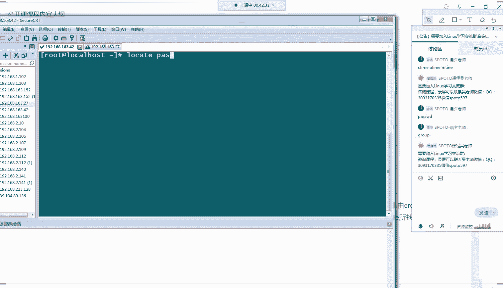

# Linux小课堂30分钟掌握一个小技巧 - P14：Linux午间小课堂14-find查找文件 - 思博Linux关关 - BV1i54y1b7rX

The。起れ。这。好呃。喂喂喂，大家能听到我声音吧。喂喂喂。呃，同学们要是能听到我声音啊。好，O啊，那我们现在开始啊呃欢迎大家来到今天的思博的一个呃五间的一个小课堂啊。

那我们上节课啊给大家介绍了我们linux下面啊，查找我们网络数据用的一个工具啊，就是用我们的TCBd啊，TCBd去获取我们网络接口上面一些网络数据啊，给大家介绍了啊，怎么看我们的一个网络数据啊。啊。

及他一个命令的使用一种方法啊，用基本的一有命令结构啊，然后以及他的一些截取截取到一些呃网络数据的一些呃格式啊，像我们这条数据的一个格式，以及我们如果看想看更详细的一个信息啊。

怎么把这个网络数据导到我们的一个本地的一个PC机上面来，通过我们的win shock啊，我们的ve shock shock工具啊，就是我们的这个网络分析包工具。啊，我看一下这边有没有啊啊，就这个工具。

通过这个工具啊去分析我们包里面啊数据包里面一个更详细的一个信息啊，查看一些呃协议啊啊，能够查看到我们二层、三层、四层啊，甚至到我们的应用层一些所用到的一些协议啊，这是我们上一节课给大家介绍的啊。

查看我们linux下面啊网络数据包的一种方法啊。那我们今天来讲另一个啊，我们那个呃linux下面查找另一种文件啊，查找文件的一种方式啊。我们都知道我们lininux啊一切皆文件啊。

那我们在我们linux上面操作的话，啊，查找我们这些啊一切接文件的一些设备啊，或者是文件啊文件夹这些东西是一个非常重要的一个呃方式方法啊，我们要需要掌握的一种啊工具啊，因为我们linux都是文件嘛。

那你如果要查找这些东西的话，那肯定要学会啊怎么去查找这些文件啊，那我们在我们lininux里面啊，使用最多的一个查找我们这些文件的一种方法，就是用我们的fin命令啊，fin的话啊。

它是它的定义是在我们的一个目录城市结构中搜索文件啊。它的使用方法啊也是比较简单的啊，可以用最简单的一种方法。最简单的一种结构结构格式就是通过我们的范命令啊，然后加上我们的路径，你要查找文件的路径啊。

你如果是在根目录下面查找就写个根啊，就这就写个下走划线啊。那你如果要在其他的像我们的ATC目录下面，这就把我们的ATC目录下面啊ATC目录给它加上去，或者是我们的t目录就加我们teem录。

你要在哪一层目录下面啊搜索，你就把它的一个绝对路径或者是相对路径啊，写在这个位置就可以了啊，这就是我们查找文件的一个路径的一个位置写写的一个位啊写这个位置的写我们路径的一个位置啊。写完我们路径以后。

那我们后面要跟上我们的一些参数啊，最简单的参数像我们的查找我们的啊根据文件名来查找，就是干我们的干 name干 name啊后根据我们的一个文件名来查找啊。

这是我们在平时工作中用的最多的一种最简单的这种查找方式啊那我们。今天啊我们从另一个角度来啊来审视我们这个fin命令啊，通过我们一些呃可能需要的一个场景啊去使用这个fin命令啊。那第一个的话。

我们今天给大家介绍的是通过我们的一个时间方式去查找我们那个文件，为什么会通过时间方式呢？因为我们知道啊我们文件啊无论是它的访问啊修改还是一些呃移动操作啊都会修改都会修改到我们的一个文件的一些时间属性啊。

像我们的 time属性啊， time time啊，还有我们的M time啊这些属性啊，当我们对文件进行一些相关的操作的时候，都会触及到这些属性的一个变更啊。那我们在我们的linux上面啊。

如果是以某些啊非正常的一些用户登录到我们服务器上面，对我们的文件重要的一些文件进行了一个修改以后，那我们面对我们linux下面那么多的一个文件啊，因因为我们linux上面。所有的呃设备啊。

所有的一切一切接用文件啊，那我们的文件就相当数量就相当大了。那我们要去怎么查找啊这个我们呃要被修改过的文件呢，那我们就可以通过这种时间属性啊进行一个基本的一用筛选的一个操作啊。

那这里看我们这边给大家介绍一个啊，比如说我们要通过我们的呃要查找我们 date目录下面啊，我们的一个在我们多少分钟以前通被文件被修改过的一种啊文件这种筛选的话，那我们可以通过我们这个命啊。

就是我们的fin加上我们的一个位置啊，我们的目录位置要搜索的一个目录啊，然后面加上杠min啊，命就是能够呃查找我们20分钟以前啊，我们的多少分钟以前修改过的一个文件啊，那后面跟着一个时间参数啊。

是我们的分钟数可以是我们的-20或者是正20或者是20啊，它的一个区别就是啊-20就是我们20分钟以内从当前时间往前算啊类是我们现在在这个时候往前算20分钟啊。

那正20分钟以内修改的一个文件数据都会被我们通过这个条命令进行一个筛选出来啊。那我们正20的话呢，就是说呃20分钟，以前啊再往前那就这个比如说这是我们20分钟啊，20分钟。这个节点那后再往前20分钟啊。

再往前再往前就是我们呃加20代表的一个意义啊，就是20分钟以前的一个被修改的一个数据啊，那还可以加上我们一个这一符号都不加，就是代表我们在我们前这这个时间时刻啊，前20分钟啊，那个点啊。

那个点被修改的一个数据啊。那这个就是我们呃。通过时间属性啊，通过我们查找多少分钟以前被修改的一个呃命令的方式啊，去查找我们嗯实际在那个时间段，我们需要指定那个时间段被修改的一个时间啊。

那我们除了这个呃用我们的啊干min啊，那我们如果要用好几天以前的话，那可能就是用这种min方式啊，就比较难去计算它一个时间啊，时间的一种跨度了啊，比较麻烦。你要去把时间换算成啊。

你要把天数换算成分钟数啊，那这个就比较麻烦啊。那我们可以通过另一种方式，通过就是我们的at这种方式啊，at它后面跟的参数啊，默认是以24小时为一天的啊，就我们这边写的如果这边at后面跟一个复4的话。

那就是此时啊当天啊此时此刻啊，我们往前推4天啊，4天之内啊，被修改的一个数据啊，这就是我们复啊at加复四这一个它代表的一个意义啊，那如果是我们的啊。at time啊加上没有符号的个式啊，不是既不是正式。

也不是负式，就是一个at time4的话，那就是第四天啊，我们从此时往前推4天。那那一天啊修改的一个数据就是我们的at time啊是这个参数代表的个意义。那我们在at后面再加啊，后面加一个正式的话。

那就代表我们呃大于4天以前的，大于4，就是第四天再往前推，就是第五天、第六天、第七天以及第八天等等等等。再往前推的一个时间。它修改的一个时间去啊，被修改的一个文件啊，它的一个搜索的一种过滤条件啊。啊。

这就是我们atad嗯，加上正式啊复式以及四的一个意义。那我们在我们的文本里面可以用这几个命令给大家操作一遍，看一下它的一个效果啊。

好，我们可以先用我们的第一个啊，我们的fin at啊，我们这边直接找我们的呃。看一下哪一个目录下面，我们的root目录下面啊，我们的root目录下面应该是呃被修改比较频繁的一个呃区域啊，我们的root。

这个目录下面。啊，那我们查找啊，比如说我们at mini啊，我们是正。20分10分钟以前啊哦，大家看到会比较多啊，就是我们10分钟以前修改的数据。

这些都是很早以前修改的一个数据啊啊不单单是我们呃今天修改的可能是前天在前天再往前修改的，只要是大于我们重现在往前算的10分钟啊，那它的数据都会被检索出来啊，那我们这时候换一个啊。

如果是我们加10分钟再就是我们在前面第1分钟修改的一个数据，那应该是没有的啊。我们这时候第十0分钟是没有任何数据修改的啊。那如果是我们要找10分钟以内的话，那就是我们减号啊，减号那应该是比较少的啊，啊。

也有啊也有比较少啊。这边一些t啊，这个是大家可以看到啊这个。文件数量应该就比刚才那个少很多了啊。好。哎，就比刚才那边也有啊也有部分文件啊比较少啊，这就是我们减10分钟以内啊。

那个一个哦一个修改的一个显示啊，这就是我们的一个at的一个作用啊。那我们来看一下我们的呃我们的admin的一个显示啊。我们看一下我们的atat的话，就是我们比如说我们修改我们。

Yeah。TIME啊，我们修改我们查找我们一天以前修改的一个呃文件啊，或者是4天以前。哦，这个也比较多啊，大家可以看了啊，也可以搜索出来相关的一些文件数据啊。那么如果是我们的啊厦门第四厅啊。

C第四天修改的数据，那就基本是没有了啊，那一天估计没有做什么修改跟变动啊，我们看看4天以内呢。啊，我们刚才是。用呢是我们是加啊，我们是减啊，40天以内啊。我们加4天啊。

啊，那就更多比刚才那个我们4天以内修改的数据更多了。大家可以看到这个刷的一个时间啊，比刚才那个刷的要久些了，这就是我们呃at啊加减以及正4天啊，它的一个效果啊。那当然啊，我们除了at time的话。

我们之前还有M time跟C time啊，MTRME跟C tenRME啊C time这些一个呃这些一个时间的一个数据。那大家也可以通过我们杠MM time杠C time再来进行一个相对应的修改啊。

它查询的一个呃数据，就是我们的呃，比如说我们这个AA这个文件，有没有？A。点CNP啊，就是根据我们这三个属性啊进行一个时间的一个比较啊。我们刚才 time就对对比的是我们这个SS time时间。

那我们的M time就是对比的一个我们呃M呃modify这个时间啊，我们C time就是对对比的是我们那个全聚碳这个对应的一个时间，它进行一个对比啊。

。好，那刚才第一个啊我们给大家介绍，通过我们时间进行一个查找啊。那我们下面可以通过另一种方式啊，比如说我们可能通过啊发现某些啊非法用户登录了上来。他的一个账户名啊，登录的一个用户名啊，我们能够知道的话。

那我们可以通过一个指定的一个用户名啊，来搜索这个用户他的一个创建的一个文件啊，就是用我们的干user这个命令啊。

能够指定他是哪一个用户创建的一个这个文件啊。比如说我这边指定的干晨曦这个用户。那就是说我们在这个目录下面啊，我们的跟目录下面搜索干晨曦用户啊，干晨曦用户创建的一个所有的一个文件啊。

那这时候就可以做一个也可以做一层筛选啊，看一下我们的那个文件啊哪一些呃被我们黑客上传来上来的一个文件啊，这时候就可以进行一个相关的一个删除啊，以及啊一些清除病毒的一个预防操作啊，经常他们上传的一些文件。

都有可能是一些木马后门啊，或者是一些呃可执性脚本对我们系统有危害的一些可执性脚本那这时候的话我们就可以通过这个命令啊，去把他们上传的一些文件进行一个检索啊筛选出来，然后提前把他们给删除掉啊。

这也是我们lin下面作为一个呃预防系统病毒的一种机制啊，通常我们都是找到这个文件，然后把这个文件给它删掉啊。我们没下面没有像我们windows下面。

啊有那种专门的是个杀毒软件啊，比较少啊，基本是没有。我们都是通过这种手动删除一些可疑的文件啊，有害的文件，那让它从我们的系统当中啊彻底消失掉啊，它的一个方式跟方法就是我们这种思路啊。

那我们再可以找一下我们进我们的home录啊，我们的home样啊这个目录大家看到我这边有4个啊既有我的晨曦啊，这边创文件的一个用户那也有我们root这边创建的一个用户。那我们这时可以通过我们的译命令啊。

查找当前文件啊，点当前的一个呃目录啊，我们到时候指定个user啊，比如说我们查到晨曦这个用户搜索的大家可以看到啊，他把这些晨曦这边创建的用户全部搜索出来了啊，包括我们呃目录以及我们目录下面的一些文件啊。

这个下面都是一些文件啊，都是我们呃蜀主啊，就是我们的创建用户这个属组位置都是我们晨曦这个用户啊，这个位置都是我们晨曦这个用户啊，那我们如果换root的话啊。应该就会比他那个少多了啊啊。

大家可以看到就这几个文件啊啊会比我们root这边啊比我们查找晨曦这个文件啊会少很多。就只有这个我们BBB啊，还有个我们的point啊，这个一个空目录啊，我们的一个testPHP就这三个文件啊。

是我们在我们当前这个程序号啊目录下面啊。root用户创建的一个三个文件啊。Yeah。

好，那这个就后是我们通过我们的一个啊用户啊，我们用户名可以进行一个查找啊。当然我们可以进不单单可以通过我们的个用户啊，我们可以指定我们的group啊，这边用我们的group，然后指定我们的用户属主啊。

有我们的用户I我们的用户主ID或者是我们的啊用户 ID以及我们的用户主I啊，这几种方式都可以指定啊这个跟我们那边啊我们的那个ETC下面的pasword里面啊的信息是啊匹配的啊PETPSSWD啊这下这个文件里面的一些信息以及我们的group啊这里面的。

GROUP啊GOUP这group GROUP啊，这个里面的信息啊，我们的ID信息都是匹配的啊，就是查找这些对应对应的一些ID信息啊，来查找我们呃这些文件啊，相对应的一些文件。

好，然后这个就是我们啊通过我们相关的一些用户以及用户组啊这些啊属性来查找我们对应的一个文件啊。那我们来看呃第四个啊，我们啊除了刚才从通过我们一个时间查找啊，还有一个我们的一个创建用户啊。

我们创建人的一个查找啊，以及我们用户组的一些查找啊，那我们还可以通过我们一个大小的一个查找啊，比如说我们要查找某些文件啊，像比如说我们这时候出现跟盘啊，我们的一个root盘。

root rootot盘比较大，可能是空间没剩多少了啊，被很多呃文件给占用的。那我们这时候要查找一些，比如说我们大于啊一定量的一个文件啊，那我们这时候进行一个清理的一个操作，能够比较快的一个释放出来啊。

那这时候的话我们就可以通过我们的个size这个命令，size这个参数啊来指定我们的一个呃你要查找文件的一个大小啊，那这里-20跟我们上面的意义一样，就是我们小于我们20K的啊。

如果是正20啊，就是大大于我们20K的那是20的话，那就是等于我们20K的一个操作啊。

啊，那这这时候我们也可以来进行一个操作啊，看一下它一个效果啊。我们只要切一个啊，切到我们这个目录下面啊，杠SH。先啊。我们来看一下我们大概的一个文件操作啊，我们这时候有1个496K的啊。

那我们嗯找一个我们设一个条件，还有1个156K的啊，12K的啊，那我们这时候啊还有个100多兆的。那我们这时候可以设一下啊，我们比如说我们找一大于我们呃100K的啊，大于我们100K的啊。

能把它这个呃文件给它检索出来啊，那这时候就是用我们的finFND啊，比如搜索我们当前目录然后干我们的SIZE啊，那么大于100K啊，这时候回车啊，这需用小写啊。

啊，哦，好比较多啊，大家看到啊，我这边都已经把我们大于100K的一些文件啊全部搜出来了啊，这个比较多，那我们再换一个，我们换一个，我们刚才是有1个100多兆的是吧？

我们刚找。100兆的啊。嗯。对。啊，是没有100兆了。好，我们给他看一下啊。14兆的啊。

有1个100兆的啊，100兆的文件啊，我们刚才找的是文件啊，不是木啊，不是那个我们的一个文件夹啊，所以说我们这边可能呃没办法通过这个来找我们可以通过我们这个呃大于我们14兆啊，我们十0兆啊。洗澡啊。

哎我们是大写的洗澡。

啊，大家会看到啊，这时候就把我们的一个呃文件给它搜索出来了啊，我们的这个呃这个瑞 hot啊一。roment的这个脚本啊，以及我们这个NG的最后生成的一个可视性文件，它都是我们的14兆的啊。

大于我们十0兆的啊，这就是我们一个。

根据我们大小进行一个检锁的一个呃作用啊。

这就我们呃可以通过我们一个呃干size命令啊，这边就可以用造，也可以当然也可以用G啊或者是TB啊。只要你这个呃文件里面有符合这些大小的一些文件啊，那都可以通过这个我们size命令啊进行一个查找。

啊。啊，那我们sizeize的话啊，我们这边啊 find的话给大家今天给大家介绍了3个啊，一个是我们的一个呃通过我们的个时间查找啊，时间查找两种方式，一种是通过我们的分钟数啊。

还有一种是通过我们的一个时间24小时的那种时间啊，一天两天这种时间方式啊来进行查找啊。那我们第二个的话是通过我们的一些主ID啊，我们的用户ID以及我们的用户名这种方式啊，这第二类啊。

通过我们这种方式来查找我们的一个文件啊，那我们第三个啊通过我们那个呃大小大小来查找啊，大小的话，它这边还要看一个比较注意啊比较啊就是要注意的一个点啊，我们的一个大小值大小查找的啊。

它是有一个四舍五入的一种情况啊，会有一个四舍五入的一种情况。所以说我们查到，比如说我们查到呃0点。呃，我们查找一K的一个文件啊，1K的一个文件。那我们如果是它的文件大小只有0。1K的话。

那这时候它是归属于我们0K的一个呃查找范围啊，不属于我们的一个1个1K的一个呃范围啊，这就是我们呃查找文件的时候要注意的一个点啊，它有个四舍五入的一种情况啊。

它就是你的单位嗯单位达不到它的一个单基本单位的话，它会进行一个四舍五入啊。所以说大家查找文件的时候，会有这种发现，就是你这个文件可能只有0点几K啊，但是它实际也不大小的。你查找呃。

但查找一K的文件的时候啊，它会把它归到0K的一个计算范围去当中去啊。啊，这就是我们今天给大家介绍的三种查啊，通过我们呃文件名大小啊啊通过我们的文件的一个创建时间，我们的一个修改时间等等。

还通过我们的一个大小，通过我们那个呃用户属性啊进行查找的一个命令啊，当然除了我们那个fin命令在我们的呃linux里面还有另一种啊另一种命令查找文件啊，就是我们用我们的L啊。

那嗯fin跟L的一个区别是什么呢？fin的话，它查找的方式是这样，它是通过我们的一个目录啊，我们的比如说我们的。探房目录。啊，他会先呃查找下面的文件的话，它比如说下面有A文件啊，下面还有一个B目录。

还有一个C目录，它是一层层查找的啊，它先查到t下面，先查到A文件或者是B文件啊，D文件啊，是否符合你的一个要求啊，当这边查找完了以后，它才会查找B目录下面B目录下面，比如还有下面啊E文件F文件啊。

它才会去匹配这些文件是否符合你的要求。B目录查找完以后，它才会跳出来继续查找我们那个C目录下面的文件啊，这就是我们一个便利啊，我们相当于一个把我们t目录下面所有的文件都给它便利过去啊。

那我们这时候查找的话，如果是小啊范围文件内容比较少的话，或者是目录比较少的话，那这时候我们查找还是比较高效的啊，但如果这边目录非常多的。比如说你这时候是在跟目录下面查找。

那我们所有的文件都在我们的跟目录下面啊。那这时候如果要查找起来就非常高了。极有可能导致我们的系统出现一些线上业务的一个系统。可能会出现一些资源的竞争，或者是系统哥卡死的这种情况啊。

这时候的话大家尽量避免在我们线上业务记对跟目录进行一个查找啊，这是一个有比较有风险的一个操作啊。那我们的目录它的一个查找啊相对来说呃就是比较笨就是的一种方式啊，它是一层层去查找。那我们的话。

它会比我们那个fin查找方式，效率会高很多。为什么呢？因为loc它不是通过我们这个目录一层层目录方式去查找的，它是通过我们那个数据库啊，去搜索一个数据库啊去查找里面的一个文件啊。

它可以通过数据库里面记录一些文件名啊，它去查找这里面的一些数据啊，那location它是进行一个模糊查找的啊，模糊查找它能够查找相关的一些文件名啊，然后我们的这个数据库的话，它也不是实时都有的啊。

它是有需要定期更新的啊，它更新的话是通过我们这个updateD这个程序来进行更新的啊。所以说你如果是。刚生成一个文件。那这时候你立可立刻用我们的locate去查找这个文件的话。

很有可能就暂时找不到这个文件。那你需要用这个update命令去更新一下我们的数据库啊。那这时候的话，你后面你才能再用我们的这个。呃，我们的这个呃ro的命令去查找啊。

这时候才能去查找到我们刚刚更啊刚刚创建的这个文件啊，这个文件啊这个数据库啊默认是有我们的crometable，这个里面有个任务进行一个定期更新的啊，这边大家可能看不到啊，进行一个定期周期性更新的啊。啊。

所以说我们L的它是通过我们数据库查找啊，自然而而然就比我们通过示范查找啊来这种 find方式去查找我们那个目录啊要方便啊，简洁的多啊。我们的 find的话。

它需要去一次次去读取我们的一个owode节点啊，信息，然后进行一个读取相关的一些节点，再返回再再读取再返回啊，就比较慢了啊。这时候的话，我们如果是比较简单的一个查找的，可以用我们的一个lo的啊。

直接查找我们相关的一些文件名啊。那这时候效率一定会比你的这个用fin的命令要快很多啊。那当然啊这两种呃方式看看大家一个具体的一个使用场景啊。如果是你在你的呃呃临时使用的话。

可以用我们的L的那那你如果是需要写在脚本里面啊，可能需要用我们的fin会比较啊。呃，通用一些或者是比较能够让我们的脚本有一个更高的一个适配性啊。因为你这边每个服务器这边LK的信息啊。

里面的数据库啊并不是实时啊都更新的。那你如果查找的话，可能当前执行是脚本啊里面写的LK的方式。那可能没有。那下一次执行的话，那可能就有了。那这个就会出现一些比较呃呃意想不到的一个情况啊。

所以说这个也是根据大家一个具体的一个场景来啊具体使用我们fin还是用我们的lowcate啊，那我们也要用我们的locate啊进行一个操作一次啊。

给大家看一下。

呃，A，这就出来。好，我们就这，那我们OK的啊。比如说查找我们pass word啊，password类的文件名啊，PASSWD啊。

啊，O。回抽一下啊，大家看到这边文件里面会找到所有包含pass word啊这个名字的一个文件啊，这就是我们lookcate啊查找到它的一个作用啊。那你如果还可以去指定啊，在某个目录下面啊。

啊ETC下面的啊，像我们的password啊。那可能就这么一个啊，就几个啊，像我们的这个这个字啊包含我们ETC这个password这个名字啊，这种的像这个这也就包含我们ETCpass word啊。

呃包含我们这个呃就是这个它的一个路径啊，路径也也包含这个我们ATTC pass word啊这个文件啊。这就是我们带上我们路径的一个查找方式啊。如果不带我们路径的话，就是我们的pasword。

它就包含所有那个好包含pasword名字的一个文件名啊。好嗯，那我们今天给大家介绍两种啊查找我们数据的一种方式，一种用我们的fin。

一种用我们的呃ro的啊 find当然啊不单单是我们今天介绍这三种方式啊，那还有更多一些更复杂的一些操作啊方式。那这些的话这些 find的个学习的话。

在我们的一个呃运维的一个提示办里面有专门针对啊范进行讲了一节课的一些呃内容啊，它包括一些像我们今天讲的一些时间查找啊，用户组查找，还有根据一些我们的一些呃名字查找啊。

以及我们一些 find查找后以后会根据一些我们的UID啊，或者是我们的一些特殊权限位查找啊，以及我们的一些呃在我们范执行完以后会进跟着加一些啊一些命令进对这些查找的文件进行一个操作的一种啊需要的命令啊。

这些写法啊。那啊我们今天的内容啊，就大概是这样啊换迎的谢谢大家来参我们今天的一个。我的一个呃linux五间小课堂啊，那我们下一节课啊，下一周一啊我们还要继续我们这一次的啊这一个阶段的。

我们查找数据的一个相关的一个呃介绍啊，我们下一个阶段会查找一些呃命令啊，根据我们命令查找一些软件包等等这些方式啊，教大家怎么查找啊啊，谢谢大家来啊听听我们今天的一个思博的lininux五间小课堂啊。

那我们的课程今天的课程就到这里结束了啊，我们下一次再见。

