# Linux小课堂30分钟掌握一个小技巧 - P15：Linux午间小课堂15-linux监控系统建设和选择 - 思博Linux关关 - BV1i54y1b7rX

好，我们现在时间到了05分了啊，大家能听到我声音吧？能听到我声音，帮我打个一吧啊，我确认一下。好，行行O谢谢谢谢我们这位同学啊。那我们呃现在来开始我们今天的课程啊，明天就是五一节了啊，在这里的话。

先祝大家五一节节日快乐啊啊那我们今天的一个课程的一个主题啊，是我们讲linux下的一个监控系统的一个建设跟选择啊。然后在我们课程开始之前呢啊我先做一个自我介绍吧啊呃我是思博的linux讲师啊。

在做我们讲师之前呢，我在运维这个行业里面啊，也摸爬滚打了许多年了啊，有个8年的一个经验工作经验了啊从我们最基层的一个miss工程师啊，就是我们那时候比较浓统的说来来说就是修电脑啊。

给我们公司内部一些员工啊修理电脑以及我们公司内部一个网络维护啊，虚拟机维护这边啊工作开始做的啊，后面做到我们的一个线上业务的一个运维啊，然后再往。后的话啊就做到我们运维开发啊，运维再往上一层。

就是我们运维开发这一层啊。像这样子一步一步走上来嘛啊我想这个也是我们大部分呃普通人的一个工作的一个成长和经历吧啊然后在我们这个运维工作中啊，如果是已经在运维这个行业里面啊，已经开始做的同事啊。

同学们应该会有这个经验啊，会有这种感觉啊，我们的一个运维工作的话啊，他有自己的一种特殊性啊啊，因为我们要接触的东西啊，根据我们的个业务需求啊来决定的。所以说啊我们在不同的公司啊，不同的项目里面啊。

可能需要接触的一些呃维护的一些项目啊可能会不一样啊。那这时候的话，我们接触的东西就非常多啊，所以说啊在做运维的话，你可能一个策略会比较广泛啊，会比普通人要广泛很多啊。

像我们的比我们的程序员可能要接触的很多啊，接触的多的更多的一些呃环境啊、软件啊以及一些架构啊这些东西啊。那我在做运维当中呢，做了呃就做了一些主站的一个项目啊，也有做我们一些内部系统的一个项目啊。

还有一些海外游戏这种游戏经验的一种运维项目啊，一种经验啊，那主站项目的话，就类比啊我们一些公司一些官网啊，又或者是一些我们游戏一些官网门户网站啊，这些就叫我们那个呃主战项目啊，用的戏技术的话。

大部分会涉及到我们业务b业务这一块的一些技术啊，比如说我们LVS高可用啊，像我们的NG啊啊帕奇的HTTB啊通啊PHP这个都是我们wordb业务里面啊最最最常用的几个组件啊，几个软件几个服务啊。

只要你做啊wordb类的业务都会接触到这些东西啊，都会要熟悉这些东西的啊。那内部项目的话，除了像我们啊可能呃像我们外部的一些系统引进来的系统，像OA系统、财务系统这些东西以外，你会接触到以外。

会进行一个运维的一个呃工作以外，还会有一些像我们的一些运维领域里面会经常提到的一些运维开发平台，或者叫做运维自动化平台这个东西。这个平台呢会涉及到我们智能化方面的一些知识啊。

呃就比如比如要我们掌握一些开发的语言啊，比如我们嗯linux里面最基本的一个sure编程啊，还有一个更高级一些啊做更大的一个平台项目的pythonpython这个语言啊啊像我们最常用的python语言结合的一些框架啊。

像框架框架等等啊，这些东西呢我们都会去接触到也会都去学习的啊，上面这些技术的掌握呢都在我们那个运维的一个课程里面啊，都会有所体现跟要求啊。我们那个运维课程啊，会教大家啊，我们在我们的日常运维工作当中啊。

会用到了哪些技能啊，哪些软件，哪些服务啊，都会教大家啊进行一个教授跟学习啊。那在做游戏项目这一块呢啊，游戏项目它这个系统就比较庞大了啊啊除了游戏本身的一些服务的话啊，诸入我们游戏主服务啊。

包括我们程序啊主程序的一些运行啊，游戏的一些网关啊，数据库这些核心的一个组件啊，这构成我们游戏服务最最核心的一个呃部分了啊，那还有一些像一些知识服务啊，比如说我们的网络加速啊，账号验证啊，广告服务啊。

游戏行为大数据分析啊，都这些都属于我们游戏的一些自身服务啊，当然很有幸呢我曾经负责的一些游戏啊，在海外的游戏啊，在我们中国出海游戏输入排行榜中啊，进了一个前二0位啊，介绍了一个我这么多一个工作经历。

大家都可以看到我们日常啊运维工作当中负责的东西其实是很多的啊，专业性也是非常强的啊。因此呢我们世博的linux相关的一个课程啊，啊基本都涵盖了大部分。啊，大家日常运维当中会用到的一些技能啊。

确保我们呃来这边学习的学啊，学完以后啊能掌握这些技能。然后进入我们工作岗位以后，比较能快的一个融入啊，以及上手的一个操作啊，不至于说进去啊以后呃一问三不知，或者是呃人家教给你一个工作啊。

你这边什么头绪都没有啊，这个就比较啊尴尬了，是吧？啊。那我们课程里面啊内容不仅仅我刚才介绍的些那些我工作当中啊预用到的这些东西。当然还有很多啊我工作当中用到的东西不只是仅仅是我刚才介绍的一些东西啊啊。

如果大家还有了想了解更多的话，可以跟我们那个呃课程老师或者是我们的助手啊联系啊，索要一下我们的一个lininux课程的一个大纲啊来看一下我们啊运维这边啊会教授大家一些哪些啊日常啊运维工作当中啊真正会用到的一些技术啊。

自己对比一下啊，自己还缺哪一些技能啊，没有掌握的啊啊也欢迎嗯大家来报名我们的课程啊，进行一个比较系统的一个学习啊。好，嗯，这就是我的一个基本的一个介绍啊，大家可以看到我这边有做一个简单的一个概括啊。

好嗯，介绍了完我个人的一个简单的情况以后啊，那我们回到我们今天的一个课程的一个主题啊。我们今天课程是讲我们linux下啊监控系统的建设跟选择啊，很帅啊，谢谢谢谢。

还是比陈老师头发师多一些啊陈老师比我智力生啊，智力生。那我们今天课程的话会有三个小分点啊，一个是我们呃会介绍我们为什么会需要这个监控系统啊，我们需要这个监控系统的一个原因是什么啊。

第二个啊会给大家介绍一下我们linux下面啊啊主流的几个监控系统啊，以及他们的一个对比啊，他们的优劣啊，他们一个使用场景啊。然后第三个的话最后会给大家讲一讲啊。

在我们日常工作当中要怎么选择我们一个监控系统啊，监控系统太多了嘛。啊，那我们肯定要根据我们的一些实际情况啊，进行一个选择，不能不可能说我们所有的监控系统啊都选择上都部署上去都用上去啊，那我们也管不过来。

用不过来是吧？

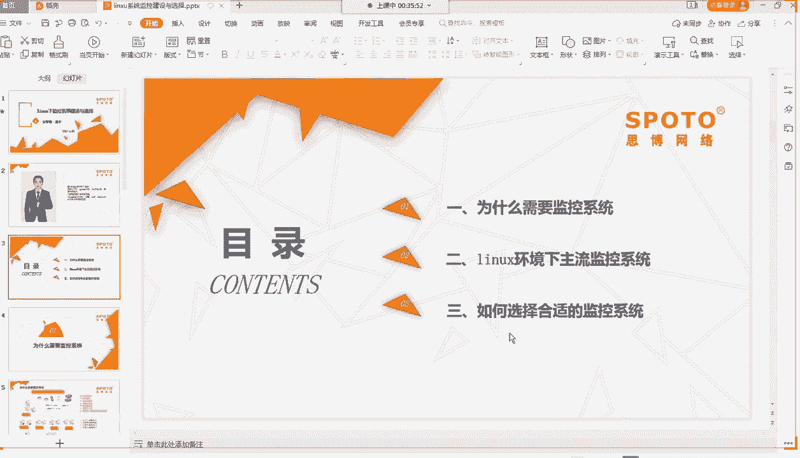

那第一个啊为什么要需要监控系能呢？那我们再了解我们为什么要需要监控系能。那我们需要首先要知道我们监控啊监控系能要监控的东西它长的是一个什么样啊，那我这边给大家啊找了一个简单的一个突补啊。

我们的线上业务的一个概况啊。

放大点给大家看啊，这个应该这样子可以了。啊，会比较卡啊。好啊，这个的话可以比较全面啊比较呃全面，并且简单的描述了一个我们实际生产环境中线上业务的一个简单的一个架构图啊，我们从最上边最右上角这边开始啊。

这边是电信联通，就是我们的ISB啊，我们的互联网服务提供商啊，他们的一个网络啊，那我们从这网络啊进来啊，进到我们第一个设备就是我们这个像幕墙的一样啊，墙的一样一个东西啊。

这就是我们的一个呃服务的一个入口的一个防火墙。嗯，我们服务的防火墙的作用呢主要是控制一些呃出入口的一些呃端口的一些安全设置啊，以及我们一些流量的一些监控啊，或者是一些呃屏蔽一些呃非法的一些请求啊。

可以在我们的防火墙上面进行一个限制啊。防火墙的比较呃多的会有一些专业的厂商啊，做的一些硬件防火墙。像我们的深信服务深信服企业，它就。专门做这块防火墙这一块的设备啊，当然如果是没有用硬件的话。

我们也可以用一些软件啊，或者是我们自己做一些用我们inux系统做了一个堡垒机。然后类似我们防火墙的一种安全功能啊，也可以进行一个模拟。啊，这种东西可以多种多样啊，一种是硬件，也可以是软件层面来做的啊。

这个根据你公司一个啊具体的一个经费的一需求啊，一个以及你们网络啊我们服务系统架构，整个机房架构的一个情况来做一个选择啊。那过了这个防火墙以后啊，那大家能看到我们这边连进来的这是一个路由器啊。

这边是一个圆圈啊，像一个实字一样，中间有个实字啊，这个在我们网络里面代表我们这个路由器啊，这有两台路由器。那路由器呢是一个什么样的一个作用，在我们的一个架构里面呢？路由器相当于我们啊比比举个例子啊。

就相当于我们的一个高速公路，我们这个整个架构里面的一个高速公路，我们的一个所有的流量都要经过我们路由器的一个转发啊，经过它一些策略的一些过滤啊啊我们的一个所有流量啊。

它都都要经过这个路由器出去或者是进来，或者是呃通过这个路由器转到其他一些啊我们内网的一些其他网段去啊，都需要通过通过我们这个路由器啊，这个路由器呢是属于我们啊ISO啊，我们的汽车模型里面啊。

是属于我们的第网络层的一个设备啊，那我们路由器一般是会有呃在我们的机房里面，像我们的自建机房里面一般会有专门的一个路由器啊，那是设备会比较大，里面的话配置会比较多啊，那啊大的企业，它如果是自建机房的话。

一般会呃专门安排啊，专门安排一些网工。啊，招一个一两个网工来负责我们这个网络的一个整个配置。然后这个路由器的话，它权限肯定是要限得很很严格的啊。因为这个如果是这个路由器啊，这个权限被人破解了。

或者是被人乱用了。进去把你的这个整个配置删掉，或者是修改了一个配置啊，导致我们整个网络啊，整个网络就瘫掉了啊。你这个连到这个台下面的路所有的设备，它到我们这台路由器的网络啊，可能就会不正常啊。

可能出不去，要么就是没办法访问到我们内网的一些其他啊网络啊，其他路由器了啊。那这时候的话你的这个呃机呃业务啊就相当于出现的一个呃灾难性的一个故障啊。

那这时候的话呃你的这个运维的一个KPI季度KPI或者是年度KPI可能就要受到影响。甚至严重的话可能对我们的业务造成长期的一个停停滞的话啊，可能就要被我们公司里面进行一个通报批评啊等等。

这些可能会受到我们公司里面一些嗯政策方面啊，政策方面的一些惩罚啊。所以说这个也是比较重要的啊。我们作为运维工程师的话，如果你们的企业里面没有专门的一个网络工程师啊去负责这一块的话。

那你可能也需要学习我们的一些网络方面的一些知识啊。至少我们这个简单的一些路由配置也要会啊。那你这个看上面的一些配置，也要知道它的一个路由走向是什么样的。下一次你要改一个路由配置啊。

也知道不会啊不会说改到其他一些配置，导致我们的一个网络啊出现问题，改错的这种情况比较低级的一些情况啊。啊，这个就是我们的在我们的服务架构里面啊，相当于一个高速公路啊。那我们高速公路这边连下来以后啊。

这个就相当于我们的一个呃这里有两台啊汇聚城交换机啊，就相当于我们呃高速公路下来以后，城市里面的一些主干道啊，大家可以看到这有两台交换机啊。

它这个是属于汇聚层的汇聚层一般是在我们的呃汽车模型里面属于第二层啊，第二层里面啊，那它的话就它是什么叫叫汇聚城啊，就是把我们下面一些啊网络，我们的网络汇聚到这一层来啊。

这就要汇聚城交换机比较形象的一个呃理理解吧，就是我们汇聚的这个概念啊，把所有东西聚到一起啊，它这边也就是把我们下面各个服务器啊，各个下面的其他交换机上面流量全部汇聚到这边。

然后再跟我们那个核心交换机进行一个啊通讯啊，它的一个作用的话啊，就是减少我们的一个跟我们呃。核心交换机上面啊端口接入的一个呃次数啊，我们的核心交换机上面毕竟是单台设备啊。

它的一个接口肯定是有限的那汇聚层交换机的话相当于扩展了我们这个核心交换机的一个接口的一个数量啊。那大家可以看到汇聚城这边会有两U啊，什么叫两U呢啊，U是代表unit啊，就是我们呃。一个宽度的一个只要一。

哎，这个我看一下啊。嗯，我看一下A院那个笔写一下啊。啊，好，一就是UNIT啊unitity啊单元单元单元的一个意思啊。这个在我们的呃机房里面啊。

它是一种高度的一种测量机柜高度的一种测量EU代表就是一个单位的一个宽度，两U就代表两个单位的一个宽度啊，那我们的机房里面可能会有很多像我们遇到的经常会有EU的设备两U的设备啊，3U4U的设备啊。

这些单位啊，大家可以做一个基本的一个概念啊，基本的一个了解啊，以后不至于说跟别人交流这个时候不大懂这个代表什么意思啊。好啊，这就是我们汇聚城交换机它的一个作用啊。

那我们这时候汇聚城交换机相当于我们这个城市主干道啊，城市主干道下来的话，就相当于我们呃要接到我们各个小区的一些次干次次要的一些小呃道路了啊。

就像我们小区里面的呃小区外面的一些道路啊呃像我们城市里面一些呃除了主干道以外的一些乡村道路啊，这都都是我们的一个呃再接入我们汇聚城交换机下面的一个呃交换机，它所代表的一个意义啊。那后后取层往下啊。

它这一层的一个交换机有个专业的术语叫做接入层交换机啊，接入层这个就很好理解了吧啊，接入我们的一些其他一些真正的一些服务的设备啊，就叫我们接入层一个交换机啊。啊，那交换接入成交换机的话。

它就它的一个功能就比较简单了。它只管接入我们的一个服务器啊，最终的一个业务设备啊，业务服务器设备啊，像我们这边现很多有好多服务器集群啊，最终都是接入到我们这个接入成啊交换机这边啊，它的一个呃配置啊。

可以用就是可以用种傻瓜交换机的概念来形容啊。它只管你设备接进来啊，把你的流量进行转发，它不进行任何一个配置啊，可以作为这个叫接入成交换机啊，就比较简单了啊。那这个接入成交换机完以后啊。

最后就是我们接到我们各个的一个服务器啊，各个服务器就相当于我们啊每个小区或者是每一栋楼啊，它这个概念了啊。那我们这时候从我们乡村主干道到我们的一个小区啊，那最终就到我们的一个目标一个地址了啊。

我们的一个地址就是我们各个小区门牌号啊啊，那我们这边可以看到啊，这边架构图里面给大家画了啊，这个给它去掉。啊没事，那我们这边可以看到大家给给大家画了几个东西。

一个是我们的这个监控啊nex监控啊啊就是我们的一些监控体系啊，像我们今天会讲到的一些监控啊，包括我们的nex啊，我们ja普罗米修斯等等的一些监控啊。还有个的话会接到我们的一些前端一些服务器。

像我们刚才说到的一些NG啊，像我们这个T经理T经理啊，就是我们淘宝啊淘宝的一个NG的一个开发版本啊，它在我们的NG啊官方的N机一个基础上，经过淘宝的一些自己团队的一些优化。

加了一些啊优啊比较有特色的一些功能啊，呃进行一个改进啊，更适应我们淘宝那种高并发啊高流量的一种环境啊，这种呃经过这种呃底层的一些代码修改以后啊，啊以后我们后面公布出来的一个开源的一个呃NG版本啊。

那我们还有个这边有个ke live啊，这就是我们跟NG经常作为组合的用来来用的啊，就是我们的一个ke life keep live的它的个主要作用就是啊当我们的一个呃机型服务器啊。

就是我们比如说这边有两台N机，它有一台挂了啊，我们这台N机主N机对外服务的它这台服务器挂了那我们这时候IP啊没办法啊啊没办法就是手迁移到这边来。那我们就要通过这个ke life啊来实现它一个自动漂移啊。

保证我们的这个这台上面的N机啊，能够自动漂移到我们的存的这台上面去啊那这样子的话，我们业务这边啊我们的程序这边访问我们这台啊程序这边比如在这边防问我们这台N机的啊防我们这台N机的话。

它的IP就不用改了啊那个还可以直接一样还是原来IP那最终会变成防问我们这台机子啊这样子就保证了我们一个业务的一个快速恢复啊。这就是我们keep life一个作用啊。

那keep life跟我们NG还经常跟我们LVS啊这这个架构进行一个结合啊，形成一个高可用啊，高可用啊自动恢复的一种啊前端架构啊。那我们呃服务啊除了一个NG作我们那个服务的一个业务接收的一个主路口以外。

那我们NG后面肯定要挂一些其他一些真正处理我们请求的一些服务啊。像我们这边挂了一个应用服务器啊，应用服务器集群啊，我们的数据库啊服务器集群啊，我们的reduce也是我们的数据库啊。

它是一个内存型数据库啊，啊也是一种非关系型数据库啊啊，经常作为一种缓存缓存来用啊，就是我们快速访问，快速呃响应的一种呃中间键啊，今天有一个同学呼问我中键是什么啊，那今天那个同学如果有来的话。

也可以听一下啊，这个也可以reduce它既是一种啊数据库，也可以理解为作为一种中间键啊，它是在不同的场景下可以叫做不同的一些功能啊。然后这个有个squid缓存机群啊。好，啊，那我们这个把屏幕给看一下。

能么移下来啊，下面还有个东西。这个是。嗯。哎，这个是怎么退出来？哎呀。啊。诶我说你。呃，这个是怎么退出来啊，大家稍等一下啊，我这个先把它退出来，ok嗯，ok退出来了。好。哦好，大家看到啊。

下面还有一些像我们的搜索服务器啊，就像我们的一些呃提供我们呃搜索服务的简单的一些搜索服务的一个作用啊，还有个图片集群啊，图片集群的话，主要是存放我们一些像我们如果是一些呃wordb服务的话。

它会有一些呃在门页页面上展示的一些图片啊，它会有专门的一个图片集群啊，或者是我们呃最最贴近我们的一个生活的像我们QQ啊，我们的一些呃微信啊，你们上传在呃云上面啊。

上传在我们那个QQ啊账号里面的一些图片啊，它如果没有存在本地的话，那可能就是存在我们云端的一个图片服务器啊，像我们漫游的时候，经常都是从呃云端的一些图片服务器那边直接下载我们的一些表情包啊。

这些都存在我们一个图片服务器啊。那这就是我们一个呃整体的一个呃比较简单直观的一个呃线上业务的一个架构。大家可以看到这里面的呃设备会非常多啊。

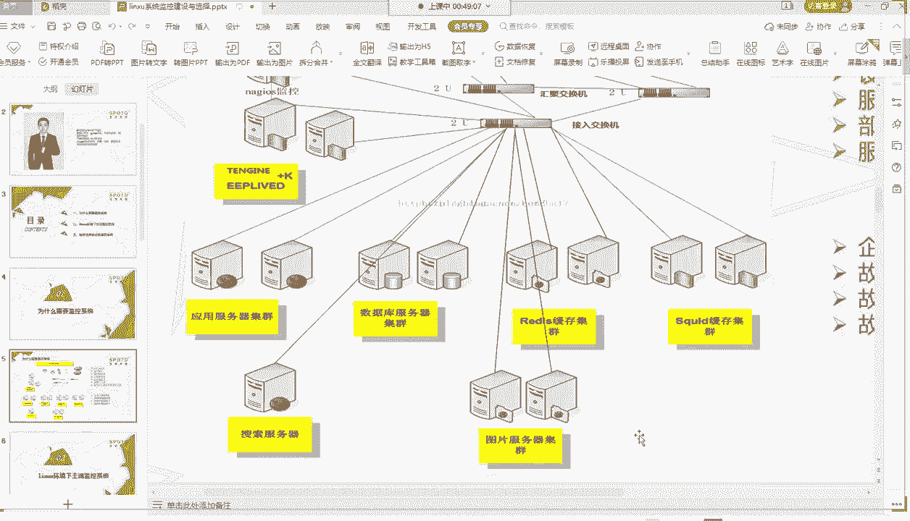

既我们的防火墙，也有我们的交换机啊，路由器啊，还有我们的各个服务器啊，多的一些啊还各个服务器啊，还有一些可能还不同的一些平台啊，还自建机房啊等等这些啊，那这个就是我们呃。

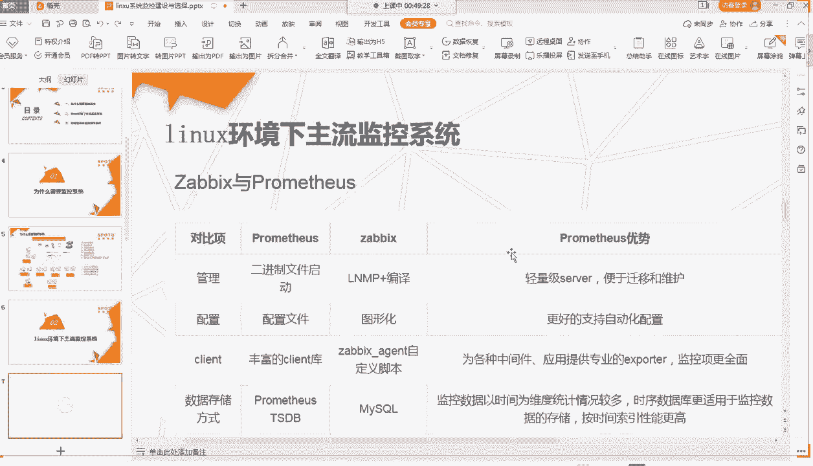

我们一个真实的一个呃工作环境当中会遇到的一种情况啊。那我们给大家总结了一下啊，这边啊我们真在我们的工作中啊，会遇到我们的一个呃IT设备会非常多这种情况啊，比如说我们的服务器非常多啊，就这大家可以看到啊。

每个服务器它都每个服务它都有自己的服务器集群啊啊服务器集群的话，一般都是两三台起了啊。那这样子的话，每个服务器类型的话，它可能就呃就两三台四五台啊，这样数量乘起来的话，那服务器数量就非常多了啊。

还不包括像我们游戏那种情况可能单台单服啊，那可能呃一个游戏服务就一台服务，就一台服务器的情况下，那你开个四五百个服务啊，那可能就四五百个服务器了啊，那就服务器非常多。还有个网络设备多啊。

网络设备都像大家这己看到的啊，我们这边服务器多的话，那它这边的一个接入型交换机肯定也要多了。因为每个交换机的一个口都是呃限制的啊，最多可能就48口，128口还算比较难见的。

48口还是算我见到是最多的啊那这样子的话，我们如果有三四百台服务器啊，是现在尤其这种自建机房的话，那你这个网络设备起码要有呃二三十台一个网络设备啊啊那网络设备多的话，还不一定都是一个牌子的啊。

像我们服务器也不一定都是一个牌子的啊，可能啊牌子不一样，上面的系统还不一样啊，那这个就更加复杂了啊啊设备种类还多啊，就是我们刚才说的可能你这个呃服务器一会是戴尔的，一会儿是惠普的啊。

这个交换机一会是H3C的啊一般什么服务器比较好啊。服务器的话，你如果是自建机房的话啊，可以考虑去买戴尔的啊。戴尔现在在我们的中国市场里面服务器算是。

还是比较高的吧啊嗯他在我们的这个呃社会那面也会好一点啊。这个服务器看你们使用吧，惠普这边的话也基本我后面接触的基本就没有没有用惠普了啊，大部分后面就开始用带尔了啊。但是服务器这个会比较贵啊。

一台服务器可能要好几万啊。啊，大家看到我们刚才说了主内会非常多啊，太贵了是太贵了。因为这是服务器级别的，它那种都是1U2U那种长长的扁扁的，跟我们P7G还不是一样的啊。有打算凑公司的哈。啊。

现在的话可以可以如果是大家如果想啊学习的啊，linux的话，啊，想模拟一些线上的业务的话，可以试用使用一些我们的一些云云的话，它有一些呃免费的，要么还有一些就是呃比较低的一个配置啊。

一年可能也就个几百块钱啊，你可能可以用在上面呃慢去试用一下啊。啊，那我们刚才说我们服务器这边啊总设备种类就非常多了啊。刚刚官方服务器它就有好几个牌子啊，那交更交换机这边还有什么华为的H3C的。

还有思科的啊，路由器啊嗯还有呃那个防火墙这边还有生信福啊，还有等等其他一些牌子的啊。那你这个一个公司的话啊，可能呃当前的话可能还种量也比较少啊。那下次如果是更新换代啊。

财务那边谈判的话是比较便宜的一个啊采购那边谈案，跟其他公司呃要求投标的话啊，可能下一次下个季度我又换了个新的那个供应商，新的一个服务器。那这个的话，你这个服务器种类就更多了啊。

这就是我们呃在现实工作当中会遇到这个比较真实的一个情况啊啊，你的手头上面东西很多东西啊，种类非常杂非常多啊。那还有个啊服务类型会多啊，像我们刚才这边看的应用服务器啊，数据库服务器啊，redius缓存啊。

s的缓存，还有我们搜索服务器图片服务器啊，这种还算是比较少的啊。那你如果公司里面有更多的一些业务啊。像我们如刚才说的我用到啊我经历过的啊，有用有涉及到一些游戏的一些项目啊。

那就更多的啊还可能涉及到大数据的啊，那这个服务类型啊就非常多了啊，还有一个部署的平台多啊，像我们这个是属于自建机房啊，可能自己搭一个机房，然后开发一个简单的一个部署平台。那你如果下次用云平台的话啊。

那可能就要接入到我们的云平台的那边的一个呃部署平台了啊。还有个啊我们呃我们的一个运维啊，我们那个线上业务，它要求的一个服务稳定性是非常高的啊，非常多的，而且要求高的啊。

经常我们设置KPI的时候会要求故障率啊，不是稳定率要达到多少个9啊，99。99999啊。呃，这种是要求非常高的啊。这就是我们在我们啊日常工作中会遇到的呃比较真实的一种情况啊，会面临到的一种情况啊。

那我们设备多的话，那但是我们的呃这边啊实际给我们的呃就是资源又非常少哈，一个是我们的IT运维人员就非常少啊，像我们有些小公司啊，可能初创公司的话还没有专门的运维人员啊。

很多都是我们的研发人员兼职我们的运维啊。那还有一个啊我们故障的发现时间啊要求非常短。比如说你这个故障啊服务器那边啊某个服务挂掉了啊，那你这时候的话啊在我们的业务层面要求是你要到5分钟之内啊。

就要发现这个故障，或者是一分钟之内就要发现这个故障，而不能等到我们前端的一些客户去反应啊，这就是要求我们故障发现的时间要非常短啊，然后故障中断的时间也要非常短啊。那就是说你的服务器啊从故障开始了。

到最后恢复啊，这段时间只有只能给你处理的这段时间啊要求非常少啊，就是说你要尽快的把我们的业务给恢复起来啊，让我们的业务能够正常稳定的啊开始对外服务啊那。😊，那你剩下的一些呃处理啊。

比如说你后后期的一些啊定位故障啊，这这的去反馈啊，那都是我们啊后期要再再去处理的一个事情啊。那你在我们故障发生发生的时候啊，你就要想办法让他尽快的一个恢复啊，切啊切切换我们的一个故障啊。

转移我们的一个故障啊，那我们备用的一些服务器啊，尽快的对外响应对外服务啊，这种就是我们要求故障中断时间非常少啊。那刚才说了我们故障故障中断时间少的情况下，就会导致我们那个故障处理时间要非常少啊。

故障处理时间的话，那就包含了一个我们发现我们故障啊的一个时间啊，然后发现故障以后，那要去处理这个故障。那你要保证啊尽快把业务啊拉起来。那这时候的话就是给我们那个故障处理时间要非常少了嗯。好。

那这就是我们在运维里面啊，在我们日常运维工作当中会遇到的一些啊困难啊，以及我们那些啊复杂的一些情况啊。那那这时候的话啊有这么多问题啊，就有这么多困难。那这时候的话我们就要去想办法啊。

让一个是啊让我们的一个这边的一个需求啊，就是我们的一个需求，能够尽快的一个时现啊，我们要尽快的啊减少啊尽快的去发现我们的一个故障啊，然后尽快的去定位我们的一个故障啊。

然后让我们的个呃这么多复杂的一个呃架构里面啊，我们的一个呃监控啊，我们要能够监控到每个系统去啊，让它能够呃在故障的时候啊，这个系统能够尽快的一个响应给我们的一个反馈发给我们。比如说发给我们电话。

我们钉钉啊或者是短信告知我们啊这个系统里面哪个地方去啊出现了一个故障啊，出现了一个问题。那这时候的话啊我们就可以尽量的缩短我们一个故障的一个时间啊，这样的话就会增加我们故障处理的一个时间啊。

最后如果快速处理完以后，就可以减短减少我们的故障的一个中断的一个时间啊，所以说。就是需要我们有一个比较完善的一个监控系统啊，去把我们这整个架构给它监控起来啊啊，这样子的话呢，有个计算机，有个IT人员啊。

有个IT啊设备啊，替我们去干这些活啊，他就24小时无时无刻在监控这些东西啊，我们这时候啊就不用去每天啊。1小时1小时巡逻为次啊，看看有什么故障。那我们只要等被动的接受这些呃响应啊，有故障的时候。

他给我们发信息，那我们就可以及时的一个去处理啊。这就是我们啊为什么需要啊用这个监控系统啊，因为我们的工作的一个环境啊太复杂了。我们的要求又高了。

那我们需要我们这个监控系统来辅助我们啊去处理这么多复杂的一个设备啊，这么多一个环境情况啊，然后是提高我们的一个工作的一个效率啊，减少我们故障的一个啊处理时间啊，尽快恢复我们的一个故障啊。

这就是我们为什么需要一个监控系统的啊，那我们来看一下我们linux下面主流的一个几个监控系统啊啊，目前比较当前比较火热的啊，有两种啊，一种是ja斯，一个一种是普罗米修斯啊。

这个是我们啊普罗米修斯像是国外的一个啊神话里面的一个人人物啊。那我们他的一个监控系统，也叫普罗米修斯啊，所以说大家如果搜在百度上搜这个普罗米修斯的时候，后面一定要加上啊普罗米修斯监控。

不然的话啊百度户给你返返回的是我们神话里面的一些数据啊。

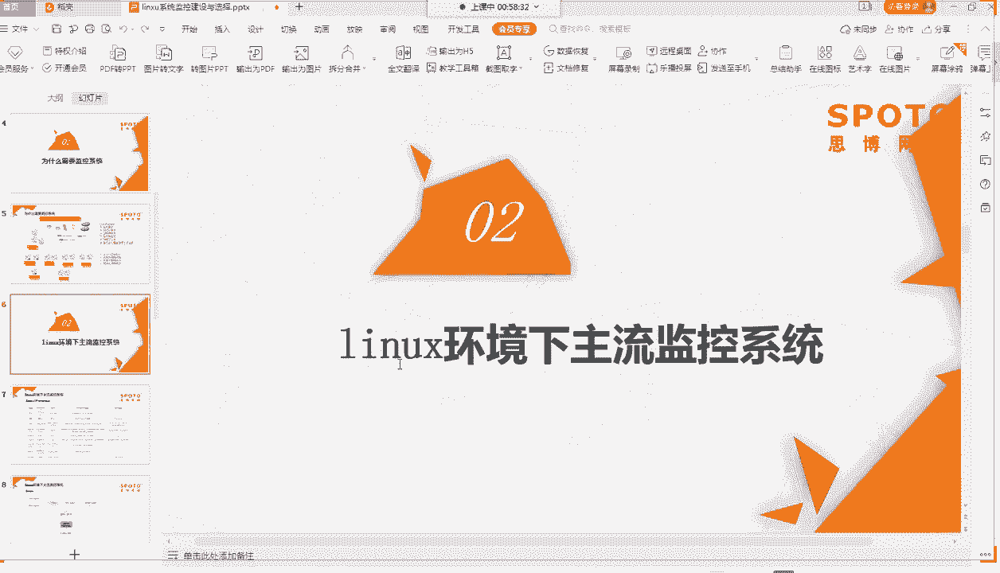

啊，这里的话我给大家列了这两个监控系统的一个差异啊，我们来先来看一下我们jabe斯啊。jabe斯的话它一个管理啊是通过我们LNMP加我们编译方式啊，什么叫LNMP呢？

就是linux加NG加那个麦s加PHP啊，这是我们一个最最传统的一个。wordb业务的一个架构啊啊这种是通过LMP这种架构啊，加上我们编译我们的一个呃ja软件包啊。

像我们就jaice编译的话就是make makeake installstore那种方式啊，去编译我们这个ja啊。然后我们ja啊它的话配置的话是图啊比较友好的啊，是通过一种图形化的一种界面啊。

我这边给大家找了一个啊像这样子的方式，这就是我们jaice一个界面啊，大家的话配置只要在这个界面里面进行一个操作就行了啊，基本就是点几个选项啊，然后进行一个呃配置下的一些呃输入，简单一些参数的输入啊。

用起来会比较方便啊，这就是我们javie图形化给我们带来的一个非常好的一个好处啊，易上手啊，易操作。然后嗯易易于那种嗯图啊观看啊省事啊，会比较简单点啊。那我们的jaice的一个客户端的话。

它有个呃agent啊，jaice有个agent呢，就是我们的在我们服美台服务器上面啊，会有一个呃专门的一个程序啊，叫我们的jaag啊啊以及加上我们你可以在我们呃服务器上面制定一些脚本啊。

通过这个agent去调这个脚本啊，然后进行一个客户端数据的一个监控跟收集啊。那我们ja比的数据存存储的话，就是用我们的mesq啊，mysq就是我们啊非常现在是使用率普遍率最高的一个数据库啊。

非嗯是我们的关系型数据库啊，我们mesq现在有达到88的8的版本，8点多的一个版本了啊，所以说大家在我们的工作当中可能啊做运维这一块的话啊。

用到的遇到的数据库比较多的就是我们micsq基本是每个企业啊最主流的数据库啊，最主流的业务它所使用的一个数据数据库。那一定是meq啊这一块啊。那它一个数据处理的话啊，因为我们存储在mesq上面啊。

那就是用我们myecl自带的一些数据处理方式，什么增删查改呀都可以使用的啊，在我们的micsq上面直接操作啊。那我们jabe啊自己做成一个软件以后啊，还提供了一个API接口给我们进行一个二次开发啊。

你可以通过ja上面的一些API接口啊进行一个呃呃二次的自定义的一个开发。比如说你要调哪些数据啊，可以通过这个接口啊，然后调这个数据，然后啊集成到你们自己的一个运维平台上面去进行一个数据展示啊。

这就是我们在API的一个作用啊，在我们的运工作当中API这块的话，还是用的比较多的啊啊不单单是我们数监控这块啊，如果是有用到一些其他平台像我们的阿里云或者是我们的AWS云平台的话。

那你可能也会经常用到他们的一个API接口或者是SD接口啊。那么jeB的话，它啊最早啊是我们最早的一批的一个监控系统啊，到现在可能有个十来年了啊啊，现在版本都有到5的5点多的版本，5。

3的版本好像啊那它最早我们肯定是适应我们最早的一些呃设备环境啊，我们最早肯定都是建在机机房里面的是，更适合我们物理机的这种监控啊。啊，不像我们现在啊有一些有已经有了云这种的概念啊，云的服务器啊。

它呢更适合对我们的一些物理设备啊，物理机物理机的这种啊架构环境进行一个监控啊。jabe的告警方式上啊是在我们次数上进行收敛啊，以及我们告警方式可以通过一些呃接口啊，像我们的一些短信啊。

它内置会有一些短信的一些方式啊，短信钉钉啊，或者是电话啊，这几种是比较常见的，还有个可能还可以调微信啊你去调它的一些功能，可以通过这三种方式啊，比较普遍啊。

在我们现在很多企业里面基本都是使用这三种方式啊来通知你啊，出现了一个告警啊，就是我们的告警通知方式啊。那jabe的话，它这持我们数字字符串啊。

字符上的一个返回啊你的监控这边监控制定脚本可以直接返回个一或者是2或者是呃ABCD等等啊。然后在我们的图形界面那边啊进行一个判断啊。比如说啊返回的一个是一如果返回值不是一的话，那就告警。

那如果是一的话就算正常情况啊，也是一如果是字母的话也是一样的一个概念啊，这就是我们jabe它的一个基本的。的情况啊。那我们来看一下我们那个普罗米西斯啊，普罗米西斯这边啊。

普罗米西斯呢它是一个二进制直接启动的一个文件啊，它不需要做编译啊，比较简单啊。那它这个配置的话就不如我们那个be斯啊图形，它是我们配置文件，而且是我们的配置文件。

那个对我们刚刚录运维这一块或者是录IT这一块的同学来说配置文件看起来配置会比较痛苦啊，因为都是一些代码，而且没有呃可以选的东西啊，那你这时候要写这个配置文件呢，可能要上网去查啊，它那个官方文档。

或者是查一些资料啊，这时候写起来就比较痛苦了。这就是普罗米西斯比我们这个斯图形化比较差的一个方面了啊。那我们普罗米西斯也是一种客户端形式啊，它跟我们的斯其实差不多。它的客户端叫我们的export啊。

叫我们的exXPOT啊，export啊叫notport。啊，not exportport啊，它的一个官方啊官方会提供了几个已经写好的这种export啊，然后还有一些其他第三方开发的export啊。

当然这种开发的话，它需要有专业的一些知能啊知识啊。呃你去根据它的一个定义好的一个呃上报的一种规则啊，去写这个export啊啊。那呃普鲁米修斯的一个存储的话，它有它是使用我们的一种时间呃时续数据库啊。

时续啊时续啊就是我们这边时序数据库啊，它是按我们时间啊进行维度来进行一个统计跟索引的，跟我们的呃mic还是不大一样啊。我们ms是关系型数据库啊，我们可以通过一些组件啊，或者是索引啊进行查询数据啊。

或者是我们通过组件进行存储啊等等啊。那它那个数据处理的话，它有专门的一个呃语法，叫我们的proQL这种语法啊，这种语法也是啊比较新颖的啊。不像我们麦sical这边比较普遍啊。

各个各个啊行业基本啊开发这边都在用我们这种mes数据管啊，还是比较通用的啊麦用起来还是比较舒服的啊。然后的话啊普鲁米西这边也是也提供了一些SDK的SDK就是呃他给你做好了一个呃软件包。

你直接调这个SDK引入这个SDK，然后进行一个呃调用就行了啊。那普鲁米西斯的话，因为它原生啊它的一个出生，它的一个设立就是为了我们K8S监控啊，我们的K8S。

KMS我们的容器的呃容器的管理跟编排的一个平台，就是为了配合做这个啊这个K8S啊，打错了。为了这个而呃出现了一个监控系统，所以说它对容器这块的监控是呃绝对是非常好的啊，比我们jabe斯要好很多。

它可以通过自动发现容器啊，去自动发现啊，你这个容器啊，只要配好了这个容器的一个接口啊，在我们的普鲁米修斯上面。那你这个容器上面有起了一个什么啊port或者是什么一个容器啊，它会这边自动去添加这个监控啊。

根据它已经定好的一个规则啊，去自动添加这个监控啊，这个比我们那个jas啊会好很多啊。当然我们的jabe它也有啊自动发现的一个功能啊，跟我们的普鲁米修还是不大一样的。

就是了啊两个的一个应用场景还是不大一样的啊。当然普鲁米西斯告警，它也可以通过一些钉钉啊，或者是我们的一些呃微信接口啊啊，或者是邮件方式进行一个告警啊，它可以通过一些啊分组啊，标签分组啊。

或者是告警的一些啊时间啊进行一个收敛啊，就是标某些啊告警在。同一个服务器上面，它可能进行一个筛选，只告警最严重的那个啊，或者是我们呃某个时间段10分钟内同时收到这么多告警，然后再一次性啊发送出来啊。

这个是一个时间收敛啊。啊，当然10分钟太长了，经常都是可能呃10秒啊啊这种比较短的一些时间啊。啊，它那个监控只是我们数字啊数字方式啊，不支持我们嗯字符上啊。

然后这边还有列了一个普鲁米西斯跟je比斯一些优势啊，大家好，这边优势我刚才在我们的介绍这边已经哎穿插进去给大家讲了啊，大家可以看一下啊。然后我们来看一下我们的jevis一个呃架构啊。

jaice它架构就非常简单啊。还有我们的一台jaice数据库啊后这是我们的javis主程序啊，这是我们的javis的一页面，就是我们PHP写的啊一个页面啊。然后剩下的就是我们的客户端。

这个呃GMag加SMD呢，可以直接理解为我们的一个在服务器上面的一个客户端啊，这也是客户端那如果是大集群的话，可以做为一个procy啊，类似于一个中间的一个转发的一个呃汇聚跟转发的一个设备啊。

一个procy代理啊。这就是我们je比较简单的一个架构啊，就是我们的L啊，就是我们的前端啊，我们的数据库，我们的核心组件，然后我们的客户端啊没了啊，要够理解一下会比较方便啊，比较简单啊。

然后这个就是我们啊给大家看了找到一个我们上面的一个啊建好我们建好以后，我们一个这个页面啊，PHP写的一个页面在这个页面上面，大家就可以进行一个简单的一个操作啊。

比较关键的像我们这个configuration这个就种配置下啊，配置我们告警那个核心核心的一个功能的一个入口啊。然后这个是我们那个主界面啊，主界面这边会有啊你这边。

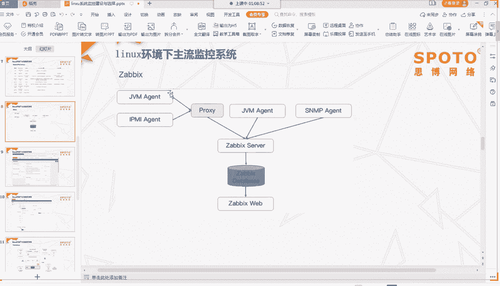

JPS监控的所有机子的一个情况啊，它的一个告警情啊，状态情况啊，告警情况啊都会在在我们这边信息都会列出来啊。我这边信息是没有啊。好啊，这个就是我们主界面的一个情况啊，它东西还是比较多的啊。

大家有空可以去慢慢去啊打开来慢慢去研究啊，没事啊。

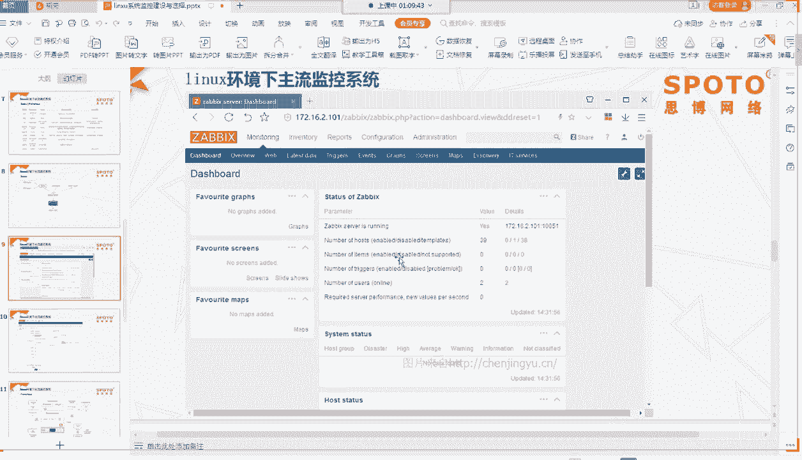

那我们这边可以看到啊，我这个把配置这样打开了啊，这边是一个主机的一个配置啊，模板啊，这两个还有个动作啊，这三个在我们的ja里面是呃最关键的一个。只要你这三个配清楚了啊。那你这个呃配置。

就算是基本是一个流程算是完成了啊，大家有看到这边还有一些平常我们要配的一些像我们主机名啊，像我们的对端的一个监控服务器的一个啊，就是我们监控那台服务器的一个IP啊，然添加一个主机接口啊。

然后这边简单一些添加啊就ok了啊，这就是我们ja监控一个比较简单的一种啊配置方式啊，图形化界面，大家可以看到啊，没什么呃太难理解的东西啊，基本都是选项啊。

填几个框啊就完成了一个简单一个配置啊啊ja这块大家有没有什么啊疑问啊。

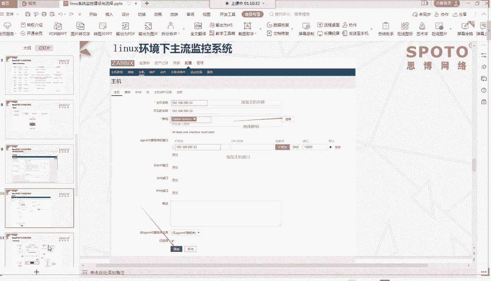

有疑问的话，大家可以提出来啊。😊，啊，没有疑问是吧？那那我们下面继续啊JB这边给大家简单介绍完以后，我们介绍我们这个普罗米修斯啊，这个是我们官网那边接下来的啊。

接下来的一个普罗米斯普罗米修斯这边核心的就是我们普罗米修斯的一个服务啊服务啊服务啊，它这边就是以我们的TSDB就是我们的持续数据库为啊为主的啊。

然后上面再加一些我们的我这边啊就是这官方啊就官方这个图形化界面啊，然后通过去图形化界面去读取这个普罗米啊实续数据库啊，里面数据进行一个展示啊，这就是我们核心的一个普罗米修斯的一个啊。😊。

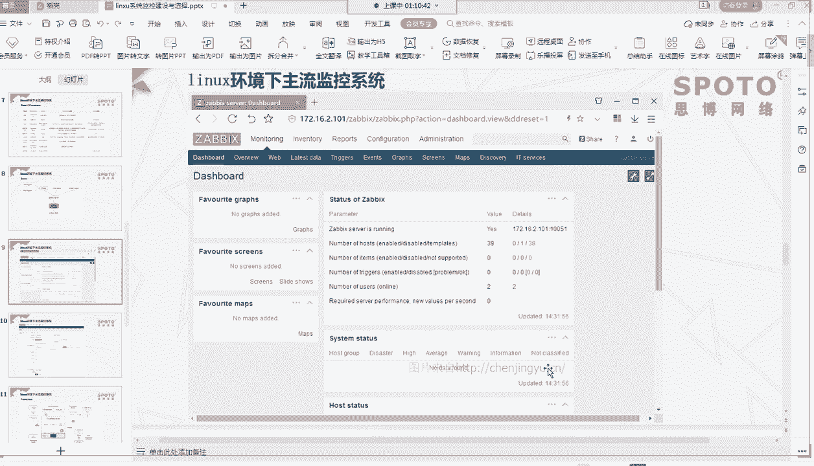

主件啊。然后普罗米西下面有一个我们的呃这个这个在在哎这个在哪？Oh。啊，nn这个啊n啊，就是我们的。啊，我们的服务器啊，我们的那个各个服务器上面的一些呃啊就是我们的呃各个服务器上面的一些数据啊。

我们的note exportport啊，就是我们刚才那个export exportport的一些信息啊啊我们的数据提取的话，就是通过我们的n这个组件啊，这个组件进行一个提取这个数据库啊啊。

大家可以看到啊，这边还有一个对我们的K这边啊，会有一个专门的一个啊设备啊，因为我刚才说了，它是对我们K这边兼容是比较好的啊。所以说它这边有专门针对K这个自动自动发现的一个功能啊。

然后这边啊这个是另外的个A啊告警组件啊，当然你大家平时我们安装普罗米西式的时候，这些组件啊，像我们的告警组件都是没有的啊啊，这时候的话你可能如果需要告警组件的话，需要单独这个安装这个组件啊。

我们安装的话可能就只有普罗米西斯核心服务。这个然后像我们的go风呢，可能也会也会安装一下图形化界面啊。啊，这个呃export是在这边啊，javaexport一下数据数据推送在这边啊。

这边这边推送进来的啊，这个还不是啊，这看错了，这是我们节点的一个硬盘存储啊。然，这个就是我们刚才说的那个export啊数据提取的一个服务端啊，客户端啊，我们这边数据从我们的export这边提取出来。

然后推出到我们那个普罗米西这边持续数据库里面去啊，那最终展示出来就在我们的g这边进行一个展示啊。那如果要告警的话，那你单独要安装的一个告警组件啊，在这边进行一个配置啊。然后这边的话还有个push而位啊。

push而位的一个网关啊，那都就是不通过我们的这个啊export进行一个啊数据一个提取啊，它直接是通过这个push而位啊，去我们拉取这个数据啊，进行一个啊。数据一个收集的个啊操作啊啊。

这个就是我们普罗米修斯的一个简单的一个架构啊。那我们这边可以看到这个普罗米修斯的一个界面啊，看起来会比较酷炫啊。它的酷炫呢主要是因为我们这个官方了这个图形化界面，这个工具啊。

它也是一个第三方的一个组件啊，你要安装啊，要使用我们这个呃普罗米修斯的图形化的话，那也要单独去安装这个组件啊才行啊。

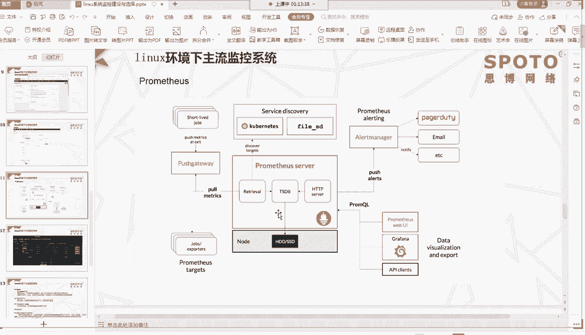

啊，这就我们这个graph的一个界面展示啊，看来嗯看来啊我们会比较酷炫啊，比较适合比较科幻是吧啊，那我们这个呃pro啊这个graph这个其实也可以啊适配我们的jas啊这个界面啊。

也可以作为我们的ja一个展示界面。当然啊这个这个是jabe原生的一个界面啊，这个是你第三方的一个界面，你要使用也可以啊。那一般来说我们直接用这个原生的就能够满足我们日常的一个需求了啊。好啊。

刚才给大家介绍了一个我们主流的两个啊监控系统啊，那后面再给大家扩展一下啊，像我们的监控系统不单单只有这两个了啊。当然还有一些像nes监控系统啊，nes监控系统是前期早期会比较多的一个监控系统啊。

现在基本可能啊用的比较少了啊，它的一个性能会比我们za差一些啊，并且功能也没有我们za那么强大啊，所以说我们很多时候用我们的za就足够满足我们日常的一个监控跟报警的一个需求了啊，嗯。

一个东西能够满足我们一个所有需求，我们就不会再去做其他一些重复的操作了吧，是吧？啊。那还有一个是南鲸啊运维平台，这个是我们腾讯出来的一个啊啊大家如果想了解的话，可以去我们啊南百度上面搜一下。

南京它有呃社区版的啊，有社区版的也有单台版的试用啊那种demo型的啊，大家可以用玩一玩啊，它上面不单单是我们的一个监控啊，也包含了我们的一个监控，它还有一些自动化运维的一个东西啊。

在我们平台上面都有做啊都有做啊，会比较大啊，啊，这是我们腾讯出来的啊，他们腾讯自己用的一个监控器，然后进行一个商用化开发啊，做出来的一个东西啊，那我们刚才讲的这两个啊是我们的一个系统层面啊。

就是我们大层面的一个监控啊。那我们在应用层面的话，还有一些像我们的开源的一些探针啊，什么样探针呢？它就是植入到啊我们的一个啊程序里面去，能够判断这个呃程序里面整套整个请求的一个链路状态啊，就叫我们探针。

它是属于我们应用层级别的。啊，能够监控我们整个链路状态一个服务啊。比如说你一个请求进来，它能够监控到你这个请求啊，下一套啊下一套去哪个地方了，然后访问到哪个数据库了啊，在哪个地方的一个响应呃。

出现了一个长时间啊，访问了多少秒啊才响应出来啊，这就是我们探针的一个作用啊，当然有那个PHP探针自然有转挖一个探针啊。啊，不过目前这块啊探针这块啊开源的啊开源维护的会比较少啊。大部分如果要用的话。

可能因为我们收费版的会比较啊稳定点啊，一个是更新的一个频率会比较多啊。因为这个这些探针的话，它是需要跟我们的程序版本进行一个匹配的啊，进行一个呃跟就是跟版跟程序版本进行走的啊。你如果版本升级的话。

你个探针的话，可能就要呃也要进行一个升级，不然可能会出现一些啊呃不兼容的一个情况。当然这里还给大家推荐一个啊推荐讲一个阿里云的一个探针啊，我们艾云这边不单单是AM这块，不单单是针对我们PHP啊。

最早它是开放我们PHP个服务啊。我们那时候用的是PHP版本的啊，但它整真正的一个啊名字叫我们AIMS啊应用服务啊，电路监控系统啊，好像是这么说的啊。

它是一种一款既能够监控我们那个PHP也能监控我们通k的啊，一种探针一种探针的一种服务啊，它包括前端啊前端监控应用监控啊，普罗迷修监控三大电视产品啊，这个是后面出来的啊。

来看一下能够支持我们转挖啊PH等主流的一个应用语言啊。这个的话当然啊它使用肯定是要收费的啊。但是呃它这个会有定期的更新，会有比较稳定啊。因为阿里云毕竟是做IT这一块的会比较有比较强大一个团队。

它会定期啊根据我们的个呃IT的个发展进行一个版本的一个升级啊，更新换代啊，如果大家呃有需要这方面的话啊，如果公司有钱啊，我个人经营还是买这种付费的产品会比较好一点啊。

当然你如果公司里面像我们都是BATT那种大企业，有自己的研发团队的话，那自己做探能产品。那那个就当我没有收啊。啊，这个就是我们几个主流一个监控系统的一个介绍啊。那现在我们了解了这些监控系统。

也知道我们的一个应用的一个呃环境，就是我们真正监控所需啊，主要监控的一个环境是什么样的那我们这时候要想想我们怎么去选择我们合适的一个监控系统啊。那我这里给大家做了4个种分类啊，比较简单一个分类啊。

当然那以后的话，大家可以根据自己的一个情况进行一个实际选择啊。我们这边可以根据一个业务场景啊，如果是监控服务器性能的话，可以用我们javies或者s啊，当然ja肯定是优先选择的啊，优先选择的。

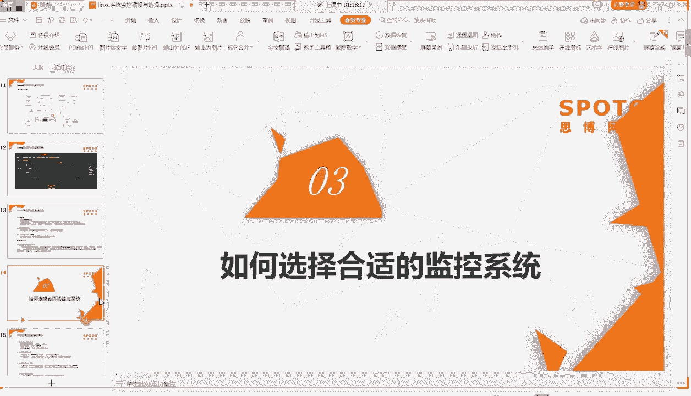

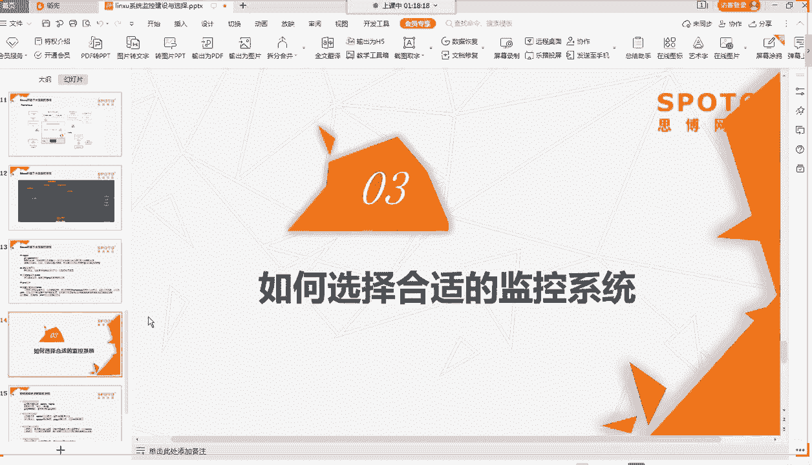

那如果是监控应用层面的话，像我们的爪RPHP啊，可以选择我们探针系列的啊，是或者是我们AIM啊AI这种产品啊，这种付费的一种呃啊监控产品应用层面的监控产品。如果是监控我们啊K8集群这种啊。

那肯定是首推我们的普罗米修斯监控系统啊，这个肯定是最好的一个选择项啊。因为它生来就是为我们的普罗米修斯而服务的啊。当然，普鲁比其实你如果要监控我们的普通服务器，那也可以，不过是比较。呃。

麻烦比较操作起来会比较麻烦啊，还不如用我们的javis来的方便啊。那如果第二个根据我们的业务量选择的话啊，那业务量选择，我们如果业务量不多的话，那我们可以使用我们ja的一个主动模式啊。主动模式的话。

它是呃通过我们jaserv端去呃主动去请求我们客户端那边一些数据啊，那这时候对我们的端会有一定的压力啊。但如果是业务量小的话，那这种方式会比较啊合适啊，你就不用去配被动模式啊比较麻烦啊。

那还有个普罗米修斯单节点啊，单节点的话，它也可以应用我们像我们K集群可能比较小的话，可用我们单节点模式模式就行了。一台的普罗米西斯serv端啊基本就可以满足你的一个需求啊。那如果是业务量比较庞大的话啊。

点那你就要使用被动模式啊。你如果都使用主动主动模式的话，那你1当可能要111分钟之内啊，我们可能要去拉取几千台的服务器。那这时候对12端的压力啊，那就非常大了。这个可以大家应该可以理解啊。Yes。

被动模式的话，就让我们的呃服务器端客户端，它主动去上报啊，你那边每隔多少时间，一分钟上报一次数据，然后让我们售后端只管接受数据就行了啊，就不用去再去发啊请求过来啊。啊如果是呃多机房的话啊。

或者是多平台的话，可以用我们的procy啊procy就是我们的jabe的一个procy代理模式。它在我们的每个呃机房或者是我们的每个平台部署一个代理服务器啊。

那这个代理服务器专门去收集这个呃我们客户端每个平台每个机房的呃服务器的一些数据，然后再统一上报给我们的jebe的一个serv端啊，那这也是减轻我们serv后端压力的一种方式啊。那普鲁米西斯这一块的话啊。

如果是也是多机房的，大家可以用联邦这种方式啊，它有个联邦的一种模式啊，就是我们多个节点啊多个节点啊，但是它多个节点各自存这个各自的数据。如果要提取数据的话，可以从一个节点直接去另一个节点去提取数据啊。

这就是我们联邦模式。那根据我们运维人物呃人员的一个情况吧，人员较少的话，我们就选择我们通用型的一些监控啊，尽量能够涵盖大部分监控的一个需求啊。就比如说我们刚还是我们推荐的一个ja监控啊。

它的话呃因为发展这么久了啊，毕竟版本也在更新啊，它的一个呃涵盖的一种需求，还是能够满足大部分日常的一个需求的啊。如果人员比较充足的话啊，那你可以做更多的一些监控，更加细分的一些监控。

比如说呃像探征这种监控啊，你可以做更深入的一个监控啊，针对每个业务层面啊，做更多的一个啊不同维度的一个监控啊，当然这是呃你如果有能力，有时间的话，可以做这方面的一些监控啊，监控多了。

那你维维护维护的监控设备也要多了啊，是吧？那啊第三个啊第四个根据你个未来规划啊，未来规划的话，那你要提前学习啊学习相应的一个呃监控系统啊，去模拟我们所需的一个监控系统啊。

所我们搭一个demo去测试一下这个监控怎么用啊，那这个就比较像我们如果是我们比较少的服务啊，我们前期啊公司属于前期开发啊前期阶段的话，可能服务器就几来用为我们的ja会比较多啊。那如果后期的话。

如果是业务比较多了啊，那边要上KB集群的话，那你这时候就要提前去学习一下我们普罗米修斯的一监控系统。到时候我们这个真正上了一个KB集群的话，那你要学会这用这个监控系统啊。

这就是我们根据我们啊未来的个规划来选择我们监控系统啊。好，那这就是我们今天的一个给大家介绍了一个我们监控系统啊这方面的一个建设跟选择啊。那大家在对监控系系统这方这方面的话还有什么想法没有。

或者是有什么疑问，大家可以说一下啊，我们这时候啊。哎也正好4点了，我们给一两分钟给大家呃提个问题吧。啊，有疑问的话，大家可以嗯或者是有想法的话，可以问啊。😊，好。都没有问题吗？那都没有问题的话。

那我们啊今天的一个公开课啊，就内容就讲到这里结束了啊，那很感谢大家啊来到我们今天的这个这节公开课啊。😊，每天准时来听啊，好好，很积极啊，谢谢谢谢。😊，好嗯，但大家没事啊。

大家如果现在暂时想不到什么疑问的话，可以在我们课后啊，在我们的微信群啊。我们QQ群里面如果有什么疑问的话，可以呃提出来。我们这边老师有看到的话，都会给大家进行一个呃解答啊，解疑答疑解惑啊。呃，微信群啊。

有你可以问一下我们的课堂助手啊，我们的班主任关关老师啊，他都有微信群啊，会找我们的微信群，你应该有在里面吧。小魔师博的有微信群专门有。Yeah。好嗯，那行啊，那还没进去啊，那你可以加一下啊。

加一下加一下进去啊啊OK那大家都没什么问题，那我们就现在去下课吧啊啊那我们五一节快乐啊，大家回去好好过个节啊，年后我们再来上班吧，再来努力工作啊啊我们这节课这节课到这里啊，就结课了，下课了，谢谢大家。

😊。