# Linux小课堂30分钟掌握一个小技巧 - P16：Linux午间小课堂16-shell脚本ip地址获取 - 思博Linux关关 - BV1i54y1b7rX

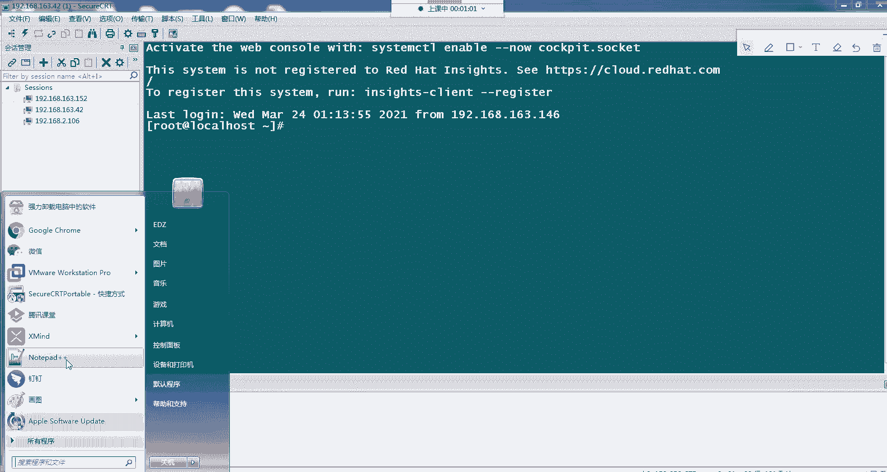

嗯。喂，光光能听到声音吗？能听到的话打个一。可以听到声音吗？可以听到吗？测试测试。可以听到吗？喂大家哥刚能唔听到声。嗯。は一个。可看到分。真就没你方你。愿不愿意把你他给。可以听到声音吗？嗯，可以的话。

打个一给我个回应。可以可以听到声音吗？可不可以听到声音？可以听到声音吗？空间能不能听到我声音，能听到声音的话，帮我打个一，好吧。大家能听到声音吗？啊，可以可以可以好。嗯，好的好的，嗯，可以。

我看到你回应了。嗯好，那现在一点半，我们现在正式开始上课。呃，我们今天的一个主题是用我们的笑脚板写1个IP获取的一个功能。需脚本。获取IP地址。为什么我们今天要写这个用脚本获取这个IP地址呢？呃。

主要是因为呃我们在实际的生产环境中，呃，我们的服务器不只是一两台或者十几台，可能正常情况下都会达到几十台甚至上百台服务器。那这样子的话，我们用我们平时操作在单台服务器上操作的一个命令去获取的话，嗯。

会比较麻烦。我们可能要一台台服务器上去登上去去呃查询它的IP地址啊，这样的话就是会造成一个工作量的一个非常大的一个增加。那如果通过需脚本的话，我们把我们要获取IP的一个逻辑写在一个脚本里面。

然后把这个脚本批量传到我们的各个服务器上面去。那服务器让脚本去执行。然后最后将返回结果啊输出到我们的一个屏幕上。那这样子的话我们就可以获取到用一个脚本用可能一两分钟的时间就可以获取到几百上。

上千台的1个服务器的IP地址，它的一个网卡信息，一个IP地址。然后这就是我们写这个脚本的一个初衷。然，这个脚本的话，它在未来的一个应用的话。

可能可能会应用在我们的像我们的CMDB平台上面做一些基础信息的一个收集啊。因为这这个脚本的话嗯。后期像我们这种CMDB平台，很多都是自动集成的啊，所有的数据都是通过代码或者是脚本的形式来获取。

不可能说我们的呃资产信金还要很多要手工去录入，这是不大现实的，也个是比较违背我们的一个自动化呃这一种我们的一个理念。所以说我们今天呃给大家写一个比较简单的一个功能呃，用需要脚本来获取我们的IP。

那我们今天主要实现了两个功能，一个是我们获取服务器的一个全部IP。啊，这个是包括就是我们服务器上面的一些内容IP啊，外网IP啊，只要他在它的网卡有拉起来，那我们就把它IP地址获取出来啊。

以网卡名加上呃IP地址的形式输出出来啊。另一个功能的话，我们是可以通过呃设置为指定IP地址。获取。指定的。网卡。然后查询他的IP地址。这也是一个小功能啊。

主要是验证一下其他一些方式来获取我们的一些IP地址啊，那我们现在。它的一个主要的一个方向跟结果，我们这边已经定好了。我们的输出形式是设备DV加冒号加啊，就是冒号后面更网卡以这种结果输出。

那我们现在是要啊去构思它一个具体的一个实现的一个功能。那我们先做第一个啊获取它的一个全部IP。嗯。那我们要先呃在我们写脚本之前，我们要先看一下我们的1个呃IP输出的一个结果是什么样的。

然后我们才能去根据它的一个结果进行一个逻辑上的一些分析跟处理啊，我们先看一下它1个IP输出的一个样式是什么样的。

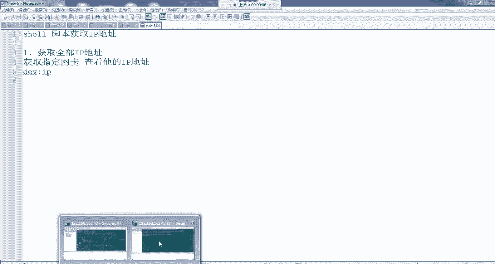

我用的是IP杠A命令，但是也可以，大家也可以用其他一些像NNMCRI命令可以去查IP杠A这边呢我们输出会看到有12344张网卡，一张还回卡呃，还回接口，一张是我们的外网上网的网卡。

然后剩下两张是一个虚拟网卡。那它的一个网卡后面会有跟很多的一些信息，像它的一些呃我们要就是要获取的1个IP地址，然后它的这边还有个IPV6的一个地址。像我们呃这些外网网卡这边也有个IP地址。

它有一个外网的IP地址，然后还回网卡也是呃虚拟网卡这边也是一样的。那我们就是要获取这个。一个是要获取它的一个设备名，还有一个是要获取它的一个外网的IP我们这边。第一个阶段这边只获取它全部IP的时候。

我们只获取它的一个呃IPV4的一个。啊，IP啊，大家后面如果要想获取IPV6的话，也可以去呃通过这个脚本去稍微修改一下就行了。Yeah。那我们在获取完这些呃它的网卡名跟他的1个IP地址以后。

我们要对这两个信息进行一个组装组合，然后进行呃按我们要的一个输出格式进行输出返回给我们。这是我们的一个呃获取全部IP的一个。

最核心的一个思路啊，那我们这里同时还看到我们有4张网卡。那我们如果都要输出4张网卡的网卡名跟它的IP地址，那我们肯定要需需要做一个就是我们的一个循环操作啊，分别去获取它的I啊还回网卡的IP啊，设备名啊。

外外网网卡的IP以及它的一个设备名，然后虚拟网卡的一个IP以及它一个设备名啊，这个是我们那个呃这一步里面的一个另一个比较关键的一个操作进行一个循环获取啊，然后这个我们的第一步第一步的一个结果啊。

第一步的一个流程就大概是这样子。

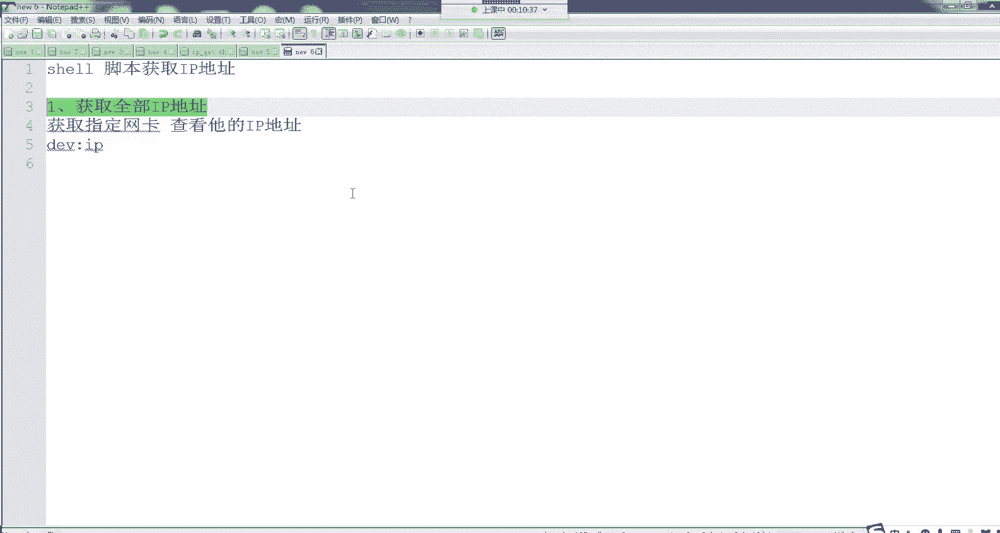

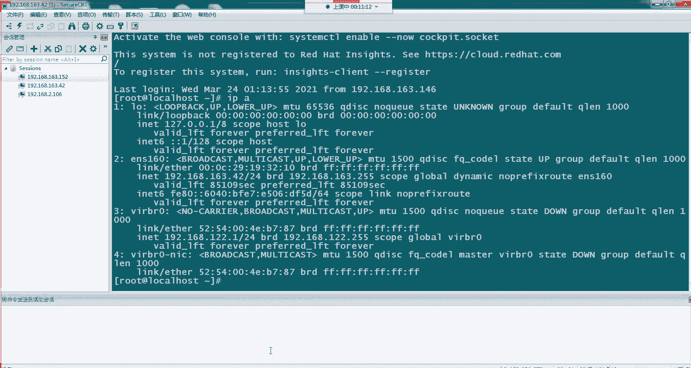

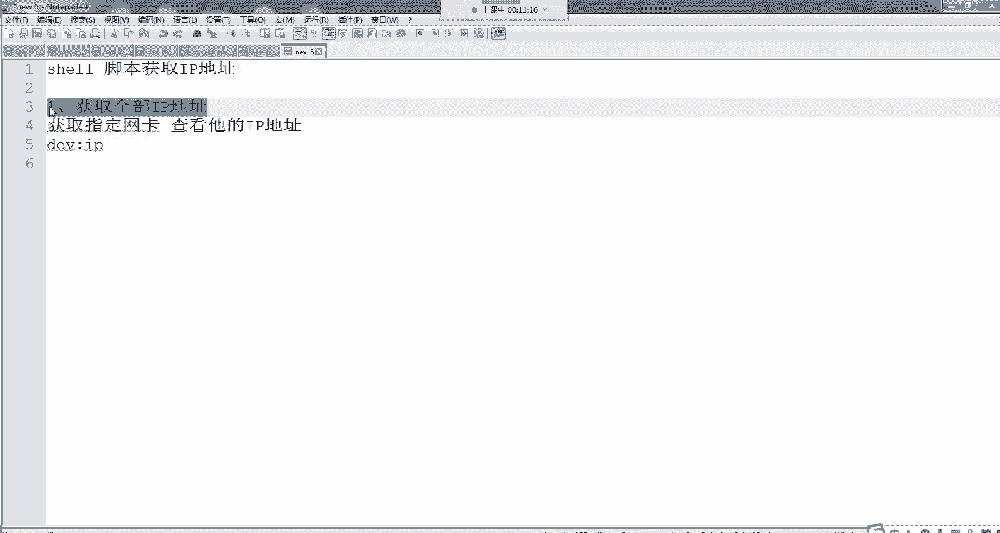

获取完这些啊网卡名跟他的IP地址以后，我们就可以把它一个结果输出。那就达到我们第一个目标里面获取全部IP地址。那这个功能就算一个完全实现的一个功能了。

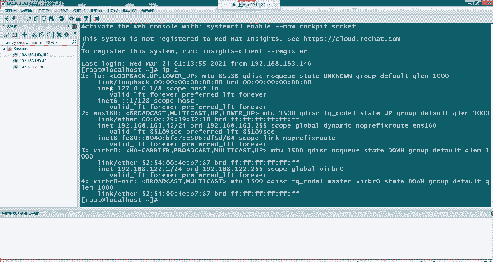

然后第二个功能是我们要获取它的个指定的1个IP地址，就是我们输入它的网卡啊，以及我们要输入它的一个是它是要获取IPV6。IPV4还是IPV6的的一个地址。IPV6啊，根据我们输出的一个网卡名。

以及它那个要的，我们要它输出的1个IPV4还是IPV6一个地址，让我们的脚本去执行这个我们输出的呃输入一个参数，然后去执行它呃里面内置我们写好的一个功能，最后给我们的一个结果，必须是我们要指定的网卡。

还有以及我们指定的是IPV6，还是IPV4的一个功能。So。那最后呃当结果返回的时候，我们也要同时跟上面第一步一样，我们需要把网卡名跟我们的1个IP地址进行一个组装。

最后一个输出给我我们输到我们屏幕上来。那我们这个就完成了我们第二步里面的一个核心的一个功能。然后输完这一第一步跟第二步两个核心功能以后，我们要把这两个功能写在一个脚本里面。当然大家可以看到。

我们刚才第一步的话是不需要输入参数的啊，第二步是需要参输入参数的。然后我们最后来考虑我们需要把这两个功能结合在一起，我们需要对我们的输入参数作为一个比较简单的一个验证啊，比如说我们验证它输入的参数。

是不是我们符合我们的要求啊，格呃字数是不是我们呃要求的，就是参数的个数是不是我们要求的，以及呃它输入输入的参数的一些值嗯，是不是呃符合我们的一个要求的啊，主要做一些简单的验证。好。

那主要的一个构思思路啊，也就是大概是这样子。那我们现在来呃手写一遍它大概一个功能啊。

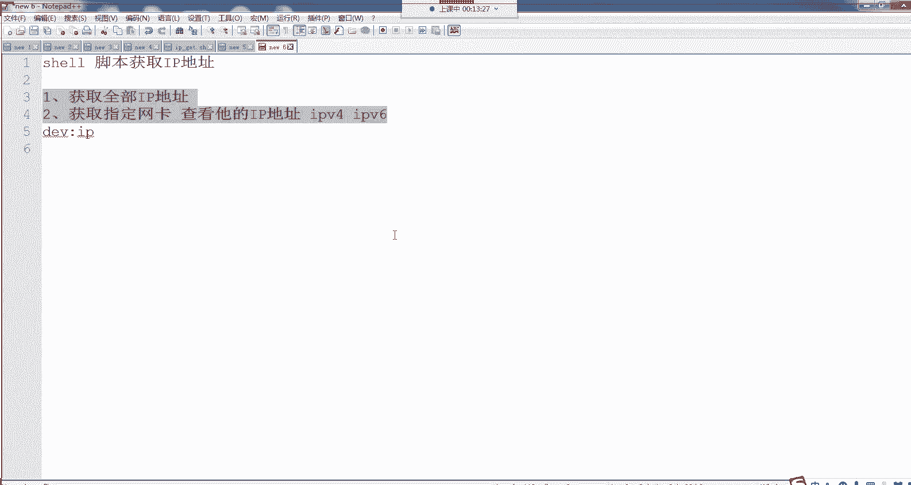

啊，上面的一个思路的话，大家呃有没有什么疑问？

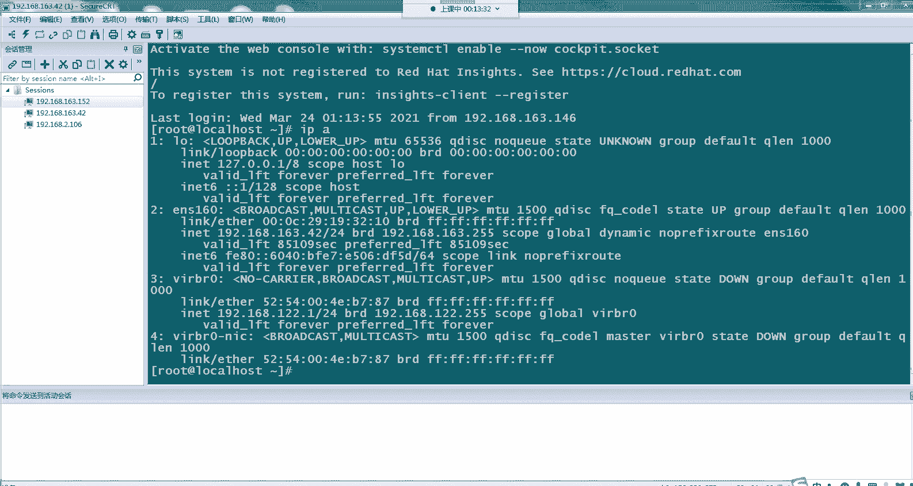

啊，我把我的思路大概打开这里给大家看一下啊。大家对这个思路的话有没有什么呃不理解的地方，或者是不通顺的地方，大家可以在公屏上面打出来啊，我再给大家去解大稍微解释一下。如果没什么问题的话。

大家也可以打个三之类的，让我知道一下行吗？好好啊，看来大家都懂了啊，谢谢空间啊。啊，大家都懂的话，那我们就根据我们刚才。😊，构思的这一个思路啊，我们进行一个简单的一个脚本的书写啊。啊。

我们这边是用那个笑脚板，所以我们在服务器上面开一个开一个文件出来，开一个文件名叫IP。

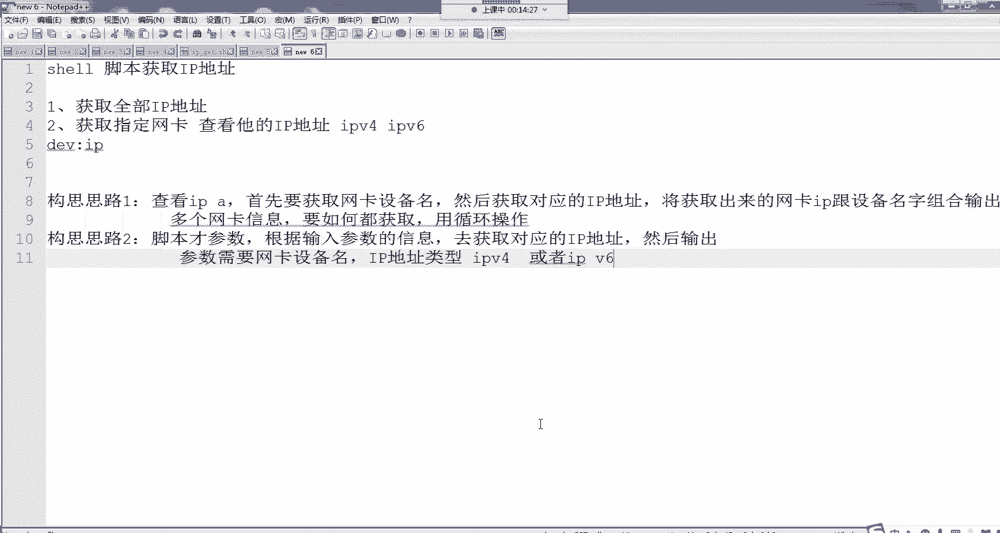

That I P get the SH的一个文件。啊，因为我们是用我们那个se夹板去获取，所以说我们的文件头我们需要指定它的一个解析文件。我们用Bsh的文件。然后我们这边加一点注释啊，我们的第一个参数。

呃，是我们的网卡设备名。为什么要写这个解释解释的一个信息呢？主要是为了方便以后其他人的话接用我们这个脚本啊，他能够知道我们这个脚本的一个功能，以及我们这个脚本啊，到底要怎么用。我们的参数。

可能第一个要输什么参数，第二个输什么参数，这也是方便其他人来使用的一个比较好的一个习惯。大家以后写脚本的时候，尽量能写注释的话都写一点注释，方便别人去改你的文件或者是用你的文件。

这是一个比较友好的一个操作。我们的第二个参数就是我们的IP类型。啊，我们的IP类型可以选IPV4跟IPV6。啊，那我们是第一步啊，就是我们刚才这边最后思考的。

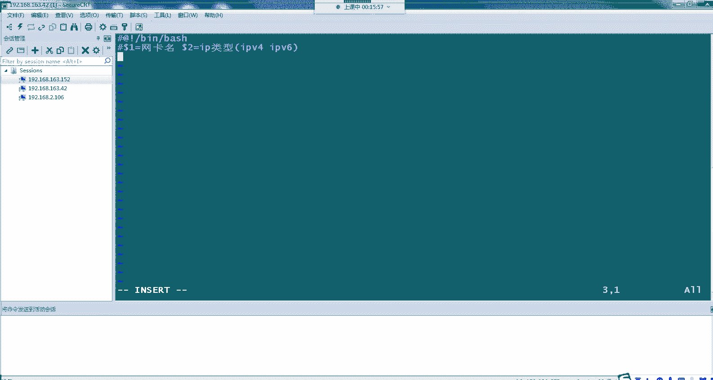

这边呃最后思考，我们要对我们的输入参数做一个简单的验证。

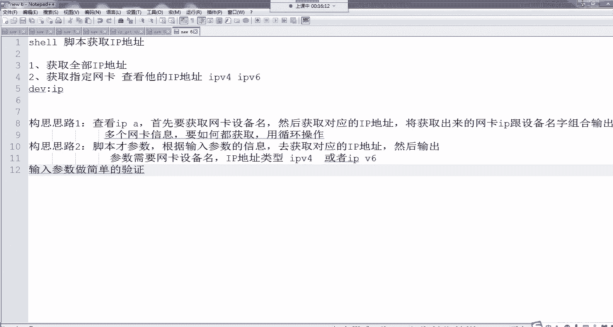

嗯嗯。我们先要判断这边也是写一个注释。判断输入参数是否完整。

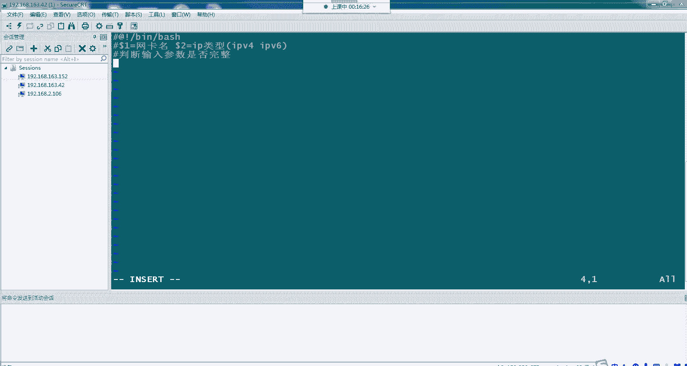

啊。那我们这个边刚才我们这边脚本呃，我们这边思路说了，第一个是不需要输入IP的啊，是不需要输入那个参数的。第二个是需要输入两个参数的那我们先做一个简单的参数的个数的一个验证。

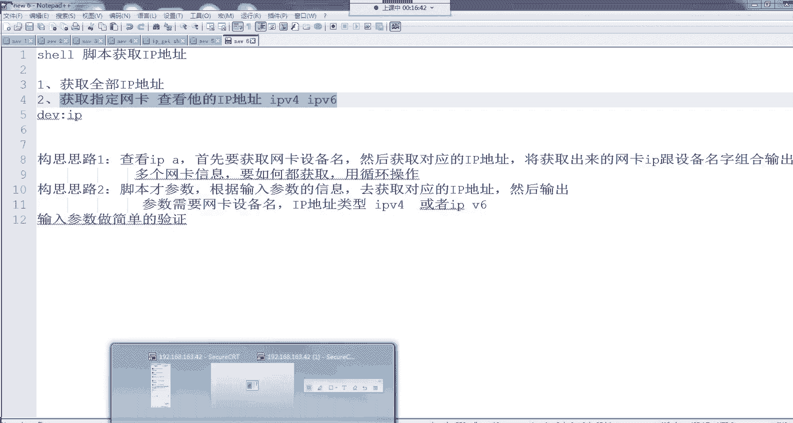

那看到他的参输入的参数是否是两个或者是0个。如果都不符合的话，那我们就返回这个输入是有错的，然后提给他一个提示信息。好，我们做个一判到。我们的do了仅，我们就是代表我们的参数个数不等于。两个。呃。

并且我们的参数个数。Doology。不等于。0个。啊，就是我们刚才输入两个参数，要么就是一个参数都不输入。那如果不是的话，那我们就给他返回一个信息。我们输出。给他一个使用方法的一个信息提示SHU。S。

 H I p。啊，这个文件名是。Get。点SH。L后我们的黄回网卡IPV4。或者呃我们的。嗯。呃，我们的IP get。点SH这样就行了。然后提示完以后，我们那个脚本也要执行一个退出操作。

然后第一步的简单啊的一个判断就到这里就行了。那我们就是把哎结束，这一段就结束掉啊。啊，就这一个就是我们的一个呃第一步的一个简单的一个呃个数的一个判断。啊，这一步的话，大家有没有什么问题啊？有问题的话。

大家可以在公屏上面打出来。没问题的话，我们就继续下面的一个呃脚本的编辑了。但看来大家都没什么问题，那我们继续。嗯，我们现在是。

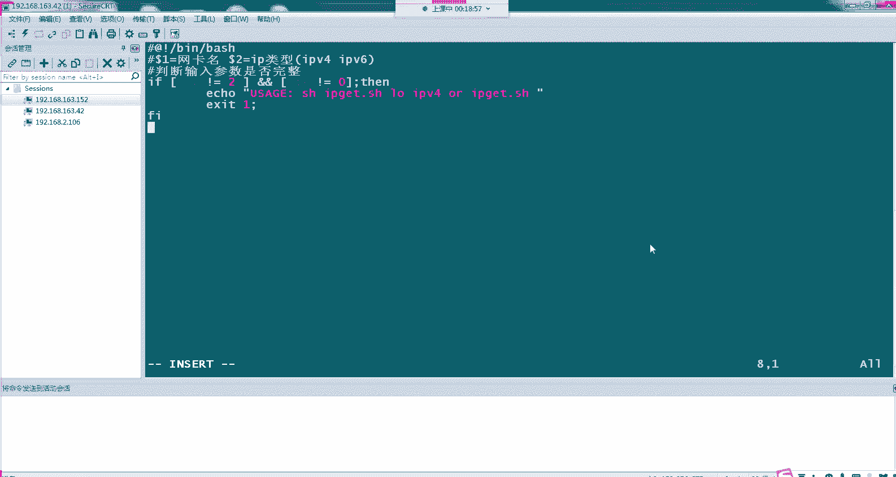

把参数验证完了，那我们现在是做第一步获取它的一个全部IP地址。那我们这边的话获取到1个IP全部IP地址的话，那我们就首先要先获取到它的一个设备的一个信息。

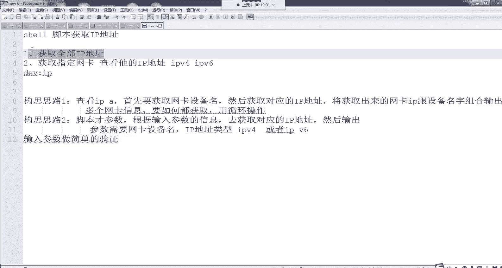

然后通过这个设备的名字，我们去获取设备对应的IP地址，然后再进行设备名跟IP地址的一个结合啊。那我们这边首先要先判断它如果输入参数是零的话，就是没有输入参数的话，才能执行我们这一个的呃逻辑步骤啊。

那我们这边要让它的参数判断是零的话。我们才能进入这个流程。Do了。金。等于0的话。然，后我们做一个刚才我们说了，我们设备的话有4个啊，我们目前这边的设备。有4个，那我们需要对这个设备进行一个呃循环操作。

嗯。我们要分别获取它的一个设备信息，然后把它的IP地址呃打印出来，然后进行一个组合啊。那我们用个fo语去进行一个循环。这边用网卡设备，我们给他定一个名字。好，我们这边要执行的命令。

就是我们这边要获取到这设备名，我们用NMCRI这个命令，它的命令你有一个能够把我们的网卡信息啊，网卡的名字给它列出来。我们这边用 n m c lI d v。I see。大家如果不懂的话。

我这边再开一个呃。啊，这个不是这个。我们把这个命令给打出来给大家看一下是什么样的。啊，叫NNMCLI deviceice，我们这边有看到有4个设备，就是我们刚才呃这边IPA输出的一个设备信息。

那我们嗯通过这个命令把它的第一段截取出来，我们直接去下面第一段的下面四个值就行了。是下面除了第1个DVIS的，剩下都是我们需要的一个网卡的一个名字。我们用AWK进行一个。明天那个结局。嗯，这引号。

我们把第一它的设备名是第一个，然我们就输多了一。到了一。然后这边打出第一页以后，我们需要把这个D wife这个值给它去掉。我们用个gra杠V的命令。过滤掉我们的。第一。都是大写的。啊，那这样的话。

我们的那个for循环的一个条件我们就写完了。然后我们这边for呃这边命令NNMCR命令执行完以后，我们会把咱们的网卡信息啊传到这个值上面去。

然后我们下面一步会通过呃同样通过MCRI通过这个值去获取这个对应设备的1个IP地址啊，我们下面用写它的一个另一个获取IP地址的一个操作啊，我们这边IPADDR。等于。我们的这个。

Is there I C I。我们同样是把命令打出来给大家看一下。嗯秀一下这个。我看一下它一个结果啊，大家看到它这边有很多啊这个NNENS160的一个值的参数。

我们这边有看到有个IPV4 address一的啊，这个就是我们要获取的1个IP地址。那后我们把这个值给它取出来。我们这边把这个命令复制过来。啊，我们把这个设备名用我们的参数带进去。我们在。获取完以后。

我们要把这个IPV4这一行给它过去过滤出来啊，或者是我啊对这这一行。没有 grip。IPV4。然后在我们在获取获取这一行出来以后，我们要把这一这两个字段进行一个切割。嗯，用AWK进行一个切割。

呃嗯大家看到我们要获取这个字段，这个段是do了二的位置。啊，到了2完以后，我们获取出来的就是后面这1个192。168。163。42杠斜杠24。这个值那我们现在要把这个值还是要进行切割。

把用斜杠这个用斜杠进行一个切割，把24跟前面的IP地址给它切割出来。嗯。然后这样的话我们就已经啊。这一步就算完成了。啊，我们现在呃IP地址获取到了这个网卡信息啊，网卡名也获取到了，那我们把它进行输出。

哎，这个要加上一个do，取他的值。多了。OK那这样的话我们就可以就可以把它这个信息按我们的一个格式进行一个输出了。然后这边就结束这一个循环，然后再我们自执行一个退出操作。

然后我们这个衣服的话要呃进行结束，我们需要用1个FI那这个的话。

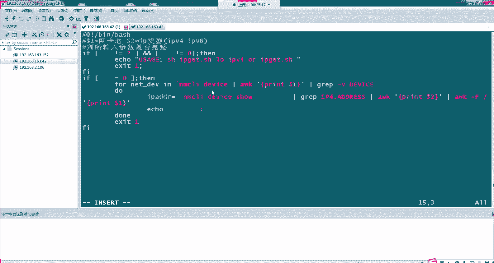

就保证了我们IP地址这一段啊是我们一个完整的一个功能就实现了。

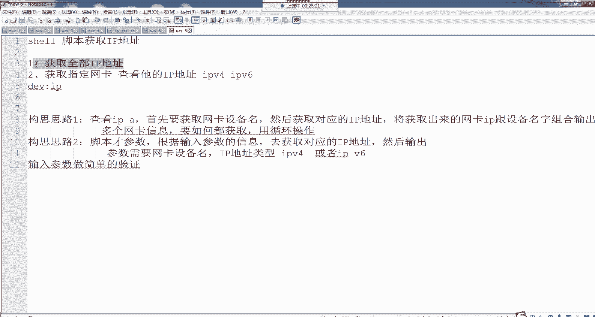

那我们现在做第二个。第二个的话，我们是用。也是用这个呃NNMCLI啊去获取它的呃，用我们的输入的一个网卡信息去获取它的一个呃在我们这边服务器上是否有存在这个网卡来进行一个简单的验证。

然后同时要对它的一个输入参数。IPV6跟IPV4进行一个选择。然后根据这个选择，我们嗯选择最后输出它的1个IPV4的地址，还是IPV6的一个地址，那我们先开始写，我们先要把网卡信息一样要获取出来。

就是刚才这一个这一段。我们要判断它EXISD是否存在这个IP地址。嗯，好嗯。大家能听懂就行，我们下在继续。呃，因为代码跟上面一样的，我直接复制下来。减省呃说点点时间啊，我们先取一个doller一。啊。

我们为什么又不用呃device呢？因为呃我们输入的网卡名字的话，一般不会有device这个值不会输device这个网卡。所以我这边没有做过滤。大家如果为了严禁期间的话，可以加上这个啊杠V的一个命令啊。

开是啊。Oh。不是我们这边逻辑跟上面还是不一样啊，我们这边是直接通过这个我们输入的do一参数进行一个获取它的网卡名啊，判断它是否存在啊，那我们现在。进行第二步。判断它的一个输入的一个参数，对不对？

就是输入的IP地址的一个选择参数是否是IPV6或者IPV4。啊，然后这如果是对的话，那我们就是要把这个值进行一个转换，转换成我们NNMCI能够接受的一个参数值，然后再传给他进行一个获取它的1个IP地址。

啊，但是我这一步流程的话，可能不考虑获取IP地址，不考虑用MMCR进行获取。我用IP杠A的方式教大家怎么进行一个截取。把这个字段进行一个截取啊，因为在我们的7以前的系统的话。

是没有MCI的那时候获取IP地址，大部分是通过这种IPA的方式进行一个字段截取。我们换一种方式用这种方式，因为跟上如果用上面这种方式的话，大家其实功能啊操作步骤其实命令是差不多的啊，我们换一换一种方式。

让大家感受一下啊，我们这边先判断那个它的参数值是IPV的还是IPV4。我们这边IP如果是他的IPV4的话，我们的IP太类型就是等于。杠4因为杠4。啊。嗯。啊。那我们现在是下一个，如果他是。衣服。

啊ELIF。它的一个值。高了高了2。是等于。IPV6的话。那他的1个IP类型。是等于。--6。否则的话，如果两这两个都不是的话。我们输出它的IP输入一个方式是错类型是错误的。

那我们这个进程就执行退出一个操作。啊，我们这一个判断一个啊IP类型的话呃，循环就结束了。那我们现在把这个呃这个值。获取出来的，然后跟这个IPV4的1个。呃，输出的结果。

然后进行后面最终的1个IP地址的一个输出的一个判断跟执行。啊，我们这边要先判断，如果是这个我们这边刚才这边执行的DV说如果存在。说明他的网卡在我们这个这个服务器上面是有的。啊。是否是否等于我们的一个。

我们输入的这个字。如果是的话，我们就执行我们的1个IP拒组那个命令操作结果。嗯。然，我这边是用IP。IPA的命令方式来执行的。迷你执行给大家看一下啊。A。杠4。啊，我们的address。发言。

I just showDV。我们的NES。这样这条命令的话，我们也能把我们的1个EENS106的1个网卡信息输出出来。然后对这个输出的一个结果，我们进行取这个字段，然后进行一个切割。

这边就是把它复制过来。啊，我们的IP这个干是用我们的type进行一个替换。然，我们的ENS这个王卡明。用我们的to耳E进行替换。然后输出啊结果以后，我们需要取这一行，包含ININET这个值的一个行。好。

我们进行一个对它一个进行一个切割。切割完以后，我们这边就呃。空格我们以这边是以默认是以空格进行切割，那我们获取到这一段以后，我们还要对它进行一个切割，切割，以这个斜杠反斜杠进行切割。

这样就可以获取到我们前面那个这个IP地址。而不需要后面的这个指网源码。啊AWK我们的干。F我们指定切割的符号。然后我们进行一个取值。到了。啊，这样的话我们那个结果就出来了。啊。

我们这边if这一段循环就给它结束掉。然，现在我们获取到1个IP地址了，也有它的一个设备网卡名。那我们就把这个结果进行一个输出。啊，我们的do了一是我们的设备名。

然后我们的 dollarI address。就是我们的一个网卡。那这样子的话，我们的一个功能就实现了。那我们想来执行一下，看一下它一个结果是否是有没有我们刚才写的这个代码有没有问题啊。

因为会以及我们最后一个结果是否达到我们的一个预期啊，那代码这一段大家看的话也没有什么问题，没有问题的话，我们就执行这个代码了。执行这个脚本。没问题的话，大家在群大那个公屏上打个一吧。有问题的话。

大家可以说哎提呀。Okay。啊，都没问题吧。那我们就执行下结果看一下。IP get just我们先不带任何参数，看一下它的一个返回结果。啊啊，这边有一个错误。啊，这边的空格空格没有空。

OK那现在我们一个输出结果看我们有1个2个3个4个，这个我们对比一下我们IPA里面输出的一个信息。我们的I网卡就是我们的127。0。0。1，我们的ENS160，就是我们的192。168。163。42啊。

那就是没有错的，问我们那个虚拟网卡连是192。168。11122。1啊也是没有问题的。然后最后一个我们的NIC这张网卡，它是没有这个网卡信息的。没有这个IP地址的，所以它的一个输出结果是一个空。

然后我们第一个功能就算完整的一个实现了。那我们就测试一下第二个功能，指定它的网卡以及它的1个IP类型。

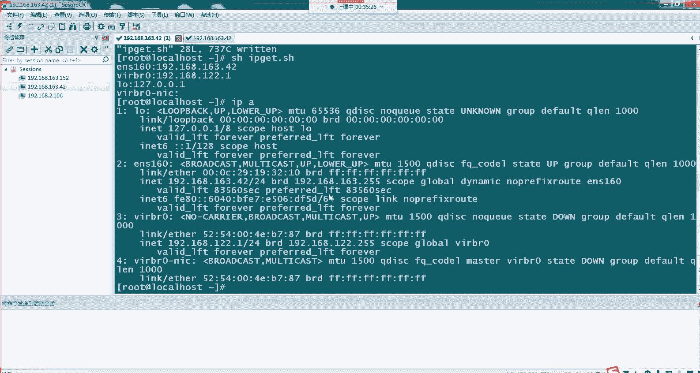

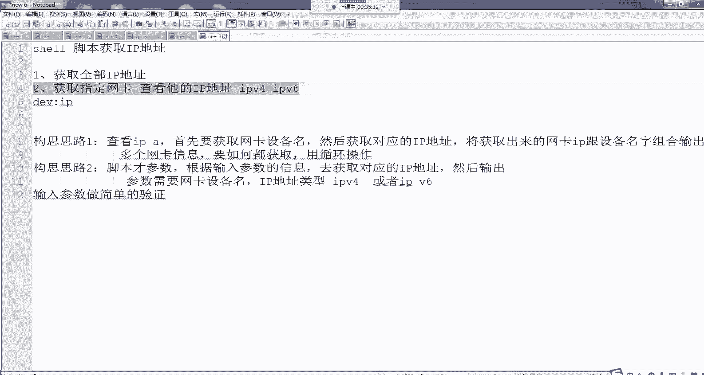

我们这边选一个USS160的。然后我们选IPV4。啊，大家看我们这边的输出结果跟我们上面那个结果是一样的。那我们换一个指令的IPV6。我们的IPV6地址在这里。啊，大家看到我们的呃IPV6。啊。

APPV6这个结果好像还是有点错。哎，看一下可能哪里逻辑错掉了。我们测试看一下啊。我们看一下它的IPV6的结结果。呃，5D哎，没有做题。啊，没错没错，是我看错了啊，结果结果是没有问题的啊。

那今天的话我们两个功能都用我们一个脚本进行一个实现了。啊，大家对这个今天的一个课程的一个内容还有什么疑问或者不懂的吗？

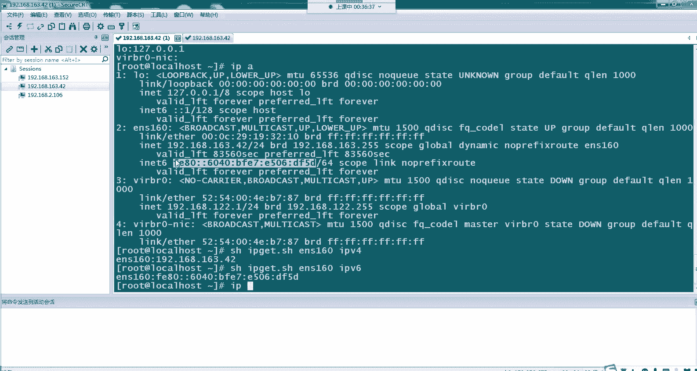

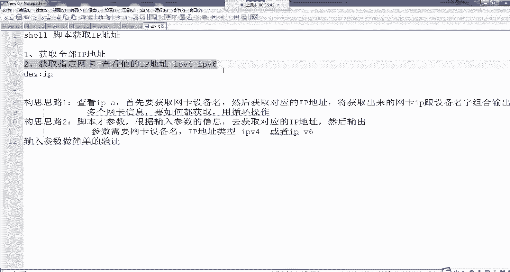

没有的话。大家打个一吧，我们的今天课程就到这里就结束了啊，希望大家这个对这个脚本有一个初步的概念，也希望这个思路对大家以后在我们的工作中写那种类似脚本有个帮助吧啊啊，没有问题的话，大家在群里面打个一。

好吧，我们课程就结束了。嗯。唉，大家都没有听到吗？没听到我声音吗？😊，啊，行啊，看看来大家都比较害羞啊啊，没问题的话，我们今天课程就到这里了。啊，行行行，那我们啊今天的一个脚本分享就到这里结束了啊。

嗯谢谢大家来听今天的课啊，我们下次再见。

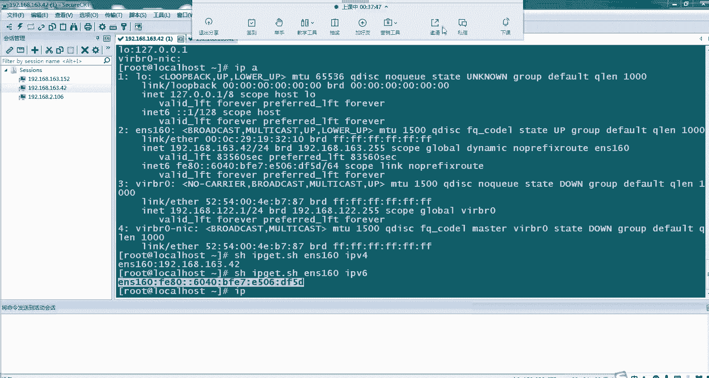

啊，下课了啊。

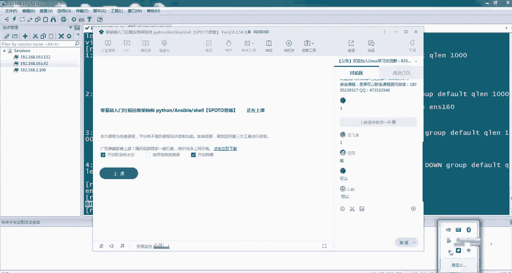