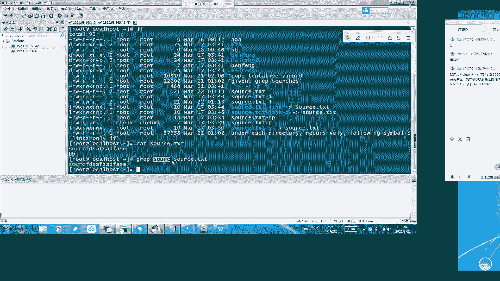
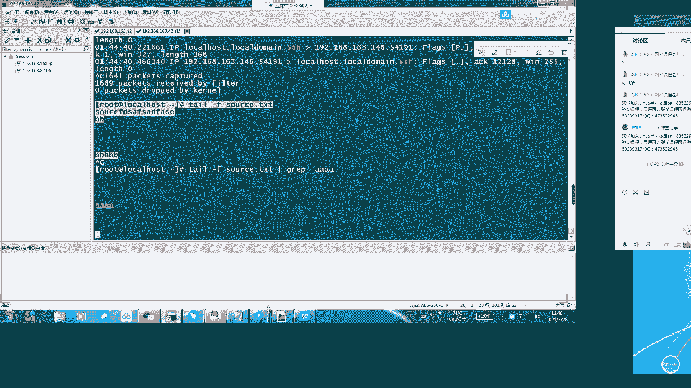

# Linux小课堂30分钟掌握一个小技巧 - P1：Linux午间小课堂1-grep命令的妙用 - 思博Linux关关 - BV1i54y1b7rX

。哎，大家能听到我声音吗？能听到的话，帮我打个一。好的好的好的。怎说。啊。

嗯。Yeah。好呃，我们。好，我们现在开始啊，欢迎大家来到今天的思博的五间课堂。我们今天课堂就半小时讲一些比较呃经经典的一个东西啊。今天的话我们主要讲的是规本这个命令。规的这个命令的话。

它在我们linux下面的一些使用啊，在讲这个命令之前啊，我想大家想一下，呃，在我们的windows下面，我们要搜索一个文档里面的一个呃。文档啊文文档里面一些信息，比如说搜索一些关键字啊。

我们一般是怎么做呢？呃，肯定是要先打开文档吧。比如说我们打开一个word文档。

啊，我们的思博客人这边word文档打开一个，然后我们按ctrl F。啊。哎，稍等啊，电脑比较卡。我们按个ctrl F。嗯，关掉一些程序啊，稍等一下。嗯，O。啊，我们关。一。哦。稍等一下，哎，卡死了。

没事，我们继续我们按个ctrl F，然后会弹出一个搜索框，这是微软啊word里面给我们提供的一些搜索功能。那我们在linux下面是没有这些工呃那个文档这些工具提供给我们的。

但是我们在linux下面有另一种搜索方式，就是用我们的group这个命令。用我们的规范这个命令。那我们看一下贵本这个命令，在官方那边的一个手册里面给我们的一个解释是什么样的，我们打开麦。

对。啊，官方这边一个描述，gri是用来搜索一些匹配字段，在每个文件当中。然后一个文件如果它的是一个横杠的标代表是一个标准输出，什么叫标准输出呢？这个标准输出就是我们的键盘键盘输入输出。

这个就是一个标准输入。然后我们的显示器就是一个标准输出啊，它这边一个横杠。如果你后面带一个文件是是一个横杠的话，它就是表示一个标准的输入。就是我们呃键盘里面输入，它就会进行一个检索。

然后假如这个文件没有给予的话，递归搜索它的目工作目录或者是不递归搜索标准输入的一个信息，就是这个后面这一段的话，其实跟我们前面这一段标准一个文件，它一个代表横杠的一个文件，就是它一个标准输入。

其实是一样的啊，然后后面这一段还有一个附加的信息啊，它的一个附加基息说它还有一种变种是EG跟F group啊，它是其实是跟我们G里面一个杠E的一个参数，还有跟杠F一个参数，其实等价的。

只不过这两个EG跟Fg官方是不推荐的啊。所以说我们大家用的时候可能用到这个这两个是用来干嘛呢？主要是用来进行一些嗯。像那个我们的配合一些正能表达师进行一个检索的啊。然后我这边啊把这个中文给它翻译的出来。

行我们这边大家看。

好。他那个描述。这个描述大家没有什么问题吧，理解上有有什么问题的话，大家打个一吧。没有的话，我们就继续下面的一个讲解。

好，看来大家都没有什么问题啊，我们继续。那前面这边描述已经说过了，它的。功能是检索每一个文件中的内容。当然我们就是实实操一下它的一个解索文件内容是怎么一个解锁的。

它这个基本格式就是文件呃，gri加上一个你要解索的一个呃内容，然后后面跟一个文件。那我们进行一个操作看一下。我们在另一个窗口当中操作。好，我们比如说我们要解锁这个s点DXT下面的。

我在里面已经写了一些信息啊，我们要解，比如说我们要解锁一个st。阿西这个这这几个字符。那我们的一个输入方式就是s grape。st就是带上你要搜索的一个字段，然后后面跟一个文件名，你要解锁的文件名。

然后它的一个返回就是会把我们匹配这个要搜索的这个字段的行会打印出来。默认这边会有个高默高量的一个显示。我们这边看到我们的一个st检索信息，在一个返回的字段里面，它给我们高量显示出来了。

那这这就是它的一个最基本的一个应用。在一个文档st点TXT文档里面检索我们的一个stRC这个字呃字符串。

那我们刚才在这个。呃，说明中呃。描述中还有看到一个横杠，横杠它是代表标准输入。那我们用这个。来实践一下这个横杠作为标准输入是怎么做的啊。

我们比如说st，我们前面还是要gri，然后带上检索的数字啊，或者是字符串，然后后面加一个横杠。然后它会命令会返回车进行，然后等待你的一个标准输入。

那我们这边随便输入1个SORCAADF然后后面叫个SORC，然后回车。然后。griip这边会等到你的一个回车，嗯，回车以后，它会把你前面输入的一个字段全部进行一个减速，然后进等到有匹配信息返回的啊。

有有匹配到信息的话，它会把那个匹配信息进行一个返回，然后进行一个高量的显示，显示结果，其实跟我们前面直接st后面带文件名的效果是一样的啊。如果是这个信息是没有的话，那它就不会返回信息，我们试一下看一下。

大家看到我返回回车以后是没有任何信息返回的这就是呃文档介介绍里面的一个横杠的一个作用。

啊，这个横杠大家理解吧，它的一个操作方式跟作用。啊，有什么问题大家可以打个一啊，随时跟我说。然后这我们再看后面说他是可以递规检索工作目录。嗯。然后递归检索工作目录是怎么做的呢？

它需要配合一定的参数进行一个执行。然后我们给大家展示一下需要配合哪些参数啊，我比较喜欢的几个。

嗯，在这边。一个驾驶杠L。改了。杠L它的一个作用是返回你的文件的一个路径，在当前目录下的一个路径，还会。这个呃认这个那目的是比较我比较喜欢就是经常需要在一些目录下面检索一大堆文件。

然后因为我要检索的一些呃，比如说字符串或者一些关键字，我不知道在哪一个文件里面，可能在多个文件里面，也可能在一个文件里面可能在当前目录下面也可能在下一级目录下面。所以说呃我会需要加一个干L。

把它一个路径打出来，我可以确定它的一个路径，最后进去找我要修改这些文件的话，需要的这个一个情况。那刚才说如果是检索一个目录的话，你需要进行一个递归递归操作。

那地位操作的话，这边他是需要加一个。杠2。诶，干辣烧辣这这。杠R杠2它有杠二跟杠小R杠大R跟杠小R。那它们的一个区别是什么呢？杠小R的话，它是只会检索目录下面的文件，但是不会检索里面的呃链接。

就是软链接。杠二的话会同时检索软链接指向的一个文件，也会把这个软链接的路径给它写出来。啊。那他最后的一个参数组合就是干。就是我们刚才说的。杠L代表。列出它的一个。嗯。

文件的一个路径杠2就是我们要检锁它递归递归检锁这个目录下面的一些信息。嗯，那我们检索一下，还是检索原来的SORC这个目录，然后我们加上在当前目录下结束，然后大家会看到。这边我把这个复制出来。

大家会看得更清楚一些。嗯。啊，大家看到我们刚才执行的杠L啊，搜索sourcesourceRC这啊sourceRC sourceRC这个以后，在当前目录下。

它会把这些文件包含这个字符串的文件的一个路径全部列出来，同时带上一个文件名。大家可以看到这有个杠P啊，杠P是我们之前抽呃上一节课讲那个CP命令的时候，我们生成的一个文件，它是一个链接文件。

我们可以这里看一下，对比一下。

啊，这是一个source。点TXT杠link杠P，这是一个指向sources点TXT的一个链软链接。所以说杠R的话，它会把这个链接的路径也给它链。

呃，列出来。那如果是不需要这个软链接的话，那我们就把它改成小R。

好，同时我们这边再拉出来对比一下，看一下它是不是是呃没有去检索软链接。没有。

嗯，大家可以看到这个杠P啊，我们在下面是已经找不到sss点TH横杠link杠P是找不到这个东西了。说明说呃杠R杠R是呃。包含软链接的嗯，杠小R的话是包不包含软链接的。所以说在日常的我们的一个工作中。

可能用的比较多的是会用杠R这个东西。因为经常我们检索的话，可能这个软链接并不在当前目录下面，可能是在另一个目录下面。所以说我们需要同时检索多个目录。多个目录确保我们所获渠道的信息是完整的。嗯。好。

这是呃gri干 grape的一个比较简单的应应用。然后在我们再想象一下，我们在日常的一个工作当中，不仅仅是检索单个文件，还有一个一些目录文件。那我们时时常是需要在业务运行的时候，同时看它的一些日志。

以及定位一些故障啊，或者是定位一些来源IP啊之类的。这时候或者是我们的一些网络信息。呃，比如说我们的个网卡，它会实时接收外面的网络信息，我们需要呃获取它的一个网络连接信息的话，确定呃是否有什么异常。

这时候就也可以用到。gra这个命令，因为它的输出是实时的，像我们的TC呃网络链接用TCPd的话，可以实时看到它的量是非常大的，刷出来你可能都来不及看。我们看一下它一个效果啊。

大家会看到这个网络刷的非常快。这时候的话很多。很多无无效的信息或者是嗯对我们来说不大重要的信息，同时也会刷出来。这时候我们想看的话就比较麻烦。

因为我们可能要的信息就是可能在100多条信息里面可能只有一两条。所以说我们这时候可以通过这个group命令去把这些信息给它检索出来，过滤出来。这样的话就方便我们进行一个错误的定位啊。

或者是我们要获获取一些关键信息，排查排除一些杂乱的一些呃干扰信息。那这时候我们就可以在呃这个TP大门后面加一个管道符。然后我们再加一个g。比如说我们要搜索这个SH这个信息。

那我们这时候看到这个信息就没有那么多，不像刚才那样一下刷出来一大片，这时候信息就比较简单了。这个有利于我们获取当前呃我们真正需要的一个信息。这在我们的一个日常工作当中是一个非常嗯实用的一个技巧。

还有一个功能吧啊，在除了像我们获取这些网网卡信息，这种是没有。呃，没有目标文件的，就是我们没有设置原文件是从哪里的情况，可以可以用到的话，还有一种情况，比如说我们需要啊获取一些NG的日志。

实时输出的日志，也进行一个过滤的话，那我们其实也可以加上一个gra命令进行一个操作啊，那我们试验一下。比如说我这边。我们这边还是。打开一个shott一个实时流窗扣啊。那我们这边一口一个进区信息。

看去看一下，它会在我们的这个另一个窗口这边会显示出来。哎啊，目录不对。好，这个我们已经把我们的这5个B这个字符上输入到这个source点DXT里面去。

然后这时候我们可以看到我们这边一个流输出流会有显示一个source点TXT。当然我目前只是一个呃只是一条。呃，数据插入。那如果是像我们的线上的一个呃访问日志的话。

它的输出量就跟我们刚才的SH这个就是TCPd这边的网卡信息输出量是一样的，是非常非常快的那这时候我们要一个进行对这个日志里面的信息进行一个检索过滤过滤的话，那我们就需要用到group命令。

我们比如说我们跟江门也是一样，加上一个管道服，加上一个gri。比如说我们要输入这边没有的AAA。4个A。那我们这边同时进行一个插入啊，插入我们插入。个4个A。好，我们这边又看到这边还会输出来。

大家可能会觉得会有疑问。呃，这个到底效果是不是真的啊呃，是不是跟刚才一样，这不加这个source点啊，不加这gra的时候，它也会输出。那你加的这个gra以后，它还是会输出。那没有一个前后对比啊。

我们可没办法验证这是不是正确的那我们现在在这边输入一个非AA的一个信息，我们再输输入一个CCC看一下它这边是否一样，能够解锁过滤出来。然，这边已经输入完成了，这边执行是正常的。

但是我们在另一个窗口这边看到是没有进行一个呃。输出说明CCCC这个数据字符串已经被我们group命令进行一个过滤掉了。所以嗯这就也证明了我们这个gra是有一个作用的，是啊。

它是能够过滤我们的一个呃重要信息啊，排除一些我们一些不重要的一些信息。那这个应用大家的话，在它的应用上有什么问题吗？没有问题的话，有问题大家可以提啊，可以打个一或或者把问题问出来。没有的话。

那我们就进行一个下一个。大家在刚才看到这个gra的时候，是不是我们的一个A，这是一个有颜色的。但是我们这边如果没有加gra输出是没有颜色的。是不是？那这个是gri的一个很好的一个功能。

比如说我们上面这个信息里面，我们一行数据是非常多的。那如果是说呃我们这边数据有三四行的话，那我们要呃确定我们的一个关键信息在什么位置。如果没有这个颜色上呃，进行一个提示的话，那我们看起来就非常痛苦。

非常累。あ的。所以说规本这边给我们提供一个参数，叫杠car。

啊，我把这刚才那个结果给它复制出来。

嗯。

O。然后我们刚才讲这个颜色，我们在Gpe里面它会提供一个color coloror的一个命令参数。

A man。嗯。那，我们这边看到一个干col的的参数，它那个能够带呃这个参数呢能够让我们检索出来的信息进行一个以一个高量方式的呃，或者是一些其他呃啥就是能让你引起关注的一个方式进行一个显示。

那嗯这我们这边有解索出来，现在是红色的，是因为它Gpe默认已经自带了这种就是默认有带这种参数。就不会显示一个红色。那如果是说我们要关掉它，或者是我们要换一种颜色，该怎么做呢？那它有两种方式。

一种是你在执行的时候，执行这个gri本命令时候，把这个color。开了这个参数。给他带上去。另一种的话是我们在我们的。呃，我们每个人的用户下面。呃，黄金变量文件夹里面bashBASBA。え。呃。

这个是点BARSRC这个文件这个文件中。这个文件中加上这一段进行一个定位，那就进行一个重重新的一个命令一个呃转化。就是那我们的gra命令就等于我们这边的color参数直接呃带。带我们这个参数。

那我们在输gr命令的时候，就不需要带这个参数信息了。那我们现在先用这种方式啊进行一个操作，给大家看一下。好，我们改完这个文件，我们需要s拾一下我们的黄金变量。好，造子成功。

那我们现在同样在执行刚才的一个规命令。好，大家看到我们的显示出来的颜色，现在改成黄色了。刚才显示出来是一个红色的一个命令啊，这就是它的一个改变方式。那还有一种方式的话。

就是我们在执行这个gra命令的时候，我们就直接把这个参数给它带上去。那我们啊这个我要先把原来的环金变量里面的参数给它去掉。然后我们把现在还是按黄色，但是我们把它颜色改一下。啊，就要退出来退出来。

重新进一下。大家看到这边颜色改成紫色了，就是我刚才是一个黄色，我已经把它一个参数代颜色代码给它改一下，改成那个紫色。然后这个也是一个可以。呃，就是超可以用的一种方式。

那这种方式的话可能会改的话会比较方便。因为我们呃每个线上的话，每个服务器它的一个环境变量不能是随便改的那我们如果临时需要用这种方式去改变它的颜色的话。

可以通过命令上面里面加上这个gr color这个参数，然后把我们的一个颜色进行一个更改。那他这大家刚才有看到这个我们那个grre color里面有三个值，那三个值分别代表什么意思呢？

那我们这边给大家讲解一下。

嗯，我这边已经列好了三个值，我们进行一个对照啊。

呃，不是这边。啊，然后第一个字段的话是呃表示它的一个属性。它是否是否该开启，以及它设置是高亮还是下滑划线，还是闪烁，还是一些其他的一些显示方式。我们的AA的一个可选呢就这这几个值啊。

然后我们B的话是可选的是它，代表的是呃字体的一个颜色。就是我们刚才这边看到的。

我们的红色。买的黄色。以及我们的一些紫色紫红色，这个就是代表它的一个可选的一个值啊。

然后C这个代表的是一个底色。让我们把这个。呃。See。

我们把这个C的值加上去，看一下它一个效果。他那个可选范围是40到47啊。我们选个45。大家有看到这边有一个有了一层底色，就是粉红的底色。

这就是他的一个。gri里面加上颜色的一种。命令还有还以及他的一些操作的一些方式。嗯，但大家的话对这个这条这种这加颜色这条命令有什么疑问吗？或者是有什么啊。问题大家可以说一下。嗯，都没问题吗？

那看来大家这个接受的程度还是很高的啊。嗯。那我们现在在。看回这个原来的这个命解释这边，解释这边说它还有一个一种变种程序，就是gri杠E杠F。

那我们现在来介绍一下这干E干E它是主要是用来跟正则表达式进行一个匹配的。

那我们用的一个场景会比较多的是我们在我们的服务器里面。我们的IP比如说这么多。这种IP它的每呃它的每一个段每一段它都有呃255个数字。啊，那这时候我们要比如说我们有1000台服务器。

它的每个IP都是不一样的那我们要怎么去检索这个IP让它皮让我们的所有服务器都能够检索出来IP地址呢。那这时候就需要我们通过正则表达式来进行一个获取。啊，我这边给大家现成做了一个。

正则表达式。呃，这个会比较长。嗯，换行稍等，我换行改一下，自动换行。嗯，没有是吧。没事。😊，那这边是这group杠E，然后杠O。然后这边杠O是代表我们的只要我们的返回结果。

只要返回我们正常表达是匹配到的一个一些数据。那这个跟我们刚才的一个信息就不大一样了。刚才这个信息是我们返回的一个。

呃，具体我们搜索什么，它返回就什么。那这时候的话我们是搜索一个正则表达式，那它的一个匹配结果肯定是在我们正则表达式的一个匹配的一个范围里面。

所以说我们这边返回的就不是我们这边输入的这些呃正则表达式的一个值了。然后我们再把用这个进行一个实操，让我们的一个服务器返回我们需要的一嗯一个指定，就是符合我们IP地址编写规则的1个IP我们试一下。

我们就跟刚才前面一样，我们是IP杠A，然后我们用个广道服group。

好，我们把我们的。c把里面的值带进去。然后大家能看到我们这边能够返回了返回了我们的一个2个、3个、4个、5个5个IP。那我们这边是1个2个、3个。4个5个，那我们就都返回了。

说明说我们这个gra也可以配合我们的。啊，IPAA的话进行1个IPA呃地址的一个检索跟返回。这个的场景会在我们的一些比如说我们的些资产信息管理啊，我们的CMDB下面一些资产信息的一个存储检索。

这都是非常有用的一个嗯命令啊，这个在大家以后如果在日常的一个企业的一个运维场运维的一个工作当中会经常用到这个命令啊，会也会用经常用到这个命令去写我们一些自动化的一些脚本啊。

那我们今天的一个group的一个命令那个呃妙用就介绍到这里啊啊大家如有什么问题的话，现在可以打出来。啊，没有什么问题的话，那我们的今天的一个午间课堂就到这里结束了。嗯，那好，谢谢大家啊。😊。

我们的课程今天就到此结束。

