# Linux小课堂30分钟掌握一个小技巧 - P3：Linux午间小课堂3-ssh简介及应用 - 思博Linux关关 - BV1i54y1b7rX

🎼和谁。🎼你不是。🎼故事。投し。いよ。🎼荣耀他也。🎼也要活。🎼怎夜彷徨。🎼里程。🎼是。🎼你是。🎼要他也。🎼单船。🎼也要晃。🎼也彷徨。🎼我找遇。🎼下了。好呃，时间到了，我们开始今天的课程啊。

今天的五节小课堂。啊，哦欢迎大家来到我们今天的世博的五间小课堂啊，我们今天的课题的主要内容是讲设这一块啊，然后嗯大家要呃我们在平时的一些学习linux的一个呃基础的一个学习当中。

我们大部分情况是在本地就是我们的PC机上面搭一件虚拟机学习。那这时候的我们可以通过我们的一些呃像我们的vivo这种客户端，我们可以直接进入一个虚虚拟机的一个环境啊，像我们这样就可以进去了。

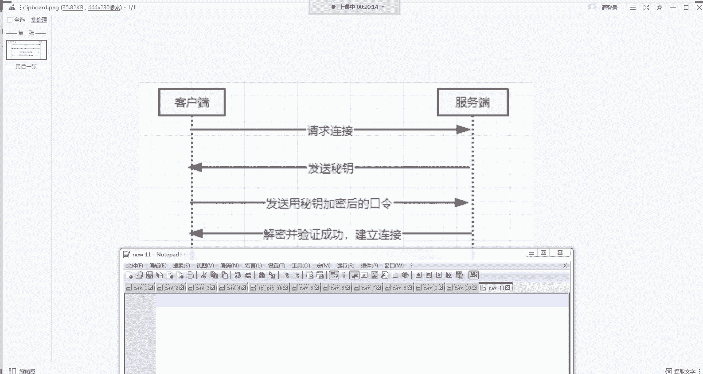

那这时候的话我们就可以直接对虚拟机进行一个操作，执行的一些我一些命令啊，或者安装一些部署啊，服务之类的软件之类的啊。但是在我们的现实的一个生产生活环境中啊，我们的P我们的服务器，我们的linux系统啊。

都不会在我们的电脑上面去，一般都在一些远程的机房，比如说一些云服务器，啊，比如说一些云平台上面去。那这时候的话我们就不能像我们现在就是我们刚刚学习linux的时候。

在我们本地就可以呃直接进入我们的服务器的一个平台界面进行我们的一个操作。那这时候的话就要像啊就产生了一种类似于我们windows一样的远程桌面的一种功能。能让我们在我们的办公室，我们的家里啊。

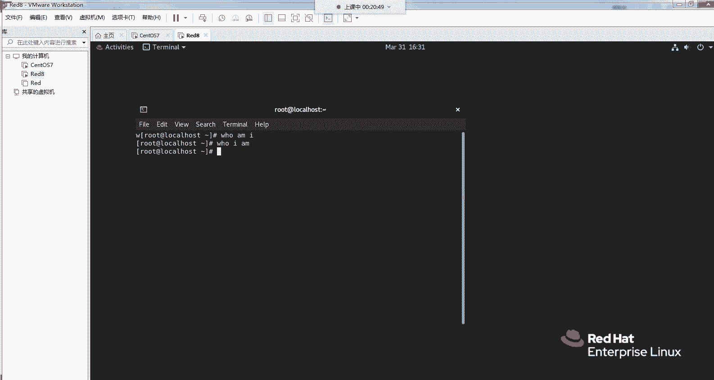

啊，郭子瑜很热情啊啊，在我们的办公室，我们的家里能够远程连接到我们的一个呃远程的一个服务器上去，能够进行一个操作。就像我们在本地操作一样，那这时候就产生了一个呃SH的一个服务。

那SH它其实是一种安全协议。它的全称叫呃 securitycurity share。SH它是SECURESAsure中文就叫安全外壳协议。那这种协议呢它是一种加密的协议。

能够让你允许你在本地PCG那边跟你的远程的一个服务器，建立一个安全的一个连接，能够登陆到远程的服务器上面去进行的你一些的些基本操作啊。

所以说呃那我们今天就来大概介绍一下sure的它一个主要的一个呃连接的一个逻辑，以及我们呃可以用sure进行的一些操作啊。那我们先先看一张图啊。

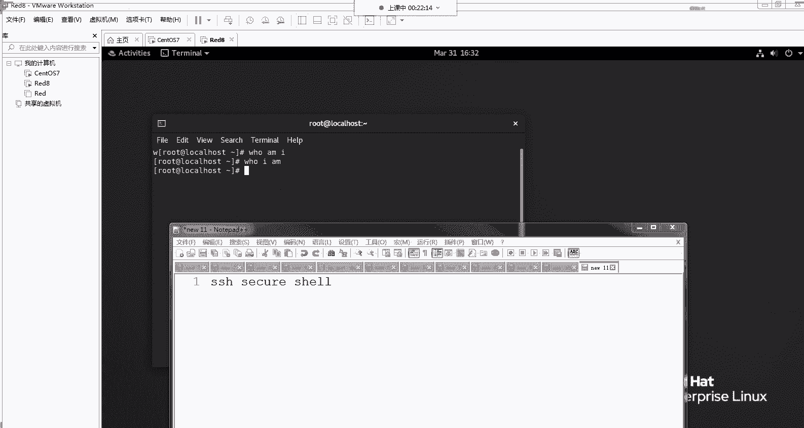

啊。这个是sha的一个最基本的一个连接操作啊，share的连接分为两种，一种是像我们的呃输入密码的方式，以密码的方验证方式来进行一个连接。啊，还有一种是我们的一种。呃，第一种是以密码的方式。

第二种是以我们的一种密钥的方式。密钥的方式嗯，密码的话就是我们平时输入一些账号密码，这些密码。密钥的话，它是相当于在我们本地存储的一个呃密钥文件。

然后跟应远端的服务器进行一个呃密加密的一些结果的一些验证。然后通过的话呢，说明我们这边的呃。授权的客户是一个允许的一个客户，而不是一个非法的一个客户啊。

那我们先看一下我们第一种的一种加密方式的他一种逻辑啊，我们的加密方式的话，主要是呃以这张图展现的一种逻辑方式啊，这客户端就相当于我们的1个PCG服务端就相当于我们的一个远程服务器。

那我们要连接我们的一个服务端的时候，我们会先发送一个请求到我们服务端，说我要连接你的服务器。那服务器接收到我们请求以后会发送一个密钥给我们的一个客户端。那客户端用这个密钥去加密呃口令。

然后再发送给服务端。服务端用解密以后，然后呃把它的一个解密结果再返回给我们的客户端。那如果验证成功的话，就建建立起了一个连接，那这就是他一个密呃。就是一个它的一个密码验证方式的一种逻辑啊。

这个是就是我们最目前呃在我们的思博的基呃提。在我们的思博的基础班里面，有教大家怎么用这个建立这个服务，建立这个连接啊，然后以及部署这些服务。啊，郭子这个是TCPIP的三事协议啊，这个是另一个知识点啊。

跟我们今天讲的这个需不是呃一个东西啊。嗯，然后我们再看我们的第二种密钥方式。哦，你是以另一种方式进行一个那个展示啊。哦，我只看到你上面的TCP3PTCP上次握手那个。差不多。啊，那我们再看第二章啊。

我们的用密钥的一种验证方式啊。嗯，我把图放出来给大家看一下。啊，密钥的一种密钥的一种验证方式是在我们的就是AA是代表我们的一个客户端这边，我们的客户端会生成呃用为我们的SH呃G。

去 key进这个呃命令生成一个公钥跟我们的个私钥，然后把我们的个公钥发送到我们的一个B端，就是我们要登录的一个服务器。服务器会把这个公钥的一个信息存储到我们的这它的一个授权文件当中啊。は。こ。哦。

然后这时候A如果要连接B的话，它会向B发送一个请求。然后B得到A的呃B得到A的一个信息以后，会在这边进行一个查找。如果有相应的用户，就是我们啊公钥这边发送过来的一些信息，在这边有的话。

当会它会生成一个随机的一个字符串，把这个字符串再发啊返还给A，然后A用这个公钥。呃，用A的一个用A这边发过发送过来的一个公钥进行一个加密返还给。A。A得到B发了发出来的信息以后，对这个公钥进行一个解密。

解密的操作。然后再把一个解密结果发送给BB验证了是他之前通过A这个加呃公钥进行加密的一个结果以后，那就证明他这个A是他的一个认证客户，就允许A这边登录上来。啊，锅主这个防的其实跟我这个讲的是差不多啊。

差不多。我们的图不一样，但是我们的呃就是大概的意思是其实差不多的。那这就就是它的一个呃密钥的一个验证这个方式啊，让我们懂了一个这两种验证以后，我们在我们的服务器上进行一个基本的一个操作。

让大家看一下它的一个效果是什么样的啊。

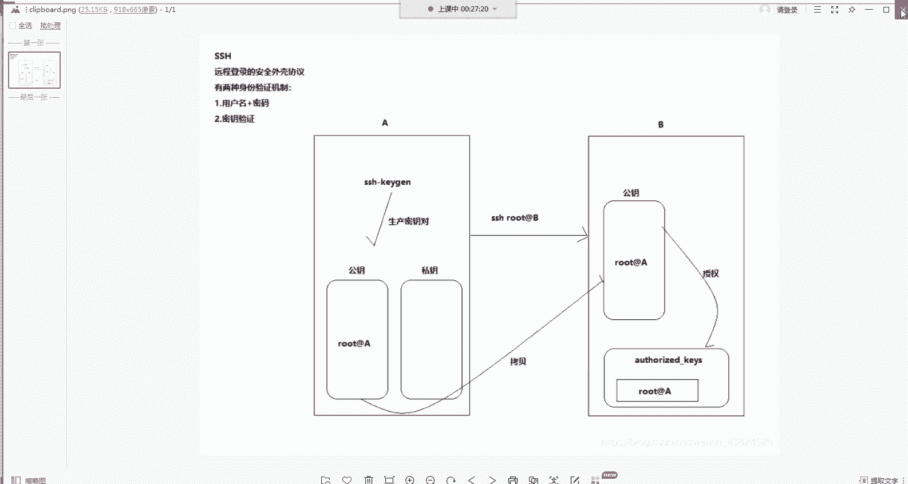

啊，我这边登录一下服务器。呃。

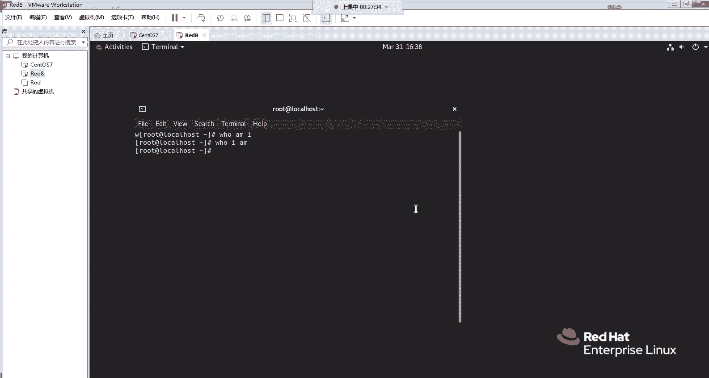

啊，我们先验证第一种方式啊。第一种方式的话呃，我这边会。

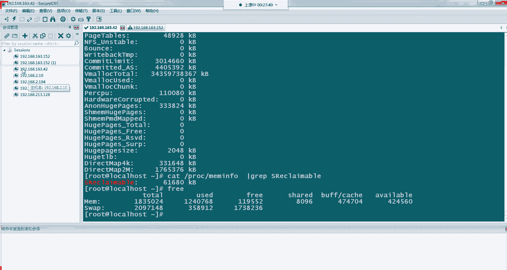

起一个新的网口。啊，这个是我新起的一个网卡，我们等会用我的CD去连这个网卡会有一定的提示。大家会看到一个更清楚的一个效果。

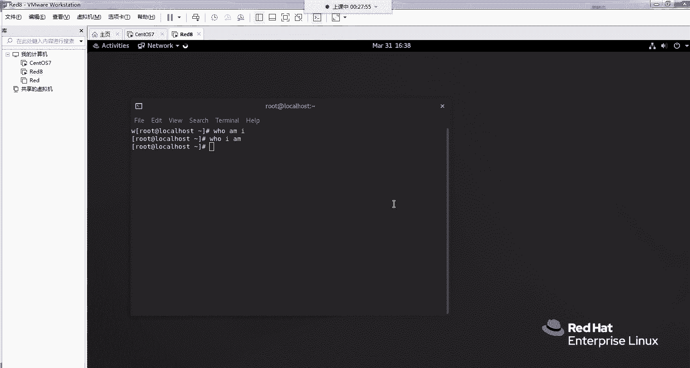

这个是这张网卡。我们的一用244这咱的IP213。12128。

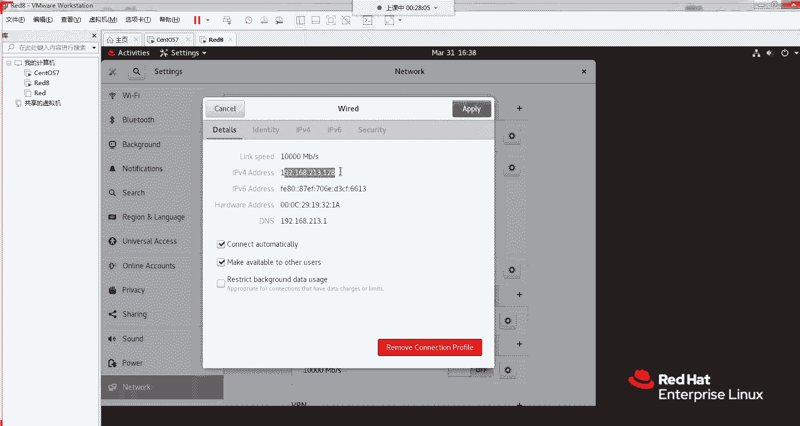

好，我们这边新建一个连接。啊，这边已经有的有了这个这个我之前是我之前建的一个连接。啊，连接到连接到我们的213。128，它采用的是我的一个密码验证方式。好，我们这个是连接线连上去。

然后这时候它会看到一个新新的一个。呃，郭子于这个是我们等会第二个步骤，就是密钥验证其啊那个步骤里面会生成的一个公钥啊，公钥跟私钥啊后大家会看到我们这边会接收到呃我们主机发展发来一个呃加密的一个密钥。

然后我们接受并保存。然后这边我们会输入一个我们的密码。啊，这时候我们如果密码输入正确的话，那我们的话那我们的服务端就是我们的呃远程服务器呢会接受我们的一个请求。

价样值就完成了我们的一个一次SH的一个操作啊。这个就是我们呃比较简单的一种用密钥，用密码的一个验证方式。当时用密码验证的话，它会有一个问题，就是如果你这个密码是被人知道了。

那这个就很容易被人呃登上你的服务器进行一些不必要的一些操作啊，就像我们的呃平时的一些账号密码啊，很容易被破解。如果你的密码像我刚才是比较简单的只是四位数的话，那很容易被人用暴力破解的话，就给破解掉了。

那这时候的话它的第二种版本。那第二个第二种的加密方式就是第第二种的验证方式就是用我的们的密钥验证方式，用密钥验证的话，它会比我们用我们的密码验证，安全性会更高一些啊。

因为呃我们每次生成的密钥都是不同的啊，所以说别人很难伪造你的一个密钥啊，去呃代替你去登录远程的一个服务器啊，那我们现在操作一下我们的呃用密。方式的一个验证。这时候啊。好，我们先用那个SH杠GN杠T。

听错了。呃，KEYTU。啊。因为我们的回声，我们的参数的规圈不需要加，它这边会提示呃，是否进入文件，这个文件并保存它啊。啊，因为我之前已经有生成过了这个文件，那我们现在进行一个覆盖操作。

就如果你之前没有生成过这个文件，它这边就不会提示你已存在这个文件。那我们点个Y。好，再重新执行一下，我们该输错了。啊。点一个Y。啊，那这里的话就不用输啊，直接空格就行了。回车。然后也还是回车。

然后这时候就看生成了一个我们的一个密钥，让我们进进去看一下它的一个呃生成的文件。在我们root下面的SH。在下面。会生成两个啊，一个是ID啊RSA这个文件啊，一个是IDRSA点PUPUB这个文件。

第一个文件是我们的一个私钥要存储到我们自己本地的一个服务器。然IDRSA这点PUB这是一个公钥文件。这时候我们要发送给一个我们的远端服务器，就是我们要登录的服务器，让它存储这些信息啊。

那如果这时候发送的话会有两种方式，一种的话就是用我们就是拷贝直接拷贝过去，用我们的SCP拷过去，还有一种方式就可以用我们的SH杠copy的一种命令，把它直接拷过去。这种命令的话。

就不需要你去手路手动的呃把这些文件里面的信息啊添加到它的一个授权文件里面。那我们两种方式都操作一下吧。我们先第一种方式就是我们手动拷贝，我们先看里面的一个东西。我们的公钥里面长什么样的？

公料里面是长这样的。然后我们到时这时候就只需要把这一段文字。拷到我们的一个呃目标服务器上面的一个授权文件中。然后我这边再开一个端口呃，再开一个。

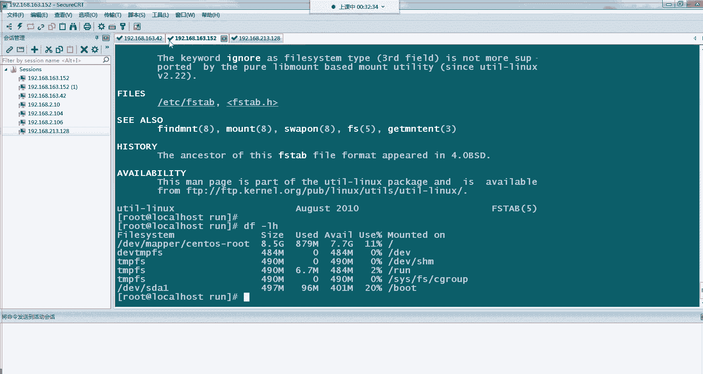

呃，我这边在我们的CtoOS上面，我刚才在我的IE。

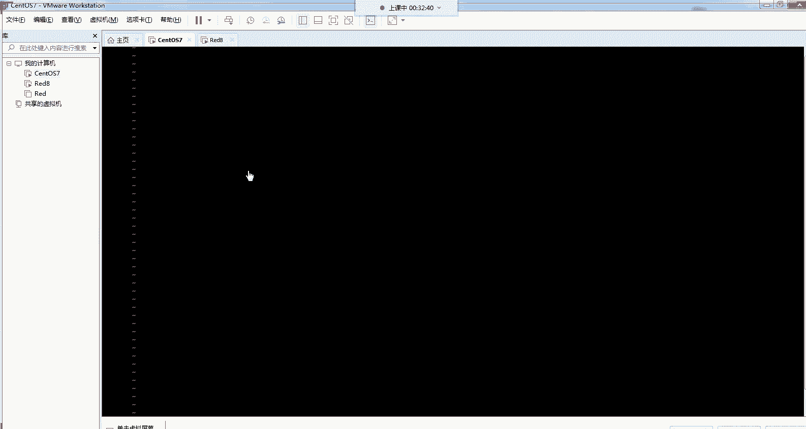

rehead8这边这台服务上面生成的一个公钥。那我们现在要登录到，就是要我们要后面要登录到这台stoOS7上面去。那所以我要把我的公钥存在这边这stoOS7的一个授权文件中。

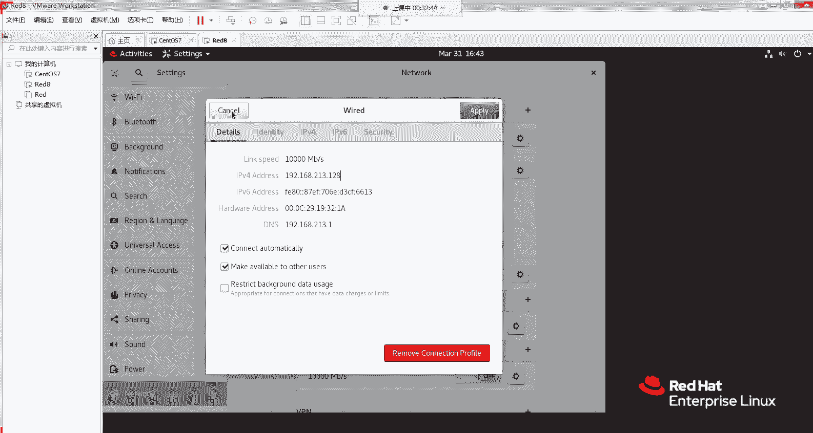

你这个不安装，不要提醒。好。好，O。呃，我们去来到root下面的SHD下面，然后这里会有个。授权文件UIS这个文件。呃，我VI没有装，我们就直接用VI啊，这时候打开是一个空文件。啊，这边是不好复制。

我用我用我的CIT这边连过去。

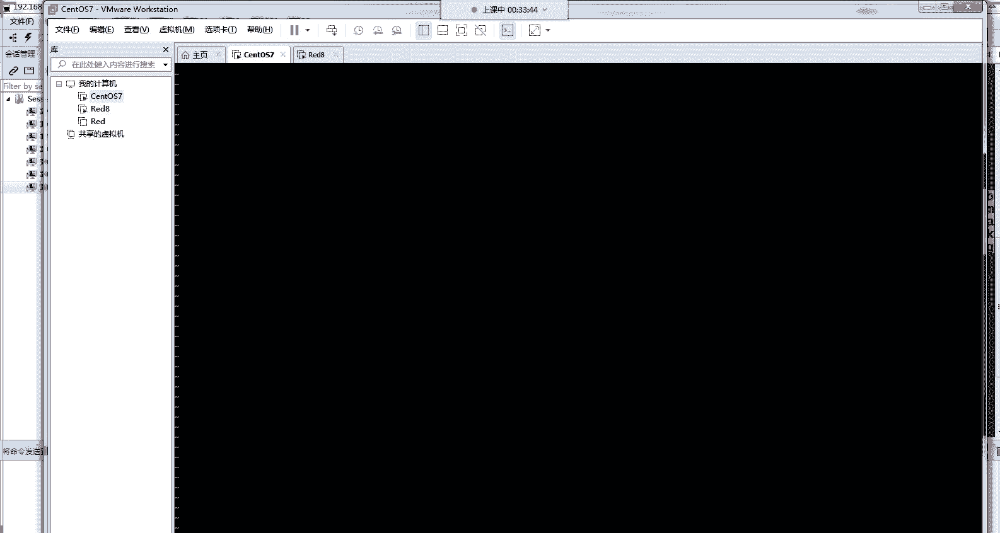

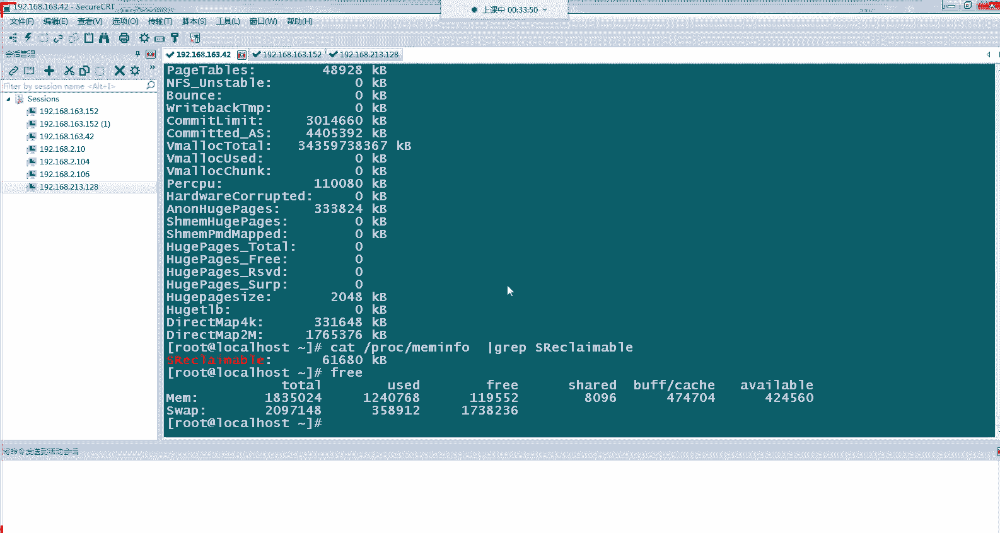

那个IP。我们看一下这边这台36S7的IP是多少。呃，163。152。

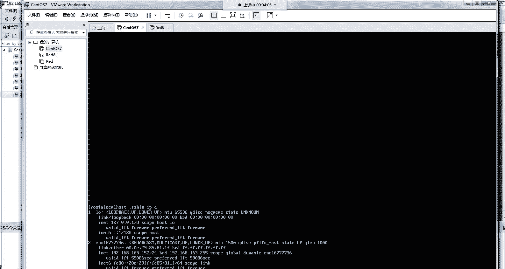

嗯。那这边有啊，这台就是我们的cintoS7文件。我们进到我们的root点SH。中然后看到我们会有个授权文件，我们把这个文件打开。然后我们把我们这一行的。这行的呃加密的文件信息给他复制过去。嗯。う。哦。

O。然，这个时候大家复制过来的时候，一定要注意啊，这个不是这个是一个一行文字，这边复制着会出现一个换行，大家把这个换行给去掉。好，OK那现在它是成功的。啊，这时候的话我们就可以通过我们的。

SH从我们的这台红ote8的一个服务器，增到我们的一个C的7的一个服务器。啊，那我们现在登录过去SH rootot at。19。2。168。16。3。152。好，大家可以看到我这边现在是不需要登录密码。

然后就直接从我的这台呃。192。168。163。42这台机子上，直接登到我们这台192。168。152这台机子上，就是我的CtoOS7这台机子上。那这时候就说明我们的一个呃密钥的一个验证就通过了。啊。

那他大家对这一个有没有什么问题？啊，有问题的话，大家可以在群里面啊，在我们的公屏上可以说。啊，那我们现在跟来是用我们的一种复制方式，那我们换一种方式，通过我们的呃SH杠CP的一个命令。

直接让它把我们的呃公钥发送到我们的目标服务器，让它直接写入我们的这个授权文件中。就是我们刚才这个编辑的这个文件。就不用像我刚才那样要把密钥拷过来，还要进行一些换行处理啊。

那我们先把这边原来添加进来的密钥文，密钥文件里面信息给它删除掉。好，我们保存一下退出。然后这时候我们用我们的SH。CPID然后指定我们的公钥文件是root下面的SH。呃，不是这个是一个public。哎。

我的日。啊，位置不对。是。哦，我要先退的，我现在是在我的sS7机础上。难怪一是没找到那个公钥文件。我们呃SH杠。呃C P copy。那，IO要指定我们的IS公钥文件发送到我们的。呃。我们这台192。

168。163点。这有3。152这台我们VC上面去好，大家可以看到这边现在是呃提示。已经发过去了。那我们在这边我们的目标服务器上面查找一下，看一下它的一个公钥文件是否啊已经写入了。可以。这个是哪一台。

嗯。哎，没有写路吗？看一下。嗯。我是。是什么原因？看一下啊。大家稍等一下。没什啊，密码没有输啊，忘了输密码，还这边是我们的。路程密码啊，现在应该过来了，刚才忘了输密码啊。

现在我们看到我们的公钥已经写进来了。Oh。刚才没有看到这行提示，然后现在我们呃公钥已经写进来了，就跟我们刚才直接手动复制一样。我们现在在可以从我们的呃这台128。

就是我们的红帽8这台登到我们的155这台红帽哎，我们的sS7上面去，我们再执行一下操作，看一下。啊，我们登录过去。192。168。163。152。呃，这个IP是没错的。啊。

大家可以看到我们现在已经登上来了，我们到我们的1552这台机子上面。啊，我们刚才是在我们的。我们的168上面。现在已经登到我们的15上面。

那这个大家对这个用我们的一些公钥的一种呃SHcopy的方式有没有什么疑问之类的？有没什么问题？就是我们刚才有两种方式考我们的密钥啊。没有问题的。

那我们就呃用这种就是免密的方式来进行我们一些简单的一些脚本的传递跟拉取一个操作啊，用我们的SCP方式。SCP就是我们又把我们的一些呃文件从我们的128上面发送到我们的152152上面。

以及呃把我们的152上面那个文件，或者拉到我们的128上面都可以操作。那我们进行一个简单的先先做一个发送操作吧。我们的SCP把我们的呃本地有哪些文件，我们看一下。我们到root目录下面。我们先退出来。

退到我们的现在的。呃，163。14哎，就是我们的。213。18这台机子上这是这这台机子是我们的一个客户机啊，那我们现在把我们客户机上面那些。看一下有什么文件，发一个发一个到我们的。呃。

目标服务器这边目标服务这边只有AA跟ANacKSDCCFG这个文件。那我们发一个st点TXT文件到我们的162呃152这个文件上面去啊，就通过我们的一些啊刚才部署的一个免密操作。

这样子的话我们就可以发送的时候就不需要再输入账号密码了啊，我们SCP下Ssortt。我们呃发送就它的命令是SP加上我们的文件名，然后加上我们要登录的机子，一个地址。

我们这边写root代表我们登录对方机子是用root账号登录，然后艾特他的1个IP地址，192。168。163。152。然后后面跟上我们要发送到的一个路径位置。然后这时候回车。

那他就把我们的一个shott点TSC文件直接发到我们的1630152上面。大家可以看到我们的文件已经发过来了啊，这时候发送过来的话，我们就不需要再输入密码了。如果没有刚才那个免密操作的话。

就是我们的密钥考过去的话，让我们的。发送这个文件，我们需要啊跟他进跟我们的终端这边进行一个交互，它会提示你要输入的账号密码。就好像我刚才在这边发送公钥的时候，它会提示你。要求你输入152的1个密码。

这时候呃用上我们的米密，我们就不需要嗯再进行一个呃密码的一个输入操作。这个比较适合于到在我们现实的一个生产环境中，一个大规模的一个集群的一个软件的一个部署的操作。如果每台服务器它的密码呃都是不一样的。

这时候你每台服务器发送一个文件，你都需要做一个呃输入密码操作的话，那是相当呃恐怖的一个事情啊。那这时候的话用SH这个就可以那脚本去跑嗯，密码都不用输入脚本一次性跑完。

可能你平时要操作呃一两个小时的或者是十几分钟的用脚本跑完以后，这时候呃它就不需要输密码两三分钟可能就是4劲秒就可以帮你完成了一个操作。那这时候呃现在我们刚才是从我们的服务端，就是我们我们的客户端。

这边发送到我们的文件到我们的服务端。那我们用上这个免密以后，我们还也可以从我们的服务端。文件拉到我们客户端，在我们的客户端这边操作去服务端拉文件。就是我们要从我们现在是在这台哎213。

128这台服务下面去，我们直接去163。152上面去拉他的一个文件。比如说我们去拉这个AA文件。我们这边没有AA吧，看一下。我们删掉，先把这个AA删掉。那现在我们的。呃，1213。

128这个服务器上面没有文件了，没有这个A文件。我们现在去163。152上面，直接把这个AA文件拉到我们本地来。我们可以使用SCP这个命令啊，然后把我们的一个这两个值这个值。

就是我们刚才写root at192。168。163。152。然后这个写到我们的前面。192。168。163。152，然后一样跟上我们的路径，然后我们要拉取到文件，我们的文件是3个A。

然后呃我们直接拉到本地来，这样点斜杠就代表拉到当前目录。然，我们回车一下啊，大家可以看到我们的AA就从对端拉过来了，就从我们的163。152可以拉过来了。大家可以看一下我们的AA。然。

我们的AA的内容就两行，然后在我们这边内容也是一样的啊。那这个就实现了就是我们刚才的一个设像，从远端的服务器拉文件回来啊，这个场景会比较适合在我们的线上生产环境。我们的线上生产环境经常都是一台堡垒机。

就是我们的一台权限比较大的一个登录机制，然后嗯下面的业务服务器可能有几十台上百台。那我们如果要去业务服务器上面去拉一些文件啊，去拉一些文件到我们的本地来。

那我们可以就可以使用这种的呃SCP的这种方式通过美密的方式嗯，从批量的去从我们的对端的业务服务器上面拉到我们需要的文件啊，不然的话我们可能需要每次每台服务器登录上去。每台服务器都SH上去。

然后用我们的一些呃命令，比如说我们的Z。Best day。去我们下载到我们的本地来，去下载我们的文件，所需的文件到我们的PCG这边来。那这时候的话啊效率就非常低了。

而且RZSZ啊有时候还会出现根据我们的一个使用的一些客户端还会出现一些问题，下载不下来，以及文件如果太大的话，还也会出现一些问题。那呃通过这种SP的话就比较方便了啊。这个在我们的呃自动化里面。

以及我们的一些渲要脚本里面用的会比较多。Yeah。W。大家对我刚才的这个两个操作有没有什么疑问，或者是有没有什么工作当中的一个场景啊，会比较契合我们现在这种需求的，大家可以在公屏上打出来。

我们可以一起讨论一下。啊，都没有吗？那呃都没有的话，那行，那我们今天的话呃主要给大家介绍了一个sure的一个啊基本的概念，还有它的一种连接方式，以及我们两种连接方式的一种配置的一种方法啊。

以及我们一些可以通过我们的这种免密方式，可以用我们的SCP命令去拉取，或者发送一些文件到我们的一个本地来。うん。Yeah。这个在我们的日常的一个工作当中，啊是我们用的最多的，尤其是我们的这种。

SH的一种秘密的一种方式啊，像这种密钥用的是呃几乎在所有的互联网企业里面都会用到，或多或少都会用到。它是我们很多像我们的自动化运维，以及我们一些提高我们运维效率的一种方式里面最基础的一种方法。

我们的密钥的话也是要需要定期去更改的，去修改的啊啊，为了保证我们的安全性。刚才我们说了，我们的密码会有一定的安全问题啊，我们的密钥会真呃会对我们的密码这种方式会有一个安全性的一个提高。

但是密钥这种方式它也不是呃完全绝对安全的。毕竟密钥这种东西，它也是个文件。一旦你的呃堡垒级的上面的密钥被人窃取了。那这时候的话你的所有的服务器都将暴露在黑客的一个面前。

他们的手里可以随时呃对你们的服务器进行一个操作。所以说在我们密钥的基础上，我们还需要进行一些定期的一些密钥的更换啊，嗯，这些安全措施。然后用完必要的话，我们呃有了这种基础环境以后。

我们的以后的一个业务的话，可以不仅仅是我刚才说的一种SCP这种方式的一种便捷性可以操作还有许许多多的一种便捷性，也可以实现啊，这是我们的一种基础的一种操作。

在我们的基础班课程里面会教大家怎么使用SH怎么部署这个SH服务啊，以及他的一些端口啊，以及一些权限的一些控制啊，都会在我们的一些课程里面做一些啊详细的介绍给大家啊，大家如果有兴趣的话。

可以呃联系我们的一个课程老师啊，了解一下我们的课程啊，都有哪些内容啊，又是否会比较契合你的一个工作内容，或者是未来的一个发展的一个方向。那我们的今天课程的话，大概的一个内容就是这些啊。

如果大家没有什么问题的话，那今天的课程就到这里结束了。那我们现在就下课了啊。

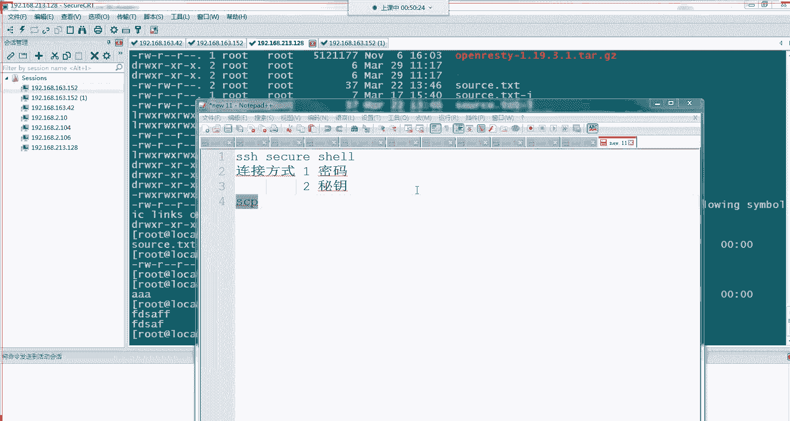