# Linux小课堂30分钟掌握一个小技巧 - P4：Linux午间小课堂4-web故障排除系列 - 思博Linux关关 - BV1i54y1b7rX

But。Oh。嗯。Yeah。嗯。嗯，什么情况？嗯。Oh。喂。呃，那句呃，G梁静能听到我声音吗？嗯，能听到声音，帮我在公屏上打个一。梁季能听到我声音吗？梁继。杨知。喂喂喂，梁静。呃，大家能不能听到我声音？

Oh。能不能听到我声音啊？吐味切吐味切能不能听到我声音？能不能听到我声音进来的两位同学。喂喂喂喂喂。🤧嗯。能不能能不能听到我声音？喂喂喂。土味千恩难记，人们能不能听到我声音？蔡琴蔡健，能不能听到我声音？

蔡经。蔡监能不能听到我声音？能不能听到我声音啊？嗯。吴老师能不能听到我声音，能不能听到我声音？胡老师。啊，好好好好。O。那我们现在就开始今天的五间小课堂啊。呃，今天给大家分享的一个午间小课堂。

是关于我们的wordb服务的规个故障啊，教大家大概怎么看以及一些相关的故障，怎么进行一些定位排除啊。呃，wordb服务的话在我们的呃日常的业务当中呃，遇到的应用是非常广泛的。

无论是像我们的一些APP那一些，还是我们的一些门户网站啊，以及我们一些呃像我们的QQ也会用到一些wordb服务，像我们一些呃邮箱啊，这些都属于wordb服务。那它这些服务的话。

在我们的一些日常的一些运维工作中，呃，肯定都会碰到一些这样或者那样的一些故障啊，大家如果从事运维这个行业的话，啊肯定是免不了的，要处理这些故障的那呃主要会有哪些故障呢啊。

那我们今天会给大家讲几个呃比较常见的一个故障啊。那我们今天那个课程的一个三个小章节啊，主要是一个是wordb故障的代码一些简介。还有一呃第二个是讲第我们的403这个代码，它的一个故障。

以及它的一些可能的原因，以及我们一些排除的一些操作。还有1个404故障，它的一些可能的原因以及一些排除它这个故障的一些方法跟操作啊。那我们现在先来看我们的第一章节wordb故障代码的一些简介啊。

wordb服务的话，对我们的每次业务响应都会有固定的一个代码返回到我们的一个客户端啊，在我们的网页那边都可以看到相关的一些代码啊。呃，我们可以通过这边一个网站稍微来看一下。我们随便输一个百度。嗯。

这边看他的一些。查看。点这个查看，我们可以看到这个网络这边。然我刷一下。我们能可以看到这边呃它的一个state这边就是他目前的一些网页返回的一些呃服务代码。

像我们这边看到是200200200200200200。200的话在我们的wordb业务里面，它的代码代表的意义是我们一个呃业务正常的一个响应啊，最普遍遇到的。我们这边刚才看到的呃，大部分的呃请求返回。

不管是图片请求还是我们的纯静态页面请求，大部分返回都是200，到时候我们的页面是可以正常打开的，我们的业务是正常的啊遇到这种情况是最高性的，说明我们的业务是没有问题的啊。

然后还有一个常见的代码会是3叉叉系列的啊，比较多的遇到的一个两个3叉叉的是301跟我们的1个302代码啊，301代表的是一个呃地址的一个重定向。啊，302代表的是临时重定向。什么叫重定向呢？

就是我们要访回访问一个页面的时候，比如说我们本来要访问百度这个页面，它是这个页面，但是它后台可能进行一些呃业务的调整。嗯，原来这个页面不再使用了，会转到其他页面去，那它在呃我们的程序端。

我们的NG那边会做是做一个呃重定向操作，把我们的原来这个地址页面，这个呃UI的地址指向的这个页面啊，进行一个重定向，指到另一个呃我们的页面。然后这里代码就会出现1个301的重定向。我们这边是没有看到啊。

那这种的话也是代表我们一个业务的一个正常的一个响应啊，这种是没有问题的一个响应啊。那我们这边看到我们这边。嗯，唉，那个PPT讲了啊，我们在平时的业务运维当中，如果是碰到了2叉叉。

就是什么200根3叉叉系列，那这个是我们最高兴的事情啊，我们这个业务是没有什么问题啊。那当然当我们故障的时候，肯定我们的业务是不会响应2002叉叉系列，就是不会响应我们的200。

或者响不会响应我们的1个3叉叉啊，301302，而是以其他的一些代码进行一个响应啊，我们比较常见的一个故障代码会响应1个4叉叉系列以及1个5叉叉系列。就是在我们的这个位置，它原来是200会变成。

比如说呃4叉叉，我们的403404以及一些一些50叉5叉叉系列叫502等等。那这时候的话就代表我们。请求的一个这个页面，它不是一个正常的一个响应，就是我们的业务服务端那边处理啊，不正常。

他没有给给我们返回一个我们需求的一个页面。它的呃处理没有正常到结束跟完成。那这时候就说明我们的服务端现在有一些故障啊，我们需要去排除这些故障，让我们的业务能够正常响应，重重新回到我们的200这个状态啊。

那我们的市0账里面最重要的两个，一个是403跟404啊，会经常遇到的403代表的是禁止访问啊，404代表的是你所访问的个内容是不存在的。禁止访问就是你这边去访问我们百度，但是你没办法正常打开一个页面。

它这边会显示403。一个比如这边会显示1个403。这边会给你返回这个一个页面啊。那如果是我们的404的话也一样，它这边会显示1个404。啊，也是一个非正常的一个完响应。

那我们的5叉拉502是代表我们那个网光处误，就是我们的服务端那边啊，我们的NG跟我们的后端的真实的处理服务器之间出现了一个问题啊，导致我们的请求到到服务端只走了一半啊，没有正常的一个完成。But。啊。

那我们来看一下我们那个403的一个故障啊。403的话，你当你的一个访问内某访问网站的一些某些内容被禁止的时候，或者是某些IP被禁止访问的时候，网站就会出现1个403的响应啊。

这是我们一个网站最原生的1个403的一个响应页面，它会出现1个403forbi这forbiden就是禁止的意思啊，就会出现这个一个页面。那这时候的话说明说我们的这个访问的这个网站。

要么是我们的IP现在是被服务端服务端就是服务器那边给禁止访问了。你可能这个IP之前嗯做了一些很多坏事，可能被他那些系统记录了，然后不让你进行访问啊，比如说经常会被有些漏机会被黑客给呃控制了。

然后做一些Ddos攻击。然后这个时候IP就有可能被对方的服务器给记录下来，然后它就会把你这个IP直接禁掉，你这个IP所出去的所有流量到他那个网站，它都不会帮你进行正常的一个反应，把你屏蔽掉了。

那还有一个情况是你的IP可以访问。但是它的服务端里边某些页面，某些内容就是某些的文件，它是属于不允许你访问的文件。比如说比较核心的一些数据文件啊啊或者是一些老旧的啊，可能会出现泄密的一些程序代码。

他也不让你访问啊，正常它页面上是不会给你这种链接的。但有时候某些黑客会猜透你的一个目呃代码的一个路径的一个格式，它可能会尝试去访问这些比较通用的一些嗯目录。

让这有这时候就有可能就是访问到你的一个呃不允许访问的一个页面。那这时候如果你权限在这个这几个文件上面设置了一些呃不允许读的权限，或者是没这个账号不允许去访问的权限，他就会出现1个403的一个页面。

Yeah。那还有一个是404的一个故障那。404的一个故障是当你的一个访问内容不存在的时候，将会出现这个404的一个响应。那后这我们这个是1个404的一个返回的一个结果啊，这边显示配景的放。

就是你要输入一个网页没有被找到啊那这时候这个404会一般会出现在什么情况呢？啊，一般是一个你输入这个网页地址是错误的，输入一个不存在的一个网页地址啊。

它说访问的一些文件是在服务端是不存在的这有可能是你程序端啊配置错误，就是在程序里面做一些跳转，访问到这个页面不存在，有可能是你的输入的一些呃网UIL地址啊，可能呃几个字母输错了啊。

实际上它这个文件是不存在的，所以说会出现1个404的一个情况啊，那我们来进行一个给大家进行一个简单的一个操作。那那我们看一下403的一个啊可能出现的一个情况啊，然后我们再把它这个。呃，配置给它去掉啊。

出现这种情况的配置去掉。那我们看一下是不是能够解除这种403的一个呃权限的一个反问的一个控制。那我们先做1个IP地址的一个禁子啊，正常的话我这边已经建好了1个NG的一个服务器。

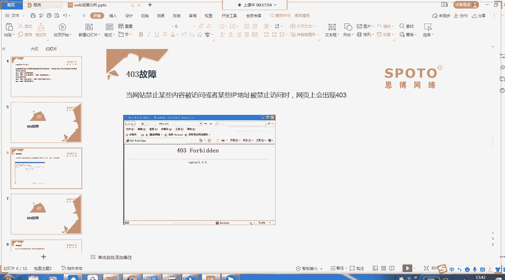

好。大家看到我这边起了一个NG的master进程啊。啊，大家可以看到啊，我这边取了一个进程啊，我的配置目录是在我的iserlocalop list下面的NG下面。在我们的confi下面。

做了一个最原始的一个配置。比较简单，什么都没有配啊，这是它的安装以后生成的一个默认的一个配置文件。我们就访问它的一个最最原始的一个呃location配置，就是我们的通用的一个location配置。

只要访问跟目录下面的呃任何文件，它都会匹配到下面这个这个目录上面来。那我们呃看一下我们的这个root目录下面有哪些文件啊。我们的HTML啊，我们的根目录下面有这几个文件啊。

这是它的一个默认的一个 indexdex首页文件。那我们访问这个文件，我们目前是有权限访问的。我们来访问开，看一下它是否能够正常的一个访问啊。我的1个IP地址看一下是多少。

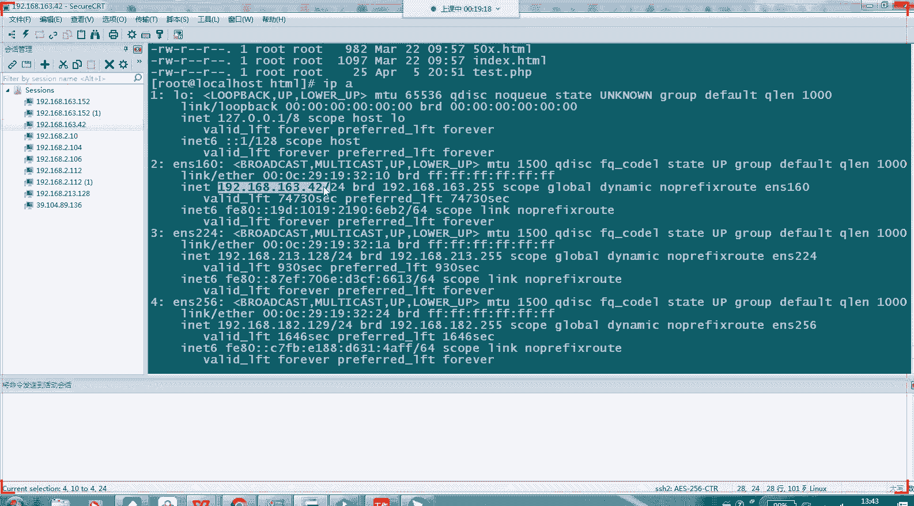

我们访问index，没错啊。好，大家可以看到这个是NG的一个欢迎的页面啊，我们的NG部署完以后，它都会有一个默认的欢迎页面，是代表welcome open，代表你的1个NG正常啊服务正常起来了啊。

你这个NG的链路到NG这一层的链路是没有问题的啊，那这样大家可以看到我的这个。呃，网站的访问的一个状态啊，这时候是1个200的一个状态啊，大家可以看到这边index返回是200okK的。

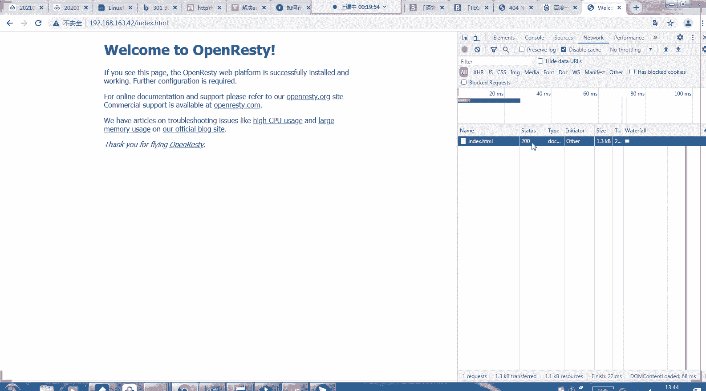

那这时候我们给它添加一个权限啊，就是拒绝我们PCG这台IP去访问我们的这台lininux服务器啊，那看一下它会出现一个什么样的一个情况啊，是否如我们之前预想的那样，会出现1个403的1个权限拒绝啊。

我们看一下我们当前的1个IP。

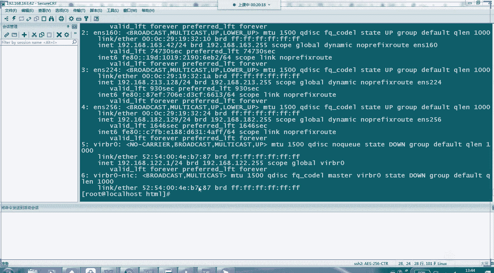

呃，没错，我们的是192。168。163。146啊。

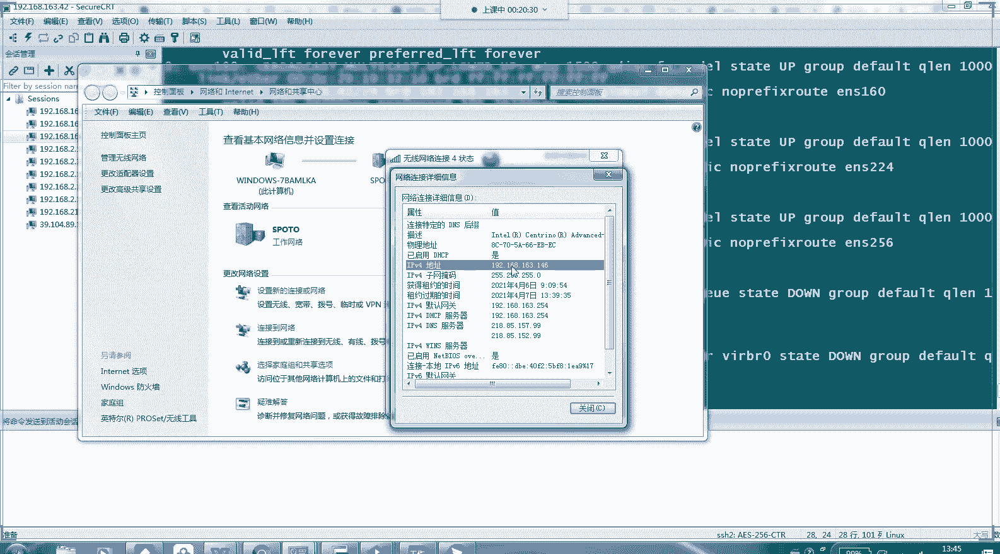

我们在我们的配置文件里面把这个。呃。IP给它禁掉啊，我这里是已经预先配了1个192。168。163。146啊，跟我们这边是配置是一样的，我们核对一下。

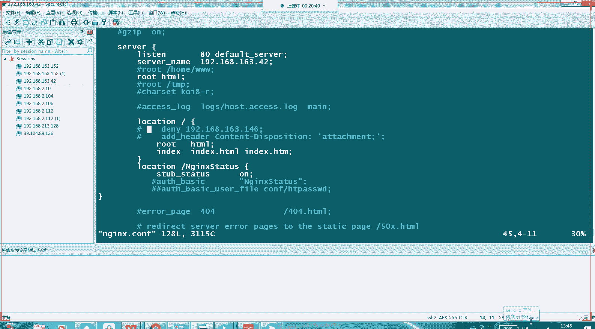

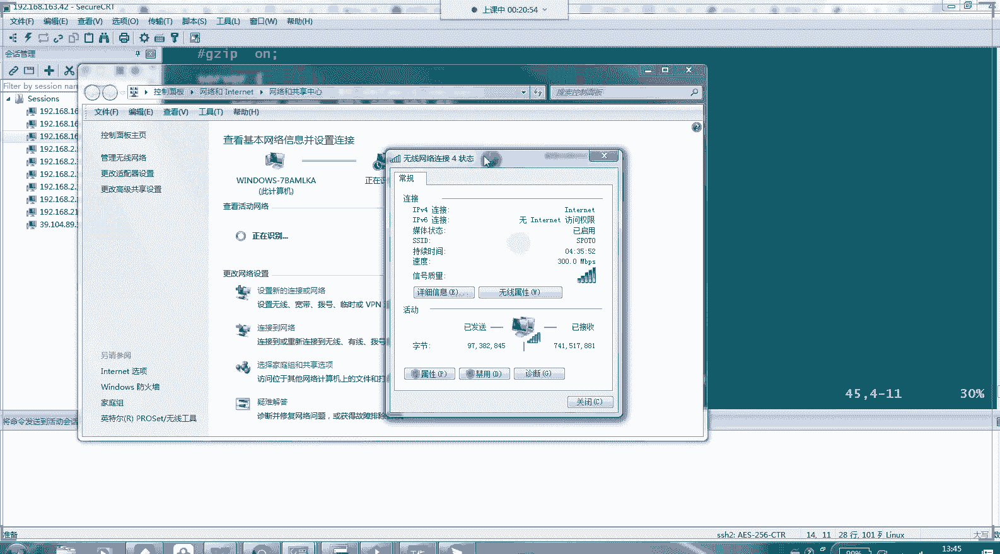

192点168。163。146没错，那我们把这个配置打开。那这时候的话，我怎么在这个location里面啊，就禁止了这个IP进行访问，访问这个location啊。

也就我们禁止了它访我们这个ATTM目录下面的任何一个文件啊，我们这时候把NG配置文件重新加载一下。等级。我们测试一下啊，配置先要每次我们修改NG房配置文件以后，要先做一个test的测试。

确保我们的语法目录是没有问题的啊，不然的话我们嗯re热的以后看不出来它到底有没有错，也不知道啊我们的配置嗯会不会导致我们的一个测试结果会有问题啊，错误的一个配置会没有会不会导致一个结果。

最后跟我们预想的不一样。我们S杠率漏下。这时候我们的N一个NG已经加载完成了，我们这边重新访问一下。

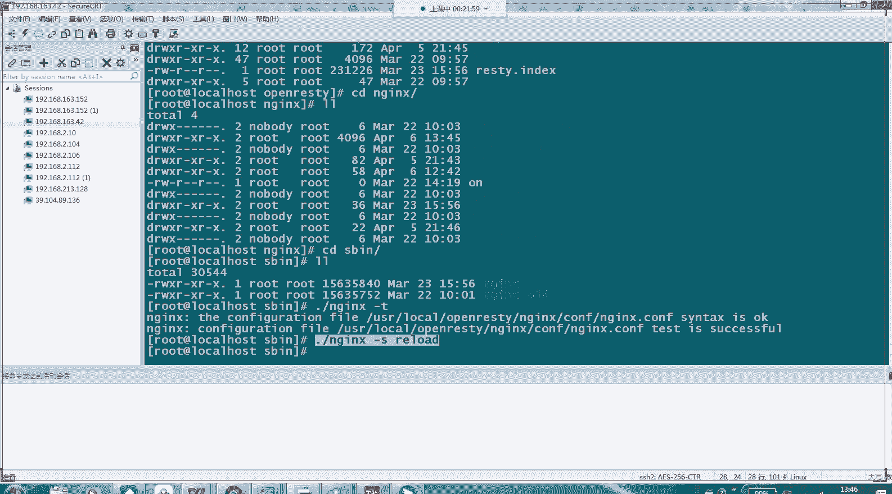

好，大家可以看到我这边刷新一下，刚F5刷新了一下，会出现1个403for bit。然，我们右边这边看了一下，它一个状态也变成1个403for bit。那说明我们的一个呃这个配置。

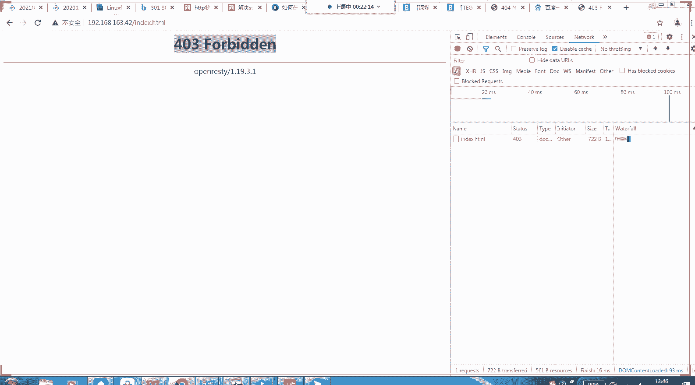

，的这个配置，把我们的一个呃来源IP给禁掉了啊。那这时候的话，如果是在我们的一些线上业务的话，可能之前会遇到一些呃攻击的时候会屏蔽掉一些IP因为这个去临时屏蔽掉IP那后期的话这个IP可能被其他一些正常用户拿去访问的啊。

你这时候没有修改掉啊，没有把这个IP注释掉。那这个新愿的这个IP的用户，他就没办法访问你的这个网站。那这时候就有可能他会过来跟我们的一些运营人员访问啊反应我访问你的这个网站啊，为什么访问不通。

是1个403的一个bid那但是你又发现你自己可以访问你自己的一个办公网出去又可以访问那这时候大家就可以稍微去看一下你这个的配置里面是不是有做类似的一些操作啊，把我们的一些IP给禁掉了。

这时候可以跟他的一个出口IP进行一个匹配一下啊，这就可以我们就对我们处理这。for币的权限啊for币的故障的一个呃方向提供了一个思路啊。那我们把这个迪娜的去掉，看一下它是否又能够恢复了。

我们把那个N机配置文件打开，我们把它去注释掉。然后再我们再重启来重新加载一下我们的配置。我们刚听一下测试OK我们Sreload。

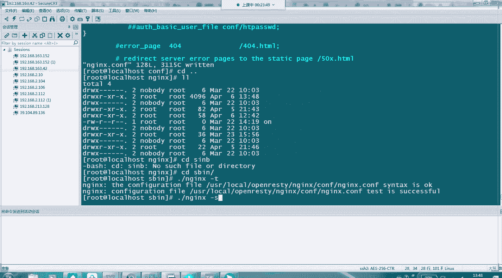

好，OK我们再重新访问一下，刷新一下啊，OKO了。我们这边看我们又访还是玩我们的index索有文件啊，index的那个首页目录文件，我们这边访问的意思是O的那说明啊这个参数。

就是我们的量的参数的确会影响到我们的一个网站的一个正常访问啊，会出现1个403的一个拒绝的一个情况。

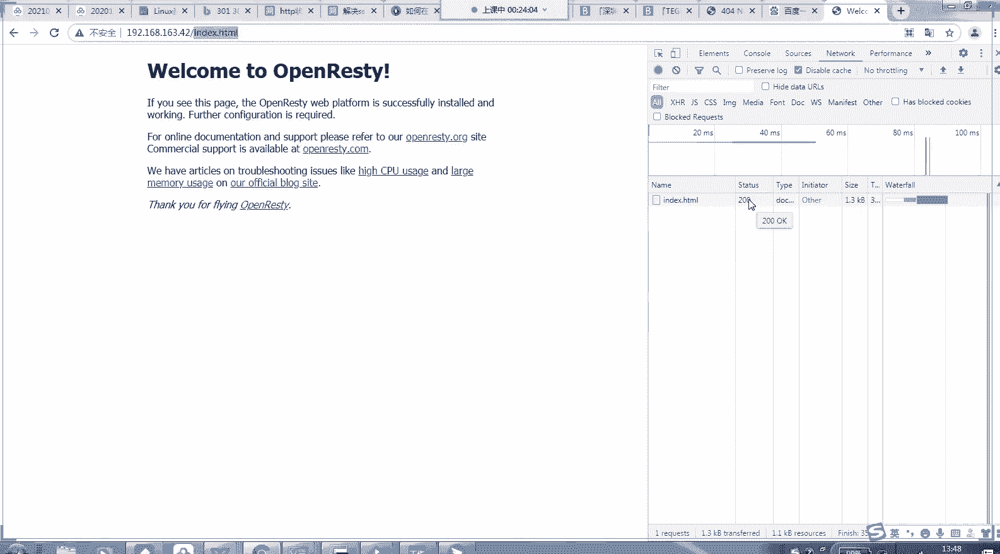

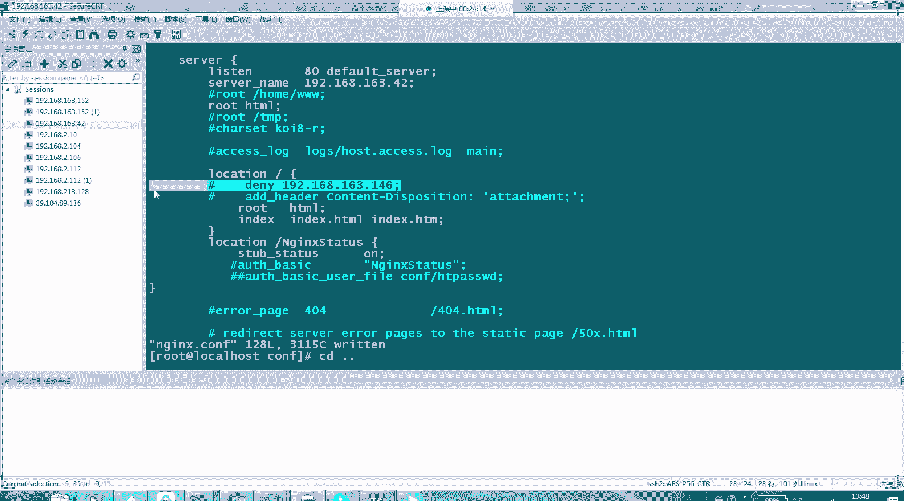

那我们现在来呃考虑一下第二种情况，就是我们的一些呃某些文站网站内容啊被限制访问，禁止访问了。那我们这边可以做个假设构想，就是我们把我们的。

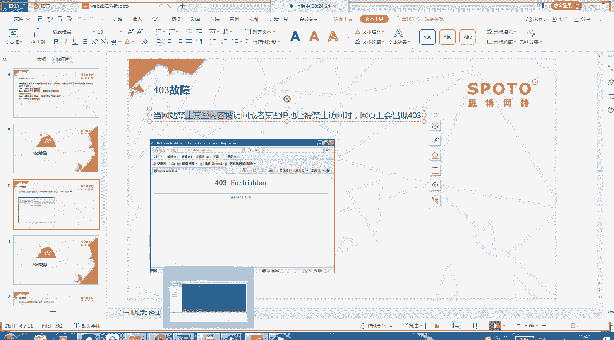

呃，我们呢要访问的这个呃HTMM文件。他的读写权限目前是呃root读写其他用户读读，那我们把它的权限给拒掉啊，只让root读写。那我们其他用户全部是呃不可读不可写，不可执行啊。给他改掉呃CHMOD。

600。Index。好，我们可以看到我们现在直接root可以读写，其他用户是没办法的那我们NG去访问的这个目录文件的时候，它不是root用户启的那正常应该是这个不可读不可写的那我应该是出现一个嗯。

forbe一个权限一个提示啊，我们给它拒掉。指想。

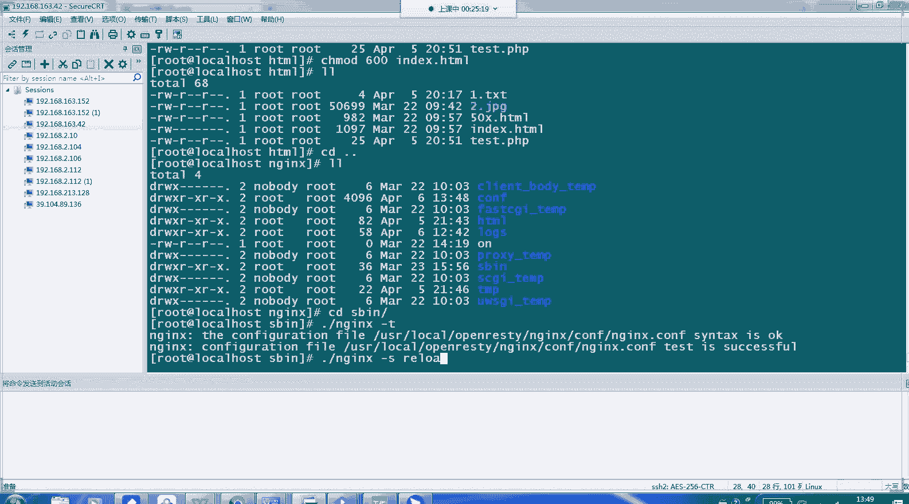

那我们再刷新一下，看一下啊，又出现了。啊，这时候他还是提示1个403的一个拒绝的一个呃效果啊，那说明说我们这时候。

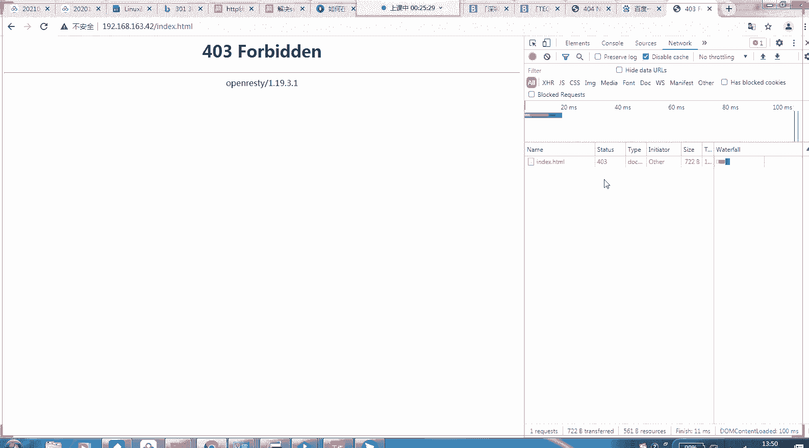

就是我们的目标文件啊，这时候是没有权限去读跟写的，还有执行的啊，连读的权限都没有。那你这个NG就没办法去打开这个文件了。那所以说我们NG返回的是1个403的一个状态for bit。

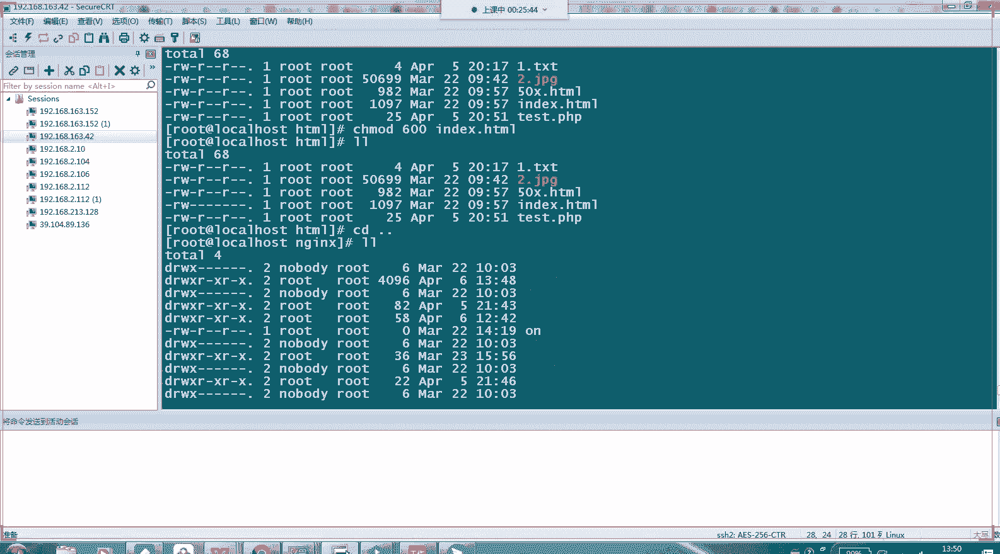

こ。所以说403这种呃forbi在我们日常的一个工作当中，最有可能的一个出现的一个原因，就是我们的一个文件的一个不可读。

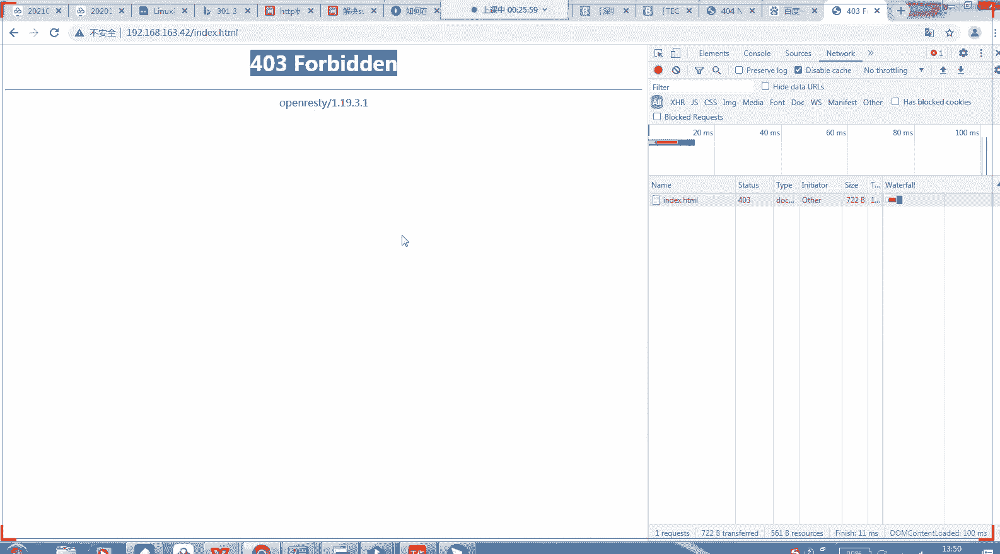

或者是我们这个目录甚至是不可进没有权限进去的。像我们这个连插的权限都没有啊，在我们的呃G础8里面不有大有跟大家说过，我们那个要进入一个目录，它至少要有一个X权限是吧？他的权限都没有。

那他连这个目录进不去，更不可能读里面的一个文件了啊。大家以后如果遇到403的话啊，可以去稍微看一下你的一个呃NG配置的一个root值向的这个目录，它的一个文件是否有权限，它的一个目录是否对NG有权限啊。

当你遇到这种403的一个情况。

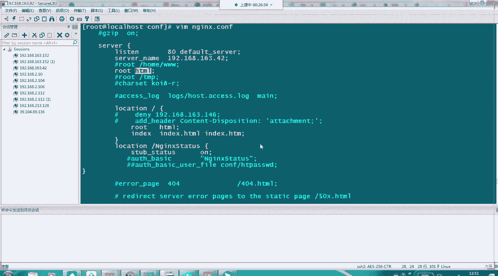

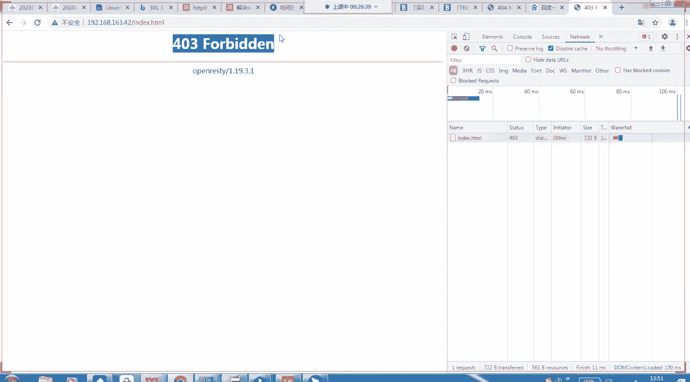

啊，还有一个就是看我们的一个呃刚才的呃迪奈的一个配置啊呃问房问IP是否有权限。啊啊，这个两个是我们在日常工作当中最经常遇到的两种事频上的一个原因啊，大家如果以后遇到这种情况的话，要首先去排查这种原因啊。

如果不是这两种原因的话，我们再根据我们的呃日志一些情况啊，再去做一些其他方面的一些设想。那大家可以先从这方两个方面去入手啊。

可以说这两个原因可能是导致你一个网站40上的一个90%的情况一个呃它所归属的一个原因。

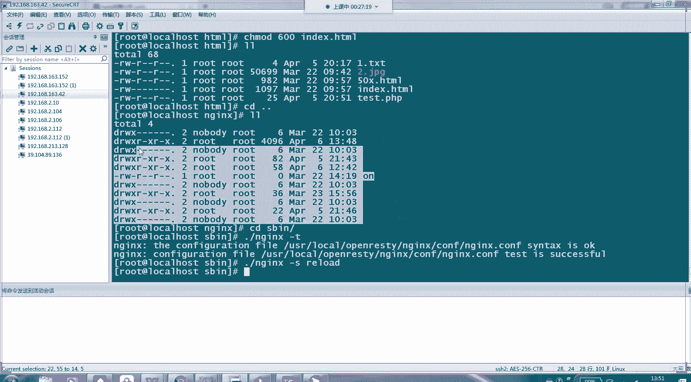

那我们403这边介绍啊，我们可以介绍一下我们的404这个故障啊，当我们的网页的内容不存在的时候啊，网网页上就会出现我们404的一个提示啊。

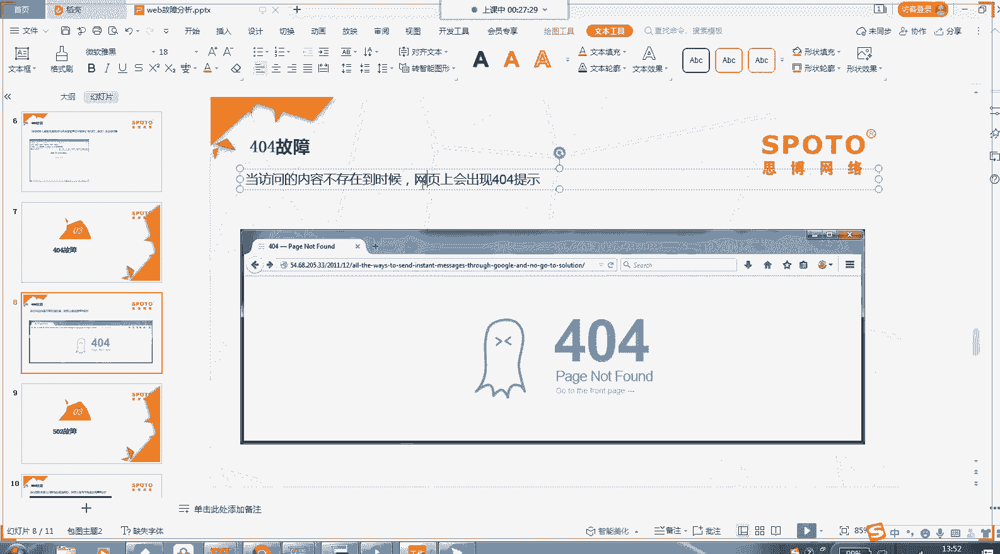

那就我们把刚才的index文件给它恢复回来。权限然改回来。那，我们再访问一下，看一下它是否正常了。O它就正常了。好，那我们现在做404的这个实验的一个测试啊。

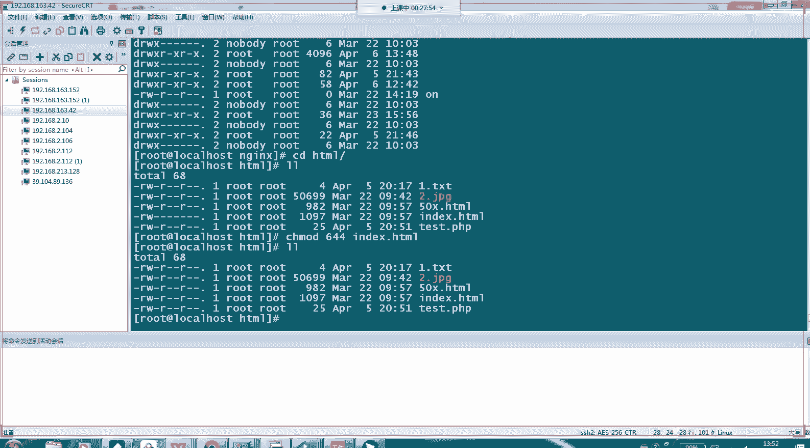

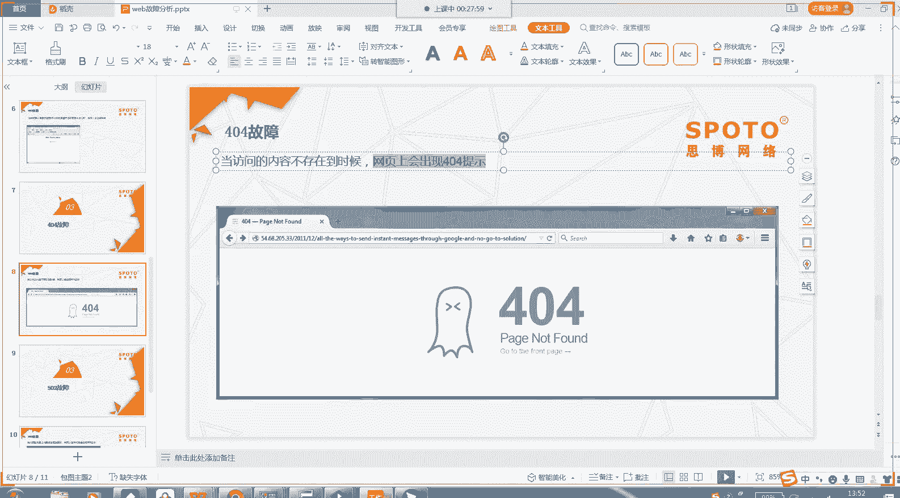

视频师的话，一种是你这个文件啊，真的是不存在这个位置。那你这个访问就是呃肯定是出现1个404的一个情况。那还有一种情况啊，极有可能是你的一个跟目录的一个配置错误啊。

比如说你配置这边配置的一个是HTML目录，但是你这边的index文件可能放到其他目录了啊，或者是说你的原来你的程序做过迁移的，你的跟目录没有做修改。

那这时候它会走向原来的旧目录去比如说你这边原来是配的是HTMLE的目录啊，那它会去HDME的目录里面去找你的index文件，那所以正常是找不到你的index文件的啊。

因为你的index文件其实是在原来HTML这个目录上面。那我们把这个HTML呃index点HTML目录先移移走啊，我们目前还是配置的在我们的index啊HTM目录下面啊。

我们的root指向的是HTML目录。我们把一个重命名吧。就行了，我们也不会移到外面去。DX点文们加求命名的一。啊，我们现在看到我们没有index的HTML。

我们有个index的HTMLE然后我们这时候反问看一下。

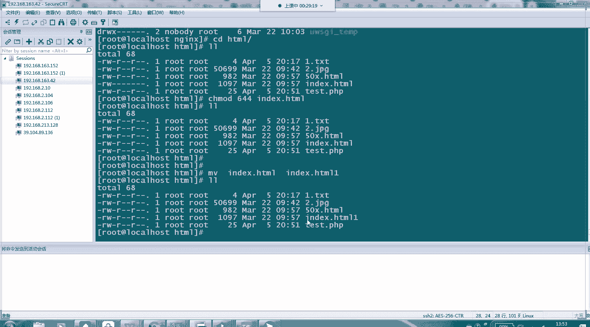

啊，大家可以看到我们这边的提示就是1个404no five啊，404就是没有找到你要对找到对应的一个文件啊，这边右下角这边我们右边这边一个index的一个状态，也就是404的这个状态。

一般我们在页面上会显示，我们如果页面上啊看不到这种代码，我们可以像我刚才那样右击啊检查啊，然后把这边选到一个网络nck，然后我们再刷一下页面，这边就会把我们要请求的页面全部刷出来。啊。

这大家就可以在这边看到啊，哪些页面的状态是异常的啊。比如说我们的这个状态是404啊。

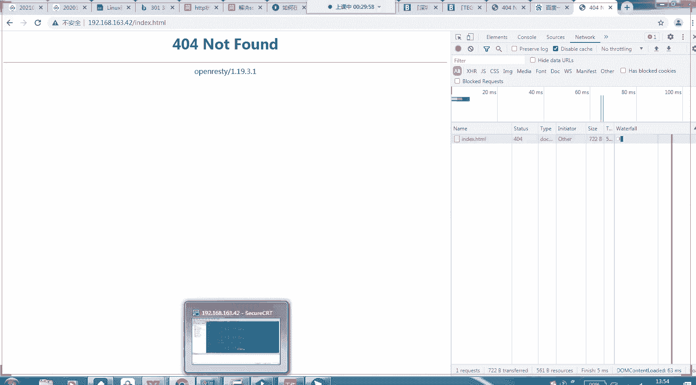

那我们这时候把我们的index再恢复回来。

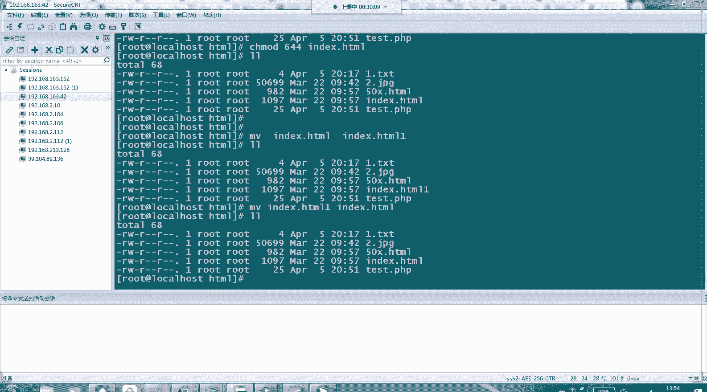

我们再刷新一下。好，大家可以看到我们现在又可以正常访问了，我们是1个200的1个状态。那说明说呃404的话，你如果是这个文件，嗯，在这个目录下面要完全匹配啊，不能说差一点点啊，差一个字母可能都不行。

那你如果是没有这个文件。那那个它的页面就会返回1个404的一个状态啊。

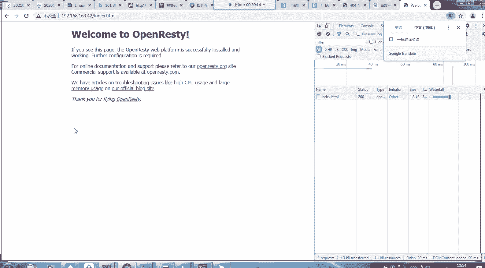

那我们现在不改这个文件，我们把我们的root目录给它改掉。root指向了一个文件配置目录。我们目前这里是指向root这边，我们转到其他目录下面去。HHOME啊，我们就ho目录下面。

我们再把的NG进行一个重新加载。我们现在是改了配置文件，所以说我们现在要重新加载我们的一个配置。啊，现在我们那个root指向的代码跟目录是在我们的ho目录上。

不再不再是我们的这个呃原来的STM目录下面了。我们现在把它刷下看一下。

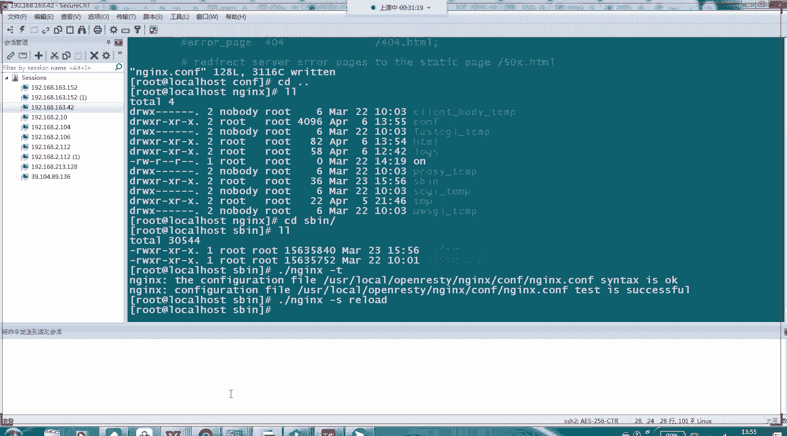

啊，大家可以看到我们现在又变成1个4041个n放的一个状态。

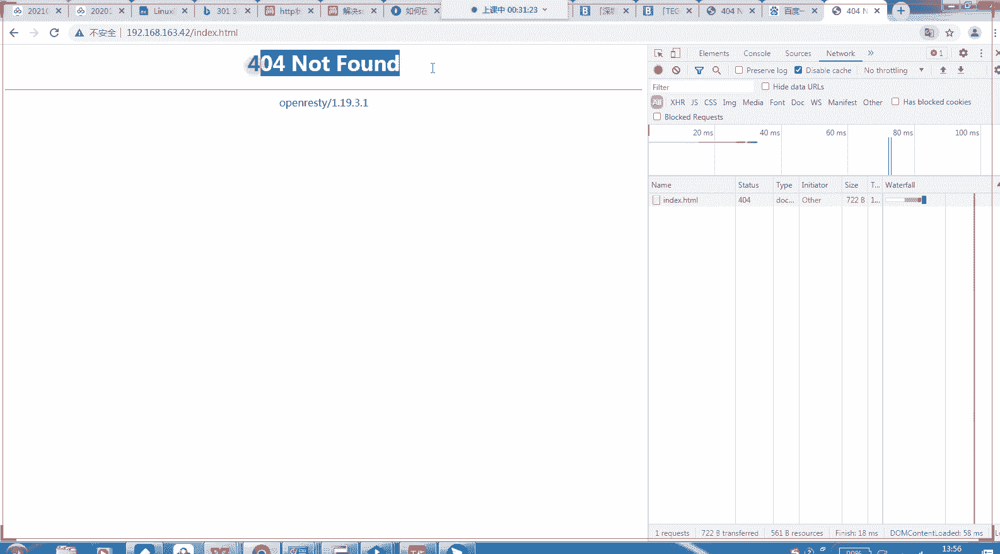

啊，这时候我们可以看到我们的root目录，就是我们的程序代码存放目录已经改掉了啊，这时候也会出现1个404的一个状态。嗯，所以说大家遇到这种404的一个状态的时候，大家可以从两个方面考虑。

一个是你如果配置文件都没有改过啊。那你可以去你的配置文件指定的这个root指定的程序目录下面去找一找你的代码是否有你的代码是否还是原来的样子，你的要请求的这个文件，像我们的刚才这个index文件啊。

是否是存在。如果是存在，那说明说呃还不是我们这个文件的一个存不存在的问题，可能是一些其他原因啊，可能不在这个代码上面，你经过其他一些跳转跳转到其他服务器上面去了啊。那如果你说你这个文件存在了。

但是你没有提前去看你的配置文件，可能配置文件被别人改过了啊，那极有可能你就看一下你的这个location里面配置的一个root指向的ho目录，有没有被人改过。

或者是你的serv阶段里面的root指向的啊代码目录，有没有被人改过啊，要匹配一下呃这个目录是不是你的程序画质的一个真实的一个目录。嗯，如果是被人改过的话，那肯定是要把它改回来，或者是说呃要跟操作的人。

改过的人协商一下你的程序是否要做一些迁移之类的一个操作那你的NG的一些相关配置要及时的更新啊，不然的话会出现一些嗯线上业务没办法访问的一个情况啊，所以说大家在日常。的一个呃运维的一个操作当中啊。

一定要小心啊，就是我们的一些配置啊迁移化动全身。如果是你的呃程序有做过迁移，那你的相关一些NG的一些配置，word业务的一些呃软件的一些配置啊，它指向的一些程序目录，也要做一些相应的一个配置做修改啊。

不然就有可能是出现你只改了一个程序的一个目录是吧你的程序目录进行了一个迁移。但是你的很多入口配置，像我们的NG配置都没做修改的话，那就可能出现1个404的一个情况。

那极有可能不是单当我目前这一个页面的1个404。你这个root指向的程序代码目录，所有下面的所有的一些文件的一访问都会出现一个404的一个情况。

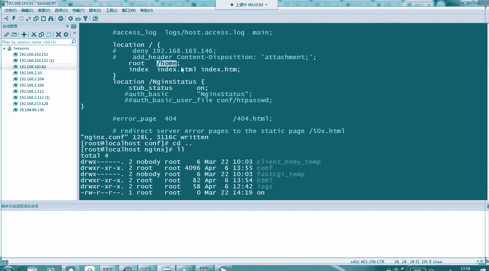

啊，那这个就是我们今天给大家介绍的两种，一种是比较常见的一个403权限的封闭的一个啊原因，以及一些它的一个可能的一个情况，以及以及我们一些处理的方法啊，还有一个是我们那个404的一个故障的一个情况。

它的一个大概一个可能的原因，以及一些我们处理的一个方法。嗯啊，今天有无录屏，有有有有录屏啊，那这个都有录屏。到时候你可以跟我们的课程老师或者是我们的班主任那边要一下我们的录屏啊。

那大家对今天这两个常见的一个word的一个故障啊，有什么有没有什么一些疑问之类的啊，大家可以在公屏上面打出来，我们设边还有一分钟左右的时间。啊，大家没问题是吗？啊，好，那没事。

大家以后反正呃日常的一个工作当中肯定会经常遇到这种情况。大家以后要先想想它这两个故障代表的一个原因，它可能的一个情况。然后从这几个情况我们去查一些配置或者是啊有有有有录屏，没听到我声音吗？有。

有的我们都有录屏啊，大家要先熟悉一下这些代码的一些嗯它代表的意义。然后要大概能想想，它在我们的日常工作中最有可能出现的一些情况。因为大家呃遇到这种特殊情况的可能性比较少。

大部分情况还是我们这些普遍遇到的这些情况。那大家朝这几个方向跟思路去找一找啊相关的一些配置文件啊，或者是我们的一些配置有呃我们的代码目录啊一些权限啊，这些配置里面有什么问题啊，这样子的话。

大家就可以处理到手上80%的一些呃这些遇到的这些故障。嗯，最主要的还是我们要留了解这些故障代表的一些原因，以及它背后的一些呃可能的一些情况。我们要怎么去做这这些事情啊，大家懂得这些一个方向。

那就呃处理起来就心不慌了啊，所也不抖了是吧？啊，最怕的就是看到这些故障，但是一点思路都没有。那这时候就比较麻烦了啊，有思路都很好做啊，没思路就那就是万事都难了啊，是吧？啊。

那大家如果今天是现在没有什么其他的问题的话，那我们今天那个这个故障的一个分享啊，教大家一个常见的一些故障，那个分享就到这里结束了那我们今天这个小课堂就到这里结束啊，谢谢大家来听我们今天的一个五间小课堂。

我们后天还有还是就会介绍一些呃wordb服务类的一些故障，大家也可以再来听一听啊。那我们现在就下课啊。

