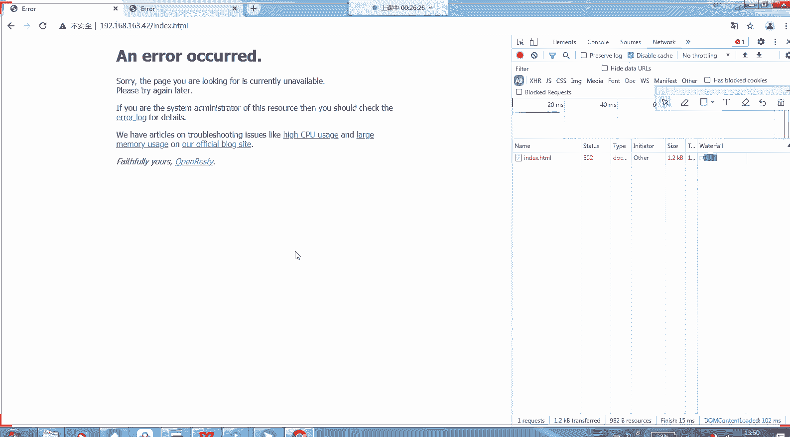
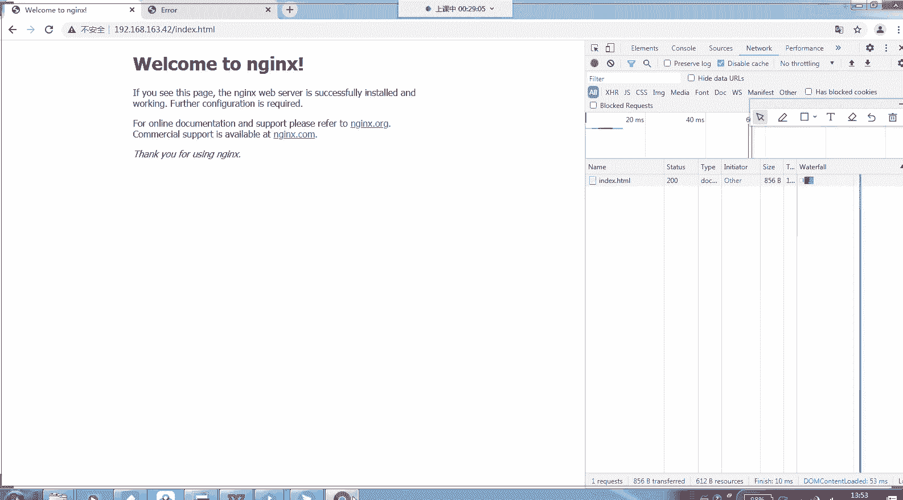

# Linux小课堂30分钟掌握一个小技巧 - P5：Linux午间小课堂5-web故障排除系列2 - 思博Linux关关 - BV1i54y1b7rX

Okay。And。🎼。Yeah。🎼，哎，我。未来。私し？う。Yeah。🎼我怎么爱你？吧防位。下去。こっち？三1。やす？小乖。加我没，我怎么爱。がさ。やんだ。🎼就这样。う。🎼在你。想美你。寝たい。

🎼再说个晚安。在我们。my安。的眼泪。🎼就这样被你。あ。在你。🎼这。🎼曾经。でも？🎼在你。えっと？我开始。这。Baby。🎼疯狂的爱像玫瑰。🎼我说 this。🎼我怎么喜欢you。だめ？あ。🎼我开始。

🎼聊进句，开始疯狂的而想你。ま。🎼微微信星。还告诉我。I pretty。 I pretty。もね。🎼美妹的。🎼喂呢。国な。🎼就是这么疯狂。🎼HeyF wash水。我怎么喜欢you。🎼不了情绪。

开始疯狂的爱想你，你说没有答案。🎼你我来来回回信息时间。🎼Maybe you start breathing。 I。わず。Only。なな。🎼好，呃，现在35分了啊。

那我们现在开始啊呃欢迎来大家来到今天的思博的linux呃小课堂。好，上一次呢我们给大家介绍了一些啊wordb服务故障里面的一些呃常见的一些代码啊。我上次我们介绍了个3400的一些代码代表的意思。

以及它的一些呃错误错误所呃所进行的一些定位以及进行一些故障处理啊啊大家这个声音能可以听到吧啊，可以听到，帮括我在公屏上打个一吧。啊，大家能听到吧。🤧呃，大家能听到我声音吗？哎，蔡见能听到我声音吗？

喂喂喂。呃。官方班主任，能不能听到我声音？喂喂喂，大家能不能听到我声音啊？呃，能不能听到我声音，能听到我声音的话，帮我在公屏上打个一啊。喂喂喂。啊咁我等下吗。你你没声音。可不可以听到我声音？喂喂喂。

能唔听到我声音啊。喂。啊，可以行啊，那我们继续啊。上一次呢我们给大家介绍了呃我们的403代码，它代表的一个意思啊，以及它的一个呃处理的一个定位的一个过程。还有一要怎么进行一些处理啊。

引起这些呃错误代码的一些常见的一些情况是哪些啊，404代码，我们上一次也进行了一个介绍。那这一次呢我们继续我们的一个呃wordb故障的一个呃排除的一个系列啊，我们这次讲的下一个代码的一个故障。

是我们的5叉叉系列啊，我们主要关注是我们的502502的一个故障。它所代表的一个意思啊，以及一些它可能引起这些代码故障啊，提示的一个原因啊，那我们来切到我们的502。

502呢它代表的一个意思呢是当啊我们内部服务器之间通讯出现故障的时候啊，网页上你访问这个网页就会出现1个502的一个提示啊。这一个呃截图就是我们1个502的一个呃提示的一个页面。

它是代表502啊bat getway啊错误的网光啊。那呃引起502的故障呢，一般都是处于我们系统内部之间通信出现的一个问题啊。比如说我们NG跟我们后端的一些ton。

我们的PHP服务器之间通信出现问题了啊，这就有可能引起我们这个502的一个故障。那我们现在来我们呃来重现一下这个502故障，以及啊对它的一些啊排除的一个方法啊。

那我们来先呃访问一个比较。

呃，正常的一个页面啊。我这里呢一个模拟环境是啊我们的1个NG啊，我们前端是1个NG。嗯。我们前端是一个NG。那我们后端是有1个PHB的一个进程啊。正常我们访问PHP页面的话。

NG会帮我们从呃NG这边会帮我们进行转发，转发给PHP处理。啊。当切PHP处理完以后再返回给我们的NG，然后NG再返回给我们的一个客户端啊，客户端这边一个显示，当我们的这一段啊。

就是我们NG跟NPHP之间出现故障的时候，那就有可能出现我们这个5021个情况。那我们现在先来访问一下正常情况下，这个线路是正常的时候，我们的PHP啊响应回来的是一个什么样的页面。

就是它正常访问的时候是一个什么样的页面啊。

啊，这个页面啊。啊。好，我这边给大家看一下啊，我这边起了一个NG进程。大家可以看到啊，我这边起了1个NG进程，那我也这边还起了1个PHP进程。我的PHB进程好，我们看一下我们NG里面的一个配置啊。啊。

就是这一段是我们的NG啊PHP啊NG转PHP的一个呃配置。我们当我们访问以P点PHP结尾的时候，一个页面的时候，它会帮我们进行一个转发，转发到我们这个呃本机17。0。1。

就是我们本机的1个9000端口啊。那我们现在来正常访问一下我们的1个PHE页面。嗯，我们的网页开一个。

好，我们的IP看一下啊，我们的IP现在是这个192。168。163。42。我们访问的一个我这边提前做了一个PHP点in的一个页面啊。

在我们的命文件名是我们的TPHP点啊TTST啊T test点PHP这个页面啊，那我们打开来这个就打开了我们那个PHP的一个呃进程的一个它的一些信息。

大家可以看到我目前输入PHP是能够正常打开了那我们现在来模拟一下，出现我们这种啊故障的时候啊，就是把我们的PHP进程断掉啊，就是让我们的后端PHP进程啊，相当于失去了一个服务的一个功能。

那这时候NG的话要转发到PHP啊，就会出现一个什么样的情况，是不是跟我们设想的一样会出现1个502的一个情况啊，那我们这边把PHP给服务给停掉。

嗯，大家可以看到嗯，我现在已经停掉了。啊，这时候已经没有1个PHP的一个服务了。那我们再刷新一下这个页面啊。

啊，大家可以看到我们这边就抛抛出了一个错误啊嗯 anL and current那我们上次有教过大家查看的那些我们的一些呃错误代码啊，就是我们的一些错误信息啊。

在我们的这边右击我们的检查这边会出现一个network啊，这标签选network，然后这边再刷新一下啊，大家可以看到我们的test点PHP这个页面就会出现了1个502的一个提示啊。

那这时候就是因为我们的后端PHP进程已经断掉了，我们的NG现在没有访问，没办法访问到我们的PHP进程，然后他就给我们的客户端这边啊返回1个50I的1个报出啊。

那这就是我们一个呃呃引起我们502我嗯爆出的一种情况啊。啊，那还有一种情况呢，大家会在我们的日常工作当中经常会发现我们刷新页面的时候，一会儿可以一会儿又不可以一会可以一会儿又不可以啊。

业务十分不稳定的这种情况。那这种情况是一种什么样的一个情况呢？啊，那我们呃来看一下我们这种目前我们给大家模拟的一个。

啊。能够导致导致这种情况发生的一种环境啊啊，我们给大家做一个示意图啊，还是原来我们的1个NG嗯这边。啊，我们前动还是一个NG。那我们后端的话，这时候会出现啊，比如说我们的一个集群啊，我们的两台服务器啊。

我这边后端给另外又加了一台N机。然后我这边啊这一台N机啊我是一种虚拟的N机，就是我们没有其实没有真正去架设它啊，当是我的NG前端N机访问的时候，会把请求流量啊，按一定的一些逻辑啊。

我们比如说我们的轮循逻辑啊，一次往这边发，一次往这边发啊，当我们这台N机其实不存在的时候啊，当我们的NG往流量往这边发的时候，往这台不存在的N机保守的时候。

那它的这台服务器啊就没办法响应我们的一个NG的一个业务请求。那这时候NG就有可能会给我们的前端客户端这边啊，提示啊返回1个5021个报错啊，这也是就是我们。呃，刚才说的啊。

一会儿可以访问我们的一个正常服务啊，一会儿又不行了，就就是因为我们的NG啊，这时候它后端会挂两台啊，真实的一个服务器啊。它当你访问正常的时候啊，那的流量是转到这台正常的NG去走啊。

当你的呃访问不是不正常的时候，那它的流量是转到这台虚拟的不存在在这台N机上面去，所以就会出现我们刚才所说的情况，一会儿可以访问我们的页面，一会是不可以。那我们现在来模拟一下这种情况啊。O。啊。

okK那我们来看一下，我们先改我们的前端的N机啊，我们的入口那台N机的一个配置。好。我们现在改这个配置啊，这个配置。我们加上这个procy啊procy就是我们的反向代理转发啊。

转发到我们的个upstream这个呃后端的服务器组。那我们这是上面啊会配了一个upstream的服务组啊服务器组。那它下面挂两台服务器，一台是我们的192。168。

1这台啊上面会会起了1个7878的端口的服务。那另一台的话这台是192。168。8。1啊，这台是我们虚拟的设想出来的一台呃服务器啊，它这台服务器是不存在的啊。

所以说我们这边给它设想了一台那我们这边当我们的请求流量经过我们的这台N机的时候，它会往这个upstream组里面去转发啊，一会是转发到我们的17。0。0。1这台一会会转发到我们的12192点168。8。

啊192。168。8。1这台啊，但当当我们转到192。168。1这台的时候，那我们可想而知我们这台服务器是不存在的那它的业务。请求肯定是没有办法完成的那这时候的话啊前端就会啊我们的这台N机啊。

入口N机就会给我们的客户端那边返回一个呃报错啊，相当于我们的1个5021个报错啊，那我们来试验一下啊。哎，我们。Q。啊，我这边又嗯另外安装了一个NG服务器，用来启我们的这个7878这个服务啊端口。啊。

lock NG啊。呃，OK好，大家可以看到我这边这一台机啊，就是我们的呃另一个路径下面的一台NNG啊服务。我们起了1个7878的端口啊，让我们的流量能够请求到这个根目录。

最后返回给它的一个呃最原始的一个呃HDML成功返回呃访问成功的一个页面啊，那我们现场来试一下啊。呃，刚才的配置有没有生效，我看一下啊。啊，没有，我们还没有要刚要重重新加载一下我们的一个配置文件。

我们刚才有修改过了。啊，OK那我们现在访问一下我们访问的页面是indes。

啊，大家可以看到我多刷几次。哎呃没生效啊，我看一下是哪一的问题。

哦，我这个passport没有启用啊，奇怪，刚才有启用的。哎，我们的路径是没错啊。啊，还有个配置要改一下。稍等一下啊。啊，这个注是要注释掉。我们再试一下看一下。

啊，大家可以看到啊，这时候出现1个502，我们刚才刷了两次以后，第二次出现1个502，我们再刷一下，还是502还是502还是502啊啊，权重比较大啊。

啊，稍等一下啊。我把它的权重改掉。

嗯。

看一下他的是不是一直往这边闯。

一直在往我们的163。146床，没有往我们的另一台床。我们可要多刷几次看一下。

嗯。奇怪啊，我们看一下配置。嗯，是的，这样子往这个床床是没问题的。

呃，这个是什么问题，看一下啊，我们把这台注释下看一下。

正常它是会呃轮循的传递的啊，但是我们今天好像是没有。

只是第一次我们刷新的时候，它会第一次释访我们1个127。0。01这个页面，后面就开始转换到我们的192。168。8。1这个服务区了啊。

哎，这是有缓存吗？唉，奇怪。不是。还要跟F啊 logs assessed啊。哎，为什么传到我们的127。0。1是2，我们NG没有启啊，我们另一台N机没有启啊哎，我失误了失误了失误了。

我们这边只取了一个NG服。哦，没错，我们只写了一个衣服。我们要请另一个机啊，我们要把另一个一给要请拉起来。

这时候应该是可以正常访问了啊，可以啊，大家可以看到然后我现在再把我们的另一台虚拟的一台嗯N机，它的配置给它加进去啊，然我们来重现一下啊，重现一下我们刚才说的那种故障情况。

啊。OK啊，刷一下，多刷几次看一下。

就是。嗯。logs。Assesess。都是装到我们的127。0。001这台啊，这个配置。

看一下，我们再刷一次。啊，我要把群众改回来看一下，让他强制去那边。

あいます。嗯。

嗯。

locks assess啊，我看一下。都是往我们的127。0。0。1这台转发，他都不往我们那边转发。

唉，这是什么情况？啊，这个可能需要一定时间啊，我们多试几次看一下。嗯。好，这边有刷出来1个502啊，这个被我刷掉了啊，大家有没有看到这个是我们的200正常代码，这是我们的502啊，这个已经转到我们的8。

1啊，刚才页面我点的太快，被刷掉了啊，我们刷慢一点看一下。

没有。

我们的这一边啊。😔，嗯。我们这边页面是有一定的缓存啊。没事，好像这边看不到啊，我们这边有页面有问题，但我们看这边日志。

大家可以看到啊，这是一条正常的访问，2000，这是一条正常的访问啊，这条访问就是不正常的这条访问转到我们的192。168。8。1。这条我们该配置的3128这个502端口。

那这时候的话我们的一个前端请求啊，前端的一个响应啊就会显示1个502的一个情况，那这时候要怎么办呢？一种情况啊，是你把。我们的刚才这个配置给它去掉啊，就是把你的故障服务器从我们的线上业务当中去摘除掉。

把我们的这一台嗯这个配置啊给它注释掉，让我们的服务啊所有的服务都往这台服务器走。往我们的192。168啊1127。0。0。1这台服务器拒走啊，那这样那由这台服务器最完全承担我们的前端的业务请求。

那我们要去及时修复这台192。168。8。1这台服务器的故障啊，还有一个情况的话，就是呃你在这边嗯。把这个注释啊，有可能给它注释掉，去掉啊，这个注要开起来的话。开启来的话，嗯，他的请求啊。

当往这台请求发送发送的时候，当我们往这台服务器发送请求的时候，当它出现错误的时候，它会第二次尝试往这台服务器去发送这个请求啊，那应该我们把这台服务这个服务开起来以后，如果是呃off状态。

那就是说我们当我们的请求往192。168。8。1发送的时候啊，如果这台是off状态。那即便是这台服务器请求是失败了。那他也不会去往我们的19127。0。0。1这台服务器去尝试啊，转发这个请求。

那我们的业务去往啊我那我们的请求能够正常的完成。那这个配置的话，如果是on的一个状态，默认是一个on的状态。那这时候的话就不会出现我们刚才这个502的一个情况啊，那我把这个给它开起来啊。这个给他开起来。

那这时候就会出现我们刚才所说的那种50月的一个一个情况。啊。啊，我们S reload啊。

这时候应该就会出现啊。

诶同我睇下。看一下日子。

我们看一下502让他出来。

日这还没有到502。哎，哦我刚好像把注释。注释给他那个另台转发那个给他注释掉了。哎呀。这个配置有点多啊，我都搞自己都搞我乱掉了。模拟模拟这个故障还真不是一个轻松的事情。

啊，大家可以看到啊，我们现在这是出现了我们刚才最早说的这种情况啊，我们再刷一下就可以再刷一下啊，多刷几次。

啊，我们的日志再打开看一下。

OK大家可以看到这时候出现502，我们的页面就跳到502去了。我们再刷一下就会涨到200啊，那我们再多刷几次。它有一个时间的一个检啊，它服务端会有一个检测啊，当我们第一次可能访问502的时候。

它后端后面一段时间内就不会把我们请求转到502，然后再过一段时间又可以又转过去啊，又发又出现了。大家可以看到这就是我们刚才最早说的啊。当你访问一个页面的出现，一会出现可以，一会出现这种不行的一个情况啊。

就是我们的后端服务器啊，有可能其中一台有问题的。

啊，那其他的一些呃服务又是正常的一个情况啊。那这时候的话大家就要回来看我们的一个配置文件。啊。配置文件去查找我们的up这里面的一个配置服务。它的两台服务器。

你要上去看一下它的一个服务啊是否一个正常的情况。还有如果你要临时解决的话啊，就是把我们的如果有配置这个 next点这个这个配置的话。

那你把它给它注释掉啊那这个在一定程度上会缓解我们的一个呃访问的出现502的一个情况啊，它如果是注释掉的话，它默认是这里的值是状态。那我们的这台服务器如果是挂掉的当我们的请求往这台服务器发的时候啊。

发送失败了啊，请求失败了，它会N机就会尝试往这台服务器去发送啊，那这台服务器去完成请求啊，这也是我们的一种处理的一个情况啊，那今天的话啊做的时间会比较长啊，今天主要给大家讲一下502这种情况啊。

可能导致它的一种原因，以及我们的一些呃处理的一些思路啊，那对这个的话，今天的。大家不知道能不能看懂啊，因为我今天做的实验可能步骤比较多啊，比较乱啊。大家如果一时间还看不懂的话，回去可以再多看几遍。

帮慢慢梳理一下这个一个情况啊。那其他的话，大家啊还有没有什么想问的啊。行对于今天的一个实验，或者是今天的502的这一些问题。或者是之前403或者404的一个呃。

之前看过我们403404课程的一个内容了以后，有什么一些其他的疑问，都可以在我们公屏上面说一下。我给大家做一些稍微的解答。啊，大家都没问题是吗？那如果没有问题的话，那我们的今天的5间小课堂啊。

就给大家介绍502这一种导致这501爆爆错的一种情况啊，可能的原因。那我们的课程的一个内容啊到这里就今天就结束了啊，现在就结束了。那欢迎大家下一次继续来听我们的5间小课堂啊。

我们下一次再给大家带来一些其他的一些知识啊。啊，那我们今天就下课啊，我们的课程就结束了啊，再见。

Yeah。

哎呦我操。