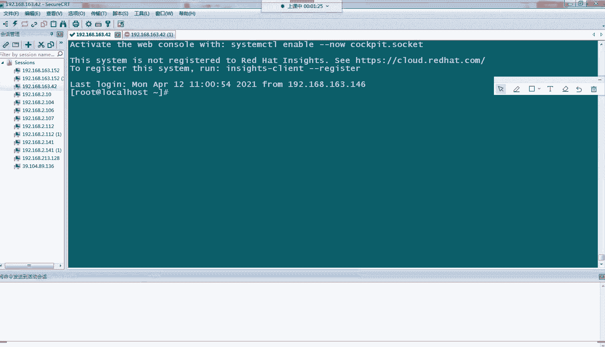

# Linux小课堂30分钟掌握一个小技巧 - P6：Linux午间小课堂6-web故障排除系列3 - 思博Linux关关 - BV1i54y1b7rX

Okay。妈了。嗯。🎼我失那。待回来。🎼う。🎼，🎼谁？🎼都是我。うんが。是。🎼あか？🎼不久后天。🎼うか。うは。🎼余下。🎼あええ。没。🎼保留着。🎼恰好又分。0。🎼说这要。こ。そ。うん。就像阳光。完了。

穿梭。在摘下。会烧。要害怕。🎼伴着。爱到你。看着。就想阳光。🎼看着你。最だにせ。告远的。奋兵向前。一定会出现。已经出。🎼在我们的。かやし。🎼轻。忘记好。🎼の的。🎼来你始终在。🎼极些。🎼放起他。🎼千里。

好呃，35分了啊，我们现在准备开始啊，大家能听到我声音吗？能听到我声音的，在公屏上帮我打个一好吗？然我看一下你们有没有听到我声音，设备有没有问题。啊，同学们啊，各位同学啊，有没有听到我声音，帮我打个一。

在公屏上面打个一。呃，王晓明同学嗯，张志波同学。林同学能不能听到我声音。可以听到我声音吗？可以吗可以吗？喂。啊，可以听到我声音吗？嗯。呃，同学们能不能听到我声音，帮我能听到的话，在公屏上帮我打个一好吗？

天平座能不能听到我声音？啊，大家都能听到我声音吗？啊。行为我感觉应该是没有什么问题啊，大家都没有访问啊。那我们先开始今天的课程啊。上一周的话我们讲了两节课，我们讲了我们的word系列的一些故障啊。

其主要讲我们的一个代码出现的一个故障。像我们的403404啊，还有502这三个比较常见的一个故障代码，它所代表这些意义，以及它的一些故障定位，以及如何进行一些排除这些故障的一个操作啊。

那我们今天依旧是继续给我们讲这边唉word服务的一些故障的一些另外情况。啊，在我们的一个实际的一个业务当中啊，尤其像我们的wordb服务网站的话啊，会经常会出现这种情况。

比如说我们的某一个地区的用户啊反馈他突然说访问我们的一个网站啊，访问不了了啊。那这时候的话他那边就要就反馈给我们的一个客服或者是我们的运营人员啊，那运营运营人员就会找到我们啊这边技术人员啊。

像我们的运维部门啊，来排查一些相关的故障。那这时候的话啊我们一个排查这种故障的种思路啊，应该是什么样的呢？啊。Oh。导致它访问不了我们一个网站啊，这其中的一个故障的话呃是可能原因是多种一多样的啊。

我们需要排查这种故障的话，可能需要从它的一个源头开始啊，一一层层一层链路排查到我们的一个服务器的一个情况啊。那这时候的话，我们首先可能会先让我们的用户啊。

去解析一下我们这个域名的IP地址啊呃尝试解析一下我们的IP地址，看它的本地的一些运营商啊，有没有进行的一些解释啊，让我们常用的一个排查啊域名解析有没有异常的情况。用为我们的NSlookup。啊。

像我们如果是查百度的域名啊，那我们可能就嗯在我们的CMD这边啊，就是我们的开始这边有个运行啊，这下面有个运行所有程序，搜索跟程序跟文件这边输个CMD啊，这边就会弹出来1个CMD的那个客呃客户端啊。

我们这边回收一下，它就会弹出来。那我们这边在里面输入Nlookout啊，这是我们查询域名的一个命令啊，后面跟上我们要解析的域名啊，像我们如果是作为百度的运呃运维工程师的话，那肯定他如果访问不了百度。

那我们是后面跟百度那如果是其他一些网站，你们各自公司的一个网站的话，那后面就跟你们排查呢要排查的故障的那个网站的一个地址啊，我们一个回车。然后这时候的话啊他会去我们的一些外网去解析我们的一个IP地址啊。

像我们的自己解析出来的14。215。177。39啊，14。215177。38这有两个IP地址啊，为什么有两个呢？因为正常来说我们的一个域名啊。

啊都会进行申请多个IP地址的一个解析啊为了是一个方便我们的客户随机就近访问我们的一个IP还有个啊避免我们某1个IP被封掉了，或者是故障的时候啊，没有可替用的一个IP啊，如果是要替换的话。

就要进行一个全全全。球的一个解析会会比较耗时。那这时候的话解析出来的IP地址，那我们就要对比一下这个IP地址啊，是不是我们服务器出口的1个IP我们正确的一个解析IP是不是他啊如果是他的话。

那就说明他这个解析没有问题。那如果不是这个IP的话啊，不是这个他我们这边配置的啊，我们给他配置的这个IP那说明我们的这个IP啊，他在他的运营商那边。

比如说经常会发现我们的移动会移动用户啊会解析解释去解析出来的IP啊，不是我们正确配置的那个IP地址。那这时候就有可能是出现一个IP的一个截止的一个情况。域名解析一个截止的一个情况。

那这时候的话就需要啊我们的客户啊，跟我们的运营商去反馈啊，就是说他那边的个呃域名解析出现了问题啊，啊他要访问的某一个网站啊，他的一个解析地址跟我们这边啊真正的一个IP地址，不是同1个IP地址啊。

不单单是要让客户去反馈。那我们这边作为我们的企业的来说的。话我们要通过我们的一些公关部门啊去跟我们这些呃运营商进行一个申诉啊反馈啊，告诉他啊，你们的呃服务器啊，你们的出口网络啊。

对我们的一个域名进行了IP解IP地址解析的一个解释，造成我们业务的一个不正常访问啊，那这时候就发一些我们的一些呃形成公关文件或者是一些呃法律文件啊，让我们运营商去解除我们的个IP地址解析啊。不。

那这时候呢如果这个解析能够改过来的话，那我们的IP啊，我们的这一层故障就排除掉了啊。那如果是我们这边的IP地址解析是没有问题的啊，就是这边指向的也正确。

也是我们的一个呃服务器配置的一个正确的一个外网IP啊，那我们这时候又就要排查啊，客户啊，我们的用户那边去聘这个IP地址啊，能不能通啊，像我们聘这个IP地址。嗯，像我们聘这个。啊，比如说这个IP地址啊。

啊，它这边会有一些拼的一些结果给我们返回过来。大家看到来自我们这个一个这个IP的一个呃回复啊，字节是32字节时间是34TTL是54秒啊，这个返回归来说明说明说我们的1个IP啊，它是拼自能拼通的。

它的网络基本是畅通的啊，我们的这下面啊会看到我们的丢失是0啊啊我们正常发送啊跟接收都是嗯足额的那这时候的话啊说明我们的这个拼是正常的，我们的网络是通的那如果这边出现我们的丢失啊，不是0啊。

就是这里显示不是百分。领的话。那极有可能一个是我们呃客户那边的呃服务器啊，客户那边的PCG到我们的这个域名啊，我们的域名解析的这个IP地址，它的网络不通畅，有可能是呃完全是丢失掉，百分百丢失。

那这时候的话网络就出现了一个很大的故障啊，那这时候的话就需要呃同样是需要去找我们的运营商啊，去找我们的运营商看一下我们的一个哪一层线链路出现了一个问题。那那如果第二个，如果这边的1个IP啊。

这边的丢失不是百分百的话，但是出现了百分之呃五六十很高的一种丢失率的话，那这时候也是一个网们网络虽然是畅通的，但是它是一种非常不稳定的一种状态。那这时候的话我们需要啊也是需要跟我们的运营商啊。

尤其是我们的客户那边去跟我们的运营商反馈，它的一个链路是很不稳定的啊，那这时候的话如果这个故障都解决了。那说明它一个链路是okK了。那这时候的话再让我们的用户去访问我们那个呃。

我们的一个网站的一个啊域名啊，这时候看一下能不能正常访问啊。那如果这时候能够正常访问的话啊，那就说明啊我们的一个故障已经定位解除掉了啊，我们的一个域名解析没有问题啊，我们的一个网络啊是畅通的。

也没有问题嗯。こ。那如果这两个都没有问题的话，那如如果是我们的客户还是访问不了啊，那这时候就要回到我们的服务器端这边来看啊，服务器端来看我们的一个啊我们的呃进程啊，也没有正常起来啊。

我们的比如说我们起了个NG。

啊，我们进程有没有正常起来啊，有正常起来，说明说我们的服务啊是在跑的那这时候我们就要进行一下本地的一个请求访问。比如我们CYLHTTP访问我们的3W点百度点CO啊。

比如说我们目前这一的呃我们这NG企的服务啊，它是一个百度网站。那我们这时候就CYL干一下查看一下我们用我们自己本地的一个网络啊，去就是我们呃公司内部网络。

或者是我们的一个本地市的一个官网网络去访问我们的一个呃我们的服务，我们的服务的一个域名啊，去请求他的网站，看它有没有问题。那这时候如果是。200是ok的话，那这时候说明我们的一个网站也是很正常的啊。

那如果这边不是200的话，是一些像我们的啊404啊或者是502这些问题的话，那这时候就要再去我们的一个服务器里面去定位这些报错的一个原因啊，这就回到我们上一节课说到的404啊，403502这些故障啊。

他的一个相应的一个排除那如果是这边还是200那我们的客户依旧是访问有问题的话，那这时候极有可能是我们的一个呃呃用户啊到我们的一个服务器中间中间几层网络啊，可能有一些其他的一些问题啊。

劫持啊等等这些问题啊，这这时候已经不是我们的用户本地的一个运营商的一个问题啊。那这时候的话会是一个更大的一个情况。那这时候啊依旧需要啊我们的一些公关部门啊，协助我们去进行一个更大的一个排除的问题啊。

那这个情况呢是我们在我们的工作当中会经常遇到的一种情况，遇到的情况。

会是比较多的，尤其像我们的一些门户网站啊，我们的APP啊，或者是我们的对C端的，就我们的customer端的一些呃服务啊，这种这种情况会比较经常的遇到啊。那这时候大家要呃依据我们这种排查一种思路。

一种是从我们的客户端，客户那边进行一层层网络层的排查，然后最后到我们的服务端这边啊，我们的服务服务的排查是否有什么问题啊。啊，还有一种情况的话啊，就是我们的这个如果我们的解析都解析不出来的话啊。

我们在服务端这边解析都解析不出来IP啊，在我们的客户端这边解析都解析不出来IP的话，那说明我们的域名解析啊，这时候可能嗯没有完成全球的一个同步。

那这时候的话我们需要去啊跟我们的一个域名解析商那边啊去进行一个沟通协调啊，为什么我们出现一个域名解析，没有全球同步的话啊，到底是哪一层出了问题啊。

那我们这里给大家演示一下我们一个域名解析没有解析成功的情况。那我们访问一个服务器会出现一个呃没法访问的一种情况啊，那我这边向我们的这边是起了一个NG啊，简单的。

我们把这个注释打开啊。我这边起了个机啊。大家看到我这边的域名是logo host啊，是吧？我把它改一下啊。啊，没事啊，我就得这边就用local host啊，我这边到时候随便起一个域名啊。

那我们现在如果是要假设我们要起1个3W点AA点COM这个域名，那我们这边肯定目前是没有解析这个域名的。我们这时候访问的话，我们看它解析。啊。呃，是一个空的公网的，哎，这个有解析啊。

不知道是谁的一个公司解析。

好，大家看到我们的AA这个呃目前是没报法访问，虽然它有解析是没办法访问的，说明啊我们依依旧可以拿这个域名进行一个尝试啊。那我们把我们这个AA解析啊，3W的AA解析啊，目前是没办法访问的。

一种情况啊，大家看到我们这边提示无法访问该网站啊，让我们把这个解析指向我们的这边的啊这台机子。啊，我们指向这台我们的163。24，让我们去访那这个A3W的AA点com去解析。

去走向我们这个呃NG的服务啊，那他这时候就应该能够有个正常的一个解析啊，那我们本地就是用我们的。

host我们修改绑定host的啊嗯模拟我们已经通过外网进行解析1个IP地址的一个情况啊。我们是在HOSTS这个文件。我们进行一个编辑。我们保存一下啊。

我们拼一下3W点。A点CM。大家看到啊，我们上大辩的是AA点COM解已经解析到我们的163。42这台机子。那我们这时候再访问一下看一下啊。

哦，这边就直接已经刷出来了，大家会看到啊，刚才是一个不可以访问的情况。那这时候已经是可以访问了。那说明他说我们这边的域名解析啊，正常的情正常了以后，那我们的这个服务啊，NG服务啊。

我们的NG服务就能够正常对我们的客户这边进行一个相应的一个请求了啊。那所以这个就是模拟我们那种我们一种是我们的域名解析失败的情况啊，导致我们刚才呃3WA没办法访问。那这时候的话。

我通过修改我们的host hostst文件啊啊把我们的域名解析绑上去，类似我们的一个呃解析啊，正常解析，配置正确的一个情况啊，那这时候我们的3W的A就可以正常访问了。那这是这个就是我们呃举的一个例子啊。

我们呃没办法访问文站的一种情况啊。

那我们下下面讲另一种情况啊，在我们的网站访问当中啊。我们的网站访问当中啊，可能这个用户啊这个我们网站访问的一个页面啊，不是我们一个新的一个页面，或者是不是我们理想的一个呃预先设定的一个页面啊。

这是会会制一种什么情况呢？而是一种我们之前啊可能是我们更改过代码之前的这种页面啊，那这种情况的话，极有可能是我们的一个配置会出现了一个问题啊，我们的配置，比如说我们的新旧配置啊。

出现了一个重叠覆盖的情况那这时候你如果没有把旧的配置啊给它改掉，或者注释掉啊，那你新的配置复制上去了。那是可能生效的还是我们那旧的配置啊，那这时候的话就出现我们改这种情况。我们访问的页面。

不是我们设想的一个新的页面，而是我们一个旧的一个页面啊，这时候的话在NG里面会有这种呃配置不正呃配置不正确的话，会出现这种情况那我这边就给大家模拟的一个这种情况啊。比如说我们的这个NG这边啊。

大家看一看我们这边我把这个注释掉。这边我配了两个啊两个loloc啊location啊，大家可以看到一个是我们呃。这边配置了点GPG结尾的1个呃UIUI啊，还有一个是我们呃通配我们的这个这这上面这一层。

嗯。这个。啊，上面这个啊啊这一层的配置是呃允许呃就是这一层的配置是点GPG或者是呃点PNG结尾的啊一个请求啊，转到我们这一层这个目录下面去。那下面这个是点GPG结尾的，转到我们的root目录下面去。

大家可以看到这笔转向的两个呃目录是不一样的，一个是在我们的HTM目录下面，一个是在我们的root目录下面，那我们这时候先默认看一下啊，它是一个什么情况。我们这时候的情况，这时候的一个访问情况。呃。

我们这边给他改一下。我们访问我们的这个。はい。我们IP地址是。这一个。点斜杠啊TXT点。GP呃GPG啊，大家看到这边是一个forbe一个状态。forbeit是为为什么是forbeit呢啊？哎。

我这边配置没有生效啊，我生效一下。啊forb是因为我们这边走到这边了啊，刚才我这边呃这台配置是注释掉了，刚才生效的是这一个配置啊，那现在访问的情况是forb。哎，我的那个等机呢。啊。

页面呢这边访问的是forb的，因为我们接下来已经匹配到这条了，到我们root目录下面去。那我们的root目录啊，它的一个权限没有更改。我们这边起的是用robo起的一个NG啊进程只进程。

那它这时候的话没有权限去访问我们的root目录。那这时候就会出现一个呃403 forb的一个情况啊，那我们这时候把让它生效啊，我们把这条配置打开起来，并且生效起来，大家会看到我们的一个呃变化。

那我们NG给它生效啊，你现在已经生效了啊，O。那我们再刷新一下啊，大家看到这时候会出现另一个斑码代码了，是404风浪啊，no no found就是没有找到的意思啊。我们看下这个文件下面HTM下面。啊。

HTM下面没有我们的TSD点GPG这个文件啊，它是在上一层目录。那这时候就会出现嗯我们的一个配置出现一个重叠或者是混乱的一个情况啊，大家能可以看到我们刚才一个对比啊。

首先生效的第一次生效的是我们下面的这个啊点GPG啊点GPG结尾的1个URI啊，它这时候指向的一个文代码文件目录啊，是我们的root目录下面，在我们的root目录下面。啊，是有这个TSD减GPG的啊。

但是它是目前是一个for闭的状态啊，没办法访问我们的root。是没办好访问的。我们的root是没办法进去的，其他用户是没有办法进去的，他没有X位啊，所以说他连进去都进不去。

那这时候就会出现我们的刚才一个封闭的一个情况啊。那我们这边刚才把上面这条打开以后啊，让它这时候就匹配到这条了，那它的location就走走到这条了。

那这时候就走到我们的rootHTML下面啊root目录的呃root目录啊，我的moot跟目录是指向HTM目录。那这时候的话我们因为我们的HTL下面没有这个TSD点GPG这个文件。

那这时候它会提示我们的摄影是漏放啊，那我们把我们的呃TSTSD点PGPG文件给移进去，看一下它是不是呃就可以访问了啊。我们的是 local。我们CP一下啊，把这个移到我们的STM目录下面。

我们看一下有没有在啊。okK在这时候应该是可以访问的那我们这时候再刷一下我们的请求啊啊，大家可以看到我这时候页面请求就是正常的一个响应的啊。那这时候的话就说明我们的这个配置。

我们刚才的这个配置啊是没有错的啊，我们生效的一个逻辑是对的啊，它的一个呃匹配也是匹配到这一条的。走到我们的HTML目录啊。那这时候的话啊，就是我们在我们的工作中啊。

经常我们的location可能会非常多啊，像我们的一条两条3条4条，可能有个一个N机配置文件里面啊，会有个十几二十条。

那这时候的话比如说你这个配置是可能是呃上一个维护人员是或者上一个程序员在两年前加的啊，但是你这个下一条配置啊，可能是我们的呃最近的一个程序员新增的一个啊规则嗯，可能是加到我们的比较下面啊。

比较下面的一个位置。那这时候的话你会出现这两条配置啊，都在我们的呃配置文件里面去。但是他们两个的作用，就出现了重叠跟覆盖，像我们的这个作用啊，做个这个location，它的覆盖面更广。

它包括了GPG和PNG啊，那下面这个。包含了GPG啊，那这时候就出现了一个重叠。那这时候我们正常是要离想的话，是希望这条location新增的这条生效。但是我们这时候呃运行起来程序会发现我们访问的话。

哎，这条怎么没有生效啊，房间发现还是我们走上面这条啊生效的一个结果啊，那这时候我们就要去排查一下啊，是不是我们的这条location啊，它的一个作用被其他条的一些location给它覆盖掉了。

或者是出现了一个冲突跟重叠。那这时候的话我们就要把这条啊location进行一个注释，或者是进行一个修改。比如说把我们的。呃，把我们这条上面的配置啊，给它关于我们的。GBG的这条配置啊给我们的去掉啊。

比就是把我们讲，比如说我们这边把我们的这个GPG这个配置啊。让它去掉。呃，对，GBG这个配置去掉。那这时候的话这条loc。就不会匹配我们刚才的TSDGPG这个文件，而是让这条去匹配它啊。

那我们这时可以试一下，看一下它是否有生效。啊。我们再刷一下，这时候刷一下，应该是出现一个forb的啊。好，大家看到是的，forb的啊，它这台又走到我们的这条配置里面去，走到我们的root目录下面去啊。

又回到我们刚才root下面没有权限的一个状态的情况。那这就是我们啊。呃，在我们的工作中会经常遇到会不小心啊，这种不是故意的啊，可能不是故意写错的那只是我们一些疏忽啊。

可能一些历史原因比较长久的一些跨度的原因啊，导致我们配置会冲突。啊。那这时候大家拍查的时候要仔细一点啊，这里我只是给大家非常简单一个事力啊，显示这两个location进行一个重叠的一个情况。

在我们的工作当中可能location就没有这么简单，它后面的语句可能就不是这么简单了。那这时候你就要呃细心的分析一下啊，是不是哪些location啊，出现了一个覆盖或者是重叠的一种情况。

这样子的话好方方便我们具体去处理啊，去怎么去修改这个location啊。好，那今天的话我们给大家讲了两个，一个是我们的域名啊，我们的服务没办法访问的一种可能的情况啊。像我们的域名没法访问。

我们的网络不通啊，也有可能是我们的服务端这边啊网络网络不好，网络不那个出口网络有问题啊，或者是我们的服务没有起来等等这些原因啊，这种思路就是要从头开始排查从我们的用户端啊。

用户端那边呢一层层去排查下来那我们的另一个啊叫就是讲我们的这个出现我们的一个呃页面访问啊，不是我们理想设置的一种结果啊，就是出现了一种呃新比如很大的一种情况，是新旧页面没有出现一种更换的一种结果啊。

那这时候的话大家就要看一下我们的NG的配置里面啊，它的location啊是否配置有问题。你新增的一些location啊，也没有出现一个跟之前的一个location出现一个重叠覆盖啊啊，是新新。

覆盖旧的还是旧的覆盖新的这种情况大家都要看一下啊。那我们今天一个呃中午的一个小课堂分享啊，排除关于排除我们那个word这类的故障啊，今天讲了就讲了这两个啊故障的一个分析，以及它的一个思路啊。

那大家的话啊对这这两个故障有没有什么疑问，或者是在工作当中有没有遇到类似的这种故障情况啊，也可以在我们的公屏上打出来。好，大家给大家一分钟时间啊。😊，啊，大家如果没什么问题的话，可以直接打个2吧。啊。

没什么问题的，直接打个。那我们今天的一个分享的话，小课小课堂的一个分享啊就到这里结束了。嗯。大家以后在工作中可能会比较经常遇到我刚才说的这两种情况啊。第一种情况是呃特别经常的啊。

尤其是在对我们的C端用户，就是我们的customer，就是我们普通用户，像我们现在我们的些呃学员他们你们在用的一些这些呃网站啊APP啊啊，你们都是呃很可能就提这些问题啊，遇到这种情况。

那这时候的话啊我们的服务呃服务器那边的运维人员就会配合你们处理这些故障啊。啊，行，那大家都没什么问题啊，谢谢我们的这个。😊，这个名字怎么念啊？我不会不会练，你这个名字比较神了，谢谢你发的这个辛苦啊啊。

😊，好，那行，那我们的今天的一个分享就到这里这里结束了。那我们后面两次的呃这一周的后面两次小课堂，依依旧是关于我们word类的一些相关的一些故障啊，大家依旧如果喜欢可以的话，来听一听啊。啊。

那我们今天的小课堂就到这里结束了啊，我们现在就下课了。

Okay。

Yeah。哦整系整。应非常玩。咁打我。家你。

。这个操作上。啊，我操作路上。充电的话就可以拿。我面弄插这了。现个那个超是多余的我给他整一下。Okay。Yeah。Yeah。Yeah。

