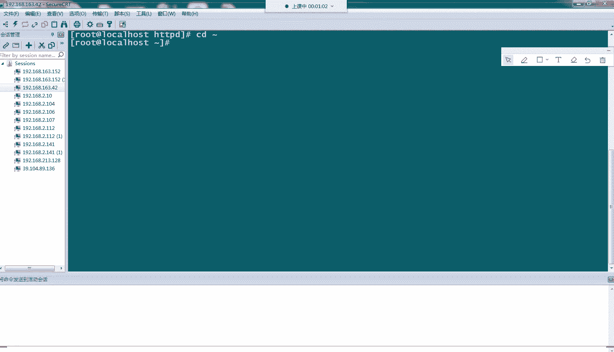
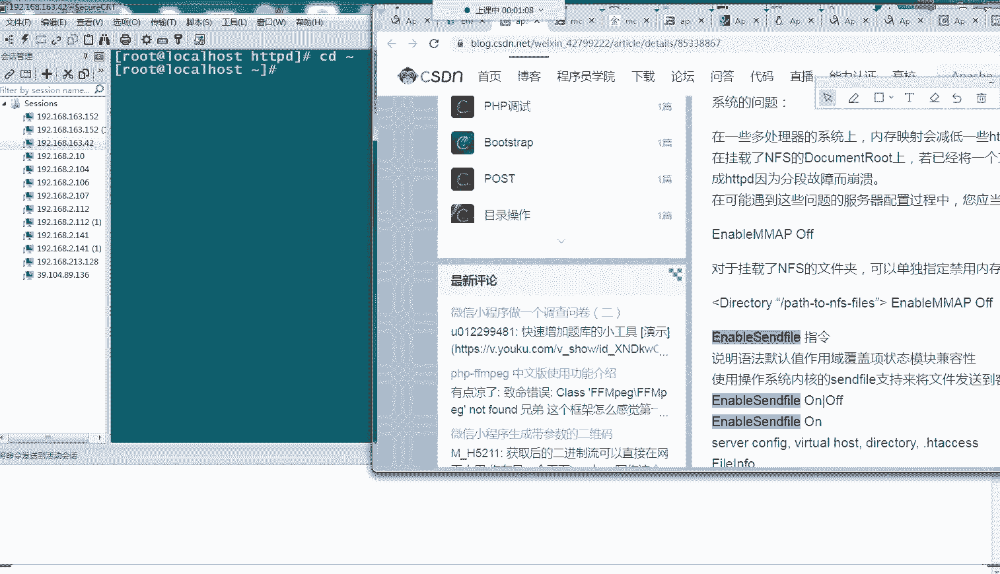
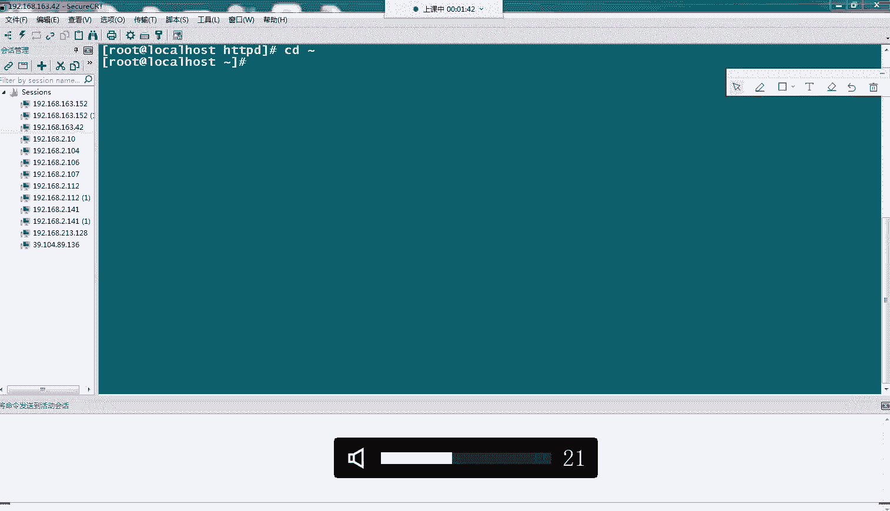
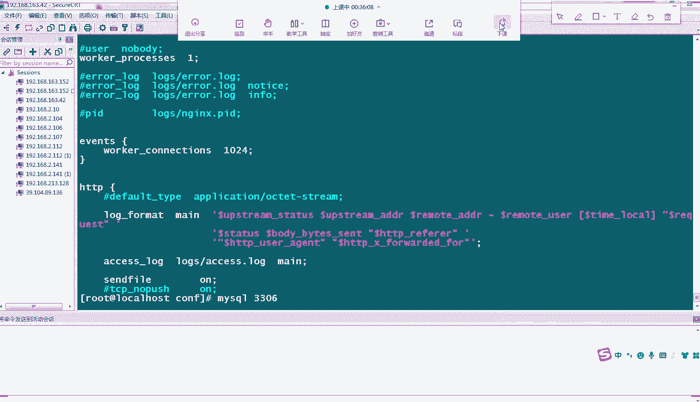
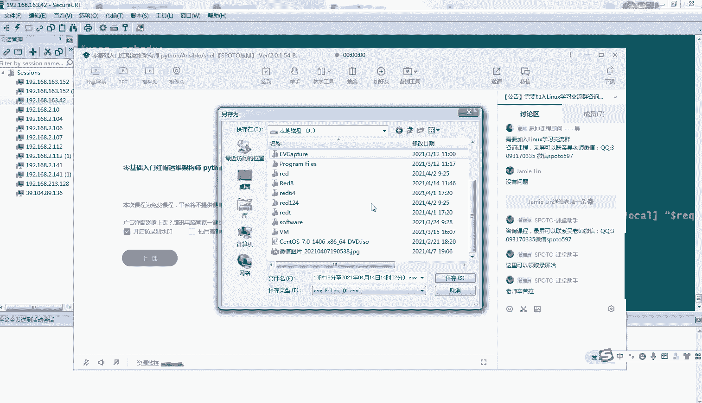

# Linux小课堂30分钟掌握一个小技巧 - P8：Linux午间小课堂8-web故障排除系列4-nginx无法启动 - 思博Linux关关 - BV1i54y1b7rX

なかなか。なかな。大家。

like。爱心。最し？太公か。的开心。嬉しい？🎼过来。あ。看。🎼去快的爱情。あ公。全し。🎼打过那。我つ。🎼爱谁。そごす。あの。谢谢你。🎼放开的。🎼あ。🎼开口太。🎼，🎼In。パりラの行け。

Of stairs at。把这个是不ちと。开光看。存在。还是看的开谁。あこんか。我就在。🎼是看的くし。こ考え。🎼あつ。还是讨人的关心。おな？おな。

🎼The first time my story of faith。🎼I wouldn't trade anything else for that time。什么？🎼一首感。神み有い。

We my guys where。🎼7十十。🎼还没发。🎼了所有的。あい。はい。我。🎼Yeah。Good break。🎼Never knew some fill。

And I know going to make a stay。Did it turn into favor。🎼こい。Ha。🎼不想。なルブラス。最ほ？あいくらし様。Oh。

My thought was my。愛た様の。Timeま？愛がしたも。遠慮さ。🎼Iかさ。🎼you no no。给我。No no。🎼不会的陪的。ラたら。🎼I guessた。

🎼Wanna know I close my eyes。🎼H guys下班的。🎼我也不了。🎼还多什么。あまれ。爱在什。好，呃，39分了啊，我们准备开始啊，大家能听到我声音吗？

能听到我声音的帮我在公屏上打个一，好吧。😊，能不能听到我声音？能听到的话，大家打个一。啊，可以可以可以。好，那我们现在开始我们今天的5节小课堂啊。

那上一周跟上上一周呢呃上一周呢我们给大家介绍了我们word呃常见的一个几个故障啊，包括我们的一些4014啊4呃402403啊4。404啊404跟403还有502。然后呢。

我们还给大家介绍了几种呃导致网我们的网页访问异常的一些情况啊。像我们的域名没办法访问。我们的locationNG里面的location配置啊，出现了一个重叠的一个问题，导致我们那个访问啊。

一个是没办法访问，一种是啊访问不到我们预设的那个页面啊，那今天的话我们继续我们的这个wordb啊服务故障一个排出系列啊，我们今天讲的话主题是我们的NG啊，启动没办法启动的一些情况啊。

那我们先讲我们第一种情况啊。那第一种情况呢是我们的一个端口可能是出现了一个冲突啊，我们都知道我们的呃一个服务在我们的服务器上面。啊，我们的NG，比如说我们的NG。它启动的话啊，至少要占用一个端口啊。

占一个端口。比如说我们的80端口啊，那我们的一个其他服务的话，比如说我们的PHP啊。他如果起服务的话，他如果也想占用这个80端口的话，那这两个端口啊就会出现一个冲突的一个情况啊。

那这时候的话就会出现一些爆错啊。那我们的话NGword服务这块的话，也会经常出现这种情况比如说我们的一些呃常用的一些端口啊，被其他的一些服务给占用了啊。

或者是我们那些呃PHP通的那些808880呃00啊这些端口啊，再起了多个一个通或者是我们PHP服务时候，已经把这些端口给占用了。那后你后面想起这些服务的话。

那你就要另外选择一个端口啊那我们NG的话也是会有这种情况啊，如果你在我们的一台服务器上面已经起了一个NG服务了。那你这时候的话要再起一个NG服务啊，那如果还想用我们的80端口，那这时候服务就起不来了。

那它就会提示一种爆错的一种情况啊。那我们呢现在给大家演示一下，我们如果起了两个NG，我们模拟一下啊，一个NG已经把我们的80端口。可占用了那我们现在第二个机啊，我们也想去占用这个霸0端口。

它会有一个什么样的一个报错啊，那我们应该后面要怎么做啊？

好，我们这边清掉。呃，这个。你，这个字怎么清掉？好，OK啊，然后我们现在来看一下我们这台服务器上面，我们现在有没有起那个呃摁机。哦，没有，我们看一下我们的80通口有没有被占用。

这边看到啊是有一个啊HTTP啊，这个是我们的阿帕机器的一个呃HTD服务啊，也是一个我们的word服务。那这个时候大家看到啊，它把我们的80端口这个给占用掉了然后前面的话啊如果是有指定IP地址的话。

那边这边会显示具体的1个IP地址啊，绑定的1个IP端啊地址的它这它的一个端口。那我这边没有写的话，那就是把我们的这台机子上所有的一个啊IP地址，它的80端口啊都进行了一个绑定都可以使用啊。

那我们这时候大家看到我们已经呃这个80端口已经占用了啊。那我们现在取另一个G服务啊，尝试我们去也使用这个80端口啊，它会出现一个什么样的一个情况啊。好，我们这边起一个NG啊，config。啊。

然后我们的配置文件在这边啊。大家会看到我们这边啊，我们这个server这边也配了1个80端口啊，那我们这时候这台这个N机服务的话起来的话，它也是会去申请占用这个80端口啊，那我们看一下啊。呃。

我们的启动文件是在我们的定义下面啊，S定义下面。啊，我们起之前啊我们都正常是需要先测试一下我们的配啊配置文件啊，它的语法有没有一个错误啊。这就会看到我们这个这个配置文件，语法是OK的啊。

我们的配置文件就是我们刚才这个体的这个打开的这个文件啊，大家会看到我们的路径是一样的啊，us logo NG下面的confi啊，就是这个文件啊。

那我们指向的配置文件是没有错的那我们这时候把它拉起来看一下啊。啊，回车就行啊，大家看到这边会NG会有个提示啊，NGL message啊，这个是绑定的意思啊，绑定到我们的0。0。

0就代表我们所有的一个IP地址啊，它那个端口出现了一个失败。然后这边会有一个just already in use的啊，表示我们的地址已经被使用了那这时候的话就说明我们的这个啊绑定到我们0。0。

0到80的这个端口啊，它已经被使用了。所以说啊我们这时候就没办法再使用这个端口了。那我们如果要使用的话啊怎么办呢？那肯定是说要么就是把我们的这个端口啊，给它去掉啊，换成别的一个端口。

要么就是把我们的原来的服务给停掉啊，那这时候我们如果换一个端口，看一下它是否能够正常的一个起来。嗯。我们的。confi下面的NG这个？那我们这时候是起1个80，我们改到8080啊。好，保存一下好。

那我们先看一下啊，8080这个应该是没有被占用的。确保哎呃没有啊，这时候是哦是8080啊。啊，大家看到没有进程在占用我们的1个80端粉，8080端粉。那我们这时候再启我们的NG服务啊。

我们测试一下okK啊啊我们的。回收一下，让我们看一下它进程是否有起来。通过我们的端口号进行查询进程。好，大家看到我们的一个进程现在拉起来的啊。我们的8080啊，我们刚才的配置文件改成8080了。

那它这个服务现在是OK的，是可以拉起来的。啊，那如果是我们还想用80的话，那这个的话，我们去如果我们还想用这个80端口的话，那我们就需要把这个HTTP服务啊给它停掉。

停掉以后我们就可以使用我们的8080这个端口了啊，就使用我们的80端口了啊，因为它的1个80端口已经释放出来了。那这时候的话啊我们就可以我们新的机服务就可以去增强这个80端口啊。

我们把它停掉看一下我们的HTTP。A t t。好，我们给他stop掉嘿。Stoed。我们看一下。呃，其实听了没有，我们看一下他听了没有？啊，大家看到现在已经没有这个HTTB。这个服务了啊。

那这时候我们把这个端口再改回来。这是NG下面的。And configurefi。我们把这个端口给它改回来。那我们这时候再把我们的原来登记给他。呃，top不掉。啊，我们如果是不 stop的话。

我们用那个绿肉的也行的啊。啊，大家可以看到，哎呀，这个是我们看景像，我们用端口看。啊，大家可以看到我们现在的NG的进程啊，已经改成那个80的端口了。那说明说我们现在这端口已经是呃抢占过来了啊。

现在是归我们的NG来使用了。那就是这样的话，我们这个服务就能够正常对外的进行一个处理服务了啊，那这就是我们啊NG里面啊会经常遇到的一种情况，就是我们的一个端口出现的一个冲突的一个情况啊。

大家遇到这种情况的话，要去看一下啊，你绑定的这个80端口啊，在你这个基础上有没有起了一些其他服务在使用这些端口啊啊，这就是我们的第一种情况。那第二种情况啊，发现我们NG如果是起不起来的话。

那它会是呃提示我们的一些呃IP地址不对啊，这是这是一个为什么会有这种情况呢？啊，我们给他家演示一下啊。我们现在比如说我们看我们的这个IPA这边，我们取一个我们这边没有的IP地址啊，我们这边全是192。

168。163的啊，182的。啊啊，那我们取个192。168。1。1的啊，这个IP的话，这边肯定是没有的。搜下192。168。1。2。啊，大家看到啊，我们这边没有啊没有192。168。1。

2这个IP是吧？那我们把我们的NG里面啊，它的1个IP地址进行一个绑定。我们的。单击config啊config下面。安击这个文件啊。我们刚才这边啊默认list，你这边是没有写IP地址的啊，没有写的话。

就代表我们这个这时候的绑定是0。0。0，就是我们的所有IP都绑定上80端控都给它占用起来啊，都给他抢占起来。那这时候我们指定IP啊，指定给我们服务器上没有那个IP地址192。168点。1。2啊。

我们冒号一下啊，那样这样就行了。然，我们现在是NG啊，我们其实t的时候就会提示这个错误啊，无法无法指配嗯对应的IP地址。那我们如果直接给它启动起来，看一下它是不是一样的报错。啊，我们把NGtop掉。好。

我们看一下机下是已经停掉了。啊，我们现在看到我们NG进程已经没有掉了。那这时候的话我们在起这个服务，看一下它会有什么一个什么样的一个报错啊好，大家看到我们这边那个报错信息跟我们这边用测试的候是一样的啊。

在我们这边的语法测试语法检测是没有问题。但是它会检测到我们这边G啊这个要绑定的端口啊不存在的这边问题那就说我们这个的绑定的这个啊IP地址啊，在我们的这台机子上找不到G是找不到它的一个网卡了啊。

根据我们的IP找不到一个网卡。那这时候的话它没办进行一个绑定你这时候起的话一个是我们进程，这时候就已经报错了那第二个的话我们进程因为有报错的话。

肯定是办法启动起来的啊这时候的话你就需要去检查查一下啊遇到这种情况，你需要查一下你的这个IP地址啊，在我们的IPA这边啊是否有对应的一个。网卡IP啊，一旦嗯没出现这种情况。

极大的可能就是我们的啊这边网卡这边啊，你的IP地址写的跟着我们这边配置的是不一样的。要么就是你这边上面写错了，要么这个就是你这边的网卡已经之前可能是跟我们这边绑定的IP地址是一样的。但是可们可能后期。

经过DHCP嗯分配的话，可能出现了变动，或者是其他一些人员啊，他把这个IP地址进行那个呃改变，然后把原来的IP用到其他其他的一些机子上了。那这时候的话就会出现这种情况，你的IP没办法绑定上去啊。

那还有仅虫啊情况是你如果服务器在跑的时候啊，在跑这个NG的时候，它之前已经是绑定了这个IP啊，但是你后期把这个IP。呃，也不大可能啊把这IP去掉啊，去掉以后，你这个NG服务其实是会停掉的啊。

停掉的停掉的。你这个服务是会被停掉的。因为你这个网络一段一旦断掉的话，你这个服务就啊你这个NG就被停掉了啊，就虽然进程是齐的，但是你服务没办法啊继续对外进行一个服务了。那这时候的话啊你的一个业务。

就是你虽然这个进程是拉起来的一个状态啊，正常跑的一个状态。但是你的服务是没办法到达这个进程的啊，所以说你这时候也要去看一下你的个S日志里面，一般在我们的这个日志里面会出现一个报错啊。L日志啊。

我们的上一层啊，log下面有个LL日志，这边可能会出现一个错误信息啊，提示你这个IP地址啊，现在绑定出现这个问题啊。啊，这刚才我们的一个测试的时候，出现了两种情况。

在我们的L日志里面都能看到相应的一个呃报错信息啊。那我们如果遇到一些问题的话，那可能呃有讲怎么弄404吗？啊，404的话，在我们的上两节课有讲过啊。

在上一周的课里面上一周的课里面有讲404的一些故障情况。啊，你那个可以跟我们的课堂助手那边要一下啊，上上一周的那个视频。啊，听到了吗？您。呃，好，还人可以看我们有录屏，我有录屏啊好。😊，啊。

那这时候的话我们呃一般如果我们服务呃启动出现问题的话，我们一般都会来这边我们看我们的这个日志，它会记录一些你服务启动的时候出现的一些异常情况，都在我们这边人可以看到啊。

那刚才这个就是我们在我们的工作中啊，也会比比较经常遇到的情况，就是一个是不小心可能IP地址绑定错误了啊，导致的一个我们IP啊，我们的服务没报起来啊，出现我们一个无法分配请求地址的这种情况啊。

那这个大家里面遇到的话要去核对一下你们配置的一个配置文件信息跟你们的一个啊IP地址啊，是否是一致的啊，不管是你之前配的还是你后面新增的一个配置啊。

那这这时候极有可能是你的一个配置跟现在的一个IP地址啊是不一致的啊。那你这时候要去对一下啊，那这个是我们的第二种情况啊，NG啊无法启动的一种情况那第三种情况就比较特殊啊，比较特殊。

是因为啊我们NG可能是用一些飞路的用户啊拉起来的那这时候会出现一种什么情况呢？你你没办法把这个呃NG拉起来啊，我们现在给大家试一下啊，我们现在切到我们的呃普通用户啊。

我就我我这边已经给他的全呃文件目录进行了一个授权。所以说这个文件啊这个用户可以访我们这个NG下面的一些文件啊。我们这时候已经啊我们用这个open，也是我们的NG啊，另一种NG啊。另一种版本的N机啊。

在这里啊，我看啊大家看到我这边一个给我们的logG这边收了一个写的一个权限啊，我们用我们的普通用户拉N机的时候啊，它会有我们呃普通用户的身份去取这个进程。那这时候他有是属于我们呃这个目录里面啊。

我们目录里面属于其他用户，所以说我这边给他给了他一个X啊，W的一个权限，那他有权限去写这个log啊，这样子的话，我们至少服务能呃在权限方面服务能够拉起来啊，没有问题。那我们再排除一下其他一些原因啊。

那我这时候是一个普通用户啊，那我这时候要取这个N机服务的话啊，我们先把原来N机给他停掉。はい，我们的。啊，这时我要退出来啊。我知道啊普通用户那边没有权限，比较受限啊。啊，这是已经停掉了吗？HTTP。

我们看啊80端口，我们80端口。读错了。呃，也没有啊，我刚才是保的NG啊，我们刚才NG没有起来了，所以说我们现在服务上是没有任何NG的啊，那我们这时候再切回我们的一个普通用户啊。

具体我们的1个NG服务啊。我们看一下测试一下啊，大家会看到哎这个是一个。啊，这个目录没有权限log哎，哎，我们在没事，我们给他拉。呃。有一个log读写之星，哎，是应该是有的。啊。

我们把这个NGNG文那个这个文件给它去掉。RFNG这个PID文件给它去掉啊，因为这边之前已经生成了这个文件，所以说即使呃他用我们普通用户啊提的话啊，可能会有一些权限问题啊。啊。

我们现在是转到我们的SB箱去啊，去取我们的服务。啊。哦，这个配置是哎，我们的这个是配置啊，配置要改一下。把没信切回录的用户去改。呃，我们这边这个刚才是呃之前的一个实验的时候用的1个IP地址。

我们这时退回来，那这个配置文件现在给它改回来，改成我们这个应该就是。在语法检查上面啊应该是没有问题了啊。啊，okK啊，大家会看到啊。这边会提示这个信息啊，这个我们这边语法检测的时候就爆出来了啊。

我们如果是强制执行的话，它一样会报这个情情况。大家看到呃呃这边会提示NGL messagesageb啊，绑定到0。0。0的80端口啊，失败了啊，这边会出现个权限拒绝啊，为什么会出现这样子呢？

现在我们可以看到我们的端口啊，没有被任何的被被任何的一个进程给占用啊啊，我们先切回来。啊，我们PS来用这个。它有权限的限制啊，等于T等于TS。啊。大家看到我们现在80头是没有被占用的啊。

那这个没有被占用，为什么会出现一个权限拒绝呢？啊，大家有没有能够猜到这个原因的？啊，我们虽然盖是以普通用户起来的啊，但是我们这个端口没有被占用，它这边提示我们的一个权限拒绝是一个什么呃原因呢？啊。

我不知道大家有没有能够想到的。这个会比较难点啊。这涉及到我们的一个linux一个里面的一个知识啊，我们的linux是1024啊，1024以下1024这个端口以下是一个系统保留的一个端口啊。

它这个呃这1就是1到1024这些端口啊，是一些特殊的端口。我们的一些普通用户是没办法启用我们这个啊1024以下的一个端口啊，包括我们的80端口，我们的22端口。

我们的呃呃我们的DNS53端口啊等等这些端口。那这时候我刚才是用我们的一个普通用户去取的。大家看到我这边切到我这个晨息的一个用户啊，然后我们去取去取这个NG啊，我们NG这边是服务是没有问题的啊。

我们的呃这个普通用户对NG的一个权限是没有问题的。它的一个日志都是一个可写的，目录都是一个可访问的一个权限。那这时候的话它检测啊，我这个普通用户啊要去这个通过我们这个NG去绑定我们的这个80端口。

但是系统会进行一个。拒绝啊，因为我们的普通用户刚才说了是没办法权限，没有权限去取我们1024以下的端口。所以说他看到你这个是以普通用户身份过来啊，起去占用去申请这个80端口。那系统就会进行一个拒绝。

那这时候的话你的这个。啊，服务就没办法起成功了啊，那这呃那这时候的话，如果我们要启1024以下的端口，那我们一定要切换成我们的root用户。那大家可以看到我们的如果是用我们的root用户启的话。

我们的NG啊。呃，我们的镜啊，我们拿起来看一下啊。啊，我们的NG主进程，这就是我们的NG主进程啊，我的ma进程，它一定是我们的root用户来身份骑的啊啊。

我们的下面的一些呃worker限制worker worker进程就是我们的工作进程，它反而是以一个roboty身份起的啊。那我们这边配置的时候呃。

是有默认是配我们的roboty身份啊来运行我们的NG服务啊。来处理的一个我们NG的一个业务啊呃，这边是啊注释掉了，这边注释掉了啊，注释掉他有一个默认的一个身份啊，没事。啊。

这边我们可以看到一个区别那我们要起这个80端口的话，那我们一定要取，要用我们的root身份去取啊。即便你这边啊在这边配了我们的user，这边配了其他一些身份啊。

可能你自己自定义的一个身份那它也只能是在我们的work进程里面，以这个身份去起这个work进程啊，你的主进程必须是有我们的呃root身份去取。那如果你不起这个80端口。

你要取一些其他一些23000类端口，那的这样的话，你可以就不受这个1024的一个限制啊，这就是我们在我们的起服务过程中啊，会遇到的一种情况啊，尤其是我们的11024以下端口。

大家如果啊不是我们软件啊默认的啊就要需要起的一个端口。比如说像我们的wordb服务一般啊通用的一个端口是80这种定义好的啊，通用定义好的一些端口啊，那大家的话尽量就使用我们1024以上的一些端口。

那当然啊也不要。我们一些常用的软件的一个端口进行冲突啊，比如说我们的myCQ是3306啊。这种端口大家默认端口就不要去尽量去不要去占用这些端口，以免你这台服务器上面有这个端口啊。

那你这个已经被我们的myCq进行启用了。那你这时候再再启用的话，就会出现我们刚才NG出现啊去抢占80端口啊，而那个80端口又被我们另一个基所占用啊，出现那种情况。

就是出现我们的呃端口没办法占用的一种情况嗯。所以说大家在起服务的时候啊，要先看一下我们服务上面啊，你要起的那个端口是否已经被人所使用的啊。如果没有被人所使用的话，那没问题，你可以使用。

如果有被别人所使用的话，那这时候你就要考虑换其他一些端口了。还有以及我们在未来的一个运维规划当中啊，我们规划可能一个服务器上面可能要布多个一个软件啊，多套的软件，那这时候你就要规划一下。

如果是一个集群的话，啊，这一套软件里面啊，这一整个集群里面哪些啊哪几个端口是用在给我们的某些软件使用。哪些的端口是给我们的一个另一个软件来使用。

规划好了以后就会减少这种啊因为端口啊出现的一种冲突的一种情况啊啊以及呃我们服务甚至是出现起不来的一种情况啊。像我们手动操作的话，可能看到我们这种呃起不来啊报错啊，还能比较直观的一个明显的用呃展示。

那如果你后面要用。问起的话，或者是用我们一些运维平台起的话，那他可能如果代码里面报错信息啊，打印的不是完整的话啊，那你这个时候可能就比较呃迷茫了。啊，可能看这个错报错信息，它返回回来的一个报错信息。

可能就比较呃不知道所以呢啊不知道怎么入手了啊，那这个也是一种呃从根源上避免啊我们这种呃端口啊出出现冲突啊，出现占用这种情况导致的一些呃没必要出现的一种故障吧啊。

那这个的话就是我们今天啊给大家介绍了三种啊，导致我们NG无法启动的一种情况。一种是我们的一个端口的一个冲突啊，就是还有一种是我们的像我们刚才绑定的一个IP地址啊，不是我们这台本机上啊。

物理网卡所拥有的1个IP地址啊，无论是你的物理网卡，还是你的还回网卡还网卡口，还是一些其他的虚拟网卡，只要这个IP不在我们的这个服务器上面，那你都没办法进行一个绑定啊。第三种情况的话啊。

是我们的一些非root用户啊，就是要去启用我们的一些NG服务而这个配置的NG服务的端口，又是在我们的系统控制的1024以下的一些端口。那这时候的话就会导致你的一个NG服务啊，拉不起来啊，会被系统拒绝啊。

会提示一个权限拒绝的一种情况啊，那这就是我们今天这个小课堂给大家介绍的一种三种的一种嗯NG无法启动的一种情况啊。那大家对这个这几种情况有没有什么疑问啊，有疑问的话，大家可以在。屏上打一下，没有疑问的话。

那我们今天的小课堂的分享就到这里结束了啊，呃给大家1分10秒钟时间。大家如果有什么疑问，可以在我们公屏上打一下。啊。啊，都没有疑问是吧？啊，那没有疑问的话，那我们呃今天的课就到这里结束了啊。

刚才我们林同学想要我们那个之前的404的那个呃视频的话，你跟我们的呃课程顾问啊，或者是课堂助手，我们联系一下，他会把我们之前的视频发给你啊，你可以看一下。好，那好，那我们今天的课到这结束了。

我们就下课了啊。😊。

准确的感情顺序。

