# Linux小课堂30分钟掌握一个小技巧 - P9：Linux午间小课堂9-web故障排除系列5-文件上传下载故障 - 思博Linux关关 - BV1i54y1b7rX

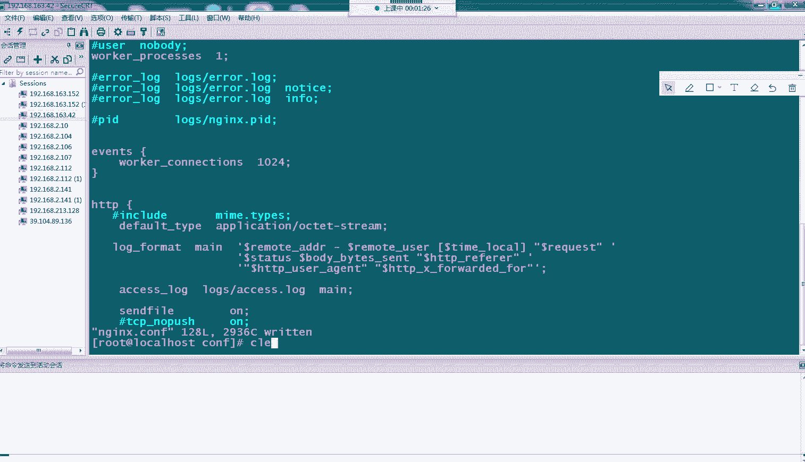

。最。下十。30。🎼还有。ok啊，35分了，我们现在开始啊呃能听到我声音吗？啊，蔡见能听到我声音吗？能听到帮我打个一。🤧K。大家能听到我声音吗？是。可以听到我声音吗？可以听到我声音吗？喂喂喂。呃。

蔡健能听到我声音吗？喂喂喂。大家能听到吗？能不能听到我声音啊？嗯mm。嗯。喂喂喂喂喂。可以听到我声音吗？喂。行啊啊应该呃大家都能听到啊，没没人说听不到。那我们现在开始啊，然后我们从我们的4月6号。

也就我们上一周开始啊，给大家讲这个wordb故障排除系列啊啊，从我们第一次给大家讲啊，我们讲了我们的403故障啊，403就是我们一些权限拒绝的一些访问啊。导致的我们那个403故障。

还有嗯讲了我们那个404的一个故障啊，404就是我们的一个文访问的一个对象啊。我们比如说我们的一个文件，我们的一个内容啊，它是在我们的呃服务器上面啊，不存在这个路径的啊。

是或者是我们呃找不到这个路径的啊，这时候会访回一个404的一个报错啊界面页面或者是一些呃报错记录啊，然后后面的话我们还给大家大家介绍另一个呃故障代码是我们的502啊，502故障的话。

它是它的一个错误的网关啊，就是我们的呃服务器跟我们的后端的一个真实的处理服务器啊，比如说我们的NG啊，我们的NG跟我们的PHP啊，跟我们的通盖这些啊服务它的一个呃联通出现了一个问题啊。

所以说它会出现1个502的一个故障啊，然后呢在除了讲这个故障以外啊，我们还给大家介绍了一些我们常见的一些啊访问。的一些情况啊，没办法，比如说我们呃打开一个网站啊，一会儿打开一会打不开啊。

我们一些呃固定某些IP访问我们的一个网站啊，是没办法去访问的啊，会出现一个类似我们403的一个故障的一个情况啊，还有一些情况呢，像我们的一些呃。域名啊域名的原因导致我们这些呃网页没有办法正常访问啊。

以及是些我们配置的一些错误啊，我们服务端这边啊NG这边配置的一些错误，导致我们啊我们后面后期更新的一些文件啊，我们的呃更新目录啊，没有定位到我们的一个新的一个呃文件的一个目录。

导致我们访问还是指向我们旧的一个文件啊，这样导致我们的一个业务啊，没有真正的啊对外完成了一个更新的一个操作。那我们上一节课啊就我给大家介绍了介绍了我们的NG啊，没办法启动的一些原因啊。

可能是由由于我们的一些一个端口的一个冲突啊，还有一个是有可能是我因为我们一些IP地址绑定的一些IP地址在我们的服务器上不存在的，或者是曾经存在过后面IP变动了，导致我们的那个服务没办法正常的一个启动啊。

然后还有一些啊像我们的一些权限问题啊，我们的非root用户去启我们的NG啊，导致它的一个启动会失败，这是为什么呢？啊因为我们的NG啊启动的是80口啊。

以及我们的443口啊默认的我们HTTB跟我们的HTTPS这两个协议，它所占用的一个端口啊那这时候的话啊因为我们的6系统，它有一个安全机制啊，它是1024以下端口是禁止非root用户起来的。

所以说我们在启动我们NG的时候啊不是root用户啊，那它会导致我们的NG启动啊失败。他没办法去申请这个两个端口啊，因为被系统安全机制给拒绝了。嗯。

那我们今天来讲我们W系列故障的最后一个呃给大家介绍一种情况啊。当然啊我们的一个故障不单单是我们去这几天讲的这些啊故障的一些类型，还有许许多多啊，在我们的日常的一个工作当中啊。

大家可能会遇到一些其他一些故障啊，那我们这些故障只是我们比较常见的啊，那我们今天给大家讲一个另外两种情况。一种的话是我们的一个文件啊，在我们的呃更新发布过程中。

我们是希望我们的这个文件里面的内容啊是展示在我们的一个呃新的一个页面上面啊，把它的一个内容展示出来。而有时候我们会发现我们这个呃文件啊放在我们的服务器上面。但是外面访问的话。

它不是去呃页面不是去展示我们这个文件的一个内容，而是啊因为而是变成我们它会去下载我们。这个文件啊，但是我们这个文件啊我们的默认是嗯不需要去下载的，是在页面上直接把页啊内容打开来，我们的文件打开来。

把内容展示出来的那会为什么会这样子呢？那我们今天来看一下啊，我们接天下来做这种实验，给大家复习一下这种文件啊，本来应该是把内容展示出来。但是它实际上会变成我们一个下载的一个情况啊。

啊，我这边给大家搭了一个环境啊，因为也是用我们的NG啊，我们这时候我们的NNG已经安装好了啊。在这个目录下面啊，userloc点NG啊我们的COF啊。我们的我们打开一个NG配置文件啊。

然后我们一会儿去访我们那个根目录啊，我们的根目录啊，我们路ot根目录指向是HTML这个文件啊。我们在我们的这个HTM文件下面啊，存放了一个TXT的文件啊，是我们的这个AA点TXT这个文件。

那我们看一下这个AA点TXT的内容是什么啊。啊，这时目前是空的啊，那我们给他写一个。数据进去啊，比如说this is fast TXT。一口啊，我们一口一个，然后加一个银行，直接输入，直接添加到里面去。

啊我们看一下它的一个配置。啊，那这时候的话我们的呃this is an task点TSC内容就在我们这个AA文件呢。那我们正常的话是希望大家访问这个文件的时候啊，我能够直接看到里面那个内容啊。

那我们这时候来看看大家。呃，打开一下这个页面啊，我先把这个NG服务器起来。我在我们的SB下面。我们的NG啊，我们先测试一下配置啊，配试语法测试OK，这边显示啊语法测试O我们的这个配置文件。

也就是我们刚才修来的这个配置文件啊，配置文件这边指向没错的话啊，这个就说明我们的一个呃配置啊，是我们的一个默莉啊，我们设想的一个位置啊。那我们这时候给它启动啊，我们NG干啊。

我们命令只要只要说点斜杠NG后面不需要带参数就行。那这时候我们看一下它一该短进程起来没有。OK当技能应个起来了啊，这边是一个root账户起的，我们看一下它端口是不是80端口。啊，这没错啊。

我们对我们的所有IP进行一个绑定，绑定了我们的80端口啊，那我们这时候呃可以先tennet啊。net看一下啊，我们的这个IP地址。看一下都暴你暴你暖火啊，是不是真的。谁觉了。哎。啊，大家看到了没问题啊。

是可以通的那我们现在通过这个IP地址啊去访问我们的这个TXT文件啊，那我们的一个访问路径啊，是通过我们的根目录下面去啊我们的斜杠这边来访问的啊。

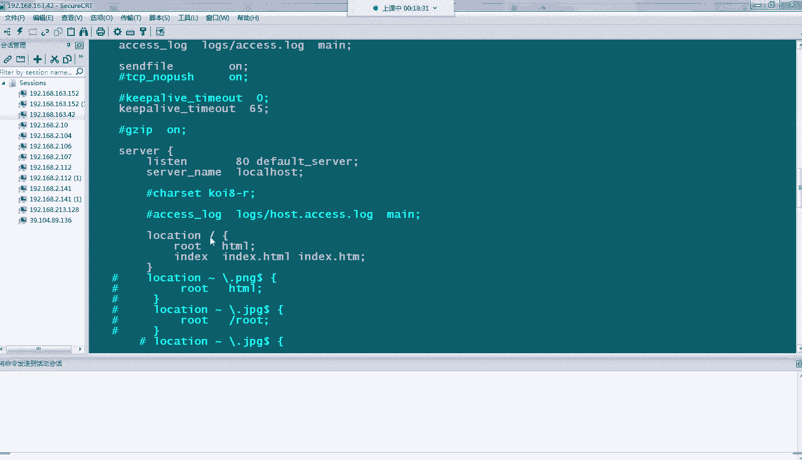

那我们的访问的一个啊地址就是我们的IP加上我们的一个文件名嗯。我们的IP是我们的这个。然后加上我们的A点TXTAA。对。点T TXT。啊，大家会看到啊，这边我不知道大家能不能看到啊。呃，我把它被拉出来。

大家会看到我这边会突然啊这边会变成下载1个A点TXT了啊，我再刷一遍给大家看一下。我们把这个取消掉。啊，这个已经。啊，这个已经下下了，没事，我们再再开始啊。A点AA点TX。他会看到这边会变成一个下载啊。

就是我们去访问这个文件啊，变成呃，访问这个文件，正常应该它是把里面的内容展示出来的那这时候它会变成一个下载的一个操作，把我们那个目录里面啊，把我们这个文件给它下载下来。

我们打开来看一下是不是我们的那个文内容啊，大家没看到我们这边刚才输入了一个la is啊TS1点task。那正常的话应该是显示这个内容的，为什么会出现这种情况呢？啊。

那是因为呃NG啊它没办法去识别啊去解析这个配文件啊，它没办法解析这个文件，没办法去读取里面的一些信息。那这时候的话它也没办法把里面的信息啊。

通过我们的一些HD协议啊返回到我们的客户端进行一个展示了那这时候的话啊我们去需要把我们这个嗯文件类型啊，来添加进去让我们的一个NG啊，它能够识别这种文件类型，然后能够去打开这个文件。

就像我们的windows系统一样。我们windows系统打开一个。比如说我们的PPT那我们需要下载一个呃WPS或者是我们的fresh这种软件au auto这种软件，它去解析这种文件，它才能打开啊。

那NG的逻辑也是一样的。你要告诉他啊，我去读取什么样的一些配置啊，能够解析这个文件啊，让它能够呃读取里面的内容，然后返回给我们的一个浏览器啊，让我们浏览。

能够正常的显示内容啊，那这时候的话我们NG是有一个这样的一个配置啊，在我们这边的一个。这个。我们的这一行。这下include卖点type在这个type里面的话。

它会呃包含了很多我们的一些呃常用的一些文件的一些格式以及类型啊。那这时候的话啊，如果是in这个文件以后啊，然后NG的话，它就会去读取这个type文件然后t文件就会告诉我们的NG啊啊。

你读取哪些文件要走什么样的类型。然后那它的NG能够识别到啊，那这样子的话啊，当这个文件啊，能够被NG加载到它的一个系统内存里面去以后啊，那它在运行每次运行那个处理文件的时候。

它就会去读取这个文件里面的信息啊，然后对啊我们的一些目标文件进行一个解析一个操作啊。那这时候的话我们的一个啊刚才我们这种啊AA点TSD啊变成下载的一种情况就不会出现了啊，那我们把这个来改过来看。

加上去看一下。保存一下啊。然后我们保存完以后，我们要呃让它生效啊。啊，我们一个测试没问题的啊，说明我们刚才那个这个加加入的一个操作啊，写写法是正确的啊。那我们这时候给它啊rereload一下。

重新加载我们的配置文件啊。O那这时候我们看一下啊N机进程。是否是呃启动状态？免得我们的时候出现什么问题啊，导致他进能退出。啊，正常时验也是应该不会出现这种情况的啊，比较少啊。

我们看到我们的进程还是在的那这时候我们通过我们的页面。

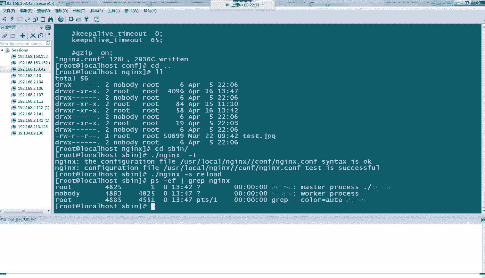

去访问一下我们的这个IP。好。呃呃我们的IP我们查看一下啊。我们来批试这个。A哎诶。点TI。眼睛。点TXT。唉，怎么还是一啊，那我们该看一下，这没有生效吗？我们直接给他list大一下。好，没有了。

我们再请家看一下。我们的路径是没错的啊。我们的配置文件看一下啊，应该是没错的。啊，也是很OK的。不要关掉，我们重新开一个浏览器。

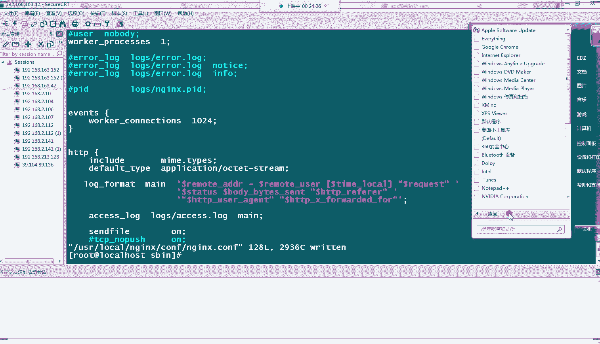

哎，怎么还是下载？嗯。看来今天的测试啊有一点问题啊。嗯，奇点怪了。嗯。没有生效啊，是为什么呢？😔，嗯。我换一个浏览器试一下阿E。我们的IE浏览器。哎，这边也没有IE浏览器。哎，看一下啊。不着急不着急。

你直这。

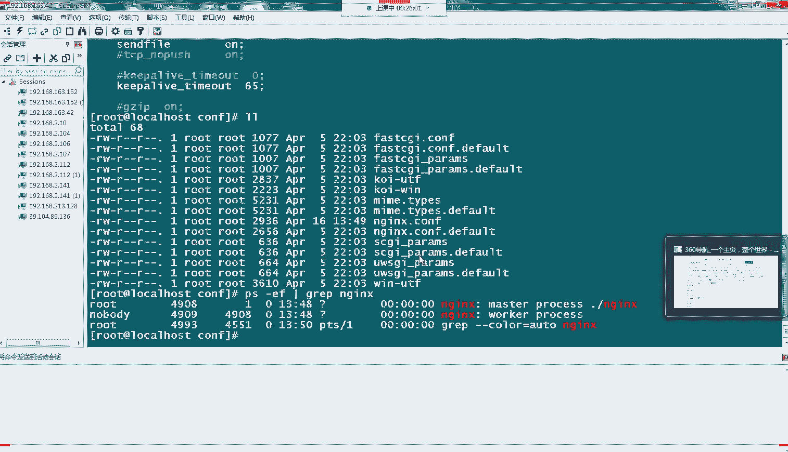

啊，这边IE就正常了啊，大家看到IE就可以显示出来了，I就可以出现一个我们的test点TSE啊，就没有出现下载的一个情况。啊这就是我们刚才这个配置文件，它的一个效果啊。们刚才歌浏览器可能有点问题啊没。

我们这边用我们的IE啊能达到显示能显示出来啊，我们这次做实验的一个效果啊，这就是我们这个inc卖点点啊这个文件，它的一个作用。当然不单单是我们的那个TST文件啊，我们的一些其他文件常用的一些文件呢。

大家都可以通过加载这个配置文件啊，让大家去机去识别它啊。这个在大家工作当中啊，也有经常会发现这种情况。大家可以去看一下啊，你的一个传输的一个文件在不在这个卖点t里面的对应的一个文件类型啊。

如果不是的话呢，把它加进去就好了。或者是你在这边直接inc啊加一个类型就行了这就是。

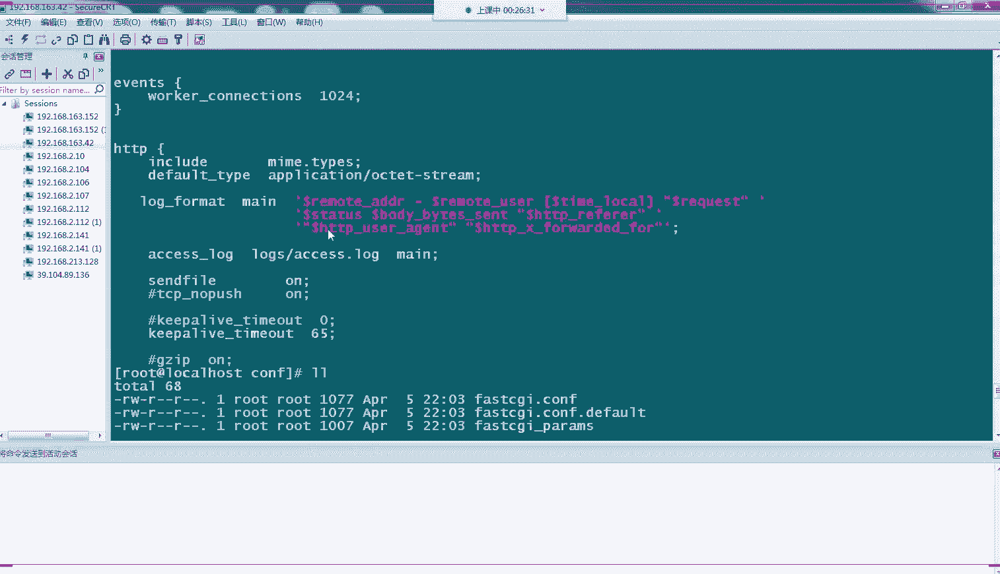

我们今天第一个这个呃故障的一种排除方法啊，以及它这一些解决方法。让我们看我们第二个啊，第二个故障的话是我们的这个会经常会看到这种情况啊，我们的一个。413啊413这个报错啊。

413request n type large啊，在尤其在我们仓出现一些上传文件的时候啊，它会出现这种爆错啊，那这种报错是为什么呃出现呢啊。

大家在上传的时候可能嗯会发现你上传的文件小的时候啊可能会呃比较少出现这种情况。那如果出现大文件的时候啊，比如说上百兆啊啊几十兆上百兆这种情况。那极有可能就会经常会发现啊出现这种故障的。

那是因为我们的NG啊，它对我们上传的话有个默认的一个限制。我们的NG啊默对我们的一个上传功能啊，默认限制是一兆大小的。你如果上啊你的配置文件里面没有配这种啊，对我们上传进行一个大小一个限制的话。

它应个有一个默认值，它是一兆啊，一兆大小，所以说比较小啊。

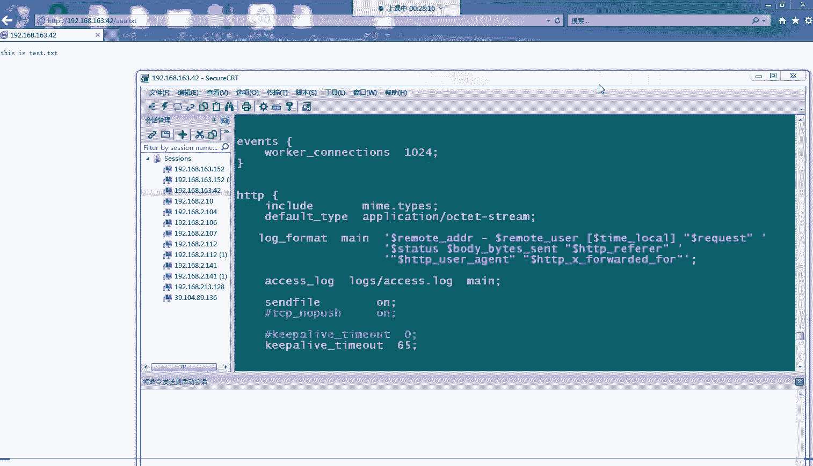

那你如果这个服务器专门做来来做我们的那些啊上传服务器的，那你这时候就需要把我们的一个上传的一个嗯配置啊给它加大了。那这时候的话你的那个上传才允许啊，而机才会认识别到你的上传的文件啊，它的大小才能接受啊。

那在我们的一个配置文件当中啊，我们的一个修改我们这个呃上传文件的一个大小的参数呢，是我们的这个参数啊，我们在这边可能没有我们换一个位置。我们在我们的。这个问件啊。咱么有配啊。

这个参数啊 max body size啊，这是什么意思呢？就是我们的客户端最大的呃请求体的一个大小啊，我们的一些数据基本都是放在我们的body体里面请求体里面啊，这就是我们1个HT协议啊。

它里面的一个请求的一个字段啊。那我们的body啊我们这边设了120兆啊，我们这时候就能够允许上传我们大概呃小于120兆的一些数据啊当然如果你的上传的一个文件还是大于120兆的话。

那这时候呃还会出现一个刚才这种呃413的一次报错那你这时候就要再调大啊，那这个的话设置值的一个依据的话，是根据你们业务的一个情况，你们业务这边如果是平时上传都是作为上传服务器的话。

而且你们上传的数据啊都是比较大的话，那这个就要根据你们一个呃平均值啊，尽量是能够满足你们90%业务上传的一个需求啊，来设置个值啊，当然那肯定会有一些极端情况，可能说偶尔一两次会出现方倍的。

等等这些超过你这个值啊，那这时候就要进行一些临时的一些设置吧啊。那我们这边啊提前给大家配了一个我们上传的一个呃配置一个服务啊，那我们可以用我们这个服务啊，配置好的服务来给大家演示一下啊。

有没有修改这个配置文件前后的一个效果啊。那我们这时候先把我们的这个注释给它注释掉，让它变成还原成我们的一个默认的一个上传的一个配置，也就是我们的一兆啊，那我们把刚才的NG给它停掉啊。

那我们这时候启动我们这这一台呃这一个这一个目录下N机啊。我们这首语法设置O的啊，我们就给它启动起来，让我们看一下它进程。啊，进程也是搭小，大家看到进程话已经变了，刚才是四开头，现在是5开头的。

我们端口看一下啊，问题。Yes。E T S， ST。登记啊，我们的80口是拉起来的。那我们现在啊我们设提前设置了一个上传的一个文文件，哎，不是上传的一个页面啊，在我们的这个HTTB目录下面。啊。

有一个哎这个是路径不对。哎，我文件放哪里去了啊，这个目录径不对。这个我们刚才要照这个目录下面去啊。我们的NG哎，我刚才是NG又启到，我们的那个部下面N进去了。啊，我们把这个文机给切掉啊。啊，O啊。

那我们这时候起我们open list下面的印机啊。好，我们的语法测试也是OK的啊，那我们这时候干呃干直接不用不用加参数了，直接启动啊。我们这时候看一下他应该是起来了，我们登记。好嗯，OK起爱的。呃。

端口也又正常拉起来了。然后我们这时候啊我们在刚才说了，我们给大家提前配了一个啊我们的一个上传文件啊，上传文件啊，上传的一个页面啊，这是我们的AA键HTML，我们打开这个呃页面，你看一下啊。

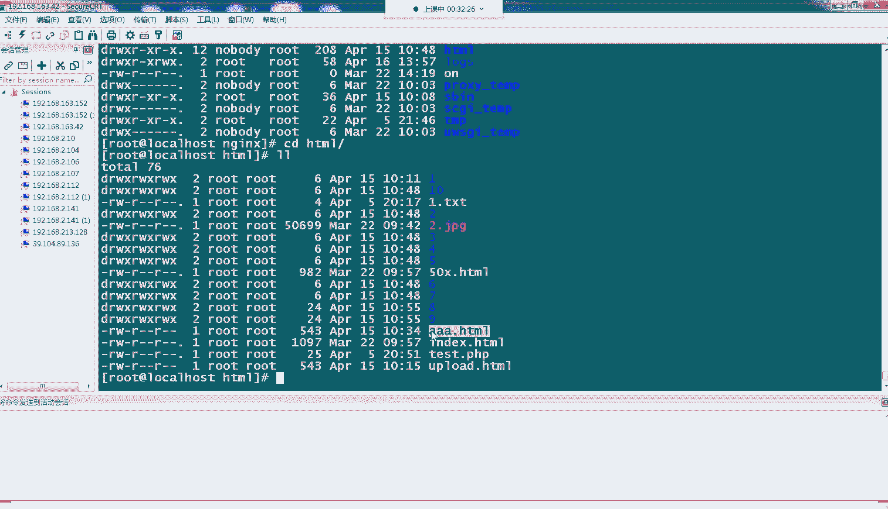

我们的。我们的IP是多少？P。我们的AAA点TXT啊，大家有看到这是我们的一个上传的一个页面啊，比较简陋的。我们只是作为实验的话。那这时候的话我们刚才设置的话啊是没有进行设置。

那我们这时候找一个一兆的文件啊，哎，小于一兆的文件，我们的这个ss文件啊，ss文件里面没什么东西啊。我们看一下它大小只有八字节啊，4KB啊。那我们这时候上传它。我们找到他的一个位置，saw SOUR。

啊，把这个文件那我打开。我们点upload啊，大家可以看到啊，这边很快啊返回了一个upload success啊，那这就说明我们的个上传的一个基本的一个配置啊是没有问题的。我们这个上传功能是正常的啊。

那我们的这个文件比较小，只有4K啊，然它的话上传是没有任何问题。那我们这时候如果换一个文件啊，我们退回来。我们换一个比较大的文件啊。我们的这个哎叉麦尔叉麦它指向了一个文件。只要那EXT文件。

有100多兆啊，大家看到有100多兆。那这时我们上头给大家看一下。嗯，上传这个插麦。大家看到这边会变成叉麦点ES，它会直接指向我们的一个可执行文件，真正的一个文件啊，我们这上传upload。啊。

那我们到服务端这边来看一下。我们看一下日子啊。啊。我们的日志是我们的右那个啊，这边已经弹出来了啊，这边这边已经不用看我们的日志啊，在我们的页面看到我们刚才就有一个413的1个报错啊。

request anything too large啊，就说明我们上传的一个文件太大了啊，超过我们的一个默认的一个设置了啊那这时候的话你就要去修改那个参数啊，那我们进行一个修改。

看一下它的一个呃实际的一个效果啊。

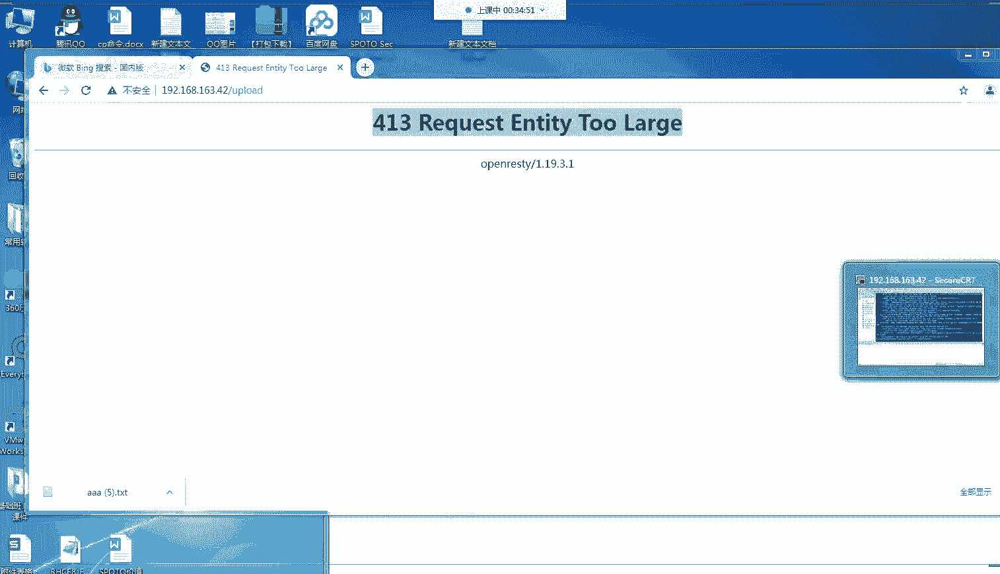

在我们的日志这边呀，其实也可以看到我们的一个呃刚才的一个爆竹爆竹信息啊，我们的呃logsNG logs access。大家看到。这个啊最后一条这是我们最后一条访问日志啊。啊，这边有个413的1个报错啊。

413这个是我们的错误代码啊。那我们在我们的al里面看一下有没有相关的一些信息啊。嗯，L这边啊。这边会有一个看到吗？大家有没有看到啊，这一条最后一条记录啊。

这边有一个关键的客户端啊尝试发送太大的一个请求体啊，这么多字节啊，然后这个时候就会出现一个报错了啊。这就是我们在L里面也可以看到一些相关的一些错误信息啊。那这时候我们去改那个配置文件啊。

我们把这个打开啊，我们打开，我们下是120兆啊，那可能就需要一些时间啊，120兆上传也是需要一点时间的啊。我们这时候给它重启一下。刚T啊，我们刚题没问题S我们加个reload加载我们的配置文件。

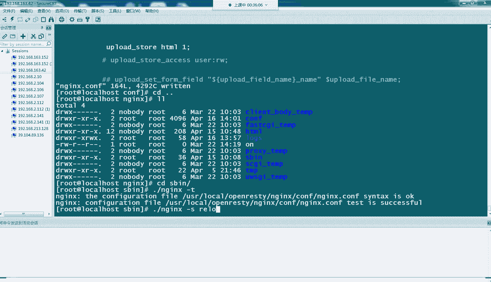

那到时候我们再回到这边来。我们继续啊点那个upload。

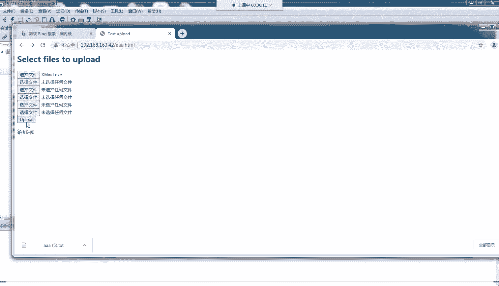

那这时候大家呃稍稍等一下，应该就可以了。

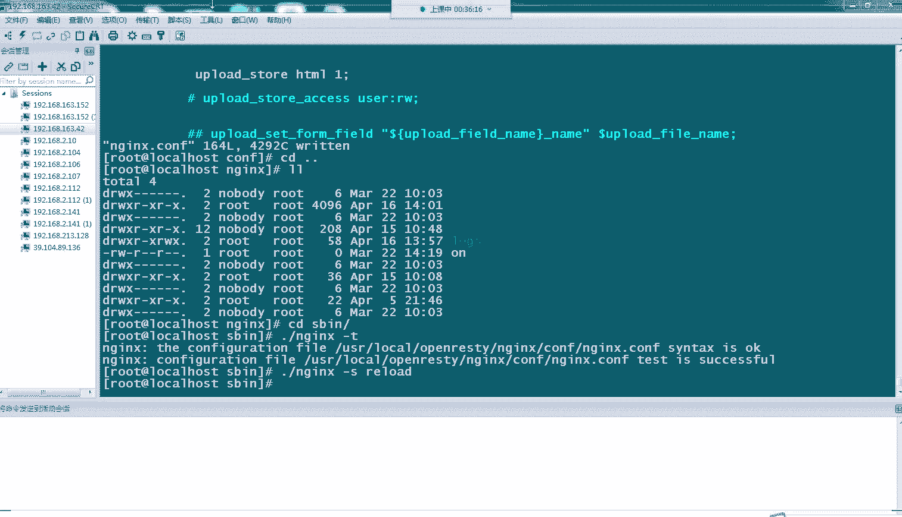

他100多兆啊上传需要一点时间。啊，大家可以看到这边已经跳转过来了，显示我们的upload啊success啊，那这就是我们的个效果啊。那我们在我们的服务器的配置的一个上传目录，我们找一下面这个文件啊。

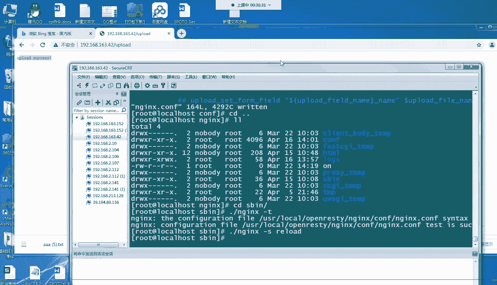

呃，HTML我们默认在这边配了好几个啊。好，我们这边看一下FFND。当前目录杠NMEname是我们的。

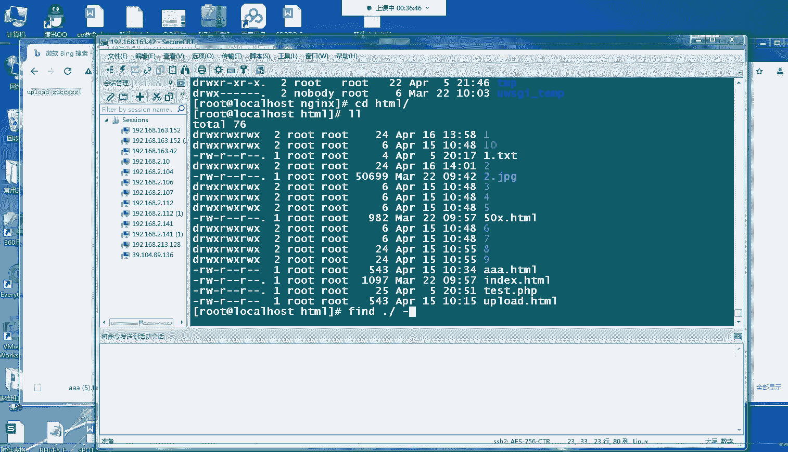

我们刚才文件的名胶嘛，插麦。

叉MIND点EX。这没有吗？啊，那没事啊，我们回头去找啊，可能一些呃名字命名有问题啊，那我们这个就是我们一个上传的一个效果啊啊这说明我们一个上传就ok了啊。那这就是我们的一个配置啊。

我们的这个 max body size它的一个作用啊。那今天的话我们就给大家介绍这两个东西啊，一个是我们的一个下载下载文件会出现一个呃本来本应是呃展示内容的，变成一个下载。然后上传文件的话。

我们是我们正常要上传一个文件会出现，反而会出现一种报错413的一个报错啊，它的一个原理，它的一个语音以及它的一个去调整这种配置的一种方法啊，几个参数啊。

我们的那个呃下载文件也给大家介绍了一个调整一我们参数添加我们相对应的一个参数的一个呃并方法啊。那今天的话就是我们给大家介绍的一个NG的一个本次系列上是最后一个的。

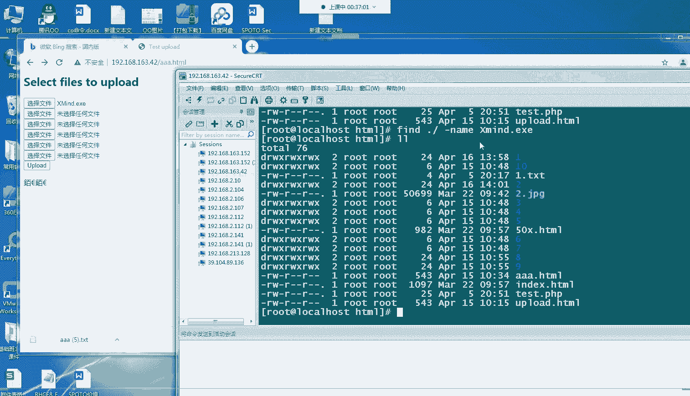

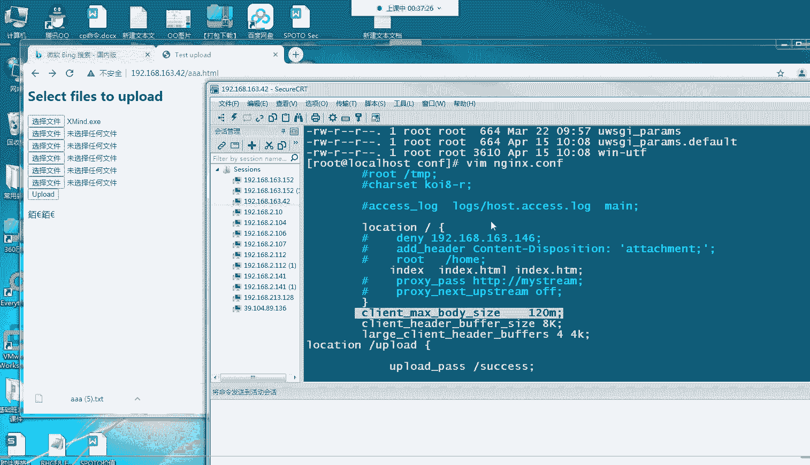

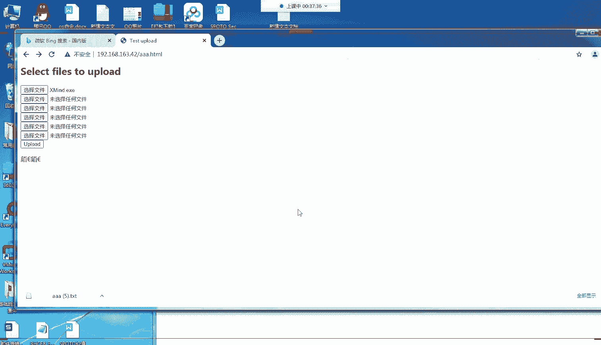

呃故障情形吧啊那大家的话可以去啊如果想了解之前的一个呃我们些故讲的一些故障的一些内容的话，可以跟我们的老师要一下我们的一个视频啊啊，前面的故障，大家也可以稍微看一下啊，都是我们在我们的工作中啊。

最经常遇到的一些故障啊。那当然我们之前说了我们的NG啊，我们的服务。它的故障肯定是不单单只有这些的啊，大家可以以这些为一个开头啊，对，以后拍出一些故障，有一些啊基本的一些方向跟呃想法吧啊。

有助于大家以后在工作中能够比较顺利的处理自己的一个呃手头的一些情况啊，那今天呢我们的一个分享啊，就是这些那其他同学有没有什么疑问啊，可以问一下。

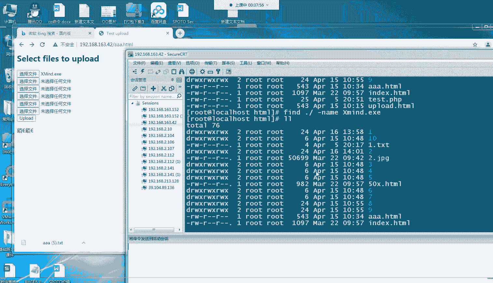

可以说在我们公屏上打出来啊，如果没有疑问的话，那我们今天这个课程啊，我们这个系列可能就到这里就结束了啊。好，那如果没有什么疑问的话，我们今天就分享课就到这里结束啊，我们就下课了啊。

感谢大家来听我们今天的一个五金小课堂啊。那我们现在就下课了。

