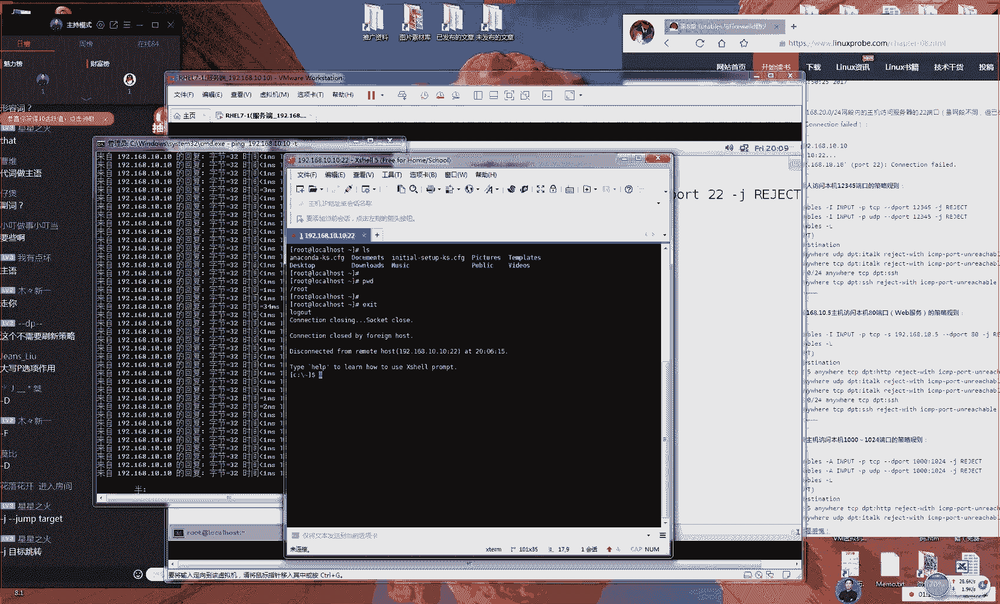
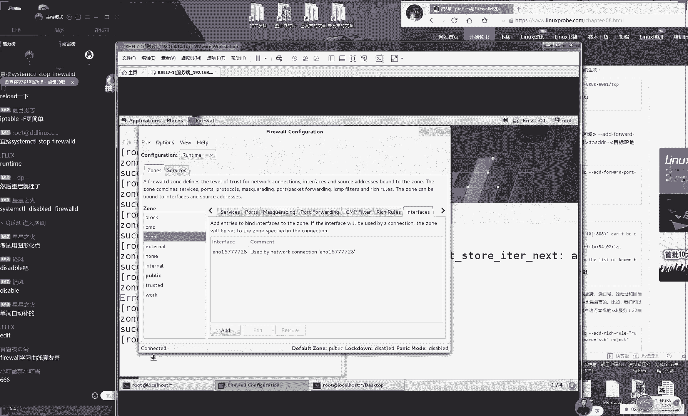

# Linux教程RHCE - P10：10.防火墙基础 - 艾弗艾尔思丢丢 - BV1if4y1e73V

OK好，那我们准备开始上课同学们呃，现在有63个同学，这个预想的还要这个还是比我预想的要多一点啊。因为现在已经经进入到12月份了，所以我现在预想的话，我们上课人数应该是在50人左右。

主要主要是不考试的同学们在线听课了。所以这个这个人数上来说还是比我预期要多一点的，就是因为我们现在马上进入到12月份大家准备开始考试。为我们这期报名时间比较早，大家已经基本上都已经报名了。

报名100多个同学所以说如果你你想要开始考试的话，那么请千万不要按照我们这个进度来去学了，一定要提前开始做预习同学们这个得这个提前预期变得很重要了。好，那我们来现在我们说一下我们今天这个课的安排。

今话是我们第八章节那我们现在测试一下我们这边上课环境。好吧，大家先打一下一。😊，哦，OK那那那我们先来测试一下我们这边上课环境。因为啊今天北京这边雾霾真的太严重了。我今天看了一下那个网上面。😊。

显示是100多，但是实际上我估计可能不到那那那可能实际上肯定是不止100多的。所以我今天可能嗓子有点不太舒服，可能会有点稍有点咳嗽啊，但是下面有但我们没有这些其他的问题啊，然后就是说给大家提个醒。

因为我才比较少。就是说因为我们现在已进入到马上要进入到12月份了。马上我们的12月底大家就开始来去考试的。那我们提前一定要开始做预习了。那么如果说你想要去红的话呢，千万不按照我们这个进度再慢慢去学了。

一定要提前开始看我们这个视频来去预习了。那么我们再给大家去说一遍的话，就是我们这个预习的课程，它就是在我们这个网页里面后面加上VIP个字，那么就可以下载到我们第8期的培训课程里面的一个视频。

包括说我们现已在网上面去提供了红S那个考前辅导的这个视频，大家可以都去下载一下这是我们这个网址，后面加上VIP三个字，大家一定要去千万一定。😊。

去预习了，这个现在变得非常重要了。好，那我们接下来说一下啊，说今天雾霾真的很大。😊，因为我也算是习惯，但是我从来没有遇到过我的嗓子会有这么大影响啊。好，那我们接下来给大家去说。

今天我们这个第八章节的这个防火墙是这样的话，那我们今天讲课之前的话，那我们现来去学习一下如何来去配置你的网卡。因为我们以后啊要去学习配置服务的话，那么如果你的网卡没有配置好的话。

那么你的这个服务配置的再好，但是你去访问不了的话，那么你也看不到效果的。所以说我们现去学习一下，说该如何去来去配置你的网卡这个它有4个方来去配置的第一个方法的话呢。

它是通过我们这个说怎么样说杭州有没有幸免是吧？好，那我们接下给大家说一下，该如何去配置一下我们这个网络。那我们今大家讲四种方法来去配置我们的网卡。那么您可以从里面去选择一个您最喜欢的一种方式好吧。

那我们现我先给大家演示一下说在我们配置前，那我们需要做什么事情。第一件事情的话，就是在安装你这个虚拟机那我们既然我安装好之后，们就可以点开我们这个。😊。

网络设置选项了，它这个肯定是跟这个北方它烧煤，它烧暖气有关系，对吧？然后你想现在这个暖气它也不是核能的，它肯定是要烧煤，肯定就是对这个大气肯定是有污染。好，那那呃那好。

那我们现在我们点击一下这个适配选项。这里边它呃它有两个这个网卡。那我们第一个网卡的话呢我们叫做VM的一。第二个我们叫做VM的8。那我们是这样给大家是说啊，它有两个模式。第一来说叫做这个紧主机模式啊。

叫紧主机模式。😊。

今天啊今天人数不多啊，其实已经是超过我的预期了。现在7070多个同学其实我真的是没有想到，因为我以为大因为我以为呃大家都已经是开视频开始去提前预习了。可能这个在线课程对意义不大了。

所以现在70多个同学我现在还有点慌。大家这个进度一定要往下去赶一赶了，千万不要按照我们这部就班慢慢再去学。这可能就是到最后有点来不及好，因为我们准备时查的话，那你考试时那就更稳妥对吧？

第一话好那我们来说第一个我们这个网卡模式叫做这个紧主机模式它对应的网卡就是叫做VM一，大家能听出来。我今天这个声音真的是好苍白是吧？好，真的是好沙哑。那我们来第二个模式的话我们叫做8那好。

那我们现在话我们现在去设置一下这个M这个网卡。因为我们统一选择是这个紧主机模式。好，那我们现在双击一下我们这个VM一。😊，好，那我们接下来我们来呃对我们说我们已经预习过，对吧？然后听两遍，那更好。对。

那就是说我们同学想要去考试的话，再给大家提一下，虽然我比较啰嗦，就是请切记今天开始就一定一定要开始做预习了大家不要说等到最后一节课之后，你再去准备，那那比较仓促了。好吧，那好。

那我们现在编辑一下我们这边的这个网卡，然后我们把它设成同一个网段。那我们现在看一下我们这个地址，话地址是192。18。10。1，大家可以看到那那好那那我们现在把我们这个真机上面的网卡给大家设置成192。

6810。1这个网卡，192168。10。1好，那我们待会儿的话呢那我们需要把我们这个讯机里面的这个系统给设置同一个网段就可以。那么也就指的是前三位是相同就行。那我们这个字房间码是325。

0是这样的啊呃，大家大家听得到对吧？那好，那我们就给大家说是这样的，因为我们今天可能确实我刷下起来会很难受，因为会很痒啊。😊，这个雾霾真的很严重。然后所以的话大家如果上课的时候。

您呃听到呃您听到的声音呃，听或者看画呃或者说呃去看画面出现一种卡顿，或者说呃黑屏这样的情况的话呢，那么您可以再去重新退一下，好吧，因为可能说。😊，我们啊今天可能不会再给大家去呃重复去讲这么多次。

就是我们上课的这个方法了。好吧，就是我们如果那么我们如果要是遇到问题之后的话呢，请您先去重启一下您的这个电脑，或者说重启一下这个QQ我明白来讲，它就可以进入到我们这个频道里面了。

那好那我们先看一下我们这个真的话呢就是我们这个物理机器，我们的物理机器，它就是192810。点10。1就这样的啊，那那我们所说它是同一个网段的话呢，大家应该都知道的。

就是说那我们今天来讲那我们这个增码是325。0。那我们指的同一个网段指的是前三位只要是相同就可以了。那么最后一位那我们叫做叫做主意地址这可我们可以随意去起。那我们这个地址的话呢。

那我们也给大家去规范一下好吧包说我们今天给大家配完了之后，等到我们的明天后我们的以后我们的课程里面都不用再去纠结这个事情了。好，那我们给大家说一下说我们的物理机器。

我们的地址就是这样的第二的话就是我们这个服务器，我们的服务器。😊，话呢啊说什么啊，双十一买了新话筒了。对我双十一买了一个，趁着便宜也买了一个嘛，但是我什么好的这个麦克风线，架不住我这个嗓子呀。来。

那我们接下来给大家说呢，我们这个服务器的话呢，就是192。8。10。10。大家记得你的书上啊，这个虽然说跟我们这个技术没有多大关系。但是你把它记住了之后啊，到时候你再去配置的时候。😊。

你就不用再去呃但那当以后再去呃那再去配这个服务的时候，那你就不用再去纠结我们这个服务器的地址了。那你你就可以把你这个心思就完全投入到我们这个后面这个服务上面的所以话那我们这个第一个我们的服务器地址就是19268。

1010。好，还有我们一个客户端。那那我们如果说我们这个客户端第一个客户端的话呢，那我们统一把它叫做1928。1。20其实这个是以此类推的啊，大家懂这个意思就行了。那把它规范一下。

当我们以后再去配置服务时候，大家不用再去问我说那我们这个地址该配成什么样子。大家又统一按照我这个来去做好吧，这个那我给大家一个规范。那等我们以后配置所有的这个主机的网卡的话。

那我们都按照这个流程给大家来去配。那我们这个第那我们这边的这个第二客户端地址么就是192810。30。好，那我们接下的话呢我们来说就是我们怎样配置文件的页面很小要不要用这个给大家放大。😊，页面是吧？行。

待会我们会给大家去放大页面的好吧，O那我们接下来给大家说一下，这是我们的这个地址，大家可以来去记一下。等我们以后就啊大家再去配置服务的时候，那么都按照这个去做。

那么你可以把你的这个经历就完全投入到这个配置服务上面纠我再配置这个网卡地址上面好需要开两个虚拟机，今天我们是不需要的。好吧，那我们现在的话那我们将我们的这个物理地址先给它配置一下。

先看一下我现在这个步骤。现在的话我先按照我这个步去双击下我们的第一个V这个网卡。然后我们点击一下这个属性。这个物理机是虚拟机的网卡嘛。这个是你安装好虚拟机之后，它就会默认出现这么一个虚拟出来的一个网卡。

代表就是你真集跟你这个虚拟机进行一个互通的这么一个桥梁。然后我们来双击下我们这边的设置我们IP地址把它给设成1981010。1好吧，我给设置一下我们这边IP地址。我们点击下确认们点击确认，然后我点击下。

😊。

完毕。好，接下话呢那我们再编辑一下我我再编辑一下我们这个新机的这个选项。我们点击下设置。因呃我们现在啊我们现在还并没有给大家去讲解我们来去怎么样去配置你这个网卡，主要给大家讲清楚。

就是说那我们在配置之前，那我们怎么能够保证这个两个机器才能够进行它有一个互通的一个条件。好，那我们接下我们再说把QQ给关了什么情况好，然后的话呢我们来点击一下我们这边的这个网卡。然后我们网络是微信。

那么请大家一定要选择成这个金主机模式。那么呃如果说你选择是这个金主机模式的话，那么对应的就是VM那么如果你选择是not模式的话，那么就对应的是VM8那我现在话那我们统一我们今天第一天对？

那我们统一把设成桥把它设置成这个金主机模式一这样的一个模式。好，那我们这个网卡。样话我们来选择这个金主机模式，我们点击下确认这样的话，那么你这个真机跟你这个虚机它有一个。😊。

数据的这么一个交换这么一个呃的这么一个基础的。那我们接下来我们来去讲一下该如何去配置你的网卡。那么的话那我我啊那我们会给大家讲四种方法来去配置你的网卡。因为我今天嗓子可能不太好啊。

所以我会把我今天所说的话，我们尽可能给大家打出字。大家可以看到我们这个屏幕上面会给大家打出来的字是这样的那我们现在给大家讲四种方法来去配置我们的这个网卡四种方法。😊。

来配置我们的网卡。呃，但是的话大家只但是大家只要会了一种就行了。只要会其中一种就可以。那么我们来自来去选择，大家可以自己去选择一个最那么那我们可以去选择一个呃最适合自己的啊，选择一个最适合自己。

然后大家都演示一下，最适合自己的这样的一个方式。好，那我接下来我们来桥接模式自己有I地址这不对因为桥模式，它指的就是有你这个外部的网络。说路由器帮你去分配个大家不用着急。

我后一个服务叫re这个代理服务的时候，者大家讲到我们这个桥接模式该怎么去上网。好，那我们接下来话呢我们来那我们现下来去配置一下。然后说笔记本连wifi怎么去设置地址这个跟我课程暂时没有太大关系。

可以先看一下书，者之后问一下吧那接下来来讲一下我们这个第一个方法来配置我们这边网卡好吧那那我们今然知道我们的有一句俗话叫做lin的一切都是文件那么我们配置一个服务的话，么也就是再去。😊。

修改我们这个服务的配置文件。所以说那么这个配置文件，那我们找到它就是在我们TC目录里面叫做这个里面的work这么一个目录里面它有一个叫做个开头一个文件这是一个缩写这个叫做face是一个缩写。

为我我们把网卡给大叫做terface所以它是一个缩写就代表就是一个网络接口配置文件的意思。后加一个号后面加是你的网卡名称大家这个不要你去猜你也不要你不要去猜。

你不要按照我这个去敲那么你一定你这个实际为准你使用一下这个实际准。我这网卡就是677772们加上们这个网卡名称其实我那我按下键给大家做补齐我们敲一下这个回车是这样的们这个基种模式我给大家讲这个不用担心好。

😊。

我们现在的话呢给大家演示一下啊，那我们想要来去验证一下我们这个网卡他他配置成功的话呢，那我们就给大家去拼一下。那我们拼一下192。8。10点啊，我们随便啊，我们这我们随便点10。20好不好？好。

那我们来拼一下，这个时候他会告诉我们说我们是拼不通的因为我我们的这个真集跟我们这个虚拟机。现在它是不能够互通的那好了，那我们接下来我们就要。😊，其实我们今天这个上课人数还是比较多的，还有83个同学。

而且在陆续进场。其实我坦白说啊我坦白说我我并不是很高兴。因为我认为大家应该人数也就在50人左右了，因为已经是不屑于我们这个在线培训了，应该是马上就开始就看我们这个视频开始去来提前做预习这个才是对的。

因为你们约的都是12月中旬或者说12月底的考场这个一定要开始做预习要搭这个一要有这么个意识了。好，因为我们花的钱。

因为我们因为我们这个因为这个考试费很贵的因为我们花4200块钱这个费用真的很贵的我们要重视这个考场这个这个考试的事情。好，那我们进入到我们这个配置文件里面为这文件里东西比较多。

那我给大家简单介绍几个比较常用的那我们来给大家说一下，我迟到同学啊，就说话我们现在给大家现讲一下我们这个书上没有的这个配置王凯的这个方法，会大家讲4个。😊，来配置我啊我们的网卡。

那么呃您只要去选择一个其中您最喜欢的最适合自己的就可以了。好吧。好了啊，既然我们来就不用退了。那我那我们就是说我们以后一定要开来做预习了。那我们先来看一下我们的第一个参数代表就是我们这个网卡的这个类型。

它是一个以太网。然后第二个的话代表就是一个启动方式，或者说它是一个获取网卡信息的这么一个方式，它有三个类型，它有三个可用的参数。第一的话呢为静态第二为第C第三就是为默认好，这个我们选择默认就可以了。

我们下面还有一个叫做name这个代表就是我们的网卡的名称，下面我们是叫做网卡的一个唯一标志服但是它跟我们下面个地址它还是有区别的。而我们的话这个叫做我们的网卡的物理地址，就是我们的网卡地址大家要记下。

还有其中这么一个参数，这叫这个参数的话呢这它。😊，这个效果是让我们这个网卡开机时候，它是否去启用，这个什么意思啊？那么就是说当我们把这个的给把它给写成是yes的话呢，代表就是当我们这个系统开机之后。

那我们的网卡就会为用户去提供这服务了。但为 no的时候话，代表就是当我们这个系统开机之后，但是我们的网卡它并不会为用户去提供服务。这个参数它最为最为重要那么是为什么大家知道吗？

我们作为一个梗这个参数它很值钱，大家知道他值多少钱吗？如我没有预计过同学估不知道什么意思。说一个参数它能值道钱了，对不对？这怎么回事？虽在说这个参数它值道4200的钱对不？

那么为什么是这样的因为的话4200就大家这个考试费用啊，考试的话呢，它是从启之后盘。因为我今天其实不很好。但是我在仔细但是我在很努力给大家说这个我我们在很大给大家去说这个。😊，呃。

内容最大化大家如果听到这个声音比较小的话，大家可以调大家可以去调调自己的这个音箱。好吧。因为的话这是我我们这个红帽HCSC跟红帽HC这么一个考试的一个费用。这我们都知道对吧？它是一个从启之后他去判。

它是一个从启之后他去判卷子。那么如果说您比如说当您去配置好这个服务全对了，但是的话网卡没有启动，这样的话从启之后脚本它是不能够判到成绩，最后的分值是一个零分这样的一个情况。

那也就是说当您的这个服务配置再好再对，但是没有用，后考试的时候是零分，再给大家讲一个给大家讲一个例子啊，那我因为我上初中的时候，我是因为我上初中的时候是一个重点的一个正也是个正也是个很好学校啊。

但是因为我们家住的离学校比较远。那我每天起我天上学，就有可能我早起就忘大作业了。咱比如说有天晚上我特别努我再去写作业特别多的作业啊，然我到。😊，凌晨两点钟，我写了好多好多作，而且特别特别的认真。

结果的话呢我第二天起的太匆忙了，我忘了带了。哎，这个时候怎么办？这个时候你第二天到班里面跟老师说什么我忘带了。

像样情况我估计会有20同都带情况的话同是没有分就说我们的一定要让你这个配置出来的这个服做出来的这个工作啊，体出来的这个有这样一个价值，能出这样的成绩，就是取决于这个的这个参数。

所这参我们说这么久家注意说我们这个参数请切记切记一定要把它改成是yes有条件话y必家去检查一下就是我们这个网卡I地址后是我这码24位。其实他两个。😊，方法第一来说就是我们写他记了24位。

那么你也可以给他。😊，给他写成这样的一个形式都可以的。因为我们知道的啊，这边的话我们讲的这个IP地址，它实际上来讲，它是一个十进制，对不对？192810它是一个十0进制的那我们比如说325。

0我们给换算成这样的一个二进制的话他们就是12341234逗号12341234应该是句号我们我们说比较严谨它换二进制的话就是这样的一个形式，12345678这样的一个二进制的一个形式。它写这24的话。

它指的就是我们往前面我们记了24位的意思。所以说这个的话我们这边两个写法大家可以供参考这两个他们都是可以的个他们都是可以的代表是同一个意思指的是我们这个码我们的网关现在不需要配置。

因为我们要知道我们为什么要去配置网关，是因为我们要去连外网我们要去找到下一套这个路由器，但是因为我们现在不需要连外网。网关是不需要去动的。而且我们不需要去做外网。好，这样话。😊，给大家来去说一下。

就是说啊怎么样去讲网络的东西了啊，时明来晚了，对不对？然后话呢，那我们现在把我们这个地址给大家设置成10。20，那我们敲一下保存并退出。因为我今天早上真的是。😊，呃，我不知道能不能坚持两个小时啊。

所以说我先给大家讲。😊，就尽量先讲就先啊去讲这个干货，希望大家能够体谅一下啊，也能够啊就是因为确实时间可能物霾比较重。好，那我们现在保持名退出一下。然后我们现在去重启一下我们的网卡，因为大家看到啊。

现在的话呢我们这边我们去拼一下我们的网卡信息，还是拼不通的。这个时候我们就必须要去去重启一下去重启一下我们的网卡，我们重启一下。然后这边我们看一下效果。大家看到马上就把拼通了。

所以说你不要看这个表这个表它没有用的，因为你看我配置多少遍都没有都因为什有它是没有用处的。因为我们需要己我们己动手大家练一下，所以大家总结一下啊，总结一下我们这个干货，因为我今天可能也不是很好。

所以我给大家打出来字好不好？家话那就千万一定要记到这个书上面。来说的话呢有三句话，第一句话叫做的一切都是文件。好的。😊。

这个大家记一下，大家不要烦啊，大家啊啊那啊那我们记一下，说字网源码写的是星星星呃，星星星写的是什么意思？是被屏蔽了吧。那你可以截图发到咱们的群里面，我看一下。好，既样的话呢还有我们这个第二句话。

第二句话就是说那么我们再去部署，或者说我们叫去叫做设置。所以这个这个这个你怎么叫吧，那我们叫做这个部署服务吧。那我们叫这个说比较设的比较高端一点部署服务实际啊，就是在修改服务的配置文件。好。

或者说把它叫做这个设置服务吧。呃，设置服务选项实际上就是在修改我们这个服务的配置文件。第一啊他我们这个第三句话，大家知道是什么话吗？第三句话就是要想。😊，让服务。执行最新的参数啊，需要重启该服务。

这是我们这个第三句话。对，那我们需要来去重启一下我们这个服务。这要123它有三句话其实话它有第四句隐藏的话，我还没有说就是说待会我们去配置服务大家讲好。

那我接下我们来去重启一下我们这个网卡大家看到那我们这边把它给拼充了，说明我们的这个网络它也是已经配通了。好了，接下来说我们讲一下我们这边这个第二个方法。第二个方法的话呢，我们叫做NMT吧。

因为我刚才讲到这配置文件啊，说这个咱说实话我们一开始可能那我们开始可能去配置的时候，它是有难度的。而且它参数比较复杂。

那我们就可以使用这个工具大家去配置这个工具叫做NT这个工具叫做NMTT那这个工具那我们把删掉，大家记笔记后把删掉。因为我们今天我会家多打一点这个文字上来好吧，大家可以去记的笔记好。😊。

给大家说一下的话呢，在红包re5和红包re6里边的话呢，这个命令实际上它叫做set up。到了红包re7里边的话呢，这个命令它叫做NMTY它都是基于我们的文字界面来去配置我们的这个网卡的这么一个命令。

好了，那我们现在来去配置一然后那我们来去敲一下我们这个命令。然后我们来去选择一下，配置一下我们这个某个网卡。对了，然后我们这边真机我们来去拼一下192。68。10。30。好，那我们才一再回车。😊。

然后我们来这啊编辑一下我们这个网卡选项，这就跟打游戏似的，这没有什么这那我么这就没有什么难度了。敲回车。然后我们的这个网卡地址间是10。20好了，把它改成10。30。

然后这个时候我们再来去到最后这边会有一个OK你看这个OK它藏到到这个最右面，那我们来敲一下我们的回车，然后我们保存一下我们现在配置这个信息，等一下到最右面，然后我们敲一下回车，再来点击下退出。

但是我们可以看到的话呢，我们现在拼的这个网络它没有通，为什么他们为什么没有通。那么我们明明已经修改了这个配置文件了，为什么我们的网络还是不能够查，还那我们还是不能够通信，他要是第二句话，对不对？

就是我们要去第三句话就是要想让我们的配置文件，它能够去生效的话，那我们需要去重启什么啊，说没有重启，没有重启什么，是没有重启我们的服务器吗？是没有重启固定的某个服务吗？还是没有去重启我们的对应的那个服。

😊，不务对我们要去重启对应的那个服务。啊。好，那我们现在去重启一下我们这个网啊这个网卡服务。然后的话呢我们来看一下，这边马上就能够偏通了。好了，我们看一下。😊，OK能够啊它能够它能能够拼通。

就是我们给大家讲的，说我我们这个第二个来配置我我们这个呃网卡文件的方法。好了，那么你可能会觉得第一种方法的话，它太难了，它需要配啊他需要来去修改我们的配置文件。😊。

那么我我们的第二个方法的话呢呃不太好看，这个界面好丑啊，对不对？那么给大家讲第三个方法呃，第三个方法叫做N connection。这个是基于我们拖鸦界面这么一个配置工具。那我们来拼下1。

4我去4回车这个话是基是基于我们鸦界面来配置我们这个网络的这一个工具了。然后这个工具就没有什么好讲，直接讲话so easy太简单了，们点击一下这个设置其实来讲因为你光讲这个其实也行，但是骗钱，对不？

这个东西也不需要去讲了。那那我们需要注意两个选项，就这两个选项，我们切记一定要把它给它改把它给勾上这个代表就是我们把给开启。

然后话呢我们这边编辑一下我们的我们的这个网卡地址改成401改40然后我们点击下保存点击一下关闭这个时候我们同样我还要再去。😊，重启一下我我们这个网络服务。然后马上就可以看到我们的门够拼通了。

这就是说我们讲了第四呃，就是我们讲的第三种方法来去配置一下我们这个网卡服务。😊，这个话这个啊那我们啊那我们看我们这边这个第三种服务，第三种方法来看的话呢，就比较简单了，对不对？

但是呃我们如果同学还特别的懒啊。那么我们如果要是揽机命的话呢，这两个命这两命令大家都的没有关系。我给大家讲第四种方法，大家记一下，这是我们三种方法这个话就是有两个命令，我们需要去做。

那么也可以做一下简化我们这个第四种方法就是来直接点击一下你虚拟机的这个右上角它会有一个两个小电脑，我们点击一下这个网络适配。好，那我们边把编成一个150给大家演示一下我们配置的方法。

这就是非常简单的一种方法，这也是最简单的啊，那么考试的时候，如果大家愿意的话，你们大家也可以使用这个方法来去配置。因为我们这个考试的时是有话界面的我们选一下这个小点击下编辑然我可以点击将改改成50。

然后我们点击一下应用这个时候你不用去重。😊。

网卡这个啊的这个命令，那么你只需要敲一下这两个这个按键，先把它关闭，然后再把它开启。这样的话呢，那么你的网络就能够配，那么就可以通信了。这就是说我们完全可以基于我们这个界面的工具。

就可以来配置一下我我们这个网卡了。那么这个四个方法。😊，就给大说NMTY哪个系统都有吗？是这样的，它在呃7里面它是有，但是五和6里面它叫做这个et好。

那我给大家说就是我们这个1234有4个方去配置一下我们这个网卡，那么给大家说清楚了。那么大家觉得这1234你们更喜欢哪一种，你们更喜欢哪一种考试的时考试的时候他不会去考他不会去考这个他不会去考到。

而且红包只结果不看过程就是哪怕说你不用这个我们刚才讲的这个方法，你自己修改内核或者说自己有一更加高级的一些方法都是可以的其他的需要去设置，但是都但是给大家说过。

刚才就我们这个选项啊就是比说我们以这个为例就他这个勾啊代表就是这两个勾代表就是然还有们刚才那个服务他们需要配置。但是只不过没有敲灭令嘛对？😊。

这个里面你看到它有两个勾，我们就来把勾起来，然后他就他就他就是默认叫做这个了。好，然后大家我看到大家说啊选一的也有选四也有选三的也有，但是选二的比较少是吧？行，大家这个随意了。

大家要选择一个自己比较喜欢就好了。然后给大家说一下，我们来去配置一下我们我们今天这个第八章节的防火墙，今天我们这个东西你虽然多，但是道大家其实来选它难度并不高。大家为大家知啊啊大家知道为什么啊。

就是因为我们今天会讲四种方法啊，四种方法来去配置一下我们四种方法配置我们这个网卡。还有的话就是我们这个会讲四种方法。😊。

配置我们这个防火墙，我们全部都是四选一，好吧，今天我们这个课程，就像我们配置网卡一样，全部都是四选一。你待会儿你也去选择一个你最喜欢的一个配置防火墙的这么一个方法。

好吧O啊那我们待会我们这课程里面就是四选一去选择一个你自己那么选择一个你自己最中意的这么一个方法来配置就可以了。那我们先来讲一下那我们这个防火墙的这么一个作用啊。

其实大家去网可以搜那么大家可以网上去搜到说这个防火墙这么一个作用啊那么他他会有很多种作用，对不对？那咱比如说他会保护我我们这个内网，会作为我们这个行为神迹怎么怎么样，对吧？

但是我们来去抛开这些不讲的话呢，我们就从本质上来讲，因为我们像我们讲课不会像一些书上面或者说像一些网上的那个文章一样去很多很多，他们认为很高大上的东西。但是最后们但是最后讲不清楚。

那所以我们先我们上课给大家去取出那个精华来。那么去说一下我们这个。😊，啊，防火墙的一个本质。那你想这个防火墙的话，先来说，它是作为一个我们这个内网和外网的这么一个屏障，对不对？

这边再比如说就是我们这个外网，这边比如啊那咱比如说这是我们这个内网，他像那他就像我那我们这个公司跟我我们这个外网，或者说会像我们的家庭跟我们的这个社会一样的关系。那那啊那给大家提个问题好了。

那么请问是我们的家庭里面安全还是一个呃社会更安全。😊，呃，是我们的家庭的这个小成员之间更加安全，还是我们这个外边社会它是更加安全的那我们肯定知道说是我们的家庭里面是比较安全，对不对？那好了。

所以说我们需要安装怎么样防盗门是是为什么我们安装防盗门的这个作用那是为了防止说外面的坏人进到我们的家里面，绝对没有人说我们那我们自己家了一个很贵很贵的一个防盗门，是为了防止我自己出去封了，对不对？

所以的话这个相当于就是一个防盗门，但是想一下，就是说防火墙它主要它这个功能咱比如说它会有防风，对不对？它有防呃从内部到外部的这样的一个猫狗，它这样的一个它有这样的这个就是我们会作为一个我们的一个屏障。

它作为一个我们这个内网和外网的一个屏，但它主要的这个功能的话呢，还是为了防止我我们这个外部的黑客，或者说社会这个这个分子从我们这个外网进入到我。😊，这个内网里面。

这个才是我们的防盗门跟我们这个防火墙的这么一个核心的一个功能。虽然呢我给大家说到啊，它有它是有几个功能的。第一来讲的话呢，我们这个叫做input好了。

那今天我们这个为我给大家讲这个服务给大家讲很多很多这的例子，大家以来去因为大家不知道什个防火墙的话家参考一下那我今讲一下我们的第一个功能就是说我们要想要从我们这个外网到我们这个内网的话。

那我们第一个功能叫做put后怎么 table少讲一点，我多讲一点可以吗？还是不要吧。因为毕在线同学比可他们也想多听一都想去学习？

因为我讲四种方配置下我们这个防火墙也许你不喜但是也许有同们想一下也是有可能对吧？所以我按照我们这个进度给大家讲然后最终是否要去取舍的话，那以我们同学们自你们自己的喜好，你们自去决定一。😊，欢哪一种。好。

那我们还呃那我们来去学习一下我那我们来说教我们这边第一个方法叫做input。那我们来说一下我们这个input。他考试不考，但是我们同学们呃也并不是都想去考试啊，大家互相体谅一下吧。

所以的话我们我们给大家讲的时候，尽量多讲点东西吧。好吧，这样的话呢我们来再给大家说一下，就是我们第一个从我们的外网到我们内网里面他这个动作，我们叫做input这个什么意思啊？

就三比如说呃而他这个他他这个工具啊，并不是说你觉得A，然后B就没有用了，他都是相他其实说都是相通的。那么你只是最后你选择一个而已，他还是要去讲的啊，那话那我们来去说一下。

就是说一个从外部到内部的一个流量，我们把叫做这个input列这个什么意思啊？现在就是你的老板跟你今天我们11月30号对吧？那我该发工资了。这样的话呢是由你的老板给你去发工资，对于老板来说。😊。

他是一个支出的一个过程。但是对于来你来说。对于你的这个钱包来讲的话呢，那么你是一个输入的一个过程。那么呃它是啊它是啊它是对于你它是一个输入的一个过程。那么因此叫做input。好。

接下的话呢我们还有第二个我们叫做output的是从我们这个内网到我们这个外网的一个流量，做output家不用着急啊，因为我们今天这个课程就是然我们快要考试了，但是也不用那么着急啊，我能理解这个心情啊。

因为为过来的好，那我们第二个话就是从我我们这个内网到我们这个外网的一个输入的一个过程，咱比如说今天今天下午11月30号对吧？到了我的月底了，老板发你工资了发了发了500块钱。比说那对于我们来说。

那么你就是一个输入的一个过程对你钱包就是一个收入的一个过程输入的一过程，但是的话呢马上就要到双十二，请你的女朋友去吃饭，然后去购物？那么这个时候你还把钱给他花出去。那么对于你来讲，那么就是一个支。😊。

出的一个过程了，那么就是一个过程，对吧？它有两个这样的一个做防火墙规则链的这么一个位置。还有我们的第三种的话呢，我们叫做forward，这个就是转发。当我们说呃说呃说怎么样说呃发一个女朋友啊。

来去亲身体大呃来呃就来去体验一下我我们这个实验是吧？😊，还有一下我我们这个第还有我们这个第三个功能，我们叫for。就是说当我我们这个有一个流过来之后的话呢。

它并不是由我我们这个方向它啊它本身来它来去处理，而是交由给第三方的设备，它在进行它是一个第三方的一个设备的话再进行在进行这么一个处理的话呢。

那我把叫这个转发链表是一个转发它的话它还有两个它还有另外两个它有它是用它是有5个链的它有一个叫做路由前一个路由后但这个我们先不说啊。

因为它分别代表就是我们这个S技术它指的就是我们叫做S跟指的就是原转换协议跟跟目的转换协议会会后面会大家去讲到的我们第这的做务到时候给大家讲到我们该如何去来去。😊。

呃呃来去使用我们的I那么呃该怎么来呃它呃它来去配置。好，那我们现在再给大家去说了。那么既然来说那我那那我们这个防火墙它是有了这么基准的功能了。但是我们这个主要的这个核心。

还是一个从外部到内部的一个流量的一个过滤。那么主要就是为了防止说外部的这个呃黑客来去破坏我们的内网，所以说我们的企业你才需要去买防火墙，为了去避免这样的这样的呃这样的这个情况。那么好了。

那我们就来给大家去说一下我们这个策略了，这个策略的话它非常非常像是我我们它非常像是我我们这个呃脚本一样，它是这样的，这个策略它是这个规则啊。

它是这样的1234它是一个呃是逐条往下来去走的那并且的话它是从上往下它去匹配的这样的话呢大家不要会送话，这个真的没有用啊。然后啊因为我们从来不会用这个直播挥我们因为我们只有因为我我因为我们只有讲课时。

😊，再给大家去使，而且这个钱你充了之后就再回就那再就回不来了。然后给大家说一下，这个就是我们这个网卡的这个不所以说啊那呃呃这个的话就是我们这个防火墙的这个规则，它是一个从下往上来去匹配的。那我打一下。

因为我今天嗓上不太好啊，从上至下匹配的，从上至下来去匹配。然后第二话就是说当匹配到了之后，他就会来去执行，而并不会去匹配我们这个后面的这个规则。但比如说呃第一条好。

我们第二条第三然后然后这个时候我们当我们的第四条它啊满足这么一个匹配条件的话呢，它就会再次，然后它会去执行里面这个预设条件，并且它就不会再去往下来去匹配了。

所以的话那我们需要把我们这个更加重要的这么一个策略先往上面去写。好了，好，那我们再下给大家说一下说那我们有一个元素。今下来说我们有一个思路啊是这样的。😊，那我们现在今天有一个思路了啊。

就是说第一个是这么一个思路，就是说防火墙的这么一个功能，它主要就是用来防止我们这个外部到内部的一个入侵，对不对？好？这是我们的一个功能性的一个思路。第二就是我说我们这个呃功能里面他要有策略策略叫做规则。

它是从上至下匹配，并且的话呢当匹配当匹配到了之后，它就会终止匹配，然后它会去执行我们啊某啊某一条这样的一个动作了。那么来说一下说当我们去匹配的时候，它具体有什么样的一个动作，它要它有什么样的一个动作。

这个动作的话，它不光可以再去禁止掉我们某个流量，它可以去做四种的动作。第一个动作的话呢，我们叫做允许那好了，那咱比如说咱们举个例子好吧啊，我们来说一下我们这个允许的一个动作。今天11月30号。

那今天11月30号说防防火防盗防老王。行，咱比如说老王好吧，说咱说有一天老王啊，今天礼拜5，然后正在啊电脑旁边正在。😊，听呃老呃正在听老刘讲课呢，就是他在那个电脑桌，他站到电脑桌上面再去听课。

然后直接划一个写在哪儿好吧，或者说我们划一个电视一样，大家都看出来对吧？好了，这个咱比如说这是一个我我们这个呃公司的一个内网，或者说它是一个家庭里面的一个内网。

这个时候我们外部它呃那我们这边中间它是有一个防火墙的。它是作为了一个我们的内部和外部的一个呃。😊，啊，他是作为我们的这个内部跟外部的一个屏障。这个时候咱比如说啊有人敲门是谁呀？

然后你一问那然后然后话啊对方说哎，我是你的这个妈妈，好不好？那好了，这个时候因为他是你的家人，所以说你需要把他给允许。那我们就要第一个叫做允许策略，我们叫做ACCEPT这代表就是允许。😊。

代表就是进行一个允许操作。啊，大家记在你的书上啊。当我们要去呃放行一个流量的话呢，就是说哎去允许和放行的意思。那我们就要去啊来去执行一下，叫做允许这么一个策略，他就可以进入到我们的这个网里面了。

好吧接下还那我们第二种可能啊。咱比如说他并不是你的家人，他是一个推销员，这个时候咱比如说他是推销洗发水了。然后他说啊他说啊您想要买我我们的洗手水吗？这个时候当我们要是不需要的时候。

那我们我们更加呃有代入感，我们给他写上一个洗手水啊，写上这么一个字。那么我们就要跟他去说说啊我们呃不需要洗手水，你不要给我推销，对吧？那我们就说说我们不需要那么这个时候给他进行一个拒绝操作。

这个动作我们叫做d啊我们第二个动作，我们叫做reject就是一个拒绝的操作，他这个啊他啊绝对是。😊，啊，他呃他是不能够进入到我们这个。他是不能够进入到我们这个剧网里面的这个动作叫做reject。

它是其中的一种拒绝的方法。那它也是我们的一个动作叫叫他叫这个re。然后这个时候的话他有他还有第三种可能，对不对？他还有第三种可能就是说他其实他他并不是你的家人，他也不是卖小手。

他也他也不是他也不是他也不是做那个推销的，他也不是美女，他也不是什么隔壁家老王？那么这个时候的话比如说他其实他是一个黑帮的一个分子，他是过来追债来的。他手拿他拿他他并不是一个产品，而是一把大刀好吧。

比如说我们画一把刀，这个时候的话咱比如说他是过来追债来的，并且他不是一个他来了10个人好，那比如说那你的门外面有10个黑帮的分子，这个时他们想要进来给你去追债。这个时候你怎么样呢第一来讲。

那么就是你一定是怎么样的，不能让他进入到你的家里面了，对不对？但是你说你之前那样这个拒绝很不好，对不对？😊，给你看的。呃，虽然说你之前你把它给拒绝了，但是你告诉对方了，我的这个主机，我把你给拒绝了。

我说出来了，不了，对不对？这个时候对方都知道你是在线的，然后你把它给拒绝了。他他有一个明确的这么一个反馈说对方把你给拒绝，大家记一下啊。

使用到这个对方他会说到说对方已经把你给拒绝这样一个非常明确这样的一个信息了。那么这个时候怎么办呢？那我们就叫怂，对不对？那我们就假如自己不在家，这个时候那我们这个动作叫做叫做丢包的状态。

就是说当对方来去响应的时候，我们的话呢默不出声，我们不要出声，我们不要出声，假自不要在家。这个时候话他是有两个动作。来说就是对方依然是不能进入到你的这个家里面的对方是不能进入到你的这个家里面的。

并且的话第二点就是对方不知道你是把给拒绝了或者主机他可能是不在。😊，现在这样的一个状态，他起到一个伪装的这么一个作用了。那好了，还有话呢我们这个第四个动作，我们叫做log，就是把它记录成这个日志啊。

我们把它记录成这个日志。😊，写入到我我们这个系统里面好，就是说我那我们现在它有四个动作啊，但是我们主要给大家讲的就是这个三种。第一来就就是这个允许。第二就是说拒绝，第三个也是拒绝。那么好。

那给大家总结一下啊，他有三个动作，我大家举一个生活上一个例子啊，所以说我们一定要他这这样的动作这一个区别来。就是个允许放行这个便怎么叫好吧。

就个允许放行啊通行啊可以允许随便就说能够去允许放行这个流量允许流量通过吧个你们随便怎么叫话我们叫做re还有这个他两个的话他们都是丢包们都是禁止个流量的意思。

但是这两个区别就是说的话呢这个re他会让我们这个对方明确知道你把它给禁止了。第二的话我们叫对方是不知道你是否在线对方想的是一个想超时这样一个报错。所话我们来记一下这么。😊，啊，三个动作这样的一个区别。

那我们嗯啊那来提个问题好了。😊，那么我们接下来说它有两个拒绝的方式，他们都可以让我们这个流量屏蔽掉。那我们考试的时候，那我们该去执行哪个方法呢？好，这个题可能问的比较比较呃比较比较难一点，对不对？

因为大家没有想过这个问题。那我们考试的时候，我们该怎么去做？好了，那我们先。😊，系啊。你说这个真的是世界上这些事情吗？他就没有一个绝对好，没有一个绝对不好。你说这个北方你们羡慕说，哎呀，你这边好暖和。

对不对？比如说沈阳的屋里都很暖和，但是。😊，你这个。PM2。5也太严重了，你让你自己烧煤，整个城市都是被笼罩住了，对不对？那你享受这样的温暖，那你就要承受这个代价了。那就是说今天这个嗓子真的是很要命。

而且我觉得这个其实这个有雾霾不可怕，但是你要去整治，就说我因为我今天我看了一下，就是说咱们政府公布那个。因为我现在一个软件叫墨迹天气嘛。

那那个上面那个值跟美国大使馆发布那个就不一样美国大使馆上面那个值就比他高了3倍。我所以说我觉得这个东西政府应该是面对这个问题的，而不应该是躲避它去给一个假的一个数值。

因为我得这个还是应该去处理这一个问题，其实承认的话也没有什么问题，这个东西我们都明白，其实有多污染源，且是跟这个经济什么的，我们要找一个协调这么一个点。那你说我这也没有为经济怎么样，对不？那我能不能。

😊，那，其实这这个这这个应该是好好去治理一下了。今天我也是第一次受到这种雾霾这样的一个干扰啊，不的这么一个骚扰这么一个呃，受到它里面这个折磨啊。好，那我们来说一下，那我们考试的话呢。

我们一定要去使用到这个reject啊，那么那我们来记一下，就是我们考试的时候，我们一定要去使用到这个reject。为什么为。😊，什么考试的时候，我我们需要使用到这个reject，是因为这样的考试的时候。

他如果说要你啊他是啊要求你他提问啊，要求你来去禁止他一个流量的话呢，那么咱比如说啊如果说你使用的是这个d丢包的话，请问考官他怎么知道你是把他给。😊，题做对了的话呢，还是你的网线掉了呢？

再给大家说一下我这个呃论述这么一个论据啊，就是说当你把你这个呃防火墙给它设置成这个db丢包的话，虽然说这个流量它也是不能够进入到你的这个服务器的但是考官怎么知道是你题配对了呀，那你还是你这个题配置的对。

还是你的网线。因为这个效果都是一模一样的。所以说考试的时候，你写没有分的，你一定要给我去那个所以说这就是为什么我们要给大家讲去讲考前辅导这个考前辅导它不是作弊，它也不是为去刷题。

这东是让你去告诉你考试一些小技巧。因为如果你要不考前辅导的话，明去学两个果一模一样的但你不知道该怎么去设置这个防火墙具体里的这个规则了。这是我们考前辅导但这个误解，这前辅导这一个重这么一个作用。

好大家可以先记到这个书上啊，就说我们考试的时候，我们就切记一定要去使用。😊，这个reject。另外的话，今天是11月30号啊，然后大家的话呢可以把你的笔记写完之后，拍到你这个博客上面，让后我们做签到。

然后大家可以最后领一下小礼物，然后去领一本我们这个签名的书籍。另外的话就是我们上礼拜就经截止了。如果说您上礼拜还没有发的话，就不要再发了。因为现在发的话，也那咱也不算数了，好吧，咱不能说到最后知？😊。

然后你一下发去发20篇，这个咱就那啊那啊那这就那那啊那那就不能算了啊。好，那我们接下来给大家说一下的话，那我们下面给大家配置一下我们这个实例好了那我们现在这边的话，我们的防火墙地址就是1928。10。

20来19268。1。20，在就是他是他就是不理你的意思，就是说你跟他说话吧，他都没理你就以说你最后这个显示出来不他是拒绝了呀，还他还是不想理你他或者说他没有听见对吧？好，那我们来拼一下。

就是说1928。10。10，这就是我们现在已经将我们这个虚拟机给大拼通了。好吧，这是我们讯拟机的内部，这个时候啊，然后我就一直对我们来是一直去拼他。😊。

啊，大家说啊赔re是吧，我可以看成啊，大家一去一直拼了。好，接下来的话呢我们来试一说这个雾霾啊是不是让我产生这种幻觉了。好好，那我们接下来给大家说一下，就是说。😊。

我们第一个面令我们叫叫做叫做ip tables这么一个工具。这个工具的话呢是在我们红猫re5开始，或者说它是来自于re呃，它是来自于read9。

就一直去有这么一个工具叫做ip table这个工具的话呢已经在红猫re7。4版本以后就再也再也没有了。大家看到现在在红re8里面的话呢，这个东西我给大家讲啊，因为我们不能光讲这个课这个东西。

我们希望大家讲完之后，你对未来了35年都有一个规划，知道你当我们学完了之后啊，因为我不可能陪大家陪大家几年时间。但我们知道我们自己一个学习的方向是什么。大家看啊，这个的话呢这个工具7。

0版本里面就是我们现在这个系统里面还是有的那它还是有的对啊，但是我们现在没有去安装啊，7。1里面还是有的。但是7。2版本里面它也是有，但是三和4版本里它就没有了。那也就是说这个工具的话呢。

已经从我们的历史舞台里面已经是消除掉了3年多时间了。😊，并且的话呢到了我红猫re8里面，它也没有了。这个时候他他什么意思啊？就是说这个I table啊，我们是呃我们给大家去去讲一下这个的一个利害关系啊。

😊，我们来预测就是这个工具以后红，包括说在主流的这个这么一个系统里面的话呢，应该来说都是没有了的。它是一个呃默认被已经没有被安装的这么一个状态。所以的话呢如果说你以后再去工作的时候。

确定自己可能不用到这个工具的话，其实可以不用去学了。这个工具使用的市场可能会越来越低一点。但是这么个趋势啊。

但是我们公但但是我们公司里面可能还会有一些老旧的服务器里面可能还会跑着5或者6的系统那么可能还说有的，大家去提到这么一个工具，我们叫做I table它是基于我们的命令行来去配置的一个工具。

再给大家去说一下啊，我们今天讲这个课程并不会是说哪个好或者哪个不好，我们只是说你去四选一，你去选择一个你最喜欢就好了，好吧。😊，删除7。5里面为什么会有是吗？因为可能你的不是原版。

那你可能是公司的服务器，或者说你从用阿里云什么去安装的这种服务器，他们后给你配置镜像，因为肯定不是我们官网去载为官网上没有了。大家比说你去阿里云或者说你们公司接手一台服务器。

可能是你们的小伙伴们他们自己安装过它去安装的时候其实也并不难啊。我那那我们只是说它里面已经是默认是没有了。那我们今天里面就是大家去选择一个最喜欢的最适合你自的第一个工具的话呢。

我们叫做ip table就是我们一个基于命令行的这么一个配置命令它是基于我命令行这么一个配置工具难度的话呢难度是最高的难度是最的那我先给大家讲好吧我们先放到前面那我们敲第一个命令我们ip table这个是用来显示我们 table所有的策略回。

😊。

显示出来我们ipP tables所有所有的策略。我们可以看到它里面会有很多，但是当然呃也会很乱。这个时候我们就可以敲一下ipP tables跟F。😊，清空一下我我们这边的方啊的方货箱里面的所有策略。

然后我们再来看这个时候它里面就有站在这个，它里面就只有站在这个格式了，而没有里面的这个策略。大家看到呃呃大家看到我们这边这个最上面叫做呃input。😊，那么我们看到这边的话默认的策略。啊，不难是吧？

大家看到我们最那我们这边的这个最上面的这个规则列就叫做这个 inputput，它就指的是从外部到内部的一个流量的一个屏蔽。我们需要到这个里面这的话我们看一下这个策略的话，他默认是被允许。

代表就是默认放行所有的流量。默认放行所有流量。这个时候我们也可以去设置一下。这个给大家举个例子吧，相当于就是一个公园样，所有人的话，他们都可以去逛公园，对吧？

那咱比如说有一个公园叫做龙潭湖公园叫龙潭湖公园这个这个真的有啊龙潭湖比如说龙潭湖公园这块就是说默认的策略的话默认的策略就是一个公开的那免费的这么一个策略，所有的话他们都可以去进入到里面。

所有人都可以去进入所有人都可以进入。但是有些人他们不可以那么谁呢？因为我上初中的时候啊，因为我离得比较近嘛。😊，当时我去过啊，会有一些呃当时可能我们看起来可能没有他没有有什么素质的人啊，他们会拿着网兜。

然后去那个湖里面去捞鱼去。后来那个把它给禁止了，会呃就啊就禁止了某些人禁止了一批人，或者说禁呃某几个人啊进入到公园里面，单独去禁止了他们就单独禁止了他啊单误他们呃把给禁止掉了。

他们啊不再允许人拿着什么呃网啊什么的就到这个呃这个公园里面了。第二个的话呢，我们再给大家举个例子啊，咱比如说是一个很高端的。咱们比如说啊高端的啊某个。😊，嗯，私人的一个聚会。好，这样的话就是说默认来讲。

它是一个拒绝这么一个策略。拒绝默认是所有人啊默认拒绝所有人，所有人他们都不能进入到这个聚会里面，但是只去允许某个人单独允许某个人。😊，啊，某啊某几个人大家有没有看过说就是网上一些电影，对不对？

比如说呃速度与激情七啊，还有这个速度情8，大家有没有看过，大家可以打一下一大家知道这个大家在这个速期里面有一个小的一个细节，大家没有看到，就是说当时的话呢这个他们这几个人，他们想要去闯入到一个迪拜。

对不对？但是当时在一个迪拜一个高楼里面，然后他们想要进入到那个聚会里面，然后他们去偷辆车，大家记得吧？他有他有一个这个非常经典一个这么一个片段啊，他们去开着这个车，然后飞下来，对吧？

他们去入到这个他们去入这个呃这么一个聚会的时候的话呢，那个每个人那个保镖上面，他们都有一个ipad，然后上面会记录着这个所有来访人的这个信息，后来的话他们有一个黑客啊。

然后把他们的这个名字给他加入到里面。然后他们才进入到里面了。那也就是说这个聚会的话，他们是一个呃私有这么一个私人聚会，默认是拒绝所有人的，只有你被允许了，那么你才能够去进入的。好，那就是说。😊。

他有两个策略的配置方法，要不然你就是全都允许啊啊呃然后你再去单独来去拒绝某些人，要不然你就是全部拒，然后就是一个呃私人的一个形式来去呃紧去来去允许某个人能够去访问这样的两个形式。

因为当你全部都允许的时候，那么你再来去允许的话，没有意义。要不然你都去拒绝的话，再拒绝的话也没有意义了，对不对？那么就是说要么就是开放里面去选择去选择拒绝，要么就拒绝里面拒来去添加允许。

这个我们要知道他里面有一个概念性的这么一个东西啊，大家要切记要知道这么一点，这个他这个是个思路。什么怀念保罗沃克，保罗沃克为为什么要怀念不还活呢嘛？你们不要把说死了。😊。

啊，然后接着给大家说啊呃，我们这边的话下面一个命令我们叫做ip tables后我们的ip tables死了。

为什么真的假的不可能啊然后接来说你们说电里面给撞死了是吗里不算好接下来话那给大家去说就是我们这边的这个策略里面在我们看到它默认是一个允许这么一个状态。

这个时候我们就可以使用ip table代表有一个参数它是一个它是一个呃大写的杠P代表它就是来去设置一下我们这个防火墙默认的策略。

然后我们这个防火墙规则链的话叫做这个put后面的话默认的规则它就只能是使用到这个d包怎么样。😊。

好，真人也死了。好，这我真不知道啊。好，那我们再说啊，就是我们的默认策略里面不能够去使用到这个ray战，这是由程序所规定的，我们只能去使用到这个db这样的一个丢包这么一个状态。大家看好了。

我现在敲完回车之后，你马上马上你来看我这边拼了这个呃这样的一个。😊。

效果啊大家看啊好OK啊，大家先仔细看好啊，我敲回收了啊。123我敲回收，代表就是默认去禁止所有的流量去访问我们的服务器。大家可以看到我们这个效果。😊，好，这就是我们的一个呃记者所有的这个流量。好。

接下来的话呢，那我们来继续把呃呃那么啊那么来呃继续往它呃它下去设置啊。那我们这边来说已经默认去禁止了所有的这个流量的话呢。😊。

那我们就可以来去呃单独来去允许外界来去拼一下我们这个呃服务器内部。好了，那我们就这样去做使用的I那么我们就去使用的IP tablesIP tables使用有一个参数叫做杠I大家需要记一下。

只有两个参数代表就是来去插入规则的意思。它有两个参数。杠I代表就是插入到前面，它是插入到了最前面啊。😊。

还有一个杠A它是插到了后面。那我们知道的话呢，这个规则它是从上往下去做匹配的对吧？那所以的话那我们就要把我们这个最重要的这个策略，我们一定要去选用到杠加入到我这个规则链的最前面样能够生效，对不？

它这个这个优先级它也是最高的啊，主要是这个优先级的问题，它匹配的这么一个顺序问题。好，然后我们这个规则的链的话。

名称叫做put对它上下匹配匹配到之就会停止掉然后还有就是这个杠P这个协的意思这个的这个数据的话呢，这个协议叫做ICMP大家记一下这个不会下编出来，大家去搜到啊。

我们这个拼的话我们这个协ICM也是个常识问题好那我们拼一允许ICM这个协议杠是动作了。😊。

动作就是说那你该怎么去做呢？是把把它给放行允许呢，还是把给拒绝拒绝，对不对？😡，那那我们啊那我们该怎么来去呃设置一下我我们这个动作，那我把它给叫把成允许吧。

就是说我们现在只允许外部对我们内部的爱啊拼的这样的一个请求。这个时候我马上可以看到就能够通信了。但是你去访则它的里面的网站上面都是不那么啊就全部会被禁止掉。大家可以来访问一下试试。😊。

比如那咱比如说我们现在使用的SIC是。

当讲啊，这个大家不用去记这个我们还没有讲到。我们会在第九章时候给大家讲到它。来，我们现在比如说我们呃连接一下我们这个服务器肯定是不行，对不对？不用看我这个效果敲超市他把给拒绝了。

是因因为我们现在只允许从外部到内部的这一个拼而并没有允许你外部去访问我们内部的这一个服务这个时候怎么办呢？

那这个时候我们就要来允许一下说外部到内部的一个访问服务这一个一我们然一个它的这个最前面它个最前面然规则是这样的如有把握以后工作时不 table者说在在上学大三大以后工作还要做时间。

那么就可以把ip给放一放这个以后可能会被淘汰掉有种。😊。

这样一个趋势啊，因为咱也说不准说到红茅肉酒的时候。😊，他要被他要他要他要被这个呃重新被他要被这个选回来，对不对？但是我们从我们的目前来看啊，但是他确实他是在被一个取代这么一个过程里面了。好。

然后的话呢我们现在去这个一个杠S这就是一个来源的一个地址的意思。这个你们可以写可以不写。那我们么写是19281。0这个24位的网段，那也就是说只有来自于这个网段的用户。

然后去访问我们本机的什么呢CP协议。但是你还要去告诉他就是说我们的这个端口号是多少我们这边我们SS这个端口号是22。那么就指的是当有一个对方的一个主机，它是来自于给大家打一下啊。

我说一下我们命令的一个作用。我们把这个命令给大家每一个个参去细分一下啊。好给大家说一下我们命令这么一个作用。😊。

5跟6的话是可以安装，但是你需要去找一下相关这个源就可以然后大家看下这样的啊。我给大家说一下我们每个参数的这么一个作用，这样你们工作的时候才可以灵搭啊但是大家不好吧。

因为这个东西其实还还还是有市场的讲话就是我们的命令的是我们命令好？是刚将我们的规则加我们个最前面这个是我们的规则链的名称put指的是我们的外网到内蒙个流量杠个长格式是一个单词叫做source一个来源的一个地址的意思。

当我们当我们一个主机它是来自于1981个网的话不用我先给大家讲啊。😊，呃，大家不用那么着急，好不好？因为我现在也讲呢，就是说的话，那那我啊我那我们现在啊有点有点乱了啊，就大家不用着急啊。

因为我现在给大家讲的这不呃，然后讲到说我们这边地址了好了。😊，这就是说当我们来自于这么一个网段，因为我现在脑不太好使了，可能现在也是岁数比较大了。呃我跟大家说，我现在这个梦想是什么？

我这个梦想就是以后我我学生以后有开公司怎么样然后我去扫地就好了。真的这个不是一句开玩笑啊，真的我觉得这个是是最好的一个收场了。好，那我们来看一下，就是说我们来有一个网段当他是来自这个网段主机的时候话。

这个P代表代表就是个协议的意思，这代表是协议他去访问我们本机的协议的他是这个TCP协议，协议TCP协议。😊，啊，端口号的话呢是22的时候，这个指的是我们目标端口号，那么指的是我们本届的这个22的时候。

那么代表就是啊我们就给大家去怎么样呢？这是一个动作，刚这刚啊呃刚这后面他没有什么他这个参数他没有一个实际的一个作用。他有作用的是后面的这个参数，这个咱咱们举例子啊。

咱比如说有一天啊有一天我脑子真的是傻掉了。然后有一天去你们公司去面试去。恰巧你又是公司的高管，那么你就可以把我推荐给你们的后勤部好吧，然后说这是我们新在的保洁啊，那然后去介绍我。

然后说这位啊是叫然后你看啊这位是教这个几个字没有什么用处，对吧？这位是教，就是说这位。😊，是叫这个没有什么用处，但是你后面写这个流传，你才是真正有用处。对方才知道我叫什么名字。前面的话。

但是你要不是说的话呢，那我怎么知道你后面想那么这个信息它什么作用，吧？以说刚这样的刚它本身它没有意义。但是的话后面紧接着这个参数它指的就是你这个动作。

大他就是一个这个这个英语里面叫什么英语里面叫谓语不是叫哺语吧，这个我不太清楚啊，你们应该叫什么？就是在一个名字的一个前缀，它对它进行一个引述这么一个作用，是主语吗？是这位是叫流传地址只写地址可以吗？

把号也写上必须要写不然话那你怎么能知道具体对应的是什么服务呢以及什么协议待于是吗？不太懂了好了，因为你要不写的话，他不知道他什么，它是什么服务的，那我下回说了好吧，123看。😊。

反了，我打我我记我敲错了啊，来123走。😊。

好，然后这个时候我们来去连接一下，大家看到就可以去输入我们这个账户了。刚才是呃想超出这么一个报错，然后输入我们这个账户。😊，哎。呃，这个OK有点慢啊，我这个续机有点慢，他它会再回车。

大家看到就是说我们这边已经是连接成功了，你可以看到。😊，🤧咳呵。没有。呃，大家大家不用担心啊，我们通过网络不会传染病的。然后我也是今天嗓子真的是不太舒服。然后那我们看一下。

就是说已经是连呃它也是连接成功了，它只的就是我们来去单独来去允许了某一条这个呃流量了。那那比如说我那我突然间我去敲错。那比如说我敲了3条。但是的话我们来看一下我们的IP tables哎。

我们来看一下里面的这个策略，它里面它它就会有了三条，这个它会卡一下，这不用担心它会稍微慢一点，但是它也会成功。就是说的话它会。😊。

告诉你里边有三条重复的策略。那么如果说你想把一个重复的策略给他删除掉怎么办呢？哦，我给大家看一下，这个效果先不用担心，先呃不用着急看一下。就是说啊你看我们现在这个里面。

因为我刚才敲了三遍一模一样的那我们该怎么样来去重把它给重呃设置一下呢？那我们来去看一下啊。那我们要想要去删除掉我们后面两条怎么去操作？那我们想删开那我们那我们删开我们觉得这个后面两条。

这个时候那我们就应该去敲的是 table杠F嘛？这个不对对不对？因为的话呢我们的因为我们ip table杠F它指的是清空所有了，它指的是一个清空所有的一个策略了。这个时候我们并不是要去清空所有的策略。

我们要去叫做指定来删除掉某一条的策略，它并不是清空好，这个参数我们叫做ip table杠D规则规则的名称，然后加我们的编码。再比如说我想要去删除掉第二条跟第三条这两条好了。

那我们就这么去做 table杠D。😊，其实这些随意啊，因为它两个都是一样的，删除掉第一条再删除到第一条，因为它两个就是删掉之后，它就会变成第一条对吧？然我们来看一下我们这个策略。

大家也看到就是大家去指定删除掉了我们两条样个策略大家能理解是我们第一条把删之后第条然成了第一条以说删除掉次第一条表删除我们这边这个第一条跟第二条只保留了我第三次这样一个结果。

下面给大家说的话允许一个端口号大家一个题老能不能不去写我们这个地址，其实也是可以的那我们这样去写。那我比如说啊那我把设回来好吧。

那我们现在先把我们这个全部允许这一个策略设置回来们表是一规则的一个默认的一个策略啊，设成这个允许话表是一允许所有的主机去访问的意思。清掉我默认防火墙策略啊，大家讲一说那我们能不能进行一个单独的一个。😊。

拒绝呢其实也是可以。那我们这样去做使用到这个IP table。😊，然后话是这个杠I，我们一定要插入到我们规作量这个最前面啊，这样才能够去生效。好，然后的话呢我们这个杠ep我们写这个协议的话。

它是一个TCP协议。然后它是来于它是来自于网段。再比如说是1928。10。10，这样的话啊我们就呃我们应该是10点呃10110。1啊，单独来把它给拒绝掉。那我们这样去做。

它是呃访问我们本机的22端口号访问我们本机的。😊，22端口号。这个时候我把给拒绝掉。好，那我们现在调一下回收。那我们可以看到这边还能够去拼图我我们这个虚拟内部啊，但是就是只去于啊来把你给拒绝。

那么就是啊只只来拒绝你来去访问我们这个虚拟机好，另外的话那我们现在可以把清空或者删掉这条策略之后可以看一下，马上你就可以去访问了来看一下就可以去访问。所以说就是来去单独去禁止这么一个实验。

那咱比如说那老师那我能不能我不要去写这个地址那也可以其实以我们可以不写那可以这样去做我们可以指定一个端口号，那我们可以不这个协议的我给删掉这代表就是什么呢？

代表就是说我们禁止到所有的外部的主机去来去访问我们本机的22端口号的意思。但这个协议还是还还是不需要去写的。是有这个TC它是有这样这个区分的好，但它代表就是说拒绝所有从外部到内部的访问的22端口号。😊。

可来记一下嗯。记代表就是说禁止了我们所有的从外部到内部的流量。那其中括弧就是22端口号的这个流量。我们敲一下回车。马上你再来看一下我那那我刚才我们成功对？我敲一下回车看到它还是把它给禁止掉了。

这就是说我们来去单独来去禁止那么以按照一个地址那进行一个这这么一个限制。它的话那我们今来讲就是说它可以禁止某一个IP地址的它也可以禁止我们某一个主机所有的这一个流量。

它还可以针对某这个端口号他去做这个限制。但比如说我想要说让我们这个外部的话呢从20端口号到200端口号全部都给禁止掉。它指的就是从20到200180个口号全部给做禁止的话呢。

那么它使用的是冒号间割它不是用间割的，大家记一下。😊。

嗯。这样话开始的就是我们从20到20这个端口号全部给他做了这个限制。然后这个时候我们再去敲一下这个回车。这个时候他就会啊禁止到我们所有从20到就到这20这个流量这么一个请求再后面去走的话。

我们就讲完了我最后一个这个操作啊，我们叫做就是我们来去保存一下我们所置的防火墙这个策略这样话我们就是下一次重启的时候，它还能够为我们去服务。好，就是说我们今天第个大家觉得这个难度如何。

大家感觉到这个难度如何大家如果得简单的话家者说能接受，家打一下大家果得很难的话，大家可以打一下大家觉得这个呃我们第这个难度如何，其实很简单对不对？但是其实这个东西你不要很复杂这就足够了？

就是足够这个基一个控制。但是这个功能还是比较简单的啊。😊，哎思路较清晰是吧？那那就可以具体这个参数，你们不用去记里面这个因为它这个参数的话呢，我们坦白讲意义并不大。

到了红包七八里面它根本没有它这个参数了。你学习应该是个思路这个思路重要我一说的感我嗓撕裂了继续给大家讲因为我今嗓不好。

怕大家讲讲讲不下去怎么样讲这个干货给大家讲这个子因今天情况特殊担个状态问题给大家说一下说我们这个防火墙第二个防火墙的话我们叫做它里面它是分了两个的就说我们这个四一们这个一第二个是分为两个的这叫做这个防火墙的命令但两个工具我做简单？

怎么感觉还好我个工叫。😊，它一个是基于我们这个文字界令，我们叫基于命令行的一个命令。第二的话就是我们基于我们图华图呃图地化界面的这么一个命令。😊，好，它有两个这么一个工具啊。

它就是我们这个四选一里面的二跟3。好吧，再给大家去说一下。那么下给大家提到有一个防火墙，这个防火墙的这个啊名称叫做f啊，这个我们是是一个我们这个新款的防火墙。

大家需要注意一下这个防火墙它里面有一个新的一个概念叫做叫做NE大家别大家会很可爱啊。大家跟我说哎这个我知道是动物园的意思对不对？其实这个动物园是啊，可能语学混了NE的英语的话呢。

这个意思代表就是区域的意思，代表就是区域意思。所以话大家这个书里面的话。😊，啊。也都是把它叫做这个区域。但是我跟你说，它是区域，能理解它什么意思吗？其实我个人坦白来讲。

我不知道什么意思区域什么叫区域我我不懂区域是把它划成块了，后那那划成区域了。然后怎么样不道我们建议说我建议把它叫做模板。这个什么意思啊？虽然说模板的话能不太不官方认可吧。

就我们之前讲的那个SBI年制位好恶心制？但叫做什叫保护清晰这个功能了。那给大家说一下我们这个区域啊意思就是说我们要能够去快速变更防火墙的策略。

比如说我们之前有了100条之前这个防火墙策略有1000条100防火墙策略上去匹配这是我们公司里面我10防火墙这个策略我们第二个我们是是在我们的家里面，我们这个。😊，帮我墙上测的有100条。

还有我们第第还有我们这个第三个这种场景。呃，咱比如说我还我早上起来，我会拿着我的电脑，然后会去公司，下午我去喝杯咖啡，然后我晚上我会回家。然后还有我我的家庭。

我那我的这个家里面有10条这个呃防火墙的这个策略，这是我们的家庭不，然后这是我们的这个咖啡呃咖啡厅。好，那咱比如说他的话呢这个防火墙的策略，他分别有一他分他分别有1000条啊，500条和300条啊。😊。

那好，那我们到了一个新的场景下的话，那么它必然来讲它所对应的这么一个防火墙的策略，它也是不同的。这个时候那我们就要先赶紧怎么样去配置一下我们这个防火墙的策略。那你每到一个位置了之后，那比到一个区域之后。

😊，那么你都需要去重新来去配置你这个防火墙的这个策略，特别特别的麻烦。那我们能不能把我们这个区域啊，或者说我们将它作为一个模板给它保成成一个模板。这样的话呢，当我们到不同地点之后。

我们只要去切换它就可以了。这个怎么去做，其实也可以我们叫做这个自由瘟E叫区域的意思，就是说将你大量的那些常备的这些防火墙的规则，打包到一起成为一个模板。

然后到不同地之后去切换它实这一个防火墙测的一个快速变更的这么一个效果们叫做防火墙的这个区域其实区域跟模板的话，大家随意大家可以去去选择一下。那么它里面有很多这个区域了。但是这个大家不去备不去记。就是说。

😊，他会给你一些可选项啊，大家知道就是什么意思啊，比如咱比如说你买了一个小游买了一个小游买了一个小游戏机是的，然后的话它原后有几个模式，比如说它有一个简单模式啊，还有一个它有一个呃高级模式啊。

还有一个死亡模式，对不对？它有这样一个模式。所以的话呢我们这个也是他他也是样效果的。它会给你一些样子。然后的话那你可以根据你的这个需要来去选择你这个区域，但是你肯定肯定他不能够完全贴合于你的需要。

它它只是一个模板而已，但我们需要注意有一个这个策略啊，我们叫做这个区域啊，它做public，因为这个它就是给你几个供你去去选择这么一个呃样子。然后你可以去根那么你可以参考这个来探出来自己的。

那么你也可以。😊，针对于他已有这个策略来来啊来进行一个呃开发这样他其它也是可以的那我们需要关注有这么一个策略，我们叫做public。这个代表就是一个默认策略，它里面默认就会去使用到这个策略啊。

那我们叫做默认的策略。大家有没有看过水浒传可以打一下一啊，这个水他这个水浒里面刚刚上梁山的时候，有这么一集叫做呃黑呃叫做黑呃叫什么呃真假黑旋风，有这么一个章节。大家有有没有看过？😊，啊。

就是说那个李逵的啊没有看过，我不讲了啊，大大家大家肯定看过，对不对？水浒嘛，你们上上学的时候肯定会讲过，那肯定会看过的。比如说呃1979年那个西游记多有名，对不对？还有红楼梦。

还有这个三国演义都是最有名的对吧？好，那对啊那我啊那啊那呃那我给大家说一下是这样的。😊，说啊有这么一个章节，说这个李逵啊，刚刚跟这个他哥就是这个宋江上了梁山了，后来就有一个老汉啊，然后吧过来说呃。

说那个。😊，呃，李逵，然后去我们那个。呃，山上去这个街道了，然后还强奸了他这个闺女吧，好像是反正这么一个这个细节啊。后来的话这个宋江问李逵说，哎，这个怎么回事啊，然后李逵说没有这么回事啊。

他就算是我们现在讲叫这个撕逼好了，好吧，然后他们说这个事情要那我那那我们一定要去查出个水流石出，对不对？这个时候他们就去山上去他们他们他们他们去找那个人家了，后来发现有一个人叫这个李鬼。

他是长得非常像李逵，然后他在山上街道我记得这么一个细节，他就就有一个问题了。你看啊这个山他不是像高速公路一样，他是一座山呀，对吧？他是一座山，为什么他在山上去可以去劫道前，因为我们知道山他很大很大。

那么为什么我我这个李鬼，他在某一个点上面，他可以借到钱呢，就是因为。😊，这个山上有一条小路，所有人要想去上山的话，就必须要经过这条路。虽然你你的这个山里面会有很多条小路。

或者说这样的这么一个可以走路的地方，但是你能去上山的这个路只有这么一条。那么好了，我只要在家守着，那么就一定会守到你来所以的话这就是一个防火墙策略问题，我们里面又会有很多很多条的防火墙策略。

但是你都不要去配置它。因为我们摸认去使用的这个策略就叫做public。如果说你配置的并不是public的话呢，你配置的是其他的防火墙，但么将就是你去截道了啊，你去截道是另外一条路。

人根本就不走那那你配置这个防火墙测那你配置的就没有效果，大家懂这个意思吧。因为他们根本就啊就不会这个流量它就不会经过你，所以说你一定要配置它当前正在被使用的这么一个防火墙和策略。给大家举个例子。

这个例子我觉得不太好。但是给大家说一下。😊，就是说大家知道现在就是中国现在这个中国大陆嘛去访问一些外国的网站是不可是不现在是不行的。比如说facebook对吧？然后比如说youtube。

比如说一些网站啊，咱就都知道啊，就现在不能够去上网。那么那我们现在是不允许上外网。那么是为什么呢？说有一个东西叫做GFW这么一个互联网长城它就限制了一些呃政府认为是一些我们不应该看的会启示我们这个心灵的一些东西。

好了，这么一个东西，它为什么能够去限制我们的行为，就是因为你要想去上网的话，你就必须要走政府搭建这个海底光缆，对不对？因为你不可能自己搭建光缆呢，或者说你自己去发烧卫星的。

因为你必须要经过政府搭建这么一个基础设施，然后你才可以去上网啊，但是的话呢。😊，他就在这个他的这个呃设施里面，他这个他是你的必经之路，他下面现来去做这么一个限制了。所以说他会把你给限制住。

但咱比如说你有钱好吧，你那你发那你发一个卫生那你可以发到一个卫星上去，或者说你可以自己来铺一个海底光缆。当你通过你自己的卫星去上网的时候，那么就把它给绕开了。因为它根本它就限制不了你了。

因为你自己已营经绕到另外一条路去了。那所以就是说这个策略配置的话呢，一定要以你当前你正在去使用这么一个这么一个策略为准，一定要他这个必经之路，否则流量的话，大概是不会经过你的。😊，好。

下在我大家就说到就是说我们第一个命令，我们叫做f杠CMD。这个呃参数的话呢是在8-23里面这个表格里面。😊，那我那我就这大家就讲了啊，因为我给大家念念的话就比较枯燥。好。

那我们现在给大家去说一下我们这边第一个命令，我们叫做f杠3MD。那啊那那我们讲之前啊，他有这么两个这个防护墙的策略保存位置，给大家讲到。😊。

它里面是有两个这个防护墙和策略保存位置。第一个的话都代表就是我们这个呃默认代表就是一个当前生效模式。给大家记到书上面啊。第一个模式的话呢，我们叫做当前生降模式，我们叫做run time，就说当前生效啊。

然后的话呢重启后视效。😊。

还有第二的话呢，我们叫做永久生效模式，这代表就是一个永久生效。啊永的的当前啊暂时不生效。但是的话呢，从启之后，但是永久生效这么一个模式。那呃那好，那我们去考试的时候跟我们工作的时候，那我们自然来讲。

我们肯定是要去使用到第二种就是呃虽然说当前它并不去生效，但是它重启之后它会去生效这样的一个模式。所以我们要加上参数这个参数叫做啊就加上这个参数N就是一个永久生效这么一个参数了。

并且的话呢我们也可以不用去重启它，那么你可以去执行一下叫做杠MD然后杠这么一个命令。然后那么你就可以。😊，来去这个加载你的这个配置文件了。现在就是让它呃不用再去重启了。

可以来去直接就可以去生效我们拥有的生效这么一个策略。好，再给大家说一下的话，就是说我们配置里面的话它是有两个位置给大家演示一下我们相关的命令，先给大家演示一下。

就是说那我先给大家讲说我们默认的这个策ublic家大家可能会不信对不对？那我们就要检查一下这个参数的话家以不全这个可实验出来这个参数补全。

那么你需要打的一部分按下你这个table键敲一下回车敲一下你个table键123PER吧那我来敲一下我们回车这个时候他会出来说我们当前所在的这一个区域是什是ublic那切换它我想将我现这个区切换成什么？

便我表格里给大家列出来。😊。

再比如说我想要将我的这个区域给它修改成呃，随便啊，你们随便随便成修改成d丢包吧，这个是随便啊。然后你再查查看一下我们当前的这个区域。😊，就变成了啊这个d丢包了O就是说我们去切换我们这个策略的时候。

请切记就是说您坏到哪了之后，就待会配置这个策略的时候，也要配置我们对应的这么一个策略，否则的话流量它不会经过你最后这个实验体现不出来效果的这一点非常重要，大家需要将这个书上啊这个呃流量它必须要经过你了。

那你你才能够看到这个效果。好了，那我们接下来给大家去说那我们再来切回来。因为我上一回我又忘了啊，所以说我们配置好多实验，他都没有生效原因，就是我忘了把它修改过，结果我配置另外一条小路，啊。

他它根本就没有经过我。好，那我们接下来话来说就是说我那我们的这个网卡，它也可以对它进行一个绑定。但是说我们这个呃绑定我们的网卡它需要这个。😊，从启之后才能够去生效的啊那我们需要加上这么一个参数。

代表就是一个永久生效模式啊，永久生效模式，然后里面PER对吧？那PRMNENT把它给设置成什么呢，把它设置成丢包模式吧。然后我们的网卡的名称叫做 interface其实这我也记不住，但是没有关系。

我可以通过我我们的进来去补齐。然后后面是我们的网卡名称才会回车。这样话呢我就把我的网卡这个默认的策略啊，它不能设置成这个d应该可以的啊。😊，这有一个区域的一个名称，然后我们敲一下回收。这样的话。

那么就把我们这个网卡的话呢，呃下在次重启了之后的这个模式变成这个d丢包了。但是我们当前你再来去看的话，你看一下啊呃，我们查一下，就是get呃 default interface。

我们再来看一下我们这个网卡上面这个我们再get of。😊，我们这个网卡名称的时候，可以看一下当前它还是public，就是因为我们这个当前模式跟这个重启之后生效。

它是呃分开的那我们现在需要加上这么一个参数就是那我们我们设置了里加这么一个参数。启后才能去生效我们现在也要加这么一个参数可以查询们这个重启了之后我们能够去生效这么一个参数的信息下回车个到这区别啊。

它变成了就是我们之后它变成一个。但是这个它不可以使用到这个reload。因为这个网卡它也需要重启这个实它必须要重启之后才能去生效的好给大家说就是有一个紧急模式看一个韩剧其实剧里面对于一些黑客的个知识。

我是一种普及但是话是一种恶搞。我看一个韩剧，就是说有一个黑客教他们这个员工怎么去防范。😊，可以口头攻击，让我特别的尴尬啊，他正在讲的过程当中。😊，公司突然被入侵了，这个时候他他第一反应是什么？

大家想一下，如果你的公司里面的服务器当天正在被入侵的话，那么你的第一反应是什么？那你的第一反应肯定不是去杀毒，那太晚了，已经是就是你已经比说不太好，你已经生病了，那你再讲怎么养生这个这就有点来不及。

对不对？那你已经被人入侵了。这个时候马上怎么样断网打一顿家肯定是东北的啊，就是说当你那你第一个反应，那你需要先去断网断网了之后，减你的损失，然后你再去杀毒，然后再去修复你的这个漏洞。

第一步你需要进行这个断网操作。但么这个我们叫做紧急模式，或者说我们叫做叫做这个恐慌模式。我们叫做然它有一个参数，我叫做。😊，好，这样的话呢，我们敲一下回撤啊，大家看一下啊。

它会切断我们的所有的网络连接啊，它会切断我们的所有的网络连接。包括说甚至说会它它会屏蔽掉我们的拼的数据包。我们现在192。😊。

系啊。我们现在拼一下啊，它会切断我们的所有的网络连接，包括说甚至说我们的拼的数据包。😊，好，这样我们蔡远回说。看一下我们这边拼的这个效果。

我们开那我们开启紧急模式。呃，内网的话它也会切断，它现在就是把你这个服务器给它呃独立出来这么一个意思。对它现在就是一个关闭网卡。对呃，它就是切断我们所有的这个连接了。大家看到那啊好，那我们先看一下。

它就切断了我们所有所有的这个连接了。那么可以把它给关闭掉，关闭掉我们这个紧急模式。😊，这个时候本他又可以去拼通了。就是说给大家的一个方法，你可以去快速的来去切断你的网络这么一个可以选择这么一种方法。

大家可以大家去记一下，说把网线剪短啊，这个啊剪断是吧，这个也可以，但是我们要可以从远程去控制的话呢，这个比较方便从远程进行一个控制，对吧？我们这个网络好，那我们现在还有一个给大家玩了。

就是说那我们该怎么来去允许这个服务呢，因为我们刚才都是算玩，对不对？那我们该怎么来去管理我们的服务。这个时候啊看啊，我们再for啊。😊。

那那那我们先来那我们先来去查询一下啊，说我们来去查询一个服务，它是否当前被允许。那我们对于这个区域的话，那我们就是叫做public。那我们想来查询一下。

说这个呃那我们这个public这个区域里面我们的网站服务，它是否被允许啊，去访问啊，就是说我们的外部它是否允许访问我们的网站服务。那我们可以才回再回收好，我这边只打了1个CMD啊。😊，命令可不能忘啊。

要把它打全。那我们先看到他说我们现在不允许呃从外部访问你的内网的网站服务。那我们再来说允是否允许从外部访问我们内网的SSH服务，他告诉你说yes好了。

这个时候呢我们接下来讲呢就是说我想来去允许从外部去访问我们的内部的一个网站服务，那么怎么操作啊，QERY代表是查询的意思，代表是代表是查询的意思。好，接样的话呢我们再来。😊，大家去允许它。

就是将我们对应的这个服务名称给它加入到我们这个策略里面，我们把它叫做呃ADD然后把它做这个添加添加到里面去，马上你就可以来去查询，它就会变成了是E，因为它当前已经把它给允许了。

当前已经允许了我们这个策略。好了，今天我们刚才已经讲到了我们这个防火墙策略的一个配置位置问题啊，我先给大家提一个问题，大家做好准备啊，我可以抢答，大家可以打出来一和2好吧，大家看啊，我现在查询一个服务。

当前我们的加密的网站协议是不被允许的。大家看到啊我们当前是不被允许的。好了，啊，大家不要先去抢答好不好？大家先看大家先听题目啊，当前我们的网站这个加密的协议是不能够去被访问的。

这个时候我现在想把家给放行了，于是我就加入了一条。😊，允许的策略。哎，我们将我们的这个策略哎，大家不要抢答呀，同学们啊，什么啊，没有reload的。这边同学们啊，这个太不给面子了啊。来。

那我现在我要将这个服务。😊，加入到我们的系统里面把它给放行。那么请问当我再来去查询的时候，我们的这个结果是yes还是no？如果要是yes的话，代表是放行，那么请打一下一。如果要是no的话。

那么请打一下二，代表就是还会依然把它给禁止掉。好，大家打一下是一和还是2。😊，为什么OK啊f同学非常自信，然后打了好多一好，那么为什么是因那为那么为什么是2那还有卡皮丘同学打了一。

但这是但但是我们的二同学比较多，但说为什么他们打2，而我们打了一我们想一想说为什么呢？同学是为了配合我是不是那那那看一下说为什么呢？就是因因为我们现在我们讲到说方火墙里面的这个策略。

它里面保存的是两个位置，第一个是我们这个当前生降模式。第二就是说的话呢重启之后生效模式，我们现在所配置的是什么呢？重启之后才会去生效你的这个策略，我们当前获取不到的这个时候怎么办呢？

你要不然你就去重启一下你的系统，你要不然大家再配合一下，要不然你就要重启一下你的系统，你要不然就啊怎么样打翻蓝好不好？打打我我们这个命令，要不然你就去使用到一个命令，我们叫做杠杠reload命令。😊。

代表就是重新的去加载我们的这个配置文件，让我们的文件来去立即去生效。来，我们这要敲一下回车。😊，那我们好了之后，你可以再来过来查询的时候，就会发现已经变成了是允许了。再给大家总结一下。

其实这个例子说太多没有太大意义啊，就是说你一定要能够分清楚，就是说我们这个当前生效跟从启之后生效这么一个区别。那你既然加这个参数，那么就要知道这两个的区别。好，抛开不说。

下来给大家去查询说啊那我们这个当前的这个模式是为Ees代概就是呃呃是现在的话是一个允许从外部到内部的一个访问。那我把那我先把它给拒绝怎么办呢？想要拒绝的话，那么非常简单，我们现在这样把它拒绝。嗯。

我们现在这样去做。😊，动作就叫做remove，他把把它给这个拒绝好，我把它给呃移除去。好，那我们敲一下回收。然后你再来去查询的时候，那么请问这个服务是y还是no。那么呃要是yes的话，大们先打一下一。

要是no的话，打打打给打一下2啊。那么请问当我敲完回收之后，这个时候是E还是R。😊，我等我再来介再给大家介绍一下，好吧啊，第二啊那我们来说第一个的话呢。😊，还就是说我们还去查实了一下。

说当前的这个服务是被允呃，那我们是被系统所允许的。第二的话呢，是说我们现在将这个服务给他禁止掉了。那么请问我们当前再去查的话，这个服务是被允许还是被拒绝，大家自己想一想，不用么啊，也不用那么着急啊。

也不用那么配合我，好吧，大家先啊做出自己一个如实的一个回答。😊，这个表现啊不要去看，一定要知道说为什么他凭什么他就是被拒绝，凭什么？😡，就呃他就是因为你现在再去设置的话呢。

你查询的跟设置都是一个当前生效模式，所以说他会马上给你一个回显。好吧，但是你如果说你前面你现在加上是一个永久生效模式里面，你把它给禁止掉的话呢。😊，那么那那么这个时候，那么你去查询的时候。

你的后面你也需要加这么一个永久生效，你将去查询出来。那么否则你最后查到这个结果也是不正确的。你也要需要加这么一个参数。那么我们来就切记一下啊，考试的时候，我们建议大家请一定O啊，就记住是吧？

请切记就一定要加我们这个参数大家能够去永久生效这么一个参数。那并且的话呢我们执行好了之后，最后啊咱最后Mload重加载一下。😊。

呃，这个命令我们一定要来记住。

好，下面再给大家说一下啊。😊，那我们刚才讲了说该来去如何去来去于呃放行我们的这个服务的这个名称。那我们也可以对于我们这个端口号来进行一个放行。这样去做啊，如果没有加上的话。

那么就默认都是这个对了然后那那我们再来去设置到我们这个区域那叫做public然后啊那我们刚才讲的就是我们的服务的名称吧。其实其实其实他们都是一样的啊。然后我们给大家一下。

就是说如来个口号因为话这个服务名称跟号，其实是一样的。它只是一个转换一个关系。再比如说我想要将这个端口号说8080就我们这个这么一个协议嘛。

给大加入到我们这个C这么一个协议组里面它可以被放行敲回车这个时候你再去查询的时候也可以看到。😊，我们里面就会多出来1个8080端口号，它被允许的这么一个策略。那我们也可以允许一个网段。

不啊来去呃允许一个端口号的一个网段。什么端口号的段。你看啊8000到我到9000吧，我们给他这么一个端口号的一个段，然后我们调一调回收这个时候他也会给我们显示出来说8000到9000的这个端口。

它它是它它已经是被允许了。重启之后允生效的模式，它会加入到这个run time模式里面的。因为它就会去生效了，对不对？啊好，接下的话呢我们再给大家去说，就是说。😊，我那我们也可以来一个叫做这个副规则。

以及叫做端口转发。那我们先给大家做一下我们这个端口转发吧。然后我们现要还一下我们的虚拟技啊，那保证我们这个实验之间还是有呃呃相当于独立的，是这样的啊。

他我们因为我们的话这个服务器我们现来说服务器怎么样它是非常的安全，对不对？因为我因为我们这个服务器它会跑到很多的服务。那我我们这个我们的远程连接服务，它这个端口号是22端口号。

虽然都知道这个东西它不安全。虽然啊虽然他们都可以来去攻击，或者说它叫做这个暴力破解，我们叫做状库啊，就是他去尝试啊来去破解我我们这里面的密码。

但我们能不能去选择一个端口转发来去隐藏就是我们这个呃服务的一个原始端口号呢，其实也是可以的，去隐藏我们服务的一个原始端口号这么一个作用。我们叫做端口转发。那这个那啊那我们这个效果是这样的。

当用户去访问的是3个8端口号的时候。😊。

我们会将这个流量在我们的内部给它转发到我们在这个22上面。这样的话呢，用户看起来效果也是一模一样的。这个什么意思啊？再比如说有一天啊，我比如说我干了一个非常不好的一个生意，对不对？然后我怕见到大家。

然后的话但是我又希望他赚大家钱怎么办？这个时候呢我就要请一个代理人，这个时候他代理我去收这个钱。他收完钱之后，他啊。😊，再把钱给他再给他转交给我。这样的话，那我也能够收到大家的钱。

但是同时我并不会大家知道我的一个真实身份。这样就是一个转发。他这个映射来讲的话呢，我认为是非常相像的，而且认为是一样的。但是这个映射话要指的是设备上面来去设置。

指是一个路由器把放行大家演示这个效果好了咱比如说实不用演示了，就是说我们这个默认啊，那你肯定你是不能去访这个默认肯定是不能使用到这个38号去访问到我们这SS这个服务的这我们想也不用想对不对想一下看啊我访问下我们这个服务器的38肯定是不能够把它给放行对不？

因为你这三8我己瞎想出来的，你瞎想出来这个服务这一个号码去访问的这个不科学啊要配置下我们这个防火墙先大家演示一下要作弊。😊。

课就已家演示好了，就是给大家都准备好了。好，接下来大家说一下，就是这个命令是这样去写的那这个杠M这个没有跑，对不对？就是我们的这个服务的命令这天话我把它设置成叫做永久生效模式。但会我记得提醒我啊。

我们就一定要给大去使用到那个reloadO。😊，我们对应的这个区域叫做public。为什么大家就在大都啊大家一定要记得叫做这个李呃李逵跟李鬼啊，你这个必须要把你这个策略给它设置成呃，必经之路上。

必须要通过你的这个服务，那你才有效果。那好，然后的话呢现在我们来去添加一条我们这个。😊，端口转发这么一个策略。那我们可以通到我们这个table键啊，就是我们刚就是我们现在所做所有步骤。

我们现在都可以用到我们这个table键做这个补齐。后后面我还要再去写一个号号为38这当用户去访问3个8端号的时。

叫议当用户去访问的是8个的话就给转转发号转到我们22口号转发给我们的主机啊叫做后转发给我们主机地址就是1981这个话来说来说是非常简单的号转发是了隐藏对原始个个但是个作用是有限用有限但是也是一种方法。

然后说我这边应该是这边这应该是个应该是个等号，对吧？好那好那我们现在敲一下回车之，那。😊。

就已经做好我们电话号的这个转发。但是请问我现在呢去链接的时候是能否成功，大家只要打一。2就可以了。那么请问我现在链接的时候是能否成功呢？😊。

那我们现在去访问我们三个8的时候，是否能还他是能否成功，他肯经是。他可能是不可以，对不对？O那大家说配合我一下了，大家不要配合我。因为你说这个视频因万一被人给拿走了，然后一看这个老师水平好这个好低呀。

讲完课人都不理解，是不是就怕别人就章取义嘛。好，因为我之前看了一个小视频啊，其实我也是那会比较幼稚。我最开始上网的时看了一个视频，后来说协议为什么不选SH，因为SSH跟这个法都是一样的。

这两个都是可以去选择号跟服务可以任选我之前看一个小视频啊，就是说一个大妈，然在那个市场里面那个去那个撒泼，然后去刷东西什么的，后来就人家评论嘛，说大妈怎么怎么样怎怎么样。

后来才知道其实人家大妈是心理上很善良的一个人然后是为了这个商贩好，就说这个东西我就怕一部分这个。😊。

比较片面的这么一个理解啊。好那我们接来说就是我们需要做一个步骤，我们叫做杠M杠load这样才能够去生效啊。这样的话代表是这个当前跟永久他们都能够去生效我们再去启动一下今我不太讲段。

因为待会讲讲这个正落下回车好，这个时候你可以看到我现在访问的是三个8号。如果你看不清楚的话啊，那么你可以下课之后看一下我这个视频这个视频时是小时1分钟31秒，你可以过来看一下。

我们此时此刻访问的真的是3个8号，它并不是22号大家不要作实访问一们2实并没有就欺负我们字小一下吧这时以到说链接就是成功的这样一个效果我这个转发还有一叫规则这个。😊。

规则啊，我们叫做他有一套他有两个写法。第一来讲的话呢，就是我们叫做官方的写法啊，这个规则我们叫做富规则，就是这个富婆的富，或者说我们叫做这个富呃叫做这个富裕的富。好吧，这个叫做这个富规则。

还有一个的话呢，我们叫做还还有还有另外一种叫法啊，叫做复规则，就是说非常复杂的规则，就是非常复杂的规则啊，不是富呃并不是富婆的规则啊，就说它是一个非常复杂的这么一个规则。😊，好，就说那我们像刚才一样。

我们要想就针对于某个网段的某个协议的某个端口号的，某个什么非常精准的匹配。非常精准的匹配的话呢，精准匹配我们就要用到非常复杂。因为你越细啊，你看我写了一个精啊非常丑。那么我们写这个越细。

这样的话呢我们设置出来这个规则它会就会越详细，它就会更准确。好，那我们这个命的话，我们应该这么去敲，像给大家玩一下，这个特别的长，其实我也记不住，因为这个东西太多了。好，那但是的话呢我给大家再去。😊。

好给大家讲一下。好，这个时候大家看啊，然后我们现在来连接一下，我想来去连接一下22端口号。那我们现在来去连接。时他告诉我说连接是成功的。

然后我们现在去敲一下账号敲一下密码都成功大家先不用看我现在操作的这个步骤，你主要看效果，它能连成功的这么一个效果敲一下回抽好。

这个时候你看到说那默认它是能够成功的这个时候我们就可以添加我们这个规则了放大一点好吧，然后我们永久升降模式，这个不要然后我们对应的区域名称叫做public。

你然后我们对这个规则这个不要打全可以通过我们的键给做补齐啊，只要打应你前面的一个字母，它可以做补齐，我这个输入了很多遍。然后我每次输都输错，我输错18遍，我不知怎么，我在不道什么情况这个我老我写错。

然后是这样的啊，然后他这个协议组的话，在V4待会我会给大家。😊。

讲到说。我们该待会去如何的去配置它的这一个协议组啊，我们会大家讲到fi。然后话呢我们来源的地址是当有一个地址，它是来自于192。168点10。0这个网段主机的时候，它适用于我们这个策略。

它适用于我们这个策略， name我们这个主机的这个服务名称我们叫做SS另外这样的，我们今天给大家讲的这个协议。那我们今天讲的这个工具的话呢，我们都是基于我们的这个CI协议的。

它是属于我们网络7层里面叫做这个数叫做数叫做数据链路层。所我们可以针于我们这个协议跟我们口号来做这个限制。然后这是我们的协议的名称叫做SI时，最后动作什么这个动作叫做好大家不用去记啊。

这个东西我已经讲很多遍了，但是。😊，呃，这个东西没有必要大家去背它，大家只要懂这个意思就好。因为我们待会儿给大家讲到说我们正经来去配置的时候该怎么去做。好，这个时候我们签完回车之后。

然后我们现在去访问这个服务器的时候，肯定还是可以的。因为我们现在说的是一个当前生效的。不那我们因为当前我们去说的是一个重启之后去生效这么一个模式。当前还没有去生效。

这个时候我们就要去使用到一个叫做fawell。😊。

哎呦。刚reload这么一个命令，然后我们才会再回车啊，所以说我敲了19遍，终于对了一次啊。好，然后我们大家访问一下，就会看到马上就会把把我们给禁止掉了。😊。

哎呀，你们不要这样啊，好像是我托似的，是不是啊？好，那我们先来看一下，我们其实大家其实家就是我请的托了。好，那我们来看一下。今天还好，今天我的我上课之前我没有我没有信心，我能讲两个小时了。

真的没有信心因今天嗓有点发烧可能但好。今我也算是内容比真的很，我四个我经讲完给大家讲我们下面一个就是我个大家到这个还非常好用，对不？面给大家说啊，就是说我们下面给大家讲的这个第三个工具的话。

我们做但是我今天再怎么怎么讲了再讲的话太了，讲我希望把我们课讲，所以说我们今天不会赶课时今天礼拜明后还有两天时间呢我们不会去赶课时大家话。😊。

慢慢去吸收啊，不要去赶课时。下面一个命令的话呢，我们叫做，这是我的工作，没有办法，对不对？如果我要工作是唱歌跳舞，对不对？那那还需要我去动手动脚呢，这是自己的工作而且我们希望我们这个课课表定下来之后。

们不要去动他了。大家开课之前他这种契约精神们大说我们契约精神，那我们往小说就是守时了，对不对？那我凭什么因为我这个自己的身体原因，我就给大家旷课，那我们班有100多个同学呢。

那我那我那我们100多个同学家提安排好时间什么的了。然后比如说特意推掉给女朋友这个出去玩这样这个活动过来过来听课突然间发这个课了，这样不道德不？遵守我们这个契约，所以说当我们这个课表啊。

就是我们之前大家我们每一期都是这个也是个小细节，就是我们每一期开课之前，我们都。😊，定好我们这个课表，除特殊情况呃除特殊情况以外啊，我们从来没有变过这三年时间里面，我们好像就只变过两次啊。

这两次都是因为家人生病了，然后临时改了一两节课。所以说我们像我们这个课表的话呢。😊，就大家大家对这个是一种呃手时一种观念。大家以后只要你看我们这个课表，只要有这个课，你过来上课。

只要你按时那你那你只要找到我们这个班级里面的话就可去上课。家会有一种守时准上课这种感觉。后我们给大家说一个命令叫做因为我当时我也是上课。为我知道的，就是说因为我们上课的时候上过些实力的课程。

其实很想吐槽的老师来了之后乱七八糟干一些乱七八糟的事也不知道干什么乱七八糟的事情的对吧？后最耽误半天也不知道也不知道什么时候能就能开始上课，然后耽误长时间。

后最后也没有什么准点课什么的这个其实对于你上课的话，这个你安排时间是很耽误的自这么感觉的。所以我们希望说不光是一个网络培训希望把我们课程给不敢说我们越来越好，但是我起码是有一自己的一些改善空间的。

那给大家去说啊。😊。

我们乱七八糟给大家讲一讲，我们往下敲一下回收。😊，哎呀，其实现在洗脑没有用了，对不对？大家已经花完钱了，都已经报怨我们的学员了，也不可能报两次，对吧？然后都知道就好了。

其实这个东西我们也是有一些自己的一些小细节，可能一些大家没有注意到这个点好，然后然后是这样的啊，然后大家看一下我们这个界面，然后想吐槽，对不对？然后大家看一下我们这个界面。

然后再想吐槽老师你这个太你这个太不厚道了啊，是不是你既然有这么一个工具，那你刚不先讲的，就是我我们必须要去先去讲这个命令，然后你再去看这个工具的时候，你才会感觉到这个so easy。

如果说光去讲这个的话，其实很多的这个培训机构就光讲这么一个破玩意儿。那玩有什么可讲的，这我不会嘛，对不对？所以的话呢这个就是一定要知道。😊，我们先去讲命令的一个原因。

就是你知道每个按钮对应的这么一个命令了。你看啊这有几个选项就非常简单啊。然后看一下，就是说我们配置文件，你配置这个模式，我们当前是一个当前生降模式，下面个拥有上效模式。

我们可以去选择然我们选择成这个选择成这个当前生效好了，选择成这个当前生效，然后这边很多这个选项。你看啊这边有一个被加粗的一个字体。那你猜也能够猜出来这个加粗字体肯定是跟别的不一样啊，对吧？

它啊它怎么不一样呢？就是我们当前正在被使用这么一个模式叫做public，它是我们的默认的区域，然后的话后面就是我们这个服务的名称了，这个时候给大家讲两个点啊，第一个点就是这个敲起来的这个。😊。

命令是跟我们敲命界面是一模一样的。如果你要不信，我给大家演示一下，就是说我们该怎么去选择我们的命令行跟我们的这个突鸦界面。还有那么大家可能会想说我那我们这个界面会不会做出来这个效果不一样啊。

不可能给大家看一下啊，我们现去查询一下，说在我们这个public这个区域里面，某一个服务，你随便去想，你随便去讲一个服务。比如说我想要去讲一个服务叫做IP啊，我们把这个窗口给它放到左边。😊，呃。对。

我们又忘了打了f杠CMD。好，我们现在的话呢，我们来去查询一下某个服务。咱比如说我想去查询一下一个服务叫APP你看啊我敲一下回收，他告诉你说当前他没有被允许啊，当前它是被禁止这么一个服务。马上你看啊。

我现在这边我这个右边我点了啊123了啊，123点完了，马上过来看。😊，就被允许了。大家看大家呃大家没看到这个效果，我那啊那我再换一个，我再换1个LDAP。😊，我现在查询当前是no好了，我这边点一下了啊。

点一下这个勾，然后我这边马上过来看变成了yes。好，这个时候你可能觉得哎老师我觉得你还是不太靠谱。我觉得这个还是有一些可能会有一些呃问题，那你这样来去做，你可以直接将你想要去想要去做的这个服务。

咱比如说啊我想要将某些服务加入到我这个系统的这个允许菜单里面，我这样去做。我现在枪毙的时候，大家看右边，大大啊大家看右边，将我们的这个服务依次加入到我们这个系统的防火墙里面。😊，不要管他有什么用啊。

这个服务大家看效果，依次将我们想。😊，想要做这个服务加入到我们这个防护强册里面，把它给允许。马上你可以看到我们的右边实际上它就是在不断的来去被允许这么一个状这么一个过程。所以说当你去敲命的时候。

跟你敲通话界面一模一样。那我们考试的时候，我希望大家你们怎么怎么来好吧，选择一个自己最为擅长这么一个方式。第二点呢是说考试的候怎么考那么考试的时候，我希望大家就这样用这个工具来去做。

另外的话还有一个小技巧，就是说考试的时候通鸦界面的话，也需要选择成对它也需要去做，但是你不去敲定个命令了。在这会有一个选项，这个选项就代表就这个reload。所以当你学完了之后啊。

然后你就知道它每个选项里面它所定的一个深层的一个含义。那么此时此刻你看到它并不是一个按钮了。它里面就代表就是一个命令，所以说当你学完了之后，说这我就知道你不要不要骗我了，对不对？这实际上它就是个。😊。

这么个命令把它给做成个按钮了。所以说这这所以说这就是我们为什么要先进所为我们的命令之间底层的这样的技术。然后我们再去看这个呃按钮这样的界面就感觉到非常简常简单，对不对？好了，这这道它里面的这个作用呢。

还有包括说我我们这个紧辑模式是否开启。好，那我们来说一下啊，如果说考试的时候要求大家记一下啊，考试的时候要求你去开放1234端口，但比如说啊那我们不知道123端口号所对应的服务是什么，怎么办。😊。

如果考试的时候你慌了啊，因为我们有因为我们我因为我们会这个呃因为我们会有考试的辅导啊，但如果你真的是慌了，他让你开启一个端口号为1234。你那么你考试的时候怎么办？😊，考试的时候全开。

因为只要是这样的啊，只要你考题里面要求了说啊开启一个端口号。但但是你忘的话就把它全开。你扣了分，你算我的，因为这样的红帽的话，他只看结果，他不看过程。

他只要这个结果O咱比如说1234是这个桑马服开启了吗？开启了拿分走人其他的你有没有说不能够全开对吧？以说考试就这样去做的哎，所以说这个东西我不讲也可以了，对吧？

但是我们我们讲对大家对于这个防火墙会有一个更加深刻的一个理解，哎，然后我们就来说这不因为这不给大家瞎聊啊，这个朋友真是做过就端口号，如果你忘了就忘了呗，对不对？全开就好啊，对吧？

这个你因为你因为他这个防火墙他这个只看结果不看过程，你只要你要求那我给你开了，那你有没说现他不能开这个东西。😊，就知道有一个小技巧啊，好吧，这个大家就就当然了，就是说啊什么太多点有点累。

你们不要这么懒好不好？所以说我真的是啊觉得你们这期是教最懒的这都点完了，你用不了一分钟时间嘛，最后对不？正大家懂这么个意思啊，但是我们讲课的时候我们不会这么讲好不好？

所以我们就怕大家回头把我们这个视频泄露出去之后啊，就单独泄露这个从1小时53分到55分这么一段结果说老师就讲课太偷懒了，点然后老刘讲这个太水了，就说大家知道啊，因为我们讲完之后。

大家知道这个它是一种方法，到考试的时候怎么都怎么来也可以然后这个端口号了啊，端口号就是说咱比如说啊你再比说啊以后没有你们不要这样一键全开了好？你们好懒呀，就没有一键全开，这都点完了之后用不了30秒时。

用不了一分钟时间，是很简单的了，还要。😊，还要还要都一箭全开呀，太懒了太懒了。然后再然后啊然后咱再比如说。😊，他让你开几个端口号，咱比如说啊4呃4321好，那就4321呗，就点OK呗，你还怎么着，对吧？

这样就把它给允许了啊再叫做伪装这个伪装啊，它翻译不准确，这个它应该叫做SAT技术叫做呃原地转让协议叫做原地的转让协议。我给家打出来，因为我现在用鼻音比较重，原地的转让协议啊。

叫做它做SAT技术原地转让协议原地址转换协议。😊。

大家可以来去记一下这个啊。好，接下的话呢，当呃这个但是我们先不说啊，这我们以后给大家讲到第十6章的时候，第十6章会给大家讲到叫quare服务代理服务的时候。

它可以让我们的多个主机大家去使用到单一地址来去上网。再往后走啊，其实没有什么可讲的嘛。大家会大家这个比我玩的还熟。😊。

断号转发嗯。大家记得吧？我们刚才笑到很多很多这个命字，还记得对吧？好，我先把这个副规则给它删掉啊，我们把副规则给它删掉。😊，那再那我们再再来玩那我们再来玩一个。咱比如说。😊，我们刚才撬了很多命的，对吧？

😊，我们刚才做的是3个8端口号，我们现在去玩一下，我们给大家一个3个，那么大家添加一个3个9端口号，哎，三个9端口号。我们点击一下我们的这个TCP端口号是3个9，转发到我们的本地的22端口号才会车。😊。

然后这个时候马上连接3个9号，这这个就是我们刚才所做完那个实验的一个效果。大家看到那么那就成功了。这就是说我们刚才所有的很多这大这么一大商的命令啊，实际上就是实这么一个效果。考试的时候。

那你自然会选择这样一个方法，对不？好，面我给大家讲一个叫做这个不家说就是我们的时候会有这样具体的协议。这个我们需要配置的还我们做个规则，我们不需要使用reload。因为我们在默认是单上模式。

不需要使用re我们要把上模式之后。😊。

你看啊他会有一个负规则，就是我们刚给大家玩了，然后我们再添加一个新的副规则。大家记得我们刚刚得特别的长，对吧？那我给大家玩一下，首先来说呃协议组哎是这个现在是1个4个地址。

是个是个V4然后是我们的这个服务名称咱比如说我想禁止让你去我的SS去SS吧？然后我们点击下你这个服务然后说你该怎么样呢？那你允许还拒绝。那我刚讲两个拒绝的这个区别。第一来说就是说我告诉你我把你拒绝。

第二就是说我我默不出声。哎，这个时候我们选择哪一种你随便啊，因为我们现在在做实验嘛，考试的时候请切记务必一定肯定要点这个。😊，然后下面就是说你可以设置一下你的来源地址，那我们可以这样去做192068。

10。10呃，点0吧，然后这样的一个网段，只有来自于这个网段用户会受到我们这个策略的限制。这有一叫反选。就是说除了你以外的所有的地址段。咱比如说呃。😊，比如说我们这么举个例子啊。

你像一个女生去表达自己的爱意，然后你跟他说说啊我想让你做我女朋友可不可以啊？他说啊好啊，除了你以外都可以，就是对你进进行了一个反选。除了你这个范围以内其他人都是被他所允许这一个列表。

这也才是这样一个意思，但勾选代表就是除这个有主义们都会去到我们规则的这一个限制。好不要去勾了代就是一个我们本地的一个址不去填还有说是否进录成个日志以是否进行一个审计不需要去做点击这以点击一下这个选项里面我们来去重新去加载一下我们的防火墙马再告诉链败了。

因为你此时此刻已被人限制了。可以看到我们现在这个效果O。😊。

的话就是我们来去变更我们这个网卡。因为我们现在这个网卡，我刚才在这边哎，我们刚这个网卡去哪儿了？我刚才好像做这个实验的时候，把我的网卡好给切换走了。

但是我具体切换到哪里在这再比如说我想要把我这个网卡给切换切换到切换到切换到这个转模式好我们切换一下样去做好就是我做这个这一个参这一个功能敲一回收敲一下这个空格然没了去了样就是来变更我们这个网卡它所去一个果好话就是说这个真的是友善对？

而且。😊，这是一个很好的一个方法来去配置你的防火墙。今天因为我们时间有限。好，那那我们今天只讲了我们这个三个方法，对吧？那我们就先下去三选一，明天我们就来加上我们的另外一种，我们叫做叫这么一个工具。

我们就来去四选一。但是我建议大家你们就去使用是非常好用这么一个命令。但如果说怕以后工作的时候没有界面的话呢，那么也可以去使用的对是一个天使魔鬼啊。那么你也可以去使用的杠MD好。

那我们今天给大家讲了4个方法来去配置我们的这个网卡，因为大家讲了三个方法来去配置我们的防火墙。大家觉得这个防火墙这个三个我们就以我们今天来讲这个三个为例，你认为哪个？😊。

更好用。大家告诉我是123，你们更喜欢哪个，你看三是不是我就站你们这懒，其实这个不是懒不懒啊，就是怎么文妥怎么来。我给大家说一下我的考试官。因为你们知道我是个考试狂魔，我考过很多认证。

我说一下我的考试官，好吧，我但是这个考但是考试官只属于我，也许大家不太认同，我是这么想的。😊，你考试你干嘛去了，你花钱了4200块钱不少了，真的不少，4200块钱够我吃两个月饭了，够我吃三个月饭的了。

对吧？而且是而且是早中晚啊，花4000多块钱，我干嘛去了。我就是换一张证书去了，对不对？那张证书是我花钱的这一个目标的一个价值，这是一个我的核心的一个诉求。我所以说我要去怎么去考试的话呢。

那我就要怎么稳妥怎么来尽可能稳妥的去拿到这个认证，而不会是通过那个考试去去学习这个学习这个考试是不能够去学习，大家懂这个意思吗？就相于说现在选秀节目啊。😊，大没我看过一个电视节目叫做中国新说唱。

大家可以打一下一。说有那么一个节目叫做中国有嘻哈哎，中国有中国新说唱他没有没有没有看过吗？那没有看过没就没有看过吧。就说他呃有人吐槽嘛，就是说很多选手上去之后特别的假，然后就装腔说事怎么样，对吧？

然后就是说你上台之后，你不是为了去学习的，你就是为了去打比赛，然后拿到之后，那他那个金链子，对不对？那他他拿到他这个第一名的。😊，然后他要去他让你选对手，很多人就抹不开面子。

就非得选那个最呃就是最就是反正就是水平比较高的嘛。后来有一回去了一个女生，当然咱不说女生不好啊，但是确实来说，女生说唱可能比较少一点，可能就有人会认为他们水平有点可能不如男生。😊，然后就有一个男生。

他选了那个女生作为自己的对手。结果呢在网上骂了很长时间，说那个男生啊就是说呃简的欺负怎么着的。后来有一个歌手啊就有一个说唱叫这个爽也是一个艺人啊。还有说你参加节目，你干嘛去就是为了拿那个比赛第一名。

如果要是有聋哑人，他会选择那个聋哑人呢你怎么稳妥你怎么来就我试一个关对吧？你考试的时候你不要用这非常复杂的命令，你就给我怎么怎么来。但是说去选择一个你最为你最喜欢的一个模式，好吧。

那我们就不强求所以我们才会都给大家讲出来好吧，这个三个模式三个工具任选选择一个你最喜欢然后去深入去学习好了。😊，然后然后然后然后给大家再去说一下啊，就是说。呃，我们的一个复习的内容是这样的。

今天复习没有跑，我们不希望大家都去复习很多很多，就推荐一个我比较推荐的。好吧。第一来说，你给我去复习一下NMTO啊，用它会配置我们的房这个网卡就足够。第二的话呢就是说你会用到fire。😊，啊。

先不们有有有有压力，好吧，就就fi。你只要把这个两个弄述就可了。但是说如果要那你要是有经历的话，那么你可以往后多出来去预习啊。然后的话呢我们这个预习第八章节没跑，第八章节收尾。

然后明天我们会讲第九章节第九章节它是一个压缩过的一个课程。它不光会讲SSA是他会讲到我们这个网卡绑定，我们叫做team技术，我们叫做端口聚合技术。我们考因为我们考试的时候会讲到端口聚合技术。

我们考因为我那我们上课的时候给大家讲的是我们这个绑定技术。😊，第九章节，这就是我们明天的一个规划了。大家可以来呃规划一下。😊，好，大家可以来跟我去说，然后我们来做答疑好吧，大家辛苦了。今天也真的是啊。

然后也不容易能坚持下来。希望我们的明天空气能够改善，我的身体能够改善一下。然后可以讲一下里面的伪装嘛。这个咱们先不说啊，因为咱第十六章的时候会给大家时间去操作一下们今其实我们还是在搬砖。

大家我还是在搬砖我们虽然我们今天不会讲会演示到所有的功能，但是以后我们会讲到的大家懂意思，就是我们现在搬砖呢还有真正去把我们这个每个服务之间来进行一个嵌套到一起总结出来一个很的一个我们叫架构或怎么样的等到第十六章的时候会去使用到你说那个按钮。

然们我我们也会给大家去讲到我们这个防火墙今天也是先去学，慢慢给大家去玩。😊，呃，录制一个叉el的一个视频呃，这个比较简单，这个可以考虑一下。嗯，然后大家可以来来有可有问题。

还跟我就是说好说北京的雾霾真内有毒，雾霾真的很严重，真的很严重啊，而且。😊，我严重就严重吧。哎有，因为我昨晚上出去了嘛。但是就严重严重吧，但是我就看见你看我现在搜了一下我的雾霾眼这个现在这个表格你看。

北京现在是中度污染，数值是156，对吧？怎么可能这怎么可能是156啊，我觉得都对到四五百了。他不他这个不给你公开一个正常的一个数值，就感觉心里还是很没底儿。好，这反正我们今天也不出去了。好。

大家我们还可以来问，就是说考前辅导可以开一节课嘛，是啊好多呃要考试。现在我们这个视频的话已经是最新的。其实在讲的话，我觉得意义其实并不大在线讲课，还是要去多看就可以了。

因为要讲的话也都是一模也也也也都是一样的。😊，好，然后星星大佬啊，这个16年应该呃但时也是最新的。因为2015年更新的红帽考题，当时我们做过三版的考试的这个辅导视频，这也是最新一版了，到现在就没有变过。

因为他没有变过，所以我们现在没有给大家做新的。他一旦变了之后，我们马上就会给大家去跟进。啊，这个大家不用担心。😊，呃，不是伦敦那个不是雾霾吧，伦敦那个是雾，然后伦敦还有什么就是那个会把这个雾。

然后收集到一起，然后去呃流到他们的管道里面来做净化，然后呃供给他们的这个市政的管的这个呃水里面，对吧？那家好像不是雾霾，咱们这个是。😊，就这个已经不是水蒸气了。好了，那我们就不说了，因为我我也不太懂。

咱们专业事情就让专业人去做吧。反正据说好像要治理这种雾霾嘛，然后也铁也确实有点改善。我上高中那会儿，我天哪，这北京就感觉你们知道叫什叫叫什么叫喝粥吗？就是就是在这种。😊，空荡的一个呃环境的里面。

然后你看一些雾霾，这些粉尘啊，然后你一呼吸的时候，在吹气的时候，就感像在喝粥一样，它特别的浓稠的时候，特别恐怖的感觉。我上高中的时候，那会儿就赶上了。😊。

你你出气之后就感觉像整个的世界里面都是在飘忽的这种啊絮状一种东西。好，哎呀，所以说你们知道有一个站长叫王星宇，就是中国的那个站长，你知道吧？然后这个然后那个老王然后因为我们关系比较好嘛。

我们从15年就认识。然后他现在也开始搞区块链，我们一开也直在做他在北京，我们之前老约，后来就不约了，因为他就是受不了北京了，他就去海口去买房了，然后王老师现在就走掉了。

呃对吧所以说这个雾霾可能确实也是他逃离北上广这么一个原因了。好，那我们就不说了啊，我们有没有问题吗？大家可以来跟我去说，我们拿答疑。😊，大家可以来问我，就是说。呃，对，然后首钢也经是停了。行我先喝水啊。

要不待待会可以来问我去说。

哦，行。大家可以问个不相干的。😊。

啊，这个呃大家可以随便问，这没关系。只要我知道，我会给大家去说。然后的话我要那我呃那我那我要不知道的话，那我不给大家瞎边着说，好吧，因为我不知道就是不知道。等我要不知道的话，大家可以网上去搜一下。

或者给大家搜好之后发到他们群里面。😊。

好，然后说考试的话，它是有同学界面的，它是有的。然后说呃你那个不相关的问题是说现上的C加加跟java培训靠谱吗？我认为只要你找到正确的机构，人靠谱的话就靠谱。但是我们坦白来说，我们作为配训机构。

我们认为。现在网上，C加佳好像。java还好还还好，CI加没有太推荐的机构。😊，java还好，C佳佳确实没有太好推荐。😊，对，然后再可以来就是说申就是说呃全国都是有的，全国的考题不是它是全球都是一样的。

全球的考试的环境，全球的考试的题目都是一样的。你哪怕你是在美国考试，你看了中国的这个题目，然后去美国考试都是一模一样的，它都是一次不差的。😊，高可用跟负载均衡可以看一本书是一个白皮。

然后中间是一个蓝颜色字。你那你就搜这个几关键词，搜高可用机群，然后呃空格负载均衡，淘宝上可以去搜到。😊，洪帽是全部认可的对。而且最而且他最火那会儿，他就是由美国传进来的。还有一个人就叫LPR。

那边叫欧洲比较火，但是现在已经是他那就那就那其现就是红帽了。你学习网络的话，你可定会纠结说哎，那我去学习思科呀，还是学去学习华为呀，那那我们再去学习红帽同学就不会了。因为你只要去在做lininux。

那你就是红帽，你不可能什么红旗呀，对不对？中标麒麟啊，没有这种东西了。😊，啊，因为我们之前给大家聊过，因为我们这边。呃，跟红旗也是有联系啊，然后我们跟他那个经理叫叫做那个毛老师也关系很好。

因为我们家就是因为我们我自己住在因为我自己住在那个潘园属于南三环东南三环嘛。然后那个毛老师他们家住方那边他属于南三环。然后我们之前我们就聊来的，后来啊就是说红旗认证也是有的红旗之前他是有中科院的背景。

你们知道的对吧？然后因为老因为我们老爷辈都听说过，就说这个中标就是这个中科院当时投资了两家嘛，一个是中标企一个是中一个是红旗，后来就是都撤都都撤资了。因为红旗真的是扶务起来啊，就是做的不是很好。

后来也有点让中科院失望了。后来现在红旗已经是没有了中科院的背景了，你们可以去搜也可以去问，但是红旗网站上面还写着他们有中科院的背景，其实已经是不厚道的事情了。但是我们就聊过啊，虽然我们跟红旗关系很好。

但。😊，我们该黑也要黑一下，因为我们说实话嘛，对吧？红旗人证，你不要去考这个认证很便宜，他有三个人证分别2他分别是200块钱、600块钱跟1200块钱，你不要去考他去。考完之后没有什么用处。

没有因为没有因为是没有人认的。😊，因为是真的没有人认啊，因为红旗200块钱或者说真的不多啊，但是就是只是换了张纸而已，真的没有多大用处啊，含含含金量我们自己的毛老师都不好意思去学校里面去推荐去。

然后我我因为呃我这边没有跟深度有联系，没呃没有没有，这个是真的没有。然后因为我这边跟红旗是有联系。😊，呃，然后我这边跟钟标起点也是联系，但是跟深度没有考试的题目变化大吗？呃，现在没有变，我们没有看到。

但是应该会很大应该会很大嗯。😊，你是说红旗还是红帽说刷题能不能过红旗，你不用去刷题，你直接去考就行。那些东西就是给钱就能过的。红帽的话，你光刷题的话，我估计也差不多呃，但是会很有耐会很有压力。

因为因为因为他是上机操作嘛，红旗它是鄙视那东西。而且是网是网络考试，你不去你都没关系，他都给你能给你算过了。因为红旗认证它是一个网络考试，那真的不说难度吧。

那我怎么知道是这个是我本人考的那其实大家如果要给我钱的话，对吧？我们班有100个人，那我一人多收50块钱，那我给大家批量答卷呗，对吧？然后我们做答案之后每人发言就那就没有他们有一个验证的一个机制。

他也不去当场去考试，对吧？他是肯定是不行的。😊，也就是做题，你要做题的话，存它选的ABCD这个东西有蒙的水平，它有这个蒙的这个因素在里面。好，我跟大家说这么多啊，主要就是。给大家想提点相关的问题。

但家好像没有什么相关的问题。为什么拼不通192810。那你仔细看一下，说我们这个操作可能是跟您的操作是有什么不太一样的地方。

然后我没有推荐java的地方真的是没有之前我推荐达内的达内现在我们估计我也会有达内学生，但是达内现在目前了解可能不是很好不是特别好，我不敢说，但是我们现在跟男孩是有合作，他们有课程我们反馈还是不错的。

我现在里同学报还是不错的。而他们会给你们签约，因为我们可学完之后啊，那你再这个他们的课程他们就会给你有优惠，而且他们会你试看课程，他们会给你签约，就是到最后保证你通过率嘛。

后他会保证你这个薪资一般来说你的基术比好的话，他给你签合同，是1200或者签1万以上，他就保证你毕业之后可以有一个就业有啊，他们有。😊，哎大家有没有看，都我给大家说一下吧，然后这个东西我给大家说说可以。

但是你要具体让我说，我也说不上来。因为这是由我们另外一个老师给他负责的。😊，大家可以去联系一下张老师吧。好吧，因为这个东西我只是知道，但是你要具体问我有什么，比如说薪资你能欠多少钱。

我也不知道你能签多少钱。我给大家说一下这个张老师吧。如果大家想去了解的话，可以问一下张老师啊，大家现在看不到我的聊天记录了吧。我大家现在看不到我画面了吧。😊，啊，我还我还我我我还一个劲儿给大家打字呢。

然后是这样的，大家如想了解的话，你们可以去加下张老师。张老师的QQ是我找一下啊，345275063啊，你们去加一下吧，345。😊，275063，你们可以去要一下他们那个课程，他们会有试看的。

而且咱们的学生去报名，他会还他还会会有这种实看课程。我今前跟他要了一下，我我之前跟他要，就他们那个培训嘛，他分为三个阶段嘛。后来我跟他聊来的，后来聊完之后，他们说可以免费提供一个阶段的。

就相当就是把基础片都给咱们价值应该以后几千块钱。嗯，呃有啊，看不到吗？😊，啊，田东美会就应为是要到了是吧，就这个QQ号张老师吗？因为你具体问我的话，我也不能不是不是很熟悉这个方这个方面。😊，呃。

已经是要到他这个纪录片了，其实你还跟他聊呗，对吧？然后这也看你跟他聊这个水平，他可能一般人也不愿意给，但是你跟他多聊一聊，对不对？多掏套近乎也能给的。😊。

你说那你就那那那那那那那你就可以说老刘说啊说你们机构特别的仗义，对不对？而家就是跟我们合作的。他说然后你可以他跟他说说我们多看一看，然后我们才可能决定报报名，对不对？那你这样给他怎能去聊嘛？

说为什么设置成了1到1000加到这个为什么查询22还是no，那你可能是没有去重reload一下吧嗯。😊，行，那我们先算一下我们这个视频问。

