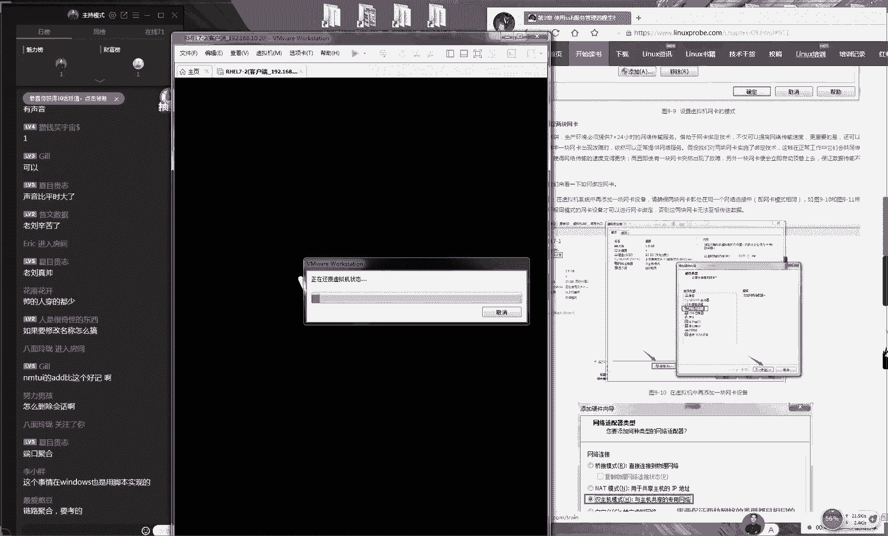
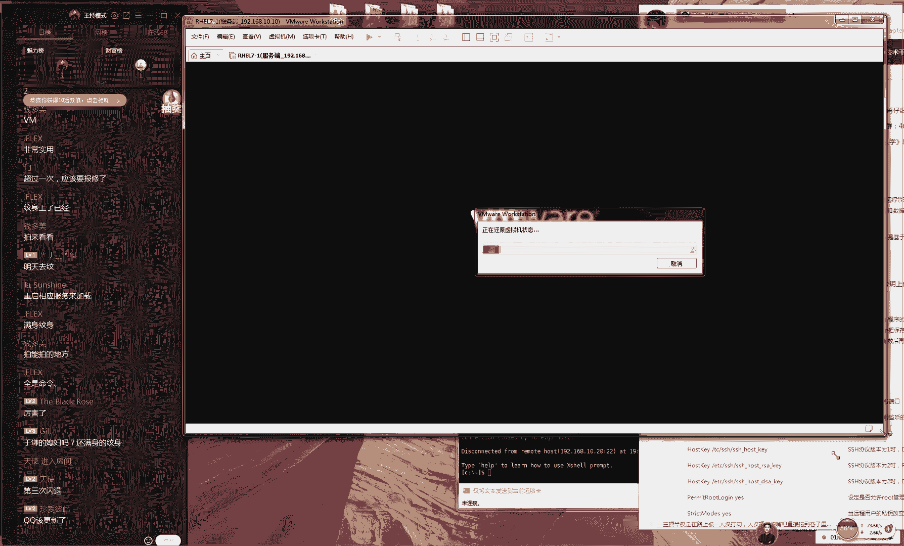
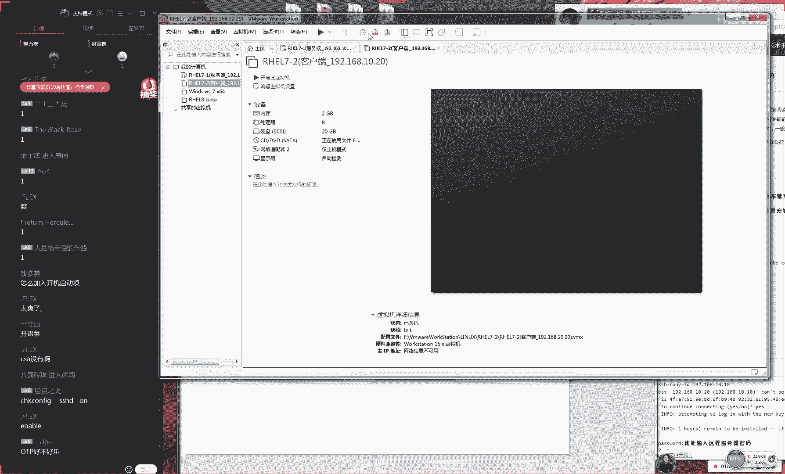
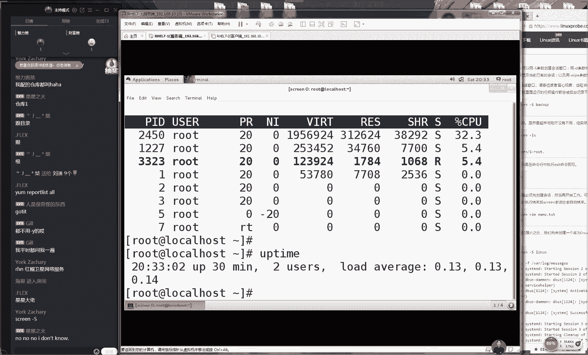

# Linux教程RHCE - P11：11.访问控制列表、网卡绑定、ssh - 艾弗艾尔思丢丢 - BV1if4y1e73V

🎼我爱你爱你。😊，🎼爱你。那好，那我们哎好，那我们准备开始上课，同学们然后对嗓子还是有点不舒服，大家能听得出来。那我们呃那我们先打一下一吧，同学们，然后我们开始我们今天这个课程。😊。

我因为我感觉可能是那天有点着凉吧，所以可能有点感冒。那我希望大家我们商啊那我希望我们上课不呃不会传给大家，好吧。😊，好，那我们接下来给大家说啊，我们幸亏是我们这是网我们这是一个网络课程，不会传染给大家。

那好，那我们接下给大家说啊。然后然后我今天的话我会尽量把声音调大一点，好吧，然后我尽量我声音大一点。大家的话如果您还听不清的话，可以把声音也适当调大一点，好吧，因为我怕这边我太大声音的话。

我也会坚持不了那么长时间。😊，🤧嗯嗯嗯。哎，其实啊其实就怕说我们上课之前出现这样的情况，因为它毕竟是一个在线培训嘛，因旦每天这个状态也会也会影响到我们上课这么一个质量的那好。

那我们接天给大家总那那我们先给大家说一下我们这边第八章节的防火墙。那么我我我们昨天我们讲了三个防火墙的这个配置的这个方法，然后讲了四种我们配置网卡的这个方法。第一的话呢我们来讲就是我们我们第一个工具。

我们叫做I呃我们叫做IP table。第二的话呢，我们叫做杠MD。😊，🤧我天的啊，今天这个讲课估计要。有点好，那我们继续来看啊，就是我们这个三个命令。既然我们还有第那呃那我们还有这边的第四个工具。

我我们叫做TCP。这个的话呢我跟大家说一下啊，这个还是跟我们之前所讲这个三个它还是有一些区别的。我们之前我们昨天所讲这三个的话呢，它呃当呃好，那我们知道啊这个网络它是分层的，对不对？😊。

他这个呃网他呃他这个网络是分为七层的。呃，其中我们昨天我们所讲的这个几个防火墙，我们所处的我们叫做数据链路层。😊，🤧嗯。数据电路层。哎，我今我刚才没说话之前，我不我嗓子没那么舒服，数据链路层。

然后大家那我今天可能说话可能不是很清楚啊，所以我给大家都打出来字好吧，大家可以就是知道我在说什么，叫做数据链路层。好，那我们今天我们讲的第四个工具。我们是基于了我们的应用层的这么一个工具。

它是基于了我们的应用层。那所以的话它只能是基于我们的服务名称，它来进行这么一个防火墙的这么一个限制。而我们而我们昨天我们去使用这么一个防火墙，它可以基于我们的协议，它可以基于我们这个端口号。

它可以基于我们这个来访的这么一个IP地址的段那我们来进行一个限制。所以说那我们需要知道一下这个防火墙。😊，它的一些区别。那我们主要来讲的话呢，就是这个呃我们今天所讲的这个第四个防火墙。我看一下啊。

他说啊说我看一下，说咱就讲到第八讲了，回头看视频吧。对我们今天想的是第八章节。😊，🤧哎呦，我天哪。😊，啊，那我啊那我们好在今天是我们是一个呃。呃，第八章节要要是要要是第六章节的话。

我估计要那我就要吐写了。第八章节还好，不会那么难，不会呃需要做这个解释这么多。那我们啊呃好，那我们来说一下我们今天所讲的这个T这么一个工具。那我们那我们就要去指定一下我们这个服务名称。

那我们来说就是说这个工具相比于说我们之前这呃我们相比于说之前在这三款来讲的话呢，它是更加简单了一点的那它是非常简单的一个工具。那这么一个配置的一个工具。

那么它是有两部分去组成的那我们把它叫做天使跟恶魔的文件好吧，它是非常简单一点的这样的这个命令，它分了两个这个文件。第一个文件叫做ETC目录里面的。第二的话我们叫做ETC目录里面的。😊。

那我们把它上面那个我们叫做白名单啊，然后因为我今天嗓的可能不是很好啊，所以我会把我现在所说的所有的这个字，然后尽量给大家打出来，大家可以知道我在说是什么。好 no啊啊，今天确实今天因为我们在线培训嘛。

可能会。😊，呃，确实这个是会会会多少影响一下我们这个上课这个呃质量啊。好，那我们先来看一下它有两个文件。第一的话呢我们叫做白名单，它将就是一个天使的一个文件啊，它里面写入的就是你H允许的这么一个网段。

那么呃你还去写入就是你允许的一个服务的名称啊，允许的服务名称，那么以及你的IP地址的段。那我们这样去写。😊，🤧嗯。那好。

那我们还有这边的这个第四个那我们还有我们这个第二个这个是写的我们拒绝的服务名称跟我们的IP地址的这样的一个段。那好，那我们需要来说一下的话，他这个是有一个优先级的。

它是先会去匹配这个先他会先去匹配这个允许再来去匹配这个拒绝。那么咱比如说当这个里面要是有你的话，那么就会把你给他直接就给允许了。不会再去下再来去匹配。但是呃如果说这个里面有你的话，那么就会把你给禁止掉。

那么也就是说他会先来去匹配这个允许再去匹配这个拒绝，大家懂这个它有一个先后顺序啊，他有一个他有一个这个匹配的一个顺序。那那我们先给大家看一下我们这个实验，因为我今天可能好。

那我们来给大家说那么听一下我们这个讯拟机，他能够保证我们讯拟机之是是以通信的啊，我现在使用这个虚拟机的地址是19820。那我现在使用是一个客户端的一个机。😊。

啊，那我们现在拼一下，那我那我我那啊那我我们现在需要能够保证我们的这个网络它那它能是它是能够去通信的。好，那我们啊那呃说允许的优先级是大于的禁止。对，是这样的。好。

然后那啊然后的话呢那我们现在来去配置一下这个允许的文件。那咱比如说我现在写一下我们这个拒绝文件好了。那我现在去写一下我们这个拒绝的文件。😊，🤧嗯嗯嗯。好，那我们来看一下我们这个拒绝文件。

这个文件里面的话，它里面都是这个蓝颜色这个它里面都是这个注释啊，所以这个我们不用去关心它。那我们在它下面添加我们这个具体的参数就可以了。因为我们的这个株释，它主要是对于我我们这个服务的功能。

或者某一个参数中解释或说明的信息，这个是在程序里面它是不读取的那那我们先在我们的这个服务名称。那么我们的服务名称，那我们叫SSHD大家需要注意它这个它要它有几个名称的这样一个关系啊。

第一的话就是我们这个协议，我们叫做SSH这个是我这个的话它是一个协议的一个名称。而我们的服务名称的话，它叫做它是叫它是叫叫这个后面加上一个地。😊，啊这个的话呢，这是我们的服务名称啊，我把它打出来吧。

大家可能看会更清楚一点。第一，我们的第一是我我们的SSH这是我我们这个协议的名称，还有我们的还有我们的SSHD这个是我们的这个服务名称啊，大家大大家把它区分一下。

然后我们待会儿会给大家讲到说我们这个协议它怎么去配置。那么那呃那么我们以及他怎么样来去管理它。好，大家先要记一下这两个的区别OK大家先记一下那我们这两个的区别啊，然后呢我们具要给大家说啊。😊，呃。

说怎么样说啊，没有什么问题吧，那那我们继往那么继往下走。那我们这边的话呢，那我们后面需要简量就是一个我们来拒绝的一个网段，那我们就给它写成192。68。10点。那我们这样就可以了。

这这样它要代表就是我们后面写的是3-25。0，他要它有两个写法。那我们这样的话呢都是一样的那我们现在可以把我们这给它简写成就是192。68。10点。

这样就代表就是我们这边写的一个全那么啊他他要相当于把它写成就是1个192。68。10。0这个网段，这样的话，它代表就是我那我们禁止掉这个网段。😊，他来去访问我们的SSHD这个服务程序。好。

这个我们啊那我们这边就要解释我们这的这个服务名称。好，那么好，那我呃那我们现在打开我我们这个工具来去尝试来去连接一下，好吧。😊，🤧那我那好，那我们现在还去去尝试连接一下，那我们的地址是19208。10。

20。现在我现在我不用管我们这个细节啊，大家只要看我我们现在能够连接成功就好了。因为我们现在就还是我们这个防火墙，那那我们敲一下回收，他告诉你说，让去输入我们这个账户或密码。那我们点击一下接受。

然后我们来去输入这个账户，然后来去输入一下我我们这个密码，然后这个时候他告诉你说登录已经是成功了。那好了，那我们现在这样去做，把它给退出掉，😊，好，然后我那我们现在把这个文件给它保存并退出啊。

那么呃大家需要注意一下的话呢，就是我们的这个服务程序，它只要编辑过文件之后，它就能许生效了。我们不需要来去重启这个服务程序。好了，那我们现在把它保存好之后，那我们就可以来看一下我我们这个恶魔文件啊。

就是它被它被禁止掉里面的这个信息，它就会马上就会禁止我们这来自于这个网段的这个呃的这个呃的这个用户，然后去访问我们的这个远程的一个协议。好，那我那那我们再那我们再来连接大家看一下效果。😊。

嗯。这个时候大家看到这边我们就显示说是我们的连接失败了。因为他告诉你说，它已经被远程的服务器给禁止掉了。然后我们可以看一下它具体里面的一个报错。那也就是说现在的话它是禁止了我们的一个网段了。

这个它就是啊禁止掉一个网段来去访问。其实我们可以把它这样去修改一下。那我们可以再去编辑一下这个文件，把最后这个地址段啊给它改成一个星号，星号的话，它代表是我我们之前讲的这个通配服务，对不对？

它代表就是一个所有主机的意思，我家打出来，因为扫的不太好。那我那我给大家说了，就是这个星号的话，代表就是所有主机，代表就是所有的主机他们都把它给限制掉所有主机啊，所有主机。😊，🤧嗯。好。

这样的话它表呃啊这样的话，它代表就是一个所有主机了。那好，那我们现在给它改成一个星号，然后把它点保存并退出。那么啊再来去来去访问一下。那么我们这个主机的话，那么来啊那么这个c肯定还是访问失败的。

那我们来看一下。😊。

天然后我们呢具体来说，那我们这边是提示说访问是失外的。然后我们接下来我们来去编辑这个天使文件，然后它单独来去放行。这样的话呢我们就是说作为一个例子啊，然后这样的话就是说去禁止掉所有所有的这个主机。

然后但是来去只允许某个网段，它能够去访问我我们具体的这个服务。那我们现在给大家写上我们的服务名称叫这个服名称叫叫叫SSHD然后是我们这个主机的地址段，那我们给大家写上就是呃19268。10。

0这个网段就好了。那我们现在大家保存推出。😊。

うんうん。好，那我们现在来看一下，就是说那我们现在有两个策略。第一个测绘的话就是说他他会来去禁止掉所有的这个主机。但是那我们在它这一个上面，因为它有一个呃，因为它有一个允许文件嘛。

而我呃而我们在上面我们是单独再去写上一个就是允许192的8。10。0这个网段这个主机才能够去进行一个访问。所以说那我们按照从上往下来它呃它去匹配的话，那我们最后那个效果也呃应该是能够去访问的。好。

那我们现在把它保存好了之后，那我们再来看一下这个文件。😊。

🤧。好，那我们现在再来看一下这个文件。OK把它保存好了之后，我们再来去访问一下，看大可看一下我们这个效果。所以马上他又能够去访问了。这就是我们说来去允许跟拒绝一个主机，然后他们去访问我们这个服务。

其实这样的，因为呃我们今天给大家讲的就是4种方法，他还去配置我们这个防火墙，对吧？所以话当啊所的话当我们考试的时候，大家可以继续来去选择这是10到24这个网段嘛，不对啊，这个它指的就是从192。

点168，是这样的，他指的是192。68。10。0到192。68。10。254这个主机段。😊。

嗯。他呃他呃他指的是这么一个主机的这么一个地址对吧？因为他呃因为里面的因为里面的这个呃呃，因为里面可有2它里面可有250个主机的呃的这个呃他这个地址可以呃，他可以呃他可以他去使用。好。

那我们现在的话再给大家总结一下，就是说。😊，🤧IP地址后面不跟掩码是呃可以的，但但是的话就代表就是一个单独的一个主机了。好，然后话就是这样的啊，当我们写用这样的一个形式，192。68。10。

0这样的一个网段的话呢，它指的是一个网段，它指的是一个网段。咱比如说这那那我们这样去写。但是你要是把它写成就是192。68。10。1的话呢，它也可以，但是它代表就是一个单个主机啊，它有这样的一个区别。

那好，那我给大家总结一下，就是说我们今天给大家讲就是四个方向大家去配置我们这个防火墙。昨天我我们讲了三个，今天我们讲一个待话可以大家去选择一个到我们这个考试的时候的话呢。

我们建议大家去使用到我们这边的这个呃第四种。😊，呃，因为的话这个使用起来非常简单，那么你只需要去写上这样一个格式啊，就是这个服务的名称。然后一个冒号后面显上就是一个主机地址的段，主机段，那么就可以了。

它啊这个是非常方便的。然后说fawork杠CMD跟呃配置冲突的时候会拿过去，会它会去生效。😊，🤧咳咳。他这个两个哪会生效，这个他两个不会冲突的。因为呃他默认只有这个允许根据，对不对？

它只有这个允许跟拒绝两个可能性。所以说四个里面我给大家打出来啊，四个这个工具，只要有只要有一个拒绝了，只要有一个拒绝，就会全部拒绝掉。那就会拒绝。好吧，他不会有冲突这样的情况。那我们哪怕说有有三个。

他是允许，但是有啊但是他有一个第四个他是一个拒绝。那我那呃呃那我们这个第啊那我们这个结果，那也他呃他也会把这个拒绝掉。😊，然后说呃。好，您呃这边是星号，可能是被屏蔽可能那可能是被屏蔽掉了。这边我看不到。

大家可以截图之后可以发我看一下，好吧。好，然后话对就是说我们有4个工具啊，他只要其中一个把它给禁止掉，那么就会把它给禁止掉了。好，那我们接下给大家说一下我们这个第九章节，因为这个比较简单。

大家说一下我们这边第九章节说一下我们这个远程连接器，但是我们之前我们先要给大家讲一下，说我们对于一个呃那我们对于这个网卡怎么进行一怎么来进行一个比较高级的一个管理的一个方法。那么是这样的啊。

因为的话我们之前讲过一个第六章节，我们来去学习对我们这个服务程序。😊，不啊，我们学习的对于我我们这个硬盘的设备文件。啊我那我们讲到第六章节。😊。

对于我我们这个设备文件的话呢那那我们进行一个比较基本的一个管理。那我们学习了这个分区格式化，还有我们这个挂载的这个操作。

然后马上我我们这边这个哎第七章节就话要去讲到说对于我们这个设备来去做一个瑞跟LVM对吧？那我们这个也是的，那我们第八章节，我们会讲到四种方案，它去配置我们这个网卡。😊。

四种方法他来去配置他来去配置呃这个网卡服务程序。那我们这边这个第九章节就要给大家讲一下，对于我我们这个网卡的一个比较高级的使用方法，就是来对我们的网卡去设置一下我们这个绘画跟我们这个绑定技术。

那好那先给大家说一下我们这个绑先给大家说一下这个绑定技术吧。先给大家说一下我们这个绘画技术了。然后这个章节那我们就把它挑过。因为这个章节就是讲的通过通过这个呃通过一个这边的工具，它来去配置我们这个网卡。

这个直接给大家去讲过，所以的话那我们直接讲一下这个绘画这个呃这个绘画的话，他实际他就指的是我们的要是通过一个模板的文件。然后对于我们这个网卡设置一个模板文件，这个什么意思啊。

比如说那那我们还那我们还是有一个笔记本。那我们白天的时候，那我们需要拿到公司里面，对不对？那们那我们就要去公司，然后我们每天下午的时候需要去一下我们的咖啡厅，然后我们到晚上的时候。😊，还有最后还要回家。

那也就是说，那你你的这个设备需要在不同的位置出现。那么你就要来去呃不断来去设置你的这个网卡里面的这个参数，来去不断来去设置你的这个网卡里面的这个参数。那么这个时候那特别的麻烦。

那我们就可以把我我们的这个网卡的配置文件，将啊我给它打出来吧，将网卡的配置文件。😊，保存藏模板。但是我们这个模板的话可能不是一个非常官方的一个解释啊，叫做我们这个绘画。那好，那我们给大家做一下这个演示。

是那么我们使用命令，我们叫做NMCLI命令，它可以来去查看我们这个网卡信息。那么以及创现出来我们相关的这个绘画。😊。

好，那我们先给大家讲一下，我们来去查看我们网卡信息的一个方法。那么就是使用MMCY了，然后connection show，那么就可以查看到我们这个网卡信息。现在的话呢，那我们只有一个网卡信息。

这个时候那我们需要来添加一个我们这个新的网卡信息。那我啊那我们现在希望来说它有两个这样的一个。😊，呃，使用的一个场景。第一就是公司。然后今天是这样的，因为可能今天嗓子确实不太很舒服。

然后大家现呃可以先来去聊天，然后可以来去提问。然后大家来去互相来呃可以大家可以来去互相来去聊一聊。如果要是您的这个呃然后如果说您要要是还有问题的话，那我们可以后啊之后来去说一下。然后那我们先给大家讲课。

因为可能今天我怕待会见证不这么长时间。那我们那我们那我呃我那我们先有两个场景。第一就是我们这个公司这个公司的话呢，那我们统一把它使用叫呃我们把它设成一个地址吧。好吧，我们给大家一个静态第ICP啊。

静态IP地址。😊，的这么一个呃模式，然后我们的家庭把它改成第二CP。那好了，那么就是说我们来去自动获取我们的IP地址。那好，那我们现在这样去做啊。

现在编辑一下大家这个虚拟机点击一下这边的这个右上角然后我们点击一下这边的这个设置选项。大家需要开启一下我们这边由虚拟机去提供我们应该是这个我们点击一下编辑，然后点击一下虚拟网络编辑器。

那我们需要来去使用一下我们虚拟机为我们去提供这个第CP服务。那我们需要点一下这个我们相关这个模式，然后我们点击一下这个开启，这样的话那开启了由虚拟机去提供这个DCP服务了。

这样的话那我们这边这个第二个模式，那我们才能看到效果。因为我我们现在没有第CP服务嘛。那我们需要这个虚拟机它帮我去提供好，那我们现来充建出来第一个回话这个命令比较长，大家可以来去记一下。

然后是这样的因为的话呢我们现在。😊。

给大家讲的这个绘画模式的话，那我们使用命令，我们叫NMC啊，大家就要知道我们这个命令的一个呃使他他它是使用什么命令了。好。

那我们现在去敲一下我们这个命它特别的长命令是这么去敲的那首先来说是我们的它是我们的命令名称，然后然后是conne，因为这是指的是我们的网卡的意思。然后我们去添加一个我们的画。

这个它也是指的是我们要后面是我们绘画的名称，那我把它叫做这个compan公司。那好，那我们就新建出来一个叫做公司的一个绘话。然后后面叫做F name这个叫做face它指的就是我们的网卡名称。

这个大家不要大家大家不要我说去敲一定要以你这个实际为准。😊，呃，一定要以你的这个实际为准过来把它复制一下，要呃一定要要以你的这个实际为准。好了，那我们来复制过来。好，然后我们后面他说我们是否要进行一个。

我把它缩小一点，能够看清啊，能够看全一点。😊，因为我今天本人说话可能不是很清楚啊，然后怕大家回头就看就看不清了。好，那我们后面加的是我们这个网卡的名称。还有就是说我们要登它是否要进行一个自动连接。

那我们选择就是不要进行一个自动连接，把它改成no后面我们这个网卡类型，它是一个以太网的类型。那我们这样下好之后，那么还没有完。那我们后面还要加就是一个地址，它是个它是一个IPV4的一个地址。

地址为192810点呃点1，这个是无所谓的，大家可回头可以呃以你自己的这个习惯为好。那我们比如说那我们可以把它改成10点88好了。那么这样的话呢，那我们待会看到的这个效果。😊。

那我们第一个那我们这个效果的话，那我们的公司的绘画这个地址就应该会变成它是一个静态手动指令的，那么就变成了192。168点10。88的这个地址。因为我今天稍微细一点吧吧然后大家可以去做一下这个实验。

这个是我们这个家庭绘画的话，我们使用我们使用这个动态来去调整动态调整的或者说我们叫做动态获取吧，这样会比较直观一点清一。我们来看一下我们这个网卡模式里面这个地址的话呢。

它是讲到的就是地址它是192192。168点10。100的这个网段。所以说那我们待会这个地址的话呢应该是在1926810100这个网段里面的点100点这个网段里面的这一个地址然后这个也可以用四个方法来去配置吧。

这个我们可以的，但是我们建议我们使用命令来配置样。😊，呃，他会更有效率。好，那我们接下来我们再来给大家说就是呃后面就是叫做getway，它指的是网关了。然后他指的是网关，就是这个呃JW它指的是网关。😊。

G啊GW我们叫做get way。指的是网关地址，但是我呃因为我们现在我们还不需要网关，但是它有一个格式要求，所以我们还是要去写一下。

但是我们这个地址它实际上来说它是并不存在的那这个大家可以呃也呃大家也可以呃也可以去写一个随便那我们可以随便去写一个地，那么就可以的啊，那我们写上1个10。1。

这样的话那么就是一个我们比较完整的这么一个命令。那么好，那我们现在恰一再回车。这样的话他告诉我们说我们的这个类型会出错了。好，是吧？😊，呃，我们看一下说我们的以太网的已经输错了。

我们应该叫做ETH呃ETHERNET我好我好像没有写错吧。哦，我们应该写的是自动连接，对吧？然后我们应该写的是一个自动连接，把它改成是no。好，那边呃，因为我这边敲错了一个参数。好。

那我们现在敲一下回车。😊，然后说老说老说老师现在没声音是什么鬼啊，是因为现在没有声音嘛，然后大家可以呃推而再进就好了。然后那我们现在敲一下回车，他告诉我们说就把它给新建好的一个绘画。

那么这个名称叫做公司，那我们现在就去因为我今天可能真的是嗓子家感觉出来今天真的是在努力但是声音就只能是这么大。以说大家如果听不清的话，家可以去适量调一下己的这个音箱好吧。

今天确实对于我自己来讲我也挺难熬的。其实好那我们现再添加一个绘画。但是这个课是往下讲的那我们添加一个绘我们这个名称我们叫做这个是叫做这个家庭了。当然这个当然说我们这个名他是无所谓的啊。

第一个我们叫做公司。第二我们叫做house我们的家但说这个是可以随便写大家可以大家可以己去修改一下这个是没有关系这个名称你可以随便去写这个没有关系好，那我们继续来说这个也不是说平时说话的时候。😊，大了。

啊，是因为前两天作死嘛，然后可能是被冻着了一下，这是这也都是我自己的问题。好，那我们继续啊我们后面去写着我们这个绘画的名称，我们叫做这个house，然后我们定义一下我们网卡类型就是我们叫以太网类型。

后面的话就是我们这个网卡名称就是你千不要我书上去敲因为书上那个这个网卡名称，它是我自己的那么你一定要过来查一下你自己这个实际为准。因为你看到我地址都是16777728。

我们书上它是3它是36这个时候那我们一定要以你自己的这个为准，然后们敲一下回车。这个时候我们签好回车之后，我们再查看一下我们的网卡信息就会出现有两个就会出现有两个这样的信息了。第一个信息我们con。😊。

呃，其实它那我们它其实非常像我们这个思科的设备啊，它是可以用到这个table，它去做补齐的，并且它可以进行一个简写。如果修改名称怎么搞，那他不能够把它修改只能去删除之后大家直接再去建立了。

不能去修改这个名称，然后我们敲一下回车然后我们看到他有三个绘画。因为我今那我把这个我们要讲东西给大家打入字吧。好吧，因为我自己感觉自己说话有点不是很清楚。然后现在大家打出来字。

然后大家能够知道我现在在说什么。好，那我们现在这样的，大家不要要，因为今天东西能确实并不难但是很细碎。好，那我们先看一下的话，他现在是有这么几个信息来说的话。

这个第一列就是我们这边这个网卡以及我们绘画的这么一个名称。他现在是有两个他有一个叫做这个公司，还有一个叫做家庭。而我们这个话它是一个原始的一个网卡信息。好那那我们经有两个绘画了分别叫做公司跟家庭。

这个时候我们。😊，要做事情，他就来去进行一个开启就可以了。那我们啊现在看一下我们这边这个地址的一个范围啊，现在开启一下我我们公司的规话，他这样去做使用的NMCLI connection。

然后我们来去开启一个绘画的话呢，就这样去做呃up，然后后面讲了一个company。😊。

这样我们来去敲一下回收。这样那我们就开启了一个叫做公司的一个绘画。那我们来看一下我们当前的这个地址就变成了192的呃168点10点88。大家可以看到这边跟我们所设置的它也是一样的。

下边的话呢还有一个就是我们这个家庭的一个绘画，它会获取我他提供这个服务我们去开启一下我们这个家庭绘画待会大家去说一下这个我们这个画的一个作用啊，其这个作用非常的明显。然后我们再看一下我们这个网卡的信息。

这个时候你可以看到这个地址就变成了1921810点128。这个的话它也是符合我们这个要求这个删除的话。

它的是这个命令叫做这个ele我们给删掉了这可以把给删掉然后你过来可以看到这个里边它就已经是没有这个house这个绘画了。然后我们也可以删除这这个绘画，这代表就是一个删除的这么一个方法。

然后再看一下它就没有了那么是这样的这个绘画的话呢。😊，啊，这个绘话的话，他他也就是说的是那么你可以让你的这个网卡，他要把这个信息给它作为一个备份。将网卡信息啊，我那我们作为一个模板实现一个快速切换。

实现快速切换这样的这一个特点个话啊这个来说它是在window这也是非常实用的。因为我们之前我自己来配置这个网卡的时候，其实说这个window就并不是很就不是很方便。

因为你比说那我这边我来设置下我的网卡信息。将我这个网卡给改成CP然后我们点击CP那我们确认好之后把点了之后，那么你下一次的时你需要来去配置一遍它里这个信息它就没有了的。这个来说它特别的麻烦。

那我们可以话的话呢就可以减少了我们每一次输入这个网卡信息这样一个步这话提升我我们这个工作效率。下面的话那么来那么讲一下我们这个网。😊，它绑定了这么一个实验是这样的啊，在我们红包re红呃红包呃。

还有啊还有我我们的这个6跟七里边的话呢，它有一个技术叫做绑定技术，这个叫做帮定技术。😊，他可以来去实现出来我们的这个网卡的一个绑定。到了我们红包器里面，它有新引进的一个技术，我们叫做聚合技术啊。

我们叫做聚合技术。这个技术叫做team技术啊啊这样的话那我们考试的时候，那我们统一那我们叫端口聚合它就是这个网卡聚合的意思是这样的，这样的话我们考试的时候。

我们会要求你们去做一下这个端口聚合这么一个实验。但是这个是考试的时候，我们会给大家讲到的那我们后那我们上课的时候会给大家讲一下我们这个绑定技术。

这个是我们上课时候给大家讲到的这样的话呢大家就都啊可以去学习一下。而我们呃可以也去接触一下我们这个绑定技术，对吧？这样的话那我们就可以多写那那我们就可多写东西了。

但是呢我们知道就是我们考试的时候需要使用的是聚合。然后那我们这个上课的时候会给大家讲的这个绑定。这个会由红包R是C的考前辅导会大家讲到的这个是红帽R是C的一个视频里面。😊。

考前的辅导里面会给大家讲到的这个大家不用着急，然后它是一个同学化界面的这么一个工具。它是非常简单的那好，那啊那我们先绑定一下我们这个网卡。现在关啊，那我们先来还一下我我们这个虚拟机啊。

让保让它保持着呃成一个最为初始的一个状态，避免我我们这个时间之间它会有冲突。😊。

啊，避免我们事验之间他会有冲突这样的情况。好，那我们现在会啊还原一下我们这个虚拟机绑定跟聚合的这个实间效果是一样的啊然后呢我们啊现在我们去关机，然后我们现在听见我说完我们2块网卡。😊，好。

那我们现在关机好了之后，我们点击一下编辑这个虚拟机是这样的啊。就是的话呢我们这个虚拟机它来去再去模拟，我给它打出来啊。那我们现在我们添加一块我们我们这个新浪网卡，我们网络识别器。

它还需要保证两个识别器的这个模式选择成啊，他们都选择成这个呃呃这个呃他们选择成这个三通的模式。然后我们点击再确认。是这样的话呢，虚拟机它呃虚拟机在模拟。😊，呃，这个硬盘跟网卡的时候经常出错。

这个也他也其他也是会有这样的问题。所以的话那我们建议建议大家啊关机之后操作，关机之后呃添加，然后再开机添加再开机这样的话是是比较稳妥一点的。好，那我们现在开机，然后那我们就有两个网卡了。

这个他这个两个网卡的话呢，做这个实验，一般来说我会做10次吧，然后会有5次都失败的。它就是因为我们这个虚他他他再去做模拟的时候，它总会网卡之间它会产生冲突。所以话那待会我们去做这个实验的时候。

它不一定能够成功，果是失败的话，那我们会再给大家去做一遍的。好吧，我们最多是好像做过三遍才然后最后才成功。但是这个跟我们这个操作是没有关系的。那好，那我们现在进入到我们这个系统里面。

然后找到我们这个两个网卡的配置文件，大家需要注意的话，就是我们这个新的网卡的配置文件是没有的。我们需。😊。

自己来去建立这个新的网卡的配置文件。好，那我们现在我们点呃，那我们现在把它把它进入到我们的配啊网卡配置文件的目录里面啊啊，离远一点是吧？行，可能离得太近了，因为我怕大家听不清，今天嗓子今天真的很难受。

😊，哦，已经很在尽，因为我其实很尽力了，然后再使劲再大声说话，要为不怕因为我怕大家听不清楚。😊，能离得比较近了一点。好，那我们现在把它稍微推远点好吧，大家会听下就好一点。

那我们现在编辑一下我们这边这个网卡信息。第一来说这个网卡信息当前已经是有的那么这就是我们的默认的网卡信息，那我们把它给删掉了。那我把给删掉。给大家说一下，我们这个网卡一个绑么一个绑定实验的一个效果。

就是说那我们知道这个网卡的话，它现在就是一个车道一样了，它这个网卡越多，它速度它会啊它这个速度它就会越快。那咱比如说我们当前的一个网卡，它这个速度是100兆的话呢，那我们两个网卡在一起它变成了200兆。

对不对？它可以进行一个合并，这个合并我把叫做这个绑定技术，把它绑定到一块，这样话呢当当我们这个用户来去传送我们这个数据的时候，它就可以起到一个速度性的一个提升。

并且的话对它会就它在就是一个速度性的一个提升。并且的话呢它可以让我们这个设备。😊，当有了啊当有了某一个设备啊，它突然间故障之后话，但是没有关系。

我们还有我们还有哎我们还有喂我们还有这么一个备源这么一个设备。好，那也就是说它有两个技术的一个点啊。第一来说就是好的时候同时工作，那好的时候会同时工作。😊，提升传呃，就是我我们叫做网卡速度吧。

或者说我们叫做呃呃网卡速率。好，或者说我们叫做网卡速度。第二的话呢呃我们叫做网络速度吧。因为呃我们叫做网络速度是比较呃是比较这个。呃，是比较这个严谨一点的。然后的话呢还有我们的这边的第二个啊。

第二就是说当啊有一个当某个网卡坏了的时候，坏了的时候，另外一块。自动备圆，那我们叫做呃叫做这个顶替好了，叫顶替。保证呃网络传输不间断啊，大家知道这么啊大家就知道这么一个。呃。

我们这个技术的一个实现的这么一个要求，好吧，它是有现在有这么两个要求。第一来说就是好的时候是呃它来区现出来一个负载均衡，而我们坏的时候，它会起有一个自动备圆这样的一个效果。好。

那我们现来编辑一下我们这边的这个网卡的这么一个文件。那呃那我们这个文件的话呢。😊，🤧嗯。这个信息，那我们这样去写。因为我们现在这个网卡它需要做绑定。

绑定之后这个呃网卡它才是由它才是来去真正的呃来为我我们这个用户来去提供服务的。所以说现在这两个单个网卡，他们是不需要在上面来那他呃他去设置地址的。而我们统一把它绑定好了之后。

对于我们这个主网卡再来去设置这么一个网卡信息。好，那我们现来写一下我们这边的这个网卡类型，那就是叫做网卡类型嘛，它是一个以太网的一个类型。😊，然后的话就是我们启动方式，我们选择成这个默认就好了。

那我们选择成这个呃默认的方式，不要去设置我们这边的这个IP地址。因为你单个上面来去设置的话是没有用的。然后是这个都很值钱，对不对？

这个是我们这代表就是我们开机时候他会去启用它然后叫做usL这个代表就是是否来去允许我们这个用户通过通过我们的命令行它去控制的意思，我们选择是no。

然后这样的话我们还有一个就是我们的设备名称我们需要给要需要要要你的这个实际为准。然后我们现在这去做我们去查看一下您自己的这个网卡的名称，然后我们保存，然后我们这边粘去粘贴。😊，再往后面去找的话呢。好。

因为啊因为我可能打字比较快，大家那我们上课的时候尽量不要跟着去做。因为这样的话大家大家会跟不上了。这样再抬头大家会发现我们已经是讲到下一个题了。就是我们一定要就是我们做这个实验的话呢。

那我们可以课后去做啊。那我们这边指定一下我们这边这个主网卡这么一个名称，我们把它叫做这个名称它是有规定的，它必须叫。然后第二个网卡叫做它有这么一个格式要求，这个代表就是我们绑定之后那个网卡的名称。

因为来说我们这个网卡名称，它像一个瑞一样，它不可能最后那个名称，它叫做ETC目录里面啊或者说叫做这个DV目录里面它叫做1677772816777736他他不可能是很多的名称的一个一个叠加。

它需要给单独一个名称。比说DV目录里M或者说DV目录里的这样的一个名称。那好，那我们现在给大家。😊，去写上我们这边这个主网卡的名的呃这么一个名称，然后把它设置成它是一个从属网卡的意思。

然后我们点击一下保存名退出。那我们现在敲一下这个保持屏退出，再家去新建一下我我们这边这个网卡的这个呃配置文件。这个呃文件它是没有的那我们需来去复制一下你的这边的这个网卡的名称。

然后来去粘贴来去新建一下你的这个新网卡的这个配置文件这个信息都是一样。那我那我们也不要照抄一下我们这个书上啊，大家来去打一下这样话也可以加一下我们这个印象，且避免我们这个参数它会写错。

然后我们来去我们这个启动方式，我们把它设置成它是一个默认，然后按它他们都是一样的。跟我们刚才是一样的。然后是我们开机时候他会去启用，然后是是否我们的这个用户通过我们的命令行去控制，我们选择禁用。

然后是我们这个设备的名称，要要以你的这个实际为准，那把去粘贴过来。这边是我们这个主网卡这么一个名称，我们叫做待会我们要去新建出来一个网卡叫做这么一个信息的然后把它设置成它是一个从属网卡。好。

那我们做好之后把保存。😊，退出这个还没有完，然后我们再去新建出来一个。这么一个配置文件，我们叫做b0，这是我们绑定之后那个主网卡这么一个文件。那我们现在可以看一下的话，现在这个网卡里面它还是没有bu。

0这么一个设备，对不对？好，那我们现在去添加一圈，那我们现在添加出来。😊，我们现在这个半奏凌这个设备，哎，我现在我我觉得我这个说话这个声音啊，很像一个港台那边的一个明星叫什么潘潘呃，潘潘文潘伟柏。

什么潘石屹还是就是有一个就是个头不是很高的一个呃，呃呃曾志伟是不是啊，潘长江，不是不是啊，我觉得很像这个曾志伟声音，对不对？现在比较沙哑。好，然后的话呢，我们现在我们来说一下啊。😊，哎呀。

因为我现在我在很努力再给大家往呃往再呃然后我现在很努力再往呃再往大了说，我我因为我感觉我自己都在吼出啊，但是实际上那个声音还不是很大。😊，所以我也能够体谅说这个曾志伟，他其实也很痛苦。

他很像把声音说大了，他没有这个能力啊，是不是哎呀好难受？好，那我们接下来我们来设置一下我那我们觉天这个主网卡的配置文件。😊，哎呀，真的是，而且我平时这么喜欢聊天的一个人，一下子嗓子这么难受。

我也是很啊很痛苦很痛苦的。然后呢我们现下来就设计一下我们这个设备的名称，把它叫做b的0。😊，啊，真的是对于我种比较喜欢聊天人，真的是一个太真的是一个太痛苦打击了。

然后这边我们去设置一下我们那我们这边这个主网卡这么一个地址，那么就是1928101。后我们这边可以去这个地话以去写这个没有关系。后就是我们这个字码把它成24位个以把去写。

那么你以把写做以把3这两个效果是一模一样的。那你可以自去选择一个你喜欢的然后就然后呢我们还有下面一个叫还有下面就是这个N信息这个DN信息，就是纯粹告诉你说你可以有这么一个N信息的意思。

但是我们来讲这个参数我在我们这个实验里它根本它要没有生效，所以说这个参数可以不去写这个没有关系。下面那我们下面还有一个服务叫做叫做l的这个服务的话，来说它是一个全称的。😊，它叫做啊这个的它它是一个简写。

它是一个简写，两个配置参数不一样的话，会哪个去生效？呃，这个两个的话呢，如果你都去写了，它会有冲突，这两个不要去同时去写，而且你没有必没有必要同时去写的这个两个去选择一个就可以了。这两个效果也是一样的。

然后啊呢那我们先给大家说一下，就是那我们现在他有一个服务的一个呃这么一个简他他有这么一个简写，叫做这个NM它实际上来说它是叫做network manager。对它有这么一个服务。

大家可以去呃他呃这个打写要区分，我打我然后给打出来大小写。😊，要区分啊，这边的这个N和这个M它是一个大写的。大家看一下，这边的话有一个服务，它叫做 command。然后我们查看一下这个服务的状态。

是这样的。当我们去做了红HC的时候啊，我们来的第一件事情就要把这个服务给它禁止掉。因为这个服务它是用来去管理你的这个呃网卡的，它用来去管理你的这个网卡，让你的网卡有一个最为基本的一个运行的一个模式。

就是说让你的网卡啊保证呃呃让你的网卡，保证。😊，能够运行，然后他就是一呃进行一个基本的一个管理，进行基本的管理。啊，但是的话呢，因为我今天我把呃那把这个啊那给打出来吧啊，但呃但是的话呢，今天。😊。

我们需要做的网卡绑定。是比较高级的操作啊，是比较高级的这个操作。所以说我们必须要让我们这个啊必须要让网卡不再受到这个服务啊，不再受到这个服务的这么一个干扰，这样的话也不受到这个影响。

才能够保证我我们这个服务的这么一个进行。那也就是说我们需要脱离掉我们这个服务的一个控制。他来说他它是有两个方法的。第一来讲就是那么你可以把你这个文件里面去写上，就是说我们单独我们不要啊被你所控制。

那我们给他这样去写。就是我们不要被你所控制了。然后我们给他啊想要这么一个参数。那么你也可以把它这样去做，使用到这个呃semTL去关闭掉我我们这个服务。那么它也是可以的嗯。然后说单词不及格晕掉。

这个还好吧，然后这个大家不用去记，然后具体它是什么意思的话，其实你也不用去背它的。因为你可以过来抄一下就好了。

这个代表就是一个网络的意个代表是一个网络后边的话表是一个管理的意我这个代表是管理网络的这一个服务的一个名称好那我现在之我没有做那我们要编辑一个文件这个文件的话它是C目录里面叫做点这个里我们新建传一个文件叫做这个是要让我它是让我们的内核能够去支持让我们内核能够去支持对设备的这一个一个的支持让我们内核让支持我们网卡绑定这样的一个技术。

好那我现在写我们这个里的参数。来讲话。😊，哎呀，今天。啊，继续。然后那我们来继续往下去说，就是我们这边的这个定义一个别名，这个他它不是一个别名了，他就是说让我们这边是我们这个网卡名称。

后面是叫做这个绑定技术，它指的就是我们的这个会来他会去支持我们这个绑定技术的意思好接下我们这个参数。因为我们接下来去提到了接来讲我们这个它有一个备源的这么一个效果。

那我们就要去设置一下它这个切换的一个时间，这个什么意思，后还有一个模式为6给大家说一下我们这个模式，它这个他这个模式为6代表就是好的时候他会会去同时工作。

而我们换的时自动顶替上去大家说一下我实验一个效果，是这样的，他现在是有两个网卡吧？一个绑定绑定之我们两个网卡第一个网卡名称叫做1777728这是无所谓的16777728这个是无所谓的一个名称。

大家知道就好了。😊，然后还有另外一个网卡的一个名称。啊，还有啊还有我们这边另外一个网卡叫做ENO16呃，什么，我我我都忘记了，1呃叫做ENO33554968，对吧？然后这个就是我们两个网卡。

然后那我们给大家作为一个绑定，给它绑定之后那个名称，我们来叫做b的，这就是我们绑定之后那个设备的一个名称了。现在的话呢我们把这个呃那我们来去设置一下我我们这个模呃模式为6的这个模式啊。

我们把这个模式设置成6的话呢。😊，他就是说。好的时候他会同时去工作啊，好的时候同啊同时工作。坏的时候。呃，自动备圆。那我们这边有一个参数写，就是我们这个切换的一个时间，这代表就是一个毫秒级别。

代表就是当我啊我们检测到坏了之后，当我呃检测到呃网卡损坏了之后。😊，之后啊切换时间是切换时间。呃，是100毫秒。所以说我们待会做这个实验的时候，它最多才呃他这个最多只能够去出现有了一次丢包。

这是这个是我们符合我们这个实验要求的。它它最多只能是出现有了一次丢包。这个最小的话，这个我没有试过，但是你可以去写一也可以表是每每一个毫秒它会他会来去这个切换一下的意思。但这个我觉得意义不大了。

因为我觉得100毫秒的话，呃，已经是足够了，或者说你可以去试一下这个一或者2或者是都可以的。那那点一下保存。接下我们来去重新来去启动一下我们这个网卡服务。好，那我们现在从下去启动一下我们的网卡服务来。

然后这个时候我们再看一下我们的这个网卡信息里面。好但是我们看到底下它提示出来的我们虚拟机再去模拟的这个网卡的麦克地址，它产生了冲突，所以说有点不祥的预感。这个实验的话。

我们去做的时候可能会出现不成功的这样的这个情况。但是这个跟我们操作没有关系。如果是。😊，成功的话呢，那我们待会那啊那啊那我们待会我们会那我们会啊再啊那我呃那我会再给大家去做一遍的。

那我们先来看一下我们这边这个啊，我们看一下我们这个网卡的这么一个信息，这个时候那么你就可以看到了，这边有三个网卡信息了。第一就叫第一叫做这个0。第二和我们这个第三就是我们之前那两个网卡。

但是他们这个上面已经没有这么一个地址了。现在都是统一由我们这个零他来去提供的。好，那我们现在来去从我们这个外部来去尝试来去拼。😊，因为我觉得这个实验其实还好啊，他还是主要看你这个虚拟机的一个模拟情况。

因为但是我们刚刚他又保错了，我心里有点没底啊。那我们现在尝试来去拼一下我们这个虚拟机，现在的话它是有两块网卡，他来一起来去提供了这么一个拼的一个效果了。大家看好了，待会我去删除下我们某一块网卡的话呢。

他最多只能够出现了它只能够去出现了有了这么出现了这么有了这么一次丢包就好了。大家随便了那那那我们现那我们现在是有两个网卡，大家随便说想来去接收到哪个网卡了。

大家告诉我是一还是2说为什么是第18期运气比较好是吗？因为第18期只做了一次就就然后就成功了是比较顺利的。但是我们之前因为去模拟的时候，它总会出问题。但是是这样的啊。

我们的话之前我我们这个虚拟机在这个版本它比较低。而我们在上个礼拜的时候，我已经把我这个虚拟的这个版本到15了。所以说这个。😊。

这个应该是一个新版的一个信息的一个系统。应该来讲是对于这个网卡的模拟，应该会比之前要呃是要好一点对吧？好，大家说的一比较多哈，那我就把一块把它移除掉。😊，然后那我们点一下确认之后。

就来啊那么啊啊那么这边马上来看一下我们这边。😊，到这个左边这边这个信息就会啊它会出现一个丢包。😊，或者他会出现这么一次响要超时，当然不会太长时间。大家看到我们现在呃一掉一块玩卡了之后，OK成功了。😊。

好，因为可能今天也是我们这个吸云机比较啊那啊今天可能也是吸云机比较比较心疼我啊，所以说。😊，我们这个试验今天就就把它一次就成功了。好，那么就那么啊大家啊就啊大家可以看到说这个实验还是比较顺利的啊。

这就是说它会产生的有它它会有这么一次丢包。这样的话这个效果就是说它有一个切换时间，它是为一毫它啊它它是100毫秒，它这个最多它就是出现这么一丢包啊。

它它会保证了我我们这个网络它是不会中断的这个实验那来讲是非有意义的。到我们这个工作的时候真的是非常实用这么一个技术。这个来说真的是非常实用的。使ction再去做一遍。😊。

这个我们下面呃这个我们还呃这啊这个我们。到啊这个呃这呃这个工具的话呢，我们到时候呃我们会要考试给大家做的。大家可以看一下我们的红包2C里会有一个呃会有一个呃会有一个辅导视频里面。😊。

会大家讲通过这个这个呃会会使用这个方案，然后给大家去做的。然后说呃你也是十五了，应该能够成功啊，你说什么是十5能够成功是我们机是能够成功说大于10毫秒切换就失败了吧。一般来讲的话。

那么如果说你的这个丢包我们最多来说他最多如果你要是出现了两次以上，那就是失败了。那么三次或4次就败了。那么他最多只能是出现这么有一次丢包这样可以保证我们这个生产环境里面的业务不会中断。

保证我们生产环境里的业务不会中断。这个虽然我。后说这个服务可能不是很带感。然但是的话呢这个实验实非常有用的这么一个技术大就千万一去多练几好吧好。

那我接下给大家那么再往后面去说我们有一个服务叫叫做SSHD这个服务的话，它是让我们可以去。😊，成为一个远程的一个控制的这么一个。因为啊我之前我讲这个服务时候，就总会给大家就是讲嘛。

就是说这个实验怎么怎么好怎么怎么好。然后当我们工作的时候，那你必然会让我们这个网络它可以实现出来一个高可用跟一个呃高性能。但是今天其实嗓得不是很好啊，所以有没有去吹一下这个服务程序。

但是这个技术真的这个绑定术真的非常实用。大会之后可以来去多练一练。下面给大家说一下啊，这有一个叫做远程控制的这么一个服务程序，它可以让你来去实现出来一个远程的控制。但比如说那你是在北京。

然后你买了一台服务器是在美国。那么这个候那啊那么啊啊那我们这个时候那么你就可以从北京。😊，发起联接来去远程控制我啊我们的这个美国或者说上海的这个服务器呢。

它就实现出来一个远程的一个呃呃远程lininux一个系统的一个管理。那远呃远程linux系统的一个这这呃这么一个管理这么一个。😊，呃，服务程序或者说它也是一个协议。那好。

那我们来就呃给大家总结一下上呃他是这么三句话的啊。第一来讲的话呢就是我们这个系统中的一切，我们的呃我们系统中系统中的一切都是文件。这我们需要记下，大不要想要妨这个东西，我们一定要记清楚。

第二话那我们呃那呃那我们第二句话就是配置一个服务，就是在修改服务的呃配置文件。😊，啊，我们或者说我们把叫做。呃，部呃来去呃来去部署一个文件，像这样呃会这样啊就这样会显得比较高级。好。

我们的这个第三句话啊，第三句话指的就是我们呃要让。😊，啊，要重启啊要。运行最新。参数需要重启。对应的服务。那么就是说我们需要再来去重启一下这个服务。还有我们这个第四句话啊。

顺手将配置的服务加入到启动项中。保证重启后依然有效。大家记到你这个书上面，好吧，这是我给大家总结成这么四句话，大家千万不要嫌烦，因为这个东西你把它啊把呃就把它记好之后。

到呃到到我们后面再呃他呃我们在学习的时候。😊，就是是是有用的这么一个啊，大家记一下，我们有1234这么4个。好了，然后说呃最后要纹身的话，也可以拍下来，对吧？然后可以那那么可以去去动纹身。

大家先记一下我们这个个我先记一下这四句话好吧，是我们这个第一个第二个个还有这个第四个好，那我们接下来我们继续给大家说啊，配置一下这个服务的话么就是再去修改我们这个服务的配置文件。好。

那我们现在这我们来编辑一下我们这个服务程序。然后这样那我们先重启一下我们这个虚拟机好了，因为我们避免说之前之间它会产生冲突。因为因为我们刚刚把我们这个网卡修改了一下。

所以说我们避免说之前之间会产生冲突啊，所以我们就还一下虚拟机啊，还好，现在嗯现在已经讲一个小时了，我感觉我充的还好因为今天讲完应该没有应该是没有问题的。好，那我们继续给大家就是说。😊。

今天还好，讲的还是比较顺利的。呃，课时我觉得也差不多是足够。那这个服务的话呢，我们叫那这个服务名称叫做SSH这个真的是非常有用的。当我们以后再去管理这个服务器的时候。

这个基本来说是每天都要使用到这一个服务程序。但它虽然重要，但它并不难当它是并不难的好那我编辑下我们这个服务程序这个配置文件是这样的当去配置这个文件的时候的话。

那么请记就是说请一定要保证说我们这个网络它能够连通才行要保个网它它能够联通的19810能够连通这个网络好编辑一下我们这个服务的配置文件这个文件的话。

它是目录里面叫做叫做S里面的叫做SH这个下划这个文件这个它里面的这个文件就代表它是这个它对应这一个主配置文件了。😊。

哦，那我们把它叫做主要的配置文件的意思。好，那我们现在就让他编辑一下这个文件。大家呃大大家应该之间都有过预习，对不对？那我们刚啊那我们当看到这个文件之后，大家慌不慌？😊。

因为我们之前要是已经因为我们之前要已经是预习过的话，大家都知道我这个梗，对不对？大家说看到我这个文件之后，大家慌不慌啊，就说一他一个文件，那我们看完之后，那我们会觉得他很难。

或者说我们那我们该怎么去配置它，其实我们来说他真的是不慌，对不对？因为他因为他这个里边这个信息大部分都是这个注释，然后把删掉好吧，大家先这图吧，然后这个非常重要啊，把它给删掉啊。

123啊123然后给大家说一下啊，这个注释的话呢，主要是因为这样的，这个是一个很很不好的一个循环，就是因为我现我怕自己说的不清楚，所以我现在给大家打出字。

然后会把我们这个每一个点再给大家重复很多遍很多遍，然后就是重复的很多遍之后，然后对于就会更不好。但是没有办法，对不？要把讲清楚。我们这个注释，它主要是对于我们这个服务的这个功能。

或者我们对于某一个参数啊，或者对于某个参数。😊，的一种解释呃的一种解释或者书面信息解释或者说明。啊，程序是读取的，这个主要是给人看的，主要是给人看的。所以话这个信息它在多了之后，他他也是没有关系的。

好吧，就说这个东西他可以不去看也是没有被程序所读取的那我去玩一下好吧对于这个服务程序，那我们玩一下。但比如说那我们可以看一下它里面这个大概的参数啊，他可以去可以猜到它里面大概这个作用。

比如说它这个它这个有一个叫22，它指的是它指的就是我们这个端口号的这个号码，这个默认是22口号。那么我好，那我们现在可以来去修改一下。

那咱比如说我那我想把那我们这个端口号给它修改成这个随便啊这个口号给它修改成我把它修改成1万吧。好吧，我修改成1万这样的话我们就把这样先进入到我们的这个编辑模式下。

然后我们把去掉前面的这个井号这样话它才能够去生效。这个时候我们那我们这边的。😊，后面我们给它修改成1万，这样我们做好之后，把它点啊去敲一下ESC键，然后保存并退出。

这个时候那我们还不那啊那么我们将样再去连接的时候，它还不会生效的。因为那么你需要去重启我我们的这个服务程序才可以。那我们后面加这个口号是1万。大家以看一下，那我们再那我们再S连接的时候。😊。

它会显示出来是一个呃错误的这么一个包错，告诉我们说呃，链接是显的超时了。这个时候那我们需要来去重新去启动我们这个服务程序。来，那我们这样啊，来我们再来重新去启动我们这个服务程序。

然后这个时候那我们再连连再那那我们再连再再来去呃连接一下的话，大家看一下。好，但是这边提示说我们Slin给我们这个禁止了，那我们先这样去做。那我们将这个给改成了0。这个大家先不用管。

这个是在我们以后给大家讲到的，就是因为现在的话它受到了我们后面需要给大家讲的一个服务叫做它叫做S。这个是我们第十章节，就是我们的明天会大家讲到的我那啊我们呃那我们先暂且使用这个命令。😊。

先来去临时关闭它的意思。那好了，然后我们接来把那把给关闭之后，那我们呃那那我们再来进行一个连接。这个时候。😊。

嗯，好，非常尴尬啊。他还告诉我们说链接是失败吗？那我们再再那啊那我们再重新去启动一下这个服务程序。然后这个时候我们再去链接的时候。😊，呃，不对不对不对，他可以不加上那个刚P的。

你看他现在链接的他也是1万端个号，他不他应该不是这个问题嗯。😊，你看我这边写的是1万，是不是这个1万多个号呃，太大了，或者说这个系统它不被允许或被他阳他经被先付给占用了，会不会？那我们修改一下。

比如那啊对，还有我们这个防火墙，那他应该就是防火墙的问题了。那我们需要去这，我们需需要来去执行一下我们的防火墙的命令，我们叫ip table杠F。😊，这样的话呢我们再再那我们那我们再连接一下。

大家可以看到，就会把可以告诉你说它是成功的这么一个连接了。大家可以看到，然后可以登录成功。这就是说那我们可以来去尝试来去修改一下我们这个服务这么一个端口号码。其实来说的话呢，这个实验没有任何意义的。

因为这个端口号你修改之后，那又能怎么样，对不对？那那么主要我们给大家讲的就是说要有这么一个意识，要知道怎么来去配置这个服务程序。那我那我们现在修改一下把修改成那把给修改呃给它修改回来成22。

这个时候啊我给大家讲一下这个的话呢，我们进行验证的时候，它是有很多种方式的那啊那我们这个其中我们刚刚的话呢都使用是超级用户管理员。😊，来去登录的我们这个远程的服务器。这个行为的话呢，可能不太安全。

可能不太安全。所以的话呢我们先给大家做一个实验，来去禁止我们的这个入体用户登录啊呃来直接登录我们的I呃我们的I这个服务程序，我们的SS的这个服务程序。这个时候呢我们就要找到它所对应这么一个文件了。

它锁定这么一个参数了。那你看到大概的话呢这个行数是在第。😊，这个行数在第48行，他告诉你说有它有这么一个参数，这个啊那你可以去那么啊那你可以去来呃就来去拆分了家去看一下啊。这就是说你看这个里边的话。

这个单词它是有三个它组成出来的。第一个它指的就是是否允许的意思。这个代表就是它是否是允许下面呢是ro是我们这个关联员的名称，最后是登录，它就代表就是是否允许联员他去登录系统的意思。

这个时候那我我们需要做的就是来去删除掉那我们前面的这个井号那我们进到那我删那我们前面的这这个井号。既然那我们来把这后面的这个E给它改成no。

就代表就是我们来去禁止掉我们这个超这这个超级无数来去登录到我们这个服务器里面。😊，好，那我们来啊把它保存屏退出。这个时候那我们再来去重新去启动一下我们这这个服务程序，然后再再那么再连接一下。

再往下连连接一下这个哎啊再连接一下这个服务程序，然后输入一下我们的这个root，然后你看到啊，就是我刚刚去输入下这个。😊，呃，关联的名称，然后还没有去输入密码，然后再去输一下我的密码。大家看一下。

就是我现在真的没有故意去输入错啊，但是你可以看到，现在是由我我们的这个服务器拒绝了我啊我们的这个登录这么一个请求。那也就是说当你来去修改了这么一个参数之后的话呢。

他就是禁止到我们这个超级用户去来去登录我们这个服务器这么一个请求。好，那呃我们就单以这个参数来讲的话呢，大家如果要是听懂的话，大家可以打一下一啊。

就是说啊我们呃如果说就是想要去限制超级用户去登录我们的服务器，就单以这么一个实验来讲的话，大家大大家能够听懂，对不对？好了，嗯。😊，这个还是比较简单的。然后那我们待会再给大家去玩大家去玩一下别的。好吧。

这个先不用着急，然后大家说这么一个呃理由是什么，这感觉很爽吗？这感觉还没有开始呢啊，这个其实还没有开这个只是一个试手的一这一个参数啊是这样的这个的话是红里的考试原题。

红马这个试那个时候红是要求你来去做限制超级用户去登录的这个服务器一个请求。所以说这个你要是会的话，那么就在是那你获得了一个们红考题的这么一个分值了好吧但也就是说这个我们虽然不能说是红个考试水平。

但是这个难度大家以家去感受一下那接下来我们给大家说一下是去传输这个来来进行这个验证的话呢，它是有两个方法。第一来叫做密码。二们做密钥红有吗？那应该就是红。😊，如果要是都没有的话呢。

呃应该来讲就是之前有过，但是后来呃取消掉了，所以我把它给删掉了。那我们怎么加到启动项是吧？加到啊交到交到启动项的话呢，是这样去做使用使用到这个sstemL，然后enable我们的服务名称。

你这样做好之后就可以了。好了，那它啊它是这样去做的。而我们这个命令的话，就是在我们的这个老版本里面在我们红包五6里的时候，需要去使用到这个服务程序的还有这个命令啊。

现在我我们这个fi已经替现是替换成叫做sstemL了现在已经是变了的啊，好，那我们接下来那我给大家去说一下，我们这个服务程序的话，它有两个这个呃验证的方式两个两个登录验证的方式。😊。

第一就是我们这刚刚我们讲的这个密码验证方式。第二的话呢，我们叫做咪钥方的这个方式。那我们现在需要开两个机器啊，然后我们给大家来去。😊，演示一下说该如何去使用到密钥来去登录到我们这个服务器。

好，然后给大家说一下啊，那我我呃我们这个密钥的话呢，他需要这样子，他呃他呃呃他来去做，他需要在客户端让他去生成，他需要在呃客户端他去生成出来，然后发送给服务端。好，大家需要记一下。呃。

我们相比来说的话呢，我们还是密钥去好一点。然后大家可以看一下这样啊，到我们可以来看一下它两个的区别啊。因为的话呢我我们这个密钥来讲，是比密码它它它会更加安全一点。那比较一下。

它是在我们这边这个客户端生成好了之后，发送给服务端，而不是将服务端的这个密钥信息发送给我们的这个客户端，这个我们需要来去区分一下啊，是客户，然后给我们的服务端。好，那那我们先这样去做。

那我们先还一下我们这个虚拟机啊，那我们这边在我们这边的这个呃然后我们在我们这得这个客户端上面，现来拼一下我们这个服务器。那么必须能够拼通啊，这样话才能够保证我们这个实验它是有效的。

然后一次性密码P这样用起来好不好？这样的话呢我们建议来说还是使用到这个密钥然是这样的。因为的话大家说到这个其实应该都密钥，对不对？但是。😊，因为我们之前给大家是叫过蜜语啊。

因为这个因为这个是一个比较啊是一个比较正确的一个叫法。后来好同学说什么叫蜜月好像就不是很了解啊，所以说我们现在还是叫做密钥了，对？然后这两个都是大家就懂什么意思啊。

虽然可能现可能看起来我好像很就是没就很没有文化。但是起码我们现在说完之后大家能够理解就好了，对吧？然后确实这个应该叫做蜜月的。但是我们待会我们所说的这个密钥的话都把大家可以理解成么叫做这个密月好了。

那我们那我们还是以我我们这个习惯为准好了。那我们现在来尝试去拼一下我们这边的这个服务端，因为是这样的啊，因为我们之前我们叫做这个蜜月后来大家不太需要去反应一下，然后会呃然后就是总呃不知道什么意思。

好同学叫做这个密钥了。好，然后话我们接下来给大家说一下，就大家去生成出来我我们这个密钥文件，命令的话呢，我们叫做命令。😊，一下回车。这个时候他要求你来去输入一下说你这个文件的一个保存的一个路径。

其实的话呢它应该是叫做密钥的。但是呃这不是大家这个习惯问题嘛，对吧？我们敲一下回车然后然后他说你是否要给你这个密钥去设置一些密码那我们可以去敲一下回收就好了。然后这个时候再敲一下回车。

他会生成出来一个这么一个简单的一个图片。但是这个图片跟我们这个钥是没有关系的啊，大家可以看一下这个文件，这个文件在这个呃超这加目录里面会有一个有一个隐藏目录里边叫做里边叫做里叫做IDA这么一个文件。

这个文件就是我们生成出来这么一个文件，大家可以看到。😊，这个话它就是我们生出来这么一个密钥文件。大家可以看到这个里面的话呢，它有这个数字，它有这个字母，它有呃它呃它还会有这个大姐跟小姐。

它还有呃这样的这样的这个字符，它总共是由呃2048位才组成出来的这个信息它总共的长度是2048位。所以大家刚才问到说老师，那你觉得是密码安全，还是这个密钥安全啊。😊，所以大家可以去感受一下。

那你觉得那呃你的这个密码可能会被人暴力破解出来，对不对？但是那你觉得这样的信息200248位这样的这个密钥信息呃，文来说就没有人能够解出来，对不对？这是一个密钥相比于说我们密码安全这么一个理由了。

有密钥之后就可以开放用户这个两个实验是没有关系的是两个实验。好，是有2048位它组成出来了。这个里面它有这个字母，它有这个数字，它有这个它有这个大写和小姐的这个字母，还有这个数字，还有这操作符。

它有加号减号等于号话这个来说是比较安全的还有这个数字跟我们这个字这样话那做好之后们第一步生成那我们的命令的话我们叫做SS对？这是我们第一步骤这样我第二步骤就用叫做py那这个命令我们就要来记一下做py。

😊，将我们的这个公钥信息给它传送到我们的这个服务器上面去。对，那我们需要给大把它给传过去。那我那我们命是这样去做的我们的py们这个服务器的地通补齐81你看我们现在传过去要求我们输一下是否接受这个指纹信息输一下他说输一下远程服务器超用户的个密码密码就叫做这个回车就把给传过去了。

那那我们现在做好之后的话，那么也就是说那我们这个服务器面已经支持我们的密码验证方式又支持了我们的验证式那好了密码跟都有了话那我们希望来说既然我们有了这个密了那我们就不要使用到这个密码了那我们就要禁止掉。

😊，呃呃，密码的一个呃的这种方式来使呃，他啊他呃他还进行一个呃他还进行这么一个登录这么一个呃操作。他再编辑一下我们这个服务器。你们这个信息服务器是哪个？服务器服务器是我这边左边这个服务器。

然后是这样的啊，大家需要注意一下。不是不是不是呃，我们这个服务端，我们这个服务端这个地址，它永远会是192。810。10。而我们这边这个客户端的话呢，它永远会是192。8点10。20。

所以说大家以后不用把这个呃家去担心说我们地址的一个变化问题啊，大家大家可以记一下我们这个呃服务端会是点10。然后我们这个客户端会是点20。刚刚的话呢那我们是将我们这个服务端的这个信息。

那那我们刚才是将我们这边的这个客户端这个信息给大家传过来这样的一个操作。好，那我们再编辑一下我们这边服务端的这么一个。😊，服务程序，然后我们找到他密码验证方式啊，它现在是既支持了密码。

他又支持了我们这个密钥文件。那我们需要来去呃禁止掉它使密码来去登录。这话呢那我们可以看一下这个行数是这个我现在使用是两个虚拟机端可是windowwindow生成的话你要下载一些专业的工具。

这个工可以去搜一下会有一个具这个名字有叫就是你要是想使用到这个想要去使用windows生出密钥文件，然后给服务器的话呢，那么你可以去使用这个工具，我给大家打出来，可以去搜这个工具。

它是让我们这个windows服务器让我们 windowsdows主机能够去生密钥文件就当于就是相当于就是我们的这这一个命令了大家可以去搜一下我们继给大家说啊，就是我们这边大概是第78行。😊。

那我们把这个给他改成no，就是说我们呃不要再允许它手密面，它去登录了。那我们把它保存名退出。这个时候还没有完，那我们就一定要去重新去启动我们的这个服务程序这样才能生效。

我们来去重新来去启动我们的这个S这个服务程序好之话呢那那我们这样那么就使用S后面加上我们这个服务企业地址，后就是1928大家看到就是说它是登录成功了。O那也就是说这么一个方式的话呢。

它是不它是登录是不需要进行确认的登录就成功了。😊，好，接下话呢那我们来去尝试一下，说我们再来去远程再去登录一下。好吧。那我们使用SSH1928。1点1。这样话大家可以看一下。

就是说我们来去输入一下我们这个用户的名称。然后这个时候你哪怕你有密码的话，大家看一下我们这边会有个截图啊。就是说他会告诉你说你哪怕你有密码。但是你最后你登录的时候，他也会把给禁止掉。

因为我们当前密码这个窗口里面是一个灰颜色的，它不再允许了我们密码做验证，只能去让你去上传它里这个公信息。就是说它有两个方式。第一来说是密码。

第二来说是我们这个密这个两个那我们可以去选择其中一个这样的话会会会更加安全。那么主要也是对于我们这个服务的这一个程序一个置。😊。

好，培置这么一个过程里面的话，大家会有一个更加深入这么一个了解。好吧，那我们来去多修改几个参数，大家可以大呃大家可大家可以来去玩一下。然后话那我们来接下来说它有一个传输这么一个呃文件这么一个命令。

那我们叫做ICP命令是这样的啊。因为我们既然我们讲到说这个服务程序，它可以进行一个远程的管理，远程的一个管理，它可以也就是说它可以来去传输我们我们我们的这个命令，对不对？

它可以将我们的这个命令来给它传送到我们的这个服务端上面那好了。😊。

他既然来说他可以将我们的这个命令给他传到这个服务端上面。那么他就也应该是能够将这个文件怎么样呢？他也应该是能够对于我我们这个文件它也能够进行一个发送跟一个接收。他有这样的一个功能。

所以说这样话他就有一个基于我们这个有这一个服务程序，是叫S命令。他就就能进行这一个文件的一个传输。如说那我想将我这边这个服务端的一个文件给传送到这边来给传送到这个客户端上面。

那我们这样去做现在是这样那我们我们先收两个服务器。那么这边是我们这边的这个服务端这边是这边是我们这个客户端。那我们这边在我们的服务端上面的这个加目里面创建出来一个文件我叫小峰以我们同学名称来一个文件。

然后我们在这个小峰的这个文件里。我们拉写入一些我们自己独一无二的信息去写一些这个。😊，信息将来我们保存名退出。这样的话那我我们在服务端里面，那我们就看到有一个文件叫做小峰。这个里面它是有信息的。

但是在我们这个客户端里面，它肯定是没有，对不对？好了。😊，那我我们可以来给他进行一个文件的一个传输，是这样去做的。现在就使用的呃，现在就敲一下我们这个命俩啊。😊，我们的呃我们的这个SCP命令。

然后的话呢是叫做小峰的文件名称，后面是我们级别的1啊，想要去发送给谁，那我们就是想要去发送给192118。点10。20，然后传送到他的这个加目录里面，他的一个保存的一个路径，然后我们敲一下回车。

这个时候他也需要先下去接受一下这个指纹信息，我们去敲一下yes，然后他让你输入一下我们主机的一个密码，然后给他一个叫做好，那么登录成功了，然后然后把它给传过去了。

这个时候马上你过来看一下你的这个客户端就会发现这个文件它就已经是过来了。这个文件他已经过来了，并且里面的这个信息，就是你啊在这个服务端里面充现出来了。嗯。😊，好，接下的话呢我们再给大家说一下。

那我们既然那我们已经能够将我们这个文件给大家传过来了。那我们也可以将这个呃客户端的这个文件给大家下载过来。那我们也可以将我们这边的这个客户端的这个文件下载到我们这边的这个服务器里面。那我们可以这样去做。

那那我们现在我们这边这个客户端里面出现出来一个文件。那我们好那我们好比说我们叫做无所谓比说我们叫做这个星星好了，那我们叫做这个星星。然后我们同样给大家写入一些我们自己的文件里面信息独一无二了。

出来一些信息。然后我们点一下保存名退出保存名退出。好了，接下话呢我们来说啊就是来去下载一下我们远程服务器这么一个文件，那么就是192。168。然后我们远程服务器地址就是1921681。20。

后面就是我们这个服务器地址。😊，呃，然后我们这个文件的话呢，我们应该是叫做呃加目录里面叫做星星的一个文件名称。然后下载到我们当前本地目录里面。那我们就啊那我们就这样去做。好，那我们现保存一下这个。😊。

大家去下载一下我们这个文件一下回收。然后我们输一下这个时候大家看到在我们这边的这个服务端里面，那么也就会有这么一个文件叫做这个星星。然后这个里边的信息也就会显示到我们这个屏幕上面了。好，给大家说一下。

因为我刚才可能比较沙哑了。总结一下我们这两个命令。第一来说，就是你想把我们这个文件给大传过去的话呢，传送啊传过去文件的话呢那等会说我们的这个上传文件的话呢，那我们就这样去做文件的名称，大家总结一下好吧。

在我们书上面，然后是我们这个对方主机的地址，然后冒号对应的目录。😊，然后这么一个名称，这就是我们来去上传一个文件，这么一个win的一个格式了。大家可以来看一下。下面的话呢，我们还有一个操作。

我们叫做下载，对吧？然后它是先去写上我们这边服务端的一个地址，就是对方主机，然后冒号。😊，目录加上具体的文件名称、文件名称呃，文件名称，然后后面加上我们本地的名称，本地的路径。好，这样去做好之后。

就可以对于我们这个文件来进行一个上传跟下载了。好，大家可以先记到这个书上面。然后大家可以知道我们这有一个命令的一个格式问题。😊，🤧。好，那呃那我们接下给大家说。呃，如果说防止对方下载呢。

那么你就不要告诉对方密码就好了。因为你要因为你下载文件的话，那你也需要对方的密码了。所以说你不要知道对方密码就可以了。然后话我们来说一下，我我们这边后面这个章节的话，会有1个9。3小节。

但然我但是今天可能嗓子不太好，然后我先去喝口水，大家等一分钟好吧。😊，哎呀，今天真的是哎今天是啊，太难受了，嗓子。😊，啊，有点像曾志伟，是不是？然后我们来说一下我们这个呃呃这个服务程序啊。

它是能够让我们这个绘画，它是不会被间断的。咱比如说。😊，啊，我们就还以我们刚才为例好了，那我们就啊那我们就以还以刚才为我们这个为例。😊，我们现在设置目录权限可以吗？呃，我想一想不可以，因为你登录的时候。

你已经有了对方的这个用户权限了，你就可以去修改这个目录的权限。这个意义不大了，他引动下来文件了，其实也是可以的。好，但虽然大家听见差别不大啊，但是真的是我在很努力在我就为来吼出来了。

但是大家听到这个声音可能还是很小。我真的很努力啊再给大家把把声音就稍微大一点。😊，是这样的，因为我们那我们就以刚刚我们为例，大家知道啊，就是说我们现在虽然这个网络这个网速是比较快了。

但是说那你从北京或者说你从一个哪其他一个城市，那你来去连接一个，比如说连接美国的一台服务器吧。好吧，那我们连接到美国的一个服务器，它可能还会出现这种网络的卡顿，对不对？他出现说网络的这个卡顿呀。

或者说掉线这样的这个情况。那么我们来去呃如何去啊卡顿跟掉线这样的情况情况。那我们该去如何去避免这样的这个情况呢，因为我给大家去再讲一个例子啊，咱比如说那你来去在你的这个服务器上面。

你来去执行某一个命令的时候，比如说使用到top的时候。😊，这个时候突然间掉线的话，现在就是你把窗给它关闭了。这样的话呢，那么你在远程服务器的这个操作，那么也就会被关闭掉了。大家懂我这个意思啊。

这样的话呢，当你掉啊啊当你啊当你掉线了之后，在远程的服务器，在远程在服务器端的操作。😊，也将被终止。所以的话呢咱比如说个那咱比如说呢我们刚刚去安装了一个很大型的一个服务。

都已经安装了都已都已经安装了都已经安装了95%了。这个时候他突然间要是这个掉线之后的话呢，那么你就需要去重新再再卸载，然后再去安装这个时候再来去安装这个特别的麻烦，或者说那你再使用到这个。

后打包一个文件时候，咱比如说这个文件的这个很大我们打包两个小时了，突然间又掉线了。这个感觉常的这个人气氛，对不对？因为当你打包了两个小时，或者说打他打包了5个小时，比说打包了5个小时了。

突然间经掉线的话呢，那么我们也需要重新再来进行一个打包操作了。这个时候那我们避免说我们来去这个掉线跟卡顿这个情况。那我们需要使用到一个叫做这么一个服务。😊，叫做不间断绘画服务。不间断绘画。啊。

让我们这个远程的这么一个。呃，命令的话，在我们的这个服务器上面，它不会被中断那让命令不中断这么一个命令后台运行可不可以也是可以的。但是你要去呃是可以的。咱比如说你可以这样去做，那我们去使用到top。

后我带动你的意思，然后你这样去做。但是这个的话虽然也是可以的。但是那你只能去做一些比较简单的操作。那只能是这样去做操作。这样的话它真的不是很搞效。

而且话这个功能上来讲是很是很低级的那我那我们等工作的时候完全靠这个的话，基本来说是不太现实的那我们就要去使用到这个呃专业的这个服务台去做。但是我们使用到这个服务之前的话呢。

那我们需要先来配置一下你的这个仓库是这样的因为这个呃呃我们因为这个服务的话，它默认没有安装。那那我们需要先配置一下我们这个仓库先来去安装一下我我们这个服务程序。然后那你才能去使用。😊。

那么下面再给大家说一下该怎么来去配置你的这个亚M仓库。第一环呢就是说我们现在需要先来去挂载一下你的这个设备的镜像，点击一下你的这个信息，点击一下设置。大家看一下啊。

就是呃大家如果之前没有啊去配置这个亚M仓库的话，请现在跟我一起来操作一下，好吧，是这样的那我们现在点击一下我。😊。

我们这个光盘，然后把这个给它勾选上，然后去选择一下我们这个系统镜像的这么一个路径。然后我们需要选择一下系统镜像，然后我们点击下OK这个时候的话呢，那我们再创建出来一个挂载点。

因为我们的光盘里面就是我们的M仓库了。好，然然后我们创建出来挂载点，我们叫做这个大家随意。但是你们如果现在来修改过的话呢，请待会儿也要同步的呃那我们呃也要那我们也要进行一个修改。

那我们创现出来一个挂载点。待会那我们就来去挂。😊，来去挂载一下我我呃我们的这个设备DV目录里面叫做media录的这个CD room。好，那我去挂载一下我我我们的这个设备。因为我现已经挂载好了。

所以他告诉我们说已经挂载好了这么一个信息。这个时候你可以看到说我们这个设备就已经挂载到了这个media目录里面的CDro这么一个目录上面了。其啊。😊，这个他就是来挂载一下我们这个光盘的镜像。

然后我们现在啊来编辑一下我们的F这个文件，让我们过来的这个信息，它能够去呃它能够它能够我们这个提供服务啊即便我们重启之后，它还会一直去挂载上目录里面的然后目录里面的这是我们的这是我们的这载点。

后我们的光盘的格式的话呢这个格式是SO9660这家要记一下这个是我们这个光盘的格式，然后它这个权限是否备份那么以及是否进行一个们选择00这样话我开机可以快一点好，那我们接下来我们来保存退出。😊。

因为是这样的啊，当你呃呃当你没有去配置这个EM仓库的时候，那我们接下来去配置的这个呃其他的这个服务。我们往后的半个月时间里面，你们那你基本来说那你就听不懂了。因为我们我们接下来的所有的服务。

基本来说他们都是使用到EM仓库去安装的。所以这个步骤大家一定要按照我这个去操作。现在啊第一点就是大家去挂载上你的这个系统的光盘啊，去挂载你系统的这个光盘给大家讲一下啊，第一啊挂载系统光盘啊。😊。

或者说我们叫做呃系统镜像吧。好吧。第二步的话那我们就来编辑一下我们的编辑yM仓库。配置文件。好，然后我们接下来我们去编辑一下这个文件。

这个文件它是在APC目录里面叫做点点的这一个这么它么一它么一个目录里面，它会有一些文件把删掉这个没有用啊，是一个删掉。然后我们出来自己的一个文件这个文件无所谓啊，它这个名称无所谓。咱比说把叫哈个无所谓。

后这我们再回收后那一个格式大家记书上一个仓库的一个格式这个这个是很重要，大家记到这个书上面这也是一个最为经简的一个库的一个配置文件。😊，你把它记好了之后，你基本来说你呃。

那你呃那呃那你呃那你就会配置这个样M仓库了。好，我大家先记一下我们这个格式啊，然后给大家去说一下我们这边这个第三步骤第呃呃第三步的话呢，就是去呃。😊，使用yUSt。加上我们的服务呃。

不是加上这个软件包的名称，然后就可以把去安装了。大家先记一下我们这个格式，好吧，然后给大家说一下这个呃该怎么去配置它。😊，好，那我们接下来我们去写我们这里边的这个参数啊。那我那我们这个中国号里边的话。

它指的是我们这个仓库的一个名称。这个它是一个唯一标志符。这个你这个你只重复就可。我给哈哈这个无所谓啊。然后这个是我们后面这个指的是我库的一个名称。现在就是是个描述的个信息所以说这个也是没有关系。

写哈哈后面这是我们这个载一个路径它有种提供的方式。家都知道了那我们这个第一个是通过网站第通过我们的文件传输写第个是通过我们这个本地所那我们现在的话我们就都把使用到我们这个本地了。

因为在我们这个本地的光盘它是提供的。然后那我们后面还要写上我们光盘所挂载路径做个录里。😊，M录里面的CD中我们所以我们合并到一起之后，它变成了这个冒号三斜杠。大家需要注意啊，就是说你们不要以为我写错了。

因为我们之前都写的是两个斜杠，对吧？呃，但啊我们但是我们此时此刻写的是三个斜杠，但是啊但呃但呃但是我们知道我们这个呃我们这个但这个呃斜杠。😊，它代表是系统的这么一个根目录的意思。

对它是这个系统根目录的意思，大家要知道了，不要把它忽略掉，一定要是三个斜杠号三个斜杠。因为这边的这个第三个斜杠代表是系统这个根目录。

然后下面的是说是否去启用这个库的意思那我们一下的这个一代表就是去启用代表就是它关闭掉。他说是否进行一个校验我们选好。为我在没有必要进行一个校验。这话我们把保存退出那么你就配置好你的这个库了。

其实来讲的话，这库真的是常简单的一个并不难？家记一下我们这个流程123三个步骤第一过来我们这个系统镜像配置我们这个文件第三步才是来去安装我们这个软件包那那我们先做好之后的话安装了这个软件包的名称叫做这一个服务的一个名称。

那我们给安装一下。😊，🤧うん。这个来说他真的是不难的。他他真的是不难。然后那我们看一下他下面有一个信息，大家会呃大家总是纠结这么一句话啊，然后说说啊呃我们这个他我们作为这个库，它会提示出来这么一个信息。

它是不是说我们必须要向红猫去付费，然后才能去使用到这个是这样的啊，因为的话呢这个红帽它也是一个商业的一公司。它有一个专业的一个服务。它呃说呃它也可以去使用港外参数啊。

它的话它有一个服务叫做RHN这叫做红猫，它叫做它叫做红猫红猫呃网星红猫卫星网络服务红猫卫星网络服务。😊，红帽卫星网。红帽卫星。呃，卫星网络服务它的话就是说他可以提供出来这个软件包的分发，软件包的分发。

然后还有这个批量下载啊，批量这个下载跟分发的这么一个。这么一个业务。但是话他也是一个收费的，好像每年的话现在应该是300多美元吧。然后他然他现在就是一个广告了。

就是说呃我们可以自己来去配置我我我们系统这一个地一个。也可以去使用到这个由红提供这一个订阅服务把忽略掉们点一下个表安装它的意思们进行认安装个为我下去使用到这来讲常简单给配置一个服务。

后我们接下会有一个半月时们我还将有一个月时间里面给再讲一下看一下这个去玩这我去的之前新建一个画。这个绘画的名称到我们这个加目录里然大家看一下我们这个屏幕新建绘画这个参数是一个大后们这个绘画的名称咱比如说。

😊，我们这个绘画，那我们叫做这个ge同学。好了，那我们去敲一节回之后，大家看好了。当我敲完之后，那我的屏幕会啊它会有一些变化。啊，大家啊大家先仔细看好，大家仔细看好啊。😊，当我现在回去之后。

那大家看一下我这个屏幕的一个变化，我敲了123。大家有没有看到这个变化，这个上面它此时的前面就会出现了一个我们的叫做这一个绘画一个名称。那么此时我们在里面去敲了所有的操作。

他们都已经不是在普通这个sel终端里面再家去操作。它现在已经进入到了我们的。😊，好，大家看到现在的话他已经进入到了我们这个绘画里面了。这个时候哈咱比如说那你突然间啊这边是电脑重启了。

或者说呃你的这个网络中断的话呢，那么也没有关系。这个时候你看啊我能把关闭掉了。先把闭掉，然后我们点击一下这个确认。这个时候我们再开启下这个终端，然后再接到我们这边这个服务器但但是没有关系。

因为你刚做这个所有操作都已经在这个绘画里边，那么你可以使用的来查看到的这个所有的绘话信息，那么一看到有一个绘画的编码的话呢为3285这么一个编码。它这个名它的这个名称为G它这个模式为已经它已经被离线了。

😊。

这个话他代他这个它代表就是一个呃这个单词的意思代表就是一个离线的一个意思。然他呃它是有两个单词，给大家说一下啊。第一来说，如果你要它是叫做ATTA啊ATTACHED的话，代表就是一个在线状态。

这块它表就是一个离线状态。大家知道啊就是说。😊，呃，咱比如说给手给手机去贴膜，对不对？然后咱比如说那我们先把手机的膜给给它呃把它给撕掉的话呢，咱比如说咱有一个手机啊。

把这个呃手机上的那个膜给它撕掉的话呢，这个的这个动作吧？叫做个t就是把一个东西跟另外一个东西给大分离开的意思好了，那我们接下来的话我们继续给大家说啊，我们去恢复到这个绘画里边。

那么就这样去使用个那就使用一个杠小的一个参数后面加上我们这个绘画的一个名称，或者说我们可以前面我们加上编码都可以了。那我们现在就是呃然后我们现在给大去恢复一下我们这个绘画。

然回车然后看一下这个就是我们刚刚离开的时候那个绘画信息了。咱比如说那我这个时候我再给大家没有看懂是吧？那我大家演示一下你看那那比如说那我现在我去尝试去对于我们这个进行一些操作啊。

这个时候突然间我这边的网络它又掉线了。😊，网络啊它被中断掉的话呢，你看一下，然后那我们还是关闭掉。😊。

然后呃。对我们现在都是在服务端上面去操作。那么现在就是你已经远程到服务端的意思了。然后呃说这个不是还在服务端进行了操作吗？因为我们现在就因为我们在就是服务端。这个其实那我给大家更有这个我就去连接一下吧。

这样的话他会更有代入感，对不对？让我们再去连接一下我们自己然后我们试入一下他说我们当不允许使用密码去登录了。因为我自己我就在这个SS这个服务器里面的，所以我就没有所以我所所就是直接去就操作了啊。

可能大家会有一些误解，所以我现把它给。😊，重新操作一下，好吧。那我们先这样，那我们现话是去去远程操作一下我们的这个服务器，那也那就是我们自己。然后我们输入一下我我们这个密码。

这个时候话我也可以进行一个恢复，就查一下们这个的一个名称，还有一个列表这个时候它还会有一个编码，为3285然我以尝试去恢复杠小R操作。

然后输入32看一下这个时就是你次开我系统这一个界面会保留我们之前所操作过所有的记录那我们先把把它给退出掉啊。然后我们给大家一个问题。那我们现在一个问题。那我们现在的话就是我们再去所有操作之前。

那我们都要去去使我们现要去使用个后去使一个大新建出来一个新建一个，然后我们才能进行一个操作。但是我觉得这个好麻烦。那我们能不直接去操作其实也可以的那我们这样。😊，去做直接去使我我们这个命令。

加上我们要去进行的这个操作的命令。这样的话他他又呃他就可以呃他又可以直接去新建出来一个绘画，然后开始我们这个命令了。再比如说啊那那我现在我还是那我还去远程到一台服务器上面。

我现在进行一个远那我进行一个远程的一个连接，然后到我们某一台服务器上面，这个时候啊其实我这个身份，其实我是一个小其实我是用I写小说的一个作者，那好，那我现在那我想啊那我想要去写一个那我想去写一小说。

那好，那我们现在就可他编辑一个文件，这个文件的名称啊，其实他也是无所谓。咱比如说那我们叫做这个叫做这个。😊，那，那我们叫做这个吼吼吧，然后我们呃开始去接呃啊那我们呃开始再去编辑这个文件。大家可以看一下。

这个就是我们前面那个文件的那个名称，就啊它就是我们前面那个呃呃这个就是我们文件的名称。然后后面就是我们想要去做这么一个命令。大家看到，那我们现在就是来去直接来编辑这么一个文件的意思。好。

这个时候我们来编辑这个文件。大家去看一下，那我现在这个操作啊。😊，好，那我们现在话可以再去去编辑我我们这个文件里面这个内容。大家看好，那我现在编辑我们这个文件里面内容。这个时候我现在还没有去保存。

对不对？这个时候突然间啊这个时候我还没有去保存啊，突然间断网在没有去保存上传文件的时候断之可以去恢复这个命令不能传文件以说体文件的个命令是什么但是啊按照我们SS务来话不能够去恢复的他没有一个阶上传这么一个功能。

所以我之前我下载文件苦的。为我每个月月初跟月我们这个网站进行备份。每一次很长时间但没有办法不能够进行一个恢复能进阶一个上传这个跟备份做不了的也不够能到迅雷？我们重要资料我敢交迅雷去这个下载？以说。😊。

现在只能是一呃白下来吧，他们现在不能够对外去传的。😊，好，大家看一下啊，那我们现在去写了一个文件，突然间那那我们现在断网了。但是那我们注意一下啊，就是我此时此刻那我们现在还没有对这个文件进行啊。

我们啊我们还没有我们还没有保存，然把它给关闭掉。这样话我们再去打开这个窗口。当我们再编击到这个服务器的时候，当我们断网之后啊，到我们这个服务器之后的话呢，你看一下那你还能够看到这么一个回话。

他帮你去提供这服务。么他这个编码的话呢为3570这个时候那我们就可以使用到R操作3570恢复一下大家看一下我们这个这个效果，大家看到就是就会马上去恢复到我们之前保存之前那个状态了。😊。

就是我们之前我们去写那个文件的时候这么一个状态，它不光会去保存我们这个文件，它是保存的是我们当前实行命额的的这么的这么一个状态。这个来讲的话，它是非常高级这么一个使用方法。它呃呃他的话他除了这个之外。

他正常来讲它还有一个这么一个好处啊，他就可以去实现出来叫做这个屏幕的共享。这个实验真的是很厉害，大家觉得这个很厉害是吧？其实。😊，这个其实还是很一般的像啊OK那先我给大家演示一下。

就是说这个服务它还可以去实现出来屏幕的共享。这个其实来讲是更厉害的这么一个技术。你看啊，咱比如说啊我那我现在就以两个窗口来举例啊。那我们这个两个窗口呃，分别为两个主机好了。那我们现在开启两个窗口呃。

它分别为两个主机，你看啊，那话呢我现在使用这个两个主机，它分别来去连接到服务器上面，使用这两个主机，分别连连接到我们这个服务器上。😊。

我们的这个192068。10。10。现在就是你呃你跟你的同事，然后现在就可以呃来去一起去管理这个服务器的意思。然后你这边也去再去连接一下，这个没有来OK那这呃呃我们这个还没有什么难点，对吧？

那我们现在去输入一下密码，要去看一下这个的效果啊，它可以去实现出来我们这个呃屏幕的一个共享，它可以让你的它可以让你呃它可以让你跟你的同事可以去共享一个我们的这个呃操作一个界面，那它可以让我们操作界面。

它可以进行一个呃共享，同屏，它叫做分屏，我觉得会比较合适啊，它就是共享。😊，或者说我们叫做同步操作界面的意思啊好，那我们给大家演示一下。那我那我们这边的话第一步操作那我们先要去新建出来一个绘画。

这个这个的话这个名称也是无所谓啊。那做就我们加一个广告，然后刚才不是把服务器关。们刚才没有关服务器们只关个窗口而已。然后一个账号可以同时登录很多次是可以的，他可以同时去登录的。好。

那我们现在我们一个话叫做回车。后接我们这我们这边这个同事这边它就可以去看到我们这个话的一个名称叫做编号为3826这个候我要一个参数是一个消息X编码382这一个编码。

这个时候我们就实现出来一个就是屏幕的一个分屏。这样的话可以让你操作界面是共享的这样话实现出来是一个分屏，它实现出来是一个屏幕的一共享。这个技术说。😊，🤧嗯。

但话这个来说应该是比较呃是比较酷的这么一个技术。好，大家可看一下我们这个的一个呃事例，好吧，看一下。😊，现在就是你跟你的同事，然后你们现在就可以在两边。再比如说你跟你的同事在北京跟上海这个时候。

那你去连接一台新疆的服务器的时候，那么你啊那么你你们的所有的操作都会没有延迟的，直接传送到对方的这个服务的这个屏幕上面，这样的话实现出来一个分屏的一个共享。

这个的话呢其实也非常像就是说我们之前想让一起来去完成某的工作的时候，那我们可以去现这样的这个。😊，呃，分辨站的这个显示。因为我觉得这个还是比较的有意思的。好吧，大家可以看一下我我们这个的一个效果。

它可以去实现出来这么一个效果，真的是很啊是很方便的这么一个技术。它可以实现出来一个屏幕的一个共享。OK然后啊那我们再给大家说一下，就是说啊那啊这就是我们今天给大家讲的这么一个课程了。

因为今天嗓子可能真的不是很舒服啊，所以。😊，呃，所以的话呢今天我们就到这里吧，好吧，大概1小时040分钟。然后我先说一下我们这个作业，然后等到明天的时候，我们的这个课程的规划大概会讲到第十章就把它讲完。

嗯，我我会我待会把它讲完。😊，今天的话我们就大概到一小时40分钟吧。好吧。好，那我们然后我们说一下我们今天这个作业好了啊，今天还今天还好是吧？因为我们之前讲的比较多嘛，然后因为我们之前都是两个半小时了。

今天我们有一个小时也还好然后我们可以答一时间嘛。然后来说一下那我们今天这个作业好了，今天作业作业话也可以去输入的，这个是可以的。今天真的是没有讲段对不起大家因为我这因为我们之前说过。

我们这个我们因为我们这个培训的这个报名费里面其实是有这个段子是不是2000块钱是们技术的，还有40块钱是说段子，但是今天嗓子真的是不太给力啊。然后我也是很尽力的，我在把我所做每一步操作。

然后我就给大家打出来文字，等到明天的时候我就一定会养好我的这个身体啊，然后给大家去讲课，因为我我自己就有点难受，这个是无所谓，但是我觉不好意思大家这个确实在线培训的话呢，会因为我的这个身体会怎么样呢会。

😊，影响到我们每一次上课质量。但是我让我我们认为这个付出也是值得的。因为我因为大家能理解啊，如果说我们从2015年的时候，我们就录制一套视频，比如说现在一个培训机构叫阿明，对吧？

虽然说我们现在是有合作啊，但是我们该说那还那也需要去是说会有一些培训机构，他们会录制好视频之后，他们就去卖了，这没有一个迭代更新这么一个过程，那么最后那个教程的话呢，也会很落后了。

所以的话那我们选择是一个在线培训的一个形式。😊，其实也是呃能大家能够体谅出来，我们对于这个课程的一个重视的一个程度吧。好吧，然后我们也会提供我我们这个视频，然后加上这么一个在线的一个形式。

大家可以啊大家大家可以来去选择。好，那我们来去说一下。那那那我来说一下我们今天这个复习的内容。今天的话那我们这个防火墙，其实你可以不用去做这个太简单了。

今天的话我们这个难点主要你给我去做一下我们这个网卡的绑定啊，今天我们来去做一下我们这个网卡的绑定。然后的话呢还有就是哎呀我今天这个嗓子真的真真的很像这个曾志伟啊。😊，好。

那我们来说一下我们今天这个现案的难点啊，这实就是我们王卡绑定，还有我们这个SSH你只要给我回一个就好了就是。😊，禁止管理员登录这么一个实验。

OK了OK那么证啊那那就啊证明你已经会了去配置我们这个文件这么一个。😊，操作。然后那我们那明天的作业的话呢，我们的明呃我们我们的明天就是第十章节。😊，会给大家讲一下我们来去部署我们的网站，来去部署网站。

我们的我们的网站服务程序。好，OK大家又辛苦了。然后确实这个也我现在真的不因为我今天真的是确实啊有点心有余热力不足，真的是很大声的给大家吼出来，但是心就只能是这么大了。然后今天也确实很对不起大家。

然后大现在可以来问我去说那那我要去答一好吧。😊，嗯。红木2HCIC的话应该呃是比较比较简单的。红木2C里面也会有很多道题是考到了我们我们这个网站的。所呃这个章节大家一定要好好去来去复习一下。😊，好。

然后那我先喝口水好吧，先等先等先等我一分钟，然后外再后给大家答疑，好吧。😊，大家有话疑现可以来跟我去说六道有有有这么多吗？我怎记得好像是四五道。😊，好，大家现在可以来跟我去提问了，好吧。

待会给大待会大家统一回答问题。😊，OK大家辛苦了，待会回来可以来说。😊，OK好，大家真的是。OK好，那就辛苦了啊。然后说能不能买通一下。😊，考官考官人家不在乎你点钱呀，对吧？然后这个东西肯定是不行的。

😊，啊，这肯定是不行的。考过之后再加一点工作用到了嘛。其实咱们现在这个这个内容已经是超过了，很多工作时候就可以用得到的。比如说我们今天所讲的这个网卡绑定。

还有我们的配置还有我们配置这个呃远程的服务都是我们工作的时候就一定用到的而而而且我们之前讲那个瑞德VM都是我们工作时用到的。嗯，今天难度还可以是吧？O。😊，行，然后说今天我们这个课程确实没有给大家去说。

我们需要用到两个主机，对吧？然后我们的话呢，明天的课程里面我们需要用到一个主机。呃，我跟那我给大家说一下吧，就是我们需要用到两个主机的这么一个系统的话呢，这个呃章节啊有第九章节。😊。

虽然用到两个主机。然后。第十二章节，我们需用到两个主机。还有第十三章节第十四章节。第十五章节，然后。后面的章节基本上我们都需要使用到两个主机，还有16章节，17章节、19章节和20章节不呃。

还有第19章节。那我们呃其实我们都是需要使用到两个主机的。大家可但幕那我们可以提前去安装一下这两个主机。😊，叉 shell话就是一个工具，大家可以把度去搜索到，大家可以把度去搜索一下。

这有个工具啊叫做这个叉 shop，它就可以让你从这个呃它可以实现出来。从windows主机来取呃连接到lininux系统。😊，他可以去实现出来windows连接linux这么一个效果。

这个东西叫做char项，他啊他还有一个叫做这个pty，他可以去选择。还有一个叫做quare CRD。😊。

哎，我看这个怎么拼啊，我们要说话比较严谨一点。😊，呃。

有这么几个工具，他们都可以去实现出来一个远呃实现出来一个远程的一个连接啊，这么几个工具大家可以去下去选择一下。反正我比较推荐喜欢使用啊，那么就使用这个叉。因为这个工具来选的话呢，呃是它是免费的。

而且它真的很好用。😊，嗯，远程这种工具的话，在来linux好像是据我来了解，好像是没有的。但是啊有有有有这个呃，他这个工具叫V，他这个工具叫做VNC。😊，大概叫他呃。他还是有的。好，OK好了。

今天真的是东西也比较多啊，大家会就之要O可好好去复习一下。然后等到明天的时候，我们东西更多。我们会讲到我们配置这个。😊。

网站。哎，我现在我觉得嗓子不像曾志伟了，能够像像什么？那现在大家比较火的明星，像鹿晗就好了，是不是？好，那我们接下来说。😊，啊，还有像杨坤啊，OK像阿杜啊，房木谦，我觉得这个嗓子有点像曾志伟。

说话都很沙哑了，都不像个老师了。😊，好，然后大家有可以来我去说吧，然后大家可以来说。然后说红码HCE考题里面的用户设置有问题，发到QQ群里面是吧？行那我先看一下。😊，我待会儿吧。

然后啊我然会我待会下课之后，我来看一下我们的QQ群里面的信息。😊，好，大家话现在可以去就是说啊，我能够看得到。然后我先渲一下我那我我们这个视频好吧。

