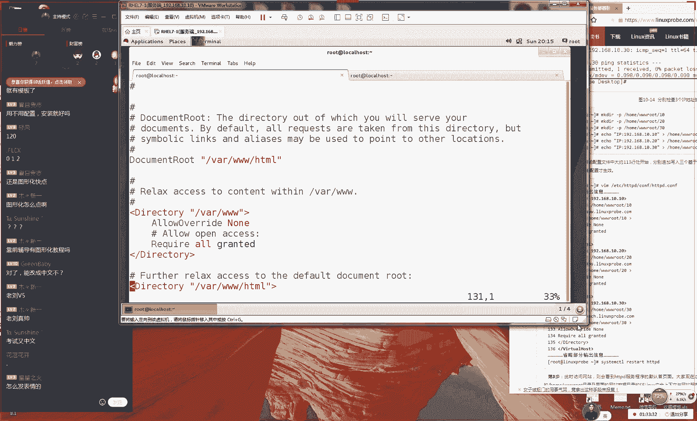
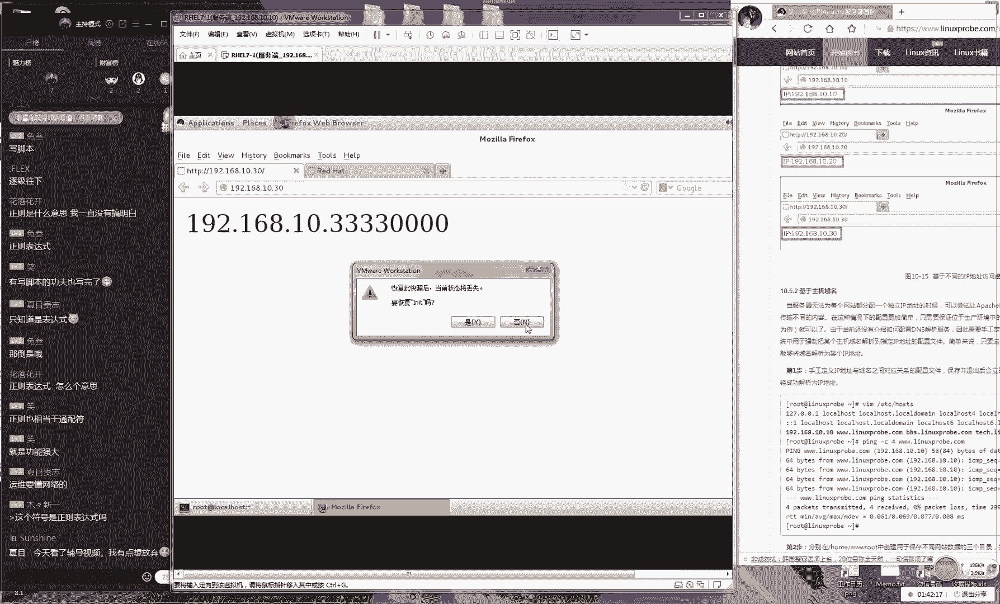

# Linux教程RHCE - P12：12.Apache部署 - 艾弗艾尔思丢丢 - BV1if4y1e73V

🎼的风景。🎼最后才发现还是。🎼我太在意。呃，好，那我们这个歌时间比较长，所以我们就直接来上课好了。哦，那好，那我们先来测试一下。那我那那我们这边这个商业环境好吧，先啊大家先打一下一呃。

今天还是请曾志伟给大家上课啊，可能这个呃在很努力再给大家说，可能还是声音比较小。大家可以适当调大一下自己的音箱。好呃，今天我们请啊今天我我们以。😊。

啊，那我啊我们今天请这个曾志伟给大家讲课啊，可能今天这个嗓音还是不是很好。那好，那我们今天给大家说一下，我们今天这个第十章节啊，当然啊但是大家不用怕啊，我啊我们这个呃我们这是一个网络培训课程呃。

不会通过网络传播我们这个呃我估计可能是肺炎。好，那我们今天给大家说一下，我们这边这个第十章节的这个课程，今天我们要去学习我们这个搭建网站。那么我们今天的话可能我今天这个嗓音可能还不是很好。

但可能听不清楚。所以我会把我今天我所讲所的东西啊，我啊那我啊那我还是给大家。😊。

给大家打出字来。好吧，大家可以记到你的这个笔记上面。然后我们今天下课之后，请记得再去拍照，然后发然后然后再去发到你的博客上面。然后吃药。哎呀我不想吃药。因为我觉得吃药后正对这个身体反正不太好。

因为人家说了嘛说发烧感冒，一个礼拜也能好，吃不吃药都一个礼拜能好。所以我觉得应该再等等吧。反正等一个礼拜吧应应该没问题。好，而且现在这个正当？在才18岁，这身体那没问题。好，那那我们要给大家说了。

因为我今怕待嗓会受不了了，因为毕竟两个小时呢，以我现在给大家开去讲干货吧，一会待会一嗓子不好，对不对？好，那我们那我尽量我们今天我们这个课程就把讲完。

我们第二我们这边第十章讲完先给大家说一下说那我们我们什么是网站那我们其实来讲的话呢，这个网站的话呢。😊，啊，这个话呢网呃网站就是我们每天都会去访问的呃这种网这种网络服务，对吧？那我们什么叫做网站呢？

虽然然说我也是从网上找到很多很多材料，但是我们没有找到一个对于网站的这个术语个专一个非常专业的一个解释。因为我哪怕我去百度百科，然觉得这个危基百科，然后去找到很多很多网站。

但是他们都没有对这个词有一个很好的一个解释。所以也是体现出来了某一些就是群体嘛，他们可能对于这种底层。因为大家可以感觉出来，因为我们现在互联网发展的很快了。然后现在出现了很多高新的技术。

但是对种比较基础的一种学科来讲的话呢，我们确实可能还是比较大还是没有太在意啊，包括说我们现专业的术语解释或者说我们没有去同意这种解释。

好那给大家一个我们从很多这个材料里面找到的一个我认为比较靠谱的一个对于网站这个词的一个描述好吧，家可这书上面。如果要是有跟我一样的话，那么就知道。😊，我从我这边抄来的。好，那我们还去说，就是说让用户。

😊，能够啊就是我们叫做网站服务让用户。让用户能够。通过。浏览器。访问到的。服务器上的文档资源。这个话就是说我那我给大家找到了，就是我啊我认为是比较靠谱的这么一个解释。

这个是对于网站这个重要名词的一种解释。嗯，好对，然后的话呢说我们这个红因为我们这边这个第十章节的话呢，是我们我们红的一个重点。

我们之前在我们之前在2015年初的时候开始去考红这个红当时我们的这个网站服务他是考到六道题的。这个我们知道他很多因为我们知道红里边，他一般来说他只是对他一般来讲的话，他是每他是每一个服务。

然后他会出这么一道题目。但是我们之前我们2015年的年初的时候的话，那我们在这个网这个网站服我们当时是考到六道题或者七道题这个来说他是非常多的，因为我们知道因为这个红帽他对于这个网站服务也非常重视的。

所以话呢他考到六道或者七道题。而我们现在的话这个。😊，题目量虽然它在减少，但是呃他也需要考到大概有三道题，它他它会有呃他现在会有三道题或者呃或有四道题。那么就以我们这个网页上面为准。好吧。

然后因为具体忘记像4道应该是四道题。大家就就以我们这个网站上面为准。那好那我们给大家说一下，那我们今天知道网站服它是什么东西了。然后其实这个我们不需要再多去赘述了。因为网站服务。

大家每天都大家每天都会去访问到至于这个东西大家都已经是呃比较了解。那我们主要来去了解一下就是说那我们该如何去那我们该呃怎么样来去呃呃来去呃部署出来属于一个自己的一个网站服务呢。

那我们就要给大家提到我们在这个windows系统当中，我们比较常见的部署的方法了。因为给大家去对比一下。大家知道这两个区别，后么知这两个一个相同点了。

大家知道那我们在这个windows里边我们比较常见的部署的这个服务叫什么名字，我们都应该知道对吧？那我们叫S这个是我们默认自带一个工具，它可以部署出来网站。😊，那好，那么我们在这个lin里边的话呢。

我们的我我们的lin中的话呢，那么想要再来部署出来网站的话，它其来讲它有两个服务。那那我那我们可以去选择第一个服务，我们叫做。

第二话呢我们叫第二个我们叫G那我先给大家说下他两个的区别啊然先给大家说他两个这个共同点吧。就是我们这两个服务，他们都可以我们这两个服务，他们都可以部出来网站。他们两个都是我我们的这个网站服务。

它可以部署出来网站。那么他这个区别是这样的啊来说的话呢我们第一个我们叫这个话它也是一个美国直升机的一个大家知道这个是一个美国战斗直升机的一个名字。如果你之前听过张刚就是个叫叫做局座啊。

他去讲那个军事的话，那你应该知道美国有一个国有一个战斗直升机啊战斗直升机的这个名字的话也是叫做就做奇直升机。😊，大家应该是应该会对这个名字会有一点呃会会有点耳熟，对不对？所以所以我今天我说完了之后。

大家觉得哎好像大家大家好像大好像听过似的啊，这个话我们叫做这个阿帕奇这个话这个语义的含义的话，它是来自于一个印第安语啊。

它是来自于印第安语印第安语这个话他的这个意思代表就是一个勇气勇气与力量无穷的意思所以说这个语力量无穷。所以说这个的话他的的这个寓意还是很好的。所以说那我们这个网站它也是选择了我们这个词它作为无穷。

那我们去选择这个词来作为我们这个服务的这么一个名称啊第二话就是说他这么一个单词个来历。后大家说完后说它有什么优势啊。第说它就是一个老牌的这么一个来去部署的一个网站程序这么一个软件。所以说它是一个非常。

😊，啊，他的话他是一个非常老牌这么一个服务程序，它具有了很高的这个稳定性。并且的话呢。😊，它是被这个市场所认可的那它已经被呃市场所认可了很多年。第二的话就是说它的话它具有很高的这个稳定性跟这个安全性。

这个话那么也是我们会给大家去提到的那然后并且它我们啊稳定性跟安全性。然后的话它具有很好的这个效率。啊它具有很高这个效率。那么我们以及会将我们这个功能进行一个呃呃功能进行一个模块化，那功能模块化。

然后我待会给大家演示到，就是说我们具体来去配置这个。😊，呃，这个服务的时候，他会呃他会有一些具体一些表现。还有的话就是说我们啊我们呃我们我呃我们之所以他呃我们要去学习的这个服务的话呢。

还有我们这个还有我们的这个第三个理由，就是我们这个红帽考试的话呢，他从鸿猫月舞开始，然后到我们红猫日7，它都是一直在去考的这个服务的。并且他占用了很多的这个分值。

所以说这个是我们这个是我们必须要去学习这个服务的一个理由。第二话那我们这个服务，我们叫做呃这个服务，我们叫做NG他的话它是一他是来自于一个呃俄罗斯厂商，他为呃俄罗斯厂商。

他为他们当地的一个站点所研发出来这么一个呃研发的。为门啊为他们门户站点研发出来这么一款程序，它具有一个好处啊，他就是可以去使用较少的资源，他可以去使用出来较少的资源。然后使用较少的资源。

然后实现出来很高的这个并发性，然后实现很高的并发。😊，啊，那我们给大家举个例子来说，就那比单比如说那你是一个地主，然后你请了几个长工帮你来去干活。那么你希望啊那呃那你肯定希望你那呃那你请的这个人。

然后他要的工资特别的少，然后他吃的也少，但是他干的活多，这个我们也非常相像，就是说他吃的少然呃他吃的比较少，但是他这个工作效率是比较高的。他可以让我呃我们这个工作效率高。

他可以让我们这个服务器上面的这个资源得到一个充分的一个。😊，呃，发挥。那那那么呃我们今天我们这个课程的话，那么我们还是啊主要给大家去介绍一下它两个这个区别。

然后但是我呃我们今天这个呃章节就先去主要去讲去这个，然后我们会在后面的第二十章节的时候呃，会给大家讲到这个NG。那我们今天还是以我们这个为主啊。

就给大家说一下说我我啊我们为什么要我们需要啊需要来去学习到这个服务程序。😊，好了，然后的话今天我们先给大家说一下你配置这个呃ym仓库的一个方法。虽然说我们之前已经讲过了，但是我们还是给大家做一下回忆。

好吧，就是我们有三个步骤，大家不要忘记第一个步骤。😊，好，那我们这边第一个步骤的话呢，就是我们要先去挂载你的系统光盘啊，挂载你的系统光盘。😊，然后话到呃到你的呃对应的这么一个呃，呃到一个目录上面。

然后第二就是来去配置你的EM仓库的文件。好，我们这边的第第三个步骤，那我们就要去使用到这个亚，然后面加软件包的名称软件包的名称，然后就可以来去安装了。下面给大家说一下。好，那呃我们先给大家说一下的话呢。

就是我们后面安装的是我们软件的一个名称，它并不是写的是服务的名这个我们需要来需要来需要来去区分一下。因为的话呢我们讲的这个app它指的是我我们这个公司的名称，它是一个它的话它是一个公司的名称。

它也是一个基金会的一个名称，它也是我们的这个服务的一个名称。好呃它也是我们的这个项目的一个名称。但是我们的这个呃但是的话呢我们的这个网站服务程序的名字，我们是不一样的，我们需要来记一下。

我们叫呃呃网站服务程序的名称，那我们需要来记一下。然后这的话它也是软件包的名称。😊，他的话他是呃呃他这两个大家需要啊大家需要来去区分一下啊。他们两个是不一样的。好，那我们现在的话。

那我们现来配置一下我们这边亚仓库好了，现在编辑一下我们的呃不现在去找一下我们这边的这个挂载点，现在新建出来一个目录，虽然我已经有了，但是我还在新建出来一个目录，给大家再重新再去讲一下。😊，好。

那后啊那我们的话，现在我们现在就创出来一个挂载的一个目录，然啊。😊，呃，然后我们来去挂载一下我们系统光盘，挂到我们对应的目录里面。然后大家可以看一下我那我们这边这个呃挂载上这么一个效果。

接下我们来编辑一下我们的在呃我们在呃我们的这个EDC目录里面叫做的这个文件。然后我们现在需要将我们这个设备的信息写到里面这样那我们才可以保证我们这个服务程序，他可以来去一直为我们这个用户他去提供服务。

然后呃我们这个光盘的这个格式叫做ISO910，大家需要记一下。然后后面就是我们这个权限叫做，然后以及是否被问然后以及是否进行这么一个呃。😊，呃，开机时候的一个校验。然后我们现在来保持名退出。好。

那我们啊那我们现在啊那我们啊那我们先在做好了之后的话，就是那我已经做好了第一步了。那我们接下来那我们来说一下我们这边这个第二步骤。😊，那么这个。好，那呃我们这边呢还有一个第二步骤。

就来去配置一下我们这边这个y仓库。感觉有点严重了，但是还好，今天今天是已经礼拜日了。下礼拜我有一个礼拜时间可以休息。好，那我们先来编辑一下我这边这个配置文件啊，然后这个文件的内容我们给删掉。

然后我们就下去写一下啊，我们也不要道偷懒好不好？那那我们先来写一下我们这个格式。这个那我们看这个格式是这样去写，大家先记一下啊，然后我们待会会啊会再给大家讲一下，他每个参数这么一个呃作用的。

大家家记在的书上面，这个是一个最为经简的这么一个格式。😊，好，那我们接下来给大家说啊，然后大家说这个名称的话呢，是叫做帅哥是吧？因为这个是真的是无所谓的啊。所以那我啊所以话那我们就可以随便了。

那我们这个呃名称叫做这个帅哥吧。那啊就那我们就听大家的，那我们叫这个帅哥。然后他这个它里面的这个呃名称也把它叫做这个帅哥。然后下面就是我们挂载这么一个目录。那么我那我们现在使用到本地的方式。

他他进行挂载的话呢，那我们就是一个猫号三斜杠。但是我们知道。😊，它里面这个第三个斜杠代表就是系统的这个根目录。然后接下那我们选上一个一代表就是启用这个仓库。然后它下面去写一个零。

代表就是我们啊我们呃不要对于这个仓库来进行一个校验这样话，那我们可以提升我们这个仓库的一个效率。这样的话那我们再来我们来去安装一下我们这个网站服务程序HPD啊。

因为我们知道因为我们后面需要安装的是联包的名称，而不是他这个公司的名称了，所以说那我们在敲一下回收来安装一下我们这个网站服务程序，然非常尴尬，他说我们这个呃说我们这个文件好像没有找到。

那所以我们来看一下，我们具体是哪里写错了吗？果然是我们写错了。因为我们应该是写的后来我觉得写错了。😊，好，那我们先这样去写。好，那我们现在把保持屏退出。然后接下来我们来去安装一下我们这个网站服务程序。

呃，还有一个是不是叫HDEP，没有，这个是一个协议的一个名称。我们所讲的话呢，还有一个我们叫做HDEP啊这个话是我们这个协议的名称。它就像我们之前讲那个SS，它是这个协议的名称。

我们此时的话也并不是要去输入这个名称的。好那话那我们现在去区分一下，然我们去将我们输入下代表去确认去安装这个服务程序。其实我们做好之后啊，这个没有什么可难的。因为这代表就是去启用这个仓库的意思。好。

那我们啊好，那我们现在做好之后的话，那你就可以去使用到。😊，呃，sstem cTL呃restar加上我们的服务名称。😊，这样的话，他来去重新去启动一下我们这个网站服务程序。

然后将我们这个网站服务程序加入到形象里面。好，那啊那我啊那我们现在做好之后，那们就可以打开你的浏览器。然那我们选择这个火狐了，然后打开我们的浏览器。😊，对我呃一般来讲的话呢。

我们这个服务程序的后面一般来说他们都是以D结尾的，代表就是一个守护进程。他会来会啊他会被我我们这个用户来一直提供们服务的意思。好，那我们先去访问一下我们这边网站的这么一个地址啊。

然后这个时候也可以看到这么一个界面。这块它就是。😊，我们这个网站服务的一个默认页面了。但我啊啊那我呃啊那我给大家说一下的话呢，这个网啊呃这个呃网站服务程序的话呢，当我们看到这么一个页面的时候。

它证明出来了三件事情啊呃第一件事情的话，他说的就是我们的这个网站啊服务程序啊，服务程序已经是正常启动了啊，已经是正常启动了。这个我们需要知道啊，已经是啊是正常启动了。

第二的话呢就是说啊我们叫做当我们看到这个页面的话呢，证明什么呢？证明我们的这个呃网站内没有数据。😊，啊，其实来说这个应该叫第一条啊。然后第二的话呢，我们叫做呃权限不足。😊，哎呀，今天不会吐子血吧。

然后呢那啊大家啊啊大家可以来记一下啊，当我们看到这个页面之后，当我们看到这个页面之后。😊，啊，证明了有这么上面两个事情啊，证明有以上两个可能性啊可能性。那么好，那我们接下给大家说一下。

说那我们来去配置这个呃服务的时候，那那那那我们这边的网站的目录是它在哪里呢？那么我们的这个网站目录，它是在这个它是在这个目录里面的它的话它是在这个目录里面的这个3W里面HML目录里面这个就是我们这个呃网站它所在这么一个呃目录了。

好，那我们接下来我们来进入到我们的这个目录里面，然后里面的这个log们我今我我今天们老去讲这个log。

然后它是在这个目录里面的这个3W里面HML目录里面好大家知道就是那我们这个网站服务程序这个首页应该叫什么？那给大家提个问题好了。😊，因为我们今天可能嗓的不太好，所以我就尽量给大家提问了。

大家知道说那我们这个呃网站的这个首页文件一般叫呃他一般取道什么名字吗？这个它一般来讲的话呢，那我们知道它有一个规定啊，它这个网站首页的文件应该是叫做d这个大家需要这个我们需要来知道一下它有一个规定啊。

这是我们这个网站首页这么一个名称。好，那我们接下来我们来出现出来这个文件啊，大家可以呃呃来去敲一下。然后那我们写这个文件那我们往里面去写一行信息吧。因为是无所谓的。

以那我直接去敲了那我们就写然后那我们将这个信息给它导出到一个叫做inex这么一个文件里面。这样那我们就有一个新的网站首页的一个文件，那我们再回然后我们来看一下这个网站里面的内容。😊，那么就会看到了。

然后那我们再去刷新一下我那我们这边这个呃我们的这个服务的一个页面。那我们来去刷新一下我那我们的网站。大家就嗯好，那么我们现在可以看到说我们这边那已经能够看到这边的这个网站里面的这个数据了。

现实来讲的话呢这个非常简单啊，就是说那给大家捋一下思路是这样的。第一的话就是说你要先去安装一下我们的这个网站服务程序，现在安装我们的这个呃网站服务程序。第二步的话。

就是你要像这个呃服务程序的这个保存的一个目录里面啊，我们这个网站目录内。😊，写入我我们这个首页文件。那我们知道这个名称的话呢，它叫做index h，这个我们知道就好了。啊那，大家需要这么啊。

大家就知道我们有这么两个步骤。接下的话呢我们给大家做为一个实验哈，因为我我们需要。😊，呃，因为我们需要来去学到这个服务盘。那么就是要对这个服务进行一定的这个呃修改跟定制。这样的话。

那我们才可以去提升自己去配置这个服务的一个水平。所以说我们待会儿做这个步骤的话呢，在我们工作的时候基本来说是不会用到。但是我们上课的时候讲是很有必要的，需要给大家来去练习一下。

说该怎么样来去配呃啊该怎么来呃来去设置你的这个服务程序，先给大家说到说那我们要去找这个配置文件的话呢啊对，那么再给大家说一下，他有这么啊他有一个他有这么一个口诀了。那第一个口诀的话呢。😊，呃。

是我们这个呃是我们这个系统中系统中的一切都是文件，这我们都知道，对吧？第二的话呢就是在去啊配置一个服务啊，配置服务就是在修改。服务的配置文件啊，这我们也知道了。第二啊，还有我们这个第三个步骤。

那就是呃需要重启啊，或者说我们叫做这个一般情况下，那啊那我我啊我们需要去重启对应的服务。😊，才能够获取最新参数。还有我们这边这个第四步骤，顺手将服务加入到开机启动项中。好，大家先可以记一下。

那我啊我们这个口诀，然后给大家来去演示一下。然后说这个考试它会考到的。所以我们刚才提到说这个服务它会哦，你说这个实验吧。呃。这个实验它是不会考到的。好了，那我们需要记一下这个四个步骤啊。

然后我们下面会围绕我们这个步呃，大家去围绕我们这个四个步骤，然后给大家来去讲。然后那么呃我们呃然后我们来再给大家说一下的话，就是我们的这个配置文件的话，它也分了两种的。第一个的话呢。

我们这个配置文件叫做主配置文件。😊，这个话呢我们叫做主配置文件。主配置文件。第二的话呢，我们叫一般配置文件。哎呀，今天状态还真的不太好。然后还第二个文件，那我们叫做呃啊我们叫做一般的配置文件。😊。

或者我们叫做呃我们叫做这个呃我们叫做一般配置文件。好，那我们先来说一下它两个区别啊。第一的话就是说我们这个主配置文件的话呢，它主要是保存的是正状的参数，保存的。😊，最重要的参数啊，保存最重要的配置参数。

还有话就是我们的下面一个，它是保存的我们非重要性的这个参数。就是说它里边它是一个调用关系，它是一个调用关系，它会被啊它会被这个主成域所调用，它保存的是其他的配置文件。好，大家可以先记到你这个书上面啊。

然后因为我今天给大家都要打出来。这样的话，大家可以记笔记的时候，大家可以知道该怎么去记。然后但是具体这个语言啊，因为我可能说的不是很文艺，大家可去修改一下。然后说的比较这样的话比会更好一点。

然后我跟大家说一下的话呢，说我们这个我们这个主配置文件。它有一个寻找这么一个小技巧啊，它是在我们这个ETC目录里面以服务名称命名的一个文件夹里面以服务名称命名的一个文件点CONF这话就这个话是一般情况下。

那我们要去找这个主配啊一般情况下我们要去找这个主配置文件的一个方法。一般情况下找主配置文件的一个方法。好，那我们需要记一下这个就是我们主配置文件。我们我们去寻找一个小技巧，大家可以记。

为我们要去配置这个服务的话呢，那么那么那就啊那我们就需要配置这个服务的一个最重要的这么一个参数。所以说那我们就必须要找到这么一个主配置文件了。😊，那每天做24遍啊，就叫那啊那有有点太过分了。

那我们来继续给大家说，那家编辑一下我们这个主配置文件啊，这个文件是在ATTC目录里面，那我们可以猜到对吧？因为我们根据第六章节里面的呃这么一个目录的一个协议。我们根据FH协议。

那我们知道这个肯定是它是在ETC目录因为它是一个配置文件。然后以复名命的一个文件夹。然后里面它是叫做它里面是叫做这个啊它里面是叫做confit，然后里面叫做HTBD。😊，好，那么后来这个就是我们这个组。

哎，等一下啊，我把它打出来。好，大家可以记一下话这个就是我们这个网站服务区呃，这个就是我们这个网站服务程序的这么一个主配置文件了。大家可以记到你这个书上面，等你以后去配置网站的时候。

那你就要拿去找这里面最重要的这个参数了。好了，那我们给大家记一下，然后这个删掉了啊，大家可待会之会记到你的笔记上面好，这话这个话它就是我们这个网站服务程序的这么一个主配置文件了。主配置文件。

大家知道那我们这个去寻找这么一个小技巧。好，那我们接样的话呢那我们再来去编辑一下这个文件了。大家看到这个文件之后，大家慌不慌啊。😊，大家看完这个文件之后，大家觉得慌不慌？

大家可能说之前啊可能看看那个时候还是比较慌，对吧？因为这个参数特别的多。因为因为你啊然后那这样的话，那你往啊这样的话，你要去往下去看啊，还是很慌是吗？其实啊其实大家不用慌。

那么啊那啊我们呃去往啊那我们往下去看。这个文件的话呢，那我们总共我们看起来大概的话行数会有很多行353行。但是的话其实这个。😊，真的是不啊，但是的话啊这个是真的不用慌的。因为的话呢。

这个里面大部分都是这个注释。我们这个啊我们这话的这个注释，它主要是啊它主要是对于我们的这个服务的功能，或者的话呢某一个参数啊，某一个参数的一种解释或说明信息啊，某一个参数的解释或者。😊，说明了信息。

所以话呢这个东西啊，我们我们的这个程序是啊不读的。这话呢我们也不用去读的。好，那啊那么我给大家玩一下，大家可以对照那我们觉得这个表格是表格10-2。

然后那我可以找一下说定义我们这个网站目录它所对应这么一个参数的话，那我们就来去修改一下的话，那么我们这个行数是在1它是在120行左右。好，它是在119行。

那我去修改一下说我们我们的这个网站所在这么一个路径。好，那我们那我们去修改一下，但是说我们这个实验是在我们这个工作跟考试的时候是没有意义的啊。但是我们通过这个修改参数，然后来去那我们这个作死，对不对？

然后我们去知道对于这个服务的一个比较高级一个配置的一个方法。然后那我们既来我们再修改一下我们对于我们这个网站它的这个它有一个目录的一个权限。这个时候我们要啊要把给修改一下，下面一行就不用去修改了。

然后这样我们修改好之后，这样话那么就代表是什么呢？😊，然后啊这个它代表就是我们原先的这个万目录里面的这个网站的目录，就把它切把它给啊切换成了这个货目录里面的3W root这么一个目录了。大家知道。

那我们现在这么一个文件的一个变化。好，那我们接下来那我们做好之后啊，就可以来去重新啊就送分题啊，这也算送分题了。但是我们红报是它里面是没有的。其实啊那我们现在来去重新来去启动一下我们这个服务程序。😊。

呀他告诉我们说这个网站启动失败了啊，然后是因为我我们这个网站那个呃它啊这个呃还没有这个目录。那我们需要新建出来这个目录。然后那我们再来去重新去启动一下这个网站服务程序。好，那我们做好之后。

然后对我们得把我们这个服务加到行用项里面这样会保证它啊还是能够去启用的。好，那我们既然做好之后的话，那我们可以进入到这个目录里面的这个3W注册这么一个目录里面，然后那我们刷新一下这个网站里面的这个数据。

大家看到那我们现在有这么一个效果了。这话它就是一个网站的这么一个默认的一个页面。那我们刚才提到过，那你看到这两个页面的话，它这么有两个可能性。😊，好。

那么的话呢我们呃我们的这个第一可能性就是说我们的这个网站目录内。没有数据。第二个可能性的话呢，它指的就是我们这个权限不足。他要呃他要呃他。啊，他有啊他啊它是有这么两个可能性的。好。

那么啊我们接来我们还进入到这么一个目录里面。然后那我们先按照我们之前的这个步骤，然后我们呢新建出来这么一个网站首页文件。然后它里面这个内容的话，它是它也是随意的那么显示那我们写。

然后我们去写到这个网站的这么一个首页文件里面做好之后刷新一下我们这个页面。这时大家可以看下效果。虽然说呢我们现在它已经是刷新了，但是它现在还是没有能够去访问这个时候它就是肯定是因为我们这个权限是不足了。

那么这个的话呢这个权限不我们这个权限不足，它指的它并不是我们这个RWX的这个不足，它指的有一个服务，我们这个服务叫做I这个我们应该知道了。😊，对，然后大家应该看呃呃大家应该呃我们刚呃应该是已经看到。

就是我呃我们在去拟刷新网站之后啊，它这个底下该它有它有一个提醒的。然后他告诉我们说我们这边具体的他这个它它有就它会有一报错。但是我们刚没有啊去点开它所它就已消失掉了啊，大家可以会就可以点完之后看一下。

这话它就是一个呃我们一个安全子系统这个服务，我们叫做IC这块它是由美国安全局，他去研发出来的。这个是由美国安全局它啊啊联同啊叫做安全子系统子系统这话它是由美国安全局啊，还有我们的。😊，呃。

lin社区一起来去研发出来的这么一个呃服务程序，它是为来去进一步的去加固我们系统的这么一个安全。它呃他来去设计出来的我们这么一个呃系统。那那么它呢它有这么两个这么一个保护的一个机制。第一的话呢。

我们叫做第一，我们叫做叫做lin的域。第一来说我们叫做lin域。第二的话呢，我们叫做Slin这个呃安全上下文。那么啊给大家说一下的话呢，第一来说就是我们的这个域。

它主要是管理的就是我们的这个服务的功能管理服务的功能。咱比如说那你去买了一个手机，然后那你这个手机里面。😊，然后再比如说大家知道有一个软件嘛？叫美图秀秀，大家可以打一下，一叫做美图秀秀。

因为可能说呃要是女生比较喜欢用啊啊美啊美图秀秀。那大家要知道话啊然后那啊啊那我们可以打一下一那么呃我们这个呃软件的话呢，它的这个作用啊，它的这个作用主要是来去修图的。然后它是做图片的美化的啊。

做图片的这个美化，大家应该都知道听大家应该都是都应该是已经是听说过是吧？然后他是做图片美化的。那么好了。😊，好，那那先稍等一下，我呃喂呃我也先泼口水。哎呀，现在真的是要命。因为在很努力在给大家说。

但是吧这个是就只能是这么大了。😊，好，那我们接下来给大家说的话呢，这个呃那我咱比如说那我这个呃软件，它突然有一天他就获取的是我们这边的这个图片的信息。那好了。

还有另外一种可能他会啊获取了我们这个银行卡的信息。那么我们很明显就知道了。这边我们这个第一个请求它是一个合法的，第二个请求它是一个呃他肯那么他肯定是一个出轨这么一个行为了。那么好了。

他就是一个非法的一个行为。那么好了，第一个来说，它是合法。第二来说，它是一个呃非法的一个请求。那么好了，那么这个时候他就要有我我们这个预。他对于我们这个服务的功能。

他进行一个限制来去限制我们这个对应的服务。😊，他能够去多呃他呃能够去呃他能够进行的这个操作。😊，第二的话呢就是我们这个呃我们对于文件上面这个上下文了，这个话它主要是对我们这个文件来进行设置。对文件啊。

或者说我们叫做这个管理文件。😊，让啊只有啊让只有。呃，呃，我们叫做让之友呃，某个。服务程序才能啊才可以获取。现在的话呢就是说那我们先对于这个服务跟这个文件。那我们现在啊我们现在的话呢。

我们都去来去做这么一个呃限制。这样的话呢，当我啊当我我们有一个服务程序。他想来去获取我们这个非法信息的话呢，首先来说的这个行为，他会被我们这个域给限制掉。因为它是限制了我们这个服务的功能。

那么他呃即便说它是突破了我们的这个域的限制。但是它去访问这个文件的时候，这个文件上面还有一个上海文的一个限制。它也会再去限制我们这个请求。所以说它是让我我们的这个服务程序啊，所以大家总结成一句话。

就是说所以的话呢我们在这个服务程序的一个核心的一个呃作用的话呢，就是让呃我们这个服务程序。😊，呃，规规矩矩的。只去获取自己应该。获取的这个文件。所以话这个就是我们这么一个服务的一个核心的一个用处。

大家可以记到你的笔记上面。然后那我们接下来去分析一下的话呢，就是说他既来说它有两个限制。第一来说我们叫说我我叫上下文我叫上下文那么好了，那我们现在我们为什么他给我们报错呢。

那么就是为我们现在这个权限不足，它被限制了。那么我们的这个原因呢，就是因为我们现在修改了我们这个网站的一个目录对不对？因为我们啊我们话之前它是在这个目录里面的3W里H目录。

但是我们现在修改到了这个货目录里面那给大家提个问题了。那么我们根据第六章节所学习的一个协议，我叫做F一个协议。那么请问在我们这个货物所就这么一个目录里面，它应该用来保存的是什么数据。😊。

它应该保存的是我们用户的加目录的这么一个信息，它应该保存的是我们用户的一些私人的一些资料。所以说呃它用来保存是我们用户的一些私人资料跟我们这个加目录里面的顺序。所以说他去访问的这个文件话呢。

你对于这个文件面这个上文给做这个限制的。好，那我们做这个实验之前的话，那我们那我们先来检查一下说我们这个服务它是否已经开启了。因为它有三个模式。说编辑一下我们这个配置文件。

它是是C目录里面里的话呢叫做里fi这么一个子目录好，这么它有这么一个文件这个文件的话它有三个这样的一个模式啊。第一个模式的话呢，我们叫做这个for这表就是一个强制的一个模式。

那给大家说一下的话呢就说那你。😊。

好啊，那么的话呢我们为了让我们这个系统它啊它啊它它啊它更加安全的话呢，那我们需要保证我们Slin它是一个开启一个的这么一个模式。所以说我们需要保证它这个呃模式为enforcing。😊。

这话他呃他代表就是一个去呃开启的一个这么一个状态。代表就是一个。强制开启的一个效果，强制开启这么一个效果。还有的话呢，我们这个警告模式，那这个还W到就是个。啊，警告模式。因为我们是C考试的时候。

你是必须要把它开启S。因为这个它是有考试要求的。好，那我们来去说一下这个叫做警告模式，就会它不会去真正去来去限制你的这个行为啊，不会限制我们的这个行为。

但是他会把我我把你的这个操作记录到日记录到这个日志里面这块它非常相当于就是我们那个Q里面那个软限制，对吧？它啊他啊并不会来去限制我们这个行为，但是它会把这个信息写到我我们啊写不到我们这个系统里面。好。

这个话非常像那个软限制。还有的话呢我们还有一个叫做还有一个叫做这个di代表它代表是禁用的意思啊，软限制。😊，嗯哦，写错了，远限制。我想软先刺啊。哎，完了，我现在这个脑子不太好使啊。

我现在啊我可能是这个病毒已经是更新了啊，我居然啊忘了这个字怎么写了。来好，那么我们来说一下我们这个第三个的话代表就是一个金用模式。它啊进用的它并不是这个服务，而是禁止了我们的它本身。

现我们需要它有三个模式啊。好，那我们现在给大家说一下，就是说我们啊先要保证我们的这个模式是一个强制开启的一个模式。好，那么啊那我们来去检查一下。既然我们来还有两个命令。

第一个命令我们叫做这个get in force。😊，这个的话他是用来去查看我我们这个当前状态的。我们来这给大家记一下啊，它有两个命令。😊，它的话呢他啊它有呃它有第一个命令。

我们叫做get in force，代表是查看当前的。到Slinux的状态。好话，我们叫第二个叫做such in force。代表的就是设置当前的Slinux的状态，它有两个命令。第一来说的话呢。

我们叫做set in force，那大可以叫我书上啊。0这话它它代表就是我们要去呃临时关闭。还有一个叫做set in force，一代表就是临时开启。好，大家先可以来记一下。

然后我们到会给大家去做一下我们这个操作。那好，那我们先来去刷新一下这个网站啊，那我我们先看到这么一个页面了。那咱比如那当我们看到之后啊，那啊它啊它是有两个可能性，对不对？

第一个来说就是这个啊网啊网这个里边的网站内没有数据，网站内没有数据。😊，第二的话呢就是说我们这个权限不足的那我们现在怀疑它可能是由Slin把我们给限制了。

所以说那我们现在需要先来去执行一下叫做这个set来把它给关闭起来来用到这个排除法来看一下说是否确实是这个服务，给我们捣乱好吧，那我们给它关闭掉然我们会再回收去刷新一下我们这个网站。

那我们看到说那我们就可以看到这个里面的这个网站它里面的这个数据了。那么也就是说我们确实来讲它是由我们这个我们给限制了。那我们现在再把它给开启，那我们把它开启。因为我们不能够说我们偷懒。

然后我们就把它关闭了。好吧，那我们刷新一下这个时候看到对我们这个它只是一个警告模式然后那我们现在再刷新一下的话，要限制掉了。那么也就是说它确实那它的话它确实是由把它给限制掉了。

那么这个时候那我们需要交大家一个命令啊，它用来去查看我们这安文的。😊。

他是这样去做使用到这个L。然后那我们看那呃那我们看呃想要那么想呃想要想要去看目录的话呢，需要属于一个小写的一个D，然后加一个大写的Z这个Z代表就是查看一个我们文件上面这个上下文的这个值。好。

那我们先来看一下的话呢，我们原先的这个外目录里面的这个数呃这个上下文的这个值跟我们现在当前户目录里面的这个值，我们看一下下它是有什么区别的啊。然后我们先看一下我们这个户目录。所以说呢我们现在可能看不懂。

但是说呃但是我们现在把它改成是一个警告模式，不也就是警告吗，但是它不会限制我们的意思了。好了就是把它可以设成一个离时警告模式吧。好，然后呢那我们现来去设置一下我们这个户目录里面。

然后我们看一下那我们对应这个上下文的这个值。😊，对，那我们需要呃大家说书上是大写Z呃对，所以说我们这边也执行是一个大写Z，然后可能看起来比较小，但是它是一个大写Z。好，那我们来看一下的话。

这就是我们原先的个目录里面我们的这个网站服务程序，它所对这一个上下文还有我当前我们自己的个上下文虽然说我们可能看不懂，但是没有关系，但是可以去猜一下说他们两肯定不一，不？

我们来看一下就是说这个它是一个叫做网站的叫做这个还这个这个刚才就是一个网站系统文件的意思它的话它是一个网站的一个这么一个这么一个数据文件。

第话那我们叫做个me录它指的就是我们用户录么果就是由我们这个上下文它导我们这个服务是它是不能够它去获取到这个文件的。所我们给大家讲一下该怎么去修改这个值的话们要一个命令们做 manager。😊。

这个命的话，他的呃他可以来去修改我们这个上下文。那这个命他可以用来去修改我们这个上下文。它有它有一个格式啊，是这样的，叫做呃S manager，然后FC。😊，然后给大打出来吧。

然后我们代表去修改一个上下文。虽然来说这个呃具体里面这个值因为我也记不住，但是我们没有呃但是我没有关系。然后那我可以来去直接复制就好了。把把我们这个想想设置这个值的话把复制过。

后使用使用这个杠代表就是一个修改的意思然后是杠代表就是我们需要修改成什么值这个把过来，但这个还没有完，就我对于哪个目录来去操作呢那我写清楚对于这个home录里面那我们进行一个操作。

一下回车他说我这个命令没有找到为我们S manager没有最后那个，我们来设置一下我们这个目录然后我们对于这个home录里面的这么一个子目录叫做3W root也需要来去设置一下。

它是不能够对于我们这个录杠或操作然进行一个统一的一个设置的。😊，还有话就是我们这有一个小bug，就是他对于一个目录来进行操作的话呢。

当我们呃S manager当我们的呃当我们这个使用这个命令来去设置一个目录的话呢设置目录上文的候话，请切记我们这个目录的后面千万不能有这一个斜杠咱比如说在一个目录是这样写me目录里面的3W root还有还有这么一个写法叫做me目录里面的3W root一个斜杠这话说我们看起来是一模一样的啊。

但是的话呢我们必须要知道它两个的话它还是不一样。对于我们这个命有一个小bug我们来呃我们来对于我们这个目录来进行操作的话呢，请切记我们的目录后面不能有这个斜杠那我们这个是啊错误的。

但是这个是一个我们当前程序这么一个小问题啊好，那我们现在做好之后的话那么我们再刷新一下这个网站里面的这个数据啊。😊，这个时候那我们看到说我们现在还是不能够去呃查看到我们里面的这个数据。

然后大家说到说我们这个参数啊，刚给大家讲到说杠A代表是添加的意思，然后杠M是修改。因为我知道大家可会说这个问题。但是我们直接去操作的时候，那就大家呃大家会发现说杠A它还他其实来说它还是添加的意思。好了。

杠T代表就是我们的这个参数的后面，我们去加上我那我们要去修改的这个值，就相当就是一个介绍说呃这啊那咱就像一个介绍一下，说我们我们要去我们要去设置的上下文的这个值是什么，我们要去设置的。😊，安全。

张海文的职。然后是，然后我们再有一个下划线，对吧？然后我们就是跟在这个杠T后面的这个参数。好，咱们。好，然后后面还有那我们就是一个钢T，后面加上我们对应的这么一个值。好，那我们现在给大家说那么来去。😊。

呃，讲这么一个命的话呢，这个命叫做呃re代表就是一个重新来去加载的意思。但是这个的话呢，这个翻译起来它我觉得它不是很准确啊。这个在这个文档里面的意思的话叫做这个恢复的意思。

其实来说我那我认为它它并应该叫恢复啊，它应该叫让我们新设置的Slin的这个值啊，让新设置的我们的啊我们的Slin的值。😊，立即生效的意思。所以话呢我们在。😊。

我们需要来去来呃来H去执现下我们对应的这个命令，省一个个啊省一个这个R代表就是我们对于啊对于我们的目录代表是啊啊来进行一个操作，然后是V。😊，代表就是一个显去来去显示出来一个过程。

然后对于我们的目录代表这个后目录，然后3W root子目录，然后我们来去啊让它啊来去呃让来去生效一下。然后们然后我们来去敲一下回车。然后那我做好之后，这个非常可爱啊，他会告诉我们说我们这个上下文的话。

这个值它之前是什么。然后这个箭头，他告诉我们说这一个新的值了。好，那我们做好之后刷新一下我们这个页面。这个时候大家看到我们果然就可以看到我们这边网站的数据了。好，通过这个实验啊。

其实我们没有讲太多呃这个呃没有讲太多的东西啊，其实来讲的话呢，就主要给大家捋一下思路。第一来说就是我们的啊这个啊我们这个域我们第一个S的第二的话就是我们这个安全下文的这个值。😊。

那我们知道呢它的话它是用来去管理我们这个服务的功能的，或者说我们叫做管理呃服务的行为。啊，我们知道这么一个用处。好有第二的话呢，我们叫做SD那个上下文，它是管理我们的文件的，管理具体的文件。让啊。

指定的。服务才能获取。然后说是不是CHCN更方便的，不是用更新的命令了。其实来讲的话呢，这两个都是可以的。那么呃因为你可能是之前学的比较早的话呢，可能之前还有命令。

我们叫做这个呃它是叫做这个C呃叫做这个CHCON命令，它也是用完就可以去设置我们这个上害文职的但是我们在红包日由器里面还是比较推荐使用到这呃使用到这么一个新命令的，它是一个新命令。

但是这两个他们可以同时去使用的。在我啊在我们这个呃红包日由器里面这两个命令他们都是存在的那我们可。😊，啊，都可以去使用。好，那我们现在给大家往啊再啊那我们再往后面去说这个时间的话呢。

我们叫书练四小节就来批量出现出来我们这个用户他自己这么一个呃个人用户这么一个主页功能。那那比如说的话呢，那我想要为我们啊我们想要为我们系统中的所有的用户，想要为。😊，想为我们系统中。所有的用户。

都开通一个网站。这个时候呢我们就可以使用到我们这个个人用户的主页功能了。它啊我们需要来去配置一下它啊它啊这个就这也非常简单的。然后我们来编辑一下我们这边的这个ETC目录里面的网站的一个服务程序的子目录。

然后里有一个叫做fi它是一个子配置的这么一个目录，然后里有一个叫做userR的一个目录。这个它的话这个配置文件，它就是专门用来去配置我们这个个人用户主页功能这么一个这么一个配置文件，大家可以来记一下。

好，那我们接下来我们来编辑这个文件。其实那我们看这个文件的话，其实大家并不用慌啊，因为这个文件里面大部分这个信息，它虽然说它里面是有了3有有了3有了36行，但是我们看一下它里面这个相关的这个信息。

它里面大部分都是这个注释。那我们这个参数它顶多是有6行虽然的话那我们接下给大家配置一下的话，那我们先去修改一下第17行，这代表就是我们当前是禁用。😊，这个功能呢这个时候那我那我们现在需要把它给开启。

然后我们后面需要写的是什么呢？需要写的是我们待会儿我们在每个加目录里面，它用来去存放了这么一个路径。大家记一下啊，那我们在这个参数后面写的这叫做这个public里面呃。

我们是叫做public里面的这个下划线。😊，然后呃是呃3线里面的这个HTML然后这个代表就是说我们待会儿的话呢，我们个人用户。😊，个人用户存放自己网站数据的意思。那网啊网站数据的所在路径。好。

那我们现在敲一下注释掉下面那个开启呃，这个是一样的。然后因为这两个参数以看到这两个参数的效果是一样。所以说我们可以再去打一下也可以。我一下保存并退出固定的这是一个固定的。

然后你可以去修改这个没有就说我们这个值的话呢你可以你是可以去修改的，但是你把修改过之后就是固定的那么那么你的这个每个用户里面这个目录就固定的了。但是这个值那你可以去修改一下。好，那我们现在做好之后啊。

然后那我们现在切换到一个普通用户身份然后我们比如说我们切换到用户那过去之后，在它的这个加目录里自创建出来一个加目录好了出来一个子目录叫做public下划线里这个HML。😊，好。

然后那我们现在走进到这个目录里面，创建出来一个属于自己的一个首页文件。那我们为了跟加有区别啊。所以我把取个名字，我们叫做lin我给取这么一个信息。

就是我们自己的加目录然后我们写到这个文件里面首页文件叫做那我们做好之后啊，那么还没有完，那我们要访到自己的这个加目录里面。然后对于我们这个目录的权限来去设置成75权限。

这样话呢那我们才可以让其他人来去访问我们自己加目录里的这个数据做好之后我们这个目录来进行一个操作。好那我做好之后再访问到我们这边超级用户ro身份那我们现还要去重新去启动一下我们这个网站服务程序。

然后大家看一下，马上会有一个报错。然后我们进入到我们的网站里面一个波浪线我们这边的用户名称来去刷新然后去访问一下这个时候看到说我们已被限制掉了这话就是说为我们这个权限是不足的。大家看一下访问这个。😊。

每个用户的网站的一个方式啊，就是说我们这边后面加上用户的名称。好，加上我们这边这个用户名称。好，那我们现在想一下说那我我们为什么会被限制呢？那就是可能还是因为我们的S对不对？

那么我们就可以把它现在去临时去把它禁止掉来来去使用这个排除法，然后我们刷新下这个网站。好果然他还他果然来说他还它还是不行。因为我们这个网站的数据好像没有找到。

那我们可以再来去找一下具体里面的叫我们来看一下说这个网站数据好像还是不存在。😊，呃，我看一下很尴尬嗯。哦哦那我啊那我看一下说是不是我们这个网站的目录我们创建错了。

因为我们现在已经把Slinux要关闭掉了，它不应该在问我们报错了。public里面的itmail。然后我们看一下。ind点点呃点呃点呃HM它也已经创建好了的。因带是L已充建好了，那我们先看一下。

再把它退回到超级用户入，然后我们来编辑一下我们这个配置文件。呃，我们看一下啊，他具体的这么一个public，我们看一下，好像没有报错是吧？哦，大家下午做的时候也没有报错，但是我们已经把。

Slin关关闭一下啊。所以说大家报错之后啊，大家不用担心，大家看我怎么排错。好吧，然后我们现在把Slin去临时关闭一下，然后我们再去刷新一下这个页面哦，还是那么还是不可以。呃，我想一下具体的原因，好吧。

😊，因为我们应该是Slin的问题，然后把我们给限制了。但是它不应该现在也回我们出现了这么一个报错，对吧？我先看一下失误的时候好像没有写路径。😊，嗯。😊，他应该是不需要信息路径的。

117呈现七7有点太大了吧，我们来试一下好吧，那我们现在切换到哦，不，那我们来去直接吧，然后将我们这个。😊，对应这么一个加目录的一个路这么一个路径啊，给他一个77选项。大家看一下呃。

我们这个是不是这个问题，然后我们哦它应该是这个问题，而且这个权限它不应该是77应该是755，因为它太大的话会导致我们这个数据它不太安全。然后我们现在去来去设置一下。

然后这个时候我们再去刷新一下这个网站就可以了。然后那我们来刷啊，那那们啊那我们来说一下这个原因啊，就是说因为我们刚才来去设置这个权限的话呢，我们是对于这个目录里面的3W呃。

不是我们是对于这么一个加目录里边的这么一个子目录来去设置这个权限。但是我们也需要说它这个上一级目录，它也有这个访问权限。所以说我们的这个。😊，呃。

权限的话呢需要时间设置到我们这个呃用户自己的这个加目录上面，而不是我们里边这个子目录。所以说我们要这样去做就可以了。对吧所以的话这也就是我们一个操作的一个方式好了。好，那我们给大家讲完之后。

看一下这个报错，就那么那就经是消除了。但是的话我们再去开启一下我们我们大家可看一下我们这个网站的一个变化啊，他马上他又把我们给禁止掉了。那么他果然他还是由我们他去把我们给限制掉了。

但是他这回他是由我们这个域把我们限制。那么是为什么呢？因为的话我们。😊，去开启的一个功能，我们叫做个人用户的。主页功能，这个的话它是不太安全的一个技术，对吧？因为我们呃默认它是没有去使用的。

这个它默认没有被启用，所以说这个来讲它没有被S的域所允许。这个时候那我们就要设置下我们这个域里面的这个策略的。它啊对啊，它的话它是有两个这样的一个呃命令呢可以来记一下。第来说叫做get一布值。

这个时候我们需要加一杠A代就显示所有。😊，第二的话呢，我们叫做setS一值，它就用来去设置我们呃他用它它是用来去设置我们这个域里面这个信息的。好，那我们先给大家玩一下，那你先可以去使用一下。

就是这个呃get一啊你呃你过来看一下说我们具体它有哪些这个策略，然后我们来去啊显那么显示一下所有，因为你看一下，如果我们没有加这杠A的话呢。😊，它这个默认它里面这个信息也没有什么可用的。

它只能去加上这个杠A才能显示出来所有信息。它就显示出来了我我们这个里面的这个域所有所有的这个策略出来了。但是它太多了，对吧？那么这个时候那我们就可以去过滤一下，使用到我们这个管道啊。

去使用到我们这个管道服过滤出来，所有跟网站相关的这个策略，这个时候大家看到这就是啊我们跟网站相关的这个策略了。然后呢我们可以去选择一个，咱比如说那你可以去猜了，其实你可以去猜。然后你比如说这一条。😊。

这话它代表就是我们这个网站服务程序的话呢，开启一个我们呃加目录的这么一个请求。你看那么这个话，那么首先来说这肯定就是那我们需要把它给开启的，代表就是我们开启跟用户这个主页功能。那么是这样的啊。

大家对于这个呃值的话，大家可以来记一下我们比较常用这么一个值的一个作用。但我们考试的时候，如果您真的是慌了，或者说真的是想不起来的话呢，也没有关系，好吧，个考试要求它只说我们我们的这个服务。

我们这我们这个服务它不能够关闭。但是他没有说我们不能够去开启所有策略。所以的话呢我们这个说我们会被联网之后会更新嘛，他他它是不会更新的，他也不会跟联网会有什么关系。那么是这样的啊。

就是说那我们可以去开启所有的到我们考试的时候，大家如果要是忘记的话，那么也可以开启所有的意思。好，要开到红南还好吧，因为你比起来说你考试之后没有分值。这边我看一下才有三十几个，那你就开一下。😊。

这也不是很麻烦啊，那我们要以这个啊那我们要以这个呃怎么啊要以这个文妥来说。好，那我们接下来去复制一下，但是我们去猜是能够啊很好猜出来的。然后那我们来去设置一下。这个时候那我们需要审一个参数。

是一个大写的杠P。😊，那么话那我们需要使一个大写的参数，刚P代表就是一个永久生效。在呃它会在下次重启的时候，他还会为我我们这个用户他去提供这个服务来吧等于是on，代表是开啊代表是开启我们这条策略。好。

那我们现在做好之后的话呢。没呀。哎，现在真的是要命了。这应该是我从讲课到现在。啊，这个哎呀啊大家稍等大家先稍等一下啊。哎呀，刚才家刚才还没有喝水呢，因为讲课一旦讲了很多的时候就哎怕喝水耽误时间吧。

那我现在喝一会吧。😊，但是我们会今天讲两个小时，呃，应该能够把它讲完。如果讲完的话，大家不要怪我好吧，因为这个课程可能会稍微慢一点。这样的话，那那我们有时间来去复习一下。😊，呃。

即便慢的话也那也只会比我们上一期大概慢一个小节。我们今天就顶多顶多会讲完大概10。6个小节啊，我们不会拖太多时间。好，那我们接下来给大家说啊来去代表就是我们去开启一个我们的Slin的域大家需要注意啊。

就是我们一定要去使用那个大写的钢坯。其实我就是不太舒服啊，其实还是次要的，我就觉得就很因为是很给大家嘛，因为我们这个是一个在线培训嘛，大对于这个上课质量还是有影响的。大家需要记一下我们这个参数。

但是我我会把我们现在所说所有的话，然后我大家打出文字，大家。😊，大家会也不要偷懒，好吧，可以记到你这个书上面，对吧？就是一个永久生效的意思。大家记到你这个书上面，这个大写刚P。😊，好，大家不要刷礼物啊。

那个礼物真的没有用，因为我平时你也知道我我也不会上这个直播的，你刷完钱之后就全都给那个马化腾了，他本人就很有钱了，不要再给他钱了。好，那好，那我们现来去说一下话这有一个参数，我们一定要切记啊。

就是你在考试跟工作的时候，一定要去使用这个呃大写刚屁。好，那我们再来去设置好了之后去刷新一下我们这个网站的效果，123啊，123。😊，这个时候那我们就可以看到这么一个效果了。好。

现在的话那我们来捋一下思路啊，现在来说第一来讲，我们就已经是对于我们的。😊，配置这个服务的话呢。又进一步的一个锻炼。啊，又练习了一次啊。我们话昨天我们是讲的一个服务啊。

那我们今天要练了一下我们这个服加深啊，就加深了这个熟悉程度。知道我们现在配置这个服务的话呢。😊，需要这么一个流程，对吧？那那咱比如说去编辑这个文件，对吧？然后第二说那么去重启这个服务。

并且我们将这个服务加到去加到这个启动象里面。那第二的话就是说我们给大家分别去演示我文修改方讲一下我修改方大家修我给大家去这操作一遍。

但你知道大概修改是文修改的它于的是写家不大家真的不要刷是刷里很高兴也直播花花不请。😊，啊，对吧？好，那么就大家不要刷礼物，真的是没有用的。然后那么接着给大家去说啊。😊，下在啊这边是有两个命令。

然后大家可以来记一下免啊是免费的，不可能免费吧。那马化腾怎么让你免费刷礼物，那人家还怎么还会有人充钱啊，然后。😊，好啊。😊，那么后来我们呃我们来给大家说一下这两个命令啊，接下给大家呃继续往呃往后面去讲。

就是话呢那我们刚才我们给大家讲的一个服务。😊，这个服务的话呢，是我们个人用户的。主页功能，然后对吧？那我们现在我们是呃只要是他已经开通好了之后，就是苏人他们都可以来去访问到这个服务了。

那我们想起来感觉不太安全，对不对？那我们想要进行一个加密，那我们想要加上一个密码的一个验证，密码的一个验证。这样的话呢，只有经过了只有通过了或呃或呃或呃咱会者说只有有密码的人。😊。

的人啊才能够去访问我们每个用户的自己的加目录，我再打出来，因为我能话说不清楚才能够访问。用户的加目录的里面的这个数据。好，那么们接下给大家说啊，就是来去配置它的话呢，那我们就这样。

那我们啊我们还是去找到我们刚刚那个子配置文件。😊，好，那我们现在我们继续啊。😊，来找到我们这边这个配置文件，然我们去敲一下回车。这样的话呢那我们来找到它下面的一个这个信息。它这个下面信息的话。

它就对于我们这个目录来进行的一个权限的一个指令。好，那我们现在去修改一下好了。那我们要去生成出来一个我们这个加密的一个文件。这个里去包含我们有这么一个户和密码这么一个信息。

那我给大家生成出来这么一个文件所的命令话我们做叫做HSWD然后是一个杠C代表个生成的意思。然后我们生成出来一个加密的一个文件。

这个文件里面保存的是我们待会要进行一个网站验证的这么一个账户和密码然后那我们这个账户的话可以随意了好了，那我们就随便来说，那我们就做三好了然我们去敲一下回车。我们这个账户设置一下我们的密码做。😊，好。

做好之后的话，那我们现在就可以来去编辑一下我们这个配置文件了。将我们这个文件里面，这个主要是对于我我们这个呃它主要是对于我们这个目录来进行一个权限的一个指令。

那我们先给大家这样去写现在一个叫做这个代表就是是否来去允许我我们这个网站它有一个伪静态技术。但来说这个技术的话其实并没有去使用到。但是我们这样写的话就是大就是一个纯储一个它有这么一个格式要求。

然后我们下面是我们调取那个文件路径，家话要以你这个实际为准，就是你刚那个加密文件，我们此时需要写到后面来进行一个调取。这个收引号可以把它取消掉。

因为我们这个呃当前文件名称里面没有空格可以把取消掉这个可以透过然后后面我还有一个参数这个非常具有这个迷惑性。这个代表就是我们来去提示出来一个信息。这个信息的话，我们叫做。😊。

认证的名称其实来说这个翻译并不是很准确啊，这个的呃原意的话呢，应该是。😊，呃，提示信息的意思。这话他的意思应该叫做这个提示信息的意思。好了，那我们给大家写上一个出提示的信息吧，这个是无所谓的啊。

然后的话那我们这个加密的方式，我们给大家写成基本验证方式，既包括了我们这个账户和密码的方式，他也不是他也不是非常高级的方式，他就是通过我我们这个账户和密码就可以了。

然后接下来是我们要去允许的进行呃这么一个进行验证的这么一个账户，我们想张三好了，那我们现在做好之后的话呢，我们来保持名退出。大家看一下，其实它配起来啊还非常简单的。那么只要有这么一个文件就好。

然后我们现在考试的时候是不考这个的啊。然后因为我们这个实验是考试时候没有的。哎有吗？我忘记了啊，应该是没有，对吧。😊，其实还好，然后大家可以因为你要是考试不考的话，那你可以过来抄一下好，对吧？

咱比如说等以后工作的时候，那你需要这个服务了，那你过来可以抄一下这个里面的信息。好，那我们现在要去刷新一下这个呃网站服务，然后去刷新一下我们这个页面啊，这个时候可以看到它有一个提示出来的一个信息。

这个信息啊，就是我们刚刚写这个参数后面那个值，所以说我们一定要知道这个它并不是一个呃要求输入一个用户的一个名称，而是提示的一个信息，我们一把它区分出来。因为这个参数它确实它不是很呃很规范。

这样的话呢很容易让产生误解。好，接下来话呢我们来去输入我们这个呃账户户和密码。好吧，那我们先输一下我们这个三。然后我们的密码的话呢。

那我们比如说我们我们来去瞎写一个我点击一下确认这个时候会提示出来我们这个是这个登录失败了。然后我们需要点击下取消，大家看一下说他会提示出来这么一个信息，说只有你通过这么一个验证了。

然后那你才能去访问到我们这个网站里面的数据。这个时候。😊，那你必须要去输入这个正确的账户和密码，就是这个张三，然后密码就是re hat。然后那么你才能够去登录到这个服务器里面。然后你可看下这个效果。

这给大家讲了一下，就是说那我们这个还是啊对于我我们这个网站服务程序，我们的这个ip pass的话呢，那么你要有一个配置的一个。😊，思路啊，因为的话我我们这个实验他考呃他这个考试也不考的。

但是我们可以通过这个实验对于你的这个服务的话呢，那么你会有一个呃更加深入的一个理解，就是还是要去加深我们这个配置的熟练程度。😊，好，接下来那我啊那我们接下给大家去说啊，还有这么一个实验。

我们是基于我们这个虚拟机来去部署出来这个网站的。这个来讲的话呢，就是我们之前啊有一个技术叫做叫做这个寻主机。大家有没有听说过这个技术可以打一下一，但是可能比较早了，反正我那会儿我是遇到过了。

大概的话78年之前如果您要是做过网站的话，大概应该会听说过。因为我们现在的话用的比较多的，就是这个呃我们现在用的比较多的，就是这个呃使用到这个云主机，或者使用到这个VPS或者说使用一个独立的服务器。😊。

但是的话呢我们之前都是使用这个新主机的，这个还是比较多。但是我们后来就上呃，然后后来就有这个云计算了，对不对？后来我们才把它给替代掉。这个技术的话呢，其实来讲的话也是非常的实用的啊。

咱比如说那我们想来再去搭建出来一个网站。那我们要是没有这个技术的话，那咱比如说也没有什么呃VPS啊什么的时候，那么这个时候那我们自己就要包一台服务器了。那么这个成本会很高的。但是的话呢。

当我们一开始去做一个网站的时候，会啊会有呃非常少的人，他们来去访问。再比如说每天的访问人数只有。😊，呃，不到100个人，这样的话呢，那么你有没有必要，那么你去买一台服务器的。但是那你不买服务器的话。

那么你有没有网站的这么一个呃平台。这个时候怎么办呢？那啊会有这样的这个供应商将某一台服务器给他进行一个切割，切割成很多份。这样的话呢，他来去进行一个共享的一个出售。

我们来啊去使用其中的呃呃其中的这么一个呃其中的呃其中的这么呃这么的这么呃一的这么呃一个部分的这么一个资源。好，他使用这么一个部分的资源。好了。😊，下面的话那我们来给大家说一下，他去做这个技术的话呢。

它是有了这么一个呃基于三个元素的啊。因为是这样的。当你比如说那你这个服务器里面，那你基于部分这个资源，那你在里面放到有台这个网站啊，那比如说那你里面放了10个网站。

那咱比如说有那有一天我淘宝网突然有天他们也没钱了，他们跟他们会跟我们放在一块了。当我们这个用户他想要去访问到3W点的时候，会那他会不会他拿到其他网站的数据，他会不会拿到淘宝网的数据。

所以说将我我们这个网站里面的数据放到这个服务器里面这个没有啊呃这个是没有问题的。但是我们怎么样对于我们这个资源来进行一个切割，让我我们这个用户能够准确拿到他想要获取的这个数据。好，那给大家说一下啊。

他那我我们这个虚拟用户。😊，我们这个新主机功能。虚拟。主机功能。他要基于我们这个三个元素来进行资源的切割。这样的话呢。

他的这个目的啊就是让我们这个用户能够根据呃呃来去呃来呃来去来去跟他所访问的这个资源来来去获取到具体的这么一个网站里面的这个数据。第一的话就是基于我们的这个IP地址。

第二的话就是基于我们这个网址第三就是基于我们这个端口号。当我们这个用户访问的是不同地址的话，那么我们访问的是不同元素的话呢，调取的也应该是不同的数据。那他调取的也应该是不同的数据。好。

那我们现给大家去做一下这个实验。因为我可能光说的话呢，大家如果没有没有啊来要是之没有做好预期的话，估计也就是听不太懂。所以那我现给大家去说一但我们这个实验的一个效果好了。那我们还一下这个虚拟机。

避免说我们这个实验之间它会有冲突。😊。

的话它这个它是有模板的，但是这个东西它并不多，所以我们就没有给大家去找这个的话呢这个模板应该是在user目录里面的share目录里面，它会有一个模板。但是你考试的时候是没有呃，它里面是没有模板的。

因为考试的时候，他考的是SSL这个他没有模板，那你需要去背一下，所以这个东西还是要去背一下。那我们所有同学他们也都经历过这个过程，必须要去背一下的。😊，好，我因为我这边我上课之前我我放了一沓纸。啊。

这一单纸都快用完了。

好，那我们现来安装一下我们这个网站服务程序来。安装一下我我们这个网站服务程序，然后可以去敲一下杠外啊，代表就是不要进行二呃不要进行二次确认了，直接来进行安装的意思。我再给大家玩一下啊。

然后我们现在来去进行一个安装。😊，好，那我们接下来去编辑一下我们这个服务程序的这个主配置文件。好。编辑一下我我们这个服务程序主配置文件。

confi呃里面的HTPD其实的话那我们啊我们呃我们还是啊每一次再去配置服务的时候，一定要等他那个主配置文件才会再回撤。好，然后我们的话不要太靠前啊，因为太靠前的话呢，程序就要进行一个初始化工作。

我们稍微靠后一点。😊，但是话这个行数也不要太靠后啊，我们就选择大概要以我们书上为准吧。在100多行吧，大概是120行，好吧，然后我们就大概往向后后面走一走，是这样的啊，当我们做好。😊。

那么那呃那我们当去做这个实验之前，呢，我们先给大家讲一下，就是我们需要为我们这个虚拟在配置出来三个地址。这样的话呢，我们待会可基于我们这个哎呃地址来去访问我呃我们这个网站。

第一个实验的话呢那我们先配置出来3个地址192810。10。10，然后第二个的话第三个地啊啊第二个的话就是10。20。然后第三个就是10。30。那么那我出现出来有这么三个这么一个地址。好。

那我们现在的话因为我们之前讲过配置方法的这个方法。所以的话那我们从今天开始会再啊那我们那我们会再给大家再给大家去操作一遍的。那我们先第一个。😊，那么话我们还是。大家去使用到这个编辑配置文件嘛。

因为这个还是按难度的啊。编辑我们这个网卡的配置文件，我们可以往里面去添加出来有这么几个地址。然后你可以看到这边的话，他第一个地址后面是有一个0他的话其实来说它就是一个呃数字的一个下标的，它是从零开始。

那我们这边第二个的话，还有第还有这边的这个第三个就就分别叫做呃一跟2这样的话，那我们就把我我们这个网卡上面绑定有了三个地址了。打家好，那我们现在保存一下拖话间不是会更快点是吧？但是我们不要偷懒了。

因为我们呃通过我们这个配置文件的话呢，会让大家知道我们底层的一个。😊，呃，方式，然后我们现在去重新去启动一下我们这个网站，不重去重启一下我们这个网络。做好之后啊，我们就可以去拼了19268。10。10。

因为呃如果使用图鸦界面的话，也感觉很low，没有扎水平，对不对？那我们讲课的话呢，大家要体现出来老师的水平很高了，所以我们编辑配置文件了。好，先来拼一下点10点10OK大啊是可以通信的。

然后我们再来10。20。😊，然后说图形化的话怎么去配啊，这个怎么可能不会呢？啊，我觉得就大家可以再去操作一下其实更好。一看啊，咱比如说你在通话界面一下怎么去配啊大家太了，动去操作很简单。

这边我们点一下我们V4？我们点一下添加然们就是192810。40这样做好之后这边不用去输我点一下，然后输入325。0，这样的话它就会有这么一个地址了。然后我们点一下保存。

然后我们同时啊我们不要忘记就是要去重新去启动我们这个网站程序，然后你就可以拼通我们干后添加这个10。40了，它上面可以添加出来很多个我们网卡地址了。考前辅导的话，图形化教程嘛我考前辅导的话呢。

他们都会有通话界面的。而且我们考试的时候也会有的。😊，好，而且我们考试的时候，我们会基于我们这个域名去做。而我我们这个域名的话呢，他已经有考试机器帮你去提供了。这个你不用去关心。

就是你们进考场之前有他会有你们考官你包括说你们这个DN，他会他会配置好了。那你只需要配I地址就行了。好了，那我接下来话说能改成中文中文中文应该是不可以的。因为我考为我们考试环境是一个全球通用的。

应该只有英文，但是考试题目是中文的包括说我们这个考官什么都是中文的。但是系统应该就是像我们现在是是一个英语的好，那我们现在我们再去编辑一下我们这个网站服务程序的这么一个主配置文件啊。

那么也就是说那我们现在基于我们这个地址，那我们要去写这一个配置信息是这样的啊那么我们那我们先进入到这个目录里面叫做3W这一个子目录我们之所以去选择这个目录啊。😊。

还是想给大家演示一下，就是说我们来去修改上下文这么一个方法，来去加深一下我们这个印象。那么咱比如说那您呃因为觉得很熟练了，觉得没有必要再家去练的话呢，那么您可以直接就把它放在这个万目录里面。这样的话。

那么就避免了说我们待会我们这个上下文在呃他在会呃会去限制我我们这个服务。好了。😊，那我们在呃那我们在这个目录里面，我们现在出现出来几个子目录，分别为120和30。这样的话代表就是我们待会儿呃192的呃。

😊，他呃他就呃他就是分别代表就是呃192点啊点点168点10。10这个主机，然后我们多写几遍啊，这样的话他会看得更加清楚一点啊。点点10。0，我们待会看到这个内容的话呢，就会是这么一串信息。

但来说的话呢，因为我们今天也不会讲大家去做这个网站的，因为我们在做运维嘛。所以大家可能看到这个页面的话呢，可能比较丑陋。但呃大家如果要是有兴趣话，可以自己去设计一个网站可以稍微漂亮一点。

因为我们在呃但呃我们呃但是我们现在只是比较简陋一点，给他随便去写一点信息，变化就好啊，我们下课之后大家可以去修改一下。好，那那我们现在做好之后的话呢，我们去编辑一下我们这个配置文件。

但呃我们呃但是我们去做这个实验的时候，大家一定要知道，就是我们一定要把这个目录先有了之后再去写这个文件。那么否则他会提出报错的。😊，好，那么我们现在的话呢，我们来去。编写这个文件不要不要太靠上啊。

我们话的话，这个行数是在120行左右吧。大家在我这个范围内。好吧。好，接下的话呢我们再呃使用DW叫做这个呃网站千客，不对？

它有一个flashphoshop的站写上一个新主机的一个标识样的我们这我们这个配置文件里面的话，大小是不区分的啊。

这也也是我们这个服务程序给我们的一个福利我们这个参考的这个不区分那我们现去写上一个新主机的一个信息。这个信息的话就是定义了一个新主机的地址。

它是来自清楚录的是你把忘记的话一定过来查一下你对就是我这是服务这一个地。😊，指的是你的网址。呃，我们这边去写就好了，因为他此时没有生效啊，我们这样去写的原因就是纯属让他不会给我们报错。

因为它只是一个呃它只有一个格式要求。但是我们当前我们这个域名还没有进行一个解析。好，然后我们接下来我们对于我们刚才那个呃户目录里面的呃这么一个子目录的这个权限来进行一个指令。😊，好。

那我们现在对于我们这个权限来进行一个指令，写上我们的modle的名称。这样的话，那我们待会用户才可以再去访问。😊，第一来讲，我们这个是否呃支持伪静态，我们选择关闭调汰。因为这个技术我们当前是不需要的。

然后我们是来去允许所有的这个房源请求。好，那我们做好之后，我们来把它给结束掉。因为你现在也要像编程一样。因为你现在开启的对于这个呃相关呃相关目录这么一个设置啊，那么你也把它给取消掉。

然后你要再把它结束掉。😊，你啊你对于这个主机的一个设置，这样做好之后的话，你应来数一下啊，12345678，那就是有8行参数。其实来讲他们都是一样的。所以我们可以直接这样去做点一下8YY。

然后往下来去复制8行，然后我们可以往下面拿它去粘贴。😊，呃，因为的话呢。我们这个参数都是一样的那我们只需要去修改一下我们对应的这个地址，然后我们还有主机的一个访问一个路径就可以了。那你这样我们10。

20。😊，那么你只需要把你这个地址跟目录修改好，其他这个参数他们都是一样的啊，这我们也是偷过哪了？是啊，10。30做好之后的话，那么啊也千万呃就千万不要着急，那我们一定要保存退呃，先一定要进行保存。

然后再退呃，然后再呃来呃再来进行一个退出。好，那我们敲一下保存退出键。😊，这样做好之后的话呢，我们来去重新去启动一下我们我们这个网站的服务程序。然后我们来去刷新一下我们这个网站啊。

因为我们现在基于的是我们的IP地址。然后但是我们现在把我们这个加目录给它改成户目录了。所以我们知道肯定会有我们的Slin去限制我们这个行为的。好，我们先去访问一下试电师。😊，好。

那么的话呢我就看到说具体有这么一个报错，当我们考试的时候，你可以看一下这个他会有一个提示，然后他告诉你说怎么去做的。咱就啊就咱比如说等你考试的时候，那么你就可以这样去做。

他他会来告诉你说你具体你需要去执行某个命令什么的他会有一个非常详细的这么一个介绍的好了，那么那我就给大家去排错了。那我们就说这个排错话，代表就是说我们的话呢我们的呃原先它是一个我们的这个网站里面的数据。

但是你现在访问是一个加目录里面的数的这么一个数据的。所以说他把给限制掉了。好，那我们去修改一下，这个非常简单啊，他就是使用到我们之前那个命令去查看一下我之前那个海文是多少，实我也记不住，对不对？

那去直接找到我们之前那个值。😊，找一下他所默认的这个值，然后来去设置就好了。然后我们叫做FC代表就是去修改上亚文的意思杠A他这个意思应该是代表是修改的意思。所以说这个呃所以他里面会告他呃。😊，呃。

他会告诉你说代表添加，但是我们实际的这个效果还是进行修改的效果。然后我们对于这个目录的话呢，现在对于这个后目录里面的3W的啊，他呃。😊，好，他还进行一个操作。但是我们啊必须要知道就是我们。

咱们这个目录后面，你千万不能有一个斜杠，要是呃他要是有斜杠的话，就会。😊，是失败的，它也是一个程序的一个小问题。现在。呃，大家说哎呀浑呃浑身疼，还有骨髓疼。哎，现在我也是要头疼啊。好。

继续啊来说在下面一个目录，这个真的是很麻烦，他需要对于每个目录都要进行一个操作，它不能够使用递归。哦，因为我觉得它就是一个bug。我估计到新版本的时候，到红猫re8或者说呃以后再更新的时候。

就应该会解决这个问题了。但是现在目前没有办法，我们还是要每个都要去设置一下，这个很麻烦。😊，好，还有1个10点是30。啊，好，10。30里面的所有文件。这个跟啊这个跟顺序的话应该是没有多大关系的。

这个跟顺序也该没有太大关系。好，那我们现在做好之后的话呢，我们来让它去生效一下这个步骤我们不要忘让它能够去生效。这样的话我们才能够看到效果，让它能够继确去生效一下。好，那我们先在做好之后。

再去刷新一下我们这个网站里面的数据。所以大家看到，所以说我那我们现在所看到这个效果可能比较简单，它只是一些数字的一些变化。但是的话呢那我们要知道它这个底层它是呃它是呃它的话呢，它是拿到这个。😊，呃。

他拿他他是根据我们这边的这个呃。呃，访问这么一个地址的不同而变化这么一个网站获取的这么一个路径。大家需要知道这么一个。还有一个底层这么一个效果。虽然说那我们可能做这个网站的话呢，可能并不是很漂亮。

但是我们要知道但呃但呃就要你去访问的时候，它这么一个底层的一个效果。好了，那我们给大家看一下，这是说呃它这呃它的话呢，它是这个10。30，还有我们10。20。😊，哦，我我给它放大一点啊。

就是按住是这个呃，那我现在使用的是一个ctl键，加一个滚轴键，可以把它放大。然后我们还有1个10点10，大家可以看到，那我们现在会有一个变化。那好，那我们先给大家说一下。

就是呃这个的话它就是基于了我们基呃呃。😊，我们基于我们这个地址来去作出来的这个第一个实验。第二的话呢，我们要给大家讲一下，我们基于网址了。因为我们来说的话呢。

基于网址来讲是比较这个啊是呃这个是比较常见的。就是当我我们这个用户网站地址啊，就是我们这个网址。当我们这个用户去输入的是这个3W点的候，还输入是3W点淘宝的候说3W跟百度的时候，它做访出来的效果。

那么它也是不一样的。好，那我们回下我们这个虚拟啊，避说我们实验之他会产生会产生冲突。因为我们今天这个实验因为我们在上课给大家讲，可能怕大家。😊。

呃，删的不是很干净。但是我们在呃但是我们在课后的时候，大家可以再去把它删干就净了，这也呃也没有必要说每都把它回原一下啊。因为我们有因为我们上课时间比较紧张嘛。好。

那我们现在的话来去重新去安装一下我们这个网站程序。然后那我们现在去编辑一个文件。这个文件的话呢，我们这个路径是在ATC啊，然后它是在ATC目录里面呢，叫做叫做文件。

这个文件它是作为我们这个域名跟地址的一个强制解析的。它是作为我们这个域名。😊，跟地址的一个强制解析的。大家先不用着急啊，因为今天才12月2号，我们要在12月底考试的。这个而且我们今天觉得很难。

但是我们会有考辅导嘛。而且这个是我们里面最难的一个章节。所以这个很正常。好，那我给大家说一下吧，他是将我们这个呃某啊他是将某一个域名给解析到一个地址的一个效果。好。

那我们来去安装一下我我们这边的这个网站服务程序。然后我们来编辑它啊，这个非常简单，就是你直接将你去解析的这么一个域名，然后这个地址给它写清就好了。它会有一个格式1928点，然后后面有三个域名。

比如说那我可以先去写一叫做这个3W的然后我们再去写一个BBS的，然后我们再去写上这么一个就是呃t。😊，啊，我们去想我们这么三个域名。的好，那我们啊呃那我们这样把呃只要把它写好之后。

就可以马上给大家拼通了，所以马上把它拼通了。😊，好，然然这样我们可以大去拼一下，拼出来的试点室。然后这呃这个地址啊就是这个试点室，然后我们可以拼一下BBS现在就是一个简易的一个DNS嘛。

将我们这个域名跟地址进行一个强制的一个解析。😊，好，让我们拼一下BBS我们来去检查一下效果。因为我们在做每个实验之前都请一定要去检查一下效果。那么否则你这个网络不通的话，那你这个服务配置再好。

那边也没有用的。还有这个t那我们来去拼一下它能够拼通。接下我们来去编辑一下我们这个配置文件。那么话那我们还是要去作死一下啊，就是还要是去修改一下我们网站所对应的路径，但是我们知道这个原因的啊。

就是给大家来去重复来去练习一下这个上下文。但是我们考试跟工作的时候，那么你呃你是没有必要来去重复来去修改这个网站路径的那我们主啊那我们还是主要啊还是以这个。😊。

呃，加上我们这个印象为前提。好，那我们继续来给大家就是说进入到我们这个货目录里面，然后我们去新建出来一个子目录，我们叫做3W root。然后在里面的话，那我们再去新建出来几个目录。

第一个目录的话那我们叫做这个3W好了。然后第二个目录我们叫做BBS然后还有第三个我们叫做t其实大家不用担心的。因为你今天讲的虽然的多，但是我们今天讲的也不是考试里面考到，对不对？

就是我们今天所讲的这些它考试的时候，它也不是全考的，大家不用担心的好吧？好，那我们现在就写入到我们这个文件里面，然后给大家创建出来一个首页文件。😊，这一话它是这个3W的网站。

后面的话还有一个这个BBS的网站。然后我每次打的时候都感觉就好像骂人一样，对不对？然后我们写入到这个写后把它写入到这个这个BBS的目录里面。还有就是这个t我们啊去写入到这几个目录里面。😊。

我们去写上这样信息。那我们主要去看一下我们待会网站这么一个数据的一个变化而已啊。好，那我们现在做好之后话，来编辑一下我我们这边这个配置文件，现在去写同还一样的。

定义成一个新主机地址的话就是我们这边的服务器地址。但是我们底下我们的这个保存路径我网站保存路径的话呢，一定要你对。忘记的话请过来查一下，不要去瞎以你这个实际为准。我待会绑定的这个域名。

这个时候的这个域名就要就要写准确了，一定要写刚才绑定的那个域名好，那我现在好之后对你这个目录来进行一个权限设置。这样话你的这个用户才能够去访问到它里的这个数据那你要对这个目录来进行一个权限指令。

才让你的这个用户访问到里面的这个数据。😊，好，然后后面的话呢还有就是overread代表就是一个是否来去支持北京泰，我们选择关闭掉它。因为我们现在不需要它，然后去允许所有人都能够进行访问。😊。

这个配置文件里面不能用table的，因为他也不知道你要去敲什么参数嘛，因为参数要比我们的命令它更加丰富，而且更加灵活。然后那我们现在需要结束掉我们对于目录的定义。

然后我们现在结束掉我们对于虚拟机的这一个定义。那我们在做好之后的话呢，我们来数一下。那我们数完之后它里面它里面还是有8行对吧？那我们来点一下这个8往下复制一下，然我去粘贴。

因为我们后面这个参数都是一样的所我们可以偷过直接把它复制过来。但是的话呢那我们去修改的时候，请切记一定要修改全，将我们这个呃地址不用去写，但是将将我们这个域名跟网站所对应的这么一个路径。

这个我们需要同时去修改好，这样的话才能代表就是三个域名，我们这边基于三个域名去访问这个的效果了。😊，好，第三个话应该叫做tack。后面的话可以写星号是可以的啊，但是我们没有偷懒，对吧？

所以我就都给大家打出来我们这边地址了。的大家像可以像考试一样，都给它写成一个星号，可以的好。😊，那我们现在休那啊好，那我们现在啊给他改好之后的话呢，我们还是啊。😊，去查看一下，就是我们应知道了。

肯定他会给我们做限制嘛。那我们还就去查看一下我们之前。😊，这个网站的目录所对的这么一个上下文，其实我也记不住的，但是你过来查就好了，然后将你的这个纸给它设置上。😊，哈。

这个是在homeme录里面的3W root。啊，讲完这个实验之间，然后我们先休息5分钟，好吧，休息2分钟，我也先去喝口水了，感觉有点不太行了。😊，然后我们继续啊。还有这个3W目录。有点要挂掉的感觉。

然后我们继续其实大家今天听见很痛苦的话，我其实我也很痛苦。来，我们现在因为大家知道我我平时喜欢聊挺喜聊天，就喜欢聊段子，今天都。😊，呃，病呃被这个病魔缠身了啊。那我们现在继续。😊，好。

那我们接下来的话呢呃我看一下，说做这道题目大概是两个小时能够做完，时间还好，但是呃尽量要稍微再快一点了。那我们稍微要快一点了。一般来说，我们将帽这个课程的这个考试内容的话，我们压缩到两个半小时里面。

我觉得这个比较熟练一点呢？因为我们因为我们的自的考试是3个半小时，但是有什么突发情况，对不对？还是也要有点富裕出来。😊，好，然我们再去声效一下。好，那我们现在再来去商他去声效一下。😊，这个非常可爱。

他会告诉你说你这个之前是什么，然后这个新的是什么。好，这个时候那我们再去刷新一下我们这个网站看一下效果。😊，考试只能上一次搜索，呃，没有这个限制的。你考试的时候你可以去很多次，这没关系。

那你自己身体不好，就像我今天似的，那我感冒了，我还不能上厕所了。那你太那你这个太残忍了。那好，那我们先去访问一下的话呢，这边提示说开始失败了。因为我这边可能是没有去重启我们的这个网站啊。

那我们现在去重启一下我们这个网站，然后顺手哎我们现在报错了。😊，呃，我看一下我们这个参数，他是不是写错了啊。哦，因为我们这边去复制的时候，好像少复制了一行，然后大家也光顾聊天，没有看到。

我们需要讲在这个后面。我们这边稍呃去稍呃。我们这边是少呃是这个呃，是少写了两行。好，那我们刚刚好像复制有点问题啊，那我们现在修改过来了，来把保持名退出，再说下去刷新一下我们这个网站啊。

然后将我们这个网站服务加到行龙项里边。😊，做好之后的话，那我们再去刷新一下我们这个网站里面的数据啊。然后那我们可以看一下这个效果，然后再去访问一下这个PBS的这个。😊，呃，网站里面的的这个数据。

然后大家也看到有点像骂人，对不对？然后那我们还再去访问一下这个tack。然后我们可以看一下这个效果，它最后访问出来这个效果它就是不一样的。好了，所以说呢我们今天这个网站效果可能做起来比较简陋啊。

可能就只是几个字符的一个变化。但是你要它这个底层它是切换到不同目录像。然后根据我们这个用户输入的这个内容的不同，然后显出来不同的数据。好，然后的话是这样那我然后的话那我先去休息一下。好吧，我先去喝口水。

大概的话就一分钟吧。好吧，现在是33，正好我们34回来。好吧，大家先可以可以先去休息一下。😊，啊，今天感觉坚持不住啊，所以大家等我一分钟时间。😊，啊，OK好，现在我们回来了，同学们先打一下一吧。

那我们继续我们后面的课程。😊，我看一下有什么问题，说啊把答案都打印出来，然后放小抄了，抄大腿上。😊，其实没有必要的，因为我们现在时间还很充裕的。好，然后。今天我们还是只能讲完10。3点呃10。5。

3小节了，今天有点受不了，头现有点不太给力。是这样的那那我们先换一下我们这个虚拟机啊。😊。

因为我。

呃，因为我作为一个强迫症，其实我想把这个给他讲完的，因为我们正好给这个呃给他做个收尾。但是今天我估计身体真的不太允许了。我这边手边放了放了呃，就放了一包纸，我刚才都用完了。😊，啊，感觉还是不太行啊。😊。

哎，好在今天已经礼拜日快讲完了。好，那我们先安装一下我们这个虚拟机啊，不，然后我们先安装一下我们的这个网站程序，然后我可以选一个杠外参数啊，代表它进行直接安装的意思，不要进行二次确认了。😊，哎呀。

身体被掏空了，身体感觉被在被侵蚀啊。😊，大应该知道我平时讲课挺喜欢看讲段子的，对不对？哎，今天真的是哎。😊。

感觉有点力不从心，而且说脚冰凉现在。😊，好，那我们继续来给大家去说啊，说到我们先讲一个基于端口号来去做这个网站的这个效果也非常明显啊。就是说呃对今天这个课一定要好好看看，因为这个是用命给你们讲的啊。

我在已经是把这个命的豁出去了。然后呢还说现在我们这个第三个实验啊，就是这个基于端口号来去做这么一个网站。这个话来讲的话呢，使用起来其实来说比较少的。但是因为你们之间可能是见到过，因为会有一些博彩网站。

就是说这个啊。😊，呃，赌博呀或者说黄呃黄色网站。他们会使用这种方法来去屏蔽掉这种呃其这种呃来去这个呃防止所有人都能去访问。先来说这个呃那我们可以去使用这个端口号。现来说也是对于某一些用户的一些屏蔽。

或者说我们只有知道这个端口号的人，那么你才能够去访问到这个服务。那我们之所以把它放到最后面去讲啊，它是有两个的。第一来说我们那我们还要去修改一下这个网站一个路径。

就以说他还要受到我们这个上下文的一个限制。就是我们今天啊再给大家来去练一下。今天大家不要嫌要烦，就我。😊，我们的话呢。呃，要需要来去不断来去重复我们对于这个文件上面这个值的一个修改。

第二的话就是说这个端口号的话呢，你话呢，你原先你这个网站服务端口号是80端口号。但是你现在需要开启新的端口号，他也会受到我们我他也会受到我们这个域的这个限制的。好，那我们现在给大家来演示一下。

因为因为我们可能现在光说大家可能不是很直观啊，所以我们现在新建出来我们这个网站路径。然后我们这个实验的话呃，两个或三个都可以。然后我们现在用的是两个网站啊，我们就拖过哪了，大家就用。

大家也可以用像我们刚才是建出来三个网站。😊，然后说啊黄色网站是这样的，确实的话因为有一些赌博网站嘛，就我们所知道的，因为大家知道现在会有网警，现在网上去查。因为现在中国中非法网站还是比较多，对不对？

然后会有一些赌博网站，他们会把他这个网站端口啊，特意给他修改成特意给大修改一下。然后就是骗一些人，然他们才知道这个端口，然后防止说一些小白，或者说网警。

然后对他们进行一个这么一个监设在也是对他们自己身份的一个隐藏。但是这个技术的话呢，我们这个技术来说他是没有好坏的。所以这所以说我们这个技术要给大家讲的。

后我们现在的话同样啊然我们现在将这个网站目录里面去写入一行信息，这个是无所谓的。写6111啊，就是我们怎么明显怎么来。但我们下课之后，如你要是学习过做网站的话呢，你要有时间啊。

你也可以自己给自己这个网站作为一个作为一个不同的这么一个页面这样话他会比我们现在看更加清晰一点。好，那我们现在生传出来。😊，两个网站的这么一个目录，然后里边这个信息的话呢。也是可以随意的。

我这里有3个一进在哪个目录里面了。我们现在都给大家进哎哦哦签错建错了，我们现在应该是进入到了home目录里面的3W root里面啊，所以说只有我们的这个三部同学我只有我们的人很奇怪的同学啊。

看出来我这边操作错了，因为我们需要进入到这个目录里面。因为我们待会需要指定一下这个路径呢啊，然后再来去进行我们这个操作。哎呀，然后大家都没有看到啊，然后我们现在继续。😊。

然后我们分别来群房里面去写我们这个信息。好，做好之后的话呢，那我们现在去查看一下啊，就会有这么两个目录了。它是在我们这个后目录里面的这个3W root里面。好，今天我身体不太好。

大家大大家聊老是很开心的啊今天大家聊好都啊。😊，啊，都好开心啊，这是我们这个网站的一个目录。好，那我们先给大家去做第一步吧。因为我们都知道了啊，他肯定肯定会受到我们这个上下文的这个限制，对不对？好了。

那我们就直接来上吧啊，就不要等他报错了，直接来给大家去设置一下我们上下文，其实我也记不住，对不对？那我过来查就好了啊，我们过来查一下我们上亚文的这个值是什么。如果要是有条件的话，大家知道我想说什么。

对吧？😊，就是可以啊可以去纹个身闻到自己的胳膊上。😊，但是我估计你们这个的话有点过分了，估计可能算你作弊了啊，但啊呃。😊，啊，但是你可以跟考官解释嘛，对不对？说这个怎么会是作弊呢？

这是我女朋友的一个呃名字呀或者怎么样，无所谓啊，你自己去解释，而且我觉得。😊，为了说我们后面考的试去纹身，这也要划不来。好，那我们接下来我们来去设置一下啊目录里面的这个3W root。

那么对于这个子目录来进行一个设置。哎呀，今天我发现我今天状态不好之后，这个段子显得很没有水平哦。对我们前面需要加上一个呃参数。然后这样的话代表就是我们对S那个文来进行设置的意思。😊。

设置是我们一个上下文的纸，让我们敲一下回测，然后同样。哎，我们等一下啊，我们。同样对于里面的是63个1这么一个子目录。纹一次身要1200多纹身5000去纹身5000啊，这我还真不知道有有有这么贵吗？

我因为我之前我看过有人纹身好像可以体验体验一下，好像200块钱。但人家说涂完越复杂。然后呃有一个什么叫什么呃黑笔，你们知道吗？就是把这个哥们都给大家涂成黑颜色那个听说那涂完之后还几千块。

甚至可能要上万块钱啊，那个会很贵。好，那我们现在做好之后啊，我们现在让他去生效一下。😊，啊，让他去生效一下。好，那我们设略好了之后的话呢去编辑一下我们这个配置文件。这个销顺序没有关系啊。

因为我们反正到时他都会我你报错，所以我们干脆就给他先给家解决这到这个问题。但是他还是会给我们待会报我们这个呃端口号这么一个错误。好，那我们现在我们不要太靠后啊。

那我们现在我们找到它前面有一个兼端口号这么一个参数。我们需要给他开启两个端口号，分别为63个163个2，我们给他加入到前面去。我们行数的话大概是34443行，哪些脑子经乱了。来口号的话。

我们先加入两个是63个1，然后再加入一个是63个2哎。😊，现在这个天气变化真的是很快，大家一定要注意，就是保暖真的很重要。之前我老跟人别人嘱咐，结果自己没有。😊，自己也没有注意。好，那我们继续啊。

然后我们还是写我们这个参数。这个时候的话，那我们这边的这个IP地址，那你就一定要你呃后面加上我们这边这个端口号了，你不能光写一个地址了，那你就要写上这个端口号。

然后呃然后话我们知于这个域名你可以随便去写。因为我们现在这个域名实际上它也没有去生效嘛，所以说这个可以随意了。😊，呃，户目录里面不要写错啊，要如果忘记了的话，可以我来查一下。哎呀。

你们体你们体会不到我现在手里边拿着两个暖宝宝什么样子。啊。浑身很热，但是身上又很冷来，这是什么？😊，情况，然后我们来去写我们这个域名。这个域名的话，其实来说呃现在根本它就没有生效。所以你可以随便去写。

比如说你可以学百度啊，去写淘宝什么都可以啊。因为我们现在这个域名它就是纯粹就是一个站一下格式，它并没有生效。当我们考试的时候，他如果没有要求的话，你也可以随便去写，但是考试的时候，他是有要求的啊。

那么我们工作的时候没有要求的话，可以随便去写。然后我们对于这个目录来进行一个定。因为我们目录里面它没有一个空格啊，所以说我们这个呃顺引号可以不用去写，都用呃我因为我们知道我们为什么要去写它，对吧？

然后我们说是否来去允许它这个伪静态。😊，哎呀，我也就是想说嘛，我今天很纠结一个问题。😊，就是说你说这个雾霾这么严重，对不对？然后我今天看了几起车呃，看了几起这个车祸的这个视频，他们都是因为在高速路上。

但是雾太大了，然后撞了车了，对吧？然后咱就不说车毁人亡嘛，咱就是说如果说在高速路上，然后因为雾霾太大，然后不小心两个车撞在一起了，这个责任算谁的，国家有没有责任，国家能不能申请叫国家赔偿。

因为国家这个环境治理不到位嘛？然后两个车因为雾霾撞到一起了。那那如果要是车要是这样会赔会赔偿的话，那我们老百姓在这样的一个环境下，我们呼吸啊，我们得病了，会不会也有国家这种保这种。😊，这种赔偿啊。

我今天想到这个问题了。后来我想啊算了算了算了，我估计我在瞎想。好，那我们继续啊我们来去复制一下我们这个信息，同样啊来去800来往下去复制八行，然后往后面去添加之前啊有一个南方嗯南方我会有雾霾吗？

但是你们知道这都是瞎想啊，之前有一个我看一新闻啊。😊，因为到最后给大家聊聊天了，就是啊我我之前看一个新闻，说你知道就是呃有一种就是那种很苦的这种啊去那个挖煤的人，你知道吧？他们需要下到很深的这个地弟。

然后他然后他们去挖煤。后来的话他们有一个病叫做尘肺啊，你们可以去网上去搜一下，就叫做尘肺，就是因为那种颗粒物啊什么的，然后歇太多了，然后就会得这种病，这你应该知道对吧？然后就是有一个人他就得了这个病了。

他就是因为自己要去这个采煤，然后得了这个病了。后来他讲他们那个工地帮他去赔钱，后来他们那个工地的话呢，就一直没有赔，因为他不承认说你有尘肺，但是这个都很明显了，对不对？然后就他自己做透析什么的。

好像是治疗好像快死了，后来的话呢嗯。😊，后来他就自己去医院了，然后自己把胸给开开了，然后最后才有了这个检验报告，最后才把他他的钱给赔了。所以说这个在中国我就怎么咱们先别瞎聊啊。

我觉得这个维权真的是很艰辛的一条路，所以说这个东西。😊，啊，算了吧，对吧？好，所以还是我们独善其身，我们要去买净化器什么的，这样也可以拉动一下我们中国这个GDP这样是一个良性循环，对吧？啊。

这样我们中国这个指标它它要越高了。好，那我们继续啊些乱八糟们来看一下一个报错这它会出现一个报错的话呢，就是它会显示出来我们这个网站的这个数据它出错了？

其实它并没有啊因为我们现在你的这个数据虽是它都是写对。但是为你现在开启了一个新的口号，但是这个口号它并不被允许。所以我们现在还需要做一个步骤，就是将我们。😊，里面加入我们新的端口号，我们这样去做。

它可以使用一下这个p杠。😊，来显示出来我们家呃他来去显示出来我们对于所有服务，他允许的这个端口号是什么。好了，其实我来说排座哎呀。😊，好要给大家讲讲吧，其实我觉得排错嘛，就是我们上课的时候要出错。

其实大家是真的是赚到了。如果我们上课的时候，我们做这个事验很顺当，没有任何报错，没有任何的这个意外的话呢，那你到工到你呃到你去考核跟工作的时候，这个排错能力没有的话会很呃。😊，🤧哼。就会很麻烦。

而且就会很被动。😊，我现在已经知道哎然后我们继续啊，然后我们现在的话过滤出来跟所有网站相关的吧。然后我们看一下这是网站相关的。它这个网站相关的话，它就是有这些就是我已经被允许这么一个端口号。

那我们现在给大家做一下添加好了。然后们使用的我在使用的 manager刚还代表添加的意思。后们刚代表就是我们要去添加这个值，我们要去复制一下。

代表就是我们要让我们的域来去允许我们网站有了新的两个端口号我们刚代是我们这个协议。然后我们端口号的话呢是3个一里3个2，我们来去逐一去添加。这样的话他我把设置好之后就已经是默认都是生效了的啊。

这我们不用去再去重启了这非常的方便。😊，然后那有三个一呃，比较慢啊，因为它是一个呃，他是永他是一个永久生效的。好，163个2。好，我们添加以上。哦，PM10可以排出铁YPM什么啊，应该说PM2。5就。

不行是吧？啊，这我还真不知道。因为我看一个新闻说PM2。5会钻脑子里，所以我这两天正好也不太舒服嘛，都没出门。好，那我们现做好之后的话，那你来查一下，就是你的这个网站的允许列表里面就会出现有的6字。😊。

那么就会出现有了这个63个1啊，还有这个632。然后我们继续来去重新去启动一下我们这个网站程序。哎，他还给我们报错，是不是这个时候那我们就不要赖我们这个端口号了。他确实是因为可能是我们这个参数。

他写错了。我们来看一下啊，这个参数他写错了，他告诉我们说具体是100呃，是128行写错了。好，我们来看一下我们的配置文件。其实排错是一种真的是很有呃很有呃很有这个意义的一种经历啊。

他说我们的128行写错了。我们来看一下。😊，没有讲排除的话，我们以后在工作的时候跟考试的时候还会啊就会很麻烦了。那后我看一下，我呃我呃我这边少了一个斜杠是吧？127行OK好，那我们现在把它给结束掉。

大家非常的细心啊。而且真的手机呢确实嗯状态不是很好啊，也就幸亏大家能够帮我去提一下这个。😊，具体的问题了真的是啊很有帮助的。然后我们还去重启一下哦，还是给我们报错。😊，啊，因为我们下边也是忘了添加了。

因为我们给大家直接去复制的来保存名退出。这就是我们排错的一个方法，要去找到我们具体的这么一个错误点。然后我们来去刷新一下。好，那么做好之后的话，那那我们那么我们啊我们考试跟工作的时候。

请切记将你配置好这个服务 java行动项里面。这样做好之后的话呢，我们可以去刷新一下你的网站了。😊，今天还好，8点51分，因为我是个强迫症啊，所以我想把它讲完，我想把这个第十章给他讲完。不呃。

第九章给他讲完呃，是呃，我们这边是呃第十章，这样的话大家去复习的时候的话呢，就下个礼拜复习的时候。😊，就可以通我就可以把全统给大家复习一遍了。好，大家可以访问一下我们这个网站的效果，这边是63个1。

这边是632。虽然说那可能这个变化比较简单，但是你要知道它这个区别的话呢，就是他里边去找到了我们里面的这个不同目录里面的数据，这个效果还是非常明显的。好，然后话是这样的，因为我再给大家讲完这个章节吧。

因为这个讲完之后，大家下礼拜去复习的时候，下礼拜一开始复习，你们你们就可以都去复习了。因为差一点的话呢，我怕你们复习的时候，第十章节总是感觉差一点。好吧，行，那我们先给大家说第十章节吧。

但是我先不答一好吧，然后我们待会下课之后给大家统一来去说那我们给大家说的话，就是10。6小节啊，他就是说我们对于我们这个呃呃用户的一些访问的一些限制。但是的话呢，我们坦白来讲，这个考试也不考。

并且的话呢这个真的是非常非常的鸡肋。😊。

呃，你要去使的话呢，可能效果也不是很明显。但是你要是不使的话呢，它也有这么个功能。这个话我们先给大家来去啊啊，我们先给大家说一下的话，1。6效极。😊，可以会可以不会，这个没有关系。

他只是对我我们这个呃某一些的这个呃用户的标识或者说呃。😊，对于用户。对用户访问进行一个控制，对用户访问进行控制。但是我们会在第十6章的时候会讲到一个非常高级的方式来进行我们这个用户的访问控制的。

所以话呢这个章节就相当于就是一个补充，就是告诉你说我们这个app服务它有这么个功能，但是它呃不用来去这个备里面的这个参数。好，那我们现在来去安装一下我们这个网站服务程序。😊，啊。

我们现在换一下我们这个虚拟机啊，保证它这个时间之间它的长生啊，它啊它会有冲突。现在的话呢我们啊安装好之后，我们来编辑它这个文件的话呢，找到它的这个主配置文件。😊。

我们啊今天也不用去修改这么一个。网站路径了，因为我们刚才已经做了四遍了，对不对啊，已经做了5遍了。那我们接来我们就直接。😊，找到这个网站的主配置文件。

然后我们在这个网站的这个呃主页的这么一个呃网站的网站的这么一个目录里面新建出来叫做这个serv的一个子目录。然后我们限制只有览够访问这个站里的数据它有这样的一个效果。

我添加出来这个参数是这样的现在添加出来就是我们对于虚拟机进行一个限制我们就单独去对这个目录来进行限制，而不再去义这虚拟机了。这个目录的话名称叫做目录里的3W我们叫做serv但是这个目录还没有啊。

我们待会会有了，然后我们来去sset if这代表它是个三个单词的一个缩写它这个代表就是set后最后是if的意思代表就是设置环境变量。如果是。😊，如果是什么什么什的的呃的这个时候。

现在就是当我们用户访问的这个标识，即我们的这个浏览器的标识是什么的时候。好好，那我们继续往下去写。那我们当用户去访问这个浏览器的这个标识啊，用户的这个个人信个人的这个标识。

如果是叫做fire呃呃叫做这个火狐的话，但是我们的这个大好写必须要区分啊，然后那我们给它定义成一个小名。那我们叫做呃两个消息F它将就是。😊，呃，我们火狐乱气的意思，然后我们定义叫做这个oldder。

然后一个allow逗号，一个dy。它代表就是我们先来进行一个允许，再来进行一个拒绝，所有没有被允许的这么一个请求全部给大家拒绝。然后我们把它给结束掉。我下面给大家去说一下啊，就说我们这个参数。

其实我感觉今天我们虽然说。😊，一呃和状态不是很好，但是我们会把里边的每个参数真的是。😊，呃，讲的非常非常的细了。他所以可能大家觉得很有压力。但是实际上你在工作考试的时候。

就不用去背这么多的那呃大家可以过来查那到我们到我们工作时过来查。好，是这样的啊，就实话他会有一个这样的一个策略叫做oldder，然后。😊，呃，ORDR然后allo。还有一个我给复制吧。

一个叫做这个逗号这代表就是进行一个先允许后拒绝所有没有被允许的这个请求就呃就会给大家全部拒绝大家看一下啊，那我们现在是进行一个允许，然后进行一个拒绝，所有没有被允许的。

所以他这边就是说所有我们这个标识不是的时候，它只要是就全部禁止掉我们这个用户的访问请求好，那我们现在给大家就看一下我们这个效果现在保在保存名退出然后说冒号跟问号之要空格问号关键词我刚试过？

搜下我们这个具体关键词好，那我们以这样啊，那我们在把保存名退出进入到我们目录里这个常简单。为不到我们问题目录里面的3W里就我们到问题了。后我们在里面我出现出来一个子目录比叫。😊。

然后我们在这个思维目录里面。呃，同学今天来有点晚啊，都快讲完了，下午一定要提前来了，然后我们往里面去写一行信息吧，这个信息无所谓啊。如果说你们要愿意的话，你们可以随便去写好吧。

然后你可以创建出来自己的一个网站的一个非常片亮的一个页面啊，但我们现做运维嘛。然后我们上课时不给大家去做非常华丽的页面。但是你就知道它里面这一个底层的一个变化。然后我们去敲一下回车。做好之后话。

那就好了，那还要怎么样，对吧？我们还要再去重新去启动一下我们这个网站服务程序。😊，第二三章服务端是考试环境吗？第二三章节的话呢呃服务端是不考的，但是会考到客户端。呃。

服务端会由你进入考场之前考官帮你配置好。所以这个东西它不用你配置的。😊，才帮你把一个呃服务给他好。第二3章。好，那我们现在敲一下确认。这个时候我们就可以打开我们的览器。然后那我啊那我这边可以打开火狐。

然后我可以通过我这边来去访问19281010没有问题。这个时候的话那我可以通过我的310310也可以192810点10来去访问一下我们这个网站O这个他告诉我们说访问请求是失败的，他会再去打，对不对？

这个问题是什么呢？这个问题的话就是说要去敲一下I table杠F把它给清空一下，这样的话，那你才能那才能够从这个远程来去进行一个访问。😊，好，然后我们那我们现话接下来我们来给大家。😊，呃。

看一下我们这个效果，先使用火狐去访问我们对应的这个目录，大家看到我们里面的这个东西把它显示出来了，他会啊他会来去直接显示出来我们这个网站里面的内容。

但是当我们去使用一个呃当我们使用另外一个这个用台去访问的时候，他就会显示出来我们这个访问被拒绝了。这就是通过我们用户浏览器的标识来进行限制这么一个实例。好了，然后呃今天我们讲完了第十章节吧。

然后东西还真的是很充足，对不对？今天我们正好开始去讲到现在两个小时正好结束。好，那我我们回去之后大家一定要好好去做一下复习，然后今天命给大家讲的这个课啊，就一定要好好去复习一下了。

然后来去说一下我们这个作业吧，然后给大家说一下我们下周的一个预期内容。呃，第二三章节是吗？因为因为是这样的，因为话呢我们第二三章节已经不在我们这个基础片内了。😊。

已经是没有了。所以大家看大家的书上面的话呢，也已经是没有第二3章节了。但是的话当我们最开始去定义23章节的话，我们当时是觉得他还行，后来我们就直接就给他写到我们这个最初版的那个书里面了。

然后的话呢呃印了好多这种A4纸的纸，大家知道我们就是比较早期的学员，他们拿到这种打印版的。那会儿我们就有第二三章节。但是的话呢，后来随着我们出版的书啊，书里面就没有的话呢，后来我们也就打算不讲了。

结果的话呢，因为我们也算是一个呃。😊，也算是一个习俗吧，也算是怎么样了，对吧？最后我们每我呃我们每些的同学他们都想去听一下第二三章节，都不想错过这么一个章节嘛。所以我们就是还给大家去讲的。

所以这个那我给大家做个调查好了。😊，呃，是这样的，就实话呢我们这边第二3章节给大家讲的，就是他现在已经不属于我们这个书里面的课程了。之前我们也讲过几次呃，效果可能不是很好。因为他大家看到了。

他已经放到这个进阶片里面了，很有难度。之前讲过几次可能效果也不是很好。大家可能会听不太明白。所以我给大家做个调查吧，也算给大家个民主一。大家如果想听23章节的话。

就想要听23章节话大家打一下就是啊只有第二3章节，没有包括2121还有这个没有包括221号吧没有包括21跟22就是他这个课程的话叫做LD大家如果想听的话，大家打一下一不话打一下2吧。

我们看下我们统计的人数。其实我觉得这个讲完了之后很有难度。但是我们也算是对于进阶片大概都有了解，知道我们进阶片我们红包C后大概么个难度也算有帮助对吧？我们讲完之后所以你21到23啊就算了吧。然我们知道。

😊，23章节，因为我们没有做21跟22的备课呢也现在。然后我们跟大家去说啊，就是说到25章节2啊25还没有去写呢。然后我给大家说就这样吧。😊，那么我们呃我们既然想听的话呢，那我们就给大家讲第二三章节吧。

好吧，然后那既然想听我们就加一下课，然后我们会在下下礼拜吧给大家去讲。因为我们下礼拜还是要们呃按照我们这个进度往后面来往下走一走的啊。好，那我们先在给大家说一下，我们今天这个复习的课程。这的话呢。

我我们这个复习没跑，对吧？然后你也不用多去复习的。😊，你只要给我去做一个实验，做那个最难的那个实验。基于端口号去做寻主机功能，基于端口号去做寻主呃做一个呃做一个寻主机。这就呃好了。

这就是我们今天的一个复习的一个内容。还有我们的这个预习。那么换到下一次上课就是12月7号，对吧？我看一下12月7号OK然后我来说一下我们下礼拜的课程安排。12月7号今天好，把我们第十章给它收了个尾。

这样的话，大家去复习的时候，你们可以完整的复习一下第十章节，然后我们下11月211月7号的话呢，我们会大家讲到两个章节，会分别去讲一下第十一章节跟第十二章。但是很有可能讲不完啊。我们要以这个实际为准。

😊。

还有我们12月8号。很有可能讲不完啊，然后啊第十三章节。😊，就差不多，就讲完就算不错。第十呃12月9号。第十四章节第十五章节好了，这块那就是我我们下礼拜课的这么一个安排，大家会有之后好好去预习一下。

好吧，大家可以来跟我去说，现在可以提问了。😊，然后说呃LDAP的话呢，是考到客户端，而不考服务端，这个是非常简单的。然后这个科是不考的。好好了，那我们今天就讲了这么多。好了。

大家回去之后可以好好先也好好休息一下。我会在今天晚上点之前把我们这个歌然后给他传到居区页面里面的。好吧，大家可以有问题话可以来跟我去说了，那不能啊我那我们可以来做答疑了。😊，然后第二三章节的话呢。

那我们就安排到下下个礼拜吧，然后给大家去讲，会给大家找时间去加一下我们这个课的。这个可以呃不呃可以不用一定要加地址。你可以写成星号就可以了，可以写成这个星号。红2C的话呢，如果你是为了考红2C的话。

实际上它有很多个章它是不考的。但是我们从大的方向上来看的话呢，大概是到第十7章。但是实但呃但是的话呢第16章也不考，第14章也不考第十3章也不考呃，会有很多章节他就他是不考的。

但是我们是但是我我们这个课程它实际上来讲从下个礼拜我们就我们从下下个礼拜大概是在12月22号最晚啊我们就能够把我们红2C的课程给大结课了。😊，好，然后我先去休息一下啊，今天有点受不了，然后等5分钟啊。

等2分钟吧。然后我回来之后大家打啊，我来给做答我来给大家做答一号吧。大家先记一下我们今天这个复习的一个范围。😊，关系が。两天。两次回。然后。OK好呃，可以先教红HC的内容吗？这个不太好吧。

因为这个课程大家现在来坦们来说呃，能力还是还是刚刚接触到配置服务，直接上红HC怕有难度，还是不要着急，等到我们下下礼拜的时候就能够讲到了。😊。

刚T的话代表就是我们后面这个呃康呃这个后面要后加上要去修改这个值。啊，每呃每一道题都上一道错的，抓抓啊太过分了啊。😊。

好，那我们先选一下我们这个视频吧，好吧，待会。😊。