# Linux教程RHCE：P12：Apache部署

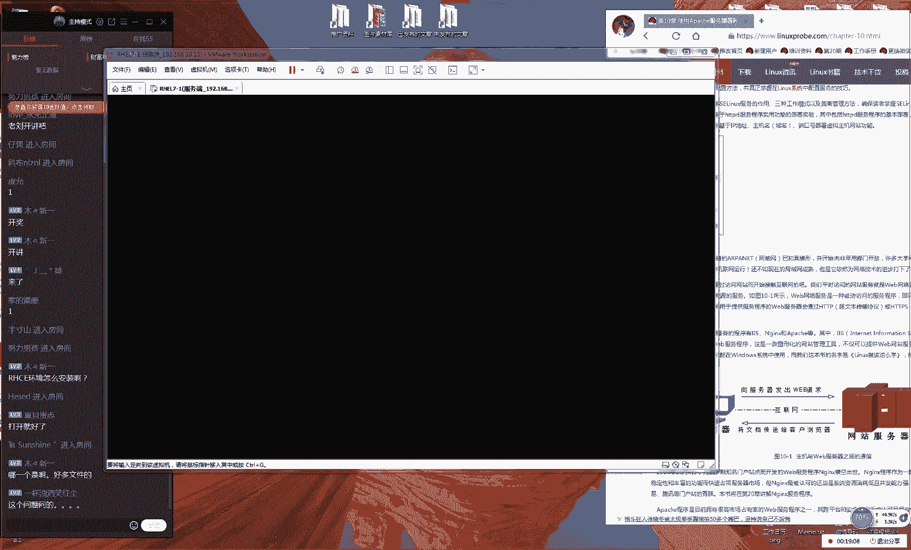

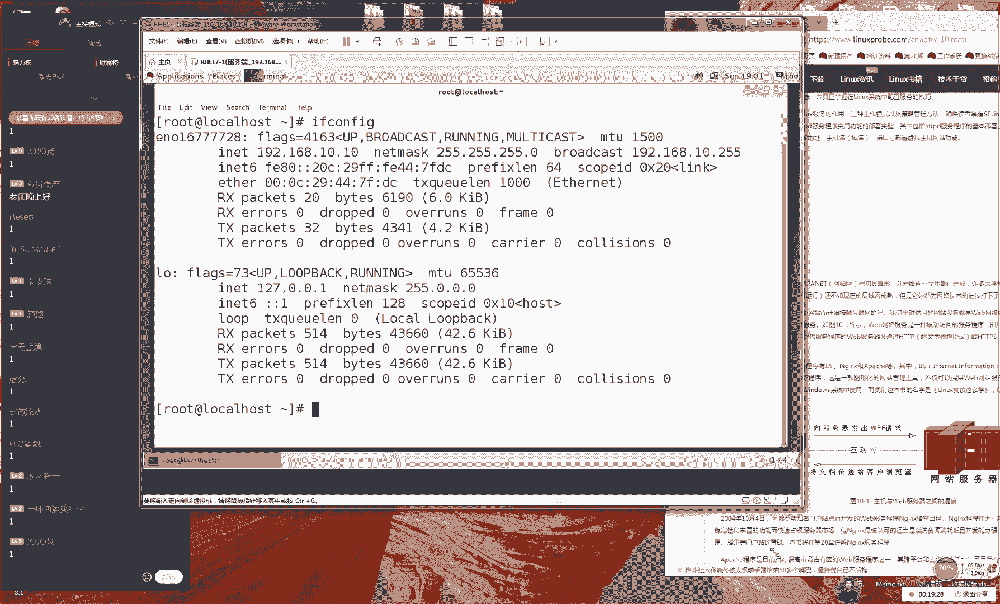

在本节课中，我们将要学习如何在Linux系统上部署Apache网站服务。我们将从基础概念讲起，逐步完成Apache的安装、配置，并学习如何通过修改配置文件来定制服务，包括设置个人主页、虚拟主机以及访问控制等。

## 概述：什么是网站服务？

网站服务是让用户能够通过浏览器访问服务器上文档资源的网络服务。虽然互联网技术发展迅速，但对于“网站”这一基础术语，一个比较贴切的描述是：**让用户能够通过浏览器访问到的服务器上的文档资源**。

在Linux系统中，部署网站服务主要有两个常见的软件：**Apache** 和 **Nginx**。本节课我们将重点学习Apache。

Apache是一个历史悠久、市场认可度高的网站服务程序，以其高稳定性、安全性和模块化功能著称。从红帽认证考试（RHCE）的历史来看，Apache一直是重点考察内容，占有相当的分值。

## 第一节：安装Apache服务程序

上一节我们介绍了网站服务的基本概念，本节中我们来看看如何安装Apache。

安装服务前，需要确保系统已正确配置Yum软件仓库。以下是配置仓库和安装Apache的步骤：

1.  **挂载系统光盘**：将系统安装光盘挂载到指定目录（例如 `/media/cdrom`）。
    ```bash
    mkdir /media/cdrom
    mount /dev/cdrom /media/cdrom
    ```
2.  **配置Yum仓库文件**：编辑 `/etc/yum.repos.d/rhel7.repo` 文件，写入本地仓库信息。
    ```bash
    [BaseOS]
    name=BaseOS
    baseurl=file:///media/cdrom/BaseOS
    enabled=1
    gpgcheck=0

    [AppStream]
    name=AppStream
    baseurl=file:///media/cdrom/AppStream
    enabled=1
    gpgcheck=0
    ```
3.  **安装Apache软件包**：Apache服务的软件包名是 `httpd`，使用yum命令安装。
    ```bash
    yum install -y httpd
    ```

安装完成后，启动`httpd`服务并将其设置为开机自启：
```bash
systemctl start httpd
systemctl enable httpd
```

此时，打开浏览器访问服务器的IP地址（如 `http://192.168.10.10`），如果看到Apache的默认测试页面，则证明服务已正常启动。

**注意**：看到默认测试页面通常意味着两件事：1）网站服务程序已正常启动；2）网站默认目录内没有数据文件，或当前用户权限不足。

## 第二节：配置网站服务与SELinux

上一节我们成功安装了Apache，本节中我们来看看如何修改其配置，并理解SELinux的影响。

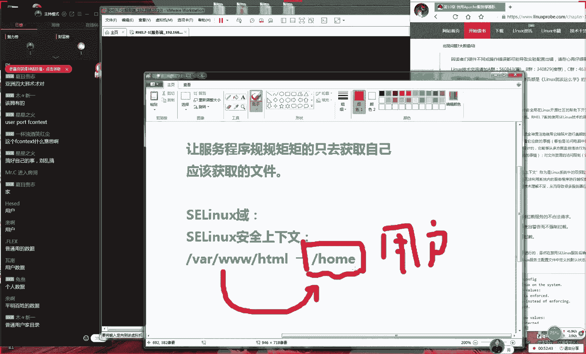

Apache的主配置文件路径是 `/etc/httpd/conf/httpd.conf`。配置服务可以遵循一个口诀：
1.  系统中的一切都是文件。
2.  配置服务就是在修改其配置文件。
3.  修改配置后，需要重启服务以使新参数生效。
4.  顺手将服务加入开机启动项。

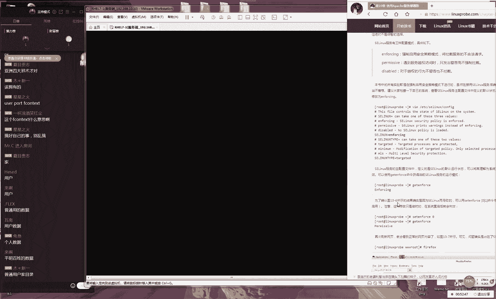

### 修改网站根目录

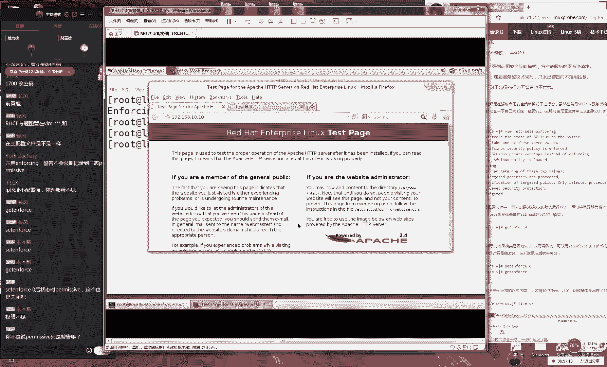

例如，我们尝试修改网站数据的默认根目录（默认为 `/var/www/html`）：

1.  编辑主配置文件 `/etc/httpd/conf/httpd.conf`，找到约119行的 `DocumentRoot` 参数，将其值修改为 `/home/wwwroot`。同时，下方约124行的 `<Directory>` 标签内的路径也要相应修改。
2.  创建新的网站目录并设置首页文件：
    ```bash
    mkdir /home/wwwroot
    echo “Welcome to /home/wwwroot” > /home/wwwroot/index.html
    ```
3.  重启`httpd`服务：
    ```bash
    systemctl restart httpd
    ```

此时访问网站，可能会看到“权限被拒绝”的页面。这通常不是传统的文件读写权限（rwx）问题，而是受到了 **SELinux** 安全子系统的限制。

### 理解SELinux

SELinux（安全增强式Linux）通过两种主要机制加强系统安全：
*   **域（Domain）**：限制服务进程的功能和行为。
*   **安全上下文（Security Context）**：为文件打上标签，只有特定域的服务进程才能访问带有对应标签的文件。

我们修改网站目录到 `/home` 下，而 `/home` 目录默认的安全上下文是用于存放用户家目录数据的，与网站服务所需的上下文不匹配，因此访问被拒绝。

**解决方法**：
1.  查看原始网站目录的安全上下文：
    ```bash
    ls -ldZ /var/www/html
    ```
2.  将新的网站目录的安全上下文修改为与原始目录一致：
    ```bash
    semanage fcontext -a -t httpd_sys_content_t ‘/home/wwwroot(/.*)?’
    restorecon -Rv /home/wwwroot
    ```
    *   `semanage fcontext`：用于修改默认安全上下文规则。
    *   `restorecon`：使新的安全上下文规则立即生效。
3.  再次访问网站，即可正常显示内容。

**SELinux工作模式**：
*   **enforcing**：强制模式，违反规则的行为将被阻止并记录。
*   **permissive**：宽容模式，只记录违反规则的行为而不阻止。
*   **disabled**：关闭模式。
使用 `getenforce` 查看当前模式，`setenforce 0|1` 临时切换模式（0为宽容，1为强制）。

## 第三节：部署个人用户主页功能

上一节我们处理了SELinux的访问控制，本节中我们来看看如何为系统所有用户开通个人网站空间。

Apache支持为每个用户创建独立的网站目录，通常位于其家目录下，例如 `~/public_html`。访问地址格式为 `http://服务器IP/~用户名`。

以下是配置步骤：

1.  编辑用户主页功能的配置文件 `/etc/httpd/conf.d/userdir.conf`。
2.  将第17行左右的 `UserDir disabled` 注释掉（在前面加`#`），并取消第24行 `UserDir public_html` 的注释。这表示用户网站数据存放在家目录的 `public_html` 文件夹中。
3.  重启`httpd`服务。
4.  以普通用户（如 `zhangsan`）身份创建个人网站目录和首页文件：
    ```bash
    su - zhangsan
    mkdir ~/public_html
    echo “This is zhangsan’s site” > ~/public_html/index.html
    exit
    ```
5.  设置用户家目录的权限，让其他用户有权访问（注意是家目录本身，而非子目录）：
    ```bash
    chmod 755 /home/zhangsan
    ```
6.  此时通过浏览器访问 `http://服务器IP/~zhangsan`，可能仍会因SELinux策略被拒。

**解决SELinux策略问题**：
个人主页功能需要额外的SELinux布尔值策略放行。
1.  查看与httpd用户主页相关的策略：
    ```bash
    getsebool -a | grep httpd_enable_homedirs
    ```
2.  开启该策略（`-P` 参数使设置永久生效）：
    ```bash
    setsebool -P httpd_enable_homedirs on
    ```
3.  再次访问 `http://服务器IP/~zhangsan`，即可看到个人主页内容。

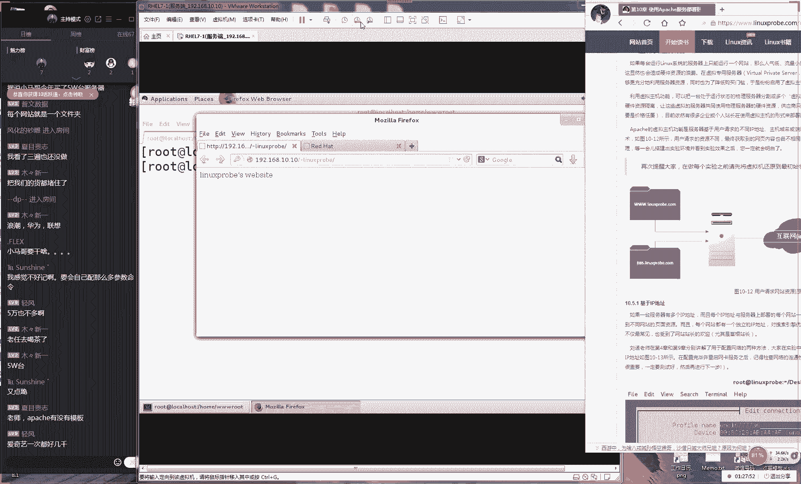

## 第四节：为网站目录添加密码认证

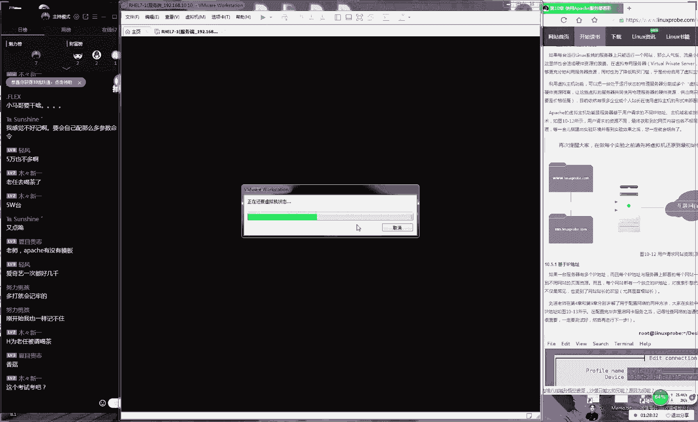

上一节我们实现了个人主页，本节中我们为其增加一层密码保护，只有通过认证的用户才能访问。

我们可以为特定的网站目录（如某个用户的 `public_html`）添加基础的账户密码认证。

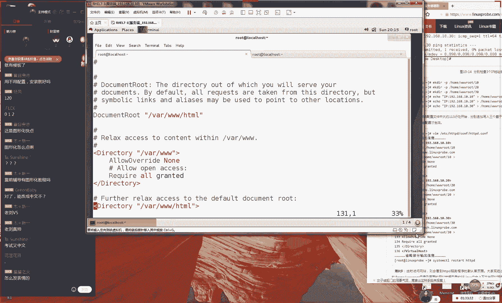

以下是操作步骤：

1.  创建用于存储认证账户和密码的文件。使用 `htpasswd` 命令，`-c` 参数表示创建新文件。
    ```bash
    htpasswd -c /etc/httpd/passwd zhangsan
    ```
    按提示为账户 `zhangsan` 设置密码。密码会以加密形式保存在 `/etc/httpd/passwd` 文件中。
2.  编辑对应用户目录的配置文件。我们可以在 `/etc/httpd/conf.d/userdir.conf` 中，在对应的 `<Directory>` 指令块内添加认证配置。为了清晰，也可以为特定用户创建单独的配置文件。
    ```bash
    vim /etc/httpd/conf.d/zhangsan.conf
    ```
    添加如下内容（假设要保护 `/home/zhangsan/public_html`）：
    ```apache
    <Directory “/home/zhangsan/public_html”>
        AllowOverride None
        AuthType Basic
        AuthName “Please Input Your Account:”
        AuthUserFile /etc/httpd/passwd
        Require user zhangsan
    </Directory>
    ```
    *   `AuthType Basic`：指定使用基本认证方式。
    *   `AuthName`：自定义认证对话框的提示信息。
    *   `AuthUserFile`：指定密码文件路径。
    *   `Require user zhangsan`：指定允许访问的用户。如需允许多个用户，可写为 `Require valid-user`。
3.  重启`httpd`服务。
4.  现在访问 `http://服务器IP/~zhangsan` 时，浏览器会弹出认证对话框，只有输入正确的账户（zhangsan）和密码才能访问。

## 第五节：配置虚拟主机功能

上一节我们学习了目录访问控制，本节中我们来看看如何在一台服务器上承载多个网站，即虚拟主机功能。

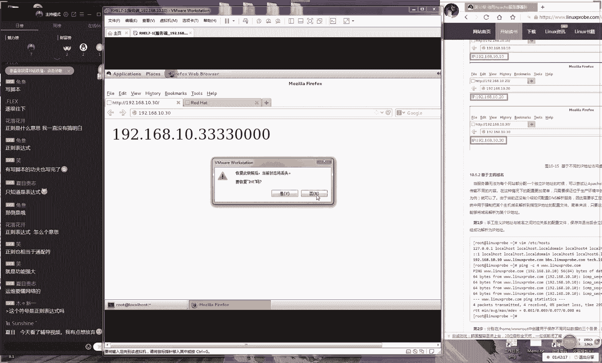

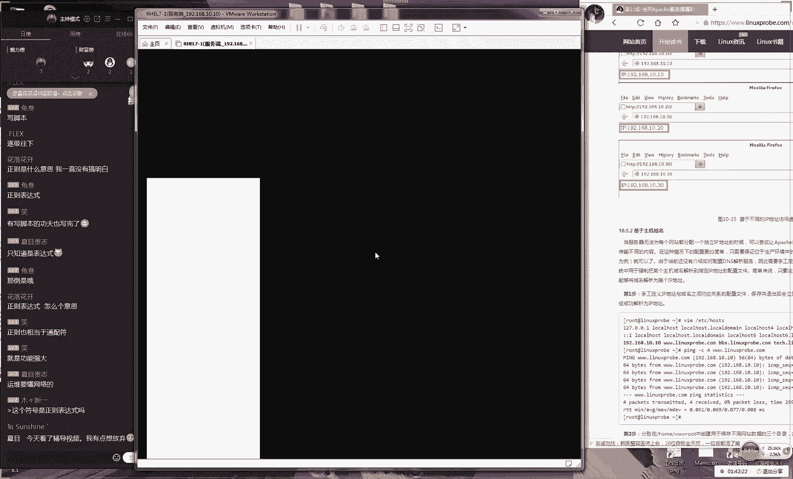

虚拟主机允许根据访问者的 **IP地址**、**域名（主机名）** 或 **端口号** 的不同，将其请求导向服务器上不同的网站目录，从而实现单服务器多站点。

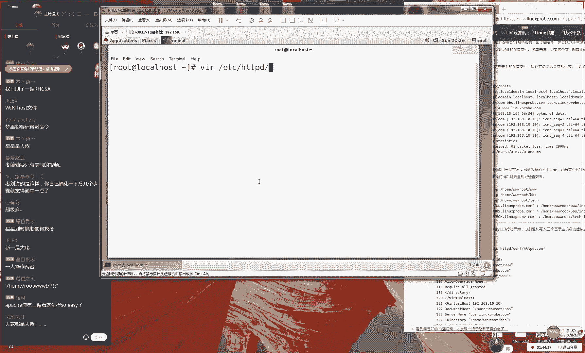

### 基于IP地址的虚拟主机

假设服务器有三个IP：`192.168.10.10`， `.20`， `.30`，分别对应三个不同的网站。

1.  为网卡配置多个IP地址。编辑网卡配置文件 `/etc/sysconfig/network-scripts/ifcfg-ens160`，添加：
    ```bash
    IPADDR1=192.168.10.10
    IPADDR2=192.168.10.20
    IPADDR3=192.168.10.30
    ```
    重启网络服务。
2.  创建三个网站目录，并分别写入不同的首页文件：
    ```bash
    mkdir -p /home/vhost/{10,20,30}
    echo “Site for IP 10” > /home/vhost/10/index.html
    echo “Site for IP 20” > /home/vhost/20/index.html
    echo “Site for IP 30” > /home/vhost/30/index.html
    ```
3.  编辑Apache主配置文件 `/etc/httpd/conf/httpd.conf`，在文件末尾添加虚拟主机配置：
    ```apache
    <VirtualHost 192.168.10.10:80>
        DocumentRoot “/home/vhost/10”
        ServerName www.example10.com
        <Directory “/home/vhost/10”>
            AllowOverride None
            Require all granted
        </Directory>
    </VirtualHost>

    <VirtualHost 192.168.10.20:80>
        DocumentRoot “/home/vhost/20”
        ServerName www.example20.com
        <Directory “/home/vhost/20”>
            AllowOverride None
            Require all granted
        </Directory>
    </VirtualHost>

    <VirtualHost 192.168.10.30:80>
        DocumentRoot “/home/vhost/30”
        ServerName www.example30.com
        <Directory “/home/vhost/30”>
            AllowOverride None
            Require all granted
        </Directory>
    </VirtualHost>
    ```
4.  根据之前学习的SELinux知识，修改新目录的安全上下文：
    ```bash
    semanage fcontext -a -t httpd_sys_content_t ‘/home/vhost(/.*)?’
    restorecon -Rv /home/vhost
    ```
5.  重启`httpd`服务。现在，访问 `http://192.168.10.10`、`.20`、`.30` 将看到三个不同的页面。

### 基于域名的虚拟主机

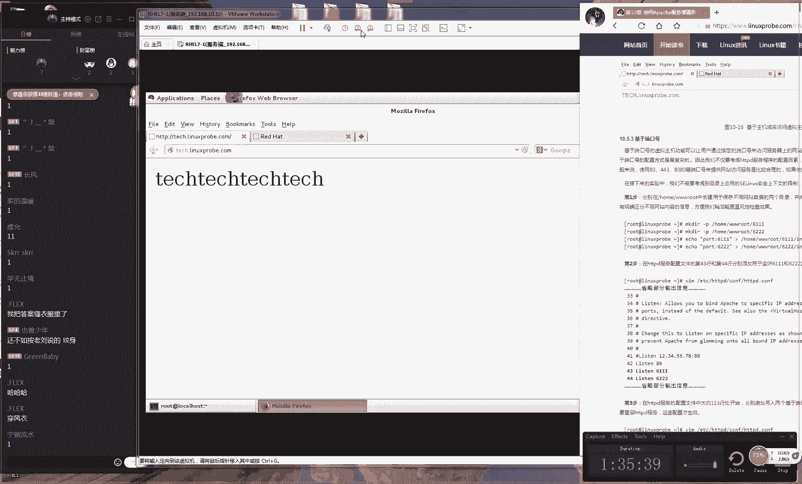

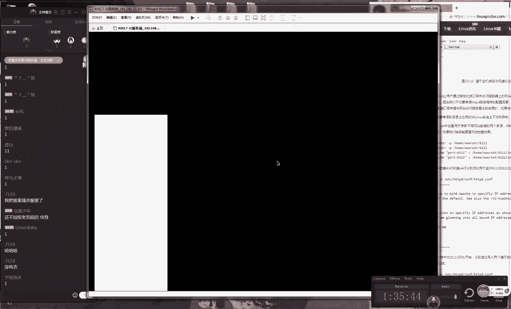

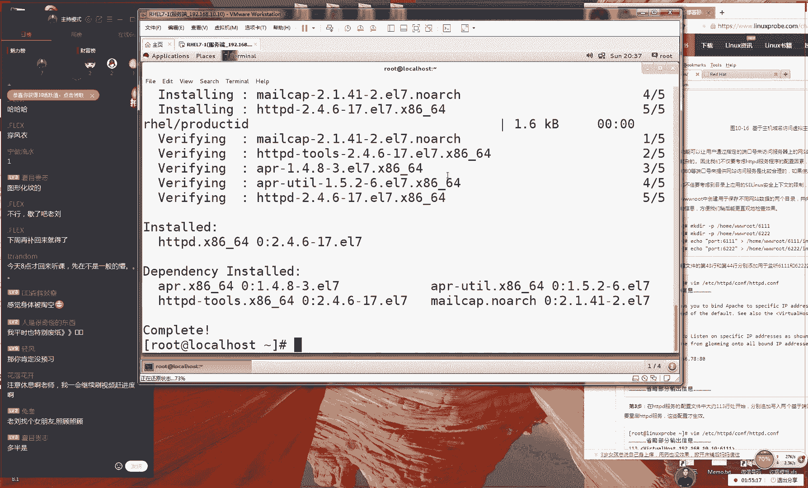

更常见的是基于域名区分网站。假设三个域名 `www.test1.com`， `bbs.test1.com`， `blog.test1.com` 都指向服务器IP `192.168.10.10`。

1.  在客户端（或服务器本身的hosts文件）中，将域名解析到服务器IP。编辑 `/etc/hosts` 文件：
    ```bash
    192.168.10.10 www.test1.com bbs.test1.com blog.test1.com
    ```
2.  创建三个对应的网站目录和首页文件：
    ```bash
    mkdir -p /home/vhost/{www,bbs,blog}
    echo “Welcome to www.test1.com” > /home/vhost/www/index.html
    echo “Welcome to bbs.test1.com” > /home/vhost/bbs/index.html
    echo “Welcome to blog.test1.com” > /home/vhost/blog/index.html
    ```
3.  在主配置文件中添加基于域名的虚拟主机配置：
    ```apache
    <VirtualHost 192.168.10.10:80>
        DocumentRoot “/home/vhost/www”
        ServerName www.test1.com
        <Directory “/home/vhost/www”>
            AllowOverride None
            Require all granted
        </Directory>
    </VirtualHost>

    <VirtualHost 192.168.10.10:80>
        DocumentRoot “/home/vhost/bbs”
        ServerName bbs.test1.com
        <Directory “/home/vhost/bbs”>
            AllowOverride None
            Require all granted
        </Directory>
    </VirtualHost>

    <VirtualHost 192.168.10.10:80>
        DocumentRoot “/home/vhost/blog”
        ServerName blog.test1.com
        <Directory “/home/vhost/blog”>
            AllowOverride None
            Require all granted
        </Directory>
    </VirtualHost>
    ```
4.  同样，设置SELinux上下文并重启服务。现在，通过浏览器访问不同的域名，将显示不同网站的内容。

### 基于端口号的虚拟主机

还可以通过不同的端口号来区分服务。例如，在80端口之外，新增6111和6222端口提供不同网站。

1.  首先，在主配置文件中监听新增的端口。找到 `Listen` 指令，添加：
    ```apache
    Listen 6111
    Listen 6222
    ```
2.  创建对应的网站目录和首页文件。
3.  配置基于端口的虚拟主机（注意 `VirtualHost` 标签内需指定端口）：
    ```apache
    <VirtualHost 192.168.10.10:6111>
        DocumentRoot “/home/vhost/port6111”
        ServerName portaltest.com
        <Directory “/home/vhost/port6111”>
            AllowOverride None
            Require all granted
        </Directory>
    </VirtualHost>
    ```
    同理配置6222端口的虚拟主机。
4.  由于使用了非标准端口，需要修改SELinux策略，允许httpd服务绑定到这些端口：
    ```bash
    semanage port -a -t http_port_t -p tcp 6111
    semanage port -a -t http_port_t -p tcp 6222
    ```
5.  设置目录上下文并重启服务。现在，访问 `http://服务器IP:6111` 和 `:6222` 将看到不同的网站。

## 第六节：使用客户端来源进行访问控制

上一节我们配置了多种虚拟主机，本节中我们来看一个简单的访问控制示例：根据用户浏览器的类型（User-Agent）来限制访问。

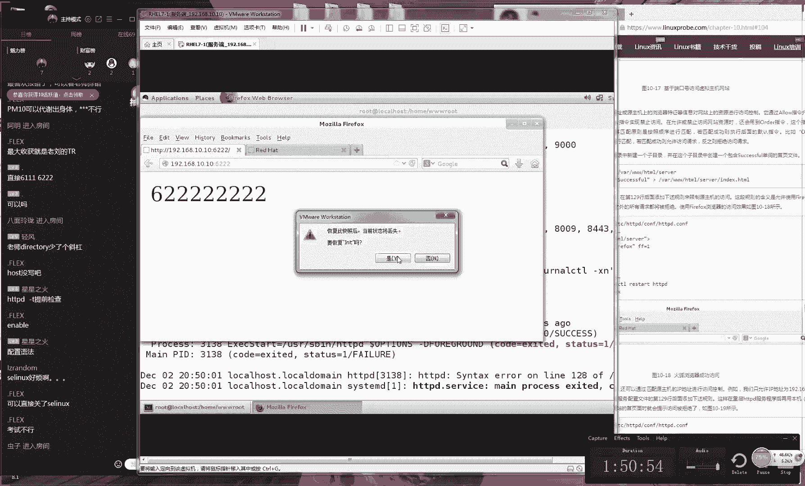

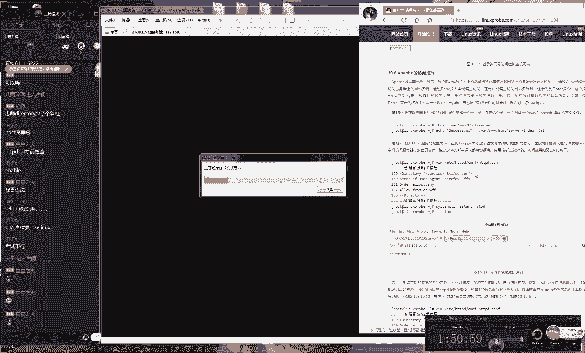

Apache可以通过 `SetEnvIf` 指令根据请求头信息设置环境变量，并结合 `Order` 指令控制访问。

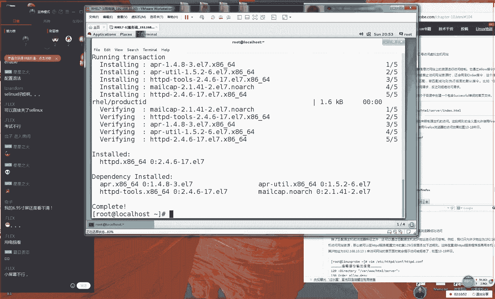

例如，只允许使用Firefox浏览器的用户访问某个特定目录：

1.  编辑主配置文件或单独的配置文件，添加如下内容：
    ```apache
    <Directory “/var/www/html/special”>
        SetEnvIf User-Agent “.*Firefox.*” ff=1
        Order allow,deny
        Allow from env=ff
    </Directory>
    ```
    *   `SetEnvIf User-Agent “.*Firefox.*” ff=1`：如果User-Agent字符串包含“Firefox”，则设置环境变量 `ff` 的值为1。
    *   `Order allow,deny`：处理顺序为先允许（allow），后拒绝（deny）。
    *   `Allow from env=ff`：仅允许环境变量 `ff` 存在的请求（即Firefox浏览器）。
2.  创建受控的目录和测试文件：
    ```bash
    mkdir -p /var/www/html/special
    echo “This page is for Firefox only.” > /var/www/html/special/index.html
    ```
3.  重启`httpd`服务。

现在，使用Firefox浏览器访问 `http://服务器IP/special` 可以正常看到页面，而使用其他浏览器（如curl、Chrome）访问则会收到“403 Forbidden”错误。

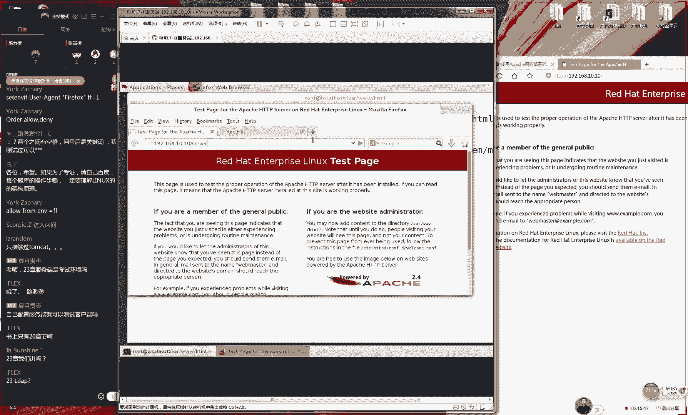

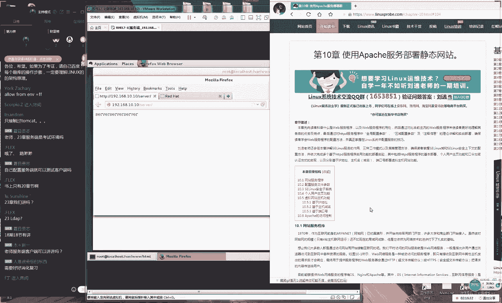

## 总结

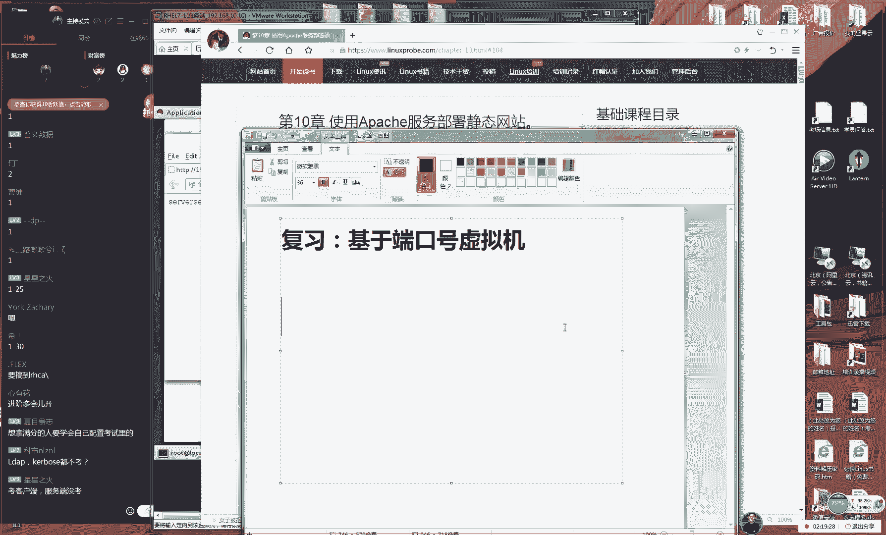

本节课中我们一起学习了Linux下Apache网站服务的完整部署流程。我们从安装`httpd`软件包开始，逐步深入到主配置文件的修改、SELinux安全上下文的调整、个人用户主页的配置、目录密码认证的实现，以及基于IP、域名和端口号的虚拟主机技术。最后，我们还了解了如何根据客户端来源进行简单的访问控制。

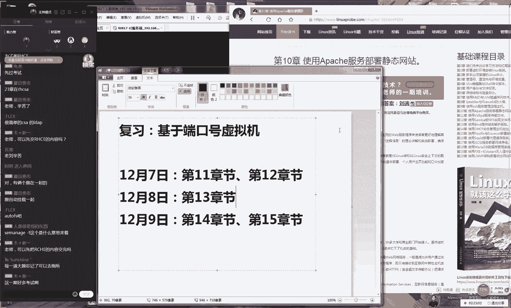

通过本章的学习，你应该能够掌握在RHEL/CentOS系统上搭建和配置一个多功能Apache Web服务器的基础技能，并对SELinux在服务配置中的影响有了初步的认识，为应对更复杂的生产环境配置和红帽认证考试打下了坚实的基础。