# Linux教程RHCE - P13：13.vsftpd与简单文件传输 - 艾弗艾尔思丢丢 - BV1if4y1e73V

O那我们开始上课同学们，那我们先打一下一吧。然后我现在嗓结好了，也就是休息几个礼拜。然后我们开始我们今天这个课程。今天的话呢我们这个课程量还是比较多的。

我们今天准备讲两个章节第11跟第12那我们先说一下我们这边的这个第11章节去讲一下这个FTP我们叫做文件传输协议好好那我们先打一下好，今天人数不是很多啊。

确实也是低于个我的想象那还好4多个同学我估计一会他们迟到加上一会晚来的估计大能到60人左右吧。那那我先给大家说一下我们今天这个课程的安排啊，今天的话我们要讲的比较多一点了。

那我们需要讲两个章节讲第十一章节跟第十二章节好，然后我这个嗓业已经好了。那么我们先来说一下我们这边这个第11章节我们讲一个服务这个服务叫做什么呢？叫做FP文件传输协议。记在书上啊。😊。

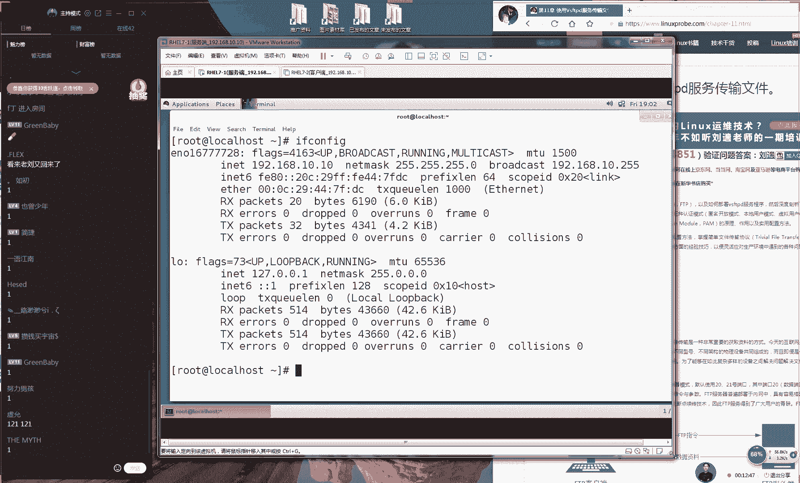

🤧咳。文件传输系，然后我们可以翻开书，找到您的第11章节，然后开始去记一下笔记。等我们写好了之后，我们记得课后怎么样。我们课后一定要记得拍照，然后发到您的博客上面。

这个博客的话呢那您可以去找一总结出来的那个笔记以抄到去抄这个博客上面那么也可以去找一段我们书里面，比如说您对哪电话比那也可以去复制一下我们这个书上内容。

但是我们一定要自己拍照那个照片因为我们不知道大家最后些笔记的时候抄到哪里来，对不对？那我们就要有一个笔记的一个拍照样话我们证明自己去写一个笔记好吧好。

那我们给大家说一下我们今第11章的开头我们讲一下这个文件传输它的一个原理这那我们先看一下我们这个图表格的话是11-1这他就是说是一个我们文件传输的这么一个拓，它这么一个流程。

虽然说这个我们都以前肯定是用过？比说。😊，我们上课的时候，或者说以前我们上大学的时候，大家想要去传输过文件的话，那肯定都要去使用这个I呃那我们当然呃需要去使用到这个协议了。

这个协议就叫呃这个协议它又叫做FTP文件传输协议。但是我们之前啊大家呃如果之前要是要学有过了解的话呢。😊，可能会呃总是把这个FTP协议跟21端口号吧给联系到一起，对吧？呃。

我们认为我们的呃这个呃这个FPP服务它就是占用21端口号。其实的话呢这个是错误的，这是个非常片面一种认识。那我们要知道的话，他既来说他占用了两个端口号了。

他占用的分别为2021两个端口号并不是我们之前所知的他只有这么一个占21端口号这么一个资源。好，那我们来说的话就是说它使用两个端口号的话，它这个功能也是不一样的。那我们要来去传输我们这个指定的话。

那么它使用的是21端口号，它进行一个传递的。但是我们这个数据的话，它是通过20端口号，它进行一个数据的一个传递。那也就是说这个协议的话，刚才同学人比较少，刚有40个人现在有52个人了。

话那我们再来说一下啊，那咱比如说您大学的时老师教过文件传输协议。对他占用的是21端口号了。那么这个其实也是对，但是我们。😊，知道我们的文件传输协它不光占用了20端个号，它还占用了21端口号，对吧？

这我们都要知道啊文件传输协议，它分别占用了20跟21两个端口号，这我们就要知道一下，然后这样话我们待会去配置我们这个防火墙的时候，那么你不光要去开启你的21，还要去开启一下你怎么样你的20，对不对？好。

那我们接下给大家说的话，就是说那你来看这个文件传输它非常的简单啊，这个非常简单啊。比如说那我们这边有一台客户端，对吧？后我们这边有一台服务端，那这个文件传输协议它干嘛使的，他肯定它是用来传输文件。

对不对？那也就是说他可以将我我们的这个文件进行一个上传上传给我我们的这个服务器，因为我们这个顾名思义嘛，对吧？文件传输它就是用来传输我们的文件的协议。好，那么他啊可以可以来进行一个上传。

它也可以来进行一个下载操作。那我们就叫做这个上传跟下载操作。我们就是文件传输协议，它可以去做事情了。那好，那我们知道就是我们上学的时候。😊，呃，如果说您要是学习过一些网络知识的话呢，他还会告诉您说。

在我们这个计算机里面，它有几个协议它是不太安全的。第一个协议的话，它是我我们的这个网站协议它是不太安全的。第二个协议的话呢就是我们的文件传输协议，这个太好这个也不是太这个也不是特别的安全。

还有我们这个第三个是什么不太安全。第三个就是net这个的话呢也是不太安全的那好了，这三个的话呢，我们都认为它是不太安全的用来传输我我们的这个文件或者命令的协议。那么为什么呢？

就是因为他们都是通过明文来进行。对它是用来通过明文来进行传输的，包括我们这个账户和密码的这个信息，它过它是通过明文来进行一个传递的。所以说那我们不光要去实现出来文件这么一个传递的一个过程啊。

这个还是太低级太表层了。那我们需要给它进行一个更加高级的一个功能，就是说那我那我们希望它能够是安全来去传输。😊，我们的这个文件内容的话呢，那我们就要去选择一款服务程序。

叫做VSFTPD这个呃呃VSFTPD这个VS就代表就是非常安全的意思。这就是我们来去搭建我们的FTP服务。我们啊那我们所需要的这么一个。😊，呃，软件包了。那好了，那我们说到的话，这个它是有三种的界证。

它是有三种界面模式的那我们可以来去设置它，让我们这个客户使用哪个方式来去登录到我们这个服务器里面来进一步保证我们这个服务器的安全。它有三个模式，它分别为我们的虚拟用户我们叫做匿用户。二我们叫做本地用户。

第三个我们叫做虚拟用户。好，那我可能第一次啊如果说您还是没有去预习的话我说了很多很多遍。但是如果说还没有去预习的话呢，可能我这样说完之还是不知道这个三个作用，它到底有什么第一个效果，对吧？

我们今天待会给大家来去逐一去演示一下我们这个三个的一个配置过程以及效果。包是能够看到密码的，而且能看到你传输的所有的数据，以说我们要进行一个加密，而且非常有必要的。好。

那我接给大家说的话就是来去安装一下这个软件包。那我们还一下我们这个虚拟机。另外的话请切记同学们你们去安装这个虚拟机的时候的话呢，那么也去打一个这样。😊。

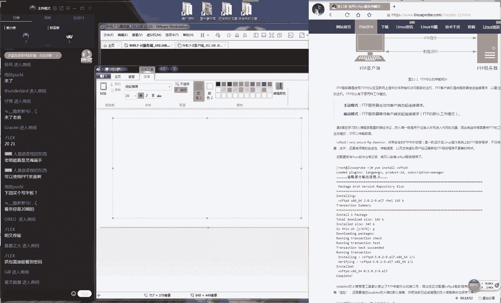

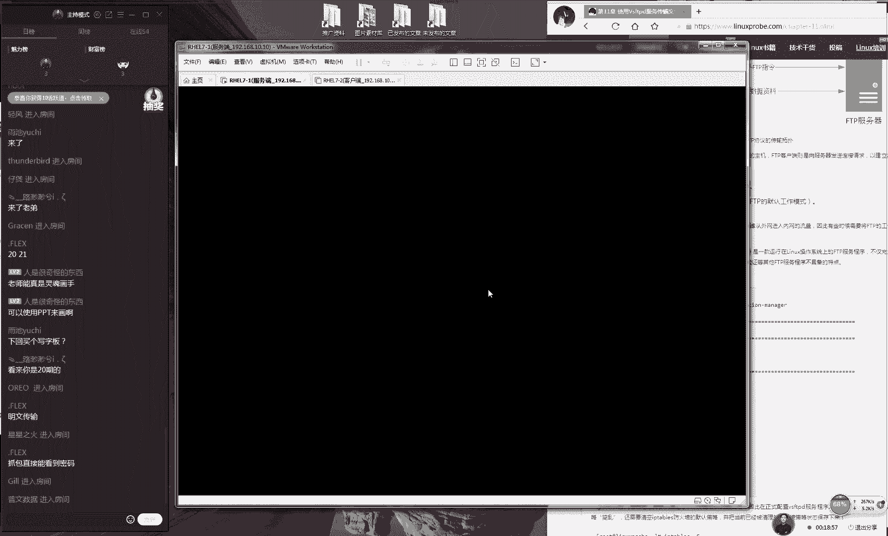

一个快照去点一下这个快照。这样的话，当你这个服务器，比如说出现一些故障，或者说你呃你为了避免说实验之间它会产生冲突情况，那么它就可以去快速去还原了，这个特别特别的方便。

还有的话呢就是说我们现在已经会配置到我们的仓库啊。所以我现在把它也配置好了。那我们啊好，那我们现在开下去直接来去安装我们这个VSFTVD了。😊，好，我们先来去安装一下我们的VSFPD。

因为我们上一上周的时候给大家讲了两次，所以说我们就直接给大家去安装了啊。这一个技术点我们不能说讲太多遍了。那么这样的话我们就像一个造轮子一样，就是没有办法往前走了。好。

那我们再安装一下我们的VSFP我们件包的程序。大家先看一下啊，当我当我们去安装的话呢，这个里面它会提示说您是否来去确认去安装，可以可以弄多个快照的，然后说快照贼好使，是这样的。

真的是特别是超级超级无敌的好使。因为你去感受一下啊，当你去来去重装一下你的系统大概要半个小时的时间，结果你快照一秒钟大家看到我大家有没有看到我刚还原我的快照好，那那那我再给大家炫一下好吧。

大家看啊当我去点击一下我这个还快照看我点确认之后啊，123了吗？准备好123一秒2快照是吧？那你看啊一23456。😊。

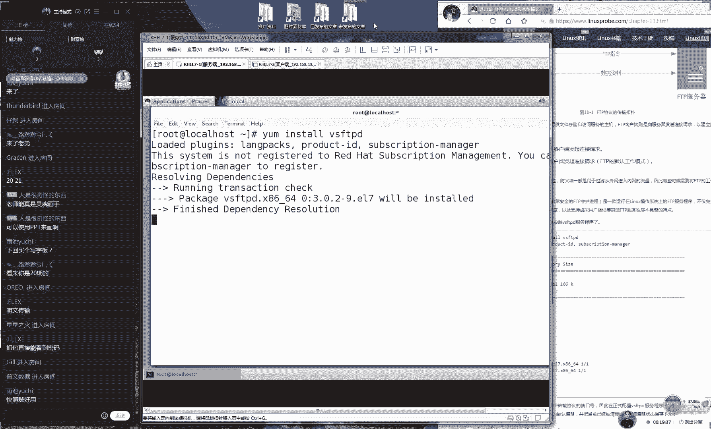

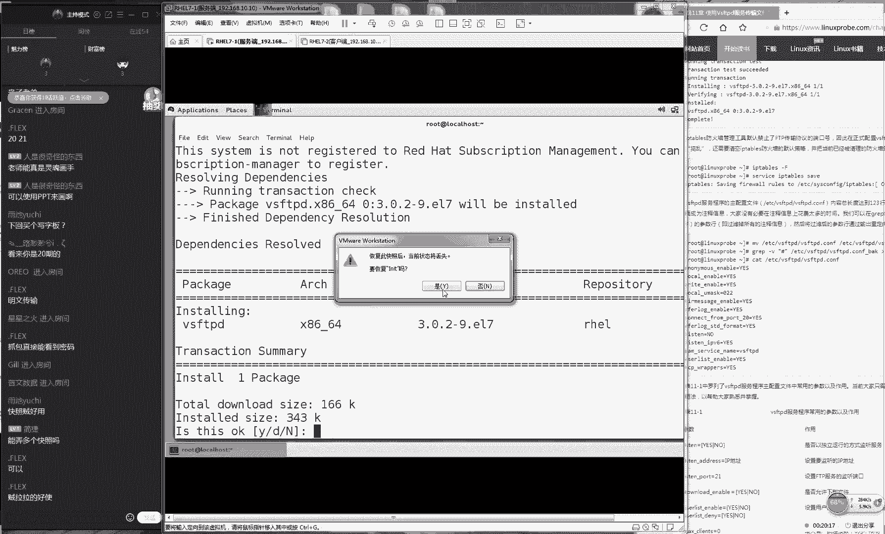

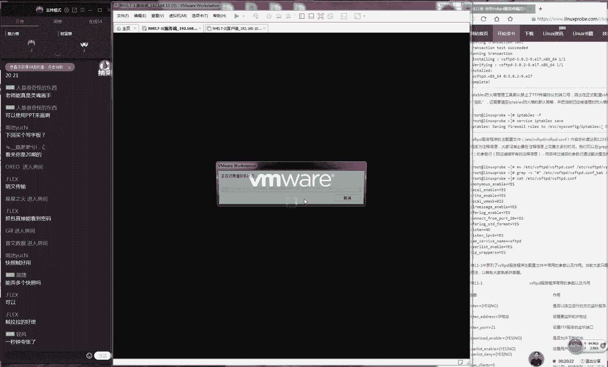

呃，10秒钟之内吧。好吧，基本上来说就就六七秒钟，那我们就可以。😊，快速的还来去还原我们这个系统了，这个还真的是非常方便。这个6秒都比你安装一个系统要来的划算，对吧？

所以说那我们可以把我们这个精力就可以完全放到我们这个配置服务上面了，而不用老去再去纠结说那我要不要去还原一下那我们做完之后要这个太麻烦了，就说学做饭结果的话呢你从最开始就给你配一个助理你做的这个切菜呀。

洗菜呀，最后收拾垃圾什么的，都是由别人帮你负责了。我天哪，那你光想要去做菜真的是太方便了，而且极大增加你的这个兴趣啊，我当时没有去去做大家道为什么就是我去买菜。

然后我也懒得去洗菜然后去摘菜如果帮都做好的话呢那我当我想去试一下？所说这个可以让你这个时间用在他这个刀刃上真正用到你这个最重要的地方好，那我们先来去说一下，然这边有一个表格。😊。

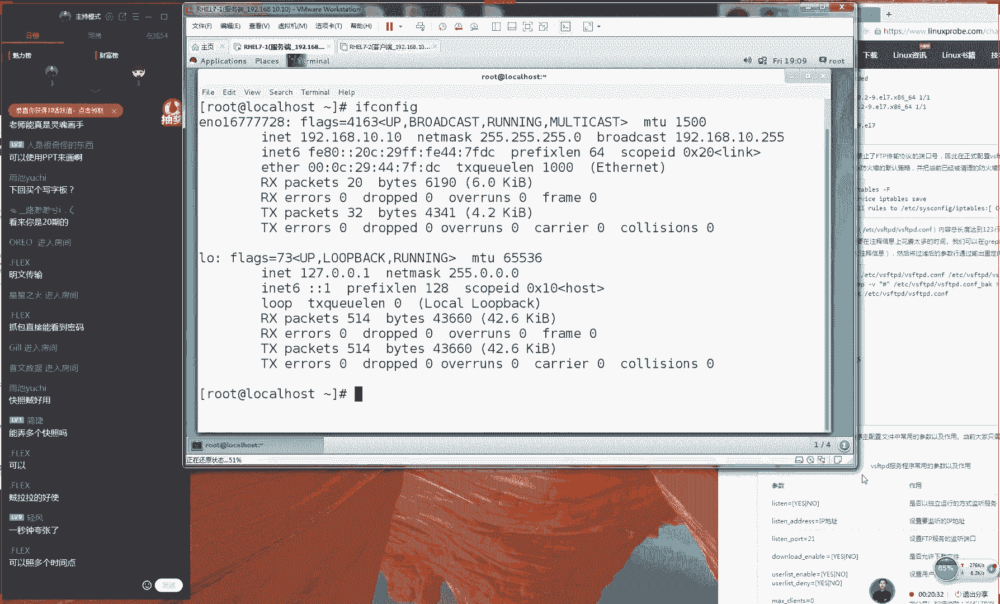

一-一表格里边写上我们所有可能会遇到的一些参数。但是我觉呃待会不给大家实在去读了，读的话骗钱了，对不对？就感觉好水。这个老师所以我待会会去给大家去做这个实验待会我们的每一个参数会给大家去讲出来，好吧。

大家先不用担心说之更接下来说一下觉得不准照下样避免这个实验生冲突那接来说考试能这干考试的话不适用机自的产品叫做家是我们考试里一个就是你花完了话他会给你提供一个考官不他会一个服务re就是你们花了40块钱去考官不光监考的替你服务的。

说。😊，呃，我需要去re什么样的。咱比如说当你的这个做这个实验，真的是出现了一些极端的一些呃会导致自己没有分置的一些呃错误的时候的话呢。

那么可以举手说我需要我需要re这样的话呢那你的考官会还原你的这个虚拟机，而且这个特别的好用，这怎么好用啊，就是说咱考试的时候是有两个虚拟机，对不对？他可以来去指定去还原某一个虚拟机里面的这个内容。

这样的话呢，你呃你的另外一个虚拟机里面这个配置的过程所有这个操作还都是被保留下来的。这个真的是特别方便的。大家需要记住啊，但我们考试的时候，如果说您真的是做错了，不要说哎我非得往下接着往下做。

如果说刚刚开始考试2分钟，你直接去re一下就好了，对吧？但是但是但是如果说我们考试三个半小时，您最后都三个小时了，您最后某某个某某个题做错，但是又又不会排错的话呢，那就把把它省略掉好吧，把个题给。😊。

调过去，千万不要为了这一道题，然后去review这到自己所有的分值都没有了。好，那我们来去评估一下就好了。然后那我们先来说一下我们的第一种的这个啊啊登录的方式，我们叫叫做虚拟用户呃，我们叫做匿密用户。

😊，好，那我们要给大家说一下，当我们想要去登录到这个服务器的话，它有三个模式它有三个方式呃，re的话是所有题都需要重新去做吧。呃它是呃指定一个主机里面的所有题目都需要去做好。

然后的话呢我们先来看一下我们的这个第一个方式，们叫做匿名用户叫我们第一个方式叫做叫做这个匿名用户这个单词的话呢叫做大家有没有看一个黑客的一个组织，就叫做这个名字，大家可以打一下一呃。

或者你们可以去网上去搜一下有一个黑客组织叫做匿名者黑客哎，大家应该ANN，我多打了一个A大家有没有看过这个组织大家都是做网络方面大在做运维这个东西应该算是我们的谈资了，应该都去了解一下。

就是这个黑客说网络啊吧？还做系统什么的。这样的话你不光说怎么去找女朋友对吧？好你是搬砖的啊那是这样的啊。这样的话。😊，就有一个黑呃，他们就是一个黑客组织的一个名字啊，这个组织就叫做这个匿名者。

黑客什么叫做匿名啊，就是说他去来去隐藏自己的身份，他们就会每人发了一个小面罩，然后就是一个小面具嘛。然后呃每人录视频之前都会带上那个面具，不让别人知道自己是谁。那也就是说我们这个匿名的话呢。

将现在就是一个隐藏自己的身份公开的一种形式。所以的话呢这个我们叫做匿名公开的模式，我们叫做匿名公开模式来去访问。就是说所有人他们都可以所有人即便你隐藏自己的身份。

你也可以去来去访问到我们的这个服务器里面。好了，这的话呢我们叫做匿名的公开到我们最后模式好了，那我们这个第一个模式。那我们现来进入到干嘛呢？那我们先在配置下我们这个服务。😊。

大家的话千万不要这样翻啊大家的话千万不要这样翻啊，那我给大家再总结一下我们尚家辉。我们给大家一个口诀。第一句话呢就是说我们的lininux里边的一切大家都特别熟悉，对吧？对一切都是什么。那大家告诉我说。

请问在我们的linux里面的一切一切一切都是什么。😊，啊，在我们的里面的话呢，一切它必须要很熟练啊必须要很熟练。在我们的里面的一切都是文件。OK这是我们的第一句话，我们的都啊他们都是文件。

第二句话呢就话呢就是说想要去配置一个服务的话，想要配置或者说我们叫做部署服务说比较高级一点，就是在修改对应的什么东西，告诉我修改的对应的啊，一切都要文在身上啊，大家这个输入法，不要这么蓝好不好？

打圈打出来，就要去修改我们的这个对应的配置文件。因为的话呢我们就要修改我们这个服务程序，它所对应的配置文件。第三句话，要想让我们这个配置好参数能够去生效的话呢，然让想让我们这个参数参数哎。

要想让参数立即生效。一般情况下，我们需要哎什么什么什么什么什么啊，😊，对应的服务。我们需要去怎么样去对应的那个服务，是给他去加载文件吗？不是吧我那我们应该是去重启对应的服务。

那呃我们最后我们要去重启对应的服务。第还有我们这边这个第四句话顺手把配置过的服务怎么怎么怎怎么样大家告诉我那我们要顺手把我们配置过的这个服务。为了让我们的这个考试有分值。

为了让我们的工作时候可以来去一直为我们的用户去提供服务，我们需要我们需要他这个输入法怎么回事啊，那我们需要去对我们需要去启用一下这个启用什么意思呀？啊，代表就是加入到开机启动项里面啊。

加入到开机启动项中。这样的话呢保证我们这个服务保证服务一直有效。好，这就是说我们给大家提到就是说他有四句话，其实话还有一个隐藏的一块，大家记得吗？就是说他这个配置文件，它分为两种的配配置文件它分为两类。

😊，对吧第一类我们叫做主配置文件。第二类我们叫做普通或说，我们叫做一般配置文件。那我给大家提个问题好了，请问主配置文件中是否包含有了所有的配置参数，大家告诉我是对还是不对就好了。大家打一和二就行了。

那么请问主呃主配置文件当中是否包含有了所有的配置参数是一和是还是2。😊，好，他告诉我说是一还是二呢？他告诉我说肯定是二，不是，对不对？其实也不一定。因为有些服务的话，它就只有一个配置文件。

所以说有可能是但是我们大多数情况下这个主配置文件里面它只保存的是最重要的配置参数，而不是所有所有所有的，大家听到我现在讲这个觉回来，不？实上的话感觉要一样，我们这个可以回来了。

那我找到我们这个的这个主配置文件啊，那么就有一个顺溜我要知道一个小小技巧它就目录里面对吧？因为我们根据第六章节有一个协议叫做F协那我们知道我们这个配置文件它所存放一个路径然这个里的话它会以服务的名称命名一个文件夹它里有一个文件叫做服务名称。

然点F一般情况一般情况下这就是我们这个服务程序的主配置文件大家需要记到你这个书里。😊，大记一下，哎，你看到没？😊，哎，大家看一下，这就是呃好了，大家看一下，这就是我们这个服务层次的这个主配置文件。

让我给大家推导了一下啊。那我们再去呃有了1234，然后我们推呃推导出来，说请一定要切记就是中意啊，我们要是有这么一个文件，叫做主配置文件里面包含的是这个服务的最重要的配置参数。大家知道我吗？

在三国演义里面有一集啊，叫做这个七亲孟获，大家有没有打呃，有没有看过打一下，一叫做七心孟获。他讲的是什么啊，说啊这个呃当时的话呢，诸葛亮去呃叫什么呃藩王，对不对？

他是一种他是一个蛮他是一个蛮族为一个首领，然后对于这个呃然后的话他去找那个孟获去打仗，对吧？但是。😊，七次去擒住他们的这个首领，然后还没有把他给杀掉，对吧？那么为什么？

就是因为这个首领把他杀掉之后的话呢，可能还会有其他人来去顶替他这个位置啊，所以说诸葛亮为了稳住他的这个明心，然后为了更好去管理这个他的这个部族啊，所以说他擒了孟获，最后这个人才服气说这个诸葛亮真厉害啊。

后来才归正给了刘备？好，大家没有看过三国演义吗？啊，看过对吧？那我们呃诸葛亮你想一下，他为什么要去擒那个孟获，而不是说孟获手里边的那个或者是一个小兵啊，或者怎么怎么样，对不对？

就是因为你要怎么样的擒贼先秦王找那个最重要的这个文件，然后找那个最重要的这么一个人物把他给控制住了之后，其他的所有的一切就无所谓了，对吧？

但我们找那个最核心的一点这就是我们这个主配置文件家记下我们这个成语吧这个擒贼先擒王擒贼。😊，先秦王哎，我们找到我我们这个主配置文件，我们来找到我们这个主配置文件。好了，接下来的话呢我们再翻过来。

我们来去说这么多，巴拉巴拉，然后我们找到这个配置文件了。这个文件的话，他们它就是在我们这个呃ETC目录里面。

我们是叫做称来命名一个文件夹VSFTBD里面的话呢叫做VSFTBD点什么点CNFfi我们来敲一点回收这就是我们这个呃的所有的配置文件啊。你看到这个之后，你感觉慌不慌。大家感觉。😊，好。

那我们先看一下我们这个文件里面有多少行，因为127行，大家看完之后慌不慌啊？😊，大家慌的都快不行不行了，对不对？好，慌的一匹啊，大家看啊，而且我们现在等级好高啊，都9级了。

怎么说明你们呃回答问题还是比较积极的啊，说明我们这个调点都用很高了，删掉了，这个太配合我了，话千万不要慌，那么为什么呢？就是因为我上因为我我上一期的时候其实给大家讲过，但是我可能嗓子不太好。

但但没有听清就是话呢我们这个所有蓝颜色的一井号开头这个信息，我们叫做注释信息，这个主要是对于我它主要是对于我们这个服务的功能，或者我们某一个参数的这种解释或者说明信息。

这个程序他是不读的所以说这个我们不用去看他那我们需要看的主要就是我们已经启用的这么一个参数所以说你看这个文件里面有127行好厉害，那你厉害厉害，但是我不用去看你了对？相当于就是一个美女她打扮再漂亮。

但是我有女朋友了，以以我我也不去看他吧这个东西对我没有用的那好，那我们现在叫玩他一下好，我找。😊，能啊那啊那我们再退出这个文件，然后找到我们的ETC目录里面的VSFTPD这个呃配置文件的目录里面。

这样的话呢我们再来呃我们来复制，然后我们将这个文件啊给它解切走，给它重名名称啊，给它重命名一下，重命名一下重命名一下。😊，好了，这样做好之后的话呢，我们现在啊给大家玩一个很有意思的一个事情。

我们使用的c来去读取这个文件，这你们都会对不对？好，那我们现在将这个文件内容给大家读取读取之后，我们显示在屏幕上面。当我们这个信息哎，对了，虽然打错了，但是你这个意思是对了。

那我们既然我们今既然来说信息已经显示在我们的屏幕上面，然后我们就可以将原先显示在屏幕内容，我们通过任意门。哎我们给大家进行一个过滤。大家一要切记，这就是我们的任意门啊。

因为我们我们晚上明年大家以后要去找工作。而且你找运维工作的话呢，请切记一定要都叫叫做这个任意门。这就是你们的诗歌是，他们就一定知道这么一个梗以后他们会给你们照顾的。好，所以说这就是我们的一个黑化好不好？

那我们来进行一个过滤。那么我们过滤什么呢？其实我们想过滤出来所有井号开头的这样的内容了。那么就代表就是所有的这个注释好了，我们来过滤出来所有井号开头的内容。😊。

那啊啊那啊就估虑出来所有呃所有包含的井号行的内容。好，我们来去敲一下回声。他说啊这个井号跟其他的符号产生了冲突的，我们需要到双引号把它给引起来再走拟。这样我们就过滤出来了。所有包含有了井号行的内容。

但是这个不对，我们需要选为个杠对喽，杠V。😊，大家大家都有会抢答啊，选一个杠V代表就是我们去显示出来所有没有包含有井号行的内容。我们敲号回说了啊。

1二三走你那么我就故所有没有包含景浩航那容先就是一个反选，咱比如说啊我们举个例子，但说这个反选什么意思？比说有一天你跟一个女朋友去你跟一个你班的班花去想去表达你的爱意，然后有一天啊鼓起勇气了。

然后买了一盒盒饭，加了三个然后就加了点肉什么的啊，然后就找女朋友去表白了这个后然后就去吃糖了那个女生他正在吃饭，他正在跟他闺蜜去吃饭，这个时你把叫出来，然后堵在一个小里面堵在一个里面。

然后跟他说其实喜欢你很了，能不能做我女朋友啊。然你要是喜欢我的话呢，你就把这个盒饭给他吃掉这个然这个女生说啊，说的话他没有他没有拒绝你。但但是他是这么说的。他说出了你都可以那你想一下。😊，除了你都可以。

现在就是也是一个拒绝，对不对？但是他是一个反选。除了你都可以。哎，那然后你们想这么你这样去想啊，现就是把你做为一个呃就是一个集合嘛，对吧？然后你是一个独立的一个体，但是是除了你以外的所有人。

那就是说对你进行一个反选。好了，那就是说中国的14亿人都可以，但是只有你不行。好了，这就是说我们一个反选的一个作用啊，我们原先是ABC然后我们做完反选之后，就是他除此之外的其他的所有的了。好。

既然我们将我们过滤出来的所有的这个参数，然后我们在。😊，给大写回到我们这个配置文件里面。我知道大家想说什么话，大家呃大家呃就大家可能想说啊说这个其实我都已经听明白了，不要再这么重复很多遍，对不对？

这样很这样非常扎心了，已经是而且好了，那我们先呃看一下我们过滤后那个配置文件啊。所以你可以看到我们这个配置文件过滤之后才有了13行。嗯，那你看。😊，然后那我们先看一下我们现在这个配置文件里面。

就变成了13行。所以说我们刚才的话呢有127行，大家晃了一匹啊，都有同学说呃吓呃说呃说吓尿了。但是我们现在过滤完之后，大家看一下，我们实际上你启用的这个参数，你才十三行，这个你不要晃。😊，好。

接下的话呢我们再来给大家说一下。那我们这个十三行里面每一条参数所对应的这么一个含义啊。😊，大家可以记到你这个书上面。第一的话呢就是说第一个呃第但是它有井号里面也有参数，但是它没有启用。

所以我们不用去关心我们待会会手动去添加我们所需要的这个参数的。好，那我们看一下我们的第一行代表就是我们去启用我们的公开的匿名模式。O我们选择是yes。

第二的话我们代表就是是否来去允许本地的方式来进行访问。那我们选择是yes是否来去允许我们本地用户来请动写入操作。我们选择是yes还的话就是说是否来去设置一下我们的文件的反言码，这个就要给大家去说一下啊。

这个的话呢我们叫做文件的反言码。这个什么意思呢？是这样的啊，你看啊当我们去新建出来一个文件的时候，你看现在新建出来一个文件，我们叫做哈哈那我们再新建出来一个目录。

我们这个叫做这个时候啊你来看一下说你看一下这个文件上面的这个权限。你再来看一下我们目录上面的这个权限，请快速算出来我们的文件跟目录，它所对应的数字法的。😊。

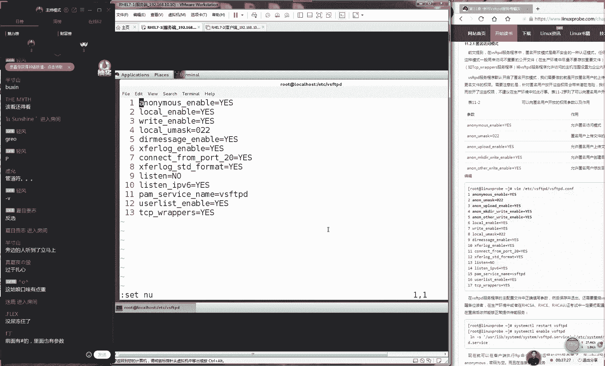

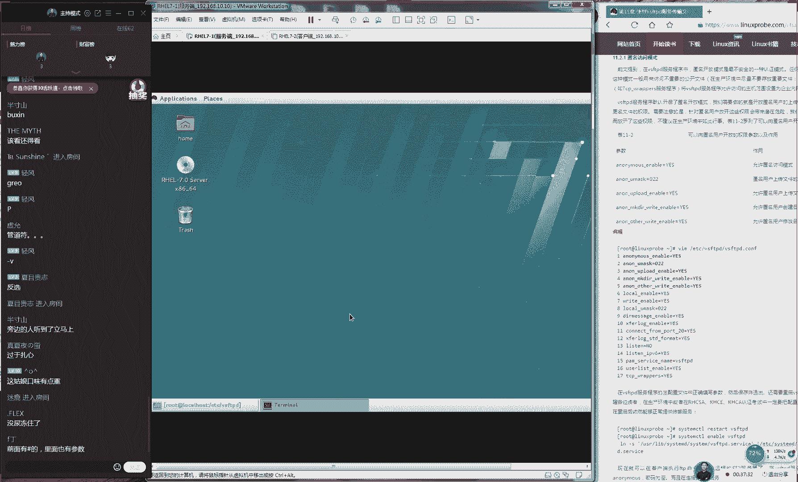

表示法是多少？大家请快速来算一下，就是说我们这个文件跟我们的目录，它所它的这个权限所对应的这个数字法是多少？我们先来算一下我们这个文件好吧，我们先来算一下我们这个文件。这个文件的话呢，75。

你说你可能算的是目录啊，这样那我们先来算一下我们觉得这个文件你看啊4加2是4加多少来6？然后后面这是R是4R是4么就是644看啊那也就是说我们的这个文件是644，这没有然这个我们单看好没什么用啊。

那我们再来看那我们的目录的话呢是7对后4加1加175那也就是说我们的这个文件的话呢是644我们这个目录它是75其实的话它这个它有一个公式的。

它不是这么简单这个我们的文件是666减去后然后这个我我们的目录的话呢是77减去这个是由我这个是我这个系统它所来定义的。所以说那你这样看完之后话那么就知道了这个多少等于就是。😊，22啊。

就是变成1个0文2，他要呃他叫什么名字？它叫做我们叫做文件的反言码。😊，这个话呢我我们叫做系统的文件权限反言码，这就是用来去调控我我啊我们这个文件大小的。因为的话当你想要让你的这个文件呃。

现在这个文件权它越大的话呢，那么你就可以调整你的这个文件这个码变更小一点。这样话呢我们这个文件的这个权限就更大一点了。那么我们如果要是说想要让我们这个文件权小一点的话。

那我们就可以去增大我们这个码这样的话我们最后所得到的这个文件的这个权就会变更小一点。现在就是一个我们比喻来说，就是说我们中国人我们这个政府再去调控这个税收。当我们这个税收的比较重的话。

我们就老百姓手里个钱就少一点，对不？我是我们这个税放开了。就我每个人收税少，就手里钱就会多了。就就是一个进我们文件调控这么一个言码。好，那我们给大家举个例子，举一个非常极端的一个例子。

咱比如说那我们现在这个。😊，或者说我们现在这个反页码变成了777了。好，它是一个我们这个呃它是一个最大值了。那咱比如说当我们将U max的反页码给它设置成了777的话呢，那我我们对于目录来讲。

它就是最后变成000了。那我们对于文件来讲的话，那么应该是多少？😊，呃，7月2兆啊，大家可能听明白就一下就明白了。那我们如果将U max给它设成呃717了，那我们的文件的666减去717是多少？呃。

我们再给大家举个例子，大家先想一想，让我给大家举个例子。再比如说我们现在的个人所得呃，我我们现在的个人所得税啊。😊，那我那那我们知道，因为我现在这个写的书的话呢，我稿酬的税大概是17%。

应该来说是比较高，对不对？而且我这边没有任何社保。所以说你看那我这边的这个书的稿酬是17%那好比如说有一天我们这个政府发了疯了，把我这个稿酬的话呢税给调成成给调成之百者调成了110了。

这样话呢那我们最后算下那个税是多少。那我买那我这样我每卖一本书，结果我还要再掏1块钱出去？其实不用的就说当我们这个权限不足的情况下的话呢最后就成了00了，他即便是666减去了77，最后也变成了00。

那么为什么啊就是因为你做的不是一个简单的一个加法减法乘法。而你现在做是我们这个权限没有负一的这个权限权限他没有个负值他只有RWX他只有这么三种这样一个权限。还有这样一个空值，他没有说负数。😊。

啊这个权限还还能带啊还啊就还啊这个权限还不能代欠费的啊，这个他做不到的。好匿名公开模式。那我们接下给大家去说下边的话呢我们再给大家去说我们今天这个实验是有难度的大家前做好准备。好。

那我接下来给大家说我们有一个下面第第条代表就是是否显示出来一些提示的信息。然后第六个代表就是说是否启用我们这个日志后第八条代表就是是否以标准的格式来去写入我们这个系统的日志。

第九条代表就是我们的文件数的这个数据是否端口号进行传输们选都是y第九条说是否以独立的形式来运行我这来说当我们这个服务器要没有我包错以的话。

我这个他们都不用去改的它不用以独立形式来去监听我们这个口号然后还有就是说我们这个是否来去支持我们的选是这个其实没有用。因为我现目前。😊，是接触不到IPV6的，我们现在实还不需要。

第十呃第11条我们叫做pump service name，代表就是我们的pump模块的名称。这个的话呢我们先不给大家去说啊，这个我们待会给大家讲到这个的话呢，我们叫做。😊，呃，可插拔式这种模块。

这我们待会给大家去提到的。好，接下的话呢我们还有说用户列表，我们选择是y现在都是一个黑白名单啊。我们待会儿所有出现在这个文件里面的用户名称，他们都是不能登录到我们这个服务器的。

但家有没有看过一个电视剧叫做死亡笔记大家没有看过可以打一下叫做死亡笔记是一个电视剧是一个日本的大家如果没有看过吗？看如果没有看过的话，们有聊天有费劲啊因为这个我这个举例啊。

但没有看过没没大家讲一下好不好看过过真人版吧？你们说成人版，你们看过是你们看是那个真人版对吧？是这样啊，虽有么一个主人公，然一天他刚刚下雪后来他那天下大雨啊，他打他打一把他打一把伞去路边去避雨。

但你们看过这个剧情，有天他下雨，他去路边去避雨。这个时候的话他突然发现这个因为你们知道这个日本的话，很多这个。😊，门前他们最会有一个遮雨棚，他不他不像做咱们似的啊，就搁就自己估自己了。

他们会有一个搭了一个遮浴棚，然后他们会在遮雨棚下面，然后去继续去购物啊或者怎么样的。然后就在那个遮浴棚的下面就会发现一本书啊，我说这个原因啊，不是说夸日本有多好。因为我没有这个遮雨棚的话。

然后你会想哎那说不定已经湿掉了嘛，对不对啊，所以大家知道就是这个因为他有一个棚子，所以说那个呃呃本他都没湿。后来他把这奏之后，发现那个上面写的是死亡笔记这个呃几个字。

他又发现了一个很神奇的一个功效是什么呢？就是他只要把某一个人的名字。😊，写入到了这个呃。呃，本里面，然后就然后这个人就会死掉了，而且好像有一个时间限然后就是24小时吧，然后就会死掉了。那好了。

这个话它就是这个参数，它也就是一个死亡笔记的一个意思。当你的这个用户名称，你只要出现在了这个文件里面的话，那么就会导致你这个用户不能够登录到我们这个服务器里面了，就是一个禁止的一个黑名单一样。

就是一个禁止的一个黑名单啊，这么狠是？我们来看一下啊那你看然后这个文件它它有这么两个文件。第一个我名叫做它呃有这样话我们这个第一个文件叫做它是叫做us我们叫做他们都是用来限制我们这个用户那就记住啊如果说我们这个用户的名称出现在里的话。

那么就会代表我我们这个用户他不能够登录到我们这个服务器里面。那好，那我继续给大家说，就是我们叫做第3条就是说他是否有我们这个这一个。😊，呃，防火墙来进行一个控制。那好了，那我们选择是yes。

这个我们正给大家去提到过这么一个防火墙，它有两个文件即天使跟恶魔。好了，这呃user是IP地址吧，它是用户的名称，它是用户的名称。好，然后是这样的。然后今天我们这个课程的安排大概是。😊。

我们这个课程安排大概是会讲到两个章节，讲完1一跟12。但是我现在看了一下，我们还没有讲任何任何的实验，好像也就已经是。哎呀，快40分钟了。所以说我今天我悬的呼啦的，然后可能今天只能讲十一章节。

但是呃不要紧，我们会把我们这个课给大尽量讲细啊。大家如果您已经是约好考试的话呢，今然我我都不急也不要急好吧，们按就班往下去学好，那我们继续来给大家去说去添加一下我们以下的这个参数。

现在我们接来说我们的第一个模式想来去匿名的一个公开访问模式的话呢，那我们现在就要来去来说设置一下我们的这个匿名公开模式的一个文件的反页码是02因为话我们希望我们讲课的时候说然后就说我们希望我们去讲课的时候的话。

大家不要去赶课时，际上赶课是没有意义的。虽然我赶课时之后，然后踏踏实实过去过元旦。但是我们同学没有消化好的话，这个知识我们没有学明白的话呢，这个真的是得不偿失的事情，所以大家不要催我们这个课程进度了。

如果说你想要去提前备考的话，那么就可以提前来去看我们这个视频来去预习。😊，不要就是紧着我们这个在线培训的这么一个进度了啊，那就有点太慢了。好。

那我们接下来说来去添加一下我们这个虚拟用户我们我呃我们我我们的这个匿名用户的这个文件权限码，然后来去设置好。然后我在把我们我我们这边每个参数的这个用意这个意思给大家去说出来。如果说你有必要的话。

可以写到您的这个书上面。下面就是说代表就是是否来去允许我们这个呃公开模式来去上传文件。然后来说是否来去允许我们的这个匿名用户，他能够去来去写入我们的这个文件。

然后我们选择E然后就是一个新建的一个一个权限了。后就是说他是否来去允许我们的这个其他的写权限，这个什么意思啊？就是说他除了我们去写文件以外的话他还可以来去复制，然后还可以去粘贴。

还可以去除命名以及来进行删除这样的这个权限。好了，那我们给大家设置好之后就可以了。那我们来点击一下保存并退出。那给大家快速去提。😊，问题啊，那我们请问我那我们现在去访问这个服务的话。我们。

但这个参数如果要是不生效的话，那我们该怎么办？给大家提个问题。那我们要想让我我们所配置的这个服务，它能够立即去生效参数的话，那我们需要怎么去操作一下啊，大家不要那么懒，好不好？等我们来互动一下啊。

因为我们感因为我们今天正好有时间，我们给大家多来去互动一下。😊，今天我们要呃今天我们一天我们要我啊我我们要互动出来上周四天的这个课啊。😊，好的，看到我说。那我们需要来去重启一下我们这个对应的服务。

那我们命令的大家记一下，就是叫做VSF去去restarS我们的这个服务程序。好，他告诉我们说我们这个参数是写错了。好，我看一下说我们是不是有一些参数是写错了。果然你是写错了，它应该是WI对吧？

后你说这个I发放到这个W的后面呢，那你这个音怎么去发呀，对吧？那我们应该是这么去写好我们来去重启一下我们这个服务程序来话呢将我我们这个服务程序加入到启动项里面保证我们下一次重启之后它还能够去生降这样做好之后的话呢。

这个I有想法是吧？那我们来。😊，去重启还我们这个服务程序这个还没有完。因为我们要去测试我们这个效果。那我们需要去安装一个软件包，我们叫做FDP这个它不是一个它这个它不是一个协议了。

它此时是一个软件包的名称，它来去它是一个他是一个客户端O它就是一个客户端的这么一个工具，那我们来敲一下回收进入到我们这么一个FP界面里面，然后们现在去输入FP19281010是这样的啊。

我呃我们的话现在配置下我们这边这个网卡。然后我们在地址都是1928101在我们的里边，我们推荐使用的这么一个工具，需要做FDP就可以了。😊，那话如果你呃您是在windows下面的话呢。我们推荐使用I呃。

那我们推荐一个工具版，我们叫做flash FXP。大家可以去网上去搜一下啊，这都呃这都呃他们两个都是可以的，他们两个都是呃叫做我们这个。😊，呃，文件传输客户端，大家可以去网上去下载到。

这就是我比较推荐的这么一个工具。好当啊，那我们来去连接到我们这个服务器里面，然后我们敲一下回车。呃，因为的话呢我们这个模式是比较简单的，所以它需要我们来自己来去输入一下我我们的这个匿名用户的一个名称。

叫做ANONYMOY。😊，代表就是一个公开的一个意思了。然后我们敲一下回车。他说让我们去输一下我们的密码，然后我们再去敲一下回车。但他告诉我们说230登录是成功了。好了。

那我们现在登录到我我们登录到我们里家要记到这个书上面，按照我现在这个笔记上面去记是我们现在登录到我们里的话那么我们要是一个虚拟用户的话。

默认是目录里目录大家要记到书上面这就是我们的虚拟公开模式默认登录到页面，我们默认登录到的页面，大家大家能够看清对吧？稍微大一这个页面就是我默认会登录到这一个页面家这个上面尝试来去创建一些文件。

但是这个里有一个子目录叫做切一定要进入到我们这个目录里再去新。为我有权限他告诉我们说250我换成功了。250他不是在骂我们。😊，是在告诉我们一个文呃。😊，就是我们的一个操作的一个编码啊。

就相就是我们程序报错以后，那我们就可以通过这个编码，这个报错编码去找到我们对应的解决方案。好，那我们接下的话呢我们来去啊然后我们来去查看一下我们这个目录他没有什么文件。

大家刚才讲说我刚本有往250边去想是你声告诉我们。然后我才开这去想的好，那我们进入到我们这个目录里面我们看一下这个里面它确实是没有文件的。然后我们去尝试来创建出来一个目录吧。好吧，们出建出来一个目录。

我们叫星星好我才会再回收这个时候你看告诉你说550说你啊出现错了。那么为什么他会有一个操作失败这样的一个提醒呢？那我们想一下也知道了，肯定就是那肯定不是因为我长得丑那是因为什么呢？但是因为谁长得丑吗？

不是吧肯定是因为什么样的一个原因。那么这个原因的话呢就是因为没有权限因为你的这个权限不足，所以会导致你创建出来这个文件权限没有才会导致出来这个失败的这个问题。😊，好，那我们想一下说呃用会什么问题呢？

后来我们发现了一下，是因为我们的这个PB目录你看一下啊P这个目录它所呃默认的所有者是root。但是我们现在使用是其他人他没有一个可以写的W的权限。好了，我们需要这样去做使用一个77权限。

们必须要给他到这个目录啊，你千万不要这样去。因为这样的话他会导致我们这个服务起不来，因为这个权他不用给咱们大，他必须要给到里面的这个目录的三个7权限。好，我们再回车他看到说那我们现在给他一个三个7权限。

那么证明他有这个呃他面就可以进行一个读取写入跟执行的这个权限了。好，那我们再出现出来这个文件你可以看到他还是错。这个时候底下才出来一个小提示窗。😊，告诉我们说我我们这个操作失败了。那么给大家提个问题了。

那么请问我们现在已经将我们这个文件上的一般权限设成了77权限了。如果说再有权限不足的情况，可能会是哪里出，可能会是哪里导致的，或者说谁给我们在捣乱。那么就是这个最讨厌那个叫做lin的那个东西，对不对？

我们第十章节时已经玩了好长时间，好烦人呀，对吧？他会让我们配置的这个服务，它总是会限制我们的这个行为，它会有一个叫做他有会有一个叫做他有一个叫这个叫做lin它是用来去管理我们这个服务的功能的。

他有一个我们叫做盛下文，他用来去限制我们这个文件该被谁所获取。他是上管天下管替双管旗下来管我们这个服务。好了，那也就是说他认为他认为我们这个文件的话呢，呃他是一个虚拟的它是一个匿名用户的一个模式。

它是一个公开模式，对不对？公开那你就是苏。😊，都可以去使用这个账户了。但是你现在却想要去尝试去新建出来文件，不太安全。相当就是所有人嗯。😊，我们举个例子啊，我们举个不太好的例子。

比如说有一个很高端的一个公司，啊，或者说当很高端的一个场所，他不当然他就不希望说所有人都可以来。那么。😊，如果说您是咱们这个例子真的不常好啊，比如说他们突然有一天，但是没有办法啊。

突然看到一帮呃不知道哪里来的一帮大妈，他们进来呃也不算消费。他们去去厕所手指好这个时候话我就对进行一个限制。

因为那你是一个公开的一个不知道你这个身份到底是谁那么这个大妈也许是国家总理的亲戚吧也有可能是某某某个机关退休的干部好，那就是说我们需要对你这个身份进行验证之后，后那你这个行为才是一个可信的。

那么我们如是一个公开模式的话呢，那我那我们就必然要对你的这个行为进行一个管控来止进一步个破坏行为说这么多不太搭边退出那我就要用一下使用一个这滤出所有的我就看看你你到底你到底看你能管我什么果说这么多全管。

😊，好操心啊。好，那我们现在啊。😊，说我们这个FDP相关的这样的一个策略。所以这有点像马大姐啊，是不是什么都管一管啊，这个每个服务他都会有这么几个限制项。好。

那我们来看一下会这么这么多跟FP相关的我的主要来看一下就是我们认为的话应该是这个就是来去开启我们的这个匿名户去写入的这么一个权限。那好了。

这个话感觉太是很过啊其实我们推是开启这个这代表就是我们开启全部的F访问权限。这个什么意思？好，就是他是这么一个意思啊你既然考试要求不能我个不能够开启我们要求我不能够关闭我们但是你没有说不能够全开或者说但是你没有说们不能够开启。

😊，做了这个权限，对不对？这项就是这么个意思是。😊，呃，对这个FTP撒手不管了，开启所有的这个访问权限啊，开启所有的访问权限，我们来把它给开启就好了。它不是断接关系，它是你看啊。

就是我们你那你既然说你可以不要关，对不对？好，那么就有分值，那我你也没有说不能够全开呀，对吧？好，那我们现在把它给。😊，把它给但我们需要这样一个大写杠P这样的话。

保证我们这个配置过的策略能够是一直终身有效的为我们去提供服务。包括说下次重启之后，我们还是依然有效的。好，那我们现在去开启一下记先相信我就是在书上的话。

一定要按照我现在这个格式去记一下笔记应这一个目录一定要写样的话呢去复习的时候，者说以啊再去看是太爽了。为这个我也结了很时开我没有搞明白后来我自己总结一下挺有意思啊好，那我们接下来给大家是说。

那我们做好之后的话呢重新去登录到我们这个登录到我们这个P里面户N匿名的意思回车再敲一下回车录成功是没有密码了开之后手太痛苦了也确实但是我们导大家不用都去开好，然后的话呢我们。😊，然后我们该干嘛了。

然后我们进入到PB目录里面来去尝试，因为我每次看到他提说250的候都感觉他在骂我一样啊好，那我们新建出来一个目录吧。比如说我们叫莫比同学们个小同学我们创出来一个目录叫做小好创出来了。

然我看一下这个目录确实就会出现这一个文件叫做小好，那我们现在去把我们这个小的这个文件啊，然后我们来进行一个重命名，我们将小这个文件名的话重重命名同学叫做这个小山同学们来去重命名。说我们重名名成功了。

这个时再去看这个文件就发成了小山后我再把文件删，我们给删除这个目录，我们叫小山的这个文件删之后告诉250，那我们现在查看一下这个目录就发里是没有内容了。那也就是说我们现在确实验证了。😊。

我们的这个匿名户，它不光可以去登录到我们这个服务器，它还可以来去新建重名，以及我们进行删除操作。它有一个完全的一个管理权限。这就是我们给大家做的一个非常完整的这么一个实验，很爽歪歪，对不对？好呃。

这样的话呢来说呃怎么样说有什么问题吗？小山怎么样好，这样的话呢我很奇怪一件事啊？你说这个编码你这个250，你到底是切换目录成功的250，你还是说我们重名之后成功的250还是你去删除掉之后的250。

这为什么它总会出现这么一个编码了也我感觉。😊，这个编码也不太准确吧。好，那他这个他这个250可能是在这个FTP里面的意思啊，可能就是操作成功的意思。我可能是这么认为啊，我目前是这么认为。

应该是操作成他他就是250是吧？好了，这个也估我我估计啊原是这个作者听到咱们去调侃这个编码的时候，他可能都没有想到这个在我们国家没有这种意思，吧？怎么在你们国家里面对我们这个代码研究这么长时间啊。

有点意思啊好，那我们接下来说一下我们第二个模式的话呢，我们叫做本地的验证模式这个本地模式的话呢啊这个本这个话本地本地验证模式代表就是我们使用我们的本地的账户去登录到我们的FTP里面这个他默认登录到就是我们用户你自己啊我们想要叫做这个自己啊。

哎了。😊，哎呀，画了哦我点一下我点一下EC键啊，都没了。哎呀。😊，这个输入框啊，我是觉得太难受了，这打打就没了。好，第一个的话就是说虚拟呃验证模式。好，我们叫做虚拟用户吧。好吧。

然后它登它的话是登录到了万目录里面的FDP还有一话呢，我们叫做本地验证模式。😊，他的话是登录到了自己梗的加目录。好，说二俗，对不对？他就是登录到自己的这个这个加目录里面了。呃，自己的加目录。好。

那我们现在给大家去尝试去登录啊。当然这样的去配置啊，是这样的，当你去登录到，那我们现在重新再去返回到我我们的这个配置文件里面。然后你看一下啊，呃有这么几个参数大家需要来去着重去关心。第一个参数的话呢。

就是说我们那我们现在删掉啊。😊，商用台的默认是允许这个虚拟用户登录的。然后给大家看几个参数啊。第一个参数是说是否来去允许我们这个本地模式来进行登录啊，然后第二个是否来去允许本地用户的账户来进行写入。

然后来去设置一下我们我们本地用户之参数的话呢就没有那没有最后了。所以说你看到就说我们这个默认的话呢我们已经是默认支持了我们本地验证模式来进行登录的我们不需要去任何东西就可以了。

所以的话呢我在可以直接以及退出，然后去重新去启动我们的这个S它默认就已支持我们的这个本地用户验证模式了。所以说这个讲起来的话是爽歪歪非常的简单，对不对？

可以认支持我本地模式来进行登录然后接下来我们再登录我们个里面192168奇迹1118敲回车现在去输入一下我的名敲回车好，这个时候你。😊，啊，我们还没有去输入账号和密码啊啊我们现在还没有去输入密码了。

但是他此时已经给我们提示出来报错了，大家看到吗？这是为什么啊？为什么我刚告诉他我是root，我我还没有告诉他我的密码，他就已经是限制了我们的登录行为呢。😊，大家想一想。会议室有什么可能这个排错啊。

你不要听我哒哒哒往下讲啊，这个我到因为我可能知道是什么原因了。但是你这个排错能力我们必须要上课的时候要去练一练，要去思考一下。那你以后工作的时候碰到这个问题怎么去解决？凭什么我不能登录？

而且我是超级乎入去最有权限人我，为什么不能去登录啊？😊，但表我看过一个电视剧。😊，哦这个呃是一个动漫啊，叫做七龙珠。你没有没看过啊啊你们呃你们可以打一下一呃，就是那个龙珠。😊，啊，然后这个呃。

其实话我们就喜我因为我们就比较喜欢给大家举例子啊，大家都比较。😊，懂这一点了。啊，比较能够理解这个技术。大家有没有看过七龙珠，这你们都看过啊，你们到底喜不喜欢看动漫啊啊，听过看过啊。行啊。

七龙珠啊就是说有一个作者嘛叫鸟鸟山明。后来他有几个这个主角里面，一个叫孙悟空，一个叫孙悟空啊不孙悟啊，他们的绝招还有一个叫这个龟仙人，然后画这个龟仙人交给了孙悟空，他的一个绝招叫什么啊龟拍奇功。

对不对啊，龟拍七功，就这么一个呃也算是一个大招，是这样的啊，那边有一个剧情讲的是什么呢？讲的是叫这个七龙珠嘛，就是说呃有七颗龙珠散落在了世界的各呃的这个各地，然后这个呃最开始的这个悟空啊。

他们就去积载这几颗龙珠。当你只要凑到这个七颗龙珠的时候。😊，那么你就可以去许一个愿望。大家知道这个流程对不对？好了。😊，啊，那然后的话就是有一个小bug啊，咱比如说那你七那你凑那你凑齐了七颗龙珠之后。

你能不能让神龙杀死自己呢？哎，家没有想过这个问题，其实还真的是有的，大家大家的话往后去看七龙珠里面有一个叫做龙珠Z的一个系列然后就是神龙被杀死过啊，你们有没有印象打一下啊，没有吗？都看过吗？

只有我这么无聊，我会去看？反正我之前我因为我因为我知道真不知道就是说有这么一集啊，然后有一个坏人他召唤出神龙之后把神龙给杀了啊，比克大魔王杀，对不？你还是有知音的，还是有人懂的。

然后就是说你看啊他就是一个bug了。因为神龙在我们这个心目当中他就是一个顶级的一个管理员权限，他就是一个他他他就是一个权限最高的这么一个神，但是也是以对他进行一个也能够进行一个制约的。

现在就是我们这个实验也是你即便说你是超级。😊，root，但是你也可以被制约，就是加有一个文件里面，这个文件的名称。我们进入到我们的ETC目录里面的VSFTBD里面。😊，系。啊。

然后我们来编辑一下这个文件。好，然后可以看到啊，里边确实将我们这个超乎root给它写入到了我们的死亡笔记里面了。这个时候我们就要把它给删掉，然后马上他就可以去登录了。哎，大家呃之前看过呃，我看我看看啊。

说呃是一杯浊酒笑红神同学堂呃是看过七龙珠，对不对？那我大家提个问题啊，大家知道那个比克大魔王后来怎么把它给封印起来吗？😊，那我把它给关闭掉。我们现在为什么不在客户端登录，而是在服务端登录？

因为我觉得效果是一样的。因为我觉得这个意思是一样的啊，然后我们现在把保存名推出啊，电饭煲里面当然是电饭煲里了实你们这集没有没有太仔细看，其实我还是比较喜欢看七龙珠的。因为那会小时候你说有什么没有什么？

记得？那个机记得很清楚当然是贵仙人在，然后买了一个电饭煲啊，不知道是是美的的啊，后来在一个山谷里面，而且真的不是给大瞎编，你可再去看那个机，这集我估计已经看完了15年了，者我1年之前看的。

我现记得很清楚，就是在一个山谷里面，然后四面环山，然后后把那个最后把那个比克给他吸进去了然吸进去之后把封印起来了，后来有一个大傻后来打开了之后才出来了那也就是说。😊。

那我们现在来去需要来去取消掉对于我们这个超级用户root这么一个限制。然后我们这样再去登录的时候，让你会发现就已经是成功了。好。

我们再去登录到我们这个FP里面理员账叫做root我们的密码让我去输入去输入登录是成功的默认登录到我们个用户个加目录里后我这样去我们再新建出来一个目录好不？做来呀同学就叫做这个小来吧。好。

那我们来给他叫做这个小来的一个目录。他告诉我们说新建成功们重命名我这个目录进行一个重命名将小来给他重命名小路同学好我们叫做小路同学学有8了这个时尴尬了是讲完一半的。

所以说下一回的时一定要提前来设置密码吗？我们现在使是们超级用户ro或。😊，你的其他的用户啊，当然你提用本地的密码，但这个西特别特别的好，就是因为你凭什么你可以使用我我们本地的账户和密码。哎。

这个问题我们待时先留下来啊，我们待会还去聊一聊。你说你凭什么你这个服务也可以去使用我们系统的密码，为什么好吧，然后我们再重一名这个到小路，然后再将我们这个目录给它删除掉。😊，OK没有问题。

那也就是说我们现在给大家演示了一下叫做呃本这个模式来去登录的话，那我们自己的加目录里面我们有三个这个权限来进行写入，然后进行重名以及进行删除操作都没有问题。超用户入着大佬能不能用小弟的账户密码呢？

不可以啊，那你只能自己的呀，对吧？那你是马云啊，比如说你是马云，那你登录支付宝的时也不能写我的密码啊，那你也要自己的密码，因为你一个账户对应的就是一个密码，对吧？所以说这个语言我里还是这个输新一点的。

即便你是马云你也不能使用我的这个密码，对不对？好，那我们接下来说还有第三个模式，我们叫做虚拟模式。但是可能马云会说我干嘛用你的账号。好，第二我们这个第三个的话呢我们叫做虚拟验证模式。

这个话就是说我们要是想虚拟出一个用户的话，就是映设用户的加目录。😊，好，这句话就是说我们来进行一个账户的一个映射啊，那我们可以来去虚拟出来一个用户。

这个用户他就只是只是用来去验证登录到我们的这个I呃来登录到我们这个服务器里面来去传输文件的。这话有一个好处啊，就是说。😊，他会一个好处啊，就说当你这个黑客去破解了你这个虚拟出来的这个用户密码的话呢。

但是没有关系。因为这个用户它在系统里面它是根本就不存在的。它只是用来去做应他只是来作这一个登录一个使用的。好这个模式的话呢我们叫做虚拟出来的用户模式。我们叫做虚拟的验证模式。说FP服务要淘汰掉。

个不会不会的因为我觉得P服务说大家日常当中网站用的多，但是你要想去传输文件的话呢，FTP被取代掉这个还是有子还还是有点子。且我做运维的话呢，当然说我的父母肯定不用肯不用上网。

但是们还是用传输我们这个文件的。好，那我们现在配置它之前啊那我们现登录到我们这个。😊，目录里面，然后我们创建出来一个子目录，这个呃用户名称无所谓啊，我们把它叫做Vus点list吧，然后。😊。

这啊那我们这样去写呃，我们来这样去写这块呢，我们这边的这个单数行是我我们这个账户的名称，偶数行是我们的这个账户的密码。

所以说我现在出现出来几个户啊做张三4那也就是说我现在出来两个那我现在出来出来两个户分别叫做张三跟李密码都是叫做这样了保存名退出这个文件就是我们待会来进行虚拟用映成个数据库的时候。

我们一个原始的一个蓝本然后我们来他进行一个加密。样话们待会才可以通过我们来进行一个调取。😊，对应命令我我们叫做DB下划杠那我们画这样啊大写T代表就是我们要需要进行一个加密。

然后话这样一个小写T代表就是我们后面要去加密的具体的这么一个类型，我们使用哈希我们进行一个加密的一个协议。然后代表就是我们待会要去加密的一个文件名称我们叫做us然后我们加密之后的那个名称。

我们叫做us点这个可以跟我不一样，可以把哈哈都无所谓啊，这没有关系。就说我们可以有这么一个名称好吧，就说名称啊，我们想稍微正式一点嘛。然后我们也可以是装一下。我们看一下啊，那这样的话呢。

那么你原先的一个文件的话呢，你这个类型就是一个文本类型的一个文件。而你现在你而你现在新加密出来的这这个文件的话呢，你这个类型就变成了一个由哈希值加密的版本为9的啊，那也就是说把呃这个是通过第九版本的。

😊，值加密出来这么一个文件。好，这就是相当是你的这个数据库了。好，那我们接下来的话呢我们来去删除掉我们这边的原文信息，因为这个文件不太安全，对不对？把它给删掉。

接下来我们去将我们这个新建出来的这个数据库文件的权限给它改成600，保证我我们这个文件。😊，湖北其他人所看到这样做完之后啊，先不用着急，我们现在出现出来一个本地的一用户，他用来做映射的。

那么你需要将你的本啊，因为你需要将你的这个虚拟用户的这个文件映射成一个本地的一个文件这一个所有者才可以。要不然的话这个文件在我们本地上面归所有？因为有一个底文件这么一个问题。好那我们现在现在来一个文件。

比说我们的文件名称啊我们这边的话这个用户名称。们好比说我们叫做？是虚拟意。这个你也可以随便去写写者你名称进行这么一个呃进行一个命名都可以，它就是一个虚拟呃进行进行这么一个进行映射这么一个户。

好我们去一个参数这指定一下我们这个用户在我们系统本地的一个的一个路径，我们给他指定到我们的里面的P。😊，万呃外目录里面的呃的FTP的这个入程目录里面。好。

然后我们选一个消息IS代表就是设置一下我们这个用户的终端啊，让它只能够。为我我们这个服务工作而不能够动到我们这个系统里面no love in。好，我们先给大去设置一下我们这个权限。这样做好之后。

我们来敲一下回收。那我们就有一个现成的瞬间好的这么一个虚拟用户了。我们来去查看一下我们这个虚拟用户的一些权限。的那么看一下我们这个信息啊，就有这么一个用户了。大家看一下，我们刚给大家总结那个表格。

我们的这个虚拟用户登录之后，他所默认所在这个路径的话呢，它就是在我们的映射用户的加目录里边。那也就是说我们以这个实验为例的话呢，就是在万目录里面的呃目录里面的FDP呃的这个呃LOT。😊。

目录里面的P入目录里面好了，那我们现在来去对于我们这个目录还有一些操作，我们需要给他一个更高的一个权限。这样话能够保证说其他人也能够进行访问操作。

这个是最起码的目录里面的存目录里面设置一下我们现在这个权限。接下来我们翻回来我翻回来给大家编辑下我们这个我们这个配置文件然后给大家去说一下说我们刚提到一个问题。

你凭什么你可以使用我们的本地账户和密码登录到我们一个第三方的一个服务了。大家可能之前没有想过这个问题啊。

但是你仔细去会发现了我们现在所说的这我们现在所说这这个S这个服务程序的话呢这个服务程序它是一个第三方的我们讲。😊，讲的是它是一个呃呃它是一个后安装第三方的这么一个服务程序。

它凭什么就可以去使用我们的lininux里面的系统的账户和密码呢？它就是有一个叫做怕模块的东西，他是所帮他去调用的。好，大家先记一下，然后把它删掉了，这个很重要啊，我数完删之后就把它给删掉了。

大家请切记记到你这个书里面。然后呃记到你的书里面，然后大家赶紧去。😊，去总结一下。啊，小红同学不要送我礼物，送完之后真的是没有用，真的没有用。因为我平时我也我啊我也不会去上那个。😊。

我也不会上这个直播的这肯定是花钱，对不对？这个皇冠。因为你刷完之后，我看这个财富榜上，我刚不儿就就刚才就提醒了一下，肯定这肯定这肯定是要花钱的，千万不要给我刷。😊，啊。

然后我也不会想那些因为我也不是那种专业主播嘛，因为你懂得对吧？然后大家不要把钱花一些没有用的地方。好，然后话呢我们来看一下我们这边这个图布图，我们图片的话呢是11-2，大家可以来自己看一下。

我们这边11点啊，我们这边11-2。😊。

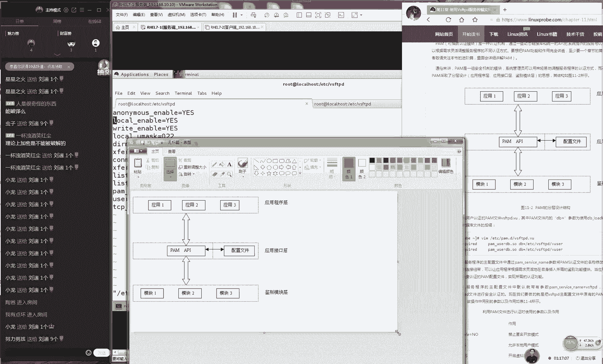

啊，11-2啊11-2。哎呀，我靠不了脸了，长得太丑了。哎呀，然后的话我们继续啊，真的是长得丑，不是因为真的不是跟人大家客气。因为我长得太丑了，所以我才在网上讲才去在网上讲课嘛，要是长得稍微帅一点的。

可能就会干个影视啊什么的啊第一阶段对吧？就是干个影视啊，个这种明星级别，对不对？比如说你们女朋友喜欢的鹿晗这种鲜肉种水平的第二水平的话呢，就你微有点颜值，你也可以去在那你也可以去中戏啊。

那些学校里面对吧？你可以去搞一搞影视圈，那你那你第三个等级那肯定就是普通人了，对吧？那你普通人可以找一个普通工作了，然后可以跟同事们去交流啊，怎么着的最丑人就是像我这样人对吧？因为我已经没有自信了。

我已经是都没有勇气走出我这个家门，所以我现在是在网上网络讲课啊，通过网络讲课的话呢，就是为了大家不用再看到我这个非常。😊，非常丑陋的这个脸了啊，所以我们现在是一个网络在线培训嘛。

而且大家没有看到我没有被P过的照片，对不对？好丑好丑的。好，所以说话那我今天只有这么一个手艺能够去吃饭啊，所以说我们会把这个课讲好。只是说影视圈我觉得这辈子应该是希望不大了。好，那我们说这么多啊。

看一下我们现在这个表格11-2的图片就是说我们这个pa模块的这么一个原理啊。当我们有一个应用123他会调取我们这个pa模块底层的这么一个功能，然后进行验证，这个什么意思啊。

这么有说完就感觉要就感说完都要哭了。哎呀，真的太丑了。😊。

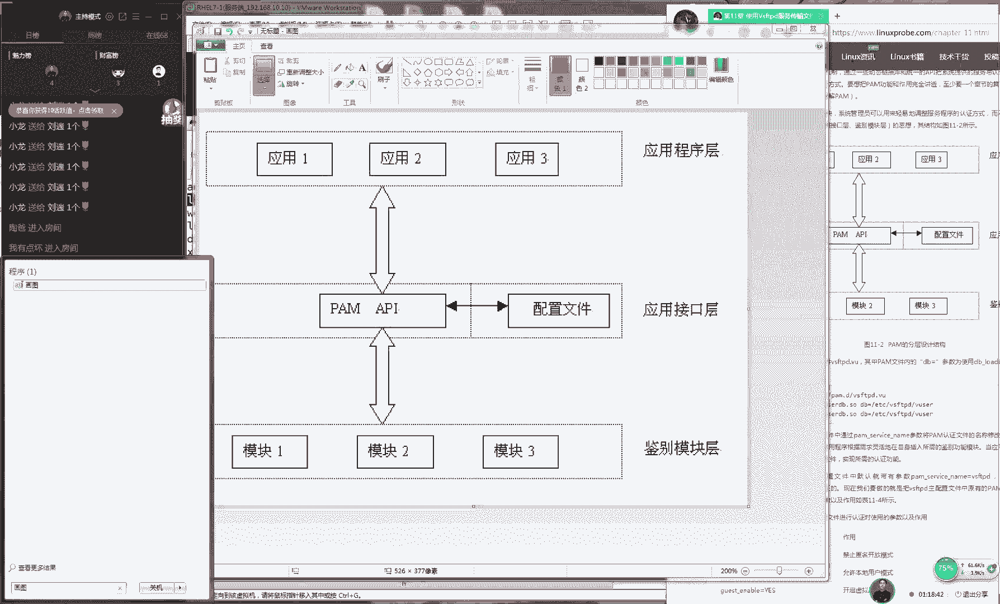

哎呀，算了，我们来继续啊，我们丑就该多努力，对不对？有啊有这么一句话说的好是吧？呃，人丑就该。😊，大家有没有听过一句话说人丑就该怎么着。

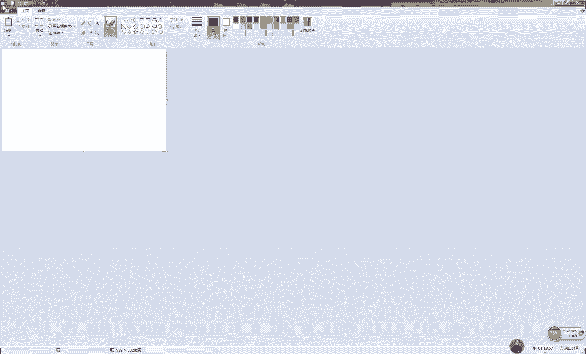

啊，人丑就该多读书啊，所以说这四位呃这5位同学。应该就是别人也这么跟他们说过啊，所以都比较。了解这句话，忍丑就该多吃饭。😊，啊这个我觉得这个说法我我那我估计我女朋友会比较喜欢啊。好，那我们接下来说啊。

就是说我啊我们这边有一个服务程序，我们的话对于我们一个传统的一个程序啊，它肯定是有两部分是组成出来的。咱比如说我们的QQ，我们的微信。第一的话就是说我们这个肯定是功能，对吧？因为你这个服务你没有功能。

你干嘛呢？那肯定要有一个功能。第二的话就是有一个验证。😊，那么你需要来登录到你的这个呃呃这个呃这个呃这么一个程序里面，然后你才可以去使用这个功能。咱比如说那个QQ这你们都懂了吧。当你登过QQ之后。

然后你才可以去聊天，它会有一个功能跟这么一个验证的一个方式。但是的话呢我们现在我那我们就讲把这个验证的话，给它抛开去不做。我那我们现在只去写这个功能。而我们这个验证，它是由我们系统去操作。

这个有一个技术，我们叫做pa模块叫PAM这个技术我们叫做可插拔式认证模块，大家记到你这个书上面，我们叫做pa模块可。😊，插拔式认证模块。

它就是让我我们这个系统可以去他可以让我们这个程序去调取我们系统的一个验证的一个模块的一个接口，然后来起到这么一个验证这么一个作用。好了，其实来说这就是非常简单的一个调取API的这么一个原理了啊。

所以可以看到这边我们会有很多个程序。比如说我们这边的程序123他们就可以去调取我我们调取我我调取这个模块来进行这么一个验证。这样我们可以去随意来去修改我们这个所指向的API的接口。

所以说它叫做可插拔式认证模块好了，然后我们底层会有很多很多的这个模块，我们现在默认的话呢，我们来看一下啊，它默认所调取的这个模块是叫做VS你看没有关注到对吧？

但是我看到了这个模块我们现在所调取的叫做VS这个是由我们系统所提供的一个默认验证的一个模块。这个时候那也就是说你现在要想去。😊，现出来是一个虚拟用户的一个模式。

那你就不能够再去使用我们系统所提供的一个默认的模块了，你需要自己去写出来。但是这个涉及到我们红RGC的一个。😊，啊，高一个比较高级课程叫做442啊。

以及有一个叫做333那个讲的是系统那个讲的是系统这个安全的。所以说如果你想要去学想要进步去学习的话呢，您可以去了解一下红编码为333的一个课程里面会讲到我们如何去编写我们这个模块。

今天的话呢我们只是为了去套一下我们这个虚拟用户模式给大家带带一下就大概有这么个印象模块可这模块它它是做验证就可以是足够了。好，这样话呢我们来去编写一下我们这个模块。

我们自己来去写一下我们自己的我们这个模块它是C目录里面呢，我们叫做点里面做这么一个目录里面然后我们现在啊我们来去编写出来自己的叫做S。😊，点VU好，这个hold缀也是无所谓的。

就呃呃这个是我给大家瞎编的，待家话可以自己的这个为准。然后我们现在写助我们这个配置文件。😊，这个配置文件的话呢，AUTH然后我们需要来进行验证的意思。我们现在的话代表就是我们这个文件它是用来去做验证的。

而我们这个验证的话呢，数据的来源呃我们先调取一下我们系统本地的一个叫做代表就是他待会能够去使用账号和密码来进行验证的意思。还有一个就是我们刚才加密出来那个文件的是个数据库啊，我们账号码这个数据库的文件。

我们如果你要是忘记的话呢，就是过来查一下就是过来查一下了呃，会有这么一个文件，一定要把这个文件给它呃对应上这么一个路径啊，我们一定要对应上这个路径，不要写错。你看如果你刚才修改成哈哈的话呢。

请那么请此时此刻也要去修改一下对应的名称，然后是这样的。然后为我们前面把这个D代表就是这个的意思代表就是。😊，好，所以的话呢那我们这个点DB我们也可以把它不用去写了。我们最后不要去写那个后缀。

我们后缀不要去写。好，那我们下面拖个好不好？我们下面还有一个就是我们对于账户的一个验证的话，就直接写上我们去抄一下去修改一下我们的前面代表就是我们待会的话呢还要进行一个账户的这么一个验证。

这样做好之后啊，对我们红帽HC里面会有一个课程叫做红H333会者呢如何去编写我们这个模块。嗯，😊，会有一个很有会有有一个很有意思的一个实验啊，来去限制我们这个用户登录的频测。哎。

这个比如说你登录三次之后，让你去等让你去等待让你去等待10分钟，或者说你登录三次之后会把你这个登录记录，使用的信息到到某个文件里面进一步保证我们这个服务器安全。所以说不要听他们说我们到以后害害了。

但你红发哎这个比基础啊。以说虽然说我们现在考过红已经累已经快累死了啊，然后每天在拼命的再去学。但是实际上你红的时候，打游去1三个方向的那你到时候你就知道这个原来还是有删的好，那我们继续下就是说。😊，呃。

然后我们我们提个问，然后我们。问，然后我们大概问一下啊，现在有68个同学，对吧？68个同学嗯，您现在已经约到了红帽尔考场的话呢，已经在我这边约到了红帽尔考场的同学，你们打一下一，就是你们确定预约了。

然后钱都已经给了我了，我们看看大概有多少个同学。😊，哦，68个同学里面，因为我想看看就是我们现在到底我们这一班还有就是在线听课的还有多少个考红帽了。我大概想了解下这个情况。要因为要是没有的话。

我就不着急了。你们懂意思，大概还有20同学是已经交前准备去考红帽？那我们还是按就往下走一走。那我写之，我们现在去修改一下我们这个配置文件里面将我们这们自己去写的那个配置文件再前的话就是我来开启一个模式。

我们叫做代就是我们开启我们的匿我们开启我们这个虚拟那个模式后下面就设置一下我们个虚拟户映射的这一个户名们做个用户名为后下面还有一个叫做允许写入。但是我们牢笼机制这个什么意思啊。比如说。😊。

当你有一个用呃，当你有一个账户被泄露出去了，然后有人想要去来去上面去呃，尝试创建出来文件，他可以去随意去修改你的这个文件内容吗？咱比如说。😊，啊，咱比如说的话呢，我们来给大家想一想啊。

我们那我们这么来就是说这个服务我们叫做参 root参 root。咱比如说当有一个用户登录到你的这个服务器里面了。好了，他肯定肯定肯定他是有嗯。权限来进行他会有权员来进行写入文件，对吧？好。

那么他既然有了这样的一个写用权限，但是我们只能是在万目录里面的FDP。😊，呃，入此目录下，他才能够去写入文件，对吧？但是真的是这样吗？那你需要进行一个限制的，就是说将我们一个来访者的一个权限。

就是仅限于这个目录。那好了，这叫做牢动机制。大家记下的书上面牢笼机制。😊，限制我我们这个用户行为，他只能够写入操作号，他也只能去写入到这个目录里面。他不能够被啪一跳跳EDC目录里面折射不过去，对不对？

好了，我那我们这个有权限就是只呃就是呃他是呃他就是仅能够面向于这个目录。大家有没有这个有点什么啊，大家有没有看过一个最近的一个韩剧啊，很好，就是说我忘了叫什么呢？好呃，我我想起来啊，叫间谍。

然后大呃大家有没有看过。😊，是一个韩剧，讲的是当时朝鲜跟韩国那会儿非常冷战时期嘛，然后他们之间间谍往来的一个事情，没有看过吗？嗯没有看过吧没没没看过那片真的特别特别的好然后你们可以去看一下。

这个真的不是韩剧，它不是偶像剧，你们去看了，你就知道我现在在说是什么。因为我因为我也不会去看偶像剧这么忙了，是天天么丑，怎么去看人这看小鲜肉？但那个剧你们看完之后就知道真的好。然后说这个例子什么意思啊。

因为我们知道每个人都会有一个房间，那个房间咱比如说。😊，是有三个呃是一个他是一个三居室啊，那个间谍啊，他进入到那个房间里面之后，就是说哎您在这里面先等一下我们那个比如说等一下我们的这个领导好吧。

然后他被限制在这个房间里面了。这话他想尝试进入到其他房间的时候，这个行为就是一个出轨的这么一个非法这么一个请求。所以说这就是一个掺入将我们这个非常危险的一个行为限制在某一个区域内，但你要破坏的话。

所以你们看过那个有没有看过那个电视剧啊，就是他会把他他要想进行一个间谍行为的话呢，他也就是在这个范围内啊，在这个房间里边，他往那个沙发里面什么的，现在好听什么的。

他就是说将他这个行为给他限制在了某一个区域内的意思，叫做劳动机制好了我们继续往下去说好，那我们没有关系，瞎聊就说限制用户行为的意思限制我们用户。😊。

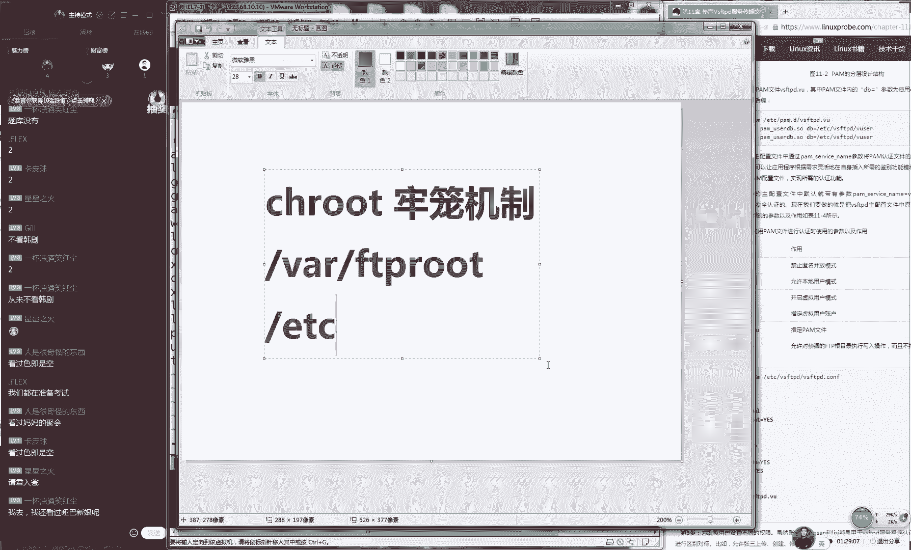

行为的意思。好，然后的话呢我们现在做好之后还没有完啊，对，我们还没有完，我们再去写入一个文件这呃的一个参数啊，这个参数叫做。😊，userfi因为我们刚才现在出来了两个文，现在出来两个用户，一个叫张三。

一个叫李四好俗的名字，对不对？只有就值得我能想得出来一个户叫张三一个用户叫李4好了，那然这个两个都是同根生，他们都是同门出生的这个户。他们都是同时出现的户。

但是我希望我更偏向于张三一点什么意思就说我们这个张三跟李四两个用户，他们虽然都是一个虚拟用户，但是我希望他们的权限不同。哎。

这个时候我就可以使用到我来为我们这个两个户来去分别大家去指定一下我们这个权限这个先可听完之后啊没有感觉，但是你自己去想就会发现真的是很酷很酷的。因为他可以为你同时创建出来这个用户。

你哪怕映射出来这个户都是同一个人，但是你两个人的权限可是不一样的。好，所说像李嘉诚看过这个新闻虽然个李嘉诚退休。后来这个财产。😊，那个家族事业给谁了？李嘉诚现在这个事业，因为香港首富嘛。

大家都比较关心李嘉诚的这个所有的这个财产，然后这个家族企业什么的，给了儿子给了哪个是给了大儿子，对不对？他是给了呃李泽楷啊，李开泽李泽呃，李泽楷，你呦你啊，其实我我其实我本人我都知道的啊。

但是你们一说我给忘了啊，不太关心是吧，反正也不给我们啊啊，你们之前说的我忘了啊，李泽巨吧，我怎么觉得是，忘记了我本人该。😊，都已经是在脑子里面了，结果你们给我发咔咔咔咔给我发好几个，我都想不起来了。

算了吧，就说他把那个他的财产还有这个家族这个管理权什么的给了他那个大儿子了，好像是还还好还是二儿子。我觉得是大儿子好，对吧？就是说呃虽然说他有两个儿子，但是他两个儿子所使用的这个权利也是不一样的对吧？

好，那然后的话呢，所以说我们就怕打岔。你所以这一打岔对里面就忘了。好，那我们既然说。😊，我们来去新建来出来这个目录，这个目录里面它定义出来我我们这个两个。😊，身份的这么一个区别。第一个账户叫张三啊。

第二个。叫李四。好，我们先编辑我们的第一个文件。呃如果说没有权限的话呢，可以就是一个空白文件。然后我们去写我们这个张三文件是这样的，这个作者特别的懒，就这个系统这这个他的这个作者啊特别的懒。

他没有他他没有为我们的这个虚拟用户的这个账户的特殊权限呃出现出来新的这个参数，他就是偷懒了，他就直接去使用的是这个虚拟用户了，所以大家不要说哎老师我们明明做是这么一个虚拟用户的。

为什么你要去使用呢这么一个匿名用户的一个参数啊，就是因为那个作者他太懒了，他没有为这个虚拟用户的特殊权限。😊，再生建出来属于他自己的这么一个参数，而是直接调用了我们之前那个名称了。好。

这个我们不要这么纠结啊，我们就上上去抄就好了。我们代表就是来去允许我们这个张三用户，你能够来进行一个上传，你能够进行一个你能够进行一个说名，你能够进行删除操作。好，那我们给他一些一些特殊的权限指派。

这样话那我们这个张三用就比我们这个李四用户有更高的一个访问权限了。这个时候我们再来去重新去启动我们这个FP服务。大家看到我现在配置时，我都没有去检查我们有没有把它配对啊。

因为我们就希望我们打的稍微的快一点。这样的话呢我们会有一个排错的一个非常有用的这么一个学习。当我们比如说我们某一个写错之后，我们大家做排错嗯。😊，好，接下的话我们再来。😊，好。

我们再来我们见证一下我们这个奇迹啊，下我喘口气，已经已已经是一个半小时了啊。哎，我们喘口气，咱们来继续。😊，那我们来继续的话呢，我们来去登录到我们这个FTP里面L92。168。10。

10zo你那我们这个账户就是张三呃，名称也可以随便去写的。但是你要把它指用上就可以了。然后我们的账户的话呢，李四那哎不呸呸呸呸，张三的密码是read。😊，所以说就要发打岔啊，但是啊但是没有关系啊。

我们上课提问是很正常的。我现在这个主要是我脑子不行了啊，所以说大家知道我的这个梦想是什么吗？我的梦想啊不跟跟大家开玩笑，我希望大家的话呢以后。😊，就是一家的暴富嘛，或者说有了自己自己这个事业了之后啊。

以后我老了之后去看门去。我的梦想就是以后。😊，找一个大企业，对不对？我们去看门那真的是工司很很很羡慕啊。我上小学那会我的梦想就是有为我在小学门个大爷当我小学的梦想当宇航法我就爷特追得工作真好这是个追求。

好那我来去登录到我们里试创建但说一个笑话梦证讲课去重命名文件重名个文件给删掉是啊现在给大家尝试了一下我这个文件进行一个编辑问题是虚拟用户个效。后。😊，退出之后再去使用到李四，你再去登录的时候。

你看啊你这个李四用户，你虽然说他也是一个虚拟用户，但是你却不能够登录，不你却不能够去写有文件。那么为什么？就是因为你自己没有一个写有权限，没有为你来去制定一个更加高级的一个权限。好了，哎呀。

没有我上小学的时候，我就是特别羡慕纳了，真的是真的是。😊，我记得好像当时写过他好像写过一篇文章。😊，我也不知道小时学我也我也不知道小学时候怎么想的，我小时候的梦想就是当保安啊，真的是这么写过。

我也不知道怎么回事，就这么追求啊。后来上了职高了，我以为我的梦想就要如愿以偿了，结果。😊，哎，没有走好，然后误入一条歧途，是不是？好，那我们继续啊给大家说。

那我们现在的话给大家演示的一个非常非常完整的这么一个实验。大家可能感觉感觉就过去了，就这个实验那我们现在给大家讲一下一个非常完整的一个实验给大家讲一个VS个验证模式。第一个我们就是这个虚拟用户模式。

第二我们这个本地验证模式。第三，我们这个公开匿名这么一个模式。我们使用这个三个模式也可以对于我们这个文件传输协议来进行一个管理。我们叫做FTP文件传输协议。大家可能听完之后啊，然后觉得我觉得这个实验吧。

嗯好是好，它是真好，他可以去传输我们这个文件，然后对于我们这个文件进行一个上传下载什么的打一个后端打开看看大家话可以去使用你可以使用这个浏览器嘛。浏览器里面可以加FTP我们的。😊。

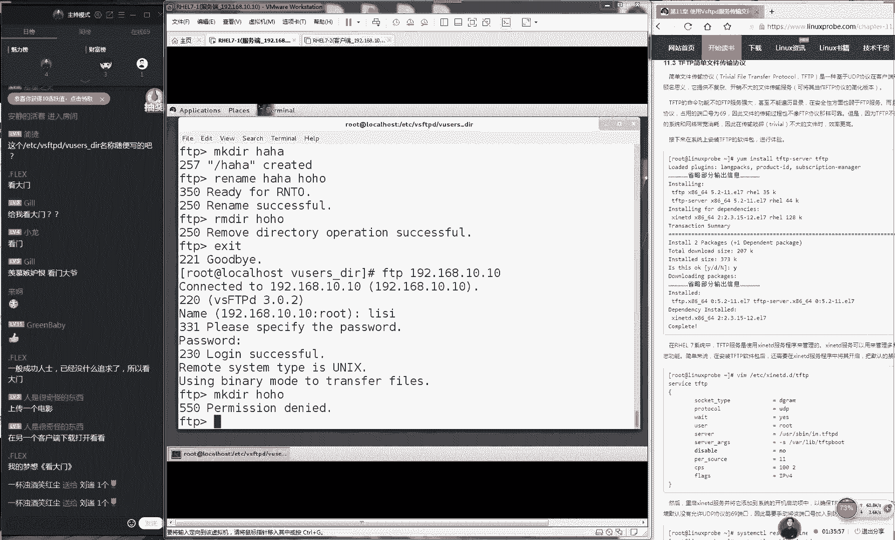

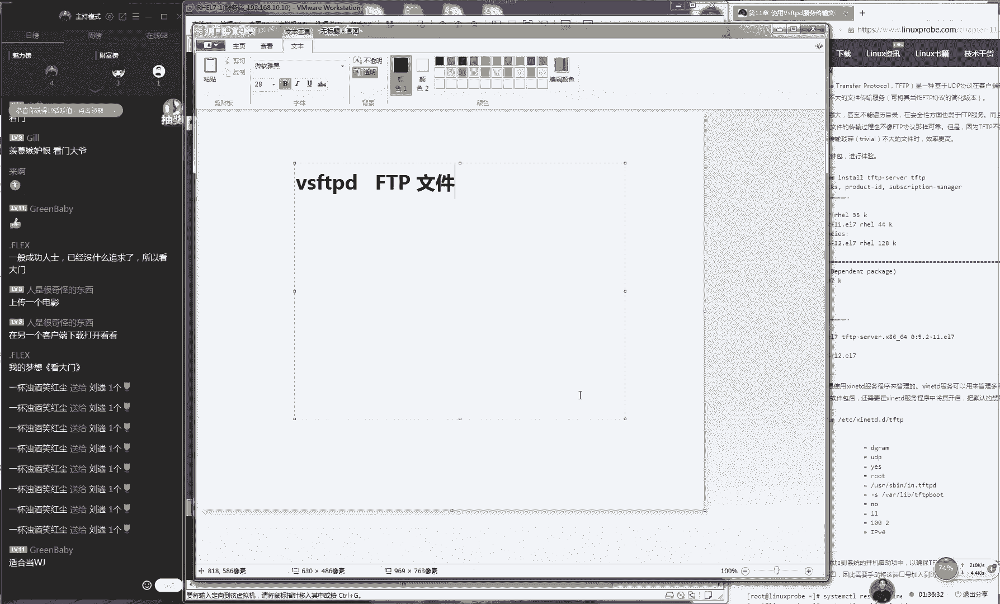

登口号不加上我们这个IP地址，你也可以来去访问，也可以的啊。但是因为我们在这个linux里边，他没有登他没有这个配网啊，所以我就没有办法去访问了，可以去下载文件什么的。然后你看一下啊。

那你看那这个文件这个权限啊，还有这个协议它好是好，但他他他也很方便啊，它可以来去传输我们这个文件什么的。但是吧我感觉什么呢？😊。

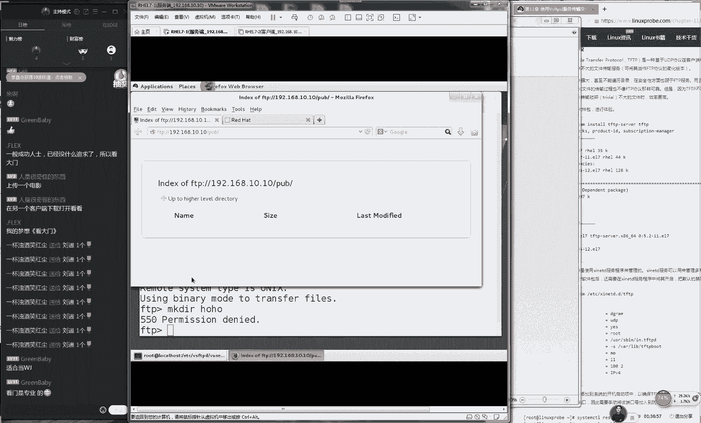

太难了啊，大家有没有感觉出这个实验我们跟才巴拉巴拉，我们连着讲啊，我们在认真没闲着啊，我们从头开始去配到这个到到我们把它配完一个半小时。那你说这个这太难了。

我都不会以后我们工作的时候呃这个不是很low了，我这个不是太low了，就是说太难了，这太这个这个太嗨了，怎么办呢？所以给大家讲一个非常简单的，不是我们这我们啊我我们还没有到啊。

我们这个服务我们叫做TFTP我们叫做简单文件传入协议。简单文件传输协议。咱比如说我呃您就是想来去传输一些比较简单的文件的话，咱比如说我就想去传一些特别小的文件，而且我也我也我也。😊。

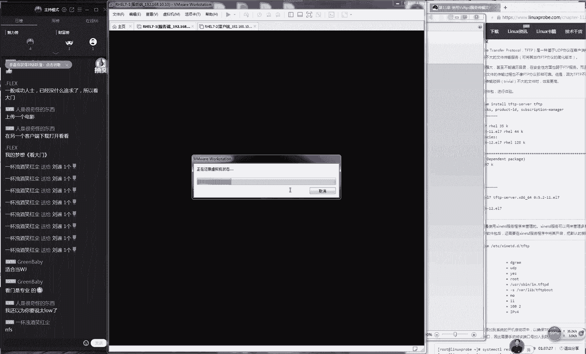

不太需要让用户进行验证啊什么的，一些非常高级的功能。这样的话那我们就可以是使用到。😊，这个TFTP文件成呃。这个协议它叫做们简单文件传收协议。

它是非常简单的那我们再来看一下说它是怎么样的一个简单的一个文件传售协议啊，它的这个协议就叫做TFDP它跟它是个它是跟FDP效果差不多。但是TFDP它所占的端口号是69。😊，协议类型为UTP协议。

大家可以来去记下来，这就是我们叫做啊简单文件传输协议，它也是一个协议啊，它不它啊并不是我们像刚才所讲那个呃。😊，好，进行验证这么一个模式了。好了，那我们现在换一下我们这个虚拟机。

然后来去安装一下我们我们这个TFDP吧。然后我们叫做TFDP这个是我们这个客户端的工具。然后我们再安装一下我们的这边服务端，就是serv，这个是我们这个客户端跟我们的服务端的这么一软件包。

我们来进行一个安装。😊。

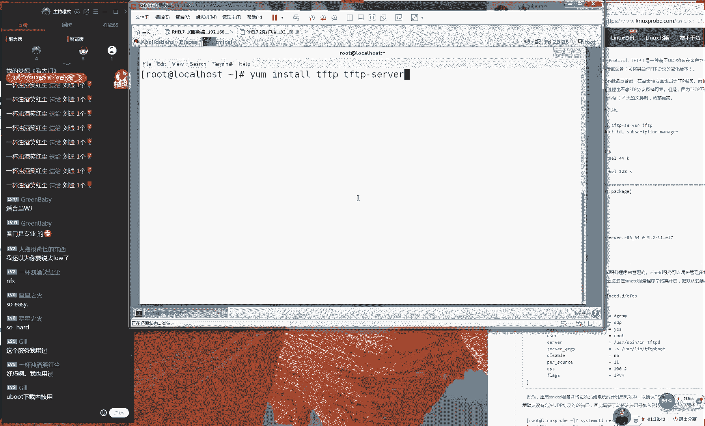

大家如果您要之前的话，学习过思科的话，用来去传输过一些啊配置信息什么的，或者说传输过日志的话呢，应该以前是使用过这个服务的。因为我当时我上高职的时候，啊，大家之前应该用过，对不对？然后我的一个朋友。

他们就玩这个网络方面，玩思科设备的，玩这种交，他们是玩交援机路由器什么的时候，他们就要去使用这个要去传一些比较简单的一些数据啊，或者叫什么固件什么的，对吧？好，那我们先看一下啊。😊，呃。

然后的话这就是一个非常简单的一个文件成协议了。他都没有自己属于自己的这么一个独立的一个程序。它是由一个服务叫做星奈所管理的那这个服务的话呢。

它是在ETC目录里面叫星这个服务他非常简这个服务的话用来专门去管理那些非常小些服务的好，那来编辑一个配置文件叫TFP一回车说上大学老语我们上大学的时候，我老也一样的。所以我上大学时候。

根本没我没有想我要去学这东西真的我不会那些励志文章里因为初中没好上职高。后来图强上课好讲什么真的不是因为我所学习的一些东西根本上大学他没有去教甚至他们都不会会的。所以说你要上大学的时候，我们说客气。

如说你上大学的。😊，然后你还在指班老师给你们教12345，指班老师在给你们教技术，靠老师教东西再去学习，一会还low了，真的是那真的是。😊，对了，这个心态就我上大学的时候我我我我给大家聊啊。

我上大学的时候，我第一礼拜的时候特别的生气，因为我觉得老师在耽误时在耽误我时间啊呃，我上大学第一周我是这么一个想法。后来我升气到什么地步呢？就是我那个学校是在昌平。😊，后面都是山，我下了课之后。

或者说我今天我就我就我那我就不去上课了。我因为我第一天我上完课之后特别的生气，然后我我第二天我就不我就没，然后后来我就我就没上课了，第二天第三天我两天我在山上过的。

我就其实说我就我我就然后我自己就上山了，然后就发泄一下嘛，我就上了山了，然后两天就没回来，后来。😊，后来才知道我们这个学校就是他就是这样的。然后后来的话呢，我就把我们这个学校啊。

我们的学费每年是6000块钱，我就把这6000块钱当做是一个每天叫床的这么一个服务了，对吧？就是每天叫我起床的这么一个服务了。因为我要毕业，所以我每天我早上起来，我8点钟我要去班里面坐在那那边。

然后就签到。其实我就把就当做是一个闹筋的一个服务了啊，所以说我就再也没有对这个课程太多这个。😊，要求就说我也很放松了，然后也可以去干自己的事情。所以我上大学的时候就开始一直一直在去做自己的事情。

而且我们学校比较松啊，然后我就学完了就一边去写书什么就开始去做了，其实也是好逼上梁山。其实这个学校就是这样的，所以我一直认为啊就是说如果你上大学的时候，你在上课时候你好好在听讲。我觉得这个东西是不对了。

因为你上大学的时候，你都已经是20岁了。你都已经成家立业了，你都早应该有自己的方向了，而不是在听老师他讲什么，你就认为哦这个东西是好好好，我就有帮助，你要有一个很明确的一个职业规划。

你没有一个职业规划的话呢啊，对不对？我们就。😊，过来听我讲课了，对吧？然后我们就可以忽悠到家骗钱了。好，接下来我们来给大家去说啊，我们说那么多没有用啊。因为我们今天看一下时间一个半小时了。

给大家聊聊段子。😊，啊，然后我们来继续说啊嗯。我们这边的话就是我们这个TFDP协议的一些。参数。然后第一就是说我们这个这个协议他使他所调用这么一个账户，还有我们这个程序所在这么一个路径。

然后就是说diable代表就是禁用的意思是我们禁用了我们的F协议这个什么意思？中国人说话别在因为中国人就是行和不行但外国人说话是否定数因为这个他们这个外国人说话喜欢否定式的。比说我怎么会不去喜欢你呢？

什意思听者说你这个事情你要是不这样去做，那肯定你肯定就是做不成绕？或者说你这你要是不的话，那你不知道这个饭有多难吃永远都不知道这个有多难吃正么着一个非常绕口的啊，但是你知道有一个小技巧啊。

如果说他说两次否定的话，表就是一次肯定一个给你去拒绝你我永远啊都不会去不去喜欢。😊，你的那你这样去。想一下，那他就是喜欢你。好，那也就是说我们是一个禁用的一个参数啊，那我们就把它给它改成个no。

代表就是我们不要去禁用它，那你不要去禁用它，那也不就是启用它嘛？对吧？然后把它保电源保存名退出。这个时候你只要去重启一下这个。那么这样的话就可以代表就是启用了TFTP了哦。😊。

因为可能中国人说话比较直白，所以说你可能一开一开始上来，因为这个什么不要否定，不要否定，对不对啊，禁止不要去禁止这边反应过来了。但是你知道说你不要去禁止的意思就是呃不要去终止他的意思。

代表就是开启他的意思。你看4次表示肯定啊，咱4次肯定表示否定，那这个什么意思，四次肯定表示一个否定，这大学生能举个例子吗？啊，行，然后。😊，呃，我们来做好之后的话呢，我们现在给大家去连接一下我们这个。

😊，呃，TF呃我我我们这个TFTB服务的话呢，会在我们后面给大家下去讲到。因为我们在还因为我们现在还是在搬砖。😊，呃，我们这个实验的话呢会在第十9章的时候，第十9章的时候啊会给大家讲到啊。

说是是是是你说的对啊对，这我们中国语言嘛很不大精深。好，那我们这个呃TFTP的这个加目录的话呢，它是在万目录里面。😊。

的FTP不目录我下要下讲了啊目录里的b里面的TFP步目录这个大家记一下这个目录就是我默认的所在加目录我们先走进去啊。

因为我待会只能进行下载给我一个文件这个文件说我们做们一些信息写一乱七八糟信息写文件里好，那我们退出掉那比说我现在是一个客户我下载文件的话我们来右键点一下说你不要钱不要不要过来。

那我现在登录到我们这个系统里的话看一下我这个桌面上面他没有文件吧？好那我这在我使用T登录到这个服务器98点点走你。😊，然后我们来去get一个文件，get一个文件。

我们好比说叫做哈哈点它不能够去查看我们这个目内它有哪些文件。因为我们所讲的TFTP它是一个简单文件传输协议，它过于简单了，它连去查看我们目哪些文件权限它都是没有的。

所以说我们需要自己去知道我们文件的这么一个名称。然后来看我这边左边123你就可以下载到我们的文我们这边的这个服务器上面的这个这个文件了。它可以看到这就是一个非常简单的文件传输协议了。我们叫做TFP好。

这样的话呢我们就给大家去说了一下啊，我们这个TFTP的这么一个作用。😊。

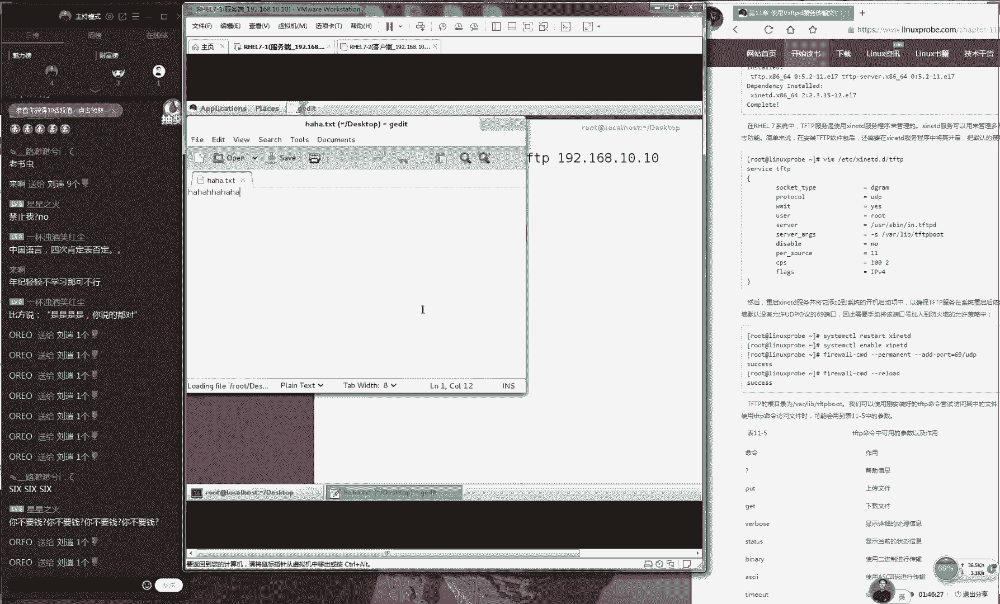

呃，非常简单，他就是用来去做简单文件成这么一个协议。他用来去实现出来远程的这么一个。😊，只能的文件传输的。好，然后啊好简对他就他他就是一个非常非常简陋，就是一个只管饱，不管好，不管吃好这么一个服务。

他只能够让你能够满足基本的一个文件传输书协议。你不要要求他有什么什么验证啊什么么怎么着没有那么高功能，它是一个非常简单的这么一个实验。好了，话呢我们因为我们今天实验比较多。

我不给大家聊虽然说我聊的时候可大家想聊的时候，我把它打断啊，然后因为我们今天课比较多，我们先给大家讲着啊，今天我们肯定讲不完第十2章了多讲如果要是讲完的话呢，说明我就不负责任了，因为我讲太快了。

因为我要是因为你也知道啊，因为我要是给大家快速去捋一遍的话，你们也听不出来，其你们真的是听不出来，我们做实验时候不讲细了一个参数过去，或者说我不讲了没有意义。以话我们这个课我们一定要慢慢去讲不要着急。

我们今天还是啊顶多顶多，我们今天只会讲到12。1小节仅此而，我们把这个课拉长点，对吧。😊，说我是因为我小时候比较穷啊，所以说家里有家里有块巧克力，我们家都会说你别吃那么快，你吃的长远点。

我们慢我们来去慢慢来去消化我们这个知识啊。跟SC的区别有区别TF它是基于了我们的T协议我们我们个我们的个S基于的SS基这个协议是不一样的。嗯好，然后我们来说一下紧来说一下我们这个下面这个事件啊。

我们叫做桑吧。我们接来讲完好吧啊，我们讲第12。一小节啊，话们来看一下这个服我们先看下这个服务的一个来历吧，是这样的，我们很讨厌就是说直接讲课的，我们总会给大家先聊一聊，就是说这个服他怎么来的？

他能够干他能干什么事项。如说我们之前给大家聊过说。😊，我特别喜欢伯利大学，美国加利呃呃美国加利福尼亚大学伯利分校，我特别喜欢这个学校。然后我给大家巴拉巴拉，我们讲了好多。😊，包括第四包包括说第十三章。

我们会再给大家去吹一下那个伯克利的那因为第七章讲的那个瑞的跟第十三章讲那个啊ban的，他们都是由博克利大学所研发出来的。好，那我们来聊一聊这个桑这个协议。好吧，是这样的啊，他在1987年的时候。

由微软公司和英特尔开发出来的一个协议叫做SMB啊，叫做它叫做这个他有一个协议叫做这个呃SMB协议。嗯。😊，这话它是用来去做呃局域网内的文件传输的。你看这就是用来做呃它用来去做我们局域网内的文件共享。

它也可以去共享我们居域网内的那个打印机啊。这个技术非常的常见啊。因为你见过打印店，或者说你们公司的一面肯定会有打印机，他可能就会通过这他可能会通过这个域网来进行一个共享。好。

这就是一个文它就是一个居域网内文件共享的或共享打印机这么一个协议。后来还有一个大学生，这他又写出来一个服务叫做SM它是全球首第一个，他是全球第一个。😊。

开发出来了跨平台的文件共享的这么一个写议的一个作者。好，它实现出来了我我们的linux与我们的windows的共享。我们原先两个系统它是不能够共享的，它是不能够跨平台进行共享的。

而它第一个它实现出来这么一个跨平台共享。另外我们来说一下我们这个共享跟上传下载就跟我们刚才讲那个传输的一个区别啊，传输的话呢，你想下，你现在举起你的手来把你的手转成一个拳头啊，转转有两个拳头。

然后你看啊。😊，你传输的话，就是将你这个左拳头那个A，然后传输到你的这个右拳头B，然后再把然后吧再从那个B传文件传到那个A，它是一个文件的一个传来传去的这么一个过程。它用来去传来传去的这么一个过程。

但是这个共享，它就不是这样的，它这个共享是我这个左拳头A可以去你的这个右边直接来去编辑这个文件。现在就因为你现在就是一个共享出去这么一个效果。所有人都可以在你的这个服务器的本地上面来去修改这个呃。😊。

里们的这么一个文件内容的，所以说他也是跟我们刚才是不一样不一样的。但我们要看一下效果，大家就明白什么意思了。然后啊说这么一个大学生呃，说为什么还是个大学生啊，因为他很他也是一个很厉害的。

而且我要跟你们说啊，就是我从来不会说信哈佛耶鲁的学生就怎么怎么样，我不会去信，因为你们想过一句话啊，这个东西他都是辩证的哈佛大学我们都是他的好，对吧？他是世界上最顶尖的。

甚至他说他是世界上最顶尖的一个大学，但是你有没有想过去想过一个问题，哈佛他为什么好。😊，是因为全球的因为他这个哈佛的学生就是来自于全球的精英了。你想一想是不是这样的。

因为咱因为你们知道哈佛在中国每年招生人数是10个人，把中国的那个精这个精英提炼提炼出来之后，14亿人里边提炼出来了10个人。那你说这都是精英的那你精英你去了这个学校了。那你然你就是一个精英大学嘛。

那你最后你最精英的学生，你去了最精英的大学，最后出来之后是精英没有什么变化啊。但是如果你是个不学习的话，但是你最后去了一所职高，但是你出来成了一个有用的一个人成了一个书籍的作者了。

那你这个学校那我觉得意义比哈佛还要大就是一个哈佛但也很好啊，但是说就是说那因为你这个学生都是最精英的学生，你去了最后但你就应该你是最精英的。

如果说你最精英的这个学生你去了这个哈佛最后你出来之成一个三流的一或者一个二流的一个学校了。那是是你就有问题了。😊，好，我们说这么多啊，就说这个学生啊，他还是他是呃上大学的时候就写出来这么一个服务的。

叫做个啊叫做这个桑吧。后来的话呢，他被一个人所看中了。这个人的话呢，就是叫做linux。哎，我们就夸点自己好不好啊？然后话就来说啊，他被一个人给看中了，这个人叫做linux。

就是我们这个操系统的这么一个创始人，就是因为这个孩子他他他他他他去上学的时候，他没有加入什么学生会什么去混日子，开发出来这么一款特别好用的这么一个软件。后来被我们的linux所看中了。后来他就。😊。

带着他一起去创建出来我们这个系统了。但带着他很长时间，我们从我们资料上面来看的话呢，他们认识应该开始去呃一起工作啊，至少有10年多时间了，他们就一直在一起去工作。然后他很厉害嘛。

这个人这个两他们都是一个极客的精神。后来有一年发生了一件事情，就是。😊，这个系统的话呢，我们变得越来越大，它需要一个分布式的一个软件了。后来有一个厂商啊为免费为他们去提供了一个商业的一个授权。

当然来说非常感谢啊，后来就是这个作者就是这个的这个作者，因为他是个极客，他不是个商业人，他要想来去尝试去破解人家那个程序来了。后来就让那个人家发现了后来就人家就是就就很生气嘛。

然后就警告这个linux啊，还有我们这个操作系统就把我们这个版权给他去掉了。所以说的话呢我们原先我们的linux系统，他是寄托在了一个收备的一个平台的。后来啊人家不要我们了。

然后我们才自己又开发出来一个新的一个技术，我们叫做是说啊如果要是没有这个孩子，他后期去破解人家那个软件，然后人家。😊，再一生气，把我们给赶走了。那我们的linux大神，他也就不会去开发出来jet呃。

那就也就不会有。😊，后面的一个网站叫做b，那也就更不会有最后由微软花了重金把这个给收购走这么一回事。所以说这个人啊他对于这个开源行业的这么一个作用。

光一个人害知道人他不光写出这个桑他是个人的这履历漂亮说他是做桑先不是叫做S个还官方一？他孩他不光技术，他还还这个商这个做生意眼光他说好使那定会有一些版权。

所说但你想也是开发出个特个软件等怎等阿里马云腾讯收购好了。😊。

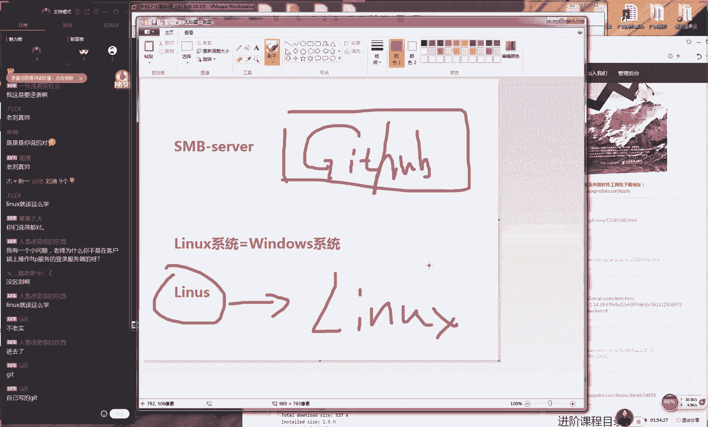

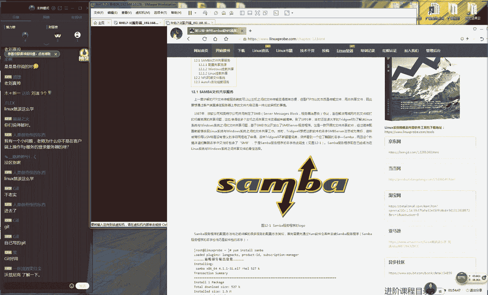

收购你花个几百万块钱，那不美那不就很呃呃爽的事情，对吧？他要去呃他要就去工商局去再去注册那个商标，他像将你自己的这个软件注册成一个商标。后来那个哎工商局的话，说你这个软件吧好是好，后来的话。

但是你这个SMB我们不懂什么意思啊。因为你知道是一个计算机里面的一个名词我们不知道啊，所以说这个东西他没有用，他没有因为当时的美国的法律就是说如果这个词没有什么意义的话呢，比如说你瞎打一串词啊。

那我像我的公司我的我的呃我的公司叫巴拉巴拉巴拉巴拉这个不行啊，你要给一个含义的。虽然说我等着你虽然说我知道。😊，他有含义，但是你要把，但是你要有一个公开的一个解释的。虽然那个孩子之后回去之后啊。

那天晚上估蜜睡着啊，我我因为我我也因为我因为我也是姑家，因为因为我也不知道他当时是有他他他有没有睡着，就是说就是说他那个回去之后他去翻字典，他发了这么一个词叫做桑啊SAMBA你看这个桑这个词里边的话呢。

他既包含有了SMB这三个字母，而且的话呢。😊，这个词还是来自于一个巴西那会的一个舞蹈，叫做桑巴舞。大家有没有看过桑巴舞，也叫还什叫什么草群舞吧。

因为我有一回我看那个春晚的时候就请了几个巴西那个当地本地军民嘛，后人家拍着鼓，你们记得好像就是去年啊，当时李勇还在呢？你们有没有看过那一集就是好多这个非洲人，然后过来跳舞来上春晚说那个舞蹈。

你看这个意这个意思也挺好。看这个桑吧热情啊洋溢，而且这个里面它又包含有了这么一个我们这么一个协议的一个名称，所以说他就取了这个桑吧这个词为我们这个服务程序的一个名称了。

因为它里面包括有了我们的SMB我们的协议的名称，这个词的用意也挺好对吧？这个词我觉得这个用意也挺好，那我们就把它叫做这个SMB啊。😊，多了两个A啊。好，然后的话呢我们继续来给大家去说啊。😊。

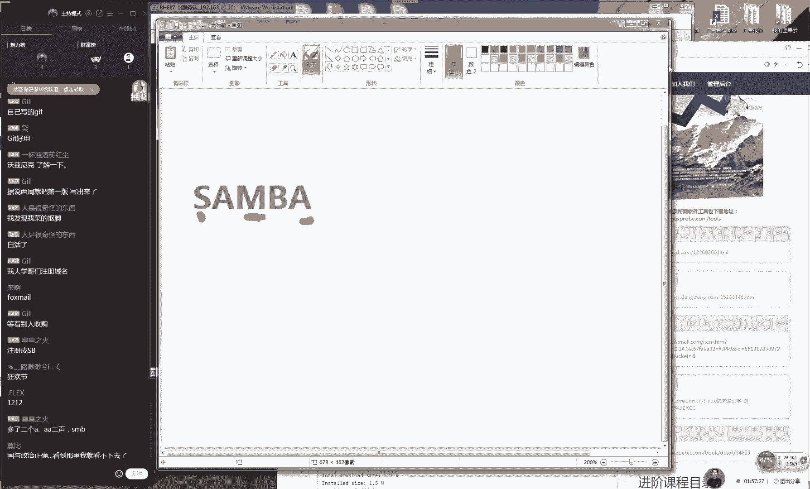

嗯。啊，怎么样说啊，国语政治政确啊，然后这个就是一个呃舞蹈嘛。因为你看我上回我记得春晚的时候不就有这么一段吗？因为我去年的时候。😊。

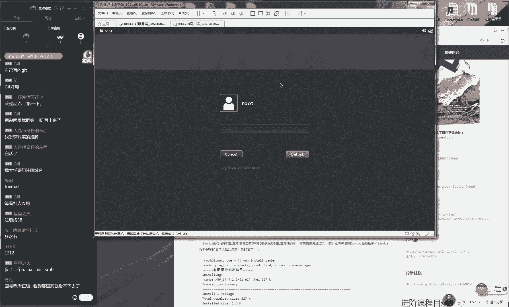

还有去天我我看春晚了吧。去年我看春晚，他就有这么一段舞蹈，你们可以去网网上搜一下啊，真有这么个舞蹈的，不是给大瞎编出来，叫这个桑巴舞叫桑巴舞。你们可以去看一下。我今天我还看了一个舞是新西兰的。

因为我弟弟在新西兰嘛叫新西兰战舞，那都是很有热情的洋溢的那种舞蹈啊，你们可以去看一下好，因为新西兰那叫什么毛利战舞都是很热情的啊。好，那我们现来去安装一下我我我我们这个服务程序啊。

然后大家看一下我们这个效果。😊。

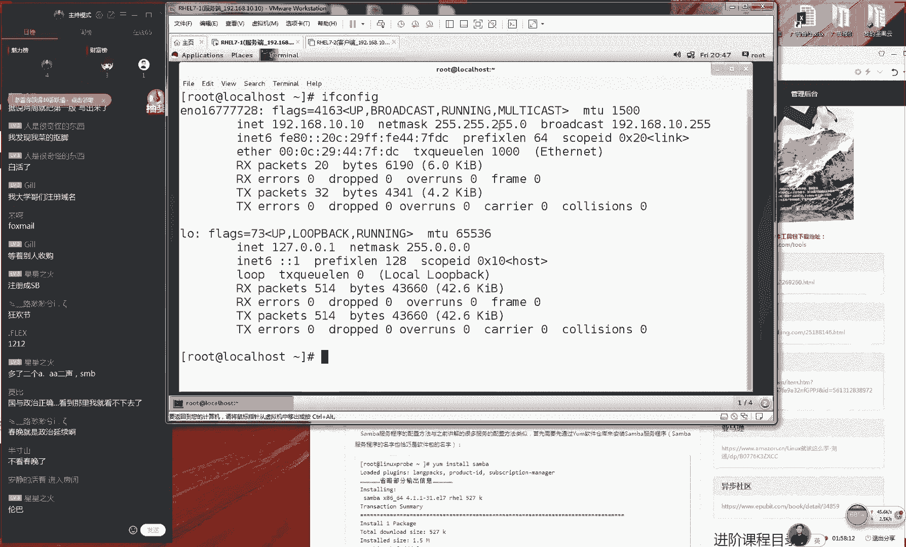

好，我们安装一下我们这个桑把软件包。好，我们在安装啊，我先喝口水啊，等我一分钟。😊，好，那我们接来说啊，所以说这个嗓子啊一定要休息。我说我怎么这个嗓子最近老难受呢？你说这在这一下讲两个小时。

那是也受不了。好，那我们接下来给大家说啊，可能就是每一次讲的时间太长了。😊，所以这个嗓子太老容易受伤，你在意呼吸这雾霾，对吧？就有点黑能点受不了。好，那我们先接着往下讲啊，大家先嗯打一下一外同学们。

现在还能听得见我说话吗？好，那我们打一下一同学们。😊，哎，可以是吧？好，那我们继续啊。好，那我们先安装好我们这个连包之后的话呢，我们就来去编辑一下我们这个sbuff程序的这个主配置文件了。

你看一下这个主配置文件。大家看完之后慌啊，慌不慌？嗯。大家看一下我们这个的文件，你看完之后慌不慌然，往下往下拉一拉啊，大家看到我说哎还慌啊，这个怎么会慌，你这样你看半天你有多少这个参数。

你总共看这第一条，对不对啊，不要不大家看一下啊，就是我们这个文件的话，你看啊大家说说来看一下啊，这个文件你记住啊，这个文件有多少行有320行320行，然给大家玩一下那我们也可以进行过滤嘛。

所以分号开头的也是注示行，所以分号开始的们都是注示行好，那我这SM改个名字我给改个名字然后我们现来进行一个过滤过滤出去所有没有过滤所有没有包含井号行的行我这样去做使用就是过滤出来所有没有包含有井号行就个选嘛吧？

对进行一个反选反选。😊，所有没有包含于几行行的这个参的这个参数。然后的话呢我们再来再再进行一个二次过滤，过滤出来所有没有包含有了分行行的行在油价回收。OK再我们继续的话呢。

我们还要说这个呃空行空行可以这去做啊，空行是由这样的代表。😊，GIP杠V空行这呃大家去点住你你的这个shift键，然后敲一下你这个键盘上的那个6，再家去敲一下你键盘上的那个4，这代表就是一个空行。

我们敲一下回车。这样的话呢我们就过滤掉了所有这个井号行，所有的这个分号行以及所有的这个空行。最后将我们过滤出来的这个结果，写回到我们原始主配置文件的那个名称里面搜你好。

然后我们来去编辑一下我们的呃配置文件，只要能够编辑好，它只要能够过滤它们这个效果都是一样的。然后你可以看到啊，就是我们现在有了320行的这个。😊，内容。那我们先看一下，我们的话呢，之前有320场的内容。

而我们现在过滤之后，它总共。彩纸剩下了。3呃320行变成了20行，我们过滤掉了300行。大家看一下我们现在的这个配置文件，你们还慌不慌啊，我大家可以打一下一和2啊，就是我们刚刚有320行的内容。

而我们现在比较吧唧过滤。😊，就变成了20行。哎，大家说这个就不慌了。但是同学们还说啊还是有点慌啊，比如说我有点坏同学跟一辈说有像红尘同学是吧还是有点慌啊，这个怎么办呢？我们其实可以还进行过滤。

你看啊我们这个后面这个第十四行到第二十行指的是我们共享打印机。那我们现在没有啊，没有必要删掉它。😊，好，第十行到第第十三行代表就是共享出去每个用户加目录没有必要啊，而且不太安全。删掉它。好。

然后现在还慌不慌，你要慌的话，我就把删啊，这还可以没有用。第第九行它第八行代表就是是否加载打印机以及打印机这么一个参数，这也没有用，可以把它删掉的。所以说你可以看到它总共是有了7行。

但是我觉得删不太好啊，所以说我们就保留这么九行嘛。好，那所以说你可以看到啊这个不要再慌了啊，所以说你可以看到我们这个配置文件，实际上它有用的信息，它就有这么行，就这也是叫大家一个思路。

因为我不可能大家去几年几年时间啊，但是的话呢我们就希望给大家一个配置一个服务的一个思路。第一来说你不要管你配置文件，你有多你有多长，但是我们心里要知道我们不要慌，当你以后再配置服务的时候，心里不要慌。

一定要知道1234它怎么样的一个配置的一个流程，这样会比较好啊，撤回。😊，是在命令模式下对点一下U。哎好，那我们继续往下来说啊。那么我们下面几行就要给大家讲一下他每一行的这么一个呃用处了。

第一来说就是我们共享的名称，这是我们用户啊呃。😊，啊，这个的话它是我们这个共享的名称，这个是我们共享的一个用户组，是这样的。如果要是组相同的话，那我们在这个计算机里面的网呃网络邻居里面。😊。

就能够看到这个共享了。所以说这个呃标识只要是一样的话，它可以进行共享。下面就是说我们呃共享出去那个信息。那我们可以让对方知道我们这个服务器的版本。

还有我们这个系统这个系统个记录成这个日志以及我们大小来说是记50个K他会把这个系统这个问的信息。还有我们下载文件这个信息，记录到我们这个系统里面的保存成这保存成日志，还有我们这个用户验证的方式。

我们选择是我们这个账户和密码，对，这个是我们的这个域啊，我刚说是工作组是吗？这应该是我们这个工作的域这如果说我们两个用户如果说我们两个服务器这个域是相同的话，他们就可以去共享我们这个相关资源。

还有话就是说我们这个数据库的这个账和密码保存类型这是一个我们叫做这个TDB一个数据库的一个方。😊，同时来去保存我们这个账户和密码。所以说我们待会啊我们就要这样去做。

现在在我们这个系统里面有这么一个本地的用户，我们叫做它必须要是已经是存在的一个用户。然后我们将这个用户给加入到我们这个桑的数据库里面可以一个验证叫做代表就是我们第一次需要加就可以了。

代表就是我们来将这个用户加入到我们这个数据库里面代表用户的名称。然后那我们就可以将我们本地的这个的用户给去设置一下我们专门用来去验证我们这么一个密码好了。😊，这样做好之后的话呢。

那我们再来去新建出来一个共享目录。我们好比如说我们叫做datbase。然后我们将我们呃所有者跟所有组不这个没有呃这个没有关系啊，这也也还好吧。然后我们将这个权限给大家设置成77权限。

让我们这个其他人都可以来去写入操作。但如果说您觉得这个不太安全的话呢，那我们可以将呃这个步骤给大省略掉，然后把它改成就是我们的所有者跟所有组是叫做lin只要能够保证自己能写入操作，就是足够的那我们现。

😊，做好做好之后的话呢，我们插有一步去修改Slinux啊，这步骤其实可以不用去做了。我们的Slinux其实可以不用去做，但是我们需要去开启一下。😊，呃，我们的s访问权限。那我们可以来getD布值。

因为它会受到我们的S的限制。因翔也知道我们的这个呃我们的S肯定会限制我们这个行为。那我们具体限制哪一条行为呢？那我们就开启这个代表就是我们开启我们用户的访问权限。好。

然后我们来去setSE布值杠P代表是永久生效的意思。😊，我们来去开启它，大家不要跟着一边去做啊，因为跟不上的，你只看一下这个流程就好了啊，然后我们下课之后去看视频的时候，可以去暂停，然后再去做这个实验。

但是我们上课的时候，现在就是去吃饭啊什么都可以啊，千就但是就千万不用去做这个实验。😊，好，我们先设置一下我们lin好那那么好之后那我们现在返回来。那我们现要就创建出来属于自己的这么一个共享信息了。

那就像我们这个仓库一样，那你有自己的这个共享和挂载这个信息，上文跟布值是一样的，上海文我们不需要去修改它。因为我创建到一个根目录里面它不会受到我们这个上海文的这么一个限制。

所以说这个我们可以把省略跳因为我们书上面写的是目录嘛，所以我们需要修改上下文我在根目录，都它要是不用的。好，接下话我们来去创建出来一个挂载的一个名称，我们说叫做个大家需要注意啊这个名称它们不是没有用了。

我们待会去挂载的设备的时候，就是的是这个名称。所以说这个如要是写的是呼么的无所谓。😊，待会我我们这边客户端挂载的时候，请您也去输入的是这个名称，是这个中国号里面的名称。还有下面就是一个描述信息。

您可以对于这个共享啊，您可以云端化来描述。比如说呃this就是我们呃。😊，this is a important这是一个非常重要的这么一个目录。好了，然后随便啊，然后我也不知道写对不对。

然后我们给大家对进行一个描述。下面我们来定一下我们这个目录目录的话那我们就叫做d啊。因为我们刚才就新建那个目录，跟对应上一定要跟他对应上hel不显示不了这个水平对不对？我想秀一下我的英语3级A。好。

那我们继续啊我们来拍啊接来说是否来就是成这个公开模式，我们选择是no啊，因为这样的，因为我们希望能够去。😊，呃，进行一个账号和密码的一个验证啊，那我们不希望是一个公开的一个方案模式。

所以说把它可以设置成诺我我我们待会需要进行一个账户和密码的一个验证才行。好，然后我们来说是否能够去写入啊，我们是否能够去写入我们选择是yes。好，做完之后啊，这个非常简单。我们来保存并退出。

重新来去加载我们这个服务程序。然后将我们这个程序加入到启动项里面，保证它下一次能够去生效，就OK了。😊，了吗？还没有了吗啊，我们还没有讲完，还有下一个步骤，请切记呃，需访问的时候啊。😊，嗯，是这样的。

我们的话呢先来从我们的这个远程，你要先去拼一下你这个虚拟机。我们之前讲过，如果说你要拼不通的话呢，请检查一下自己这个虚拟机跟真机有没有能够去通信，你看一下能够拼通。好了。

这个时候啊我那我们准备出来第二台虚拟机。我们准来那啊那我们准备出来第二台虚拟机，我们现在给大家做一个呃演示是什么呢？既然说我们这个服务端上面已经有了sma这个服务了。

我们现在会尝试从windows系统下。😊。

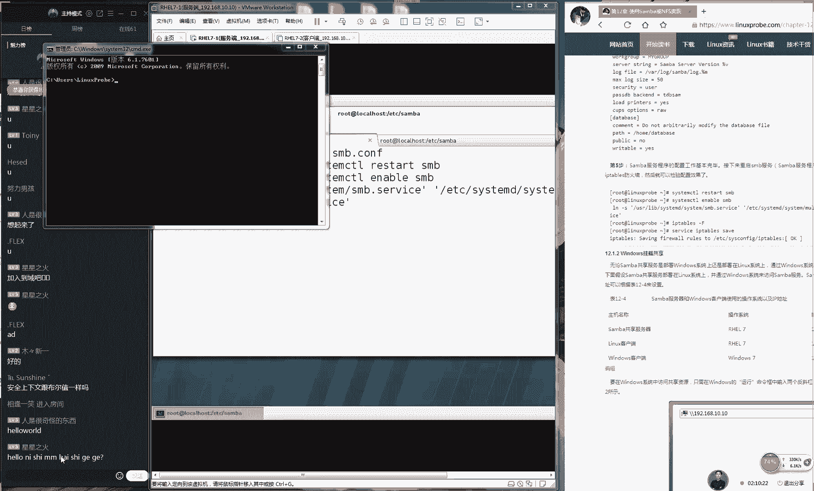

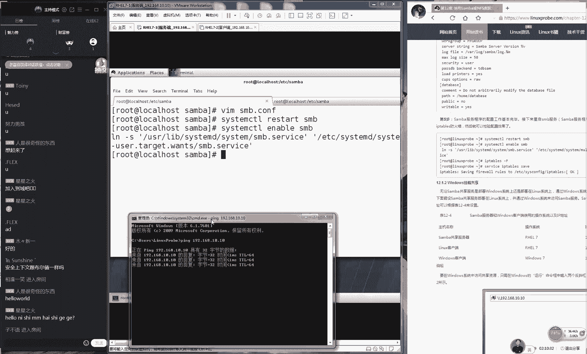

去访问我我们的linux。的这个共享的文件，然后我们还会从linux上去来去尝试访问linux，这就是进行一个跨平台的这么一个共享访问实验。当然我们可以看一下我们的这个windows。

它也可以来进行一个共享的。那那我们怎么去访问这样去访问，后面直接去这样打上两个反斜杠，在我们这边的这个输入框里面，然后就输入19218点10点10。大家如果看不清的话，我给大家说一下。

我们现在点击的是一个开始菜单里面在这个呃运行框里面，我们来去输入两个反斜杠，19268点10点10跳一下回车。😊。

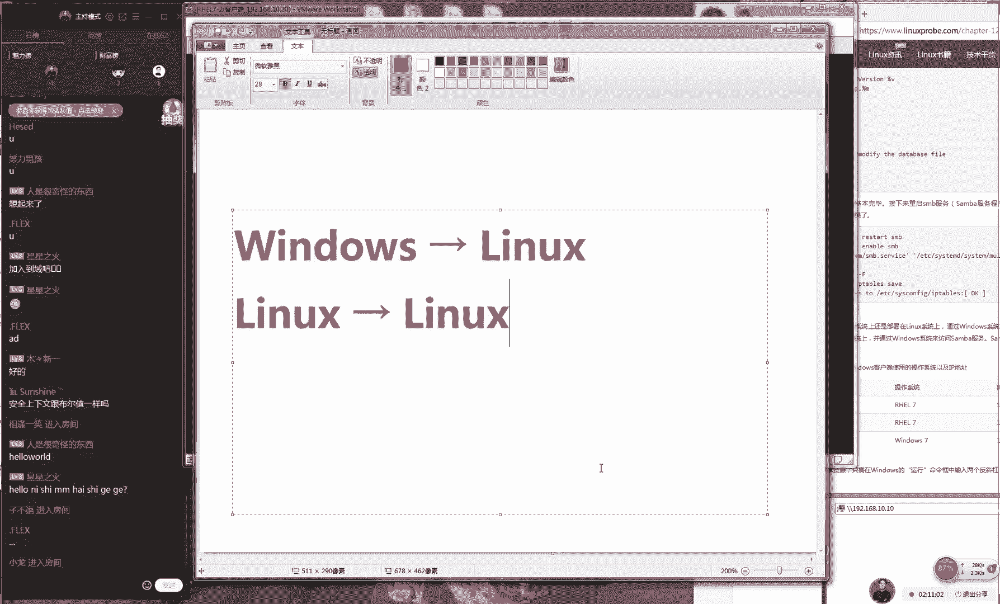

好，大家看到它会提示出来我们的连接超时这样的一个报错。请问如果说您看到是一个连接超时的一个报错，可能会什么样的一个原因？大家想一下，这是一个我们排错的一个思路。连接超时。对，防火墙是什么的？防火墙。

那我们该怎么去解决呢？这是一个排错的一个思路哦。那你看一下。😊，那么我我们的话需要执行一下，对我们的IP tables跟F。大家知道一下，就是我们在配置这个服务的时候。

请切记一定要去敲I table scan这样的话再保证里面这个默认的策略，它不会去限制我们这个你看它呃给你显示出无法访问。当我把它给清空之后啊，你就马上再去访问都没有问题了。

因为它已经是放行你这个防火墙的策略了。😊，好，非常尴尬啊，他告诉我们说好像还是无法访问。呃，好，虽然尴尬，但是我们不要紧，因为尴尬的呃我们看一下具体的原因。

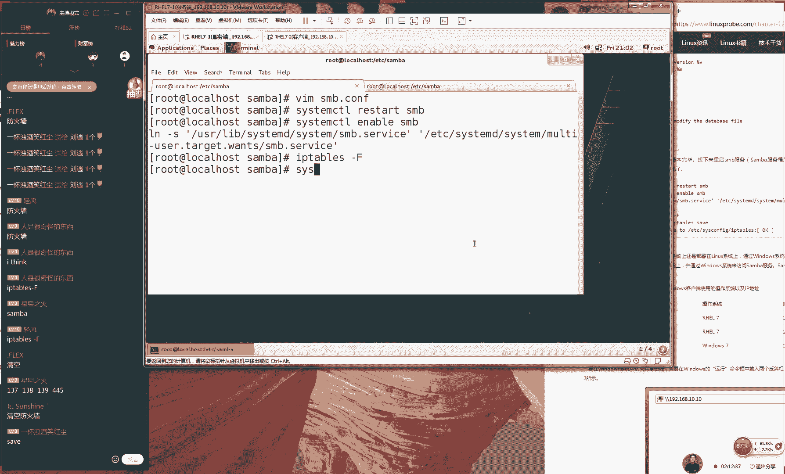

不用去保存，不用保存，因为我们现在没有重启了。拼是能够拼通的呀，拼是能够拼通的。呃，是这样的啊，我我不知道为什么，我这个虚拟机啊奇了怪怪了，他他这个。😊，总会莫名其妙的出对这个地址会被修改。嗯。

因为我我不知道为什么我这个网卡的这个地址它总会莫名其妙就会变。我之前呀它变成192。68点10点88。你们有没有看过之前那个录播的课程。然后的话呢我现在我不知道为什么，我这边会多出来1个100。1啊。

他怎么会很奇怪啊，所以说我认为可能是我这个虚拟机我是通过升级升级过来的。我这个不是一个重新安装的。我这个版本啊升一个很老很老的版本了。大概是在几几年那会儿就开始装了。

然后我这个版然后话我这个软件是从9升级到了1就升级到了12又升又升级到了14又升级到了15，我是通过升级去到了我现在这个15版本的，我并没有重新去安装。

所以说我觉得他这个重新安装跟这个升级的这个过程是有问题的。它这个升级也许就带了一些文件，或者说打了一些补丁什么的，可能呃没有进行一个完全安装或者一些小bug就会导致我这个网卡总会。😊，乱蹦啊。

就乱他很乱七八糟啊，我我就是最后地址，他老设置好之后啊，自己就把自己给变了。好，那我们现在的话来19268。10。10大家去尝试去访问。好，这个时候他让你去输入一下我们这个账户和密码。

然后我们再去输一下我们这个账户叫做lin然后我们的密码叫做访问成功。然后我们去编辑一下这个文件，他告诉你说这个文件响应是失败的。他说因为你没有这个权限。所以的话呢你们很明显。

因为我我们已经将我们这个文件这个权限给它改成717了。那你再不行，你就肯定是我们的Slin的问题了。那你可以这样现在临时去关闭一下我们的lin。然后我们来去访问一下这个文件。😊。

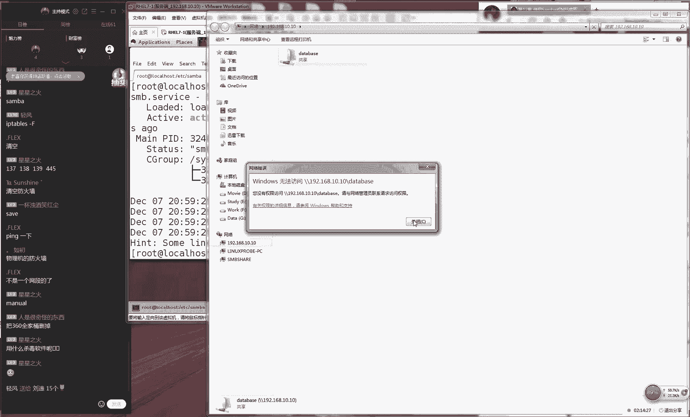

马上它就可以了，是不是它确实是我们的但是这个它确实是我们的Slin的问题。我把它就过滤出来所有跟桑相关的。好，然后我们来看一下啊就不可以了啊。因为我前没有给大家作弊，说我去把偷偷关上了。没有啊。

我现在给大家看一下，说我们可能应该开启的是什么呢？那我们猜一下应该可以呃可能开启是这一条，代表就是我们能够进行一个读取跟访问的这么一个实验。不那代表我们能够进行读取跟呃读取跟。😊，写入了这么一个权限。

我们应该开启的是这一条，我刚可能看的是不太对。好，我们现在看一下啊。😊，啊，还没有来得及猜是吧？想。啊，大家看哎然后就他他要成功了啊，说明啊不是不是说明啊我们刚才开错了，我们刚才开多了。

我们刚才不应该开的是这一条。我们刚才开应该是这一条我开错了。但你看我们这个实验也是很正常的。到了考试时候，如果你要是忘记的话，可以全开没有关系。但你要记一下啊。

我们现开启应该是这一条吧没有讲开这一条读写删一下那我给大家读写删一下我们现在话在我们这边新建出来一个文件就好了，新建出来一个文件然后把给删掉好吧。

然后我们再来新建出来一个文件改个名字说叫flex同学这个里面的内容的话，就是说I我能够编辑这一串信息我们一下保存就写成功了。这个时候你马上我们英语频还可以的们没有必来看一下我们这边这个。😊。

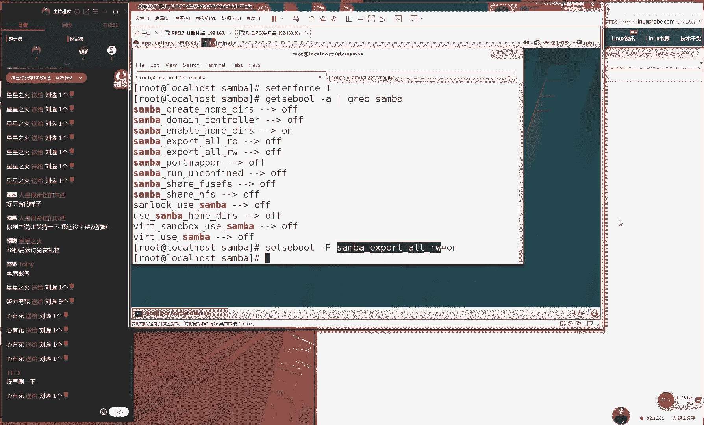

呃，目录里面就马上就会多出来了这么一个文件。这个文件里面就会有了我们刚才写过的这个内容，说明什么呢？说明我们的这个windows跟linux之间，他们已经能够去实现出来文件共享了。

但是哎你这个linux之间你还没有共享呢。我们也要去来去呃尝试来去玩一下。这个时候我们需要这样，先来保证我们这个网络是能够通信的。在做每个实验之前之间，哎，我们都必须要保证我们这个网络是能够通信的。

之前啊第九期的同学也特别可爱的一个同学啊，呃，但时郭这么给我提的问老师。😊。

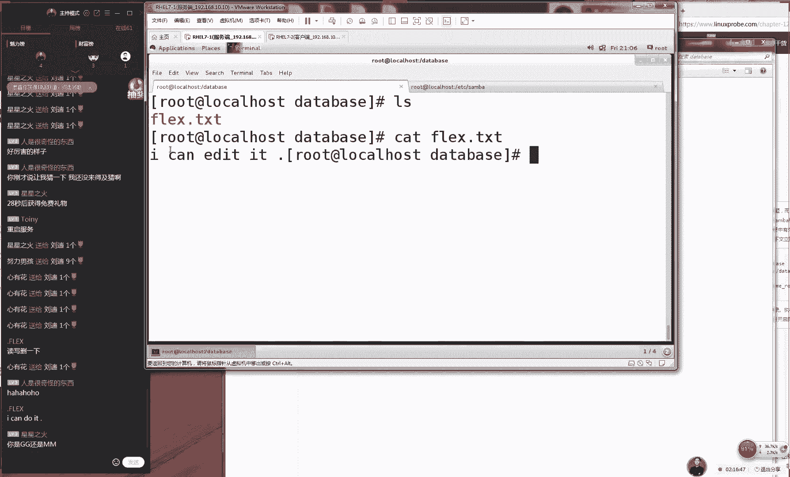

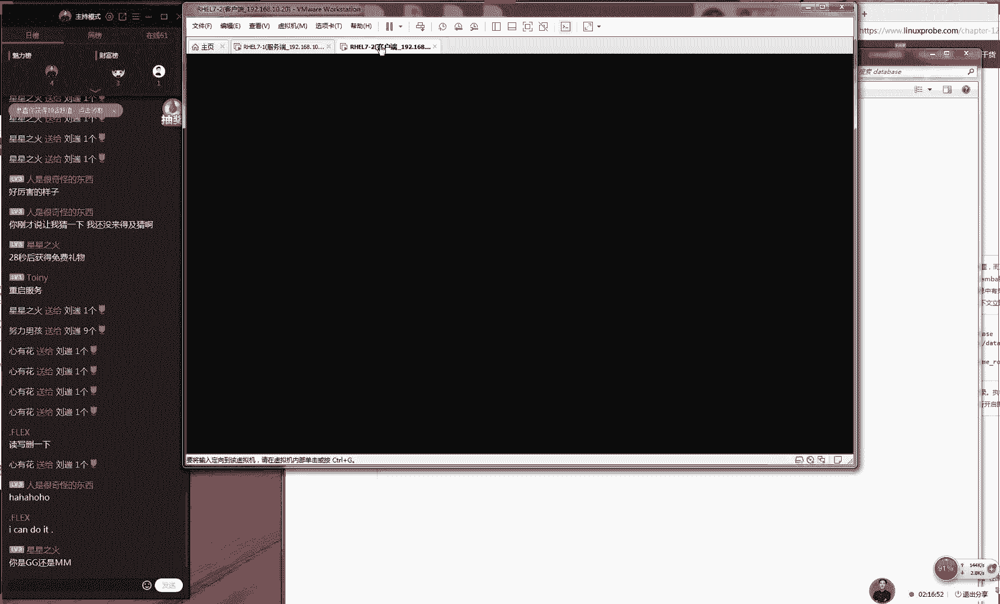

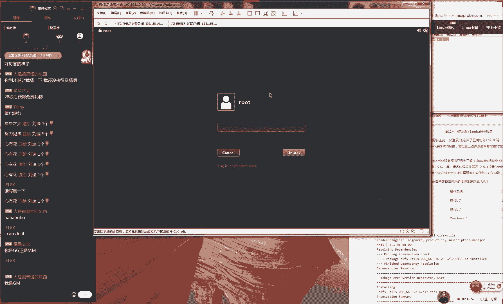

我这个服务出错了，就这么就这就就就这么一句话啊。嗯，我说是服务出错了，给我发一下报错，这这个截图嘛？还给我发截图，后来一看，哎配置的全对。哎，就包括上那个参数大写什么的，特别特别的规范。后来找半天原因。

我说是不是。😊。

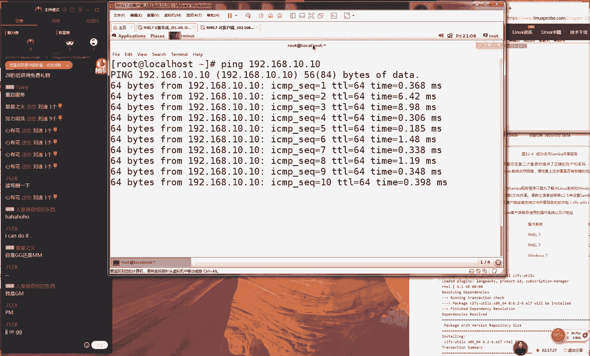

你这个虚拟机你是不是说是你这个是不是网卡没有开呀，开了。😮，哎，你这个服务你是不是没有起，你是不有你是不是没有起来啊，哎起来了呀？哎，那你这个你从你这个系统本地上去访问，能访问吗？可以啊，哎。

我说好奇怪啊，这个实验我说那你再重新再做一遍呢，又做一遍之后，然后说老师这还不行，后来我后来我看了很长时间啊，我大概是从上午10点钟开始给大家说的。😊，说到晚上10点钟，后来我才知道什么原因。

他这个网卡地址他没他没有配对啊，他网卡他没有配。所以说啊当你去配置，大家不要笑说也不大家不要说，哎，老师你经过我们讲段子，怎么可能？但是你要知道就是你在去做这个实验之前。

请一定要保证这个网络这个网络你现要能够去通，然后你才能后然后你才去做后续的这个事情啊，这步千万不要去做啊，就是说啊什么啊。😊，are you a然后我们继续啊这个网络能够通的话呢。

然后我们来安装一个软件包。这个软件包的话呢，我们来叫做CFS它就可以去实现出来我们居域网内来去共享桑就是SM协议了。我安装一下我们软件包可以让我们这个所支持。然后啊是这样的。

因为我们现在这个件辅导环境的话呢，它有一些小问题，我们考试的时候以我们这个网页为准。如果要是练习的时候的话呢，待会验证的时候，就以我们现在所讲的这个方式为准，是这样的，现在编辑一个文件。

这个文件名称无所谓无所谓无所谓。我们叫这个认证点SM然后我们这样去写先写上一个用户名称就是你待会使用谁来进行验证的那我们写叫做然后密码我们待会用户密码的话呢。

我们叫做不告诉你们不要啊们是个非常神秘的密码。然后我们这个工作组这个工作组如果要忘记的话。😊。

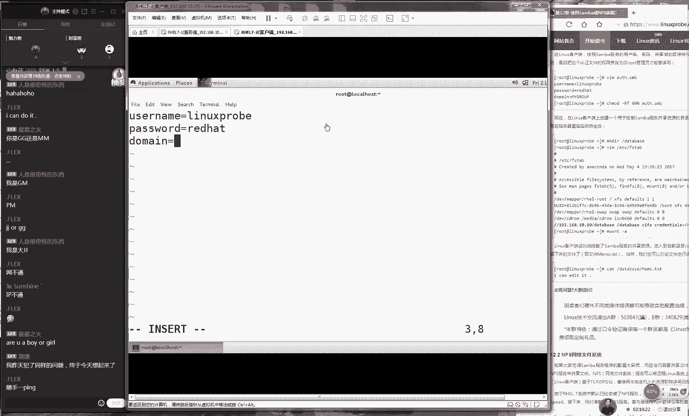

不要给我瞎写啊，一定不要我瞎写，一定要给我过来看一看，对不对？😊，嗨，我们不要瞎写，我们一定要过来看一看，就是说我们具体的工作组的名称。

就叫叫做my groupO我们把它写上他要写要区分啊my group这样做好之后的话，那我们就可以来调取这个文件，通过这个调取文件来进行一个验证了。我们权限为600。

让我们其他人是不能够去呃查看到这个文件内的信息的。然后我们来编辑一下ETC目录里面的FB的文件进行跨操作。😊，你看我们现在所这个后呃这个后缀也是无所谓的。然后我们D一V目录里面。不是啊。

我们共享桑巴的话呢，我看一下格式应该是先写两个写个一个斜杠啊，然后是192。68。10。10。然后我们共享的名称，就是这个就是我们那个呃就是这就是我们该中国号里面写那个名称啊。

千万不要给我写挂载那个路径。然后我们挂载到我们的本地的叫做叫做这个dabb格式写叫做CFS然后我们的认证文件。我们要是通过调取文件的方式来进行验证的，而不是直接把我们这个账户和密码写到我们这个文件里面。

这样他它会更加安全啊，然避免说我们其他的黑客。😊。

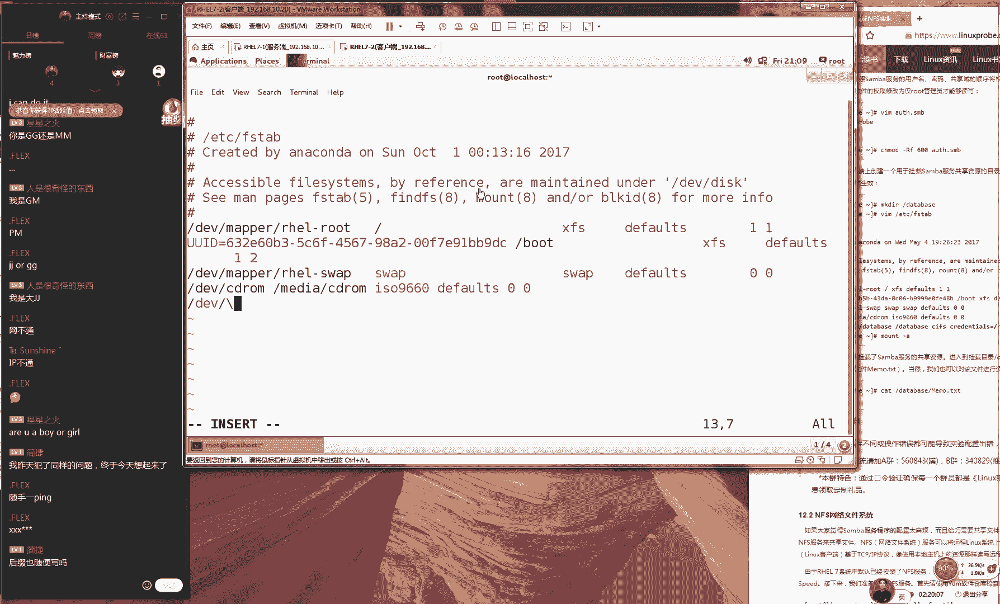

来去获取了我们这个账户文面的信息，然后说是否备份以及是否进行交我们选择00。这样做好之后啊，我们来把保存名退出，然后我们就可以使用到mount杠A挂在我们这个文件里面所有定义好的设备了。

做好告诉我们说我们本地挂载点还没有啊。他说你太了，我们来创出来本地的挂载点再来杠下这个时候对这个是在我们的第二台lin上去操作，这个是我们的客户端大家看一下我们现在有两个标签。

这个标签上面它只要亮着说明我们现在是服务端这个标签我们切换过来代表是客户端。所以大家都写出来这个文字了啊。然后我们来看一下我们挂载信息这个时候就会有一个挂载一个目录。

然后挂载到了我们这个ase上大小是20个GB我可以进入到db目录里面。😊。

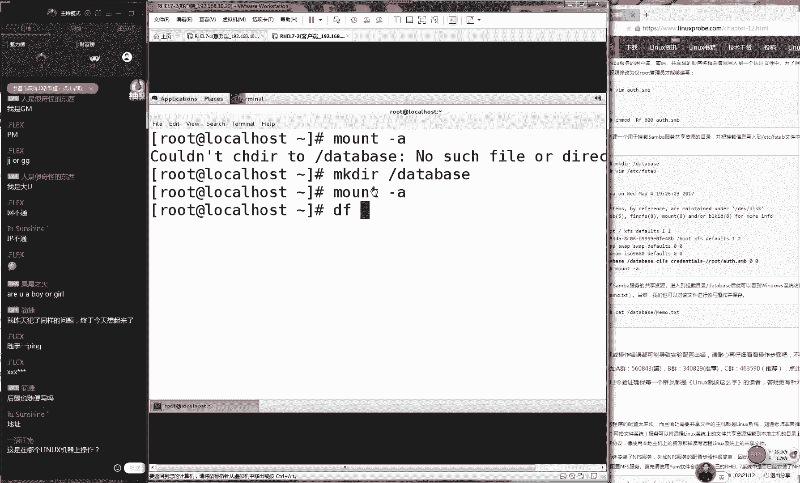

然后我们可以看到里面就会有一个叫做flex的这么一个子文件。我们可以来那我们也可以来去编辑啊，对吧？I can。😊，Alsoso我们也可以去编辑这个文件。好，我们写入一些我们自己的信息。

来把bos并退出。好，马上你回你的服务端，你去看一下这个文件，就会发现文件内容已经是变化了。包括说你的这个windows你也可以看到这个文件的一个变化，你可以看到，但是这个换行是没有的。

因为这个windows跟lin的这个编码是不一样的。好，然后那我们就跟呃那我们就知道了啊，就是说。😊，呃，我那我们今天学的东西比较多，我们今天学习了两个三个大的服务，我们呃两算两个大服务吧。

第一个我们叫做FDP我们叫做VSFPPD它是用来去文件传输的然后它有三个验证模式。第一来说，本地第二虚拟第第三是匿名。然后演示一下我们三个模式，如何来进行配置。

第二个话我们服务叫做TFP这个相就是送的啊，非常简单的这么一个服务。我们来去知道这个如何来进行简单文件传输的这么一个方式。再往后面走是桑吧，这是用来去做我们文件共享的，它可以实现出来跨平台的共享。

它可以实现出来两台lin以及或者两台。😊，两呃两台linux或者windows之间的这个共享，这个是我们文件共享的一个方式。当然这也有一个呃轻量级的一个方式。如果说您听完这个之后，感觉哎呦这个好难。

这个桑麦我没有学会好，没有关系，我们明天。😊，会大家讲NFS。和凹凸尔法哎，明天我们的课程这样去安排的。好，然后今天的话时间比较长啊，虽以我先给大家说一下，我我呃我们今天这个作业，然后我给大家答疑。

好吧，先不用担啊，先不用张先不用担心啊。大家知道这个呃大家知道的话这个叫做needful就是代表就是速度与激情啊，我们极变飞车的这么一个游戏的一个名字啊。是这个配置起来的话呢，会跟您玩游戏是一样的。

特别的快啊，跟我们这个呃飞车一样，就是这个非常简单。好，然后我要说一下啊，我们的话明天呢我们这个课程先说一下我们复习。😊，呃，复极的话只要给我去做一个就可以了，不要做那么多。

只要给我做一个就是我们的FDP本地的模式。这个方式最为常用的工作设也实用。只要把这个给我做出来。今天我们所讲的一切就都呃值得了。好，这就是我们的一个核心就可以了。桑的话呢，我们先可以放一放啊。

这没有关系。但是我们的这呃但是我们今天做讲这个FDP这个一定要会配。😊，这个也是工作的时候，哎，他不知道大家不要觉得这么简单，因为但是这个你要挥配之后啊。😊，到工作的时候你都够用了。然后的话呢。

我们这个预习就是第十二章节你给大家做个收尾。明天我们把它讲完，然后第十三章，但是明天啊肯定讲不完第十三章。😊，第十三章吧，明天肯定是讲不完。嗯。哎，那也得讲啊，对吧？我们第十三章算作是我们本。

杰克里面的最高呃，说明后两天能把HC已先讲完吗？嗯。哎，不要了吧，因为因为怎么回事呢？因为第十7跟第十8章节也是红包CE的内容，再要调的话，工程太大了。我觉得是呃，这礼拜咱先不调，咱下礼拜调好不好啊？

因为现在调的话呢，你看从第十三章就蹦到第十九章去了。😊，跳舞太大了，我跳第第十八条跳太大了，好吧。😊，大家先不用着急啊，我们这个时间还是足够的。然后是这样的，就是我们明天的一个课程的一个安排。

但是第十三章讲不完肯定讲不完，不要想不要想，肯定讲不完。我们最多是只能是讲到。😊，13。5小节大家就最好了把一个预习完。如果实在不行的话，可以只预期到13。5小节。然后明天的话呢，我们给大家说一下。

这个章节是我们这本书里面最难的一个章节都不为过，会讲到我们这个DNS主服务器从服务器缓存服务器还有这个主服务器上面和从属服务器上面去做我们这个正向跟反向解析。

然后在我我们这个主服务器跟从属服务器之间做TS的加密。然后在我们这个主服务器上面大家听为根。然后我们去做分离解析技术。还有我们这个还有我们这个缓存服务器的这个七大技术大家知道啊，但是我们讲的很难。

但是这个考试是没有的试这个第十三章节全部都是没有的。大家不用担心，如果说您是为了考试的话呢，可以大概过来一听就好。因为但是您听完之后会对于网络的知识会更加深层次的一个理解。

这个课的能力这个作用是很大的啊。😊，他虽然他不考，但是你不觉得很呃但呃呃，但是你不学不可不是很可惜了嘛，对吧？所以说呢我们的明天或讲的这个课程都是跟我们考试没有关系的。好吧，第十三章。😊，好。

然后大家会可以有问题的，可以来跟我去说啊。同学们，我现在辛苦了啊。😊，然后大家有一黑来跟我去说，我们来去答那我们啊那我们来去做答疑了。好，K大家辛苦了大家辛苦了。今天也是嗓的好一点了。

然后巴拉巴拉给大家说这么多段子，然后一下子到9点20多分了，不好意思呃，到9点20了。大家话有一个黑来跟我去说，明天肯定是讲不完的。但是明天我们不用着急，讲多就都啊讲们那算那那那要就算多少吧，对吧？😊。

好，红包R志CE里面有讲bug的吗？红包R志CE考题里面不会有bug。这就是我们考试的标准答案，那个章节考不考呃，第十三章是不考的，第十三章是不考的。😊。

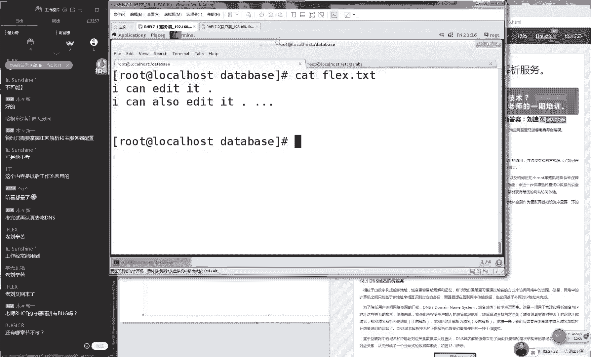

我然后给大家说一下吧，我我我当时说我们之前就不讲了啊，我们之前就不讲了。呃，因为你们都已经知道了，第十三章不讲。😊，哦，我们这个桑马他应该是诶，我忘记了呃，反正我我能够。反正是我能够确认的啊。

第呃第十3章是全都不考，第十4章是全都不考。第十第16章是全都不考。😊，第十9章是是是呃是全都不考。第二章是全都不考。也就是说我们后面的这个课程里面大概一半吧是不考的。所以说我们干嘛？

我们敢说我们这个课程超过红包HC50%的东西啊，对吧？😊，好，大家可以来跟我居酒的问题就可以来跟我去说了。然后我们来给大家就打一号吧，大家辛苦了，我待会也去宣认一下我们这边视频了。😊。

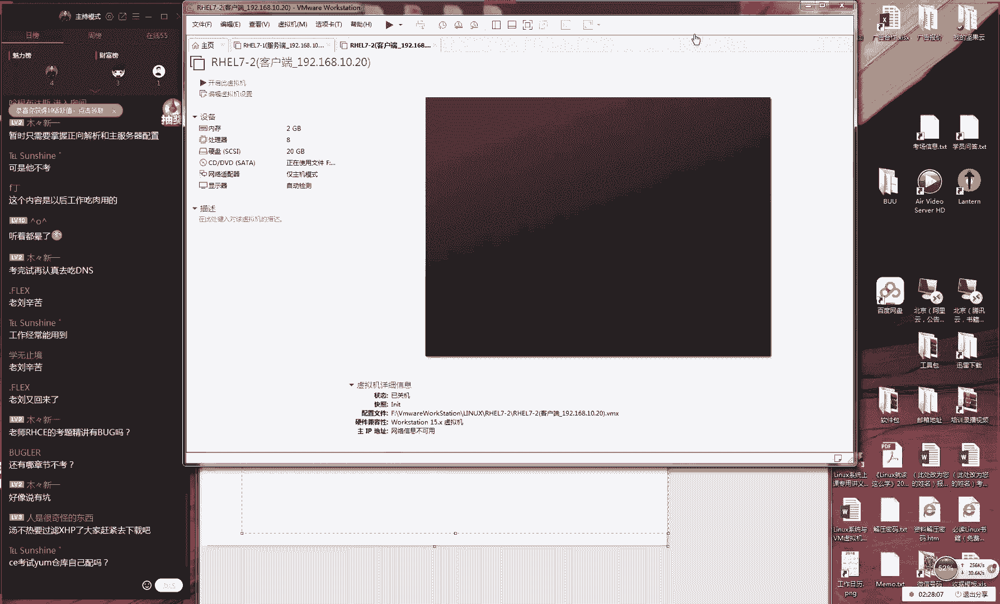

HC的样仓库是不需要自己去配置的。那我看一下linuxFTP是加密传输吗？有没有铭文的呃，VSP它是对于我们这个加密的方式来进行连接，但是数据还是明文的，但是已经非常安全了。呃。

为什么有考过的同学们说是自己配置的？是这样的。红包HCSC跟红包HCE的话呢，所有的样子仓库都是由考场办去提供。但是红包HCSA需要你去写入到配置文件里边。他会给你一个完整的一个路径。

你只要去复制的时候，你不要把它复制错就可以了。😊，战报信息哪里去看？我们的网站上面会有会有一个叫考试记录。但是那个只是一部分。最后同学们就是因为你没考过就知道了，是你们自段发的。这个不是我们强求的。

所有做人都给我们同一下或怎么样的。所以这是这个只是一部分。所以说这个东西大家都呃知道就好了。😊，然后实际上配置1个FDP有哪该如何操作呀？我们刚刚所讲的所有的一切不是给大家是为了我们讲课。

然后给大家瞎讲了这么一通。我们认为虚拟机里面该配置的一套思路是完全可以体现到我们工作是。我们工作和我们考试的时候，我们就这么去做的。我因为我们也不会有闲心给大家啊，为了我们讲课。

为了我们虚拟机再去讲一套流程。这就这个就是我们工作的时候要用到的。😊，所以说我们该很尴尬，哎，就那工作的时候会另外一套了。我因为我之前我也我上小学的时候，我就怀疑说我们老师教那个英语。

他是不是自己瞎编出来的，他会不会教那英语。然后我们学到初中的才发现，我们说一个语言，其实就是个假的，就是老师自己编出来的，后来想一想，也不可能是，对吧？编成个语言来，那也是算个大神了。😊，呃。

我FTP我忘记是哪个模式了，真的是忘记了，要看一下具体考题。我忘记了LTP考不考，我都忘记了，应该是考。但是具体哪个模式我也忘记了。以我们这个考题网页为准吧。hold缀。嗯，hold缀为什么要去写？

是这样的？因为如果要是一个文件名称，要是冲突的话，那我们就可以通过hold缀来进行区分。但一般如果没有冲突的话呢，hold缀也可以不写。

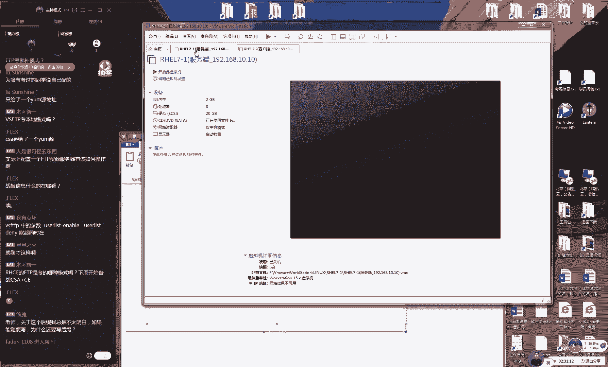

因为在我们这个送里面的话呢，hold缀它是可以省略掉的。好，然后我先算一下我们视频啊。