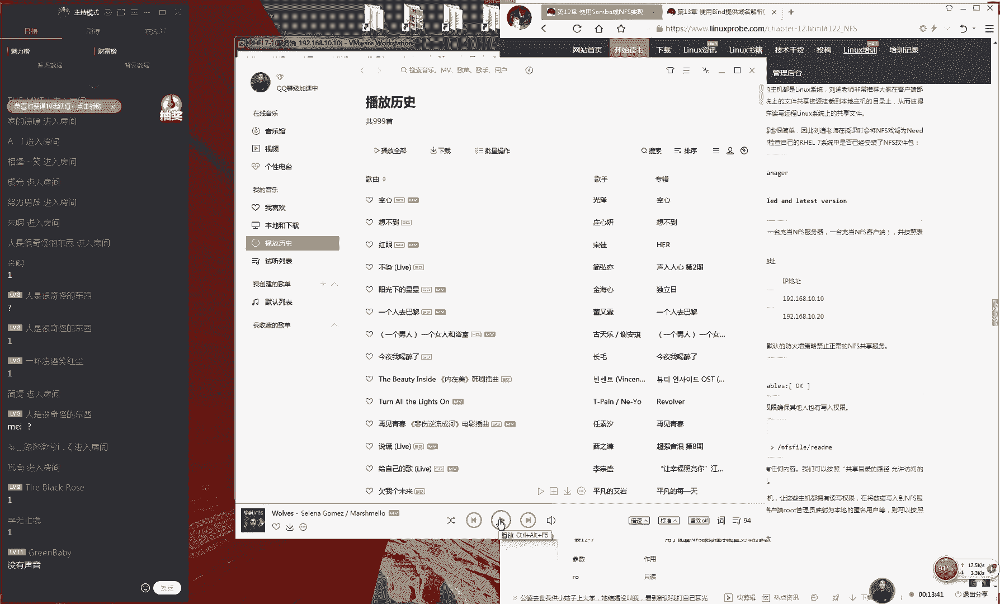
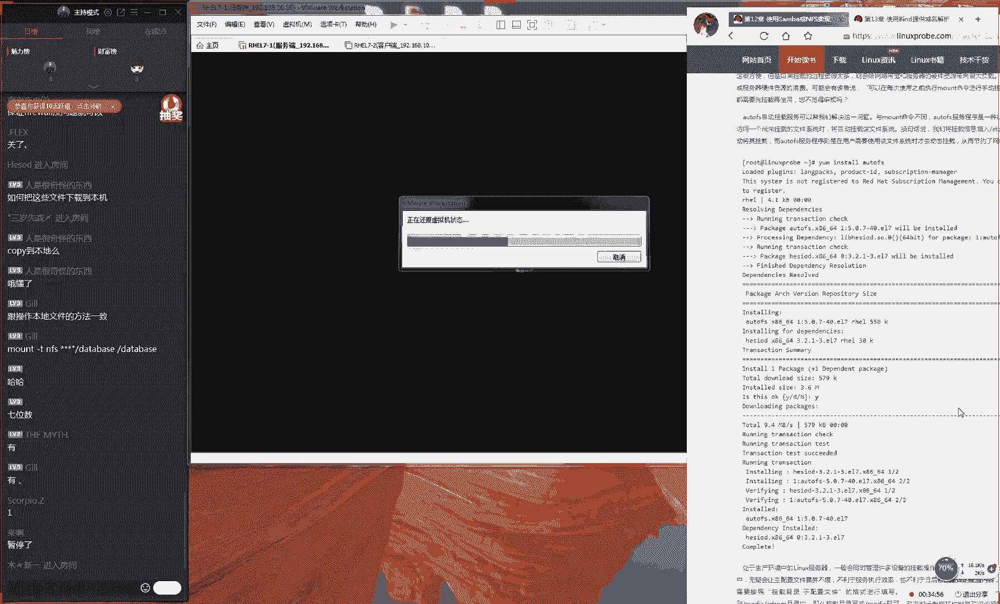
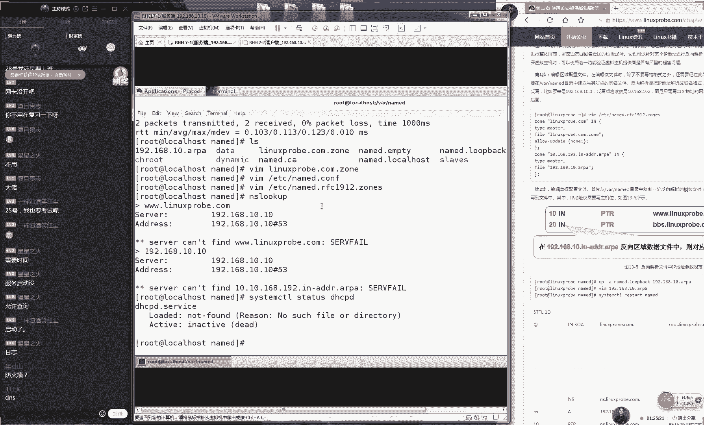
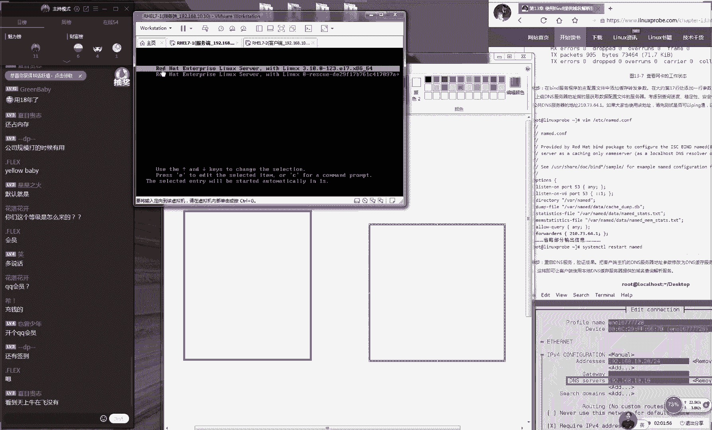
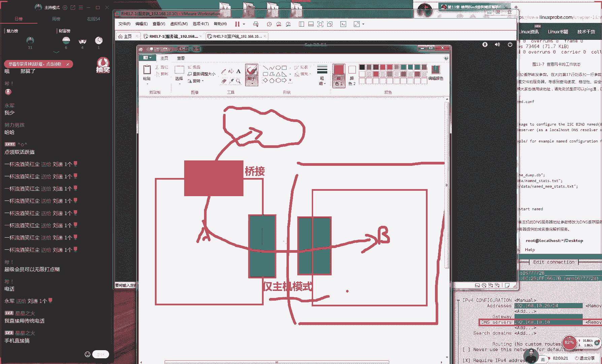

# Linux教程RHCE - P14：14.DNS服务 - 艾弗艾尔思丢丢 - BV1if4y1e73V

🎼当我说的际遇。

Yeah。Yeah。Yeah。Yeah。啊，好，我刚才好我我刚才说了好多好多好多，然后好就是但是好像没有开麦克风是吧？行，那现在大家听到刷话声音了吗？啊，现给以打一下一啊，那你们刚才音乐也没听见呗。

是吧？然后都没听见是吧？然后有明人告诉我哎呀，行了，我因为我的麦克风嘛，他需要使再去开一下才行。后来我看没开掉，然后我就巴拉巴拉巴拉说了好多啊，哎呀，好尴尬啊，是不是。😊，行那就是这样的啊。

就是我刚才还问大家呢，然后我说这首歌好啊，这首歌好嗨啊，而且但是很耳熟，我不知道好像哪里好像听到过这首歌是不是一个电影的主题曲啊，或者是一个电视剧的主题曲啊，然后我还跟大家说，哎。

这首歌好像听说过什么的。我巴拉巴拉，我说了好多，我才说了3分钟，你都没听见是吗？啊，行。😊，反正这首歌我记得好像是一首一个电影的主题曲，但是我忘记了，那我们当做一个课，那我们就当做课后作业。好吧。

那我们就接着给大家说。呃，今天的话呢我们这个课程的安排，就是我们今天来做第十2章节的一个收尾给大家讲完12点2小节，然后还有12。3小节，我们讲完NFS跟然后我们这个课程大家听一下。

就是我们今天这个课肯定是讲不完第十三章节的。因为第十三章节从头到尾讲大概也要两个多小时2个小时的2个半小时，我们今天肯定是讲不完的因为我们今天带上12章节两个章节肯定是讲不完的。

而我们也不希望说我我们今天这个课程是为了讲课而讲课，然后为了拼命赶进度，然后讲完之后就O了。所话呢我们今天这个课程，而且第13章很难，我们会有意的去放一放。我今天上课之间我大概背了一下课。

我今天大概背了一下课时间的话呢，我们今天这这个课程大概是一个小时050分钟左右，所以我们今天这个课程时间还刚刚好，大概是一小时050分钟到2个小时之间，我们会讲到第13。4小节。😊，就可以了。好吧。

然后我们的13。5和13。6小节，我们会留到我们的明天给大家去讲。😊，因为我不希望说我们几个课程变得特别的赶，然后就是为了讲课讲完课之后就O了。那我觉得这样的话好没有多大意义。

因为我们需要给大家留时间来去这个消化我们这个知识。好，因为大认同我这个想法。因为我讲完之后我没了。但是大家没听明白常尴尬所以我们不要这个课程进度慢慢不要着急把我们这个课给大家讲。

我讲这个知识点给大家拆分之后讲一点我们讲点觉没逻辑这个严谨，说讲的非常的非常的详细点好，那我们给大家说一下第十二章节我们下面个实验点，我们叫做NF们啊我们给大家聊过说同学也知道是一个游戏的一个名称吧？

家打一下大家有没有听说这个游戏叫个话全称叫做应该过是吧？做是们做极品飞车。😊。

啊，没有没有玩过这游戏吗？啊，当时我为了这游戏，我还特意好像还买了一个那个什么游戏账号呢，好像是花了好三五十块钱的。就是说的话这个也是一个游戏的名称，叫这个极品飞车。😊，啊，极品飞车大家应该玩过。

对不对？那个呃极品飞车。然后这个是一个游戏的一个名字。然后呢我给大家说的话，就是这个呃我们今天所讲的这个NFS叫做network叫做网络文件系统，但是它配置起来的话。

就跟极品飞车的特别特别的快当你去配置这个服务的时候，它可以去实现出来两台lin现在的这个共享，大家可能会去跟我较真老其实的NF它可以经过这个改造，它也可以去实现出来linwindows这个共享的。

但是我觉得这个完全没有意义。就于说但没有看过一个网的一个视频啊，就是说你可以把你那个呃电脑的那那你可以把你那个车载那个导航上面可以去装上windows系统觉得这个好没有意义啊，虽然只是机去挑战一下。

但是我觉得这个没有太大意义的。实为你干脆你不如去买一个电脑好了。就说当你要想去改造它的话，实际上你还不如你去使用桑的？因为我们昨天我们的桑。😊。

还有可以实呃去实现出来linux跟windows这个共享的。好，所以的话那我们就是说呃一般情况下来讲哈，我们的话呢一般情况下来讲，我们更多的是将我们NFS作为两台linux之间的这个共享。

那也就是说我有了一台电脑，是一台lin，我有另外一台电脑也是lin啊，我是卢迅所以话那我们当两台有那我们当有了两台服务器，他们都是linux系统的时候，那我们就可以去实现出来使用NFS来去共享文件了。

这个起那么呃这个配起来是非常非常的这个便捷的大家去感受下知道就是为什么我们会使用NFS而不去使用桑吧。好了。😊，啊，等一下，我这个桌子怎么那么高啊？啊，OK好了，啊，我还以为腿断了呢。好。

那我们接着来说啊，那我们接来配置这个服务的话呢，其实非常简单。那我们现在需要两台这个服务器，我们先还原一下我们另外一台服呃呃这个服务器啊。😊。

我们作为我们的客户端。😊，好，那我们现在还原一下我们这个虚拟机。然后是这样的，我们配置起来特别的快速。那我们现来准备一下，我们要想要为别人去共享的这么一个文件。

我们好比说我们把它叫做databbase目录啊，这无所谓。如果说您愿意的话呢，可以把它叫做呃gll同学吧，那我们可以叫做这个gll这个是无所谓的。好啊，那我们接哎没没事没事没事，然后我们接下来说。😊。

呃，配置的一个方法。当我们创建好这个文件啊，创建出来这个目录之后啊，然后我们可以进入到dbase的目录里面。接下来我们还去往里面去写入一行信息，这个无所谓啊，当然我们可以写出哈哈哈哈啊。

因为只有我这么无聊人才会选择这么无聊的名字，然后我们是还要哈哈点ts。那啊那我们还去写入这个文件。😊，那我们写好之后啊，所以我们就说一定要不要迟到，你看现在有50个同学，对不对？现在有49个。

刚才有40个，然后慢慢又回到60个，对就千万不要迟到。因为你一旦迟到了之后，这个时间不等的那我个给大家NFS没有我NFS是们考试里必考容怎？考试的出现这个知识的短板差一两分实你要考试的要考15分无所谓？

但要考209分，那的话，为你总差一分后但没有办常的可惜好，所以说我一定提前到这个频里千不要迟要迟讲废话个上课时这个文这个目录里会出有一个文也是句废话。😊，那我们现在将这个目录的权限给它稍微大一点。

这样我们可以保证其他人也可以进行一个读写之行操作。我们来去呃设置一下我们这个目录的一个权限，让我们其他人也可以来去读取里面的文件。然后呢然后就可以了？这就是你准备好别人去共享的这个文件了。

我们之所以把它叫NFS速度与激情。那么速度极品飞车对吧？就是说我们配置起来特别的迅速的那我们来我们编辑下我们的NFS的配置文件，这个就是我们的NFS的配置的主配置文件，然后我们敲一下回车好。

大家看到这个配置文件之后，大家慌不慌啊，大家配件之后慌不慌呢。😊，呃，我们刚才我说我们考试的时候，全部配置文件都是哈哈呵呵嘛？我们刚才讲的不是配置文件。

我们刚才讲的是只用来去测试我们这个文呃共享的时候的。大家看到说这个文件的话，像我们进错了，其实并没有进错，这就是我们NFS主配置文件。他默认是空白的，需要自己往里面去写内容。我这个还慌同学真太配合了啊。

所说这大家不要慌？这真不用慌这个配置文件里面什么都没有，你需要自己往里面去写东西的好吧，这个自己去写好然后我来去写上第一列就是我们共享的设备的名称我们就是叫做dabb吧？这个你还慌。

你没有还慌你有没有都慌不要慌慌要慌你因为自己往里面去写嘛？大家道给大家讲一下我们一列的这个信息，们这也太配合了。那我接下来的话我们来写上下然去去写这个下一列的信息啊。

下列信息的话就去共享给咱比如说我想使用一个星号。😊，信号代表就是我们共享给苏人，苏人都可以去使用我这个共享。我那我是一个公开的一个共享。再或者说你也可以这样去做192168点10。呃，点10。

0这个网段。好，那我就是共享给这个网段的主机。那你也可以这样点10。20。那我就单独共啊它代表就是我们啊去单独的啊去共享给某个主机的意思。😊，所以这个大家无所谓啊。

但我们就待会因为我们的服务端地址因为我们的客户端地址就是10。20，所以我们就干脆就是我只去共享给10。20这个单个的主机。后面一个这个小括号。

大家记住我们这边地址跟我们这个小括号的后面你千万千万千万不能有空格，一定要把给连起来去写。后面我们要去写让我些共享的一些参数那我们第一个参数的话，我们叫RW代表就是它能够进行一个读写操作，它能够读能写。

二我们S代表就是我们数据进行一个同步。这样当我们这个客户端它突然间死机然间网络中断的情况下话呢，它可以将我我们这个数据同步到我们这个硬盘里面保证我们这个数据尽量不要丢失。话我们再来。😊，好。

接下的话呢我们再来。😊，有一个参数的话呢，我们比较长叫做rootQS这个什么意思啊？这个大家什么意思？

大家可以猜一下这的话这个话他代表就是我们将对方来访的这个超映我们本地的一个虚拟用户这个说起来感觉比较长，大家举一个生活上一个子。但说一天家闻个顾像因为中美贸易不我们参加一个2峰会。

他的话之前为访中国说那美国总统如果他拉到中国之后，他能不能调用中国的军队，他能不能去发射中国的核核弹头，他可不可以他没有这个权限大家想不？为美国总统怎么能中使用这些军事集团呢但换位一想的话。

那也是但你想两台服务器，他们都是lin系，们两人他们都是ro用户但说我们习近平，们还美。😊，特朗普，那他那他就相当就是呃两个巨大的国家里面的这个最高元首嘛，没有在他们当地国家。

就没有人可以去限制掉他们的。那好了，那我们的这个超乎为什么到了另外一个环境下一统里面他就不能够去使用这些超级的一些职权呢？

就是因为我们需要把他给映射成一个我们本地的一个来宾用户这样限制我们这个对方一个理员我们的本地他不会所为，他不会去做一些乱七八糟的一些事情。好了啊非常时期不要聊这些事情现在非常时期，最近哎呀怎么说呢？

咱们中国这个这个时期吧，真的是太多太多了我都不知道到底又有什么事，因为我前段时间吧，我突然间大概是今年夏天的时候，我想寄快递，因为我给大家寄书？后给大家寄材料什么的？突然有一天。😊，快递说不让寄啊，哎。

我说怎么不让寄了，他说最近说什么金砖国家开会啊，不然后说呃金砖国家开会呢然后还就没记，后然后话又过一段时间，我想从淘宝上买一个呃也不算是违禁品牌，就算那种液体嘛。然后他说也寄不了北京了。

北京那边好像正怎么怎么着了，正老有什什么事。行，那我们先保存一下我们这个配置文件啊，然后我们现在执行一个命令，我们代表就是呃ESPO然后杠A这代表就是让我们配置这个参数，它能够去生效。

但是如果说您怕这个操作还不能够呃生效的话呢，我们现在啊去重新去启动一下我们的NFS。😊，然后对了啊，我们这个的话呢，我们的NFS服务它默认已经是被启用了。

然后我们来去重启一下我们的NFSserv我们的服务器的这个程序。😊，然后我们这边书上的话呢，还有一个呃步骤是重启一下RPC办的，这主要用来去呃让我我们这个对方能够去发现我们的NFS共享。

但是在我们红包日器里面，我们这个服务已经默认启用，并且已经是呃运行了。我们这个步骤不需要去做。好，那我们现在代表就是去重启一下我们的NFS服务。然后再把这个服务给它启用起来。😊，好。

那我们现在做好之后的话呢，我们现在就可以呃我们还有另外一个步骤啊，千万不要忘，我们就要去重启一下我们的呃，然后我们去清空一下我们的IP table，然后并且把我们的I table的状态进行一个保存。

这个时候那我们就可以进入到我们的客户端里面了。然后我们就可以进入到我们的客户端里面了。😊，哦，你们说这个特殊时期啊，说就是呃孟晚舟被逮了，就是被抓起来那个我我我后来好像了解了一下。

好像人家不是说他针对说美国针对华为呀怎么着的，好像是因为他那个证件好像他转机的时候，他使用是加拿大证件，好像后来涉及到证件问题才被抓起来的，不是说美国针对华为怎么着的。

好像是我这么了解的啊考试的时候的话呢是可以清空防火墙的呃我们同一使使用的就是ESPO然后这个命令就我也比较习惯。好，接下话呢我们再来我们就是才从我们的客户端去拼一下192810。10。😊。

192。2点啊点10。10，我们拼一下我们这边从客户端拼一下我们的服务端。就给大家讲过一个笑话啊，也不算是笑话。我们同学的一个经历，就是你在配置这个实验之前的话。

你一定要让你这个两个主机才能够互相来去呃通信。这样的话，你配置出来的这个实验才能够看到效果，否那么否则的话，那你配置这个服务，你再好再对你再完美。但是你做网络你不通。最后那你这个。😊。

那那你可能看起来呃最后它也是不能够通信的对吧？我们一定要保证我们的网络是通的这是我们的第一步考试的时候是可以清空防火这是没有问题的。

而且你考试的时候根本就没有我版版根话告诉你说没有个命以清空这没有关系我来编辑文件去编文件说记了我共享共享服务些共享示主机共享服务地一个目录的名称叫做。😊，是专门啊提供给192。18。10。

20这个主机的。所以说我们接下要需要做的事情，就是检查一下自己的网卡地址。哎，我不就是10。220吗？那你看这边地址啊，跟他所对应的商呃，他啊他是呃他是呃他是可以匹配上的。

那么就证明我也可以去来去使用这个共享的。那么我们就可以去编辑一下自己的FSB的文件。然后我们来。😊，去挂在这个远程的共享。对了，我记得我们要有自己的这个共享目录啊，我们一定要有，但别忘记。

我们先在介绍一下我们的对方的服务器的共享的目录，叫做dabbase。然后我们本地的呃路径的话呢，呃您可以跟他一样啊，就因为我们为了方便记忆吧，对吧？然后我们也把它叫做啊也把它叫做这个dabb。

然后后面就是我们的哦，我们这边还没有写全，我们前面应该写的是服务端地址，要不然他怎么知道是哪里啊，19218。😊，点10点1冒号，然后后面是我们这个共享的目录名称。

我们挂载到本地的dbase目录下我们文件格式叫NF权限。然后我们是不要备份已经没有这个进行验们择0好之把保存退出我们来个保存退出然再去使是我挂载这个文件里面所有的设备信息。

我们来123敲马上可以再过来告诉你说挂点不存在。然后们现在出我们本地的载点后再去敲一下常尴尬我没有成功然后我们马上去之可以看到有一个远程的N共享就载到了们这个服务器本地的目录我们马上翻回来。

我去看一下目录。😊，然后你可以看到在这个目录里面就会多出来一个文件叫做哈哈。然后我们可以去往这个哈哈文件里面，然后我们去写入一行乱七八糟的东西。

主要就是来验证一下你能不能去编辑这个文件有没有这个使有权限，敲回收没有什报错，但是它是否成功了呢？返回到我们的服务端这边我们返回到我们这边服务端我们来看一下这个文件内容发已经发生了变化。

这就是我们可以实现出来两台lin之间的这个共享的方法。这这就是我们实出来两台共享的这个方法接下们一个问题啊如何把这个文件下载到本地那么就可使用到CP进行复制了就可以了复制是文件是文件的这个传输它不能够批量去直接去下载。

要让你去复制一下可以了话呢我们来给大家想一个问题啊。那我们昨我们讲我们昨给大家讲讲NF。😊。

这东西吧好像来说。他们都属于在网络上面来去传输我我们这个呃这个文件的啊，并且的话呢他需要把你的这个共享的信息给它写入到我们的ETC目录里面的里面，对吧？

然后他会就然后他就会一直为我们来去提供这个挂载的文件了。那我们想一个问题啊，那比如说我就想要去共享出去一个文件，然后提供给对方呃他只是一时去使用一下，它并不是随时都去使用到它。

那我要是一直去挂载的这个设备的话呢，会不会他对我们这个CPU也会有一些消耗。我们举个例子啊，大家知道这个手机上面，它有个后台操作嘛？大家可以操作一下，就是你现在在你手机上面你点开微信，大家都应该有对吧？

然后再点开QQ。😊。

然后你再点开你的支付宝，然后你看一下你的看一下你的余额，之后这个非常少的这个余额分扎心。然后你然后你再退回到你的这个桌面上面。然后你现在经过这个三个步骤之后，实际手机的后台里面就一定怎么样。

是不是有三个这样的一个应用后台运行了。虽然说这个已经开去消耗你系统资源。以我有一个习惯，就是我会把都清空掉把给清空掉。但是我们坦白来说的话呢，那你说到底这个手机后台这个占用的内存，它到底是多还是不多。

大你们有没有清空手机内存的这个习惯，就是比如说你打开这个软件之后，那你会清空掉一回反正我是有的，因为我觉得会占用一些我系统这个内存。但是后来我又听别人说iphone手机的后台好像根本不占用资源。

好像已经挂起了怎么怎么样的，但是我也不信还是清空一下。但是我知道了，他在这个后台便说你看20个程序，但是你实际。😊，这个主流呃，的这个程序还是非常流畅的，应该消耗你的资源并不是很多。

但是你就是想要去关注，就是说我就想把我这个资源使用的非常的极致，我就不希望说他的后台他也在消耗我这个系统资源，或它或多或少也会消耗我一些我们的这个网络呀，跟我们这个CPU这个资源性能。好。

那我们就要把它给结束掉。那我们有一个服务，他也可以去实现出来有这么一个。😊。

呃，功能我们叫做S代表就是我们自动化来去挂载我们的fi system来来去自动啊它代代表就是自动挂载我我们的文件系统意思自动挂载我们文件系统。它只有当你需要的时候，它才会自动帮你去挂载上这个设备。好。

这个例然后我们这个例子非常的酷啊。然后给大家举个例子。让我们呃可以自动来去挂载我们的光盘镜像。因为我们知道我到我们的光盘呃，它会将呃我们的DV目录里面的CD room一直会给它挂载到我们的。😊。

呃，VDM目录里面的CD入我这个目录大家可以看到，那我们这边。😊，有这么一个设备的一个目录，它会一直去挂载上，它会随我们系统启动而启动，所以我们系统关闭而关闭，它会来去一直去挂载这个光盘镜像。

但是我们去使用起来几率也许一天就使用这么一次仓库，不？使用起来低效率的个时候我们就可以编辑我以使用管理这个设备了。那我们使用到卸载掉，我们卸载掉我们这个文件系统因为我们把它卸载掉。

然后我们再去再把这个文件里面这个信息也把它给取消掉。这样话我们保证说这个文件跟我们当前设备是没有任何关系。后我们这样去做啊，现在不对看我现在脑子了一下，我们不该这样去我们应该还是先载。

因为我安装你卸载之后那库可以去使？那我安装一下服务端我们还是去使用到仓库。😊。

呃，NFS版本嘛，是我们跟我们考试是相关的。因为最我们考试的时候是三0本。但是因为咱们现在这个虚拟机里面不并不是三版本，所以大家看现在还是只能是以这个考前辅导为准，因为我们还是跟环境是有一些差别的。

然后那我们先在安装一下我们这边凹 two FS，然后我们去呃卸载掉我们的文件系统。😊，这样做好之后，我们来编辑一下我们的auS的主配置文件。这个呃这个文件的话呢。

它是在ETC目录里面叫做au master。大家可以看一下哈，它已经把它叫做它它已经把它叫做 master。所以说这个你可以猜出来吧，它定是一个怎么样主配置文件。这个里它是一个主配置文件。

这个里面包含了所有的常用的这些目录和我们的重要的这个参数。那我们需要这样去做啊，它就像一个大的一个电话本一样，它里面写的它里面写的是这个它里面写的是我们所有的目录的这个配置文件，而并不是保存所有的参数。

所以说你需要在里面添加出来你想要去定义的这个目录的名称。😊。

那我们在这个里面这样去写，现上去写上，我们想要去挂载大的目录，我们叫做这个media。然后我们的后面我们需要自己来去新建出来一个子配置文件。😊，而我们这个文件当当它此时也是不存在。

但我们需要把先给它写下来。这样的话呢我们来点一下保存名退出。这样话我们就告诉我们这个系统待会我们要对于这个目录来去做这自动载这个目录所这文件写到这子配置文件但指个路径来新建出配置文件义录里面的内容是样我想载要把载到目录里面的这个OS这个目录。

但是因我们面已经告诉他我们要载这个目录的名称了，所以我以直接缩写成直接缩写成就可以了后面做文系统就我光盘是我光盘镜一个格式是只读的后还有。😊，啊no SUID跟noDEV就是说当我我们这光盘里面。

他如果要是出现了呃，我们这个SUID的这个文件，或者说他出来的设备文件的话，呢，能把它当做是一般文件来进行处理，就是防止一些黑客啊什么的，他们去篡改了我们的设备的文件啊。

或者说篡去篡改了我们的U盘的数据。然后当我们一插进去之后，就有一些非常呃。😊，不安全的一些权限。所以的话他给他将我我们这些不安全的权限给他取给他取消掉。但是我们现在不用但是这个参数我们可以写可以不写。

这个没有关系，后面就写让我们要去挂载设备的名称目录里去做好了。待会我们我设备自动载退出后接下来重新启动一个我们需要去做大家不要忘记然后将我们这个服务给加入到启动项当中这个常简单去见证就是我们这边确实的光盘以看一下要说作弊？

为看一下我们的光盘它确实是没有被挂载上的。而且这个光盘此时此刻跟我们任何关系都没有后大家可以看一下证一下奇迹进入到我们这边这个目录里们来看一下里也没有任何的文件。

但是这个时候还没有就之所以叫自动挂在我们的文件就让去使用的时候能够自。😊，外载这么一个效果。那好了，那我现我当我现在我需要去使用到这个设备了。那我现在想要去访问里面的文件的时候，咱们怎么办呢？

那我们就可以直接走进去啊，按照我们这个常理上来讲的话呢，这个目录内没有任何东没有任何东西的情下，肯定是会给你包错的。但是我们此时完回收之后，它没有包错，并且它还走进去了。

我们看一下这个目录已经有了我们光盘里面的所有的数据了。这个很神奇，对不对？而且我们马上再来去看一下DF杠H我们光盘已经被我们给挂载了。它就是说当你去需要去使用到这个设备的时候。

它会自动帮你去挂载这个设备的文件，这个服务就叫做啊，而不用他说它会去一直去挂载这个设备，然后去消耗你系统一些资源。但是我们坦白来说这个属于红442的课程。

这个属于系统调优可能只有当你明显能够感知到说网络V挂载的设备确实变卡了这样的情况才可能会有效果。所以说平时的话我们去使用这个服。😊，他顶多就是一个心理上的一个安慰。可能具体上指标上我们可能看不出来。

因为我们平时去挂在后台的话，可能也不会让我们系统变得很卡。😊，好，接下的话呢我们来给大家说两个东西啊，呃说了两个这个服务啊，给大家做了个收尾。但是这个服务非常的简单，它并不难。

然后给大家说一下我们这边的难点就要来了。第十三章节。😊，还有后面的一个半小时，我们就全都给大家讲第十三章节了，而且很也讲不完这个服务的特别特别的难。

大家的话呢呃评把它评为是我们整本书里面的最难的一个章解，是这样的，也确实它是一个很高的一个高峰。如果说我们把第十三章节这个卡给他卖过去的话，基本上来说我们这个整本书就没有什么难点了。

就没有说特别就是没有就特别恐怖的，特别变态难了啊。大家知道现在就是说呃，有一种变态辣，对不对？就特别特别的辣。就是说我们第十三章节，你知道吧？给学完了。

基本上我们书里面就没有说极端的那种特别特别难的那种感觉了。😊，呃，第十三章节是我们都不考的那今天我们是都不考的。嗯，对，这个虽然很难吧。然后我会讲很多很多，但是我们第十三章节的所有东西都是考试不考的。

所以说有些培训机构啊，有些实机构根本不你提到根本讲说一下就过去好评给们他们讲都听废话太了。所说听。第三章节然考试不考，但是讲太惜了。

我们还是要给大家讲一下第十三章当完配置服务以对网络都有一个更加深层次的一个认识这有义务给家讲很重要就去复习考试的没有讲不着天128都12月28号20这个足够足够足够跟你讲你这个考试给大家说考试的话不要复习时太长感觉有点。

😊，被常理了啊，是因为这样，因为我也教了很多年的课了，你也知道的，我们同学们一开始都信心百倍的，然后去复习。但是你要知道人要有一个恒心跟惰性的，慢慢就会发现自己没有了兴趣了，对吧？会有这么一个过程。😊。

对，容易懈怠。我们就建议说两周时间。因为你知道这个人的话，他也像一个起起伏的一个波浪一样。当你比如说你今天你特别想要去学，然后那你就开始呃从零开始特别高兴的去学。

结果你学了两周之后就去半个月之后那你半个月了，然后你最后你马上就要往下坡走，然后就没有兴趣了。那我们就要把我们这个考试的时间，你把你把这个时间你给他正好给他卡到两个礼拜，这样的话呢。

这两周时间不给大家下出来出来的，这个是我们自己总结出来的经验，两周时间足够足够的。然后你就正好就是正是你最后呃最有这个呃兴趣的时候，然后而且你是你记忆力是最深刻的时候，然后你去考试。

这是最好的但你结果你把这个债线拉的太长了，结果你到四个礼拜了，四个礼拜是你都该复习复习吧，但是你都忘掉，对吧？所以到你四个礼拜的时候，你再去考试的时候，然后然后你会发现自己进没有了这个兴趣。

然后自己该记住都已经忘记都已经是过了一个月时间了。😊，这个时间不要拉太长，一定要等我们考试的时候，把这个时间点给它卡好，然后依次通过考试，好吧。😊，啊，都快忘光了，现在没关系，你现在可以来重新再去复习。

而且你只要复习过一遍。那你自然你第二遍就会很顺了。好，然后大家准备好之后会打一下一啊，这是我们第十三章的课程，很难很难，所以这就是我们整本书里面的最后一个高峰了。大家先打一下一，我们来振奋一下士气。

然后我们开始给大家讲课啊。😊，好，大家这个士期的话呢，我刚才看了一下，好像还可以。那我们继续再给大家去说。第十三章节的话呢，我们先来说一下，这个是一个由美国伯克利家啊。

它是由美国加州福利亚大学呃伯克利分校研发出来的一款系统，这个服务叫做这个第一个B代表就是伯克利的意思。所以说我就特别喜欢博克利嘛，对吧？

然后呃以后我们德国原来跟春节他以后可以跟你们这个家人们去可以去安利一下，对吧？然后有孩子愿意去去学习的话，可以去这可以去可以去在伯克利去学习计算机。第一个B的话就代表的是伯克利的意思。

这个代表就是我们的伯克利信息网络域名系统叫做伯克利。😊，网络域名系统。这个话就是我们呃我们所俗称的，我们叫做DNS呃，为什么预习的时候，感觉这张还可以，反而之前的这个虚拟机听起来很蒙还？

觉这个还是个难点的当可能去感受一下轻松的话明习较到位了。这就是这个的话就是我们所俗称的就是常见DN了。DN不用太过多介绍。为我们都知道DN是么家知道？不知道的话，你总知道域名了。

说在网站上面来去输入一个3W你看我举子从来不会举什么百度啊淘宝什么的凭什么给他们做广告啊，那我们都是以我们自己的这个书为广告，但咱比说览输入这一个域名的时，我就可以访问到一个网站为什么？

因为我们的网络的话是基于我们的C过们C协议。😊，来去传输我们这个数据的那我们他应该访问的是一个I他应该访问的是1个IP地址啊。那么为什么我们当我们输入的域名了之后，它还能够去访问到这个网站呢？

就是因为你中间已经过了DNS所以说我这个我感觉我不用太多去介绍啊。那我们给大家总结一下，就是DNS它实际上它就是作为一个我们的域名跟我们的IP地址对应关系的这么一个。😊，他就是误我们这个域名。

还有我们这个IP地址对应关系给他做了一个绑定。当你去输一个域名的时候，咱比如说当我去输一个域名的时候，他又给我回显出来一个IP地址。当我去输一个I我输输地址的话呢他要给我来一个域名，一个绑定嘛。

那我给大家说一下，它有一个原理性的一个东西啊来讲的话呢就是我们这个域名的一个构成我们所有的域名的话来都是会有一个根语然它会有很多这样一个后缀那我们可能常见缀大家是比较了解。

缀话就是最常用的现在使用最多的话就是这个点点域话呢是我们现在比较常见的这么一个域名。咱比如说3W点百度点3W淘宝点是这个点这个域名的话呢，它最开始的意思就是美国公司就是一个公司的意思。

后来现在具有了通用性，大家都选择这个点域名。但是我们知道这个点。😊，还要会有一个根域，这就代表它是一个点啊，它是一个点代表是我们所有域名的根域。其实啊我们所有所有的域名的后面他们都会有一个点的。

叫做这个3W点他们都个。但是为他们都有个点。所以说我们的动输入最后个点。但是你既然作为我们人配置待会配置的这个域名的后面那个点大家记住个习惯性改们每个域名的面们要给大家加么一个点也许你太但是是根的意思还一级域名我们每一个人都是我要域名的话必须要注册级域名这个是必须要有的然们还有一个叫做点。

😊，是一个组织的意思。咱比如说那我是一个开放的一个组织，那我是一个非盈利的一个组织。那我就可以去选择点啊去选择这个点ORG这样的一个域名了。还有这个点net代表就是我如果是一个网络公司的话。

那我们就可以去选择点net这个域名还有ED代表代表就是教。但是这个域名好在国内是不能够随去注册的吧。好像必须是一些高校才能够去注册还有V代表是ment代表是政府，那就肯定是说更不能自己去注册了。

好像只有每个国家才能够去注册这个点V个。😊，当然我们除了这个之外，他还会有很多这样的一个其他的后缀。比如说我我那我们的每个国家跟省市，不我我们的每个国家跟行政区他们都会有自己的。

咱们比如说呃我们的香港对吧？那我们就知道叫做点啊点呃点呃hng啊点A点HK还有就是这个日本就是点GP啊，就是这个日本，还有的话呢，台湾就是点TW对吧？然后还有这个中国就是点CN啊呃，中国大陆啊。

然后还有就是还有会有很多啊，比如说嗯大家知道会知道有什么？就是国家的我我想一想啊，还有一个就是嗯。😊，会有很多，其实美国家他们都会有的。英国是什么呢？英国好像是UK吧，英英国他这个后缀。😊，对。

然后话就就是说我们每个国家它会有自己的一些后缀，这个是比较常见的。然后大家知道就这个域名的话，当你把它注册好之后，这个域名它就是主它就是主它就是主这个属于你了。但是好像大家打出来之后是被屏蔽掉了。

这个腾讯可能没有想到会有一些帮这么无聊人在晚上讲linux的技术，大家可能会。😊，所以他把这个关键词给大他家屏蔽了，他以为大家发广告呢。

可能腾讯课堂的这个面向群体还是一些唱歌啊跳舞那种刷流量的那种主播了。好，那我们接下来说那我们选中一个域名之后啊，那好，那我们当我当我们去选中一个域名hold缀之后。

然后我们就可以在里面来出现出来自己的域名了。咱比如说淘宝啊，百度啊，还有我们自己的网站，那我们就可以选择大家去注册自己的域名了。但是我我们要知道同学们你看我们输入这个老铁说666他就不把你屏蔽掉。

因为这个都是一个比较常见的这么一个热词了。好，那我们大家说一下的话，就是这个hold缀的话，大家千万不要以这个hold缀，然后认为就是这个网站的一个。😊，呃，怎么说呢？

我我们的一个判定的一个标准千万不要这样去想。因为的话呢我哪怕说我是一个呃盈利的一个组织，那我也可以去注册这个点ORG的这么一个后缀。咱比如说那我是一个中国的一个公司。

那我也可以创建出来一个呃外国的一个后缀，对吧？那我们就一定要以你这个网站的内容实际为准，而不能够单纯以这个后缀来去判定的。而且我们现在呃因为我们用户的习惯啊，所以我们现在很多域名。

他们都是点com来结尾的。😊，好，接下的话呢我们来去说啊。那我们来去呃呃当我们来去注册一个域名的话，咱比如说那我们注册成了一个一级域名。对它就是这么一个意思啊，它是这样的一个样子，代表就是一个一级域名。

就是我们在这个点com里面，然后我们出现出来一个自己的一域名，还有比如说我们百度点百度点还有说老刘帅点对吧？那我们就是这样代表就是一个一级域名，那我们在里面那我可以有自己的我们这个二级域名。

就是我们在前面我们加上3W，然后我们给他赋予不同的用意。咱比如说它是主站呀，或者说它是一个论坛啊，然后我们就可以有不同的这样的功能。但是我们要知道你实际上来去付费的话呢。

你付费就指的是付的是这个一级域名的费用。你之前你去注册花钱。😊，你们花钱你们买的都是这个一级域名，只有这么一部分，它是收费的。我们在里面的这个二级域名都是免费的。好吧，然后这个域名的话呢。

以我们点为例啊，我们来说在国内注册的话呢，呃我们费用比较便宜，大概60多块钱可以报到一年大家知道这个域名的话呢，大概一年的费用是6大概的话是60块钱人民币。然后给大家推荐几个可以注册域名的地方嘛。

因为我们学完了之后啊，大家不光可以去学。然后大家下课之后你也可以注注册一下自己的域名。给大家说一个真实的一个经历啊，大家知道的话有一个域名叫做TTT嘛大家知道的话可以打一下一这个的话就是说。😊。

这是这个好像是一个太太平洋上的一个小岛的一个国家上面的一个，叫做这个TT。后来大家知道对吧？就是那个吹手机的一个现在是吹手机的一个官网。后来他之前来说第一他最开始的时候。

这个他并不是由罗永浩去注册那个域名的。他是从编手里去收购走的。而且我恰巧又认识这个域名的这个最先的这个创始人，就是他这个注册者，他们的话把它叫做玉米，就是他们啊自己把自己的这个圈子啊，把它叫做这个玉米。

就是他们会去炒这个域名嘛，对吧？他们会去炒域名，他们就是一个行业，他的一个职业啊，域名。😊，这也是一种这个职业。当你把注册好了之后，这个域名就归属给你了。那么就别人想来去使用的话。

就只能从你那么就只能从你手的这个手里来来进行这个收购了。所以说当时去收购走这个域名的时候我具体价格是不知道。但是据说好像是一大笔钱够花了一辈子那种钱很多很多应该是达到了几百万。

或者说可能会是上千万块钱这个会很多。好，那也就是说你价格之后啊，你也可以去改那你也可以再去注去找一些我们一些呃域名，然后去注册一下。这样的话我们可以不光可以做自己的博客以后万一有升值的空间呢。

就是当我们去年的时候，我们注册这个3W点的时候，我们当我们去注册这个域名了之后啊。😊，大概是我们创业开始去写的书，我们书当然还没有出。然后后来大概是在我们创节这个网站的一年之后呃。

2012016年的时候，然后就会有然然后就有人去注册这个点CN了。而且当时注册这个域名的时候，他好像是花了20块钱或者30块钱，顶多是30块钱。然后他马上一个礼拜之后就被炒到他就被炒到两千0多块钱了。

大家可以网上去搜一下，现在这个域名它应该也是在出售当中已经价格已经涨到22千0多块钱了，而且好像是呃好像我看了一下，好像是去年的那个价就在2千0多块钱了。这个域名也在网上在出售。

所以说大家以后可以回去之后去买一个域名吧，然后自己来去炒一下，其实也也挺有意思的。这样话我们来去说一下那我们这个域名跟我们地址的对应关系的话呢，他就是我们两种的工作的这一个方式。

他分了两种工作的这样的一个方式工作。😊，啊，或者说我们叫做这个功能的话呢，第一来说我们叫做正向解析文件。啊，不我呃，我们这边看我们的第一个，我们叫做政式解析。啊，我们第一个我们叫做正向解析。

它就是将我们这个域名给它解析成我们的IP地址。大家记在书上面啊。但我们从功能上来说的话，它分两个功能，它第一个功能就是正向解析，它可以将我我们这个域名给它解析成我们的IP地址。

第二的话呢就是说我们叫做反向解析。它是将我们IP地址给它反向解析成一个我们的域名。那我们知道了，我们大多数情况下我们去使用的9999999。我们都是啊怎么样的。😊，输一个域名。

然后帮给转换成一个ip地址，这个是我们9999，我们都会去使用到这么一个功能。而我们将一个域名给反向成我们将一个地址给反成一个域名的话呢。

这叫做反向解析它主要是用来去测一下这个服务器绑多少域名使用的效价的话说是没有用处的我记一下同是我们个功能个功能这个大家要知道可以将我们这个域名不光可以将我们这个域名转我们的地址它还可以将我们地址给转换成一个域名这它是一个相互的可以进行个相互的一个转换。

所以说我们讲的DN它实际上是作为一个我们的域名跟我们的地个对应关系服务不仅仅只是能将域名给转成一我们的地址。以说当你学之我们哪怕以后今后你不去配置但是对网络的这知识就有一个更加深刻一个理解在问的时候。

就知道。😊，DNS它是作为我们域名跟地址关系的一个记录的一个服务。它是给以我们作为我们这个正向跟反向解析的。😊，好，接下的话呢我们来做好之后，我们来给大家再来讲一下我们的三个服务的模式。

它有三个服务模式，我们要记到你书上面啊，三个服务。😊，物模式大家记到你这个书上面是这样的。它有第一个呃模式，我们叫做主服务器类型。第二的话呢，我们叫做从服务器类型。第三个我们叫做缓存服务器类型。好。

那我们先来说一下我我们第一个主服务器类型，这个主要用来去管理我们的域名，它主要是用来去管理我们的域名跟我们的地址的对应关系。因为我们要有一个最高级的一个领导对不对？它要能够去管理对应的关系。

要不然我们所有人都可以去写一个域名跟一个对应关系那我告诉你说百说百度那我告诉你说百度的域名是当你输入域名了后是3W点百度点com。后那我告诉你是0。0。0000那别人去访问的时候，百度访问不了对吧？

那肯定是不可以的，因为它不能因为它肯定是不能由个人来去指定的。那么为什么呢？就是因为你要有一个级别，那我们最顶级的这个叫做主服务器我们这个全球拥有13个机房，它叫做这个主服务器类型，它主要的功能。

它是用来去做同步的，它主要来去做我们这个管理的这13台跟服务器3个机房里面就。😊，了我们全球的所有的域名跟地址的对应关系。它的这个权重，它这个优先级是最高的，它这个是等级是最高的。

他用来去管理我们的域名及地址的对应关系。他需要去编辑里面的内容。还有一个叫做这个从属服务器。那我们看一下那我们这边表格。😊，是13-1。大家看一下，我们现在全球有13台跟服务器。

最近一台在我们的亚洲只有了一个机房，就是在日本的东京。那好了，那凭什么在日本东京就有一台服务器，我们中国大陆，我们中国就没有了。但是呢我们想去上网的时候。

那我们所有的这个流量都要经过一下日本那肯定是不可以，因为这个这个太了这样的方法。所以说那我们就会在我们这中国的这个层面像这个日本的就近的服务器来去发起这个同步的请求。然后将我们获取的这个信息。

再由我们中国的这个省市还有这个区域，然后进行同步。他会同他会同步给北京市，然后再由北京市给同步到朝阳区还有海淀区给同步到每个区，最后下给去下发到个这的这街道里面这样话们做数据的同步。

当比如说我现在街道里的一个普通的一个用户。那我就可以向我的就近的服务器。就是我街道这个联通的服务器。😊，去发送这个请求来去查询一个域名跟地址对应关系，他就会帮我们直接给他返回来了。😊。

那么的话呢这个来说呃，IPV的服务器，中国有好几台，这个不相关。我因为我们所讲的这个13台跟服务器，现在在中国目前还是没有的那目前还是没有的那我们来去讲到就是说这个主服务器的话呢。

实际上来说他就是用来去管理我们的域名及对应关系，他就是我们13个现就是13个智者，然后他在这个全球各地才去分布着。如果你想要去上网的话，那那么你可以先把你想要去要的这个信息啊，先都给他同步过来。

话再有人去问你的时候，那你不也就知道了吗，对吧？😊，那么我们为什么要有这个从主服务器的这么一个意思啊，也就会明显了。第一来说它有两个作用。第一来说它有两个作用，它有呃它这个呃它先从这个功能上来说的话呢。

它的这个功能来说，它就是进行同步嘛。它来去同步这个主服务器的这个呃数据。而我们来说这个作用的话呢，第一个作用就是来去减轻主服务器的压力，减轻主。😊，服务器的压力。因为我们刚才讲到全球有13台跟服务器。

那么我们比如说中国里面没有服务器，那我们要想去上网的话，那我们中国有14亿网民啊那么我们中国有14亿用呃有有呃有14亿人，我们假设说我我们有6亿网民，这网最保守了一说对吧？有6亿人。

然后每天每呃只去访问一次。😊，网站，那我们也会产生6亿次的请求，而且不可能每天只上一个网站的对吧？那我们每天都会产生上百亿上千亿的这样的一个请求。那你给了了任何一个机房，他很都是受不了的。

因为我们知道我们马上就要过春节了，大家要抢票，对不对？有一个网站叫12306。😊，我那我们只是为了去抢票，然后想要去买票回家。大家知道每回每年他都会崩溃也会。即便说由阿里云由他们去提供支持。

但是每回还是会崩溃。但那个充其量好像顶多才有了两三亿的一个用户流量，对吧？就会产生这么大一个呃崩溃这样的一个问题了。那我们如果说全球的所有人70亿人，然后每天只上一个网站。

那你最后也就好几千亿的这个请求，他不可能落到一个服务器上面。所以说他要减轻我们这个主服务器压力，它必须要去减轻我们13台主服务器压力。所以说这是我们的第一个用处，那这个好的这个功能啊。

第二的话呢就是说我们需要来去加快我们的加快用户的。😊，请求速度。咱比如说那我那我在潘家园，那我想去上网了。那我现在要去找一趟日本，然后像一个日本的服务器，然后我说我想去访问一下百度，能告诉我地址吗？

然后他告诉我然从日本东京给信息发来再去找去找百度的这个资源这个太绕了一想起知道这个速度很慢的。以说们可以先把这个数据给同步到潘家园同步到长区同步到北京同步到中国我再去访问的。

以就近的服务器同一个地道的服务器来去发送这个请求他马上他也知道为我们一些比较常见的服务这个网站百度么每天们都会去使用他会先给做好这个同步工作马上就会我们用户这一个请求加快那么也加快我们用户的请求速度第们叫做缓存服务器。

来说他也是作为我们同步的但是他主要是作为我们在公司内网的一个同步这个还是跟我们这个是有区别的。到时候我家。😊，去呃，今天肯定是讲不完。今天要讲到的话，说明我们课讲的太快了啊。😊。

然后我给大家去会去做这个演示的。我们会把我们这个从属服务器的这个资料。但这个字文是可以同步到你的这个本地上面的。而且他是必须要同步到你服务器本地，要不然的话呃，这个实也没有什么效果了，就。😊，对呀。

怎么今天早上之后嗓子在不舒服了。好，那我们接下来给大家去说。那我们先来安装一下我们这个服务程序啊，然后给大家来做一下我们这个演示。那我们将会给大家完整去演示一下我们这个主服务器从服务器缓存服务器。😊。

然后讲一下我们这个正向跟反应解析，讲一下我们这个主服务器跟从主服务器的这个配置同步，然后加上TSI加密。

会大家讲到这么一大常呃，那我我们会给大家讲到这相关的这个服务。好，那我们现来安装一下我们这个ban的服务，我们叫做ban呃，这个ro我们之前可能见过，对吧？它就是叫做劳动机制。它让我们这个服务程序。

只能够啊把我们这个这个功能啊给大家做一个限制。当我们黑客来去入侵了这个服务器之后的话呢，呃那么它的这个破费那么也就仅限于是我们这个DNS它不会去进一步去提提升到整台服务器了。好。

那我们悄悄下回车来去安装一下。😊，好，接下的话呢我们来去安装一下我们这个ban参数，所大家配置一下我们这个服务程序。这个服务程序非常简单，我可以直直接来找到我们这个DNS的主配置文件。然后找它里面的话。

大家看一下，其实也不用慌。因为这个里面的这个参数大部分它也都是注释。我们需要做就是去修改一下它里面这个。嗯。第十一呃第十一行跟第十七行。总先说的话呢，第十一行。啊。

代表就是我们呃由我们服务器上面哪的哪个这个网卡来为我们这个用户去提供DNS的服务。那我把它修改成这个安妮啊这样话代表就是我们由我们这个服务器上面的所有的主机他们有我们这个服务器的所有的网卡们都可以去提供这个DN查询请求。

因为是这样的但我们有一个服务器。比说在这个服务器只有一个网卡。但是我在工作，但我这个服务器可能会有4个网卡。那我就实让我某一个网卡可以为我这个用户去提供DN的时候，那我们指定一下具体能够去提供地址。

那我们具我我们具体能够提供DNS服务一个网卡一个地址。而我们现在实把改成安的意思代表就是我们所有的主机这个网卡，他们都可以来为我们用户提供。这样话面不用去修改下面是我调取一些我们子配置文件。

我们待会我们会给大家来去修改这个子配置文件。我们去说到。😊，因为我们这个主配置文件里面，它是保存的是一个最重要的这个配置参询数，它不可能保存所有的。它肯那么他肯定是要去啊调取这些子配置文件。

所以说我们待会那我们会去修改一些子配置文件可以去达到配置这个服务的这么一个效果了。好，那我接下话我们来去修改第17行，这代表就是我们谁能够进行一个查询。现就是一个查询的一个限制就是一个防火墙。

我们并不是想为所有人都可以去提供这个DNS查询服务的那我们只想让限制我们公司内网去使用。那我们就是1928视在我们公司内网里面来去提供这个服务。那或者说那我们也可以去。😊。

先那也可以开放这个请求来去允许所有人他们都可以来进行这个DN的查询。那我们可以把这个安这样配好之后还没有完因为只是大致配了一下说你这个服务器被去访问由来提供服务先把保存名退出是这样的大家这个dow可以提供个请。

但是的我们来说这个这个服务我们包括13台全球13台跟服务器在内啊，95以上的所有的们都是使用这个去搭建的这个服务非常稳定。为我作为一个我们的互联网的基础服务这个要求是非常稳定的。果说你这个掉的话呢。

那么我们整个的互联网就会被瘫基来瘫痪的一个状态了。所以说我们的这个的服务也经受到了这个整个世界的一个认可。们现在要做们都会去使用后来还有一个服务大道红里吸引进一个程序叫做。😊，好。

大家知道这个服务它也呃就呃呃这个软件它也可以去实现DNS这么一个功能。后来没有人去使了，反正我们不会去使。因为我觉得。😊，这个呃呃因为的话这个DNS服它太重要了，我们不可能随意去切换的。

而且ban的使了这么好，我们怎么可能有这么一个新款这个程序出现，然后我们就换它，对吧？所以说我们现在这个主流还是我们这个ban的，我们的服务程序。好，然后那我们现那对我们接着去安装的时候。

我们要给他办的，就是在这个ban的参入上。😊，哎，这样来这个劳动纪日保证我们这个劳动。牢笼机日保证我们这个服务它是更加安全的，使用惯了GR啊，使用惯了途化界面是吗？但是我们的这个还是以我们的命令为准。

好呃，命令为主。好，那我们先安装好，那我们在编辑好之后来编辑另外一个文件。这个文件是在APC目录下面叫做name点FC1912点这个文件。好了，那我们敲一下回车。😊，好。

那我们下回收这个话就是说我们可以来编辑一下我们这个呃域名的区域数据文件啊。就是说我们要像我们刚才那个样定义我们每个域名的具体的配置文件所在的一个路径的一个配置文件。

这个文件里的话大家看完之后大家有没有觉得这个文件大家应。因为这个文件我之后这个参数会很，且注会。家是的话不用担心因为这个里的话只是一些默认的模板，我们不用去用，我把给清空我把它全删了。

因为它没有用如果说你要不删的话也可以，但是我把它删掉。因为我觉得它只是一些介绍的模板那我们觉得没有用那我大家来去从头来给大家去编写一下。

那我写下我们的第一列信息样去写一个因为我们的每个域名我们的每个网段我们都把它叫做一个区域后面是我们域名的名称叫做点。😊。

好，那我们先然我们那我们要想去定义这个linux pro点com的话呢，那我们就这样。那那我那呃那我们要想来定义这个域的话，那我们就可以直接这样去做。

然后后面是一个in代表就是我们这个域它所对应的这么一个位置代表就是我们这个服务器的一个类型。那我们知道该有三个服务器类型忘了删不知道怎么配了。所以给大家打一遍下来就是个主服务类。

因为我们今讲到这个因为我们这个种服务器有三种服务类型个主服务器类型属服务器类。还这个缓存服务器类我们个主服务器类型管理我们这个地址跟我们域名所对应关系的。好。

接下话我们这个这个代表就是们这个它这个子配置文件所保存的一个路径我给我们不需要去这个路径，我们要去文件的名称这个名称的话就以我们域名来说。

这样话非常好记然们结尾个域名是一个文件还是在同一个文件可以包含不同的域名是每一个域名都必须要有一个文件后。😊，下面去写，代表代表是允许更新的地址。

这就是说呃这个其实来说就是定义了我们从属服务器的一个允许的一个范围啊。我们待会会大家去修改。因为之前有一个女生特别的可爱，她跟我聊一个问题，说老师嗯。😊，那你说我们全球有13台跟服务器对吧？

OK对那我们全球有13台跟服务器，那我能不能开一个虚拟机，然后我就把自己当做是一个从属服务器，然后对准着这13台跟服务器来去同步数据呢同步到全球所有的域名跟地址对应关系了。这个理论上来能通？

为你这个十3台服务器是主服务器。然那我是从属服务器，那我就以那那我就以对你进行一个同步。大家说大家觉得他这个提议能不能可行呢？

大家就要打一打我们我能不能开个虚拟机这13台根服务器去同步我们全球所有的域名地址对关系们觉得可不可以做梦为什么不可那我觉我这个想法好像没问题，这理论上来说是可行，对不对？

那你这个主服务器你就用来同步那我从属服务器那那我就是用来去同步的那为什么不行啊？😊，其实的话呢这个结果肯定也是不可以的那肯定是呃同步失败。但是你要知道原因是什么的。

因为原因就是这十三台跟服务器它根本就没有给你开放权限，你都没有权限来去获取的。他凭什么让你去同步这个数据呢？这个数据这么的高危，而且都是一些商业机密什么为什么让你获取这个信息呢？

所这就是我们的一个开放一个名单就是允许能同步我们这个数据那我们此时就是就是我们不要允许任何人来去同步。

那我们要去待会我们的这个从属服务器地址我们要写里然后你才进行一个同步这个权限的话也是由我们这个参数来去管理的好接下我们来下去写面我们写成一个我对一个网一个反解析。为我们知道我们这个域名的话。

它不光可以去做这个正向解析，他可以去做反解析，可以将我们的这个IP地址反解析成一个域名，那我们这样去做。😊，但是话我们就会呃但是的话呢我们的IP地址他还需要给大反写一下。咱比如说有一个网段是192的8。

10这个网段的话啊，点10。0这个网段，那我们就要把它反写成就是10。168，然后点192这个反写过来，这特别可爱给这么去写写是01。861，后291，但是你觉得这个这个虽然说是一个完全性的一个反写。

但是你不觉得很怪？因为我们的IP地址你的IP地址你怎么可能到291了，对吧？不可能更不可能到861了，这个是写呃典型的一个错误。因为我们的地址的范围，反写反写是每个字段之间的一个反写。

那它是一个字段之间的一个反写，但是不简单的是一个文字题，大家知道这个计算机就像之前我们算那个权限一样，为什么你不能够把那个7加7加7算成1个3721啊因为它是一个数学题了对？对于权限没有关系的。

我们这个地址也是你把它全都反写过来了这个。😊，有没有意义啊。好，那我们就知道这么一点。好，然后我们的域名呃，然后我们在后面写上一个后缀，代表就是一个反解析文件的意思。然后我们一个in。😊。

type我们的服务器类型是一个主服务器类型，而我们。这个文件的一个呃配置文件的话，我们待会给它保存到192。68。10点ARPV这个时候你有没有必要把它反写。

因为这个文件是由我们这个呃程呃啊它是由我们这个程序去调用就好了。而且他现在没有，是要我们待会自己来去创建出来。所以你们就没有必要你再把你自己的这个文件再给它反写一下。这样的话。

你不就看起来给自己添麻烦嘛，对吧？所以我们现在可以直接把它给写就好了。😊，好，接样的话呢我们再来。😊，那我们来去允许一下我们去更新的一个服务器地址。我们先把它写成那。

不要允许任何人来去这个从属服务器的同步把它结束掉。然后我们这边分号把它结束掉。大家有没有发现说我们这个办的服务啊，这个配置文件虽然它并不难，但是会跟我们之前配置的一些文件是有一些差别的。大家总结一下。

比如说我们的NFS服务的配置文件就比较简单。然后我们的服务的话呢是不他是不区大小对吧？那我们这个DNS的服务配置文件，大家看有什么。😊，有什么特点吗？这个特点的话呢也非常的明显。

就是它每一行的结尾都是一个分号结束的。的话他每一行都是以翻块结束的。好，我们把它保存并退出进入到我们这个里面的name里面的先进入到里面。然后可以看到这个里面就是我们这个配置的一个目录了。

那我们来复制一下去使用到CP有一个有模板呢我们不用自己去手敲的这个文件大家记一下这个文件的话叫做正向解析文件模板，然后我们直接去后面写上我们刚才就是一定要跟我刚那个文件里面给对应上。如果说你忘记的话。

你过以过再看一下。但是我们一定要跟我们刚才那个文件名称要跟是对应上的。然我调一下回车还有一个文件我们做反应解析模板，是将我们这个域名的信息做反应解析的我们来。😊。

叫做19268点10点ARP一定要以我们刚那个呃为准啊，一定要跟大家所对应上。这样写好之后的话来编辑一下我们这个正向解析文件。我们这样去写。虽然第一列的话呢，那我们这边第一列参数的话呢。

代表就是我们域名的一个根域。我们先要写上就是叫做点com点。我们现在的域名的后面一定要有这么一个点号，这个点号代表就是我们域名的根域。因为之前我把它给省略掉了，但是我们此时此刻千万不要忘记它。好。

然后的话呢，我们后面。😊，好，然后话我们这个后面是我们的一个域名邮箱，但是因为我们的邮邮箱的这个符号的话呢，会跟我们下面这个范解析会跟我们这个标啊跟我们这个标识会有冲突。

所以说我们要把我们的域名的邮箱个符号改成一个号。大家记住啊，就是说我们这个第二列所写是一个邮箱地址。但是这个邮箱的但是这个邮箱的这个符号给修改成一个号的意思是说当我我们这个域名需要续费。

或者说他这个到期之故障之，他会我们这个邮箱去发送这个邮件呢。好，接话我们去写上我们这个里的具体的这个信息。第一列的话就是说那你这个二域名去哪里去找那我们要一个是我们个地址这个地址只NS点样去写就好了。

然后的话我们具体定义点。😊，这个域名它所对应的这么一个地址的话呢，那我们就这样给它写成19268。10点10，但是我们前面已经定义好了我们的这个根域了。所以说你可以省略掉。

你可以直接去写这个NIS就代表了代表这个点这样的一个域名了。我们来看一下就是说我现将它给解析到了一个们1010一个地址上了。

接下再来我再3WW解8缩写下还写成做3W就包括了lin做之后跟大家说下 server的意一个邮件的就是一我服务器地址的意思。后们现在我们定义的一个域名是叫这个3W的域名保存退出。😊，这样就拍好了。

但我们就可以去呃使用这个3W点去访问到我们具体的这个地址了。这样的话呢，我们还有一个反应解析文件，我们反映解析文件同样呢需要编辑一下，编辑一下我们的反映解析文件。

它它的话他也需要先去写上这么1个NS的一个地址。😊，但是我们呃我们的后面不是因A了，它就是一个叫PTR。因为我们的反解析的话，它将地址变成一个域名的标识叫做PTR啊，我们现在还有个格式要求啊。

待会大家打一下。😊，我们这个点号，我们每个域名的后面的点号，大家不要忘记要有这个习惯，代表域名的根语。好。我们现在去写第1个NS代边就是name server。还有我们NS。

点linux problem。点com我们给它解析成A，但是我们翻译解析文件里面不要去写那个in，然后是1它它它也是一个格式要求，19268。10。10，我们可以把它缩写成叫做NS就可以了。

我们今天没有这个印的啊。这个也是个格式要求，然后我们可以将1920168点10点10的这个地址给它反应解析到。一个域名，我们给它叫做。3W点L。好，那我们现在写好之后也可以把它缩写。

因为我们前面已经定义好了我们这个服务器地址了。然后把它直接缩写成点时就可以了。好，那我给大家演示一下，就是说我们的一个完整的一个格式啊，还有我们自己的一个格式要求。那我们做好之后点一下我们的保存名退出。

然后我们现在去重新去启动一下我们的N服务好之后将我这个服务给加入到启动当中，保证我们这个服务下一次还能够去启用。但这个还没有完，我们需要来配置一下你的网卡。

让你的这个网卡能够去指向自己的这个N然后你才能够看到效果嘛，因为我们昨天给大家讲过说我们编辑配置文件来去修改我们的网卡地址对吧？

然后我们来演示一下我们的第二种我们需要我们讲课时会给大家再重复来去执行一下我上面所讲这个4种方配置我们的网卡。第二种方法的话呢，就是通过NMT来配置一下我们的网卡。我们配置下我们的网卡敲一下编辑。

然后这个时候我们需要将你的DN地址给指向到你自己的地址。😊，大家可以看到。那么我现在就代表就是我要去使用我们自己这个电脑上面提供DNS服务的意思。因为他要跟我们这个网卡对应上的。

这个时候我们点退出退出然后我们去重新去启动一下我们的网卡服务这个步骤我们也需要去做都做好之后，然后你就可以来去尝试一下了。我们如果要是用拼的话呢，也可以的。但是不是显得很low嘛。

没有太这个技术含量感觉啊，非常尴尬。他说我们的这个域名好像是没有通啊，非常尴尬。好，那我们来看一下原因我们来看一下NS卡。😊，嗯，很尴尬啊。我们巴拉巴拉，我们刚才讲了这么多，好像他没有没有没有配好。啊。

这就尴尬了，对不对？我来看一下。192018点10。10DNS没有错吧。好，没有没有错呃，没有错。我我们看一下我们的DNS有没有起来。他有时候他没有起来，但是他会也不给报错哦，他说已经起来了，那好奇怪。

那我再来重启一下我的DNS好了。😊，那我么们重建好之后，我们现在可以去拼一下，拼一下3W点linuxp点com拼一下我们这个域名哦，它还是拼不通。那我们使用一个专业的命令，我们叫做NS do cap。

我们可以来去看一下这个域名是什么问题。😊，Linux。我们的呃你看这个服务器地址已经是有了192018点1电1。所以说这个问题的话呢，它网卡肯定是已经开了的。你可以看到我能够拼通点1电池这个地址。

这个问题啊肯定是出在了我们的配置文件上面的。我们找一下linux点com点，我们看一下这个配置文件是不是哪里写错了。哦，我看一下也没有写错吧。嗯。😊，好，没有写错。那我们先返返回来。

我们来看一下我们的这个第一个我们的主配置文件。我觉得肯定是我们配置文件写错了，但是具体哪一个。地方错了呢，但是没有给我们报错来，他也是。这个没有问题。呃，允许更新呃。L is traveling。

我们这个文件大家看一下，好像有没有什么问题吧。你看也没有问题。允许查询，我们已经是允许了，服务已经起来了。那这样啊，我看一下，我们选NS do cap，然后我去输入一个域名的时候。

你看这个域名它不能给我解辑成一个地址，对吧？好，失败了。但是我去输入一个地址的时候的话呢。😊，他也查不到他也不能够查到。这个地址所对应的范围，那就奇怪了。

我不可能说我们同时把我们的正向和反向的文件都配错了吧。那我这个太笨了。好，我看一下具体原因。😮，我们的服务已经是起来了。😊。

哎。呃，叫做name，我们看一下这个服务已经起来了，但是他说网络不可达哦，他还他还是有报错。我看一下具体是什么包错，好吧。他具体告诉我们说我们的具体的配置文件呃，说这个不能够解析这个域名。

说网络还是出错了。那好了，那果然来说还是有问题，我们来找到我们的配置文件。

好，我看一下linuxpro呃根预，然后我们一个邮箱没问题。1求2NSNS点p点comMNA。😔，因A19268。10点10。呃，我好像没有什么错，我把这个打开吧，然后大家可以一起来看一下。

其实派出所也很好啊，这种思路我们看一下。呃，这是我们这个1912我们的对于域名的配置文件。我们先看一下这个文件有没有报错吧，有没有什么问题吧。有错爽啊，什么意思啊，有错也很爽，对吧？

然后我们可以练一下排错。啊，他这个好精简啊，都。我看一下啊，zoomlinux pro in。主服类型调用的文件的名称没错呀，但是你省归省，但是咱们找不到问题呀，好奇怪，对不对？

我们这个文件不可能写错呀，是点168点192。😊，ARP E N DDR。好了，我好像没有什么看到错误吧。呃，已经放弃了，有命的可以去检查。对，我们这样去做，可以使用到name，然后check z。

ck啊fi。然后我们ETC目录里面的name点FC点19120zooms。我来查看一下，它这个没有错误，它没有包错误，证明我们这个文件是正常的。然后还有我们这个文件叫做linux。查询的话应该是杠C哎。

不是吗？好，我们接天还看一下这个文件吧。因为我刚才看了一下那个文件应该也没有错，肯定是出在这个问题上。NSINS点。😔，哎，我找一找，我还没有看到。他不是我们先PTR那个是法院解析文件。

我们先我就我们先看一下。呃，这样解析文件，先将这个域名给它解析成地址的这个一个实验。我们比较精简，没有完完全按照书上面去做的。我没有做这个BBS跟这个邮件。但是没有关系，但是没有关系，我看一下。呃。

好像也没有问题，对吧？好了，我们我们尽量不要还原机器啊。这样的话，我们每个遇到的问题之后都还原机器，那怎么那算个什么意思，对吧？我们先讲检检检检查一下问题吧。😊，行，那我们这样吧，我们再重启一下。

重启网卡，我刚才重启过呀，但是很奇怪，哦这样吧，那我再重启一下我的网卡，有时候吧确实说不清楚，你看我刚才重启了吧，但是他万一还没生效呢，对吧？我们再重启一下我的网卡。😊。

再重启一下我们的DNSOK那我们现在再做好之后见证一下奇迹了。然后我们现在拼一下。😊，如果这他他要能够拼通，我就要吐血了啊，要不然因为他肯定是拼不通。😊，呃，我想一下什么问题呢？

我们清呼一下我们的防火墙呢。😊，也是不行。我们编辑一下我们的这个网卡的配置文件，我怀疑是不是我们的网卡里面有问题。on boot等于的是yes没问题。DNS19268。10。10也没问题。

是不是在com后面就要加一个点哦，需要加点需要加点，但是我是哪里没有加吗？呃，我已经是加了这个点了，后面是有我的主机地址是192068。10。10。哎，因为我就我觉得这跟大家一起排错的话，其实感觉很好。

对吧？我们集思广益一下，我们看看你现配置键好都写的很对了，没有问题。19268。10。10呃，3W点linuxpro点com也没问题。😊，那我们再来编辑一下。这样吧，我把我们刚才配置的那个文件。

我们现在都给大家打开一下。大家可以看到我们具体的配置文件，大家有错啊。第十1呃第11第十7行这两个我们都那我们就不看了，因为这两个它不可能错啊，这两个错误的话就太笨了。好。

这就是我们刚才配置那个去数据文件啊，我们刚才配置的这个两个域啊，两个域名。😊，一个我们的这个正向，一个我们的反向。好，这就是我们这个撰写新文件。哎，我就喜欢看好牌子，但是我很痛苦啊，这个想想是不是？😊。

其实我想给大家演示一下排错，但是这个排错具体什么原因呢？这样啊，那我们先看一下，我们肉眼看不出来的话呢，那我们这样啊，如果我们肉眼看不出来，但它确实有报错，那我们这样去看来一看啊，你先这样重新去。😊。

缓一下呃，那呃我们现在重新再去启动一下我们的DNS，然后你马上来去看一下我们系统的这个日志，它里面会有提醒。😊，嗯，他也边会有提醒。哦，找找到问题了啊，他说我们这个问题是出在了。然。

这个两文件他们都出现问题了啊，他说啊我知道为什么了，我知道为什么了哎呀。😊，他我们应该复，因为我们刚才复制的时候，忘了一个参数，应该使用是CP杠A。大家应该记得，因为我们应该使用是CP杠A。

这个问题我我估计我要不说的话，估计你们一辈都想不出来了。因为这个问题我也是吃了好多好多亏。然后后来才想起来。对，我们应该你看一下这个文件里边的话呢，你看在这个权限，我们在这个所有者跟所有组啊。

我们这个所有者应该是ro，但是我们的所有组应该也是这个name的，要不然的话你同属于这个系统它是读不到这个文件的，即便你配置再好但配但他配不到你的这个，但他找不到这个文件呢。

所以说我们都所所以说我就偷到哪嘛？我记得是谁呀好像跟我说过说现在在红包由器里面，他就不用。😊，呃，加上这个岗位了，后来我就真信了，后来我就其实我一直在加比较妥当的这么一个方法嘛。但是后来谁老跟我说。

然后就老跟我说，后来我就信了。好了，那我们现在设置一下啊，就是你需要把你的这个文件的所有组给它改成name的啊。为要不然话他就没有权利来去读取他的意思。好，这样的话，你配置好之后，你看。

我再给你重启一下。咱俩读10块钱的好不好？你看这样就没有问题了。😊，所以这就是这也是一个排的思路。有他有时候你配置的是全对，但是呃NMEOK但呃呃但是的话呢它还是不成功的原因啊，特别的痛苦。

然后我们来拼一下我们这个域名就能够拼通了。好，但觉得这个比较low啊，就拼的话定没有什么技术含量。那我们现在就可以这样我们才显示日志的话呢是直接看到这个日志文件看的是ca，然后是的lo里的me这个文件。

好，然后你看一下我们可以使用N令我们来去。😊，呃，同步一下，我们输入我们的域名，然后我们敲一下回车，他也跟我们把这个域名给它转换成我们的IP地址。然后我们可以再去输入一下我们的IP地址19218啊。

19哎，等一下。😊。

这个排错台要记得我们这个经验的也是。192810点10，我们敲会说这个时候他会将我们这个地址给大家转换成我们的一个域名。这话就进行一个反向解析文件了。好，大家这个礼物是家给我刷些礼物是吧？后是这样啊。

然在这样现清空一下我的服务器面的这个网卡这个策略保存一下我们这个网卡的这个方火墙啊，这样话我可让我们的外部跟我们的内部通信嘛。

这个时我们开启一台客户端现在尝试去拼一下拼一下刷个小花花大家不要给刷没有用没用是没有太大用处的。因为我平时也不会上这个直播这么丑及呢？

么开直播以话来看一下我现在想一台从属服务器就是那你看我现在你这个主服务器搞这主服务器实出这个正向跟反向的查询那我看你好，我想同步一下可不可以啊。😊。

那我们就。可以将我们这个呃，那我们就可以开一台客户端，然后对准我们台主服务器来做数据同步，把你的这个正向跟反向解测文件，我也同步到我的本地。

那我就可以为我的这个用户啊然后去同然后去提供这个DNS的这个服务了。所以说这个服务那么叫做呃从属服务器。那我们先这样去做。在我们开一台客户端，保证网络能够连通的情况下。

然后我们就可以来去安装一下我们这个办参入。我们强烈建议一定要将这个参入的，保证我们这个是一个劳动机制啊，让我们这个服务器更加安全哎。😊，好，我们来去安装一下。好，那我们做好之后的话呢。

我们同样啊去编辑一下我们这边从属服务器的主配置文件，它也有主配置文件。这我们也需要来去配置一下。来说第十一行拿这个排座好是吧但我都掉光了啊，别着急这个但是我也知道了，以后不能信你们了。

有时候同学们跟我说啊，说可以偷个说不用去加那个修改这个所有组后来信真的我这个我这个实验我经做了将近7年时了，我每一步都给加这个A我就今天觉得我偷个懒吧。

没加这A后来发现还是报错了你们发这个视频之告诉我说A打一顿开保存一下我们这个配置文件同样来编辑一下我们这边的1912这个文件。😊，然后那我们现在是一台从属服务器啊，大家看好，我们现在是一台从属服务器。

那我们需要这样去配。先来啊就先在进入到我们这边主服务器啊，现在进入到我们的主服务器，同样也是来去编辑这个文件。因为你要开放这个权限嘛。因为你要不开放这个权限的话，会导致说其他人是不能够看到里面内容的。

我们来去找到这个文件。😊。

把我们这个允许同步的列表里面，我们要添加上我们从储服务器的IP地址1922。168。这就是开放一个呃白名单啊，这样的话证明我们这个主机它是可以进行数据同步的。好，然后这边的话呢就是1928点1010。

好，那我们现在把哎我们点10。20。那我们服务器这边是我们的客户端嘛，是我们的从鼠服务器是10。20我们敲一下回车然后我们去重新去启动一下我们的name服务好之回来多逗多个地址之是用到分号去间用分号去间割的。

好接下我们来去写配置文件一个我们想要同步的域名的名称，叫做这代表就是我们要去同步的域名的一个名称我们的一个域吧然后我们定义成我们啊我那啊我们此时是一台从鼠服务器。那我们现在是一台从属服务器。

我们在指一下我们的这个主服务器的地址向发起这个同步主服地址是01向来发起同步。且的话我们现在要去定义一下我们待会同步完了之后那个文件的一个保存路径给它保存到。😊，p点com点zom这个文件。

这个文件的话，待会我大家去找到它，它就啊，待会我们去同步之后，那就可以看到这个文件了。然后我们还有一个文这个配置文件是定义的这个反应解析文件的。反应解析文件的话呢，同样也需要给大家反写10。168。

192。😊，把我们这个返现文件的话呢，也给他同步过来。😊，我们的类型是一台从鼠服务器啊，我是一个没有感情的一台从鼠服务器。然后我现在指向到我们的主服务器的地址。我们保存文件路径。

我待会回大家看一下我们保存文件路径是什么呢，现让我加上去打就好了。然后大家看一下文件路径ARPO没有问题。然后把分号结束。大家这个分号你千万不要千万不要忘记。好吧。好，我们现在把保存名退出是这样的啊。

那就我们刚才说那个保存路径的话呢，是目录里面的name里面的这么一个目录，你以看一下这个里面现在是没有任何的文件的，现在话你需要做两件事情。

第一件事情你去配置下你的网卡把你的网卡的话呢指向到你自己这个呃地址的这个DN地址。好，那我们使用第三个方法来去配置一下我们的网卡来现在我们敲一下，我们的网卡配置。我们将我们的N地址大家看一下。

我们现在将我们的N地址给指向到我们的自己的服务器是我们的从属网卡。所我们待会要是我们能够进N查询的话，就是由我们的从属服务器去提供的这样一个服务就证明我们这个实验也成功的。好那重启一下我们的。😊。

卡再家去重新去启动一下我们的从鼠服务器的name的这个D呃我呃我们的这个DNS服务马上你就可以看到。这边就多出来了一个我们的文件了。

但呃但是的话呢呃我们为为什么只有一个是因为我们现在这个虚机它在去模拟的时候啊，我想吃了这个亏了，他再去模拟的是收到一些网络一些限制的它不成功如是没有成功的话。

可以多去敲几遍就行之前啊我就是吃过这个亏当时怎么着？几第3期敲没有生效特别开排错啊什么后发发现其实我没有其实我没有错是我们机去模拟网卡同步要一定时没有成功那我到我们的文件就已经过来了那我们怎么验证一下能不使用为我这个文件是加密的？

那我怎么证明这个文去使用呢那我也以去拼一拼一下一下能拼通这没有水平那我在就可以去使用命这个时。😊，那我们去输一下叫做3W点latespro。看我今天说完了这么多遍，因为看到我每一次去说我们域名的时候。

我都会给大家去重复一遍。啊大家今天我听完之后，估计就要听吐了。今天我要讲的得有四五十遍吧。😊，今天会讲有四五十遍。大家今天我们晚上睡觉的时候，脑整脑子里面都是3W点点com啊。今天给大家洗脑了。

说了这么多遍，所以今天我们这个广告做的非常非常到位。好，那我们在这样啊，我们去输入我们这个域名完之后我们就会出现我们这个IP地址了。并且你要仔己看到了。现在是由我们的198点10。20去提供的这个解析。

现在证明两个事情。第一件事情就是现在你的它是由10。20这个主机台提供的。第二个就是这是一台从属服务器证明我们的这个主从的同步是能够成功，并且现在是由从属服务器都可以为我们的用户去提供服务了。

我们也可以去输一下我们的地址它会把它给它转换成我们的一个域名，说明我们的正反解析文件他们都可以来去做同步了。但大家想一个问题啊，你看啊当我现在想去进行同步的话呢，我们最近来说啊。

我们最近那台是三根服务器它是在日本对吧？日本的东京。😊，那我们中国派个代表，中国先进行同步，中国拍啊同步好了之后，同步到中国的服务器，这是同步的第一回啊。然后又从中国的服务器同步给了北京市。好。

这第啊那么就是第二次同步了北啊然后北京市同步。😊，给了每个区。然后咱比如说朝阳区同步给朝阳区这个就行呃这样的话将有一个三层的一个同步，又从朝阳区同步给了潘的这个街道。潘街道像就是第四次的同步。

也许每个社区里面他会有自己的这个路由器，那好过至少会他这个最少肯定会经过有了5次的这样一个信息的一个传递。但没有想一个问题，那你你传递了5次会不会被人修改呢？哎，就算没有修改的话。

那我们传输当中万一要出现了一些波动什么数据不完整怎么样呢？大家呃这没有看过一个有没有作为一个小游戏啊，是这么回事。这个游戏啊就是叫做语叫做什么来着？你们想象这游戏就是互相传个话嘛。

然后每个人都带一个每个人都带一个耳塞，然后前面那个人听到一个词，比如说苹果然后。😊，然后带上那个耳塞亚，然后跟另外一个人说说啊苹果，然后第二人听到之后哦，苹果，然后再唱给第三个人，后第三个人在听哦。

苹果，然后再唱给最后一个人。最后呃三五个人过后啊，最后到一个人就是屁股，对不对？他可能就是呃苹果苹果苹果苹果之后别人篡改变成一个屁股。那就说那我们怎么来保证我们这个呃多次传输我们这个数据的时候。

我们不被篡改，或者说我们传输当中数据是一个完整的呢。那我们就要去使用一个叫做TSI加密。我今天我上幼儿园的时候，我好像玩过这个游戏，就是每个小就是呃每个孩子然后做一小板凳上面有有然后有老师。😊。

去说一个词，然后最后让孩子捂着耳朵去听，最听完之后最后就是传出来就就是乱七八糟了。最后这句话都听不懂了。好，那我们就要使用一个加密，我们叫做TI加密啊什么翘屁股啊对前面可能说是个小苹果。

后面可能就是啊什么敲屁股对不对？那我一个加密我们叫做T那这个加密我们叫做TS加密就是为了保证说DN那你然要进行这么多次数这个那么你然那么你既然需要这么多次信息的这样的一个查询进行一个信息的传递就在保证我们信息查询当中不被篡改。

那我们就要去使用到这个TSI的加密技术了。它用来保证就是数据之间的传递好，那我们接来我们来去配置一下我们这个配置下我们这TI加密啊。😊。

我们先进入到我们这边这个主服务器里面，我们先进入到主服务器里面，需要由它来进行生成。好，我们先来指认我们这个命令，说DNS污染跟运营商有关。那说对这个跟技术是没有关系的。因为运营商嘛我们坦白来说。

我因为我不了解外国，而且我希望国家越来越咱中国运营有些不道德他会进DN一些网上不去，而这还是一般般，因为肯是国家行为还有一些行为的话就是你去加广告是当你去访问站的他会对你数据进行拦截，后给加广告。

我觉得吧这个行为真的是很过分了，已经调用户信息是收到人网费了，应该给用户提供这种稳定没有被篡改过数据是一个道德问题，这个最基本的一个要求了。

但是有一些还是真的不行而且我们的网站遇到过之前有一些北京的用户我为去访问咱们的网站的时，总会在他就会总会在这右下角弹出一个框，最后弹个框。😊，うん。然后有一个广告。

后来有同学给我反馈说老师你们网站还加广告啊，也不是说不加广告吗，对吧？除了你自己做培训的广告已经很多了，你还加广告。

我说没有真没加说发后自己我都有后来我发现了一下根本不是我网站上的广告他那个DN个运营商只有北京的用户去访问的加这么一条广告加来那个果跟上一模一误站去加了广告这个行为实就是很不道德了。但是可以去投诉啊。

这个可以去投诉投应该但投投诉一下要令做DNDNS加密的意思出一个我们的密钥就跟个S干。😊，我们加密的一个协议，我们的HMACMD5就是我们的这个T那我们就是这个T，那我们这边这个TSID加密的话呢。

我们使用的是以MD5的一个格式刚B代表是128位加密。它这个位置越长可能是越好啊。然后但是这个最长应该是1024位啊，然后我们定义成这个类型，那我们就定义成是一个主机，说明我们自己是一台主机。然后后面。

😊，我们的这个密钥的一个呃叫密月啊，我们这个名称我们叫做master，对对？就是我们密钥的名称，其实啊我们需要的不是这个公钥，也不是这个私钥。我们所需要的是我们一段字符串。这个字符串的话呢。

长度也就十多位。我们可以来去看啊看一下在这个目录下就会出现了一个文件叫做点。你那你可以看到就会出现字出来的信息。那么你可以去看一下这个呃pri，就是这个这个私钥啊，里边也会有这么串信息。大家可以看到。

其实我们所需要的啊，它就是一个嗯。😊，这么一串的这个信息，在红猫re5和红猫re6里边的话呢，你根本就不用去呃使用这媒大长春的这个命令了。或者说咱比如说我们拓懒啊。😊。

咱比如说我们偷个懒，您不太想去记我们刚才敲那串命太长了，那么怎么办呢？您可以网上去搜一下，搜索DNS，然后加密字符串它网上就是会有这么一串字符串话就可以去己生成一下，对？

因为因为我们所需要就是这么一串这个字符串而。我们不需要两个文件，大家就万要知道啊，就是我我们所需要就是这一串字符串，我们需要的并不是两个文件，所以说可以去网上或者说你可以自己这个位别别错了。

自生成出来M格式的这么一个加密字符串也行好吧大家说清楚这个格式一定要是我们要求的这个格式。话我们进入到这个配置目录里面做TC目录。😊。

啊，进入到万目录里面的name的参入ETC目录啊里面。然后我们新建出来一个子目录。这个目录我们啊这个文件我们把它叫做trafer啊，就是说我们来进行数据传递的意思啊。点它有一个格式。

我们去加载一下我们刚才生成出来这么一个字符串。首先来说是我们的这个密钥的一个名称，我们就给它统一写成从主服务器同步到从储服务器的一个名称。如果你要这个去改的话也可以。

但是我们改完之后记得我们下面的时候也要去修改。然后我们定义下我们加密类型是MD5？然后这个大小写可以不用区分，因为我们加密的时候，它是一个大写，大家应该看到。

但是我们这个大小写可以不用区分把它写小写的话，在这个文件里面也是可以没有问题的。好，这样的话呢我们来写上我们刚加密出的一串字符串。如果您记不住，没有关系。因为因为因为没有必要去记。

可以直接去复制就可以了。好再往后把它给截束掉它是这样啊，大家的话像我一样偷个，不要去找抄抄之可能会反而会容易自第二遍的时候把给敲错了。这样的话呢我们来点击一下这个复制。

我们进入到我们这边从属的客户端里面啊。然后我们也不要用SSS去传啊。😊。

我们就直接就这样复制就好了。因为这样的话避免说出错嘛。因为你再去敲一遍的话，万一你第二遍敲的跟你第一遍敲不一样呢，万一错一两个字母也麻烦。好，我们就来直接。😊，去找到这个文件啊。

然后创建出来这么一个文件给它复制一下，它相啊就把这个拖到懒啊。那么啊然后我们再返回到我们这边主服务器来继续来去配置这个文件。将这个文件的话呢，我们的所有者跟所有组。😊。

将我们这个文件的所有者跟所有组啊修改成root跟name，也就相当就是把我们这个所有组给它修改成name的。因为我刚吃过这个亏了啊，要啊因为要是不把它设置成name的话啊。

那我们这个程序它是读不到这个文件里面的内容的。然后我们再将我们这个文件的这个文件给它作为一个链接做目录里面让我们待会的这个程序它可以去来去调用。接下来我们来编辑一下我们的它很厉害，它很厉害。

它不光可以去来去模拟出来系统。它可以在我们去之间来去复制文件，这个很方便。好了，这样的话呢我们来。😊，系。去调取一下这个文件，在我们这个主服务器里面，他去调取一下这个文件。因为说你这个文件的话。

如果你不去调取的话，那你这个你就不会生效了。大家懂我这个意思啊，好比说你们家里面藏了一个金库，但是你在银行没有这个余额里面没有体现，那也没有用，对吧？就说我们要把你跟他定义好的这个文件。

你要被你这个主程序所调用。然后你才能够去呃生效，这我们需要来就知道那然后我们后面的话呢。😊，我们调取这个文件的后面，我们还要去定义好我们允许进行传递我们的名称。要以我们这个文件里面为准。

我们这个加密的密钥名称啊，以我们刚那个文件里面要为准。如果您刚才修改成哈哈或者修改成什么了，这个时候我们也要去同步去修改一下。好了，我们把它点一下保存名退出。😊。

然后去重新去启动了一下我们的DNS主服务器的DNS服务。好，这样做好之后，我们就可以进入到我们的从储服务器的SLAVE目录当中。

大家可以看到我们这个里面的话呢，还有我们刚刚同步过来这两个文件，我把它给删掉，我把它给啊啊那我把它给删掉，删掉之后，我们现在可以再来啊像我们刚刚是的去重启一下DNS就哪怕你现在重启了三五次10次。

但是你现在你也都获取不了这个文件了。大家所以我给大家举个例子啊，非常好，就非常搞笑的一个例子啊，是说这么回事。大家知道就是的话呢，在呃百度上面有一个贴吧，叫做叫做呃00后贴吧。但我们有逛过。

可以打一下一，就说在呃。😊，当时是几是几年啊，然后呃00后刚刚成年好像是刚刚16岁的时候没有逛过是吗啊，大家可以逛一下，非常有意思啊，然后会有一些小孩他们在网上去发一些自己的一些呃什么经历啊。

一些呃表白啊，一些经历什么的，然后还有什么呃什么小学的霸主，什么扛把子怎么怎么样的，就说00后也算是呃新兴的一帮小孩嘛。然后就有一个我看帖子啊，这么说的。😊，说有一个这么一个这个帖子啊是这么说的。

说我今天我我跟我的女朋友分就然后就就那个分手了。说那为什么分手这个原因是什么呢？说为我的女朋友开通了QQ会员，但是他没有给我开，觉得我配不上他了然我跟他分手了这个版本好像是这么写。

者说为我我开了QQ会员。得我女朋友配不上我以我就跟分手了这么个，像是因QQ会员开说有一人开了会员，但是另外人他没有开QQ会员，以分手这么一个谁开了那就是说这个T是那我在这个主服务器我开加密了。

我已经支持了加密技术。但是你没有开你配不我所以说现在同不了我这个数据了，那么怎么办呢？那么很简单，就是让我们这个从属服务器你也开你也开下这个加密你也加载一下。😊。

的这个配置文件，那么马上你也就可以来进行数据的同步了。这样哈，那我们先进入到我们这边的客户端里面，你可以。😊，呃，直接找到我们刚才复制过来那个文件。刚才同样的步骤啊。

我们将我们的这个所有组给它修改成name。然后将我们这个权限修改成640。好，那我们现在把它配好，然后我们再来编辑啊，然后我们将我们这个文件再做为一个链接做到ETC目录里面。

然后我们就会以编辑一下我们的。😊，从属服务器的DNS的配置文件。好，我们先这样啊，上面去写上去加载我们的配置文件。去加载一下我们这个传输的这个文件，QQ好没有人多人去使了是吗？哦。

反正我还是去使用QQ因为办公嘛后好像说以后这个QQ的这个方向嘛，就慢慢的会越来越偏向于就是办公了。以后孩子们就说我们自己啊我们都会去使用微信了。后来以后慢慢QQ定位就是一个办公了。

我反正我现我上初中了那会儿就是刚刚有这么一个QQ嘛，很狂啊很厉害啊。当时还会去挂机，然后去升那个等级升到一个班里面先升到一个小太阳，大家真的是很厉害一件事情啊，现在已经好久都没有关心这个QQ等级了。

好久没有关心了。我都不知道QQ现。😊，多少级了，因为已经好点亮那个图标，对吧？反正我当时我也是啊为了点亮那个图标，然后去玩游戏什么的，也算是一种经历吧。好，我们接下来往往下去说啊，然后我们这个这个话。

从属服务器还没有配完，我们后面还要定义一下，在这个从属服务器里面，我们需要指向一下我们的这个主服务器的地址以及我们加密的密钥的名称，这个我们缺一不可，我们需要写到我们配置现在稍微靠后一点。

如果说您在这个配置文件里面已经是修改过的话呢，此那那么这个此处也需要去修改一下。这样做好之后把它保存并退出。然后重新来去启动一下我们的DNS的服务，马上我们就可以看到我们的数据就又已经又回来了。😊。

大家看到我们数不据已经都是已经回来了，然后我们也就可以再来进行我们的DNS的查询，也是没有问题的。好K没有问题。那我们也可以去使用一下NS看命令。😊，我们来去查询一下。OK能否查询到没有问题。好。

这就是我们给大家做一下。我呃我们这边这个主服务器跟从属服务器来去配置出来这个正向跟反向解析文件。然后再我们这个主服务器跟从属服务器上面来去做一下这个这个加密。好。

下面给大家说一下今天还有还有14分钟我本身不想给大家讲14。13。5点小结。因为我觉得话大可能消化不了，对吧？但是我看一下还有14分钟不讲可惜所以我给大家讲吧。好吧，那我们再给大家讲最后一个。

大家先坚这个坚持坚持讲一下13。5小节，然后给大家讲段子，大家先着急，听不下去了坚持15分钟啊，说一下13。5小节叫做这个缓存服务器。

这个话就是说呃我们比如说我们有一个局域网的一个我们比如说我们有一个域网的一个环境。😊。

然后的话呢我们有一台网关啊，当我们所有人想去上网的时候，那我们都要经过这个网关。当有一个客户A呀，我们举例来说，当有一个客户A，他想来去访问外网的时候，那我们就要经过我们公司的网关。

然后去先去DNS再去查询这个对应的域名的信息，然后再返回来返回到我们这个电脑上面，他再来向我们这个外部的一个网络在这个网站来去获取具体的网站的数据。好啊，那我们这个在公司的这网关上面的话呢。

他也可以去做一个叫缓存服务器。是这样的。当有另外一人再想去访问这个网站的时候，再比如说我们第一个人访问他是百度。当有第二个人他想他想他想再来去访问这个百度的时候。

他就可以直接向我们的网关上面来去这个获取数据。😊，获获取我我们这个DNS的数据啊，然后直接返回，然后再访问我们的百度。那也就是说它可以节省了我们这么一部分的这个开销。

它去呃节省了一部分我们这么样的一个数据开销。所以的话呢是它是肯快多少的。因为我们知道这个DN查询的这个结果按照毫秒去算的。所以说你节省这么一部分的这个这个时间能有多少。

而且你还要单独去配置出来这个服务我们认为这个服务意义可能是不大。所以1%的服公司可能会去使用到它吧。但是它也是属于一种服务的类型嘛。我们叫做缓存服务器，还是我们该讲还大家去讲的。但是99。

999都是会去使用到这个主服务器跟从属服务器这两种的。但是这个缓存服务器我也要给大家讲，还有的时候啊。😊。

是怎么回事呢？就是说呃我从网上我也知道，就是说我们这个DNS它分了这个主服务器，从服务器跟缓存服务器三个类型，这我也知道的。但是我怎么样，我当时找不到说在红包日由器里面，我怎么样去配置这个缓存服务器。

我找了好久好久都没有找到，为什么这后来我知道原因了，就是你根本就没有必要为这个缓存服务器单独去写个帖子或者写个教程，教大家怎么去配置它这个缓存服务器。你们看完之后啊，就知道骂人这个so easy啊。

因为你看一下它这个本质上，它不就是作为一个数据的一个转发吗？对吧？好，那我们先关一下我们这个虚拟机啊，说一下我们面这个实验的一个流程，是这样的，我们现在准备出来两台服务器啊，我们现在准备出来两台服务器。

😊。

好，我们再添加一下我们这个网卡啊。我们现在将我们这个网卡添加上一块桥接网卡。😊。

然后给大家说一下，我呃我们的话这个是一个案例啊，我们现在我们有两个主机，分别它上面有3块网卡。第一个网卡然后话我们这边第一个服务器，上面有2块网卡，第二个有一块网卡。好给大家说一下的话是这样的。

那么的话我们先来配置这个第一块网卡，就是可以对外的这个网卡。现在我们有一个这个相当就是一个外网了，对吧？然后我们换还原色，然后这块网卡它是一个桥接网卡。

因为我现在是一个有我路由器来去分配地址这么一个环境。所以说那我们现在有一个服务器A，然后有一个服务器B让我这个服务器A，它能够去上网。

然后它可以将我们查询到DNS请求给它传递给我们这个服务器B而我们话呢这个网卡，我们对外网卡我们去使用的叫做桥接，它是可以去上网的。而我们这个内网的话呢使用的叫做主机模式。😊。

金主机模式，它是只能够在我们这个机网内部来进行数据这么一个交换的那好了，那我们现在看到就是说我们现在需要能够让我们这个数据呃通过A，然后流向B那么我们它是一个金主机模式。如果他要是能够查询到数据的话呢。

就肯定是由我们这个服务器A来去做转发这个意思。因为我们现在这个服务器B这个金主机模式，它肯定是不能去上网的。所以说我们待会能够查询成功的话，就是由我们这个缓存服务器才能够进行一个转发好。

那我们现在做好之后，那我们现在有这么一个思路还没有配好，给大家玩一下我这个怎么去配置它现在配置下我们的网卡，因为我现在这个环境是由直接由路由器来去分配的这么一个地址。我现在不用去做太多的事情。

我只需要将我的第二款网卡给大家设置成设成CP模式，然后马上就可以来去同步了。好这边好像是个bu，我这边打开窗口之后这边关不了了。😊。

好吧，关本关不了吧，这没关系。好，我们现来配置一下我的网卡。我们选择一下添加啊，添加一下我们现在这个新网卡的配置文件。这个名称我们不用去找哦，我们不用去敲哦，我们不用去找的，你可以直接来去找到它啊。

不用自己来去手动去敲。然后我们定义一下这个文件的配置类型。OK敲击第二CP好，我们再去重新去启动。😊，一下我们的这个网卡，然后我们重启好网卡之后，重新去清空一下我们的防火墙。做好之后，你看啊。

那我现在就可以既能够拼通我们的外网。我们现在就既能够拼通我们这个外网的这个百度。还有能够拼通我们这个内网就是19820这个主机。那你看一下这个也就是满足了我们刚个实验要求，它既可以去向外去通信。

它又可以向我们这个内部来去发送我们这个数据。我们进入到我们这个客户端里面客户端啊它需要做两件事情，第一来说配置的IP地址。第二件事情需要把你的这个DN的地址指向到我们这边从指向到我们这个主服务器。

而不是指向到一个公网上面随便的一台服务器，一定要指向到我们的缓存服务器。这样的话我们这个实验才是有意义的，而不是从网上找一台服务器，我们就给它去通信了。😊。

嗯，你们在聊什么？你们怎么不再聊，我们跟技术相关的了，是已经有点要晕掉了。😊，好，我们来等它还原一下机器。😊。

然后我们在主服务器上面。去来安装一下，ban参root。到是大家要知道这个服务套有多简单了。嗯，好，然后我们现在去配置一下我们的网卡。我们将网卡的话呢，地址10。20没有问题。

但是我们需要将我们的DNS指向到192。18点10。10。我们此时此刻你千万不要写成一个外网的一个地址。我们就把它指向到10点10。10这个主机。好，接下的话呢我们来去重新去启动。

一下我们的网卡做好之后啊，我们还是要去拼一下，保证说我们摄验之间它这个网络一定要是能够通的。因为我们这个服务配置再好也没有用。好，我们那我们现在把它拼通之后。

我们就可以返回到我们的服务端去配置一下我们的主服务器的配这个呃主配置文件了。首先来说它是有个小bug。这个窗口它下不去了。😊。

好，我们现在配置下第十一行，代表就是所有这个主机他们都能够去提供。呃，查询。然后第十七行代表就是所有人都可以来进行查询。后面的话我们只需要添加一行参数，就是因为我们这个缓存服务器，它非常简单。

它只要去写上for word，就是我们要去转发的这个服务器的地址是多少就可以了。那我们可以指向到谷歌的，就是8。8。8。8。😊，大家就直接到这个谷歌的这么一个DNS的服务啊，然后我们来点一下保存并退出。

重新去重启我们的DNS服务，顺手加入到我们的行用箱当中就没有问题。好，大家可能感觉我们这个感觉这个服务还没有配，就已经是结束掉这种感觉有没有？

因为这个缓存服务器确实相比说我我们这个主服务器跟从储服务器不用讲太多个非常简单只要么一行参数这我们配置缓存服务器，它就只有这么一行参数不需要配任何新建配置文件么都不需要我们只需要添加就好了。

说它就只需要添加这么一行参数足够的那我我们主服务器配转发？不要配只添这么一行参数工以生效了。我们为什我们之前讲到这个缓存服务器常简单就为我可以直接这样去做我们这边客户端就去拼定。

为在有网络能查询我们使用输入百度的时候，告诉我们说百度查询失败了。😊，呃，百度查询失败原因是什么呢？原因可能是网络的问题，我们可以多去再多去敲几遍。好，我给大家打一下啊。NIS我可能是因为网络的原因。

所以我可以多去敲几遍3W点百度点com。好了，他告诉我们说我查询不到原因的话呢，可能是因为谷歌这个因为它是网络波动嘛，他可能这个谷歌的这个DN它不能够提供了。所以说大家可以去向你的这个上级去。😊。

找一下好吧，然后我那我这边换一个北京的，北京有一个是210。73。64。1，这是潘园，这个是呃联通在潘阳园地区的一个DNS服务器的一个地址。当时我写书的时候就有了。后来他现在还是有。

大家可以找找一下你当地的好吧，然后如果不知道的话，可以呃问一下您当地的那个公呃在这个呃联通或者电信的这个厂商。好，然后这个时候我们再去敲一下3W百度我现在只相的是一个北京的服务器了啊，就应该是可以的了。

用的是阿里的吗？阿里应该也可以。哎，他还是不行。😊。

那非常尴尬，对不对？我们再来。😊，我是我让我看一下QQ的呢啊，他还是不可以。

他还是不可以，为什么呢？我们的IP tables一定要能够清空。我觉得这就不是我们这个网网络的问题了，210。73。64。1。我这个DNS我之前用了很久，而且谷歌的话应该是可以的。

因为谷歌是比较稳定的嘛，它还是不行，它还是不行的原因，我想一下。😊，大家不用着急。

因为这个实验嘛，它确实会受到一些外部网络影响嘛。那我啊那我们就换个域名好了，我们来。😊，呃，输入3W点0p点com啊，也是不可以。好，说换一个是吧，换1个114。114，我们这个是有吧。

这是好像是一个国内的那我们这样我们换一下。因为他肯定受到这个上级限，他不一定他同他是允许我们去同同步吧，对吧他呢是这个又做什么限制了，我们换成4个114。好，我们做好之后。我们让我们都试一下，好吧。

因为上一期这个服务器它有什么变化，它也不通知我们。然后我们再查询一下百度。啊，他百度还查询不到。现在可以出外网。我试一下啊。拼一下我在我的服务器上面去拼一下3W点百度点com可以。那我这样啊。

我这样我把我这个主服务器上面的网卡，我再来重启一下。然后我再重启一下我的DNS。然后我这边我客户端，我再去查，因为我怕怕我的网络有问题啊，我输入一下百度点com。你看他现在想应的时间会比较慢啊。

不要放弃嘛，不要放弃，我们不要签放弃。你看一下啊啊，查询比较慢，但他最后告诉我们说还是查询不到。😊，呃，我们还是得找这个配置文件。他该这个呃地址啊，我们估计我们不能够写114114这个能够拼通吗？

你要你要能够保证说你上一级的这个服务器一定要是可用的，因为它可用了，然后你才能够进行转发，你才是可用的。好，我们还是换成那个北京的吧。等稍等啊稍等210。73。64。1。对了，然后我再拼一下这个地址啊。

你看看我能把它拼通了吗？配个电信的也行，咱能换完试试吧？因为这个服务啊，我们这门给大家讲清，他就是有可能会出现这样的问题。😊，因为他受到这个上级DNS的这个限制嘛。

他们不一定咱究他不一定允许咱们这样的这个操作。

好，我们现在解释一下。好，广东省是吧？行，那我试一下，我们都试一下啊。我们这边把客户端这个网凯都重启一下啊。NS cap，然后百度点com还是查询不到。嗯，我们重启重启了，然我们既然这样啊。

大家说有一个广东的一个，我们试一下。因为他这个DNS嘛，它有些时候不就受到一种限制，可能会有，可他然后他可能会有。我们随便再换一个，其实谷歌那个大家可以就可以再试一下，我我老觉得这个。不应该吧，对吧？

好，我们再换一下。重启一下。我们这边客户端能不能做一下同步？

呃，93打错了是吧，所以你看到我现在这边没有反应，因为是连接超时了，他最提示他说提连接是超时了。呃，那你应正确的是什么呀？啊，是96是吧？行啊，我再复制一下这个96的。我那我先拼一下啊。

我看看能不能从我这边去连连接过去，你看我这边都拼不通。说明你们这边为他每个地区肯定是会有限制的。他不可能说让全国人民都随便去使用DNS肯定是国内是有限制的。所以我一定要能够找到我能够拼得通的。

你看我们刚才做这个事验之间，我们就没有拼通，没有去尝试去拼一下。也许刚才那几个地址他就根本就拼不通的。😊。

他会有一些限制。啊，不让拼是吧？那行，我们来再看一下谷歌的这个，我们都试一下啊，这个谷歌还行。行，那我们先这样啊，我们再给他换一下，换成。😊，我们再给他换再就再给他换俩吧，因为这个时间意义不大，好吧。

因为这个。😊，他有这么一个参数，他不但不可能配错啊，他确实会到受到一些。外部的一些限制，我们再换这么一个，然后我们再换一个谷歌。如果还不行就算，好吧。我们看检查一下百度的。其实成功了没有成功啊。

但是这个实际上我们之前确实还有会有一些问题，但是不像今天似的这么慢啊。😊，这个地址我估计是有问题的，这个地址我估计有问题，因为那你可能成功了，但是我没有成功，可能是你在当地。

只有当地的人才能去使用这个DNS也有可能。所以我还是选择公开的吧，选择一个谷歌的。因为这个DNS它可能不是全国都是他都是允许的。好，我们现在再解析一下。呃，还是不行，那我们再换一个。Ls probe。

嗯，我看一下具体原因要讲有没有问题呀？好，我们再给大家换一个啊，最后再换一个。如果不行的话就算了。因为这个实间只有这么一条参数出现问题的原因就是。外部的这么一个限制。

他不在他不他不允许我们直接来做转发了。好，可能也是非常就可能是比较关键的时期吧，他就是不让转发了。因为我们之间一直这么配，没有出现过问题。来，我们这样。啊，还是不行，那不行的话，就只能是算掉了。

这个实验。应该来说，他能够去做这个转发解析应该是没有问题的。也有可能是我这个虚拟机在配置的时候会有问题。大家会之后做这个实验的时候，可以再家去试一下吧。好吧，我们就以这个实际上来准。

然后大家可以回去之后试一下，当地的话应该就可以了。或者说我们过段时间应该有没有这些限制了。好，然后的话我们今天说了很多，虽然最后这个实验没有成功，非常的可惜。但是这个实验它只有这么一条参数。

大家只要会记住就好了。😊。

但也非常可惜啊，确但是比较可惜。让我给大家说一下我们今天这个作业，然后给大家做一下复习。好吧。今天的话我们今天讲的比较多，我们今天讲的1二章节的NFS和S但是这两个我们可以先放一放。

我们不用去复习我们今天主要去复习是什么呢？成功了是吗？但会我们再试一下，你们好不甘心啊，那你们都成功了，我没有成功啊，但我们来待我再试一下好不，我们等他10分钟，我们正好给大家回答一下问题。😊。

我好我好不甘心的这个实验，因为太简单了。你说我们这么难的实验我们都把它配出来了。结果我这么一行参数，就一行参数的这个实验我居然没有成功，我感觉要吐血了啊，我很不甘心。好，待会我给大家玩一下，好吧。

然后我不行不行，我不行，我我我们现在就要给大家再重大配一下。我们这样啊，那么就直接在我们这个主服务器上面，我们干脆我们可能怀疑是不是这个。😊，服务器之间会有问题。

我们直接将我们这个主服务器的产品地址19268电视电视修改成电视电视确认退出，我再试一下，我就不太甘心了。来，我们重新去重启一下网络。😊，好，我们现在使用NS do cap。大家知道啊。

因为我们现在这个主服务器还经是能够去进行数据DNS的查询的。但是我现在输入一个域名之后，哎，它怎于是有。1。1帮我们去解析了。😊，这个不对啊，他不应该有点1点一去解析。那么我们就作弊了，没有这个实验的。

没有是没有这个。😊，做对的，我们这样来去设置19268。10。10，我们必须要由我们的系统本地来去做转发，这样才可以。亚明浩像他们都做弊了嘛，对吧？好，我们现下来输入百度点com。好。

他还是喜点一点去解析。好，但我们再做这个实验吧。那我们先给大家说一下作业的话，今天我们作业就是配置一下我们的DNS的主服务器的正向解析就可以了。这就是我们今天这个课程的一个要求。

因为我们坦来说其他的话可能使用起来都并不是很实用的。我们主要就是来去复习一下我们DNS的主服务器模式只要把这个配置出来就可以了，就是足够就足够。但是有点感觉不太死心啊是吧？这个实验太简单了。

你要难点实验我们出错就出错了，这个实验但我们再试一下好吧，接来说一下我们这个预习说第十三章给大家做收尾，这我们不说了。第十三章节13。

6我们还没有讲我们解析技术等到我们的明天的时给大家去说然后我们明天的话会给大家讲到我们的第13。6小节还有我们的十4跟15章节。😊，大家不要看很多，其实他并不多。好吧，明天我们会讲两个章节。

第十四跟第十五小节。大家会去之后可以好好做一下复习。好，然后大家会去之后就按照我们这个复习一下。好吧，大家也辛苦了。今天这个时间我们待会会给大家再去玩一下了。我就不信了啊这个这个这个很尴尬啊。

你懂这个意思吧我现在环现在去启动一下我这个虚拟机好，1月份的话可以考试，但是具体时间我们现在还没有出。现在12月份的所有考场都已经报满了。只现在只有北京的12月24号还有一个位置就都报满了。

上海已经满了，广州已经满了，深圳已经满了，就报不了了。嗯，是这样的，就只能是等到1月份了，现在我们已经在安排1月份的考场，但是现在目前只出来了深圳的是1月9号嗯。😊。

好，大家还可以来跟我去说啊，然后我先还一下我这个虚拟机，我会再给大家做一下这个实验的，很不刺激很不刺心的。然后大家看一下效果什么时候可以报。呃，如果你要是报深圳1月9号的话，你现在就可以跟我联系了。

如果说你是想报1月份其他城市的话呢，你需要在1月的20号以后跟我联系。😊，啊，不可以不可以，上海定还不可以，你现在想报，你把钱给了我，我都不知道到到底是几号有，现在先不能给我了。

真的也不能够报名1月25号左右吧，好吧，1月20号左右。😊，广州也不能够确也没有1月份能够确认是7版本吗？现在还不能够确认。

再再然后再等一等，等到一等到12月20号左右，大概就能确认了，那就肯定是不能够。20号左右就差不多就能确认了，差不多嗯。现在不能够确认说1月份是不是87版本，因为红猫它随时可能会发布这个红猫ri耀8嘛。

好，然后现在这样啊，我们再来去使用NS do cap来试一下啊，就挽回一下面子。如果要行的话，就行不行就算了，来输一下我们这个域名。好了，非常尴尬啊，还是不行。但是回家最后大家自己做一下这个实验吧。

它只有一个参它呃它只有一行参数，这个错不了。😊，OK大家辛苦了，要待家会的话可以来跟我去说，明天我们几个课程就是13章节收尾，加上1415。好吧，这是我们的一个课程安排。8版本的话。

解题需要至少半年时间，而且需要我们拿到题之后去解题嗯。😊，好嘞，大家辛苦了。其实我建议大家赶紧去考，考完之后我们就比较乌鸦嘴啊，比较乌鸦嘴。咱就说我吧，我如果要是考试没有考过怎么办？

虽然说我们现在通过率很高，但是我们很乌鸦嘴啊，但是只说我自己如果你要是红712月底你没有考过对吧？你赶紧去报。如果1月份没有换题的话，赶紧去补考，这样的话呢你考完那个成绩是有效的。

咱比如说你红你考了个7版本的你上午考过了，你下午没有考过，那完蛋了，到了红8你考过红就作废的就没有用了。因为你不能够说你考过红是7版本的。

然后你去考一个8版本的红这是不允许的必须是红红必须是同一个版本号。所以说这个呃我算乌鸦嘴啊，我们建议大家提前安排好自己的考试时间。😊，好，大家可以来跟我去提问了，好吧。

然后因为现在QQ上的同学们比较多啊。😊，我先给他们回答一下问题吧，大家可以看到这Q上比较多，他们等好长时间了，我们先给大家回答一下问题，大家可以有问题的话，可以继续来跟我去说，我能够看得到。😊。

OK大家辛苦了。我们先。😔。

算一下我们是。