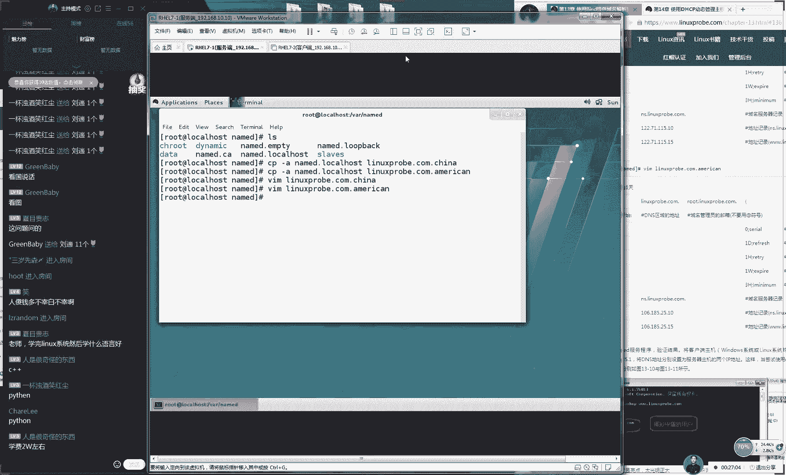
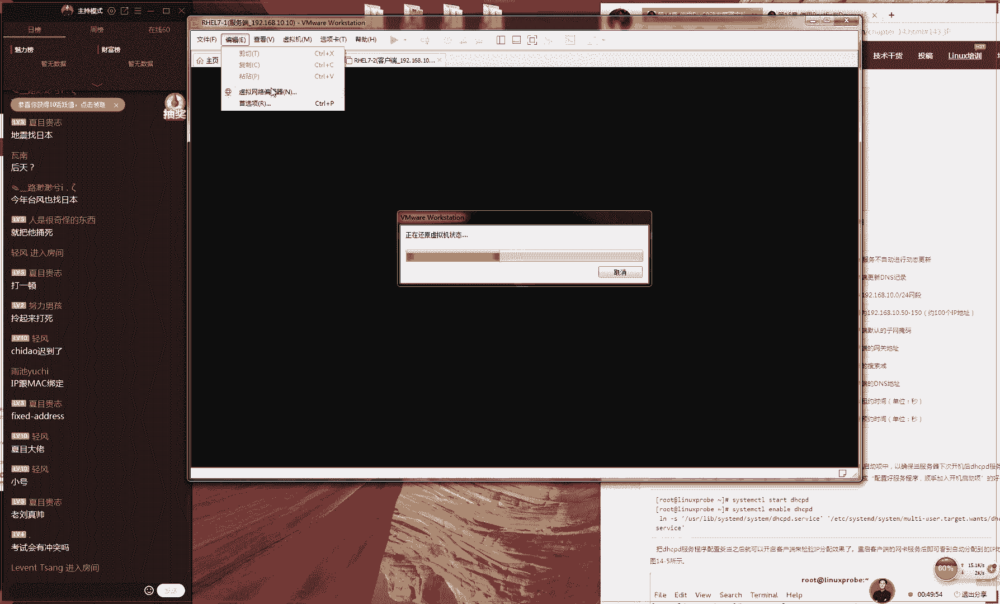
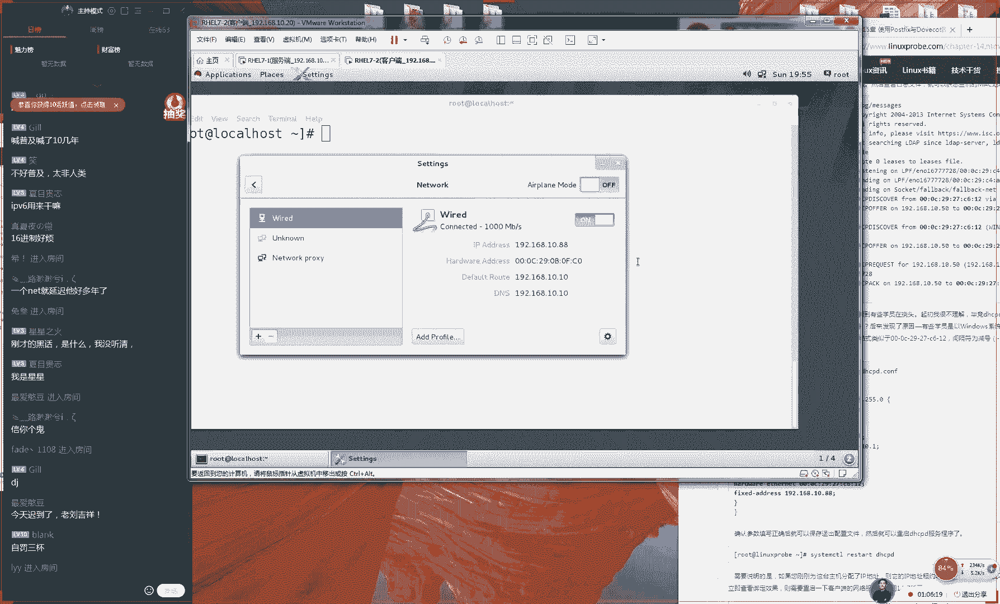

# Linux教程RHCE - P15：15.DHCP与邮件服务器 - 艾弗艾尔思丢丢 - BV1if4y1e73V

🎼爱爱到底我唱。🎼的间，只为下亮亮的心，遇见最。😊，🎼的自己，然后狠狠。🎼你。🎼嘿嘿嘿。OK那我们准备开始上课。同学们现在7点整了，大家先打一下一吧。那啊单那啊那我们先测试一下我们这边这个上课环境好吧。

先打一下一同学们开始我们现天这个课程。😊。

今天的话呢我们这个课程量是比较多的，又是比较多的。我们今天会先给大家做第13章的一个收尾，讲完13。6小节，然后准备我们讲两个章节讲十四跟十5小节。但是这个呃并不多。

因为十四跟15都是两个比较简单的这个章节。好，那我们先给大家说一下我们这个13。6小节，我们给大家做个收尾吧。我们最后一个技术。

我们叫做分离解我们呃最后一个技术我们叫做分离解析技术来我给大家打出来这个字啊，大家可以抄到那笔记上面。😊，这个技术的话呢，我们叫做分离解析技术，分离啊解析技术。

它可以让我们这个用户去访问同一个域名的时候。但是我们得到不同的这样的一个想结果。咱比如说以后那我们这个网站做大了，那我们不光有国内的用户，那我们还会有国外的用户。

那我们把服务器部署在国内还还是部署在国外呢，那如我们我们要是把这个服务器给他部署在国内的话呢，那可能外国人去访问的时候，速度就很慢了。但是如果部署在国外的话，但是我们去访问的时，就有可能速度也很慢。

且可能会出现想超市这样的这么一个呃报错了。那我那我那我们去解决这个问题啊，那我们就可以来部署两个机房了。那我们可以在我们在北京，然后在海外在美国，然我们部署两个机房，但有中国用户去访问的时候。

那们就自动定位到北京的这个机房。但有一个外国用户去访问的时候，就定位到美国的这个机房，现在就是一个分离解析。当有多个用户去同时去访问同一个域名的时候，那我们得到不同的想应结果。好，那我大家再来总结。😊。

就是说因为我刚才可能比较少啊，就是我们现在去访问同一个呃这样的一个域名的话，但是我们最后想出来那个结果是不一样的。其实这个技术在我们互联网里面呃是非常常用的。

大家可以来一起我时呃大家一起来可以来去操作一下啊。大家现在大概大家现在先打开你的这个命令行。😊。

大家先打开你计算机里面的这个命令和终端啊，我们这个CMD，然后大家可以来去尝试跟我一起去操作一下。你现在输一下拼，然后拼一下我们自己的域名3W点点就是我我们这个域名好吧大家现在可以去拼一下。

然后你会发现很神奇的事情，我们所有人拼出来的这个结果是不一样的大家看到我现在展示一下我的这个命令啊，然后大家现在可以尝试去拼一下，你拼到那个结果，你可以放到我们的评论框里边，大家可以来比较一下。

其实我们最后拼出来的这个结果的话每个人都是不一样。你看我拼出来的话呢，我拼出来地址就是1533231221。那我们可以去尝试一下好吧，大家最后发现我们去访问同一个域名的时候。

为什么我们解析出来的那个结果看到没都是不一样的吧？大家看一下我们最后那个结果都是不一样的。就是因为我们现在就是使用的这个CDN技术，我们叫做解析。

我们可以让我们这个用户去就近来去找到我们这个节点的服务器，这样的话有两个好处。第一还是降低主。😊。

站服务器的压力。第二的话呢，它可以让我们这个数据传输的它它是呃它会更快一点。它是我们作为这个节点服务器了。好，所以我们看到啊这个很神奇，是不是我们虽然访问之后，这个呃地址我那我们服务器地址都是不一样。

但是我们访问到了网呃然后这个网站里面的数据但是都是一样的。所以这个技术的话呢，我们这个还是很有应用场景的啊，那我们现在这样，那我们现来呃还原下我们这个虚拟机，然后将我们。😊。

这个DNS先给它安装上，我们先安装上我们这个DNS。好，那我们现在安装一下我们这个DNS看一下我们这个具体的一个配置步骤。其实这个技术我们看起来好像挺厉害，对不对？它最后结果是不一样的。

但是这个原理上来讲，你只要把搞明白了之后感觉很简单简单，这个常简单，且这个配置起来的步骤，它一点都不难，它只需要配置两个文件就可以跟我们上回这个是一样的现在就是一个们这个主服务器的一个类型。好。

那我那我们现在安装一下我们的这个DNS服务。那我们现在安装一下我们的DNS服务然后们去找到我们DNS服务的主配置文件。需要修改两行第一行我第11行代表就是我们要通过哪个网卡来来为我们用户去提供服务。

还有我们第17行代表就是谁可去使用我们DN服务那安代表就是我们使用所索网卡都可以提供DNS服务。那么以及苏人都可以去使用由我们去提供这个DNS服务。下因为我们做这个解技术啊。

那我们就会跟我们这个服务器里面有一个叫根域的会产生冲突。😊。

因为我们现在是一个比较高级的一个这么一个功能。所以我们现在需要把我们这个配置文件往下拉拉的话大概都会拉到了第51行到54行之间。那我们要把这些参数给删除掉。为这是我的13台根所定位的这一个地址。

因为产生冲突。删除掉保存退这样就是你就是一台根域了。后这你才以去做分类解析技术。那我们接来去编辑二个文件们目录里的name1912当就是我们听课的时候千不要一边去做然后一边听讲样话跟不上。

们上课踏踏实看一个流程课之慢慢去课以吃但千不跟着做实验，那清空掉。为这默认的数据跟没有大关系，只是一些文件们不需要去参考一个配置文件是的这个技术它真的不难。😊，他的话真的是不难。

大家的话应该会随着我去配置这个文件的时候，就会发出一就会发出一种啊，就是呃很忧心的，就是哦这么回事的，这种就感叹声音这才是对的。为你去看一下这个服务，他真的是非常简单的。好，因为我们现在可能是没有头绪。

不知道这个实验它怎么样的一个呃，他怎么他就可以有这样的一个效果啊，但你看我改那当然我们看我把给拍完之后。😊，然后大家就会知道我们具体的一个流程了。好。

那我们现在定义一个我们的这个ACL其实来说这个不叫做访问控制列表，这个应该叫做别名的。就是当我们再去看到这个china的时候，那好。

那我们给它定义成一个网15它是24位字码就是我后面有一个分号不要忘记就是相当于就定一个别名了。当我到这个china的，我们下面ica的，当我看到中国跟美国这样一个单词的时。

就相当于就是看到我们后面IP地址这有什么好处，这个很明显就是我们不用再去输入很多遍I地址是通过这的别名来给家做替代现在就是一个变量。接下我们来定义一下就是我们如果要是匹到一个china网。

我们进行什么的个处理呢该怎来对这个网个主机那我要写关键词就是来匹配一个客户端我们客户端它是来自一个网段就是叫china网大家看到我们。😊，就写上一个参数，就是匹配一个客户的意思。当我们这个客户。

如果他要是来自于china的这个网段，就代表他是来自1271115。0这个网段主机的话呢，那么我们就怎么样，那么我们就定义一个域这个域的名称叫做给对于我们自己的域名，然这样来进行操作。

对于我们这个域名的话，我们服务器类型为主服务器然后我们定义一下这个我们他要去加载这个配置文件。然后我们把缀叫做这个点china吧。们跟待会个加以区分。后我们现在有几个中括号啊，我们把这个中括号。

我们这个应该叫这应该是叫做这个大括号啊，我把它给结束掉是这样的其实大家现在看到这里应该有点头绪，就是我们大概这个怎么去配置出来了。如果还是不知道的话就要去思考一下到底是怎回，出这一个效果。

然后我们下去数一1234567下走那我来去往下来去复制我们下。😊，下来去复制7行。然后我们粘贴下来，我们只需要去修改一下我们这个别名。当我们去匹配到一个叫america的一个主机。

我们同样也要去加载一个叫america这么一个文件。好，其实大家看到这个之后啊，会感其实已经能够明白对吧？就是实那么他实际上来说他就是见到了不同的主机，然他就会去加载不同的文件好，大家么这么安静了。

没有人说话怎么是这样的给大家举个例子就是我之前的话大概是今年2月份的时候去了趟日本，然后因为也出去玩一趟嘛，然后就去趟然后就出国了，出国之后的话呢，我就因为我的这个口语很差了。

然后我也不会日语那怎么办呢？那我要吃饭，那我就饭馆里面，然后我要点餐其实这个问题啊，很多人都遇到过了，当你去外国去点餐的时候啊，因你不知道他怎么这个发音啊，不知道该怎么点的时。

那么你可以跟他要一份中文的菜单，对不对？那你可以要一份中文的菜单。但是后来我发现件事什么呢？大家看新闻啊，大概是两个月之前有这么一个新闻。😊，就是说怎么样就清空的会员键什么清空是trl加了。

那我们把清空掉。然后是这样的，然后有一个新闻说有一个人去韩国也是出去玩去了。然后看来那个菜单上面最后那个价格跟自己这个中文上是不一样的。这个什么意思啊？就是说咱比如说有一个公保鸡丁好吧。

然后日本的这个菜单上面的话，果你要是用日语点的话，最后点出来可能说比如说是40块钱。但是如果你要是一但是如果你要的是一个中国的一个这么一个菜单的话呢，可能最后你这个价格就就是合人民币的话。

就合到了六七70块钱吧，反正他会有这么一个议价。后来那个店家的这个解释啊说因为当时做这个菜单的时候，那个汇率好像比较高，后来就定下来了。但肯定也是一个很不公平的事情啊，现在他就是这么一个意思。

当一个中国人去问的时候，跟一个美国人去问的时候，最后我们得到的这个结果，我们去加载的这个文件是不一样的。大家懂这意思吧。比如说有一个。😊，中国人还有一个还有一个日本人，他们都想去吃这个宫保鸡丁。

但是我因为我们看的这个菜单的这个文件是不一样的，所以这个里面的内容也是不一样的，所以会导致我们查询到的这个结果也是不一样的那我们先看一下我们这个配置文件里面啊，他现在就有两个这个网段。

第一个我们叫china。第二个我们叫做america。那就是说当有一个中国用户去访问这个呃访问这个域名的时候，那么我们。😊，就要去加载了这个呃我们这个第一个文件。

当我们有一个外国的一个用户去访问的时候的话呢，那么就会去加载我们第二个文件。所以说它就是一个这样的一个原理。因为我解释比较清楚，我感觉已经说的很透了。好，那我们现在继续往下去配置来保存并退出。

然后进入到万录里面呃，进入到万录里面的name的那我们待会就要去新建出来两个文件来分别去来去匹配说中国跟呃外国这两个用户加载的这个文件。😊，好，那我们现在的话进入到这个目录里面。

那我们知道这个里面有一个文件叫做正向解析呃模板文件。那我们去复制的时候，记得加上一个杠A参数啊，我们昨我们出这个亏了。然后我们将这个文件给它复制成。第一个我们叫做linux。😊，点com点china。

第二个的话呢，我们叫做ameran。好，我们现在复制出来这两个文件，同时再去编写一下。先编写一下我们叫做这个china的文件。😊，这个服务其实很简单，只要你知道它就是原理上来说。

它就是根据来源的网段不同，然后就加载了不同的文件就可以的。然后那我们现在去写上我们这个呃域名的根域，以及我们的对应的邮箱。接我们就要来去编写一下具体里解析记录了。

来说是N代表指的是由我们的供应商为提供的一个服务器要用来去解析我们的二级域名好，然后我们是NS它代表N点但我缩写成那我们解一个A记录指的是把它解析上一个IP地址。

第一个那我就把它给叫做121510然们解一个3W我们也给解11510们保存推出同们配置我们个一个外用户去访问的话这同的格式不过我们解析出来这个值是不一样的。😊，好。

我们只是我们解析出来这个这个值是不一样的。来root linux probe点com点。但我们知道第二个它是一个邮箱，但只不过这ar特符号跟我们下面是冲的。所以我们这个艾符号用到点号做这个先割的。好了。

然后我们NS点linux probe点。呃，跟我们上课没有太大关系的。同学们，如果其实我们可以下课之后再提问，好吧，因为我们上课不是为了聊天嘛，主要是了先去讲课，这个先不着急。好吧。

我们可以下课之后再来说。然后那我们先来3W点点我们解析到一个IP地址上面，106。185点25。10。好，那我们现在就有两个地址了。我们现在再配置一下我们的这个网卡。因为我们现在就是想给大家尝试一下。

就是把我们之前所学习过一些配置网卡的这些呃。😊，我们配置的这些方法再给大家都去演示一下。所以我们演示一下第四种了，就是来去配置一下我们这边的网卡地址。我们之前讲过配置文件。

然后还有讲过NMTOY都这些我们都给大家去来去尝试过配过。好，那我们接下来去配置一下，就是来配置它成两个地址了，一个是106点1呃，一个是106点185。😊，点25。10。好，然后这是我们的第一个地址。

让我们再添加一下。还有第二个地址的话呢，就是我看一下它模拟的是一个外国用外国的一个主机12。71其实我也不知道这个到底是不是外国的但是边瞎写一个为它只要地址不一样就。

们能看出效果3250然后我们现在这个网关其实没有没有必要写那我们就给写4个0，就默认就好了。然后我们点击下应用，其实它就是没有的意思。好，让我们点击一下这个关闭网卡，然后点击下启用网卡。

样话我们就这个主机上面就有了两个网卡了。那然后的话那我们现在选择一台客户端户端就我选择一台那我们现在就去尝试一下说有一个来自于中国的一个主机。还有另外一个来自于美国的主机去访问的时候，效果也是不一样的。

好，我们现在去重新去启动一下我们已经配置好的N。😊。

好，然后我们将这个服务给他加入到启动项里面。

好，那我们现在把拍好之后，我们第一件事情啊，先要配一下我们这边客户端他的地址。那么这边我们客户端的地址的话呢，我们先来这啊，我们先来。😊，然，记得我们客户端的话呢。

我我们的这个订SP需R也要指向到我们的这个服务端。然后我们先点击一下编辑，先把我们的话模拟成一个中国的一个用户，然后我们来。😊，实际上我们的地址是122。71。115点。

但是我们不要跟他那个服务端是要是这个呃写一样了，那我们就给他换一个。比如说我们刚刚设十，那我们把它换成20吧。然后但是我们这边服务端的这个DNS，我们要给写成12。71115。10。

一定要跟我们刚才是对应上的。然后这个网关是没有必要，因为网关现在时也不存在，我们也不需要去上网好，那我们现在把它去开启关关闭再来去拼一下这个域名大家看一下我们这个效果我们加一个参数，我们加一个杠C4。

代表就是我们去拼4次的意思，那么否则他会他会来去一直去拼下去。好，他告诉我们说我们的网络，我们的域名没有拼通。😊，好，但是我们现在能够去心通的，但是我们去看看为什么，好吧。嗯。好，这个很这个很尴尬啊。

我们拍完了之后好像没有生效。😊，要呃，但是我们能够去拼通这个外网的不但啊，但是我们能够拼通我们的主机12。7115。20哦，我想一下原因，可能因为是因为我们的网络没有清空。

那我们现在去清空一下我们的防火墙。因为防火墙我们需要清空一下，然后我们再来去查询。然后我们这边去拼一下我们的域名。好，大家可以看到，现在我们就把它给拼通了。

然后因为我们现在是加了哎那我们现在加一个参数啊，拼一下杠C4。哎，不是我们我们应该拼的是域名啊，刚了一下。好，那我们现在可以看到的话，现在我们的模拟成是一个中国用户。然后那我们在来去尝试去拼一个域名。

这样的话那我们最后这个结果就是12。7115。10。那好，那我们现在换一下我们这个网卡，我们将我们的这个网卡信息给它修改成1个106网段了。这个时候你再去访问同一个域名的时候。

最后我们这个访问值也会是不一样的。106。185。😊。

点25。20好，我给大家换一下。但是我们这边的服务端地址肯定还是要10啊，要以我们这边服务端的这个为准。好，我们点击一下应用。好，我们点一下关闭，点一下开启。这样在就是一个重启网卡这么一个操作。

然后我们再去拼一下这个域名。大家可以我去访问的是同一个域名。但是因为我们现在来源的主机的网段是不样。是模拟成了两个用户嘛，再去拼一下也可以看到效果就会变成了10618525。

10就是说当你去访问同一个域名的时，当我们可就竟来找到我们对应的服务器，这样可以加快我这个解析的这么一个速度。好。

然后说去配置文件里面是不是同一个服务器解析多个域名的时都是要写入到这个文件里面就是写到那个1912这个文件里面这是必须要往里去写入的好，然后今天迟到同学比较严重啊，怎么今天呃60个同学今20个都迟到了。

天是什么日子。然后这个给大家做到个收尾。这个其实比较简单我们第13章节给大家。😊，给大家做了一个分析解析技术。然后我们通过来源于不同的这个网段，那我们最解析出来的这个结果也是不一样的。

虽然来说这个是比较比较的这个呃简单的一个实验吧。好，今天礼拜日礼拜日就应该迟到？好奇怪。今天今天应该要是情人节吧。我们再说一下我们今后面的因为今天东西比较多。所以给大家直接讲了。

我们面我们会给大家讲两个章节会讲一下十4跟15，因为十三章节太简单了，而且我们讲完了，要我们做个收尾，今天就是算送的。好吧，然后今天这个课程还是比较多的，我们会给大家讲两个章节讲一个十4讲一个15。

但是我们坦白来说是你已经过了因为只要你听过第十三章节，然后你后面的这个章节都不会感觉到很难了。因为我觉得第十三章节是我们这本书里的最后一个难点。所以你现在去听所以现在去听讲的话呢。

从第十四章开始就会感觉到非常sy easy了非常简单这种感觉了。好，那我现在给大家先说一下我们的第十四章节非常非常简单，😊，第十五章节也很简单。好呃，我我估计都用不了两个小时啊。

所以我们今天又也带了一下13。6小节。😊。

但是因为我们现在我们先给大家去呃，我们那我们不需要说我们学完之后就给他忘记。所以我们还会在我们今天这个课程里面。

那我们会再给大家去配置一下我们这个DNS就是我们刚才讲这个DN然我们就趁着答题们再给大家再去配置一下。待会会跟我们这个邮件服务器在一起再配置出来一个实验样话我们就可以充分的看到我们的DN的一个效果。

然看一下说这种情况下是不是就要在两个国家分别部署服务器对要多个国家来去部署这个它需要部署很多个服务器。你看啊咱比如说我们现在不差钱。那我们就可以不光是每个国家。

那我知道最远的距离不是不是不是南极北极不是天涯海角中国这个南北互联问题。那我们就可以在部署两台服务器。那我一台服务器署在北京，一台服务器部署在上海。这样话们一个北方用户去访北京的机房。

后然后从南方用户去访问上海的机房。然后当我们还可以在我们的不同的国家去部署。咱比如说。😊，美国用呃那我们美美呃美国的客户特别的多，那我们就可以在美国部呃呃来去部署一台这个服务器。

当韩国用户也开始多起来的话呢，那我们就没有必要让他们也都去访问美国的服务器，可以来去部署一台服务器。在我们的这个韩国，他们就可以这样去做这个技术我们叫做分离解析嘛，他可以究竟去找到咱再举个例子啊。

比如说你想上厕所，你想上厕所的话，想去问一下别人的话，他不会给你列出北京市所有的厕所，但是他会给你告诉你你他是离你最近的一个厕所，所以说你发现很发现一个很有意思的一个现象啊，就是你同样一句话。

就是呃请问您知道哪里有厕所吗？这么那你只要问这么一句话，但是你在不同的地方，你不同的国家还有省份不同街道，你去问这句话，就得到这个返回结果是不一样。他会告诉你说当前离你最近的这么一个服务器或者说厕所。

他所在的这个位置后下给大家说一下第十四章节。😊，啊，这个非常非常简单。然后有一些黑话，我先给大家教一下。😊，这个话叫做DCP服务。这个我们不用太多说，因为这个是我们每天都要去使用到的这么一个服务类型。

它是一个协议，它可以让我们来去自动化来去分配我们的网卡信息。大家看到说非常严谨。我说是一个网卡信息，而不单纯的是一个分配IP地址。因为很多老师他们会认为只能够去分配IP地址。

但是IP地址只是网卡的一部分这个非常片面的一种理解。所以的话我们今天会给大家讲的是分配我们的网卡信息，它不光可以分配我们的IP地址还可以分配我们的码我们的网关我们的主机名称。

它都可以帮我们去分配还有N信息。那我们这个CP也是我们每天都会去使用到这么一个服务。因为我们的路由器里面就都会有这么一个这样个CP服务，可以为你的每个设备来去分配我们IP地址。大家想一个问题啊。

比如说们以后开了个公司，或者说你开了个网吧那你网吧里面有200台机器。那我们现在要想去为200个机器来去分配来去设置。😊，我们这个呃网口的IP地址其实也是很麻烦的一件事情，对吧？

那我们就可以去部署出来一台DICP服务来去批量来去分配我们的IP地址。并且我们以后去维护的时候都非常简单的，就是说让我们这个人工啊可以。😊，呃，不用去干一些非常繁琐的事情了。

可以交由我们这个服务器来去批量去分配。就像我们现在这边拓扑图呃是4-1一样。大家可以看一下，我们只要把我我们这个主机之间用到网线相连，或者我们连到一台路由器上面。

那我们就可以去实践出来那可以去出来这个P功能了。其实我们还说啊大家上课之前就一定要先来去预习这样的话呢呃即便说您不会去配置的。但是您知道我们这个实验的一个效果了。那我们在线来去听课的时候。

就能够大概去捋一下思路。最后我们课下可以再去做实验。如果说您都没有预习，或者说我们坦白说啊，如果说您没有预习，而且基础不太好的话呢，可能连CP是什么都不知道。

那我们再去讲这些可能就感觉会跟起来比较吃力了啊。所以说我们要知道这个预习的重要性。然后因为咱们这一期同学们大家准备去考试的同学是比较多的。所以我去提一下啊，第14章节第CP呃。

之前的话呢是在红码C里面考过红里面的课程叫做红。😊，ARH401课程里面当时考过，后来在2014年的年底12月份变题就没有考了。这个服务台虽然说非常的常用，非常的实用。

但是在红帽的考场在这个红帽这个这个考试里面包括红里面目前呃C都已经不考了。那但是我们觉得不讲的话比较可惜。我们会给大家继续往给大家讲一下好吧。但是这个但是这个服务是跟我考试没有关系。好，这给大家提一下。

给大家说一下，就是说我们有一些黑话，因为我们在运维也是我们会有一些黑话就自己能够听不懂的。我今天看了一个非常有意思的一个图片啊，大家就知道这个医生写字是不是感觉就像加密代码一样，根本就看不懂。后来啊。

😊，呃，后来有人今天发了一个帖子，我不知道你们有没有看到，就是有有一个人发了这个医生给他开了一个这个呃药单吧。然后就是这样的一些乱七八糟的，然后他网上问说能够看得懂这写是什么。然结果还真的能看得懂。

也真的是神了啊，就说然后后来有一个人特别好玩，他找了一根自己的头发，然后给拍了张照片，然后说这是什么呀。后来还有人说这是红霉素眼膏正就是说可能医生写字就是这种经过加密的，其实咱们做运维也是有一些黑话。

但然你说这些会就当你说就一些话的话呢，可以第一能够证明你是一个行家。第二的话就是说你可以在你的内部进行沟通的时候，不用担心说信息别人听去了好吧，就是这么一个反正我今特别特别搞张图片吧。

然后就是就这么一个东西，然后有人把自己的头发给拍了张照片，然后有人说他一根头发长特别像红霉素眼药膏，就是医生写字特别的就是卷了吧唧的对吧？好，那我们接下给大家说就有一些黑话，然。😊。

第一个话我们叫做作用域，我们先给大家打到我们屏幕上面，但也不用去读它，你读它的话呢呃也费眼睛。我们给大家去讲出来好吧，大家不用去照抄也不用去读，我给大家去讲出来我们这些黑化的一些是什么意思好吧。好。

那我们先来说一下我们这个作用。对作用现在就是一个声明就是一个声明，告诉我们这个服务器，他告诉我们这个服务，我们待会可能去使用到的这个资源是什么。这什么意思？

我想说那就是说我们要为我我们这个组机来去分配我们的IP地址。但是我那我们这个地址它是有一定范围的那我们就可以先来进行声明。就是说我待会会可能会去使用到的一个地址的段。😊，呃，这个咱家举个例子啊。

咱们有呃有一句老话叫做呃，大家有听过说呃，吃着碗里的，看着锅里的，还有一句老话叫呃。也大肚子小，一个馒头吃不了，这个是一个很俗的一个话，不知道大家有没有听过，就是说呃你再去吃饭的时候呢。

你不知道自己要是吃要呃要去吃多少，那你就可以先把这个资源给它占下来，然后你可以以后再去决定说你到底要不要再真的去使用它。所以啊我说好俗，这个然后给大家说啊，就是有这么一个属于我们叫做作用域。

这个作用域啊，现在就是你告诉你的这个系统，然后你有一大段的这么一个网段它他这个呃那么我们这个网段它会很大。那比如说它是来自于192068。10。0这个网段254个主机，😊，给他来去呃，定义成一个作用语。

就是说我们待会儿可能会去使用到这个网段来为我们这个客户。😊，他去分配我们这个地址，但是它并不是真实为我们用户去分配地址的。好，第二的话呢，我们叫这个租用域啊。第二的话呢，我们叫做超级作用域。

这就是说我们可以把我们这个作用域把它跨这个网段来进行这么一个声明。但这个来说用的比较少。我们一般来说只要用到这么一个作用域就可以了。还有一个我们叫做这个排除范围跟地址池。那给大家说一下。

就是我们这个话呢定义一大那么你定义一个很大的一个网段，就是说我们待会可能会去使用到这个网段里面的地址来为我们用户去分配。这个时候啊，那你就不用说都把它给分配走了。那么你就可以定义出来一部分。

但比如说我拿取出来一部分。这个地址才是真实为用户去分配的。比如说地址范围是从零分配到100好了，那我们给它定义一个网段，这个来为我们用户真来去分配的地址，我们把它叫做地址池。😊，地址池。

这个的话就是我们这个真实来为我们用户去分配的这么一个地址的范围。用户所获取到的地址。那也就是说就是我们地址池里面所定义的这么一个范围。第二的话呢，我们叫做排除范围，那那也就是说从101。

然后一直到254。这个的话呢一直一直到255。这话我们叫做排除范围应该到254，因为我们不能算255255是广播地址。然后话那我们就到这个从101到254，我们这个话我们叫做排除范围。

就是说我们待会我们不会为我们用户去分配的这么一个地址的范围。所以的话呢零也不可对吧？因为零的话是一个零是我们的网段，我们是从1到10从1到100我们需要严谨一点。好，然后那我们先看一下的话呢。

就是说当我们要想去为我们用户去分配的，它要定义两个东西。第一的话就是说地址池，这是我们来为它是为我们这个用户真实去分配的地址范围。第二的话我们叫做这个排除范围是我们。😊，呃。

不会为我们用户去分配的地址范围。所以说那也就是说我们的作用域作用率就等于啊作用域就等于了地址池，加上了我们的排除范围。这个加在一起，就是我们这个整个声明的这么一个地址的范围。好了。

那我们呃也就是说呃给大家提个问题好了。那么也就是说我们的地址池就肯定是小于我们这个作用域，对还是不对。😊，那么也就是他是否证明说我们的地址池就一定是小于了我们租用域。这个大家要是能够明白的话。

就肯定的是理解我刚才所讲的啊。那告诉我们说呃，我们的地址池是否就一定会小于租用域。我觉得好像应该是小于对不对？因为你看它还有一个排除范围，那我们要减去排除范围，那它不就是小于我们租用域嘛？对？

因为我们刚才讲到它一部分这个范围的地址段它是不会为我们用户去分配的。所以说到底它是怎么样呢？应该来说答案应该是不一定后来说它是不是的。那么为什么就是因为我们的这个排除范围，它是可以没有的。

我们的地址池可以等于我们这个租用域可以完全的全都给我们用户去分配，而没有这个排除范围。因为我因为我们比较这个于我们资源嘛，你可以全部为我们这个用户去分配，没有保没有保留这个排除范围就可以了。

那我们可以没有保留地址范围那我们就没有排除范围段好，但我下面还有一个叫做这个租。😊，跟预约啊，在那么其实来说这个租约它里面分了两个。第一个我们叫做默认租约时间。第二的话我们叫做最大的租约时间。租约。

它分为两个租约分为两个。第一个我们来叫默认啊？第二的话呢，我们叫做最大，还有一个我们叫做预约。好，那我们现在给大家呃讲一下我们这个租约好了。这个租约的话，他指的就是咱比如说我们开了一个咖啡厅。

那我们现在开啡厅都是什么呀？都是白领，对不对？都是有钱人都是呃比较小资的一种人群。他们一般来说他们会想是一边喝咖啡，一边呃拍照，然后一边去。😊，办公，然后他们可能会带着自己的笔记本电脑。

然后大家应该会去过星巴克这样的这个咖啡厅对吧。我们那我们没有去过我们那希码我们见过他们可能会拿一个自己的笔记本，然后在一个椅子上面去办公，或者说他们可能会拍照片把自己这图片发到自己的朋友圈里面。

那一般来说现在这个咖啡厅啊现在也不断的在去增加自己的这个竞争力啊，还有这个服务意识。所以话他们现在一般来说都会去提供那个wifi好，那比如说我们现在想个事情，那你以后开了个咖啡厅，那你每天的这个客户啊。

咱比如说是500个人吧。咱比如说每天卖500杯咖啡，这个里边有500个人需要每天去上网，但是我们知道一个网段的话，一个D地址的话，他只能是有254个可用的地址段可以来为我们这个用户去分配。

那么就有问题了。那也就是说每天早上起来你新来的人，那他有这个IP地址的范围，那么他可以分配IP地址，然后一直到254个人之后呢再来的人他们就没有地址可以去分配了。就因为他没有地址了嘛？这样很明显就是说。

😊，很不科学。这个时候那我们就可以使用到这个租约的这么一个技术。我们先给他定义一个叫做呃默认租约时间。就是当你去获取的一个地址之后的话呢，他会开始去计时。当你达到一个时间段的时候。

比如说当你达到6个小时的时候，或或者说当他或者当你达到呃两个小时的时候，他会再去检查你说你是否还在这个呃机域网内部。当你是不在的话，他会把你的这个信息给它记录下来，他会等到最大租约时间的时候。

再比如说最大租约时间是4个小时，当你到4个小时的时候，他还会再来去看一下你如果说你已经还是不在这个机域网内的话呢，就会把你的地址给他回收，然后再给它分配给其他人。现就是一个循环使用的这么一个。😊，呃。

这么一个循环使用的这么一个例子啊，让我给大家举一个非常不好的一个例子，好吧，然后帮助大家来去理解。我之前我看了一个美剧，是一个末日片，然后就是就是发生了地震啊，发生了那种洪水啊，然后发生核爆炸什么的。

最后啊所有人都去政府的一个救援的一个呃都都去享受政府这么一个救援吧，然后所有人都到一个空场里面。但是因为人太多了，政府已经不能够照顾，那么也经不能照顾所有人了啊，后来那个资源也比较的匮乏。

然后就有一个人啊，大家有没有看过那影电影，应该知道啊，就是嗯。😊，有一个人的话呢就是特别的穷，后来他怎么办呢？他要拿一个他他要拿一个树枝，然后呃很大的一个空场啊。

他就拿一个树他他要拿一个树杈他就每个人都捅一下因为人都在躺睡觉，大家在睡觉，他拿一个树枝每人他都去捅一下。后如果要是那人有反应，他就走了。如果是没有反应的话，就会再捅一下。如果还没有反应的话。

就证明那个人已经是死掉了，就是挂掉了，他就会把那个人的东西据为己有嘛，我们叫做后来他一开始偷了鞋，然脱了衣服什么的，也不偷了。后自找好多包什么的就说他也像就是一个租约时间一当你达到一个最大租约时间。

那么证明你已经离线了。那么你的这个资源就被回收走，那么我们叫做个租约时间给捅。接来说一个叫做预约个这个预约的话我们叫预约也好，我们可以把叫做语网卡绑定他指的就是我们。😊，地址绑定IP地址绑定啊。

咱比如说有一个例子啊。😊，那你的呃那你的老板特别的迷信，他就喜欢说我想发财，对不对？那我呃呃那我呃呃那我喜发财，那我喜欢我的地址，就是192。168。10点88。好。

就是说呃你们的老板非得要求你说我必须要让我的这个服务器地址就必须是10点88啊，否那么呃否则这个公司以后出了问题，那算你的。那么这个他有这个要求的话，那么你要去满足了，那么就有两个办法。

第一个办法就是说每天你早点来公司。在你的呃。😊，老板开机之前，你先开87台服务器，这样的话呢，当你老板再开机之后，他就会获取到第呃这样的话他就他就会获取到第88台服务器的地址。

就会是个10点88这第一个方法但我天知道非常可笑，这不可能的因为我不可能说每天都严谨的去控制这个地址太了第个方法是作这个绑定。既然我们的个I地址给与我们的一个服务器做绑定。这样话。

便说主机他还没有在线的话，就会提前把给预留出来。在就是一个预约。大家知道就是这个非常预约了，如说你今天我们说12月9号这么多人都迟到了，肯定是情人节那你情人节想跟女朋友去吃饭，但个特别热门的饭馆人多。

那你想去排队怎么？打个电话吧去预约一下地址，那我去预约一下位置，咱说定金什么的当定金预约好这个位置的话，今天你没有来，或者说你。😊，迟到了，但是这个位置他也会帮你把开呃，但是这个桌子也会给你去留下来。

他不会分配给其他人。再就是跟你去预约的意思。好，对，他就现就是我们的IP地址跟我们的mac地址来去做这个呃呃来去做一个绑定。好，那我们我那我感觉就说的比较详细了。然后给大家去带入到我们这个实验里面。

大家看一下我们具体的一个部署的一个过程。好，那我们现在啊。😊。

好，那我我我们现在先换一下我我们这个虚拟机，让我们这个实验之间不要产生冲突。

另外的话呢，我们现在。

呃，需要点一下我们的虚拟机，我们往上面去选，选择虚拟网络适配器。啊，老刘真帅一看就说请了托考试的时候会有冲突嘛？考试的时候是没有第2CP的。我们今天所讲的第十3章考试是不考的。

第十4章考试也是考试不考的。好，然后但是我说没有什么其他意思，大家不学就是说如你要是想备考的话，这可以放一放但这个考试是但这个但是考试不但实用。

这个不话可惜了我们觉得还是给大家去讲后是这样的我们因为自己在配置这个C以我们一定要把我们这个虚拟机上面带有给关闭掉。这样避免说我们CP服务之间，它会产生出来冲突的情况啊，那我们把第CP给关闭掉。

然后我们点击一下确认，然后我们才可以来去配置你自己的C样避免产生冲突啊。好第十6章也不考。后我们来去安装一下。们里很多不考的大家是说如要是备考的话，可以先放一放我安装一下我们的第CP服务。😊。

呃，说我每做一个实验之间，它都会还原。对，因为我怕我因为咱们上课嘛，然后我怕我这个配置的实验之间，它会产生冲突，或者说我在我我怕我的这个配置文件它没有删干净。

但是它实际上之间第2CP跟DNS它是没有任何这个它是没有任何这个关系的。😊，一旦呃但是我们刚配置IP地址什么的，所以配置地址对吧？所以我们还疑一下，这样避免说我们这个环境受到一些影响。好。

然后待呃呃但是我们待会给大家去讲到一个综合的一个例子，就像我们昨天讲的这个DNS，然后我们待会会给大家讲一个DNS加上然后给大家出来一个邮局系统。大家可以看到我们搬的这个砖还真的是能盖什么房来的。

好接下我们来说嗯。😊，所以我们这条视频估计要反复拿开看了，一定要反复去看，大家千万不要客气，对吧？我们要好好去然后去多看。反正当时我的呃我当时的这个反正我听了4遍的。好。

然后呢我们现在啊我现在编辑下我DCP的这个主配置文件。这个啊我们刚刚给大家讲过，就是呃我们这个服务的话，它会有一个主配置文件。这个里面保它里面话它会保存它会它会保存这个最重要的这个配置参数。

我们把它叫这个主配置文件。😊，他会有一个寻找的一个方法，他就在ETC目录下。还有一个小技巧啊，它的话就是在ETC目录下。😊，以服务名称命名的呃，以服务名称命名的一个文件夹。

里面叫做服务名称点CONF大家可以记一下，这个就是我们这个主配置文件的一个名称。那这就是我们这个主配置文件的名称。好，好，然后的话呢我们继续来给大家就是说我们来编辑这个配置文件。

大家看完这个配置文件之后，感觉呃，还是问那一个问题吧，他说慌还是不慌，为什么HTEP还有个config？😊，呃，我们这个都还这我们这个会有啊，我们因为我们这个文件它最后面不也有1个CNF吗？

视频文件对于学员开放时间，我们我我们的红包日由期是没有时间限制，大家可以一直来去看红包日由期的课程。但是我们红猫日由8，我们现在还在呃准备当中，这还没有说。😊，但是换了版本的话就不能够去看了。

但是具体的这个升级的方法，我们还在给大家去研究。😊，好，大家看完之后，这个感觉不会慌，对不对？因为这个配置文件里面它总共是有了5条。但是我们仔细一看，其实它都是这个注释信息，我们都不用去管的。

我们可以把它给清空。我把清空之后给大家去编写我们自己的配置文件这个真不用慌。因为这个这个真的不用慌。因为这个没有东西清空掉。

那我自己来去那我自己来去我们自的N信息是这样的那我去写的话我会把我这边每一条大家去介绍它里面的这个作用。如果大家没有跟上话，没有关系家看一下我们上面的那14-4表格，这个里面会有每一条参数的一个介绍啊。

然后那我们会再给大家去介绍一下第一个参数的话我们叫做DDN就是动态地址个这个技术叫做DDN代表就是动态代代表一个动态DN地址更新技术动态N。😊。

地址更新技术，但是这个技术我们其实我们不需要，而且我们现在没有这个技术，所以我们还给写上一个no，把它给关闭下来。好，然后的话我们来忽略掉。然后我们忽略掉我们客户端给我们的更新。当然我们需要把它忽略掉。

因为我们现在不需要客户端给我们更新什么东西。好，接下来我们定义一个我们的作用域。好，给大家提个问题了啊，请问我先定义个很大的一个网段，192。68。10。0。然后我们的字网掩码是3225。0。

请问我们这个叫做作用域的东西是我们一会儿为我们用户去真实分配的地址范围吗？😊，呃，大家可以打一和二就可以了，不用打这么多我们可以劲来给大家提个问题。那么请问我们的作用域。

我们现在声明了一个很大的一个地址范围。请问这个就是我们待会要为我们用户去真实分配的地址范围吗？那么肯定是不是的？因为我们的作用只是声明一下。

就说我待会那你可以指着你可以指着一大堆饭指一大堆菜这个这里所有的饭所有菜都是我的，但是你最后能不能下来？

的实际上你吃到肚子里的这个东西才叫地址池它是可能会是小于等于你生明的这个作用的不是说好的地址池吗对它是地址池，所以我们给大家提个问题了。好，那我们继续来定义一个叫做地址池的东西。

这个才是我们真实为我们用户去分配的地址范围，那我们就是192810。50，一直给他分配到1928点10。150然他可能会说老为什么是从50开始分配的，不是零开那我们我们为什从一开始去分配？😊，あ？

大家知道为什么？我们为什要从50开始去分配，而不是像呃而不是从一开始去分配的啊因为因为有钱嘛，因为愿意，因为我们这个实验里面它只会用到两个主机，所以你只要有两个主机的地址就行了。然后你随便去选了。

比如说你可以去选择100分配到250，或者说你从呃从二分配到十都无所谓啊。就是说我们地址只要范围足够就可以的。这个你没有必要说非得要从一开始了，这个我是这么个意思啊。好。

因为我们地址的范围只要是足够就行。如果大家要是地址不太够的话呢，那么你就可以去充分去使用，就是从一到分配到254好吧，这样话我们来定义一下，就是字网掩码，这个它就是需要注意一下。

这个才是我们用这个话就是我们来去真实为我们的用户去分配的这么一个字网掩码的地址。待会我们这个客户端的网卡上面就会被分配上这个地址。还有下面就是我们的路由地址，这就是我们的下一跳。那就是说叫做下。😊。

地址啊，下一次我们这个出网关的地址就是我们这个t我们的网关地址。好，这个其实我们地址无所谓啊。因为我们现在也不需要，那我们现在也不需要去上网。

这个只是一个给大家参考是我们的网关地址去写网关是用来去上网的我们通过这个网关后就可出上网可以地址？以指的这个公司外网的网关个服务器地址可以让去做数据转发我地址接还有就是我们叫搜索域其实这个没有用啊。

为我搜索意是一的还设置。😊，这个我一说完家就知道了，这就实践它就是我们的的地址。但是因为我们在也没有，但是我们给大家介绍一下这个格式啊，这样那我们就分配好了我我们的网卡的IP地址，我们的网页码。

我们的网关，我们的的信息。接下的话我们再来写上我们这个租约时间。那我们来写上我们这个租约时间叫default。😊，然后我们来呃我呃这个话它是按照秒来去计算的。我们默认作业时间是21600秒。

现在也就是6个小时，21600秒。他是按照秒去算的。这个也可以根据你的这个，然后说IPV6呃讲课要普及IV6了，在普及IV6其实呃说了好几年了。

我上初中那会儿就开始提到I说到I说到IPV6现在也刚刚开始普及吧。我记得好像两年之前苹果apple store就必须要去要求这个软件要支持IPV6了。但是也一直没有火起来。到时我们看一下吧如果要是。😊。

呃，课程允许的话，我们会给大家去讲IPV6的这个没有问题。好，然后我们来定一下我们这个作业时间的话，鉴定一个默认作业时间是21600秒，还有一个最大的作业时间是43200秒，他拿照秒去算的。

所以说我们默认作业时间就是6个小时，最大作业时间12个小时。但我们再举个例子啊，举一个很不好的一个例子，就是那就比如说你开那个电影里面就是有一个人对吧？然后他拿一个他拿一个树枝，他先去捅了你一下。

但是先去捅一下别人啊，然后捅完之后没有反应，等他过6个小时之后，他又过来捅一下，那你还是没有反应。那比如说那么就说明你不是睡的太死了，是因为你真的是挂掉了对吧？那么好了，他就把你的东西给他拿走。

然后回收你的这个资源，这个我们可以去适当去调整这个数值的大小啊。比如说以后以后您开的是一个网吧好了，那么就可以把这个地址给设稍微大一。因为网吧的话肯定是要去长期去在线上网，对吧？

那比如说开的是一个咖啡厅一个。😊，喝咖啡呃，半个小时就足够了。你你你喝两个小时就了不地了，对吧？好了，那我们就可以把这个地址给他呃这个租业时间嘛。

我们给他回收这个频率那可以可以更高一样话以让我们后面用户也以分配到我们对应这一个地址就根己的这个环境再去调整是翻桌率很高的这么一个行业。

那我们就可以把这个作业时间设置小一然我们一下保存退出这样其实就已经是做好我们可以找一客户端客户端话随便可以选一一台window都可以那我们就选择还是一台好吧那我们的服务端就是一们客户端还是一台我是鲁迅那接来鲁迅说这句话没有说但是这句话好有道理。

那我话重新去启动下服务我服到启动项当中是这样的虽然说我们这个服务不，但是这种。😊。

意识你肯定一定要有。啊，这话就是说我们一定要有这么一个意识啊，就我们一定要有这么一个意识。当我们考试，我们考试的时候，也是当你去配置好一个服务，你一定要把它给重启一下，然后加入到启动项当中。

一定要加入到启动项里面，这样的话，你那么你最后考完试之后才有分值，要不然话你这个服务你配置的再好再对最后你没有成绩，这样给大家举个一个例子啊，就是说我们上学的时候是不是要交作业。

那你有一天你作业特别的多，然后都通宵，从晚上下午从下午到家四五点钟连饭都没有吃，然后去写作业，写到了凌晨一二点钟才开始睡觉，然后才才去睡觉，然后早上起来5点钟又起床又去上学去了。

结果到了班里发现自己写了一宿的作业，写了7个小时的作业，忘忘了带了。那这个时候老师能信你嘛。那你说忘了带了，别人也说忘了带了，最后老师肯定给你是没有就没有成绩了，对吧？

那也就是说我们的这个呃配配置过的这个服务就请一定要注意。😊，把它加到头像里面，让你的这个脚本程序也能够判到成绩。这个我们需要一定要注意。好吧，反正我之前啊就是我上初中嘛。

你想也知道早上起来小孩跟傻子的我也是起来慌不行不行那作业本不知道跑哪里去了，所以就是老忘带作业后来呃每回都在新在写第二遍很痛苦的经历。好，那我们现在去配置一下我们这边的这个网卡了。

其实我觉得我们的客户端应该用一台windows，算了，就这样吧，因为我们的客户端一般来讲都是windows好吧，那这个无所谓啊。好，那我们现那我们点击一下我们这边的网卡。

我们现在把这个网卡点击下这个小轮。😊。

点击一下IPV14这个时候我把它给取消掉，我们把它改成第CP模式。好，然后我们把它给改成第CP之后，我们点击下应用。然后我们点击一下这个关闭，点击下开启。好，大家可以看一下。

就是说我在就会去获取一下由我们服务端分配I地址的信息。但我看到之后分配不过来的原因是什么呢？那我现在猜一下应该是没有清空步骤我们一定要记下来，我们要清空下我们个再去刷新一下我们的网卡。

然大家就可以看到我们获取的一个网卡信息，我们的地址是10。50，那我们这个网关地址是10点10我们地址是101都被我们去分配到了，这就是我们的CP服务这个特别的好玩。好，那咱比如说这个现在是一个老板了。

那我们老板比迷信那我不说是1050我就想要88你要不88，我就把你开掉了。那好了，那我们现在有两个选择，第一个选择，那我不说了啊，第二个选择的话呢就是说我给做一个网卡绑定。😊。

只有两个那那我们做网卡绑定的话，那我们需要将我们的这个主机的IP地址，以我们的网卡的这个麦ac地址来去做绑定。但是我们这个m克地址啊，你去看的时候可能也不太方便。因为你看就是说他这个呃你去老板主机上面。

你去看这个地址的话呢，虽然也行，然后可抄到你的然后抄到张纸上面也行。但是有些的地方的话呢，你不太方便走进去怎么办呢？比如说你的老板是在堤坝。

然后安排你们特别苦逼的在比如说公司里面在在然后在公司里面在还要啊还就还要在加班，但是其实你的老板已经出去玩去了。😊。

当你要是呃不太方便去来去看一个主机地址的时候，那么怎么办呢？那我们就可以去看一下自己分配过那个记录。它是在外目录里面的lo里面的message这个文件大家可以看到这边就会包括有你之前去分配的这么一个所有的IP地址的一个信息。

就他告诉你了啊，就是说你之前我看一下这在这他说他你把你所呃你之前的话呢将一个地址为19281050的一个地址通然通过这个麦克地址给他分配出去了。所以你可以去复制一下就好了。这个地址啊。

这话就是我们的对方的麦克地址了，我们来去编辑这个配这个配置文件。😊。

所以说当你要是不太方便来去看地我们的这个卖地址的话，那么你就可以通过这个方法，好吧，然后我们来去做一下这个绑定。😊，呃，将我们地址给它添写进去house，我们先给它定一个名称。这样的话呢。

我们就知道我们这个地址它所对应的一个主机的一个信息了。我们现在就是一个备注。像比如说那既然说我们的老板对吧？那我们就给他写上一个boss吧，对吧？正你随便去写，你发现别人也看不到。好。

我们就来写house，我们的叫做bos，就是当我们定一个老板的一个主机。好，接下话呢我们来对于我们的IP地址与我们的麦克地址来去做绑定。第一列的话呢，我们先要去写上我们的对方的麦克地址的这么一个地址。

😊。

Hard will那。

我们的对方的麦克地址，大家可以看到我这边复制过来的话呢，是跟我这边肯定是一样的啊。但但我们大写可以不用区分。其实这个方法你可以去看。

你也可以去看你己的这个日志都是可以的好吧写我们绑定我们需要去绑定的一个地址，我们就是绑定成192168188去写分号不要忘们个括号也不要忘我们点击下保存名退出。

然后重新去启动一下我们这个服务程序我们一定要有这么个意识啊，我们再记一下我们有4句话，大家不要第一句话要去知道我们我们系统里面所有一切都是我们的文件。

第二句话就是说去配置一个服务者去部署一个服务就是在修改我们这个服务所对应的配置文件。第三句话要想让我们的配置文件能够生效的话，我们要去重启对应的服务。第四句话。

我们需要顺把我们这个服务配置过的服务加到动项里面样们重启之后。😊，能够一直为我们用户去攀啊，他他能呃他能够呃他他能呃够呃呃为我我们这个用户。😊，来去提供这个服务，并且能够保证我们最后考试的时候。

它是有分值的。好，那我们现下的话我们去重启一下DCP服务能够起来。然后我们这边再来去重新去刷新一下客户端的网卡信息。然后你可以看到当我们点击开始的时候，地址变成10点88好。

可以看到我把它放大一点就分配到10点88的这个地址。所以说老板非常高兴，他把你这个地址跟我们的网卡去做了绑定。大家大家可以相信我对吧？后我们这个第13章以后，其实来说第14张那不就是送分，对吧？

后他非常简单so easy它非常简单非常简单，我们连着讲我们连着配他配了35分钟非常简单好，但是非常可惜，后面他不考它了，因为他他确实比较简单，以话红包不考它了太他是过于简单了。而且可能。😊。

一个机域网里面配置出来多台DCP的话，可能还会有产生出来冲突的情况。所以说现在后面考试他不考了，这个也比较可惜啊，因为他他他明明是他明明是个送分题，但是他现在却不考了。好E是上帝送分。

后SE我觉得是送命题，你们觉得简单吗？怎么会是送分题，正我觉得是送命题。当时我去背那个策略的时候每条都要记很痛很痛苦。😊。

好，然后的话我给大家说一下第十五章节啊，今天我们这个课不会讲的太多啊，不会讲太多。因为我们今天。😊，呃，礼拜日了，我们给大家都时下时间来去复习。然后我们下礼拜的话呢肯定是接不了课，大家放心。

肯定是接不了的。按照我们现在这个进度还是很慢。然后但是不用着急啊，我们会给大家来去聊一下的。我们第十五章节。😊，哎，第十5呃，我想一想啊。呃，下礼拜要是能结课的话，好像也结不了。我看一下1233天。

但是我给大家加上第二三章节对吧？我们算一下。如果今天要是能把第16章节讲，如果今天要是能讲十5跟16两个章节的话，我们下个礼拜其实能够结课，而且能够包括23章节。但是课有点赶。

我们还是希望大家就是今天能够稍微也算放松一下吧。我们现我们去讲这个课程大概是40分钟呃，下礼拜可以放松一下，好吧，我们不太想说我咔讲完之后就这样了。我们我们这个我们这一期的课程大概是19天或者20天。

不要把这个课改的这么满。所以我给大家去预测一下啊，我们这一期的最晚的结课时间，最晚结课时间会是8月212月22号12月22号不要听成12月12号了。大家记一下，我们这期最晚结课时间是12月22号。

所以说距离您考试的还是有一段富余的。但是但是实际上来讲大家听好。如果说您是为了红帽CE的话呢，实际上我们的红帽CE的内容的结课的时间是12月16号。😊，只要你到了12月16号了。

我们就是下礼拜的这个呃就是下礼拜的今天啊，我们就已经讲完了所有的红S跟和C的所有东西了。而我们最后差了一个章节，就差19-20考试不考的，现在就是一个检查自己能力的这么一个实验。好，所以给大家说了一下。

大家不用再就是担心说我们时间不够了。好，接下来给大家说一下，我们这边第十5章节，所以我们今天也不会给大家讲太多，大概就只会讲再讲40分钟给大家讲第15章节就好了。我们不因为我不太希望说。😊。

然后说十5和十6不考吗？呃，十5跟16是不考的对啊，15跟16是不考的。下次讲考前辅导。那下考前辅导视频。因为现在我们考题没有变嘛，所以我们就觉得没有必要再给大家再去录一遍我们这个视频了。好。

然后大家如果可以要是看的话，可以往以网页上为准。然后也是我们更新到最新的了。好，接下给大家说一下，我们这边第十5章就先给大家讲一个小故事啊，是在上个世纪的70年代那大家知道的话呢呃上世纪的70年代。

1970年的时候，大家知道发生过什么事情嘛？1970年的时候发生过什么事情。😊，1970年的时候，大家应该几岁了，反正啊70年啊也算是一个老古董了啊，70年不对不对不对，70年不算不算不算啊。

70年的话满打满算也才50多岁啊，还不如我父母大呢？来啊，1970年大家啊78年改革。那你想想1970年是什么日子，石油危呃，石石油危机啊因为我刚才说的话不对啊，因为1970年的话，岁数真的不大啊。😊。

你才48岁，现在才。好，然后我们来说一下1970年的话呢，是什么日子，大家知道呃，火星入侵了你的地球。嗯，那你不是地球人吗？来说一下1970年是什么日子。其实啊1970年的话呢，是美苏冷战期间。

大家知道的，就是美国阿波罗登月，不呃，他们有一个阿波罗登月计划。然后还有这个美啊还有这个美啊还有这个美苏冷战期间。😊，发生了很多这样的这个创新。197年是美苏冷战时期，大家可能会感兴趣啊。

对于网上一些文章会看过一些是吧就那个时期，因为两个超越大国嘛，他们打仗肯定不可能了。因为任何人一旦用了核武器一旦用了一些性武器，这个整个世界就完蛋了，就是跟中国跟美国的对吧？

你说中国跟美国只能打打贸易战，打打这种经济战什么的，这样真要是打急眼了，互相核武器这样上来也受不了，或者说你哪怕最后咱打急眼了，对吧？然后最后就洛扔核武器，但你也受不了了。

因为我们每人因为美国家他就有这个核潜艇的。其实来说美苏冷战期间，他们也已经是到了一个非常僵持的一个阶段了，所以叫冷战嘛，他不是真正打起来了，打肯定打不起来的。当然肯能他们都在较劲。

然后他们就会产生出很多是互相竞争嘛，谁都不想输谁后来的话苏联就开始登月对吧？后苏联他们就是开始一些制造一些比较尖端的武器。😊，比他们会有核武器了，他们还向自己的这。

然后他们还向这个地心发了一个很深的一个警，大家没有看过。😊，啊，登月是1969年是吧啊，19反正就是上个世纪70年代左右吧，大家知道就是在在这个苏联那会儿因为为了竞争嘛，然后也不知道到底该干什么事了。

就瞎弄嘛。后来就往那个地心打了一个特别深的一个井，大家可以往去搜到。现在这个也是就是人类向地心钻探的，好像是最深的一口就是一个洞吧，这么一个洞这么一个事，大家应该知道对吧？然后搞军备竞赛。

后来话那美国也是啊咱比如说美国登月了，对吧？然后美国发展出了各种的尖端的武器，比如说什么战机呀，对吧？然后其实还有一个项目在我们互联网里面，我们知道的，就是说呃冷苏呃然后美苏那期间的话。

有一个项目叫做阿帕网项目，这就是他们就是美苏那之间。😊，他们这个有这么一个项目叫做阿帕网的项目是这么回事。因为美国你也知道的，它是一个也因为我们说中国啊，我们知道叫做这个呃地达物博。

但是美国其实它也很大的。我因为我不能说光中国大，因为美国也很大。那么他为了因为我们知道这个美国这个东海跟西海对吧？

然后我们知道这个洛杉矶到这个呃纽约其实来说这个距离都是很长的那我们就为了去解决说两个城市之间的这个数据互联问题。1970年，当时咱们中国呃估计可能没有这些问题啊。但是我们呃美国已经开始想到这些问题了。

那想要进行这么一个数据的一个跨城市的一个传递这个项目大家可以看到，那他就解决了说我们这个美国东西两岸之间来去信息传递的这么一个问题。这个计划的话呢，是在1971年的时候。😊，叫做阿派网项目。

就他他要为了解决说数据互联问题，让我们的这个城市之间来进行数据的一个互通。这就是一个跨城市的一种电话网络吧。后来的话这个项目的话呃很成功，然后它可以实现出来多个城市之间的这个数据的传递。后来这个项目啊。

后来这个项目变成了什么呢？变成了叫做互联网了。😊，然后大家如果要是知道，如果大家是想了解的话，大家可以去网上查一下这个阿帕网项目。后来的这个就是互它就是互联网。后来美国在互联网上面。

然后一步走到最前面啊，就是这么一个项目的一个的一个前身吧，然后最后互联网，把整个的美国，把整个世界，把整个这个呃呃把然后把整个世界都给他去呃现都把它给串在一起了。😊，然后这个阿帕网项目的话呢。

它是实现出来一个数据的一个互联。其实来说它还有一个呃它也有一个成就吧，这个成就就叫做邮箱系统。因为大家知道在这个中国的话呢，咱们是不分市区的那你比如说我们往上面这走。那我们往上面去说这个漠河东东北。

然后沈阳辽宁，但是你再往说再再往呃再往西走，你往西边走，那比如说走到新疆走到西藏，那你知道东北人的那个时间跟西藏人的那个时间。虽然说他们可能呃新疆和西藏，他们会有自己当地的时间啊。

但是我们从官方的意义上来讲，你即便说你是在东北，或者说你在沈阳，或者说你在上海，或者说你是在香港再或者说你是在呃新疆西藏，但是你的这个时间都是一样的，我们把叫这个东八区对吧？

我们我们现在都使用是一个北叫做这个北京时间，中国是不分市区的所以的话呢我们上班的时候，那大概时间都是一样的对吧？那我8点钟上班，你也8点钟上班，那我们上班时间也都是差不多是一样。😊。

但是美国他也十分他那呃他是分时区的，因为我不太了解美国那边，但是我知道他反正他他可能是分时区的。再比如说他分了几个块，然后这个具体他会有一个时差，然后他会会有这种。😊，呃，因为他可能会有分市区的。

然后他还有一个呃拉斯维加斯对吧？然后他们会有一个不同的这么一个时间的一个划分。那最后有一个问题了，那我这边这个东海岸的人，我这边的这个。😊，呃，做科研项目的人，那我呃那我今天上班了。

但是结果你那边还没有上班，那我就会导致我那我这边的数据不能够给你共享了。或者说我那我那我今天我下班了，结果你还没有下班，然后你过来找我来，然后结果发现我想下班了。

他们就会总会导致我们这个数据不能够互相的一个机时的一个通信，是这样的啊，是这样的，要中国不算是敷衍，这个可能是有一些政治的一些考虑，这个咱不懂啊，这我也不太懂啊，肯定是从中国大一统嘛。

然后从秦张开始就统一了他就是一个整体可能也是受到一方面的影响。好，那我们接下来给大家去说啊。😊，呃，那我们给大家说的话，就是说我们哎等一下啊，哎我们来说我们这个划分的话呢，就有这么一个问题。第一来说。

就像我们打电话一样的服务。咱比如说我们这个网站服务，我们的这个文件传输服务。就我们刚才给大家讲过的，比如说还有这个NS服务，对吧？还有这个桑马服务，那么你要想来去传输我们这个数据啊。

必那就以我们那就以我们这个网站为例好了，那我们就必须要是在打电话一样，那我们就要打电话一样打电话一样。😊，啊，打电话一样。我们必须要是双方同时在线，才能够去访问到这个网站。

咱比如说那我现在把我的服务器的网呃，还有这个电给它断了。大家想也知道，你不可能就去访问到我的网站了。因为我现在把我的这个服务器的电给断了。他打电话一样，对必须要是在线情况下。

我说一句喂然你才能说在呢在在呢吧？那我们两个人都要同时在线才给传输我们这个数据，所以说为了解那我们以说他解决这个问题啊，我们就有生出来一个这么一个技术，邮件技术，那我们叫邮件的话。

就是说当你要是今天你已经是下线了，但是没有关系的你的这个邮箱他会帮你去保存。比如说我们的QQ邮箱比多QQ邮箱，163邮箱，那我们可以下我们可以把我们QQ给大家下线。可以不用去上我们那个微信。

但是当你下一次你再去上QQ的时候。😊，他就会呃提醒你说你有一封新的QQ邮件，你需要来去接收一下。还有我们这个机mail也是那我们可能很长时间他不会去上一次机mail。但是我们我们只要去上这个之。

他就会提醒我们说我们之前会有几封几封邮件没有去接收，我们需要去查看一下。但也就是说他不想打电话一，可以他以们这个用户来去临时去保存这个数据。

这个我们把叫做邮件系统那既来说我们有一个服务器他我保存这个数据的话呢，他又会有不同的这个角色，虽然说知道这个角色，对于我们接去配置这个服务没有任何任何的帮助这样说那我讲？就是说我们可能帮助不是很大。

但是我完这个之后我们会让对于这个整套这个流程会个很深的一个理解是这样的接来说那我们下线，但是但是我们的邮件还会帮我们去保存起来。这个原理是怎么样的？他就有三个。😊，角色来为我们来去实现出来的。

他有三个角色来去互相去搭配。最后我们就产生出来的一个跨平台的，以及我们是一个邮件保存的一个效果。第一个来说，对我们叫做M呃，第一个话我们叫做MUA呃呃他他他这按照角色来说的啊，第一个我们叫做MUA角色。

这个就是我们来去收发邮件端，这就是我们来代表就是收发邮件。😊，啊，MUA角色收发啊收发邮件的我们我们这个用户啊，咱就是说我们这边收和发这个用户端的这个角色。第二的话呢我们叫做MTA角色。

我们叫做转发邮件的意思这个什么意思？咱比如说我是一个QQ邮箱的一个用户。那我就只能QQ邮箱去发邮件吗？那感觉好麻烦。那我想从Q邮箱我去发一封邮件给妙这个邮箱，其实来说也是可以做到对吧？

那好也就是说我们可以发一封邮件从我们的560我们3这个QQ号我发一封邮发送给做这个妙点这个邮箱那好他也可以实现出来的那我们叫这个务之间这个转发。

那么你需要把不同的的邮箱这个这个邮件给他转发到他对应的这一个我们在上面讲的他从浪给转发到谷歌还有一个角色就是叫M当你去因当你去做好这个转发之后啊，然后怎么样。😊，把它给销毁嘛。我之前好像看了一个新闻啊。

就是说在很早很早以前，北京这边会有一个呃因为就是当时没有快递嘛。嗯然后只有就这个呃国营的就只有国营个EMS后来就然后有一些挂号信，还有一些邮寄的信封什么的。后来有一人他每天早上起来。

他他他这个工作啊不知道大家就是没有现在没有这种习惯了啊，就是寄信啊，还有寄明信片，现在已经不是快递了。因为寄信的话，他们有一个编号可以去查到哪里去了。

就有一个工作人员他每天都会领好多好多个信走他们的这个工作也按照这个送信的那个量，然后给他们工资的，结果发现他他每天领走这个信都特别特别的多，结果每天他还可以送的完。

但是会有人投诉投诉说我们有我们有我没有收到这个信啊，结果一开始EMS他也没有太在乎这个事情，因为你寄明信片寄丢了很正常的对吧？两封信你寄丢。😊，了呃，反正我是从来没有就是太期待于就说这个的啊。

因为我当时我寄明信片，我从德国往国内贴了4张，我最后只收到了两张，这很正常一件事情吧？后来就有人发现说他送信那一片啊，老有人说他丢丢丢了，后来就很严重的这个问题，就有人跟踪他他起来领个信之。

他都没有送他就直接把给扔掉，泡水里是给倒掉了，像扔到一个河里了，就把这个信什么的，他到河边就给他洗了，然后把扔掉，就后来电被开除了，就说这么就也有这么一个情况啊。

你最后已经把这个邮件这个快递送到已经快送到这个呃顾客的这个手里面了。但是你最后没有一个妥善的保存导致你个数据丢失。所以我们有一个角色叫MBA角色用来保存邮件。当我们这个用户他没有在线，但是你信不要扔。

😊，那么你现在进行一个临时的保存保存到一个目录里面。当误我们这个用户权选之后，来去目录里面去找到我们呃呃之前没有去接收到这么一邮这么一个数据信息。好了，然后说一下说为什么电脑图标没有键盘啊。

这个的话好抽象，是不是好，那我们接下来给大家说一下我们配置的一个方法啊，我们需要结合到我们所有我们要结合一下我们刚才学习的很多很多的服务。包括说我们之前学习的一个DN因为是这样的。

因为我们知道邮件的话呢，它肯定邮箱肯定是这么一个格式。然后他肯定是大概是啊他肯定是这么一个格式。但是我们知道一个域名，它实际他就是将我我们这个域名成了一个IP地址，对不对？那我可以把它写成这样的话。

也可以，但是你这样的话，你给我这个信息，我我我都不太好猜出来，它好像是一个邮箱，对不对？所以说这样说也行，但是的话呢。😊。

我们认为可能更没有代入感。大家可能感觉这个就像1个SSH的一个信息。呃，来去连接一个服务器似的，没有一种。😊，对，太low了。就是我们不知道他是一个邮箱了。所以我们为了增加我们这个课程的一个呃乐趣吧。

或者说我们希望能够增加我们这个趣味性。或者说我们为了更有这种代入感。所以家出来一我们邮件的服务的域名信息验完模拟邮箱个都是特的所以说我不给大家讲第15个内容。那么我给大家讲们我N给大家讲过了。

所以我们稍微快我们安装一下就是大家搬合大家结合站服务大家结合我之学习服务程序综搭去实验这样才会有乐趣。但是你之前如。😊。

认为我我比如说我反正第13章也不考，对不对？有反正这个DNS也不考，结果你会发现哎第15章我不会做了。就是说我们一定要打基础一定要打好。😊，好。

接下我们来呃编辑一下我们这边有一个文件叫C目录里面的house name这个是我们的主机名称，我们需要把主机名称给大家修改成叫做发送邮件的发千一听我说一去为跟不上而且语速手速快就下心来就泡着也看我们流程课暂个课程千跟跟不上抬头之后会发明明我这结果这个千一定去练一之要清邮件服务通信配信息。

😊，这我们来去编辑一下我们的ETC目录里面的name的我们的DNS的主配置文件。好，然后说啊打了一盘CS还打不过电脑。行，然后说我们还有救吗？你们还会有救吗？我的手速快，是频我要讲课。

这是我吃饭的这是我吃饭的本领啊，对吧？这以后大家也是你们吃饭的本领。😊，要不然的话，别人你想一想别人一个小时能干完的事儿，你你四五个小时干完，那显得水平很low了，那我们就要稍微敲的快一点。好。

那我们现敲一下我们这边的第十一行跟第十七行。😊，呃，我们来代表就是所有来去允许有人来去查呃来去提供DNS信息，以及能所有人能够去进行一个数据的查询。而且哪个机构像我是这么苦逼，还要自己当客服讲？

所以说一般老师都不会当客服我都是拼都是拼命赚一的。我去编辑下我配置文件定一下我这个域名信息据文件个就是一个一个在数键盘可能还太熟练好了义一下我们这个服务器类型为主服务器类型刚刚忘的话你了定下个数据文件找一个路径查是许从服务器进行查询。

😊，其实啊我之前我都是已经背过的，当时因为在红C里面是考到过DNS后来后来后来才不考的。但是我那会儿我已经是背过很熟练了。好，我现在把它给结束掉。我们来去进入到目录里面实你们赶上好时候。

你们真的已经是很简单了。原来我们2015年年初的时候考这个考6还是7道题，现在已是简化简化到至少三道题简化至少两道题，而且我们当时打我们的那会是考而且我们是考DN现在都不考了。

是不是他现在这个也是不能越来降门槛了吧。这个考核的方向也来越偏高级了。接下我们来去复制一下我们这个正向解文件模板。😊，所以大家可能你们听听完我讲课可能没会没有感觉。但是你会去问一下你们的朋友，一般来说。

实力机构，你们想也知道，他们根本就不会给你们去提这个跟跟一回事了。所以说为什么现在的这个实力机构上面天数最多就多不超过12天了。因为他不会给你讲讲不会给你去说这个的。所以你听完这个课之后。

第一你能通过没有问题。因为他不考嘛？第二就是完之后会觉好简单好简单讲真好。结果工作时你会发现自己配置这个服务的能力也没有自己去配配技术也没有这个经验就非常的尴尬了。所以说我们这个培训还是。😊。

会大家多去讲点东西。这样的话，基本说我们以后不会用到DI去用到DNS。但是你这个能那你这个思路已经有了，再配置其他服务时也非常的得心应手。好，那我们现在啊配置一下我们这个邮箱。

我们的话邮箱前面是一个二次符号，然后面去写叫做inmax10，这代表就是配置一个邮箱的一个域名，然后后面那个十代表就是个优先级，这个数字越大呃这个优先级是越高的，然后我们现在写m。😊。

点linux pro点com点我们最后那个点可千万不要忘记，然后mail inA。叫做呃19868点10点10最大是1不是不是最大可以有很多我应用好像见过有15，还有20，这个没有关系，它可以很大。好。

因为这个没有必要去冲突的啊，它只要有一个就可以了。好接下呢我们定义好我们这个一个域名，我们叫做点我们现在没有定义这个3W啊好那我们在把它保存退出做好之我们开启客户端端我们就择windows。

因为我们windows才有那个自带的那个outlook。因为啊我们写书的时候，我们为什么要去使用到个那我们为我们需要选一个客户端的一个工具嘛？后来我们就选择个outlook了，为什么？

因为我们当时想呃我们用什么软件呢？用？我们用到这个我们用到这个用这fmail。😊。

就是那个腾讯。呃，现在那个邮件这么一个软件也很好用。后来我们想了一下，说还是不要了吧。因为大家可能会觉得我们在给他们做广告，而且现在他因为我们当时写书的时候，他还是免费的。我们万一我们出了书之后。

他收费了，对吧？那我们不是给大家添加麻烦吗？所以我们现在就是统意使的是微软，它呃自带有这么一个工具叫做大家如果你自带镜像里面没有的话呢，您可以从网上来去下载一下，不安装个XP省资源。哎。

我安装这是什么呀？😊，我这个是什么呀啊，我这是win7了啊，我没有安安装XP我觉得都差不多嘛，因为是啊然后那我现在去配置一下我这边的网卡。对，然后我使了个盗版。好，因为我们这没有必要嘛，因为这个不是。

😊，嗯。啊，这个大版联网卡的不能拍了吗？我等一下啊。😊，好，我们这边我们去配置一下我们的网络。我们就要配。因为我们是要在我们将每个服务之前啊。

就是一定要让我们这个网络是能够拼通的这是我们要配置这个服务的第一步骤。网络是要必须要通，然后我们再往下去走。然后我们的网卡地址就是192018点A。😊，我们要网我我我们这个网络是通的1928点10。

20，然后我们自网页码是325。0我们的网关网关不用去写，因为我们现在不需要去上外网。然后我们DN地址就是192810。10一定要指向到我们的服务器保存名点一下退出点一下关闭好。

我们进入到我们的户端的MD里可以来去尝试去拼192810。10拼下我们的服务端。要这个网络它是能够拼通的。第二的话我们来去使用到N命令我们来去解析一下叫做点点看我们这个域名能不能去解析出来。😊。

好了，我们先看到我们最后解析出来这个地址的话呢，就是呃等一下啊。啊，没有买正版，然后我们再拼一下linuxpro点com。啊，好尴尬，为什么DNS它又没有成功？

那我们现在听不通的原因，我看一下啊，是因为我们现在没有去。重启我们的DNS。哎先等等的不行啊，然后将我们这个DN加到形象里面。这一步骤千万不要忘记。

然后这个时候我们再来去解析一下我们这个域名大家可以看到就能够拼通了。我们域名能够拼通能解析说明我们好了说明我们这个知识没有接下那我们来说图也知道因这个邮件你想也知道他肯定是要有两部组成出来的邮件是什么他要能够去发邮件能去收邮件吧要有这个收发的这个功能我这个邮件它有这个两个功能。

第一来说是发那他要能够去发送的出去。第二就是它能够去收得来，对吧？就是有两他会有两个服务一个服务的话我们叫做发送出去邮件的还个叫来收取邮件的给大家去说一下啊我们讲个我们讲的话个他在红里去使用的再红跟。

😊。

6的话呢我们叫做s。那我们之前我们的5和6版本里面叫做s大家知道就好了。那我们知道它有一个小小的一个变化。然后的话呢我们在这个它既然来说他默认是叫做这个po，就是因为我们我们在红包7里面。

它已经是默认去安装了，它也默认已经去配置好了，我们不用去管它什么了，但是我们需要去配置一下，就是我们发现的这个邮件的域名就是我们发送出去那个邮件，它的那个后缀是多少。😊，啊。

他的这个后它的这个后它的这个后缀是什么？所以我们可以直接去找到这个post组配置文件，叫做man点CF这就是我们的主配置文件。我们一下回车要我们找到大概的话行这个我们不用去慌了。

大家看一下这个里面它全都是注释我们不用去管它这个注释我们不用去管我们往下去走，大概换行数10行吗？不对，大概是在76行，我们先定一下我们的主机名称，一定要跟我们刚才那个呃。😊，对应上啊。

我们主机名称叫做lin第一下我们的主机名称。好，这个我们后面没有这个点号了啊，接往往下去走。第83行代表就是我们发送出去那个邮件的一个域名的后缀是多少？

因为我要想发送出去那个邮件的后缀是叫做root下划点。因为我希望说我的后缀是这么一大长串。好，那我就要把我这个发出去那个域给他写到这个里面就是我们发送出去那个域是什么？

有虚拟机里面安装windows教程嘛？这个我们没有，因为我觉得这个太简单了啊，这个非常简单，就跟我们安装是一样的。😊，然后但是我们看到我们现在实际上来说它是调用的一个变量了。

我们待会调用这个my这个变量的时候，就相当于就是调取了这么一串字符串。但是这个大家随意了，如果说你想要去敲一遍的话呢，也是可以的。

但是我建议大家直接调用了9行开启一下调用的话是我面调3行就是发件的去话概的行数是在116行就我允许哪个网卡来为我们这个用户去提供发件端的这么一个服务。

那我们选就是我们这边的这个服务器上面的所有的网卡都可以来为我们用户去提供这个发送邮件这一个这么一个功能。再往后面去大概是1行义一下们发送出去那个邮件缀是么们还需要再去一实不用了直接再调取一之个就相当。

😊，就是说我们待会儿去发送邮件的时候，我们可以有两个后缀。第一个邮件呃，第呃第一个侯缀是这样的。第二个后呃这个后缀的话呢是这样的，现在就是我们定义了两个发件出去那个后缀是什么？

然后这个大家可以选择一个就可以了啊。但是我们可以直接就去修改一下我们这个文件使用到逗号做间隔，调取一下我们之前所定义两个编就可以了。好，这样我们做好之后。😊。

点一下保存名退出。其实啊我们的你根本就不用去配它了。我们刚才那些步骤都有点多余。因为我们的默认的这个它已经是能够启用，能够为我们提供服务的。我们在只是先定一们发出去那个域名是什么？

接下我们来对然有一个用户叫做来给这个用户设置一下密码大家问啊，你看现在去为我们这个用户去设置一下我们的密因为我们待会我换一个名我叫做因我们的域名就叫就经是我们用户名叫做个话重复了读起来不太顺说我们便选一个我们叫做男同叫个小南。

那我在出来一个用户叫小南。然我们现在。😊，呃，出名名然后去重新去重置一下我们这个用户的密码叫这个re。那给大家提个问题了。

那如果我们待会儿我们可以去使用到这个系统里面的账号和密码去来去登录我们的邮局服务的话呢？证明我们的邮局服务应该是使用了一个什么技术。

我们为什么我们凭什么我们就可以使用系统的账号和密码来去登录到我们的邮件服务？😊，呃，使用了SSH不对呃，给大家提个醒，就是在VSFTB里面有一个虚拟用户的一个实验。😊，其实的话就是这个判模块。

因为它调取的就是我们服务器本地的一个验证。你因为你调取的是我们本地的这个验证模块，所以说你才能够去使用我们本地的账号密码来去登录我们这个邮件服务。好，那我们现在再来。😊，呃。

我我我我们的判模块叫做可插拔式认证模块。好，那我们现在切换到这个小南的这个目录里面。大家看到那我们现在可以切换到这个账户没有问题。好，我们现在退出掉它。

我们然后去重新去启动一下这个post fix服务程序，其实这就有点多余啊，因为我们已经默认都启用了。呃，然后我们现在把这个服务交到系项当中。其实这步也多余。因为我们的这个po fix，它默认它也也已经。

😊，被开启了。好吧，这步其实也有点多余。好，接下来我们来去安装下一个软件，我们叫做doouble call，它用来去收取邮件的。就是我们收到邮件之后，我们来为我我呃来为我们这个用户保存到什么位置。😊。

但是不能够说把邮件就给他扔掉，对不对？我们要定义一个目录。来去进行一个保存。好，然后我们接下去编辑一下这个d配置文件。但是的话我们此时编辑的呃对我们来编辑一下这个主配置文件这个文件非常的小，它只有几行。

我们现在编辑一下大概是第24行都是注不用去管我们现在编辑下第二4行代表开启一下下协议支持我个邮件服务然我现去添加一行语句这个句是样为我这个默认只支持了我们这个加密的一个认证。

但是因为我们现在没有去学习这个open s这是我们在第二第23章的时给大家学我们现要添加一行这么代就是我用掉强制加密的一个认证。

那也就是说我们来允许我们待用户可通过明文来进行一个验证这么一个作用然我现在保退出想一下为我们这个还有另外一个参数。😊，就说如果说你要是想要让一部分人能够去访问的话，比如咱比如说我就想让居网内的。

就是我在公司内网内的用户可以去访问的话呢，那我们就给他1928点1。0那定一个网段现在就是我限制一下就是哪个网段来源。

们可以登录我们的邮件里面我们一下保存退出一个一个主机都可以然后你想一下啊这个话我们这个服主要用来保存邮件那有一个保存邮件的这一个路径我们收到这邮件之后。

们保存到什么位置把我们这他需要把我我们这个呃用户的信息的这个邮件保存到什么位置上后这个有一个小给大家说一下就是一个纯粹的一个是这样我们编辑一个配置文件叫做目录里的。😊。

1纲mail这个文件里面定义的就是我们要去保存的一个路径。然后你可以看一下这个文件里面，它其实来说它就有这么一行的参数，这就是我们需要的行数的话呢。

大概是在第24行就是我们定义的是我们待会要去把邮件接收到邮件这保存一个路径。我们要把我们的是25行。那我们只需要把我们第25行前面这个注释给取消掉就可以了。大家看一下啊，他来说它就是有一个bug。

因为我们知道他说保存他会保存这个邮件保存到这么一个路径下。大家看一下啊，就是说我们待会收到邮件之后的话呢，会把我们这个用户的邮件保存到这么一个位置上面。他就来说第一个波浪线代表用户的名称。

比说超级用户或者说我们的小男同学么就是me录里的小南里的mail冒号这一个子目录。但是他其实来说他有一个小bug就是说它里面有一个隐藏目录叫做点M。😊，然后在里面去现建出一个这么一个子目录。

然后在里面去保存。它就是一个bug。因为你因为你把它隐藏起来，但是你没有说那我怎么知道，现在就是你写一个教程啊，我但是我没有写全，因为我自己我心里清楚呃，我觉得这个配置文件还是很不人道的。

所以当时我去做这个实验的时候，我是出了很多很多错误，就发现我们因为这个里面有一个隐藏文件，但是没有去显示出来，这个真的是很很不好的一种习惯。好了。😊，大家知道啊，这就是我们这个配置文件。

它有一个很不好的一个地方，他没有把它写全。他虽他他他应对来说他就算是一个bug。大家可以记到你这个书上面所以的话那我们现在要切换到这个小南用户新建出来这么一个子目录小南目录这个目录的话我们做加目录一个加录里面做我们都知道？

后一个点有一个点点一个子目录，然后里面叫做box会发里面多了一个隐藏目录。但是你这个你不说我怎么知道就是一定要知道这一点一个的一个子目录，我们就要知道一个小g好。

那我们现在把它新建出来建好之就好干要用保存邮件？我们现在去重新去启动一下我们的邮件服务叫。😊，然后将我们这个doouble服务给它加入到启动墙当中，保证我们说下一次的时候还能够去启用。这样做好之后。

对我们我我们应刚有没有做过啊，就是我们要去清空一下我们的防火墙，保证说我们的防火墙能够去。😊，放心我们这个流量，稍等，我先喝口水。做的这个水还有点烫，啊，哎喝不了。那我们先继续往下讲。

那我们现在做好了之后的话，就可以来登录到您的这个客户端了。那我们客户端这边。😊。

双击一下我们这个安装好的outlook水盾。

来我们现在我进去我发现现空气干了，特别能喝水。然后我们现在去启用一下我们这个。然后因为我比较，因为我比较旧哈。

所以说我当时下了个2007版本为么不是1几几因为我好像没有找到盗版因为好像没有找到就是能免费去使用的只找到所以就去找到后这大家可以下载一下这个我们这边已经提提供这一个下载地址因为我当时下载的那个一级版还没有破解个二维码没有破解那个码了。

然后2007已经有了大家可以去搜到个可以去百度去搜007密钥就会给你这一个码这个很好找了所这个无所谓啊，但是只是一个测试工们下去走，而且。😊，我们点击一下下一步，他说是否要进行配置什么的。

其实他说这个就没有什么必要了。因为我们已经会了另了，我们这个不就是呃跟玩一样，对吧？然后他有一个呃向导，我们选择下一步他说输入的名称，然后我的名称网页不可以，因为我们现在没有网页端。

然后说我们的账号就是小南？们的邮箱就是小南然后输入我们系统里面的密码，为他调取模块，我们叫做点一下下一步他话大家记一下他的话他第一次会使用加密的式来进行连接。

但是为我们现在没有去学习op所以此时他会先给我提示出来报错说告诉你你的这个验证是失败的，然后我们再下下一步他会使用到明文来进行验证，然后我们才会成然后我们才会成功也是很好使的。😊，但是我们不敢用啊。

我们怕用了之后，大会说你干嘛给我们推荐一个腾讯的一个软件，你是不是收腾讯广告费了，是不是？但是我们以后我们自己去工作的时候你无所谓啊，然后我们这回为我们这个课是个后来很多人说那你干嘛不使用那个？

那个是免费开源的就我从用户角度上来讲确实这块软件是最好用的，所以我们才会给大家去推荐。然大看一下说有一个下一步就像说红也不是我们家开的对吧？然后我们继续来点一下下一步说当前加密链接是不可用的。

点击下下一步我们要您尝试一下用非加密的方式进行连接我们选择一下下一步来进行一个非加密的一个验证链接他说O成功了。

们等待他进行一个的工作了说成功们选择一下完成这个时就可以收到一封来自于微软发送的一封后说什么。😊，我看一下啊。啊，说收了微软的好处费了。对，然后比尔盖茨特意给我委托了一下然。

说推荐就说推荐一个人安装windows可以奖5块钱，然后会由啊微软比尔盖茨直打到我支付宝账户里面。现在现在61个人，对不对？抛弃我抛弃我嗯有6有60个人，待会我的支付宝里就话多进账300块钱。好。

然后我们这个无所谓了。大家就是这个不用担心，就是你随便然后说是否改进什么的。因为我们都没有付费嘛，然后我们使用的是一个免费版本，所以我们就给他勾转上，然后我们就支持一下他用户体验改善计划好不好？好。

我们要。😊，呃，我们要支持一下这个软件，我们选择一下下一步，然后说是否要去更新呃补丁。好了，我们这个无所谓啊，我们就选择就是哎这要点一下更新吗？啊，我们选择这个不要更新了，好？因为他要是点这个的话。

要点击注册，那不就暴我没有买这个版权这么一个事情了，吧？们点击下我们不要更新吧，我们选择一下完成他说是否来去同步你的联系人的目录好了，那我们选择一下yes大家不要说我没有联网好不好？

我我这个但是我这个心是帮他们去支持一下。这个但我这个新是已经有了的然后继续来往下走，我去发送邮件跟收取邮件这么一个测试了。比如说我现在可以去发送封邮件过去，我现在建一个邮件，我想发送给谁呢？

我想发送给用户看个视频特别好玩，有两个小孩，然后他们大家有没有做一个实验啊，就是拿两个那个水杯，然后可以后面打。😊，眼，然后连一根棉的一根线，然后可以对着那个话筒在说话，然后就可以听得到了。

然后开小视频挺好玩的，就两个人他挨的特别近，然后还用那个然后拿一个纸杯，然后再互相说话，就可爱两个小孩这个我们也是啊这个就是说我们现在尝试给这个ro点去发邮件。而我们这边的话邮件内容就是什么呢？

就是喂你是呃root用户吗？对吧？我们给他写ro我们写上很多这样的这个字符啊，就是证明我们说我这个邮邮件的话，他是发送给这个root用户的好吧，我们写乱七八糟一些信息。😊，好，然后我们选择一下这个发送。

这个时候我们马上翻回来翻回到我们这边里面，我们去看一下啊，就会发现超级root已经收到一封邮件了。我那我们可以使用到去查看我们查看一下这有一个新的一个邮件新的邮编号为来自于小南用户时的话为礼拜日10912月9号8点38分啊。

然后这个是我们一个字结束，然后这后面就是我们的邮件的标题，然后我们可以敲一下表就显示一下邮件内容他会告诉我们说这就是我们邮件里的内容了，可以看到就是来自于个小用户给我们发了一封垃圾邮件好了。

那我们为了感谢小南用户给我们发送一封垃圾邮件的话呢，那我们也可以给大家发送回去他以演示一下就是说收取邮件这么一个实验。我使用到然后面加上小南的一个邮箱地址小南点去敲一下回车视频跟图片可以。

但是我们使用终端是。😊，了的啊那我们在这个linux边也要相关的这个终端才可以。然后我我们这个标题也无所谓啊，所以我们就这个标题就写上小南小南小南吧，我们就这样小南小南小南，我们写上一行这样的信息。

然后我们里面去签上我们里面的内容，是这样的啊，当你签好里面的这个内容了。然后你确认自己已经写完的话呢。😊，已经写完里面内容之后啊，然后你可以敲一个句号，这个句号单个一个点代表就是发送邮件的意思啊。

代表就是发送邮件的意思。好，让我们发送好出去之后，我们就可以在这边选单用户，然后你是这样啊，因为你这样的话，你因为你是看不到的。你的话呢需要把这个窗口的最大化，把把把给最大化之后啊。

然后你点击下这个发送跟收件邮件这么一个按钮。因为你这样的话，你缩小之后，因为你是看不到的。这我也是找半天我也没找到，就说你一定要把这个扩大化一下。然后这边有一个按钮叫做发送跟收取。

如果说您这个没有找到的话呢，😊，呃，好像这个里边也应该有，就是说有一个收呃，这一个发送跟收取全部快捷键是F9。那我们点击一下这个收取跟发送。这个时候你可以看到，就他他来一封邮件。

它是来自于超级用户ro的。然后里边内容就是我们刚才所发送的内容，就给大家来演示了一下，就是一个完整的一个实验来去发送跟收取邮件的。好，这是有一个问题啊。

那咱比如说那我想要去发送一封邮件给我们一个不存在用户怎么去操作呢？大家有没有见过一些网站，因为我们现在都使用QQ啊，都使用一些呃。😊，呃，都在使用微信嘛，对吧？然后都在使用一些现在一些计时类聊天工具了。

但是你们知道在很早很早以前，但时没有这么方便的微信的时候的话呢，很多还是通过邮件来进行联他们会通过通过这个邮件来进行联系的。包括说我们现在有一个网站叫这个叫做个呃亚马逊，你知道叫做亚马逊。

然后基于这中他我又不太理解，就是说在美国的话呢，就是在外国啊，他们可能更喜欢使用邮件来去沟通。比如说红包有时我们每回跟他沟通的时候，都是使用是邮件或者使用的是电话，他们没有说办公室使的微信跟QQ的。

其实比较麻烦啊。好，咱比如说我们现在要给一个邮然后咱比如说有一个网站或者说是亚马逊吧。然在一个亚马逊上面会有很多很多客服邮箱，他每个人负责这个业务也是不同的。就亚马逊呢我们就不说了。

咱比如说你自己自己弄的一个购物网站，我们叫做鲁滨逊鲁滨逊。😊，再比如说这个是你自己弄的一个然换啊，这个是你自己弄的一个购物网站。然后那你也想要去显示自己很很有人气似的。那么你就可以往上面。

你也可以呃弄好多好多邮箱。比如说我那我们从A点啊呃A@点com？那你也可以有上十个数百个这样的一个呃这样的话，一个QQ邮箱。但是啊其实你的背后就只做了一个人就好了。我之前看了一个特别好玩的一个视频啊。

就是有一个。😊，呃，有有就是有一个网的一个骗子嘛，然后就是自己又当了一个客服，又当了一个财务，又当了老师。哎，好说像我一样啊，就说那你在就是我们以后啊要你再遇到这样的这个情况的时候。

呃不要看他网站上面写了好多联系方式，但是他这个背后可能就只有一个人而已。这个的话呢我们有一个技术，我们叫做邮件别名。那像我这样会自己拆下来比较少是吧？我们叫做邮件别名技术，我们可以让我们这个用户。😊。

来定义几个别名。当他去发公送邮件的时候，都会统一会归档到某一个用户身份下。好了，那我们继续来往下去走。外国人很重视自己的私人时间，真的是这样啊，我因为我这个不太理解啊，因为我我这个我不太了解。😊。

那你说外国人比如说老板让你加班你能不去啊，我估计都人性都是相互相通的，都不能按都都都要不能得罪人嘛，对吧？好，我们来编辑这个文件，这个文件的话我们目录里面叫这个文件这个文就是一个别名文件。

就是我们邮件别名文件。比说我们随便来讲啊，说我们一个同学叫做同学是这样的啊，你看你就可以这样去写，把你想要义这么一个别名。

我们写到第一列叫话我一个冒号后是ro代表就是说我们待会做的这个同学收到的这个邮件，我们都会给他转发给这个超级用户ro大家相信我是我不会这无聊。

我系统里面有一个用户叫这一个大家到我们现在是真的是没有这个用户的。但是我们现新建好这个文件之后，我们可以去执行一下去生效下不太放心的话呢。😊，您可以再来去重新去启动一下post fix。

还有这个double，保证我们的这个配置文件它是能够去生效的。这样可以确保我们的万无一A万无一失。好，在我们做好之后啊，大家再看一下，我是真的是没有这么一个用户的。那我们现在可来去尝试下去发送封邮件。

我现在新建一封邮件，然后我们叫做g啊点com。😊，呃，标题的话呢也无所谓啊也无所谓，我们就是随便去写，只要你能证明这封邮件是真的是发送给他就好了。然后我们发写上一些呃乱码，我们写上一些数据。好。

我们点击一下发送，我们发送好之后马上翻回来。这个时候我们想要切换到这个同学的时候会显示出切换失败了。因为我们根本就没有这么一个用户嘛。但是你此时你可以去在超级ro身份下去执行一下mail命令。

这个时候你发现你自己多了一封邮件，你多收到一封邮件。这个邮件是来自于小南的，他原先是要发送给。😊，同学的个邮件编号为2，这个时候你可以敲一下编号2，这个时候你会发现原先发送给同学的这个邮件。

那这个邮件看看到没？此时却被你给收到了，这就是一个用户的一个别名用户可以定义多个别名，然后同时转发给某一个人当以后再看到一个网站上面好像很有人气三五十个客服哇太信得过了。

但是结果可能后就只有后就做了一个人对吧？我之看到一个视频特别好玩，就是说一个骗子公司嘛自己还特别装特别己态特别特别的像样，然后自己有人咨询的候，然后还说说那个稍等一下。

我跟老板我跟老板打个招呼跟老板商量一下能不能给这个优惠，然后他就自己然后后来说那老板说可以，但是您需要跟财务直接付款，他他要另外一个QQ号，然后他又登另外一个QQ说那个您是谁谁谁？

然说那个刚我们的老板特别批复了说您可以然后您需要。😊，跟我们的这个呃跟我们这个技术部也要联系一下，结果那个技术部也是他自己他要上另外1个QQ号，然后又。😊，给他忽然后然然后又给他忽悠了一顿啊。

其他这种比较敬业的这种公司，真的也是很难得啊，不像我们这么懒，我们就只有一个人。好了，然后我们就说这么多。然后今天今天时间的话呢比较合适啊，一个小时050分钟时间，还差十0分钟，我们就不往下去讲了。

因为我们今天礼拜日了。我们今天要是讲个半多多，刚一开头讲10分钟，比如讲了个16章讲了10分钟。😊，到头来你下礼拜又都忘了，所以说我们等到下礼拜的时候重一给大家讲了。我们今天天稍微放一放。

然后啊给大家说一下我们今天的一个复习内容。好了，大家回头记一下。好吧。今天的话呢我建议大家嗯不用去做那个DNS分类解析。我建议大家去做一下邮箱服务啊，我们的这个复习内容就是邮箱服务。

第十5章节我们的邮箱啊，就或者说我们叫做比较高端一点吧，我们叫做电子邮局系统。😊，是这样的，但我觉得这个时间过得好快，对不对？然后已经又快下课了。然后这就是说我们的电子邮戏系统。

那我们来因为我们找要你你因为只要你会配置这个服务的话呢，第一来说你就会了两个加个服。且你又重新来去复习了一下第十3章所以说这个你要了之后我感第3章第15章就一块把它复习了，这样更好然后我来去说一下稍等。

我是可以关闭防火墙的是可以关闭防火墙的。然后我来去说一下我们这个作业啊，然后我来说一下我们这个预习。下一次的话我们上课时间是12月14号，我来说一下我大概的一课程的一个规划。

大家可以根据我们这个计划来去复习。12月14号我没有说错吧。😊，呃，12月14号，那么话没跑，我们肯定是第十5呃，第十6章，对吧？我们会讲到第十六章节，我们会讲到square服务，然后会讲到第十七章节。

两个章节，16、17章节sre服跟呃服16跟17。😊，然后第呃，12月15号。我们会答哎，对，还有一个欠大家的一个哎呀，还欠大家12第23章节。嗯。好，那我们会大家讲第十八章节。第二三章节。

还有12月16号。第十九章节好，这就是我们的一个课程的一个规划了。我们预计是这样的，但是第十九章节吧，他很其实来说它不多呃，但是也要讲，但是也要先讲。😊，呃。到时候我们看一下吧，如果要是合适的话。

我们下礼拜可以结课。因为第19章时间大概是40分钟。我们如果要是单独讲40分钟的话呢，有点少。我们到时候可以跟其他课程去规划一下。所的话我们看一下啊，就是说我们最后的话，如果要是有的话啊。

我们下一排还有一个第二章就就把它结课了。是这样的同学们你看一下呃，如果说你要想去考CE的话呢，我们最迟最迟12月15号，最迟12月15号，我们所有的涉及到红SC跟C里面的所有东西，就是包括第18章吧。

我们就就会讲完的。嗯。😊，好，都已经讲完了。第二章节我们是在下个礼拜会讲，就是在下下个礼拜会讲啊。因为我们下个礼拜其实是比较赶。但是我们可以具意看一下具体的时间和我们的一个规划。好吧。

我们考前辅导不是在这个在线培训，我们给大家录制好视频了，因为现在一直没有变，所以我们就选择是一个在所以我们选择是一个压制的一个视频的一个形式。呃，热8的升级费用是如何，我们现在还在考虑。

然后现在还没有决定呃，就是我们现在还是在研究当中嘛，等他我们下个礼拜的时候给大家去说。嗯，因为我们还在考虑。😊，因为这个费用有点呃没有谈妥，因为我们具体要看红包热巴的一个变化问题啊，谈谈潜规则呃。

潜规则是说考试的潜规则吗？潜规则就是你考试之前，你可以先报一下。

我的名字，这样的话，就老师就知道你肯定是要考题的，然后就一定会给你对你刮目相看。不对，对你对对你特殊照顾一下。😊，然后说考红呃，考场的时间改到29号了吗？这个要以考场因为考场可能跟你是通知过啊。

我好像有点印象，上礼拜的事是吧？好像有一个考场，因为说时间好像人数太慢了，还是说考场老师没有回来，好像这么个事，好像是从27号改成29号了，但是具体以考场给你通知为例就说就好了。

然后19跟20是考试不考的，19跟2考试不考的，他是提前一天发邮件，这个没有关系啊，比如说12月28号考试，他12月27号给你发邮件，但这个没有关系。因为那个邮件里边主要是提醒你说你别忘了这么一个信息。

然后说考试地址什么的，但是我我都给大家发过，这个不用担心，他主要就是一个考前提醒的一个这么一个意思，而不是说给你发准考证啊怎么怎么的对吧？😊，好，然后大家可以来跟我去说了，我们那我要就答一好吧。

提刘老师可以打材料，这个真的不行。而且你踢我的话，我们建议大家不要提我，因为我不知道是谁，因为大家知道我们考研辅导图片上面会有我的名字，我不知道是谁把考前辅导的东西泄露到网站上，然后销到这种网络上面了。

然后会有我们的后面考试这个考官也知道一件事情。😊，但是没有关系了。因为在北京的话，我们关系已经很好了。而且因为我们的题也都是从因为从里面要过来的他们也都知道这个情况啊，我们关系好嘛，对吧？

但是在但是在其他城市，比如说是在广州啊，深圳啊，上海这样的城市，我们可能没有朋友，们没有说会大家这么硬的关系，所以说就只能是低调一点好不好？不要说自己拿着题，然后去考场之后就说啊我有提议你们都没有吧。

看我对不对？你看我都自己都是原题你们都考试都有没有拿到了，你们这保密工作做的不到位什么的，你只要不要这样作死，老师都不会管你的。但是你要是非得拿着这个考题去跟老师挑衅你。

你看我这个题都有你们这个保密工作怎么做什么的，那肯定就是考试肯定会通过的，我就祝你能够通过吧。行，然后这个大家不要笑，这个真的是有过，就是拿着考题，是冬天嘛着考题，然后就去考试去了。😊，后来考试之前吧。

大家能够理解啊，就紧张嘛，就是非得要看两眼。是你说你非得看两眼，看完之后吧，就当后就给揣兜里了。结果吧考试考试吧，你想也知道掉出来了。因为那个A4纸挺大个的。

而且我们红HS跟红HCE打印出来大概就20多张，30多张挺多的然后然后就掉出来了，调出来之后吧，考官正好看见电有纸，然后一翻开是不考题嘛，对吧？好，然后后来的话呢。😊，呃，就是肯定是算作弊嘛，对吧？

然后就是。😊，呃，最后就是把他请出去了，就是你们只要不要。😊，太我们叫作死嘛，就是没有问题。还有一个问题就是说抖腿还有这个抖腿问题。大家不要笑，因为我比较剪段子啊。

然后后来大家总是当我把这个当作是一个段子当做听大家知道，我们第十八期的同学就有一个同学特别的自信，我们还没有讲课，之前第十八期啊还没有讲课之前还没有开课呢。

自己就去考试结果考完之后多少呢满分30分满分零分真是真我们第十七八期的时候，我们一边讲课，我们大家该大应该看过那个视频啊，我们一边讲课没就提到这个事情。

这个同学我们后来我们仔细考虑一下他他也肯定是考的特别的好的。结果怎么着呢？结果他是提前交卷，他特别自信嘛。他就是熟练他就是好结果他走了之后。

我因为我们最后估计啊就是他走了之后后面他的隔壁或者说他的旁边那个人走了之踢到他的主机或者说他走的时候了一下网线。😊，线掉了，最后考试的时候拍不到成绩，最后得零分。虽然我们考试的时候就是。😊。

一定不要提前交卷。然后的话呢注意自己的这个脚下网线不要抖不要抖，千万不要抖不要把这个网线一掉往这个网线一掉掉15分钟，算你考试作弊。你即便插U盘了，他都不会算你作弊。但是你但你往一调算你作弊。

然后做考试没有分，这个一定要注意啊，这个不要这个不是开玩笑，毫无申诉可能，这个不可能的。因为你想也知道他不可能为了你一个人去调监控，然后么很麻烦的事情。我们私下里来说啊。

他一定会给你找一个理由去搪塞你就是啊这个事情我我这个我们也没有监控，或者是监控正好坏了，或者说这个事情我们当场不能解决的话，们就不解决怎么着他就是我们。😊，这三这个三年时间里面啊。

我们的同学除非你的这个考试成绩是零分，可能会申诉一下，可能还会给你判一下。如果你这个考试没有及格的话，很少能够申诉成功的，他总会给你找一些理由。因为你去考试的话，自己这个考试没有通过他会找一些理由。

但是我们会但是可以去申诉啊，这个可以的，咱么才知道自己有没有掉线。嗯，就是网线别掉呗，对吧？就是网线不要掉，就网线不要掉就行，你们也不用那么紧张，哎呀，网线也不是天天都掉的事儿，哎，不用那么紧张，好吧。

😊，你们不要那么紧张，你进考了之后吧，就给大家去讲到过，再给大家讲到过啊，就是你这个网线大家知道这个网线上面有个卡头，你插的时候，你可以直接去插拔的时候，你需要按住那个卡头，然后你们知道吧，这个水晶头。

你们需要按住上面那个尖，然后你们使接摁下去之后再给他拔出来，但是吧有一些小孩他不知道，他就直接就是声拽。所以那个网线啊每个客人都是。😊，已经把这个头，他他他就把这个头。

甚至说那个主板上面那个呃就那个卡槽弄得很松了。一般来说这个手龙头插进之后，它啊它会有一个声音它，它会有一个啊咔的这一的一个声音，你们知道的啊，插网线之后，它会咔一下，它会有一个声音。

靠梁里边的这原来说都已经是很松了，没有了，就这种你稍微一抖往线扒一踢就完了。因为啊我们讲到大家可能想哎我们特妈踢网线呀。😊，因为红码R是C的因为红R是CE是无所谓。红帽R是C。😊。

就需要你来去插拔网线的。所以早就被人给他玩松了，而且这个烤箱里面的主机一般它是不锁的。因为红HCSA跟hoC是一个主机。红HC是两个主机，它需要来不断的来调整它这个主机的。好，这我们就不多说了啊。

大家只要你工作的时候。😊，好考试的时候注意一下就行了，不那么紧张。😊，呃。考试时候意外关系怎么办？可以加时间吗？有任何情况跟老跟老师可以去说，如果是考试的机器的故障，他会给你加时间，这是完全没有问题的。

如果说真的是这样的。如果说你的考场的这个机器意外死机了。那好了，重启5分钟，你就举手。你跟老师说，老师会给你加5分钟，真的是给你加5分钟。然后你可以最后就晚走5分钟啊，可以自己带可以自己带网线的。

也可以不断的去拼网关，也可以考试了之后不是实时上传。不是啊，是你们都走了之后，考官会给你们重启服务器，然后最后考官才给你们去收卷子。😊，这么一个流程。好，大家可以来跟我去说了。

然后我们先渲一下我们这个视频时间比较久了。然后大家可以来去说，这就是我们下礼拜的一个时间规划啊。我们下礼拜应该是能够结课吗？不一定。那我们反正如果下礼拜接不了课的话。

我们最迟也是12月21号呃1212月20号。😊。

好，大家辛苦了吧，还可以来跟我去说了，我先去喝口水，好吧。😊，来，我看一下。好，大家辛苦了啊。考试是多久？上午是两个半小时，下午是3个半小时。😊，好，我那我先宣一下我们视频吧待会可以来继续继说啊。

没有问题。