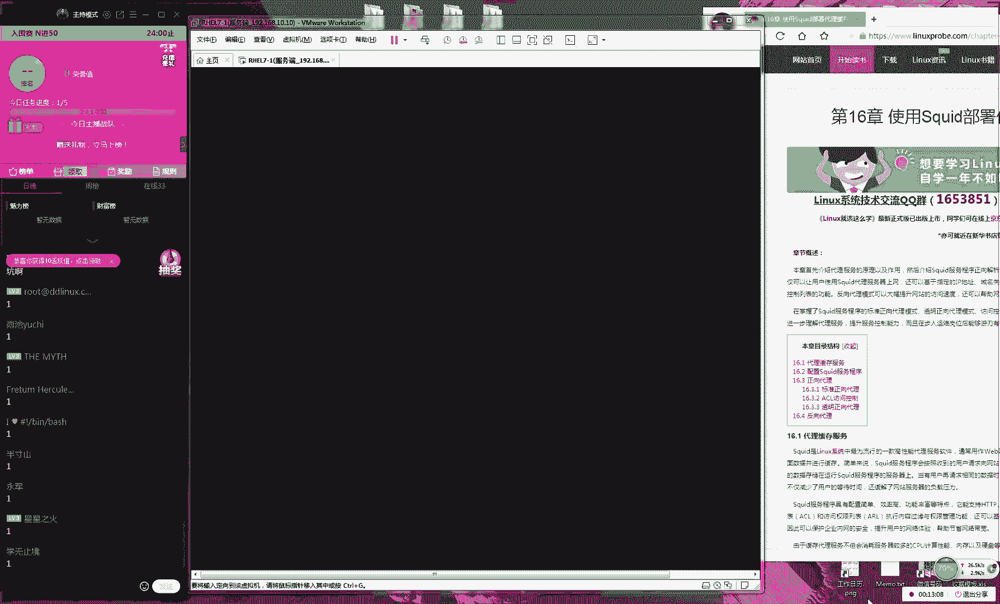
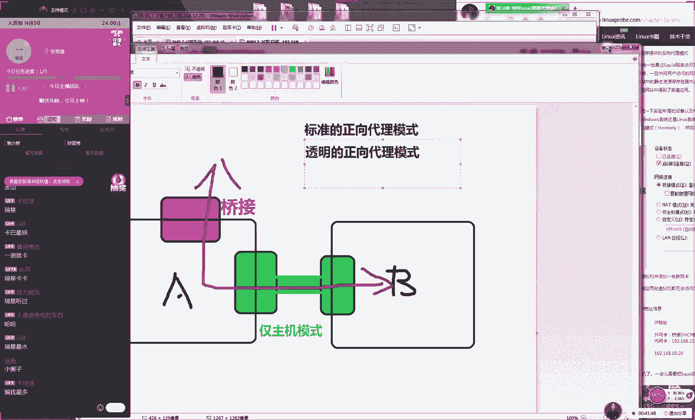
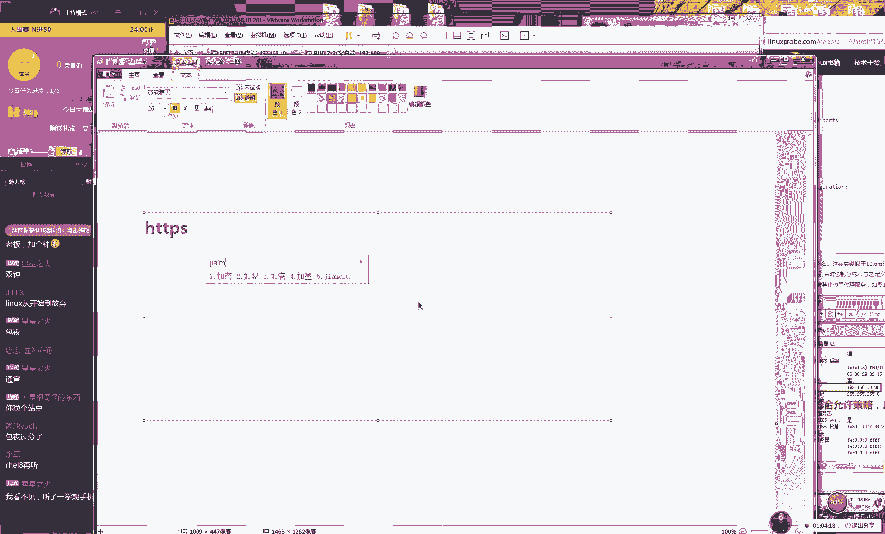
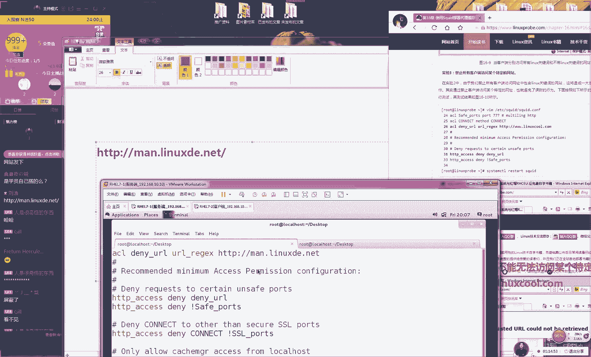
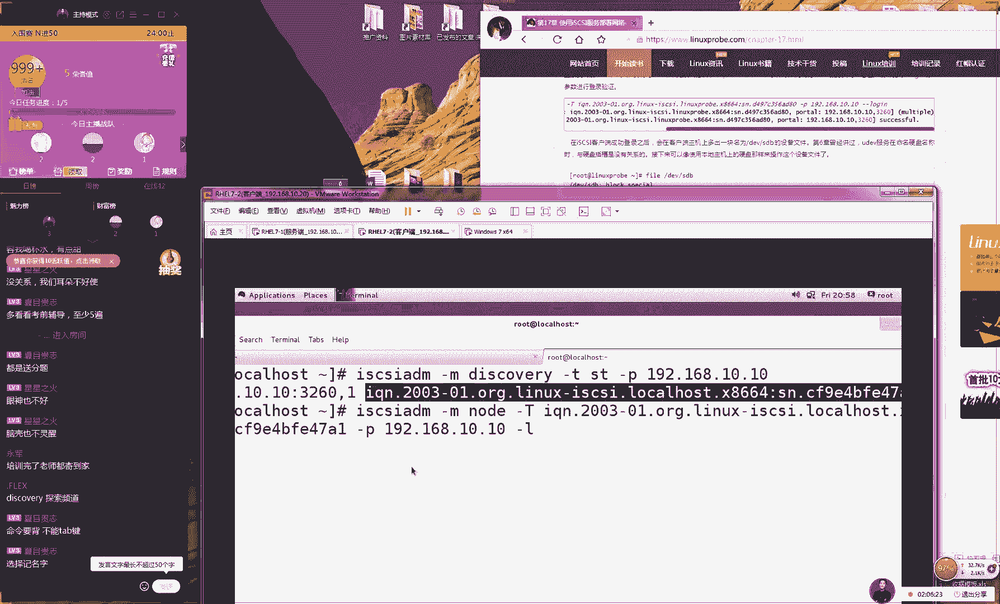
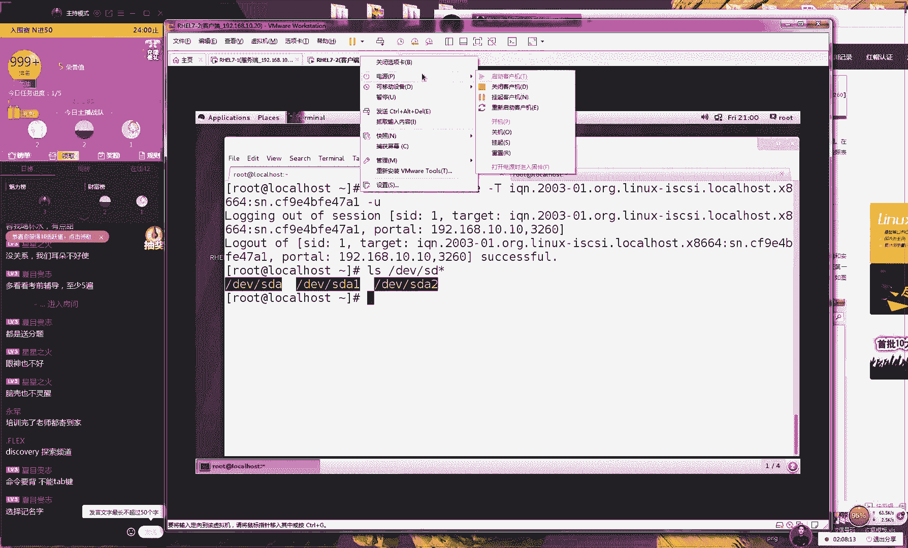

# Linux教程RHCE - P16：16.squid与iSCSI - 艾弗艾尔思丢丢 - BV1if4y1e73V

🎼你会回来。😊，🎼黑夜在漫长，眼泪在流淌，紧握你的双手节不放。😔。

🎼倔强的我。😊，那好呃，那我们准备开始上课。同学们，那我们先打一下一吧，大啊大家都听到我说话声音的话，好吧，因为今天人数比较少，所以我们刚才等了大概有4分钟。好，啊那我们今天开始我们今天这个课程。

今天的话呢我们家的东西比较多的啊，今天作还比较多的。因为我们预计今天给大家讲1617两个小节。然后如果要是时间足够的话，可能会给大家再带一下十8小节，所以今天我们的课程预计是三个小呃去讲三个章节。但是。

😊。

呃，也不一定，因为看大家这个消化能力。如果大家觉得这个进度比较快的话呢，那我们今就是只讲16个17两个小节。好吧，那我们今天这个课程时间大概就是一个半小时左右。好周结课这周我们的预计是想结课。

因为大家准备们这期大部分同学啊都已经是报考那个考场了。所以我们今我们这礼拜给结课这样话大家有两周时间可以去来去复习，但是我们不能赶进多，不？且给大家去赠送第23章节，所以这个还真是说不好。

我们能不能结课，但是我们慢慢去讲吧，我们看一下我们具体的这么一个情况好吧？但是如果今天我们能但是如果我们今天能够讲到呃今天讲三个章也没有也也也都来不及。

其实们那我们先这么着吧吧我们先讲讲看如果时允许的话，那我们就给大家去讲如果时间不允许的话，我们就下礼拜六那我们就下礼拜一的时候下礼拜5的时候再给大家讲就好了。那我们给大家说。😊。

在我们这边第呃第十6章节，我们叫做square，我们叫代理服务。这个代理服务的话呢，它是分为了两个方式，它分为两个模式。😊。

没有报名是吧？没有关系。那我们来是说一下我们今天所讲的这个服务，我们叫做sre，我们叫做代理服务。它有两种这样的一个工作模式，大家可以单出你的笔来，然后写到你的书上面。

因为这礼拜的话我们就我们就课程的话进入到一个尾声了对吧？后大家记得把你的笔记写好最后拍照拍完照之后然后发到您的那个博客上面。然我最后给大家一个签名书一个礼物的。如果您不知道这个活动的话呢。

那么就可以进入到我们的网站里面，后面加上福利两个字就这样大家看一下，后面加上福利，就是这样去写然后可以访问到我们这个活动，这也这个话也在我们学员页面上是有介绍的。然后那我们会大家赠送我们的签名书籍。

并且是包是包运费的，这也算是给我们同学的一个小的一个福利了。好，那我们今天来说一下我们这个re服它分到两个工作的模式。第一个模式我们叫做正向代理模式。我们叫做大家可以书上面叫做这个正向代理模式。😊。

因为我们这个上课讲的这个笔记肯定是要比书上要更加清晰一点的。大家可以找到这个重点。第二的话呢，我们叫做反向代理模式。大家先记到你这个书上面，一个叫正向，一个叫反向。而我们这个正向的话呢。

它又分为到我们叫做标准的模式。还有一个我们叫做透明的模式。大家记到你的书上面，分为到标准跟透明两个方式来去做我们的代理服务。那大家可以记到你书上面。😊，好，这个的话就是我们的联合代啊好。

那么这就是我们这个代理模式的一种呃差别。然后我给大家说下这两他这个模式的这么一个用处好了。那我先来说一下我们这个正向代呃呃那我们先来说一下我们叫做这个正向代理模式，正向代理模式。😊，正向代理模式。

他的话他指就是让我们一个居域网里面的用户可以通过单一的地址来去上网，这就非常向于我们的家庭了。那我们家里面我那我们自己会有手机，那我们会有平板ip包括说我父母包我家们也会有手机。

但但是我们都需要连我们家里面那个wifi去上网。但是我们知道当你去包一个光纤的话实际上跟你这个家里面分配到地址是多少那么就那就应该是只有一个IP地址对吧？因为我们这是一个常识。

大家去办一个联通一个电信或者一个移动的一个宽带的之后，后他会给你每个家里面的每个路由器，他是每一次只有这一个单一的I地址，让你去上网。

所以说那我们就让我们的家里面比说我们家里有五六个人这个五六个设备都想去上网的话，就要需要一个路由器帮我们去个转发上网的但比如说现在我画了123455个机器，者有5个工位。然后那我们这边有一个。😊。

这个网关现在啊那我们需要做就是能够让我们这个用户通过我们的网关来去上网。这个上面有一个单一的一个地址。这样的话他啊他又实现出来了多个用户使用单一地址来去上网。😊。

所以的话呢这个非常这个是非常实用的一个技术，而且我们每天都要去使用的，这个也非常相向于叫SN技术。它可以让我们他就是这个呃目的啊，他就让我们这个多个用户可以通过他们他可以通过单页的地址来去上网。

家记个书上面多个用户通过或者说我们叫做一个好吧，这个说绝对一点叫做一个IP地址上网这样的一个效果。那那我们可以来做一个我们的上网的一种行为那我们可以作为一个我们上网的一种管理。

好大家看一下我们我们先图啊这张图话就是说那你想要去上网的话，那么就可以经过我们这个公司的网关。因为我画比较丑，就是这么一个紫颜色一个小方块啊。那我们要是想要去上网的话。

那我们就可以去通过我们这个公司网关来去转发去上网。所以说这个技术有一个好。那么这个技术的目的啊就是我们第一要够让我们域网里面这个用户他能够去上网。第二的话呢就是说我们可以让我们这个用户的行为到一些审计。

😊，因为你看啊，因为你要想去上网的话，那么你就必须要经过我们这个公司的网关。所以我那我啊那我们就可以在公司的网关上面去做防控列表。😊，去做访问控制。这样的话，那我们可以去限制我们用户的行为。

咱比如说那我们的公司最近啊我们就听着有有人说想要跳槽，对吧？那我们就可以去做访问控制，限制我们用户，比如说他不能去访问招聘网站，或者说他上班期间不能去访问淘宝，不能去访问QQ啊这样的网站。

所以的话那我们就可以去在上面去做一个访问控制。这个我们中国大陆的同学们理解起来的话，应该是比的呃深有感触，对吧？因为我们中国有一个这个叫做这个GFW的一个互联网长城。就说那你现在在中国大陆。

那你是不能够去上这个facebook那你那你有一些网站那比如说谷歌什么的，那么你都是不能去上网的对吧？那么这是这个叫做这个GFW的一个方火的一个限制。那么他为什么能去限制你呢？就是因为你要想去上网的话。

那么你就必须要经过我们这个有我们这个政府还有我们这个相关部门，他们去搭建这么一个海底光缆，所以说他那么他就是你的一个流量的一个必经之路。那么在上面去做限制，就会限制你的这个行为。😊。

但如果说以后你要是发达，对吧？那你自己发出一颗卫星到了这个啊到了这个太空里面，那么你就可以绕过这个互联网长城的这么一个限制。所以啊那你可以看一下我们这张图不图，因为你的这个用户。😊。

他们想通过你能够去转发去上网。所以说那么你就可以在上面去做这个访问空列表。限制你的这个用户的行为。好，其实大说这个服务真的是非常简单的。然后我们之前给大家讲过。

只要你已经呃学完了第十三章节后面的第14156的就无所谓了，其实就非常的简单了好，但我们不说无所谓，就是简单一点另外的我们今天所讲的第十6章红考试里面没有的好吧，但是非常实用。

大家以来去感受一下这个红试不很多机构里也不会去交很可惜但是我们给大家讲到这个很实用的大家提到一个说PN还有一个SR是这样的我们这个课程的话呢然说我们今天个代理服务家可能会第一印象就觉那就是N？

就讲那我就在讲翻墙其实并不是因为我们的这个我们因为我们常说这个VPN的话种加密的代理服务说做协议对吧？还有我们叫做open协议他都是一种。😊。

加密还我们它是经过加密的。比如说I这样的这个加密协议的。所以说按照这个理论上来讲，那我们这个相关的部门就不知道我们去访问了这么一个数据的一个情况，然后可以去绕过他这个监管。但是我们今天所讲的这个服务。

它就是只是一个代理服务，它就相当就是一个左手给右手这样一个传递的这么一个过程做转发，而他没有中间的一个加密过程，所以我们才敢讲，如果我们要去给大家讲VPN的话。😊，估计第二天我也神秘的消失掉了。

因为我们之前因为我们的网站之前我们在15年的时候，因为我们当时的服务器是在美国，因为当时没有备案嘛，对当时在2015年的客后就在网站上去搭建了一个是个服务过过的服务家去上谷歌后关部门北京个新办为什么会管这种事。

后来让把这个咱们网站这个功能给大调停了，所以说这个目前国内还是管的比严N判刑。数据转发加密给大讲这个东西大家说下安安是我们。😊。

名称我们现在去安装一下，说态度是不是特别的拽，没有没有，上面给我打上面给我打电话那个吧，应该是新闻办的一个就是他们的一个基层的一个人员，你知道吧？态度还是很好的啊，因为不是到了那种特别严重的地步嘛。

因为基层的这个人嘛，他们也做不了主，他们也是替领导去传个话什么的，所以我们也很配合嘛，就赶紧给他关掉了。好，那我们既然给他去安装一下我们这个s这个服务。😊，那这个意思的话呢就是那个章鱼啊呃呃叫做章鱼。

但是也有同学把它翻译成鱿鱼。然后还还有人同学叫做这个八爪鱼。其实这个我就有点分不清楚了。大家知道说章鱼、鱿鱼、墨鱼、八爪鱼，你们知道这有什么区别吗？反正我们给它翻译过来，把它叫做章鱼sre就是章鱼。

呃还同学把它翻译成八爪鱼跟鱿鱼，这个我我我还分不清。😊，因为我因因因为我在我印象里面。好像这种爪的特别多的这种好像都是一个东西吧。然后在路边上不有那种呃烤冷面对吧？然后烤冷面旁边就会有什么就什么手抓饼。

还有什么铁板烧铁板烧里面不就有吗现在我们这边好像小摊上面卖五六块钱可以买一串烤鱿鱼，对吧？因为我觉得烤鱿鱼就是烤章鱼或者说烤烤八爪鱼，不是都差不多一样？后大家去翻译一下啊。

就是我们所说这个看大家这个习惯，你可以把它叫八爪鱼比较洋气点，后你可以把它叫章鱼或者木斗鱼或者叫乌鱼或者叫鱿鱼都可以。好吧，那好那那我们先给大家做这么一个实验。

现在让我们这个多个用户可以通过我们的单一地址，可以去上网，我们先把一个机器给它关闭啊，让我们添加一个网卡。现在的话10块钱几串。😊。

我们这边好像是5块钱一串。好，那我们先在给大家换成图普图啊，大家看一下我们现在这个效。😊，那我们现在假如说我们先要了两个服务器，那我们就拍第一个服务器，我们身边有2块板开。😊。

第二块我我然后第二个服务器上面有一个网卡。好了，那我们现在给大家画一下一下啊，说到这个是我有点饿了。那我们现在画一下我们这边这个服务器。第一个服务器的话呢。

那我们就比如说把它假设啊我们这边有两个这个网卡。第一个网卡是对外的网卡，我们把把它调换成把它调换成红颜色。然后我们还有两个对内的网卡，它是一个绿颜色，那我给大家给大家给它标注上啊。

因为我们需要来对外进行连接的话，那我们需要去使用到这个桥接模式。所以说我们的对外网卡的模式就是桥接，这样我们用户就可以去上网了。而我们这个绿颜色的话呢，我们这个模式叫做金主机模式。😊，好。

这个话我们叫做这个金主机模式，大家可以记到你这个书上面。这样的话那我们就可以直现出来两台讯机的内部来进行一个交流。好，大家可以去网上去查一下。就是说这个金主机模式的话呢。

它是来它是它是不能够让我们这个主机去上网的，它就是一个金主机内部进行数据沟通这么一个效果。好，那所以的话我们先看一张图片。再比如说那我们这边有一个用户的A那我有一个服务器A，还有一个服务器B。

那我我们要想让我们的服务器能够去上网的话，大看一下这张图扑图，就很明显就是说那你要想去上网的话，那么你就必须要通过我们的服务器A去怎么样呢去转发去上网，它帮我做一个数据的一个转发。

那么也就是说我的服我的服务器B要是它能够去上网的话，那么就一定肯定就是呃。😊，那么就肯定是一定是我们这个服务器A帮我们去册转发了。就好比如说但没有一个经历，反正我因为反正肯定我是有因为我比较喜欢能吃。

对吧？然后像小因为我不知道这个是不是我的一个自己独有的一个经历啊，就像就是你们上小学的时候，有没有就是说中午可以午休啊，或者说你们上初中的时候，或者午休的时间，但是学校吧管的比较严不让你出去打吧？

你不不说话？特别我上初中那会吧家里也零花。但话是中也不让出去，那兜里有钱就跟你到了一个小村庄里吧？兜里点钱，那你我就想花出去，但是没有人要对吧？后来我们就发现一个学校一个小漏洞啊。

就是说虽然说中午他不让出去？但是我午休时间很长概有两段但是你可以但是的你可以搁个炸。去那边那个阿姨他把把个东西给搁炸了，给他送进来，就是。😊，然后你去付钱，然后你在鸽儿炸了，然后你再给把这个东西给他。

那么你看啊，这那么也就是说非常像一个代理，像一个转发一样的。那么你通过这个阿姨，对吧？然后你把钱给了他之后，他把你的这个钱给了这个小卖铺。

然后这个然后的话呢这个小卖铺再把你的这个零食再通过这个阿姨传递给你。那么。😊，也就是说，如果你要是中午你能够吃上零食的话，那么就一定是这个呃呃中介这个呃的这个代理，他帮你做这个转发了。

因为你本身已经被困住了，因为你是不能够去上外网的。好，这个例子虽然说举的很乱七八糟吧。但是我就给大家说明白了，就是我们待会做这个实验的话，如果服务器B他能够去上网的话，就肯定是A帮助他帮你去做这个呃。

😊，这个上网了，说要说呃说完之后都是口水啊，没有午休。那你这个学校比我们这还要狠啊。

好，那我们先来编辑一下我们这个虚拟机，因为是这样的啊，因为我们先毕竟来说，我们说比较实在点，因为我们毕竟来说它是一个虚拟机，它的话呢。

它它是跟我们这个真实的服务器还是有区别的那我们尽量在我们添加硬件的时候，包说你的网卡，包括的光驱的，请一定要先把你这个服务器给它关闭，然后再去添加，开机按照我们一个比较稳妥的一个流程来进行。

千万不要直接就去进行一个进行一个安装啊进行一个添加进行个进行一个热插有可能导致我们这个服务器失败的。好，那我们现在的话呢先来添加一块我们的网卡。因为我给介绍一下。为我我是我现在是通过我这个路由器去上网。

所以说我只要把我这个对外的调接网卡给设CP就可以自动去获取到我自己的路由器分配给我的地址了。所以说如果说您是在学校或者说您是在单位如果说您此时此刻是在学校宿舍里话，需要进行。😊。

验证才能去上网这样的情况，那么就不可以去做这个实验。因为这个受到了您外部网络的限制。那么您可以回到家之后，既然的路由器插上网络线之后再来进行这个实验，好吧。好，那我们接下来给大家说啊。😊。

那我们先进入到我们的呃有什么广告，流氓广告是呃什么广告好，是你们这边看看视频，突然弹出来广告了吗？那好，那我们先登录到我们服务器。😊。

好，那我们先登到我们我们这个服务器里面。😊，我们刚才已经安装好square服务了，然后给大家配置一下我们这边的这个网卡，其实网卡无所谓了，对吧？那我们可以直接选择一个你喜欢的方式啊。好了。

因为我们给大家之前已经讲过12344种方法来去配置我们这个。😊，呃，网卡后来要给大家按照我们这个顺序，又按照1234的方式给大家去配置一下我们的网卡。

接下的话呢我们就来给大家随便去找一个我比较喜欢的方式来去配置了。好，那我们先来点击一下我们这个添加好了，后我们添加一块我们新的网卡。

我们换新的网卡的名称335548复制一下名称粘贴到我们这个网卡的名称上面这样做就好了。因为我现在是一个CP的一个环境。为我因为我自己在家里，我不可能给自己做限制。所以说我就直接选成第CP我就可以去上网。

我们选择一下保存，选择一下关闭，这样做好之后，我就去直接去重新去启动一下你的网络马上就可以看到你能去上网的这么一个效果，可以看到那你现在就有2块网卡第一块网卡和第二块网卡第块网卡就是我们对外的调接网卡。

那我可以来去尝试了。那比如说我们拼一下3W百度点然就以到拼通我们的外网再可以去拼一下我再开一开我们这个客户端吧我们客户端。😊。

那地址的话呢会是192。68。10。20。这个我们这也是我们的一个。😊。

也算是一个我们实验的一个惯例啊，大家不用把你这个经历再投入到我们这个配置地址上面了。好，那我们现在拼一下我们的客户端地址是10。20这么一个地址是这样的，学校这个网络的话，一般来讲还真是不能破解的。

因为我也去尝试过，因为我们上学的时候也是自己喜欢鼓捣鼓捣嘛学校那个网络还真是不可以。所以说如你要上网的时候是在学校的宿舍啊刨去说断网蹲电种可能还如果说要需要验证的话呢，这个事还真是很难去做。

因为但是这个也要看您学校的个限制的程度了。如果说学校限制死变态死变态，而且会限制你登录那个终端。因为我之前我上学校就那时候啊，那不光说我我们的这个网费很贵啊，因为我们的网费好像是120块一个月。

但这样的话你一个人你合下来对？一年的话也差不多，虽然说我寒暑假不在吧，但是一个月但是一年的网费也差不多1000块钱，但是1000块钱特别不值怎么样的，网速第慢。第二的话呢他限制你登录的时间。

他每天晚11点之后啊。😊，还有10点钟我忘记了他会断网断电，对吧？他会他还会断网，然后他断网就算了吧，而且他还限制你登录的那个数量。因为他当时我们都有手机，对不对？然后我我有手机，我有平板。

我的我我还有我电脑，他好像就每个账号只能登录三个终端，他就可能怕一个小孩。😊，他他就可能是派一个人，然后买了一个账号之后啊，一个宿舍人一起去使用，然后他不挣不到钱了嘛。还限制登录那个数量。

如果说你赶上这样的情况的话，做这个实验可能就是会比较麻烦。就是受到一些上级的一些限就要跟联通什么的去沟通一下但沟通估计也没什么？

就可以学再去做练习上大学的时候宿舍网不收费那很害一个月才10块钱那还很幸但是你们但是你们学校中没有午休以说我们这都是一样的那我现去看一下我们的网络是通的们安装一下我们个给大家演示一下我们第一个们做标准的正向代理模式让我们的用户通过我们的服务器去上网我们需要先做第一步骤轻这个防火墙保存一下我们的防火墙状态是样的这一步骤话大家千万一定要去做。

😊。

做一下，因为这步你要是不做的话呢，会让你的这个客户端不能够去访问你这个代理服务。这步骤我们一需要去做一下。好，这样的话我们做好之后，我们就可以进入到我们客户端里面。然后呃啊然后这个时候大家口我想老是呃。

然后你还没有去配置这个服务呢。😊。

你刚刚开始给我们讲这个服务，然后怎么一下开始去使用了，是这样的，因为我们刚才我们讲它有两个的服务模式。第一我们叫做这个正向。第二我们叫反向。这个你当你安装好这个服务之后。

就已经默认能够去使用我们做这个正代代理模式。但是我们需要去重新去启动一下我们这个re服务。然后将我这个服加入到我们这个当中，然后你就可以让你的用户去使用做这个标准的代理模式了。

这个就是已经默认去开启这么一个功能啊，但这个比较简单，待大家再去尝试一下。然后这话呢我们看到这边是我们的客户端，可以去尝试来去拼通我们的服务端。因为你如果这个这个我们还给大家去说啊。

如果说你的网络都不通的话，那么你配的这个服务再好再再好再棒再再完美。但是最后你这个考试的脚本，那么也是不到成绩的。好，另外的话我们来。😊，去设置一下我们这边的这个服务器，是这样的。

因为你要想去上网的话呢，我们把交为这个标准的模式，就说让你去设置一下你的这个呃相关软件，也就是我们的的浏览器里面的一些代理的信息。然后你才可以去上网。现在我们先给大家演示一下，好吧。

那咱比如说我现在访问一下百度啊，淘宝上面那么肯定都不行了。因为我我因为我们这个虚拟机是一个内网的一个。😊，呃，金主机模式的一个服务器，它不是不可能去上网的。好了，这个时候我们来去设置一下我们的浏览器。

你只要把它指向到你的服务端，马上就可以去上网了。另外我们给大家问个小问题啊，我们现在我现在有43个同学，我猜你们都应该是都已经报完这个考试了对吧？以你们着来去听课，是这样的，大家你们约的考试是几号。

是12月几号你就发一下几号行了，大概心里有个数好吧？如果你已经约考的话，您发一下考试那个时间，我看一下大概是几号，25号啊没没报也没关系啊，没报就不用说了。我看一下，25号29号差不多比较多一点，对吧？

26号比较多一点时间还是足够时间还是足够的啊。但是我估计如果我要把这个课拖到21号的话，大家被动，对不对？如果说拖到下礼拜5的话，有点小被动，25号考试的同学好，那我们先给大家去说吧。

反正我们第反正我们。😊，呃，25号所讲，因为我们21号所讲的东西也不是红包，2是C也，大家可以不用去在线去听了。好，那我们现在去设置一下我们这个浏览器啊呃，我们这边以火狐为例，好吧。

那我们以火狐浏览器为例。😊，这个大家随意的这个大家随意的。比如说你喜欢使用360啊，你喜欢使用谷歌什么都可以的。那么你只要选择到这个高级选项菜单里面。😊，好。

那么话那我呃那么我呃我们只需要选择到这个高级菜单里面，然后我们选择这个网络，然后我们选择一下这个网络设置选项。好，那我们选好之后，将我们选择使用这个网络代理来19268拖堂没问题是吗？

如果你们要觉得没问题的话，那我们就可以拖堂。我们今天如果要是你们允许的话，我们可以讲三个章节这样话们就可以明天加两个章讲第2章们能把它结课了。

但我看但我看大家时吧我们设置我们这边这个代理的一个信息这地址是101们这个号是38口号指的是我个服务这做。

可以选择说使用全部的协议使用个代理模式选O这样设置好之后就可刷新一下我们这个网页了马上就可以看到效果就可以去上网。而且你们你们不用担心啊，说你们还有19号考试的嘛？19号考试的话，也来得及。

其实来得及真的是来得及好我看一下刷新好看到我们这个网页了。为刚没有看到19号不好意思。😊，那我那我们可以直大去搜索一下，大家不用大家话就不用担心说我啊那我给大家看到是一张图片。好吧。

大家我们可以去啊进入到我们这个百度里面去搜索几个网站什么的。然后我们可以看到这样的一个效果。那么也就是说我们现在我呃我们这个用户。

你只要将你这个软件的这个呃代理方式指向到我我他只要去指向到我们这个服务器，然后他就可以去上网了。这个方式的话呢，我们叫做标准的。😊。

正向。代理模式。然后给大家举一个非常无聊的一个例子啊，因为我们坦白来说，为什么我说无聊呢？就是因为这个实验非常的简单，这个呃难这个话难度也就是我们之前讲的那么就我之第章个SS修改口的一个实验啊。

其实是一样的。但是我们为了说我们出书希望稿照字数去所话给大家凑点字数是就给大家加一个实验去编辑一下个re开个书是按照字数去算的就是有一个简单的一个实验供参考就说我编辑一下个re就大家提到一个问。

就是奇怪人同出个问题我能不能修改下口号其实可以看我怎么操作我进入到我们这个re的叫主配置文件当中这样看一下行数大概是第59行，所以我们修改一下吧把修改成随便啊们愿意多少？反正我愿意把它修改成一万。好吧。

因我。😊。

这一万的话呢，打起来比较简单一点。好好，那我们接下来保那那我啊我那我们啊那我们接下来把它保存名啊退出。😊，然后重新再去启动一下我们这个re服务。这个时候的话，当你再去刷新这个网站的时候。

比如说我们访问网页啊，对吧？这样的这个请求，那么就会马上被禁止掉了。因为你现在此时此刻你已经不能去上网了。

为我们端口号变更了这个怎么办呢感觉好简单个下属性为这个其实不应该讲的因为真的是不该讲这么一个例子太简单了。好，我们去修改成1万端号， ok完简单凑字数我看一下我们这个实验的一个例子就去恢复我们去访问了。

这边还一个大美女啊这就是我去修改我们这个号一个常简单那我就不说我们工作时有一个尴尬的一个事情是这样的因为我上中职当岁数应该是18当时考上那个中职了，业所职高嘛。当8的成年。😊。

他留了一个小任务啊，需让你去去实习一段时间。后来的话我好像去了一家呃，我忘记了，好像是一家连锁服装的一家店吧。然后我们这边去做他那个网管去了，帮他去配置一下，为才18岁，大家可以想一下。

当时我也只是说会一些电脑比较基本的一些使用啊些东西，对吧？我当去了一家服装的一个公司里面，后我给大家去配置一些这个当时也不算服务器，但是主要配一些办公的一些打印机啊，还有一些相关的设备吧。

然后的话我发一个问题啊，就是说有一些这个工作的话呢，这个员工他们真的是计算机能力很差。比如说他们之前他们都不会使用QQ的，他们也不会去真的他们不会去安装他们当时也不会安装杀毒软件。

当时我记得好像是瑞星还是比较火的一个杀毒软件。很多人连瑞星都没有听说过。后也没有然后也没有听说过也没有听说过江民也没有听说过卡帕斯机，也没有听说过360，他们都没有去使用过，所但有一个情。😊。

就是说当你啊卡巴斯基对吧？当时但可能现在你们如果要是没有听说过啊，说明你们90后啊，说明你们00后现在已经是啊新现在已经是这个新时代的人们了啊，我们那会儿反正是有这个瑞星，然后卡巴斯机有江明。

还有这个啊反正很多很多杀软件啊，但是360还是不是很火的。好，那我们先给大家说一下，就是说有一种情况，就是你的这个对象你的这个员工的话，他们就真的是呃不懂计算机，就像我们刚刚这个操作啊。

就像我们刚才的这个操作，我们需要修改一下我们的浏览器里面的这个标志。你看啊那我需要点开浏览器选择高级。那你看他有选择了高级了。我再选择到网络高级里边的网络，那不是一般人能够选出来的。😊，你们不要笑。

这个真的是这个既然他把它叫他他那么啊他既然把它叫这个高级选项里面，他就是真的是有些人就认为他是很高级，他就真的是不会配置了。那么怎么办呢？😊，这个时候我们先把它取消掉啊。😊。

这个时候我们把那啊那么我们就可以去使用叫做这个透明代理模式。我们给大家去说到，我们叫做透明的正向代理模式。什么叫透明呢？透明它指就是对于我我啊对于我们这个用户它是透明的。

我们的用户可以不用感知到我们这个。😊，呃，正在去使用这么一个代理服务，他们就可以再就他们就可以去通过我们这个服务他他们就可以去上网了。这个什么意思啊？

就是可以让我们这个用户他不用去感知到我们这个也不用单独配置下我们这个相关软件以直接去使用们们可以直接去使用到我们这个代理服务了。但是的话我们需设置下们这个网卡，为你必须要将你的这个网卡给的这个网关。

还是要指向指向到我们这个服务器就好。那么你只需要做一个步骤，就是将你的这个网关给设置成19281010指向到我们的服务器。第二的话需要把你的这个DN指向个外网的DN但这个其实你也不用让你的用户去配的。

因为的话呢你可以通过我们之前讲服务直接为用户去分配一下信息。给关机关闭开启这样话个网关跟DN信息设置好之后，就给大家去玩一下。😊。

叫这个透明代理模式。透明代理模式的话呢，那么你想一下也知道，就是说因为你要让你的用户省事了。那么你作为一个呃网管的话，那么你就要有很那么啊那么你就要把你这个用户需要做的事情，然后你帮他们去做了。好了。

那我们先在给大家来去玩一下。😊，然后这个章就把它打断一下啊，我们先给大家讲16。3。3小时，然后再给大家讲16。3。2小节啊，那么我们来说那那我们来说一下这个原因啊。

就是这样的呃因为话那我们这个客户端它必须要通过我们这个服务端A才能去上网。那我们在上面去做一个L我们叫防空列表去去限制我们用户的行为。

但是的话那我们把它放到后面去讲那么这个那么这个这个目的啊是说因为我们下面的这个实验叫做透明模式那的是透明可以让我们用户直接去上网了。但是我怎么知道你是真的是透明了，还是说你直接把它转发出去了。

这什么意思啊？就因为来说因我们这个服务器它也有转发的这个功能。那么我怎么知道我的这个客户端他是经过了你的这个服务去上网，还是直接你有你的服务器去上网。

那我不知道到你有没有经过这个服务我们今天这个实验会先给大家去配置们。😊。

服，然后我们会在上面再给他去做ACL的限制。待会如果说我们能够去限制用户的行为，说明我们这个用户确实是经过了我们这个re服务的，而没有直接经过呃呃而没有呃他会呃这个直接由我们这个服务器做转发。好吧。

我给大家解释一下。好，那我们现在重新去配置一下我们这个的配置文件。因为我们这个服务器太陌生啊，因为他啊他这个自身他也能够去做这个代理去上网的。所以说我们就为避免大家会。😊。

呃会感觉是不是我们这个直接把它给做转发了，对吧？所以我们给大家去解释一下。好，那我们现在我们设置一下我们端口号，还是默认的328端口号。但是我们后面要加上一个参数，我们叫这个转发的意思转发的意思。

然后的话呢我们现在啊还没有完还没有完。那我们现来去把我们的62行给开启一下。这代表就是一个缓存目录的意思。待会的话呢那我就会有很多很多这样的一个用来缓存的目录的这生成出来。

这样话果就是说当有一个第一个用户去访百度的时候，那么好了就在我们这个服务器的这个内部里面就会保存上3W点百度点com这个网页的内容。当有了第二个人再去访问同一个网站的时候的话呢。

那么就会就会直接将我们这个服务器里面的这个信息，然后传送给我们这边的这个客户端。他的这个目的啊就来说是加快了网站的二次想。😊。

响应速度好了，这个话大小的话我们不用去设置好，默认是60啊毫升默认是16兆啊，这个是足够的。其实来讲一个网因为一个网站的话16兆不是一11一个网页16兆的话其实来说就不对不对。

这个16个不是这个数量应该是256兆或者256K其实这个默认就可以是足够的。它代表就是生成出来16个缓存目录的意思。但我们可以来看一下这个编号是从是从A开始。

然后是ABCDFGHIKLNOPQST然后U好像就是这么有16个。好，那我们现在的话呢。😊。

然后记一下我们这个的一个效果，就是他可以加快我们这个网站的二次响应速度。但有一个人他想去问他想给你去问路。但咱比如说有那你在一个输路口上面作为个志愿个外国人问说这附近有没有索。

百度地图去查一下我们这个像哪里哪里比说出门左手边有一个搜索他就走了之后，第二个他再问索的么你去刚了说加快二次响应速度第二个他去查询的时候，那个速度他就会更快。因为你经知道这个信息。

大家能理解这个意思去配置下我们这个服务设置好之后，先不要去重启了那我给大家做以下步步的话清下里默认信息直去复制代就是直接复制一下个技术是由我们。😊。

它是有我们的I这个I呃我由我们的IP table来去实现出来的。那么我们为什么我们不用到这个fa world的话是这样的啊？因为的话我们之前给大家讲的这个fa world。

它也可以实现出来这么一个代理去上网。大家可以看一下效果，好吧，现在的话呢，我们现在可以到我们的。😊。

，客户端，然后我去尝试去拼一下。比如说我们去拼一下百度。好了，大家看到说我们既不能去解析出来DN信息，我们又我们也不能去拼通这个网络。好了，那我给大家去说一下。

但是如你想去使用看一下如使用去直接讲这里有一个技术叫做伪装技术，那么你只需要点一下这个勾就O了。后这时候你再去拼这个百度的时候，那么你既能够去拼通它，然后你也可以去查询出来DN信息。

但是我认为的话这个例子是没有太大意义了。因为我们这个太简单了我们课虽然这个方法我们也可以去使用，但是我们不太建议，因为这个太简单了，我们课不太适合我们课这个难度，但供家参。

明我为不大家置过于简单了吧我把关闭掉。置。😊，那大家可以继续学习fa又可以去学习 table大家都去学到。然后说专业应用系统可以就是呃是否可以用来加速呢？应该是可以。但是这个我没有去测试过。好。

那我们在去拼一下大家看到现在是要是不可以了。好接下我们去使用那我接下要去去使实现一下。所我之后，如说愿意去使用配的话呢，其实也可以且非常的简单好。

那我们来一下我们这个语句这个语句的话呢意思就是将我们所有外网们的就是所有我们的5个这个流量都经过都会经过我们这个外网去做转发的。好，我大家解释一下，好吧。😊。

这边的话是由为我们这个网卡是49呃4968要跟我们这个书上所对上。好，然后我给大家说一下我们这个命的一个作用啊，我把它删掉了。好吧，这个大家都记下来了。这个话命是这个作用是这样的啊。

这个命是这样的等一下我把它复制一下，是这样的。来说的话呢，我们把它定义成它是一个SAT这么一个模式。这个叫做SAT这个SAT技术叫做原地转换协议原地址转换协议。

他就可以让可以让我们这个网里面的这个用户通过我们这个网关来去做这个转换去上网的。好，然后大家看到的话呢。

这边我们一个端号还有一个协议大家可以去查一下53端口号的T是什么是什么服务大家可以去查一下53端号TB协议是什么服务。😊。

行很行很耳熟，对不对？然后就像于FTP1样，21端口号，就相于说我们的SSS服务是22端口号，就像于说我们的网站是80端口号一样。那么我我们的53端口号的UTP协议是什么服务？😊。

他其实来说他就是指的是什么服务，他就是指的DNS服务，对吧？好，大家上去大其实其实大家可以去搜一下，不用懒了。就有一个服务的话，我们叫做DNS服务，它就是占用了53多个号的TP协议。

所以的话我们就是说指的呃所有要是有用户来去查询这个DNS信息的话，那我们就可以直接给大返回我呃他那么就会把这个信息直接交给我我们这个对外的网关的这个网卡来去处理。这个就是我们对外的网卡。

大家记下来这是我们的对外的网卡。😊，这是我们对外的这块网卡的这个名称，一定要以你的这个实际为准。另外的话这个代表就是伪装的意思。这个什么意思啊？

它会自动来去获取到你最新的地那么自动获取到你最新的IP地址，大有没有一个经历啊，就是我们知道我们每个人的家里边的话呢，每一次你重启路由器都会分配到一个新的地址。大家应该知道这个一个小常识嘛。

一会你可以下课之后，你去尝试一下啊，就是呃你去办一个联通或者一个移动的一个网络之后啊，然后你每天你去开机的时候就会只去，那么就是只能是。😊，呃，分配到一个IP地址。

但是的话呢你每一次去重启你的路由器的时候，大家可以去呃我们才可以可以后可以去试一下啊。就是说你每次去重启你的路由器的时候，那么你又会去重新去分配到一个新的一个地址。

家有这个事我以打一下因为我之前我就有过一些这的经历。比如说当时我们还关论坛？因为论可能有点过分啊，比如说我发广告，对吧？因为一开始的时候，我们坦白说。

因为一开始的时候我们这个网站上面也没有人去访问那那那么就会很着急，对不对？那我们就会在很多论坛上面去发广告，但是有些论坛的话，他们有那个封IP地址这样的一个功能，所以说那我们怎么办呢？一旦地址被封了之。

我就重启一下路由器，又分配到一个新的一个地址了。大家这个应该是大家这个应该是有过，对不？或者说你有没有说你们要是没有的话，你们可以下课之后去重启一下你的路由器，看到你分配到那个地址应该也是不一样的。好。

😊，这就是一个很尴尬的一个问题了。那么我每次去重启路由器，然后我都要去重新去指定一下我这个公网地址吗？这个好low啊，对吧？好，这个好没有效率一件事情啊，对吧？这个时候呢我们就可以使用到这个伪装。

它会来去呃啊每一次去自动去找到你对外的这个网卡的地址。呃他会呃自动去找到你的外网的这么一个地址，然后帮你给他添写进去去避免了你太就是重复性的这种操作，这个是推别呃推荐的，所以我们去敲一下回收。😊。

好，第二的话就是我们要去允许我们这个系统，它能够去做IP地址的转发。我们来去建网站可以使用动态嘛？当然是不可以了。因为你的这个域名。

你那你每一次新去解析一下话用户怎去访问这麻烦不要用动态而且在公网上买一台服务器跟我没有关你只要买一个很便的一个服务器阿里云你看到双活动双动看一下像说如果你要是学生的话是9块91个月。

如果你要是买的话呢好像平均下来一个月也就三四十块钱便广告编辑这个文件添加一个参数做它指的是我络支持我们转发选择一就可经过我们的路由器转发信息做之。😊。

拼一下你的这个百度，你拼肯定是拼不通的啊，拼肯定是拼不通的。但是的话呢。😊，你看到没？你已经能够去做DNS解析了。因为你刚才只是转发了53端个号UTP协议。

然后这个时候你就可以去拼通你的这个呃那么这个时候你可以做这个DNS解析了。比如说我们再去使用，你看比如说我们去解析一下3W对不？我们最喜欢的网站大家最喜欢逛到网站。

还有这个大家还大家第二跟第三个喜欢的喜欢的网站。这样也可以看到啊，就是我们可以作为我们DNS这么一个解析了。好，那我们现在呃做完DN解析之后，这个只是刚刚的一部分，我们还要做我们这个数据的一个转发。

我们要做为一个全局的一种代理模式是这样的那我们现在就要进入到我们这个服务端里面把我们刚才已经。😊。

呃，设置好的这个square服务的配置文件啊，我们要把先给它关闭起来。这有一个小bug，那这有一个小bug啊，就是说你需要先把你的这个square服务给它关闭起来。

然后哎然后你才可以来去使用到square了。😊。

刚K代表就是来对你这个服务器的代理模式进行一个初始化工作。那么你一定要先把它给关闭之后才能进行这步操作。但是的话呢，哎他说第六十行好像有个包错，我看一下啊，他说我们这个s服的第六十行。😊，好像有个报错。

我们赶紧看一下啊，我们这边多了一个E。好，你看我这个脑子也不太好使啊。好，但是我眼神好好使，对不对？好了，那我们现在把保存屏退出，再去初始化一下。这个时候它就没有报错了。但是还没有完。

我们还需要选一个sre跟Z代表就是我们来进去初始化一下我们这个呃缓存目录你可以去数一下123456789。然后ABCDEF代表就是16个我们这个缓存的目录，当你可以去访问网站之后。

去找到那我们可去呃当你去访问网站之后，然后可以进入到这个目录里面去找到。😊。

我们这个网站的缓存信息。好，接下我们先去敲一下这两个命令，然后我们敲完之后给大家去说一下，说这两个的命令的一个用数。好吧，因为你要让我去敲我这个脑子估计一会就把它给敲错了。好。

那我们现在去做一下我们这个转发。还有的话就是我们对外网卡这么一个地址。大家请切记一下，不要照抄我这个书上面的一定要大家这实际为准。后们打下来，我待会大家讲一下这个每个参数这一个含义。好吧，好。

大家一定要不要照抄啊，一定要过来看一下你的这个对外的网卡地址是1981。3这个是由你的路由器把你分配的，一定要以你这个实际为准，19281。3不要偷懒啊。我们做好后还要做最后一步操作。

就是保存一下我们的的状态，以及去重新去启动一下你的。😊。

square服务这样的话你就做好了。好，我给大家说一下我们刚才这个步骤的一个作用啊，是这样的。呃，我们还是那个意思啊，就是说我们为了避免说大家会以为我们就是在做服务器的一个转发。

那我怎么知道你有没有经过这个sre。😊。

那所以的话呢那我们就要给大家讲的说我们的实那我们来去实践的一个原理。待我们去做一个我们的访问客列表是这样的，让我们这个用户的话，他去访问的时候。

所有来自于我我我们这个用户的请求还还是来自于我们用户的可通过地址去上网这一个协议来自用户的我们的网站的请求那么都会被定义到328号。

那也就是说所有我们这个网关发送的80号就是站的这个请求都会被转移到328号面什意思？因为我们因我们讲我们这个328号话他这个就是务的一个服务不？

就是说以后的话所有我们的这个客户问网站的请求就全部都给他交由们这个服务他去处理。下面的话那么则是说我们所有是来自于这个网的用户就是来自于我们8。😊，嗯，10的这个网段的用户的话呢，的所有的请求。😊。

都会通过我我们这个对外的网卡，然后转发出去。这大家需要注意的话，就是说我们这边有两个信息需要你去修改一下。第一就是你这个对外的网卡的名称。

第二就是你对外的这个网络的这一个接口地址我们要去编写一下这我们需要以这个实际为准实际为准那我给大家说完后看一下这个效果。后另外去重启一下个服。尝试拼一下百度话到说你这个百度不光可以去拼通。

然后你还可以去解析出来的一个地址这个是号转发的话，得有这个子非常非常相非常非常相像。但是还是不太严谨，是将你这个号转发与你这个服务与SAT技术相结合，这样可以让你用户将所有流量们都可以这个转。

但是你果把单纯理解转发的话呢其实我认为也是可以的另外说停止的。😊。

也可以查看呀，那是不可以的。因为可能说是有缓存的原因。我们每期做实验的时候都会有缓存的原因，大家可以去呃去关闭你浏览器，然后再去重新去开就好了。因为浏览器也是有缓存的让大家做一下演示啊。

后就是说为了避免大家提到这个问题，比说人是很奇怪的东西，这个同学提到一个问题啊，就是说那我关闭了我这个务结果能去访这个代理服务那我就怀疑了你到底你这个实验你有没有生效。

你是不是只是作为一个服务器的一个转发，其实根本没有经过务我都不相信你有没有经过这个服务那么怎么办呢？这时候那我们就要在这个面去做一些限制了。😊，那么我们待会如果要是能够去限制我们用户的这个访问请求。

那么说明我们的用户是真的是经过他了。就相当于说我们今天给大家讲那个水浒一样，对吧？那你这个李鬼那他之所以能够截到钱，是因为这条路是流量的一个必经之路。那么你要想去上山，就必须要经过一条路。

那么我们待去在这个上面去做限制。如果说用户他根本就没有经过我们这个服务的话，那么他自然不会受到我们这个限制。好，说比绕嘴好吧，但是我们看下这个实力，大家那那就能够理解了。好。

就像这个子有点有点有点不太好啊，给大家去说我们这个实力了，16。16。3。2条，来给大家做一下限制。咱比如说我现在嗯我呀现在就是不太喜欢一个人我不太想让他去上网怎么办呢？这个时候大家看一下效果啊。😊。

就是说那我现在不太喜欢一个人，那我不想让他去上网了，那我就可以来编辑一下我们C目录里的re们的这个主配置文件来去单独来去限制某个人去上网。但是这个实例的话呢，我们坦白来讲实意义对修改家一我配置文照要求。

不要写太写的这个规范地方吧，我们大概行右，那我们现在去个别名我们以后再看就相当于就是看到了19282那也就是说我们待会有一个用户个用户地址的话，不在2好吧，就这样吧比说我就去允许某个。

我义个名下面写我们的规则就是我们的网站请求。😊。

如果说我我们这个用户的名称，它叫做colect的时候的话呢，那我们就把它给允许。下面我们再去写上一行，代表就是如果说它的这个名称，它不是col的时候的话呢，就把它给禁止全部。相当于的话呢就是说。😊，呃。

不可以写麦克地址了啊，因为话他只能是写这个域名跟IP地址。好，那我给大家说一下啊。那你看到就是说那我们先做好这个限制了。如果说你的这个地址是198。20的话，那我们就允许掉。如果说你不是这个地址的话。

则是全部给大拒绝非于我第十章节里讲个逗号但记得这个就是只要你没有被允许则被全部拒绝的意思。好，然后大家我上课之给大家吹了个牛啊，我说我们今天能够讲三章，其实讲不。

所以说我们今天这个课程应该是两个章节好吧，但是这样也好给大家讲的点，我们不要赶课时赶课话意义吧？还给大家讲大家这个学习是大家负责任。好，那我们现在重新去启动一下我们这个好我的话呢。

因为我这个地址就是198。2你看因因为老比我下课之后我也不会说自。😊，就是不是1月2月我们就自己去巴厘岛去玩去了，因为毕竟这么穷的人，对吧？所以说我们也很舍不得也很舍不得大家嘛，对吧？那我们讲完课之前。

我们想给大家多讲点东西。好，那我们来看一下，就是说网站的话，它又可以去访问了。因为我我们现在这个地址，就是19208点10。20。好，那我们就可以去访问一下这个网站。好，那我们现在去尝试一下叫什么作死。

对不对？我们要去编辑一下我们的网卡，将你的这个地址，只要把它修改成不是20端口号，那么把它修改一下，它只要不是20了。比如说我们修改成30了。好，我们点击一下应用，点击一下关闭呃网卡要点一下开启网卡。

这个时候马上你可以再访问一下。😊，这个时候你马上再去访问一下这个网站的时候，你会看到它还是可以去访问。这就是说因为我们的浏览器它只有缓存，然后以及我们这个服务他没有去生效的意思。好。

那我们现在把它给关闭起来，然后我们现关闭我们的浏览器，然后再重新去启动一下我们的网卡，我们等它一会儿重新来去启动一下我们的网卡。对我们需要换一个站点，而且这个缓存的话，它不是立即去生效，它需要想的时间。

好，非常尴尬我我怎么网卡起不来了。😊，19268点10。30哦，这要起来了。好，我比较心急啊。好，那我们现在的话去重新去打开我们浏览器，它是要缓存的。如果说这个还不行，那您就去重启一下。好吧。

它有一个时间的一个大概5分钟吧，或者说2分钟。好了，那我们来去访问一下我们的百度啊，百度不可以啊，是这样的。因为我们这个网站的话呢，它只能够去限制HTP的好像是好，那我们先这样。

我们搜索一下然后我们这样我们选择一些不是HT呃，不是HTTPS的网站。好，你可以看到，因为是这样的，因为我们现在的这个限制的话呢，它只能够去限制它只能去限制我们的这个呃。😊。

呃，网站的请求哎，我们的呃我们的HDP然后但是的话它不能去限制ATTPSS现在目前来说这个软件它是还是有局限性的啊，它不能够去限制这个加密的网站链接。😊。

啊，他是不能够去限制这个加密连呃加密网站的。所以说当你去访问的时候，如果说这个网站它啊不是加密连接的话，你可以看到就已经把它给限制掉了。因为你现在当天的这个主机他这个地址他不被允许。

以他会给你提示出来报错这个信息。好，接下来大家说一下的话给大家去做一个限制。不光可以限制我们用户的一个列表他还可以去限制我们用户去访问网站的，咱比如说我们现在的话呢，我们公司运的不是很好，对吧？

然后马上就马上就要倒闭了。这个时候啊，你就要去想一些办法。比如说我们限制我们的用户，他不能去访问一些招聘网站的，对吧？因为他访问因为他访问招聘网站的话呢，他要想个跳槽好了。

这个也非常相向我们在学校的时候，大家就是因为我因为我因为我上中职的时候啊。😊。

因为我这个中职的时候，我们学校还有一个很奇葩的一个限制，他就是不能去访问一个game啊，就是那个游戏。因为我们确实有一些同学他们他们会他们会在上课时间去玩游戏，对吧？

他们会下载一些电者说他们会下载一些这个游戏的这个学会限制这个访问网站里一个关键词果说你的这个网站里面包含有叫做这一个关键词的话，就会把你给限制掉。其实来说这个技术比较好的？

么就是说限制你浏览器里的这个关键词，如果说你去访问的一些关键词，比如说涉黄说你访问一个是非常性感的这么一个词好，那也就通过我们的关键词对你进行一个屏蔽。其实我们现在这个W。

还有很多时就通过个关键词去做这个限制的大家演示一下啊，那我们该如何通过我们的关键词来做这个限制。但是我们的网站它必须不能。因为我们。😊。

加密连接是不受我们的这个square服务所管理的。好，那我们现在给大家定义一个我们的别名，我们叫做 word。其实这无所谓。这个只是个呃昵称。如果说大家你要是愿意的话。

你可以把这个词叫做哈哈或者叫这个呼呼都可以啊。因为它只是一个别名而已，代表就是我们后面要限制一个叫做lin是这样的啊，我们现在看到是一个呃更想爱的一个参数，它指的就是去限制一个关键词的意思。好了。

那我们下面我们再来去限制我们这个。😊，别名。那当我们有一个网站里面，它如果要是出现有了lininux的话，那么啊则会把它给限制掉。这个就是我们的别名需要跟上面所对应上。好，那我们把它点一下保存名退出。

重新来去重新启动一下我们这个服务。这个时候啊，我们既然限制了一个词叫做linux。所以说我们当时刷新一下这个网站的时候，它还是说不能去访问啊。好，然后我们再去发再刷新一下这个网站。😊。

啊，但是这个报错的话好像不是我们想看到的，这个好像不是我们想看到的一个报错。这个显示的是一个网络连接失败，而不是说。而不是说我们限制这个关键词被禁止成功了。这个虽然它也是不能够去访问嘛。

但是这个效果不是我们想要的。好，我们再给大家换但啊我们这样啊，我们把这个浏览器给它关闭一下，因为它是有缓存的，你做这个实验也是你一定要去多重启几遍浏览器，好吧，它是要缓存。好，我们再把它重打开一下。😊。

好呃，这个网站的话，因为这们网站是HTPS的，所以这个它是嗯是呃不受这个限制的。好，那我们换一下。比如说我们呃网站去搜索我们搜索linux，然后我们访问这个菜鸟教程。😊，好，大家看到哦。

他确实他它要它要是这么一个页面啊，它不是那种包错页面了。好，那我们可以看到，基于这个里面它好像有了linux，所以说它被限制了。大家看到这里面是有linux这个词的那我们比如说我们换几个网站。

如果是没有lin这个词的话这个他这个域名里面，它也有包括有lin好，那我们再来换几个。比说我们访问一下嗯lin down话，它那里面也有lin这个词，它肯定也会有那我们换一下好吧。

那比如说我们换一下1024这个我不知道啊好那我们换比说我们换成淘宝吧。😊，嗯，很奇怪啊。😮，不要逗我怎么说啊，淘宝不可以。好，我们这面去搜索一下。我们就是我们换一些我们这个网站给大家做这个例子啊。

然后这个时候你可以去访问一下，因为我们肯定是有缓存。然后这个时候你可以看一下，只要它没有包含有了lininux的网页，然后大家可以不能大家不用担心说这是缓存啊，我给大家都点出来几个，好吧。

你看比如说这个网站，它只要没有包含有了linux就可以了。😊，好，这个其实它它已经成功了。可以看到这个里面它啊包含有lininux这把它给禁止掉了。而这个里面它没有，所以它就没有被禁止掉。好。

大家可以去访问一下。比如说我们可以搜索一些比较小众的一些词，比如说我们搜索一下叫这个东西，好吧，无所谓啊，然后你可以去找一些网站，它只要它里面只要不是HPS的都可以。你看到比如说这个网站。哎啊。

我看一下这个好像很奇怪啊。😊，啊，不会是这个网站垮掉了吧，我我我们换一下，因为这个例子我没有举过哦，我没我我没有反过这个网站。这个例子好像啊好像还真的是挂掉了。因为这个它不是限制了我们的。

关键词好像是限制了我们的所有的网站。这个它不符合我们这个例子的。好了，我们再看一下我们这个是不是写错了啊，AL key wordOK然后URLIIS没错啊啊。😊，好像没有不错误，对不对？好了。

我们这样我们的话不要着急，我们再重新去启动一下我们这个squire服务，再重启一下我们这个sre服务。好了，我们再来。😊，刷新一下我们这个网页OK就可以了。所以说这个很奇葩啊。

你看我明明大家因为我们正好给大家录屏了，因为这事有说有点说有有有点那个说不清楚了。所以你看到我刚刚还已经是录屏了，对吧？然后所以可以看到我刚才重启我刚才确实去重启了这个服务。

你们可以看一下我们命令执行记录，里为我刚才确实已经重启，但是它没有生效，这很奇葩。所以我们现在再来看一下，你再去刷新的时候就都可以了。哎，这很奇怪啊，因为。😊，然后再刷新下这个网站。

你可以看到就把它给限制了这个话是我们想看到。因为这个里面包含有的那个词这个词，所以把禁止了它这个是一个禁止的一个报错的一个页面。好，就给大家一个提醒。如果说您做这个实验的时候。

您没有去生效的话呢那么您可以重新再来去重启几次好多次去重启下这个服务端关闭浏览器后打开一下，因为它是要缓存的那我们可以等待它一分钟就好另不要给我刷礼物。后那个礼物你看我排名都掉100以外个不？

除我们讲课以外不会去上这直播的大家刷礼物之没有用没有用大家不刷礼物的做完这个实验之，大家问题。那么比如说有一个网站里面它就是叫做me。

但是它里面不是但是话它里面它不是跟游戏相关的那我们就去错误的去封杀一些网站个感觉也不太准确，对不对？😊。

我们就可以针对一些网站来去做限制。那比如那啊那咱比如说我只是来去想要去限制某个网站的话，那我们就可以这样去做。从来去编辑一下我们这个配置文件来去指定来去限制我们禁止的网站列表。好，免费的不可能。

你这个小鸭子肯定是收费的吧。😊，啊，还有上面那个刷了个什么东西，我刚刚看到好像是好像是个月饼吧啊，大家不要刷，真的是没有用啊，因为我不是那种主播。

然后就主要说不要不要不要都开心的种因为的平我不会去上这个直播的好，因为长得这么丑不？我去限制下是说我们不想键词限制感觉不准错误封杀一些限制一些某一些站。

有一个网站好大家推荐一个就是做这是一个我们的合作站点。就是说大家可以去网上去访问一下这个网站的话呢他可以查询一些命令大家有没有访问过，可以打一下就这个网站如果你要是访话，可以去看一下好吧。😊。

他可以去呃啊那你可以去输入一些关键词。比如说我们想要去查询一下ROSS，对吧？然后我们点一下查询，这个时候就可以看到呃。😊，我们这演的一些介绍了，然后也能够看到我们的广告，对吧？好了。

那也就是说我们现在的话可以对于这个网站我们来做一个限制。我们的话当然我们不想去限制我们自己的网站，我们不能够去限制我们自己的lin那我们也不想去限制lin比如说lin这样的网站。

我们就想要去限制你自己的这个网站，那么怎么办呢？来进行一个单独的一个限制。那我们这样去操作好，我现在网速有点慢啊，我现在有点慢。😊，啊，说怎么样说把老师发一下聊天框，网站发一下啊。

叫做OK给大家复制一下，大家好懒啊，这不是咱们学员自己搭建的，是一个我我们的一个合作伙伴，他们做的啊，咱们的学员还没有做过。如果你要用要大家你要是做的话呢，你们可以啊发到上面。好，我们。😊，好。

我们访问一下这个网站的，那他都没有问题啊。然后说免费的书籍是不是推荐你的书，当然是推荐我们的书，要不然怎么叫合作伙伴呢，所以你点进去之后肯定是我们的广告，对不对？好，那么接下来好，这个也也是我们的广告。

好，那我们接下给大家去说啊，就是说那我们想要去限制这个网站啊，那我们就这样去操作。😊。

我们先把它给关闭掉。呃，网址的话呢叫做我看一下啊慢点，我都自己都记不住。哎呀，我看一下看不到是吗，我把它打到我们网页上面吧。好吧，大家可以看一下，那我们要去单独来去限制这个网站啊。

虽然这个网站跟我们关系这么好，但是我们为了这个实安排，我们为了我们的革命，我们一要把它给限制掉。我们就只去限制它。好吧，我们来看一下效果。😊，我们也只是做这个实验吧，也不会对他这个网站什限就什影响。

这个没有关系啊。然后我们去限制我们这个词也要去修改一下退出是为我也是吃堑也知道这个服务的重启一不我问题练个再访访访问题再说我们再来访问下访问题说怀疑说我缓你页都访问站里明缓存担我缓存。😊。

但是当我们去访问到了这个 down的时候，这个时候你可以看到就会把它给限制掉了。因为就是单独就是只去限制你的行为。好了，就是说我们单独来去限制某个网站的话，那我们就可以这样去操作。

限制限制我们这个网站以外的话还有一个例子就是说我们来说限制用户因为有一些人特别讨厌上班的，他总会下一些电影但这的同事他会在上班下电下班之回家路说家之去看电影但是啊你说就比如说以我们这个红帽为例。

就是你只要你去红帽考试的时候，你们可以去尝试一下我们说是红帽总部东大红帽总部红帽话他是包了三层8层91都是红他们他们红你以一下个wifi你可尝试一下红帽个wifi就直接上外只要登录红帽个wifi就以直接上到face直接上到谷歌的为什么呢。

😊，是因为红帽。人家为了自己的员工嘛是数据交换方便嘛，人家是专门买了一条通向这个印度的一条光纤的，好像是有这么一个专项网络。所以说那个网络我们之前好像问过好像很很几1万一个专线。

且度的话是们员工传输数据方外的一些限制什么的。所以比如说那你特别讨厌，然后你去考试的时候，结果你就下电影去下一些电影什么的导致家办公都到影响这怎么呢？

限制缀你去访问个缀如果是M3如R或者说一些电影格式的话给限制让你去下载一些文件。但这个他只能去限制量级浏器下。使用迅雷什就不可了。因迅雷话是个下载限制。但是。😊。

呃，所以说这个呃所以会有一些呃网管什么特别不喜欢迅雷嘛，因为迅雷他可以跨过这种限制。啊而且现在还有什么迅雷的，什么加呃云加速啊，什么服务器对传什么的，也是屏蔽，那么也是跳过一种屏蔽的一种技术啊。

其实对于公司来讲的话，是比较讨厌的。😊，好，那我们现在去限制一下，那我们需要使用一个反斜杠对吧？因为我们这个点它是有特殊含义的，所以说我们需要使一个反斜杠把它给转移。

那么如果说我们一个hold缀如说我们用户访问缀3号结尾缀者文缀就用户访缀或给限制我们这个名称叫存我新启动遍们启两遍这个时我们再去访问下这个马上访个站限制缀访文文根存在但限制缀出或者话只要是我们所指定的缀。

😊。

都会把它给限制掉了。OK所以你可以看到我们做这个实验的话，它不光可以去给大家演示出来，它还是作为一个访问控制的这么一个实验。另外的话呢，我们二来给大家讲的就是它确实是经过了我们的square服务。

如果它根本没有经过square服务的话，他怎么会报出square服务的错误呢？所以我们待会去做这个实验的时候，课后也是。如果说您去做这个实验的时候，如果说没有。😊，提示说些限制的话。

说明您这个服务没有配置好那没有配置好直接封UTP不就好。那你这个太这个面子太封的太宽了啊，这样话也不准确。因为我们做这个防火墙策的是精越精准样的话限制这个流量会更准确直接关掉机房的电源这个也可以。

我今上一期吧一个东北一个同学特别暴躁，是说他就拿什板砖机房守说有人捣乱打因为我讲一个什么例子就讲到说遇见这种们好像我记得第六章节的时候。

我想到第六章节个Q的做磁盘配那万一你们同有一个人喜欢下一导致你的服务器都硬盘被填满了，导致你的服务器访问失败，那你该怎么处理？实我想得到的答案应该是。😊。

技术做磁番配合，结果东北的小孩特别的猛啊，说啊削他。所以说呃这个给大家讲到啊，就是说我们做这个例子的时候一定会看到这个尔夫的一个报错。这样的话代表就是你这个实验，那么也是做成功了。好。

接下来我们来给大家做下一个实例的话呢，我们叫做16。4小姐，我们做这个代理服务。这个我们叫他叫做反向代理服务，我们叫做反向代理服务是这样的。咱比如说啊我们。😊。

在我我们我们先把还原下我们这个机器啊，因为我们这个为了避免时间之间，它会啊它会产生冲突。那我先给大家画一个啊，我们先画一个地图吧。咱比如说啊我们。😊，因为我画的不太因为我画的不是很好啊。

咱比如说这是个中国地图啊，虽然说可能就会被人骂啊。再比如说这是一个国家一个地图了。那我们呃在我们的某一个点上面去部署一个机房，然后我们可以提供出来网站服务。这个时候会想一个问题啊。

这个时候你会想一个问题，那你这个如果说你这个国家很大的话，那么你从其他的一个点，比如说我们这边是北京好吧，比如说那么从西藏去访问的话，那你或者说从新疆去访问的话呢，那么这个距离太长了。

那么就会导致说第一用户的响应速度特别的慢，他访问网页那个速度会特别的慢。第二是什么呢？第二是说我们这个呃单呃我们的某一台服务器会想全国的这个请求就会导致我们这个服务器的负载特别的高。

大家应该知道就是我们昨天的时候，我们下午网站打不开了。后来为什么我们找原因，因为就是网站负载太高了。😊，我因为确实现在每天网这个网我们这个网站访问人数嘛，我们没有想到会变得这么快。

现在每天访问人数大概是15000人。大家想一想，因为我们从因为我们去年的时候，们大概我每天大概才四五千人，最开始做网站的时候，好像才两三百人去访问。后这一年概翻3番，说我们看一下我们的网站。

我们每天访人是15000人，我们个负载值大家知道有一个叫命令？常年已经超过了2了，以说我们昨天双十二赶紧去升级了一下，把我们这个服务器提高了一下。那就是说因为我们现在还是比较。

们现在只能在全国部署这么一台服务器全国人民的这个请求，导致我这个网站速度现也受到一些影响。那么怎么办呢？如说以你不差钱了那可以这样把你的这个服务器的这个资源给他做这个分离同步作为多个节点。

为我知道一个网站的话呢我们的网站。😊，分了我们这个动态跟啊人比较多嘛，真的人比较多。现在我们已经根本就不是叫做一个博客了，也不是叫做一个网站了。我们现在是叫做门户了。因为你们可以去搜一下。

就是我们现在这个行业内的话呢有几个比较大的，比如说最大的话应该叫做linux中国或者叫做linux公社。这呃在这两个网站。😊，他们是这个行业里面的门户，但是但是实际上他们的流量还不如咱们的。好。

因为咱们这边有干货，们有书嘛，对吧？很多人不想买书就会看咱们这个在线版本，这个人气是很高的好，那给我就不吹牛了好吧，那就说网站的话们这个动态资加上我们这个静态资源去组出来了。大后是废话这我也都知道对不？

但是我们要给大家说一下说什么叫做这个动态资，什么叫个静态资动态资话们一般来说把叫做数据库对？这就是我们这个动态资源大家举个例子？如说我们这个动态资就是说我们这个数据库或者我们一些脚本？

是我们叫做这个动态资源，还有什么呢？我们叫做静态资静态资源主要指的就是我们的文字对吧？我们这个静态的我们的网页，还有我们的我们的图片我们这个视频他都是我们这个静态资源，还有我们这个架构的一些文件叫什么。

😊，呃，PHP的一些的静态文件吧，对吧？我们叫这个叫做这个静态文件。还有我们这个叫GSP的这个架构文件。好，那咱比如说那我们的一个网站，它就是由动态跟静态自去组成出来的。如果说您要是做过网站的话。

就以我们这个网站里来为例的话来说，我那这个网站的这个数据大概有10多G。😊，啊其实并不多啊呃然后的话那我们这个数据库好像现在是400多兆。所以话你可以知道这个比例的啊，就是说呃我们的一个网站里边的话呢。

大部分都是网站的内容。而我们这个数据库用来保存账号号密码个信息的话相比来说是比较小的这个数据。所以说我们要是能够把我们这个静态资源给单独去拿出去单独拿出去，然后在我们这个全国的各地来去部署出来多个节点。

这样的话让我们这个用户去访问的时候，它可以就近来去获取到我们这个服务器个静态资源。那也就是说就近来去获取到90%的数据，然后只需要跟我们这个主服务器来做一下我们这个登录验证。

或者说进行一个数据库的进行一个数据库的这一个验证的话就可以登录成功，这样话有两个好处。就很明显。来说就是可以加快我们用户的这一个访问速度。以就近来去访问来获取到我们这个网。😊，站里面的数据啊。

所以说虽然我们现在是由我们这个单一的服务器来去想全国用户的这个请求，但是我们自己就在去使用到这个技术了。这个技术叫做CDN技术，我们叫做CDN技术。所以话大家去访问这个网站的时候。

你们虽然访问到的网站内容是一样的。但是你们实际上是访问到不同的节点。你们可以来去尝试去拼一下咱们的网站。你拼出来那个地址，大家拼完之后我们商想作为这个例子啊。😊。

你们可以去拼一下咱们的网站。你拼完之后，那个结果大家可以发到你的聊天框里面，肯定是每个人都是不一样的。因为的话呢就是我们在全国会有多个节点，您会去访问那个就近的一个节点。再比如说我去访问一下。😊。

自己数据库可以查账号和密密码吗？可以的呀，对吧？然后比如说我们现在去访问一下我们自己的网站，你看啊，我现在拼出来是27。21。30。46。你看跟我上次又是不一样对吧？

但是你可以去搜一下这个地址一定是在北京周边的对吧？起码或者说比较近打脸，对不对？是在山东的可能就是因为到了晚上访问是比较多，北京服务器可能不够用了，反正到这个山东了。那就是说呃每个人去访问的时候。

它是一个就近的一个节点去想你这个请求。好，那么这就是我们第一个好处。第一来说加快我们用户的访问速度。第二是什么呢？第二就是我们的减轻我们的这个主服务器的压力，我们减少我们这个主服务器压力。

这个特别的明显，你想一下我们之前的这个主服务器，他既要想我们这个动态字要我们我们这静态字文的一个请求，他要去处理我们所有的网站的请求。而我们现在的话呢他只要去做我们这个动态的一个验证就可以了。😊。

所以说他可以去呃降低我我呃我呃我们这个主服务器的一个压力。这个技术的话，我们讲的这么好，它就叫做这个sre服务的，叫做反应代理模式。😊，反向代理模式。好，我给大家讲到这么一个技术。CDN是需要收费的。

而且现在这个费用很贵。我们先用是阿里云的VIP的那个呃。😊，代理服务很贵，呃，费用的话呢比我们的服务器还要贵一个月下来，大概光CDN的这么一个费用大概。会在1000块钱左右，大概一年的话。

大概就在1万块钱了。如果赶上双十一可以去买那个CD流量包的话，流量包好能够我打7折吧，反正我没买，因为双十一还有什么组战队什么的，后来干脆就没参加那个活动。双十二我也我也没有看啊。

但是这个费用已经比服务器还要高了。好，那我们现在去重新去下个虚拟给大家做一下那个例子。另外是这样的，因为我们这个技术的话叫做这个反代理模式，叫反贷技术，这个技术虽然我们看起来很好，但是会有一些不法分子。

他们会给一些公共的网站。比如说会不会做一些淘宝啊，会做一些百度这样的这个反贷。所以说这个会导致这个用户误以为他们就是那个正常的网站，后种叫这个钓鱼网站。好，大家有没有听过一个叫做这个钓鱼网站。😊。

啊，就是这么一个技术啊，大家可以来嗯看一下，好吧，就是大家可以打一下呃，大家听说过，对不对？就是说当你去访问这个网站的时候，好像表面上看起来好像跟你这个正常的网站好像是差不多是一模一样。

但是你登录之后啊，当你去输入这个账号和密码之后，然后就会发现你的账号密码已经被别人知道了。那么为什么呢？就是因为你访问一个网站就肯定肯定就不是这个正常的一个网站的一个原始的一个数据。

那们就经过别人篡改了，这就是这样的，那么你就为了避免说别人也能够去代理你的网站啊，所以说就以我们的网站为例，我已经去做这个限制。大家所以说你不用再去以我们的网站去做那个呃反带这个实例了。

我们已经做好这个限制了。那我们需要找一个没有做反带技术的这么一个网站，然后大家做这么一个例子。但呃对大家有没有记下来第十9期的时候，我说那个地址，因为我脑子不太好使啊。大家。😊。

啊，帮我找一下我们第19期的时候说那个网站，然后我给大家举一个例子，好吧，因为这个技术啊我们坦白来讲，现在。😊，都肯定会要去限制这个技术的。因为要不然的话，你这个网站被骗了人了，作为这个责任算谁的。

所以说以我们的网站为例，我们现在服务器的本身，然后加我们这个CDN技术，我们现在都已经去限制这个反贷了，去限制别人盗取我们这个资源。好，那我们现在给大家说到说哎有这么一个网站，对吧？好。

我们现在给大家说到。😊，有这么一个网站。这个网站的话呢，我们叫做哦我下面还要去吐槽一下这个网站还叫什么联储证券啊。你说你作为证呃，那你说你作为一个证券的一个网站。

结果你这么有没有一个安全的一个呃意识也很不好啊。那好，那我们先给大家说一下说我们该怎么样找这样的网站啊，是这样的。这个网站的话呢，我们就要去拼一下它的一个域名。这个网站的域名是什么呢。😊。

好，我们网上去搜一下，这个网站应该还是有他名的。联储证券。好，看还很有名，对不对？这个网站其实来说，如果你要是黑客的话，你就可以去尝试破解一下。我我我认为可能就是有漏洞可以算。

因为你经找到他这个服务器的一个原始地址了。而他这个中券网站的话呢，我觉得这个一直都做的很不到位，是这样的啊，当你去找到一个网站之后，你才去尝试去拼一下我们这个网站的数据，然后可以拼出来啊以他这个地址。

然后你看到就还就会出来这么一个地址了。然后你去通过这个地址来去访问的话，如果能够你通过这个地址的话，那么你能够访问到这个网站的数据。😊。

那么就代表就是你确认你是能够。呃。他没有做这个限制的。好了，那我们然后就可以来去做这个反弹技术。这个技术啊，我们现在需要把我们这个网卡给它调整成这个桥接模式H没有其因为我们坦白来说啊。

这种企业的网站跟政府的很相关。就是他们怎么讲呢？他们搭网站的人，他们一份钱赚完之完之他们就会走们没有一些后期的一些跟进的服务，比如说中国政府的一些网站对吧？把调这个DN把调这个。

然比说政府的网站确实有些网站非常的漂亮。但是他们搭网站他们赚完钱之后，他们就不管了，然后后期的这个安全的维护，还包括说内容的更新什么的，就根本就没有人去做以就是也是分段服务的。

以说这个后期的服务没有跟上情况。好然话因为这个老板他们也不懂种技术嘛，就需要后期的善的服务。好，接我们来去。😊，从连一下我们的网络。

那我们现在能够去连网之后去配置一下我们这个服务给大家提我们这个例子来做一下演示啊。这个依为非常简单，而且的话呢对我们这个本身的网站没有影响。所以我们给大家做这个例子。好，我们现在是这样去配一下。

现在进入到我们这个服务的这一个主配置文件当中。好，然后的话呢我们现在因为我我们这个正向的话呢跟我们这个反向模式是不能够同时去使用的。

所以说我们把这个号给大删掉后面写的是我们调节网卡的IP地址这个不要照抄我的一定要过来查当你分配到一个由器地址之后，那么你就自然就会有了19281。1419281114没有问题。

这样话呢我们80端口号叫它指的是我们自己是一个主机。好我们来去定一下我们缓存的服务器这一个地址。大家说到说58。2471382。😊。

11OK啊，另外是这样的啊啊如果说您是呃如果说您是第二期的同学，或者说您是往后同学，如果说您看到这个视频，请帮我记一下这个地址。因为这个网站因为现在这种很为数不多的这种网站，他们。😊，不会做限制的。

是真的是很少了。如果说你正好看到这一期的话呢，请帮我记下这个地址了。然后听到以后我们去讲课的时候提醒一下我，因为呃我们不想要把我们上课时间，大家看到我们讲这个课程我们没有中间没有休息，讲一个半小时了。

们如果说为了再以后再去找这个网站的话，耽误很多时间。所以说你帮我记下来，然后等以后告诉我一下这就是一种跨越时空的种传递啊，看有同学帮我记下来，然后等到明年的时2019年候来提醒一下然它是一个副类地址。

就是说我们要对它进行一个缓存，他有个端口号呢为80，它是一台原始服务器的意思因为我现在确实去找一个这一个没有做防护的一个网站还是不好找的。好，然后我们点一下保退出。新来去重新启动一下这个服务。

然后我们就可以将这个网站的这个数据同步到我们的本地的。那我们怎么来去测试呢是这样的当我们之前我们要去访问。😊，这个网站的域名，或者我们来去访问这个网站的地址的时候。

我那我们才可以去实现出来访问的这么一个下午，对不对？但是你此时此刻你去访问一下19218。1。14，这是我们服务器我们自己的这么一个地址啊，对吧？但是当我们去访问的时候，也可以来看到。😊。

这不就是一个反贷的一个效果嘛？然后你可以把你的地址给他再去解析成一个域名。再比如说我们咱就比如说啊那我们就争取注册一个网站叫做3W点联储证券，这个很这样话就是标准这一个域名对？

以把你这个域名解析把解析到这一个地址上面，然后就可以去骗人了。包括说你对这个文字和图片进行一个修改。可以看到我们现就是一个181。14。

然后我们可以去随便点开几个网页可以看到里都是在我们本地上面缓存的数据来进行的。所以说这东西很危险为什么我们就提到说一定要是就是另外一个网站。那我们就提到说我们呃我们呃我们为什么要去限制这个反弹技术。

就是怕别人去同步我们这个数据所以大家看到了要有机会的话，给提个醒这个技术一定要去限制一下否则会被一些不法分子。😊。

用好，怎么去找到这样的网站，就是去拼这个域名。如果说你通过这个拼出来的那个地址，能够去访问这个网站的话，一般来讲他们就是没有去做限制。那比如说我们就以我们来说好吧，好，我们就以我们来说。

我我还没有说怎么去找吗？好，是这样的啊，我刚好像说过就是大家去拼一下这个域名拼出来的这个域名啊，然后你就我刚好没有说打叉就过去了。是这样的啊，就是你来去拼一下这个域名，然后通过这个IP地址你来去访问。

你看因为我们这个网站它会把做限制，对不对？说你没有权限来去访问，如果说你能够拼出来那个地址，然后那个地址还能够去访问的话，就一般来讲它就没有做限制了。😊。

好了。呃，然后的话我们今天办大满算已经讲了一个半小时，这样给大家吹吹个牛啊，说要讲三个章节，怎么可能？然后给大家说一下我们这边第十七章节，这个还是比较简单的。好吧，给大家讲完。😊，好。

那我接下给大家去说啊，因为今天东西比较多，还是比较多。然后先给大家讲课，然后给大家做答疑。好，不先不用着急。😊。

这边话给大家讲一个第呃第呃呃第十7章节，我们叫做car。这个我们其实来说它是有两部分组组成出来，可以看到S它是由internet只需要加上我们的这个car技术。

那我们先来说一下什么叫做这个internet，就是我们的互联网，对不对？然后后面这个就是一个硬盘的一种接口类型。大家可以知道，就是我们就是话我们呃我呃我们的这个硬盘，它有这个，还有这个，还有这个U盘。

还有呃还有这种很多种这样类型来做我们这个。😊，呃，硬盘那种接口对吧？硬盘的接口这个非常相向于2014年的时候，李克强总理提出来一种叫做互联网加一个战略啊。2014年的时候，李克强对吧？然后他我们说一下。

他提出了一个战略叫做互联网加战略。我忘记是不是2014年，我忘记了，提出来一个战略，我们叫做互联网加技术，他就是说把我们这个教育啊，医疗什么的，既然这么多的这种技术的行业。

我们能不能通过我们的互联网来为我们用户去提供这样的服务。但是说这个技术跟我们这个李克强总理提出这个战略是没有关系啊。但是也非常相像，就是我们之前我们这个硬盘只能够通过你的主板来进行数据的传输。

那我们能把那我们能不能把你的这个硬盘里面的数据同步到互联网上面，然后通过互联网去来去传递这个数据来去传递你的这硬盘的数据。但是这个不同于这个F这样的文件共享。他不是共享出去一个文件而已。

他是共享出去一个整个的硬盘。但比如说我们可以。😊，在北京部署于一个机房，然后统一去做数据的管理。然后可以提供给全国用然我们呃之后我们可以同步给我们全国各地的所有人来去使用。

这叫我们的硬盘的一种技过我们的互联网去传输我们的硬盘的数据。好，这个我大家说到说为什么我们在实验环里是是为我虚拟化这个类型是不一样的。

是不是跟网盘类似这是非非常相似的这个非常相似的你们说的这个网盘说我们的百度网盘你也是只是一个共享文件这一个作用。不能说把百度网盘的硬盘进行分区格式化和我们的挂载吧。

但是我们待会我们可以进行一个分区格式化和我们的挂载这个特别有意思的一个实验特别特别的的是厉害。然后大家看一下我们这边图片有个17小节这边图片啊。

这边有一个设备叫做是这样的因为我们一般来说我们的网络肯定是要通过我们的网卡传输我们这个数据的。那么如果说你要去传输我们硬盘。😊，数据的话呢呃会导致你这个CPU啊什么的。😊，这个负载会比较高。

因为它会消耗一些你这个系统资源来去处理种网络数据嘛。所以的话你可以呃买一块这种设备叫做呃这个话叫做叫做叫做S卡H百度搜索一下百度上便宜的话好像很便宜3块钱，这样话可以提高你这个数据的一个稳定性。

好像好块块钱就能够买到一块不错的啊这个其实来说并不贵，就传输我们这种数据的大家说一下，我刚说很酷家得真很酷但是我们这个技术它是一个两面性我们不能够说这个技术它怎么怎么好怎么怎么好。

我们不能够说它光怎么好，我们一定要说它是一个两面性的它有好也有不好就之前讲我们之前给大家讲的每一个服务都会给大家讲明白我们这个技术怎么好怎么不好不会只夸一个技术怎么好怎么不好就我说红帽一样它也有不好一面对吧？

比如说它它太贵了，对不对？凭什么我们讲课讲讲一个。😊。

半月我们才收2400块钱，而且我们还给大家提供考题，他就是让大家考试的结果，还收400块钱，对不对？我们可以吐槽一下啊，这个技术它其实来说它也有一个弊端，就是说它是通过网络去传输的。

我们之间的那个呃那我我们呃我们我们话呃我们呃之前那个硬盘，它是插到这个主板上面，它是通过这个总线啊来进行一个数据传递的那我们这个速度是比较高的，是比较快，而且数据这个稳定性也比较快的。

也呃那么呃数据的这个呃稳定性也是比较高的但是。😊，如果说你要是通过互联网来去传输这个数据的话呢，就会导致你的这个数据是比较慢的。对它受到网络的的这个限制，并且可能会出现一种网络波动，导致我们数据的丢失。

这个其实很好理解啊。比如说大家想一下，你去网上去下一个电影好不好？后你去迅雷什么的，去下一个电影的时候，你下载那个速度是由什么所决定的啊，大家想一下说你去网上下一个文件的时候，那个速度是由什么所决定的。

是。😊，是什么东西决定的？是网速决定的。你下载的这个这个速度，一般来说都是你的网速是多少。然后你下载速度是多少。没有人说啊我网速特别特别的快。但是的话我个硬盘度。以说不了这么快的写速度。

导致我下载文件败了情就是我们大多数下载文件是网速不好我来说们全球现在最快的国家是什么那么这个么就是韩国那么韩国这个网速肯定也不说插到主板把这个通过这个主板传输速度的这么一个快速还是不明白干嘛使的？

是因为没有做预习预习看完这个实验他干嘛使明白课去做实验看具体的步骤就一定要预习没有预习确实听讲我还不知道这个实验到什。😊，效果它有什么样的一个呃效果，我不知道，对吧？听起来之后也很绕。好。

那那我先给大家做一下这个实验，大家看一下我说我们具体业景到底有什么样的一个效果。😊，好，还是不明白是吧，他是可以共享出去一个设备，它是共享出去的一个硬盘给别人，而不是只是简单的去共享一两个文件。

我们之前讲那个桑霸和NFS什么的，记得吧它只是共享出去的一个目录而已，对吧？它是共享出去的一个目录，共享出去的几个文件。而我们现在是共享出去的一个整个硬盘。

您可以对于这个硬盘进行一个分区格式化和我们的挂载，就像使用自己本地的硬盘一样去使用这个共享出去的远程的硬盘啊，完全共享出去了。5G是不是就可以可是不是可以弥补这个劣势了。😊，呃，5G的话明白了是吧？

5G的话我还真说不好，因为我也因为咱坦白来说啊，我对种无线这种技术很不了解，我只能我也只是一个使用者5G来了之后，我们看一下效果吧，反正现在目前来说这个技术没有得到普及的原因，就主要是网络的这个限制。

跟这个技术没有关系的啊。那我们就说呃这个网络的限制是网这个网速啊，好，我们说比这个具体就是这个网速。然后另外是这样的，因为你要给别人去提供这种S你要给别人去提供远程的一个存储。

那么你自身你就要做好一种安全的防护。所以说我们现在给他做成一个。😊。

啊，readd10啊，这个其实我们很好理解啊，就像说你网上去开个店一样。😊，那你网上既然已经开店了，你已经去卖一些产品了，那么你就要能够保证说你自身的这个产品定是没有问题的。然后你才可以去卖给别人。

所以说我们现在添加出来几块硬盘，将我这个呃现在我们是个系统的本地上面去做一个read10。这样的话呢，我们将10的这个设备提供给我们的用户。这样的话，避免说用户拿到之后在出问题之后。

那这样的话排除也比较呃会比较麻烦。好，我们现在添加一块我们的硬盘叫做read10。嗯，好。😊。

你即便是光纤的话，真的我们坦白来讲，你也不如说你把你的硬盘插到你的主板上面，传输的速度更快嘛，对吧？是这个网速肯定是以后后来越来越快。但是目前来说肯定或者我们能够在预险的范围内，5年1年。

我认为是不可能呃，只能是跟我们这个。😊，呃。主本上面也也许有一天能够持平，但是更快，我认为是不可能。但是我对这个还不了解啊，就网速现在发展的又这么快。我昨我昨天。😊，还是办一张手机卡。

我看那个联通上面去贴着说2017年的时候的一个文件啊，就是说这个联通嘛已经响应国务院的这个号召第六次的提速降费了。然后现在北京好像有300多家多个小区，已经实现了这个千兆网络光纤入户还有这么一个广告。

我看了一下，就说确实这么国内啊对于种网络基础设施投入真的是中国叫什么基建狂魔的对吧？把这个基础设施搭建来真的是太好了，而且很多小山庄里面居然都通了这种网，通过电通过电话什么的，真的是很了不起的一件事情。

呃，大家知道就是说第十7章我们今天够讲到然后大家就是翻开书嘛，然后有一个作者叫做这个道盛和夫，我比较喜欢的一个日本的一个经商的一个人啊。

他就写了他之前有一家叫这个第二电电嘛叫做这个第二电电英文的话应该叫做DDT啊，或叫做。😊。

TT就是说当时的话呢，他们就是把日本的这个京呃东京，然后名古屋，还有大阪三个地方给他串起来了。因为我们说因因为我们所说日本的商圈啊主要就是指的这三个嘛。然后就是呃呃东京大阪和呃名古屋。

然后就除这个三个地点之外的，其他的城市，他们其实来说他们是看不到的，他们也是看不起的。😊，也觉没有必要去投。因为这个作者嘛当润和夫的这个家就是在这个呃鹿尔岛，你们可以去网上去搜一下。

然后的话这个呃日本的卢尔岛实际上是在日本的这个最南端的一个岛。这个人口很少的。而且当地的这个商业也不是很发达。所以他们当时很多这个通信嘛都没有想到这么一个小的城市后来他把普及开了。

所以说但是中国就不一样，中国哪怕这个城市再小再小再小，但是中国也把这个网路还这个通信信号，现在的是真的是不错，这个我们必须要好好跨一下。而且我们今天这个基建做的是真的很不错。好。

然后的话呢我们继续给大家去说，为我喜欢出去玩。一回我们就出去去趟河北那边有一条小路根本自己感觉好像没有多少人去走的，但是都已经铺上水泥地铺特别别铺的很好啊。

我们接来给大家去说们来创建出来那个瑞其实我们应该先给大家创瑞时候再给大家讲这些的这样话不耽误时间。😊，好，然后因为我们瑞也给大家讲过的，所以我们就给他快速的家去带过一下了啊。

瑞我们给大家直接创建出来一个叫做DV目录里面的MD0杠N4呃杠N4使用4块盘去做一个杠L。我们叫做这个10级别的词文阵列组啊就创建出来一个热呃创建出来一个10然后我们硬盘就是BCDE。😊。

使用通服BCD我们使用4块盘去创建出来一个10。然后我们可以来去看一下我们这个设备叫做DV目录里面的MD0。好，然后我们等它初始化吧，初始化时间会比较久啊。

因为我们都是默认20个G也就是80个G应该是0大家做这个实验没有后我们去创建出来，然后我们去安装一下这个就是我们服务端。那么还有一个叫是我这么一个配置工具是这样的大家话很不巧大是很不巧的，是这样的。

在红的候去客户端红的候到了我们所说的都是这。😊，呃，红猫是CE啊，然后在红猫锐5的时候考到了呃这个SKS的客户端。然后在红猫re6的时候，就大概是2014年的时候，最后一次他也考到了红猫的。😊，呃。

Sga的客户端，大家知道在红包日由器里面还考不考啊，他在红包热务器里面是考到了红呃，他呃他是考到了这个Sga的客户端跟服务端，他都考到了。所以说在红包热由器里面。😊，对于这个S的这个考核是越来越难。

他不光考到这个客户端，他还考到的这个服务端。但是大家不用担心，就是在我们红7里面配这个的难度已经我们红和6已经是少了很多很我不敢夸海口啊但是这个还是难度的毕这个服务端跟客户端同学。这个很害了。好。

那接来但我说明我们家是复习的比较到位了。我们复才说好那我来我们安装好之后新来去启动一下你这个是我们服务端的程序啊。

来看一下我们正我是不敢说正我你要是说客户端算了大是明复比较到位啊人家有这个资本一下是我也希望能够复。😊，比较好啊。好，那我们现在对于我们这个瑞一0还在做还在做这个初始化，然后给大家去说一下。

说为什么红帽还赶考到了这个SKS的服务端跟客户端。凭果对，因为我在2012年的时候，就开始去考红2C认证。就这因为这你们知道的啊，我2012年的时候已经考过红帽2C认证，将近到现在已经7年时间了。

实际上我跟红帽尔打交道有10年时间了，大概会有10年时间了。就是凭我对红帽二认证这么一个了解啊，😊，他在红包由器里面。

他之所以他刚考到这个的原因主要就是新引进的一个工具叫做get我们之前到我给大家看一下啊，就是你之前再去配置这个的时候，就是在修改个配置文件。但是现在的话呢不是现是通过个配置了。

这是一个交互式的一种配置的一种界面，非常的简单，但有没有吃过一种拉面啊，就是比较正宗种拉面啊就是你们知道我给家讲讲啊，现在正好也下课了好快在好也快吃完饭了就是有一种拉面叫做兰州拉面应该来说正经的拉面。

它不是他好像不是叫做。😊，啊，兰州牛肉拉面，它只叫做叫做兰州拉面，但是现在兰州拉面现在其实他都是由青海人做的。这你们可以去搜一下兰州拉面现在这个连锁店都是由青海人去做的，好像叫呃叫什么地方，什么话呃。

反正就在青海的一个什么话的一个小镇里面说那个小镇里面有三有有30万人。😊，然后这个小镇里面有12万人每都已经出来打工，然后开了这个兰州拉面了。西部满华。不对不对，你们去搜一下。现在这个拉面啊。

它已经不是现在已经不是兰州人在做了。现在主要是由青海人去做的。啊，然后的话呢呃讲究是什么呢？叫讲究是一青二绿三白四红，对不对？讲究非常有这种特色。然后我当时我去过一个比较有特点的一个饭馆啊。

他就不是说你去付钱，然后你去吃面，它是让你很多个窗口，你进门之后啊，你需要先给钱，你需要先买张票，然后话你拿着那个票去第二个窗口，第二个窗口说你要什么一个你要什么面，然后面还分很多种细啊。

比如说什么呃毛细啊二细啊，还有什么肥这样这种宽度，然后给完票之后啊，跟那人说完之后去第三个窗口去拿你的小然后去拿你的小菜去再去第四个窗口再去第四个窗口。😊，后有点我有点说饿了。

然后再去第然后你再去第四个窗口，然后去拿你的面积。所以说这个流程你把它走完之后，你只要走完这个流程1234这个走完之后，然后你就可以吃到面了。

这个他也是这样的这个话就将我们这个很多配置文件啊把它比译成了一个一个目录者这个窗口个你只要把你对应的这个文件对应的这个数据给对应的窗口就可以了。因为你不能说拿了钱之后你给第三个窗口也不会收钱，不？

不能说从第二个窗口拿出来面他没有这个服务我们这个难点，这个难点是什么呢？就是你要知道每个窗口也就是每个目录的这个作用就可以了。你只要知道每个窗口的这个作用，然后按照按照这个流程123做下来。

最后就能够成功。对这个叫这个青海的画龙吧？青海这个画的人现在主要在做这个兰州拉面，你们去研究一下，因为我比较喜欢吃嘛，对吧？后来我知道这个兰州拉面。😊，现在已经不是兰州人在做了，现在都是在画龙那边认。

😊，在做。而且现在画龙呃就是现在就是画龙现在就是做兰州拉面做的是最多的，而且好像是基本都是画龙人在做啊。好然后以后有机会吧，然后对我们去兰州可以当场再去一下比正宗的好。

那我们现在话进入到我们这个配置工具里面，我来使用到那再给大家总结一下，虽然说那么多拉面的事，但是你现在知道我想说的这个核心是什么呢？核心就是这个目录这个这个命令里面它会有很多很多目录。

你需要做的是什么呢？你需要做的是知道每个目录的作用，这这个是个难点，你只要知道每个目录的作用了，然后你再来去配置的时候就不难了。好吧，就是它变成一个送分题了。但是你如果你不知道每个目的作用。

那么你还还是不知道该怎么去放这个数据一旦放错之后，也会导致你这个服务启动失败的。😊，好，所以的话大家就记住啊，大家记好，这就是说知道每个目的作用。然后大家现在不知道很正常。然后我给大家讲一下。

说每个目的作用，你给他记到书上面好吧，记到这个书上面那我们现在来再来进入到第一个目录里面叫进入到目录里这个目录的话这个目录的话就是定义下我要共享的数据我们共享的数据的话把它叫做我们给取一个别名。

当我们用户去访问的，他所看到的就是DV目录里的MD我他所看到就把就叫做这个而我们底层叫做MD是这样的这个目的的话就是说我们这个用户你不用去管我们我们是底是由我们有没有去什么的你都不要去管你所看到的这个名称就叫做不管底有没有么。

不管底目录不要管这个就是我们用户所。😊，看到了这么一个名称。好了，接下我们来退回去啊，我们进入到一个目录里面叫做ascary。😊，我们进入到这个根目录里面，进入到这个这么一个目录里面。

我们要知道每个mod这么一个作用啊，然后在里面使用叫c创建出来一个随机的一个词符串。这个就是我们待会用户所看到的这么一个名称是这样的，我给大家说一个考试一个小技巧好不好？因为我们同学都想去考试。

给大家说一个小技巧。你看啊，很多同学其实的话呢就是比较粗心就会直接去复制这个名称了。错了。为什么你看一下你仔细看他每一句的这个结尾突然间突然间你看啊他这个他这个呃之前就如说到我们这边才开始出现这个句号。

突然间。😊，就开始每一句话的后面都有一个句号了。你看这个很奇葩，对不对？所以话呢我们知道这个名称就是从前面复制到这个最后面，但是其中切切记他没有他没有最后那个点这个同学要是不注意的话，估计就要翻错了啊。

我们把复制下来。这个名称我们需要记一下，最后没有那个点，为我们为什么后面考试的时候，同学们做这个你还给我出过错的原因，就是你有可能就把那最后那个点，你给我复制上了。这个现在就要错掉了啊。

那么记到书上面最后那个点，最后他们都是个点，另外还有个特别讨厌的事给大家讲讲啊，还有一个特别讨厌的事儿。😊。

啊，不能复制，让去敲一话，不要敲错。因为特别讨厌的事儿啊。大家知道这个红帽考题的话呢，它是由新加坡人去翻译出来的，它是由新加坡人翻译的。特别讨厌。因为新加坡人的话呢，你毕竟你他虽然说你也说你也说中文啊。

但是你说肯定不如我们利落，对吧？所以的话他翻译起来比较的蹩脚，这就算了，他翻译起来能够翻译成中文，能够翻译成人话也就算了，但是你们知道的，比如说我们汉语里面的句号是这样写，对不对？大家都应该知道对吧？

这个就是我们汉语里面的句号，英语里面，比如说I am，对吧？我们非常帅这么一个英语啊。😊。

英语里面的句号是这样写，哎，你看就很奇怪了，你看啊你要是说中国话，那么你这个呃啊那么你后这个中国的考题，中文的考题句号就应该是这么一个句号，对吧？英语的话是一个实心的一个点。但是考很奇葩。

它是中文的话呢，最后写上是一个英语的一个点，所以他会让你很不经意间就会把这个点给它复制上面。大家都问你的意思啊，大家不要觉得这是个笑话，就是报考试的时候。

请切记你不要把那个描述那个题目里面那个句号给我复制上面，因为你大家总是下午讲段子，但是你们要切记，很多同学们都犯过这个错误，总是会把那最后那个句号给我复制上了。这个像个什么东西啊，对吧？这个一定要记住。

我们最后那个考题里面那个句号。如果想偷个懒的话，如果说你想偷懒。😊。

那么你去复制的时候，你别把最后那个呃呃不把那个呃把最后那个句号给我复制上。好，然后我们进入到它看到创建出来这么一个目录里面啊，它是一个随机的一个字符串，每个人最后都说但他们都是最后不一样的。好。

然后的话呢我们进入到这个目录里面就会有三个子目录。第一个叫做ACL啊，我们先进到这个里面叫TVG1啊，我们进入到这个里面。😊，好，然后它里面有三个子目录。

第一个叫做ACL第二个叫做N第二个叫大家解释一下这个三个目录分别有什么作用。然后大家记到你书上面，我们记一下我们三个目录分别有什么作用，这就是我们讲一个原理了。好。

今天进入到里边这代表就是我们共享出去个设备的信息。我们来设备信息叫做就是我们刚才创建个好了，我们现在的话需要讲我们需要将刚创建出加入到我们这个共享里面。我们现在给创建一下。然后的话我们再来。😊。

第二个话我们叫做ACL这个指的就是谁能够去访问谁可以去访问，我们退到另外一个目录里面，再来进入ACL里面。这就是一个用户的一个名称。

我们的话我们建议啊就是将你刚刚我们就将你刚刚这个名称后面加一个冒号加样话呢它既是一个随机的一个字符后又带有一个一个标识，所以我们建议大家这样去后面加个但是我们没有复制，后面加这么一个就是用户的名称。

因为是这样的因为话我们通过我们用户的名称来做验证的，是一个密码了。所以我们将这个密码的后面给加上这一个我名称后加既可以标注出来它是一个客户端的一个信息。

又可以让它保证它是一个唯一的一个值它就是一个验证的一个密码们必须要给对上下面的话我们还有。😊。

呃，因为现在同现在比较现在时间比较久了，我先给大家讲课，好吧，我待会给大家就说我们这个待会我们待待会儿我们再去做答疑。好，下面一个目录，我们叫pans，这就是。😊，大家有没有看过。

有一个电视剧叫深盾局特工啊，深圳局呃深圳局特工里面啊，大家看过可以打一下一号吧啊深圳局特工叫做agent of shield啊大家应该都看过啊，或者没有看过，但是你听没有看过啊。

里面有一个飞机叫做神风号，哎，是叫神风号吗？我不用瞎说啊。好，就是你们那个战机叫什么名字？就那个飞机啊，坤啊坤 jack对不对啊，叫什么神呃，神风号战机，反正这里面有一个战机。

然后有一集给你讲的是这么回事啊，没有看过哎呀，都不是同龄人了。😊，哎，很难讲啊这个例子，其实就是这个的意思就是这个控制面板的意思。它有一集啊，就是说那个控制面板，然后后来失灵了。

就有人说啊就是呃就反正听到这么一个词吧。好吧，大家知道这么一个词的意思叫控制面板的意思，就是说指的是谁来去提供这个S存储。我们需要还需要使用到这个c后面加上19288点10。

20不点点点1点1这样的话他又出现了这么一个名称。所以你看到啊它这个是很我很讨厌它这种。😊，显示的信息，你看到这边出现了两行字，对不对？大家大家仔细看啊，它这边出现了两行字，但是。😊。

但是的话呢他第二行他突然间他呃说这边怎么样啊，面板是拍到哎呦我这个还给记错了啊，这好像叫做这个端口的意思，对？

记常尴尬这行是端口的意思是好像是板家看一下就我们这边的话最后这句结尾的端的看一下啊我第二句话后然多了个句号，所以它代表就是由我们这个服务器的地址。

后面是我们的端口号后面去出现这么一个来去提供我们这个S这个存储。们最后那个句号千不要给复制上所以这个英语真的是很重要的让我配置好以退出掉使用千不要使用到l退出保要用X因为我英语实不新方其这是借口。😊。

好好学就该好好学。我也是没好好学。好，然后的话呢我们现在去清空一下我们的防火墙，这步骤必须要去做，否则你不能为用户去提供服务的。然后呢，然后我们就可以去提供这个S存储了。存主，它可以使用lin的客户端。

也可以去使用windows的户端。所以的话呢我们待会我们会给大家演示一下我们的S客户端去共享给lin也可以共享给windows两个实验。我们都给大家去讲到好不好？😊。

就相于就说你去他劳，你又想吃啊那你啊那你啊那你呃你呃你你又想去吃这个汉堡，你又想去吃披萨。好了，那我都给大家满足一下，它可以去既吃了披萨又可以去吃汉堡。我们会给大家演示一下，另外是这样的啊。

呃这个客户端的话验证时用的是我们的这个ACL里面的名称，我们紧把它复制过了。我们可以那我们需要做第一件事情，就是将你的那个名称给它复制到这个文件里面。这个文件是在ETC目录里面叫做。😊。

INITIATIOR name这它表就是一个验证的一个名称，你需要将你的这么一个呃将你的这个ACL里面的这个信息。如果你要忘记的话，一定过来查，一定要过来查好了，然后我们来给它复制到这个文件里面。

因为我们的SPS它就是通过我们这个信息来做验证的。现在就是我们的密码了。你你可千万不能够复制错，也不能够说多了空格少的空格这样的呃小问题，千万不能要有好，把它给写好之后，这步千万不能插。

我再给大家说一遍，把保存名退出做好之后去拼一下我们的服务端，你做每一个实验之前，你一定要去拼一下。因为你网络都不通。那你这个服务你配置的再好再对也没有用了，对不对？😊，好，那你千万不要去忘记这一步骤。

然后说哎我这边挡住了说培训完了老师都邮寄到家啊，是说给那个签名书去，对不对？因为那个书真的是我这边给大家最后邮寄给大家打包的，确实成本比较高。同学们去发笔记的时候，我们就不要求大家给我们广告好吧。

就是你自去对自己要负责人，一定要自对自己负责人去去发布课什么的不要只是网去抄一段复制就好了，一定要对自己负责一定要对自己负责人就好了。好，然后的话呢我们继续然后我们去重新去启动一下我们的客户端吧？

重启下我们这边的客户端我把设置好了，我们个名称了。后将我个加箱当中这做之们需要详细使用的话呢，们需要两个步骤第一个步骤啊这个先不我看一下我们在当前系统当中只有一个V目录里面的S我看到只有这么一个设备现在给大家讲这么一个步骤。

😊，S的步骤的话它分为两个。第一个我们叫做发现。第二个我们叫做登录。我们现在使用到一个命令叫做SM它用来去管理我们S设备的。第一个指的是我们的动作dicover我们知道探索发现一个节目啊。

第一步我们要发现探索一下就是说在我们这个对方主机上面它有哪些可用共享我们来去看一下，所以大家可能会说我才还了半天呢结果能够来查。对。

其实我们这个不用去背你可以过来查这个非常于我们N里那个可以看到对方共享的这个信息，你去复制就好了。这就是我们第一步骤，你需要先在去探索一下，现在去发现说对方主机上面有哪些共享的信息。

我们来共享获取的信息之后，我们来去。😊。

呃，登录一下登录就是对吧？验证指的就是我们是1个节点来进行一个命令要备不能table键对，我们需要背一下。然后杠T后面指的就是我们这个共享的名称，你可以来去复制就好了。但是这一串我们不要写错。

杠P指的就是我们的服务端的地址，192。16810点10后面的话就是一个消息它指的就是登录的意思。你也可以把它写成一个长格式log。那么你也可以把它写成一个短格式，就是一个消息好，我们敲一下回车。😊。

当你这边显示是一个登录成功的这么一个截图了之后，然后你马上你就可以去看一下你这个服务器里面就会多出来这么一个设备。

叫做DV目录里面的SDB你可以像使用你自己本机的设备一使用这块硬盘对进行一分区式化跟我们的挂载都是可以的，我们待会在这window给大家个示给家去我们我现先给大家讲这个windows好吧。

那我们当我们要是呃不再需要这个设备的时候，那我们需要把卸载掉卸载之后我们才能够给其他的用户来去使用。我们为我们给大家讲过分区式化跟我们挂载使用6了啊。

所以我们就直接先给大家使用这个windows给大做这个挂载。那我在要在我卸载的话同粘贴下我设备的名称使用个杠是退出登录的意思马上再看这个设备的就会发没有目录里的。

我们为什么我们说第六章讲到了设备的名称它不是插。😊。

好做决定的，我给大家讲过，对不对？你看我们刚刚根本插槽上面，他就没有DV他就没有第二块设备，但是他已经出现了DV目录里面的SCB这么一个名称了。是因为插槽的顺序就恰巧就是我们系统的一个识别顺序。

所以导致设备的名称就是叫做S了大家懂这个意思的吧。所我不是去黑一些说国内的一些书上面他们写错了。因为他们错误的理解插槽识别这个顺序的关系。因为他们做这个实验的时。

如果他们做识别他们做100遍插槽的顺序就确实是我们识别的这么一个顺序最导致一个效果就是一样的。他们认为自己我肯定那我肯定是这样写肯定是对的。但是他们没有理解，就是这个插槽跟识别的这么一个关系。好吧好。

那我们就继续给大家去说啊我们进入到这个windows下面第一步的话我们要保证说我们这个window我们一定要跟我这个网络是能够通信的。看个实验之我都会保证这个网络是能够通信的。如果说你做这个实验的时候。

你也要这样啊。😊。

这个实验之间一定要保留这个网络。对是通信的。其说哎就像我们给大家举个例子好不好？举一个非常扎心的一个例子啊。因为我看了一个说12月14号好像是跟情人节相关的一个节日。因为我这边很关注了一个美术馆啊。

叫木木美术馆。然后他们好像12月14号有什么情侣活动，我不知道是不是跟情侣相关的，所以我也我也我也不知道这个现在举这个例子。😊，呃。好不会不会很扎心啊啊，是这样的。

比如说有有一天你跟喜欢的一个女生想去表白，好吧，比如说就是今天，然后你他。😊，是你的同事吧，比如说他正在趴在桌子上休息，然后对他表白表白，然后说了很多很多的情话，结果发现他睡着了。

他根本就没有听到他他还没有任何的反应，然后也没有听到任何的话，就说这个东西就是一要把先给叫醒了，他两边能够通信了，他能够想你的这个请求，他是醒了这么一个状态。然后你再说这个才有用，否则你说太多。

根本没有听到很尴尬，对不对？你看我们现在就是你看我现在这个网络他根本就没有通信，所以说你配着这个再没有用，也根本不会想你的这个请求的啊装的因为太丑了，是不是像我这样太丑了，人家就就是装作听不见。

要不然的话人家很尴尬，长得帅的人怎么一下起来了好，那我们现在配置下我们这边的这个网络。😊，啊，像我这种丑人就只能是在网上面讲讲课什么的，不敢讲视立培训，怕人家说哎，你这人长得这么丑，讲肯定不好。

然后骂我一腿，对不对？然后我们现来配置一下我们这边的这个客户端，10点无所谓啊，10点88吧。比如说我们这是一个非常迷信的一个老板。然后我们这边我的网关，还有这个DNS可以不用去写。我们选择确认确认。

好了，我们这边我们网络配通了之后，我们来看一下。😊，好，网络就通了啊，因为它会有一个响的这个时间。你看到现现在是个网络是可以通信的。好，那我们做好之后啊，我们现在去给大家讲一下这个windows。😊。

怎么样去配置？其实有一句网上有句很流行的一个话叫66666。大家知道这个66666其实就是说一个人做的特别的棒，对吧？我们叫666啊，是这样的，这个6的话，其实不就是说呃我们所说那个6吧。

就是说你配置特别的熟练的意思。比如说你作为一个东西很熟练啊，吧？好，其实我们来说你一定把都学到学这么66666了，你都已经学到这么6了，你服务端都已经用那你都已会用命令去配了。

其实这个windows我给你们讲不无所谓了。其实你们windows你天天上QQ啊，什么打魔兽世界啊什么打呃什么。😊。

呃，游戏什么都已经玩的很溜了。但我给大家讲一下啊，是这么玩。😊。

就是你话你进入到Wwindows里边，其实你们比我还了解了，你们你们你其实你们可呃都可以给我讲了。因为我windows我用的都不如你们熟。好了，你看啊，我们就给大家呃搬崩就来给大家搬崩嫩斧一下好吧。

这个我我可能真的不是大家熟练啊。好，我先调上这个小图标。然后你选择这个管理工具这么一个界面，你们玩的真的比我熟。好吧。好，然后的话呢我们来嗯。😊。

选择这个叫一个你看这明写出，所以说你除了还能去点什么呀？我们双击在这个他说呃，你第一次去启动它的话呢，你需要先启用一下，然后点一下试才能去使用。那我们还能去选什么呀？我那我还能选择否？好。

我们我们选择O啊，选择是然后再来去选择这个。😊，那我们再等一下还会开启这个SKS这么一个程序了。

好尴尬，是不是好这样很这样这样很尴尬好开了啊。因为我现在是个虚拟机啊，所以说速度有点慢，大家就是懂这个意思啊，就是开启了这么一个窗口。大家可能速度速度比我快了啊。好，我们点击一下配置，是这样的。

你先配置下你这个主机的名称。因为我们的SPS它就是主要是通过我们的名称来做验证的，你必须要跟你刚才配置那个ACL里面所对上。如果你要是忘记的话，你过来查，你不要瞎给我写好吧。😊，他给的CII。

你不要瞎写，你一定要过来查。

你一定要这边过来查复制一下这一段，好吧，过来复制了，千万不要给我瞎写。好吧。接下来我们说win7该激活，这不很尴尬嘛，对不对？啊，我们今天做实验呢，我们就呃不用去激活。我们来去设计一下我们主机名称。好。

其实我们说比较坦白点。我们真的没有必要给大家去抢。你看给大家玩一下。我们需要做第一步配置一下我们的验证的密码，接下来的话呢对我们自己都可以去做了。我们输入我们的服务对地址就是192168点10点10。

我们来这样点一下快速连接，它有多快，大家看好了啊，点一下快快快速连接，他就告诉我们说已经连接，并且已经登录成功，选择完成，然后点击下确认好了做完了。所以说嗯所以说你windows你要是。😊，玩熟了之后。

其实也很方便的啊。好，那我们现在我们连接成功了之后，我们进入到我们计算机里边，就有一个C盘。好了，我们现在可以尝试去使用一下了。我们可以进我我们在我们的计算机上面啊去在我们点一下右键，点击一下管理。😊。

好，我们点一下我们的磁盘管理。这个时候你可可以看到这边多了一个硬盘，它让你进行一个初始化工作。我们点击一下确认好了，然后我们可以点一下右键这边选择新建分区，下一步，下一步下一步下一步下一步完成。

这时候马上大家看到啊，大家仔己看一下。😊，他现在正在初始化的一个工作，已经初始化了百分之多少，我看不到，然后马上他会弹出来一个框，弹出来一个E盘。因为我们有一个CDE嘛。

后因为我因为我这边有因为我这边一个光盘，分区个E盘这个时候可以看到就是共享出去的一个硬盘叫那你可在这个上面进行一个分区格式跟载就使用自的硬盘使用我们这个共享出去一个服务。

这就给大家讲一个如何实现出一个之间的一个共享以及一个windows的一个共享给一个存储设备，大家现在知道这个区别了吧。你现在共享出去的一个不一个目录，而是一个设备。

以这个设备进行一个自动的一个分区格式载根据你需要进调特别好玩个半小时了所以说大家了个。给大家讲个章怎么可能讲所以大家不用担心以给大家说以后讲多多根本讲不完。😊。

好，所以我先给大家说这么多啊，然后。😊，呃，然后今就讲这么多吧，好吧，明天我们继续给大家去讲，明天我们预计会给大家先给大家去讲一下第23章节，我先给大家说一下我们复习的作业。

我先给大家说一下我们复习的作业。今天呢我们的复习大家不用说过我去复习太多了，你就给我去复习好吧，就复习S。因为我们的服务它虽然很常用，但是他在企业里面可能使用几率还是比较小的，我们还是去学习。

但是就不要偷懒了，服务端加客户端。😊，都给我去复习一下，好吧，这两个我们都要去复习一下。第十七章节全部给大家做复习。好，然后我们来说一下我们的明天，明天我们虽然给大家去说到了，对吧？

我们就要做到了我们我们的明天会给大家讲一下第二三章节。😊，我们明天会给大家讲第二三章节，然后加上我们的第十八章节。第二三章节，加上第十八章节。我们是这么想的。如果说要是明天时间足够的话呢。

我们会给大家讲第十9章节，但是肯定是会很时间很长，也许会到9点半或者到10点钟，但是如果说我们明天能够讲到10点钟，大家如果要是不嫌累的话，明天我们讲完第十讲到10点钟，我们讲完它。

然后我们后天讲第二章节，我们就可以结课了。刚有同学们说他们要25号去考试，或者说19号去考试，这样话我们就可以有时间再去复习了。但是如果说我们明天不能够10点钟讲到讲到10点钟的话。

我们就可能得到下礼拜就是到12月21号，但是大家不用担心，因为我们的第二章安排到21号的话，这个已经跟我们考试没有关系了。好，第二三章节的话是在我们的网站上面有在下面一点，大家忘记忘记我就不讲了啊。

因为这样给大家去说过说二3章节。😊，算作是一个扩展课程吧，给大家去扩展一下，感受一下我们进阶片的一个难度，给大家去讲，现在讲也行是吗？现在讲阿法了吧，我们明有天给大家去说好，我们等我们等明天吧。

如果大家明天呃精力是要是足够的话，我们加加课，我们加到10点钟。如果要是时间要是不够的话，那我们就放到下礼拜，好吧嗯。😊，行，那么就这样吧，大家有问题话可以来跟我去说，然后我给大家做答疑，好吧。

大家不用担呃，大家先不用着急，我先给大家做答疑，好吧，大家可以来去说。😊，好，大家可以来我就说说25号25号还好啊，还有两个礼拜呢，不用担心，不用这个不用担心。而是CE第19题后卷指的是逻辑卷嘛？呃。

对它指的不是他哦对对对，对他指的是LVM跟的是同一个服务，它只不过是两个名称，因为我们的服务端考试的时候，它叫做对吧？就是它是一样的，只不它只不过是。😊，呃，名称不一样，说数据库比较简单可以讲快点。

这个我们不用讲快啊，就说我们要看着我们这个进度，也不要赶课时，我们不千万不要赶课时。因为我们坦来说我们这个培训向公众有们不想去考试我们讲太快了头说这培训就了后面考试对不？我们到最后。

们不要赶课时了就们慢来我讲了如果说10个人用这个但这个不能时去使用产生冲突。务端跟端都们都要去启用像刚才操作一样。😊，送命题，如果使用共享盘电脑中毒的话，是否会被同步感染，它会同步感染。

因为数据它是同步的。第十九题需要端端端口号加一个附规则，这个副规则可以通过同压界面去操作的，这个需要去做，可以通过同压界面去操作。如果cra服务端口号为1万，会不会跟其他的服务产生冲突？

1万多个号好像应该是没有服务去使用1万端口号吧。如果要是有的话，就可以去修改一下。因为我只给大家这边去想这1万多个号，如果要是有冲突的话，可以换成另外一个。😊，开启域的话可以不加上海文。

这个域跟上下文是没有关系的。如果要是需要设置的情况下，上海文和域都需要去设置，这个两个缺一不可。alas那道题重启后不生效了呃，不可能他呃，我懂你的意思，你说是那个命令别名吧，需要写入到两个文件里面。

第一个文件是ETC目录里面的profi，就是这个文件。😊，回懂你的意思啊，是这样的，我们的话到网页上面提示说你们需要写入到两个文件里面。第一个文件是在ETC目录里面叫做这么一个文件，需要写到这个里面。

然后重启之后就能够去升教了。其实来说红帽考试的时候，你这样做就已经是足够了。但是如果说你还是不放心的话，你可以再去写入到这个文件里面。😊，这样的话，现在就是一个更保险的，这两个文件都要把它给写入一下。

就会保证你这个呃命令从启之后肯定还会去生效的。这两个啊大家可以去都大大家都可以再去写一下。😊，然后说呃，怎么查看病有没有对使被冲突，这个呃可以使用到。这个命令去看一下我们当前所有这个端口号跟信息。

然后你可以过滤一下我们这个指名的端口号。比如说去过滤一下我们这个端口号，看有没有被使用。呃，不是编辑我们自己家目录里面那个会更好。因为最好编辑入器用户的桑玛上亚文那里去查那个上下文。

它就在我们这个注释信息里面。桑玛的这个主这个主文件的配置信息里面，你可以去看一下，里面是有的。好，待会可以先在说啊，然后我先给大家。😊，把视频关一下，我先算一下我们视频。考试不用加环境吗？SSH。

对，可以使用SSC去做的。刚刚在阿里云买了EIC呃服务器3除OS系统，可以去做服务这个服务器的。而且我们这个网站好像就是使用30S7版本去搭建的，可以的。😊。

