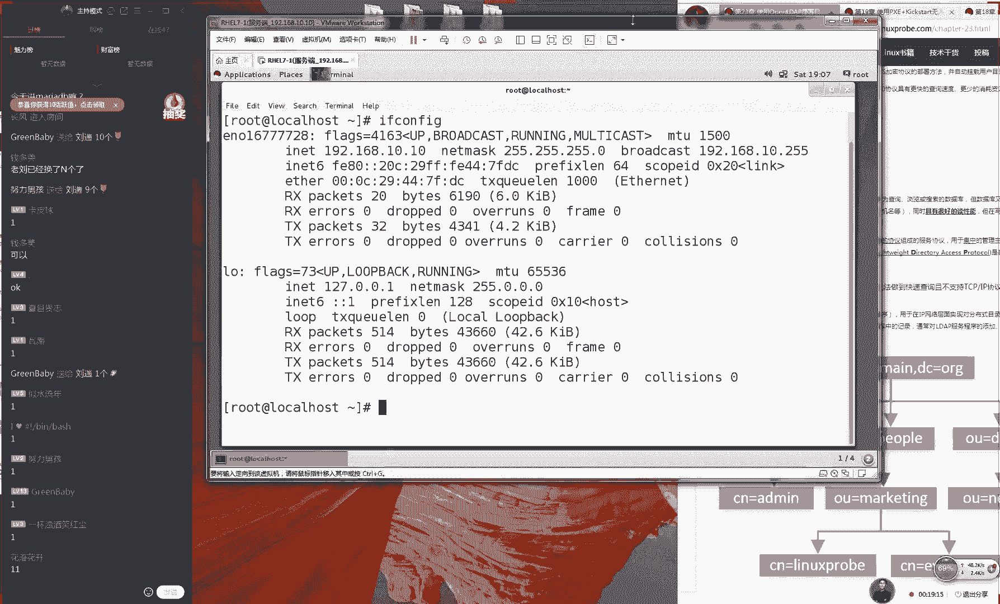
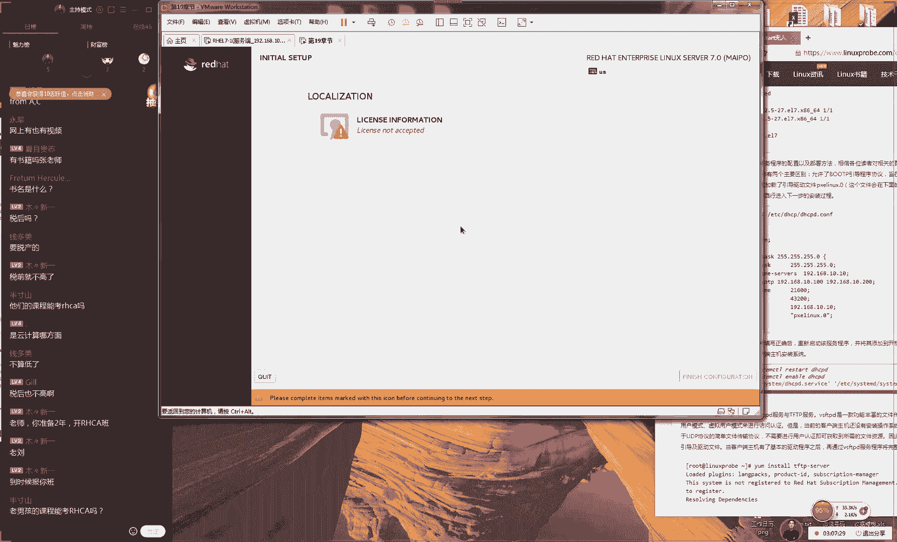

# Linux教程RHCE - P17：17.OpenLDAP&mariaDB&PXE无人装机 - 艾弗艾尔思丢丢 - BV1if4y1e73V

🎼2018年夏天。🎼哦，好，那我们准备开始上课同学们，因为今天东西特别的多啊，所以我们今天要开始上课了。好吧，现在有38个同学，那我们先打一下一那我们先测试一下我们我们这边这个上课环境。好吧。

那我先打一下一同学们这东西确实比较多。因为我规划一下咱们这边的这个课程，同学们也给我去反馈了一下。就是说们下然就准备去考试？包19去考试同学所以话我们今天这个课程我们预计会时间会比较长。

会给大家讲19会讲1918和23三个章节。但是这个东西的话呢跟我们考试已经没有太大关系。我们主要讲一下就是我们个课端跟我们的第18章们的数据库就是足够足够的好吧。

但是我们今天为了我们这个课程的话还要给大家东西稍微要多一点点吧我们开始我们这个课程了。19章节没有复习过。呃，这个十9章节比较简单。而且这个我们考试没有太大关系。可以先看我们这个课程先给大家去说一下。

好吧。😊。

然后是这样的，然后的话今天我们这个课程东西会比较多，然后时间会比较久，预计时间至少是两个半小时。好吧，而且中途是没有休息，大家天前做好准备。而且大家话今天确实呃东西确实会呃会比较多。😊，呃。

然后那我们现在给大家说一下，我们这边这个第二三小节，我们讲的open其实这个大家不用分书的这个书上没有的是这么回事。因为的话我们最开始我们去写书的时候。

这个归含在我们这个进阶片里面它包含在我们这个基础片里。但是后来由于我们这个课程的调整。因为这太难。消化不了。跟我们考试的话呢只考的个客户实不用去讲它的。

但是我们后来我们所以我们后来把它归为了我们这个进阶片，但是这也是一我们这一个习俗，大家知道比如小米公司，你们要是他呃年终的时候，他们就会喝粥是吧，是一个公司的一种习俗了，这也当就是我们培机构的一小习俗。

因为我们之前讲第二3章这个章节，以我在就把严肃下来赠送的一个课程。感受一下这个进阶片的一个难度。因为我们明年可能或许有可能没准大概或我们可能会开这个的班级还真是有这个。😊，规划的。

然后呃您可以先去提前去感受一下啊进阶片的一个难度。然后嗯先所就如果要是没有准备好的话没有关系啊，这当就是一个知识的一个扩展好了。如果说您真的是不愿意去听的话，也没有关系。因为这个难度确实很高。

而且在公司里面去搭建的话呢，您还是得过来查，但是我们今天就是对知识的一个扩展。好了，说着我们今天这个课程时间会会会很紧张。今实我还巴拉巴拉我还说这么多废话，那么就给大家说一下。

我们这边这个章节的一个规划问题好了。好，那压根听不懂。😊，呃，第二三章很简单，压根听不懂。好，这个很矛盾啊，到底是难还是不难？其实我给大家去说啊，就是它很难的。这个第二三章节它是很难的一个章节。😊。

他要是不难的话，我们也没有必要把它归为到集接屏里面。大家感受一下。好吧。那那我们今在给大家说一下我们这个服务，我们叫做openDP是这样的，因为咱们这个课程我们坦白来讲。

这个openDEP它原先是我们的红HC里面的课程。后来连红HC现在它都不考它了，这个太难了。所以说呃您学完这个之后听不懂很正常啊。那我们今天就把我们这个课程啊，😊，我们这样去规划一下。

就是呃我们会先给大家去讲这个第二三章节。但是我们在讲我们的服务。😊，端的时候的话呢，我们会把我们的每一个参数，但我们不会去偷空减料。我们会把每呃里面的每一个参数。

然后我们大概的一个价格我们都会给大家讲清楚。但是我们今天还是着重给大家讲一下第十八章节，我们讲这个数据库。然后所以的话呢如果说您啊我们还要给大家说一下，就是说如果您今天听完第二三章节有点听不懂的话。

这个很正常。因为它属于进阶篇，大家不要说老师我怎没没有听懂啊，听懂很正常，这是一个进阶篇，然后也算是给大家赠送一个课程了。然后等到明年我们再开我们若8的班级的时候，我们第二三章节肯定是不会去讲了。

因为这个东西我们已经讲了好几年了，以后也就是。😊，给大家说送送送，然后也送好几期了。但是每一次听完之后可能只是一个大概了解就好了。那好，那我们说这么多废话，然后我们又说这么多废话。

然后我们开始纪念我们这个课程。哎呀，今天怎么回事？今天本身应该时间很紧张呢？我们问满了爱说废话呢。😊，那好，那我们说声音忽高忽低呃，等一下，稍等一下啊。好，那我们现那好，那我现在重启了一下我我那个麦。

大家现在听起来好一点吗？让我们去买一个好点的麦吧。哎呀，你们你们不要这么说，我这个麦其实已经很好了。好，大家现在觉得怎么样呢？啊，我现在说话的声音能够听清吗？啊？哎要那不能要是可以的话。

大家打一下一好不好？啊，我们看一下，我们能不能听清啊，可以了是吧？那我们继续哎呀，你们这样说完了之后。😊。

感觉好感觉感这个这个这个感觉好寒蓄呀，是吧？然后这个连个麦都没有。好，那我们真的不说废话了。同学们今天真的很紧张这个很紧张的啊，大家可能现在没有感受，但是我有规划了。我今天我下去规划这个课的时候。

我大概就规划大概得3个多小时大概大概3个小时吧。好，那我现在给大家说的话，就是我们之前有一个协议叫做X。500这个的话呢就是我们对一个预服务，就是说我们可以来用它来做我们的windows的。

就是我们非常相像这么一个协议。但是的话这个它有一个致他话有一个致命的一个缺点啊，他就是他的话他他是不支持我们的TC协议的相是什么情况，现在就是你买了一个手机，但是话这个手机不能去联网。

就是说你现在去买一个手机，对不对？然后那个手机现在没有联网的功能。那你插这个手机卡之后你也没有4G然然后你然后你也不能去连wifi。😊。

那你这个手机肯定没有人买，对吧？因为我们现在是离开那因为我们现在是不能现在我们已经是离不开互联网了。所以的话我们这个它都被替代掉了。它现在就是我们叫做open它叫做我们的目录服其实我们坦白来讲。

要这么讲的话，根没讲一样吧？什么叫目录服我都不知道什么目录这个说起来好虚啊？就是太官方了。那我给家解释一下啊，你可以把比作就是想象啊但是这样说会让人家觉得这老讲严谨，那么你以家想象成是一个数据库。

那我们讲到数据库它里面会包含了各种的数据对吧？说我们有一个数据库它里用来保存我们的图片它可以保存我们的文字，它可以保存我们这个账户和密码，它可以保存我这个附件。那也就是说数据库它里边是五花八门。

它可以保存各种各样的数据。那我们这个open这个数据库啊，它保存的数据有两个特点。第一个特点是什么呢？第特点是短小比。😊，呃，比较短小的数据。第二的话呢就是说我们读取的频次比较高的读取。次数多的数据。

哎，这个什么意思啊？现在就是说当你去写这个数据库内容的时候的话呢，这个的内容。😊，他们都是比较短的。但是但我想说，那么这个数据多短是短，多长是长呢。那我们讲到一个名称几个字母。

这个我们叫啊他们叫做比较这个短小的数据，而我们说这个读取频次比较多。就是当你去写入这个数据之后，那你再来去读了这个次数会比较多。那我们想象一大家举个子，这么说可能是比较抽象。

他非常他非常非常相像于windows那个域的非常非常相像。如要是之前接触过的话，您再听我爸一说，感觉就是基本上就通了啊，这非常相像的，然后给大家去说一下，就是说读此频次比较多，那不就是我们的电话本吗？

当你去交了一个好朋友对吧？后你他那个电话号码写到那个你的这个电话号码本里面。那好第一来说你的朋友的姓名，他的这个性别。还我们这个电话号码这些信息都是比较短小的信息。

以说这个我们就是符合我们数据库保存数据的一个类型。第二的话读。😊，是频次比较多。当我们去写入这个人的这个信息了之后。我们一般来讲都是在去直接来去他是在我们这个呃电话本里面来去找这个人的信息了。

而不会再去反复来去编辑他。所以说我那我们要对于我们比较短小的数据跟我们读呃读取次数比较多的数据就比较适合于openP这个服务。然后但我给大家说一下，就是说我们这个服务的话呢。

我看他说好像集成了L一样的协议。然后是这样的啊，然后的话那我们今天这个服务，那我给大家想一下，那我们也可以保存一些比较小的数据，然后有读频比较多的数据。那是不是就是我们的账号和密码了，大家想象一下。

因为我们这个账户和密码，大家想象一下，是不是比较短小的数据O账号和密码，它是呃比较呃它是呃比较简单的这样的数据。第二的话呢就是说我们的呃读此的频据。呃，当你来去设置一个账户的信息了之后。

然后你以后大家去登录的这个过程，实际上就是来去进行验证。那么也就是说调取你数据库里面的这个内容来去。😊，一个读取操作。所以的话呢我们来讲到就是说我们对于我们的这个呃账户和密码。

我呃我们这个系统当中的账户和密码呢，我们非常适合去使用openLDP好，现在说完之后有点抽象，对不对？刚刚好像在因为我们刚刚讲完之后，大家有点明白，但是现在有想好像有点抽象，但我们到底保存这个数据。

它有什么用处，对不对？那好，那我们给大家举例，就是说当我们有几台服务器，咱比如说我现在一台、两台、三台、4台、5台服务器。😊，好，那我们现在。😊，好，那我呃那我们现在有5台服务器。

然后我们这边我们再准备出来一台中心的服务器，我们把它做在呃，我能把它上面部署上面openLDP这个服务。这样的话，那么我们就可以将我们这个中心的服务器与我们这些呃客户端来去相互连接。

啊通过我们的网线来相互连接。这样的话，那我们就可以进行一个集中式的一个认证了。我们可以集中那我们可以来进行集中认证啊，或者说我们叫做单点登录，我们都可以这样去叫。但是说单点登录的话，可能不太严谨。

那我们就可以通过我们这个中心的服务器来进行我们这个账户和面的这个验证了。咱比如说的话呢，我们之前啊你要想去登录到这台服务器的话，那么你就要在我们这个呃服务器的本地上面。😊，🤧嗯嗯。

那在在我们这个服务器的本地上面，然后我们就要去输入我们这个账户和密码，对吧？然后登录时后啊，它也是验证了一个文件，叫做ETC目录里面的pas这个文件里面的数据。

然后还去验证了一个叫ETC目录里面杀到这个密码。那好了，那我们现在就是说可以那我们可不可以把我们一个账户和密信息保存到一个中心的服务器。后通过中心的服务器来做验证好，这样我们听完之后。

大分都应该经80%都明白了。但是如果不明白的话，给那我那我给大家举个例子。再比如说以后您听完我们这个课，然后就开始去公司里面做一个网管了。好了，那我们以后可能会运营很多很多的这个服务器。

或者说您开了个网吧，这个网吧里面有150台机器，咱比如说且是比较少的情况。但那就那有有了200台机器，那我们就可以进行一个单点的一个登录。您只需要在一个服务器上面去设置好了您的账户和密码。😊。

这样您就可以在任何的服务器上面去登录了。大家想象一下啊，就是我们现在这个网吧里面有150台机器，而您只要在我们这个服务器上面创建一个账户和密码。😊，马上您走到任何一个电脑的的面前。

您都可以使用这个账户和密码去登录。这个我们叫做呃集中式的一个呃呃呃这我们叫做集中式的这么一个认证。那么这有什么好处呢？这已经很明显了。

第一来说就是我那我们只需要把我们这个账户和和我们只需要将我们这个账户和密码的这个信息给他写到我们这个服务器里面的一次就可以让我们实现出来，让上百台的服务器都可以通过这个账户来进行验证。

这是我们的第一个那这是这是我们第一个好处。第二个好处的话呢，就是我们今后想要去维护它的时候也比较简单。那么我只需要去修改这个服务器，它里面的一个账户和密码信息。

那么马上他可以去同步到我们这个其他的所有的服务器上面做验证。这个大家有没有知道就是非常相向于我们现在有些论坛啊，因为现在可能大家不太喜欢过论坛了。但是我们早5年之前微信不是那么火的时候啊。😊。

然后也没有什么呃，现在也没有这么也没有这么多这个软件什么的。那会我们都上了论坛。大家知道就是有没有喜欢同学逛论坛的，可以打一下一啊。因为我反正我们那会那会喜欢喜欢关论坛。大家知道这个论坛的话呢。

就是我们后来啊腾讯把那个给收购之后来可以通过QQ号去登录了。可以来去登录到我们这个论坛上这样的经历，者说您现在去上京东购物的时候，吧？那么现在这个京东你们看看是不是就可以通过QQ去登录的？

你上淘宝的时候，在可以通过支付宝去登录。那好，他就是说我们调取的一个认证的一个方式，们以通过我们的一个集中式的一个认证，提供这一个验证的一个功能，再给大家总结一下。因为我感觉我已说的很清楚。

但是我给大家总结一下，是这样的我们使用open它有两个好处。第一来说就是您可以。😊，在一台服务器上面，只要去设置好我们这个账户和密码，马上您底下就有100多台机，无所谓啊。

因为我们说100多台是无所谓的这么一个数量啊。😊，可以是有上千台的这个服务器，您就都可以来去登录了。这个里面的所有的服务器都可以使用这个账户和密码去登录了。这个是也就是一瞬间的事情。

也也就也就也也也就几秒钟吧，它可以实现出来所有服务器都可以去登录。第二就是说我那我们今后如果说要想来去修改一下这个账户和密码的这个信息的时候的话呢，也只需要修改我们这个服务器上面的这个就可以了。

我们马上就可以来去做同步。好，然后给大家去说一下，就是说我们呃这有一个架构，这个架构的话会不会非常的这个复杂。因为是这样的啊，它会有这种重明的这个情况。它会有这个重明的这个情况。因为的话呢我们这个数据。

😊，呃，他会有这个重名的这样的一个情况。我们那我们比如说有一个人叫张三，或者说有人叫流传，对吧？那我们中国有14亿人，那难免他就会有流那啊那么就会有这个重名的这个情况，对吧？那虽然我这个字比较难写。

但是叫流传。但是可能中国人是有14亿人么也也会有人叫流传，那么怎么办呢？那我想去查询想要去查询流传的这个呃那咱比如说要去查询流传的这个身份证的信息，或者说想查询他的这个在银行的存款吧。

那我们想去查询的时就就是那么就是查询不到的。因为我们那我那我们需要去指定一下我们这个账户的一个身份，那我们但是这个没有身份证号码。

那我们给他一个叫做描述服这个描述服的话我们把它叫做这个D我们把它叫做这个DN是这样的这个描述服务叫做DN他指的就是一个从上往下去说就是说他最上面大家看到上面有一个叫做D等于。😊。

然后是逗号DC等于DC等于ORG这就现在就是一个我们的顶级的一个域。你可以把它想象成是一个国家，那么国家底线，那么就会有省市对不？北京市朝阳区那对我们这个账户进行一个描述。

就是DC等于中国最顶级是一个中国中国北京市阳区流传他是个技术部门的一个讲师那么你对他进行这一个描述。后就是一个具体的一个人了。这个就没有重名这样的情况了。那我我也可以把作是一个公司那们这个顶级的域名。

那么就是一个公司的名我们底下比说有搞技术的，还要搞后勤，还要搞财务的那们就有不同的部门我们这个技术部门里面个流一个讲师，他是负责那体来去限定的信息，把叫做。😊，个DN它的主要是什么呢？

它就是主要就是说避免了我们有这样的重名的情况。它就是查询我们用户信息的时候，产生冲突这样的情况。好，那么再给大家去说一下啊，就是我我们这个顶级域的话呢，其实我们的习惯上来讲，我们比如说一个公司嘛。

那我们就是叫做lin然后pro点com，对吧？我们这样去写上一个域，但是的话呢我们。😊，他这个写法是不一样的，它的写法我们需要把它改成叫做DC等于呃lin。

然后逗号DC等于com我们需要写成这样的一个形式，但是这个实际上也指的是一个我们的域名的意思啊好吧，大家知道有这么一个格式的一个区别。另外的话我们看完这张这个图我把图看完之后啊。

其实我自己有点这个太复杂了，而且我们需要自己创建出来这么一个结构图，其实并不需要的我们这个系统里面因为他知道这个很难，所以的话它已经提供了很多很多的模板了，我们已经提供了很多很多模板了。

您可以去直接来去使用就可以了。但是您需要使用的时候使用两个命令第一个命令我们叫做第一个命令我们叫做LDPAD命令，这代表就是我们去导入一个模板的思我们某个模板的内容，我们来去导入。

或者说你叫做添加到系统里面这个操作。然后我们第二步操作我们来进行修改。当您先去添。😊，添加了一个这个呃信息到我们这个系统里面。然后的话呢这个只是一个模板了。

它肯定不能像我呃它肯定是不能够完全符合于我们工作需要。所以说我们先要去做添加，然后再去修改。将我们刚才添加那个模板变成一个完全适合于我们自己的这么一个呃这么一个架构，先要去添加。

然后再来去修改这个两个命令，大家可以记到你这个书上面。😊，啊，大可以记这个书上面，然后说公婆一台呃服务器相当于就是搞定一群，只要你这个账户密码被泄露了之后，那么就素人他们就都可以去登录了。

但是这个跟我们这个技术第一没有关系。第二这是一个安全性问题。好吧，然后那我们先来记一下我们这两个命令。第一来说去添加我们这个模板，然后有模板之后，们来进行修改。

这样的话就避免说我们你不要从零开始去写这样这个架构，这个太复杂，这个太复杂了。你只需要现在去添加，然后再去修改就可以了。那好，那我们说这么多，我们现在给大家去时间去操作一下，我们先还一下我们这个虚拟机。

避免说我们上一节课的实验也会产生冲突。然后我现在所讲的话呢，大家我们大可以放心，你不要跟我一起去操作，这个你现在你即便你去考到红C红C里面都不考它了太难了。所以我们把放到一个进阶片里面不用去学习它。

但是我们会考到我们的客户端。那所以说我们待会接下来半个小接下来40分钟吧，我们都会给大家讲到这个服务。😊。

如果说您是第一次去学的话呢，我们最后再还再去呃，那我们最后再家去啰嗦一下啊，您可以放松心态，不用去担心说呃记每一个参数啊呃然后去担心这个会考到什么的？这个问题大家不用担心，好吧。好。

那我们接下给大家去说一下我们这个配置的一个步骤了。现在呃现在我们再来说配置一下我们仓库就有点幼稚的，对不对？因为已经讲到了。😊。

一个半月了，这个y仓库大家肯定会去配置了。那我们现在去使用亚m仓库来去安装一下我们的L啊现在去安装一下我们的openLDEP。😊，第一的话是我们open就是我们这个客户端的程序。

然后是open server，然后呃是我们的叫呃叫做，现在我们去安装一下这几个工具。这我们话这个最后一个工具我们叫做迁移工具大家知道会听完之后会一脸蒙蒙的啊，但是不用担心这很正常。

我们来看一下这个工具的话呢，其实英语不是很好，但是我也去学习过，它是有两个单词去组成出来的。第一我们叫迁移。第二叫做to工具。好，其实来说就是一个迁移工具了。那我们就是将我们一些配置文件。

然后做迁移式的待会我们会去使用到这个命令，然后把我们的一些配置文件转成open能够读得懂的这一个格式。现就是将我们的一个配置文件转成我们的open它能够读得种格式的这样的一个工具。但如以后想移民的话。

好像那个移民的这个词就是这么去写。😊。

这个迁移嘛，你原先是个A，然后他从呃当时他他通过这么一个迁移转换了，然后你之后变然后你变成一个B的一个身份。好像，就是这么一个单词，隐行也叫做这这种鸟这种迁徙。好，那我们先来去安装一下我们这几个工具。

另外因为这个东西。😊。

呃，我们主要是讲因我们主要讲我们这个服务端的目的是待会给大家演示这个客户端啊我们会稍微快一点。这边那我们现在去生成出来一串这个密钥文件这个是我们一个加密的一个文件。

那我们以看到那我们现在将一个明文的信息叫做我们将我们的将我们一串这个字符叫做加密成了一串MD5的一串信息。那我们可以看到的话呢，这个我们这个加密方式是是SSSH让我们就加密成一串字符串。

它每一次都是不一样的。但是你要知道它虽然说每一次加密出来那个值是不一样。但是呃但是的话它对应的这个名文它都是相同的。所以说的话呢您待会如果要是您此处修改了这个我们这个加密的这么一个这么一个字符串的话呢。

请待会我们去配置文件时也要同样也要去修改一下。因为我们这个加密出来的这个值。😊，只是针对于这个铭文的。好吧，现就是一个密码了。因为我们将这个密码给它加密之后，然后我们待会做验证。

那么如果说您现在去修改的话，请待会儿您同步的这个文件里面也要去修改一下。如果说您拿不准，说我不知道我待会儿该什么时候去修改。那么我们建议第一遍的时候，那先按照我们这样去做。然后等着您做完一遍之后。

然后成功了之后，等到我们做第二遍的时候，您可以再去修改，那也不迟。好吧。那好，那我们现在来继续啊。😊，杠N代表就是输出的意思，将我们这个加密后的这个信息给它输出到一个文件里面，我们把它叫做pasW好。

其实这个文件我也是记不住。那么怎么办呢？那我就先把它给复制下来，我先把它复制到我们的剪切里面好吧，大家可以也替我保存一下嗯好像我这边打开记保存下我要是说待会把不到怎么呢没有关系您可以过来看一下这个文件可以了这个文件就在目录里做op大家说一。

为我38同9同学我们现在所讲的这个服务端的主要给大家去讲去演示一下我待会这个客户端所以您不用说我们待会有点跟不上啊什么情况不担心的接下继续往下面去编辑一下我们这个主机的名称我们来编辑一下我们这个主机的解析信息解析的信息我们来将我们一个域名。

😊，能叫做。192168点10。10，我们INHTRUCTOR代表就是一个讲师的意思啊。那我们现在将一个域名。给他解析到我们这个我们服务端地址上面。然要是这个的话。

应该也需要来去设置一下自己的主机名称的。好了，我们现在把它保存退出，然后再去修改一下我们当前的这个系统的主机名称，叫做house name。我们将它的名称也要同步去修改，是这样的。

我们需要能够保证这个域名能够去拼通，并且因为待会需要去做me钥文件的啊，所以我们需要。😊，我们先把它能够给拼通，我们现在来去拼通。OK没有问题。接下我们要去生成出来我们这个密钥文件。

因为我们的openLDP啊，它都需要进行一个验证的，它也需要有这个呃公效跟seel，对吧？呃，我呃这我们应该叫做这个公略跟私月。😊，所以的话呢我们先来去生成出来我们这个密钥的文件。

那我们呃我们对应的命令我们叫做呃叫做open啊叫做open sSL啊，然后是REQ代表它去注册一个我们的新的密钥文件的意思杠6代表就是一个新的密钥杠X509，它指的是我们的加密协议为X509。

把它变为一个节点，然后把它是一个节点服务器的意思out代表就是来去输出我们的密钥文件的一个路径，它在ETC目录里面这个路径啊，您一定要把它记住，我们待会需要来去使用到它然后CERTS。😊。

然后CT点PM。好，那我们现在把它写好之后的话呢，这就是我们的一个公略文件的一个保存地址了。那我们这个还没有完，因为它有这个公略，它那里还有这个私乐。那好，那我们现在啊其实感觉说私乐的时候比较有绕口啊。

我觉得还比较显说私钥。我觉得我觉得这大家理解起来可能更好一点。但是我们为了严谨嘛，还是把它叫这个私乐吧。好，那我们现在的话我们来继续我们生出来我们这个私乐的一个地址。接来我们来去输出来。😊。

我我我们这个文件的后面加上我们的有效期是365天。上就是我们这个呃相应的这么一个公月跟私月啊，它就是一个365天有效期来进行一个生成，然后他让你去输输一下他让你去输入一下你的这个国家的名称啊。

但是这个信息无所谓，因为我们现在只做验证嘛。说我们这个国家信息，他也不会放到公网上面去使用，这没有这个没有关系，所以我们可以直接去敲回车，他说让你去输入一下你国家的省份，这个没有吧，对吧？

我们就敲一下回车就好了。他说请输入一下你当地的那个街道名称，或者说你这个城市的名称，这个也不用去写我们敲回车。他说请输入一下你公司的名称，这个也没有必要们敲回车。他说请输入一下你公司部门的名称。

这个也没有必要敲回车。他说呃请输入一下你那个主机的名称，这个千万不要敲回车了，我们要去输入你的这个主机名称，我们该文件里面对应上的。😊，好，然后就请输入一下你的这个邮箱的这么一个地址。O这个没有必要。

这样我们好了之后啊，大家可以看到我们ETC目录里面就会呃open里面叫目录里面就会出来两个文件跟我现在将我们这个文件的所有者跟所有组给修改修改样话保证其他人是不这两个文件。

为这两个文件重要我们怕别人看到，所以我们将所有者跟所有组给修改并且把权限设小一这样的跟配置服务关系，主要是了安全不让别人所看到样话我们来复制一个文件这个文件是目录里家记下这个目录里一用来保存是我们的帮助文档。

好，里面会有一个文件叫做这个文件名称叫做。😊，exampble，然后我们给它复制一下，复制到外目录里面的lab LDEP。😊，把它改名叫做了，那我们做好之后就可以进入到我们的里面的b了。

你可以看到这么一个文件。这个文件的话呢就是我们的这个open它的这个数据库的认配置文件。因为我们这个大家知道了，如果说你们有一个配置文件的话，那么这个就起不来。

那我们现在的这个目的就是来去复制过来一个配置文件，作为我们这个模板去先去启用一下我们这个数据库，但是你想也知道那你复制一个模板过来的这个配置文件肯定是跟我们这个工作需要是字太小了是吧？

那肯定跟我们这个工作需要是不符的。但是没有关系。我们只要先把我们这个数据库先给起来了，先给起来之后，我们再来去编辑它好吧，看一下我们这个服务怎么起是这样去做一命令我们叫叫做L的命令。

这个现在就是来去生成一下我们这个数据库的测试文件。但你完这个命令之后，他告诉你说测试是失败的，启失败怎么样。这个没有关系同学们这个没有关系。😊，然后你可以去LS看一下，这个是呃。

然后这个时候他就会在这个呃他又在这个目录里面生成出来一些配置文件。然后我们我还还有我们我们这个数据库的文件。那我们需要将我们我们这个文件的所有者跟所有组给它修改成LDP啊，这个没有关系。

因为我刚才讲到我们这个文件它包错是很正常的。因为它此时此刻还没有去配置过它。但他只要没有呃然后我们再来去重新去启动一下我们的SLAPD这是我们的数据库的文件，然后再把它启用一下。😊。

没有报错情况下都是正常的。然后我们待会就来去配置一下我们这个openP它这个一个数状结构。好，那也就是说我们现在它就是已经数据库制起来。

但它里面是一个呃空白的那我们现在需要做就是先去给他有这么一个树状的一个结构，它里有公司的名称，部门的名称，还有具体的这个单位的名称，就还有我们这个用户的信息跟密码那我们现在有这么一个结构的话呢。

我们要去自己说出那么那我们去创建这么一个结构是比较麻烦的那我们可以进入到我们目录里面叫做open里面叫做这么一个目录这个目录啊，它就是用来去保存我们这个。😊，呃，模板文件呢，那我们需要做就是来去导入。

它需要导入两个文件。第一个文件啊，但我们导入的话，大家记得啊，我们刚才讲到两个命令，它导入的话呢，我们使用的命令我们叫做LD们去修改的时候的话，我们叫做LD大家需要记一下这两个命令我们需要知道的啊。

这两个命令很重要。先来做一下导入导入一个模板了。然后但是后我们再去进行一个修改，把这个模板内容修改成我们所需要的把它修改成我们所需要的呃太快了，跟不上呃，这个大家讲清楚了。

就是说我们这个确实服务端会比较难。然后我我们会把我们这个时间多放在这个客户端上面。好吧，因为我们之前没有想跟大家讲这个觉太难了。这个也确实好，那我们接下来我们继续往下去说啊。😊。

好，其实哎其实我下一次应该准备好一个服务端的，直接给大家就是上手就去做配做配我们的这个客户端了。好，那我们接下来我们来导入这个文件吧。那我们现在定义成它是一个外部的一个文件。😊，但是这个跟不上的话。

就真的是没有太好的办法。因为一定是把每个参数给大家讲清。然后嗯但是跟不上真的是没有关系的啊，这个属于我们这个进阶片，也相当就是一个赠送课程。大家可以去感受一下我们进阶片的一个这么一个难度吧。好。

然后的话我们导导入这个文件，它是一个配置文件，所以定义成它这个confi，它是一个我们的配置文件。然后是杠IF我们的子配置文件。😊，呃，第一个文件叫做cosine LDF结尾的。好了。

我们现在去导入一下。还有第二个文件，我们叫做我们叫做NNS。好，大家先看一下，虽然说你现在看这个内容你是看不懂的那我们只是导入两个模板而已。但是我们可以看一下啊，就是我们现在导入的这个模板的话呢。

我们的这个模板的hold缀，大家主要看一下是什么。😊，大家看一下我们这个啊我们这些文件的后缀，大家看一下，主要的话呢是以LDF结尾的。大家可以仔细看一下。虽然这个文件内容我们看不懂啊。

但是也可以看到就是我我我们这个服务他能够去接受的文件的后缀的话，我们叫做LDF结尾的文件。好，另外再给大家去说一下啊，其实我不想说太多遍。因为说太多也耽误时间嘛，但是我们这个课程它归属到进阶篇了。

而且现在它很难C不会考到它。们所以我们现在把我们这个流程给大家讲完一遍之后不用去记不用去背因为大概有个印象。如果以后啊老板问您说我我们能不能配置一个中心的一个验证服务器，然后我们可以做这种集中式存储啊。

一个集中的一个号和密码的一个管理服务器。然后这个时候您知道有这么个东西就足够了。这就是我们HC的一个水平，而且现根本就不会考到它的。😊，这个是我们考的客户端，我们现在给大家讲这个流程啊。

主要给大家演示一下，就是说呃今后有可能您配置的时候，就按照我们这样去做都可以。但是不是说意味着今天就必须要把它给学会。好，那我们继续往后去说那我们现做这个导入了之后。

们大概我们然后我们另外大家不用把这个太关注说我们具体这么一个参数上面啊这两面就足够了。您主要会大概这个流程有这么个想法。比如说我们刚才open作用对吧？

我们大概知道保存数据它是短小文件跟读频比高的这么一个特点去导入文件再去修改模板就这么一大概的流程大概有个印象就可以了。好，那我们接来我们导入文件之后。

们要去修改一下这个文件让我们这个模板可以完全贴合于我们工作需要另外们今待会我大家讲两个比较简单的这个章节，要给大家回归到我们这个基术片里面应该能找回信。好，那我们去编辑一个文件，这个文件它是不存在的。

😊，创建出来，我们把它叫做ch啊，就是我们定义一个模板嘛那那我们要去写入这个文件。这个文件它叫做这个修改的意思，就是我们修改一下我们刚刚的那个模板，它里面有很多是跟我们这个需要是不符的。好。

那我们已经给它写好了，我可以来去直接去复制进去。这个的目的的话呢，主要就是来去新呃，他们就主要来去呃来去修改一下。我我们这个顶级的域，把它变成叫做lin。那所以说我因为我们最顶级的我们之前啊。😊。

我们那个域叫做DC呃等于逗号DC等于。所以我我啊我们这个文件的目的它有3个第一来说修改一下我我们这个顶级域的这么一个名称。好了，第二的话就是说我们验证一。

我们去输入一下我们刚刚我们加密出来那个密钥的文件的一个信息就是一个我们加密后的一个密码，我们设置一下还有我们的第三点就是去指定一下我们刚刚生成好这么一个公钥跟的文件。这个呃路径我们已经写好了。

如果说你要是不确定的话呢，请一定要过来查一下，以您实际为准，保证这个文件它是存在的。好了，然后我们把它这个啊保存并退出。我们接下来做的不是要去做导入。

而是要做修改将这个文件给它修改到我们这个我们的这个系统里面他这个协议为LD然后是冒号三个斜杠它写的名称。我们这个名称然后我们导入这个文件。😊。

铲子。OK我们来去导入这个文件。这样的话我们就可以去做好我们这个三个步骤。第一，修改我们的顶级域名，把它叫做。第二我们去指定一下我们加密后那个密码呃，第三步我们来去指定一下我们这个密钥文件这么一个路径。

然后我们待会就给去加载这两个文件了。好接下的话呢我们来去再来写一个文件。是因为这样的，他要保存这个呃账户密码信息的话呢，就为了避免说它会除名这样的情况啊，避免说除名这样的情况。

所以说我们要给它创建出来工作组或或者说我们这个部门嘛，那所以说我们现在再新建出来一个文件，新建出来两个部门。😊，第一个部门我们叫做pe，第二我们叫做呃然后我们这个第二个部门我们叫做group。

再就是定义成两个部门了。一个叫做第一个叫做pe。第二个叫group当我们去导入这个用户信息的时候，就要去指定一下我们这个具体导入到哪个部门里面，避免说我们这个因为一个公司里面。

也许人很多就会有出现这样的重名这样的情况。因为我们之前我们虽然会也不是很多。但但是我们就已经出现过重名这样的情况，避免说这样的情况。我们要给我们用户去分组好，接下话我们来去导入这个文件。

好杠杠X杠W指的是我们这个杠W的后面加是我们加密之后那个密码的名称如果说您刚才修改过的话呢，此处请修改成加密之前那个名文的信息，们现在是一个密码。好，刚地。😊，我们来去导入，我们有一个叫做manr。

它是一个管理组，然后。逗号DC等于linux pro逗号DC等于com。然，我刚才我们定义好了这个顶级域，接下来我们来去导入这个文件。这个文件默认是没有，我们刚才自己去新建出来的。好。

这样我们导入好了之后，大家看到这边就出现了两个OU这个的话呢这个OU大家可以翻到前面去，然后可以看到我们这边有一个表格这义了话就表是部门的大家可以到面是有的的就是我们部门的名称好这个无所谓就大家我新建出个门group主要为了让我待会导入用户信息的时候。

不会情况。你最后有个用同样的名我登录的，底该去验证的这信息，对不？以说我们要这一个部门区分一下后我们去新建出来一个用已第一节课时候就个就有这么一个用户的信息了啊。好，现在已经有就好了。

说是没的话创建一下这个用户信息。好那我们接下我们再来我们进入到我们进入到一个目录叫。😊，er model里面的hell。因为我们现在啊我们需要把我们用户信息给它迁移到我我们这个系统里面。

所以的话呢我们现在需要做一个修改的一个文件，这个文件叫做。这个文件叫做MIGRAATORcomman，这个是一个通用的配置文件。现在就是说我们现在想要去进行迁移的话，它会有一些标准的格式。

我们避免说重复性的填写。😊，然后就是我们可以编辑这个文件。这个文件的话呢，我们大概是在70多行就能够看到我们这个信息了。那我给大家解一下什么意思啊。因为我们刚才讲到说迁移的话。

实际上它就是将你自己的这个配置文件给它迁移成我们这个数据库。它能够读得懂的这么一个格式。所以的话呢那我们。😊，呃，就要使用到这个迁移工具，把它进行一个数据的一个转换，进行一个格式的转换。

但是这个探设的话那我们做这个格式转换的话，它里边会有一些呃顶级域啊这样比较固定的这个信息，所以说我们就要来去指定一下他这给大家举个例子，其实也很像就是我一个家里一个亲戚吧。

然后他家的小孩现在是在一个幼儿园在上学，然后我们之间我们上那个幼儿园特别的很因为我们当上幼儿园的时候也没有这么好的设备什么的。然后每一次写作业的时候，哎，上小学吧。

然后他就去然后那我们每一次去写作业的时候，需要拿这个作业纸。然后那那我每一次到去写我们这个班级啊姓名啊这样的这个信息，但是你每次都去写图样的信息其实也是很无聊的事情。那现在就比较高级了。

因为我们家那个亲戚啊，去年春节的时候他过来了一趟后再看一下他那个作业纸上就已经有他们那个学校的名称，后他们的班级名称跟他的一个姓名，后。😊，然后好像都是他们需要统一去发的啊。

现在就是说我们将已经固定的信息，不会他呃呃不会变更的信息，我们先统一把它写好。这样我们迁移之后的所有的配置文件里面的这个信息都是同样的了。现在就是咱们举一个很不好的例子啊。

咱比如说我们谁谁谁去医院去看病了。那我们只要你刷你的这个医保卡，最后刷出来那个呃呃最后那个成绩不是最后那个检查那个单子啊，虽然说里面那个换的结肯定是不一样，对不对？

但是你上面那个姓名年龄什么的那个信息都是一样的，现在就是一个固定的一个格式。好了，呃，然后的话呢，我们继续。😊，呃，我们写上叫做DC等于lin点com好了，这个其实我们还是给大家去说啊。

我我算了不给大家去说，有点耽误时间啊，就是说这个听不懂很正常。好吧，然后嗯这个的话呢，我们现在所讲的一些其实都不应该去讲的这个服务端是红毛是C都不会去考，只是给大家看一个流程，大家懂这个意思就好了。好。

然后我们继续。😊，好，那我们来继续我们来呃。我们来继续呃，第二三章节是我们的一个目录服务。我刚刚看到新一同学好像是迟到了啊，好像7点半才来一定要下回提前来，要不可真的是跟不上了而且咱们课马上就要结束。

这个机会也难得以后一定要准时了啊。好，那我们来继续我们来编写一个文件啊很忙是吧？就是我们以后机会今不要迟到。因为可能再一迟到再来之后感觉就要跟不上了，确实自己学习的话可很吃力，对不偷跑出来的啊，好。

那我们来继续我今天有一个我们先给大家去说啊，有没有时间了。然后的话呢我们现在来想一下啊，他肯定的话呢是有两个文件用来保存我们这个保存我们用户信息的第一个文件就是ETC目录里面的s这个文件里面用来保存是账户的信息。

对不？好了，那我们现在就来去复制一下我们。😊，这个用户的信息啊，其实我们书上面是拽了一下，我们书上省的是一个管道服，然后重庆项。其实这个就拽了一下，没有任何的用处的。

就是体现一下我们这个课有多有多么有这个啊特别有就特就怎么说呢，会使用比较高级的这种功能啊，其实没有必要的，可以直接来去复制一下就好了。那我们来去复制一下这个文件。😊，来直接去复制一下这个文件。

新建出来一个文件，然后给它粘贴进去有逼格对不对？我们我们要毕竟说出书嘛，所以就转的是比较有逼格。其实啊其实你你还不如这样去复制呢，这样省且自己还不会乱好吧。

但是我们了书上是一个比高使用方法有这个文件之后还有一个文件就是你有一个优户组不？这个组是目录里面group希望大家现在啊虽然说以后我虽然说以前上课我都要求你们好好。

不能说聊天什么的但是我现在我实我希望你们聊聊天因为这个东西确实看他的话，其实也是很吃力的现在真是没有必要去记为我我都一边去看那个提醒这个东西你哪怕以后你工作的时候真的是需要来才能配出来。

那么所以说你现在何必去。😊，它里边这个参数呢。好，然后我们说那么多啊，我们继续往后面去讲啊，我现在就是。😊，可能也到了更年期了，现在特别能说好，那我们先来复制一下我们这个用户组里面的信息。如果没有跟上。

没有关系。好吧，理由我们先呃跟大家说过。好了，我们现来具有两个文件了。第一个文件就是我们用户的信息。第二的话就是我们用户组的信息。而且今天的话很大家可以一边吃着饭然一边泡脚一边听课啊，要放轻松。

我们待会需要你们去听的时候，我会叫你们一声的。好吧，现在你们先可以呃聊聊天啊，然后大概看看这个流程就足够足够了。嗯，对你以后考对以后考过之后，你你以后考过红C之后，你再来过来学这个也不迟。

因为真的我们坦白来说，咱不是说我们故意给大家就是好像下午大家说这个很难一样的。如果你的朋友里要红你去跟他说你给我配置一下op个里边有不会还有一个看着我的文档去打这个东西确实很难。第二红他不敢考了呢好。

😊，因为今天时间比较紧张啊，然后我就先不给大家去说啊，我们待会吧，我给大家聊一聊红帽考试这是一个事情。好吧，包证红帽它考题的一种出题的一种，我们叫尿性也好，我们叫这个套路也好，我们给大家讲一讲。

这样的话大家以后呃去考试啊，工作什么，大概我心里有个数。而且你看我平因为我接触这个红帽也很长时间了，大概还是有一点小小的这种心得的。😊，好，也会有一点自己的想法，但不一定对，但是我觉得还是比较的准的。

好。好，那我们继续啊，我们哦那那我们现在的话，它是在我们这个对应的目录下。😊，他会有很多这种迁移的工具了啊。咱比如说就像你要去移民一样，那你要去移民到德国，你要去移民到美国，那肯定填那个表还不一样呢。

所以你要去迁移的话，那么你所需要的一个工具也是不一样的。现在做第一个迁移啊，第一个迁移，你有必要去记我现在那那我现在使用的是哪个工具啊，你不要去管你可那我现在直接来去迁移我们这个用户的这个信息。

把它变成我们这个LDF接尾的一个它能够读懂的这样的一个格式。嗯。😊，呃，好尴尬啊，叫我们稍打一个P点PL了啊。好了，我们来去迁移它迁移好之后的话，再迁移第二个，我们叫group，我们用户组信息。😊。

group然后这个文件我们刚已经有了，我们该自己手动去复制了。😊，呃，说想讲红C呀，不行啊，同学们还是按照我们这个进度来啊，不用这个千万不要着急。你这样的话，你们想考试，有同不但不想去考试啊，对吧？

我们按照我们这个进度慢慢来不要着急啊，好，我们来继续那然大家可想一个问题，说老师我还是不懂说我们到底我们迁移的话，我们有什么用处吗？那你就给我执行两名，我们的效果是什么呢？大家看一下啊。

这个是我们之前的那个文件，这个是我们之前我们能够看得懂的这个配置文件，这个是我们之前的配置文件，然后你看一下啊，当我们使用格式这个迁移过后，这个是迁移过后的这么一个工具，它是经过转换之后的这样一个格式。

所以你就知道说为什么我不让大家去手写的原因，就是你可以通过工具把你的这个格式给它做一下转换。现在就是我们大家报名的时候会填一个表？我们考试的时候会填一个表那个表实那个表里的信息是比较全的。😊。

然后我们会把大家这个表里的信息再登录到我们这个系统里面，然后以及会报考给红帽那边，后他们也会有一个呃这么一个系统里面，然后我们给大家去报考，他们会有一个格式。

最后把把然后就把这呃就我们这边啊做好报考之后，然后就会有这么一个详细的列这么一个列表了。现在咱再举个例子啊，大家有没有呃大家有没有。😊，注册过公司。

因为我这边正好啊2019年1月1号开始不要有那个电商法了嘛，然后我们这边也准备开始有公司去运营，但有没有注册过公司，你们可以打一下一啊，要有经验的话，可以跟我去说一下。

因为啊去年的时候不是有一个啊没有吗？啊，是这么回事，而说去年的时候呃，李克强吧，他提出了一个战不是什么战略啊，不是他提出了一个呃指导思想吧啊，这个叫。😊，呃，什么来呢？万众创业大众创新对不对？

有这么一个指导思想。然后他提出一个具体的一个呃细节，就是五证合一还是这个三证合一，现在你要去注册公司的时候，你不用再去跑工商了。以前我们去注册公司的时候，你好像需要办5个证，还办好还是办三个证啊。

一带呃不是一带一路啊，就是说我们以前去注册公司的时候，你要去什么工商啊，去想要去税务部门啊，然后去办好多好的弄个证去对吧？然后现在就是我们再去注册公司的时候，就是一个简他咱们简证放权。

他现在不用去办这些了，你可以去那么你就可以直接从网上面，然后就可以来去注册那个公司信息，包括说公司的合名，这你们就知道吧。然后这个呃然后公司。😊，的这个和名，然后股东信息填写。

然后什么房租什么房东怎么着的，好多这样的信息就说我们化我呃我们话这个之前你是。😊，需要来去跑一些单位，但是你现在可以从网上来就他直接填写这个信息就可以了。最后你填完这个信息之后。

他会在网页上面给你显示出来你填写过后那个信息。虽然你填写的信息都是比较呃，他们啊呃都是比较的这个比较的这个简单和这个呃比较碎的这个信息。但是你最后填写完了之后，他他的那个预览是非常正规的。

现在就是你有一个格式了之后，他把它给它转换成另外一个符合于他们工商的一种格式。好吧，然后那我们来做一下这个导入。然后大家看到说这有一个问题啊，说。😊，能不能去拖延时间，这是不可以的。

因为你已经报考红帽之后就不能够修改时间。因为考场位置已经给大家预留下来。如果说您当天没有去考试，那个位置已经已经被留下来的。然后大家待会去说一下。

说我们红帽考试为什么说他为什么我们不能够单独去报一下红帽是如果大家要是有这么个想法的话，然给大家去讲一下好吧。好，那我们继续往下面去走。我们先导入这个文件叫做DC等于后逗号D等于点给大家做导入。

然后用户的文件名称，那也就是说我们现在先导入一下我们用户的这个名称信息再来导入一下我们这个用户组的这个信息是这样的啊，因为的话红帽考试它是分上午跟下午的等一下这两个文件LDF。😊，好。

导入一下我们这个用户组的这个信息，它是分为我们这个上午跟下午的那我们想象一下，如果说您只让我们所有同学他是只报上午的那好，那我们下午可能就被闲下来了，对吧？

所以说现在红帽他是要求你是红HCS跟下午红C1起去连报的，这个也是从2012年开始就这么一个规定。所以说这个红帽他也是从一个商业的角度上面来去考虑的。嗯，然后说延后10到15天呃。😊。

如果说你通知说电话通知说考官会晚来两天，呃，那么就只能是往后延两天，要以红帽那边为准。因为他也会问你说您能不能呃，因为呃他如果要是调时间的话，他肯定会电话里边去征到您的这个同意。如果说您要是不同意的话。

可以电话里面跟他说。因为我给大家报考了之后，就直接报给红帽了。😊，然后这边我也是没有操作权限的。好，那我们现在导入好了之后，大家可能会想到那老师那我怎么知道他有没有导入成功呢？那好。

那我们可以大家去查询一下。另外啊我们先不给大家去说这个红包考试的事情啊，这样说不就乱了？待会我给大家留时间好吧，我给大家我给大家留时间，我们去聊一聊。那我们去搜索一下刚币代表就是我们搜索的一个范围。

然后搜索叫做这个后于点大去搜索一下有一个用户的名称叫做LDus好了，这个用户是不存在给大家看一个我们的报错的一个情况，大家去搜索一个用户名称叫做lin大家可以看到。😊。

这个时候我们就有了这个用户的这个信息了。那你可以看到，就是说我们这边搜索到的这个结果跟没有搜索到的这个结果。然后说你们是都收到通知了吗？没有啊啊，是这么回事。😊。

啊，大家不用大家可能是现在备考有点太紧张了啊，你们想也知道，我们不可能说所有的考场都改时间嘛，你们没有收到改改时间那个通知，就说明你们没有改时间，你们的考场是正常的你们不要现在有点考前综合症了。

有太紧张了啊。好，那我们继续往去走。那我们有这个用户信息了。我们来继续去安装一下我们这个网站服务。因为我们需要大家记得我们刚才生成出来一个cel跟公钥，就是我们刚刚去讲课时候生成出来这么两个文件。

现在我们需要把这两个文件通过我们这个网站服务传给我们这边的这个客户的好，那我们现在需要将我们这个公钥的文件，给它放到我们的网站的共享目录里面。然后大家现不用担心啊。

就是我们现在所讲的这些他还是服务端的大建的一个环节。您不用去记您不用去背也不用去太担心。好，那然后我们去启动一下我们的网站服务就是我给大家去说啊，为什么我让大家不用担心。

就是我们现在我们从开始7点钟开始去讲。😊。

讲到现在5点呃减到现在7点54了。😊，我们现在所讲的所有的一切。都会是由考官帮你去做的，它都是由考试机器会为你提供一个非常完整的这么一个服务端的一个配置。好吧，我们刚才所所有的步骤都是由服务端去做的。

好，那我们接来我们想一下就是说要能够用户进行验证的话呢，他还要验证一下我们这个用户的一个加目录的数据好这个也需要去有以说我们还要给共享一下们加目录的数据那我们就可以使用NF。

这个步骤也是红考官在我们开考之他会在我们的考试机上他会帮你去提供的这个步骤你也不需要去做好，因为我们只需要做客户这改不了这个是由考试的机器上面给你提供的。

好那我们现在给他共享出去叫做home录里面的这一个子目录198共享给共享给19820这个主机我们的NFS权限首先来说读写权限要进行同步的权限以及将我们远程的这个超用户的权限映射成本地用户的这么一个。😊。

参数好，这样下最后，我们同样啊我们需要去。让我们的呃这个呃让我们NFS能够去启用，然后去重启一下NFS的配置文件的这个服务，将我们的NFS加入到我们项目箱当中。

最后我们还要去清空一下呢防火墙保证说有远程可以去访问。好，大家可以想一下了啊。然后啊大家可以现在可以醒一下了，就是我们刚刚从7点钟开始，我们到8点钟，我们到现在我们所做的所有的步骤，在实际考试的时候。

😊，不需要您去做的。我们之所以给大家演示一下，我们纯粹是因为有有同学他们不想去考试。好了，那我就给大家演示一下，说当您工作的时候，我们该如何去配置一下我们的openD那这个会有难度。

就是给大家演示一下这个流程。我不希望说我们这个培训变成一个只是为红考试准备这么一个考腔辅导这么一个性质。那我们何必想这么多呢？好，然后的话现在给大家可以醒一下。

然后给大家去说一下说我们这边这个该怎么来去使用由我们服务端去提供这个open这个服务。另外还有一件事情就是我们现在需要在我们这个客户端上面你也要去做一下解析，将我们这个198啊。

跟我们这个域名做绑定这个步骤红考试的时候，你也不用去做。因为有考试的机器上面会提供的。😊。

所以你可以看到了我们第十三章讲的那个DNS讲的天花乱坠，结果呢都不用你去做了。他他就考证机器上面会为你去提供。而你需要做的就是我们以下的步骤。第一个步骤。

你需要去安装一下我们的openLDP它这个客户端的这个工具，以及我们呃它去支持我们啊远程呃来支持我们这个呃远程验证的这么一个。😊，呃，软件包的名称。好，我先在给大家安装着。

然后给大家说一下它里面的这个作用是这样的。现在的话呢我们讲到的就是open LDP那个章节。我们现在讲的是openDP个章节。我们现在开始是我们的客户端所需要配置的东西。好给大家讲一下。

现在我们安装几个软件包的名称。第一个软件包的话呢就是我们的客户端的这个工具。第二的话呢就是让我们这个系统它能够去支持我们的远程的这么一个怕模块这么一个验证。

它可以去实现出来远程的这么一个呃openDP的这么一个验证，它让我们这个怕模块能够去支持啊LDAP。😊。

然后这个话它是一个基于图形化这么一个工具。它是基于我们的图形化界面的这么一个工具。因为我们知道大家想配置它的时候的话呢，希望说更加的简单一点。所以说我们给大家准备了一个图鸦界面的工具。

待会我们就可以通过我们的那我们可以通过我们待会去点鼠标，然后配置这个服务。还有一个叫做然后线KRB5这个话其实来说叫做科这个其实来说叫做这个科它是来自于一个希腊的一个神话。

叫做九头九头狗是叫九头狗还叫做还叫做九头呃还是叫做六头犬啊，九头狗吧，你们可以网上搜一下啊，它是来自于一个希腊的一个神话，它是说有一只狗啊，三头狗。我忘记那个神话里面讲是几头狗，我们不能丢人，对不对？

大家可以上搜一下啊，说有一个希腊神话，一个狗叫做科后它守在地狱门口叫做地狱犬地狱犬是几个头来的九个头是哪吒是吧？😊，三个头是哪吒，九个头是什么来的啊，地一圈是几个头，你们可以去搜一下啊啊。

这个狗叫什么瑟普鲁斯，反正有这么一个名称啊，叫这个科ber尔。就是说呃西腊神话里边有一个地狱的一个门口，然后守一只狗，然后那个狗现在就是呃守着不让别人进，好吧，有点像我们现在。😊。

你你就有一个电影在上现在也在上映，对吧？现在也在上映，这个叫海王，你们有没有看可以打一下一啊，就是现在有一个热然后现在有一个电影比较的这个呃比较这个热门叫海王。其实那个海王里面有一个地名嘛叫。😊。

就是沉默那个大陆，其实他就是来自于一个希腊的一个神话。然后他去拿那个三叉戟的时候，大家有没有关注这个剧情，就是有一个守着那个三叉戟的这么一个怪物。大家没有看的话，可能就不知道我在讲什么，就是有一个怪物。

他守着那个东西。其实希腊神话里边很多都是安排了一个神或者一个鬼或者一个怪，然后就守着某一件这个很这个重要的这么一个东西。比如说地狱的门口他就会有这么一只狗。所以的话就是有一个服我吧。

就这个科这么一个原因，就是说他是作为我们这个认证式的，如果说你要想通过那么你想通过这么一个验证的话呢，那么你就需要通过这个科这么一个许可。

所以说这个科成了一个验证这么一个服务的一个意思他就是一个来自一个希腊神话了。😊。

他可以让我我们这个用户实现出来这么一个验证，只有你通过这个狗的这个允许的，然后你才可以进入到那个地狱的门里面，对吧？当然也不知道谁谁想不开，最后非得要进入到地，然后非得要进入到这个地狱里面。

然后说三头狗，我怎么这是九头狗呢啊，然后说希腊这么一个开门的。我看一下说这个服跟真题里边是一样。就是我们现在所做的这个步骤是跟真题里边也是一样的。好了，然后大家可以醒一下，就是我们刚才做的那个步骤。

其实大家都不用去做。现在开始给大家演示一下，说该如何去使用我们这个。😊，呃，openLDP好，因为我现在我本地上面是有这么一个用户的啊，我先把它给删掉，大家不要说我作弊啊，不要说我作弊。

所以说我那我们先看一下啊，当前是没有这个用户信息，大家可以看到当前是没有这个用户信息的。好，那我们现在就可以来去。😊，呃，来打开我们的图发界面来去配一配了。所以说这个东西很简单啊。

会跟我们这个考试肯定是略略有差异，但是基本上是一样的。参数的话，以我们这个考前辅导网页上面为准就好了。好，然后的话我们现来去配置一下我们这个工具，这个工具的名称，包括说里面的这个信息。

你都不用担心红帽考试这个非常简单它会很呃他会很呃它会很明确的去提示出来所有的信息。在我们的网页上面，您需要做就是从这个考就是从考研这个网页上面复制以下的信息到我们这个窗口里面。您只要不要把它复制错。

就肯定是对的。好吧。好，那我们来去下载一下我们这个刚才有网站服务所提供的这个公钥文件。😊，其实我不太想，就是说我们一直在提考试考试的事情。因为有些同学他们不想去考试的。

那么们就觉得啊我们这个培训好像只为了考试了。所以说我们呃考试的东西我们先放一，那那我们稍微放一放。我们就求呃那么呃我们来继续往后面给大家去说，然后的话后面有一个服务我们下载的时候，他说失败了啊。

我看一下原因，这个文件是不存在吗？😊，我看一下啊。😔，就是我们刚才那个公钥的文件，我们刚刚是有网站服务所提供万目录里面的3W里面的HM叫什么来着啊？CERT点PMCRT点PM没错呀，对吧？啊。

我们这边好像。😊，lin have an U X P probe。好像也没错，对不对？好了，那我们先这样，我们通过我们的浏览器去访问一下。😊，是不是我们的网络不通呢？有可能吧。好。

他说我们这个访问被禁止了，肯定是因为我们没有权限。好，我们先进入到我们这边服务端上面给我们这个文件一点小小的权限吧，给他1个75，这样的话别人可以再去读取这个文件里面的内容了。好。

这个时候我们再去刷新一下我们的客户端的这个网页浏览器。好就可以去下载到我们这个呃呃再载到我们这个文件，它是一个公要文件。好了，我们现在去下载一下这个文件，再点一下确认的时候，他就应该不会有报错了。好。

建入下奇迹同学们看好了，当你考试的时候，你就这样去做就好了。然后我们点一下这个应用。😊，这样的话就可以将我们这个服呃将我们这个服务器跟远程的哦这个呃服务器对接，然后就可以使用远程的服务器来进行验证了。

这个的话有一个效果非常的明显，您可以来看一下。这个时候我们再查查看一下这个用户信息，之前他是没有的。但是我们此时此刻就会发现多出来了这么一个账户的信息。可以看到。

现在就是一个从远程进行验证的这么一个实验。因为大家可能说老师我觉得你在作弊。其实这个用户，因为之前我见了很多很多次了，我觉得他就是在我们本地上面是有的。你只不过跟才肯定使得一个什么小手段。

然后让我们误以为好像是一个远程验证的这么一个效果。好给大家演示一下。那我们现在这个本地上面。我们这个呃配置文件里面，他也看到这个文件里面用来保存是我们所有这个账户呃的这个信息的一个文件。

可以看到里面是没有这么一个用户信息的。所以说他确实现在是由一个本地来实现出来这么一个远程验证的这么一个效果。再往后面去走的话，我们来去尝试下去登录到这个用户的身份下。😊，去切换到这个用户身份下。

然后我们可以加一个简号代表是一个完全切换来去敲一下回车看到他说切换是成功的。但是说这个用户的加目录是不存在的。好。

那也就是说我们要远程要程加目录也给载过来那我就可以使用才提共享了我服务地址是811我服务端地址好了，然后那我们现在的话恰巧我们12使用共享编辑一下我们的的文件。这我给大家讲过。

直接使用服务地11我们共享出去的是me目录里的目录到我们本地的me录目录格式为权限是否备份以是否选择00。😊，做好之后的话呢，我们现在来保存并退出。马的杠A去挂载一下呃，说我们这个挂载目录不存在。好吧。

我们就判载出来我们本地的挂载目录的名称。好，然后我们去做一下挂载。挂载好了之后，大家再切换在这个用户的时候，大家可以看一下，当前这个用户是在我们本地上面是肯定肯定是不存在的。大家可以相信我好吧。

他现在O他现在是在我们本地上是没有的。但是我们却能够去看到这个用户的信息，并且我们能够去切换到这个用户的身份以及能够去挂载到这个用户的加目录，这就是一个非常完整的一个实验。

给大家讲了一下那我们该如何去配置这个服务端，然后以及如何该去使用这个由服务端去提供这么一个服务。好，那我们刚讲巴拉这么多。其实我们的这个核心还是这个客户端，这个是最实用的，我们可以这个只要会就可以了。

如果服务端建一个账户，还需要在LDP。😊，他是需要的，他这个账户必须要是迁移到了我们就是必须要是在我们的呃open LTP他那个数据库里面才有效。而不是说他直接调取的是我们的这个服务端的那个配置文件。

它是不一样的。我们必须要导到那个数据库里面才可以。😊，好，然后的话我知道大家现在这个想法有点像吐槽，对不对？老师太难了，我们觉得红C怎么会这么难啊，我觉得我自己考不过了，对不对？

其实大家我们有点有点给大家就是吓到大家了。个其实不是红C的难度，甚至这已经超过红C的难度，这个就主要就是一个客户端的一个使用方法就好了。那我们知道这个服务端肯定是要比客户端要更难。

然后会难的不是一星半点我们今天就演示了一下，其实没有必要给大家演示一下我们这个服务端。但是大家看一下这个流程也好，开阔一下思路。但是千万不要被这个所吓到。好吧，大家能够理解我这个说的话啊。

就是你现在能够开阔一下这个思路，配置一下这个流程能够搞明白，大概有个印象就足够足够了，不要被这个所吓到不要红堪忧了不过了，千万不要这样的这个想法了怎么会凉了。

因为这个红红没有这个内容的大家不用担心吧大家去做出太多了。明白同学。😊，呃，就自然会明白啊，不明白的同学，我估计你们就是在其实就明白了，这是想调戏下老师，对不对？😊，好，然后给大家去说一下。

就是我们今天的这个课程，我们还是想给大家讲三个章节，讲就是我们刚才所讲第二三章节啊，其实咱就是一个赠送的一个课程，还没有开始我们今天那个主菜，刚才就是指一个开胃菜。

所以话呢我我们今天还是想给大家讲三个章节讲到18跟19两个章节。但是的话呢。😊。

我怕时间又不够，那怎么办呢？但是大要下礼拜有同学们呃，马上就要考试了，对吧？😊，我没有希望大家能够集中式的进行一个复习。所以的话今天可能就需要大家来去辛苦一下了。

我们今天的这个时间如果大家要是允许的话啊，我们给大家往后讲拖延一下，大概到9点半左右，甚至可能到9点45，这么一个感觉。好，大家同意就好啊，大家同意的话，我们就往后去讲。如果大家真的是时间啊。

大家都那么大大家如果是大部分同学都觉得时间会很紧张，跟不了的话，你们可以跟我去说好吧，好，加课啊加然后加课也不用加钱的。好吧，您这都是我们应该做的。所以说今天如果大家同意的话，我们就给大家多讲点东西。

呃，如果说您今天实在是跟不上了。但是我们少数服从多数了。那么您可以等下课之后，您可以再来去重复去看我们这个今天的视频，我们再去多看几遍。好吧，这个不用担心，我们这个课程会给大家提供这个录制的这个视频的。

但是今天我们如果讲3个小时的话，我们今天晚上12点，我估计视频压制不完。😊。

啊，因为时间这个呃因为我们呃去做这个呃视频的压制也需要很长时间。我们之前都是11点半大概能压制完，然后传到我们学员区页面上面。如果今天我们传到晚了一点的话，比如说我们等一点钟的时候传上去。

大家也虽然能够理解一下，好吧，我们就去压制我们这个视频计化传到我们学员区页面上面。但是您最晚最晚，您明天早上起来也能够看到我们今天所讲的这个课程了。😊，好，说了我们那我们就继续往我们去说啊。

我们也说不要废话了，对吧？我们其实大家都已经做好准备了。其实我巴拉巴拉，我们说了这么多废话。好，大家可以先我先喝水啊。😊，好，我们来继续。好，那我们继续往后继续说。呃，大家一会交好记好的笔记啊。

我们等明天的时候，我们会给大家做统计，然后给大家发那个小礼物啊，给然后会大家发那个签名的书籍。我今天已经都打包出来了，我已经打包出来了40多本，我反正我觉得肯定是够了。😊。

好，也都签好字的，也都打好包了。然后等到明天的时候，我们统然后我们统计好，大概下礼拜的时候就能够寄出了。😊，好好，继续往往后面去说。好吧，大家准备好之后，我打一下E啊。

我们来让我们最后来家去振奋一下士气，然后就来一鼓作气了。今天这个时间会比较紧张，大家确实辛苦了嗯。😊，好，我们可以打一下一说笔记都不够用了，说字字写太多，是不是？好了。

我们往后面去说我们叫做呃第十八章节讲到这个数据库是这样的啊。如果您要是因为大家知道我设考试狂魔，对吧？然后我之前我去考过斯科，我去考过红帽，我去考然后我去考然我去考过红旗，我去考过LPI认证。

因为我设考试狂魔，所以我就一个认证还是比较了解的。大家知道啊，有一个公司叫做甲骨文，它是叫做这个甲骨文公司那甲骨文公司，叫ac。大家如果要是你们要是听说我的话呢，你们可以打一下一啊。

你们可以打一下一要是听说过公司叫这个甲骨文这个公司啊，它不是做甲骨文的，它不是真正要去考古的这个公司它是作为它主要这个核心产品是数据库，这个是他们的这个核心这么一个的这么一个业务。大家知道啊。

但我们来说这个数据库的话，一直都是甲骨文公司的这么一个业务，但是红帽考试，他现在突然间从2015年开始去考到了这个数据库。😊。

这大家懂什么意思吗？就当就是你去学习的是linux，但是我们红帽考试的时候，十年还有没有去考过，突然间开始去考这个呃然突然间去考这个数据库了，说明是红帽啊。😊，他也是开始去想把这个多方面进行一个结合。

结合一些这样的一个网络呀，然后结合一下这个数据库啊，然后结合我们这个操作系统。这样话让我们最后考出来那个红更有含金量这样提升一下难度这个知识更加全面一点提我们一个含金量。第二点考虑的话主要是一个表态啊。

就是我们之前这个加固公司，它有一个产品叫做买。我们现在的话我们使用叫做这个它有这么一个表态是这样大家可以搜一下新闻，大概啊我们时间我们记不清楚了。

大概是2013年或者2014年的时候有一个公司叫做公司它有一个产品叫做买看这个时间不知道到底是114记了就我之前有一个公司叫公司它有一个产品叫做买so这是一个开源且免费这么一个产品。这。😊，他被收购走。

他就被欧啊，然后这个散公司后来被欧瑞克公司给他收购走了。😊，所以的话呢这个my的这个产品也就自然而然就归属到啊这个加工公司啊，那么就啊自然就归属给了这个加工公司了。

但是啊你们也知道一个商业的公司肯定是为了投资，肯定是要有回报的。所以的话呢那么这个加公司收购走了之后，那就会让我们这个myscle里面这个程序啊，它之间是一个免费解开源的这么一个程序之后。

它变成了一个闭源的呃不用说B源嘛，它就变成一个涉及了很多项专利的一种商业的一个软件。但是但是它不是一个但是它现在并不是一个闭源软件，它是一个有了多项呃商业。😊，呃，这样的一个版权收费的这么一个软件。

所以说他自然来讲，你们知道黑客跟极客啊，但是他们都是比较追求于自由的对吧？然后你也知道黑客的这种形象，那这样的这个形象。你也知道这个可能黑客是比较喜欢自由的那我凭什么我们自己一个开源社区的一个产品。

你有钱你就了不起啊，对吧？然后你就把收购走了，然后然后把我们的心血变成你自己的一个商业的一个软件，凭什么对不对？所以说就有人跳槽了，那么包括谁呢？就是包括于这个my的一个创始人啊，他要跳槽了，跳槽之后。

他创建出来一个新的数据库叫做。😊，叫做这个哎他把它叫这个呃叫做marB这个的话呢MIIADB这的话这个我们所说的这个marry就是这个创始人他规矩的那个名字，好，然后他创建出来这么一个新的数据库。

马上要有了大批的人来去支持他这个新的这么一个项目。并且的话呢，现在因为你知道谷歌公司，他谷歌公司它不送外卖，他主要是搞一些呃比较呃支持技术发展的一些事情，对吧？然后比如说我们的安卓手机。

我们的这个安卓系统就是由谷歌公司所开发出来的。所以说你们就知道谷歌公司对于这种开源的行业的贡献了。谷歌对于开源行业的贡献是很大的。那么。😊，谷歌一看这个势头不对啊，那我们之前我们也要需要使用数据库。

而且他们之前就使用是这个呃，他们就去使用的这个myscle。但是马上这个加工公司啊把收购走了之后，他们这个善业公司之间也怕出现这种技术的壁垒。那万一有一天加工公司跟我们闹掰了，那最后不给我们提供服务了。

那最后我们这个业务就要受有影响了。所以说一呃谷然后的话以谷歌为首。😊，还后拉上了维基百科。啊，然后拉上了红帽。然后开始大量来去支持这个然后把他们这个里面的这个业务啊。

我我去202017年的时候看到的数据，谷歌公司已经把70%的数据库已迁移到了这。以说这也是一个未来这么一个趋势。

们看来是这样的给大家总结一下还有另外一个事情另外一个小细节也算是一个八卦说为什么红帽你也要去支持一下这一个新的数据库。因为红帽它是做系统的，你支持这个数据库有什么用吗？对不？其实给大家讲一下啊。

它有一个小的一个八卦，但这个八卦可能说起来比较牵强，是这样的最开始的话呢我们这个因为我们的开许可。以说其他人也都可以基于我们红系统开发出来这个系吧？

说我们这个系统就是由红帽这个产品所衍生出来这么一个免费的版本。好了这个这个加国公司他们一看。😊，今天这个开软件它这么好，所以说红帽也基于了我们呃红帽呃也基于了我们这个reo系统。

也基于了我们红帽的这个系统研发出来的一个的一款。😊，自己的一款这么一个系统叫做啊叫做啊叫做oraclelinux。😊，这个加骨文的lin系统，它实际上它就是由这个re系统所修改过来的。然后大家想一下啊。

那么好了，你非得要基于我这个系统，然后研发出来自己的一块软件，这个但是因为我们开许可，因为我也是基于这个GPL协议去研发出来这么一个红帽系统，所以说我没有脾气对吧？我没有脾气，因为我也不能去告你啊吧？

因为我也是基于开源软件嘛，但是你知道这个因为你知道这个公司啊，之前红帽跟他打了很多场官司，就是因为他的这个口号就是一个免费的一个lin系统，然后跟他打了很多场官司。但是虽然没有告赢吧。

但是红帽他是一个他就不是一个很开放这么一个公司，他也是种商业的一个公司嘛，对吧？他也是一个很商业的这么一个企业，他就打了很多场官司。

后来知道把给收购走了之后才然后才停止这种这么一个打官司这么一个这么然后这么一个过程，然后大家知道这个加工公司他有这么自己的一款系统。😊，我之后啊，他的这个口号更过分了，他不是说免费。

而是说修复了红帽的400多项漏洞。这个其实啊这个比较过分，他还说我们呃他他的话呃第一款系统。😊，他的这个第一款系统的这个口号嘛，因为肯定让别人去使嘛。

他就说我们的话呢这个系统它修复了红帽了400多项漏洞，这个就下把红帽就就可彻底就把掰了。他这两个公司之后就再也没有太多这种业务的往来了。因为你说免费那就无所谓了吧？后你说你自己的这个界面更美观了，对吧？

或者说你说你这个系统更加能够适合于数据库都它都是可以的。但是你说你修复了红帽400多项漏洞。这个红帽因为你们知道红帽现在这个大他现在这个主要的业务啊，红帽现在也有云计算也有呃集群，也有也有这个中间键。

也有这样的他他也有这样的这个系统。红帽现在这个大部分的这个收入的主要的来源，就是这个re系统结果把诋毁一下。然后就是说re系统不安全，上面40多项漏洞，这样话红帽惹急了。😊。

我们再给大家举一个很贴身物的一个例子啊，现在就是你你去你的外婆家，然后你去吃饭去了，对吧？然后人家好吃好喝还还给你做好多好吃的饭。结果你吃完之后，你把说这饭不好，那你感觉不太地道，对不对？

因为你本身就是基于系统去研发出来的。如果认为这个不好，那你干嘛要去基于人家去研发出来自己的系统，结果您做好研发了。然后您其实只是改了个外观也去去调整了一下。然后还说人家系统有0多箱漏洞。

然后去诋毁人家那个系统，现在就是一个很这个很过分的一种商业行为了。所以说红帽就是跟这个我们虽然是个很八卦啊，虽然说我们跟这课程没有关系，红帽就是很一直我们叫这个s很瞧不起。

或者说一直跟公司的关系会很不好很不好，所以马上就是这个劲。😊，红猫开表态说我现在去支持这么一个新的数据库了，你不要跟我再啊去使用这个买scle。

所以说红猫呃所以话最呃从红猫的这个热由器开始就全面去支持了这个。😊，了，然后这是我们的默认的数据库的软件，已经是提升成一个默认的数据库软件了。然后我给大家说这么多原因呢。

就是说红帽考试它实际上它也是一种表态，它是一种表示自己的这种态度，他不是想通过这个考数据库的这道题把大家给难住让大家考不过但成笑话不？我去我可以加一个比较比较有力的这种语气词，我他妈的去考的是系统。

你结果我因为数据库挂科了，这个是不是说不过去，对不对？所以的话红帽这个对于数据库的这么一个考核主要是表态表态说我支持这么一个新的数据库，以及你要有一个基本的一个管理能力是足够的。你不用把它家学的太深好。

其实这个已经是干货，给大家说明白我为什么要去学习到这么一个新的数据库。好给大家去说明白的继续往后面去说大家不要着急啊家不要着急然后给大家说是说。😊。

我们呃然后话那我我那我们现在这个主线还是这个呃还是这个linux。但是我们现我们呃今天我我们会多出来一个分支，我们去学习一下这个数据库。但是我们不可能通过一个小时的时间给大家去精通过数据库。

因为你呃去学习数据库，你也知道的，它里面会有。😊，三个人证的对吧？还有这个OC哦，我不太了解了，应该是叫做OC。OCM对吧？不是呃OCA对吧？还有这个OCM还有OCP三个认证，你都去学下来。

我还有不呃OCP跟OCM都学下来的话呢，大概也要一年多时间。所以我们今天这个课程只是作为一个一个我们这个数据库的一个扩展，就是足够足够了。您不用担心说啊，我们今天学完了之后，我们能够做什么太多的事情啊。

但是我们今天也会学得很深，我们会学习到我们这个基本的管理能力。对于我我们这个数据库进行一个基本的管理。包括说对于数据的一种这。😊，的一种呃呃新建啊，还有就是包括说这个增山改查站的这个能力。

然后然后以及对于我们数据库进行备份的这样的能力。基本上的能力我们既天我们都要去掌握了。那我那我们今天都要去掌握，但是您不用担心红帽考试他只要求你去做搜索就可以了。红帽考试的呃题很简单。

他只要你去做搜索就可以了。他不用让你去做什么呃，这个增山改查，好不说这个备份跟恢复，他们只要让你去考这个搜索就可以了。这个主要也是红帽一种表态嘛。好，下面再给大家去说啊。😊。

说一下我们这个干货其实还没有来呢，就说我们再给大家去说一下，今天大家不用担心说那老师我今天我学习的是这个但是我怎么听我的朋友们，他们说现在这个主流的话呢，好像还是这个买对不对？因为我们现在这个朋友们。

包括说我在这个公司里面，我还是在去使用这个虽然说你跟我讲这个特别的好。然后很多业他们都在支持但是我们企业里没有再去使用过他？后我以后工作的时候，万一以后我们还去使用怎么办呢？

所大家也不用担心对他是兼容的，我们今天所学习的叫做数据库的命令，它是具有兼容性的。他我就是我们刚才讲这个命令啊，我们是两个系统都是通吃通用的。我们接这个命令。

他不区分我们这个买还是个们两个都是通用的我们在我们会在明天的时候明天会大家讲一下我们的会讲一个架构叫做到时候给大家讲这个买的时候。😊，那你就知道这个非常非常的相像。好了。😊。

呃，然后我给大家去说一下这个历史由来，说一下红帽的一个态度，说了一下我们今天所学习的这个课程。大家大家可以放心，这个是完全通用于我我们的my circlecle好了，然后大家就应该没有什么顾虑，对不对？

😊，然后就不用说老师，我就是为了我以后工作，我需要我才过来训这个课的，不用担心说我们这个只是为了红帽考试而考试。好，那我们接下来说一下我们这个数据库的一个下这个图啊。

这是我们两个数据库的这么一个logo看到之后他也是一个很的不？个图标相在是一个小海报个小海豚个相这一个一个也是一个看到常相这一个图两个是有很兼容性的我才讲这些就给大家去了一下我们这个一个由怎回接我们去安装一下听晕了。

是是到底我该怎么来去管理它呢。😊。

好，那我们现在来去安装一下我们这个。呃，数据库我们的marry数据库以及我们的merry啊这个数据库这个这个主程序。我们现在去安装一下它安装好之后不用着急啊。

不用着急说啊买 my microsoft三组鼎立，学习数据库的话呢还真是然后大家说说这个是个送分题这个我跟大家讲啊，这个还真他还真是个送分题。你们现在你听完之后，今天听完之后会感觉想吐槽哇，太难了。

但是你们去看考前辅导就会发现so easy。因为红帽他为了他单独出了一道选择题呃，出来一套这个呃啊单独去出来一道这么一个填空题。这个来说他非常简单的啊。😊，就是我给大家去说再多说什么。

我们这个培训不是为了考试而考试而呃，然后不是为一个考前辅导这么一个性质说太多没有用。就是你学完了之后，您再翻过头去看一下考前辅导。到时候你就知道这个课的一个难度了。好了，我们不说那么多啊。

我们来我们现在这个废话太多了。我们来继续我们来安装好这个之后啊，我们先来去启用一下我们这个的这个主程序。😊，好，我们现在去。啊，说什么Q server2000哎呦。

我上我我上上中职的时候好好像是我的一个噩梦啊，那会儿好像就有过这么一个课，就讲这个数据库的。好了，我们现在去启用一下我们这个数据库把加到启动当中，保证我们下一次的时候还可以为我们用户去提供这个服务。

这一步骤千不要忘记考试的时候我们去工作的时候配置好服务之后去重启加到启动项保证下一次能够去为我们用户继续去提供服务顺口流不要忘记一要，那我们可以来记一下这样我们来做一下我们这个数据库的一个数始化工作。

我们来做一下数始化工作。请输入一下当前入题用户的关理密码。这个说你数据库里面的个密码是什么呢？嗯我也不知道那么说就没有因为我们当前默认的数据库是没有密码了。所以说你直接去敲回设掉直接去敲回。😊。

他说是否来去啊，直接敲薇说，他说你是否想要去问你这个用户来就设置一下密码了，这不是废话嘛？那咱干嘛呢？来敲一下这个万再往后面走，请为你这个用户设置一下密码了。然后我们来去设置一下密码ra hat。

然后再给他输入一次ra hat啊，我大家去说出来了啊，他说呃请为你的用户呃，说是否来去移除掉这么一个。😊，呃，公开访问的这么一个用户，现在就是一个虚拟的一个呃，他就就是一个匿名用户，我们选择移除。

然后说因为他呃因为它不太安全，对不对？然后然后第二个说是否来去禁止掉超级用户去程从远程去登录，我们选择Y把它给禁止掉。他说是否来去移除掉这个测试型数据库以及访问权限。

我们选择一下Y因为他就是一个他都是一些呃没有啊他因为它是一个测试的一个数据库。它是没有因为他是没有用的这么一个数据库的一个文件，他说是否来去生效，我们来敲一下Y对？

去生效一下这样的话那我们就看到了就会生效了，现在就是一个初始化的这么一个工作啊，现在就是现在就是来进行初始化的这么一个工作。然后大家翻然后大家现在可以翻开书，翻开书翻到你的第20章节那个右上角。

你可以把你的这句话。😊，写到你的这个呃第二章节的前面，叫叫做这个thank you for using这句话，写到你的第二章的这个开头的前面。等到明天的时候，记住这句话。

明天我给大家再看一下这个呃另外一种解释啊，因为我们这个my circle跟这个mar是非常非常相像的。而呃但是我们光说大家可能没有感觉啊。就我们待会儿我们的明天的时候为大家去展示一下了。😊，好。

然后我们现在输置完好之后，就给大去登录到我们这个数据库里面了。我们来登录到my杠Uro杠P杠P指的是这个用户他有密码。但是的话呢密码是写到了下一行的，我们可以直接去敲一下回收下一行就要去输入密码。

大家需要注意的话，在呃在我们这个数据库里面的所有的命令的后面都要以分号做结尾。大家需要注意在我们这个数据库里面，所有的分号的后面不所有的哦在所有命令的后面都要以分号做结尾来我们来去收dase。😊。

代表就是来去查啊呃代表来去呃查呃，他去查看一下我们这个所有的数据库的这么一个信息。大家都来记一下啊，之前我也很不习惯，就是你需要在你的每一个的呃。😊，呃，数据库的名字后面都要以这个分号做结尾。

因为它的命令会比常的长啊，那你需要以这个结尾代表就是我们命令把它敲完了这么一个标识。另外的话呢我我们这个书上为了是美观所以我们用到这个大小写给大做一下区分。

但是我们实际上来去输入的时候是不需要的它是不需要的另外的话呢我们去敲的时候，大家可以来感受一下吧。好吧然后我们现来去设置一下。因为我刚才我们已经设置好了，我们超级用户root的密码。

那我们接下来我们来去学习一下该如何去重置一下我们用户的密码。们咱比如说我想把我超级用户ro密码给它重置成叫做好了，就这样去做就好了，这样可不可以不可以那我们就要敲一个分号，把它给结束掉。

对这个大小写是是不会去区分的，但是。😊，你的这个分号，你到最后你可千万不能够去少。好，那我们就把密码给它重置成掉多，然后把它给重置了。😊，啊重去登录一下，我们到大大家去大家去登录一下。

再去输入这个再去输入这个的时候，他会告诉你说密码是错误的。那么好了，那么这个时候你就要去输入新的密码叫做你才可以登录到这个数据库里面。这个常简单就是他就是去重置下我们用户密码这么一个实例啊。

好接下来我大家讲一下，就是说该如来我们这个数据库里面新建我们这个管理员的用户这样的话可以让我们这个用户自己也可以来去管理我们这个数据库，因为你不能说你死一个超级用户。这个不太安全。

一以后别人知道这个密码了呢对吧？那那我们来啊，那么我们就可以来去新建出来一个用户，然后我们这个用户也可以来去。😊，登录到我我们这个系统里面。然后这个用呃用户信息啊，这个还有这个名称是无所谓的啊。

大家说安y是不是OK我们那我们来叫这个安y这么一个名称，把它新建出来一个账户，我们叫做安y。他的密码的话呢，我们现在叫呃我们的密码。😊，叫做linux probe，这样我们就有一个用户的一个信息了。

账户为呃账户为安利，密码为linux probe巧一载回车。这样的话我们就可以待会去使用到安y用户去登录了。但是你这个用户还没有权限呢，对不对？好，那么怎么办呢？我们来进行授权操作，我们来进行授权。

因为你你呃。😊，呃，因为的话在我我们这个数据库里面默认你是没有权限，那么你需要去授权授权使有的权限，我们叫做。呃，GRANT大家有没有看过新闻啊，说那个李连杰还是成龙，我忘记了应该好像是成龙。

好像是在去年的时候给英国好像是捐了多少多少钱。后来那个女王给他授予一个爵士学位，但是好像这个然后当时在这个新闻里面就是是这个单词来去授予一个人的爵位的意思，现就是进行一个授权嘛，对吧？在就是一个授权。

为在这个英国你们知道的，她是一个贵族身份，这么一个他有这么一个传统的一个国家，你有钱无所谓，对吧？比如说比尔盖茨，比如说马云他们都有钱，但是不一样的，因为他是有一个贵族的一个身份，那么你可以靠捐款。

然后你也可以靠一些事迹，然后可以取得一个爵士的一个身份，中国是没有了中国的这些土豪啊，地主什么的，都已经被打死了。但是呃西方的话呢，他们还是研留了一种传统下来，他们还是比较在乎一种身份的。

所以话呢如果说你以后。😊，你要是有了钱了，那么你也可以给比如那咱比如说啊你可以要去做生意也好，或者说你给英国女王呃捐了比如多少多少钱。比如说咱有一天你给英国女王献礼献了一个亿的美元。好吧。

然后他给你去授予一个身份授予一个爵位。那好了，他们就会使用这个单词来给你授予这个爵士的爵位。好了，那我们授予什么权限呢？大家看好第一个权限，我们叫做查询权限，第一我们叫做这个查询权限。

就是来去查找和查看这个权限。第二个权限的话呢，我们叫做第二个权限我们叫做更新权限，它指的就是我们能不能去修改这个内容的权限，去修改内容的权限。还有叫delete代表就是去删除的权限。

代表就是来进行删除的权限。还有最后叫这个的权限。我们能不能去去新增内容的权限。好了，再往后面去走的话呢。😊，呃，我们来代表就是给谁要去授权。那我们待会有一个数据库，大家会看到了。

我们刚有一个数据库叫做mys。所以我们就想对于这个mys的这个数据库来进行一个授权叫my点一个号样我这个用户可对里的有表单都来进行一个管理。

那我们给谁授权给授我就授权给这个安用户后面加一个符后加一个就是是一个本地用户的一个意思。它是一个本地账户意回这样就以为个用户授权就成功了这之重新来登录下录用户改成安y。

马上就可以看到他已能够密码叫可进入到我们个数据库里了且可使用查看一下们已有的数据库这个时候到有一个数据库叫同样你也以使用切换到这个数据库里面。😊，到数据库里面之后。

你就可以使用到这个show table去查看一下这个数据库里面它有哪些的表单，要，等一下啊。我们来看一下这个mysql的数据库里面，它会有哪些表单。因为一开始啊我也很不习惯。

就是每个命令的后面都要加这么一个分号。嗯，但是的话呢后来我们打习惯之后，知段也还好吧。这个原因呢主要就是说这个命令特别的长，那我们就可以通过这个分号来去间隔一个一个这样的这么一个。😊，呃，命令了。好了。

然后说呃我们现在可以进入到这个数据库里面，并且我们能够看到数据。然后那我们可以看到里面这个表单，说明我们能够对这个表单来进行一个修改了。因为我们呃我们这个默认啊，如果你要是没有权限的话。

那么他会把它给隐藏起来。好，那我们先退出我们再使用到超去登录。就比如我们刚才为例了。比如说你刚才给你然后你刚才给女王献礼，然后你献了一个亿美元，结果女王很高兴然后给你授予了一个爵士的一个学位。

结果第二天然后女王酒警了。一看哎他给我他他他不是给我捐钱了吗，对不对？然后一看真的不是呃要然后他一看。😊，其实真的不是美元，真的是欢唠豆对不对？或者的是Q币。

然后美元然然后这样的话就是说女王会非常的生气，对不对？那那就是一个骗人家嘛。那么这个时候他不光可以使用一个授权，还可以进行一个取消授权的意思使用到这个。所以说你不要骗人了。

就是说当你想要对这个用户进行授权的时候，那么你可以将一些用户的权限来赋予给这个用户。那么同样当你这个用户他不再去使用的情况下，那么你也可以把这个权限给他取消掉，命叫做。那我们就可以将这个查询权限。

然后我们的这个修改权限，还有删除权限以及权限。我们对买表单里的所有的数据的这个权限。😊，我们从安迪用户身份下，我们给他取消掉啊，所以说第二天女王酒醒了，把你这个权限给他取消掉了。这样做好之后。

你再来去使用到安迪用户去登录的时候，你可以看到我们。我们马上你就不能够再看到mysqcle这个数据库了，你连看都看不到了。因为你当前你已经没有权限来去管理它了。在我们这个数据库里面。

如果说你没有权限来去管理这个数据库的话呢，他默认就是不再允许你去来去管理它的。好了，既然我们来继续往后面去说，那我们现在给大家讲一下，就是比较基本的一个管理能力啊。

就是你该怎么去来去登录到这个数据库里面然后你该怎么来去新建这个账户，该怎么来去重置密码，该怎么样来去对这个账户来进行一个授权跟取消授权这样的一个操作，跟呃数据库跟我们的表格excel很像嗯。

可以这么去理解，因为它定是要有一个格式的，我给大家举个例子啊，呃，我给大家举个例子，比如说你看我现在写一个张三对吧？张三然后他身高1。8米。😊。

他体重65。他家里的存款有30万。好了，然后有一个叫李四。😊，你看啊，我现在这么给你去写，有人叫李4呃，身高的话呢，比如说1。5体重呃78，身高是45。好了，那然后还有呃还有的这个呃存款后他是45万。

那你看啊，虽然说我们才来写两个人的这个信息，然后让你看一下就会发现特别的乱了。所以的话那你你的这个信息也必须要有一个格式，那你看啊你这样的话肯定是看不懂了，而且你自己都看不懂了。

那我们这个系统里面它有一个格式，比如说姓名对吧？然后空格空空格，然后年龄对吧？你要有一个格式，然后存款你要这么一个格式，这样的话，那你还去读取跟写入的时候，他有一个章法可以去呃他就他还去遵循好。

比如说35岁，然后是200万。我今天好像看了一个文章啊，好像就是说这个每个年龄段好像盖要的存款是多少钱，我好像大概记两个数，好像说90后好像说至少好像存款要超过200万。好，因为好像。😊，有这么一个。

嗯，表格我我不知道你们有没有看过，然后就是每个呃每个年龄需要有的这个存款。我想看说90后好像呃要有200万的存款，说80后需要有1000万的存款。然后还有什么配的这个车呀什么的，对吧？非常扎心。好。

那好，那我们继续往后去说啊，就是说这个数据它有一个表格它有一个格式的，这个大家能够理解啊，就是我们这个数他必须要有一个格式，你没有格式，但你都看不懂了数据库。

他自然来说系统他都他也他那么啊他也他他也是没有他去读取的。好，我们来给大家去说这个格式问题。那然后给大家讲的，虽然说我们今天我们只是给大家讲的一个很基本的一个数据库，但是我们也也会给大家讲一个半小时。

我们这个数据库，所以的话呢我们就不希望说我们这个培训。😊，变得很low了。所以我们今天这个课程。会给大家讲到我们这个增山改查。增删改查我我们这个数据库里面的内容。

包括说我们刚才讲的这个对于呃数据库的一个呃重置密码啊，我们去新建账户啊，我们去重置我呃然后去对我我们的这个账户来进行一个授权，跟取消授权这样的操作。

然后以及我们这个会给大家讲我我们这个数据库该如何进行备份跟恢复。就说我们今天会给大家就讲到很多很多东西。但是我们东西很多，我们需要大家下课之后的话呢，来去呃琢磨琢磨来去复习一下，好吧？好。

那我们继续往后面去说。那我们先要给大家讲的，就是说登录用户的话啊，你给我退出一下，好不好？你先给我登录到超级用户呃，因为的话呢。😊。

嗯。好，然后看一下说要去修车灯，然后说讲一下多表查询。好，然后我给大家就待会去说一下啊，还有说快对你这里进行精准的扶贫啊，说买车就是坑。这个大家怎么会想到这个话题啊，我今天看了一个文章。

虽然因为这个时间嘛比较紧张啊，然后都给大家说了很多次。然后我说老师赶紧去讲课，我都好着急好着急了。但是我大家因为这那可以放松一下啊，毕竟都快两个小时了，我今天想看了一个文章，说有一个网站叫。😊。

忘了忘了叫什么车之家大众车之家哎，车之库，反正你们有看过这个呃，就是你呃什么啊潮流啊，反正你们有看过这个网站叫汽车之家吧，对汽车之家这么一个网站，他们那个CEO啊，作为一个统计，因为你们咱们坦白来说啊。

说这个因为贸易站嘛，然后包括说这个呃这个中国制造业的这么一个转型。2019年可能会呈现出来一个不同的一个经济的一个形态。

然后这个汽然后话就是说有有人会看然后会觉得中国人是不是会经济会经历一种经济上的一种危机啊，或者这种感觉呢？后来那个汽车之家那个呃他们那个CEO啊，就是说嗯他们从数据上来看应该是不会的。说明年的话呢。

中国会会有大量人会去消费30万到40万好像还是45万的这个车型，说明中国人还是很有钱的啊，所以说大家觉得这个车比如说你觉得好像。😊，投资的之后就贬值没有意义什么的。

其实还有大量的人会去买30万到545万这个区间内的车的还是有这个需求的。😊，好，那我们来继续往后面举说啊。😊，哎呀，然后我们继续往后面去说，今天我估计又要盯到10点了。哎呀，但是还好。

我们都是通过网络培训，大家不用担心了。哎然后大家啊大家啊不用担心说我们今天下课之后该怎么回家呀，对不对？然后没有车怎么办呀？大家可以一边泡着脚一边。😊，呃，来然后一边吃着饭，一边来去听咱们这个讲课。好。

那我们现在登录到我们这个超级优呃，然后去登录到超级户这个root身份下来，然后去登录一下哦，我们密码忘了密码叫做linux probe。😊，我们的用户码叫做lin好忘记了说明啊什么明年的经济不好做。

对我们也知道明年经济确实不好啊，所以说也对于我们各行各业都是一种挑战，真的是一种挑战说电动车辐射大这个我还真的是啊滴滴司机会掉角毛这个同学们你们哪知道的啊。

你们同学们你们怎么知道司机会不会掉会不会掉角毛啊啊，那你要这么说的话，辐射大会不会能去脚气你们这个思维好活跃啊们是我教过最大家应该是我教过第一期思维这么跳跃帮学生啊好。

那我先看一下我们现在有三个数据库不我三个数据库好给大家玩一下无所谓啊大家看我们现有三个数据库，你们是我教最懒的，而且是思维最活跃的啊司机会掉角毛，这还真不知道。😊。

回头再我回我们再呃我们再那我们再去打车的时候，可以问一下，说那个啊说那个师傅您掉掉毛了。好，那我们现在新建出来一个数据库啊，啊，我们把这个lin来调下回收，新建好数据库，然后我们再看一下我们出。

然后再看一下这个列表里面就会发现里面就会多出来一个叫做lin这么一个数据库了。你看到所以说接下来去新建我们数据库的一个方法。接在我们去切换到这个数据库里面啊切换到一个数据库里面再来去创建出来一个表单。

这个表单的话，现在大家看一下啊，这个表单它就是我们的一个格式，你需要这么一个格式，然后你必须啊是这样的，你必须要这么一个格式。😊。

然后的话呢，你才能够。去进行一个数据的一个写入。那么否则你写入的这个数据没有人能够看得懂的。好了，我们来继续往后面去续说呃，新建一个表单啊，新建一个表单。我们比如说无所谓啊，我们叫my book啊。

就我们新建一个我们书籍的一个表单，但是这个名称无所谓。如果说你要是愿意的话呢，可以把它改其他名无所谓买 book我们加几个字一个字们名称那我们书的名就这个类型指的就是15个字以内的这一个书名还有价格为整数类型。

指的是一个数字还有我们的页数它也是一个整数类型的一个数字回车这个时候我们就有一个买book一个表单了大家怎在聊天，千万不要天啊，现在这个虽然说我们这个会超过考试难度。

但是这个学聊天要这个辐射问题了往后去说那我这个表了。后说我这边会有一个。😊。

图片了，那我怎么知道我这个图片？

在这个格式已经有了呢，那我们就可以来去描述一下这个表单。现在就是对于我我们这个数据库啊，我们来进行一个。查询它里面的一个结构。My book。再回收哎。DESR啊DESC。而。

啊RDSCRIBESCRIBE好，我们来去描述一下这个表单。这以大家可以看到。这里面就会有一个格式了。它里面会有三个字段。第一个字段就说我们这个名称。第二就是我我们这个价格。

第三个就是我们这个数有多少页。好，它有三个这个字段。然后那好，那我们接着往后面去添加我们这个内容。

因为我们今天给大家讲到我们这个呃增山改查。那我们现在给大家来去讲一下该去如何来去增加里面的这个数据。😊。

啊，DESC就可以了吗？我来试一下DESC。是可以简写是吗？我还真没有试过哦，好像真的可以啊，所以说。😊，这个还是可以简写的，这个是可以用来保存我们这个张火敏的这个信息的。

而且这个是呃就以我们现在网站为例嘛，我们现在就是使用这个呃数据库，就是那我们就使用的是这一款是完全可以的。而且数据库它就是用来保存账号和密码啊用来保存我们这个用户信息的什么的。

是可以的好这样我后面去说我们现在啊我们也都在去使用的是这一款数据库的啊，但是我们来说我们企业的时候不要追求那种非常高版本呢可能会造成一些就是不稳定但这样的情况。所以说我们现在这个网站为了说稳定性。

我们好像我印象当中好使用的是的六版本还是8版本好是个像是个偶数，大家可以去搜一。是我现在使一个比稳定的一个版本然后也不会说特别高的版本啊，因为太高版本的话可能会造成这些bug呀。

或者说一些问题或者这样的问题啊。但是说我们这个但但是我们去测试的候就没有这个问题。😊，好，我们去插入一下我们这个数据。因为我们现在这个内容它是一个空白的。

然后我们现在要去学会该去如何去插入里面的这个内容。第一个内容我们叫做插入 mybook表单里面三个字段分别去插入我们的名称呃，价格以及我们这个页数插入这个三个字段。

而我们具体里面的这个value6代表就是我们的这个值的话呢，这个值。😊，就是我们待会儿我们要去真实为我我们这个表单里面来去插入的内容的话呢，分别是我们对应好了啊，是我们的这个书籍的名称啊，收籍的名称。

😊，书籍的这个价格60，还有书籍的这个这个页数，比如说这无所谓啊，我们就来518，但是它这个是不能够使用table键去做这个补全的，它敲价回车，他们告诉你说这个查入成功了。然后你可以去查询一下。

查询一下我们这个所有内容来自于买步表单里面的所有内容他就是说去查询一下这个买步这个表单里面所有的数据的意思。那我们调价回车，大家可以看到就会有一个格式了，就会有一个格式了。

告诉你说我们书啊我们书据的名称，然后我们这个价格跟页数，我们这个三个字段的信息，它会告诉你说我们我们的书籍叫做什么这个名称，然后还有我们这个页数跟价格这样的这个信息。然后我大家去讲这个增山改查嘛。

那改怎么改呢？那咱比如说我想要去修改一下我们这个里面的某个值。那比如说我现在书比如说我现在是在网站上面。😊，一个数据啊。那我想要去改一下，改一下我们网站里面的那个书的那个价格。

我们之前卖啊是啊那我们之前卖呃卖了是60块钱，他过来没有啊没有人去买。那所以我们要去修改一下，将我们这个里面的这个价格给它修改成50修改成50块钱。那我们去设置一下说价格为50块钱。

这样对那我们这样去做敲会车这样我们就可以把我们表单里面的这个值给它修改成了50块钱。你看到他就是对于我们表单内容进行一个更新的一个意思。但是说第一次您去学的时候。

我估计啊大家可能会一点说你这个我没有激数我们这个命令啊，是这样的。因为我们现在所敲的是我们的数据库的命令，它是跟我们之前敲命额是不一样的当家您第一次去学的时候，您确实要有一个设的一个过程。

甚至说您要重新去去备一下这里面的这个参数，但这个不重要。您只要去看一下我们大概这个流程，具体的对这个参数啊，您可以下课之后再去备一下就好。😊，他就是有这么一个呃增删改查啊，他有一个查询，有一个插入。

有一个修改，有一个删除。它有这么几个命令，把它记住之后呃，他来说就差不多是足够的。😊，好，接样的话呢我们来说呃，我们要是多个查询呃，呃去修改多个的话呢。

那我们就要去使用到这么一个呃where尔这么一个参数。那我们再给大家讲到好，接下再给大家去说啊。那你看我现在查询的话，我查询的是表单的这么一个所有的信息。那我比如说我就想去查询我们表。

那我们表单里面的这个名称怎么办呢？那我们可以直接这样去做查询表单里面的名称，name逗号，然后还有这个价格就是这样去写，单独就去查询我们这个价格跟页数。😊，呃，有价格跟书名，那我们就这样去做。

你看到那我们可以把我们这个星号给它替换成我们这个价格跟名称。那我们就是只去查询我们具体的某一项。这样的话那我们考试的时候，如果说字段特别的多的话呢，那我们就可以来去只去查询某一两个字就可以了。

互报考试的话，他会给你一个用户的名称。然后让你来去输入。😊，比如说这个人电话号码或者他一个呃住所的一个地址就可以了。这个非常简单的。好吧。好，那我们基往后面去说，我们把它给删掉。

我们来把这个内容给它清空清空了。然后啊我们我们先把它给清空。然后我给大家讲一下，主要讲一下查询清空。然后我们再去查询一下这里面的所有的数据，就会发现已经是空白的是它是一个呃它里面是被这个清空了。好。

接下的话呢我们来去插入一下里面的这个数据啊，分别来去插入4条数据，然后我大去直接复制了，插入我们的4条数据，第一条数据，第二条数据和第三条第四条数据，分别啊新建了有了4条书籍的名称，分别叫做呃1234。

那么以及我们的页数都是518页。但是我们的价格是从3580到100块钱。那也就是说我们现在添加出来了4条书籍的内容，书籍的名称。我们现在添加出来了4条书的名称，然后以及我们的价格是不一样的。好了。

我们现在就可以来去查询一下我们表里面的这个数据。😊，数据不多，可以A和B也他也是可以的啊，就是我们进行一个间割嘛嗯。😊，好，大家可以看到的话，现在就是说我们第那我们现在插入了4条书的内容分别为1234。

价格358是100。然后这个。😊，呃，他所定的这么一个页数是一样的。好，那我们就可以来讲一下这个搜索了。我们主要就是来进行搜索。因为我们也讲到，当你考试，因为当你去工作的时候。

你不可能说你频繁来去修改数据库里面的内容的。你主要去呃去使用，跟他去查询里面的这个内容。所以大家先讲第一个，我们叫做查询所有，那么就这样去写的哈，对吧就是我们查询所有的后面考试的话。

他只看结果而不看过程。如果说。😊，我们我们说就说就说不要坦白啊，如果说您就是为了红包考试做准备的话呢，您不用去背太多东西。您只要记住这么一个格式就可以足够足够的。这样的话呢我们到考试的时候。

这个信息量不会特别的多，大概也就顶多就有10条不要什么个是无所谓的。我们考试了自一条一条去看那咱比如说我们一个用户让去查询说张三电话号码是多少一条一条去看去找张三找到之后把这个值复制一下。

然后填写好后然后就把然后填加我们这个考会有一个考个系统里面就可以了。就没什这个不这么一个区分啊。因为这个考试怎么怎么来第二个方法的话，咱比说我想按照一定的条件来进行搜索的话。

那我可以这样去按照一定的这个条件来这样去做多怎么去查询多表的话可以用到。😊，逗号去做间割。就是你们考试的时候不要顾虑，而且你们知道了，别人不会看你们的。好了，继续往我们去说。

就是说考试他只看结果而不看过程。如果说我们查询所有，然后您用眼睛去看哎，这好看它那看到了就可以了，对吧？好，然后我们去使用到威尔。那那比如说特别的多在工作的时候，他会有上万行，那怎么办呢？

看觉得这个那就那那就是不太靠谱了对吧？那我们就可以使那去使用到这个威尔来去限定一下我们这个查找的范围，那我们去限定一下怎么做呢？威尔啊我们说我们想说便宜点的书好了，威尔价格你看一下这个字段的名称啊。

去搜索一下，说如果说他这个价格是小于了它是小于了50块钱的书，然后我们使用到分号把给截束掉。好大家看到就搜索出来了所有价格小于了50块钱的书。好，我们可以再来我们搜索出来所有价格小于了70块钱的书。😊。

好，可以看到搜索出来的价格所有小于个70块钱的书。那我们再来我们想要去搜索说所有价格小于80块钱的书，不小于9呃，小于90块钱的书。其都其实它它个它都是一样道理啊，或想要出来这样的信息。

那咱比如说我想要去搜索说价格它不是等于50块钱的书。😊，这个什么意思啊？就是说我那我们现在说有很多的这个价格，但是我想去搜索一下，说只要你的这个价格不是等于呃50块钱，那我们就可以显示出来。对。

想一个叹号选一个等号吧，就是不等于的意思。好了，我们这样去做不等于叹号叹号等号。😊，50这样去做，你看就搜索出来了，价格没有等到5呃，他那价格没有等到呃啊没有了呃，这样的话呢，我们限定这么一个值呃。

为呃，它这里边是为50块钱这么一个书的内容了。好了，那你可以看到就是说我们要去查询我们内容的这么一个方法，并且我们给大家演示了说多个方法，我们还去限定一下我们查询的这么一个范围。哎，说这个终于能够。😊。

呃，听得懂的这么一个课了啊，这个非常简单。好，我给大家总结一下好不好？那啊我给大家总结一下，是这样的。😊。

有点乱，对不对？给大家总结一下我们的命令。因为我们第一次去学习的时坦咱坦们来说，我第一次我自己去学习的时候，我命令我也去记了好多啊，这个好这个好陌生啊，我自己都不会去使，对不对？那我给大家总结一下。

是这样的，如果你想要去查询的话，那么就代表就查询所有就可以了。或者说你加上一个字段名称呃，他可以做一下限定。然后我们就要做这个表格。😊，啊一个名称代表就是来去搜索所有的意思。所以的话呢我们呃表单的名称。

我们叫表单的名称。好，大家可以记一下啊，当我们考试的时候，您就这样去做考试打分走人好了，第二个方法，如果说您输这个啊信息特别的多，想要去进行一个过滤的话呢。

where尔表单后面加上一个where尔的意思就可以了。where尔，然后我们说呃字段的名称，字段。😊，但比如说是我们的这个名称啊，然后等于。Zhi。这样去搜索就可以了。好了呃，列。😊，呃。

叫列也可以叫字段，我觉得更专业一点，对不对？好了，那我们可以这样去做。咱比如说啊有这么一个例子，但是可能例子跟我们讲的不一样啊，咱比哎怎么我我我我我怎么给退了啊，咱还有啊，咱比如说我现在有一个需求。

需求什么呢？需求所有我就想搜索一个，我看啊，我现在查询一下所有的信息。😊。

呃，my book好，我们来去搜索下所有信息。我啊比如说考试有一个要求，请搜索一下书籍名称叫做linux pro3的书籍的价格是多少。嗯，好了，考试大概就这么个难度，这样去做。😊，查询。

我们的所有的信息from my book表单。对了，就这样去做where数据的名称name。对于我们这个名称来讲的话呢，我们需要使用到单引号，把它给引起来。😊，是这个是我们的表单的名称，这个是我们的。

值这个是我们的值。好了，这样去写呃。3、才有价回车单独就是只去看这个信息了。好啊，我刚去喝口水，然后是这样的，大家看到就是说我们这边虽然信息很多，但是我们可以来去限定一下我们这个查询的条件。

就来去只去看某一个书的这么一个信息。这样话也就是说我们考试的时候也是足够了好了说写错了是吗？我看一下哪里写错写错了，你们都错了，应该叫做上小月学习how are不？where？

就说来自的意思定一下我这个查询的一个范围。好了，是这样啊，今天后我后还一个小节作下我们数据库的一个备份以及恢复。😊。

好，那我们现在的话想要去备份一下我们数据库里面的内容的话呢，我们先要去退出掉我们这个数据库，然后选一个叫做买的命令来做这个备份杠U指的是用谁来去做备份的意思。

那我们叫做那我就使用超来去做备份使用刚P代表就是我们待会有密码，但我们我们它是指的它是有密码的意思。但是我们的密码是写到我们待会的下面呢，我们现在所写的是我们要去备份的数据库的名称。

我们现在所写的是我们要去备份数据库的一个名称。那我们将这个数据库内容的话呢，比如说我给大备份成啊这个无所谓，咱比如说我们叫做呃哈哈啊点DMP。😊，给他备份一下。

输入一下超级用户在数据库里面的密码叫做lin费O这样就备份出来一个文件，我们叫做哈哈点的文件，它就是一个我们数据库的一个文件了。

然后后大一个问题那我们怎么来去验证一下我们这个实验的效果呢那我们来登录到我们这个数据库里面再来登录一下，然后我们样去啊，你看我先这样去做how database展示下我们这个已经有数据库。

然后我们来删除掉一个数据库。为我们刚讲到删数据库对？来讲一下说删除掉做我们这个数据库然后我们再查看一下我们数据库这么一个列表里就会发现已经没有它了。

但是我们再去新建一个再新建出来我叫做这么一个数据库再来去新建出来它新建好之后马上再去看就发现它已经是出现了。但是这个。😊，数据库里面的，你看到里边肯定肯定是没有表单了。

我们刚那个买book已经是找不到了。好，那我给大家说到了啊，就是说呃我们先给大家就是把我们这个数据库给大家删除了。并且的话呢我这个呃它里面这个表单它呃已经是没有了。

这个时候那我们就9只能是来对我们这个数据库来进行一个恢复了加可以我们需要使用到mys，我们在退出掉之后使用到mys杠 root使用谁去恢复的意思。

杠P它主要要去恢复的这么一个啊我们后面将要去恢复的这么一个数据库的名称，要给它恢复恢复的文件叫做哈哈点才要回收。😊，linux probe输一下我们超级用户助的密码，在呃在我们这个数据库里面的。

马上就再去登录到我们这个数据库里面。😊，show table能够看到一个啊不呃show database就能够看到一个数据库叫做linux probe切换到这个数据库里面。

收tables就能够看到表单了。他要是恢复回来，他因为它是一个恢复的一个过程嘛。同样查询一下表单里边的所有内容。😊，好了，需呃他需要新新建一个库的。在我自操作的时候，他是需要去新建一个库才可以。好了。

然后大家看一下的话呢，这个就是我们。😊，啊，给大家讲了这么一个数据库，这个其实还好，它并不难，对吧？他其实还说他并不难。主要给大家讲一下我我们这个数据库的一种管理能力。基本来说。

通过我们今天这个学习就已经能够基本上能够去管理你的工作的时候，会遇到这种数据库的这种情况了。好老张是这样的，给大家做个调查好了。因为我们今天时间会比较久，9点多一点点了，已经是。😊。

大家想来继续往下去听啊，但是这个是第十九章讲啊，很简单啊，很简单，大概时间的话呢，40分钟吧。那但是我们是这样讲完的话，也大概40分钟，大家做个调查。如果说大家想继续往后面去听，大家打一下一。

我也是先拼命了啊。如果大家觉得今天东西已经很多了，不想听打一下2，我们就以人多服从人少好了，对吧？嗯，因为如果是今天不给大家讲完，给大家说一下。如果今天能够讲完第十9章，明天我们讲到第二章。

大家可以去备考了。如果今天我们讲不到第十9章，我们需要把明天讲第十9章的话呢，我们就只能是留到明天我们只能留要下一吧，就在10月21号也可以。嗯。😊。

好，然后是这样的啊，我们现在的话呢已经结束了我们的鸿帽HC的所有的内容了。我们的第19章、第20章都是红帽考试，它里面没有的。所以大家如果你要想去备考的话，你已经可以开始准备了。😊，好吧。啊。

说只有夜生活，所说可以加课。行。呃，然后那你们同意我先休息一会儿，好吧，咱们今天东西确实太多，我大概休息2分钟，休息3分钟吧。好吧，我们待会就回来。我们来继续往后面给大家去讲这些东西确实很多。好。

那我们先回一下我我这个虚拟机啊，现在是2小时2分33秒。我们休息两分半。好吧，我们等它变成5的时候，然后大家就回来之后，我们来往后面去讲第19章节。好，大家先休息两分钟吧。好吧，待会我们回来之后。

大家可以来。😊。

出来听。我先去喝口水啊，今天有点快不行。😊，好，那我们来继续，同学们先打一下一吧，大家回来之后先打一下一，我们要很准时，对不对啊？对，来，我们来继续往后面去讲。😊，哎呀，所以说这个讲课。真是要命啊。

你们真要把我给逼死了。来那这个其实很正常啊，因为我们讲课的话呢。😊，毕竟是一个在线培训嘛，根据大家的这个情况来去调整也很正常的。😊，呃，然后是这样的，我们给大家解释一下，就是因为我们今天这个课程的话呢。

是为了能够让我们同学们能够去备考。然后所以我们今天给大家加讲课，我们大概回头大家多讲40分钟吧，大概会在9点45左右，是这样的呃，如果说您要是不想去考红包。但是您今天还是在过来听课的话呢，也不用着急。

也也也不用说非常的就是呃觉得很呃很赶的这个课程。因为是这样的。因为的话呢我们第19章天本身就是一个扩展课程了。他现就是把我们之前所学习过的些服务来进行一个整合。这个其实来说他难度并不高。

然后我们希望也能够您能够去理解一下我们加工学他们想要备考的这个心态。如果您要是觉得他们呃的这种拉快了我们这个课程的一个进度的话呢，我们待加学可以发个红包，对不对？到我们这个群里面。

然后可以去来去这个弥补一下我们学他们要是不想去考红包的话。😊，他们也陪你们去多加点课嘛。因为他们可能为了陪你们，然要今天多有耽误点什么其他事情。所以其他要是有土豪的话，也可以发个红包，发到我们群里面。

然后我们正好也可以抢一下。😊，好，那我们继续往后面去走的话，讲一下第十9章节。如果没有人发的话，你们下课之后提前我，我给大家发一个，好吧。😊，呃，你们你们你就你们想一下吧，好吧。😊，回头你再提醒我一下。

我们下课之后，如果没有同学发在群里发红包的话，你记得提醒我一下，待会我发一个吧。不会价发个50或者100的好不好？好。

那我们来继续往后面去走所以你们提啊讲完之如果没人发话跟我讲一下一会讲完之后就晕倒了就继续我一下第9章节讲我们叫我们就发群的话，们就发到QQ里？发到第区群里面为我发到这个总群里得今天日还发红包啊。

我们发我发到我们第9个群里面好讲一下如果有人发算了。如没人发发但提怕忘大家讲一下第9章节叫无人值守安装系无人值守安装系讲是个批量的安。😊。

我们第一节课给大家讲了说我们该去如何去安装我们这个系统啊，但是比较的笨拙这样的方法。我们需要每个系统再去过载一下我们的光盘，然后来去设置，然后才能去安装。这个显得非常的笨拙。那么好。

其实我们就可以来去进行一个windro的安装，来去批量通过网络去它啊啊它去安装。😊，这个例子的话呢，那我们需要去结合我们之前学习过的很多的服务来去综合性的来去搭配去使用，最后才能去展现出来这个效果。

所以我们放到后面啊也算是一个检验我们学习成果的这么一个例子了。好，那我们先给大家讲一下，我们需要配置第一个服务。那你想一下也知道就是我们要想让两个机器能够通过网络来去传输数据。

你们告诉我大大家可以想一下，那我们要想通过我们呃网络啊，然后要两个这个服务器之间能够传输数据，那我们这两个服务器都必须要有什么都必须要有FP你们再往底层里面去讲在底层一点两个服务器要能够去互相去传输数据。

再往底层里面去讲，首先肯定一定要有我们的P一定要有网线，它一定要有我们的网卡的IP地址，对不对？他一定要有我们的网卡的IP地址然后才可以来去通过我们的网络来去传输我们这个。😊，数据。

所以的话那我们需要来配置第一个服务，我们叫做DICP服务。他来去为我们这个用户来去批量了去分配我们的网卡信息。好，我给大家讲到说，第一个我们要因为我们要去为我们用户去提供我们的IP地址。

提供我们的呃呃提供我们的这个呃网卡信息。所以说我们需要先来配置一下我们的。😊，啊。DICP服务，这是我们的一个理由啊。让我们就通过我们这个实验把它给串起来。好来去安装一下我们这个DICP的这个服务程序。

然后水像头啊要能上网，我们要有这个网卡信息。好，另外是这样的啊，我们的话呢请您先去关闭一下由为我们虚拟机里面去提供的这个DCP功能，避免说跟我们所配置的话产生出啊，它啊啊它会有冲突。

所以我们要把它给关闭上啊，我们要那啊我们不要跟这个虚机，它会产生冲突。然后的话呢我们先来编辑一下我们这个DICP的这个配置文件。😊。

啊，我们说到做到啊，同学们接下下我们下课之后记得提醒我发个红包啊，没有提醒就算了啊，我们就真的不发了啊，记得提醒我好，那我们现在配来来去配置下我们这个的这个配置文件。因为我们之前已经讲过第CP了。

所以我们稍微快一点了。第一来说允许一个技术，我们叫做个大家可以上去搜索到。这就是说我们开机时安装系统的一个协议。还有第二个也是我们安装系统，它也是我们开机时候为我们去安装系统的这么一个协议的一个名称。

就相当于是我们来允许两个技术的一个支持。既然我们来去说是否来去开启我们一个动态DNS叫做这个DDNS但是这个其实没有用的，也没有去开启，但是我们还是把设成内部吧。因我们畅为例。😊。

这样的话呢虽然说没有生效，但是我们也是呃给大家展示了一个不同的参数。再往后面去走的话呢，我们来忽略掉客户端给我们的更新。然后接下我们去定义这个呃呃作用域，给大家讲过有一个黑化。

我们叫做作用地址还叫排除范围。那我们讲到作用的话，它实际上它指的就是我们定一很大的一个范围，它会等待为我们用户去提供这么一个地址池的这么一个范围。它是很大的一个范围。

但是我们来去真实为我们用户去分配的叫做地址池，才是我们真实为用户去分配地址的一个范围。我们这个作用域它只是一个声明而已。好然后我们定义一下我们为用户去分配自页码一个地址。

这个是我们用户去分配页码的这个地址。下面还有我们叫这个大家一看知道了，这肯定是我们的DN的地址。虽然说这个我们没有啊，这个我们根本就没有但是有一个格式，我们需要把它给写上好。

这个但是我们要知道这个在我们这个服务器里，它根本没有个DNS的。😊，我们今天也不用呃，我们现在也呃也呃就呃我们今天也也是不需要这个DNS。好，然后我们现在去定义一下我们这个呃地址池。

因为我们现在对方的服务器它没有系统啊，所以我们将要去让他通过我们这个技术能够我们开机时候就为我们用户去分配IP地址，然后192点168点10。200定一个地址池。

我们待会我们呃来为我们这个用户去分配地址的池的范围的话呢，是从100分配到200。好了de。😊，我们的呃默认租业时间，因为我们现在是在给他们去做。一个系统啊，其实说这个时间不用太大了。

其实没有必要6个小时，但是我们去写吧。因为我们做完之后就会给下一个机器再去做系统。这个值我们到工作的时候，您可以适当调小一点。我觉得作为一个系统半小时差不多或者说两个小时就差不多了。

所以说这个值可适当的设小一点再后面去走的话我们这个我们这边有一个叫做ex server它指的就是下一跳地址，它指的是我们网关的地址，但是其实来讲我们现在也不需要有网关。因为我们不要上网。

但是我还给去写这么一个格式了。后面再去我们叫做fi name它指的是加载一个文件。现在就是当我们来为我们用户去分配有一个地址之后啊，单位我们这个用户分配好网卡信息之后。

他会去加载一个文件的意思往后面去后去它不光为我们用户去分配了我们我写错了应该叫网网卡信息。你看所这个功能有两个功能。第来说。😊。

为我们用户去分配网卡的IP地址等等信息。好了。第二个的话，他就加载了一个文件。这个文件叫做P叉Elinux。0，它是一个我们这么一个呃驱动文件。但是我们现在它只是提供了我们的IP地址。

这个文件我们也是来去指定，但是这个文件它不存在，对不对？这个文件我们还不存在，先把它给欠下来。😊，啊，先把它给啊啊先把它给签下来，这个文件它还是不存在的。他是呃他呃他是呃他还是这个呃他还去加载这个文件。

好，这下我们往后面去走。下一个服务的话呢，我们先把它启用啊。然后sstem cI，因为我们现在没有因为我们现在没有去检查我们这个配置的这个参数的目的，并不是说我们为了这个图块，我们就直接往后去讲了。

是因为我希望大家我们去。😊。

呃，待会给大家演示一下这个排错。因为我觉得这个很有呃这个很有意义一件事情啊，我给大家讲一下，如果通过我们这个包错之后啊去找到我们这个呃具体配置出错这么一个位置。这个文件名称可以是其他的。

但是我们待会儿也要把它对应上就可以了。好，然后我们先来安装一个叫TFDP啊，是这个话我们之前给大家讲过，叫做简单文件传输系，他们是为什么啊。因为你想一下对方系统它现在就是一个空壳子的一个铁壳子。

它里面这个系统它里面只有硬件，它里面有它都没有系统。😊，那么我们现在的话呢就需要呃把文件给他传过去的话，对方是没有办法给我们做验证的。因为我们之前给大家讲过VS大家记得吧？V我讲第二个服务了。

我们叫做TF我们之前讲一个服务叫做V它有三个登录的方式。第一来说本地第二来说虚拟第三来说匿名对吧？但是他总归来说它需要一个验证的一个过程。但是对方系统现在连系统都是没有的。

这个时候我们就就只能是使用到简单的传储协议直接将我们这个文件给传过去就好了。但是这个服务啊，我们先不用管，我们先把它给安装上，然后来去编辑一下这个星贷的服务程序。

因为它过于简单了所以它是由我们这个星贷所管理给大家讲过TF的这么一个配置文件，它里边有一个叫做有一个禁用的一个标识，我们将金用的标识给它改成no代表就是我们不要来去禁用它的意思代表来说我们。😊。

我们的话呢啊开启这个TFT这个服务的意思。好了，我们现在把它保存并退出。😊，重新我们只如再重新去启动一下我们这个星贷的服务，就代表去去启动了TFTP了。然后将我们这个星代的服务给它加入到行箱当中。

保证我们下一次的时候还能够去启动好，那我们现在就是仅仅就是去安装了一下我们这个TFP它里没有提供任何的这个服务它用来去管理我们这个非常简单的这个服务的，大家有没有看过就是用插座啊。

就有一个插座我桌央就有，但是我不用给大家拍照。因为我现因手机没开机，是这样的，大家就有一个插座嘛，然后以前的这个插座啊，比如说呃它会有一个总开关。比如说这么一个开关。

然后里边会有很多很多这样的一个插口对吧？它会这样这个插口，现在就比较高级一点，就是防止种小孩把手伸到这种插座里面去他现在是没有一个总开关了，它现在就是把那个插座上面每个插座的前面都会有这么一个小按钮。

按个按钮之后。😊。

然后那个服务才被启用呃，公牛这你们怎么看出来的？好吧，就相当于就是一个插线板了。大家有大家有没有见过插线板，就这种插件板，大家可以打一下一啊，这个很其实应该说很常见的。

因为他你呃因为他们怕小孩把手呃给啊插到里面去，这个是不是有，对吧？😊，这个真的是很常见的这么一个了。这个星贷也现在就是这么一个情况。他把我们这个服务啊给他因为它归于简单的这样的服务的话呢。

给它呃变成了一个就是由我们统一的服务所管理这么一个形式。这样的话呢我们开启这个呃那我们来去开启里面这个参数代表就是我们开启具体的那个服务了。它用来管理非常简单的这的这个小服务的。好了。

然后我们来去安装一下下一个服务，我们叫做它其实来说它就是我们标题上面想就是这个叫做叉了。其实啊我们把它与其你把它叫做下一个啊，我们下一个但这个服务我们配好之后还没有给他文件啊，这个服务我们叫。

其实我们把与其你把它叫做是一个服务。你不如把它叫做是一个文档的一个包。当你把给装好之后。😊。

那么他我在你啊，那么他。就在你的这个系统里面就会有很多这样的这个驱动跟引导的文件。当你把安装好之后，它里面就会提供我们这个驱动跟引导的文件。然后那我们就可以给我们这个服务器所提供了。

所以说它用来提供服务的这么一个软件包找到个路径安装好装之我们进入到目录里里的这个目录大家记一下啊这个目录它是我们的加目录记得给大家举个例子啊这是我们那个加目录。

然后我们将我们刚所安装好那个文件叫做个文件给复制把复制到我们啊当目录下大家看到我们装好之我们这个文件它就是由我们提供的所以可以看到。😊。

他提供的这个文件，对吧？这个文件里面他就会提供了一个叫做PXlinux。0的文件了。是由我们这个软件包所提供的。然后并且的话呢，我们将这个文件给它放入到了我们的TFTP的这么一个加目录里面了。😊。

待会会他就会来给他传送到我们这边这个客户端上面。但也就是说由我们最开始的DICP来去指定这个文件的名称。而我们这个服务它是来去提供这个文件的，最后传输是由TFTP它是传输的。然后你会发现了。

它就是由我们的各个服务来去相互去结合去搭配去使用。最后我们实现出来这样的一个效果。这是我们最我们最后讲课的时候，我觉得这个是一个非常有呃，这个非常有意思的么一个实验。😊。

好，再往后面去走的话呢，就是我们需要将我们光盘挂载上光盘给它挂到了这个呃给它挂载好了，挂载到这个目录。😊。

光盘挂载到这个目录里面的CD这样的一个子目录里面光盘我们给它挂载一下光盘挂载到这个目录。然后的话呢我们就可以来去复制一下这个文光盘里面的这个文件。因为我们之所以能够去使用光盘来安装我们这个系统。

就就是因为里面有一些驱动引导的文件了，我们可以直接将你们光盘里面的文件复制到我们这个TP这个加目录里面，待会也可以来提供给我们这个客户端，他们也可以去来去安装。另外大家有没有接这张图片啊。

这张图片是我们11月9号时候，第一天去学习我们这个课程的时候去见过的。它有三个选项，第一个选项是说你是否来去安装我们这个系统。第二个选项是说。😊。

你是否来去测试这个光盘的位啊啊是否来去测试这个镜像的这个呃是否被人修改过。第三个呃代表就这个 troubleubport shootingoting进行一个排错的一个模式。但有三个选项。

这就是我们一个我们的开机的一个菜单。因为我们要想让我们这个呃实验的话呢，实现出来一个是完全的一个。😊。

呃，不用人为去干预这么一个效果。所以说我们待会那个选项，我们也要让我们这些系统它默认就给大家去安装了，不用让我们再去选择说是安装，还是进行一个测试，还是进行一个排错的一个模式。

完全然后脱离我们这么一个呃干预的这么一个实验。好了，这个时候那我们就要新建出来一个子目录。这个目录的名称，我们叫做P叉点CFG虽然说我们这个后它这个它它有一个hold缀叫做点啊，它有一个后缀叫做这个呃。

😊。

呃，点啊这个点CFG但是它也是一个目录的意思，它也是一个目录的生产环境里面怎么配服务端，需要写服务端的驱动脚本吗？呃，不需要我们现在所做的就跟我们生产环境里面是一样的。这着我这样去做。

你可以在你的笔记本上面去做这么一个系统镜像，然后做一个快照。但以后工作有需要的时候，可以直接就可以去为你的这个机房来去安装系统的，这个非常的方便。好，再往后面去走，我们来去复制一下。

在我们光盘里面有一个文件。😊，我们观大好我们这个镜像啊，这个光盘的文件，我们叫啊叫做呃叫做SOlin点CFG给它复制到我们对应的目录里面，给它改名叫defa。

我们给它复制进来我们这个目录里面叫defa这个来说就是我们默认的这么一个开机的一个菜单了。这就是我们开机时候那个菜单。好，然后我们来去进入到我们目录内去编辑下这个de这么一个文件。

大家先去修改一下我们这边这个第一行啊，先不要管我们我们修改一个原因啊，你先把我们的第一行把它改成叫做lin好，然后先记住啊，我们这边我们这边这个第一行修改成lin，往后面去走，是这样的。

第一行代表就是我们开机的时候默认去选择那个菜单的名称，我们看一下我们最后下面是61行就会有一个标签叫做啊我们这边跟我们所对上的。它代表就是我们去安装系统的意思。啊。

那也就是说我们开机这个选项里面它会有三个选项。第一来说是来去安装，第二来说进行。😊，检查。第三进行一个排错。而我们现在还就是说呃不要让我们用户再去选择，直接来进行安装的意思，直接来进行安装的意思。好了。

我们进行一个设置的话，需要将我们后面的这个路径指向到我们安装的这么一个光盘的镜像的一个路径。待会儿的话我们是有网站，它是通过网络来去传输我们光盘的这这个镜像的。所以说我们待会儿指那我们就来写上。😊，呃。

我们先呃我们书上面是以我们呃，他是以。呃，它不是网站，但是其实这是无所谓的，所以我们就不按照说上去走了吧。因为我们我觉得网站的话呢，可能看起来它会更加清晰一点。好，我们接下来去写我们网站这个路径。

我们服务端地址是1928点我们待会由我们的网站来提供我们这个光盘的镜像。还有一个叫做这个KS这个KS的话叫做这个star这个我们叫做star它指的是应答脚本的意思好，那我们先把它写上啊。

但是这个文件的话它是没有的我们不用着急，我们后去讲我们现又多了一个服务这个服务名称叫H用来提供网站服务来去传输我们光盘的这个镜像的好了，下一个服务，我们叫做网站服务它用来提供两个东西。

第一个东西我们指向好了啊。第一个我们画这个好丑，我们第一个是提供我们的光盘镜像的我们要提供我们的光盘光盘不太严谨啊，应该叫做这个镜像文件，第二个文件，我们叫做。😊。

KS文件KS点CFG所以你可看呃所以大家可以看到了，我们现在就指向到了两个文件。第一个文件就是我们光盘的一个路径。下面就是一个叫KSKS也有一个路径，我们需要把它写好。对。

我们把它叫做这个系统它更加严谨一点。1928点10点10这个文件它还不存在。但是我把它叫做POB目录里面的KS点CFG大家记住了啊，我们当前把它叫做这个呃啊POB目录里面的。😊。

KS点CFG。好了。做好之后的话呢，我们这个文件啊把它记好这个路径，我们现在把它保持并退出，这个还没有做完。下面往后面去安装一个网站服务程序。我们待会然后有网站服务程序来去提供我们光盘的这个镜像嘛。

因为我们要通过网络它去传输我们这个系统镜像，然后来为我们这个用户去提供服务。那这个我们安完之后啊，先顺手把它先给启用，先给启用我们这个网站服务程序。因为我们之前已经给大家讲过非常透彻的。

我我们这个网站服务程序第第十章节的时候，啊，所以说我们觉得先再去讲我们的网站服务程序也不是难，也一点都不难了，对吧？好，那然后我们现在将我们光盘里面的文件。😊。

给它全部都给它复制过去，将我们公盘里面的资这呃里面的这个所有的文件都给它复制到Y目录里面的3W里面H目录里面都给它复制进去。这个时间会比较久，大概要2分钟时间。因为公盘镜像里面的文件大概会有3个G。

我们来去复制一下。这到我们这个网站目录内。😊，来去复制到我们呃我们的网站目录内。然后的话呢我们来进入到我们的网站目录内，你可以看到这里面的文件正在不断的正在增加。

你可以看到它里面正在不断的再去增加我们文件的内容。我们来往里面去新建出来一个文件，叫做POB。因为我们刚刚会有一个文件啊，它会呃。😊，呃，会待会去提供叫做KS点CFG。

但是这个文件他那他他是怎么去找到的呢？他是怎么去找到的呢？就是它是由。😊，呃，我们这个系统所提供的一个应答文件，大家想一下啊。我们现在到底在做什么事情？我们先做的是一个。呃，不需要人为去干预。

就可以来去批量安装系统的这么一个架构。然后去整合了我们之前所学习过的很多的服务。但是我们现在做的仅仅是将我们的这个光盘呀，把它而我们现在所做的是仅仅是将我们我们这个光盘里面的数据，通过网络。

然过CP这样的服务传送到客端上面仅此而已对呀，因为我们需要做的是不需要人为去干预的无人之手去安装我们这些系统，它不光要能够去传输过去光盘的镜像，还要能够自动去应答我们用户我还有我还有我们的这个系统。

他他去安装系统时所需要一些配置一些选项。大家看一下啊，我们这边第一章节给大家讲过，说我们安装系统的时候，他会让我们去选择一些记得吧说我们选择service或者说我们去选择一些系统的语系。

然后我们键盘的这个类型安装的镜像的这么一个还有这。😊，有这个还有这个啊安装这么啊还有这么一个呃光盘的这么一个路径。啊，还有我们安装这么一个路径，还有我们系统的这么一个账号和密码。

这些他们都是需要我们人为来进行一个设置的。好了，这个时候给大家讲的，就是说我们需要我们不要让我们用户来去设置它了，全部给他写到一个文件里面。因为我们系统跟我们这个文件来去对接。

而我们不用再去人为来进行设置了。好，这个文件的话呢，其实我们之前没有关注过。但是我们第二章节时候给大家讲过一个命令我们叫做当时我们在加目录里面有一个文件。这个文件我们叫做ANA这么一个文件。

我们之前可能没有关注过啊，因为他太不起眼了。但是你现在看一下。😊。

那你先看一下，实际上你会突然发现它就是我们。的1个KS你可以看到这里面它就会有一个叫做KS这个文件它就是我们安装系统的时候，它默认保留下来这么一个呃KS文件叫多哎叫多呃。😊。

用呃应呃我们里面包含了应答的这个信息的。好，我能把它复制到我们这个网站目录内啊，把它改名叫做KS点CFG好，接下来我们来编辑一下这个文件里面的内容。大家来看到这个里面内容的话，它会非常的多。

然后给大家大家去解释一下啊。第一来说就是来去呃告诉我们这个系统。😊，我们安装的时候这么一个呃密码的一个类型，对吧？然后还有我们这个呃安装的一个路径。我们之前使用的是光盘去安装的。

这个时候我们需要去修改一下。我们告诉他，我们现在不是使用光盘来去安装我们这个系统了，而是通过我们这个网络去来去提供。😊，我们这个功盘的镜像，其实我觉得这个其实大家真的是不难啊，可能听起来比较绕道。

但是你真正你一次做实验的时候，这都是我们学习过的这个服务一点都不难。好，我们来指定一下，就是我们的网站的一个路径。待会是由我们的网站来去提供这么一个盘的镜像。下面还有我们系统这个语系。

还有我们这个键盘的这么一个还有我们键盘这么一个类型，有我们系统这么一个名称，还有我们还有我们这个每个还有我们每个用户这一账号和密码。

这个时我们都不需要去改们只需要去看一下下面这个是它指的就是我我们需要安装这么一个软件它指的是安装软件包这么一个组。

那它所有符号开始这一个软件包的名称话代表就是软件包的组软件包组话它就可以提供出来一个serv这么一个环境了。它是一个组里面的信息。好，那我给大家玩一下。

我们还要去修改一个值修改这个值这个值的话就是说我们来进行硬盘始化的时候，我们需要把。😊。

做的这个硬盘的内容会再初始化一下。然后全部都用于安装我们这个系统。另外啊同学们，你们安装系统之后，会遇到一个问题，说我们这个时间总是跟我们现在当前的这个时间会差一两分钟，或者说会差几个小时的原因。

就是因为你没有去选择系统这个语系呃系统这个时间。你们看大概看一下，我当前选择就是一个呃上海的一个时区。所以说如果说您这个时间是一个美国时间的话呢，就后需要去调整的话。

就要把这个时间给它设成是一个亚洲的一个上海时间就可以了啊，分区怎么办？分区它是一个默认的。我们不我们不能去干预。然后这个都是默认去帮我们去分区好的。如果想要去分区的话呢。

你也可以去呃我看一下下面应该是有吧。😊，哦，不可以。这个分区我们需要指定一下单独的这个参数，我们不能够直接去写，这里面是没有的NTP是可以改时间的，但是它时间主要作为一个校准，它像不像是一个gst。呃。

我们坦白来说哦，显然行好，就我们坦白来说你要是说起来它还真的是有点像st系统还真的是有一点好，然后接下来看一下的话，就这样改好了。其实这个文件它默认已经是存在的，我们不需要再做我们也不需要做太多的事情。

默认分区是呃默认分区是。😊，默认分区好像是有3个。第一个是我们这个根目录，第二是我我们的这个系统分区部。第三个是我们这个思I分区。我我们这个充单窗的呃，它是一个充单窗呃，我们有三个啊。

我们给大家写出来吧。第一个是我们这个根目录。第一，我们的根。

第二个，我们的交换分区s分区交换分区。第三个我我们的启动分区。就叫做不署分区。他应该来说默认是有3个。他要根据你的这个磁盘大小来去自动去调整。😊，所以说大说我们呃调整它的这个意义的话呢，可能不是很大。

但是如果大家想去修改的话，应该也是可以。但是我们需要加上参数就可以了。😊，好，那我们现在做好之后的话呢，我们先给大家玩一下啊。因为我们现在配置起来，我们呃很快我们配置非常的快。

但是我们没有去检查我们配置的这个参数。其实我们根本没有去检查。我就想我们待会儿能报几个错误，大家可以看到我们这个报错之后，知道我们该怎么去排错。现在是这样啊，因为我们现在换成这个网站呢。

并没有我像我们书上面使的是FDP所以我们现在那所以我们现在自己啊。😊。

使用我们的浏览器，你先去访问一下，并且我们一定要一定要一定要清空留下我们这个防火墙。来，我们先使用到我们浏览器。你自己先去访问一下这个网站，你看他网站能不能去访问。OK能够去访问的话。

先进入到POB目录里面，主要是这个文件，你能不能去看O他呃呃他告诉你说你没有权限，那我们就要设置一下我我们这个权限了，他应该不是我们Slin的问题，而是因为我们。😊，权限不足。好，来。

那么来啊那啊那么来就设置一下，它就去刷新。好我可以开然啊那么啊就可以看到这些啊。啊，他里边这啊它里面这个信息了。那好了，那就是说我们刚才没有给大家再去做太多的检查，我们现在能够报几个错误是最好的。

然后给大家知道。😊，呃，我们具体我们待会看到那个报错之后该怎么去排错。但是如果要是没有报错的话，其实也没有关系啊。好，然后我们因为为了避免嫌疑啊，大家说哎。

其实你这个上课之前就就已经准备好了这么一个系统，然后骗我们，对不对？然后所以我们现在。😊，给大家去新建一个虚拟机，完全去新建一个虚拟机。然后大家可以看好我们现在这个步骤。我们点一下新建虚拟机。

点击一下我们这个烧后安装。你看到我我没有选择这个镜像啊，我们选择烧后安装，选择呃红猫呃切板七系统，我们选择安装路径。因为这个无所谓的啊，然后我就选择一个我系统里面比较大的一个分区吧。我们就选择F盘。😊。

我们把它叫做什么呢？我们把它叫做flex吧。我们同学这个名称啊，因为我是无所谓啊。然后我们选择一下我们安装路径，我们写上续机的名称，我们避免嫌疑啊，我们把它叫做第十九章节。😊，我们选择下一步。

他说我们硬盘的这个大小，我们选择20个GB。然后我们选择一下完成。好了，大家可能可能会想哎大家可能会想一个问题说然后看然后我们看这个呃它里面这个配置选项。

大家可能看完之后觉得哎老师我不太相信说到底是不是他是通过网络去安装的，他会不会还是通过光盘去安装了呢。然后我给大家去设置一下啊，呃内存无所谓。然后我们的CPU我们选择8核心，因为我这边是8个核心的。

要大家要以你这个实际为准，对吧？然后我们这个虚拟化给大家都选上吧啊，然后选择一下我们的硬盘然20个GB光盘看大家看好这个操作啊。😊。

把它给取消掉，我们把它给点击呃点击取消，把它给点击这个删除，然后选择我们的网络，必须要跟你的这个服务器保证同一个类型。然后是我们的USB接口把它给移除掉，声卡取消掉，打印机取消掉。

大家先看一下我现在里面这个选项，我已经把我这个光盘跟我们的所有的接口，除了网络以外的接口全部都把它移掉了。除非我能通过显示器去安装。但也就是说我们待会如果他要能去安装系统的话，那么他就一定是通过光盘来。

那么他就是他要是通过网络它啊它呃它去安装的了。因为我们现在都已经把它给移除掉了。对我们因为我们把光盘给移掉了。😊。

我们现在一定要把光盘都给它移除掉了，光盘都都给它移除掉了。所以说现在也把移除USB接口了，也不能够通过我们的外部的设备来去安装。现在它只能是通过网络来去传输我们这个系统镜像了。所以说这个避免嫌疑啊。

大家会知道我们这个实验确实是通过网络去传输我们系统的镜像，然后去分配我们的地址，然后去安装我们这个系统。好，这个是不可能了，除非通过我的显示器就疯掉了对？通过我的显示器，然后我这边安我的系统。

实目前来说是达不到的一个技术。好，我们通过我们这个点击下确认。好，大家先看一下我这个步骤，因为我们待会这个过程会非常的快，而我希望大家啊所以说我待会不是因为我的语速快了。

是因为我们待会这安装过程非常的快。我不希望大家错过任何一点。所以我会把待会出现的每一个细节，我会给大家去说出来。😊。

但是我没有办法，因为这个过程是不能够被被终止的。所以大家如果您要没有记住的话，没有关系，可以下课之后过来看一下，好吧，再重新下去看一下我所说的每个步骤。好，那我准备开始了啊。

然后我现在我就是点盘开机了之后，我的手就会离开我的鼠标。然后我除了我的嘴洞以外，我的手就不会再去碰我的键盘跟鼠标了。大家放心啊，我有这个啊大家可以看好，我点一下开机了。我现在开始给大家讲这个流程。

开机之后第一步骤，我们现在会经过1个DICP来为我们这个客户端来去分配一个我们的地址，现在开始去分配我们的地址。而且很明显。😊。

出错了。好，这就是出错了。因为我们的第2CP分配地址已经呃超时了。你可以看到，因为DRCP去分配地址的话呢，大概时间也就一秒钟都不到。但是他现在却自动但是他已经给你提示出来了很长时间等待的一个过程。

所以说现在可以把它关机了。我们的第ICP服务出问题了。所以这就是我们排错的一个方法。我刚才并不是故意给大家打的很快的。我先就给就我们刚才就给大家打的很快，目的啊，就是来看一下。

我说我们具体包错的一个原因。😊。

你看他说我们第二CP他其实没有起来，但是他刚没有他没有告诉我们，你看到没？D2CP符，他其实他根本就没有起来。好，我们来看一下我们具体的一个报错原因，肯定还是我们的这个参数是写错的。😊。

我们这个排除能力，我们通过这个上课一定要多去练一练啊，这样才大呃才是对大家是负责任。而不呃而不是说我们上课就啪拉啪拉，然后就做完就好了，然后你好我也好，对吧？那你上课之后，你万一你做这个实验时候。

你自己出问题了，那你以后考试跟工作的时候去找谁，就这个排错一定要是有的，啊，所以说我们把这个错误好像说的自己好像安排好了一样啊，其实也不是，其实也是。😊。

好，我们看到一个报错了，觉得这有一个错误，就是说忽略掉客端给稳的更新。忽略的话就是应该是IGNORE不是那个呃质E啊。好，我们先把它保存屏退出，重新来再去。😊。

启动一下我们DICP服务。好，然后我们来去查看一下我们这个服务的状态，就应该是起来了。那我们看一下已经是启动完毕。好，让我们再来去开一下我们这个客户端，我还是会给大家去说一下我这个流程。

大家要跟上同志们准备好了吗？我们来去跟上我的这个节奏啊，123走，我们来说这个节奏。

现在的话我们开机还是同样为我们用户去分配我们DCP的这个地址。大家看到没？刚才闪了一瞬间，那闪了一瞬间，说明我们已经为用户去分配好DCP这个地址。这两个文件大家看一下，现在是有两个文件，这两个文件。

我们对照一下我们刚刚它就是我们光盘里面提供的引导的文件的它就是我们的这个引导文件下载好提示出来一个单词叫做read代就是这个文件已经通过网络给传输过来了。

我们现在这个系统已经有了一个基本的一个驱动跟引导的一个文件是有我们的TFP文件，它是由我我们这个TFP服务所提供的这个时候它提示出来了4个包错告诉你说有4个文件他没有找到这个文件没有关系有三个文件他没有找到这个文件它没有关系。

因为我去查询了所有这个材料。😊。

是说因为我们在红猫由器里面根本就没有这几个文件的，所以这个报错，我们不用担心。现在这个流程现在已经加载了我们基本的驱动和引导的文件，开始了我们的开机的流程。现在开始进入到我们开机的一个安装界面当中。

但是这个步骤我们完全不用手动去干预所有的这个参数，它会根据我们这个KS文件自动来去进行填写，它会自动去填写里面的信息直接一步跳到我们的安装最后的一个界面里面。

所以你可以看到所有这个步骤都不需要你这为去干预，并且我们超级用户的。😊。

的这个密码以及我们的这个呃还有我们这个普通用户的这个呃信息都已经帮我把它设置好了。包括说我们里面的密码都已经帮我设置好了，我们所有的人呃都没有去干预。所以你可以看到了我们刚的这个步骤。

我的手是离开我的键盘的。而他已经帮你自动去安装系统了。这个时候您可以进入到服务端里面。进好有点卡，进入到我们这边服务端里面。😊，大家可以看到，进入到我们这服务端里面。

查看一下你的这个网络选项里面可以看到。你已经发送出去的320号的数据，就是将你的这个光盘里面的数据正在传输给我们这边这个客户端。好了，然后的话现在就是一个安装的一个过程了啊。

我们时间规划的真的是太到位了。9点45我呃我们这个时间还规划比较好。😊，然后的话呢，我们这个安装的过程，因为我们是两个虚拟机，大家可以看到我现在这个虚拟机呃，开完了之后有点卡。

我现在这个CPU已经标到了96%了。我CPU有点我现在CPU有点97%了。我现在CPU有点受不了。所以一般来说你们在工作的时候去安装也就十来分钟。

但是我啊这个系统有点我这个系统跟我这个电脑跟我这个人啊就有点累的快不行了。所以说我现在电脑有点不太能够承受这种负担了，所以说可能会比较慢，大概会有半个小时。

所以的话这就是我们今天里面的所有的课程讲到10点钟都快。😊，呃。如果大家想看完的话，就可以看完它，这就是一个我们的安装的一个流程了。最后其实影到这一边的话，就没有任何问题了。如果说您想要看完的话呢。

也可以去看完它。如果不用看完的话，就不用去看了。这个就是我们安装的一个流程，最后跟我们实验里面是一样的就可以了。然后给大家去说一下的话，就是今天我们其实很辛苦，我们讲的太多太多了，我们讲三个章节。

明天的时候我们会给大家讲第十二章节给大家做收尾工作，好吧，然后大家就备考，我们也希望大家能够如果您想要去考试的话，我希望大家能够体谅一下，就是我们确实这回也很拼命了，对吧？

然后大家一定要不要辜负我们这个讲课这么努力了。然后如果您要是不想去考试的话，也希望能够去谅解一下，就是有大部分同学他们想要去考试。所以我们今天给大家加了一下课程，多加了45分钟。希望您能够谅解。好。

然后大家说一下，我们今天这个作业。😊。

然后给大家说一下我们今天这个作业还给大家说完啊，大家先不要跑，先不要跑。看我这个然后你可以看一下我今天这个电脑都有点不太行了。这个而且我感觉我这个笔记啊都想都感觉自己感觉经经过加密了啊，这你要给别人看。

别都看不懂好，我做下作业啊大家千不要刷真的是没有用。为咱不是客气的啊，真的我不要理真的不要理，平时我也不用上直播，这么丑，我直播给谁看。后今天的话我这个章节我们的复习第十八章节如果说你只要想去复习的话。

请去复习一下我们的这个数据库第十8章节这是一个我们今天这个难点，同学们请注意我们这是一个难点。好了，然后免费也不要去刷了，对吧？好，这个不用去刷了。然后的话我们来说一下我们这个预习那没跑了。

还有什么第二章节第二章节给大家做预习。然后大家先记一下我们这个作业。然后我先我们认赌服输啊。😊，我先赶紧在咱们的群里面，我发个红包，然后我给大家做答疑，好吧，今天东西太多了。

我完那我们现来我们先来呃一个个来做啊。😊，我们先来发个红包，呃，我们赶紧发好不好？而且我们就数呃，我那我们就数123了啊。😊，我已经把收置好了，发了5呃，发了几10块钱，然后发了50块钱。

我们数123好吧，然后我们大家一起去抢，在QQ群里面。😊，嗯，他还打好你的手机。因为我们现在在线里面有47个同学，我把红包设置的稍微大一点，我把它设置成有80个人可以抢。我们他们既然没有来呃，他们没有。

他们没有来上课，同学们就别让他们抢了。好啊，准备好了，123，我给大家可以抢一下。😊，好，发了发了发了，然后大家可以抢一下我们这个红包。😊，嗯，我们都哎，我们要认赌服输嘛。😊，好。

接下来给大家去说一下我们答疑吧。然后大家可以来去说说可以向空白机器上面直接安装我们re7。呃，当然可以了。就像我们现在似的，你就是在像一个空白的机器上面再去安装我们这个红包re7的这么一个课程。

哪里帅都丑还不行不行的，因为太吵了，所以才敢在网上讲课，不干在这种线下讲课嘛，就是就因为太吵了。好还好啊。你看我现在这个安装的这个速度也还好呃，安装速度还好，已经安装了60呃。

已经安装了差不多3分之2了。好，大家现在可以看完我这个安装的过程啊，大概时间也不会太久。但是最后我们需要自己来进行一个初始化工作就可以去使用了。好吧。😊。

哦，那我先去喝水，我回来等我等我2分钟，我两分钟之后我就回来，然后我给打家句打疑，好吧，先不用着急，等我两啊，先等我先等我2分钟。😊，有点有点虚脱呀，先稍等一下啊。😊。

OK那我们来继续来给大家做答一好吧。然后说第19章节到Sga服务端卷先生下一个4个G的分区，先生建出来一个3个G的逻辑卷。😊，呃，我想一下啊，三个4个G的分区，然后再把这个4个G做成逻辑卷，嗯。

有点麻烦，但是也是符合题意是可以的，需要修改续集的bis吗？不需要它续拟集里面默认就可以支持了我们这个网络启动。下个月的考试的话，是由这个月的25号左右，现在没有任何的消息呢。

大概您可以在如果想约下个月的考试的话，可以在这个月的12月25号给我去预约。😊，但是现在我们还不能够确认说下个月它是否是洪包肉期，还是否虹包肉期。因为现在。

红帽他有可能我们认为啊红帽有可能我们猜他有可能会在年底发布红猫热8。因为为了这个我因为我们自己去猜啊，因为他为了股票就是这个财务好看，他可能会在年底的时候发红猫热8，然后把这个股市给他场上去。

将来这个年终哎我因为好像是有一种就是一种年那种总结吧，反正那种感觉，我们去猜是这样的，但是不一定准。所以说要是这么着的话。😊，那明年的话就是变成红包肉吧，现就是这么一个规划。但还但还说不准。对。

明天的话呢就是我们最后一期19期的课。呃，我们今天还有最后明天一天呃，我看一下，现在都问题比较多啊，需要改呃，我们说L呃S考试的时候需要自己分区吗？😊。

我记得考题里面好像是要求自己去分区的红码HC拼出来的地址需要加字网掩码吗？是需要加的一个主机可以配置多个域名访问。😊，呃。可以的可以的，具然具体是哪个服务，我我呃，你是不是指的是网站服务啊，是可以的。

我们给大家讲第十章节里面那个倒数第二个实验就是。😊，然后对，明天就是最后一节的课程了。客户端的呃入侵密码是不是要自己去重置红HCIC需要你去重置红HC是不需要。如有爸书还没现啊，还是没有出。😊。

也不呃以现也不可能出，因为现在刚刚发布嘛，我们也在准备当中。等这些接课了之后，让我先休息10天半个月的。😊，再缓一缓，然后从1月份开始，从1月1号开始，我就开始去准备红包热肉8的课程。还有这个书籍。😊。

所以我们1月2月我们我然后我后我们的不招生，然后我然后我我然后我们也不会去开课。考试的话，他是有同学界面的，他们都会有。如果没有的话，可以跟考官去说啊。

加到考取项当中出了主配置文件之后EM仓库是不需要加到系统箱当中的，你只需要把你配置后的服务加到统中就可以了。IBM收购红帽之后什么走向。目前来看。

他表明的是这个红帽作为一个独立的一个厂的一个的一个部门去存然后他去这个。😊，呃，他他就他就还他他他主要收购走之他主要收购走红包的这个技术，我我反正我这么感觉的，因为红帽这个云计算技术是很厉害的。

他主要收购走红帽这个技术，他也希望红帽公司他继续能够去盈利，应该是一个独立的一个公司来去运营的，应该是这么回事啊，报名的时候能够确认7还是8嘛，现在不能够确认了。

因为现在马上就要变题这个期间是真的是不可以嗯，或者您可以在12月25号的时候，当天再问一下我，我觉得25号基本上我能确认了。因为25号就到年底了嘛，红帽不能说突然间发了，他也有一个发布会。

所以25号就应该能够确认了。云计算课程是有的，然后但是这个方面是由我们合作的一个机构他来去对接，给大家去说过，他叫那个张老师。😊，啊，我说是那个，因为我现在可能说的比较多了，这个话嗓的不太好了。

叫这个张老师啊，不是呃不是叫这个张老师。好，我给大家说一下。如果说大家想要去了解老男孩的课程，因为我们现在在合作，因为他们也确实很用心在去做的。现在你们去淘宝上去搜这个书。除了我们这本书卖的好。

下一本就是老男孩机构卖的书，很他们很他们很用心，那个书很厚很厚，他们确实很用心在去做机构。😊。

哦，呃，然会大家说一下吧，这个张老师，然后那个QQ如果大家想了解的话。😊，你们可以加一下他。然后你们如果要是需要想要去试看一下课程，或者说你们可以想去套一下他们这个呃给他一些套路。

然后去要一些免费课程的话，你们可以聊一下，然你们可以联系下张老师，你们就说是我们的学生，然后过来想要报名叫什么试看课程啊，对不对？你们就聊吧，你们看看自己能不能跟他去套路一下他，他们有网络课程。

也有实力的课程，我们在北京上海有实力的课程，在网络上是有网络课程，目前我们是有合作，我们能够为他们的课程担保是没有问题。因为他们这个实力课程很好，他们可以跟你们签约，好像是。😊，好像是1万。二吧。

起薪吧，就是他们给你签到那个协议里面。如果达不到这个呃，毕业之后达不到1000的工资，好像给你们退款怎么样的。具体可以问一下他们，这我也不清楚。😊，啊，然后呃对，然后就是这样的书籍的嘛，有书籍嘛？

张老师张老师有书籍，嗯，你可以网他网上可以去搜到税后12000吗。嗯，这我还真不知道，这还真这还这还呃这还就这还真不知道。😊。

好，那我们现在把它关了啊，大家可以联系一下这个张老师联系下这个呃这个张老师吧。然后现在我们把它装好之后啊，我们可以点一下这个重启。这以后这个说出来的步骤，我们需要自己来去做。

因为他需要接受这个许可什么的，红帽他是不允许你直接挑过的。因为你直接挑过的话，以后你就可以打官司。就是说其实我没有去选择这个呃这个许可呀，对吧？他所以说这个步骤啊，包括说接受这个许可这几个选项。

红帽现在是不允许去挑过的，啊那否则你自己去可以辩解说你没有接受这它里面这个。😊。

啊，许可呀，还有这个。他里面的这个要求。好，我准备两年开红是CA呃。😊，不好说，真的不好说，我们私下也来说吧，因为现在已经是真的是有点身心疲惫。这两年做培训做的。明年的话又又又开始发布红包68。😊。

好，这个徐可我们自下就手动去介绍一下，明天要发布红包热8，我们至少要先出一版红包热巴这个金属片。我们现在这本书。嗯，那要说一本最新版的对吧？然后再去准备红包热巴的这个HC的课程。

我们认为我自我认为明年年底之前肯定是没戏，明年年底之前都不会开，因为我们不会跟其他的机构似的。好，就是收完钱之后啊，就收完钱嘛，然后收完钱之后再去想办法，对吧？就跟你们机就反正就跟你们公司那个售钱似的。

先把钱吹兜了之后再想办法，我们不会这样的，我们是先出了课程，然后有了课程之后还比较满意了，然后我们才会去招生。😊。

所以说我们的红马C准备好之前，我们是一定不会收钱，不会去开班的。但是最快我们也会在2020年了。明年是19年，我我们认为应该是没戏来不及。好，然后我们现在去看一下我们这个系统，就得把它给安装好。

这个系统是我们从天开始去安装的，没有经过我们的这个改造的，他家可以看到已经是成功的。好，因为今天时间会比较久了。然后大我还可以来跟我去说，我还是再去喝口水了。有点。😊，我再我然我再去坚持一下，好吧。😊。

大家可以来继续往后面去续说哎，其实我们我坦白来说，我其实我不想做红包C了，因为已经太累了。现在嗯你们可能不知道，就就是这个做培训嘛，也许就认为只是在网上教教课无所谓。😊，其实你每从早从明天早上起床之后。

然后就会有同学们再去在这个答疑什么的。但是我现在又在去写书，又又在去做很多这种呃培训这种事情。因为我因为我们这边还会跟机构去对接。我需要给你们报红包考试，每天早上起床，然后处理一下QQ上的那个答疑。

所以你们就看到我QQ上的答疑，一般来说就会在11点钟12点钟我会处理一波，然后我我就会出去帮你们去报红包考试的事情。包括说会谈一些合作。然后我谈到下午今天也就是下午回来之后赶紧去讲课。

讲完课之后吃东西嘛，吃东西，我们待会下课之后就去吃东西。😊，吃完之后去打疑打疑之后睡觉。这这确实这几年感觉自己都长白头发，但是不会。😊，但本人但是就本人就丑，所以也不会说太明显了。

所以说明天肯定会有re8的这么一个红士C肯定是会有的。😊，但是红帽HC的话，明年应该是没有的。我们坦白说，明年你们应该是等不到红HC的。嗯，是这样的。然后算不给大家多说了。

然后大家看到我们这边安装好系统就没有问题。就是这么一套比较完整的一套流程给大家做完。然后是这样的，是这样是这样是这样，因为的话呢我们今天的这个课程已经录制了三个半呃已经录了3个小时了。

所以我我得赶紧把这个视频给大家关闭，然后去渲染我们这个视频了，那么否则我今天晚上估计要到两三点钟了。因为这个视频的渲染速度特别的慢，所以话我先把这个视频给它关上啊。然后大家。😊。

