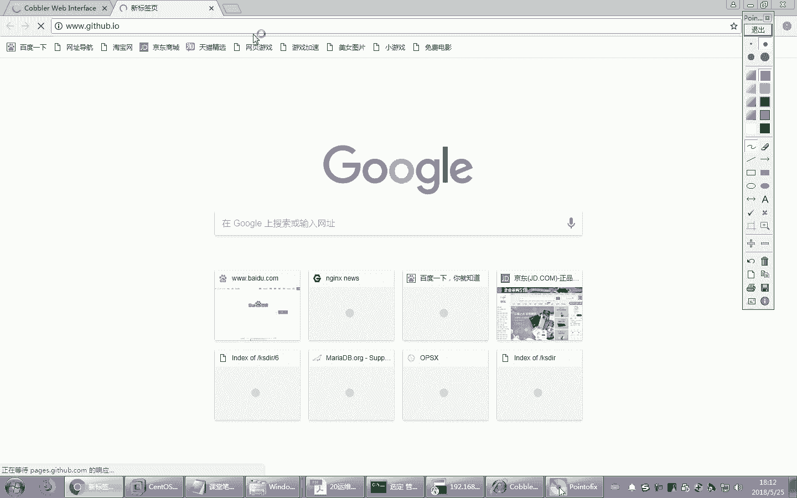

# Linux教程RHCE - P18：18.运维工程师日常工作解析及ansible全面介绍 - 艾弗艾尔思丢丢 - BV1if4y1e73V

那咱们前面呢给大家介绍的偏E以及co。它能够实现自动化的部署系统。当然，装好系统只是第一步，我们更重要的是在上面跑一些生产中使用的一些生产应用。比方说我们将里要在某个服务器上部署软件。

这些软件有可能是一些比方说外部服务器软件。数据库软件缓存软件或者是自研的软件。哎，而且这些软件有可能还会定期的去升，就是升级。更新版本。啊，比方说我们自己开发了一个网站，上面有电商的程序。啊。

电商程序大家都知道时不时的它有一些业务发生变化，它里面程序会也会更新。这时候我们需要用到另外的来辅助这些实现这些自动化运维的一些工具。那其中著名的目前来讲非常流行的一个软件就叫unstable。

那咱们这张将介绍unible这个软件。在这张咱们先来看一下运维自动化的发展历程以及技术各方面的一些使用。那么unible的使用有点像咱们边角本。所以unsible一说脚本就头疼是吧？完了。😊。

大体对立一下啊对立一下，我们unible命令。相当于我们linux的一条条命令。咱们学了好几百条命令了是吧？嗯。那但是当然单条命令虽然能解决问题，但是是不是很不灵活，也不自动化啊。

比方说我们要定定期的做个备份什么的，你每次敲命令去备份是不是很麻烦？我们是不是一般来讲都是写成脚本的？那么在阿斯堡里面也有类似的解决方案，就叫playbook。那playbook起的名字很好听啊。

翻译成叫剧本。剧本。哎，这演电影啊，电视剧不有剧本吗？你各个演员按照这个剧本描述的场景一个一个去表演下去就行了。剧本。那你可以理解成。outboard命令类似于linux的单条命令。但是要实现复杂任务。

我们单条命令是不是一个一个写太麻烦了。我们是不是就可以借助于脚本，哎，这个就相当于脚本，就把多个命令集合在剧本里面，就形成了一个复杂的这样的一个相对能解决复杂任务的这样的一个工具，叫playbook。

当然，playbook。它相当于一个脚本，但是大家都知道，对于一些大项目。稍微复杂一点的项目，再过于复杂一点的项目，我们一个脚本是不是也搞不定？这时候是不是要行一大堆脚本。而一大堆脚本。

那就意味着有多个太多的playbook，那么管理起来还是太麻烦。因此有最终的解决方案叫角色。这个角色就类似于我们可以把一些。复杂的任务。组合成有好几好多好多脚本来组合起来，形成一个角色。

那么这些脚本之间是互相调用的关系，就是我可以调用别的脚本来实现复杂任务。啊，就相当于完成一个大的项目的话，一个脚本搞不定了，我写一大堆脚本来完成。但是这脚本之间是有一定的关系的，互相调用的关系。

那是用角色来实现。所以我们这个课程是一步步越来越难的啊，刚开始先了解了解基本命令。然后呢，我们想事先稍微复杂点的把它组合起来，编个playbook。play book可能还搞不定，咱们就要编角色。好。

当然这中间会用到很多相关的技术。比方说我们会用到unible的各种模块。alible呢在实现的时候是基于模块来开发的某个功能它是用一个模块来实现的。另外一个功能，比方说我要实现文件复制。

它就会开发一个和文件相关的一个模块，专门解决文件复制啊等等一些管理的这样的功能的。比方说我想实现用户账号管理。它会单独有一个用户账号的这样的一个模块。它有各个模块来实现。目前来讲。

阿斯伯的模块在不断的进行开发过程中，也就是说不断的增加。那目前来讲可能已经达到上千个了。你可以理解成outer包里面内置了1上千个命令。每个模块啊对应的就是相当于我们linux的一条命令。

当然每个命令用的时候是不是有一大堆参数啊？所以可以想象。但是大家不用担心，因为我们常用的模块也就大概十来个。啊，常用的二三十个。て。😀Yeah。上逐不上身。那你要是大企业，你当然用的模块可能就会多一些。

对吧？你要是小公司还用什么子不PSSH搞定了吗？Yeah。咱们前面不是学过1个PSA测试工具嘛，对不对？哎，用它就可以搞了啊。因为这企业里面有一些机器确实不多啊，十来台机器还搞什么子保。好。

那这个内容咱们是逐渐介绍的。当然大家可能发现这里面还有一些什么条件判断。也支持什么变量标签，还有her啊字典等等。很多语法，这里面用到了一个专门的YAML语法。嗯，阿斯堡它内置自己的语法。

所以我们要用又得学一门新语言了。又是一门新语言。一一本小册子。😊，嗯。好，那在了解这个前面呢，我们先来探讨一下在呃工作中大家经常提到的一些。概念第一。叫IAAS。还有一个叫PAAS，还有一个叫SAAS。

把，这些概念。大家搞清楚啊，面试的时候有时候会问你的。那。IAAS。实际上是这个单词的英文单词的简写叫基础设施或者基础架构即服务。那我们往后翻一页，你看一下，就这个单词。叫inf，然后as a。

Service。那就是IAAS的来源，听懂了吧？那PAAS说说的是这个叫plan for，就是平台吧，平台即服务。那SAS是不是software，是不是就是软件的意思？软件及服务啊，所以来自于这几个。

那这是什么意思呢？这是一步一的发展历程啊。早期的时候，一个企业要部署IT的计算机的这样的一个系统。那一般来讲就是从头到尾自己构建。自己买所有的设备。硬件软件都是自己开发。啊，花钱买自己搭。

就像我们吃披萨一样。那披萨如果说早期的时候，那就是自己做呗，包括来闹啊。配料啊，这些面呐、番茄酱啊。自己拿过来买的，然后自己拿烤箱烤，烤完了以后自己。放到餐桌上添加一些调调味品。

然后全都是自己的这叫本地部署，就是全都是自己来。除了原原材料可能还要单独买啊，你当然你不可能CPU自己做吧。是吧你是不是还得买呀，对吧？😊，有些还是要买，但是呢大部分情况下能自己组装。

基本上都是自己做的。好，当然了，随着目前的发展，这种趋势越来越少，尤其传统公司，传统公司本身技术能力很有限。你让他去维护一大堆专业的计算机的一些相关的设备软件，他需要有专业的人员来做这些事儿。

很多情况下没有能力，而且他不愿意。把这个更多的精力，包括钱放在物质上，放在这个呃辅助的这个IT设备上。所以一般来讲很多情况下就会进一步发展了啊。比方说如果我们吃披萨自己做太麻烦，我们是不是可以考虑这样。

我们可以买一个现成的做好的披萨。熟的。啊，就是不是熟的，就是已经做好的，这调料都给你贴好了，就已经给你做好了。只要你回家烤一烤就行了，回家烤，然后用自己的餐桌。自己回家吃就行了，相对来讲是不是就省事了？

我们就不需要自己去买这些材料。再去和面呀，再去去做模型啊等等来做了。披萨不会不知道。知道烙饼吗？呃，不是一样吗？是不是？有同学说，哎，我没吃过披萨是吧？吃过烙饼吗？😊，对睇个。好，那现在我们来看这儿。

那如果觉得还麻烦，那怎么办？我们是不是可以买叫外卖？打一个电话，这比较著名的披萨是哪啊？必胜客是吧，打电话快快递直接给你送到家，这不都做好了吗？熟的，你只是要找一个桌子，是不是就要买呃找一个桌子。

找一个伙伴一块吃就可以了，是吧？找个朋友陪你吃饭吃披萨。当然在家里好无聊的。家里没有停调，我们是不是可以考虑去披萨店吃啊？连桌子是不是都不用准准备了啊，这些配料啊，什么苏打水都不用准备了。

你就花钱就行了啊，在这儿。去披萨点吃饭。吃完以后，磨嘴一走多爽啊，钱都不用掏。那不可能是吧？还是要掏钱的。当然这中间大家会发现，你看一步一步的我们省事了。好多事儿是不是都是相当于购买服务了。哎。

用别人来提供这些服务，我们自己不需要维护了。那这个就跟我们现在做各种系统软件一样，在生产中也是一样。很多软件很多系统都现在都是用外研，就是购买的方式，而不是自研的方式了。你看这个图说的就是这种场景。

早期的时候。底层的网络。存储设备、服务器、虚拟化、操作系统、中间件以及其他的应用程序数据等等，全都是自己玩。这样的话需要大量的这样的技术人员来后台支撑，成本过高。那你要自己买。

机买机器打网络还得有机房吧。然后机房是不是里面还有空调，各种设置都非常啊。成本非常高。那现在我们更多的是不是就可以。有一些是外购的了。比方说大家现在是不是好多人都买虚拟机了。那在云服务器。

就是比方说阿里云呀或者是国外的一些提供寻服务器的地方，我直接买一个虚拟机，然后把虚拟机完了以后呢，相当于买了一台电脑，是不是？那这台电脑上面我是不是可以自己去安装，你希望使用的操系统。

比方说我将装sdows或者装windows都可以选。然后装完这些软件以后，那你上面跑什么应用，你也可以自己去装，自己去研发，自己开发。这样的话又省事儿了，这就叫IAIAASIAAS说白了就是硬件。

我们通过购买的方式，其他的东西，比方说操系统啊、软件呀，我自己来。实现啊，这叫IAAS。提供了基本的硬件架构。那。当然第二个阶段就是PASPS呢就是硬件我也不买了。

操系统是不是我一些应用程序开发软件开发环境我也不去自己去构建了，直接买过来用我就行了啊，有些互联网公司就提供了这种PAAS的服务。比方说阿里的ACEACE阿里的ACE就提供了这样的一个服务。

它上面连操系统连各种开发环境都给你备录好了。你只要上面再做开发就行了，自己做应用程序就行了。做开发这些软件操系统都你部署好了，你不要从头到尾装系统什么的，不用做啊，PAAS。当然到最后更爽的是什么？

一切都买。是吧哎，从硬件到中间的操系统应用程序开发，连软件我都不不去自己研发了，我买现成的好不好？直接现成用啊。事实上，现在我们手机上大部分软件是不是都是这种方式。你现在用的各种软件，比方说微信。

对吧手机上是不是基本上大部分软件都是基于SAAS的。啊，这些东西我们后台不需要专门买个微信后面的服务器吧，是吧？那上面操系统是不是也都是腾讯提供的那微信这个软件。

后台的各种应用程序数据是不是都是腾讯给我们提供服务的，我们直接拿过来用就行了，而且免费的，对不对？属于ASAS的这种软件很多。你像好多企业内部，它会用一些软件，也是基于SAS的。

比方说呃现在比较著名的钉钉。听如过钉钉没有钉钉阿里提供的一个免费的支持中小型企业。比方说办公自动话呀，什么审批呀呃，什么呃早上去打卡呀，他都支持这是免费的软件，你装一下就行了，注册一下就可以了。

现在我们公司用的就是这个钉钉。以前的公司我们用用那个。用那个邮箱，以前邮箱都是自己搭，找一些以前自己买服务器，自己上面装操系统，自己装邮件服务器。

比方说以前用过那个echange微软的echange自己去配很麻烦了。是不是那服务器有问题了，还得重新啊去部署，太麻烦了。溶家还转染病毒，当时还装的是windows。现在都省事儿了。

上一家公司我们也不骂打什么邮件服务器了，买什么买，直接买。当时买的是263。263的企业邮箱只要花钱就行了。比方说企业里面有1000个用户，那1000个人我们就按人头一个人，10天也就是一个人。

一个月是啊一年一年是160块钱。你看人头交就行了。来交完这么多钱以后，他会可以允许你开这么多用户，然后你可以在上面直接就他提供一个外部界面，点后台，他有个外部界面，直接点点点就可以做配置了，做管理了。

你不需要买任何东西，你只要掏钱，按人头交钱就行了，就这么简单。这样的话，我们是不是对于企业来讲，是不是节约了很多的资源，可以腾出手来做更重要的事了，是吧？哎，也些为有现成的比较好的解决方案。

你干嘛不用啊，非得自己从头到尾做一遍，还做的还不一定容易好，对不对？花点钱不就得了吗？所以越来越省事。实际上这个过程有点像我们现在电计算机的发展过程。大家都知道。早期的时候。头十多年前。

卖硬件的比较挣钱。比方国内最著名的卖硬件的厂家，联想是吧？联想是不是从十多年前是不是很很厉害呀？2008年达到顶峰了吧。哎，那是奥运会的合作厂家呀，是吧？北京奥运会嘛，十多年前。

所以联想那时候风头很近的，那时候华为也顶不上它。华为的年的销售额是比比不了联想的。很长时间一直比不了联系。卖硬件很挣钱。但是后来。开始卖软件，逐渐挣钱了。谁卖软件最挣钱啊？卖操系桶的微软。

当然微软一直很挣钱是吧？啊，微软很有钱，但是目前来讲，微软现在已经好像风头逐渐被一些互联网公司，是不是？盖过了。那谁提供从头到尾的构建这些应用程序服务啊，比方说阿里阿里淘宝。

淘宝是不是给你提供了所有的解决方案，你不用大服务器吧，你不用去自己开发电商软件吧，你用他的平台不就得了吗？对吧。所以你看这些互联网公司为什么现在挣钱了，你看他走到。哎，走到这个适合的地方了啊。

他用的是SAS。咱们现在很多人愿意花钱买这些软件了，不需要自己开发了。好，这就是。这几个概念。你可以理解成S就是IAAS是卖硬件的。PAS是卖操系统的，而这个呢。就是卖一条龙服务的是吧？什么都有了。

连硬件带带操系筒，带软件一块儿给你了，你们拿过来用就行了。对我们用户来讲是不是越来越省事了？好，这就是整个发展过程。那目前来讲。目前来讲，这个也是一个发展趋势。现在好多企业。

运维工程师都看不着物理服务器了，然买的都是阿里云，直接远程管就行了。所以用不着以前老跑机房什么的了。都是虚拟机。跑的是虚拟机，就跟我们现在用外面差不多了，是吧？管理都是虚拟机。越来越省心了。当然了。

这个自动这个虚拟机也需要自己去维护啊。那将来你在里面跑到一些各种数据啊，不管各种应用啊，是不是还得该自己管自己管，哪里不可能都替了你吧。你该基本的管理还是要自己管理的。比方说建个账号啊。

把数学数据备份下来呀，这是不是还是自己做的？好，有些工作还是要做的。不过呢做的工作越来越不像以前那么多了。至少那些硬件设备不需要维护了吧，坏硬盘不用考虑了吧，因为买的都是虚拟机嘛。

是不是网络设备也不用考虑了等等。好。那现在我们将来要。做的这个岗位就是运维工程师的岗位。我们的主要职责是什么呢？这几个职责大家要搞清楚啊。以前经常有同学说去上了班了，不知道干嘛，这就是你干的事儿嘛。

你要干什么事啊？首先有可能要搭建一个架构。那比方说企业里面需要用到哪些服务器？你是用外部服务，用数据库还是用缓存，还是用各种中间件服务器都要自己去搭建。构建一个复杂的托扑结构，网络托扑，你要把它建起来。

当然了，有些企节人家已经现成的了，你去了只是一个后期维护了。那这时候是不是要进入到这个阶段？那。那么企业内部有一些。自研的系统，比方说他自己开发了一些互联网的电商网站，那些程序呢是要自己维护的啊。

那个阿里不可能替你维护啊，除了像。12306他有钱买得起是吧？哎，一般的这种公司，他的程序都是自研的。比方说你将来从事的某一家金融公司，他在互联网上比方说去呃有一些理财的产品。

那是在网上销售的他那个网站开发那个流程都是自研的那这些程序开发是不是有一些版本更迭的问题，是不是要发布出来要更新啊，要上线，上线的话，你是不是要确保它稳定运行，这些都是我们要自己做的。那除此之外。

除了稳定运行，这是第一步基本要求。另外我们是不是还要优化它的各种效率，包括它的这个性能各方面要做优化。啊，这些都是我们要后期不断的维护的。

当然这些都是我们作为运工运维工程师最核心的东西必须要掌握的那这里面就要用到很多很多相关的技术了。我们前期的这个系统架构的部署，我们已经有一个叫comp或者是PE，是不是已经能实现操系懂的基本安装了。

而后期的这些软件部署，包括这些应用的优化，这些都还要借助一些别的工具来完成。好。我们来看一下运维工程师，从整个IT架构来看，它是处于什么位置。这是我们整个运维工程师在将来整个IT企业里面。

IT这样的一个整个大的流程里面，它处于的位置。一般来讲。比方说我们有一个电商网站为例，电商网站它开发自己的互联网的一些应用软件应用软件。比方说发布在互联网上的一些网站，你要访问他那个网页页面。

它是要都是有开发人员开发的那这个后台有一大堆的开发人员来做啊，比方说有一些是基于java的开发工程师做开发。那么可能很多人背后做程序。啊，当然开发的时候肯定必不可少的会遇到很多bug是吧？呃。

经常有人说开发人员在开发什么呢？就是开发bug呢。嗯，经常做程序就做出bug来了。好，开发成软软件以后，将来我们要能不能用，是不是应该要做大量的充分测试啊？所以有测试工程师看到没有？有测试工程师。

测试工程师也很多，人数也很多啊，测试冲工程师。经过充分测试，没有大的问题，就可以考虑来检查一下上线了。而上线的时候，这些操作一般来讲都是运煤工程师来完成了。啊，比方说我要把代码提交以后准备上线。

然后接着呢在这个上线之前，我们要配置修改，要预发布发布验收，然后呢在环境中去做部署上线，然后提供用户访问。这些工作应该都是由运维工程师来完成了。当然，运工工程师相对人数就少多了，可能就一个人。

啊到应该夸张了啊。那一般来讲，这个比例是30比1的效果，就30个开发人员可能对应的一个运维工程师，可能还要比这还要更更多。蓝归为好。所以你看咱们楼楼下的做开发的那个班开的人就很多。

运维运维人员相对较少一些。啊，咱们是啊，对，旁边吧。呃，二楼二楼也不是吗？二楼也不是也是开发的那个。上官嘛是吧还是什么。做开发的楼三楼。所以咱们运维工程师相对来讲人少一点，那你的技术要是差的话。

你将来扯皮就麻烦了。你说不过人家了，人家这么多人30多岁这一大岁。所以你要把技术练精了啊，遇到问题的时候，你能哎说得清楚这个问题到底是谁的。不是你的，也龄把他说成是他的是吧？

本身是你的也能说成是他的问题，这才好哎。😊，这样的话，你得把你的水平练练练强了啊，技术上你得提升。好，这是大体上的一个流程。那么在生产中。我们需要用到很多很多和自动化运维的场景。我们想实现自动化运维。

来减轻我们运维工程师的工作。你想如果不是自动化运维，是不是必然会涉及到很多手工完成的工作。那手工完成是不是要养一大堆运维工程师，那对于公司老板肯定不愿意嘛？他希望你一个人就最好了，是吧？哎。

如果能够实现智能化，连一个人都用不着了。那就失业了嘛，是吧？所以你们是不是要学学python呀？往这边走。😊，往这边走。啊，总之，我们的发展目标是越来越自动化的。而实现自动化，往往它这个场景下。

大家想想一下啊，咱们现在已经学了几百个。那这些命令啊综合上看，可以分成这几类。第一是用来解决文件的。比方说拷贝文件呀、改文件呀啊设置文件权限呀、管理文件的。还有一些是我们有些命令。

比方说把一些应用程序部署上去，比方说打包啊啊或者说启动服务啊啊，包括一些什么呢这些配置文件进行修改呀等等。这些是命令执行的那大体上可以分成这几类啊。那这几类在使用的时候。

我们对应的unserible都有相应的解决方案。当然unsible。最早的时候，他宣称能够解决系统的自动化部署，也就是说代替on呃代替co代替co。到不过到目前来讲，他没有开发成功。

我们仍然需要借助于co普或者PID来实现操系统的安装。那未来也许on斯哪一天能实现，连仓系统安装都用co普来。好。那企业里它的应用场景，我们来看一下，对于1个IT的应用啊，通常来讲会有涉及到很多岗位。

刚才我们在前面的图上已经看到了，有开发人员。有测试人员。还有什么呢？还有一些用于发布的场景啊，生产环境的场景，还有灰总环境。那这些它不同的人员有对应的不同的开发，有相应的环境。比方说开发人员有开发环境。

啊，例如他自己有开发软件。有测试bug的这样的一个测试环境。那这个环境一般来讲，这些软件系统都是开发人员自己来维护的。千万不要自己去。很热心的帮助他说，哎，你的开发人。软件的环境我帮你来部署。

那你就惨了。因为每个人开发环境或许都不一样。刚才说了，我们大概的程序员和运维工程师的比例是30比1，对不对？如果你要真承担下来的话，三个人30个人的呃系统的部署都由你来完成，你不得麻烦死了。

事实上你也维护不了，因为他每个程序员他开发的环境只有他自己明白是吧？所以这样的话最好不要承担，就是这个环境我们不用去沾手，都是由开发人员自己来维护的。再有就是测试环节。那测试环境我们要实现软件测试。

这个测试环境通常来讲，它需要用到一些软件环境。那么测试环境啊，有测试人员来维护，或者咱们也可以用运维工程师来帮他维护也行。但是测试环境有个麻烦事，就是有可能有多套。比方说大家开发的手机软件。

至少目前主流的是不是有S，就是手苹果。苹果的APP再有就是安卓系统的APP是不是有两种？所以你将来开发一个软件的话，苹果平台是什么样子的，是安卓平台是什么样子，是不是有两套多套测试环境？

所以这个测试环境可能有多套，你就要部署了。所以测试环境有几套，一般来讲和产品啊部署环境是相关的。好，这个呢有可能就是我们运维工程师来维护的。再有就是发布环境。将来我们要把这个应用程序开发出来以后。

要发布到生产环境中，需要有一个发布的一个环境。而这个发布环境谁来负责呢？一般来讲就是运维工程师来负责，而且它需要专门一台主机来负责，咱们叫堡垒机。堡垒机这个堡垒机专门来负责把一些应程序开发出来的呃。

经过测试，没有问题的代码发布到生产环境中，需要有一个这样的一个发布主机，叫代码发布机或者叫堡垒机来实现。而且为了容错，一般来讲都是。储备2个。这个环境也是运维公司来负责的，也是运维公司来负责维护的。

那这个堡垒机它不仅可以发布软件，它还可以监控。就是运维工程师或者是某些人操作的过程，你做了哪些命令，执行了哪些操作，他都有审计的，他有记录下来，避免说出了问题，将来咱们可以追查嘛，到底谁做的这些事儿。

有经验。好，当然我们发布出来以后，是要到生产环境中使用的。生产环境说白了就是给用户来使用了。当然这个过程这个环境肯定是用于公司来维护了。个别的情况下，有一些开发人员可能有权限，但是最好不要给他们权限。

一般如果给他们权限的话，出了问题就扯皮了，是吧？到底是开发人员干呢，还是你干呢？是不是就麻烦了？哎，都由你来维护，这样的话不容易出问题，出问题也好解决。相对来讲好找个原因。当然了。

生产中的服务器有可能会比较多。你像阿里的那都是多少多少万的服务器。你像咱们一般的互联网公司，稍微有点规模的也接近上万或者几千。你看唯品会呀。啊，据说是几千台服务器。而且这些服务器是物理服务器啊。

而一个物理服务器上，它有可能会再跑多个虚拟机，现在都是虚拟化了。他会用虚拟机，咱们叫实力，就一个虚拟机叫一个实力，他可能会跑更多的实力。当然，这么多的机器必然会用到自动化运维工具啊，你要手工完成。

还敲命令一条条的，是不是没法维护了，太多了。啊，据说我记得啊就是你像唯品会这样的公司。啊包括大众点评这样的公司，他们背后的运维工程师。最早的时候，我记得是几千台服务器的时候，大概也就是。

20多个运林工程师。不多。对一个人可能要维护很多台机器。当然还有一个环境需要大家注意叫什么呢？叫灰布环境。灰度。什么叫灰度呢？这涉及到另外一个概念叫灰度发布。灰度发布。咱们应用程序开发出来以后。

大家想这个软件即使说经过测试已经没什么问题了。但是你。你直接把它部署到生产环境中，让用户使用，这时候有可能会出现问题。所以一般来讲，咱们会用灰度发布的方式来。把应用程序新的版本放到呃这个生产环境中使用。

那怎么发布呢？是这样的。比方说假设有100台生产中的服务器给用户用，现在有新的版本软件发布出来了，就更新了。你现在要上线的话，不是说100台全都更新。如果全更新，就有可能万万一要这个软件出问题。

这是不是所有的用户都会受影响？所以我们怎么做呢？我们只发布10个。就是把这10台机器。对，在互联网上不是叫假设已经对外提供服务了。咱们是有个电商网站，现在呢有一个模块，比方说有一个秒杀模块发生变化了。

软件代码改了，改了以后，我们现在。希望能够更新这个新的软件。但是我不是说把这100台服务器都更新，我只先下线10台机器。先把这十台下线下线以后呢，在上面去更新新的软件，把旧版本替换了，生成新的版本。

这十0台机器。然后再把它上线。这上线完了以后，这时候你会发现这100台机器里面有10台机器用的是新版本，仅剩下90台机器是不是用用的是旧版本。这时候你会发现这100个。

假设100个用户访问就有可能有90个用户是不是还是用的是旧版本。那10个用户用的是新版本，那这10个用户即使说这个软件有bug，是不是也只影响这10个人？剩下90个人，大部分是不是不受影响？这样的话。

你先把这十台机器先跑起来。如果发现哎有问题，那当然有问题，用户肯定会马上反馈嘛？客户这边是不是就及时发现了，然后你这赶紧去再把这10台机器再替换成旧版本，还是来得及，至少不会影响所有用户吧。

只影响这个别用户。哎，这就叫灰度灰度发布了吧？灰度发布。对，咱们先找几个小白鼠测试测试啊，就是拿着10个相对哎10比110分之1的这样的服务器来测试一下。这样的话，如果没有重大问题，咱们再逐渐上线。

比方说这时台问题，时台机器跑上去以后跑了俩小时，唉，没有什么问题。哎，我们再上线另外1台。哎，这是不是就20台上线了，再观察一下，如果没问题，再上10台，逐渐把这100台逐渐全部都替换下来。听懂了吧？

是这样的一个过程。这就叫灰度发布。灰度发布。而灰度发布的时候，它有可能是基于各种。各种啊内容就是各种属性来发布。比方说我们刚才描述的是基于主机。来发布这100台机器只发布10台机器。

然后下次再发布另外的10台机器，这是基于主机来发布。事实上还有可能是基于用户发布。什么意思？比方说我这个企业里面这个客户有很多，其中有一些用户叫VIP用户是吧？掏钱的用户哎掏钱的用户往往他喜欢想尝鲜嘛。

比方说有一个最新的软件。比方说游戏我开发了一个新软件，新游戏。哎，我们现在哎这个照顾新用户啊，照顾这个VIP用户先把这个VIP用户先给他们发布一个新地址，这个新地址上用的就是我们说的新版本。

然后让他们去用用，感觉好了，咱们再逐渐推广。那就是基于用户发布，就是先是一部分用户使用，别的用户还是用旧版本，这就是基于用户发布。当然还有一种情况是基于地区发布。大家都知道有些软件是不是也是分地区的。

不同的地区访问同样的网站，你会发现看到的页面是不一样的。哎，这时候呢，你比方说我们可以针对某个地区发布，你像有些软件是只有个别地区才能使用的。哎，我们比方说基于这次是基于广广东省来发布这个软件。

只有广东省的用户能看到新版本，别的省看到还才是旧版本。然后逐渐广东省觉得没问题了，逐渐去推广啊，比方说上海咱们再上线新版本，然后北京逐渐上线，然后全国再推广，对逐渐上线。这样来推广。好。

这就是我们说的发布的过程。那这个发布呢。程序过程是非常复杂的。比方说我们还有预发布的过程，那新版本在发布到服务器之前，这叫预发布，就是我们发布到服务器上，和你的线上配置环境一样。

但是呢只是说它还没有真正的让用户使用。我已经放到服务器上了。但是这个服务器还不能被用户访问，这叫预发布。就说白了就是我放在一个服务器，而这个服务器还没有上上线到生产环境中，只是放在一个测试环境中。

还没有上线。那你可以内部测试，你可以内部测试它的环境和我们线上是完全一样的，只不过它对外用户还没有访问那。接着我们还可以程序发布。那程序发布呢，我们要保证这些新上线的软件不能影响用户的正常使用。当然。

首先系统说不能受到说哎装一个新新产品，然后这个软件彻底通用了，这个系统彻底宕机了，那肯定不行。然后呢，也不能影响用户的体验呀，比方说用户用的时候特别慢是吧？用户打开的时候，页面半天打不开，这肯定都不行。

这都是有要求的。所以我们有的时候把这个发布呢，呃称为什么呢？就相当于在飞行的这样的一个飞机上，正在天上飞的飞机上换发发动机。文，所以可以啊这个过程是非常有风险的啊。因为大家都知道，有些生产中的服务器。

它是24小时不停机的，24小时是不是都有货在访问。你像京东网站是不是24小时有可能有人在买东西是吧？淘宝也是一样的。所以你要上线新版本，你是不是就很关键的要不能影响用户的正在使用的这样一些用户。而。

发灰度发布刚才讲过了，那怎么发布呢？大体的流程实际上没什么难的啊，那流程是这样的，比方说假设有两个软件。这是一旧版本，咱们把这个目录，把这个旧版本的软件放在这个文件夹里。现在有个新版本研发出来了。

咱们叫一。2。这是旧版本。这是新版本存放的目录。那怎么发布到这个互联网上让用户来使用呢？是这样的。我们实际上平时用的时候，用户直接访问的目录不是这个目录，是这个目录。哎，是一个。不带版本的一个文件夹。

而这个东西实际上并不是文件夹，它是个软链接，它指向我们正在使用的某个版本。比方说我们现在正在用旧版本，那就只相差。很简单。接下来。假设我要新升级新版本了，怎么办呢？我们在调度器上。

这里面又提到了一个新概念啊，什么叫调度器呢？是这样的，在生产中，我们稍微有点规模的企业，一般来讲都不是一台机器对外提供服务。它可能是一堆服务器。而一堆服务器的话，对外提供服务的时候，那么这时候。

用户到底访问哪台机器，不是说用户如候算，他是有一个调度器来完成的。就像咱们去。比方说一个比较火爆的饭店，想去吃饭，你去到饭店的时候，你不能说自己进去找座吧，有可能找不着。人后门口是不是有个迎宾呀。

他负责带着你去跑到一个座位上去。那这个就是我们说的调度器。这个调度器负责接待用户，用户把请求发送了这个代理。我们说这个调度器以后。

调度器根据他的算法来决定到底把你的请求调度到最终真正提供服务的后端的某一个服务器上去。有可能是某一个，听懂了吧。那这个后端的服务器。咱们也有专业的称呼叫re server。就是真正的服务器。

那这个呢叫调度器啊，这个叫调度器。啊，这个调度器他负责把用户的请求转发，调度到后端真正提供的服务器上去。当然，现在假设这个服务器，咱们现在想升级新版本，刚才说了，原来是1。1版本，现在想升级到1。

2版本，那怎么办呢？第一步，先把这个服务器在调度器上把它标识一下，标识为维护状态。当状态。那么一旦标识为当状态，就意味着新的用户发请求，再去到服务器上以后，这个服务器一看这个机器已经被当了。

所以他就不往这儿调度了，听懂了吧？那新的用户请求是不是老是往别的机些机上去调度，这个机器上面就不调度了啊，不调度注意啊，不调度。但是如果有的老的用户是不是已经曾经被调度过去了，他还会对外提供服务。

但是这些老的用户过一会儿是不是也就断开了。哎，过一会儿那么是不是也就所有的用户是不是都在上面没有人访问了。这时候你就可以在上面去升级版本了，怎么升级版本呢？很简单。

大家看那无非就是把这个软链接怎么样删了，然后建一个新的软链接指向新的路径不就完了吗？就那么简单，当然了，你是不是应该把新版本复制过去，然后呢，把这个路径进行移址就完事了。然后。

当然这中间前面是不是应该把一些服务先停了呀？比方说上面有一个外部服务之类的，你是不是先提供服务，然后必续把新版本拷过去，然后呢，然后把这软软链接指向它，然后启动服务是不是就可以了。启动服务完了以后呢。

当前这个机器上是不是有已经有新版本了，有了新版本，大家应该知道接下来应该怎么办了。我们是不是应该把这个标记给它取消，然后调度器让它继续往这调度，对不对？继续往这调度。这样的话，你看我这三台机器是不是有。

3分之1的用户是不是被调度到这儿了，有可能。剩下3分之2是不是仍然用的是旧版本？这样的话，我们是不是就可以实现了灰度发布？哎，一次只发布一部分主机嘛，这样的话经过一定时间观察以后，发现这个机器很正常。

没有问题。是不是我接下来第二步再把第二台机器怎么样把它设为档。对吧，然后在上面去更新新的软件，然后把它更新完了以后，是不是也上线，再观察一会儿。如果没有问题，是不是3分之2的主机也被更新过了。同样道理。

最后把最后一台主机也更新，这就是逐渐更新，听懂了吧？被更新就是这么做的。所以对用户来讲，你是不是感觉不到啊？是特别就是没有明显的感觉，因为它是逐渐去更新的，一步一步更新。如果发现软件有问题。

大不了我们就把它下线不就行了。对吧有大的bug重新上下线，重新调度就行了。所以这样的话呢，这就是。发布的过程。当然这个发布的过程。我们刚才讲的这些的过程，如果是手工去敲门令，一步一步的，是不是太麻烦了？

我们如果要有自动化的运维工具，帮我们这么一大堆复杂的任务来完成，是不是就更好了？所以这个工作就要需要用到自动化运维工具了，而自动化运维工具经常会用到一个场景，就是发布软件。发布软件而发布软件。

有些公司因为流程的一原因。因为软件平台各个环境不一样，很多人都是自研这个这个开发，自自研自行研发这个发布系统的，自己编程序。比方说用python写程序来实现软件的发布。那将来开发完了以后。

如果要真上线的话，就跑一下那个程序就行了，就非常方便。当然目前来讲，如果对于小公司来讲没有自研能力，那你也可以用一些现成的自动化运维工具。比方说ossible来实现类似的发布这样的过程也是可以的。

对于大公司来讲，由于流程过于复杂，所以如果要太复杂，大部分情况下都是自研的。但是他有自研能力。那自动化运为工具有很多了。这么多。那目前来讲。比较火的就是unible。还有source stack。

这也是比较火的，这俩都是用python开发的。正因为用python开发，所以后期如果将来觉得有些模块或者有些使用有问题，咱们python的程序员现在还是比较多的，可以做二次开发，所以相对可维护性比较强。

而pat。也是非常著名的一个自动化运维工具，它功能相当强大，也是比较重型的。就是说学起来难度比较大，它适合于超大型的网络环境。比方说谷歌谷歌公司它就用popy来进行它的自动化运维。啊，当然他用的软件。

由于他是用ruby这种软语言开发的。所以咱们国内懂ruby的人是不是很少，相对来讲不多。所以这种软件在国内用的不是特别多。不过。后面马哥还会讲这个东西是吧？你们想听就听，估计学了也不一定能有环境用。哎。

所以你们我觉得是这样啊，有些东西也许会用，那你就多学学。如果要暂时用不到，你是不是可以放一放？真要用的时候现学来得及吗？把视频发给你们看呗，对不对？所以精力有限啊，那还有什么其他的一些软件。

这些都用的就越来不是很多了。那unsible呢这个在互联网上现在比较火，咱们也可以查一查。这儿有一个非常著名的网站，大家应该听说过吧，叫gi。这是开源软件。

好多都会发把自己的开源软件开发出来的软件放到这个gethub这个网站上，然后供大家下载。那其中unible就是放在这个网站上，咱们可以看一下这个网站这个网站很多程序员都喜欢去。

所以这也是著名的是么最大的同信交友网站。苦し。

我是。页面怎么是配置色？問だでで。那跳转过去了。哎，3Wgehub点儿com啊。这网站没有被强吧。

在这个网站上可以看到各个开源软件的活跃程度。

咱们这可以搜一下啊，untable。

搜一下。排的第一个就是。这有基于什么语言开发的，看到了吗？点一下。这儿上面看。有多少个人关注？有个人多少人点赞？打猩星了嘛，觉得软件不错嘛。那我们也点一下，不过打赏还得还得注册。😊，呃。

bo呢就是多少人已经把它复制下来了。哎，就是我把它已经克隆，就是复制到自己的机器上，他就用了，开始已经说不定他自自己做，在他地上做二次开发了。这儿还有贡献者，干什么呀？这是贡献者。说白了就是这个软件。

因为是开源的嘛，我可以拿过来自己在里面添加自己的一些觉得好的功能。他3000多个人已经贡献自己的代码了。这是我们目前看到的指标啊。

我这个这个数字呢是在16年看到的，你看对比一下，你看现在变化还是。

很大的。看watch。星星多少翻倍了吧，现在都。是吧这是不是都翻倍了？

贡献者刚才看看到的是3000多，这是不是在。这都翻倍了。哎，可以你可以去看一下这些软件。关注度是怎么样？相对来讲，奥斯堡关注度还是很高的。

所以目前来讲，奥斯堡学习的啊这个热度越来越高。所以咱们学学奥斯堡啊。那阿宝怎么去使用，至于它的一些应用场景，咱们放到下次课来给大家介绍吧。好，那我们初步了解这些内容。那今天咱们就上到这儿。

