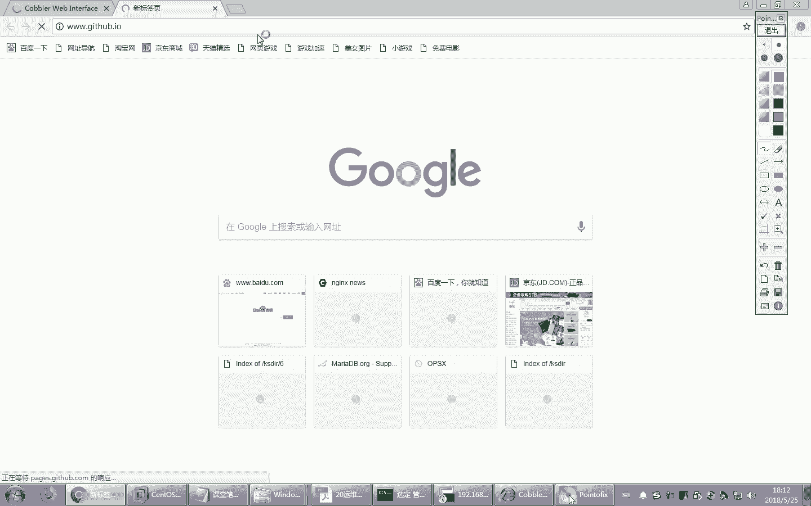
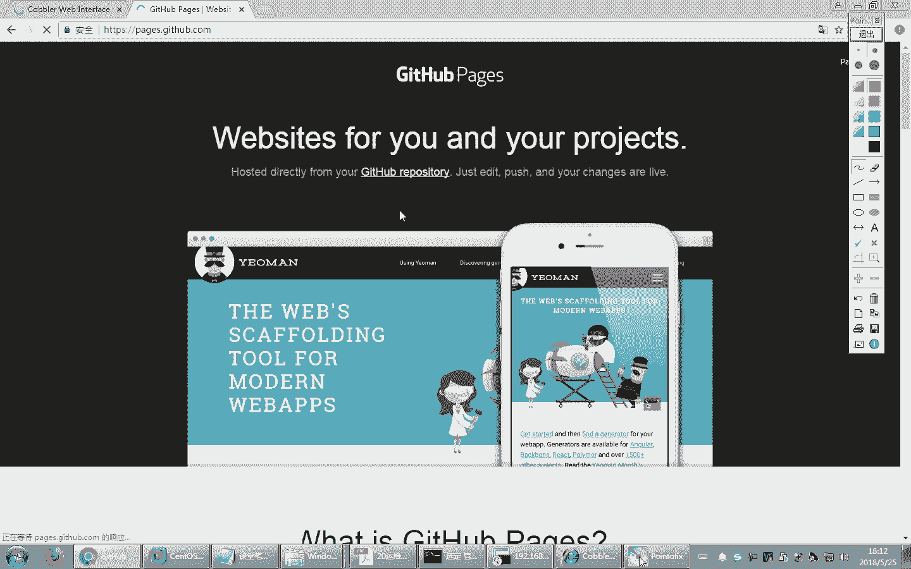
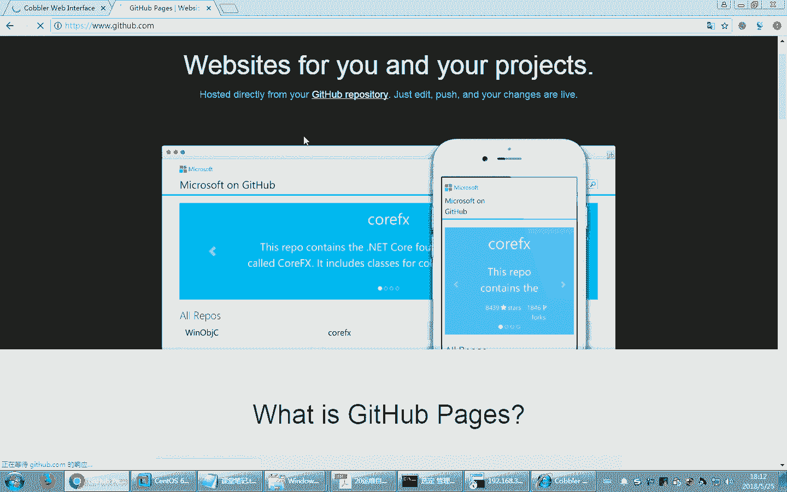
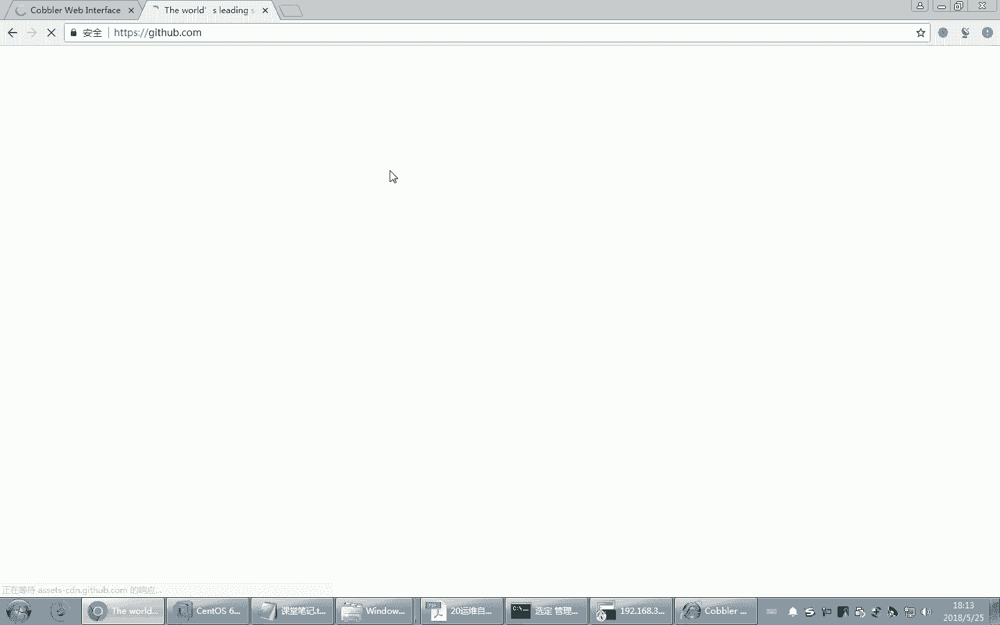
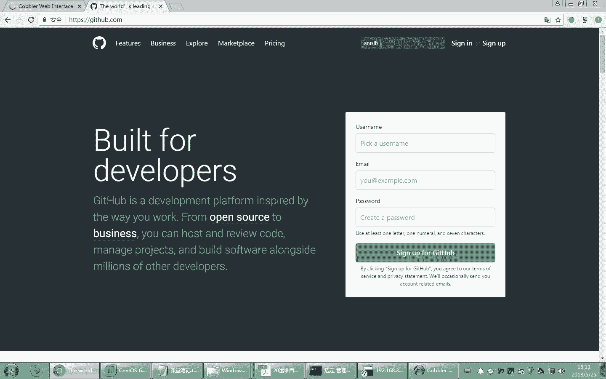
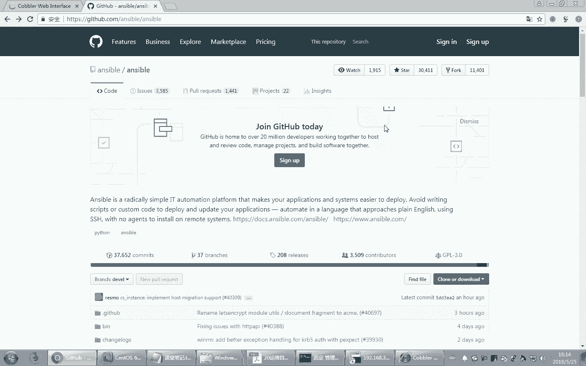
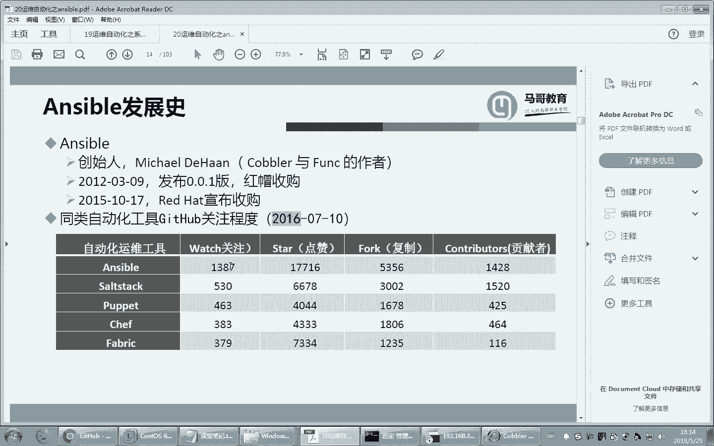
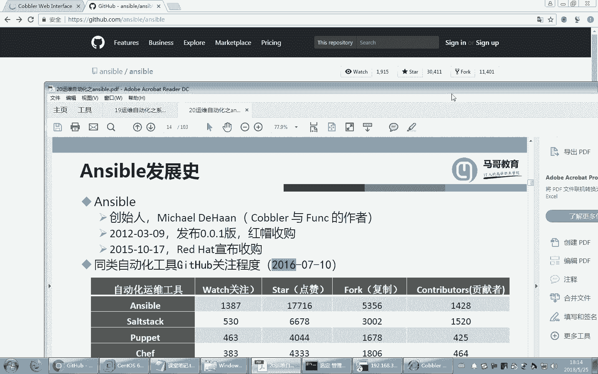
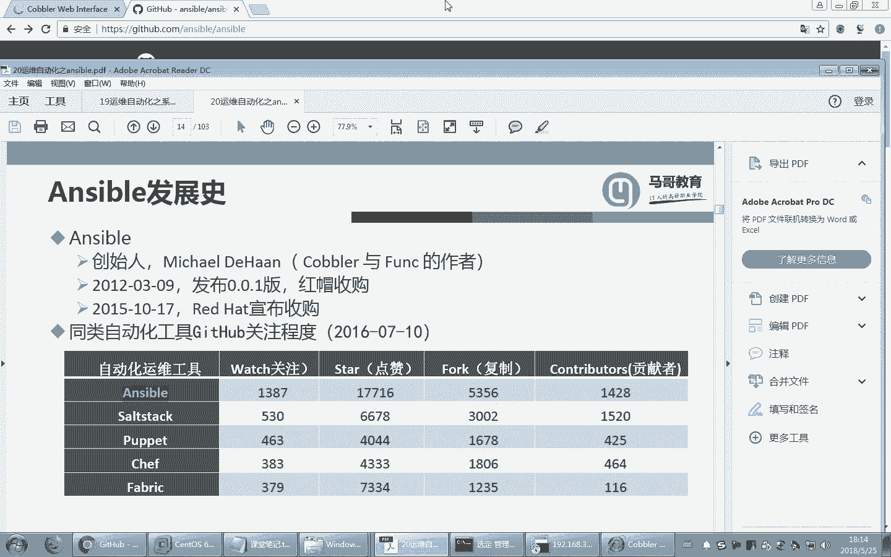
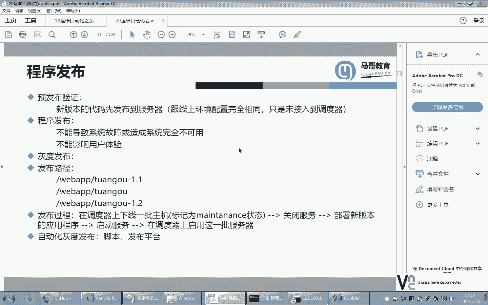

# Linux教程RHCE：P18：运维工程师日常工作解析及Ansible全面介绍 🚀

在本节课中，我们将要学习运维工程师的日常工作内容，并全面介绍自动化运维工具Ansible。我们将从运维自动化的发展历程开始，逐步深入到Ansible的核心概念、应用场景以及它在现代IT架构中的重要性。

## 运维自动化的发展历程 📜

上一节我们介绍了系统自动化部署工具。装好系统只是第一步，更重要的是在上面运行生产应用。这些应用可能是Web服务器、数据库、缓存软件或自研软件，并且这些软件需要定期升级更新。例如，一个电商网站的程序会随着业务变化而更新。这时，我们需要借助自动化运维工具来实现这些任务，其中目前非常流行的一个软件就是Ansible。

Ansible的使用方式类似于脚本。Ansible命令相当于Linux的一条条命令。虽然单条命令能解决问题，但不够灵活，也无法实现自动化。例如，定期备份如果每次手动敲命令会很麻烦，通常我们会写成脚本。在Ansible中，类似的解决方案叫做Playbook，可以理解为“剧本”，它将多个命令组合起来解决复杂任务。

对于更大型、更复杂的项目，一个Playbook可能也搞不定，需要编写一大堆脚本。管理众多Playbook会很麻烦，因此最终的解决方案是“角色”。角色可以将复杂的任务分解为多个互相调用的脚本来完成，类似于完成一个大项目需要编写一系列有关联的脚本。

我们的课程将逐步深入：先了解基本命令，然后组合成Playbook，最后在需要时编写角色。在这个过程中，我们会用到Ansible的各种模块。Ansible基于模块开发功能，每个模块专门解决一类问题，例如文件复制、用户账号管理等。目前Ansible有上千个模块，但常用的只有二三十个。此外，Ansible使用YAML语法，并支持条件判断、变量、标签等特性。

## 服务模式演进：IaaS, PaaS, SaaS 🍕

在深入了解工具之前，我们先探讨工作中常提到的几个概念：IaaS、PaaS和SaaS。这些概念反映了IT服务模式的演进历程。

*   **IaaS**：基础设施即服务。企业购买基础的硬件资源（如虚拟机），但操作系统、中间件和应用程序需要自己安装和管理。这就像购买一个半成品披萨，回家自己烤制和享用。
*   **PaaS**：平台即服务。企业购买已经配置好操作系统和开发环境的平台，直接在上面进行应用程序开发即可，无需关心底层基础设施。这就像叫外卖，披萨已经做好并送到家，你只需要准备餐桌。
*   **SaaS**：软件即服务。企业直接购买和使用现成的软件应用，从硬件到软件的所有服务都由提供商负责。这就像去披萨店用餐，一切服务都已准备好。

这个发展过程使得企业可以将更多精力放在核心业务上，而非IT基础设施的维护。如今，许多企业的运维工程师甚至看不到物理服务器，管理的都是云上的虚拟机。

## 运维工程师的核心职责 🛠️

运维工程师的主要职责包括以下几个方面：

以下是运维工程师需要负责的关键任务：
1.  **架构搭建与维护**：根据业务需求，搭建服务器拓扑结构，包括Web服务器、数据库、缓存等。
2.  **应用部署与更新**：负责将开发好的应用程序（包括自研系统）部署到生产环境，并处理版本更新和上线。
3.  **系统稳定与优化**：确保生产系统稳定运行，并持续对系统性能、效率进行监控和优化。

运维工程师在整个IT流程中扮演着承上启下的角色。开发人员编写代码，测试人员进行测试，而运维工程师则负责将经过测试的代码部署到生产环境，并保障其持续稳定运行。通常，开发人员与运维人员的比例较高，因此运维工程师需要精通技术以高效解决问题。

## 自动化运维的应用场景 🤖

在生产环境中，我们需要借助自动化运维工具来减轻工作负担。运维工作大体涉及文件管理、软件包部署、服务配置和命令执行等。Ansible为这些任务提供了相应的解决方案。

企业中的应用通常涉及多个环境和岗位：
*   **开发环境**：由开发人员自行维护，运维工程师通常不介入。
*   **测试环境**：用于软件测试，可能有多套（如iOS、Android）。可由测试人员或运维工程师维护。
*   **发布环境/堡垒机**：运维工程师负责维护，用于将代码发布到生产环境，并具备操作审计功能。
*   **生产环境**：给最终用户使用的环境，由运维工程师全力维护。
*   **灰度环境**：用于“灰度发布”，即新版本先在一小部分服务器或用户中上线，验证无误后再逐步扩大范围，以降低风险。

发布流程，特别是灰度发布，非常复杂。通常，我们会通过负载均衡器（调度器）将部分后端服务器标记为“维护状态”，使其不再接收新用户请求。然后在这台服务器上停止服务、更新软件、修改软链接指向新版本、启动服务，最后取消维护状态使其重新接收流量。通过逐台滚动更新，可以实现平滑的灰度发布。这个过程如果手动完成非常繁琐，正是自动化运维工具大显身手的地方。

## 主流自动化运维工具简介 ⚙️

目前主流的自动化运维工具有很多。以下是几个重要的工具：
*   **Ansible**：基于Python开发，目前非常流行，学习曲线相对平缓，模块丰富。
*   **SaltStack**：同样基于Python开发，功能强大。
*   **Puppet**：功能非常强大，适用于超大型环境，但基于Ruby开发，在国内生态相对较少。

我们可以在GitHub上查看开源项目的活跃度。Ansible项目的关注度（Star数）和贡献者数量都非常高，这表明其社区活跃，是值得学习和使用的工具。

## 总结 📝

本节课我们一起学习了运维工程师的日常工作范畴，并全面认识了自动化运维工具Ansible。我们了解了从IaaS到SaaS的服务演进，明确了运维工程师在架构搭建、应用部署和系统优化方面的职责。同时，我们探讨了开发、测试、生产、灰度等多种环境，以及复杂的软件发布流程。最后，我们对比了主流的自动化运维工具，并认识到Ansible因其活跃的社区和广泛的应用而成为当前学习的热点。在接下来的课程中，我们将开始深入Ansible的具体使用。