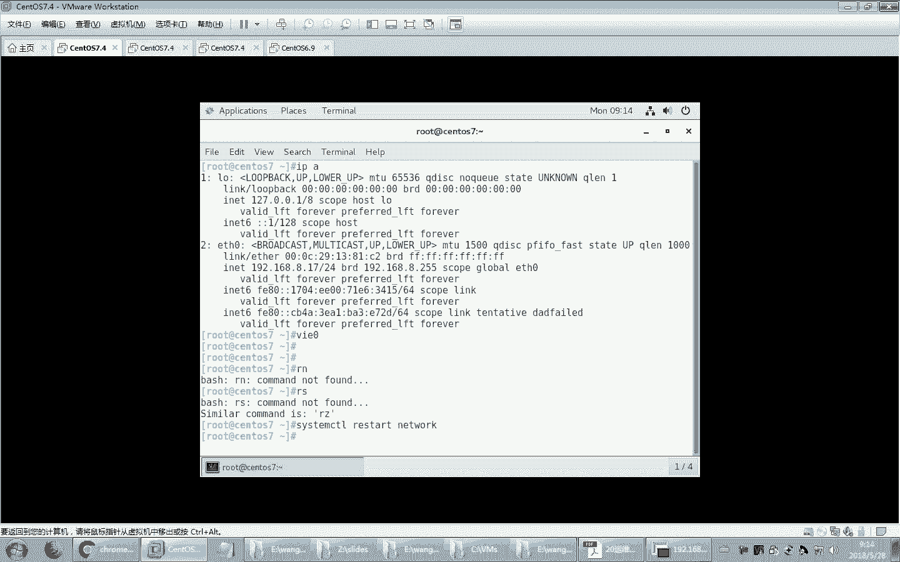
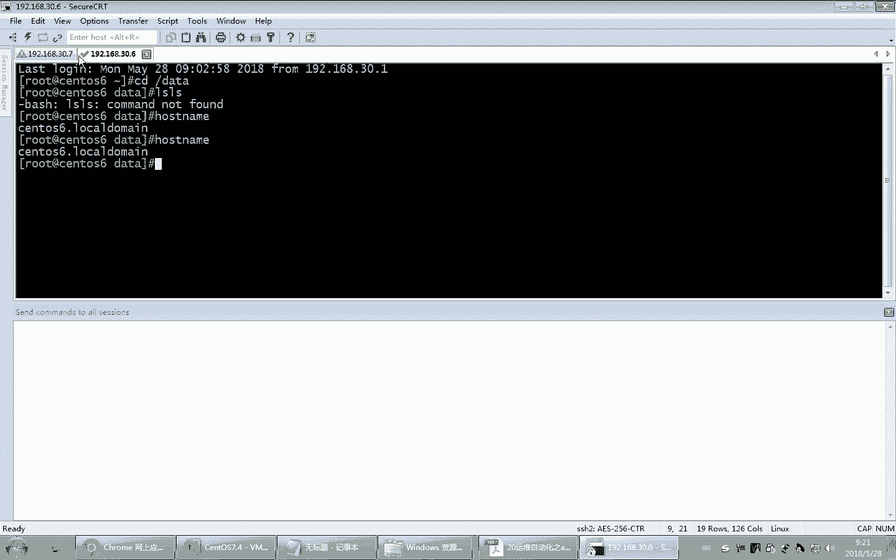
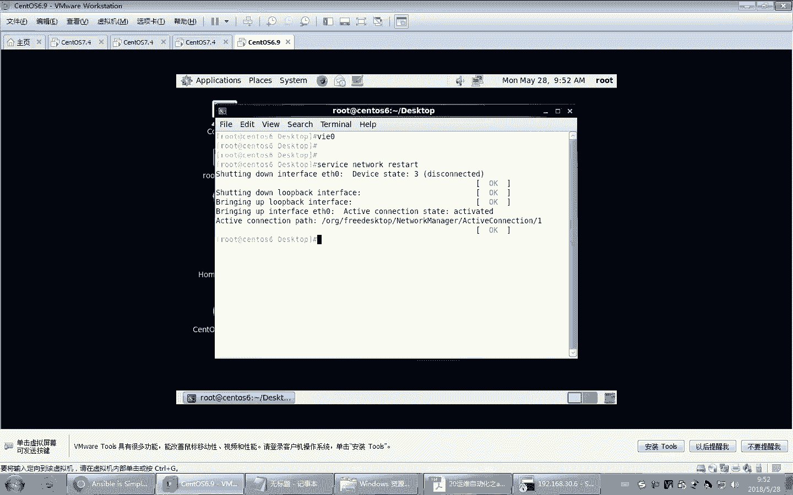
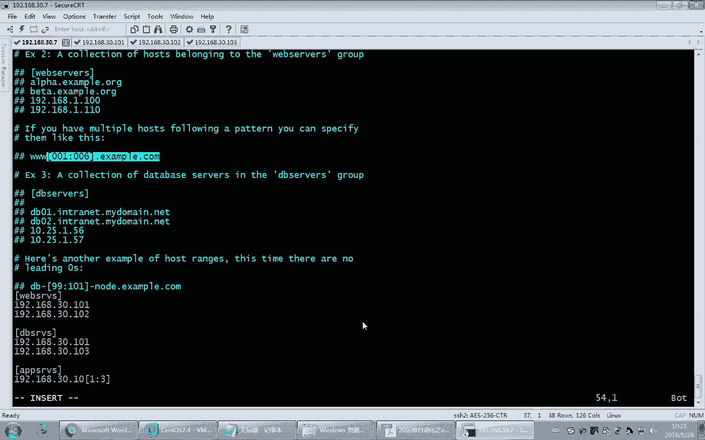

# Linux教程RHCE - P19：19.ansible工作架构和原理 - 艾弗艾尔思丢丢 - BV1if4y1e73V

那咱们上次课给大家讲了这个自动化安装啊，包括这个PIE的安装以及。靠不了的安装。那这两种安装方法。都可以实现操作系统的自动部署，自动安装。当然，由于我们在kstar应答文件里面可以制定啊一些脚本。

所以事实上咱们把系统装完以后，也可以做一些初始化的简单工作。上次课咱们在。应答文件里面添加了什么基于K的。公教是吧？哎，甚至我们还可以在里面。执行你希望配置的各种信息啊，所谓亚模啊、别名啊什么的。

你都可以往里加。所以这样的话呢，我们将来在生产中，你可以做一个应答文件，把你工作中希望集成的一些配置。在应答文件里面给它配好，装好系统，直接就基本上可以不需要再额外的做配置，就可以拿来用。

但是大家都知道，生产中的环境环境，它是随着不同的这个情况来变化的。所以后期我们可能额外的还要再去增加或者修改一些设置。那例如我们要更新新的软件。啊，部署新的系统。这时候那PSS。

这种应答文件的方式就不行了。那他是装系统的时候来实现的，你不能说为了部署一个新软件，把系统整个重装一遍。所以这样的话显而易见是不现实的那我们自动化运维工具。就派让用上了。那在上次课呢。

我们已经给大家介绍了unible大概的一个概念。那么今天我们继续来看一下啊，各个。那节奏课咱们讲了一些概念啊，比方说有什么IAASPAAAS还有什么来着？SAS啊，那这些概念呢在这个工作中大家会接触。

而且呢也面试的时会问啊，所以大家一定要了解。那这个IAAS什么东西来着。呃，基础架构啊或者基础设施基础架构即服务，对吧？啊这个一般来讲，什么场景下会看到这样的一个问题，这样的一个。内容IAAS。

比方说咱们现在很多人都买虚拟机了。那这个买虚拟机的时候，这个虚拟机啊，比方说阿里云也好，国外有一些这个虚拟机厂家也好，它是不是给了你一个虚拟机的硬件环境，相当于。哎。

你只需要自己在上面部署你希望部署的一些系操系统。比方说你可以部署sals，你也喜欢的话，你也可以部署别的操系统，部署windows都可以。这个后续的安装以及软件的配置都需要你自己去做。

他给你提供了一个虚拟机的硬件环境，相当于模拟了一个硬件。那这就是IAAS。还有叫PAASPS是。在，平台机架构对吧？那它里面把硬件已给你提供了操系统以及开发环境都给你提供好了。这样的话。

你拿过来就可以在上面做相应的开发，做一些相应的工作了，不需要从头到尾去部署系统。哎，相对来讲也是比较方便的那最后一种叫SAS叫什么来着？软软件及服务。软件及服务呢，说白了就是。

所有的操作基本上都已经做完了啊，从下面的硬件操系统啊，包括软件开发环境，甚至软件都给你做好了，你直接拿过来用就行了。那事实上，现在好多软件都是基于SAAS的。但现在用的很多软件，比方说基于云的软件。

很多，你像现在什么有道云大家用吗？哎，是不是现在好多文档啊都是自动备份到就是云上去的？那软件你直接拿过来用，你不用花钱。当然你要是得到一些高级的功能，可能要付费的是吧？也基本功能可能不要付费啊。

你像现在在浏览器上，很多软件就可以在浏览器上直接运行。比方说我们office软件能不能在浏览器这个界面里直接就运行。实际上是有的啊实际上是有的那这个呃表述谷歌谷歌的话，它应该有一个叫。应用市场的。

就是谷歌的浏览器里面有应用市场，你可以直接在上面安装。我这有有应用市场吗？更多。这是扩展程序。找。获取。我看能不能访谷歌啊。う。那里面有一些这个插件啊，装上以后呢。

就可以在浏览器里面直接运行一些相应的软件。比方说微软的office。这里面就可以直接运行，你不需要去安装相应的这个其他的专门的软件。看房补哥有问题。哦，没网啊。为什么又没网了？关键时候又又完蛋了。

你们这也没网了是吧？我估计是楼上又出事了。算了啊，这个大家自己可以看一看，这里面在谷歌的应用市场里面，它有好多软件，其中就有那个微软的office，你可以搜索啊office online。

就可以直接在浏览器里装上这个office，你直接在这个界面里就可以用office了，就不用额外装软件了。啊，服务器重启了，你看服务器连不上了，30。但是这个机器宕机了。好，这是SAS。那现在目前来讲。

确实有很多应用都是迁移在SAS这样的环境中的那。

早期的自动运维，以前的话都是人工智能啊，人工智能。所以人工智能就好多事儿啊都是手工去完成的。

比方说现在。我把这个机器配一下啊。改一下地址。嗯。没有文名吗？应该有个别名。忘了别名啥了，我不用。😊。

看一下。啊。现在呢我再去连一下别的虚拟机，咱们就连两个吧。好，大家看现在我有两个虚拟机，以前的话呢生产中如果想同时在多个虚拟机里面执行不同的操作。那很简单，比方说我像在这两个虚拟机里面都想执行L命令。

那显而易见，如果说我手工的去这样做，那这有100台机器，能不能敲100遍，太麻烦了。那以前的话有一个呃比较古老的方法啊，也比较土的方法。偶尔又用还是可以的。就在大家看在屏幕的最下面。右键单击。

这是不是有一个命令窗口？点开哎，这开了个窗口看到吗？然后在这儿呢跳L，然后右键一单击，大家看这一个发送命令到所有session。那也就是我这开的所有窗口都将执行LOS命令。烧灰车看哎。

我这上面敲了一遍了啊，所以就报错了。这你看。我再来一次吧，换一个命令嘛，演示失败是吧？posts内蒙吧。好，右键单击，大家看这是不是可以发送，当然你可以看快捷键啊，cttrol shiftS。回撤。

大家看这边执行了没？这边怎么没执行啊？关了。没执行。怎么演示失败呢？可以呀。这不可以了吗？是吧？应该可以的啊。那当然这样的话，这种方法并并不是很好啊。因为我比方说我要管理100台机器。

我是不是要开100个窗口？就这样做。而且在不同的环境中，有些主机希望执行的操作或许是有细微差别的。你这样做，是不是所有机器人都执行一模一样的操作？

也只能解决一些呃比较简单的任务，太复杂的任务他做不了。

所以这样的话呢，咱们就现在就要急需一些功能更强大的自动化运维工具。那上次课咱们已经提到了奥斯宝，我们今天来继续看一下。那unible这个软件它是基于python开发的。所以目前来讲。

unsible在国内也是非常盛行的一个软件啊，很多人如果觉得unsible有些功能做的不是很好，你可以甚至做二次开发。因为python在国内用的人还非常多，懂的人非常多啊，便于二次开发做维护。

那么unserible本身这个名字呢，它实际上是来自于科幻小说的啊，有一个就是unserible发明者啊，就是作者吧，他这个喜欢看小说，其中有一个喜欢的一个小说啊，叫什么安德的游戏这样的一个东西。

然后这个小说里面。你没看过呀科幻小说啊，这个小说里面呃是是一个高科技的一个小说啊，然后里面它涉及到一个远程控制，希望跨几光年光年级的这种距离。大家都知道光年很远的是吧？这一这个光光速这么快。

它要大概跑一年的速度。这个光速啊，光在时空中跑一年的这样的一个距离，这叫光年嘛。那它这跨光年的这样的一个距离，远程控制远程的这样的一个战舰来进行战斗。你想他这个远程通讯机制相当发达，相当呃先进。

那这个软这样的一个通讯机制就叫unible啊，在这个小说里是这样称呼的所以他拿过来作为了这个软件的名称，可见这个软件也是可以实现这种远程的控制或者配置这样的一个功能非常强大。那这个软件目前来讲。

在国内它渐渐流行起来了，包括sourcet这个软件也是不错的啊，这是python开发的。不过这两个软件稍微有一点点小区别，当ible一般来讲是不需要配置代理的。这里面有一个概念啊，代理。

我们目前学的好多软件都是基于CS结构的。就是有服务器端，有客户端。那通常来讲，客户端是不是很多客户端访问共同的服务器？一般来讲，服务器假设就一台服务器，然后有很多客户端是不是这样配置的？啊。

那我们现在学习的这个运维工具，它的机制正好反过来，它是一个一个这样的一个系统。他一个系统。去控制多台主机。控制多台主机。一个主机去控制多台主机。这里边就有一个小小的问题了。那你说在这种场合下。

这个主机它名字还叫服妻。这些被控制的主机难道还叫客户端？好像并不是这样说了，所以这时候我们这个主机。控制别人的主机。咱们有的时候呢叫哎主控端。主控机或者主控端。啊，那么这个被控制的机器呢，咱们叫被控端。

被控制剂。被控的。而且我们不是以前的客户端去访问服务器，现在反过来了是服务器。访问被控端，就是这个主主控端去访问远程控制或者配置被控端，是这样的一个概念。我不是上希望你访问，我是我要控制你。

就我一个人管理这么多机器，是这个意思。所以它和以前的CI结构这个概念上不一样了。而这个被控端要想实现被控制，怎么被控制啊？你想你平白无故就被一个与别的机器就控制了，怎么就被控制了？通常来讲有两种机制。

一种呢哎我们装上一个被控制机软件。啊，你像在电脑上是不是装杀毒软件之类的，哎，装上这样的一个软件，这个软件就叫代理。就装个代理程序，啊，说白了就是装一个这样的一个间谍是吧？啊。

简单说就是装一个间谍软件嘛，然后被原人控制嘛。啊，就这意思好。装一个代理程序，这样的话就会配控制。那当然还有一种呢就是无代理的程序。无代理程序。目前来讲。

咱们系统中呃默认大件linux里面是不是都有SH服务。我是不是就可以不用装代理，我基于SH远程是不是也可以管理你？你像我现在远程。

这两台机器。我需要远程去配一下不同的电脑。比方说我就坐在T上，我去配置一下6，我是不是就可以通过S在置命令就可以做到？

我就192168。30。6，我这执行命令不就得了吗？你看这个命令，我敲一下他对方的口令是不是就可以来执行啊？对不对？你看这个命令是不是在对方的机上执行了？

对吧那这不也是一种远程控制吗？那我们怎么实现呢？也没装什么软件啊，就走S式服务不就得了吗？听懂吧？这就叫无代理的无代理的。而这种无代理相对来讲不需要部署专门的客户端啊，专门部署的代理程序。

所以相在用起来更加方便。大家想我要管理100台机器，这100台机器，每个机器上如果要用代理程序来实现管理，它这个安装代理是不是也需要花时间？当然怎么装，那你也可以，当然也有方便的方法。

咱们是不是也可以在kiickstar里面。直接把这个代理程序装系统的时候，直接给它装好，是不是也可以？对吧当然前期得规划好，你要规划好，后期装的话，也是挺麻烦的。一个机器一个机器装。而且装完以后。

万一这个代理程序发生变化，比方说版本更新了，大家想是不是又得。批量的去把这100个主机都要去更新这个代理程序，所以也是挺麻烦的。所以相对来讲，无代理是不是配置起来更省事。因为S是服务默认不就带着的吗？

不需要做什么配置。当然了。

如果真的100台机器，咱们也不可能用这种方法来配置。我至少是不是应该也配1个G于K的验证码？要不你这个每个季都得输口令，这也受不了吧，对不对？所以我们基于K的验证。

是我们实现unserible的一个基本上一个基本要求。

啊，它是一个基本要求。untable不需要配置代理，因为它就可以基于SSH协议来实现远程管理。而source that它一般来讲是。希望借助于代理的。就是他一般是要装专业专门的代理软件来实现管理的。

所以source stack呢部署起来稍微要麻烦一点，但是有专业的代理程序，显而易见。应该比你没有专业的代理程序。是不是应该性能啊，包括功能上是不是应该更强大？对吧因为SCH终究来讲。

它并不是为了你的远程管理之目的来单独设置一个专业的软件。嗯，不如我们专业说明一个代理功能要更强。所以。source stack在国内目前来讲应用越来越普及，它适用于更大的这样的一个环境。

比方说我的企业里面有上千台服务器。它可以用source，而unsible只适合于中小型环境。比方说有个三五百台机器差不多了，再多了，它的性能可能已经盯不上了，就是它管理上它是有瓶颈的。

因为它基于SH相对来讲效率要差一些。啊，那稍后呢我们在演示的时候，大家可以能发现，那如果主机多，它在执行的时候可能会等比较长的时间，等比较长的时间。而source stack呢相对效率要更高一点。

所以这个就它俩当然有定位啊，如果你的企业里面主机多，那就用source stack主机少一些unsible。当然再多，那你像puppetpuppet呢适合超大型的环境，你像谷歌他们之类的。

这些大公司都用puppet，但是这个软件过于复杂，因为它用的底层开发软件都是ru比在国内用的非常就是懂的人少。所以这样的话呢，你要想做puppet的二次开发就非常困难了。所以国内用的越来越少。

基本上很少用到这pupppet。当然咱们后面课程里面，马哥也会讲啊啊，或许不会专门讲了，会给你发视频，发给你的视频，想看就看。如果工作中用不着，你也不用去研究它是吧？好，还有其他的一些软件相对就不多了。

不过呢目前来讲，在国内去招聘的时候，在光招聘的信息里面，一般来讲通常是unible是吗？source stack或者py这三个你总得有一个懂的他会选一个啊，这是我们必须要掌握的这几个功能。

那都可以实现自动化运维。好。这个是我们假设的一个场景啊，你像有些大的电商公司时不时的做一些活动啊，促销活动。你像618快手马上就到了是吧？你们那购物车也差不多了吧，准备好了。そだ。好，那。

经常会组织一些大型促销活动，而促销活动的时候，必然访问量会就在那个时间会。平时比平时要啊增长很多。所以我们需要对当前的业务进行大量的扩容。比方说我要上上线。原来假设企业里面服务器1000台。

那618像这个大型的活动的时候，可能访问量要急剧增长，所以我要再上线，比方说两三千台主机，就临时上线。当然这些主机我可以去比方说购买阿里云或者是自己购买也行啊。

那当然这个女儿如果是你自己去购买这个服务器，临时用用啊，用完了以后，是不是就之后就用这个业务又下降了。那你难道把这些服务器再卖了，或者闲置是不是太浪费了？所以有的时候会戒掉啊。

就比方按阿里云这种方式比较好，临时买几个虚拟机，搭上环境以后，等等这个促销活动结束了，是不是服务器。一个月以后就不用了是吧？也不存在浪费的问题。所以这个现在云非常方便。所以这样的话呢。

我们就可以来部署很多台服务器。那这时候怎么部署，那你要装这么多台主机，而且每个主机上都要部署这些应用程序、开发环境等等。所以这样的话呢需要大量的工作。那这些工作怎么完成。

需要用到专业的这种运维工具来实现。那就是我们说unible非常适合的一个工具。好，这里面提到了一个概念，大促啊，这个也是我们很多电商的这些公司都喜欢用的概念，叫大型促销啊，它简称大促。

一年呃一年经经常会有大促，基本上每个月都有大促。确谢。你想想每个月是不是都有一些节日啊？你不过节，女朋友得过节吧。哎，经常有一些大促促销活动。好，那刚才提到了这个。运维工具。

那么nible这个是在2000。12年。到现在已经6年了是吧，6年多了。发布的。他这个人呢，开发者本身也是挺厉害的人。你看。coer和fk的作者co普，咱们刚刚学过fk也就是也是一个运维工具啊。

刚才咱们在那个页面里面就这儿也有一个运维工具。这样的一个发行啊创始人。所以他实际上最早的时候应该在红帽供职过，就是在红帽工作过，所以后来也被红帽收购了。一下卖了1亿多美金呃，又发了是吧？

你将来要开发一个软件，咱不说卖1亿美金了，你卖个1000万人民币也行啊。所以好好的学学开发啊，学开发。这样的话呢，你做出的你自己会做产品，而并不只只是用别人的产品，对吧？我们现在运维只是用别人的工具。

那工具不好用，是不是也只能忍着用是吧？所以你要是学会python开发，你觉得不爽了，自己改不改吧，甚至自己从头写一个是不是都行了。所以这个python还是要大家慢慢学的啊。

以后有机会学15年的时候收购了。好，那下面我们来看看unerible的一些特性。当时我的一些特性。那un首先它是模块化的。这一点并不是unible特有的。准确的说，现在大部分的软件都是基于模块化的。

我们现在学的好多软件都是模块化的。咱们前面曾经学过pa模块，还记得吧？那怕模块不都是一个模块，一个模块开发出来的吗，对不对？所以现在呢很多软件都是模块化的那，基于什么功能，它给你提供一个框架。哎。

你需要用到什么功能，单独针对这样的一个功能开发一个模块给它关联到系统上就行了。所以这样的话呢，它的功能在逐渐扩展中。那目前来讲，unible它的模块现在已经达到1000多个了，1000多个。

你可以这样去想啊，unerible里面的每个模块就相当于我们linux里的一条条命令，就相当于我们这执行的这些命令。听懂了吧？

一个模块就行了一个命令。当然你要知道每个命令是不是有好多参数选项了。哎，有很多选项的呀。

那么在linux里面，unerible模块也是有很多很多的选项的。所以那1000多个，那就意味着它有1000多个不同功能的命令。哎，你可以这样去想。当然我们常用的也就二三十个啊。

1000多个你都研究透了，也是需要花大量的时间的嗯。好，那另外它有三个关键模块，这个实际上这个软件模块它是基于SSH做的二次开发，实现是远程控制的。

我们现在unerible它是基于无代理的这样的一个工具。所以我们需要底层基于S载来做远程管管理远程开发。所以它呢实际上是python程序开发出来的，基于SH实现远程管理的一个通讯模块。

然后这个是我们稍后要学习的一种语言，这种语言它可以实现我们python里就是unible里面的剧本。那剧本编写就是借助于这种语言来开发的。当然这种语言并不是这个unserible独有来使用的。

很多语言开发出来以后，很多语很多不同的软件里面都会使用。那其中unserible就用到了这种语言，还有金加兔，这个是模板语言，也是一种语言。在unible里也调用了。

所以我们现在又发现又得学好这种语言是吧？我们等我们整个运维课程结束以后，你会发现你懂好懂好多种语言是吧？你们现在觉得自己记录学了哪些语言了，还有印象吗？下语可可。EWK也算一种语言吧。

晒的时候自己也有自己的语法。expect是不是也是自己的语言？就不同的语言，它就是不同的语法而已。实际上功能上你看什么循环呀，条件判的，很多都是有类似的，只不过就是语法写的时候不太一样。好。

当然他也支持自己研研发模块啊，所以希望你们将来有一天能看到各位有些同学是不是在auible的官网上贡献了自己的模块，是吧？啊，基于python开发，然后呢部署简单，因为不需要设置代理，基于SH就可以了。

安全。因为SH协议呢是加密的，所以这个地方也是比较安全的。那么我们用单条模块或者是单个命令去执行操作，就像在linux里执行单条命令一样，那显而易见它只是临时性的做一些事，临时性的任务，这还是可以的。

如果说是例行性的，比方说周期性的定时的时不时的要去做时不时去执行某个操作，这时候我们单条命令太麻烦，所以我们要编写playbook啊，playbook呢有点像咱们编脚本，就相当于起把这个常见的工作呀。

你写成脚本就行了。脚本一执行啊，无非在里是用playbook来实现。

而且这里面unerible有一个非常重要的一个特性，叫密等性。这个一个所谓密等性，就是一个任务执行一遍和执行N遍效果不一是一样的，不会因为重复执行带来问题存在。

那你像在lininux里面。Lux里面，如果我们现在假设我创建了一个新文件，我比方说复制了一个文件。我复制了一个文件到某个目录里。当然第一次复制的时候，这个目录下是没有文件的。

但是第二次复制它是不是就会提示你说此文件一经存在，这两个效果不一样。甚至有的时候会报错。比方说我上次创建了个用户。我这次再创一个用户，我重复执行这个命令。第二次是不是因为这个账号已经存在就会报错呀？

而unswerible它不会存在这种问题。他第一次的时候，假设用unserible把一个文件拷到这个目录里，是吧，这个目录里不是有这个文件了吗？在第二次你再执行unerible的命令。

再把这个命文件拷贝到这个目录里的时候，他一看这个目录下有这个文件，它就不会给你执行。他不会说再给你复制一遍，报错，它不会出现这种问题。所以同样的事儿再做第二次。

它不会因为第二次多次执行对你的系统造成破坏或者报成故障等等。你像如果用ossible，假设我执行了创建账号这个命令，我再执行利用这个unserible命令，再创建这个账号。如果发现这个账号存在。

他就顶多不给你执行了。他不会报错。听懂了吧？这就叫密等性密等性。

啊，所以这个概念呢有助于我们在unserible进行调试使用。因为大家都知道unserible里面定义了很多，有可能是很多什么呢？所谓的playbook的啊，相当于脚本。大家想脚本在刚开始使用的时候。

你是不是要调试很多次？那在调试的过程中，是不是就有可能有些步骤做了。在你第二次执行，因为你这个操作已经执行过了，第二次执行是不是就会带来错误？那以前大家可能在系统中你要执行脚本，那你怎么做啊？

第二次执行发现这些操作已经做过了，你是不是就看不到那个效果了？有可能那你得把环境还得回还原到原来的状态，要不就啊虚拟机的省事，是不是做一下快照就完事了，对吧？那你像在生产中是不是不太方便这样做呀？哎。

那么unerible就轻松解决了这个问题。因为它有密等性这个特性。不需要你去重新还原系统。预备。😊，它无需代理，而且呢它是基于S材质协议的啊，本身是安全的。无需SC啊，实际上因为它走S是协议了啊。

本身所以它是安全的。另外还可以支持其他语言来写模块。比方说你用C语言或者java，你要觉得精通某一种语言，你也可以用这些模块来写。啊，写这种语言来写模块。当然我们说python更好一些。

因为pythonible就是python开发的，所以用python写的话更更方便啊，或者说更有这个更契合啊，更契合当前系统。然后呢，它也有其他的一些格式。你像刚才提到的这种所谓的playbook。

它在书写的时候就是用YAML这种格式来编排的啊，当然这里面有丰富的数据结构等等。另外还有强大的什么呢？分层解决方案。分层解决方案就是我们后面要讲的角色角色。

如果说单一的一个脚本相当于playbook的话。那么角色就相当于一大堆脚本的集合。大家都知道，生产中我们实现一个软件，并不是一个小文件就能实现的，是不是要编很多很多不同的软件。

不同的这个文件组合起来才能实现复杂的任务。那这时候这个角色就类似于。多个playbook克的集合。多个play的集合。他把这个playbook分门别类啊，放到不同的目录里组合起来来实现复杂任务。

这也是我们这堂课，那么unerible里面重点掌握的三种unible的工作方式。那第一种就是单一的模块。那它的作用就相当于单一的小命令。第二个，我们用编写playbook。实现。复杂任务的组合。再复杂。

一个paybook也搞不定了，我们就要编角色了。变角色了嗯。好，那这是我们给大家介绍的unerible的特性。那接下来我们来看看unerible的工作架构。好，大家看这儿有用户。下面这些。

属于unserible的内容。然后这个unserible就是我们说的主控端。啊，说者说控制端。当保是控制别的主机的，所以叫主控端或者控制端。那这些主机。就是被控端知道吧？那被控端是不是很多很多是吧？

被控端，那么其中咱们用户要通过unserible控制管理远程很多主机。大体上这样的一个三三层结构啊，接着我们来看在控制这些主机的时候，那这些主机它怎么知道？怎么知道哪些主机是被控制的？哎。

它需要有一个叫主机清单。这样的一个文件在这个文件里面记录了网络中哪些主机需要控制，他把这些主机一个一个的加到清单里。听懂了吧，你不加到清单里，奥斯宝平白无故去管理你啊，不不现实，对不对？

你是不是要有一个配置，相当于配置文件告诉他我要管理你网络中的哪些主机。😡，好，另外要配置管理这些主机。那么我们可以用单一的命令来实现，也可以用playbook来实现。单一的命令就是用到这些一个一的模块。

那模块呢就相当于一个一个小命令。当然我们说一个一个的小命令完成，只能适合于临时性的呃做一些操作。如果要行做一些例行性的经常性的任务，咱们还是写成playbook更好一点。

那playbook就相当于写成脚本了啊，那把这么多的模块组合起来，按照一定的逻辑关系放到这个playbook里面，它是个批量执行。当然我们也可以支持所谓的额外的一些插件。

比方说什么日志啊或者是邮件啊等等一些其他的功能扩展。那中间要想和这些远程主机进行关联，要进行远程控制，需要有连接插件。这个连接插件目前来讲就是基于S测试协议来实现。SSH协议来实现。好。当然。

我们在进行配置的时候，也可以通过在公有云、私有云的环境中来实现。比方说阿里云的环境中，咱们也可以来实现这个unserible的管理，也没有问题啊。换句话说，我们去配置的时候，不仅是用户。

也可以通过一些私有云或者公有云的开发接口来实现远程的管理，远程的管理。好，这是我们目前我们unserible的一个基本架构。那接下来我们来看看al。工作原理。这个图和刚才图呢大同小异。

只不过里面又细分成了一些其他内容。大家看这些就是被管理端。这个被管理端可以是主机，注意也可以是网络设备哦。比方说网络中的路由器交换机，咱们用unserible也能控制，不过呢就是控制的不多而已啊。

大部分情况下一般用unserible还是管理主机，就是管理。比方说linux啊，管理windows啊，这这这用的比较多，但是windows都管的少，一般都是管理linux是吧？啊。

windows也能管啊，windows咱们在那那个在unerible里面也有管理模块。不过呢我个人感觉管理windows更好的还是用windows管理工具好一些。

因为微软的它有一整套管理微软的系统的一些工具。当然那时候要花钱的啊，昂思博是免费的，这倒是没法比的。😊，实际上微软本身就是一块庞大的生生态圈，它里面所有的自己的方方面的工具都非常全的。好。

当然unserible大家看还有其他的一些内容。你看这是我们刚才说的公有云私运云或者是单一用户，或者呢我们先编写playbook来去通过unserible管理这些主机。那。

当然也可以用CMDBCMDB什么东西啊。叫配置管理数据库。这个实际上是一个管理系统啊，通过管理系统来调用uner堡来实现管理。当然oner堡里面刚才我们提到了有主机清单，有模块啊。

有接连接接口API就开发接口吗？oner宝不仅是给我们用户直接交敲命令这么交互，事实上它也可以支持远程就是二次开发，你可以通过程序去调用unerible的接口来实现管理也是可以的啊。啊。

当然还有支持插件，这都支持。好，这是unible的一个特性。所以我们去通过unible管理远程的主机，可以用户敲命令，咱们也可以通过批量的执行啊，所谓的playbook。

也可以通过公有云私有云的开发接口，或者是DCMBB这种配置管理数据库来通过unible最终来管理配置主机，这都是可以的。当然，对于我们运维工程师来讲，我们更多的是用这两种方式。

就是我们手工的敲灭令或者编一个playbook来管理管理，这是更多的那这些都需要做开发的啊，你也需要程序员做开发，配完了以后，将来我们是不是就可以更方便的通过一些工具来间接的去调用王思宝。

比方说将来我们甚至可以通过一个外部界面。呃，提供一个外部界面，你也不用去懂那么多命令了，你只要点鼠标就行了。不是不是不是点鼠标，它通过这个开发接口就配置了一个关开发了一个软件界面。

然后你直接通过底层调用unerboard的指令来远程管理主机就行了，更省事了。啊，实际上对于大企业来讲，很多都是这样做的。大公司呢它有开发能力。所以一般来讲，这些工具呢都是有给你现成的做好了一软件界面。

你不需要备那么多命令了，你直接点菜单就行了，非常方便。当然这需要做二次开发。好，那接下来我们来看看unceible的组主要的组成部分啊，刚才提到了playbook什么清单模块插件API。

包括uncetable它的核心的二级二级制程序。那这些都是unceible的主要的组成部分。刚才我们在前面的界面里面看到过了啊。好。那阿斯伯的来源刚才也提到了阿斯ible。用户直接敲命令。

或者通过CMDB或者通过呃公有云私有云的开发接口，当然也可以通过编写playbook来去配置unible，这都行。刚才提到unible，我们对于用户来讲，我们可以通过执行。单条命令调用模块来执行。

这个呢咱们就叫ADhawk这种方式。ADhawk这种方式啊，乍一听好像挺专业啊。实际上说白了就是单条命令嘛，我单条执行阿斯伯一条一条命令来管理，那只适合临时性的呃偶尔性的做一些操作。

那么更多的咱们要编写paybook。编脚本相当于啊长适合于大型的复杂场景。但是前期肯定有规划，而且呢经常要执行的一些操作，我们适合编成playbook。好。那playbook它的执行过程。是这样的。

将我们要编写好的执行任务，写入paybook。然后呢，paybook它会把它拆解成一个亿的任务，逐条，也就是最终也就生成了一条一条unserible这样的一个模块命令。然后按照语义定义的规则。

当然这个规则里面可以定义很复杂。比方说我可以写条件判断。我可以写循环，我都可以在playbook里面加。那playbook就相在于脚本里面，所以它各种逻辑关系都是支持的啊，无非它是写法。

语法上和我们的脚本不太一样而已。那刚才提到了unerible的操作对象啊，都可以支持。那刚才我说了主控端啊，或者也可以叫中控。啊，或者叫master，或者叫保垒基，反正这些称呼都是一样的，都可以。

把昂字堡主机成为这样的一些概念。那么主控端unible，它因为是基于po这个python开发的嘛，所以它对版本是有一定的要求的。那被控端也是有一定要求的。那么要求Slinux最好。

当然我们现在是S6禁用啊。那如果你要启开启Slinux哎呃安装包的。

当然我得确保一下，我现在SB6。不用，这怎么还开着呢？为什么呢？这不是。这关了。哎呀算了，我这个留的。为什么留着呢？哎，我想通过帮斯宝来远程把这个文件给他改了，这多好是吧？正好演示演示嘛，对不对？

演示演示是吧，留着它。😊，留着他啊。

off功能很强的，想做什么都是很轻松的啊。所以这些东西都可以改，然后windows。当unserible是可以管理windows的。

但是windows answerible目前来讲是基于linux平台开发的，它不支持在windows里装unserible。好，那下面咱们来看看如何来配置unerible。

当然unerible呢安装它有多种方法安装，最省事的方法就是用亚门安装。那当然你也可以编辑安装啊，你去官方网站unceible官网。当时把它关网啊。阿斯保现在已经被红帽收购了啊。那怎么。

收购了不是花了1亿多美金吗？卖了。所以你既然归到红帽这样的一个旗下了，你显而易见红帽肯定会比较大力的推广它。啊，不过。😊，当然了，你肯定要得到一些什么更高级的功能，应该是要掏钱的。

😀Yeah。😊，实际上现在。不仅是unceible红帽啊，你像咱们现在学的很多后期的一些开源产品，比方说NGX。

很有名吧。NGX它也有两种版本，一种是开源版本，免费的社区版调。还有一种呢就是商业版花钱的也有，就是有一些高级功能，你要用，啊，你花钱买。你总得让人活吧，对不对？人开发这么好的软件。😊，一点不挣钱。

肯定没法坚持下去的啊，这也是他的官方网站。你看这。

你看get up的多少关注度，这都有是吧？目前正在使用的公司。

有些介绍。这红帽的是吧，已经被红帽收了。实际上挺好啊，这这是开发软件被大公司收了以后，他才能更大的更大力的推广他嘛。终究来讲，你个人推广这个能力有限呀，对吧？收了以后又发财了是吧？

而且这个软件将来也能够进一步发展。

好，这是我们刚才提到的。当然也可以编辑安装啊，编译安装，我这就不提了啊，然后还可以用get方式安装get方式安装，就直接从get up这个网站上把对应的软件下载下来啊。咱们的get这种方式后面会学习的。

Get头。😡，colo啊，这实际上是克隆的意思嘛？说白了就是把这个网站上的。宝软件下载下来啊，简单说就是下载的意思。下载的话，它直接给你部署到一个目录里面，直接安装，你跑这个脚本就给你安装上了。

也挺省事。当然这样的安装的话有个好处，安装的是最新版，因为你是从互联网上去得到的啊。那还可以用。pe这种方式，这pape呢这个是。python包它的管理方管理器。python这种软件它也有个包的管理器。

它叫pa，类似于咱们的ym啊，它也有管理方式，这种方式可以。好，这些方式呢我们。主要给大家演示一下这个这个省事儿是吧？

咱们配一下一票源就可以了。当然我现在。把这个环境先准备一下啊。好，你看我这当前的环境呢是四个虚拟机，四个虚拟机。那我稍后呢我配置一下，比方说这个。7。4这个机器将来要装unible最边左边这个机器。

那为了让大家看得更清楚呢，我在这个机器上。嗯，待会儿起个名字，就叫unsable。然后这三台主机是被控制端。那这三台主机它的配置。IP地址我给它规划一下。比方说这台主机咱们叫101。把它改一下。

101的IP。好。这是101。我有那个别名来着。哪个是重启服务的别名啊，有没有啊？没定义啊，这我要重启服务。😀呵呵。😊，好，然后把这个也改一下。102。啊，这个我也得改了它。103。

好。那现在我在这边去分别连一下这三台主机。101。10。那样样啊。

好，这三台主机都已经准备好了。好，那现在我把这个主机呢给它改一下，像un。好，这是一个。主控端。这三台主机。我们为了大家看更清楚，我们故意的把它改一下名字。叫那的。一。第一个。节点服务器。ポスター？

那2。那个3。好。嗯，目前的状态大家能看清楚是吧？好，接下来呢我们在。untable这台主机上安装部署unible软件。

那这个软件要部署，刚才提到了要需要配置E批要源，所以我这儿还得。加个调节网卡。

好。Unsible。在安装前，咱们先看一下它的信息。

光盘没挂。好，为了。不方便啊，我把这个环境赶紧存一下。

让。好，大家可以看到目前来讲，这个软件的版本在EP源里面是2。5。3。大家可以看到这是写着呢是基于SH实现的一个配置管理部署任务执行系统。看到了吧？那也就是说用它可以配置系统。部署软件。

包括一些任务的自动的按顺序，你指定的次序来执行的这样的一个系统。嗯。这下面是它的描述。不需要安装其他的软件，不需要安装代理程序，所以相对来讲用起来更方便。不属省事儿。好。

那下面呢我们这个软件用ym去把它装上。Un子ible。大家可以看到。它虽然是本身是在一条原里，但是它依赖的很多库。

是不是还是在被子库里面，对吧？不过你可以看到它是不是很多都是基于什么python pythonpython然后金加兔，你看到吗？嗯。金加兔，这是我们模板语言啊。稍后我们。用到了我们再具体来看。哎。

这会能上网了，得回能上网了啊。

刚才是不是上不了网是吧？哎，这回也打开了。看。刚才不是打不开吗？谷歌的。你看office什么？刚才我们是搜office嘞。刚来。看。就这个。这已经加过了，这个啊看。直接就可以用了。被禁用了。

接受授权就这个东西。这就是微软的office在线的可以使用的。你可以拿微软的账号登录。用过这个没有？嘿，就偶尔万一你比方说你在外头你想写个文档，但是你手上。你你又没有装这个office？

那这时候你可以直接拿这个就可以。对啊，在linux里面，比方你没有office，对不对？那就可以直接拿这个来用就行了，这倒挺方便。你看直接可以打开。这样。再打开什么excel啊。

word之类的都可以打开。用起来还是非常方便的啊。

好，那unserible我们这儿已经装好了，装好以后呢，我们来看一下这个unserible它里面包括的文件列表。好。这个就是我们answer board的主配置文件。不过这个配置件基本上不用动。

不像一般的服务可能要改很多。这个unible的主配文件一般改的不多。这个就是我们刚才提到的主机清单。你要把管理的主机必须放在这个文件中才能进行管理。你要不放进去，他不知道你要管哪些啊主机。

然后后期还有角色，你把这角色可以放进去。此外。再往下。对应的这些都是各种各样的库。而且很多都是PY后缀的，PY后缀的就是说白了就是哎模就是python程序开发出来的啊这儿很多很多模块。很多。

比方说这里面我要管理。管理文件它就有一个管理文件的一个模块，搜一搜啊，应该是有的。这是管理windows的模块的。像这个这个。应该是有一个module模块。这个。这个就是管理文件的一个模块。啊。

他当然他这个是用python语言开发的啊。如果你觉得自己想开发一个模块，你可以参考他写的这个模块。拍始语言。反正都是原码的吗？如果你要懂开发，是不是在可以可以改重写一份，没问题吧。

看起来是不是有点都认得呀？😀YeahYeah。你看衣服呀之类的。都认得都认得。😊，连起来就不知道啥意思了，是吧？所你看拍摄语言写进来。我发现也很简单嘛，不就是英文单词吗。😊，二个字母组合起来就行。好了。

刚才我们看到了unserible的安装，那安装完了以后，我们来看一下它的unserboard的命令。还有一个查看版本的，如果你看到这一项了，表示它已经装好了。当是这儿能看到它的一些信息，表示配置文件。

模块的搜索路径。就是他执行命令的时候，他要找那些模块，从哪找模块，它对应的模板路径在哪找。那对应的二进制unible程序在哪？这是二进制unible这个命令所在的位置。这是一个。软链接注意你发现了没有？

他用到了就是我们前面给大讲的那个发布的那种思想，它不是用。直接指向真正的程序，它是用软链接来指的那这个带来的好处你不言而喻嘛。将来比方说出来2。8了，我是不是把这个软链接指向2。8就完了。对不对？

不需要呃，万一2。8不好了，那我是不是可以把它再只成为成2。7，是不就还原原来系统了？😡，所以这样的话呢，相对来讲用起来更方便。这就是我们上次说的那个灰度发布啊。

整个发布的一般来讲都是这种这这种机制的软连接机制。好，这是我们刚才提到的。当然这个程序呢可以看一下啊，那这个程序它也是基于python开发出来的一个程序。所以可以想象啊，你要懂拍摄的话。

多好的一件事儿啊。是吧这个代码都可以自己写嘛，对吧？想怎么改都行，反正都是原码的，直接给你的。

好，那么unible对应的工具很多。咱们来看。这些配置文件就是主清单，就是主配置文件，它里面定义了unerible的一个工作特性。稍后我们来看一下这个文件啊，包括它的清单，包括它的角色存放路径。

这是默认路径啊，默认路径放在这儿，但是也可以不放在这啊，就是存放角色。咱们前面讲了unerible，我们要重点掌握三个东西，一个是模块，一个是facebook，一个就是角色。这是它的主程序。

这是它的查看帮助文档的工具。unible里面有大量的模块，有1000多个模块，每个模块怎么用？啊，我们要查看帮助，就用这个un ball do。啊，它的作用就相当于慢帮助那个效果。慢慢帮助。好。

那这个呢是存放一些优秀的写的好的一些所谓的角色的。他把一些写的好的角色，很多世界上互联网上的人啊自己觉得自己的几个角色写的不错。那当然什么叫角色？刚才讲过了，所谓角色就是所谓的playbook的集合。

就是好多playbook的集合，相当于一个项目。啊，一个playbook呢就相当于一个脚本。那一个脚本做的事儿终究有限。要想做一个复杂的任务，我要编写成一个项目，编写成一个完整的系统。

这时候就要写成角色了。角色就是好多角色，好多这个playbook的集合。然后呢，它会放在这个网站上，你可以通过这个网站上下载。你要觉得好的话，你拿下来改不改吧，或者是不改直接用就行了，非常方便。

playbook就是来执行咱们刚才说的这个playbook。啊，这个命令有点像bash吧。但是但是不是可以执行脚本嘛，对吧？后面写一个，后面跟一个脚本。

那playbook呢就是来调用你写好的playbook命令的。好，这个是加密的加密的。因为playbook呢相对来讲就像我们的脚本一样是明文的。但是play book里面带有的信息，万一有敏感信息呢。

比方说里面带有口令之类的呢，如果你被别人打把这个playbook自己编辑的，就像脚本一样，打开了，看到了是不是就不安全了，可以考虑加密。这个地方它还能加密啊。

当然还可以用交互日的方式来执行相应的所谓的啊这些。命令也是可以的啊，这个我们稍后一个一个都会演示啊，大体先了解一下。好，先来看一下主机清单，主机清单是我们配置实现unerible的最首要任务。

如果没有主机清单，它不能管理任何主机。你要把管理的被控制端的这些主机必须要放到主机清单中才能受到管理。

好，那下面咱们来先演示一个最基本的操作。ible这个就是我们要执行的。单条命令的这样的一个工具onerible命令。osible它可以来执行对应的单个一个一个的模块对应的命令。啊。

刚才讲了模块就相当于命令啊，unerible可以调用那些模块来执行临时性的任务，测试性的任务。就像我们现在登录到一个运维。一个一个主机上想执行某些单条命令一样。那unerible就是干这活的。

就执行一条命令。好，当然我们现在unerible想干啥事呢？我就想测试一下这三台主机是否存活。那当然我们在windows里，就是我们平时啊在运维里面要测试三台主机存合，是不是大部分情况都是P命令。

 pin一下能不能拼通是吧？哎，那么unerible也有一个哎专门的 pin这样的一个模块啊，注意它是模块。那当然要指定模块的话，我们需要用一个M选项。加上一个M就是 module模块的意思。

后面跟上个P。但是你要搞清楚，我们现在用的pin不是windows里，就是linux里面的P命令。我们现在用的是模块叫P。而且这个P呢，它不是基于什么SIP协议的。只过他这个名字也叫P。

我们这个发一个聘包户过去，就是聘指令过去那边服务器如果收到了，能正常响应，它会反应回一个消息叫胖。pin胖啊就是有回应嘛有回应的意思。好，对，好球嘛，乒乓球发过去，对方回应一下。

但是呢后面我要指定给谁来发这个pin指令。😊，我们比方说30。101。基本操作就是这样啊，当然你可以看一下它的语法看。看这就是它的语法。unible后面跟上你要被控制的主机的主机列表。

当然它是写成模式的。然后后面就是你加上选项了，这些选项刚才我们用到了一个M，看到没有？是不是模块啊？哎模块好，那咱们先简单体会体会啊，更复杂用法咱们稍后再说。好，那简单的体会体会这个P模块的功能走。

发现问题了，警报看到没有？他说什么？主机清单列表是空的。那只有本机可用，那看来我连子机也可以啊，是不是我本机本机是7，是不是？也不行啊。也不行，忽略忽略127忽略127。呃，就是忽略30。7。

就自己不不连系自己。那换句话说，你这个你要控制它的话，你怎么也得把它加到清单里面啊，所以接着我们就加清单啊，啊刚才看到了那个清单文件在哪来着？还记得吗？un傅 host哎，你想到了什么？

想起了这个文件吗？想起来了吧，是不是很像很像是吧？啊，不过功能完全不一样啊，功能是完全不一样的，别给搞混了。好，这个文件里面就要放你被管理的主题清单了。当然这里面有例子啊，你看井号开头的全是注释啊。

告诉你怎么用，咱们来个简单的吧。😊，跳到最下面，我要管理哪些主机，我就写HP地址就行了。30。101。把它改改就行了。2。这三台机器不就完了吗？一个一个加进去。好，那现在再老走一遍101，看成不成。

哟发现问题了，这是什么界面？这是。😡，这显而易见是走SH协议的。所所以告诉大家啊，P命令它不是P，不是走原来的咱们那个wind度，在在在这运维里面敲的个P命令啊，不是那回事，它不走SMV协议。

它走是SH协议。😡，当然走H协议也得走网络是吧？啊，所以第一次问你叫yes。哎，你看有问题了，说不可。unreachable啥意思？不可到达，红色的一般都是报错嘛。😡，不可到达。

明明我这101是可以到达的，为什么不可到达呢？是因为你要探测人家101。😡，你终究你这个30。7和0101之间是独立的两台主机啊，凭什么你发个消息，人家就告诉你，我是重博的呀。😡。

凭什么人家就受你管理呀，是不是这道理啊？你想过没有？你凭什么把我把我我这机器加到你的列表里就能管我了，那是不就太不安全了吧。所以你基于SH连接，你怎不也得输个用户名口令吧？😡，要不就把GK验证实现了。

😡，对不对？好，所以这儿要想咱们现在因为还没有做基于K的验证，所以我们就输K。K什么意思呢？K是叫输入对应的用户名相应的口令。如果不输的话，它默认是基于K的，结果你又没有配K就报错了。

所以我这儿在不配K的情况下，我们先用传统的用户名密码来登录对方的系统，来对对方的系统进行相应的控制。好，大家看这是不是要输S3的口令，这个口令是谁呢？就是101这个主机默认我是不是root身份。

那相当于连的时候，就拿root去连对方连对方，你要输对方主机的root口令。注意口令要输对了啊，输错了还是不可以的。然后我估意输错了啊。又是不可到达的对吧？但是SH你发现没有？每次登录总有比较慢。

咱们以前说过，让S3是快一点，怎么做来着？我们是不是可以把对应的哪个文件来着？他是因为他是走S才是协议啊，为了加速访问，我们这儿是不是应该把这个变成。No。这已经是no了是吧？看一下叫。哎。

我这好像初始化改过了。😊，啊，改过了改过了。那我就不用改了，那这这编辑本初始化过了啊，所以这个是改被改过的啊。好。所以我这儿必须输入正确的用户名口令。大家看胖。听跑。看了吧。但是现在有个小小的问题。

我现在要管理的不仅是一台主机哦，我管理的是三台主机。那这怎么办呢？你可以。再把这些主机一个一个写上。呃，都写了，这三台机器已经都写了，但是写是写了。但是你要针对谁来进行指令，还是要告诉他给谁发指令的。

主机清单里面只是说你可以控制谁了。但是你针对这个。命令到底是发给谁的，还要单独指定。所以我现在给三台主机发，但是给三个主机发，比方说我先给两个主机发啊，给两个主机发的话，现在有个问题。他让我输口令。

对不对？😡，如果这个口令不一样怎么办？他会让我输两个口令吗？比方说我这故意改一下口令啊，这样的话两个主机的口令是不一样的。现在你看啊。出口令。哎，有一个成功了，有一个失败了，你应该知道什么意思。

他根本不会不会让你问每个主机的口令，他只会问第一个人的口令。而且问第一个人的口令，你发现他。你发现他他不是按照你这写的次序来问。你写的先01161吧，后162吧，结果他是什么？先发到102。

再发到102。所以他这个次序并不是你期望你那个次序来执行的啊。而且他只会问第一个人，问完以后，你输完口令以后，他就会用这个口令去连接所有主机。所以这样的话呢，显而易见。

输口令这种方式是不是只适合于所有的主机都一个口令的情况下？不同口令没法弄，100个主机口令完全都不一样。说实在就是不一样。当斯宝难道真的给你提供一种机制，让你每个这用户输口令，每个主机单独输口令。

这种方式不也太笨了吧。对吧所以我们一般来讲，建议基于K验证来实现。基于K验证来实现。当然大家可能发现我这儿如果把这个口令给它改了啊。我给他再还原。让他使用一样的口令。好，再来。102还是错的是吧？

带了吗？我这口令还原了吧，刚才不是重新做了一遍吗？好，我还原一遍啊。好，你看他还是认为是错的那说明他什么呢？が。这是不是记住那个noho了？他只记住一个。这本身就没有102。没有102。

那这里面是不是也本身没有102啊？你删他也没有用吧。连一下他。还能连吗？可以的。好，可以连，那密码是没问题的啊。立码用的就是新的。那这就行了，那说明什么？不是没输对啊，他记住了，你上次连接失败。

如果这次再连即是密码还原了，他还是登不上去的。所以他记住了这些信息了。所以你要不而且呢它这个地方有个y豆。输一下y no。因为上次失败了，他认为就是。他认为你是不可信的这个主机，所以他不让你连了。嗯。

所以这样的话就很麻烦了啊，那每个主机都要配不一样的口令，那是很麻烦的。所以我们建议大家呢把基于K验证来实现，基于K验证来实现。当然基于K验证怎么做呀？第一K验证怎么做来着？送的。叫SHKG是吧。

生成公钥4要对，然后呢。然后把对应的公钥是不是复制过去，叫S3Hco贝ID这不就行了吗？而且啊我们在昂斯堡这个主机上，要把这个公钥复制到被控制的所有主机上。都要去复制啊，稍后我们来复制一下啊。好。

这是我们现在这种方法。当然现在我们如果想把所有的主机都控制，还有一个省事的方法就是哦。二代表着主机清单里面的所有主机。主机清单里的所有主机。你看103连接失败，为什么连接失败？你看他这实际上有提示啊。

他说请把对方的主机你得加到noteho文件里面，他现在没有，所以它就要失败了。那什么意思呢？因为你第一次连，你是不是没有第一次连接呀，你都没和103是不是从来没连过，从来没连过。

是不是就不会放到这个nho文件里面？😡，跳一下这你得敲个y，敲y是不是就把对方的公钥就放进去了？😡，好，我这样不去连它了啊，然后你再连，这时候应该就可以了。啊，就是敲yes那项，你还得自己手工敲。

就是你得连过一次以后，他觉得是个可信的主机了才行。所以这样的话呢，基于K验证，基于这个手呃用户账号口令验证方式是很麻烦的啊。当然我们暂时先用一下这种方法，稍后我们就解改成这种基于K的验证方法。

好，这是我们刚才提到的基于K的，基于这个用户名。密码这种方式来验证。那么其中这个主机清单，咱们还可以把它分组。

我们刚才是不分组的，我们现在还可以根据不同的主机做所谓的分组，怎么分组呢？是这样。比方说我这儿可以这样分组，叫web service。service那这个什么呢？这两台主机是外部服务器。

这两台主机是外部服务器。然后web。再来一个，比方说这个呃什么DB数据库服务器。好。大家看这个格式非常容易理解啊。用中括号相当一个分组的名称，这是另外一个分组，另外一个分组。这样的话呢。

webserv代表着这两台主机。DBserv代表着这两台主机。那它就可以来实现所谓的分组统分组，把这些主机分组了。而且这个分组的时候，大家看它还支持这种语法。看了吗？那什么意思呢？比方说我还想再来一个。

再来1个APPservice。这时候我希望把这三台主机都加上，我也可以省事儿，我可以这样写。呃，一。呃，一就行1到3。听懂了吧。这样也可以。看到这种格式了吧。

那这个是不是就是0010020020031直到006啊？这不这个也可以吗？一样的啊，这就是代表的所有主机可以分组。这都可以啊，当然写名字的话就存在一个问题，需要借助于DS解析的啊。所以我这就不写名字了。

我写IP地址。这个这种方式。

好。那这些格式都是支持的。当然如果说对方用的S材质服务器。它不是22端口，那你需要指定它端口了。啊，这个还是比较生产中有可能使用的。因为我们在工作中大家都知道，为了安全。

可能会把S服务器的断口号改成一个非标准端口。

对吧所以这儿有可能要加多口号。好，这就是。主机清单的格式。这都支持的。啊，你看这个字母的顺序，它也支持A冒号F是不是就是ABCD一直到F，这都支持啊，这种格式都支持。好理解啊。好。

那现在主机清单就创建完了，主机清单创建完以后，我们现在就可以来针对性的来执行。比方说un。

啊，比方说我们这儿APPserviceAPPservice是不是就代表着三台主机，对不对？杠M我们P一下看看。啊，忘了，你看这是为什么错误，你应该知道的。他默认是不是基于K验证的呀？😡，啊。

结果呢我这儿没有加K嘛，加K的话是不是才表示表示用户注意这个K呢，实际上你可以理解成ask嘛。就要求你提供用户名口令。好，大概这样才成功。看到吧？你看APPservice是不是就代表着三台主机啊？

对吧可以区分开了。好，这就是我们说的unserible的基本使用。那稍后我们还有配置文件，怎么去更改它里面的每一项什么意思？这个我们休息会儿，待会儿再讲。

