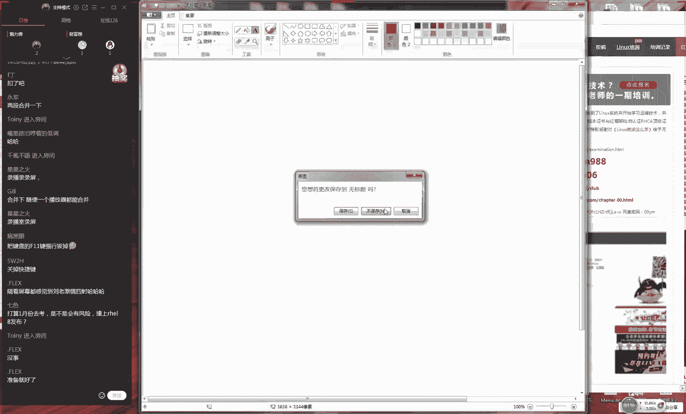
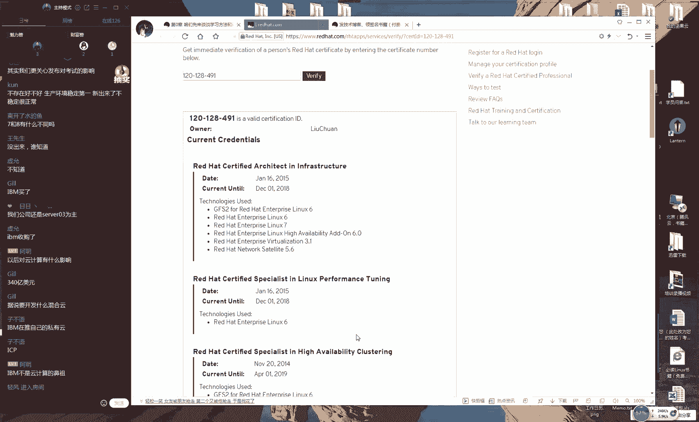
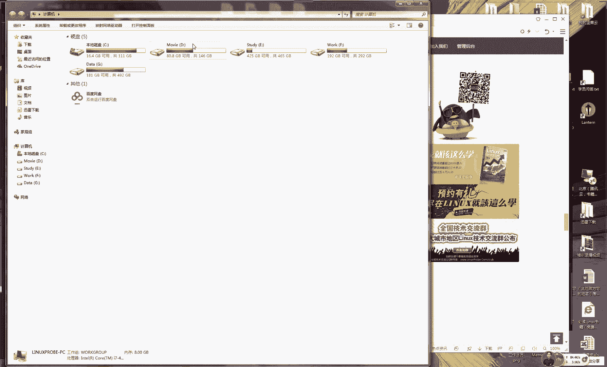
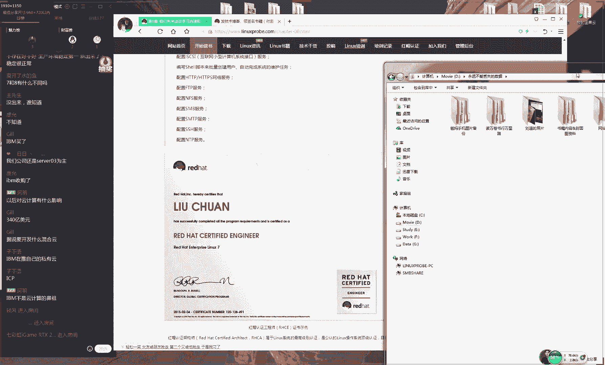
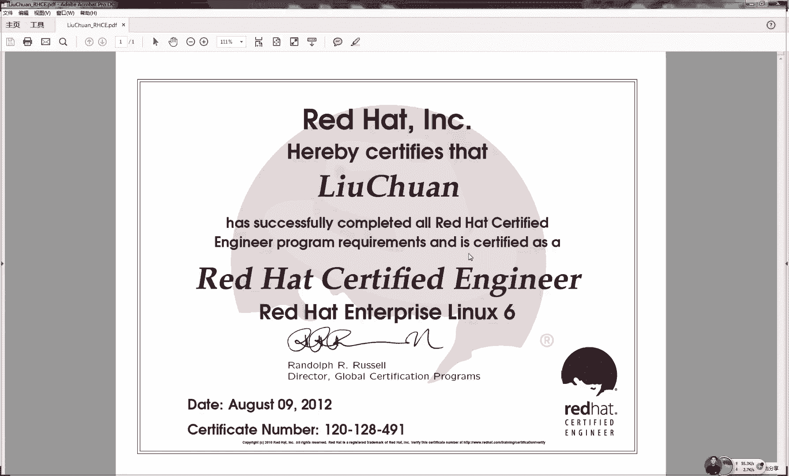
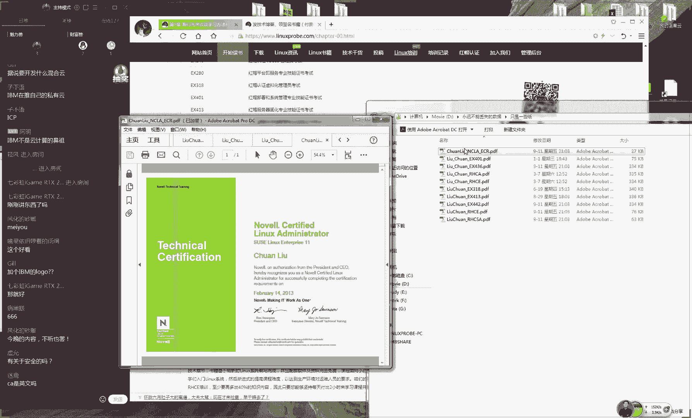
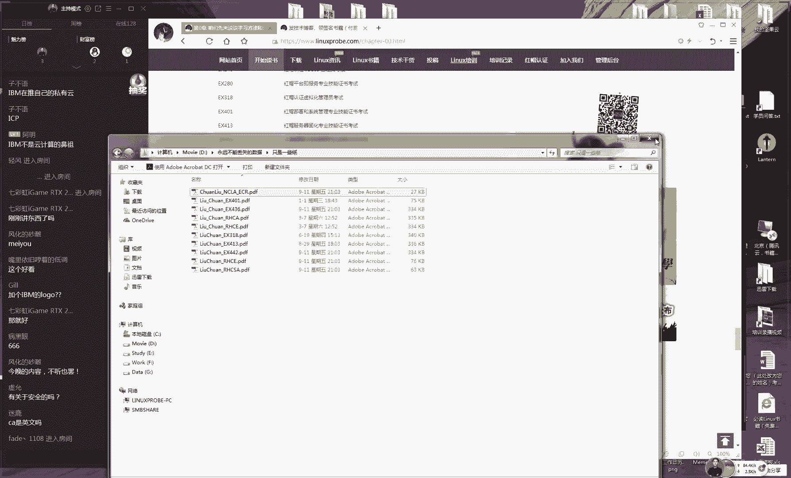
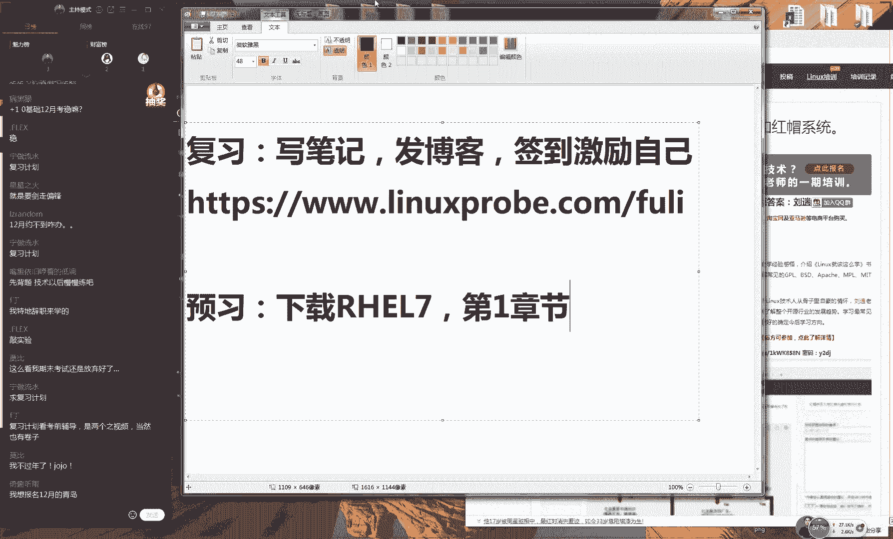
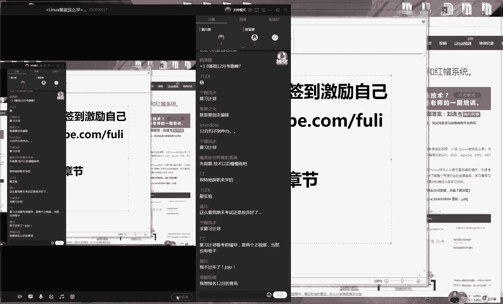
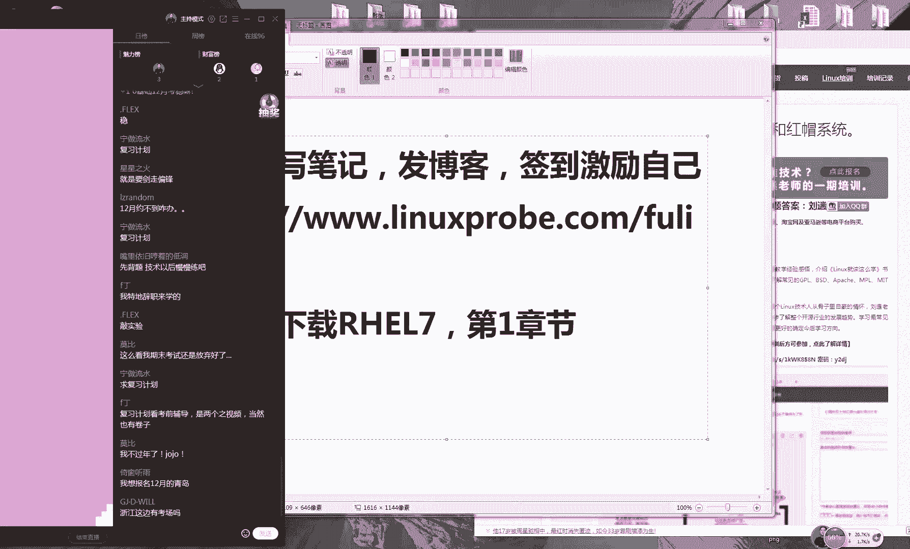

# Linux教程RHCE - P1：1.初识Linux - 艾弗艾尔思丢丢 - BV1if4y1e73V

啊，所以这个脑子真的是老了，这这个真的是老了，这个不敷不行。是，然后我先不讲这关系讲比较高兴啊，然后一下子点到那个F11了，然后他一下子就被。😊，那个终止了。那好，那我接着给大家去说啊。

就是我们今天这个呃视频的话呢，被录制上了，大家不用担心。然后的话呢我们会今天也会传到我们这个学员信息面上面。后刚开始被暂停了一下，我们继续给大家说大家中中间没有也没有什么遗漏。好，接下给大家去说。

就是这个视频的话呢，请一定要去看一下这个是有70分钟时间给大家去充分的去讲解一下，我现在这个脑子跟就跟就跟就跟不受使的的。好，接下来话我们来说一下我们这个考场的吩咐，考场的这个分布。

那么我们既然已经知道了，我们想要去考这个认证。那我们怎么样去考呢？具体我们最近这个考点的考点这个位置的话呢，那我们可以去看一下这个网址，这个网址里面就有了一个我们在全国12家的这个考场具体的这个位置。

具体到了我们的这个每栋楼的每层的每个房间的号码，你们可以先去看一眼，看看环境什么呢？你满意的可以再过来报考都没有关系。好吧，就是我们这个考场的这个分。😊，不好。

到第三呃还有第四点的话就是说呃我们这个上课时间，大家可以访问一下我我们这个网址，用手机去访问啊，然后截张图，这就是以后我们的每周五、每周六、每周日。😊，到119点到21点的时间。

我们会给大家去讲课这么一个时间的一个表格。好，大家会之后切记一定要自己去看一下。最后的话还有一个我们这个QQ群太多，对不对？然后我给大家捋一下我们这个关系。这是我们这个QQ群。

大家概加到我们这个QQ群里面，与更多的爱好者们来一起去交流，那来一起去来去交流一下。好了，这就是我们巴拉巴拉给大家说了一个小时时间一个小时时间了啊，太长时间了，给大家去聊了一下我们这个培训机构怎么回事。

对吧？怎么去考这个认证，然后我们怎么去上课，然后我们怎么去答疑，怎么来去联系我们给大家都是都来去说明白了，这几个网址的话呢，我给大家发到我们的啊同学们行，稍等啊嗯。😊，QQ上同学们。

我们先不给你们回答问题啊，我只先把它点开。因为我现在需要进入到我们这个。😊，我需要进入到我这个QQ的这个主页面里面。然后我现在需要把这几个网址给大家发到这个群里面。大家的话先点开你这个QQ群。

我现在把这几个网址，现在不要看啊，因为你现在没有时间你这是谁啊？你这个表情什么意思啊，这是一个哭笑不得啊，然后继续我先把这个网址给大发到咱们的QQ里面，请马上把它保存一下。

然后我们下课之后把它逐一啊去来看一下啊，来去来来去逐一看一下？😊，啊，土豪是不是还可以去分屏显示。行，然后的话继续给大家去说啊，我们正式我们这个课程。大家的话如果说。😊，因为。

每个同学们这个怎么这个怎么说呢？性格也是不一样的。如果要是我其实我我感觉我快急了，都已经一个小时了啊，还没有开始去讲课。但是我们所说这一些都是很有必要的。你们今后就知道了，希望我们今天讲完之后。

你知道该什么时候去上课，怎么去上课。五六日晚上7点到9点，我们知道大概上课时间了，以及没有去上课，怎么去下载我们这个视频怎么去考试多少钱考场位置怎么去呃，以及推荐什么时间去考。

我们给大家去理清了我们刚才所能够想到所有的问题。呃，大家然后继续来去说啊嗯。😊。

然后来去说到一个问题，大家有什么问题可以来去说，因为我现在就是说的比较多啊，但是我我怕大家嫌烦，大家只要不嫌烦就行。因为我们现在讲课，我接受红帽认证啊，我跟红帽打交道吧。

已经7年时间了大家知道7年时间了，也也都不要是七年把比作是一个交交一个女朋友的话，七年的时间都有孩子了，就是说七年时间了。然后的话呢，我们交红帽这个在建培训。

大家知道我总写说2015年开始去写开始做到现在了，四年时间了。因为我说215年年初开始去做嘛，马上就四年时间了。对红帽公司的这个理解的话呢，还是还是有一定理解的。包括说我们现在给大家提供的。

我们坦白来说啊，我们敢给大家提供红帽考试的原题，这已经是行业里面很少见的了。因为培训机构一般来说提供是模拟题。大家如果要是有朋友是在培那么是在其他培训机构的话，你们可以去问一下，是提供的是模拟题。

他们很少会有原题的，而我们提供的是考试的原。😊，题不是我大家去瞎编出来的，是跟红帽考场里面的这个题目是一字不差。大家记住我这个话是跟考场里面是一字不差的，是我们考是跟考红帽。😊。

考试机器里面直接考出来的，你看了这个题，目就跟考考场里面是完全是一模一样的。所以的话呢我们跟红帽的关系也是比较好的。呃，所以的话呢我就希望今天大家都自己人了啊。

因为我们现在不是举办一个就是一个公开课怎么样，家花完钱呢，我们希望能够把我所知道，尽可能给大家多说一点，但是也许我说完之后大家觉得这个没有什么用嘛，或者说我就不想去考那我就不想去考认证。

结果你老是说红帽，然后就很不高兴。我就觉得你是不是就为了骗我们点钱，再去考一个认证，对吧？就好像红帽是我们家开的是的，所以的话就是说啊但我说比较直白，但可能会得人，就说到我们这个讲详细一点。

如果说你为这个东西自己可能不太贴切的话呢，或者说自己不太需要的话呢，那我们可能就是。😊，会讲更多的干货啊，来去来去给大家去呃去来去弥补一下我们红盲认证所带来的一些缺点。行。

那我们接着给大家去说一下我们今天这个第零章，之所以叫第零章啊，其实就是一个序言。但是我我这个话痨嘛，大家都知道我这个话痨。所以的话呢我们之前出书的时候，出版社有一个流程叫做这个三审三教。

大家知道这个三审三教哎，然后话这个三审就是叫做初审复审终审，然后还有叫做这个三教呃，初审终审，还有呃初审。😊，复审中还有这个终审，当时他觉得我写东西太多了，说我们这个序言序言你怎么写了10张啊。

这没见过呀。你说那写书，哪有序言写10张的，跟一本书似的，对不对？好，那么呃所以说那你干脆就把交地那就把这个取消，然把它给就把这个序言。😊，给换成叫做这个第铃章了啊，所以说大家知道这个他就是一个第铃章。

叫做这个序言，里面没有任何跟技术相关的东西，主要就是一个序言告诉你他怎么回事，我们还是啊给你讲明白他怎么回事，因为是这样的，因为我大家知道啊因为大家花园前报名我们这个培训了。

因为对于我这个人是有一定理解了应该是这个了解了，或者说对于我们这个培训机构是较信任了，你们才敢把钱交给我了，我们比较坦诚啊是吧？所以话呢我们对于我们个人的这个介绍，我就认为可以忽略一点。

我们把这个重点还是往后去讲一讲吧。然后我说一下我的名字啊，我叫流传，不要叫刘主同学们啊叫流传特别尴尬，我是在今年的年夏天的时候，大家知要看我朋友圈啊，然后我也是显摆了一下。

然后我们跟这个系统这个创始人叫做这个linux对吧？啊，叫做linux我们当时有一场北京的一个。😊，我们有一向北京的一个会议是开文中国举办的啊当这也是在全国最大的一次。后来我们今天夏天啊我们就去了。

然后我们到那之后啊，因为正好出版社也去了，我们开完会之后，我们做了一次签售啊，大家如果要是你们要是去的话，应该也已经见过我啊，特别的尴尬。当时我们做签售是这么回事。当时我们差不多是12点钟。

我们吃完饭回来，然后我们去开会，开到下午差不多3点钟，晚上我们就回来，我们去做签售，签售的话呢，我们预计是从3点钟签到晚上，反正看时就看时间呗。然后我们的卖反正也是也算是卖书。后来三点钟开始签签签签签。

一反正一开始吧，还还挺顺利，开始签售，你知道吧？后来的话呢。😊，我们的签售，后来人就差就反正差不多，因为可能一开始人比较多，然后还需要排队什么的，后来人就比较少了，因为我毕竟也不是很有名，对吧？

然后后来人就比较少了，突然有一人一个小孩吧，岁数不大看着也就是四五十吧，然后他过来了，然后说哎你不是那个刘瑞老师？说我特别喜欢书，给我签一本。但因为当时我们这个千售啊。

我们都是很多个作者他说他都是做的很密集的像刘瑞当时我就看周围好巧啊，说还有一个叫个师叫刘瑞？我看半天发现他他在看着我常尴尬啊。他是在叫我所以的话就是说我叫刘传，误会叫刘叫个刘传。后来我也习惯了叫刘瑞。

叫什么我都已经是习惯了，但是我的本名真的叫刘传还有一个拼音，我也是应该来我也是第一个把自己的名字后边加了。😊，音的，并且大家可以翻开书啊，翻开你的书。😊，然后我们翻开你的第一页，我们这个的话呢。

我们这个专业的术语上面叫飘口，就是这个彩就是这个彩色啊，不是翻开第一页。翻开我们这个书的封面，这个叫飘口，它就是这个多出来这么一点。你看啊这边会有我的介绍，对吧？这边会有我的介绍。

我我我估计我也是第一个把自己的名字旁边加了拼音一个作者，大家看到我这个名字旁边是有一个拼音，并且大家仔细看我那个A上面我还有一个二音呢，你们这还这这还会念错啊，叫流传。好，大家再给大家重申一下啊，好。

除了这个之外就不太就不太重要了这叫我叫流传。然后后呢我是在2012年的时候就陆续就考下了红毛是CE6万本认证。后来的话在2015年的年初瞬还前后啊，又考下了红CA就是红认证架构师顶级认证。

以及红毛7的一个C认证，也当时是。😊，呃，中国唯一一个呃就在这当时啊同时用有了红马HCIC和红马HCE6版本，以及红猫HCIC和红HCSE啊呃红马HCE7版本以及红HC架构师的一个。😊。

我们叫做一个人都可以了。因为我们不光是讲师啊，就是一个运营工程师，同时拥有这么一个认证啊，它是一个很少有的。包括说现在我们现在都是一个这个认证，同时拥有的人比较少。但是我们出但也算然是亏呃。

但也是算是个这个。😊，呃，吹嘘一下自己对吧？因为我们毕竟有这么多个认证，我们要求给大家介绍一下。然后的话呢还有我们这个红CC的话呢，我考的比较早，你们现在考已经不稀奇了。我当时就考的时候，我考5门。

大家知道红需要考5门虽红一共考7门，现在你听不懂我所讲什么没有关系。大家现在听我说红听不懂没有关系。因为你现在才算花钱花值了，我待大家去讲，我们会讲啊回大家去讲，如果你要是知道的话呢。

那反而证明你已经是学习过了。今天这个课对你帮助可能不是很大。那么我的话当时去考C考过五门之后，包括港澳台。😊，在内啊就是说在整个中国不超过150个人，应该来说是在100个人以内，我比较这个保守点啊。

当时我考来做的时候，全国的红标士CSC包括港澳台，不超过150个人。现在的话呢人数应该是达到了1500个人到2000个人之间了啊，也现在也是比较火，当时我也是考的比较早。大家知道，因为我不光喜欢学。

我还是个考试狂魔啊，因为我去考过斯科，我去考过lin的。😊，呃，基金会的认证我也是lin基金会的成员之一。我考完了我我呃我也去考LPI认证，我也去考过思科，我考过CNP我考过CNA我考过呃open。

然后我还去考过A啊，我还去考IBM里面的AX这个小小个小机认证，是我也是考试狂目。因为我也希望就是说每一次学习，然后给大家，然后给自己算是一个阶段性的一个总结，所以的话我也比较喜欢考试啊，对吧？

然后继续给大家去说啊。😊，后来的我们写书的原因啊就是我们希望能够对于这个内容进行一个提炼。我们坦白来说，你给我一个很大的一个说明书，我那我们不想去看的。就好比说我们双十一啊同学们你们可能会去买一些家电。

对吧？咱比如说你去买一个空调，你去买一个冰箱，我坦白来说，我保准你你不可能一页一页把说明书给他看完，或者说很仔细的去做笔记，那封个新了，比如说你买一个空调，或者说你买一个电视，你买一个冰箱。

你会拿一个圆珠笔，然后把它这个说明书，每一行每一句话，你就很认真的去给他去标注出来。然后这个是重点怎么样的，不可能为什么？因为他对于你这个帮助不是很大。像比如说我来讲，我只需要空调开冷热风。

然后需要开关机就足够了。那好可以满足我这个需要，我可能就不会把这个重心放到我们这个太多什么电路结构啊，反正看不懂，这样这个内容上面。所以的话那我们这个写书就是希望能够通过我们这个内内容的一个提炼。

然后取出这种重药。😊，这个内容。但是我们这个就是不是说去去掉一些东西而已，而是希望通过自己的一些。因为我也是接入这个行业将近十0年时间了。通过自己的这个工作讲课的各种经验来说，我们作为一个提取。

最终提取出来这个精华，所以总说来去总结一下吧，就是我写书的一个写书观啊，就是我们认为一个基础高超的一个导师，他不应该只是作为一个基础的一个搬运工，百度上面的东西太多了。人家何必去报你的班买你的书呢？

而是应该作为一个优质知识的一个提炼者，把知识能够提炼出来。大家应该这个比较有感触。我现在所讲的每一个我们不是我们我们也不是去来去诋毁谁啊，那我们就是说我们所讲的现在所说的每一句话。

讲到所讲的每一个知识点，其实来说在图书馆或者在百度上面都是有的，大家为什么要去学习呢？大家或者说我们为什么。😊，要去报我们这个培训班，2400块钱花钱来去学呢，是买一本书吗？

这本书我们翻开之后发现定价才79块钱。这2400块钱报的是我们一个在线的一个培训，是把这本原先跟你毫无关系的这本书里面的内容，通过我们的讲课的这个过程，将这本书里面的这个知识。😊。

传递到你的你的这个脑子里面，这个过程是有价值的，它值是两400块钱。😊，而不单纯是你花钱去买了一本书，书架上多了一摞纸而已。好了，就是给大家去说我们这个讲课。😊，会大家尽尽力。我们会去第一来说。

对其大家花费这个时间。但是我们今天第一天啊我们花比较多。第一来说，我们会对大家呃就对呃呃大家花这个钱。第二的话啊就是我们花这个时间。😊，好。

最后呢第三就是我们希望大家能够去呃对得起自己花费的这么一个精力啊。我们毕竟说我们每一周五六日这一个半月时间里面都要砸到我们身上了，我们希望能够去不是去挂机去听一个相声一样，希望能够往脑袋里面去走。好。

因为的话我说话是我说话比较难听啊。因为我说话比较比较难听，就说因为我们都花完钱了，对吧？我们希望大家能够去学好，你们学好真的我们很有面子的。以后我学生谁谁谁谁谁怎么怎么着，这是我吹牛的一个资本，对吧？

那我那我也喜欢吹牛，我也希望你们能够就是成为我说那个牛呢我就希望大家去学习的时候比较难听啊，我们希望大家去学习的时候，不像去买菜市场里面的菜，花完钱花花200块钱花花多少钱去买去买一堆菜，然回家就走了。

而是你真的要去吸收把这个钱给我是来受罪的。我要跟你讲，你要去听你要去消化，大家去输出变成自己的一个知识。😊，然后的话这个过程会很痛苦。按照这个杜威来讲啊，对我这个学历大家知道我是学习教育学的硕士。

然后我大我硕士毕业之后。😊，呃，我的硕我的这个硕士毕业之后，我也没有去高校里面，就是因为我比较喜欢创业，比较喜欢挑战。所以的话呢我就是。呃，也比较看不惯，就是说一些高校里面老师会用这种点名啊什么的。

来去约束我们的学生。我们希望能够同学们自己发挥出自己的这个主观能动性，来自己去主动来去学习。按照杜威来说，那杜威是一个很伟大的一个教育学家。他发明他说他所说的叫做这个兼构主义。

我们希望能够在各自呃同学们这个发挥出来自己的这个主动学习这么一个这么一个兴趣来去学习。那这样话会更高。好，其实这一块比较啰嗦啊。因为我们都是因为我们都是成年人了。😊，然后给大家去分享一段话吧。

这段话的话呢是我在一本书里面看到的这本书的作者叫做这个稻盛和夫先生。他这本书叫做活法是这样的，如果要是没有这本书，我也不会去坚持写完我这本书。因为他其实很有斗志，然后让我们一直继续学习。这句话的话呢。

我已经已经是讲了19遍了，对吧？我们第19期讲了第19遍了，我就希望能够我自身来去不断来去传递这段话，然后给大家或许你就会有感触，或许你听这我们这呃听我们这本书里面这段话，感觉索然无味，只是一段话而已。

或者很虚鸡汤很抵触很反感。但是或许我们这班里面有100个同学，哪怕有一两个同学你们会有感触，会有自己的一些想法呢。好。😊，我给大家去说一下我们所说这段话是这样的。在工作的时候马马虎虎。

只想在幸运和游当中去寻觅快活，那么充实量，那么也只能获取的是一时的快感。尝不到从心里面涌跃出来的喜悦与快乐。但是当我们在工作当中的喜悦，他不能够像糖果一样，刚放学的时候就甜味十足。

而从到我当中与心情当中去慢慢去渗透出来。因此当我们聚精会神孜孜不倦克目见进之后的成就感，事实上也没有哪种喜悦能与之类比。更何况我们过当中，我们这个生活当中工作占据了较大的比重。

如果不能从过当中获取到充实感，那我们其他地方获取到的快乐，那我们最终会取得缺憾跟空虚好，这段话是一个日本人写的。为道和夫这个先生这个先生是日本的经商教父之一。他是一个日本人，后来翻译过来的话比较蹩脚。

但这段话我比较喜欢给大家说一个举个例子啊，你们有没有朋友比较喜欢去夜店，他们去夜店特别嗨对不对？我没有去过啊，但我看过照片了。😊，缺店特别的嗨对吧？然后一天比如说嗨到晚上凌晨3点，对吧？

嗨到凌晨四五点好了。😊，你明天早上起来，他中午起床了，他12点起床，然后你去问他说你感觉到满足了吗？他一定会说我没有满足，我感觉很空虚，我很缺憾。然后他会第二天晚上他会再去夜店去弥补他一种缺憾的感觉。

大家可以去问一下，因为我朋友他也确实经历过这个过程，越空虚越缺憾，他越需要人陪，他才会他才会去越去夜店这样的这个场合。这我们都不说啊，就是说因为我们这个生活当中的话呢，工作不出意外的话。

都会占据了我们较大的这个比重，从我们起床到我们这个睡觉工作占据了我们很大的这个比重。如果说我们工作当中你获取不到兴趣的话，那么你这那你这个生活当中就大部分来说都是很空虚和缺憾的。既然我们去选择到他了。

我们又恰巧碰到这本书，我们不是吹这本书多好多好多好，但是我们看到他现在在中国这个销量，我们前三没问题吧，但是我们现在看我们去年我们2017年的11月11号。😊。

我们这本书刚发布当天是中国IT机呃是IT书籍的榜首，就是中国最高的做的呀的这个就是任何的IT书籍都包括在一起去年的111号我们是第一名大家可以去搜南方周末报他们都报道过些报纸都我们书家可以去上去搜一下并且我们今天这个销量达到1万册大家可以翻开我们这个书的开始会有我们这个有我们这个印数大家可能会是因为我在印到第11版册了。

大家不道看一下你们这个书这个会有一个印印数假不了为什么因这个印数他会决定了是出版社给我稿要给我钱的所这个只会少不会多大家这个意思啊，这个书他只会少不会多。

看达到1万册IT机构里比少的一般T书籍每年销量1万册就是一个畅销书籍一年万。😊，策我们就是说啊，既然我们有缘，我们碰到这本书啊，老刘的话呢也比较喜欢能聊，我们把自己当做是我们把大家当呃都当做是自己人。

😊，也没有什么保守，对吧？他听我巴拉巴拉这样聊，也知道我这个心眼比较少。那既然说我们赶上这么一个好的机会，那我们就没有什么借口，对不对？钱已都花了，没有什么借口了。好了，我们好好去学好了。

既然我们今天说这么多啊，但是我们都是成年人，我们不说这么机舱的话，大家都每个人都有心里自己的这些想法，对吧？对起自己花费这个时间钱，好，既然我们来说一下我们这个开源，那么什么是开源，那么什么是闭缘。

我们来点干货好吧，那么开源的话，呢我们就是说。😊，哎，今天因为好长时间没有讲课了，可能嗓子不大好，就是这么娇气。😊，🤧呃。大家先稍等一下啊，因为我们每因为我每一期节合之后会。😊，间隔10天嘛。

这个嗓子就比较娇气，稍等一下。😊，今天这个时间。会比较晚，大概的话呢会在9点半左右，大家会提前做好准备，好吧，因为。😊，我们不希望我很不希望就是说我们7点钟上课到9点钟开下课走人吧，对吧？

然后的话呢也符合我们这个课程的一个程度。好，讲完就完了，对吧？你还怎么着，对吧？但是我希望就是真的是你们把我当是一个好的一个朋友。我希望当是个很好的一个学生我们不叫师徒，我们起来说大家花费这个？

花费大家这个时间，所以我可能有些时候我说的比较多，或许这个话落个身上轻飘飘，不太适合你，但是或许就会激励到某些同学觉得很好老师想法跟我差不多啊，好，那就是说可能会有些东西比拖的时比较长。

大家不要嫌我啰嗦了。那我们今天的话讲不完钟讲不完大概的话时间会在9点半左右大家做好准备好吧？只要你们不嫌我就。好烦这个人反正长这么帅，对看我一个这么这个这其实我己都都不太好意思了，这个脸人磨得快不行了。

😊，他这个给我秀图那个人照我收了多少钱嘛？啊，你不要说我帅了，这的都是假的。你们比如说你们交个女朋友那个照片，网上那个肯定是都是被PS过，叫PS就是不是不知道你们叫不知道你们现在叫什么啊。

反正就叫PS嘛，对吧？😊，他P我张图的时候，收了我600块钱啊，真的，咱不开玩笑啊，这张图收我600块钱，所以你们知道我之前长得有多磕碜的吧啊，刚有刚有这个呃刚才我们说有沈阳同学啊，长得比较丑。

我们这张图我所以我们呃所以我们花600块钱，这个脸啊比较这个光泽什么的。好了。😊，那么所以说我们先来说一下我们这个开源啊。😊，他的这个话呢反义词就是B源，这还咱们这还是句废话。开源的话。

它指的就是将我们这个呃程序以我们这个呃源代码来一起提供给我们我们这个用户。然后的话呢，并且赋予给我们用户一些权限。咱举个呃咱来举个例子来说，咱比如说我们去使用QQ的时候，那我们就有了QQ的这个使用权限。

因为它只是一个B源的一个软件。但是如果这个程序它是一个开源的话呢。😊，那么他就会赋予我们这个用户有了4个自由。那么以及它有了更多这样的这个特点。第一来说它是一个低风险的。因为是这样的。

咱比如说我们现在的话呢，我我们这个在使使用的叫做这个win7跟win10，对不对？好了。如果说你的这个W10系统出现漏洞之后怎么办？😊，如果说你的这个win10系统出故障了怎么办？有漏洞了怎么办？哎。

同学们，刚才我看了啊人是1126个人，现在有125个人跑了一个同学啊。😊，他跑了之后，估计啊那就亏大了，因为我们马上就要讲干货了。来，我们上怎么样游动作之后打补丁，这句是废话，对不对？好了。

那我们需要来去打补丁，补丁哪里来的？😊，拿里来的补丁。需要由微软去发布。其他人是写不了的，哪怕说您是使用的是310去更新的。310也是从微软那边去获取的。因为它是一个闭源的一个软件。

没有任何人知道它里面windows内部是怎么样去运营的，只能是知道大概哦是这么回事，代码你是看不到的，所以只能是由微软去提供这样的这个相应的补定。而开源不是开源时将我们这个还将代码公布出去。

任何人都可以看到里面这个漏洞，然后看到里面这个设计的这个方式。最后呢这个品质来讲，第二点就是品质也会特别的高。但我们接下来说我们会将这个程序这个源代码也会提供给我们这个用户。那我们自然来讲。

我们就会保证我们这个程序的一个。😊，呃。对，一个很高质量。好了，因为是这样的，我比较喜欢举例子然后比较喜欢举例子给大家举个例子。大家当然我们去上大学的时候，有没有去学习过编程的话。

大家可以打一下一大家有没有学习过编程。比如说C语言，或者说随便啊比如说java什么的，大家如果是之前学习过编程可以打一下一啊，反正我之前我学习过我上大学的时候，我大学是做这个北京联合大学。

当时我们学习过计算机组成原理跟C语言，我上高职的时候，我学习过，我去学习过java好了，咱不说这些啊，你们那你们上课的时候，那么自然也那么也会有作业，那么自然也会有作业。那好了。

如果老师让你们去写一个功能。比如说从一输出到100这么一个功能这么一个软件的话呢，那么他需要你最后将这个程序给它。😊，呃，打包之后，然后发给你老师，然后老师点开之后，看到这个效果就会给你成绩。

证明你交作业了。但是呃如果这个老师他只是要这个程序的一个运行结果的话呢，那么你这个代码里面，你绝对不会用什么缩金呀，用什么比较高级的这样的语法什么的。你只想快速去交代这个工作就可以了。

但是如果说老师要求你把代码也给传递上去的话，那么你就一定会去小心的来去处理每一次换行。因为你要让你代码开展更加的漂亮。然后的话呢，会去拽一下比较高级的这个功能，或者说尽可能来去降低这个负载情况怎么样呢。

会去使用一些比较新的技术，所以话呢我们相对于来说只是提供这个程序怎么一个文件这么一个程序来讲的话呢，开源程序，它这个代码质量它是会更高的。第三就是我们这个低成本。既然我们已经将代码都有给用户去提供。

那么好了，那么我我们这个用户就可以。😊，去免费去使用这个服务。因为你哪怕有了设备的这个功能的话呢，但是你已经将代码都提供出去了。那么我们的用户也可以去删除掉我们这个设备的功能。所以说开源的这个作者。

一般来讲，它是通过我们提供服务来去收费的。咱比如来说我们现在编写的一个软件特别的好使。好了，但是特别的有用啊，但啊但啊但是的话呢，别人不会去使，你不会去使啊，那么好了，那么你就要像我来去支付费用。

我来帮你去提供一个架构，我来帮你去做，然后来去从中去收取费用。一般来说开源件的这个使用都是免费的。第四是更透明，这个太好理解了。同学们，你们怎么可能。😊。

会帮你啊会把这个程序里面加这个呃病毒这个代码给它公布出去呢啊，对吧？因为你将这个程序的这个代码也那么也会公布给我们这个用户，那么你就不可能在里面去恶意去来植入木马跟后门。

那么等于就是说你把你自己的这个罪行暴露给了所有人了，大家知道就在北京这边，因为我没有去过外地啊，因为我因为我很少去出去玩。大家知道啊，因为我因为我讲课怎么样的，现在我就知道北京有一个变化，什么呢？

就是这个。😊，有一个政府的一个计划啊，因为因为我们在这边生活比较久了，这个计划啊叫这个明厨酿造计划，不知道大当地有没有啊，大家有的话可打一下，一叫明厨酿造计划，就跟吃饭有关啊，你们比较感兴趣。

就是说啊仙姐在这个饭馆里面，你坐在那个座椅上面。然后的话呢有两个方式。第一就是说把这个后厨啊墙给它拆了，做一个大玻璃。你可以通过你坐那个地方，或者说你站起来之后，你就对叫开房式厨房。

你就可以看到这个他们后就可以看到他们后厨里面什么样子。比如说那人醒鼻涕了。那人呃肉没洗干净怎么样的，你可以通过玻璃就可以看到后面了，有一个餐厅叫西贝莜面村，你们有没有看过叫这个西贝莜面村西面西背。

莜面村。😊，你看我这个广告就比较硬啊，因为我像你们刚刚去吃过，就是说这个饭馆的话，他就是把这个后厨啊，它全给拆了。然后的话呢装上玻璃了，这的话也可以从外面可以看到里面。

第二的话就是说如果这个墙他拆不了的话，比如他是承重墙，他就会在这个呃他的话他就会在这个厨房里面安上摄像头，然后他会安一个电视，你可以通过那个电视看到这个呃后厨里面这这这个情况。

比如说来几个厨师怎么他正在做饭什么的，可以看到里面这个实施的这这个情况。😊，大家也呃大家有可能呃之前没有关注过，大家可以现在都进来去看一下这个的话呢。😊，其实来说就是我们开源代码的这么一个好处。

它会将我们这个程序代码给它公布出去。那么明显你就感受一下。😊，有两个饭馆，其中一个你能够看到后厨里面的这个做饭情况。第二个是你看不到的一个的这么一个做饭的一个情况。哪个更干净。

很明显开放代码的这个更加安全，更加干净。那么为什么呢？他起本要在乎一下自己的这个口碑，怕别人发现他里面会有一些问题，所以的话呢这个就是一个开源程序这么一个好处。那好了，那我们现的话给给我们这个用户。

他是还说它是赋予了我们我们这个四个自由。第一来说大家记一下啊，大大家记一下，我们有这个四个自由。第一，我我们的这个复制自由。第二，我们叫这个传播自由。第三叫收费自由以及修改自由。其实来说啊。😊。

这个四个自由是这么去来去捋的啊，第一个自由叫使用自由。这个就是啊同学们说这个吃饭啊，所以你们就啊比较感兴趣。我上反正我上一回啊比较吐槽嘛，因为我们也希望这个国家是越来越好啊，是这么回事。

因为你们知道我刚才讲的这个计划之后的话，它是一个政府的一个强制的一个必须你给我把一个啊开放式，这样的话，我们可以互相去监督，有一个餐馆，我因为我们在旁边就有啊，叫这个金百万，你们可以网上去搜一下。

它是一做烤鸭做家常菜的这么一个店，他们一进门也有这么一个电视，结果的话呢。😊，他就把那个摄像头，把他们后头那个摄像头。哎，照他们家天花板，那你想天花板怎么可能是脏的呀，对吧？

但是你按照政府的这么一个要求，你有摄像头，你也有电视，你也有公开。但是你照是天花板，那你永远都不知道在后厨干什么吧？除非说你蟑螂这比这个蟑螂者老鼠正好趴个天花板上，所以说这个就是上有对策上有策下有对策。

其实这是一种陋习要去改正。如果说你要是碰到这种这个餐馆的话，你指明说这个不对，或者说找相关的部门这个饭馆偷减料或者怎么样的去处理插句这个闲话为我比较喜欢看到你们说什么蟑螂老鼠什么的，其实我也比较害怕。

说这个后厨里面不干净完你也不放心。好继续来说是我们四个自由拿起同学们。😊，好呃，同学们现在可以来现在可以来睁开眼了啊。刚才同学们闭眼，同学们，你们现在可以来睁开眼了啊。

然后的话呢我们现在翻看你的书是这样的，我们还有一个小活动，就是说因为的话啊同学们你们收到这本书，这本书呢呃很厚。然后的话呢很干净。然后也是新的然后或者怎么样自己很喜欢就不太舍得网上去写笔记啊。

不太舍得去来去写笔记。所以的话给大家去提去提另外一个活动，我们叫做学员福利，仅限于我们当期学员有效。如果说您是从听同学那们没有这个福利了，就是说您进入到我们后面这个网址啊后面加上这个福利两个字。哎。

就是说我们只要每节课的课后，一般我们当天的这个内容啊，你只要把你啊比如说我们今天讲的什么，我们讲的这个开源这么一个特点啊。哎，那你觉得这段话。😊，挺好，或者说你有自己的一些心得了。好了。

巴拉巴拉你自己来去注册一个技术的一个博客，然后把你今天所学的这个知识，然后放到那个博客上面去来那么啊来去更新。这样的话，你来去坚持20天时间。这样的话呢，你每一天啊当然还包括就是说你写笔记啊。

你要去把你的书上面来去写笔记，写啊去写好你的笔记，然后把张照片把你书拍照啊，把你这个做笔记那一页啊啊，去拍照乱的没有关系，然后拍完照片之后发到你的这个博客上面，每一天发一个帖子，每天发个帖子，第一来说。

对于你学习的一个总结。第二也是对于你自己的一个激励，对吧？啊每天去做一个这个签到博客没有关系，只要是技术博客它都可以，然后的话你也可以不提我们的书名，你就自己给自己对起自己这个付出啊。

你就把你自己这个写完的笔记。然后书的这个拍照后去写好之后，然后附带一段你今天学习的。😊，这个感受。如果说你今天学习没有感受，或者说你就认为这个。😊，画比较好，那好了，把我这段话你复制一下。

然后你发到你自己的博客上面，都算自己的一个签到。然后你坚持20天了之后，我们会给大家去赠送一本我签名的这个书。就是说我们上课的时候的话，您可以去尽可能去做笔记什么的。没有关系，不要担心。

不要舍不得我们只要你按照我们这个签到活动这样去做的话呢，给自己一个激励。我们到最后结课之后，我们都会给大家提供一本免费的签名的书籍，而且是签名的给大家去做收藏。所以话大家放心。

就是说你们真的可以去做笔记的。我们这本书也不会去回收。这边去写吧，好吧，就来去写。另外的话呢我们就请大家注意，就是说一定要对一定要对起自己花费这个时间。😊，和这个经历不要糊弄我，不要糊弄任何人。

不要说哎我们今天为了签到而而签到。这段话其实我没有读，我把呃来点复制就发到我这个博客上面了。没有任何的这个意义的。你必须要给我去写笔记，然后你去拍照，起码每一篇帖子里面。

你要包含一张自己对书上的这个笔记内容，要不然我怎么知道你是网上抄来的一段话，还是谁的，对不对？那你就是说你一定要至少每一个帖子里面要有了一张，你在书上写的笔记这样的照片。

然后我们最后就会给大家去赠送一本免费的签名书籍，好了。😊，说完了就是说我们给大家就摆脱了心理上的一个顾虑啊，不舍得一些呃不太舍得动我们这本书啊，不太舍得去呃去这个写字啊。好，我们可以放心来去写笔记。

那好我们现在翻开你的书籍了啊，翻开你的书籍，我们看来去写笔记。呃笔的话呢我们用到一个比较烂，比较亮的颜色吧，今天写呗，对吧？你对于自己是一种激励啊，你想想你每天都去写，你就坚持到10天了。

那么你接下来肯定会自己也是一种激励。😊，其实真的是一种心理的一种。我们今就我们来说吧，我们即便说我们没有任何礼物，对啊，我们也没有什么呃送到书籍，但是你花钱2000多块钱呢。

你自己去做一个签到建筑学员这套课程，对于自己都是一种这真的对对得起自己花呗这个时间。好，我们翻开书籍的第三页。你看一下啊，这边有4个这有三个自由。然后一个叫做这个收费传播。让我们先来笔记。

第一个自由的话，实际上叫做使用自由，我们就可以来去使用这个软件的自由。第二的话呢我们叫传播自由，就是说哎我觉得这个软件挺好使的。那好，那我就可以传播给我的这个。😊，朋呃传呃去传给我的这个朋友们。

比如说通过QQ啊，通过什么呃U盘什么的，传给我的朋友们。第三就是我们可以进行一个修改。因为我们提供这个程序的这个源代码，那我们就可以对它进行一个修改，修改成一个更加适合于我们的这么一个软件。第四啊。

我们叫这个。😊，呃。叫做这个创建衍生品自由。这是我们这个第四点，就是我们可以对它进行修改之后的话呢，结果会发现比这个原版它更有用了，或者说它更高效。那好了，那我们可以再去发布出来自己属于自己的一个版本。

但是我们需要去保留些原始作者的一些相关信息啊，让我们以进行一个再来进行一个发布这么一个权限。那我们叫做这个再发布的这么一个权限。好，怎么样，我喜欢默默写而已，也送一本说，那不可以。

你一定要发到你这个博客上面。因为我不知道你回头发照片，我们不知道是谁，对不对？你可以随便去注册自己的博客，或者说你不太喜欢那但比如说啊你自己比如说你自己其实是已经是个网红了。

你不太想要自己在自己的博客上面写太多这样的这个关于技术的这个东西，没有关系，今天就去注册一个自己的一个小号，随便是哪个去注册一个小号都可以。比如说这个也这个也会有很多这样的这个。😊，网站啊。

比如说给大家推荐推荐一个吧，大家说到啊比如说CSDN大家想大家提到了，比如说SDN比如说博客园其实播客。

我现在博客园因为博客不可以发帖它里的这个质量其他博客里都没有特这个博客这个特好可以关注一下还有所谓开源中国随便注册个基博客是个小号无所谓啊主要自己是种激励，就是说我们指的就是我们开源程序的话。

有个自由第一使用自由第二复制自由第三传播自由以第修改自由以及重新发布这么一个自由那我们对作者来讲的话有这个收费传播这一个自由。那我们给用户去提供这么一个软件。那么用户如需要们提供服务的话呢。

一般来讲开源程序他们都是通过。😊，呃，为我们这个用户提供服务来去收取的这么一个费用。好了，这个无所谓啊，不可能其实都是可以的。QQ空间就算了吧。QQ空间你想想他能对你这个技术提高什么用处吗？

我对于QQ就我反正我对于QQ空间这的这个。😊，了解啊还还在停留在一帮染成了绿颜色头发，然后叫什么非主流站在这个孩子的身上。所以我说我对QQ空间我是反而不太喜欢啊。好。

反正我这个个人我不太认同他是技术博客。好，那我们接下为了保证我们这个开源作者这权益啊。他的话实来说他有很多这个许可的就是为了保证我们这个作者权益跟我这个用户这一个权利。

那第一叫做这个GPL它也是使用最为广泛的。第二叫做BSD第三叫这个是第1章大家讲到的这个是来自一它是来自于美国印第安语叫做力量与勇气的意思这也是一个美国直升机的一个名字啊。

他也是个基金会它也是种开源许可。但是这个具体的区别说坦白来讲没有必要太多去关心当你想开发自己的这个软件过来看也不迟好吧。😊，就是简单家去知道，就是我们现在有四个自由啊。

使呃使用传播修改以及创建呃衍制品自由，就是可以来进行再来进行一个发布。那我们将要去学习我们这个系统啊，那我们就要知道几个时间点来用来用这么5分钟时间啊，给大家去理一下我们这个系统的一个来龙去脉。

它怎么回事。所以的话呢我会用5分钟时间给大家去讲一下，我们这个系统从开始到现在50多年时间啊从上个世纪开始到现在50年时间的这么一个历史的一个脉络来去捋就行了。但是只有特别无聊的，但是你不用去具体。

但是你不用去记具体的这个年份啊，因为只有最无聊的老师才会去考这种年份，没有任何用处的。好了，我比较抵触啊，你要知道大概这么一个脉络就可以了。其实对于你就是一个很有帮助的事情。

第一来说就是我们上个世纪的70年代，大概的话时间是在1970年或者197年的那个时候，有一个系统叫做unix系统。这个系统。😊，它是一个开源机免费的这么一个系统。但是在1979年的时候。

有一个公司叫做ATT公司。这个公司当前还在存在，是美国最大的电信公司，相当于就是中国的联通、电信、移动这么三个厂商，它它就是一个电，它就是一个呃它就是一个呃电信公司啊，它收购了这么一个操作系统。

并且把它作为一个商业的一个软件来去进行一个。😊，呃，盈利了这么一个商业的一个软件了，变成一个他变成一个专利的这么一个产品了。后来的话呢我们到了1984年的时候，有了一个大胡子啊。

我们把它叫做这个re这么一个人他的话呢他就是一个即客即客他喜欢自由。那我们凭什么我们自己开发出来这么一个程序，被别人收购走了，就变成一个闭的一个软件，他变成一个收费的一个工具呢于是他在1984年的时候。

他就提出了一个想法，这个想法就叫做GNUPL就是我们叫做开放原代码计划，就是号召我们所有这么一个程序员啊去公布公开你的这个代码，他又像马克思一样啊。

我们希望全世界的无产阶级都能都能他能他能建一个联合起来，对不对？然后我们对于这个资本主义进行一个抗争，他也是这么一个想法，就是我们希望号召全球的程序员都大家进行一个团结起来。

然后跟B跟商业的这个软件来去做斗争。他要有。😊，这么一个想法，他是在1984年的时候提出这么一个想法，但是也仅限是一个idea想法而已没有落地。到了87年的时候，这个项目呢它这个计划才有的一个突破。

叫做这个编译器叫做这个GCC。😊，这个就是大家呃有没有说过编程啊，就是说你去编译这个程序这么一个编译器就可以发布了。那么于是程序员就不光可以去。只是知道这么个idea，只这么个想法。

而是真正可以动呃来去动手。通过我们这个啊编译器啊，通过我们这个GCC编写出来属于自己的这个开源的这个软件，就是说你可以把这个项目进行一个落地了，有人可以再去编写出来自己的这个软件了。

然后这个是一个很大的一个转折，到91年的时候就他要过4年之后啊，91年的10月份芬兰赫尔新息大学有一个在校生叫做纳斯托瓦斯，就是最最近上新闻那个人啊，也就是我们朋友圈里面那个大家可以去打开你的朋友圈。

然后看一下我的朋友圈是吧？就是那个现在肚子很大啊，然后的话。😊，他发布了这款linux的系统啊，大家不知道这个照片其实。呃，他跟他这个本人跟现在这个你们教科书上面，或者跟你们网站上面其实差的很多。

我们夏天的时候我们聊会天，还吃了顿饭。哎呀，他现在真的是已经进入到了中年，我们不叫油腻嘛，太不太尊重这个创始人，我们就说进入到中年时期了，确实身体啊什么的，感觉跟照片里面反正我现在之后感觉差了很多。

然后他就发布了这么一款叫做他发布这么一个操作系统叫做linux叫做这个linux操作系统。并且的话呢他遵守了这个GPL协议。那么于是这个虽是我们开源项目的一个最早的一这么一个产品吧。他也之所以非常有名。

并且的话因为这个产品它他是第一个，并且的话呢。😊，这个人呢这个他是一个极客代码的质量是很好的。所以他受到了很多这个黑客呀，还有这个程序员，他们这个呃支持跟啊他他们的这个支持跟热捧。

随后就开始一个快速发展的一个阶段了。到94年的时候，有一个叫做这个bb这么一个人。三年之后啊，他看到这个系统的话也是比较不错的。后来他又基于了我们这个呃内核加上了一些常用的软件。

于是打包成了自己的一套系统，我们叫做re，就是红帽公司随之成立了啊，他就是在我们我们这个系统内盒之上加了一些常的这个软件打包到一起，就叫做红帽公司之所以叫红帽啊，给大家说一下，是因为那个创始人叫嘛。

后来他有一个访谈。😊，他说什么呢？他说他外公啊，以前啊你们有没有看过叫这个海贼王一个动画片，你们可以打一下一啊，有没有看过海有没有看过海贼王，大家不要给我刷礼物，刷礼物，我也取不出来。

大家刷礼物不是给腾讯啊，就那个啊瞎花钱了，大家不要刷礼物啊，有空的话，可以请我吃饭就好了。真的不要大家不要刷礼物。因为你们刷礼物，我到这边什么都没有，就是全给腾讯了。😊，哦，没有看过海贼王吗？啊。

反正你们看过，你打一下一号吧，就是说海贼王啊里面有一个人叫路飞。后来呢他的一个朋友，嗯，然后呃还是谁呀，我忘记了啊，就是说给他一顶草帽，后来跟他说，你你一定要成为海贼王的男人，对不对？

你们有没有看过这个动画片，其实的话这个报不一样，也是就是他在外公啊，后来也给他一顶帽子是红的啊，他就说你以后你要成为这个呃很有用的人，然后要为我们这个社会做贡献怎么样的，对他是一种寄托。

于是呢话他就因为这顶红帽子，然后有这么一个红帽公司，还这么一个来友，大家懂这些意思啊，他也反正反正他自己说的，不知道真的假的，然后的话还有我们这个为什么我们这个系统的形象是一只企鹅呢？

是因为芬兰的赫尔西大学这个学生啊，叫做这个丽纳斯托瓦茨，他呀当时去一趟北极去玩去了，还是动物园去玩去了。后来的话呢。😊，他不小心。被一只企鹅给撞了，他就对于这个企鹅啊就有点点害怕啊。

然后的还他我觉得这个企鹅好像是最微凶猛的这么一个动物。你想一下芬兰芬兰它有什么，它芬兰它可能有什么熊猫什么的嘛，对吧？它没有熊猫，它没有什么呃长狼虎豹，那么冷的地方，它就有企鹅。好了。

它就用这个企鹅作为这个系统这么一个图标啊，不要过度去解读。哎，说为什么我们这个系统用企鹅呀，是因为啊怎么怎么样，是因为它可能根们就没有，所以的话呢，它。😊，那没有瞎动物，他在用这个企鹅。

但可能会呃他也比较喜欢这个动物吧，这也没有太多这么一个没有太多这么一个原因的。后来的话呢，这个红包公司成立之后的5年之后，到这个4年之后啊，随着我们这个系统这么一个不断的发展。

很多公司都看到了很多这个巨头啊，他们都看到这个这个很有前景嘛，这已经到了98年的时候了，98年大家想一想，互联网泡沫都开都快大都已经快出现了。

是不是你看啊当时的话呢就以这IBM还有这个英特尔惠普公司在内开始去大力来去推我们这个开源的这么一个软件发展。到了我们2018年的时候，大家已经不用再去多说了。你开源这个行业怎么去啊，它怎么样。

以及我们这个系统它怎么回事。😊，大家都已经能够看得到了。包括说阿里云，我们现在这个呃呃腾讯云，还有我们这个亚马逊，现在很多很多这个巨头，现在对于这个开源的这个知识是非常非常大力的。在今年的夏天的时候呃。

去在去年的时候啊。😊，阿里巴巴就是这个阿里云成为了lin基金会的最高的这个白金成员，这你们知道的这个新闻的啊，中国也成为了他这个啊成为了他这个核心成员，他是帮助在全球进行一个发展。

后来的话今年的夏天的时候，腾讯也成为了基金会的一个白金城，他是一个最高的这么一个权利啊，大家就知道就是中国有两家，第一家是是这个腾讯，第二家是阿里巴巴就是马云嘛，他们两家现在是基金会的一个白金城。

它是一个最高的这么一个荣誉。每年的会费都要上百万块钱。然后还有这个华为现在都已经是进行一个支持了。然后这个行业发展也非常的迅速。😊，好，然后的话来去说一下说我们为什么要去学习我们这个系统。

不要说哎我们为了学而学，对吧？我们不要为了学而学，或者说哎易老师啊，你今前长得比较帅，对吧？然后我们所以我们看既然你这个照片把名给报了，你们为什么报名去学习到这个系统。

其实我们坦白来说大部分同学你们都想去升职加薪，起码你能想去跳槽换一个更好一点的工作，那我们就要知道你为什么能够找到一个很好的工作呀，为什么我们不是说瞧不起别人啊。

我们不是说有有有任何歧视底层的工作的人的工资永远他不会达到白领，或者说达到这种管理层的，为什么凭什么就是因为你的这个不可替代性，咱举很不好的例子啊，哪怕有一天我去扫地了，我去做保洁了好了。

我的工资一定不可能超过你们为什么？因为任何人都可以去做保洁，但是你的这个工作别人做不了，所以说相对于来说windows的工程师比我们的工程的工资要低一点，为什么呢？因为你们的。😊，容易，你们的简单。

我们的难。所以的话就给大家去说到了啊。😊，我们的这个系统，那虽然你碰到我们这本书碰到了我这老刘，但是这个难度还是不可避免的，会有的，一定要好好去学。那我们之所以要去学习的话呢，主要是有这么几个好处。

先给你讲明白了它有什么好处。然后我们这样再再去学习的时候，会少了很多的抵触心理。第一就是说我们相对于来说啊，另外我们这张图是自己做的啊，我们这边啊我们我呃我我呃我们这个图是找的。

然后这个图的话是我们自己做的。然后是这样的，我们看一下啊，所以我们不是给大家。😊，就随便找张图片就给大家讲啊。其实我觉得这样很偏钱。因为我之前我报过一个报过一个培训班学英语。后来我那个老师我仔细一看啊。

还有水印的那张图片。因为我因为我今前报过英语班嘛，后来我一看那图片上还有一个水印呢，很明显就是从百度文库上面去下载一个个PPT我开咔咔咔开讲就感觉自己都没有吃透的，你知道吧？

所以话呢我们如果没有特殊的声明的话，我们所有的文字都是我们的原创，我们都是自己的播给大家去去抄一段什么的。如果要是有也都是抄我们的好，我们来说一下他两个的优势啊，第一就是说我们的这个稳定且有效率。

你不要说那我们这个稳定且有效率，他怎么样能去体现呢，不要去考虑这一点。我因为我说了大家也不信就是你一定要自己去感受它。我们后面还有一个半月时间来去学习。然后大家以后的话，如果你要真的是入门了。

几十年的时间来去感受它真的是你觉他。😊，没有效，他是他就呃在呃。会帮他他会啊他会去帮助你去提升呃很多这么一个，我看一下再再再录再录屏吧，别别关了啊，他会去提升你现有这么一个工作这么一个效率。

这个非常的这个呃非常的直观的。第二就是免费且少取费用。因为这个代码都已经给你提供出去了。😊，中国在早几年的时候叫这个盗版盘很严重，你们有没有有大家有没有经历过啊。

当时我上初中的时候或上小学的时候特别明显这种盗版盘很多电脑城里面都会卖那种假的windows系统我们这就是这个盗版光盘的话才5块钱能买到一张可以去按winow我们winds98windowswindows xwindows visa什么的。

它会有很多这这个盗版这个软件的这个出现。那而我们这个开源就不。因为我们这个开源，也没有必要去盗版的。因为我们代码都已经给你提供出去了。你自己不需要不要去者说你自就把代码给删掉就可以了。

它是免费且少许费用少许费用的话呢。😊，主要它就是指的就是呃作者给你提供的服务来进行收费。大家就要记住啊，开源软件的话呢，盈利模式主要就是作者提供的服务来进行一个收费。第三，呃，漏洞少结快速修补。

2017年不2016年的时候，你们搜一下新闻有一个漏洞叫做bsh叫做这个心脏出血漏洞，你们可以网上去搜一下啊。现在我们作为这个行业要对它有一定的理解啊，要有要要关注这个新闻。

一个漏洞叫做这个心脏出血漏洞，你可以去看一下他他他的话呢，他这个。😊，破坏的范围的话呢，系统的面非常的广，但是它很严重。但是从这个呃漏洞出来到被修补到发布的这个补丁，经历的时间是13个小时。

我具体的时间我去查了一下啊，13个小时就已经被修补的，是由红帽首先发布的，就是一个快速响应，出漏洞之后，全代码他啊他是公开出去，任何他都可以去看。所以的话呢快速修补。

还有这个多任务跟多用户在上个世纪的时候。😊，也我们这个计算机啊，它不是像我们现在似的，你现在随便找一个网吧，也都有这么多台电脑，没有这么多的。当时只有军方高校，然后一些企业事业机关可能才会有，对吧？

他们才有计算机才会有电脑，也许一个学校里面才会有那么一台电脑。那么要满足所有人都去使用的话呢，那么就要去想用同时多个人的这个请求。但是这个多个人的这个请求，我们就要需要更安全的这个策略。

因为我们10个人去。😊，使用这个计算机。其中啊或咱或者说我们我们有100个人在呃他去使用这个呃这个服务器。其中有一个人是一个黑客，他去把这个系统进行一个破坏的话呢，会导致剩下99人，他们都不能去使了。

所以说迫使我们这个系统它就有一个更高的一个安全性能。咱比如说你的这个手机你的这个iphone，它天生下来他就不是一个多用户多用呃他就不是一个多用户多任务这么呃不他不呃多任务。

我们这个咱这个呃这个这个咱不用说啊，他天生来说手机它就不是一个多用呃呃多用户这么一个设备。因为手它只能是同时被一个人去使用啊，它顶多是两个人去使用。

所以的话呢我我们这个系统它有了一个更好的这么一个权限分离策略。这我们这个是在我们第五章的时候会大家去说接我们这个第六点就是说它非常适合于小内盒签到程序这么一个。😊，险因为的话呢我们这个程序。呃。

两个小时了，大家再坚持一下。我们今天大概的话呢会两个两个半小时啊。然后话我们我们这个系统的话，因为它是提供一个源代码了，我们所人都可以来进行一个编辑。那么好了。

那我们就可以去掉我们一些不太需要的这个功能。那我们它非常适合于小内核嵌到程序的这么一个编辑。大家如果像我们学校的时候，如果说你学习的是机械自动化的话，那你一定会学玩过叫做这个嵌入式。

就是叫做这个单板呃呃什么哎呀，怎么想不起来了。😊，呃，什么单板，不是单呃单呃呃单片机。然后对对对对对，那个大啊我们来说都应该是linux系统，没有人往window呃。

没有人往产品线上去写windows系统吧。反正我反正我没有见过啊。😊，没有人去写windows系统写到这个呃很小的这样的这个芯片上面。包括说我们这个手机呃windows手机也有过，但是不就没有了嘛。

对吧？现在呃很少人去使还是在去使用的安卓安卓就是lin的这个内核，当时最底层的。还有的话就是我们这个相当于来说不太耗费资源。因为我们可以对于我们这个系统进行一个定制化。😊。

然后我们可以把这个功能话更加精炼。好，我们所说的这个所有的一切啊，我们都不要去记同学们就是我刚刚巴拉巴拉给大家说了好多，你知道就好了，不要去背，不要去记，不要去不要再去想这些我们所说一些好处了。

现在话呢因为我们我因为我们认为我们总结出来是我认为的这些好处。也许不太适合你所以的话呢我们同学们请不要去深究，一定要在我们当中去感受，自己去总结出来自己对这个系统的一些认识，这个才是有意义的一个过程。

不要把我这个东西强制入到你的脑子里面，强迫自己来去记住它。因为我所说是我自己的感受。好括说这个免费少取费用，也许你认为很多了。那么也许你10那就很多了。

或者说你认为100个人同时去使用才属于多属于多多用户，这个每个人的感受是不一样的。好，现话我们来说一下我们现在。😊，は。比较常见这么一个linux的系统啊，它现在还是有上百款。那我们取一些比较常见的。

第一的话呢，我们叫的呃叫做这个红帽企业系统，叫做red hat enterpriseprilin。大家看一下我们这边这个首字母书上呃大家如果要是看这个文页比较字比较小的话啊，翻看你的书呗，对吧？

我们为了大家知道我们2015年我们去写。😊，我们没有招一个学生，而啊。呃，15年的时候我已经辞职了，我也没有去做任何的工作。我2015年的年初开始去写写这本书。

我写了一年这一年里面我们的广告没有一分钱的收入。我们有这个网站没有收一个学生，我们一直在给去写书。就说我们希望能够把这个课程准备充分了之后，我们才会去开课。就像现在我们只做基础课程。

我们的高阶课程没有啊没有做好，没有准备好，那我们就不会开班，更不会去收钱。所以我们的规划也许是等进阶片出来之后才会再去开这种进阶课程。好，所以的话呢我们就说到这个课程的话呢。😊，这个书记然都已经有了。

这个真的是很不容易，不像一些某某某机构似的，给你网上下个PPT给你咔咔咔就去呃就给大家去讲。既然我们都有书了，干嘛不去看呀，要好好去看。好，那么我们现在的话呢。

我们来看一下我们的书籍的第五页的最下面就会有一个叫做红帽企业版linux这么一个。😊，呃，系统这个话呢我们叫做re hat enterprise lin取首字母RHEL好了，那我们看一下叫做reo系统。

😊，大家可以来跟我们一起去发音，叫做real啊，大家喜欢看一些电视节目的话，现在有一个鸡尾酒叫做百威什么鸡尾酒，对吧？叫这个real叫这种调酒啊，然后的话呢。😊，他就有这么一个名字。呃。

发音叫做reo RHEL，因为它是一个字造词啊，大家可以看到RHEL。😊，RHL叫做re系统。所以的话呢我们今后只要我们说到啊，我们所说叫re的时候，那么你就一定要知道我们指的就是这个红帽企业版系统。

那么这也是红帽现最为畅销这么一个系统，它主要就是这个稳定性是比较高的呃，说到这个鸡尾酒啊，哎呀给大家打个广告好不好？就是因为我们这边。😊，大家知道我比较喜欢吃，对不对？我比较喜欢喝。

然后因为我们上个礼拜哦，然后我们前两个月有一个朋友，他正好做餐饮的，然后我比较喜欢吃，比较喜欢喝嘛。然后他正好在北京那边有一个酒吧啊，是一个其实是个酒吧。因为我上一回我们说做餐饮。

给大家素在这范围叫酒吧。然后话他因为他知道我网上比较有人气，然后说哎你这个能不能跟我们去结合一下，当然我就骂他了，我说这个怎么结合呀，是不是我们搞技术的，跟你做酒吧，能。😊，到一块吗？后来我想了一下啊。

好像还真的是能够结合到一起。后来我们俩还聊了一下这个酒吧以后我也是呃会常去，因为我们离比较近嘛。😊，在沙药居在北京的话，就大家可以关注一下，在北在在北四环那边，在沙药居旁边有一个什么来的？

对外经贸经贸大学吧，然后一个医院叫中药好医院嗯。😊，是吧啊，然后啊给大家说个题外话吧，因为讲的时间比较长两个小时，我们放松一下。后来他又说我们能不能结合一下，然后我还真想出来点小点子啊。

其实我们以后可以去多选了一种点子，就是我们想了一种酒，因为我们做鸡尾酒嘛，它是一个酒吧，它就它它专门做鸡尾酒的这个酒杯，然后的话它里面会有一个小架子，这个小架子的话呢，它会分割不同的酒体。

大家知道这个windows的系统啊，它开它开机的时候，他会有四个旗子，然后包呃呃这个红黄绿蓝对吧？然后我们会用四个酒。😊，这个颜色的酒组成一个windows的一个开机的一个图标。

你们可以去网上搜一下我们的这个开机的一个图标，它是一个小旗子，组成这么一个颜色，然后在它的上面加上纯色的烈酒。比如说呃度数很高的大这种可以点着一种酒，然后把它点着，哎，这叫做我们原先的名字啊。

我们叫做这个fuck windows，因为它底下是这个啊开机的一个图标，对不对？然后我们叫做fuck windowsd，把这个windows给他点着，后来我们想了一下，他说哎算了吧。

我们酒吧刚开我不想我那我们不想找麻烦。后来的话呢。😊，我们把这个酒我们稍微的改了一下，我我我们叫做 windowss把这个windows给它点着，反正这么一个想法。后来的话呢我们又买了一个小机器。

就是可以做3D打印的。我们毕竟把我们这个科技进行一个融合嘛。我们叫做33D打印机，我们打印机专门打印冰块，我把然后我们用冰块，然后打印出来一只企鹅放到调酒里面，我们叫做lovelin啊。

我们其实这两这个两款酒如果要是有兴趣的话，你们可以去来去喝一杯了。我们会在酒吧里边会有一个打印出来一只小企鹅，然后我们叫做呃lovelin这是我们想到比较。😊，贴近我们这个技术呃。

我们这个范的一种生活上一种方式吧。好了，我们巴拉巴拉不说这么多，我们继续来说这个的话呢，我们这个路由系统它是由呃呃它是由呃我们这个红帽公司开发出来的一款企业版的这么一个系统。

它具有了很高的这个稳定性跟我们这个性能。😊，好，现在大家大伙现场可以来去交流一下，对不对？报老刘的名字肯定是有优惠啊。然后然后也许以后你会遇到我呢，但是几率比较小啊，几率比较小。

或反正咱或许呢名字先不告诉你们，等我们弄完了之后再告诉你们，好吧。然后的话呢，并且我们这个系统在全球里面，它会有全它会有很完善这个技术支持。那么同啊那么呃这个系统也是我们这本书里面。😊。

来去使用这么一个系统。因为大家先稍稍等一下。嗯嗯。🤧咳咳。哎，今天我想给大家多讲点东西啊，但是嗓子不太不是很舒服。😊，啊，太气了。然后这块就是我们红公司这么一个re系统。下面一个系统的话呢。

我们叫这个s系统。这个是叫做这个社区来运营的这么一个操作系统，叫做s他2014前搜下新红公司告很多次打官司的。后来的214年之就没有再打过官司。就是因为公司把给收购了啊，我们叫收购不太好。

因为的话它保留了这个系统它这个部门是个独立运营的一个公司们收编。就是红帽出钱购买它所有的股份。然后这个公司现在是属于红帽所以就不他也就没有再有这种打官司什么的这个s就是主打就是免费的re系统就是去掉统里所有收费这个功能跟软件。

这两个系统其实他们俩都是一样。果到了工作，你的老板机房再去使用的是的候，他们会不会去使的请。😊，要举手说我会我会我会一定要去说我会这两个它是完全完全相同的，不要任何的这个担忧。

这个两个需完译一个通它是可以通吃掉其他的。好，接下的话呢，我们这个系统我们叫做for叫叫它叫做fordo。😊。

很多同学们叫做这个for啊啊for叫叫这是错误叫做for这个的话它也是红宝公司发布这么一款系统，它主要面向的不是服务器，而是我们的个人用户。它相当就是面向的就是我们的windows的7。

像这样的一个系统。我大家举个例子啊，大家知道现在在这个windows里面它会有几个系列。第一来说我我们re跟我们这个，它主要是对于我们的这个服务器的。

那么就相当于就是windows2003跟我们的windows2008啊呃2008这样的这个呃服务器的这个版本。那么我们所说这个的话呢。

它实际上对应的就是windows7或者我们的windows8这样的或windows10这样的这个呃我们这边的这个个人用户，它这么一个。😊，定位。接下来的话呢我们还有一个叫做这个呃open so。

这个是由德国那边的呃去研发出来。大家知道德国它属于欧洲，然后的话呢，欧洲那边的话呢可能会使的比较多。但是这个系统在国内我们坦白来说很不呃我们不给大家说比较啊比较比较大的官话啊。

啊我们就说我们所看到这个呃。😊，比较真实的这个情况就是很少有人会去使用open机房啊很少会有有呃会人去使。或许欧洲很有市场，但是国内真的是没有什么市场。好了，这的话还有这么一个系统。

就是当你学完这个之后，有兴趣的话，你们可以根据这个系统来去定制出来自己的一款销售系统。还有一个叫这个底给大家说下这个底的不用着急，这个底band的话，大家知道它有一个外号叫大便啊。

大家看这个呃图标啊有点就是比较贴合于就是我们所说这么一个外号啊，这个的话底半的大家看下这个词叫底半的。有人取外号叫大便。😊，好，这个话它是也是一个非常稳定性和安全性很强的这么一个操作系统。

它的这个定位的话呢，它也是我们的这个服务端。它它它又它几乎就是我们这个re系统我们这个系统它就是一个服务器的这么一个操作系统。好接下我们还有一个系统叫做乌班图乌班图我老感觉像海贼王里面的个人物啊。

叫做这个乌班图啊，这个话就是说它也是一个桌面的一个版本，它是另外一个公司它它进行研发的啊，这个乌班图它是由底b的公司啊，它它它是基于底b来它进行研发的啊，它是有底b来进行研发的。

而我们这是基于我们这个reo系统去研发的。大家懂这个关系问题。所以的话我们的这个reo跟我们这个跟我们的这系统以及上百款基于我们后公司所研发出来的这么一个系统的话呢都具有通用。😊，所以的话。

当你去工作的时候，如果你的老板问你这个系统，它会不会去使的时候，请查一下。如果这个系统它是基于红帽尔公司所研发出来的，或者它是基于热系统，它所研发出来的。请记住它具有了通吃。😊。

就是你会用就是我们一定要说我会用对吧？再比如说我们虽然去学习的是reo系统，但是你也一定会去使用到for。好了，我们说完这么多啊，再来说一个我们哎因为我其实经历的这么一个问题啊。

就是很多这个书上面的话呢。😊，国典的书里面，我们呃我们这本书是中国第一本基于re系统编写的教材啊，但可能之前也会有一些什么小测的或者什么的，这个我们都不说，因为他们都没有成气候。

就说我们销量上来讲的话呢，我们是中国正式来讲是第一本基于re的这个书籍大部分书籍，包括说一些前辈的书籍，他们都是基于了我们的这个s系统所编写出来的。

我们不是在我啊我们没有呃我们没有啊来进行呃来进行这个呃。😊，呃，诋一毁这么一个。初中我们就说我们所知道这么一个啊，我们书啊我们这个书籍的话呢，是基于这个real它来进行一个编写的。

而我们的国内的书籍的话呢，包括一些前辈，他们都是基于了我们这个所编写出来的。他们写写了吧，但是他们会告诉你什么呢他告诉你说re是收费的。而我我们这个的话呢，他是一个免费的，他会告诉你说免费。

他代表是开源开源就是免费，我们想也知道人谁不喜欢免费的，对吧？你哪怕是美国人，你也希望能够少花点钱，你也希望能够免费免费这个东西成为一个通行证了。

他会告诉你说这个系统它是免费的于是他会告诉你说所以他是一个开源的他其实是很不合理的这么一个推理啊，它是一个 new论。因为单词free的话呢自由免费的意思跟开源毫无关系。

好他会告诉你说我我们要去支持开源，所以的话我们要返回来。😊，要要去支持这个免费，于是要去支持这个s。但是它但凡有点常识，你去查一下股票就知道了。日游系统啊，属于红宝公司。

红宝公司2014年的时候早就已经把汕toS公司给他收购走，这个属于同一家公司。这个只是红帽的一个战略的一部分而已。它没有什么说收费和免费什么的。包括说我们再去使用到这个啊。呃，re系统都可以的。

不光你可以去使用你有4个自由使用自由修改自由传播自由衍生品自由都可以啊它是赋予你这个自由的。所以我们使用起来它都是免费的，就这个大家不用有任何的顾虑。我们在学习的时候。

我们会给大家提供这个re系统这个下载地址，如大家不用担心说我们在使用的是不是盗版或怎么样的，大家不用担心这这个是不是有任何问题的。然后我们的话明天会大家讲如去安装，进行个吐槽啊，就是说这个事情的话呢。

你要知道这个来龙去脉它怎么回事，不要只听别人去说自己心里要有这么一个数好吧，里要有这么一个想法，他知道怎么回事。好我们来说一下，就是说我们这个re系统发布之后啊，然后会有很多人会去说由器不好。

然后给大家总结一下，就是说是因为我们这个服务器啊服务端的话，他主要追求是一个稳定性。那我们举个例子，你们这个手机你想。😊，换了之后就把它换掉了。但是服务器它不可以的，就相当于就是你的这个银行的ATM机。

大家知道银行的ATM机使用的是什么系统吗？😊，大家有知道回答一下一。呃，银行ATM机使用的是什么系统？ATM机。大家知道应该是windows XP啊，知道吧？它是windows XP哎。

大家有知道知大家都应该知道啊，银行ATM机是windows XP那为什么不是win10啊，那么为什么不是windows10啊？为什么不是windows7啊？哦有人就可以去推算出来了。

说啊因为的话如果要是这个红帽啊，他啊他会说。😊，呃，因为的话呢这个红猫ri7跟红猫ri1它不好，所以的话呢银行人他都不会去用。但是你就想知道这个不是这么简单的问题。

因为windows7跟windows10它很好，对不对？那么为什么他不会去换呢？就是因为责任问题跟稳定性问题。那我就问你一个问题。如果说你是负责ATM的呃的这么一个呃负责人。

你想要把这个系统换成windows10好了，那你就换了。如果说。😊，这个系统它崩溃了，导致银行卡业务中断，你担这个责任吗？好了，这个责任你担了。第二个问题，如果有人去ATM机上去取钱，他取100块钱。

吐出来100万块钱，吐出来10万块钱。😊，所有钱他都拖吐出来钱了，这个问题谁担？大家想一下，咱比如说我们看过一个新闻啊，有一国外的一个新闻是吧，你取100块钱，吐出来200块钱，这是啊这个是。😊。

这个是发生过的一个事情，责任全都由ATM机的一个当时负责运营那个人担任这个责任。这很明显啊，当我们工作的时候也是万不得已，我们怎么敢去碰那种生产环境，对不对？那所以说这个当时的话呢。

2014年年底的时候啊，他就会说红包日有期不好。但是我们现在看这个问题已经不存在了。因为现在呃以我所知道的啊，北京银行，然后还有中还有这个中国中国的这个建设银行，还有这个工商银行。

他们都在去使用这个红包日由期系统，这个没有所以的话这个系统我们现在在我们现在再去看的时候。😊，就不存在这个问题了。那后来我们分析了一下，说为什么会有人去诋毁这个系统呢？后来我们坦白来说。

我们看到一些培训机构其实也是在诋毁他的。因为他们当时的系统，因为他们当时的课程他们还没有更新好。但是你们现在再去看一下我们这个培训的这个课程啊，嗯不光是我们现自己在看这本书。

现在中国的这个线上跟线下的培训机构，任何培训机构，现在所讲系统全都是红包热由器了。但是你们可以去搜一下他们之前的发帖记录，他们都会或多或少都会去提到红猫由器，他不好，怎么怎么不好怎么怎么不好。

但是他们现在全部都是红猫热由器了，没有例外。现在是所以话这个大家不用太关心了。就是说但是在买了红猫热吧要发布了。但红猫热8发布之后可能也会也会有人说红猫吧怎么怎么不好怎怎么不好。

但是我们自己心里也要一杆秤了，知道他怎么回事，好吧。😊，呃所以说我们现在也开始比较纠结说我们有没有必要去抢那个头去抢一个首发，再去解除第一本红包热8这个书籍。反正我们当时因为我们不懂这个行业的规矩啊。

所以我们上来就写了一本红包ri7，就8要给他发布了。后来人家说红肉7不好。当时我们还一个劲的给您去解释。后来我们看见这个问题，后来不是个问题了啊，因为现在时间已经过了4年了，大家好不好都能够看得明白了。

好，接下的话呢我们来去说一下我们红包认证，既然我们已经知道红帽呃的这个公司怎么来的。然后大概这么一个。😊，产品线对吧？然后我们将要知道他现在的话呢，他是在93年的时候成立的这么一个公司。

它是全球首家超10亿美元的这个开源公司。这个10亿的话呢，它是在5年之前就已经达到了开元的盈利呃的这个呃他达他他这个达到10亿美元的这么一个收入。他5年之前他有达到了。

现在的年收入应该已经达到了20多亿美元啊，这是一个非常呃。😊，有实力的这么一个开源的一个厂商。并且的话呢它也是我们的这个系统的一个。呃，龙头老大，那么我们既然想去做lin的话。

那么就啊必须要去学习我们这个红帽的这么一个体系。这是比较比较正统这么一条道。那比如说我们要去学习网络的话呢，你或许还在去纠结。那我以后是去考思科认证啊，还是要再去考这个华为认证，对不对？或去考比较纠结。

但是你要想去做lin的话只有一个选择那么就是红帽，它这个地位是目前来说啊，我们比较严谨一点，目前来说是无可撼动的。好，那我们先看一下这个认证的一个体系啊，它是这样的。

它的话呢红CIC它主要考核的是我们对于系统的管理能力啊，就这这我们以后来再给大家去说呃，我们的它红它是最它是最基础的。😊，红马HCA它是最高级的红马HCE考核的是我们对于。服务的这个呃。

配置能力它也是最实用的。然后我们可以来访问一下这个网呃，访问下这个网址。😊，因为的话我说我考过了红包认证了，包括说呃大家以后考过的话呢，你也要有这么一个验证的这么一个方式，对不对？

这个就是我们在红帽官网上面，你大家以后考过之后也会有这么一个页面，然后给你写出来你非常详细的一个考试记录。包括说你可以看到我是在22012年的时候。

我去考过了红S跟红C然后依次啊2013年的时候啊陆续考过了红C最后考到了红帽L7版本这么一个考试的一个经历。那好了，这是给大家去说到了啊，大家以后考试的话，大家考完之后也也可以来进行这么一个查询啊。

就是这么一个证书这么一个这么一个验证啊，好，那我们来看一下，这是我们考过这么一个认证。然后对于这个我们先不给大家叙述太多啊。因为我们以后上课的时候会大家来去讲到如何对于我们系统的一个管理能力。

对于我们红S一种把控。第二就是说我们会讲到我们对于服务的配置。就是对于我。😊。

是CE的一种呃的一种操作能力。这就是我们考过认证了之后，我们所看得到的这么一个效果。啊这啊这就是大家考过之后啊。😊，大家考完了之后，那么也呃那么也是这样的。

大家看一下，这个就是我们考过的鸿蒙 arch赤CAC的一个样子。大家考完之后，那么会跟这是一模一样的啊，除了我的名字跟编号，这个的话就是我们的鸿蒙 arch赤CE的这么一个。😊。

这个话是我们的红的一个证书，这它都是新版。好，接下的话就是我的红C证书，它需要考5次啊，而且是5个不同方向。这个难度嗯要比红要高很多。大家看一下，大家考过之后会有这样的一个证书。大家要考早的话呢。

我们会有这样的一个认证。这个是在2012年的时候，我们考下认证的时候给这么一个给这么一个证书啊，这是我的S跟我们C然后但是的话大家现在考完之后是没有这个了。因为现在已经改版到了这个新的好，是这样的。

那我们现在的话呢看到这个证呃看到这个证书的话，感觉比较欧美范比较这个简单一点啊，但但是我更喜欢这个啊，我觉得这个更有红帽这种特色。好吧，大家看一下，就是有一个我们这个新版跟我们这个老板。

另外的话呢我们还有其他这个认证。比如说我们会有红442。😊。

这个是我们这个系统的调优，然后还有我们红帽的413，我们系统的这个加固。这些的话呢，我们没有在网站上面去登上去。但是这些我是有，因为我觉得这个都太多太嗯没有必要多发到网上啊，然后话还有318啊。

这是我们这个虚拟化认证，还有我们这个436啊，这是我们对于。😊，呃，我们这个孙楚还还有这个401，我们红包啊红包呃卫星网络。因为我当时考这个认证的时候，是2013年的呃的时候。

当当他他当时还没有更新红这个这个证书啊。所以我当时考这一门的时候，他还是一个老板的。好，就大家就说一下，就是说我们这个认证，我也是有的，只不过没有往没有往上面去放啊，大家可以往来去进行一个验证。

然后还有一个就是这个就是这个认证他是我考过LPI认证之后，他送的一个认证。这个其实意义不大啊，2013年的时候签发的。好，这个我们都不说啊，就说有这么一个认证，大家考之后也会有这么一套体系。

但是今天时间有限。😊。

呃，我就不给大家去说太多了。我们今后的话还有一个半月时间里面，到12月下旬，你只要播大家呃，就呃大家之后啊只要不想呃，只要呃就只要不嫌烦。😊，我们会给大家去多去说，尽可能去多说去多说。

然后去说所知道的所有的一切。然后尽可能让大家快速去少走弯路进入到我们这个行业里面。好，最后大家说一下，就拿起手机里拿起手机可以去扫一下这个二维码，支持一下这个是我们这个微信公众号。

既然我们想去接入到这个行业里面的话呢们就那我们就应该知道一下我们具体的这个新闻比有人在跟你聊天的时候，你也知道大概最近发生过什么大事，不？以关注一下我们这个微信公众号然话也可以关注一下我们的微博。

可以去微博上面去搜索这个微博，这是我们的微博每天也在更新，也有不少人在关注其实我们要作众号，还有我自己的个人的微博。平时我会发一些我自己一些东西会跟我们这个公众号是不一样的。后大家可以来关注一下。

就搜我的名就可以找到了，后话还有就是我们的。😊，群回头家可以去关注一下就好了。好，这些东西的话呢，我们。😊，有胶喘声音，你们不要这样啊。好，接下的话呢你们说的好那啥呀。然后话呢我们来说一下我们最后啊。

我们可以加一下我们的群。然后我们最后我们现在已经到了我们这个Q群了，大家可以来去找到那我们这个Q群O好，然后今天就是我们所讲的所有的一切了，已经是两个半小时了。我现在也有点虚脱了。

好话我们最后再给大家做一下答疑就好了。我们说一下我们这个复习跟预习的这么一个作业啊。我那我们今天话复习没跑，就是要今天大概捋一下思路。那今天我们没有讲太多的这个技术东西啊。

今天我们就是复习一下我们这个课程，然后写笔记。😊，发微博啊，发博客啊，给自己签到啊，我们这样给自己一个激励自己。😊，的这么一个活动大家要知道一下，然后具体的网页的话呢，就是在后面加上福利两个字，多好记。

对不对？加上福利两个字就可以找到我们具体的这么一个介绍页面了。然后啊我们这个预习的课程的话呢，就是下载linux的系统叫做下载re7的系统。然后我们预习第一章节，这就是我们明天会给大家讲到的第一章节。

好，今天的话呢确实巴拉巴拉说特别的多，但是我也感觉自己很啰嗦，但是没有办法，既然你们很开心。这真的不是很虚伪啊，就是说真的我们真的很开心到大家第一天我们今天这么多人哇天哪，所以我更有动力去讲好。

但是我很贫啊，但是我评的我会评到点上不会给大家瞎聊。😊，呃，除非我刚才讲那个酒吧那事儿啊，除了酒吧那事以外，不都是很干货嘛，但是只不过没有操作我们这个系统而已。好，大家就先这样吧。好吧。

然后大家有的话可以来跟我去说，我们来做答疑。😊，然后我们的明天的话呢，11月10号晚上7点钟，大家不要迟到，我们还继续给大家去说好考前呃预测方向，这个我们暂时还还看不准。但我能看准了之后。

我我我会给大家去说的。好吧。现在我现在因为这个事情刚刚发生嘛。刚两个礼拜我们还看不准看准之后给大家去说考题的话就是我们网站上面那个辅导，就这哈你点这这个红包认证底下有这么两个页面。

密码是在我们学员的页面里面大家可以找到这就是我们红CS的考试的真题跟考场里面是一字不差，但是一定不要发出去。好，另外给大家说一下啊，呃，你们考试的时候，我给大家提一小点啊，这个这个跟讲课没有关系啊。

因为我们讲完给大家聊啊，你们考试的时候千万不要如要如要要有人问的话啊，不要说是我教的，为什么啊，就是我不知道谁这么讨厌，我们提供的是红帽考试真题啊。当时我们因为红包关系比较好嘛。😊，Okay。

我们这不给人打脸吗？我们之前我没跟人聊过，我说哎说那个我们考官问我说你们是不是把考题给我们放网上了，我说没有啊，不可能啊，结果特别讨厌是什么事呢？就是我们这个考题的页面里面啊，那个图片上面有那个水印。

那水印上面有我名，我不知道是谁把这个考题啊，那个图片发到先发到QQ群里面了。后来发到这个网上了，现在网上面好多红帽这个题目啊，回有我的名，回有我的这个logo，结果就是弄的吧，好像都知道我在泄题一样。

所以我也是在泄题啊所以说以后你在考试的时候不要说认识我，你就说随便找个什么王胖子教的什么无所谓啊。因为你要是万一你要说是我教的而万一那个考官是不是对你多加照顾了。

一直在盯着你你比较紧张这除此之外没有什么其他的坏处了，就是说你不要声张你有这个考题了，自己知道就好了，好吧。😊，好，另呃另外的话呢，大家不要担心说老师你这个骗钱的一个班，对不对？你就是为让我们刷题。

刷完题之后，其实我们一个很水的一个水平就去考试了。😊，这个我们都不说，好吧，因为我现在给大家保证什么都没有用。我们后面一个半月的时间里面，到12月22号，到时候你就知道了。

我们这个培训真的不是为了红帽考试而考试而考试而准备的这么一个培训，而是在这个内容量上有很大的一个扩充。这我们都不说啊，自己去感受就好了。行，然后哎，好了，然后我们来去说吧，同学们。😊，回头你们随便说啊。

就是说长得一个很漂亮的一个女老师教的无所谓。你们随便说，就是说你不要声张啊，说有题怎么样的，对不对？你像其他的其他培训机构小孩们，他们怎么办呀？他们没有提，不拉仇恨嘛，对吧？好了。

然后的话呢我们就可以来答疑了，同学们要求有问题的话可以来跟我去说时间其实很久两个半小时，大家写请啊也请原谅我比较频。今天说了很多，但是我嗯。😊，希望大家能够跟上我我们的这个节奏。

喜欢上我们这个课程的这么一个感觉。好，对，讲完了。大家话呢现在就可以下线了，然后可以去收拾收拾准备睡觉了，也可以呃明天准备出去玩了。然后我们待会儿我把这个录屏给它关了之后，我会进行一个压制视频。

我会压制好了之后，我会在今天晚上12点之前，把我们现在所讲的这个课程会在。😊，啊，这些东西比较多，我会在今天的一点钟之前吧，凌晨一点之前我会传到我们这个学员圈页面上面。大家可以去下载。好吧。另外的话呢。

我们现在大同学们大家可以看一下，我们不是我们不是给大家说啊，你们看一下QQ看一下我这边这是我的先已经打开的，这边是一个两个3个，大家看到了，有将近有30个同学在跟我互动啊。

就说我们有时候回答问题可能是比较的慢，也许我在答疑，也许我在写书，也许在干里嘛。但是我们都会给大家去回答的。如果要是问题之后的话呢。😊，大家可以耐心去等待一下，也可以在QQ群里面来去交流一下。好了。😊。

呃，就是这么一个基本的一个情况，我们有什么给大家去说什么了，不会给大家有太多隐瞒。然后大家话有什么问题还可以随意去说，没有关系，也不用怕问到我的痛点。因为我大家也知道啊，我这个接触这个行业时间比较久了。

你一般来说问题是难不倒我的，而且我也比较喜欢聊，不用有太多顾虑，直接说直接说直接说啊，没有关系，12月下旬考试来得及嘛，我是这么建议你的，我们比较实在啊，因为后面公司也不说我们家开的。😊。

而呃而且这个认证。😊，是没有差价，大家可以去问，是这样的，你要不然我反正因为要因为要是我的话啊，就是要不然你就别考了，这个认证就不就不太划算了，编题呀，编号什么的就不要去考了，要不然你就在12月份考。

我这么一个建议。😊，是我自己的一个感受啊，也许你就是每个人不一样啊，反正站在我角度上来说，我就这么一个想法。12月份考10月份你比你呃11月份你还你因为你刚刚去学，你也学不，你也没有学明白。😊。

你月12份的考试，然后的话呢，我会给大家。反正我一张脸也不是太值钱了，我会找红帽去说，我会约12月31号的考场，你们等我一个能不能坐下来啊，我会去约12月31号那个考场。然后大家考试的时候考完那个认证。

还会是就等于说最后一批嘛。然后这样的话，大家不光可以考到18年的这个认证，而且有更多的时间可以去做复习，我会给大家去约最后一天的12月31号那天的考场。但是位置是有限的，只有十几个人。

大家的话提前做准备。好吧。😊，啊，反正反正就是卖反正就是去买一下面子吧，对吧？然后去约一下这个考场。因为我要去约。比如说我是告诉你们说哎，就是2月15号有一天有这个考场不把你们给坑了嘛？

等于你们等说你们刚结就去考试把你们给坑了，但是你们也该提前做预习该做预习好哎呀我说这么多，主是我说课结束了，们可以你们可以下线了，但是你们不下线现在还有127个同学你们不下线那我怎么下线。

我怎么去压制这个视频，所以就是说大家有问题可以来去说了，没话可以先下线了。我们明天继续给大家来去聊好家辛苦了不可以不可现在你们约不了我因为现在没有考场安排出来呢？我们还没有去约呢？

我们会在看今天礼拜五帽是不休息了，你看礼拜五礼拜礼拜日我最快也会在下礼拜一去跟红帽二去约。😊，对他们一般会给我答复的话，要10天到7天到一个礼拜呃，不呸呸呸啊，什么啊，7天到10天啊，一个礼拜到10天。

😊，呃，我们应该会在10月20号左右会有消息，然后我会先告诉你们的，然后我们再会在QQ区里面再会告诉其他人的，再会告诉其他人的。因为你们这是你们当期的学生，你们是第19期，我们说的比较实在啊。

你们是第19期，你们是当期的学生，你们就应该优先去报考。第18期、第17第16期的同学们。😊，你们也是我的学生，但是我给过你们机会去报考，你们没有抓住。等于说你们现在占用是别人的考试的这个位置了。

所以说你们是最优先，我会先告诉你们，比如说我会比如说22号我有这个安排了，我有12月份的安排，我会先告诉你们，然后我会在25号的时候再去告诉其他人。😊，但是呃这是一个规划。因为下个礼拜一的话。

我会跟红包去约一下的嗯。😊，好，那我们就先不说这么多，然后我会尽可能去约12月底。这样的话呢，大家可以既考到18年认证，又可以。😊，有更多时间来去复习，好吧，我不会去约12月初和12月中旬的。

我一定会去约12月底的。好吧。嗯，行，然后就这样吧，然后大家有问题话可以来去说嗯，大家辛苦了呃。😊，反正我去，反正我反正我都说他话了，我都说约到12月底了，能不能约到。😊，他有不能打脸吧。

反正就走约不到，对很打脸。好，那题不会变。是这样的。咱比如说啊那我也算是乌鸦嘴。你看啊，咱比如说我们在12月31号的是那呃的那天我们约到一个考场了。好了，但是在12月初，如果说他发布了红包肉8了。

但是你已经约到那个考场了，你也会去考红包肉期。😊，就是说即便红猫热吧发布了，但是你已经报上那个考场了。好了，那个考场还会保持红包日期的考题，这个是红猫也能够给你承诺的。嗯，是这么回事哎。😊。

针地密码的话，大家可以看一下我们学员页面，就是在后面加上VIP3个字，就能够看到。大家已经花完钱了，就仔细看一下啊，但是我就不打了。因为我们这个视频万一被人泄露出去，对不对？呃。

万一让人看到了这个资料不太好，有点悬念，对不对？😊，好，然后的话可以来跟我去说，说唱首歌就下课吧。同学要打11，你们不要这样啊，老师只卖艺，不卖唱的。😊，你们听课就好，爱唱歌哇。

你们这个连谊四划也太直了吧啊，行了，这老隋老隋老师只卖一部啊，是不呃是不卖唱的啊，以后我们有机会线下联谊了，对不对？你们帮给绑起来唱一首也行了。今儿就算了啊，行，然后。😊，那单位话其实比较多。

我先讲单来就是说卖艺不就是卖唱吗？不是吧，卖艺指的是卖手艺好不好？你们以为什么意义呢？啊，然后还有还有什么说打算1月份会考会不会有危险？我认为我认为啊。😊，因为我跟红帽没有利益关系，红帽公司呃。

我跟他我我呃我呃我我跟他发誓啊，这个红帽公司不是我们家开的，而且我没有买红帽的任何股票。😊，这个往后拖一天，我都感觉挺危险。因为你们现在可以去红包的官网上面去搜。

他已经发了将近20篇的帖子的这个文章去介绍红包热扒了。你们仔细去搜红包的官网上面已经开始去纰漏了。😊，开始有这种。披露信息出来了哎。呃，零基础宝培训12月份可以考吗？坦们来说要看大家的这个情况。

如果说您真的是用心了，我认为12月份来得及。如果说嗯。如果只是按照按这个按照我们这个顺序去学完22号节课，有点仓促，就基本上就没有什么太多这个时间去复习了。看大家吧。好吧，看下具体的这个情况。嗯。

我们每一期的培训开课之前都会有同学们去考完。你们看一下我们这个网站上面会有一个页面叫做培训记录里面就会有19期同学还有第18些同学，他们在考他们在开班之前就已经考过了的这些都是真实的啊。

包括说每一个人的这个时间姓名，因为我们也怕尴尬。你说那个PS图片，对吧？大家也看不出来，但是结果我们同学没有这么个人，那你不是骗人嘛，对吧？每他都是真实的都是真实的。大家看一下每期开课之前。

他们都会同他们都先去考过，所以一定要先去预习和复习。但是现在第今天第一天嘛，我那我们不像望有大家太有太多的压力，所以不给大家说太多了啊。今天第一天就这样了。😊。

然后等我们的明天会大家来去不断来去有这么个意识，跟着我这趟车干我这个节奏往上去学好了。😊，哎呀，好了，然后大家有没还可以来跟我去说，然后我看看你们大家嗯说12月份约不上怎么办？这个很正常啊。

而且我不能够我可以保证我们这个课的质量，但是我我不能够保证我们这一些同学们，你们都能够约上考试。因为我们做调查已经发现了北京、广州、深圳的同学们，你们特别多。😊，你们这个多到已经。

我们这个即便我们每个月有三场考试，你们第十九期都约都。😊，都呃是约满的4这个45个位置都不够的，而且不一定能够约到15个位置。所以我不能够保证去保证每个人都能够约得上，只能是按照我们这个顺序。

反正你约上之后才会付款，对吧？然后就以你最后报名上为准吧，好吧，就提前准备。😊，行，然后没有什么问题的话，我估计你们也没有太多这么一个问题，没有什么太多这个游用的问题了。我看你们都在瞎聊天了。行。

我看你们都在瞎聊天了。所以我就先把这个视频给大家关上了。大家有问题的话可以来跟我去说，然后我给大家去做答疑。然后我现在赶紧先去压制一下我们这个视频，我们这个视频也很长的，我就看紧压制一下我们这个视频。

😊。

我尽量我们会在今天的1呃1呃1点之前。😊，给他传到我们宣区的这个页面上面，好吧。