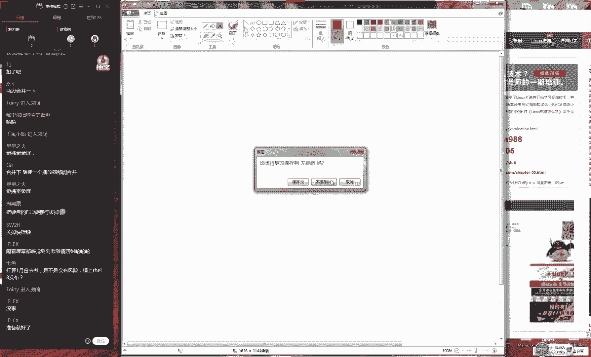
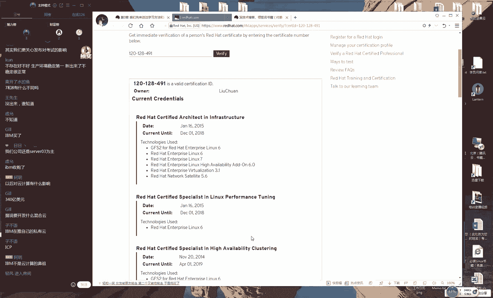
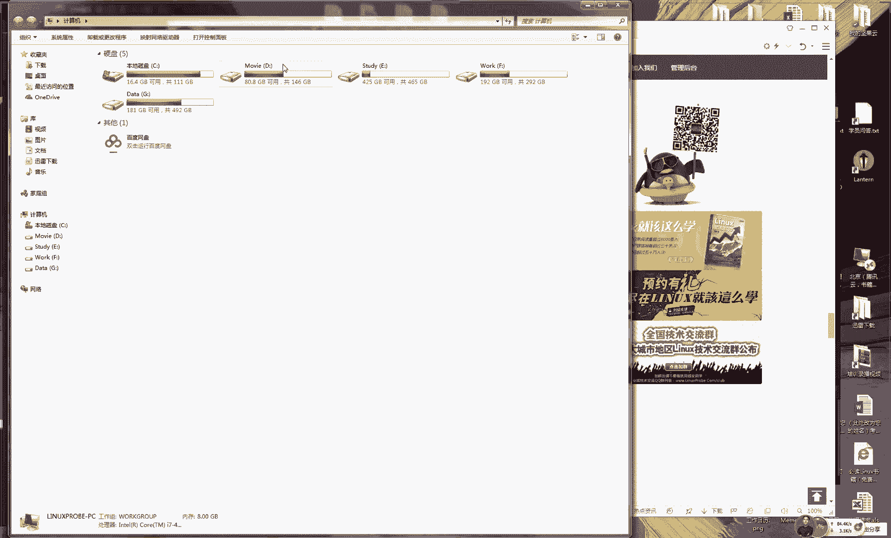
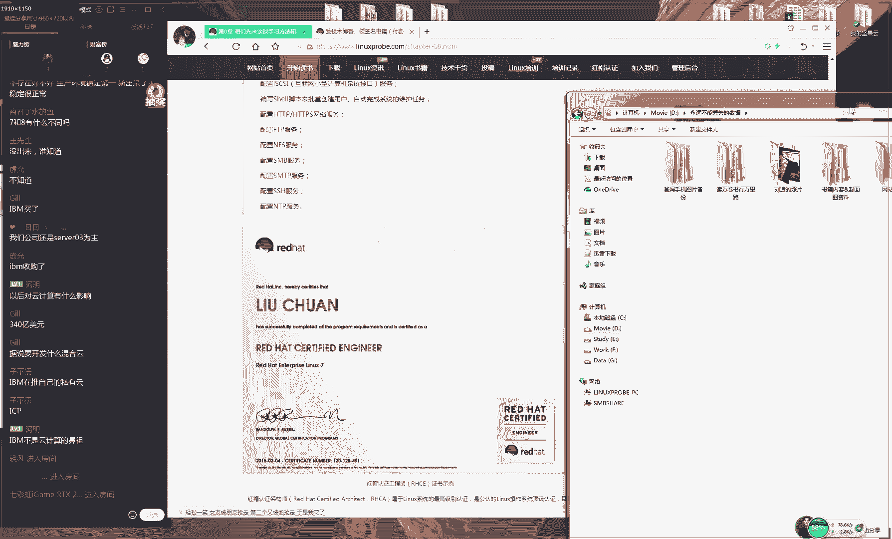
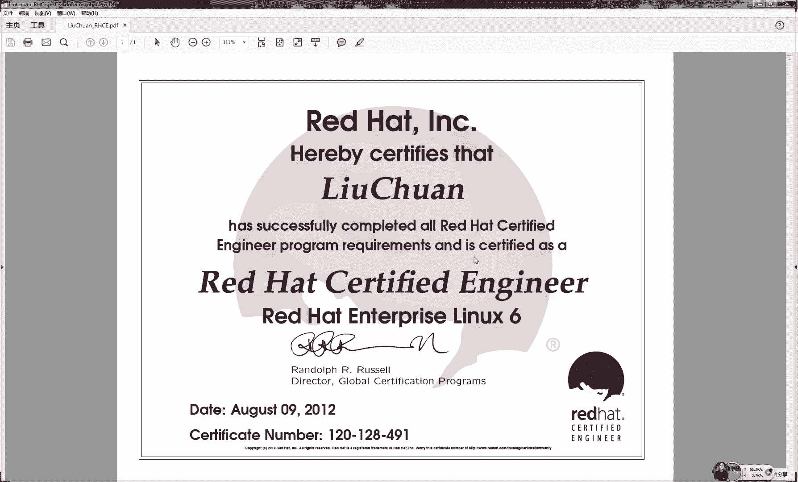
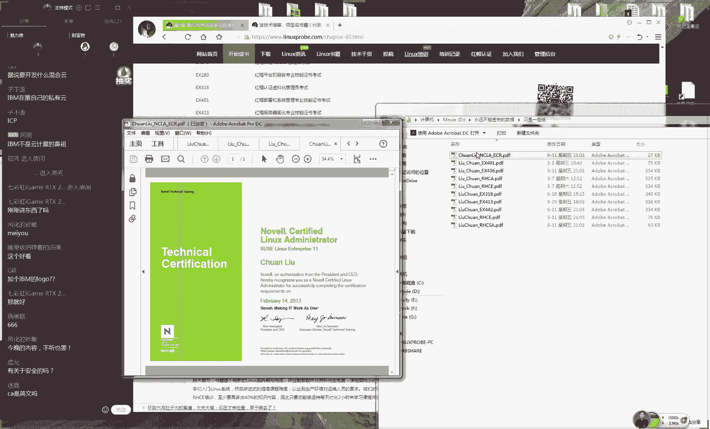
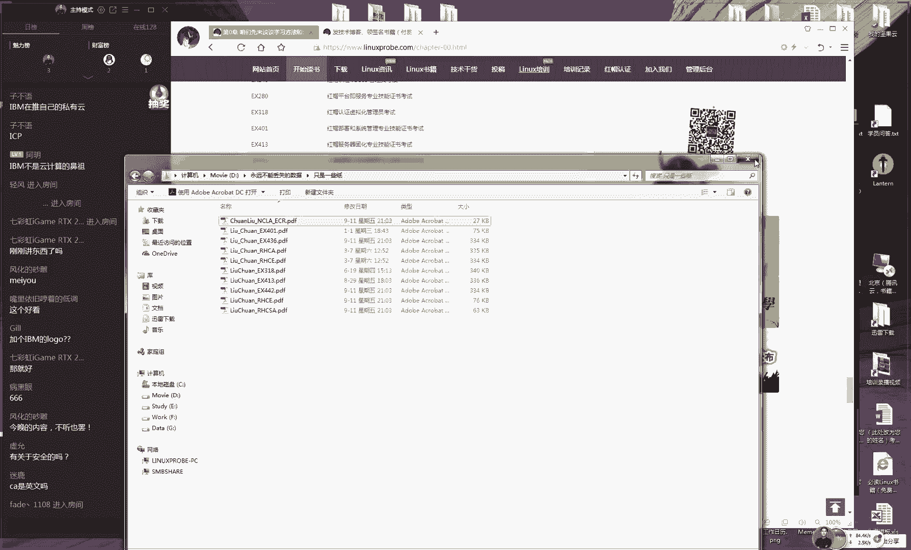
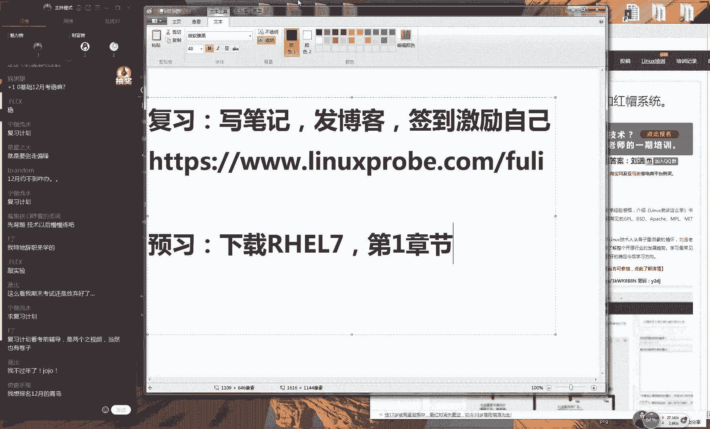
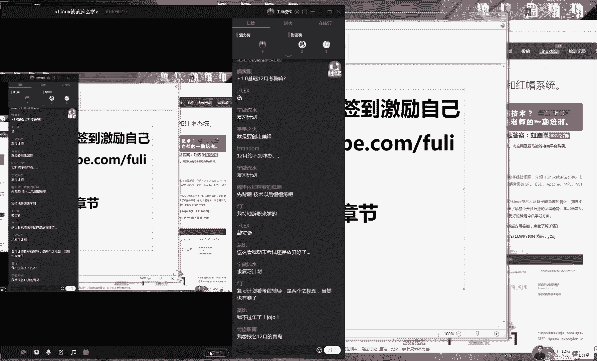
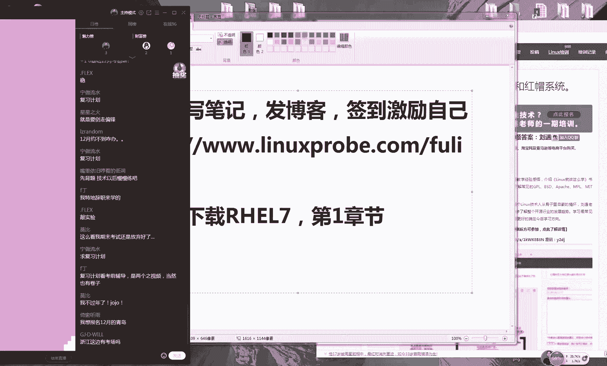

# Linux教程RHCE - P1：1.初识Linux 🐧

## 概述
在本节课中，我们将要学习Linux操作系统的基础知识，包括其历史、开源理念、主要发行版以及红帽认证体系。通过本节课的学习，你将能够理解Linux的核心概念，并为后续的深入学习打下坚实的基础。

## 课程内容

### 开源与闭源
上一节我们介绍了课程的整体安排，本节中我们来看看开源与闭源软件的核心区别。

开源软件指的是将程序的源代码与程序一起提供给用户，并赋予用户特定的权限。其反义词是闭源软件。

开源软件为用户提供了四个核心自由：
*   **使用自由**：可以自由地运行软件。
*   **传播自由**：可以自由地复制和分发软件。
*   **修改自由**：可以自由地研究和修改软件的源代码。
*   **创建衍生品自由**：可以自由地分发修改后的版本，但需保留原始作者信息。

开源软件具有以下特点：
*   **低风险**：代码公开，漏洞可被社区快速发现和修复。
*   **高品质**：公开的代码促使开发者写出更高质量、更规范的代码。
*   **低成本**：软件本身通常免费，主要收费模式是提供技术支持等服务。
*   **更透明**：公开的源代码使得恶意代码无处藏身。

为了平衡作者与用户的权益，存在多种开源许可协议，例如GPL、BSD和Apache。

### Linux发展简史
了解了开源理念后，我们来看看Linux操作系统是如何诞生和发展的。

以下是Linux发展过程中的关键节点：
*   **1970年代**：Unix系统诞生，最初是开源免费的。
*   **1979年**：AT&T公司收购Unix，并将其变为闭源的商业软件。
*   **1984年**：Richard Stallman发起GNU计划，旨在创建一个完全自由的操作系统。
*   **1987年**：GNU编译器（GCC）发布，使GNU计划得以落地。
*   **1991年**：林纳斯·托瓦兹发布了Linux内核，并遵循GPL协议。
*   **1994年**：Bob Young创建了红帽公司，基于Linux内核打包了常用软件，形成了Red Hat Enterprise Linux（RHEL）系统。
*   **1998年至今**：IBM、Intel、HP等巨头开始大力支持开源，Linux及开源生态蓬勃发展。

### 为何学习Linux
在了解了Linux的由来之后，我们来看看学习Linux能带来哪些实际的好处。

学习Linux系统主要有以下优势：
*   **稳定且高效**：尤其适合服务器环境，能够长时间稳定运行。
*   **免费或低费用**：大多数发行版可免费使用，降低了成本。
*   **漏洞少且修复快**：开源特性使得安全漏洞能够被快速发现和修补。
*   **多用户多任务**：具有完善的权限管理和安全策略，适合多人同时使用。
*   **可定制性强**：内核精简，可根据需要裁剪，非常适合嵌入式开发。
*   **节省资源**：对硬件要求相对较低。

### 常见Linux发行版
Linux有上百种发行版，以下是一些主流的代表：

*   **RHEL (Red Hat Enterprise Linux)**：红帽企业版，以高稳定性和完善的技术支持著称，是企业服务器的首选。
*   **CentOS**：社区企业操作系统，由社区维护，完全免费，与RHEL高度兼容。
*   **Fedora**：红帽公司推出的面向个人用户的发行版，以集成最新技术为特点。
*   **openSUSE**：源自德国，在欧洲有较高市场占有率。
*   **Debian**：以稳定性和安全性闻名，拥有庞大的软件库。
*   **Ubuntu**：基于Debian，拥有友好的桌面环境和庞大的用户社区。

**注意**：基于RHEL（如CentOS、Fedora）或基于Debian（如Ubuntu）的发行版在其各自体系内具有很高的通用性。

### 红帽认证体系
既然要系统学习，特别是针对RHEL，了解红帽官方的技能认证体系很有帮助。

红帽认证是Linux领域公认的权威认证，主要分为三个级别：
*   **红帽认证系统管理员 (RHCSA)**：考核Linux系统的基本管理能力。
*   **红帽认证工程师 (RHCE)**：考核配置网络服务和安全的能力，是更实用、更受认可的中级认证。
*   **红帽认证架构师 (RHCA)**：红帽最高级别的认证，需要在多个方向进行深入考核。

## 总结
本节课中我们一起学习了Linux的起源、开源精神的核心价值、Linux系统的优势、常见的发行版以及红帽认证的体系。这些知识为我们打开Linux世界的大门提供了清晰的路线图。记住，理解概念比死记硬背年份和名称更重要。从下节课开始，我们将进入实践环节，动手安装和配置你的第一个Linux系统。