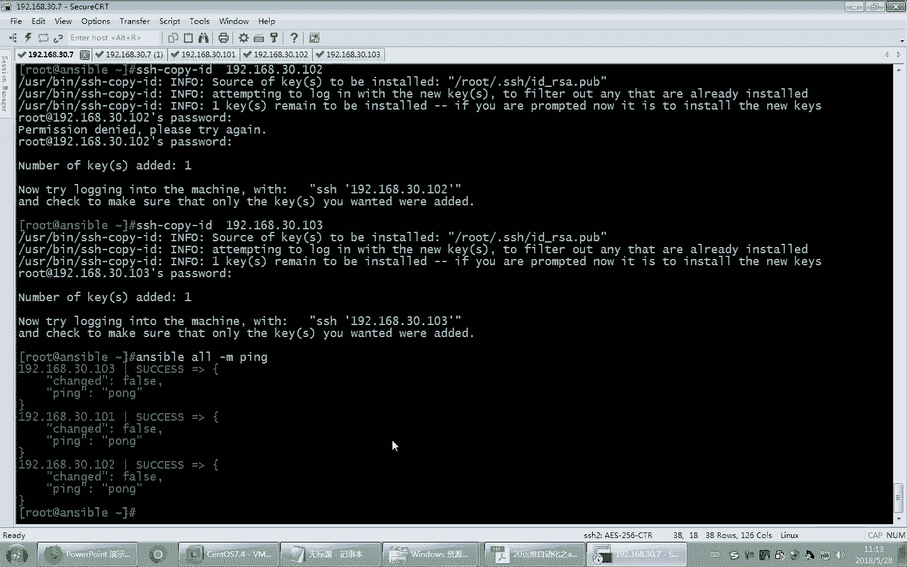
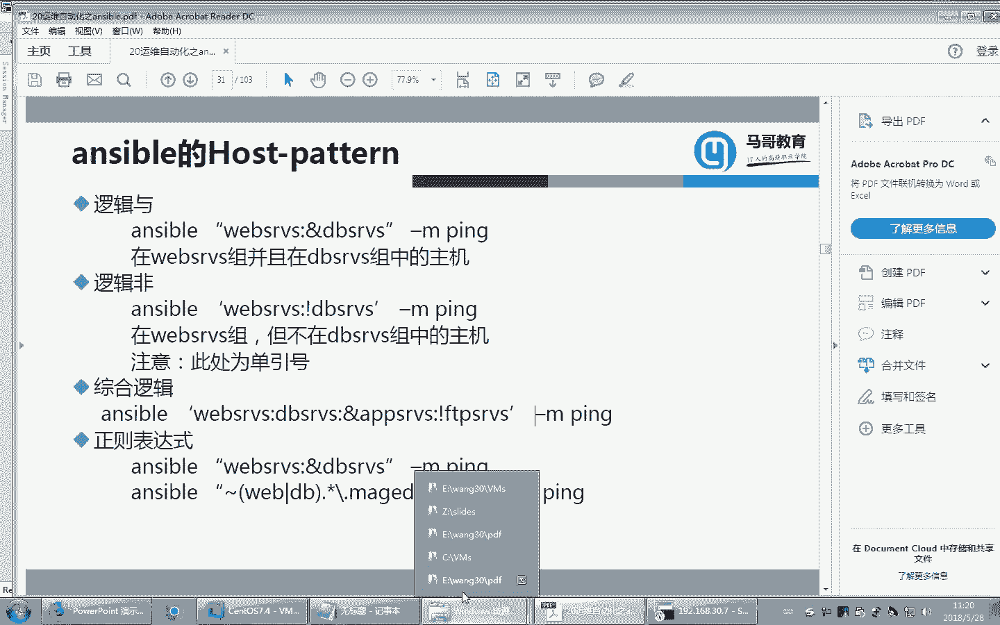
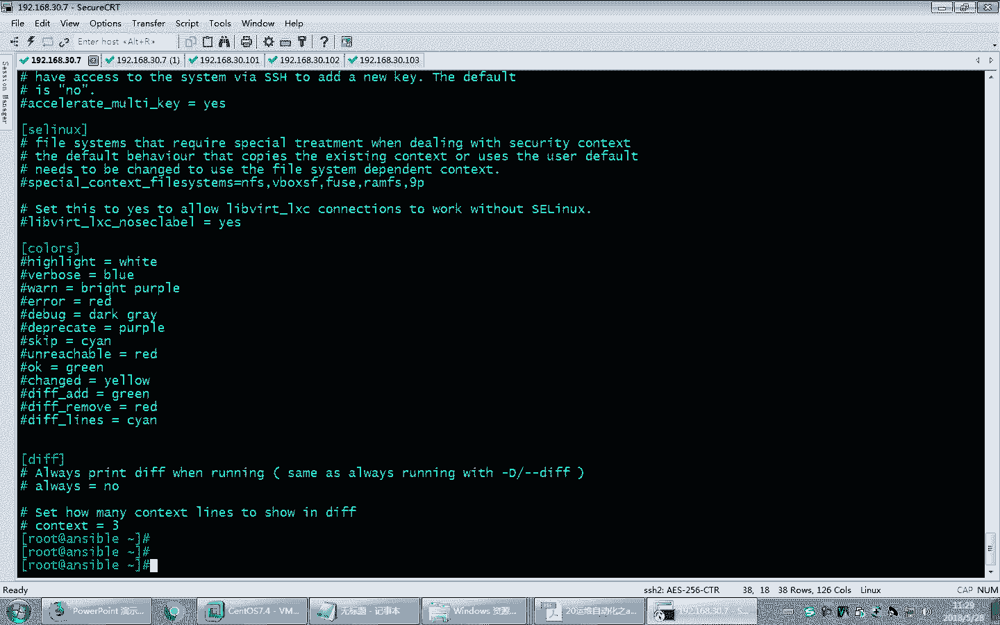
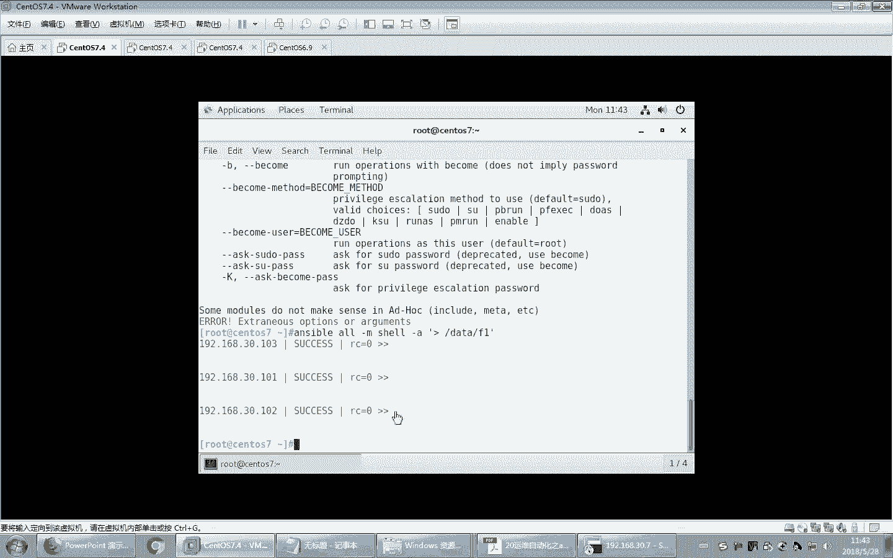
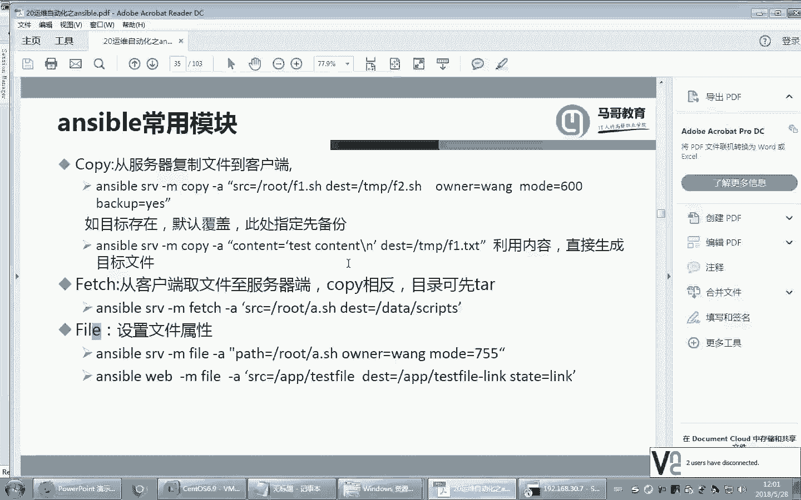

# Linux教程RHCE - P20：20.ansible使用和模块化深入解析 - 艾弗艾尔思丢丢 - BV1if4y1e73V

好了，那我们接下来看一下。unible它的主配置文件。这个unible点CFG文件就是unible的主配置文件。这个文件里面。它也是有很多中括号。分了很多语句块。啊再往下。嗯，还有空共号。通过号。

不过这个文件大部分都是注释。啊，虽然有400多行，但是大部分都是注释。所以很多内容。我们只要保留默认值就可以了。大家看这有个default， default表示默认。那其中这里面的一些内容。

根据生产环境的需求可以改。比方说主机清单，大家看主机清单的文件为什么放在这儿，这是不是应该有这样的一个指定啊？哎，啊包括库。啊，包括这个模块的路径啊，包括远程的。临时目录，这个是干嘛的呢？

这实际上是这样的一个意思啊，这俩是搭配着用的。大家想过没有？为什么远程的主机就能自动的执行我在这儿敲的一些命令呢？为什么我这儿执行的unible指令对方就能执行呢？实际上它的实现机制是这样的。

首先在你执行命令的时候，比方说我刚才执行了一个啊P。假如我这儿奥吧。P当你写这个命令的时候，他会首先把这个聘命令。转化成一个python脚本啊，注意是python写的脚本啊，放到。

当前你的用户加目里的一个点儿unsible time模录下。但是这个目录不需要你手工创建啊，它会自动的生成。你看我这有没有啊。杠A有没有unserible那个文件夹？有了吧。然后点unsible。

大家看是不是有个time门目录，发现了吗？嗯？它会自动的生成一个脚本放在这里面，然后放在这里面以后，然后把它复制到远程。对方被控制主机的这个目录下。就是也会复制到远程的这些机器上，都会复制过去。

当然也就意味着这些主机上应该也有。我们来看一下dunible。没有吗？没有。删了。有可能对呀。可能执执行完了以后，这些目录都会删的。因为什么呢？这属于临时用的嘛。临时用的听懂了吧？

用用完了他就没用没用了，就给删了啊，所以他这是临时创建的，把这个脚本复制到远程的主机上以后，然后它运行这个脚本，在对方的机础上运行这脚本，然后把结果返回给你。然后等运行完了以后。

最后还会把这个脚本给你删了的。它是这样的一个效果。还有插件的配置文件，fox5，这什么意思呢？它可以支持并行。同时执行5个。操作就说白了就是我这边假设我要针对20个主机同时执行某个命令。

它不会说一个一个的执行执行，那它会顺序的就是它会并发执行5次，就是把5个主机先执行了，再执并发5次执行另外的5个。这样的话可以提高速度，听到了吧？这是我们执行的，当然还有什么所谓的间隔。

多长时间去拉一次数据，15秒。然后SU do默认的用户名是root这个呢SU do说的什么意思呢？SU do说的就是我在执行命令的时候，我可以以SU do的方式执行，而不仅仅是默认用当前用户身份执行。

你看我在刚才执行命令的时候，当anceible我去执行命令。号杠MP实际上你这执行的时候，相当于以root当前的身份去连接到对方去执行的。你提供的口令也是远程主机的root账号口令。

但是如果能你去执行的时候，有可能你是普通用户连接对方连接到对方以后呢，但是对方的这个你拿一个普通用户去连接对方，那么普通用户对在对方的主机上是没有管理员权限的呀。那好多操作不一定能做得了。

这时候怎么办呢？SU do就是连接到对方以后切换到一个SU do的身份，然后再执行。这样的话呢，权限就相当大了。那SU do的话，SU到谁呢？root。哎。是否学问口令SU度的话要问口令嘛。

那ask个 pass呢实际上就是刚才我说的那是要提供用户名口令，就是我们这样说的，要提供口令。是否支持用户口令啊，传输的时候这些用的不多。然后呢，这个是远程主机口令，远程主机的端口号。

远程主机端口号默认是22。那换句话说，我们现在连接是不是默认都是连接对方的22的。22端口就S20服务的端口嘛啊默默认的语言啊这些都不用改啊，默认的。好，这几项都是比较容易理解的。

好，还有一项，这里面是没有的。我们来看啊。这项。这项这项说的什么呢？就检查远程主机的时候，是否去验证对方的公钥。这项实际上刚才我们遇到过这个问题了，大家记得吗？如果是个新主机。

如果对方是个新主机，我从来没连过的话，我们在加目录里面是不是点SH这个文件夹里面，这些文件是不是就是不存在？no host文件面令是不是不包括对方的文件列表？那现在如果我删了的话。

咱们刚才已经遇到过这种问题了，这样的话带带来的问题是什么呢？你看。不能建立连接。不能建立连接。最后问你是否继续yess，你看。报错了。你看这101。不能建立连接。10。下面这个没有提示是吧？啊。

不能建立连接，最后这个我敲了个yes，建立连接。

失败了。什么意思呢？说的就是我们如果和对方从来没有连过，这儿建立连接就会报错，就会有提示问题。我输个K啊，输一下口令。

看行不行，你看这儿101。可以了，其他的主机不可以。

101这是不是因为有一个主机让你输了一下y子的原因？看那其他主机他不可能一个都问你啊，所以这个地方就连接失败了啊。所以换句话说，如果要用啊昂斯堡来连接，第一次连，你至少得。表说用命令先连一下。啊。

他这个意思啊，你至至少连一次。😡，你手工的去通过SH这个命令连完一次以后，下次他才去支持用onible命令来控制。但是这样的话是不是太麻烦了？那我不能说这100台机器都得手工这样连一次。

然后才能去就这样的unible命令嘛。哎，这时候我们就可以把这一项给它关了，叫hosse主机把它变成哎取消取消注释，就取消注释呢，你看fose是不是就不检查的意思，fo是否定的吗？

那host check。host key checking把它变成forse。那当然我们系统看一下这个设置是不是有的啊，我们找一下。

Host的。一。大概默认这项被注释的，看到没有？然后你看如果取消此注释，将禁用K的检查。好，把这个行注释去掉，去掉完了以后，我们再翻过头来看一下。刚才我们还是把这个目录下的这个文件删了它。

当然这里面因为我们刚才敲了一下SH啊，它是加了两个主机，我把这个删了。上了以后，我们再用unible来试一试。他会不会像我们刚才那样出问题？可以了吧。听懂了吧？所以这项是不是应该要改一改啊？

你要不改的话，是不是一个主机，一个主机都得连一次才能用osible管理，太麻烦了。所以这个K呢要建议。

把这个注释取消就行了，这一项本身就有，到时省事儿。再就是日志，这个日志呢建议大家把它启用起来。

啊，默认情况下，unerible管理这些主机啊，你像我刚才敲了一个unserible命令，那敲了unerible命令以后，这些命令是不是希望有日志记录下来。将来我管理的哪些主机到底执行了哪些操作。

我希望记录日志。而默认情况下，unerible不记录日志的。所以我们希望记录日志的话，就得把配置文件改一改。😡。

把配置文件改一改啊，找一下log pass。

好，大家看默认这一行是不是也是被注释掉的。好，我把它取消。这样就可以了。这样的话呢，我们现在就可以记录unerible的操作了。当然这个文件现在有没有，我们先看一眼。这个文件默认有没有？

打开这个文件是没有的。没关系，你只要。执行过一次，你让我再执行一次啊。好，再来看这个文件。有了吧。而且大家注意到没有？unsible和我们以前学的服务有关像吗？以前比方说咱们学SC制服务。

咱们把服务配置文件改了，当时要生效怎么做来着？是不是要重启服务啊？unerible需要吗？不需要unerible它对应的相当于不是一个服务形式。你去执行的时候，你执行命令它就临时生效了。

它不是一个常驻内存的一个程序。那需要管理了，它去连接到对方，不需要管理，它就停了，它不是一个长长期执行的一个操作。所以unerible只是管理别人的，不需要长期执行。所以它不是以服务方式运行的。

所以看一下当前这文件里面是不是已经记录了我们刚才操作的过程了。所以这一项也是建议启用的。

D项。所以刚才我们这两项是强连接一起用的哦。好，这就是我们刚大家给大家介绍的配置文件。一般来讲，其他内容不需要改啊，就改改这两项是建议大家改的。好了。

接下来我们来看看unserible它对应提供的系列命令。unserible开头的命令很多，我们刚才用的是第一个unserible命令。事实上大家看table键按一下，你发现是不是一大堆命令呢。

啊，刚才我们用的实际上是这个命令。当然你要知道这个命令实际上它并不是真的命令吧，是个软连接，对不对？是不是指向的是它呀，对吧？😡，好，那接下来我们来看看其他的一些工具，其他的一些工具。

看这个。叫doock，但dooc呢就是它可以显示。unerible里面的对应的一个一个模块的帮助啊，啊你可以把它理解成叫做慢帮助慢命令，它就是unerible里的慢命令。

现在我们要了解刚才说的这个P模块的使用，这个P模块怎么用啊，我不会用啊，那怎么看呢？很简单，on thetable do。后面跟上这个模块名儿就完事儿。

当然了，如果我不知道模块到底有哪些，你也可以用杠A列出所有模块的文档啊，列出杠L呢是列出所有的模块名以及简要说明杠L呢是列出所有的模块的详细文档说明这项一般不会太用啊。

因为拿这个文档你像模块有1000多个，所有的文档全列出来的太多了啊，所以这个杠L呢一般这个还是用的多一些的。杠L列出当前的模块列表有哪些啊，当然咱们可以看一下有多少个模块。

看这是当然他这个还是比较呃理想的啊，比较不错的一个它是翻屏了，就是倒倒一瓶是不是就停下来了，你自己手工去分屏。

翻页手工去翻页。那这个每个模块，这是模块名儿，这个模块名相当于linux的命令，你可以理解成这就相当于一条一条命令。这个命令它的说明是干嘛用的，这不有说明吗？有特别多。啊多少个呢？统计一下就知道了。

多个模块呢？又涨了。涨了300多个啊，长得太快了。上次我上课277班1300多个，1378个。这次又涨了300个。27级班是12月哎，不不，1月11月1月1来号吧。

1月1来号就是27级班是就今年的1月1来号讲的这个方子保，对，4个月就涨了300个模块。你想想增长多快。可见昂斯堡这个现在特别火。那每天是不是就在每天每天都在涨，每天涨三个包三个模块吧，这是。

每天都在涨三个模块。当然这些模块肯定不是一个组织开发的啊，就是大家就是开元社区人，不同人往上开下加的一些模块。特别多。你看这里面还能找找关于windows的，你看它有没有管理windows的模块了。

你看这些全是管理windows的模。也人很多的。啊，windows AL。windows拷贝windows命令是吧？这个反正windows不太玩啊，不会玩。啊，这里面管理各种软件的模块都有。

比方说管理zes的。vis我们后面会学啊是个监控软件。它针对zas有没有专门的管理模块，你看也有看到没有？就是它方方面面的功能特别强啊，王子。当然我们现在主要是看其中的一个模块啊。

那我们就看PP这个模块。你看这个P模块怎么用啊，这有说明啊。它的模块名儿就是模块对应的文件在这儿呢，这是它对应的文件路径。然后这是它的选项。然后贝塔。返回这个数据，返回的结果是什么呢？返回对应的值。

默认之是。胖就是如果正常返回的话，发一个对方的P命令过去，对方回应的是胖，看了吧？哎，这还有说明，不过呢这个好像拼命的太简单了，啥也没有啊，什么参数都没有，就是个P。回来就是。

并胖或者是crash crashsh崩溃了啊。好，你看对应的用法，这有例子吗？这不就例子吗？这个web service就是我们刚才说的那个主机清单里面的一个就是主机列表，主机分组。主机分组。

刚才咱们在主机清单里面分了三个组，还记得吧？web service什么BBserv，还有1个APP service是吧？哎，这就是属机清单。好，你看它的使用非常简单啊，这个模块比较简单。

所以它的说明也不不是很复杂。当然了，还有一种选项小S。

小S选项是列出片段，就是以简单的格式来显示P模块的使用，就是格式显示要简简单明了一点。大家看它的格式说明很简单。

如果你想大体了解一下，你可以用这个短格式，就是小片段方式来了解某个模块也是可以的。好，这就是doc文档的说明。那稍后我们记到就学习到某个模块的时候，想了解它的用法就要用。on来看啊。

接下来我们后续就紧接着要学一个U的模块了。当然了，1600多个模块，咱们只能挑。嗯，几个啊常见的来了解了解。后续大家深入学习，想成为奥斯ible的专家，那你就把这1000多个模块研研究。😀呵。😊。

相当于你要掌握1000个命令是吧？😡，咱们现在学Ls才学了几百个命令，对不对？😊。

好了。啊，当然我们刚才讲了，这个如果手工的敲命令一个一个太麻烦了啊，所以我们稍后要实现基于K的验证。当然我们在了解之前呢，现在看看奥斯堡的命令用法。alible的命用法是这样的。

alible这儿写上主机清单里面分组的或者是主机的列表的名字。然后这是模块名儿，当然了模块后面要跟上具体的模块的参数。

啊，这个参数就像我们lininux里面命令，后面跟参数一样。那你要跟什么参数，不同的模块或者不同的命令参数不一样，需要加参数。那加参数的话，需要跟上杠A，后面跟上对应的参数。

这是它的基本用法啊，说明咱们版本靠看到了M模块V可以查看详细的过程。那默认情况下它显示的过程不详细，你可以加V，甚至VV或者VVV更详细。就越来越详细嘛越来越详细。好。

list host可以列出主机列表，什么意思呢？比方说我想知道我现在管理清单里面，就是主机清单里面管理的所有主机列表有哪些，那你可以哦杠杠list hosts，它就可以列出所有的主机。

当然你要是只列某一个主机清单的呃名称分组。比方说我们刚才不是有一个webserv嘛？好，那你看这是不里面就可以知道到底有哪些主机是被你在这个列表中的，在这个主机清单里的啊DB。这不都能看到吗？啊。

当然这个可以简写啊，这应该是可以简写的。不用写list的 host就list就行，可以简写。杠L行不行？有这个。短车吗？没有啊，希望有是吧？哎，当然你要觉得不爽，你自己开发一个嘛，对不对？

unerible本身也是python开源的，你可以改是吧？😊。

好。但K这个刚才们都用过了，是要输入对应的入的口令的啊入字口令的。啊当然默认情况下，对应的用户名就是你当前的用户名。

你去连接对方。你连接这个DBserv对应的这个目目录，这个主机列表里面对应的主机用谁的身份连，用ro的连，你就是当前用户是谁就连以谁的身份连。但是我想换一个人，那这时候你要用杠U。

杠U。比方说我以王的身份连对方，当然连对方是不是要输入对方的口令啊，就是输入王的口令嘛。这样就行了。哎呀，这个密码啥来着？注意属于王的口令啊。输入王的口令。买个ADU吗？好，马给一丢考虑。看到没有？哎。

但是输入这个命令是可以的。但是我要想做点别的事儿，比方说将来我有可能想看一看对方主机的，假设我想在对方的主机上去看看这个sle文件。你说王用户他有权限吗？没权限呀，对不对？没权限呀，没权限的话。

大家想我是要用昂王的身份连过去，是不是应该授权让他具有管理员权限，那就SU do吧，对不对？SU do这儿就要用到。

杠U。啊杠U那比方说我们想执行一个简单的命令啊，我们想让他执行一个呃查看一个什么呢？查看rootroot的加目录吧。但是这个要执行命令的话，咱们用的模块就不能是P命令了啊。

它有专门一个命令模块叫comman。

commond模块啊，这个commd模块可以忽略不写，因为末日就是commd。所以你这儿就可以直接写一个命令。Lroot大家想你说以王的身份连接人家去看人家加目录，驴root的加目录能看得了吗？

那肯定没权限嘛。所以这时候你输入。😡，于法有错。这儿应该少了一个杠A。因为A属于参数啊，就是我们刚才省略了一个command模块的名字，A是不是要参数啊？哎。

参数你就是你执行的那个对应的这个comd模块对应的参数那。大家看到了，这是不是因为权限问题导致的？啊，权限那那怎么办？那网用户没权限，那是不是我要在对方的下上执行，是不是我得用SU do的商方式授权。

要不你就移入的身份连，要不就移入的身份连，可以吧？以弱的身份去连接对方，当然就可以看了。哎，默认就是root啊默认就是root。这当然可以了，这是可以的。但是你要知道有的时候我为了安全。

可能我们连接的时候，是不是就是以普通身份连接对方的连接对方，但是连接到对方以后想执行那命令没权限呀，那怎么办？是不是要SU度啊？

SU do到某一个管理员权分权限嘛。那么这时候我们就要用到杠B杠B呢是代替旧版的SU do的选项的啊。以前的话是不是用这个杠B的，是用SU do类似的选项的。在这时候呢我们用杠B。

杠B的话是不是代表root呀，切换成root的身份，就是相当于什么呢？相当于王的身份连上去，连换上去以后，它执行以SU do。root的身份去执行。那当然你要是用SU do rootot身份去执行。

是不是得输入当时SU do对应的口令啊？

是吧那SU度对应的口令，这是不是要输啊？

大K。当然了，你要知道这个大K输的是谁的口令。就是王自己的口令吗？连接网是不是要输口令？那么SU do的时候，是不是网也要输自己的口令啊？所以这两个口令都得输啊。看看。前后顺序的问题，杠U往杠K。

我把这个放在前面去。好，杠B。选项错误。放子ible。这可以空有空格，这可以。杠U杠K。杠B啊，这儿这儿这不多了个root怎么？而，这个应该是啊默认就是root啊，默认就是root，这个地方不用指。

因为我们在刚才那个应答文件里面，就是我们的配置文件里面写着呢，我们配置文件里面写着是以谁的身份切换的。

还记得刚才里面是不是有1个SU do授权我们在配置文件里面是有的。这儿是不是有个root，所以这里面是写着呢，所以咱不用指定啊不用指定。

好，所以我们这儿直接写对应的用户口令。大家看这是不是有问题。是不是SU度的口令还没输啊，所以我们这儿是不是要加上。大K。你看这是不是要在输SU度的口令？当然，SU do口令是可以的。

但是你看现在又出来问题了，什么意思？为什么出错呢？你想过没有想过没有？现在王账号SU度过了吗？在人家的主机上做过SU度授权了吗？是不是根本就没有授过权呀，授过权嗯，所以我们这儿给他加一下授权。

还记得SU度怎么授权来着？VISU do吧。啊，当然我这授权偷懒啊，因为咱们系统本身就有一个授权命令叫什么来着？还有一个授权组，所以咱们直接拿这个组不就得了吗？加到这个组里是不就行了啊。

但是呢这个有一个小小的问题啊，这是六，这是七版本。在六上呢默认这行是被注释掉的，还记得吗？你看在六上啊，同样的这个操作SU do。Y翻同样那行。发现了吗？它是被注释掉的。所以我为了让它生效。

是不是也把它删了？啊，但是这样做完以后，紧接着我是不是应该让王账号加到这个组里才对啊？不加到这个组里没用啊，那怎么加组呢？Mode user mode杠大G比方说我原来的组组保留，它叫will。啊。

是不是可以了？啊，是不是应该重复这个操作呀？这是不是就可以了？好，做完以后再来试一次。同过了吧。但是这个你说每次输两遍口令多烦呢。哎，像这个口令，我根本就不想输，咱们也有方法。

大家学过SU do5里面有解决方案，记得吗？哎，对，no pass。所以我们干脆来这个大家看看这个配置文件里面有一行，它已经有这个功能了，咱们也不用改，把那个注释一删就行了。看到这些行了吗？

no passWD记得这个吧，输的时候是不就不用输口令了，每次这行就用不着了。当然这个不带颜色看起来实在不爽是吧？还记得怎么弄吗？有一个editor。当然这个呢最好加到环境变量也省事了啊。

比方说我们加到X。多。え。第套。VM。叫ETCpro。第二点D下面ENC这是咱们自己建的吧，有这个文件吗？如果有的话就追加。可以吧。看一下这个文件啊。有没有？没有啊，没有，他就创建了呗，无所谓了。好。

然后接着我们哎VISU do。一。为什么没生效啊？因为没有ss。没有 source或者退出也行，是吧？啊，V I you do有。啊，这不带色了吗？看起来舒服一点是吧？

好。这行。把这个。下了。终究来讲是不是很痛苦啊？

这主机多的话，你说一个一个一个重复操作。是不是太麻烦了呀？

为什么要学SU就这这个这个unsible啊？批量管理啊，像这个以后咱们根本就不需要这样手工一个一个改啊。刀子包就是来解决重复性操作的。好，那这样好不容易改完了啊，改完以后再来试一次。当然这时候呢。

这个K不用输了啊，你看。103有问题。103没改完吗？啊，我没存盘啊。103没有保存呢。这么着急。可以了吧。可以了啊，但是说实在的，这种绕着弯，你像以普通用户连在SU度哎，本身工作量太大了。

所以一般来讲更省事的方法，干脆得了。就入的身份年嘛。对吧但是入职身份连默认是不是也不行啊？😡，默认的话，是不是要它是基于K验证的？你是为啥得输口令，这不也太麻烦嘛？那所以我们现在要解决这个问题的话。

是不是最彻底的方法是基于K验证，而且是拿住的身份的key验证方式上去权限都有。对不对？当然这个就权限放大了也挺危险的。因为你相当于用unerible的身份，unerible去连接。

所有人都是以ro的身份连，万一你的操作是错的。你要知道管理的不是一台机器的问题，那可能你管理的所有主机，上百台主机可能都因为你这个误操作全完蛋啊，删根就全删，你知道吧？还不是删一个很危险的很危险的。

所以这个自动化运维啊，方便是方便。但是你做的时候千万要更要小心了啊，这这个不是一台主机的问题。好，那现在咱们把基于K验证先实现了，基于K验证来做一下。😊，继续可以验证说吧。然后我就空密码了啊。啊。

当然为了安全还是要加加密密钥的啊，这个对K呢加一下这个加密比较安全一点。然后呢。是不是复制就行了，30。101走。这一个2个。密码不对了。

3。

不就完了吗？以后好了，省事了。再来看。Unsible。呃，模块不用写了呃，模块用P。哦。行了，这样的话那个杠K就用不着了，你知道吧？他默认就是用那个基于K验证的嘛，这密码就不用输了，这省事了。多少啊？

是吧。管理起来很方便。好。

那接下来我们来看一下。安思宝。该选项跟他讲过了啊。好，接下来我们来看看unible的主机模式。

那ible它的命令用法，刚才我看到了它的用法，这儿要输入主机清单。主机的模式就是你对哪些主机来执行相应的模块执行命令。那这个主机的模式它有多种格式。

最简单的格式就是直接写一个主机清单里面的一个分组名。啊，当然我刚才用all，那更省事，二是不是就所有的主机清单里面这些表了啊，当然你也可以用特定的某个分组，某个主机清单的分组。

比方说我们刚才不是有webservice吗？

这也可以，就针对这个web service里面定义的主机来执行这个操作，这都是最简单的。当然它还支持同配符。看它支持通并符，啥意思呢？啊，比方说外呃这星点新webserv。那星打头的。

在主机清单里面是不是有3个呀？什么的webDBAPP是不是都是他那他都执行了呗，是不是仨就都执行了？啊当是他仨执行，仨里都有，那不能说都执行，每个都单独重复执行吧，他这执行一遍不就完了吗？😡。

对吧这个通配符啊，它也支持。这个也可以这个也支持。你看现在我们在192168。呃，30点星儿。但是你要知道30点新日的是代表着什么？就是主机清单里面3是1921830开头的主机清单里有的啊。

那主机清单里没有的当然我不管你了，对不对？一定是主机清单里面去找。😡。

好，这些都支持。

啊，另外还表示什么呢？货的关系就是如果有两个清单，我都想支持。😡，就是两个主机清单里的列表，一个是DBservice，这俩都想执行。我想表示都执行的意思，那咋办？那就是货的关系呗，就两个分组都想执行。

那就用。

冒号。

看到没有？冒号。啊，当然你要知道我们现在在webserv里，它里面只有两台主机，然后DB里面是不是也有两台主机，这两个主机是不是各不相同，应该是有一个是一样的，有一个是不同的那所以你要货的话。

是不是也就两个都都包含了哎。货的关系。当然有货的关系自然就有并且的关系啊，就货的关系可以这样写也行啊。然后并且的关系呢就是。

这个冒号at。

冒号艾。有。写错了。引号引起来。需要加引号啊，不加引号有问题。因为这个ad符号本身在linux里面是不是表示后台执行的意思了？所以他这个加引号引起来啊。

需要注意引号。嗯。

这是引号呃，当然我这儿用双引号单引号都可以。在这儿在这个例子里面用双引号单引号都行。都可以啊，刚才我们说了web service。外部 service是。这个里面。是101和102。

而DBservice。是101和103，所以他俩的交集是不是也只能是101，就是并且的意思，那是不是101。所以101的话，你看它是不是就只在101上执行。看到了吧。

并且焦集嘛。好。还可以取逻辑取非。那这个什么意思呢？就是在外部service，但是不能在DBservice里。取反看了吗？取反取非。

你是在webserv里的，但是不能在DBserv。那显而易见应该执行是在哪个主件上执行。😡，在这里面，但是不能在它里面，你说是不是就101不能执行了，那只能在102上执行。但是但是这个命令执行。😡。

又有错误。引号的问题于。这需要用单引号了，所以你们用的时候啊注意单引号双引号哎，用单引号。看到没有？啊，菲菲非写错了。

他もて个。啊，所以你省事儿的方法就是单引号不就行了吗？对吧所以你看刚才这个是双引号代号都行。但是在这种情况下。😡，代一号看到没有？注意看我这鞋不好。当然这个就逻辑性更复杂了，你看吗？你看看。😡。

你猜猜啥意思？😡，猜猜啥意思？这就是逻辑上的组合了，这是与获非全连了连一块用了。什么意思？这是并这是货的关系吧。😡，就是既在webservice，又在DBserv里面的。然后这个呢。

并且在APPservice里面，而且还不能在FDBservice里。啊，当然这个就有点绕了啊，我觉得一般生产中，因为本身奥斯宝这种用法都是临时性的。很少说出现这么复杂的逻辑关系。

但是你知道的话也会用就行了，好吧。😡，甚至人家还支持强大的。啊，正的表达式。谢也支持。支持正的表达式，但是这个要用正的表达式得表示布上符啊。这个的它的含义跟这个是一样的效果。一样的效果。

你看那这个是不是就是表示我的主机呃主机名称里面是webDB开头的，后面呢是ma丢结尾的啊，当然不一定是结尾啊，只要是包含就行，就是包含就行。这个意思。那所以呢我们可以用刚才说的那个，你像我这不有两个吗？

那我想执行用正正则表达式写法，那怎么写呢？

不拉活。然后。web和DB是不是service是不是就可以了？效果一样嘛，对吧？实际上这个是包含吧，包含的不带S。包含。能不能执行？明白白意吗？它是包含嘛，只要带这个东西是不是就行，包含。

好，这是正的表达式写法，也都支持。好，那接下来我们来看一看unserable的执行过程。刚才我们提到了它在执行的时候会系统自动的把啊对应的python文件生成一个，然后放到本机的目录里面。

然后把这个文件呢再复制到远程。执行。那这个中间的过程大家可以看一下是这个过程。首先加载配置文件，然后加载模块，然后呢生成对应的python文件，就把那个模块生成对应的pyython文件。

然后把这文件呢复制到远程的主机上，复制到哪儿去呢？复制到这个目录下，比较深的目录下。啊，然后当然这个文件名是随机生成的，后面会加一个随机数字。然后生成完了以后，复制过去以后加执行权限，加执行权限以后。

在对方的机上执行。执行完了以后再把这个文件删了再回来。所以它是这样一个过程。我们为了看这个效果，我们来看一看啊。

刚死我。哦。M。屁。如果你单单这样执行是看不出来的。啊，我们可以用杠V。看一下详细的过程。这个还不够详细，再来一个。再来一个。好详细啊。看出来了吧。看看啊，咱们往上找找。啊，这个内容太多了啊，你看看啊。

他有没有复制文件的那个过程啊？这个蓝色的字儿看起来还有点。费劲。你看这是不是就有？它应该对应的有把文件传过去的过程。传过去应该用到了一个put命令。啊，这有。P。传上去以后。

然后还会去呃把这个文件呢加执行权限。所以它应该有一个C mode，什么加X啊这样的一个操作。有没要加执行权限的过程啊？啊这这这费劲了。我们过滤一下吧。CH mode搜一下啊。看有没有。是不是加征行权限。

发现了吗？最后还有删除的操作。最后还有删除，因为你执行完了，最后不要了，还有删。要。就就搜一下M吧。他是分开写的啊。😊，😀Yeah。😊，对分开写的。啊，当然我们为了看这个效果啊，我们这样。我们这样。

执行的时候，ctrl C。停下来。停下来以后呢，咱们来抓一抓，看看里面生成没有啊。因为一做了一半嘛，相当于on the ball。😡，你看呃un点unsible。看他。还没考过来。哎呦ctl C太快了。

它这个。还没生成。找一个执行命令比较慢的。す。それなね。休眠10秒钟是吧？杠A。哎，休眠10秒钟，这肯定能看见吧，应该。行，我ctl Cctrl C完了以后呢，看看这边是不是能。抓到啊。没考过来啊。

能看到那个脚本了。对执行完了，已经来不及了。快速的把它停下来，要不这个执行完了，他把这个脚本给删了，看不见。都杀了，来不及，手磕手手慢了。这个命令执行还是太快了。太快了，太慢了都不行。你手快了。

那个脚本还没生成，复制过来，手慢了，他已经上来了。啊，你们自己看吧，这个反正是得。测一下再下。安四傅。哎，这个文件没生成吗？在这个机上没生成。这个目录下没生成。这个是有的。这删这吃鸡完了就给删了。

应该是看不见。把这个过程呢了解一下就行了，我实在是抓不下来是。

这个这个需要运气，我觉得有的时候啊它会生成一个这样的文件。它会生成临时文件，知道吧？但是生成完了以后，执行完了以删了，所以有时候你看不见这个文件嗯。

然后这本机上应该也有，就是在执行这个命令的机上也有unsible temp。在这也是有的。

都已经删了。好，那在执行的时候还有颜色的问题啊，这个颜色了解一下系统执行的这个过程到底。

表示的什么意思？如果是绿色。表示的是成功，并且对系统目标系统没有做任何修改。哎，你看L我是不是看看文件内容，那对文件没有改过吧。哎，所以它不会有任何的这个修改，它就显示绿色。那如果是改过的内容。

它会显示黄色，当然成功了啊，成功了，并且对远程主机做过更新了，更改了。

比方说你在目标的主机上删了一个文件或者重启服务啦呃，或者是把某一个这样的一个配置文件改了内容了，这都会变成成黄色。而但是黄色也是比较成功的意思啊，但是红色自然就是失败的意思了。失失败。

对，红绿灯实际上这个东西啊，咱们在配置文件里有说明。看一下啊，当色包。Unsible。你看最下面大家看这是不是颜色定义。红色的代表着什么？红色的代表什么？红色的代表什么？看到没有？基本上全是错误相关的。

你看到没有？😡，不同的删除什么不可道达啊之类的，是不是都是代表错误啊？啊，你看黄的啊，黄的yellow ，yellow。是不是被改过了，对吧？哎，bl蓝色的咱们也看过，蓝色是不是显示详细过程的？对吧哎。

还有绿色的，绿色的green ，green ，green在哪儿呢？greenok看到没有？O。但是这个颜色你可以改啊，比方说我不喜欢绿色，你可以变个别的什么颜色，你这可以给以改啊。

就把配置文件改了不就行了吗？😡，不喜欢祖母绿，你就换个别的颜色啊。😊。

好啊，这些颜色很重要啊，稍后呢我们看到颜色你应该知道到底是发生了什么事儿。好。这儿就是一些例子了，刚才咱们已经执行过了，这些例子都执行过了啊。而且都用的是拼命令员做的测试。好。

下面咱们来介绍unible常见模块。unible的常见模块。模块很多。1000多1600多个哈，那咱们就挑几个来介绍介绍。最常见的用的最多的，而且也是默认模块，就是comd模块。

既然是默默认模块，所以杠M都不用敲了啊，你不用敲，它就默认comm模块。😡，啊。比方说我就想在远程的主机上执行一个命令，那完整的写法应该是这么写的啊。😡，后面加参数，这个参数呢就是你要执行的命令列表。

就是想想在对方的主机上执行什么操作。当然刚才说过，这个是可以可以省略不写的，因为它是默认模块，比方说就想在对方的主机上去执行。这样的一个命令。嗯。有。那说明什么呀？

10110102是不是没有这个data文件夹啊，这不显着吗？是不是没有这个公路啊？那没有目录建一个不就得了吗？😡，对吧但是实际上啊人家对文件管理啊，人家有专门的专业模块来管干这个事儿事儿的啊。

不过呢common也能干这个活而已。看时家有提示。看到了吗？他说你要建文件夹啊，建议你用fa专门的模块来干这活。不过呢不过呢呃这个com模块也能用。😡，他成功了。那成功了，我咋知道成功了。

看他不就知道了。😡，看看有没有。当然是空的嘛。空的那加个属性瞅一瞅。有吧。那说明咱们这个命令是不是就成功了？啊，多方便。

好。这个模块它把你要执行的命令放在这个语句块里面就行了。非常简单。比方说我在对方的主机上想做什么事儿，你都可以放在这儿。例如我想在对方的主机上想执行一个查看分区利用率。

啊，这不能看得见吗？不方便。好。那command模块的使用。详细的用法，你可以用看一下do文档command。你看。command这有什么呢？CH dare。这什么意思啊？就是执行命令时候先切换文件夹。

就是你想在某个文件夹里去执行某个命令，就相当于先CD命令，切换一个文件夹再执行某个操作。这个意思。Cit什么意思啊？frate说的啥呢？craate说的是如果一个文件。或者是一个模式。

对应的文件已经存在了。将不做后面的操作了。那相当一个条件判断嘛，如果great后面跟了一个文件存在了，我将不执行不执行后续的命令了。它是个逻辑关系。对应的I有个和它相反的什么意思？没mo。

什么如果是不存在，将不执行，这是存在了将不执行，总之是不执行的意思。😡，不过一个条件是存在，一个条件不存在。😡，如果不加这两个条件，默认就是管系存在不算都执行。😡，听懂了吧。你看我现在执行这个操作。😡。

L。那执行这个命令的时候。他不管你这个文件存在不在，都执行。😡，那我们也可以根据，如果这个文件不存在，就将不执行这个操作，那就可以用remove。removes后面跟上对应的指令。

那比方说这个文件干脆如果不存在，我是就别执行了。当然由于存在他肯定执行了嘛啊，那假设我写一个。😡，不存在的文件啊。你看他是不是就是提示了？因为不存在，所以skip。跳过了，因为这个文件不存在。

所以就不执行后续的操作了。听懂了吗？😡，哎，当然我这儿如果换成creticcreate。什么意思了？如果是存在，反而不执行不存在，那就意味着。😡，反而要执行，现在是不是不存在，所以要执行。

逻辑关系能搞清楚吧。有点绕是吧？反正就是个条件判断嘛，就类似于咱们以前学share里面的什么杠F或者杠E，判断一个文件存在不存在。如果存在了，我就怎么怎么样，就执行而是不执行嘛。😡，对不对？呃。

以前写脚本不他们也写过这样的工这样的流程吗，就是无非就是alible语法来写。另外刚才提到了还有一个什么呢？CHdCHD就是切换文件夹。比方说切换到呃切换到这个这个boott下。

切换到boott下再去执行某个命令。那不也可以吗？那L那啥意思？是不就相当于执行了L去查看boot文定夹吗，是不这意思？😡，看到了吧？好，这就是我们刚才提到的这样的一个啊命令这样一命令。当然，既然如此。

我是不是也可以能。跑上面的脚本啊。如果说这些主机上有一个脚本，我是不是可以运行一下啊？啊，比方说。我编一个脚本啊。啊，就叫后se name吧，省事。加上执行权限。好。

现在我就针对这一个主机161来执行啊，针对一个主机执行，那咱们就写上地址就行了。192168。30。101。然后我想执行刚才放在哪个目录下了，是data目录下，对不对？想执行下面有一个。

F1点SH文件吧。可能执行包咦，有问题。有问题。我这格式有问题吗？我这等机执行一下，看看效果啊。能执行不能执行啊？那为什么他这执行就报错嘞？那意思是那我不不行了，指定一下完成入径可以不可以？还是这个错。

啥原因呢？就是因为格式问题嘛。没有释磅机制吗？😀はは。😊，所实你们用的还是规范一点，对不对？以前咱们有的时候唉省事不写这时磅了，是不是好像也能执行。😊，对吧。啊，但是这个什么呢。

有的时候你看远程啊特定场合下就有问题。这就可以了吗？看着吧。所以明明白了吧？规范啥叫规范？等你遇到根坑的时候，你知道啥叫规范。让你平时省事啊，什么偷懒，想怎么写怎么写，你不规范，将来肯定会倒霉的。

有一天。对吧出了你要定用按规范写法不容易出问题。半个手。好，这就是刚才我们提到的啊这样的一个脚本。好，那既然这么command命令这么这么功能这么强，那你说我是不是也可以。建个账号之类的呀。

然后咱们这儿就点芯儿嘛，芯是不是就是基本上所有了？是吧啊，比方说我们建一个太子一。能不能建个账号啊？诶。这是成了还是没成啊？s个s成了提示是成了。确认一下这是不是可以查呀？😡，走看看有没有。有没有？有。

成了是吧。不过他这个颜色显示实在是有点。绿的。绿的什么意思啊？绿的是对文件对系统没有修改过，这明明是修改过的，它可能没有标准输出。😡，这个命令执行是不是没有标准输出啊？😡，对吧哎。

所以它这个颜色你要辩证的去看啊，别说绿色真的对系统一点没改过嘛，你明明改了嘛。对吧这个要说没改是可以理解的，这不查看嘛，那这个东西改没改，当然改了，但是它实际上是绿色的，正常应该是不黄色才对，对吧？哎。

那现在把用户账号加完了，我们一般来讲是不是要加个口令，要不它登录不进去呀？😡，那加骨令咋加呀？呃，ecle一下，比方说马格迪U，然后passWDSTB啊IN呃test一。收呼没有。成功了。

但是你看着是成功吗？这。那你看看。没有す。他把这些东西给你打印出来一遍，根本没执行，什么根本没执行。根本没执行。不相信你看看谁逗口令。你看看你看谁头口令都是空的，根本就没设成功，发现了吗？啊。

所以这个东西有问题，为什么有问题呢？有管道。command命令针对这种管道啊，这种什么重定向啊，针对这种变量啊都有问题。やはりな。你看显示一下变量。ho是 name幕。得。他把这后内容显示了一遍。

那咋办？😊，唉，短引号的问题啊短引号的问题哈，换声引号。😊，你显示谁呀？这是。😡，显示本机的名字，对不对？根本就没有显示过远程的主机。所以这种带doller的符号变量有问题。好，那现在我们。😡。

重定向成不成？重定向建个什么测试文件啊。呃，测试的。F1吧，建一个文件。也有问题。所以command模块在针对这种特殊符号的时候，支持是有问题的。

因此，解决方案就是用另外一个模块。用 share模块。😀は。😊，看到了吧？这不是写着吗？用 share模块。

好，那 share样模块咱们来看一下on the ball。Duck。😡，Sre。看看他的模块使用，你看它的语法好像差不多是吧？差不多嗯，好，那下面咱们用换个share模块来执行一下，看看行不行啊。

当然share模块不是标准模块，不是默认模块，所以这就得写上了。对吧咱们试试这回。咦。い。え？明白了吧？所以这个参数是不是放在代用号里比较稳妥呀？😊，风眼话你看有问题啊。😡，放在单元号里啊。

就是杠A呢这个参数啊要放在单引号里面。你看这最起码成功了嘛？这回那刚才改口令那个事儿，改口令那个那个工作，咱们再来一次。😡，杠M share。哎，这明显明显怎么样？明显成功了吗？这不就正常提示吗？😡。

对不对？我这个颜色怎么这好别扭呢？

不应该这样啊。啊。再来创建空文件试试。贝塔下的F1。杠A。成功了吧。成功了。

成功了。那当然这个share啊share这样的一个呃模块。它即使支持刚才那些什么充电向变量啊，那些符号，那我就普通命令，它能不能用啊？😡，普通命令当然也能支持了。

所以所以既然这个share功能比commond要强，而且你什么你能干的我都能干。😡，干脆用试眼得了呗。要发布。对吧。哎，这个模块功能还是很强的，看白了吗？这不都都可以了吗？

当然我是不是现在可以考虑把这个目录给它清空啊？这能不能删了呀？走。成功了，不过人家推荐别用，人家有专门的文件管理模块。不过是能用啊能用，你看是不是真的删了。这样了吧？啊，当然了，你要真的。

更专业的方法建议是用渲模块。这样模块。盖模块更专业一点，因为它是专门管理文件的。

好，这就是我们刚才说到的这样的一个问题。这些什么特殊符号啊，要想支持，就得用share模块来实现。好，那摄影模块完了以后，我们接下来看下面一个模块叫sscriptcrpe。

刚才我们曾经想实现一个功能，我想在所有的主机上运行一个脚本。运行一个脚准。你想在所有的主机上运行一个脚本，传统的方法，以前怎么做呀？😡，我们即使现在有unerible的情况下。

我们是不是也是先把自己的脚本先推送到这些主机上，然后去用unerible命令，可以让它执行一下，这是可以的吧。你看我刚才不是创建了1个101。这上面不是有一个又给删了是吧？这不咱们刚才定义的脚本吗？

你想这个脚本我想再执行，我得先把这个脚本推送到所有主机上再执行。那显然中间这个推送过程太麻烦了。所以我们针对这种场景，昂斯堡提供了一个非常好的。

模块就是spep。俗瑞呢这个模块不需要你复制脚本，它自动就给你干这活了。你只需要在阿斯堡这边把脚本编好。😡。

然后就可以让它自动的在所有的你指定的这些主机上执行。所以非常方便啊，比方说我们这儿建文件夹吧。我们做测试的啊，比方说就编一个hostSH吧。啊，咱们简单一点啊，就显示主机名。

因为每个主机不是主机名不一样嘛。好，现在我想运行这个脚本，我在所有的主机上让它运行这个脚本。我们用unsible。哦。杠M。Rs。杠A。大概。成功了吗？这回变黄了。这回变黄了，看见了吗？成功了吧。

但是它显示内容比较全啊。改变发生了，他认为这是改变，看见了吗？实际上我只是执行了一下脚本而已嗯。然后中间有没有什么错误信息提示？有什么输出没有？这是标准输出吗？看了吗？好，那这样的话。

咱们用这个spip脚本就实现了一个。自动的指定某个。某些主机运行你指定的脚本非常方便。你看这个脚本的用法。啊，这些用法大体上是类似的。看到没有？跟咱们command share是不是类似呀？类似的。

还可以加参数。看。还可以指定参数。杠不杠。指定参数。

好。那。接下来呢我们来看一下，如果我们现在想。把其中的。有一个文件。

复制到远程主机。比方说Slink的问题。现在每个主机的SV1个策略。有可能有些主机是没有禁用的。Get in box。好，大家看尤其这台机器。是不是inforcing的？

那现在我想把这些主机的策略通通全变成dicable。那第一种方法，我们可以把。系统自带的配置文件拷一份过来。拷到当前目录下。然后把这个文件。给他。改一下。改成。Dableable。没错吧。好。

那这个文件，然后呢，你应该想到我们是不是应该接下来是不是把这文件推送到这些机器上去啊？那怎么推呢？咱们需要借助另一个模块叫copy模块。对，copy模块。好，大家看copy模块啊。

咱们看看简单的那个片段吧，看起来比较直观一些。杠S。大概。这是属性backuck up，这应该能猜到什么意思。这什么意思？就是他在复制的时候担心被覆盖嘛，因为对方主机是不是已经有可能有这个文件了。

他在备他在覆盖的就是复制的时候，是不是先备份的？啊，你可以back up到yes，把它做一下备份。然后呢，还可以用文件内容，就是你这直接编辑一个内容，然后呢用这个内容来生成一个文件。啊，这也是可以的。

然后这是目标。这是在远程主机上到底。把文件放在哪儿？然后。当然下面还有。模式模式什么意思啊？是不是权限呀？就复制过去以后，权限叫什么？然后是不是还可以改所有者？是吧哎。圆原什么呢？

原是不是就是我把本机的哪个文件复制过去？明白了有吧？好，那下面咱们来挑一些选项啊，来用一下。刚才我把这个文件已经复制过来了啊。那现在我先去unser ball哦。呃，杠A我先看一下。看一下LETCSE。

他那个文件名是个软链接是吧？好，看看这个文件的属性是啥啊。这是个真实文件。刚才我们那个应该是个软链接。这是个软链接。看到没有？那所以我们。就把它复制到远程的ETC下ss confi。叫。

这是呃ETC下的confi格。好。哎，所以这个文件名这两边是不是不一样啊？我建了个目标是不是要叫confi，结果现在的文件叫Slinux啊，所以我们现在要把这个文件复制过去，怎么复制呢？

首先要指定模块是copy模块杠A刚才我们说了，里面要指定原SRC原是谁呢？就是当前目录下的unible这个目录下，然后是SElinux这个文件。复制到目标的哪个文件夹里呢？

复制到ETCSElinux下的confi这个文件。把它覆盖了，当然覆盖的时候，我们担心万一要覆盖错了呢，是不是我们最好做一下备份啊？哎，我们这儿可以加一个。back up，y，听懂了吗？当然复制过去。

你顺便都改权限啊，改所有者所入组啊，这都可以改啊。然后改改权限，改改所有者，你都可以根据你的情况来改，听懂了吗？啊，那我就不改了啊，我们先复制一下，看一看。成功。嗯。成功了。

那咱们瞅瞅是不是真的成功了啊。成功了吧。听过了。而且应该做备份了。是吧那做备份了，瞅瞅是不是做备份了啊。复制到。嗯，SElinux下。敲个。LS看看有没有备份。看到了吧？是不是？加随机数是吧。

时间生成的看到了吧？哎，确实做备份了。哎呀，这些文件不想要了，删了咋删啊？备份文件不想要了。删了咋删啊？唱这个点星，然后呢。RM。能删了吗？删了。好像删了是吧，瞅瞅看成没。没删呀，咋回事啊？

用另外一个模块。C尔模块试试。删了吧，对这个commond模块看来真的不如试验模块好用是吧？好用。啊，当然了这些机器我们现在是不是希望让他们立即生效啊？😊，ge一。应。F。现在还没生效啊。

因为改了文件它不会生效的。要切换成dicable，必须怎么样？😡，必须重启才行呢。哎，这重启行不行？

实际上成了个看来这个un ball。

大个问题吧。是吧明明都重启了吗？你看这不是明显的吗？😡，对吧。但是它显示失败了啊，当然这个bug也是可以。可以可以理解的啊。可以理解。😀呵呵呵。😊，难道你自己开发的就没有bug吗？😡。

写过以但是你自己写的自己写的bug倒无所谓哈，可以可以接受。😊，别人写的程序有bug，你就不能忍受是吧？好，看一看。看。成了吧，这这这边怎么还没起来呢？这个哎起来了呀。

啊，太慢了。这回好了吧，这回。大家看唉，你看用奥斯宝感觉到。感觉到是不是很很方便了，有没有感觉？你想这100台机器是不是啪就改完了？方便吧。😀へ。😊，三库跑路看看。

很方便。😊，啊拷贝命令。

当然咱们顺便也可以改改什么呃属性之类的啊啊，都可以改。比方说我复制文件过去改改属性之类的啊。好，我复制过去。比方说我把ETC的呃shadle文件复制过去。DEST。复制到Dtime目录像。

如果复制过去只是复制而已，它的权限属性什么的会不会变呢？来看一下。在贝塔下。哎，这个软别名能用吗？这个。别名LL能用吗？页名不能用啊。好，大家看这个文件复制过去以后，属性变了吗？带了吗？是不是属性变了？

所以我们复制的时候，希望把这个属性，比方说权限变成000。啊，所有者也给他改一下owner，比方说改成。啊。好，再来看一下。改了吧。看到了吧。哎，这都可以改啊。好。那现在我们已经把。

自己的文件复制到远程，这是可以的。当然你要是刚才那个脚本那种问题，也可以用这种方式，就先把自己的脚本复制到远程，让它远程执行，是不是也行啊？但是不过人家咱们有了一个s那样的一个模块了。

是不用不着这样折腾了。对吧用s那个模块，是不是就直接就可以把本机的脚本再远程执行？对吧。那用这种方法，我们可以把自己做好的一些，比方说尤其是一些配置文件的模板。想推广到所有的服务器上去。

你是不是可以在本机创建一个呃模板文件，然后把它复制到所有的远程主机上不就完了吗？直接拿过来用就行了。当然这个做的时候尤尤其要注意一个细节，就是。你这个配置文件是不是应该是在所有你将来推送的这些主机上。

应该都是格式是一样的。啊，你别说在六上7上版本不一样，结果你在7上做了一个模板推送六上，那是是不是将来有问题啊？😡，对吧所以这要注意格式问题。尤其不同的软件版本不一样，它的格式是有差别啊。

这地方需要大家注意。那用copy实现了把我们本机的文件复制到远程，本机的文件复制到远程。那但是我们在很多情况下还想实现另外一个需求，就是把远程的文件抓取回来，放到我本机。

那什么时候需要这样的一个这样的一个需求呢？哎，比方说抓日志。是吧我希望把这很多台机上的日志抓到我这个本机来。😡。

这也是可以的。当然要抓取咱们需要用到另外一个模块。再什么。看到没有？干什么。那刚才提到的这个copy和fash可以是相反的啊，两个不同操作啊，刚才说到这个copy命令，这儿还有一个选项，忘了说了啊。

这儿。

这什么意思？可以直接生成内容。比方说生成一个呃F2文件。生产F2文件，这个F2文件内容我由我自己写，就com content。😡，它的内容是啥呢？内容比方说hello。😡，加回车。是吧萨克斯。再回车。

这不就有内容了吗？哎，相当于就是ca不就是把内容给它生成了，直接生成到对方的主机上去了。你看现在我们来看一下这个F2这个文件是不是已经生成了啊。看到了吗？这是不是也挺方便啊？这带来的好处是。

将来你是不是可以把自己一些比较少的一些文档，用这种方式直接生成新文件放在这也可以。

对吧这copy命令用的还是非常普遍的。好，那下面还有fech fair，还有其他模块。这样咱们下放到下午再给大家介绍啊，上午先上到这儿休息吧。

