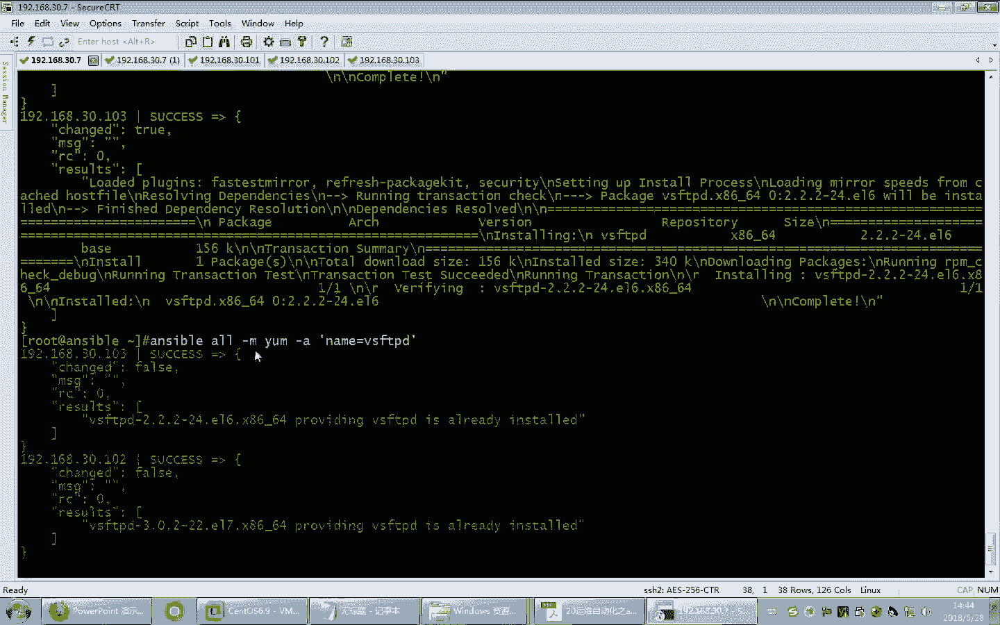
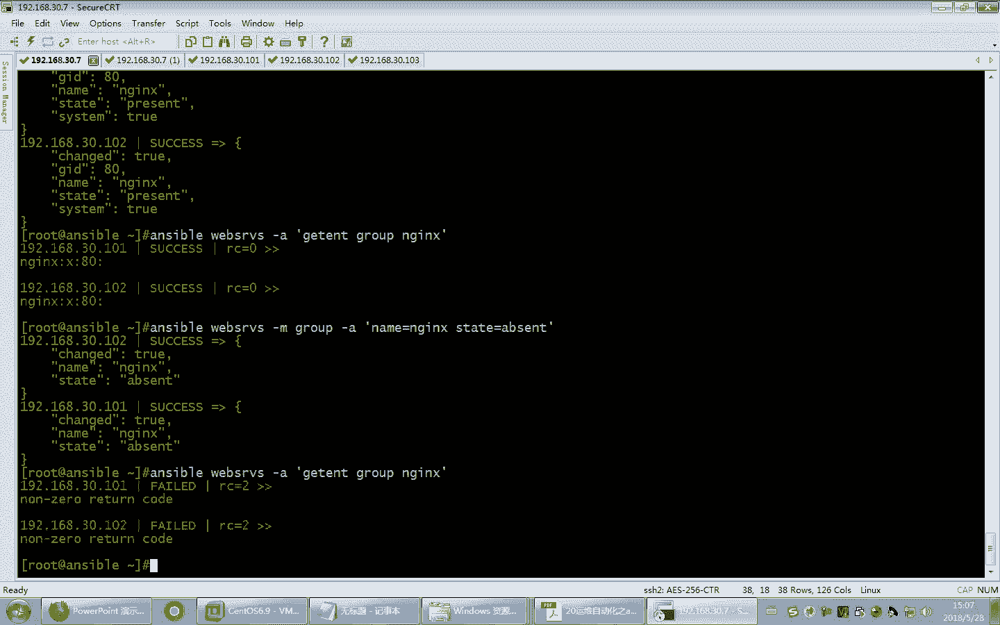

# Linux教程RHCE - P21：21.ansible常见企业级应用模块实战 - 艾弗艾尔思丢丢 - BV1if4y1e73V

是不是关了呀，底下关了吗？没事啊。う。好。当上午我给大家讲了unible的。基本使用。那讲了unible的第一种使用方法。嗯，就是利用模块来执行单条的unible的一些指令。提到了很多模块嗯。啊。

回顾一下想想有一些模块我们学过了。て。Com慢的。是默认模块嗯，sha。都可以。sharegri脚本是吧，还有。PP是我们上来先用使用的一个模块。还有。还有copy copypy。

高飞模块它的作用是把服务器上的文件复制到被控制端的这些主机上去。好，那下午呢我们继续来学习其他的模块。好，看一下这个战石模块。但是模块它正好和copy是相反的，它的作用就是把远程。被控端的主机上的文件。

给他抓取到。抓取到我们的客户端上去啊，抓取到这个服务器端，抓取到咱们的unible服务器端。那如何来抓群，我们来看一下它的使用。

好，我们来看一下这个模块的说明。好。抓取远程节点上的文件。而且大家注意到。它是一个文件。那也就意味着。这个模块看来是只能抓单个文件。然后抓取的时候，这儿指定圆。这是强制性要求的。

那这个文件在远程主机的系统上。它必须是一个文件，注意到了吗？不能是目录。所以我们现在呢flash这个模块，它的功能啊，相对来讲不是你期望那样啊，它只能复制远程的单个文件，它不能复制目录。当然，以后可能。

能支持，不过那是以后的事儿了，是吧？这是未来的版本了。那目前当前用的版本只能抓取单个文件。那抓取单个文件，这是圆。圆的目圆的文件呢是在服在这个客户端的远程节点上。那目标目标呢，这就是一个目录。

要把当前你要抓取的文件指定到一个目录里面。当然这个目录。比方说如果是个backup，那么原文件。假设是在这样的一个文件里面啊，一个圆叫ETCFI啊这个prohere。

也就是说我可以把远程的一个文件抓取到我本机的某个目录里面。那将来它可能会生成的文件就这个样子了。大家看到。什么意思啊？他就会在你。安宝这一端有一个backup文件夹，会针对你要抓取的目标主机。

它会生成一个文件夹，然后再把你抓取的文件放到这个以清单，就是主机清单名字为文件夹的下面的子目录里面。听懂我意思了吧？它是这样的一个效果。所以现在比方说我要在。在三台主机上。我们来抓取一个文件。

例如我们把日志文件给它抓过来。抓到data目录像。建个文件件啊，给他。那现在我要把。远程主机的被监控端的三个主机上的日志。大家都知道日志呢默认很多是不是都在这个目录下，你看都有这个文件。

应该是那现在我想把这三个主机上的都是这个message文件给它抓到我当前的data目录下啊，注意我的data目录现在空的，现在没有内容。号所有的主机。那我们去抓一下，用fch模块。杠A。SRC。

远程主机的文件路径。包括他的文件名。啊，抓取到目标。这个目标是我当次保这一端的文件机器的文目标文件夹。大家搞清楚啊。这个文件是在远程这些机器上，这些机器上被抓取的被控端它的文件，而且是只能支持文件。

而且支持一个文件。这个是我们本机的。就uner宝这段的目录。好，抓取完了。看一下。看到了吗？原告了吗？你看它是不是生成了各自的一个独立文件夹，然后每个文件夹下面是不是放了刚才抓取那个文件的。

包括原来的路径都已经有了。好，这就是用这种方式抓取。好，但然这种方式抓取刚才提到它只能抓单个文件。比方说呀如果我想把远程主机的所有日志。全抓过来。远程主机的日志。你像这里面。

我们希望抓取这种点log后缀的。这个咋办啊？我要把这些点log后缀的文件抓取过来。这支持通佩服抓多个吗？新哪老哥。这实不支实啊？报错了是吧？嗯。你看他说这个文件。不存在。那看来他认为这个。

型号是不就是个文件名是吧？那咋办啊？啊，你可以先把它打个包，可以不可以？那在远程先把这些你要打就是抓取的文件，打个包，打完包以后，你再去把它。抓取过来不就得了吗？那当然打包的话，咋打包啊？打包。

大包用哪个？是样。该。那打打包吧。看。比方说咱们打包并压缩成一个压缩格式，比较呃比较强的一个压缩格式，叫XZ格式是吧？XZ格式的例容我们叫log点踏点呃XZ吧。

那要要打包成这个前面的这个选项应该用什么呀？记。L吧。DCF。C是创建嘛，是吧？好，后面呢还要指定。对哪个物文件打包，我们是不是要对这些。星点儿。烙个这样的文件来打包啊。好了，那咱们试试，能不能打包。

看行不行。好，可以了。不过呢人家又提示了，他说你要执行这个建议使用，建议使用on rich。那看来他有专门的打包模块了。看到没有？哎，不过咱们既然这样做了，我不知道成功没成功啊。呃。

这个是要这我们指定没有指定路径哎。那这个没有指定路径，你说他打到哪儿去了呀？当前那当前是谁当前啊？那咱们就不写路径嘛，看看它显示的是哪个文件夹。哎，那就是默认加目录的文件夹呗，你没指定目录。

是不是就是加目录的目录？看到没有？这是不是已经有了？那当然再把它抓取回来不就得了吗？那当然抓取咱们刚才讲过了，叫fetch。Fatch。然后。应该是远程。Root。SRC是吧。录得下的log下的差点。

XZ啊，抓到哪去呢？抓到DEST的我本机的。电塔目录下。好。来看一下da塔目录下。看过了吧？但是抓完了这有东西嘛，确实成功了嘛啊，咱验证一下啊，192168101进来以后录得下。看看这个文件。呃。

预览是怎么预览来着？是这样吧。可以吧。嗯，比说这种方式，实际上啊人家是有那个专门的打包的模块的，打包以及解包的模块。刚才看到了，这应定该是个解包模块，你可以看一下啊。Unible。Dock。案te。

🎼archie这个模块是用来解包的，看见了吗？那既然有解包，还有打包的，打包就是。チ。嗯，这样。这是相反的吗？和他。看到了吧，哎，而且还支持各种格式。看见了没有？

是不是各种格式啊？好，这就是打包的啊，知道这样就可以了。那fetch命令，咱们现在已经把远程主机的单个文件。那抓取到我本机了，这是可以做到的那接下来咱们来看另外一个模块。fi尔模块f模块。

咱们上午曾经好像人家提示我们干什么来着，用fi尔模块的。

全に。创建文件夹啊，叫makeda是吧？创建文件夹人家就有专门的这个fa模块来干这个活啊。咱们上午是用common模块直接这样做的，是吧？虽然成功了，但是好像不专业啊。

人家提示我们好像有专业的模块来完成这个工作的那下面咱们来看一下这个模块叫unible。Duck。菲尔这个模块。好，看一下这个模块的使用。他说设置文件的。属性发现了吗？它可以设置文件的属性。

然后可有带有这些信息。比方什么所有者所属主啊，这都非常容易理解的啊啊，还有状态，这个状态很重要的。如果是directory，那就意味着。它将创建这个子目录。啊，如果不存在的话，就创建呗。这个意思啊。

另外。在。state这儿还可以是touchtouch的话是不是就创立一个空文件啊？看到没有？所以这个地方它可以根据state的不同状态来决定到底你是干什么工作啊，你是创建个空文件还是个文件夹哎等等。

它有不同的值，不同的值。还有创建link，那显而易见，它是创建软链接，可以看白了吧？所以这个had呢还可以创建硬链接。嗯， absentent呢。啥意思啊？将递归删除吧。是不是啊？

所以这个地方啊它这个地方根据根据state的具体值来实现不同的效果。那下面咱们来试一下。Unsible哦。呃，啊。那咱们去看一下入看看一下那个data目录吧，看有啥数据的。好，有这几个文件。

那现在咱们在这里面建个新文件。建个新文件啊，建个新文件，这回咱们用模块啊叫faair模块。刚才提到了要建新文件，要指定文件的名称，你要建个新文件，文件名叫啥呀？哎，我们来看一下它的说明。在这儿啊。

当s ball。到。对啊。啊，看看有没有指定路径和文件的说明。看到这儿了吧。pass就是被管理的文件路径嘛。而且你看是啥？就是它是这两个的别名儿。那换句话说，我们用pass也行，用这两个也可以。

它是一样的效果，听懂了吧？所以我们这儿pass，当然你也可以写成name啊都行。那现在你要管理哪个文件呀？我要管理远程主机的，比方说我要建个新文件嘛，建个新文件，比方说F2呃F3吧，建个新文件。

那刚才提到了要建新文件，是不是state等于什么来着？Touch。Touch。他是就是创意的空文件。哦，那行了，那现在我们来确认一下是不是成功了啊。来了。杠L绿塔。大家看是新建的吧。哎。

新建的这就是建新文件。当然你会建，你也得会删呢，删的话呢是absent。absent这个单词什么意思啊？这个是。啊。好像四6级。A打头的不就是这几个几个单词比较早吗？一般背一打头的背的比较熟。

以前上大学背那个英语单词，从A字母开始背嘛，对不对？所以abent我印象特别深刻，B字母打头的就不记得了。😊，那四6级不背单词啊，你们啊。没考考不考四六级是吧？不考四六级，你看不考四六级。

你们也坐在这儿，咱们一个水平是吧？哎呀，我上西呀，白背了。😊，abent呢是缺席嘛，缺席的意思。缺席嗯，不在。好，那现在缺席呢就是把这个文件删了的意思啊。实际上咱们后面会看啊。

很多这个模块里面都是有absent表示删除缺席类似的效果的。好，那你看我把它删了，看看是不是删了，瞅瞅啊。好，大家看是不是删了，哎，可以创建，也可以删除。那接下来我们来建一下这个文件夹，建文件夹啊。

建文件夹呢，刚才实际上好像它提示我们了。然后带一。还记得刚才。它是怎么建文件夹来着？价低。directory是不是？如果是state等于directy，它就是键文对焦。啊后你看我建了一个de尔一。

看看有没有键de尔一啊，看成不成。成了吧。看到了吧。唉，这不建好了吗？那当然见文件夹，那你删文件夹呢，那你应该猜到了。用哪个？Absent。好，看一下是不是删了。删了吧。好，这是删文件夹。

另外呢还可以创建链接文件软链接。文件文件，比方说我们在目标主机上。指定一个新文件。当然了，你要转建软链接，是不是得指定是谁的软链接？对吧所以SRC要指定圆。啊。

原比方说我们要针对ETCFITB文件给它创建一个软链接。当然我们刚才说过了，这个地方叫namepa，包括DEST都是相就是等价的。这三个单词是等价的，听懂了吧？所以我们现在对FITP文件做一个软链接。

假假设叫FITP点link吧。好，起一个软件件名，看成不成。那当然我们后面还要指定它的state等于link。好，来看一下是不是生成了。成了吧。不连接啊。当是你要删的人，人家咋删啊？abent是吧？好。

那看看删除软链接。Absent。那这儿就使定这连接的。名字。知道了是吧。这就是创建删除软连接。

这是对文件的各种操作。当然我们也可以对文件的各种属性进行设置啊。比方说设置所有者所有组啊，这些都是可以实现的。好，那当然这个地方我要删除的是整个目录下的所有文件行吗？

比方说我要把data目录下的所有文件删了。

地毯目录下的所有文件删了。能这样写吗？看看。绿的。感觉到是不是有点奇怪啊？看见了吗？没删了。嗯。那我就。对头。这时候把d的目录删了。获得你。哦，你看还有个错的。那因为data对于103这个主机来讲。

它应该是过个挂载点。啊，挂载点它删不了，但是其他的两个文件由于不是挂载点。其他两个主机是不是应该删了？看101和102。你看这是不是不是挂载点，它是APP是挂载点是吧？那这个地方也是。APP挂罪点。

而这儿呢。对塔是个挂载点，是不是删不了？看到了吧。啊，当然我们如果就像刚才那样做啊，待会我这个文件夹给删了，我再建起来。呃，建起来的话应该是用。Abs呃 state。叫什么来着？Directory。好。

当然你发现没有？113本身有这个文件夹了，它就是绿的是吧？它倒不会报错，你发现了吗？😡，哎，他不会报错，他说已经有了，所以他就不见了。然后在这里面呢，我们可以建一些文件。比方说touch。

建一些文件F1。好，那这样的话我在里面就建了一些文件。那建完文件以后，我们来确认一下Ldata。当然这个地方我们要用。命令模块。那现在我就想把data目录下的所有文件删了，咱们可以采用。这种方法吧。

那比方说我们前面有。馅模块。他提示我们用什么？fa尔是abent啊，那我们来看看。成功没成功。可以吧。还可以。

好，这是我们刚才看到的。Fair模块。那这些fi模块它的属性都可以根据你的情况来改。你像刚才看到的ible。

Duck。

嗯。这样模块。在这儿你看设权限设什么所有组，这都可以设啊。这这些功能都是一样的。选项和我们之前讲的有些像。然后接着我们来看另外一个叫host name，叫主机名。

我用它可以改主机名。当是这个地方要改主机名有点小问题啊。如果我一下子改主机名儿，是不是意意味着这三个主机主机名一样了？想过这个问题吗？哎，所以我们后期还有更灵活的方法，比方说我可以配合变量。

让它每个主机的主机名根据变量来自动生成。而不是说你这儿指定一个主机名，那难不成大家都一样，不就乱套了嘛，对不对？所以我们将来可以适当的去做变化啊。好，那暂时我们先先看一看如何来更改一个单一主机的主机名。

那咱们先改一个主机的啊。那我们就改192168啊。30。101，我把30的101给它改了，杠M house name。那主机名我们可以直接通过name这个选项直接跟上就行了。name跟上它的新名。假设。

这个咱们原来有没。没了。咱不原来叫纳的一纳袋二吗？没保存吧。我们上午做的时候，是不是只是敲了个hose name而已，就是没有保存，这是临时生效的，对不对？

那这回咱们可始用hosse name这样的一个模块，它会保存吗？它会立即生效吗？瞅瞅。看见了吗？那咱们来看看这边。我退出来。发现了吗？已经生效了，那他改文件了吗？哎，s斗7的主机名是放在哪儿。

哪个目录里还记得吗？哪个文件？Pos name。怎么样？就是他连生效代改名都一块做了。啊，不过他有一个缺点。后丝联盟改没改？这个没改，这只是我们强调过的。还记得吧？改了主机名，良好的习惯。

要把这个文件是不是也要随着。改了，但是系统不改，那你只能手改了呗。😡，对吧这是一个良好的习惯啊，建议把这个地方也改了啊。好。😊，知道就行了啊。那当然我这个地方六的话呢，它的主机名。

六的主机名放在别的文件里。那现在我针对六来再做一次。六的话是三这个机器是吧？那我们六这个机器呢叫note3。好了，也成功了。而且呢大家看到它这有一个unsible fact。然后呢，这儿写了他的主机名。

看见了吗？但这个主机名啊，我加上后缀吧，要不它那个光是一个太短的名字不好看，加长一点。然后呢，我刚才纳的一也给他这样做一下，叫马哥EBO点儿CO。好，大家看到你发现了吗？实际上对于我们昂斯伯来讲。

这些你可以理解成相当于变量，知道吗？这个变量啊。一个叫hold name。一个叫娜的name，这里面都放了他的主机名，还有一个FQD也放了他主机名，看见了吗？嗯，这是系统自带的变量，这是系统自带的变量。

咱们后面会讲啊，这些变量是放在一个专门的模块里的。啊，他正好是写完了以后，给你显示出来了。当然刚才我们讲了，对于n三来讲，这个主机啊，它是一个s头斯6。那s头6的主机名是放在哪儿来着，还记得吗？じゃあ。

Netter work。好，大家看你看确实也改了。所以相对来讲，你看它既是立即生效，又把你保存了。所以呢这个hose name这个变这样的一个模块，改主机名啊，非常。

方便。好，此外咱们来看还有常见的计划任务。计划任务。那比方说我们想每分钟。咱们就简单一点，为了看这个效果，咱们每分钟执行一次广播。

当然广播的话，咱们得知道广播路径在哪儿啊呃，位置。呃，沃。嗯。USUSR并，当然这个6的路径是不是在这啊，确认一下。也在这儿是吧？USRB沃好，那现在咱们添加一个计划任务，就是让他每分钟报一下警啊。

每分钟报一下FBI warning名是吧？啊，咱们就举个例子啊，好。😊，有同学睡睡睡睡的还没睡好，没反应过来哈，死。😊，2。呃，安ible。啊，你看啊这个是chrome这个计划人务模块。

你看它这儿可以来指定，你看。哎，你看日小时。分钟哎，你猜到了想起了什么呀？那计划任务是什么东西啊？计划任务还记得计划任务是不是我们要有一个专门的命令，系统中就有可以创建用户的计划任务，叫杠E是吧？

他打开以后是不是要按格式写啊，还记得吗？那格式啥来着？先1分钟。再是小时。再是日，再是月。mons再是星期。是不是哎，格式的话，大家记得吧？星号表示的是。美的意思对吧？当然我也可以每几分钟。

比方说每5分钟或者是每几个小时是不是个美的话，是不是要加斜线啊，当然也可以表示范围，比方说1到5，这是不是就是1到5的某一个呃时间啊，1到5，当然也可以逗号隔开。这是不是可以就是356等等，对吧？哎。

这这些都格式都是通用的啊。好，那现在我们刚才说就想每分钟。而且今天是周一是吧？啊，每分钟咱们周一、周三、周五。采取执行广播。哎，咱们就可以用unible这个模块。咱们就O吧，杠M。

针对prome这样的一个模块杠A。每分钟刚才我们说有一个minute。干minutes。minute不是Sminute。是吧over都不带S的啊，不带S的。你看看它这有明确的描述啊。

你看小石这儿这格式是不是都是很熟的呀？对吧哎，minit也是这个格式嘛，一样的，月这不都一样的嘛？好，所以呢咱们这儿。那。咱们是每分钟每分钟是不是就写心就行了啊。另外我们刚才提到了，我想嗯。周几的。

比方说135咱们执行，那就是we对。那就是135，反正格式就符合条件就行了。当然如果你其他的没有定义，没定义，那是不是就是芯儿啊？那我们五个时间段嘛，对不对？小时呃，这个小分小时。每每就是每个月的几号。

然后每月，然后下再加上这个所谓的周几啊，这5个时间段。那你如果你定义了，那你就用你这定义的，没定义，是不是就写成星，相当于。然后接着我们要指定作业。那job呢就是我们要执行的命令嘛。

刚才我们说USRB应下的wall广播，我要执行啥呢？呃，比方说叫 warningning。IBI蜗你是吧。😊，FBI窝点。不要违反啊。呵呵。😊，当然这个地方有一个小问题啊，你看这这是个完整命令是吧？

这个完整命令，你中间带空格的是不是有问题啊？😡，要不它和这是不是前面的一个混了，所以我们要将双引号引起来，表示这是个完整命令。明了吗？啊。当然。我们可以再给这个计划任务加上一个名称。

就代表这一大串给它起个名儿。啊，起个名，比方说叫 warningning。好，就起了一个这样的一个chrome吧。警报的这样的一个进化人务。好，这样做完以后，我们回下车看看这个计划任务能不能创建出来。

好了，那现在我们来看看哟已经报警了，看到没有？这都黄了，这个蓝了蓝了报警了，看见没有？已经实现了，估计这会儿是不是这边一会儿也会做呀，但是他因为它时间不统一啊，所以这个地方嗯正常应该是都报警才对。

那咱们来看看它这个计房任务是不是生成了。😊，看下上面是不是on theible加了一个注释啊。这是不是就是刚才那个内幕啊？看见了吗？星星星儿135发现了吗？成了吧。这儿应该也有啊。

这个这个支持所以没有看到，是因为还没。还没时间到。还没到时间是吧？你看还差一点儿。这边是不是也是。快了，马上就到了嗯。到了吧，但是灯。哎，到了那这儿又到了是，那我们就觉得烦啊，我把这个计划任务想给他。

咱们也不删他，他禁用他行不行？怎么禁用它？禁用说白了禁用就是什么就用不就把这注释了是不是就行了。哎，加个加个井号不就注释了嘛，就把这个东西给他加个井号注释掉，对吧？那禁禁用怎么禁用呢？

禁用unsible。加上diable就行了。Disable。加注释。第四able。处。这就是禁用，但是禁用的话，别忘了把这个写上啊。把job写上。这个内容可以不可以不写？你看这少了参数了，不支持的模块。

看到没有？所以这个地方我们再加上。N幕。那我们就是Dce波。处。要。错在哪儿了？不支持的参数模块禁用参数包括backup chromme。DC报的啊，少了个D。少了个地。少了个地。

那我这样故意把这个删了啊。哎，大家看这时候错误和不可能不一样了啊，他说必须指定。job吧啊，必须指定 job吧 job还必须有。罩吧必须有。那这不有那内幕可以不可以没有？内幕可以没有。好了。

那现在我们来看一下是不是生效了啊。😊，怎样？还有哎，发现问题了吗？你看你内幕没写。他是不是就以为是。以为是把一个新的那个作业给关掉了，嗯，所以这个地方就有问题了。

所以你要确定的把这个带名字的这个作业关掉。那，看来你语法上我们必须要加。哎，name必须加name。玻璃。ろ。啊，必须这样讲。这样加完以后。再来看。成功了吧。所以这个地方要注意细节啊，这两个还都得加。

所这个内幕还是必须要加的，不加，现在也没有名儿没有名儿。好，当然那你会禁用，是不是也得会启用啊？我咱们又想用了，那咋办啊？那你应该猜到了。😡，那diableable这改成啥？刚才改的是处是吧？或是。

处和fo处和触和fo不是相反的吗？那看一看。改了没有啊？咋样成功了吧。好，这个地方我们刚才用的是。true或者false。但是yes no成不成啊？yes闹也行，看到没有？yes是禁用是yes。

那是不是就是禁用了？然看一看。你看是不是又禁用了？当然你猜到了，那这个是地方no变成no。是不是就相当于启用啊？所以他这个有些用法还是比较灵活啊，你用什么都可以。你看我在这边来看一下。YN。

你还大小写呢是吗？那你自己测试啊，测试一下。😊，咱们上次不是编过一个脚本吗，是吧？嗯，各种yS奇怪的ys什么的。当然你这个应该没那么灵活啊。好了，那现在我们已经知道怎么启用就用。

当然这个记录我彻底不想要了，那删了。删了它怎么删呢？😡，那删的话应该用什么删呀？那你应该猜猜猜到了应该用什么？唉，date，我们刚才讲过啊，有点很多都是相似的absent。Absent。啊。

当然这个地方就谈不上什么禁用的事了，这不是禁用了，是吧？我们是要把它干掉。删了删了以后再来看一下。没了吧。哎。这个之前是因为我们刚才做的时候加的这个啊，实际上正常应该没有了。没了吧。好，这就是计划任务。

看到没有？用这个命令也可以来创建计划人务。啊，大家可能也学到这儿，发现阿斯ible。他把每个不同方向的功能都做成模块了。然后每个模块负责具体的一个操作。呃，于法呢也。

各式各的语法，当然有些是类似的，有一些是类似的。好，接下来我们来看另外一个模块叫。亚模块当然了，亚模块你一猜就能猜到，它是管理。亚管滤包的。当然了，你这个亚模块要用的话。

你是不是得你的linux系统得支持y。

对吧哎，当然这个亚么要安装，你本机上亚么仓库是不是得有啊？你本机要没有亚么仓库，他能装系统吗？好，那现在咱们来看。那这个亚么。我们在这儿。当前我每个机器上应该已经配了仓库了。好。

那现在我在这儿把这个仓库呢临时的给它禁用一下，叫in。报的。这是不是就禁用了啊？现在我们来看一下，我们用。亚么仓库这个所谓的模块来管理包。它可以安装升级降级删除列出。包组。看到了没有？

哎它功能基本上把常见的功能都包包含在内了啊。这样可以列出。这儿指定的是内蒙，这是不是就是包名啊？看了吧，state，你看。安装的话可以用这几个。安装可以用presentent。

presentsent和 absentent是相反的。abent是缺席，它是在的意思啊，在现。然后这两个呢可以。这两个默认应该就是这个。就是安装。当然安装的话，你可以选这三个都可以。

当是这个litist是不是最新的意思是吧？最近的，然后这个呢是epent。removed这都可以卸载都可以卸载。大家看到这儿有个默认嘛，默认是present，默认是不是就是装包的意思？对吧。好。

那当然下面还有具更多的例子啊，但是这个例子你不要去看了，因为这个例子不是用我们刚才写的unible命令来写的，它是写的是所谓的呃，就是我们说的剧本剧本格式来写的。剧本格式。还有现成的例子。好了。

那下面咱们来看一下怎么去。用这个所谓的亚。那现在我用2。杠M亚某杠A。来指定模块。比方说我们想装一个。软件。装个啥呢？哎，咱么是dock是吧？那name比方说咱们装1个VSFTPD吧。

装这样的一个软件包。装这样的一个软件包。当然装的话呢，这个state要指定到底安装还是卸载，但是默认是不是就是presentpresent是不是就是安装，就是安装的意思呀？所以我默认情况下就相当于安装。

所以我现在直接去执行。

好，大家看101这出错了。他这提示我们说什么呢？

他说没有包名儿匹配，是不是就因为我们101刚才把人家给仓库禁了。

所以他这个仓库还是要依赖于你自身是不是仓库配置文件配好了的啊。

哎，所以当然啊这个东西也好解决，咱们不是以前解决过吗？我这100台机器，每个机器都要把这个样配好了。解决方案不靠亚么就可以搞定吧。我们是不是前面在装系统的时候就给以他配好？

是吧装系统就把样配好不就得了吗？啊，然后事后阿斯ible管理的时候就用这个直接用就行了，对吧？

所以这个不是问题啊。好，当然我这儿为了看效果的啊，故意的。变成一是不是就启用了，相当于。

那现在。刚才已经把这2个102和103上已经把这个装上了啊，装上以后，那咱们来。

内蒙确认一下啊，当然由于已经装上了，我再执行一次。再申一次。

大家看103。103是已经。被装过了。啊，101。102。呃，因为这两个是不是已经刚刚被装过了。

啊，这个101是因为刚才仓库咱们被禁用了嘛，这不是现在才装上吗，看到了吧？

这是能看到的。

好，这是。看到的这样的一个基本使用。

那这还可以用list，list呢可以查看。

list似的。

哎，是。

学校。

后面要跟上什么呢？Installed。指定。应是。到的这是不是就是表示。已经装了的啊，当然我这儿应该把这个排除了。这是不是就是所有装好的包，你看。一大堆。是吧。这就是所有装好的包全列出来了。好。

那这就是安装。单个包。当然我安装包也行，那么卸载的话是不是就是abent？

哎，remove。有木的。Absent。应该都可以卸载。啊，谢了。卸了以后。哎，我要我想知道这个是不是卸载了，怎么知道啊？Q啊。这可以吧，我们后面跟上一个，当然这个地方用完应该用的是什模块？

哎都不用com了是吧？好吧。啊，你看。没有安装吗？对吧这不已经卸了吗？啊，不过人家告诉你说使用y的话，最好用。是不是有亚么这样的一个模块啊？你需要使用去压么这个模块。当然还有别的一些工具啊。好。

这是我们刚才看到的安装和卸载，这都可以了。但是如果要装多个的话怎么办呀？我要安装的是多个包怎么办呢？那多个包，你逗号隔开呗。比方说咱们装一个啥呢？嗯，member catch。

meever catch的。然后再装点别的。HTDP阿帕奇。你看。关了。看到没有？这都给你装上了。当然那你装多个是这样，卸载多个是不是也是一样的，叫。State。Add的。Sent。

或者remove的都可以。好，这样就卸载了。我不知道歪。耿温。这还干什么歪呀？你是在用昂s包吗？不用歪了。好。那实际上它还可以把单个R平包进行本地安装。比方说你从互联网上下载了一个儿眠包。

这个包不在你的仓库里面。你想把它在所有的主机上安装。那怎么装呢？那假设啊。假设咱们从互联网上找了一个包，当是我这没有互联网上找的包啊，我们就拿本机光盘找个包得了。找一个就就刚才说的这个VICB的包。

咱不是给卸了吗？已经。就拿这个吧，但是这个包呢你要知道它是七上的文件，所以我就只在7上装了，不在六上装了啊。因为这个包你也装不上去。那现在我想把这个文件从互联网上已经下载下来了。

我想把它装到哎装到你的每个主机上去。那第一步我们先要把这个包。需要不需要复制到远程主机上？好，那现在比方说我先把这个包啊放到我当前目录下，放到data目录下。大概已经放在这儿了。

现在我去用un ball。啊，我就不熬了啊。我就先拿一个机器做测试得了，30。101。然后杠M。亚么。注意我这回装的是。单个文件对这个文件呢，它只是一个磁盘上的文件，是data下的。VSTPD。啊。

杠一对，前面有个杠A。好，然后我们去装一下。当然默认情况下，这个是不是就是应该是个安装state是present嘛？我就不写了，看一下。好，大家看现在这个文件是不是不存在呀？没有这样的文件，对不对？

那所以我们现在想要真的把这个包从互联网下载这个包得装到这些主机上。那我们是不是应该先用copy命令把它推送到别的主机上？对吧那推送怎么推送啊？你看这个包确实在这两个主机上没有装。刚才咱们卸载了，已经好。

那要推送，那就要用un ball呃。把这两个主机。逗号隔开吧。然后把这两个主机。M copypy吧。Copy。呃，叫。内蒙是吧，SRC吧，SRCSRC呢这个文件是data下的。这个文件。啊。

然后呢我是不是要复制到远程的哪个目录下，比方说咱们复制到录子下吧。啊。好。好，复制过去了。复制过去以后，那咱们来看一下unsible。有有这个文件吧。好，那现在我就可以用亚母安装了。那要么安装的话呢。

杠M要么杠A。安装的话，内幕等于root下的，把这个文件给它。写一下。而默认情况下，它是不是安装的时候，就是这个state等于present嘛，是吧？就相当于默认就是安装嘛。好，安装一下。大家看装了吧？

啊，你可以看一下。撞了吧。理解了吧？还可以单独的去装啊一个独立的二片包也是可以的。那甚至我们安装的时候，还可以去忽略所谓的key的检查。还有一个叫diable。叫GPG。Check。啊。

这个呢我也可以忽略它。还记得GPG check吧。那默认情况下，它在安装的时候，是不是有1个GP check等于一的这样的一个设置，是吧？哎，这个地方你也可以把它给它禁用了。啊，金用yes。

这也是可以的。好，这是我们刚才提到的这样的一个问题。另外呢亚么它也存在一个更新缓存的问题。大家记得利用亚么有的时候因为缓存错误导致安装失败。咱们是不是有一个命令叫y么 cleanan all，记得吧？

那他这儿也是可以更新缓存的。更新缓存有一个叫update。Catch。这更新缓存。当然更新缓存，你得指定你要装一个包啊，比方说咱们装一个软件啊。DID吧。电梯里还真记得这个东西干嘛的吗？是不是在。

监控工具啊。这装上了。DSP嘛。我忘了。就这东西吗？

好。这是边清除更新缓存再去装包。这也都是可以的。好，装包咱们掌握了。当然，装包掌握了以后，紧接着我们下来就来学习服务的管理了。包装完了是不是一般来讲，紧接着把服务启动一下啊？

那要用service。Service。Unsible。Duck。servervice。大家可以看service是管理服务用的。你看name，这是不是就是你要指定的服务名？那enable的是否启用。

启动在开机的时候启动什么意思啊？哎，是不是开机启动嘛？哎，就咱们在渗透7里面有一个把服务设为开机启动的命令叫CtenCTL。然后呢。叫enable。后面跟上服务名，记得吧？这个就类似。然后state。

是不是就是你看启动关闭。是不是还可以reload或者还可以restar吧。不过都带D的啊，TD。看到没有？他写的是要注意的一点。他只是模式。啊，这是模式。好。下面咱们来看一看。

比方说我们刚才曾经把FDB服务装上了，那FDB服务包装上以后，现在我想把远程的服务给它启动起来。现在注意它这个服务还没启动啊，你看21端口没有打开FTP服务用的是21端口，现在没有打开。啊。

当然我们要想远程的把这个包装好以后，把服务启动起来，我们就要用unible。哦哦，这边这边没装是吧，这个。这边没装。这个是web service吧。看看列列一下啊，看看包括哪些台主机。

这正好这两台主机嘛，对吧？101101102101162这两个机器都是sto机器，103是个sto6的主机。好，那现在我对web service。啊，we service好，对这三这两台主机我们去。

service这个包。模块。不带S的是吧，杠A。我们要去。VSFDBD。然后呢，state。那started是不是就是把这服务启动起来？但同时我把它设为开机启动，那是enable。的。

是不是这个yes思呀？E的 thenYes。啊，或者处都行。好。可以了。那现在我们来验证一下啊，在。这个机上叫is enable。的确认一下是不是开机是启动的。然后现在的状态应该也是。启动的看了吗？好。

所以这样的话命令不就成功了吗？但是我甚至还可以把它重启一下，重启的话呢就是。restarrestore那一般来，改完配置文件不就要重启服务嘛，对吧？或者reload之类的。这都是常见的。使用规则。好。

当然我现在可以把它停了，那就是。stop。就把它扶清了。啊，停了现在。这是启动服务，停止服务、重启服务啊，这都是比较简单的。我现在把它enableable的设为。No。是没弄，那也就意味着它开机的时候。

不去让他。自动启动。当然我这儿写成boss。那也是可以的。它这个命令还是通用的啊，yes相当于处。啊，no相当于cose，它这个是可以通用的。那现在是Dzeable了是吧？

好，这是我们说。服务的控制。这些啊咱们都要记住，因为我现在讲的实际上都是比较常见的那1000多个咱们也是挑了精选的是吧，这几个。所以这几个用法都是常见用法，大家必须掌握。你要用osible。

这些可以说离不开的啊。好。user userer显而易见，是不是就创建用户管理用户的？

那来看看untable。Dock。好，右这。你看每个用户的属性，这都能看到。比方说注释。什么是否创建加目录过期时间啊，包括它的组，而且这个组还有两个不太一样。你看这叫主组，这什么东西？这不是就附加组吧。

这是附加组，这是附加组啊。而且这个是用户的加目录。啊，包括它的name，name是不是就是它的用户名啊？还可以设置什么用户的加密口令啊，注意这是加密的口令啊。当然，在特定的环境中。你们用过这些版本吗？

是必须是铭文的啊，这比较特殊啊，删除。当用户state，那这个相当于就是把这个用户呢加目录删了，这个相当于R还记得删除加目录的时候，删除用户的时候，顺便把加目录数据删了吗？哎，有个remove的嘛。哎。

这些选项啊，当然这个state呢无非。类似于我们前面讲的abent之类的删除账号。啊这儿还是不是还可以系统指定系统账号啊？对吧还可以指定什么。share类型白了吗？share类型，所以这个创建账号。

比方说咱们就创建一个嗯NGX账号。我先看一下NDX账号有没有。没有好，那现在我们在这属些主机上来创建NGX账号。注意NGX账号是给NG服务用的。显而易见，给服务用的账号一般来讲我们推荐都是用系统账号。

对不对？而且一般它的sha类型都是no loging的 share类型。所以我们现在啊比方说叫web service。然后M啊我们用user这个模块，然后我们要指定name。叫什么呢？NGX。

然后我们要创建的时候，它的share类型是。놀罗镜。哎，同时它还是个系统账号吧，那系统账号怎么写呢？哎，系统账号我们可以要指定它的系统信息，那系统信息需要有一个s。yes，要表示它这个系统账号。当然。

加目录如果需要的话，你也可以指定啊。那加目录创建一下，那就是home。啊，比方说NGX的工作目录，假设啊假设NGX。哎工作目录给他放到这儿来。啊，这些都可以根据你的情况来指定啊，比方说它的主组啊。

辅助组啊都可以加。比方说咱们加个辅助组吧，辅助组的话是groups。Groups。那比方说让它加到这两个辅助组里，可以吧？这都可以。你要主组的话呢，我刚才强强到了主组是不是就购肉卡。

主主组要改就是go啊，我这不改，不加了。哎，这就是指定主。那当然你也可以加上一些什么。如果你想指定它的UID什么的，都可以指定啊。比方说NGX的呃ID比方8080有人用吗？现在看看。竟然没人用啊。

那就80啊，给他指定1个UID是80，这都可以来指定。啊，当然你还可以加上一些描述之类的，什么comcomment。嗯。是这个吧。描述比方说这是NGX。啊，serv使用的一个账号。好，那加这些东西。

走看看。等我。那我们来在这边来验证一下，看看是不是这样啊。当会我就直接在这敲命令得了，叫unsible呃web service。然后。杠A。Get。ENT。好，你看这里面的属性是不是我们刚才指的。

看着了吧啊，80。但是他加目录存在了吗？虾母乳咱们是放在了哇。NGX的那个目录里，对不对？有吧，没问题。看了吧。这就是创建账号啊创建账号。你看尤其咱们。呃。

有些生产中用的很多软件都是源码编译的那源码编译的话，你像这些账号啊都是没有，要是不像亚么，他装的时候，它自动把账号创建好了。那原码编译的话，这些账号都需要手工创建。

所以这现在呢就可以用这种奥字宝的命令来自动的批量创建账号。当然账号不想要了，要删的话，那就是。3。那就是state等于。Absent。当是删的话有一种选项，就是你是否把加目录也删了。记得吧。那有一个。

别没我。Yes。好，删了删了以后，我们看一下，你看加目录是不是删了。没了吧，啊，看看账号应应该也删了，get。EN梯paNGX。没了是吧。那这样的话就是创建用户啊，删除用户。啊，这个。那还有组织管理。

多少块。Anuncetable dog。若。啊，他这个组的用法。它的选项不多。你看就这几个。这跟我们刚才讲的那个是不是差不多呀，跟用户账号差不多吧，无非就是GID嘛，是不是组名啊？

到底删账号还是建账号呃，建账号是不是系统组吗？对吧啊比方说我们有的时候为了建NGX这个用户事先先要建1个NGX组。好。webservice杠M group。然后杠A我们建一个name幕。

比方说NGX这样的一个用户。把这样的一个组，然后呢，我们建的时候它还是个。系统的，而且GID也可以给他指一下，这都可以指定。默认就是应该是默认是present，是不是默认就相当于创建这组的意思。好。

建好了。untable webb service杠嗯杠A，咱们验证一下get。group NGX是不是建起来了？走了吧。但是删的话，无非就是把它变成。删的话，这就变成state，那你应该猜到abent。

啊，既然是删的话，这些是不是就不用加了？

这样了吧。这就是常见的这几个模块。能记住吗？😀Yeah。😊，这要慢慢就记住了啊，这个实际上语法倒是不难是吧？哎，你要实在记不住，看看帮助，临时看一眼啊，这常见的这几个功能不是很多啊。

咱们讲的模块也不是特别多啊哎。几个模块，这是。啊。没掉。2是包的模块。一个是咱们最早用的P。Among。Sre。Ct。Copy。在吃。对啊。要 that name。Pro。要我。Services。

呃user group。是吧哎这是常见的模块啊，当然才介绍了这几个，总共1000多个呢，是不是？看来这1000多个要这样研究下来。咱们好几个月用过呀，这也不行啊。😊，好，把这些基本模块掌握就行啊。啊。

当然这些用法你要你要实在记不住，咱们刚才讲了查看蒙助的方法是unible。就加模块名不就行了吗？或者加上简短格式是不是都可以，这是不是详细，这个是。上面是详细说明，下面是简短说明嘛，对不对？

这都可以查模块。好。那还有就是onboard的其他的一些用法，这个我们稍微休息一会儿，待会儿再说。

