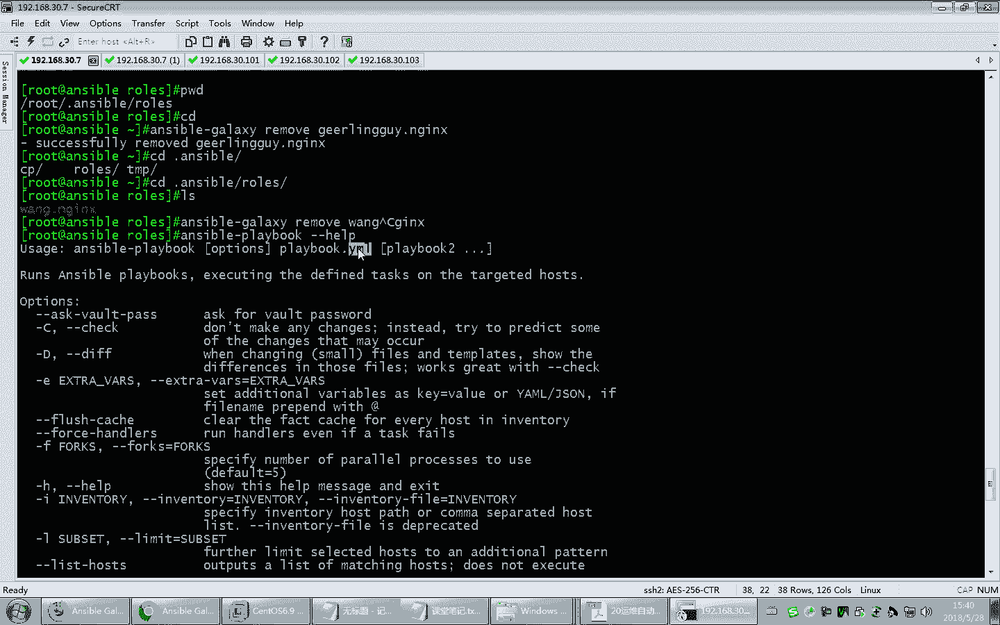
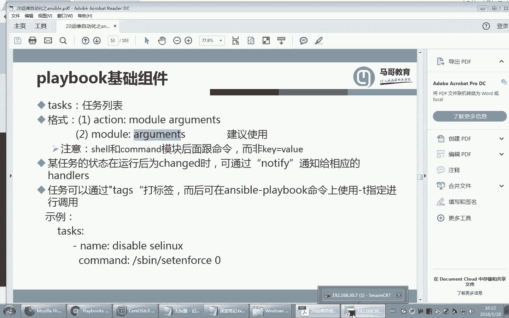
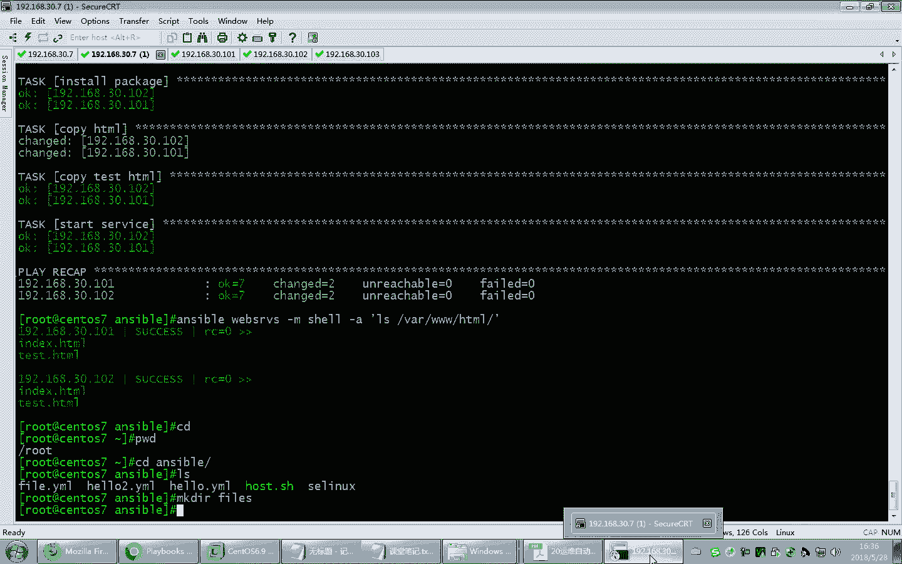

# Linux教程RHCE - P22：22.实现ansible企业级用法playbook - 艾弗艾尔思丢丢 - BV1if4y1e73V

那，刚才咱们把模块啊做了一下介绍。那后续呢咱无非就是在这些模块的基础之上再介绍一些组合的使用方法。那刚才我们提到了，在unible这个工具里面有很多。和他相关的一些程序。张世保。开头的。

我们用过这个工具了，用过dck。那接下来看看这个。叫unsible galaxyaxy。

那galaxy呢这个单词本身是什么意思啊？三星是不是有一款？呃，系列是吧，galaxy对。就银河嘛。银河系列。那这个galax skin呢说的是什么呢？是连接。的一个网站的一个一个。一个工具。

他可以从这个网站上下载对应的。角色。啊，咱们之前呢虽然没有学角色，但是我一再提这个角色啊，我们掌握的三个unerboard的使用。第一，unboard的模块就是单调命令。第二。

playbook第三个就是角色啊，角色是相当于把很多playbook组合起来的一个综合的一个完整的复杂的一个组合文件夹。那么在互联网上有很多好心人呢。

把在生产中用的一些比较适用的啊常见的就是解决实际问题的一些比较好的角色都放在互联网上了。你可以从这个地方来下载就行。那咱们看一下，这是他的官方地址。然后其中这有一个。Explore。啊，浏览一下。这慢。

是不是翻墙翻的呀，不翻墙更加快点。在这个网站里面有很多。嗯。互联网的这些开源人士贡献了自己写的一些角色。那从这个网站上，你可以把这个角色下载下来。

就可以用unsball galaxyy这样的一个程序来卸载啊，来来下载。你们难道有人在看视频吗？为什么这么慢啊？好，大家看好不容易显示出来了啊，你看这儿。是must most started。

什么意思啊？Most watched， most download。最初的最。带的打星星的吧，就是点赞的嘛，哎，最多点赞的最多被关注的，最多被下载的。咱们找找这个吧，你看这边有。这这个是一个角色的名字。

在这儿呢可以选。比方说咱们看看这个吧。NGX的。NGX的还有mycyclql的有很多啊。这些很多系统咱们会学。啊太慢了，这样我就不打开了啊，我直接把它名字选中了。

拖中我。然后呢，我们通过当然我在这儿确保一下我能连互联网啊啊，有公买地址，然后用unstable galaxyax。然后呢，我在这儿可以直接跟上刚才复制下来的名字。

从它上面就从它会自动的连到互联网上去呃去下载去下载。list的看一看。但现在在我本机是没有装这个东西的啊，没有装这个角色，那我们去安装。ins到安装，这时候它就会连到互联网上。

把刚才我们在刚才在那个网站上看到的这个角色下载下来。

就这个。他会下载下来。啊，这里面你看这儿告诉你怎么装了是吧？😡，对吧这不都告诉你怎么装了嘛，然后里面带有的信息。啊，各个版本的都有。当然你也可以自己在这点下载啊，也是可以的。好。

那现在我看看它连上去没有啊，很慢的，正在下载，你看到没有？是不是连上去了？

你看他下载这个什么一个压缩包吧，是不是从这个地址来下载啊？正在下载。

这个不大吧。在他支持的平台，各种平台都支持比别的。BSD的。嗯。各种平台都支持。EL这是不是应该就是红包的企业版的一简写啊？6七嘛是吧。真够懒的。

哎，下完了哎，不过你看它下到哪去了，这有提示哦。下载到了这个目录下，就是在加目录里面有一个隐藏的unible这个目录。大家看到里面是不是有一个入er角色。啊，这就是下载下来的。

那这些YML就是我们之前提到的剧本。剧本文件。咱们可以随便打开一个看看啊。啊，unsible。这个文件夹，然后呢tasks。比如说打开这个。这里面写的实际上就是剧本。剧本按照他的语法来写的。

不过你看虽然咱们还没有讲剧本，但是至少这个能看起来有点熟吧。这什么东西啊？这是。啊。这是不是就是那个模块service模块啊？哎，这是不是那个服务名，这不就是启动它吗？并且设为开机启动嘛。

只要它也最终调用的是模块，不过就是他自己按照自己的这个呃paybook的语法来写而已。在这个文件中。它的使用缩进是非常重要的，和pyython风格类似，缩进很重要，一定是同一级别的，放到同一个缩进。

不要错开，错开的话，导致程序就不可用了。它对缩进要求非常严格。不像咱们以前学share share那个缩进，根据自己的喜好怎么缩都行，对不齐都行是吧？但是他这个地方是要求。

因为它没有像我们写b是 share脚本的时候呢，有一些什么相应的语句块的分类。比方说咱们以前学for循环for循环也好，where尔循环也好。那你像这个I in什么后面跟上一个列表。来。

大家记得我们是不是度和当中间是有循环体，对不对？那度和当呢，你就相当于可以一个大括号似的啊，把它括起来了。那它这儿呢可没有这个东西，它就是用缩记。你只要同一级别对齐了，它就认为是同一个语句块里的。

所以它这个缩进非常重要的。好，那总之我们在这儿呢可以安装对应的这样的一个角色。这个角色实际上所谓的角色大能现在看到了，无非就是对应了一大堆文件的集合嘛。

用到了很多东西。啊。当然这些咱们还没讲呢啊那。tasks这里面实际上就是剧本，各种剧本。当然还有一些什么handler啊啊，包括什么原数据啊，包括一些测试啊，包括模板啊等等。

它是综合起来的这样的一个完整的啊小项目。那咱们现在把这个装上以后呢，我们再来用刚才的命令list列一下，它应该看到在我本机上是不是已经装了这个东西了，而且版本也能看出来。

刚才我们在网站上看到它不是有各种版本吗？我们是不是装的一个是相对最新的一个版本是吧？最高的一个版本，2。6。0嘛。

实际上这个。这个角色我们完全可以自己把它复制一下。比方说。复制一下王点NGX起个名儿。行了，这时候就相当于你机上有俩角色了，就这么简单。来看一下，你看这时候角色有。miss等一下啊。

你看这是不是显出两个角色？看到没有？啊版本号也一样是吧？这实际上是自己复制了一份。布置了一份。啊，什么意思呢？就是说你觉得他下载来的这些角色的信息，如果能用呃，你可以直接拿过来用。如果稍微以后改改。

你是不是也可以复制一下，改改就行了，改过来直将来拿过来用就行了啊。好，这就是我们说的这样的一个。

galaxy这样的工具。当然现在我想把它删了，那删的话，实际上简单就是把这目录删了就行。你把这个目录整个目录删了就行。当然你也可以用命令删啊，命令呢就是unsible。Galaxy。然后。别没过。

那没没过。刚才我们说这个是我们自己装的嘛，把它删了。好，删了以后，你看现在在点儿on the ball。啊，r你看这里面是不是就少了一个。实际上他说白了就是把那个目录删了啊。

因为它下载就是下载那个目录里嘛，所以这个就方删了啊。删了以后，你像我把我自己的目也想删了，那就是写成王。这就删了一样的。好，这就是删除的。

安装。好，稍后呢我们接下来就要。马上就要介绍这个所谓的各种剧本的写法了啊。好。再就是unerport pull。这个呢p pull对应的是p另一个单词啊。它两个单词你以后还会经常见到，一个是push。

一个是p。这是相反的两个操作。push是推 push是拉推拉嘛推拉。那这个是把一些对应的命令。啊，从我的本机给它。拉取到远程去。所以将来用这个命令。他去执行一些安斯保指令的时候，效率据说是相当高。

它比我们传统的unerible命令效率要高很多。不过这个用的不是特别多啊，是要求相对来讲比较高一些。好，咱们重点来看看unboardplaybook这个工具。这是我们接下来要讲的。

Playbook。啊，当然大家可以看到，在playbook这个工具里面，它的使用选项加上playbook的文件，而且也可以跟好几个playbook哦。那playbook呢就相当于一个脚本。

他把很多的模块使用集成在一个文件里面了。不过他按照他的字己语法来写，叫playbook。那play book的后缀呢一般来讲建议使用YML或者YAML也行。因为它是用YAML语言写的这样的一种语法的。

Playbook。那这儿就是一个playbook的一个范例。好，咱们写一个啊。

光这看不直观，我们写一个。帮unstable。啊，已经有了，那我就进来。那现在我在这儿来写一个。facebook的一个范例。那刚才我们讲了，建议大家把hello就是把YLmail这个后缀。

或者是YAM要后缀。写写这种后缀作为为book的文件后缀啊，这个建议大家这样来写。好，写完以后。这里面它的格式。建议是这样格式的啊，一般来讲playbook它在写的时候，第一行杠杠杠。

这只是个习惯而已啊。它表示我们里面要写playbook了，但事实上这一行不写也行，一般来说三杠是个习惯写法。事实上咱们刚才不是下载了一个角色嘛？你可以看一下系统的下载的那个里面。task，你看啊。

我们去A。还有一个命。你看他是不是有杠盖。啊，这只是个习惯而已啊，实际上你有时候你不写，他也语法不认为是错的，这是只是个习惯。杠杠杠啊，表示整个playlybook的开始。好。那现在我们先杠杠显示以后。

在这儿我加上一些基本配置。比方说我接着要对主机什么主机呢？这个主机就是web service，就是我们前面主机清单指定的主机列表。啊，这里面写的时候严格要注意啊，这带空格。这带空格这儿带红格。空格。

空格啊。好。host就是表示我接下来的playbook要针对哪些主机执行操作，然后remote。那将来我要针对远程的主机执行操作，以谁的身份执行呢？已入的身份。大家记得我们刚才在执行os的时候。

是不是也该也指定了远程。我将来执行命令是在远程的主机上以谁的身份执行，而默认情况下，是不是就是以ro的身份执行？啊，所以这个地方也要指定哦，在pro里面要指定以谁的身份去在远程主机上执行啊。好。

tasks。那这儿我要执行是命令。那这个命令呢，我要指定以谁的。执行什么命令？比方说name空格name。这个名名字呢只是一个说明而已。说明性的表示我接下来的任务是要做什么事儿。

所以我这儿得执行一个命令，然后这儿command，这就是那个模块名。模块名啊，比方说我就想在远程的主机上去执行一个hosse的 name命令。啊，hosse内幕命令。当然了，这个。呃。

command模块它的参数，也就是说我们在执行unerible的时候是不是有个杠A，还记得吧？是不是要把命令放在这个两个引号中间啊。那经接着这个command后面跟着这个杠A就直接跟在这后面就行了。

比方说我就想执行一下哎这个命令。后册内幕吧。好。这是一个很简单的一个。playbook就写完了。那写完以后，我们用unible playbook就可以来运行这个写好的playbook了。好。

大家看这儿有一个错误。那看来关键字有错误哦。后se次还是hos后s次。是不是少写了个S是吧？哎，好写了个S。好，大家看执行了。但是执行是执行了，那我们这儿是不是没有看到结果呀？是吧没有看到结果。

那但是确实是在对方的主机上执行了这个操作了。只是我们看不到对应的结果而已啊，那这就是一个很简单的一个所谓的playbook的执行啊。当然它playbook在运行的时候，还有其他的用法啊。

我们大体先了解一下hello。啊，就是我们说的这个playbook的基本用法。按照它的格式写。那接下来咱们就重点来看看。

facebook的具体使用。当然在讲之前呢，我们先把这个工具先讲完啊，这还有几个简单的工具先了解了解。好，这个工具呢是用来加密playbook的，加密play book。

那刚才我们说playbook里面有可能带有一些敏感信息，我们担心泄露。

playbook里面的必要内容啊，所以我们可以考虑对这个playbook的这进行加密。那加密呢就要用到unboard。这样的一工具那加密呢很简单，我们只需要写上后边的文件啊，我写上inre。8ty的。

那就是对hello点儿YML这样的一个文件呢进行加密。你看加密的时候是不是要提供口令啊？好，你看我这儿sental sentental好，这个文件就被加密了。一旦加密。

那显而易见这个文件的内容将无法直接看清楚了，看到没有？而且在这儿看着了吧。AS256。就是AS的加密算法吧，这是。好，当然现在微博客由于被加密了，你说我还能直接运行它吗？看始没有？好。

那现在我要运行它就得先解了密。那解密怎么解呢？刚才这个是加密解密对应的解密单词呗Dpre。But他。啊，解密解密的话输对应的口令。啊，解密完了以后，你看这个文件是不是又还原了？😊，哎，这就是加密解密。

那同样的，当然我先把它加密了啊，加密了。好，一旦加密完了以后，我想看这个playbook里面的内容，你也可以去用view。6是看这个加密的playbook里面的内容。当然要看的话，也得先输口令。

就能看到了，看到吧？还可以编辑。编辑的话呢就是。Edit。啊，也得数口令。这样就能改了。还可以把口令进行修改。比方说你的口令原来的口令想换一换，那么就是rekey。就是把原来的口令进行修改。

你看这时候我输入旧口令以后，接着让我输入新口令了。哎，这样的话这个口令就被改了啊，那我们也可以用unboard的架子工具来创建一个新的。比方说hello2吧，你可以创建个新的。当然要指定口令喽。啊。

然后创建一个新的playbook文件，这都是可以的。这就是playbook的加密解密，这个了解一下行啊，用的不是特别多。

那接下来看看这个，这是一个交互式工具。那交互式工具呢，它可以。让我们在一个交互环境中执行相应的模块命令。

Ansertablec。cocil是不是控制台的意思嘛？对吧？好，回车，你看他是不是就交互式了。这里面显示的内容是什么意思？解释一下啊，这是表示用户嘛。这个呢就是你默认是对主机清单里的哪些主机进行操作。

哦，是不是就是你要不指定，是不是就是所有人。那三就代表着这个主机清单的奥里面到底包括几个主机。这个5F冒号5代表着我的并发请求，就是并发执行有几个就是5个可以允许并发去配置5台主机。

可以发起5个并发连接，这个意思。当然我也可以换一个，咱们之前不是又赔布在这个之前主机清单里面定义了什么webserviceDBserv吗？我想换换他们可以用传统的就CD命令，就跟进文件夹似的啊。

你看web service你看改了吧，大家看这。哎，这个感觉就像一个文件夹似的是吧？这说的就是说我要对哪个哎所谓的主机清单，哎，主机进行配置嘛，就这个意思。那这个值也可以改啊，不过这个fox。啊。

比方说改成10个并方。看出来了吧？嗯这也是可以改的啊。然后呢，这个地方你可以如果你想了详细了解它的用法，有问号。啊，这个问号实际上这些是不就是模块啊，你看。不就是模块吗？对吧啊，1000多个模块的啊。

够研究的。那比方说。我就想在远程的主机上执行啊命令。那我现在就可以用command。然后。我想执行命令，比方说嗯执行一个hose name吧，看能不能执行。看可以执行吧。看到了吧。这是模块名啊。

这就是相当于那个杠A后面跟那个单引号里面的东西啊，不过它的语法不太一样而已。这个102为什么主机名没改过来呢？别改呀。就他没改是吧？呃，我一直就没改，是不是？好吧，那我们就改一下，还记得怎么改主机名吗？

是不是要调hose name这个模块啊？然后hose name，然后呢。内幕，但是我这就不能改所有的主机啊，这不是两个主机吗？我是不是应该切换一下啊，切换19216830。102，我要改162那个主机。

对吧？哎，然后后斯内幕这个模块，然后内等于娜的2，比方说马哥EDO点comM。改了吧？改了以后，你看这边是不是应该改了啊？改了吧，啊注销一下，能看到，对吧？好，所以这个就是交互式工具。那相对来讲。啊。

可以临时测试啊，临时用用还是相对还是可以比较方便。

好。这是我们刚才提到的downuntable相关的工具。那接下来咱们就重点来看看。playbook的使用了。playbook它是由多个play组合而成。当然一般来讲，咱们一个就写一个play就行了。

当然这个你什么叫play啊？playbook是剧本，那play呢？演员。😊，有嗯。那一个剧本比方说对应的是一场大戏的话。那你想。是不是有多个片段组合而成？嗯，多个片段。

那你可以理解成一个其中的一一场戏嘛，那拍戏不是拍好几场戏嘛，好多场戏组合起来才能形成一个完整的呃电视或者电影，对吧？那这个呢就相当于其中的一场戏play。好。

所以写好playbook必须要有足够的演技才能写好啊。好，那接下来我们来看看playbook呢，它就是把我们事先要啊操作的一些主机，然后放到这个playbook相应的这个指定的host列表里面。

将来针对它来编写一个一个的任务。也就是说我们说的tsask。那task呢就是你要执行那一项所谓的模块指令，放到task里面。然后把它组合成一个完整的playbook。当然这个task呢可以写好几个。

不像osible，刚才那个命令，每一条只是真调用一个模块，而t里面可以调用好多模块，然后同时执行。而前后顺序你可以根据事先预定好的这个次序。比方说我去现在现在想在远程的主机上呢，部署一个新软件。

那你可以第一步先把这个软件包先复制到远程主机上。第二步呢，然后把对应的配置文件改好。第三步，我是不是可以考虑把服务启动起来等等。你都可以事先把这个流程预先排好了，然后按照你定义的这样的一个t任务啊。

逐渐顺序执行。哎，所以这个有点像演戏似的啊，你得拍好这个思路得编编排好这样的一个过程。但是呢这个playbook呢咱们要学习还得掌握掌握这个语言。因为它是用YAM要语言压帽语言是吧？哎，这种语言来写的。

所以咱们得了解一下这种语言啊。好，大家看这个playbook的。工作流程是这样的。那你可以在playbook里面可以写好多的play看play play play啊1234写好几个play。然后呢。

用户呢去调用这个playbook。当然调用playbook最终实际上它也是用osible的对应的命令来执行的。然后他去调用一个里面的一个里的playplay。然后呢。

当然这个每个play里面可能有自己的任务。对啊，每个play里面可以有自己的任务。比方说第一个play里面有3个任务，第二个play里面4个任务，第三个play里面有若干个自己的任务。

而任务和任务之间有相互顺序，有排序啊，就跟我们写脚本是么第一步执行什么，第二步执行什么。然后当然在这些任务执行的时候，它最终不也本质上还是要调模块嘛？调我们底层的一些模块。但是模块有的是候开发的。

有时候核心模块，有时候插件，哎，然后呢，这些模块真正要去执行，是不是也还得去看看主机清单。你是针对哪个主机清单里面的哎主机来执行这些play不可定义的任务，对不对？然后呢。

执行的时候是不是也得通过SH连接到这个被管控的主机上。所以这个流程呢和我们之前类似啊，它无非就是写成把那些哎复杂的任务写成playbook格式而已。

实际上最终它还是通过unerible的一个模块一块执行的，效果实际上是一样的。所以我们翻过头来一再强调，如果说onible的单个模块就相当于linux的单条命令一样，那paybook就相当于脚本的概念。

比是把好多命令放在脚本里面，按顺序，按照你自己定义好的逻辑关系顺序是按次序执行不就得了吗？好，那咱们来看看playbook呢，他在书写的时候，他是用 ya么语言写的啊。那这个压么语言呢。

这是参考了多种语言，也是一个综合体啊。你看。它是一个可读性的一个，也是个文本格式。无非呢就是在遵守的时候这个。各种语言它都借鉴了一些特性的。所以他这个语法写的时候比较独特的一种写法。

而且你看是这两个组这两个啊牛人开发的共同语言啊，那这还有带带点点的。这应该不是英国人、美国人是吧？呃，这种点点这种字母是不是就其其他语言的语？法语啊什么。有些语言里面西班牙语啊什么的，带这些东西。

小鱼种。好，那鸭毛呢本身它的含义是这个意思。他说。不是标记语言。但是后来开发完了以后，他又改了，他说仍然是另一种标记语。啊，因为它借鉴了MXM嘛，MM就是标记语言，就扩展的标签语言嘛。

它实际上也是一种标记语言啊。那标记语言相对来讲可读性啊不错。呃，它和脚本语言交互性好等等这些特性啊，这块了解一下就行。那压墨语言它的官方的。网站。可以看一下。对。

压报语言并不是unserible特有的啊，是unserible用人家语言，并不是说unserible就是哎这个值。并不是这个语言，就是只给阿ible用，不是这个意思。这个语言开发出来以后。

很多软件都可以用。这是他的含义吗？它不是标签语言是吧？事实上他用的时候它就是标签语言。你看这里面有各种项目看。C语言的亚墨语言项目是吧，那ru比语言的什么，这是。水晶报表吧。用过吗？

没用过那打报表经常用这个东西啊，水晶这个还是很有名的啊，对，做财务啊，各种报表，什么java，你看破语言啊勾浪。够浪这现在很流行的一种语言，够语言吗？够语言对，够 language嘛。够辣是吧？

😀Yeah呵。😊，快です。哎，咱们python怎么到这儿呢？上面过去了，pythonpython。这都有，所以他这各种语言都实现了 ya某。好，这是官方地址啊，大家有兴趣可以研究研究看一看。

而且版本也更新了很多。版本更新了很多。啊，这有它的格式说明，这有一些例子。好了，那接下来我们看一下这个压墨语言。那压默语言呢它是这样的一个学说明啊。第一，在单一的。档案中实际上这个档案理解成就是文件。

单一的一个文件中，我们用连着的三个杠杠杠来区分不同的呃档案。什么意思呢？就是我可以写多个。

能打。刚才我在这儿。呀还加密着呢。🎼解密咋解密来着？un是傅。啊，叫。Hepri。PVIPT。密码是啥来着？忘了。这个一旦加密了就没戏了啊，姐你密码忘了就真忘了。哎，解密了哈真是。到。啊。

你看这儿我实际上还是可以再写另外一个所谓的档案的。什么意思呢？我就可以再写另一个新的。再开一个嘛。杠hos听懂了吧？我可以再开一个，但是一般来讲很少这样写。一般来讲，一个文件只写一个档案，就一个语句块。

不会再写多个了。所这个写法呢你知道就行。好，这是我们刚才看到的。

四行开始写正常的playbook内容，那这只是一个标记而已啊。一般来讲，我们接下来就要写清楚playbook的说明。换句话说，我们playbook写的时候，由于有可能也是像脚本一样，有可能比较复杂。

所以我们是不是也可以加注释。

比方说这是一个测试的鸭毛鱼。文件可以吧，可以加注释嘛，井号开头就是注释啊，这也是可以加的。

而且在生产中也是建议加上注释的那缩进必须统一。刚才我们说了，那而且缩进不能混用啊，你不能说一会儿用空格键缩进，一会儿用tab键缩进，表面上是对齐了，实际上这不对，那一定要都用空格或者都用t键。

那缩进的级别也是有对应关系的。同样的缩进代表着同一级别的语句。然后压墨语言大小写。是一样的。然后它里面用到了KY6值。K value值就是相当于有一个K对应的给它有一个值。

你可以列成相当于我们说的变量负值，一个变量给它一个值叫K value。K value叫键值对叫键值对。T呢是键value值。那间值对可以一行写，也可以换行写。呃，如果是同行写冒号隔开。

这是可以的那V呢是个字符串，也可能是另外一个列表啊，这个列表待会儿我们再说一说啊，然后一个完整的代码块，它的至最少的所谓的元素，得需要有一个name还有一个什么task啊，task啊，你得有有名字吧。

来给他一个任务来完成。然后name呢一个name只能包括一个ttask，一个name只能包括一个task，就是不能有多个task。但是呢如果你有多个name就可以有各自都有自己的task。

后缀刚才讲过了啊，这两种后缀都可以。那现来我们来看看压墨语言，它用到的一些概念。第一叫列表。列表所有的元素，它是用杠来开头的。杠杠杠。而且这有空格啊。空格。空格。他表示。同一类型的元素。

比方说你看这儿举了个例子啊，这是什么水果吧。是不是有各种水果啊？都吃过吧，这什么东西啊？这是什么？吴韩国。

哎，这是各种水果。你像刚才我们写的那个。这个就是一个。这是一个。但是呢这个列表现在相当于只有一个元素啊，如果有多个元素，你可以再写个杠，听懂了吧？再写个杠，后面再跟一个。

这样的话多个杠相当于多个这个列表中后有多个元素。

注意刚才我写的时候，这儿这个杠和这个杠都是列表，但是这是不同的列表，相当于这是一个列表。这是另外一个列表了。他俩不是平级的关系，因为缩进不一样，听懂了吧？缩进不一样，不是平级的关系啊啊。

好，这是我们刚才看到的这样的一个列表，还有字典。字典的话呢是由间值对组合而成。啊，比方说你看这儿有一个例子。这是雇员记录，就是员工记录嘛，比方说姓名。作业就是工作。什么技能是什么？那这些。

就构成了一个建职对，你看name是这个名字，job是这个skikill是这个对吧？哎，要构成了一个所谓的建职对，当然你也可以放到一行里写啊，一行里写就变成这个形式了，用画画括起来。name是它逗号。

job是它逗号skill是它看到没有？可以放到一行写，也可以分成多行写。

啊，这就是建职对建职对。你看我们刚才写的这个是不是就是介值度啊，你看。这是不是就解值段？对啊。这不是键吗？这不是值嘛？键值。看到没有？这就是间直座。简直乐。

好。加么语言。他的使用方式。这是一个范例啊，这实际上是生活中的一个例子，并不是说我们这个昂body这样写啊，呃这是一个例子。你看这儿有一个内蒙。Age。真的。这3个1234。都是建支对，你看见了吗？😡。

这个键它对应的值比较特殊，它不是一个，它对应的是另外一个字典，发现了吗？哎，他相当于这个。键它对应的值是一大另外一个列表，就是另外一个字点。这也一样，看到没有？你看这个键对应的值是什么。

是不是这是一个列表啊，这是个列表，发现了吗？然后这个列表里面它又有。一些字典KY6值组合而成，所以互相之间是嵌就是互相嵌套的关系，是这样的一个嵌套关系。啊，记住了，列表它是由杠开始的。然后呢。

字典是就是Kvalue值K值K值听懂了吗？所以我们在写呃压墨语言的时候，基本上也就是这两个主要的内容。好，接下来我们来看看playbook它的核心的一些元素，核心的元素。

这个呢如果你要想查看比较详细的文档，咱们这儿以前有一个。马哥的。老学员。非常早写了一本书。组合了一个网站，叫中文权威指南。还有自己的网站啊，刚开始是就写了个网站，后来。时间长了就干脆出了本书。

这本书就叫中文权威指南。这应该是你们最早的一批，应该是马哥教育的第一批学员，但是。你看这就有playbook的说明，详细说明。看了吧。但playbook的说明。刚才咱们单条命令执行。

那叫ADho听懂了吧？哎，那咱们现在单条命令执行只适合于偶尔测试用啊，单条偶尔事件试用。那现在我们要执行例行性的，经常要做的事儿，那要写成playbook更好。那下面就是它的说明。啊。这就个例子。

还有下面的文档怎么去写，格式都有说明。哎，翻译成中文了，多好用啊，是吧？好，那下面咱们来看啊，首先playbook里面有核心的一个元素，第一叫host。host刚才我们已经大体给大说了。

就是要远程执行的主机列表。你要对哪些主机。当然我们刚才不是已经定义了主机清单了吗？主机清单里面最主机是不是做了个分组啊？哎，那么这儿就要跟上分组的名称，后四次，后面跟上分组的名称。当然中间是有冒号了啊。

因为这是建值对，介职队有冒号隔开的。然后呢，task。这个是我们用的非常多的sask呢就是任务集，而任务集里面应该带有你要执行的诸多操作。而这些操作就是那些模块怎么去调，那执行哪些命令。

哪些参数无非就是一个模块，一个模块罗列上就行了。嗯，tasks。然后还可以加变量，还可以加模板啊，还可以指定her，还可以指定。tax handleler和notice是混合使用的啊。

当然我们现在暂时先不提这么复杂，咱们先来看一看简单的先来看看简单的。那。house就是我们要针对某一个playbook里面要执行的这个针对哪个哪些主机要执行的主机清单列表名称。

那它的格式这个刚才我们之前已经写过了啊。啊，什么交集啊、病急啊或者排除啊，这都可以写，都可以放到hoss词里面，无非hosse次就等价于咱们前面写unswerible的时候，后面跟的那个主题名称。

咱们之前不是写过unible命令吗？unible命令后面是不是要跟什么web service这些东西啊？那将来写到paybook里面，无非就是写到hos词这个语句块后面而已。

就放在这个hoss语句块里面。

啊，很简单啊，那下面咱们来看一下，比方说我们就想简单的做一个工作。例如我想在远程的主机上建一个新文件。好，这样我们建一个呃fi。YML建样一个新文件。那根据我们刚才讲的杠杠杠，当然这是个习惯啊。

实际上你不加也是没问题的。然后杠后4次，我要对哪些主机执行当前的这样的一个压mo文件。那我们就要执行，假方说all也行，或者是web service。这里面它也支持所谓的什么与或飞，这不是就讲过的吗？

啊，这些都可以啊，我就不写那么复杂了。😊，哎。那接着我要对这个web service里面定义的主机执行操作。但是你要执行操作，你是以谁的身份连接对方啊？Remote。啊，叫user。叫什么来着？

root是以root的身份啊，加下面呢紧接着就要敲任务了。但这个任务一般来讲，为了和上面加一就是分格吧，我们建议加回车加个空行。当然这个不是必须的啊，就是为了好看啊，你连在一块写也没问题。

但是为了好看一点，我们一般是要建议加上一个。挂行。那这就是tasks，那tasks呢代表的就是你要执行的任务啊，相当于任务呢就是相当于你后面掉模块了。啊，一个一个的模块。那接下来我们这儿要缩进。

在这儿要缩一般来讲，建议缩两个空格。当然你要说开三个空格，四个空格不是不可以啊啊，但是呢你要都按照统一的缩计，后续的都你这说三个，底下都说三个，听懂了吧？哎，然后这儿写上我这是说两个。

一般建议说两个好看啊。啊。接着我们是name。给他起个名儿。内蒙。内蒙是啥呢？比方说我就想创建一个文件，创建一个new file。这实卷这个内啊简单的说就是个描述。就是个这个任务，接下来你要干什么事儿。

一个描述而已。那接下来这个name下面你要写调用什么模块。比方说我们就把这个文件建起来，所以我要用faair模块。尔模块大家都知道fa尔模块怎么去写这个见新文件呀，叫S。

RC啊或者叫name或者叫pas是不是都可以啊啊，SRC应该不行啊，叫name吧，name。比方说我们就在data下建一个新文件，叫new fairnew fair。然后呢，我们要建新文件。

还是不是有一个state等于什么来着？叫touch吧，记得吧？这个模块是不是就这么用吗？记得吧？哎，那如果说你有多个任务。比方说我除了建这个文件，我还想干点别的那你也可以，那你这可以再写另外一个内。

听懂了吗？那相当于多个模块，你可以在一个任务里面，那这不就是构成脚本了吗？你可以理解成这是不是就相当于一个命令，这写下来的另一个命令，这不就写成剧本了吗？听懂了吧？😡，那比方说咱们再创建一个用户吧。😡。

创建个用户，创建一个new user。啊，创建用户是用哪个模块来着？user模块，那那个创建怎么创建来着？内是吧，比方说咱们叫t。2、之前是不是一了？有异议了吗？是吧。好，那现在我们把一给它删了吧。啊。

不当当事，叫人家叫创建新用户啊，删了不合适啊，那咱们叫创建用户，创用户是不是这就可以了。因为它默认stateate是不是就相当于present嘛。所以这个不写也行啊，不写也可以，那就是创建用户。

但然创建用户的话，你也可以指定是系统用户。比方说s等y什么加目录，你指定一个文件夹，什么S share类型，你都可以指定，是不是？比方说咱们指定一个 log的 share类型。好，这不就创建用户了嘛？

那创建用户了，我们想还装点包什么的？那你也可以完全再写一个。比方说我们想装包，那装包的话。冒号。装个包，inst a package。啊，装个包装包应该用什么来着？亚某啊亚某，那后面应该怎么格格式写啊？

那么等于比方说我们装个啥包啊。HDDPD这个包装上没有啊？呃，RPM杠Q。都没有是吧？好，那装包装包这就可以吗？不用写那个什么state了吧，state默认是不是就是安装？所以这个就。装完了啊。

装完以后，我们还可以把文件给它替换一下。比方说我们自己写一个配置文件，给它复制到上去。自己写一个配置文件，复制上去也可以吧。哎，比方说我们这儿。我这儿自己先装一个。我把这个包先自己装上。装上以后。

自己是不是就生成了对应的配置文件了？然后我把这个配置文件作为模板，在它的基础上改成我们希望的。模板啊改成希望的那个配置文件，把它传递到我们最终要安装的这些主机上去啊，你可以把这个文件复制过去。

所以我们这儿想装一个文件，copy一个文件。copy一个配置文件。那copy配置文件应该用什么模块来着？copy模块，那这应该写什么呀？SRC比方说刚才咱们装包的时候，生成的这个配置文件。

大家应该比较熟了啊。HDDP它对应不是有一个配置文件吗？叫什么来着？呃，这样吧，咱们不考配置文件了，咱们考一个什么呢？考一个网站那个文件得了啊，这叫什么wherecom。to马哥DO，然后生成一个文件。

放到Y index。这样可以吧？哎，我把这个文件给它拷过去。那当然这个文件路径呢就应该是Y3WHTML下的应。DXHD面。啊，当然这个就不是配置文件了，这是页面文件啊，就是呃。应袋是吧。

图片一个一个H加面文件啊，H加面文件。好，然后这儿目标目标应该是是不是在同样的目录里啊啊同样目录这不就得了吗？啊，当然考过去以后，我们是不是应该把服务启动一下啊？是不是呃，服务启动的话呢。

就是start service。这是个说明，然后呢要调的模块是哪个来着？service模块呃，怎么写啊？那么等于HTDPD然后呢。state等于star是不是就行了？啊，而且还设为开机启动。

En yes是不是就行了。好，你看你看我们现在是不是把好多模块是不是就综合在一块了，相当于解决了一个小的小项目似的是吧？哎，完成了一个小任务啊，小小任务好。😊，做完了做完以后，当然我们得看一看这个。

二色保。Playbook。那playbook我们担心写错了，所以我们加个。C。那C是干嘛呢？就是检查呗。😡，unballplaybook看看这个杠C，它实际上就是check的意思嘛。Take。CCCC。

啊大写啊大写。看到没有？就是相当于不做任何更改，只是干跑一次。干跑一次干跑一次就是哎做检查，做检查大C啊大C不是小C。好，那现在干跑了一次，发现没有问题。那咱们现在是不是就可以真的跑一遍了？走快一点。

うふん。好，那刚才我们这脚本里面写啥了，都。呃，文件名叫菲尔，实际上我们后来扩展了好多功能是吧？哎，你看我们创建了空文件，创建了一个叫data下的new，那我们执行一下unerible all哎。

不我们就是webserv，然后呢杠A看看Ldata下是不是把那个文件建起来了啊。呀不对呀。少了S。对吧建起来了吧，嗯然后账号是不是建起来了，瞅瞅。建起来账户应该是用getENT plusWD的。

咱们叫什么来着？叫 test2这个用户是吧？这不也有了吗？然后包应该装好了，咱们看看端口开没开就行了嘛，端口是80端口吧，应该默认对不对？所以咱们瞅瞅80端口呃，SSL呃。TUT这就行了。80。

能执行吗？や。哎，这个地方要用share哦，模块sha。成了吧，这不起来了吗？起来就可以了。所以你看扣一下19218。啊，30。101。看102网站页面是不是咱们都拷过去了？这不就大起来了吗？

你看这就是一个简单的playbook，是不是？如果说你在生产中遇到一些呃有点儿。例行性的经常要做的事儿，你是不是就可以想办法写成paybook？是吧形成破裂一直行不就完了吗？你看你今天的事儿我做完了。

今天的工作做完了是吧？😊，剩下的时间你可以干点啥了。😊，没事，干这。呃，前期的反正就稍微辛苦点，还得写写playbook。等写完了以后，实际上你会发现每天很尤其运维工作，有的时候干的活啊都是重复性。

所以你可以把这些重复性的任务都写成回book啊。

以后时间上就能大量的节约。好，这儿都是一些例子啊。这remote user task。注意这个地方我们刚才是缩进了两格，实际上这个对齐了也不是问题啊。但是你要对齐的话，下面都得对齐啊啊。

这个都要对齐的啊，这里面还用到了一个什么SU do remoteote user，这个也是可以的啊，也是可以的。不过呢一般来讲，SU do还得要额外授权的。

你还要在对方的主机上是不是还得对SU do授权啊，要不做不了，咱们上不演示过了吗？好，task taskask里面是有很多action组合而成的。一个一个的action。那。那action呢。

我们刚才写的时候是这个格式啊，我们用的实际上是第二种格式。

你看啊这个就是一个action。

action呢就是调用了这个模块里的具体参数。那事实上你也可以写成这种格式。action冒号。后面跟上模块名，再写参数。

这种格式也是可以的。那换句话说，我们这儿就要写成action。冒号user后面再跟上这一大串。当然了。每个都写action多啰嗦呀，所以干脆还不如写成模块，后面根冒号，跟后面跟上对应的参数呢。

所以现在这种格式用的不多，一般咱们都用第二种格式。

第二种格式先写模块冒号隔开，后面写它的参数就行了。好，那一般来讲，模块后面跟的相应的这个参数，那一般都是这样的值。比方说这是一个。

相当于一个K负值，K负值，哎，你可以这样去想啊，一般都是这样的，大部分是这样的。它除了这个share和com，一般它后面跟着一个命令啊，像这种的。

一般大部分的都是一个K valueK value这样的一个格式。

好，那到此呢我们现在对微book简单的一个了解，咱们已经掌握了。好了，那么在他这个。列表中在执行的时候，有可能会出现一些。

问题比方说如果有一个任务在执行的时候失败了。那失败了，它有可能会影响后续的命令执行。后续的操作执行。失败了。那这时候比方说你的脚本里面写的模块参数错了。

或者是某个执行效果上没有达到你预期的这个执行命令错误了。失败了。比方说你要在某个文件夹里面建新文件，结果这个文件夹根本不存在，那么这时候就会导致错误。那错误的话，通常来讲，它会后续的操作就不会执行了。

但是有的时候你希望即使这个操作仍然是错的，我也希望忽略错误继续执行。那么有一种方法就是加上这种语法。这就是你前面要执行的命令，这儿加上这个语句。能看懂吗？这什么意思啊？这是短路语吧，短短路货短路货。

如果这个命令成功。后续的命令要执行吗？那不执行正确了，成功了，那也就不影响，继续往下执行呗。但就怕他是错了，错了，我也希望继续执行，那怎么办？😡，错了，我就继续执行处，那处是不是就是返回是真呢？

那返回真那是不是就它就整体上是不是就真了，整体执行是不是就可以继续往下走了？那这个意思哎，这样的话可以让你的程序出错的时候，还可以继续执行下去。好，当然还可以换成另外一种语法。

就是exor errors可以加这个东西，加这个东西以后，不论这个命令成功失败，它都会继续执行下去。他会忽略这些错误啊，这是我们在执行脚本的时候，偶尔会遇到这样的一个问题，就是执行命令的时候。

有可能这个命令成功也可能会失败。但是我希望失败了，还继续往下走啊，你可以加这样的一个功能来实现这个特定的效需求。好，那刚才我们看到playbook，它有一些选项啊，刚才咱们集行的是一个。C大C还记得吧？

大写的C实际上相当于check嘛，它检查这是干跑一次叫d run是吧？dry right啊，就是干跑啊，干跑就是就说那些测试一下，它并不真的运行。那你也可以用list来查看列表查看列表。

那就是我们这儿可以去查看一下。

那说白了还是说看web service，这里面包括哪些主机嘛，对不对？哎，我看一下这个列表是什么，当然它还可以针对列表中的特定主机来进行限制，只针对谁来执行。

大家看这个列表里面有两台主机，但是我现在只想针对101这个主机来执行。那这时候你就可以用limit。听了吧？limit后面跟上19216830。101。那就意味着这个操作只在。101上执行。听懂了吗？

那虽然这个web service里面有两台主机，但是不是我可以限定只在特定的主机上执行，也是可以的。好，这是刚才看到的。当然咱们也可以加上什么V呀，或者嗯应该猜到这是不是就是更详细呀？

详细过程都能看得很清楚。好，那一般来讲，我们编好一个playbook以后，通常建议是先check一下。check完了觉得没有问题，我们是不是在执行他？是吧来避免你出一些错误。好。

这是我们给大家介绍的playbook的基本使用。当然，playbook呢它在查看的时候也可以去只观察一些特定内容。比方说我只看。

playbook比方说。2sible。playbook后面跟上刚才我们写的那个fa。啊，刚才说的这些选项啊都是在这里面可以用的啊。我刚才可能敲的时候可以unsible这个命里面敲了。

实际上在这也是一样的。在这儿，比方说我只针对这个fa呃fa文件里面定义的。是不是针对的是web service来执行的，你也可以针对其中的一台主机执行，也是没问题的啊。那比方说我也可以去看这个主机fa。

host的。也就是说这个fa尔里面到底是针对哪些主机执行的，是针对这两台主机执行的，还可以查看一下任务列表，任务有几个任务啊，哎有。四个任务。啊，5个任务呢是吧，1234是不5个任务？白了吗？

这还有一个tax标签，tax标签我们稍后再说啊。好，这是5个任务。那对应的就是把我们刚才说到的这个5个内幕是不是已拿出来了？看到没有？是不是这取的不就是5个内幕吗？😡。

每个name对应的是不是就是一个命令啊，相当于每个name对应个命令，哪个name对应个命令，对不对？

好。这是。列表列出的具体内容。当然我们还没觉这个ts呢，它这个地方有个tax，那你可以去将来只看tt。

tax这是可以的。当然我们现在没有定义tax，所以现在是空的，我们稍后就会讲这个tax，tax是标签，贴个标签。

好，这是刚才看到的那这儿有一个范例，大家可以对照一下啊。如果我们将来。以前在脚本中用的话。就这么写。那现在用paybook可能就这么写了，大家看啊，你看能看懂不？以前的话咱们要装个阿巴奇。

是不是就这么装包，然后把配置文件两个配置文件复制过去，然后设置开机启动。把它系统启动起来，是不是这样写啊？那现在用playbook就这么玩了哦。这是个说明，是不是装HDV包。再来一个任务复制文件。

看见没有？是不是copy复制两个文件啊，哎，co贝两两个文件，然后co贝两个文件。这儿写上对应的。name幕那这就是启动服务吧。哎，这里有两个任务，两个copy，两个copy能不能拷配两个文件嘛？

因为它这路径是不是不一样啊？哎，当然这个放在一个name幕里面能拷贝多个文件吗？

那比方说我们再拷一个文件啊。刚才我们在哇儿。3WH天面目录下是不是只有这一个文件啊，我再建一个吧，比方说叫testH天面。test H面然后我们。当时吧。把那个fa那个文件这儿加一下。注以要对齐哦。

Copy。我们这儿。好。改了。然后我们用untable。Playbook。check一下，看语法有没有错。哎，看到了吗？他说有一个什么重复的关键字儿。同见了吧。警报。那说。使用的是。

仅仅使用最后一个定义的值，啥意思啊？啊，什么意思啊？on呃哦呃，我把文件删了啊，删了，删了以后我们用。用用高一吧，直接删。嗯，杠M是。把这个文件给它删了。哇3WHTM。是不是就删了？哦，删了删了以后。

如果里面有test的也给它删了。好，删了删了以后，我们瞅一瞅里面是不是真的没有内容了啊，Y3WHTM。啊，有1个103，咱们刚才直一都是针对webserv来做的。103不在在内嘛，不在内啊。

103是个sno6，咱没有在上面做啊，一般都是在这上面做的。好，大家确实空了是吧？空了以后，我们再翻过头来执行一下刚才这个操作啊。你看在执行的时候，它报了一个提示错误，就是个警报啊，也不算是错误。

然后呢，现在当然我是杠大C啊，杠大C呢只是个警报而已。就是他这个检查他不真执行，那我们来执行一下，看看效果。好，那现在再来看一下，你看看它的效果是什么。办下了吗？他没有复制那index。所以我们刚才。

这个写法。我们不能混在一块写。那就再写一个name，听懂了吗？哎，你得这么写copy。比方说呃是test hMM。哎，你得这么写。你不能在这儿。和他。混在一块，一行里写这是不行的。

所以它一个模块是不是对应一个内蒙，一个模块，哪怕是相同的模块，是不是也得对应各自不同的内蒙，是这个意思。好，那现在你看我再去。我再去执行一次。语法，你看这回是不是不报警了？不报警了。

那现在我们来执行一次。好，大看考过去了。然后我们来看一下文件是不是过去了啊。可以了吧。当然这个地方在运行的时候，你能看得很清楚啊，你看。play对谁做play啊？web service是吧？

然后任务一个任务，两个任务，三个任务，4个人，这是不是就是我们好多任务？这不都任务吗？而且任务你看有绿的，有黄的，什么意思啊？有的可能是对文件发生，就是对你的系统破就修改了。有的呢没有对文件做修改。

你像这个账号是不是已经曾经创建过了，包都装过了，那这个文件是新拷的嘛，但是这些是不是就是已经曾经在前面做过了，他就不会再重复执行了。咱们前面讲讲过，昂思保具有等密性嘛。他每次执行。

他不会说因为执行不同次数导致不同的问题啊，所以他执行多少次，它的效果是类似的，他不会因为说前面已经有了，再执行会被报错啊，他不会报错的。大不了不执行而已。好，这就是我们说的这样的一个。

Vbook。所以这儿的这个地方是不是应该再加一个内膜？对吧，加一个 name。好。啊，呃至于下面的这个例子，我想我不用去演示了啊，你应该能看懂这是干嘛的？这是是不是创建一个用户啊，叫mysql。

而且是系统账号吧。UID是36啊，这要创建个组吧。那这个组叫HDBD组，而且是个系统组，看到没有？前面这些都非常容意。好。这这个是针对HDDP服务做了一个示例。

那这个是针据verb service安装包。然后这个是安装，就是复制配置文件。啊，注意你看这儿没有写路径哦。这个没有写入径的话，代表着什么意思啊？那这个fa。是个相对路径，对不对？

那相对路径它相对到哪儿的路径去了？啊。这没有写路径哦。没有写路径。那没有写入径的话呢，实际上它是相对于我们当前用户加目录里面的，也就是这个目录。

是在这儿的。也就是说你在这建一个fill。放在这儿。就把那些你要复制的文件，你可以不用写相绝对路径了，你放在这儿就行了。

也就意味着我们刚才那些文件，你可以适当的就放在这个目录下。比方说我们刚才说的那个va下的3WHDMM这样的一些文件，哎，你都可以放在这个f尔斯这个目录下。

放在这个目录下。然后将来呢我们在复制的时候，哎，这个地方的路径是不是就可以写成相对路径了？有了吗？第二子。好，那现在我把刚才那些文件给它删了。山。热把里面的。删了。好，删了以后。

确定一下这个目录下文件应该没有了。好，然后呢我们再执行一下。执行一下。好了，那创建完以后，确认一下这里面的文件是不是又复制过去了，看到了吗？那从哪儿来的？是不是就是从f尔斯这个目录下复制过去的？对吧。

哎，我们这儿写的时候呢，这儿就可以写相对路径了。这写的是相对路径。这个。

好。那这个就是咱给他介绍的playbook的基本用法。当然这些都非常有理解。那一般来讲，我们配置一个服务，大体上流程都是类似的啊，你看装包。把配置文件拷过去。然后起服务对吧？哎，大体上都是这样的。

但是呢这个过程中可能会有问题。那比方说我们已经把配置文件复制过去了。虽然复制过配置文件，但是我们发现这个配置文件可能还要改一改。这时候你会发现再次执行，你把这个比方说把这个文件给改了，改了以后呢。

你重新又执行了一遍这个。这个这个所谓的压帽文件要执行了playbook。那执行的时候，你会发现装包装过了吧，刚才。不装了，那这个文件呢？要不要再复制一遍？因为这个文件刚才曾经被复制过去了。

但是不过这个文件被我改过了啊，改过了以后又复制。那就时候他会把这个新的文件复制过去，覆盖旧的吗？😡。

会不会啊？啊。比方说。啊，咱们把这个文件给它改了，fiil是呃test把这个文件改了，这是第二个。开始2。这不改了吗？改了以后，你看我再执行一次。再执行一次。看颜色就知道了。改没有？对。黄的嘛？黄了吗？

黄了就改了嘛，应该是。啊，当然你要不相信，你可以看一下啊，比方我们刚才那个文件叫test。是不是这个呀？可以看一下啊，你看他是不是二了。2。是吧。

对，会会复制的啊会复制的啊，但是绘制复制是复制了，但是。接下来他要起服务，但这个服务刚才已经怎么样？刚才已经第一次的时候，是不是已经启动了，这次他还启动了？不启动了。所以换句话说，你这样做。

意味着这个配置文件复制过去。他就没法生效。是不是意思啊？因为我们说服务是不是重启才会生效。不重启这个配置文件不白拷过去嘛，对不对？所以这时候还存在的有问题。当然我们有更强大的解决方案。

让我们稍微休息一会儿，待会儿再再讲。

嗯。