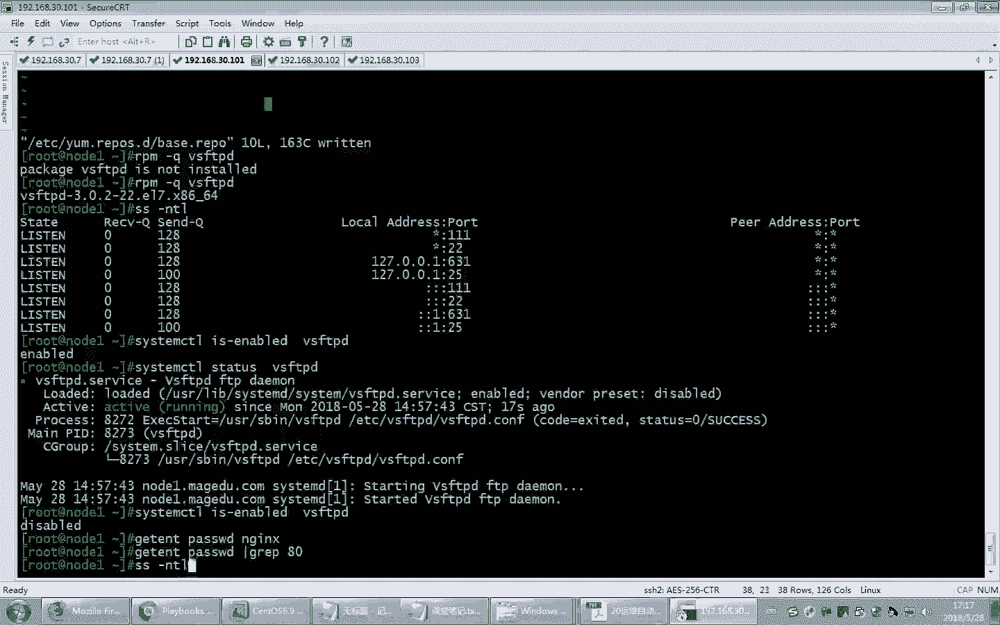

# Linux教程RHCE - P23：23.实现playbook高级应用和企业级实战 - 艾弗艾尔思丢丢 - BV1if4y1e73V

啊。来实现特殊的需求的一些特定语法。好，看一看这个叫hler。首先。3德。它也是一个任务的，就是list taskask列表指定了一些操作。不过呢它和我们一般的tsask不太一样。

好，大家看这是tasks。一个一个的任务，一个一个的任务。而这些任务相当于我们写在脚本里了，按照次序一个一个执行一个一个执行。那通常来讲，这些任务就是按照次序顺序执行。

他不敢不管你当前的客户端的状态是什么，就按照顺序执行了。当然，这种次序执行就会带来问题。我们刚才曾经提到过一种场景，就是如果我现在更新了配置文件。更新了配置文件。那么将来这个配置文件复制过去以后。

我把这个服启动起来了，结果。

我再次更新这个配置文件。再次更新这个配置文件，我把这个文件改了以后，再执行这样的一个呃playbook。在执行完的时候呢，由于这个配置文件。更新了，我又复制过去了。

但是呢这个服务由于前次的时候是不是已经启动了。所以这样的话，这个文件是不是就是相当复制过去并不会生效，因为服务不会启动了。那因此在这种场景下，我们可以用handnda来解决它的作用是这样的。

相当于一个触发器。er是一个触发器。

这个触发器和taskk4呢是并列的，就是没有什么啊并列的关系，不是直接的从属关系啊。tsask呢这儿是一堆任务，而huler是独立的一个相当于一个元素。它和这个tsask是并列的关系。

那它和taskk之间的关系是什么呢？就是它可以来监控其中的一个tsask里面的action动作。监控其中的一个action动作。其中，如果发现一个action动作执行了。成功了。

那么它将会触发handlers后面定义的一些命令。

它是这样的一个效果，所以还需要配合一个notty。notify呢翻译成通知。hander怎么翻译啊？他这儿怎么翻译啊？手术。控制器控制器。处理操作它实际上就是个触发器啊。

触发器它可以配合noticenotice呢是其中的一个action。然后其中某一个action如果发生了执行操作，那他就要通知。

handler来执行。所以你希望某一个任务就是某一个action在执行的时候一旦发生变化了，我希望通知handler。所以这个地方呢我们就要写notify这样的一个关键字，加在某一个action的后面。

表示其中的一个action一旦发生变化，它将通知handler的执行。好，那下面咱们来实现一下刚才这个场景，就这个情况。

好。咱们这样编1个HTDP的。回完没有？杠杠杠。干。后四次。空格外部 service。然后这儿写上嗯remote。user一般来讲是root。哈斯克。杠。内蒙。那我这儿假设有三个任务。

第一个任务就是装包。第二个任务是改复制配置文件。第三个任务是启动服务。所以为了看起来更清晰，我们就写三个name。有三个任务。啊，这个任务呢，咱们就叫。action啊叫action。第一个任务呢。

我们内幕是个描述啊，第一个任务呢是装包，那我们就写上inst。装包啊包名叫HTDPDpackage。这是第一个，当然这有空格啊，你发现这个不带空格是不是颜色都不对呀，加空格。好。

这儿第二个呢是拷贝配置文件。copyconfi文件。第三个任务呢是启动服务。所以我们把服务启动起来，start呃 service。好，把这个思路先捋清楚啊。好。

接下来我们具体每一个action是不是有相应的模块来实现的，所以这就要开始写模块了。当然要安装软件包，是不是应该用亚么对应的这个模块来完成啊？啊，当然我们要装HDDB怎么装来着？

name等于HTTPD是不是就这个包，哎，后面不用写了啊，它默认是不是就present嘛？啊，好，后面再来是不是要拷贝配置文件呀？那配置文件呢我事先已经准备好了，假设。

因为我在我的机上已经把那个HDDP这个服务器软件都装上了，所以它对应的配置文件已经有了，就拿这个文件吧。但这个文件呢，我最好放到当前的fas目录下，是不是这样比较方便，还记得吗？是不是这样的话。

是不是咱们可以写相对路径啊？记得吗？是不是可以写一个相对路径，这样就行了。啊，这个就是模板了嘛？好，接下来我们翻过头来看。这儿写copy模块，对不对？呃，路径是在菲尔斯下的，叫什么来着？

HDTBDcom是吧？哎，当然我这是不是要写上它那个什么source SRC，对不对？SRC。啊，目标是谁来着？DST复制到哪去啊？复制Tcom点HT当然不用写了，因为文件名和这个是不是同名啊。

同名就不用写了。当然我们为了安全，是不是最好做一下。备份啊就是把原来的机器上是不是有可能已经有这个文件了？哎，因为装包它就会有嘛，所以他为了为了万一将来样还原，是不是做个备份比较好一点是吧哎？

然后接着我们要起服务service，然后呢，企服务叫什么来着？HTTPD然后呢启动服务是什么来着？started是这样的吗？而且我们需要设为开机的时候是启动的，是t或者y都行。这样的话。

这个任务是不是就写完了？

当前。

我们把fi这样的一个文件。配置文件给它改一改。比方说我们现在希望他。监听端口是。80。现在默认是80，我不动它。

那也就意味着将来把这个文件复制过去以后，将来这两台主机它将来开启的端口应该是80端口。

当然我们现在看一下，哎，已经起了，那我得把这个包还得卸了它是吧？啊，卸了它on the呃web等我们所有的都卸了吧。呃，它用的模块就是样包呗，压模块嘛是吧？把这个包卸了，卸了的话，应该用什么来着？

name等于HBDda等于ab。

IRe。remo对，都可以啊。好，那现在你看我这一卸的，一旦卸了以后，它的端口自然也就关了啊。你看80是不是没有了，然后102这应该也没有了啊，102我们现在这个102是不是也没有了？

然后我刚才 webservice这个列表里面的主机只有这两台主机嘛，101和102是吧？那这个103，因为103是个sto6啊，stos6的话呢，配置文件格式不一样，所以我就不不去拿103做实验了？好。

😊，好，接下来咱们来看。

我们把刚才写的那个脚本儿。paybook执行一下。那playbook呢我们写到这个里面了。好，现在我们来执行一下叫unsable playbook，然后是不是检查一下语法最好是吧？干跑一次。

看能不能跑起来。如果没有错。

他就不会提示什么问题。没问题吧。好，接下来咱们来真正的运行一次。大家看OO。改变的话会发生三项改变，看见了吗？就这三项是不是都变了，第一步装包，第二步配置文件，第三步重启服务是不是都会发生变化。

如果你要真正执行的话，是吧？好，执行。好，现在应该执行了。执行完了以后，我们来看一下on theible呃，web service，查看它一下那个端口是不是打开了啊，端口打开，咱们用什么来着？用SS。

直接看。冒号80丑霉虫。必须开，对不对？80端口是不是开了，已经哎，说明服务起来了，这个好像挺顺利的那接下来我们就遇到问题了，我们现在把配置文件改了。改端口了HTPP把配置文件咱们改成8080。

当然这个文件被我改了以后，那现在我们再重新执行一下这个paybook。第一步装包由于曾经装过了，所以它不会再执行了。那第二步它复制文件还会复制吗？肯定会复制啊。

因为这个文件是不是和原来的文件已经不一样了，所以它会覆盖啊，当然覆盖的话，因为我们刚才不是加了个backup嘛，所以它会做备份。事实上刚才就有做备份。因为我刚才原来就人家装包已完了以后就有这个文件啊。

大家可以看一眼ETCHTTP看for下。有没有这个文件？有。没有这个配置文件，没有那个备份是吧？呃，我看我那个备份是不是写写的有问题啊？ETCHDDBDcom。应该是放在一块的呀。放在一块的。

没看见是吧，对。看我们刚才那之前写的那个高配模块，看有没有问题。copy模块。没错啊。是吧。

Back up。那我再来一次啊，因为我这现在把这个文件改了。好。然后再执行一次。还是没有更开。那现装包了吗？装包它就有了。装这个包就会有。啊，当然我们现在。再把刚才那个80端口变成了8080以后。

这个文件已经被我改过了啊，这个就是模板文件现在被我改过了。改过以后呢，我重新执行一下这样的一个playbook。好，当然我这回不用检查了，因为这个语法没有问题，再执行一次。你看。看到提示了吧。

你看装包是不是已经装过了，不用再装了。然后配置文件是不是变了，所以它黄色的那服务是不是已经启动了，所以它就不会再重启了。好，这时候呢我们再来看一下它的端口。显而易见，应该猜到它端口还是。

80。所以我们的配置文件改完以后，是不是就存在一个问题，它没生效啊，对吧？没有生效，你看哎，不过这个你看确实有备份吗？是不是有备份啊，刚才可能是没有。好了。那他是说明他很聪明嘛，是吧。

他发现哎这个文件装包复制文件在一块。所以即使有这个文件，他也不生成了，因为是第一次嘛。好，然后呢我们来看现在这个80端口没有生效，我们希望改成8080。那如何来实现这个问题呢？我们希望的是。

当一旦发现配置文件发生变化，我希望自动的把服务重启。实现这个功能，就配置文件变了的话，就把服重启重启。那需要我们借助于刚才说的hundler来实现啊，那怎么做呢？这么做，大家看在这儿再加一行叫h。

你最好加一个换行啊，这个为了区分一下啊。好。好，然后呢在这儿加上name。你要干嘛呀？重启。Service。听懂了吧？那我们是不是要重启服务啊哎重启服务。所以这个地方呢我们要加上重启服务的操作。

然后接着重启服务，你要怎么重启，你是不是要对应调用它这个service所谓的模块啊？对吧那无非这个地方就变成什么？啊，这是不是就不用写了，因为前面已经设过了，这是不是写成。star就行了。啊。

但是这样做完以后，我们只是做了一个handler这样的一个触发器。这个触发器它并不知道是针对哪个前面的动作来触发的，听懂了吧？他不知道你这有三个任务啊，这三个目啥时候执行这个触发器里面定义的动作呀。

那你得告诉他呀，哎，所以我们这儿需要针对哪一个action来触发它，那这个。配置文件的发生变化，我才触发这个动作。所以我要放在这个呃action的后面叫notify，听懂了吗？那notifyify啥呀？

就是说当我的配置文件一旦发生变化，这个动作一旦执行。😡，那我就触发这个动作的执行，这个动作是不是有名字啊？所以这个名字写在这儿听懂了吧？这个名字和这儿对应号对应好，它是成对的。

对吧因为你这儿是不是有好几个动作，那谁触发它，另外这handler是不是也可以再加别的？我们是不是可以多多几好几个汉字是可以的啊。听懂了吧？哎，那如果说我们另外一个动作触发不同的handler。

这是不是就要配套来使用了？一个noteify对应一个。serverice就对应一个action，就是hundd个action啊，是这样的。好。那这个对应关系要搞清楚啊。好，那到此呢，咱们现在就。

把这个问题用handler看看能不能解决。那现在我们再执行一次。对，这次执行的时候，因为这个文件是不是变了？他在复制，但是这个包。因为有了不装了吧，服务也起来了，是不是这都不做了。但这配置文件。

但是我现在。😡，但是就没改呀。因为这是后加的嘛，后改的之后还得再改一次。😡，是不是还得再改一次？这所以我这还得改一次啊。啊，但刚才是改成8080，这个文件已经复制过去了啊，已经复制过去了。

你看一下ETCHTTPcomHTTP啊，你找一下呃。

这样吧，能看见。嗯，过了。肯定复制过来了吗？虽然复制过来，但是我们刚才说过了，因为它没有服务重启嘛，所以它没生效嘛。对不对？好，那现在我们再把它改一下，这回改个别的。927哈，你们都喜欢927哈。

9527。😊，这时候配置文件发生变化了，我们再去执行这个paybook。当然第一步装包不做了，第二步配置文件会复制过去。当然一复制，它就会触发咱们的handlerler的执行。

而hander里面定义了服务重启的操作。大家看到吗？是不是触发了hler的执行，最大是不是执行了。那现在理论上服务应该已经生效了。当然我这搜索应该搜那个9527端口。整了吗？理解了吧？哎。

你看hler和noting five这两个配合起来是不是就可以更灵活了？当然。

我们还有一个也是非常。常用的技术。啊，叫tax。所谓的标签儿。标记。这是刚才说的那个例子啊。好，还有一个叫。对意啊这儿还可以通知多个哦，看到没有？就是我这hand上是不是可以定义多个呀？那定多个的话。

你看这是不是可以。这是对应这个动作action下面这个是不是对应另外一个。Action。那就意味着这个。操作发生变化以后，是不是可以触发多个。action动作啊可以触发多个啊，不过触发多个的话。

你这是个列表啊，需要这样写触发多个。这是个列表。这是啥意思啊？这Q2咱们讲过，Q2加就是向他发零信号，什么意思来着？这以前你不是讲过吗？80信号就是探测一下此服务是不是启动了，有没有问题。啊。

如果返回的是非0。到尔问号非0，那是不是就说明这个NGX服务有问题了，对吧？所以它这个效果是什么呢？就是我复制过去也要重启服务，结果重启服务是不是万一重启不来呢？对不对？是不是有可能万一出起不来呀？

所以我们是不是要再检查一下这个进程是不是启动了。对吧。这份启动。所以这个地方它可以执行两个动作哦。这两个触发。当配置文件复制过去以后，第一步触发重启，第二步触发进程的检查。

但这个精程检查就是放了一个文件而已。放到这个文件里了，生成一个日志文件。当然放到实认证文件里面，是不是咱们将来可以抓取过来？啊，看一看它里面的内容是什么，对吧？根据它内容来决定到底是启动没启动。好。

接下来我们来看ts。ts呢就是相当于给其中的一个action起个名儿。

起个标签起个标签儿。什么意思呢？是这样的。我怎么又执行一遍？好，是这个意思，我们这儿可以给它加标签tax。那加标签的效果是什么呢？加削边加加这个标签的效果，就是将来我们可以调用这个标签里的内容。

调用标签的内容，通过标签指定一个关键字来调用它。比方说我这儿是inst HTTPD。啊，然后这个呢也可以加个dax。这个呢叫什么重启服务啊，RS。Restar。HTTPD。听懂了吧？那这样的话呢。

你看是不是有标签了。有标签了。然后有标签带来的效果是什么呢？我可以单独的只执行标签。我可以单独的只执行标签。我可以挑标签来执行，这也是可以的那通过指定标签来决定执行特定的一个动作。比方说。

假设我们想执行这个标签里边定义的这个动作。这是把服务重启呃，把服务启动，把服务启动。那这时候我们可以通过这个操作来执行。但是我现在先把这个服务停了它啊。我先停了它。停了。停服务的话怎么停啊？

杠Mserv。杠A。name把服务HTPB服务停了，停了是用啊state等于。sto是吧。好，停了停了以后确认一下9527服务端口没了是吧？然后呢，现在我就想把这个标签里面定义的这个动作执行一下。

其他我都不想执行了。这个动作我就想执行一下。就这个启动服务这个动作执行一下，这时候我们就可以用刚才说的unserboard playbook。我们这儿不过要挑着标签里面定义的action来执行了杠T。

那杠T我要表示我只执行RSHDBD这个标签，其他的标签不执行，听懂了吧？我就挑标签执行，挑着标签里面定义的动作来执行。大家看这是不是应该有。是不是只有他启动了，别的是不是都没做呀？看到没有啊。

根据我们刚才讲的，如果成功9527，是不是端口又开了，应该。看着了吧，可以挑标签执行。挑着标签来执行。当然，挑标签执行，那我们也可以针对。多个标签儿。都执行啊，比方说我这儿刚才不是还有一个。

装包启动服务嘛那装包那装包的话呢，我把这个包给它卸了。卸载包的话呢用。亚么。这个是不是应该写成。Abbent。这不就把这个包给它卸了嘛，是吧？卸了以后，待是我们来确认一下这个包是不是真的没了。没了吗？

看是不是没有安装嘛。对吧那现在我就可以来执行两个标签。因为我们刚才在它上面有两个标签，一个是装包的标签，一个是起服的标签，看现了吗？我现在是不是就可以把这两个单独挑着执行一下啊？这个配置文件暂时不考了。

因为系统本身就有待配置文件的待配置文件，它启动的端口是80端口。所以我这儿就可以来指定指挑这两个标签定义的动作来执行。第一个呢叫INSHGVD，还有一个呢叫RSHGVD听懂了吧？

那是不是就是挑了这两个对应的动作来执行啊？那这这个我这没没指定嘛，没指定，是不是就不执行了，对吧？好，大家看这是不是其中第一个动作啊。第二个动作是不是执行了？嗯，star。开始执行。啊，执行完毕以后。

端口应该也打开了，包应该也有了。端口应该是80端口，也默认是80端口。啊。好，这就是对于标签的这样的一个使用。当然了，这个标签我们刚才定义的时候，是针对不同的动作定义了不同的标签。当然我们能不能。

实现一个功能呢，就是我能不能两个动作使用一个标签呢？就是这个动作用一个标签，下一个动作还用同样的标签行不行呢？比方说我把这标签都给它改成这个。都叫HTPD听懂了吗？那这两个动作对应的是一个标签行吗？好。

那现在我同样的还是把这个包。卸了它。卸了以后，咱们来看一下。这个包确实已经卸载了，看出来了吧。好，接下来我们执行一下。当然这时候呢，我们执行的标签是不是只有这一个标签？就是HTTPD这个标签。

而HEBD这个标签里面定义了是不是相当于两个动作呀？两个动作都叫HBD，那它是不是就会都会执行呀？

好，咱们执行一下看看。看到了吗？是不是执行了？所以咱们多个动作可以共用一个标签也是可以的。多个动作共用一个标签也是可以的。当然咱们刚才讲过一个选项叫tsask。是不是可以挑着只看他的标签信息啊？记得吗？

这现在是不是就看到标签了，明白了吗？这就是那个。パースです。那ス。哎，就那个标签。就现在给他个关键字嘛，就代表着那一大串action。给它起一个标签，起一个别名，相当于。好，这就是我们说的tasks。

好。

接下来我们来看另外一个内容，就是playbook里面如何来使用。变量。

刚才我们在使用的时候，每个。paybook里面定义的内容都是定义死的。不是很灵活。所以换句话说，我们这儿定义的webserv里面的所有用，所有主机都将按照这个次序执行。而且是做的一样的事儿。

显而易见并不灵活。我们如果要利用变量。借助于变量，将来就可以针对不同的场景应用不同的变量。进而不同的主机将来生执行的操作是不一样的那因此就要用到变量的这样的一个概念了。

那变量呢我们来看它可以在什么地方来使用呢？

这么多地方都可以用，当然变量的这个名啊是有要求的啊。就是只能以字母开头，也可以用下划线什么数字之类的。但是你只能用字母开头，后面再加数字下划线啊，这个和我们前面学干事是不是差不多呀？

但是里面变量不也有要求吗？类似的。好，那接下来我们来看看变量的定义。我们可以在bounport set up factors。什么意思呢？set up是个模块，set up是个模块。

它可以直接里面内置了系统中的变量啊，我们来看杠Mset up这是个模块。

你看这个模块默认的操作是干嘛？这个忘了少少写了一个。例ば serviceス。好，大家看我把它分页显示一下啊，你看看。这什么东西啊？1011大堆动作，这什么东西啊？是不是地址？架构你应该猜到了啥意思？

这是。啊，这什么东西？哎，这不就是你当前这台电脑的系统的各种信状态信息吗？你看他都给你收集起来了。啊，实际上咱们之前不是看到过有什么主机名之类的吗？也在这里面。所以我们当然我们将来想挑着看啊，挑着看。

挑着看的话，你这么多，你要太这么一下一下看太多了啊，我们可以挑着看，挑着看怎么挑呢？比方说我们想挑着主机名，主机名是哪个来着？在当前咱们有一个改主机名的叫FQDN吧。

unsible sFQDN或者unible no not not name。还有hosse name，还记得吗？不记得了。改主机名，那改个主机名不就知道了。咱比方说把这个。呃。

192168改一台机器的啊，30点呃，101103给改了吧。改主机名，用hosse name这个模块还记得吧？呃，改主机名怎么改来着？name比方说叫not的。33啊都加了一个啊，原来不是叫纳尔3嘛？

你看他这提示你啊，你看这提示你这调用的是不是就是set up模块里的内容？这实际上是他就把那个系统信息变了嘛，系统信息变了，他就会提示你说，哎，这个新的stop模块里面的特定的主机名相关的信息已经变了。

所以既然如此，我们在stop里面就可以来查了啊。当然我这儿。可以过滤一下啊，你看过滤一下。比方说咱们就过滤什么的？unible FQDN。看看。看到没有？是不是放主机名的啊。

on whose name是不是也是一样的？不过就是有的是全名，有的是简称嘛。是不是？看到了吧？当然这么过滤有点太老土了啊，因为咱们有专业的称呼写写法啊，人家有专门的写法，那就是用杠A。

杠一人家可以支持过滤，支持过滤啊，过滤的写法呢是叫filter。听懂了吧。哎，比方说我就想看unible的ho name。这样就行了。走。看上了吧，这是不是可以挑着过滤啊。

当然什么FQDNDNFQN是全名嘛。看到了吧。是不是给过滤出来了？当然了，这支持支持这种所谓的什么通配符之类的吗？走少。哎呀，太多了。白了吗？啊，比方说我就想搜找那个什么带address的。带地址的。

你还找到ID地址嘞。是不是这挺好啊？把这地址显示一下。咱们就想显示。当然时保的。IPV4address。看见没有？那这个信息有啥用啊？这个信息实际上就是变量啊，这就是变量嘛。那这个变量。

既然我们看到它的值了，将来就会以调动它。你可以调用这个变量，将来利用这个变量可以配置你的系统，或者也可以作为条件。比方说当你的IP是什么什么的时候，我去执行什么什么动作。就作为一个异步条件。也是可以的。

啊。当某个变量的值是什么的时候，我去执行某个不同的动作。这也都可以拿过来用。好，这就是内置的这样的一个set up。所谓的。模块啊set up这样模块。当然这个地方我们可以看一下它的网卡。

我这有几个网卡呀，我想知道这也有一个和网卡相关的一个模块啊，叫ETH。芯儿找找啊有没有ETH芯儿。看到没有？昂斯宝ET是0。所以如果你想看。第一个网卡的设置，那就是ETH0untableETH0。

看到吗？嗯，当然有些东西。大家是不是看起来有点面熟啊？那这些都是网卡的设置吧。什么发送RX是不是发送包TX是不是接收呃，就是RX接收包TX是不是发送包。对吧这还有地址信息等等，这都能看到。好。那。

unible，咱们用set up里面看到了变量，那这个变量我们也可以在我们的系统中来去调用，或者是查看，去引用这个变量。

我们可以在。微book里面去调用或者定义这个变量也是可以的。那怎么去定义或者是引用变量呢？我们需要在。

playbook里面去加一个这样的设置。比方说我们现在。在这儿。把这个文件给他，我是这样，我复制一下啊。呃，这个叫APPYML。好。在这儿。我这儿换一个。比方说叫A。APP。Sere。

对这个地方我们要装的这个包。Yeah。不是固定的了。装的包是个变量，听懂了吗？这个地方我要放变量了，当然这个我就不要了啊，这个你知道这个意思就行了啊，复制我也不要了。呃，启动服务启动服务也可以。好。

那这些暂时先不要。大家看这儿，这个呢是个变量，那这个变量我去。怎么去表示可以用一个花括号，听懂了吗？方号把一个变量名写上。比方说这个呢就代表着一个包名叫PKname，就package name的意思啊。

简写啊，这是我自己加的一个变量。这个名字是你自己写的啊，随便叫名儿都行。然后既然如此，我这儿是不是也可以重复调动它？因为这俩这不是正好一样嘛？包名和这个服务名在对HTTB服务来讲是不是正好是一样的啊。

当然有些服务不一样啊，包名和服务名不一样，这个大家应该知道的那比方说我们这叫PK内蒙啊。一般来讲，习惯呢这是加空格的啊，当然你要不加空格应该也可以。但是我们习惯性的为了看起来代码更清晰，建议加上空格。

然后这个是个变量名。所以注意这时候呢，这个playbook呢写的时候是不是就很灵活，它不是个固定的一个包名了。那这时候就有问题来了，那如何来在执行啊playbook的时候去指定变量名呢？

你这个playbook里面它没有定义死这个变量，对不对？没有定义死变量。那playbook我们需要去执行命令的时候加上对它变量赋值。对变量负值，那变量赋值有一个杠E选项。杠E选项。

这儿来对PK内进行赋值。比方说咱们叫VSFDBB可以吧。这个服务名它和这个包名和服务名正好也是一样的。所以我们用它就可以。然后对APP的。外面在执行。这个就是对APP里面定义的这个变量进行赋值操作。

听楚了吧？那一旦赋值，那么PK name有值了，我们就可以执行它了。来我们看看效果。你看装包。成了吗？啊，那应该在这三个主机上啊，这个APP好像主要三台主机呢，是吧？啊，看一下。嗯。

叫APPservice杠M。是啊。他那个端口应该开了。灯口是。应该是。21端口。HDFDB服务的端口是21端口吗？开了吧。你这样的话，你看这样的一个unceible的。

变量使用是不是就可以直接去调用unible外部定义的这样的变量？这样的话，我们的playbook是不是就不是一个写死的东西了？是吧。这样的话非常灵活了。好，这就是我们刚才提到的这样的一个问题。

那定义了变量。当然我这个变量呢可以定义多个啊，我也可以定义多个变量也是行的啊多个定义变量。比方说我们想装两个包。那装两个包的话呢，你在这个地方还要把它再改一改。复制一下。啊，我就装两个包啊，我光装包了。

我不起服务了。所以这个。我就不写了，删了。啊当然这个名字呢不一样，这个叫一，这个叫。2。哎。这是两个变量。两个变量。然后我们现在呢想对。两个包进行安装。那两个包进行安装的话。

我这是不是应该有两个变量赋值啊？那两个变量负值我们需要用杠E指定一个变量，然后通过。哎，我们实际上这个样装包能不能一下装好几个呀？可以吧可以，所以我们这儿是不是也可以逗号隔开，逗号隔开是不是装多个包？

可以吧哎。当然我们这儿现在先先这么分开写啊，先这么分开写。那我们来执行一下，看看效果。杠一。还需不需要再加个杠样E选项啊？PK。内幕2。这前面是一嘛，对不对？呃，换一个包吧，HTTBD换一个。还有个。

meber开再换一个包。好，看一下这两个。变量负值。哦，应该是可以的。可以的。那现在我们来确认一下。RPM杠Q。HTTBD和。Never catch。我们刚才是对。APP service。确实装了吧。

看到没有？成功了啊，那待会我这个不想要了，我卸了它吧。卸了的话，我就偷懒了。这是不是也可以啊？这样是不是也行啊，就相当于执行命令了嘛。来写了。啊，这也是可以的。写了。好，这是对应多个变量也是完全可以的。

我们可以对多个变量赋值。另外我们在playbook里面也可以直接去定义变量。然后将来在不同的环境中去调用变量也是可以的那我们现在比方说在APP这个变量这样的一个所谓的probookplaybook里面直接去在这儿来定义变量。

而不是在我们执行playbook里面临时在命令行里面去对指定变量赋值。那在这儿定义变量方法呢就是这样。这儿有一个叫vas。Plus。然后换行敲两个。空格。啊，比方说我们这是不是刚才有一个拍摄。

我就用这个吧，这不有两个变量调用嘛，那我这就省事了啊，叫杠。杠names。应该是我们变量名叫PK。nameモス内モ。啊，比方说这个叫HTTPD。然后杠。PKname啊，应该是一，那个是2。啊。

比方说这样的名字看出了吧，就是在这儿来定义。声明变量，并且对变量赋值，下面是不是去调用变量就完了。就是我们这个定义变量呢，就是在这个脚本中直接就定义完了。

在这个playbook里面直接去声明变量去使使用变量也是在里面去使用就完事儿了。啊。你看我再次执行一次。当然这时候呢，由于在facebook里面已经对变量进行了赋值，所以我直接去执行它就行了。好，你看。

再次执行成功。当然我们现在刚才装的软件包，一个是HDB，一个是VSFDB所以这HTDPVSFTDD查一查应该装好了。看了吗？再次成功。好，这就是我们对playbook里面，当然我把它卸了啊。写了。

这TTP。好，大家看在这儿也可以定义变量，这不就跟我们写的share脚本是风格。虽然说这种形式上不太一样，但是思路上类似的嘛啊变量值是赋值后面是引用不就完了嘛，对吧？

它也是可以这么做的也是可以的那这就是在playbook里面去定义。变量，并且也可以使用变量也是行的。好，那除此之外，我们还可以在别的地方来定义变量。比方说我们还可以在。

的清单文件中来定义变量。刚才咱们已经给大家演示过这两种方法了啊，你看是不是在命令行里面定义变量，就是对变量赋值啊。还有一种方法是不是在pro book里面用va一，就是用vas这个语法来进行变量赋值啊。

哎，刚才这种方法在这是set up里面内置的变量啊，可以直接调用。这个我们后面再详细说，我们已经看到变量的内容了，要想调用怎么去调，我们后面再讲啊，后面再讲。好，这是我们刚才看到的。接下来看看这个。

这个呢就表示这是在主机清单列表中文件中也可以定变量。而且这个变量呢它有两种，一种是普通变量。在主机组中，针对单个主机单独定义，还有一种呢是组的公共变量。

组的公共变量，大家记得吗？我们在。主机清单中主机清单中，也就是这个文件了，on ball host。在这个主机清单中，我们曾经对主机做了一个分分组，这不就组名嘛？是吧？这个是组名，这是组名啊。

那其中我们的变量可以针对单一的一个主机来定义变量。也可以针对所有的主这个组中的所有主机统一定一个变量。

也是可以的。所以这就是两种变量啊，一种叫普通变量，是单一的单个主机有效。也可以针对组来通通有效，这也是可以的。比方说咱们现在想这样的一个功能，我想。在某个服务器上用的端口不太一样。例如101。

我们想在上面定一个变量，叫HTDP的port。

我希望对这个变量将来负值是比方说这是81。好，然后这个呢HTTP它不一样端口，它是HTP的。比方说82，听懂了吗？这样的话，每个主机是不是就各有各的端口号了？就是各有各的不同变量。听懂了吧？好。

那这就是对不同的主机有单一定义。那单一定义完了以后，现在我就可以来，比方说我定一个hos name这样的一个YM啊。杠杠杠。然后盖儿。号是是。外b service。Remote。有点。右侧。他斯克。

内幕。好，那现在比方说我就想把主机名改了。定义主机名。啊，更改主机名hosse name。定义主机名。set设置主机名，当然设置主机名还记得怎么设来着？啊。用哪个模块来着？是不是有个后内幕模块啊？

然后name么等于哎这时候呢，比方说我想把。它的名字叫3W，不过呢后面加上。他那个变量听懂了吗？呃，刚才变量是不是有个HDDP？Pt呀嗯。听懂了吧？啊，比方说后面再加上一个U后缀啊。好。

这样的话咱们把不同的主机的变量，咱们就给它加了名字了。配合不同的变量，实现了不同的主机名。好，那现在我就写简单一点啊。好，接下来我们去执行一下playbookontable playbook。

检查一下语法有没有错。没有问题啊，然后呢我们执行一次。那理论上它的执行效果就应该是把web server这里面两台主机，也就是101102，是不是各自的主机就改了，主机名是不是就变了。

应该一个叫3W81，一个是不是叫3W82。对不对？好，那看一看是不是这样。

当然我们现在是不是就可以在上面去查一查了，是吧？unsible呃，叫webservice。杠啊直接杠一把，是不是hoss内幕命令就可以了。

对吧。行了吗？明白了吧？你看是不是很灵活了，你看各个主机是不是可以不一样了。当然它这些变量的内容显而易见是不是就是来自于host？就这里面定义的。对不对？但是。刚才有一个重复的操作。啥重复的操作呢？

就是这个hosse的 name幕，这里边这个3W这个名字是一样的。对吧那这个一样的话，这个预估率是不是也一样？😡，那如果是一样，那干嘛非得重复写啊，对不对？我们是不是可以拿一个变量来保存呢？

而且你发现没有？这个3W和马vio是不是针对外部serv的所有主机都是用的是相同的设置啊。而只有这个断口号是不是不一样的？所以我们现在就可以这么做，我们是不是可以定义一个通用的分组的这样的一个变量呢？

那这个变量是适合于webserv里面的所有所有主机，所以它配的时候就这么写中括号。中括号叫webserv冒号，注意加一个叫vas。那你应该猜到了，我们现在干嘛呢？

这是我们是不是针对webserv里面定义一个统一的变量，这个变量是应应用在webserv的所有主机的。明了吧？好，那现在比方说我们的啊主机名。叫。呃，那的 name幕。那内部呢是呃。3W。然后呢。

doin name。是马哥EDU点CO听懂了吗？哎，这样的话就意味着这两个变量是针对webserv，这两个主机都有效的。而这两个呢是不是针对单一的一个主机有效的？好。

那现在我们再来改一下host name这样的一个所谓的啊playbook。那这儿我是不是就可以调入那个变量了？那画括号。刚才叫娜的内蒙啊，中间没一点是吧？那这个是。哎，这有个点儿的这个点儿得加啊。

这个刚才咱们没有加点儿。点儿后面跟上。叫抖明。name域名。是不是啊？这是不是就可以？啊。没错吧。没错。好，再来试一试啊，当然这个改过了是吧？改过了，看不出来了。调一下。啊，就这这俩主机临时改一下呗。

这个位定是不是可以改啊？Se。bos that name？这个还叫not一。因为改过了，他因为我们没有重启重新登录，所以他这个提示现在还是这样的，但实际上已经改过了，你看了吗？已经改过了啊。好。

那现在我要给他故意改一下。这份改出改过来吧。然后这个也是一样，host name CTL setho namenot2，这是不是又给。调过去了。跳过去了是吧？好，然后我们再走一遍。叫钢时包。

Playbook。看语法有没有错。没错是吧？好，然后再走一遍。

好了，你看两边是不是都已经成功了是吧？成功了以后呢，我们再来执行一下命令。

On the ball on the ball。走。

改了没？是不是又改过来了，发了吗？这是不是就是来自于通用变量的这两个。是吧这个是不是个性的，就每个主机有单一的变量设置。看到了吧？哎，这样的话用起来是不是更加灵活了？发现了吗？好。

这就是我们变量的定义啊变量定义。当然我们还有更多的内容。比方说在playbook里面也可以啊，刚才讲过这个了，可以单独的用vas来变量来进行变量，也可以在角色中再定义，这都可以。那刚才这些例子啊。

你看这都有。

刚毅是通过。临时的去指定电量。

当然这个地方有一个小小的问题啊，如果我们刚才执行的时候，虽然在hose name里面已经定义了。变量名称调用的什么？然后呢，我们在unserible的主机清单里面也定义了变量的值负值了。

但是我去调用变量，调用playbook的时候，我故意的加了个杠E。你说如果我这样人为的指定，比方说我叫纳的。内么我这直接为它给指定一叫外吧。你说说这时候 domainmin name幕。老女。啊。

比方说叫example点com，你说我这儿设置的这个变量，它的值。有效啊，还是在主机清单里面定义的变量有效啊？走走看看。看你猜对没有啊？猜对了，说明你前面的学的基础已经慢慢的会扩展了，是吧？哎。啥。

如果你没猜错，没没有猜对，猜错了，那说明你对linux的精髓还没有掌握，没有不会举一反三的。你要知道命令行的优先级通通一般情况下优先于你的配置文件。一般是这样的规则。

因为你这你想我就超流命令我都明显的复值了。你说你这配置文件里面的东西怎么能有我这儿临时指定的优先级高呢，是不是？😡，显而易见，应该是我命令里面的优先级要更高，一般是这样的规则。一般是这样的规则。好。

你看这是不是又又再次改过了是吧？嗯，好，这就是我们变量的使用，变量的使用。所以这里面就告诉我们一个优先级问题。

刚才提到了普通变量的优先级，应该比公共。也就是说我们分组的那个组变量优先级要高，这个应该好理解吧。

就是我们单一的那个unerible清单里面。清单里面这儿定义的变量是不是应该比这里面定义的优先级要高？那换句话说，如果我这儿。假设这又定义了1个HTDP的。Pot。是80。大家想。显而易见。

人家这定义了8182，你这是不是定义80，那应该谁的优效级高啊？它也越高呗，对不对？啊，但是呢就怕你这又加了一个新机器，新机器，比方说30。103，结果这个机器它没有定HDpo。

那是不是这个公共变量就有效了？听懂了吧。哎，所以这个应该是普通变量优先级，比这个分组的公共优先级要高。听懂了吧。这就是我们给大介绍的这样的一个变量的内容。

那今天呢咱们重点给大家讲了unible的各种模块的使用。基本语法我们在不断的编这个playbook的时候，也经常调用了。希吧下来大家把这些模块，每个模块常见模块都要去试一试。然后你只有掌握了这些模块。

你是不是才能更好的来去编写playbook？那playbook又像我们编脚本一样是吧？哎，编角本我们会涉及到什么循环呀、条件判断呀，将来的playbook通通也都支持。啊。

所以所以这个万变你这个逻辑性你必须要有啊，你没有逻辑性，将来真的是干啥都干不了是吧？哎，不仅仅是写share脚本。你将来什么地方都会用到这个逻辑性的处理。所以下来大家还得多练。那。

今天呢咱们学习的内容重点就两个，一个是各种模块，一个是playbook的基本写法。playbook里面的基本写法，其中一定要注意。啊。这里面。杠杠杠。Host。remote user task。

然后一个一个task。然后其中我们又给他介绍了什么呢？handler，记得吧？handler它是配合notify来一块用的啊，两个不能独立用hler和notify是来触发的。

实先触发器相当于当一个动作发生的时候，触发另一个动作的执行。那再有就是ts是不是标签，记得吧？呃，讲完标签以后，我们最后又补充了一点变量的使用。变量我们可以在好几个地方来定义啊，你可以在命令行中定义。

也可以在主机清单里面定义，还可以在我们playbook里面定义，各个地方都可以定义。啊，那我们今天就讲这么多，大家能消化的了吗？慢慢消化吧。好，那今天就上到这儿下课吧。😊。

