# Linux教程RHCE - P2：2.vm部署Linux以及基础命令 - 艾弗艾尔思丢丢 - BV1if4y1e73V

Are you happy in this modern world？🎼何必。🎼Is there something else you searching。OK好，那我们准备开始我们今天这个课程了。

好吧，因为今天有不少新的同学加入到咱们课程里面，有迟到的同学还是有的差都有十几位。好，那我们先测试一下我们这边这个上课环境好吧，先打一下同学们另外的话咱们已经开始上课了，然后已经在录制咱们的屏幕了。

所以有些时候迟到的话会比较麻烦。好吧。好，那我们今天继续来说一下我们这个课程。还有的话就是说我们今天需要先下载一下我们这个相关的这个软件。大今天我们今天需要来动手再去操作一下。

所以我们现在去下载一下好吧。那我们先访问一下我们这个网站上面的配套资料库。好，我访问一下我们这个网址好，我们访下这个网址，大家一边来听课，可去下载一下。当然了如果说的网速有点慢。

或者说下载过程当中网速会出现卡顿的情况的话呢，那我们就可以课后大家去下载这个软件的话呢这个网址里面就包括我们今要去安装我们这个操作系统。😊，以及我们熏机的这个软件，大家可以现在去访问一下。

然后我们准备开始我们今天这个课程了。另外的话大家如果方便的话，可以在QQ群里面跟其他同学去说一下啊。我不知道刚才是谁开启qQ电话个不是我们上课个方式的。我们进入的是QQ直播功能。

大家可以在群里面如果要是有同学们还没有找到这这个上课方式的话，家以说一下们应该进入的是qQ直播qQ视频功能。好，稍微慢一点等他们一下好吧那这是我们这个要下载的这个工具。

我们进到这个页面里面大家话进入到这个页面之后，我们需要下载第一个软件我们做12版本这个机的这个软件以让我们我们这个服务器上面。

然后来去虚拟出来有多个这样的这个电脑们需要下载这个软件现在最新版本到了15版本。但这没有关系。那使用111或12或14或者。😊，15版本都是可以的。

但是的话呢我们建议都是使用我们这个网站上面去提供的12版本。因为我们呃现在目前最新的考前辅导模拟环境，那么只能是在用这个12版本它去打开的。所以说我们了以后去做红这个考试的题目的话呢。

我们还需要保持我们这个这个镜像这个系统为1版本大家可以来待会就尽量以我们这个网站上面提供这个为主啊，还有我们的第二个我们叫做我们叫做re系这个话我给大家讲过它是我们这个红企业版系统。

那我们现在的话它需要下载的时候需要一个验证码，大家可以扫一下这个我这边有一个微信号码，后就可以知道我们这验证码是多少了。大家可以不扫我们这个号码的话呢，我我拿家说啊，我们这个号号码的话呢是58514。

😊，呃，声音又大忽大忽小是吗？样我把稍微离得远一点，因为我离也比较近，因怕大家听不清楚。昨天我嗓有点受伤感觉那好，那我们现在啊那稍等啊那我们的话我们先在下载一下我们这个软件。

这个我们的验证码是585141大家可以直接去输入就可以了58514们一回车。然后我们就可以看到有两个下载这么一个软件包，大家有需要的。第一个的话呢就是我们这个讯拟机，我们来去下载一下。

然后输入我们这个验证码，这都放在百度网盘里面，大家可以去下载就可以了。然后我们提取就可以下载点这个下载。然后的话呢我们还有第二个就是我们这个操作系统，我们也要点击一下这个链接。

然后我们输入密码之后就给去下载了。好，这个大家多说了，为大家都应该是知道的。好，大家可以现在去下载。然后的话那大家可以在来一边去下载。然后来继续说一下我们今天课程的一个安排。

那么话呢我们今天这个课程安排主要就是给大家讲的就是去如何安装我们。😊，这个操作系统以及我们这个系统安装之后，如果要去敲一下比较基本的这个命令。其实我们还是算一个科普啊。

其实我们上一节课主要算作是一个开班仪式呃，我们根本就没有讲课，我们也没有去安装我们这个系统。今天的话呢，我们正式开始要给大家来安装一下我们这个系统呢，以及要去敲一下我们相关的命令。

这个才是今天这个呃我们来说才是我们这道培训的第一节课才说好，那我们接来我们去安装一下我们这个系统呃，我们需要先安装一下我们这个虚拟机的这个软件。😊，说我们能不能弄一个一个链接啊。

就是呃就是可以用迅雷下载那个是吧？呃这个可以考虑一下，但是目前还是没有的。但是我我会考虑一下，然后看看怎么去制作一下。好吧。

那我们现来看一下我们需要下载第一个软件包我们叫做VM做这叫做我们叫做M叫虚拟机软件。它的话就是可以让你在的电脑上面，然后部后可以去模拟出来多个虚拟机，来他去部署出来多个虚拟的这个软件。

那让我的话呢我不用再去为了做这个实验而去买多台机器了。咱比如说我接下来实验里面，可能咱比如说那我可能需要2到3台机器，两个32到3个服务器来去相互配合，才能够看到我们这个实验的效果。

那么这样的话我们就可以通过这个虚拟机去模拟出来多个这样的主机，然后让我可以来去顺利来去做这个实验。不用为了我们去学习我们这套课程，或者说去做某。😊，实验而单独再去买一个机器了啊，单独去买一台电脑了。

另外我给大家说一个原则性的。因为现在很多书上面给你们瞎呃我会给你们呃说一些不太正确一些思路是这样的。现在的话呢很多书里面的这个作者特别告啊，他啊他就他会这么告诉你说有两个选择。第一的话呢。

就是说我们如果要是经济条件要他要是允许的话啊，第一，我们的经济条件，他如果要是允许的话呢，那我们就推荐你去买一台真实的机器来去做我们这个系统的实验。第二的话呢就是说如果你要经济条件不允许的话呢。😊。

那我们就用这个讯机软件去模拟呃，结果好像我们呃使用讯机去模拟，只是一个下册而已。其实的话呢并不是那么我推荐的就是不论大家有没有经济条件，我们都使用讯机去模拟。那么这个有两个理由。

第一个理由的话呢就是我们在学当中的话呢，我们需要去破坏我们这个系统。然后因为我们在因为我们虽然是一个初学，我们需要对这个系统进行一定的这个破坏，跟我们这个各种的这样的尝试。

那我们不希望把我们这个所做这个破坏的话呢，我们去直接影响到我们这个真实的电脑上面。第二的话就是说因为我们要去做这个实验的时候，它相互之间它是有关联的。那我们需要来去回归我们这个快照功能。

那我们每次回滚快照的话，大概就只需要5秒钟时间，5秒钟时间就可以去快速回原你的这个系统的这么一个状态你只需要5秒钟就可以去快速去回原你的这个快照了。但是的话呢你如果是这那么如果你要是一台真集的话。

那么你要去。😊，去安装你的系统，大概我觉得最少怎么着也得30分钟，对吧？所以你你的这个时间就会都耽误在了重做系统上面。这个好没有意义的同学们，你们懂这意思啊，就是你们不要把你的时间耽误在重做系统上面。

所以话我建议就是不你有没有经济条件，你都是那么我们都要去使用这个虚拟机来去做模拟这个实验这样的话更加适合于你这样话会啊它是更加适合于你的这样话我们需要我们第二个软件，我们做系统经像好。

我一个一个去给大家去安装啊，现在安装一下我们这个虚拟机的这个软件。这我给大家去做。因为这个太简单了。只要你会安装QQ，那你现在你就一定能够会去安装这个软件。

那我们就来去一路点击下一步下一步下一步那么我们来重申一下。因为我们刚才有98个同学，现在有113个同学。😊，那所以的话呢我们再给大家啊那么我们再给大家去重申一下啊。

现在的话呢我我呃我们这个虚拟机的这个软件，它是有很多个版本的，它有它有9版本，1版本，11版本12版本14版本跟15版本。那么我们推荐使用12版本的原因，是因为我们今后会去使用到我们的红C的考试的环境。

那么我们的14根15版本目前不支持的。所以说到啊那你到时候你还要再给它还原到12版本才可以去做这个实验。所以说我们干脆我们学习的期间的话呢，我们都以我们这个网站上面提供这个镜像为准。好吧，那好。

那我们继续来我们来去来往下去安装，然后一路去点击下一步，最后就安装好我们这个虚拟机的这个软件。另外的话呢是这样的，其实非常纠结，对吧？我们说我们之前作为一个技术的一个课程。

然后我们又这么从尚于开源自有情怀这么一套培训课程。那我我们不应该给大家提供这种盗版软件，对吧？但是。😊，呃，其实同学们为了学习起，那我们为了学习的话呢，其实我们去使用一些免费的许可也是可以的，是吧？

那我们现在看一下啊，我们这边有一个图片，1-10就是在安装好这个虚拟软件之后的话呢，我们。😊，这里他会需要你来去输入一个密钥的这个密钥的话呢，我你可以去点击一下这边呃我已经有了这个密钥文件。

然后你去百度上去搜索一下，给大家一个叫什么，我们叫这个车牌是吧？我给大家打一下要什么车钥匙啊，车牌号码，大家就是有一个关键词，大家可以来去搜索一下我们叫做12pro它叫这个pro版本，然后我们叫做密钥。

大家可以搜百度上面去搜索这么一个关键词，然后就可以去找到我我们这个密钥文件，于是你就能够去免费去使用这软件了。好了，但我们当时不是推荐去使用盗版软件了。就是说如果要大家需要的话，你可以来去尝试一下好。

所以说你我听我说这个时候，其实我比较纠结啊。所以都有点语无伦次。因为我不知道怎么把我们这个使用盗版这么一个。😊。

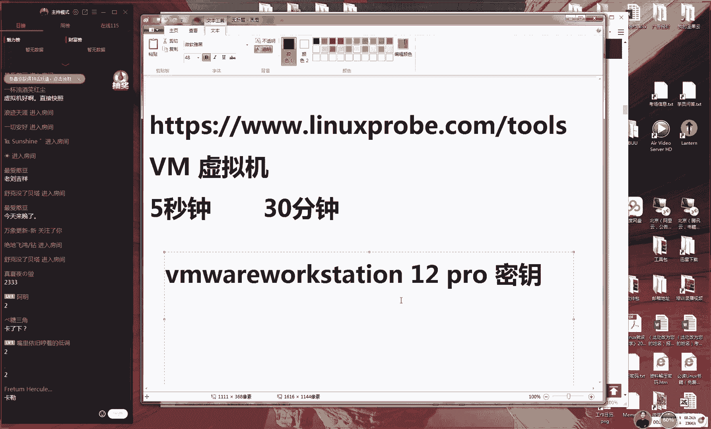

啊，很不道德一件事情，说这么冠冕堂皇。好，那我们可以来自呃自己看一下吧。如果大家需要的话，你们可以去百度上去搜索一下。其实这还有的那我只给大家去提一下而已。那我们如果要是有经济条件的同学。

你们可以去买一下这个软件的版权，其实也可以的，这个跟我们课能没有太大关系，所以我们就直接往我们往后去做我们打开我们这个虚拟机的这个软件，其实这个就是基本功对吧？

就是这是个基本功打家网上去搜能够找到了车牌啊，车牌，因为我看到网上面，因为大家知道有一个网站叫福利吧，你知道吧？然后那个站长的话，我们从0我们从10年就认识我们已经认识8年时间了。

所以你们看到福利吧那个网站上面会有我们的书的广告，所以这个就感觉很纠结，对不对。😊，但是我们因为关系比较好吧。他我看他那个网站上面他就老说什么车牌车牌，对对？就给你一个关键词。

你就可以去找到你想的这个资源。好，那我们呃绕比较远，我们来继续来看打开我们这个软件。那我们打开这个软件之后的话呢，我们现在点击一下这个新建虚拟机。其实的话呢我们就可以通过这个软件来去模拟出来多个系统了。

那么我们是这样的，就是我们去做这个实验的时候，大家总是不成功的原因就是大家操作，没有没有去思没有去深入去思考，或者说你跟我这个操作是不一样的。那么我们不希望大家能够呃都按照我这个步骤来去点出来。

但是你起码你要知道你去选择每一个选项的这个含义是什么。然后你再往下去选，不能瞎选同学们好了，那好，那我们先点一下我们这个新建虚拟机里面第一个模式，我们叫做这个典型好，另外给大家说一下，大家不要刷礼物。

因为我这个直播嘛，我讲课时候去使大家也不用去刷礼物，因为刷礼物，对我一点用都没有然后我也不会去也不。😊，会有什么钱啊什么的，都给了腾讯了，都给马化腾了，大家不要给他了。好吧，大家可以留下来。

然后以后请我吃饭。因为你也知道了，我除了讲课可以用到直播，我自己脱光了衣服也没人看我，所以我自己这个直播一瓶都不看的啊。好，我我我的平也不用。好，那我们接下来我们选择一下我们这个系统的安装的一个镜像。

那好，那我们现来选择一下我们这个系统镜像，然后你可以去选择你这个网站上面下载的文件吗？不可以。那么因为你一旦选择你从网站上面去下载这个镜像的话，那我那么我们这个系统它就会以默认的方式帮你来去。😊，啊。

什么啊，说你们看啊，同学们，所以这就有点啊很尴尬，对不对？那你们看我也不会给你们脱衣服播的。好，我们还是那句话啊，我是卖一不卖身的啊，我也不还不要那么多要求好，那我们继续来给大家去说。

就是我们这个这处的话呢，我们千万不要去选择我们这个下载好的这个镜像。但是我虽然这么说。但是大家可能还是记不住。但我们就记一下啊，拿起你的笔来，然后拿起你的纸来。

今天我们还是啊我们下课之后把你的笔记传到你的网站上面，传到你的博客上面，给自己对自己负责任，我们给自己签个到。好吧，这样的话坚持20天坚持一个半月下来之后。

那你会发现自己真的是很有这是很有意义的一件事情。好，那我们现打开你的书记，然后我们记一下啊写到我们第一章的旁边。如果说您待会儿去安装出来那个系统，它是一个黑颜色背景的这么一个界面。那么好了。

请过来翻回来看这张图片。就是因为我们此处你选择你的系统镜像。😊，我们应该选择是稍后安装，而不需要去选择系统镜像，否则我们这个讯机软件，它会以默认的形式去来去安装你这个系统镜像，它不需要你人为去干预了。

虽然简单了，但是它不受你控制了。大家这个意思啊。那我们接来点击一下下一步，我们选择一下我们的系统那没有跑肯定不能选window不们选择lin既然我们选择一下对我们不能够使用默认的聚角化安装。

那么这个是跟我们实验也跟我们今后做这个课程里面是不符的。然话我们去选择lin7了，这个时候有一个问题啊，如果说您是在去使用的111214或者15版本这个都没有关系。

但是如果说您使用的是9版本或10版本的话呢，您此处是没有这个这么一个版本的。😊，您只有6，大家知道为什么我们九跟十的虚拟机的版本里面没有7吗？大家仔细想一下。好，另外跟大家说一下。

我我们这个课程它是一个直播。😊，然后的话呢大家可以来去互动一下了啊啊大家可以来告诉我说我们为什么我们九和十版本，就是我们的老版本里面没有红猫路由器啊，当然是因为它还没有出呢，对不对？

第二它是的2014年的年底时候发布了红猫路由器。我们这个这个九和十版本，它当时还还没有出红猫由器呢，所以他没有这个选项。那么这个时候怎么办呢？如果说您呃就想去使用这个老版本这这么一个软件的话呢。

那我们就可以去选择后面一个叫做其他的linux4点X内核64位选择这个标签也是可以的。然如果您说您这个都没有，那您说这版本特别的老，但是我也不想去升级好了，那么就选择其他3点X内核的64位系统。😊，好。

那我们选择一下我们这边有红包热由期的64位。另外是这样的啊，因为是这样，呃，我们的话呢讲课的时候希望大家能够去活跃一下气氛。大家看到我讲课的时候，我不会就是那种非常的。😊，呃。

死板的或者说我们去照书上去读，从来不会，对吧？然后我也很会自自己去自黑一下。比如说啊什么脱衣服跳舞怎么着的对吧？就是因为我现望我们这个课程更加的活跃一点。那我们讲这个课程讲完之后大家走人了好。

那我们讲完课没有什么事情了，对吧？但但但是我觉得我们为了培训这个效果来讲的话我们还是要对大家是负责任的。所以的话那我们因为我们想到了这个课程，他是一个网络培训课程。大家我们坦白来讲。

大家不要说在穿个衣服同学了。大家你们谁现在讲还穿着鞋，我我觉得只有一半的同学讲还穿着鞋有一半同学也许都已经进被窝了，都已经在躺到床上了，对吧？所以话我们既然作为一个网络培训课程。

他需要有自己的非常高的这个自律这么一个要求给自己。第二的话就是说我们还是一个晚班大家知道到了冬天了，冬天要冬眠是要困的。所以的话呢我们。😊，他又是一个晚班，生意上来说，他就比较犯困。

又是网啊他又是网络班，他又是晚班。结果还讲的是一个非常枯燥的Lux很高兴。这我们这个我们给大家去说到过了，就是他他的门槛很高，所以他工资很他会很枯燥一点东西。

那我们既然是是一个网络课程又是一个晚班他又讲的是L的一个比较枯燥内容。所以我们就尽可能把我们自己的这个课程的话呢，更加有意思，更加活泼一点，对吧？按照鲁迅说的他就是更加活泼一点，按照老舍说的话。

就是说我们这个的话呢啊要做一个顶好的这么一个课程。那我们希望大家可以互动一下好吧，这样话去互动当中的话呢，你这个注意力，那么也会更加集中一点。好，那我们来点击下下一步好。

那我们选择一下我们这个虚拟基的这么一个名称，大家可以随便去写的这个没有关系。就比如说老老刘真帅，对不对？老刘帅不帅无所谓啊。但边但我这么去写我们续机的名称或者说我们叫做跟老刘学习lin跟老刘。😊。

跟老刘学习linux啊，或者说你叫做我的linux第一节课，随便你叫啊，或者说啊流传的第一个linux，你就这样去取个名字好了。那我把它叫做re7啊，我们把它叫这个re7。

这样的话呢我们来选择一下我们这个虚拟机这个镜像啊，怎么样说啊，老刘真帅哎，大家啊大家知道就好了，不要说出来。好，那我们既来我们选择一下我们这个系统里面，你选择一个你比较大的一个盘符。

那我们选择比如说我其实都比较大啊，我都放到我的我的我的这个呃我的E盘里面吧。我放到我我我们这边的这个E盘里面。😊，好，我的E盘不行，我的E盘好像啊也行啊，容量是足够的。我现在E盘里面还有400多个G呢。

那我们选择一下新建一个目录，大概的话需要它需要20个GB的。好，那我们现在我们来写上一个目录这话这个目录就是待会我们这个系统安装过后，然后他会存放到哪个目录里面。

那我们选择一下我们系统待会安装的一个路径固态硬盘的话没有任何要求。而态硬话会更好不是应该叫或者这个没有关系啊，就说这个名称大家大家可以随便去写没有关系啊，以随意一点不对？

我们点击下下一步我们希望我们这个课程，不要么死板起来干嘛，我们又不是大学高校，我们怕校长过来窗户看我们这个课程是不是大家有没有认真听讲怎么样的但是我们希望我课程比活一点。我们看大家翻到白眼了。

好这个是这么回事啊，因为我以前是在实上去讲课。大家该大家也。😊，知道啊，以前有一个培训机构叫open number啊，叫做这个啊。😊，叫做open lab。当时我去他们实里去讲过课。

当时啊我一看这个学生们呃叫这个翻白眼儿，就是因为到呃上午还好，但是中午吃完饭之后啊。😊，下午时候特别犯困，我一看他们犯困啊，我把到这个翻白眼，我就给他们讲一个段子。

但是我现在看不到我但但是我现在看不到大家的这个反馈情况，我看不到你们的这个状态。那么也许你们已经犯困了？所以我会根据你们这个打字的这么一个频率现在打字常待了？

犯困家讲段互动一下样话大家情况调我们这个课程，是个在线培给大家放一个视频。我选一下我们这个磁大小20个G选择一下完成这样我就配置好了你虚拟机的这一个架构了，后你就可以帮你去安装系统了。

到目前为止99同学他们都不会报错目前来说99同学都不会报错。那我接下来我们去编辑一下我这个虚拟机这一个选项。我告诉大家怎么去配置虚拟机这一个架构是一没有安装系统的这么一个电脑在就是你刚。😊。

电脑城去买回来一个硬件而已。好，接下来的话呢我们来选择一下内存是这样的，这有一个口诀，大家记一下，那我们每个人的电脑的配置是不一样的对吧？有同学比较土豪，有同学的话呢可能电脑比较的老旧。

那我们来去说道啊，那么我们如果说我们的电脑的内存是2个GB或者2个GB以下的话呢，那么请给你的虚拟机分配1个GB大家记一下啊，如果说您的电脑的内存是2个GB。

那么请啊那么请问你的这个虚拟机分配有了1个GB的空间。那么如果说您的这个电脑内存大于等于啊4个GB的话呢，那么请给你的电脑啊，请给你的虚拟机分配2个GB的内存。如果说您的电脑内存达到了8个G。

不知道有没有同学啊。😊，好，8个G16个G甚至有没有同学你们最多是多少个GB，就是你们电脑上面有没有同学是16个GB的。

或者说16个GB以上呢啊有是不是我说的是那个内存啊16个G还有32个24个G土豪如说你的这个内存特别的大的话，达到32个G128个G的话，那么也请为你的虚拟机分配2个G大家原则了分浪费。

我讲课会给书里的不一样，因为书里面话肯定会说这个内存多但没有任何用处虚拟机里感受不到你分配你再去分配20个果都是一样的所个原则是当我们这个系统小内存的话么就给他分配1个G这个内存空。当我们这个当我们。

😊，这个内存比较大的话呢，请为他啊最多去分配2个GB就足够了，不要太多多啊比较浪费啊，多啊多的浪费了嗯。😊，好，我们这边就多就浪费了。我们给大分配2个GB这么一个空间。好。

接下我们选择一下这个CPU的核心数量。因为我们现在电脑上面都只有1个CPU，所以这个我们不用再多说了，但是我们需要去勾选一下我们这个相关虚拟化这个三个勾给勾上之后。

选择一下我们的核心数量这个怎去看啊这个就是去看你的这个配去买电脑那个配置里面因为我这个CPU是I7的44770这么一个型号，大家可以看到我这个里边数一下12345678它是有8个核心的。

所以我选择是8个核心。那么如果说你要是选错的话，我选16核心了，它会给我提醒说我没有这么多核心的所以这个一般来说不会选。选择8去选择8个核心。

然是我们的硬盘这个不需要去选择不要去配置它然我们选择一下我们这个DD就指的是我们这个系统镜像这个我们必须要去选择好同学必须要去。😊，选择好，我们选择选择呃使用ISO镜像，然后我们点击浏览。

选择一下我们从网站上面去下载到的这么一个镜像。😊，啊，我们刚才给大家提到那个网页了啊，选择我们刚才从网站上面去下载到了这个镜像，然后我们去确认它必须要把它选择上这个核心影响的是什么？

它影响到是你虚拟期今后的这个速度。那呃呃你哪怕不选，那么也没有关系的，但只不过说速度它会更快一点。😊，好，我们选择一下我们这个网呃这个网络适配器。那这个的话呢我们会在以后给大家讲到。这个先不用担心。

我们现统一去选择叫做这个金主机模式。然后我们接下来我们里给大家讲到我们这个三种模式这一个区别分别为调跟主机模式这去接下来是我们的这个USB我们把它给移除，因为它没有什么用处。第二是我们这个打印机。

它也没有什么用处，最后是我们的这个声卡，我们也没有什么用，把它给移掉。是这样的啊，我们建议你来去移除掉你这个服务器上面的这个声卡。因为当你要是保留这个声卡的话，它会有这种提示声音。

不知大家有没有遇到过这样的情况啊，有没有用过这种或者说使用者使用到这样个工具时，在进行个远程连接的时候，当你去敲错一个命令，或者说你再去不断去敲回车跟空格跟退格键的时候，它这的声音不知道有没有。😊。

听到过啊，叫做这个叉下。如果你要是想听的话，你可以下一下这个工具。当你自己啊你去敲中，比如说敲退格键设，它会有一种。😊。

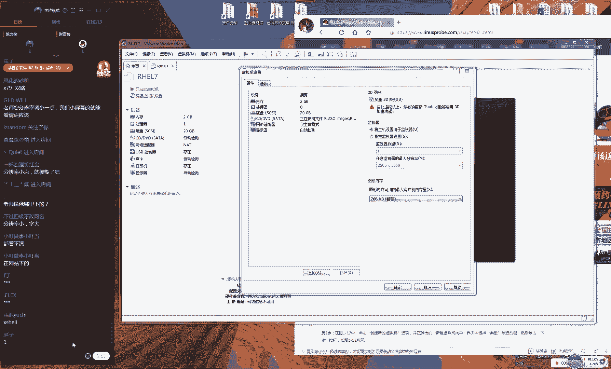

这种声音他会很干扰你就是他呃他呃这他会有呃他会有那种提示声音出来，他会用咚咚咚咚滴滴滴滴滴滴啊，它会这样的这个声音特别的干扰你的这个呃。😊，他特别干扰你的这个思路，特别的烦人。

所以的话呢那我们干脆把它给移掉啊我们呃里边它是不需要这个声卡的。这个时候我那我们就有了一个完整的这么一个虚拟机的一个模子就可以了。好，那我们接下来需要做大家看一下啊。

我们点击下我们这个虚拟机就可以来去安装一下我们这个操作系统。这个时候大家看好，这个时候如果说您没有看到这个界面，而是出现了出来一个叫做虚拟化不存在，或者说虚拟化失败这么一个提醒的话呢。

就是因为您刚刚的这个CPU选项里面的虚拟化勾给它给它开启了。但是您的CPU它不支持我们这个虚拟化技术。但是的话大家大家提到这个问题这就是我想去说的说我已经开启了VT为什么我去选择CPU的时候。

还是显示不支持。那么如果您已经确定自己开启的话呢，那么就可以去点击一下这个虚拟机的这个选项，把这几个勾给它取消掉，只要系统能够去安装就可以了。那只要系统它能够去安装就。😊。

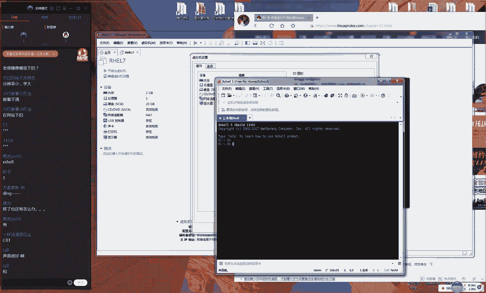

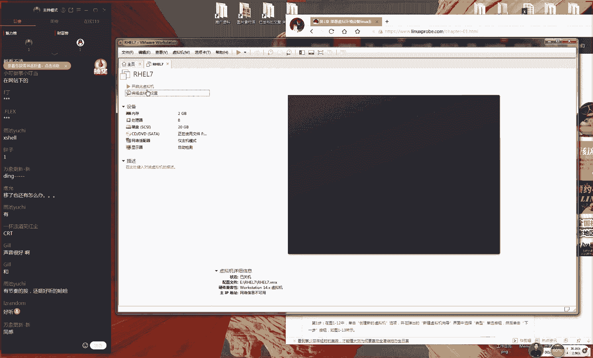

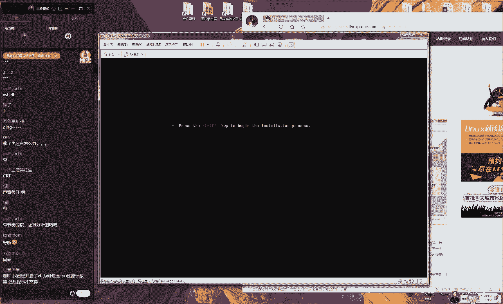

可以了，我们选择一下处理器，把这个三个勾给它给它取消掉。另外给大家去说一下啊，那么如果说您在这个虚拟机里面刚刚它提示了，因为这个问题会很常见。因为我们之前只是一个。😊。

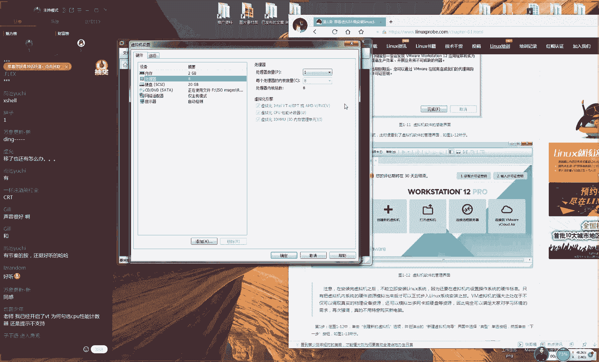

呃，用我们用我们的电脑顶多是玩游戏啊这样的一个使用者。而我们现在需要对我们这个计算机进行一个比较高级的一个使用了。那么这个时候很多功能，你电脑里面这个功能，它其实默认没有开启的。

这个时候我们需要进行一步操作。那我们先来判断一下您呃。😊，您电脑是否去支持了我们这个虚拟化的话，那么就是来看一下我们这个CPU这个型号。那我们以英特尔来说。

如果说您的这个CPU是I3I5I7I9的CPU的话，那么就都是可以的好吧，就是说当您的这个电脑，如果说您购买的时候大于了3000块钱啊，当我们指的是没有被黑了这种情况啊。

当您购买这个电脑的价格大于了3000块钱。并且的话呢或者您是在最近5年内买去购买电脑，那么就都是支持这个虚拟化技术的。

因为虚拟化技术开始去普及那会其实我还上我还上的是初中或者高中那会就已经开始去普及虚拟化了这个技术其实都是有的。那么为什么我们传程系统的时候，示不支持呢？就因为它默认已经是有这么一个功能了。

但是我们但但是它里面默认没有开启。这个时候我们需要这样去做打开百度，然后去搜索一下你电脑这个型号。好我们点开。😊，搜索一下，因为我电脑。😊，我一个笔记本啊，我笔记本是叫做联想小新潮啊，7000。

这是我去年双十一的时候。我我然后呢我去买了一个笔记本啊。好，那么就搜索一下你电脑的这个型号。比如说你是土豪，你用的，那我们就去搜索你具体的这么一个电脑的一个型号。那老师我不是买的品牌的本。

我是自己传的一个电脑怎么办呢？好了，如果说您是自己传的一个台式机。那么请搜索您的主板的名称，咱比如说是华硕或者华擎或者说是呃微信或怎么样的，那我们就去搜索您主板的型号。

后面的话呢我们在后面加上一个关键词，我们叫做BIOS啊，开启虚拟化。我们去搜索这么几个词，叫做bi开启虚拟化。前面就是您的这个笔记本或者主板的名称，后面叫做bi开启虚拟化。好了，我们点一下。😊。

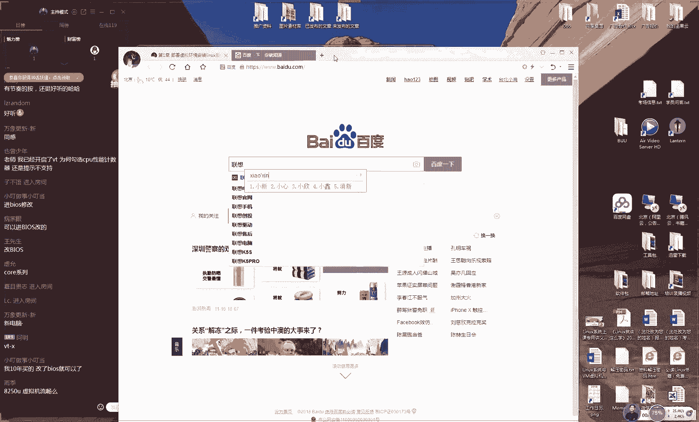

呃，就是里面会家会有一个他每一个笔记本里面都会有这种详细的介绍，然后去开启它就可以了。😊，好，这个时候我们去进入到我们这个be里面。当然我们需要关机啊，看它这步操作。那我们需要先关机。

然后去猛敲我们的F2键，对吧？或者说F12键，然后他进入到我们这个be设置里面。那我们需要去开启这个选项，我们叫做这个虚拟化。我们开启确认之后，我们再去重启一下我们这个笔记本就可以了好了。

这就是给大家提到如果说您当您待会去安装的时候报错，请按照我们以下思路来去进行一个排错。既然我们去安装一下我们这个操作系统，这个系统安装起来的界面感觉是不是很清新啊？好。

我们选择一下下一步瑞龙也也也是可以的。我看一下说啊打倒联想联想5G票投给了高通啊，说那会那个5G的那个投票是不是好，那接下我这样去选择一下我们这个电脑时间。😊，好，那我们选择一下我们电脑时间。

我记得大家说到这个投票给沟通这个事情的时候，我记得好像柳传志好像还发了一个短视频，好像还解释了一下，说这什么有组织有预谋的在诋毁什么民族品牌怎么着的，我好像记得有这么个视频。后来我后续就不知道了。好。

这样的话呢我们来呃我们选择一下我们这个系统时间。其实这样的，因为咱们中国的话，虽然说地大物博，960万平方公里，对吧？但是咱中国是不分市区的这个你看啊，咱比如说你在北京或者说你在东北吧。

然后你在跟新疆的时候的话呢，那啊那么你使用的都是一个北京时间，那么都是是中国统一的一个时间，所以的话呢我们随便去选就可以了。那不论你选择是上海还是重庆还是哪里哪里哪。

或者说你选是这个沈阳是这都是无所谓的啊。还有这个哈尔滨，这都是无所谓的。那么这个时候的话呢。😊，那我们都可以获取到我们这个中国这个统一时间。因为中国它呃，因为中国是不分时区的。好。

接下来的话呢我们来选择一下完成。再往后的话呢就是我们选择一下我们这个安装的这么一个选项，是这样的啊，大家请注意一下，就是大家请注意一下，我们这边一定要去选择我们这边的安装的这个选项。

如果说您待会去安装出来的一个系统是一个黑屏的一个界面的话呢，是一个黑颜色背景，让我们去输入这个呃敲回车，或者说让我们去敲账号和密码的话呢，说明您这一步没有做操作。那么请仔细检查一下。好吧。

同学们啊那我们请仔细检查一下，这个时候我们去需要去选择最后一个叫做service代表就是带有图形化界面的操作系统。虽然说我们今后不会过多的去讲通话界面。但是这个是一个非常完整的这么一个系统。

然后我们才可以去使用里面的很多的命令。这个时候这个我们不需要。😊，去勾选里面的所有的勾，我们只需要去勾选一下这个就可以了。这这里面的所有的一切软件包我们都不需要，我们只需要这么一个模式就可以了。

那我们只需要这个模式就可以了。好，我们选择一下这个。😊，确认啊，说新疆有物理呃有乌鲁木齐的这个时间。但是是这样的，这我也了解了，就是说在新疆我们会叫到这个新疆时间，按照这个时间啊。

会按照这个新疆时间来去作息。但是我们所说就是说按照国家呃就是我们叫什么呃最高法法院规定嘛，就是说我们还是使用的这个统一的一个时间，对吧？好，接下的话呢，我们选择一下我们这个系统的安装的一个位置。

这个时候我们需要去选择一下我们系统的这么一个安装光盘，把安装的一个系统盘，这个大小是20个GB，这是定义好的。那们选择一下这个。😊，呃，左上角有一个结束。好了，我们选择一下开始安装。

这样的话呢我们就可以来去安装出来我们这个系统。其实我叫大家再去想是什么事情啊，就是在感觉哎呀这个老师你这个教我们是那那个系统吗？其跟我们想象的是不一样吧，反正我的上一个印象啊。

反正我当时我去学习那个系统的时候，我反正我对他这个印象是这么回事。当时我正看一部电影叫黑客帝国，大家有没有看过，可以打一下一啊，因为一个主人公叫il啊，叫做NEO啊。

叫他叫做这个il还有一个光头后来光头跟他说你是想活在现实里面还是想活在真实的里面，他有一个两个药丸，一个是红颜色，一个黑一个蓝颜色，对吧？然后去吃那个药丸。😊，在那个在那个电影里面的话呢。

那个聂他就是一个很厉害的一个黑客，他那个电脑大家有没有印象？其实那个电脑里面就是一个像一个黑客帝国这种数字语一样的黑颜色的一个背景里面全都是字。然后然后那个就快速去敲击它的键盘。

然后在屏幕上面去快速去刷这种文字一样，特别的酷，但是我也是看一个黑帝国之后，然后喜欢上我们这种计算机的技术啊，就特别酷打嘛，对不对，特别的快而且这个字特别的多话显得很帅气。好了。

但是话呢我们现在看起来我们这个操作系统。其实这是一个趋势了。它这个它会不断的去降低我们这个使用门槛。所以说我们现在这个涂鸦界面安装起来，也是非常非常的这个常非常的这个美观简单。

而且的话呢它是一个未来的一个发展趋势，就像我们手机一样，也许你让我去使一个早年间的一个手机，我已经不会去使了。😊，苹果手机我一上来那我那我那我还可以去上手去点，因为它是一个去降低使用门槛。

这么一个趋势是不可避免的。好接下我们选择一下来去设置一下我们超级用户的密码。这这个用户做R的是做这个根的意思这就是系统超级理我设置一下他的密码这个很多书里你提到我们这个密码密当然怎一句话都能想到了一句密码一定要复杂。

其实这个白说？想一下定设置常复杂我们要追求自由民主公正公平法话说出没说一了我推荐大家去设置密码的不用去设置复杂密码简单么说我的密码是红的一个拼音因为打起来特别顺手看一下我这个手方键盘。😊。

之后RED啊rad就是RED红嘛，正好是在我的这个左手边的食指旁的这个旁边。然后ha我们搭起来也非常的简单，它都是在我这个左手边。那就是说因为你现在是在你虚拟机里面再去做这个实验。

不可能有人去来去入侵你的大家懂吗？因为你现在都没有联网。第二就是说你你因为你再去做这个实验环境，你需要来去老去登录，没有必要去使用一个你的银行卡密码，或者说一个特别复杂的一个密码达30多位。

不要给自己找麻烦。怎么顺手怎么来怎么顺手怎么来。好，我们选择一下我们这个结束。好，我们选择下完成。然后还有一个就是说。😊，呃，LZRAN那DOM就是这个LZ随机同学啊，刚提了一个问题。

是说我们选择是自动分区嘛。这个问题我需要我今给大家来聊一下啊，就是说哎老师你这个讲课怎么感觉老很别扭啊，为什么你这个跟我们其他看过的书不太一样啊。哎，你看其他的书啊，比如说某某某那本书。

我们上来安装系统的时候，他总会给你讲一下，如果来进行一个分区，但是你为什么一下就点过去了，你没给我们教怎么去分区啊。因为我们坦白来讲，这是我们今天的第一节课，我们第一节课开始才有38分钟。

我们现在再给大家讲分区，那纯属我们北京话啊，不是我们。😊，啊，我们不要说那么脏了，我那我们就是说啊纯属假扯了。因为这个确实我们对于基础不太好同学，我们讲完之后跟没讲一样，我们的课程的一个宗旨啊。

就是说我们不希望大家能够。😊，呃，跟我一起操作，然后点出来突然的效果。因为我我认为你们用你们的鼠标跟我完全一样的去操作，然后点出来突然的效果，让我认为这个没有任何的意义。

而我希望大家能够去来去呃全是深入的去了解这个系统。然后这样的话呢。知道我们的每一步操作这么一个用意。所以的话呢我们现在我们会把我们这个分区的这个章节给它单独划分出去。

大家可以翻开书看一下第六章节的和我们这边的这个第六章跟第七章两个章节会给大家去讲到我们这个磁盘分区，大家可以来看一下。

我们看下第六章还有这边的这个第七章两个章节将近有了3天时间给大家去讲我们这个磁盘分区和我们的这个呃挂载操作。那我们认为就会比我们现在给大家去看一眼，好像会更好一点，对吧？

所以大家还所以话那就是说大家今天报名了我们这个培训还是要去相信我们这个课程的啊，那么也许会跟您之前看到的过一些书啊或怎么样的是不太一样的。但是我们这个有自己的这样的一个节奏。

而且我们认为自己的这个是对的。我们不希望大家一起啊只图个热闹巴拉巴拉这样就做过去了。然后给大家讲也讲不明白。因为我们在再细来说，我们这个分区，他需要跟。😊。

举一个协议叫做FHS这个的话呢是一个标准化的这么一个结构。那个结构大家翻开书里面的6。1小节里面讲到它了，这个目录总共有会会有15到20个。每一个目录它都有相关的这个权限属性的。

然后以及它会有根据FHS这么一个协议，有不同的这个作用。你要讲，你就要把它讲细了，而不是只是。😊，呃，点出同样的效果。那我认为这样的话会更有意义一点。好，接下来呢我们选择一下我们这边用户的安装。

然后我们现在呃正在去安装着我们这个系统啊。然后接下来我们去选择创建出来一个用户这个的话还是说大家要去信任我们这个课程。那不说我一上来你这个别人书上怎么都有分区不讲，这个就拖？一下给我咔咔就过去了。

是因为我们把放到后面精细去去讲，不希望大家是个热闹建分区对吧？好了，这个我们都不用多说了。因为只要你坚持听完了我们这条课程，你自然会知道我的想法是怎么回了。如果你没有坚持完这条课程的话呢。

说太多也没有用。好了，我们继续来我们创建出来一个普通用户，我们叫做大家看一下我们创建出来一个用户叫我们的密码无所谓，设置一个你喜欢的密码这个是这样的创建出来一个普通用户们第5章的时一个命令我还有命令们。

😊，呃userMOD命令，我们需要对这个用户进行一个查看跟修改这么一个操作。所以的话呢我们建议大家都以我这个为准。然后大家来去创建出来这么一个用户。如果说您不喜欢这个名字的话。

可以去修改成自己的比如说自己喜欢的一个名字，但是请记住就是您此处修改的话那我们第五章做那个实验的候，请也记得同步去修改一下。好吧，那我么如果说您第一次去学习我们这个课程，请建议大家以我们这个为准。

接下来我们点击一下这个结束。那好，那我们就来去完成了我们对系统这么一个配置。他说他说的这个系统已经安装成功了。

非常这个感谢您去使用我们这个系统然第二句话我编的他说但是我们要想让我们这个配置能够生效的话呢，请你去点击一下这个完成配置选项好，点击一下这个完配置选项你这样就O了，你看非常的简单他会告诉你说。😊。

他正在完成他这个配置的选项过程当中，大概时间的话也就几秒钟，大家稍等一下。😊，对，是必须要去预习的。但是你看我现在都不。但但但是我都没有给大家去说预习的事情，就是因为我们昨天基本就是聊天了。

然后今天也也也只是安装一下我们这个系统，你们不会有压力。你们没有压力的话，我跟你们说了，说说让你们去预习，你们也不信，所以我是打算在第五章的时候开始有难度的。因为我估算了一下我们这个课程啊。

因为我会去备课。咱们讲第五章的时候正好是个礼拜日，因为我是这样去估算的。然后我会在礼拜日的时候给大家去说这个预习的事情这样话大家才会比较这个重视我说段话嘛我们点击一下这个从启啊就可以来去安装好其实你来说真的是非常简单的。

后面这个操作但是我会把每一个选项给大家去讲出来，他有什么样的一个用处，后面压力是很大的第五章节话他会讲到我们这个用户的身份跟我们这个权限。来说呃是这是不能够全屏的那不能够全屏的。然后说对最好要预习。

后面就会跟。😊，会跟起来比较吃力了啊，可以用阿里云跟课程吗？呃不可以。因为阿里云的这个系统的话呢，跟我们现在所做的这个系统也是不一样的。应要跟大家去说一下啊，说到我们能不能去阿里云。

因为我知道你们为什么这么办。因为现在双十一对不对？话双十一现在阿里云搞活动，好像一个服务器才30多块钱，是这样的啊，我们的话呢非常非常不推荐大家使用阿里云或者腾讯云去做我们这个实验。

那么或者你去网上去下载一些镜像。因为是这样的，因为我们尽量以我们这个网站上面这个镜像为准。我那我们现在网站上面去提供的版本为7。0这么一个版本。😊。

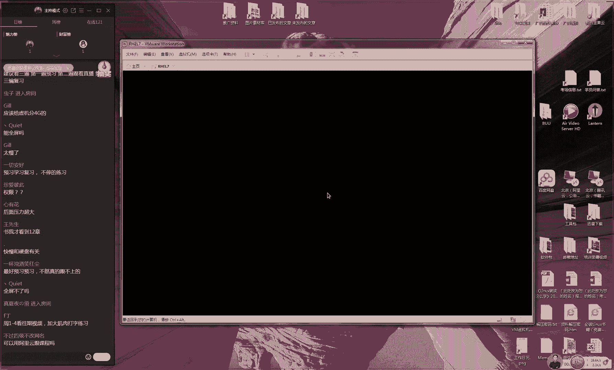

呃，那么如果说您现在使用是最新的版本，那咱比如说7。27。47。6的话呢，那么就会在很多操作上面基本上是一致的。

但是会有哪会有一些服务没有咱比如说第八章节有一个服务叫做 table比如说阿里云上面也已经没有 tables它这个版本阿里云上也已经更新到最新的。所以说当我们到学习到第八章的时候。

如果说你用的是比较新的这个版本的话，到时候这个服务就不了的。所以那我们建议大家还是要以我现在这个系统镜像为准，从我们这个网站上面一起来去下载。好给大家说一下，但我们有喜欢做日本料理同学或者你们吃过啊。

到时候你就知道了这个做寿司的时候，你需要去切这个寿司的那个刀日本人比较讲究，它分20多种刀，那比如说叫柳刀，或者说什么砍刀怎么样的，特别的多特别的细。

然后每一种的工作在这个这个效果也是不一样的那我们既然要去学习去做。😊，咱们以那么那那我们就以这个做饭来说，那么就一定要尽量以你的这个师傅为准。这样的话呢，别人在用小刀的时候，你也要用一把小刀去切。

比如说在大刀的时候，你想换一把大刀上去。那我们千万要保持一致。那么否则你可能会出一些一些问题。那么我们还有一个好处啊，就是说当您去选择了跟我一样的这个系统镜像的话呢，我可以会更快帮您去定位这个错误。

那呃比如那咱比如说您使用的是一个跟我不一样的这么一个系统。然后我们这个虚拟软件还我们这个系统都跟我这个不一样。那么好了，当您去做这个实验出错的话呢，那我就不知道您是操作问题，是您的这个操作出了问题。

还是这个您自己去下载这个系统镜像的这个问题啊，所以的话呢我们建议大家为了保证我们今后这个课程的这个实频进行嘛。那我们都以我们这个网站上面提供这个系统镜像跟我们这个软件为准。当我们以后你再去做实验，再去。

😊，工作啊或者自己去玩啊什么的那倒是无所谓。但是我们学习当中的话呢，我们尽量以我这个为准，可以来方便以我们以后答疑啊，还有我们这个今后呃去这个排错。好了，那我们接下来我们选择一下就是这个许可。

他会呃他会有一个许可，他会告诉你说。😊。

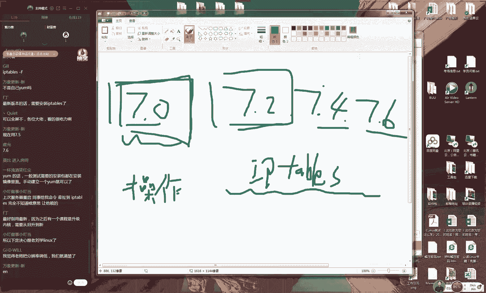

他会告诉你说呃，红帽这么一个许可，当你去使用这个软件的时候，那你需要去呃遵守中国的这个法律。然后美国的法律，当地的法律，然后你不能去使用这个系统去做一些为非作歹的事情。你呃当你出了问题之后。

你也不能把责任推卸给红帽啊，红帽。然后也不会对你这个事情呃给你去负责任。当你去安装了第三方的这个软件之后的话呢，红帽不对你所安装这个第三方的这个服务负责任。

除非你购买了红帽相关订阅好了你说这么多就会告诉你红一些免责声明吧。那么我们要想去使用的话，那我就要去选择一下是我接受你的这个免责声明。那就是说有说的问题之后，红帽一般来说它是不负责任的就了。

这样我们选择一下这个那我们就是完了因就是就是你买一个手机一样，那你要比说咱们苹果手机你也要去满足你也要你去数始化的时候，你也要接受这个苹果那么一个条例啊，他有一个他必须要你接受这么一个免责声明一样。好。

我们选择一下这个完成这样的话那我们就安装好我们这个操作系统最后一个选项叫做是这样的那么如果说你是做内核开发，或者想要去收集一下系统内核包信息的话呢，😊，就可以去开启这个key time。

那他会帮你去收集你系统的这个崩溃的信息。那么如果说您不需要的话，那那么请把这个勾给它取消掉，请把它给取消掉。那么这样的话呢，它会节省您128兆内存，让您系统速度会更快一点。好，我们选择下一步。

再后他说啊要想让您刚才所配置的这个所有内容生效。您还需要再来去重启一次。那我们选择好的，走你我们去重启。😊，这个时候大家看到这个界面啊，然后开始去吐槽了，说说哎那我们明明说好了，我我们这个系统。

我们是一个开源系统，它是一个免费的。为什么又让我们去来去注册，以及让我们去付费呢？是这样的那我们现在的话呢回忆一下我们昨那我们昨天所讲的这个开源的这么一个软件特点。它赋予了我们这个用户有了四个自由。

第一使用自由。第二传播自由。第三修改自由。第四创建衍生品自由。那我那我们应该来说不光能够去使他去使用它那我我们也可以来对它进行修改的但是我们此处为什么我们要求你去来去注册红帽的一个付费服务呢？

是因为他会问你说你是否想要去使用红帽所提供的这个软件的维护以及红帽提供的技术支持。如果你想要来去使用红帽的付费服务的话呢那么就请去选择y我想要来进行一个注册。而它上面写的是一个什么呢？它不像微软的时安。

😊，说windows它必须要去来去输入一个验证码。那么这个时候它写的是一个强烈的一个推荐。它只是说呃您都使得我我我们这个系统了，给我们付点钱好不好？就说我我您是否想要去使用我们给您提供的服务。

我们强烈推荐你好了，那我们选择我们不要。😊，就可以了。因为它啊系统上是一个开源的，它就可以让我们这个用户去免费和我们的这个传播修改以及衍生品自由。这个四个自由是天生赋予我们的。我们可以这样去使。

这就相就是插播了一个广告啊，而不用担心说哎我们没有去注册到，它会不会以后功能不完整或怎么怎么样的，不要想太多，这个是你的在windows下面留的留下了一些。😊，呃，对于开源的不正确的一些理解啊。

也是很多作者去炒作，说红哎这个re系统它是收费的。然后它是免费的这样的这个错误观点的这么一个来源。好，那我们下就可以来进入到我们这个系统里面了。好，那我们把关机啊。

因为我现在有了另外一个系统把它安装好的那我们现在话来去看一下我们这本书本啊。后因为这样那我我们已进回去安装出来我们这个系统，接下来我们就要去学习一下如何来去配置我们这个系统。

然后以及来去如何来去敲我们的命令。大家看一下我们今这个书集有一个章节是1。4交接这个时候去教大家如何来去重置我们这个超级用户注册的密码。但是因为我们今天刚第一天去学，我们不要去看它。

因为它里面需要敲命令。这个时候。😊。

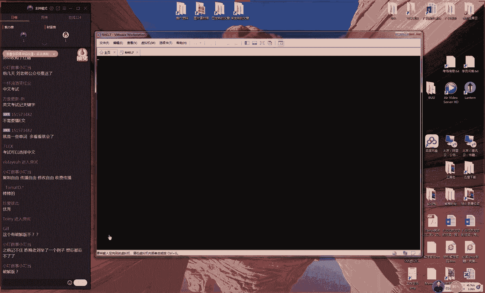

呃，这个课程我们会给大家讲完第六章的之后，大家会再来看就可以了。这个我们的内容1。4小节的内容，我们会在红呃我们会在红我们会在考前辅导里面会大家去讲这个课程我们先跳一下我们的一。4小节。

由于需要我们敲命令啊，它需要我们的这个大量的命令的话来进行一个支家一个支持。所以的话呢我们给大家放到红I考前辅导里面会大家给大家去讲到我我我们这个实验的。所以我们现在现去跳一下。

因为我们现在这个书的内容啊，它是按照我们这个。😊，呃，内容块来进行一个划分的，它并不是根据我们这个难易程度啊。所以我们这个实验我们需要先来去跳一下。好，接下的话呢我们来看一下，我们这边有1个1。5小节。

就是我们红包软件包。我们叫做啊RPM。好，那我们先来看一下我们的书啊，然后我给大家讲一下它怎么回事。是在很久很久以前啊，当我们在以前的时候。😊，想在我们系统里面去来安装一个软件包的时候。

就只能去使用叫做这个源码编译的这么一个方式。源码编译。不知道大家有没有听别人去吐槽过者说我们的linux系统它特别的难。大家有没有听过可以打一下一，或者说你的老师或者朋友给你们去说过啊。

我们lin统难学很难学它操作起来操作困难啊特别的麻烦，或者说我们叫做这个麻烦是有，对不对？好了，这就是为什么啊？就是说因为在早些这个lin里面的话呢，我们要想去来去安装一个软件的话。

咱们以这个来举例子啊，我们只能够通过编译这个源代码，因为开源软件嘛，开源软件啊，开源软件它就是提供了我们这个程序和我们这个源代码啊。好了。

那么这样的话就是说我那我们只能够通过这个编译源代码才能去安装出来我们的某个服务这个特别的麻烦。好了，大家可以懂这个感觉啊，但我们这个编程去编译一个程序的时候，速度他也会很。😊，啊。

这个的话呢我我们会给大家讲到的第20章节。😊，啊，第呃第20章的时候会给大家去讲到说如何来对我们这个源码来进行一个编译。然后这个会给大家来进行一个实操课程。

这是在我们第二章大概时间是在12月20号左右给大家讲到它的。好接下的话呢我们来给大家去说一下啊。在我们很久很久以前要想去他去安装一个软件的话呢，那么你就必须要去编译这个源代码啊。

叫做这个哎源码包是这么一个程序，它很麻烦好，那并且的话它需要自己去解决我们这个软件包的依赖关系。这个时候的话呢我们就有一个问题，就是它很难，它操作起来很麻烦啊，呃安装软件这个门槛很高。

接下来我们就有一个新的技术产生出来了。它是将我们这个程序源代码。与我们一套安装规则，就是我们的。😊，安装的一个手册，我们来打包到一起。这样的话呢。

我们这个系统就会以根据我们这个安装规则来去自动的来去安装我们的这个呃源码包的这么一个程序了。这个技术我们叫做RPM叫做re package manager叫做红帽软件包管理器。红帽。

软件包管理器大家可以来去找大开记一下，它就是将我们这个程序源代码与我们一套安装规则相打包到一起了。目的就是让简它是为了降低我们的软件的安装的难度，括弧通过什么呢？通过为我们这个系统它所提供一套安装规则。

它不再需要人为来进行一个干预了，而是可以直接来为我们这个用户来去安装。它有一套安装规则了。这个话其实以前我们是考过它会在我们的红C里面有一个课程叫做401。大家可以来以后是考红C的时候啊。

这个你们需要用得到的那我们会在红C代码为红401里面会考到一个服务叫做H叫做红卫星网络，到时候你们需要自己来去编写出来自己的软件包，然后做这个的这个分发这个还是比较有意思的好，那我们需要打开你的书。

然后记一下笔记了。书上的字很多对吧？然后但是我们现给大家总结出来一两个句话。😊，那这呃呃这样的话，你来方便你来去复习。大家打开你的书，然后打开你的RPM的这个章节。我把这段话啊，然后给大家总结成一哦。

那我们来做一个总结，总结成一段话。大家方便大家去复习是这样的RPM的本质的话呢，实际上啊哦那我们先来说作用吧，我们给大家打出来RPM的这个作用的话呢，实际上作用。😊，啊，是降低软件的安装难度。

这是他也是它的一个本质。他要想啊，那我们去使用RPM的一个理由，为什么要去使用RPM就是为了去降低我们这个软件的安装难度。然后话呢通过啊方啊通过。将安装。规则打包到一起。啊。

来实现的那也就是说RPM然后把话调转一下我们这个顺序啊。RPM通过将安装规则与源代码打包到一起。来降低我们的这个软件的安装难度。好。好，大家可以大家去记一下，这是我们的PM的一个使用的一个理由。

以及它这个原理啊。我们为什么要去使RPM？就是因为它可以去降低我们这个软件的安装难度。它为什么可以去降低我们软件的安装难度。是因为它我们将软件的安装规则，与我们代码打包到一起了。

不再需要人员进行过多的这个干预。这个就是我们的PM的一个本质和作用，大概这段话记到你的书上面，然后可以拍张照片以后，说自己今天的一个学习心得了。这样话呢我们这个技术啊，它虽然好是好，但是还有一些局限性。

那你来看啊，咱比如说我们现在使用的是一个叫做QQ直播功能。那咱比如说那我现在要想去使用这个QQ直播，如果我们有QQ的这个主程序行不行。😊，大家先打啊。😊，呃，另外是这样的，我们现大家可以互动一下。呃。

如果说您是肯定的，就是说您想说肯定或者说可以的话，那么就以后打一就可以了啊。如果要是说否定的，或者说不可以的话，那么打二就可以了，那我们可以这样快速的去互动，不打太多字，这样来告诉我或一或二就可以了。

😊，这个话其实来说还要打零啊，打零是什么？这个话呢好，这个的话呢它一定是不可以的。因为你要是没有QQ的这个主程序，或者说你没有这个QQ的这个收费模块，或者说你没有QQ群的这个功能。

那么你就不能够进入到QQ群的这个直播功能里面。所给大家去说了啊，就是说那么接下来说我们看来这个功能，它也不是一个独立存在这么一个情况，对吧？它也需要有一个相互关联。那你需要先有这个QQ的这个主程序。

然后你再有这个QQ群的这个功能，然后你才有这个QQ群视频的这个子功能，那么好了，那我们现在给大家去说一下，它有一个它会它有一个很好的一个想法。

它是将我们这个难道那我们就可以将我们的每个功能模块将每个功能的模块，我们给它做成独立的PM的软件包，然后接下来的话呢，我们将软件包，我们一个两个三个对吧？好，一个两个3个我们4个。😊。

我们给他分别要给它啊制作成我们这个软件包。那比咱比如说这个就是我们的这个QQ的这个主程序，这是我们的主程序。😊，那这个的话呢，就是我们这个QQ群的这个功能。好。

最啊最后的话就是我们这个QQ群的这个直播功能。这样的话，那我啊那我们就可以让我我们的这个用户来去逐一先来去啊第一步来去安装我们这个主程序。第二步来去安装我们这个群的功能。第三来去安装我们这个直播功能。

这样子我们就可以然可以让我们这个用户去实现它所需要这么一个功能了。这个设像的话呢我们还统一叫做RPM这个啊不呃我们这个的话统一叫做仓库。这个仓库的话，它就是打包了我们大量所需的RPM软件包啊。

大家记一下我们这个仓库的一个本质。啊，仓库的话呢是通过将大量的常用RPM软件，打包成一起。😊，然呃我们的打包不太好，我们我那我们就存放在一起啊，来降低软件的安装难度。括弧。哎。

不我们还要说我我们这个原理啊。呃，打包到一起。解决。软件包之间的依赖关系。因为你看你要是没有安装这个主程序的话，那么你就不能够去安装这个QQ群跟这个直播功能。所以你你的这个yM仓库。

它不光能要去安装这个软件，还要去能够去解决这个安装的这个先后顺序问题。后来啊进一步来降低软件的。安装难度好，大家来记一下这两句话，我觉得总结的非常好了。我自己相就是啊给大家总结一下啊。我们的PM的话呢。

它是将我我们这个软件包与我们的安装规则打包到一起，来降低软件的安装难度。而我们这个亚仓库的话呢，则是通过将大量的常用RPM软件包打包到一起。啊，或者我们这个存放到了一起。

让我们这个用户他只需要说出一个功能。那我们就可以按照顺序帮他来依次去安装去解决软件包之安装呃过程当中啊软件包之间的安装的这个依赖关系，从而又进一步去降低了软件的安装难度。好了。

这就是我们给大家讲到一个原理。大家可以来记一下。😊，这两句话大家可以记到你的书上面啊，就是对你的RPM跟YM仓库有这么一个作用嗯。好，然后说直播不能快进是吧？怎么是不是感觉呃讲的太慢了。

我们稍微快一点啊，呃直播是不能快进的。好，那我们接下来我们来说啊，但是因为他可能技术比较好啊，所以说讲稍快一点。但是因为我们占无当没有记术同学或许有同学们他们感觉还是很吃力了。

因为他们之间没有听说PM也没有听说过他们可能感觉我现在讲的还是比较简单的，没有太多理解。因为你现在没有操作嘛，就当我们去操作之后可能会对这个更好理解。那么如果说你技术比较好同学们的话，我们要耐心。

然后我们以后的话会有这种对课程一种平衡的，到时候我们来去调整好，接下来的话我们再给大家去说可以把我们把两句话记好。如果您还需要时间来去记笔记的话，可以打一下一好吧，我们来两句话我们记到书上面这个很重要。

如果您还需要时间话，那请打一下那我们就直接往下走吧，好吧。😊，呃，打二打一同学什么意思？是。是既需要又又不需要是好，那我们打一下二就好了。那我们来去。😊，呃，往下走。

那我们就知道了我们有安装的一个方式啊，它会有1个RPM它还会有EM。但呃但是这个我们现不用去考虑它也不需要去记里面的命，这些都是不需要去记的。因为我们今后的话呢，我们会在呃那我们会在一个半月的时间里面。

每天都会去使用到这个命令这个大家不可能不会的所这个我们不用去记啊，到时候会给家去使啊，会大家去用。接下给大家去说一下，就是在我我们去敲这个命令的时候的话呢，他会有一些管理我们这个服务的命令。

这个我们就要记一下。当我们2014的时候，它更新了红期们来讲它受到很多质疑，然后会有很多人说红期变化太大了，他又怎么能不好怎么不好。其实的话呢我们主要的吐槽点，它是有4个的。

第一个主要就是因为这个sstem的这个作者，它是就职呃娱乐红帽。而我们所讲这个stem啊，它是一个初始化的一个进程。当你系统开机之后，会他他它就会一直。😊，来为你去提供这服务的这个叫做sstem呃。

我们看到之前它叫做I它叫做INIT啊。我们之前我们在红猫re5红re5还有红re里边的话呢，我们这个叫做NI它是一个初始化的一个进程。到了我们红re里的话。

它叫做sem其实大家说这个只是一个它只是一个软件的一个变化啊，为什么我们要去了解它呢？就是因为这个sstem啊，它不光去变成了一个初始化的一个进程。

而且它影响到了我们系统的很多的变化我们之前它只是一个初始化的一个进程。但是它现在不甘心，只做一个进程了，而是控制了我们系统里面的很多的服务，这样的话呢趋势就是说它会让我们很多之前的这个命令啊。

都不能去使用了。好所以的话这也是算是一个吐槽点啊。第一个吐槽点就是说这个软件的这个作者它是救职红帽。那我们知道那我们今天系统它是一个开源的那我们。😊，就不希望说我我们这个系统受某个公司这么一个控制啊。

啊，所以的话这也算是一个吐槽点。第二的话就是说我们这个它只能是在linux里面来去运行，抛弃了这个其他系统这么一个用户。但这个跟我没有关系。

因为我们只学习到这个呃但因为我们不会去学习其他的这个操作系统还有我们第三个吐槽就是说这个变化太大了。因为我们这个M它不只是甘心去做一个初始化的一个进程，它会影响到了我们系统里面的很多的变化。

但是我我会给大家去说到我们很多的变化，具体有哪些。那么他会去接管我们很多的服务。那么于是会造成我们系统里面的很多的这个变化这个的地方。但我们的第四就是说那么我们既然已经是发生了变化。

但是相关的这个文档其实没有匹配到位的那那个时候啊我们是2015年的候我们开始去写书。那个时候真的是特别的痛苦。其实来说很痛苦很痛苦的。因为我们当时也没有这么多这个资料嘛，然后就很痛苦。

但是现在我们还好了，因为我们现在看起来我们这个系统。😊，呃，资料已经是非常的多了，然后也不用去担心说我们今后呃找不到学习资料了。所以说这个也这个两点我们不用去呃不用去太去担心。

就是说呃如果说您之前学习过红包去学习过早期的系统的话呢可能我们再去学习这个系统的时候会一些不太顺手的地方。那么如果您之前没有去学习的话呢。

那其实是正好可以来从零开始去学习我们这个操作系统学习我们这个sR了。好，接下给大家去说啊，就是这个RPM走什么端口M是一个软件包，它是它它它不是它不是一个服务，它也不是一个端口它是一个软件包。

它将就是一个你的它将就是一个安装包一样，它是一个软件，它不是一个服务。好，然后的话呢我们来说一下，就是我们有一个这是我们这个初始化的一个进程。而我们配置这个进程的话呢。

我们需要能命令我们叫做这个是我们的。😊，服务名字大家记到你的书上面啊，它是我们的服务的名字。还有话我们叫做sstem cTL。这个是我们的这个配置的命令。大家需要记一下这两个的区别。

其中一个是我们的服务名称，第二个是我们的配置的命令的名称。😊，哎，这个是我们配置的命令的名称。好，大家可以来记一下。😊，好，这两个我们就要去看一下，说为什么里面会有个V呃，这个我没有太多关注过。呃。

不跟大家去瞎说，大家可以上可以去官网去呃来去看一下，应该它会有个解释。然后说红猫re8或红红猫re7会不会有太又会有很大这个变化。因为现在红猫re8大家还没有出，真的是说不好。

就相于说我们下一款iphone手机，它有几个摄像头一样，我真的说不好，因为我们它还没有发布呢？但是我们可以预测对吧？就是我们预测红猫re8，对于红猫re7的这个变化。

它不会像我们红re7对于红re6的变化那么大。这话甚至说当我们发布的红猫re8了，我们的预测就是您都不用再去学习了，可以直接上手就可以去操作。其实这是我们的一个预测。

因为我们认为红猫re7的变化已经很大了，而且它已经是作为一个re6跟re8的一个过渡的这么一个产品已经做的很好了。好，服务的话跟进程有什么区别。服务的话它是呃。😊，这个大家可以去百度去搜索。

其实这这个都是有的，就是我们一个服务可能它会对应的有多个进程。一般来说它是会有一个进程。进程的话是在我们系统里面寄存在我们这个内存里面的一个资源，他为我们这个用户家去提供这个服务。好。

然后我们再给大家去说一下我们相关的这个命令啊。这大家说一下我们这个相关的命令，大家需要记到你这个书上面，然后这个也需要大家去背一下。因为是这样的，我们需要大家去背的东西其实是很少的。

我们只需要今天让大家去背这么一段东西，而不会让大家老去背东西的啊因为我也很反感，就是说大家去背一些命令啊，或者说文字啊什么的，特别的枯燥很难受但但是这段信息是没有办法的，必须要大家去背一下。

大家也希望能够去重视一下好吧。因为这个课程，因为这个东西如你要是不背的话，后面我们再去配置这个服务的时候，基本来说就会很吃力了。好，我们需要先来背一下，先不用管他有什么作用啊。

我们也需要去管就是说我们先不用去担心说我们今后怎么去。😊，使用但是我们需要现在去配，那我们现在去呃现来去备一下来，这个的话呢就是我们这个去重启我们的一个服务。我们后面加是服务的名称。

代表就是我们重启一个服务，这代表就是一个重启服务CTLTL代表就是一个命令行控制的一个缩写叫做trol list就是我们代表命令行啊，这么一个控制的意思。它是基于我们的命令嘛，对吧？

然后我们还有一个叫做TOI代表就是我们的这个突发界面TI跟跟CTL它是一个反着的我我因为我们现在试命令。😊，好，这就是我们第一个就是来去重启一个服务的一个方法。第二第二个的话呢，就是来去呃。

启动一个服务的一个命令，代表就是启动一个服务。这个大家需要来记一下啊，把我们接下来所讲的这个命令来去依次去背一下，这个很重要啊，虽然大家很反感说老师我们刚第一天让我背东西啊，很烦，对不对？

但是没有办法必须要去背且这个你要是没有听话去背的话，后面会很吃力来，这是代表就是关闭一个服务的意思。这表是关闭一个服务的意思，书上有是吧？书我们再抄一下这样的话一下印象啊。

你书上有那我们希望说大家去抄一下嘛。好，接下话呢我还要en代表就是将我们这个服务的话呢加入到启动项里面，加入启动项。😊，代表就是我们下一次去重启了我我们这个服务器之后的话呢。

我们这个服务他还会呃它还会依然为我们这个用户提供着支持。当我们下一次去重启了这个服务之后，他会依然为我们这个用户去提供支持。这个我们在考试的时候，他是必须要去做的。因为我们现在没有去配置服务。

所以我暂且就先不给大家再去啰嗦了。好，这样的话呢我们还有一个叫做等一下啊超过了是吧？超超很快啊好就特别特别重要。但是因为我们现在没有去配啊，所以不给大家去说太多。

还有一个叫做这个呃代就是查看我们的一个服务状态。😊，查看服务啊，我们来去查看一个服务的一个状态。好，就这个5个吧。那我们需要来让大家去背一下这5个大家来去背一下。其实来说前面后面都是一样的。

主要就是这个单词，还有这个格式，大家需要来去呃来去看一下。另外的话呢还有就是我们去敲这个命令的时候，我们每一命令的后面都要敲一下回车。然后每个命令的参数之间的话呢，它有这个空格来去做间隔。

这个我会给大家讲到说怎么来去配置的啊，另外来说呃重启系统啊，不对不对，它不是重启系统。😊，呃，我想想啊，你说就是说如果要是把这个服务加入到启动项了之后，重启系统了之后，对他是重启了系统之后。

他还会依然为我们这个用户去提供这个服务。到了考试的时候是很重要的那我们需要。把它给这个加到启动项里面。这样的话，我们从启之后才能够给你判到分值。好，那我们先来记一下这几个选项啊，我正好我也打开QQ吧。

呃，打开QQ然后发到咱们的群里面。如果您现在呃手边没有纸的话啊，呃没有纸跟笔的话，那我现在把这个信息那我们先在把这个命令，我们发到群里面，您赶紧就是现在就打开。😊，这个QQ群，然后截图呃，开。

然后赶紧就截图，或者说把这个文字复制到你的这个剪切版里面。好吧，我们那我们下课之后去抄一下，加入启动项是不是写错了嗯。😊，加入启动项是不是写错了我们没有写错吧加入启动项这是没有写错了。

然后大家这个你你们这写错了，这个是CTL不是CL，我这个没有错。好接大家记一下这1234有5个其实大家大家说比痛苦一件事情。是其实我小候吧父母就让我背过一些东西。

但是我不太理解觉得很抵触这东西有什么用的对吧？但是你真正工作的时候，者到生活当中的候，发这个是很有用的。因为大家现在刚刚去学习，我们真的我们坦白来说，大家不知道什么有用么没有用。

只能是我给大家去说且相信我所说有用的。那我大家强调就是我们所讲的这么几条必须要大家去背下来。如果这个不背下来的话，今后去做一个半月实验的，到根本不会去操作的。以说第一节课必家重申一下这个重要性好吧。😊。

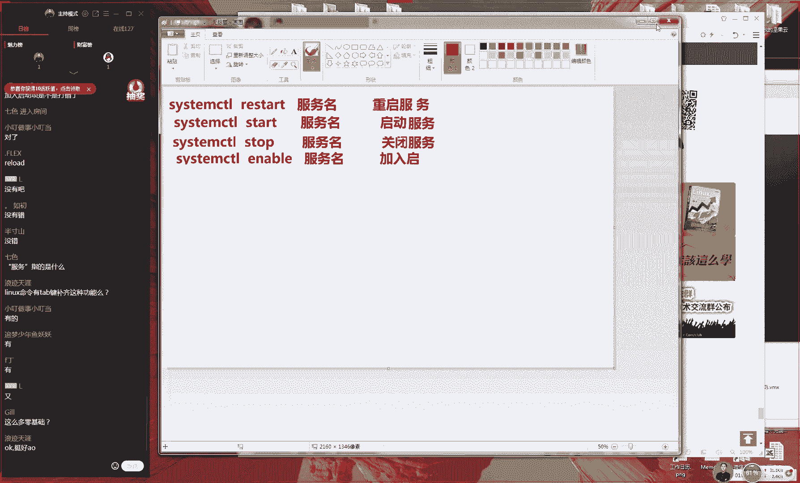

大家暂且相信我，这个它是有用的。好，接下的话呢就是说我们红猫日期里面的一些变化什么的。这个我们先不用去看啊，因为我们今天报了我们这个培训了，我们就不让大家再去思看这本书了。你再去跟你去照着出去敲。

没有太多意义，对吧？那我们就要给大家带入到实践里面，我们希望给大家去讲，大家看到我现在这个说话的语速也比较快，我一分钟大概能说300多个字，但你这样算下来一小时60分钟，然后两个小时的课程。

我们相近能说100多万字。好了，那就是说我们这个课程其实是完全超过了我们这个书本上的这个内容的那我也会讲到很多书里面没有东西，我们刚给大家强调几点，大家需要记到书上面的。但是如果我们没有强调点的话。

大家也希望能够动手去写到书上面，就是你自己需要的一些内容。好，接下来我们来说一下我们第二章节，今天我们讲不完，大家不用担心，就是说我们今天讲不完，我们将给大家讲到2。4小节。

那就是说那我们知道啊我们这个系统的核心，它还是敲命令。因为我们对这个。😊，因为的话呢，我们的呃通化界面你做的再好再再精美。但是你的这个系统的核心，你还是命令的，而且你有更高的这个工作效率。

但我们还是要去敲命令嗯。😊，那我们还是要去敲命令，说可以打问号吗。然后你这个问题应该是问的是思科方面的，对不对？就是说我们在配置交换机路由器的时候，如果当我们不需要呃当我们不会去配置的时候。

那我们能不能敲个或者们敲个问号给你显示出来可以执行的命令这个是不可以的。因为我们这个系当中我们敲table键每敲一下table键，他会给你一个提醒，然后他会给你对命令啊或者文件。

包括说我们在红包器里边以我们举例来说，我们会在红包器里的第八小节讲到命令里包括有一个命令叫做杠M这个命令它又是支持我们这个参数补齐的。所以说这个红包对于我们这个补齐和个帮助提醒其实是比较到位的。好了。

那我给大家这就发愁啊。😊，我看见时候特别的发愁。这个这个是个这这这个是个梗这个。啊，这个是个例子，我希望大家能够通过我们这个例子，然后来去理解这个系统的一个组成架构。

因为的话这个其实叫做呃这个课程应该叫做计算机组呃计算机组成原理。大家上大学的时候都应该去学习过。但是因为我们考虑到同学们这个基础情况嘛，我们还是要给大家去讲。所以我想一个例子，这个例子举得特别的差。

然后每一次的话呢效果都不好。但是我们每一次还要叫他去讲，对不对？好。😊，哦，正在上是吧？好，那我大家说一下这个例子吧，这个例子虽然举得很不好，但是。😊，就会觉得很尴尬啊。

但是啊能够让你知道我们这个人与我们计算机的一个关系问题。好了，大家准备好了之后，给打一下一啊，然后给大家讲这个非常尴尬这么一个故事。反正我又讲了18遍了，反正每呃没有呃没有没有一次成功的。😊。

那也就不在乎这么一次失败了。好，那我给大家说一下是这么回事，大家可以闭眼睛去听了啊，不用这么再盯着屏幕了，费眼睛嗯。😊，🤧好。啊，我比较这个有代入感的，好吧，说的是一个鬼故事啊。好，这个是一个鬼故事。

我希望大家的气氛能够活跃一点。因为我们今后有有一个半月的时间了，你不要一口是个胖子。今天第一天啊特别的兴奋，我今天好好怎么怎么去学，然后过10天之后不来了。所以说也今天不用担心说，哎。

我们今天讲东西好少啊，只讲了一个安装系统，然后巴拉巴拉讲点理论。大家只坚持下来就会发现我们这个课程就是有节斗性的。一开始我不想把大家给吓跑。好，这边还有这个故事啊，特别的尴尬，然后讲十8遍了。

然后就尴然后就就是尴尬了18遍，但是我还给大家讲一下。😊，是怎么回事。是一个鬼故事啊，我希望你们能够配合一下，是一个鬼故事啊，是比较恐怖的一个故事。好好，那么准备开始了啊，是这样的。😊，呃。

今天是2018年的11月10号啊，马上就要双十一了，今天晚上要抢购，但是该死的老板就把我留到了办公室里面，让我加班看一下表，8点10已经8点17分了，但是我手里的工作还没有完成，好痛苦。

我双十一的购物车还没有加满啊，算了，加满之后反现没有反正也没有钱去结账，算了吧，大家不要想一件事情了，然后开始去用心的工作，我工作工作工作，然后再一看表10点钟了，我的天呐。

怎么工作这么长时间还只过了一个小时，让不让人火了。😊，那么还是去。啊，做完我手里的工作，在台表哇，已经一点钟了一点钟了，空荡荡的一个办公室里面没有没有一点声音，只有我一个人趴在电脑和桌前闪烁的屏幕。

然后看着闪闪烁的灯光，自己人伸了一下懒腰，哇，今天一天终于。😊，过去了，然后看一下表啊，已经一点了，开始双啊双十一的抢购也已经过去了，哎，又省了又啊。😊，双十一抢哥过去了。然后的话呢，我开始试范下来。

然后保存了一下我今天的这个工作成果。😊，伸下懒腰，然后保存一下我工作的这个成果，然后开始关电脑，关电脑关灯，看了一下办公室里面，想啊偌大的一个办公室里面，怎么就没有人能够去体谅了我呢？

然后关上了所有的灯开始走。然后我们开始走到了我们的屋外，然后走到了公司的前台，这个时候看到了我们我刚刚出来那个屋子里边，的灯突然又开了嗯。😊，怎么这怎么会这样呢？

明明这个办公室里面公司都已经都去双十一抢购去了，只留下我一个人这个盖的老板。那我这个时候我又透着我的这个门缝，我往我往里面去看，我发现我的台灯居然被打开了。这个时候我们办公室里面应该是没有人才对的呀。

我慢慢的把我们的门槛给他小心的推开门缝随着门缝越来越大，我透着微弱的灯光看到了在礼物的房间里面透开了有人在蹲着看东西，这个时候我壮转胆子，我一步一步的走进去了，把这个子其实这故事。😊。

讲现在我有点讲不下去了，太尴尬了。然后的话我现在偷呃然后的话我现在进入到礼物的房间里面，又透着门缝看了一下，哎，这不是我的隔壁老王吗？他怎么在。😊，在一个储物间里面在蹲着玩呢。这个时候我走到他的后背。

我看到他手里面拿着一个硬盘，他在对着硬盘再去说小秘密，他以为今天没有人了，所以他在对着硬盘在说小秘密。好吧，这个非常尴尬。然后我们自己说我我我也不知道为什么，我一开始会想到这么一个。😊，哎呀。

我我也不知道我我一开始为什么想到这么一个很尴尬的一个故事啊。好，这个核心就是说人是不能够跟硬件进行一个交互。你想一想，大晚上就很恐怖，对不对？结果还有一个人捧了一个硬盘。

他在对他在对硬盘进行一个他他在他在对硬盘在说话，这个就更恐怖了。你看我举个例子，我真的很不适合讲鬼故事啊，就是说。😊，人是不能够跟直接跟硬件进行交互的。你想一下，你能对着你的你的这个鼠标说话吗？你疯了。

对吧？或或者说你对着你的这个硬盘说话，对着你的主板说话，你疯了，对吧？就是说人是不能够跟硬件来进行一个直接交互的好，你不要去安慰我了。我知道这讲非常的尴尬啊。

那就是说人是不能够跟我们这个硬件来进行一个直接交互的那么我们需要有一个相应的一个我给大家画个图啊，让那我们有相应的这个软件，我们叫做操作系统来进行一个他去帮助我们来去做这件事情。好。

那我们的话呢先来画一个小人，比如说这是我好吧，那那我们来画一个我这样的话呢我们来画一个硬盘，这个硬盘我们把作为硬盘也好，我们叫做这个硬件也好。那我们想控制这个硬件的话，那我们要。😊。

有相应的这么一个服务程序，因为人是不能够直接来去控制我们这个硬件的，否则就会很恐怖。有一个人他对着鼠标在说话，简直像像大家像疯子一样，对吧？那么人想去控制想要去控制我们这个硬件就要有相应的这么一个程序。

最外层的我们这个程序，我们叫做我们做那个内核啊，大家先说要说说心啊，这个例子很尴尬，我已经知道不要说了。这话就是说我们叫这个内核，那么这个内核就像就是我们这个windows里面的一个注册表一样。

它是对于我们这个硬件进行一个调控的，他也非常的复杂，但是人也不能直接控制我们这个内核它虽然行，但特别的危险。因为它是直接调控我们这个硬件的它导致你的系统崩溃，或者导致你的这个硬盘，或者说硬件这一个损坏。

人是不能够控制我们这个内核。第二就是说特别的麻烦，它就像我们这个windows里的一个注册表一样，它特别的复杂，人也不能够控制。😊，啊，他那啊那么人也不能够直接去控制我们这个内核。

那么我们再往后面一层就是叫做API大家有没有给过编程的同学们可以打一下一啊，这个我们叫做API叫做这个呃 interface，我们叫做呃程序接口。咱比如说系统里面有很多这个程序的接口是由内核所提供的。

当你去调取的一个呃的这么一个接口A的时候。😊，系统会呃叮响一声，然后调呃我们这个呃第二个接口的时候，电脑会闪一下屏幕，它就会这了这个接口。那么这个的话呢，那你要想人去控制，其实也是很不现实的。

因为你想一下知道你想给你的好朋友去发一条呃QQ信息的时候，那么你需要先去依次去开启这个网络7层的AP后最后你要去开启Q的AP后再去开启这个输入法的API太麻烦了。

那么这个时候他实际上来说人的这个最那么与人交互的这个最上层的话呢，实际上我们叫做应用程序，对吧？我们这个程序啊，它是直接让我们这个用户可以或者我们叫做这个系统个你随便怎么叫。

因为为你们上大学的时候都都去学习过这个课程人是通过我们这个操作系统，然后来去控制我们这个系统硬件的。好了，那我我们如果说把它比作是一层一层的话呢，我们看到这个非常像是一个蜗牛的壳，对不对？

那我们就把它给叫做ll。😊，大家可以知道去网上去搜一下啊，这个单词叫shall，这个呃也是一个世界五百强公司的一个名字啊。😊，它这个意思就是代表壳的意思。我们来看一下。

就是说我们呃人与我们这个硬件交互的一个方式，我们就叫做shall。大家如果这样还看不起来的话，那么啊还看不出来的话呢，我给大家画一下啊，我们画一只蜗牛好不？我们画一只蜗牛好。

你看这个就是一只蜗牛我们这个蜗牛的话呢对应着我我们这个壳壳就是指的是一层一层的这样非常的形象。这样你一看就知道了。哎这还真是蜗牛里面的个壳这样来去记一下，就是人与我我们这个硬件进行一个交互的时候。

我们再去使用的是一个叫做he的一个方式，叫做这个shall终端，它也可以叫这个终端记一下终就是壳壳就是让我们这个用户可以跟我们这个硬件进行一个交互说什么说眼睛跟嘴巴还有触角，你们就好过分我们画两个犄角？

然我们画一只小脸记得能够看出来是一只蜗牛了们通过张图来去记一下啊。😊，过图来去记，这就是说我们。这个人与我们这个硬件的一个交互，我们需要使用这么一个流程。这个流程我们叫做它是一个壳一样的啊。好了。

那我们就来记一下单词就好了。这个我们不用再去多说好接下我们来说一下我们在这个进行交互的时候，它有几个这个用的工具，就说我们人呀要想跟硬件进行交互。那么这个程序它其实来说是有它是有很多的。

比如说我们会有QQ，我们会有微信，我们要什么阿里旺，我们会有什么支付宝什么的，它也会有不同的应用程序。那么我们在我们红7里面你要想来去控制你的这个系统的话呢，我们推荐你去使用，因为它有几个。😊，特点啊。

说什么啊灵魂话是说感觉这个蜗牛在嘲笑我们这个怎么在嘲笑你们哪里看得出来啊？我觉得这个蜗牛很善良，对不对啊，我们给眼睛画的非常的水灵一点。你看这样的话感觉是不是很很可爱的一只小蜗牛。好。

那我们接下给大家去说啊，就是在我我们这个红猫日器里面，你要想来去控制你的这个系统的话呢，我们去使用的一个工具，我们叫做bsh，大家可以来去看一下，这就是我们这个sha的一种。

他们我我们之所以要去使用到这个bsh的话，它有4个好处，大家来去分别来去解来去了将然来进行一个了解。第一的话呢啊你不要这么纠结好不好？那我们来说一下我们这个四个好处。

第一就是说我们可以通过我们这个上下箭头，上下箭头，我们来去调取我们之前那个啊调或者说我们叫做调取。😊，过往的命令吧，这个无所谓啊，过往的命令。😊，那那去调取我们这个过往的命令，特别的方便。

那就啊可以来去快速调取我们这个命啊执行过作命令。第二的话就是说当你想要去写一个命令的时候，但是你记不住了，那么你就可以敲一下table键来补齐我们的命令或参数来去补齐我们的命令或参数。

那么你只需要去输入一部分。那比如说呃呃我们想要去输入一个命令很长。然后我们叫做net state，但是你只需要去输入一下呃这个net，然后后面加一个table键，它就会帮你去补齐后面的这个命令。

它特别的呃方便。第三的话就是说我们会给大家讲到就是非常强大的批处理啊，这个脚本的这个支持，我们会大家在第四章的时候，会给大家去讲到它大概的话是在下礼拜五的时候。

好第四的话就是说它有非常强大的环境变量的这么一个环境变量。环境变量的这么一个支持。这个会在第三章的时候给大家去提到它它非常的有意思，会给大家讲到一个叫做pas。😊，个变量给大家举个例子。好啊。

这个的话呢我们还是这么一个理由啊，就是说大家这个四点你们不要去记，不要去背，不要甚至来说你们不要去抄到你的这个书上面。因为的话这个四点是我总结出来的，这是我比较喜欢的这个4点，是我选择办事的一个理由。

也是很多人去选择办事的理由。但是他他不一定适合你。所以话呢以我希望大家以后就在学习中啊，你自己去感受他到底他到底是真的好或者不好，不要光听我去说。那么我们为什么要去学习他的话呢。

给大家总结出来有两个理由。第一就是说大多数人或者说我们叫做绝大。😊，多数人和系统都默认使用这个。ll终端的这么一个工具。所以的话呢当你学完了之后，你可以与大多数人一起去读懂他们的这个s脚本。

去知道他们敲的命令的含义。然后的话呢，当你去换了系统了之后，你也可以去快速上手，你不用担心说这个你没有用过，因为大部分系统他们都会去使用到直接家就可以去使了。就相于就是说我的手机是iphone手机。

我父母的我的家人的手机，他们都是iphone手机，所以说我那我就不用担心说我换那我用一下他们手机，我会不会不用，那我就不会去使啊，那就不会，对不对？因为这个系统的底层的，他们都是一样的。

好还有我们第二点的话就是说他真的好，我刚才给大家总结了啊。😊，哦，总那我去总结一下，就是说我认为它有4个好处。那么这是我总结出来的那我们就先去暂且相信他说它真的是好用。

并且我们大多数人他们都在去使用它具有了一个跨平台性以及怎么样呢？更加的适应度更广。当你学完了之后，可以还是那句话叫通吃我们的大多数的操系统。我们学完之后可以去通知到他的。好了，那我们接下来给大家去说到。

就是说当我们去敲完这个命令的时候的话呢。😊，那我们应该怎么样去来去敲这个命令。那么以及我们每个命令的这个组成部分。它的话呢，它实际上来说它是分为了我们这个三它是分为了我们这个三个这个角色的。

第一的话呢是我们的命令的本身。第二就是我们的命令的参数。第三就是我们的命令的这个对象。那我们可以把比作就是我们的解释器。它实际上来说它就是一个我们人与我们硬件的一个交互关。

它将我们人类的这个语言转化成我们这个机器的信号进行一个处理。然后再将我们机器处理过的这个结果转化成我们这个人能够看得懂的这个内容。所以说我们现在这个难点啊。

就是你要知道你该怎么去让你的这个拜er解释器能够准确的去接收到和呃能够去进行一个理解跟处理你的这个需要。这个时候你就要去敲一个我们的这样相关的命令了。

然后的话我们来说一下我们这个命令的参数和我们这个对象。它三个的这个。😊，的这么一个关系问题。然后说我们终端这么一个种类跟分呃跟区别是是这么的，它每个的话呢这个终端它都会有这样的特点。

比如说我们除了解释器以外，大家该提到说还有一个叫做呃K还有一个叫做KSSH对吧？还有一个叫做SH还有一个叫做这个CSH还有叫做这个ZSH它每个里面它会有很多种自己的特性，但是具体要去他们在网上去搜一下。

因为这个太多了。那比如说有终端它是比较华丽，有终端的话，它号称就是更有效率，它会有一些特点。但是我们认为现在最好用的还是。我们暂且我我们认为还是要去使用到它的没有太多这个。😊，呃。

选择其他这个的一个理由。然后我给大家说一下我们的命令给大家举个例子。因为如果说您是今天第一天去学习我们这个linux的系统啊，然后接下来的话呢还有20分钟，还有3啊，还有30分钟的时间里面。

然后你就会一下就会知道我们该怎么去敲我们的命令，以及我们之间的这个关系，大家看好了，这个很神奇的一件事情。你看啊先给大家举个例子，我我是一个花我的话呢是一个花季少男，对不对？啊？我是一个花季少男。

我喜欢我的同班同学，叫。😊，小美好了，我叫小美。好，我我我的呃我们的同学叫小美。好了，那我就喜欢我的小美。那好，那我怎么去做啊？那我就亲一下小美好不好？那我们就亲一下小美。这个时候的话呢。

因为小美有有有男朋友好了，这个时候那可能他可能会要他要啊他可能过来打我了。好了，那我们就要打一下谁呢？我们那我们就要打一下小刚，你看啊，就是说我们按照这个主语好了，我们这边提示说网络波动了啊。😊，啊。

估计要掉线了，所以我先先不讲。好，刚刚的话呢，我们这个网络好像是掉线了是吧？然后所以我刚才没有讲啊，我所以我刚才没有讲，大家不用担心，我要回来了。好，大家现在如果能听到我说话声音的话，可以打一下一啊。

估计是小刚把我网线给掐了啊，抢我妹，你还在讲课，你不要脸，是不是好，那我们可以打一下一同学们现在好了是吧？行行行，那我们来说一下啊，我估计可能是要断网了，马上就要双十一了，我省钱好。

反正也反正也没有买什么东西？😊，哎，对了，你们双十一买东西了吗？因为现在网络掉线了，我不知道你们现在网络恢有没有恢复，那就先聊一下吧，反正一个半小时了，你们双十一买什么东西了，有没有没有买东西的。

举一下手啊，买买东西你买什么呢？我怎么不知道买什么呀？我买点茶叶啊，我因为我比较因为我平时在电脑旁边时间比较久嘛，说喝茶可以抗氧化，对不对？而且。😊，呃，讲究喝茶，反正我买了点茶叶，我没买别的。

我觉得哎还买了点那个水果，反正水果便宜，我就买点这么点东西，我都不知道。哎，我我不太喜欢喝普洱，因为我觉得普洱的味道比较重，我喜欢那个花茶或者说茉莉花茶，比较清淡一点的，而且我不喜欢喝一种特别浓的。好。

然后大家现在都回来了吧，买买买了个电视，所以说土豪啊一下子好，那我们现在可以回来了啊。😊，买了我的课都吃土了。行，回头这个土我给你邮我给你寄过一点啊，咱们的这个今天报告我们的培训呢，我们这个土广告的。

回头什么。😊，啊，什么花土啊，什么什么呃什么有机肥料什么，到时候给大家多多记一点。好，来看一下，就是说我们那来来来来来来正经说啊，就是说啊我们这个主语啊，还有谓语，还有宾语啊，我们我们来给大家讲一下。

但是我不给大家讲的特别的痛苦啊，讲一下英语一样。大家看一下啊，这个是主语，就是我我是主语，对不对？好了，那我们这是一个对象，这就是我对于我们这个命令的一个承受者。那我们这个动作实际上来说就是我们的命令。

大家记一下，我们这个动作来说，它就是一个我们的命令。而我们这个对象的话呢，就是我们的一个命令的一个承受者，命令的呃的一个承受者。😊，我们叫做对象。那我们这个参数的话呢，是对于我们这个命令的一种描述啊。

或者说一种补充。但比如说我怎么亲了小美呢，那我就是一个我很大力的，就是我很温柔的，我，那我去亲了一下，我使劲的去亲了小美。那么我们这个使劲就是对于我这个亲的一种描述。

那我那我那我这个打也是我狠狠的打了小刚，那好了，那我这个狠狠就是对于我这个打的这个词的一个描述。这个时候我们就是叫做这个参数，它是为了让我们的这个命令，它有了一个更好的一个功能性啊。

他会啊他会更好的去适应于我们这个工作需要，再给大家举个例子啊，因为这个因为这个东西啊，如果你要是第一次去听。😊，你听不懂，所以我会给大家举呃，包括说以后啊我我们会讲这个服务和命令的时候。

每一个命令我们都要对应一个例子，先来举一个啊都会大家举都会给大家举两个例子，我们第一个例子是举一个生活上的一个例子。比如说我和小美，对不对？然后的话呢第二个例子，我会举一个技术上的一个例子。

通过我们讲的这个命令以及搭配两个例子，然后让你来来去理解它。所以这就是你来去感受一下啊。好，那我们接下来说一下我们的第二个例子，还是一个生活上的一个例子。大家有没有吃过寿司，打一下一，或者说你做寿司吧。

好吧，我们有大家有没有喜欢做饭的同学。😊，你们可以打一下，一吃过或者做过都行啊，你们要是做过更好啊，反正我当反正我做过啊，反正我觉得寿司做起来是比较简单的，你要让我炒个菜，那真的是要那可真是要我命了啊。

就是说啊要是做寿司的话，你应该知道的，那个寿司它是用这个刀是跟我们平时这个刀是不一样的。你们有没有观察过者说你看别人做对寿司刀，这个它有什么区别？你看啊，这是一把刀能够看出来吧。

那个蜗牛看起更加这个形象一点。那好这个刀啊就是我们的命令刀是用来去切的，我想去切饭团好了，我去切切这个动作，刀就是我的命令，但是寿司刀它可不是的，因为寿司它切的是米饭。

你切米饭它会粘到它就会粘到这个刀上面，然后会这个米饭，然后会会粘到哪里都是然后寿司会切的没有形了，会把它切烂了。所以的话呢寿司刀你们仔己去搜一下。如果说你们现在。😊，你们要是之前没有做过这个呃这么呃。

如果说你之前没有做过寿司的话啊，你们先打开淘宝，然后你们去搜一下那个寿司刀这个三个词正好赶上双十一了啊，你们可以去买一把试一下。那个寿司刀上面是不一样的。寿司刀上面是有圆孔，它用来透气的。哎。

并且切的时候要蘸水，防止这个米饭粘到刀上面。😊，于是大家仔己听啊，讲技术这么一个例的这么一个例子，就是说这个孔和这个蘸水的目的的话呢，是为了让我们的命令，是为了让我们这个呃执行的这个命令。

让我们的这个刀更好的来去贴合于我们的这个工作的需要。我们想要创建出来一个用户创建出来一个用户啊，让我们这个时候。😊，我们的这个用户的号码，它是一个随机的。那么于是我们就可以加上一个参数。

然后我们要去指定一个参数。这样的话呢更好的更加贴合于我们这个命令的这个需要。现在就是你去买一件衣服一样，你去买一件淘宝上的T恤，对吧？跟你去定制一套西服是不一样的，叫量体裁衣。

他说他会啊他会更加适合于啊，他他会来去呃更加适合你。那么这就是我们的命令，命令就是我们的动作，你要去做什么事情，你要去做什么事情。😊，参数你好好讲课，我感觉自己都话。😊，啊，都都都感觉最快跳下来。😊。

来啊，我们这个参数参数是对于我们这个命令的一种解释，或者说我们叫做这个补充啊，它是对于我们的命令一种补充，让我们这个命令它会更加的去贴合于我们这个工作的这个需要，更好的来去满足我们这个需要。

最后是我们的对象，对象指的就是我们的命令的一个承受者，你要干什么事情。咱比如说我去新建出来一个嗯。😊，呃，我去新建出来一个文件。好，那么这个文件的名称就是我的对象，我要去新建出来一个用户。

这个用户就是我们这个呃之前的一个对象。我们要想去嗯。😊，比如说我要想去重启一个服务，那么这个服务的名称和我们这个服务它就是我们这个命令的一个承受者。就是我们的这个对象。所以说双十一啊举这个例子不太好。

对吧？我们这边我我我们的命令都有对象了，但是双十一还有多少同学要过光棍节啊，我们自己还没有对象啊，反正这个扎心的好，那不知道大家有没有对象吧，反正我们这个双十一该买还得买。

那我们这个命令我们记一下命令他可是有对象的，他不管你有没有啊，反正他是有的那也就是说命令的话呢，我们必须要跟我们这个对象他都要有哎，你看一下。😊，啊，记一下这个口诀好不好？这个口诀就是不管你有没有对象。

我们的命令一定要有对象。我们记一下这个。😊，记加这个口诀啊，命的是必须要有对象的，它可以没有参数，但是它一定要有对象。😊，好。那我们来继续给大家去说啊，接下来给大家继续说。那我们这个参数的话。

它是分了我们这个长格式跟短格式之分的。呃，他分为了长课时跟短课时之分。另外是这样的啊，我们今天讲的课大家都感觉到我们这个每每一期的人数越多，我们会讲的是越越细。

我们因为我们认为要对大家这个培训质量要负责任，对吧？所以的话呢我们不会给大家去赶课程。大家可能看我们这个课程开始讲，我觉得可能效果不太好。所以的话呢我们按照上一期跟我们的第17期的培训来看的话呢。

我们应该每一期都会讲到2。4交节的，但是我会尽量的我们这一期的课程稍微的我们去讲的更细一点，所以话呢我们可能看起来这个进度可能稍微慢一点，大家懂的就是我们会给大家讲的更加细致一点。

而不会去赶这个课程讲完之后就讲完了我就休息了对吧？那大家可能会不太好吸收。所以说我们这套课程我希望从我们的第19期培训开始不要着急，我们慢慢的把每一个点给大家讲细对得起大家花费这个钱跟经历。

大家会更好去去理解这个东西，对吧？好，所以的话大家不用所以大家不用担心。😊。

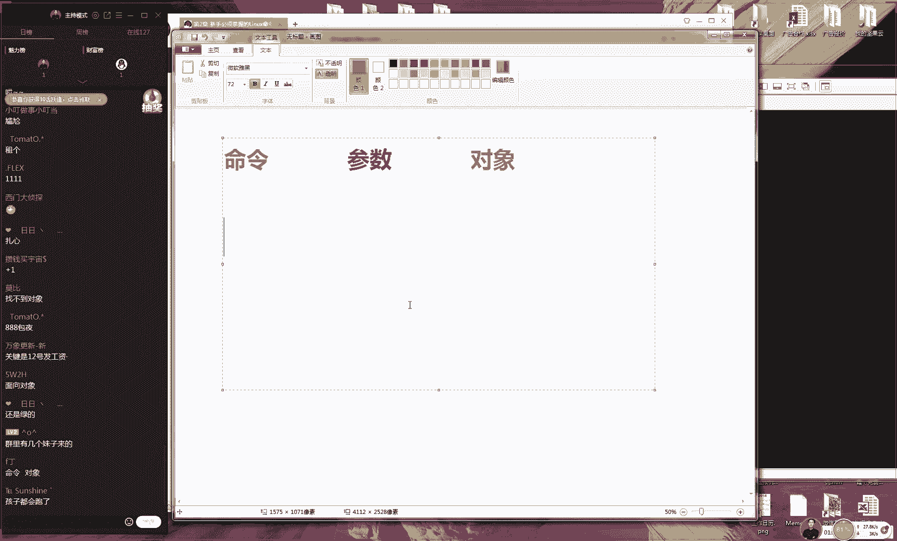

我们今天好像讲的比较少啊，但是这个东西不会给大家差的。如果要是我们到最后。没有讲完，会者大家免费讲课给大家讲完。那最后也许会讲到22天或讲25天无所谓。我那会给大家讲完的。但是我们要细致一点。

我不要说只是为了讲课而讲课了。😊，好，因为我也想享受这个过程的，我也希望大家能够享受这个过程。好，接下来我们来去说一下我们这个参数啊，它是分为我们这个长短格式之分。第一个我们叫做这个短格式。哎。

我们叫短格式。😊，长格式短格式跟长格式，你们不要说这么做。你刚大家先呃虽然我说的很多啊，但是我我猜你们一一定有人现在在想着双十一要不要表个对象的。来后我们来看一下这个短格式。这个短格式的话呢。

一般来说就是一个减号，加上一个字母啊，一般来说就是一个减号，加上一个字母，这个样子就是这样的一个杠A杠S杠L，差不多这么一个样子啊，就是一个减号加上这么一个字母。而这个长格式的话，一般来讲它是两个减号。

加上一个单词。咱比如说or。😊，呃，你看我说的比较严谨，我说是一般情况下来讲，因为我我们这个系统它是来自于一个全球的一个智慧的一个结晶。它的话呢呃。他有不同的编程的这个习惯。

他有些时候他不是按照这个规则来去走的。咱举个例子啊，你看因为我们现在这个系统里面他总共是有了4天，他有了这个四五千条命令。那么这个也许有些这个命令的这个作者，我们说这个例子不太好嗯。😊。

他也许是生活在非洲的某个小村落里面。好吧，他们当地的这个习俗，就是认为两个减号代表就是人死了。那那他当然他编写出来的一个单词哦，不他他是编写出来这个程序就不会存在说两个单词呃，两个减号这样的这个长格式。

但是我们那我们讲的就是大部分大多数的情况下，那么都是短格式跟长格式这两个方式来去写上我们这个参数，就是大部分的这个情况，千万不要较真同学们，就因为他是给大家举这么一个例子啊。好，这样的话呢嗯。😊，呃。

有什么问题我没有看明白啊。😊，好，那我没天明白，我先不看了。然后我给大家说我们这个参数的这个方式。那我们需要来记一下啊，那我们这个参数它有这个长短格式之分，有一个顺口溜。大家记一下我们这个参数的话呢。

短格式跟短格式之间。😊，那，现呃呃我这么简说吧呃，我们的这个参数长格是跟长额式是不能够合并的。为了能够去简便一点，我们是可以合并的啊，需要给大家说一下口诀和呃合并的一个原则，记一下。

长格是跟长格式之间是不能它是不能够合并的。😊，长格式跟短格式之间也是不能够合并的。短格式跟短格式之间是可以合并的，并且只保留一个减号。什么意思？咱比如说有这么一个参数。

杠A还有一个长格式叫做这样的一个形式。这个两个它怎么着，它都不能够。😊，来看啊这两个它怎么着，它都不能够合并，因为它是一个短格式，一个长格式，而两个长格式它也不能够合并。但是如果它是两个短格式的话呢。

他们两个可以合并，你只去。保留一个减号就可以了。好了，给大家举个例子啊，另外还有最后一句话啊，我能给大家重来去重复一个我们比较完整的。然后我会给大家去说出来，而不给大家去打字，不打字的原因不是我偷懒。

是因为我想强迫你们回去之后一定要去看一下我们这个录屏的视频。我希望你们去看同学们好，而不而不是只听一遍就完了，你不要讨厌我的。所以说我们一定会之后一定要再看一遍视频，我们来去做复习。

你每一次看的时候的这个心得也是不一样的。好给大家去说的啊，就是说长格是跟长格时间的这个参数是不能够合并的。长格是跟短格式之间的这个参数也是不能够合并的。短格式跟短格式之间的这个参数是可以合并的。

单单是只保留其中的一个减号，再往后一句话就是参数与参数之间对象与参数之间命的参数之间都要有空格去做间隔。咱比如说我这么多个参数杠A。😊，咱比如说我举个例子，有这么一个命令，我们叫做MKDR杠P。

然后就是代表就是新建一个目录的意思。然后我们这个目录的名称。但你看呃。😊，那你看啊我们现在这个里方的话呢，就是我们的这个命令，这是我们的对象，这个是我们的这个参数。

那咱比如说我们这个参数它是一个杠A杠L杠P。好，那我们可以作为一个合并，给大家杠啊杠啊杠ALP给大家这样进行一个合并，这是没有问题的。但是我们需要注意一下。在你没有合并之前。

你的每个参数跟你的每个对象之间我给大家圈一下啊，就这么几个位置上面都必须要有空格去做间隔的每个参数，每个对象，每个命令之间都要有这个空格去做间额的。好了，接样的话呢嗯。😊。

怎们小叮当同学提到了说结婚证只有一个啊。好，你们这个思维跳跃比较呃比较的快啊。然后又有同学没我说了，也说哈哈的合同签了几年嗯，我这个怎么中文字我都我都感觉不太理解了，你们在聊什么呀？

怎么在说哈哈他他合同签了几年啊。好了，这个我们来继续给大家就说，就是我们这个命令跟我们这个参数，我们的对象。😊，一个合并的一个关系，大家不会是大家不是大家不会是串线了吧。啊，对哎，有身份的人。

我们要的距离，大家这样去记也可以。就是我们这个命令我们的参数我们的之间，他是要空格去做间歌的接下来我们来去说啊，这个梗大家都知道就好不要说出来说没有意义了。因为你们应该能够猜到我是一个讲技术的一个老师。

我不是德云社的一个相声演员。所以说我的经历是放到了书上面呢，我我的经历不是放到了这么一个像段子上面的，所以会有一些段子可能会在每一期都去讲一下，所以说大家要是听过一些段子的话，没有听说过？

要配合一下这样我才有面子，对不对？你们这都听过的话都剧透就感觉老师很水接下我们来敲一下我们这个命令实践来演示一下你这个有一句话啊，我自己说的像这个百闻不如一见看书怎么样呢不如看实验。

所以说你讲了这么多理论都能讲了。😊。

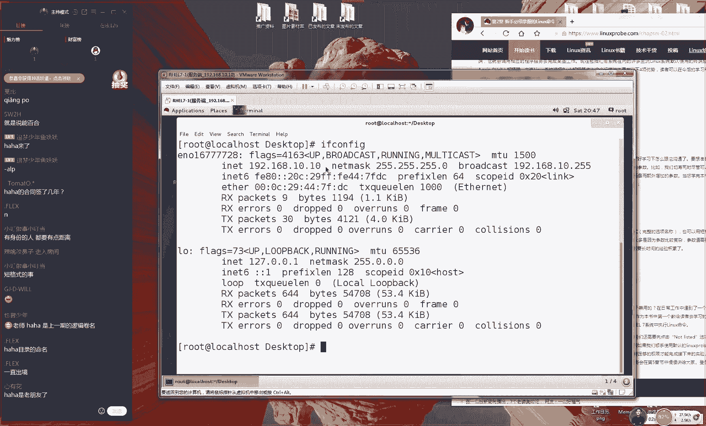

看看实界，你给我敲命令之后，看看什么样子，对不对？我们今天讲一个小时050分钟呢，你电脑你都没开机，你等于说你还没给我敲命令呢，我们感觉很不爽。好了，我们先给大家敲一下我们第一个命令。第一个命令的话呢。

我们叫做man命令，man是什么呀？中文啊，这个在啊在这个英语里面。😊，我们的man指什么意思？这个你们都知道的。M是什么？man你们上厕所都能见过man和和woman，或者说那。

然后或者说我们这个男性和女性对不对？好，man就是男人，对吧？man就是男人。然后的话呢women就是女人，其实这个不是男人的意思，它是一个缩写。

它这个缩写的单词的全名叫做manu代表就是帮助文档的意思。man的话就是说可以去看一些帮助文档。那你可以把它想象是什么？就是想就是男人嘛，你就该呃见识更古加广播一点，有一个酒的广告说的好，叫什么呀？

世实上最怎么怎么说呢？这是什么洋和蓝蓝色经典那款酒因为我。😊，今天我了看电视，然后那不就老什么啊什么最宽广的是什么大海，最宽广的是什么男人的胸怀，然后什么蓝洋什么蓝色经酒，对吧？还有这么广告。

那你就然就是说啊我们可以将来来来来去记就是man的话就是说既然是一个男人，那你就要去见多识广。所以他就是一个帮助文档，你可以使用到这个man，使用这个男人去来去查很多你不知道的事情。

比如说呃那既然你是男人，那你告诉我我们这个系统的，或者说你告诉我某个命令的一些使用方法，那我们就可以使用到man空格，我们后面想要去查询的事情。想来去查询我们想的这个事情，然后我们敲一下回车。😊。

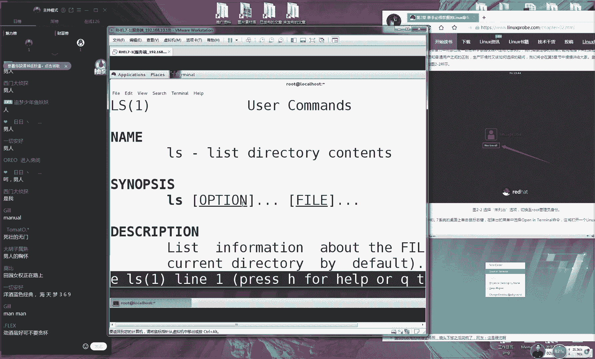

看等我们下课之后。我第一件事情我就要去找什么洋酒，还有什么蓝色经典那个厂子，我需要一下广告费去我们当着126个同学的面，我贴一下他们的广告，怎么着，是不是也得出点广告费啊。好，你看一下啊。

这就是我们这个manM后面是加的，就是我们这个。😊，想要去查询的一个命令。这样的话呢，或者说我们某个参数，或者说我们的某个文件名称，他都可以帮你去查去。然后可以点一下Q来去退出了。好。

这个我给大家举个例子，就是说当你有一个命令的时候，你不知道该怎么去做。那那你那你不知道该怎么去做，那么你就可以使用到后加上它去进行一个查询。好，这个我们就不多说，因为这个没有什么可讲。

因为它对应的命令它特别的多它会有这个成现上万款。那我们就直接给大家去说我们这个命令了啊。第一个命令的话我们叫做这个第一个话我们叫做这个。😊，呃，这个话呢代表就是来去输出信息的意思。

我们来去呃命令和我们这个对象之间，我们要有这个空格。我们来去输出一下linux点com这么一个广告词敲价回车。然后呢我们就看着屏幕啊，我能够想象大家现在这个表情就是什么呢？大家现在这个表情就是嗯很茫然。

哎那个您现在在做什么事情啊，对吧？不知道老师在做什么事情，在逗你们玩吗？你看啊，我那我们现在去使用到这个。😊，然后我们将这么一串信息，他将我们一串呃我们这个对象的这个信息输入到了屏幕上面。

然后呢然后有什么用吗？嗯说加引号的话有什么区别。这个咱们以后会讲到第三章的时候给大家讲到好吧那后大家看一下我们这个事例。你看他就是将我们这个命令的这个对象输出到了我们的屏幕上面，然后就仅此而已了。

就是因为我们刚刚去学习我们这个系统，大家根本就还不知道我们个命令之间，它有什么样的一个相互搭配的一个方法，就像于说搬砖一样，你搬砖了，你永远不知道你房之后什么样子。这个砖可以盖个厕所。

可以盖个楼房可以盖个平房，这个砖还可以盖个别墅，还可以盖一个泳池。你如果你身为一块砖，你永远不知道你自己能够去做什么事情。但是我们必须要有这块砖，然后才可以去做很多很多高大上的事情。

我们不能有这种叫做什么空中楼阁一样，我们只要上面的这个顶层不要。😊，到底下的地基。所以说我们现在去学习的是我们的一个一个一个的命令。😊，大家要知道我们再去学习的是一个一个的命令。

也许这个命令您看起来好像这是不在逗我们玩嘛？这么一块信息到我们的屏幕上面呢，然后就没什么了。这不是逗我们玩吗？因为你现在不道今后搭配起来什么样。

所以说现在我们学习的时候千不要选择性学习就当做是相信我知道我们这个命令该怎么去搭配到我们后面的时候，我们这个命令可以跟第五章一个命令叫做叫做这个叫做这个PAWD命令我们来去结合来去重置我们用户的密码第四章的时候以去批量来去充建出来用户以去复制我们的密码还可以将我们这个信息重新向到一个文件里面结合我们第三章里面这个重钉相符这个特的有用处。

但是体现不出来，就站起来相信就好了。第一个命令我们叫他用来去显示信息的。是将我们这个信息输出到我们的屏幕上这么一个作用。好，后的话我们来去。😊，输出一个icical。讲一个doller服。

我们后面可以加我们的这个编量的名称，大家需要区分大小写，这样的话可以显示出来我们当前正在使用的这么一个命令的呃呃这这就是我们当前正在使用的一个终端的一个名称。😊，好，这就是我们来看一下。

所说我们看到这个书的话，你自己看书，你想疯了心，你也不可能想到我们这么多的是个使用方法。这就是给大家讲到说看书跟我们参加培训的一些区别。这样话我们来看一下就是使用将我们这个信息显到屏幕上面了。

它怎么去使今后去讲不要着急。这个砖头它没有太多用处，它需要结合到一起。第三章里面管道重项还这个重听像符第四章节学习到脚本时候综合去搭配起就是效率特别的好接下我们来学一个我们叫做这个d它是用来查看我们这个时间的。

如果说你想要按照自己的这个想要的格式输出的话，可以这去做代表就是提取变量的值的意思。代表就是提取出来变量里对应的值的意思。然后我们接下来去说一下我们这个d。😊，它的格式就不一样了。我们刚刚刚讲过。

就是短格式是一个减号，长格式两个减号就打脸了，对不对？因为它每个命令的这个作者的编成习惯，其实来说也是不一样的。所以说我们现在看到这个格式的话呢，就是一个加号加这么一个双引号。

这个双引号我们需要保留下来。第三章时大家讲到我们具体的这么一个作用。我们可以加参数。比如说我想来输出一下年月日，那么这样去做就好了。

然后我们这个间歌符我们以减号为间歌你看这样话会去输出来我们当前的这个年份。然后我们用减号做间歌符，月份的话我们来看一下我们的表格的是2-4，我们的月份的话是消写I，看一下月份还有我们这个日期年月日嘛。

日期是D好，我们来看一下大小写大家需要区分大小写大家需要区分你来看一下这样话他会按照我们想要的这个格式来去输出来年月日这么三个这个项目。这样话我们可以再来年月日我们后面可以再去加。😊。

它叫做这个小时分钟秒。好了，我们的小时的话呢就是一个大写的H。好好，我们移冒号度间隔符了。然后我们叫小时分钟分钟的话是大写M。好，秒的话就是一个大写S。我们来看一下我们这个时间。😊，这样的话呢。

那我们就可以按照我们想要的一个格式来去输出来我们这个系统的一个时间了。啊，这个也是非常有意思的这么一个命令。😊，好，再往后走的话呢，就是叫做这个reboot。它是用来去重启你的这个服务器的。

当你敲完reboot之后，然后你的这个服务器就会自动去重启了。好，这个那我就不敲了啊，完之后它它就会去重启了。它的话呢re完了之后，还有一个叫power off代表就是关机的。

因为我们开机我们都会就是去点一下你这个主机上面那个按钮，那么就给大家讲的就是如何来去重启，就是reboot关机就是power off代表就是重启跟关机的命令。下面的话还有一个叫做W get命令。

就去下载我们的网站上的文件呢。咱比如说我有一个网站上的一个文件啊，我们叫做无所谓，我们这样去啊直接写后面加我们这个网址。😊，3W点linuxpro点com，然后我们加上1个1点啊。

或我们叫做这个哈哈点RR吧。好，我们这样去做。😊，因为我们心在啊，大家这个讯机，你们现在都没有去联网。对，因为你们现在没有去联网，你们再上去敲命的话，一定会报错。你看我现在敲完了之后，我我都会报错。

你看我现在都会报错。😊，他呃W get下载完了之后，它会在你当前所在目录下，就是在这个当前目录下，它会保存这个文件。因为我们现在没有联网，所以它会给你提示出来一个报错。但是我们先暂且先先先来去记就好了。

然后我们会在第八章的时候和第十0章的时候为大家去讲。还有我们第十六章的时候为大家去讲如何来去配置我们的网卡会给大家讲我们这个四种方法来去配置我们的网卡以及。😊，我们这个网卡配置好之后。

如何来进行一个上网操作。好，这个我们先不给大家去说就是这个命令的这个作用，大家现在去记一下，就是W get。但是我能够理解大家的这个心情，就是因为我们特别的激动们终终并且命令之它会有这种。

我感觉我感我控制整个世界觉但是我们一步一步去做着急要有恒心好就是说我们下面的话第命令来下载我这个文件的，只不过我没有联网。但是大家个重心不要去学怎么去配置的网卡记这个命令就可以了。好。

下面还有一个叫做这个PS命令是用来去查看我们这系统个争信息的么可以使用到命令。😊，啊，大家学的比较快，已经学习到PWD了。那你看一下这个的话呢就是用来去显示你这个进程信息。

但是我们看到其实来说它只是一个概要。我们需要这样去做PS然后的话呢杠A杠U杠X我们知道它是两个它它是三个短格式可以合并，于是可以合并成杠AUX而恰巧PS它支持不用去解减号。

那么我们命令变成了叫做PSAUXA代表就是显示出来所有的进程呃，它代它代表是显示出来所有的这个呃进程信息U代表就是显示出来这个详细信息。因为你看一下，如果没有U的话，它是这样的。😊。

加上加加加上这个呃加上这个U之后，它会显示出来这个详细信息的模式啊，详细信息的这个模式。还有最后这个X显示就是即便是我们系统里面没有进程终端这一个进程由我们系统启动这个进程的话。

也会帮我示出来这显出我们这个系统里面这个所有的进程的信息。但特别的乱和top里这个进程么关系。说这个两个这个区别啊top话它是一个动态更新的，而我们这个话是一个单有效的。

而我们这个top的话主要显示出来它是有一个界面的一个限制的啊，不我们现在是显示出来上百条，它会显示出来最为常用的。

我们这个出来所有的信息话我们来看一下啊外按照我们这个件来进一个排序的也是好那我们来看一下这。😊，有较乱，说来说是我们这个进程的一个发起者，然后是我们这个进程的号码。主要我们来看一下我们这个进程的状态。

它是有了5种状态，需要给大家去提到。大家可以记一下，在我们的系统当中，我我们的这个红猫路由器，我们的linux里面的话呢，进程它是有5种状态，它有它是有5种形态的。第一个呃状态的话呢，我们叫做R状态。

😊，这个代表就是当前他正在为我们这个用户提供着服务。大家记要记一下。第一个状态叫做R状态，我们叫做running，代表就是跑正在正在运行。它正在为我们这个用户提供着服务的啊，正在为用户去提供这服务。呃。

我给大家打出来吧，正在。😊，为用户服务。第二个竞融状态话呢，我我那呃我们叫做这个S，它可以叫做stop啊，这样的一个模式或者叫做sleeping，对吧？叫代表就在睡觉。这样的话呢。

它这个作用的话呢就是说。😊，他停止了，或者说他正在休眠，他是没有被用户正在服务，他是等待为用户服务的这么一种进程。他没有被启动，它是正在被休眠，正在被终止这么一个状态。

还有一个叫做DD吧代表就是啊它已经是出现了故障了，它代表就是啊不可中断状态，它就是说啊不响应信号。啊，他已经是不呃他已经是不响应我们的这个系统信号了，但是的话他也会去啊。

或许他也有可能还在啊或在为用户提供这个服务。这具体要看我们具体是哪个服务。因为他有些时候他虽然不响应系统这个进程啊，但它也是在服务。相当于就是windows里面那个窗口无响应。

你们有没有遇到过这样的情况，就是说你点这个窗口的时候，显示出来这个窗口没有响应。下面的话呢还有一个叫做Z这个Z的话呢我们叫做这个脏币，它有两个翻译起来这么一个词，一个叫僵尸，一个叫僵死。好，一个叫僵尸。

哎，这个不是我口音啊。僵尸，一个叫僵死。😊，其实两个都是一样的。因为你们我看过一种美一剧叫这个行尸走肉啊，或者说叫呃什么来着？有一个电影特别喜欢叫。呃，就是一公司叫那个umbrella。

然后就那个保保物伞公司，后来。啊，叫这个上海危机对吧？就是这样这个丧尸题材这个电影现在是比较多的，这种丧尸题材叫这个僵尸进程。好，那你想象一下，就是说现在这个僵尸这种丧尸片特别的多，但是万变不离其宗。

这个僵尸给人的感觉是什么？僵尸给你的感觉是什么？没有人觉得僵尸很漂亮吧，想跟僵尸结婚，僵尸给人的感觉是什么呢？张比对啊，感觉是什么？很暴力血腥总体来说是什么样呢？😊，你们有看过生化危机里面的第七季。

不是呃，应该是第几集啊，应该是第几集。他没有单独总结过说僵尸啊他不是为了去吃人。你们仔细看看生化危机。如果你今天下课之后你去看一下，他们总结过，说啊这个僵尸他不是为了去吃人。

而是为了去喜欢这种血腥的味道。他喜欢就是吃新他他喜欢这种新鲜血的味道，所以他不光是吃人，他还去他会去吃小动物，但是咬死之后，他不会把它吃完。哎，他不会吃完，他就会去寻找更加新鲜的这种血液和肉体。哎。😊。

所以的话呢你看这个僵尸的话呢，我们总结来说就是说他呃。是不他已经是不受人脑控制了，他是不受人脑控制的这种进程。那也就是说不受系统。系统控制，并且没有为用户提供服务的这种进程。这样的进程一旦出现。

他会来去一直消耗你的这个系统资源，但是他不会为你去提供这服务。这种进程一定要小心了。最后是一种T代表就是已经被停止，就是停止。为用户提供服务。好。那么的话我们待会主要见到这么两个。第一个的话呢。

我们叫做R，第二叫做S，这个两个就是我们待会会见到的。第一个叫R。第二叫做S。好，接下话呢我们来看一下，就是说我们刚才那个PS命令啊，我们这个里面它会有很多这样的这个进程信息输入出来，但是特别的乱。

我们根本就没有看全这个时我们可以敲命令我们叫做命令，我们叫top命令对这个代表就是进程个级别关系我们敲一下top这个的话呢就是说我们可以动态来去查看我们这个系统信息以及我们这个进程列表。

这个非常相向于我们这个windows里面的这个任务管理器，大家可以看到它是个动态更新的这么一个过程。然后大家拿笔。后因为这特别特别的重要嗯。😊，啊，今天这个时间会比较久，大家天前做好准备。

大概会在9点20左右。然后我们开始读答一到9点40，大家天前做好准备，该吃饭吃饭啊呃，别管我就别管淘宝就行。然后的话们来继续说啊。呃，因为的话呢我们这个命令它特别的重要，它特别特别的重要。

所以说我们要对它里面的每个细节，我们都要给大家去讲一下。那么你现拿起一个红颜色笔或者说比较醒目的笔，你打开你的书籍，找到我们这个top的命令，把它翻开去写你的笔记。那我会对于这个里面的每个重要点。

我们来去做一个总结，特别特别的重要。大家大家准备好之后打一下一好吧。😊，这个名字我们一定要好好去去，一定要好他非常重要。好，大家准备好之后打一下一，我们开始讲了，大家找一下笔啊，笔和纸一定要准备好。😊。

好，那我么这边好，我们开始了。我们对于这个命令我们进行一个非常详尽的一种解释。第一个的话呢，我们叫top代表是我们的命令的本身，好大崩打一的该该写笔记啊，代表就是名称，我们的命令的名称。

然后的话呢我们这个是我们系统的时间，我们系统的时间，系统的时间，这代表就是我们系统开机了多长时间，系统开机了多长时间，后面代表就是我们当前有多少个终端在登录，它不是指的是我们系统用户。

它指的是我们这个终端的这个数量。我们现在可以打开多个终端，然后你可以看一下我们这边就会变成了呃我们原先是二，对吧？我们。😊，就变成了一个4，你看它是我们这个终端的数量吧关闭之后啊，又恢复成了这个2。

它是指的是我们这个终端的数量。再往后面走的话，它是指的是我们系统的负载情况，这个指的是我们最近一分钟5分钟及15分钟的这个负载情况。

这个数值最小是0越小越好代表就是这个数值是负载情况是最低的这个数值超过一代表就是我们这个CPU它是一个满队列正它啊满队列正在去运行啊，这个刷新是按照按照表去刷新的。

会会每秒去刷新一次这个话它是一个我们系统的这个负载情况，它是啊。😊，指的是我我我们这个系统最近的这个一分钟5分钟接15分钟的这个负载情况啊，最近一分钟5分钟接15分钟的这个负载情况数值为0。

它是它这个数值最小是为0，最大可能会达到几十几百都有可能数值越小代表就是CPU这个负载压力它是越低的数值越小CPU压力就会越低超过它达到一的话呢，一代表就是CPU它现在是一个满堆的正在运行。

说明CPU是这满了的这么一个状态。这后的话呢，如果这个数值每一个数值叫做5这个数值我们在行业里面我们叫做这个睡不着觉。哎，你们记一下，就是我们运维行业里面有一句数语叫不着觉。

如果说你这个数值达到5以上的话呢，在这个系统就有可能出现崩溃的。就说你这个数值达到一的话呢，可能这个服务器不会崩溃。但是如果达到5以上的话呢，就有可能会造成你的这个服务崩溃。但是这个是。😊。

大他是他只他这是一个大概的一个值啊。😊，好，所以的话呢我们来给大家举个例子啊，那既然说它它是最近5分钟15分钟啊，它是最近一分钟5分钟及15分钟这个负载情况。

那你看如果说我现在给你出来一个这么样的一个数值，请请告诉我我们现在系统的这个负载情况，它是在越来越高呢，还是在越来越低呢？😊，大家看一下。那那我我们现在它是越来越高呢，还是越来越低呢？

他是越来越往哪边去走。好，这个大家先呃不知道没有关系啊，我给大家去说是这样的，我给大家举个例子，举个生活上一个例子啊，我们以万来说，我呀在15年前我在15年前我有20亿的资金。哎。

我在15年前我有20个亿的资本。我在最近的5年呀，我有了我有啊我只有5个亿的资本。😊，我最近的一年我只剩来，我只剩下这么一我只剩下了这么最后是呃一个亿的这么一个资本。

这个是我最近一年5年、15年的这么一个资本情况。好了，所以你看到。😊，一年5年、15年的这个负载情况。所以你看到我的这个钱它是越来越少，对不对？因为它是往往少在走的。所以说这个数字的话。

它是从右往左看的，左边这个数值它是它才是代表你最近的这个情况好，最近的这这个情况。好，再给大家举个例子啊，比如说我们的0。20。然后完了0。150。05，就给大家举个例子啊，不要嫌烦啊，0。05。

那家请问一下我们当前的这个负载的这个情况是在往高了走，还是在往低了走。😊，他是在往高了走，对不对？因为他现在是最近的一分钟，5分钟积15分的这个情况，他是在往多了走。因为我们最近在这呃最近这个15分钟。

他是5，而最近而最近的这个5分钟，他是15。而最近这这呃而我们现在这个最近呃这呃。😊，但是我们现在这这个最近。他是呃。0。20它是一个最高的，所以说他现在的话它是一个更高的这么一个级别。

它是一个近一分钟的这么一个情况。好，这就给大家提到，就是说一个负载情况，最小值是零。然后的话一般来说超过一代表是个超过出现问题。等我们的明家讲第个命令大家去说一下值好吧，为紧张。

给家去讲我明天大家复习一下。那我去说指的是这个进程的这个信息，他会告诉你说我们现在这个进程总共是有520当只有一个正在被运行，其中有519个等待为用提服务中有个被关闭以进程。

这个是代表就是啊我们这个CPU的这个情况，们只需要去个代表就是。😊，代表就是我们当前CPU的这么一个使用的百分比。当前CPU使用的8%啊，以及我们现在CPU使用的是0。2%2。3%。

这是我们CPU当前已经使用的这么一个百分比。而我们这个最后的话呢，这个ID指的就是我们CPU这个控显率。😊，好，接下的话是我们这个内存，这个是以KB为单位的。当前我们这个内存有了呃个1百千万10万百万。

有200万个KB它指的是两个GB的这个内存我们当前已经使用了1。2个GB的内存有了7。9个G的内存。好，后面的话它主要做调优指的是我们这个系统。

我们还有这个CPU跟我们的内存以及我们这个内存跟我们硬盘交互数据这么一个量。这我们不用再去看好，那么下面的话我们叫做交换分区这个话会给大家讲到的。

它是在我们这个系统的它是在我我们这个系统里面来去去充当我们这个内存的这么一个存储的一个资源。这个咱们是在第六章大家讲到的它也是相当就是一个内存的一个使用情况。它使用一个空间。

后面的话我们ID指的是我们进程的一个唯一的一个编码。那么给大家一个编号。下面就是我们这个进程的一个发起者。😊，来是谁啊，后面的话呢还有我们这个PR跟NI这代表代表就是一个进程的一个呃优先级别。

这个数值越低，代表就是这个呃呃越为优先。这个是windows也有可以去设置一下这个进程个优先级数值低。

那么这样的话就获得取道更高这个优先级别这个话代表就是我们这个进程与我们这个内存跟我们这个硬盘个交互数据量。这个来说其实不用担心，也不用去关心。现在因为我们现刚第一天嘛，我们会在如果要我们要是开班的话呢。

我们会在红C的432里面会大家去专门去讲一下我们这个调的这个方法的后是个指的是我们的状态了。那么就R这个状态代表就是正被运行他就是等待为我们这个用户去提供的服务。

这个百分比指的就是当前这个进程它使用了我们03这个CPU以及这个它使用的是01它的这个内存量。😊，这指的是我们的这个内存跟CPU的呃，这个指的是我们这个CPU跟我我们这个内存的量。

后面是我我们这个进程已经开启了多长时间，最后是我我们这个进程的名称。😊，好了，那我们接下来给大家说完之后啊，因为可能今天时间比较紧张了，我们会到9点半了，所以我们先天快一点。

我们会我在明天的时候会再给大家去说的，然后会再给大家讲到一个命令我们叫up time命令的时候再给大家说一个负载情况。叫 time这个负载。那好。

那我们在已经知道了就是我们一个服务会对应的一个或者多个这的这个进程号码。那我们怎么去查询呢那我们这去做命令我们叫做后面加我们这个服务的名称是这样去加我们这个服务的名称，我们叫SSHD吧。

我们这样去搜这样我们就可以看到这个服务的名称。😊，是。呃，这个服务的名称，它对应的这个编号的话就是1797，这个每个人都是不一样的。这个每人都是不一样的那好了，那么如果说想去关闭掉一个进程的话。

那我有两个方法第一个方法使用Q命令直接我们就给去结束掉我们进程的编号1797把结束掉，我们再来去看这个服务的，就没有了说明我们就已经把这个服务给关闭了。后我以去查看一下查一下我们这个服务的状态。

就看到他这个状态正在已经被死掉了没有被激活就是他们要被激活，我们现来去启用它我们来启用一下我们这个进程启用这个服务，我们来看一下我们这个状态已经被启用，同时马上再查看一下我们进程的号码。

就发现已经被启用了有一个新的进程号码那现在就有一个问题了啊。那么如果说我现在这个服务程序它是有一个高并发值会有很多。😊，多个竞争号码，他也许会有5个省100个，对吧？😊，那么如果说我们某一个服务。

它有多个进争号码的话呢，这样来去关闭起来，太麻烦了。那我们要先去查询，然后再去逐个去关闭，特别的麻烦。那我们可以这样去做使用到QI。对了，Q2命令的同学，然后我们来这样使用到Q2。

直接后面加上我我们这个服务的名称，敲一下回声，马上就把它给关闭了，并且我们可以来看一下状态被关闭起来了。那也就是说它现在来说它是有两命令的，我们的Q命令后面加上是我们这个进程的号码，而我们进换到Q。😊。

哎，等一下等一下啊。😊，今天要讲的比较时间比较久啊。大家再坚持一下，我估计耽误大家抢购时间了，进城号码。所以我双十一我我没有买东西，所我所以我要所以我我要耽误你们，不让你们买东西。

这个是我们这个服务的名称。大家记一下这两个区别，这个服务的这个号码，还有我们这个服务的名称，这两个的的方式啊，他都可以去关闭一下我们这个服务程序。好了，那我们除了这个之外，还其实还有的。

比如说你先看一下这个服务程序。😊，其实他都已经被关闭起来了，对吧？那我们先把它给启用啊，我我们省钱，我们来看一下啊。我们现在的话呢我们来去启用。然后我们来看一下这个状态它已经被启用了。

其实还有第三种方法。第三种方法就是使用到sstemCPL，然后我们去使用一下这个stop，然后我们把它给结束掉它。你再来去看一下我们这个状态。还要把它给关闭一起来。

就是说我们去结束一下和我们去管理这个服务的一个方法。行，其实我也想给大家去休息5分钟的。我们讲一节课休息5分钟再讲45分钟。😊。

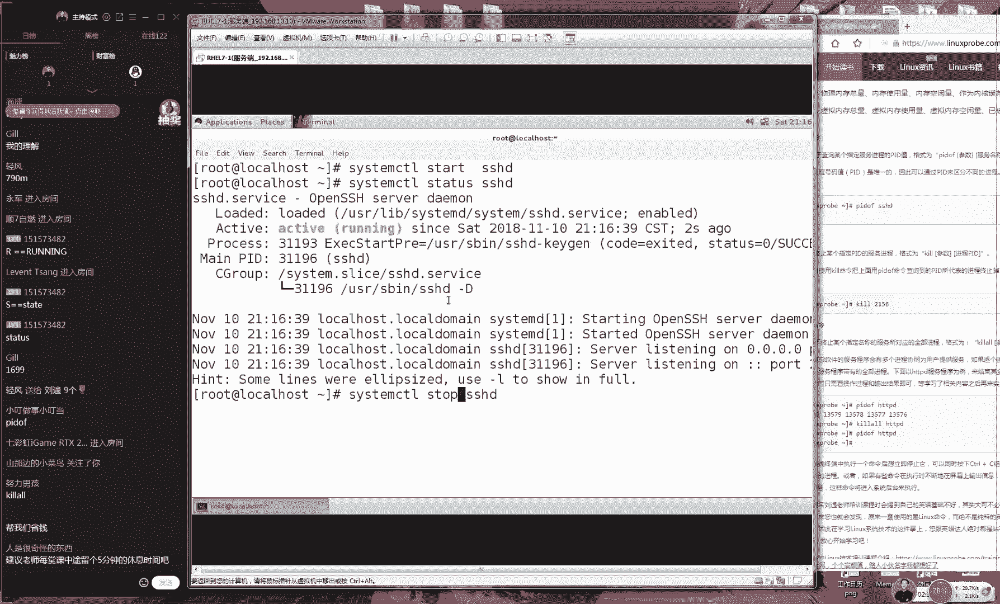

但是你看今天咱们从开始到现在，我嘴就没闲着，大大开始给大家讲讲了一个小时20分钟。😊，才是刚刚讲完了。这么一个章节嘛，我们也算也算是个收尾啊。所以说今天这个课程量是比较多的，想给大家休息一下。

但是量有点多，确实干货比较多嘛。然后是这样吧，然后呢我们今天又先讲到2。3小节，后面的话太多了，我们也讲不完2。4小节的话呢，我们就到明天坦白来说这已经是在我们这个预料之大了。我们觉得今天已经讲完2。

4小节就是我们应该能够讲完讲完2。24小节的啊，但是我们没有讲确也确实是讲的比较细致一点了。待会之后一定要好好做预习呃，该想购抢购啊，双十一好好过。那所以的话呢我给大家去总结一下啊，就是你今天的话呢。

你至少至少你至少至道对我们今天这个段就是在休息了。😊，我们叫什么？按照古代来说，我们这叫先人不先马，对不对？就是我们。大家休息的时候，我就不休息了，我给大家讲段子了。那我们先来说一下我我们这个复习啊。

也是总结一下我们今天这个重点，就是你今天可以什么都不会，你今天可以不会PM你也不会库命令不去背但是你起码你要去安装我们的系统。如果说你这个没有安装好，那后面不要去学。为你不道因为你没有实验环境？

是我们必须要去做的我今天要去学习了什么呢？我们去学习了我们的命令，我们的参数我们的对象之间的这个关系。后我们知道我们这个参数区别们这个是以们命令参数对象怎么一个搭配结合到一起去使用。

然后的话我们又去学习了解器我们这个终端它对的这么一个关系去学习了我们如去查看我们这个系统一个信息会查看我系统这个负载内们这个技能信息会管理我们这个服务。这就是我给大家总结一下今我们学习到的这个东西啊。

主要学习我们安装我们的系统以及基本的。😊，去知道就是你要去找感觉，要去找到就是你。😊，敲面的这种感觉就足够了。然后的话呢，按照我们这个进程来，按照我们这个进度来去讲的话啊。

我们这个预习明天我们会讲完第二章节，我们明天不会讲太多，不会讲我我们也不会去赶课程进度啊，我们会只讲完第二章节就是2。4小节到2。8小节这几个小节啊我们2。8小节，这是我们的课程的一个安排。

待会之后的话呢也好好去做一下预习。我们的明天是。😊，10月11号，大家不要忘记，还是法律上午，好吧。行，然后有问题的话可以来跟我去说了，中途休息5分钟。我老怕今天讲不完。

你看咱们今天讲了一小02分钟才刚刚讲完，我怕休息时间长了之后，耽误大家晚时间不更痛苦吗？时间太长了。服没有起来跟d有什么区吗？这个没有区别，他都代表就是大的代表就是关闭的意思。

他状态都是啊他这个状态他都是active就是没有被激活这么一个状态。激活状态的话呢就是这个active。😊，因为东西太多了，就因为我给大家想到了，就是说我们讲课的话呢啊我给大家提提两点啊。

第一说我们这个红帽考场的问题。我们昨天下课之后啊，大家都在QQ上问我说月考场的问题，我跟大家待会去解释一下我们这个月考场的这么一个时间问题，好吧，再给大家去解释一下。😊，然后来去说一下，我我们这个讲课。

他相在来说它是分为两种方法的。因为我也以前去过高校里面啊，我们去做过一些讲座，你知道讲座跟讲课是不一样的，讲课啊是让你学会东西了，讲座是让你觉得自己学会东西了。我们去讲座，你找那你找一堆学生过来了。

我们咔咔咔给他家讲。😊，我们也知道我们不是太老师，我们只是来做讲座去科普来的那我们这个时间只有了一个小时。好了，那我们就会讲非常浅显的东西。

比如说我会去讲一下如何来去安装我们这个系统然后我们就去只需安装系统安装一个小时。好了，安装一个小时的系统这有什么意义吗？但是学生的反馈特别的好。因为学生觉得自己学会的东西了。

学生觉得自己好像哎呀我今天进步特别的快，我已经会安装我们这个系统了。但是这都是很肤浅的东西。当你到了工作跟考试的时候，然后你会知道自己这个短板。而我们讲课就不一样。

那我们通过我们这个讲课给大家虽然很痛苦啊，这个他这个很痛的一个过程，不断的去加大我们这个课程的这个难度。最终。😊，到你考试跟工作的时候。

你自然会感觉到你与别人不同的这也是我们希望我们这个培训课程与其他的实力培训机构是不同这个一个亮点之一。然后说一下我们这个考试的一个约考的一个问题啊。就是大家现在不要跟我去约12月份的考试。

我现在没有考场的安排。今天礼拜六都休息了，我们最快也要到明我也要礼拜一要给红帽去约考场，然后他们答复也要一个礼拜时间，最快也要在11月20号左右才能够约到。然后的话是这样的。

我们会尽量给大家去多约考场的，在北京大家大家可以记住我这句话，然后去验证就好了。在北京、上海、广州、深圳这四个城市，如果我这边约不到的考场，比如说我说啊上海比如三个考场，有三场考试啊，都约满了好了。

其他的任何培训机构，包括中国在内的，比如说上官比如咱比如说上官东方瑞通塔塔达内任何的机构在内，他们都没有他们都他们都。😊，不有位置的，因为我们拿到这红贸最UCI这个报考权，就是我们报不上。

就是北京上海广州、深圳这四个城市。😊，我们没有的考场全部都都没有的，但是我会尽量给大家去约，但是可能每个人不能够保证大家都能去约得上，起码你们要往好去想，起码你们会比其他培训机构的学生更好约一点了。

这已经是我们很好的一个优势了。好了，这不用说这这就不说太多了，就是说现在不要去约12月份的考场，我昨天说大家又急了，说哎我赶紧去约考试什么的，你现在约完约约不了，因为你现在没有时间嘛。好吧。

大家理解一下啊，最快我们要等着11月20号左右了，不要现在不要约四川现在目前没有红帽考场，据我所了解的是这样的。行，然后可以去清下购物车了，说村男朋友嘛嗯。😊，这是问谁啊？然后是呃我我我我我就不用了。

谢谢大家。然后通过PS命令可以将系统里面的全部的服务都会显示出来吗？大家可以来提问了。现在可以来就是说我们PS命令那么你只要加了PSAOX命令，加这个A的这个参数。

它会会那么它就会去显示出来我们这个系统里面的所有的集争信息了，放心它一定会有的，福州它是没有红榜考场的山西它目前是没有红榜考场的。😊，东北目前也是三呃，东北三省也目前没有红贸考场的。是没有的。

之前我们有一个机构是在长春，他想让我们合作一下。但是我们坦白来说太少了。因为你想一下红帽尔考试的话，他自然要派红帽尔考官过去，你真的你。你想象一下，比如说东北那边，咱不是说啊，这比如说这边取个城市A吧。

那个城市A他每个月才有四五个人考试，他要派一个考官过去坐飞机过去，然后成本想想，其是这个红帽现目前在其他主要城市它是是有下城市还是没有的。浙江它目前是也是没有红帽考场的。好，然后南宁的话目前真的是没有。

然后现在是在北京、上海、广州、深圳、天津、济南、天津这几个城市它是有。然后不是说老师不给你们约，是因你们去搜你们当地要是有的话，就有，没有的话，就是红包没有给你们去安排。😊，然后先然后我先去喝口水。

好吧，大家酒一下可以来跟我去说，然后我们待会儿然后就做这个答疑，好吧，朋友先不用着急。😊，然后我看一下说不会12月30号吧，呀，我上午给他吹，我大家吹了个牛啊，我说约到。31号啊，行，我因为我说到了。

说了一个梗嘛，就是说你。😊，你即便你12月31号，你考过，你也是180开头了。你即便你是2019年1月1号考过，你也是190开头了。其实这么回事啊，大家都能够理解啊。😊，因为我们是网络培训，你看不到我。

我也看不到你，你也看不到其他同学。如果你要是去了实立机构，你就真的会着急了。整个班同学都会都在拼命的备考，你就会着急了。你知道红猫68要发布了，要变题了，谁不知道都知道你那你知道12月份考完了之后。

谁180开头的一个编码，对你找工所有谁有帮助。那你知道别人都知道。那赶上这么一个时间点了，那我们就只能是尽量给大家去约，只能那只能是这样。好好，这也是我们会尽力，好吧。😊，那没那那没办法。

你要是2019年的1月1号，或者说你发布的红包热肉8，你过来跟我约，大家自然会有位置，因为没就没有人去约了。大家懂这个意思啊。行，大家有问题还可以来跟我去说吧。😊，那赶了那么时间点真的是很尴尬。

我们尽量我们在12月份去这样吧，反正我想法就是12月份要考就12月份考，要么就真的就别考了。😊，因为红毛瑞有八遍题之后，至少半年我们要去准备我们的课程考题呀。呃，死的一片一片的。当时我去考的时候。

你们可以去问啊。2015年的时候，3月份我去考试的时候，中国的这个红CE通过率10%几10个人去了考过一个这么个比例。😊，啊，当然了，我最后是一次通过了，大家可以看一下我的考试时间。

我的红HCE不是不考，我的所有科目都没有补考，我都是在同一天考过的。你可以看到我红HCSC跟和红HC同一天考过的。😊，然后的话TTYTTY是这样的呃。

TTY就是你可以看一下这个进程的一个就是进程的一种说明，你可以开几个终端啊，开几个终端，然后你可以这样PS呃我们这样看，我们只用到这样去看我们这个TTY的话它指的是我们这个突鸦界面。

然后PT代表就是我们这个文字终端，就是我们这个开启这个终端嗯到时候还会有红包8嘛肯定会有红包8的这个培训，因为我们要吃饭嘛，对吧？呃，我们这个主要就是做的培训的，它更新我们自然也会更新对吧？

所以说我们指这个示范，我们就一定会与时俱进去更新的。但是因为我们现在这老师这个尿性，我们怎么可能。😊，啊，我们说他说的比较这个鸡汤啊，我们怎么可能对大家不负责任，我们会也会去写出一本书。😊。

处书版咱们不知道啊，但是我会先写出一本书，然后我们才会去开班。😊，大家要给我时间至少要准备半年要一年时间。嗯，明天我也是准备。好好休息一下吧，还始去写书。然后的话呢说到了红包日有8需要额额的费用嘛？

这我们目前还没有想好，如果要是有的话，也是少取费用，大家不用担心，因为我们都是自己的同学，我们不会让大家重新去报名的，大家放心，我们不会做那么很没有道理的事情，大家放心啊。😊。

大家新出那个跟安全有关是啥？你应该说的是红马HCSS吧，就是说跟安全有关。红包认证嘛，就是它有很多个，它它是有很多个。

不要只知道红CSCE它还有C它有很多比如说HCI马讲师的马CSS安全的CD数据库的不很这叫这个数据加固的啊，它有它是很多就像我给大家展示的这个它会有很多。但是你主要就考CSCCE和红C嘛。😊，好。

有问话可以来我去说呃，12月份不指望了19年当SD可以啊可以可以，这都这都这都可以的。但是我就说嘛。😊，嗯，这个怎么讲？你要是找工作的话，190明年的话，一整年会受到一些小小的歧视呃，会有这种情况。

那大家如果能能够接受的话，也可以，因为你讲一下，你明年2019年，你哪怕1月1份呃，你考过的，明年你10月1号，你再去找个工作，人家看你这个编号都知道怎么回事。190的开头了啊，今年刚考过。

这我就得不太划算啊，然后如果你要是就是180的话呢，你忽悠忽悠，咱不能说忽悠，那你说一说，或者说你填一下简历什么的，可以再伪造一年的工作经验，对找工作是很有帮助的。现在这个多少工作经验吗？😊，好。

我们巴拉巴拉不说这么多啊，说什么伪造啊什么的啊，感觉很黑暗啊。这个啊我们继续来说每月多少号考试，这个时间不固定，我尽量给大家去约下去。然后具体时间你需要等礼拜一，我给他们去约他们答复。

大概在11月20号左右，我会给大家去说的，不要着急，同学们现在约真的是约不了。😊，真的没有啊没有没有没有时间的。😊，呃，可以啊，北京要是约不上啊，我觉得北京能够约上我有我我对北京是有信心的。😊，嗯。

因为我们这个北京是我们的主战场嘛，北京、上海、广州、深圳是我们的主战场，对吧？也就到了12月份了。或许张老脸给你们约一下。所以说北京同学们和上海同学们你们就等我好消息吧。好吧，如果要是北京上海国州深圳。

我我们约不上考场，你们随便去问下家机构，我们一定。😊，是约不上的，因为我会把他们名额给他抢过来。😊，因为我会把名他名额抢过来，真的是这样，我总会就不就不就不说太多了吧。

因为我们觉得这是我们一个网络培训的一个优势。😊，啊，上海可以吗？上海可以啊，北京北京同学刚才同学们问了一个问题啊，说FLEX同学说怕北京的考生太多，大家不用担心说北京考生太多了是一定会很多的。

不用担心担什么呀？刚第二天的课程，我昨天跟你一说，就开始害怕约不上哪到哪啊，不要那么我这样一说，你那么信我？要自己分析一下，哪有这么多人我们这一期才100多个人才200个人还是很少的，不用担心啊。

你担心你没有用，实过双十一好吧，后可以来跟我去说，然后我大一好吧指望我指望我回头打脸嘛头我约不上考场，你会打脸。老刘你说你这吹的很厉害，讲课的时候嘎嘎跟我说这么多。

又是跟红有关系怎么着结果约到一场没有约尴尬是吧？我剁什么手啊，就买点茶叶。😊，没有东西可买。😔，想问代问他可以来就说。呃，我能看到你发信息，牛同仁同学嗯，我能够看到。lininux跟云计算关系是很紧的。

因为呃我们这个系统它算是一个平台。不论大家是以后去做运维，做pyython做云计算，做开发，无所谓，你做什么，它是一个平台，它都对你是有帮助的嗯。😊，云云计算是什么？我觉得其实在百度上去搜索一下。

可能会比我讲的会更好。我觉得我觉得云计算它是一个服务的一种模式，它一种弹性的一种服务模式，它不指的是你去使用opent就一定是云计算扯那就是一些官方的一些小小记者们给你们去说的不是使用的这个opent这样的这个软件就叫做云计算厂商。

它是一种动态这种弹性的服务模式，你有一种服务模式才叫做云计算。因为云计算不指的是一种软件。我认是这么去理解的。比如说阿里云它指的是一种服务模式，而不是单指你不关键它底下它它这个底层使用的是什么。

它是种服务模式。我认为是嗯。😊，他这种动态这种更新模呃，其虚拟化的话，目前我们没有开拓的这个计划嗯。docker都是什么啊？docker大家请请搜下，其实这个比较多的。12月份的考场很紧张。

但是1月份又怕变题。嗯，大家不用那么担心啊，刚刚第二天大家为什么这么担心啊？约不上约不上吧，对吧？大不了不考了啊，不用那么担心。然后说java考这个认证划算吗？我觉得是这样的。

因为我们有同学他们也在学java，他们平台他们也是linX。对以大家学习是有帮助的。但是你如果看你的主线，如果你的主线是java的话，你可以不用去考这个认证。但如果你以后。😊，而且怎么说呢？看这种权衡。

这个东西有的话会更好，没有的话也对你无所是无所谓。因为你是主要是做java开发的嘛嗯。😊，哦。Q命令这OK我们刚才说了10分钟啊，终于让我见到了一个比较正经的一个问题了。说使用到Q命令关闭之后。

将PS会显示带的嘛，然后它会显示出来被带的，就是这个结束这么一个进程。好。😊，大明还可以来问句说是这么回事啊，我给大家说一句比较实在的，说为什么要去考这个认证，红帽公司是我们家开的吗？

就说话有点那个不好听啊，就是说为什么要去考这个认证，为什么要去考。😊，要学历嘛或者这么一个问题。你看啊你们一定有人跟你们去说过说大学生现在遍地都是有没有人这么跟你们说。

我可以打一下一说到北京人说现在这个中国嘛，这个大学生太多了。你大学学历不值钱了，但是你换位思考一下，如果大学生都很多，你自己再也不是，那你等于说更没有竞争优势了其是还是这么一回事啊，就是说咱再举个例子。

你现在听完我的课了。你那我这个课保证你能够学到红那我那我能够保证你学到红C到红CA这么一个阶段上它是一个中上等，对吧？好了，那你相信我了。好，那我也会讲这个具体这个课程。😊，当你学完了之后。

那那那你那你那你找工作去了，你跟你的面试官说，我具备了红CE到红C的这个水平。好了，你知道这个是你说的我具备了红这个认证水平了。然后你走了之后你隔壁那个旁边那个哥们他就会站起来说我具备了红的水平。

这个东西怎么讲到底该信谁或者说你是面试我虽没有上过学，但是我的文化水平达到本科这个水平就会有人说我都博士毕业了，但是我没有学历，但是我没有文凭他没有办法，所以说现在这个真正啊不可能被替代掉这种东西。

这大我我自己的个想法是这样的，不知道大家这个是否认可然后就是这么回还是就是说你人和人包面试的时候就2分钟的时间凭什么我要信你除非咱比说我没有认证，但是我一本书且这本很畅销好了。

你这个东西比认证还要耗使或者说。😊，我们在某某集团里面，我们作为技术技术总监技呃，技术总管，或者说我是阿里跳槽过来的。好，这个可以，对吧？😊，这个有几种，但是今天时间比较比较长了啊。

然后大家有还可以来跟我去说，我不对大家说的太多了啊。大家我们下课之后也聊一聊，其实这是我自己的想法不一定对。但是我起码我觉得我认为我是这么想的。😊。

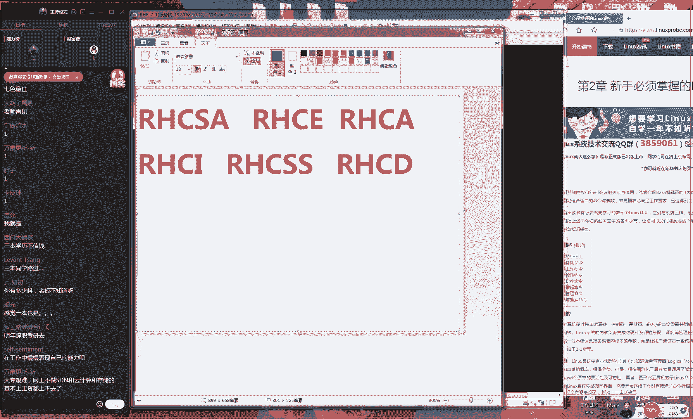

对吧平时我要信你啊，我去面试的时候，你说你博士毕业了，然后你红C说什么都拿不出来，我信你我信你个鬼啊，对吧？好，我我们不说这么多了啊，我自己看张图挺好玩了，就是说什么啊我信你个鬼啊。

就是那张图你们有没有看过就挺好玩了啊。好，然后说会不会面试的时候问NFS也是有可能的。嗯，然后说下但是当然这个问题比较简单了啊，你们就没有什么问题。然后下个月要去预备考试的感路真的很艰难。哎呀。

我知道你们这种感受，我说那种感受，而大家这个年龄都不小了，坦白来说30岁上下了。😊。

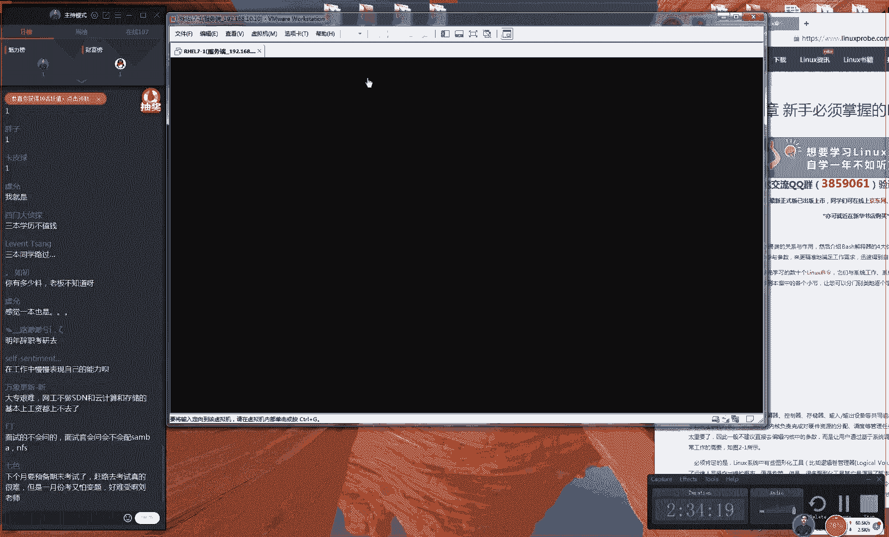

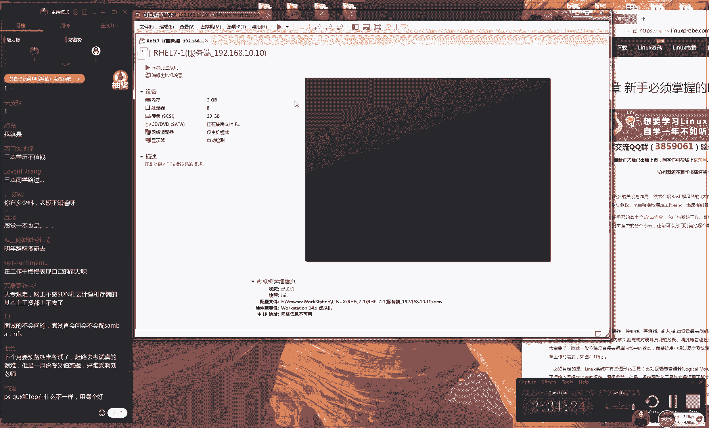

同学们，你们都已经离开学校了很久了，对吧？你们很很你们那你们可能很长时间都没有过就在教室里面听课，像我这种听课，也许你都几年的时间都没有经历过了，你也更没有去考试。你可能会已经毕业了5年了。

你已经5年没有去考过试了。😊，你可能会很紧张，真的是我有一个学生啊，已经是40多岁了，而且是不是很大了。我最大的一个学生71岁，不跟大家瞎说，我最大岁数的一个学生是71岁，是咱们第1四期的同学。

然后的话呢，是71岁，我我啊我没有说错。然样的话我有一个学生40多岁了。他去考试的时候就慌了。因为他是一个公司的一个主管。他是一个公司的一个主管。他去一个红帽考试的时候。😊，他他就慌了。

因为他跟一帮小孩儿，他看起来小孩坐在一起才30多岁的小孩或20多岁的小孩儿坐在一起去考试，他就慌了，他就不知道该自己怎么去处自己的这个位置。😊，就慌了，最后考试的考的特别的差。

他平时练的时候练的特别的好，特别的优秀。一个学生，就考试的时候乱的都不行不行的了。所以这个考试他得看心里的素质问题嗯。😊。

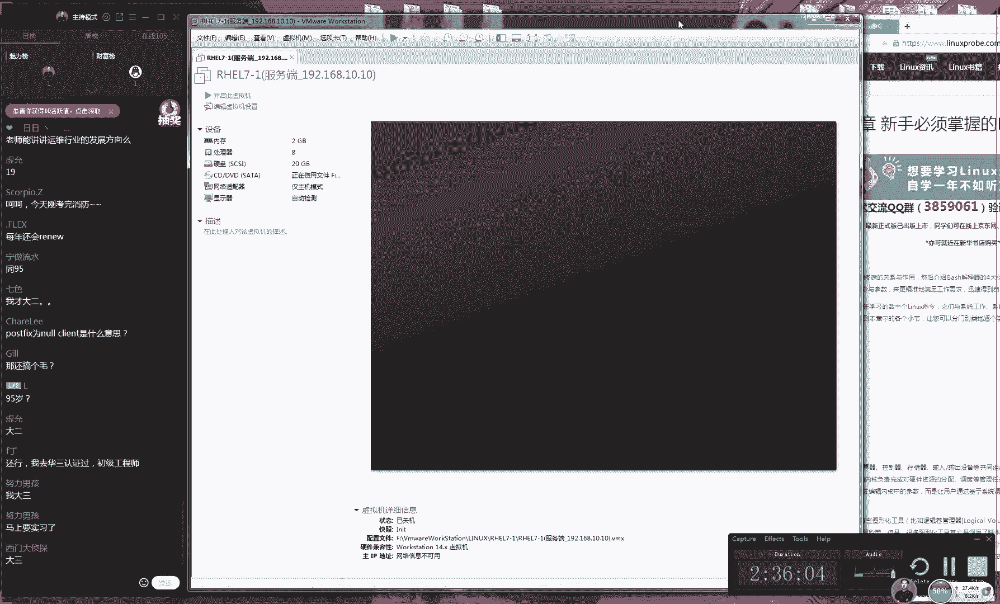

哦，我觉得那个71岁的同学可能是他们填错了或者怎么样，但是。😊，因为我们有做最后调查嘛，但是我记得有这么一个学生，60多岁的也是有。嗯，但是我们同学普遍的年龄啊还是30岁上下。

2十五六岁、30岁这么个感觉。😊，So。好嘞好嘞，行，大家我觉得这种商店的心是有的就行。但是我们坦白来说啊，如果你觉得这个4200块钱真不少，你何你何必花这个钱呢？如果你不想去做这个行业的话。

你听我讲完课，哎，你自己够用，比如你自己创业，你够用就足够啊，不用说非得非得怎么怎么样，知道吧？好吧，每个人的情况是不一样的，请你以自身的情况为准。😊。

