# Linux教程RHCE：P2：2.vm部署Linux以及基础命令

## 概述

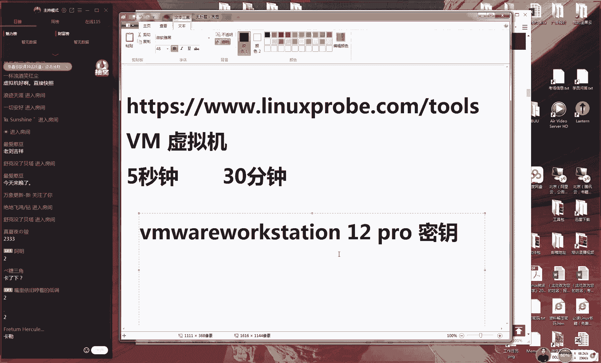

在本节课中，我们将学习如何在虚拟机中部署红帽企业版Linux操作系统，并掌握一些最基础的Linux命令。这是您正式进入Linux世界的第一步。

## 虚拟机软件安装与配置

上一节我们介绍了课程的整体安排，本节中我们来看看如何准备实验环境。首先，我们需要安装虚拟机软件。

虚拟机软件允许您在一台物理计算机上模拟出多台独立的虚拟计算机。这为学习和实验提供了极大的便利，无需购置多台硬件设备。

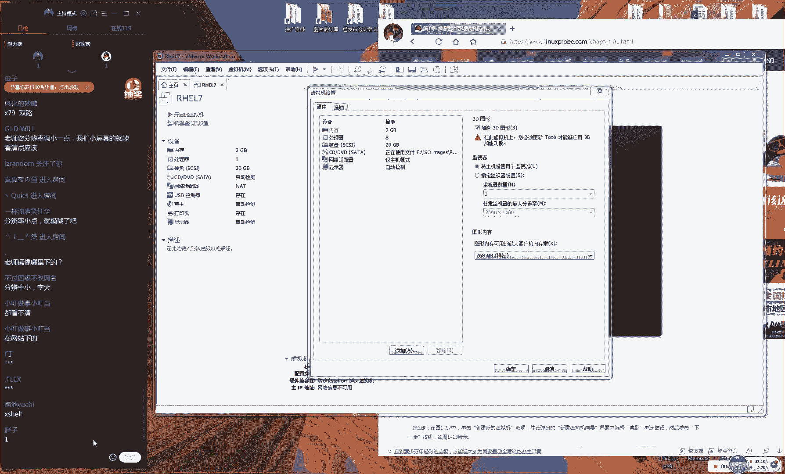

以下是安装和配置虚拟机的基本步骤：

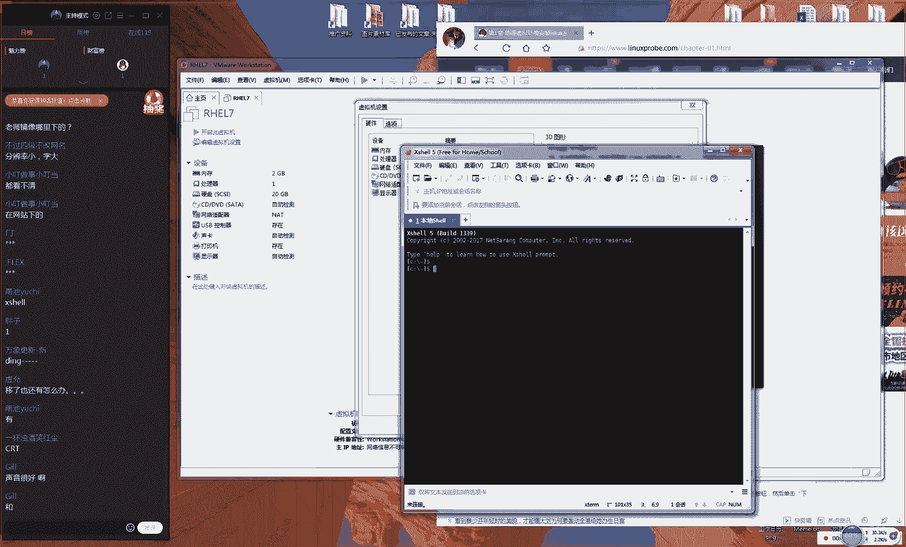

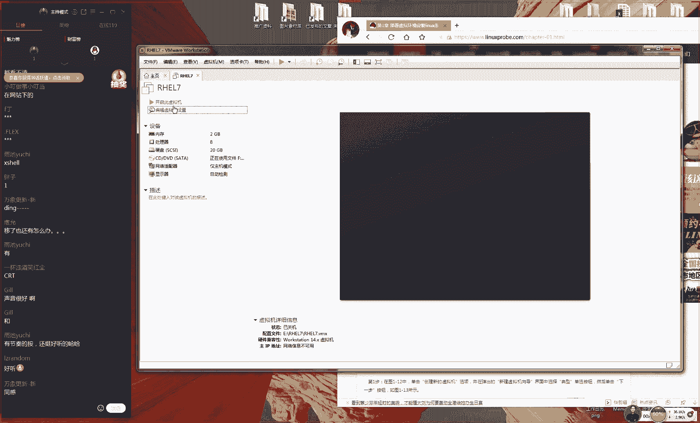

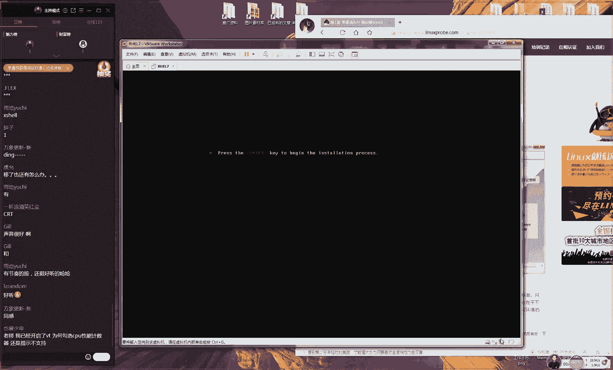

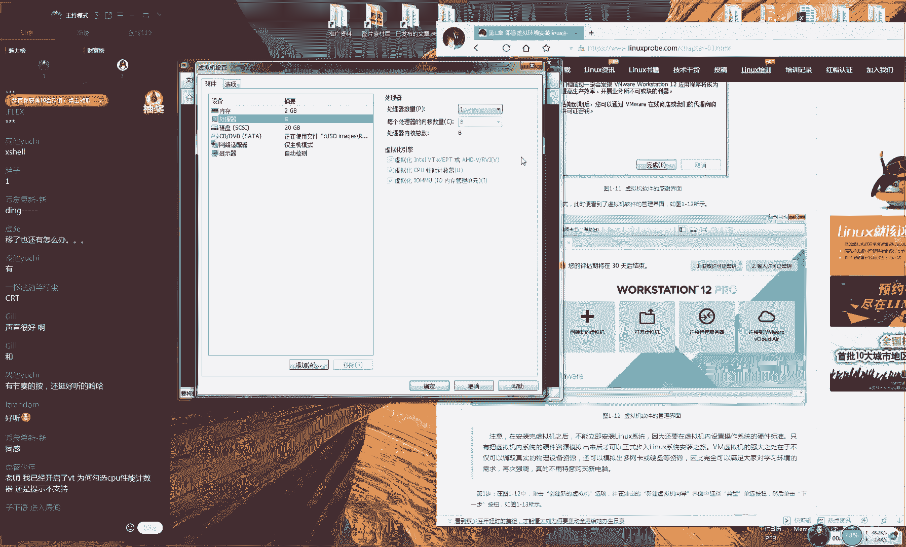

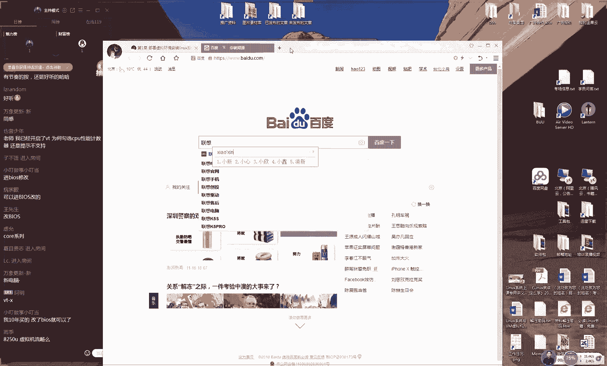

1.  **下载软件**：访问课程资料网站，下载VMware Workstation 12版本和红帽企业版Linux 7的系统镜像文件。
2.  **安装虚拟机软件**：运行下载的VMware安装程序，按照向导提示完成安装。安装过程中可能需要输入许可证密钥。
3.  **创建新虚拟机**：打开VMware软件，点击“创建新的虚拟机”。
4.  **选择安装类型**：在向导中，选择“自定义（高级）”配置，以便更精细地控制虚拟机设置。
5.  **选择操作系统**：在客户机操作系统选择界面，选择“Linux”，版本选择“Red Hat Enterprise Linux 7 64位”。
6.  **命名虚拟机**：为虚拟机指定一个名称（例如`RHEL7`）并选择存储位置。
7.  **处理器配置**：为虚拟机分配处理器核心数量。建议根据宿主机CPU的核心数合理分配，例如分配2个核心。
8.  **内存配置**：为虚拟机分配内存。一个实用的原则是：如果宿主机内存小于或等于4GB，为虚拟机分配1GB；如果宿主机内存大于4GB，为虚拟机分配2GB即可。
9.  **网络类型**：网络连接选择“使用仅主机模式网络”。
10. **选择I/O控制器和磁盘类型**：保持默认选项即可。
11. **选择磁盘**：选择“创建新虚拟磁盘”。
12. **指定磁盘容量**：将最大磁盘大小设置为20GB，并选择“将虚拟磁盘存储为单个文件”。
13. **指定磁盘文件**：保持默认的磁盘文件名。
14. **自定义硬件**：在完成向导前，点击“自定义硬件”。在硬件设置中，需要做以下关键操作：
    *   **CD/DVD**：选择“使用ISO映像文件”，并浏览指向之前下载的红帽Linux系统镜像文件。
    *   **移除不必要的设备**：移除USB控制器、声卡和打印机，以简化虚拟机配置。

完成以上步骤后，您就拥有了一台尚未安装系统的“虚拟电脑”。

## 安装红帽企业版Linux操作系统

现在，我们开始在这台虚拟电脑上安装操作系统。

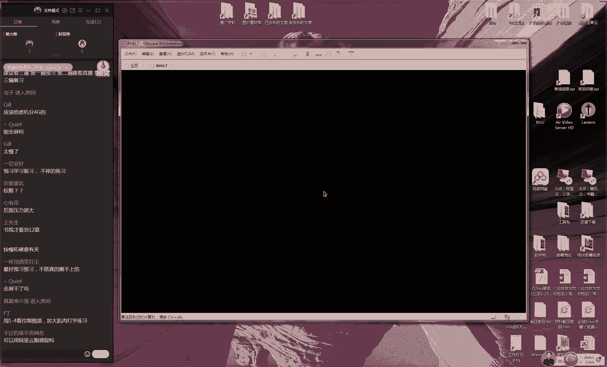

1.  点击虚拟机界面中的“开启此虚拟机”。
2.  在安装引导界面，通过键盘方向键选择“Install Red Hat Enterprise Linux 7.0”，然后按回车键。
3.  进入安装界面后，首先选择语言（例如“中文-简体中文”），然后点击“继续”。
4.  在“安装信息摘要”界面，需要进行以下关键配置：
    *   **软件选择**：点击“软件选择”。在左侧选择“带GUI的服务器”，右侧保持默认选中的“附加选项”即可。然后点击左上角的“完成”。
    *   **安装位置**：点击“安装位置”。在“本地标准磁盘”下，选中您的20GB虚拟磁盘，分区方案选择“自动配置分区”。然后点击左上角的“完成”。
    *   **网络和主机名**：可以暂时不配置，安装完成后再设置。
    *   **安全策略**：保持默认的“未选择策略”。
5.  开始安装：点击右下角的“开始安装”。
6.  在安装过程中，设置**ROOT密码**：点击“ROOT密码”，为系统超级管理员root设置一个密码。出于实验环境便利性考虑，可以设置简单易记的密码（如`redhat`）。
7.  在安装过程中，创建**用户**：点击“创建用户”，创建一个普通用户，例如用户名为`linuxprobe`，并为其设置密码。
8.  等待安装完成，然后点击“重启”按钮。


系统重启后，您将看到红帽的初始化设置界面。

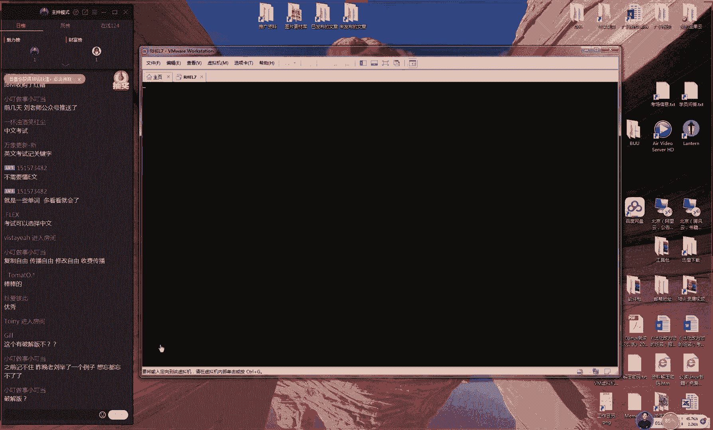

1.  点击“许可信息”，勾选“我同意许可协议”，然后点击“完成”。
2.  在“注册系统”界面，选择“不，我以后注册”。
3.  完成配置后，使用您创建的普通用户（如`linuxprobe`）或root用户登录系统。

至此，红帽企业版Linux操作系统已成功安装。

## Linux命令基础与系统管理入门

上一节我们成功部署了Linux系统，本节中我们来看看如何与这个系统进行交互，并学习一些最核心的命令。

### 命令格式与Shell

人与计算机硬件无法直接交互，需要通过一个“翻译官”，这就是**Shell（壳程序）**。我们输入的命令由Shell解释后，交给系统内核执行。最常用的Shell是**Bash**。

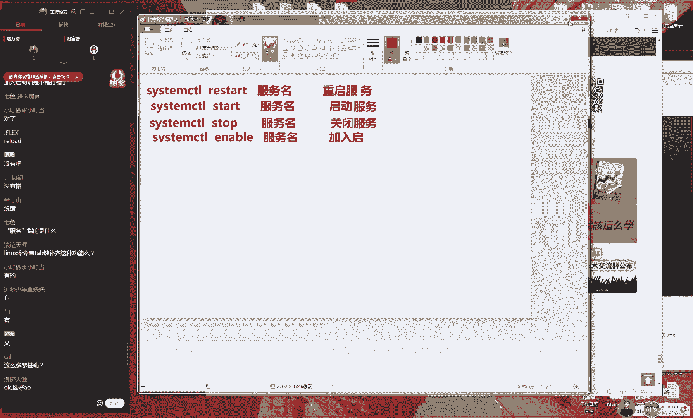

一个完整的命令通常包含三部分：**命令本身**、**参数**和**对象**。
*   **命令**：要执行的操作，例如`reboot`（重启）。
*   **参数**：用于调节命令的具体行为，以短横线（`-`）或双短横线（`--`）开头。
*   **对象**：命令操作的目标，例如一个文件名或服务名。

**公式：命令 [参数] [对象]**

参数有长格式（`--help`）和短格式（`-h`）之分。多个短格式参数可以合并，只保留一个`-`，例如`-a -l -h`可以合并为`-alh`。命令、参数、对象之间必须用**空格**分隔。

### 常用基础命令

以下是初学者必须掌握的几条基础命令：

1.  **`echo`**：在终端输出字符串或变量值。
    ```bash
    echo LinuxProbe.Com
    echo $SHELL
    ```

2.  **`date`**：查看或设置系统日期和时间。使用`+`号指定输出格式。
    ```bash
    date
    date "+%Y-%m-%d %H:%M:%S"
    ```

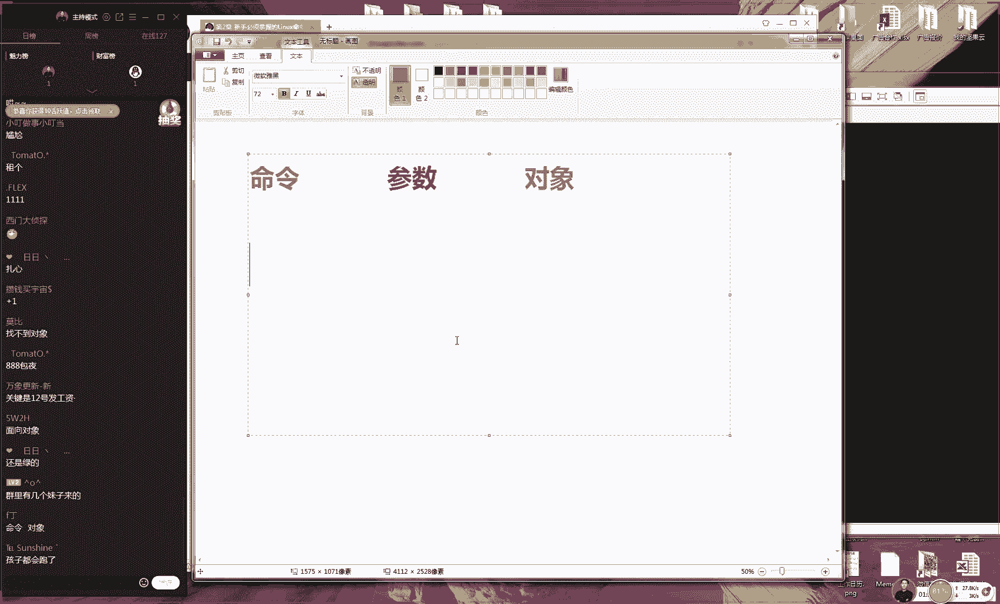

3.  **`reboot`**：重启系统。（需要root权限）
    ```bash
    reboot
    ```

4.  **`poweroff`**：关闭系统。（需要root权限）
    ```bash
    poweroff
    ```

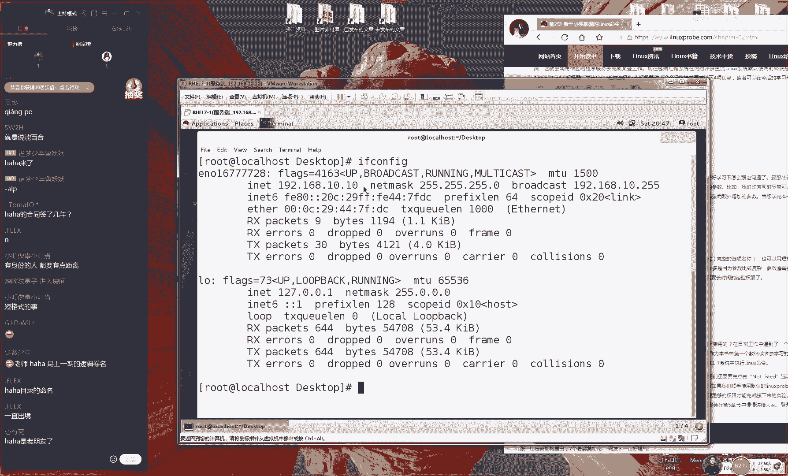

5.  **`wget`**：在终端中下载网络文件。
    ```bash
    wget http://www.linuxprobe.com/docs/LinuxProbe.pdf
    ```

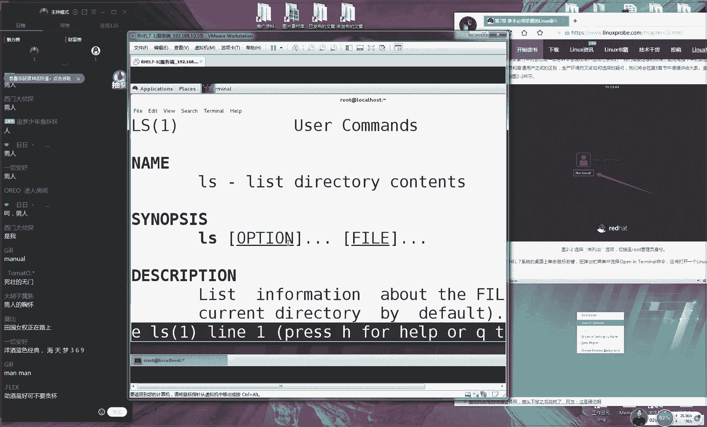

6.  **`ps`**：查看系统进程状态。常用参数组合`aux`可以查看所有进程的详细信息。
    ```bash
    ps aux
    ```
    进程状态中，需要关注：
    *   **R**：进程正在运行或在队列中。
    *   **S**：进程处于休眠状态。
    *   **D**：进程不可中断。
    *   **Z**：僵尸进程（已终止但未被系统回收）。
    *   **T**：进程已停止。

7.  **`top`**：动态监视进程活动和系统负载，类似于Windows的任务管理器。这是一个交互式界面，按`q`键退出。
    ```bash
    top
    ```
    在`top`界面中，需要关注：
    *   第一行：系统当前时间、运行时长、登录终端数、系统负载（1分钟、5分钟、15分钟的平均值）。**负载超过1.0即需关注**。
    *   第二行：进程总数、运行中进程数、休眠进程数等。
    *   第三行：CPU使用率百分比。
    *   第四行：物理内存使用情况。
    *   第五行：虚拟内存（交换分区）使用情况。

8.  **`pidof`**：查询某个服务的进程PID值。
    ```bash
    pidof sshd
    ```

9.  **`kill` / `killall`**：终止某个进程。
    *   `kill`通过进程PID来终止。
        ```bash
        kill 2156
        ```
    *   `killall`通过进程名称来终止，适用于有多个同名进程的情况。
        ```bash
        killall sshd
        ```

### 系统服务管理

在RHEL 7中，管理系统服务（如网络服务、SSH服务等）的标准命令是`systemctl`。

以下是管理服务状态的常用命令：

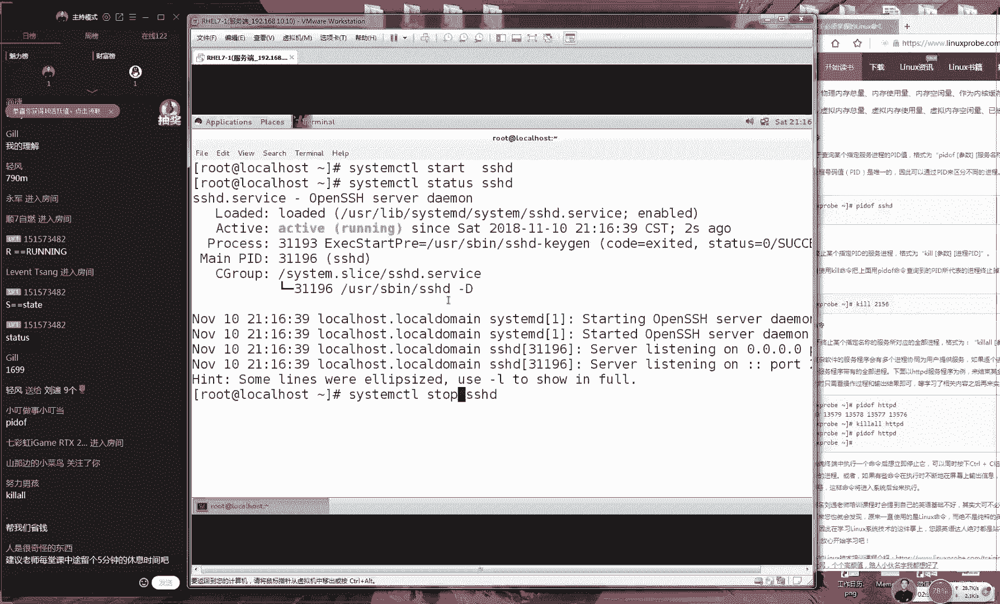

*   **启动服务**：`systemctl start 服务名`
*   **停止服务**：`systemctl stop 服务名`
*   **重启服务**：`systemctl restart 服务名`
*   **查看服务状态**：`systemctl status 服务名`
*   **设置服务开机自启**：`systemctl enable 服务名`
*   **禁用服务开机自启**：`systemctl disable 服务名`

例如，管理SSH服务：
```bash
systemctl start sshd
systemctl status sshd
systemctl enable sshd
```

## 总结

本节课中我们一起学习了Linux学习环境的搭建和最初级的系统交互。

我们首先在虚拟机中成功安装了红帽企业版Linux操作系统，建立了一个安全、可反复重置的实验平台。接着，我们理解了Shell作为人机交互接口的角色，并掌握了Linux命令的基本格式。最后，我们实践了一系列最基础且至关重要的命令，包括查看系统信息、管理进程以及控制系统服务。

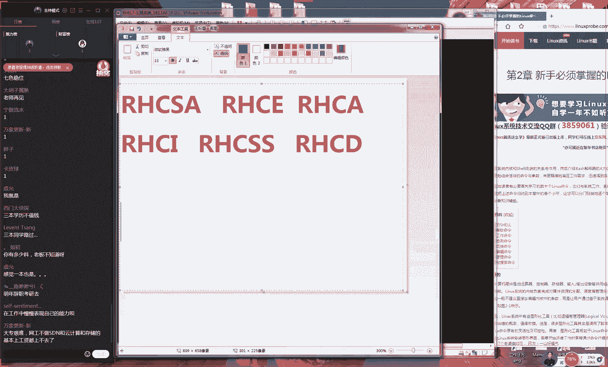

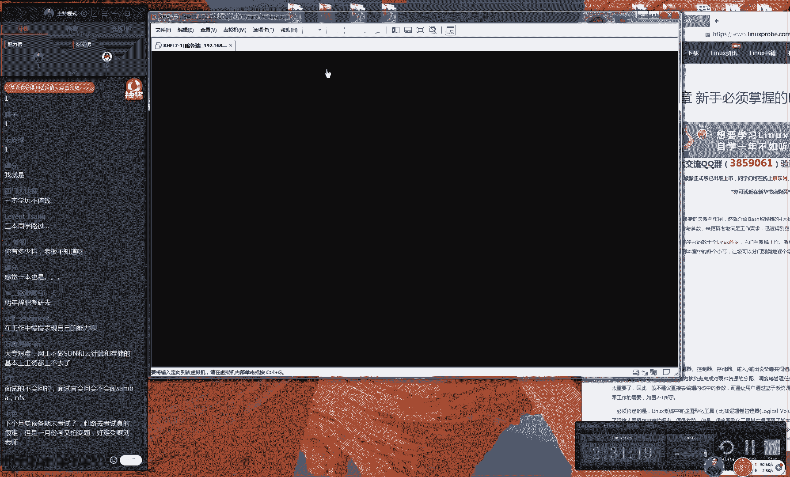

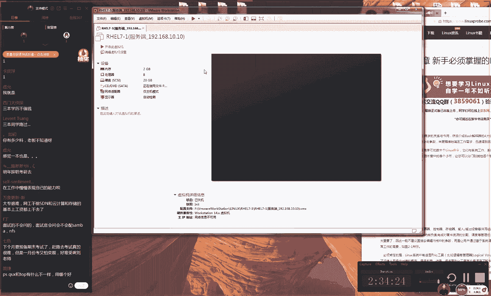

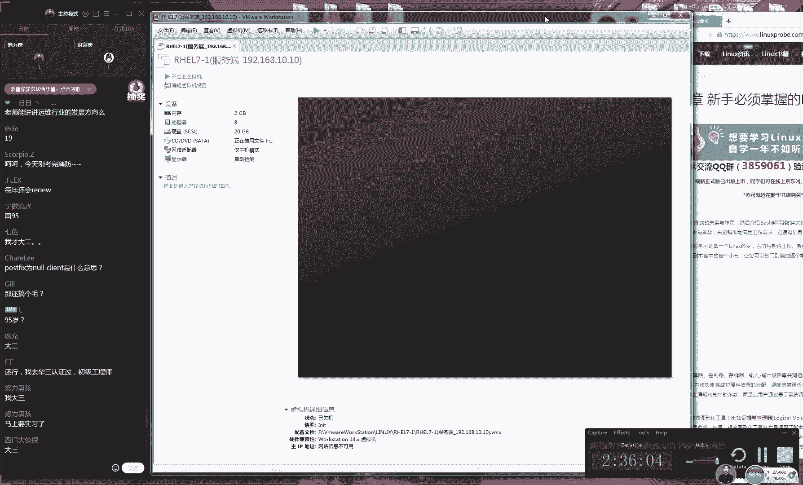

这些知识是后续所有学习的基石。请务必确保您的实验环境运行正常，并尝试反复练习今天学到的命令，熟悉在命令行下工作的感觉。下节课，我们将深入Linux文件系统和目录结构。