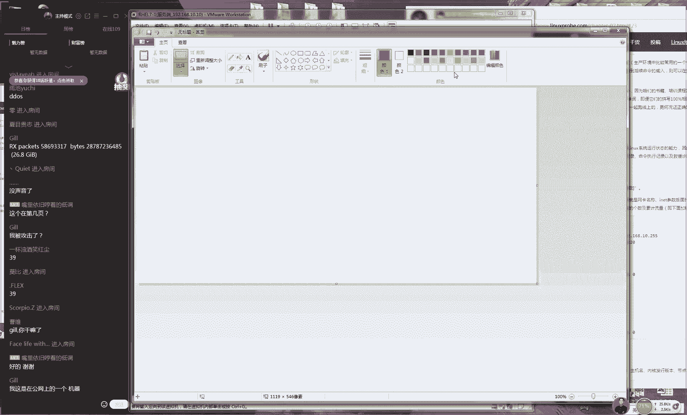
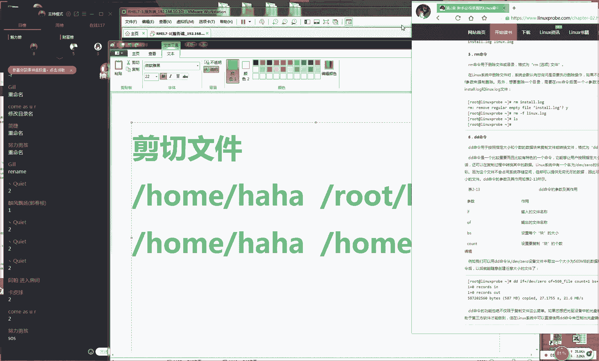
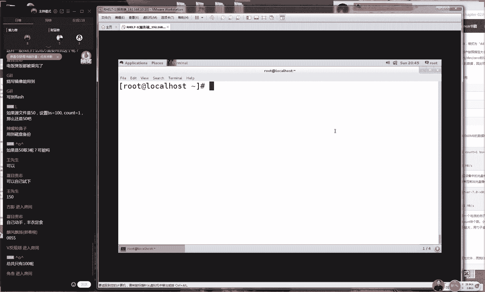

# Linux教程RHCE - P3：3.Linux基础命令续篇 - 艾弗艾尔思丢丢 - BV1if4y1e73V

🎼The。🎼ああは。🎼。🎼Yeah。🎼Yeah。OK那好，那我们准备开始上课那我们现在准备一下我们这边上课环境。我我也不知道为什么今天我们选一首这么嗨的音乐是吧？我就随便我就点了一首歌。

感觉我们这个课感搞搞得气氛跟夜店似的。好，那我们先点那我们先打一下一吧同学们，大家如果听到我说话声音的话，那我们开始我们今天这个课程，这音乐确实太嗨了是吧？

感觉凑的琴似的那行那那我们准备开始我们今天这个课程。今天话像我们这个内容量还是比较多的。我们主要讲一下第二章节去呃对于我们这个命令啊还是要一定的这个。😊，比较深度的这个了解。

然后我们要去学习下我们这个命令参数和对象之间的这个搭配的方法。这样我们今天因为是礼拜日嘛，所以我们今天这个坑的量会稍微的多一点点会给大家去讲完我们第二章节去学习多常用的这个相关的命令。那么同学的话。

那你需要准备出来你的这个笔跟书，然后好去写下笔记我们会对于这个每个命令来对进行一个介绍。然后把它进行一个笔记的一个总结。那好，那我们现在准备一下我们这上课的环境。好吧今天人数比较少94个人少了10个人。

是双十一秒杀是不是不是一下子忘了上课了。那好那我们现来说一下我们昨天所讲的2。3小节，就是我们对于我们这个系统的状态。我们要有一定这个管理的方法。

那我们要知道如何去查看你这个系统负载情况然后如何去查看你这个系统的时间。那么以及怎么样来对你这个计算机进行一个重启关机以及查看进程关闭进程。😊。

以及我们要对于我们这个呃整个的服务器的一个整体的一个一个运行状态的话呢，我们也要有一定的理解啊，还有这个了解我们的进程它有5个的状态。这我们一定要能够区分分别为运行跟中断，还有不可中断僵尸。

或者我们叫僵死进程以及停止进程。那好，那我们现在给大家来玩一下，就是说我们后面这个课程。2。4教机。我们来去学习，进一步查看我们系统的这个状态。好，是这样的同学们。😊。

因为这个2。4小节的话呢，我认为来说是我们这本书里边是呃是我们第二章节里面是最重要的章节之一。那么实呃因为是这样的啊，对于大家工作的时候的话呢，会拿到一些新的这些服务器。

那么新的这个服务器上来之后不是要去配置这个服务的，或者说去做一些什么什么事情。而是你要先对你拿到手机服务有一个基本的一个了解。它这个服务器的一个基本的一个运行状态。

比如说我们要会查看这个服务器已经有的配置文件，以及我们要去查看这个服务的这个服务器上面已经有的这个网卡信息内存信息硬盘大小，这些我们都要对这个服务器有一个充分的一个了解，看它这个使用量的一个情况。

然后我们才能够进一步去配置这个服务。那所以我们接下小节就给大家去讲到如何来对于你这个服务器的这个系统的环境信息，我们来进行一个查看。先给大家讲第一个命令，我们叫做命令。

这个命话它是来去查看我们这个网卡信息的大家可以。😊。

打开你的书，把笔记写的稍微简单一点就可以了。那我们再打开我们这边的这个终端，我们来去敲一下I敲一下I config是这样的那我们提个问题好了，请问大家知道我知道在windows系统里面。

如果你想来去查看你的这个网卡信息的话，我们应该去敲什么？大家知道在windows下面。😊。

呃，我们要想去查看网卡信息，这个大家应都知道，对吧？如果你要是学习过一些网络知识的话，那么你应该知道叫做它叫做IPfi在我们红务里边的话呢。

那我们将网卡叫做interface那我们将网络接口叫做face。所以说我解解成叫做大家不要看说我们这个跟可以混为一谈我一定要区分一下在我们的红务系里面我们叫做fi这是查看我们这个系统网卡信息的好后我来看一下我们这个网卡信息它特别的多。

其实我们要这样看完的话呢，感觉其实是很乱，对不对？所以我给大家说一下，我们这个信息你不用都去看我给大家挑一下我们这个里的重点。给大家挑一下我们这个重点。那我看一下我们这边另外是这样的。

因为大家现在还没有去配大家还没有去配置你们的这个网卡信息。所以你们这边是看不到网卡地址的这个没有关系我们第章的时候。😊。

，第八章的时候给大家讲到如何来去配置我们这个网卡信息，就先假定以我这个呃信息来看。好吧。然后我们来看一下，就是啊我们这个输出的信息，其实有它其实其实有很它是很多都没有用东西，那我们只要去关心的内容。

只要有这些那我们先看一下第一处第一处的话是我们要去关心的这是指的是我们的这个网卡名称。大家需要来记一下然后大家拿起你的比较亮的颜色的笔啊。比如说用红颜色或蓝颜色大家要把你笔记写的非常要写稍微工整一点。

然后我们下课之后你可以拍照拍照之后你发到你的博客上面，然后我们坚持我们完我们的课程，就可以换到一份小礼物对吧？就是我们签名的书籍为我这也是对大家这种学习激励那那那我们现我们翻开书籍。

然后找到我个一个命令一个颜色比较艳一的笔。然后我现在去写上来。我们这边我们需要看的第一个信息，就是我们的网卡的名称。那你可以写非常简单一要。😊，不要字特别多啊，因为呃字太多的话也会让自己会很困扰。

那我们就写上叫做网卡名或者说我们的网卡名称就可以了。那们写上网卡名称这四个字网卡名称。大家大家先看一下二我们需要看的信息，就是我们的网卡的IP地址。

好那我们看第二眼第二眼我们要看的是我们的网卡的IP地址以及我们这个网源码。另大家去说一下。大家现在还没有去配置你们的网卡大也没有去配置你的I大家也没有去配置你们IP地址。

所以说你们现看不到这个信息是很正常的。好吧，就先以我这个为准。好，那我来看一下第二眼的话那我们要看一下我们的网卡的IP地址。这是作为核心和关键的。既然我们看第三眼。

它指的是我们的网卡的物理地址及麦克地址这个信息它是一个我们这个网卡的一个物理地址叫做麦克地址。这个我们应该知道的。因为我们的麦克地址，从理论上来讲，它是不能够被人修改的。但是有一些黑客啊。

他们可以去这个也可以进一个。😊，伪装它也可以进行一个假冒。但是我们从理论上来讲，应该来说是不可的。IPV6其实我们这个自己暂且先不用去看啊。

因为这个它呃因为它第一它就在我们IP地址下面第二就是说目前使用起来的话呢，主流还是IPV4啊，所以说我们就把它归为我们第二眼就看我们IP地址。它指的是IPV4的地址。

还有我们的第三的话那看就是我们的网卡的物理地址及地址。这我们的把它记下来。既然还有我们的第还有我们的第四眼我们这边第四眼，我们需要看两个第一我们叫做RX代表就是收到的数据包大小。

第二个我们叫TX代表就是发送出去的我们这个数据包的大小。那我们来看一下这边这个这个是1。1KB指的是我们收到的数据包大小。后面我们叫4。0KB它指是我们发送出去的数据包大小。

这我们要注意一下同学我可以通过判断这个数值来。😊，呃，去来去判断我们这个服务器的一个运行状态。那么如果说你的这个呃TX的这个值快呃正在一个快速的一个增长的一个过程当中的话呢。

那么说明你的这个服务器上面会或许有网站或有一些文件正在被大量人所下载，它会占用你大量的这个网速如果说你这个是的话，可能你被人攻击了，因为你受到大量的这个数据包的洪水攻击。

这有一个攻击方式叫做UDP叫做洪水攻击，就是这个服务器不断去发送这个数据包那我以关注这两点进行一个调好，因为我刚看到有96个同学后现在有102个同学了，有同学迟到了，对吧？

所以我们现在再给大家来去家重申一下。今天这个第一个命令我们做学不要迟到了。是这样的，因为我们今天第一个命令，可惜常重要。以单给大家去说一下，第一个的话呢就是我们看网卡名称，这个大家要注意下。

就是我们的网卡名称。😊。

切记切记，我们一定要去关注这个我们的网卡名称。第二就是我们的网卡的IP地址。这个我们我我们也需要去看啊。那那我们来看一下，这个是我我们的网卡的。😊，呃这是我们的网卡的地址。

但是我我因为我们现在还没有去配置我们这个网卡。但啊，我们就先以暂且以我这个为准。大家现在看不到信息的啊，是看不到这个几个数字的。好。

接下来话我们第第三眼看的是我们的网卡的地址即的是我们的网卡的物理地址再往后走就是再往后面走的第四看这边这边个X跟X它分别代表就是我们收取到的跟发送出去的数据包大小，这几眼的话。

这个我们要去关注一下1234你通过这几点我们就可以知道我们这个网卡信息的一个大概的一个情况了。下面这个我们是不用去看的这个代表就是一个回还地址，或者说我们做做这个还回地址。

这个非常相于就是我们的windows就是我们look back它就对于这个网卡这个怎么这个怎么讲对于我们的网卡。😊，他来进行一个测试，看看我们这个网卡系统它有没有安装好。好。

接下来的话呢我们来呃继续给大家去说，怎们下次又变成108人了，又有6位同学迟到了，但是这个命令我我就不再讲了好吧。为同学们迟到问题还是比较严重的。下同学一定要提前来了。因为我们已经是重复去讲一个命令了。

接下来我们再讲第二个命令我们叫做 name，其实我是想给大家从零开始去讲了，但是我们不要迟到，为你迟到之后我们就会开始上课了。那因为我们没有点名这样的环节，我们上来之后7点钟就要准时就要开始上课了。

大家晚来了半个小时前也不会退的，所以说一定要准时去上课的，这一点一定要一定要做到。好吧。好，接但是我知道大家可能为今天双十一嘛，或者今天上班很辛苦能会迟到。但是我们尽量我们如没有特殊情况的话。

还是准时来最好好接下来我们来继续来看一下我们有一个命令我们叫做 name这个。😊。

输出信息叫做linux这个信息其实没很没有用，对不对？它主要是看我们这个系统的内核信息的，它需要加上一个参数，我们才可以看到我们的这个内核的版本号码，我们加上这个杠AA代表就是一个短格式。哎。

我们提我那我来提个问题好了。我这个问题应该问的比较晚啊，请问一下，我们这边我们家的这个参数，它是一个长格式还是一个短格式，大家快速告诉我。😊，你看我这个问题问的很尴尬，我都自己都都说出来了。来。

你们不要这么懒好不好？同学们哎呀，居然还打了个二啊，是这样的啊，就是告诉我短格式就行。你们好懒啊。然连短都懒打打给我打了一个2。行，这位能够理解你们想说是什么东西啊。好，那我们来就是说叫做这个短格式。

好了，就是一个减号加上一个字母这样的一个形式，然后我们敲一下回车就可以看到我们这个版本的呃内核版本信息了。好了，既样的话呢我们来看一下这个信息，我给大家简单去介绍一下啊。

就说如果你来去查看你系统这个内核信息，那核还记得什么东西吧，那核我们昨天讲了一个鬼故事，然后记得把这个老王。😊，对对这个对着这个硬盘进行去说话的这个过程很恐怖。

就是因为人是不能够直接跟硬件进行一个交互的。硬件的外层需要有一个内核来对它这个硬件来进行一个控制叫做这个内核版本号码那我们看一下的话。

这他告诉你你的这个系统为lin这个主机的名称叫做loc houseloc这是你的这个主机名称。你要是不信的话。

你可以来去查看一下你能够查看到你这个主机的名称后再往后面去的话就是你的这个主主主机上面的这个内核版本号码，这个就指的是我们这个内核版本号码。大家版本号码是多少了？版本号码的话。

主版本号达到了4而且话马上据说有可能就要发布了。因为前段时这个419？吧我怎么我怎印象里已到了47了。我怎么印象当中是419？可上去搜一下这个官网是这样的。😊，点点ORG大家可以先访问一下这个网站。

你们看一下最新版本号码的话是4。19吗？我反正我记得是4。7啊啊，还是4。6啊，4。7，应该是好，和谐了啊，反正就是3W点可啊，点ORG嗯OK三个星好，我大家打出来吧。我那我呃大家可以访问一下这个网址。

😊，正好告诉大家如何来去呃查看你这个版本的这个内核版本信息。好吧，这个就是内核版本信息，你们去网上去搜一下，看看我们最新是多少，真的是4。19吗？嗯。😊，哦，4。19是吧？那是明我消息不太灵通了。

我印象里面还是4。07，好像是还是4。7啊啊，那我应该是4。07嗯。😊，为什么会被和谐？因为可能是腾讯直播间不让发网址吧，因为你想一想直播间都都应该是唱歌跳舞的地方，你们发你们发网址肯定是广告，对吧？

可能腾讯也没有想到说会有一帮这么无聊的人今晚上来直播闪客。好我们来继续说一下我们在这个内核版本号码。我们现在我们看到是3。10新的话呢是4。19，而且马上就要发布版本，但是消息啊。

现在今年肯定是那肯定是发不了的。据说最高就是4。20，然后马上就要到5版本号了。好像有这么个消息。话就是我们这个系统打包的一个时个这是我们系统打包的一个时间。

因为我们这个系统啊是在2014年年底发去发布的。然后这个镜像的话是就是最原始个镜像，就是就是我们去网上去提供这个镜像啊，是一个最原始这么一个镜像。所以的话他这个打包时间是2014年的。😊，呃。

5月5号啊，他这是还没发布之前呢，他给打包好了。然后这个时间的话呢是呃礼拜一。然后大家可以看一下这这个系统打包时间。接下还有我们系统的这个架构为叉8664位，这个没有什么好说的。

因为现在有我们这个系统都是64位的。因为64位的话呢系统会支持更大内存的这个容量。好后最后它是我们的一个它是我们这个GNU的一个项目。然后呃系统名称叫做lin好了。

就是查看一下我们这个系系统内核的版本信息。再往后面去走的话呢，我们叫做up time命令，这是用来去查看我们这个系统的负载情况的。其实这个来讲的话，我们坦白来说眼熟不眼熟啊。同学们你看这个。😊，呃。

我们很是不是很眼熟，它就是我们昨天讲那个top命令，对吧？top命令它里面的第一行，你们仔细翻一下书top命令的第一行。另外我给大家去说啊，你记笔记的话，你不要写很多很多字。

因为写因为因为写书是我的工作。你的工作是往脑子里面去走，不要写太多字，因为太多字的话，你自己会看起来很麻烦，你就直接给我这个这个命令的旁边写上负载两个字。

这样的话你一眼就可以知道它是用来去查看我们这个系统负载情况了就足够了。同学们好，那我再给大家去说一下。因为我们昨天时间比较久了，两都已经是。😊，呃，昨天讲个9点半了是吧，我们昨天时间比较久。

然后我们就时间就把它挑过了。好吧，我们讲的不是很细。我再那我再给大家说一下啊，这个的话就是我们这个面的这个第一行前面的话我们这个时间指的是我们系统的时间。对，这是指的是我们这个系统的时间。

后面的话指的是什么呢？我们的这个运行已经开机的时间，下面是我们这个终端数量。这个时大家可看到你这个你讲错了，你明明这边写的是叫做这个users这个我们虽然我们没有去学习过这个系统，但是我总认识这个单词。

这个叫用户的意思，这应边指的是有几个用户对吧？错，他不是指的用户它指的是用户的终端那你当打开多个终端的时候，这个时候你再查看一下这个数字就会发现已经变成了它会变成了5，而并不意味着有5个用户正在连接。

你才服务器，所以同学一定要注意一下，我们这边写的是终端的数量，而不是我们的用而不指的是远程登录。😊，这个服务器的用户的数量怎么记啊，笔记同学们很多同学们就是在这边会吃亏。既然是我们的这个负载情况。

我们一起来说这个话它是最近的一分钟5分钟及15分钟的这个怎么样哎，负载情况。那我我那我们再来看一下这个数字啊。😊，咱比如说我来给你举个例子，好吧，呃，数字不要小，数字我们稍微小一点，0。05啊。

说着五打了个4啊0。05哎呀，你们这个会抢答了啊，我还没有我还没有出题的，你就数学就说学越点低啊，这很不给我面子的这个同学啊，因为老师出题之前嘛，都假装不知道，然后老师一说哦，这么回事，这很很给我面子。

对不对？来，那我们先看一下啊，那比如说那我现在查看一个负载情况，如果数值是这样的话，请你告诉我这个数字呃，这个数值是越来越呃负载情况它是越来越低呢，还是越来越高呢？哎，大家想一下，不要看他们说啊。

不要看他们说，你就告诉我。😊，呃，你来告诉我这个数字它这个负载情况它是越来越低呢还是越来越高呢？是这样的，这个它是一个综合的一个数字。然后如果超过5的话呢，我们认为它就是很危险的。

他就是很危险的嗯然后他不他不管是核心的这个数量呢，但是肯定也会考虑到，但是这个也他也是一个综合出来的这么一个数字。好，那我们先来看一下啊，如果说你还是说啊你们没有人说高嘛。

那你那没有那没有人说啊高怎么高做调优，然后检查一下你有哪些服务这样的资源比较多，然后你们没有人说高，那我怎么往下去讲啊，这很尴尬，对不？因为我想讲这个东西，但是你们都会了那我讲不了了。

所以你要配合一下对？说高高高这样配合起来非常好好，那我们来给大家讲一下啊，那么为什么他是一个网低的一个趋势啊，为什么因为我们来我们来做一个比喻啊。那么我们还说我这个人比较有钱。

这个话他是最近一分钟5分钟15分钟把它比作就是。😊，我最近的15年，我有20万存款，最近的5年的话呢，我有10万存款，而我们到最近的一年的话呢，只有了5万存款。我的钱是是越来越少了这么一个状态。

这个也是最近的15分钟，我们对比一下最近的一分钟，发现这个数字它是最它是变高了的不它是一个从高往低了去走的。所以说负载情况它也是往低了走的。哎，这个数字的话呢范围是从最小为零，最大可能会达到上百上千。

这个没有这这个没有是个上限。但是一般来说你只要达到了上百，你就基本上就看不到这个数字了，已经是卡死了。😊，好，这样的话呢嗯我哎我们要配合着，对不对？你们都贵了，那你们肯定是其他培训机构过来派他的托。

过来砸场来的，我们要只配合一下，对不对？我们这往才往回下去讲，非常的啊非常的批批的。好，但是啊呃但是啊其实我们想一个问题，大家刚才提到说mi度同学说负载值越低越好。😊，其实这个思路的话呢。

也这个话也是我说的啊，但是他不是这么回事。你咱们比如说你是老板，那你想买一台服务器，买回来之后，结果常年你的这个CPU的这个使用率达到5钱怎么样呢？白花了，对不对？

白花了这个钱了其实这个负载值的话0到1之徘徊徘徊到99这才是最好这个服务器既不会宕机不会出问题。你这个你还花值真我觉得这个老好的预期老板不说你买完之摆着值越不回好，这个数装的时候数值会很高嘛。

一般来说你去安装一些大这些服务的候包括说你去安装这个虚拟化软件的时候我们最高的时候他蹦到象当中蹦到500多这个最要是到了500多。但是也有些时候他也不会死机体的情况。😊。

我们还有一个叫这个who的一个命令。但是我没有看过一个电影，是呃是呃是代龙眼的，叫我是谁，你们有没有看过？😊，可以打一下E啊，就是who，你们有看过就是一个美国一个电影嘛，对吧？

这个who指的就是谁的意思。哎，who are you你是谁？who啊，那我们来就是啊去敲一下这个ho指的就是当前有谁在登录着我们的这个系统，当前有谁在登录着我们这个系统，但是这个时间是不准的哈。

因为我们这个系统一直在关机，然后没有开机。好，那我们先来看一下这个 who指的是当前有谁在他正在登录着我们这个服务器下面的话呢我们还有一个命令，我们叫做last。嗯，ho are是史塔龙演的吧。

你们好好搜lo，对吧？这也是我们的一个商课的一个。😊，呃，知识点啊。好，接下的话呢我们来看呃下面一个命令，我们叫做last。这个话它指的就是你系统里面的一个登录的一个记录啊。

这是指的是我我们这个系统的一个登录的一个记录。就是我们这个系统它有哪些人登录过呢？当你怀疑你的这个服务器被人入侵了。好了，过来查看一下这个命令，你查看一下，哎，这是这个是不是有黑客呃。

登录过我这个服务器啊。当然我们来讲不能单纯以这个命令的一个输出判断你有没有被入侵，一定要去综合性能去思呃来呃来去看啊，但是。😊，呃，这个也是非常有利的这么一个参考的一个条件。

我那我可以知道我们这个系统大概有哪些人去登录过啊啊，成龙演的吗？你们一定是别的机构排的偷玩，我反正我就知道是史泰龙，这很这个很砸场子了啊，我记得是史泰龙，那史泰龙演的是什么呀？史泰龙演的是。😊，呃。

忘记了算了吧。好，接下的话呢我们再敲一个第七个命令，我们叫做history命令，这就是一个历史啊，这个叫做这个历史。好，那我们还敲一下回车。因为的话呢我们刚刚不知不觉当中已经敲了23条命令了。

这个时候你可以看一下我们的命令一个执行记录。其中的话呢我们前面还有一个编号。这是我们刚才执行过的所有的这个命令了。好了，那么我们如果说呃我想来去重复执行某一条命令的话呢，其实我们不用再去敲那个命令了。

那比如说我给大家举个例子，我有一个命令，它特别的好玩我也命令特别的好玩，叫做sstem restart，这是用来去重启我们的网卡的一个命令。但是我们看见它是是它是不是特别的长，它特别特别的长。好了。

接下来的话呢那我们需要给大家提到就是如果如果你想来去重复去来去执行某一条命令的话呢，你可以借助前面的这个编号，我们可以这样去做写上一个叹号对了，哎，我们同学们。😊，视别比较高啊，一下就知道了。

而且我看到这个lo同学啊不会是LVR等级的一个呃同学啊，然后一下就知道了那说这个就是一个叹号加上一个序号。看这个听同学就就是只知道第一滴不我们只知道一些乱七八糟的啊，还是积极回答问题的。

好接下我们来其其实实是我起的好接话呢我们来给大家去说啊，写一个叹号写成一个24，就说写上一个叹号加一个序号的话，就是指的是你重复来去执行某一条的命令。

那比如说我想要去重复一些那么想要去重复来去执行第二4条命令。但是这个命令的话，它太长了，这个时候我们就可以写一个叹号，然后写成一个序号，重复来去执行某条命令看一下重复来去执行某一条命令了。

这个来说真的是非非常简单的这么一个命令对吧？接下来的我还有一命令特别好。们做叫做SOS这个大家也许你之前不知道是什么意思。但是你一定知道。😊，OS是什么意思？这个我们上小学的时候就学习过。

我记得我上小学的时候学习过一过一门课，叫自呃，叫什么地理自然，对不对？然后地理老师啊给我们讲了一个段子说。😊，呃，如果你到了一个荒岛上面，那你怎么去求救啊，是吧，你拿这个石子给它摆出一个SOOS。

对不对？这是一个什么国际通用的一个求救信号啊，当时我们还学过拿手电筒什么三长一短呃什么是求救，然后三短一长是什么有传来怎么着？还有这样这个信号。你看啊，这就是说SOS指的是一个求救信号。

凑那个re只是一个报告，他他就指的是进行一个求救的一个报，他进行一个求救报告的这么一个申这么一个生成这个什么意思啊？我感觉这个话绕嘴，对不对？这个什么意思？它指的就是说如果说。😊，呃。

你如果说你想来去你的咱比如说你这个系统崩溃了，然后你现在你又花了钱了，你去买了红帽的这个服务了，那么他会给你提供这个支持。但是你比如说你的公司在比如说咱们在四川太远了，在呃北京这边和上海的地域比较远。

那么就需要安排红帽这个专职人员，然后坐飞机去咱们当地的机房里面给你去做排错，然后他们要报销相关的这个相关的费用啊，但是可能说维护服务器代收钱。

但是这个机票钱或者说怎么样的这个住宿钱都要你来去承担的这个费用很贵的。那么也许说你从呃美国你从你从某某个总部那边请来了一个红帽的一个大牛过来了，到你们机房里面，结果发现怎么样呢是网线松了。

他不搭给他插上了，结果他收你5万块钱，是不是感觉不大划算，对吧？就说那我们能不能对于我们这个系统先进行一个简单的一个信息的一个收集。那然后的话呢我们通过这个网络，那我们先来发送给这个红帽。😊。

或者我第三方的一些支持的厂商，他们先进行一个远程的一个排除。如果这个问题很严重的话，那我们才会派人过来。就相于说有的时候啊，我比如说我不太好啊，我有点咳嗽了。好了，这个时候我那我就咳嗽啊。😊。

还有这个流鼻涕，那那那我就先不去医院，对不对？那我先去什么呃百度上面，我先去搜一下去，先搜一个什么好好好医生网。好，然后那我把我的这个症状，简单进行一个描述。

如果说的话呢远程这个大夫认为我有必要去去医院，那么他就会告诉我。如果这没有必要的话呢，他会给我一些修改了一些建议，但是说了啊，千万别去百度上面去搜病，你找你一搜就准完蛋，我之前我作为一个小的一个实验啊。

因为我看他们说，当时正好有一个什么事件啊，就是说这个有一个小孩去网上去搜那个什么得病了，对吧？然后搜到莆田市医院，最后给治死了。后来我我后来我就试了一下，因为当时正好夏天你们叫魏泽西。

你们看到了这个新闻，对吧？但是我觉得我反正我因为我就不信，因为我觉得一个人起码会有一种正常的一个判断能力吧。后来我也去搜了一下，当时我搜的是身上有包，身上起红包怎么办？身上有红包怎么办？

然后我就搜这个词，你们。😊，可以去搜一下，身上有红包怎么办？然后你们可以看啊，都是百度竞价。然后这边我点开了我的前三条，他们他们有人告诉我是湿疹，有人说告诉我是皮疹，有人告诉我很严重的病啊。

最后其实什么怎么回事呢？夏天呢被蚊子咬了哎，其实就起就是其实就被蚊子咬了几个包，夏天吧起了他这个起了几个包很正常的对吧？然后你再一挠就红了，就千万不要百度上去搜病。同学们给你们一个这个忠告。

百度上一搜准有病啊，好，继器我我啊我们往下去走。😊，我们的话呢再一个命令我们叫做PWD它用来去查看我们这个系统的当前登录目录的。好了，那我先来看一下啊，我们进入到我们这边的这个C盘里面。

然后呃大家看好了，大家看好了，我现在这个操作这个演示。那我们现在这样，我们双击进入到一个目录里面我们进入到一个目录里面，然后大家看好了吗？123我们再进入到另外一个目录里面。

这个不是呃这个命令它不是还它特有的删系统它也有然后我们再进入到一个目录里面好了，我们再进入到一个目录里面再进入到一个目录里面那好了，大家看到这个变化了吗？请问一个问题。

这个问题是为什么我进入到了不同的目录里面我所看到的文件是不同的。😊，啊，如果为什么我们讲的是网络培训啊，就怕挨打，对不对？别人一听，这什么个问题，这老师水平又太低了。

这个是这个这这个这个好像像是这个问题不知道该怎么回答，对吧？再给大家是说一下啊，为什么我们进入到了不同的目录之后，我们所看到的这个文件的名称和我们这个文件的列表也是不一样的啊，这个问题乍一听哇。

这个没有解啊，这这个不是常识嘛，对吧？来啊，这个我们先。😊，呃，我们会去看SOS举的这个东西嘛是这样的，因为这个非常简单，所以我没有给大家去说啊，因为我觉得大家应该都是会的。

因为他只需要你去敲回车就可了。你看就是你去敲回车敲回车再敲回车，他就会去收集你系统里这个信息。你只需要敲回车所以我大家讲太简单了，他会去收集有7他会收集你有70条的这个信息，然后他给你一个压缩包。

然后你把压缩包解压之后你就可以去看了这个里的信息要就是你这个配置文件，我们今后会给大家讲到每个配置文件的这个其实常简单会进行一个收集信息。

你敲完回车之后他会进行一个收集了显示的是示变指的是有本机或者一个未知的网络去登录一般来远程登录用他们都会显示来访那个人的那个IP地址。😊，好，这样的话呢我们来说。😊。

一下说为什么我们进入到了不同的目录之后，我们所看到文件列表是不一样的，就是那么就是因为你进入到一个目录之后，你所在的工作目录也是不一样的。因为你切换到不同目录下，所以你能够看到这个内容也是不一样的。好。

这句话其实就是废话了啊，那我可以看来看一下你进入到不同目录之后，你所看的内容也是不一样的。那么我们如果想来去查看一下我们某个文件的话呢，那么实际上来说。

你也可以这样去做使用到使用到这个LOS查看一下当前目录为空。那么这个时候我们来去进入到我们用户的加目录里面。但是我们现在没有讲到先着急，我们来去使用到LOS的时候。

你可以看到就是查看到了我们当前的所在目录。😊，然后我们可以去使用到PWD。大家看啊，大家先来看一下PWD啊显示的是我们这个当前的工作目录。当前的工作目录。然后话我们再进入到另外一个目录下面。

我们再来查看一下我们所有的这这个文件，就会发现啊这个文件又变化了。而我们现在使用到PWD可以看到我们当前的目录也发生了一个变化。就是说啊当你到了不同的目录下。😊，那么你能够看到和使用的这个文件。

那么也是就是不一样的。好，接下给大家说到，就是说那我们该怎么去切换这个目录呢？那我们就要去使用到一个叫做CD啊，它用来代表就是切换目录这么一个作用。

那我们现在比如说但是因为这个涉及到第六章第一小节里讲叫做FS一个协议我们需要知道每个目录的一个含义。但是我们现在不知道那么怎么办？那不用着急，你现在把你这个重心，还是给它放到这个CD这个命令上面。

不要纠结说哎什么是那么什么是那么那么什么是B目录啊，什么是我们书上写那个目录啊，什么是我们个超那么那么什么是这个V目录，不要去纠结这些东西。我现在只要去看下就可以了。去使用到CD跟我一起来去操作。

使用到CD好后面去加上一个目录的名称切换到我们这边有一个叫做这么一个目录。大家看好了，使用到。😊，C代表就是切换目录的意思，后面加上一个目录的名称，不要管不要管那目录什么意思啊？

我们现就来进行一个简单的一个切换啊，那我们来进行一个切换切换成功之后，我们可以使用到PW查看一下我们当前所在目录再来一个比如说想切换切换到TC目录里面再去查看一下当前所在目录就发现已经变成了ETC目录。

好，这就是我去切换目录的一个方法，感觉so easy好，下面给大家讲一个叫做CD一个波浪线这个指的就是返回啊叫不对？看这就是我们返回到用户加目录这么一个命令。

那我就可以返回到我们这个用户的加目录里面这个什么意思啊，就是让我我们这个用户。😊，啊，进入到我们当前这个用户的加目录加目录指的是保存这个用户的一些呃相关文件的那那我们来敲一下回收。其实这个加目录啊。

我们跟我们出书当就当时我们做出版的时候，我们是跟出版社降过一段时间，我们就对这个字降过一段时间，就是我们互相不妥协。因为按照主流上来说，这个词应该叫主目录，叫主目录。后来的话呢我们把叫做这个加目录。

后来出版社跟我说说这个刘老师你这个非常么叫加目录啊，其就不按照主流走啊，对吧？然后我跟他说说按照主流走，那你这本书不就随大六了嘛，说他的意义是什么呀？所以说我们对于一些专业的名词的话呢。

还是有一些自己的这些解释的，我们之所以叫做加目录啊，因为你可以去想一下加目目录是什么呢？家加是你自己的一个一个生活的一个地方，那你所有的这个个人的一些私人资料的话呢，那们也都会存在放在这个家里面。

所以说我们叫这个加目录的话呢，其实来说是更加贴。😊，写的我们所以说我们书里面把它叫做这个加目录。很多书里面我们叫做这个主目录的话呢，同学们你们要知道它是一个东西的。好。

那我们可以使用到CD1个波浪线接入到我们这个用户的加目录里面，然后我们可以去使用到PWD。😊，大家当然当然说啊不用去纠结说什么那么那么什么是加目录，什么是根目录。

不要去纠结这个这是我们第六章节要给大家去讲的。第一现在讲的会乱。第二我现在讲的话经不是讲的不是很扎实不会讲很我们等到我们第六章的候大家去讲好吧。

我同给大家讲接再给大家去说就说我可以去使用个W查一下我们所目录样话我们就知道了我们当前的这个用户加目录的名称是什么的话是一个波浪那么再后面走是个一个减号这个代表就是返回到上一集所在目录。

那我们上一集我先进入到后目录。后进后进入我样去切换先进入到了我们目录里面进入到我C目录里面又进入到了我们超级用户的加目录里做ro那好，那我当在这里我上一级目录话么就是对应的是TC目录。😊。

为1个CD1个减号。走尼好了，我们来看一下，就返回到了ETC目录里面。这个什么意思啊？我们需要来理解一下，就是它是你上一次所在目录的这么一个位置。我们举个生物上面的一个例子，好比说你坐着飞机去美国了。

嗯嗯要什么。😊，呃，CD1个减号不是来回走你嘛。哎，你看同学们这个思路就比较发散了啊，这个例子觉得非常好。这个CD一个减号就是说哎你走过来就把它给走回去啊呃来回走你好，那我们接下来我们来说一下啊。

就是说呃有一个小例子，你的话比如说你之前你是在北京，然后你坐着车到了机场，楼机场T2航站楼好了，那么你当前坐着飞机到了纽约了。那我们到纽约之后下了飞机，有一个黑人老外你说where说哪里来的？

这个时候你要去说我我是来自于北京，我是来自于中国，我上次来我所在城市是北京的T2航站楼，就是说你下飞机之后，你的上一次所在地什么？

是北京是飞机场那我们现在看也是这样的你当前你是在这个入目录下后你上一次的话那么就是你在上一次那我们再来CD一个减号，你再往上一次呢那你就再进入到了我们这个用户的这个加目。😊。

他就是一个来他就他就是进行一个呃进行一个来回走你啊。对我们对于这个目录啊进行一个切换。除了这个之外的话呢，我们还有叫做这个上一级目录。这个上一集啊是这样的那我们可以进入到一个很深的一个目录里面。

那我们进入到后目录里面的CD叫做lin这么一个目录里面。我们进入到了一个子目录里面。这个时候啊大家看到那我们就可以使用到一个CD点点，我们往后去走一下，进入到了我们这个后目录里面在CD点点的话呢。

我们来进入到了我们这个根目录里面O大家可以看到这样的一个变化。这个非常相向于什么呢？就是我们举个例子啊。😊，我比如说我是在上海的浦东新区好了，那我那啊那么我就是啊中国。

然后的话呢上海市啊浦东新区啊浦东新区，然后我们比如说啊叫做这个巴拉巴拉巴拉这么一个小区好了，那么他会问你说你的上一级你归属给谁。那好了，那我这个小区我就归属给普通好了，那我浦东的话呢。

那我的这个上一集上一级指的就是上海，你再上一级哎中国你再上一什么呀？亚洲再往上一集地球再往上一宇宙啊，然后再往上啊太阳系，对吧？

那么你就啊来去往上一集一直去倒最多的话他是在这个根目录根目录指的就是万物的一个起始，到时候这个先目交集啊，我们到时候第六章集的时候会大家来去提到的好这个不用先目交集。

后面的话我们再给大家去说到一个命令的话呢，我们叫做这应去查看我们这个系统是这个是查看我们。😊，当前所在目录它有哪些文件呢？它指的是我们当前目录下，它有哪些文件？😊，那我们可以查看到叫做阿罗S。

他有这些文件内容。😊，好，那我们先进入到home目录里面。因为这个目录东西比较少，我们再进入到我们这边的它它它它只能访回到上一级目录，它不能返回到多次。好，那我们的话先来看一下啊。

这个话它就是说我们呃当天目录下，它有这些文件，但是这个颜色它是有它是有区别的啊，这个先不用关心它这个区别我它是指的是文件类型，它总分为了6种常用的文件类型分别为文件目录设备，还有我们这个管道服务块设备。

还有就是我们这个链接文件，这个我们先不用管啊，就是我们先看一下它有这些文件名称就可以了。那我们现在我们呃玩什么呢？我们来使用到L如果想要来去使用到这个短格式的话，就是一个杠A这样去做就可以了。

杠A指的就是显示什么东西，所有的文件的内容来敲悄回123不对，它这个颜色不是因为权限呃，是可以因为权限，也可能是因为文件的属性，它主要就是以文件类型来划分的。😊，好，大家来看一下啊。

那我们这边的话杠A啊指的就是查看所有的文件的这个列表。那我们可以看到确实加不加这个杠A对于我们这个命的输出信息的话呢，具有一个很明显的一个变化。那么请问我们不用去关心我们具体文件的的这个作用。

你就给我看一下，我们多出来的这些文件，它有什么特点。😊，我们多出来了这些文件，我们啊以这个文件内容，然后这个输入信息，我们来对比一下我们之前的它有哪些特点。我们不管它这个内容啊，你看一下。😊，啊。

同学们，你们好懒啊啊，尤其是迷度同学啊，一下打了三个点啊，就没有一个同学给说全的吗？不要那么懒来告诉我什么是点，它是加大文件名称里边的吗？不对，他们这些多的文件都是以。😊，哎，我觉得你们好懒呀啊。

你反正你们反正你们是不是教的这个呃最帅的，我不知道，反正你们肯定是我这教过作后期里面最懒的啊，最后打个点是以点号开头的文件，对不对？同学，你们好好看一下，所有以这个文件啊，它都是以点号开头了。嗯。

那么我们来记一下我们这个知识点，在我我们这个系统里面哎作以点号我我这边提示说网络波动啊，所以我稍微的停一下啊不用着急。😊，等网络恢复好了之后，我们继续讲。哎，咱们这个网络直播嘛。

就对于这种网络要求是比较高的。来嗯，刚才我们卡了一下。啊，又又卡了一下。好了，同学们现在开始刷屏了啊，我能够感觉到你们应该回来了。好，刚才我们是卡了一下。同学们啊，现在能够听到刷话声音了是吧？

然后我刚才一看到他这边提示说网络波动，我概你就不讲了。哎，你看我这个意识啊非常的这个敏感啊，今天双十一我估计啊我猜啊，我自己瞎我我我又自己瞎说，估计有一帮小孩正在给主播们刷礼物呢。

然后主播们让腾讯的这个服务器一下子可能。😊，爆满了一下啊，这贷宽被占满了腾呃腾讯服务器一下给咱们这边分配就资源比较少了。好，那我们看一下啊。对对对，是我卡时卡了。OK啊大家怎么刷那么多花啊。

刷完花真的没有大家不要给我刷礼物啊，我不是那种说啊那种主播自己嘴然说不要不要不要对？然后自己刷礼物特别的开心那种主播大家千万不要给我刷，因为你们经付费了。而且的话你们刷礼物对我一点用都没有。

我也不会这个东西你们花送完了之后什么都没有啊，就是真的是没有用，不要充钱啊然后不要给腾讯充钱，腾讯有钱充给马云爸爸，千万不要充给腾讯还能买点东西对吧？这个刷礼物，其实我觉得是一种呃就卡了。😊。

我现在觉得好像是不是我说腾讯坏话了，所以他。😊，他老给我们卡呀。啊，行，同学们，我们现在要恢复了吗？向我们打一下一吧。😊，现听得见我说话的声音吗？完了，你看。是不是因为我说不让刷礼物，腾讯把我网给掐了。

把我平台给封了吧。😊，嗯。要不要重新？我觉得我应该去重新啊，等再等一下啊。这是什么呀？呃，先同学先等一下。OK现在能啊听到说话先能听我说话声音吗？同学们好，可以打一下一啊。好ok了是吧？好了。

我估计我为什么能咱们频道卡了一下啊，我想到一个很恐怖的一个事情，因为我一直说不要刷礼物，不让我不要刷礼物，是不是腾讯把我频道给封了，你又不你又你又不刷礼物，你还占我们带宽给封了。那我来继续啊。

所以我们同学们可能仓龙卧虎啊，可能有这种腾讯的这种卧底，我们说话一定要严谨一点啊。好，接样的话我们来去说一下，就是在我们这个系统里面所有一点号开头的话呢，我们叫做。😊，隐藏文件哎，做一。2开头。

我们叫做隐藏文件。好了。那接下的话呢我们来去说啊，就是一个叫做L杠的命令。这个代表就是一个长格式。其实其实来说啊什么叫做长格式。

这个我都不太理解说什么叫长格式这个翻译起来的全称应该叫做但是这个单词翻译过来，中国人不理解的。那么于是这个长格式的话我把它取名叫做详细信息模式就是它不光会显示出来我们这个文件的名称。

它家会显示出来我们这个文件的相关属性。这个里边具体的每一个细节。包括说每一个点我都会给你们怎么样呢去详细去去讲解不要着急。我们先看一下就是我们会显示出来我们这个文件上面的这个详细的这么一个信息。好。

那我们看一下就是说现在讲两个参数的分别为杠A显示全部显示出来我们这个详细的信息。那我们提个问题。那么请问两两个它这边的话呢，文件当中有一个点代表就是一个隐藏文件两个点是什么？两个点指的是一个上机目录啊。

因为因为我们。😊，目录是跟我们的当前目录跟两个目录，然后跟我们这个上级目录还是有关联的。😊，好，那刚刚又卡了一下是吧？OK我不知道为什么啊啊，今天可能双十一我不知道为什么是不是。😊，哎，是不是？

反正我昨天啊我昨天我晚上我我不要买茶叶嘛，然后就晚上那个淘宝就特别特别的卡。我我不知道为什么是不是这个双十一网络都不够用了。行，现在好了是吧？那我们赶紧就不要说废话了。同学们那也不要说废话了。

因为好不容易现在玩好了，我们再说点废话又坏了，对不对？好，那么来继续给大家去说啊，现在那我们先有一个命令，我们叫做我们叫做这个LS杠A杠L这个是一个两个短格式。

那么请问两个短格式的参数是否能够合并两个短格式的参数是是否可以合并。😊，两个短格式的这个参数是否可以合并是可以合并的。我们叫做L杠AL啊，大家不用打能啊，大家也不打，可以也不用打可以合并。

你就直接打一就可以了。我们这样的话我们更快好吧，会更快一点我们这把叫做杠L杠格口吧顺口是这样的长格式跟长格式之间不能够合并长格式跟短格式之不能够合并短格式跟短格式之可以合并。

但是的只保留一个号去掉多余空格来敲回车这就这个就是查看我们当前目录下它有它有哪些所有的文件以及我们文件的这个详细的信息模式，这两个有什么区别。

你看一下少什么东西你少了一个杠A我们少一个杠的就是它没有显示出来我们这个所有文件的这个内容不包括一点开头的文件的这个属信息这样话我们再往后面去走。😊，好，好。

那我们接下来再往后然那啊我们接完再往下面去走。嗯呃，我这边没有问题吧。😊，啊，两个点两个点的话指的是上级目录啊，指的是上一集目录。行，哎呀，我不知道今天怎么回事啊。双十一至于成这样吧。

咱们现在嗯行我们来继续同学们，所以我现在希望你们能够配合一下。如果你们太卡了，你就告诉我，如果你要是恢复了，你就告诉我一下不知道今天今天这个双十一怎么搞成这个样子了可能现在双十一开始抢购了吧。

关腾讯什么事情。腾讯应该是一个围观者吧，要是马云的战场行了拜托那些剁手党给我们留点这个活路啊，行，我们先不要那我们也不要也不要乱说话了，也不要瞎聊了。今天我们时间太紧张了，所以我们赶紧去讲课。

不容易这个网好了，是不是我们赶紧继续下面的话给大家记一句话啊，你可以如果要是有笔的话，写你的这个书上面，如果你要是家里允许的话，闻到自己的身上，因为这句话是一个非常有哲理的一个话，而且它是一个真理。

我们需要记一下拿起你的笔来。😊，准备记一下。如果你要是呃条件允许的话，你可以去纹身。哎，linux系统中的一切都是文件。这句话它值了金子特别特别的重要。哎，同学们好好记一下。😊。

我们新闻中的一切都是文件，包括说我们这个系统的这个运行状态，包括说我们设备的文件、鼠标键盘、硬盘，所有的一切配置文件，他们都是我们的文件。哎，所有都是一但所有都是文件。😊，啊。

所都是文件要人把这句话问到身上。那么一看就是这个行业的大牛。哇这个太有哲理这么一句话。那么看一下啊，既下来说我们的这个里面的一切，那么他们都是文件的话呢，那么我们去配置一个服务的话。

那么也就是是在修改我们这个服务的配置文件，那么我们既然来说那么一切都是文件，那我们就要去学习一下，该说如何来去查看一个文件对目录也是文件，我们叫做目录文件设备我们叫做设备文件。

我们普通文件我们叫做文本文件，我们管道服文件我们叫做管道文件链接文件我们叫做链接文件，这这句话说废话啊。然后就是说我们都是以叫做文件，包括说我们这个运行状态。

跟我们鼠标键盘还有我们这个所有的一切我们都会给它映射成这个文件的形式来去保存的。它不是格式不一样，它是文件的类型不一样。这个我们叫类型，这个先不要去纠结我们先不要去纠结啊，这个是我们第六章。😊，时候。

要给大家去讲到的，其实我很能理解大家现在这个心情，特别的想去多学，对吧？多去吸收这个好事情。但是你要知道我们的这个课程它是有一个条理的，不是像一大堆匠糊一样，给大家就摊到桌子上面了。

而是要给大家按照我们这个顺序去学习。我们给大家讲的就是我们这个catch命令。今天而且我们坦白来讲，今天才是我们的这个这个真正去讲课第二节的第二天你们着什么急呀，对吧？你们刚刚去敲命令。

不要着急不要着急啊，我们来下面我们来教教这个cat命令，他是用来去查看我们这个文件的名称的，但给大家提个问题好了，请问我们这个cat命令，在英语里面的含义是什么啊，cat命令的含义是什么。😊。

的英语的这个词的话呢，我们应该叫做猫，对不对？好了，那我们通过这个举例啊，让大家能够对于我们这个命令更好的一个理解，去记住我们这个单词去记住我们这个命令。好，那我提个问题好了。

那么请问大家有没有养猫的同学啊，猫给你们的感觉是什么？猫给你们的感觉是什么？哎猫给我们的感觉是什么猫给我感觉带猫养过猫或者你身边有没有猫，对不对？我们来想一下，哎来来记一下这个命令啊。

这个的话呢cas的话就是说哎小巧，对不对？第二就是说叫抓人啊，也算是可爱说肥啊，说明你们家风水不错啊，养什么都养的是猪似的。发现我这一个朋友就养点猫啊，结果每只猫都养的跟猪似的特别的胖。好。

那我们现在就是说啊一般来讲的话，那那么我们认为猫是一边是一般来说是比较小巧动物，所以说。😊，他是用来去看比较小的文件的那我们可以去加一个文件的名称。这个时候你不用去写全，你可以直接写上一个加呃。

那么你可以直接去敲一下我们这边的这个呃table键，他帮你去补齐。这个时候我们敲一下回车。大家也以看一下，就能够看到这个文件里面的内容了，特别的有意思。来看一下。😊，啊。

我记得我我们上一期第十八节同学们有人说mo是我祖宗我不知道你们有这种感觉没有。那好，那我们来看一下，就是我们可以去使用到cat那么去使用到cat来去查看我们这个文件，但是你看到如果这个文件太大的话呢。

它就会让你这个屏幕会快速翻滚，然后你可能看到这个信息就会后面信息所直接给大覆盖掉了。那好，那么这就是我们去查看一个文件的方法，再后走我可以去使用到mo那么如果说我那我们这个文件它特别的多。

那么这个时候我们就可以去使用到这个mo命令这个文本格式的话呢，一般来说是这个你需要先敲是这样的，你需要先敲上它前面的这个几个字母，然后然确保它在当前目录下没有重名。

然后你可以敲一下table键它要把你去补齐了。重文本文件的话，它一般来说是白底黑颜色字，我们可以这来去区分然我们下面会给大家讲到怎么来去辨别一个文件类型。😊，要去使用到这个fa命令。好。

那我们先去查看一下。如果这边特别的长。那么如果这个文件它啊它是很长的话呢，那我们就可以使用到more命令，它会底下会它会给你提示出来一个信息，告诉你已经看了是多少。

那我们可以敲一下回啊可以敲一下回车跟空格。😊，当你去每敲一次回车的时候，他就会往下去走一行。当你去敲一下呃空格的话呢，它就会往下去走一页。

这样的话它会而且它会它还会显示出来你当前已经去查看了这个文件的这个呃总的这个百分比，那可以看到这样的话你来去查看这个大文件是比较舒服的。好，那给大家去说到了，就是说当你看到的一个文件。

如果想要来去查那呃那么当你想来去查看一个小文件的时话呢，那么你就可以去使用到这个cat。那么如果说你想来去查看一个大文件的话，那么你就可以去使用到这有一个问题啊，请问一下。

如果说你不那么如果说你还没有去看一个文件的这么一个前提之下，你那么你是怎么知道它是一个大文件还是一个小文件，或者他它应该怎么去做呢？哎，大家想一下。😊，如果说你连呃，那么如果说你都没有去看一下这个文件。

你也不知道他这个里文件内容的是多还是少。那么你该去使用的什么命令啊，我们应该去使用L吗？嗯这也是一方面他有什么其他的想法吗？这个思维有固，得这个固思维。论你是多还是少你都用就去使可以了。

你哪怕你是个小文件也以使用默名同都所以说如果说你不定一个文件小话那么你直接了使用。是小文件那你才会去使用专门个是有限制的那来看一下还就卡你要话单独重下为我这边有提醒那个网络波动。

不要你不都不给看的啊好接我们来思维一下我们做命令。😊，这个话呢就是去查看一个文件的前几行。因为我们现在会看了这个大文件，看小文件的，对吧？然后那我们现要去学习一下，如何大家去查。

那么大家去查看一下我们这个文件的前几行或后几行，那我们就可以使用的hadha对哎。😊，啊，这代表是逃的意思，同学们，你们真的是特别的。😊，哎，你们这期同学们预习的很快啊，这个单词你们都学过了吗？啊。

说明你们这英语水平至少达到了6级了啊。那我们再来看一下我们这个ha后面我们加了一个单词，加一个字母杠N哎杠N它只就是你想去查看这个第几行啊那你想去查看几行啊，我想查看我想要查看十5行好了，减十5。

后面加上我们的这个文件的这个名称这样去做zo你那么于是就查看出来了这个文件的前十5行可以啊啊，他可以直接讲一个减15也可以。那比如说那我想要去查看一下这个文件的前五行哎，走你那我们来看一下12345。

你不信你给我数，哎，不要说哎小师十5行啊，是十行，你是不是偏我们的那你自己数一行两行三行四行五行空行也算啊12三45五行O没有问题。那么我们接下来说那么啊那么我如果我想要去看这个文件的后几行怎么去看呢。

那我们就可以说为啥十5跟杠15都可以。😊，因为他有些时候他是不呃，他是可以呃去允许用户，不用去输入那个减号了。但是我们讲的都是最为标准的啊，这是作为标准的一种操作方法。

这个不能够判断他是否去需要一个减号，而是你需要去积累去多敲命令。因为每个命令的这个呃条件是不一样的。每个命令他是否允许一样，跟他这个实际为准嗯。😊，好，这样的话呢我们来去直接来去选用一下这个tell。

然后我们后面加上我们这个行数。那比如说我想要去看这个文件的后五行，那我们就可以去tell杠N5，后面加上我们这个文件的名称。来同样看一下我们跳维车，这样的话呢，那我们就可以查看到这个文件的后五行。

再往后面去走。如果想要查看到这个文件的后十行的话呢，就这样去走。😊，去查看到我们这个文件的后视行。对，除了这个之外，我们还有一个参数，我们叫做杠F。这代表就是去持续去刷新一个文件。咱比如说有一个文件。

这个文件同学们提到了叫这个G同学只提到了啊，我们叫做目录里面的log里面的message这个文件。好了，这个文件它指的就是一个。😊，我们系统的这个日志文件，我们来敲一下回收。

它会去大去持续去刷新这个文件里面的内容。它里面的话它会包含了我们这个系统的所有的服务的这些状态。那我们现这样啊，我们打开另外一个终打开个终端大家不用管我去做什么事情啊家不怎么去做的啊。

我们就看一下我们这个命看一下我们这另外一个界面的一个变化。当我重新启动了我的网卡的时，那么我们这个系统的这个信息会到这个日志里于是我们来看一下背景马上就开始去翻滚起来了。

这就是为我们使用到杠会持续去刷新一个文件。所以大家到这个实时打这个单词这个数据解释的比我要更加专业啊。好，所以我更加确机构加的那我看一下杠目录的里就是去实时查。😊，看。系统日志的最新内容。

这个时候有时候你做排错的时候很有用。啊，所有同学们不要看我呀，赶紧记笔记啊，这句话很重要的，有点工作的时候，你要用不上，你可以过来找我过来打我来，对吧？

这个话这个是非常重要的这么一个非常有用这么一个方式。😊，因为这也是咱们书上面很少会有的，一定要好好去看。尤其给大家讲出重点来了。好，接下的话呢我们继续往面去走。我们叫做TR。因为你看到啊。

现在我们给大家讲完了，说呃你会看到大文件，你会看到小文件，你会看到这个文件的前十行，你会看到这个文件的后十行。然后呢你还要会对这个文件进行一个转换的。再比如说你现在随便看一个文件啊。

这个文件内容是这样的，这个文件里面它既有了这个小写字母，又有了这样的这个大写字母，它又有了数字，它又有了这样的这个字符。其实来讲的话呢，我们。😊，呃，其实来讲的话呢。

我那我们可以对于这个文本来进行一个转换呢。那我们可以去使用到这个TR。但是的话呢TR命令我们呃中间他他没有能力来去接收我们这个文本的这个文件呢，他只能是接收我们这个输它只能接收我们这个输出的信息。

所以我们需要先来去介一下我们明天我们下礼拜5会大家去简到的这个管道符暂且我们先去了解就可以了。但是我们今天只是先来去暂先来去了解我们是这样先去使用到后面加上我们这个文件的名称。

现去去照常来去读取一个文件里面的内容TR杠I怎么去退出，我们需要敲一下Q键去点一下Q代表代表就是退出的意思。😊，好，那我们现在去使用到这个。呃，ca来去读取一个文件的这个内容。

接下话呢我们使用到这个管道符。这管道符啊，同学们这个先不用着急，然后等到我们下礼拜五的时候会给大家去操作的，是这样的。然后话先大家可以我们下礼拜5的时候会大家来去细细去去讲解的啊，是这样的。

这个的话呢敲这打出来的方法是这样的，先按住你你的这个shift键，啊，然后点住之后啊，敲一下你回车上面的一个键，敲一下回车上面那个键，大家先敲一下哎打出来这个，然后我看一下好吧。

这个是一个按照我们现在这个来说啊，它是一个抛弃了怎么样呢？它抛弃了这种呃滴滴趣味，也没有这个个人主张的这么一个竖杠啊，它是非常纯粹这么一个竖杠，它既没有一上面那一点，它也没有们上面那个小撇。

它就是一个书柜。😊，这个我们叫做管道服。我们同学们都知道啊，这叫做这个任意门。这个作用的话呢就是说我们这边有一个命令A，这边还有命令B。

它会将命令A的这个信息输出的结果传送给我们的命令B传送给我们的命令B再来进行一个处理，它就像我们这个任意门一样，我们下礼拜5的时候会给大家去讲到我们这个梗。因为这个我们还不用去关心它。

就是说他会将A的这个结果传送给我们的B。好，那我们先来看一下这个效果啊，把你的这个重点还是集中在这个TR这个命令上面。你不要去管我说我现在怎么去给它转换过去的。好吧。好。

那我们现在的话先去查看一下我们文件的内容。然后我们去使用到这个管道服务。后面是使用到TR这个来讲的话啊，还是呃这个话它还是需要进行一个通配符操作的。我们先打上一个中括号。

后面我们写上是小A到小Z代表就是我们的小写的26个字母小写的26个字母。😊，这个指的是我们这个消写的26个字母。然后我们将消息的26个字母，我们给它转化成大写的26个字母。

另外同学们现在呃提问的比较多啊，那我现在不现在每个都说了，大家可以来去互助他去交流一下。然后我们下课之后，如果问题没有被解答好的话呢，可以下课来跟我去说，好吧，因为我们每个人都取起来的话，可能比较乱了。

但是不是说呢这个问题不呃呃并不重要啊。好，这样的话呢，我们来敲一下我们群里的这个回车，你可以看到，就会将我们这个文本里面的所有的这个小写字母给他转化成了这个大写字母。😊，好。

我们可以来看一下这样的一个效果。好，准备承诺一个大写字母。这个信息它只是输出到我们的屏幕上面，它并没有去写入这个文件，所以它不存在这个还原问题。那，它只是输出到我们的屏幕而已。

我们需要使用到我们下礼拜五需要这个呃重新像服务。到时候我们才可以继续写入到一个文件里面。好了，再往后面去走的话呢，能。😊，呃，怎么样有哦有有卡了是吗？呃，又好了是吧？行，他这个波动可能是比较的快。

可能也就一秒钟。现在要好，同学们可以打一下一。😊，啊，这个波动太快了啊，这个波动才能波动了一秒钟。你这个。😊，哎呀，你说今天说这都抢什么呀？我就看你们吧就特别的发愁。我说哎。

我怎么就没有什么要买的东西呢？😊，这个好奇怪啊。好，可能是贫穷限制的想象吧。再往后面去走的话呢，我们有一个命令，我们叫做这个WC。好，其实这个的话，大家可能在一些呃场所里面会遇到过，对吧？

可能会会心一笑，会在什么呃这叫做这个公测。其实大来讲的话，这个跟公作是没有关系的。他是用来去统计我我们这个行数列数他是用来去统计我我们这个行数单词数及字节数的那比如说我那我这边有一个文件。

那么如果想要去统计一下我们这个文件它有多少行的话呢，那我们可以这样去做。来，我们可以查看到这个文件它里面有47行，它它统计行数的对它也可以统计出来有多少个代码，比如说我们的杠C指的是我们这个字节数。

它有1218个字节数，你还可以写上WW代表是单词数，它总共是有104个单词组成的那也就是说这个文件里面它是有1218个字节，也就是说104个单词组成的一个47行的一个文件，可以这样来去。😊，知道他啊。

这个里面的这个内容好，这就是说我们。😊，呃，怎么样哦，又卡了一下是吧？哎呀，你今天我们讲课的时候，我感觉。😊，啊，千难万险啊，这个怎么回事啊？今天双十一制持成这样吗？好，那我们来啊又卡了一下是吧？OK。

😊，哎呀，就蹦了拨动一下一下了也感觉也挺难受的啊，但是我们就不说废话了，因为反正就好这么一会儿，然后我们再聊一会儿就就然后就又卡了。好，那我们来继续啊，他用来统计我们这个行数列数的。

如果你要想来去记这个单词的话呢，我可以给你举个很恶心的一个例子啊，就是说你自己有一天你去上厕所。但是的话呢，你不小心没有带手机，又有点便秘，对不对啊，然后的话呢那你就特别的无聊。

那么你就可以去啊耳级手编的话只有一个。😊，我网络拨动了一下。好，网络刚才拨动了一下啊，我呃我刚我刚才没有讲我刚才没有讲。哎呀，今天的话我要崩溃了。行，刚才始卡了一下，现在好了吧。嗯啊现在要卡了，我回头。

😊，行，回头我这边又好了是吧？需要重新开吗？我觉得不用吧，我觉得因为重新开感觉没有用，我觉得可能就是双十一。双十一可能他们有什么东西在抢购吧，然后不知道为什么会这样。好吧。

因为我是自己在我自己我有自己一个光纤，我是联通的，我没有跟家人去分享，我也没有跟其他舍友什么都没有。我因为我自己在因为我只有我自己在上网，我不知道为什么有这种情况，联通应该来讲是比较稳的吧。好。

接下话呢我们要给大家去说啊。这个波动是比较快的，每一次可能就一两秒。好吧，我们就直接晚上去说就说的话呢我们可以把它比作就是有一天特别的无聊。然后你上去厕所结果忘忘带手机了，就一张报纸，而你便秘了。

要么你就会很无聊去数完所有所有的。😊，这个报纸上面所有的这个文字，所有的行，所有的字节，然后你才走。那就是说他其实来说就是一个很无聊的一个人，他来帮你去统计这个文本里面的那个内容的这么一个命令啊。好。

接下来的话呢我们还有一个叫做这个t上面一个命令。他就来去查看我们这个文本上面的这个时间的。好，那我们先来查看一下我们我们这边的这个文本上面的这个时间啊，然后你可以看到他其实来说他是有三个的。

北京的话联通是最好的了啊，可能在南方的话，他是在他是使用电信是比较好的啊，北京是北北方是联通，南方是电信，所以我们讲最远的。😊，的距离不是呃，天南天南呃海北，不是天涯海角，是南方和北方。

那这个联通南北互联问题一直从那个江总理当时他提出来说提速江费到现在一直是存在的。好，接样的话呢，我们来看一下我们这个文件上面的这个时间，它是分为到三个时间，分别为A timeM time和C time。

这个话呢，我们分别我们的这个A time的话叫做这个访问时间，它指的是最后一次访问这个文件的时间。😊，大家需要拿起你的笔来，然后记一下笔记了。

我那我们的A time它指的就是我们最后一次去访问这个文件内容的时间。😊，来，这是我们最后一次访问这个文件内容的时间。我们记下笔记啊，最后一次访问时间那可以访问时间。然后的话呢，还有M time。

大家说到这个联通啊，说怎么怎么样的，其实我想吐槽一下，但是我不想吐槽了，但是我不敢吐槽了。因为咱们今天不太稳定，我们赶紧讲课吧，我把这个话先留下来。好吧，然后的话呢。

我们这个M time它它代表就是修改时间，它指的是最后一次修改我们文件内容的时间。😊，好，文件内容的时间，修改文件内容的时间。最后的话呢我们叫做这个更改时间。其实来说，修改跟更改。

对于我们中国人来讲的话，它是一样的事情。修改和更改它不就是一样的事情吗？但是这个更改的话，它指的就是呃更改我们这个叫做这个修改也可以啊，修改我们这个文件属性和权限信息的这样的这个时间。

它指的是最后一次修改我们文件属性或者权信息的时间。哎，文件属性或权限信息息稍微慢一点啊。第一个指的就是修改最后一次的访他它指的是我们的文件最后一次的访问时间，访问内容的时间。

第二次啊第第二个代表就是修改文件内容的时间。第三个修改文件属性或者权限的时间，不要写太多同学们写上几个字自己就看就好了。😊，因为你写太多的话，回自己会看很乱，到时候就不太好了啊，不能够看是谁修改的。😊。

这个是没有记录的。好，接下来的话呢我们再往后面去走，我们来使用的cat。它这个叫这个案列来去提取出来信息。咱比如说有一个文件，这个文件内容先示说无所谓啊，但是我们先来看一下这个文件呃文件里面的内容。

大家看一下，你就光看这个文件里面的内容啊，先来看一下我们这个文件里面的内容，你觉得什么呃，有有一个字符重复出现了很多遍，你能看得出来吗？先来看一下我们这个文件内容啊，有一个字符它重复出现了很多遍。

你仔细看一下是哪一个字符。😊，不要去管这个内容，好吧，就是光看一下我们这个效果。有一个它重复了很多次，就是冒号。你看一下，他来说就是这个冒号，它重复了很多次。

你看所以说每一个字段之间你可以看到每一个字段之间它都用到冒号给它做间割了。每一个字段之间，他们都用到冒号给它去做间隔。所以说冒号这个在文件里面出现了那么就那么出现了很多次。这个文件的话呢。

它是在ETC目录里面叫做P它叫做PPSSWD文件。它用来去保存的是我们系统里面的所有的呃文件信息。而我们就看到第一列的信息。第一列的信息，它叫做这个用户的名称，所以我们可以这样去做。

我我们以冒号为间割符，以冒号为间割符提取出来第一列的信息。😊，既然来讲，我们所有的这个文件不啊我们所有的这个内容它都是以冒号为间隔服的。那么好了，那么我就可以以冒号为间歌服务。

然后提取出来第几列的信息这样去做来我们使用到这个ca命令。后面我们这样去做同学们来看一下cat杠D杠D指的就是我们这个间歌服是什么？我们以冒号为间隔服啊。

以冒号为间隔服务然后是杠F它指的是提取出来第几列的信息。对杠D是间歌服杠F它指的是提取出来第几列，我们以第一列这样话呢我们后面加上我们的文件的名称记我们的对象好SSWD今天我们是光棍节双十一我们不要提到对象这个词扎新对吧？

好了，那我们就来去写上我们的命令一个承受方这么一个文件的名称。好，那我们的话现在看一下就是说命令的话呢，实际上来说它就是由cat命令去组成出来的。这个指的就是我们的案列来去。😊。

提取文件内容的这么一个命令，后面是我们的文件的名称。中间的话它指的是以案列啊来去提取出来以冒号为间割服务的第一列的信息。那么于是我们来敲一下回车。😊，啊。啊，cat是吧？OK那好。

那啊非常这个啊同学非常严谨啊。好，那我们先来看一下，就提取出来了我们这个在第一列里面的所有的这个用户信息，这指的是我们的呃。😊，用户的名称，大家可以来记一下杠D间歌服杠F就是我们的这个第几列那。

对它可以后面不加空格，这是我们的命令所允许的。它命命令之间它是有一些呃会有一些差异的这就是我们这个命的一些小小的差异。嗯，好，再往后面去走的话呢，我们叫做D这个话指的就是我们比较两个文件。

它是否有什么不一样的地方。再比如说我们现在有两个文件，你们现在不要管我再去做什么操作。好吧，同学你们现在不要管我再去做什么操作，也不要管我怎么去做的。我们这会我们这会给大家讲到第四章的时候。

会讲到如何来去编辑你的这个文件。我们现看一下效果。我这边的话呢新在传了两个文件，怎么去操作，不要管啊，真的不要管啊，你们可以闭闭上眼睛，再再去睁眼。😊，啊，先不要睁眼啊。好，我现在写好这两个文件了。

大家好，我们看一下这边的话呢，A点test跟B点test的话呢，请问一下这两个文件的内容是否相同，来看一下我们的A点test跟啊B点test这两个文件内容是否是相同的。我先看到你们打二啊。

就感觉有点有有点慌啊，我怕你们有掉线。行，那我们来看一下啊，来看一下同学们A点test跟B点test是否是相同，仔细看哎，要仔细看。😊，它是不一样的吗？仔细要看啊，我这个问题没有这么简单啊，同学们哦。

你同学们，你们这个叫什么名字，叫林啊，第一个自我认识啊，应该叫木林森。然后的话呢都是什么字好啊，我们看一下是否相同的。其实你要说相同或者不相同，它都是比较片面的。

你要仔细看同学们不要那么大不要不要那么粗心。先看第一句话，第一句话看一下它不同OK第二句话空啊它有一个空行它不同而第三行怎么样我看一下它是相同的第四行它是个写不同，然后这个第五行它多了一行第六行相同的。

第七行相同的。那也就是说这个文件里面啊，它不是全都不同，它是有相同，也有不同。哎，121212对不对？它是有不同，也有相同点。这个时候就是说我们可以选用到第。

那么我们就可以去选用到这个DFF那还去比较一下这两个文。😊，他是否有。呃，它是否不同，我们这个参数选为一个长合是叫做brief这个在英语里面叫这个喘气的意思，叫做这个叫做这take就是去喘口气的意思。

好，那就是说非常简短去比较一下这两个文件，我只想来去关心说A点t文件跟B点t这个文件它是否有什么不一样的地方仅此而，我不关它这个区别才回说告诉你说A点tB点t这个文件它两个是不一样的就可以了。

这样话我们就可以快速比较出来这个文件它是否是不一样的。好，老师那你这个我觉这个命令的话使用场景没有什么太多地方，对不？因为你看一下这两个文件我一眼就能看出来了。你不要说一分钟。

我一秒就看出来了它两个文件它是不一样的。好了，那啊这只是一个小文件。这个文件采考了6行采了7行。如果说这有它有两个文件。😊，他有了每呃每个文件。呃，有100万行，那你去比较一下这个内容的话呢。

就是很困难的事情。那我们就可以去使用到DFF去做一下我们这个快速的比较。好啊，好，刚刚小卡是吧？是这样的那如果说你这个文件里面内容是特别的多的话呢。

那么你就可以去使用到这个DFF去做一下我们这个快速的这个比较。好，这样有又卡了。😊，好，那我们刚刚的话呢好像又是拨动了一下网络，我们现在好了吗？回以答一下一。哦，今天双十一真的是要命了啊。好了是吧？哦。

OK好了，然后刚才真的好像又卡了。哎呀，天哪。😊，好，刚刚我们又卡了一下是吧？哎呀，真的是要命了啊。他们今天双十一到底是抢了多少东西啊？😊，哎呀，我不知道为什么，今天会这样。😊，好，2。7小节。

我看一下第2。8小节OK没问题啊。今天的会讲完。好，刚才我们要是卡了一下，今天呃今天。听的好乱啊，我觉得乱倒不乱吧，就命的比较多，要天前预气的过的还还好啊，今天确实很卡来。😊，哎呀。

今天真的是卡的不行不行的了，今天不知道为什么，我们老是变卡，对不对？行，那我们今天就就就是随心吧。然后如果讲完的话，我们就。😔，往后再往后延一下，你看现在特呃现特别的卡，大家现在应该是在打字。

但是我看这个。😊，大家看到你们我因为我知道你们现在在打字，但是我看你们的这个信息是一条一条往外继续蹦，很慢，这边现在还是比较卡的。😊，好了，那我们继续要给大家去说啊，刚才是卡了一下。

所以我没有给大家去说。然后哎今天双十一不知道他们抢了多少网速啊，然后我们今天确实很卡，以前是从来没有这种情况出现过的，我不知道为什么。😊，呃，会这种情况。好，那我们现在。呃，恢复我们回以答一下易同学们。

哎呀，卡的是不行不行了。嗯，哎呀，今天我们啊好了是吧？那好吧，我们继续赶紧讲。今天我我因为这种情况下，真的我已经讲了三年课了，我从来没有出现过这种情况。😊，今天晚上能卡成这样子，但是真的不是我的情况啊。

我我那我给大家为了证明一下，不是我的问题。好吧，确实是腾讯服务器的问题。我那我先测下网速，大家看一下啊，你看一下我的网速，我专门为了我们讲课，我我我是有光纤的，我是联通光纤。你们可以看一下。

而且我现在真的没有抢东西，所以的话呢我现在嗯。😊，来去证明一下我这个不是我网速的问题啊，是腾讯这边的这个Q直播功能。我觉得它可能是这个服务器有点问题了。它一直在显示这个繁忙。好了。

那我现在赶紧给大家讲课了好我们就不要耽误时间了。那我们现在继续给大家去说那我们看一下，如果说我们只想去比较这两个文件它是否有不同点的话呢那我们可以去使用到这个bri就可以来去比较了。

那么我们要是说我们用这个两个文件啊，它要上百万行。那那我们想来去知道一下它具体有哪些不同点的话呢，那我们就可以去使一个参数叫做杠C这样的话他会给你进行一个比较，它会它会很明确告诉你说你哪一行是有区别的。

然后用到这个叹号来给你给你进行一个标识那它进行一个标识所话这个就是我们比较常用的这一个命令，可以比较这两个文件再要文件可它会有上百行或者它会有这个上千行的时候。😊，那我们就可以使用到这个杠C。

快速的告诉你说它哪行，它它是不一样的。这个一跟五的话，它指的就是从第几行到到，它指的是从第几行到到第几行，它是有呃它是有呃这个区别的。好吧，好，接下话呢我们再往后面去走2。7小节，这就是给大家讲到了。

那我们接下来说它一些都是文件。那我们该如何来去管理我们的文件。那么以及去来去新建出来我们的文件呢？这个时候我们就可以去使用到我们的这个touch命令了。😊。

然后那那我那我们就可以去使用到我们这个t命令了。它代表就是去新建出来文件的意思。咱比如说我想要去新建出来一个文件呃，叫做同学好，我希望大家能够今天因为这个情况比较特殊。

我希望大家能够一起来来来跟我互动一下。这样的话呢我们我因为我老怕你们掉线了。然后咔咔讲天讲半个小时，结果我我我自己没有想都没有去联网。好吧，大家一定要告诉我，就是你们能不能听得见。

然后我们可以去互动一下好吧，起码你们就你们发一个哈哈，我都知道你们在线好吧，这样那我们接下来的话呢这就是我们这个网络这个培训的时候会有一些波动的情况啊。好，那我们接来去新建出来一个文件。

我们叫做同学我们来查看一下我们的。😊，的这个文件的这个列表。那么我们可以看到，那么此时就多出来了一个文件。这个文件我们叫做同学O没有问题，它就是一个文本文件。

我们那我们可以来记一下命令它就是用来去新建我们的文本文件它就是用来去新建我们的文本文件的。好了，那么这个命令说新建我们的文本文件。实来说它还有一些更加高级的功能。

需要大家来去讲到就是去修改我们刚讲到那个三个时间 time time跟 time好，那我们现在我们取一个文件啊，还是以我们这个这个文件来讲我们这样吧，我们以这个那我以这个文件为例。

我们去查看一下我们这个文件的这个时间当时间的话呢。😊，就是他创建的这个时间为8点2呃呃为8点23分，这个时候文件的内容是为空的。OK好了。😊，那我们现下来去尝试去编辑一下这个文件里面的内容。

先不要管我们怎么去编辑的。好吧。哦，那我们只来对这个文件进行一个操作进行一个修改，报实名退出。于是我们再来查看一下我们这个文件的这个内容，已经变成了有内容的这个文件了。

并且的话呢我们来查看一下我们这个文件上面的这个时间。😊，他会告诉你说，这个时间变成了1呃20点2呃20点24分，而我们刚刚看到这个文件呃的时间应该是20点23分。那也就是说如果你是个黑客的话。

那么你去修改了一个文件。但是对方一定会知道的。因为这个文件的这个修改时间已经出他已经发生了变化，并且发生变化的，应该是 time。因为这个指的就是你文件的最后的修改时间。好，那我给大家打出来。

因为你可能分不清楚这个三个时间，千万不知道一定要提出来不要自己呃认为自己听懂了。好了，我们先来说一下我们这个三个时间。第一个时间我们叫做 time它指的就是我们文件的最后的访问时间。

那如果说我们刚才没有来同学快去去补一下笔记。第一的话呢我们叫做访问时间，它指的是最后一次的访问的时间。第二的话呢我们叫做 time它指的就是我们的最后修改内容的时间。

它指的是我们最后一次修改文件内容的时间，这个指的是访问内容的时间。😊，我们叫做s time。哎，这句话它代表的就是。修改属呃文件属性或者权限相关的这个信息的时候。

那我把它叫做这个C timeO time。好，那我们现在给大家去尝试再去修改一下。那我们现在知道啊这个文件修改这个时间应该是8点23分，但是现在变成8点24分。

因为我们因为我们做过修改了这个时候如果我想让别人假装不知道我去修改过这个文件的话呢那我们可以这样去做使用到命令使用一个刚D刚D代表就是修改修改这个 time跟 time目前 time它是修改不了的。

然后我们后面加上时间。比如说我想要把它修改成20点23分好了，我们可以这样去做后面加我们的文件名称你好吧，我们再看一下我们这个文件的时间，马上当当当当把变成了8点23分。😊，你看我说话其实来讲。

我其实说话来说我是比较频的，所以你你掉线之后，你会马上就知道哎我好掉线了。你要改个老教授说话本身就语速就慢啊。过一分钟之后，哎这这是掉线了所以说我们因为一直在跟大家去聊天，以我掉线之后会马上就知道了好。

我们互动比快命令的话会修改式他会的他会的如果要修改年月日的话，他也是同样的格式用到减号去间歌就可以的。下面我给大家去说一下我们叫做MKDR命令他呀这就代表就是新建出来一个目录。

咱咱再比如说我们创出来一个文件，这个文件我们叫做X同学我的名称来命名一个文件。我们来看一下这个目录里边就会出现了一个叫做X这么一个文件这个同学怎么读这个叫吧？这个名称命名出来一个文件。然的呢。😊，我们。

呃，就可以了。然后我们就可以进入到这个文件的目录里面。我们还是查看一下，O进入成功，你也可以去使用到PWD命令来去查看一下我们当前所在的目录。好了，接下的话呢我先有点不祥的预感。

你们看一下时间8点28分了马上要8点半，现在到点钟我有点慌，我老8点开始抢购什么东西了不知道8半抢么9钟会卡一下大家的好不好？它一定会卡一下。因为9点钟我觉得好像有一个抢购一好大家去说啊。

们想要去进入到我们用户这个加目录里面。然后我们想新建出来一个带有代关系这么一个目录，我想要去新建出来一个叫做A目录里的BB里的C里的DD里的EE里的里的里的H就是无所谓了。

好那我们看一下那么如果说我想新建。😊，来一个有嵌套关系的这么一个目录的话呢，那么我这个时候他会显示出来说，因为你上一季目录是不存在的，所以说他告诉你说是新建失败的。所以大家提到。

如果说我们要想啊去新建出来一个有嵌套关系的这么一个目录的话呢，我们需要我们需要选一个参数杠P。😊，啊，怎么说啊，说我们要读点什么，我们赌书间好不好？如果9点钟左右啊，我们9点左右左右2分钟。

如果要是卡了的话，呃，大家给我10块钱啊，算了算，你们不要你们要大家大家不要给钱，就是说如果要是没有卡的话，我给大家发10块钱红包好不好？我们发到我们的群里面好吧。如果你要是没有卡的话。

那就没有什么那那就没有什么惩罚。好，那我们接下来我们再来我们去新建出来一个文件啊呃，然后的话呢就是说如果要是没有卡的话，就当做就是。😊，我给大家发10块钱，要卡的话，就叫没有发生过，好吧。

也也呃也没有什么惩罚。我觉得会卡。因为9点钟的话一定会抢购。好，那我们先来看一下，他会新建出来一个目录，然后我们可以去进入到里面ABCDEFGHIJKL等开进入到这个目录里面。你看。😊，就成功了。

这个时候他就是快速的给你新建出来了一个一个有嵌套关系的这么一个目录哎。😊，啊，一个人10块不要讲啊，我们发到一个群里面好不好？你们这样啊，花了2000块钱过来上课来了，你们到底是过来上课听知识的。

还是过来挑戏老师来的，我都闹不清楚你们的初衷了啊。好，那我们接下的话呢我们来看一下，就是我们进入到的一个有嵌套关系的这么一个目录里面再给大家总结啊。

如果说的话呢啊我们要想啊是新建出来一个有嵌套关系的这么一个目录的话呢，我们要以啊目嵌套关系的一个目录的话，我们需要加上这么一个参数杠P。大家需要来记一下啊，需要记一下。😊。

好，接下来呢我们再往后边去走。我们一个叫做CP命令，它是用来去复制我们这个文件的。其实复制来讲的话，大家都是会复制文件，对吧？然后我们来看一下啊，这边有一个同学名称叫做我们来去复制一下。

使用到CP我们原始文件的名称然后我们的新的文件的名称，我们好比说我们叫做哈哈啊，这无所谓啊，然后我们敲一下回车。然后我们可以来去查看一下我们这两个文件的内容都是一模一样的。因为它就是一个复制嘛，对吧？

所以说来讲就是CP的话呢，它指的就是复制文件CP原始文件。😊。

名称，然后我们的目标文件名称。然大家可以来去记一下，这个指的是我们这个呃原始文件的名称跟我们的目标文件的名称。它指的是复制一个文件另外的话我们需要注意一下，如果说你想去复制一个目录的话呢。

你看一下他就会给你提示出来报错。因为我们的目录你去复制的话，们比如这个目录吧，我们来给它复制成叫这么一个名称的时候，目来去复制目录的话，我们需要使一个杠R操作代表它是一个目录。

代表是递规操作代表它是一个目录。所以说我们来记一下复制一个目录的话，我们需要使用杠R。然后我们是我们的目录的名称啊，原始目录啊，然后我们这边的话呢目录啊目标目录的名称。那我们需要来去记一下。

这就是我们来去复制的这么一个方法。那么话呢我们还要除了复制之外，其实我们还有这个剪切操作。我们这样来去做将我们一个文件的目录，我们叫做flex这个同学我们现在给大修改成我比说我们有。😊。

哈哈有的吼吼还有的嘿嘿是吧？okK那我们现在取另外一个名称，我们叫做嘿嘿。这个时候我们将这个flex同学的这个目录，我们剪切走，然后我们来进行一个粘贴，粘贴到我们这个当前目录像，我们叫做这个嘿嘿。

然后我们来去查看一下。😊，大家可以看到我们之前这个文件它就是消失掉了，而变成了一个新的一个文件。大家看一个问题啊，就是说当你去剪切一个文件的时候，这个我们都知道对吧？就是剪切文件嘛？呃。

我们来给大家打出来吧。因为这个关系一些比较理论性的东西啊。复呃复制文件它指的就是我们这个原始文件它会它还会被保留下来。而我们的这个剪切文件的话呢，剪切文件，它指的就是原始文件，它会把它给删除掉。

然后复制，然后把它给剪切成一个新的一个文件。这个我们需要大去知道的那我们现在想一个问题，如果说你在同一个目录里面，你来去剪切走一个文件，你再它去复制出来一个呃一个新的文件，只不过文件的名称是不一样的话。

实际上你这个操作你做的是什么呀？😊，你实际上你这个操作就叫重命名操作呀，我给大家举个例子啊，你知道有一个文件是在home目录里面，我们叫做哈哈，对吧？OK我可以啊，给它复制到了这个ro目录下。

OK可以的把叫做这个哈哈这步操作我们把来叫做一个标准的一个剪切操作。它只它它叫做这个标准的剪切操作。但是您现在是怎么的？那啊您是在一个home目录下面叫做哈哈。结果您给我还是home目录里面叫做呵吼了。

😊，本质上啊呃命令上来讲，它还是剪切，对吧？它还是剪切走，然后粘贴没有问题。但是。😊，本质上他就是出明名。哎呀，本质上面来讲就是重命名操作了，大家可以来记一下啊。

说到没有来MV命令本啊也可以去做我们这个从命名操作。哎，重命名操作。😊，好，大家可以来看一下。好，记一下啊好记一下这两个的区别复制跟剪切。后面的话呢还有我们这个RM命令。

它的话呢主要是指的就是我们来去删除掉一个文件了。再比如说我想要去删除掉一个文件叫做啊，就是来一个删掉他会问我们说是否会去删除掉这个文件，我们来去敲一下来去代表去删除。

然后我们可以再查看一下这个里面就没有内容了。其实我还讲啊今天我们讲这个命令都非常的简单，非常的基础的。好，那我们现在可以看到就是删除掉一个文件的名称，这个文件就是不再存在了。那好。

那老师我觉得这个很啰嗦啊，既然我已经要去删除掉这个文件，为什么他要进行一个确认呢？那我能不能。😊。

呃，直接就把它给删掉，不要进行不要进行一个确认的那么其实也是可以的。我们可以直接选一个杠F参数代表就是强制去删除的意思。来这样的话呢我们来去选一个文件的名称。

它会直接把它给删掉而不会再进行一个二次确认了才再回收来查看的时候会告诉你说这个文件被删除掉。但是当我们去删除掉一个目录的话，即便你加这个杠F不要进行一个确认了。但是它也会告诉你说删除删除掉是失败的。

因为对于目录来的话呢，我们删除操作需要也要去选一个杠R代表就递归操作，指的是我们删除的对象，它是一个目录。所以说我们删除到目录的话，们要要使用是一个杠杠F这么一个命令，然后再来去看个目录的时候。

它也就不再存在了。好下再给大家去说一下，是这样的它里有两个比较常的这个参数。第一个杠就是对它是一个目录的意思。对于我们的目录我们需要。😊，要使用杠R操作叫杠R参数，杠F代表就是强制的意思。

括弧就是不要啊不会。😊，进行二次确认。呃来呃来呃他呃他进行一个直接删除。啊，不会向我们进行一个发起呃。呃，对象喂好，我们今天不要叫对象啊，今天比较扎心，对不对？我们把它叫做呃目标啊，我们叫目标啊目录。

这样的话呢，我们就避免了对象这个词今天光棍节不会那么扎心。好那我们来看一下这两个参数，这是比较重要。大家希望书同学们不要看错不要看作啊然后的话我们接下再给大家讲的一个命令我们叫做D这个的话它是这样是来去我们可以把它比作就是用来去复制这个文件内容的这么一个命令。

但我们刚才不是刚学习过一个吗？我们刚已经学习过一个叫做CP的一个命令。那么我们为什么要去再去学习到一个DD呢？是这样的，因为呀我们在这个CP命令，它就是一个复制的意思。

它就是一个从原本你这个内容是AB你原先是什么的时候，它就会完全1比1的1比1的给你去复制成一个新的一个文件好了，它是一个1比1的一个复制原先是什么样子。百分百我还是什么意思，对吧？好。😊。

那我们现在就不是这样的滴D的话呢指的就是我们原先的文件，我们从中取出来一部分，然后我们来给你来进行一个复制，是这样去做的。它里面有几个参数比较重要。DD的话呢，第一个是IF，一定要把它念作叫做IF。😊。

不要再不要去念成if，如果把念成if的话，说明呃自己是个外行，你不是一个行业里面的人，你根本就不懂他啊，会被人鄙视的。大家记住，这个叫做IFF因为的话它是由两个单词去它去组成出来的。

一个的话这个他这个IF叫做put代表就是put file，代表就是输入的文件的意思，后面还有一个参数叫做OF不要给我念作叫做of他太low了。这个千万一只要你说出来啊，就就马上就会被人鄙视。

说明你不是这个行业里面的人，或者说你老是很无能。哎，这样我我很尴尬，就这样会会让自己很尴尬。好是这样的。😊，呃，叫做output对吧？就是呃out啊叫做这个out file，对吧？就是输出文件的意思。

好了，开始就是我们这个输入文件跟输出文件的这么一个含义。好，那我们来一个这个IF好了，来把它叫做这个IF啊，或者说把叫做这个呃叫做这个input啊，好，那我们现在写上我们这个文件的名称。

这个文件的名称的话呢，我们可以用到table键给你做补齐。好了，我们现在写上A。😊，啊，他不可以用到黑键做不齐啊，那我们就要去写啊，我们的来源的文件的话，那我们就以这个文件啊。

大家看到我现在前面会有这么一个文件的来命来来命名。然后的话呢我们后面输出成什么输出成什么，输出成OF是什么呢？夏目归制同学，我们叫做小志同学好不好？小志同学小志好，输出到一个文件叫做小志。

但是我加这个参数分别为BSBS它指的是每一次去取出来这个文件的这个大小，默认是以字节为单位，我们取出来30等于是一。这就是说我们取出来多少次的这个内容，然后每次是多少。然后我们来看一下这样一个效果。

看一下小志这个文件里面就会出现了有30个字符的内容。你不信可以来去数一下正好是30个，包括这个空格好，那我们再来那我我如果说我想来去取出来60个这个呃。😊，呃，我那我我我想要去揣呃100个字符呢。

那把它改成100，这样的话，那么就代表说去揣1个100个字节的内容。然后我们给它复呃粘呃输出到这个小智这个文件里面。那么于是你可以数一下，就会输出到100个文这个字节的内容了。这样的话。

它就不是在对于这个文件进行一个1比1的一个复制了，而是让我们这个复制操作更加的灵活，让我们可以根据自己的这个需要复制其中的一部分的内容。好，这时候有一个问题啊，给大家讲一下。

那么我们该如何去来去调整这个大小呢？我给大家举一个例子，你们一听就明白，比如说呃。😊，大家喜欢吃米饭还是喜欢吃面条，这都可以啊，你们随意呃，我我大家喜欢吃米饭还是喜欢吃面条。

我觉得好像呃吃米饭比较多一点，对吧？啊，英语我看就是外国的好孩子就是面条 nood你们不要这么懒，那你说你一和二，你让我怎么猜好吧，你们太懒了，你们是我教过最懒的一批学生了，真的是这咱不是客气的来。

我们来继续说啊，随便啊，咱就说米饭好不好？你们说米饭就好咱俩比如说你吃饭，你得吃一碗米饭，这咱不多吧，每个人吃饭的时候吃一碗米饭，那你这个勺的大小那就决定你吃多少烤米饭，咱什么意思啊。

就是说你成一碗米饭，成了一碗米饭。😊。

吃这么多，那你的这个勺，你的这个勺子如果是这么大个。好了，那么你就是吃，那么你就是再去吃一勺，大家懂这意思吗？就是你的这个勺的体积。如果跟这个饭的这个容量是一模一样的话，那么你就只去吃一口就可以了啊。

你这一口吃完了就可以去听课了。如果说你的这个勺的这个大小哎，是这个碗啊是这个米饭的一半的话，那么你就要去吃两口。好，如果说你是这个勺的这个容量是这个饭的10分之1的话，那好了，那么你就要去吃10口。

结果都是一样的。结果你都是把这个饭吃完了，你去啊吃了饱包了去双十一抢购去了。但是它你的勺的这个大小，你每次取出大小，你每次取出大小决定了你需要去。😊，操作的次数哎，勺越大，操作次数越小，勺越小。

操作次数就要越多，特别的明白这个例子对不对？因为我说吃饭的话，你们都明白哈，所以说我这大家都懂啊，这个一个国际的一个惯例，只要咱只要一说吃咱咱就都是自己人了。好，接下来我们来给大家说。

就是说所以说你可以自己去组合的。你看啊我这一个BS等于是100。然后呃看等于是一。那你看我这边这样去写，我这个勺是100克，我这个取我这个取一次可以了。我这我那我这个勺是呃是呃是50克，我取两次。😊。

只要你最后乘出来那个值是一样的就可以了。比如说我这个是20好吧，你取5次，其就它就是一样的。你看我这个数据很厉害，对不对？在这个就是说你做一下乘法，最终你的这个结果你全都是100就是最后这个容量啊。

所以这个大家可以组合一下。然后对于这个来讲的话会有一些很无聊的人会给你去一些效率比其实我们认为这个效率上来讲都是一模一样的那这个效率上来他们都是一模一样的说一般前面情况下会需要用到它这个应用特别的广泛啊。

但是我们不可能说把每个验都给大家做出来是这样大家举个子，然到它这个比如说我们第六章节会讲到我们这个磁盘结构磁盘结构里大家知道我们的磁盘这个碟片的我们每一个碟片上面会切割成只要扇区我们的这个硬盘里面是由扇区组成出来的。

每一个扇区大小默认为512个字节都知道的每每一个硬盘上面的第一个。😊。

区里面保存了我们的主引导记录，及MBR又用了64位的空间，用来保存了我们的分区表信息。其中最后加上两位呃。😊，是十呃呃呃还有还有最后两位是我们这个分区的这个结束服务。那也就是说是呃50512个字节里面。

对吧对占用满了啊。那么其中64位的这个字节，它是用来去写我们这个分区表信息的。每一个分区表信息占用的是16个字节。也就是说最多可以有4个这个分区信息写入到了我们第一个区里面。

而且它里面包括有了MBR于是我们就可以把我们这个IF哎我们可以将我们这个IF给大直接指向到我们的我们的某个文件，然后们我们输出到一个我们随便我们叫做这个哈哈这么一个文件嘛。

我们直去取出来它前面的512个字节，然后看了等于是一这样我们就相当于就是对于我们这个硬盘，我们将主引导记录给它备份了一下。😊，代表就是我们备份了我们这个设备的主引导记录。以后，如果说你这个磁盘。

万一有一天错误的格式化或者数据丢失的时候，你就可以进行一个数据的恢复。哎，你看这挺好玩了，是不是你看这就挺好玩了。😊，啊，说如果原文件是50，我看一下，如果说50取三次可能吗？就点就较真了吧。

那你干脆就直接那那那你就直接就是BS等于50不得了嘛？你非得要除以它，然后乘以3干嘛？那你每一次就是13。3呃，然后BS等于13。3，然后你看看等于是3，你是这个意思吧，就是说我们不算了。

我这个脑子也不太好使啊。这个其实你就可以直接指定这个大小，我不知道你是不是个问题啊，你可以直接这样去写就可以了。😊。

好，接下来的话呢我们再往后面去续给大家去说我们叫做这个file。因为大家大家刚才提到了，就是说老哎老师我怎么知道这个文件这个类型呢？那你刚才教过我说呃，他看一下说count是表示输出文件的个数嘛？

它是它是指的是我们操作的次数，它最后要乘以这个BS就指的是我们总的文件的大小。然后我们刚才看到就是说这个文件就这个界面里面的话呢，呃，我们所有的这个文件它都有一个颜色的？

大家刚才问到我说这个颜色是由什么去组成出来的。其实的话呢，它是由我们的。😊，那其实的话呢，他是由我们的这个。呃，权限的属性这是也是相关啊，以及我们文件的这个类型为呃来进行一个参考的。

但比如说我想来去看一个文件，我想要去看这个文件什么类型，那我们可以去使用到file，后面加上我们这个文件的名称。但他啊他就告诉你说它是一个文本的一个文件。然后的话呢，我问到我想要来去查看一下这个文件。

他就会告诉我说它是一个目录文件，于是我们就可以使用到这个fi命令。我们来去查看我们这个文件的这个。😊，类型而不用再去很low的去来去看每一个。我们这个图标这个颜色的啊这样会更加准确一点。好。

接下来的话呢我们再给大家来就是说啊后面我们这个2。8小节。因为是这样的，今天啊虽然是双十一呃，但是啊卡了是吗？那没有吧，同学们现在卡了吗？😊，没有吧，我这边没有提示说啊OK没有开，因为我这边没有提示啊。

刚刚打了一下，我有点害怕。好，接下的话我给大家去说啊，就因为今天是虽然是双十一啊，但是今天礼拜日我们东西稍微的多一点，大家有点压力。然后这样的话呢，你们礼拜1234下礼拜啊，下下礼拜12345。

你们就可以好好去复习了，起码有点事干。我们今天讲的太少的话呢，感觉不太过瘾，对吧？而且我们把第二章给做个收尾的话呢，你们去复习的时候也可以直接就把第二章给大家复习完了。

所以的话大家呃今天时间会比较久一点，可能会到9点20啊，不是不是我们我们今天会度给大家讲完，好吧。😊，因为我这样规划的。然后我们今天给大家都讲完了，你们这样的话回去复习的时候。

就正好可以把第二章都给他按照从头到尾给他去做一遍了，省得我们再留点小尾巴然后呢我们今天又给大家讲完第二。8小节，讲完我们这边的第二章节时间的话呢大概是在9点10分左右啊，或者9点15左右。

大家前做好准备好吧？好，其实我们刚才打了一个啊，记得我们刚才打了一个赌，这个需要重复很多遍了。我当时我的红是CE大家知道，我听了4遍，这个不要不要不好意思，对吧？😊，我当时回报HC我听了4遍啊。

所以说这个东西第一遍，你要让你想一遍把它听懂。我觉得嗯除非你是神童，神童几率比较小的话呢，一定要好好去复习，这个很重要的啊。当然好了，我们现在继续给大家去说。😊，我们的这个2。8小节，大家看一下。

大家翻看你的数啊。大翻开你的书，看一下你的2。8小节里它里边有几个命令啊，它它里面有三个命令。哎，这个不是老刘的套路啊，这个不是我的这个呃老刘的套路啊。你看那我们现在的话呢，如果说我们看一下2。

3小节这个里面它有了10条命令，对不对？我们2。3小节里面它有了10条命令O2。小节的话呢，它里边有了10条命令他有了它有8条命令2。5小节有了几它也是三条命令2。6小节里面又有了10条命令2。82。

7小节里面也很多。那好了，那么呃它有7条命令，2。8小节里面我们看到他它里面就只有了三条命令那我们这个原因是这样的，因为的话呢我们最后一个小节里面这个命令的话，它都是非常难的。它因为它之所以难。

所以我们放到后面去讲第二点的话呢就是因为这个三个命令，它是红帽红的考题之一，这个三个命令分别对应的就是红帽的三个考题，以我大家去说一下。😊，对我们必须要好好去复习和预习。

因为的话呢我们现在我没有给大家去说。其实我每一期我们都有给大家去说。大家如果你要看过预期视频的话，我们都知道我们会给大家去说。但是因为我们昨天没有讲什么东西给大家去说大家去预习吧。

大家可能会不是很重视我所说一段话以我在就没有去说打算等到下礼拜的时讲第章大家去我一好去做预习了，时候就开始有难度了。

给大家去说一下啊这个话呢我们分别讲到这个命令后命令以及命令这个三个题目是考试里面个送分题我为什我们考试的总送分一个送命题后明明说是送分题为什你不信守承诺，然给分挂科就是因为你这个三个命令明是送分题。

结果你没有把。😊。

把握好，这个是很重要的这个是很重要的。好，接下来我给大家说一下这个三个命令。我们放到最后的原因。第一点就是因为它很难，我们需要我们前面对于这个基本面的一些理的一些。😊，呃，操作啊有点大大概的这个信心了。

然后我们才来去学习我们后面三个命令。第二的话呢，就是说我们这个三个命令它分别对应的是三道考题，我们一定要重视起来，一定要重视我们这个三个命令。好了，我那我接下给大家去说好，接下给大家去说。😊，呃。

接下给大家去说什么啊，打算辞职回家之后，好好再学考C也行。接下给大家去说啊。后今天我们今天今天我好像我看到一个同学问我一下，说我们我们红C考试需不需要有驾照啊，这个问题真的是很奇葩啊。

也就是我们同学问的嗯，不知道怎么回事啊，我不知道是你们打错还是怎么回事。所以这个问题我想了很久，这个是我记错频道了吗？所以说这个问题很奇葩啊，接下给大家就说我们下面这个命令我们叫做这个命令。

所以说我每天会遇到了很多很多很奇怪的命令不不不很奇怪的这样的一个需求啊，就刚才你们看到我就是这个啊你们真的真的不瞎说，就是你们可以回去之后回回拨一下这个视频啊，我大概在今天开始上课之前的几分钟。

忘记了哈分钟的时候我不小心我这边捋了一下我的QQ，我不捋了一下我的QQ。😊，哦，我觉这还不是这个我这边不想捋了一下我的QQ，然后你们看到一个信息了吗？说有一个人我不认识，然后他说把你那本书送给我一本嗯。

我觉得很奇怪啊，然后我就继续讲课了。好，所以所以我可能每天会遇到一些比较奇葩的一些问题啊，但是没有但这没有关系，因为我觉得这个每个人的想法是不一样的。好，接下来的话我们来说一下我们这个命令。

这个如果你要忘记的话，这个你没有注意的话，你们可以回去看一下这个视频，反正我刚才是不想看到一眼那我们再来看一下，这就是我们这个压缩跟打包的这个。😊，命令啊其实都是无所谓了。

因为你在网因为在网络上面的话呢，可能会更加随意一点。我也希望我的学生跟我随意一点，对吧？你也许是说呃问驾照有没有关系，对不对？想送我一辆车呢，对吧？当然会帮你解答问题了。来看一下啊。

同学们不要不要说乱七八糟的了。因为今天我们因为我就怕他卡，我都心慌，我赶紧讲课同学们令他是用来去打包跟压缩的命令，然后很多很多老师给你们讲课的时候，他会这么去讲大家看好了令看好了。

哎CCVFO压缩包名称。😊，然后哎打包的目录名称讲完了。其实我我认为这个虽然开也能够实现出来这个打包跟压压缩这么一个效果，但是它根本它就没有。😊。

教会你如何进行一个打包那么因为他没有去讲到每个参数的这么一个作用。如果说他没有去讲到每个参数的这么一个作用啊，到时候你该如何进行一个灵活搭配啊。对啊，所以说我们会讲课的时候。

会给大家讲到每一个参数的作用。同学们我会给大家讲到每一个参数这么一个作用。大家就不要进中组合了。我给大家讲每个参数的作用。这样的话你到了工作的时候才能够进行一个灵活的一个搭配啊。

想进行一个灵活的一个搭配。好，这样的话呢我们来说一下我们的第一个CC代表就是一个打包跟压缩。😊，呃呃呃C代表就是一个打包，它不会进行压缩。C代表就是一个打包的一个操作啊，代表就是C。还有的话呢。

我们这个ZZ代表就是叫叫呃叫做GZIP压缩的格式。GZIP然后我们这个压缩的格式，啊，就是指的是我们压缩的一个格式，它有很多种啊，比如说我们使用的是Z，它叫它它代表就是这个GZIP如果是使用的是J呢。

哎这的话代表就是我们的。😊，好像后来活动了一下啊，刚才我们上课之前不是有几个砸场子的同学嘛，对吧？比如说我们的爱豆同学，比如说我们的小呃小么同学小牛同学不是很厉害吗？对吧？我们来说一下刚J的话呢。

它代表就是对BZIPwo哎，这种压缩的格式。😊，就非常相向于就是我们的这个CIP跟我们的RER这样的这种格式。而且我知道啊我们不是说就是说因为同学们啊你们预习的是很快的，所以我是不是一种表扬啊。

因为我希望你们能够互动一下。这样我们我们可以拉高我们这个班级里面的这个。😊，这个我这个我们讲我们这个水平啊，我们这个基准线。这样的话呢我们讲课时候为大家更多的这个扩展，大家可以去习到更多的这个知识。

啊让我们这个钱和经济花值了。好，那我们接下来话呢我们这个VV这个代表就是我们去显示打包跟压缩的一个命令。因为我们有些时候打包跟压缩的时候，它可能需要呃几个小时的时间。

那么如果几个小时它都没有一个输出的信息的话，会让你以为可能是死机一。所以说们这一个V显示我们这个打包跟压缩的一个过程。最后那个F代表就是我们压缩包的名称压缩包的名称。

这样去做我们就可以打包出来一个文件了，打包出来一个压缩包了。那我们这个压缩包后缀们一般来说我们叫做点呸呸我们点。😊，呃，因为的话呢我们使用的是这个Z进行一个打包的。那么我们如果说我们使用的是呃。

CGVF的话呢，我们一般来说我们这个压缩包的后缀，我们会把它叫做点tBZ处。好，大家记一下这两个后缀啊，我们记一下这两个后缀。😊，啊，小牛同学我印象是比较深刻的啊，这个总是借话茬。

然后而且每一次接的都比较到位，让我严重怀疑小牛同学是其他培训机构拐头拐砸场子来的。好，接下来的话呢因为同学比较活跃啊，其实这样是好的，我觉得我天哪，你说如果我要是很死板的，然后咔咔咔给大家讲。

我觉得这很有意义的一个事情，对吧？而且这晚班谁听你瞎白话，哪有双十一抢购东西那么爽。好，那我们继续啊啊马上还有就要进入到我们这个赌博环节了，还有一分钟我们会卡一下，你们等着啊，你们要要不卡的话。

我把网给拔一下。好，那我们先来看着啊同学们现在的话呢我们。😊，是在是对我们这个文件进行一个打包，我我会你们都忘了啊，你们现在都是是个啊，那我们来。😊，其实不应该打扰你们，同学们。

你们现在比较专心去学的话呢，我们不要说话啊，不要说不要说赌博的事情。来我们给大家打包一下。比如说我们打包成叫什么，你们随便想一个很俗的一个名字吧。比如说我们叫做小雪同学我们叫皮卡丘同学。

那我们把它叫做小球球，个球球吧小球同学然后我们这是压缩包的名称我们叫后面后面的这个目目录的名称，我们叫ETC目录随便这个随便你想用什么是什么，我先按下回车看一个打包为什么会还有一个过程？

因为我们使用的是杠V显示出我个过程好了，我们这样去可以看到一个压缩包出来了个压缩包叫做小球点好简单好有意思，对不对？好有意思好，那我们可以来进行一个解压解的话呢我们要去使用的命令，我们叫做。😊，う？

我这回我双十一的时候，我买了一个话筒，我买了一个新话筒，等什么时候啊，等到下次上课的时候，第下礼拜五，我你啊你们就能够看到我这个新话筒了。因为大家上回说声音比较忽远忽近是吧？所以我又买了一个新的啊。

当我们试一下，所以的话呢我们解压的话使用的叫做XZVF，然后我们的压缩包名称，压缩包名称啊，这样去进行解压这边的话呢，我们的X那这边的话呢，我们的X。😊，代表就是进行解压的意思。

V的话代表就是我们这个压缩格式。因为我们压缩的时候就是使用的是这个Z，所以说我们要也要去再使用的这个Z来进行一个解压操作，就相当于就是你有一个压缩包。那你明明你是个RR的一个文件。

你非得使用到IP去解压。当然不行了，对不对？好，所以的话我们现在还要去使用一个V显示过程和F显显示后加我们这个压缩包的名称。好，我们现在的话进行一个解压然后我们压缩包的名称叫小球进行个解压。

它会解压到我们这个当前目录下，然后你可以看到当前目录下就多出来一个文件叫做ETC目录，我们可以走到里面去看一下在这边同学看一下在这里我们来进入到这个目录里面。😊。

这个时候我们就可以看到我们这个。呃，这个时候我们可以看到我们这个解压出来这个内容，就是我们刚打包的那个内容。O这个比较有意思的这么一个实验，对不对？OK这个是一个我们比较有意思的这么一个实验。

接下话呢我们就是来会打包了之后，这是一个送分题啊。它很简单，如果没有题没有关系，我们会在的时候，我会再给大家再去讲一遍它的并且我们会进行一个实操。下面我们再讲一个令。

我们加做IP这是它是一个送分同学它是一个送分体，它不是送命题啊，我们加一个关键词。😊。

关键词，然后我们加上一个文件的名称。这样的话呢那我们就可以来去搜索出来。这在这个文件里面包含有某个关键词的行。哎，我们刚才讲了一个单词，我们刚才讲一个命令，我们叫做cat。

它的话它是提取出来某个关键词的列A按列来去进行一然后卡了吗？😊，啊，同同学们是卡了吗？还是呃为了帮我省10块钱红包，所以配合了我一下。你看所以所以说着哼了小调同学，真的是老师的亲密的这个呃呃助理啊。

对吧？这同学多多配合好这样话呢我们来去使用的cat它是按照列来去提取出来这个关键词的。而我们可以去选用到GI我同学好，所以说呃感谢你们配出我的这个怎么唱一句话啊，配合我演出的你却视而不见。好。

那我们接下来去按列来提取出来我们这个关键词。😊，随便找个文件啊，你们随意啊，你们自己高兴就好。我们进入到我们这个家目录里面大家记录这个梗啊，大家记录这个梗就是我现在选的这个文件回大家讲到的。

我们会在最后一天的时候给大家讲到，到时候也会觉得时间过得好快啊，时间荏苒怎么着就老了。好，我们来看一下这个文件里面，你看到这个文件里面会有很多学科信息。

咱比如说我想去搜索一个叫做config这么一个关键词好可这样去做。过滤一下所有包含于所有包含有config这个词的这个行。好，我们加上这个文件的名称悄下回收。于是他会告诉你说在这个文件里面。

它有三个包含有了config这个关键词的行。哎咱比如说啊。😊，呃，你开了开了一家公司，你公司里面有上千名员工，你想要搜索出来所有员工姓刘的人，于是就搜索一个所有名称里面带刘这个词的这个人就出来了。好。

那么如果说我现在公司里面有10万个人。那我怎么知道是第几个呀？可以这样去做感恩。😊，代表就是我不光显示出来我我啊我有哪行显它带有这么一个关键词，我还帮你去显示出来是第几行里面有这么一个关键词。

他告诉你说，第23、24、25行里面包含有了这么一个关键词。😊，好了，再往后面去走的话呢，我们还可以去选一个杠V杠V代表就是一个反选。

反选出来所有没有包含有这个行啊所有没有包含有这个关键词的这个行它有哪些，我们敲一下回收。那么他就除了我们的232425会给大家去列出来杠币怎么去使，这个没有去使我不给大家乱说好吧。

我现在最后给大家去查一下资料，然后告诉大家的好，这就是我们按照我们这个关键词来进行一个搜索这么一个方法。好，大家记一下这个这个我感觉啊把它放到最后一个小章节里面感觉有点大小才大用了啊。

没有像大家想的这么的难。我们刚才明明吹了一个牛说这个很难，其实它并不难，很简单，一个格式记下来拿分走人开开心心的啊，so easy非常的happy嗯。😊，可以同时对他可以同时有多个可以的啊。

但是我们建议呃每次只有一个，它会乱啊杠V我们会给大家讲到这个咱们会后面讲到一个叫做这个桑百一个服务的时候，到时候我会给大家去再去使用到这个因为我们现在搬砖嘛，你搬砖肯定是要要用的。

我们后面会给大家既然你不要去纠结说我们每个人面令的这个作用，不要管管他干哈，就是我们我着急后我都我都说东北话所以说你一开始啊不要管这个作用是什么。因为你不知道这个它有没有用。也许你就认为判断它啊。

我认为它没有用，我就不去学了，结果到最后用起来的时候发现真的是很重要，但是你没有学，就说我们一开始去学习的时候不要选不要选择性学习。因为您在您的行业里面，那您是老大，那我不知道。

但是进入到这个行业里面就要相信我这个判断，我认为它重要，所以我才会去讲，而且我会讲了很细致。我们既然已经讲了，我们就好好去学要。😊，大咱比如说这个icical。😊，如果不说的话。

我估计你们都不会去学这个有什么用吗？将信息到屏幕上面逗我们玩呢，对吧？但是我们后面去学习的时候。太重要了。好了。呃，接下来给大家就是说呃，我们来看一下下面一个命令，我们叫做放。

它我们因为我们现在已经会查看文件了，会看我我们这个小文件大文件长文件短文件文件的前十行后十行对于我们文件进行一个转换，去按照我们的这个列来去提取出来我们文件里面的内容。

按照我们的行来来去提取出来我们这个文件里面的内容。O我们都会了。既然我们就要来去搜索我们的文件了。不过我们就怎怎么去找到我们想要的这个文件呢，那我们就可以去选到放放的话呢，我们这样一个格式，选为一个放。

后面加上一个斜杠。这个斜杠啊，我们叫做根目录。第六章节会给大家讲到的他就是万物的起始。如果大家不知道的话啊。😊，就把它比作想象成就是一个万物的一个起始，叫做全盘搜索，好吧，叫全盘搜索嗯。

哎叫全盘搜索的意思。啊，全盘搜索。好，接下来的话呢我们来。😊，没有。真的真的就感觉啊。哎呀，我之前我那个。啊，算了，直接开始就说吧，我们先怕讲段子，一讲断，他要去掉线。😊，继续给大家去说。

我们可以加一些关键词来去啊进行一个全盘搜索。咱比如说我想要进行一个全盘搜索。所有搜索按照我们这个条件是这样的。因为的话呢我们这个长格式它也用的是一个简号。因为这个这个规定啊。

它是跟我们这个之前讲的这个长短格式有一些区别的这个格式就是说长格式它有的是一个单个的一个号对它当于就是一个进行一个整个系统的意思就个全盘搜索个搜索都搜索好接下的我们来嗯我们今天不会去使任意门会去使用到管道服我们会使用到EX但是我暂且先不讲。

因为我们会在大家讲到。因为现在讲的话呢我坦白来讲家可能不太好接收我们会在的时候会大家去讲到如何去使用到X有这个比较高级的方法的。嗯，这是一个嵌套语句，它非常于管道服务好。

现在话我们使用到然我们加上我们这个。😊，咱比如说我想要去搜索所有文件名称为呃FSTB的文件无所谓啊。😊，搜去搜索一下。那么于是他就会搜索出来所有我们系统里面包含啊名它它这个呃名称叫做FSTB的这个文件。

当然来讲啊，这个可以加上我们第三章里面会学习到这个通配服务星号问号，还有这个问号不星号问号，我们可以加上这样的这个通配服务。你也可以使用到这样的这个中括号来进行一个通配。但是我们先都都不讲。

我们先来搜索，就是我想要去搜索一下系统里面所有叫做FB的文件。于是特别方便给你搜索出来了，再往后面去走。我想去搜索一下我们系统里面所有叫做叫什么呢？叫做呃。😊，不会有那么文件很无聊，叫做哈哈吧。

我们叫做SDA的文件吧，他会你搜索。😊，搜搜出来的所有系统里面叫做SA的文件。好，搜索出来怎么样？啊，搜索出来叫搜索叫小智的文件。OK可以啊，就然你看你搜索一下。

这不就是我们刚刚新建出来那个小智同学那个文件吗？证明它是真正有效，对不对啊，也证明我们这个可能他不是一个录播的OK我们继续啊，因为我之前特别尴尬。有一同学问我。😊，算了，我们赶紧讲吧。

我怕有会他会卡了啊，我现得有阴影了，其实我还想讲断了，但是候我怕有会卡，现样我们可以再来一下。比如说我们可以去去匹配一下，比如说我我们我我那我们不匹配这个文件的名称了，我那我们去匹配一下所有者吧。

所有属于所有属于呃超呃超呃超级用ro册的这个文件。😊，然会进行一个搜索。再来所有的话呢，所有属于lin的这个文件，它呃所有属于给谁的这个文件，我们这样去搜索。当然了，他现在会给你出现一些报错。

这个报错叫做PROC目录PROC目录会在呃第六章的时候给大家讲到，大家可以先翻开你的书。😊，啊，翻开你的书。页数的话呢，是在第呃113页没有页码，但是上面写的是存储结构与磁盘划分。哎。

你在它这个右上角用你的笔写下来。使呃，第二章节使用到und命的搜索的时候，PROC目录只要记这个目录PROC目录报错了。对大家先记下来好吧，然后我们等到下礼拜的时候。

会大家讲到说为什么PROC目录会报错，以及PROC目录它是怎么回事，我们来细细听我分解，好吧。😊，好，他就是说搜索出来了所有属于用户的这样的一个文件。就是我们可以按照这样的这个条件来进行个搜索。

然后它有一个比较高级的一个使用方法，就是可以去使用到去使用到EX现在我们搜索到结复制一个文件或者进行进行一个多次处理。但是这个来讲的话呢是一个比高级的一个使用方法了。我们暂且先不讲。

因为现在讲的话大家可能不太好吸收。我们先给大家跳一下，我们会在的时候给大家讲到这个不用着急。好，今天的话呢我们今天这个课程不仅不慢，我们讲了两个小时10分钟，今也没有休息啊。

对不起大家等我们下礼拜吧看有没有时间，我们可以休息一下。但是我们今天还讲了两个多小时。所以说这个课程量是比较多的可能一开始真的不能休息。大家也需要前做好准备，吃饭吃饭适用到我们这个节奏。好。

的话我们现在。😊，来去说一下我们这个作业，好吧，然后大家回去之后可以好好去复习一下，也好好休息一下。哎，对你们不要你们啊，你们不要这么说啊，每期其实都没有休息，其实我也想休息一下了，但是。😊，不行啊。

不允许啊，陈静做不到啊，你说我要一休息到10点钟，你们还怎么抢购啊？😊，哎，不是这些东西太太多了，那懂吗？大家懂这意思啊，其实我对吧？好，继续啊来说一下我们这个复习，因为大家我怕大家又下线啊。

所以我赶紧说作业。然后我们说完作业之后，我们赶紧做答疑，时间比较晚了啊。😊，呃，复习复习的话呢，没有跑，那还有什么呀？第二章节，第二章节咱们记一下，没有不重要的，没有不重要的。😊，你都要去复习。

不要认为说我认为这个这个不太重要，你认为不管那不管用，对吧？你现在在你还要先听我的啊，因为我认为我这本书就是希望能够去掉一些不重要的东西。既然你都剩下来的东西，那你都要去好好去学习一下。

不要认为你选择性学习是对的。好吧。第二的话呢就是说我们这个语习给大家说一下，我们这个啊先不用着急啊啊，发红包，什么尿尿啊，什么什么唱歌啊，你们这个太过分了啊。😊。

你们到底是过来学习的，还是过来调戏老师的啊，你们这个钱花太值了啊，两呃两两2千00400块钱是过来是用来学习的啊，2千0是用来调节老师的，是不是来11月15号，我们呃不11月16号。

我给大家说一下我们课程的安排啊，这样大家的话也可以知道该怎么去预习，以及我们课程的一个镜子啊，节奏。😊，进展节奏，你看我这个。11月16号11月16号的话没跑第三章讲完11月17号，不要忘记。

同学们不要忘记。呃第四章节讲不完，讲不完，讲不完。11月18号。😊，讲不完第五章讲不完，这三天顶多讲到。5。4小节，大概啊是5。4小节，这么个节奏。😊，但是我你要是时间允许的话啊。

你最好把它都给它预习好，就预好那那那其实来说是最好的这就是3453个章节。我们这么这么一个规划。好，大家可以来有问题的话，跟我去说。哎呀，发发红包。对对对对对，行，大家有问题的话可以来跟我去说啊。

待会我们来做统一的这么一个答疑，先不用着急，你现在的话你就可以来去。😊。

提问了，然后我先发个小红包，就是你们到底是来干什么的？嗯，好了，我们现在给大家发红包吧。😊，有为可以来跟我去说啊，然后我能够看得到我大家每个人都回答一下问题。才后，因为今天双十一嘛，咱们就热闹热闹。😊。

真的没有多少钱啊，真的没有多少钱。好了，我发完了，么是第十9期哇第19期的这个群里面一下子已经抢走了。😊，100个就被抢光了啊，一秒钟。好了，继续我们来去说啊，说我们不加E然不加减号代表什么意思？

这个不加减号也可以的，因为fin命它是允许你不用去加上这个减号，这也是命令它的一个。😊，比较特殊点就是他允许不用去加这个减号，但是要去看具体的命令。比如说度命令。

我们第六章会讲到它他也不用去加上这个减号，但是长短格式最好去加上这个减号，那最好加这个简号比较规范的。但是要看具体的命令。后的说创建自定义的命令编辑ETC目录里的RC有什么区别是这样的。

因为这个话其实说这个不是在我们这个第二章节里面要讲到的，回答这个问题的话呢，可能会让其他同学比困扰，他们听不懂。你应该是预期的比较快，已经预期到了C的考前辅导里面了，对吧？应该是开始去备考了，是这样的。

这两文件这个区别啊。😊，就是这个文件的这个区别就是它是进行一个全局的一个加载。每一个用户他们都会去加载这个文件。而你编辑的ETC目录里面，实际上它应该是叫做用户加目录里面会有一个叫做开头叫做这一个文件。

这个是你每去启动一个终端的时候，它会去加载一个文件。总来说就是第一个文件，它是我们系统开机时候，就会去加载的文件。第二就是说是你启动一个终端的时候，他会去加载这么一个文件。好了。

的话它也可以是加这个号是可以的考前考试的话，环境它打不开一其他是可以的。如果要是这种情况的话，我们可以去重启一下试一试。如果还是不行的话，可以具体的截图包错这信息你可以发给我的QQ上面。你可以。😊。

发给我的QQ上面，我来帮你看一下，好吧，具体的这个情况。对，有些运是不加的。但是我们标准但是我们这个操作啊都是非常标准的这样的一个做法都要给大家去加使用查看的网卡信息和IP地址是一对一的关系吗？

它会去这样的它会显示的是你网卡信息。但是如果你网卡上面有多个IP地址的话，这个情况也是存在的们会章的时候第第十章的小结里面会讲的一个是基于我们IP地址做虚主机功能的时候。

会给大家讲到配置我们的网卡的方法。到时候我们可以在一个网卡上面去添加出来多个IP地址的。所以你的这个问题啊，它不是一对一对应的。它是显示出来一个你最先配置那个IP地址这么一个地址，它并不是全部的意思。

😊，当们来说啊，这位同学预习的是比较快啊，同学们你们不要担心，就是说听不懂很正常，没有关系。同学们他预习的是比较快。而我呃给大家去解去解答的话呢，不证明我们这个课程已经讲到这么。😊，多了啊。

然后说CP的话一般需要加杠A嘛。CP的杠A的话呢，杠A参数指的是杠P杠D杠R3个参数的一个结合体，它指的是保留这个原始文件的属性权信息。呃，一般来说不用去加只有在我们讲到第十3章ban的时候。

我们按照标准的做法。在红毛re5和红6里边，我们需要加这个杠A其他情况下是不需要去加这个杠A的。然后的话命令的话呃打包一个文件，另存到另外一个文件，需要使用的是杠大C是一个杠大C参数。

它用来保存到另外一个目录里面X能排好几个对况且然是必选命令其实我认为就足够了。因为这个两个，因为你查看网卡信息的这个命令你只要会一个就可以了。我我反正我么认为啊嗯。😊，那我看一下说touch杠A呃。

我们去怎么样修改文件的创建时间是不仅修改不了，还要生建出来一个新文件，说明您的这个时间格式应该是写错了，时间的格式写错了。嗯，具体的话可以要看一下这个格式是不是写错了。然后说我们会讲系统调优跟排错嘛。

排错会穿插在我们这个课程里面会大一呃会不断来去代入。但是目前我们没有专门的课程去讲排错跟调优。这个我们预计来说会在红马HC里面有一个课程叫做RH442这个编码，它专门是讲调优的。但是目前。

没有时间去准备，也比较可惜。其实调优应该是有应该是必学的一个课程。但是目前。大家也看到了身兼树值有点忙不过来。等到春节吧，我们看一看。如果春节有时间的话，我开始写我们的进阶篇，我们到时候会准备出来。

后面的话呢目前会有进阶课程的这个视频嘛？进阶课程项没有准备出来。所以视频的话目前来说不会的，起码半年之内也不会了。他uch跟输出成成像，创节一个文件是一个功能嘛？呃可以这样去理解是可以的。嗯。😊。

然后叉命令的话呢，文件可以不加呃，这边是星号，是写文件名称可以吗？可以不加。呃，可以不加CCVF直接呃哦，你应该是是是说可以不加F参数，直接写文件名称是吧？你这个三个信号，不知道是不是F的意思。😊，呃。

可以，这个是必须要去加的。嗯，touch面的话，文件必须要hold缀吗？它不是必须的。所以你看到我出现出来这个文件，比如说我们刚才叫小峰同学是吧，小瓜同学，就没有加侯缀，可以的。

618目前现在还没有一个准确的发布时间都在很纠结。嗯，所以是很纠结。😊，随时可能会发布。大家知道啊，我给大家说一下，不是危言耸听。我在2015年的时候。

我在12月份我去上海去考了一个红帽的科目叫RG401。你们可以从网上去查到我的考试记录啊。我当时是在12月25号去考试的。圣诞节不我当时在12月26号去考试的。112月25号，你们知道是圣诞节。

而红帽是一个美国公司，他们回过圣诞节，结果他们12月25号圣诞节当天便提了，之前没有任何的消息。所以的话呢红帽系统发布之前也没有任何的消息的。😊，哎他因为系统嘛。

这个软件它不会像苹果似的准备一个长期的发布会什么的，大家懂这个意思啊。大家可以看一下我考试记录，但是很痛苦。但是好在我复习的比较充分，也是考过的。哎，然后来看到说我们同样这个预习的很快啊。😊。

已经预到300张节了是吧？这是我们的I呃I呃我们这个是我们的Slinux的预开启一个b值。呃，RO不需要开启，已经开启了RW代表是能够读写RO的话，只读就不用去开，就不用去开启了。啊。

行后就录制一个视频就可以考虑。嗯，reo的话是不是只有配置本地源才能去使用yM。😊，对，要因为你要是不使，因为你要是不去使用这个红帽提供这个软件仓库的话呢，那你起码你要自己有一个。

所以我们需要去使用本地源。嗯，或者你要去网上去找一个可用的，也可以。用阿里云呀。其实阿里云现在生其其实阿里云现在做的呃镜像现在不是很我反正我不是很喜欢。因为阿里云现在这个镜像有时候被他他是被修改过。

他是并他是被定制过的。我比较喜欢去一些高校，就是说一些高校，他们也会提供亚麻园或者163网易他16他他他这个呃亚美园他很好。虽然网易他对于这个开源的这个支持他不是很好呃，他这个贡献不是很多。

但是163亚米园真的是很有名，很稳定几年了十几年了，很稳定嗯。😊，对，网易云也挺好啊，清华也有一个对啊，我我我我们的母校就没有啊，我们的联大就没有我们的联大海生都没有。😊，没有没有没有办法。

这以学校没有学校对于这个重视程度也是不一样的啊。行，然后的话我们来继续来给大家说删除掉多个目录下的不同文件该怎么去做多个目录下的不同文件，那么就只能这太乱了。如果说你要是知道的话呢。

你可以直接把我们这个多个目录里面对应的多多个文件，直接给大家写上我们的文件名称，也可以和我们的这个路径，也可以一次性把它给删掉。但是我认为性价比不高，太麻烦，不如一个一个去删除掉它。😊，好。

就可以直接写路径的。这个是我们第六章节的时候给大家讲到的，会讲到这个两个路径的方式，即绝对与相对路径会大家去说道嗯。😊，好，大家希望有问还可以来我呃。

我看一下排油排油跟排调油跟排速说目前坦白来讲我没有看到很好的。而且很少，几乎是没有什么太好的，可以找一下相关视频。大C指的是解压到指定的目录，而不加的话，解压是当前目录。热8发布之后会同步修改考试题目。

还是滞后一段时间。按照我们以往的建议来说是2到3个月。呃，是1到2个月到2到3个月，就是差不多90天之内。但是你不要想了，你你到时候一定约不上的，你知道要变题了，你知道不是你因为你知道已经变题了的时候。

这积攒了4年的没有考试的考生都慌了，全都取约。到时候这个考试费。但是我们绝对不会去讲考试费的啊，只不会约不上。考试费当时会标会标到五六千块钱，会一味难求，到时候不要想这种这种就这种问题了。

真的不要想这种问题了。因为你系统一旦更新了考题了之后，全都去去考试了，就根本约不上的事情。所以这不要去做这种问题。不要想着说，哎，那我们能再等一等等到系统发布之后，我再去正好约一下子。

这样我能赶到呃晚班不要再样想这种问题了，都知道约好吧。😊，好，然后开始说一下。有没有好的s的脚本的书，其实还是真有的一本书叫做脚本攻略，不s脚本的攻略，你可以往上去搜到是一个绿色封皮，挺好的，嗯。

挺好看的。O这个书内种挺好看的啊。😊，12月份的话，我们我我们来看是稳定的，起码他不会变题的嗯。怎么我们也有些。消息告诉我们说，12月份他这么说，他说12月份不会变提，我说1月份的，他说说不好。

这是红马考场，这是红马考场的这个原话。大家可以去问他们，我们跟他是，因为我们关系还比较好了，就是说12月份变不变，他说不变。我说1月份呢，他说说不好这么一个原话。所以说。😊，嗯，综合几点吧。

还是看大家这个需要还是。看他家这个情况，如果要想考试的话，提前做准备，没有坏处，对吧？没有坏处。好，大家可以来跟我去说。啊，docker的书呃，其实docker的书也很少，确国键很少。

docker这本书直接往淘宝上去搜docker。现在有一个叫docker入门吧，我记得是出到第二版了。封面是一只小金鱼。有。嗯。python的书，python的书也有是本国外的，搜完之后上面是是一只蛇。

诶，你就可以搜一下。touch的钢T钢T应该是显示这个压缩包里面的所有的文件，对吧？然后这个的话就是说直接加上钢T，后面加上压缩包的名称，就可以显示出来这个压缩包内有所还有哪些文件。

而不进行解压就可以看到了。😊。

好，然后的话呢我先对它不会进行解压，而是直接就查看一下我们这个要缩包里面的文件列表。是这样的。然后呢我先渲染一下我们这个视频吧，因为时间比较久，两个半小时了，我赶紧渲染一下我们这个视频。

我趁着今天晚上啊后把我们这个视频给它传到学员区页面上面等到明天啊，等今天晚上吧，大家就可以去下载，可以去看了，好吧嗯。😊。

OK大家也可以来也可以来跟我去说，我还我还能看得到这本书我们不会去讲oracle，我们会讲marB跟myscle。😊，嗯，对，红面考试它是一个上机的一个考试。说已经背熟了，红帽考题啊。

说没有弄明白能过吗？其实这就是中国这种刷题班嘛。嗯其实作为一个老师不应该这么说，但是我认我当时我告诉你真的能过，因为没脾气嘛，你就是能过，那怎么办呀，是吧？就那你红帽那也没办法啊，那就是过了。😊。

有些人学的很好，也就就是我见过的，就业了已经两年了，的同学没有参加考前辅导就去考试了，看到题目都会，这都so easy。结果做完了之后老想不起来怎么做。就是你看这个需求都会。

但是你最后操作的时候总是想不起来命令。所以说这个还是考前辅导的重要性嘛。啊，我们这个论考前辅导的重要性。😊，来，我看一下呃，对，O大家辛苦了啊。😊，还吃还吃烤串，我这个嗓子不要了。其实哎怎么说呢？

不说吃烤串啊，不说喝啤酒，有些时候我自己感冒了，我觉得都很对不起大家。因为咱们这是一个在线培训，你我因为自己的原因可能讲就感冒嘛，这种影响到讲课质量的话，其实我都觉得很不好意思的。

所以我们都尽量保证我这个身体好也好一点，是对于大家是就对大这其实也是对课程那种负责任，我哪儿敢喝啤酒啊。我天哪。😊，所以以后可能会开个酒吧，但是我们不会去喝啤酒，我们也不会去喝酒，只是一个朋友。

一个搭搭个伙嘛。😊，好，会有会有有问题会跟我来去说，因为我记得第几期的时候，第几几期啊，我记得是当时感冒了，有感冒了有10天时间，正好赶上了，正正好正好赶上了6次课。😊，就感觉特别的痛苦。

我每回讲完之后都感觉。自己感觉都要被自己的这个鼻涕给淹死了，说好恶心，对不对啊？想学有没有在吃饭的同学就每回都感觉自己的鼻涕把自己给淹死了，但是赶紧就还算了算了，我赶紧把这个给他录播给他关了啊。

我觉得好恶心，我把它关了啊。大家有可以来跟我去说。😊，嗯，RCSC跟红HHCE只有一个版本，就是我们考试的这个就是我们网页上面所提供的。然后说呃那是不是3。零基础，现在背题12月份也可以去考一下啊。

你这样问完了之后就感觉很尴尬。现在因为你们现在刚刚去参加我们这个班，我现在跟你说，你别去背题吧。然后这能考过，虽然是句实话，但是你定会认为我是一个刷题班，我就是一个很水的一个让你去背题的一个老师。

所度不敢那么去说，但是真的是可以这样去过的。其实行，但是因为我们只要你坚持听完了，今天我们今天第三天的课，我还是有点担心怕大家会对我们这个培训是有点误解。但你听完了我就随便跟你说了，对吧？啊。

你就背题吧无所谓了。因为你知道我们这个培训的这么一个深度了，不是为了刷题而刷题而刷题而刷题而考试考试而考试。好，不大家去说了啊，大家会好好休息一下吧嗯。😊，因为我就怕你们说，哎，老师。

你就为了让我们报个红包HCE考试，对吧？然后咔咔考过了，你也高兴了，转钱要走人了。我们不希望说我们的培训变成一个只是一个刷题班，太水了，我们就瞧不起刷题班。我们才开的这么一个有有有深度的。

如果你真的让我指你去讲红包HHCE的刷题班。我跟你讲，用不了20天的，疯了，我们讲20天。😊，讲10天足够1天你要过不了，你可以让我退款，真的是这样的。

因为我们有这个书里面有大部分的这个知识都是红帽C不需要的。但是你到工作时候很可惜。说第十章里的我们会讲到DN的很多种配置方法主服务器从服务器缓存服务器加密解析还有这个主存之间的缓存还有我们的第十章这个你要是不会对于网卡的配置方法很难理解第第十呃第十5章节第十章节这红根本就没有的不会提的然后还有这个第十9章节根本没有第章节根本就没有的好。

所以说这个东西现在有早我们去感受吧。😊，我就希望大家报我们这个培训就会感觉到很自己说有点吹，我们就希望能够感觉到很很很很怎么说，踏踏实实的吧，就不用想那么多，一会儿讲着讲着课啊，同学，我看你。😊。

身体谷骼如此惊奇，过来再报个高级课程吧，对吧？就是这种推销班吧，我们不会这种担心，然后也不用担心说哎老师，你报我4200块钱，会不会其他人你报人家3800块钱，或者你报人家两300多块钱会无所谓。😊。

对吧就是说我希望大家能够对于这个课程和我们这个培训是比较信任的也是。因为我就是吃过一种亏，培训机构太水了。好了，我不说那么多了啊。嗯，今天双十一大家高高兴兴的，我话可以来就说。

因为我就看到你们没有什么正经的问题了，所以我才聊。😊，然后说linux shell脚本攻略的第三本很贵呀，嗯，还很贵吧，确实是第13章已经看了一遍好吃力啊，你说好吃力我就很欣慰了。

我以为你会说我要吐血了才对，真的是太难了。第13章真的是太难了，是整本书里面的排名啊前三。😊，呃，前三名甚至能排到第二名左右，很难很难很难。行，然后大家可以来跟我去说，然后我们来做谈艺，好吧，😊。

