# Linux教程RHCE：P3：Linux基础命令续篇

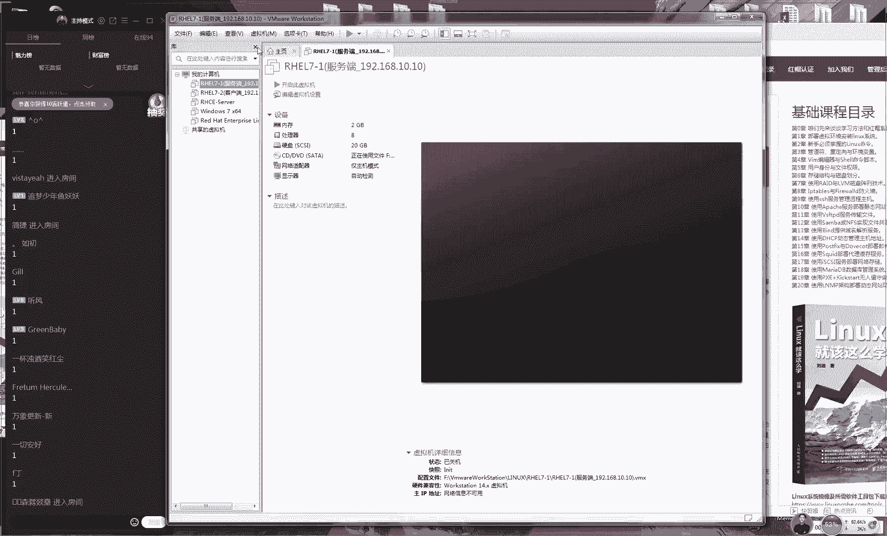

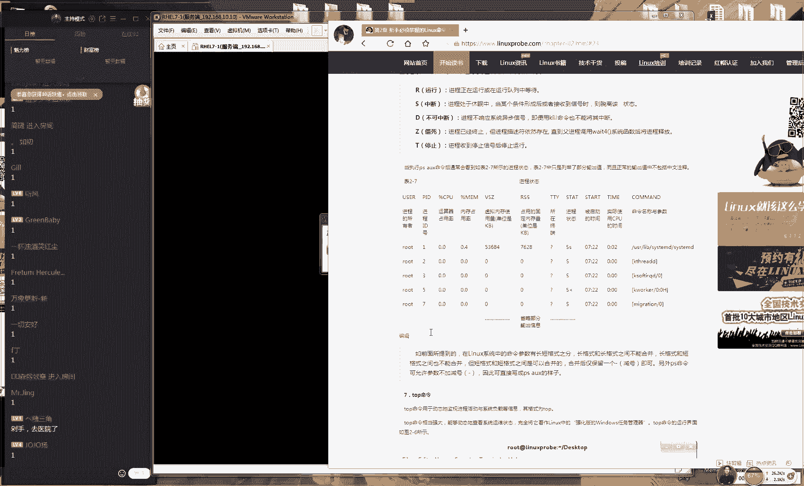

## 概述

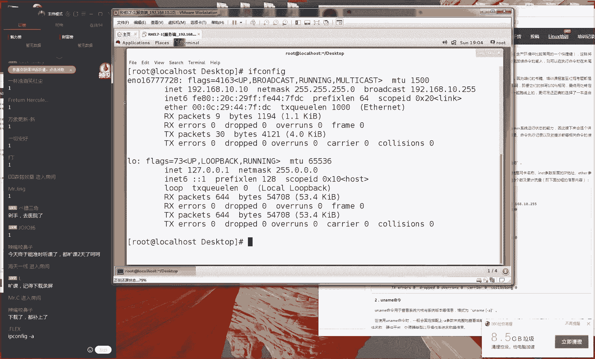

在本节课中，我们将继续深入学习Linux基础命令。我们将学习如何查看系统的环境信息、管理文件与目录、处理文本内容，以及掌握一些高级的文件操作命令。这些知识对于管理和维护Linux服务器至关重要。

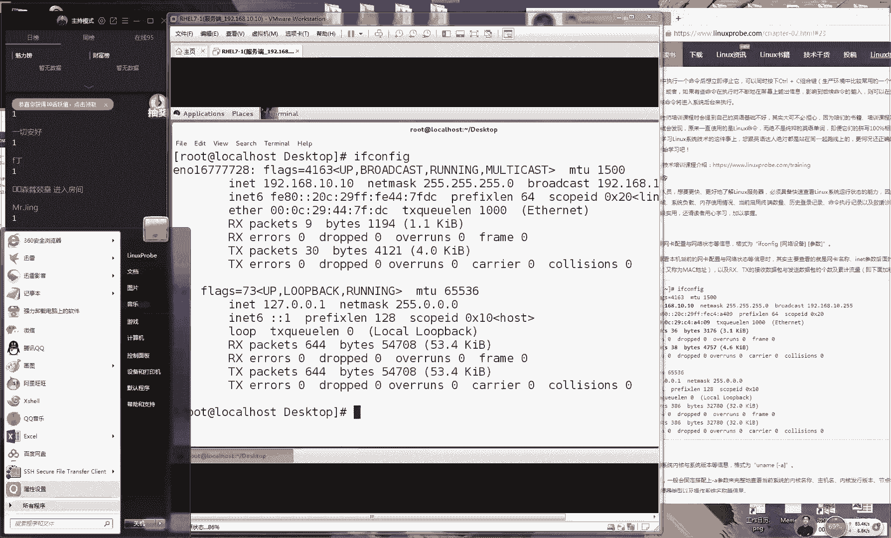

## 2.4 查看系统环境信息

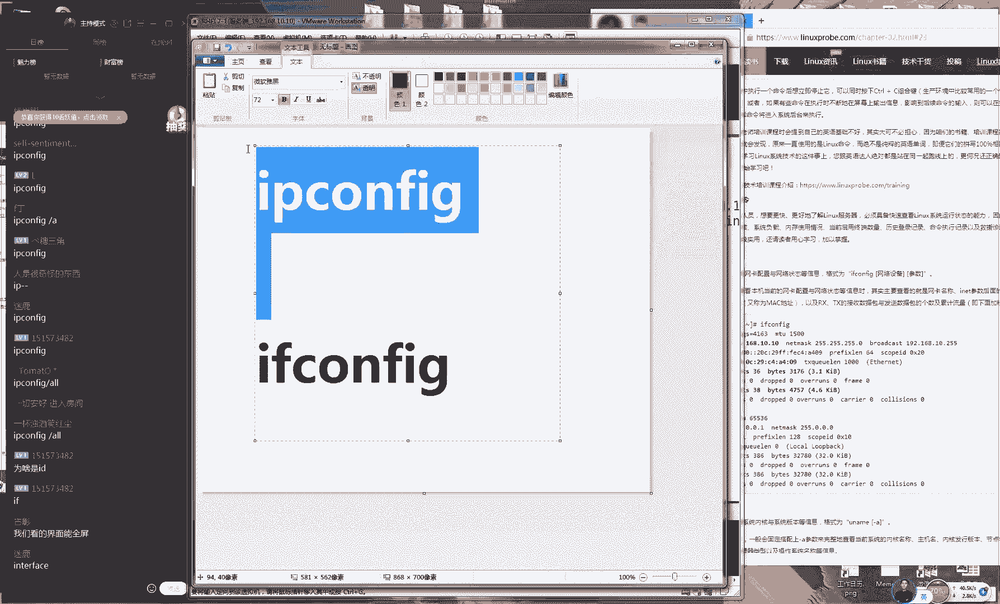

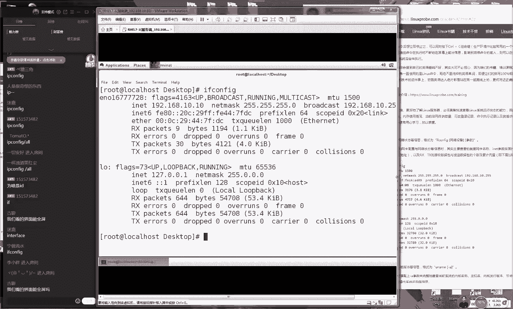

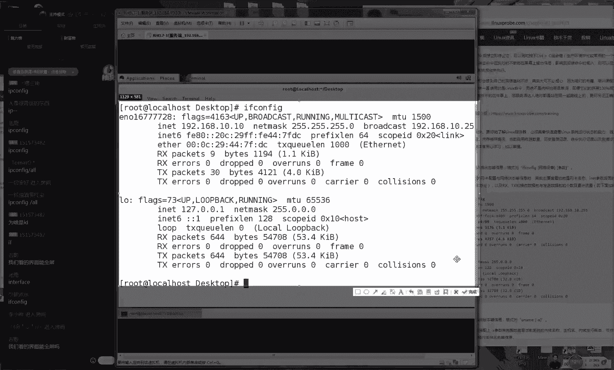

上一节我们介绍了如何查看系统负载和进程状态，本节中我们来看看如何获取服务器更详细的环境信息，例如网卡配置、内核版本等。这对于接手一台新服务器后的初步了解非常关键。

### 命令：`ifconfig`

`ifconfig`命令用于查看系统的网卡信息。在Windows系统中，查看网卡信息的命令是`ipconfig`，而在Linux中我们使用`ifconfig`。

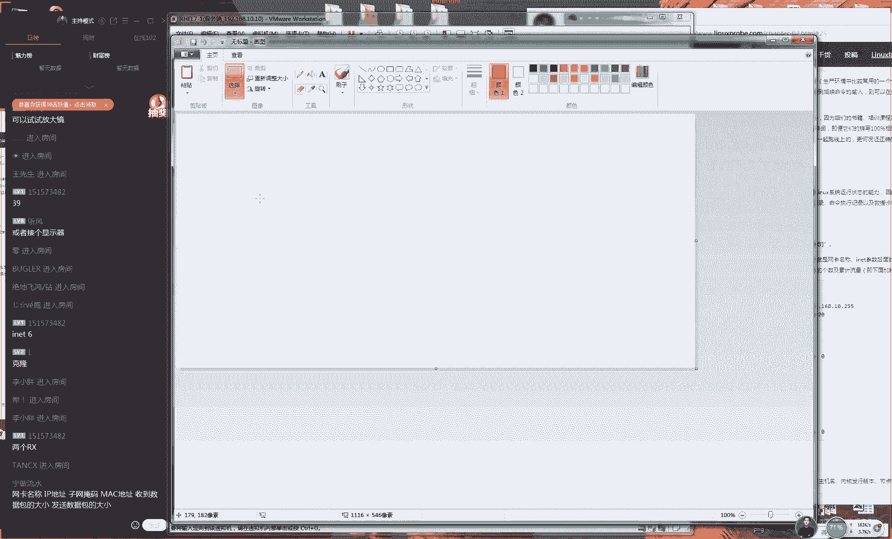

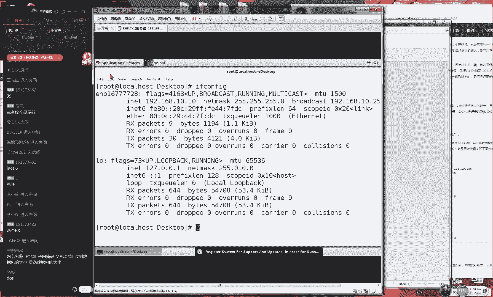

执行命令：
```bash
ifconfig
```
输出信息可能较多，我们主要关注以下几点：

以下是需要关注的核心信息：
1.  **网卡名称**：例如 `eth0`, `ens33`。
2.  **网卡的IP地址和子网掩码**：即 `inet` 地址和 `netmask`。
3.  **网卡的物理地址（MAC地址）**：即 `ether` 地址。
4.  **网络数据包统计**：
    *   `RX`：收到的数据包大小。
    *   `TX`：发送出去的数据包大小。通过观察这两个值的增长情况，可以判断服务器的网络活动状态。

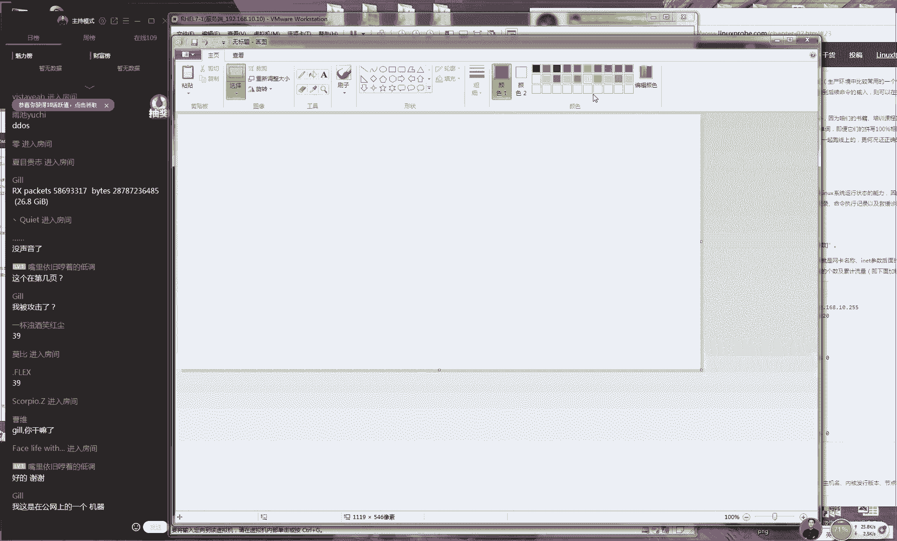

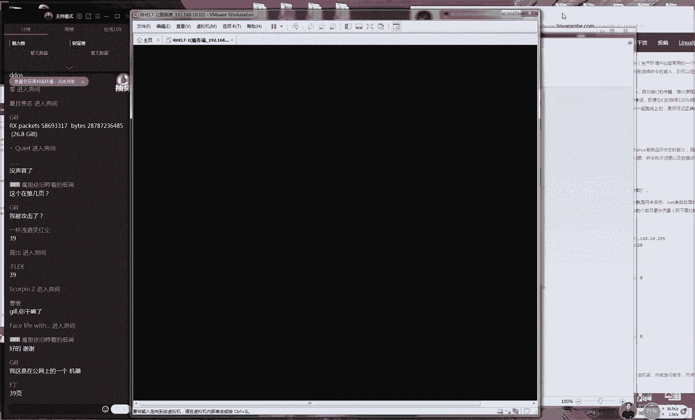

> 注意：`lo` 是回环地址（loopback），用于系统内部通信测试。

### 命令：`uname`

`uname`命令用于查看系统内核信息。单独使用`uname`输出信息有限，通常需要加上参数。

执行命令查看内核版本：
```bash
uname -a
```
输出信息包括：
*   系统内核名称（Linux）
*   主机名
*   内核发行版本
*   内核版本号（例如 `3.10.0-...`）
*   系统架构（例如 `x86_64` 表示64位系统）
*   系统打包时间

### 命令：`uptime`

`uptime`命令用于查看系统的负载情况。这个命令的输出与`top`命令的第一行信息一致。

执行命令：
```bash
uptime
```
输出信息解读：
*   当前系统时间
*   系统已运行时间
*   当前登录的终端数量（注意：是终端数量，不是用户数量）
*   系统平均负载：最近1分钟、5分钟、15分钟的平均负载。这个数值是综合性的，通常超过核心数5倍以上即认为负载较高，需要关注。

### 命令：`who`

`who`命令用于查看当前有哪些用户终端登录了系统。

执行命令：
```bash
who
```

### 命令：`last`

`last`命令用于查看系统的登录记录。当怀疑服务器被入侵时，可以查看此命令的输出作为参考。

执行命令：
```bash
last
```

### 命令：`history`

`history`命令用于查看当前用户执行过的命令历史记录。

执行命令：
```bash
history
```
每条命令前有一个编号。如果想重复执行某条历史命令，可以使用 `!序号` 的格式。

例如，重复执行第24条命令：
```bash
!24
```

### 命令：`sosreport`

`sosreport`命令用于收集系统配置和诊断信息，并生成一个压缩包。当需要向技术支持人员（如红帽支持）求助时，可以提供此报告，方便对方远程初步诊断问题。

执行命令后，按回车确认即可：
```bash
sosreport
```

## 2.5 切换工作目录

在了解了系统状态后，我们需要学习如何在文件系统中导航。Linux系统中，你进入不同的目录，看到和可操作的文件是不同的。

### 核心概念：工作目录

你当前所在的目录称为“工作目录”或“当前目录”。使用 `pwd` 命令可以查看当前工作目录的绝对路径。

执行命令：
```bash
pwd
```

### 命令：`cd`

`cd` 命令用于切换工作目录。

以下是常用的 `cd` 命令用法：
*   `cd 目录路径`：切换到指定目录。
*   `cd ~` 或 `cd`：切换到当前用户的**家目录**（用户个人文件的存放位置）。
*   `cd -`：切换到上一次所在目录。
*   `cd ..`：切换到上一级目录。

示例：
```bash
cd /etc
cd ~
cd -
cd ..
```

### 命令：`ls`

`ls` 命令用于列出当前目录下的文件和子目录。

以下是 `ls` 命令的常用参数组合：
*   `ls`：列出当前目录下的非隐藏文件。
*   `ls -a`：列出所有文件，包括以点 `.` 开头的**隐藏文件**。
*   `ls -l`：以长格式（详细信息模式）列出文件，包括权限、所有者、大小、修改时间等。
*   `ls -al` 或 `ls -la`：列出所有文件的详细信息。

> **重要理念**：在Linux系统中，一切皆文件。包括硬件设备、系统状态、配置文件等，都以文件的形式存在。

## 2.6 查看文本文件内容

既然一切都是文件，那么查看文件内容就是最基础的操作。根据文件大小和查看需求，有不同的命令。

### 命令：`cat`

`cat` 命令用于查看**内容较少**的文本文件，它会一次性显示全部内容。

执行命令：
```bash
cat 文件名
```

### 命令：`more`

`more` 命令用于查看**内容较多**的文本文件。它会分页显示，按**空格键**向下翻一页，按**回车键**向下翻一行，按 **`q`** 键退出。

执行命令：
```bash
more 文件名
```

### 命令：`head`

`head` 命令用于查看文件的开头部分，默认显示前10行。

执行命令查看前15行：
```bash
head -n 15 文件名
```

### 命令：`tail`

`tail` 命令用于查看文件的末尾部分，默认显示后10行。

执行命令查看后5行：
```bash
tail -n 5 文件名
```
一个非常实用的参数是 `-f`，它可以**实时刷新**显示文件的最新内容，常用于监控日志文件。

执行命令实时查看系统日志：
```bash
tail -f /var/log/messages
```

### 命令：`tr`

`tr` 命令用于转换或删除文本中的字符。它通常需要配合管道符 `|` 使用（管道符将在后续课程详细讲解）。

例如，将文件内容中的小写字母全部转换为大写：
```bash
cat 文件名 | tr [a-z] [A-Z]
```
> 该操作仅输出到屏幕，不会修改原文件。

### 命令：`wc`

`wc` 命令用于统计文本的行数、单词数和字节数。

常用参数：
*   `-l`：统计行数。
*   `-w`：统计单词数。
*   `-c`：统计字节数。

执行命令：
```bash
wc -l 文件名
```

### 命令：`stat`

`stat` 命令用于查看文件的详细属性，包括三个重要的时间戳：
*   **Access Time (atime)**：文件最后一次被**访问**的时间。
*   **Modify Time (mtime)**：文件内容最后一次被**修改**的时间。
*   **Change Time (ctime)**：文件属性或权限最后一次被**更改**的时间。

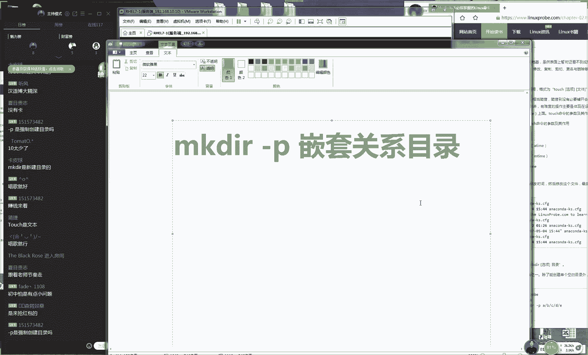

执行命令：
```bash
stat 文件名
```

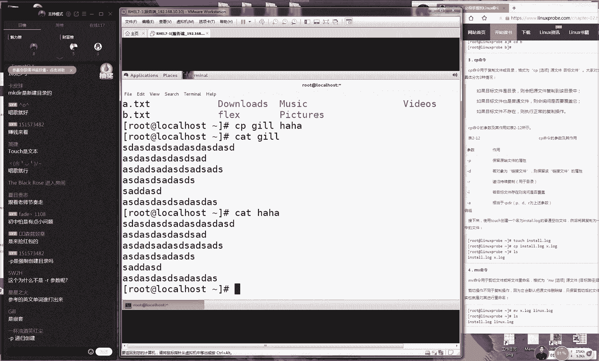

### 命令：`cut`

`cut` 命令用于按**列**提取文本内容。常用于处理以特定分隔符（如冒号`:`）分隔的格式化文件。

例如，`/etc/passwd` 文件以冒号分隔，第一列是用户名。提取所有用户名：
```bash
cut -d: -f1 /etc/passwd
```
参数说明：
*   `-d:`：指定分隔符为冒号。
*   `-f1`：提取第一列。

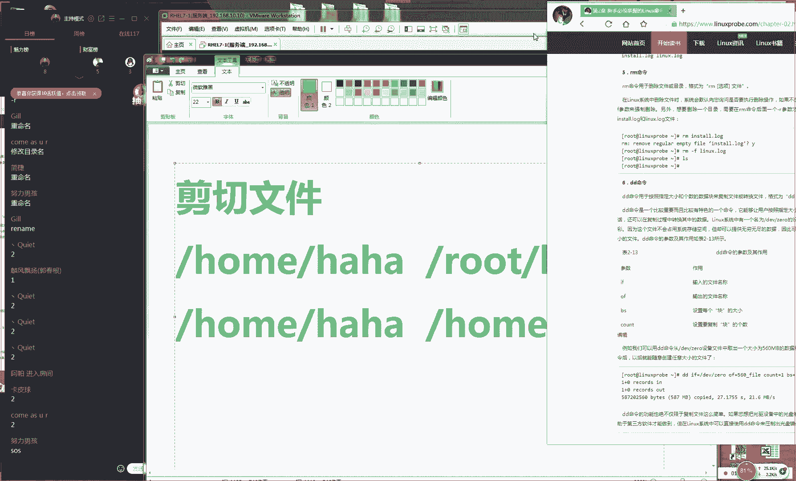

### 命令：`diff`

`diff` 命令用于比较两个文件的差异。

简要比较两个文件是否不同：
```bash
diff --brief 文件A 文件B
```
详细比较并显示差异之处：
```bash
diff -c 文件A 文件B
```

## 2.7 管理文件与目录

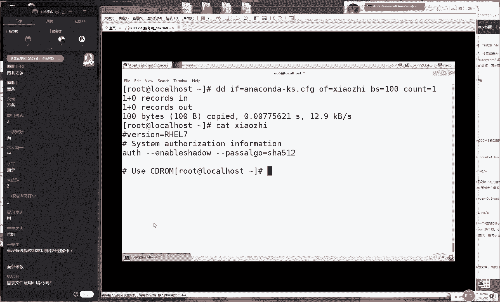

掌握了查看文件的方法后，我们学习如何创建、复制、移动和删除文件与目录。

### 命令：`touch`

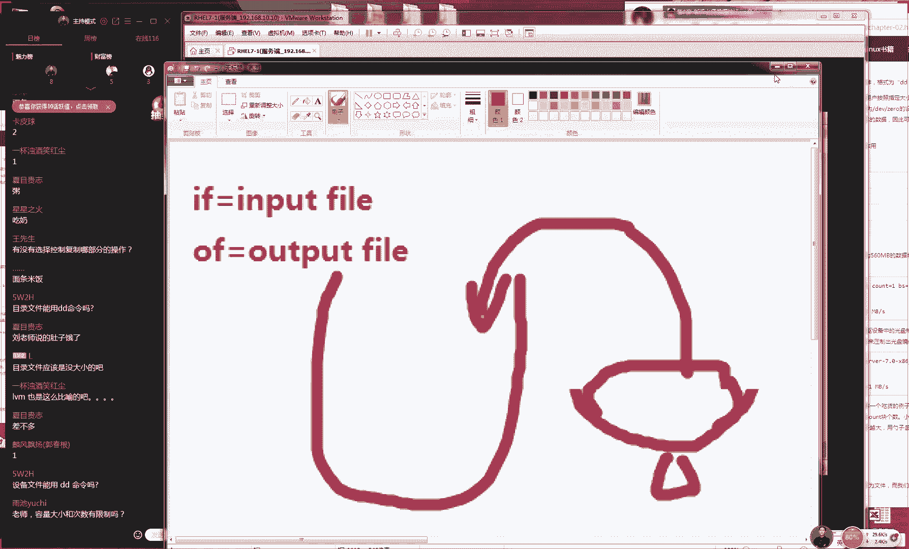

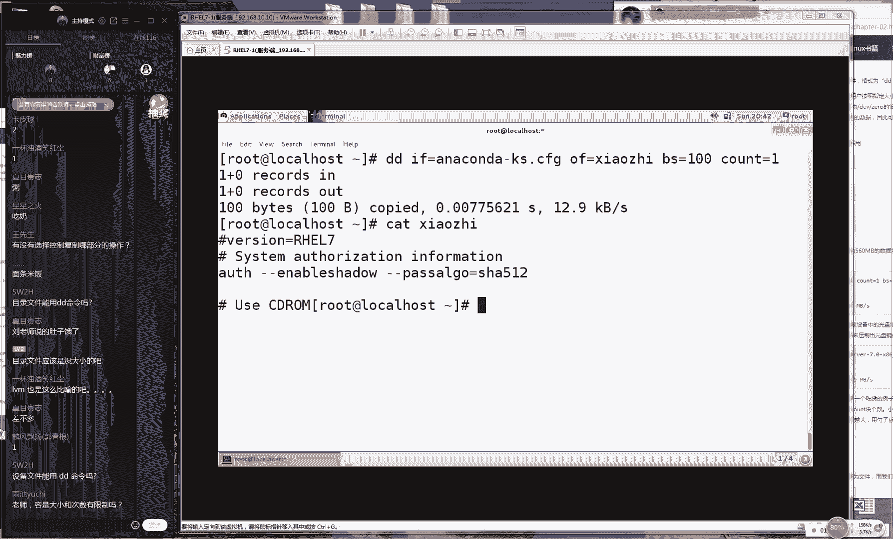

`touch` 命令主要有两个用途：
1.  创建新的**空文本文件**。
2.  修改文件的时间戳（atime和mtime）。

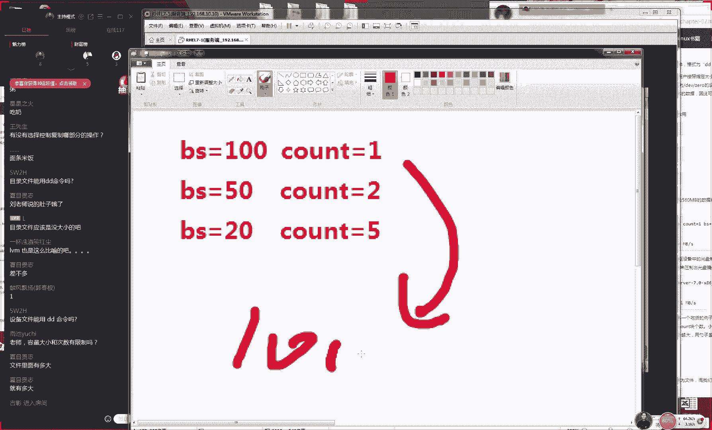

创建新文件：
```bash
touch 新文件名
```
修改文件时间戳为特定时间：
```bash
touch -d "2023-10-01 08:30:00" 文件名
```

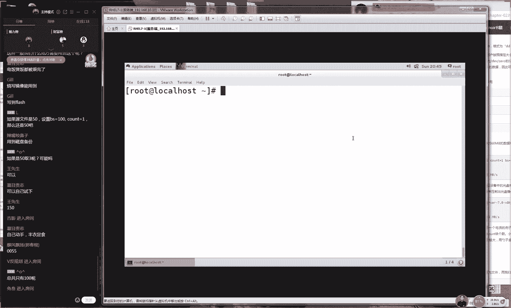

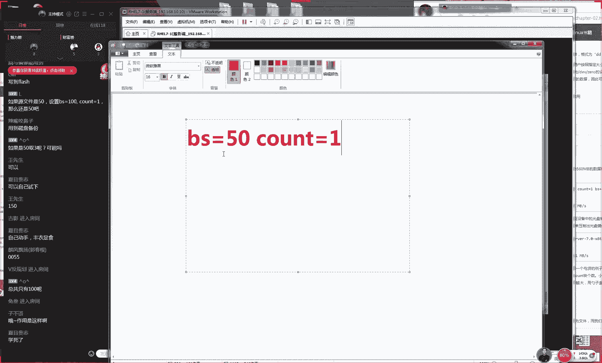

### 命令：`mkdir`

`mkdir` 命令用于创建新目录。

创建单个目录：
```bash
mkdir 目录名
```
创建嵌套的多级目录（使用 `-p` 参数）：
```bash
mkdir -p a/b/c/d/e
```

### 命令：`cp`

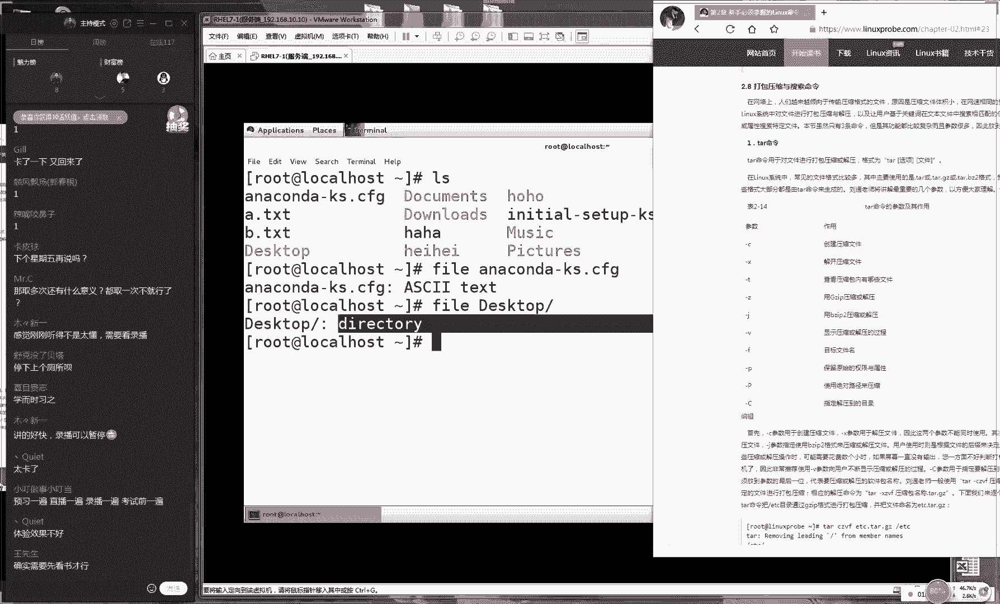

`cp` 命令用于**复制**文件或目录。

复制文件：
```bash
cp 源文件 目标文件
```
复制目录（需要 `-r` 参数进行递归操作）：
```bash
cp -r 源目录 目标目录
```

### 命令：`mv`

`mv` 命令有两个主要用途：
1.  **移动**文件或目录（剪切+粘贴）。
2.  **重命名**文件或目录（在同一个目录内移动即重命名）。

移动文件：
```bash
mv 源文件 目标路径/
```
重命名文件：
```bash
mv 旧文件名 新文件名
```

### 命令：`rm`

`rm` 命令用于**删除**文件或目录。**请谨慎使用，尤其是 `-rf` 组合**。

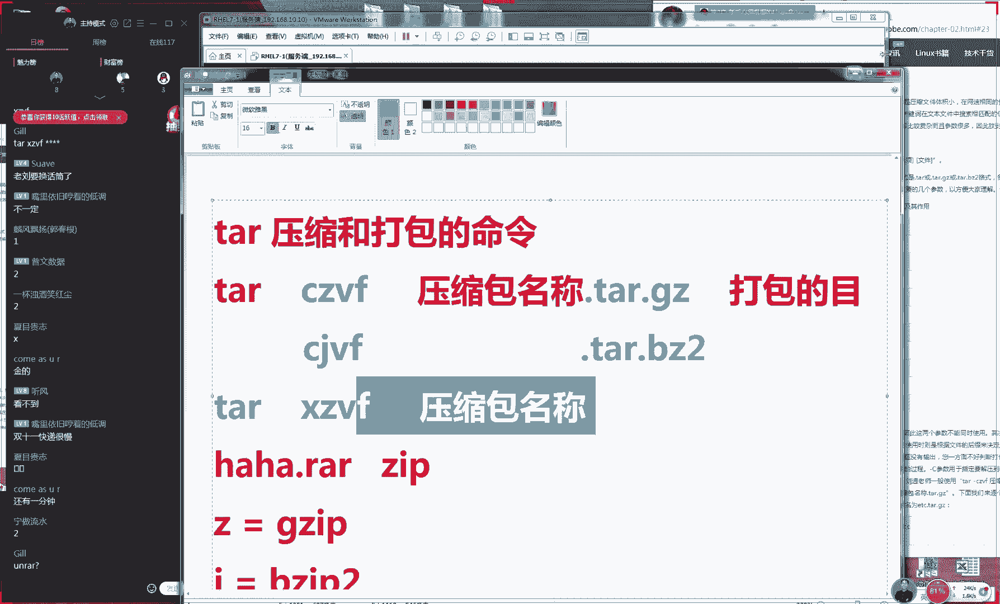

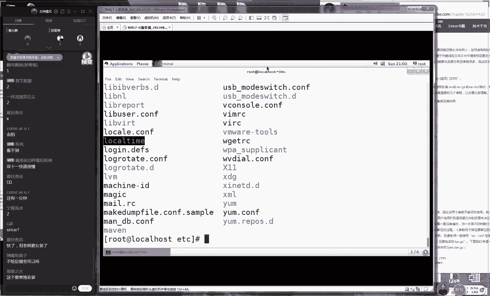

删除文件（会询问确认）：
```bash
rm 文件名
```
强制删除文件（不询问）：
```bash
rm -f 文件名
```
删除目录（需要 `-r` 参数）：
```bash
rm -r 目录名
```
强制删除目录（常用且危险的组合）：
```bash
rm -rf 目录名
```

### 命令：`dd`

`dd` 命令用于按照指定大小和块数复制文件或设备，功能比 `cp` 更底层、更灵活。常用于备份、生成特定大小文件等。

参数说明：
*   `if=`：输入文件（Input File）。
*   `of=`：输出文件（Output File）。
*   `bs=`：每次复制的块大小（Block Size）。
*   `count=`：复制的块数量。

示例：从 `/dev/sda` 设备备份前512字节（MBR）到文件 `mbr.backup`：
```bash
dd if=/dev/sda of=mbr.backup bs=512 count=1
```

### 命令：`file`

`file` 命令用于查看文件的类型。

执行命令：
```bash
file 文件名
```

## 2.8 打包压缩、搜索与匹配

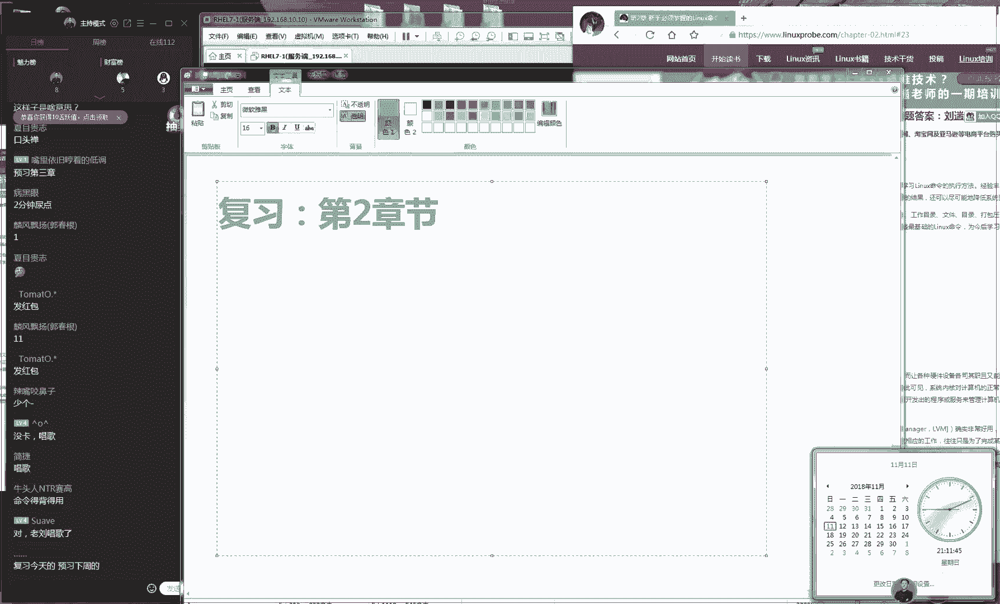

最后，我们学习三个非常实用且重要的命令，它们也是RHCE考试中的常见考点。


### 命令：`tar`

`tar` 命令用于对文件进行**打包**和**压缩**。

**打包与压缩**：
参数组合 `czvf` 很常用：
*   `c`：创建打包文件。
*   `z`：使用gzip格式进行压缩。
*   `v`：显示过程。
*   `f`：指定压缩包文件名。

将 `/etc` 目录打包压缩为 `etc.tar.gz`：
```bash
tar czvf etc.tar.gz /etc
```

**解压**：
参数组合 `xzvf` 用于解压 `.tar.gz` 文件：
*   `x`：解压。
*   `z`：解压gzip格式。
*   `v`：显示过程。
*   `f`：指定压缩包文件名。

解压 `etc.tar.gz` 到当前目录：
```bash
tar xzvf etc.tar.gz
```
> 如果压缩包是 `.tar.bz2` 格式，则将 `z` 参数换为 `j`。

### 命令：`grep`

`grep` 命令用于在文本中**按行搜索**匹配指定模式（关键词）的内容。

在文件中搜索包含“config”的行：
```bash
grep config 文件名
```
显示行号：
```bash
grep -n config 文件名
```
反向搜索，显示不包含“config”的行：
```bash
grep -v config 文件名
```

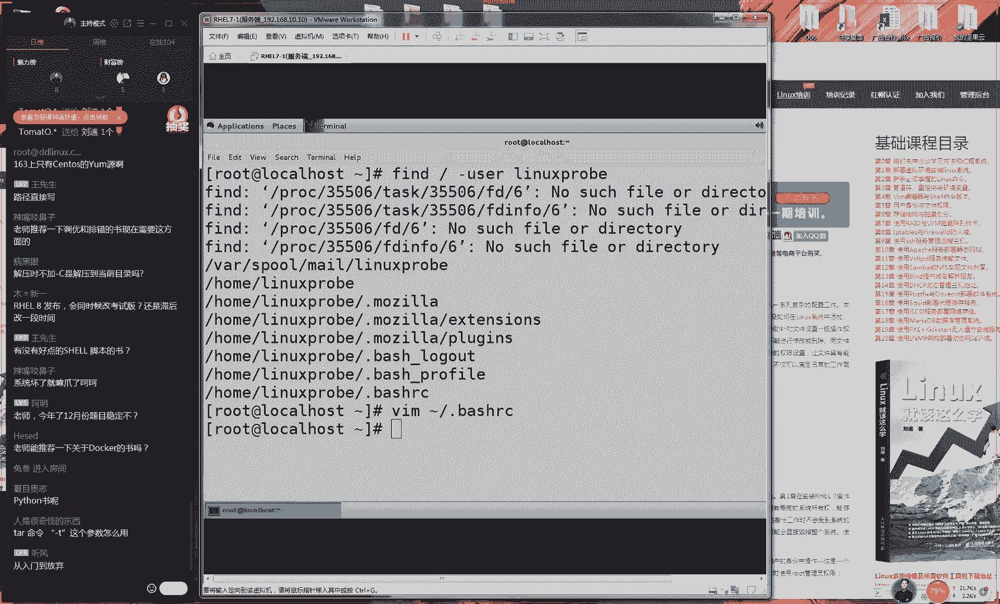


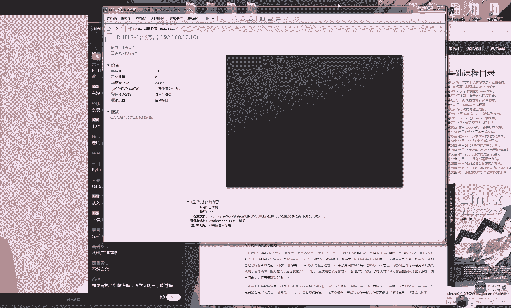

### 命令：`find`

`find` 命令用于在指定目录下**查找**符合条件的文件。功能非常强大。

在全盘（`/`）搜索名为 `fstab` 的文件：
```bash
find / -name fstab
```
在当前目录下搜索所有属于用户 `root` 的文件：
```bash
find . -user root
```
> 注意：搜索系统目录（如 `/proc`）时可能会出现一些权限警告，这属于正常现象。

## 总结

本节课中我们一起学习了大量的Linux基础命令，涵盖了系统信息查看、目录导航、文件内容查看与处理、文件与目录管理，以及打包、搜索等高级操作。这些命令是日常管理和维护Linux系统的基石，请务必多加练习，熟悉每个命令的常用参数和适用场景。下节课我们将进入第三章，学习更深入的管道符、重定向以及环境变量等内容。