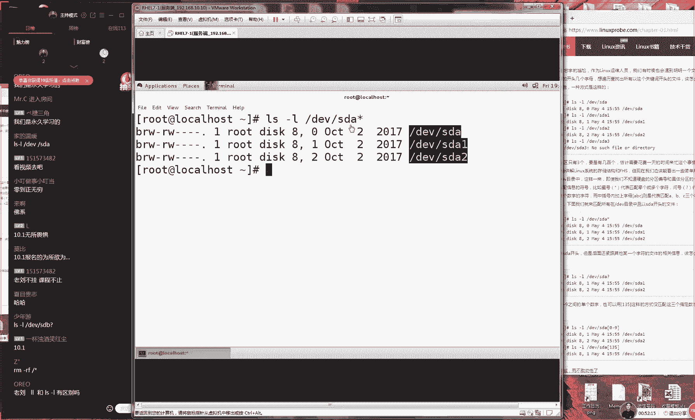

# Linux教程RHCE - P4：4.Linux管道符与重定向 - 艾弗艾尔思丢丢 - BV1if4y1e73V

OK那那我们准备开始上课的同学，因为刚才只有对只有70个人，然后我们等了一下81还好了，我们同学们还是人比较多的那我们先来测试一下我们这边上课环境好吧，先打一下一同学们，如果听到我说话声音的话。

那我们先打一下一然后证明一下我们上课没有问题，对吧？我们不想玩一个单那我们那我们不想玩一个单机版，然后讲了两个小时之后，发现大家都没有在线OK那我们继续给大家来去说了，就是我们今天这个啊有回声是吧？

好吧，说微远一点。😊。

行，那我现在可以了吗？因为我可能离刚才离比较近啊，所以我现在离得稍微远一点了，因为我怕大家听不清嘛。好，还是有回还是有回声呃，有这个问题吗？有这个问题吗？

就说我们说这个声音的问题没有是吧没有什么那么大家主要是有回声的话，大家检查一下是不是你们那个音箱跟话筒同时开着呢。因为我们之前有一个同学啊他有自己的一个耳机嘛，然后他就有一个麦。

然后他自己听到我说声等于说他又回放了一遍，所以能自己会有回声。有这个问题，那我们就继续了好我现在这个话后我现在这个话筒有一个梗，但是我今天刚开始上课嘛，大家在都非常有动力，非常有激情。

而且这个体力上来说也跟得上，以我们就不想给大家讲这个梗等大家以后我们待会一个半小时之后，大家犯困了给大家讲梗，我们一开上来先给大家讲这个干货好，那我们今天我们先给大家学习一下我们第三章节。😊。

们的管道服重定像跟我们的环境面量。今天的话呢内容其实很少的，真的这个东这个东西真的是很少的。但是的话呢需要大家来去记的东西真的是非常少。但是大家需要来理解东西非常的多。

就是说我们今天看到的这个东西啊都特别的特别的简单啊，大家不用去背你背的话呢也就是几个操作符而已，它不会超过三位。但是它我们需要来去理解理来去理解每个字符的这么一个作用。

这样的话呢我们就可以将我们上一节课我们第二章节里面的所有的的命令。然后来进行一个有机的一个结合。这样我们能够提高我们的工作效率，以及让我们这个操作的话，它更加灵活起来。😊，好，呃。

然后我说怎么样为什么没有声音啊，还有同学就说为什么没有画面，为什么我只能听到声音呃，所以说这可能还是往大家这个网络的这个问题啊。所以我建议是这样的。

如果说您只能听到声音或者只看到画面的话您可以先去重启一下的网络然再重新登录QQ家进入到QQ群里面一般来说啊，你再重新再进一下这个QQ群就可以般来说以解决这个问题。

那么还有第二个就是说如果大家没有这个问题的话呢，那我希望大家能够跟我互动一下，后就说一下自己没有这个问题。为如果大家都在反馈说看不到画面或者听不到声音的话，那我就只能去重启一次。

但是也许就是那几个同学的这个个人的网络问题，能耽误咱们上课这么一个节奏。所以我希望咱们这个课程啊，没有谁对谁错或怎么样，我们来去互动去交流起来。之所以我们是一个在线培训，没有给大家放视频。

我就是这么一个想法。如果我们不互动的话呢，我们还不如去看一个视频的对吧？😊，好，那我们就继续来给大家去说了。我们第三章节我们的管道服重钉像跟我们这个环境面量。那好，那我们继续啊O好了是吧？好。

大家不要给我刷礼我刷理有没有用，真的没有用，真的没有真的不给大家客气的啊，这东西真的没有用然的为我们因为我们说讲课从来不用到这个QQ直播嘛。老刘长那么丑。

也不会有人看的那我们给大家讲第一个我们做这个重钉项那么我们这个重钉项的话，家去重申一下，因为我81个同有93个同学我们刷同学你们刚才没有听清楚我第一句话。

我第一句话说就是我们今天的这个内容的话呢不多还真不多。但是的话呢我们需要来去理解东西他很深刻，我们来有一个节目叫什么最强大脑？我们要去发散一下思维思考。

我们今这个核心是一个思考第一个重点啊你看拉巴拉说4分钟，实这4分钟，到干货我们来讲我们的第一个这个技术点我们叫做重钉像这个话就是对于我们这个。😊，呃。

命令还有我们这个文件来进行的一个呃重定项的这么一个操作服务。我们把它叫做这个操作服也可以了。那好了，那我们现在给大家来说啊，它去分为了两个。第一的话呢我们叫做是个输入重定项输入重定大家需要记下笔记。

因为我们跟输入肯定是不一样的第二个我们叫做这个输出重定项。因为输上的话肯定是都是那种大篇幅对不对？老刘比较老刘要凑字数，然后我们去转稿去转稿了，对？

实开玩笑但但但是的话呢我们这给大家上课去记得这个笔记都是干货了，能用两个字写清楚这个技术点啊，不给大家用到三个字或四个字，对？我们就尽量给大家少怎么少怎么说，这样的话呢我们来通过非常简单的笔记。

然后大给大家讲出来特别的多，以的话呢大家不要吝习大家的这个笔要吝的笔水我们一定要好好去记一下笔记。第一的话呢我们这个操第一个操作符我们叫做输入重定项。第二的话呢我们叫做。😊，输出重定项。好。

那我给大家细分一下输呃输出重定项的话呢，它里边有分为了叫做标准的输出。还有我们第二个我们叫做错误的输出。它有两种的这种输出的模式。第一个我们叫做标准的输出。第二的话呢，我们叫做错误的输出。

其中的话它还有两个不同点。我们还进行输出的时候，它还可以有分为了我们叫做覆盖写入，以及我们叫做这个清空写入。好，我给大家连一下这个线。大家要明白什么意思了，它可以分为我我们这个标准跟我们这个错误。

两种输出的方式，那么以及我们可以去选择是覆盖，或者我们选择是清空这样的一个写入的一个模式。😊，好，这样的话来说就是说我书上感觉有水分嘛，书上我们为了凑字数嘛，对吧？其实开玩笑啊。

我们这本书案是整体来说的。好，接下来的话呢我们来看一下这个重钉项，就是将我们的一个命令的一个输入信息，将我们命令的一个输入信息，然后我们导入到一个文件里面。

或者说我们将文件里面这个信息由导回来去输入给一个命令。你看我现在给大家说完了，我刚才讲那我刚才所讲的这个技术点那大家可以去网上去搜都有的，但是我给大家讲完了之后，大家看明白了吗？没有看明白，对不对？

因为我们有一句话说的好叫什么百文不如一见，我我我们错错，我们这个脑子不狗使啊，我们要覆盖啊，覆盖跟清空不是一啊，他们两个不是一回事嘛，对吧？我们这个覆盖清空跟我们这个追加写入啊，我们叫追加模式。😊，哎。

叫追加模式。好，那我们给大拉巴拉说这么多啊。然后大家可以记一下我们这个笔记。但是我们也许你可能还是不理解，但什么是重动箱，我还是不懂。好了，所以有一句话说的好。

我们叫什么百闻不如见看书不实验给带到我们实件里来看一下到底怎么回事。我进入到我们这个命令行里家看大家举个子我现在查录它哪些文件以使用看一下这就是我当前的一个文件列表问题这是我直接学习过的很简单的这一个命令那没有问题那我们现在的话再来给大家看那么如果说想来单独来去看一个文件信息的话。

这去看使用一个长格式就是一个消表模式。然后我们来。😊。

查看一下我们这个文件上面这个属性信息。OK也没有问题。这个也跟我们的这个预期也是一样的。好呃，没有加速播放嘛？是觉得我讲的太慢了是吗？如果要是觉得我讲的太慢的话，我可以再快一点。

而且我这个语速已经是把自个压着的，是在控制住。大家应该知道我之语速有多快啊，大家这个很尴尬啊，我我我们这个直播是不能够暂停，也不能够加也不能够加速啊。

但是也可以提要求那这样的话呢我们来再来看一下我们一个文件的名称，我们叫做这个是无所谓啊，我们再看一个文件名称，我们叫做哈哈点CFG好了，那你看一下，那我们现在的话呢我们来去看两个文件的这么一个名称。

但是我们看到这个结果是不一样的。那我们先在看到我们的这个结果是不一样的嗯。😊，那我们来看那好，那我们先来看一下我们的这个结果不一样。第一个结果的话呢，是我们想要来看的。

以及以是我们预期的想要去呃获知到我们这个文件上面这个属性信息。换句话来说，大家记到你这个笔记上啊，大家看一下你的笔记，虽然他们都是一个白底黑颜色的一个输出信息，他们都是一个白底黑颜色的一个输入信息。

但是它里面的这个我让我们这个类型，或者说它两个这个的呃东西它是不一样的。好，那我们看第一个第一个是我们想要来去获取的一个正常的一个输出信息，是一个我们的文件的属性内容。好，这是我们想要去看到的内容。

而我们第二个话呢，它指的是我们这个文件，它是不存在的。这个是这个啊实际上来讲是我们的这个。😊，呃，命令给我们的一个报错信息。所以我们来大家区分一下，大家现拿拿拿起你的笔来。第一的话呢。

我们叫做标准的信息，写你的几个字啊，标准信息，或者说我们叫做这个正常信息啊，或者说我们叫做用户想能够预期到的内容，这个无所谓，我们把它叫做标准的，或者说我们叫做正常或者叫普通的信息。

我们这样来给大家作为一个标注。第二的话呢我们叫做一个用户非预期的内容。那我们把它叫做报错内容，叫做报错内容。O大家记一下啊，第一个我们叫做标准。第二呢我们叫做报错。好，那我们先来看一下我们的画面。

虽然你看起来好像都是一个白底黑颜色的字。但是这还是有区别，对不对？它这个信息里由的这个类型，哎，它是不一样的标准跟我们的这个报错内容。好，那我们现下给大家看一下它是怎么样不一样的。

那我们就来看一下我们这个重我们这个重定项操作符，它具体该怎么去使。第一的话呢我们叫做标准的写入的话呢，那我们就是一个大于号就这样去写就可以了。😊。

那么这个错误信息的话呢，它是一个R写上一个大于号，代表就是将错误的信息给它输到一个文件里面。换句话来说，我就是说啊将我的命令，你看我大家总结成这么一句话，那家知道金子了啊。来我们看一下。😊。

他是将我们命令的这个输出结果，但是我现在写不下了啊，大家懂我我写命令这么一个含义啊，将我命令输出的信息。然后的话呢我们写到一个文件里面，或者说我们将文件的话的内容我们导回到一个命令里面。

这个的过程命令跟我们的文件之间的这个信息流的过程，我叫做重定项。哎好了，接下我们来看一下我们这个我们这个重钉项里面叫标准重定项使用的是一个大于号，这个非常的神奇啊。

这个非常的神奇好对我们在线培训的话比较比较有趣是吧？而且可以调起老师啊。好，接下来我们呀怎么说这么啊很很悲凉啊。好，接下来我们来看一下我们这个结果啊。

那你看那我现在想来去看一下我们这个文件上面这个属性的信息。你可以看到我们现在能够看到它的这个信息没有问题。接下来话给大家演示一下，如果我将后面加上这么一个大于符号。那我们那我们可以写这么一个大于符号啊。

然后我那我们后面可以写上一个文件的名称。这个文件它可以它是不存在的。好吧，这个无所谓。😊。

那我们呃比如说我们随便选一个，比如因为我们为了避免说大家说哎到时你上课之前就就就有有这个文件，你在骗我们，对不对？因为上课之前你都做好了这些呃铺垫啊，然后你上课之前，然后你给我们展示了一下。

其实我们也不懂对吧？所以我们就呃给大家随便选一个，比如说叫宇池同学对吧？O宇池，我们就以这个同学名称来命名一个文件来也证明也来证明我们这个不是一个录播课程啊。

大家可以随意来去发挥自己的这个呃意见啊意去表达来，那我们现去写到这个文件里面，我们叫做语池这个文件，然后也看到一个很神奇的一个事情啊，就是你这个屏幕上面的话呢，不再有了我们原先的输出信息了。哎，很神奇。

嗯你来看一下。😊，哎，你看原先我们查看之后的话呢，他们都会在你这个屏幕上面会显示出来我们这个文件的这个信息。但是的话呢此时此刻你却发现屏幕上面干干净净的，没有任何的这个输出信息出来了。

而你这个目录里面去多出来一个文件，我们叫做小时同学啊这么一个文件。好，那我现在可以的话呢我们来ca一下这个语池啊，这个同学的这个文件啊，也是我们同名的一个文件。我们来看一下。

就能够看到原先要啊我大家记下笔记啊，是原先我们要输出到屏幕的内容。我们现在写不到的文件里面了。这就是因为我们使用的做标准的输出重钉向了。哎，大家记着笔记嗯，哎它是这么回事。😊，好。呃。

然后我们来看一下啊，对了，然后我给大家开，我让我稍微给大家开个玩笑啊。然后我说我们这边我们希把我们这个我我们这个技术啊跟我们是个生活给大家接到一块然后上课的时候之前看一下咱们的群，大概6点50分的时候。

大家有人说我去开我去开夜场了大家不要这么想那个只是一个朋友一个店那个店跟我一毛钱关系没有为我只是给大家提个小建议，然做出那么一杯酒。那个店也不是我开的跟一分钱没有任何关系的。

大家不要瞎为去转转到做酒吧了，因为上给大家瞎聊我们下一也我下礼拜就会跟一个新疆的朋友帮改进这个兰州拉面或者改进下大什么的无所谓大家瞎聊不要以为怎么怎么着。好，因为实给大家瞎聊了一下，家可能有点误解。

我们这个主线啊，我们是我们这个主业是不会店的。好，接样话。😊，来看一下我们这个文件里面的这个信息，这就是我们原先要输入到屏幕内容。而我们现在输入到了我们这个文呃输入到我们的呃文件里面了。

接下的话呢我们先这样子啊，我们来。😊，将我们这个大家去查看一个文件，这个文件我们叫做哈哈点CFG好了，那我们看到这个文件的内容的话呃，这个属性当前是一个报错信息。

那我们再要想要去使用到这个重定项们写到比如说我们随便去想我们想那比如说我们想要去做叫做唐三角同学我们把叫做这个小三同学不？取名个小三同学好，那我们去写到这个文件里面的时候，但是我们看到屏幕上面。

它还会依然会显示出来我们这个文件的一个报错信息。这就是为什么呢？那么这就是因为我们这个重定项符它默认写的是叫做标准的信息，也叫做我们这个输出的一个正常信息，对不对？但是你是一个报错信息，它不归他管。

那么你要想将你的这个报错信息写到一个文件的话呢，那么你就要去使用一个二大于号这样去做后你就看到的屏幕上面就干干净净了。而你在这个文件里面就会出现了你想要去去查看这一个内容，对吧？😊。

这是我们原先屏幕上面去显示出来这么一个信息。好了，接下来的话呢呃我对我没有写错啊，就是我们二大于号指的是叫做呃错误的输入出形项。好了，那我们现在给大家去说了一下，就是说我们这个命令的一个输入内容的话呢。

它也去它有区分，它区分为标准的内容，跟我们这个错误内容，它分为这么两种。那么如果它是一个标准内容的话，我们把它使用的是一个大于号就可以了。那么如果说它是一个错误信息的话，那我们就要使用到一个二大于号。

这样来给大家导入到一个文件里面。那么我们接下再给大家区分一下啊，那么我们什么叫这个清空写入，什么叫做追加写入呢？就是说如果我们现在写的是一个大于号的话呢，他们如果要是一个大于号的话。😊。

那么然他如果要是一个大句号的话呢，那么代表就是一个轻空写入，它会删除掉这个文件。它原始的内容，然后再来去写入我们这个内容。它现在就是一个覆盖的一个过程。第二的话叫作追加写入，它是将我们这个呃内容的话呢。

追加在我们这个文件的原始的内容的后面。😊，所以啊他会保留我们这个文件。

的原始的内容，然后注加到它的这个后面。好，我给大家演示一下，我们通过这个例子给大家来去多拉去玩一玩。那我们现来看一下哦，那我们现在将我们这个文件这个呃属性信息，然后我们写到叫做这个语石同学的文件里面。

然后你看到，那我现在12345，那我又往里面去写了5遍。那么请问如果我现在去查看一下这个语石同学这个文件里面，它有几条显示我们文件属性的信息，它有几行，它有几行信息。😊。

大家猜一下怎么会是一行他怎么会是一行，大家仔细大家要仔细想啊。你看啊，我们之前他已经有了一，他应该已经有了一条信息，对吧？那你看我现在我去敲了5遍，1加5怎么等于一呢？同学们再好好算一算，是哎。

要你们你们你你们不要这么配合好不好？来。😊，那我们看到所以的话呢，我们这个是那我们是啊我们实际上的话呢，我们看到他就是一个11行。😊，这个是为什么？然后的话大家大家五行的几个同学。

我知道你们是在给我面子啊，因为呃你们都会呢我讲什么，对吧？然后给大家说一下啊，这就是说啊因为的话呢我们当前你确实是将你的这个文件内容的话呢？那么你现在确实是将你屏幕上的这个内容写入到这个文件里面。

但是你使用的是一个覆盖清写入的一个模式，它每一次去写入文件的同时它都会将你这个文件原始的内容给大家删除掉。所以说你每次那那么呃你每次去写的时候，那么都是一个全新的一个文件，因此你最后一次去看的时候。

那么就是什么样呢？就是怎么样，就是只有了一行的信息，这就是为什么我们现在只能够看到一行信息的内容。那么当我们给大家做一个改建。比如说我把它改成两个大于号，那我们把这个追加写入。

它就是在我们这个文件的这个后面再来进行一个追加。那我们现在再来看一下，如果我们原先有了一行，然后我们再去追加四行的话呢，那么请问。😊，此时我们的这个文件里面应该是有了几行，哎，应该是有了几行。哎。

这个时候我们就有了十行啊，同学你太给面子了。所以的话呢这个就是。😊，他应该是有了5行。那给大家说一下这个原因啊，这个话就是说呃，因为的话呢我们现在。我们呃大家如果大家如果没有明白的话。

可以来看我给大家讲一遍啊。这就那么呃呃这就是说因为的话呢我们原先这个文件里面已经有了一行信息了。而我们现在的话呢又往里面进行一个加入每一次都会写到这个文件的一个末尾。所以的话那我们看到一加上4次。

我们总共得到就是5次的一个输出的信息。这就是我们叫做加写入这么一步操作。再给大家去做几个实验，大去感受一下好吧，大家希望能够一起互动起来。那比如说我想去查看一个文件的属性，那我想要去这个这个命不行啊。

那我们还使用什么这个命比较简单一点。那我现在比如说我想去查看一个文件这文件的内容已经有了那我那我现在想将这个文件的这个属性信息。那我们加一个小键加一个小然后我们将这个信息。

我们想要给写入到写入到一个文件里面的话呢，请问如果我现在是这样去写的话。😊。

是否能够成功。那也就是说我的这个屏幕上面还是否会显示出来我们这个查看文件属性的信息呢？呃，应该来讲，我们还会看到对不对？因为我们现在导入的是一个错误的信息，而我们现在查看文件的话，它属于一个正常信息。

那么因此我们现在可以看一下我打错了，我摁到这个反斜杠，我们这给大家看一下，这个时候我们可以看到我们的屏幕上面它会显示出来我们这个文件属性信息。因为这个信息的话，它是一个正常信息。

而我们现在导入的是一个错误信息。那么好待会待待会会一个文老师那么如果说我想要把我们这个呃正常的这个信息跟我们这个错误的信息都去写到一个文件里面的话，那么怎么办？因为大家知道因为我们现在讲的是的话呢。

是来进行一个区分对待了。我们将标准的信息给写入到一个文件里面。而我们将错误信息的话呢，写入到一个文件里面。那么如果说我们不想来去区分标准。😊。

错误都给他写入到一个文件里面，怎么去操作啊，那我们应该讲写上这样一个符号。这个符号的话，代表就是全部进行写入。不论我我们输入的信息，它是一个正确或者错误是标准还是报错。

我们都给大写入到一个文件里面等等啊。好，那我们现在可以大家给大家演示一下。那我们给大家修改一下，这样的话呢，那不论说我们这个信息它是正常还是错误，那么都会给大家输出到一个文件里面。

这个效果是非常非常明显，大家可以看到已经是成功了。好，接下来给大家再来玩几个实验啊，大家来去呃发散己的这个思维来去发散一下自己的这个思维。那咱比如说那我想来去。😊。

其实啊这个其实呃比较好玩了。那我们也可以去将我我们命令的输入信息嘛。那咱比如说我们使用的icical啊，就是我们第二章节里面的第一个命令啊，第二个命令对吧？然后我们来去使用的ic。

然后我来去输出一个内容。比说输出什么呢？我们就输出1个66666输出这么一个信息我们的屏幕上面大家记得你上一周去学习这个命令，老老大家做一个很有意义的一个事项啊，就是将我们这个参数给大给打印到屏幕上面。

而我现去分析一下，也可以看到现在的话呢是将我们这个命令的信息里那我们显示到了我们的屏幕上面，这就不是恰巧就是我们重定项服务，他想要去获取的内容吗？

所以来讲那我可以这去使用到一个大于符号的是叫做输出的重定项服务。们写到一个文件里我叫做这样的话以后我也会把我们所有的文件名称。如果是无所谓的情况下的话那我们都把叫做哈。😊，吼呃，嘿嘿或者其他的无所谓啊。

这样的话呢那我们希望大家可以去发散去思考，而不是只按呃那么只不过啊呃都不是按照我这个取消。那么如果说我现在给大家去敲一个叫做这个t无所谓啊，我们取一个比较标准那样的名字。

大家可能会怀疑楚老师是不是必须是这个名字啊，对吧？所以的话呢那我们为了避免大家啊会对于这种参数或者说文件名称这种呃的一种不必要的一种误解啊，所以的话呢那我们都会以这种哈哈，吼吼什么的。😊。

来进行命个命名。如果今后您再看到的话，那么就证明这个东西它是无所谓的这个参数您也可以进行一个修改，不用非得跟我是一模一样的。好吧。好呃，那么写入到一个文件里面。

我们叫做哈哈这个时候我们再去查看一下这个文件内容。好是已经写入到这个文件里面了。好，这就是说我们可以对于这个信息流由，我们也可以进行一个重定项的。不光我们命令的一个输入信息，对一个输出一个结果。

我们还可以将我们的信息流由来进行一个重定项。再往后面去走的话呢，我们还给大家去输出。来那么我们还去输出到哈哈。但这个是当然这个题目我们呃给大家去说过了啊，但是我们现再给大家提一个问题吧。

避免大家没有听明白。好吧，那我们先来看一下，比如说我们现在之前有一个文件叫做哈哈它里面有了一行信息。而我们现在在对于这个文件，我们再去写入了四行信息。那么请问啊大家小同学都会抢答了啊。

那么请问我们在这个文件里面，哈哈的这个文件里面有了几行信息。当前它有几行。😊，大家如果技术比较比较好的同学啊，可能会相得比较啰嗦。哎，老师这个问题刚刚不刚已经问过我们又问一遍啊。

这个时候就要去考虑到我们其他的106位同学了。因为我们现在在线班级有100多个同学，他们可能第一次去学，或者说没有时间去预习，可能听着还是比较陌生的，所以我们还是把我们的这个技术给他打牢好吧。

所以说我们会耐心给大家去讲，大家也要去呃耐心去听。如果这个技术点你已经掌握的话呢，可以呃在简单去复习一下。好，那我们来看一下我们这个哈哈的这个文件，我们可以来看到他里边确实太只有了一行信息。

就是因为我们这个内容的话呢。😊，那这个话就是因为我们这个内容的话呢，它每一次都进行的是一个轻空的一个写入，而不会保留我们文件的这个原始的内容。好了，接下来的话呢我们可以再来给大家玩一下。

那我们可以使用到一个追加写入操作。那我们可以这样去做使用到一个大那么我们使用到两个大于号，然后我们再来去敲几遍，那我们假设原先这个文件里面它有一行信息的话。

那么请问我们当前这个文件应该是有哪应该是有几次好，有4次嗯，不错，还有5次，有没有10次啊啊，还没有还更高一点呢？那有5次就成交了啊，4次是不是啊5次嗯，好。

大家看一下说那我们到底应该是有几次是有一次还是有4次还是有5次。😊，嗯。好，没有啊没有没有更高的吗？那只有5次是吧？那我就。😊，呃，就那就成交了啊，那就5次了。好，其实就是5次。那为啊那么是为什么啊？

大家想一下呃，因为的话呢我们那我们这个4次的同学，因为你们可能就是没有听清楚我的题干啊，就是我们这个文件里面，它已经有一次内容了。所以说他应该是一加上4加上4次的追加内容。所以说我们现在应该是有了5次。

好，这个实验的话呢，还是比较浅显比较简单的。好再给大家来去展示一下。比如说我们来去查看一个文件下面的这一个信息，你可以看到这个文件因为它是存在的，所以说我们会看到这个文件上面的这个属性信息。

那么如果说我们现来去查看一个文件，这个文件内容的话呢它是不存在的所以他会它会显示出来一个报错这个信息。那么请问那么如果说我想要将我们这个报错的这个内容，我们写入到一个文件里面的话呢。

请问我如果我这样敲完了之后。😊，我们换一个名字，我们把这。那么请问我现在签完了之后，这个从这呃这个命的一个报错信息，它会显示到我们的屏幕上面，还是会显那么还是会写到我们的文件里面请问我现在敲下回收之后。

我们的这个信息是会显示到我们的屏幕上面，还是会写还是会写入到我们的文件里面。好，大家发了一个会啊，发个会什么意思来我们写不么懒是告诉我说这个信息是在屏幕上面还是在文件里面。好。

我们不能说这期同学们你们是最调皮的。正你们这学肯定是最懒的都给我打一和2了来来来来们去自己做一下判断，到底是在我们这个屏幕上面的话呢，还是在我们这个文件里面好那么我们现在看到的话呢。

我们应该是大部分同学都应该是在我们的这个屏幕上面，对吧？打三呢我就就猜不到了，敲一下回收。这个时候你可以看到他是将我们这个报错信息给大单独给大家拿。😊，出来了，它不符合我们进行标准写我这么一个操作。

所以我们现在这个屏幕上面，它会啊它还会依然去写出来我们这个文件的一个包错信息了。好，这啊我就不大家去说啊，因为这个比较简单，就是进行一个文件内容的一个写入。第二的话呢我们叫做管道符。那第二的话呢。

我们叫这个管道符。这个管道符，大家现在跟我一起敲一遍，因为这个不好找。因为你的屏幕上面也许因为你键盘上面也许你找不到这么一个符号是这样的啊，大家的话按住你你的这个键盘上面的一个shift键。😊。

然后的话你现在去敲一下你回车上面那个键，就是有一个叫反斜杠嘛，然后你按住你的这个shift键，然后再点一下你的这个呃回车上面那个键，大家不要打一骗我啊。

也不要打个三打了个骗我就实这个这个他这个跟跟一是不一样的。有这个其他也是不一样。你我现在打一个打一个一你看他是没有一个上也没有一个下的。如果是新闻联播啊。

会他就会说他是一个抛弃了一个无端的一个一个畅主义也抛抛弃了这个滴滴趣味这么一个所他是一个纯粹的一个光杆一个就像一个双十一啊，其实你双十一你还有一个头一个尾呢，这个两个管道符，他更像是一个光棍，对不对？

他是一个没有任何任何拐弯的这么一道竖杠好了，这就是我们叫做这个管道符这个管道服它有一个作用啊，他是这样间割我们的命令的他会他会将我们的命令A，他会将我们的前面有一个叫命令。😊，A的这么一个东西啊。

命令A我们先面有一个命令A，然后的话他会将我们的命令A的这个输出的信息，他会将我们命令A的输出的信息交给我们的命令B再来进行一个他有给我们命令B再来进行一个处理。这个我们叫做管道服，还给大家举个例子。

先举一个生活上一个例子，大家有没有看过一个动画片叫哆啦A梦嗯也叫做机器猫啊，然后前几年的话呢他也出了这个同名的电影，也有动画片，反正我小时候我就看过哆啦A梦啊，叫这个大熊啊没有没有看过吗？啊。

真的是没有看过吗？这个应该是看过，对不对？然后有一个机器猫挺圆的，然后他有一个口袋可以拿出各种的道具来没有没有看过吧。蓝精灵不对不对？然后还有这个还有这个大熊还有胖虎对不对？有静香。

还有小夫大家应该看过对吧？好大家看过那就好办多了啊。大家有没有记得就是说这个机器猫，他有一个道具叫做这个任意门。😊，呃，有没有记得是这样的，给大家来回忆一下啊，他有一个道具叫做这个任意门。

是说啊有一集这么讲的，说这个小夫家特别有钱，对不对？大家知道小啊这个小富家有人做过调查，说小富家在这个在这个漫画里面的这个家里面的水平啊就已经很高了，说他们家就有机器人，然后还有这个收碗机，对不对？

相当于就是我们已经是我们当前这这个时代了，他这个他们家非常有钱，然后有一回啊小夫他妈妈他和他爸爸带小夫去滑雪去了，但是的话呢因为大熊家你也知道这个情况啊，所以的话他没有条件去，他就哭了，他因为他老哭。

他要去找这个机器猫说哎我也想去滑雪，但是家里不允许怎么办呢？这个时候当当当当哎这个他掏出来这么一个道具叫做任意门，他在他的后他们在这个前一秒的这个里面，他还在这个家里面，然后通过这个任意门。

他只要走进去了，然后他到了一个雪山的一个底上，大家有没有看。😊，动画片应该是有对吧？这个时候他到了一个雪山的一个顶上面，然后然后他们就可以去玩了。好了，这就是给大家说到这么一个非常相像的。

因为大家看到这么一个符号的话呢，其实也挺像门的。所以说我们为了好去来去呃来去理解跟这些记忆来讲的话呢，那我们可以把它家想象出它就是一个门。之前的话呢，我们的命令他是在我们的门的左边。

他一旦通过了我们的门，马上他就会去交给我们的呃右面的命令再进行一个处理。😊，他而他并不会将我我们这个信息还是输出到了我们的屏幕上面，而是通过我我们这个门转移给了我们叫这个传递给了我们的另外一个命令。

那么因此他是作为我们命令的一个信息的一个输出重项这么一个过程。那我们可以看到这个我们把它叫做管道服东西以把理解成叫做任意门管道服任意门好给大家说一下啊，叫任意门是这样的这个话是比较好的一个例子。

大家来来去来去理解一下我们这个管道服这么一个作用。这是第一个大家通过这个例子可以记住门一样的一个操作服，他可以对于我们信息进行一个转这是我们第一个我来理解这么一个操作服的这么一个用处。

第二的话就是说我们因为书籍的话呢，我们每年大概有10万多册。确实我们这期培训的话以及我们的往期直接收众了学生就有了2000多名这个也比较小。😊，如果说以后大家面试的时候，有人问到说这个东西叫什么名字。

要有人说叫这个任意门啊，然后就是一定是我们的学生，大家可以大家去互相照顾一下。现在就是我们行业里面的一个黑化了啊，因为我们每期都要这么去说一下，因为我们原先是没有任何的这个。😊，嗯。

只是随便这么一提啊这么一个小梗而已。但是后来我发现了，我们那我们就那我们已经重复三年了，而且我们已经把它写到书里面了，书里面也这么去提过。后来真有同学们去面试的时候，真到说这个任意门这么一个情况。

所以我们就是何必对吧？直接给大家告诉大家。如果以后遇叫这个任意门的同或者说同事应该就是我们的这个师兄弟了，家可以互相照顾一下。好，接下来我们给大家看一下这个实验了。实这个这个很小的这个真的小。

接下来给大家来演示一下。咱比如说我给大家举几个比较有有意思的例子啊，不给大家去瞎举例子，来看一下这个文件的话呢，我们叫T目录里面这个话是用来去保存我们这个用户信息内容的这么一个文件敲一下回车好。

这个内容的话特别特别的多，但是我们不管这个内容的话，是我们第五章的时给大家去学习到的。😊。

那我们这个内容我们先不用去管了，但是我们就看它最后一行，我们最呃我们最后一个字段啊，最后一个字段的话呢，如果我们叫做叫做SB里面的no love in的话。

代表就是这个呃用户他是不能够登录到我们这个终端的。那么如果说我们的。😊，终端的话呢是啊呃是B里面的b的话，那么代表就是这个呃用户他是可以登录到我我们这个系统里面的。好的，那我可以来做一下过滤的。

其实那我们可以去使用到GIAPP命令，我们来进行一个过滤，过滤出来所有终端为呃B里面的的这个终端的用户。这样的话就能就代表着我们所有能够登录我们系统用户的这么一个信息。大家可以看到。

因为我们系统里面的这个用户大概有30多个。😊，那么这样的话呢，那我们就可以过滤出来所有有权利去登录我们这个系统的用户的这个信息。来，我们现在敲一下回车。哎，我发现啊我说这个技术的时候。

大家总是非常的沉默。然后一说师就较活跃了。大我在有点怀疑大家上课到底是未来上课来调老师的，这个很奇怪，你是不是培训机构过来花钱砸来的，有种可能啊。好，那我们现在的话我们来继过滤一下啊。

就是说我们在就提取出来我们所有能够有权登录我们这个系统的用户的这个权限这个用户的这么一个信息，我们就可以使用到这个管道符。

我们要原先输入到屏幕内容的话呢那我们使用到我们使用到这个WC杠是用来去统计我们这个行数字节数跟单词数这么一个命令用统计的是行数这样话们敲下回车就会显出来当前有两个用户他可以去登。😊，我们这个系统的好了。

接下来的话呢我们来看一下，就是说再啊那OK啊再呃再呃再再给大家解释一下啊。这个命令的话呢，就是说我们通过这个管道服务将我们命令来进行一个切割，再呃把它给区分成我们的命令A跟命令B。

它我它它会将我们原先要输出到屏幕内容。😊。

大家可以来看一下这个话它就是我们的命令A啊，这话呃这个就是我们的命令A这就是这么一部分。后面的话呢这么一部分就是我们的命令B这样他就会将我们原先要输入到屏幕的内容。

那也就是说这么一段信息交给我们的后面的命令话我们再进行一个我们进行来进行一个二次处理。这个时候我们就显示出来我们当前所有能登录我们用户系统这一个用户信息。那可以把它改变一下。

比我想来去获取一下有不能够登录系统用户这么一个信息的话呢那我们就可以啊这个这个个数啊，那么就是呃我们来敲一下回车大家可以看到现在有33个用户，他们是不能够登录我们这个系统里面的。

好这个例子的话举还是比较好的。然后再给大家举个例子啊。那比如说有这么一个目录这个目录叫做ETC目录。😊。

呃，二呃应该叫做应该叫做二呃应该叫做二次处理，它相当于就是重钉项符。但是它是作为我们的一个命令信息给了我们一个命令的。大家要区分好啊。

就是我们刚才这个重钉项重钉项它指的是我们的这个命令跟我们这个文件之间的这么一个交互。而我们现在是命令与我们的命令之间的这么一个交互还有区是有区别的。它不到文件家给大家举个例子。

有这么一个目录这个文目录话叫做叫做ETC目录。这个第六章大家学到这个里面保存的是我们所有的文配置文件。好，这个内容的话特别的多，你己来看一下特别特别的多，大概会有几百条也不知道。

么如果说我想知道一下我们这个目录里面它有多少个文件的话呢，那我们要去这样去数真的是太麻烦了。这个时候我们可以这样去做使用我们去使用到我们的命令A后面加上我们一个管道符。

然我们再来去使用到WC杠样话就相当。😊。

不是。统计了一下我们这个呃目录里面，它有多少个文件，它会交给我们后面再进行一个处理。那么就统计出来了，它有259个文件。因为它每一个字段，它每一个信息，每一个文件名称它是作为一行，那它就显示出来的。😊。

好了呃，明太多已经听晕了，咋整？那相信没有这个问题吧。因为这个问还比较简单的，而且我们刚刚开始去做。如果要是听晕的啊，大家要是回去之后，一定要好好去做预习了。如果你要是之前已经预习过三遍的话。

然后你再说晕，这个还是可以理解的。如果之前没有做过预习，就直接听课的话呢，确实会有这种情况。大家一定要去重视这个预习的一个过程啊。

所以我们现在在我们的这个学区页面上面应给大家去贴出来有这么一个预习的一个课程，但是因为我们上个礼拜，我们刚刚开课，然后我给我给我跟大家说了，大家肯定也不会走心，对吧？所以我是本身我是想着礼拜日的时候。

因为正好讲到第五章嘛。😊，比较难了。然后再给大家去强调一下了。好了，接下再来给大家去说一下的话呢，就是啊再给大家举个例子啊，我们来去输出一个信息，输出一个信息。

我们叫做lin我们去输出一叫做这一个信息到我屏幕上面好了，常简单吧？可以去使用到这个管道服管道服我加这一个命令们做PAW它用来重置用户密码不用管了。

因为我们现在学习的是这个重我们现在学习的这个是这个管道服我们现在只用去关心就是它是用来去重置我们用户密码这么一个命令。

后我们这去做我们这样一个参数它是个长格式叫做做N命令这么一个参数大家话可以使用到我们之前给大家讲过那个命令后来去一下我们个命的一个参数啊。

你可以看到我搜索出来这个参数具体的这个解释好接下我们来看一下我们参数具体解释会告诉你说。😊，这个话它是一个参数，它是用来去指定我们密码这么一个参数。你可以看到它是用来去指定我们密码这么一个参数。

这个词叫做指向指定的意思。然后他就说而我们这个密码的话呢，它是来自于什么呢？它是来自于一个标准的一个输入的一个信息呃，which代表就是一个定语，对不对啊？

我们这个定语解释的就是我们前面指的是标准的输出的呃标准输内容的话，它它指是什么内容，它指的就是啊指的就是它可以是一个管道符的一个信息。😊，所以吧这就是解释了一下啊，就这个参数的这个作用话。

它它它就是专门用来去接收我们怎么样，他要用来去专门去接收我们。😊，呃，管道服务输入来这个内容的意思。好，那我们这个时候我们再来给大家写上一个用户的名一个名称。我们好比说我们加做入起来。

那我们以我们超级优户为例，这样的话我们敲价回收之后，它就会自动的为我们这个超级用户入起来去重置了我们的用户密码，而不需要我们再来进行我们的命令这么一个。

这个来说是非常非常简单的那这是非常简啊这非常简单的。另外大家刚说什么有说红猫re8已经发布，对吧？哦，是这样的，现在的话呢大家也看到这个新闻了。因为我们不是危言耸听。现在红猫re8确实已经到了一个非常。

😊，很尴尬的这么一个时期嘛，对吧？然后现在呃红帽官网上面已经发布了红猫热吧，但是我自己去看了，那个不是红猫热吧系统，那是红猫热吧的一个测试版本。呃，按照我们这个常见的一个推论来说的话呢。

应该是在半年之后呃会发布，就是最晚半年因为红帽有一个政策嘛，它是在半年之内会发布测试版本。所以的话呢我现在来去预估的话呢，这个已经不好说了。呃，因为我不知道具体发布的时间。

应该是在明年的1月或2月发布我这么一个想法，或者说最晚3月这么一个时间啊我们经将去评估啊，然后大家不用担心说我们这网站上已经发布了红猫热吧不要这么去想，因为我自去看过红猫热吧。

现我们红帽官网上面昨天你们说那个它是一个测试版本，测试版本，它不是正式版本，它也不会去修改红帽考题的。好吧，这个大家先不用担心，好吧。😊，嗯，然后是这样的一个情况，呃我给大家去说一下啊。

因为这也是我们自己的一个。😊。

我需要给大家去放宽心啊，不用担心哎我们红猫肉八已经发布了，大家不要这么去想这个红猫肉八还没有发布。包括说我们红包考题也是红这个正式版本发布之后才会进行一个修改。

不用担心好接下我给给大家去说一下我们叫做这个通配符因为这比较简单，给大家去说一下我们这个通配符这个通配符的话，它指的就是说我们当想敲一个命令的时候，但是你或者说你想找一个文件的时候。

但是你记但是你记不住一个文件的一个完整的名称的时候，那我就可以去使用到这个通配符了。好，那我们先这样的话话呢我们来先去查看一下有一个文件这个文件叫做目录话我们再来看一下有一个文件叫做S二个文件我们叫做S2第三个文件我们叫做S没有了。

那也就是说我们这个V目录里它有三个文件分别为S和A和2三个文件。那么我怎么知道它没有它有没有。😊，个呃其余的的话，那我们就来去手动来去查那么手拿呃来去尝试一下，它确实没有SDA3A4A5这几个文件。

但这个显得很麻烦，对不对？那我想起一个开头，然后我们就来去呃选出来所有这个文件名称开头的文件。那么这样去做就可以了。其实那我们就可以这样去做使用到L，然后我们想一个选一个长格式。

然后写上一个文件的开头是这样的那我们有几种操给大家去讲一下。😊，那我们来讲下下我们这个第一个操作符，我们叫一个星号。星号的话，它的它代表就是一个啊星号，它代表就是一个空值或者说代表无穷多的内容。

就它可以代它可以去匹配出来一个空值，它可以是空白，它可以匹配出来我们这个命令的本身它可以有那它可以代表是一个空值，它也可以代表一个字母，比说它可以代表一啊。

它可以代表A它可以代表B它可以代表三这是无所谓，它可以代表一个单个字符，它的话它可以代表出来多个字符，表比如说它可以代表ABCDEFG无所谓啊，它可以代表无穷多的这个字符。那也就是说这个星号的话。

它既代表就是一个空值，它又代表是无穷多的这个信息好，它是比较有哲理性的这么一个操作符，对不对？它非常像道家是那种叫什么空空无异物。但是的话它要菠罗万象是边有哲理的这么一个操作符，叫这个星号。

既代表空它代表它既代表空白，它又可以匹配出来任何这个字符，既代表单数代表双数，它又代表任何的这个字符。😊。

咱比如说它可以匹配出来DV目录里面的呃的SDA它本身，它也可以匹配出来所有以SDA开头的文件。😊，那我们可以看一下，就是我们进行一个通配这么一个效果。好，大家可以看一下我们现在这么一个效果。😊。

接样的话呢那我们来再给大家来去说一下啊，就是。😊。

呃，就给大家讲一下啊，就是我们要你要是写个星号的话，DV目录里面我大家去取个星号啊，就是来DV目录里面的SDA还有我们写上这么一个星号的话呢。

它可以匹配出来DV目录里面的SDA和A我们可以出它这个本身啊，然后那我们也可以出来SDAA我们可以这样去匹配你也可以匹配出来SDA123，你也可以匹出来DV目录里面的SDA123456这是无所谓的。

就是说你只要以它开头，然后的话你也可以出来是一个空值代表就是里面的所有的这个字符都可以使用到这个星号来去做匹配的。第二话呢我们叫做一个问号。这个问号的话它是必它是必须要出来一个字符的。

咱比如说我这样去写DV目录里面的SDA我们这样去写DV目录里面的SDA然后我们写上这么一个问号，它就它就可以出来DV目录里的SDA它也可以出来DV目录里面的SDA1它也可以出来DV目录里面的SDAA它但是啊错。

😊。

这个他不能匹配出来，它这个本身啊，它是必须要匹配出来一位的，他是必须要必须匹配出来一位，必须。匹配出一位啊，匹配啊必须匹配出来一位，它可以是一个字符，或者说它是一个字母都可以。但它必须要是有这么一位。

所以的话呢呢我们现在讲一个问号之后，大家可以来看一下，它就不能够通配出来我们DNV里呃目录里面的ICA它本身了。😊。

它就不能够匹配出来DV目录里面的SDA它本身了，它只它它是必须要匹配出来这么一位的这一话呢，我们叫做单个匹配，它是一个问号啊，单个匹配。好，接下的话再给大家说啊，我们再有一个叫做这一个中国号。

就说我们可以对于我们这个数字或者我们这个字母来进行一个匹配。因为我觉得我现在讲的已经很慢了啊，真的是很慢了。包我们的语大家说一下说我想要去匹配一下从0到9这几个阿拉伯数字。

们可以写上一个中括号后写0-9就可以出来大家打出大家去笔样去解的话0-9代表就是我们匹配出来出来123他会一直匹配到我给大家打出来吧。

怕大家有什么意义啊有什么歧义去就匹配出来了从0到9这1个阿拉伯数字进行一个数字的一个匹配才再回车可以到因为我们他只有和A和9所只会我匹配出来A1和A2他进行一个数字的一个匹配除这个之我们也可以来去匹配一下说我们匹配。

😊。

我们这个呃字母，那我么们可以这样去做A到小Z，它指的就是匹配26个小写字母，它匹配的是26个小写字母。😊，还有话我们上一个同学特别可爱，我记得是第几期，我都忘记了。

后来跟我说哎说从A到啊他这个他匹配的是26个大写字母。然后有同学跟我说说我们这个字母不是不是54个？不知道为什么这么想，然后跟我说老师你讲错了吧。

这个字母不是54个得他应该是比较喜欢打牌同学我们这个字母就有26个们个牌是有54张。好了，那么去区分一下，就是说我们现在话26个字母，们从到大写进行一个匹配的这么一个方法。好了接下这有什么用是吧？

然后这个话就是我们下一节课时候就是我们的明天就给大家来去讲了。我们在在搬砖，我们明天的时候到写出来我们这个脚本好。

那我接小A到小A到大个是不可以去做的这个是不可不能样去做要分开去写要这样去写小A到小Z这个实常像我们我们的明天啊大家讲。😊，一个语句叫做ki语句，到时候给大家去这么去匹配。

它匹配就是一个从小写到到大写的26个字母的所有的匹配。它可以这样去做。好了，那我们来去区分一下，就是说有些呃另外的话呢，还有一些网上这个教程啊，他这么去讲的，他说不要用到这个中括号，它讲的是一个大括号。

这个大括号这个区别给大家展示一下啊，当我使用到一个中括号的话呢，那我们来进行一个匹配。如果说没有匹配上的话呢，对它它带有报错，大家可以看到，那么我如果带有那么我如果要是使用到这个中括号的话呢。

如果他要是没有情况下，它就会不会显示，对不对？但是它如果使用是一个大括号的话呢，如果他有就会显示出来。如果是没有的话呢，那就会显示出来这么一个报错。哎。😊。

呃。呃，他呃这个操作方案它还不能去使啊，它会显示出来一个报错信息，但是它只能是进行一个呃单呃它只能进一个单个匹配啊，它不能够进行一个这么一个匹配这么一个呃区间。那我那那我给大家举个例子。

咱比如说那我只想要去匹配一下DV目录里面的SCA1和A3和A5这几个的话呢，那我们可以这样去做。😊，那么就代表就是我只去匹配我们DV目录里面的SCA1和A3和A5这三个里面的其中一个。

那么因此因为没有A3和A5，它会只会显出来我们这个A这一个设备文件的名称。那么如果说我改成一个大这么一个括弧的话呢，把一个大一个大括弧的话，它就会显出来我们的V目录S的信息。

但是我们的A3和A它也会我们出一个报错内容时给大家去说到就我们来进行通配的话呢，不光可以指定一个区间，我们还可以我们这个区间里的这个值进行一个精准的一个定位。

比说我只匹配一下1到5那我这样去做那如果说匹配出来是123567么123那这123逗号567这进行一个精准这一个匹配那我可以这样去做好了，这个东西它算是AS这个不算的这个是。😊。

完全不算的。因为的话呢X码的话呢，它是将你的一个字符，它都有引这么一个编码，这跟这个编码是没有关系的。好了，它是叫做这个通配符，它会呃它是可以让你只去输入一部分内容，然后就可以通配出来了。

咱们比如说啊呃。😊，以后你的公司里面人会很多，好吧，然后你想要去通出来所有姓刘的人。那好了，那你可以去写成一个刘写成一个星号。这个时候他们就会去他就会匹配出来所有姓刘的人的这个信息。

那再或者说那你想要去匹配一下说我想要去呃身高是1。8以上的同学，那么怎么办呢？那就这样去写身高的话呢，你直接这样去做。因为身高的话会有这种两位数，对不对？那你这样去做啊，身高的范围1。8以上，那就是1。

8米，然后到1米9米之间吧。咱们OK好吧，那我们就匹配一下从从1米8到1。89米之间的这么一个。😊。

呃，身高范围呢我们可以这样去做写1个18写上一个问号，这样的话呢他就会去匹配出来这么一位，然后或者说写星号也可以。因为有因为不可能有一个人是18厘米。这样的话你可以去过滤出来所有身高为1。

81米89之间这么一个范围区间的这人信息。就是这就是对于我们信息的一个应用啊，对于你这个这个过滤，它会更加这个精准，然后可以更有效率去提供给你去看好接下我们来去学习下我们这个转E服。

因为因为我们看看到了我们这个操作服的话，它会特别的多，它有这个大于号我们刚没有讲到这个小于号啊，因为这样的，大家没有体因为我们这个输入成项，它真的是非常少我们叫这个输入成现项我们居然没有讲给跳过去了啊。

虽然它简单他也不用不讲，就是说话我们可以将一个文件里面的这个信息给写到一个文件里面我们可以写到一个命令里面这个大家真的是一个失误啊。😊。

那好，那我给大家演示一下，就是说我们可以将我们的一个文将我们的一个文件内容给它导回到一个命令里面。那我们可以这样去做。咱比如说我想要统计一下我们某个文件的行数，咱比如说举个例子啊来一回车来去敲一下回车。

你看到这个话呢我们告诉文件里面，它有47行这个这就真的是我失误了，因为这个实验的话呢，这个实验例子比较少一翻把翻过去了。好，那我现看一下的话，那么统计一下我们这个文件里它有多少行。

它告诉我们说我们这个文件里面一共有47行而我们现在的话文件名称是这么一个文件名称好，那我们现在可以这样去做。我们可以把它写为一个小于号。

这样话代表就是将我们这个文件里面的信息给它写入到我们的这个命令里面将我们这个文件名称写入到我们的这个将文件内容导入到我我们的这个命令里面去敲回车这个时候的话呢我们可以看到它里面。😊，这个结果还是47。

但是它里边是有本质性的不同的。我我啊我给大家解释一下，好吧，大家家一起来互动一下，大家看一下就。那么请问一下我们的第一个命令里面的话呢，请问这个WC他是充当了什么样的一个角色？😊，那大家来起互动一下。

那么请问一下我们在第一个命令里面，我们的我呃我们这个WC它充当的是什么样的一个角色，它充当是一个我们统计我们信息的这么一个命令不它是一个我们统计信息的这么一个命令第二话那么请问这个消息它充当是什么样的一个角色呢？

我们要知道我们在命令里面它虽然是一个整体，但是它这个分工是不一样的第二话它是一个参数还是一个命令，还是一个对象。第二话呢，我们应该叫做它是一个我们的参数，对吧？

那我们来看一下我们的第三个请那那么请问我们这个我们的这个信息，它充当是什么样的一个角色。它的话呢它充当的是一个参数吗？不它是我们这个命令的一个承受者，它是我们的对象。好吧。

那我们来看一下我们这个下面下面的话呢这个还是我们这个命令这话它还是我们这个参数。但是的话呢我们后面这个它就不是一个我们的对象了，这是一个。😊，我们的信息流由的一个操作服可以把它归作是一个参数。

它是直啊它是直接将我们这个文件里面的那内容给它导入到了我们的这个命令里面了。所以说它没有我们这个文件的名称，它是将我们里面的这个内容的信息流由导回到我们这个命令里面了。

所以说它是没有了一个文件名称这么一个显示的。这是为什么我们虽然可能看起来这两个效果是差不多，但是它里面还有一个本质性的一个区别嗯。😊，好，就是给大家讲的一个重定下。

就是说我们那我们的话呢也可以将我我们这个命令。😊，跟我我们这个文件来进行一个结合，将我我们这个文件里面的内容再给导入到一个我们的命令里面。然后的话因为是这样的，大家已经学完了很多这样的这个操作符。

然后会觉得很乱，对吧？那我们到底怎进行一个结合性的一个使用。并且有些时候它会跟我我们这个系统的话它会产生冲突。

大家举个冲一个例子咱比说我现在举一个例子们一个变量们叫就是价格我这个价格价格等于是5好为我们去学习过使用的命进行一个输出输出我们这个我们来输出这个变量里面的值。我们需要面加上这么一个符号。

代表就是提取我们变量里面的值才会价回车。好，大家可以来看一下就会显出来我们变量里个值为5去输出我们变量里的值是5这么一个信息好了。

那么咱比如说我想去输出来说价格是5这么一段话的话那我可以这样去做使用到双引号把引起来什么大家可以看一下。😊，如果讲来就输出的是价格是5块钱，价格是5。虽然这样也可以去做，但是的话呢。

我们可以看到我们的命令跟我们这个参数对象之间的话，它是要有空格来去做间割的。但是我们可以但是我们虽然知道啊它是一个整体，它是一个整体的一个参数。我们知道系统它是不知道的。它会它会把认为是三个参数。

所我们要把作为一个整体需要使用到双引号把作为一个整体。那么因给大家记笔记啊当以后我们的参数里面如果参数那么我们的某一个参数里面，它必须要有空格的话呢，请用到双引号把它给引起来作为一个整体。

把它给作为一个整体，否则我们的命令可能会把当是一个三个参数来进行一个对答，我们才会再回收。这个时候它会告诉我们说我们的这个价格是5了，那么如果说想要显示出来的这个信息是价格是5美元呢。

那我们这个时们就这样去做价格是5美元。那我给大家加一个这个符号再加加个符号才会再回收它会告诉我们一个错的信息。就是因为。😊，虽然说我我们的这个预期它只是一个美元的一个符号。

但是两个美元的这个do符碰到一起之后显示的是我们当前进程的这么一个编码。好了，这是呃产生这样的一个歧义了。这个时候我们就要将我们的第一个这个呃符号。😊，给他作为转移，使用到一个反斜杠。

这就是让我我们这个操作服变为一个纯粹的一个文字的一个字符而已。它不再有了任何的高级的功能叫这个转译，大家就记一下啊，就是你有有看比如说某一个贪官，对不对？然他贪污了多少多少贪污了很多钱。

然后他被中纪委给查出来了，剥夺他的这个政治权利终身，对吧？就说我我们对它进行一个转译了，剥夺了它里面的这个所有的这个特殊的权限包，他只它它变成了一个最为底层最为纯粹这么一个单纯的一个字符而已了。

它没有了呃一些之前有了一些高级功能。好，这个例子其实还是比较好的对吧？好，那我们现在再回收这样话我们可以显出来说价格就变成了5美元。因为的话呢第一个符号通过我们的转移，他变成了一个纯粹的一个我们比较。

😊，就是说他变成了一个纯粹，他变啊他变成了一个没有特殊含义的这么一个单纯的一个字符而已了。好。所以说我们看到今天说价格就是5美元，就是我们这个转译服这么一个操作服务。好。

接下的话呢那我们还有一个操作服这样给大家去讲一下。😊，我们叫做全局转移。再比如说啊这个资例子得很奇葩。就是说如果说我想要去输出信息啊，它不是do5我们当地有一个习俗。

我们叫做那么如果说我们想要去输出来这么一串信息的话呢，我觉得很麻烦，对不对？你看我们这要做至少六七个转移这样太麻烦了。样话如果说我们要想去做一下全局转移的话呢。

那我们就可以使用到一个单引号单引号指的是一个全局转移。将我们这个里面的所有的信息。将我可以最后一个变量的话，我们也要把它改成一个常量这样话我们就指的是我们将里面的所有的信息。

我们全都给大家做这个转移进行一个叫全局转全都购白给它。😊，进行一个转移。咱比如说我刚刚看一个新闻啊，说有一个贪官，对不对？他们当地还挺有名的。后来的话因为强拆了人家的房子，后来被查出来了。

好像离北京还不。就说他到尾们长一直到他们那个部门就全都给就是撤掉了。正这个中国打击贪官作为怎还是力度这个他从底到尾是一个部种感觉啊，所你看一下进行一转所里个进行转得结果论你有多少符号论你有多少钱。

是面前是单纯符号转一个实验除这之还个反引号双引号单引号还反引号这个反大家一起去。😊。

一起去打一下啊，然我们先。😊，好，那我们还去打一下这个反引号，是这样的，先把大家的这个输入法的话调成这个英文啊。然后的话你敲一下你那个table键的一个上面的个键啊，去敲一下你那个table上面那个键。

然后可以打出来这样的一个符号。这个符号我们叫做啊反引号，大家先打一下。😊，那么如果大家打出来是一个小圆点，说明的话呢，波浪线肯定不对啊，因为你按住那个shift键了，就是说你要是打出是一个小圆点的话。

说明你那个中文输输入法也没有打对啊。比如说我们刚才看一个叫少年游同学就打就打对了。然后看一看是打错了啊，就这个你看同学就是打成了这个中文的点。大家打一下，因为这要会打的话肯定也不行。

你可以看到这个话要做反引号，这个代表是单引号，这代就是双引号，你看我们这天东西你要记东西真的是不读？家今天我上课没有没没有取时对不？看一下我们要记东西是常的少，但是我们要去理解看一下这是反引号。

这个是单引号，这是双引号。说后说一下这个反引号反引号的就是一个执行我们里面的命令的意思。比如说我们可以这样去做写上一个两个反引号写上两个反引号。😊，然后我们写了咱们这么一个命令。

它代表就是去执行我们里面的命令的意思。他会去来去呃他来去呃执行我们里面的命令。但是我们关心的它不是这个结果，而是我们可以选一个变量，我们选一个变量一个等号。这样的话呢它就会通过我们这个两个反引号。

然后将我们这个里面的命令来进行一个执行呃来啊进行一个执行执行之后将返回值给它复制到这个变量里面这样的一个作用。大家能够理解对吧？就是两个反译号代表就是执行我们里面的命令，但是我们只要起返回值。

我们不要它这个过程。那我们这样的话来比较直观吧？大家举个例子啊，那咱比如说我想要给大家举一个例子。但是这个例子可能我们先看起来还比较简单的，就是我来去使用到嗯。😊。

我大家举什么例子呢？嗯。我想一想啊，我们举一个哈哈的一个例子。好，那我们举这样一个例子啊，比如说我们叫做哈哈。然后这个话这个变量我们可以来去查看一下啊，老师不会这么无聊。

我们之前肯定是没有这么一个变量的那么这个变量哈哈你可以看它里面是一个空制那我可以这样去做对于我们这个哈哈命令变量来进行一个复值复值的话，我们使到一个等号两个翻译号我们复值什么呢？

们想说我想来去复制一下我们当前此时此刻的这么一个运行情况。那我们可以这样去做使用到up time命令。那我们这样来去进行一个复值。这样我们敲完回撤之后，可以看到将你再去输出一下哈哈里这个信息的时候。

就是我原先命令里这个信息，这就是大概就是我们会来去执行我们命令里的来去执行里的这个命令然后取其返回结果，然后复制给哈这个变量将哈变量输出的时候，我们可以看到原先我们这个。😊，面要计算出来那个值是什么？

好，接下话呢我们来看到就是说我们今天学的东西真的是非常多。我们今天学习到这个管呃管道服务重定项，还有我们这个转移服务。接下给大家来去呃讲一下，就是说当我们命之后，我们到底发生了什的发生什么一个事情。

的话怎么去回收我们可以去用到进行一个我们回收者我这个取消复值也可以然后我们给大家去说一下，就当我们之后的话呢，到底后它发生什么的一个事情。但是这个其实不太这个怎么讲的？对于我们这个课程它不是很重要的。

所以很多这个机构里面的话呢，根本不给大家去讲。但是我还要给大家去讲一下。因为我们讲了之后的话那么你会对于这个系统一个更加深刻一个理解。

知道我们这个系统底层它是怎么来进行一个运行的比如说我想来去查看一下我们这个文件的这个信息可以使用那我想查看一下我们这个负载信息呢，我们就去查看一下命令。😊，好，那么为什么我们当枪完毙了之后。

他会给我们这样的一个显示出来的信息呢？这样啊这就是说呃因为我们。😊，它这个底层它有了几种这样的一个步骤来一起去来去呃完成的。第一的话就是说我们第一个方式。

就是说如果说您是以路径的方式来去执行这么一个命令的话呢，则会直接来去执行。第一就是说以路径的形式直接来去执行的话，命令名称它去执行。这个是直接就会被执行的。因为我们讲到里面一切都是命令好。

我先给大家来去操作，大家看看看一下效果。我们的这个命令的话，它是在目录里面叫来敲再回收。这个话它代表就是我们来去直接来去执行我们的某一个命令再来话我们来去执行一下我们的比如说我们还会有其他的命令。

我们再去执行下命令。O它在里面我们来去执行一下。第一就是说如果说您是以加上这个路径加名称的形式来执行的话，那么则会来直接来去执行我们这个命令的这个内容。

这是我们的第一个第二的话我们来去第二就是说它是否是一。😊。

一个我们的别名，它代表是第二个，它是否是一个别名。别名的话呢，我们把它叫做alas的别名，我们叫做呃alas，它是对于我们的命令呢进行一个。😊。

呃，取名字。但比如说我不叫流传，我叫流传呃哈库塔，然后哈萨克斯坦捷克啊阿布战流传好吧，就说我名字如果特别长的话大家可能叫起来我也会很难会很记对不？那我们就可以给我取一个外号。

比说叫刘是无所谓的那么这样的话我们对于我们命令也可以去取一个名称。那么如果我们的命令也特别的长的话，那我们就可以取一个这么一个变量了。咱比如说我们之间一个一个命令的话特别的长，我们叫做无所谓。

我们可以取一个我们叫做 name，然后我们杠A它是显示我们这个内核版本信息的那我以对于它进行一个变量的一个进行一个的一个创建。我们我们给叫做悠悠吧。们一个等号，后面我们需要把把引起来。

因为他这个中间它有一个空格去做间歌了好了，那我们可以敲之后，那对于我们这。😊，U name杠A查看那核参数这么一个命令，它就有一个别名了。它叫做这个悠悠。当你再来去输出来叫做这个悠悠的时候。

就相在再去敲到我们后面这个命令。大家可以来看一下效果。敲一下悠悠之后你可以看到它就是这样的一个效果。另外的话这是我们的红帽H4S的考试原题，大家可以去感受一下。😊。

大家可以来看一下我们今天这个实验的效果。当我们再去敲完我们的这个悠U的之后，就相当于就会去执行我们后面这一串我们的命令了。它是对于我们的命令起了一个别名，它可以将你很长串一个命令。

我们来进行一个简单化样话我们只输入几个字符。我们就可以完之前需要敲很多字符这样的一个效果这个非常的好那我们可以去取消掉，对吧？也可以把它取消掉，我们去选个我取消掉。

这个时们再去敲一下悠悠然后我们最后来看一下它就没有了。那我们可以来进行一个复值，也可以进行一个取消，其是我们的第二个但是这个比较少，因为我们因为话我们大部分它都不是这个好。

接样的话我还有我们这个第三个我们叫做做个内部命令给大家去说一下，因为我们刚才讲到了说的话它是一个终的一个类型，后里面最好用的就是这个解器。那也就是说的话它就是一个职业。

我们刚给大家提到过说这个值也指的不是。😊。

一个人，咱比如说叫翻译官，翻译官他不是个人，他是一个职业，而我们这个他就是一个职业。在里面的bu解释器它是做的最好这么一个工具，或者他是一个人。那好了，他既然算作是一个工具，或者说他是一个人的话。

他不光可以帮我们几个话给他翻译成对方能够听懂的这样的一个话，他有一些自身的这个功能，我们叫做内叫做呃内部命令。咱比如说我以后啊我要去跟一个跨国企业去来去呃谈生意的时候，咱比如说因为我不太会说英语。对。

那好了，那我就要去写一个英语的一个翻译，然后帮我去翻译。😊，咱比如说对方问我说你们那苹果多少钱一斤啊，这个时候我就说啊我我啊我们的苹果10块钱一斤。好。

他帮我我的这个话转去转换成他能够听懂的这个英语但是如果说那个人问的是你们今天中午吃饭了吗？这个时候我这个翻译官他就不用再向我去进行一个翻译这尴尬？

他直接说啊我们今天中午吃也就是说非常简单的有我们这个他就会去完成这样的这个工作的话呢，我们叫做内部命令但是个常到1%但也有个情况出现叫做内部命令。

说一下我们这个第四种我们第四种的话我们叫做外部命令就是说我们大部分的命令98%以的命令其实我们以上三种顶多就占了31%了多就占了1%我们主要的话都是这个我们边这个第四步外部命令。

因为我们讲到的话我们系统里我里面的一切。😊，不是文件。那么好了，我们的命令它也是文件。命令我们叫做命令文件。当我们去敲完我们的命令之后的话呢，实际上就是他去执行了我们的命令文件。

所以我们才能够看到我们的这个效果。最后那我们也就是说每一次都是在去找到我们命令所对应的那个文件了。对，那么就有一个变量，我们叫做by呃叫呃叫叫做pass。😊，所以大家可以看到。

当我们来重新给大家来导一遍这个思路的话呢，那你就知道我们最后一个变量的这么一个作用。这有一个变量的话，它叫做这个pass变量，它就是用来去保存我们每个。😊。

呃，文他是用来去定义我们这个文件啊，我们这个命令文件保存路径的。好了，我们来进行一个输出输出，我们来去等一下，稍等稍稍等一下啊，输出一下。pas变量里面的这个内容，我可那我们可以来看一下。

这个内容我们虽然看不懂啊，但是你可以看出个大概对吧？这个里面的话是它实际上里面这个内容它就是有多个冒号间隔的目录。你可以看到它里面就是有很多个目录。那再比如说第一个目录，第二个目录，第三个目录啊。

第四个目录第五个目录第六个目录。它每个目录之间的话呢，它就用到这个冒号去做间隔。这个是我们第六章时会大家去讲到每个目录具体含义啊，这个几个目录这呃6个目录的话。

实际上就是定义的就是我们二啊我们做的命令文件都去寻找这么一个路径。所以再给大家去说一下啊，我们的这个pa变量的话呢，实际上来讲，它就是我们解释器的一个小助手。当你想要去执行某个命令的时候的话呢。

当你告诉你的这个解释器。你想要去执行某个命令的时候，这个时候他就会去问你的pas变量哪里去找然后找完之后它来去进行一个执行。所以我们可以看到了啊，单纯的一个pas变量，它就是非常有用的这么一个变量信息。

它属于叫做环境变。😊。

它是一个进行一个全局生效这么一种作用的。如果没有它，那我们命令的话，那么那么就啊那么就都是不能呃它来进行一个执行的。所以说我们可以看出来了，说我们在系统里面的变量的这个重要性。那我们除了这个之外的话。

它还是有很多那我给大家去介绍几个比较常用的就可大家去引出来我们这个系统里面的变量，它是非常实用这么一个啊，我们这个。😊。

的一个东西啊。然后我们来看一下我们的表格3-3它里面第一个叫做home。它就指的是我们用户的这个加目录。因为我这边还比较妥协啊，我这边还写着一个主目录括弧加目录。好了。

那所以话呢我们可以看到我们这边有一个目录，我们叫变量，我们叫做home，我们叫home，它指的就是我们当前用户的这个加目录，它指的是我们当前用户的这个加目录，你可以来去输出一下。

每个用户输出了之后是不一样的。那么大家可能问大家刚才问了一下，说我们什么叫做变量，对吧？变量的话呢，实际上就是会非常改变这样的一个数值。咱比如说我们先去访问支付宝。

这是这个就这个是比较扎心的这么一个例子啊。😊，那比如说我先去访问我的这个支付宝好了，那我这个支付宝这个软件也不是马云帮我去定制出来，对吧？那那我现在登录我的这个支付宝账号。

那也许我看到我的余额是100万块钱。但是大家登录之后也许就是0块者欠费了。那么为什么我们登录是同样的这个软件。但是我们这结果也是不一但没多就是说而且我这边好像双十一已经是刷爆了，已经这个花呗。

那我们为什么我们每个人去访支付宝花呗里面的个欠费的金额也是不一样呢是马云为每个人一个支付宝并不是就调取的变量变量话调取数据库里面的这个值非常简单这一个常简单的这一个过程马云登录之后。

马云看到10结打开是但是为什么是因这个变量你数据库里这一个体现。是为了让每个人登录之会显示出来不同的这个信息。但比如说我过生日的时候。😊，这个他他要他他又会给我发一短信说啊，祝你生日快乐。

然后你今天可以花8。8块，然后对吧？然后去买一个什么蛋糕怎么着的，他会有这样的一个优惠信息，他会根据每个人的这个不同的属性，然后会有不同的这样的一个推送的信息。他也通过变量来去完成的。好，接下的话呢。

我们来去看第二个，我们叫做shall。这就是说呃我们那我们不光可以来去查看一下我们当前。😊，好，你看，所以说现在这个主播行业不好干啊，但都是90%以上，都是女孩，对不对啊，还是大妈级别的。好。

回头我希望我等我老了之后会有大叔级别这样的主播出来啊。好，接下我们来输出一下我们这个信息，我叫做这话就是说显示出来下我们当前们使用这个终是什么可以看到我当前终端的话呢是里面的没有问题。

后面我们还就是说显示一下我们当前我们能够保存的记录有多少条都是不一样的这边是50条有些同学是1000条它是随你系统安装时那个配置选项的时候是不一样的。还有这个是表保存邮件这么一个路径。😊。

还有我们这个系统语系，这个邮件的话，它目前是没有。然后我们呃系统语系的话呢，是这个LNN呃LANG language。😊，这么一个缩写，大家可以来敲一下回收给大家去说一下记笔记啊。

说我们为什么我们要给大家讲的原因，给大家讲一个pas给大家讲了几个什么的。你看看一下这个呃它指的是我们系统的语系。如果说大家记，如果说我们当以后工作的时候，远程一台服务器的时候出现乱码情况。

就说比说你在北京你连接一台上海的服务器它显示出来乱码了。好了，那么就代表就是说你的系统的终端的名的这个编码跟我们服务器编码是不一样的。但比说你的服务器这个UTF杠8后但是你的这个终端的话是一个其他的。

但是这个时候它就会生这个乱码。这个时候怎么办呢？那么你就要这样去看查看一下你的这个服务器的编码是什么。后将你终端的这么一个编码也可改成它跟需要跟是匹成一致的话，那么这个时候你就可以去。😊，呃。

连接的时候就不会有断码这样的情况就是一个排错的一个思路的。然后我们下面的话还有一个叫做这个随机字符。那么这个变量的话非常有意思啊，它会每一次都会显示出来是一个随机的一个字符。然后说ll shell的话。

跟有什么区别吗？这个区别很大。这个其实你去敲一敲你知道了。我们第一个我们去输出来ll符它显示是我们当前登录的终端的名称是什么。😊，啊，他会告诉你说是里面的bsh。而这个ve is的话呢。

它指的就是搜索一个命令。在我们系统里面的保存路径，这个是完全不一样的那这个是两个概念我可以大家去尝试一下。因为我们可以去使用到ve命令。然后我们面加上一个名呃一个命令的名称。

它会找到这个命令它的系统里面所存放这么一个路径。好，是是这么一个作用的。然后的话接下来给大家去说一下，我们这个变量的话，非常有意思，它每一次都会显示出来一个随机的一个字符。这个是我们明天会给大家讲到的。

我们明天的时候会去使用到这个变量，它每一次会去随机出来一个。😊，几千到几万的这么一个字符。然后我们可以来去进行一个竞猜这么一个活动。那我们可以来去记一下。另外的话还有几个不太重要的。

我们就要做PSC这是我们这个登录这个提示符，还有我们这讲过及小助手保存每个用来保存每个命令文件路径还们默认一个用户的编辑器是这样大家如果想去看一下我们提个问题，么如果如果想去看到所有系统里面变量的。

那么怎么去看啊那么就这样去做你是输入一个你输一个是输这个N你来去输一下N就能够显出来你当前所有环境变量信息，输出一下这就是系统里所有变量信息输出下所有信息。这每个人都是不一样？

话我给大家去说一下义一个变量。那这么好用的这么一个功能啊，一个变量。说这个变量的名称。😊。

那我们叫做work这个无所谓啊，一块叫哈哈也可以。让后我们定一个变量的话呢，这个值是叫做home目录里面的lin probe。O啊，给大家举一个很长，不我们这样比比较短。

我们再给大家举一个更长一点的例子，我们给它起到嗯。😊，home里里面的。呃，我们举一个什么比较长一点的例子呢？咱比如说我现在定一个很长的这么一个目录。这个还不长，体验不出来我们这个实验的一个价值啊。

我来我们看一下还有哪些，我们随进几个目录。😊，啊，NTP吧无所谓啊，我这边先走一走，这个也还不是很深。我想给大家找一个很深的一个目录。然后大家可以看到哇，这么一个很好的一个效果啊。😊，我们这样吧。

user目录里面的sll里面的。呃，man里面的man九里面的，我看一下还有什么，好man9。好，我们进行个这么长串的这么一个目录啊，我现来去尝试去访问一下。OK没有问题。然后先这样啊。

那我们先定一个变量。然后的话呢我们那我们这个变量里面的这个就有了一个很长串的这么一个目录。这个目录啊，咱比如说我我我每一次都要来去切换里面来去工作的话呢，那我们都要来去输入CD然后加这么一大串这个信息。

我们才可以去切换成功，这真的是太麻烦了。那么于是我们就可以定义成它是一个变量，然后我们可以通过这个变量来进行一个切换。咱比如说我现在再访回到我这边的这个用户加目录里面嗯。😊，好，接样话我们来去这啊。

我先返回到我这个加目录里面了。然后我们去输入到PWD来看一下，我确实已经回到加目录了，没有在个目录里面不要说我作弊了。好接我们来去使用到号加们变量的名称回当可看到了当切换这一个目录里面了。

因为我们从来没有说过说变量它只能使用去看，给大家讲的是我们变量的话也以进行一个切换，也能够进行一个切换好除这个之话既这好用这个目录的话同时也去使用那么这个你切换一用户的。

这个使命叫做但不用着急开这我第章大家讲那切换我们不能使用到这个号失使用命进切换。那我们。😊，换到的一个普通用户身份下，那我们可以再来去使用到这个。

CD使用到调取work这么一个变量的方式来去切换目录的时候，就他啊他又告诉我们说切换是失败。那么为什么呢？因为当你去切切换的时候啊，你不光去切换，你连看都看不到的。因为啊我们来看一下，说为什么呢？

就是因为。😊，我们这个变量它只是在当前我们这个超级用户ro下，它才能够去生效，它只是这个个人的一个变量。那我们现在需要返回到我们这个超级用户的这个root身份下。

然后我们去使用到这个命令们做Xexport表这个出口的意思。然我对于变量我们进行一个提升把这个变量提升成一个全局变量成一个全局变量之后，我们再去登录到这个用户份下我们切换个我们打开广告。

然我们回车这个时候我们可以来去输出一下我们这个work里的这个值已经是有的并且我们可以随意去切换切换成功。

这就是说我们如何来去定义一个目录我们来去如何去定义一个变量么以们来变量如成一个全局生效所有人都以使用一个变量一个方法。家可以看到把它给转正了。另外大家问一个问题。😊，这个变量之后。

我们会不会从理之后就就失效了，它只是一个当前生效这么一个情况。它确实是一个当前生效的这么一个情况。你需要编辑两个文件。第一个文件是在ETC目录里面叫做profile这么一个文件，把它写入到里面。

然后它再去重启就可以了，它也不会去失效。第二个文件的话呢是。😊，呃，后面的话我们之所以刚才没有给大家讲啊，其实我们刚也给大家提了一下，因为我们这个课程它还是有一些知识这个系列的对吧？

然后我们今天给大家讲的是变量我因大家会往后学较杂了。所以我这个命令话第章大家讲到的这个不是不讲第章大家深入专门去讲解到这个命令的好编辑另外一个文件这个文件是我加目录里面做号开头是个隐藏文件叫做这么一个文件以来去看一下这个也是我学这个敲一下这我们要写到里面这样话从后我们这个变量信息也是一个一时生效这么一种情况。

后这个话大家不用去记。这个们红包考试的时给大家提到会我们红考试的时候那个视频里面大家再去讲到它的。😊，不生效怎么办？不生效的话，可以再去多敲几遍，或者按照我们现在这个方法把它写不到文件之后去重启。

或者使用到这个去加载就可以了。但是一般来说都没有问题的。如果是不行的话就可以重启一下或者说写到文件里面就可以了。然后的给大家说一下我们这边这第四章节。

后今天我们这个时是比富裕以我以给大家讲第四章节编辑器。但是我们今天都播太多的太大家放心我们今给大家讲一下我第第四章节我们讲完到第4。1小节我们先讲一下我们这个编辑器编辑器的话呢。

因为就是我们编辑配置文件，我们必须要去使用到这么一个工具。如果没有编辑器的话，我们一些想法不能去体现到我们这个配置文件里面了。好再给大家去重申一个我们这个原则。

就是话我们这个操作系统里面的一切他们都是这个文件们都是这个文件的一系统中的文件说为什么我们要去为什。😊。

们去切换了用户之后就不行了。因为我们切换的时候不能够去使用到减号。具体原因的话呢，我现在解释的话呃，大家会不太好理解。我们其实我还是想的就是把我们不同的命令。😊，放到不同章节里面来去讲。

因为你要一起去讲的话，有点大杂烩一样，把它讲乱了，最后学可能也学的不是很好。呃，是这样的，因为你加完这个减号之后，代表就是一个完全变更。

代表就是抛弃其原始这个用户所有的环境变量信息切换成一个全新的一个用户。所以说我们变量的话，他也不会去继承过去。所以大家还是相信我这个课程的安排，我们会把每一个实验。

然后把每个命令给大家切去安排到我们核实这个章节里面。虽然说我们现在可能会会大家再家去演示一下啊，但是我们不会给大家来去。😊，讲他的这个原因，我们会把我们后面给大家去大家去深入性的一个讲解啊。

大家懂这个意思就好了。因为我们这样一讲一讲可能就有点乱了。大家可能最后哎我到底今天我们学了什么呀，对吧？第五章的时候讲我们用户身份跟权限天我们学什么有点乱了。

所以我们今天这个重点还是放到我们这个管道服跟环编量上面就可以了。接下给大家说我一个原则，我们系统里面的这个文件的话那么它都是文件，包括说我们我们这个命令，包括说我们这个设备还有我们这个配置文件。

那么他们都是文件。如果说我们只能够去看不能去写的话，其实说我们一些想法，包括配置这个服务的话呢，就都不能去实现了。好，接样话呢我们来给大家去说一下，如何进行一个编辑。

我个编我做IM一下我编叫做M说VM编听起来很难，但是很简单对吧？然后。😊，说VM很简单特别特别简单。然后大家问说是是啊是真的吗？其实来说的话，这个真的是不是很简单。

因为你要相比于说windows里面的一个记事本啊，我觉得这个东西我妈都会使这个东西没有什么可学对吧？但是我们在里面的话呢，编译器还是你要去学习一下，还是有一些深度的这它这个还是有一些深度的。好。

那我们来给大家去说一下啊。当你想要编辑一个文件的话，那么你就要去选用到VI编音器，它有两个的这个。😊，特点说我们为什么要去学习到这个编辑器的原因呢？

这个理由第一个理由就是说呃因为的话呢我们的这个大部分的这个操作系统，包括说我们的这个大部分的很多的这个服务。比如说我们以后学到这个Q time会学到这个。😊，呃，说Q我们还会学到很多，我我一直想不起来。

然后他会他会有很多的这个服务，他会去默认去调取这个编辑器的。我们想一想，还有对还有这个第21小节的时候，会书里面有的，会讲到这个的时候，他们都会是默认会去使用到这个编译器的。

所以说它具有一个管方它是具有一个非常广泛的这么一个使用场景的，并且很多服务就是指就来去呃默认来去使用它作为这个编辑工具。就是说我们必须要来把这个学好。第二就是说这个的话当你学好之后。

你这个效率是非常高的。它非常的好用。所以说我们要把它学好。然后第一点就是说它具有很高这个使用度。如果说这个你不会的话呢，可能会对于你今后去配置这些服务会遇到一些问题。

然后或者说你不会怎么去配置这些服务的。第二的话呢就是。😊，我们这个它非常的好用，当你学完了之后也会有一个很好的一个帮助。大家我之看有一个新闻啊，大概的话是在两两之前了，有一个美国的一个捷客。

他把他们家这个汽车给拆了。后来他把他汽车那个油门跟刹车给拆来。没有看这个新闻说在美国有一个极客。然后他们家有一辆老车把车给拆了。把油门跟离合，好像是给他拆下来了，然后还有这个刹车把那个拆下来之后。

他把后他这个极客嘛，然后拿一个开发板给他拼到一起的插到他的那个电脑里面了。然后他那个左脚油门啊，就是那个打开文件，然后话离合也许因为忘记了他也许就是去编辑一个文件那个模式。

然后最后那个刹车就是保存一个文件，然后他就是现就是他写一个文件的时候啊，他可通过那个手去写文件，后通过那个刹车油门还有离合去控制这个就这个模式的一个切换，这也比较有意思的一个极客的一个想法。

大家可以去搜下这个新闻，现是真有然后现在还有就是说。😊，那我们将要去学到它的话，那我们就要知道它有三个模式。第一个模式我们叫做命令模式。第二我们叫输入模式。第三叫做默号模式。

先说一下我们叫做这个命令模式啊，是当我们进入到一个命令它是当我们进入到一个文件之后话呢，默认就会去遇到这么一个模式。它是我们第一个遇到的这么一个模式。

它加这个功能啊笔记这个功能的话主要是对于我们这个文件进行一个复制剪切搜索和查询这样的一个作用。复制剪切搜索查询这样的一个作用，以及的话它是作为我们这个输入模式跟我我们这个默号模式切换的一个桥梁。

大家可以看一下我们这个输入模式，它是不能够直接跟我们我们这个默号模式进行一个呃呃它进行一个数据交互的。

所以说它是作为一个我们输入模式跟我们默模式的一个切换的一个桥梁都必须要先返回到我们的命令模式下才能够进行一个切换。这是我第一个我们这个模式这么一个作用。第二话就是说我我们这个输入模式。

当你去敲了这个A或者I或者O这三个键。😊，进的的一个的话呢，对面？你可以进入到这个输入模式下，输入模式即叫做编辑模式，它就它到了这个编辑模式，就可以对于你这个内容进行一个编辑了。我们来进行一个编辑。

编辑好了之后再敲一下由我们这边的这个ESC键返回到我们的命令模式下。然后我们最后进入到我们的默号模式进行一个保存。好，现给大家说一下啊。

输入模式的功能主要是对于我们这个文件内容进行一个真正的一个编辑内容。😊，哎，进行一个我我把拖到哪啊，我就有写一个啊编辑了，哎呦，写的好丑啊。因为我刚才想写一个编，后来我觉得太懒，我想写一个急。

就我把这个字写的比较乱。好，这是我们叫做这个编辑模式。或者说我们叫做输入模式。那这个可以，我们可以把它叫做这个插入模式。因为这个我们很多种叫法嘛，对吧？那我们知道这个三种叫法说都是这一种同一个模式。

大家可以记一下三个名称所对应的都是同一件事情。第二的话就是我们这个默模式啊第三个就是我们这个默模式模式的话主要是对于我们这个文件进行一个保存跟退出使用的，以及设置我们环编辑环境用的。

大家记一下我们这个功能，我们三个模式功能，大家要记一下再给大家重复一下。第一，我们的命令模式，它是对于我们这个文件进行一个搜索查询复制剪切这样的这个操作的。第二的话就是说我们这个输入模式。

它对于我们文件内容进行一个编辑的第三的话呢就是我们的默模式，它指的是对于我们文件内容进行一个保存退出以及设置编辑环境信息的好我现在说比较快啊，原因的话就是我希望大家能会之后去看一下我们这个视频。

不要听一遍之后。😊。

じ。就走掉了，对吧？所以我现在说的比较快，没有给大家时间去做笔记。原因就是我希望大家下课之后去下载我们今天这个所讲的这个课程，再家去听一遍。这个时候大家再再去做笔记，不要就认为只听一遍把就听好就好了。

虽然说我们现在这个可能考试时间比较紧，然后等到明年等到下个月的月底可能就要考试。但是你但是你从现在你去算你大概还有40多天的时间呢，不要着急，还有一个半月呢，千万不要说去只听一遍的啊。好。

另外的话呢我来去说一下我们这个切换的方法。从我们开始进入到我们这个文件之后，我们第一眼所看到我们叫做命令模式，这是我们第一个我们进入的模式，那我们需要敲一下我们的A或者I或者O这三个键中的一个。

然后我们就可以进入到我们这个输入模式下，对于我们这个文件来进行一个编辑。好，这样话我们来去敲一下我们这边的这个ESC键就可以返回到我们的命令模式下。然后我们可以再来去敲一下冒号。

所以这个模式也可以把叫做这个冒号。😊，模式啊，它会进入到我们的默行模式进行一个保存退出，跟我们这个设信息这么一个工作。但是我们知道都必须要敲ES键，进入到我们的这个命令模式下。

才能够进行对于输入模式跟默行模式这么一个切换。好，说完之后大家都要哭了，就没了哎啊我们这个太枯燥了。然后的话呢，而且。😊，这个实用性到底我们该怎么样去判别。好，那我们先来看一下我们的表格。

那表那我们现在书上的话呢，表格4-1，还有表格4-2我们可以来仔细去看一下，就是我们相关的这个命令。因为我不那我就不给大家照去念了照念的话，给大家要困了。所以我给大家来带入到我们这个实践里面。好吧。

大家一起来做这个实验。然后因为我们今天第一天去学，不用着急，我会把我所签到每一个字符给大家去说出来了。并且我会告诉大家，我现在所处的是哪一个这个模式，并且我会多次去重申每个模式这么一个作用。好吧。

我们现在有几个实验。😊。

不要去关心我们文件里面的内容是什么，好吧，就把你这个文件里面内容当做是一堆乱码就好了。不要关心里面的内容是什么。我们只要去关心你操作那个过程。好吧，好现在我继续给大家去说一下，说编辑一个文件的一个方法。

咱比如说咱比如说嗯我想要去打开一个文件，这个真的一点都不绕。我给大家去说一下，但确实有点绕第一次去学实有点绕当我第一次学的时候，我都哭了这什么东西啊，对吧？

因为我之前我去使用windows那个记本哪有这么多事儿，这不封了心了，你自己找茬，这是给自己找麻烦嘛，对吧？但是后来你当你去使用熟练之后啊。😊。

然后你就知道了这个编I编机这个呃编辑器的这个这个灵活程度啊，真的是windows，它是不可比拟的。当你去刚刚去去学入门，那么也许你学了三五天，然后觉得这个系统啊只是一些很复杂繁琐的一些操作符命令什么的。

但当你去学习三5年之，正以我现在结来讲的话呢，我不敢想象，我没有去使用它的一些场景。比如说我们的服务器，我们的网站，我不敢想象我现在如果是使用windows会什么的个情况。

我们现在这个服务器大家应该知道的，那我们现在这个服务器也在去使用我们现在去学习的这个，还有这个大去部署出来的。我现在这个服务器已经连续200天没有去重启过常的稳定。而且它从来不会有一种大大的这种故障。

它特别的好用。我们都我们不给大家去安利了，大家去感受。😊，嗯。啊，因为我之前我也去使用windows去搭过服务器啊，但是蓝屏啊还比较少，或这种远程的时候那种特别卡顿的情况，这条成吐血。

当时我上0几年的时08年的时候，我们那会儿做过一个网站。😊，我那会要吐我那会要吐血，但会再想一个问题思去思考人生了。因为我当时想说我每天我浪费在等待这个通文化界面这个过程。

我如果一年下来我要浪费多少时间，真的特别特别的卡顿，大家可以感受一下。而且现在网速还是很快了。但是你可以去自己去作死一下，你去买一台美国，或者说你去买一台其他国家或者说一些地区的一些服务器。

照一台windows2003的一个系统，你们去感受一下，你们你你们会感受到什么叫做卡真的是很慢很慢很慢。我现在有两台服务器就是在就是在北京那边，而且都是windows的，因为我这边需要。😊。

驱载软件什么的啊，我而且我一台是阿里云，一台是腾讯云，大家可以看到我们这边我这个右上角我一直有这么两台服务器，主要是用来去推送信息。也是这个还是在北京，我去访问阿里云腾讯两个大厂的。

但是来说访问速度是有点慢的。所以说我给大家讲通过我命令控制的话的是很这一个优势这一个操作给大家说这么多这个实验要去用心去感受在说浪费生命嘛？干嘛呢？

一天到晚就是我最后我都不知道我后怎么度过一段时间是特特别的且现知道我现提出来一个战略做感谢克强理？出来这一个战略是敦促了联通跟进行一个南北互联问题解决。且提高网速。我原先家里的那个网速大概是兆的。

我现在我用的这个。😊，嗯，是5呃300兆啊，然后这个算是。很中等的一个水平了。现在北京地区就是呃城巴区嘛，最低你要是办网的话，就最就实现现在是最低标准，就是100兆，没有100兆以下的。

现在呃应该是啊就是我先看到的话，应该是100兆，就是起步。没有我之前是什么三兆5兆十0兆，哪有这么多低啊。反正我最开始插电话线。后来我办一个网，好像啊我记得好像是5兆或者3兆或者10兆。

反正反正很小这么一个小水管，现在也是。😊，这个网速在不断提升。好了，我们所以说我们不用说这么多，也说多就就差远了。好，我们现在再来给大家就是说呃，GIL同学，我们现在随便取一个名称啊。

这个文件它也许不存在，但是我们可以来去编辑它了。来后我们才会再回车。😊，呃，签换回收之后的话，我们提个问题好了。那么请问当你进入到一个文件来之后，你默认所看到的模式是什么？哎，你看如果没有听过。

他们就不知道我在说什么了啊。什么叫模式。三个模式是什么来着？分别来说第一个模式我们叫做编辑模式。第二叫我们叫做命令模式。第三个我们叫做木夯模式。好，大家记一下。那么请问当我们进入到的一个。😊。

那么请问当我们进入到了一个文件之后，我们默认所看到的这么一个模式是什么？我们的话默认所看到一个模式，我们叫做命令模式。在我们的这个命令模式下，大家可以各位一起去操作一下啊。你现在可以这样子。

你现在可以敲100下Z敲一表来来去敲去敲100下再去敲100下这个这边是X键去敲100下再去敲100键的话它也是这个插入模式啊。

你可以去打一下这个Z跟X你可以去敲无数遍这个时候但是你在你的屏幕上面不会有任何这个显示出来这个信息。因为你们现是在我们的命令模式下，你需要敲一下A或者I或者O这三个键，你才能够进行一个输入。好。

大家先感受一下，可以看到我现在敲键盘的这个声音，但是我们的屏幕上面没有任何的显示。好，那我们来说一下我们这边的这个A和I和O这三个键这个区别01代表就是我们当前所在这个行列这个位置啊。

它指的是我们光标所在的这个位置好，那我们现在话是指的是我们光标所在的这个位置，你可以看到我光标所在这个位置，它会产生出来我们这。😊，两个数字的这么一个变动。好，那我们现在的话现在来去敲完之后。

它没有任何的反应。那我们现在要去进行一个输入模式了。我把调大之后，大家看好我的这个屏幕上，大家自己看好啊。现在我来敲一下，说我敲一下A这个键。

这样的话我们就可以进入到我们编辑模式下再看一下我们的这两个区别。敲一下A了123好，我先点我返回到我们这边这个命令模式下再看一下区别我敲一下A这个键啊。

进入到我们的编辑模式下123好那我们再看一下123看到了吗？它是在我们光标的下一位它会产生出来这么一个编辑的一个图标，编辑的这一个输入的一个光标。

让我们再点一下I键大家看一下区别123我点完了好返回到我们的这个我返回这个命令模式下。然后我们点一下I这个时候我们再来看的话每次切换之后，它都会在我们光标所在位置下。

然后的话呢我们来进行一个输入我们这个O这个键大家看一下123O。😊，可以看到它是在我们光标所在位置的下一行来进行一个输入。所以的话呢我们来看到就是说呃呃A和I这个键。

它们都是用来去切呃入到我们这个编辑模式下所使用的这么一个字符，我们叫操作符嘛。这个两个操作符这个区别只是在我们光标所在的这个当前跟下一位它这么一个区别。

所以说只有非常无聊的老师或者说非常无聊的这个面试官没有的可问的情况下，它才会去考你这个说A和I的这个区别。当你去使用的情况下，你不用去记A和I的这个区别，你随便去打没有关系。

因为这个A和I它就是在这边的呃这边这个当前位跟下一位进行一个切换，对你没有任何的影响。因为你可以通过这个发文键来进行一个控制了。而这个O它就是在我们光标行的下一行来进行一个输入，这个还是比较这个特点的。

好，但现在我在输入这个内容之后啊，那我们现在进入到我们的编辑模式下，同样我这边的这个左下角会显示出来这个插入这么一个字符。😊，时好，那我们现在的话呢来去。输入一下这里面的这个内容。

那我们现在输入完了之后的话，如果想要去保存，大家可以看一下我们表格4-2。我们想要保存的话呢，那我们需要输入的是一个冒号呃WQ。我们进入到我们的默行模式下，然后我们就要去呃敲。😊，呃。

WQ叹号然后给大家解释一下啊，这里边话我们这个W它指的是我们的保存。我们就到我们的默号模式下，我们需要去敲一下WQ叹号。这边的话呢，W代表就是保存，代表是保存一个文件的意思。Q代表是退出一个文件的意思。

最后这个叹号代表就是强制保存并退出的意思。因为有它有些时候，如果你说你这个权限不足的话呢，可能会让你这个保存是失败的，所以说我们需要写一个叹号进行一个强制保存并退出这样的一个效果。好，再给大家去说一下。

就是说它进行一个强制保存并退出这样的一个效果。WQ叹号。那么请问为什么我当前我去敲WQ叹号之后。😊，他没有一个保存的一个效果呢？为什么？为什么我现在敲冒号WQ叹号，它没有一个保存的一个效果？

就是因为我们现在的话呢，它是在我们的编辑模式下，它不能够对文件进行一个保存，我们也不能够直接返回到我们的默号模式，我们需要先敲我们的ESC键返回到我们的命令模式下，然后怎么样呢？敲一下冒号。

它又在我们这个屏幕的这个左下角出现了一个闪烁的一个光标，它是一个冒号，然后我们再去敲WQ叹号。这个时候才能进行一个保存并退出。好，那我们现在再来查看一下我们这个文件的内容啊，可以看到这个文件内容的话呢。

确确实实刚才被我们已经是修改过了。这是我们去编辑一个文件的一个比较简单的一个方法。好，然后加接下来我们去。😊。

大家去多做几个实验来去学习一下我们编辑文件这么一个方法，一个流程啊，一定要有这个思路。另外大家一定要听我保大家一定要保证啊，然后那我们要拉勾啊。

就是我们下面的话我们会去做三个实验大家请大家向我保证你们不要去关心这个文件里面的内容是什么。因为的话4。1。2小节这文件我们会在第十3章的时候给大家讲到4。13小节的这个实验的话呢。

我们会第章候给大家讲到4。1。4小节的话呢，这个实验我们会在第六章的时候和第八章的时给大家讲到，所以的话大家现在想要保证不要去关心里面参数这个作用的这个重心重点的话呢，还是在我们的V编器上面好吧。

这个你把家明白了就行。要你这边一学再去另外学乱了嘛。好吧，所以的话呢我们现在就是以我们这个文件为例给大家去敲一下个它有这么个东西就行了。现在我们编辑第一个文件，我们叫ETC目录里面的文件我拉个勾吧。😊。

就要相信我这个课程的一个安排。你现这个重心，如果说你BI没有学好的话，你哪怕你学多一个参数，对你没有他大用处的。好好，那我们先来看一下。😊，这东西太多了，你看大家我现在。😊，不敢讲段子了，东西太多了。

然我们来看一下啊。😊，现在东西太多，等到我们。讲完了第1三章之后就有时间了，给大家讲讲段子。但是估计前一个月到月底吧，确实东西比较多。😊，啊，也没有休息时间，大家也辛苦了但是这个干货多一点嘛，对吧？

然后给大家给大家说说吧，知道为什么快睡着了是吧？想没有人开车我给大家去讲讲吧，说为什么我去选择做网络培训。网络培训他也看不见摸不着对？

能看得见能声音但是他看不见这个真人嘛他也就是很多这个新闻问题什么的不好解决。但是我们还是选择做网络培训，大家通过网络付费啊，我通过网络报考啊，去网络讲课什么的。

这是因为我们当时我也是参加过实力培训的我08年的那会儿应该是来说是在09年那会儿我们当时去在一家培训机构里面去培训过那一家培训机构在已经是倒闭了，叫兰博你们该经听说过那会没有什么上官。

没有什么东方瑞通啊，他俩达那什么的达那那会儿没有他都没上市，但是一个很小的一个机构，像十年之前那会话加IT就知兰博这么一家那个机构海淀的那个知春礼特别的远。然后我当时话每天。😊，钟叫我起床，坐地铁。

然后去上课。到那的话大概也到也差不多已经是9点了吧，6点钟起床，然后走到地铁站10号线嘛，当时14号线没有开通，只有10号线是这个劲松站，我要走着去家里。当时也没有小黄车嘛，但是没有小黄车。

然只能是走着去而且不敢骑自行车自行我骑丢就丢在地铁站那个口没有了但是也没有小黄车6点钟起床大概到那话9点钟吃饭什么的，然后老师一般来说9点半左右他才过来9点半左右他才过来。

开始去各种的就是准备环境啊开机什么的能够开始讲课，最早最早1点钟吧，但是我们必须要早去去抢座嘛。网络培训不一样，要不去就坐最后一排我是跟近一点接触嘛？以我们要早去9点钟去已经不早了。

所以说我们最早每节课开始10点钟结果开始讲课时候适应我们个环这么一个氛围嘛，可能说大家坐这个实验时候也。😊，需要大家去家呃去同步去操作一下，可能每讲半个小时就要去休息5分钟。

然后大家一起来去同步去操作一下。结以我效率会很慢。有些时候啊因为他做这个系统的时候，还会有一些报错这样的情况，有可能一上午到了因为我们10点钟开始上课嘛。我们讲到12点加两个小时就下课了。

也许你11点半的就报了个错老师开始排错，到下午一点钟开始上课，就是等于说这个上午就没干什么事吧。但是你也要早去结果下午一点半开始上课，讲到4点是最晚了，一般来说4点半，结果我我还要回家。

就说我们这个每天耽误在路程上的是一个时间啊，我每天去到回来是6个小时，讲课时间我们都存在一起才5个小时，且有些时候还会报错，或者说耽误我们上课上课进度什么的。所以这个东西没有还是一个很没有效率一个事情。

所以我们才选择是一个网络培训。而我们既然做网络培训的话，那我们就希望说能够把我们这个课程的时间使用到一个。😊，一致上面绝对不会耽误大家的时间。所以我我们的上课的时候不会给大家留时间呃，我像一个呃怎么说。

我们叫保姆不太好，我们像一个老师一样去盯着大家来去做这个实验，我们不会留这样的时间，就全都是练习全都看我来去做。然后我们自己去练习的话，留到我们的课后，这样我们可以把我们这个时间使用到非常的这个极致。

因为我们以前上实课程的时候，午去讲下午就是自己练习那练习的话，我们在自己家里边对吧？所以我们以后我们去讲课时候也是上课都是我去讲。

但是我们下课之后自己去练我们这个课程这个含金量跟我们这个干货程度啊更加干一点。然后我们让我们这个课程就更加紧密一点。好，我们说这么多，这是我们做培训的一个构想嘛，这也确实是我们之前。😊，创业一个初衷啊。

当时也没有滴滴的滴滴那会儿哪有啊，那会儿有公交车，然后有滴铁就很不错了。然后也没有什么滴滴，也没有什么小黄车，也没有什么。反正那会儿你们能够想到的滴滴你才出来几年。我们不说这么多了。

就是说我们希望我们讲课时话我们不说含金量，我们就是说课程很紧凑，我们需要来打起精神来不要一边我去做，你也去做那那你会跟不上的。我们下课之后我们自己再去做就好了。我们下课之后你有时间你可以自己再去做实验。

我们下课再去听我讲就好了。们下下回车。好，接下话我们来编辑下这个文件。这个文件的话指的是我们这个。😊，这个文件它指的是我们这个系统的名称。好了。

那我们可以看一下我们4杠1表格里面所写的是我们的命令模式下可以去敲个东西啊。然后我可以看到有几个操作符。第一个是DDDD代表就是剪切或者我们叫删除话这个YY代表就是去复制。然后P代表就是粘就是代表粘贴。

那咱比如说我想来去复制一下我们当前光标所在行的话，那我们这样去做YYYY一下，然后我们点一下两个YY啊，然后点一下P你看这样的话，那你每点一次这个P键就会往下来去复制一次了。你看这个非常好玩对吧？

咱比如说我想来去剪切走几行，那我们再去输入到DD，你每那么你每去输入一下滴D的话，都会代表就剪切掉光标所在行。然后我可以再点一下P代表就是来进行一个复制。除这个之外的话。

我们可以这么去玩我们可以这样把我们光标所在行的话，移到我们这边的比较偏上一点，然我们可以来去输入一下3DD。😊，代表就是往下去剪切走三行。这样的话，当我们每次再家去粘贴的时候，也会每次往下来去粘贴三行。

哎，我们往下来去粘贴三行。😊，啊，我怎么样。啊，老刘是76年的不老老刘是82年的啊，这我正好跟那个拉菲是一个这个岁数。好，然后的话呢我们来看一下，说当我们来去复制这个文件的时候，那每一次去粘贴的时候。

那个数量也会是我们复制跟剪切的时，咱们再比如说那我想来去往下来去复制五行的话，那么就是来1个5那么这样话就往下去来去剪切或者叫这个删除五行。而每次去复制的时候，那么也是点一下P就会往下来去复制五行。

那咱比如说你想要来去返回你这个操作的话呢，那么你就可以点一下U。当你每次点一下这个U的这个键的时候，就会往前来去导一下。然后一直最后到你这个文件最为初始的这么一个状态进行一个还原。好了。

这样话那我们可以再来去编辑下我们这个文件来看一下效果。我们那我们现在再去输一下吧。那就是来去删除掉我们这个光标载行所在这么一行信息，敲一下。然后话敲一下A。😊。

这个A就代表就是我们对于这个文件进行一个编辑模式了。好，我们来这个呃主机名称无所谓啊，我们来lainessp点com。😊，好，我们现在我们为什么写上这么一段域名呢？就是因为我们为了打广告嘛，对吧？

这是我们主机的名称，我们来保存名退出。好，我们这个课程。😊，就这个风向有点要变啊，我们之前我们是聊技术，后来大家聊，我看到大家聊滴滴，现在我们就开始比岁数了。我刚有同学说他78年。

后来有人说他他60岁啊，他说是60年的，你们现在你们开始比岁数了。好吧，行，那就啊那就不用加隐瞒了。其实我现在。😊，已经100多岁了。嗯，我现在在躺在床上，病床上我再给大家讲课，我是。😊。

我是40年的嗯好了啊，那我们先看一下我们这个文件，就把就修改好了。好，大家就不用关心我们这个文件的这个内容啊，大家只用关心我们这个V编译器这么一个操作服务。那大不信吗啊，我我因为真的是30年的好了。

我们现在去编辑一下这个文件你们总会比岁数，大很体现自己很厉害吗啊，么突然这么一个风向啊，我我聊记录好我们现在我去找到这个文件啊，这个文件的话呢就是我们这个王凯配置信息这么一个文件的好了。

我们也去玩一下它好了，我们再去玩一下它啊，我现在话比如说我们你看我们这个IPV6这几行，那我们是不需要的，因为我们现在也不需要这个那那我们也不需要这个IV6这么一个。😊，呃，这么一个支持。

所以我们就以将我们的这个光标给它移动到这边。然后那么大家请问一个问题啊，我们说正经的。好吧，大家哎呀，大家一点被带跑偏了啊。好，现在这样啊，我那我的话呢现在光标所在行是在这里。好。

那么比如说我想来去往下来去删除掉四行的话，想要去删除掉我们这边IPV6们用的信息的话呢，我们应该去敲什么东西。😊，我们应该去敲什么东西，可以往下去删除四行。😊，好，大家告诉我，说叫应该叫应应该叫DD。

好，还有人敲叫DD4。好，还有什么？还有叫同上的，太懒了。我们这个一切好同学啊，下一个问题就让你来回答好不？这个太懒了，你们叫什么D4D4D好了，后个想法吗？DDDDD好，你们这个想很都是这个跳跃性啊。

好，我给大家说一下，就是说那么如果说我想往下再去删除掉四行的话呢，我们就这样去做4DD对吧？就是删除掉我们光标所在行下的四行好，那么再把我们光标所在行，我们再给移到我们的下面现在有两行啊。

我们如果想要去删除掉两行的话怎么办呢？我们来删往下删除掉两行的话呢，我们来应该去敲一下对2DD。😊，往下来就删除掉两行。那咱比如说我呀删错了，我不应该怎么删。那我如果反悔了的话。

想来去撤销掉我们的这步操作的话，怎么办？撤销操作。对，但你去每点一次U的时候，它就会往前去撤销一步。然后最后还原到这个文件最为初始这么一个状态。好，快速的提问，请问我们当前所在的模式是什么？好。

我们因为我们现在的话呢，希望给大家来去不断去提问啊，然后大家可以来去思考一下，来请问一下，说我们当前所在的模式是什么？是我们的编辑模式，还是我们的命令模式，还有我们这个输入模式呢？我们当前所在的是。😊。

是我们的命令模式下。对了。那好，那我们需要敲一下A或者I或者O这三个键进入到我们的编辑模式下。那比如说我先进入点一下A吧，我们来进行一个编辑。😊，然后的话呢，我们将这个因为这个是无所谓。

因为这个是无所谓啊，所以我现在顺便编辑。比如那咱比如说我现在把这个所有的ES。😊，修改修改成no，但是你这样做的话肯定会很危险啊。具体原因我到时候给大家去讲，就是这个一定要对把是yes。好了。

我们现在把它给修改成这个no。这样我们主要去看一下我们这个编辑的这么一个效果。我们现做的这个yes给它修改成这个no。好，接下的话呢我们来如果想要去保存的话呢，请问我现在需要先做什么事情。😊。

我们应该先去做什么事情，我们应该先敲ESC键返回到我们的命令模式下。大家看到我我们这边这个左下角它有一个提示的一个信息啊，当它出现没有的这个信息的时候，代表就是返回到我们的命令模式下。

然后我们可以进入到我们的冒号模式下，就是点我们这个shift键敲一下冒号进入到我们的冒号模式下，W代表就是保存Q代表是什么？退出WQ叹号强制保存并退啊，强制保存并退出。这样的话呢。

避免说他会给我们一些提示的信息特别的麻烦啊。因为有些时候如果你权限不足的情况下，或者说你修改内容特别的多的情况下的话呢。😊，他总会问你说你确定吗？我那我当然确定了，对吧？所以说我们选一个叹号。

正在强硬省，他再给我们进行再进行一个二次确认了。好，我们现在我们来进行一个保名退出。然后说我们能不能去示范一下模式下输入一个冒号，然后一个命令可以这执行。演示一当我编辑好之后。

再看一下我们这个文件里面的内容看一下我们这个文件内容所有的这个信息已修改过了并且保存成功了。现我们来编辑一下我们这个文件啊。

你看那么如果说想去敲一个们命令的话这样去比说我们叫做s就是去显示出来行号敲回样会显示出来我们这个文件里所有的这个行信息显示出我们这个行数这个话就是说我们来去配置我编辑这一个环境使用这一个方法。好。

那我们也可以这样对这个set做这个。😊，件是啊，不对吧，应该叫做呃no它会进行一个取消。它对于我们要编辑这么一个环境，它进行一个设置，它不光可以进行保存和退出。

还可以对于我们编辑的这么一个模式来进行一个切换啊，还有这个环境编量这么一个配置。好，接下来再给大家举个例子啊，这个非常简单。因为这个实验的话呢。😊，回去之后大家一定要多去练。我再给大家举个例子啊。

我们叫EM仓库。我们找到我们这个EM仓库配置文件所在这么一个目录。咱比如说我出现出来一个叫做小诺同学好，我们这么一个目录。好，我我们这个文件的后缀叫做点P。然后我们去写它里面这个信息。好。

因为我们不要管理里面信息是什么意思啊。不要管它是什么意思。然后我们的话，我们会在第八章的时候给大家来去讲解到的。我们今天的话就只是。😊，来看一下我们这个编，我我们我们不能自己去打啊，我要再提个问题。

那么请问我们如果想要去编辑我们这个文件的话呢，我们应该去敲什么键，我们应该怎么去切换到我们的编辑模式下。好，我们应该去敲A和I和O这三个键吗？还是说我们应该A和I和O这三个键，同时去按一下呢？不是吧。

我们应该是去敲随意，对不对？我们应该去敲一个A或者I或者O看心情。但是敲O的话，你看不太合适。😊，对吧那我们应该去敲一个A或者I里面的其中一个。那我们就敲一下我们这个A吧。

然后我们就可以进行一个随意的输入了啊。然后这个我觉得没有什么意义了。因为你输入这个内容的话呢，不论说你去写一个参数，你还是去写一个小说，这个没有什么关系了。就是说你去敲内容的话呢，呃，就是随意了。好吧。

我们就随意这样去敲，不要管我们再去敲什么东西。但是我只是给大家先创个点熟。第八章的时候，给大家去深入去讲解的。😊，这都是以后你也要去把它背下来的啊，但是说你不背的话，呃，也可以过来查。好。

我们把洗完了之后的话呢，如果说你想要进行保存的话，我们应该怎么样进行一个操作。我们该如何进行保存？我们现在当前是在什么模式下，我们当前是在lins模呃，不啊，我们当前是在我们的编辑模式下。😊。

那么我们现在的话呢，我们现在是在我的我呃我呃我们的这个编辑模式下，我们需要敲一下我们的ESC键返回到命令模式下。虽然说啊大家可能知道我我我们的这个命令模式的话呢，也可以敲两下这个大写Z来进行保存。

但是这个。😊，这个方法比较偏门啊，就是说我们呃最好还是按照这个从零开始去讲，就是我们进入到一个默号模式下来进行一个保存。那我们这样去做。那我们就要去写上一个冒号，然后WQ叹号进行一个保存并退出。

然后来看一下我们这个文件就已经是编辑成功了。好，这就是说给大家总结一下，就是说你要想来去编辑一个文件的话呢，那么你就必须要知道我们编辑它有三个模式即命令模式输入模式跟编辑模式。

你又必须知道我们这个输入模式跟号模式，它是用来去做编辑跟保存的，并且他们两个之间不能够直接进行切换。我们需要通过我们的命令模式作为一个桥梁来进行一个中转。那么我们要知道我们编辑好文件之后的话呢。

你还要去进入到我们号模式下进行一个保存并退出操作。它里边的话除了保存，那我们说一下我们三个模式的这个这个功能上来讲的话呢。😊，呃。

命令模式主要是对于我我们这个文件进行一个搜索查询复制和剪切这样的这个操作。给大家呃因为我给大家去已经是演示过，就是我们来进行一个复制剪切，还有我们这个删除这样的这个操作。

而我们的话呢编辑模式指的是对于我们这个文件进行一个内容的一个编辑。这个就是它就它就跟我们这个记事本是一样的。最后的话呢，还有我们的这个。😊，呃，墨航模式他指的就是对于我们这个。呃，文件进行一个保存退出。

以及设置我们环境变量这么一个设置我们这个工作环境的这么一个作用。好，这就是我们今天给大家讲的东西比较多。其实今天东西其实比较多，我们今天讲的第三章节后我们起了个4。1的一个头这样我去思考一下。

这个其实是一个很恐怖的一个事情。我们今因为我们第一天主要就是一个开班仪式上礼拜5对吧？就是我们7之前主要是个开班仪式没有讲什么东西，知道大概一个流程一个历史。

第二天的话我们就去学习了如何去安装我们的操作系统。第二天我们学习了我们如去安装我们这个操作系统。第三天我们学习了我们的。😊，的命令。第呃第四天就是我们的今天我们去学习了如何通过管道服重定像以及环境变量。

将我们的命令和我们的文件之间进行一个有机的一个结合。这样我们就可以将我们的多条命令我们来进行一个搭配使用了。再来我们的第五天就是我们的明天。我们看到我们学习了我们的VI编译器了。

那么我们就会去执行我们的命令了。那么我们又会去敲我们命令之间这个一个操作。那我们又会去写我们的文件了。于是我们明天我们就要去学习该如何去编写你的这个脚本了。😊，好。

所以大家看可能之前对于s脚本的话是一种很恐怖呃很呃很恐惧的。因为大家可能之前看过一些变成了一些语言什么的，确实比较恐惧。但是我们明天讲完了之后啊。

并竟我给大家讲到这个循环语句跟我们这个条件测试语句的之后，大家应该会对于这个sha脚本的话呢，会有一些新的看法。不过它并不是那么难。😊，好，这个真的是不是很难的东西啊。

但是如果大家之前没有学习过编程的话呢，还是最好来去预习一下。好，然后我来去说一下我们今天这个作业啊，因为我们今天讲的比较多，我先给大家说一下作业，然后大家。😊。

呃，或者只好所以预习这些东西都非常的实用，那没有什么可以被抛弃掉。所以说我们今天主要就是来去复习一下第三章哦，这这是我们第三章节还有我们的V编译器没有不重要的东西，我们都要把预习到这个我们千不要偷懒。

等到以后的时候的话呢，比如说第15章或者第16章什么的无所谓。第19题和第二章的时候，他可能我们工作时候过来查就好，正试不考，到时候我们可以去选择性去跳一下。但是目前来说真的是没有办法。

我那我们必须要把它给预习好。😊，这个东西非常的重要，我们是在打底子。好，那么话到我们的明天的课程就主要讲第四章节，顶多就是讲完第四章节，也不会讲到第五章，大家放心啊。

所以的话呢我们的明天的课程的规划就是讲完第四章节，大家话回去之后也好好去看一下就好了。然后大家可以来跟我去说，就可以啊做答疑了。大家有问可以来跟我去说单语双语sha有区别吗？嗯。😊，这个没有没没有看懂。

啊，这个我没有看懂说单与双与sha有区别。你这个单和双者是什么？可以来说具体。那细节一点，然后大家说到什么什么泡脚，用艾草说你用生姜泡脚，哎，我我我是不是讲错频道了。然后大家看一下，说有没有其他问题吗？

然后今天比较难啊，大家可能听好听完之后差不多听懂了。但是我自己去操作的时候会不会报错啊，对吧？这种情况是很正常啊，但是我们一定要好好多练放大怎么去操作，放大操作是按住你的这个trol键。

加上你的这个t键加上这个按住你你的这个ctrol键加你的这个shift键加上加号去放大缩小的话是按住你这个trol键加上减号去缩小那边环考试环境里面这个三个机是干什么使的这个具体你要看一下我们考前辅导那个视频里面大家去讲到嗯。

😊。

其实每一次都是这样的，我给大家讲到啊，就是说你每次你看我上课的时候都会很顺利把它做完了这个实验就感觉嗯这个实验也做成功了，对吧？然后我们大概流程老师巴拉拉讲了一遍，大概都知道回。

什么我每回做实验老出错了因为其实这个我们面上讲都是一样但是我深入排错比洋气个能力要有的要积累，但这个不用着急。今我刚刚讲到这个第章节以们配这个服务的时候。

自然你会有这种能力的这个能力你配置这个服务时就养不要要急大家这个心情也能够理解这么多好个效果包括敲我们这个系统跟我说话次之他一个回意思件情。但是大家知道我们这个课是有这个节奏感。如果我们今天我坦白来讲。

😊，如果今天我就发散去讲我我们这个诉命令，我们就发散去讲了。因为大家今天提到这个问题，对吧？那我们就发散去讲第五章节里面那个诉命令了。但是我们今天这个课就会讲的很乱。今天听完之后，大家都听懂，但是很乱。

不知道该怎么去复习，不知道该去看第几章节了。所以我们还是去压一下我们这个课程。好吧，我们该怎么去讲什么就去讲什么。然后我们到第五章的时候，我们自然会给大家去深入去讲解。

就像我们开始第一天的时候没有给大家讲分区一样，但是不是不讲是第六章的时候给大家去讲，而且你们估计到第六章的时候要吐写了这个很深很深的一个课程。😊，大家可以翻一下你这个书里面这个第六和第七小节。

他们都讲磁盘的。光磁盘，我们讲两个小节，你仔细用你的手去掐一下，你去找啊。我们的第六章节是从第。😊，第六章节是从第。1113页开始的，然后你看一下你的第七小节结束是很厚的一个两个章节，他们都是讲磁盘的。

到了100。😊，53页，那，所以你可以看到40页啊，我们很后一段的这个课程会讲磁盘。大家知道我们这个课程它是有规划就好了。防火墙那后面稍微慢一点行。然后说我们防火墙会很晕，对，防火墙确实很很会很晕。

然后但是。😊，这个防火墙我们会讲四种防火配置方法，而您只要会一种就可以了。是这样的，因为我们防火墙按一个生效就可以了。我我们会去讲四种到了工作跟考试的时候也是这样的只要会用一种就可以了好吧。

但是我大家去讲，大家自己去选去选择权限不是更晕其实大家面必须要是不需要的这个文件缀不去的。们叫做个消息同学吧？那我就敲一下消息以文缀不在意的然后说我们M之后的话路径一下就出了因为我打的比快。

直按了一下我那个这个箭头就是就你可以按下你这个商业箭头嘛每你每次点击那个的话，都会跳一下然每次下话下跳一下就是对于你。😊，历史的一个命的一个回滚嘛，对命的一个回滚。好，这样的一块进行一个回滚。好。

这也是我们这这个这个就是我们第二章节里面的一个拜日解释器嘛。然后我们说到它有这个四个好处里面其中的一个好处。当时我们让大家去背的原因就是你要自己去感受。当你慢慢去感受的时候。😊，就知道了。

然后说上次放的命令包括错是什么原因。这个时候咱们第六章是讲到的啊，咱么第六章是讲到的这个还不想先不给大家去说，因为它是一个虚拟目录啊，今天讲第四章嘛。

还不是第六章VM不写hold缀什么格式它是不区分格式的。它就是说即便是一个文本或者它是一个本，他们都是可以不用格式的，比如说我们的命令它也没有格式。你现在这个思维不被固化。

其实来讲就是在这个它就是在这个windows里面必须要有一个文件的一个格式，有一个hold缀但是。😊，在我们这个操作系统里面的话，在我们这个lin里面的话，这个后缀跟格式其实来说是没有太大直接关联的。

所以这个思维函还是要去转变一下，并没有说因为没有后缀，它就没有一个格式了。嗯，然后说学完了这个书之后会有今后的职业规划嘛，这个咱们可以课后再说，就是说你可以在最后啊我们等到快结课的时候再说。

因为现刚开上课嘛，大家先去找一下这个感觉，那也许你最后学完之后觉得不太喜欢这个系统也许不会去学了，先感受一下。然后我们到最后的时候，第二章的时候会单独给大家去说到以后的发展的。这个先不用着急啊。

我们以后我们以后去学。😊，然后说嗯。但是他也是后缀的，然后IDR和I它有什么区别吗？这个用的来说是比较少的。但是哦你说这个问题我知道了，就是那个IPAR的话。

它指的是你这个数量它是可以从零开始你可以写R123这样去写下午就是你可以一块网卡后绑定出来多块某一个网卡上面去设置多个I地址这样一个效果。

然后话是说电脑会不会修电脑这题不不说了大家之后记的这个博客上后把你这个书拍张照片然后加上你今天这个学习的心得，或者说你去书里面去哪一段话比较好也可以去到你的博客上面去签到。下课之我们去做一下。

等到我们结课之后会给大家去赠送我们这个书记的这也是一个很好己激励？另外的话一定要去拍照这个书就说你书里那个笔记啊不要拍书里的笔记。为我们最后发的不知道是从网。😊，找了一段话，比如说学习类笔记什么的。

我我因为我上小学的时候，我这个什么什么啊，我当时去过颐和园什么的，那会儿的学习笔记，什么那个呃游玩心得什么的，都是从网上去找的。所以的话呢我们一定要拍张照片，证明自己去写这个文字，自己去呃这个做的笔记。

然后我们才会发礼物的，不要去找一段话来来去糊弄我自己，还有啊还有您自己的。😊，然后说的话呢，还有就是说我们这一期下月20号考试能过吗？这一期的我觉得这一期没有问题。而且我们今天这个课讲的比较顺利的话呢。

我们12月20号结课。按照我们这个进度来讲的话呢，12月底考试是最合适的。因为我们考试的话，一般来说是准备两周时间。大家如果想要去考试的话呢，我建议大家马上立即就开始去做预习了，不要等着我们这一期接课。

这一期接课已经12月20号，你自己算一下，这个时间够不够啊，然后说这一期的话呢，我们考试需要什么时候去预约，现在还不能去预约，因为现在没有呢嘛，然后我们上礼拜的时候说是礼拜一去预约。

然后我礼拜一给他们发邮件了，然后给他们打电话了，他们说12月份有点麻烦，还正在约，今天还没有任何消息呢，我到时候已经给大家做好那个。😊，统计了所有跟我已经约考的同学，我已经把你们的信息都给大家记下来了。

等到考场的信息出来之后，我会直接给大家去说的。但是最终能够报名成功的话呢，呃大家以实际为准。然后我们应该来讲的话呢，最晚啊最晚最晚是12月是在11月25号，就是在下礼拜日的时候会有考试这个信息出来。

但是应该来讲的话呢，是在。😊，11月23号差不多就应该有了，天前两天嘛。我先跟大家去说的。所以的话我希望大家如果你想要去考试的话，就马上开始去做预习，判断一下自己到底是真的是要去考，还是只是打算去考。

如果真的要去考的话呢，要做好11月底就要去约12月底的考试了。当然我们不会去约12月中旬跟上旬呢，我们都会去约12月底的，就是说您要在11月底，就是11月25号左右判断自己12月底。

比如说12月30号左右是否要去考试的，要有这么一个准备了。😊，好，已经去学习到第八章了，是不是很快。第八章我们是防过墙嘛，已经是非常非常快了。好，然后我来看一下，说不知道我们这一切是最强的这么一届吗？

这个还说不好，因为还没有第因为我们第四章还没有去讲嘛。😊，这个还说不好是不是这个是不是最强的一届啊，反正你们可能是最懒的那一届，我我可以给你们怎么保证。后里面那个H守无进程的话，这是什么意思？呃。

手无进程的话指的就是一种特殊的一个进程，它会随你系统开机而开机关闭而关闭。因他以你的网站为例，他会一直为用户提供服务的意思。它就区别于一般进程的一种进程，他是一直帮你去服务的。

就像于说您去访问一个网站的时候，那个网站们都能够去访问。就是他会一直为用户去提供服务的意思嗯。😊，好，待会可以来跟我去说啊，我等会上传下视频是吧？行，今天这个视频的话呢。

我会尽快去传到我们居区页面上面的。最晚会在今晚12点吧。好吧，嗯，重庆降浮的话呢，这个代表就是将我们这个正常与我们这个报错信息都一起去重新在一个文件里面，它不会区分标准跟错误，代表就是全部信息的意思。

😊，🎼好，然后我看一下说呃我给大家辛苦了。然后说下沉U的话理解成缩引，其他想就没没办法理解成缩引。这个缩引的话，你自己不就很绕嘛，就是显示下行号呗，说的说的比较通俗一点，他不就显示出来行号的意思嘛？

对吧？嗯，可大家辛苦了，显示出行数的意思。😊。

好，然后的话大家先可以来继续说啊，然后我先渲一下我们这个视频吧。然后今天视频比较大，我估计我要等到晚上了。我先确认一下我们这个视频台可以来去说呃。

see you next time下一次的时候就是明天啊不要忘记。😊，好了，就可以溜了。大家有题可以来，就是说。😊，呃，如何去删除张瑞的格式硬盘吗？不是它使用的是杠R跟杠F参数，这个到不是。

他先要去使用杠F再去使用到杠R。到时候我给大家讲到第七章节不要着急嗯。好，我们明天不再补。😊。