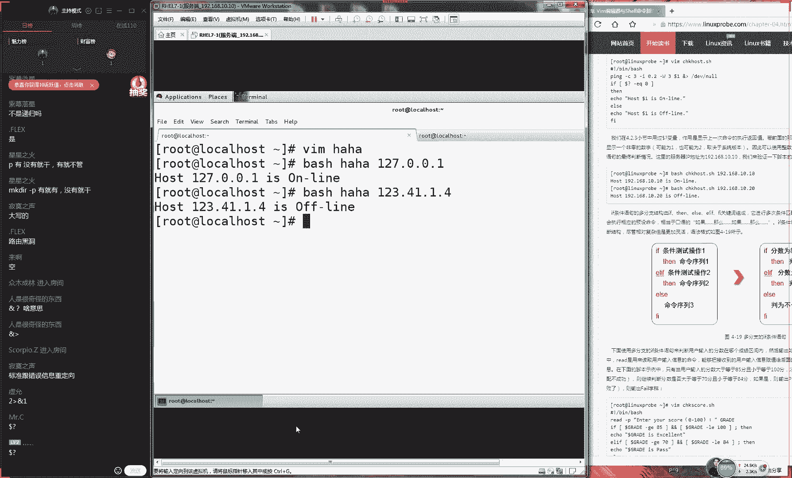
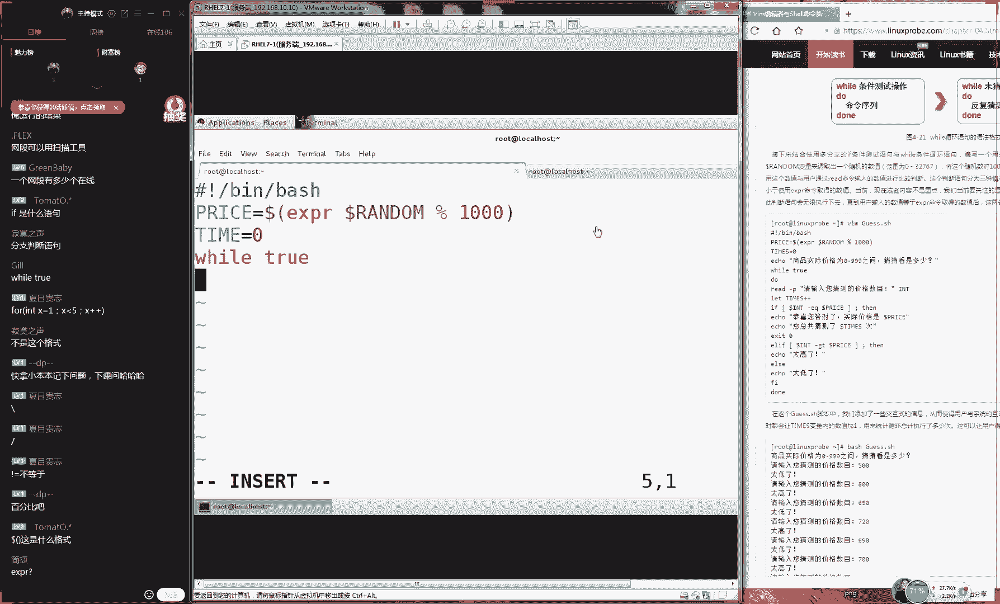

# Linux教程RHCE - P5：5.vim编辑器与shell - 艾弗艾尔思丢丢 - BV1if4y1e73V

That's not what is he doesn't look what I found。🎼No need粉色。🎼Thank you。🎼话说不给鬼步。😊，🎼错发言归风。😊，🎼的知由。🎼がね。

🎼问太阳多的男安。😊，🎼好来変怎 my妈妈。🎼아비 딸게 마で。🎼Ca she from the drama。 only one not do it be me。

🎼Go something happened。 the song is a smile。🎼So much space learn from the out amazing。🎼なわない。

🎼The quiet that no need searching。🎼对。🎼。🎼阿そ 밖에鬼步。🎼Thank you。🎼让so发给贵妇。😊，🎼Thankグレ。🎼个 next。🎼けね。🎼。🎼なけな。

🎼一幕幕。🎼一阵阵翻转人生。有。啊，好，那我们先看一下有90位同学了。好，那我们准备开始上课。同学们那我们先打一下一吧。嗯，行，然后因为刚才我们人数比较少，刚才只有8几个同学，在我们我们刚才等了一下。

现在有92个了我刚看一下你们聊天记录所以我觉得们有可能成为史上第一个讲技术还被涉黄封掉的频道就是我们好好上课啊，我们频道被封的话，到时很尴尬对吧？那行那我们来继续给大家去说一下我们今天这个第四小节。

我们编辑我们脚本，其实大家在想到就是说我们其实在下一盘很大的棋，对不对？因为我们从第一节课开始就在想着为我们这个第四章节做一些铺垫。因为我们第一节课啊，我们主要去讲解了我们这个系统的一个历史。

第二节课我们就去安装了我们的linux系统，第三节课我们去学习了我们的命令，然后我们的第四节课就是我们的第三章节我去学习的管道复以及我们还有我们这个通佩服他可以将我们的命令给我们的这个文件以及我们两个命令之进行一个。

😊，有机的一个搭配了。最后的话呢我们上我们的昨天又去学习了我们的编辑器VM然后我们就可以向我们的文件里面来去写用内容了。所以你这样来捋起来之后，那你就会发现，然后你先忌会了我们的命令。

那你就会去使用我们这个管道服，将我们命令进行有机的一个结合，并且我们还去学习的变量，我们还要去学习了我们的呃，那我们要去学习了，如何去编写你的文件。所以现在你就是有能力去来去编写出来一个s脚本。

那我们今天就是只缺我们到底该怎么样去写脚本的一个思路就可以了。所以的话呢那我们今天这个实验会给大家，哎为这个课程来讲的话呢，呃是非常有意思的。今天我们会给大家去做很多很多的实验。

根据我们的不同的实验来去写出来我们这个s脚本。然后并且的话呢我们这个难度也是一个阶地性的一个增长的这是一个。😊。

很有呃很有意思的这么一个过程。好，那我们现在的话进入到我们这个系统里面，给大家先来说一下我那我们一个最为基本的一个s脚本的话，它怎么样去来去编写。那我们首先大家要知道啊，它这个本的话。

它分为两种的这个工作模式，它也有一种叫做这个交互式第二种叫做批处理。其实的话呢批处理就是我们之前已经写好的一个脚本，它会按照我们这个预定的一些顺序啊，然后它自动来去帮我们去完成一些工作。

而我们这个交互式的话呢，是需要我们这个用户来进行一个交互式的一种互动的形式来去输入参数啊，输入内容什么的。但是因为这个我们还暂时没有遇到过。😊。

这个非常像我们第六章节里面要给大家展示到那个叫做这个F这么一个命令但也非常像我们这个里面要去给大家去叫做tget这么一个命令。它是一个交互式。但是我们现在非常可惜我还没有碰到这两个实验。

那我们就是只能给大家比喻一下，就是说我们批里它就是一个按照顺序来去执行这样一个程序。而我们这个交互式的话呢，则是需要我们用户进行一个交互的进行一个内容一个交换这么一个脚本。那好。

那我现在给大家来去演示一下好吧，然后我们待会通过我们这个实验会给大家去多做几个实验，大家可以知道我们这两个到底有什么区别的。即便说您布置的它有什么区别的话，其实我们在编写本的候。

要的这个功能它能够实现的话也是可以的对叫做这个好，那我们现在给大家来去说一下我们一个最为基本的一个本的话呢。

它其实来说它是由三波去组成出来的大家不要说说我们之前我看过一些本或者说我之前看过一些我的同事或者说。😊。

同学们，他们去写那个程序都特别的复杂。其实我也是我也见过一些人去写出来那个程序，可能会多达上千上万或者几十万行这样的一个程序代码特别的多。所以的话呢而且很呃用到一些调用关系什么的，会很麻烦，很乱。

所以的话呢我们今天这个课程也会给大家讲那么深的，但是这个难度肯定是要有。但是我们会从基础开始，从零开始给大家去讲，先从一个最为最为基本的一个我们的组成的一个部分来给大家去讲起来。

还是按我们这个老套路先讲理论，然后我们带入到实践里面，大家来套一下去看。但是我们一定要去学理论的，这样的话我们才可以。😊，知道我们后面该怎么去做。那现在的话呢我们先来呃给大家说一下。

在我们这个下午脚本里边的话呢，那它是由三步去组成出来的。它第一部分它是一个井号，一个叹号开头了，这个叫做脚本的声明，它一般来说我们要这样去写，叫做B里面的b，它指的就是由它可以由哪个这个终端。

它来进行一个执行。这个那也就是说指的是下面我们的脚本，它可以被哪个程序来去执行。因为的话呢我们一直再去学习的就是B里面的b，所以我们写出来的程序，那你写不出来别的。因为我们下我们再去学习英语。

那那你用那呃那你去写出来这个呃作文之后的话，那么你肯定也就是一个英语作文了。所以说我们这个脚本的声明的话呢，主要就是指的待会可以由哪个程序来去运行。那我们可以统一写成B里面的bsh。

这个我们叫做脚本的声明，大家可以记的书上面不要光知道这么个格式啊，我们它这个专业的名词，我们叫做脚本的声明信息，哎，我们叫脚本的声明，它是一个井号。😊，叹号开始了这么一个信息。下边的话呢。

我们还有一个叫做脚本的注释。这个注释的话呢，主要是对于我们这个服务的功能，就是说我们脚本的功能，或者你对于某一个参数的一种解释或者说明的信息，这个内容可以有，可以没有，可以有很多行可以只有一行。

那么我们把它叫做脚本的声明，这个内容话大家可以随便去写，这个没有关系，这个只是给人去看的程序，它是不会去读取。这个我们叫做脚本的注释信息。最后的话就是我们一定要有命令的，对吧？如果说你们有命令的话呢。

😊，那么那那那那那那比如说我想敲什么命，我想去敲这个PWD，然后我们解释一下我们单目录像，他他有哪些文件。最后第三部分就是本这个命令了，大家知道就是在我因为我之前我看过一个频道啊。

然后在一个小说里面去介绍过说在这个清朝以前的话呢，在高考的这个作文里面的话，他有一个固定的格式，大家知道什么？就是在清朝以前，然后在这个因为他们有高考制度，他们有那个复亲赶考这种科这种科举制度，对不对？

他们那个作文是他们没有数学题，他们没有英语题，他们那要用叫叫八股文。那你知道这个八股文的话呢，他呃虽然说很考验智商，对对？但他有一个固定的格式，当你想要去说一个什么事之前，那你要先套上他那个格式。

然后你才能去说这段话。那好，那那那咱比如说你是一个不学无术的一个秀才然后那你想要去进京去赶考。结果的话呢，你其实什么都不会但。😊，你就套一下八股文那个格式，你也能够套出来很多很多字，但是这没有意。

但是但呃但是这也没有任何意义的。因为你只是个大的一个框架而已。你前面的这个注释你写的在好。咱比如说我这个呃前面的这个声明，还有我们这个注释，然后我告诉你说我这个功能的话呢，我可以。😊，控制航天宇宙飞船。

然后呃我呃我的这个程序我们可以上呃上天入地，我们可以控制美国的核弹头。好，那你这个接那你那你这个注释写的是再完美再厉害的这么一个说明，但是你这个功能它达不到的话，那也是白扯了，对吧？

所以我们三个部分缺一不可。而这个核心呢，就是说我们必须要有这个脚本的命令，命令是我们的核心本的声明跟注释，他们两个是它只是一个我们那我们叫做是一个框架而已。它里面的血肉骨头，我们核心还是我们的命令。

好了，那我们现来去说一下我们脚本的命令的话呢，那么实际上就是我们的lad的命令了。那我们作为一个那我们最为简单的一个少脚本啊，但是大家但是大家先看一下我们这个效果，这是我们最为简单的一个少脚本的话呢。

实际上它就是将我们的多个命令进行一个堆积。然后他按照从上往下这个顺序来去执行就可以了。好，那我们现在呃来来去来去执行一下好吧，来去编辑一些我们这个脚本。😊。

我们教本名称无所谓啊，所以说我现在把它叫做叫做哈哈吧，无所谓。我们给它创建出来一个文件。然后我们先去写上我们这个教本的注释。我们想脚本的这个注释B里面的bsh。😊，好，怎么样这个同学很厉害。

真爱彼此同学一下子就把这个八股文一下子就给他写出来了啊。这个应该就是我们清朝这时候那个秀才，我们应该必备了这么一个功底啊，这个是很厉害只不过可能是不可能是学串了，高考估计用不到它了。

我估计写话老师不知道这是什么东西。行，那我们现在给大家说的话，这是我们一个脚本的一个基本的一个格式了。那大家看到我们的第一行是我们的脚本的注释。那我们待会给大家去写大家知道了，号开头的话呢。

我们做这个脚本的注释信息，这个是我们本的声明信息。那我们这个注释的话呢，可以写可不写可以写一行可以写多行这个是无所谓的啊那他比如说上这么多信息。那这写的很规范。大家以后工作的话呢。

一般来说是对于本的声明这个注释指的是对于这个本的功能或者某一个。😊，参与数的一种解释或者说明信息，写的还稍微的规范一点。因为我们这个只是。😊，呃，一个随便给大家写着玩的这么一个介绍啊。

所以大家呃感觉这么个就感觉这么个意思就可以了。好，接下的话呢那我们就要去往下面去写我们脚本的命令了。那我们的命令的话呢就是PWD显示一下我们当前所在目录，然后是显示一下我们当前目录下它哪些文件。

好中式可以用中文文它是可以用中文的。但是因为我们现在没有中文的输入法，所以就不可以你需要安装一个软件叫做ipbuIBUS然后就可以去输入中文了。但是因为我们这个呃没有去学。

而且它需要你去先安装去配置出来你仓库，然后才能去安装这个软件。所以我们目目前来说是不能够输入中文的这个库的话呢是我们在第八章给大家讲到的。😊，好，那我们现在给大家来去保存一下我们这个脚脚本了。

其实大家可能会觉得哎这就讲完了，其实就这个这个把它讲完了，其实它已经讲完了，因为它就是由三部分去组成出来的脚本的声明本的注式脚本的命令，所以大家可能看到这个感觉不太相信老你在骗我们吧。

这根本就是这根本就不是一个我们想象中的一个脚本好不好？这个太简单了，对吧？但是我们这个课程还要从零开始去学。今天我我们会给大家去写出来三次失行的这个本它特别的多。

但是我们要从基础开始给大家去介绍一下我们它一个组成的一个三个的一个框架。好，进行一个保存啊，我们现在给大家保存一下，好，这个太简单了，对不对然后我们现在来查看一下我们这个脚本里面的内容，没有问题。

后接下我们来去执行一下我们脚本。因为我们现在的话没有去学习第五章节的用户的身份及权限。所以我们现在不能我们现在还不会啊，那我们如何去修改这个文件的权限，那个是我们的明天给大家去讲的课程。

所以的话呢那我们现在统一给大家去使用。😊，啊，对，我们同意再去使用到这个bash呃这个命令来去执行我们这个脚本。好，大家看到那我们现在就是同意使用到这个bash来去执行我们这个脚本。

我们尽量不要去修改我们文件上面那个权限。那个是我们下一章节的。如果大家想去学，那我我呃也能够讲，但是。😊，那那不就乱了嘛，对吧？那我们先这那我们今天这个核心还是应该放到我们是要这个呃脚本上面的。

所以我们今天的话统一来这样来去执行。等啊等我们明天的时候就自然会如何去修改我们文件这个权限敲一下回车。

并且我们明会学习我们用户的文件所有者所有组好我先来看一下的话显示出来以下信息这个话实际上就是按照顺序先来执行一下我们的WD这么一个命令，然后他要去执行了一下这么一个命令。

它实际上他就是将我们的命令的话呢，按照我们这个顺序关系来去依次去执行了。而已很简单，你看对他只要有一个读，他只要有这个读取权限就可以了。他不需要有这个执行权限。

因为我们再去使的是这个命令来执行的那你看以说我们先这个命令的话实际上来就是这写123456789你按照你的这个顺序，你就直接按照这顺序往下去写就可以了。而我们这个脚本之。😊。

了之后，它会是从上往下的顺序来去执行，这个很简单so easy，对吧？但它实际上来讲它就是这么一个关，它就它就是这么一个原理。把你写的这个shall的命令的话呢，从0到1从上往下去给它执行一下。

这有点像说我啊。😊，因为我不会做饭，对吧？但是呃我的父母很爱我，我的妻子很爱我，我怕他们怕我饿死，所以他们会给我们去他会给我准备出来一个呃做饭手册，对吧？然后咱比如说因为我真的是什么都不会啊。

然后然后就是比如说他会给我一个呃做菜的一个顺序关系。咱比如说第他这个第一步去买菜，第二步洗菜，第三步把西红柿皮给包了，第四步把西红柿和鸡蛋放到锅里，第五步放由第六步朝第七步吃好了，那你看1234567。

那你只按照这个顺序来来来把它给执行了的话，那么就可以完成你想要预期这么一个工作了，可以把名单放到一行用到符号用到符号去间隔，也是可以的。好呃，那我们来看一下的话。

实际上这个就是我们一个最为简单的一个脚本。但是这肯定是不符合我们日常工作这么一个需要。但是这个也是可以去完成的。😊，那我们工作的时候，它有一个比较特殊的一个点。

就是说如果说你的第三步没有啊那也就是说呃如果你在某一步没有完成的话，那那那那么你后面的这个步骤，那么也就是不能够去完成了。咱比如说以我那个例子来讲的话啊，那我第一步去买菜，第二步洗菜。

第三步我们去摘菜好了。第一步去买菜，但是我不知道菜市场在哪里，那我就不知道怎么去买菜。那结果我那我的第一步就已经是失败了。那我就不能按照这个顺序没有买到菜，那你怎么去摘菜做菜吃菜，对吧？

那么我们这个顺序关系也要根据实际的情况来去调整。如果说某一步它没有成功的话，那我们要给他一个预备的一个方案。再比如说。😊，呃，我们第一步没如果没有完成的话，没有买到菜的话呢，那我们可以去点外卖，对吧？

那我们叫其他的这个备选方案。这个话实际上就是叫做条件测试语句，叫做条件。😊，哎，条件测试语句。他会根据我们这个。呃，输入的内容的话呢，还有我们系统的这个情况来进行一个判断。如果说它成立的话。

那么则会去来执啊执行里面的这个语句。但是如果要是失败的话，那么它会去执行一个备选的一个方案。我我们把它叫做条件的测试语句除了这个之外话我还一个叫做这个循环语句。它会根据你一定的条件来进行一个循环语句。

这个是我们待会要给大家去一下并且的话们还要一个问题啊，大家看到我们这个命令来说我们的命令它就是一个文件，那我们来去执行这个命令的话，那么我们看一下效果来展示一下说我们当前目录下有哪些文件。

然后我们来去使用的杠参数那你可以看到那我现来去展示一下我们当前目录下，有哪些文件对？们杠显示一下我们这个文件相的这个属性信息，那给大家提个问题好了。

为什么当我现在使用的去查看我们目录内它有哪些文件的这个信息了。而我们再去使的杠去显出来我们这个。😊。

文件呃，在这个目录里面所有文件这个属信息的的时候，那我们只要加一个杠L参数，它就可以显示出来以下信息呢。😊，为什么我们加这个杠L参数，它就可以去显示出来我们以下的信息呃，咱咱或者咱换句话说。

为什么我这边加了一个字母，然后我们所看到的这个内容就是不一样了。那那我们再来换一个，咱比如说呃LS杠A那我们这样的这个结果的话，他们它又会是不一样了。那么我们为什么会加不同的参数之后。

我们就看到效果也是不一样的。大家可能会想到一个比较浅显的一个呃答案就那就是说因为你加了这个参数了，所以你看到的这个结果是不一样了，但是这个太过于浅显了，我们再来想一下。😊。

那我们来想到说为什么我们家的这个参数，那我们这个脚本它就一定会给我们显示出来不同的这个信息。那么它这个底层来说的话呢，这个他呃他就怎么样去预来去预设好的，或者说他这样去设计的这样的这个解释可不行。

因为我们现在再去学习的就是脚本，你们也要动手去学习到它对吧？那么你就那么你就不能说这是作者的事情，那我们不关心这个可不行，我们定要知道他底层他怎么样去完成的。所以的话他这个底层他怎么去完成的。

这个我们先暂且还不知道，但是我们能够猜一下呢，它有两个功能，他肯定是要有的。第一啊对大家说这个作者是这么搞的。但是你现在也要做作者了，那么你怎么去搞呢？那好，我给大家说。

那么他你能够实现出来这个功能的话，那么就意味着两件事情，它意味着两件事情，第一件事情。😊。

第一件事情就是我们的这个脚本的话呢，或者说我们叫做这个命令啊，我们叫做这个脚本命令吧啊，脚本或者我们的命令我们把它统一叫做呃脚本吧。脚本可以接收。😊，用户输入的参数，对吧？

这所以说当你去输入了1个L之后，跟你去输入杠和L的这个其他的时候，效果是不一样的。所以说那它也就是有能力来去接收用户啊，接受用户输入的这个参数。这是我们第一点，我们需要知道这么一个共识。

第二的话就是说我们脚本可以根据用户输入的参数进行判断。这个这是我们的第二步它需要能够去完成的。所以说我们去细分一下。第一来说你要能够去知道用户的一个表达的一个参数，它给我们赋予的一个内容。

第二就是说我们还要根据内容的不同。当你去输一个杠的时候，跟你去输入一个杠A的时候，结果是不一样的。说明它里面去它去完成了不同的工作。😊，而这个的话呢，它就是指的是我们对于参数的不同。

我们要有不同的这个判断以及去执行这啊还有不同的这样的一个功能。那好，那我们现在给大家说一下的话呢，其实在我们这个脚本里面，它就已经能够去做脚本的这个参数的接收了。

那么这个它已经是在我们系统里面是有的那我们只需要去调用就可以了。它里面有几个比较常用的一个变量啊，我给大家去介绍一下，就是说这几个变量的话呢，实际上来讲，它已经在我们系统里面是有了。

而我们需要做就是去调用和使用就可以了。对我们第一个我们叫啊，大家已经会抢答了。那我们来去说一下我们第一个我们叫这个话它指的是我们脚本的这个名称，大家可以打开的书籍。

我们给记到上面但说也有第一话我们叫做脚本的命令，或者说你叫做命令的名称，好吧命令的名称。😊。

脚本的名称吧，我们比较规范一点。好吧，我们比记写更加清楚一点。第一的话呢，我们叫做脚本的名称。第二步的话呢第二个参数，我们叫做dollar井号这代表就是总共接收到的用户这个参数的个数。

总共接收到的参数个数哦，另外给大家说一下啊，然后今天我问了一下咱们那边红的考场，他们已经把北京考场的这个安排已经呃制定下来了。因为我们同学们之前我约了好多考生，对吧？然后我这边在北京已经约了。

我约了约了6场呃有11月24号，11月25号，11月26号，11月27号11月28号这6天都可以预约。然后我现在已经开始呃然后我今天问了一下，他们已经确认了，所以说如果北京的同学你们想考的话。

你们可以下课之后跟我来联系了。但是其他的城市我们目前还没有消息，因为北京这边我们直接跟他们去沟通的话，比效率比是比较快一点的。所以我们第一手。😊，拿到消拿拿到这个考试的这个时间了。

而且我们也是我们呃已经是最最呃已也已经是最大的一个能力了啊，去约了6场。等于说我们约到月底的6场都我们被我们包揽了啊，所以说这也是很这也是红帽，他很给面子了，对吧？好。

接下的话呢我们来去说一下我们叫做dollar星号。这代表就是呃分别接收到了这个参数的这个内容是什么？分别。😊，呃，因为我们说过嘛给大家去约月底，所以我们从24号约到28号。

整个总呃就是总共这个月底这几天我们都给他包了啊，分别呃接收到的。😊，接收哎，等一下等接收到的参数内容是什么？好就是说我们其他的考就是其他城市的同学们，你们听完之后也不较着急。

因为现在我们考场安排起来会比较的麻烦，然后可能会比较周期比较长一点。正好北京的考场已经出来了，所以我提前跟他们说一下，如果想要去考的话呢我我等到礼拜一吧，然到时候会给大家发消息的。因为今天礼拜六对吧？

然正他们都休息了。我们其他的考生的话，你们可以再去关注一下我们最晚吧正就是25号吧，等到下礼拜123不多就应该会有回复们红帽他们班也挺慢的。好，接样话呢我们下面还有一个参数。

我们加你看啊他就是说他以这个ll符号开始，然后后面是阿拉伯数字，这代表就是他还会有很多了啊，这代表就是他总共接收到了这么一个参数的个数。😊，这也是我尽的我最大的这个能力给大家去约到了，大家应该可以知道。

就是也学实不容易呀。我们一下子给大家约了月底的机场，我们都给他包圆了。好，这代表就是第呃，就是代表就是第一。😊，23个接收到的参数是什么。好，大家可以记一下我们这个笔记啊。

然后这就是我们胶本里面内置的参数，它呃就这个变量，他这个代表的含义，待会我们给大家去玩一下，好不好？先不用着急。上海的话，现在啊我刚才说是啊我刚才说错了，我刚才说错了，我说是12月份我都有点过糊涂了。

当然咱不能当然啊当当然咱不能约11月份了。我刚才说是12月份了，不好意思，我说是哎乱了，已经你看我所以说我我我就不能一边讲课一边收东西是12月24号25号、26号、27号、28号这几天。😊，啊，对。

一共是5天时间啊，12月的。然后上海的话，广州深圳目前一点消息没有，因为我给他们发过这个信息，说我们要去约考场，但是没有回复。但是现在只有北京那边，因为我们这边只有联系嘛，就拿到在这个考场信息了。

所以大家如果想去约的话，可以下课之后跟我去说，现在不要着急，大家应该能能够猜到，我现在在讲课，也给大家去报不了名。好，那我们现来记一下我们这个脚本这个变量的这个作用，好吧，先拿起你的笔来去记一下笔记。

😊，哎，现脑现这个已经不是口误了，只是我脑子不行了。哎呀，我都有点觉得我啊很年轻嘛，然后一下子得到老人痴呆了。😊，而且我今天嗓子不太感觉不是很好啊，我今天一边说话的时候，总会感觉就是哎呀感觉不太对劲啊。

😊，好，是因为我今天吃的太少了吗？下课之后我再再去吃点饭去啊。好，那我们接着笔记同学们先不要聊天啊，他们在聊天，是因为他们写好笔记，他们在干扰你们，你们一定要写好笔记，把记到你的书上面。

然后大家下课之后啊，你尽量去找一个颜色比较鲜艳一因为你看到我们这本书为了为了偷工减料，对？后我们这本书，它是一个它是一个白底黑字的这么一个很常规的这么一本书，它也没有颜色，所以的话呢你去记笔记的时候。

你就不要用到那么你就不要用到黑颜色笔那个太不显眼了。那么你应该去找一个蓝颜色或者红颜色笔你去写出来的笔记，这样来说对于你更有用处的内容，对吧？那么你就可以更加醒目一点，去体现出来它了。好。

接下的话呢我们来继续啊，然后我们待会儿。😊。

给大家做这么一个实验，先继继续去编辑我们这个脚本吧，给大家去来玩一下啊，现在去写上一个我们脚本的声明，叫叫做病里面的它是由我们的病里的可以来去执行了这么一个脚本二话本的这个注释，那我们就可以写上无所谓。

随便你随便你们随便啊另外我们笔记写稍精一毕竟你拍传你的博客上面的？万一有一天有一个国学一个大师这个笔记好漂亮，我收你为弟子对不？那你好好去写笔记。

也是有帮助的万一你过半年之后再一看自都不知道写什么东西了。好，那我们先看一下我们本，我们开始去写同学打起精神来了啊，好，我们现在回归到我们的这个正题了。

现在的话我们去使用输出编量信息现在输出一个叫个指的是我们脚本的这个名称。所以话我来一边给大家去写啊，然后一边给大家去说，然后我们再来去。😊，输出来一下叫做dollar啊星号吧呃dollar井号哎。

你看我现在脑子确实不行了啊dollar井号，我们看着井号说了个星号，dollar星啊，doll啊dollar井号，这代表就是我们总共接收到参数的个数。好，接下来的话我们这个doller星号。

它指的就是我们接收到参数内容分别是什么？下边的话呢，还有我们这个。😊，呃，我们还有我们它指的是我们接收到第一个第三个第五个我们这个参数的值具体是什么。

然后大家先问到说我们考试的一些环境信息什么的大家说我们考试的一些考试的一些问题的话就暂且先不说啊，去上课那我等下课之后再给大家去说为有同学他们不想去考试。

他们不太着急的同学他们可能就会还是希望说我们上课讲上课事情啊。好，那我们先来去一下我们这个这个脚本。那么我们本的上面这个内容的话呢，就是我们上面去写这一堆的信息。那我们我们这个参数。

那我这样去写ABCDEF那我我们敲价回车之后，大家来去预测一下我们输出信息会是什么样子的好吧，大家先去打一下，说大家话来进行一个预测。那么你认为当我们敲下回车之后，我们能够。😊。

看到的一个结果或者什么？那我啊大家按一边去打啊，然后我那我这边的话呢，也会给大家同步的去打一下，大家看我们猜的是不是一样的啊，我们是不是心有灵犀。😊，好，那我们现在的话先去写上我们的第一个哈哈，为什么？

因为我们看到第一行信息的话，它输出的叫做dollar零，这个指的是我们脚本的名称。而我们先看到交本的名称的话呢，它就是叫做哈哈，所以说第一行肯定叫做哈哈那那么肯定是叫做这个哈哈。第二啊。

所以说我们讲课的时候，我们一定要把门关紧了。万一有一个人，然后从我们的这个房间旁边路过，然后听到有一个人很诡异啊。每天晚上7点钟到到到9点钟的时候都会在房间里面堆电脑哈哈笑，所以这个很恐怖一件事情。

你因为你们现在在听我讲课，所以可能不会觉得很诡异。你们自己想一下，如果你在路过你父母或者说你家人的房间的时候。😊，像他们在房间里面在笑，我觉得这个也是而且笑得很诡异，也是哈哈哈哈这样笑。

我觉得也是很恐怖一件事情。好，我们就井号，这代表就是我们接收到参数的个数，所以我们可以看一下他们个数是为7。因为你看因为你可以这样去数一下ABCDEFGOK那我们数完之后它是7个。

那么就是7复制一个逗号，然后是分别是什么呢？那么分别是ABCDEFGOK那么是7个哎反了吗？ABCDEFG我呃我没反，对吧？嗯。😊，好，第二个的话呢，就是我们这个。

然后我们下面一个就代表就是我们接入到了第一个第三个跟第五个参数。所以我们可以算一下，那么就是AC还有呃A逗号C逗号E好，这那么这就是我们预测的，就那我们待会我们签完回车之后。

应该会给我们体现出来这么一个信息。大家看一下你们预测跟我是不是准确。然后以及我们预测的这么一个呃理由是什么？大家一定要准把去充分分析一下。😊，好然，那我们先敲一下回收。

大家看一下我们这个结果是不是一样的。😊，哦，那我们来看一下我们这个结果。果然的话呢是跟我们这个预测是一样的。这句话就是我们这个几个变量，它实现出来这个功能。哎呀，今天嗓子不是很舒服啊，今天是午怎么回事？

天气有点变化太大了吧。好，接下来的话呢我们来继续给大家去说，那我们现在就是会了我们第一个功能了，就是说那我们那我们就回我们第一个我们需要完成的事情了，就是我们要能够。😊。

对于我们这个脚本里面这个参数的话呢，它进行一个接收。那么就是能够去接收用户数的这个参数。那我们现在也有能力来去接收用户数的这个参数了。那么接下来的话那我们的第二步骤就是要对于我们的没有感冒吧。

我感觉可能就是因为有点着凉，但是还好也没有感冒症状。然后那我们第二步的话就是要根据我们用户输的这个内容的不同。然后我们来去调那么来去调整我们这个脚本的功能。那好，那我们第二步就是要进行一个判断了。

那我们既然既然你能够去接收用户数的这个参数，第二步我们进行一个判断判断我们用户输的参数是什么。然后我们来根据用户数的参数是什么，然后我们来进行一个功能的一个调整。那我们这个判断的话，它分为了4种。

它第一个我们叫做文件测试。第二我们叫这个逻辑测试。第三叫做整数值整整数值比较测试那么以及第四个叫做字符串的一个比较。那我们主要这个重点的话呢，还是我们这个。😊，数值跟我们这个文件测试语句。好。

那我们先给大家讲一下，我们这个测试语句的话呢，它是使用一个中括号把它给括起来的。他记住了这个中括号的里边的话呢，是必要那么它呃是必须要有一个空格的，它这个两边必须要使用它必须要是有空格来去做间隔。

然后我们再去写上我们这个功能。咱比如说我们现要想判断一个文件，它是否是个目录的话呢，那我们就这样去做使用一个杠D，代么就是它是否是一个目录。然后我们判断说它是否是一个唯一一个目录。大家注意一下。

呃如果说您没有加这个空格的话，那我们现在敲一下回头之后的这个结果或是这样子的。😊，啊，那我们来看一下，大家如果要是没有加这个空格的话，那我们这个结果它会是这样子的。他会告诉你说我们的这个命令它没有找到。

那好了，那我们现在需要把它这个里边给大家加这个空格。么这就是一个小这这就是一个我们必须要去注意的一个点啊，就是我们这个空格可一定要有让我们再去敲一下我们的回车。

那我们现在可以判断出来我们这个目录它是否是一个目录文件。那好了，那我们怎么样去知道我们的这个结果呢，那我们就这样去输出使用这个啊那去使用到这个ic一个问号呃，这个代表就是我们上一条命令，它是否是成功的。

这代表就是上一条命令它是否是成功的。它如果为零它指的是上一条命令，它只执行成功的意思。那给大家去总结一下啊，问号这代表就是判断上一条上一条语句啊，或者说我们叫做测叫做这个测试语句吧。

测试语句是否成功为零则为成功。😊，呃，则成功非零值。那我们指的就是它有可能是一，它有可能是负一。一般来说它都是一啊。非零值，我们说比较啊就是说比较这个严谨一点，则为失败。那好了，那我们现在来去判断一下。

说这个文件它是否是一个目录文件的话，那我们就后返回值是一个零，说明的话呢，它确实是一个目录文件。那我们再来判断一下。😊，判断他是否是他是一个普呃，他是否是一个普通文件。那我们这样去做。

那我们再来输出一下我们这个结果。这个时候他会告诉我们说是一因为它并不是一个一般文件，它是一个目录文件，所以它会给我们显示出来一个报错。好，这个零算成功有点刁钻这个为零算成功有点刁钻。

这个它是一个程序的一个规定。这个它所有程序他们都会去满足那们都会遵守这个规定的就反如果是为零则代表就是程序删一个这个程序直径是成功的。好，它也是一个判断成功的这么一个体现。那我可以再来去判断一下。

咱比如说那我想要去判断一下这个文件它是否是为一个文件的啊，那判断说这个文件它是否为一个一般文件它是一个配置文件呢，那我们可以来显示一下我们的结果。他会告诉我们说它是一个我们的一般文件。

或者说我们可以理解成它是一个配置文件，再后我们可以这样来去判断判断一下我们对于这个文件它是否有一个读那我们是否是有进行一个读的一个权限。然我们可以来去判断之后，们结果是为零。😊。

所以的话当你去写脚本的时候，那我们也可以这样去做。那么你先来去判断一下，就是说你对于某个文件，你是否有这个读和写这个权限，然后你再去写入这个信息。这样话会让你这个程序它更加的这个灵活。

如果说你都没有对于这个呃这个文件进行一个读写的这么一个权限的话呢，那么你就要来去执行一下备份，就是其他的这么一个预案了。好，接下来我们再来给大家玩一下，说那我们判断一下这个文件它是否是存在就可以了。

因为我们知道这个文件它们都是为文件，但是文件类型是不一样的那我们现在如果只去关心说它是否是存在就可以了。而我们不关心它这个类型的话呢，那我们就这样去做。😊，好，那我们就这样去做。那为什么大家是127。

它所以啊所以说我们叫做这个非零值，如果不是为0，他们都代表就是失败的。好，那我们来输出一下这个结果，它告诉你是零，代表就是你的上一条语句的话呢，它是执行成功的这个目录，或者说它是一个文件。

它是一个真实存在的那我们先给大家去换一下。咱比如说那我们先换一个它不存在这么一个结果的话呢，这个时候它也就会给我们显示出来是一个非零的一个值。好了。

就说那我们可以通过这个中括号里面加上不同的参数判断出来我们这个文件，它是否在它是否不在，它是否是一个文件，它是否是一个目录，它是否有这个读写执行相关权限。这个我们把它叫做文件的测试语句。

这个它不能使用到管道符。😊，这个他不能是使用到管道符务，他要使他要去使用到叫做逻辑操作服务。这个叫做与或飞，它需要去使用到这么一个三个的这个叫做呃逻辑操作服。好，那我们给大家来去展示一下。

大家可能想要去实现出来这这个功能啊。就是说那我们能不能将我们这个测试去跟我们这个最后显示出来这个结果，那我们来进行一个合理搭配呢，那我这样跟大家的这个呃更加灵活，以及更加高效一点。其实这也是可以的。

那比如说我们再来判断一下，说判断一下我们这个文件它是否是存在的。那我们才后再回车。他告诉我们说这个文件它确实是存在的。好了，那我们我那我们现在这个关键点就是说我们是否能够对吧？

他想大家想问到这个问题就是说那我们是否能够将这个两个命进行一个结合，把它给变成一条这样的话，那么也节省了我们去敲两次回车去判断两次这样的这个很繁琐这么一个过程了，其实是可以的。

但是这个逻辑上我们叫做逻辑语符号这个。😊，这样去写这个我们叫做逻辑的语，这个我们叫做逻辑的非，这个我们叫逻辑的或，这叫我们这个我们叫做逻辑的操作服。好，这个大家如果要是学习过C语言的话。

可能是对于这个是有理解的。那么就是说这个指的就是给大家记下笔记啊，如果大家没有学习过没有啊，没有关系，我给大家去说一下，这个就是说当上一条语句要当上一条语句。😊，执行成功则会执行后面的语句。好。

下面的话呢就是说那我们的逻辑的货它指的是当我们的上一语句，它是执行失败的话。😊，他则会去来去执行我们后面的这个语句。它这个关键点就是说这个的话代表就是如前面成功的话，它则会去执行后面的这个语句。

第二个逻辑的或，它指的是若失败的话，它则会去执行后面的这个语句。这个我们叫逻辑的非，它指的就是对我们判断值取反。对判断值。😊，取返。好，那我们来H一4给大家去说一下啊，这个先不用着急。

说这个语句是可以执行成功的对吧？然后大家说看到这样也可以去执行成功。但是这个不太符合就是说我们这个逻呃逻辑测试时候的一些规定。因为我们家去演示一下，就是说你判断数字的时候。

其实你用到这种大于号小于号其实也是行的。但是它有些时候会让你这个程序有一些意想不到的这样一个报错。所以我们尽量按照我们这个规范来进行操作，那没有错误啊。那我现给大家看一下。

就是我们尽量给大家讲的非常的规范。好，那我们现在给大家去判断一下这个结果是这样的。现在两个进行一个合并。若它判那来进行个判断。若我们这个文件它是存在的话，那我们就一个逻辑的语。

它代表就是若我们前面判断这个文件它是存在的那我们就给大家显示出来一个叫做存在这样一个字样，它代表就是若前面的语句它是执行成功的话，那么才会去执行后面的这个语句。所以说当我们回车之后看到了这个字符。

那么也就证明了我们上个语句也是成功的，证明我们这个文件。😊，也是存在的。好了，接下来我给大家来去演示一下，就是说那我们来如何来去呃去使用它这个逻辑的货呢？那我们可以判断一下说若我们这个文件它是存在的。

😊，啊，那我们就不要进行任何的这样的一个。呃，操作而我们这样一个逻辑的货，那我们就给大家写上，他说不存在的。他指的就是说我们来去判断一个文件。若这个文件它不存在，那我们给大家随便写一个。

它不存在这么一个例子。大家看到它指的就是若我们判断这个文件，它如果要是不存在的话，那么也就是说判断是失败的这样的一个结果。😊，那么他才会来去呃啊他才会来去执行我们后面的这个语句。好。

那我们来去猜一下回说看一下这个结果，他果然他就会去输出来说没有存在这样的一个字样。但是说如当我们再去判断出来一个文件，它要是真实存在的话呢，那我们就不会看到我们这个字样了。

因为这个条件它是判断成功的而成功的一个结果，他不会来去执行我们后面的这个语句了。好，那我们现在可以看到就是说我们这个逻辑语跟逻辑或这么一个搭配使用。其实来讲的话呢，这个还是比较简单的。

那我们也可以将我我们这个呃逻辑的非给他加到里面去，他代表就是一个呃取反值。我之前看为一个新闻啊。😊，我我。这是我之前看过一个新闻，说啊有一段说有呃说有一段夫说有呃说有这么一对夫妻。😊，然后的话呢。

晚上做梦的时候，他们同一时间都梦到自己中奖了，中了500万。后来的话他们起床之后，后来打请家了，后来还离婚了，对吧？就是因为这个梦境跟现实是不符的。

后来他们好像因为说分为这500万的这个呃钱不知道该怎么分，然后分的不均，然后就就还居然是离婚了，对吧？但有看过这个新闻，这个这个也不是段子啊，我是记得是2017年的一个这个好像是一个很正经的一个新闻。

大家可以去搜一下，就他们会他们去梦丹己去中奖了。好，其实这个话呢就是去取反了。咱比如说那那我们再举个例子啊，那你像一个女生去表白。然后然后那个呃然后的话那个女生说可以啊，然结果第二天他就反悔了。

因为她说昨天因为是4月1号嘛，是这个愚人节，所话他就是说若你前面是为就这个取反值的意思就是说。😊，呃，这个取反值的意思就是说，若前面若前面成功。呃，不，若判断成功则变成失败。啊，再取反的话呢。

若失败则成功，那我们给大家取一个反值。就是说我们来啊之前如果你中彩票了，那么则判断是一个失败值。如果你呃之前没有中奖，那么则会给你去中奖。这样的一个效果。好来啊，今天嗓子不太舒服，怎么。😊，啊。

大家先稍等，先我去喝口水啊。OK那我们来继续呃，这就是我们对于一个值进行一个取反的这么一个操作。真的是很奇怪啊。我们今天上课之前还我这我今天上课之前还挺好。那么一上课之后嗓子不太舒服。

继续给大家看就是我们对它进行一个取反我们成功变成失败失败成大家演示一下觉得这个说的比清楚的给大家说一下说判一个文件它是否是存在的那断它是否是存在的那我加这一个叹号这样表就是说判断它是否是不存在的意思。

好大家可以来看一下这样话表就是判断这个文件它是否是存在的。而我们面加一个叹号的话判断一下这个文件它是否是不存在才会再回车那我看一下们结输出来下就会告诉我们说它是一个非零值。因为这个文件它是存在的这较绕。

为我们中国人说较直白很少会用到种否定式。因为。😊，可能外国人比较说这种否定式说的比较多。咱比如说呃我怎么可能不会不爱你，对吧？像这样的话比较的绕，但是我们中国人就会说我爱或者不爱不会那么绕。

而我们这是一个否定的，就相当就是把我们这个测试结果前面加了一个不啊，我们之前判断这个结果它是否是存在那我们前面给大家加一个不，就是说判断它是否是不存在的那我们这一个取反值。好接下给大家去说一下。

就是说那我们是这样也可以将我们这个件测试语句的话呢，跟我们这个逻辑的语跟我们这个逻辑的，还有我们的这个逻辑非进行一个相互搭配，这个也是可以做到。就是我们将三个逻辑测试语句给大搭配到一起。但不用担心啊。

就是我们刚给大家去打基础。我们待会给大家去做一个整体的一个实验。好，那我们现来去输出来一个变量，我们叫做user这个指的就是我们当前登录的用户名称。😊，呃，杠对对对啊，大家说到这个杠F是一般文件。

应该我们判断说文件它是否存在它是否是存在的话，应该使用是是这个杠E好，然后那我们现在去看一下这么一个变量的话它指的就是我们当前登录的用户名称它是什么那我以这去判断那我们以对于我的变量进行判断的判断一下说这个变量的值的话呢。

它是否是等于的是root。那我们需要注意就是它这个两边这个空格去做间隔的。但是说你里边有没有空格就这个有没有空格这是无所谓的我来进行一个判断我来输出一下问号，它告诉你是零。

因为我们当前登录它就是超级用用户好，那我们现在进行一个逻辑的一个判断那我们现在这样去判断一下说它是否是一个超级用户ro我给反过来说那我判断一下它是否它不是超级用ro大家能够理解？

加上一个非前面我们加上一个非是一个否值啊有。😊，脑壳疼有点，是不是呃感觉还好吧嗯。😊，这个大家觉得很这我已经这样的话，我们就稍微快点。然后当然我们可以去看一下我们今天那个实验，我觉得这个还好吧。

就他不就是一个取反嘛，对吧？然我们之前判断是说他是否是为 root用户我们在判断取了一个反指的是判断他是否他不是入用户加一个字取一个反我之给你500万，但是5。

我之中500万但是我现在中5是取一个反我之前中500万我中500万说家袋给大家说那我们判断这个结果的话就是判断他是否并不是超级用户ro如果成功的话呢，那我们就会给他去输出来。

他只是一个普通用户的意思为我判断他不是超用ro告诉你只是一个普通用户而已再一个逻辑的非指的是如判断失败的，指的是超级用户么就输出。那么你是超用户root我输。😊，一下结果。

他就会告诉我们说你是超用户ro这么一个结果。好了，我这样说完之后可能是大家有点绕都会有点绕不过来，对吧？所以我们对于我们这个量，我们再去减少一点。好吧。

那么还那那我们还是去讲一下说如何来对于我们这个变量来进行一个判断，判断一下说我们当前中的用户，它是否为root。如果他为超用户ro的话呢，那我们就给大家去输出来你是管理员这样的一个字样。好。

那么如果说他不是超级用户root的情况下，那我们就会给大家去输出。那么你只是一个普通用户这样的一个字样。好，那我们去敲一下回收。😊，好，那么他去敲一下回车，他告诉你说，因为你是超用户root。

所以说他会告诉你说你是管理员这样的一个字样。那好，那我们现在把同样的一个命令，我们呃呃原不动给大家复制一下。然后我们登录到另外一个用户身份下。但先不用担心我怎么但不关心我怎么去这个切换的啊。

等到我们明天的时给大家讲到的好，那我们现在敲一下回车，你看到同样的命令，我们去敲完了之后，他就会告诉我们说好尴尬，他说呃他说我们当前入呃到当前我们还是管理员因为我们切换的时候没有使用一个减号。😊。

好，那我们现在切换到一个普通用户身份下，然后我们再去执行一下我们这个同样的这么一个参的这么一个命令。😊，啊，然后还很尴尬啊，他还是告诉我们说我们。是管理员，这个这个这个怎么可能这个很打脸啊。

而这个从逻逻辑上来讲好像是讲不通。但是我仔细看一下，具体有什么问题。好吧，我来去输出一下我们这个user，它应该不是等于是入er。你看到他这个匹配出来的这个值肯定是不一样的那但是的话。

他为什么要后面去输出来我们这个逻辑语的这个内容呢？😊，呃，我们诉的时候，我们去切换的时候，我们去加上了这么一个减号了，应该是没有问题的对吧？嗯，然后我仔细想一想说我们为什么，好吧。

这个先不用担心。我看一下说这个等号问题呢，这个有可能好，那那我们换一下啊，就是因为我们这个等号的话呢，我们把它这个中间给大加上这么一个空格。那我们这样给大家再去做一下。好吧。

那我们在这个超级用户个呃那我们在超级用户ro身份下，我们来去去敲一下我们这个命令，那我们结果还是管理员。那我们切换到一个那那我们来去切换到一个切换到一个普通用户身份下。

那我们再去执前一下我们这个命令的结果的时候，他就会告诉我们说，那么你只是一个普通用户了。😊。

这个话它就是比啊它呃它就体现出来，就是说我们在同样的这么一个系统环境下。但是我们因为判断出来是不同登录用户的名称，然后我们最后那个结果也会是不一样的。

然后他呃会判断出来说逻辑的与跟逻辑的或这样的一个实验。那好了，所以说我们这个空格的两边还是不那我们这个等号两边它还是要空格，大家去强调一下啊，等号两边。😊。

我答成这你要这样去写吧。因为今天不太嗓子不太好，所以可能我说话可能不是很清楚。所以我现在给大家来去打出来。然后我把需要加空格的地方，大家都给大家写下笔记。好吧，那我们先这样去做。

这是我们刚才一个命令对吧？好，那我们先这样去做我们需要加4个空格第一个空格加到我们中括号的里边，然后的话呢是我们等号两边，这几处我们需要加空格，大家去留意一下。这个是一个我们比较比较规范这么一个写法。

因为给大家解释一下是这样的当我们在这个等号两边加这个空格的之后，它它代表就是进行一个呃比较但如果说它是没有空格的话，代表就是一个变量，对于一个值进行一个复值的这样的一个操作。对它这个呃如果没有空格的话。

它指的是复值的意思这我们需要来注意一下，所以说我们有时候就感觉自己很苦逼，对不对？因为我们不像windows不习比较简单的这个操作系统，吧。😊，他只要你敲对代码就可以了。我们的代码明明是敲对的。

那么就只不过是因为我们少了空格，或者说我们多了一些回车或这样的这个这样的这个很不经的这样的操作符就他要要他要有可能判让我们这个结果是出错了，所以说这个一定要去留心一下这个空格问题。那好。

那我们现在给大家演示一下这么一个效果，就是说我们判断这个逻辑的语和逻辑的非然后为我今天可能说的不是很清楚啊，可比较重。然后大家再去总结一下，大家不要大家不要也嫌烦。我们来说一下我们这个逻辑的语。

这个话它代表就是当我们的前面是成功的话，成功的话才才会去来去执行我们后面的这个语句。这个话代表就是我们前面这个语句是判断失败的话呢，那我那才会来执行我们后面的这个语句。最后那个逻辑的非这就叫做取反值。

这我们之前判断结果的话们前面加上这么一个不好。😊。

今天我可能说鼻音比较重啊，但是我会把我们待会会讲这个所有的内容，我们尽量给大家打出文字来，这样的话，你们基本听不清，但是你们能够看得到，对吧？然后那我们先看一下我们对于我们这个数字进行比较。

它的话就是说我们叫做这个整数比较了。那咱比如说我们现在想要判断一下这个非常简单啊，我们做比较简单的实验。那咱比如说那我想要判断一下说是5是否大于等于是三呢那我们才会再回车，然我们来去输出一下结果。

这个例子其实非常简单的，他告诉你说五它是否它是大于了3那好，那我们再判断一下说五是否大于等于是8呢，那我们算一下，可能是它是不等于八，对不对？条件测试是失败。

但是我们先看一下这个结果它它还会告诉我们说它是为零值，它表示成功的那也就是说在我们这个系统里面，我们的五大于等于是8吗？它是否大于了8呢？所以我们这个测试结果才为0。其实这样它是错误的。

因为我们知道在我们这个系统里面，我们的大于号。😊。

不光是比较大小的这个我们叫做什么东西，叫重定项，对不对？大于号叫做输出重定项。而我们这个小于号的话呢我们叫做输入重定项。它是跟我们这个大于号小于号是相冲突的。包括说即便说你这个等号。

你也跟这个负值符号是有冲突。所以说那你这个大于小于等于你这个三个符号，你怎么对于数字进行比较，那你都跟系统里面是有冲突了。那我们那么我们第一你那你要去做这个转译，要不然你就要用到专业的这样的一个操作符。

所以我们可以看到我们的表格4-4，那我们给出来我们对于数字这种专业的比较操作符。那我们对于数字比较的时候，我们千万不要有一种侥正心理。好，那我们还用到这个大于号小于号。

那我们一定要用到这个专业的这个操作符来进行判断。好，那咱再那我们那们再给大家做这么一个演示。但比如说判断一下说是否大于等于13，那我们就这样去做大于等于3，那那我们看一下我们的表格。

那么就是杠之它是否是大于等于的意。😊，🤢，那我们才会再回车，他会告诉你说这个呃返问值是0，证明五大于等于3。好，再往后的话呢，我们来说判断五是否大于等于的是8。那我们看一下这个结果。

它会告诉你说判断结果是失败的5，它并不等于的是8。好，这是一个我们都知道的一个常识。但是我们现在可以让我们的系统来告诉我们说它确实它是不等于是8。那么以及这个条件测试它是成功或者失败这样的一个情况。好。

那我们这样的话呢我们再给大家去做几个演示。但比如说判断一下说八是否大这个八是否是等于的是吧。那我们就啊杠啊杠EQ。那我们这样去判断，然后最后那个结果的话呢，那么也肯定也就是为0。😊，好。

那么我们可以看到这呃那么啊呃这个的话，它就是我们对于我们数字进行比较这么一个方法。大家也以看到我们可以对于我们数字来进行比较。为什么呃为什么？😊，哦。

没有看明白说呃我没有看明白这个同学提的这个这是什么问题啊。好，那我们来继续给大家就是说，这就是我们对于我我们我们这个数字来进行一个比较的一个方法。那我们具体这个比较它有什么用处呢？那我大家去演示一下来。

我们来去使用到这个free杠M这个话它这个这这个话它是我们之前讲过的，它是用来去查看我们这个内存使用量这么一个命令，那我把它缩小一点，因为把它看因为把它看不清楚啊，所以我现可能自己要调比较大一点。好。

我再把调稍微小一点。对它是查看我们这个内存使用量情况的。好，那我们再把它缩小一点。😊，哦，大家说到为什么为什么是为兆，对不对？因为它的话呢，我们加上一个小写M，所以它是它它是以兆为单位。

如果说你加是G的话，他们就是以GB为单位。如果加是以T的话是以T为单位。如果加是一个小写H的话呢，它是以它会自动去来进行一个定位，它是一个更加自动化这么一个判断一个显出来信息。

那好那我们现在以兆单位来去显示出来我们这个呃内存使用量情况。其中的话呢那我们需要关心的是这么一个数值。因为这个数值代表就是呃我们呃这个当前可以被使用的一个空闲字它有多少。

那我们先告诉他那我们先空有727个兆嗯。😊，那我啊那我们先呃这个空间有727兆的这样的一个空间。那我们想要对它进行一个判断，判断它如果它小于1个GB，那我们就给系统报警。

其实这个来说它就是一个非常简单的一个报警系统了，它可以对于你这个系统进行一个实时的监控。好，那我们可以记一下我们这个笔记。当我们工作时那大家可以通过我们这个实验来做一个自动报警这么一个系统。好。

那我们现在这个核心的关键就是说我们该如何来去提取出来我们这个的值。那我们就这样去做。在按照我们这个暗行来进行一个提取。那我们就来去取出来这一行的这个关键词使用到管道符将我们命令前面的这个输入信息的话呢。

交给我们的这个后面再来进行一次处理。那么我们来去处理的结果就是过滤出来我们包含有了指定关键词这样的一行这样话我们来去提取出来我们这一列信息。但是我们先看到这个间歌符的话呢。

它不它它并不是一个冒号也并不是空格，它也许是table键。😊，我说他是这个空格。那么当如果说我们并不能够去确认它到底是什么呢这个情况的话呢。

那我们现在就可以这样去做使用到一个我们的这个命令叫做叫做这个AWK，我们来去提取出来我们这边第四列的信息。但是我们今天这个课程里面不会去去深入去讲解去建到这个命令的。

我们只用它去提取出来我们这个第四列的信息，去提出来第一列第二列第三列第四列这样的这个信息。好，那我们再回现在的话为它是属表式里面的一个命令。后单据学的话估计也要很长时间。

而且很多书里面当一本书去讲了这个命令的。所以说我们现在这个课程的话，就先去暂且使用它来去提取出来第四列信息就就这样此而已的。好。

那我们现在提取出来我们这边第四列的信息就提取出来说我们当前我们的这个内存我们的这个可用量情况是40那么现在是728个好，那我们现在对于我们这个值来进行一个比较。其实我们昨天的话我们去学习。😊。

提过一个操作符，我们叫做反引号。这个话就是说我们当时我们昨天啊去学习了AWK啊，那我们的话当时我们去学习了AW不不，我们当时去学习了这个哎双引号，还有我们这个单引号，还有我们的反引号。

大家大家应还记得对吧？😊，那么我们今天用到这个反引号了啊，对我们现在使用的叫是这个反引号。好，那么我们现在去选择这个反引号，它代表就是来去执行我们里面的命令。好，那我们先在给大家去玩一下。

就是说我们现将我们这个整套命令的话呢，那我们给它全部给它扩起来，然后那我们就然啊能把它给扩起来。😊，然后我们来进行一个判断，使用到一个中括号啊那我们就呃中括号的这个里边的话呢，还要记得加上这么一个空格。

那我们后面给它进行一个比较。那么如果说我们想来判断说小于的话呢，那么就是这个呃杠，它它代表就是判断它是否是小于多少的意思。那我们给大加上是一个呃小于的话数值为1024G是它就为了它就是一个GB的意思。

那我们才有假回车。但我们现在可能比较长，我给大家去写下，大家可以看一下我们命令的话，是个翻译号的话代表就是执行我们里边所括起的命令而只取其返回结果。所以呢我们这个命令的结果就是我们当前。😊。

他剩余的我们这个。可以去使用的内存的这个值，它是以兆为单位的这就是我们这个翻译号里面的这样的一个作用。因为我们刚给大家去拆分来去讲解的啊。然后看到我们接下来去判断一下。

说这个数值它是否是小于了一个GB们个GB它就等于是1024兆，所以说我们将进行一个判断。如它没成功的话那我就后面加上一个逻辑的语觉得这个子这个是比较详细的啊，让我给大家加上说它如果要是小于1024的话。

那么就会给大家去输出来说内存不足，那这样的一个提示的一个字样。但是说我们也可以使用到我们昨天学习到这样这个管道符给大家去输出来，就是一个来去发送一封邮件。

或者说我们写入在一个信息里这样话我们可以做一个自动报警的一个系统。那么如果说他要是小于他如是小一个GB的话，那么就会去输出来内存值是不足这样的一个字样那么敲一下回车。他告诉我们说这个信。😊。

已经是显示出来了，但是你也可以加上一个逻辑的飞啊，但是没有那但是呢就是意义不大了啊，就是说我们可以加上这么1个OKOK它指的就是如果我们这个条件，它是成呃，他要是成功的话呢。😊，呃，他要是如果失败的话。

那么那他就会去疏出OOK它指的就是内存值，它是足够的。好，所以话大家这个看起来因为我因为我感觉这个比较长啊。如果说你第一次去看，我估计你是看不懂的。但是我我们是把每一个小细节。

包括每一个参数啊是给大家讲出来的。所以说我觉得大家对于这个命令的话呢，应该呃能是理解的。好吧。如果刚才没有讲清楚的话呢，那我再给大家去说一下啊，是这样的，这个命令的话呢，它虽然长。

但是他要它是有几部分去组成出来的，那我给大家去拆分出来去讲解一下，就是说当你去学习到这个命令了之后啊，会感觉很爽才对。因为这个大家可以聚集到你这个书上面。到时候你工作的时候。😊。

这这个就是一个很呃很轻量级的这么一个脚本了，大家不要大家不要瞧不起它但是他但是它就很实用的啊。并且的话呢你会发现今天我们刚刚讲到第五节课，但是你已经能够读懂这么大长出来这个命令了。

虽然说但是也许现可能还是思路比较模糊啊。那我再给大家去说一下。那它是有几部分组成出来的话，它是由这样组成出来的。

第一部分它是有一个双引号引起来的这么一个命令组成出来的这个命令的话这个整体它是用来去提取出来。当前我们这个内存使用量的这个情况，是我们当前内存可用量的情况，它是以兆为单位，它是由几部分组成出来的话。

它是由两部它是由三部分组成出来的。它第它这边的话第一部分它指的就是我们内存的这个使用量情况。第二部分啊它这个第二部它使用这个管道符进行一个衔接。第二部分提取出来我们的这个物理内存的使用量情况。

第三部分那我们提取出来。😊，信息，那么就指的是我们当前内存。呃，可用的一个空间大小啊，那我们就啊那那我们就来呃就来以我们刚为例的话，那么就是728兆是我们当前还可以就使用的这个呃空间的一个大小。

然后我们来进行一个输字的一个比较。这个它比较就是说它是否是小于的意思。如果它为小于一个数值的话呢，那我们就进行了一个输出的一个信息。大家可以看到，如我们这个前面这个条件，它要是全部都成立的话。

那么就代表就是说当前我我当前我们内存的使用量情况，它确实是小于于了一个GB的话，那我们就会来去输出来后面的这个语句。如果它没有满足条件的话，那么证明它大于了一个GB的话呢。

那么就会去输出来我们这边呃一个成功的一个。好，那所以说我们当我们回收之后。😊。

他就会告诉我们说。呃，内存不足这样的一个报错。好，这个命可能看起来比较长啊。但是我们可以对于我们的内存去进行一个非常简单的一个判断。其实这还好，对吧？因为我觉得这个还是嗯不是很难。

但是但但是我们看可能比较长一点，就感觉很复杂，并不是很复杂。好，然后我们接下来给大家说一下我们对于这个字符串来进行比较的话呢，其实我们也可以对于我们这个使用一个杠Z参数。

但我们想要去判断一个这这么一个变量它是否是已经被使用的话呢，那我们就可以使用到这个杠Z但比如说那我现在去查看一个变量，它里面是有值的，证明这个变量它已经被人使用了。

那我们再那我再去查看一个变量这个变量的话，它里面没有数值，证明这个变量它就没有被人使用。那当我们要想去定一个变量的话呢，那我们希望什么问题说反引号是什么意思。这个我刚才解释过吧。

就是这个反引号指的就是执行我们反引号里面的命令而只取其反回。😊，结果就相当就是把我们里面的命令来来呃来进行一个执行，然后取出来它这个结果就是显示到你们屏幕上面的一个内容的意思。然后就是这样的一个效果。

好，这样的话呢我们来。😊，就来判断一下，说那我们怎么样知道我们某一个变量它是否已经被人使用呢？那我们就可以使用一个小写的Z来进行一个判断。第一个为，那我们这个变量的话呢我们叫做这个user。

那我们敲一下回车。然后我们来去显示一下我们这个返回值。那我们般它这个返回值它如果为零的话，证明我们这个变量它也没有被人使用。它如果为一个非零值的话呢，它代表就是这个变量它已经被人使用了。

所以我们可以看到我们这个变量哈哈这个变量的话，我们需要加这么一个doll符号啊，进行一个提取这个我们没有加我是一个失误，我们再给大家操作一下。好，那我们加我们这个哈哈这么一个变量。😊，的一个名称。

然后我们敲一下回收，看一下结果，他就告诉我们说这个变量它没有被人使用。所以说这就是你再去写脚本的一个小技巧。那么你定一个变量之前，那么你就可以先对它进行一个判断。如果它没有被人使用。然后你再拿过来去啊。

那么你再进行一个赋值，这样避免你跟其他人的这个变量会产生这样的这个冲突的这样的一个情况。好，那我们接下的话我们再去写上我们这个脚本这个一个测试语句了。😊，这边还有一个小实验，是判断我们系统语系的好。

其实这个非常简单。但是我给大家讲一下吧，就是说我们之前学习的一个一个变量，我们叫做啊这个language，它是用来去显示出来你系统语呃啊它是显示出来你这个系统语系的那我们可以看到的话。

当前我们这个系统语系是一个英语。然后的话它这个格式是一个。😊，呃，格式为UTF杠8。它其实我们可以进行一个比较的那咱比如说我们进行一个判断。如果我们现在判断的这个值。

所以我们今天如果是你之前没有去做预习的话呢，就开始有难度，就还比较绕，就还绕不过来了，对吧？比较这个烧脑。好，那我们进行一个判断。那么我们如果说我我们判断一下我们的这个语系它视为英语的话呢。😊。

那我们就会去输出来啊，它是一个英语的这样的一个字样。把吧放大一点啊。

那我们就会说出来它是一个英语语系的这么一个字样。好，这个其实没有什么太呃太大问题，对吧？😊，那我们前面给大家加上这么一个非判断一下，就是说我我那我们这个值是给他趋反，判断一下说他是否他。

他不是一个他啊他并不是一个英语的一个语系系统。那我们现在给他这样去做。那我加上这么一个逻辑的货。那我们来去输出来说它不是一个英语语系的系统。现在就是对它进行一个非常简单的一个比较了。

判断说它它不是一个英语语系这么一个系统，我们才会再回车。然后最后我们先哎我们这边然后是少了一个中括号。我们来看一下这样的一个结果。😊，我们这边啊中国号写的错位是，是这样去做。好，这边少了一个空格。

我们先写到这边。好，那我们才会再回车，他就会告诉我们说他现在没有一个返回制被输出来。因为我给大家继续解释一下啊，因为的话呢我们先看到我那我们这个四种语系它是跟我们这个变量它是不符的。

因为它两个它身它两个它就是没有去符合。而我们现在举了一个反，那么证明它里面这个值就是一个符合的一个情况，证明我们这个测试语句是成功的。所以我们为来来去时间那我们这后面的这个语句的话呢。

其实我们后面加上这个应该加上一个逻辑语这么一个符号，这样话它才代表就是如果前面成功，我们才会直接我们后面这个语句。好，那我们再回车它就会告诉我们说我们没有判断成功，它是一个非一个英语的语系的一个系统。

好其实我感讲完之后绕进去了。因为这个例子举的比较多，但是我们这个核心来说的话，就是我们这个测试语句的话，它分为了4种，并且的话呢我们判断之后，那我们可以使用到这个呃语或非。😊。

来进行我们对于判断结果的这么一个。呃，嵌入式这么一个处理。好了，待会我们来说啊，就是真的是比较乱。我们刚才举举的那几个例，但是例的比较多一点。😊，好，接下来我们来捋一下思路来去给大家往后面去讲。

那我们今天我们第一话呢，我们要啊今天反正我感觉有点乱了。因为我们可能第一次去给大家去说到这个测试语句，中国人说话比较直白，可能会老那可能不会用到这种否飞的这个语句。就说我们之前如成功的话。

前面加这么一个叹号就成了一个失败了好我脑子也有点住了接给大家去说第一的话我们这个结果我们叫做条件测试语句，那我们就来对他进行一个条测试语句，成功的话，那我们就会来去执行某一个语句。而我们这个失败的话。

那么就会去执行我们另外一个语句，再给大家举个例子，这个子我们用很长时间了，们买手机比如说我们现在11月17对吧？我明年2月14号我们情人节也不了。比如说你的女朋友想让你去买一个手机。

那么你就去买一个现在比行是苹果手机吧？那我们就要去买一个苹果手机。但是苹果手挺贵的，那我们一手机可能要达到8000。😊。

点以上。那我们就要进行一个判断。如果说你的这个金额，那么如果说你的这个存款大于了8000块钱的话，那我们就可以去买一个iphone手机。好了，那我们就可以显上这么一个iphone的一个手机图标。

其这就是我们进行一个呃，那我们呃它就是进行一个调音测试这么一个。😊，比较简单的这么一个例子啊，他让你的这个用户可以知道我们该如何进行一个条件的一个选择。如果那那咱比如说我们这个生活上。

如果说你要是没有钱的话，那么你去买手机的时候，那么一定会被拒绝掉。因为你没有因为你没有这个条件嘛？所以那我们就要进行这个条件测试语的判断，如果你的条件成功的情况下，那么你才会去买一个iphone手机吧？

那好了，那么你这个选择，我们这样去写那我们去写第一个脚本，我们叫做哈哈那么那我们还是以哈哈为例。那我们本的书是可以不用去写的那我们这样去做先定一个那我们先去写一个if吧就这它有这样的一个格式。

那我们进行一个条件测试语句，那我们判断说如果有一个文件刚一直的就是该文件它只要是存在就行了。而我们我们不会去关心它里的这个格式，那我们这样去做还有这个红米是不是没有先买小米行。

这都是我们待会给大家讲到的。那我们现在判断就是说判断一下我们这个目录它。😊。

否是存在就行了，或者说判断一下这个文件它是否是存在的那我们千万加上这么一个叹号。因为我们刚才举个例子比较的乱啊，大家可能听起来有点抽象，但是我们现在在看起来时候就比较好一点了。

就是说判断一下这个目录它是否是不存在的。判断一下说啊这个啊它这个目录是否是不存在的，然后我们去显了这么一个字。因为的话呢我们现要去开始我们后面的这个语句了。然后我们就创建出来这个目录了。啊。

如果说这个目录它是不存在的话，那我们就要去那我们就来创建出来这个目录。然后因为我们现在没有按照书上面去创出来变量啊，因为我觉得这没有意义。好。😊，就也就要太过于复杂。那我们然后把它给结束掉。

那么就叫去选一个FI。因为的话呢我们现在上面给大家讲一下，就是进行一个条件测试语句。呃，那么啊判断一下说。😊，呃，这个它的这个目录如果说没有存在的话呢，那我们就会来去执行里面的这个语句。

而这个语句的这个效果的这个功能的话就是来去创建出来我们对应的这个目录。好了，那我们敲一下回车把它保存起来。这就是比较简单这么一个脚本。那我们在边的话去查看一下说这个目录的话呢。

这个目录文件它确实是不存在它之间它是不存在的然后我们来来去执行一下我们这个脚本敲一下回车再去查看一下我们这个目录，它就会告诉我们说这个目录它已经是存在了。

刚P代表是递归代表就是一个多重创建的意思我们之前给大家讲过代表就是如果说我们创建出来这个目录它是有一个迭代关系的话，它是有一个它是有一个因为我们给大家举个例子，是那个A里的B里的C吧？

如果它有一个签到关系的话呢，那我们就要去选一个刚P参数来这样来进行一个递归操作的那好，那我们看到就是说那我们之前没有这个目录。但是我们通过我们的判断把它创建出来了，这就是我们第一个。😊。

我们叫做单分支的田啊，这个的话呢我们叫做单分支的条件测试语句，我们就要把它做成功了。那咱比如说我们以生活上为例来说去买啊，那么我去买手机，大约的8那啊那我们大约大约8000块钱，那我们就买手机。

那我们小于8000块钱呢？但是如果你的女朋友还是个果粉，他除了苹果手机他们都不用怎么办呢？那我们还有第二个选择就是回家，对吧？那么你还有第二个选择就是回家了，那不能说家都不回了。

那我们就是说有那我们有了第二个选择就是回家，这个我们叫做双分支的叫做条件测试语句。😊。

呃，如那他指就是我们要是如果一个条件他没有成立的话，那我们就会来去执行我们的第二个条件测试语句里面的这个结果。好，那我们以那我们以另外一个例子为例，好吧。

因为我们觉得我们都给大家讲一样的例子的话呢，可能是比较省事，也比较好理解。但是我们不好大家去发散自己的思路。所以的话呢我们既然在每个实验里面，我们都会给大家去来去取出来不同的例子来去发散一下大家思维。

知道这个脚本的话呢，它这个应用场景它是非常广泛的。但是大家需要打起精神来去记下笔记。那我们去拼一下这个脚本的功能的话呢是来去尝试去拼一个主，它是是在线这样的一个功能。

拼的话它是来测试网它是用来去测试网络在线这么一个情况的一个命令。杠拼的话呢我们来去拼一个杠C3，它指的是拼三次的意思杠指的是每一次间隔是0。2秒。

然后是这个杠这个它是一个杠的一个大一个W它指的就是每次的这个最大间隔时间是3秒，就是说它最大这个超它最大一个超值的一个时间啊，是最高是3秒钟。然后他就会去匹配下面。😊，这个语句了。好。

然后的话呢就是说我们拼一下这个dollar一是它它指的就是我们用户输入的第一个变量的这个参数是什么。然后我们将反然后我们将输出的这个结果给它输出到我们的一个黑洞文件里面。

这个文件的话就相当就是我们在这个系统里面的一个没有呃的一个回收站文件。这个我们叫做回收站文件，或者说我们叫做黑洞文件，所有进入到这个呃设备里面的这个内容都会被自动删除。啊，这样就做叫做黑洞文件。😊。

所有的这个信息进入到里面之后，都会把它给删除掉。这所以的话它现在就是一个呃垃圾箱这样的一个功能。好，那我们这样的一个作用是这样的啊，因为当你去拼一个主机的时候，它不论是在线。

还它它还是不在线的这样的一个情况。我们都会在屏幕上面显示出来这样的这个大量的无用的信息，它会造成我们这个界面非常的这个臃肿，而且很乱。所以话那我们就将我们输出的这个信息。😊。

不对是正确还是错误啊那么全都给大家重新一下呢我们这个呃呃黑洞文件里面保证我们这个界面也非常的清爽。接下的话呢我们来去判断一下。

就是说我那我们这个上一个语句它是否是成功的那么因此就是调取的一个叫doll问号。那么我们如果问号等于的是零的话，那么证明我们上面那个语句它是执行成功的证明该主机那也是存在的那我们就要去输出来。

那我们现这个格式啊，那那我们就要去，然后我们就要去输出来说该主机是在线状态啊，该主机是在线状态。😊，他就是进行一个非常简单的一个判断。然后通过你拼的那个返回值是否为零，哎，这样比较这样比较好理解对吧？

通过我们返回值它是否是为零判断说我们主机它是否是在线。那我们如果要是说个回如说我们这个判这个结果，它并不是为0的话呢那我们就取代去执这第二个语句，么就判断说我们这个主机它是不在线状态，为它只两个状态。

即它在线或者没有在线这样两个状态把掉结掉敲保存名退出我给大家一下，我们本的名称，后面写成一个主机的一个地址，为我配置网我就只能去这样去做1270然后大家说一个符号个问号意思我没有打这个符号吧我打个符号。

能错我是问号的意思这个这个代表就是将我们这个。😊，信息跟我们这个错误信息都给它输出到一个文件里面的意思。这个我们叫做输出这个我们叫做这个重钉相符。好，然后的话呢我们现在来去跑一下我们这个脚本。

后面因为我们拼的是这个，指的是我们第一个接收到的这个参数，所以我们给大家去写上我们本地的地址12700112700我们这样去拼一下它可以看到现我们这个结果的话。

它会告诉我们说主机地址它是一个在线的一个状态。那他告诉我们说它是一个online好，那我们再来换一个它不存在一个地它是无所谓的。我们来换一个啊并不存在这么一个地址，然后你来看一下这个结果。

他就会告诉你说主机它是不在线的。所以说这个是非常有意思的一个实验，可以让你去判断出来这个主机它是否是在线的。😊，好，他那那我们现就那那我们现就会说一个叫做这个双分支的这个测试语句，我们该如何去写。

再往后面去走的话呢，叫那我们叫做多分支的调音测试语句了。那我们除了这两种情况的话，那我们可以有多种，那我们这个多可能是有几条或者说几十条或者几百条。那咱比如说我们来举例来说的话呢。

如果说没有了大约8000块钱。但是我们大约5000块钱的话呢，其实我们也可以去买一款手机叫做华为对不对？那我们也可以去买一个华为手机，其实也可以的对吧？我们去买一个华为，那么如果说没有大约5000块钱。

但是我们大约3000块钱的话呢，那其实我们也可以去买一个小米手机，这都是可以去选择的那我们这个测试语句没有成功的话，其实我们可以有很多选择的一个替补项。

如果说你哪怕你没有大约000块但你大约1000块钱的话呢，你也不用回家，你也可以去买一个叫做红米手机我们也可以去买一个红米手机。😊。

呃，或者说你去买一个呃。叫做什么啊？叫做这个坚果手机，对不对？现在的话呢也是有这么一款手机的那叫做这个坚果手机，价格大概也也就1000块钱吧。那也那呃呃那也就是说我们先对于这个条件测试语计的话。

那我们现在有多种这样的选项。如果我们条件A它没有成立的话，如果我们条件A才没有成立的话，那么就会来去执行我我们的条件B。如果我们的B没有成立的话，那么就会去呃去匹配我们条件C。最后都没有成功的话。

那么才会去匹配这最后的一个结果，就是说它会有这样的一个多重的一个匹配。直到成功了为止。😊，好，接样的话呢那我们来给大家继续说一下我们这个事案的一个。呃，这么一个例子啊。

我们这样来去写判断一下这个用户数的这个乘绩是多少。哎，今天这个感觉这个鼻音很重啊，不知道为什么。上课之前还好好的，怎备上课之后。😊，是我们是那个是哎是水头不服了吗？也没吃什么呀，上课之间好好的呢好。

那我们现下去选一个命令，我们叫做read，然后选一个杠P是这样的啊，这个话呢我我们这个命令叫做这个read，它是用来去读取一个用户输入的一个值，然后复制给给一个变量的意思。

然后我们给他一个变量的名称叫做GLD吧。这个单词意思叫做这个成绩。然后的话呢我们加一个杠P的意思代表就是给他一个提示符，让我们用户知道去输入什么内容的意思。好了，这个大概再给大家去说一下。

因为我们现鼻音比较重，怕大家听不清楚。这话呢这个read代表就是读取一个值读读读取一个值。😊，复值给。呃，指定的变量嘛我们说比较比较这个严谨一点，指定的。变量。发热了吧，没有啊，我感觉还好吧。

我不知道为什么。好，可能是因为物理太热，可能是突然一凉一热的感觉。好，那我们先记一下我们这个命令的这个作用啊，就是来去读取用户数的一个值，然后来去赋值给我们某一个变量。好，那我们这个变量的名称的话呢。

叫做GLAD这是我们这个成绩。接下来我们就可以来进行一个判断了，判断说我们这个呃用户数的这个值，它是否是大于小于或者等于了某个值。好了，其实这个非常简单的一这么一个测试语句啊。

它就是综合了我们之前所讲的这个呃测试语句，以及。😊，我们要给大家就说到叫做这个。呃，多重分支的条件测试语句该怎么来去搭配。现在去使用到一个if，然后我们调取一下用户输入的一个值。

但是我们用户还没有去输入的，但是我们先这样去写。那待会的话呢，我们如果用户输入的这个值是大于等于的是85的话，并且我们需要给大家写成一个逻辑的语，代表就是若两边他们都要成立的话呢。

那我们就要啊去执行我们里边的这个值。😊，如我们这个用户数的这个值是大于等的是85，并且小于等于的是100的话。大于等于85，小于100的话呢，那我们就可以去使用到一个zen来去开设我们后面的这个语句。

但是大家刚才问到说，那我们能不能把它合并成啊，那我们啊那我们啊他能他他这个呃他们两个他们能进行一个合并，它也可以合并的。那你可以把这个zen写到我们这边的这个后面。

但是你中间要需要加这么一个分号就可以了。😊，现在它就是它它就相当就是有两个写法，这样的话他可以帮你这个界面更加清爽一点。它可以介省一行的这个呃空间。

然后就是说那我们可以把这个字写到下面也可以把它写一个分号写到它这个后面再后面的话我就给大家写上说那么如果说你的输的这个成绩是大于等于85于等100的话呢，那么你输的这个成绩那你的这个成绩可真的是极好。

那我给大家输出一个这一个表扬的一个信息。这样话呢就是我们这个我们第二个我们这个分支测试语句。那我可以把它缩写成ELF这样的一个缩写的一个格式判断出来我们这边第二个的话呢。

是是说判断一下这个主判断一下这个主机判断一下这个成绩，所以我现在这个鼻控制不住了所以待家下课之后一定要多喝水了。那我们来看一下的话呢。😊，其实每一次我我感觉就是我们这边不太舒服的时候嗯，也没什么事。

但我感觉就是我怕影响到咱们上课这样的效果，这是我最关心的。好，那我们现在看一下，就是说我们现在用户输的结果大于等是7。且是小于等于是84的话在是我对这个成绩进行一个区间的个定义吧？

那我们进行一个区间的这一个定义后面变量的值我后这号提取出来是我们待会用户输入的这一个变量的值是多少的意思。

但是用户输入的结也不知道什样那么用户输的这个值是大于等于是7于等于的话那我们输出来这个成绩的概是格了就要输出来这个成的值是格的意思。这样话我们再来。😊，就是如果前面两项他们都没有匹配成功的话呢。

那我们就会去执行说这个成绩他没有及格这样的一个提示出来的一个字样。你看它就是是它会啊它有多个这样的一个匹配的一个条件。它使用的是这个进行的一个嵌套。那我们缩写成我们把这缩写成这样的一个形式。

然后进行一个多次判断，直道匹配成功了为止。如果说他们都没有成功的话那么最后才会去执行一个里的一个结果。好，他现在就是一个兜底，大家知道这个词叫做这个兜底。

最后所有没有匹配成功的这个值都会去执行我们这个里的这个语句，它就是一个最后的一个不行的一个方案了。好，那我们现在再来去最后这个结果把它给结束掉。

那我们去使用这个结束掉来跑一下我们这个脚本再跑一下我们这个脚本。😊。

哎呀，所以说有点有点太拉仇恨了，因为北京那边就是北方嘛，它不是有那个暖气嘛？我不知道为什么，感觉一下子怎么那么热。😊，啊，15号来了暖气，现在可能屋子里边跟外面的温差太大了，可能一从外面出来。呃。

一出去再一回来，可能感觉就是。😊，好，那我们那我们来继续来是说来跑一下我们这个脚本。现在的话呢我们调取的它并不是这个dollar一，而是调取的就是我们用户输入的一个值赋值给我们的变量。

所以说我们现在的话敲一下回收就可以了。他现在使用的是这个read，它去读取的这么一个值。那我们现在去输出一下，咱比如说我来去输入一下90。好了，我敲一下回车，他告诉我们说我们的这个90它是成功的。

他告诉我们说它是一个呃。😊，啊，他是一个非常好的这么一个结果。😊，那好，那我们再来去输入一下。咱比如说我输入1个80好，那他他又告诉我们说这个结果它是一个也是及格的。

因为他经历了我们第二次的这个测呃呃测试语句，他也是匹配上了。再往后面走的话呢，我们再匹配一下60。😊，他就会告诉我们说这个成绩他没有及格，他家看到我们这有几个字样是不一样的。

那么因为他最后他都没有表成功，他会去执行了最后那个L里面的那个结果，他执行了我们最后那个语句。好，那我们先看到我们有三个这样的一个示例啊，分别判断我们这个哎呃三个测试语句，最后我们里面的这个功能。

他们都是成功的那咱比如说那我们现在如果输入的这个值，它并不是100，他那我们现在如果输入的是1个150分的话呢，那么请问大家，我们待会结果会是多少。😊。

啊，当我们呃啊在150有点小是吧？咱比如说我现在把它输是1500份，或者说15万份。那么请问当我们敲完会车之后，我们所看到的这个结果是什么？那好，那给大家来去说几个选择性，好吧嗯。😊。

有没有参数来去检查我们的be语句是否正确。其实你可以这样啊去间接去判断啊，就是你看它这个着色功能。这个着色你看啊，如果说你要是写错的话，你看到它是没有它是没有这个它是没有一个颜色的一个变化的。

只有当你写到这个关键词了，然后它才会有一个颜色的变化。这这也实他也是在帮助你它也是在帮助你去判断说你有没有写错这么一个小助手吧。那咱比如说呢我现在输的是1个1500分。那我们最后判断出来那个结果。

那么它会是多少。那那那么有几个选项好。第一个选项它就是ex，那么就是第一个选项，大家可以打一下一那第二个选项的话那么就是pass它匹配到我们第二个我们测试语句的这个结果。

第三个的话呢就是fa就是我们成绩没有及格打一下还有我们第四个就是程序的报错。😊，程序会崩溃，程序包错或崩溃。好，大家打一下说1234，你那么你认为应该是什么？大家告诉我是三，怎么可能是三呢？还有5。

大家说到我没有提到这么一个想法了啊，说为什么是三呢？如果说有一次考试，对吧？然后的话呢呃满分是100分，但是你考1500分，这不是超他他就不是超额完成吗，那不是应该更好的情况吗？

为什么我们最后那个结果会是失败呢？这是我们刚才给大家讲到这么一个。😊，天测试里面的一个语句的一个问题。大家我们可以看一下结果，它确实是一个的一个失败的一个结果。但是为什么是失败的一个结果。

这个我们要来去呃来去学习一下，就是说呃咱比如说有一个数轴那这个数轴的话呢，它的这个原点是在中央。好，然后它这个左边是一个浮穷。而我话这个右边是一个正无穷，这是一个我们这个数学上的一个数轴。好了。

那我们这个数轴的话呢，我们现在取出来几个点。第一个点我们为呃70分，对吧？然后第二个点的话呢，那我们取的是85分。我能这个字写比较错吧，调一条细点。第一个点的话呢，我们选择是70分，第二个点的话呢。

我们选择是85分，第三个点的话呢，我们选择是100分好了，那我那那我们现在取出来三个点了，那我们来进行第一个判断语句的话呢，它是判断说如果说你取出的这个范围是大于等于是85，小于等于是100的话。

那么则是，它特别好这样的一个情况。😊，这是我们第一种情况，对吧？它是我们第一个测试语句。第二的话呢，我们判断第二次，就是它是判断说是否大于等于的是70，小于等于是84。好，这个情况我们叫做pass。

它是一个机格的。但是我们最后写叫什么叫兜底，对吧？它叫做这个兜底，叫做L。如果没有被前面匹配到的这个值，全都算兜底。😊，他们最后都把它算到这个兜底。既然来说我们前面他没有被撇上的这个值。

到底我们这L它是我们这么一段呢？他到他到底是从零开始到70的话呢，还是从我们这边的所有呢？其实我们来讲，他应该是没有配别到了所有的。从我我们这个负无穷到我们这个。😊，6呃到69分。

从我们的80从我们的101分到正无穷，全部处于叫。而我们所说这个从零分到100分是我们人类所知道的考试是你自己的想法，你自己知道考试是从0到100分。而我们系统他不知道你在做什么事情的。

所以说请你大家以后工作的时候，慎用这个一定要小心，因为他是兜底了。所有的这个程序最后的一个结果。如果没有被匹配上的话，他们都会去匹配这个结果。所以请慎重去。😊，使用到这个。

它是个它是一个兜底这样的一个结果。好，接样的话呢那我们来继续给大家去说啊我们一个循环叫做for循环。然后我们待会对于我们刚那个脚本进行一个条件的一个匹配，然后进行一个修整好吧。

好那我们来去学下我们这个for循环个循环就是说当你有一定的这个条件了之后的话，那我们就可以进行一个自动化的一个循环。比如说我想要去自动去循环一个脚本创建出来100个用户的这个信息。

那么其实就可以这样去做。那我们现在创建出来一个文件，这个文件的名称无所谓，无所谓，但是我们里面需要写上我们用户的名称。咱比如说我创建出来一个几个用户，我们叫做张三李4话可以写多个，你可以写9个。

可以写90个，可以写900个。所以说我们叫做多重分支的条件测试语句，它没有个数的限制对吧？它可以有多种选项它细致的话，它出来这样一个结果，就会更精准一点。三李四因为我。😊，可能说鼻音比较重啊。

所以我可能说话就是比较大声一点。大家如果声音觉得比较大的话，大家可以调整一下自己的音响，要不然大家听不清楚。张三李四，然后。😊，然后还有这个王武。赵六好，那我们现在给大家写上几个用户的这个信息。好。

那待会儿的话呢那我们就可以啊那我们那我们待会儿就可以大家去批量出现出来这几个用户了。但是说我现在只写了4个，大家大家可以多写几个。那我们现来去检查一下说张三用户李四用户大家可以检查一下啊。

就是我当前系统里面真的是没有这几个用户不要认为我上课之前就把建好的那我们以来看一下张三李四六他们都没有这几个用户，他里面都没有这几个用户的，然后我们来去写上我们这个脚本这个脚本的话呢。

我们还以这个哈哈为例吧，这个无所谓，我们脚本的名称吧，还有什么鬼脚7啊，张李四卖冰棍，你们都是歇后语一套一套了啊。好，所以说你们除了上课以外，好像都挺强的那我们继续来给大家去说。

所以我们上课之前有同学就说啊，说他听在线培的就是目的就是为了听你们吹牛来那我们继续给大家去说。😊，但是也真的是长今天也真是长见识啊，因为我之前只是给大家转了一下，说八股文。

其实我都不知道什么旗鼓啊什么的这种到底八股里边指的是哪八股，后来今天是长也真是长见识了。好，续我们说一下我们这个其实今天我想给大家去说点段子因为我们今天讲第五天的课程了。

总共就一个半月的时间我们都已经讲了一个礼拜两个礼拜了就讲半个月了。但是今天鼻音比较重嘛，可能说话起来比较费劲，所以我们还是把这个时间都留给讲课吧。而且今天好在这个网也没有断，那我们赶紧给大家多讲点东西。

等到我们下礼拜好不？我们下礼拜的时候一定给大家去讲讲讲段放松一下好，那我们现去写上这么一个提示服，让用户来去输入一个信息。这个信息就是说要为我们用为我们以下用户来去复制的那个密码是什么？

其实大家只要不困的话，不讲段子也没有关系。其实好，因为我们主要为大家变番困嘛。但是今天这门绕。😊，这么烧脑的这样的东西，我估计大家哭都来不及，怎么可能会犯困啊。

那我们现在去使用到这个循环语句给大家来去玩一下批量充建出来拥护的。现在定义出来一个变量，我们叫做you name。然后的话这个变量里面的值它是来自于我们一个文件，叫做users。

就是我们刚才创出来那个文件。所以我们需要使用到c来去获取一下我们这个文件里面的值。然后逐一来去复制给这个叫做 name的变量，大家来需要去注意一下。😊。

这个话待会这个变量里面就会代表就是每一个我们用户的名称了嗯。哎，大家回头之后要出门的话，一定要穿厚衣服了啊，先不要先不要像我这样作死。好，接下来的话呢我们来去。😊，啊。

接下我们来去选用一下这个do是这样的，它有一个格式。然后啊既然我们来去使用的是这个for循环的话呢，它这个格式是一个do，然后是这个当。😊，他是一个。固定的一个格式。好，那我们这个条件的话就开始了。

那我们来判断一下这个用户它是否是存在，叫you name一个变量。判断一下这个用户它是否是存在。然后我们将判断出来这个信息给大家重定一下呢我们的黑洞文件里面，保证我们这个界面它非常的清爽。好。

接下来的话呢我们来。😊，哎呀，所以说你们这一期应该是最懒的，而且是最会聊的啊。你们这一期我我估计写完了之后什么都忘了，都就记得聊天了。好，那我们来看一下的话，其实也好回一下我们气氛。然后那我们再看一下。

就是说判断一下我们这个用户他是否是存在的。那么他如果要是他他要是存在的话，那么记们我们这个返围值为0，那我们就会去输出来说老哥你记错了这个用户已经是存在了，没有什么可以去操作了。那么就退出掉这个循环了。

因为这个用户已经是存在，那么你就不需要再把推荐出来了，那我们就是情况。😊，那么我们要是如果说这个用户它并没有存在的话，那我们就要出建出来这个用户了。出到命令。我们第五章的时候。

那也就是明天给大家讲到的啊，我们叫做usAD命令，它用来去创建出来用户的。我们这个用户名称，我们后面叫做 name它代表就是出来这个用户的信息，然后同样将我们这个用户创建出来的这个过程给重到文件里面。

保证我们这个界面非常的清爽。既然我们使用到我们昨天去学习到这个管道服务。将我们用户所输入的这么一个变量叫做pa我们给复制一下。

然后我们来为这个用户不光能创出来这个用户还能够为我们这个用户批量来去复制我们的密码，这是非常有意思的这么一个实验。😊，好。呃，然后我们来去。复制给一个用户。

这个用户的名称叫做you name一定要对应好啊。如果说你可能第一次不知道对于某个变量这么一个作用的话，你那你一定要知道它下面怎么去定义的这个定义的话代表就是每个用户的名称了。好。

然后我们将用户重置密码这样的一个信息也给它导入到黑洞文件里面保证我们这个界面非常的清爽。所以的话这个呃我们这边的这个后面一步你可以不用去写。但是你的屏幕上面啊会很乱。所以我们建议这样去写上。

那我们那我们接下来去那我们接下来再再来嵌入这么一个测试语句。它的这个目的啊是用来去判断说我们这个前面的这个。😊，呃，密码重置的工作它是保持成功的。如果密码重呃，那啊呃如果密码重置的工作，它是成功的那。

也就证明说这个用户已经有了这个存在了，对吧？他已经是在我们兄里面也他也是存在了。😊，那我们就可以来去输出来说这个用户我已经是存在了。大家需要注意，就是说我们因为用户已经是存在。

所以我们才能够去重置密码成功。那我们就要来去输出来说该用户已经出现成功的。然后说只看考题也能够过考试的话没有怎怎难今讲的不？讲个件测试语句分别为那际们考试的只去考if大家讲课的话，其实为了考试的话。

我们刚才学一些条件测试语句就足够。但是是家东西。个工作去拢那我话出来一个用出来个用户现成功提示来一个字样的我用户失败。为我们来个用户大家只有是成功失败，他没有说他没有第三个情况就像一个小美？

说不结婚结跟不结婚。😊，有两个零和一的选择，没有说我可能可以结婚嘛，对吧？没有这个选择。那好，那我们但是也会有啊。但是说对于我们这个证件来讲的话，只有一个已婚跟未婚，没有说考虑中对吧？

那我们现在就提示出来说创建是失败的这样一个字样。因为我们因为我因为我们现在也不知道到底什么情败。但是只要没有成功的话，归为失败样一个情况因为我们再去使用件测试语句。

所以说掉的后面话这边上面还有一个件测试语句，我们把结束掉。面我写一个循环语句，所以把结束掉把结束掉所以你看到的话我们看到这个命令的非的大家问说缩会好一吧？

大家问说这个是什么意思没有这么打我打是一个逻辑的语一个大于号，应该知道比较熟悉，对不对。😊，解释一下，这个实际上就是将我们这个正常信息跟我们这个错误信息都给大导入到一个文件里面的意思啊。

这个我们其实最好我们讲过东西，大家记笔记啊，因为可能避免说我们下课之后忘记对那我们课大家回答下问题，但我下课之后许忘记了。大家去演示一下我们脚本个比较难？

那没有关系大家做一个简单一点一下我这个叫敲一下回车然后我们这个用户去复制一个密码，然后我们来做无所谓啊然我们就看到说这个几个用户是个创建成功了，然后你再去看到这个几个用户的这个信息的时候。

然后你就可以看到在你的系统里面已经是有的那么这个他就是批量来去。😊，见我们这个用户的一个方法的，他就是来去批量充出来我们这个用户的一个方法。大家看到我们这个循环脚本的话还是比较有意思，对不对？好呃，行。

然后话我们继续来给大家去说如果说你觉得这个实验的话，真的是很难很难得觉得好乱，对吧？那么好给大家举一个比较简单例子。因为是这样如果咱们比较坦白来讲，如果大家之前学习过C语言的话。

可能会看我们今天这个本感觉是小儿科嘛，so easy算什么东西嘛，吧？但是如果大家之前没有去学习过的话呢，就感觉到我们今天这个课程简直太难了，根本就都很难掌握。

因为他因为我们要用到两个小时的时间给大家讲一个编程的一个语言其实来讲的话很难很难话还是大家有一定一个预习的一个过程，这必须要有个必须要有大家说到这个真不难就为之前那你就一定你去学习过C语言。

或者说你学习编程的语言你哪怕你学习过va。你看我们今天这个实验。咱咱就说实在。😊，的啊，大家如果你现在觉得很难的话。😊，呃。就真的要去考虑一下，好好做预习了。因为我我们今天这个课程。

你拿到你的公司那面去，或者你拿到你的同事里面去看的话，他们会笑话你的。这个很简单太简单了，就就就就这个没有什么技术含量的。所以说如果没有还是不太好掌握的话，最好我最好要好好做预习了。但是等到明天的时候。

我会再给大家去多重申几遍我们这个预习重要性的好吧，我们再给大家去说一下，就是说我们第二个我们这个实验了，好吧，我们来去改进一下我们上一个脚本，我们跟上一个脚本有一个去拼我们主机它是保持在线这么一个实验。

其实我们可以这样去做定义几个主题地址，127。0。01，这是我们本地的会员地址肯定是存在的。然后的话呢我们来去写上一些不存在的一些地址。后大家可以看一下我们现写上一些不存在的一些地址。😊，好。

我们写上一些不存在的一些地址。我们写一个存在地址，再写上一个不存在的一个地址。啊，当然不用写太过分啊，不能超过254就可以了。好，那么接下来的话呢我们就给大家来去玩一下。

就是说那么如果说你现在有一个列呃主机的一个列表，那我们现在写4个，大家可以写40个，写400个写4000个40万个。那好呃，那我们现在如果想来进行一个批量检测的话。

从这个4000个主页里边去找出来谁是呃那么呃谁是呃存在那么呃谁是存活这么一个情况的话呢，那我们就可以这样去做，把保存名退出，然后去编辑我们这个脚本。然后我们每一次都去检呃。😊。

说我们每一次的这个语句都是顶格去写的，结构层次看不清楚，可以用空格吗是可以的。大家可以用到空格跟table键来去做这个换行，这样的话呢会更清晰一点。因为咱们上课嘛就没有时间了。

就就给大家讲这个呃里边这个干货了。大家下课之后可以去按到这个table键跟这个空格对它进行一个排版，叫做这个。😊，那么啊这样的话呢会更加清晰一点，会加啊会更啊它会更加有层次感。好，它这个缩进吧。

然后的话呢我们现来去拼一下。😊，呃，这个话我们进行一个改进是这么去改进的。我们定义出来一个变量，变量的话无所谓啊。比如说我们叫做主机好了，我们那我们叫做这个主啊叫做这个主机吧。好吧。

那我们来叫做这个主机，或者说我们叫做house无所谓我给取一个个变量的名称。然后它这个里面的这个值的话，它就是来自于我们这个IP文件里的好，那我们看一下它有两个写法。第一个写法的话就是两个翻译号。

它也可以把它写成这样的一个形式写一个务写一个小括号这样话家去记这个书上面我之所以给大家去讲的理由就是因为大家多见几我们这个执这的方法。😊，命令之间这样的一个方法。这个的结果我们里边写上命令。

我们写上命令。然后的话呢，我们后面写了两个反引号，这是我们的命令。这两个的效果是一样的那我们之所以给大家讲是我们给大家都讲解说我们命令制作的方法。到你的工作的时候，那么你可以选择一种你喜欢的。

但是你要能够读得懂你的同事们，他去写这个脚本的那么一个含义。😊，这个等号没有空格呃，是呃这个呃等号是必须要没有空格的，它指的是复它指的是这个负值的意思啊，所以的话他要将这个变量的值给它复。

它它要进行一个复值，它必须要没有空格。好，接下来我们来进行一个复循环啊，其实这个要多此一举了，就不是乱七八糟嘛，对吧？这个何必在。😊，定义一个house一个变量。那我们这样去写，好吧。

那我们来给精简一下，好吧。我们定一个变量，我们叫做IP那我们直接。将IP的这个范围，我们不要写这个变量，像我们书里边的这样的比较啊比较这样的麻烦。我们可以直接这样去写。😊，啊，取出来里面的纸。

然后复制给这个变量叫做IP大家能够理解对吧？好，然后的话呢我们想这个度开是我们的判断杠C3它指的是拼3次杠I每次间隔0。2秒，每次最等待时间是为3秒，它指的是这个超时时间。

然后那我们的拼的话那么则是去拼的每一个我们的对应IP地址，它是由我们这个文件所提供的。然后将我们拼到的这个结果给它重向到第V目录里面的这个文件里面让我们这个界面更加清爽，它是一个黑洞文件。

然我们这个作用啊，它是将我们这个呃不论是拼通，还有没有拼通的这个信息都给大重定向到这个文件里保证我们界面非常的清爽。然后我们来去使用到if进行一个测试语句。😊，我们要是如果上一条语句它是判断是成功的话。

证明主义它是存在的话呢，那我们就等于是零，对吧？那我们就要判断，那我们就来去输出来说呃，我们再去使用到一个后面也行，我们下面也行啊，那我们就要去输出来说主机是存在的。因为我们今天讲的比较快。

可能第一大家没有预习的话呢，真的是不太好跟上。那我们下课之后一定要好好再去看一下我们今天这个实验了，每一个都要好研都都就来都要去研究一下。然后话呢我们最后还有另外一个结果叫做。

如果说主义它是没有在线的话，那我们就要去输出来主机是一个离线这样这么一个状态。好，然后说到这个它有。😊，他呃我看一下说它有这样的一个简写吗，它不是简写，他就直接将我我们这个信息给它重新下到里面了。

这个它不等于两个大于号，它两个大于号代表就是一个进行一进追加这一个操作。对他这个单个大于号代表就是覆盖。而我们这个两个大于号代表追加两是有一些区别的两个是不一样的。好，这样那我们往下走。

那我们来把截束掉我们这个条件测试语句，然再束掉个环语句这样做实这个例子的话会比刚刚我们那个子好一？样我的知道它这个作用它就是我们这个文件里面的地进行一个批量的检测，如果它成立要是存在的话。

那输出来主机存在这一个提示服是失败的话，那么就提示出来主机不存在这一个提示的一个字样好了。😊，今天我想的是。这的稍微少一点，因为今天我觉得就鼻音比较重。我怕今天啊相关质点会有问题啊。好。

然后的话呢我们来去追加一下我们这个脚本，这个时候就不需要再让我们这个用户来去输入这个dollar一了，它会直接读取我们这个文件里面的值，然后进行一个批量的自动去检测。我们来敲一下回车。

这时候大家可以看一下，那我就只有了我们的第一个地址，它是一个online，我们其他地址他们都是一个。😊，是一个离线的一个状态。大家可以看到，这就是我们对于主机地址进行一个批量检测这么一个实验。

我感觉这个实验还是比较有意思，对不对？而且这个是对于我们上一个实验，我们进行一个升级版本，而我们不用再去每次去输入我们这个参数了，而是进行一个批量的一个检测了。好，这话呢我们今天时间还有限。

还是有的然后我们继续给大家再后面去讲一个那我们把叫个循环语句。那我们这个循环语句的话呢，它后面跟的是一个条件，或者说它根据是一定范围，对吧？再比如说它是一个文件的一个列表。😊，那么的话呢。

这个就是我们的一个文件的这么一个范围。还有一个循环语句，我我那我们叫做这个will循环语句，它能够是同一个网段吗？这个意义不大，这个真的是意义不大。大家仔细想一下，这个的话它实际上就是。😊。

判断它是否是存在的，而我们没有讲怎么去配置网卡。所以这个它是否是在一个网段里面或怎么样的。这个意义它其实并不大的那但是你如果你要是需要的话，那也可以把它写成同一个网段就可以了。

好我这循环它后面加是一个条件，因为很多同学他们没有搞清说他们既然都是一个循环。那么为什么这个will跟个两个是不一样？那我们就要去记一下就是个是按照我们这个范围来进行循环的比如说主机的列表的范围。

或者说用户的名称的范围来进行一个循环的。但是我们这个will它是按照一定条件来进行一个循环的，那我接下给大家来做这么一个实验，按照条件来进行一个永久的进行这一个循环给大家去一下那我这给大家去做。😊。

然后大家先可以大家去说问题啊，因为我们今天可能说鼻音比较重，我刚才先讲课，我怕一会儿待就晕倒了。所以我先给大家去讲课。然后我们下课之后给大家做同样这个啊去做同样答疑好，不用着急。

那我们现去编辑一下这个文件清掉它里面所有内容。大家可以先去提下问题可以。后大家下课之后，如果说题没有没有被解答的话，可以下课之后来跟我去说那我们现在去来为我们这个变量来去进行一个负值这个变量的话。

我们名称为pri为价格。而我们调取的它这个变量名称叫做RANM这个其实说我们昨天给大家玩过的对吧？它是一个随机的一个变量，它是一个随它是一个随机值的变量。它每一次来去执行的结果都是不一样的。

它会从几千到几万它都是有可能的。😊，然后我们来对它进行一个取值。这个结果啊，那我们可以这样去做。你那你可以直接写上两个发眼号，你也可以写一个符号，写一个小括号。这两个的格式的效果是一模一样的。好吧。

那我们就来穿插来给那我给大家去尝试一下工作时候大家可以去选择那我给大家个命我们做叫做PR这么一个命令，它用来是来去计算的代表是一个计算公式，它计算的是我们后面这个值而我们后面给大家写成叫做取符号。

然后我们取出来1000这个意思它指的就是那我们将这个呃变量的这个值取出来一个1000以内的这么一个范围。另外大家说这个不是除号？实大家可能理解错了我们计算机里的话。

一个常见的问题就是说我们这个除号它可不是这样的一个符号，大家大家要记一下啊，我们这个计算机里面，我们的加号是这样的减号是这样的乘号是就是我们的这个。😊，符号除号是这样的，而我们这个符号的话叫取余数。

或者说我们叫取整数，它是取出来多少范围以内的这样的一个数字的意思。我们再或者说我们叫取余数。大家要去区分一下，大家总会呃问我说老师这不是除以它这个不是他这它这不是一个除号嘛，吧？

比如说那我们取出来1个5000的一个数值，就除以了1000等于5，它并不是这个除号啊，这个它这个是除号，这个不是除号好，这它代表是取出来1000以内的这么一个数字。好，接下的话那我们就取出来一个变量。

们我们变量的名称叫做PRICE。😊。

那么这个数值是多少，其实我也不知道，因为它每一次都是一个随机值，它可能会是几百几千几万几十万都有可能。但是我们这个值它是有范围的，它是从零到1000以内的这么一个值。

因为我们最后计算出来就是10这一个值。我再定义出来一个变量百分比不对，这不是百分比的意思啊，它是取出来100以这一个数超过之后它会它会就会进行一个计算，取出来00以内的好，然后定义出来一个变量。

我们叫就是待记录我们这个百分比是不一样的，这块就是记录我们总共猜测这样的一个次数。好，然后我们来输出来就是说我们要我们这个用户来去输入的一个内容。但我们不写们定义出来一个变量。

我们叫做这一个循环语句叫做后面加一个条件件我给写为帧其实话大家一定要小心我们这一个这就是最做给叫做。😊。

因为我现鼻音比较重啊，所以我现在我估计发。这个音的话你们都听不清了啊，叫做这个蠕虫病毒蠕虫病毒啊，这这个是一个最为简单的一个一个病毒的一个一个雏形。因为我话呢我们这个条件为真的话。

它就会来去一直永久的一直永久的执行下去，他会来去消耗你这个系统这个资源大家一定要小心我们这个实验。但是我们今会对于这个条件它是可控的这个还好好，这样话其实我之前我习C语言的时候，我就自己去写过这种病毒。

这个非常简单。那你只要去使用的一个循环语句，然后把条件测试为真，然后你可以使用到C语言里面，它有一个分配指针，还有这个分配内存空间这样的一个功能，然后你可以去不断去测掉你这个系统内存。

那你去写一个一个一个程序的话，顶多用到5分钟时间就可以去写出来了。这个一定要小心。好，然后我们来进行一个测试语句了。我们再来进行一个循环语句了。这个循环语句的话呢我们需要让用户来去输入一个。😊。

值，然后我们对于这个值来进行一个判断。我们将用户输入的值给它赋值给INT这么一个变量嗯。😊，大家可以先把你的这个呃问题记到你的小本上啊，我们还有5分钟给大家做同一的答疑啊。

然后的话呢我们来去使用到一个命令我们叫做这个light。但我讲过的话，大家最好记下来了啊。这个话代表就是让我们上面的话我们定义的这个这个变量，让我们上面所定义的这个times的变量。

每一次遇到这个命的时候都会自加上一那我们第一次它是为零，第二次就是对它它是进行一个自加，那我们看一下它之间是零，那我们第一次它要它要它变一第二次就是23456。

它就会这样进行一个自加或者说我们叫做这个自增啊，自己去增加自己的这个值，让我们来进行一个判断判断我们用户数的这个值跟你计算出来那个随机的值，它是否是一样的。如成立的话，那我们就会来去给公写。

然我们去退出掉这个循环。直到成功了为止。哎你这么去写也可以。但是你这个写法是那个C语言里面的写法。在我们这里面也行。😊，啊，但是你需要把你第二个ts前面加上这么一个doer符号。

但是你的这个思路是非常好的，这样的写法就可以啊，但是我们这样写的话，不就感觉更加高就比较高级一点嘛，对吧？但是你能够举一反三，是不是你是理解了。好，接下我们来进行判断啊，就是这个例子啊。

其实我之间一直在说，但是嗯。😊，大大家有没有看过一个电视节目叫做。呃，星52，然后主然后那个主持人是李勇对吧？然后的话呢大家应该看过吧。然后李勇不是上个月的时候去世了嘛，也是轰弄了我们这个整个圈子了啊。

大家应该看过李勇主持的节目。其实话这个李勇主持的这个节目早几年间当时电视节目还不是很规范的时候，大家看过李这主这个主持的节目吧，打一下一啊，然后是这样的早几年间的话呢，电视节目还不是很规范的情况下。

但是有一种节目叫做电视购物，你们有没有听说过叫李勇叫这个电视购物。其实的话呢李勇他也是主持过这样的这个节目的，就是你会打电话对吧？后他这个电视里面会有一些商品或者怎么样的，然后让你打电话去订购。

咱比如说电视里面卖翡翠？但是那会儿不太规范的情况下，现在应该是不让应该是不让赶播了啊。😊。

他有他主持过这么一个节目，当时啊他不是卖东西，他是一个竞猜的一个节目。然后他比如一个电话号码让你去拨电话号码他是这么回事。一个节目开场是这么他一个他一个主持人，然后他有几个这个商品。

然后他你去选咱比如说第一个商品是一个床单，那好了，这个是床单，这个让你去猜这个价格。咱比如说那你去猜价格，你猜价格是300块钱。他说哎那你去说我说我是300块钱，他说啊这个300高了好了，然后你接着猜。

然后你说我猜250，然后最后猜出来是250，他说低了，然后就猜280。那当你猜中了之后，😊，那你就可以拿走你你的这个商品，是个床单无所谓啊，但是还有电视啊，还有一些什么五金用品什么的，让你去猜价格。

然后他这个主啊他会告诉你说是高了低了，然后说他会告诉你说是猜中这样的几种判断。然后他会给你一些提示信息。好，那我们给大家去玩一下这个实验了啊呃。😊。

现在电视里面应该是没有这种电视这种购物节目了吧。然后我之前我看这个节目，就是看看电视的里面老有什么卖卖翡翠呀，卖什么纪念币呀，卖什么水果什么的，挺多的啊，现在是就是也在规范化，可能会会应该是没有了啊。

现在是现在就是对我们现在有一个梗嘛？这个只要998对吧？实就是那会儿引下这么一个电视购物的一个梗好，那我们就是说那么你既然作为一个主持人，那你不能说光说对了，还是低了，对吧？那咱比如说一个床单。

我说5000，那我说500，那你没有什么提醒的话，那那我怎么知道我那我是高了低了，对吧？那我们现在进行第一个判断，如果说我们这个用户输入的这个值，它是大于了等于了。

那他他他不是等于它是大于了我们最后产生出来的这个值的话呢，那我们就会给他提示出来说您猜测的这个值是太高了嗯。😊，呃，那么我我因为我们这个英语比较烂啊，所以我们就干脆就给大家写上一个hi。

就是说啊你猜这个值太高了，他加我们这个啊接下去写这个L if第二个情况。那么既然说你猜这个值它没有变得太太高，那么就是说那你猜这个值太低了。那好了，我们就判断说你猜这个值太低了。😊，LT好算了。

还按照我们这个书上面去写吧。我们书上比较清晰一点。因为我怕我们待会去讲完课之后，大家结果一看我们这个书上面跟我们这个时间不一样啊，或到时候又该不不知道该怎么去写了，还是我们这样给改成一样的吧。

他代表就是说我们判断一下我们这个两个数字他是否是一样的。如果说他是一样的话，说明我们这个用户他是把给猜中了，那我们就输出来一堆O这样的一个字样。然后说他是这个是恭喜你，然后把给猜中了。

对后我们来输出来你总共猜测的这么一个次数。因为我们前面调取的一个变量，我们每一次他就会他每次未来这个字加一，然后他就是我们猜测这个次数，这就是我们他不光会告诉你说这个猜测是成功的。

并且他他他会告诉你说你总共猜测那个次数，最后的话把给退出掉。因为我我们这个循环语句的这个前面我们的条件为真。😊，那我们他就会来去进行一个他就会进行一个循环下去这么一个实验。

那我们就要给他定义成一个呃强呃强制退出这么一个命令。这样的话当我们猜中了之后，他就会来去立即来去退出掉我们这个循环，否则的话呢，当你猜中了之后，他也会来进行一个循环，他不会终止。

这个我们一定要把它加上面去好了，因为大家看到我这个英语确实很差，所以我用些O那我们如果说当我们没有猜中的情况下的话呢，那么也就是证明我们猜的太高或者猜的太低了，对吧？那我们再进行第二个判断语句。

如果我们猜测这个数值它太它太高的话呢，那我们就会来告诉我们这个用户，你输的这个值太高了。还有最后一个叫的一个命令，我们兜底兜了你的底，那么你既没有猜中你我没有猜太高，那么你就是猜的太低了。

那我们就要去输出来，你猜这个值太低了太low了这个骂人对吧？好，这个我们这边少打了一个边，大家非常细心啊。😊，我现在在祈祷，我千万不要感冒。感冒了之后好麻烦啊，对吧？然后我们把这个衣服给他结束掉。😊。

再往后走的话，因为我们上面还去写一个will我们要去把这个度给它截把也要把它结束掉。那把它写一个当O那那我那我们这样的话就是来进行一个竞猜的一个活动。那给大家去说一下啊。

跑一下我们这个脚本给大家看一下这个效果啊。然后大家自然就知道我们每个这么一个那我自然就知道我们每个命令的这么一个作用了。先跑一下我们这个脚本，先让我们去输入一个数让我们来输入一个数值，这个数值的话。

际来说看一下我们这个脚本里面的命令。它就是由瑞他来去读取的这么一个值。而我们这个此前它已经通过我们这个随机的一个这么一个计算算出来一个我们随机的一个值。

并且的话为我们使用的是取余数范围是从0到1000之内的。好了，因为的话这也算是我们每期培训的一个小传统了。大家来去猜一下吧，我看能不能猜中它。因为我们每期都会猜一下。

我记得猜的就把知道猜中啊最低的一思像是猜了6次。😊，快把给猜中了，大家可以猜一下，因为这也算是一个小的游戏吧。好吧，我们教上写出来这么一个脚本。

其实这就算是一个最为公平的一个竞猜户的的一个脚本啊的一个活动了。因为连我都不知道最后那个值是多少，因为他每次它都是一个随机值，并且它有一个范围的一个区间。好，所以的话你们猜的话呢呃你们猜666。

为什么你们不应该猜500嘛，因为它范围是从0到500，他从0到1000之间，起码应该猜个中间吧。好，还有同学猜1165，那那那165是你单独给出来的是吧？好，那我们这边那我们既然都是666吧。好吧。

那就那要满足你们。😊，那当我们来去输入一下666的话呢，那我们看到说它是啊提示出来我们这个信息啊，就是说因为我们猜的这个数值它是太高了。那么是为什么呢？因为我们现在有一个条件测试语句。

现在他就说你数的这个值是否跟我们用户生出来这个随机值，它是否是匹配的。那么既然没有匹配成功那么它就会进行第二次匹配就匹配它是否是一个最高值，那我们来匹配说它是一个太高的这么一个值。

那么那也就是说它匹配成了我们第二次选项，它还不是太低了。好，接样的话呢我们来看一下同学们说到说多少333是吧？O我们就以大多数来同学们来说，333来说，大家可一起互动一下。

正这个实验猜中之后反正也不给钱对吧？那我们看一下我们这个结果是太低了。😊，那么话他会证明的说因为我我们这个三个判断嘛，第一个判断它是否是相同的，它没有匹配成功。第二个它会去实现到我们第二个测试语句。

判断它是否是太高了，那么也没有成功。现在为我们的第三个判断它是否是相那么就会归为我们最后那个进行一个兜底所有的一切只要没有等于没有高于他们都是属于最后一个叫做L所以说我们最后出来是一个low这一个结果。

然后大家话说说下一个结果没有一个一个答案嘛。555是吧，555再回车他告诉我们说太高了。所以说我们在这个范围啊。我们这系统是不知道但是我们知道我们在这个结果肯定是333到555之间的。

那我们已经猜了3次了。反正我们反正我们最快的一次猜了6次，然后平常来讲的话呢，发挥应该是猜9次左右。大家再去试一下。如果以后。😊，你要是开个小店啊，你就自己可以写这么一个脚本。

让你每一个顾客可以去猜一下。如果他可以猜5次之内猜到，比如说你可以送他一小小礼物什么的，他非常的公平。反正我呃这但我说完之后可能会给大家。😊，呃，反正我觉得啊因为北京这边还有天津啊，都要摇号才能买车。

我个人认为这个比摇号还要公平一点，更加透明一点。因为它是一个随机值嘛，它不会有任何的这种人为的参与程度进去。我一直感觉就是这个摇号系统会有一些猫腻在里面。因为我有经摇了4年都没有摇上了。

而且我身边的朋友都没有摇上，我也不知道为什么。好，我们来继续给大家去说啊，所以我平常要要被封掉了。我们来猜一个450吧，大家说的比较多的啊，450，我们才会下回车。😊，他告诉我们说还是太高了。

那所以说我们现在的话呢这个结果应该是333到450之间，那我们稍微快一点了。因为这个实间还是一个趣味性的，跟我们这个技术就没有太太没有太大关系了啊，好，我们这边去猜一就好，我们猜一个多少。

猜一个444嗯，你们这个思维好奇葩啊，444不就比450小了6个嘛，怎么可能是这么精准啊，那我们猜个400好不好？那好，那我们现在猜一个400，他告诉我们说400太低了。那好。

那我们那就是说400到450之间，我们现在有10那我们现在104个同学，我们现然是我们这个范围只有了50个数字，那你们一人猜一个吧，你们觉得猜多少能猜中12345，我不知道能猜中哪一个。😊。

但是啊我有一个惯例是什么呢？就是呃用户等级就是大家这个等级越高，你们猜中几率就会越高。所以我看他今然最高的一个同学就是三级，对不对啊，这个点同学他猜了1个425，那我就听他的啊。

我们三小同学他也猜一个3425，我们猜那我们才会再回车范围是从400到425。哎，这个游戏有点到僵局对不对？好，我们再猜一下，反正我相信大家的眼光啊，大家说404404不就比那个多了4？

怎么那么精准啊我们猜1个4413吧这个无所谓啊，对那就听大家的了，他说太低了。😊，啊，有点像个僵局了啊，415不是413到425之间，你们随便猜，你们看谁能猜中。OK我听春根同学的啊，我们423。

我们猜一下OK太高了。嗯，好了，419。😊，太高了，那你再来继续猜413到419之间，而且它不可能大家记住啊，它不可能是413，因为它的话它匹配是相等，它没有匹配成功，它也不可能是419。

它只能是414415416417和418这5个数字。好吧，大家我下我觉得我有预感啊。我有预感，是417。😊，我有我有我有这我有预感。太低了，所以说就没有什么悬念了，对吧？那我们C17太低，C19太高。

哎呀，那我不知道该怎么猜了，就他还猜了1个415啊，这个词很奇葩。那我们来看一下，应该是418对吧？那最后我们看一下最后猜测这个结果是O ok ok然后我们总猜测这个测试的话呢。

那么也是就是11次就把成功了。好，大家话应该也算是破了个记录是我们猜测测数最多的一次记录啊，也算是一个我这个有很有区别，这么一个实验，大家看到我们这个实验的效果。好，因为的话呢今天我们这个时间有限。

我们就讲到4。32讲到4点333小节了。讲完了我我们这个三个条件测试语句。然后但是我们还有最后一个ki我们等到明天的时候再给大家来去说好吧，大家不用着急，以及们有一个计划任务会大家去讲到的。好。

另外大家去说的就是我们今天的话呢我们内容量是非常的多的那真的是非常的多。然后。😊，这个难度是很高的。对于我们红帽考试来讲的话，它是根本就不会有这么难的考题。但是因为我们为了去学习。

为了以后工作需要的话呢，还是往难了去讲的。大家千万不要担心说老师我今天都没有听懂怎么办呀？是因为大家之前没有变成金属。那么以及我们红帽考试的时候也不会有这么难的这个一个深度，所以才会有这样的一个感觉。

当然我们今天能有听懂的话，那就是更好，对吧？好，就是我们今天就是我们希望讲课的话呢，是是不断来去增加我们这个课程的一个深度。就像我们讲的这个脚本一样，最开始他也许只有三行四行。

后也许就是四五行也许就是四五十行所以话我们就是一个逐渐增加了这么一个过程嘛，增加我们这个难度。但是今天第一天也确实是难为大家了。今天两个小时之间轨知道经历了什么事情。好。

那我继续给大家去说一下我们今天作业啊，然后我们就答一好吧，先着急说一下我们今天这个作业，那没跑今天第一四章节你要说第四章节不太重要的话，那就是。😊。

所以说第四章节一定要都去预习，这个很重要，大家一定要去预习。第四章节，千万不要偷懒。那么我们那我们的话预习还有我们的4第四章节给大家做收尾，给大家做收尾，以及我们第五章节。我们上一期的话呢。

我们上一呃我们上一礼拜的时候那一经给大家去说过了。我们明天的话呢只会讲到5。4小节左右。大家的话呢最好能够预习完第五章节。然后我们大概会讲到5。4小节这么一个课程的一个规划。好吧嗯。😊。

所以的话大家应该知道我们对于课程还是有一定这个规划的。所以我们可以在一一个星期之前就能够规划出来。大家需要相信我们这课程的一个进度啊，千万不要担心说老说我们今天学习的一些命令。

但是我们今后呃还没有学习到的话，就先可以先放一放好，然后我给大家去说一下，就是这样的。因为大家刚刚问到了，就是我我们现在在北京的考场确实已经出现。但是大家不要担心说今天我们讲的好难好难好难，是这样的。

今天我们讲的难度，它已经是完全超过了红CSC跟红C这个考试难度了。第二的话就是我们现在预约的是12月份底的考场是在12月底的考场。你现在预约12月底的考场，12月28号的考场。

你还有45天的时间去预习呃，所以说有一个半月时间是比较好的。那我们之所以给大家去说啊，是因为我希望给大家。😊。

更多的时间来去预习。然后因为我们现在已经登记了大家这个考试表的这个情况。这是我们12月份的一个考试情况。我们北京的同学们，你们现在大概有40多位同学吧，有30多位同学想要在北京考试。

但是我现在不会给大家去发通知，因为我大家都已经备注好了，但是我不会给大家去发通知，我会等到23号或者25号的时候，等到下礼拜的时候，因为刚刚我们讲第四章嘛，我不知道大家对于这个考试的准备情况。

所以我现在的话呢，我下课之后，我不会给大家发通知的。但是我并不是自己忘掉了。我会等到下礼拜的考这个讲完课之后，我才会给大家家去发通知，让大家去准备去约考场。但是如果现在您已经准备好去考试了。

因为你已经预习的比较快，也许已经预习到第六章或者第八章第九章第十章了。那么如果说你想要去预约12份的考场可以待家下课之后来去主动来跟我联系一下，然后我再去预约考场。如果现在您没有把握去预约考场的话。

不那那不用那么也不用担心，我会等到下礼拜。😊。

我们讲完课之后，我再给大家提醒一次的，好吧，先不用着急。然后至是说广州上海、深圳，我们之所以我们不敢给大家就是我现上课之前给大家去纠结了一下，说我到底提不提这件事，要是不提的话呢，我们到时候北京同学们。

你们最后都报名的时候有点位置不足或者很尴尬。但是我是我怕我提了之后就像现在的，大家会问我说上海深圳跟广州怎么办。所以说还是再等一等。因为现在礼拜六他不可能出考场的这个通知了。

他最快也要等到下礼拜一大概话预计是在23号左右到25号之间，大家还是要再等一下消息吧。就说我们现在只知道北京的考场消息。大家现在如果想要去预约的话，联起来就可以了。好吧。

说一下我们这个大概考试的一个流程，但是大不要着急。如果说我们坦白来说，如果说您现在没有准备好，或者说您刚刚按部就班的去学习到我们的第四章的课程，或者说您不知道自己该不该去考试，请。😊，不要去预约考场。

好吧，一定要等自己确认了之后再跟我来去联系啊，或者说等到下礼拜的时候，那我回再给大家去提醒一下说呃到时候你可以再来去评估一下自己的这个。😊，再去考虑一下自己的这个情况。

根据自己的这个心的这个呃实际情况来去决定，千万不要着急。好，然后的话上海考长还没有确定，大家先不用着急，等到我们下一半的时候会大家去说的。😊，考场的名单有的还用再预约一次吗？就不用了。

如就是说我已经给大家登记过了。如果说您确定说我今天我就要去预约1，那我呃呃就是我现呃我现在此刻我就要去确定能要我那我要去预约12月28号或者说227号那个。😊，呃，那天的考场了。

现在就可以来跟我去联系了。但是说如果您不太确定的话呢，可以等到下一半节课之后再跟我去约。最晚是25号就可以了。好，然后大家有问题现在就可以来跟我去说了，我给大家就答一好吧。😊，呃。

最好是跟我们这个课程相关的啊。然后大家说考试的话呢，我们上午是两个半小时，是红码HCSA下午是三个半小时，是红码HCE。大家今天我们要想要去考试啊嗯。😊。

对大家记得就是你把你这个笔记拍张照片发到博客上面，对自己是个签到嘛。最后我们还会有一个小礼物，是这样的。呃，大家的话呢既然想去考试的话呢，请去看一下这个视频。

这个视频里面给大家充分去讲解了红包认它怎么回事。然后他怎么去考认证一些小技巧啊，包括说我们的一个阶地性的一个认证，它怎么回事啊，大家如果想去考试的话呢，最好去看一下这个时间是70分钟啊。

大家可以去看一下。另外的话，多个命令行终端切换的快捷键是什么？如果说你想有多个终端。比如说我们现在开了多个终端的话呢，我们切换的快捷键是按住你你的这个alt键，然后呃。😊。

呃，1234就是第一个第二个第三个第4个按住你你的这个alt键，1234就是你中间的这个切换的快捷键了。嗯，考试的时间不能自己定，就是要以我这边为准。然后我现在知道就是从24号到28号。

从24号到28号之间的这个时间，你可以自己定啊，你可以选择2426、27、28都可以自己去定，也可以选择25好，但是我建议大家的话呢，我我建议你们选择24-25呃。

具体原因是因为24-25是在红帽考场本部考262728是在海淀考，但是都是红帽正规考场啊，但是呃24-25是在红帽总部考，他们那个是一个。😊，嗯，这个这个怎么说。

外资企业比较多的一个大的一个大楼里面好吃的比较多，反正我我反正反正我我是比较喜欢去的。它里面的这个西餐也比较就是面包啊，就是都比较正宗所以我比较推荐24跟25好了。

其实这是一样的啊或者说你想要去感受一下红帽的氛围什么的都可以去约一下24跟25这两天那你可以去看到红的一个员工包括他们办公场地什么的，会更加有这种这种不同的体验啊，接下来给大家说到说嗯考试约了哪几天。

现在我们只知道北京的是24到25到262728其他上海深圳广州我们暂且还不知道因为我们之前有一场是深圳啊12月12号我们刚刚发布一天被约满了。所以说现在深圳都被约满的情况。我们还在紧急跟红去联系。

尽可能再去加几场还在联系。😊，因为12月12号有一场，我们已经都约满了，其实是我们配第1八期同学们，他们提前约满的，他们礼拜天了，没办法。😊，而且刚刚他们接课，我们就给他们约了一下。对，是在放草地。嗯。

他土红帽，他他很土豪嘛。大家知道就是我们说那个总部嘛，就芳草地嘛，他这个叫做桥福芳岛地这么一个大厦，8层9层10层那个三层楼都是红帽了，是三层楼，那你们考试在8层。然后你们出电梯之后是在左手边。

你们去考试都是红帽考官去监烤很正规。反正我推荐他们去考试的理由就是好吃的特特别的多。我每次去吃，我都会去他们那个楼底下去吃他们那个快餐特别好吃，而且很便宜，很便宜。

你吃一套就是他们那个里面那个就什么什么什么港仔饭什么的，就是才200块钱，才30块钱很便宜，而且是一大份啊，还有什么韩还有什么韩式啊什么的。因为你们外国人比较多嘛，可能是比较正宗一点。😊，好。

A座还是B座是A座啊，你进了电梯之后，你去那个办公区里面，不是进那个超市啊，进那个办公区里面是A座。如果考试挂的话呢，是不是考试的证书上面呃，写2018是这样的，这个问题其实很好啊。

这个问题涉及到了红帽底层的一些政策问题了。😊，所以说这个我们必须要给大家好好来聊一下。而且这个问题我们去去吹个牛啊，也也这也就是我对红帽这个了解比较多，给大家能够去说出来是这么回事。

红帽啊之前那个证书那个那个编码时间，他是按照你最后一次的那个考试时间算的。后来的话呢，在今年的夏天的时候，他网站改版了，你可以去选择你证书的那个底下显示的时间了，所以的话当你今天你去考试。

咱比如说咱举一个最坏最坏的一个情况，但是我不是说我阻大我我我去诅咒大家都考不过什么的啊，我们只是是一个最坏最坏的一个情况。嗯，就是说如果是我这太乌鸦嘴了，大家咱说我吧。😊，如果我去考试。

我去考红马HCSC跟红码HHCE两门都没过情况下，就说大家只提到说不考一门的情况，对吧？最坏的情况下，两门都没过，你也能够拿到。😊，2018年的这个红包证书的一个编码。这是一个红包政策问题。

如果说呃大家想去占编码的话，而你是个土豪，你可以花4000块钱去买个编码也可以。如果说您有一门课呃，真的是不小心挂掉，但是情况非常的少见啊。如果不小心挂掉的话呢，以您第一门考试那一门通过时间为准。

那比如说我2018年12月28号我去考试了。结果红C过了，我的红没过。那好了，等到我的来年我去考，那我来去补考一下红IC这样的话呢那我最后那个证书的编码还是2018年那个初次考试的那个时间的编码还是一样的。

包括你的红S跟C的编码都是他们都是2018年可以去选择。😊，呃，红帽的话，现在对于证书已经没有有效期时间了。我们这边已经是问过红帽了。红帽在2012年的时候。

他们在国贸官网上面提到过说有他一个有效期是三年，跟思科一样。后来的话呢我们就观察了我们接触这个行业已经将近1年时间了，因为我去考认证考了6年多了。就是我们这个证书他过期之没有任何影响的。

红帽他认为他之前2012的时候，他想要对于这个证书进行一个有效期的这么一个限制。但他实际上他没有执行，即便你考过你考了8年5年十年多多少年，只要过了三年之后，对你是没有什么影响的。

除了你现在不能够直接再去考CA之外，那你这个证书去查询还有个有效性什么的，都是有效的。包括大家可以搜一下我这个认证，我这个认证红帽C202年去考的。但是我现在依然是有效的。

因为红帽认证他现在没有效期时间这么一个限制。但他也会写上啊他是没有什么影响的，可以验证，也可以做什么东西都没有。😊，问题我们可以去理解成永久的话，但是比较不他不是很严谨。

但是他确实没有对你有什么太大影响的，他没有什么太大影响嗯。😊，然后我看看什么问题。呃，说到说没有。说昨天讲过这个嘛书上他这个书上是有的。大家说这个同学提了一个问题，说我们这个符号是有的，这个符号是在罗。

他是在重庆项里面是讲到过的嗯。😊，需要证书才可以。其实这来讲的话真的是这样。而且有些时候有的公司嘛咱就不能说诋毁其他公司啊，会有一些几个呃小公司，或者说做集成那种小公司啊，当你去考过红过红。

他们会收你的证书去这挂靠你们懂这种意思，他们要做一些项目我一下我这边有少你可以证书的挂靠我的这个信息个信息的话红证书挂靠话之前5000块钱一个月后现在的话大概是3000块一个月就是你不用去哪工作。

你把这证书复印件提供过去就可以拿到这个挂靠这个这个西还是所以我们以我们间接理解的话，还还是有需要的间接一个理解，个黑色产业链理解的意思。补考的话题的怎么办？你这个问题我真的是没有考虑过就是我之考虑过。

😊，但是的话呢，红帽政策现在不明朗，我现在不能给大家准确的一个答复。就说我们现在红帽ri7，你考了一科，然后挂了一科，你红帽热8，你再怎么办？这个目前政策很不明朗，我还要进进一步跟红帽那边去沟通。

然后才能给大家去答复。但是这个情况很少见。大家我们去就相要去吹个牛啊，大家已经去找到我这边了，而且我们这边给大家提供的是红帽考试原题精讲视频还有环境，我认为你们应该考虑的是如何拿满分，拿不拿满分很丢人。

对不对？我们怎么拿高分这么一个问题，怎么去再去纠结补考啊，怎么怎么着很泄气啊，我们这样嗯。😊，呃，然后说呃或什么问题，因为我是这么想的，因为这怎么说呢？😊，可能大家对于我们这个认证还不是很了解。

当你考过之后，你就知道了。而且这不是吹牛。大家可以问一下我们群里面的同学有一半以上的同学红AC拿到满分了，所以我觉得特别的尴尬啊。就是我们这个首页上面我我这个原先我的这段话。

大家可以看一下我们这个网站上面，我原先我的这里面的这段话，我写的是红CAC的满分率是50%。😊。

呃，满分我之前的话到我们的满分率是50%。后来很多呃就在我就在这里啊，我写的是的满分率是50%。后我们保守说是98%来人你比还难啊，通过率才50%，所以迫不得已。

才把我这个通过率给改成99懂这个满分率什意思。他们不太心。大家知道这个东西怎么讲呢？大家去考一次就知道了他可能对于自己还是有难度。但是我们课程这个难度完全覆盖了我们这个考试的这个难度。

好这不担心好吧第五的课程不担心哪怕下25号过一个礼拜10决没有关系，而且这个位置报满为止我不会自己去占用位置好大家纠结的话，这个情没有去报名的话，不担心被满。而且上海深圳广州他们都没有出考场的。

你们不用去担心这个问题好吧，现在没有考场位置。😊，也不会有人去先去报名这么一个情况。你们都是在同一起跑线上面的，不要纠结这个问题啊，好吧。😊，因为今天这个问题嘛，我就怕大家去我说完之后啊。

开始去就开始比较着急了。我希望大家我们能下礼拜的时候才预约也可以，但是呃确实课围有限，大家就是看自己情况吧，就看自己情况吧。对你考210分最好就最还是最气人的。因为只要你考过就可以了，对吧？

你考210分，你给你考300分，咱说实在的啊。😊，证书上面没有成绩的，而且最后查询的时候你也没有成绩的，你考210分，你给你考300分，最起的是210分。

你拿到这个证书也你跟跟我们考满分的人是一模一样的。而且考满分的人你上面也没有个大也没有也没有个大红花。所以这个东西你找及格就行的，也是好了，但是我们这个不能那么泄气啊，么不考什么及格就行了。

还上往满分里边走一走啊。来我们满分走完了之后我们会给大家小礼物的，真的是这样的。然后我们每个同学们你们考过之后，我们都会给大家发礼物的当然礼物可能不是很贵重啊，但是我会给大家发一些小礼物。😊，好。

然后的话我就很我就很就很纳闷嘛，你们觉。😊，今天这节课很难吗？还是怎么样，你们没有去纠结说。😊，说到不靠问题了。啊，好吧，你们说说你们说就说了，所以我给大家说一下最快的这个情况了啊，大家都去提一下了。

但是你们不要去觉得这种问题，这个情况太少见了。如果你奔着补考去的话，就不要考了，而且嗯就这样吧，然后大家有可以来跟我去说红帽8现在已经出了测试版本了，所以很尴尬。我今天跟红帽那边去沟通了一下。

真的是沟通了一下我问他什么我问他什么时候发布，他是在这个QE的，然后我们还问了一个我们市场的一个朋友，他说今年不会发布，他很明确说今年不会发布，然后我说什么时候发布，他说明年年初吧。

我说年初什么时候我说3月份也算年初算年中旬我说大概3月份，他说估计全了那也就是说大概是在今年年底然后明年一二月份会发布，大家看一下汇准会不会不会很准吧。嗯，大概就是明年1月份这么个感觉。

或者2月份的感觉。😊，嗯，然后呢有问题话可以来跟我去说啊，我们就不呃那我们就不要许危言肃听了啊。我们刚刚第一天上啊，我们第一天开始去上课。😊，不要给那么大不要给大家这么大压力了啊，干嘛呀？对吧？

我们今天讲完课之后这么的不开心，大家先好好去学，就哪怕考不了考不了了，对不对？等到我们红毛肉巴萨考不也行吗？对吧？只不过就耽误一年而已，这没有关系的对吧？我们比如说现在我们刚刚上学呢刚大三刚大二刚大一。

你着什么急呀，对吧？或者你大学刚刚毕业，你你那你不用着急的对吧？先不用着急，嗯。😊。

我就因为我就怕大家说完之后就慌了，这干嘛呀？对吧我们今天好好去学啊，打底，就我们打基础还是打好的。好，大家问话现在可以来跟我去说，不要慌不要慌。而且我今天我的嗓子成这样了，我都没有慌。

大家可以聊还有问题的话可以来跟我去说啊，然后我先去喝口水。😊。

我都快挂掉了，然后我再给大家做答疑，好吧，先不我着急。😊。