# Linux教程RHCE - P6：6.vim编辑器与shell续篇与用户权限 - 艾弗艾尔思丢丢 - BV1if4y1e73V

啊，那好，那我们准备开始上课，同学们，这首歌可厉害了，这首歌叫浪子回头是吧？这个唱的歌的人是他是中国人吗？怎么这首歌我很努力在听啊，但是我一句没有听懂。那好，那我们先准备上课同学那我们先打一下一吧。

那我们今天先我们第四章节我给他做个收尾。这首歌真的神了，我听半天就我一句话没听懂而我们下来说一下我们这的第四章节。那么我们给昨我们收个尾吧。

我们先去学习下我们这个语句叫做ki来那我们根据我们这个条件来进行一个判断。😊。

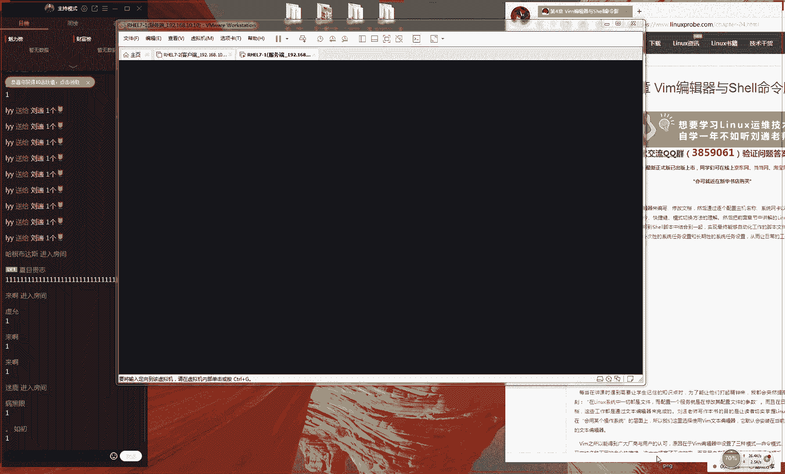

那么我们来比如说我们昨天去写一个脚本，判断一个用户输入的一个参数或者输入的一个数值，然后跟我们的一个随机值进行一个比较，对吧？然后我们可以比较它是大了小了或者说它是一个相等这样的情况。

那么其实他还有一个情况，就是说我我们这个用户它输入的是一个字母或者他他输的是一个乱码。那么这样的话们就会导致我们这个程序是崩溃的情况。因为你去比较的时候，那你也是这样的。

咱比如说我们的用户它输的是一个A的话呢，那么这样的话那他就会导致说你A给你一个随机的数值比较A它大于等于53吗，这样的一个比它就它这样的一个的一个比较，它是它也它也是不成立的。

所以的话那么程序就会给你崩溃了。那我们现在解决这个问题的话，那我们就要能够去接入用户数的这个参数，然后进行一个比较，然后进行判断判断我们这个呃用户输的这个值。如果他要是一个呃字母。

或者说它是一个乱码的话，那我们程序不要崩溃，而是给它显示出来一个。😊，我们已经是预设好的这么一个语句，这样的话提示它再去重新去进呃它呃再重新再进行一个输入。那好，那我们先给大家学习这个语句。

我那我们叫做这个ki，这个非常非常相向于这个呃条件测试句的个if条件语句啊，这个非常相像。然后它可以对于我们这个有范围的条件来进行一个比较。好。😊，为什么我呃打开终端之后会看到我的网卡信息？

因为这是我做的一个快照。因为我之前我我去查看过这个啊所以我这个呃因为我是特意把它显示在这一个画面上。因为我现在有两个主机嘛怕两个不好区分。

所以我特意有把这个显示信息显示I地址说到的以后们的服务端后都8们的客户端都是10。20样话我们把这个学习的这个重心放到们配置服务不再去纠结每个服务实验的这个地址是多少对我一定的干扰。好。

然后的话呢我们继续来说呃继续来说对这个非常这个非常相向于我们C语里itch特我们同学非常贴切说明我们预习好，且非比非常恰当。它就相当就是我们语里itch可以进行一个选择性的一个比对。😊。

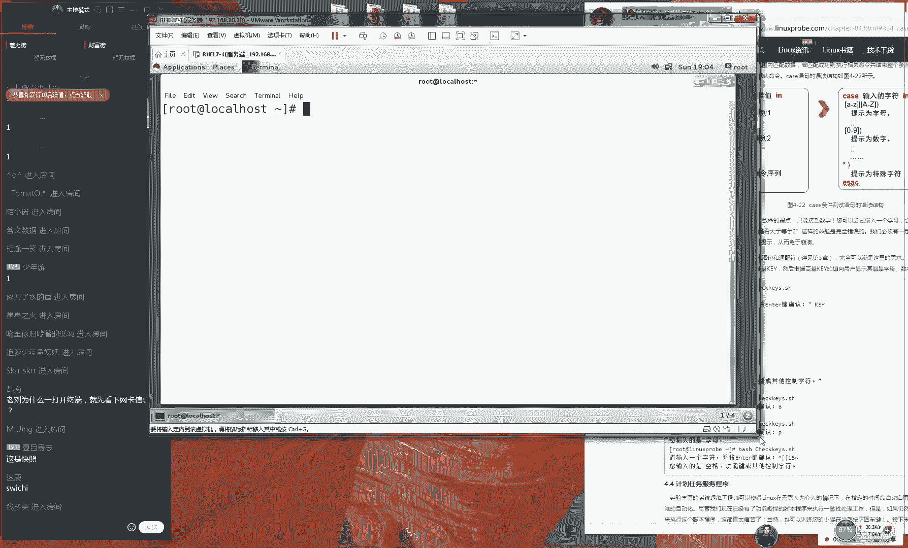

好，今天我今天我一天都快累的不行了啊。因为我们今天下午的时候不是说今天说了一下这个考试的问题嘛？因为确实我们这边已经从多方的这个渠道上面，然后了解到红考试变问题。

我们今天那边给深圳那边了一下深圳有一个机构叫然还有一个机构叫上官，们应该了解我们这连着红我们一起去聊了一下这个事情。后来我们一致认为12月份应该是最后一个月考了，应该是大概这么一个个时间规划。

所以我们现在的话也准备开始对我们我们以前没有考试的同学，我赶紧给他们发通知，然后赶紧去考，要然话他们学习红到时候再去考的话变成麻烦那接下我们去写上我们这脚本。那去回忆一下那我个本的话。

里肯定是要包三个元素，者说我做一个框架。这个框架的话第一我们叫做本的声明。二我叫的第。😊，本的命令。现来写上我们脚本的声明。脚本声明的话，它指的就是呃由谁能够去来去执行。

或者说他能够看得懂我们这个sha脚本呢？那我们统一把它叫做B里白的bsh。那我们这样给它写上一个脚本的声明。接下来的话那我们再来说。😊，呃，我们的脚本的注释这个可以写可以不写。

它主要是对于我们这个服务的功能，或者说我们脚本里面的某个参数进行的一个解除或或者这个说明信息。所以这个它并不是必要的。所以我们这个参数大家可以去写自己想要去描述的一些话都可以的。

那我们去直接就上我们的干货上我们的命令了。现在选用一个命令我们叫做read来去读取一个值用来去读取一个用户输的一个值，然后复制给一个变量的意思。然后这么一个功能，那我们给复制一个变量。

们叫做key这无所谓啊。如果大家想要把叫做或什么都无所谓啊。那那我们那我们这样吧，因为我们怕大家认为好像就必须要是叫做K因为这个key的话呢是一个核心的一个意思啊，所以我们给大换一下好吧。

把字稍微大一点。然后只是说我们考试的候家我我们写完之后再给大家去说然后继续给大家说就是说名称是无所谓的就比如说那我们叫这叫做同学是吧。😊，这应该是叫做ch这么一个哎呃gll这么一个发音，对吧？好。

那我们接下来我们再去选用一个参数加杠P。这样的话呢显示出来。😊，呃，给用户的一个提示信息，让我们用户知道该剧你去输入内容了，对吧？那我们现在啊就给他这样写上。😊，变量的话呢，我们建议是给它大写。

这也是一个规范。一般我们的命令它是小写。而我们这个变量的话，它是一个大写，它是一个我们一个约定俗成的一个习惯问题是但是它并不一定非要是大写。如你要是直意去改把改成小写的话。

其实也是可以的其实也是可以的我们写这个case语句我们现在去写上我们变量的那个值大家要注意的话，为们现在要去判断我们变量的那个值了。所以我们前面一定要有这个ll符号，大家不要忘记啊。

就是我们来去复制的时候，你可以没有ll符号。但是你去判断的时候，你一定要有这个ll符号，并且我们这个case语句，它是跟我们这个句，它有一些区别，它不需要去写那个字，它直接可以去进行一个判断。

并且的我们来判断它只有我们这个小括号那个右边一没有这个左边大家不要以为我们说上写错了，我说上写错了。它这个格式要求就这样去写的那我那我们先进行一个通配，这是我们第三章节给大家讲到的。😊。

小A到小Z通配的是所有的这个26个小写字母。然后的话我们那我们再去通配1个26个大写字母，那我们就这样去写OK了。但是中间我们需要加上这么一个竖杠，这个大家可能比较纠结是哎说老师能。😊。

大家可能说这个比较纠结舒老师这个这个竖杠不是叫做管道符吗？他不是将我们前面命令的这个结果，然后输出给我们第二个命令进行那我们来进行一个处理吗？那么为什么我们现在要需要加入这么一个管道符呢？

这就是因为啊我们现在这个管它在这个呃树杠在我我们这个测试语句里面，它已经不是管道符了，而是叫做逻辑的货。这是有我们这个K它是由我们这个教本里面，以及我们这个case句，它所呃我看大家我因为我这边。😊。

因为我这边一边去敲，然后我看大家一个劲儿在发。行，我让我看了一下。就是说的呃我们来进行通配的话呢，我们中间那个竖杠是我们即叫叫叫做呃货的意思。对，今天大家问过这个问题，所以的话那我们就必须要这样去写。

然后那么就是一个那我给大家放大啊，是A到Z，这是我们的小A到小Z，然后是大A到大Z中间我们加上这么一个竖杠。这个竖杠此时此刻它就不是管道符了，它叫逻辑的货的意思，这样的话它就是进行一个。😊。

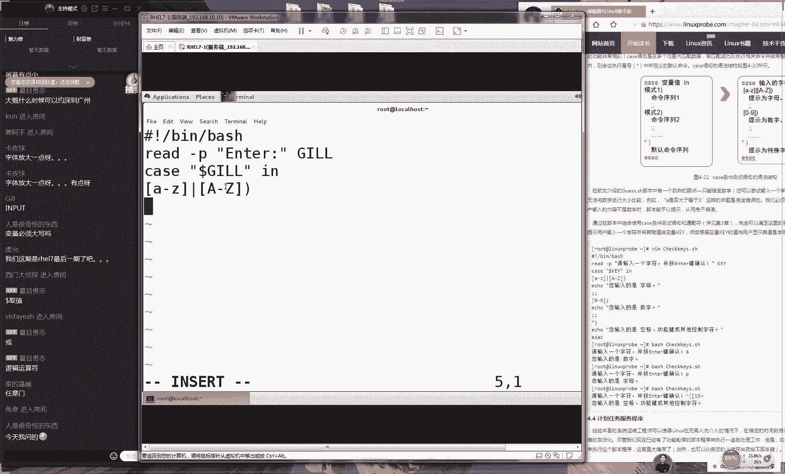

呃，间歌，然后就是说你是小写字母或者你是大写字母的意思。大家想啊，那那啊那我给大家提个问题。如果说我们现在的话，他们没啊他没有中间的这个属杠，我们把这给去掉了，那么如果说我们现在这个匹配的值。

那我们要是这么去写的话，没有中间那个货，那我们匹配出来的这个信息，那么就肯定肯定怎么样呢？就先肯定来说啊，它肯定不是一个呃字母的话，对吧？因为它肯定不是一个单个一个字母了，那我们匹配出来的这个信息。

大概会是什么样的一个样子的。大家想象一下，但。😊，他比出来是单位还是双位，还是说大写或者小写。那么我们匹配出来的这个信息。如果我们忘了写的话啊，那我们匹配出来的这个这个信息，它会什么样子呢。

那我们就猜测一下。其实的话呢这个对它可能是两位了。因为它是匹配了两次，那我们匹配出来的这个信息。大家需要注意啊。那我们就是匹配出来一个小写，一个是大写不是数组是一个小写。

是大写那我们先看一下第一个第一肯定是匹配出来一个小写字母，咱比如说是个C好了，然后话呢我们第二个它是一个大写字母。但比如说我们匹配一个B。那好了。

那我们那我们匹配出来的这个信息就会是这个样子的好大家好大家可以看一下，那那我们匹配出来这个信息，就是第一个它是一个小写字母，第二个它是一个大写字母，它会匹配出来这样的一个样子。好，那我给大家去打出来。

大家比这个比较清晰一点，能够看出来这两个的区别。所以的话那我们中间我们一定要加上这么一个或就是说我们匹配的是一个小写字母，或者我们的这个大写字母。😊。

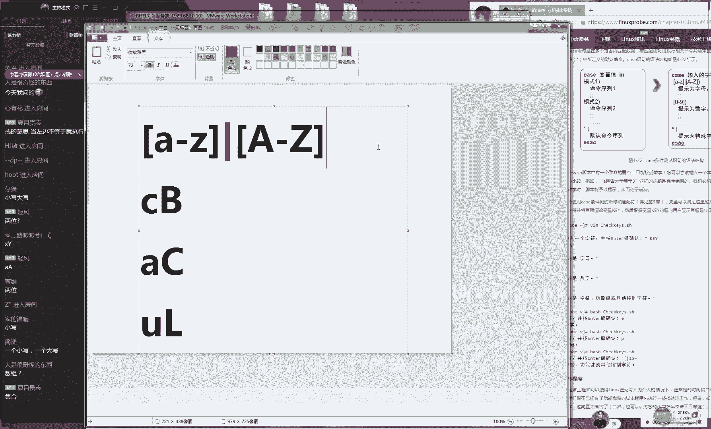

在我们这个本里面，我们我们目前没有这个呃数组这个概念，它虽然很像C语言，但是它跟C语言是有区别的。大家老师之前学习过C语言的话，那我们知道C语言里面它有数组，它有指针它我们在使用每个变量之前。

我要对变量来进行一个类的一个定义。但是在我们这个本里们都那么那他们都是不需要的。好，那我们现来去通配一下那么匹配说那么如果说用户输入的是一个小写字母的话，那我们就给大输出来说什么呢？

输出字母给第一个提示的一个信息，因为我英语很差，以大家能看得出来，那我就用这个字母拼音来去代替了，那么就这么个意思。然后我们使用到两个分号把它给结束掉。

这个前后两边不要加空格加空格的话有可能导致我配是失败的。好，这样的话那我们看一下就是我后面加两个分号，这是一我们这个case语句条件所要求我们的好，然后的话呢说怎么进一步区分大小写。

我们这样的话就是判断它是大写者。😊，小写如果想来去进一步去区分的话呢，很简单好，那我那但是我觉得这个问题比较简单啊，大家可以来去交流一下。说那那那我们现在既然我们现在是匹配的是一个大写或者一个小写。

那我们如何来去单独去匹配出来小写或者大写呢？😊，这问题其实很简单，大家想大家去发散去想一想。😊，好，然后我来继续往下去写哈，这我们往下去写，这个是我们这个匹配数字，对吧？我们数字0到9没有11。

因为11它是属于两位了，对吧？然后我们来去输，它是数字，我们给这么一个提示的一个信息。对，其实其实这个问题很简单啊。但是这个问题很好啊，就是说我们去写那我们去单独去写就可以了。那我们单独去写就可以了。

就是你去这样去写。那你先去写一个小写的A到Z当然我们这个格式可能写的不是很规范啊，你再给他写上一个大A到大Z这样不就单独的去匹配了嘛，对吧？这个思维一定要能够发散一点啊，我们只是这样比较偷懒一。

我们给它写到一起了，那么实际上我们可以这样去做。那那你哪怕说我们对于我们小写字母的话呢，那我们还可以这样去做。我们A到A到A到O，然后的话呢O到你看就说我们可以将我们这个匹配的这个范围的话呢。

他可以更加精准一点，对吧？那我们可以这样去OPQ那我们可以对它进行一个更加精准的一个匹配。然后。😊。

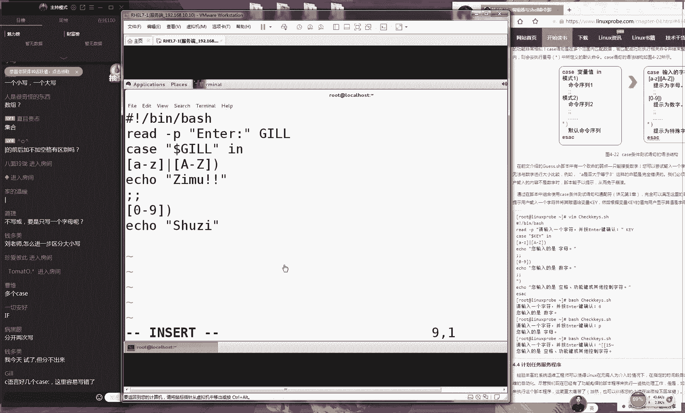

呃，大家可以去发散去想一下，它不光可以从A到Z的，它可以从A到O，然后从O到P，或者说我们可以更加细致一点，它都是可以的嗯。😊。

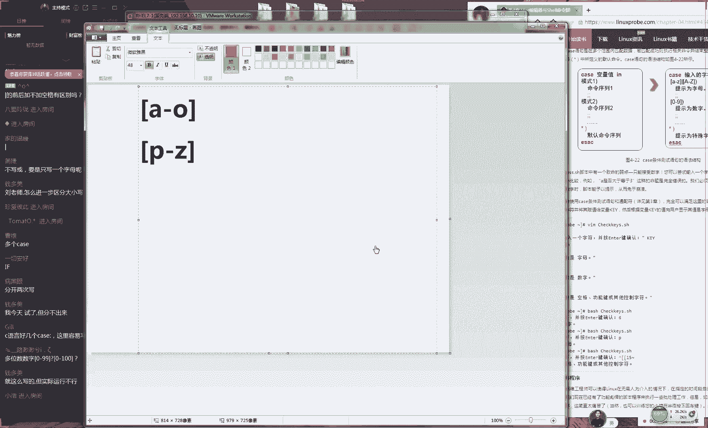

但可能比较但是这个话可能用起比较少一点了。因为可能大多数都是通配一下A到Z好，最后的话呢我们来去写一个星号，星号的话是我们通配服里面的一个很有哲学性的这么一个操作服？代表就是空无一物或者包罗万象。

那也就是说兜底了。就是说当你这个输入的这个内容，他没有满足前面两个匹配项的话，那么就全部都会归属到这个星号，那我现在就是一个后兜底，对兜底这个词用的是反正我自己因为我自己因为我自己叫这么一个兜底啊。

但是我觉得我自己像这个词很准确的对吧？就兜底嘛，最后没有人要的吧？后剩下来的东西我们就给兜个底就归归我了正这么个意思然后我们给输出下叫乱码？大家是英语比好的话。

以英语描述说这是一个没有被匹配项被匹没有被匹配到样这个内容怎进行一个介绍。但是这个不重要，因为我们要。😊，是个功能具体的这个介绍，或者说我们呃显出来这个信息其实对我们来说没有太大必要的。好。

然后我们最后我们给大家解上一个反啊把它给反过来叫做ESAC好，大家看到这个非常的可爱给大家说到一个非常可爱的一个点。小括号是它一个格式要求，它必须要这样去写，它在里面没有充当任何的这个角色。

我给大家举一个例子啊，家上小学的时候是不是学习过数学题，嗯，大家后这问题比较多啊，然后现一个一个给大家去说吧，但上我们这个小学的时候是不是一种叫这个应用题，对吧？

后他会给你一种假设比如说兔子每一小时跑10公里，然后的话呢乌龟每一小时跑2公里，他们什么时候能够相遇或怎么的，或者说有一个水池，然一边在放水一边在倒水，他么时把给灌满，就这叫这个应用题，对吧？

那我们解题的时候啊，那我们不要先去写那个答案，我们一定要先去写对，我们要先去解一个解。😊，这个字哎，你看这是为什么要去写这个解这个解的话，你要是呃你们可以考试的时候试一试啊。

就说你们如呃如果要是光去写这个解的话，那你那你把这个比如说我们考试的时候有1道应用题。那么你去写10个解，那最后是零分，因为这个东西你不写的话，它是这个东西你要是光写它的话，没有任何用处它只一个格式。

但是你要是不写它的话，反正我反正我们那会儿反正我们那会上学的时候是要减1到2分的，所以它就是一个很神奇的一个东西，你要是写他不会他不会给你加分，对吧？它也不会算成绩，但是你要是不写他给你减分。

它就种格式，它有一种格式要求，所以说这个一定要注意一下，这个一定要注意一下。好，然后然后我们最后一个这个两个分号啊，大家去问到了，这个可以写可以不写。

就是我们最后一个的时候你可以写可以不写那把它给取消掉啊，这个可那么他这个最后一个可以是不写。另外给大家提一个非常可爱的一点啊，就是我们在这个。😊，本里边的话呢，那我们使用到ki，然后我们最后结束的时候。

我们也要给它。😊，呃，结束掉对不对？但是特别的可爱，这个词叫做ES然后看ki。然后我们给他反过来就是ES然后同学们之前问过我一个问题，说老师这个词什么意思？我纳闷说这个词我也不知道什么意思啊吧？

后来我看了半天，我才看明白了，他不就是给反过来该反过来了，因为我确实因为我第一次去看大概是4年5年之前这个单词这个单词不成立吧说这个的E放到前面，这就是很少见的？为E放到前面的话，这个发音就很怪？

少正是因想咱咱想一下很少会将E放到前面但然也会有说？但是这个单词我很怪？但是后来我一看了一下，他不就是将前面那个ki给翻转了一下，觉这个特别的可爱。

就相当就是跨时空跨空间就是写这个那个程序员我们像你像我。😊，好像呃开了一个程序员的玩笑一样，就是你要把结束的话，就把它给反过来就好了。这个特别的好记。而且因为我觉得这是一个程序员之间的一种默契好。

它就像我我们的这个if一样，把它反过来把它写成FI啊ki给它反过来写成ESA我觉得这是一个程序员之间挺有意思这么一个梗啊，大家可以感受一下。反正我反正我自己笑了。好，接下的话呢我们来。😊，好，呃。

另外的话这个也很好记，对不对？只要你记住前面那个ki，后面你就把它反过来就行了。好，这样的话呢把它保存并退出。😊，那我们来去跑一下这个脚本，因为这个本非常简单啊，我们就来跑一下。我们现在去输入一个内容。

咱比如说我输入的是一个呃5我们来敲一下回车，他告诉我们说我输入的是一个数字。好在那那我们再来那我输入的是一个A好了，我们悄回车，他告诉你说它是一个字母O没有问题。

那我输入一个乱码呢那咱比如说我输入的是一个乱码，或者说我输入是乱七八糟的东西。好，这个时候他要告诉我们说我们输入的是一些乱码信息，他就根据我们用户输入的这个内容啊。

第一点他能够去接收用户输入的内会去接收我们用户输入的这个参数。第二点的话呢可以根据我们用户输入的这个参数的不同或者我们叫这个变量的这个不同啊。然后我们去完成不同的工作我们程序而不会崩溃。

因为我们上一个时大会去做一下，我可以试试啊，它程序它会是崩溃它他就会崩溃掉了。啊，它是种交互式而程序不会崩溃。好，因为我们给大家做收尾，其实这个实验非常简单，主要我们这个。😊，难点还是在我们这个if跟。

还有这个for循环是我们难点。所以我们大家玩过多呃字符怎么去匹配。那如果是多位的话，你可以直接按照我们第一种方法去写，就这样去写就可以了嗯。😊，啊，你就这样去写就可以了。

代表就是从零到匹配到99写三位也是哈哈。对，因为的话呢字母跟数字，你不论打的是什么，你哪怕你打的是两位的这个字母，他也会给你告诉你是乱码。因为我们没有匹配到它。如果大家需要的话，大家可以去匹配它的啊。

提这个问题可能没有太理解我们这个脚本的意思啊，就是我们可以因为我现在教本写的比较少很短，我只匹配了就是单个字母或者单个数字的情况，如大家以后真的是需要的话。

那么你可以自己再去匹配两位三位、四位、5位或者各种多的情况。我只给大家举个例子。好吧，就是这个我们可以这样去做，大家应该能够理解，对吧？好。😊。

这的话呢我们来去说一下我我们这个计划任务跟我们的周期性的计划任务。这个话其实也是红帽考试里面它需要考到的一个。它是分为两个的。它的话第一个我们是叫做怎么样看一下好，那我们来说一下他的话这是叫做计划任务。

这话就是说当我们去写出cel脚本了。比我想要把今天我要去做事情都已写脚本了。但是我需要很尴尬，就是我每天晚上我需要敲一下回车执行这个脚本那就那么就会很麻烦，且很落后。

所我给大家讲两个我们计划任务的这一个方法。第一的话我们做命二叫这是一个服务是这样的给大家因为这个第一次太好理解我给大家说一下这么回事。咱咱比如说我每天的工作别那我以把我我想要去做事情。然我会写脚本了。

那我就可。😊，可把我们的这个平时要去完成的工作，我去写成一个计划任务，我去写成一个脚本。😊，然后它可以特别的灵活啊，怎么怎么样，这个都是啊这都是可以完成啊，那么去实践出来。我今天我要想去做这个工作了。

但是也许我每天我的工作他就是去敲一架回车，这个感觉很傻，对不对？那我每天都要去去敲一架回车来去执行一下我这个脚本。虽然说这个也不麻烦，但是显得很low，而且感觉很没有水平，显得很笨，或者说显得很不智能。

感觉很不自动化。所以的话呢我们这个有两个解决方法，对吧？我们第一个解决方法的话呢，是你养一只猫啊，直给大家开玩笑啊，就说你可以去养一只猫。然后的话你去训练你们家的猫第一会会看时间。

第二会向你的桌子上面去帮你敲一下去踩一下那个去踩一下那个回车键，训练你家的猫，这是第一种方法啊。第二的话呢就是说我们这个计划任务，们大家可以选择我们使用计划任务，它可以按照一定的时间规划。

然后帮你自动来去执行这个去执行这个脚本，这个还是比较的有意思的啊。好，所以的话呢我们来给大家先来玩一下，另外我们来去说一下这两个的区别啊。第一的话。😊，就是我们的这个at命令，它是一次性的。

这个好理解吧，就是我们叫做一它只能是呃单词有效。比如但咱比如说我只是今天我需要来去完成这个工作，那好了，那么就去使用到cas就可以了。那么咱比如说我天天都需要去执行某个那么啊去完成某个工作。好的。

那就是一个周期性的。😊，你看这两个出来了，咱比如说那我今天我就需要我临时我去做什么什么事情，那么就去使用到at。如果说我每周每年每每个月某个星期，我们每个星期日我需要做什么有事情的话，就是有周期性的话。

那我们就要去使用到我们的第二个。好，那我们接下话我们来给大家去说一下说。😊，呃，我们先讲一个比较简单的吧，我们先去讲一下我我们的这个命说怎么样说用到用狗可不可以啊，可以啊，对吧？你去训练小兔子呀。

反正我觉得猫训练起来比较好吧，知道为什么？因为我虽然没有养猫，但是我朋友家养猫，猫晚猫晚上不睡觉，因为咱们主要做运维嘛，有时候可能会晚上会熬熬夜什么的，因为猫晚上不睡觉嘛，反正很折腾啊。

晚上反正因为我可能接触比较少，我印象里边就是猫晚上不睡觉，特别的折腾，而且晚上还拉屎，特别的烦反正我可能不太喜欢猫啊，所以我觉得就是让猫去完成这样的工作，反正他也不睡觉，对吧？然后就让他去训练它去吧？

好，这大家随意吧。如果你们家什么哈士奇啊什么的啊，二哈二哈不会上来就咔咔咔咔咔这样给你先。😊，清吻的这个服务器的内容，然后你第二天就很奇怪，被老，然后就被老板给辞退了。好，那我们继续啊。😊，啊。

可以试一试啊。如果大家以后有需要的话，可以给你家猫也报邮一个我们的培训，才两啊3两才两啊3两呃才2400是吧，可以让你们家猫也过来学一趟了。😊，好，然后的话呢我们来说一下我们第一个我们叫做ar命令。😊。

待会这个这个这个很奇怪啊，说这个需要啊，因为我因为我这个因为我没有想到他还会提出这种问题。好，然后的话我们来写一个计划任务。咱比如说我想要在今天的多少啊，今天19点7点钟7点24好。

我想要在7点28分的时候来去完成一个计划任务好了，那我们再回收这个时候我们就可以来去输入我想要去做什么事情了，为了能让我们这个脚本啊，就是让我们这个功能看起来的话，它是更加的就是直观一点。

如果我现在去后台上面来去执行一个呃输出一个信息，那你看到这个信息也许就不并不是很直观。但你自己不知道呃到底有没有成功，对吧？所以我们现在给大家去玩一下。哎，你看这样的话呢。😊，会我们这个服务器。

它会去重启一下，这样的话特别的直观哦，然后你一看就是哦确实我们这个服务它是生效了的对吧？这个比较直观一点。但是我它并不仅限于重启啊，同学们就他可以去写本的名称说那么当你去写好一个计划任务之后话。

那么就可以摁住你的这个l键然后摁下个千万不是l加Cl加是取消了。如果你想保存你的这个计划任务的话l加这个代表就是保存成功了。好那老师那我怎么知道它有没有保存成功呢？

那我们可以这样去做使用一个杠就可以查看到我们当前已经有的计划任务它有哪些告诉你说他有一个这个有一个编号为一时间的话呢。

他会在2018年的11月18号礼拜日晚上7点28分会去执行发起人是用户好了那我们现在给大家去一下就是去查看一下它里这个详细的信息，应该我们如果没有。😊，错的话，应该是at杠C加我们的编号。

就可以查看到我们这个计划任务里面，它具体的这个那。😊，命令那我们可以看到它里面是reput。好了，这个时候我们那我那咱比如说那我们突然间后悔了，我不想让他去啊在28分的时候去重启我的服务器的时候。

那么怎么办呢？那么我那啊啊那我们那那我们先这样去做，使用这个RM去给删掉。然后后面加上我们想要去删除到的这个任务的编号，我们删除掉一这样做完之后，我们再去查看的时候就没有了。

这就是你对于这个计划任务进行一个增加，还有我们这个删除和查看的这么一个方法。但来说到这比较简单啊。😊，我们待会去学现在就比较难了，这只是一个开胃菜。好了。

那么我们为了证明我们自己教的不是一个呃教的不是一个没有用的东西啊，所以我还是给大家去玩一下这个实验，做一个比较完整的一个实验啊。就在19点28分的时候，我们去重启一下服务器好不好？

们来去reboot重启我们的服务器l d保存，然后L查看一下O已经有这个计划任务了。然后大家看一下，然后现在我们时间是19点27分32秒，我现在拿起我的水杯来开始喝水。

我现在我的手是离开我的键盘然后我把我的鼠标移出了我的这个虚拟机的界面，然后我现在开始喝水，看着大家聊天我看一下说。😊，怎么样？训练黑寡妇啊，你们思里很跳跃啊，今天做试验了，有时候会给我发邮件。

但是有些但是就不是不执行。所以你可以看一下你的操作跟我有什么区别没有。其实这个可能是一些操作问题。你看我待会可能会有但是也有能会出错啊。O那也可以看到对序号序号当然是2。

然因为我们之间已经有一个被删掉了。他重启之后他就会重新回味到一。然后那我们可以看到的话呢，这就是说我们在19点28分的时候，我真的没有去重启啊。

我我们这个系统它就会默认来去执行我们预设好的这么一个计划任务。😊。

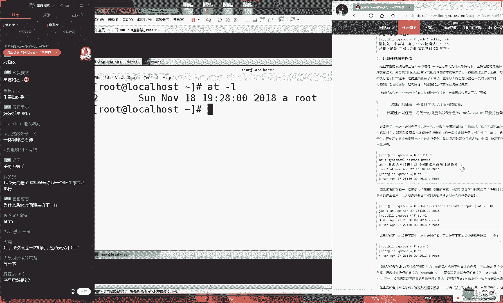

哎我说为什么系统的时间跟主机是不一样的？呃，这个有一个解决方法，这个解决方法就是使用到NTP啊，它叫做时间。😊。

服务器你们可以去设置一下在我们这个系统里面可以去设置下这个NTP然后这个也是红帽考试里面它会考到，但是非常简单这么一个时间较准的一个服务，它会有的。因为我们现在这个时间嘛就是最准的叫什么格林时间对吧？

啊，就这是个时间是比较准的。然后他们会有服务器，后我们可以跟他们进行校准化时间是非常准确的。好，那我们接下来给大家说一下，我们这边的这个但是这个我们这但但是我们这个NTP的话呢先不用给大家去说啊。

这有点说要乱了。然后另外说使用到case的时候要加入这个变量，然后才能够去生效，要写这是为什么这个看起来的话呢应该是定义的一个变量。但是。😊。

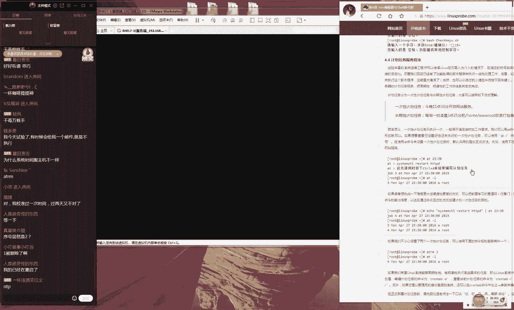

这个咱们目前没有遇到这过，但是因为我们现在我我们目前没有遇到过这个问题，所以我怀疑应该是您的这个虚拟机的问题，应该是虚拟机的环境问题。所以需要去设置这个变量。而您已经知道设置这个变量的话。

应该你已经找到相关的配置文件。或有一个说明。但是这个问题我们目前没有遇到过。好，然后接下来给大家说一下，我们第二个计划任务叫做CD那我给大家去说一下啊，大家需要去区分一下，就是这个CND这个服务程序。

这个话就是我们这个服务程序的名称大家需要记一下同学们这个你需要记这个是我们这个服务名称。😊，服务名称啊，这是我们这个服务的名称。我给大家说三遍了，怎么怎么还在记笔记啊，怎么还不记笔记啊。

然后我们第二的话呢是我们的这个配置工具的名称。好，大家需要记一下。那么这两它有什么区别，就是我们要去真实去配置一个计划任务的话呢，我们应该去使用的是第二个我们真实的这个配置的工具。对它是一个守护进程。

就是它会它会它来会啊所以我们系统启动而启动，所以我们系统关闭而关闭，来会一直为我们这个系统提供服务这么一个服务，我们叫做这个守护进程。来，它有一个这个是很好。同学们说明你们真的是。😊，呃。

已经预习的很好了。这同学我们好好表扬一下。好，那我们来去说一下的话呢，就是说那我们去配置这个服务的时候，那我们应该去使用到这个工具配置的命令的话是这样去做今我会抽1分钟吧。好吧。

我们最后我们抽1分钟的时间给大家讲讲鸡汤啊，给大家做我们这个预习的重要性。因为今天你们要因为马上就要讲到第五章节，然后马上就要讲到678如果你要是下礼拜你还没有去做预习。

你还是不相信我讲的这个内容很深的话呢，没有提前做好准备，那么也许就要开始我们这105同学同学开始掉队了。以我们今天抽出5分钟抽15分钟吧或1分钟的时间给大家讲讲我们待会我们以后课程的一个重要性啊。

大家不要因为这个是很重要的。好接话我们来这配置的命令们大家书上面这是来去配置我们这个计划任务。😊，这么一个命令啊，说不慌，我相信我的智商。哎，我在2010年的时候，就是在8年之前，我也很相信自己的智商。

但是我的红妈智C我听了4遍，真他妈的学不会啊啊，所以这个东西是我当时就是很。😊，呃，痛苦的一件事情，大家应该也会有这种感觉。因为现在你们刚刚去学习啊，然后可能没有这种感觉。行啊。

反正这是我发因为这个是我给大家总结出来的啊。从第五章开可能会有同学调队了。所以我们现在开始给大家讲讲东西了。然接下还有第二个命令，我们叫做杠E杠U。后面加是一个用户名称，就是说当我们如果想要去配置了。

并不是自己的计划任务的话呢，那么那你就可以选一个杠U参数。这样的话你就可以为其他人也可以来去配置我们这个计划任务。大家不要大家不要先先自己智商没问题啊，说不要过于那么自信啊。当然如能更好。

那就更厉害了啊，那就是神童以后可以来我们这个机构里面讲讲课？者我们忽悠一下其他小朋友好那我们先看一下他有几个参数。第一的话就是说当我们想要去配置一个计划任务的时候选的是一个杠E。

第二的话就是说如果想要去配置一个其他人计划任务的时候，需要加一个杠U。另外还有一个我们需要给大家说到了有一个口诀，大家。😊，书上面大家知道一的口诀是什么吗？叫分时日月星期命令。哎，分时。还把咱们打分时。

分时，日月星期。命令好，大家记到你这个书上每一个中间要有一个空格，我给大家讲到，这就是我们。的一个口诀。我们配置我们计划任务的一个口诀，它是个格式要求。如果你这个不会的话呢。

那你配置这个计划任务可能也会比较麻烦来，们记一下啊。如果我懒得记的话呢，那你就打一下好吧，或者你在脑子里面去默念一下来一起说分时日月星期命令这个几位的话，那我们一定要注意它是有一个格式要求的。

咱比如说呃我现把那我先给大家举个例子啊，我有一个特别苦逼的一个工作。那么什么工作呢？就是我我每天晚上12点的时候，12点半每天夜里12点半，我需要来去重启一下我的服务器，这个工作一听就很苦，对不对？

这工作交给我们家猫做也行，但是非常让我做这个特别的苦。那么既然来说就是每天的晚上12点半，我们都要去重启我们的服务器，那么也就是说那就是零30，那么为什么呢？因为他这个时间是24小时制了，12点半。

我们晚上说到12点半就指的是凌晨的30分，这你们懂吧啊，因为我们说到12点半呃，就是凌晨的30分，我们等。😊，过了之后就开始去抢购了。我之前我记得我第一次参加双十一抢购的时候啊。

我就不知道说这个双十一是从零点开始什么意思。后来我是等到了111月为我们那会真的是我觉得我那会智商肯定有问题。我是等到了11月11号的零点就是过12点，然后我才开始去抢购。

结果发现人家好像玩完了因为好像第一回双十一的活动我也不太懂这个规矩，后来我们才知道他说那个零点是说的是11月11号那个零点是10号的那个晚上以我这个智商有点堪忧啊。

然后那我们这个其他我们要到这个星号做站位这样的话代表就是凌晨的30分的意思，这才代表就是凌晨30分的意思啊。大家打几个打几个这个逗号啊。

然后嘴里依然哼着低调的这个小哥同学好像在鄙视我这个老智商好好像是有问题吧。那我们来继续给大家去说啊，这就是我们的一个格式。后面这个命令啊。😊，但我们不能说直接去写这个命令。

我们一定要写它这个完整的一个格式，我们要写上它是病里面的的re。那么呃我们如果要是不知道对啊那我们这个具体命令它所对应这个路径的话呢，请一定对一定要以这个全路径的方式来去写。为什么？

是因为这个服务它有一个小bug，它不能够识别我们这个命令的一个路径。再往深的说，是因为他不支持我们的pa变量，它找他没有这个小他没有这个小助手，所以我们必须要明确的告诉他我们命令所在路径。

这样才可以来去使用到ve来。😊。

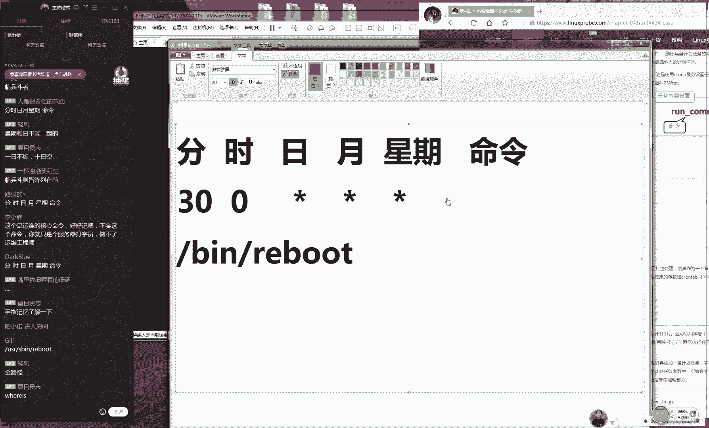

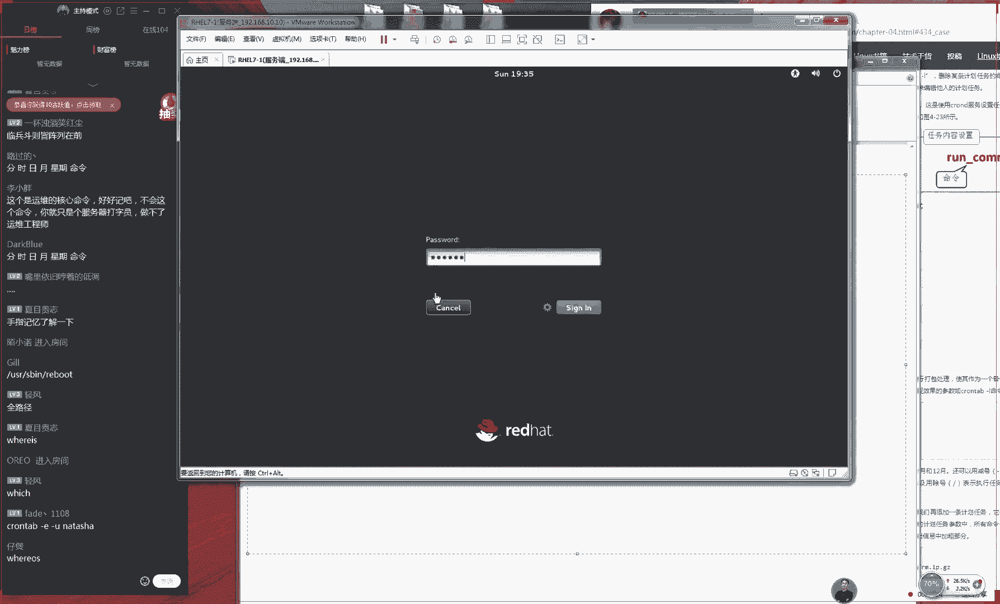

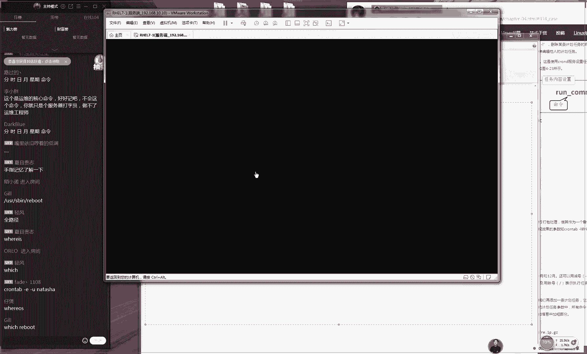

哎，所以说我们上课的时候有时候要自黑一下，对不对？因是因为我们活跃一下气氛，我们没有我们不像讲相声的说郭德纲还有个于谦呢，我你说我讲谁呀，我讲谁都不合适，我就只能说黑自己一下吧。所以说说挣点钱容易吗？

咱们这个培训机构啊，真的是都是了。好，那我们来看一下，就是一个格式来说代表意思啊，这个代表就是每天晚上每天晚上的12点半就是指的是凌晨12点半啊，然后会去重新启动一下我们这个服务器讲讲牛不合适吧。

小牛不是我们上一期的学生嘛，人家没来也不能说人家对吧？那我来继续给大家就是说那我们再加一个参数，我们给他这个日期，我们给他改成。另外啊如果没有值的话，请一定要使用到这个星号做站位啊，使用这个星号做站位。

那么这个代表就是以后的话呢每个月啊每个月的5号凌晨30分的时候，他会去重启我们的服务器什么意思？那也就是说呃。😊，它代表就是我们的这个11月5号、12月5号、1月5号、3月5号、8月5号、9月5号。

所有每个月的5号他会来去执行我们这个计划任务。好，那我们再来我们写上一个呃月份，我们比如说写一个8月，它代表就是每年每年的8月5号，哎，它是每年的8月5号，然后他就去凌晨3点凌晨30分的时候。

他会去重启一下我们这个服务器，那我们再换。另外的话呢，我们这个日期不要跟星期一直去写。因为你不知道我9月5号跟10月5号他们都是不是礼拜四，所以这个两个不要去不要去同时去写，我们把这个月份的话呢。

我们也可以把它取消掉，我们这样去写，我们写上一个星期星期三这代表什么呢？代表就是我把它改成一吧我们改成两2那么这样的话，它代表就是以后啊从现在开始以后每周三每周三的2点30分啊。

凌晨他就会去重启下这个服务器。另外啊。😊，不是给大家乱说，是因为我们现在也是算是一个基础的一个班级。然后他呃大家的话呢，应该来讲的话呢，对于这个系统或者说这个呃运营行业也没有太多这么一个基础的一个机会。

到你们工作的时候啊。😊，可能也会去做一些比较基层的一些工作。比如说给服务器商家啊，会做一些基本的运维什么的。所以这样的就这样的这个实验也许很不起眼这样的这个服务，但这有可能是帮你大码了。

一定要好好记到这个书上面，否则你每天晚上你一定要去敲一回收，或者你要去做什么事情的时候，就那就会很痛苦。这种小细节一定要记好，包括说我们第19章节我们去讲一下那个就是去批量部署出来系统的。

就是为了以后你们工作的时候，万一有一天老板让你去安100台机器，或者说按照或者说安装1000台机器的时候，我们手足无措，很慌，就是为了让大家我们这个工作。

这个我们一定要记好这我们要记好再给大家举几个例子，说我们再加一个月份5月它代表就是以后5月的啊只要以后那我们到了5月那5月里边的每个礼拜3那我们知道一个月他有4个礼拜？以后的每个礼拜三他都会去。😊。

从呃2点23分的时候会去重新启动一下我们这个。服务器啊，对，因为一般来说他他肯定都会去从基层干起嘛，对吧？因为习近平你在讲的话，人家也是从基层开始干起的，后来才始成了主席了，他也不是一下子对吧？

什么什么党，然后一下就变成主席了。他也从基层干起的。你要想从呃要想证明你自己的这个能力嘛。好，接下我们再来说这个还有另外一种使用方法，我们这样给大家玩啊。礼拜三，那既然来说我们不光礼拜三。

那我们礼拜一礼拜三礼拜5那我们可以用到逗号去做间歌啊，大家一定要记笔记啊，他们在聊天，因为他们会了，他们在聊天，你们可呃一定要好好记笔记，这代表是什么呢？

这代表就是以后的每周一每周三每周五晚上的2点30分的时候，他会帮我们去重新去启动我们这个服务器。😊，哎，但是我啊说六和七什么意思？六和七就是礼拜六和礼拜日，然后还有一个零零也代表是礼拜日的意思啊。

我看一下，不没说错啊，比比较比较严谨。对啊，礼拜六和礼六和七代表就是礼拜六跟礼拜7礼拜日这个这个绕，是1234567，然后六和七代表礼拜六，然后七代表着礼拜日。好吧，这个其这个还好。

那么这代表就是以后的话呢，每个呃礼拜一礼拜三礼拜五的2点30分他会去重新启动我们的这个服务器，再往后走，那咱比如说我们再给大家换一个，我们给大家把星号也给他取消掉。我们把这个星期给他取消掉。

我们写这个日期，那这我们这么去写10到15，这个什么意思，我给大家去说到，大家需要去记一下啊，另外这个格式我只有我给大家讲课的时候才有你们到工作的时候，你要自己去想。那么这代表就是以后的话呢。

每个月的10号到15号以后每个月的10号到15号。😊，他会去在呃凌晨去冲启我们的服务器。日代表就是每个月。对他代表就是如呃如果你要没有写月份的话，他指的是每个月他都会呃他他呃他们都会来去执行。

如果你要写上确定的这个月数，它代表就是每年啊每年的8月份到10号到15号，他会去来去执行我们这个计划任务。好，这是我们一定要去写的。好，那我们再来那我们还有另外一个玩法是这样去写的。写成一个星号。

写上一个除二。哎，这个什么意思？😊，算，这个有点乱啊，我们给大家再来玩一下。嗯，我们呃给大家玩一下，说我们这样去写。😊，好，大家想一下，说我们现在给大家写这样的一个格式，除以二是什么意思？😊，半个月嗯。

是不是你开创行了吧？再仔细看一看，我因为我刚才这可能有点串行了啊，你看对应的这个一个是日期吧，对吧？你再仔细看一看呃，你们这输入法也该换一换啊，齐峰同学这个输入法啊不要着急不要着急。😊。

然后怎看怎么能他有没有执行，就是呃你可以看一下你这个系统日志里面，它会有的，它是在外目录里面的log里面的message，他们都会有这个记录。好。

他他代表就是双日只有两个这个有两个这个说法是双日就是说偶偶数日还是说以后每个礼拜二还是说每隔间隔两天，他要什么样呢？他就是说哎他是说每间隔两天哎每隔两分针这我没听懂什么意思好。

就是说他的话呢就是说每隔两天他会来去重新启动一下我们这个服务器。这样的话呢可以让他可以让我们这个服务器这个系可能会更好一点。他有这样的一个需求。好，这就是说我那我已经能够把我想到的这样的这个可能性啊。

就都给大家都去聊都去聊了一下。后就是我们的这个百文不如一见他书不如看实验的这么一个环节了。给大家配置来一下尼杠配置。😊，自己的就直接敲回这就可以了。对。

前面也要加上这么一个信号来敲123zo你我们来配置这个计划任务是这样的啊，你看如果我不小心我巴拉巴拉巴拉，我给它敲错了。如果说我不小心我把它敲错了。这个格式跟着我们刚才讲那个分式日月信息命。

它不能匹配上的话呢，你看啊当我去保存并退出的时候，它会给我们提示出来一个报错信息，说你写的是内容是错误的，你需要去修改一下，我们去敲外才能够进行一个修改。另外啊我们第四章节就是我们这个章节。😊。

学习所学习的那个VM编译器，你看它默认它就会调取我们这个编译器了。所以说我们必须要将我们的VAM给它学好，它很多很多的服务，他都会默认去调取到我们的这个计划任务不他他都会调取到这个VM的好。😊。

那我们现在给大家写成这么一个格式，这个格式现在因为是没有呃，所以我们自己的脑里面要想啊，就是这个分时日月薪期命令。咱我们给大家举个例子好不好？那我提个需求。那比如说我现在是老板了，对吧？

然后我提个要求以后啊我们比较贴近实际的，比较简单一点啊，因为工作的时候不可能特别的复杂，然每天晚上。😊，2点30分。打包。网站是呃备份啊打打包备份吧。

网站数据网呃网站的目呃目录的话呢是在货目录里面的3W root打包出来的文件，我给它统一规范成叫做backup点好，大家快速告诉我说我们这个计划任务跟我们的命令该怎么去写啊。

所以说老所以说这就像我们考试一样啊，我之前大家先紧去写啊，这就有点像我们考试一样。之前我像我初中的时候，我我然后我们的数学老师吧可能感觉比较水。它的话呢也教的不是很多。

结果每回考试的时候的话都会比他教更难一点也是所我们可能讲比较简单啊，那我们再看一个比较难的一言实验。那我们完整的一个计划任务里面的参数，我们该怎么去写。😊，你这个写了个去是什么意思啊？

是按照我们程序自己去想嘛？然后这个怎么去执行，你的这个执行方法是呃分时。😊，每天晚上的7点钟，每天下午7点钟，然后间隔5分钟会去重启一下这个服务器。啊，他有这么一个需要。好，大家不要这么懒好不好？

我我天哪，现在我们没有看到一个就是成呃成功写完的同西啊，不要这么懒，同学们，你不要这么懒，而且我们目前没有看到一个正确的呃，大为什么打那么多星号呢？是因为你们打出来了，但是哦，我知道哎。

你们为什么打出这么多星号呢？😊，哦，大家先呃，我们有点奇异是吧，我们叫凌晨，你们绝得是我教过最懒的一批同学啊，他们要打拳啊，凌晨。好，大家可答完，我们该到底该怎么去写呢？😊，好。

然后CCVF那我看一下这个参数都差不多是没有问题。那我我来给大家去说啊，然后大家话一边可以去打一边来可以看太太那什么了，太的键盘了。行，那我们来继续给大家去说，我们怎么去写先来说分时日月星期命令。

你先把这个分时日月星期令给大家写对吧？分时月星期命令分钟3日期呃时间2点日月月星期命令好了，我们没有的这个内容用到星号做位我们加上命令那就是说2点30分，后面加上三个星号既然是我们这个命令了。

打包是什么呢？第二章节最后一个小节，那就是命令命令找呢我们就使用到找到我们对应的这一个命令大家复制一下。😊，然后我们使用参数是多少？是CZVF是CZVF好了，然后我们打包的这个目录。

它是在后目录里面的3W root打包出来的这个文件的名称叫做back我们应该是先去写上我们打包出来个文件的名称啊，叫做点后面我们是加上我们网站的目录，这就是一个非常完整的这么一个功能。

的话我建议大家记到你的书上面。因为很多时候到工到这个工作的时候真的会用得上的。包括说我们我们也算是透露一下吧。我们的网站现在服务器就算是使用这个方法来去做备份的。其实就很简单。

不会很不会他就不会有一种非常高深这样的这么一个。😊，呃，服务什么？因为我们以前用过一些服务啊，但是很消耗系统资源，越轻量级，越能够越简单去完成这个工作。那体现出来，那你真的是越厉害啊。好。😊。

然后我看一下说哦慢慢打，不咱咱们不着急。对，那么这样的话，它就是每一天都会去覆盖掉你原先那个文件，但是你可以换名字，对吧？你可以把它这个名字里边改成一个叫做date。这样的话呢。

他每一次打包的时候都是以当前的这个时间。😊，呃，为以当前的这个时间来去调取呃，当然调取的话应该叫做这么去写。这样的话呢，就是。这样减一加号。好，这样的话，他就每一次他都加上这个打包的时间。好。

这个当然有点复杂啊，我们先不给大家去说，我们先把我们这个计划任务给他搞明白嗯。😊，好，接下来的话那我们再给大家去说一下我们这个计划任务的话，就这样能做就可以了。我们把它保存并退出啊，保存并退出啊。

我们这个编编译器嘛，然后我们退到我们的这个冒号模式里保存退出加号连接加号是我的一个链接符对你可以选择到加号可以选择冒号减号就是为了跟有一个间歌嘛更好看一。好对因为就号也比较好看啊。

然后我们敲一下这个保存退出它没有报错的情况下的话呢，然后我们就可以使用到C去查看一下你当前你的这个用户它有哪些计划任务，那么你就可以看到它确实有这个计划任务了。

另外的话你还可以去为了保为了它能够保存起键的话呢，那你可以将我们这个计划任务再给它CD再给去重启一下，并且的话呢把它加入到我们启动项里面保证次重启之后。😊，他还会依然为我们这个用户提供服务。

再查看一下我们这个计划任务的这么一个状态。当前是在呃这么一个启用状态。OK那么就保那他可以保证没有问题了。好了，这大家可以去呃，我们可以来去试一下，这个比较有意思，但是它并不难。

让给大家知道我们这边这个第五章节了。第五章节的话呢，其实来讲我个人认为是我们整本书里边的难点之一，或者来讲的话呢，是最重要的章节之一。如果说我们。😊。

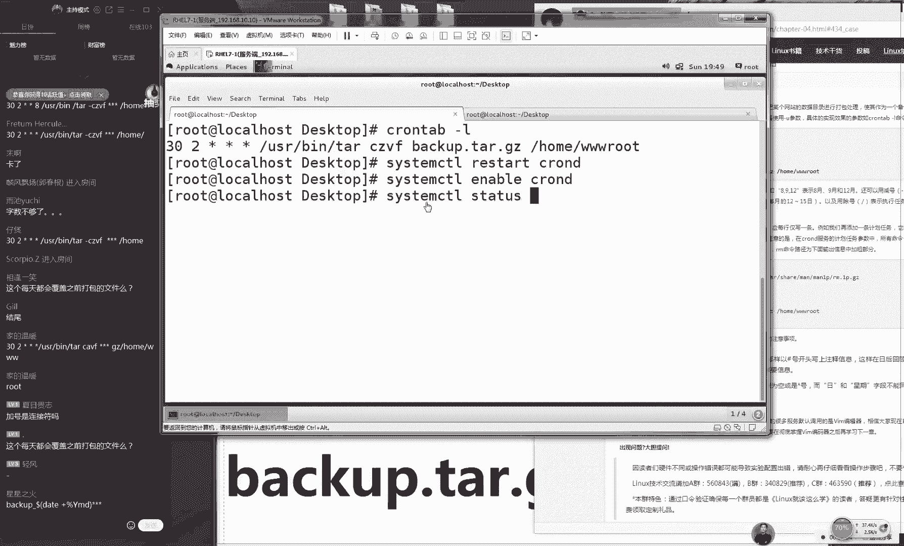

要是往深上去学的话呢，第五章节就是我们整本书里边，大家接触到的第一个难点。之前你讲那个什么he什么的，其实没有什么难度，对吧？你之前你要是在学习过编程的话，会感觉到so easy啊，很很无聊，对不对？

但是你现在第五章节你要去学习到我们这个用户跟文件上面的这个权限以及每个用户他这个身份功能上面来讲的话，他就开始要去体现出来我们这个系统的一些特点和这个特性了，但是你要自己看书的话呢，可能不会看到这么深。

但是我们给大家讲课的时候会往深里面去走，会大家讲到每个属性跟这个特性，一些我们对于系统底层的一些知识，好吧？好，然后说没有编辑的基础呀难呀，对吧？就说这必须要打好基础的。

因为我们之前给大家细致的去讲过我们的编译编译器三个模式，大家一定能够背出来是我们的命令编辑和我们的墨模式。所以这东西就像搬砖一样啊，大家知道有一个预言啊，就是说就是当有一个童话故事叫做。😊。

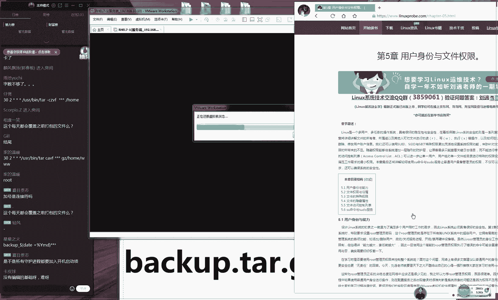

空中楼阁，他怎么回事呢？说就是一个皇上哎。就在大家呃就是当地的这么一个贵族吧，然后就看他去到其他国家里面去参观去，看到对方的这么一个皇上吧，然后他们叫皇他们叫皇上嘛，他们叫宫爵了或怎么样的。

盖了一个非常漂亮的一个宫殿，尤其是那个顶上那个呃装潢什么特别特别的漂亮。后来他他到了他们国家来之后啊，说我我不想要这么一个呃完整的这么一间这这么一栋建筑。我就想要。😊，要那个最顶上那一层最漂亮的一层。

这个是不能够完成的。因为你底下没有打基础的话呢，你会打不结实的话呢，你越往上走，你会你你会发现这个越松动，或者说根本不能够实现的。那我们再给大家说一个我们技术上的一个例子啊。

就相当于说以后你看一些高手啪啪啪啪一配，然后配出来一个完整的一个架构好厉害，我要学他这个配置架构，但是你不知道他也从基础开始去学习起来的啊，所以这个打基础学习命令啊，每个服务我们刚讲过的都是很重要的。

所以说作为一个老师嘛很不经意间就开始提到这个基舱问题了，给大家说一下我们打基础这个重要性，因为他要是不重要的话，我们不敢说我们把现在我们书里面，我们更不会给大家费口舌给大家去这么细致。

如此细致的再去讲到每一个参数对吧？好了我拉不说这么多啊，我们今天东西比较多，还是继续往往后给大家去讲。😊，好，然后呃大家我看到今天大家好像因为我跟大家瞎就瞎聊嘛。

我因为我看到大家现在好像发言的话不是很积极，今天是有点累嘛？还是怎么有点感觉气氛不是很活跃啊，大家还大家要在的话，可以打一下一啊，证明一下自己在啊，你们今天怎么不爱说话啊，今天什么日子，双十一啊。

是不是该还花呗了，或者说该还那个呃，是不是该还信用卡呢？所以都要呃都有点沉闷啊。😊，行，呃，先不要就先不要这么沉闷啊，因为马上我们下礼拜就小月红帽考试了那可4200块钱的，估计会让你们更沉闷一会儿。行。

那我们来继续给大家去说啊计划任务呃一点之后是放在哪里，它会保存到我们一个系统里面，它叫做ETC目录里面的CND它保它它会保存到这个文件里面啊，它保它他会保存到这个文件里面。😊，哎CLNT呃DAB啊。

这个文件里面它里面可以去保存。好，因为我因为我们现在给大家给呃，因为我们现在要去还原机器了，所以我们现在没有他要保存这个文件，大家可以来记一下，它还是ETC目录里面叫做CLNTEB好。好了。

那我们继续给大家来就是说。😊，呃，到我们这个用户的身份，还有我们这个相关权限。好，那那那那我我就不给大家去念书了，书上的东西比较多，比较这个偏偏理论。那我给大家就说在我们的lin系统当中的话呢。

有三类用户，三类用户啊，那么这个三类用户的话呢，第一类用户啊。第一类用户我们就开始了，我们就开始了，我们叫管理员我们叫管理员其实有点像这种健身嘛，因为我以前啊很年轻的时候，我也喜欢健身。

我健身跟其他的健身不太一样。我我健身之前我都会先去做那种力量大的这种运动，或者说赶紧去先去跑步。因为一开始刚到健身房的时候还很懵的就以后会会很累怎么着，就先去做一些比较苦的事情。

所以啊我们先讲课也是那我会先给大家先去灌输一些干货。然后大家如果以后要是累的话，我再给大家去讲这种段子什么的好吧，那我们现在给大家上干货。第一类用户的话呢，我们叫做管理员，我们他名称叫做入取用户。😊。

这个用户的话呢，是我我们这个权限是最大的，限制是最小的。它可以对于我们系统进行一个全权的一个管理的一个用户啊的一个身份。大家记在你的书上面。好，大家可以记一下你笔记啊。

就是说他的话呢就是单最后记到你书上面，然后记得还要晚上拍照啊。然后今天是我们也要打卡啊，发到你这个博客上面，然后我们会有礼物的。大家记一下啊。这个的话呢就是说。😊，他这个权限是最大的，限制是最小的。

它可以对于我们系统的呃整体跟我们的服务进行一个怎么样呢？全部的全呃叫做这个全局全权的一种管理的一种用户的身份。现在就是我们在家里边，我们的。😊，呃，顶梁柱，他在我们公司里边的老板。

他现在就是我们省呃省市的领导，他现在就是我们国家的主席，现在就是地球的联合国。他现在就是呃宇宙的核心他呃的反正就他这个是一个领导级别，他是一个最高的一个权限。第二话呢，我们叫做系统用户。第二话呢。

我们叫做系统用户。那我我那我们发这个系统用户，它在我们红猫re5跟红re6里边的话呢，这个的呃编码它叫这个UID编码，它是从0到500的他是从0到499从他是0到499到我们红re7里边的话呢。

这个I号码，它是从0到999。那也就是说对于我们之前的这么一个范围的话呢，还是有一定的这个扩充。那你现在有那么你现在可以有了1000个你有了999个我不他是从一开始的那那么你就可以有了998个我们能够为系统管理的这样的系统用户。

另外的话我们的管理员的ID号码就是为零它就是我们这个身份的号码啊，就是我们每个人那个身份证的号码，他都是不能够冲突的超超级用户它之所以为超级用户，就是因为他的这个身份证号码是跟别人不一样，它是0嗯。😊。

好，那大家记一下。说的话呢，我们这个系统用户主要是用来去管理我们一个一个系统的这样的服务。普遍来讲，他们是不能够登录我们这个系统的，它主要就是来去管理我们这个服务。

让样我我们每一个服务它都有一个独立的一个系统用户去管理。这样的话呢，当黑客来去入侵了我们这个服务器。好了。那么它的这个破案范围的话呢，也会降到最低，还有这样的一个作用嗯。😊，好，接下话对。

他这个终端啊对他是在SB里面的no大家我觉得这个三个同学预习的真的是很快啊，就他这个终端的话一般来讲都是里面的no还有第三类用户，我们叫做普通用户。就是你平常你需要你的同事帮你一起去完成某一种工作对吧？

那我们就要创建出来普通用户，我们红和6里的话呢，这个就是从500开始的。从500一直到红红里的话呢，是从500一直到65535那也就是说你可以有了6万多个创建这么一个用户为你来去完成你的工作。

这个其实就已经是足够了。后来的话在我们红里的话呢，我们这个范围它是从一00开始，但是我们目前没有达到一个上限，就是我去测试了，他已经突破了6万多的这个限制，后我已经测试了1万个都没有问题。

所以话呢我们目前认为他应该是没有太多限制，也许会达到。😊，那我不能说是无穷，但是起码来说几十万个或者说达到999万个，我觉得认为应应该是没有问题的。所以说这个话我们就是能够这个具体数值是多少。

就没有没有太大关系的。因为你你的这个系统里面的这个用户你不可能达到100万个的。要要是100万个的话，那你就用到就有专业的数据库了。所以这就是我们认为来说就是能够去满足我们需要了。

这个数量我们不用去关心了，就这样的一个。😊，那他就啊他又是这样的一个情况。好，另外的话，我希望大家能够把这个图片你截张图，然后。😊，记一下，就是我们现在屏幕上给他截张图，因为我觉得总结的还是比较细致的。

如果大家现在来不及记笔记的啊，把这个赶紧给他截张图，然后把这个删掉，更加清爽一点。这样的话你回去之后去记笔记，或者说你发到你博客上的话，一就清晰知道我们到底这个UI号码和我们这个用户身份三类人问你的候。

你就知道了我们知道面有三个用户三类用户。第一我们管理员视为的这个权限最大限制最小可以管理我们这个系统的整体以及我们各个的服务。第二，我们系统用户它的话一般来讲是终端是SB里它是不能够登录我们系统的。

它主要是用来去管理我们个的服务目的是让我们这个损失共享化当黑客侵们这个服务的时将我们范围会更小化。有点相于我们以前。😊，就是叫做这个参住是吧？叫做这个将我们每个权限给他进行一个禁锢这么一个权限。

就这么一种做法。第三的话呢，就是我们这个普通用户，他就是我们平时工作的时候为我们的同事啊，为我们自己创建出来这种普通用户，是这样的，为什么他会有这种三维用户，而我们这个手机。

比如说我们这个iphone手机，对吧？那么为什么我们的手机它就没有这种非常复杂，或者说他不需要6万多个用户呢。因为你的这个手机，就他就他就是给你自己去用的，包括我他包括我我们的这个呃。😊，呃。

windows7的这个系统它也不会有这么多用户，因为它不需要这么多用户从来去登录。因为你你的这个电脑叫做这个个人PC电脑，他们都是你自己他顶多是你这个家人一起来去使用它不很多。但是我们这个系统。

我们的这个lin系统的话呢，它是来自于上个世纪的70年代的。因为那会的这个电脑它是一个奢侈品，会没有这么多电可共应给每个人现在因为我看了一下，就是现在北京你要开个店啊，就是你开个网吧。

你现在至少是150平以上，然后你这个电脑数量限制叫网咖了。以前网吧现在得不太网咖？你现在这个没一个这个网吧里面1台机器都不敢叫这个网咖。以说就是说这个硬件也是在一个平民化一个过程里面。

所以说但但是这个很好的一对权限的把控能力的话，者说优良的一个传统，是从我们上个世纪迫不。😊，而传下来这么一个。

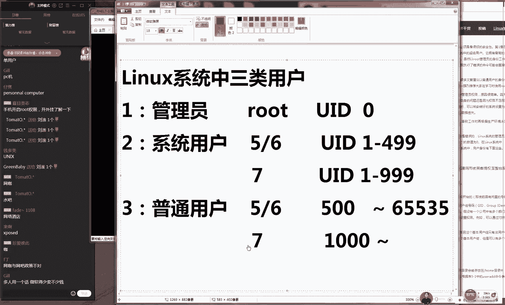

这么一个机制。好了，然后的话那我们来去说一下我们具体管理我们用户的一些命令。第一个话呢，我们的命令叫做usADD啊，另外我想需一下问一下啊，因为这个因为是这样的，因为上一期的话呢。

我们开始做那个送书活动嘛，我们。😊，我们也是第一回去做，大家应该应该知道的。因为这个东西嗯就是完全自己往往就往里交就就在往里贴钱了。因为送书啊什么都是我们自己要去买，然后给大家签完字。

然后再发出去什么邮费什么的，我反正我们上一期我们是送了二朵本，然后也因为是我们说的比较突然，然后也没有太多准备，咱们这一期开始主要去呃也提到了我们发博客和送书这么一个活动了，我想问一下啊。

我也提前有个心理准备。好吧，因为我们这一期大概12月中下旬，我们我们会结客。我大呃大家嗯。😊，你们就是再坚持更新博客，然后准备领取签名书籍的同学，你们打下一，我看看大家有多少人行吗？

就是我们大概也要备一下货嘛，我们大概心里有个数啊。😊，还呃大概也差不多有二三十个同学差不多是吧？行吧，就是反正我我们有这么个活动，今然给大家说了，我们就会给大家去送书，不能补记的。

就是说你不能到最后一天，们很清楚不等最后一天了发2单不管用好吧因为我们这种相互的大家发这个东西对我一好处都没有是传下我们的书名就仅此而已，对吧？听到我们这个书或者好歹给我们带个链接加我们的网站仅此而已。

主要是对于你自己的一种激励，那你不要骗我们最后一天发20个对你们有用处，这个东西不生效了，一定要坚持这是只有给我们员才会有一个小福利有发没有发大家发的话坚持下去。里有个数概二三十个同学我们提前准备一下。

😊，啊，行，然后我们来继续说一下，我我们这个命令，我们叫做USATD行我们幸亏有大概有30多个同学啊，我们就幸亏不是100多个同学。好，那我们来继续给大家去说。如果您要是现在刚刚开始想要去发的话呢。

也就还行，现在就开始发吧，然后我们也算给大家参加这个活动。因为我们想要大家能去更加积极一点参加我们这个活动嘛，不会给大家那么死板，卡的咱咱必须咱必须第一天怎么着的。但是我们就说了啊，今天是最后一天了。

如果说您今天还没有去发，没有去补之前的笔记啊，今天也要把之前的笔记给他补上，你也要拍照的。如果你没有做的话，那就今放弃了。好吧，今天最后一天。😊，给大家一个机会可以去补一下。好，就这晚18号。

我记得记到我手记在我手上了。好，那我们创建出来一个用户。这个用户的话呢，我们那我们随便来去写。我们好比说我们叫做呃FLEX同学X同学叫同学是吧？创出来这么一个用户，然后创建好之后。

然后我们就可以来去查看一下我们这个用户的相关信息。那你可以看到这个用户创建出来了，这就是我们用户的一些相关信息了。好，那我们除了这个之外的话呢，其实我们还可以加一些参数。比如说我再创建出来一个用户。

我们可以加一个杠U指能一下我们用户的UID号码，指能一下我们这个身份的号码。然后比如说我们叫什么叫星星之火是吧？叫叫做这个小星。😊，或者我们叫做这个星星。那我们将他这个UID号码，我们给他改成555。

好了，我们现在敲一下回收，再查看一下小星同学的这个账户。那我们来看到呃叫叫叫做这个星星同学这个星星同学这个账户。

可以看到他这个I号码为555有个为他的这个编码大家可以看到就是说当我们出现出来一个用户的话，非常简单。那么你只需要使用加用户名称就可以了。且你可以加一些参数来进行一个调整。

再如说我再只能是我们的这个终端的名称。那我们可以把它改成叫做我们给取成它不能登录系统的一种用户好了，现在我看大家提什么问题。

大家提到说叫小新大象大象满足你了叫这个大象这个两个命这个效果这个同学提到两个命令这两个令果是一样们都现出来用户这个看己的习惯。我是建议大家叫去打我们跟我们数量是一样的。😊，啊这也是一个习惯问题。

它就像我们去重启我们这个服务器。它实际上来说它是有四种方法的，它可以使用到power off，使用到杀档，使用到呃叫做LALT，叫做nt啊，对吧？它也可以这样去重启。

它也可以去使用到叫做叫IIT0也可以去重启，它就是说去关机跟重启，它都有4种方法来去实现。但是其实你哪一个你做完了之后，效果不都是一样了吗？对吧？就相于我之前我买了一个特别难吃的一种。😊。

又给大家说段子了。😊，因为今天讲的比较多嘛，比较比较枯燥。是这样的，我那在他在我们这个系统里面啊，他会有很多很多这个命令，我们看起来可能是一些重复，他就是为了让你能够自己去选择的。

我呀之前我就在京东上面然后我就买了一个叫烤榴莲，不知道你们有没有吃过，就是呃小扁盒，就像一个铅笔盒一样大小的也不常啊，然后就是里面放了几盒榴莲肉，他还说一种烤着吃的，它不是那种直接吃的。

但是没有见过或者说买过的，要要是没有呃要是没有。😊，见过那那我给你说一下啊，刚刚听说过是吧？想叫这个碳烤榴莲。后来啊啊怎么说怎么指定UID号码啊，就是使用这个杠U后来我就买了一盒，但是非常可惜。

我们家没有烤箱，因为谁家因为我也不爱做饭，我们家人也没有爱做饭的对吧？烤箱没有用嘛？后来我就拿那个火大家知道吗？把给放灶上，就烧它，因为锡纸的，后来我发烤出来之后吧也挺好吃的。后来的话研发了一下。

还有什么蒸锅蒸啊什么的，其实效果都是差不多，但是拿火烧出来其实是更好喝其实是更好吃的，即便没有烤箱，那你也把给做出来，这个它也是这样一回事啊，即便说你这个你换一种方法，但是你这个效果实现了就可以了。

这也是红帽的一种烤一种思路。红帽话恶心了，烤屎，你们不要这样好不好？我的冰箱里面还有大概三五盒没吃完，那你们么说我都不好意思吃了，就是红帽是。😊，一个美国的一个公司，这你们知道对吧？然后的话呢。

这个创始人是。也是一个美国人，他们没有像中国有像黑中国的教育制度，但是没有这个意思啊，就是说他们可能不像中国式的这么偏向于应试教育。

他们不会说这个答案题目A只有一个答案B红考试的这个宗旨一直没有变他就是说他不论你怎么去做的。你只要做成功就可以了。大家懂这个意思吗？红考试不看过程，他只看结果，所以就产生出来的一些高手嘛。

他们他们去考试的时候，可以利用一些比较偏门的方法来去做出来？他只看结果不看过程。大家记住我这句话，这是一句真理是我们红考试一句真理。咱比如说那我们讲到一些他都是文件，那我们出出来一个用户。

回车但你通过命令出出来的这个用户你去编辑这个文件出出来的这个用户都是能够拿到分的。大家可以记住句话要扣分之后算我的？红这个红他只看结果不看过程，所以说你这个结果效果是一样的没有问题，那就是成功的。😊。

就像于说上个就是在呃上个世纪的时候嘛。😊，呃，邓小平提出来就是说改革开放嘛，他还说过一句很有名的话，就是不管是黑猫白猫，周大号的就是好猫，对吧？他就是提出来这么一个。😊，思想好，那我们接着给大家去说啊。

现在那现在出来一个同学的名字叫做大象。然后的话呢那我们现在可以来去尝试去切换到这个用户身份下的时候，他会告诉你说切换是失败的。因为的话呢这个用户的终端是SB里面的no love in。

它就不能够登录到我们的这个系统里面。😊，嗯。既下我们再来给大家就说。新建出来一个我们这个用户组。刚才大家问到说刚才那个杠U55也不能够登录吧，它是可以登录的。因为它的终端不他这个。他这个终断的话呢。

他这个默认就是这个里面的他是可以去登录的。好了，然后那我们现在出来一个用户组了。咱用户组我们好比说叫哈哈无所谓啊。

我们现在出来叫做哈哈这几个用户组好之后话大家可以去看他我们这边这个配置文件目录里面叫做group这么一个文件里面就会出现了是我们这个用户组这样话那我们就可以来去修改我们这个用户我们这边的这个用户信息了。

比如说我刚有一个同学的名字叫做星星是吧叫做这个星星好了那那我们可以看一下现在他是归属于到自己的一个基本组里面这个他没有一个扩展组，因为他只有他自己的这个组然后我们就可以去修改了。并话叫做命。

进行一个修改小这指指的他指的是修改基本组刚大指指的是修改我们这个扩展组，然后我们给增加一个。😊，扩展组我们叫做哈哈，我们用户名称我们叫星星。这样的话呢，我们做好之后，你再去查看这个用户信息的时候。

就会发现他已经是多了一个扩展组，我们叫做哈哈。然后我给大家去说一下什么叫基本组，什么叫扩展组。😊，先举一个生活上的一个例子，我呃我们每个人出生了之后，你们都有的一个基本组。我们这个基本组就是你的家庭。

你有你的爸爸妈妈，还有你的这个呃各种的处业关系。那么这就属于你与生俱来基本组。大家记道基本组与生俱来的一些呃关联信息，对吧？比如说那我在我们系统里面就是他自己的名称啊什么的，这是他这个叫做基本组。

他是一个与生俱来的。所以我们系统充建出来，他就有这些相关的这个组的这个权限了。后来的话随着我们这个不断去成长，我们到小学的时候，我们需要进小学里面去学习。

后我们到初中的时候也要上初中后考高中参加高考最后我们去工作。大家知道就是因为在几年之前小学那会发生过一些就是知道看人的这样的这个事件。大家应该听说过对吧？后来的话现在小学的门口都已经占了保安了。

大家如要是有孩子的话，你们应该知道自己家的小学门口都站在保安了。而且每进门之前你需要先去登记，而且有些时候他不让你进的。那么。😊，为什么你不能够进入到你孩子的小学里面？但是你的孩子可以呢？

就是因为他有了一个特殊的一个扩展组的身份，就是某某小学的一个成员。这样的话呢，他就有权限来去进入到我们以小学命名的这么一个呃这么一个资源池里面了，对吧？

那这也他是这样的扩展组就是为了能够去方便以后我们的工作学习，或者说那我来去呃获取更多的资料，加入到一种更加高级的一种组里面。😊，咱比如说我们怎么充建出来一个目录。

这个目录就是只限于我们这个技术部或者说财的这个财务部的这个人，他才能够去访问。那么这个时候那你就必须要去归属到这个财务或者这个技术的这个扩展组里面，然后你才能够去访问到这个目录里面的东西。

他就这这他这就是我们这个基本组跟我们这个扩展组的一些区别，大家需要能记住啊。好，这个大家去截张图吧，这张图很重要啊，大家截完好之后，赶紧给他把它删掉，删掉有点不太有有点点不太舍得。好。

那我们来给大家记一下我们这个基本组跟我们这个扩展组，大家记住啊，基本组括弧与生俱来，扩展组后天习得，后天获得好吧，那我们这样的。😊，这样的话呢我们来去修改一下，就是呃那我们再呃去修改完了之后。

我们再尝尝试去修改一下我们这个用户的UID号码吧。再比如说我们刚才同学说啊，说这个星星啊叫55，可觉像哭了一样，不太不太吉利，对不对？这个不太呃，这也不太好看。那我们就修改一下。

咱比如说我再去修改一下我们这个用户UID号码，把它修改成616，这个没有问题吧。😊，然后我们再修改一下我们这个用呃用户UID号码。这样我们当我们修改好了之后，我们再查看一下用户的这个相关信息。

就会变成了666了。没有问题。好吧，这就是我们去修改用户的这么一个方法。其实这个非常简单的那我除这个我们会建出来用户修改用户个用户组了以对我们这个用户组进行一个更改了。

然后我们干嘛那如何去重置一下我们用户的密码了密码的话呢能够去修改入册吗？也可以的用户组删除的话使用的叫做group很慢了。其实好那我再因为我们想大家加点东西，讲少的话。

得会有同学技得个上太了有点像什个有一个动画片叫海贼王就别剧情懂种感觉？就是进行拉别特别每讲东西很少好，那我们去调整一下我们。😊，个上课进度吧，大家如果觉得快的话。那我稍微慢一点，这个没关系啊。好。

那我们接下来给大家说我们一个删除的命令的话呢，我们叫group delete代表就是删除掉一个用户组。好。

那我们接下话呢我们再来我们去呃重置一下我们用户的密码后面我们这个用户的名那以来说话我们就用到星星吧你不说们拖个星星他说我输一下我用户的密码随便写个不要我建好了为话超级用户的可以重置任何人的密码这就这就是我们来去重置一个用户密码的一个方法所以我感觉我我光讲这个的话太简单了。

那我还下面一个就是删除掉一个用户们做发现啊们这同学们思维比较跳跃我刚说了一下什么海贼王大家又说到什么火影，然后开始聊火影了所大家这个。😊，啊有点太跳跃了，我们还是给回过来啊，我们还是去学习我们这个课程。

那我们现在再去删除掉一个用户的话，那我们既然对于我们这个用户要会建立要会去删除，要会去修改要会去呃出现的时候，各种这个呃属性的这个设置，以及我们要去重置我们用户密码，这5项我们都要会，最后就来去重。

那么就那我们这个最后要去学习一下。该如何再去删除掉一个用户。后面可以来去直接加上我们用户的一个。😊，用户的名称，咱比如说我们叫做星星走你OK了，再来查看一下我们这个用户信息就已经没有了。

但是啊这个用户信息虽然被删掉，但是我们可以进入到后me目录里面查看到这个里面还会有一个目录叫做星星同学的。他这个目录。那也就是说默认的us delete的话，它只会去删除它什么呢？

对他只会去删除掉我们这个用户默认的用户信息，而不会去删除掉这个默认。😊，呃，他而不会去删除掉这个用户所有的这个信息，也包括我们这个用户他的加目录的这个数据。所以的话呢为了如果说我们要把它给删干净的话。

我们去删除来一个用户的话，请切记比我先看一下这个用户叫做同学这个FX同学那我们一定要去使用一个杠R操作这样话代表就是完全的从根把起这个用户系统的信息删掉。账户的这个属用信息删掉。

他所对应的这么一个加目录的数据删掉，把它给删干净了。包括他这个呃包括他这个基本组就把给删掉。好了，那我们这样去回车。同样查看一下我们用户这个信息就已经是没有了当当当当没有了接下来数门以来去理解。

然后嗯我们能不能去删除删除掉这个超级用户这个需求你们真的有这样的需求吗？这这个是不可以做到的。因为删之后，那你再也没有一个人能够去管理这个系统了。😊，所以这个需求呃还是比较奇葩啊。

但是这个数但是这个是不行的。因为你是把删掉之后，那你就再也不能去新建传用户了。因为只有超级用户可以去新建用户嘛，你你那你就不能够去做呃很多很多问系统的方法。这个事情是不能去做的。

但是你可以对于这个root用户改名，这可以啊，这个你可以去改名好，或者说你不太喜欢叫ro你把叫什么名字，你可以去改这个可以去做。好，那我们现在可以看到的话呢，那我们删掉之后就删掉了这个fl同学这个信息。

并且删掉了这个呃用户所带的所有所有的属性以及加入这样的这个数据了。😊，删掉一个用户会删掉这个用户对服务器所做的变更吗？他不会的啊，运营做变更就是已经做过了，就像于权利的游戏里面有一个主角。

是那个小是那个小矮个小呃小小这个朱如嘛，他说过一句很有名的话，他说呃what is is就是你做过就是做过了。所以说你即便把这个人给删掉，或把这个给删除掉，但是也没有用了。

因为他已经做过这个他已经配置过这个文件的话，他已经是做过了就不能够删掉了。他只是去删除掉这个用户他相关这个信息而已了。好吧，就是我们好比说我们对系统产生了破坏了。但是把个用户删也没有用了。

好小猪佩奇我们普通用户改名该怎么去做加同步去改名。那我们改名的话，可以这去做那你可以去用到命令。后的话我们可以加上一个。😊，呃，更改改名字。改名的话，其实我建议大家不要直接用到命令了。因为命令的话呢。

我觉实不是很熟悉。我这样给大家改。咱比如说我们这边有一个用户叫大象，对吧？你看我这有一个用户叫大象，你看这样去改因为里些都是文件。

所以可以直接编辑一下这个文件叫做删之新建接编辑我们这个配置文件大象是们敲回车直接编辑我们这个文件将这个大象给大家改成什么？叫做这个小象吧，无所谓啊，保名退出好了。

然后再看一下这个用户身份大象没有了多出来一个叫小象这一个账户，而他这个所有的信息除了我们的名称大家可以看到它都是一样的，他就是一个改名的一个操作。

包括说我们用户组也以他这个红也是只看一个结果不看过程的但是这块太深了，因为我们没到我们这个文件目录呢，我们等到我们等到下礼拜5的大家去说的。好。😊，那就说一下我我们这个文件的一个类型啊。

因为我们之前的话都是通过我们这个。呃，文件的这个颜色来去判别我们这个文件类型。其实这个显得很呃会很low。那我们除了这个颜色来进行判断的话呢，那我们可以通过这个文件前面的一个标识符务来进行一个判断的。

就是我们前面的这么一个减号和呃或者是一个D。它有几个比较常见的这个类型给大家去说一下，先在说一下这个减号，这个减号代表就是一般文件，一般来说就是我们这个配置文件。😊，啊。

这个号就是我们这个一般文件它也是指的是我们这个配置文件D的话呢，它指的就是一个目录文件啊，当然的话还有其他的，比如说BB和C它就代表就是我们这个块设跟它这个块设备跟字符设备文件。

其实我给大家说了这个块设备的话呢其实大家也不太理解说什么个块设备设备的话，主要就指的是我们这个设备文件。但比如说我们这个鼠标啊键盘啊呃光盘光驱就这样的这个设备，我们把它这个块设备文件。

还有这个是指的是我们这个管道文件还它指的是我们这个链接文件链接文件的话因为今天我时间有限。估计今天我们讲不到会讲到我们下礼拜5会大家去讲到这个链接文件的好，然话那我们对于有我们这个文件上面的话。

他家可以看到这么一段这个信息，当然都是我们这个权限。我们接下来的这个几十分钟里面我们都会给大家去讲到我们这个权限那我们该怎么去玩，并且我们要对这几位这位信息。😊，我们有一个非常非常充分的一个了解。好了。

我们就不给大家多说了啊，因为时间比较紧凑。我那么们来看一下啊，就是说他用过9位，大家数一下12345呃，456789OK9位嗯。😊。

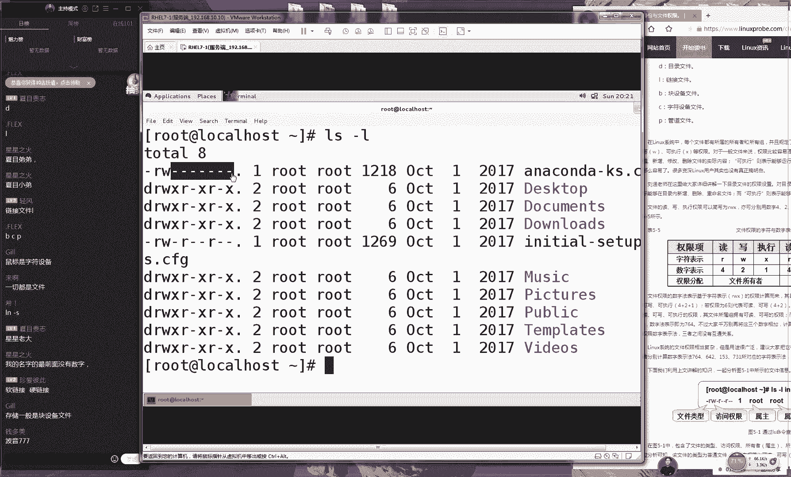

嗯，9位信息。然后我们来看一下我们这个表格，那也就是说它大概就是这么一个样子。我们这边会有9位信息。其中的话呢这个9位信息前三位叫做文件的所有者，就是归谁所有，就这个人的信息。而这个话代表就是归谁所有。

这是我们这个呃用户组的这个信息，就是说我们所有者跟所有组，他们会去执行。然后他们会啊他们会来去按照这两个权限，他来去控制我们这个文件，最后就是其他人。

其他人指的就是所有人偶尔所有人全部人全呃这个所有人减去我们这个。😊，文件的所有者再减去我们这个文件的所有组就等于的是所有人，他们都属于叫其他人。那我们这个权限是为三位，三位一段，总共是有9位。

它有三个权限，它分别化呢叫做R，R代表就是read代表是读的意思。读取。那代表代它它代表就是一个读取权限。W代表就是写入叫做rightite写入。还有就是X代表就是执行。执行哎。

我们都打出来了 executeO。来我给大家可以看一下，就是说那我们现在有三个权限即读取写入和执行。大家不要看着这个很很简单啊，很多的就是即便考过HC的水货嘛，他们也会感觉到很简单。说RWX会了。

就是读取执行啊就是这个读写执行嘛。其实很多的C他们考过之后，或者说你运维录到1年的同学们他们都不懂说这个三个权限对于我们的文件跟我们的目录它有什么样的一个差异。

所以的话呢那我先给大家来去打一下金属告诉你这个三个权限，他到底怎么去他怎么来他去解释，主要是对于我们这个目录上，他怎么样去进行一个解释。先在说我我们这个文件对于话呢我我们这个文件的话呢。

这个读那么就很好去理解。因为。😊，这个读取就是指读取这个文件里面的内容，代表就是读权限。如果你要有这个R权限制，那指的就是你能够去来去读取这个文件里面的内容，这个很好理，对不对？第二的话就是说W。

它指的就是你有权限来去修改这个文件里面的内容。这这就是字面意思啊，就非常简单。最后的话这个X就指的是如果这个文件为脚本文件，那么好了，那么就是你要有这么一个执行权限，那么你才可以来去执行我们这个。😊。

我们的这个脚本好，说什么在座各位都是水货啊，这个可不是我们学完了之后哦，如果咱们是水货的话，那真的就这个整个CE行业就都死掉了。大家应该来说我们这个培训做完了之后，你看天底下的所有的C都是水货。

这种感觉才对的因不是己吹啊，其实做到这么一个高度。好再来说一下我们对于目录来进行操作的话呢，那我们目录这个三个权限这个解释是不一样的。因为你想一下读目录什么叫读目录啊。

它目录是用来保存文件的这么一个资源池，或者说它是一个目录。那好了，读取一个目它是不存在的。因为它目录它只是一个文件的一个搬运工，它本身它没有文件内容的那么所以的话呢。😊。

对于目啊我们的这个目录的读取权限，大家记得你这个书上面很多的考过2C的水货们啊，他们都压根没有搞明白过。就是说这个读取权限的话呢，指的就是能够去查看目录啊，他能够去查看目录内文件列表的权限。😊，哎。

他用来去查看我们这个mo文件列表的权限嗯。行，然后的话我们第二个代表就是呃写有权限。他指的是我们能够在目呃，他指的是我们能够在这个目录内进行新建。删除重命名文件的这样的权限。好，大家记一下。

他的话指的就是我们能够在这个呃在我们这个对应目录内新建删除和说名这样的这个文件这样的操作。最后一个就特就是就是更加奇葩了啊，执行一个目录，这个我是不懂的。哎，实执行一个目录目录还能去执行吗？不可以吧。

它只是一个用来存放文件这么一个场所而已。所以的话呢对于我们这个执行权限指的是什么呢？对它还指的就是你能不能去进入到这个目录里面。对应的我们这个命令就是CD1个目录的名称，就是代表去切换目录的意思。

它有没有权限来去切换我们的目录。😊，切换我们的这个目录的这个权限。好，接下给大家去说一下，那我们就搞明白了。那我们那我那我们这个权限它总共是分为9位啊。

它总共是分为9位三位三位一段第一位所有者第二位所有组第三位其他人。并且的话呢我们这个权限细分下去再往下面去分是分为RWX权限对于我们这个文件跟目录的作用也都是不一样，大家去说清楚了。

然我们看图说话们看图说话。那你看这张图的话就是说指的是三个权限，它这个普通点就是说他还给你讲到就是这个数字法表示，那我们也需要做一个数字法的一个表示，为什么要学这个数字法，我们暂且先给大家卖个关。

但是大家先去相信我就是说这个东西学完了之后，它是有好处的。具体为什么呢？就是因为当你表示一个权限时，你写数字三个7比你去写9位的一个权限更加清晰了然。再给大家举个子。

你有一个权限这样去写的RWXWX权这么去写的。如果说你的这个权。😊，权限是这样去写的话呢，会特别特别的乱，而且的话呢不太好去读。但是你可以将这个权限给它快速转换成764。

任何人都可以通过这个764表去来去表达出来。并且的话呢。😊，你还可以通过你这个命令来来来去直接来去设置这个权限到你的这个文件上面。这个数字法就是必须要把给学好的一种权限法的的一个表示方法。

大家需要记一下R是4W是2X是一就可以了。话，怎么会在后面去学到具体章节叫做S叫做这个SS节大家讲到这个这个先不用着急它是叫做这个文件的这个权限言码，这就是在我们这个之上的一种技术。

待会给大家去说到R是4W是2X是1记住这三个字的这么一个数字法，然后我们就给大家大去玩一下。看我给大家去做一个这个权限如果是这样的话，RWXRWXRW号W这样吧。就以我们刚才那个为例。

如果说我们现在给你一个权限，它是这样子的话，你怎么能够把它给我转化成我们这个数字法呢？我给大家玩一下，大家看好。😊，第一来说我们这个权限，你们不要这样啊，给点面子好不好？你们都会的话，那我还讲什么？

因为肯定是其他所以我跟大家确信了啊，咱们这一期培训机构里面只里有其他培训机构过来的托，你看这个很明显啊，就是很不给面子啊，对吧？好，就实大家会了，但是我心里是其实其实很高兴的啊。

我们同学们能够听话真的是对自己负责任啊，这不是听话，这对自己负责任去做预期，这我很高兴的啊，因为。😊，这东西你要不预要不去做预习的话呢，会我们讲课时候很生硬很生硬的，很难。但是的话呢我们还是想说啊。

你们肯定是一在培训拍过托啊，因为都会抢答了。好那我给大家说一下。如果说您不知道怎么去做转换，不用担心啊他们就是一些我怕的托啊，大家先慢慢去要要有压力啊，就你们不要压力。好。

那我们来说一下这个权限这个这个话这个权限是三位三位一段的大为大家是预习过，但是照顾一下我们没有预习同学但如果大家都去预习。更好了这样那我们就可以给大家去扩展一下。

比说我们今天给大家讲一下这个反码知道更多东西了。但是如果我们技术一直到很低的话呢，感觉会我们只能是走一个最低就是一个。😊，走个现在我们叫什么叫这个呃低保啊，就是走一个最低的一个水平了。那好。

那但是我们最低的一个水平也比我们以下培训机构要高很多。好，那我们来看一下我们这个权限。三位三位一段所有者就是他主人是谁，所有者是谁，所有组是谁，以及我们其他人是谁。这样的话呢。

我们的这个所有者他会去执行我们这个的权限，所有组他会去按照我们这个权限来去执行。最后其他人他会按照我们的这个第三项来去怎么样哎来去执行。那看一下我们这个权限转化。第一来代表就是说对于我们分店的所有者啊。

因为我们对于这个来讲啊，我会给大家去说特别特别的细致，因为我会我会对这个每个字节会给大家讲的非常细致。那我也希望大家的话去做这个实验的时候，也一定要就是对于自己啊要自己个记己出去出几道题，自己去考自己。

第一来说所有者。😊，RWXOKR代表就是我们这个文件所有者，他可以去读取这个文件去更改这个文件以及执行这个文件。哎，我们的这个文件所有组的话呢，他指的就是如果你属于同一组里面的话呢。

你的R那么你就是读取这个文件的权限W修改这个文件的权限。最后因为没有一个权限，没有权限用到减号做展位啊，最后我们的其他人，那么就代表就是他只能够进行一个读取操作，他没有一个写助跟执行的一个操作好。

所以新一同学就一定是我请过的，以过夸我们来的啊，这个其实是我小号好，那我们来继续给大家去说一下的话呢，就是我们这个三个权限，他所对应这么一个作用。然后来去说一下。

我们该如何去进行一个权限的一个转化R是4来记笔记R是4这个我们这个大家都应该是错误的。如果你要是会的话，那你不能说自己算错了。因为他是四加2加一。😊，多你才是个七。

你气呢这个这个还还啊气呢这个加法你不可能算错了，对吧？气呢的这个加法就这么三个数，你不可能算错，错就错在你这个权限你不理解上了。好了，那我给大家去说啊。😊，第一来说的话呢，R是4。

那就是说这边是4W2下来X是1没有问题。呃，R是4W是2，这边没有权限为0，没有权限级为0R也代表是400。这样的话呢，那我们算出来之后，我们应该算出来多少，是7。因为你三面三面1段嘛。

三面三面1段764，所以你算出来是是764，然后的话你你进一步去算啊，这还只算完了其中一部分764，就是我们权限法。然后我们继续来加上一起7加6加不开，我们就加是呃6加4等于是1010加717。好了。

我们最后算出来我们结果是17，对还是错嗯。😊，我们最后结果算出是七是对还是错？嗯，肯定是错误的，为什么呢？因为你的这个权限法之间是毫无关联。我给大家说一个很扎心的一个例子啊。

以后我有咱有一天我不小心去了一个小饭馆里边了，正好马云也去了。😊，呃，王建林也去了比呃，然后呢那个比尔盖茨也去了好，这个时候我们四个人一块在这个饭馆里面吃了饭。😊，此时此刻是一个饭馆的身家。

应该就是这个呃饭馆里面做人这个财产啊应该达到了400多亿吧，或者说达到这个上万亿了。但是你平均到每个人的这个身上是没有任何意义的。因为我们还是我们自己毫无关联。大记到这个这个大既这个例子啊，毫无关联。

所有者跟所有组跟其他他没有关系的。我的还是我的你的还是你的这个没有任何关系，加到一起，凭什么把我这5万块钱加加到这个人家亿身上的，对不对？他这个是不成立的，大家需要记一下。好。

然后的话呢我给大家去出道题，哎，大家如果你要是知道啊，那如果你要是。😊，预习过，我希望大家大家的话先不要说啊，我就想看看大家这个预习情况怎么样。好吧，马上就出这个题目了，很厉即这个就很厉害。这个题目。

我给大家出一个题目，你快速的将我这个权限啊给我做一个转化，转化成我们的这个。😊，数字法好吗？快速给我转换一下，来把给我转换一下。说话中我们这个数字法。我们现在101位同学好，还是101位同学啊。

大家不要说啊，知道也不要说，大家快速打的啊，打的很快啊，是766呢，还是7还是744呢嗯。😊，所以哎呀你看这个很扎心啊，我刚才还说你们预习的很到位，到底有没有做预习啊，你们我都开始纠结了啊，哎呀。

这怎么回事啊？大家因为是这样的啊，因为老刘你们能够猜得出来我是讲技术的，我不是讲段子的。所以有所以他有些段子的话呢，我会每期都会去讲的，我会我我已经讲了19遍了。这个例子就是这个问题。

这个坑我已经讲了18遍了。😊，就是您但凡要是预习过就一定会不会跳进这个坑里面的。因为这道题它根本就是道错题，不他是他是写错的。因为我从来没有教过，就是说没有权限用到空格去做间割，对不对？

你你应该用的是减还是做间割。这个权限它是写错的。所以说这道题你写的是644或744这个没有任何用处了，是不是你没有去做预习，这点很重要，但是我没有想到说我们这一期同学预习情况差到如此之地啊。

但你以后12月份你到底怎么去备考，对吧？但是如果你要是会的话啊，这里没有关系啊，你要是不会的话，那你必须要好好去做预习了。好了。😊，这个一定要去这道就这个一定要去知道啊，因为我出题我今天还好。

我们坦白来说，今天刚刚给大家讲了两周时间的课程，我跟大家还不是很熟。等到以后的话呢，我们会给大家去说。😊，到很多就是不光是讲技术的这个坑，到工作时候的坑啊，或者说我们一些工作经验什么的。

到时候的话我们需要大家不光从技术上来去思考，也要从工作上跟这个实际情况上面来去思考。好，那我们来给大家说一下。如果说那我想给大家一个权限。然，大家看一下这个权限。😊，请将我们这个权限转成数字法。

来大家快一点。将我们这个权限给大家转换成数字法。今天我们就把给大家玩明白了，好吧，这个一定要给大家玩明白了，等等以后你会感觉哎呦。😊，幸亏今天玩的很明白啊。😊，要不然的话以后就吃亏了。好。

我们给大家去转化。如果大家是会的话，你就开始去写就好了。如果您不会的话呢，请听我慢慢给大家讲。好吧。第一来说这是多少？这是这个是4，然后这个是啊三面三面一段，它之间毫无关联。这我们知道了啊，420。

就是400，然后是000。好了，那我们算出来是640算出来十是错误的，没有这个10。好，大家记一下。😊，这就是我们转换的一个方法，再给大家玩一个，好吧，我们多去多去多玩几个。大家如果要是会的话。

就耐心一点。RWX啊RWXR减减RW减号后，请将这个扩快速转换成我们这个数字法。来快速给我转换一下。啊，大家太快了吧，你们。😊，啊，仔包同学，你这个太快了啊，抢答速度。😊，太快了。然后我来看一下说啊。

如果你要是不会的话，请听我仔细给大家分解一下啊，他们都是一直间是预习的比较好同学来RWX三位三位之间一段，毫无关联这口诀里面记住啊啊口诀啊单身30年的手速那我们来看一下的话呢。

这个三位三位之间它是相互一段的，毫无关联4啊没有权限的话，为0421，它有权限，4214没有权限为00，这个是为4，这个是为2，这个是为07呢加减法，4加2加1是74加在一起是4，这个是64加2嘛。

6等于是4746，这是我们最终的一个结果。😊，啊，所以说他们同学呃打错了，应该是764，可能你是打错了，你打成647了，就把它写反的也不行。好，正好的话呢我们提到这个写反的问题。

我给大家说一个比较好玩的一个例子啊，我先给大家一个题，我就给大家一个数，那我先给大家说啊，我先给大家一个数字，一般我这个数字法，你给我转换成权限法，准备好了吗？啊，54。😊，最后3好。

请将我我们这个数字法给我转成权限法。我们今天必须把给他给大家玩的特别明白啊。😊，啊，543，为什么你们给我打了1个2X什么意思？其他的我自己去让我自己去补全一下是吧？这考我别别，大家先想一下啊啊。

什么还4加1，你是让我自己算出是5来吗？大家来算一下啊，到底我们该怎么去算。我们先是科部同学一下子就算出来了啊，但是这一下子我不知道对不对，我们我们慢慢来看啊嗯。😊，然后的话如果您要是不知道的话。

没有关系，我要给大家慢慢再去分解，好吧，不用着急，说一下这个55是由谁啊？4加1等于组成，对吗？他不是吧是那么他总不能是多少啊？3加1加1，你这样算也等于是5也没毛病，对不对？这我不能说你错。

但是这个权限吧，它不能是出它不能出现两次，这个明显是错误的，它更不能是一加1加1加1，那你这个算出来也没毛病，但是你是一个数学题，对吧？那我们这个权限R是4W是2X是1，它只能是使用一次。

所以这个的话它只能是什么呢？它只能是6减1那也没有就是4加1，那就是4加1啊，那么就是421嘛，就少一个这个写权限4，它就是4它他不是2加1加1，它就是4，那就是说400三的话呢就是2加1，那就是。😊。

2加1，最后这是0。那我们来算出来我们我们这个权限的话呢，它就应该是这个样子的R减XR减减减WXOK有有点乱是吧？没有但啊，但是没有关系，我们起来看一下。😊，这是我们所算出来那个权限的这么一个值。

然后话同学别然后话这是我们之间有同学特别的可爱啊，跟我这么勾血。😊，给我这么写的，看着啊RRWXX1234。好，他给我这么去写的，还真是不乱啊。而且的话呢感觉也挺整齐的。

我觉得这个肯定这么写同学还能是一个女生比较心细，喜欢平时喜欢收拾家里的屋子，然后可能喜欢呃收拾一下在的这个呃去去叠加背后，去收拾一下衣服什么的，把这些整就是整齐就弄的比较整齐一点。

所以我们现在把我们这个几个读权限，跟我们几个写权限，跟我们几个执行权限的话呢，他我们最后这个空缺限位给他合并到一起了。你这样看的话呢，好像我也没说你有毛病，对不对？但是说你见东西他都在吧？

还真还就反正也还真没少。😊，对吧东西他个东西你虽然没少，但是你这个写法是完全错误的，大家不要笑，这个同学真的是遇到过这个问题，你不要把这写的很整齐，这个没有任何意义了，一定要就是保留其原始的这个属性。

没有权限用到减号做站位啊这个才要这大家要先要注意啊，这点很重要。好，下面再给大家出一道题啊，这个一定要多练啊，因为我也不嫌麻烦，大家也不嫌麻烦，我们来给大家多练一遍啊，有一个权限为521。

这个正好把这个例子举的比较好啊，521，这代表就是我爱你的意思，大家快速给我转换一下，把它给我转成我们这个权限法，看看我们该怎么去写。😊，啊，把这个代码给他收拾一下，当然这个。😊。

这这个肯定是反正我觉得这是一个很奇葩的一个小孩啊，也非常可爱啊。首开始思考了，对不对？他觉得这样看起来更加感觉更清爽一点，更简单一点，或者无所谓，他怎么想的？😊，呃，这孩子我不知道以后会不会成大事儿。

我嗯好，然后呢，那我们来继续给大家就是说哇，这个怎办工学打的太快了，我看一下。😊，啊，又是这个小八同学吗？啊，清啊，还还哦还真是啊哇，你这也太快了吧，你这是会不会读心术啊，我还没说题呢。

你感觉给我打出来了。😊，真的是很不给面子，是不是？然后这一下子就说出来了。好，那我们来继续来打一下，大家不用着急，他们或者是他们的，他们交的学费也不给他他们他们自己花的钱，咱自己咱自己花钱了。

我们对自己花费这个钱得好好去做一下，自己去计算一下啊，不用着急。然后如果说你要是不会的，不用担心。我再给大家去做一下再给大家去做一下。第一来说的话呢是这个三位三位之间相互一断毫无关联，这个口诀基数啊。

520521相互之间毫无关联，54加1加出来的对吧？他不是3加23加2什么他们没有3呀，对吧？好，那么就是4加1加出来的二多少，那就二就是2不是一加1好，那么就是00。😊，一它就是1000OK这样。

那最后我们算出来这个权限，那是什么呢？R减X减W减。😊，减减XO大家算一下，对不对？哦，感觉这蔬菜听下去真要被拉低了因为这个它过于重要，它太重要了。如果不给大家练熟的话呢，等到我们下一次再打权限的时候。

大家又反应不过来了。所以我们每个例子都给大家都举几个啊，大家不要说太着急，因为这个基础打好之后，对大家以后很有帮会啊会很有帮助的啊，会很有帮助的。然后我们最后把它给收拾齐了啊，就是R对吧？我们。😊，啊。

说的比较搞笑一点，WXX走走走走走O特别整齐。好了，然后记一下，就是说我我这就是我们这个权限法跟我们这个数字法相互转换的一个方法。那咱比如说以后我想去设置一个文件权限的话呢，那我们就这样去做使用的命令。

对因为我们这个加法嘛。且他是去年加减法小学生你们要去要是有小学入学同学，你们应该知道的，现在小学入学的时候的话呢，你不光要花钱要交要交钱的，你还要测小学这个水平。如果你家的小孩上小学之前啊。

不会说这个加减法的话，他不会要你真的是这样的特别为激烈，因为我当时上小学时候都是多少年二三十年前，对吧？那会我们都要给你去测一下，比如说让你去说几个家人的名字吧？你去说一下家电话号码什么的。

他要考你的现在啊他至少会考你这个加法跟跟这个减法了，对些好学校。😊。

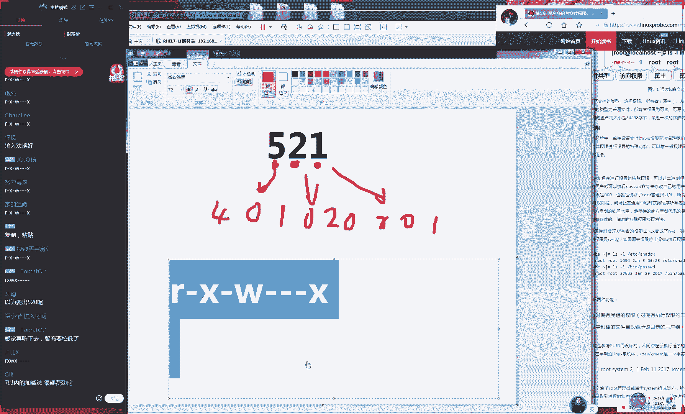

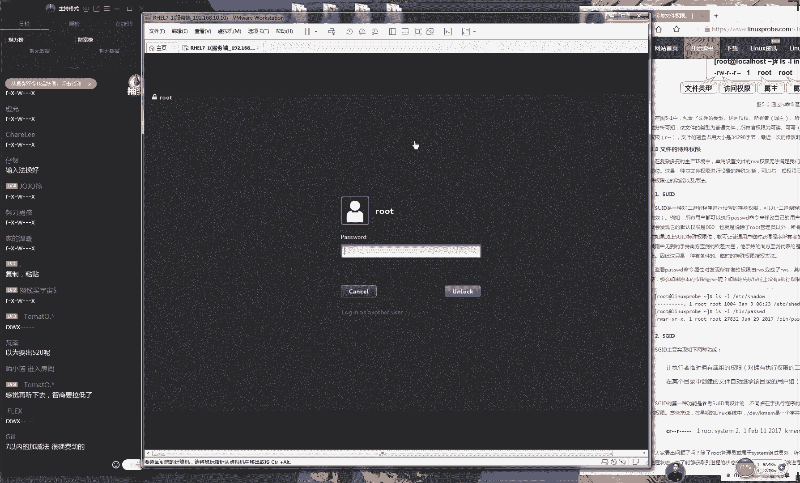

还还他他还会考你，比如说。呃，英语啊什么他可能会考你一些东西，我考乘罚这个点的话叫做F对然后这个点哈如果变成加号话，代表就是这个文件上面有一个文件防空列表。好，这个我们先不说啊。

这是我们下礼拜5先不用去投好，然后我记一句话说的好啊。然记住给大家去说那我们这个权限设置的话呢，们一个命令我们叫做CHMOD这个命令它用来去设置我们文件这个权限的这个它是用来去设置我们文件权限的这个CHOWN它是用来去设置我们这个文件的所有者跟所有组的呃。

😊，呃，搜者。所有组这个信息大家记一下我们两个命令的区别，一个是设置权限，一个是设置我们所有者跟所有组。嗯。好，接下来的话再给大家来玩一下。那我们对于一个文件，我们随便来去选了，我们选这个文件以它为例。

我们来CHOW那我们先看一下啊这个呃它这个文件的话呢，当前我们这个所有者是root所有组是ro好了，我把修改一下修改成W所有者把修改成所有组改然后我们写文件的名称们的对象回车再来查看一下我们这个文件上面这个权限属信息就会发现它这个所有者跟所有组都变成了我们再后面去走给他这个权限。

个成什么我们这个权限是吧500不对，应该是600因为是4加2接下来话呢我们还有就是我们对于这个文件这个权限进行一个指令。

比说我想要给我这个权限来1个521好了521那我们就这去做后面加上我们的文件的属性一个名称啊，看一下我们文件这个权限。😊，就会看到这个权限变成了521这么一个三个权限。所以当你会了这个转换之后啊。

然后你你就会发现真的是太爽了，这个配置起来特别特别的简单，你只需要给他一个数字，它就会自动帮你把它转换成一个权限法。如果说要是没个权限法的话，那么你就要打这么一大长串这个权限特别的麻烦。

所以这个数字法跟我们这个权限之间转换这么一个。😊，我们叫什么？那我我们叫做这么一个重要性啊，就可以体现出来了。好，他就不能够读了是吧？啊，这个没有就这个没有关系啊，我因为只给大家举个例子啊。

我们再给他换一个，他比如说把它换成764，或者把它叫777，这是这是无所谓的啊。那你可以看到我们会把这个权限也会有一个转换。😊，好。

然后接下来话呢我们来去说一下我们下面一个叫做这个特殊权限法叫做SUIDSGID1个SBIT好，今天今天时间的话呢，还有些啊还有啊，大概还有15分钟，那我就给大家先去聊一聊吧。

这样能够差就差不多给大家聊完。第一来说的话呢，我们叫做SUID权限叫做上方宝剑嗯，我看一下啊SUIDSGIDSBIT。😊，呃，今天的话呢，我们讲完是没有就讲完第25。3小节说话是没有问题的啊。好。

我接下给大家去说一下我们的5。3小节。这话呢我们代表就是呃SUYD权限，它能够让。😊，我们这个文件所有呃让我们的这个文件的使用者使用者临时获取到我们这个文件的所有者的权限，这个什么意思啊？

我给大家举一个例子，对，叫这个商叫这个商宝剑啊，大家有没有看过一些叫这个穿越剧啊，或者说叫这个轻宫剧，应该叫这个轻功剧啊，就是那些么甄嬛传啊，或者说康熙康熙微风私访记，就是这种轻宫剧。

大家有没有看过黄上来了，我不知道这就反正我们怎么看过，大家看过还打一下一就是在拍清朝啊，明朝就那会儿的时候的事，比如说和珅好像纪晓岚啊，这你们都应该看过是吧？

还有什么秦大臣康熙微波私访记什么就这样这样就是这样的这个电视剧什么的，应该看过是吧？好，咱比如说啊。😊，有一个电，他他有一个电视剧，所以说你们你们要没有看过动画片，比如说没有看过这个呃机器猫。

没有看过康熙微夫私访记，我故计对于你们上课都有一定的这个阻碍了啊。来说一下，有一个电视剧叫这个康熙微。😊，服丝访记啊，就是说这个康熙嘛，他就当做平民，然后去考察这个老百姓的这个生活这么一个电视剧啊。

咱比如说康熙啊，他是一个我们算是一个比较好的一个皇帝，对不对？好了，有一天他派了一个大臣，他派了一个大臣，他是一个钦差，什么叫清差啊，清差的我认为啊就是现在这个纪检委他就是这个纪检委。

他可以去考察民情啊，可以去查这个个当地的这个账务啊，然后可以去看当地这个民情什么的，我觉得就是像当前的这个纪检委这么一个身份，我觉得反正我因为可能呃不是很了解这个清朝一会官职，但是我自这么认为的。

咱比如说有这么一个清差大臣，然后有一天天气特别的好，我们怀怀小太阳，因为的话呢我们光说因为我们光说天气好啊，但家没有没有种哎带入感觉，我们这样的话，你一看天气还真的是不错，对不对？

然后我们可以再画一朵小云泰小云我们用的还颜色吧，我特别的好看。😊，不行环环原词会跟我们待会会产生冲突啊，还有几多小云彩。你看天气的话特别的好，那有啊这个时候就有一天。😊，这个钦差的话在这个路上啊正在走。

他也没什么这个他也没什么事嘛，对不对？因为然后这个时候他突然看到一个人，这个人啊他是个贪官，所以话我们为表现出来这个贪官他很胖啊，因为他因为他是个贪官，他是个坏人，对不对？那我们就给他画一个小脑袋。

然后给他画一个很胖的一个身子，然后为了表出他是个贪官，再给大家写成一个贪这个字。你看表现出来就是他是贪官的意思。那好了，那我们今天来讲呢，那你是钦差，那么你的这个职责就是要去完成这个工作。

他就像说我们去去完成一个我们系统里面的这个任务一样，那么你平时的工作就要去完成具体这个任务。那好了，但是从这个实际情况上来讲的话呢，清差的官职咱比如说他他他是四品，但是这个贪官他很厉害，他也是四品。

那么如果说你们两个的这个权限是相等，或者你的这个权限还是略小于了我们这个贪官。那好了，他就像我们工作的时候，对于一个文件啊，么。😊，啊，说是他是光头呢，是没有他没有小辫儿，哎呦，你们要求也太。

太苛刻了吧，你们不要这么为啊，你们不要这么为难一个记术的老师好不好？咱欢迎小辫儿好不好啊，欢迎小辫儿嗯。😊，来来去满足一下你们有点像信个吓人是吧？所以说你们对于这个课程要求有点太太呃太苛刻我了啊。

等画一小辫这样好了吧，不咱给你画一眼睛行不行啊，乌纱帽也你不要太过分了啊啊行先画小帽子，你们到底是来听课还老师来的，怀小帽子行了吧。就满足你们了，这就行了吧。

怀小帽子还有还还有还有什么要求说赛亚人的头发是竖起来的啊，你们自己来画的好不好？那好，那我们来继续给大家去说啊。既下来说的话呢，那你像你们工作一样，你需要去完成一个工作。但是的话呢你的权限不足哎。

你需要去完成一个工作，但是你对于这个文件，或者说你对于某一个事情，你们有相关的这个权限。😊，这个时候你也就不能够去操作，因为他会已经提示出来说权限不足，但是这个时候怎么办呢？不用着急，你是钦差大臣呀。

对吧？啊，什么什缺块大金表，啊你们不要这样啊，这个时候这个大臣出现一件事情来，他呀临行之前，他是因为他是钦差嘛，有一个人谁呀，皇上，哎，皇上正做这个编什呃前面正正看电视呢我们说他正要上朝呢啊。

再画一个春斋听证这么一一个小帘子，你看啊这是皇上这个皇他就想到这个皇上临行之前啊，给他一件法宝什么呢？叫上方宝剑，大家应该知道有这么个东西啊，这不这个不是给大家先编出来的。

这个话叫这个上方宝剑说啊当他的话呢。😊，哎，看到了这样的这个当地的一些不合法的这个事情的时候啊，他可以用过一把宝剑怎么样呢？先斩后奏。哎，我们为了是表现这个剑很厉害啊。

我们这个剑名给他划成40米长特别长的一把宝剑。就是说啊他会给他一个法宝，拿这个宝剑。😊，当你掏出这个法宝之后，当你掏出这把宝剑了之后啊，就相当于就是你见到了皇上。大家有没有看过一个电视剧叫喜来乐。

你们有没有看过，你要看过我可以打一下一。哎，其实你没有看过吗？😊，啊，但这个你要没有看过话，那那我那我那那我就不讲了啊，大家有没有看过喜来乐这么一个电视剧。有吧。喜来乐当时的话呢给皇上看病。

后来给看好了，皇上赐他一什么呢？黄马褂，你没有看过吗？对，刺了他一个黄马褂，穿上这个黄马褂之后，他就有身份的人了，这他也是这样的，他给了他白宝剑啊，这样的话呢。

当你掏着这把就他啊他是当你掏着这把啊这把剑了之后啊，😊，所有人都要下跪的，都相当于就是你见到了这个皇上的这个身份。所以的话呢他就有这个权限来去惩着这个当官，把他给扑哧给他杀死了。好了。

这就是我们的一个宝剑的这么一个功能了。好，那我们去想象一下啊，对于我们这个课程它也是这样的，对于我们这个系统也是这样的。当你平时的时候，那你是不能够去做一个工作，因为你没有权限嘛，对吧？

但是你可以去使用一个命令，或者说你去使用一个工具。当你去使用这个工具的时候，就是临时去获取了一个更高的一个的一个权限，然后来去完成这个工作。但是我们需要注意两件事情。第一件事情，这个就这个事情的话呢。

是在你已经被授权了之后，你才可以去做。因为这宝剑的话呢，他也不是每人都有的第一来说你要被授权才可以了。第二就是说你只有在使用这个命令的时候。😊，那说什么样？说贪官如果有金钟罩怎么办？你们不要这样好不好？

那么第二就是说当你去使用这个命令的时候，你才有了这个特殊的权限。当你把它这个惩治完贪官之后的话呢，你还是这个青朝大臣，你不能够替代皇上，大家懂这个意思吗？就是说当你去使用这个命令的时候，你代表了皇上。

你代表了一个更加高级的一个权限。但是当你使用完毕之后，你回归到你自己的这个身份了。你并不是说就成为了一个更一个更加高级的这么一个权限。好，那我们来举一个生活上的例子，再给大家举一个闲话，我觉得好丑啊。

你还觉得你们就再夸我。好，这个时候那我来举一个我们这个技术上的一个例子，给大家看着大家就明白了，是这样的，因为我们先给大家说一个生活上一个例子，大家先有个大概一个想法啊。

然后再给大家去说我们这个技术上的一个例子。😊。

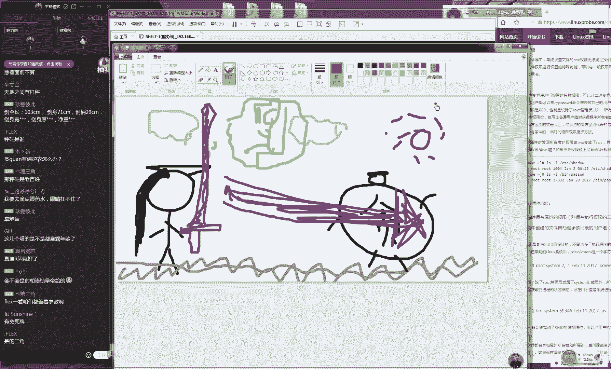

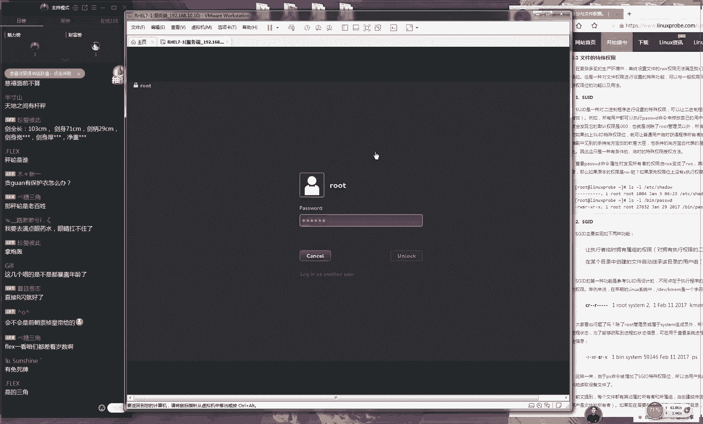

这个跟速度是不一样的。好，接下来我们再再给大家来就说一下，说切换到一个普通用户身份。但是我们下礼拜啊礼拜五的时候才会大家讲到怎么去切换。那我看啊，现在我们来看一下有这么个用户，它有这么个用户。

然后我们再新建出来我们另外一个终端啊，来看一下我们的话系统里面的所有的密码，它是记入到了我们的ETC目录里面的沙豆里面的这个文件，大家可以看一下啊，这个值就是我们当前这个用户，它的密码值。😊。

他是经过加密的，他是经过M他他的话呢，他是经过MD5。这一个加密额，大家先。哦，把缩小一点吧，这样这个这个值它是的话，它是经过MD5加密的密码值好了。😊，呃哦，这些密码是它是经过已经是加密了的啊。

他看清不看不清，把它放大一点啊，大家不看里面其具体的这个内容啊，就是看一下这我们看一下具体大概就行了。接下的话呢，我们现在我们切换到这边的这个呃普通用户去重置一下自己的密码，重置一下我们自己的密码。

密码的话呢，我们给它重置成这个无所谓啊，我们给它重置成呃呃。😊，啊，他说不用太太简单啊，所以我给他一个特别复杂一点的，我自己都我自己都记不住的一个密码，特别特别的复杂。😊，才有再回车。

他告诉我们说密码就把它给重置成功了。好了，然后我们再去查看一下我们这个文件里面。好，大家可以看到说这有什么问题吗？这个很这个是很这它这一很基础的一个事情啊，对吧？

因为的话呢这个密码它之前啊那这因为它是经过加密的啊，它加密的这个值我们不用去管。但你看到说。😊，你看啊我们之前呢是这么一大串这个信息，而我们现在话它是这么一串信息，这两个信息的值是发生变化了。

证明什么呢？证明我我们这个用户密码的话呢，也是发生了变化，对不对？那也就是说用户普通用户有重置自己密码的权限。普通用户有重置自己密码的这个权限。好了，那我们现在翻回来。😊。

既然来说你有琼置自己密码的这个权限。但是我们看一下我们这个文件叫做这个shale这个文件。这个shale文件上面的这个权限，大家来看到之后，快速给我转换成我们这个数字法123啦，这个很这个就这样很快啊。

123。😊，快速将我们这个文件杀到文件的权限法给我转成数字法。大家看一下是多少是000，你不要说你是所有者了，你不要说你是所有组了，你任何人他们77。😊，嗯。为什么会是777？

而且他们看过去好像很自信啊，打了三遍，为什么会是777呢？😊，嗯，再仔细想一想好吧啊，是不是在配合我呀，我看因为我感觉还大可能是看错文件了啊。😊，好，你们不要这么配合我啊，你要这样配合的话，感觉很假。

对不对？而且的话呢，万一有一天我们这个社频被人泄露出去了，对吧？然后有人拍照说这老刘讲课水平好低啊，说你讲了两个小时了，然后结果人家学生连9完数字法的方法都不会啊，写的很low，对不对啊。

就怕人家截张图之后给发出去了。好，大家我们最好配合一下，现在是000，对不对？就是说任何人都没有一个读写，只剩他这么一个权限。那好问题就来了，为什么哎为什么？😊，我们的普通用户他可以去修改自己的密码值。

但是对于这个文件，他连看的权限他都没有。那么啊那么还去尝试一下，你连看的权限他都是没有的。为什么你能够去修改呢？就是因为有一个文件，这个文件我们叫做那么因为我们去看一下叫做这个命令啊。

叫做pasWD这个文件上面我们可以看一下，它就有一个叫做SUID权限了。😊，因为上面的话他有一个SUID权限。当我们来去执行这个命令的时候，就相当于就是获取了一个超级用户入的一个身份。

因为此处加了一个S是这样的。因为的话呢那我们现在为是这样的我们要我有三位三位这么一段这么一个权限，对吧？我讲时间有点多了啊，但是今天讲完应该是但因为我们现在有三位三位之间这个权限。

如果说我们现在在这个所有者这边我们变成了一个S代表就是我们的有一个SI的一个权限了。好吧，然后至于说我们后面呢因为我们今天时间来不及了，其实我想留点时间来给大家去说一说我们这个我们去复习的一些重要性。

其实我想给大家讲一讲的，所以的话呢我们今天就不给大家讲后面了。我们下礼拜5的时候，我会再重新给大家去讲一下我们U今相当就是一个预备的一个课程，今单去描述一下就好了。😊，然后等到我们下一排的时候。

会参那我们会再从SUID开始给大家来去讲一遍，好吧。然后我来去说一下今天这个复习的课程。然后还有我们今天。😊，啊，今天讲比较慢啊，就讲到5。3小节。然后给大家说一下我们现在这个报考的一个问题。

然后以及我们去复习的一个重要事项。好吧，这个复习的话要比这个参数我们今天讲到了，你都要需要去背一下，这个很重要。然后我来就先说一下作业啊，因为大家一会儿就跑了，然后我先说一下作业，作业的话呢。

因为现在你还好觉的时间过得很快，对吧？😊，我们还没有给大家讲段子呢，等到以后我们后面给大家讲段子的时候，你会感觉呀感觉少买张德云这就感觉少买张。😊，啊，听相声的票一样。

因为我们这些段子其实讲的也是很多的啊，大家听我讲课也知道这么一个风格。以后我实在我讲课我混不下去了，以后拜拜什么学个相声也其实也是个吃饭的这个手艺。然我们说一下我们这个作业，那没跑，那就是第五章节。

还有我们这个计划任务，对吧？计划任务，还有这个第五章节，大家回去之后要好好去复习一下。这个是我我们的一个重点，先不要跑大家先不要走，我先说一下我们这个复习和预习的内容。

然后我再给大家说一个比较重要的一个事情的啊，先别先别跑就全走了，是不是来11月23号说一下我们这个课程的一个规划，11月23号这那这个就是第五章节收尾必须要讲收尾的。

然后11月24号那就是第六章节第六章节能讲完呃，能讲完，讲不完也就差最后一个小节。11月25号，这就是我们的一个预习的一个的一个进度啊，第七小节，下礼拜我们就是五六7其实这已经。😊，讲的很详细了。

已经比我们的预想少讲了一个章节。但是还好，我们讲的稍微细致一点，稍微细致一点。行，因为我以后啊今天还好，等以后的话呢，我会把每一个服务，每一个参数的话呢，我会都给大家举个例子，先举一个生活上的一个例子。

再给大家举一个技术上的一个例子。这样的话，你再去看的时候，感觉哎感觉有点有点头绪，是不是？但是我们一定要好好做预习。然后大家首先听我说啊，就边这个口试问题是这么去解决的。😊。

因为的话呢目前对红毛肉8的问题，我们必须要给大家去说到这个问题了。因为这只对大家负责任。我们如果这也算是推过啊，我们自己比较比较比较呃。😊，不要责任的话呢，我们先给大家去说清楚。

就是红猫re8确实已经发布了，但是发布的是一个测试版，就是一个试现在就是一个试水嘛。然后我们今天跟三个机构我们一起来去聊了一下。第一就是红帽第二就是深圳的塔塔。

然后我们又跟这个呃北京这边的上官总部我们去来聊了一下他们的话说这个红猫8会在明年初发布，他们预测就是明年1月份或者2月份最晚了大概就这么一个时间，然后我们这边也跟红帽这边去确认了。

现在已经在红帽官网上面可以去提供红猫8的下载地址了。所以的话预很尴尬的一个时间点。我们建议就是说而且马上就要变更到19这么一个考试编号了。我们现话就是说如果大家想去考试的话呢，就赶在12月份去考了。

如果12月份不考，我们就建议大家不要去考了。因为这个时间点就赶的比较合适的个间点就只有12月份了。😊，因为大家如果是早一期报名的话，因为早一期报名的话呢，你们还有时间。你比如说你上一期第18期。

你下那你结课之后是8月份，不你不你结课之后，你是11月份结课，对吧？不是10月20号结课，那你10月20号结课，你还可以选择是11月还是12月考。但是你现在没有办法，你现在只能去选择12月份考了。😊。

然后吧现在就是说我们这个考场问题这个考场位置问题。因为考场现在是我们坦白来说位置是有限的，而且是非常有限。我们在北京有了6场考场，对吧？然后很不幸就是我们也是我们申请了很长时间。

在广州和深圳分别只申请到了一场。然后在广州申请到两场，就是这样了。然后的话呢上海我们我们跟他们说了很长很长时间去交涉嘛，但是没有成功。上海我们很不幸，今这就这个月只有两场大概或者三场就最多了。

嗯就是这么一个问题，但是北京的话还是比较顺利的。所以的话呢如果大家想要去考的话呢，呃就是要提前去预约一下。但是现在预约也没有用，因为现在考场时间没有出来。好，这样给大家去说一下这个问题。😊。

然后说12月份的上海、深圳和广州他没有出来呢，因为今天礼拜日不会所有人都像我是来会讲课去上班。现在红帽那边都休息了，他们礼拜一才会上班，而且礼拜一上班之后忙了。所以我估计他们应该是礼拜三左右。

他们会给我他们会给我回复，然后会安排出来时间。但是嗯具体的这么一个位置情况就是这样了。但是因为我们现在位置是有限的。我们从我们个人的角度上来讲的话，不管是谁报是三报还是李四报这个位置的话都会报满的。

所以我们就是自己规划一下自己。如果认为自己真的是想去考，或者说真的有这么个需要的话呢，我们建议12月份就主动一点，然后开紧规划一下。如果要是实在我们这边报报不上的话呢。😊，呃。

我们就不就只能是等到明年1月份就是这么一个情况。好吧，跟大家就说完这么一个事情了，说呃有什么题况可以来跟我就是说嗯，需要提前登记。登记的话呢，你就是在你不用跟我说具体的信息啊，就是你可以这样子。

你就会直接你就告诉我。😊，你的这个就是你需要就是你想要去考试的这个城市就可以了。还有大概的考试时间。因为我会把每个人我们都会给大家做好这个备注的。

而且有些同学其实我是根本就不会去考试之前我会去收考试费的，但是也会有一些同学已经今天非得要交考试费，然后先预定下位置，但是其你们交了，我也不会不会给你们预定的。因为这东西是按照回复的顺序。

然后给大家去说一下，就是说按照我们现在这个是我们现在已经报考学生，大概有100位。然后给大家说一下这个情况是这样的。我的话呢明天礼拜一就上班了。然后红包那边也上班了。我大家说一下啊。

我的话呢会在明天他们上班之后，如果顺利的话，他们会给我回复考场的具体时间，我要不然就是明天要不就是后天要么就是礼拜三，最晚大概是礼拜三，我会已经登记过同学，我会上QQ上面会给大家发一条信息。

问大家是否报名。如果因为你要招我登记过，那我会给你发一条信息。然后的话呢，如果你要报名的话，就是这这。😊，两三天啊，关注一下自己的QQ。如果要是给大家发信息的话，请尽快回复一下。

我们是按照回复的那个顺序给大家报名的。好吧，然后呃大家懂这个意思O了。我们会给大家发信息，就这两天就多关注一下QQ的信息，而且我们现在不接受，就是提前付定金，然后付考试费，然后去预约。

要不然你就逼我涨考试费了，对吧？这大家就不要问这种问题了。我们因为我们同学都是公平的。我们每个学员没有什么私交，对吧？我们就是按照顺序报考。然后还有就是北京上海广州深圳不是我们很无能。

是因为这个四个城市，如果我们报不上的考场就都报不，就是就就是都报不。因为就是都没有位置了大家可以去网上去问，也可以去培训机构去咨询北京上海广州深圳，如果我们没有考场时间就都没有的嗯。😊。

大家有话可以来跟我去说，然后说我啊我我说上班就是我去讲课嘛，因为他们礼拜六礼拜日就是都休息了，连客服都没有说考场一天能有几个人考每个考场每天只会安排异场。然后呢每个考场最多按照理论上来讲是15个人。

但是预留出来两个机器当做这备当做这种备这种备份嘛。因为万一有人机器出问题什么的。所以一个考场大概是能做10到13人这么个感觉是这样的是这样的大可以来跟我去说不可以收到消息之后，不可以直接用支付宝。

因为因为你收到消息之后，也许经过了很长时间了，你要再跟我再反复确认一下这个时间有没有位置还才可以。然后要填写报名表报名表填好之后再付款这样的一个流程。

具体我会大家去说的这报名表的话呢需要填写你自己的这个信息。后个包括一些注意事项。大家需要先预读好，然后确认之后包括时间都要填好然才可以报。😊。

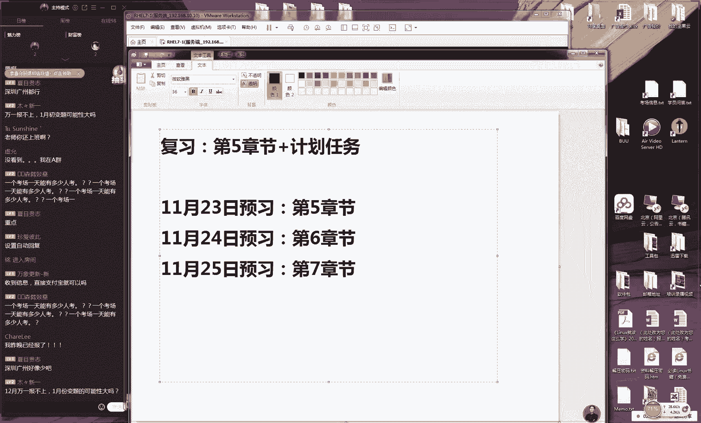

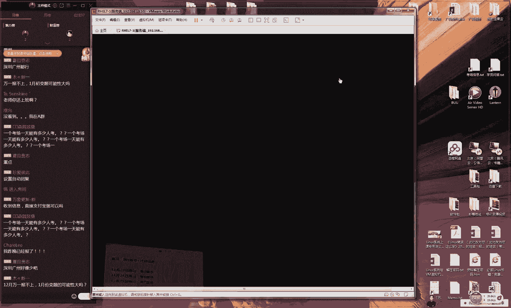

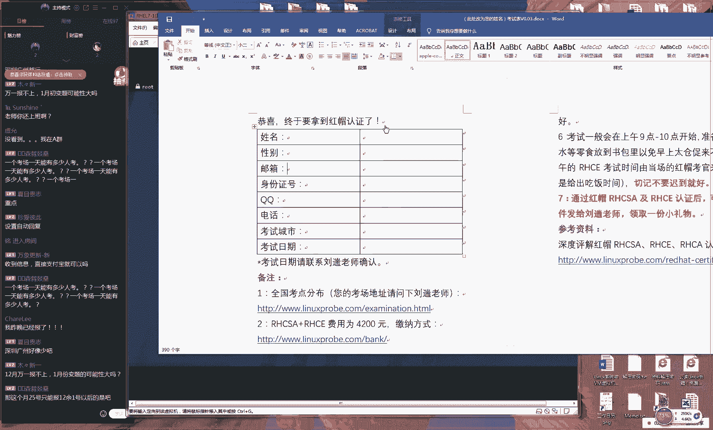

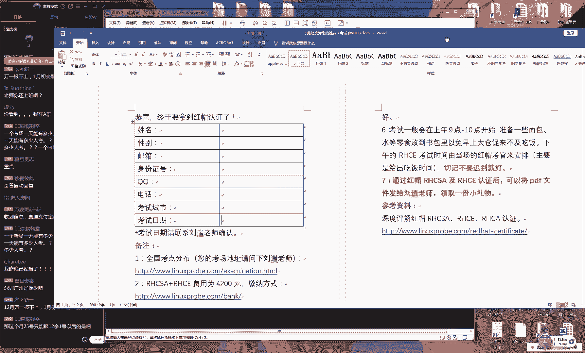

好，其是确实是这样的，我我感觉就是。😊，这个时间点比较点就比较尴尬。如果是我自己我去参加一个培训机构，他跟我说这个时间点的话，我也会感觉到就是一开始会很觉得很很。😊，很纠结啊，我不到底要不要去考。

然后包括说这个时间点为什么考到这么一个时间点我去报名，但是其实是这个不可不可控的这么一个客观原因。如果大家真的你们是上一期报名，或者说你们19年你们18年初报名的话。

还真有一个时间可以去弹性灵活的去选择，但是现在确实18年年底了，12月份了。好，就这么一个客观情况我给大家去说好就行，大家就懂这个意思。广州深圳的话呢比较少。对。

所以我们每个考场我们我们一个城市约了1到两场，12月份约不上11月份变题的可能性大吗？是这样的，1月份变不变题，我不能给大家保证，但是我告诉你1变题的可能性很大很大很大。呃，但是具体也许还不会变。

也他也许就会变，所个我们说不准，但是他会很大，所以我们建议大家是在1月底报名，就是年底报名是这么一个情况。😊，他圣诞节会变题了，现在不会，因为红猫re8它这个正式版它没有发布，它就不会变红猫re的考题。

而且我跟大家说过，你现在你现在比如说啊咱们比如说现在是11月18号，对吧？你约到了12月1呃，18号，或者说你约到12月28号的考场。😊，那你这个时间已经是确定了的。你12月28号，那你去考试。

你还会是红猫若有期，即便12月初发布了正式版本，你也去考红热期。因为你定了这个东西，红包也也是认可的，就定下来而且我现约是月底的考试约是12月份底的考。大部分说老我们今天在1118号我们还没有去学完。

让我们去考场，我们哪会，是因为我们现在去约是12月底的考场就是在45天之后那个考场。大家规划一下好吧，大家叙述太多了。说红热8是发布之后还需要重去交学费嘛，是这样的，会给大家去协调。

然后尽量给大家去一个优惠的一个价格不会特别高。然后也会往后再去延续3天的学习有效期。但具体我们没有想好具体的规则，我们要我们也要根据变化大小，然后以及我们去写数的一个难度，我们去跟红帽交涉的时候。

我们付出一个成本。最我们家平均出来，但是大家放心，不会说让大家再。😊，新报名的这样的一个费用。然后说红包68有哪些变化。目呃，目前我们已知的变化还是有一些的。比如说我们的安装方式从已经变成了DNF。

这已经是确认了的。第二就是我们的文件系统也已经发生了变化。还有我们这个服务，它整体的架构都发生了变化了。它之前那一个架构，它是。😊，它它就是个纯属于一个操作系统。但是现在红猫re把它引进了区块链。

它引引进了云计算，它引进了容器这样的一个整体性的一个架构的一个变化。并且我们先看到红猫re8这个版本号码，它没有涉及到5，因为5版本还没有发布。

它延续的是今年6月份我忘记了是6月份或8月份发布那个系统应该是6月份发布那个25系统的一个就是今天这个红猫re8，它是基于25系统，它进行一个二次研发出来这么一个红猫企业版系统。

所以我们现在可以看到25系统上的一些新变化，都已经体现在了红猫re8里面了啊，但是说起来会比较多。😊，好，具体是否要交钱，那肯定是要，但是具体是多少。

然后我们会给大家一个非常优惠的一个价格会很低或会很低，不会让大家去报名，甚至可能就会10%20或30啊，一二百块钱就可以或者二三百块钱或者四五百块钱就可以延续4年多的时间，这个学习的这个权限。

但具体我们现在说不好，真的是说不好啊。因为现在我们需要根据红猫热巴这个变化情况，以及我们付出的这么一个经历或我们这个费用来给大家去平均一下。这个不会大家。😊，就在他现在我们还说不好，因为是。

不考是4000块钱。对，然后是这样的，我们现在补考的话呢是红H是1500红C是2500。大家大不用着急啊，如果说您现在没有把握的话，我建议大家不要去报名好吧，没有把握怎么来这是我的一个原则，好吧。

前很多。嗯，但是我们我自认为因为我们已经提供考试原题，并且我们是预约的12月份底的考试，然后以及我们考试且我们培训的话呢是完全超过红C很多我为我认为应该问题不大，但是也要以自己的这个实际为准好吧。

不要人人他们我们也报对吧？我把我只是这么一个情况大家去说也算是抛开锅了。因为我们万一是不是等到12月中旬完了之后感觉自己觉差不多了。😊，想正后想报考了，就约不上考试，我们把自己的这个锅往后推一推。

就不要怪老刘了，对吧？也确实已经经历了。北京我们这回申请到了6场，这个是全国都很厉就是很难的了，已经是很不错了，也是。😊，然后红猫rio8发布之后，一般来说我们需要半年时间做准备，然后才会开课。

下一次我们应该是在2019年的667月份，或者是这这个就是是这个是最快的啊，最快来讲是67月份才会才红猫rio8的课嗯。红猫热8出过之后，我们解题怎么搞？呃，因为我们这边会跟红帽会有联系，就像现在一样。

我们会拿到红包考试的原题。我们有我我们有信心也能够在红猫热8发布之后拿到红包热8的这个考试原题，但是需要时间，而且需要一笔很大的费用。所以我们目前也在权衡。😊，嗯，也是么方便，等到我们下回又知道了。

因为大家知道就是这个思科也是这样的，因为北京这边有一个培训机构叫这个思瑞，你们知道了，他们拿那个考题拿一次是10万块钱。嗯，就是这个思科嘛，现在是最新版本是K4嘛。

他们拿考题拿4拿一个K4版本的考题一次是10万。所以我们现在红发布也要去看一下。但是我们好在是我们是一个网络培训机构，我们可以把我们这个成本给大家均摊一下会比一些实机构很多对？

就是这的一个情况后有进一步的话，我们会给大家再去跟进这么一个情况，待会可以来跟我去说，然后没有问题可以再去下降了。好吧，然后好好去备考一下，然后提前做预习。那么我们的预习的话。

家可以访问我们的网址3W加IP就可以进入到我们这学员页面里提前做预习准没错好吧，提前做预习嗯。😊，呃，对，就是那个3万包括那个思瑞嘛。嗯，然后因为我们现在也是有合作，如果大家想好的话。

可以我们帮你去问一下，会有优惠。他们在马店里边。😊，但是我觉得3万块钱考的话有点太贵了吧。因为我不太懂这种网络这种认证啊，我是考试狂魔，但是我主要是PVC是linux嘛嗯。😊。

说CCIE想自觉一年别想了，反正他们那个机构，他们承诺的是44天，从CCNA到CCNP到CCIE你44天之后，你要去考试，没过3块钱就全退你，他们不会收你一分钱。嗯，反正是这么一个情况。😊，啊。

反正就这么一个事儿嗯，OCP啊，这个我们这个我们都不了解的，包括说OCP有什么优惠什么的。第一，我们不做。第二，我我我也不了解，这个我真的不知道，大然你让我教，我也教不了OCP。

这两个方向我也不我也都不了解嗯。😊，啊，这老师因为真的是不是全能嘛，因为我们这个认证一个主线之后，我们就往深边去来去深入来去研究。所以这个数据库啊、网络什么的只是。圈子里面的一些消息。

但是你要真让我去问多少钱，我也只能帮你去问，还不如你自己去问的直接，还有这个可能不太了解这方面。报考等通知嘛？你呃你只要你跟我登记过了，你就等通知就好了。我会在明天或者后天或者大后天，我就大概我明天吧。

我就会给你发消息。那就按照这个回复的顺序。好吧，我们要公平一点，不是我给大家怎么怎么样，我就是按照公平来讲如果没有位置的话，我们就往后顺延一下。学习lin可以去学么做运维。建议来讲的话呢。

我们作为一条主线，那我们就去学习lin你看我我就学习lin跟我也足够了，对吧？然后我那我也可以学习呃云计算我也可以学习这两个方向都很好好，包括现在这个大数据都很好嗯。😊，现在报考的话都能报考上吗？嗯。

哎呀这很纠结这个问题，那你让我怎么回答，真的是就是我们会尽量吧，我们会尽量给大家去协调啊，而且我们会你想一想，我们先我们明天我们才19号，就是其他的就是我们其他的第18期以前的同学，我我会在25号以后。

我才会跟他们去说。所以18号到25号这一个礼拜时间，我会先跟你们去说，反正你们是个优优先报名的这么一个情况了，已经是也好很多了，好吧，不用那么纠结这个问题，到时候我们看实际情况吧。好吧。

到我们实际情况现在让我去保证的话，能报名上，即便我们那个同学他给我交个考试费了。我说也不能给你预约任何的考场，不能给任何承诺。而且具体我们要让你确认之后才够报考。😊，所以现不要给我钱，交了也没有用。好。

大家有问可以来跟我去说吧。因为我首先去提的些这个客观情况。然后但是我不希望大家去太多去纠结这个问题。因为这个问题是不可控的，报上就报上了，报不上就当然就报不上对吧？好吧，那我们这个主线还是要好好去学习。

把我们这个课给大家学好，这才是正经的对吧嗯。😊，好大家可以来跟我去说，然后我先渲一下我们这个视频，好吧，可以来跟我去说。😊，HHC有必要往这个方向去考吗？HHC它有几个方向。

它会考到红帽对它自己的这个产品。红帽它不光有re，它还有比如说RM红帽卫星网络，它有HV红帽这个虚拟化，还有很多红帽自己的产品。红C的话呢，你要说起来肯定是要比红CE要更加高级。但是考试费也很贵。

我们要去均衡去考虑一下，不能光位的去考而考费用的话，你连着学，你再连着考也不少钱嗯。😊，啊，不是不是我呃，我们指的是因为红帽HCSC跟红帽HCE是上下午去考。我那我们指的是3人，就是每天就能考试3人。

他不是说上午7个，下午7个啊。😊。

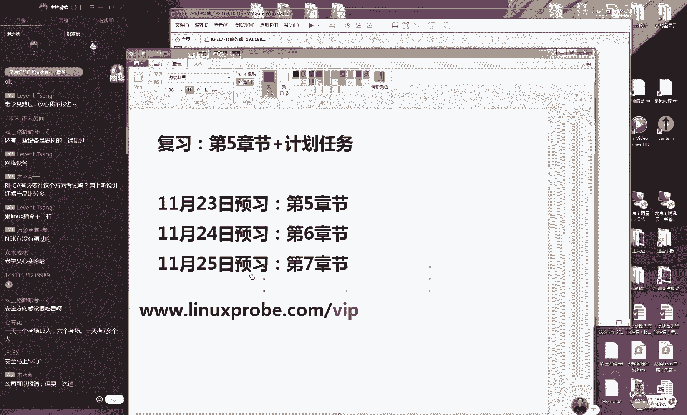