# Linux教程RHCE：P6：vim编辑器与shell续篇与用户权限

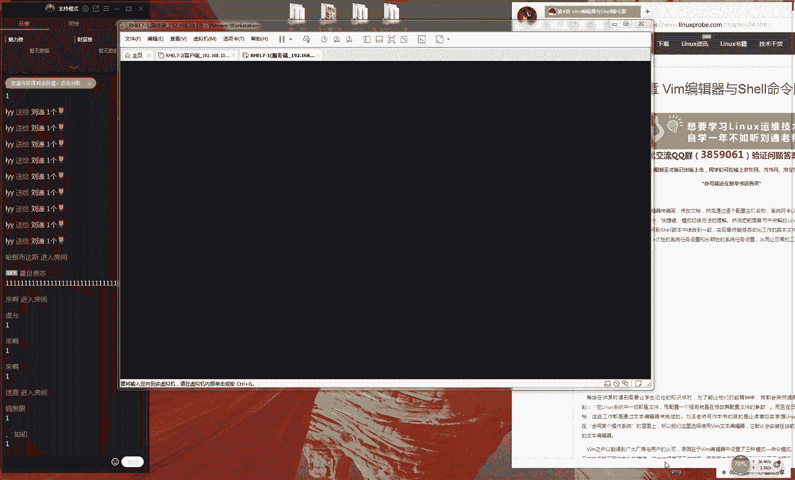

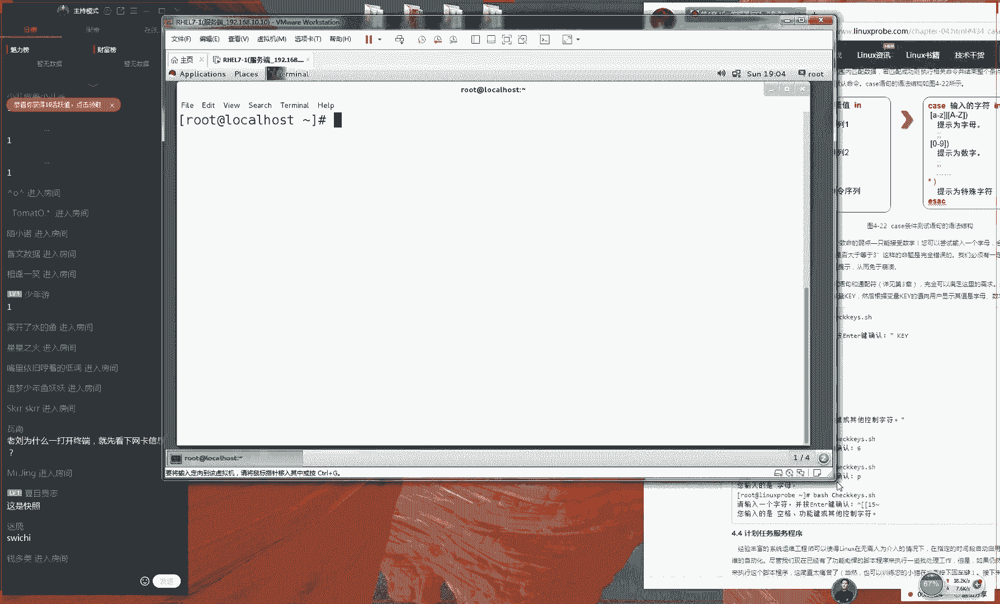

在本节课中，我们将学习如何使用`case`语句增强脚本的健壮性，掌握一次性计划任务`at`和周期性计划任务`cron`的配置方法，并深入理解Linux系统中的用户、用户组以及文件权限管理。这些是系统管理中非常核心且实用的技能。

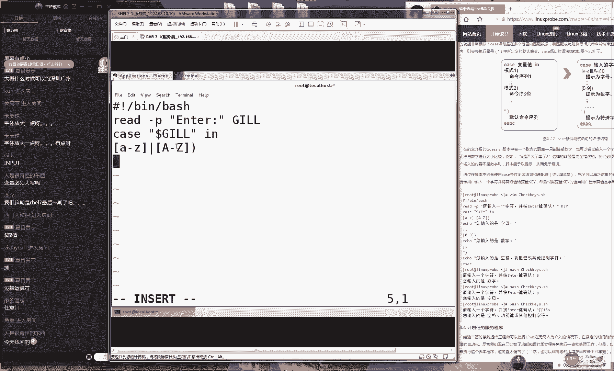

## 使用`case`语句进行条件判断

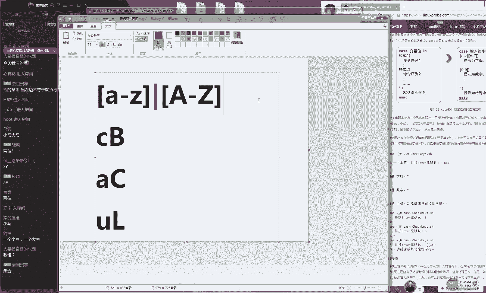

上一节我们介绍了`if`条件语句，本节中我们来看看`case`语句。`case`语句类似于C语言中的`switch`，它可以根据变量的不同取值，执行不同的代码块，特别适合处理有多个分支的条件判断。

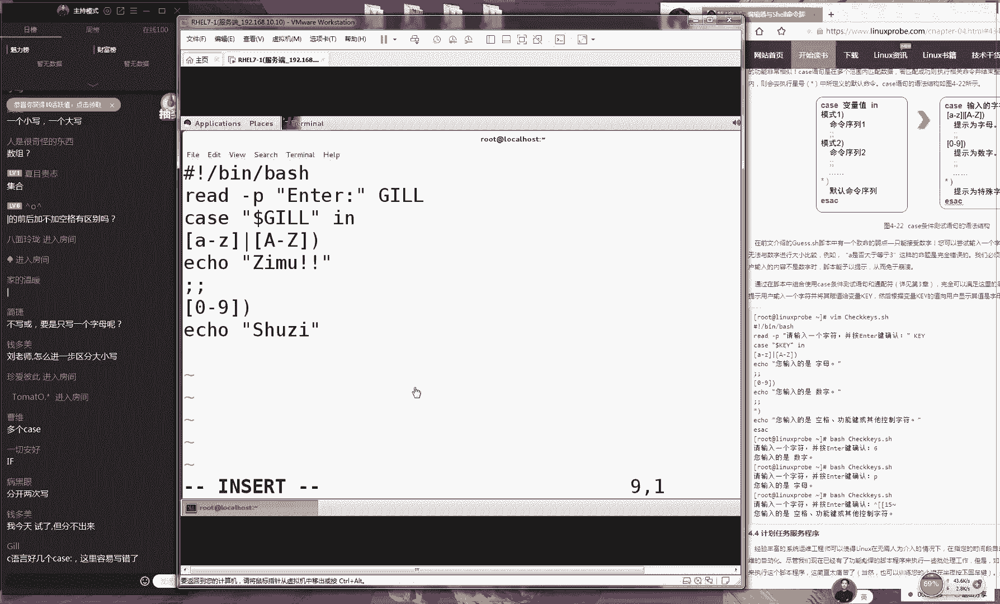

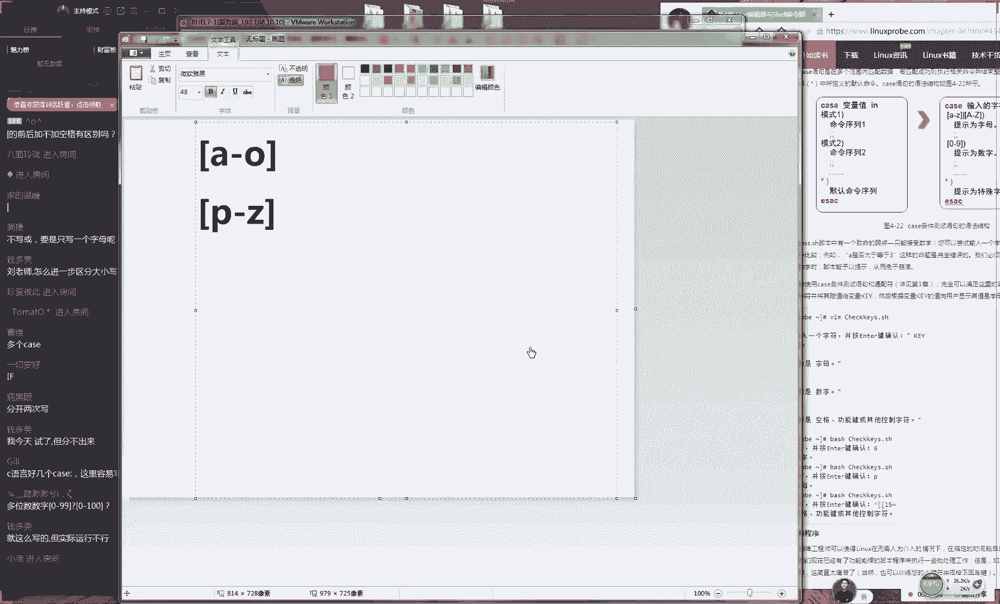

例如，我们之前编写过一个脚本，用于比较用户输入的数值和一个随机数。但如果用户输入的是字母或乱码，程序就会崩溃。`case`语句可以帮助我们优雅地处理这种情况。

以下是`case`语句的基本语法框架，包含脚本声明、变量读取和条件匹配：

```bash
#!/bin/bash
# 脚本声明
read -p "请输入一个值: " KEY
case $KEY in
    [a-z]|[A-Z])
        echo "您输入的是字母。"
        ;;
    [0-9])
        echo "您输入的是数字。"
        ;;
    *)
        echo "您输入的是乱码。"
        ;;
esac
```

**核心概念解析：**
*   `read -p`：用于读取用户输入并赋值给变量，`-p`参数用于显示提示信息。
*   `case $变量 in`：开始`case`判断。
*   `[a-z]|[A-Z])`：这是一个模式匹配。`[a-z]`匹配所有小写字母，`[A-Z]`匹配所有大写字母，中间的竖线`|`在`case`语句中代表逻辑“或”。
*   `[0-9])`：匹配单个数字0到9。
*   `*)`：星号`*`是通配符，代表“其他所有情况”，用作兜底选项。
*   `;;`：两个分号表示一个匹配分支的结束。
*   `esac`：`case`语句的结束标记（`case`反过来写）。

执行这个脚本时，无论用户输入字母、数字还是其他内容，程序都能给出相应提示而不会崩溃。

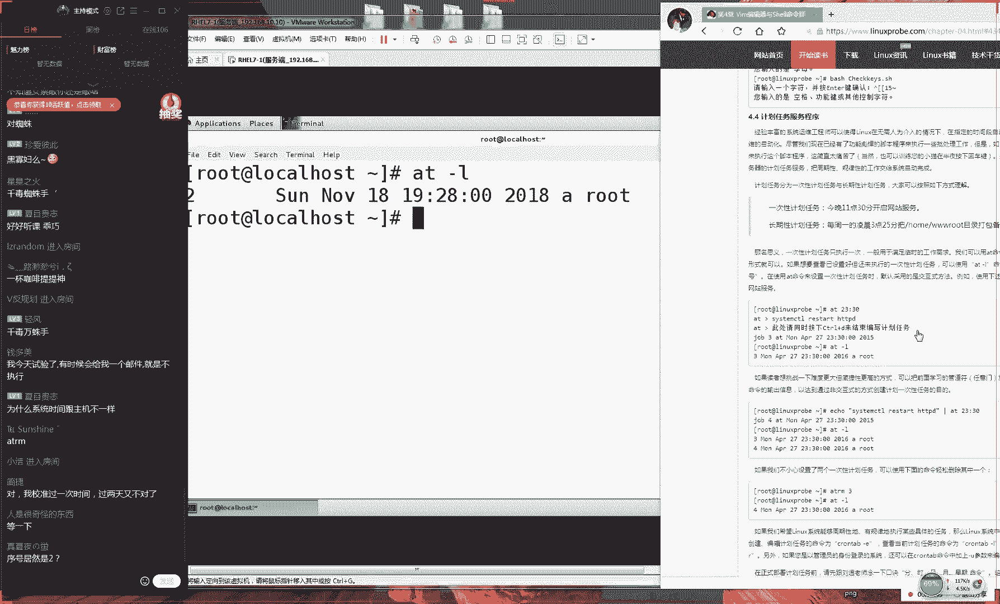

## 计划任务管理

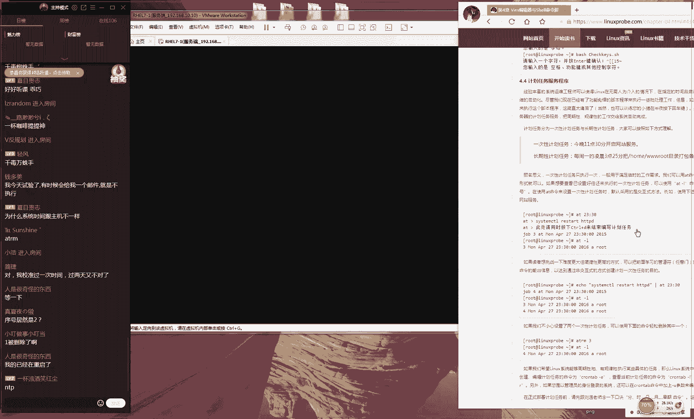

自动化是运维工作的重要目标。计划任务允许我们在指定的时间自动执行脚本或命令，从而解放双手。

### 一次性计划任务：`at`

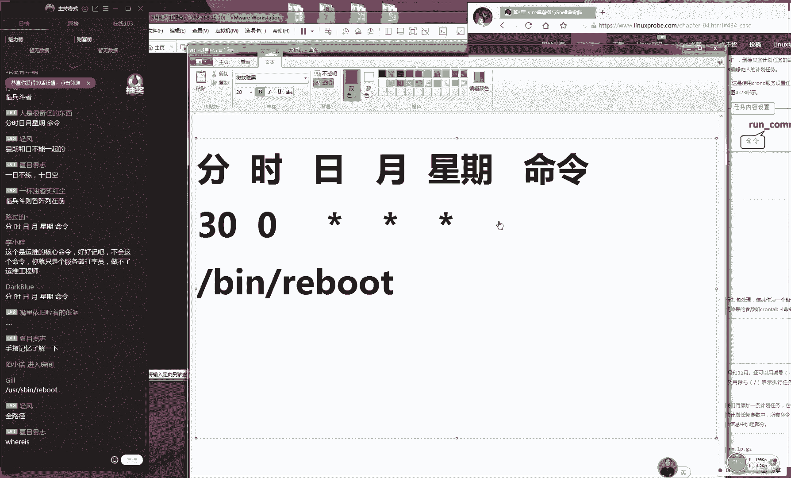

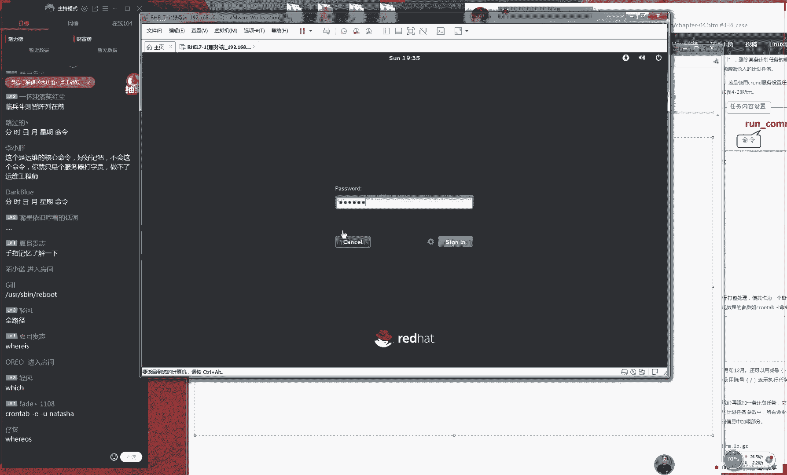

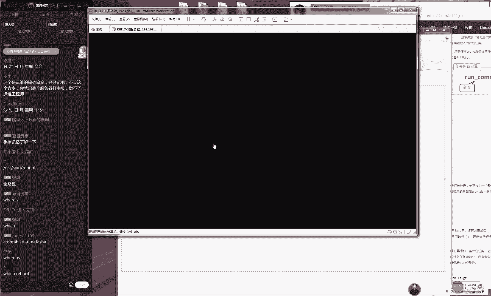

`at`命令用于安排一个在指定时间点**只执行一次**的任务。

**常用操作：**
*   `at 时间`：创建一个在指定时间执行的任务，然后进入交互界面输入要执行的命令，按`Ctrl+D`保存。
*   `atq` 或 `at -l`：列出当前用户所有等待执行的`at`任务。
*   `atrm 任务编号` 或 `at -d 任务编号`：删除指定的`at`任务。
*   `at -c 任务编号`：查看指定任务的详细内容。

**示例：** 在晚上7点28分重启服务器。
```bash
at 19:28
reboot
# 按 Ctrl+D 保存
atq # 查看任务
```

### 周期性计划任务：`cron`

`cron`是一个守护进程（服务），用于执行周期性的任务。我们通过`crontab`命令来管理用户的`cron`任务。

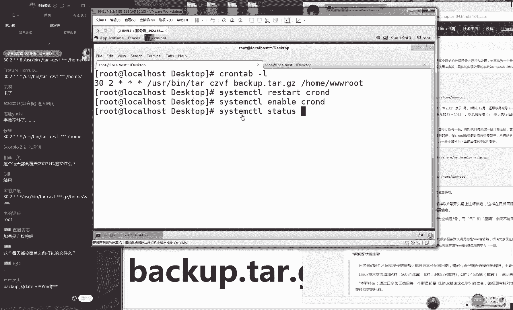

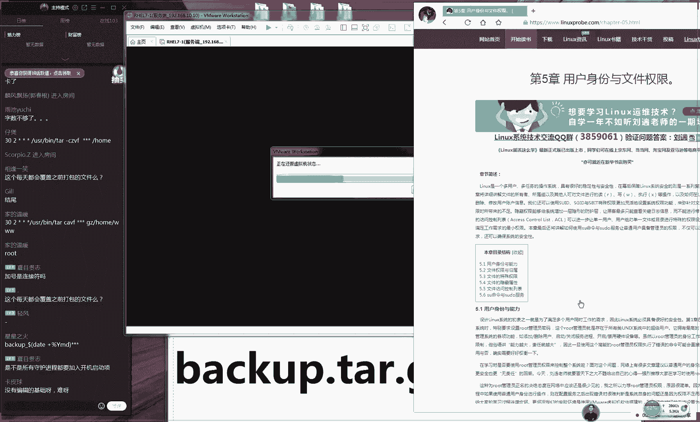

**服务与命令：**
*   **服务名称**：`crond`
*   **配置工具**：`crontab`

**配置命令：**
*   `crontab -e`：编辑当前用户的`cron`计划任务。
*   `crontab -l`：列出当前用户的`cron`计划任务。
*   `crontab -r`：删除当前用户所有的`cron`计划任务（慎用）。
*   `crontab -u 用户名 -e`：为指定用户编辑`cron`计划任务（需管理员权限）。

**时间格式口诀：分 时 日 月 星期 命令**

每个时间字段的含义和取值范围如下：
*   **分** (0-59)
*   **时** (0-23)
*   **日** (1-31)
*   **月** (1-12)
*   **星期** (0-7，0和7都代表星期日)

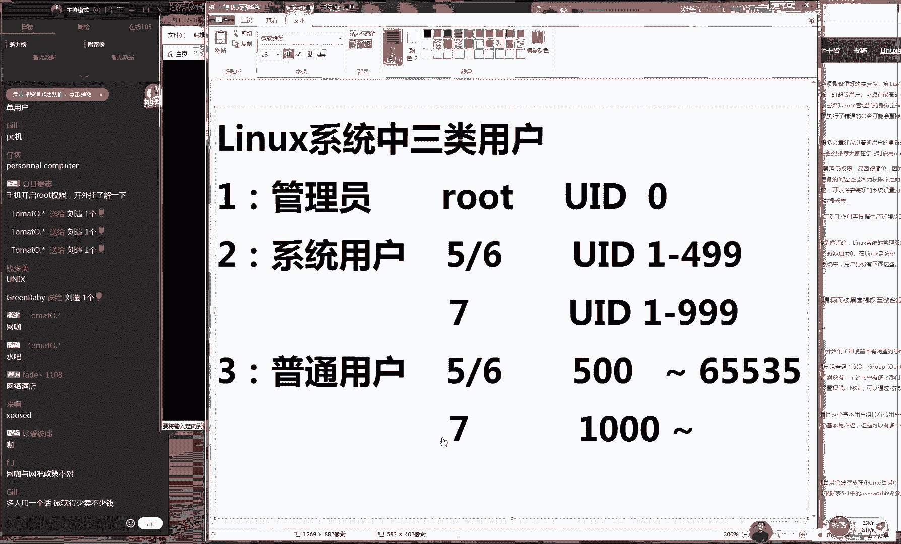

**特殊符号：**
*   `*`：代表所有可能的值，用作占位符。
*   `,`：代表分隔多个值（例如：`1,3,5`）。
*   `-`：代表一个范围（例如：`10-15`）。
*   `/`：代表间隔频率（例如：`*/2` 表示每两单位一次）。

**示例：**
1.  每天凌晨2点30分备份网站目录：
    ```bash
    30 2 * * * /usr/bin/tar -czf /backup/website.tar.gz /var/www/html
    ```
2.  每周一、三、五的下午3点执行脚本：
    ```bash
    0 15 * * 1,3,5 /path/to/script.sh
    ```
3.  每月10号到15号，每天中午12点发送提醒：
    ```bash
    0 12 10-15 * * /usr/bin/wall “月度报告期”
    ```

配置完成后，可以使用`systemctl restart crond`重启服务使其生效，并使用`systemctl enable crond`设置开机自启。

## 用户、用户组与文件权限

理解了自动化任务，我们进入Linux系统管理的另一个核心领域——用户身份与文件权限控制。

### Linux系统中的三类用户

1.  **管理员 (root)**：
    *   **UID**：0
    *   权限最大，限制最小，可以管理系统的一切。

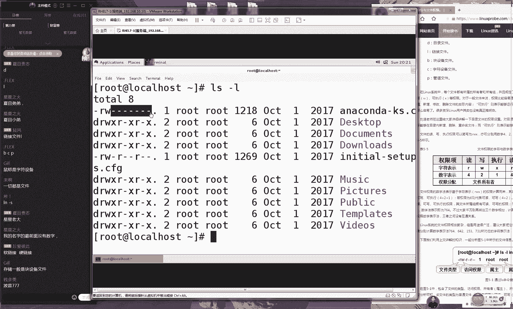

2.  **系统用户**：
    *   **UID范围**：在RHEL7/CentOS7中为1-999。
    *   通常用于运行系统服务，一般不允许登录系统，目的是实现服务隔离，降低安全风险。

3.  **普通用户**：
    *   **UID范围**：在RHEL7/CentOS7中从1000开始。
    *   供日常使用和工作的用户账户。

### 用户与用户组管理命令

以下是管理用户和用户组的常用命令：

**用户管理：**
*   `useradd 用户名`：创建新用户。
*   `usermod 参数 用户名`：修改用户属性。
    *   `-u UID`：修改用户UID。
    *   `-g 组名`：修改用户基本组。
    *   `-G 组名`：修改用户扩展组。
    *   `-s Shell路径`：修改用户登录终端。
*   `passwd 用户名`：修改用户密码（root可修改任何用户密码）。
*   `userdel 用户名`：删除用户。
    *   `-r`：同时删除用户的家目录和邮件池。

**用户组管理：**
*   `groupadd 组名`：创建新用户组。
*   `groupdel 组名`：删除用户组。

**基本组与扩展组：**
*   **基本组**：用户创建时自动生成的组，与用户同名，类似于“与生俱来”的家庭关系。
*   **扩展组**：用户后期加入的其他组，用于获取额外的资源访问权限，类似于“后天获得”的学校或公司身份。

### 文件权限详解

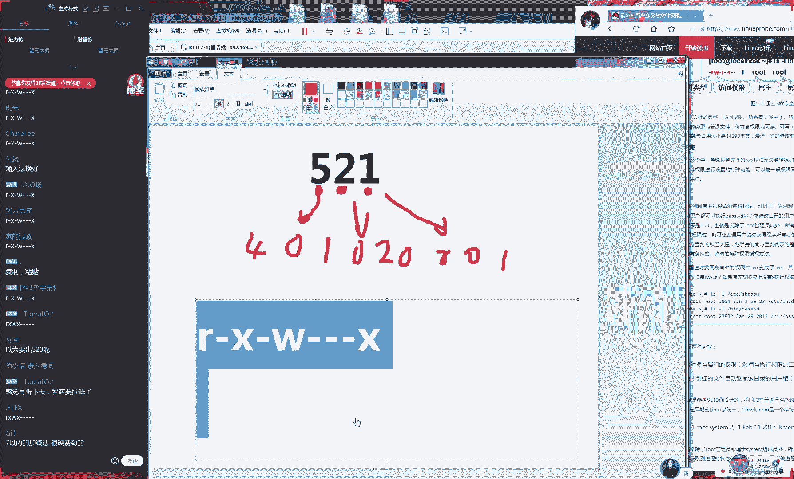

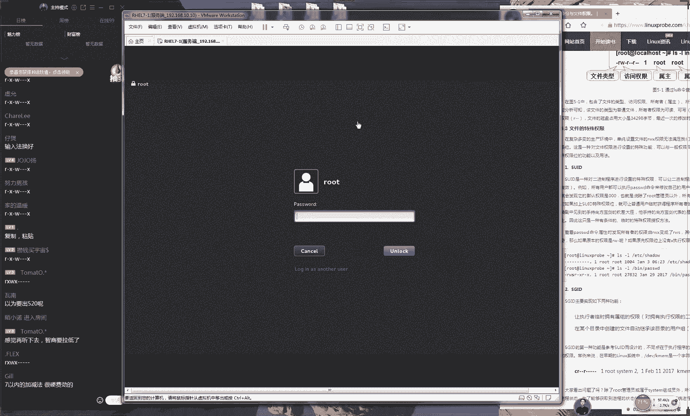

使用`ls -l`命令查看文件详细信息时，第一列显示了文件类型和权限。

**权限位（9位）：**
格式为：`-rwxrwxrwx`
*   第1位：文件类型（`-`普通文件，`d`目录，`l`链接等）。
*   第2-4位：**文件所有者 (user)** 的权限。
*   第5-7位：**文件所属组 (group)** 的权限。
*   第8-10位：**其他用户 (others)** 的权限。

**权限字符：**
*   `r` (read)：读权限，数字表示为 **4**。
*   `w` (write)：写权限，数字表示为 **2**。
*   `x` (execute)：执行权限，数字表示为 **1**。
*   `-`：无对应权限，数字表示为 **0**。

**权限对文件和目录的不同含义：**

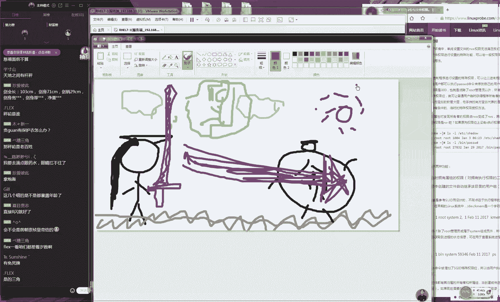

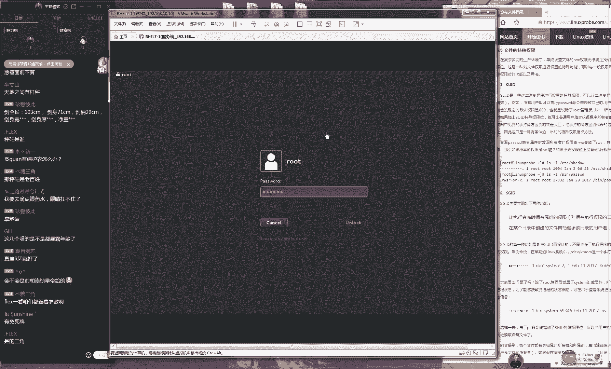

| 权限 | 对文件的意义 | 对目录的意义 |
| :--- | :--- | :--- |
| **r** | 读取文件内容 | 查看目录内的文件列表 |
| **w** | 修改文件内容 | 在目录内**创建、删除、重命名**文件 |
| **x** | 执行该文件（如脚本） | 进入该目录 (`cd`) |

**数字表示法：**
将每三位权限的数值相加，得到一个三位数字。
例如：`-rwxr-xr--`
*   所有者：`rwx` = 4+2+1 = **7**
*   所属组：`r-x` = 4+0+1 = **5**
*   其他人：`r--` = 4+0+0 = **4**
*   数字权限表示为：**754**

### 权限设置命令

*   `chmod`：修改文件或目录的权限。
    *   数字法：`chmod 754 filename`
    *   符号法：`chmod u=rwx,g=rx,o=r filename`
*   `chown`：修改文件或目录的所有者和所属组。
    *   `chown owner:group filename`
    *   `chown owner filename` (仅改所有者)
    *   `chown :group filename` (仅改组)

### 特殊权限：SUID

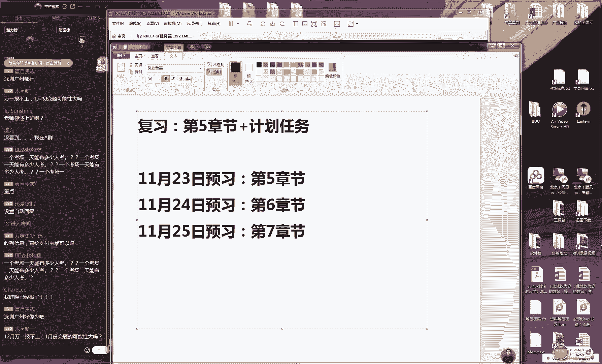

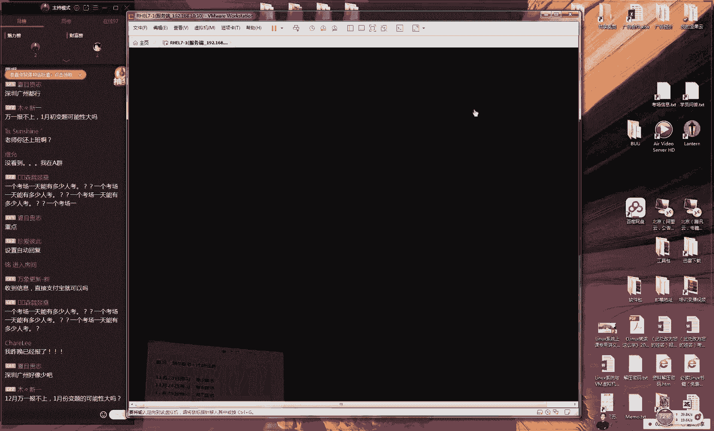

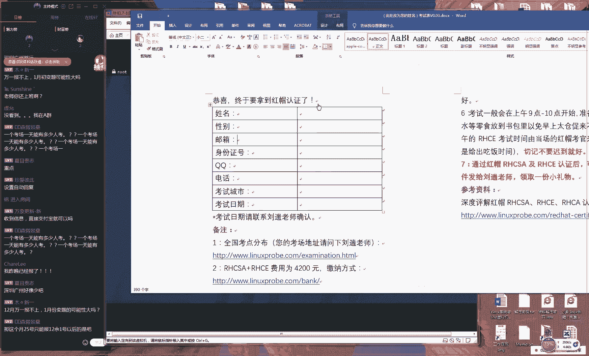

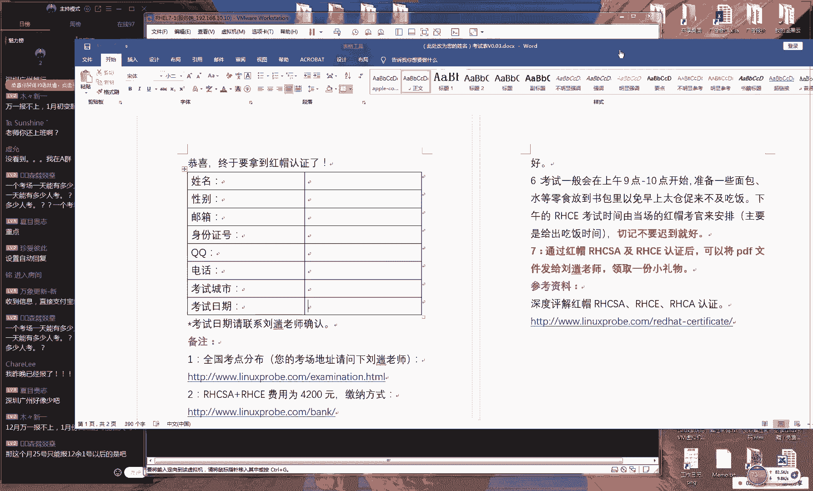

除了基本的rwx权限，还有三个特殊权限位：SUID, SGID, Sticky Bit。这里先介绍**SUID**。

*   **作用**：当普通用户执行一个设置了SUID权限的**可执行文件**时，该用户会在**执行期间**临时获得文件**所有者**的权限。
*   **表现**：在所有者权限的执行位(`x`)，如果显示为`s`，则表示设置了SUID。
*   **典型例子**：`/usr/bin/passwd`命令。普通用户无权直接修改保存密码的`/etc/shadow`文件，但通过执行设置了SUID（所有者为root）的`passwd`命令，就能临时获得root权限来修改自己的密码。
*   **设置方法（数字法）**：在三位数字权限前再加一位。SUID对应数字**4**。
    *   例如：`chmod 4755 /usr/bin/passwd`

## 总结

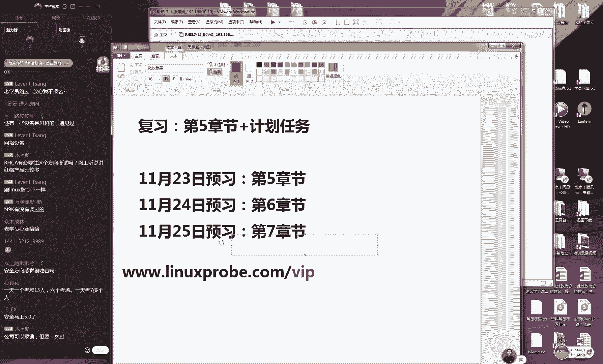

本节课中我们一起学习了多个核心内容。首先，我们使用`case`语句让脚本能够更健壮地处理用户的不同输入。然后，我们掌握了`at`和`cron`两种计划任务工具，实现了命令和脚本的自动执行。最后，我们深入探讨了Linux的用户管理体系，包括三类用户的区别、用户/用户组的增删改查命令，并重点剖析了文件权限的表示方法（字符法与数字法）、含义以及设置命令`chmod`和`chown`，还初步了解了SUID特殊权限的作用。这些知识是进行系统安全管理、资源分配和自动化运维的基础，需要熟练掌握。