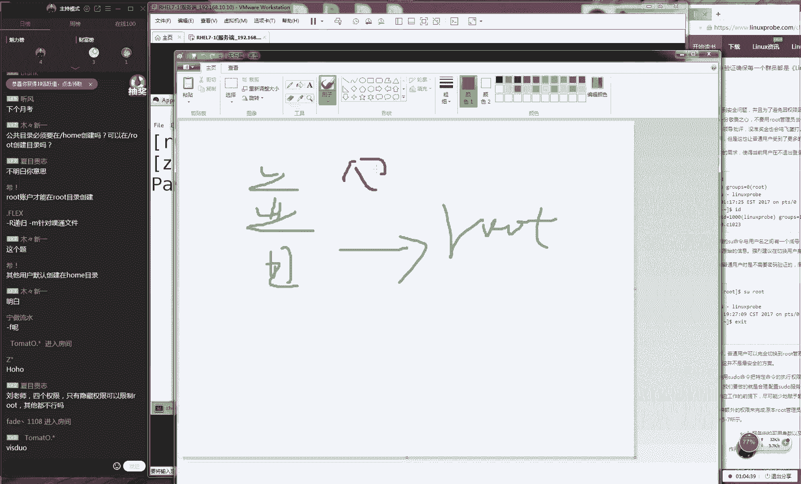

# Linux教程RHCE - P7：7.文件权限与存储基础 - 艾弗艾尔思丢丢 - BV1if4y1e73V

OK好，那我们现在准备开始上课，同学们现在7点了。那我们先打一下一吧。大家如果能听好说话声音的话，好吧，那我们打一下一，然后经能能够看到我我这边的画面。因为是这样的。

因为咱们这一期同学们约考约的时间是非常的生猛啊，一下子从礼拜一约到了我反正我从礼拜一开始给大家去约考，约到礼拜3，我们总共我们这一期约了120位同学，所以说呃确实也让红帽那边很难接受啊。

一下有这么多人去考试，所以我们现在考场基本上都已经是约满了。但是呃我现在不知道该怎么跟其他的往期同学们交代了，因为我们每个月25号。😊，会再公布一批我们下个月的考场安排，但是好像都约满了。

我不知道25号我要公布什么了。所以我所以我们这边还在跟红包那边沟通，看看能不能再去加几场，但场希望不大了。所以今我们同学们今然有约考的话，我觉得就没有太大必要跟大家再去说什么鸡汤或怎么怎么样吧？

因为我们都会因为我们都已经花完钱了，准备去考这个认证了，并且我们已经规划好时间了，那我们就直接上干货吧吧？直接上课了，继续给大家讲一下我们这边第五章节另外的话呢就是因为我们上一节啊是我们的上礼拜日。

所以话又过一个礼拜时间了。我估计大家都该忘了都忘了，所以我们给大家做一个简单的一个回忆好吧，第五章节的话呢我们主要讲的是用户的身份和我们的文件权限。这个就是我们。😊。

比较核心的一个课程。当你学完了之后，你就会对于这个系统的一个权限会有一个比较深入的一个理解啊。好，然后看有什么问题，说19号考试比较慌啊，你是约的是12月19号好吧。

这个我们先不用着急歌词把这个关上好吧那我们继续给大家说一下，我今给大家讲第五章节的话给大家再来复习一下，就是我们上一期节课给大家讲一个第一个叫做SUID权限。这个话它叫做文件的特殊权限。

它主要是为了让我们的一般权限。怎么样，比较慌是吧？那我们的话特殊权限，它主要是让我们这个文件的一般权限上面我们让他能够有一个更加好的一种补充这样话那我们让我们的这个的功能。

包括说我们这个执这个功能它更加的这个丰富起来。说怎么显示的是第十7期，这我不知道怎么去设置的，正可能之前我们这样去写过吧。看怎么去修改这个显示这个跟咱们课没有太大关系啊。😊。

照商就听就可以了。那好，那我们今天给大家说一下，我们今天给大家讲的这个特殊权限。那那我们讲一下我们这个特殊权限，它分为了3个。

第一为SUID第二为SGID3为SBIT好的那那我们上一节课大家讲了一下我们第一个权限，让我们给大家总结一下笔记好了。因为我们上一节课可能讲的比较的。😊，呃，简单一点的对吧？可能大家没有居住。

那我给大家记一下笔记。它这个核心的话呢，就是让我们的这个程序的让程序执行者。😊，临时获取文件。啊，或者说我们的程序。程序。所有啊者的。身份那这个的话就是我们实际上来讲。

这就是我们上一节课给大家讲的这么一个比较核心的一个问题啊，那我们给大家举个例子，就是我们有一个钦差大臣，对吧？那好了，那我们呃有什么问题。那我们就是说让我我们一个钦差大臣，然后他去这个城治贪官的时候。

那么如果说你之前是一个权限不足。那你那那你就不能去完成某一项工作的时候，那我们就可以还记得我们上面一张图片，对吧？他有一个叫什么上方保剑这么一个法宝，他就可以是获取到一个更加高级的一个皇上的一个权限。

然后最后去惩治了贪官好，因为大家现在问题比较多，而且有些问题可能跟咱们上课没有太大关系。所以话呢我现在真的有点看不过来。那我们先。😊，呃，按照我们这个进度来去上课，好吧，等我们啊等等我们上完课之后。

大家可以来一起来去说问题。那么如果您的问题没有没有被解答好的话呢，那我们可以下课之后，您再给我发一遍。好吧。因为我们上课人是比较多。那么如果说有那同学他恰发了一个问题。而您知道的话呢。

那么你也可以来去互助来去交流一下。这样话我们一个很好的一个学习的一个气氛。好了。那我们接下来讲一下我们第二个权限我们叫做SGIT其实这个非常简单啊，这个跟我们SUID是基本上是一致的。

他就让我们这个程序执行者怎么样呢？他是临时获取了文件所有组的权限。好了，还有我们这个身份好，大家记一下我们的笔记。😊，因为啊我们原先想的就是我们上课的时候的话呢，那我们可以就是我们顺到手给大家聊一聊。

就是大家会意识到比较多的问题。比如说我某一点没有讲清楚，对吧？或者说我们有一个大家会问一个题，但是具体来说比如说我们一些小细节跟我们上课无关的话，们放放到课后吧，包括说我们红包备考啊。

这个备考问题它重要。且我们已经是报完名了对吧？大家很关心，但是我们上课就不要瞎聊了。因为我们上课聊的话有点乱了？我们上课的时候，我们讲这辅导大家这个上课时间大家这个也不太公平。那我我们先不着急。

我们下课之后会有这个答疑时间的那那我们在记下笔记。那我们来看一下S那我们这边的S权限，就是让我们这个程序知行者临时获取了我们程序所有组的这个权限。

但是这个但是我们坦白来讲这个使用起来其实并不是很多它这个主要功能的话呢，就是让我们这个让目录内哎我。😊，呃让目浴录那的让目录内的新建文件。继承目录搜组哎，所有组的。属性或者说我们给他坦白一点。

我们叫做这个名称吧。好，大家现在可以来记一下，然后我给大家带一下我们实践的。好吧，大家可以看到。另外的话呢，我们呃呃那我们先记笔记，然后给大家说一下我们今天这个。😊。

我我们这个命令哎呀因为我今天我看因为我这边一边打字啊，然后看到大家这边一直在打这个聊天记录嘛，然后赶紧就是用余光嘛，我就看了一眼。我说今天怎大家怎么么怎么怎么那么热闹。这边有什么很多问题。结我看了一眼。

好像没有什么太正经的那我们继给大家讲那我们来设置我们这个权限的话，我们应该去使用叫做S叫做叫做叫做HMOD命令那我去设置我们这个文件属性信息的话呢。

我们就把它叫做CW命令大家概记一下这两个的区别这两个这个两个可并不是一样的。它第一个用来去设置我们的权限。第二去设置我们这个属性。好。

接下我们给大家去来去演示一下说如何来用我们这个命令来去设置我们S这个权限。好了，我给大家说一下，另外我们写到旁边就是我们要去设置个S的权限的话呢，我们这个权限应该叫做U加S这样的一个写法。

那我们这个SI的话呢。😊，我们叫做呃G加S这样的一个写法，G加S。我我还会给大家讲的这个数字法的啊。好，我们这边下面的最后一位，我们叫做O加T好了，那O加张T好，那我现在给大家演示一下。

那么我们对于目录来设置这个权限的话那我们建议大家选一个大写杠R操作代表递归代表就是一个目录缩有文件那他们都会继承我们这个权限。那我进入到一个共享目录里面叫做TM目录。既然我们在里面出现出来一个子目录。

比说我们叫什么呢？叫做比如说叫星星之同给取小名字，我叫做小星同学那然我们出来这个目录之后给大去设置这个比较高级的一个权限啊，叫777权限。这样话以让所有人都可以进行一个读写执行权限。

让我们其他人都可以来去写文件。接下来。😊，啊，我们那那我们就要再来去选一个叫做这个G加S这样的一个权限。让我们这个目录里面，它有一个叫做这个S啊，它叫做啊它叫SGID的这么一个权限。

在里面出现出来的所有的这个子文件都会归属于到这个目录的组的名称。好，那我好，那我给大家做一个演示，大家可以来看一下效果。我们现在去切换到一个用户吧。我们切换到一个普通用户啊，我们切换到一个普通用户。😊。

好，然后我们进入到TMP目录里面的小新这么小新这么一个目录里面。那我们来去查看一下我们这个目录上面的这个权限。我们也看到这个目录上面的这个权限的话呢，唯权限。

并且我们在中间这一位我们这个所有组权限这边我们X成S那么那证明他有了一个他要有一个特殊权限了。那我们接下我们在里面出现出来一个文件啊，大家以那我看下这这个有一个效果啊。

就是我们这个用户先进入到自己的这个加目录里面，然后我们出现出来一个文件，因为我们其实我们不用去演示，但是我们给演示更放心一点。那我在我们这个加目录里面出现出来一个文件，好比说叫这个无所谓。

那我们可以来看一下这哈哈上面这个属性的信息。那么这个文件的话呢那么就肯定肯定来说是属于我们这个自己对不对？且我们这个所有者跟所有组他们都是我自己好，那么这没有什么问题。但是当我们再去进入到了已经设置。

😊，权限这个目录里面的话呢，大家也看到我们在里面出现出来的这个新文件。我们好比如说我们还叫做哈哈这么一个呃目录名称。这个时候我们这个目录的所有者跟所有组就发生了变化了。那么我们这边所有者的话呢。

就那还是我自己，但是我们的所有组他继承了我们上一级那也就是TMP目录，它这个所有组的名称了。所大家总结就是说我们说我们这个上级目录是所有者跟所有组是两个两个三角好了。

那我那我们在里面创建出来的这个新文件的话呢，那么你的这个所有者那么还是你自己但是的话呢那么你的所有组就会继承了我们上一级目录这么一个名称。好，所以这有什么用处啊。

这主要就是说你可以创建出来一个部门用的这么一个目录样话那么在里面出的所有文件，那么就可以对你这类的用户同去设置我们这个权限了，而不用再去给每个文件来去设置权限了。具体来说啊。

你公司里面有一个财务部有一个。😊，呃，技术部有一个后那么有一个后勤部。那么那你出现出来一个子目录，这个叫做技术部的一个子目录。那好了，那么那么你在里面出现的所有文件。

那么都会呃所有组变成技术部这么一个组。那么你就以这个目录里权限更好进行一个设定了，会更好去去服务一类人，而不是某一个所有者这样一个身份好。

那大家说到这个大写S什么样的一个情况待给大家讲个先不用着急接我们去说一下我们这个第三个我们叫做S权限这个话我们叫做保护位我们很多书上面会把叫做年制位他们年制位这个话是一些早期的一些书里面的一叫法但是话呢我们建议叫叫做保护位因为因为年制位们来讲我他意思为什么去翻译。

他是完全用一个英语给翻译过来，但是我们中国人可能理解起年制位我不太什么意思。所以。😊，那我们把那我们把这个呃权限位的话呢，我们把它叫做这个保护位。大家记一下。

就是说当以后我们看书的里面叫做这个年之位跟保护位的话呢，跟我们所讲这个保护位它是一样的啊。他用来去保护文件的，让目录内，然让目录内的文件的文件只能自己删除自己的好了，这个什么意思啊。

就是在我们一个目录里面，他会有很多每个人的这个自己的这个独立的文件。那好了，那么你就不能去删除一下其他人的这个文件了。那我们来给大家举一个比较比较深刻的一个例子啊，当时我上中职的当时我上高职的时候，😊。

我们也上计算机课，对不对？当时我记得常是学习过一些编程啊，或者说flash什么的那种大课。后来的话呢每每节价课之后老师都会给你开一台服务器。

让你把当天的这个作业传送到那个服务器面家没这样就是这样做老师可以打一下就是我们每节之，要把当天完成这个课上的作业传到他的服务器里面，然后或者说他传传到他P里面他去检查你的作业，然后给你登成绩。

这是有对不对？好，这种情况其实在高校里面是比较常见的对？那我们避免每个人去插一个U盘特别的麻烦。每个人去插一个U盘，而且这个我们讲怎么着就他有病毒什么的那也不太好防范。

所以一般来说那我们就是把我们自己的这个作业给传到服务器里面了。后来我们班有一个特别坏了一小孩，他平时他也不学那你不觉不学吧？个跟我们也没有关系。但是他很坏他怎么坏嘛，是因为他全删了。😊。

这杠F代表是这个强制的意思。但是这个主要是我的习惯问题。大家在实际操作的时候可以不用去加了。对他特别的坏把全都删了，就就是他自己没有做这个作业。但是的话等别人都交完作业之他把别的文件删掉了。

所这个是一个很坏种行为。为话老不知道但有没有教那么这个时候其实我可上个这一个权限只能去删出自己的文件的文件你能但是你不能去删除掉就进一步保证我们每个文件能自己所管理者只能被自己所删除找到之后就一顿报答这个可以但找不到呢而且我们尽量我们不要就是破坏别人的系统后话我之前有一个朋友来去网吧里面大家知道网吧以前那系统万象后来他尝试破解很上中尝试破解了一下后来好像断网了能上着他有一个。

😊。

呃破解的一个方法。后来被王可发现了，好像罚了好几百块钱的，好像就是说他一个惩罚。反正我们现在在学校里面也会有这种情况啊，就是一定要去保护好自己的这个文件。好，那我们继续来给大家去说啊。

那么有一个目录叫做TMP目录。其实的话这个TMP目录啊，它自身就已经带有了SBIT的权限了，这个你都不用自己去设置它，它里面就会有一个叫做呃T的这么一个权限。

然后我们待会啊我们大概8点多的时候会给大家讲到说这个目录具体的有什么样的一个作用。那这有什么样的一个作用。好，那大家这个问题现在比较多啊，😊，然后跟这个课上相关的也不太也不是很多。

所以我就先不给大家去答疑了。好吧，然后我们下课之后可以来跟我去说，大家可以现在去聊聊天也可以。好，那我们先那那那我们今天不看了啊，那我们接来说一下我们这个目录上面。

大家看到这边就有一个T叫做SBIT权限。这样的话呢在这个目录里面的所有的这个文件就只能是被自己所管理，或者说我们叫做括弧把给删除那我们现在新在出来两个用户，我们叫做一个叫张三一个叫李4对吧？

说演示一下说SBIT啊这大家不用说啊，我们现在在干什么呢？不叫演示对吧？好了，那我们现在新建出来两个用户，我们分别叫做张三跟李4。😊，好，我们叫做这个张三跟李四两个用户。张三啊。

还有一个叫做李四两个用户。这样的话大家看到这两个用户都是同一时间出现出来的，他们有没有什么特殊的这么一个权限设置什么的啊，也这也不是咱们上课就刚好的。好，那我们现在的话我们切换到。

那我们来分别切换到这两个用户身份下，我们先切换到张三这个用户。然后的话呢我们再开一个终端，我们去新，那我们去切换到李四这个用户切换到李四这个用户。😊，好，那我们做好之后。

我们就可以来呃进入到TMP目录里面。我们来去分别去进入到TMP目录里面。😊，在我们这边张三的话呢，他就新建了出来一个文件，把它叫做张三。好，当那我们先看一下我们这个文件上面的这个权限啊。

先来看一下我们这个TMP目录的这个权限我们先这样啊，先去设置一下我们这个文件上面这个权限为3个7。好吧，它就是一个满权限啊。对于我们现在来话们就是一个满权限了。它是一个三个7好。

我们来去查一下说我们这目录他这个权限属我可以来看到现在这个权限的话呢，为三他也是为三个7家以看到他是有这个读写执行权限的，那我再来我换一下对于我们这个张三这个文件。

我们也可以来看到它这个里面也是三个7权限。那也就是说不光我们自己可以来去查看这个文件里面这个内容。那么我们所有者所有组及其他人他们都可以对这个文件进行一个读写执行权限。没有问题。

那我们换到这边用户也能够看到这个张三的这个文件就出现在了我们这个目录里面那我们尝试下去删除一下来尝试来去删除我们这个张三的文件名称。😊，回之后大家看到说我们这个操作显示被失败了。好，大家可能想到什么？

这是不是会因为我们没有加上一个杠F参数，杠F代表就是一个强制的意思。所以说我们可以去强制去删除一下试试吗？我一个杠还会告诉你说删除是失败的那好了。

这就是因为我们这个文件上面有一个S权限只能够被自己的所有者给删除。那么这个时候给换回到张三用户去尝试去删除这个文件的时候，就没有了任何任何的问题，直接就把它给删掉了。

所以话这就是起到了一个保护文件这么一个作用。好，那我接给大家说了，就是说我们这个三个权限的话，来说它也是可以用到我们的数字法来去表示出来的。第一的话我们的S我们第一个是S的权限这个叫做4权限叫做2权限。

们叫做到猜到？421说为什么是421为就避免了一些歧异性。比如说我们。😊。

有一个文件权限是3，那么你就不知道到底它是2加1还是一个3。因为之前好像说呃中国还是哪个国家，他发行过这种纸币就是3块钱。大家有没有看过。

好像是我不知道是不是中国就是他发行过一个3块钱和5块钱和10块钱和8块钱说为什么呀我们为什么现在只有1块原先我们还有2块钱的纸币，但家可能没有见过，为你们都是90后。

就是说我们当时我中国还发行过2块钱的纸币，但是现在好像是已经没有现在只有1块钱5块钱10块钱有100块钱但是我还没有见过100块钱的纸币长什么样啊，因为这个受制于这个经济原因。

那所以的话就是说我们为什么要那我们之前还有过2块跟3块啊，就是因为二跟三的这种组合起来比较灵活的。但比如说以后你要付款，你要付6块钱那你拿那你可以拿两张3块钱对吧？

或者说你可以拿者你可以拿3张2块钱说我们这个组合方法是特别的灵活的。但是在我们这个权限。😊，对他就会产生出来歧义了，对吧？那么这个时候。我们就要用到这个421，它尽可能的就是说它这个组合方式特别的单一。

再比如说5，那那就只能是4加1，而不可能是3加2，因为它没有3嘛，对吧？好，接下的话我们来看到就是说我们这个权限特殊权限是写到我们这个一般权限之前呢，也就是说先去写上我们这个特殊权限。

然后你再去写上你这个一般权限，这就是一个比较完整的一个权限法的一个转换方式了。大家看到就是说你骗了我们昨上还跟我们说77就是一个文件的满权限，它是它是一个最大的一个形式了。但是实际上来讲的话。

还有一个特殊权限位这我们也需要关注一下好，这个我们先不用担心同学们，我们先给大家去玩一下。因为这个东西以后我们每天都会去使去使用到的这个还是比较关键的话那我在给大家做一个我们这个权限限法的一先先不去做实验。

我大家讲一个一个小的一个重点是这样的。但我们这个权限的话呢，如果这个权限为RWX的时候啊他不管说是什么。😊，WX2WX的时候的话呢，那么当我们这个呃权限里面它有执行权限的时候，当有执行权限的时候。

那么这个时候我们再给大家加上1个SUID的权限。那么小写X会变成了一个小写的S。😊，证明的话呢，当你看到一个小写的S证明我们原先证啊它就证明原先有X的这么一个权限。如果你看到的是一个大写S的话呢。

证明怎么样反过来原先原先没有X这样的一个权限。这我们需要来关注一下，所以的话呢当就当你把一个系统解更加深刻的时候啊，后来就发现所以这个大写跟小写或者说某一个字母，你哪怕是一个减号变成一个加号。

或者说变成一个点号，它有一些特殊的一些含义，这个需要我们来去积累。好，那我们现在可以看到的话呢，就是有一个小技巧，我们给大家去讲到最后那个T也是这样的。呃，我们如果要是有权限的话，它变成一个小T。

如果要是没有权限的话，它会变成一个大写的T，这就是我们的一个转换的一个方式。那也就是说原先是RWX那么它就是一个变成了RWT。那么我们如果要要是今天没有权限的话呢，那么就变成了一个RW大写T。😊，行。

那我们来去光说不练也不行，对吧？然后我们来给大家去多做几个实验。俗话说的好，对吧？有一个哲学家说过一句话，说啊这个百闻不如一见，看书不如看实验，我们要给大家带入到实践里面，多家去练一练。

那我们来给大家一个权限吧，现在做一个我们这个权限法给他我们做一个数字法，转权限法吧，还比较简单一点，好吧，我们来比如说我们随便想啊，大家以后呃去你们自己去做这个实验的时候，你们可以随便自己去想。

没有关系啊。咱比如说我顺手来啊7654。那么请那么大家请你把这个7654给我转化成这个权限法，大不要写错啊，啊不要写错。😊，好呃，R减T能深入点文件吗？这是什么意思？呃，是两个参数吗？呃，行。

待会先快转换一下啊，行要去接媳妇儿。好就路上小心。😊，行，然后大家会快速转换一下，都忘了是吧？行大家先打着，然后不用着急。如果说您忘的话，不用担心，我待会会给大家再去讲一遍的。我们只让大家思考一下。

思考个一分钟吧。😊，最好自己动手做一做啊，不要那么懒啊，我因为我都不知道你们到底是懒还是怎么着了。来，我们先来试一下啊，很简单，7654啊，对吧？但是他考核的其实很难的，因为你要考到。

因为你要考到这个前面那个7了，说明我们就一下考到突权限法的三种，就且我们有考到了，就是有没有X这样一个权限。其实这个题目啊，咱坦白来说，我我不应该第一个有出了，第一个就出了吧。😊。

就感觉就是一下的水平就把它拉到很高了，就会很让很多同学他们也不会做了。其实应该比较简单一点的。但是我们直接上来吧，我们先给大家。😊，先先先给他玩一个比较啊比较难度的。

这样去拉高我们这个整体课程的优用水平。好，是这样的话那大家话如果说你要是会的话，那么您就可以先让他去算着。那么如果说您要是不会的话，那么啊那么也不用担心，我后给大家去讲一下。好吧，我讲的稍微慢一点。

大家的话呢如果你哪一部分你卡住的话，那么你可以受到我这个讲课，然后受到一些启发，然赶紧再去继续往下面去算好吧？来说一下我们这个权限法。这个权限法的话，前面第一位我们特殊权限，面为我们的一般权限。

这个没有问题对吧？然那我们这边的一般权限，我们六是我们的所有者所有组及其他人三位之间毫无关系，所以说你加变成一个6加4加5等于15这个数字对我意没有什么意义so easy是很狂啊。

所以说下一个以说我下一个问题我就要请你回答了啊。这位同学非常的狂妄。好，但是狂是好事。我不用狂妄，这是叫做有自信。因为我们复习的比较到位了对不对？那我希望大家都能够有自信一。好，那我们继续来说嗯。😊。

然后那我们现继续给大家说啊，大家去记下大家大家也可以来自己来往下往下面去算。那么的话我们这个权限啊，大家因为我们之前我们刚刚没有去学习过这个这边的这个特殊权限法。

所以话你可以先不用去看这个7那你就先给我去算这个654好，那么你就去算这个654这个总会去算？6的话那么就是什么那么就是4加2那么就是4加2那么就是420对吧？后的话就是421那就是3加1加1可能。

那就是4加1对？那就是4加1401因为的话这个权限法不要换。因为我们之给大家举个特别可爱的一个女生的一个例子啊，他就给我转他把这个权限法给我写成这样了，这个很明显是一个错误的一个形式。因为你然然整齐啊。

但是你这个权限没有任何意义了。我们这个每一位的这个位置也不能够换的好了，那我最后这个四就是400，这就是我们的一个数字法的一个转换方式，三位至三位之间毫无关联，所以我用到一些空格给大间隔开，然。😊。

清楚一点，我们再往后面去走，大家不用着急啊，我们那么唉我们来慢慢去算四和2，那么就是RW最后没有权限用到一个减号没有问题吧。那继续往下走。那么这个就是4减X这个没问题。

就是一个4减X把给缩小吧看起来不太舒服了啊，4减X后就是那个R减减这就是我们的一般权限法给转换成我们这个权限法的一个方法，这大会对吧？

我们来去算这个77的话呢我们就是说4加2加1它就那也就是说4加2加1就既包括了S又包括了S又包括了SB那也就是说它需要去涉及到了我们这个三个特殊权限法。那么我们往上来去加第一来说的话。

就是这个RW减号这个减号证明我们这个原先它没有一个特殊权限。那也就是说这边那也就代表说它没有一个执行权限。那么也就是说这个的话它会是一个大写的一个S接下来我们这。😊，第二个他有一个执行权限。

所以就是1个WS嗯。😊，然后最后一句话就是呃，为什么不写410，为什么不写410？因为一代表这个执行权限必须要放到第三位。嗯，然后最后的话呢就是我们的。R就是我们这边的T的话呢。

他们现在他也没有权限的么，因此就是一个大写T。那我们来看到这个权限法最后整合完了，应该是这样的一个形式。😊，好，大家可以看一下，大家打出来是不是跟我一样的，就是我们的一个转换的一个方式。大家可能会想。

哎老师，你自己在骗我们吧，对吧？这个你自己都撰出来一种计算的方式。好，大给大家演示一下，就是你以后你下课之后，你也可以自己给自己出出几道题，然后自己来去加深一下印象。

咱比如说那我们现在去切换到一个普通用户身份，我们有一个文件，我们好像这个小新，对不对？我们看一下叫小新，然后我们对这个文件设置一下我们这个权限7654，老师又错了，怎么样，我少了一个R。😊。

哦，这边哦我是我我是少抄了一个，这边是二好，这个脑子问题。好，然后的话呢我们来是一下叫小新这么一个文件。所以大家可以来设置好之后，再来看一下我们这个文件上面这个属性。然后你可以对比一下，看一下啊。

我们叫什么765。😊，哦，他是一个嗯。他是一个目录吧，小新。啊，我们不应该对于目录来去设置这个权限。因为目录的话需要再选一个大写杠R。我们还是现在出来一个文件，我们叫哈哈吧。然后我们来给大家去设置一下。

我们叫做7654这样的一个权限。😊，然后我们来看一下我们这个文件上面这个属性信息可以看到。最后我们算出来，你看看是不是跟我们刚才讲的是一样的。好，大家可以来看到这边话呢就跟我们所算出来的是一样的啊。

这边是我抄这边是我抄错了，这真的是脑子问题啊，因为我们这边写的是没有减号，但是我们这边写成一个W我不知道现在脑子怎么想看这就是我们计算出来那个结果了。

我但我们错了一错感觉自己很那们了回的面我大家再出一道题算一那便给大家我这个脑子问题。那我给大家算一下5432个无所谓啊。

是我比较顺手了大家把这个给转这个权限法一次就家记录专心一给大家做这么一道题目5432给大家讲转第二次家打字快了那看一下我这个权限法那还讲一，是不会的话，给家讲。😊，大家看一下这个5。

那么五代表就是特殊权限位。后面的三位代表就是一般权限位。权限位之间的话呢，我们代表所有者所有组及其他人三位之间毫无关联，最后算出来是等于9。这个对于呃呃这个数字是呃没有什么用处的。

但是我们知道它三位之间是毫无关联。然后那我们将这个432给它作为一个转换的话呢，那么也就是说4324。😊，32，我们给大它转化成我们这个权限法。大家不要嫌我啰嗦。因为这个东西如果要是你已经会的话。

会跟会啊会感觉很简单。但是如果说你要是刚刚去接触的话，可能这个基础要打好的。现在说一下那个4，那么4的话，就那么就那那那么就一定是个4了，那么就是1个400。然后三的话，那么就是2加1。

那么就是代表021。然后最后那个二代表就是1个020。好，那么这个话实际上来说，它就是我们的一个。😊，转成一个呃存线法的这么一个方式。然后我们给大家解释一个R减减减RW减号W减号。

这个话就把它转换成我们这个权限法了。然后我们来算我们这个前面那个5，前面那个5的话代表就是一个特殊权限法。好吧，那么5等于就是4加1，那我们可以来看一下我们的表格里面，四代表就是1个SUID的权限。

一代表就是1个SBIT的权限。所以我们现在话应该是加到了这一处。那今该是加到了我们这个这一处跟我们最后一处分别是一个S跟一个T所以我们现在应该是小把变成一个大写的一个S跟一个大写的T好。

大家可以来看一下，最后大家计算出来的个结果是不是跟我是一样的。这个来讲其实还是比较简单的。😊，就是将我们这个数字法给它转换成我们这个权限法。好，那我们再给大家说一下啊。

那我们如何来将我们这个权限法再给它转回到我们这个数字法。大啊大家不要嫌我啰嗦，因为这个把它练啊，把它练熟了之后真的是非常方便的。嗯，我又写错了。😊，哦，完了，我这个脑子不行了，我这个脑子哎呀。😊。

所以说所所这个所以说我今天这个不是我现在这个智商问题也是很堪忧的啊。行，大家可以来去抄一下。但是呃如果说你像我一样，老是脑子有问题的话，那你可以来这样通过这个空格来去做间割样话可以看更清楚一点。

我把丢到一起了。嗯好，为什么不用目录上面对于目录也是可以的但是我们对于文件不更加简单一点嘛，对吧？好那我接下来给大家转换一下我们这个权限那给大家出到我们这个权限题大家给我转换成我们这个数字法好吧其实我做对了。

大家应该大家应该应该是能够理解啊，是我做的，但是我抄错了好，那我给大家再说一下我们这个权限法，随便想我便想RWS写太了RWS然后是RW简吧不用太简单了，不？太简单的话体不出来我们的水平好。

那么请将这个权限法给我转换成数字法大家快一点。嗯。😊，好呃，大家先去做转化，然后那我这边也同步着给大家来去做这一次真的不用错，再一次的话就感觉老师的智商有问题了，就是一个当众出丑嘛。

大家也好忘记我们刚才出错啊，是犯非常傻事情了。家看一下我们觉这个权限的话，给大家家逐一去分析吧。好吧，大家打的很快啊。那我先给大家逐一去分析。么如果说你要是不会的话，那没有关系啊。

我来给大家去逐一去分析一下来说这边是一个小写的一个S那么代表就是我们原先就是一个他有执行权限的意思。然后就是一个R减减那么RW它是一个大写T证明他之前它是没有执行权限的。

因此就是一个RW减号好了么这就是我们的一个一般权限法。我们最后计算出来的一个数字，那可以出来那就是7，然后就是4加上一个4加2加上就是6这就是我们的一个一般权限转成了一个这一个数字。

然后的我们来看一下在有两位第一位的话呢为我们这个的权限。所以这个数字应该是为。😊，4的好吧，我们来看到这个是那么这个数字为4，这个数字为一，因为它是一个SBID权限。所以说4加一写到我们的前面。

我们最后那个结果应该是5746。好，这个没有算错，对吧？574们算出结就是这样的。好，我再给大家去说一个小的一个例子啊，因为我们这个光这一个三个权限我们给大家讲半个小时了。但是了是吧？

但是我们还是担心有同学可能还是不熟。那我还是再用5分钟时给大家讲一下，那我讲40分钟，的上课比宝贵的时大家去最后一个吧好一个点己算不出来W减个很证明这个之前没有执行权限的并且我们上来就先有了一个SUI的权限。

好接下来第二的话是一个W小写S去一下，我都给涵盖到。😊，减去。然后我们的减减T好了，我们再给大家玩一个R权限，它们有的一个非常复杂的，或者说我们看起来比较乱的一种格式。

大家请把我这个给我转成一个数字法嗯。😊，啊。啊，大家先在快速我转换一下，还是比较快，对吧？嗯，大家可以打出来。所以说这个上课预习还是非常重要的。比如说刚才那个永金同学这然就晕了是吧？但家有时候他就懂了。

就是说我们上课之前那个预习一定要很重视一点。😊，那一定要一定要重视我们这个预习。因为我们坦白来讲，如果大家预习到位的话，会听我们这个课会会感觉很着急，就会就会感觉很无聊。反正我们耽误这么长时间。

我给大家去算这几个权限。但是您换是您换位去思考一下。有多同学他们可能还是不太熟，这个还是很有必要给大家去去练一练的啊，下课之后好的话，其实我上课不少时间。好，那我来给大家去算下们这个权限法好吧。

那么如果说要是会的话，那么您就可以再听一遍吧吧以来继续来往后去算那我们现我们不要去看我们这边这个权限法，那我们在不要去看我们这个特殊权限法。那我们来看一下这边这个一般权限。

那么出来就是一个R减大证明我们原先他没有执行权限，那么就是一个减号。而我们这边的话呢RWX代表是原先是有一个执行权限，因就是RWX。然后最后那个简减T证明我们之前一个T这个底下他也没有。😊。

一个执行权限，因此就是一个这样的一个形式。好，这个我们可以算一下，这边那就是470，这个你要是不会说不过去，对不对？这个真的说不过去了，这个太简单了。4，然后这是4加2加1好，最后我们等于是470。好。

接下的话呢，那我们再来给大家看一下我们这个权限。😊，他有1个SUID的权限，他有1个SGI的权限，他有一个SI的权限。那么因此就是421我们最后加完了之后等于是7。

后我们的这个权限法应该是叫做4740大家个简单的这一个子其实说并难但是也基本上来说是我们能够去使用到了里面复杂的大家不要给刷礼不客真用讲平直播功能？

大家知道直播没人看大家千不要刷礼物刷礼物后都给马化腾了。都给马家了。好，然继续给大后做隐藏权限法这顾名思义是隐藏个权限有两个命令不会主播那样？是大家要开花了是。😊，因为我真的是不会用到这个直播功能。

大家不要浪费你们的钱。好，那我们来看一下我们的这个。😊，有两个命令，他第一个命令用来去设置我们的这个权限。第二它用来去查看我我们这个权限。这个我们叫做隐藏权限法隐藏权限顾名思义就被隐藏起来的权限。

我们需要用到特殊的命令我们才能够进行一个查看，那我们才能进行一个查看啊，怎么样说隐藏权限会记不住们坦白来说也记不住所以我因为为我在讲课，且我记住红已将近1年时了。所以我但是我讲课的时候。

我的这边右边我还是会放到咱们的书籍，然我不会照抄啊，但是我起本是一个题醒知道我大概该加个这个小节以及某些参数我也要去看一下这个解释这个这个是很正常的，大家不用去背因为我也没有去背。

但是你要去常比如说这这个比较的常见的就有这个A还有这个I这两个你那你要去背一下就好了。如果说你公司需要对于这个文件一定保护的话，加一个消代表就是。😊，删除之后就不能自己大家进行一个恢复了。

那我们所讲的就是这个5-6表格里面所提到的。好，那我们现在给大家去玩一下，我们叫做特叫做隐藏权限法。那我们这个这个其实很好这个比较简单啊并且我们这个超root也去收到这个隐藏权限法这么一个限制。好了。

接下我们来再来我们CHTR我们使用一个参数加号是这样的啊，当你想要去设置一个隐藏权限的话呢，那我们就去使用到一个加号。如果说你想要去取消一个权限的话，那么就是使用一个减号。😊。

来我给大家说一下啊，设呃设置权限我们省的是一个加号，代表就是增加一个权限的意思。然后那么我们要是把它取消的话，就能那么那么就是一个减号，代表就是来去取消掉一个权限的意思。好，那我现在给大家选一个加号。

然后我们随便找一个文件好吧，然后我们加上一个杠A权限。那么这样话代表就是我们对于这个文件，我们给大家设置的一个只能够增加内容而不能够去删除内容的这么一个杠A的一个参数。

大家可以看到这个是我们的文件的命令。这个是我们的命令后面是我们对中是我们的参数加了一个A参数A参数代表就是只能够对我们的这个目标文件今后只能够进行一个内容的追加，而不能够进行一个删除。

所以话大家可以来去扩展去思考一下杠A的话，它主要是我们叫做只能够增加不能够去减少如果说我们的工资能够这样的话那其实那其实就其实那就是最好对吧？但是做不到，但是这个话主要是对于我们这个。😊。

日志来进行的操作。它主要来讲的话呢，就是CHMOD然后杠A对于这个目录里面的log里面的message这个文件来进行的一个操作。这样的话呢就可以让我们的这个日志内容只啊它是一个只增不少，防止了黑客，哎。

防止了黑客。😊，呃，入侵了我我们这个服务器，然后去篡改了我们系统的这个信息。所以的话呢我那我们这个杠A参数。那我们可以去发散去思考，它就可以写到这个文件里面。好，那么这有一个什么效果给大家演示一下。

就是我给大家比较直观一点？我来直接去将我们一个文件信息，我给大家去写入到里面去我们行信息们叫那我去写入到里面去那么你可以看到后面是我们的文件名称来123车他告诉你说写入是成功的。

因为我们现在使用的叫做这个追加入操作。因为我要是再使用到这个VM的话，再大家去编辑大家可能会觉得是是为这个权限也可以使用这个VM去编辑的。但是我就不太直观，不？

所我就直接给大家用到这个使用到这个重钉项使用到这个追加重钉项它会将我们这个信息写入到我们的文件的最后面，所以可以看到内容是增加了的内容是增加了的。但是一旦说你将这个入。😊。

就变成了一个单个大于号，代表就是清空写入的时候就会给你显示出来报错了。那么为什么呢？它代表就是说你的这个内容。😊，他会先进行一个清空操作，然后再进行写入。但是你没有删除到它的这个权限。

因此才会告诉你说权限失败。好，那我们可以再来我们将这个权限。那我们看一下我们这个文件上面的这个权限信息，我们之所以叫做隐藏权限话，就证明了说我们用到常规的方法，他是看不到他有任何的这样的一个特殊的地方。

大家可以看到他像一个医生一，去看病。但是从他从表面上去看的话呢，这个人的这个皮毛上面或者说我们到这个皮肤上面他没有任何与其他的这个文件特殊的地方。但是我们往深物里面来去看当你去使用到R去看的时候。

你以看到这个文件上面有一个特殊权限叫做杠A那么你就需要使用到R减A参数给大家去掉了，然后你才这个文件马上就可以进行一个正常个操作就没有问题了。好了，再给大家举一个例子啊，我们还我们还是以这个文件为例。

😊，CHATTTR杠I这个代表就是说我们使用杠I参数了之后，就不能够对这个文件进行任何任何的这个操作。包括说增加删除修改无所谓，那么就都把它给禁止了。那么就是杠I参数。😊，另外我们来说一下。

同学们今天迟到的问题比较严重啊，现在有100位同学上线了啊，还现在就是我们最终的这个人数还是比较多的。但是呃而且现在陆续进的人比较快啊，我估计今天会达到120人左右。

那也就是意味着我们将近有30位同学今天都要今天都已经迟到了。但是今天内容真的是很重要的。那么我希望大家。😊，呃，迟到就迟到了吧，因为今天没有办法了啊。那我希望大家今天下课之后。

请务必回去之后看一下我们这个学员区的页面上面。我们会在今天晚上12点之前将我们今天那也就是说我在讲的这个课程传到我们这个学员区页面上大家之一定要仔细去复习这点很重要。们今讲也很重要的。

千不要偷懒去好好复习，最后给大家说一下我们这个学员区页面啊，因为我第一天给大家去说过的，后面就是我们的网址后面加VIP三个字就可以了。大家就进入到我们学员区页的页面里面了。

我们每天晚上之后就会将我们当天的视频传到我们学员区页面上面密码的话呢可以看一下我们这个QQ的这个公告，那么也可以看一下我们报名的个信息里面都给大家去发了好吧，今天我们知道今就迟到了。没有办法。

因为迟到但是我们等到下一次尽只是去上线了好那我们审一个杠A我们对于这个文件的话，😊。

给它写上我们的文件名称，这个时候可以用到tableable进来去做补齐的，来敲一下回收。😊，啊，刚是刚从亦庄回来是吧？确实比较远。好，然后看我们敲一下杠I，我们来去增加一下我们这个权限。

然后呢我们来去呃尝试一下进行修改好了，那我们来去尝试对这个文件进行一个修改，我想偷个算了吧。那我们来去写我们这个信息想想要去尝试将我们这个文件的这个信息写入到这个文件里面。

好将将我们这个写入到我们的这个文件里面他一下回收，他会告诉你说文件是权限拒绝了。因为你没有权限，或者说因为你说到一些比较高级的一些限制了。好，那我们再来我们去尝试来去删除这个文件。他问我说是否确认好了。

我确认那我们敲一下回车。这个时候他会告诉你说删除也是失败的。那么也就是说因为你对这个文件是有一个参数了。那么你就那么你就没有对这个文件任何的这个编辑啊修改，新增啊删除是无所谓的。

就是说对这文件没有了任何这样的一个管理的一个权限。好了，那么这个时候的话呢。😊，那呃，咱比如说你想要去删除掉这个文件的话呢，这也是一道红马H4S的考题啊，大家看一下，这个是红马H4S的考题。

而且是考试基本上来说就是考试原题。在我们这个超级用户数的项目录里面有一个文件，请把它给删掉，哎，这很简单，对不对？就是你只要去删除掉这个文件了，你就可以拿分走人了。哎。😊。

但是的话呢呃我们如果没有参加过考前辅导同学，这个很简单，这个它并不难。但是你到考试的时候你就慌了。你就不知道说哎为什么我删不掉啊，并且我们去看这个文件的，没有任何的这个不正常的地方。

为什么我们不能够把删掉就是因为我们个隐藏权限。我们考试的也是一个原题，大家以去感受一下说我们的红SA为我同学报过考试？

我们这一期同学报为我这期我报10同学主要集中在了北京和上海这个城市所话大家较纠结我考不过怎么办？怕C不及格？说挂科情况，家演示一下S考试原题，看看这个难度怎么样现在找到这个文件这是第一步啊。

找到这个文件当了我演示这个题目不代表这个C整体的这个难度啊，其实给大家放心说考试原题，大家。😊，后来去了来来呃来去了解一下嗯。😊，好，这样的话呢我们来去看到这个文件OK啊，文件名称虽然说我们很乱嘛。

很长嘛，但是我们也看不懂。好，这没有关系。我们来看一下我们这个文件上面的这个权限。😊，也没有什么特殊点吧，大家仔细看一下，不要光听我说好像，没有什么特殊地方就相信我了。那么你来仔细看一下。

跟你之前看过这些文件也没有什么区别，对不对？你来仔细看一下。😊，确实没有所有权限啊，他确他他确实没有什么特殊地方。大家可能会刚才纠结说哎啊有个点这个点的话，大家回忆一下。

或者说您可以看一下自己的电脑上面，也他会都会有这个点，这个点是之前就有的，可能是比较可能大家之前没有那么细心去看过啊。好了，那我们可以大家再看一下，真的是没有什么特殊的地方。或者说大家可以去比较一下。

会跟大家这个电脑上面是一模一样的。好了，那我们接下来给大家去尝试下去删除一下。😊，点一下Y他告诉你说删除掉失败了。这个时候我们就要去使用的LOSATTR命令。这个考试的时候，那我就明告诉你吧。

它就是这个纲案。好吧，你就可以再去查看一下这个文件，它会啊考试的时候也是这样的，他会告诉你说这个文件上面有一个隐藏权限是纲案。那么你需要做，就是把这个权限给它取消掉，没有那么简单吗？啊。

他就是他它就是这么简单啊，大家放心，这套考试原题CHATTR减去案。😊，那我把HO那我把给剪，那我把它给剪掉，剪呃把呃剪掉之后，我们再来看一下我们这个文件上面这个权限。大家看到就有它就是没有了。好。

那我们再来删除到这个文件的时候。😊，这个时候就把它给删掉了。所以的话呢这个虽然这个题目它不能够代表红魔HCSC跟红马HC的一个整体性的一个水平。但是的话呢也是一道考试原题，大家可以来去练一练。

这个是比较简单的好了。😊，好，我没有说这是最后一期吧。因为我觉得这个我因为不太确定，因为明年的话肯定是要发布红猫热8。但是红猫热吧我们到开班嘛，我们要需要准备时间嘛？呃。

因为红猫热8发布之后我们坦白讲我也要去学，所以我估计我也要学半年，然后这半年期间我也要去写书。所以这半年期间内的话呢，虽然说考试可能会去考8，但是我可能会去继续去讲7但这个嗯还没还确定啊。

但是我们现在也在规划当中，因为我们现在红猫热8没有准备好的话呢，我们怕到时候材料什么的不齐全。好了呃，为什么你们没有做到这道题吗？啊大家可以自己来去看一下，这个也还会有的。CHTR怎么去看目录。

这个这直去看目录了。这个没有关系。😊，这个命字他是可以直接来去看目录的，我们可以加一个杠R操作。😊，Dsktop这样去看就可以了。诶。还是不用去加这个杠2。我试一下啊，不是杠R呃，应该是杠D啊。

可以看到是一个杠D。所以因为有些时候啊这它是相它都是相通的。啊家可以看到这边看目录的话是一个杠D刚刚是这个莱亚同学问的这个问题好了，那我们接下来给大家往后面去说了，这是我们这个隐藏权，它非常的简单。

最后就是我们讲的这个FACL大家回忆一下，就是我们上礼拜日，然后还有礼拜还有那么还有我们今天所讲的这个一般权限啊，就是我们今天讲的一般权限，还有这个特殊权限隐藏权限隐藏权限大家仔细去思考一下。

说我们这个三个权限好像各有千秋，但是他有一个共同点是什么啊，大家仔细看一下，说我们这个共同点是什么。😊。

没有这个题目吗？我我印象里面可能是我应该是有的。但是如果说您现在看到这个网页上没有的话，证明的这个题目是已经是。取消掉了，可能我在半年之前或一年之前，我可能已经把题目给他删掉了。

因为现在宏报考试他不考了啊，但是我我这个印象里面还还比较保守的，他之是这么样去考过这么一道题目。来大家看一下说我们这个三个权他什么一个有一个共同点。大家告诉我说这个三个权限有一个共同点就是都是还颜色。

对不对？他都有一个他有这个权限两个字好了，那我们来看一下这个三个权限，大家仔细回忆一下，就是我们先在说这个一般权限。他的话呢分了我们这个所有者所有组及其他人还有我们这个特殊权限。

他是对于所有人他们都是实用的。还有我们这个隐藏权也是对于所有人他们都是实用的。那也就是说我们之前所讲的这这个权限啊，他都是对于一类人，或者说他是对于所有人都生效的。来大家仔细讲一下。

就说我们我们我们之前所讲的这个权限的话呢，他都是对于一类人，或者说他是对于所有人他都是生效这么一个权限。那我们如果讲对于单个人或者。😊，单个用户组来进行一个精准的一个权限指定的话呢。

那我们就要去使用到叫做fill。😊，control list叫做呃FACL。这下做文件访控列表，叫做文件访问控制列表。叫做feo access control list，叫做文件访问控列表。

它可以对于我们的某个人或者某个用户组来进行我们一个全新的一个指令。好了，他是对于他是对于一类人进行了这么一类操作。

那我们先然那我们接下来给大家讲的就是对于某个人或者某个组、某个人或者某个组的精准的啊权限指令，或者说我们叫做这个权限指派。好吧，我们可以来记一下这两个的区别。这是我们呃我们为什么要给大家再去玩一下它好。

那我们另外的话给大家说一下我们7个命令啊，他这个命令它是有两个的。第一的话说就是这个萨。他用来去设置的。😊，还有话我们叫做这个getFel，它用来去查看的。好，大家可以来看一下。也可以来记下笔记。

这边有一个是查看跟我们来去。这个设置两个命令。好，那我们先给大家说一下这个格式啊。那我们如果要想来对于一个目录进行一个权限设置的话呢，那我们先进入到一个公开的一个目录里面。

然后我们现在就在在里面出现出来一个公开的一个目录。那我们好比说叫做这个public吧。😊。

然后我们给大家进行一个权限的一个指令。那我们将这个权限的话给它设成000，代表就是我们的所有人都不能够对这个呃目录里面去新建和查看跟。😊，呃，去进入到这个目录的权限。好了。

接下话呢我们来去使用到这个s它这个参数的话呢，我们需要先去选一个杠R它它代表对于目录来进行这么一个操作。杠M代表就是进行修改的意思。然后是U这个呃U的话代表就是对于某个用户来进行一个权限指令。

如果是杠G的话呢，它是代表对于某个组来进行一个权限的一个指令。最后那我们现在那写的就是一个U代表就是我们这来进行一个精准的一个权限指令，对于某个用户来进行一个权限的一个指令。

然后我们这个用户名称是什么用户名称是一个张三，然后我们的权限就是一个RWXO没有问题。再往后面去走就是我们的目录名称，敲完回收之后，大家可以来看一下效果。好，敲回收之后，我们可以来看一下效果。

这个时候我们在这个目录上面在这个权限。因为你去设置了这个。😊，呃，F所以说最后那个点号它会变成一个加号，大家要所以大家都知道了啊，我们这边这个权限的最后一个点号。如果他是有点号的话。

证明他们有一个特殊权限。如果他为加号的话，证明他有一个我们的这的一个权限。另外的话呢我们有一个系统的一个要求，就是当你对这个文件设置这个之后，那么你的这个所有组的这个权限。

就必须是RWX有一个这样一个权限的一个规定。好，那我们现在可以来看一下的话呢，这个就是我们的文件一般权限。那我们可去使用到查看一下这个目录的一个FL的一个权限。

大家可以看到这边单独去去指定的一个叫张三的用户，他有这个RWX权限。那么也就是说我们这个文件的原先。😊，但这个权限是0000对吧？好啊。

那我们对于所有人他们都不能进行一个读解查询和呃呃进入我们目录的这么一个权限。而我的话现在张呃就是专门对于这个张三用户去设置一个77的权限，或者说我们叫RWX这样的一个权限。

那么就让我们这个用户能够对这个目录内进行一个新建跟删除掉文件这样的一个权限。好，给大家去演示一下啊，去演示一下呃，现去切换到一个叫张三的一个用户。下给大家切换到一个李四的一用户。

待会我给大家讲到我们如何去这个这个命令啊，切换我们这个用户现在切换到两个用户分别叫张三跟李四。好，那我们现在就那我现在去使用到这个张三用户进入到ho目录里面的叫什么来？我们叫做public这个区域。

好进入到这个public这个。😊，呃，目录里面我们切换进去OK成功。然后我们可在里面可以来去新建传一个文件，我们叫做哈哈无这个呃他这呃他这无所谓的啊。然后我们可以对这个目录进行一个改名。

我把改名叫做吼吼OK然后就去删除掉这个文件。😊，OK没有问题，把给删除掉了。这就是我们对于这个目录的一个管理能力。下面的话那我们再进入到李四这个用户，李李四用户也是我们刚刚新建出来这么一个用户。

那我看一下切到这ublic大家到说当我们这个想去尝试去切换到这个目录的时候，他就会给我们出来这个报信息这就是因为我们这个用户他们有一个单独的一个权限指。

以说他给我们出来报错这一个内容公共的目录必须是目录里面创建吗，还是可以在入程目录里面创建。因为但是这个入用户他是一个超级用户自己的加目录，他默认的是别人不能去进入的。

所以说你只要去选择一个公开的一个目录那么其实都是可以的就是要去选择一个公开的一目录他们都默认进入到里面去所以话我选择这个目录给大家后面去说我这个命令跟速度服务这比较简单的这一个就是说去切换用户的时候。

😊，那么我们原先就只能是点一下这边的这个右上角，然后你去选择这个lockout，对吧？然后你去选择掉这个去选择switch user去选择切换用户，然后再去重新去登录到这个系统里面。

但这个真的是很麻烦一件事情。那么我们那么啊要想到在我们这个终端里面来去快速去切换用户的话呢，其实我们可以去使用到这个那么就可以去使到这个SU的一个命令来去实现出去快速去切换用户身份这么一个效果。

来大家可以看一下。那咱比如说我想去切换到诉一下。比如说到这这个啊这个张三这个用户。😊。

这样那我们就可以切换到这个张三用户了。但是当你从张三用户再给他切换回到这个超级用户的时候，他就需要就大家去输入密码了。那也就是说超级用户切换到普通用户是不需要我们来去输入密码。

但是我们的普通用户切换到我们的超级用户，这个大家需要注意一下，它是我们需要切是需要去输入密码的。好，这个是需要密码来进行验证的。好，这肯定是必须的啊，这个我们须要密码来去做这个验证。好。

那我再给大家讲到，就是说切退出掉，然后回到我们这边的这个超级用户。那也就是说呃我们去切换的时候的话呢，我们还可以去使用一个参数叫做SU，然后我们一个斜杠张三这个代表就是进行一个完全的一个切换。

因为我们原先的话呢，比说我们做入，切换到这个张三用户的话呢，如果说你没有加上这个号的话，代表就是只是去切换这个用户的身份。而我们这个环境变证信息还是归属到我们这个之前这个。😊。

呃，切换之前那个用户的这么一个身份，而使用这个简号代表就是一个完全的一个切换啊，变更其用户的所有的文件属性信息啊，不是我变更所有的这个回变量的这样的一个信息变量全部啊，我们进行一个。😊，呃，替代。

然后选择成这个最新用户的那我们就是说我们建议大家切换用户的时候，还是要去选这么一个井号的。然后呃说问到说我们这个。😊，四个权限只有隐藏权限可以去限制其他都是不可以的吗？我想一下啊。

你也可以去使尝试去使用一下，就是这个应该也是可以的。因为我们这个一般权限肯定不能限制我们这个超级用户的。而且的话呢我们这个特殊权限法也不能去限制它。因因为这个特殊权限法。

主要是为我们这个用户提一个是为我们这个用户提供一个它是提高这个权限的。其实对于我们超用户来讲的话意义并不大。好，那我们接下给大家说一下，就是说切换用户的，我们就去使用到这个速号三切换过去了。

但是张三切换到超级用户的，他就是需要输入密码才可以切换成功。那么好了，就是说就有一个问题了啊，虽然这个方法很简单，那我们可以在我们这个终端里面去快去他去变更我们这个用户的这个身份了。

但是当你想从普通用户切换到超级用户的时候，那我们。😊。

徐来，那么我们是需要去来去输密码的。大家知道就在呃。😊，呃，当时我们刚建国的时候，有一帮人叫地主，对不对？大家应该知道有一个地主比较有名叫这个周扒皮。周扒皮有一句名言什么呢？叫半夜鸡叫。

大家有没有就是看过这种小说里面都会讲过，对吧？他就是说这种地主人嘛，就是说希望让这些长工嘛，或者说让他们一些呃手的这些手下这种呃，就自己这些呃，我们不能叫奴隶啊，因为中国没有经历过这种奴隶制。

但是确实来讲。😊，就是我们讲的就是受剥削的人们吧，对吧？他们就希望说这些人的话吃的更少。然后的话当然要干的活就更多。其实我们这个实验他也是这样的。

我们既希望说我们我我们这个普通用户他要权限他来去做某一项工作。但是如果说我们不希望他知道我们我们这个超级用密码怎么办呢？那也就是说我们既希望他能够去有权限来去正他的这个工作。

但是我们又不希望我们把密码告诉他，这个时候我们就可以去叫做速度，那我这个速度服务了。那我们就是说叫做服务速度服务，他可以让我我们这个用户你不用去知道超级用户的密码。

但是我们可以对于这个权限进行一些简单的一些指派那我们可以对于我们这个权限来进行那进行一些这个指派，让我们这个普通用户可以对于某些服务。😊。

开放我我们这个否问的这个权限。那我们要去编辑的时候，我们要去使用到叫这个呃VI速度命令。他默认就是调取了我们这个边I变译器来敲一下回车。这个的话呢，我们看到这个里面大部分都是这个注释啊，一井开头。

它都是注释信息，但是我们不要太高上，因为太高上的话，它会加载我们这个系统配置信息啊，不要太不要太高上。我们的话大概我们也就以我们数量为例吧。我们大概选100多行，我们来写上我们这个相关信息。

我们选择第99行，是这样的啊，就是说我们要想对某个这个用户来进行一个单独的一个权限指定的话呢，那我们就先写这个用户的这么一个名称。待家可以来看一下这两个的区别。好吧，先写上我们这个用户的名称。

我们叫然后呢我们这个偶尔代表就是一个来自于哪里的意思。那我再给大家举个例子，说大家说如果要是不配那我们要是不使用VI速度的话，直接去配置速度配配置文件也是可以的。这个文件的话呢，它是在ETC目录里面。

😊，叫做速度ERS这么一个文件。但是的话呢，这个文件你直接去编辑的话，你要写错的话，它是不会有提醒的。而你要去使用VI速度。当你去写错了之后，他会给你提醒，他就跟我们之前讲那个。呃。

我们这呃就是我们之前编辑的时候，那是一样的，他会给我们一个提醒。我们之前讲的一个计划任务，大家记得吧。他会跟我们这个报送信息进行一个提醒。好，这个那我们来说我们这边这偶代表是个来源的一个地址。

咱比如说有一个工作做ATM机的一个维护人员，大家就是ATM机的一个维护人员，他可以来去修理ATM机，然后去打开那个钱箱。那比如说当你在你有一个礼拜三，然后是下午2点钟。

他要去维护这ATM机O这个行为的话，他这个访问的请求就肯定是合法那么那那肯定是一个合法的一个请求。但是如果说你在这个工程师他虽然说是你在职的人员，但是他是在礼拜6的晚8点钟，他去开ATM机。

这个时候肯定就是一个很危险的一个错误的一个行为，他有可能被人盗号对吧？他也跟我们这个访问服务器一样。再比如说那你是在公司内网内，那你来去尝试去之前一些某一些服务的话呢，那么证明你确实在我们。😊。

公司里边那你那那么你这个这个请求，那也应该是合法的。但是当你从一个外部，再比如说那你是从一个呃越南的一个境呃一个境外远程连接到了我们这个服务器上面。然后那你又想来去做一些比较出格的一些事情的时候。

那我们就要小心了，这他指的就是一个呃来源地址的意思。而我们这边写的是一个二代表，就是我们呃我们不会去限制你这个来源的这个地址，就是说我们这边的这个所有人他们都可以来进行一个访问。😊。

那么并且也没有这这个地址的这么一种限制。但是说我们如要是有的话，那你可以写上你具体这么一个地址的一个段啊。后面话我们写一个就是一个最高权限，它可以来去变更成最高的这一个权限。

然后获取我们这个他可以获取到我们这边超ro这个身份。好后我个就不去代表就是我们能够执行命令的一个列表。如果你再去写的话，那代表就是你可以去执行超用户的所有的命令，但这个行式行，但是太危险了，吧？

所以说我们尽量来讲是给他进行一个精准的一个设置。但比如说我只需要你去做什么事的时候，那我就只给你某一些权限一些命令的名称。

但比如说千万不要给千不给M那我们来们看一下有一个命令我们叫做命令然后我可以来去查看一下这个另外我们这个配置文件里面它也必须要写上这个命格式，就是说需要。😊，然后我们前面这个目录才可以了。好。

那我们现在可以来看一下啊，这个ca命令的话呢。😊，他这个目录是在这里，我们来去粘一下，这这就是我们能够让我们这个李四用户去执行ca的这么一个意思。后面的话我们可以用到这个逗号来去做间割。

可以间隔出来多个的。好，那我们就给大家去玩这么一个吧。大家来看一下我们的效果把名退出，样就可以了必须要我们这个路径的形式才可以了然后怎么样说没有女朋友真好哎，你们今天为什么提到这么提到这么个问题。

今天今天什么日子11月23号情人节吗？然后话我们来给大家去玩一下，说我们切换到这个张三用户，我们这边要两个窗口，我们来去分别去切换到张三用户，并且我们是加这个简号代表就是一个完全变更的一个意思。

然后再切换到一个李四这么一个用户没有问题好，今天黑5，以的话黑5跟女朋友什么必然联系吗？我不太懂们年轻人的这个日子这个生活观啊，然后来继续玩一下。比如说我想要使用到这个张三然后去看一下某个文件。

咱去看这个文件吧。😊，这个文件他用里边是保存的是我们系统的密码信息，他会再回车。他告诉我们说你没有权限，因为这个里面保存的是我们的密码啊，所以你肯定是没有权限来去查看的那我们大家去使用到李4。

这个李四的时候，他访问了之后也是突然的效果，就不要去想了。因为李四用户肯定也没有权限来去访问到他。😊，其实我现在很纠结，就是说我们待会啊现在8点多，对吧？待会我们要讲到第八待会我们需要讲到第六章节。

但是第六章节今天全都是纯理论这个课程被我分被我分为了两段上半是论半都是实践。待会估计大家要着好我接下来说是我们看这个文件时候，他会显示出来这么一个错误信息。

其实话我可以使用加个文件的名称回个时候我输是张三用他自的密码他让我们输的是他要让我去说这个张三用户自己的密码，而不是这个超而不是我们这边这个超 root的密码，但是我忘记了三设置密码了。

去设置一下啊这个时候我们必须要有这个密码才行，不能是空密码了三密码是给设置一下密码。😊，哎，张三的里侧密码都都是recha。好，我们敲完回收之后，继续往下面去讲。

那我们去使用到这个速度来去查看我们这个文件的这个信息来去查呃来呃来去尝试来去查看啊，让我们来去输入一下这个张三用户的密码，我们敲一下回收。😊，他说。呃，很尴尬。

他说我们这个张三用户没有在文件当中被定义啊，不可能我们ca明明已经把我们就不对不对不对，我们刚才写的李四，对不对？那我们现在可以看到这边张三用户的话就会告诉我们说因为张三用户你即便你去使用到速度。

但是你没有在这个文件里面定义你的这个权限。那我们现在就是访问到这个李四用户。然后同样在他这个命令的前面，我们给他写上这么一个速度。然后我们讲大家可以来看一下效果。

这个时候你可以看到我们这个文件里面的这个内容了。这就是说呃实际上来讲的话，我给大家总结一下SU的话呢，就是对于我们这个。😊。

身份来进行一个完全的一个变更，它是让你的这个普贫用户可以变更到一个超级用户的这么一个身份。而我们下面讲的这个呃速度的话呢，实际上来讲，它是让你的这个用户可以呃。

他是让你你的这个用户去来去执行某一些指定的一些权限。就是说我们这个呃我们的命令啊，他可能会有几千条。但是我们取出来寄一些你工作的时候所需要来进行一个精准的一个权限的一个指派。

这个时候我们就可以去使用到这个速度服务了。😊，好，这个话就给大家讲到我们这个权限法其实来讲这个其实也并不难的啊。呃，大家可以回去之后来去尝试一下。我们刚才只讲了一个，大家可以尝试一下我们其他的。

但是我们建议来讲的话就是千我们最后这个权限不要去使用那个千不要去那个代就是我们人都可以执命令常不安全。然后说一下我们输入的度速后再去执行这个我觉得意义并不大。

其实而且的话呢一般来说命呢就千万不要给他这个设置到里面这个会很危险。尤其是VM。😊，好吧呃，我看一下和速 cat杀到是一样的吗嗯。😊，基本上是一样的呃，但是我不知道你说的是什么。

我因为我现在看起来是一样的。就说你现在这两个做法看起来是一样的。但是你其实你第一次的时候，你不用再去输入那个速度了。这两个它并不是说一定要去同时来去使用的意思。这两个以大家去任选。

反正我比推荐去使用这个速因为觉得使用速度的话呢，因为你不知道到员工需要去使用什令有些时要每次都给大家权限很麻烦的事情好然后大家说一下我们这边第六章节第六章节，其实大家现没有也算好事。

但是我估计六章节封掉了。第六章节我们讲一下我们这个磁盘存储结构跟我们这个存储的一个结构。这个话实际上来讲的话呢，为什么要说VM要少用。

我们没有这么说M没有少用要多用为我们编辑文件的时候都要去使用到VMVM有什么不一样？是一样的。这个都是一样的。然后没有什么一下什么问题说老刘。😊，太帅了。好，配置文件我们都需要用到BM的。好。

接下给大家去说一下我们第六章讲。这个其实我自己我要是想想去推锅啊，就是因为这个其实我们不应该在我们这个课上去讲的。因为这个实际上来讲的话呢，这个属于一个课程叫做计算机组成原理。大家比如说你之前上过高职。

或者说你上过本科的话呢，只要是你只要是我们这个计算机相关的这个专业，他们都应该去学习过就是磁盘的一个结构。这个课程叫做计算机组成原理这么一个课程。它就是讲我们这个磁盘怎么来去组成的。

然后讲一下我们这个磁盘。😊，的一些呃管理的一些方法。其实来讲的话呢，我我们这个理论它就是我们之前所讲的那个磁盘管理能力。但是大家我估计大家都已经忘记了。

所以我们今天这个课程还是要给大家来去重复去讲一遍它，所以的话可能会觉得比较枯燥一点。这个我们是预见到了。好了，接下我们再给大家来去说一下我们这个。😊，那好那我们再给大家说一下我们这个目录。

第来说的话就是我们这个目录。第一来说就是我们这个目录。在我们这个在我们的这个windows里面，我们要想要去查看一个文件的话，那么就是在这个C盘啊D盘里面对吧？然后我们在这个里面去找到这个子目录。

那那那就是说这个C盘。为我忘记了。大家说一下在我们这边这window里面想查找一个文件的时，么就是再去C盘或者D盘里面某一个目录里面我们的某一个目录里面某一个文件，就是我们去查找一个文件的这么一个方法。

好，但应该对这个是比较是应该说这个是比较熟悉，不？好我们给大家介比这种这个格式感。好，大家看到这个这就是我们去查找一个文件的一个方法。但是话在我们这个系统里面它没有这种C盘D盘E盘这样个区别。

它只有一个就是我们这个根目录这个根目录就代表就是一个万物的一个起始文件们都会被归属到这个目录里面。😊，这个代表就是一个呃所有文件的一个起始。所有文件他们都会被归到这个根目录里面。这个根目录大家看不清啊。

它就它就是一个斜杠。大家仔己看一下，它啊它就是一个斜杠，代表就是我们系统的这个根目录的意思。😊，所有文件他们都会归属到这个根目录里面。然后的话呢，我们。根据我们这个文件啊的这个属性信息跟他这个作用。

然后我们根据一个套协议，我们叫做FHS这么一个协议，他用来去存放到这个不同的目录里面。他用来去存放。所话那我给大家去说一下我们这个跟目录里面的这个目录他有哪些这个作用啊，大家因为我现在在看这天记录。

但是打的比较快，但是好像跟这个课程好像没有太相关的啊，所以我就暂且不看。因为有时候看的时候就比较乱了。大可现在去聊一聊好吧，那我们再给大家说一下我们每个目录这么一个含义啊，这个比较重要。

大家需要记到这个书上面。如果这个没有记住的话，可能到后面去学起来就很麻烦了。去说一下我们的第一个叫做这个ro这一个目录。这个是我们超他是我们这个超级用户管理员ro的这个加目录，它是ro关联的这个加目录。

你要写下来他是管理员的这个加目录。😊，它是我们管理员的这个加目录。再往后面去走的话呢，还有一个叫做这个步程目录。这用来是呃保存是我们开机所需要的文件。再比如说我们这个系统的这个驱动啊。

还有我们系统这样的这个呃驱动跟呃驱动呃跟呃引导文件驱动引导文件。那么以及的话呢，我们相关的开机。😊，啊，开机菜单他们都会还有我们这个呃相关的这么一个呃叫做这个gra呃开机程序。

他们都会保存到这个不同目录里面。嗯，这是我们这边的这个目录这么一个作用。现在大家看到这边我们还有几个叫做这个B目录。这边是第一个叫做B目录。后面的话呢其实这边还会有一个叫做SB的这么一个目录。

它也叫做这个b目录。后面的话呢还有一个叫做user目录里面的它还会有一个叫做这个us目录面SB目录。们大家记一下他们这个共同点啊，它只要带有这个这么一个词。

它们都代表用来去保存我们这个系统里面的命令的目录。它用来去保存我们系统里面的命令的目录。它主要的话呢就是啊大家可以看到这个列表就是在这pas里面，他们都会以B目录结尾的这样的一个目录。

大家可以看一下这个。😊。

是我们系统里面所有来保存我们命令的一个地址。然我们去使用的来去输出来这个pas。那你可以看一下这里面所有这个以尾的这样的一个目录代表就是用来去存放我们自用户的这个命令的一个地址。

那么这个话来说我为么要这么个目录存放这个命令啊实来说这个是来一个历的一个问题。因为上个世纪的为我们这个系统是诞生于上个世纪7年代，大家大家应该知道我们这个历史对不？因为的话上个世纪7年代的时。

当个硬盘没有像我们会盘太小没有像我是商T因为我看了一下双十一刚刚经历过双十一不？双十一价格特别特别便所看的个价格都要更便宜。

我之前看过一个硬盘三个T然后是西部数码的希希之前是600多块钱后来双十一当才550说我们。😊。

现在这个硬盘的话呢，价格真的是很便宜了。可能现在上T比三个T或或者4个T的话，可能也才五六百块钱或70百块钱。其实来说是很便宜的这么一个价格了。但是当时的话呢没有这么多这么一个存储空间。

或者说我们这个硬盘那我们当时都使用叫做这个软盘。那我们当时都在去使用的是软盘。大家我知道这个软盘大家见话可以打一下一就说这样的东西叫做软盘就是我们当时我们玩过的，它会有一个保钮对？是右上角。

然后还有一个小正方形，它就它它就是一它就是一个正方形的这么一个小我们不知道叫光盘，我们就道一个软碟，那们叫软盘，当时我们当时的电脑上面都会有一个槽专门就用来去插软盘的，没有见过什么没有见过没有见过吧。

它这个大家应该见过吧。我们叫做3。5英寸软盘3。5英寸软盘这个空间的话应该来说是1。7个好像我我没有记错就它只有1。7个兆。😊，这个非常小这么一个容量啊，它只有1。44个兆是吧？OK它只有1。44个兆。

那那那我们只有1。44个兆。所以说当心你去想象一下啊，当你当有一个黑客，他还想去执行一下他自己的命运的时候。😊，那么他就要去把他很多张这个软盘同时再去插入到系统里面啊，去插入到他他这个呃主机上面的时候。

那么他就需要很多个目录来去挂载不同的这样的软盘，然后才可以去完成自己的工作。因为是这样的大家现在这个因为空间的话比较大了，大家现在随便去下载一个软件包。为我看一下这个QQQQ这安装包现在都100多兆了。

为现在这个手机上面的这个软件包也都很大了。现在去下载一个游戏，我今天好看一个游戏叫什么荒野求生荒野行动对吧？这个软件包好像一个好像就四五个GB它很大这么一个软件包了。

所以话当时的话呢这个黑客和极客们他们也遇到这么一个问题了。就是说他们需要去使用这些工具，但是工具被分散到了很多个软盘里面。那么这个时候我那我们这个他就需要同时去插入到系统里面。

然后挂载到不同目录上面才可去完成他自己的工作。所以说那我们这个之前我们还有很多很多的目录都叫做什么什么B目录，就是因为。😊，我来去挂载他自己的这样的一个工具包的这么一个目录。但是的话呢。呃。

但呃但呃但是的话今天到我我们这边这个。呃，21世期现在我们讲现在这个呃空间是非常非常的大了，而且这个我们不用去担心了。因为我们安装系统的话，顶多需要20个GB这个空间大家都有的对吧？

所以的话呢那我们为什么去保留我们这个原始的BN这样一个传统呢现在的话最新的一个解释啊，根据我们这F的一个解释讲的是我们是根据这个程序它是开机时候是否被使用的。

我们来进行一个划分它如果是做BN证明就是这个它就是说我们这个开机时候，它是没有被使用到这一个命令。如果说我们这个目录叫叫做SB它代表就是我们开机时候，我们需要去使用到的。再比如说我们去启动我们的服务啊。

或者说我们去管理一些服务的候些命令，他们都是属于我们开机去使用到的。好他要这个第二种解释，就是说它如果前面写S话，指的是超级用户才可以来去执行的这个命令。这个解释它都是有。😊。

但是我们知道这个主要的这个来源呢的话就是说在在我们这个早期的系统里面，它需要同时再去挂载我们的命令，然后产生出来这个多个目录，它用来去存放我们系统文件这么一个也算是一个历史的一个问题。

后来我现在才把延到我们今大说就是我们现在有多个目录，只要不有什么名字。这个这个后面如果要有这个他们都叫做用来保存我们的这个程序文件的这么一个目录大家要记一下代表就是用来保存我们这个程序文件这么一个目录。

还有这个D这个指的就是我们的设备文件。比为这我们应该讲过我们这个里中的一切都是。😊，呃，中的一切都是文件。所以的话呢包括说我们的这个鼠标啊，我我那我我那我我们的键盘，我们的光盘，他们都属于我们这个设备。

它都会把它归为到DV目录里面。所以的话呢我们今天我们的明天我们的后天都会是围绕我们这个DV目录来进行一个操作的。下面还有一个叫做呃下面还有一个叫做这个呃叫做ETC目录。这用来是保存我们这个配置文件的。

这用它主要用来保存我们这个系统的配置文件，以及。😊，各个服务的各个服务的配置文件，他用来去保存我们这个系统以及各个服务的配置文件。它是在根目录里面的ETC目录里面大家就要注意一下。好。

下面的话还有一个目录这用来去保存我们这个个人用户他自己的这个加目录这个里面他会以我们这个目录为一个根目录，然后在里面去新建出来用户名称命名的一个文件夹，比如说有一个用户叫张三对不？

那么它就在里面会有一个个张三的这一个文件夹用来保存我们用户加目录的数据。还有一个李用户就会在里新建出来一个目录叫李他的话也是用来去保存加目录数据，但是它保存是我们的普通用户自加目录数。

就大家记一下他用来去保存的是普通用户。😊，加目录的这样的一个数据。他用来保存的是普通用户加目录的数据。好，那我们需要那我们呃那我们需要来记一下，就是它里面在我们系统里面，它有两个目录。

它用来保存这个加目录的。第一来说的话，就是我我们这个超级户root里面的这个root它这个。😊，呃，超均户字这个加目录，它现在就是一个别墅，对不对？它只有自己去使用这个目录。

第二的话就是说我们自己有一个鸽子窝。这个里面就是我们普通用户在里面它会有自己的加目录。并他这个他会以自己的这个用户名称里一个文件夹，用来保存自己这个加目录的数据。

下面的话呢就是这个目录这个单词的一个缩写啊，它是来自于叫VR之前我小学时候写当我写就写过一篇作文啊，作文里面的题目就是我今天看到了超市里面很多种的很琳琅满目的这个商品。这个他这个单词就是这个多种的意思。

😊，因为我记得我上小学的时候写过一篇英语的一个作文啊，当时我用到这个单词了，所说它代表就是用多种的或者我们的这个多变的意思。那也就是说这个这个目录的话这个作用主要用来存放经常发生变动的这个数据。

咱比如说嗯咱比说我们这个日志啊经常发生变动数据再数据库经发生变化的数据说我们的网站的数据都属经常发生变化数据放目录有一个固定的一个文件类型说大文件小文件什么的这主要是根据我们这个文件是否经常发而进行一划分的还有一个做个这个单词缩写lib的是们个函数库的意思还有一个目录user指的是我个人用户的一些文件比说我们个人用户自己的一些目录指是我个用户自己一些。

😊，包啊，或者说我们自己安装的一些程序，要把它安装到这么一个目录里面。再往后面走，这个目录叫做media目录，这用来去挂载我们光盘的，它主要来去挂载我们这个设备用的，它用来去挂载我们这个设备用的。

但是我们给大家呃呃来去演示一下说该如何去挂载我们这个系统里面的设备。再往后面走TMP目录。😊，这代表就是一个呃代表是一个开放的一个临时目录。这个我们刚刚给大家演示过，这个上面还有一个特殊权限。

叫做SBIT权限。它可以让我我们这个目录里面的文件只能够被自己所管理，它就是一个开放的一个临时目录。好，因为今天的话呢，我们今天讲的都太过于理论，而且这个东西不讲不行。

因为我们直接给大家带入到实践的话呢，可能我们的底子不好，到时候我们就要出问题了。所以我今天确实会觉得很很压抑啊。我们今天这个课，但是这个理论一定要把它打好。下面给大家去总结一下。

就是说我们刚给大家讲了每个目录这么一个作用，对吧？还还没有讲还没有讲完，然我给大家说一下，就是说我们的话呢。😊，啊，大家不用那么着急啊，大家是已经都快吐血了嘛。然后我来说一下。

就是说我们对于这个系统的话呢，它是有很多个目录的。然后给大家总结一下我们每个目录具体的这个作用。就是我们刚给大家讲过一遍，对不对？那再给大家再去总结一下，大家需要记到你这个书上面。

然后给大家去说一下比较重要的这么一个目录。第一个目录的话呢，我们叫做不署目录这个是比较重要的这个目录，它用来去保存的是我们开机所需要的这个引导文件，还有我们这个内核还有我们这个驱动文件，这个啊目录。

但我们虽然重要啊，但是我们不用去记它。因为我们真正去编辑的它这个次数真的是非常少之又少的这个我们不用去动它好吧，因为我们目录比较多，今天第一天我估计你们都记不住，那我们就挑个三五个比较重要。

大家去讲一下第二话我们叫这个第叫DEV嗯。😊，叫做设备的意思啊，叫做这个设备的意思。好，这个我们需要来去记一下。因为的话呢我们这个系统里面的所有文件他们都是文件。那我我们这个鼠标键盘，我们的光驱硬盘。

他们都会把它映刷成文件，保存到这个目录里面接下来我们这个课程里面都是围绕这个目录来进行个操作的。下面一个就是我们这个配置文件的TC目录，他用来去保存的是我们系统里面呢以及我们各个服务的一些配置文件。

因为因为我们讲到了它的一切都是文件，所以说当我们来去编辑当我们想要去配置一个服务的时候，他就是在去编辑我们这个文件的配置文件。那它就是编辑我们这个服务的配置文件。所以这个目录一定要把它搞清楚。

下面就是目录用来保存我们这个普通用户的加目录的这一个数据的。还有一个叫做这个目录。但来说这个目录的话，还有这边的SB目录，还有这边的这个us目录里目录跟这个目录他们们他们都是一样的。

那么就当你再去到这个目录。😊，时候就知道它是用来保存我们这个程序文件就可以了。再往后面走这个LIB目录。这个我们不用去关心它，因为它主要是用来保存我们这个函数互用的，这个主要是由系统所调用。

那么以及由由我们所调用的这个我们一般来说我们是不会去动它的。下面我们叫这下面我们这个目录叫做这个V目录。它主要用来去挂载我们这个光盘以及我们己的设备的。我们待给大家讲何载以及我们载的一个含义。😊，好。

下面还有OPT目录。这个其实OPT目录我们现在没有了，我们现在也不会去用它，我们都会给大家放到这个放到这边的这个user目录里面。它代表就是存放我们这个我们用户自己安装一些程序些文件。

但比说我们想要去安装一些程序包或怎就可安目录里代表是用户自己去安装一些程序这个我在第二章的大家讲第二候会编程序源代码候大家编译到这个目录里面的。好下面还有一个叫做这个目录。

这个我们要记一下这个超用户目录特殊要注意下保存网络服务些数据文件这个一般来我们不去动它要搜索调用下面还有叫M这个用来并不是主要是一个公开共享目录这个权限为7。😊，且在前面还会加上一个一。

代表就是有1个SBIT权限的一个共享目录。它就让我们所有人都可以来去往里面去写入一些临时的信息，或者说它就是一个临时的一个开放的一个目录而已。最后就是这个PLOC目录。

大家如果要是之前我们学过第二章的话，你记下笔记啊，大家应该翻开你的书里面的第六章节的开头，应该写上一句话，对不对？叫做PROC对第二章节它报错了。😊，为什么他会报错？因为第二段节我们去回忆一下啊。

当是他报错的时候，我们再去使用到的这个放命令来去搜索我们这个呃某个文件或呃或者说某某个用户它所属于它的这个文件，报错报很多目录这个报错。但我们看到它这个解释这样的目录，它属于一个虚拟的一个目录。

它并不是他他也就是说他为了去响一句话，他去应我们的系统里面是文件啊，他为了去响应中的一切都是文件。这句话他不光把我们这个设备给大成了这个文件，他把我们系统这个运行状态运行的状态。

都把应成了这样一个文件的形式保存到我们目录里面。但是他这个里面的信息都是在我们这个内存里面的这样的一个数据，它并不是一个真实的一个文件。所以的话当你再去搜索这个文件时候。

或者试复制和删除的时候就给你显示出来报错。因为这个文件它并不是一个真实。😊，存在的一个文件，而是在呃内存里面的一个数据，把它给映射成了一个。

我们的一个文件的一个形式而已。好大家看一下，其实大家说这个文件我们可以看到它是一个动态更新的这里面的这个目录里面的所有文件它们都是一个动态更新的这么一个效果。我们可以看一下。

比如说我们来查看一下我们这个内存的信息。但也可以看到这就是我们当前的内存的信息，K为单位。那么于是你可以再我刷新一下啊，你来对比一下敲下回收。但是每一次去敲回收的时候。

你可以看到这个数字肯定都是不一样的。可以看到我们刚才这边变了一下，可能说变的数字可能不会变化很大啊，但是你可以看一下，就是每一次它会是不同的这样的一个值。好了。

所以话大家要知道就是说这个目录是比较特殊的。它里面的这个内容，它里面的这个数据，它都并不是真实的这个文件的数据，而是我们内存里面个运行的状态。

这我们需要去关注一下服务的话它是在ETC目录里面保存的它的配置文件嗯。😊。

好，因为他有一句口诀啊，但是因为我们现在没有学到我们配置服务，不给大家去说，然后我会给大家去讲到的。那我们来去那那我们来继续往后面去说我们后面还有这个USR目录里面有三个目录这主要用来保存我们用来保存自用安装一些软件包。

还有己的一些程序啊以及我自的一些助文档好这个关那么要知道一个目录叫做USR就行了。那么如果说您是今天第一天去学的话呢，不用那么担心，就是只要去背4个目录就可以了。这是我们第一个目录叫DV目录。

第二个目录叫做做ETC目录，它用来保存我配置文件的第三个目录用来挂在我们设备的一个目录。第四个用来保存个用户加目录的是这样的，因为今天第一天我们个人用户编译的源代码，我们最好把它统一放到USR目录里面。

但是我们具体子目录的话，以根需要去调整。但是我们推荐把R目录里面是这样的。因为今天这个课程我会讲完之后感觉很有压力。因为大家。😊。

呃，今天第一天要学学理论，像我们待会儿给大家讲磁盘。这个磁盘的话呢，应该来讲的话，应该是归属我们上一学的时候老师的概去给大家讲的。但是我估计大家因为可能之前没有去从事过，就是计算机行业嘛。

我怕大家对这个还是不太了解，会者给大家去讲到，但我给大家说一下，就是我们待会儿所讲的这个东西。😊，尤其是在我们讲的的这个硬盘，如果说您听不懂这个没有关系，包括说我们这个磁盘里面，它会有三种的分区的格式。

叫做主分区呃逻辑分区跟扩展分区，我们叫做主分区扩展分区和我们这个逻辑分区以及我们分区的这个分区表这个大小什么的。如果您要能够听懂话，那更好。如果您听不懂话没有关系，这个是打打基础。

但是一种理论性的一个基础。当您再去做这个实验的时候，当您以后再去敲命令的时候，那么您您就知道每个命令的一个作用了，它是一个底层的一个逻辑了。但这个东西它不是一节课都讲明白的。但是我们会尽量给大家讲啊。

那么如果你要是听不懂话，千不要沮丧，这个很正常。你可以往后面先去学我们的命令，然后我们翻回来，你可以再家去看一下我们这个理论。因为我之前讲过几次了。但是这个东西会很也不说枯燥了，它会很有深度。

大家需要注意一下。好，那我们接下来给大家说了，就是说那我们来描述一个文件的话，它有两个方法。第一叫做。😊，绝得无尽的方式。第一来说啊，段子我大家看到我今天嘴就没闲着啊。😊，因为这些东西太多了。

所以我就没有给大家讲段子，然然后环境也比较的这个压抑，哒哒的给大家讲，等到明等等就等到明天吧，等到明天我们去讲这个实践。我们因为我们这就这样去安排的我们今天主要就是理论，然后明天我们去实践。

等到明天的时候给大家讲段子好吧，先着就咱先着吧。就说的话我们描述一个文件的话，它有两个方式。第一种方式就是我们想跟目录啊，我们想跟目录，我们叫做无所谓啊，我们目录里面的里面的。😊，啊。

巴拉巴拉巴拉巴拉啊里边的巴拉巴拉巴拉这么一个文件。好了，这样的话呢你再去描述这个文件的时候，那么你可以在任何目录下都可以再去访问到它。但是它另外一个方式就是说你先来进入到user目录里面的hell啊。

然后进入到里面的巴拉巴拉巴拉啊，这个目录里面，然后你再来去查看这个文件的时候。😊，这个方式我们叫做相对路径的形式。好，这个它有什么区别？给大家举一个例子。一来说这个绝对路径的话。

它指的就是你在任何这个呃地址下，那么你都可以通过这个路径来去访问到它。咱比如说我现在有一个外国人在向我去问，那这说出南有厕所好了，那我给大家去指道了。那我就可以去说那你可以先坐着飞机对？

后你坐到北京机场你先坐首都机场从T2航从T2航站楼出来坐坐机场大巴坐到我们这边地铁站应该是在三元桥坐到三元桥，坐再坐地铁10号线地铁1号线出站之后出潘园站，然后从B口出出来之后的话呢。

要往东北方向走东北方向，我们在这个十字路口往左转找到厕所了。好，这套这样的话，大家听完了之后啊，大家不用记我刚才说一些话，其都我自己擦编的就是你刚听完我说完之后，你会感觉很乱，对不对？光我说是什么。

很多会很乱很麻烦。😊，但呃但是的话呢，他有一个好处就是任何一个外国人，他不论说他他是在越南还是在美国，还他是在德国，他只要是坐着飞机到了我们刚才这个呃航站楼了，T2航站楼了，坐完大巴了。

他都可以通过我这个方法去找到这个文件。就是说他不论说他是在哪个目录下。😊，他都可以通过我这个路径来去找到这个文件。这样的话这个方式，我们叫做据路径的方式来去找到这个文件。这这个讲的比较清楚，对不对？

第二话呢，我们叫做这个相对路径来去描述一个文件。就是说因为这个老外的话，他他此时此刻他已经是在了我们面前了，他他已经是在了我们潘园了。那么这个时候我只需要跟他去说出门左拐就可以了。

那也就是说我们是相对于我们当前位置所讲的那我们当已经进入到了一个目录内了之后，那我们就相对于当前的工作目录，那我们就可以再去直接查看到一个文件了。好，这个东西啊大家嗯我我个人感觉这是我讲最清楚的一次。

就是我们刚才给大家举一个例子啊，但是这个如果你要是听还有照的话，没有关系，我们待会大家去操作一下，知道这两个有什么区别了。并且我们以前去访问的文件的时候，都是通过这种方法去访问对不对？

那么我们都可以通过这种方式来去访问的。好，然后怎么样说。😊，在说嘛那么嗯大家在说什么啊，大家在说VM是吧？这个先不用着急。😊，因为是这样的。同学们俩现在已经报考了，哎呀，今天我也感觉有点。😊，哎呀。

怎么有点虚啊？今天今天咔咔咔下来又给大家讲，而且我很因为我很有压力嘛，因为今天东西很多。😊，嗯，然后大话，因为现在已经约考了，我们这一期约100多个同学已经约完了。😊，嗯。

然后这一期可能同学们想要去约考的话，会想要去开，就赶紧去考个试了。大家刚才提到这个VEM的话呢，实际上是第七章的东西了。但是我们就先不说了，因为我们现在去讲第六章嘛，我们再去讲第七章的话。

我们会让没有预期的同学们可能会会抓会呃抓不到头绪了，就所以我们先给按那我们先讲我们这个课上有这个内容。好吧，另外是这样的啊，我们这个红帽考试的话呢，你们不用担心我们约的是12月份底的考试，对吧？

而且我们按照我们所承诺的，我们基本上我们把我们所有的报考的同学，我们都已经报考上去了，就是因为我们之间我们说过，我们不能够保证我们2我们第十9期的同学。😊，你们都能够报考上，对吧？然后我们就偷了个。

我们不能因为我们不能说耍了个花招啊，就是说我们提前了，我们从礼拜二开始，从礼拜一开始，我们就提前了三五天，我们就先把这个信息我就告诉大家。

所以大家这一期同学们只要你把你登记过的同学我这边都已经给大家报考过了，所以现在考场已经基本上也没有了。所以我们我们的惯例啊是在11月25公布下个月的考场。

所以我都不知道我我等到1我我不知道我1月25的时候，我该去公布些什么。因为现在都已经约满了。在深圳里边约的那了。而且且深圳那边好像加不了场加不了场了。我们在北京我们这个月申请了6场。

这个从来没有过的6场。因为我们最多一次5场，所以我们北京申请了6场，也已经约满了。现在只剩了12月25号，还有两个位置，这个真的是非常猛了。今天然。😊，就是这个上海。所以话大家现在基本上啊。

我们现在有了100个同学在听课，这100个同学你们基本上就是在准备考试的同学，所以也不用着急，等到我们12月底的时候，你们再来去复习，然后再来去考试。另外啊我给大家说一下，说我们这个考试的结课问题。

好吧，大家看一下我们这个课表，按照我们现在这个进度来讲的话呢，是很这个是很正常的一个进度啊。😊，我们预计来讲的话呢，我大家解释一下，因为我们今天正好人都在。呃，我们今天正好人都在。

然后现在的话我们这个预计的我们这道课程结课时间。😊，是在11呃是在12月21号，但是12月21号跟12月呃，如果我们要是有的话，还有我们这边12月22号，即便有的话，他也是讲到第19课第20章。

这个是跟考试毫无关系的。而我们往后面的这个课程实际上来讲，它就一定是跟红帽2CE没有什么太大关系了。所以我们这个正式课程的节课大概来说，就是我们考试需要考到的啊，最晚最晚大家听好啊。

最晚最晚红帽考试的考试内容结课也要在最晚啊，我们讲的是12月14号有还有可能是12月9号，所以你算一下，你现在约的如果是12月底的考场，比如说28号或者25号，那你12月24号节课之后。

你有了将近两周或三个周的时间有21天的时间来去复习。这个东西很这个来说是很轻松的。而且哪怕说您稍微往前来去赶一赶这个课程，然后多去看我们这个视频。😊，因为给大家强调了很长时间，讲听了很多遍。

那我们就可以呃比较这个充裕的时间，这个不用担心。然后啊说这个考前辅导的话呢，我们是以实面训来去提供的，我们并不是一个在线的一个形式。所以的话大家就呃可以开视频来去复习的。另外的话呢。

大家提到说广州到1212月27号已经爆满了，嗯，已经爆满了。😊，对，然后现在你们就是你们考试的同学，你们可以到考场里面去大喊一声啊，说你们谁老刘的同学，或者说谁听说过点该这么学这个考箱里面。

因为我们这一期就真的是报的太猛了，所以你们考场里面哪怕有15个同学，我估计会有13个人都是咱们的学生。我我因为我觉得这很有缘分一件事情吧。大家跟我很有缘分。大家没有见过我就敢把钱给我，然后让我去讲。

然后去通过我们这边去报考去考试。😊，大家也很有缘分，你们之前毫无交集，但是通过这个课程相识，但是你们才还互相不认识。但是马上你们考试的时候，又会把你们进行一个集中，从全国各地集中到一个房间里面。

我觉得这很有意义的一件事情应该是呃，挺有缘分，对不对嗯？😊，好，待家会就好好去复习吧。因为今天咔啦咔啦就讲了一个半小时，我也有点虚脱。所以先给大家啊放放宽心。好吧，我们这个考试准备时间是很充裕的。

不要那么担心，你们今天很担心，然后我弄得我好像也很很有压力啊，你们千万不要这样，千万不要这样。嗯红HCI的那个脚本判分是不能去使的，那个脚本一直不能去使，那脚本是坏的，嗯，那脚本是坏的。😊，呃。

因为今天吧就是怎么讲的东西太多了。因为大家可能对于这个第六章节有一句怎么比较搞笑的话啊，就说你对于力量毫无哎怎么这怎么讲来着？你对于力量一无所知，我今天看一张比较搞笑的图片啊，就是说你对于力量一无所知。

然后就是说大家可能对这个第六章节这个难度也是一无所知，没有这么大压力。但是我们真正去讲完了之后，到时候你大家要吐写了啊。好了，我们就不说这么多了。今天东西比较多，我们继续往后去讲。下面给大家说到的话呢。

我们当然我们今天不讲太多，我们不会去赶课程，我们不会去赶时间，我们今天顶多顶多顶多6。2小节好吧，我们就讲完就差不多了。因为我们讲更加细致一点，我觉得更好啊，或者顶多6。3小节吧。我们看一下。😊，好。

接下来给大家说一下，就是说那我们接下来说它的一切都是文件，它的一切都是文件，一切都是文件。对大家可以说一下，如果您已经是约考的话呢，大家可以说一下，嗯，大家可以说一下，然后看看有没有一起考试同学。

你们可以先去加几个微信。但是大家不要问我，或者说你们不要去呃问我说两个同学报QQ啊什么的。因为我们不是说故意隐瞒大家个考试信息啊。因为我们没有经过其他同学的允许，我们不能够随便透露别人的信息的。

所以大家可以去如果你要有意向去来去跟同一个考场里面同学交流一下的话呢，正好接着我们上课时间，您可以说一下自己想要去考试啊，对吧？我们可以去搭个伙也也挺好，对吧？好，继续来说的话。

就是说我们这个里面的一切。我先我先打一下系统。😊，这句话我们今天要都要看to，对不对？出现好多次中的一切都是文件。😊，好。好，这些都是我们的呃，这这我们的一切都是文件。那好了，那我们这边的话呢。

那我们这个文件名称，如果我们兄弟们这个文件名称的话呢，他把它叫做123呀4个5啊，或者叫做A呀B呀C呀D呀F。😊，你看其实也行，但是的话呢，你会不会感觉这个文件的话呢，你这个会显得很乱，对不对？

而且你不知道每个文件这么一个作用，所以就有一个服务叫做UDV服务了，他就是让我们这个系统的文件啊，你不要那么杂乱无章，你要有一定的这个规范。

然后的话呢这样我们可以用户通过文我们这个文件的名称就可以来去知道我们大概这么一个作用了。咱比如说啊我们就像看一个人一样他今天穿的是一个呃名牌，对不对？比如说他穿了一个耐克好，他也比较喜欢运动。

他穿了一个什么，现在我看新闻里面今天讲什么DJ什么就是一个牌子，那好那他就是一个比较有钱人，或者说他是呃可能他他这个呃脑子问题，对不对？好。

就说他可能就是说呃通过这个外表就可以看出来一个人大概这么一个情况了。那我们也可以通过一个文件的一个名字，我们就可以来知道。😊，我们这个文件里面大概这么一个作用，这个它就是由UDV服务它所决定的。

而它这套规则的话呢，就是我们这个难点你就要去知道你要去学习它这套规则该怎么样来进行一个解读。然后你知道它具体这一个作用了。好，那我们先来说一下啊，那我们这个系统里面的话呢，会有很多种文件类型。

我们主要关心的来说第一个就是这个DV目录我们这边都是DV目录里面。那我们来说第一个它就是这个ID设备。这块是一个早期的一个存储的一个设备。但是我们来说使用的并不多，所以我们可以忽略掉。

还有我们这个软盘它是D目录里面是开头的文件但软现在真的是很少很少很少的因为我看到今说。😊，哦，我看到说什么DJ是吧，然后什么啊什么布加威威龙是吧？哎，什么呃，怎么怎么的那个牌子卖的很很熟啊啊，搬进地啊。

什么搬级什么啊，放。😮，好，就哦什么我怎么讲怎么怎么起这个没讲名叫什么名来了嗯。😊，不要不要他不是顾奇，怎么样着？啊，你们不好好说，是不是什么班尼路真的不是班尼路，哎呦这我知道了。😊，啊，我想一想。

今天我看了一下那个就是那个文章里面提到的他不是说侮辱中国吗？对吧？么来的啊，对还是有一个还有一个比实在的同学叫这个班这个度家班尼起来了后来记得好说这个牌子以前什么时装秀什么好像也出现过你们是不起来跟我说乱七八糟们就不了就是大家到到么个牌子其实得这东西以买不起买不起就是说这个东西一些他确实做错了。

他们因为我没有关注去说个打印机我其实买不起然后我们这个打印机的话呢是目录里面叫我较纠结就我们今天讲讲完后大家都这个奢侈品。

然我们来说一下这个光驱我们注意一下啊这个光驱叫做DV目录里面的 room在我们这个V目。😊，里面叫CD room，这个大家必须要去关注一下，这个太重要了。还有我们这个鼠标跟我们这个赛机。

这个没有太大必要。虽然说啊就是说你这个鼠标和键盘这个很重要，但是的话呢。😊，又怎么样呢？你能对你的鼠标在做什么事情？你对你的鼠标的这个文件，你不可能再去进行任何的操作的对吧？

这个东西你主要去关注一下你的这个磁盘，还有你的这个，还有这个，还有你这个U盘。这个现在这啊呃这个是目前主流的这一个存储设备的一个名称。它是在DV目录里面叫做SD开头了。😊，啊。

它它是在DV目录里面它是叫做啊它是它是以SD开头的这么一个设备名称，它叫做我们的磁盘文件。大家记一下，你们的硬盘都是在这个名字。然后的话呢光驱都是在DV目录里面叫做D room。好。

继续给大家去说一下啊。那我们这边的话呢我们的光盘，我们会有一个名称。我们我们有一个硬盘，我们叫做DV目录里面的SDA好我们叫DV目录里面的SCB还有我们的DV目录里面的SDC还有们DV目录里面的SCD好。

是这样的话，是在早期的一些因为是在早期的一些书籍里面的话呢，😊，呃，早期一些讲励iness的书据里面，其实这一点是写错了。然后那我给大家就说一下他具体写错了这么一个地方啊。😊。

他这个具体写错的这个地方的话，主要就是指的这上面这个数字，这个字母A呃它后面写是一个ABCD它呃以前的这个书上面的话呢，包括说我们之前比较火一本书叫鸟哥，对吧？

我我们不是呃我们我们也不是在去诋毁这本书啊，也不是说去呃侮辱一下，就是说我们去嘲笑一下，说之前一些。😊，比较老牌的一些呃前辈，就是说他确实出现这么一个问题。那我们要把它给注意一下啊。

就是说呃ABCD呃他这边的话呢这个ABCD它并不是我们呃它并不是你这个插槽上的这个顺序啊，我给大家说一下啊，我们之前很多书上面写的是后面这个ABCD它指的是我们这个系统插在主板上的那个插槽的顺序啊。

硬盘的一个插槽顺序决定了我们这个后面的编号。其实的话呢这是错误的一种说法，是这样的啊，当你去准备出来一个电脑的一个主板。然后话呢咱比如说电脑主板上面有4个插槽，它用来去插的硬盘的好了。

1234有4个插槽。这个时候你把你的这个电脑上面插槽上面分别去插入ABCD4个硬盘啊，或者说你插入4个硬盘12344个硬盘，最后启动好了之后。

然后然后大家会发现说这边它还真的是呃一就是SDA2就是SDB3就是。😊，啊，I啊SDC3，然后次就是SDD结果还会发现说它确实就是一个插槽的一个顺序。😊，但是这其实是错误的。那么是为什么呢？

因为它的这个插槽顺序并不是直接影响到了啊，它并不是呃直接决定了我们后面这个编码这个呃字母，而是因为我们系统里面的大部分的系统的这个对于系统的一个识别的顺序的话呢。

它是从我们的插槽顺序来进行识别的那也就是说它是识别的顺序恰巧识别顺序恰巧就是我们这个插槽的顺序才导致了我们这边的ABCD看起来好像就是我们这个插槽这个顺序。所以很多这个书里面来说这个这个点没有掌握好。

它只是看到一个表象，大家需要注意一下。我们讲到DV目录里SA它指的并不是插槽的上面第一个设备，而是它一定是第一个被系统所识别到的这个设备啊。好了再给大家说一下的话呢。

当我们有一个系统里面一个叫做SCD的开头这么一个设备文件的话呢，它也不一定是系统里面第四个插槽上的这个设备。😊，而是第四个被识别到的顺序。因为它有可能是网络设备之后的话，我们会给大家讲的一个服务叫做S。

到时候你就知道了这个设备它在我们这个系里，它根本就是没有的，但它也会分被分配到啊它也呃它也会被分配到呃到呃这个呃这边的这个SEB这么一个名称。😊，所以大家要记到你这个书上。

包括说以后你到在工作的时候或者或者大家的老师以后要去考到你们这一个点的话呢，那你们可以对它进行一个修正。就是说这个呃设备的名称，后面这个字母，它并不是由插槽顺序所直接决定的。

它是由我们这个识别的顺序所决定的。而我们之前是因为识别顺序就恰巧就是我们这个插槽就是恰巧是我们这个插槽的这个顺序，所以它这么一个表象这么一个错误。大家要注意一下好吧。好。

那我接下来再给大家说一下举来说那比如说有一个叫DV目录里面的SCB啊，们这么一个设备，那么就一定就是我们这个系统里面第2块识别到的这个存储设备了。后面还有一个编码问题。后面的话还有一个数字。

就是我们它会有一个一它代表就是一个分区编号，它这个它代表就是一个分区编号，它代表就一个分区编号为一它代表是分区编号为3这块其实来说这也是很多。😊，写错了啊。呃，因为的话呢这个很多书里面他是这么去写的。

咱比如说DV目录里面的SDB3，他说这个是我们系里面的第二个插槽上面的第的这个设备上的第三个分区，这是错误的。因为的话后面这个三它只是一个插槽的一个它是我们这个分区的编码，它是我们的分区编码。

而并不是它代表它前面就已经有了一和2。大家懂这个意思啊。就是说咱比如说我们后面一个文件设备名称叫做DV目录里面的SDB5。😊，他并不是意味着已经前面已经有了1234了。我们不能够通过他后面这个编码。

他看到他到底有现在已经有了几个这个。分区了，它只是一个编码问题，大家需要来注意一下。好，然后我大家来去聊一聊我们这个分区啊。然后大家就就放宽心。因为这个东西确实如果您今天第一天去听会吐写。

而且这个东西很难听懂好吧，这个不用担心我给大家去讲一下啊，这个因为它是属于一个课程叫做计算机组组成原理的应该大家讲过的，是这样的啊，我们这个硬盘大家有没有人去去拆开过，反正我比较手欠。

但是我们家有一个老式的一个电脑，把给拆了，因为卖的话卖不了多少钱，我把拆了，大家有没有拆过硬盘，大家打一下一拆过硬盘，或者你们现你们现在拆是吧，现在拆算了算，就你们之前有没有拆过，没有拆拆过是吧？好。

大家知道这个硬盘你拆完之后，它里面那个就是这个存储的资源，就是存储那个东西叫碟片嘛，它是一个什么，它是一个圆形，没有拆过，拆过之后，它应该是一个圆碟，因为我。😊，我们所说这个硬盘啊。

它里面这个词它里面这个存储空间，它是一个圆形的，我们叫这个碟片，那好，对吧？应该是有啊，很亮啊呃那啊大家如果没有见过的话，你们可以去拆一下这。😊，而且的话呢拆的话。

你不要拆家里比较老的那种比较呃放很长时间的，因为那个东西可能就那可能就比较被淘汰了。它它并不是最新款的。大家现在如果想去拆的话，你可以上京东上面，然后你搜一下，就是说硬盘。

然后一定要拆一定要拆比较高端点。因为你怕因为怕你买到一种比较简伪略嘛。按照这个价格去排序从高往低去拍，然后你拆，然后你就就拆那个第一款好吧，就一定要拆那款一定要上万，这样的话呢。

就是这个东西肯定会跟我们几个课程是完完完全匹配上的。好吧，啊，给大家开玩笑啊，真的去拆吧。就说这个东西拆了之后啊，它是一个原碟形状的然后的话呢他会会用非常但是这个东西我们看不到了啊。

他他会用非常细的这样一个逻辑的这么一个切割，然后切当我不能说像我切这样特别的粗糙啊，它会进行一个切割，然后它叫做这个扇区每切割出来这么一个东西，我们叫做一个扇区我们每切割出来这么一个磁道。😊。

上面一个空间，我们叫一个扇区，他用来去保存我们这个数据的。那么后呢，我那我那我们的每一个扇区的这个大小固定来讲是512个字节，它是他他写了呃512个字节。😊。

其中我们这个磁盘上面的第一个战区上面的这个信息，它最为最为重要。那它是啊它是它是最为最为重要的。因为它里面的话，它是保存了这个主它是保存这个主引导记录这个主引导记录，它占用了446个字节。

后的话呢其中还有两个字节用来作为我们这个结束服，它总共是有512个字节，有两个这个字节作为我们这个结束服两个字节。它那大家算一下，也就是说它除了这个主引导记录MBR以外，它就顶多才有64个字节了。

它用来去记录我们这个分区信息的那我们每写一个分区信息的话那我们需要占用了16个字节。那我们将我们我们下来之后，它顶多才能够去写4个分区的信息。但比如说那你以后去买的硬盘硬盘的空间它很大。

那你想要去分区成10个分区当也来说那也可以，对不对？那么这个时候怎么办呢？那我们就要把我们这边原先一个用来保存分区信息的这么一个16个字。😊，的空间，我们来作为一个指针。大家所以你现在听到这儿。

我估计你要崩溃了。因为你要之间没有去学习过它的话，可能真的是不太理解什么叫做指针。好，那然后那那那我们在这个16个字节，我们现在就是一个呃就是指向的一个地址的意思啊，叫指针。

然后我们指见到一个空白的一个扇区上面。那么你又有了510啊，那么你又有了512个字节，那么也就是说你又可以创现出来64个分区了。那我们需要来注意下我们这个理论上来讲的话，有一个几个术语啊。😊。

我们刚才讲因为来说我们刚才讲了这么多，主要这么一个术语是这么给大家解释。先来说一下我们这个主分区。当过以后说说到这个主分区的话，主分区就是指的是我们写入到了我们第一个扇区上面的分区信息。

这个信息它最多只能有4个。那也就是说主分区它最多是它只能是有4个的啊编号那也就是说从1到4大家需要注啊我们起到第一个扇区上面的分区信息。我们叫做主分区编号是从1到4下面我们第二个我们叫做扩展分区。

扩展分区它并不是真实的分区，而是一个指针，它是指向到另外一边的这个空间的这个编号也是从1到4啊，它它它它它现在就是一个指针，它不能它并不能够去指向它并不能真实的它用来保存这个文件。

而是一个指针指向到另外一个存储的空间。而我们在最后一个呃新的这个呃扇区上面新的一个一个扩展分区上面的一个逻辑分区上面创建出来的这个分区。😊，话呢我们把它叫做这个逻辑分区，编号是从无以上的。

这个就属于我们在哎我们在里面。充建出来叫做这个逻辑分区，是要由扩展分区来去做直向的。好，所以我现在说完之后，大家看大家凸写。那说我们到底我们这个分区编号它怎么样去划分呢，那我虽然我们现在听明白了。

但是我们再给大家来去。那再给大家做一下总结，好吧，给大家去具体来去说一下，说当你具体你看到一个设备的名称的时候，那你们该加啊，那么你该怎么样来来去加以分析来怎么样去判断它里面所蕴含的信息。

因为的话呢我们刚才讲的它会有一个服务叫做UDV它已经帮你去定义好了，我们一套规则，然后你们可以在里面。😊，然后你可以通过这个呃呃文件名称，大概知道我们这个属性的信息，还有我们这个文件的一些作用什么的。

但是你不知道它里面的规则的话呢，它准备的再好，但是你看了但是你不懂也那也不行。好，那我给大家举几个例子啊，今天可能需要吐要吐写DV目录。但是我们今天都比较偏理论啊，等到我们的明天的时候。😊，呃。

明天理论也还还也还好，大概也就20分钟吧，也就三个也就三个也就30分钟吧。然后我们会给大家去讲我们第六章讲。好，先不用着急。来说一下我那当我们看到的一个设备的名称的话。

咱比如说我们当看到一个叫DV目录里面的嗯，今天我讲后我就要吐血了。DV目录里面的SDA3好了，我要我那我还提几个问题啊，大家快速给回答就好了。大家那么就呃只需要打一和二就行了。

一代表就是同意或者说代表就是正确二代表就是错误，代表是不同意，代表是错误的。好吧，继续要给大家去说嗯。😊，我还我还我还没有去说呢啊，然后我来说一下我这个问题，大家至少不要按照我这个。😊，啊。

比较传统的讲过去思想去思考的问题，那就一定是错的。来，我先提先提一个第一个问题吧。😊，嗯，所以个我们大部分同学都会知道一个常识啊，就是这个DV目录里面的SDA3的这个文件。因为我们是SDA。

所以的话呢这个是呃硬盘它一定插到了我们系统主板上的第一个插槽上面，对还是错。😊，它就一定插到了我们系统的主板上的第一个插槽上面了。你看我多厉害，我连我看我都没有看过这个电脑。

我我啊我也没有拆开我的这个主机，但是我就知道它一定是插在了我们的第一个插槽上了。大家先仔细听题。哎，你们现在就是一个。😊，哎，这怎么讲呢？就是两个极端，要么就是错，要么要要么就是对啊来仔己听题啊。

听啊这个题目这么说的啊。😊，DV目录里面的SDA因为它是IDV它是SDA它就应该是啊我刚才说的比较不太规范啊，那么它就应该是第一个插槽上面的设备。大大家回答一下说对还是错。大家告诉我说，老师这个不对。

因为你刚刚讲过了这个它是识别的顺序，它不是插槽顺序。所以我啊我那我所以我知道它一定不是第一个插槽上的这个这个磁盘。但是你转正一想不对啊，识别的顺序，它就是插槽的这个顺序啊。

那我们只不过我们提到它的这个本质的而已。所以说我们应该回答是说对，不确定它有可能是我们第一个插槽的这个设备，它也有可能是一个网络设备。那也就应该说它有可能是我们插槽第一个上面的这个设备。好了。

这个意可能并不大啊，就是说我们要去知道，就是说这个东西它不是一个绝对性的。我们要知道它这个底层它怎么一个逻辑。好，第二个问题，我们来再给大家去说啊。😊，因为它这个名称叫做DV目录里面的SDA3好了嗯。

😊，这个是我们硬盘上面的第三个分区，对还是错？其实啊我完全我大可以给大家提几个非常简单的问题。然后我们大家下课之后，大家大家都很开心，对不对？然后大家最后我们反馈的效果也很好。

大家夸都给我打出一啊或二什么。然后我说啊对就走了吧。但是你这个东西你偏表自己啊，对吧？我们一定要去这样，如果我们要是提之前讲过这个课程的话呢，这个题目其实没有任何意义。

我们最要在题目当中来不断去来去提高。所以啊同学们你们现在不论是打一还是2，其实你们都错了，这个题目还是不确定，为什么呢？因为我们这个三对第三个他是呃他是呃分区编号为3。

我那我刚才说的是他前面就一定是没有一和二了吗？其实它并不是的，它有可能有一和2，他也有可能是直接就是三嗯。😊，所以这个题目的话，这个答案其实应该还是不确定的。因为你不知道他下面有没有一和2。

这才是叫做分区的编号了。就好比说啊我身份证号码是110101，对吧？然后拉巴拉巴拉那我就能够证明说我们现在中国人，然后这个我那我们这边这个身份证已经有11位，对不对？还有13位。

证明了我们现在在中国已经有100多亿人了吗？他并没有他只是去拆那个编号了，他只是去占用这个编号而已。好，再给大家提一个问题。好吧，我们现在已经是连现在是是连锁两题了啊。第三个问题。

因为我我们这个设备名称是叫做DV目录里面的SCA3。😊，所以它一定不是个逻辑分区，对还是错。好，这个大家可能比较绕啊。大家好，这个我我们问题先把它给挑过啊。因为我刚我宣完问题之后，大家都没有说话。

我估计大家没有反应过来。那我再给大家提一个问题啊。请问因为我我们这个设备的名称，它是这样的，证明它一定是个主分区，对还是错。😊，或者说他一定是个逻辑分区，是对还是错，也是不确定，对不对？

因为啊不应该不是不确定的。因为这个分区编号，主分区跟扩展分区编号他们都是从1到4。而呃我们这边的话呢，这个逻辑分区是从5以后，所以说这个三它有可能是主分区，它也有可能是逻辑分区。

但它一定不能是我我那我们他啊他一定不能是逻辑分区。😊，好，那我们来说下，就这个主分区。和我们这个扩展分区是从1到4逻呃呃逻辑分区是从5以后。所以我们知道这个它有可能是一个主分区。

有可能是一个它有可能是一个扩展分区，但是它一定不能够是逻辑分区。好，再给大家说一个比较简单一点的吧。我们说这么几个有坑的啊，再给说比较实在一点的。

那么请问如果说我们现在看到这个设备的名称是DV目录里面的SD。😊，A8，那么请问他一定是一个逻辑分居，对还是错？他一定是一个逻辑分居，对还是错？OK他一定是对的。但是我觉得这么就这样就这样。

我就这就那么啊我那我们就讲完之后，感觉很没有嗯就没有什么难度啊，再给大家出一道题。😊，我给大家出一道题，就是说嗯当你看到这个设备的名称了，这道题很难啊。如果你要是懂的话。

真的那那那那就是说明你真的是懂了。那你看到这么一个呃，OK大家答的是一呢，就是说它是一个逻辑分区。那当那当我们看到这个设备的名称的话，是否就一定啊就绝对就证明了。

就是一定我们这个系统里面就一定包含了有扩展分区呢？😊，当我们看到这个设备的名称的时候，是否就绝对啊或者一定这个设备就一定有一个扩展分区呢？反正我上反正我上小学的时候，或者说我上高中的时候。

如果我看到这个题目里面一定要有这个绝对啊跟还有肯定什么的，这个题就一定是错的因为这是个考试小技巧，但是话想一下这个分都到8了，不可能是一个主分区，也不可能是一个扩展分区一定是一个逻辑分区。

要逻辑分那么你就必须要先有一个扩展分区。所以说他就一定是一定要有一个扩展分区的这个题目的答案就应该一定自信这他有一些歧义了。个虽然说我们需要常个肯定绝对但这必然会有这么一个扩展分区存在的。

后给大家说一下我们今天这个作业吧说下今天这个作业明天给大家带到我们这个实践今完听完之后估计们要疯了。因为今天东偏理论太理论了。等我明天开始我们这个实践里面去。😊，操作了啊，但这个东西不讲不行啊，对吧？

没有因为我们之间操作的话，那你们那那你们不知道我们底这个它这个底层具体的一个原理是什么。那你这样光敲完之后，像我跟我一样意义不大，对吧？好，那我那那我们先来说一下我们这个复习的课程。

首然说第五章节的特殊权限，这个是必须要去做的。你的隐藏权限跟还有这还有这个FL你不去做没有关系，但是你的这个呃第五章节的特殊权限，你必须要给我把它玩明白。如果要是必须要往里面再行选择一个的话呢。😊。

你必须要过去会SUID权限。这个就是我们今天这个复习的东西。好，还有就是我们第六章节第六章节的FHS今天你可以什么都不懂。然后你今包括说我们这个结构你也没有搞明白这没有关系。

你必须要给我搞明白FHS就是我们这个目录的结构，我们每个目录他干什么使的，这个你给我搞明白这个我们两个章节，我们总共预习的时间，总共去复习的时间，我估计用不了半个小时，这个一定要好好去复习。

因为这个很重要。好，然后来去说一下我们的预习，那么那那就是第六章节，明天我们会把第六章节给大家做个收尾，但是我估计。😊，嗯，也能够讲到第七章节，但是第七章节我们顶多讲到7。1小节。

但是那那我们那我们就往多了说吧，好吧。😊，他要要是有时间的话，你就提前来去做预习，预习到7。1小节。好吧，这是我们今天的一个课程，我大家家也辛苦了。然后你可可以来跟我去说嗯。😊，另外我给大家说一下。

因为大家现在问题比较多，然后没有什么正确问题。然后我先给大家去说一下，我我能够想到的啊，是这样的。因为的话呢我们10月25号会把我们现在已经有所有的考场信息。

我们会公布给我们所有的学员会公布给18期以前的学生，会让他们去报考虽然没有多少，但也会报考是这样的最后提醒一，如果说你想要去考试的话呢，不论说是在深圳的话没有办法了，深圳都已经约满了，现在只有广州。

且广州只有12月29号了，让我说一下时间，现在只有三场考试了。刚去查了一下，现在只有三场考试时间，而且时间不能够去选择了。好吧，现在有三场第一场是北京12月25号，现在还有两个名额，大家如果想约的话。

务必待会我去约第二个是上海上海12月29号现在还有还有位置，但具体多少我不确定下课之后跟我去我来去查一下我下课之后第三个话就是在广州。😊，12月19号，那大家听到说12月19号，那没有办法了。

因为现在只有19号了啊，现在只能是在12月中旬去考，最后就是深圳嗯，深圳没有办法了，深圳我们已经确定说约不上了，已经是月傍晚了，所以说只能是。😊，广州同学去究近去广州去考试了。好。

然后这就是我们的一个考试的一些安排。如果说您现在还需要的话，请务必今天晚上就要跟我联系了，否则的话就真的是约不上了。那我们把这个过渡给他推出去了。因为已经我们给所有的已经备注的同学都已经是联系过。

已经都约，已经是约过了。😊，然后说呃25号为什么有位置把你安排到26号了？嗯，哦，我那我说明我可能记错了，那可能北京不是12月25号了，那可能是12月26号了，那我可能具体是记错了。嗯。

因为我具体的时间我要去待会去查一下。😊，我忘记了是我是25号26号，我忘记了，但是大我但是我满的话就已经是约不了了。考试的话需要注意上版本上的什么问题啊，这个先不说吧，这个先不用着急。

今天不光是23号嘛，对吧？等到我们12月初的时候，我再给大家在因为我们现在课太紧了，我们前东西太多了，等到我们后面的时候我们会大家去聊一聊的。而且大家知道的，因为我这个人比较喜欢聊天。

然后比喜欢给大家去聊一些我知道一些东西，虽然说可能不会是用于给每个人吧，但是我会给大家大家去多分享。这家不用再去担心的啊，等到我们后面的话12月中旬的时候或者出的时候，我会大家去聊一聊的啊不用担心。

我们可不可以把嗯。😊，呃，扩展分区放在DV目录里面的SE3不可以呃呃呃，这个呃可以可以可以扩展分区的编号可以是从一到四，可以自己去任选。我们到明天的时候会大家讲到它，这个不用担心。另外啊。😊，是这样的。

就是说因为现在我们现在给大家是考试原题，我们不会说哎我们现在给大家考试原题，大家就知道哎我们这个培训是不是只让大家去刷题呀。因为因为我们现在再去同步去讲课。

大家知道我们现在这个培训不是为了去讲课不为了试讲课的。所以我们现在可以放心把我们题给大家大家也不会误解说老让我去刷题，而一个刷题班或者考前辅导这么一个性质的一个培训，所以我大家去给题，我们之所以给题啊。

大家知道了，就是我我们拿到这份题目其实是成本很高的。我们这份题目我们很很昂贵，所以我们拿到考试的原题，而且我们现在是在跟考场里面是在实时更是在更新，而且是跟考场里面是一字不差的。

现在的培训机构现在都给的是模拟题是说他们的讲师去出的。当然肯定不是说跟考试原题是一样对？会更好一点。因为我们现在在专职在去做这个培训嘛，尤其是在做红帽，这也是我们的一个小亮点。

但是我们希望大家就是大家自己去复习的时候。😊，的话呢不要把这个资料传出去，这这这个东西要一代版传出去之后，有可能会后面会变题嗯。😊，会这种情况，但是现在不会变题了，因为红帽马上就要发布红帽肉8了。

他吃饱撑了，他会现在他要最一个月再编一下题，然后编完题之后花了这么大的心血，然后就只能再编一个一拜的题这感觉不是很大了，但是最好就自己去试最好不要去分享出去。

然后说一下问题说是不是主分区跟扩展分区两者只能选其一并不是他可以选择3加1的形式，三个主分区加上一个扩展分区这个3加1的形式。上海12月有29号能够换嘛？这个已经报考的话就不能够换。为已报给红帽了。

因为红帽确认名额是满了话，他们才会给我们下播下一场这个是不能够换的。嗯然后说等8也可以报名费报名费是4200是红帽报给我们的。但可以随便去问就是这个全网最低价格。然后你们要去问的话。

估计要到4040400其实我们原先也想过，因为我们原先不是想的是说12月份报考人数太多了嘛，我们就想通过价格。😊，卡了一批学生，后来我刚提的这个想法，就被我们团队里边就给骂了一顿。

说那你这个不是在等于说这个珠宝私囊嘛，对不对？所以说我们还是啊名额名额虽然很紧张，但是我们的价格没有给大家变，还是直接红帽报给我们的价格，大家可以随便去问啊。

可以去问红帽说是不是给我们这个机构报是多少钱无所谓因为这个东西我们没有任何差价嘛，我们就敢这么说，而且我们改写到网站上面不会像有些某某机构的就是传一个很漂亮的一个学顾问的一个小姐姐后偷偷摸摸给你去说。

我们不用这么着，对吧？😊，呃，是还且老哥长得很丑，我我我估计我跟你们去说了，你们也不爱听。😊，长因为长太丑了。😊，北京的话我忘记了，我因为我记得好像是25号，但是好像他没有说不是25号。我到时下课之后。

我查一下吧。😊，嗯，我我过去查一下，好吧，大不用着急，没有红C这个证转行能找到工作吗？其实这个问题比较大比较大。其实我还是这个意思啊，大家懂我这个意思人家说很多遍了。

就说第一点就是这个认证他即便来说因为人在多，但是你没有比说像你在找工作的时候，会有很多人告诉你包括说你的父母估计没有告诉过你但朋友经告诉你说大学生在太多了，都乱大街了，有没有跟你说这句话。

大毕业很不值钱了，但是你想一下，如果说大家都大学毕业了，都不值钱了。但是您还不是不是更没有竞争力了吗？第二点就是说这个认证你要是有的话，对你是一个认可你上完我的课好，我保证你有一个红这么一个水平了。

那你就可以去找面试说啊我有个一个水平了。最后有另外一个小孩说我有红的水平了，或者说我有红C讲的水平了。那这东西你听谁的所以说这个学历跟认证。😊，这个东西有的话更更好。

但是如果说您已经有了更好的这个替代品。咱比如说我出了一本书，我自己是谁谁谁，我自己做过什么项目，或者说我之前我做过什么事儿，整个行业都了解我好吧，我不用这些东西再去证明我自己了。好，那也那那那也可以的。

😊，当然说啊我们说都都都是比较实在一点的啊，就是说这么这么一个权衡，但是要根据自己的这些情况来去调整也可以。还有个问题说。😊，呃，C里面讲的是team，我们讲的端口聚合。

但是调查里面讲的是bound的网卡绑定。这个到时候会大家去讲到的。我们考试的时候使大家使用的是team。

而我们讲课的时候讲的是啊我们使用这个绑定帮的原因就是我们希望讲课跟考试是不同的这样话大家可以学了这个绑定技术这个又可以去学习了这个聚合team技术这样话两个都可以去学这样就进一步证明了啊因为同学你这个不是我的托。

对不对？所以就通过这个问题就进一步证明了我们这个培训不是为了考试那个临门一脚就那个考前辅导这么个性质的。所以说这个问题一下把我们这个课程给提的很高嘛。就好像像讲的托一样。😊。

然后设成叮灵了下之后发现又变成了RWX嗯。反正是托吗？行，其实是我小号，你知道吧？其实就其实其实这是我小号，然后我现在在跟大家聊天，对不对？然后其实我手机里面爸爸就在打呢，然后手机里面再刷个小号。

然我再打。然后下一句我就打老老刘真帅，其实其都是我小号行，大还可以来跟我去说吧。然后有问题的话可以来跟我去说，然后我大家就打一好吧大家可以来跟我去说啊，全是小号我我100小号讲课呢。我也挺有意思。行。

所以说你看他说这个fl同学其实就是我小号，其实就是我小号真的啊得我自己打了，然后我先打一句话，然后大家都跟着我一起去说嗯。😊，然后还有考试的时候有有m这咱们会去讲到了。

咱们会在第十1章集VSFB里面会讲到对我们会讲到它。所以因为我们之前为我们瞎聊啊，因为现没有什么没什等的问题。我们下午瞎聊一个小孩，他们这个上学时教材就是咱们这本书这奇啊，也不是吹牛。

我们现在在全国有350所校啊，现在都是他们这个课程里面选择咱们这本书，而且是刚刚我们这个书第一年嘛就有30多家这个这个学校我们我讲学校啊，不敢叫高校，所以他是选择咱们这本书。

然后老师就通过咱们这本书给他们去讲课，但是我们坦白讲这个东西你老师你去看我这本书，顶多就是一个学习者，然后一个传进行一个传授者。😊，他永远不会像我吃的吧，是这个书吃了这么透。

而且我知道我在去写每段话的时候，我当时心里上怎么去怎么想的。而且我心里的一个变化过程。其实我没有没有看过啊，就是其实我们每篇这个章节我们都至少会编辑了几十遍以上，每一次都是一种思想的这种迭代。

然后最终才要上现到我们现在这个版本。有些时候有些话有些内容我们也许精简掉了，但是我脑子里面是有的。所以我们上课的时候巴拉巴拉给大家去讲出来，会大家评。😊，然后大就说出来。呃。

GDP分区的话跟MBR肯定是不一样的。嗯，这样的话我们GPT的格式也比较多一点，然不不不也我感觉不是很多，我感觉好像还是MBR的天下，但是。😊，但是也不个趋势吧，我觉得是逻果辑分区的信息在指针里面。

对它就像一个指针一样。咱比如说啊它像一个书的目录一样，它会指向到具体的那个内容的指向页码。😊，主分区不能存多起分区，这两个东西它是两个概念。所以大家可能刚学完理论话，我们明天会给大家讲时间。

到时候我会给大家去说。好，然后我先把我们这个QQ给它关上。然后我们先把我们这个网给他关上啊，然后看一下同学们想要去约一下些考场的时间，我待会给大家回一下QQ吧。好吧，大家先不用着急。另外是这样的啊。

我们这个报考，大家很公平的，就是我真的是按照大家，我告诉你时间，然后你确认的那个时间，你给我回复确认，然后回复那个表格的时候，那个时间为准。😊，呃，不接受说呃我们托个托个面子。

说老刘帮我就帮我定个位置什么的，这这这个是真的不行。好吧，而且我我会很公平的啊。如果说您真的是报不上的话，就就没有什么就是底层的交易什么的啊。好，大家就放心。😊。

行，那我先去算一下我们这个视频待位还可以来够继续说我先恢复下QQ信息，好吧。😊。

OK好好好，大家辛苦了。😊。

で。