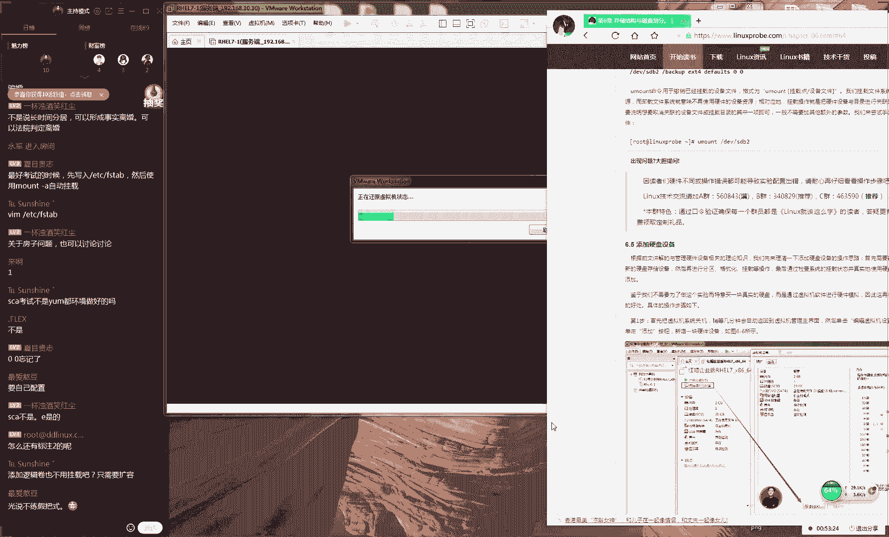
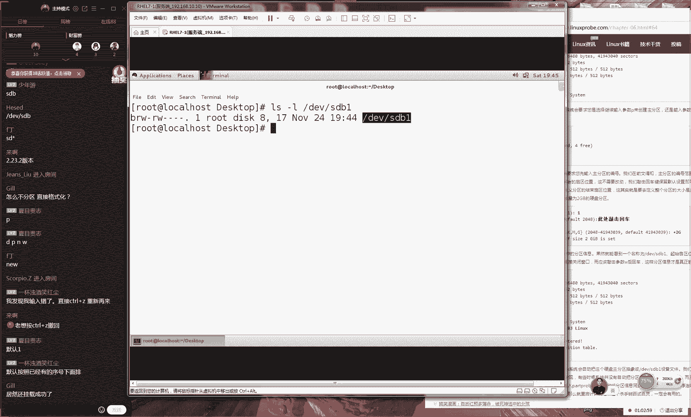
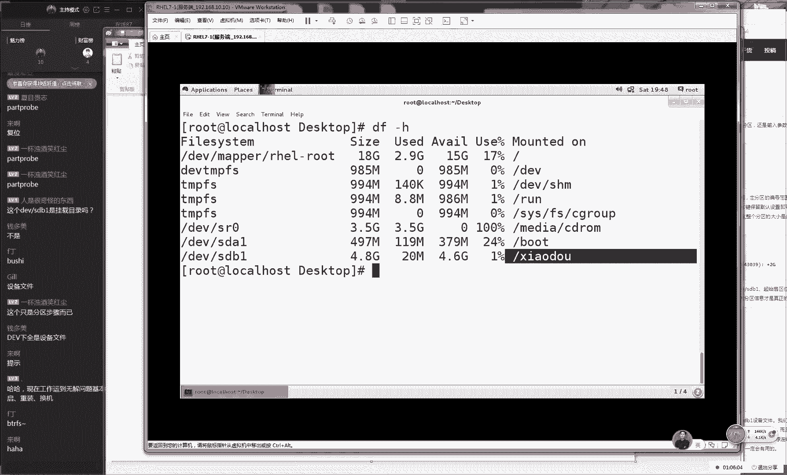
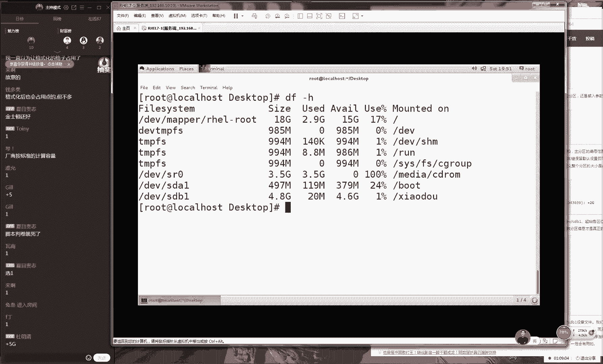
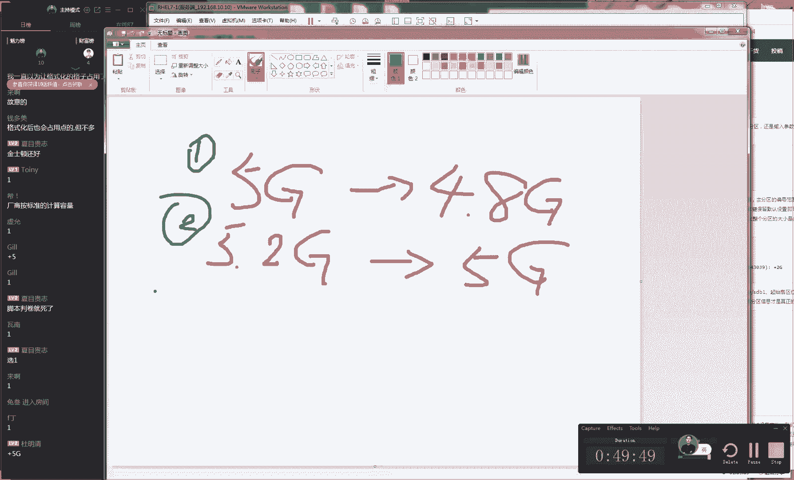
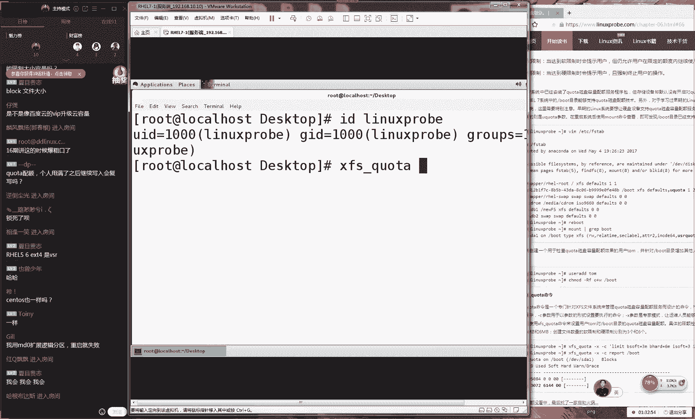
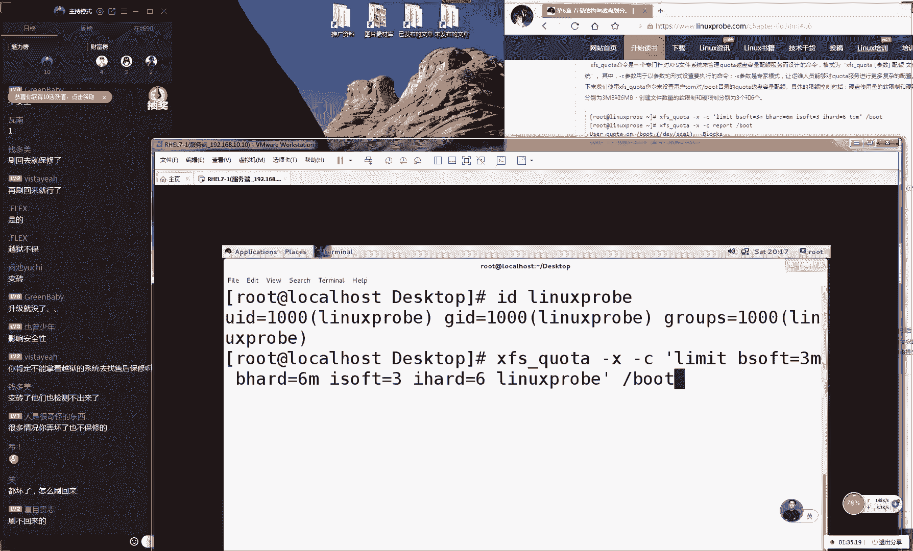
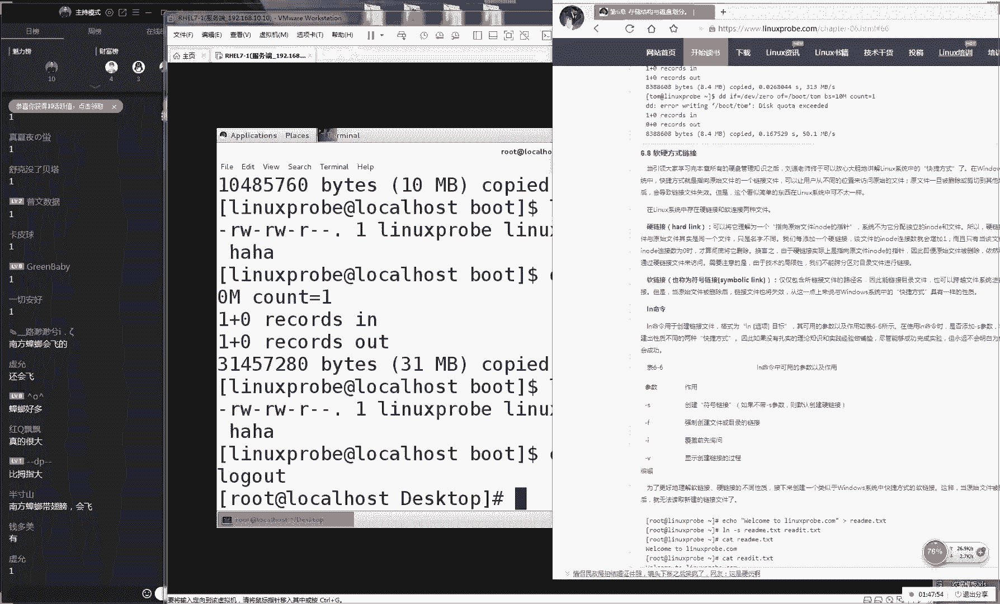
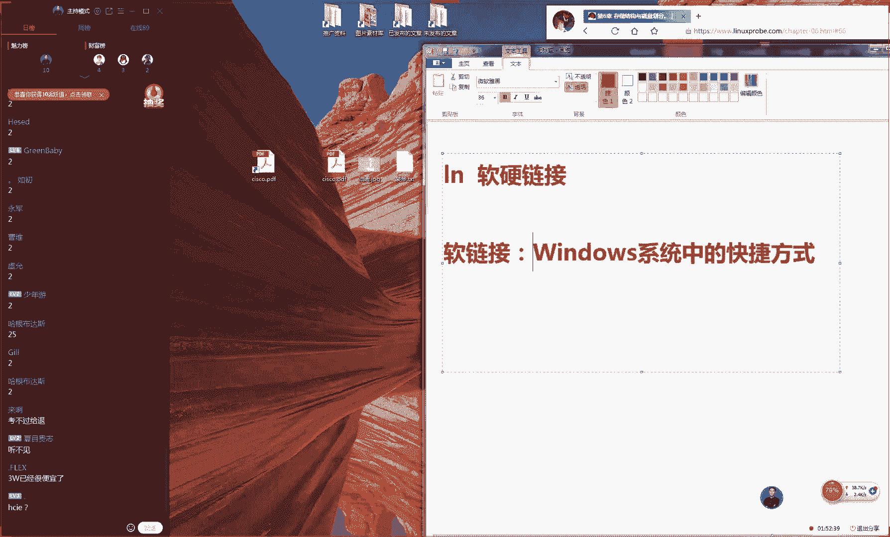
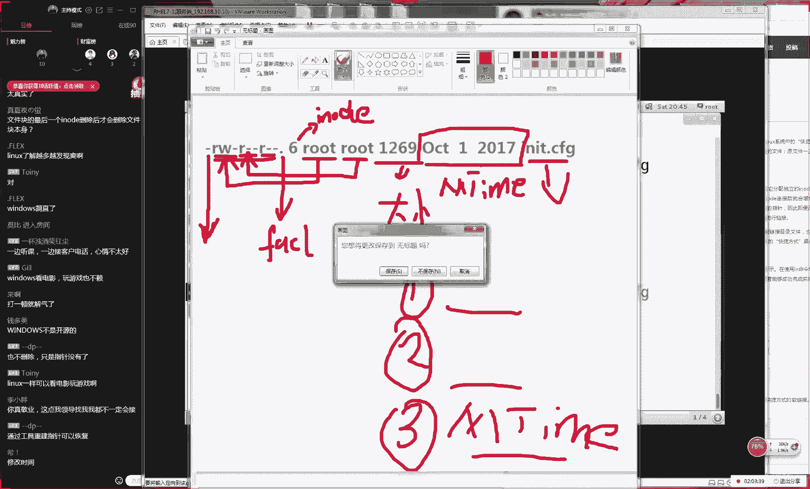

# Linux教程RHCE - P8：8.磁盘分区与RAID基础 - 艾弗艾尔思丢丢 - BV1if4y1e73V

好，那我们准备上课，同学们，那我们先打一下一吧。好吧，那我们准备开始上课了。我看到我小号挺多的啊，这么多人打老老老刘真帅其实我是我小号了。那我们现在准备一下我们今天这个课程。

今天我们这个东西还是比较多的，我们这个内容内容的话，我们先从6。3小节开始，我们预计会讲到7。1小节大天做好准备。好，那我们先打一下一同学们如那么如果听好说按声音的话，能够看到我的画面的话。

那么请打一下E啊，我们先测试一下我们这个上课环境，看没有卡顿这样的情况。😊，好，那那我们先来说我们这边这个第一小节的内容就是我们这个6。3。我们讲一下我们的文件系统。这个话其实我们必须要去谈到。

就是在这个windows里边的话呢，他们也有一些比较常见文件系统，大家可以举几个例子？大家有没有人同学们知道就是dow里面有哪些比较常见文件系统。大家以举几个例子。

或者说我们之前有没有格式化一些磁盘或者说这样的这个经历大家说一下对那么我们来说应该叫做这3不对？这是比较常见的一个那么还有什么还有叫做NTF们就说出来两个了。

还有什么还有叫做这个GPT后这个其实我们来说用的比较少，而且的话这个是也算我们分一种方式。我说这个系统这种格式啊对我们还有一个叫做这是一种快速格式化的一种格式这个话就是我们在这个就是我们在window里我们比较常见的文件系统这的一个格式。

那我要给大家说一下的话在我里面它也会有这。😊，格式的它啊在早期的红猫re5里面的话，那我给大家总结一下，好吧。它在红猫re5版本里面的话呢，我们这个文件系统的格式叫做EXTR版本。啊。

后来的话我们到了EXT3的时候然后我们到这个re6的时候，我们到了EXT4哎我们错错错啊，这是这个我们之前EX3。后来我们到红猫re6的时候，它变成了EXT4版本了。当还有一个早期的一个系统。

它啊更它更它更为早期的时候的话呢，我们之前啊所有系统他们都使用的是我们这个二版本的大家知道这个一个变化了。就是说从我们这个二版本到我们这个三版本的一个变化，它主要的一个提升就是加入了一个日志系统。😊。

它里面的话它主要是加入啊它主要是加入了一个日志系统。这样的话呢，它能够让我们这个系统崩溃了之后，它可以去来去还原我们这个数据，尽可能去让我们这个资料吧不会丢失。所以的话呢这个是一个日志系统。

它主要是为了防止我们系统异常断电，然后产生的这个数据丢失。后的话它要从我们这个三门门到了我们这个四个门，这个的话呢那我们就是说只要它提升的是一个啊读写速度IO就是我们这个读写速度这样的一个提升。好。

那我们可以去预那那我们可以来去预测一下，到了我们红包由7的话，那我们现在使用文件系统的格式应该去使用是什么。😊，啊，大家可以来去预测一下，我们在红包日务期里面，我们的文系统的格式应该是什么呢？

按照你这个趋势来去分析一下。😊，我们应该是使用的是EXT45吗？还是什么？我们应该使用的是啊应该使用的是叉FS。那我们为什么要去使用到这个叉FS。

而没有继续去使用这个呃而并没有去沿袭我们之前这个文件系统呢，它主要这个原因是这样的给大家讲一下，因为你不能光看因为你不能只看这个表面，那么一定要这个深层来去分析分析说红它为什么要这样去决定。

那我们去对比一下的话呢，我们如果要是说我们将E4我们给它变更到这个叉F文系统的话呢，它主要的一个优势的变化。就是它这个支持了一个最大文件系统。它支持的一个我们单个分区达到了18个亿笔。😊，对。

所以我大家说他为什么他会选择叫这个叉FS它之说我们最大的文件到了18个EB。因为的话呢我们知道红猫ri7是在2014年的年底到时候发布的。大家想一下2014年的年底什么比较火。大家仔细想一下。

2014年的年底到时候4年之前你呢那你在干什么？当时在中关村啊，或者说在一些创业基地里面，他们谈论的比较多的事情是什么，4年之前你们好好回忆一下，那会儿没有什么快手啊，没有什么抖音啊。

没有什么啊什么短视频，对不对？很少。但时的话我们主要谈论的就是这个叫什么大数据。对我们当时谈拍还是比较少。但是我们谈叫这个大数据，我们主要叫叫我们还有叫做云计算。

那么进来说那我们2014年年底时候已经知道了云计算跟大数据，那么一定就是我们原来的一个发展方向。那么之所以叫做大数据，它证明就是说你需要用来保存大量的数据。

那么那么你有大量的这那当你有了这个大量的数据之后，那么你才可以去来进行一个呃。😊，那么我们那我们才能进行一个数据这么一个处理呢，以及我们来进行一个云计算。所以的话呢当时红帽就他做出这么一个决定。

他就把这个文系统给它变更成了这个叉FS它要最大去支持了18个这个主要就是我2014年年底的时候，为了我们往后的这个3到4年我们给做出来一个规划。大家知道的话，就是说在红帽的话。

这个企业版系统它是每3到4它会去发布一次每3到4年它会去更新一次这个企业版系统。那我们知道苹果手机现在是算是更新比较慢的。其实来讲那苹果手机每年的旗舰版本年是发布一款，对不对？

大家知道啊每年的话他他会去发布一款旗舰手机，那么就是iphone8，然后等到明年9月份的时候，就是iphone9所以话他会有一个这样的一个周期的一个一个更新的一个周期。后大家知道现在一些国内的一些厂商。

😊，咱比如说小米，咱或者说有一个叫魅族，他家没有听说我这个手机，就说这个厂商的话，他可能做这个发布会做的朋友会更多一点。他也许说每三个月或每一个季度啊，或者每半年他会去发布一次发布会。

所以说这个更新周期也就决定了他这个技术的一个呃前一个前瞻性。他的这个技术需要在他这个发布周期内，他要他要去处于一个领先，或者说让我们这个用户能够受益这样的一个呃地位。那所以话大家想一下。

当我们2014年年底的时候，既然来说已经知道这个大数据跟新计算。😊，就是我们未来的一个发展方向。所以红帽他就选择了这个叉F主要他用去服务我们这个呃未来的3到4年时间里面这个数据存储啊。

我们来去存储海量数据这么一个需求。有同学在用魅族就提到了所以的话我们就提到说其实的话我们这个四版本跟我们这个叉我们要比较来讲的话呢，效率上来说基本上是相同的。因为我们这个保存文件这个他要去测试的时候。

这个细节是非常的复杂的。因为我这个读解数据，咱来说我们来去读取数据来讲的话呢，读大文件跟小文件跟读文件那么以及我们来去读取多次这个文件这个比较起来是非常复杂的。

所以我们通过我们比较我们来看到的话这个性能上来讲基本上是一样的。主要这个优势就是支持的18个的一个更大文件的一个支持。所以我们要知道啊，如果要是有人在问你们的话。

那么你第一点你要知道到我们红里我们使用的是这个。😊，FS这个我们一定要知道，这是我们第一个知识点。第二个知识点的话呢，那么为什么要呢？那我我们第二点就是这个知识点了。第二点就是叉啊。

那么就是叉FS文件系统，它支持了一个更大的一个文件系统的一个支持。它支持了18个PB。😊，哎，我是不是写错了，我们因为我们这边好像不是18个呃呃呃并不是18个呃PB我们是支呃支持了18个EB。

这个大家可以去算一下哦，我啊我要给大家去算一下。好吧，因为的话EB要比PB还要更大一点。因为我刚才可能是比较保守一点了，它是18个EB好了，18个EB是多少个G，我们来去算一下啊。

因为这个数字是非常的大的。大家可以看到18个EB的话呢，我们换算成GB的话，它有个10百千万10万百万千万。😊，亿10亿百亿它可以相当于200个亿的这个GB。大家可以想一下，那我们按照TB去算的话。

因为我们TB现在也在我们活当中比较常见了，它支持的话呢按10万百万千万它现在就是支持了180万TB这么一个空间。

所以说这个已经它它是能够满足我们这个几乎来说就是所有这一个存储的这一个要求来讲所以这红我这个的这么一个预判吧。那我再给大家提到一点的话，就是我们保存文件时候。

来说它是有两部分去组成出来的这个我在我们系统里也是通用的是这样的当当我们来去说到一个文件的时候话，其实来说它是有两部分去组成出来的那我们的第个第一个信息的话们做D信息这个用来保存我们文件这个属性信息的比如说我们这个里它会包含有我们文件的名称？

这是我第一点我们的文件名称跟我们这个真实内容它是分开做保存的来说我们的文件。😊，名称。第二，我们的文件大小。第三，我们文件的属性。那么就包括它这个权限，我们写比较细致一点。那我们就是这个权限。

还有我们这个所有者跟所有组等等等等这样的这个信息，他们都会记录到我们LOD文件里面。他用来去记录的是我们文件的一些属性信息。那我们总的来说它就是。😊，记录的是我们这个文件里面的属性信息。

最后的话它会有一个指针，它会有一个指针，然后去指向到我们用来去保存真实文件内容的这么一个数据块。我们这个里面保存的是我们真实的文件内容。这个文件我们叫做block这们要大家这一个理论性的东西啊。

所话我们知道它有个它有两个比关键的这点。第一点的话就是说每一个文件它都会占用文件的这一个它用来去保存我们文件的这个属性。我们还有第二个支识点。

第二个支点是说我我们每一个D文件的块后面他们都会指向到一个b块这个才是用来去保存我们这个文件的这个这实数据这样的一个空间。

那我们需要注意话就是这个大小这在我们这个系统里面它默认是一个K但我们个系统是不一样的默认可是一个KB或者个KB或者3个KB有个它有4个KB。😊，啊，可以会有一个两个或4个KB这样的这么一个容量。

像比如说有你呃呃那呃那你有一个文件呃，那我们那我们把b块给它选成4个KB好了，那我们有一个文件大小是1。5个KB，但是它也需要去独立来去占用一个b块。所以说这就是呃提出一个知识点。

我们叫做文件的真实的容量啊，就是这个真实的大小，我们写成1。5个KB。但是它也需要占用我们4个KB的这样的一个空间，这个对它也它也会有浪费。而且这个IOD文件的话呢，在我们。😊。

这个windows里面它虽然可能是没有它是完全一样的这样的一个解释啊。但是它这个做法都是一样。那我们比如来说我们来看一下这个文件，这个文件大小的话呢是1。28个大家到这个文件大小1。

28但它占用大小的话恰一样。因为我这个大小比大那我换一个比较小一点的我们换一个比较小一点的这么一个文件。大家可以看一下，那看我这个文件话看不清楚。

但看不清楚那我这个文件的话总共是713个字节那我这个文件它只有7713个字节，但是它却占用了4个KB的空间。所以说那也就是说它占用的空间相它自身体积的相当于是6倍了。那那它会造成我们一定的这个增浪费。

但是它也让我们这个数据它是具有一个完整性，这就是我们要去保存文件这么一个原理。那也就是说每一个文件它是有两部分组成出来的第一部分的话我们叫做文件主要保存我这个文件的属性信息。我们叫数据。😊。

保存的是这个真实的数呃，他他他用来去保存我们这个真实的内容。这个我们一定要把它给区分好啊，那我们一要区分好。我们去看文件的时候，它是有两部分组成出来的。好，这样我们往啊那我们就往后继续说说一下。

我们有一个术语，我们叫做分区格式化和我们的挂载。然后以及我们叫做VR。先给大家说一下我们这个VR啊。😊，因因为我们今天刚刚上课，可能问题比较多，所以我现在给大家讲好吧。

大家可以下课之后来继续来说我待会给大家留时间的。好，那我们先给大家讲一个我们比较呃比较里篇理论一个技术。

我们叫做F这个我们叫做虚拟叫做 system叫做虚拟文件系统这话就是说让我们这个用户不用再关心底层文件系统的这个特点，可以直接去操作我们这个系统这个什么意思啊？

咱比如说我们有一个文件系统的格式叫做EX2还有一个系统格式叫做做三版本还有一个叫X4版本，还有一个叫做叉那好了，他们它既然是不同的文件系统的格式。那么也就是说它里写的数据的这个方式也是不一样。

就相当于就是我们再去写笔记那个单线跟创建本它里的这个格式也是不一样的这个它是必然性对不对？但是为什么我们再去创建文件的时候，咱比说我创建出来一个文件，我们叫一个为什么那我创建出来一个目录叫做的时候。😊。

我们都可以成功呢？啊，这个什么意思啊？就是说我那我们现在它有呃它有两个目录，其中一个目录，它是在home目录下，这个格式叫做ET4版本。那我们叫做home目录。还有另外一个文件系统，我们叫做不目录。

这个它使用的是这个叉文系统。那么为什么这两个文件系统，它所挂的这个目录啊，那么以及他们对应的这个呃的这个格式是不一样的。但是我们最后都用在里面，我们不用加以区分就可以出现出来文件呢。

那么以及我们也能够去来去读取出来内容，就是有一个系统我们叫做VR它用来去。😊，让他可以让我让我们这个用户不用再去关心底层文系统的这么一个特点，可以直接来去访问到里面的数据。好。

对他下去对屏蔽掉底层的这个差异。这个我觉得翻译是比我更加准确。他屏蔽掉我们底层的这个差异，你的这个用户你不需要知道底层是什么。比如说以后我赚到，那我想出国玩了。

那我不用去关心说我到那个国家那个人说什么话，但是我要翻译对不对？把我这个话然后我交给我的翻译，然后翻译根据我底层这个受众，就是说我们要翻译给谁的这个对象，然后他去翻译成他能够听得懂这个语言。

然后他我作为一个他进行一个交互这么一个翻译官那我以来看一下这图我看一下我们这个图，他这一个图片啊，他这个最上的话就是指的是我们这个用户进程，其实就是说我们用户的这个操作，就把比是你自己了。

这是你自己的一个操作。然后你通过你的这个界面比如说通过我们的命令然后我们通过。😊，我们的一些服务啊或怎么样，那我们就要去对我我们这个呃磁盘来进行一个读写操作。这个时候你所出。

那么呃呃那么这个时候你呃呃呃你所直接控制的话，那你并不是直接去控制到底层的这个硬盘，而是通过这个叫做VF东西，把你想要充建出来的这个命令。我们这个需求。比如说我需要出建出来一个文件叫做将我这个需求。

然后我们给它通过这个V给做一个翻译翻译成我们底层的系统，它能够听得懂的这样的一个语言。然后对于我们这个数据来进行一个写入，然后我们再给它返回来。

同样道理我们再通过VF翻译过来给我们这个用户这样话大家可以很清楚可以知道我们有什么样的一个好处，就是让我们这个用户不用你去管底层文系统它是什么样的一个格式。😊，这个东西它不用你去关心。

它都会帮你通过这个VFS去翻译。因为的话这个其实我们不讲也可以。但是我们去讲一下的话呢，大家要知道说为什么我们再去写入文件的时候，我们我们不用去关心底层系统这么一个格式的一个原因。好。

那我接下给大家说一下，就是说那我们这个格式它有什么区别呢还有我当我们去去使用一个硬盘的时候，我们该有什么样的一个步骤。第一步的话呢我们叫做分区，这个是我们需要做第一步骤。第二我们叫做格式化。

第三步我们叫做挂载，让我们依次给大家来去说一下这三个步骤这么一个用处。那给大家举一个生物上的一个例子啊，比如说有没有同学写欢写字啊，让我们来去写字同学你们知道要要买宣纸对吧？我们要去那我们要去练字。

那咱比如说那我这边我买了一块很大的一块纸，就是我买了一个很大的一块硬盘。那么当你把硬盘买到手之后，那你需要第一件事情，你不知要去写字的那么也不是去操作这个硬盘里面去存储这个数据。😊。

那你的C啊啊那么你的第一步骤，那么你需要先在去进行一个分区嗯。😊，好，大家先啊不用那个刷礼物啊，大家刷礼物真的没有用，因为咱不是客气。你刷完礼物之后就纯粹给马化腾了，这个直播我除了讲课。

我也没有什么其他才艺可以给大家去展示的，所以这个东西平时不用的，那我们给大家举个例子，看到我们这张图片，当去买了一个很大的一个硬盘，或者说你去买了一个大一张纸之后的话呢，那么你需要做第一步的事情。

你就是要让你的这个纸，或者说让你你的这个硬盘变成一个合适的一个尺寸。那么我们对于我们生活上来讲的话呢，就是要对这个纸进行一个裁剪。

我们这个纸给裁剪成就是我们大概能够使用这么一个大小这个大小可根据的这个实际来去这个调整啊。那我们叫做这个裁剪或者我叫切割。那我们这个步骤的话呢，就是叫做分区了分区就就是我们对一张很大的一张纸。

后我们来进行一个切割或者我们叫做分割。大家可能之前没有见过那种特别大一张纸。正我是见过的。因为我最近。😊，我看了一个小一个小一个就一个小视频嘛，然后就是说到说这个纸是怎么样去造出来的。

然后他就拍了一个试拍一个造纸厂啊，然后他会有各种的工艺，他会拍他会先将这个数这个这个会先将这个树枝什么的，给它打成酱，然后把这个浆里面然后把这个酱里面去兑水，然后对成各种东西啊。

最后它摊开一张纸之后是很大的一张，后他最后就要去切割出来的。好，那么这个步骤我们叫分区步骤就是要把我们这个硬盘给大进行切割，再给大家说一个我们技术上的一个例子啊，那我们就要比如说我们买一个硬盘。

这个硬盘是100个TB的那么你直接去使的话，那我感觉虽然也行啊，但是是不是太大了且不太好管理你的这个里面的这个资料呢，那我们就可以去选择把它分成几个分区，这样来去方便来去管理它。

那我们这个分区里面他要分了这个主分区会展分区跟逻辑分区。好，这个我们先不说啊，那我们先给大家说第一步骤就是你要先去做分区。第二步的话我们。😊，的格式化这个什么意思啊？😊。

那那我们现在已经对他进行一个分区了。那我们现在目的的话，就是要去写字了。大家上因为他因为他上学的时候都已经用过这种田字格本，对不对？但我们上小学的时候啊，就是有了格式，就是我们叫打格操作吧。

我不知道大家有没有用过。我先给大家去描述一下就是这样的，就是我们那会儿的话呢，我写作业的时候，那我们要需要用到不同的本。但比如说数学本它就是一种单线的形式，大家要用过打一下一啊。

这大家都都应有有应该是有童年啊，就是这个这样的一个形式，就是我们这个数学本，对不对？它是一个单线的一个形式。后来的话还有一种本叫做英语本好像是两就是他底下的话好像是两条线，对英语本好像是4条线，对吧？

后他他是每4条线，它是一行他让你去写一个他让你去写这个单词式的，我们叫做这个话我们叫做英语本。😊，它有这种田字格本，它是这样的，它会把里面这个哎里面的话，它会有一种米字格，它会让你去这样啊。

有的格式来去写字。这样的话你写出来这个字是很工整的对吧？那我们会有不同的这个格式。好，我们比如说我们最后还会有这种作文本，这个作文本也是它像豆腐块一样，会这样一个一它它会有这样的这个格。

那么也便于你去写去统计你已经这个写多少字，好，那么也就是说我们再去写不同作业的时候，它会有不同的这个格。当我们那那我们当我们想来去使用这个字源的时候的话呢，那么它里边也需要不同的这个格式。

我们才能那我们才能进行一个数据的一个读写数据的格式化跟是跟U盘格式化是一样还是名称是一样的，这个是它就是一样的。因为我们所说的格式化，就是大家以前在去操作过那个格式化这个是一样的。

那我们现只给大家去说到这个底层，它就是对它进行一个格式化，这样就是对它进行一个打格嘛，那我们叫做这个格式化，这样你可以对它。😊，这个信息进行一个正常的一个读写。但是我现在画这个横线啊。😊。

肯定在系统里面不是这样的。但是我我只通过这样帮来来去来去理解一下，就是说这个打嗝操作实践。他就像我们选择一个不同的作业本，然后我们来去写作业一样，尤其在我们这个硬盘里面，你必须要有这么一个格式。

否则的话，那么你的这个数据咱们就很乱的。但比如说我们这边写上这个姓名是张三对吧？我们写张三，他这个身高的话呢是180，他里边他家里面的话呢，存款是30万，然后他这个年龄是是27。

还有一个同学叫李4还叫李四这样一个为你想一下这东西他在系统里面如果要是没有一个格式的话，根本就看不懂了。还有一个用户叫李四，他这个身高的话呢是1。35，他这个体重的话呢，比如说是26。

有他这个家里存款的话，比如说是170万。那你这样看一下这个数据我虽然我刚才已经给大家去说过了一遍，但是你现在再去看，比如说我们现在提个问题，这个呃这个三十是什么东西啊，大家忘记了对不对。😊。

这个我们必须要有一个格式，然后它像我们这个统计表一样，它有像一个格式，然后我们才可以往里面来去写入我们这个数据。好，这个我们咱们就不多就啊不去多说了啊，这个我们。😊，是比较简单。

怎么去查看文件系统的这个格式，就是我们下面要给大家讲的，我们可以去使用的叫做mount命令。我们叫做挂载。这个挂载操作的话呢，我们呃我们坦白来讲，我们从网上我们也找到很多很多材料。

但是虽然说现在互联网发展的如此之快，但是对于这种基本的单词术语很少有解释，其实我很怀念像我上小学的时，我当时看完一本书叫叫做魔鬼字典大家有没有看过。

就是那本书叫叫做魔鬼字典因为不知道现在还没有现在还没有卖的。就是对于它就是对于一些生活上的一些呃术语的话呢，它进行一些比较搞笑的一些描述没有看过吗？那我可能是盗版的，可能你们都没有听说过啊。

你们看是新华字典是不是啊所以我看的是魔鬼字典，所以我现在能够讲课了。就是说咱比如说我给你们举个例子啊，对他会对一些术语来进行一些比较可爱就是说比较比较容易记一些描述。咱比如说老师是什么？

那么老师就是拿着编制的。😊，魔鬼，那你看是非常的这个贴切，而且的话呢让你一下能够记住了这个老师家的这个形象。那么这就是一个呃术语的一种描述。对于我们生活的一些帮助。但是的话呢我们坦白来讲，这个挂载操作。

他实际上在我们互联网里面没有一个太好的一个解释。所以我们给他的一个解释，就是老刘给他的一个解释。并且现在我看到很多网站上面都去采用的这种说法。那么以后大家如果看到的话呢，请切记啊。

就是这个说法是从咱们这来的啊，好，那我们来去说一下我们这个挂载的话呢，就是来去使用硬盘。好，当我们呃从呃那呃呃那我们当然来去总结的话，那并不呃他并不是这句话啊。😊，那我们这个挂载就是你要想来去操作的话。

那么你要想来去使用硬盘的话，那么你就要先要去做挂载操作。然后我大家去总结说我们这个挂载操作的这么一个。呃，描述好吧，然后那我们知道我们挂载到它到底是什么样的一个行为。那么以及它有什么样的一个效果。

这是我们给大家总结出来的。好，那我们先来说一下我们的挂载操作，大会最好记一下你的笔记啊。因为这个很重要，而且网上是找不到的。如果那么如果要找到的话，可能也不像咱们描述这么准确。

先来说一下我们这个挂载挂它这个挂载的这个操作的话呢，挂载它其实来它它就是一个操作。它这个挂载的操作就是将我们这个设备文件与目录啊，或或者说我们叫与某个目录相啊与某个目录相关联的动作。😊，就叫做挂载。好。

这就是我们挂载操作的一个本质。大家可以记记一下，这个是我们的这个本质。它就是将我们的一个设备的文件，或者说我们的一个分区啊，它也因为这个分区的话，它也使用我们这个设备文件。

然后与我我们的一个目录来去做挂载的这个操作。我们把它叫做这个挂载。其实的话它现在就是两个区别之把它并到一起了。这样的话把它作为一个整体，这样你就可以通过我这样的话呢，我们来去说一下我们这个效果啊。

我们的核心的这个目的，这样就可以通过呃，这样就可以通过目录来使用。哎呦又有有。😊，呀我我怎么打完之后，哎呀，这还真的不太方便啊，那后再给他打一遍吧。这个记事本他这个图他他这个图画点完之后吧，它就没有了。

那我们这过啊那我们这个挂载操作的话呢，ctl外不好使，因为我刚才没有点那个外面那我们挂载操作的话呢，实际上我们再给他打一遍吧啊我们不偷呃我们在外面偷懒，我们挂载操作的话，实际上就是将。😊，呃。

将设备文件与某个目录相关联的动作就叫做挂载。这个是它的本质，它就是它这个本质啊。第二的话呢就是说呃我们这个目效果我们是然后就可以通过。该目录吧或呃我们这个有一个术语，我们叫做挂载点。当它挂载之后。

把它交回，他就啊这个就会把它叫做这个挂载点了。访问。使用到设备文件的内容。那也就是说当我们对于一个文件和我们的一个目录做好挂联之后，那我们这个目录就变成了一个叫做挂载点的一个东西。

然后我们就可以从这里面去找到我们硬盘里面的资源。但比如说我们来举个例子，我们就它非常像结婚了，对吧？然后一个男方，一个女方。那我们把他们两个做关联的这个动作就叫做登记叫做结婚。那好了。

那么然后我那我们就可以把这个我们的这个对象啊，然后从朋友，然后我们提升成了这个夫妻。那我他有一个专业的一个术语，我们叫做挂载点，就是你的爱人了，就是他会有一个专业的一个名词。当它只有挂载了上之后。

他才会有这么一个专业的这么一个名词。好，那我们先看一下就这就是我们挂载操作的一个本质。再给大家总结一下啊，就说当你去使用硬盘的时候的话，那么你需要做第一步骤，那么你就是要先在去做这个分区。

第二的话呢我们要去做这个格式化。第三步我们来去做挂载。当然了，那你这个分区，如果你这个硬盘比较小的话呢，这部操作也可以把。😊，省略掉，这个也不用去做的。就是说我们按照理论上来讲。

它应该是经历这么三三个步骤，它才是完整。但是这个步骤它可以做可以不做，我们要以实际为上为准。好，那我们要以这我们这个实际为准。好，那我们接下来给大家说一下我们挂载操作的话呢，那我们选的命令。

我们叫做mount命令。😊，呃，我们这个操作的话呢，我们叫做mount命令。嗯。

哦，这个很奇怪，我怎么打不出来字了？😮，哦，我这边选上这啊，我们选择呃我我们的命令，我们叫做mount，大家可以记到你书上面，我们叫做mount。大家记书上面或你记你的笔记。我们接下过之后还要去拍照的。

然后去在我们博客上签到啊，千万不要忘记这块我们叫做mount命令就用来去挂载的。这它是用来去做我们这个挂载的这么一个命令。然后我们就可以通过我们的目录来去使用到我们设备的文件内容了。还有一个命令的话呢。

我们叫做Umount命令。😊。

这个话我们叫做卸载命令。他就是让你的这个设备与你的目录呃取消了关联。那么你就不能够通过这个目录找到这个设备文件里面内容了。好，然后我们来去说一下这个格式。

那我们就是这个mount加上我们设备文件的这个路径，设备文件。呃，它不是名称，它是一个路径加的名称，它依然要叫到叫做绝对路径的一个形式呃呃，设备文件绝对绝对路径形式。绝对路径的这么一个形式。后面的话呢。

我们再给大家加上我们目录的名称，我们讲目录的名称。这样我们就给大家去做这个挂载操作。大家可以记一下，我们叫做mount设备的呃绝对路径，我们加上我们目录的名称，我们就可以对他这个设备来进行一个挂载。

第二的话呢我们来去卸载的时候，那么就只需要去输入一下这个，然后我们加设备的绝对路径。或者的话呢们路径或者我们的目录名称就可以了。他要像我们结婚一样，大家大家知道就是我们我们再去结婚的时候的话呢。

因为我们需要登记双方的信息，对吧？因为我们国家也不知道你跟谁谈恋爱了。因为你的父母都不知道，那么我们就要对你这个双方的这个信息来进行一个登记，将你们两个的信息来进行绑定，这样的话。

那么那么你们两个才能够结成一个夫妻，那好了，当你去结好婚了之后，你就可以去使用对方的这个资源了，这个时候当你有一天不想跟他在一起生活的时候的话呢，那么就要办理离婚了，但是我们离婚的时候。

就可以只要去去其中的一方就可以了。那么你只需要去将我们这个设备的。😊，路径加上我们的这个目名称就可以了。哎，你这个信息已经在我们这个系统里面去登记过了，你不用去说。

那么我们这个系统里面他也能够去查到你这个呃的这个的对象。那你这个结婚的这个对象是谁，好吧嗯。😊，因为我没有离过婚啊，所以我不知道离婚的时候是不是跟我们这个设备里面讲的是一样的。

是不是只去呃写一个人信息就行了。因为待会大家如果要是有经验的话，你们可以去分享一下。既然一切都是文件以把分区给删掉。这个一般来说理论上是可以的。但是他会受到我们系统这个保护还是不可以的。

那我们就要注意一下，因为我们真的没有离过婚啊，以说大家记一下为我己瞎瞎想啊，因为我觉得这个信息们国家已经你给登记过。所以你这个信息肯定是在我们国家信息库里面肯定是有的。

所以你不用说这个你谎称自己没有结过婚，这肯定是不行，对不对？所以说当你去离婚的时候，那么你只要去写我们这个设备的路径，或者我们这个目录的名称两个去选择一个就可以了。这个就是我们去。😊。

挂载跟卸载这么一个方法。再给大家说的话，有一个文件叫做ETC目录里面的FTB这个文件啊就是说它会让我们这个外它一个呃挂载信息可以去永久生效这么一个文件。当我们再去使用到这个mount之后啊。

我们挂载出来的一个信息，它是当前有效的。重启之后就会失效。重启呃重启之后就失效的。这个很显然它不符合我们考试跟我们工作这么一个需要的那我们需要是一个呃永久生效这么一个效果。

所以说我们需要写到这个文件里面。这个文件它有一个格式，我给大家去呃来呃来呃再家去说一下啊，现在呃我们这个第一列就是我们这个设备的。😊，设备的绝对路径。这么一个名称，这个是它放到第一列的。

大家可以记到这个你的书上面，这是我们这个FB文件的这么一个格式。第二的话呢就是你的这个挂载目录，我们把它叫到过来点也可以啊。我们写上这个叫做挂载目录。

还有我们这个第三列我们第三列指的是你的文件系统的这个格式，我们叫做格式化后的这个格式吧，或者说我们叫做文件系统的格式文件系统的格式。还有我们的这个第四列就是我们这个权限啊。

我们来赋予我们这个设备什么权限。第五个的话大家可以发一现你的书里面应该大家讲的话呢，会有同学们你们会有一些刊物啊，就是说因为我们之前我们去写是写错了这么一个小点。它呃我们就大它这边第一个的话。

大家可以来看一下你的这个书，一般我们说一下啊是这样的，我们话之前我们写错了。因为我们这两个格式给大家搞错了。它这个上面的话呢，第一个来说它是是否备份。第二个它是是否自简。

因为如果您的书可能买的比较早的话呢。😊，可能这边啊第一个显示是否自检，第二个是这个呃自检的优先级。那么这个时候呢，你要去改一下这个书上面，它确实是是有一个刊物了。好，就是说是否来进行备份。

那么以及他是否进行一个自检，是否。😊，对，自检。那么好了，这个它只有零和一的区别。那么它为零说明他不要备份啊，它为它为一说明它需要备份，那么以及它需要自检。那我们就是说它只有一个零和一的这么一个区别。

那好，那我给大家说一下，就是说我们去写这个文件之后，那我们挂载信息才可以去才能去永久去生效的那我们这个格式123456这个6个项目我们千万不要忘记这我们千万不要忘记好，那我们接下给大家说一下。

因为我们带入到实践里面来去操作一下。因为我们可能光说大家对这个理解可能还不是很好好，那我们还迎下我们这个机来去带入下我们这个实践。其实我们昨天已经讲了很多很多这个理论啊，我们今天终于要动手来去操作一下。

其实操作起来才是真有意思的地方。好，添加逻辑不用挂载，只需要扩容这个我先不说啊，我们今天会给大家讲到的。😊。

啊，什么还说呃，不是说长时间分居就会形成事实离婚，可以判定离婚啊，这个我不太清楚啊。好，那我们来继续给大家就是说。

那我们给大家还一下我们这个虚拟机。呃，另外的话呢，在我们工作的时候，你是可以直接添加你的硬盘的。但是我们它是使用虚拟再去模拟硬盘跟网卡的时候，经常发生故障。所以说我们建议来讲我们把它关机。

然后进行操作不要给自己添麻烦。因为这个虚拟机它毕是虚拟机它模拟出来硬盘它不像我们这个真机那的稳定，那我们现在选择一下我们编辑虚拟机另外一个好处就是说我们不用说为了做这个实验而去单独去买块硬盘。

那么你可以通过虚拟机来进行一个模拟我关机之我们选择我们编辑虚拟机的设置。我们点击一下这个添加后我们选择一下添加出来硬盘接口类型们选择下一步选择成它是一块新的硬盘下一步大小为20个G一步这文个保存位置不用管它选择完成这样话我们就多出来硬盘。

我们大小为20个G后开机这。😊。

非常简单的啊，它主要就是天天硬盘的一这么一个。呃，模拟的这么一个设置。然后我那我们需要注意一下啊，待会儿的话呢，我们要按照我们这个流程先给大家来去做一遍。

我们我们啊就是我们这个分区格式化和我们的这个挂载。但是当我们实际去操作的时候，这个分区的步骤大家可以忽略掉，不用啊，可以不这这个呃可以来是不用的啊，要根据你的这个实际情况来去断定。😊，而呃来进行操作。

而不是说一定要进行这个分区的嗯。好，然后的话呢我来请个问题嘛？说红帽CIC的话啊，对，是这样的。红帽HCIC就是使用的是我们上课这个实验环境，它没有这个模拟环境。而且的话。😊，呃。

模拟环境千万不要用到不要用它需要千万不要套红的题，因为那是错误的。因为我也说了很多遍了，就是我们的就是我们上课时那70版本的一个系，这就是我们操作的环境。然我们的红使用的是那个模拟环境。

而我们的模拟环境也只能够只能够给千万不要拿模拟环境去的那么否则就会有出现问题了。好，那我那我们来看一下，因为我们现添加出来我们个硬是你去买一块新硬盘插入到你这个电脑里面了。

那我们这个设备的名称根据我们一个叫做UDV的服务。那我们想一下，那我们去想一下我们有一个服务叫DV服务。大家来猜一下，虽然我们现在还不知道这个设备的名称是什么。但是我们可以来去猜测一下。

当我们第2块系统所识别的设备的名称应该叫什同学们。😊。

啊，当我呃大家想一下，我们第2块被系统识别的硬盘的设备的名称应该是什么。虽然我们还没有去看啊，但是我们可以根据UDV的这个附的一些规则，它一些内置的一些命名的规则，然后我们可以大胆去猜出来。

应该叫做DV目录，对不对？它定是在我们这个设备目录里面是什么呢？因为它是一个设备的一个文件，它是一个存储文件，它要不然它就是HD它是一个老式接口。

但是我们现在选择是这个那么因此就是那么那么因此就是SD开头了。接下来说第2块被识别到的这个设备文件。所以来讲它就应该是叫做DV目录里SDB这就是我们为什么要去学习UDV这么一个好处啊。

这个时候你以后再也不用去说我们先要去看一下设备的名称，那我们才能够猜出来了。而是你可以通过你这个大脑里面的这个推一个推论，然后根据这套规则，你有的这个知识，那么你就可以猜出来它这个名称是多少。

那当可大家看一下。😊。

这样的话果然我们这个设备的名称就叫做DV目录里面的SCB这就是我们学习UDV的一个好处。好，然后给大家做一下我们这个流程啊，我们先来做一下我们这个分区分区使用的叫做F的么一个命令。

然后面的话我们写上我们的设备的名称DV目录里SDB敲一下回车。然后那我们就可以进行一个交互式的一个互动啊，这个交互式它指的就是我们用户需要来进行一个输入，然后与我们这个命令来进行一个互动。

然后才可以来去完成某一项工作。这个时候我们可以先去敲一下这个消息来去看一下它有哪些帮助信息。那我们可以看一下这个就是它这个帮助的信息了，它里面这有很多很多这个功能。

那我们可以来看到这边的话呢前面就这个A和B啊什么的，这都是它这个操作符。而后面的这些是对于某个功能的一种解和说明信息。😊，那好，那我大家去总结一下，就是说那我我们需要去关注这么几个操作服的话呢。

第一个就是这个D代表就是来去删除掉一个分区的意思。大家可以可以翻开你的书，然后找到我们这个章节一定要写好的笔记。第一个D的话代表就是来去删除掉一个分区的意思。代表删除掉一个分区。这个我们要去记一下。

第二话我们需要记得就是这个消息它显示出来的就是我们所有所有已知的文它显示出来是我们所有已知的分区的这样的一个格式。好，那我其实家讲的话呢这个不并不是必要的，这个也可以不用去记。

因为我们可以去使用到P这个参数，它也能够看得到的。下面的话就是这个N它代表就是我们去新建出来一个分区，它去新建出来一个分区。还有这个P代表就是显示我们当前已经有的分区信息。

那也就是说显出来我们当前分区表的这样的一个列表。如果不分区直接格式化那么也是可以的。好，然后我们这个Q代表就。😊，是退出，但是不保存还还有一个相反的一个参数，就是这个W代表就是啊保啊是啊退出并且保存。

那我们需要记一下Q代表就是退出，但是不保存啊，而我们这边的这个W代表就是退出，但是也保存。好，那我先给大家去玩一下来看一下我们这个实件操作一下。那么我们先给大家去敲一下这个P吧。

就是显示一下我们这个分区表的一个信息。那我们可以来看到当前我们的分区表里的信它是空值。这个里面它是没有任何信息的。这个时候呢我们可以来去新建出来一个分区。我们先敲一下N好。

代表就是去新建出来一个new新建出来一个新分区我们去选择我们这个分区的格式，我们可以选择P代表这个是主分区。那么我们也可以选择这个E代表就是一个扩展分区。

那我们先敲一下我们这个P代表新建出来一个我们的主分区123你。😊，它就是我们的一个主分区。如果要是敲错的话，那你可以直接ctrol C或者conrl z或者你敲一下Q，他们都是可以的。

这个时候他们他们都代表是不要保存，而且而是它会直接去退出那我们现点一下这个代表就是新建出来一个主分区我们选择一下我们分区的编号，所以大家提到了啊。

那么当你看到一个设备的名称叫做DV目录里面的ICB4的时候，它并不意味着前面已经有了123了，而是它的编号为4好吧，大家我们要知道这一点。

那我们先选择一下我们的编号为一就好是一开始的样话呢我们来选择一下我们这个起始的扇区这个我们不要去选择它。因为我们要为我们这个默认的话呢就是从最前面开始去使。所以我们可以直接再去敲一下回车是这样的啊。

就是因为我们每一个扇区的大小是我看一下是应该来讲的话，在我们系统里面系统里面默认应该是一个KB。😊，一个大小。所以的话呢我那我们每一个扇区大小就是1个KB啊，那好了。😊。

不每一个扇区大小是500是512个字节，应该是这我们看到了啊。每一个扇区大小是512个字节。那咱比如说那我想要去分区出来512兆的空间的话呢。

那么我就大概我需要个10百千万10万但那我大概就需要有100万个这样的一个分这样的一个扇区，对不对？但是我们这样算起来真的是很麻烦。那么我们其实可以这样去做，直接减一个加号。

然后告诉他我需要这样的一个一个容量大小，他就会帮我们去计算出来我们所需要这样的一个扇区的个数。好，那也就是说那你去分区的时候的话呢，你有两个方式。第一来说就是你告诉他我需要的这个扇区的个数。

那你告诉他我们需要有10万个扇区或者说101个扇区，那你来精准的告诉他我们这个扇区的个数，要不然你就告诉他我需要的这个大小系统，他会帮你去计算出来你需要这个扇区的个数。最后那我们推荐他使用第二种方法。

就是你去使用一个加号。😊。

直接写上我们需要这个大小。比如说我那我需要5个GB好，那我就那我们就想要去写呃加5G，他会帮我们去算出那我们所需的这个扇区的个数的。好，那我们来去建一个加5G。大家需要注的话。

就是这个单位也必它是必须要是一个大写的一个G啊，它加回车。然后可以再去点一下这个P来去显示一下我们分区信息，然后你可以看到它就是多出来一个这个扇区，它总共使用的是个10百千万10万百万。

它大概会使用了500多万个这样的一个扇区，最后新建出来一个5个GB的一个空间。😊。

好，这就是我们已经有的一个分区了。那我们现在分区成功了。那我们就可以点一下这个W代表是保存分区信息。马上我们就可以来看一下DV目录里面就会多出来一个文件叫做什么呢？

叫做DV目录里面的SB大家可以看一下我们这个设备的文件就已经出现了。另外大家去操作的时候，如果说您操作过这个步骤，但是也确定说您操作的时没有报错前提之下的话呢您如果没有看到这个文件的话。

那么可以这样去操作一下操一下叫做这么一个命令是这样的的话其实在说这个也算是我们系统的一个小bug。但是红呃以及我们这个厂商啊一直他没有承认就是说我们他没有一个实时同步内核的一个功能。

因为你现在去分因为你现在是分区成功了，但是因为有些情况下它是不能够直接将这个分区成功的这个信息同步给我们的内核了，以说他会显示不出来这个分区的这个新的文件那么这个时候。😊。

那我们就敲一下这个part来去强行来去同步一下，来去立即去同步一下我们这个呃分区信息给我我呃给我们的内核，然后就能够看到这个文件了。它接来说它就是一个我们的一个小bug。但是现在红包的话他也不太承认。

所以说我们需要来记一下，我们考试跟工作的时候，万一出现这样的情况。第一来说千不要慌，们就直接来去敲一下这个就能够出来了。如果还不行的话，那么就再去敲一遍这个就没有问题。如果还不行的话。

那么就rebo一下去重启就一定没有问题了，去重启就没有问题了。😊，去经历我们这个三个步骤。那么啊那么如果说我们考试跟工作的时候，我们那我们按照这个步骤，123我们都这样来去执行了。

但是我们最后还没有这个文件的话呢，那么就请检查一下自己的这个操作，就是肯定是操作问题了。好，那我们现下来给大家做好这个。😊，分区的。然后我们接下是格式化操作。我们省命令我们叫做MKFS。

然后我们写成一个点。既然我们点两下table键，它会去列举出来所有FITAB啊，不好，它会呃所以写它会显示出来所有MKFS开头的这样的一命令。

但是我们关注的啊就是所有我们这个以MKFS开头这个文件的后缀。它来说它就是实际上能够被我们这个系统去分区的格式了。哎，它会有一个提示。😊，好，那我我们比如说。我们要想将我们这个编系统给它格式化，这啊。

这我们可以随便去算啊。我们想要把它格式化成ET4的这样的一个格式。那啊那我们直接去选择我们这个命令，然后我们检我们设备的名称DV目录里面的SDBE敲下回车。OK这个没有问题了。

这个还这啊那那我们这样就已经做完我们这个格式化A速度话它是非常快的。😊，好嗯嗯嗯。😊，那我们还有就是来进行一个挂载操作，我们出建出来一个子目录。那我们再创建一个目呃这样一个目录。

我们好比如说我们叫做什么呢？我们叫做呃爱同吧那我们叫这个小豆这一个目录。然后我们来进行一个挂载，我们叫这个小叫做这个小豆啊。

然后换我们设备的名称叫做DV目录里面的SDBE挂载到这个小豆的目录上面O没有问题。然后我们就可以去使用一个命令叫做DF杠H命令，他用来去显示出来我们当前已有的所有的挂载信息。

大家可以看到它显示出来就是我们当前。😊，的所有的挂来信息。这个时候我们可以看到有一个设备的文件叫做DV目录里面的SCB1。😊，它大小的话呢是4。8个GB，它挂到了这个小豆目录上面。另外大家需要注意一下。

就是说我我们这个分区的大小的话呢，我们刚冰冰给的是5个GB。😊。

呃，但呃但是我们为什么我们先看到是4。8个GB，它小了200个兆呢？是因为这样的啊，这是因为我们厂商计算的话呢，它呃跟我们这个系统里面的这个计算它是有一些出入的。呃。

我们当我们厂商来去造我们这个存储设备的时候，它是按照1个KB等于1000个字节，这样去造的。😊，但是的话呢，当我们这个系统里面，它是按照1个KB等于的是1024这样的呃。

它等于是1024个字节这样去算的。所以说它会有一些小小的一些出入，它会往下来去浮动。再比如说我们去买一个手机。咱们比有时说候去买一个苹果手机，大家会有这样的经验，对不对？

当你去买一个当你当你去买一个苹果手机，那你买了这个大小。再比如说那你买一个64G的一个手机，但是我们到手之后，也许就变成了60个G了，对吧？那那我们再去买1个2256G的这么一个空间。😊。

那我们到手之后，也许它的空间就是变成230个GB了。但是它并不是一个偷呃，但是他他呃但是他并不是说呃工艺上或者说哪里有问题。因为它我们这个是两种的这样的一个。😊，呃，计算的方式。

而且话这个都是我们国际标准。这两个它都是备这两个他们都是被允许的。所以的话呢那我们要关注一下啊，就是它会有一个向下的一个浮动。这个向下浮动它是一个属于正常的一个范围。但那我们考试的时候怎么办呢？

如说那我们考试的时候，要求你出来5个G的这一个空间。但是你最结果你成了4。8个GB了。那么你就想说这个会会它跟这个题目的这个要求并不符合了。所以说你出这个那么当你出建出来一个设备的时候。

那么你就手动把这个大小变成了5。2个GB结果你出出来的这个设备的空间就成了5个G一个刚好这一个是一个要求这么一个容量了。大家想一下说那我们这个两个的情况，第一个情况跟第二个情况，那我们考试的时候。

我们怎么去选择呢？我们如果考试的时候要求你出5个G个空间。那么那你去选择第一择第二种第二种的话，我们看一下能更加精准。😊，对不对？这样的话，他可以让你创出来的这个设备，正好是t姆所要求的是5个GB。😊。

那我们考试的时候该怎么去选择？其实的话呢，我们在去呃我们考试的时候，我们千万一定要去选择一。呃，因为的话呢我们考题要求是多少，就要去选择是多少，你千万不要你自己。往多了去想，然后最后出现出来一个大小。

你那你那你可能看起来是5个GB，但是我们考试判分的时候，它是本盘子因为我们虽然都是去这个加5个GB但是你加2所以说你是没有分虽然。

但是我考试的就就记个考题里写的是多少就要选择多千万要去乱改好我们这个考题里是为准的好好这个但是它是一个当前生效它是一个当前生效。

会失效命我们就要去编辑一个文件这个文件叫做目录文件我们这个设备信息永生效一个效果我设备的名目录里目录就是我们载目录做小这一个载点文统格式。😊。

现叫做defatO它这个里面这个defase就包含了对于这个设备文件这么一个读写操作了。还有这个零，还这个零代表就是不要进行这个自动备份。

还有第二个零代表就是不要进行开机的时候那个自检那啊那我们这样的话可以加快我我们这个呃是呃系统开机的这么一个速度，就减少了我们。😊，来去备份跟自检这样一个硬盘的一个操作了。好，接下我们来去重启一下。

大家可以来看一下效果，看我们重启过后，它是否还会依然为我们去挂载着两个设备。好吧，那我们来去检查一下我们这个效果。😊。

那那我们来进行一个重启来，我们来看一下效果。好，然后我们中结好之后，我们来去开机，然后我们输入我们的账号，一定要使用到超级用户入器来去登录。那么否则那就是会导致一些权限问题，会让我们一些操作。

尤那么尤其是分区就一定会报错了嗯。

但是如果记不住的话，如何查看格式，这个有这有方法的，直接这样去做，你可以去使用到mountt。它会显示出来你当前所有设备的这个呃这个呃的系统这个格式。咱比如说我们刚刚刚那个DV目录里面的SDBE。

他会告诉你他挂载到了这个小道目录上面，它这个格式他可以看到这样也可以过来查。嗯，好了，这样我们再来话就是我们这个DF杠H。😊，大家看到我们挂网信息，它会依然显示在我们这个系统里面。

那也就是说它是真的会让我们这个设备一直会挂载到我们这个系统里面来为我我们这个用户来去服务的。好，那我们再给大家演示一下，就是说添加一个交换分区。

这个交换分区的话我们名称叫做SWAP有点像美国特种部队这么一个这么一个写法，对吧？叫做交换分区叫做叫做SWAP叫做交换分区交换分区它这个作用啊。

它主要是当你的这个硬盘的这不它当你的这个内存的这个空间被占用版的话呢，它会将一部分啊这个原理啊，它这个效果是将一部分一部分物理内存。😊。

的。不常用的数据。当然说这个我们叫做冷数据啊，因为这个有专业的数据，我们叫做冷数据呃，冷数据呃，因为它会有一个叫做这个热数据。好了，我们就把它叫做呃不太常用的这个数据临时的存放啊存放。在硬盘里面。

在硬盘的。空间里这个话我们就叫做s交换分区。来他这个效果的话呢，主要是在。目的主要是降低。物理内存的这个负载压力啊，这个大家这个大家应该来说是比较呃好理解，对不对？

因为我们知道在我因他在我我们这个系统里面，最快的话就是我们这个CPU然后就是我们南桥北桥南桥北桥啊吧？然后这就我们这个计算芯片，然再往后面去走，就说我们这个内存。

后最后再后面去走才我们的硬盘那以说会把我们的一部分我们这个内存里面的这个资料时存放到我们的硬盘里面来去降低我们这个内存的负载压力。这个来说就是一个剩15GB是没有办法使用嘛。

是可以的15G是我们还没有去使用，但是我们不是不能去使用。😊，我来给大家做一下我们这个演示好了，那我来去新建那我们来使用这个15个GB的声余空间，然后创建出来一个交换分区。

然后对于我们现有的这个交换分区进行一个扩容。那我们来看一下我在已有的这个内存大小大家去使用到大到在这个交换分区大小的话是2047这个格式就说有个交换分区我们去操作我们做这天交换分区这一步操作。

另外是的考家看一下用去进行对它进行一个分区设备的名称目录因为我现在已有一个分区信到它有一录是5个G空继续创建出新分区一下我选是个主分区是扩展分区我们认再讲一个主分区的话，感觉比简。😊，一点对不对？

那我们选择一个扩展分区好了，我们敲那我们去敲一下E，把它变成一个扩展分区，敲一下我我们这个回车，然后去选择一下我们分区的编号，我们选择为R敲回车默认就可以了。😊，我们去选择一下我们这个起始的扇区。

然后我们这个我们也不需要去选择，我们可以敲一下回车。后面再去选择一下我们这个急束的扇区，这个没有必要。因为我们去选择将我们声音空间都给它归为到我们这个扩展分区里面。

那么因此我们再去敲一下我们回车那我可以看到就会出现一个设备的文件。们叫做DV目录里S这就是我们分给他15个的空间用来做我们这个扩展分区但是我们我们讲过了这个扩展分区它里面是用来创建出来逻辑分区的。

它本身不能用来去存放数据。所以我们需要再去敲一下这个后我们来敲一下L现在叫做逻辑分区。然后我们这边始区敲一下回车默认就好了。

然后就是我们这个接束的扇区我们不用个个数直写一个加我们加上两个GB就在出来一两个G的一个空间我们再敲一下他看到这样我们多出来了一个分区信息，我们叫做DV目录里的SB没有问题。就是我才敲。😊，哦。

我们刚才敲呃确实3个GB嗯。对因为我们刚才算了一下嘛，因为我们原先有两个，然后再加三个不是变5个嘛，这个五比较好听一点。因为我觉得两个GB加两个G444不太好听。所以我现在给大是3个GB好。

那我们先看一下说交分区到分区里的内容内存的使用率很低的情况下有办法切换到内存里当内存使用量很低的情况下，它自动就会把它回到内存里的。它这个数据它不会一直保存到我们这个硬盘里面的。

它只是一个临时的它它只是一个临时的。并且的话一般情况下来讲，当你的内存足够的情况下，它是它都不会去使用到这个硬盘里面这个空间来去做这个去做这个分区这一个使用的。

它只是一个临时的偶尔的当你这个硬盘的那个内存不太够的时候，它才会去使用到们一下这个W大家看一下啊这个时候我们就看到我们DV目录里的话应该会有一个文件叫做S3但是我们先看它没有这个文件。

但是呢我们怎么操作呢？😊，大家看一下，现在又在我们这个考试的时候，比如说我们遇到这样的一个情况了，我那我们在硬盘里面明明新建出来一个分区3个GB它们这个名称叫做DV目录里面的SCB3要把它当做我们这个交换分区去使用。

但是我们现在所看到这个呃实际的情况是它没有这个应呃这个文件出现。那我们该怎么办？那我们该怎么办呢？我们应该去敲一下这个命令。😊，来去强行来去立即同步呃呃来去同步我我们这个分区的信息给我们我们的内核。

然后大家再看一下，就能够看到，哎呦还啊还没有这个文件。那么这个时候我们再去敲一下这个papro，我们敲两遍。😊，如果两呃两个不行，我们再敲三遍。所以的话你当时你就多敲几遍这个命令啊。

你再去看一下的时候嗯。😊，哦，不是不是啊，这个名称应该叫做DV目录里面的SDB5啊啊，这我刚才写错了，他应该叫做DV目录里面的SDB5，它不是DV目录里面的SDB3啊。好。

那我们可以看到还有也有是这个设备文件了。但是我我估计当因为我估刚才好像也应该没有这个文件的。好，那我们现在对它进行一个格式化了。那我们分析这个这个格式化的话，它有一个专业的一个命令。

我们叫做叫做它叫做MK。😊，呃，MKSRAP命令，后面加上是我们的这个设备的名称，它有一个专业的一个命令，我们叫做MK呃它叫做MKSRAP大家需要记一下，它并不是像我们刚才说的那个MKFS。好。

大家知道它有两个不同的这个命令，它是用来去专门去做我们这个交换分区的这么一个命令。😊，好了，那我们直接后面写上我们这个设备的名称，一再回车就好了。然后我们来去做这个挂载。交换分区的话。

它这个挂载它不跟我们这个之前硬盘是一样的，它可以直接写上SWAPR，然后就给它开去开启了。好，那我们来去避免说大家说我作弊啊，然后我们先在去使用free来查看一下。

当前的话呢我我我我们这个交换分区的这个大小，我们可以看一下大小是2个GBOK没有问题。我要缩小一点。😊，好，那我们先看一下我我我们这个分区这个大小，现在的话是两个GB因为它现在是2047个兆好。

接下我们再来去开启我们这个分区S我把它分到了硬盘上我给新建了一个分区然后我现在写上我设备的名称目录里的回收不太好使边把目录3了。为我脑里的是3个G好。

那我给开启一下再来查看一下我这个分区大小这个时可以看到们这个大小就2047成了5119变成了5个GB了。它就是一个符合题这一个扩容的一个实验家到我考试的时候你要这去做的话那么考试就变成零分了。

那么为么呢？为当你所做这操作话载操作就是一个当前有效会失效这一个效果。我们需要再去设置一下是去编辑一T目录。😊，里的FITB对我们一定要写入到这个文件里面。如果大家要是有条件的话，那你可以去纹个身。

那去纹到你的胳膊上面。这样的话呢，当你考试的时候，就切记一定要写到这个文件里面。当你对于磁盘进行任何的分区和这个修改之后啊。

包括说这个交它包括说这个交换分区都一定要写入到这个文件里面才能够保证说下一次重启之后还能够去生效的。当然我我们讲完之后会大家讲到，我们说考试的时候，如果说您不喜完。😊，呃，不太喜呃。

不太喜欢使用命令或者说您实在是记不住的话呢，因为我们这期的考试确实时间比较紧啊。其实我们刚才所讲的所有所有这个操作，包括说我我们这个分区格式化，还有我们这个挂载操作，我我那我们聪明的以外的话呢。

其实你也可以直接到我们考试的时候啊，直接可以到我们考试的界面里面去选择一下这边会有图形化界面的。这个我给大家点出来啊。😊。

嗯。😊。

好，我给大家点出来。就是我们到考试的时候的话呢，其实大家也可以去点出来。但是我们觉得这样讲的话，这也比较low一点了啊，就是点出来这个工具。然后就我们刚才所做所有步骤，您都可以通过这个界面来去点出。

包括我们这个分区格式我个挂载，且操作完之就直接就是默认就可直接永去生效到这个文件里但是我课去讲但是我考试去参考。

为我讲过就考试的话妥怎么来考试的时候你不去学习妥么来不丢人目录里的话是我们设备的名录就是我们这个挂载点就是分区我们我们这个格式也是S的权限是否进行备份们不要备份以不要进行自检是这样我来说一下我的考试是我们对于考试的这个理解实大家能够感觉出来啊。

😊。

因为我之前我也考过很多认证，就是的话呢，我认为大家花了钱了，花了4200块钱，对吧？那你去考这个认证，去你上午是两个半小时，那你下午是3个半小时，你总共加起来是6个小时的时间，你不是去学习了。

那个6个小时的时间里面，你就是来去检验自己的这个学习成果。所以的话呢你到时候的话，你不要用到一些你自己都没有把握的一些方式。咱比如说你真的是记不住命令的情况下的话呢，那么你就不要去再去敲命令了。

怎么稳妥怎么来。那你就是要去。😊，我们说比较比较直白一点吧，对吧？就是你不要怕说显得很low啊，或者说很嗯很低级的一些技术。但是你实际上你的这个本质就是花40钱换一张他那个认证去了。

如果说你到考试的时候，你想去展示一下，或者说你想要去操作一些你自己没有把握的一些技术。后考试挂科了。那到时就是得不偿失的。所以说我们考试的时候千万一定要怎么妥怎么来好了，我们去去保存并退出。

然后来去重新去启动一下我们这个服务器，大家看一下说那我们重启了之后，那我们他还是否会去依然挂载上另外我刚看了大家好刚才好像提了一个问题，老师说我我们考试的时候。

那你刚才提到就是说他需要重启之后判卷的对吧？那他需要说重启之后判。所以说我们要把我们配置的所有信息都给大加入到我们启动项里面。比如说我们需要到我们的文件里面或者说我们需要将我们的这个服务加到启动箱里面。

那我能不能我自己不要去重启啊，那那我们就。😊。

很多事情嘛，所以的话大家就千万不要有这种侥幸的心理是这样的，当你考试的时候，当你离开考场了之后，马上你的这个服务器就会去重启。然后这个考官是统一去重启的服务器，然后再去统一去判卷了。

就是这个时候考官是当你走了之后的一个操作这话就是不要有侥幸的心理，说你自己不去重启什么的。就是由考官最后统一去重启，然后统一去做判卷。好，这个我们必须要去知道啊，就是重启之后判卷是红帽的一个惯例。好。

然后我们现在再登录到我们这个里面，大家可以看到我们的交分区还依然肯定会是5个GB还为我们去服务着。就是大家来去完整去演示了一下，说我那我们该如何来去对一个硬盘进行一个分区和我们的国化。

还有我们这个挂载操作这么一个完整的一个流程。大家可以看一下我们现在这个大小容量，还是5个GB没有问题。B后面那个步骤后面有两个。😊。

二是什么意思？好，我看一下啊，你说有两个R什么意思？😊，哦，你说的应该是这个吧，呃，有个二什么意思？这个代表是一个优先级，因为它代表就是开机时候进行校验的一个优先级。

他个数字越高这个他这个数字个优先级高的。因为你看他下面已经有一个一了。因为这个是代表是第一个进行校验的这个设备，这个代表就是第二个进行校验的这个设备。代表就是我们进行验的这一个顺序关系。好。

然后给大家说一下我们一个这个配合技术我们叫做Q是这样的，就是在我们工作的时候的话呢，会有一些小孩特别讨厌，他总他总会上班的时候去下载一些电影什么的。不知道大家有没有遇到过这样一个情况。

正我之前我就有一过一个服务器，来那个服务器的话，部署的一个网站。但是那个网站他总会提示出来504的一个错误。后来的话我仔细观察过，然后就发现说就是我这个硬盘的话，总被满了。

后来我发现我才知道是一个我们这个组，后是早他是一个很。😊。

啊是很是这个是很早以前的事情了啊，他使用过一个我们的美国的服务器，然后去翻墙。然后的话他每次翻墙之后就会呃留下很多这个日志信息。然后那个日志信息，要不以及他访的一些电影什么的。

最后就把我们这个缓存信息啊，把我们这个呃这个服务器给他填满了，就就导致我们这个就完上就崩溃了。所以的话呢就是说但我们想啊去限制一些这种小孩去呃拼啊去来去拼命的来去使用我们硬盘的存种资源。

让我们其他人都不用去正常来去使用这么一个情况的话呢，那我们就要去使用到这个Q time了嗯。😊，叫这个Q塔，我们叫做磁盘配额。那么也就是说啊磁盘配合的这个技术，就是说为了防止一部分这种小破坏分子。

或者说呃防止呃去来去防止某个人或者去防止某呃防止某几个人拼命的去使用你的这个磁盘空间，让你的这个磁盘空间啊，超过这个预期，会导致一些服务崩溃这样的一个情况。好，总结来说就是限制每个人能够使用的磁盘容量。

这就是我们比较核心的这么一个点。所以我们刚才也算吐槽了一下，说我们以前小孩确实比较讨厌。后来的话我直接把这个账号给他删了，就没那么多事儿了。好。

那也就是说我们来去使用到Q塔可以来去为我们每个人去限制我们这个磁盘使用的容量。😊，而不会说让有一个人可以随便来去使用我们磁盘的这个容量，然后最后导致其他人都不用去使用这样的一个非常呃非常坏一种情况。

好了，接下来我们来去说一下我们这个磁盘配合的话，它是有两个这个限制的这个资源。第一来说叫做ID文件这是限制了我们的文件的个数。因为我大家讲过，就是我们这个文件的话呢，它每一个文件它都占用D文件的这个块。

所以说这个它限制的是我们的文件的个数，它能够限制容量大小是可以的那第二就是说叫做块，这个代代表就是限制我们这个容量大小，就是我们限制我们每个文件或者说我我们总个我我们这个总共文件这么一个总的大小。

那我们可以来对它这个个数跟我们这个容量来去进行一个限制。那你可以限制每个人出现出来的这个文件的个数。那么你也可以限制出来每个人去来去。😊，出来或者去下载文件这么一个总的一个容量。好。

其实来说这个是比较有意思。这么一个实验。但是的话呢我们默认的这个权限里面它不它它里面它是没有包含我们这个我们这个功能的我们需要添加一下这个参数我们叫做Q那我们需要注意下话这Q要要为所以我看到这个目录是个。

所以我们它为例就好了。这个操作步骤是这样的把你这个光标移到这个后我们一个逗号一个个号啊，然后粗口了可以去吐槽一下所你看我个的啊，你看你这个时候你去个Q到这个颜色会有一个着色，不对？但是你看到红。

去个Q的候，没有一个着色所以当5。😊。

是我在15年的时候，我去写书的时候，我因为我也是学习鸿猫瑞舞，然后去。😊，因为我最早的时候，我其实接触的是re9，后来我学习的是呃是这个re5。但是我一直在去使用这个参数。

我一直在去使用叫做USQ这样写完之后也一个颜色一个色。所以我我就一直认为我这是对了，没有任何的报错做结果我这个实验就总是做不成我也是粗口啊，以我就是很纠结说我这个之前怎么老做不成啊。

后来我翻了很多很多材料，而且当时没有那么多这个资料啊，后来我才知道红里面把叉系统的这个参数给它改为了叫Q这个东西你说怎么怎么知道对不我怎么能知道呢所以大家记一下就是红以一个消音家看我把我这个粗口声音跟里是一样的我今天看到就。

😊。

红re7里面大家记一下啊，我们对于叉FS的这个参数我们叫做UQ time。因为我今前看一些电影里面不就是什么？就比如骂人嘛，就是B对不对？然后那我们在红re5和红6里面的话呢，如果你是E4的情况下。好。

那么你就是再使用到的这个USBRQ好了。😊，好，所以说我是一个嘴所以说我我这是一个嘴动消音啊，我自己用自我用自己的嘴，然后把我这个漫然给它消掉了。好，那我们现在可以看一下的话。

就是说这个参数的一个变化啊，默认个红器使用Q接下我去保存并出重启下看搞参数颜那么回。但你知道时真做实验一两点钟掉头发，但报错情况下不知道错了？

只能是自己慢慢去试后来我翻了很多很多材料才知道红器Q这东西不说我怎么知道，而且没有报错好除也一样。😊。

一模一样了，也变成了Q。因为系统它就是由系统过来的，它不会为它的单写出来一个参数是完全一样的。所以到你的工作的时候，如果你到工作的时候，你的老板说小李你会不会去使用到这个的候。

你一定要手说我会会会一定要你会千不要说那个嗯太腼腆了腼腆的候可能会认为啊你原来不会那太可惜了，是不是好以进行我下面的这个实验了。了证明一下我这个q技术它真的是已经支持的话呢。

那我们就可以去使用到这个们去过滤一下滤出所Q相关样一个关键词可以看到了有一个叫做V目录里S的设备挂到了个录格式为里面就包了Q所以你看到了啊。😊。

特别特别讨厌，就是你在红由器中它多讨厌啊。在我们红包由器里面，这个UQ啊，它最后在这个实现的这么一个效果，它还是USRQ中它多讨厌。那你接来说你最后显示出来的那个效果还是USQ你干嘛你非得改这个参数。

结果真的咱这个参数反正我当时都快哭了啊，你们自己感受一下。所以的话这个参数的一个变化，大家需要关注一下。在我们红包由器里面，它确实是这样的。好，接下话呢我们来继续给大家就是说好之后的话。

它对于这个部目进行了一个权限的一个设置。然后那我们接下就要将这个部目录给他一个3个7权限让我们的其他人能够对这个目录进行一个读写操作O给他一个三个7权限给他一个更加高级的一个权限能够进行一个读写操作。

然后我们现出来一个用户，我们叫做后给这个用户切换过去切换到这个用户的身份下。😊。

然后我们待会就可以通过这个用户来进行一个操作了。OK这个用户已经存在了，可以要把它给退出。这个用户啊之所以叫做lin probe，就是想让大家多看一眼我们的广告。

那我们现下来看一下我们这个UQ这个参数怎么去写啊，我们命令我们叫做叉 andq。这就是我们来去创建出来我们这个Q磁盘配合这么一个。😊。

呃，规则的这么一个命令，然后命令比较长，我给大家去呃去解释一下啊。先来说一下，我们来去限制的这个文件的这么一个大小，以及我们文件个数这么一个命令。使用一个X的参数代表就是进一个专家模式。

这样的话它会更加高级的一个功能。因为我们知道就是说安卓手机里面不是我们在苹果手机里面有一个术语叫越狱。家越狱，可以打一下一嗯就是说如果说你想让这个手机有一个一个权限的话那么你就可以去做越狱。

就会有一个更高级的一个权限，然可以安装一些文件怎么怎么样，对不对？好，这个操作叫做越狱这个话个越狱人这么多？后来好像有人说过啊，说做完越狱的话呢苹果就不保修，有这么回事吗？家要去谨慎去使用的然后是一个。

代表就是一个专家模式，就是它会有一个更加高级的功能，然后我们就可以。😊。

对于我们这个文件的这个个数也可以进行一个限制了。我之前好像看过这个文章，里面讲的就是苹果之前我我可能看到文章比较早了，可能几年之前的文章了，就说苹果手机测出来保修。

么这么个说法然后是一个杠是进行一个非交互式的一种配置方法。因为我们知道两个命令执行方法。就是说直接将我们这个参写我们这命令的后面话是说我们进行一个交互式。

说命令在就是是一个非交互式的一个方式直接将直接将我们要限制这个参数写我们命令后面样更有效率。做limit就是限制的意思。说以注册成公司的话做什么说某一个有限公司就是这个单一个名形式。限制什么呢？现在限。

😊，叫做这个Bof啊啊B soft等于是3兆。那我们就是这个3M，然后空格，然后就叫B号了，我们等于是6兆。这个什么意思啊？我们来去给大家去呃，那我们再写全吧，还有一个叫做isof。😊，等于是3。

然后还有一个叫号，等于是6。好，最后我们对于谁来进行操作。我们给大家写上我们对于用户来进行了这么一个权限的一个规范。

然后对于目录叫做目录才会回大家演示一下我们有么一个效果说它来说就是对于我们这个文件个数的限制的话，们就是限制的是D文件的这一个个数吧？通过它就以限制我们这个文件的个数了。

还有一个叫这限制我们这个文件的这个容量它个一个容量它分来说做of还有一个叫做，还有一个叫做还有说就是限制分别限制我们文件的这个个数跟我们这个容量区别就是什么呢？

区别就是这个of它指的就是限制一个我们文件个数的一个软限制。当你超过这个限制的之后，它会给你一提示出来的这个信息会会告诉你说你可能会即将超过我们这个限制。比说。😊。

对他现在就是一个写不到一个日志里面的一个警告。但比如说你想去减肥了，那后你每天这个卡里呃想要去收入这个卡路里的一个摄入的一个值。再比如说啊你每天只能吃6个馒头，好了。😊，当你当你吃到第三个馒头的时候。

然后你的妈妈就会然后他就会跟你说啊，说那个你今天不要去吃了，你经吃了三个馒头了，但是他不会去限制你去吃馒头这个操作。但你去你吃到第六个馒头的时候，吃完了再去伸手的再第个的时候就把你给限制了。

成一号一个硬限制。那也就是说就是一个限制我们一个文件个数的一个软限制，他会给你一个日志性的一个警告，会写到日志里面记小记到个记录个日志里面这么一个信息，还有一个叫做有一个号是直接限制你的这个操作。

他就是一个最为高级的一个操作，他是限制你的这个操作行为给你做这个操作行为给大家做个限制这个话也是一样的一个叫做是当你出建出来一个文件。比如说是为5兆的时候，他会。😊。

告诉你说你已经超过了一个限制的一个值了。这个时候当你再生建出来一个文件为欺诈的时候，那么就会显它它就会提示出来这个文件是新建失败，它又来进行一个限制。那也就是说啊它分为了两个限制。第一来说就是口头的。

或者说我们叫做这个日志的一个记录。好，我们叫做这个soft，还有一个叫做是一个强硬的那我们就是来说强制呃限制行为，或者说我们叫做这个限制操作。😊，如果说啊我们坦白来讲，如果说您泛懒的话。

您可以不去写这个sofft，直接就去写这个号就行了。好吧，这是两个我那我们只是通过我们这个实验呃尽能给大家来去详细来去写一下而已，好吧。😊，到我们工作的时候可以不用去写。那个soft好。

那接下来我们再给大家去说。😊。

呃，我们这个操作起来的话，就是敲一下回收吧，就那就有了这么一个限制。它限制的是我们文件的个数跟我们这个文件的容量。我们现在切换到linux用户，再给大家看一下我们的广告，对吧？

叫做lin当我们今天我们多说几遍，当我们今天晚上睡觉的时候，大家都在这个脑大家到大家睡觉之后，我们做梦的时候，我们这个呃都都是我们网站的域名。😊，我之前我看过一个什么呀？我之前好像看过一首歌。

什么是正好也是刚我们提到什么卡路里这首歌是吧？有一天我看那个歌听完之后们我卡路里都见个说这个东西一定家默广告一个宣传继续用户切换目录切切目录设置设置软日志日志文指目录文只日志里出几个文件说A个文问题文现出6个文件。

😊，也没有问题嗯。在我们现在那我们再现在出来第七个文件的时候。他又告诉我们说我们这个私盘配合已经超过了限制。第七个文件现它是一个新建失败了嗯。大家可以来看一下我们这个效果。

其实的话就是说去限制我们这个文件个数的这么一个方法，它总共它会呃去允许我们新建出来6个文件。但是我们现在当我们现在去伸手去第个的就我限制了我删掉。

我们把删个文件给删给大家一下新建文件小这一个实验我们使用到我们使用到这个我们个为它是这个一个缩写它是来自于这个D目录里面的这个它是一个它的话它是一个里面存储的无限的一个叫做零块数据这一个设备文件。

那也就是可以从里取出无穷多这个数据这一个文件然我使用到这个输出一个文我们做记不住个确实复杂参数我给个名字哈这个文件啊。😊，无所谓。然后那我们的B我们的大小是3兆好，等于是一。

那也就是说我们新建出来一个一个呃大小为三兆的一个文件。那我们敲一下回车。他告诉我们说哎三兆失败了。因为我们这个单位必须是一个大写值。好了，我们这给大再去写上一个告诉我们说有一个文件三兆经是新建成功了。

好，那我们再来那我们再给大家新建出来一个6兆的一个文件，六兆文件我们敲一下回车，他告诉我们说新建成功的。当然他会他会每一次都会把我们之那个文件给大覆盖掉的啊，好。

再来我们就来新建出来一个我们的新的文件了，我们将文件大小我们修改一下，看到我较长修改一点。😊，我把它给缩短一点。那我们将这个值给它修改成10兆。这个时候我们调价回车。

它会告诉我们说你还是新前出一个6兆的一个文件。因为的话呢我们这个测配合已经超过了我们最高的限制了。😊，所以的话那呃那么您后面的这个操作都没有成功。这个就是我们磁盘配额的这么一个实验了。

那我们接下来再给大家说一下。那说那我们该如何来去编辑我们这个磁盘配额里面的这个限制呢？其实我们可以这样去做，你可以直接我们啊先退先先退出一下，因为你也知道，那么你不能够去修改你自己的这个磁盘配额。

因为磁盘配额现在就是一个花呗，大家懂这个既然我们在支付宝里面是有一个花呗一个功能的，就是你可以先花钱，然后再去还款，对吧？大家应该应该都在用过，而且我也在用。😊，它会有一个它它会有一个额度。

其实那个其实它它的那个额度就是一个上限，然后你可以去透支的一个上限。那么你自己肯定不能自己去透支。那么你不能自己去透支这个呃去修改这个花呗这么一个上限不？

么你需要管理员来去修改它的那就我们这个系统的超级联ro它才能够去编辑我们普通用户这么一个磁盘配额这么一个值好，那我们对应的命令的话呢，我们叫做Eq我们叫做修改我们一个磁盘配额这么一个用户这么一个值。

我们来去使用杠代表就是去修改一个用户的一个磁盘配的个值。然后面加用户的名称叫做我敲一下回车这个时候我们就可以来去修改一下用户q这个值。

那我们看一下搞混是什么点呢是这样的它里面总有6个字123456这个第一个字段的话指的就是你当前你已经使用的这个磁盘的这个容量。😊。

大小。而我们这边第四个字段看它指的是你当天你已经使用的这个磁盘的这个呃这个的这么一个个数，你修改的不是这个值，你需要修改的是你的这个I号了跟Sof的这个值。所以说我们要对应好啊。

我们应该修改是这个值将比如说我们现在大小是六兆，对不对？那我们先把它修改成加后面加一个0六0兆，这样的话，那我们就那那啊啊那我们这样的话，就将我们这个磁盘的上限提升成了60兆。好，去敲一点回车。😊。

然后我们可以再切换到这个lind probe用户啊。所以说我们。😊，啊，同学们刚才提到说花花啊花呗的一种恐惧，其实花呗把这个值提高了没有用，因为你要还款的，对不对？你提高成了那提高成100万块钱。

但是你最好还100万的那我们敲一下回声好，然后我们在同样的命令那我们再去敲进入到我们这个不功录像在同样的命令我们再去新建出来一个0兆的一个文件敲回就新建成功这个文件10兆就经是出来了。大家不相信的话。

们以看一下这个文件的大小就是0兆好，那我可以再来新建出来一个为30兆的一个文件，新建出来一个为30兆的一个文件。那我们可以来看一下这个文件小就为30兆没有问题。

那就是说这就是我们来去设置以及我们去修改我们一个文件。我们的一个用户他他可以去使用我们磁盘的一个容量大小。那以我们可新建出来一个文件个数这么一个。😊，呃，一个实力这个还比较有意思的。而且说这个非常实用。

到我们工作跟考试的时候的话呢，他尤其来说是我们工作的时候，可以防止一些小破坏分子，他们无穷尽的来去使用我们服务器的这个资源你不好意思跟他们去说的情况下，你就可以使用到这个Q。

然后去做这个限制他们他们说我怎么新建文件是失败了，吧？可以去避免说有一些人占用了我们磁盘空间导致我们服务都失败了，导致我们这个服务宕机了这样的一种情况。

因为我们总不能说你每一次有一个小孩或者说一个孩子把你这个服务器磁盘给打他一顿，对不？那我们也打不过来了。所说我们一定要提前做好我们这个磁盘配这个Q塔之一个同学是东北的。😊。

后来我们用好像是第九系的一个同学吧，是一个东北的，后来他总会在我们底下去评论，说啊因为我会出现提问嘛，对吧？然后说当我们一个同学或者我们一个同事他总会把我们这个服务器的空间这个磁盘用量给他慢了。

然后导致我们这个服务相机怎么办呀，然后怎么去处理呀，总会跟我说哎打一顿呗，是不是啊？所以说可能东北同学比较这个比较彪悍一点啊，而且我们而且我们话说回来，我们东北同学好像比较少。

我们现在呃我们已经这个我们费同学已经将近有2500多个同学了，但是东北同学好像总共总共好像才不占了不到100个多个同学，所以说可能东北同学较报个团了，你们真的是对于我们培训来讲是一个稀有物种。好。

这样的话那我们再来。😊。

我们来讲一下我们这个软硬链接了。其实我们放到最后一个小节去讲的话呢，有点怎么说，有点把大家给吓唬住了啊。因为我们最后一个小节的话呢。

我我们每个章节的最后一个小节其实来讲都是比较难的一个章节就是呃比较难的一个呃。😊，怎么样说啊，我是北漂的，东北。行，我估计很多同学都来啊都是来北京这边发展，可能是来或者来或者来南方。

我见一个男我见见一个东北的一个同学嗯。😊，我因为我上我上我上职职高的时候，我班里面的话都是有一些来自于东北啊，或者来自于呃一些南方的一些同学。后来有一个同学他是来自于东北的啊，好像是来自于吉林的。

后来但是他来北京之后他就没走了，因为他们家里有在北京工作嘛，他从小他在北京长大。后来我们去聊天，说那我们回东北之后，你有什么感觉啊。

他说东北太贼的所以说可能所说在这个偏向于南方地方待久了后再回去可能也不太习惯，之前还有一个同学跟我说南方的那个蟑螂说特别大个说可能会像我们这个大拇指一样大，反正我不太相信啊。

所以你要是你们要是真的要是见过打一下反正我们北方的这个蟑螂顶多就像小拇指者他会更小，他像他像这个指节盖一样大，反正我们之前跟我聊了一下，但我不太相信真的是有吗？😊，也是我们其他的的朋友跟我们聊过啊。

想你们自己在骗我啊，你们不要骗我了。好，那我们继续来说。😊。

我们有一个技术，我们叫做LN，我们叫做链接技术。你们为你们为什么你们为什么那么齐心都在骗我你们之间已经是传统好了吗？啊，烟头大的蟑螂还会飞，怎么可能蟑螂怎么会飞啊，所以说你们要是有家里要有的话。

可以拍张照片给我发过来啊？蟑螂像蟑螂像豆子一样大啊，像大拇指一样，还能飞嗯，真的假的，你不会这么可爱吧。我那你们说的可能不是那个。😊。

蟑螂，你们说是不是土鳖呀？我们北京也有土鳖，就是像个大拇指一样大，然后它不会飞，它会他会他会爬墙上不会吗？因为我之前我去过南方，我去过浙江，然后去过温州，我去过义乌，我去过上海，我去过三亚。

我去过呃海南，我去过很多地方。我之前我也见过很大的一种这是叫做什么小动物，对不对？在酒在酒店的床上，我看到的然后我也以为它是土鳖呢，真的是蟑螂吗啊，行吧，我估计你们可能叫法不一样。

是不是你们班蟑螂叫做土鳖。好，这个话题我们先到这里了。后我也不知道说为什么我们开始聊到这个取到这个话题了。好，然后我们就说一下我们有一个技术的话我们叫做软硬链接限制。我们叫做软硬链接。其实来说的话呢。

这个软硬链接就是相当就是我们这个快捷方式的。它就相当就是我们的快捷方式叫做软硬链接好，软硬链接。😊。

行，那我就信了啊，说南方伤量真的是很大。那那真的这么大吗？那你们比如说要是真的是有的话，怎么处理他们呀，就拿药喷他们，是不是还是呃怎么处理啊。那你这样的话，繁殖能力太强了吧，也没有天敌了。

那比如说现在在北京是不是你还有点天敌什么蟑螂啊，会被老鼠吃掉啊，会被小鸟吃掉啊，是不是那这东西没有什么天敌那也不行啊，对吧？所以说啊天地就是拖鞋啊，就是啊就是你们的拿药喷死他行了，这个问题我我先放一放。

因为这个东西我不太懂，因为我因为我很少在南方那边去玩，😊，但是我太宅了，我我回头我等明年的时候，一定要出也去看一看。等到我下课之后吧，然后我去网上去搜一下，然后我看看大家说的是对不对啊。

真的是正在蟑螂嘛啊，另外的话大家就是下课之后啊，你千万不要给我发你们蟑螂那个照片，我还我还是受不了的啊，而且待会我下课之后要去吃东西的。好，那我们来说一下，我们有两个链接方式。第来说就叫做软链接。

我们叫这个软链接，大家记一下啊，我们说比较通俗一点好不好？我们说比较通俗一点，我们不要说嗯我们不要说那么这个比较这个官方一来说就是我们的windows系统中的快捷方式好快捷。😊，方式这个我们大家都用过。

对不对？就是你可以对于一个文件，然后我们充建出来一个快捷方式。咱比如说有这么一个文件，然后我们来点一下右键，我们在这个桌面上面，对不对？然后我们点击一下新建蟑我其实真的是不怕。

但是你们一说南方蟑有大拇指么而且还会飞我就有点可能有点发怵啊，因为我真的是能这些东西没有见过啊好然后的话我们来去浏览一下文件。后另外另外我们说一下啊，我们下课之后。

千万不千万不要要给我发一个照片然后我们选择一下我们想要去创建出来那个对象的那个文件名称。我们去选择一下下一步，然后我们选择一下完成。这样话我们就有了一个快捷方式的一个文件。

当我们来去双建当我们来去双击这个文件的时候的话，那么你可以看到这个是跟你这个原始文件是一样一样的我以看一下，这是我们来去新建出来一个快捷方式这么一个效果。那么给大家提个问题啊。

当我们充建出来一个对于一个文件快捷方式。😊。

后当我们还去删除掉了这个原始文件了。那么请问那我我们的这个新文件，它还会依然能够去访问吗？哎，如果是可以的话，那么请打一下一。如果要是不可以的话，那么请打一下2。😊，如果我们去删除掉了这个原始文件。

那我们这个新的链接文件还是否依然能够打开。哎，然后我给大家说一下啊，那就是一定它是不能够打开的了。因为的话呢这个里面它是指相当就是我们原始文件这么一个路径。另外是这样的。

因为我们上一节课大家问到说我们那个思科培训后来我给大家去问了一下我那个朋还真在做。但是他现在只是在北京再去做叫这个思瑞培训价格是3万块钱很贵是很贵所以就是说思瑞培训的话呢，现在是3万块钱。

他可以他是一个思科课程在E保过的他他这个承诺就是说如果你思科认证没有考过他这个钱就全退百分百全退的。回头我把传到咱们的群里面给他们做广告。如果大想报的话，可以去了解一下。好，那我们去给大家做一个演示啊。

这个链接以说我们这个广告比较硬。😊。

因为这个机构我们以前认识是我们以前上本科的时候嘛，然后就是我们那个老师，他的一个朋友，他的一个亲戚在做的。所以说这个还是有一些关系。后来的话我大概有5年多时了。后年多时没有界面了。

后提到下构还开很长了接下来说话个链接命用来创建出来链接，我们要一个表是一个软链接，然后我们加一个原始文件的一个名称。

后我们加我们这个新文件的名称所谓后的话其也是啊们广告话我访问下我们这个文件看一下我们这原始文件的信息再看一下我们这个新文件里这个内容我看到里内容都是一模一样的接下我就尝试删除掉我原始文。以说。😊，了。

我居然还给他们做广告。好，然后就我们下个之后他们去去要广告费去了。好，然后那我们呃那我们先看一下，就是说那我们现在来去删除掉我们这个原始文件了。我们再来看一下我们这个新文件。

然后当当当当看一下下我们这个效果就告诉你说这个新文件已经找不到了。因为这个原始文件被删除掉了。那么这个文件内容就被删除掉了。好，这样的话呢那我们再来给大家去说一下，就是说它有一个第二个方式。

我们叫做硬链接硬链接的话呢，它是可以让我们这个原始文件，原始文件删除也没有关系啊，它就是说它会呃新的一个链接文件也会现在就是一个直接指向我们硬盘字源这么一个指针了，给大家做一个演示啊，这个特别的酷。

然后我大家说一下它这个原理。😊。

我们直接选哎这LN不要去写那个杠S这样的一个参数，然后我们写上一个文件的名称。😊，然后后面写上的是我们这个新的文件的名称呃，I呃INIT点CFG咱我们敲一价回收。😊，呃，然后我们现在做好之后。

我们现在可以来去删除掉我们这个IT的这个文件啊，这个原始文件是这样的啊，那我们讲课的时候，我不希望大家去做出来跟我一样的效果。然后看到我现在删除掉了我们边这个原始文件再去访问下我们这个链接文件。

看到123我还看到里这个信息就是我们不希望大家做完就是听完课之后，你只是停留在了跟我们做成同样的效果这样一个命令上面。我觉得这个没有意义。

这个知识还在那那就还是在我这并没有传到大家这个脑子里面所以来提高一下我们这课的一个难度吧。给大家讲一下这个原理说为什么我们这边软链接还是像我们这个windows只能够通过我们这个新旧文件的这一个存在才能去访问是这样的咱比如说我们这硬盘。

因为我们硬盘里面的碟片是一个原形啊再还一个小圆因为我们个人的脑也是原形所以说所我们还一个小人。比如说。😊。

那我们一个小人，他话想要去访问一个文件里面的内容，这个是用来呃呃，这个信息是我们这个文件的这个真实的内容。那也就是指的是block块。然后的话呢，那我们原先就是说通过我们的文件名称。

或者说我们通过一个访问一个文件的名称，就可以访问到我们这个文件里面的内容了。这是我们之前访问文件的一个流程。大家应该知道这个是。😊，很常见，对不对？咱咱比如说我们去使用的cat，然后一个文件名称。

然后我们就可以访问到一个文件了。这是我们原先的一个流程。这是一个这也是一个就是我们之前访问一个文件的一个方法。好接下来建出来一个软链接。这个软链接的话，实际上它并不是一个真实的一个文件。

而是指向了一个我们原始文件的一个链接我们把它叫一个链接了。或者说我们叫这个地址，或者我们叫指针都可以。那它这个呃软链接的话呢，它指向是一个我们原先的这么一个文件那我们再去访问到这个文件的时的话。

这是我们这个快捷方式的话，它是通过我们这个原始文件，然后再去访问到我们的我们这边这个硬盘里面的这个资的下面还有另外一种方式，我们叫做硬链接而它这不是这样的它是这个文件我们叫做D文件D文件。

我们这个硬盘里我们叫做块我们讲我们讲的这个硬链接的话呢则。😊，是直接再去新建出一个文件的。指针这个文件指针它就是指的是IOD的这个文件。😊，这样的话，当用户再来去访问这个文件的时候。

也可以直接去访问到我们这个数据里边它用来保存我我们这个文件数据的这么一个资源。而我们之前那个文件你今晚给删除掉了，但是没有关系。因为这个文件已经是一个全新的一个完整的ID文件了。

好能说完之大家要是该懂的话，我估计都应该是懂了。且大家说今天讲的比是吧？所以我觉得我这样讲大家懂都应该懂，后去验证一下说我刚才说讲一套理论并不是我自己瞎编出来的。那我们来做一个验证好。

另外我大家去因为大家大家说到我们今天讲的比较细，那我就给大家细再讲一讲好不再去讲一下我们这个文件上面一些权限看那我现出那我查看一下我们这个文件我查看一下我们这个文件的信息。

然后的话我们来创建出来我们这个文件的一些链接方式。说们出来一个一点C这无所谓啊，如果你要愿意的话把都没有关系。😊。

来呃一个、两个、3个、4个。好，5个我们那我们现在出来5个这个文件的呃的链接方式，并且它都是为硬链接的这样的一个形式。我们再去查看一下我们这个文件上面的这个属性。哎，这个时候你仔细来观察说我们这一行。

我们之前跟我们现在它有什么区别了。😊，他有什么样的一个区别？哦，我们看一下比较明显的一个区别的话，就是说我们的这个后面它从原先的白点黑字变成了一个蓝底白字。OK这个变化我们会先忽略掉啊，这个我们先不看。

因为它是一个比较比较主观的一个，就是我们可能看起来哎你可能这个颜色变化，但是也许不变化，对不对？这个它并不是参考项目，我们要看里面的数据，这个数据的话呢，就是我们这个数字从一变成了6。

因为我们多了5个IOD的数量的这个文件的这个呃指针。所以大家都知道了啊，就是说我们实际上我们讲的就是我们这个文件上面的这个属性。每一个字节它都有一些专业的一些含义。我们今天已经学完了我们的课程。

从11月9号开始。😊，我们开始去学习我们这个课程，今天已经是第八节课了，而且马上就要结束。我们已经学了将近有一个将近有半个月时间了。有20有2有21天时间了。

我们才刚刚能够去啊通读一下我们这个里面这个权限的信息。所以说这个东西吧当你第一眼去看的时候，也许感觉没有什么太多这样的一个信息在里面当你学越深的时候，你会发现这个东西太难了。东西的话这个东西很实用。好。

下面面我大家去再去细去讲一下啊，我们来给大家去逐一来去讲一下，说我们这个里面的每一个参数的一个作用，到底怎么回事。好了，我们下面大家去说一下。

大家可记的笔记第一来点的话那我们来说我们这边的这个第一点第一点的话就是我们前面那个减号。第一个减号代表就是我们文件这个类型。哎，你看一下它有减号代表就是一个一般文件，代表就是一个目录文件。

还有就是它代表是一个链接文件。还有就是那个P代表是个管道夫文件还有B和C代表就是块。😊。

件第一个减号。你看当你如果是没有去学习过定件系统之后，那么你也许会认为这个减号跟这个减号的效果是一样的，或者说没有它没有任何意义。但是当你学深了之后，那你会发现这个东西真的呃太深了。

而且是很细致一点的东西啊。好，这是我们这个。😊，我们文件类型再往后面去走的话呢，就是我们文件的权限。三位三位之间相互一段毫无关联。就是我们文它是我我们这个所有者的权限，所有组的权限以及其他人的权限。

这个三位三位之一定要相互一段毫无关联。这样话就是我们这个所有者的身份。这个是我们这个所有者它会去使用到我们这个三位的权限。还有我这个所有组它会去使用到我们这里的这个权限。

我们要知道然后我们其他人会去使用最后三位的这个权限。这个点这个点号也有含义这个点号叫做FL我们一定要知道它有啊它如果从点号加号的话。

代表这个文件上面有一个FL这么一个权限在里面66代表就是这个文件上面它有多少个IND的这个文件个数，它有多少个文件指针指到我们硬盘里面的下面这个它是以字节为单位显示出来我们文件所使用的空间大小。

它也就是说我们所占的这个大小是多少这的这个大小或者说我们文件的这个大小是多。😊，少啊，它不是占用大小，它是一个呃实它是一个实际大小是多少。最后这个因为我们知道它有三个时间。这个如果你要是不学的话。

那那其实你其实你是不知道的这个它有三个时间。第一来说叫做 time第二 time第二 time我们讲过分它分它它是分别叫做我们呃文件的这个访问时间，我们这个更改时间以及修改时间。

这个时间我们叫做 time就是我们最后一次去修改这个文件的内容的一个时间。最后指的是我们文件的一个名称。所以说当你学完了之后。😊，这个东西就是每一个小的一个小细节，然后那你来去深抠一下都很多。

如果说以后再去面试的时候，再有人跟你说啊，说这个是什么东西啊，然后那么如果你要是说O那你告诉他这是一个时间好了。

这是一个一级就是个为初级的啊一个人能够看得出来这样一个信息是一个时间这是第一种等级第二个这个时第二个这个等级就是说啊这个时间是我们这个文件的这个时间O这第二个等级。

说明你能够将你这个文件这这个这个信息作为一个整体来去看了，第三个信息啊，第三个层次就是那个 time时间。这个东西你要是说出来了。我们坦白来讲很多面试官他们都不知道的。因为我们这个讲太了啊。

讲到 time time time没有人跟你们去说过说文件上面还有三个时间，因为我们只知道他有一个修改时间，或者说他只知道一个访问时间。谁知道他我们这个修改时。

他要分为 time跟 time他作为我们这个文件属性跟我们文件内容的一个修改时间。😊，最以近当所以当你去说这个M time的时候啊，会有两个情况。第一来讲的话，就是说他呃考官会说哦，你这个很厉害。

你觉得这么细啊，对不对？第二就是说嗯这个小孩学的都杂了啊，都学的都是什么东西啊，因为他不懂这个东西，所以这个东西呃。😊，我们自己要知道，然后我们根据实际情况，我们来去说啊，因为你要说太细致。

估计他们都不知道。好，接下的话呢就是我们来就讲完了我们第六章节的所有东西了，然后给大家做一下总结。我们今天终于我们可以站到我们现在这个第八节课这个角度上面啊，在这个位置上面啊第八节课的这个此时此刻啊。

我们能够看得懂我们原先认为很简单的这么一串信息，结果你看出来这个还是很难啊，这个东西一定要去深要去深入来去了解。好，这是我们第六章节的所有东西了。然后因为今天时间有限啊。

但是我觉得今天呃但是我觉得今天嗯。😊。

还有14分钟，我不那我觉得不太今天下课太早了。所以我现在给大家讲一下我们这个第七章节的一个理论。好吧，然后大家先不用着急，先不要着急下课啊，让我大家先给大家讲一下理论。

等到我们的明天的时候可以直接上去上我们这个实践了。好吧，大家先先不要着急去跑路啊，我们先说一下我我们这个理论，然后等我们明天讲的时候的话呢，大家要知道他怎么回事了。好。

那我们先先先说一下我们第七章节的一个瑞的一个理论性的一个知识。好吧，然后大家先不用着急。那么如果说您刚有问题的话，可以先不用着急啊，等我们7点等我们到9点的时候，😊，会给大家去做那个答疑的。好吧。

我们还有我答疑的时间。好，那我们先来去说一下我们这个番针队组，我们叫做瑞这个技术啊它是来自于呃美国的加利福尼亚大学的伯克利分校，它的1988年的时候，他提出来的，是这样的啊。

其实我认为我个人的一个的一个呃的一个想法，就是我认为这个伯克利分校要比哈佛和耶鲁就是这样的这样这样的这个世界名校啊，即便是马省理工大学，我们呃这个伯克利大学，他们都要比这个几个学校。

对于这个开文行业的贡献，它要更大一点。这个咱们这个这个这个咱们怎么讲啊，因为我因为这个据我所知啊，就是说这个哈佛跟耶鲁的话呢，确实是一个世界名校，而且哈佛现世界上是现在也是最顶尖的。

哈佛和耶鲁里面出好像是出过几十位还还是十几位的美国总统确实很厉害，一所高校O但是啊还有这个麻省理工大学就是那个MIT啊。😊，他也很厉害，他里面会出现这种极科啊什么的，然后他们会自己去创业什么的。

就是呃你也许会问你的父母，他们会知道说哈佛和耶鲁对吧？然后以前有人开过玩笑嘛，说哈佛就是哈尔滨佛学院，对不对？反正你的父母都应该呃我们都应该都知道，就是这个哈佛跟耶鲁也应该知道马城理工大学。

就是那个MIT呃，或者你们应该听说过，但是你们可能会之前没有听说过一个学校叫做伯克利大学，当然呃你们听说过叫博克大学，可以打一下一啊。😊，叫做博克利，大家要是之前知道的话，你可以打一下一啊。

不用啊就不是说我们上课之前就是叫博克利也知道是不是O但是你们的父母或者说我们的亲人们可能他们就不知道了。因为这个东因为这个学校可能是对于技术行业是太大一个贡献的一个学校。

但是对于我们一些比较喜欢比隔壁家这个学生这种家长就是就比较喜欢比别人家的孩子这种家长，他们可能就不知道什么叫博克利了，这个学校我给大家去说一下啊，因为因为我有亲戚真的就他们就是想要去出过去去去学习嘛。

他们的考虑的对象好像就是哈佛耶鲁好像没有人去考虑博克利，就哪怕次后来一个最后考虑MIT也没有考虑这博克利的，是这么回事，大家去说一下，说我为什么那么喜欢这所学校还有就十分钟给大家聊一下就这个学校吧。

你看啊这个学校他有三个成就，就是比较大这个成就啊，第一个成就，就是这个瑞。😊，组现在在企业里面几乎他这个几乎来说的话呢，都会去使用到这个技术。它是一个太为普遍的这么一个技术了。

如果你要企业里没有用的话呢，会让你你的这个数据的安全性跟这个性能会很差。或再或者说它是一个企业里面必备的一个技术之一了。第二的话就是叫做buner。😊，这个的话就是我们全球DNS98%以上。

包括说我们全球的13台跟服务器都是在去使用的这个ban去搭建出来的。第一个B就是博克利的一个缩写。所以说呃如果说没有呃那也就是说我们的DNS服务啊，我们可以把它比作就是受克利的这个呃开发。

然后才可以去普及，然后我们才可以去使用。如果要是没有这个的这个软件被博克利开发出来的话呢，我们今天上网的样子，就一定不是我们现在在去输域名，然后去访问这个网站这样的一个效果了。或者说我们先上的这个方式。

就一定会收到这样的一个变化。就是这是我们第二个我们所看到这么一个。😊，他对世界的这个贡献。就实这两个就经是足够足够了。这个东西你拿出来其中一个DNS这个东西你要是没有DNS的话，那你先上网输入域名。

那就反映不到网址，那就反应不了网站。好，第二还有我们这个第三个就是一个叫做freeBSD我不知道大家有没有听说过这个一个系统叫做freeBSD好，大家有要听说可以打一下一我给大家讲一讲啊。

是在上这个我们之前我们学为历史。😊，他的话呢是在1970年的时候，他是在上个世纪的70年代的时候，有一个系统啊先玩四国之前玩四时候用过他之前的话在上个世纪70年代的时候有一个系统叫做ix这个系统的话他是一个开源免费的一个系统学习过。

对不对？他被一家美国的公司，他是个信公司叫T现在也是有家公司是很大收购成一个闭源跟一个收费的一个软件了，后来就有一个大胡子一个胡子发起了一个项目我们叫我们叫做开放代码计划。

后来啊们这个系统收购走后的话呢运营实并不是很好他运营的实并不是很好。后来这个他公司把给卖出去了，他卖了几份，他卖了我印象里面他好像是卖了5份，是卖了4份送出来一份他卖他他卖他卖出他他卖了第一份。😊。

他是卖给了IBM啊，他卖给的是卖卖给了IBM后来的话呢IBM就有了自己的系统，我们叫做AIX就是那个小型机的系统啊，他就基于这过来的，还有什么大家可以去补充啊。然后第二个的话呢，他卖给了苹果，对不对？

然后apple啊，我们的苹果，基于他然后我们就有了我们叫叫IOS系统，就是我们现在苹果手机的一个系统，就是由这个来的。还有他卖了第三份还有第三份的话呢，我印象里面好像是卖给了。😊，呃，我想想啊。

是卖给了惠普，对不对？但是我忘记惠普那个系统叫什么名字了，大家上搜一下惠普也有一个惠普也有一个操作系统。对惠普那个系统叫什么叫做呃叫做HX惠普就出来这么一个系统。

还第还有第四个忘记了应该是卖了4份或5份第个就忘记了啊来说他就是给个公司他也卖了一份是这样的他的话他最后他送出去一份送出去那一份就是这些他们都是商业被使用的，对不对？

这都是我们被商业使用的这个系统他最送出一份就送了这个博利了然后这个系统就叫做fr是当今我们这个整个世界上面唯一还在免费的系统叫fr个也是利的意思叫做免费的做免费的博利大学的操作系统所以说话呢这个博利大学我个人认为是对于我们这个开源行业跟我这个技术行业是有一个更加。

😊，深层次的一个影响。我认为它是非常伟大的一个这一所学校。如果要是我有孩子的话呃，不这个有有点什么了，如果要是我有要是我的孩子有机会去出国的话，也许会让他们去要不然就去马省，要不然就去不力。

我觉得这两个会更适合技术行业的这个发展。如果你以后想你的孩子去做总统。那么也许我们会去考虑哈佛去学习经济，也许会考虑学习耶鲁的这个课程。好，这个当时我。😊，就这个我但是我那我那我就不多说了。

因为我作为一个职高毕业的一个学生，我好像没有资格去谈论这个啊。但就是说呃我们确实觉得这个博大学对于我们这个开源行业的贡献很大，所以说我们为了说感谢他们，我们也希望说以后大家以后机会可以多聊一聊博克利？

以后我们不要光知道哈佛耶鲁和这个这个马省我们要知道一下博克利大学，这个很厉害的。好，接话呢我们再来说一下我们台湾基总的这样的一个模式啊。第一的话呢我们叫做瑞的零。因为我当时我上的是一所职高嘛。

然后可能你们不太理解说这个职高仔就是因你们都应该都知道了，因为职高在这个教育行业里面应该是于最低级的？因为没有考高中的孩子才会去上职高，当时我也确实没有考上高中嘛，为真的是没有考上啊，然后就上的是职高。

然后最后慢慢的去考到这个硕士，然后也许可能会以后说不准，但是确实有这么一个坎，我们先会迈过来了，这个东西尽可能。😊，别碰，因为你要是真的要是到了职高，你要真的要是一步走错，就很就可能很危险。

包括说我的孩子，我可能虽然我知道我现在我所做的一切，包括说我现在写书什么的，都是都那么都是因为我上职高的，我做一些事情。然后我我才接我还更早去接触了。然后我才开始去学习。如果没有上职高的话。

就不会有流传这个人在网上，然后也不会有这些我们在做在做一些事情。但是我不敢冒险让我的孩子再去走我这步，再去走我这套。呃。😊，所经历过的经历了，这个太危险了。因为哪一步走错都有可能真的是很危险。好。

然后我们来去说一下我们有几个这个呃模式啊。因为我们因呃因为我们上课嘛，我们不是在给大家去做一种企业上面就是给你去推销这种设备，让去卖你们去卖一些呃设备，让你去花钱的。

所以我们商课的时候不会只说这个架构的好啊，也不会说再去只说它这个不好。我们那么要去综开去分析我们这个架构，那所以的话呢我们上课是要再去分析这个架构的。第一来说那那那也就是说我们这有一个架构。

就是说使用两块盘来去做我们这个架构。那那我们现在做一下我们这个架构。第一来说的话就是说这个架构叫做red零。😊，嗯。他的话它是有两个盘，他去组他他还去组成出来的。当我们这个数据啊下来之后的话。

那我们可以来看一下这两个盘符里面的这个内容。😊，第一的话呢我我们这个内容是一，然后第一个信息下来之后就变成了就下来变成了一个呃第就变成了我们这边第一个信息了。好，现在我们看一下我们时间啊。

今天还有4分钟。我们现要讲的话，我估计有点太仓促了，我们讲三个模式讲不完，这样吧我再给大家说一下我们这个瑞的一个发展的一个历史吧。正好给大家补充一下我们说没有东西。因为我们今天要去讲的话。

我估计今天讲会比较赶，就讲完之后大概要半个小时了。我给大家讲我们这个锐的一个发展历史吧。然后说我们为什么要去有这么一些设立一些初衷，因为也算是一些八卦信息啊，就说是没有的。

是这样的讲一下说我们这个回跃下气氛啊，是这样的，当时的话呢1988年的时候，他研发出来这么一款这么一款这个架构吧，或者说我们这种对对于我们这个硬盘的一种管理的方式。大家想一下1988年的时候，😊。

那会儿的计算机还没有普及，只有一些高校跟军还有一些这个军方的一些企业里面，他们才会去使用到，对不对？那么呃然后那会儿的硬盘并不像我们现在这么便宜。让我今我看这个京东网上有1个14个TB的硬盘。

看了一下有114个T硬盘，我今看好是1500块钱很便宜，对不对？而且是14个TB当时的话我们这个硬盘是非常的这个个珍贵一点的。所以说当很多这个这个学生啊，就说那我们能不能将我们的很多个这种小硬盘。

那我们不要把它浪费掉对？那很多这种小硬盘给组合成一个大的硬盘来去使用。但比如说那我现在有4个小U盘，每个优盘大小是2个GB比如说那你现在有你现在有了5个那有了5个U盘然的话你每个U盘这个容量是2个GB那你你这样算起来的话。

你总共是10个GB。😊，这是你总共10个GB的一个U盘。但是的话它是5个不同独立的一个呃这么一个设备。那么你两个设，那么呃啊呃那么你两个U盘呃，不啊，那么你每个U盘是2个GB的话呢。😊。

你根本就连系统都它都是装不了的，对你来说它就没有什么太多这个利用价值。这个时候你就可以将你所有的这个U盘给它穿到一起，把它合并成一个大的一个这个磁盘，把它叫做啊磁盘列组。

这样话可以去你去实现出更好的功能把做一个合并之后，可以安装你这个操作系统啊怎么说那我们可以去使用到瑞作为这个合并。后来的话因为我们这个最早来讲的话呢。

这个翻译过来这个read啊最早来讲那个R它其实来说叫做这个廉价的意思。因为我我们现在把它叫做这个磁盘阵列？我们叫做磁盘冗余阵列组，我们将瑞它翻译成磁盘冗余阵列组。😊，这是我们现在的一个叫法磁盘。冗余。

就是说我们叫备份嘛，这叫呃磁盘种义呃阵列组。其实万在上个世纪的时候，这个呃他这个呃他这个瑞翻译起来，他不他啊他并不是这么去叫它叫做廉价的磁番阵列组，它叫做廉价的。😊，磁盘这组。

所以说你就知道第一个R的话呢，它一开始它就这个che就它非常这个廉它它是非常这个便和这个廉价的意思。而且我们现在话因为我们在硬盘比较便宜了。

所以我们现在才把衍生出来就是它现在是为了我们企业的一个稳定性跟我们这个还有我们这个速度的一个读写这么一个好处。另外的话就是说为我们现在知道我们现在这个CPU的话是非常非常快的这个发展呢。

在今年的年初的时候，我们看到有一个新闻说在台湾的一个发布会上面，然后这个发布一款新的CPU叫做I9芯片，然后话现在已经有I9芯片了。

现这I3I9I7I5然后这个I9芯片话它最高已经支持了16个核心32个线程了，但是可能比较贵。但它刚刚发布的时候好像是1万001块，像就光硬盘光CPU好像是15001块了。但现在应该是便宜一点点了。

这那那我们就说这个价格来说。😊，就是说光从这个CPU这个发展上来讲的话，虽然说这个虽然说这个牙膏厂它本身它慢慢这个发展的这个速度来讲的话，它可能这个发布的这个效率上来讲是比较低的。

但是CPU的这个速度来说也是非常快。现在来说CPU也能够满足我们当今这个时代的这么一个需要了。但是硬盘的话呢，我们总会面临这两个问题。第一来说就是这个硬盘，你即便来说你再去使用的是1个SSD硬盘。

即便你再去使用的是一个固态硬盘，但是。😊，你的这个速度也是低于了CPU的，你也是低于了我们这个。😊，呃，我们这个内存的那也就是说呃即便说我们当前最好的这个硬盘，你的这个IO速度。

我们叫做这个 inputput跟 outputput代表就这个呃代表就是这个写入跟读取速度的话呢，也是现在是最低的。二话就是说我们经常会发们听到说说我们这个硬盘出现磁到了这个坏道了。

但是实很少会听到说CPU烧了，或者说主板烧了这样的情况。所以说我们我们也听说我说这个CPU的这个呃会会出现损坏呀，或者说我们这个主板它会出现损坏这样的这个新闻。但是真的是相比于来说硬盘真的是少之又少的。

而我们这个硬盘它需要大量的去读写我们这个信息，经常会发这个会经常会出现种坏道这样的情况。这一个新闻，那个谷歌那个机房里面经常会发生硬盘的这样的一个损坏。他们已经不是每天他们他们们他们会去修了。

他们而是他们会去比如说。😊，20%了，然后或者说坏过10%了，他们会才他们才会去进你们来他们才来去修一遍的。因为这个因为我们这个硬盘的话损坏几率真的是比较高的啊。

因为我们知道就是这个CPU虽然我们听说过说CPU他也能够去烧。但是你们实际上如果要是有朋友在网吧做这个网管的话，你们可以去问一下，在网吧里面我们也有朋友去来去做过几年时间啊。

这个CPU的这个损坏率是非常低的。基本上来说这个呃没有出现过，就就这个CPU就没有坏过。虽然我们现在说起来就好像说CPU可以被烧掉怎么着的。但是我们认为。😊，这个相比于说硬盘来讲是比较低的。

所以说我们为了解决两个问题。第一来说就是我们这个硬盘的一个速度问题。第二就是说损坏的一个问啊那还有我们这个第二个就是我们我们这个硬盘如果被损坏之后怎么去处理一个问题。所以我们要去使用到这个read。

另外还有一个问题就是说我们这个CPU基它它也能够换。但是它也没有关系。因为的话呢换了之后就把它换了就好。因为我们这个CPU还有我们这个内存，还有我们主板什么的换之后把换，它里面没有数据。

但是我们这个硬盘里面它第一来说它经常发生损坏。第二就是说它里面保存就是非常珍贵的这个数据，数据是没有价值的。那也就是说我们一定要解决两个问题。第一个问题就是说解决我们硬盘的一个读写速度问题。

要去进一步去提升我们硬盘的一读写的一个效率。第二话就是说我要去解决我们这个硬盘的一个损坏的一个问题，提提高我们这个硬盘的一个数据安全性问题。这个就是我们们待会我们明天啊大家去解决这两个问题。😊，好。

因为的话我之前学有朋友，然后之前有网去网上，我也去了解了一下这个网吧里面，因为我们去网吧里面，我我们也知道这个电脑真的是使用起来频率非常高的，而且使用时间基本来说是不关机的。

所以说这个网吧里面的CPU基本来说也就很少会被这个烧掉的，会很少啊，当然也之前出现过，就是那个呃。😊，呃，好像有过一些杂盘或者说安装的时候那个针脚，安装错的时候可能会烧掉。但是正常使用的话。

一般来说是没有问题的。好，还有这个硅油这个呃还有这个填涂什么，只要规范，一般来说就没有问题。好，然后我给大家说了一下，就是说我们今天要给大家讲的那个read啊，他具体要去解决两个问题。

那么以及我们这个历史的一个发展过程，它怎么来的。他们然后我们最后做一下案例啊，说然后我们就安利一下这个博荷利大学，我们以后有机会的话可以去来去参观一下。然后我来就说一下我们今天这个复习作业吧。

因为这东西比较多了啊。😊，那我们今天这个复习的作业的话，就是我们这六章节，但是6章节东西比较多。我们今天只需要复习两个东西。第一来说就是分区。第二就是我们这个格式化啊，其有三个。

就是我我们这个分区还有我们这个格式化，还有我们这个挂载操作。今天的话你只需要按照我们今天这个讲课的这个流程。你来去找一个硬盘添加一块新的硬盘。然后做一下我们这个分区格式化，还有我们挂载就可以了。

就是说分区，还有我们这个Q技术的话呢，这个可以放一放这个并不是很关键，而且到工作的时候可能使用起来是比较少的。所以的话那我们今天这个复习的内容就是那就是我们这个分区格式化，还有我们这个挂载。

这个你只要会了之后，那我们这个课程没有白上。来说一下我们这个预习。今天我们的预习就是我们的第七章节今讲比较的快啊，到我们第七章节的话，因为我们今天我们看下时间嘛，今天就是只有20多分钟了。

所以我大家去简单去描述了一下说我我们的明天会讲什么东西。是我们第章节的我们的这个课程。😊，你要去预习一下这个瑞的跟LOVM。另外我们提醒一下，同学们，你们最好下课之后的话呢，赶紧去。😊，总结一下笔记。

因为你现在记忆还是比较深刻的。朋样你要休息一下，可能一会儿就忘了把你的笔记写到你的书上面，然后记得拍照，然后发到你的博客上面。这样的话呢，我们最后会给大家一个小礼物。啊也算一个我们小活动。

然后今天我们讲最后的话就讲到我们明天会讲的这么一个课程一个概述。家话有问题来我去说答一好吧，大家辛苦了，今天时间会比较久了，有两个多小时因为我原先打算今天会讲到7。1小节，但是讲的东西有点太细了。

所以就没有时间了。那也好，我们把这个我们把我们的课程线拉到稍微长一点。我们明天讲完第七章节大概两个小节也比较合适。今天讲真的太细了，真的很细。因为我们上一期讲的就很细了。但是没有这一期戏。

我们把每一个参数给大家去来聊了一下。那么也许最后啊大家会第七章节感觉没有听明白，但是这个没有关系。因为今天时间比较紧张，等到我们明天的时候会给大家从7。1小节开始再给大家捋一遍。😊。

包括说我我们每个这个架构的一个方式啊，它一个呃缺点跟呃我们去讲他这个呃他这个缺点跟优点的时候，都有给大家去聊到的。😊，然后系统的驱动的话呢，是要去官网去下载的对你需要去官网去下载。就是比如说你买了一个。

新的一个显卡。那么你就要去这个显卡的官网上面来去找他们匹配的这么一个驱动。这个它并不是由系统去提供的，一定要由你这个厂商来去提供。所以说之前那个就是这个系统创这个他之前他就骂过这个显卡厂商。

说因为他们没有把这个显卡这个开源这个驱动做好，所以他之前他要骂过他们的还是有一些设备这个支持可能并不是很好好，然后说一下说考试环境里面的S配置完了之后，这个重启S配置清空怎么回事。😊，呃。

这个情况我没有遇到过，那你就要看一下你使用的意思退退出的时候。他有没有提示出来这个文件已经写入成功？要是写入成功的话，那我认为可能就是模拟环境的问题，你可以换一下你的这个平常实验环境来。

让再家去操作一下。然后说不重建怎么能够恢复，只是不用算数据什么的。然后说刘老师说缓呃缓存服务器，服务器可以拼通啊，服务器可以拼通。😊，客户端DNS。配好，但是拼不通呃。这个你可以下课之后。

你把那个截图发给我看一下，好吧，然后具体给你看一下什么原因。因为要是这么说来的话，服务器能够拼通的话，客户单应该也能够拼通的。😊，好的，我看一下什么原因，有可能是防火墙的问题。

度减SH没有说书上也没有DF吗？嗯，书上面还是有DF的这是两个命令，虽然讲的比较像嘛。这两个他他这是两个命令。第一来说是DU第二个的话，它是这个DF嗯。😊。

我们和DF它是用来去查看我们当前挂载信息的这么一个命令，它可以显示出来所有的。还有一个叫做D呃，它有一个叫做这个呃DU杠SH然后我们加上文件的名称，或者说我们加一个目录的名称。

它是用来去统计我们这个文件啊，或者一个目录，它所占用的这个大小的，它所占的这个大小的。然后我看一下说呃。😊，安装marB的时候，直接inst或go安装有什么区别吧，对吧？这个有什么区别？是这样的。

那我们讲到就是这个样安装的时候的话呢，你这样去做。亚明t所安装的是一个。单个软件包。单个的软件包的名称，然后 group group安装的是一个软件包的一个组。那么如果说你安装的是一个软件包的组的话呢。

它会把你除为这软件包之外的相关依赖性还相关这个软件包，他们都会把你安装上交分区在生产环境里面一般都是在一块硬盘里这个可以可以这个可以是也可以不是。那我们建议来说我因为我从建上来讲的话呢。

我们不建议把它设置成同一块硬盘里面放到多块硬盘里面的话，可以实现出来一个更好的一个这种效率的一个提升，它会更好考试期间可以验证的是可以的。然后你可以自己去重启啊都可以的。

然后一台电脑上面有2块独立的硬盘，是不是第一硬盘可以分为四个分区O然后第二个硬盘话，同时也可以分为四个分区是可以的。是说因为我们对于分区的这个限制啊。

那我们主要是对于我们我因为我们主要是讲的是对于某一个硬盘的一个分区的线，它只能是有4个主分区。😊，那么如果说你是两个硬盘的话，就没有这种限制的啊，他没有这个限制的。

然后6版本的话就会用Q6版本的话跟我们刚才讲的是一样。那么我们只不过需要把这个参数给它改成叫USRq。然后我们对应的命令的话呢。

我们叫做q塔就可以了这个非常简单模拟考试在什么地方在我们学员页面里面因为我们讲到第八天了，家这个问题不应该啊在我们学员页面里大家细看一下就这个网址里面会有我们这个考试环境试真题精讲我们模拟还有我们这个导视频这个备份出来那个备份哪里去了。

这个备份是系统备走了这个是我们看不到的啊，如果要是没有一链接的话呢删除掉文件之后，那我们这个新的链接文件不能够打开了。因为像我们个方式它是一模一样的对它就是将这个叉q成q就可以了。

在我它都是通用的然后说这个输入法比较。然后说HO。😊，HCON命令对于上下文的这个修改，它是一个永久的，它修改之后，它是一个它是一个永久修改的啊，这个大家放心。然后呃ET4的话呢，也可以呃试呃。

如果是ET4的话，它使用就是1个USRQ它了。考试的时候可以重启。对，是可以的，也不会扣分。因为你可以自己呃除你考试的时候，你不能够把网线。😊，除此之外，你都可以去调整嗯。然后这个效果是一样的。

但是我建议大家使用直接使用这个inst，不要使用去使用这个group installt。因为它呃软件包的名称它不一定它存在。因为你自己安装这个软件包，还如果要是没有包错的话，还好。如果要是包错的话。

说明这个软件包它并不存在。嗯，它并不存在的话，它也不可以。总共多少分能过呃，总分多少？多少分能过。我们这个考试的话是300分。对，然后考过210就行。所以你按照百分比算的话，就是70分，70分就能及格。

70分以上通过70分以下就不可以。嗯，按照百分比来算的话啊，为什么windows挂载之后，我们一看到挂载？😊，呃。我没有太理解，是对windows怎么对于linux里面的这个磁盘进行挂载。

怎么进行格式化。😊，待会还以来我继续来说啊，那我先喝水，好吧，待会还可以来跟我去说。😊，好，来OK我来看一下，京东其实比较多啊，大家也确实辛苦了。😊，然后看到说实际的模拟环境怎么安装，跟系统一样吗？

这是不需要的对吧？你可以直接使用你这个虚拟机。这样啊看这样你就点先下载好吧，下载好了之后的话呢，你点开你的虚拟机，直接把解压啊，解压好之后把找到这个目录之后，你点一下虚拟机点一下打开。

然后找到你解压出来的一个目录，就然后找到你解压出来的一个目录然后再双击之后就能够打开了。它就会输现一个就是那个虚拟机的一个标识音之后可以打开了。因为这个模拟环境设为解压配置好的。

你大家不用大家不用再去安装了，这个非常方便，就就只不过是比较大而。大家需要下载时间比较长一点。嗯，好然后模拟可以来我去说然后我来给大家答疑好吧，先不用着急生个什么。😊。

啊，这个是啊天哪，所以这个月考一定要快啊，这个是11月20号的时候，我发的这个考试考场。现在才发过来，我都不知道就不一定有位置了。行吧，我到会看一下。LVM为什么不需要FD目录呃。

我们这个问题没有太理解，我等会我等会再想一下啊，然后啊CNTEB杠E设置目录的路径怎么写，就是直接写上你设备的，就是你直接去写上脚本路径嘛。这个这就咱比如说你这个设备的这个路径。😊。

咱比如说你这个呃脚本的路径是在home录里面，那就直接写上这个home录，后面写上你脚本的名称，比如说哈哈点SH就这样可以了。😊，嗯。

