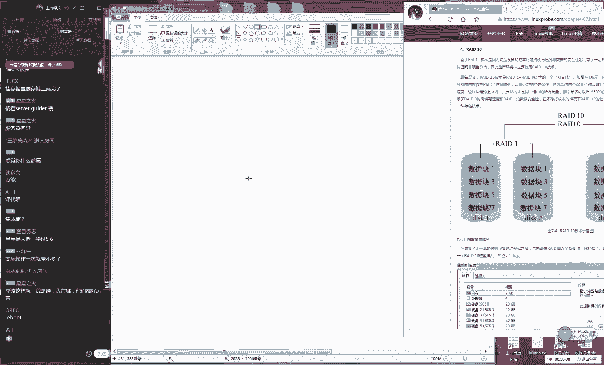
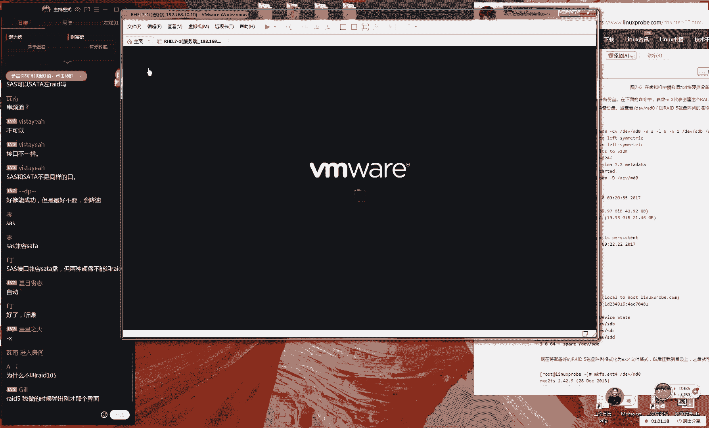
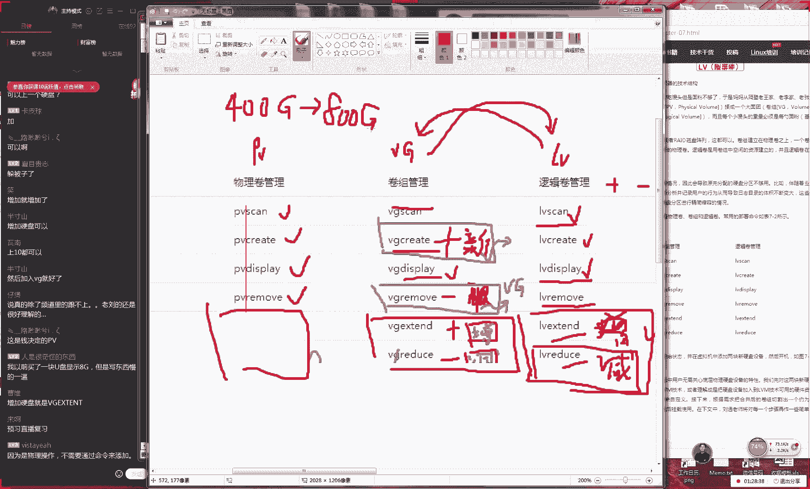
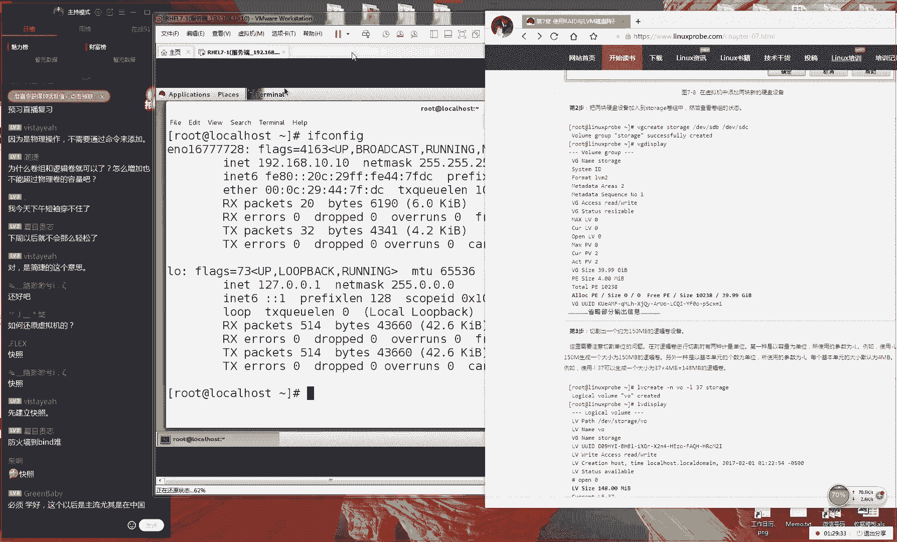
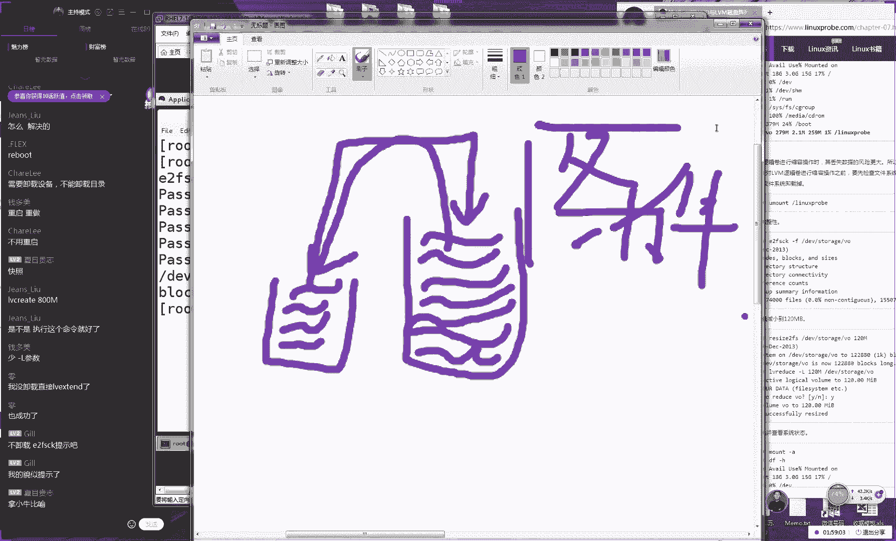

# Linux教程RHCE - P9：9.RAID与LVM - 艾弗艾尔思丢丢 - BV1if4y1e73V

🎼我有多脆弱。🎼狂那算什么伤？🎼反正爱情不就都这。🎼没有说。🎼我。🎼你说。🎼你懂我的。🎼我对你从。🎼来就不会假装。😊，🎼他又说。🎼是很感喜剧。😊，🎼的相伴。🎼但我竟人有些不习惯。😊，🎼我。🎼又说。🎼我。

🎼你说。🎼爱。🎼个人。🎼没爱到，难道就会怎。😔，🎼我要。🎼别说我说。OK各同学，那我们准备开始我们今天这个课程了，刚才翻了个啥，对吧？因为我看到大家聊天记录里面说说没有声音，后来我觉得不是有声音吗？

然后后来我看一下我那个话筒忘了开了。好，那我们先在准备啊那开始上课同学们，那么大家先打一下一吧。嗯，然后我们准备开始我们今天这个课程。😊，好，同学们先打一下。一今天我看我们这个课程我不会说特别的多。

因为我们今天规划一下课程，大概今天也就第七章节吧。然后大概时间是两个小时，大家天做好准备。因为第七章节我们之前已经试讲过。后预计时大概是两个小时，大家做好准备好吧。

那那我们做一下回忆讲一下我们第章节的第一个技术点们做我们做磁组它是为了解决两个问题产生出来这么一个技术。第一个问题的话就是我们硬盘的写速度就指的是I那就是说我们硬盘的一个吞吐量问题。那我们如何来去加快。

或者说我那我们来去提高我们的硬盘的读写速度呢这个是我们第一个需要考虑的一个问题。第一来说读写速度问题。第二的话就是说为我们这个硬盘跟CPU跟内存什么不同的它里保存的是数据。

那我们这个数据是无价的那我们不能随便去更换我们的硬盘。所以说第二就是我们的这个数据安全性。那我为了保证我们这个数据安全性，这也是我们瑞解决一个。😊。

之一。好，那接下来我给大家去大家去分析一下，就是我们昨天没有给大家讲完的我们这几种阵列的这个形式。大家来去分析一下，说我们每一种形式它有一些比较呃它有哪些比较常见的这个特性。

好吧那我来给大家去说歌词关了歌词关了。其实这个我把关掉。因为我在这个因为我这边可能看比较小好，那我们接下来给大家说一下我们这个read10们这类组一个优势。大家先看一下。

就是我们这个10级别的话它是有2块盘它组成出来的它分别来说叫做它分别用2块盘去做第二就二就是di它就指的是两个它指的是两个硬盘，它它组成出来这么一个硬盘空间。话那我们来看一下它里这个数据啊。

它里这个数据它里存的是一它里存的是它里是三和4这个看有点模糊是吧？能调分辨率嘛。😊，呃，是说这张图片有点虚，是不是？因为这个画面确实比较小，所以把它拉伸一下。这个这呃这个图片话大家看一下大概就行了。

好吧，然后我现在给大家再去讲呢啊，说真了，这个这个真的没有关系，因为这里面就写的是1234呃，大家听我说就可以了。然后我会把我们里面讲的一个东西给大家去说出来的。好吧，另外大家是这样的。

因为我们发了书了嘛，对吧？大家可以翻开你的书籍，书籍里面的第七章节，那个大家要书大家要是有书的，O吧大家可以看一下我们的书籍，或者说你也可以在我们的网站上面去找到一张图片，好吧，那我们给大家放大一点。

这就是说那那我们现在有两个硬盘，我那去保存的是不同的数据。那也就是说当我们有一个数据下来的时候的话呢。😊，那咱比如说那我们想往一个呃这个呃那我那我们想来去写入一个数据的时候的话呢，它就是从上面。

那它就是从上面，然后往下面来去写入一个数据的话，它会先将我们这个数据的第一个信息写入到我们的硬盘一里面。然后的话它会将我们这个数据二在写入到我们的第二个硬盘里面。好，然还有我们这个第三个硬盘。

它就是来依次去写入我们这个硬盘的数据。那你看一下就是123，然后还有我们的第4块好，我们来就来呃依此类推。好，我们的一2345那我们将这个信息写入到我们两个硬盘里面。

所以的话呢那我们就可以看到这个实际上来说是非常非常的一种增加效率这种方法。这样的话它会它就是减少了我们硬盘的等待时间。所以的话我们现在看到就是说这个这个话实际上来讲。

它可以让我们这个速度上是有很大提升的。因为它里面这个不用它按照因为我们按照最好情况来讲的话呢，它可以不用再让我们这个硬盘写入完了一个数据之后。😊，再去写另外一个数据。

这样我们可以两个这个硬盘来去同时去写，现在就是一个负载均衡这样的一个效果。所以说的话，那我我们这个硬盘的读写速度问题。那我们这个吞吐量的话呢，按照最好的情况上来讲，按照最好的情况下来讲的话呢。

那我我们这个速度上应该是能够乘以两倍的。😊，这呃这就是我们一个呃readd零这么一个架构，一个最为优势的这么一个地方。好有第二的话就是我们这个成本。其实那啊那我们看一下这个成本。

这个成本其实来说是没有提高的。因为现在只有2块盘，但是他们的这个使用率是百分之百，所以的话我们这个成本也是可以跟我们之间是持平的对吧？因为我们没有为我们这个架构去多掏钱。

那我们先看一下说什么一点可能会下降呢？那我们看一下这个架构它有什么不足吗？它会它会不会某一点会不会很不足，会出现一些问题，大家能看出来吗？其实这个很明显就是我们原先我们去担心啊，大家想一想就有什么问题。

就是啊我们原先担心的是我们这个硬盘它出现出现坏掉，然后我们数据丢失。但是我们之都假设是单块硬盘对不对？但是你现在是把你的这个数据对我们写入到了2块硬盘里面了。这样的话呢你的其中任何一块盘损坏之后。

那么你的这个数据就都会被丢失掉。所以说第一个问题。😊，他啊啊这就是它比较这个特呃比较重要的一点，就是说这个数据的安全性。这个来说是要去下降了。因为有任何一块盘子损坏之后。

就就他们就都有可能会造成我们这个数据一个整体性的一个丢失。所以说这个来说它是在下降这么一个趋势。这就是我们给大讲第一个架构这就是我们这个read所当我们接下来几个架构都大家来分析下。

并不会去只说这个架构或或好或或者不好我们去充复去来去分析一下接下来给大家说一下我们的第二个架构大家去分析一下个有几个架构这样的一个方式。二个架构的话我们叫做read一盘符的话，它使用是两个对吧？

它这个最少可以用去使用到两个盘符后当我们这个数下来之后，大家看到这个里面的数据是保存的是同样的数据。那也就是说我们这个数据的话，它是上下去进来。

然后同时去写到两个硬盘里面样的话它起到的一个备份或我们叫这个冗余。😊，这样的一个效果。好，那我们接下来我们的数据的呃我们这边这个第二个数据留起来之后的话呢，它同样也是写入到了我们两个硬盘里面。好。

还有我们的这个第三个盘啊，还有我们第三个数据，我们画了三个啊，我们就比较清晰一点它也是同时去写入到了我们两个硬盘里面。这样话我们看起来其实很明显的一个优势啊，就是说我们同样的数据。

但的它是写了两遍的那么也就是说我们这个安全性它是往上去提升，而且我们至少安全性数据安全性，至少能够提升两倍以上，它是有一个往上提升的一个趋势的啊，因为的话呢我们把数据写入到两个盘里面。

任何一个盘回来之后没有关系，它都有一个跟它一模一样这么一个备份，所以说安全性来讲它是有所提升的。且最好情况下它可以提升两倍。

说我们来看这个速度这个速度的话如果说我们不去考虑说我们这个CPU还有我们这个内存去写入数据这么一个开销的话呢。😊，那我们看起来这个其实来说这个速度上来讲也没有什么太大变化。

因为我们也是同样去写入硬盘的这样的一个操作。所以话呢我们这个速度上来讲，我们当然可能会有略有开销啊，就是说我们可能会有略有降低，但是基本上来说这个速度也可以是持平的。好，接下我们来看一下它有什么问题吗？

因为这个架构它不光因为它不可能说实现了就是质板好趋势去走没有坏这个趋势。那我们这个趋势我看一下会有什么问题？这个这个架构叫做read一这个我们看出有什么问题吗？就是这个成本在增加了，对不对？

因为你呃呃这个容量只是一个盘的对，就是我我们这个成本它是增加了，它是啊浪费了一半啊，因为的话我们这个数据是同样的数据但是写到两个这个我们两个磁盘里面，所以说它这个磁盘的这个容量的可用率变成了50%。

因为两个盘它写是同样的数据。那你花两块盘的，但是你只能去存之前。😊，呃其中的其中的呃就是我们这个原先的这么一个数据。所以说这个数据的这个容量来说，它是有所下降。那也就是说这个成本的话呢。

它应该是往下去走的那这个成本是一个问题。所话很多这个企业里面理由啊，就是说因为我们这个成本来说是有增加。且是一个成倍增加这一个好处对它就是这么一回事。因为我们不能说只因为我们不能说只说它好或者不好。

那我们要去分析它他既然来说那我们刚才讲两个。来说是对我们这个速度还有我们这个安全性它有一个提升的话呢，那那么就一定的会影响到我们这个成本你也会增加。为你不可能说你不花钱。

就把你这个数据又好安全速度变快了，这个是不可以的吧？也就是说那你要在你这个数据安全跟速度那么以及你这个成本之间，那么你要找一个平衡是你企业能够去接受。而且那你那么你又能够保证你这个数据能够。😊。

是一个你能够接受这么一个效率。所以话就有这么一个架构。我们这个架构叫做read5。这个话呃我们目前来说也是一个企业里面比较常见的这么一个架构。是这样的，当我们这个输据下来之后啊，它是这么给大家画一下。

这我们输据下来之后，它会先写到我们的其中一个盘符里面。这就是我们呃这个数下来之后的一个效果。然后但是它会把里面的一个信息，那我们作为基偶校验盒，然后我们给它将这个信息经一个压缩。

然后保存到其他的这个硬盘里面。但是的话它里面不是写的是完全1比1的信息，而是写的是一个压缩信息。这个信息有一个专业的一个术语，我们叫做基偶校验盒。😊，好，它就是相在就是对你信息进行一个压缩。好。

接下话的话我们第二个信息流我们下来之后，它同样的它写入到另外一个硬盘里面之后，同时它会把你这个它里面这个备份的数据也会写入到了其他的硬盘里面来保存我们这个基去保存我们这个基有验盒里面的这个数字的这个数据。

还有我们这边第三个我们还有第四个信息里我们给大家去举个例子啊，1234我们给4块盘，我们里面都会保存我们这个基有验和的数据。这样的话，当我们有一个盘。那比如说我们这个盘它损坏之后的话呢。

它马上当你有一块新的硬盘顶进来了之后，当你有一个新硬盘顶进来了之后，比说我们画一个硬盘它是个新硬盘顶进来之后的话呢。

它马上就会通过其他的盘符里面这个基有验盒来去尝试来去恢复里的这个数据我们的我们我们目前来看这个恢复的这个安全性来讲还是比较可靠的。我们一般来说都是可以恢复过来。但是它需要很长时间。😊。

那么这个话就是我们作为一个我们的速度，还有我们这个安全性，跟我们这个成本的一种呃我们叫做取一种平衡的一种架构。那我们来看一下这个架构的话呢，那我们来说可能是速度上来讲肯定是有提升的。

因为现在我们同时去到了很多盘符里面来说速度肯定是有提升的速度是有提升的我们看到还有这个成本来讲的话成本来说基本上是可以持平或者说它只是略有下降。

因为它里面保存是基有验盒它是经过压缩的数据是经过压缩的数据。然后这样举不太好。每次校验的都都是条块校验盒并不是单个文件。但啊但但是我们这样举完例子之后，大家的话一眼可以看出来就这是比较直观一点的啊。

就是我们现是条块还文件我们进行这个校验但是我觉得我们这样举子话这个清晰一点知道我们会把我们这个数据，然后我们校验，们放到其他的盘符里面我通过点出点大家看更加清晰一点。😊，可能说跟大家这种专业的术语。

可能还是有一些相，还还然可能还是有一些出入的啊。😊，好好，这个啊这个其实我觉得这个就它它就是一个速度跟我们这个安全性。那么以及我们这个成本，它这种妥协来讲。

其实我们来说平衡是比较的这个啊比较官方的一个术语了。其实就是一个妥协。因为我们要去考虑到这个成本问题的话呢，那我们就希望说我们将数据进行一个压缩。

然后再放到我们这的盘符里面那我们如果要是说企业里面不差钱，或者说我们想有一个更加安全且又能够提升我们硬盘速度的这么一种架构的话。

其实也有了这个架构我们叫做read10是这样的大家读这个时候大家千万要不要把把读成叫做read1这个话这个读法也是错误的。这个应该叫做read10啊这个话叫做0说read10换一面也不行换一面也不行。

我看一下这个架构们做read10那我们一定要知道它是由read加上们这个read去组成出来的这么一个架构。所以说这个不叫做啊这啊所以说这个它并不是。😊，呃这个十而是一定要叫做10的这样的一个架构。好。

那我们先来看一下这个架构的一个组成的一个原理啊，它的话它使用呃它是最少要使用4块盘去来去做的啊，接样的话呢我们来它是两组两组之间，我们先给大去做一个read一。

然它里面这个数据都是一个完全是一个冗于备份的这样一个效果，它都是一比1的。然后接下我们我们再将这个两组read一，我们给它作为一个整体的一个0。这样的话我们可以起到一个负载均衡的这么一个效果。

最话当我最话当我们这个数据下来之后会有这样的一个效果，大家可以看下这个非常的直观。好，大家看一下，当我们数据下来之后话，这个有一个非常直观的一个效果。😊，这个是我们的第一个信息流，我们给它下来之后。

因为我们这边写的是read0，所以话他会将我们这个数据先会写入到我们这边的这个第一个盘符里面。然后通过我们同一组里面的这个read一同时去写入到2块硬盘面这样话它可以既提升了我们这个速度又可以让我们这个数据的话它起到一个备份效果每一个数据它都至少会有两个的这个备份。

这样的话，其中的一个盘符损坏之后，那么也没有那么也没有问题。既然我还有第三个数据流我们下来之后，第三个数流我们下来之后，它也会同啊同时写入到两个硬盘里面它做我们这个数据的备份是第个息流。

给大家多画个清晰一我们给大家画个用一个还原色吧。我们给大家第个息流下之同样也是写入到两个盘符里面这样看起来就是我们如果说最好的情况下的话从这个理论上来讲我们这这个数据它是一个分开写的实际实际是一个负载均衡讲速度上。

😊，来讲应该是有提升的。而且速度上最好来讲，它提升的是两倍的。接下来说那我们这个安全性。接下来讲的话，它里面有一个呃它里面是有这个readd一，所以说它里面的数据每一个数据它就会有一个完全一样的备份。

所以说我们这个数据安全性来讲，至少应该也是提升了两倍的那我们来看一下我们这个成本这个成本的话呢，那我们原先我们需要保存2块盘需要这个容量。但是那我们现在需要那我们现在至少需要要用到4块盘，它能够去完成。

所以说那我们这个成本上来讲它也是提升了2倍那么这个成本上来讲，它也是提升了两倍的。但是对于一般企业上来讲的话呢，数据的这个价值是非常高的。一般来说业里面还是愿意去掏这份钱，虽然多花了一倍的钱。

但是对于我们这个数据安全性来讲是比较重要的那我们一般企业还是会选择这个10再退一步，我们那我们往后去讲，我们用到5，但是千万不要用到。因为这个话。😊，就是用于用于一些啊，我们那啊那我们说我们不会去使。

但是就是用于一些可能并不是那么重要的数据，或者说你已经把这个数据作为备份的这样的数据。那么你可以去选择叫呃read这样的一个架构好，那我们现在看到这个四个架构之后还有一个比较特殊的一个情况。

就是说那我们这边如果要是出现损坏，那么怎么办呢？这个时候你某一块盘符出现损坏之后，但是没有关系。因为你有一个跟你完全一样的一个硬盘，它来帮你去来去做这个数据的一个同步。

所以说数据肯定是不会丢失的那我们在换另外那那那咱比如说那我们这个架构里面再坏到另外一块盘。那我们如果说我们同时画了2块盘，但是两个盘符它画到不是同一个组里面的话呢，这个也没有关系。

因为的话呢我们同一组里面都会有一个那么它里面都会有一个硬盘，跟它是来进行一个数据的一个同步的。好了，那但是如果说我们现在突然间坏另外一块硬盘，它是跟我们这边是同一个组里面。😊。

并且我我们同一个组里面的这个硬盘都都坏掉了。那么这个情况下怎么办呢？😊，那么呃我们要是如果说我们同一个组里面的这个硬盘，它同啊它同一时间它全坏了。这种情况下虽然很少见。

但是如果要是出现了怎么办啊大家这个解决方法就是跑路是不是啊？我记得一个东北的学生，就是说啊就把机啊说就啊书长一再打一顿。好，那啊那也就是说那我们除了跑路以外，我们还有什么其他的这个还有其还有其他的这个。

😊，方法吗？其实还有一个方法，我们叫做热备盘的。咱举个例子啊，就这个例子的话呢，虽然我们我们不想出现，但是他之前还真是出现过，而且就是我们的同学是这样的啊。

那既然他他既然来说就是我们这个同一个盘符里面的盘不能说全坏。那好，咱比如说突然有一天某一个盘符坏掉了O这个时候的话恰巧我们不能说那我们不能说别人啊，那那我就说我自己吧，因为这个东西啊太丧了，对不对？好。

那好，那咱比如说突然有一天你接到报警了，说你这个有一个硬盘里面的这个数据突然间丢失了。好了，某啊某一个盘符突然出现故障了。这个时候您从您的家里面赶去公司大概时间是30分钟，这个时候的话。

那你另外一个盘也坏了。这个时候就导致就没有一个数据的一个备份。那么怎么办呢？其实我我们平时的话，那么就是说企业里面如果说企业再不差钱的话，那我们可以这样去做在准备出来一个我们单独的一个盘符。

我们叫做热备盘这我们叫做热。😊，背叛。好，热备盘这个盘的话呢呃这个设备的话，热备盘这个设备它平时它不会工作的，它会去闲啊，它是一直闲置的这么一个状态。它会等待有一个硬盘呃故障之后的话呢。

它会马上顶替上去，然后顶替上去这块损坏的盘，然后自动的去做这个数据同步，避免说同一组里面硬盘全部损坏。然后这样的话，那你那么你到了公司之后，那么你需要做事情，就是赶紧把这个坏的盘给拔下来。

然后再再去重新再来去安装一块我们这个备份盘就可以了。这个来说是比较安全的一个架构。所话那我们来说啊，如果说你的企业里面要是不差钱的话啊，但是这个成本是比较高的。因为我们叫做热备盘，它不像锐10一样。

那你那你这个一0虽然说你的这个成本变成了两倍了，但是您起码你要就是这个您钱花了啊，但是起码你平时的时候，你还是再能够为你去服务的。他还会对你这个数据进行一个备份，但是这个备份盘就不一样了。

因为这个备份盘平时他是不会工作。😊，就是一个我们叫备胎，或者说我们叫替身啊，大家有知道就在这个医院里面会有这种叫什么呃急诊医生会有一种呃替包。你们懂的。就是说因为突发事件。

然后医院里面急诊的话比如说啊比如说某某个加油站，比如说突然爆炸了或怎么样的那可能说他们这个当地会来突然突然很多的病人，这个时候我们原先的这个人手就不够了。

那么这个时候他们就要很多人或者说我们叫做替补的这么一个医生嘛，他们会来这个医院该去他去抢那么他就会赶紧来去抢救这个病人。但是啊这样的这个医生，他平时他是不会来医院的。

但是他也要领工资的那也就是说他有这个起到一个备份或者一个替身的这样的一个作用。那也就叫做热备盘，叫做这个热备盘。😊，他平时他是不会有他是不会有工作的，而且他是一啊他是一直带去这么一个闲置的一个状态。

但是你也要给他这个设备去化进来啊，他去购买。好，那也就是说热备盘里面平时是没有数据的，所以我们把叫做这个闲置的一个状态嘛。那么你这个领导你要考虑好这个东西钱投进去，要是坏的话，就是能起到很好的作用。

但是如果是要他要是他要是不坏的话呢，也许就一直会被闲置下去。我之前看过一个一个笑话，就说有一个家里的一一个主妇啊，然后跟他们家的那个家人，那个丈夫聊天，后来他那个丈夫说说你买了这么多口红。

说你买了这么多包，说你说我看你好像也没什么用吧，对吧？你买这么多好像你也好像你平时也没有用，后来他们家那个主妇啊，说那你平时不也买一些没有用的东西嘛？说你三年之前你买了一个灭火器这个都过三年。

但也没有但是你也没有但是你也没有去使但没有那个你也没有去使用。😊，那呃那也就是说这个呃备份盘的话呢，它其实来讲就是一个我们叫备胎吧。他平时他不会出呃体现出来的这个价值的。但是突然间要是出现事情的话呢。

他就会马上来去顶替上去啊，大家里边的话是有两个医生还是有两个灭火器啊啊，所以这个灭火器大家要知道，就是呃当你出现问题的时候，它是很有用的。但是呃一旦没有用，可能会被人埋怨，是不是先买东西。好了。

其实我又先买很多东西了。当时我就想买过，后来想一想算了吧。好，接下来我们来去还原下我们这个虚拟机啊。😊。

因为我们刚才给大家讲了我们这个三个架，那我们刚才讲给大家讲的这个四个架构，加上我们这个备份盘。接下给大家去来演示一下，对于我们这个read来怎么样进行一个创建管理，以及把它给删除这样的一个操作。

是这样的，待会我们会给大家讲到read10，然后给大家讲read5，然后再会给大家讲read10加上我们的备份盘，然后再给大家讲到说我们当我们故障之后。

我们该如何处理我们的这个故障盘以及再重新添加进去我们这个备份盘。好，这样给大家去做一个非常呃详细的一个流程。大家的话如果感兴趣的话，可以记得记得可以去记到你的笔记上面。

另外的话咱们今天这个课程已已经上到第九节课。基本上来说已经是过半了啊，已经基本来说是一半了。话大家要是在发博客的话呢，请记得去打卡，然后自己把你的笔记抄好了，然后发到你的博客上面。对于自己也是一种激励。

因为我们到后面的时候，我们就要给大家讲到就是。😊。

啊，配置服务什么的就要更有意思一点了。好，那我们先在还迎一下我们这个虚拟机到维到为一个呃我们这个安装出来这么一个状态，然后我们去关机啊，因为我们将因为我们将常避免说我们这个实验之间。

它产生了这个冲入情况啊，因为我们之前我也做过很多实验嘛，怕产生冲入这样子的一个情况。好，接下来的话我们再来。😊。

我们来添加一下我我们这个硬盘。那我们先给大家演示一个第一个架构吧，我们叫做re10，那我们使用4块盘去做，它最少是用4块盘去做。那我们现在添加出来，大家啊大家先听一下题目啊，这要要要要噩梦要开始的。

不会啊，后面东西很简单了。好，那我们现在添加出了4块硬盘，大家想一下，那么如果说我现在使用4块20个GB的硬盘哦，那我们其实作为一个re10的话，按照我们刚才所讲到的那我们实际的使的使用率应该是50%。

对不对？那我们可能空间是多少个GB。😊。

啊，大家算一下哎，怎么会是40个GB。大家仔细想一下，那我们之前我们去那那我们知道那我们就啊使用4块盘，那我们4块盘来去做一个read10乘以20个G，那我们应该等于是多少啊。

我们应该等于的是好像这个公式很简单啊，4乘20应该是等于80对不？为什么是40啊。因为我们讲到我们充建出来是个read10这样的一个架构，它里面每啊它里面的每一组。

它会去做为一个read10这样的一个架构，它的使用率只有50%。所以说我们最终的可用空间，它是砍半了，它最后变成了应该是40个GB它只有它这个一半的使用率。好，待会给大家去看一下待大看一下。

说你行就是我们这个提问啊，不要按照我们较常规的这个思路去想好，那我们现在去充建出来我们这个10大家先看一下好另外的话就是根据我们之前所学习过那个DV服务的话，那我们这个设备的名称。那我们去猜一下。😊。

呃，我们猜一下我们这个设备的名称应该是什么。因为根据我们之前所学习过UDV服务，那我们的设备的名称应该叫什么？😊，我们应该叫什么？

我们应该叫做啊大家好懒啊BCDE但是但是叫做但是叫做叫做ETC这个说不过去，对不对？那我们来说那我那这个是我们系统里面的第2块和第3块第4块第5块被识别的设备这个名称应该叫做DV目录里面这个没有错。

对不对？然后是然后是它是一个它是一个SD开头的一个文件。后面的话第2块第3块第4块第5块我们被识别的这个设备应该叫做DV目录里面的SDBCDE这4个硬盘。好，这个我们这个算一个常识啊。

好接下我们来去管理一下。那我们的命令的话呢，我们应该使用的是叫做MDM命令们来创建出来我们这个列组现在使用一个杠C参数代表就是创建的意思。然后是V显示我们创建的这个过程。

后面我们叫做DV目录里面的MD这个的话说的是就是我们合并之后的一个名称。就好比说我们上学的时候，那那我们的班里面比如说有40个孩子，那我们最后那个班级的名。😊，叫什么呢？那我啊那我们班级的名字。

那你不能把它叫做DV目录里面的SCB啊。😊，呃，SECSCD和和SDE吧。这样你虽然能够通过你的这个名字就能够知道啊，那你还是由什么去组成出来的。但是我们同意把它叫做3加2班。

或者说我们给他取一个班级的一个名字，就是那么就是为了去啊来啊就当就是来去描述我们这个设备。😊，一个整体的一个情况。那所以的话那么你这个设备你看一下，那你现在使用4块盘去做出来这个阵列。

就名字就会很长啊呃而且我还少打了一个什么BCD没有少。那么我们现在使用4块盘它有了这么长的一个名字。那我们如果使用的是40块硬盘去做出来这么一个设备，那么它就特别特别长的一个名字不利于我我们来去阅读。

所以说那我们把它统一叫做DV目录里的MD0就证明着说我们的MD0就是由这4块盘来去组成的那我们给大家取一个就是我们合并之后的一个名字。然后的话这个杠A就是来去检查一下它有没有重名啊。

但是这个我们参数可以不加杠N4代表就是我们使用4块盘去做一下我们这个磁列组杠杠一个消代表是vel是我们的级别，那我们写10后面我们写上我们的设备的名称。

那我可以使用到通配符来这样去写DV目录里面的MD0那我们这样我们叫做DV目录里的。😊，SC啊，然后我们B杠E我们来作为一个通配，这样做好之后的话。

那我们可以使用的MDADM然后我们刚Q然后我们来去查看一下我们这个设备一个简要信息，它会告诉我们说我们这个设备的大小是40个GB啊，但会它会往下稍微会有所浮动。

它告诉你说那你这个设备的这个呃这个容量是40个G。然后这个级别为10，它这个设备是由4个盘去组成出来的。那么以及没有啊它没有一个备份盘，那我们也可以去使用刚呃呃长哥是这个de来去查看这个详细信息。

那么那我们就可以把我们这个杠D啊。😊，来去使用一下了，这就来去显示一下我们这个列组的一个详细的一个信息来调一下回车。这样的话呢我们就看到它里边是由4个它去组成出来的呃，分别为啊BCD啊。

并且的话它现在正在初始化这么一个状态已经初始化了20%。这个来说还是比较快的。那我们再等它去初始化吧。那我们初始化好之后，然后我们就可以对它进行一个。😊，呃，格式化以及我们这个挂载了，分区的话。

其实就可以免掉了。因为我们这个硬盘它并不大了，然后我们主要给大家演示这个readd嘛，所以说我们接不给大家去演示那个。😊，我们这个分区的，我们那可以来去直接格式化，然后我们挂载和使用，它也可以去分区的。

这个没有关系啊，因为我们分区之前给大家讲过，这个不是呃，并不是必要嗯。😊，好，那我们看他一下。百分百啊百这45%。希大家去做这个实验的时候，你没有必要把它写的这么大的啊。

你可以把它写成2个GB或者5个GB。那这样的话速度会它会更快一点。😊，磁针类组的分区跟一般硬盘的分区是一样的吗？我们分区的步骤是一样的。但是最后那个名字会叫做MD0P1和P2，就是那个以P。

然后后面加我们的分区的编号呃，它是这样去写的嗯。😊，好，我们现在同步58%。因为我刚才就因为我们刚才选择默认了嘛，所以我们现在使用了4块盘，20个GB等于说我们现在要格式化。

不是那我们现在要去同步80个GB的数据，所以就比较慢。大家去啊那我们啊我们去那我们去课后去做这个实验的时候，大家可以把这个数据稍微的调低一点。😊，对，咱们的这个操作是要针对于MD0去做的。

因为我们合并了之后，现在就是把这个四个小面团给它合并成一个大的面团了。那我们以后做这个所有操作都要针对这MD0去做。😊，呃，然后说如果你要是使用瑞卡去做的话，那么你就不需要去签命令了。

因为我们现在使用软件，他去模拟嘛，因为我们没有必要说为了这个实验，大家再去单独去买硬盘。当然说土豪随意啊就说因为我们有必要为了这个实验，然后你再去买硬盘嘛，然后只为做这个实验。

所以我们现在使用的是我们系统里面自带的功能。然后他还去做为一个软叫做软件把它合并到一起，他可以使用去去模拟出来的。😊，好，接下的话呢，我们现在再同步啊，已经同步了93%，我们等他一下。因为你要有这个呃。

你要因为你要有有这个瑞的卡的话呢，其实这个来说你还省得敲这么多命令了。但是这个理论上来讲是一样的，就跟咱们去这个。😊，当这个当然这个理论上是一样的。包括说我我们这个每个月的级别。好，然后我们来看一下。

现在是同步成功的，然后我们来进行一个格式化。那我们给它格式化成叉那我们把它格式化成叉叉文件系统吧。DV目录里面的MD给做一个格式化这个格式化速度比快的后我给载一下我们给载目录吧。

咱比说载到我们做这个星星的一目录。我给出来一个目录里面星星的一个子目录然后我们来载V目录里的M载到这个星星的一个子目录里面，我们再回收然后使用DH大家看一下我们就挂载好了。

它会告诉你有一个设备叫做它叫做DV目录MD小为40个挂载到这个星星的子目录里面然但是我们这样做完之后。

你考试是零分的一定要去写入到这个文件里面它是目录里面叫做叫这个是我们载设备的时候们要去写这一个文件们第一列写的是设是我们这个设备的名称V目录里的M然后后面。😊，我们挂载点的目录，我们就叫做这个星星。

当然说这个是无所谓的啊。然后就是我们这个文件系统的格式为叉FS。虽然我们的权限为 default代表就是它有一个读写权限0我们不要进行自动备份0我们不要进行一个自动校验。好了。

这样我们做好之后把保持屏退出，然后让我们去重启一下，就来去验证一下，说到底我们重启了之后，他还会为我们去服务吗？对吧？他还会为我我们来一去一直去挂载着这个问题我们来来去重启来去验证一下。😊。

呃，然后的话我给大家演示一下，就是说因为我我们现在再去做再做readd10，对不对？那好了，那我们来去演示一下，说，那么我们既然来讲。😊，它里面保存的是同样的数据。当我们损坏硬盘之后。

损坏的是任何呃那呃那我们损坏的是呃是某一块硬盘啊，随便去损坏硬盘损坏之后，它并不会导致我们这个数据的丢失。好，那我们再家演示一下啊，我们那我们该做一下数据的这么一个呃的一个呃一个破坏的一个行为。

让我们来去尝试一下破坏。好，然后我们现登录到我们这个系统里面。我们先登录到我们系统里面。😊。

然后说星星是老师的小号嗯，这个很有可能啊，对吧？所以我现在一直在给大家发信息啊，然后的话我来看一下我们这个磁列组先DF杠H一下。大家看一下的话。

现在就有一个设备叫做第叫做DV目录们M它还会一直为我挂载到我们这个系统里面。所以这就是一个很完整的一个演示啊，演示一下说如何去创建出但这个只是我们的第一步骤，然后那我们就来去尝试去破坏了。

好那我们进入到这个星星的这么一个子目录里面，星星的一个子目录里面。然后的话呢那我们再去从其他地方我们来去复制过一些文件。咱比如说我们从ETC目录里面我复制过一些文件过来，那我给大复制到我们当前目录下。

然后大家看一下啊，我们就在这个目录下，我们就能够找到我们很多的这个文件了。这个时候我们可来去尝试一下破坏。这个时怎么破坏啊。那么如果说我再去使用一个命令。

们叫做D我们叫做MDD命它是来去模拟一个破坏行为。但是我觉得这样看起来会。😊。

比较的怎这个怎么讲会比较的这个呃不太可信，就是我们看起来好像说哎老师这个效果好像不是很明显啊，对不对啊，胶水进行那就算了啊，所以说那我们给大家那我们给大家换一个比较暴力一点的方法。

就是我们直接点击我们这个虚拟机啊然后的话我们来去选择出来一个我们的硬盘。大家随便去选。我们为了方式大家说我作弊。现在我们有1个23454个硬盘，那就是我们天组建出来个锐雷那么一个致电组。

大家随便选一块吧，是我们去移除到第几块2345，你们随便移除到第4块你们为什么对你们为什么对对于这个第4块那么的情有独钟。好，把移除到第4块好吧，我把我把击移除这个步骤啊，相当于就是你在公司的时候。

突然间很不顺心然后走到机房里面咔嚓一下，就把你的一个硬盘从你的这个主板上面给它拔下来了，这就是一个非常暴力的一个非常传统或者说我们叫做非常物理的一种破坏的行为。这个东西就相当就是一个非常暴力。😊。

这种行为啊我们选择一下okK好，这个时候大家看到我们兄弟们就马上就他会弹出来说我们这个呃列组它会出现损坏。然后我们点击一下这个详情，他要告诉你说有一个硬盘已经是丢失掉了。然后它正在进行一个数据的同步。

好，然后但啊但呃但呃但是我们现在可以看一下我们的MDDM当DD啊，我们的这个设备MD0。😊，大家可以看到这边果然有一个硬盘叫做DV目录里面的SED这个硬盘，果然间它已经是损坏了。

并且它已经是离线这么一个状态了。接下来的话但啊但是我们可以进入到这个目录里面来去拔两个硬盘可以的。但是我怕拔到同一个硬，为我怕去拔到同一个组里面比较尴尬了。因为这个虚拟机它去模拟的时候。

这个数据它是不固定的然后可以来看一下我们这个目录里面，但我这个但是我们工作的时候，那你只要去拔掉的时候，不是同一个组里面都是可以的，那我们来看一下里面的这个数据，数据都是在的，没有问题。

然后给大家尝试一下说我们该去如何来去恢复我们里面的这个数据。那大家先看到我们现在里面这个数据它都是存在的。接下来话我们就要给大家讲到，就是说那我们该如何对于我们这个已经有的数据，但是它里面少了一个盘符。

该如何对于这个盘符进行一个修复。哎，我们叫做这个修复比较合适。那么这个设备名称叫做DV目录里面的。😊，CD那么怎么该进行一个修复呢？那么啊啊那么是这样的，在我们工作的时候是把它插回去。

但是我们现在那呃呃呃但是我们现在怎么去给它恢复呢？其实这样去做啊，那么同样也是这样的，我们点击一下我们信捷的设置。好了，现在就是这硬盘坏了之后啊，然后你就去然后你就去网上去买一块新的硬盘，买好之后的话。

又去重新给它插回去的硬盘。好，我们点击这个确认，点击一下okK。😊，这样话那么相当就是你将坏这个硬盘给它拔走了之后，又给它插回来一块新的硬盘。好的，这个硬盘回去。这样的话这个步骤就是给它做完了。

但是我们现在看的时候的话呢，它并不会来去自动来去恢复这个我们这列组的我们还需要来去进行一个设置。那我们去我们这边这个第一个设置。

我们叫做MDDM杠F代表就是来去告诉我们这个系统DV目录里面有一个叫做MD0的设备中有一块硬盘叫做DV目录里D它出现了损坏，把它来去设置成损坏这么一个状态。然后我们再来看一下里面的这个信息。

它里面啊它已经告诉你说已经被设成损坏了啊。然后我们再来去使用杠R参数，将我们DV目录里面的SCD移除掉我们的呃。😊。

MD0这个设备组。那我们来看一下，这个时候我们看到我们的这个侧面之列组里面，它就有了1233号盘，它来去做我们这个read了。其中有有一个盘被remove的被啊，它已经被呃它它已经被移走了。

这个时候的话，那我们给它添一块新的一个盘进去。这个设备的名称，应该来讲还是叫做DV目录里面的SCD要是没有的话，那么不用担心去重启就可以了。😊。

那我们还去重启一下那那么啊那我还去重启一下。因为的话我们刚才是有的，但是如果大家要是没有的话呢，那我们那那我们就可以去重启一下。😊，当然了我们希望大家做这个实验的时候啊。

最好是关机之后再插与我们这个硬盘。因为虚拟机它再去模拟硬盘跟网，还有这个网卡的时候，经常会发生这样的这个就是这样的。😊，我们做bug吧，它会会出现这样的问题。

所以说我们最好把关机之后再添加出来我们这个新硬盘也可以。但是我们最好重启一下。因为我们在使用虚拟机，对不对？它可能跟这个真机是不是那么完善的。因为我们之前我们会大家讲的这个绑定网卡嘛。

它里边就是我们再去模拟网卡的时候，它总会出现问题。但是这个已经是市场上面最好用的虚拟机的这个软件。且现在做的确实也不错已经做的很好，但是也会有一些小小的一些小瑕疵。

但是随着我们现在不断再去下载这个新版本嘛，可能也会有改善的。然后我们来继续来看一下有一个设备叫做M命令目录里面的MD还是要看一下我们这个设备，他告诉我们说DA。😊。

你这个脑子不行了MDDM命令。那我们来看一下这个里面的话，他还告诉你说它是由3块盘去组成出来。其中我们的某一个盘已经被移除掉了。这个时候我们可以这样去做啊。

那我们使用M命令这个时候我们需要一个参数叫做杠这个杠代表就是添加一块盘进去的意思。设备的名称应该还是叫做V目录我们来敲一下回收这个时候我们马上再看一下我们这的这么一个状态。

它就已经是添加进去的一块叫叫目录样一个设备了，并且已经开始去做我们的数据同步，它会将这个组里面同一组里面的数据都给大同步过去。所以说这个速度还是比快一这个是比快环时不用到这个的。

但是这个理上来讲每个这个级别它这个理论和原理都是一样的。嗯的盘我们是不需要关机的所以我们才叫做这个所以我们才得这个。😊，呃叫做呃这个备份盘，我们叫做热插拔啊，我们叫做这个热备盘。

它是支持叫做热插拔技术的。但是我们再用下它去模拟的时候的话呢，好，我们怕会有问题啊，所以我们才去使用到就就先去关机，然后再去添加这样一个比较比较稳妥的这么一个流程啊。但是我们到工作的时候来讲。

其实没有必要的。而且我们这个每个硬盘上面其实它都会有一个小灯，然后那个然后你可以通过这个然后可以通过这个灯光的这个颜色的一个变化，然后知道哪个盘是出现损坏的。如果锐的大小是不一样的。

配置锐的会出现包错吗？一般来说容量你要是不因为你要是说容量是要它要是不一样的话，那肯定会出现问题的，这个一定要是。😊。

会有问题的。而且我们最好情况下，你的这个容量，还有你的这个呃呃硬盘的一个型号，最好都是一样的才好。但是说型号无所谓啊，但是这个容量最好是一样的。好，因为因为你要是不一样的话，会有问题。好。

然后话可以看一下re10那个硬盘的分组情况吗。这个咱们是看不了但是我们可以去推论，就是它相邻的一组就是这个它相邻的这一组就是同一个组里面的。然后你也可以这样去看的，就是我们刚才讲的所有的一切啊。

其实你也可以通过我们推发界面，你也可以不用去去执行那个MDD命令，你可以直接点开这个di这个工具。然后你也能够看到这个re10，然后可以看到它里面那我们去尝试看一下好吧，然后可以点击一下这个属性。

我看有没有。😊，m。它里面好像是看不了的，他看不到是说每个硬盘由什么组成出来的啊，他看不到他看不到哪他哪个是一组，但是它里面可以看到每个硬盘是什么。然后你也以对它就我们才所的步骤。

其实我就可以进行一个增加。后可以进行一减少是我所做过个界面进行操作同步数同步个盘回来了去还进入到们这个目录里的子目录我来看一下这文件内容是没有丢失有问题这个大家尝试进行个破修复的实验。

实说这个流程还是直观一然后大家讲一下我们这个备份盘那么你来进行一个恢复我们这个备份盘说一下。😊。

它这个原理它的话它是好的时候，它不啊它不会去工作。当你有硬盘出现故障的时候，它才会自动去顶替上去。这个我们叫做备份盘。好了，那我们先来还一下我那啊那我们先来还一下我我们这个虚拟机。

呃保证说我们这个时间它会有冲突啊。😊。

为了保证我们这个事件之间它不会有冲突，然后我们给它还是关机，然后添加出来4块盘。那我们就不去做re10了。好吧，我们就按照我们这个书散面给大家作为一个readd5。有因为我我们这个。😊，呃。

因为我们这边的这个read5的话呢，它最少是用到3块盘去做，所以我们现在还给它添加出来4块盘，其中的一块盘，我们把它作为我们这个备份盘来去使用。我们叫做这个热备盘。好。

我们现在添加出来4块硬盘同样这个大小还是20个G。所以说大家以后去做实验的时候可稍微小一点，没有必要像我说那给出来4块20个G硬盘好为什么不叫105因为它不是有一和零直接组成出来了。这两个没有关系。

它是参考一和，然后对这个成本进行一个妥协，然后最后出来一个我们叫做我们这不能叫做一个合并后的一个版本。但是反正它就是一个各种参考的这个优势，然后就产生出来这个版本它不能叫做re10样的话我们再来。😊。

因为它不是由原先那个一，然后就它啊它是完全给他啊给他搬过来的，而是他参考这两个的好处，然后最后向成然后最后向这个成本，最后去妥协。然后就会有这么一种架构好，那我们现在再来给大家说啊。

就是我们现在创建出来一个磁列组。我们同样还是使用MD这命令来进行一个创建MD命令杠C代表创建的意思杠V代表就是显示出来我们创建的那个过程。

DV目录里面的说刚才你做的时候会弹出来的刚那个界面刚才你那一个界面的话应该是说设备出现损坏是吗？然后我们MD0后面是杠N3它会使用是说使用3块盘去做一个G别为L5的这么一个磁列组一个架构最后一个杠X代表就是其中的一个盘作为备份盘的意思。

好了，那我们DV目录里面的B杠我们这样写好我们叫这个通配符敲架回车然后那我们就看到说啊这个包错这个包错是说你可以。😊。

点一下它里面这个详情，它里面正在说是正在同步的意思。然后你可以看到就是我们刚才所有所有步骤里面，它都会有这么一个过程。它进行这个数始化的一个这么一个过程啊。

这个这个我也会谈这个会有一个数化这么一个过程的。说杠X后面可以去写R嘛可以的，这就看你这个公司对于这个成本的一个投入，你可以投2块，你也可以投10块，你也投那那你可以放20块这个备份盘是没有一个上限。

当就是你去买一个东西的时候，商家他不会想你买太多。那你如是成本足够的情况下就是你这个你的这个预算足够的情况下，你可以去添加出来多块或者几10块这个备份盘都是可以。但是你但我们是你要去考清楚。😊。

这个的平时它是不会起到任何作用的。好，那我们同样我们来去查看一下我们这个details。但是说这个看到这个效果会跟我们这个里面看到是一样的啊，它都是在进行数始化，已经同步了60%，还它还是比较快的。

最好是一样。对，多个差的账嘛。就是说我们如要是有需要的话，这个数量是没有一个限制的。这个系统它不会管理用多少个，这个管理也是老板去管理。因为这个费用问题嘛，还有就这个价格问题。😊。

主要因为只要这个预算足够的话，这个是无所谓的。好，然后我们这个初始的过这个过程啊还是比较漫长的。我们等他一下，待会我们还是对它进行一个格式化，然后进行挂载操作。跟我们刚才这个流程是一样。

但是我们唯一不同就是一个备份盘，它会当这个数据出现损坏之后，它还会去尝试去恢复你的这个数据的。啊，并呃呃我们并且这个损呃是比较安全的，而且比较可靠的一种方式。好，这样的话那我们再来嗯。😊。

我们来去看一下我们现在这个内组的一个架构。可以看到的话，那我们现在使用的是三块盘，它去做一个re5这么一个架构。

其中的第四块盘叫做热备盘它是一个闲置空的这一个状态好我们这样去还是进行一个格式格式无所谓刚才使用的是一版本好了们换一种方式一个称好就是我们的名称叫做MD0我们来换一种格式来去进行个格式化啊。

实效果都是一样的进行一个格式化。然后我们来给它挂在一个目录这说我们同学出来同学目录然后将我们这个设备给目录M同学目录上面然我们可以来看一下这个话它是三盘去做出来的这所说这个可用率是75。

这个它这个可用率是3之2是6666我们看到这个大小是。😊，40个GBOK没有问题。接下来的话那我们再给大家演示一下，说那我们该如何去写入到这个文件里面呢？😊，让他能够去永久去生效啊，其实它是一样的。

就是先去写我们这个设备的名称DV目录里面的呃MD0，然后。😊，我们的挂载点的话叫做呃什么来着？flax同学对吧？然后我们的系统的格式EX4我们的权限默认，我们不要备份，以及没有这个呃进行校验。

我们选择00把它保存退出。新建的新加硬盘可以挂载到现目录下吗？是这样的，只要你那么只要你没有把同一个硬盘，不你只要没有把呃很多块硬盘同时挂载到同一个目录的话就可以了。

就是说我们可以把我们现在新建的这个硬盘挂载到这个新的目录上面，这个是可以的。但是它不一定非得是空。但是如果说这个里面是空的话，那没有问题啊。如果这个里它要是有内容的话呢，它会先去暂时去隐藏起来。

它里面这个原始的内容，然后它才会进行一个显出来这个新的里面设备内容，它会先它它会去隐藏我们原先这个目录里面的数据。好，然后我们现在做挂载之后，我们现在就可以来进入到我们这个同学的目录里面。然后。😊。

去尝试从其他的目录里面去复制过来一些文件。我们还啊那我我们还是来去尝试来去复制一下文件过来啊，让我们来看一下里面的这个数据，我们看到里面的这个信息就已经都过来了嗯。😊，啊。

这就是我们刚才把它复制过来这个文件。接下话呢我们就要给大家演示一下，说当我们这个盘损回来之后，那么会有什样的一个情况。好吧。那我们还是有一个非常暴力的一种方式。我们选择一下这个设置我们选择一个设置。

然后我们选择一块盘移除掉，但是肯定不能说第一块盘，因为第一块盘就是我们这个系统盘，它没有到这个里面还有第5块盘，它肯定就是我们这个备份盘了，所以说这个234无所谓。

我们选择移除掉还是第那么还是第4块盘嘛。好吧，我们选择一下O选择一下一出点击下O这个时候马马上去看啊，就会告诉你系统它需要一个样的时间啊，大概会几秒钟它就会告诉你说损坏了。😊，哎，不会吧。

反他反正这么慢。然后我们再查看一下我们瑞的这个呃信呃这个信息。然后呢他告诉你说我们这个瑞的它已经出现了损坏了。然后我们可以来看一下这个瑞d一个报错的一个情况。😊。

他马上他就会去使用这个备份盘来去恢复你的这个数据了。所以你可以看到现在这个备份盘已经顶替上去，然后画盘已经下来，已经同步了13%的数据。那我们可以看到这就是我们自动去同步的个过程就是我们备份盘。

这也是我们备份盘的一个效果。所以说备份盘搞平没有工作然后是一个闲说绑定到MD的这个B它就不能够单独进行格式化了，者说能进其操因为你已经加入到个M肯用到其他地方了。那变魔一，就假装我加入到你这个组里了。

且个组个资源扩容进行这个扩容，但是实际用其他地方这个从物理上来讲也是不能够去实现出来的好，我等待一下他这个备份盘正在恢复这么一个。😊，过程啊速度还是比较快，我们等他一下。

就是说我们待会给大家讲的那个LVM也是它我们先不能够突破一个物理的限制，就是你已经划分到一个组里面的这个资源，就不能够再用到其他地方了么否则的话肯那肯定会有问题的。好，那我们接下来我们再来去同步一下。

81。3%还比较快的。😊，O完成。然后我们再来查看一下我们这个据组的一个状态。所以说大家可以看到就是说我们这个备份盘已经上去了。好，我们现在去在我们目录里面随便去看一些文件啊。

大家可以随便去看这个没有关系的。就是说我数据是不会失的这就是一种架构级别让家总结一下，就我刚才讲这个级别这个级别的话，们一般来说我们企业里面我们不太去使用。因为这个东西一旦说数据丢失的话。

会很严重的一个后果。二话就是我们这个这个我们这的话就当一个比廉价的一种架构，它可以实现出来一个数据的一个备份。但是对于我们这个速度上的一个提升来讲，其实是没有太大帮助的。

并且我们会来说它会有一些CPU一些消耗，会导致我们这个性能能还会有一些下降啊但是我们在企业里面的时，其实可以去去参考去使用这种架构。还有我们这个一还有这个read5现在就是对于我们这个速度。😊。

我们这个数据的一个完整性，那么以及这个成本进行一个相互妥协，去找一个平衡点。这个的话在我们企业里面其实来说也是可以去使用的。但是如果说您的企业里面在做一些金融啊，或者说一做一些比较重要的一些业务的话呢。

那我们非常推荐大家去使用10这样的一个架构。这个架构除了钱以外就没有什么不好点了，对吧？好OK啊。😊，啊我们给他打三个勾，这样的话证明我们非常推荐这种架构。这样的话呃它就是除了贵。

它除了贵以外就没有什么其他的缺点了。并且我们可以加上这个备份盘。但然我们如果要是我们这个预算足够的话呢，我们可以加上多块热备盘。这样的话我们可以让我们这个数据它会更加安全。

re10可以再加一块备份盘也是可以的。好呃，热备盘的话呢，再坏掉的盘损恢复后，数据会清空以便下次去使用。然后再读一遍啊。热备盘再损坏来之后。😊，在损坏的盘恢复后。数据会清空，以便下次去使用呃。

这个我们再去操作的时候，它不会这样的。因为我我们这个备份盘，它恢复好了之后，它会它会它它就会一直去工作，它不会说再恢复成备份盘了。而是等到下一次的时候，我们来把置成这个这个备份盘它才会它才会回去。

那么否则会从这个备份盘变成这个它会成为这个正式盘，而你再去插入的这个硬盘才会变成这个备份盘。好，它会有这么一个过程。就是这个备胎转正了。O换新之后再去设置。对那我们需要换新之后再去设置就可以了。

所以说这个东西它不会说它换之后，它会再给它恢复回来的。好，那我们现在给大家讲这个我们第一个我们这个基术点正好一个小时。我们再到10这个跟我们刚才讲是一样的。

就是使用MDDM后杠A然后我们DV目录里面的MD0设备的名称新设备的名称我们比如说DV目录里面的SDB。😊，就这样去做就可以了，跟我们刚才那是一样的嗯。😊，好，然后给大家是说一下我们这个下面几个技术点。

我们叫做VM。其实我之前我一直把我们这个恢复的这个实验放到我们最后去讲，所以我们可能最后看出来那个效果会非常好。大家可能会不用么担心说我们这个备份盘能不能给大做一下这个恢复？

所以我今给大家放到前面了大家这个可能会有一些担心说我们这个备份盘会不只能没有了，对不对？它是一个那我们怎么对这个备份盘进行一个增加呢？所大家可以会之后看一下我们这个视频呢，就是我们今天讲第19期对不？

家后可以看一下我们第十8期的这个视频啊，然后说我们就可以大家看一下我们第十8期的时给大家讲，就是说添一我们的盘添加一块我们这个备份盘了。

我今天给大家讲就是去恢复一下就把恢复到我们这个组里面给大家讲一我这个恢复然后给大家讲一下我们这个备份盘其实都是一样的啊，怎么设置备份。那么我们还那我们还是这个设备我们这个设。😊。

名称使用这个命令就是可以了。这个是我我们新设备的名称，这样去做就可以啊，大家可以看一下我们之前那个视频，其实操作起来是一模一样的。好，然后给大家说一下我们下一个技术点的话。

我们叫做M这个话我们叫做逻辑管理器逻辑管理器。所以说我下一期的时，我估计我可能还会在先给大家讲之后再给大家讲个备份盘吧。我估可能会产生歧义。好。

但我接下来说一下我这个技术那我们叫做我们叫做逻辑管理器这个话实际来说它就是将我们的多个盘来进行一个合并的。但家有没有想过一个问题啊，就是说我们之前我们只要分区好之后。

咱比如说我们这个window系统当你只要对于你这个系统给大家分区好之后。😊。

那么你再样给它进行一个扩容跟缩小，就那就不是很容易了。因为它会有一些限制。大家没会出现这样的情况。那么我们要是想来去动态来去调整一下我我们分区大小怎么办呢？这个时候我们那我们就可以去使用到这个LVM的。

所以大家就说啊这个技术的一个核心的一个目的是什么呢？它目的它就是一个它能够让用户动态的啊或或我们的动态不太好，那我们叫灵活的吧的变更分区大小，而不会说我们分区好了之后，就再也不能够修改了。

这个就是我们这个技术的一个核心，但它还有一些其他的功能啊。好，那我们再给大家举一个例子，就是说当你有了3块非常小硬盘。那我们举几个例子啊。😊，我们现在有了3块非常小硬盘，分别为呃三个G别，好吧。😊。

那我们现在分别有3个硬盘，分别为3个GB和4个GB。😊，那好，那我们加到一起的话呢，它总共是有10个GB，然后我们才可以去安装我们这个系统，或者说那我们来去使用。

那我们该如何对于这种非常小的硬盘来进行一个合并。或者说我那我们可以将某一个分区里面的这个信息也可以再合并进去。就是说我们对于这个底下比比较细微比较零碎的这个这个这个容量该怎么来进行一个整合性的一个使用。

好，那我家举个例子，咱比如说我们我们我们之前啊可能家里条件不太好，那我们想要去吃包子，那么这个时候啊或者说我们想去吃馒头吧。那我们如果家里面粉不太够怎么办呢？那我们就可以举个老王老张还有老李叔对吧？

那我面粉这个时候那咱比如说那我们这边跟老张老李老王那我们从三家分别借来了我们不同量的面粉。比如说老张家特别有钱借比较多一点。然后再从老李家借更多一点。好了。

这就是我们接到的这个三个就是我们接到这个3块面粉这么一个容量这么一个比。😊，啊，那好，那咱比如说你啊你的这个之前有三个硬盘大小是不一的，而且的话呢你这样使用起来不太方便。

这个时候那我们就可以先做第一步操作，我们叫做PV操作。这个PV操作的话呢，现在就是对于你这个硬盘给他一个洗脑或但我这可能不太好，就是说让你的这个设备能够去支持了。对他要能够去支持LVM的一个技术。

这个我们需要去做这个术于我们叫做物理卷那这个我们叫做物理卷。所以大家讲课就感觉很轻松啊。然后因为大家都已经是。😊，作为预习了。好，那我们来做一下第一步骤，我们叫做PV物理卷。

这样能够让我们这个设备能够去支持LVM的技术。第二的话大家都大家都知道VM就要统一的分区的格式。这个之间它是没有分区它之间是没有分区的，或者说分区，它是不分格式的。它即便是主分区，还有这个呃逻辑分区。

它们都是可以的而且它是不区分硬盘的。好第二步的话我们叫做VG这个我们叫做逻辑的卷啊，这个我们叫做卷组吧。那我们叫做这个卷组，这样的话它就可以让你的这个硬盘给它合并成一个大的一个卷组。

这样的话那你使用起来会更好。但你比如咱举个例子啊，这个也是一个生活上一个例子。😊，你从老张老李老王家接来的面粉，你不可能你自己再给他分三次去揉面，然后再去分三次去发酵，然后再去分三次去蒸出馒头，对不对？

这个不可能的。因为呃怎我说卷组的话是可以合并组是不可以合并的他需要单独来去创建好那我们接下就需要我们这个设备来给它进行一个合并那进行一个合并。那我们叫做这个卷组。

我们最后这个LV个切割这个我们叫做逻辑的卷这个我们叫逻辑的卷了。就是对于我们已经切就当已经是行合并好这个卷组里面来去取出我们所的这个字源那我们并且我们去取字源的时候。

他没有必要按照你之合并个大小去取的可以根据你自己的这个大小根据你这个所需要大小，然后选你自己合适两部分这样话呢我们其实来说这个底层上啊，我们就是让用户怎么样呢。😊，我们这个用户屏蔽掉了底层的这个特色。

他不用再去关心说我这个底层是由3块盘，还是用到一块盘去组成出来这么一个呃这么一个设备了，对吧？因为它这个底层我们都看不到的。我只看到这么一个卷组。这个最组里面只要有资源。

那那我们就能够去使用这个里面的这个资源，屏蔽掉了底层文系统的这个差异，或者说它里面这个特它里面的这个特点，我们不用再关心底层它是有几块盘，它去组成出来的。

并且我们可以去实现出来一个动态对于逻辑卷的一个扩容跟缩小。当我们所需要的时候，那我们可以对于这个逻辑卷进行一个我们叫做扩容操作。唉，我们叫做扩容操作，我们可以把它进行一个增加。

我们可以随着去增加我们这个使用量。那我们也可以当我们啊所需要空间比较小的话呢，也可以进行一个动态的一个。😊，缩小这样的一个操作。这个我们就是给大家举一个例子啊，那我们这个命令话比较多，这个命令比较多。

给大家说一下，命令比较多是这样的，它里边话它分为了三个命令组，我们叫做PVG这就是我们刚讲到有三个流程。

一来说就是是有数据M再去数据一定是不在了这个肯定是不在了这是合并嘛就是两个名称不一样的组它是不可以合并的组之是不能够合并啊好，然后的话组之它是不能够合并吧。这个我应该我回头去试一下好吧。

这个从理论上来讲，它应该是行不通的。那么你需要先将你的这个资源，从里面去抽离出来，然后再加到加组就可以了。跟M是两回事。因为我讲另外一个技术组的话可以再增加我们这个物理卷的。😊。

它可以进行一个动态的一个增加。然后它现在就是一个我们这个资源池，大家能理解这块就比较好啊，它就是一个我们这个资源的一个池，然后里面会有很多助资源。

最后从我们从我们这个资源池里面划分出M这个具体的那个分区。好那我们来看一下他分三个步骤。是骤就是我们的步骤2G是我们的步来说就是让我们这个设备。

他能够去支持LM的技术在就是我们这个有党领导这个军队一个里老百姓有这个觉悟他够去支持这个党的这个建设，不？来说我们这个设备。

他能够去支持M的技术第二话是G让我们这个组我们这已经我们不能叫这个我们已经有很高觉悟样老百姓加入到一个我们更大的一个组织里G。😊，组最后我们再进行一个切割。将我们已经加入到振组里面的这个资源池。

再来进行一个切割，切割成小的。呃，我们适合去使用的这么一个分区大小这么一个LV。好了，下面我给大家说一下，它有这个几个命令啊，大家这个需要关注一下，但是它并不难，是这样的，你看啊它的话这个命令非常的多。

但是的话呢很好记，它就是分为到几个动作。然后前面加上我们这个动作其始所在的位置。再比如说第一个就是我们的PVPV后面加上这些的单词。😊，就是指的是对于我们的这个对于我们的呃PV物理卷。

然后我们来进行一个扫描，就是说去显示出来它里面这个详细的信息，这是我们第一个命令。第二就是说呃创建，或者说我们叫建立，就是让我们这个设备它能够去支持LVM的技术。😊。

第呃第三个就是我我比较喜欢就是去显示一下我们这个PV我们的这个设备当前的这个设备情况，显示出来一个列表。第四就是我们这个remove让我们这个设备它不再去支持了我们这个设备。好。

就说让我是让我们这个设备它不再去支持了我们LVM的技术。最后的话他们有一个扩容和缩小。再往后面去走，就是我们这个VG这个扫描跟这个显示都是我非常喜欢的。但是我更喜欢说这个扫描。好。

话还有我们这个创建这个创建它指的就是将我们这个新的硬盘加入到我们就是将我们新的硬盘加入到我们这个组里面。还有一个move就是将我我们这个硬盘给它去除掉啊，给它呃。😊，从我们这个里面给他踢出去好了。

就是他就取消掉我们某一个卷组，对于对于我们这个卷组的一个支持。还有这个扩容跟缩小，这个也是一样的那我们可以将某个卷的话呢来进行一个增加。他们也是让我们这个设备进行一个增加。然后这个也是进行一个缩小。

另外话那我们主要来讲的话呢它分一个整体跟一个部分区分的大家区分一下来讲的话就是这个跟move的话，它是我们第一次和我们这个最后一次对于我们这个它进行一个整体的一个从啊它进行一个重新呃的一个创建的时候。

们需要使用这么一个命令我们这个然后就有了我们的VG然后最后就是这个remove就是它是它是最后一次去使用的命令。然后就是就会被取消掉。而我。😊，而我们这个下面的话呢。

这个则是去添加一块我们单独的硬盘给它进去。然后这是对于我们硬盘字源的一个增加。然后下面还有一个对于我们这个硬盘字源的一个减小，取消号硬盘的数据也是没有了的那呃取消掉硬盘的数据。我想一下啊。

取消掉硬盘的数据。😊，取消掉硬盘的数据的话呢，应该还是有的。因为取消掉的话，它没有一个格式化的一个过程。但是是否能够再添加回去还能够找到一个数据，我们没有去试过。然后说叉FS它不支持LVM是这样的。

因为我们现在最新的一个系统叫做叉FS啊，它这个库容。😊，你来说它是不支，因为它是它是不支持缩小的那我们先来说一下啊，它不支持缩小，并且的话呢它不能够进行一个扩容的，它不能够进行一个扩容的。

它是有它有自己的命令，我们叫做叉 group啊，叫group就说他不支持VM的扩容，他有自己的命令，他也就是说他自己有自己的这个门户啊，所以说这个东西他是不支持这个M因为他有自己的了。

相当我们比个咱举个例子啊，我们第二章的时候，我们是不是讲过一个命令，我们叫做什么来着？我们叫做的命令对吧？他他就不支持我们这个管道服，而他使用自己的命令，我们叫做EXEC这个命令，对吧？

它有因为他有自己的这样的一个。😊，单独的一个命令了。还有最后就是我们的LV这也是我非常喜欢就是一个进行一个显示出来我们当前这个使用量情况嘛。就是我们这个显示下我们当前的个使用量情况。

还有我们创建我们这个组里面取出来资源后创建出还有这个移除指的就是将我们这个资源给回到这个组里面，把取消给删除掉这个组还有还有我们另外一个就是这个扩容跟缩小就是我们这边从我们这个资源不断去拿出我们这个新的资源来去增加我们V这个容量是这样的啊后面的话考试考到这个扩容的考纲里面是这么去写的。

他从2015年年初考这去说的他说他会考到其里这个扩容的这个增大或者缩小其中的一个但是我们看到2015年年初到2018年底年时里他没有考过缩小。以说他只。😊，会考这个增加。

到时候我们会给大家去讲到这个增加跟缩小的。好吧，这不用着急。好，那我们今天讲了这么多。大家有没有听明白，这是啊这个我嗯我不太确认啊，所以我给大家提一个问题，好吧，说为什么我们现在这个VG里面。

那我们可以对这个呃对于这个硬盘来进行一个增加跟缩还有这个缩小。那么以及我们这边的这个LV里面，它也可以从我们这个组里面来去获取新的这个资源，那么以及去进行呃来进行一个这个缩小操作。

那么为什么我们这个呃物理卷就不能够进行一个扩大跟缩小呢。😊，所以说我们看到同学们回答这个问题吧，如果这个问题能够。😊，如果要是能够答出来的话，是明是真的是听懂了。来呃问我那我们为什么物理卷的话。

我们没有一个扩容跟缩小这么一个命令。😊，这个其实啊大家能够回答这个问题，其实没有问题了。就是说我们这个因为物理卷的话，它就是单独的这个设备了，你只能说让你这个设备，然后能够去支持V它能去支持这个技术。

但是你肯定是不能够扩大这个容量？比说从京东上面去买硬盘，去买的400们选400你使用某一个命令成800G，那你不是等于说在拼自己，到一个物理的一个限制。你买的它是多少这个容量它是一个固定值。

所以说这个当前还是没有办法通过一个命令来提升某一个设备的一个容量。以说这个一定要知道对于我们这个物理它是不能够进行一个调整的能够进行调整另外一个就是说为我们提到跟不上了是这样是我课之前一要预习个预很因为是预习过了起码来说第一遍。

😊，我那我们接下去做这个操作，我们做这个实验的一个效果了。然后我们再来看每一步操作的时候，就当然就知道大概的一个效果了。然后我们再通过我们这个在线培训的话，大家可以去答疑，然后去学习。

最后我们的课后再去看第三遍的时候可以来去一起去操作。这样话实会更好。就是我们其实来说我们能够接受大家听不懂，这个没有关系，因为这很正常。但是我但是我们希望大家先去上课之前一定要先去预习。

要说预习一两遍还听不懂，那可能就是真的是呃要去改进一下我们讲课方法，但一定要好好去预习的好然后我们现大家说一下我们这个实验的一个这一个用。

为我们上一节课其实我们因为我们上礼拜日就给大家提到过了这个东西这个系统的话肯定还是有一些门槛还是很难的。这也是我们第一节课就给大家聊到了。那你们凭什么赚到钱比别人要多，对不？

因为你这个因为你有一个技术的一个门槛，别人学不会。所以这个东西既然来讲我们经找到的一个很好的。😊。

方式的话呢，你也要去付出，你也要去学习。所以这这就是我们为什么我们第一节课的时候给大家说了一个很我们叫做呃很不客气的一个话，就是说我们这个上课跟买菜是不一样的。你花后买菜买走了，但是你花钱了过去学习。

如果你不动脑这个东西还在我这没有拿走，于说你花钱没有一个进步这也不可以的。好，那我们现在还下我们这个虚拟机我们书上的话呢它是使用到2块盘去做那我们也不偷懒了吧我们直接就给他关机，然后添加我们这个新硬盘。

这个就一定要去预习这个很重要。这个一定要很重要这一点。但因为我们之前我们慢慢的啊第七章开始就要难度了。今天还不晚我们今天还不晚等我们今天我们下课之后，大家下礼拜就一定要开始去预习。

尤其是已经约考12月份考场同学时间这么紧迫，我们一定要提前开始去复习，后提前开始去做预习，然就开看我们这个考试内容。好，那我们现在。😊。

出来2块盘，这个我们到时使用2块盘，我们去做那个LVM，好吧。😊，那我们现在使用2块盘去做LVM其实这个无所谓啊，那我们现在使用的是2块盘，大家的话你可以用呃用5块盘，你可以用到10块盘。

这都都是可以的。好吧，我们现在使用2块盘，因为使用5块或1块话，估速度比慢我们只为了演示这个下午没有必要了。那我们现使用2块盘去做这个操作。它有三个流程大家要记清楚啊。

第一就是PV现在就是我们这个呃对于设备来去支持我们V第二就是VG让我们这个几个单独零碎硬盘的一个钻组里面后L给大去切割出去，并且我们切割的时候，你不用再去沿着之前添加硬盘的候那个容量再去切割。

那那根据己这个需要来进行一个切割，并且切割之后还可以进行一个动态一个调整。这就是我们LVM的一个特点之一。但是我最后还做这个快照卷啊，这个是这个丰富的一个功能，这也是我们M能够去做所有事情。

都给大家去从钉开始给大家去。😊。

做出来这么一套完整的一个实验。我们先给大家讲理论啊。😊。

先给大家去讲理论，然后给大家带入到实践。这就是我们上课的一个这一个我们叫做这个套路。好吧，就是我们先我给大家讲理论比较枯燥。然后我们给大家带入到实践里面，但是你会发现因为那你这个理论没有听的话呢。

到你做这个实践，也许你能够做出来跟我一样的下午，但是没有意义的，一定要知道这个理论跟实践结合到一起。好，那我们先在给大家做第一个啊，说能先暂暂停一下上个厕所。😊，呃，先我讲慢一点好吧，因为进度比较多。

我怕今天讲不完，那我稍微讲的慢一点，因为前面东西真的是太多了，所以啊我们前面不太好休息，等到我们后面的这个课的时，我们每节给大家休息分钟好等我们今天我东西比较多，怕讲不好那大家可以嗯快点去吧。吧。

那我讲的一点。那我接下来给大家说一下。因为我讲课就是就是很这种很有激情因为享这个过程。所以说大家的话我希望大家通过我们这两个小时的时里面也会也也会有很多个收获。好。

那我们来说一下我们我来说一下我们这边第一个命令他就是说让我们这个设备他能够支持们技目录里面的S呃什么目录里的好目录里的好，那我们稍微讲慢点好吧，大家上没有关系。😊，应该前准备好的。

提前准备好说第16期整整被骗了一个被被骗了一整期是因为我老说以后等课程不那么，后大家休息一下但没有办法了且老画廊去一下息。

讲讲一是第一个操作做好事来上课两个小时我们先把这个内容给压缩下之有一个消化一个空间。我们课点名15分钟再去上厕所耽误时了，对不？

大家肯定也不会同意的我建出来两个设备能支持们技术样话就是我们来使用个设备给加在一个大一个组里面这个组的话，你也是。😊，啊，怎么样啊，说什么炫麦来片，什么宽泉水皮接着行。好，是这样的啊。

就是我那我们这个设备的话，那么你也是DV目录里面的呃什么来着？DV目录里面的SCB你也不能够勾白叫DV目录里面的SCBCD太乱，这这你自己都看不明白了，对不对？而且当你现在是用2块盘去做出来这个设备。

那么如果你以后啊如果你以后是这样的一个很多块盘，那么怎么办？所以说你也要给他取一个名字，这个名字无所谓啊，所以说我随便去想一个，好吧，咱比如说我们叫我们叫什么呢？随便想啊，我们叫。😊，啊，人人啊。

那我们就给它叫做啊不叫做会人是吧？那我们就叫做呵呼也行。那我们现在就取一个卷组名称，我们叫呵吼吧，但是会不会呼吼，我们感觉读起来很没有这种很很不正式呢啊，或者说我们把它叫什么呢？我们把它叫做卷组吧。

好吧，我们取一个拼音，我们叫这个卷组。这样你们看到这个拼音的时候，就一定知道它是卷组了。好吧。😊，那我们啊取一个转组，我们叫做转组，这个啊这样你们一看就知道它是个卷组了。

这样我们啊比较这个啊比这个就比较直观一点。好，这是我们钻组的名称，我们叫做转组啊，这个好水，对不对？然后我们这个呃杠N代表的是name代表是我们转组的名称，我们叫转组。后面的话呢。

一个消息al这个指的是我们。😊，啊，不对不对不对啊，我们这个转组我们的参数是呃不用去写那个杠N，直接去写上我们这个转组的名字转组，然后后面是DV目录里面的SCB。😊，DV目录里面D创建一下我们这个卷组。

后大家可以去使用到查看一下我们这个卷组的详情。大家可以看到大小是40个经有接进行一个切割切割使的是进行一切割希望课紧凑东西更。讲厕同学应该也回来了啊。

就是我们课前好准备好等到我们以后的我们现在第章东西比是很多东西啊，而且我希望把今能够讲完等到我们第1章以等到我们第15章以我给大家去放松章以轻松章以还是难度的话呢我们第15章估要到2知道我们的逻辑卷的一个名随便去想啊比说。

😊，我们叫做哈哈好啊，这我们叫做哈哈。😊，然后一个小写是这样的啊，它有两个这个划分的一个方式，它有两个这个划分的一个呃一个方式。它有两个参数它有两个参数，一个是一个小写它指的是我们的P的个数。

还有一个话我们叫做大写它指的是我们这个大小这个什么意思啊？什么叫P它就是说我们这个硬盘的一个最小的一个单位。大家有没有关注过啊大家有没有关注就是说我们话其实来讲的话。

我们的硬盘还有我们这个我们这个内存它这个数字一定要是要四的倍数。大家看一下看一下我们这个描述，他说啊这个内存的这个容量的话呢，必须是是四的倍数，毕竟我们来去拖动的时候。

你可以数一下它里边一定会是四的倍数，它一定会是四的倍，可以看到它里面都是四的倍数，这就是说我们这个是一个最小的一个单位，它像你吃饭一样，你每次吃一口饭的，那你这个容量就一定是你勺的那个容。😊。

对吧？因为我们就是按照这个呃他按照这个呃固定的这个容量来去划分这个呃内呃划分的我我们这个内存跟这个硬盘的资源。所以划这个东西我们叫做PE它指的就是我们最小硬盘的这么一个单位值。但是这个可以去修改的啊。

那它话最小来讲，它是它这啊它这个默认来讲，它是4兆。它每个PE的话，这个呃大小为4兆。所以我们可以这样去做。咱比如说我需要。😊。

充电出来1个400兆的一个空间啊，就400兆1啊有点啊太小了。咱比如说我需要充建出来1个800兆的一个空间。这个时候的话，那我们就指能一下我们的PE的个数，就是我后面去写上1个200，这样的话呢。

我需要200个PE，那就是说200乘以4，最后等于是800，对吧？它就是800，哎，我突然想到一个呃很有意思的一个就是一个小的一个实验啊，正好我们今天同学们说讲的时间比较长了，我给大家呃提个问题好不好？

大家快速回答一下，好吧？算。😊，呃呃，有这么一条数有这么一道数学题啊，大家帮我算一下是吧呃，2万块钱加上4万块钱等于多是等于多少钱。嗯，因为我们节的时间是比较久了，我们那我就我们就放松一下。

说2万块加4万块，大家不要这么难好不好？我加上单位加上单位好不好啊，2万加上4万是多少啊，16万OK强同学不是你你们是不会吗？好好，那们那我们算一下，说2万加上4万是多少钱，OK16万，那我再算一个。

比如说我们算一个4万加上3万是多少钱？4万加3万。😊，哎，这个是实小他其实是个小实件啊，是5万啊，这个你怎么学？同学们啊，4万加3万OK7万啊，5万加2万呢。😊，外加2万。哦，OK还啊还是7万块钱。

那2万如果乘那2万乘5万呢？😊，啊，2万乘5万还是7万，是不是嗯，2万乘5万是10万块钱了哦，所以说打10万同学们说明你们呃大家反应是比较快的。但是说7万同学就比较慢了。所以说2万块乘以5万块。

于是10万块，对吧？OK没有问题。好，接下来我们来说好，那我们接来说我们这个下面的这个题目啊。就是说那我们现在这个P的话，他现在是每个P大小是4兆，那我们就可以去取去取出来那200个P这样的话。

我们最后那个容量就是200乘以4，最后等于是800兆，最后就是800兆。😊，好，接下话呢还有我们这个大小这个容量，它就相当于就是我们分区的时候，你可以告诉他你需要的这个扇区的这个个数。

你也可以告诉他你所需要这个大小。那你们啊那么你可以直接选为一个大小L告啊来他就告诉你啊，说我需要1个800的一个空间，他会帮你去算出你所需要的一个P的个数的啊，相同学还没有反应过来吗？

还告诉我是10万块啊，这个大家。😊，啊，怎么办呢？就是2他这个2万块乘以5万块不等于1不应该等于10万万，对不对？我们应该是等于10亿呀啊，这个单位有点搞错了啊。行。

所以说这个之我因为之看一个小视频聊到这了你后问问你们家家人问一下先问他2万加5万是多少是7万3万加4万呢也是7万4万加5万9万2万5万呢般告诉你说10万我们来那说一下啊，但是我们要把了。

这个例子跟我这个没有关系。就说这个单位啊你可把它搞明白了这个单位你一定要搞明白了，就说他有一个小写还有一个大写他这个大小的话呢，个大小都是4兆，这个我们要知道。

所以说你选择200乘以4兆这个单位值800兆一定要知道这是一个小写指的是我们这个P的个数给打出来啊。😊，大家如果要是今天手头上没有笔的话啊，呃，我就给大家先打出来，大家可以截大家可以去截图啊。

我那我给大家截图啊P的总的大小系统他会帮你去算出来我们所需要那个P的个数说怎么样说马云有2000亿说每个人都发说中共是4亿人说每个人都发1亿块马云还有1000多是吧那你这数好的好。

那我接下给大家说一下我们这个怎么去操作啊。那我们这个杠小我们给他一个P的个数好了，我们给P的个数给多少呢？28出来这个卷组的容量就应该是800兆。那我给他100兆的话我们100个的话。

就是我们出出来1个400兆的一个容量。好然后我们加我们这个逻辑卷的一个名称我后面加我们这个组的一个名称，我们叫做卷组。😊。

啊，同学们这不是还没有反过来吗？好，接下来啊再给大家去说，那么就有一个新的一个卷子，我们叫做哈哈了。是这样的哈，我们这边的话，我们这个新的设备，我们叫做在DV目录里面。

我们以卷子的名称命名的一个文件夹里面，它里面会有一个逻辑卷的一个名称，它会有一个逻辑卷的一个名称。😊。

所么那我们所以我们这个设备的名称，它应该是在DV目录里面呃，它应该是在DV目录里面，我们叫做哈哈是吧？那我们叫做这个转组的一个子目录里面。

我们叫做哈哈的这么一个子目录这样的话我们就有这么一个新的一个设备。且这个个数是由100个组成出来的100个乘以4兆我们这个容量应该是400兆？不应该是40兆。

因为的话它这个计算起来它会往下来去浮动大概这个容量80兆去格式一下格式化成4版本。因为我们这个叉因为我们叉系统它是不支持我们个缩小的然我们来进行一个格式化目录里面的转组的名就我这个组常好记的水一名字啊没有水平回车格式化好之后新建出来一个子目录们这个子目录名称无所谓啊。

以我们还是叫星星好吧，叫个星星。😊。

星星这么一个子目录。同样给大挂在上啊，挂在第V目录录里面的卷组里面的哈哈的一个子目录，我们给大家挂载到星星的这个目录上面。好了，BF杠H来看一下我们这个大小380兆没有问题。他会往下来去浮动一部分。

但是切记我们考试的时候，他说的少但就是多少。你不要自说400变成380兆那我420兆好不自去想那好吧，就考试的时候们就是以考题里面为准。这个它这个数字是要以考题里面为准。

这个呢它最显示出这个数字是没有关系。同学们它会往下去浮动这个属于正常情况，千万不要手动给大家添大这个一定要切记给大家提到这一点考题里面你这个参数里面是要完全一致才可以。大家说一下。

如编辑我们这个文件大小只有在新建卷组的时候才可以去指定的这个参数是一个S到时候我们会在红码是C的时候会给大家讲到大家讲，并且我们。😊。

需要来去调整P的大小，就是那个杠S。好，然后的话呢我们这个编辑一下ETC目录里面FITAB我们来去编辑一下我们充建出来我们这个设备的名称DV目录里面的卷组的名称啊，然后是哈哈，我们的呃呃我们这个卷名。

然后我们挂载目录叫做星星之火我们叫这个星星的一个子目录文件系统的格式EXT4权限是否备份0是否校验选择0O没有问题。这个东西呃。😊，大家可能现在还记不住，但是没有关系他这个每个字段的这个含义啊。

这个信息我会再给大家去说很多很多很多遍的。好了，接下来我们再把保持名退出，我们来去尝试去重启一下吧。好吧，我们来那我们那我们来去验证一下，说啊没有问题。😊。

我们来去重启一下，说啊怎么样说吃火锅的时候把毛肚放旁边都是狠人。这首歌。😊。

是怎么给唱那种人的，都老了在那里来星星大草。行，那我们来继续啊。😊，我们来登录到我们系统里面，主紧来验证一下，就说我说了，我们重启了之后，他会去生效，你凭什么相信我对不对？那么要以这个实践上为例。

到考试的时候你这样去做，那拿分走人了拿分走人对还有另外一个就是一个小细节，没有关注过就是当你进系统的时候的话，大家看到我们这边有一个别名，这没有关系，它会有一个挂上这么一个效果。

大家看到啊就是说这个桌面上面你们能看出来吗？其实这有个七的啊，这个这个是我去年时候才看出来的啊，就你要离稍微远一点那大家离微远一点。

然看出来从这这个一个一个斜杠后这边下来大家能看出来这好像是个7这也其实来说是红猫re七版本的一个彩蛋，所以啊键版上要发布红猫热8版本了，如果大家以后要发布之后。

你们去看一下红猫热8那个桌面或许也会有这么一个8你们自己去找一下，好吧，你们还看不见吗？有是不是这有一个小7。😊。

有一还这还他还还有一个轮廓。所以说我这最后话我觉得红包日耀8的话，应该也会有这么也会有这么一个彩蛋。红包日耀6好像没有，我都忘记了，我都没有看到啊，反红包日6好像没有，现在没有看出来吗？真的是有。

它是一个立体的一个感觉，你们仔细看一下，有吧，好吧，我把它关了啊。😊，好，接下的话呢我们来继续啊那我们来继续给大家去说一下，就是说来进行一个扩容跟缩小。先给大家讲一下这个扩容吧。

然后给大家讲一下这个缩小。既然来讲我们我们现在这个容量是380个兆，那我在就进行一个缩小缩小我要卸卸载掉们文系统卸掉目录里既然他要离啊这怎所以说说我们这个不要夸张了回头们该看出来像请托了不让出来话我们来看一下我把这给卸掉这样话我们才能进行一个扩容扩容的命令我叫后写一个大写是要扩容到是多少在这个容的话是380兆那我容话给一个多少给8兆吧。

给800兆从400兆升级到800兆，那进行一个扩容目录里面的名。😊。

卷组啊，好，这个好水，这个名字起的好没有水平啊。这样的话，那我们就已经把我们这个卷的这个容量提升成了400到800兆这么一个它有这么一个扩容。但这个还没有完，我们那我们需要使一个命令。

我们叫做E twoFSAK。😊，就是来去检查一下我们没系统它有没有这个呃被损坏。它的话如果没有被损坏的话，然后我们才可以去通知我们的那个系统内核，它是发生了变化的。好，他告诉我们说我们系统没有被损坏。

因为它没有报错嘛。然后我们就可以去叫做res to这个是这样的啊，这个话这个单词叫做res to few system叫做re to它这个全称的该叫做resize。😊，呃，你说因为通过猜出啊。

to fail system就是对呃这个呃res to fail system。对于我们的这个呃对于我们存储文件的这个系统来通知它，那也就是通知我们系统的这个内核，我们这个容量，它发生了的这个变化。

然后我们再去挂载的时候，它才会体现出来是一个新的一个容量一个大小。我们要给它大让我们给它名称我们叫做钻组里面的哈哈。哎，他告诉我们说呃，我们需要先对它进行一个。😊，检查吗？好，我这样再再去检查一下。嗯。

好，我们再给检查好了之后，我们再去reFS。哦，他还啊怎么还告诉我说我需要去检查一下这个文件系统。好，是这样的啊，如果有这样的情况，那那我们先不要慌，我们这样这种情况下的话呢。

一般来说就是我们需要把它给重启一下就好了。他可能是说我们这个是不是正在被繁忙啊，我们需要重启一下。我们刚才打F了吧。😊。

我们刚才这个他刚让我们去执行的是那个ewo fK杠F代吧就是进行一个强制扫描的意思。我刚打了好，考试的时候是可以重启的，你可以重启很多次没有关系，因为考试的时候那个机器它就属于你了。

然后可以大家对于这个机器可以随意去做，除非说你不能把网线，因为我们因为我们去测试过啊，我们红帽考题里面那个考题是跟靠里面是一次不差的。我我因为我因为我没有闲心，我给大家再然后去拍照。

然后再把重新再去打到我们的网页上面，所以那个题目啊它就是我拿U盘，我进里去拷出来的，因为我们那边呃红帽那边有朋友嘛，对吧？然后有人帮我们去拿题，帮我们考出来这个题目。后来我们就测了一下，这个红帽的话呢。

这个考试系统，你插U盘是算作弊的。哎大家就知道了啊，如果你是有这个想法的话，你们可以去考虑一下。😊。

就是说红帽考试的话呢，这个是插U盘是系统不会提醒的。但是你插油盘的时候，你想一想，那你这个动作得得多大呀，对吧？因为你要去插U盘插到这个主机上面。所以说你一旦被考官抓到了之后禁半年的，这大家去权衡好。

另外的话就是说这个很奇葩，就是说你插U盘他不会算你作弊对吧？但是一旦你把网线踢掉了，这个时候他会算你作弊的啊，所以说你到考试的时候，请切记就是一定要不要抖腿，把网线给抖掉了。

因为的话我之前大家知道我是个段因为我知道大家知道我是个讲喜欢讲段子一个老师啊，我是个段子手，所以话呢大家总认为我讲的东西都是段子，其实并不是段子。因为我们之前有同学他就真的是出现过这样的这个情况。

就是把网线他抖腿给抖掉了。因为抖腿嘛，大家可能会有这种习惯，比较紧张的情况下可能会喜欢抖腿。不把给踢掉了，踢掉之后啊，考官算你作弊这个东西很奇葩而且的话呢如果说他没有算你作弊，走掉的话呢。😊。

你离场了之后，那你最后出到的这个成绩也会是800兆。错了啊，也啊也会是零啊，那么也呃也会零分所说啊串了，这个一心不就一心不能二用。就是这我们考试的时候，如果你这这个成绩出现是零分的这个情况。

就有可能是你。😊，自己走了之后，你这个网线掉了。那么如果说您走的时候，网线还没有掉的话呢，那么就也有可能是你走了之后，但是你可能是先走的。你的后面那个大傻子，他把网线给你趟了一下，就也掉了这种情况。

而且这个东西的话，你考场之后就很难说清楚，大家懂这个意思，就是说你的能够保证你的网线在你考试的时候没有掉。但是你提前如果离场的话，你的旁边的隔壁，他有可能就走的时候把你网线给趟掉了。

就他把你的考试成绩变成零分了。这样一个情况，大家嗯就也会是就也会是8百兆，他所以说这个情况大家一定要注意一下，这个网线不要掉。这个他不是个他这个不是个这个梗啊，因为是这样的。😊，哎，我看到这边说。呃。

我们需要先去重新跑一下他，我不我们不知道为什么，我试一下。好，咱就开一下我们这个终端。因为是这样的，因为你你们那个考场啊，他不光去考C的，它还会考红C的C里面它会有虚拟机，它会去考集群。

它又需要你去插拔网线的。而有些时候比说因为会出来种他会想出超这个报错他需要去拔网线，所以有些傻他们拔网线的，他们就不会掐那个水龙头水龙头什意思？啊，说不是有卡扣卡嘛，所以说这个问题啊。

大家知道这个水龙头啊，它是一个正，它是一个长方形这么一个接口，对吧？然后它这个上面会有一个卡头会有这么一个东西然后你需要用到你的这个大拇指去按住这个卡头，然后把给拔出来。

大家知道这么一个水龙头这一个是有些么着拔这个东西它会直接拽拽使劲，它会把给拽掉了正常话它会插的时候它有它会有一个咔嚓的这样一个会咔嚓这种声音，明卡。😊，它他它啊是卡住了。

但是的话呢有些考场的这个机器里面常年的被插拔之后，它这个卡头已经掉了，它是很松的。所以它这个东西大家一定要去关注一下，这个网线掉，它不是个梗，但是我们考试候一定要很注意这一点。😊。

因为就因为就是总会有一些小孩会发现这种错误。好，然后的话呢我们来看一下，说哎这边还是提示说我们现在我们需要先跑一下这个命令才可以。但是很奇怪，我们明明已经。😊，直径过了好，我们再回车。

然后我们再去跑一下他O他告诉你说已经成功了。好，那我们现在看到他已经是成功了之后的话呢，那我们就可以去来去挂载一下了。我们因为已经把我我们这个信息写入到了ETC你可以考试的时候，你可以先对去检查一下。

而且你考试的时候，你可以自己去检查你这个整个的机器。如果说网线松掉或者说键盘和鼠标不好使的话，马上跟老师去说，他会给你去换新的。因为大家想一下也是这个考官他不会去太为难你，但是他也不会担责任。

如果你考试的时候，你有什么问题那你你跟他去说，他是必须要你去解决，因为他也怕投诉，这个我们一定要去知道，就是你考试的时候一定要提前去说，但是你离场了之后，你再翻回来说因为鼠标键盘不好使。

然后所以我没有考过，或者说我考试的时候突然黑屏怎么着就不好使了，有问题一定要当场去解决，一定要当场跟老师去说。😊，因为这个问题你一旦离场了之后，就再也说不清楚了，这一定要大家知道。

你哪怕你当场跟老师呃说的严厉一点，但是没有关系。好吧，然后我们来去使用杠A去挂载一下我们这个文件里面所有的挂载信息，看到我们现在就多出来一个挂载信息就变成了1个767章没有问题。好。

然后说怕老师甩锅给老师以后想不想考。我们一个同学真的是这种情况啊，是考试走了之后零分，后来我们问了一下原因，就是因为他走了之后，有后面的人把往给他趟了一下。后来他就的说要考场去解决，考长没有办法去解决。

因为这个东西也不是考场的问题嘛，对吧？后来考长没有办法调监控出来，后来真的发现说是一个后面那个人他那个主机那个主机的机箱，后来人家走了之就没有成绩，也没有办法除非去找那个人打顿解决不了问题，对不？

所考试的时候，你不要提前走。因为你做的很棒，你做的很优。😊，但是你保不住你的旁边是个傻子，他会烫到你的主机，这个一定要不要为了别人的这个疏忽，让自己承担这样的后果。好。

然后的话我们看到这个大小是767兆，这个是满足条件的。😊。

啊，是767兆是满足条件的。O，767兆啊，okK没有问题。再玩一下缩小啊。那么的话呢我们这个缩小就比我们这个扩大要。😊，呃，要比较的要比较重要一点了。因为的话呢这个缩小我们涉及到对于这个文件。

我们不能够丢失嘛，对吧？那我们之前但有没有说我们喝呃我们喝水的时候啊，不大有没有这种经理说，那么我们如要是水特别烫的话啊，那么你可以把两个杯子里面的水来呃来去倒一倒，但家有没有这样的经历啊。

因为我们这样的话可以这让水量要更快。但比如说那我现在有两个杯子，这个杯子里面的水特别特别烫。这个时候那我就可以把这个水。😊，给它放到这个大杯里面啊，那那那我们去倒一倒这样的话呢我们就可以让水量更快。

然后那么如果说我们想让量更快话，那我们还可以为一直不行有时候因为我在在繁忙。所以有些时候等一下重复下这就可以了。然后我们是量快话那我再加上一些我们这个凉水不？

让这个水平衡下这个热度然后扩大到多少对是扩大到多少的好了然后样我们这样的话我们这个大杯里的就会特别多了。那当我们再把这个里的倒回去话就发怎么就就出去了大家问一个问题说怎么解决我们刚有把解。我们刚才就是。

😊，去重复去执去执行了很多遍这个命令就行了。因为有些时候我们再去模拟硬盘的时候会有这种问题。所以说你就去多去执行这次命令，因为他想去执行嘛，对吧？所以你就所以我单初去执行了很多次，然后就可以了嗯。😊。

当然这个正常来讲的话，它是不需要的啊。那么这个时候呢我们就要去先去检查一下说我们有没有条件来进行缩小，然后我们再来进行一个缩小操作。好了，那我们先给大家做我们这个缩小操作。那么我们这个缩小操作话。

他同样也需要先把这个卸载掉，卸载掉我们文系统目录里面的组里面的哈这个逻辑，们先把卸载掉。这话我们来去使用的V我们先去使用到叫做一出K检查一下我们门系统，它有没有出现损坏这个情况。

主要就是先来进行一个术前的一个评估。如果他没有去做这个缩小的话呢，那我们就去不要进行一个缩小了。就像我们去在医院去做手术一样。但这个子不太好，不不太吉利。就如果有一天某人要去做手术之前。

他不是他并不是去医院之后就开始直接去做手术，他就要先做一个叫做这个术前评估的就说你要先看你有没有条件去做这个手术去做这个操作。然后。😊。

才会给你去做它的。所以说那我们现在去检查一下我我们这个系统它没有报错情况下，然后我们来去通知一下我们这个系统，现在来去通知一下我们这个系统，它我们要发生了一个变化。大小的话。

我能把它缩小到缩小到300兆。那我们这个设备的名称转组哈哈到300兆。😊，他没有报错，然后我们再往下面去做。

然后我们然后话我们下面才是正式将我们这个系统这个reduce缩小到300兆DV目录里面的卷组里面的哈哈。然后再他他告诉我们说缩小操作常的这个危险，它可能会导致我们系统的这个损坏。

你是否行确认的那我们需要去敲一下它要代表就是确认了，然后我们可以再去使用一下A挂载一下，们看一下F杠告诉你说已经变成了3变成了283兆它符合我们300兆这么一个小没有问题。另外大家说一下。

他这个两个步骤的一个作用。第一话就是说的候，后面加一个大小，而我们他只通知一下我们这个系统，我想要变成300兆，但是它并没有真实去变后面的时候才是真实去变啊。比如说我们举个例子啊。😊。

比如说初中生是一个叛逆的一个阶段。大大家以后有了孩子应该也知道初中生的话呢，正好到一个叛逆的一个阶段里面，并且会有一些社会上的一些不良分子啊。如果他能接触到这个校园的话呢，可能会让孩子学坏。

比如说我们举个例子，比如说小明这个小明啊在学校里他是一个学霸，而且的话呢，他还有他他很有人缘，但是他也想加入到这些社会的组织里面，让自己更有威望嘛。比如说但是话有一个社会上的一一个小青年啊。

说你要想加入到我们的黑帮里面，那么你就必须要先纹身。好了，既下来说小明想加入到这个社会这个组织里面，但是他就需要先纹身，但想了一下说我纹身了，但是父母不让啊。

那么如果说我想去纹身纹完之后父母把打死这有也有点有点不太划算，对不对？这个时候他就会有一个有一个比较简单的一个方法，就是他先去跟父母说，也叫做reS先跟我。😊。

这个秀你先去打个招呼，哎，说啊呃我看别人弄纹身，我也想纹个身，先跟父母去说一下，父母有两个反应。第一来说。😊，哎，父母的话先第一来说就是同意啊，父母如果要是心比较大的话，就他就把他给同意了。

这个时候他就可以先他能他就可以去纹身了，对不对？第二个就是说啊不同意，或者说把他给骂了一顿如果要是骂一顿的话，或者说他是不同意这样的一个情况的话呢，那么也没有问题。因为的话呢我其实没有去纹身。

所以说我我其实是开玩笑，其实我没有去纹身。那就他会分两个结果，如果要是同意的情况下的话，那么就会去直接来去进行这个缩小的这个操作，如果要是不同意的话，那么也没有影响，因为他其实他并没有进行一个缩小。

他只是先去打一个招呼，看看我们系统他是否去同意的。所以话如果以后我们要是有了孩子的话，如果孩子上了初中的话，要是跟大家去说这些话的时候，请切记啊，就是千万不要同意他们去纹身啊，去染头什么的。

初中生一定要以学习为准，对不对？要要以这个学习为主。而且要是他说要是他呀如果要是他。😊，实在。想要去纹身的话，你可以带他去，比如说去看守所啊什么的，去看一下，就当地的犯人或怎么样的。

说你看你啊你纹完身之后，你自己就啊以后可能这个走上歧途，对不对？但如果说孩子想学习lin，对不对？那你快把给带回来找我来可以把这个事上给呃去呃，可以可以来去温满了什么呃帽子杠A，对不对？我们来啊。😊。

去问一下我们相关的命令，这个以后去学习的时候，有哪些是有帮助的啊。后来我们其实提了一个梗嘛，就是我们之前我们也之前我们也想去做一些就周边的一些产品，其实啊我们就想去做一种纹身贴，但是我们做纹身贴啊。

不是那种很什么骷髅啊什么的，我们当时是想做实是我们的命令，是这样的，我们当时想了很多个画。比如说lin中的系统中的一切都是文件，把这种画，哎我们给他做成一个纹身的一种形式。

然后我们可以大家最初的时候不都有些小礼物，对不对？包就我们包括说我们考试考通过之后会有会有一些小礼物，到时候我们可以加到里面也挺好玩的，对吧？后来我们想一算了吧。

这个东西我们怕每个人的话这个也不是很喜欢，后来我们才换成这个贴纸嗯。😊，好啊，但是我们那个贴纸不用，当然不用当然不用贴身上啊。这样我们来说一下我们这个快照卷，这个的话它就指的是我们对于一个快照的话呢。

对吧？那我们可以对一个逻呃对于一个逻梯钻，我们来做为一个快照，让我我们这个设备，它可以去。😊，保存我们当时的那个状态。咱比如说我们来举个例子，我们那们来举个例子，进入到我们这个星星的这个子目录里面。

然后啊我们看一下这里面没有数据，对不对？我们来复制一些文件过来。😊，我们来去复制一些文件过来。啊，OK把复制过来之后来看一下啊，这里面的数据特别的多了。

但是这个数据对呃它啊对于我们来说没有任何的这个意义。我们先这样去做。你啊现在推到另外一个目录里面。另外的话呢，我们做这个快照的时候，它需要呃保持这个呃它快照的话呢，它不能够。😊，卸载掉之后操作。

它需要保持这个灌载这个呃的这个它需要灌载之后才能够进行操作。所以说我们现在不用做任何操作了，我们不用对这个设备再进行任何的管理。然后我们现在这样大家去做使用令我来创建出来一个我们新的逻辑。

但是这个这个大小的话，它必须是跟我们之前那个逻辑钻是一样的。因为你不可能用到60兆的这个空间去备份去备份600兆的这个容量的这个呃设备，所以这个容量是必须跟是相等的。

然后是一个小代表就是是快照的意思杠它指的就是我们快照的那个名称，这个是无所谓的啊，那我们就个小美？者说我们叫者我们叫吧。😊，或者我们叫做，就是我们给它比较官方的这么一个术语啊。然后我们第V目录里面的啊。

它不它它不一定是叫做VO，它不一定叫做VO啊，然后我们叫做转组里面的，我们叫做哈哈这样话，那我们就对于我们这个哈哈的这个逻辑卷，我们来去做这么一个快照啊，我这边少了一个C啊，这我们少了一个C啊。

所以说我们当我们学习好运维之后啊，那更加高级的这个技能就是去学会去推锅。咱比如说我键盘上这个C的这个键啊，可能就不太好使了。所以我把它点下去之后。

它都没有反应你看所以我非常巧妙就推去推就然后我去推一下这个锅嘛。😊，所以我们来听起来好像并不是我操作问题。好，其实开玩笑的，我们来看一下。这样的话呢我们来去看查看一下我们这个逻辑卷的这么一个信息啊。

这个时候你可以看到一个逻辑卷的名称叫做SNAP了。这个它是什么呢？它是一个呃快照卷，它是针对于哪个卷呢，它是针对于卷组这个卷组去做好这名字起的。然后他对于这个逻辑卷的话，这个名称。

我们叫做哈哈这个里面它一定是有标识啊，只不过我没有找到啊，在这里他会告诉你说我们这个快照这个对象叫做哈哈的这个逻辑卷。好，既然我们既然我们换回来，我们马上进入到这个星星的这个目录里面。好。

这就是我们哈哈这个卷所绑定的这么一个位置。然后大家看好我的这个操作。我删除掉这个当前目录下的所有的文件。😊，然后我们来看一下这个里面的信息，它里面是一个空的了。

然后我们现在就可以来去尝试来去恢复我们这个数据，恢复数据，我们先要去推入到另外一个目录里面，然后使用到U卸载掉我们的文件系统，然后我们来去恢复命令我们叫做LVCOVRT我们再把它去转换的意思。

然后加到一个match名命令，我们进行一个合并我们的卷组名然后接下我们后面写的是我们这个快招卷的这么一个名称。你不需要去写上后最后那个卷组的名称是这个是为什么呢？😊。

他因为你呃你的他因为你的这个呃卷组的这个呃设备这个卷啊，你就是对于哈哈去做的，所以他他还会还原到哈哈上面的。就这个我们不需要单再去指定说你恢复到这个位置，你只需要敲这个命令就可以了。

会自动给你恢复到这这个卷面现在就是你以后出去玩的时候，你给这个照片那么你还要去交给。因为你拿给其他人，其他人是没有用的啊，我们还要那我们那我们还要还回就是我们拍照那个人好。

那接下话呢我们就告诉你说我们这个逻辑卷就已经是恢复成功了。那们那我们还不相信我们这叫做快照卷也以把这个备份卷也可以的就是一个快照或者备份卷我们一载到载一下我们所有文件系统再来看一下我们信息就告诉你说已经挂载到了我们这个星星的子目录里面了。

后我们进入到星星的子目录里面我。😊，清空一遍，对不对？但是我们先看一下里面的这个信息又都回来了。好了，这就是我们给大家做一个快照，或者让我那我们到这个备份卷这么一个作用。另外啊我给大家说一下。

说它是有两个注意事项的。第一个注意事项就是说我们的快照啊，或者说你到的这个备份卷的话呢，这个容量。😊，呃，容量必须等于逻辑卷啊，或或者我们叫做对象逻辑卷。因为我想出对象来下。

但是我怕大家没有对象比较扎心。好，那我们就是说我们这个快照卷这个容量的话呢，它是必须是等于我怎么删除那我们就是必须要等于我们对象逻辑卷这一个容量它是多少。那么你还是得是多少。

好了后第二话就是说我们这个快照卷的话呢是单词是一次性的。所以的话当你去恢复好之后恢复之后就会句去删除它自己，所以大家去看一下就会发现已经是没有我们刚才所出现出的一个个照卷。

它是一个单词偶效一个这一个照他让你这个设备的话呢，就是让你的这个系统啊，它会有一个更好个资源的使用不会去占用大部分个空间，而平没有去使用。好，接下我们来去说一下，今然我们。😊，做了一个非常完整。

就是对于我们这个逻辑卷。😊，这么一个创建，然后一个管理呀，还有我们这个呃扩大呀，还有我们这个缩小，以及我们最后这个呃快照卷。接下来我们给大家讲一下，说当我们不再需要LVM的时候。

那我们该怎么来去彻底把它给删除掉呢，是这样的。那么我们刚刚讲到三个步骤。第一来说PV步骤，第二是V步骤，第支LV步骤。按照我们这个顺序，123充建过来的那我们既然也要是一二3把它给删除回去，好。

大家给大家演示一下，就是我们啊我们来去呃给大家演示一个非常详细的这么一个流程，把它给删除掉。现在的话我们做第一步的一个步骤啊，就是你要先把它卸载掉，你把它给卸载掉，你不要再再使用它了，对吧？

就现在就是有些时候啊，我特别生气，就是我有些朋友啊，他们总会借我一些书。然后话呢。😊，每回去要的时候啊，他们总会在一边看着，然后他不给我，那么这个时候我也拿不走，对不对？

那么你就是说你先要去卸载掉你的文件系统，然后我们啊然后我们推到另外一个目录里面啊，推到另一个目录里面，然后再卸载掉我们这个系统，然后我们再去删除掉我们ETC目录里这个文件把它给删干净了。

这是我们所做第一个步骤，然后我们再来去做一个把它给移除掉后面写的直接就是我们逻辑的这个名称第一V目录里面的卷组的名称叫做转组这个好水啊，是不是觉这个最水的一个名字了啊。

叫做哈哈然后我们这个逻辑卷的名称我们叫做哈哈对其实还挺俗的回车他说你是否来去真的来去移除掉这个逻辑我们点一下说y do把把那就把它删掉了。第一个第一个步骤我们叫做V二话我们步骤叫做我们来移除掉VG。😊。

remove我们来去移除掉我们的这个VG。呃，逻转叫逻转组名称叫做转组。好了，我们把VG给它移除掉，OK把它删掉了。最后的话就是我们的PV这个非常简单，就是PV remove让我我们的这个设备。

它不再去支持了我们的逻辑钻。😊，B和COK没有问题。这样的话呢，我们这个逻辑转就从开始到结束，给大家演示了一个非常详尽的这么一个流程。😊，好。

然后这就是我们今天第七章节给大家讲的这个瑞跟VM我感因为我能够感觉出来大家听完了之后啊，因为感觉很过瘾。然后看一遍我们今天做完了这个所有实验好两个多小时很过瘾。但是我们回去之后。

你自争取操作的时候的话可能会遇到一些问题了。并且我们第七章开始就要开始有难度了。好，然后的话大家就千万不要着急啊。我给大家说一下，我们今天这个复习跟预习的一个内容。因为我们今天礼拜日对吧？

然后我说完之后我们给大家答一好吧，先不用着急。好，先不用着急。呃很爽看我做实验定会很爽，我们不会出太多错误，但是出错是好事啊。一的话呢，我们可以让大家看看我们这个排错一个方式。😊，很爽要是一方面。

但是你自己回去之后要做的时候也要多练，说一下复习啊，我那我们不给大家去说那种特别的虚的，什么，然后都去复习怎么样的。好吧，我们给大家设计比较比较比较关键的一个点。😊，有几个点。第一来说。

你就给我去做一个呃。😊，去做1个re10，你要把这个给我做出来了就没有问题了。到工作时候就都可以了。好吧，你就给我去做1个re10，然后你再给我去做1个LVM。😊，增大的一个实验。这个增大里面。

那你就是说你要先先有这个LVM，然后你才可以去增大。所以说你只要把这个增大给我做出来了。O到这因为不是说为了考试啊，到工作时都没有问题了。因为工作很少让用到快照卷会很少用到缩小。

因为业务都在不断增长的这个比较多，而且容量减少这个很少这的情况一零跟M增大，就是我们整篇我们今天这两个小时里面个两个核心或者最后好好复习这两个好然后来去说一下我这个预习下上课话时还是11最后一天了1月30号1130号我们我们的预习的课程的话。

第八章节我们第八章讲完第八章给讲完第八章讲完其实我们这一期讲课经是很慢了。们往回去看我们第十8期我们第十八期讲也是很慢的一个课程，但是已经讲完了第章节8。1小节了好吧，然的。😊，12点呃，然后是12呃。

然后12月12月1日。是吧，12月1号我没算错吧，12月1号、12月2号、12月1号第九章节。😊，12月2号第十章节。好，后面这个东西啊。呃，还是很简单的，其实并不难。但是第八章节是个难点。

但是不用多学会。这个大家我会大家讲四种方法来配置我们的防火墙。但是呢红猫热耀8我们也能够看出趋势来了。其中呢。😊，哎，这个其实呃当做一个扩展性学习就可以了。

另外我们这边第这个就这边这个第十章节是我们的一个难点，也是红帽考试的一个重点。待会之一定要好好复习第十章节好然后大家就辛苦了。后问可以跟我去说，我给做答一好吧，现在可以来跟我去说问题。

同学说每每次讲6个小时需要花一周很正常的。我当时我红听了四遍你想想我每一次学习的普通这个心得创建逻辑卷就是你一个新的一个设备啊，你一个分区，然后你就可以去使用它了。它就是你手的资源啊。

然后说防火墙蛮难的啊，同学们这给我面子，防火墙是贼难的是非常难的这么一个章节好，第八章节是我们个难点但是第十章节是我们一个重点。😊，待会之后好好复习一下。然后说呃几个没有用的小硬盘可以变大。对。

可以进行合并嘛。就相当于就是你从老张老李老王那边去给他要过字源之后合并快照卷的话呢，它是放到DV目录里面叫做以卷组名称命名的一个文件夹里面以快照卷的名称命名的一个文件快照卷的一个名称以我们刚为例。

就是在DV目录里面叫做卷组好这个名字是吧？然后叫做SNAP这是我们刚才那个文件磁配额怎么去取消磁盘配合取消就是使用到Q然后杠E然后用户名称进入到编辑界面之后使用VM删掉这一行就可以了。😊。

上到这一行就可以了。然后说硬件read的时候，怎么你可能感觉不到read这个存在。对，然后这也可以去安装了。re跟LVM是可以同时去部署的。我们建议是先部署read，后续做LVM哎，并且我们都去做的话。

可能会对于系统的话呢呃资源的一些开销也比较大。因为它需要CPU进行计算嘛。他可会对这个CPU也是有一些影响的。😊，然后软硬锐的话呢是什么意思？我们今天所讲的叫做软件read。

就是我们通过软件来进行模拟出来的。而这个哎还有一个叫做这个硬件read，大家可以从网上去找到们这样的专业的设备。😊，今天没有多少内容吗？我很狂啊，这位同学说明预习的是比较到位的啊，这个东西真的很多。

有同学要吐血，有同学感觉很轻松，没有讲什么东西，还是这个预习的重要性，他们一定要好好去预习。呃，瑞跟al拉美是可以同时去搞的。😊，说老刘说改怎么向说怎么向女生表白。如果要是说表白的高手的话。

我去讲表白的课，我真的比现在还多。所以真的我所以这个我帮我帮不了大家的。呃，re6的话也是有的。但是我们举比较常见就是01510。它其实来说它是很多种的。😊。

不光有6LVres跟LV exchange还有什么区别？LVres的话呢，它主要是我们。😊，我想一下啊，LV recss。😊，这个的话他就是变更我们这个大小的时候，我们先去通知一下我们这个系统。

而LV呃而我们的LVLV。😊，LV extend的话，它是实际去变更我们这个容量大小。它是一个是先说一下，而是啊他这个啊第二个是直接去变更了。就相在就是我们刚才举一个例子啊，说一个初中生先去告踪系统。

他是否允许，然后他才去实际再去变更，他一个是先通先去通知我们这个系统，然后看他有没有条件去他变更。然后第二步才是一个实际变更这么一个效果。好。😊，好的，我先来可以跟我去说，然后我们来打一，好吧。😊，对。

干密的应该是叫做re toF。所以我刚才愣了一下，我说哎怎么那么眼熟啊，叫reite to F就叫做fe fail system。考完试之后多久能够得到成绩？是这样的。

这个我给大家说几个比较极端的例子吧。这个红帽的话呢，它要它这个规定啊是5天之内出成绩。但是我有一次考试，我是2012年的时候去的上海，我我2014年的时候，我去到上海，然后去考的去考一门红帽是CA。

我当时刚考完，然后从考场出来，我我让我去吃了个饭，刚回到酒店，大概也就4个小时大概就4个小时就就已经出成绩了。但是我只经历过这么一回啊，4个小时就就出成绩。而我们现在的话呢，以我们现在来看啊。

大概时间是在48小时左右，他不会太快，他不会说24小时不之内，但他会24小时至48小时之内。😊，左右我们会出成绩，最慢最慢是5天，除非得赶上什么呃圣诞节啊，圣诞节或者说元旦呃春节是这样啊，春节无所谓啊。

就说赶上一些西方的一些节日。因为这个成绩啊是由美国那边去判的。所以你们的成绩一般来都说都是下午或者早晨或者凌晨的时候出成绩。因为是某美国那边判出来成绩之后给你们发哎，到们这个到时候大家可以去了解一下。

所以要是没有经历过西方的节日，就是他们只要西方他们没有过节日，一般来说就是48小时之内就会出成绩。😊，27号会不会过圣诞节，反正我们这一期反正我们包了好多25号和26号和24号同学。

反正你们肯定是赶了圣诞节了，圣诞节肯定会要有所延期，可能会晚个一天两天嗯。😊，但是27号的话就应该是已经回来了，但是可能会积压了很多就是这种考试的成绩，可能会集中判卷可能也会稍微慢一点点。

但是不会太长取消用户文件限制是不是有个这个没有去试过。但是我就使用Q删掉就圣诞节放几天假不太清楚圣诞节放几天假，该放一天两天吧资本主义国家不是应该按照马克思讲的是应该剥削人的这个什剩余价值。

对不对我说那么，所以不清到底放几周放两周假不可能那圣诞节放元旦休不可能然后什么卷组跟逻辑卷就可以怎么增加也不物理限制。就说你个物理卷有容量的话，那么你就可以无限的加组里面给这个逻辑卷去分可以的。😊。

