# Linux最全RHCSA+RHCE培训教程合集，小白入门必备！ - P1：红帽RHCSA-1. 云计算介绍、Linux系统介绍 🚀

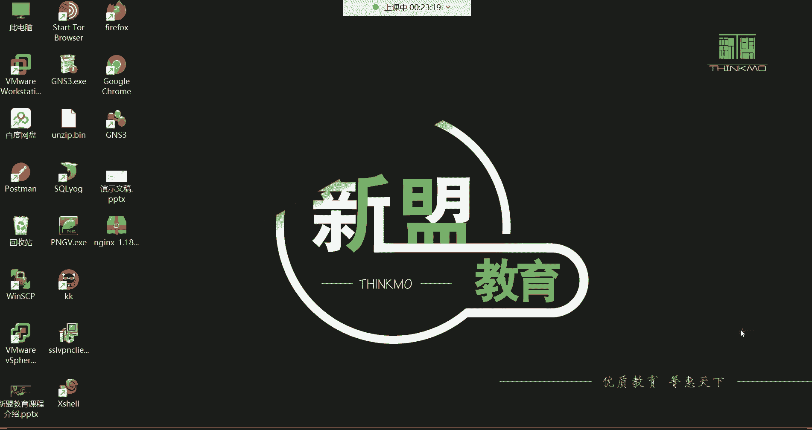

## 概述
在本节课中，我们将要学习云计算的基本概念、Linux系统的起源与核心知识。我们将从行业背景入手，逐步了解云计算的定义、服务模式，以及Linux内核与发行版的关系，为后续深入学习打下坚实基础。

## 什么是云计算？☁️
云计算在20年前是一个虚无缥缈的词汇。2000年深圳IT领袖峰会上，记者曾向中国互联网巨头们提问“云计算在中国何时可以到来”。当时，马化腾认为需要几百年甚至上千年，李彦宏认为至少需要几百年，而马云则坚信云计算很快就能在中国实现。

随后，马云回到阿里巴巴，决定每年投资十个亿给阿里云博士王坚，致力于研发云计算。经过8年的坚持与努力，阿里云于2009年9月10日正式成立。如今，阿里云在全球20多个地区拥有数据中心，并已成为全球第三大云服务提供商。

全球云厂商排名如下：
*   第一名：亚马逊AWS
*   第二名：微软Azure
*   第三名：中国阿里云

其他知名的云服务商还包括华为云、腾讯云、百度云等。

## 云计算的应用与优势
云厂商对外提供服务，其应用领域覆盖制造业、金融、政务、交通、医疗、电信、能源等众多行业。例如，12306购票网站、中石化、飞利浦、微博、知乎、锤子科技等都是阿里云的客户。

云计算的核心优势在于其“资源出租”模式。传统企业若想运行自己的网站，需要自行购买物理服务器、租赁机房、配置网络电力等，成本高昂。而有了云计算之后，企业只需向云厂商租用“云主机”（本质上是虚拟机），即可按需获得计算、存储、网络等资源，并按使用量（如开机时长）付费，无需关心底层基础设施的建设和维护。

这类似于生活中的网吧、租房或酒店服务，用户无需拥有资源的所有权，只需支付使用费即可享受服务。因此，**云计算的本质是网络资源的出租**。

## 云计算的三种服务模式
云计算主要提供三种服务模式：

以下是基础设施即服务（IaaS）的介绍。
*   **IaaS（基础设施即服务）**：为用户提供虚拟机所需的CPU、内存、磁盘、网络等最基础的硬件资源。用户需要自行在云主机上安装操作系统、部署应用。这好比购买了一台“裸机”电脑。

上一节我们介绍了最基础的IaaS模式，本节中我们来看看更便捷的PaaS模式。

以下是平台即服务（PaaS）的介绍。
*   **PaaS（平台即服务）**：在IaaS提供的基础硬件资源之上，进一步为用户提供现成的软件平台环境，例如特定的开发框架、运维监控工具或基础中间件。用户可以直接在此平台上部署和运行自己的应用程序，无需管理底层系统和中间件。这好比购买了一台预装好操作系统的电脑。

了解了PaaS提供的平台环境后，我们来看最为省心省力的SaaS模式。

以下是软件即服务（SaaS）的介绍。
*   **SaaS（软件即服务）**：在PaaS之上，为用户提供完整的、可直接使用的软件应用，并负责所有前期的部署、配置以及后期的维护、升级等工作。用户无需关心任何技术细节，直接使用软件即可。这好比入住五星级酒店，享受全方位的服务。

## 什么是Linux？🐧
Linux是一个类Unix的操作系统内核。内核是计算机系统的核心，类似于人的大脑，负责管理计算机的所有软件和硬件资源，例如进程调度、内存管理、文件系统、网络通信和设备驱动等。

关于“Linux”的读音（如“里纳克斯”或“林纳克斯”），并无统一标准，可按个人习惯称呼。

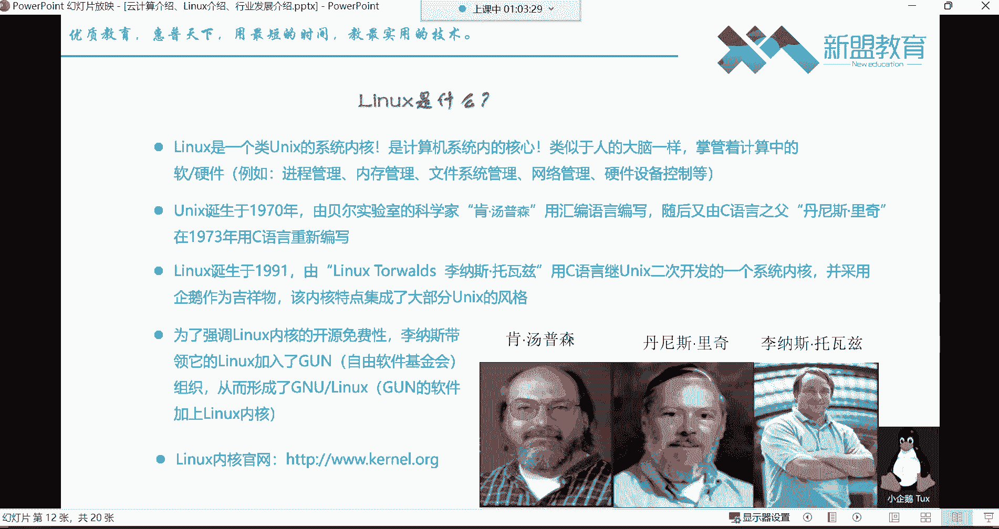

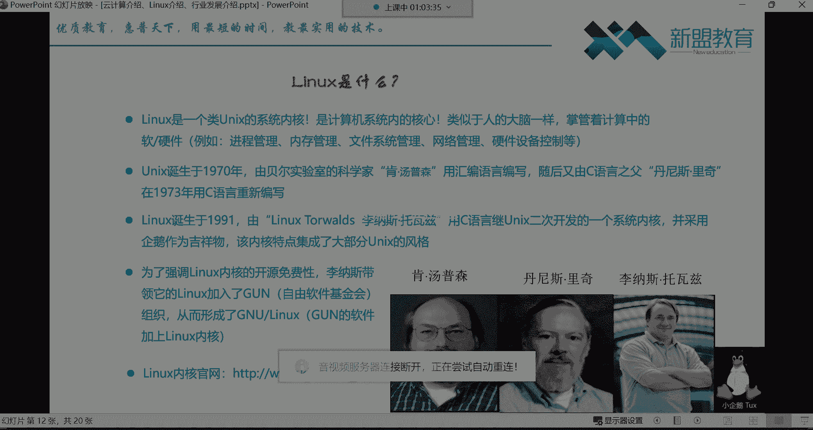

Linux的诞生与Unix密切相关。Unix是诞生于1970年的商业操作系统内核。1991年，林纳斯·托瓦兹（Linus Torvalds）借鉴Unix的设计理念，用C语言开发了Linux内核，并**将其开源、免费发布**。他选择企鹅作为Linux的吉祥物，象征着其像南极一样不属于任何商业实体，是全球共有的自由软件。

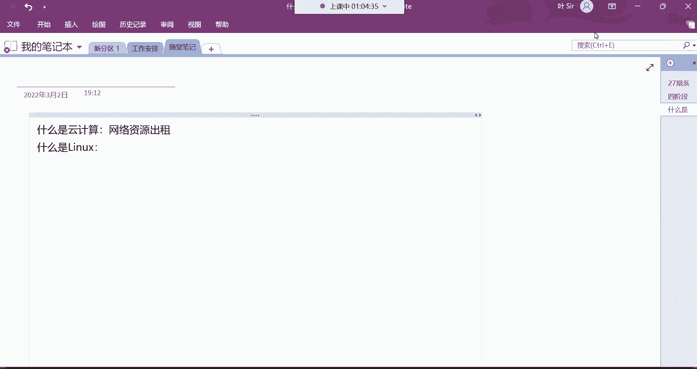

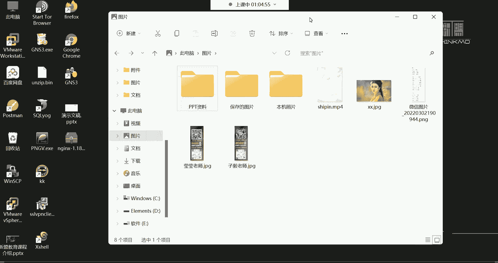

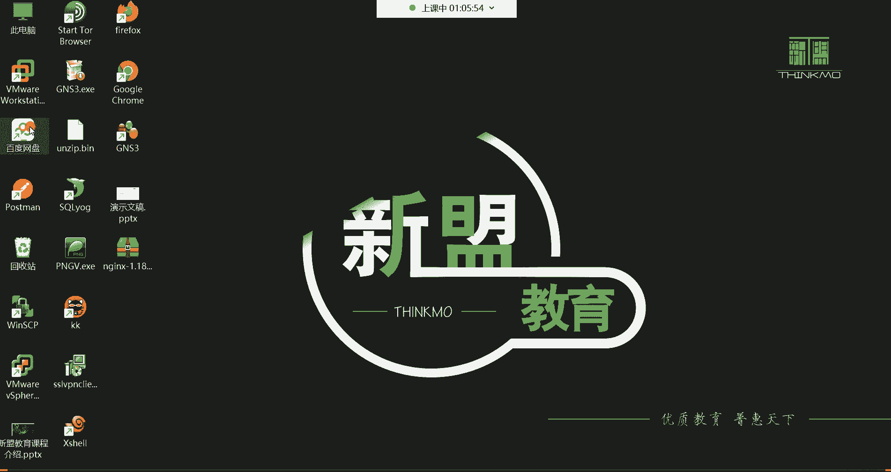

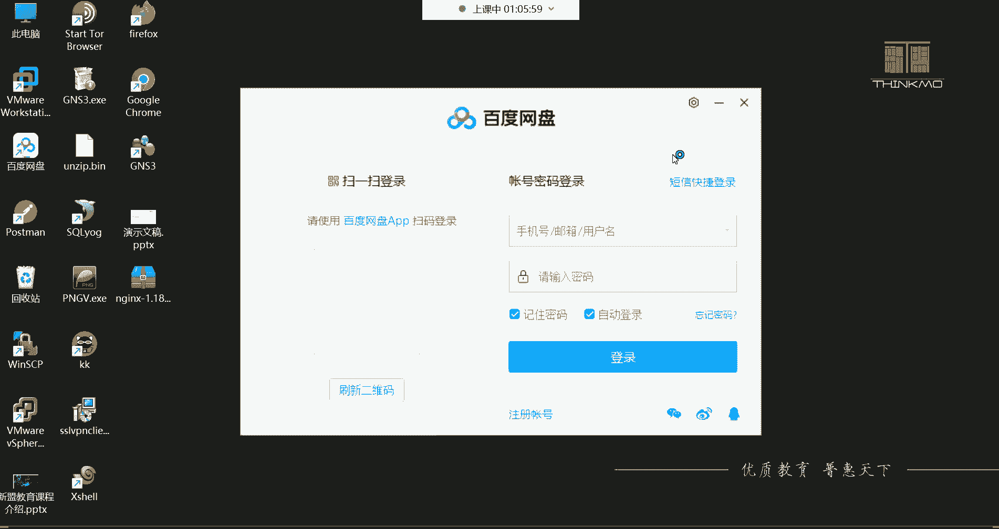

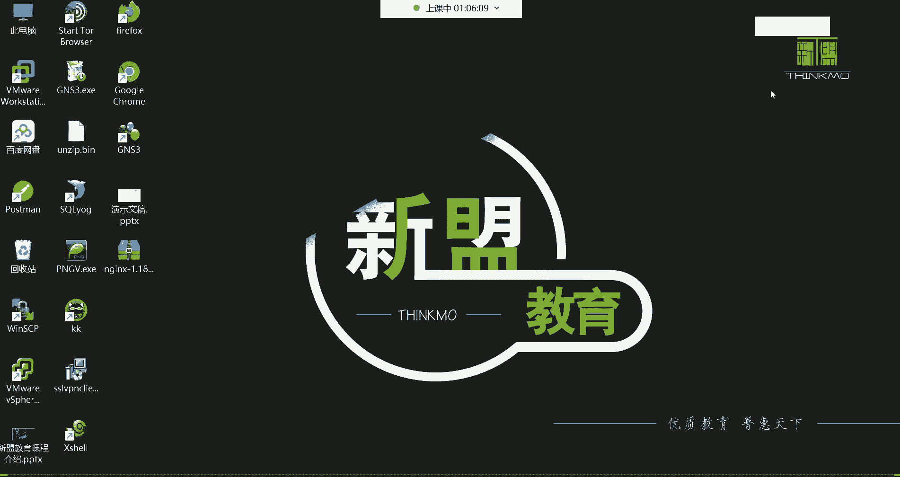

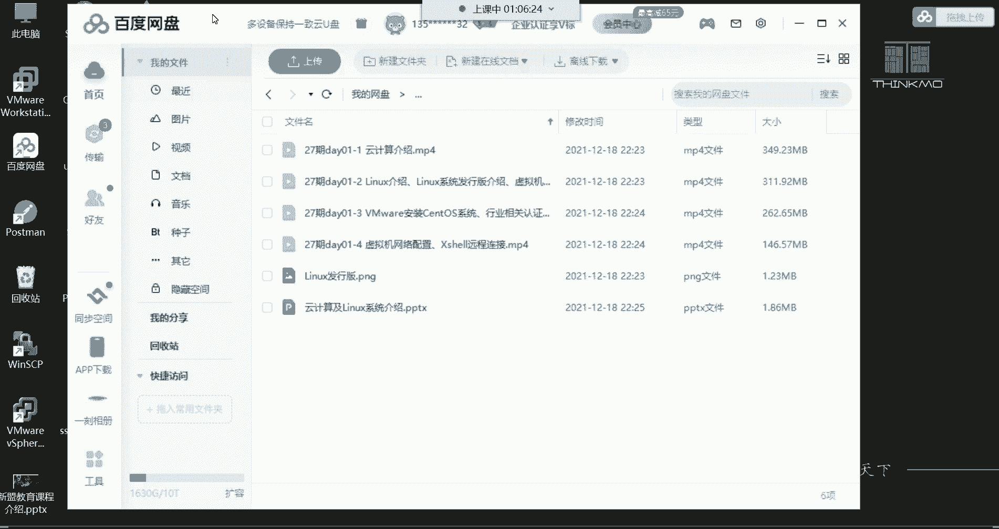

后来，Linux内核加入了GNU（自由软件基金会）项目，形成了完整的“GNU/Linux”操作系统。我们在Linux系统中使用的大部分命令工具都来自GNU项目。

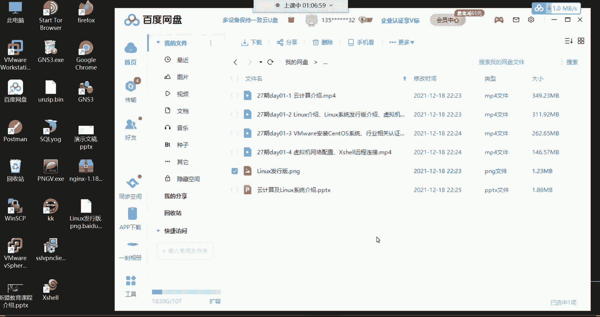

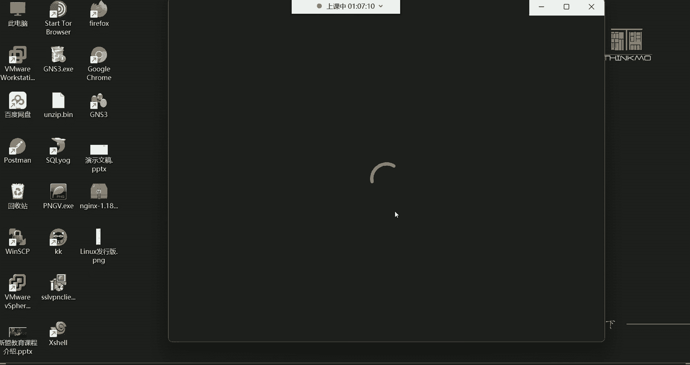

Linux内核的官方网站是：`www.kernel.org`

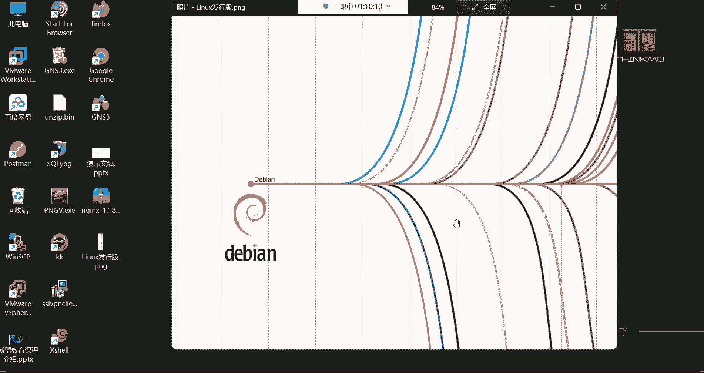

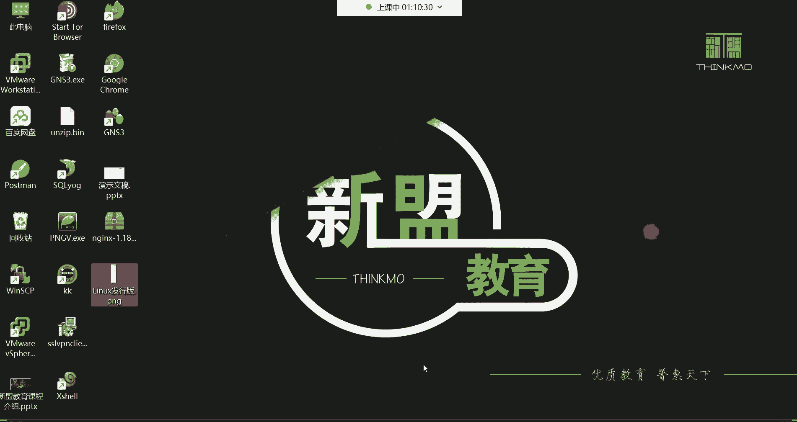

## 基于Linux内核的发行版
Linux本身只是一个内核，基于此内核，不同的组织和社区打包了各种各样的操作系统，称为“发行版”。发行版数量非常庞大，主要分为几个大家族。

以下是基于Debian的发行版介绍。
*   **Debian系**：以桌面应用友好著称，许多功能可通过图形界面完成。代表系统是Ubuntu，广泛应用于开发领域。

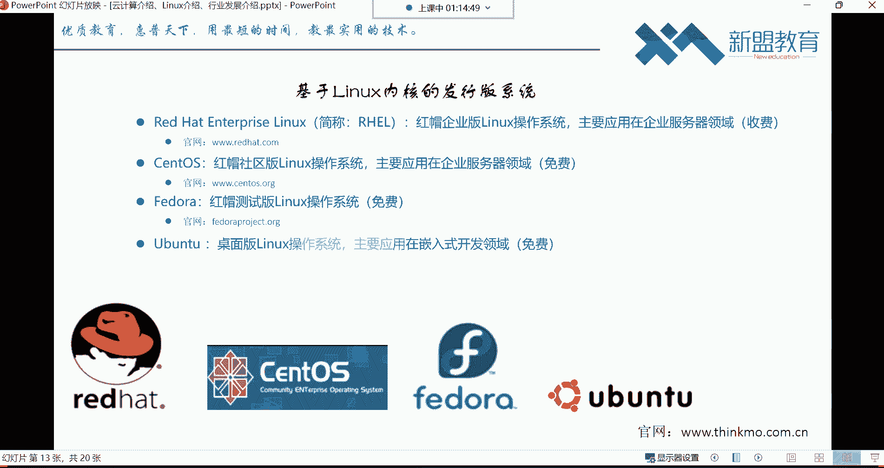

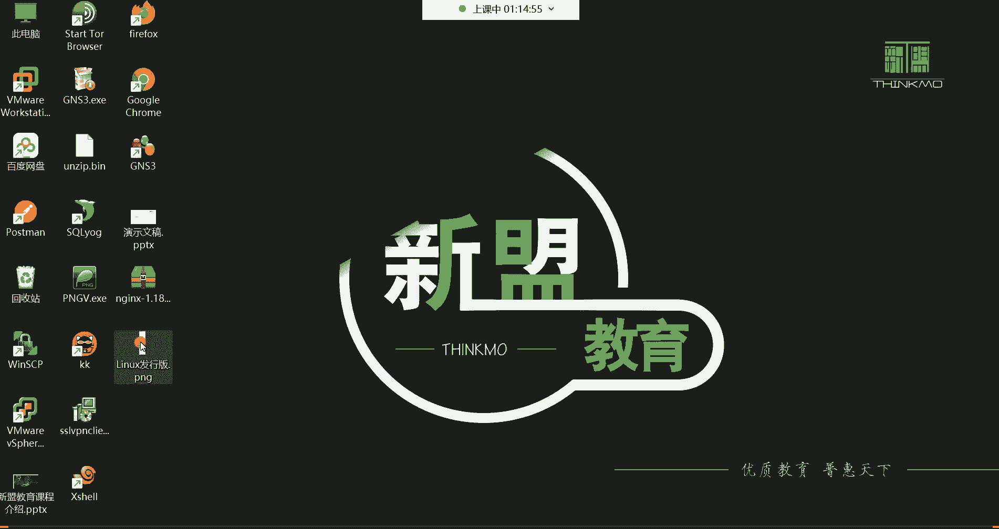

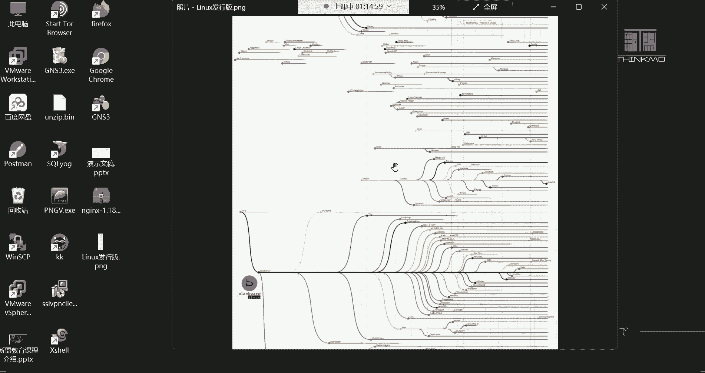

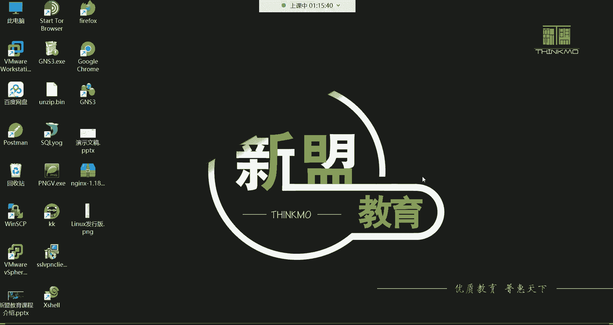

以下是基于Red Hat的发行版介绍。
*   **Red Hat系**：以企业级服务器稳定著称。主要代表有：
    *   **RHEL（Red Hat Enterprise Linux）**：红帽企业版Linux，需付费购买订阅服务（主要是技术支持和服务）。
    *   **CentOS**：RHEL的社区免费克隆版，与RHEL高度兼容，但不提供商业支持。
    *   **Fedora**：红帽的前沿技术测试版，新功能会先在此版本中验证。

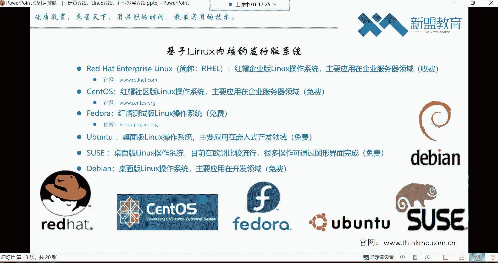

服务器领域通常选择Red Hat系（如RHEL/CentOS）的无图形界面版本，以追求更高的稳定性、安全性和资源使用效率。我们后续的学习也将以CentOS系统为主。

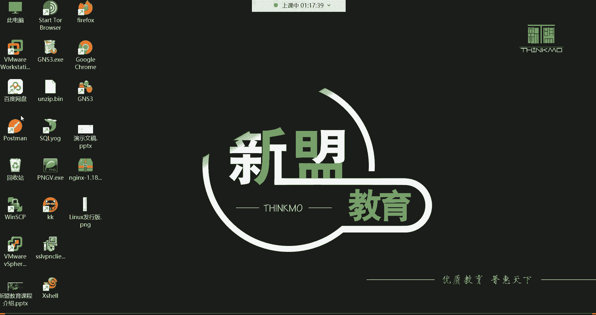

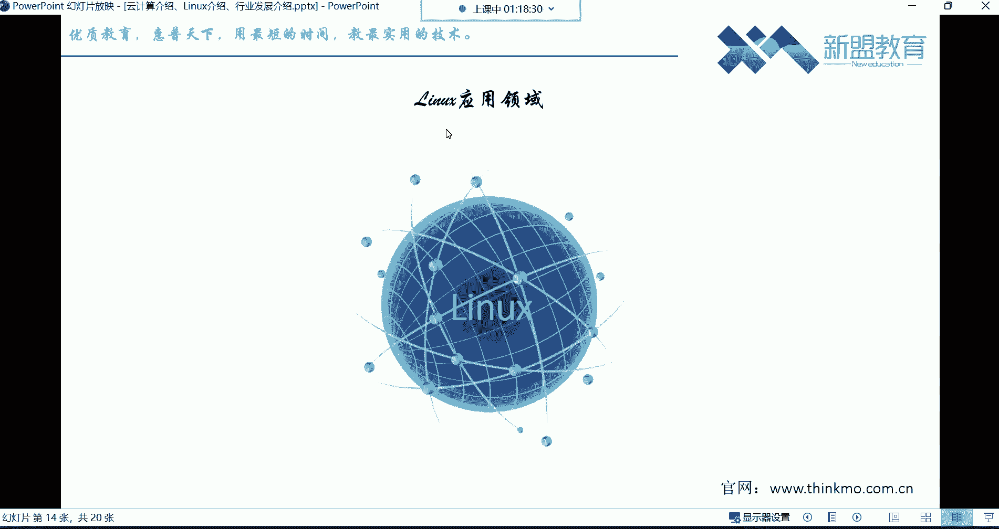

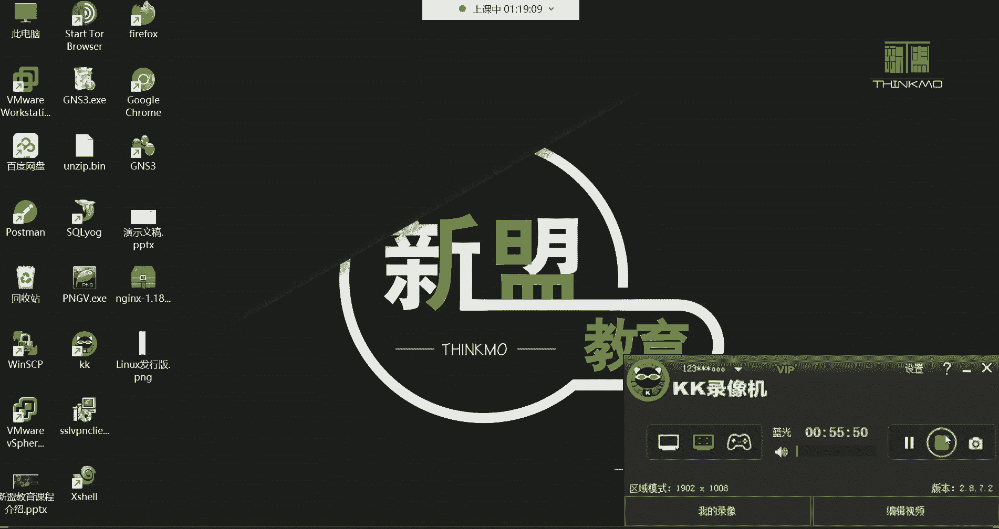

## 总结
本节课中我们一起学习了云计算的概念、优势及其三种服务模式（IaaS， PaaS， SaaS），理解了其“资源出租”的本质。同时，我们也探讨了Linux系统的起源，了解了Linux内核与众多发行版（如RHEL， CentOS， Ubuntu）之间的关系，并明确了企业服务器领域对系统的特定要求。这些基础知识将帮助我们更好地进入后续的Linux运维技术学习。