# Linux 运维教程：P21：find 文件查找命令详解 🔍

在本节课中，我们将要学习 Linux 系统中一个非常强大且常用的命令：`find`。`find` 命令用于在指定目录下查找符合特定条件的文件。我们将从基本语法开始，逐步学习各种查找条件，并了解如何对查找结果进行进一步处理。

## 命令格式 📝

`find` 命令的基本格式如下：

```
find [查找路径] [查找条件] [额外操作]
```

*   **查找路径**：指定从哪个目录开始搜索。
*   **查找条件**：定义搜索文件时需要满足的条件。
*   **额外操作**：对搜索到的文件执行的操作（如复制、移动、删除等）。

接下来，我们将详细探讨各种查找条件。

## 按类型查找 📂

首先，我们来看看如何按照文件类型进行查找。这是通过 `-type` 选项实现的。

以下是常见的文件类型参数：
*   `f`：代表普通文件。
*   `d`：代表目录。
*   `l`：代表符号链接文件。

例如，要查找 `/var/log` 目录下的所有普通文件，命令如下：

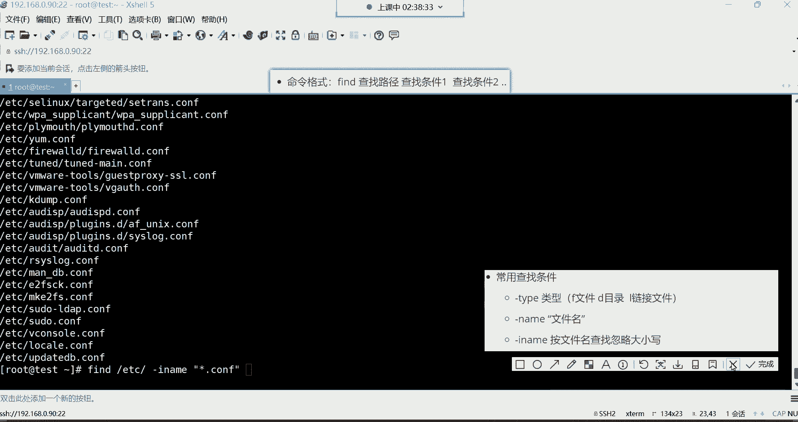

```bash
find /var/log -type f
```

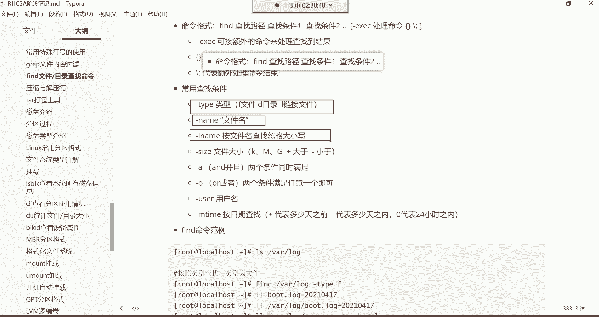

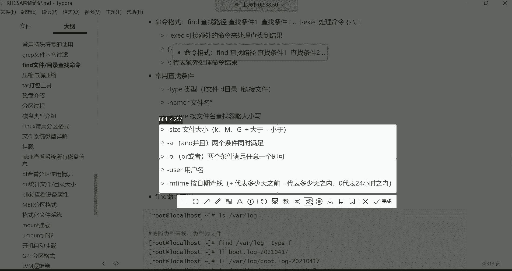

执行此命令后，`find` 会递归地搜索 `/var/log` 目录及其所有子目录，并列出所有找到的普通文件。

如果想查找目录，只需将 `f` 替换为 `d`：

```bash
find /var/log -type d
```

## 按名称查找 🔤

上一节我们介绍了按类型查找，本节中我们来看看更精确的查找方式：按文件名查找。这是通过 `-name` 选项实现的。

例如，要在 `/var/log` 目录下查找所有以 `.log` 结尾的文件，可以使用通配符 `*`：

```bash
find /var/log -name “*.log”
```

**注意**：`find` 命令的 `-name` 选项是递归查找，它会搜索指定路径下的所有层级。这与 `ls *.log` 命令不同，后者只会在当前目录下进行非递归的匹配。

你还可以组合多个条件。例如，查找以 `.log` 结尾的普通文件：

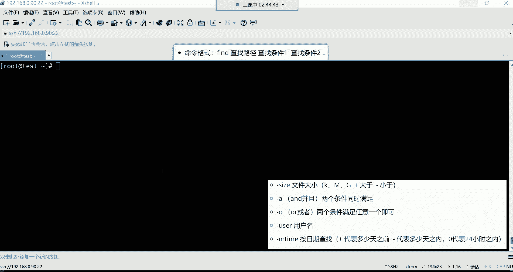

```bash
find /var/log -name “*.log” -type f
```

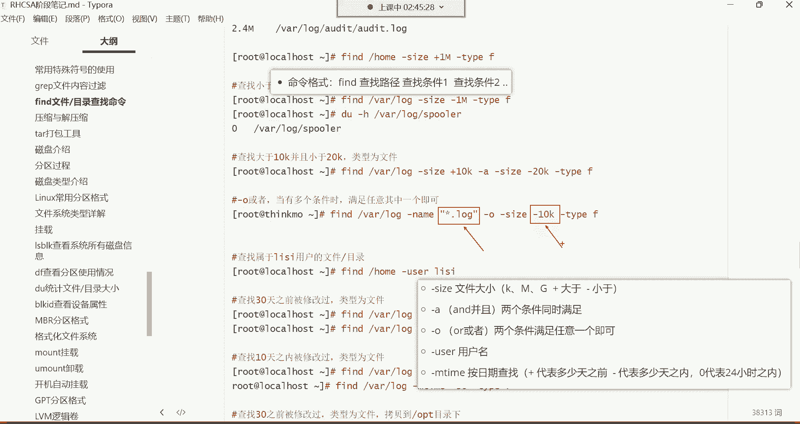

此外，还有一个 `-iname` 选项，它在查找时忽略文件名的大小写。

## 按大小查找 ⚖️

除了按名称，我们还可以根据文件大小来查找文件。这是通过 `-size` 选项实现的。

以下是按大小查找的常用方式：
*   `+10k`：查找大于 10KB 的文件。
*   `-10k`：查找小于 10KB 的文件。
*   `10k`：查找等于 10KB 的文件。

单位可以是：
*   `k`：千字节 (Kilobytes)
*   `M`：兆字节 (Megabytes)
*   `G`：千兆字节 (Gigabytes)

例如，查找 `/var/log` 目录下大于 10KB 的普通文件：

```bash
find /var/log -size +10k -type f
```

可以使用 `du -h` 命令来验证找到的文件大小。

## 组合条件查找（与/或）🔗

`find` 命令允许使用逻辑运算符组合多个条件，使查找更加灵活。

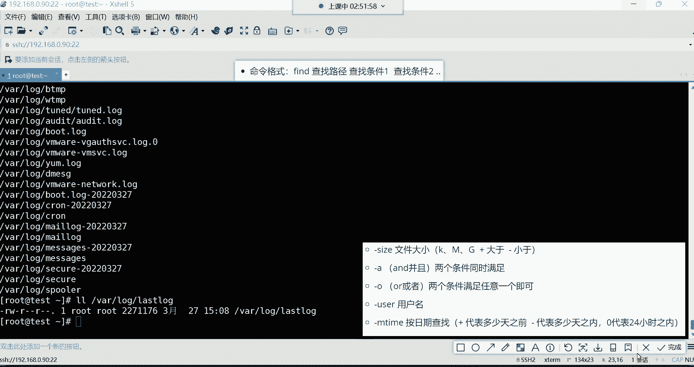

以下是逻辑运算符：
*   `-a` 或 `-and`：逻辑“与”，两个条件必须同时满足。
*   `-o` 或 `-or`：逻辑“或”，满足任意一个条件即可。


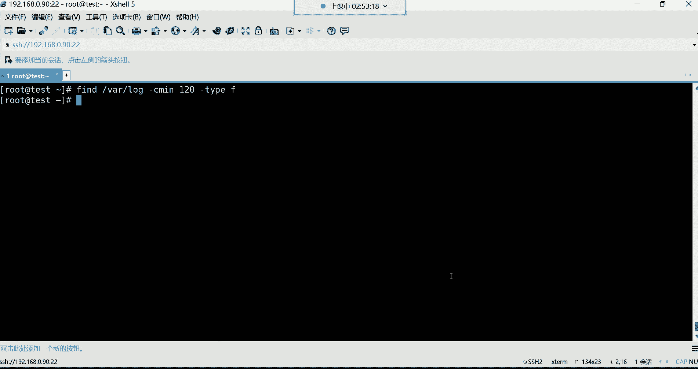

例如，查找大小在 10KB 到 20KB 之间的普通文件（必须同时满足）：

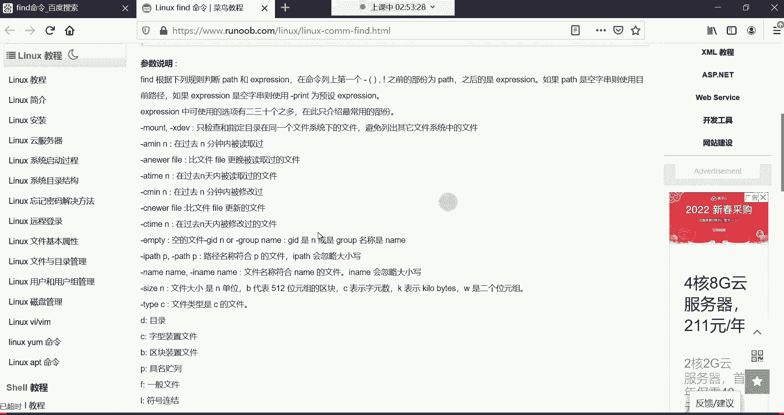

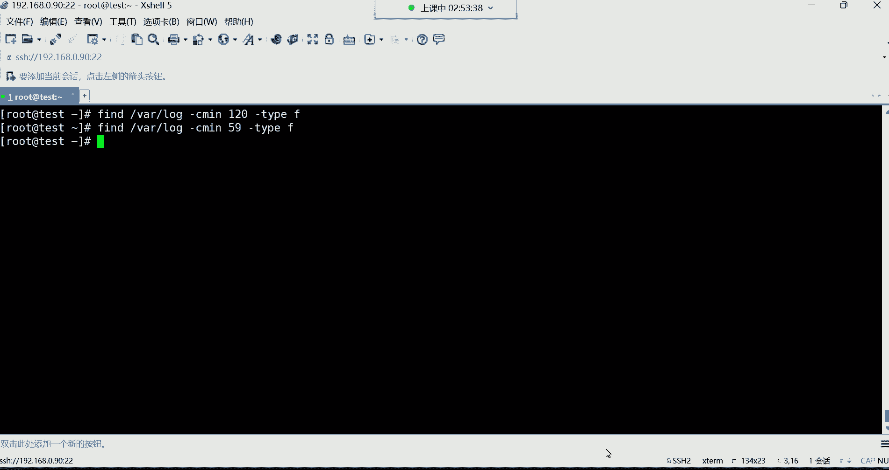

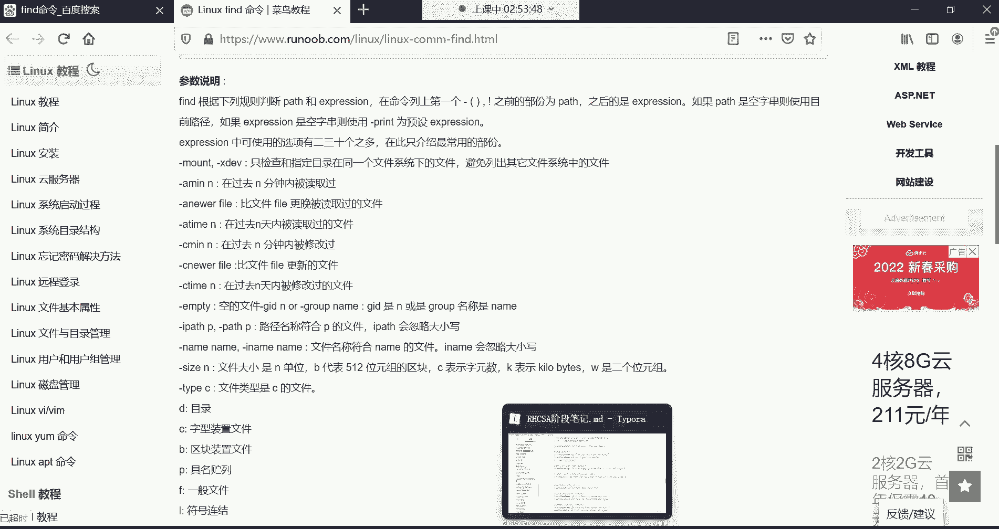

```bash
find /var/log -size +10k -a -size -20k -type f
```

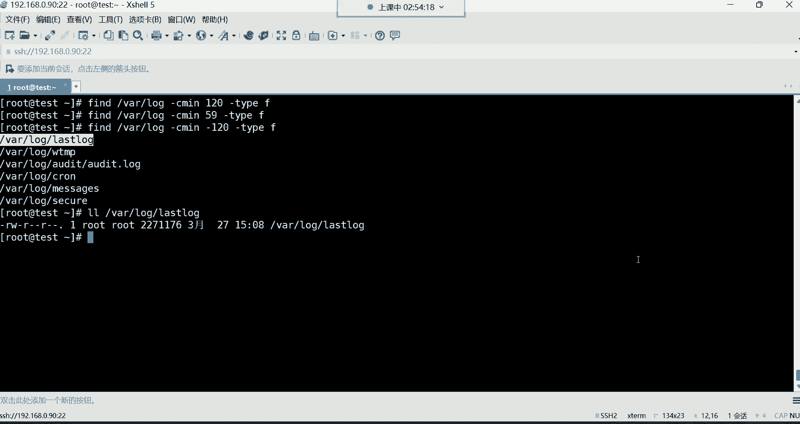

再例如，查找文件名以 `.log` 结尾 **或者** 大小小于 10KB 的普通文件（满足一个即可）：

```bash
find /var/log -name “*.log” -o -size -10k -type f
```


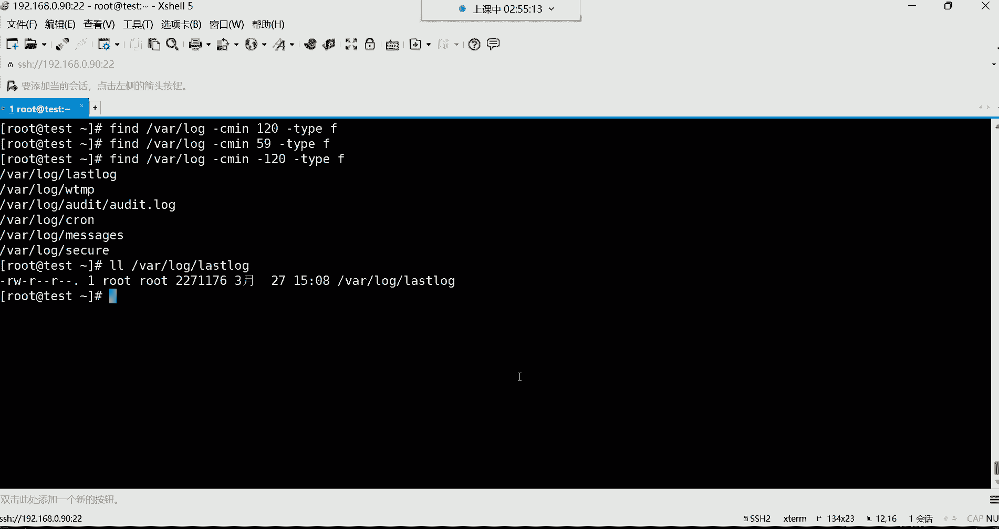

## 按用户和时间查找 👤⏰

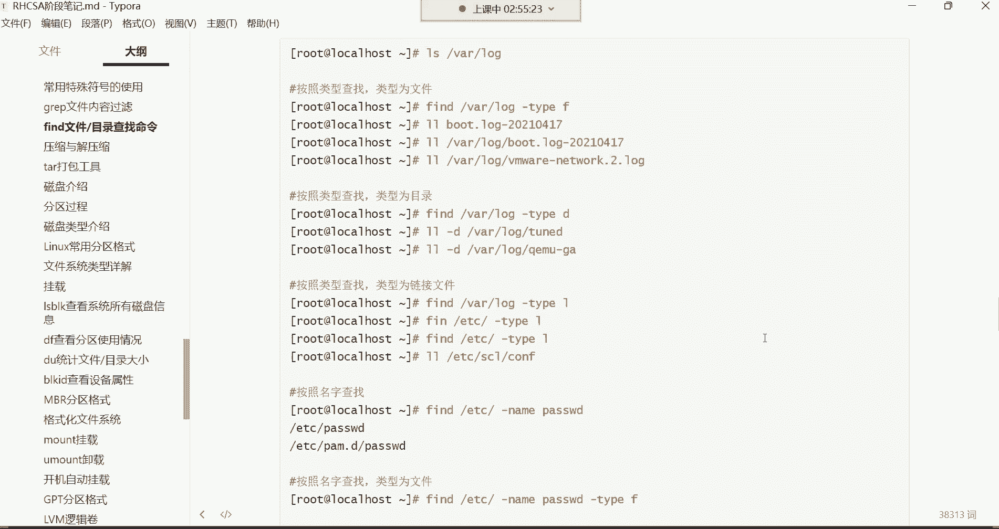

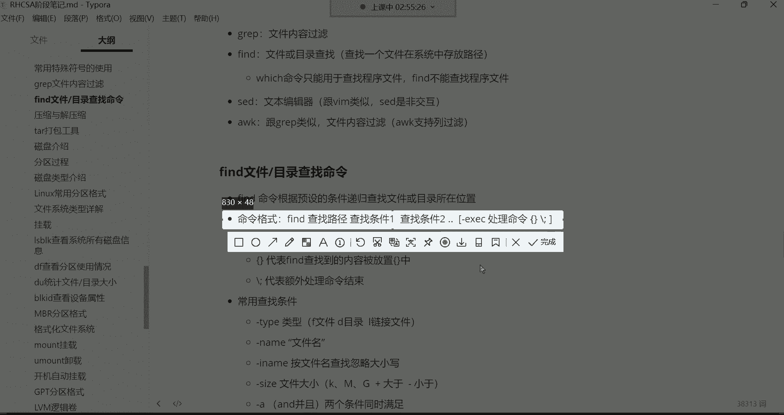

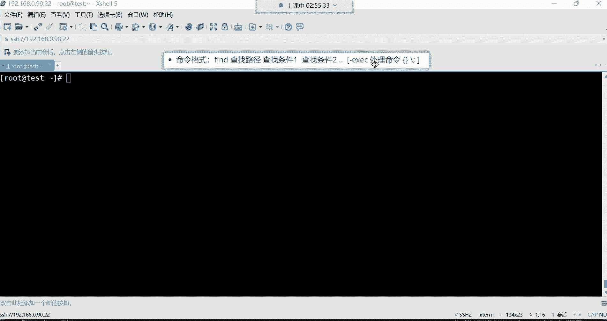

`find` 命令还可以根据文件属主和修改时间进行查找。

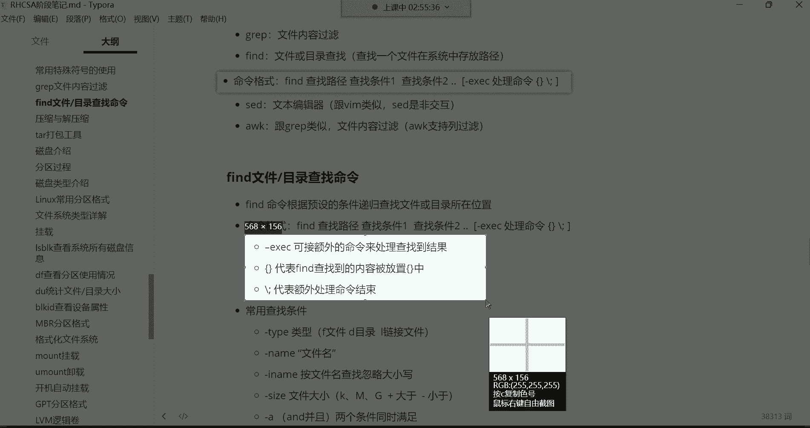

**按用户查找**：使用 `-user` 选项。例如，查找系统根目录下属于用户 `tom` 的所有文件：

```bash
find / -user tom
```

**按时间查找**：使用 `-mtime` 选项（基于文件的最后修改时间）。
*   `+10`：查找 10 天前被修改过的文件。
*   `-10`：查找 10 天内被修改过的文件。
*   `0`：查找 24 小时内被修改过的文件。

例如，查找 `/var/log` 目录下 10 天内被修改过的普通文件：

```bash
find /var/log -mtime -10 -type f
```

对于更精确的时间（如分钟），可以使用 `-cmin` 选项。例如，查找 120 分钟内被修改过的文件：

```bash
find /var/log -cmin -120 -type f
```

## 对查找结果进行操作 🛠️

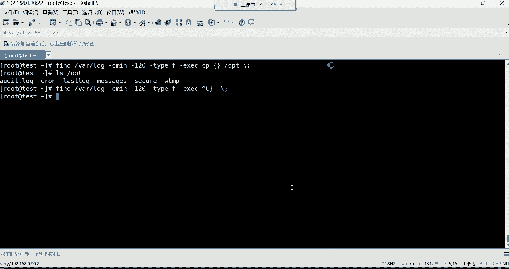

`find` 命令找到文件后，我们常常需要对它们进行一些操作，如复制、移动或删除。由于 `find` 命令对管道符 (`|`) 的支持不友好，它提供了 `-exec` 选项来处理搜索结果。

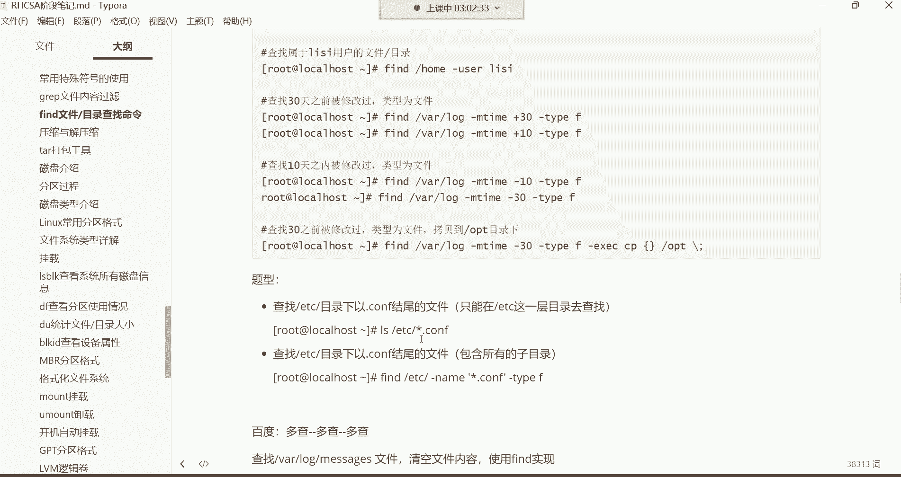

`-exec` 的基本语法是：

```
find [路径] [条件] -exec [命令] {} \;
```

其中 `{}` 代表 `find` 找到的每一个文件，`\;` 表示 `-exec` 参数的结束。

例如，将 `/var/log` 目录下 2 小时内修改过的文件复制到 `/opt` 目录：

```bash
find /var/log -cmin -120 -type f -exec cp {} /opt \;
```

**一个实用技巧：清空文件内容**
如果想清空找到的文件内容（而不是删除文件），可以利用 Linux 的 `/dev/null` 设备（黑洞设备）。任何写入它的数据都会消失。将空文件内容覆盖到目标文件即可清空：

```bash
find /var/log -size +10k -type f -exec cp /dev/null {} \;
```

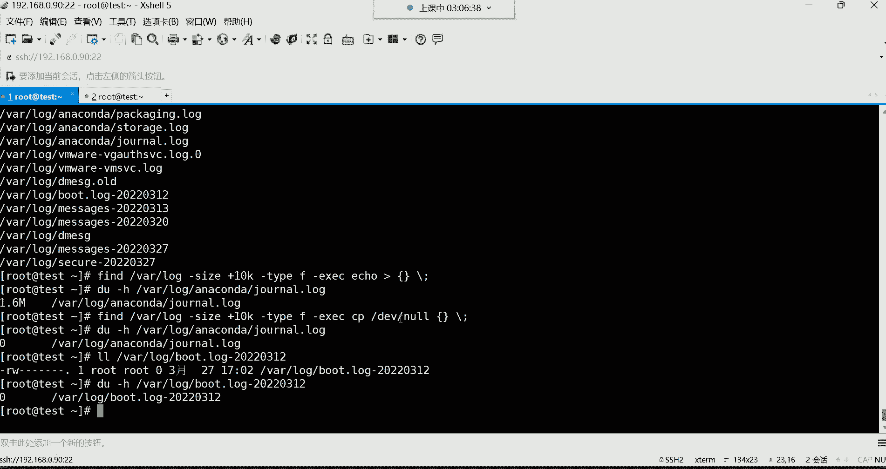

执行后，目标文件的大小将变为 0。

## 总结 📚

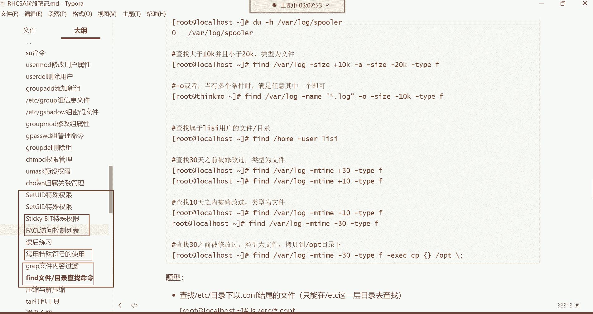

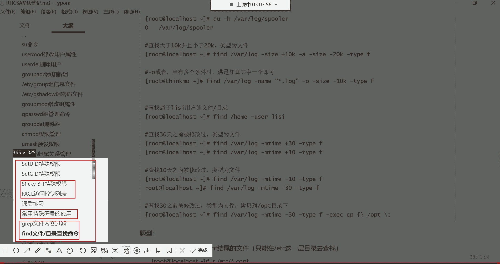

本节课中我们一起学习了 `find` 命令的强大功能。我们掌握了：
1.  **基本格式**：`find [路径] [条件] [操作]`。
2.  **常用查找条件**：
    *   按类型 (`-type`)
    *   按名称 (`-name`, `-iname`)
    *   按大小 (`-size`)
    *   按用户 (`-user`)
    *   按时间 (`-mtime`, `-cmin`)
    *   组合条件 (`-a`, `-o`)
3.  **结果处理**：使用 `-exec` 选项对找到的文件执行复制、移动、删除或清空等操作。

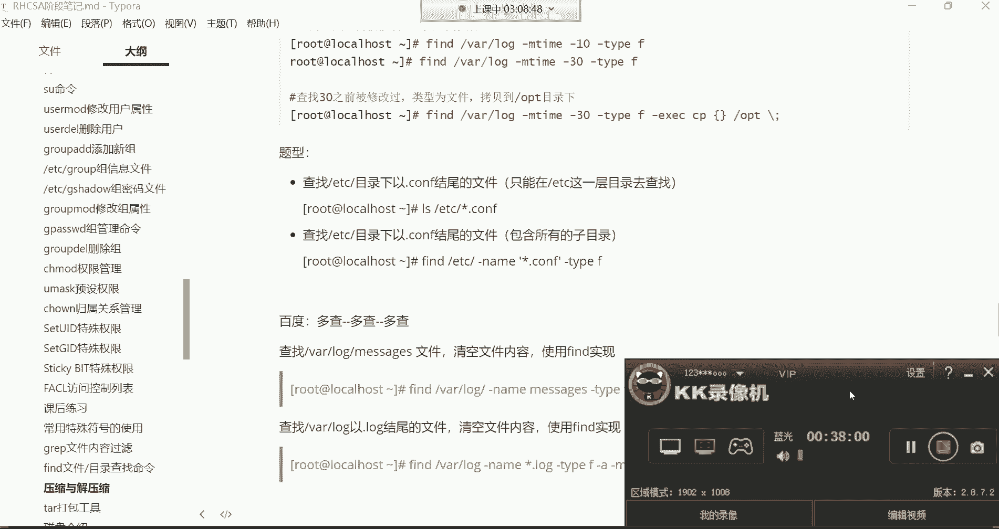

`find` 是 Linux 系统管理和日常运维中不可或缺的工具，请务必多加练习，熟悉其各种用法。